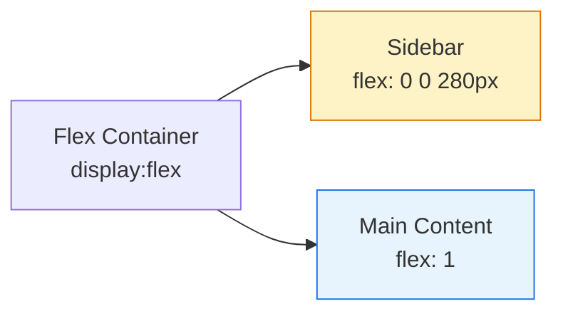

# CSS Flexbox Model

🎯 **Interview Weight:** critical - Flexbox is the primary
1D layout system; every frontend interview includes flexbox
questions; understanding the model separates juniors from seniors

---

### 🎯 Model Answer

**30 seconds:**

> Flexbox is a 1D layout model that distributes space and
> aligns items along a single axis (main axis: row or column).
> The container sets `display: flex` and controls alignment.
> Direct children become flex items. Key properties: `flex-
> direction` (axis), `justify-content` (main axis alignment),
> `align-items` (cross axis alignment), `gap`. On items:
> `flex` shorthand (`flex-grow flex-shrink flex-basis`)
> controls how items size relative to available space.

**3 minutes (Senior):**

> Flexbox operates on two axes: the main axis (defined by
> `flex-direction`: `row` is horizontal, `column` is vertical)
> and the cross axis (perpendicular to main). This axis model
> determines which properties control which direction.
>
> `justify-content` aligns items on the main axis:
> `flex-start`, `flex-end`, `center`, `space-between`,
> `space-around`, `space-evenly`.
>
> `align-items` aligns on the cross axis: `stretch` (default
> - items fill cross axis, equal height cards), `flex-start`,
> `flex-end`, `center`, `baseline`.
>
> The flex item sizing model: `flex: grow shrink basis`.
> `flex-basis` is the initial size. `flex-grow` distributes
> positive free space. `flex-shrink` controls shrinking.
> `flex: 1` = `flex: 1 1 0` - items take equal share of
> available space starting from 0.
>
> `flex-wrap: wrap` allows items to wrap to new lines, with
> `align-content` positioning the lines on the cross axis.

*Adapting up:* Discuss flex-basis vs width precedence, the
flex item sizing algorithm, min-width: 0 fix.

*Adapting down:* display: flex on parent, justify-content
for horizontal, align-items for vertical in row flex.

**Blank Mind Recovery:**

**(1) Restate:** "You are asking about CSS Flexbox - let
me walk through the container model, the two axes, and
item sizing."

**(2) First principles:** "From first principles, a 1D
layout model needs to answer: which direction do items go,
how is available space distributed, and how do items align
perpendicular to that direction."

**(3) Bridge:** "Think of a flex container like a flexible
shelf. Items sit on the shelf (main axis). You control how
far apart they are (justify-content) and whether they sit
at the top or bottom of the shelf (align-items)."

---

### 📘 Concept Explanation

**What it is:**

Flexbox (Flexible Box Layout) is a CSS layout model that
distributes items along a single main axis and aligns them
on the perpendicular cross axis. Designed for 1D layouts
where items need flexible sizing and alignment.

**The problem it solves:**

Before Flexbox, centering vertically or creating equal-height
columns required hacks (table-cell, negative margins, fixed
heights). Flexbox solved 1D layout cleanly.

**How it works:**

```
FLEX CONTAINER (display: flex):
  flex-direction:   row|column|row-reverse|col-reverse
  flex-wrap:        nowrap|wrap|wrap-reverse
  justify-content:  flex-start|center|flex-end|
                    space-between|space-around|space-evenly
  align-items:      stretch|flex-start|center|
                    flex-end|baseline
  align-content:    (for wrapped lines) same values
  gap:              row-gap column-gap shorthand

FLEX ITEMS:
  flex:             grow shrink basis (shorthand)
  flex-grow:        0|1+ (grow ratio)
  flex-shrink:      1|0 (shrink ratio)
  flex-basis:       auto|<length>|<percentage>
  align-self:       overrides align-items for one item
  order:            integer (default 0)

THE TWO AXES (row direction):
  Main:  [ item1 ] [ item2 ] [ item3 ] ->
         <- justify-content distributes here ->
  Cross: ^     (align-items distributes here)     v
```

**The key insight:**

`flex: 1` = `flex: 1 1 0`. The `0` basis means items share
total space equally from zero. `flex: 1 1 auto` starts from
the item's natural size and distributes remaining space.
These produce different results when items have different
content sizes.

**When to use it:**

- Navigation bars (horizontal row, alignment control)
- Card rows with equal heights
- Centering content both axes
- Toolbars with aligned buttons
- Any layout primarily in one direction

**When NOT to use it:**

Grid for 2D layouts (rows AND columns). Grid when items
should align to each other across rows (last row of card grid).

**Alternatives:**

- CSS Grid: 2D, named areas, cross-row alignment
- CSS multi-column: text column flow
- Inline-block: simple flow without gap control

**First-principles derivation:**

1D layout requires: direction, distribution along that
direction, alignment perpendicular, item-level flexibility.
Flexbox maps to exactly: direction + justify-content +
align-items + flex properties.

---

### 💻 Code Example

**BAD: forcing flex for 2D grid**

```css
/* BAD: flex-wrap for grid - last row misaligns */
.card-grid {
  display: flex;
  flex-wrap: wrap;
  gap: 1rem;
}
.card {
  flex: 0 0 calc(33.33% - 1rem);
  /* Last-row cards stretch to fill - looks wrong */
}
```

> **Code walkthrough:** When you need items in the last
> row to align to the grid, flex-wrap is fragile. The
> `calc()` breaks at different gap values, and last-row
> items stretch out of alignment. This is Grid's job.

**GOOD: flex for 1D use cases**

```css
/* GOOD: flex for navigation */
.navbar {
  display: flex;
  align-items: center;
  gap: 1rem;
  padding: 0 1.5rem;
}
.navbar-brand  { flex-shrink: 0; }
.navbar-nav    { flex: 1; }
.navbar-actions{ flex-shrink: 0; }

/* GOOD: column flex for card with footer pinned */
.card {
  display: flex;
  flex-direction: column;
}
.card-body   { flex: 1; }
.card-footer { /* stays at bottom */ }
```

> **Code walkthrough:** Navbar uses flex-start default with
> flex: 1 on nav to fill space, pushing actions right.
> align-items: center vertically aligns all items. Card
> column flex with flex: 1 on body pushes footer to bottom
> regardless of content height - no absolute positioning
> needed.

**PRODUCTION: responsive card row without media queries**

```css
/* Responsive columns using flex: 1 1 280px */
.card-row {
  display: flex;
  flex-wrap: wrap;
  gap: 1.5rem;
}
.card-row .card {
  flex: 1 1 280px;
  /* grow, shrink, min 280px */
  /* Cards wrap naturally when row gets narrow */
}

/* Center anything in both axes */
.center-content {
  display: flex;
  justify-content: center;
  align-items: center;
  min-height: 100vh;
}
```

> **Code walkthrough:** `flex: 1 1 280px` creates natural
> responsive columns. Items are at least 280px wide, grow
> to fill space, and wrap to new lines when the row can't
> fit them. This replaces media queries for most card grid
> breakpoints. The centering pattern is the cleanest
> vertical+horizontal center CSS has ever provided.

---

### 🎓 Answers by Seniority

**Junior / Mid (0-5 years):**

> Flexbox is CSS's 1D layout system. Add `display: flex`
> to a container and its direct children become flex items.
> `flex-direction: row` (default) lines items horizontally;
> `column` stacks them. `justify-content` aligns on the
> main axis: `space-between` spreads items out, `center`
> groups them. `align-items: center` vertically centers in
> row flex. `gap` adds space between items. `flex: 1` makes
> items grow equally to fill space. This is how most
> toolbars, navbars, and card rows are built.

*Push deeper:* Explain flex: 1 vs flex: 1 1 auto.

---

**Senior / Staff (5+ years):**

> Flexbox is a formatting context with a defined sizing
> algorithm. `flex: 1` = `flex: 1 1 0`: zero basis means
> items share TOTAL space equally. `flex: 1 1 auto`
> distributes only the REMAINING space after natural sizes,
> so items with more content get more space.
>
> The pattern I use most: column flex on cards with
> `flex: 1` on the body forces footers to the bottom on
> variable-height cards. And `flex: 1 1 280px` on items
> in a wrapped container creates responsive columns without
> media queries.
>
> Critical debug knowledge: `min-width: auto` on flex items
> prevents shrinking below content width even with
> flex-shrink: 1. Always add `min-width: 0` on flex items
> containing text or overflowing content.

---

### ⚠️ Common Misconceptions

**"flex:1 and flex: 1 1 auto are the same"**

`flex: 1` = `flex: 1 1 0` - basis zero, items share total
space equally. `flex: 1 1 auto` - basis auto, items share
only remaining space. Different results with varying content.

**"justify-content aligns vertically in row flex"**

`justify-content` aligns on the MAIN axis. In row flex,
main is horizontal. `align-items` controls vertical (cross
axis). The axis depends on flex-direction, not the property
name.

**"align-items: stretch makes all items same size"**

It makes items fill the container's cross-axis dimension.
In row flex without explicit height, items fill up to the
tallest item's height - which looks like "same height"
but is technically "fill available height."

---

### 🚨 Failure Modes and Diagnosis

**Symptom: flex items overflow container**

Cause: `min-width: auto` preventing shrinking.

```
# DevTools Layout tab shows overflow indicators
# Computed tab: check min-width value on item
# If auto and content is wide -> item won't shrink
```

Fix: `min-width: 0` on flex items containing text.

---

**Symptom: last row of wrapped flex stretches to fill**

Cause: `justify-content: space-between` with flex-wrap.

Fix: use CSS Grid with `auto-fill` instead, or switch
to `justify-content: flex-start` with fixed item widths.

---

### 🎯 Interview Deep-Dive

| Scenario | Recommended Time | Key Signal |
|---|---|---|
| "Explain flex model" | 3-4 min | Two axes + item sizing |
| flex vs grid choice | 3-4 min | 1D vs 2D distinction |
| "How to center in flex?" | 2 min | Both axes simultaneously |
| flex:1 vs flex: 1 1 auto | 3-4 min | Basis zero vs auto |
| Flex overflow debugging | 3-4 min | min-width: 0 fix |
| Equal-height cards | 2 min | align-items:stretch default |
| flex-wrap with gap | 2-3 min | Responsive columns |
| Flex vs Grid decision | 3 min | 1D vs 2D judgment |
| Sticky footer pattern | 3 min | column flex + flex:1 |

---

**Q1: How does Flexbox differ from CSS Grid?** `[MID]`
COMPARISON

*Why they ask:* The most common layout choice question.

*Likely follow-up:* "Give an example where you'd pick one
over the other."

> **Answer:**
>
> Flexbox is 1D - items lay out on a single axis (row or
> column). Grid is 2D - rows and columns simultaneously,
> items can be placed in any cell.
>
> The key practical difference: with Flex, items in one
> row are independent of items in another row. Flex cannot
> align columns across rows. Grid aligns both rows and
> columns together.
>
> Choose Flex when: items flow in one direction, sizes are
> content-driven, component internals (toolbar, card header,
> nav bar), centering a single element.
>
> Choose Grid when: 2D layout (rows AND columns), items in
> different rows should align vertically, named layout
> regions, last row of cards should align to grid.
>
> In practice both compose: Grid for page structure,
> Flex for components within grid cells.
>
> *What separates good from great:* There's often no single
> right answer - the question is "what does this layout
> communicate?" Grid's explicit row/column definitions
> document intent better. Flex's content-driven sizing is
> more resilient to content changes.

---

**Q2: Explain the flex shorthand property.** `[MID]`
MECHANISM

*Why they ask:* `flex` shorthand has non-obvious defaults.

*Likely follow-up:* "What does flex: 1 expand to?"

> **Answer:**
>
> `flex` is shorthand for `flex-grow`, `flex-shrink`, and
> `flex-basis`.
>
> `flex-grow`: how much item grows relative to siblings
> when positive space exists. 0 = don't grow, 1+ = grow
> proportionally.
>
> `flex-shrink`: how much item shrinks relative to siblings
> when there's not enough space. 0 = don't shrink, 1 =
> shrink proportionally (default).
>
> `flex-basis`: initial main-axis size. `auto` = natural
> size. `0` = start from zero.
>
> Key shorthand values:
> - `flex: 1` = `flex: 1 1 0` - equal sharing from zero
> - `flex: auto` = `flex: 1 1 auto` - grow/shrink from
>   natural size
> - `flex: none` = `flex: 0 0 auto` - fixed at natural
>   size
> - `flex: 0 0 200px` - fixed 200px, no grow/shrink
>
> Difference between `flex: 1` and `flex: auto`:
> With flex: 1 (basis 0), three items of 100px, 200px,
> 300px content get equal share of container.
> With flex: auto, extra space distributes equally but
> items start from their natural sizes.
>
> *What separates good from great:* `flex: 1` on all items
> divides total container space equally. `flex: 1 1 auto`
> divides only REMAINING space - items with more content
> get more space. Choose based on whether you want "equal
> columns" or "proportional to content with equal stretch."

---

**Q3: How do you vertically center with Flexbox?**
`[JUNIOR]` HANDS-ON

*Why they ask:* Classic CSS question; vertical centering
was notoriously hard before Flexbox.

*Likely follow-up:* "What if you have multiple children?"

> **Answer:**
>
> Flexbox makes vertical centering trivial:
>
> ```css
> .container {
>   display: flex;
>   align-items: center;     /* cross axis center */
>   justify-content: center; /* main axis center */
>   min-height: 100vh;
> }
> ```
>
> `align-items: center` centers on the cross axis. In row
> flex (default), the cross axis is vertical.
>
> For a single item, `margin: auto` also works:
> ```css
> .container { display: flex; min-height: 100vh; }
> .child { margin: auto; } /* centers both axes */
> ```
>
> `margin: auto` on a flex item absorbs all available
> space in all directions, centering it.
>
> Important: centering requires the container to have
> explicit height/min-height. Without it, the container
> is exactly as tall as its content and centering has
> no visible effect.
>
> *What separates good from great:* Pre-Flexbox vertical
> centering required `position: absolute; top: 50%;
> transform: translateY(-50%)` or `display: table-cell;
> vertical-align: middle`. These hacks are completely
> replaced by flex centering. Knowing the history shows
> why Flexbox was a major CSS breakthrough.

---

**Q4: What is min-width: 0 and why do flex developers
need to know it?** `[SENIOR]` DEBUGGING

*Why they ask:* The most common flex overflow bug.

*Likely follow-up:* "When else does min-width: auto matter?"

> **Answer:**
>
> Flex items have a default `min-width: auto`. For items
> containing text or other content, `auto` resolves to
> the content's intrinsic minimum size. This means a flex
> item won't shrink below its content width even with
> `flex-shrink: 1`.
>
> Symptom: a flex item containing a long word or narrow
> element overflows the flex container. You set
> `flex-shrink: 1` but the item still doesn't shrink.
>
> Diagnosis:
> ```
> # DevTools: select overflowing item
> # Computed tab: find min-width
> # "auto" resolving to content width = culprit
> ```
>
> Fix: `min-width: 0` on the flex item removes the
> content-based minimum. The item can now shrink to zero.
> Combine with `overflow: hidden` or `overflow-wrap:
> break-word` to handle the text.
>
> ```css
> .flex-item { min-width: 0; overflow: hidden; }
> .flex-item p { text-overflow: ellipsis; white-space: nowrap; }
> ```
>
> This is so common in flex layouts that many CSS frameworks
> include `.flex-item { min-width: 0 }` in their reset.
>
> *What separates good from great:* `min-height: auto` is
> the same issue in column flex containers. Items with
> images or content that has intrinsic height won't shrink
> below that height. `min-height: 0` fixes it. Both follow
> from the same CSS spec rule about automatic minimum sizes
> in flex containers.

---

**Q5: When would you choose flex over Grid?** `[SENIOR]`
TRADE-OFF

*Why they ask:* Shows layout architecture judgment.

*Likely follow-up:* "Have you ever switched from one to
the other mid-project?"

> **Answer:**
>
> Flex is the right choice when layout is content-driven
> in one dimension.
>
> Scenarios where I reach for Flex:
>
> Navigation bars: links flow horizontally, some items
> grow to fill space, everything aligns vertically. Perfect
> 1D job that responds naturally to content changes.
>
> Button groups and toolbars: buttons in a row with
> consistent spacing. Simple 1D alignment.
>
> Card internals: column flex with `flex: 1` on body
> pushes footers to the bottom on variable-height cards.
>
> Inline wrapping elements: `flex: 1 1 min-content` for
> tags, chips, badges that should wrap naturally.
>
> Centering: `justify-content: center; align-items: center`
> is simpler in Flex than Grid for a single content block.
>
> Signals to switch to Grid: items in multiple rows need
> column alignment, last row of a wrapping layout has
> gaps, I need named semantic areas.
>
> In practice both often appear together: Grid for page
> structure, Flex for components inside those grid areas.
>
> *What separates good from great:* When I've been mid-
> project and switched: flex-wrap card layouts often
> convert to Grid when design requires the last row to
> align. `display: grid; grid-template-columns: repeat(
> auto-fill, minmax(280px, 1fr))` replaces flex-wrap and
> solves last-row alignment with one property change.

---

**Q6: Explain the difference between align-items and
align-content.** `[SENIOR]` MECHANISM

*Why they ask:* Confusion between single-line and multi-line
alignment causes bugs.

*Likely follow-up:* "When does align-content take effect?"

> **Answer:**
>
> `align-items` aligns flex items within EACH LINE on the
> cross axis. It applies per-row (or per-column in column
> flex). Affects every line independently.
>
> `align-content` aligns the LINES themselves within the
> container when multiple lines exist. It has NO effect
> when there is only one line. Requires `flex-wrap: wrap`.
>
> Analogy: `align-items` positions items within a shelf.
> `align-content` positions the shelves within the room.
>
> Example: 6 items in a wrapping flex, container 400px tall:
> - `align-items: center` centers each item vertically
>   within its own row (rows are still packed at top)
> - `align-content: center` centers the TWO rows together
>   in the middle of the 400px container
>
> For both: items centered within rows AND rows centered
> in container:
> ```css
> .container {
>   display: flex;
>   flex-wrap: wrap;
>   align-items: center;   /* center within rows */
>   align-content: center; /* center rows in container */
>   height: 400px;
> }
> ```
>
> *What separates good from great:* For single-line flex
> (the majority), `align-content` is entirely irrelevant.
> Many developers learn this only when flex-wrap creates
> unexpected multi-line behavior. Worth testing with
> DevTools by shrinking the container until items wrap.

---

**Q7: How does flex-direction change the axis model?**
`[MID]` MECHANISM

*Why they ask:* Axis mental model is foundational.

*Likely follow-up:* "When would you use flex-direction: column?"

> **Answer:**
>
> `flex-direction` sets the main axis, which changes what
> `justify-content` and `align-items` control:
>
> `row` (default): main axis horizontal left-to-right.
> `justify-content` = horizontal distribution.
> `align-items` = vertical alignment.
>
> `column`: main axis vertical top-to-bottom.
> `justify-content` = VERTICAL distribution.
> `align-items` = HORIZONTAL alignment.
>
> This is the most common axis confusion: in column flex,
> developers try `justify-content: center` to center
> horizontally, but justify-content is now the VERTICAL
> axis. Use `align-items: center` for horizontal centering
> in column flex.
>
> `column` use cases:
> - Card layout (body grows, footer at bottom)
> - Vertical navigation menus
> - Stacked form fields with consistent gaps
> - Sidebar nav with logo at top, avatar at bottom
>
> `row-reverse` and `column-reverse`: reverse the direction
> within the writing mode. Visual order flips but DOM
> order is unchanged (accessibility follows DOM order).
>
> *What separates good from great:* Axes also depend on
> writing direction. In RTL documents, `row` flex starts
> from the right. Using `flex-start` and `flex-end` (logical
> values) adapts automatically; using `left`/`right` (physical)
> does not. The `margin-inline-start: auto` approach for
> "push to opposite end" is the RTL-safe version of
> `margin-left: auto`.

---

**Q8: How does gap work vs margin in flex layouts?**
`[MID]` COMPARISON

*Why they ask:* Gap replaced margin hacks; tests modern CSS.

*Likely follow-up:* "Can you use gap with flex-wrap?"

> **Answer:**
>
> `gap` adds space BETWEEN flex items but not between items
> and the container edges. `row-gap` for space between
> wrapped rows, `column-gap` for space between items on
> a line, `gap: X Y` for both.
>
> Before gap in flex (pre-2021): the standard hack was
> adding margin to items and removing from last:
>
> BAD approach:
> ```css
> .item { margin-right: 1rem; }
> .item:last-child { margin-right: 0; }
> ```
>
> GOOD with gap:
> ```css
> .container { display: flex; gap: 1rem; }
> /* No margin on items needed */
> ```
>
> Gap advantages:
> - No :last-child/:first-child exceptions
> - Works correctly with flex-wrap (adds row-gap too)
> - No extra space at container edges
> - Works in both Flex and Grid with same syntax
>
> Combining with padding:
> `gap: 1rem` spaces items; `padding: 1rem` on the container
> adds space between items and the container edge. Common
> pattern: `gap: 1rem; padding: 1rem`.
>
> *What separates good from great:* Gap respects flex-wrap.
> `row-gap` adds space between wrapped rows automatically.
> The old margin-based approach couldn't handle this - you'd
> need JavaScript to add/remove margin-bottom based on
> which row items ended up on.

---

**Q9: How would you build a fixed-width sidebar with
a flexible main content area using Flex?** `[SENIOR]`
HANDS-ON

*Why they ask:* Classic 1D layout application.

*Likely follow-up:* "How would this change for mobile?"

> **Answer:**
>
> ```css
> .layout {
>   display: flex;
>   gap: 1.5rem;
>   align-items: flex-start; /* prevent stretching */
> }
>
> .sidebar {
>   flex: 0 0 280px;    /* no grow, no shrink, 280px */
>   position: sticky;
>   top: 1rem;
> }
>
> .main-content {
>   flex: 1;            /* flex: 1 1 0 - fills space */
>   min-width: 0;       /* allows shrinking below content */
> }
> ```
>
> `flex: 0 0 280px` on sidebar: never grow, never shrink,
> always 280px. `flex-shrink: 0` is important - without
> it, the sidebar shrinks on small screens.
>
> `flex: 1` on main: takes all remaining space after
> sidebar's 280px and gap.
>
> `min-width: 0` on main: allows shrinking below content
> width (important if main contains long text or code
> blocks).
>
> `align-items: flex-start` on container: prevents sidebar
> from stretching to match main content height (needed for
> sticky sidebar to work).
>
> Mobile responsive:
> ```css
> @media (max-width: 768px) {
>   .layout {
>     flex-direction: column;
>   }
>   .sidebar {
>     flex-basis: auto; /* natural height */
>     position: static; /* no sticky on mobile */
>   }
> }
> ```
>
> *What separates good from great:* For purely structural
> layouts like this, CSS Grid is arguably cleaner:
> `grid-template-columns: 280px 1fr` is more explicit and
> handles the sticky sidebar the same way. Flex is valid
> here but Grid communicates the intent better.

---

| Interviewer Type | Emphasis |
|---|---|
| Technical Panel | Walk through the flex sizing algorithm |
| Hiring Manager | Frame as solving real layout problems cleanly |
| Bar Raiser | Discuss when Grid should replace Flex |
| Peer Engineer | Share the min-width:0 fix story |

---

### ⚖️ Comparison Table

| Layout Tool | Best For | Key Weakness |
|---|---|---|
| Flexbox | 1D, components, centering | 2D column alignment |
| CSS Grid | 2D, named areas, card grids | Simpler for 1D rows |
| Inline-block | Simple text-flow items | No gap/alignment |
| Float | Text wrapping around image | Everything else |
| Position:absolute | Overlays, tooltips | Flow-independent |

---

### 🏛️ System Design

*(Omit: ★★☆ working-level - CSS layout architecture
is covered in L5 Design Systems)*

---

### 📊 Diagram

```
FLEX CONTAINER AXES:
+------------------------------------------+
| display: flex (flex-direction: row)      |
| ---main axis----------------------------> |
| ^  +--------+ +--------+ +--------+      |
| |  | Item 1 | | Item 2 | | Item 3 |      |
| c  +--------+ +--------+ +--------+      |
| r                                        |
| o  justify-content -> main axis space    |
| s  align-items    -> cross axis position |
| s                                        |
+------------------------------------------+

FLEX ITEM SIZING:
flex: 0 0 200px  = fixed, never grow/shrink
flex: 1 1 0      = equal share of total space
flex: 1 1 auto   = equal share of EXTRA space
flex: 0 1 auto   = natural size, can shrink
```



> **Diagram walkthrough:** The flex container holds two
> children. The sidebar has `flex: 0 0 280px` - it takes
> exactly 280px and never grows or shrinks. The main
> content has `flex: 1` which expands to fill all remaining
> space (total width minus 280px and gap). This is the
> canonical flex sidebar pattern. The main axis flows
> left to right; justify-content distributes space along
> it; align-items positions items perpendicular to it.

---
---

# Flexbox Alignment Patterns

🎯 **Interview Weight:** high - alignment is where most
flex bugs occur; distinguishing juniors from seniors

---

### 🎯 Model Answer

**30 seconds:**

> Flexbox has six alignment properties: `justify-content`
> (main axis, container), `align-items` (cross axis, all
> items), `align-content` (cross axis, multiple lines only),
> `align-self` (cross axis, single item override), and no
> `justify-self` (use `margin: auto` instead). The most
> powerful individual-item tool is `margin: auto` - it
> absorbs available space, pushing other items away.

**3 minutes (Senior):**

> Flex alignment is a two-axis problem. The main axis
> uses `justify-content` for container distribution only -
> there is no `justify-self` in Flex. The cross axis uses
> `align-items` for all items and `align-self` to override
> per-item.
>
> The critical production pattern: `margin-left: auto`
> on an item absorbs all positive space to its left,
> pushing it to the right edge of a row flex. This is
> the only way to independently align a single item on
> the main axis. `margin: auto` centers an item in both
> axes when the container has explicit dimensions.
>
> `align-items: stretch` (default) is why flex rows have
> equal-height items without any height CSS. `align-items:
> baseline` is the typographically correct choice when
> mixing font sizes in a row.
>
> `align-content` only affects multi-line flex (flex-wrap).
> Setting it without flex-wrap has no visible effect. It
> positions lines, not items within lines.

*Adapting up:* Discuss logical alignment values, RTL
implications, and place-items shorthand.

*Adapting down:* justify = horizontal in row flex,
align = vertical; margin:auto trick for one item.

**Blank Mind Recovery:**

**(1) Restate:** "You are asking about flex alignment -
let me walk through which property controls which axis
and the margin:auto trick."

**(2) First principles:** "From first principles, a 2-axis
system needs per-axis control at container level and item-
level override for the cross axis."

**(3) Bridge:** "justify-content is the line manager for
the row (horizontal in row flex). align-items is the floor-
to-ceiling manager. align-self is an exception card for
one employee."

---

### 📘 Concept Explanation

**What it is:**

Flex alignment properties distribute space and position
items along both axes, both at the container level
(affecting all items) and item level (individual items).

**The problem it solves:**

Centering, distributing space, and aligning mixed-size
items was previously all JavaScript calculations or
position hacks. Flex alignment provides CSS-native
solutions.

**How it works:**

```
CONTAINER ALIGNMENT:

  justify-content: main axis distribution
    flex-start | flex-end | center |
    space-between | space-around | space-evenly

  align-items: cross axis, per line
    stretch(default) | flex-start | flex-end |
    center | baseline

  align-content: cross axis, multi-line only
    same values as justify-content

ITEM ALIGNMENT:

  align-self: cross axis, one item
    auto | stretch | flex-start | flex-end |
    center | baseline
    (overrides align-items for this item)

  NO justify-self in Flex - use margin:auto

MARGIN AUTO TRICK:
  margin-left: auto  -> push item to right end
  margin-top: auto   -> push to bottom (column flex)
  margin: auto       -> center item both axes

SHORTHAND:
  place-items: <align-items> / <justify-items>
  (justify-items is ignored in Flex)
```

**The key insight:**

`margin: auto` on flex items absorbs available space
directionally. This is the ONLY way to individually
align items on the main axis in Flex.

**When to use it:**

- `justify-content: space-between` for nav with first/last
  at edges
- `align-items: center` for toolbar vertical centering
- `margin-left: auto` for "push to right" patterns
- `align-self: flex-start` to prevent one item from stretch
- `align-items: baseline` for mixed font sizes

**When NOT to use it:**

Don't use flex alignment for 2D grid layouts. Don't
mistake `align-content` for `align-items` in single-line
flex - `align-content` has no effect without wrap.

**Alternatives:**

- CSS Grid `justify-self` and `align-self`: per-item in
  both axes (Grid does have justify-self)
- `place-items: center` in Grid: centers all items both axes

**First-principles derivation:**

Container-level main-axis distribution is collective (all
items share a line). Per-item main-axis control via
`justify-self` would create conflicts in shared space;
`margin: auto` resolves this by consuming space after items
are placed.

---

### 💻 Code Example

**BAD: absolute for flex alignment**

```css
/* BAD: absolute for right-edge item in flex row */
.navbar { display: flex; position: relative; }
.navbar-cta {
  position: absolute;
  right: 0;
  top: 50%;
  transform: translateY(-50%);
  /* Breaks: overlaps other items, out of flex flow */
}
```

> **Code walkthrough:** Absolute positioning removes the
> CTA from flex flow. It can overlap other nav items and
> the container doesn't account for its width. This is
> exactly the problem that `margin-left: auto` solves.

**GOOD: margin:auto for main-axis item positioning**

```css
/* GOOD: margin-left: auto pushes item to right */
.navbar {
  display: flex;
  align-items: center;
  gap: 1rem;
}
.navbar-logo { flex-shrink: 0; }
.navbar-nav  { /* takes natural space */ }
.navbar-cta  { margin-left: auto; }
/* CTA pushed to right; all items stay in flow */
```

> **Code walkthrough:** `margin-left: auto` on the CTA
> absorbs all space to its left, effectively right-aligning
> it. The item stays in flow, other items are unaffected,
> and the container height is determined by all items
> including the CTA.

**PRODUCTION: three alignment patterns**

```css
/* Pattern 1: equal-height cards via default stretch */
.card-row {
  display: flex;
  /* align-items: stretch is default */
  gap: 1.5rem;
}

/* Pattern 2: baseline text alignment */
.stat-row {
  display: flex;
  align-items: baseline;
  gap: 0.5rem;
}
/* 48px number + 12px label share same text baseline */

/* Pattern 3: column flex sticky footer */
.card {
  display: flex;
  flex-direction: column;
}
.card-body   { flex: 1; }
.card-footer { /* pinned to bottom */ }
```

> **Code walkthrough:** Three common patterns showing
> alignment solving real problems. Equal-height cards
> come free with stretch default. Baseline alignment
> fixes typographic misalignment between different font
> sizes. Column flex footer pinning eliminates hacks that
> required JavaScript height calculation.

---

### 🎓 Answers by Seniority

**Junior / Mid (0-5 years):**

> In row flex, `justify-content` controls horizontal and
> `align-items` controls vertical. `justify-content:
> space-between` spreads items out; `center` groups them
> in the middle. `align-items: center` vertically centers.
> For one item to align differently, use `align-self` to
> override the container's `align-items`. The important
> trick: there's no `justify-self` in Flexbox for
> horizontal per-item control, so `margin-left: auto`
> is the standard way to push one item to the right end.

*Push deeper:* What is the difference between align-items
and align-content?

---

**Senior / Staff (5+ years):**

> Flexbox alignment is well-understood once you internalize
> the axis model. `justify-content` is container-only -
> no `justify-self` in Flex. `margin: auto` is the
> per-item main-axis mechanism: it absorbs available space
> directionally.
>
> The subtle one: `align-items: baseline` for mixed font
> sizes. In a stats row with 48px number and 12px label,
> `center` looks off; `baseline` aligns text correctly.
>
> Production habit: I document alignment patterns as
> named utility classes or Storybook stories. When half
> the team uses `margin: auto` and half uses spacer divs,
> the codebase becomes inconsistent.

---

### ⚠️ Common Misconceptions

**"justify-self works in Flexbox like it does in Grid"**

`justify-self` has no effect on flex items. Grid has
`justify-self` per item. In Flex, use `margin: auto`.

**"align-content and align-items are interchangeable"**

`align-content` controls positioning of LINES in multi-line
flex. `align-items` controls items WITHIN each line.
Without `flex-wrap`, `align-content` has no visible effect.

**"align-items: center fixes centering in column flex"**

In column flex, `align-items` controls the HORIZONTAL axis
(cross). For both-axis centering in column flex: use
`align-items: center` (horizontal) AND `justify-content:
center` (vertical) with explicit height.

---

### 🚨 Failure Modes and Diagnosis

**Symptom: item not centering on main axis with align-self**

Cause: `align-self` only affects the cross axis. There's
no `justify-self`.

Fix: `margin-left: auto` (or `margin-right: auto`) to
shift on main axis.

---

**Symptom: align-content has no effect**

Cause: only one flex line (no wrap).

Check: does container have `flex-wrap: wrap`? Are there
enough items to wrap?

---

### 🎯 Interview Deep-Dive

| Scenario | Recommended Time | Key Signal |
|---|---|---|
| "Center element in flex" | 2 min | Both axes simultaneously |
| "Push one item to right" | 2-3 min | margin:auto knowledge |
| align-items vs align-content | 3 min | Single vs multi-line |
| justify-self question | 2 min | Flex has no justify-self |
| Baseline alignment | 3 min | Mixed font sizes |
| Responsive alignment | 3-4 min | Column at mobile |
| Equal-height cards | 2 min | stretch default |
| Sticky footer pattern | 3 min | column + flex:1 |
| RTL flex alignment | 3-4 min | logical properties |

---

**Q1: How do you push one flex item to the right while
keeping others at the left?** `[MID]` HANDS-ON

*Why they ask:* Classic flex pattern; tests margin:auto.

*Likely follow-up:* "How would you push the third of
five items to the right?"

> **Answer:**
>
> Use `margin-left: auto` on the item you want to push
> right. `margin: auto` on flex items absorbs available
> space in the specified direction.
>
> ```css
> .toolbar {
>   display: flex;
>   align-items: center;
>   gap: 0.5rem;
> }
> .toolbar .settings-btn { margin-left: auto; }
> /* All items left-aligned; settings-btn at right */
> ```
>
> `margin-left: auto` makes the settings button absorb
> all space to its left, pushing it to the right edge.
> Items before it remain at the left. Space between is
> fluid.
>
> To push the third of five items to the right (two items
> left, two items right):
> ```css
> .group-start { /* items 1, 2 */ }
> .spacer { flex: 1; } /* invisible spacer between groups */
> .group-end { /* items 4, 5 */ }
> ```
>
> Or: `margin-left: auto` on item 4 pushes items 4-5
> to the right while 1-3 stay left.
>
> *What separates good from great:* `margin: auto` works
> on all four sides independently. `margin-top: auto` in
> column flex pushes an item to the bottom. `margin: auto`
> (all sides) centers a single item in both axes of a
> flex container that has explicit dimensions.

---

**Q2: What is the difference between stretch and baseline
for align-items?** `[SENIOR]` COMPARISON

*Why they ask:* Baseline is often correct but less known.

*Likely follow-up:* "When would you never use stretch?"

> **Answer:**
>
> `align-items: stretch` (default): each flex item fills
> the cross-axis of its row. In row flex, items all become
> as tall as the tallest item. This is how flex rows give
> equal-height cards without any height CSS.
>
> `align-items: baseline`: items align on the baseline of
> their text content - the invisible line lowercase letters
> sit on. Typographically correct for mixing font sizes.
>
> Example - stats row with 48px number and 12px label:
> - `center`: number and label center-aligned vertically,
>   which looks wrong - the label floats relative to the
>   number
> - `baseline`: text baselines of both elements align on
>   the same horizontal line - visually correct
>
> When NOT to use stretch:
> - Items with images that shouldn't be stretched vertically
> - Items with explicit heights
> - When you want items to be their natural height
>
> `flex-start` is the "natural height" alignment - items
> are their content height and aligned at the top.
>
> *What separates good from great:* `first baseline` vs
> `last baseline` modifiers for multiline text in flex
> items. `first baseline` aligns on the first line of
> text; `last baseline` on the last. Useful in multilingual
> contexts where baseline position varies by script.

---

**Q3: Why doesn't justify-self work in Flexbox?** `[SENIOR]`
CONCEPTUAL

*Why they ask:* Tests CSS design reasoning.

*Likely follow-up:* "How does this differ in Grid?"

> **Answer:**
>
> `justify-self` doesn't exist in Flexbox by design. In
> a flex row, all items share a single line. `justify-content`
> distributes space among all items on that line collectively.
> If individual items could override their main-axis position
> with `justify-self`, they'd conflict - items would try to
> position independently while also participating in shared
> flow. The algorithm would be ambiguous.
>
> Grid doesn't have this problem because each cell is defined
> by explicit rows and columns. Items occupy specific cells
> and don't compete for positions. Grid supports `justify-self`
> per item without conflict.
>
> In Flexbox, `margin: auto` is the workaround. It works by
> consuming positive space AFTER all items are laid out.
> There's no ambiguity because margins absorb leftover space
> rather than claiming a position in the layout algorithm.
>
> The CSS Box Alignment spec level 3 defines `justify-self`
> for flex items but specifies it behaves identically to
> margin - meaning it's not really a positional property
> but a space-absorption mechanism.
>
> *What separates good from great:* Understanding this
> reveals a fundamental difference between Grid and Flex
> layout models. Grid is cell-based (items get assigned cells),
> Flex is flow-based (items compete for space on a line).
> Cell-based models can support per-item axis positioning
> because there's no competition.

---

**Q4: How do you create a sticky footer using Flexbox?**
`[MID]` HANDS-ON

*Why they ask:* Classic layout challenge; tests column flex.

*Likely follow-up:* "What if there's also a fixed header?"

> **Answer:**
>
> Sticky footer: footer stays at viewport bottom even when
> content is short.
>
> Approach 1: column flex on body
> ```css
> body {
>   display: flex;
>   flex-direction: column;
>   min-height: 100vh;
> }
> main { flex: 1; } /* grows to push footer down */
> ```
>
> `main { flex: 1 }` expands the main content area to
> fill all space between header and footer. When content
> is short, main takes up extra space. Footer stays at bottom.
>
> Approach 2: margin-top: auto on footer
> ```css
> body {
>   display: flex;
>   flex-direction: column;
>   min-height: 100vh;
> }
> footer { margin-top: auto; }
> ```
>
> Absorbs all vertical space above footer.
>
> Both work. Approach 1 is more semantic (main content
> grows, as expected). Approach 2 marks the footer
> explicitly as "push to bottom."
>
> For fixed header: use `min-height: calc(100dvh - 60px)`
> on main where 60px is the header height. Or use a grid:
> `grid-template-rows: auto 1fr auto` on body.
>
> *What separates good from great:* `100dvh` instead of
> `100vh` for mobile (dynamic viewport height accounts
> for browser chrome showing/hiding). On mobile, `100vh`
> often includes the URL bar, causing unexpected scrollbar.

---

**Q5: How does flex alignment interact with RTL writing
direction?** `[STAFF]` CONCEPTUAL

*Why they ask:* Internationalization awareness.

*Likely follow-up:* "Which alignment properties automatically
flip in RTL?"

> **Answer:**
>
> Flex layout respects writing direction. In `flex-direction:
> row`, the main axis follows inline direction: left-to-right
> in LTR languages, right-to-left in RTL (Arabic, Hebrew).
>
> In an RTL document (`dir="rtl"` on html), `flex-direction:
> row` automatically flows items from RIGHT to LEFT. No CSS
> change needed. `justify-content: flex-start` packs at the
> RIGHT edge (the logical start in RTL).
>
> The physical vs logical distinction:
> - `flex-start` and `flex-end` are logical: they flip in RTL
> - `left` and `right` are physical: they never flip
>
> For margin:auto patterns:
> - `margin-left: auto` is PHYSICAL - same behavior in RTL
>   (pushes item to the RIGHT side even in RTL, which may
>   be wrong)
> - `margin-inline-start: auto` is LOGICAL - pushes toward
>   the END of the inline direction (right in LTR, left in RTL)
>
> RTL-safe alignment pattern:
> ```css
> /* Physical - won't flip in RTL: */
> .item { margin-left: auto; }
>
> /* Logical - correct in both LTR and RTL: */
> .item { margin-inline-end: 0; margin-inline-start: auto; }
> ```
>
> *What separates good from great:* `dir="rtl"` on the HTML
> element flips flex direction automatically. If your design
> is mirrored in RTL (most layouts are), you need zero CSS
> changes to the flex direction itself. The only changes
> needed are: physical margin values, physical padding values,
> and any explicit `left`/`right` positioning. Migrating to
> logical properties (`margin-inline`, `padding-block`, etc.)
> makes the entire component RTL-safe.

---

**Q6: Explain space-between, space-around, and space-evenly.**
`[JUNIOR]` COMPARISON

*Why they ask:* Common confusion between three similar values.

*Likely follow-up:* "Which adds equal space including edges?"

> **Answer:**
>
> All three distribute available space around/between items,
> differing in whether and how much edge space they add:
>
> `space-between`: no edge space. All space is BETWEEN items.
> First item at start edge, last at end edge. Most space
> between items: total space / (n-1 gaps).
> Use: navbars where first/last item should be flush to edges.
>
> `space-around`: equal space on BOTH SIDES of each item.
> Edge space = half the between space (because each item
> contributes one slot on each side; adjacent slots merge).
> Pattern: edge = X, between = 2X.
> Use: card rows where items should appear to have equal
> "margins."
>
> `space-evenly`: equal space in ALL gaps, including edges.
> Total space / (n items + 1 gaps). Cleanest distribution.
> Use: when perfect symmetry is required.
>
> Visual (3 items, [S] = space):
> - space-between:  [item][SSS][item][SSS][item]
> - space-around: [S][item][SS][item][SS][item][S]
> - space-evenly: [SS][item][SS][item][SS][item][SS]
>
> *What separates good from great:* `space-between` with
> a single item places it at flex-start (nothing to put
> space "between"). With two items they're at edges. This
> behavior with dynamic item counts can create inconsistent
> layouts - test your layout at minimum (1 item), typical
> (n items), and maximum item counts.

---

**Q7: How do you ensure flex items have equal height
even with different content?** `[JUNIOR]` DEBUGGING

*Why they ask:* Equal-height columns is a common requirement.

*Likely follow-up:* "How was this solved before Flexbox?"

> **Answer:**
>
> Flexbox provides equal height by default via `align-items:
> stretch` (the default). In a row flex, all items in a
> row stretch to match the tallest item.
>
> If cards are NOT equal height, check:
>
> 1. Is `align-items` accidentally set to `flex-start`?
>    This shrinks items to content height. Remove it or
>    set to `stretch`.
>
> 2. Does the card have an explicit height that limits it?
>    Remove explicit heights.
>
> 3. Are cards in different rows? Each row is independent.
>    Cards in row 1 don't align with cards in row 2.
>
> For cards with internal equal-height sections (body
> grows to push footer down):
> ```css
> .card {
>   display: flex;
>   flex-direction: column;
> }
> .card-body { flex: 1; }
> /* Footer is always at bottom regardless of body height */
> ```
>
> Before Flexbox: equal-height columns required either
> JavaScript height calculation (apply same min-height
> after measuring all cards) or `display: table-cell`
> (semantic table markup for non-table content). Flexbox
> made this a CSS default.
>
> *What separates good from great:* In a CSS Grid layout,
> grid items also get equal height by default
> (`align-items: stretch` is the default in Grid too).
> This extends across rows - items in column 1 and
> column 2 of the same row are automatically equal height
> without any explicit flex or height CSS.

---

**Q8: How does align-self interact with align-items?**
`[MID]` MECHANISM

*Why they ask:* Per-item override is a fundamental flex
alignment concept.

*Likely follow-up:* "What values does align-self accept?"

> **Answer:**
>
> `align-self` overrides the container's `align-items` for
> one specific flex item. It accepts all the same values
> plus `auto` (the default, which means "use the container's
> align-items value").
>
> ```css
> .row {
>   display: flex;
>   align-items: center; /* all items centered */
>   height: 200px;
> }
> .item-special {
>   align-self: flex-start; /* this item at top */
> }
> .item-bottom {
>   align-self: flex-end; /* this item at bottom */
> }
> /* Other items: centered (inherit align-items) */
> ```
>
> `align-self: auto` (default) means "inherit from container's
> `align-items`." Explicitly setting `auto` is the same as
> removing any `align-self` override.
>
> Common use case: a stat card where the number should be
> at the top and the label at the bottom:
> ```css
> .stat-card {
>   display: flex;
>   flex-direction: column;
>   align-items: center; /* center horizontally */
>   justify-content: space-between; /* spread vertically */
> }
> ```
>
> Or a row of badges where one badge should be at the
> baseline while others are vertically centered.
>
> *What separates good from great:* `align-self` is also
> available in CSS Grid and works the same way - overrides
> the grid container's `align-items` for one item. Unlike
> Flex, Grid also has `justify-self` for per-item main
> axis alignment (which Flex lacks).

---

**Q9: Build a card grid with uniform column alignment
and a pinned footer. Why might you choose Grid over Flex?**
`[SENIOR]` HANDS-ON

*Why they ask:* Distinguishes deep layout understanding
from surface-level CSS knowledge.

*Likely follow-up:* "What happens with the last row in
each approach?"

> **Answer:**
>
> With Flex:
> ```css
> .card-grid {
>   display: flex;
>   flex-wrap: wrap;
>   gap: 1.5rem;
> }
> .card {
>   flex: 1 1 280px;
>   display: flex;
>   flex-direction: column;
> }
> .card-body { flex: 1; }
> ```
>
> With Grid:
> ```css
> .card-grid {
>   display: grid;
>   grid-template-columns:
>     repeat(auto-fill, minmax(280px, 1fr));
>   gap: 1.5rem;
> }
> .card {
>   display: flex;
>   flex-direction: column;
> }
> .card-body { flex: 1; }
> ```
>
> The key difference: the LAST ROW.
>
> With `flex: 1 1 280px + flex-wrap`, the last row items
> grow to fill the row. If there are 2 items in the last
> row of a 3-column grid, they each become 50% wide instead
> of ~33%. The grid looks "broken" for clients with
> design-critical layouts.
>
> With Grid `auto-fill minmax(280px, 1fr)`, the column
> template is fixed. Items in the last row stay at their
> column width. Empty cells remain empty. The grid is
> consistent.
>
> The pinned footer (column flex + flex:1 on body) works
> identically in both - the card itself is a flex column
> regardless of whether the card grid uses Flex or Grid
> for the outer layout.
>
> *What separates good from great:* This exact last-row
> behavior is the #1 reason to migrate flex-wrap layouts
> to Grid. When a designer says "the last row looks wrong,"
> it's almost always this issue. Grid's explicit column
> track definitions prevent items from "stretching to fill."

---

| Interviewer Type | Emphasis |
|---|---|
| Technical Panel | Walk through margin:auto mechanics |
| Hiring Manager | Frame as solving real production layout bugs |
| Bar Raiser | Discuss RTL logical properties for alignment |
| Peer Engineer | Share a "justify-self doesn't exist in Flex" debug |

---

### ⚖️ Comparison Table

| Property | Axis | Scope | Per-item override |
|---|---|---|---|
| `justify-content` | main | container | No - use margin:auto |
| `align-items` | cross | container, per-line | Yes - align-self |
| `align-content` | cross | multi-line container | No |
| `align-self` | cross | item | N/A (IS per-item) |
| `margin: auto` | either | item | N/A (IS per-item) |

---

### 🏛️ System Design

*(Omit: ★★☆ working-level - not architecture-level)*

---

### 📊 Diagram

*(Omit: the comparison table and code examples are sufficient;
alignment is better understood through code than diagrams)*
