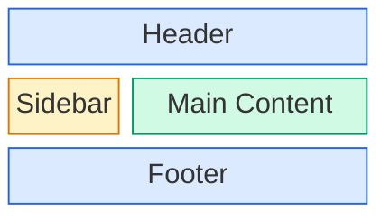

# CSS Grid Layout

🎯 **Interview Weight:** critical - Grid is the 2D layout
standard; interviews at senior+ level always include Grid
questions; understanding the track model separates levels

---

### 🎯 Model Answer

**30 seconds:**

> CSS Grid is a 2D layout system where you define rows and
> columns as tracks on a container and place children into
> cells. Key properties: `grid-template-columns` and `grid-
> template-rows` define tracks; `gap` adds spacing; children
> can auto-place or be explicitly positioned with `grid-
> column`/`grid-row`. The `fr` unit (fractional remainder)
> distributes available space proportionally.

**3 minutes (Senior):**

> Grid establishes a two-dimensional track system on the
> container. Columns and rows are defined as tracks with
> `grid-template-columns` and `grid-template-rows`. Tracks
> can be fixed (`200px`), flexible (`1fr`), content-based
> (`auto`, `min-content`, `max-content`), or adaptive
> (`minmax(min, max)`).
>
> The `fr` unit represents a fraction of available space
> AFTER fixed and auto tracks are satisfied. `1fr 1fr 1fr`
> creates three equal columns. `200px 1fr 1fr` creates a
> fixed-width first column and two equal-flex remaining columns.
>
> Auto-placement fills items into cells following the grid
> auto-placement algorithm: left to right, top to bottom by
> default. Items can be explicitly placed: `grid-column: 2 / 4`
> spans from line 2 to line 4 (two columns wide). `grid-column:
> span 2` is the relative equivalent.
>
> The `repeat()` function creates repeated tracks: `repeat(3,
> 1fr)` = three equal columns. `repeat(auto-fill, minmax(
> 280px, 1fr))` creates as many 280px+ columns as fit the
> container - the responsive column pattern that replaces
> flex-wrap for card grids.
>
> Grid lines are numbered starting at 1 from the start edge.
> Negative numbers count from the end: `-1` is the last line,
> `-2` is second from last. `grid-column: 1 / -1` spans the
> full width regardless of column count.

*Adapting up:* Discuss subgrid, dense packing with grid-auto-
flow: dense, implicit tracks, and grid-template shorthand.

*Adapting down:* display: grid, grid-template-columns for
columns, grid-template-rows for rows, fr for flexible tracks.

**Blank Mind Recovery:**

**(1) Restate:** "You are asking about CSS Grid - let me
walk through the track system, the fr unit, and how items
are placed."

**(2) First principles:** "From first principles, a 2D layout
needs: a column definition, a row definition, and a way to
place items into cells. Grid's track model provides all three."

**(3) Bridge:** "Think of Grid like a spreadsheet. You define
the columns and rows, then fill in cells. Items can span
multiple cells just like merged cells in Excel."

---

### 📘 Concept Explanation

**What it is:**

CSS Grid is a 2D layout system where a container establishes
a grid of rows and columns (tracks), and children are placed
into the resulting cells either explicitly or automatically.

**The problem it solves:**

Creating 2D layouts with alignment across both rows and
columns simultaneously. Replacing table-based layouts,
float-based multi-column layouts, and any pattern requiring
items in different rows to share column widths.

**How it works:**

```
GRID CONTAINER:
  display: grid | inline-grid

  grid-template-columns: <track-list>
  grid-template-rows:    <track-list>
  grid-template-areas:   "header header"
                         "sidebar main"

  gap: <row-gap> <col-gap>
  grid-auto-flow: row | column | dense

TRACK VALUES:
  px, %, em, rem, vw - fixed/relative lengths
  fr         - fraction of available space
  auto       - content-based sizing
  min-content, max-content
  minmax(min, max)  - range
  fit-content(limit)- auto up to limit

REPEAT FUNCTION:
  repeat(3, 1fr)           - 3 equal columns
  repeat(auto-fill, 200px) - as many 200px cols as fit
  repeat(auto-fit,         - auto-fill + collapse empty
    minmax(200px, 1fr))    - responsive cols

GRID ITEMS:
  grid-column: start / end  (line numbers)
  grid-row:    start / end
  grid-area:   name (matches template area name)
  span keyword: grid-column: span 2

ALIGNMENT:
  justify-items: start|end|center|stretch (per row)
  align-items: start|end|center|stretch (per col)
  justify-self: override per item (row axis)
  align-self: override per item (col axis)
  place-items: <align> <justify> shorthand

LINE NUMBERING:
  col:  1  2  3  4
        |  |  |  |
        col1 col2 col3  (3 columns = 4 lines)
  -4 = line 1, -3 = line 2, -2 = line 3, -1 = line 4
```

**The key insight:**

The `fr` unit is computed AFTER subtracting fixed and auto
track sizes. In `200px 1fr 2fr`, the `fr` units split the
remaining space (total - 200px) in 1:2 ratio. `fr` units
cannot be smaller than their content - they have an implicit
minimum of `auto` (content size), preventing zero-size tracks.

**When to use it:**

- Page-level layout (header, sidebar, main, footer)
- Card grids where last row should align to columns
- Any 2D layout requirement
- Overlapping elements (use the same grid area for multiple items)
- Complex component layouts with named areas

**When NOT to use it:**

Flex for 1D component internals (toolbar, card body/footer).
Grid adds overhead for purely linear layouts.

**Alternatives:**

- Flexbox: 1D component layouts
- CSS multi-column: text column flow
- CSS Masonry (pending): responsive masonry without JS

**First-principles derivation:**

2D layout requires: independent control of rows and columns,
item placement in specific cells, items spanning multiple
cells, alignment across both axes. The track model with
explicit placement satisfies all four requirements, unlike
Flex which can't align items across rows.

---

### 💻 Code Example

**BAD: fixed columns that break responsively**

```css
/* BAD: fixed column count, breaks on resize */
.card-grid {
  display: grid;
  grid-template-columns: 1fr 1fr 1fr; /* always 3 cols */
}
/* Fails: too narrow on mobile, items become tiny */
```

> **Code walkthrough:** Hard-coded three columns don't
> adapt to the viewport. On mobile (375px wide), three
> 1fr columns become ~125px each - too narrow for cards.
> Requires a media query to fix, or a better column
> definition.

**GOOD: auto-fill responsive grid**

```css
/* GOOD: responsive grid - no media query for columns */
.card-grid {
  display: grid;
  grid-template-columns:
    repeat(auto-fill, minmax(280px, 1fr));
  gap: 1.5rem;
}
/* Creates as many 280px+ columns as fit */
/* Automatically goes from 1 to 2 to 3+ columns */
```

> **Code walkthrough:** `repeat(auto-fill, minmax(280px, 1fr))`
> is the responsive grid idiom. `auto-fill` creates as many
> column tracks as fit. `minmax(280px, 1fr)` makes each column
> at least 280px and at most 1fr (so columns grow to fill).
> At 375px viewport: one column. At 700px: two columns.
> At 1000px: three columns. No media queries.

**PRODUCTION: page layout with named areas**

```css
.page {
  display: grid;
  grid-template-columns: 250px 1fr;
  grid-template-rows: auto 1fr auto;
  grid-template-areas:
    "header header"
    "sidebar main"
    "footer footer";
  min-height: 100vh;
  gap: 0;
}

.site-header { grid-area: header; }
.sidebar     { grid-area: sidebar; }
.main-content{ grid-area: main; }
.site-footer { grid-area: footer; }

/* Mobile: stack everything */
@media (max-width: 768px) {
  .page {
    grid-template-columns: 1fr;
    grid-template-areas:
      "header"
      "main"
      "sidebar"
      "footer";
  }
}
```

> **Code walkthrough:** Named template areas make the layout
> self-documenting. The grid-template-areas ASCII art is
> literally the page layout in code. The `grid-area` property
> on children references these names. Mobile layout just
> redefines the areas to stack - no changes to children.
> This is one of the most maintainable layout patterns in CSS.

---

### 🎓 Answers by Seniority

**Junior / Mid (0-5 years):**

> CSS Grid creates a 2D layout with rows and columns. Add
> `display: grid` to a container, define columns with
> `grid-template-columns` (e.g., `1fr 1fr 1fr` for three
> equal columns), and children automatically fill the cells.
> The `fr` unit is like "one share" of remaining space.
> `gap` adds space between cells. For responsive card grids,
> `repeat(auto-fill, minmax(280px, 1fr))` creates the right
> number of columns automatically. Items can be explicitly
> placed: `grid-column: 1 / 3` spans the item from column
> line 1 to 3.

*Push deeper:* Explain the difference between auto-fill
and auto-fit.

---

**Senior / Staff (5+ years):**

> Grid's power is the track model and explicit placement.
> `fr` units distribute space after fixed tracks, with an
> implicit minimum of content size. `minmax(min, max)` is
> key for responsive tracks: `minmax(280px, 1fr)` is the
> responsive card column pattern.
>
> For complex layouts I use `grid-template-areas` - it makes
> layout code self-documenting and reordering on mobile
> trivial (just redefine the areas string in a media query,
> no changes to children).
>
> `grid-column: 1 / -1` spanning full width regardless of
> column count is a pattern I use for full-width header or
> footer rows inside a grid. Subgrid (now in all major
> browsers) solves the nested grid alignment problem - a child
> grid can inherit parent grid tracks, enabling cross-
> component column alignment.

---

### ⚠️ Common Misconceptions

**"auto-fill and auto-fit are the same"**

`auto-fill` maintains empty tracks when items don't fill
the grid. `auto-fit` collapses empty tracks to zero, allowing
remaining items to grow. With enough items to fill the row,
they behave identically. Difference shows when fewer items
exist than max columns.

**"fr units work like percentages"**

`fr` is computed after fixed tracks and gap are subtracted.
`1fr 1fr` in a 1000px container with 20px gap = two
~490px columns. `50% 50%` = 500px+500px = 1000px
(overflows with gap). `fr` is gap-aware; `%` is not.

**"Grid items always start at column 1"**

Auto-placement places items at the next available cell.
Explicitly placed items can start at any line. If you
span an item to column 1 / -1 (full width), it resets
the auto-placement algorithm to the next row.

---

### 🚨 Failure Modes and Diagnosis

**Symptom: grid items overflow or misalign**

```
# DevTools: select container > Layout tab
# "Grid" section shows overlay toggle
# Enable grid overlay to visualize tracks and cells
# Compare item placement to expected cells
```

---

**Symptom: auto-fill creates wrong number of columns**

Cause: minmax minimum too small or too large.

```
# Check: container width / minmax minimum
# e.g., 900px / 280px = 3.21 -> 3 columns
# If minimum is too large, only 1 column fits
```

---

**Symptom: items in last grid row span full row width**

Cause: using `flex: 1` in flex instead of Grid.

Fix: switch to `display: grid; repeat(auto-fill, ...)`.
Grid track definitions constrain item sizes; Flex doesn't.

---

### 🎯 Interview Deep-Dive

| Scenario | Recommended Time | Key Signal |
|---|---|---|
| "Explain the fr unit" | 3 min | After-fixed computation |
| Grid vs Flex choice | 3-4 min | 2D vs 1D |
| "Responsive grid no media query" | 3 min | auto-fill + minmax |
| auto-fill vs auto-fit | 3 min | Empty track behavior |
| grid-column: 1 / -1 | 2 min | Negative line numbers |
| Subgrid explanation | 4 min | Cross-component alignment |
| Grid for page layout | 4 min | template-areas pattern |
| Alignment in Grid | 3 min | justify/align items/self |
| Dense packing | 3-4 min | auto-flow: dense |

---

**Q1: How does the fr unit work?** `[MID]` MECHANISM

*Why they ask:* `fr` is the key unit for flexible Grid
tracks; understanding its computation reveals depth.

*Likely follow-up:* "What's the minimum size of a 1fr track?"

> **Answer:**
>
> `fr` (fractional unit) represents a fraction of the
> available space in the grid container AFTER all non-fr
> tracks and gaps are satisfied.
>
> For `grid-template-columns: 200px 1fr 2fr` in a 1000px
> container with no gap:
> - Fixed track: 200px subtracted first
> - Remaining: 800px
> - 1fr + 2fr = 3 total fr units
> - 1fr = 800px / 3 = ~267px
> - 2fr = 800px * 2/3 = ~533px
>
> With gap: `grid-template-columns: 1fr 1fr 1fr; gap: 1rem`
> in a 960px container:
> - Gaps: 2 * 1rem = 32px (two gaps between 3 columns)
> - Available: 960 - 32 = 928px
> - Each 1fr = 928 / 3 = ~309px
>
> The minimum size of a 1fr track is its content size.
> `fr` units have an implicit minimum of `auto` (content's
> natural size). A 1fr column containing a 400px image
> will be at least 400px even if the fr calculation says
> smaller. To force minimum to zero: use `minmax(0, 1fr)`.
>
> `repeat(3, 1fr)` = `1fr 1fr 1fr` = three equal columns.
>
> *What separates good from great:* `minmax(0, 1fr)` vs
> `1fr`. When text content is wider than the fr calculation
> allows, `1fr` expands (minimum = auto). `minmax(0, 1fr)`
> forces minimum to 0 and allows the item to overflow
> rather than the track expanding. This is the fix for
> unexpectedly unequal grid tracks.

---

**Q2: What is the difference between auto-fill and
auto-fit?** `[SENIOR]` MECHANISM

*Why they ask:* These look identical but behave differently
with few items.

*Likely follow-up:* "Which one do you use for card grids?"

> **Answer:**
>
> Both `auto-fill` and `auto-fit` create as many tracks as
> fit the container with the given size. The difference is
> what happens when there are FEWER items than max tracks.
>
> `auto-fill`: creates the maximum number of tracks that fit,
> keeping empty tracks even if no items exist. Tracks remain
> in the grid, taking up space.
>
> `auto-fit`: creates the maximum number of tracks, but
> COLLAPSES empty tracks to zero width. The filled tracks
> then expand to fill the container (if their max is 1fr).
>
> Example: container 900px, `minmax(200px, 1fr)`, 2 items.
> Maximum tracks = 900/200 = 4.
>
> `auto-fill`: creates 4 tracks. Items 1 and 2 in track 1
> and 2. Tracks 3 and 4 exist but are empty. Items stay
> at ~200-225px.
>
> `auto-fit`: creates 4 tracks. Items 1 and 2 in track 1
> and 2. Tracks 3 and 4 COLLAPSE to zero. Items grow to
> fill all 900px (each ~450px).
>
> For card grids: `auto-fill` is usually correct. Cards
> stay at their target size and don't stretch to fill when
> the grid is only partially filled. `auto-fit` with max
> of 1fr makes a few cards expand to fill the row, which
> often looks wrong.
>
> *What separates good from great:* When the grid is full
> (enough items to fill all tracks), `auto-fill` and
> `auto-fit` behave identically. The difference only
> appears with partially filled grids.

---

**Q3: How do you create a responsive grid without
media queries?** `[MID]` HANDS-ON

*Why they ask:* The auto-fill + minmax pattern is a
CSS interview classic.

*Likely follow-up:* "What's the difference between
minmax(200px, 1fr) and minmax(min-content, 200px)?"

> **Answer:**
>
> ```css
> .card-grid {
>   display: grid;
>   grid-template-columns:
>     repeat(auto-fill, minmax(280px, 1fr));
>   gap: 1.5rem;
> }
> ```
>
> Breaking down: `repeat(auto-fill, ...)` creates as many
> column tracks as fit. `minmax(280px, 1fr)` makes each
> column minimum 280px and maximum 1fr (grows to fill).
>
> At different container widths:
> - 375px: floor(375/280) = 1 column -> each column is 1fr
>   of 375px = 375px
> - 650px: floor(650/280) = 2 columns -> each 1fr of 650px
>   minus gaps = ~307px
> - 960px: floor(960/280) = 3 columns -> each ~307px
>
> The math: the browser keeps adding columns until the next
> column would be smaller than the minimum (280px), then
> wraps to fewer columns and stretches them up to 1fr.
>
> "RAM" (Repeat Auto Minmax) is the name for this pattern.
>
> This completely replaces the typical set of mobile/tablet/
> desktop media queries for column count:
> - Old: 3 media queries for 1/2/3 columns
> - New: 1 line that adapts smoothly
>
> *What separates good from great:* The 280px minimum is a
> design decision: the smallest card that still looks good.
> Changing 280px changes all the breakpoints simultaneously.
> It's a single source of truth for the minimum useful
> card width.

---

**Q4: What is negative grid line numbering?** `[SENIOR]`
MECHANISM

*Why they ask:* Tests depth of grid line system knowledge.

*Likely follow-up:* "How do you span an item full width
regardless of column count?"

> **Answer:**
>
> CSS Grid numbers lines starting from 1 at the start edge.
> It also allows negative line numbers counting FROM the
> end edge: -1 is always the last grid line, -2 is second
> from last, etc.
>
> For a grid with 3 columns, there are 4 column lines:
> - Positive: 1, 2, 3, 4 (left to right)
> - Negative: -4, -3, -2, -1 (also left to right)
>   Line 1 = Line -4, Line 4 = Line -1
>
> The critical use case: `grid-column: 1 / -1` spans the
> item from the first to the last column line, taking the
> full width of the grid, regardless of how many columns
> the grid has.
>
> ```css
> .full-width-item {
>   grid-column: 1 / -1;
>   /* Always spans all columns even if count changes */
>   /* Works whether grid has 2, 3, or 5 columns */
> }
> ```
>
> Without negative lines: `grid-column: 1 / 4` only spans
> full width for a 3-column grid. Change to 4 columns and
> the item no longer spans full width.
>
> `grid-row: 1 / -1` similarly spans all rows if the grid
> has explicit row definitions.
>
> *What separates good from great:* Negative lines only
> reference explicitly defined tracks (via `grid-template-
> columns` or `grid-template-rows`). They don't count
> implicit tracks (created by auto-placement overflow).
> For full-span in a dynamic-row grid, use `grid-column:
> 1 / -1` combined with explicit column definitions.

---

**Q5: What is subgrid and why was it important?** `[STAFF]`
MECHANISM

*Why they ask:* Subgrid solves a long-standing alignment
problem; knowing it shows current CSS knowledge.

*Likely follow-up:* "Give a real-world use case for subgrid."

> **Answer:**
>
> Subgrid allows a grid item to use its parent's grid tracks
> for its own children. Without it, a grid item that is also
> a grid container creates its own independent track system.
> This means grandchildren can't align to the grandparent's
> grid.
>
> The problem it solves: in a card grid, each card has a
> heading, body, and footer. With normal nested grids, the
> headings in different cards don't align to each other -
> each card's heading is positioned within that card's
> grid, independently. If cards have different heading
> heights, the bodies start at different vertical positions.
>
> With subgrid:
> ```css
> .card-grid {
>   display: grid;
>   grid-template-columns: repeat(3, 1fr);
>   grid-template-rows: repeat(3, auto);
>   /* Row 1: heading, Row 2: body, Row 3: footer */
>   row-gap: 0;
> }
> .card {
>   display: grid;
>   grid-row: span 3;        /* takes 3 parent rows */
>   grid-template-rows: subgrid; /* uses parent's rows */
> }
> .card-heading { grid-row: 1; }
> .card-body    { grid-row: 2; }
> .card-footer  { grid-row: 3; }
> ```
>
> Now all card headings are in parent row 1, all bodies in
> row 2, all footers in row 3. The tallest heading in any
> card determines the height of row 1 for ALL cards.
>
> *What separates good from great:* Subgrid is now supported
> in Chrome 117+, Firefox 71+, Safari 16+. It was the most
> requested CSS feature for years. Before it, equal-height
> card sections required JavaScript to measure and set
> explicit heights.

---

**Q6: How do you use grid-auto-flow: dense?** `[SENIOR]`
MECHANISM

*Why they ask:* Dense packing is useful but has accessibility
implications.

*Likely follow-up:* "Why might dense packing cause
accessibility issues?"

> **Answer:**
>
> `grid-auto-flow: dense` tells the grid algorithm to
> try to fill in holes in the grid by placing later items
> in earlier empty cells.
>
> Default auto-placement: items are placed in source order.
> If item 3 is 2 columns wide but only 1 column remains in
> the current row, item 3 moves to the next row, leaving a
> gap (hole).
>
> With `dense`: when item 3 moves to the next row, the
> algorithm looks at items 4, 5, 6... and places the first
> one that fits in the hole. This fills gaps but reorders
> items visually relative to source order.
>
> ```css
> .grid {
>   display: grid;
>   grid-template-columns: repeat(4, 1fr);
>   grid-auto-flow: dense;
> }
> .wide-item { grid-column: span 2; }
> ```
>
> Use case: masonry-style image galleries where items are
> different sizes and visual order isn't important (images
> in a random grid).
>
> Accessibility concern: `dense` reorders items visually
> relative to DOM order. Screen readers and keyboard
> navigation follow DOM order. If a user tabs through the
> grid, they navigate in source order, but visual order
> is different. For content where reading/interaction order
> matters (articles, cards with actions), `dense` is
> inappropriate.
>
> *What separates good from great:* WCAG 1.3.2 (Meaningful
> Sequence) requires that if visual order conveys meaning,
> the reading order matches. `grid-auto-flow: dense` can
> violate this. Safe to use only for purely visual grids
> (image galleries) where no logical reading order exists.

---

**Q7: How does Grid alignment differ from Flexbox
alignment?** `[SENIOR]` COMPARISON

*Why they ask:* Surfaces deep understanding of both models.

*Likely follow-up:* "What is place-items?"

> **Answer:**
>
> Both Flex and Grid share the CSS Box Alignment spec, but
> Grid has more complete per-item alignment support.
>
> Key differences:
>
> 1. `justify-items` and `align-items` in Grid set defaults
>    for BOTH axes at the container level. In Flex, only
>    `align-items` works (cross axis); `justify-items` is
>    ignored.
>
> 2. `justify-self` works in Grid (per-item row axis).
>    In Flex, `justify-self` has no effect - use `margin:
>    auto`.
>
> 3. Grid default for `align-items` and `justify-items`
>    is `stretch` - items fill their cell. This is why
>    grid items take full cell dimensions by default.
>
> 4. Grid tracks can be aligned within the container if
>    the grid is smaller than its container: `justify-content`
>    aligns column tracks, `align-content` aligns row tracks.
>
> `place-items: center` is the Grid shorthand: both
> `align-items: center` and `justify-items: center`. In Grid,
> this centers content in each cell both horizontally and
> vertically.
>
> ```css
> .grid-center {
>   display: grid;
>   place-items: center; /* centers in each cell */
>   /* Commonly used in icon grids, dashboards */
> }
> ```
>
> *What separates good from great:* Grid has `place-items`
> at container level (all cells) and `place-self` at item
> level (one cell). Flex only has `place-items` but it
> only sets `align-items` (justify-items is ignored in Flex).

---

**Q8: Debug: a grid item is in the wrong position.
How do you diagnose it?** `[MID]` DEBUGGING

*Why they ask:* Grid debugging is a real skill with DevTools
support.

*Likely follow-up:* "What does the grid overlay show?"

> **Answer:**
>
> Step 1: Enable the Grid overlay in DevTools. In Chrome:
> Elements panel, select the grid container, Layout tab,
> click the grid overlay toggle. This shows column and row
> lines, gap areas, and cell boundaries as a colored
> overlay on the page.
>
> Step 2: Identify which cell the item is actually in vs
> which cell you expected. The overlay numbers the lines.
>
> Step 3: Select the grid item in Elements panel. Computed
> tab shows `grid-column-start`, `grid-column-end`,
> `grid-row-start`, `grid-row-end` computed values. This
> shows the actual placement.
>
> Common causes:
>
> 1. Off-by-one: grid lines start at 1, not 0.
>    `grid-column: 2 / 3` places item in the second column
>    (between lines 2 and 3), not spanning two columns.
>    `grid-column: 2 / 4` or `grid-column: 2 / span 2`
>    spans two columns.
>
> 2. Explicit placement conflicts: two items placed in
>    the same cell. The second item overlaps or pushes
>    the first (depends on z-index/source order).
>
> 3. Named line confusion: if you named lines in template,
>    the named lines can be referenced but numeric lines
>    still exist. `header-start` might equal line 2, not 1.
>
> 4. Auto-placement changed by explicit items: explicitly
>    placed items can create gaps that shift auto-placed
>    items.
>
> *What separates good from great:* Chrome's grid inspector
> can display line numbers AND named areas overlaid on the
> page simultaneously. Enabling "show line names" in the
> Grid overlay options shows both numeric and named line
> identifiers.

---

**Q9: How would you implement a masonry-style layout
in CSS today?** `[SENIOR]` PRODUCTION

*Why they ask:* Masonry is a common design requirement
with evolving CSS support.

*Likely follow-up:* "What are the options now vs in 2024?"

> **Answer:**
>
> Masonry layout (Pinterest-style: items fill columns without
> vertical gaps from different heights) has three current
> approaches.
>
> Approach 1: CSS `grid-template-rows: masonry` (proposed,
> behind flag in Firefox and Safari 2024). Not production-
> ready yet.
>
> ```css
> .masonry {
>   display: grid;
>   grid-template-columns: repeat(3, 1fr);
>   grid-template-rows: masonry; /* not standard yet */
> }
> ```
>
> Approach 2: CSS `columns` property - multi-column layout.
> ```css
> .masonry {
>   columns: 3; /* or column-count: 3 */
>   gap: 1rem;
> }
> .masonry-item { break-inside: avoid; }
> ```
> Limitation: items flow TOP TO BOTTOM in each column, then
> to the next column. Not true masonry (you can't control
> horizontal order).
>
> Approach 3: JavaScript (Masonry.js, or CSS custom
> properties with JS). Measure item heights, calculate
> column assignments, place with absolute positioning or
> transforms. This is the only approach for true masonry
> with correct source order flow.
>
> For 2024 production work: use `columns` if top-to-bottom
> column flow is acceptable (image galleries), use
> grid-template-rows: masonry in Firefox flag for testing.
> For precise masonry requirements: use a small JS library
> or wait for the CSS spec.
>
> *What separates good from great:* The CSS `columns`
> approach works well for cases where content is primarily
> article-style (short text blocks, images) and top-to-
> bottom is fine. The key limitation is keyboard/screen
> reader order matches visual column order, which is often
> good for accessibility but not for "card as a unit"
> layouts.

---

| Interviewer Type | Emphasis |
|---|---|
| Technical Panel | Walk through fr computation with numbers |
| Hiring Manager | Frame as "2D layout that scales cleanly" |
| Bar Raiser | Discuss subgrid and cross-component alignment |
| Peer Engineer | Share auto-fill vs auto-fit mental model |

---

### ⚖️ Comparison Table

| Feature | CSS Grid | Flexbox |
|---|---|---|
| Dimensions | 2D (rows + columns) | 1D (row OR column) |
| Track definition | Explicit rows + cols | Implicit (content-driven) |
| Cross-axis alignment | Per-item (justify-self) | No justify-self |
| Column alignment across rows | Yes (grid tracks) | No (each row independent) |
| Named areas | Yes (template-areas) | No |
| Responsive columns | auto-fill + minmax | flex-wrap (less precise) |
| Subgrid | Yes (2023) | N/A |
| Best for | Page layout, card grids | Components, toolbars |

---

### 🏛️ System Design

*(Omit: ★★☆ working-level - page layout architecture
covered in L5 Design Systems)*

---

### 📊 Diagram

```
CSS GRID TRACK SYSTEM:
  grid-template-columns: 200px 1fr 1fr
  grid-template-rows:    auto 1fr auto

  Line:  1    2          3          4
         |    |          |          |
  Row 1  [header                      ] auto
         |    |          |          |
  Row 2  [side][  main   ][  main   ] 1fr
         |    |          |          |
  Row 3  [footer                      ] auto
         1    2          3          4
```



> **Diagram walkthrough:** The grid template-areas ASCII
> at top shows the track system explicitly: column lines
> 1-4, row lines 1-4, and how named areas map to cells.
> The Mermaid block diagram shows the resulting visual
> layout: header spanning all 3 columns (grid-column: 1/-1),
> sidebar in first column, main content spanning the
> remaining two columns, footer spanning all columns.
> Named areas make this layout self-documenting and easy
> to reorder for mobile via a single media query.

---
---

# CSS Grid Template Areas and Named Lines

🎯 **Interview Weight:** high - template-areas is the most
readable Grid feature; named lines add precision; tested
in senior interviews for layout architecture knowledge

---

### 🎯 Model Answer

**30 seconds:**

> `grid-template-areas` assigns ASCII-art names to regions
> of a grid. Children reference these names via `grid-area`.
> A period (`.`) creates an empty cell. Named lines (defined
> in `grid-template-columns` as `[name]`) allow semantic
> line references instead of numbers. Together these make
> Grid layout self-documenting and highly maintainable.

**3 minutes (Senior):**

> `grid-template-areas` accepts a string per row, where
> each word is a cell name. Identical adjacent names create
> a rectangular area spanning those cells. The string
> layout visually represents the page layout:
>
> ```css
> grid-template-areas:
>   "header header"
>   "sidebar main"
>   "footer footer";
> ```
>
> This defines 3 rows, 2 columns. Header spans both columns.
> Sidebar and main are side by side. Footer spans both.
> Children use `grid-area: header` to be placed in the
> header area.
>
> Requirements: area names must form a rectangle (no L-shapes
> or T-shapes). Every cell in the grid must be defined (no
> gaps except periods). Identically named cells in a row
> must be contiguous.
>
> Named lines are defined WITHIN the track list using bracket
> notation: `[main-start] 1fr [main-end]`. These names can
> be used in placement: `grid-column: main-start / main-end`.
> When `grid-template-areas` is used, implicit named lines
> are created: area `header` automatically creates
> `header-start` and `header-end` lines for both axes.
>
> The combination: `grid-template-areas` for the visual
> layout map + named lines for precise component-level
> placement = the most readable CSS layout system available.

*Adapting up:* Discuss `grid-template` shorthand combining
all definitions, and implicit named lines from areas.

*Adapting down:* grid-template-areas lets you name regions
in ASCII art; children use grid-area to assign themselves.

**Blank Mind Recovery:**

**(1) Restate:** "You are asking about named Grid areas - let
me walk through how template-areas works and why it's the
most readable layout CSS."

**(2) First principles:** "From first principles, complex
layouts need both a visual map of the layout and a way for
children to find their place in it. template-areas provides
both."

**(3) Bridge:** "Think of grid-template-areas like a
blueprint. The architect (CSS) draws the floor plan. Each
room (element) has a name label. Children know which room
they belong to."

---

### 📘 Concept Explanation

**What it is:**

`grid-template-areas` defines named regions in a grid via
an ASCII-art string layout. `grid-area` on items assigns
them to these regions. Named lines provide semantic
alternatives to numeric line references.

**The problem it solves:**

Grid line numbers (`grid-column: 2 / 4`) are opaque - you
can't tell what layout they represent from the code. When
a designer changes the layout, all numeric references must
be updated. Named areas make CSS layout code human-readable
and robust to structural changes.

**How it works:**

```
grid-template-areas SYNTAX:
  Each quoted string = one row
  Each word in string = one column cell
  Same adjacent names = one merged area (must be rectangle)
  Period (.) = empty cell

EXAMPLE:
  .container {
    display: grid;
    grid-template-columns: 200px 1fr;
    grid-template-rows: 60px 1fr 60px;
    grid-template-areas:
      "header header"
      "nav    main  "
      "footer footer";
  }

  .site-header  { grid-area: header; }
  .site-nav     { grid-area: nav; }
  .site-main    { grid-area: main; }
  .site-footer  { grid-area: footer; }

NAMED LINES:
  grid-template-columns:
    [content-start] 1fr [sidebar-start] 200px [sidebar-end];

  .main { grid-column: content-start / sidebar-start; }

IMPLICIT NAMED LINES FROM AREAS:
  grid-area "header" automatically creates:
    header-start (column), header-end (column)
    header-start (row), header-end (row)
  Usage: grid-column: header-start / header-end;
```

**The key insight:**

The `grid-template-areas` string IS the visual layout map.
Reading the CSS tells you exactly what the page looks like.
When the layout changes (sidebar moves), you update the
string and the children automatically move - no individual
child CSS needs to change.

**When to use it:**

- Page-level layouts (header, sidebar, main, footer)
- Dashboard layouts with multiple named panels
- Any layout with 3+ semantic regions
- When layout must be reordered between breakpoints

**When NOT to use it:**

Card grids where items are uniform and auto-placement works.
Simple 2-column layouts where number references are clear.
Areas where cell naming adds no semantic value.

**Alternatives:**

- Numeric grid lines: `grid-column: 2 / 4` - simpler for
  small grids, opaque for large ones
- span keyword: `grid-column: span 2` - relative, clear
  but no semantic names
- Flexbox: for 1D layouts where areas aren't needed

**First-principles derivation:**

Complex layout code with magic numbers becomes unmaintainable.
A named layout system maps to the designer's mental model
(header, sidebar, content) rather than the browser's
internal coordinate system. Named areas bridge the semantic
gap between design intent and implementation.

---

### 💻 Code Example

**BAD: opaque numeric grid placement**

```css
/* BAD: what does this layout look like? */
.container {
  display: grid;
  grid-template-columns: 200px 1fr;
  grid-template-rows: 60px 1fr 60px;
}
.header  { grid-column: 1 / 3; grid-row: 1; }
.sidebar { grid-column: 1; grid-row: 2; }
.main    { grid-column: 2; grid-row: 2; }
.footer  { grid-column: 1 / 3; grid-row: 3; }
/* Cannot tell the layout from reading this code */
/* If a column is added, all numbers break */
```

> **Code walkthrough:** Numeric placements are opaque.
> A reader must mentally reconstruct the grid. More
> importantly, adding or removing a column requires
> updating every element's grid-column values. This
> is fragile and error-prone.

**GOOD: named template areas**

```css
/* GOOD: layout reads as ASCII art */
.page {
  display: grid;
  grid-template-columns: 200px 1fr;
  grid-template-rows: 60px 1fr 60px;
  min-height: 100vh;
  grid-template-areas:
    "header header"
    "sidebar main  "
    "footer footer";
}

.site-header  { grid-area: header; }
.site-sidebar { grid-area: sidebar; }
.site-main    { grid-area: main; }
.site-footer  { grid-area: footer; }
```

> **Code walkthrough:** Reading the CSS immediately
> communicates the layout. If a designer asks to move
> the sidebar to the right, only the template-areas
> string changes - not individual item placement.
> Adding a column means updating the template and the
> column definition, but not every child.

**PRODUCTION: responsive areas with media query**

```css
.page {
  display: grid;
  min-height: 100dvh;
  grid-template-areas:
    "header"
    "main"
    "sidebar"
    "footer";
  grid-template-columns: 1fr;
}

@media (min-width: 768px) {
  .page {
    grid-template-columns: 220px 1fr;
    grid-template-rows: auto 1fr auto;
    grid-template-areas:
      "header  header"
      "sidebar main  "
      "footer  footer";
  }
}

/* Children never change */
.site-header  { grid-area: header; }
.site-sidebar { grid-area: sidebar; }
.site-main    { grid-area: main; }
.site-footer  { grid-area: footer; }
```

> **Code walkthrough:** Zero changes to child element CSS
> across breakpoints. The media query only updates the
> container's column definition and area map. Sidebar moves
> from below header (mobile) to left of main (desktop) just
> by reassigning the area map. This is the key maintainability
> win of template-areas.

---

### 🎓 Answers by Seniority

**Junior / Mid (0-5 years):**

> `grid-template-areas` lets you name sections of a CSS
> Grid using strings that look like a layout map:
> `"header header" "sidebar main" "footer footer"`. Then
> assign children to these areas with `grid-area: header`.
> The ASCII art in the CSS matches the actual page layout.
> If you need an empty cell, use a period (`.`). On mobile,
> you just redefine the areas string in a media query - the
> children don't need any changes because they reference
> named areas, not coordinates.

*Push deeper:* Mention the implicit named lines that areas
create and named lines in track definitions.

---

**Senior / Staff (5+ years):**

> Template areas are the most maintainable CSS layout
> mechanism. The string IS the documentation. When a layout
> changes, the string changes - child selectors are
> completely isolated from layout modifications.
>
> For large design systems I use template-areas for every
> page layout component. The implicit named lines from
> areas (area "main" creates main-start and main-end) can
> be used to position elements precisely without magic
> numbers.
>
> Named lines in track definitions work complementarily:
> `[content-start] 1fr [content-end]` in a complex grid
> lets components reference by semantic name instead of
> position. Combine with subgrid and you have the most
> expressive CSS layout system available.

---

### ⚠️ Common Misconceptions

**"Areas can be any shape"**

Template areas must form rectangles. L-shaped, T-shaped,
or diagonal areas are invalid. The browser ignores invalid
area definitions silently.

**"Periods can be any number of characters"**

A single period (`.`) defines one empty cell. Multiple
adjacent periods (`...`) each create separate empty cells
OR can be treated as one anonymous area (browser varies).
Use one period per empty cell for clarity.

**"grid-area replaces grid-column and grid-row"**

`grid-area: header` is DIFFERENT from the four-value
`grid-area: 1 / 1 / 2 / -1` shorthand. The single-name
version references template areas; the four-value version
is a shorthand for row-start/column-start/row-end/column-end.

---

### 🚨 Failure Modes and Diagnosis

**Symptom: area is not rectangular, item misplaces**

Cause: attempting an L-shaped or non-rectangular area.

```
/* INVALID: non-rectangular area */
grid-template-areas:
  "header header"
  "header main"; /* "header" is an L-shape - INVALID */
```

Fix: restructure layout so each area is rectangular,
or split into separate areas.

---

**Symptom: child doesn't appear in expected area**

Cause: `grid-area` name doesn't match template area name
exactly (case-sensitive).

Diagnosis:
```
# Check: .element's grid-area value
# Check: grid-template-areas string
# Both must be exact match, no quotes on grid-area value
```

---

### 🎯 Interview Deep-Dive

| Scenario | Recommended Time | Key Signal |
|---|---|---|
| "Explain template-areas" | 3 min | ASCII map + grid-area |
| Shape constraints | 2-3 min | Rectangle requirement |
| Mobile responsive areas | 3-4 min | Areas string in media query |
| Named lines vs areas | 3-4 min | Implicit named lines |
| Comparison: areas vs numbers | 3 min | Maintainability argument |
| period in areas | 2 min | Empty cell syntax |
| grid-area 4-value vs name | 3 min | Syntax disambiguation |
| Complex dashboard layout | 4-5 min | Multi-area design |
| Areas + subgrid | 4 min | Component alignment |

---

**Q1: How does grid-template-areas work?** `[MID]`
MECHANISM

*Why they ask:* Foundation for any Grid architecture
discussion.

*Likely follow-up:* "How does a child element know which
area to occupy?"

> **Answer:**
>
> `grid-template-areas` assigns names to cells in the grid.
> The value is a string of space-separated cell names per
> row, with each quoted string being one row.
>
> ```css
> .container {
>   display: grid;
>   grid-template-columns: 200px 1fr;
>   grid-template-rows: auto 1fr auto;
>   grid-template-areas:
>     "header header"
>     "nav    main  "
>     "footer footer";
> }
> ```
>
> This creates 3 rows, 2 columns. Row 1, both cells: "header".
> Row 2, column 1: "nav", column 2: "main". Row 3, both: "footer".
> Adjacent identical names create a single merged area
> (header spans both columns).
>
> Children reference areas with `grid-area`:
> ```css
> .site-header { grid-area: header; }
> .site-nav    { grid-area: nav; }
> .site-main   { grid-area: main; }
> .site-footer { grid-area: footer; }
> ```
>
> No coordinates needed. The container's template map
> determines placement. If the template changes, children
> automatically move to their new positions.
>
> Empty cells use a period: `"header ." "main aside"`.
>
> *What separates good from great:* The area name must be
> a valid CSS identifier (no spaces, starts with a letter
> or dash). The grid-area value on a child is NOT quoted
> even though template-areas uses quotes. This catches
> many beginners: `grid-area: "header"` (wrong) vs
> `grid-area: header` (correct).

---

**Q2: Can you create an L-shaped area in template-areas?**
`[SENIOR]` MECHANISM

*Why they ask:* Tests understanding of area constraints.

*Likely follow-up:* "How would you work around this
limitation for a complex layout?"

> **Answer:**
>
> No. Template areas must be rectangular. The spec explicitly
> prohibits L-shapes, T-shapes, and any non-rectangular
> named region. The browser treats non-rectangular areas
> as invalid and silently ignores the entire `grid-template-
> areas` definition.
>
> Why the constraint: CSS Grid areas are mapped to the grid
> track system. An area is defined by its start/end row and
> column lines. A rectangle has one start row, one end row,
> one start column, one end column - exactly four values.
> An L-shape would require multiple start/end values per axis,
> which doesn't map cleanly to the track model.
>
> Workarounds for complex shapes:
>
> 1. Use explicit `grid-column` and `grid-row` placement
>    (numeric) for items that don't fit template-area
>    constraints.
>
> 2. Nest grids: a complex shape can be decomposed into
>    a containing rectangular area that is itself a grid.
>
> 3. Use `grid-area` for the bounding rectangle and handle
>    the internal shape with padding, clipping, or nested
>    elements.
>
> 4. Overlap: place two rectangular areas in overlapping
>    cells using numeric placement, then use z-index
>    to create the visual appearance of a complex shape.
>
> *What separates good from great:* Knowing that even
> named areas generate implicit named lines: `header-start`
> and `header-end` for both row and column axes. If you
> define area "sidebar" in rows 2-3, column 1, then
> `sidebar-row-start` = row 2 and `sidebar-row-end` = row 4.
> These can be used in complex explicit placements.

---

**Q3: How do template areas simplify mobile responsive
layouts?** `[MID]` PRODUCTION

*Why they ask:* The core practical value of template-areas.

*Likely follow-up:* "Does this require any changes to
the HTML?"

> **Answer:**
>
> Template areas let you completely reorganize a layout
> in a media query without touching any child element CSS.
>
> Desktop layout:
> ```css
> .page {
>   display: grid;
>   grid-template-columns: 240px 1fr;
>   grid-template-areas:
>     "header  header"
>     "sidebar main  "
>     "footer  footer";
> }
> ```
>
> Mobile layout (sidebar below content):
> ```css
> @media (max-width: 768px) {
>   .page {
>     grid-template-columns: 1fr;
>     grid-template-areas:
>       "header"
>       "main"
>       "sidebar"
>       "footer";
>   }
> }
> ```
>
> Zero changes to children. The sidebar, main, header,
> footer all move because the area map changed. On mobile,
> sidebar is placed below main (a semantic decision: show
> primary content first).
>
> Without template-areas, this would require updating
> `grid-column` and `grid-row` for every element in the
> media query.
>
> No HTML changes required - the DOM order (for accessibility
> and SEO) stays as-is. Visual order is controlled entirely
> by CSS.
>
> *What separates good from great:* This visual/DOM
> reordering has accessibility implications. The DOM order
> (which screen readers and keyboard navigation follow)
> should be the logical reading order. If on mobile the
> visual order (header > main > sidebar > footer) matches
> the DOM order, it's fine. If you put sidebar before main
> in DOM for "desktop-first" code but visually after main
> on mobile via CSS reordering, keyboard users navigate
> sidebar content before main content, which may be wrong.

---

**Q4: What are named grid lines?** `[SENIOR]` MECHANISM

*Why they ask:* Named lines are the precision tool for
complex component-level placement.

*Likely follow-up:* "How are named lines different from
area-generated lines?"

> **Answer:**
>
> Named lines are identifiers you attach to track boundaries
> in `grid-template-columns` and `grid-template-rows` using
> bracket notation:
>
> ```css
> .container {
>   display: grid;
>   grid-template-columns:
>     [viewport-start]
>     1fr
>     [content-start]
>     min(65ch, 100%)
>     [content-end]
>     1fr
>     [viewport-end];
> }
> ```
>
> Content can be placed using these names:
> ```css
> .narrow-content {
>   grid-column: content-start / content-end;
> }
> .full-bleed {
>   grid-column: viewport-start / viewport-end;
> }
> ```
>
> This is the "full-bleed layout" pattern - a centered
> content column with some elements breaking out to full
> width, using the same grid.
>
> Named lines vs area-generated lines:
> - Named lines are explicit, defined by you in the track list
> - Area-generated lines are implicit, created from
>   `grid-template-areas`. Area "main" creates:
>   `main-start` (column start), `main-end` (column end),
>   `main-start` (row start), `main-end` (row end)
>
> Both types can be used in placement. Area-generated lines
> are a convenient side effect of using template-areas.
>
> *What separates good from great:* A grid line can have
> multiple names: `[content-start sidebar-end]`. This is
> useful when two semantic regions share a line - the sidebar
> ends where content starts. Referencing either name gives
> the same line.

---

**Q5: How would you build a "full-bleed" content layout
with CSS Grid?** `[SENIOR]` HANDS-ON

*Why they ask:* A real production pattern that showcases
named lines + overlapping cells.

*Likely follow-up:* "How did people do this before named
grid lines?"

> **Answer:**
>
> Full-bleed layout: centered article text with some
> elements (images, call-outs, code blocks) extending to
> full viewport width.
>
> ```css
> .article {
>   display: grid;
>   grid-template-columns:
>     [bleed-start] 1fr
>     [content-start] min(65ch, 100% - 4rem)
>     [content-end] 1fr
>     [bleed-end];
> }
>
> /* All direct children go to content column */
> .article > * {
>   grid-column: content-start / content-end;
> }
>
> /* Full-bleed elements override to viewport width */
> .article .full-bleed {
>   grid-column: bleed-start / bleed-end;
>   width: 100%;
> }
>
> /* Inset (slightly wider than content but not full) */
> .article .wide {
>   grid-column: 1 / -1;
>   margin-inline: auto;
>   max-width: 80%;
> }
> ```
>
> `min(65ch, 100% - 4rem)` creates a content column that
> is the smaller of 65 characters wide or viewport minus
> padding. `1fr` on each side fills the remaining space
> symmetrically.
>
> Before named lines: this required calculating negative
> margins (`margin-left: calc(-50vw + 50%)`) - a fragile
> hack that breaks in overflow:hidden contexts.
>
> *What separates good from great:* This pattern also
> works with `grid-template-areas`. Define an "article"
> area and a "bleed" area overlapping the same row. This
> is one of the few cases where template-areas aren't
> better than named lines - named lines allow dynamic
> assignment of any child to any column without predefined
> area names.

---

**Q6: What happens if an area isn't a rectangle?** `[MID]`
DEBUGGING

*Why they ask:* The rectangle constraint is a common
gotcha for beginners.

*Likely follow-up:* "How do you debug an invalid
template-areas definition?"

> **Answer:**
>
> If a template-areas definition creates a non-rectangular
> named area, the entire `grid-template-areas` property is
> invalid. The browser ignores it silently - no error in
> the console, no fallback behavior. Items with `grid-area`
> names lose their placement and fall back to auto-placement.
>
> Example of invalid areas:
> ```css
> /* INVALID: 'content' appears in rows 1-2 col 2,
>    and row 3 col 1-2, which is L-shaped */
> grid-template-areas:
>   "header content"
>   "sidebar content"
>   "content content";  /* 'content' is not rectangular */
> ```
>
> How to debug:
> 1. Enable grid overlay in DevTools. If areas are invalid,
>    the overlay won't show area labels - only track lines.
>
> 2. Check the Layout tab: valid areas appear with colored
>    region markers in the overlay.
>
> 3. Read the area definition row by row - trace each
>    word's position and verify it forms a rectangle.
>
> 4. The period trick: use `.` for cells you don't want
>    to name, not an area name for "I'll put something here
>    later."
>
> *What separates good from great:* The browser also
> validates that every cell in the grid is assigned. A
> grid with 3 columns and a template-areas string of only
> 2 words per row is invalid. Every cell must be named
> or use a period.

---

**Q7: How do implicit named lines from areas work?**
`[STAFF]` MECHANISM

*Why they ask:* Deep Grid knowledge; tests understanding
of the area-to-lines mapping.

*Likely follow-up:* "How would you use these in a component
inside the grid area?"

> **Answer:**
>
> When `grid-template-areas` defines a named area, the browser
> automatically creates named grid lines for that area's
> boundaries. For an area named "sidebar":
>
> - `sidebar-start` - column line at the left edge of sidebar
> - `sidebar-end` - column line at the right edge of sidebar
> - `sidebar-start` (row) - row line at the top
> - `sidebar-end` (row) - row line at the bottom
>
> These implicit names are usable in `grid-column` and
> `grid-row` placement:
> ```css
> .area-adjacent {
>   grid-column: sidebar-end / content-end;
>   /* Starts at right edge of sidebar, ends at content */
> }
> ```
>
> This is especially useful for precisely aligning components
> relative to areas without hardcoding coordinates.
>
> Naming conflicts: if you ALSO define an explicit named line
> with the same name as an implicit area line, both names
> coexist. Placement using that name resolves to the
> explicit name (explicit takes precedence).
>
> Practical use: a component that should span two areas can
> reference them by name: `grid-column: header-start /
> main-end` places the item from the header's start to the
> main area's end, even if columns are added between them.
>
> *What separates good from great:* The implicit line naming
> convention is `-start` and `-end`, not `-left`/`-right`.
> This is because grid lines are logical (direction-aware)
> rather than physical. In RTL documents, `header-start`
> is still the correct left edge of the header but maps
> to the physical right of the document.

---

**Q8: How do you create a dashboard layout with multiple
panels using template-areas?** `[SENIOR]` HANDS-ON

*Why they ask:* Tests practical application of complex
template-areas.

*Likely follow-up:* "How would you handle panels that
should be the same height?"

> **Answer:**
>
> A multi-panel dashboard:
>
> ```css
> .dashboard {
>   display: grid;
>   grid-template-columns: 2fr 1fr 1fr;
>   grid-template-rows: auto auto auto 1fr;
>   gap: 1rem;
>   padding: 1rem;
>   min-height: 100dvh;
>   grid-template-areas:
>     "header  header  header "
>     "kpi1    kpi2    kpi3   "
>     "chart   chart   sidebar"
>     "table   table   sidebar";
> }
>
> .dashboard-header { grid-area: header; }
> .kpi1  { grid-area: kpi1; }
> .kpi2  { grid-area: kpi2; }
> .kpi3  { grid-area: kpi3; }
> .chart { grid-area: chart; }
> .table { grid-area: table; }
> .sidebar { grid-area: sidebar; }
> ```
>
> Header spans full width. Three KPI cards in a row.
> Chart spans 2 columns with a sidebar to its right.
> Sidebar spans rows 3 and 4 (chart and table rows).
> The `1fr` last row makes the table grow to fill space.
>
> Equal-height panels: Grid's `align-items: stretch`
> default already makes items in the same row equal height.
> The sidebar spanning two rows automatically matches the
> combined height of chart + table + gap.
>
> Responsive: at mobile, redefine to single column:
> `grid-template-columns: 1fr;` and reorder areas.
>
> *What separates good from great:* Documenting the area
> grid as a comment or link to a design tool screenshot.
> The ASCII art helps but team members unfamiliar with the
> grid may still find it opaque. A Storybook story or
> Figma link as a code comment makes maintenance faster.

---

**Q9: Compare grid-template-areas to explicit line
placement. When do you choose each?** `[SENIOR]` TRADE-OFF

*Why they ask:* Shows judgment about when each approach
is appropriate.

*Likely follow-up:* "Are there cases where you'd mix both
in the same component?"

> **Answer:**
>
> Template areas win when:
>
> 1. Layout has named semantic regions (header, sidebar,
>    main, footer). The names convey design intent.
>
> 2. Layout changes between breakpoints. One areas string
>    per media query, zero changes to children.
>
> 3. Readability matters. The ASCII art is documentation.
>    New team members understand the layout in seconds.
>
> 4. Child placement is one-to-one (one element per area).
>
> Explicit line placement wins when:
>
> 1. Dynamic auto-placement is needed. `grid-column: span 2`
>    places an item across two columns without naming every
>    combination.
>
> 2. Multiple items occupy the same area (overlapping).
>    Template areas don't support multiple items per area
>    natively - you need numeric placement for the second.
>
> 3. The layout is generated by code or data-driven
>    (spreadsheet-style table). Naming every cell is impractical.
>
> 4. Complex spanning patterns that don't form rectangles.
>
> Mix both: use template-areas for the page scaffold
> (header, sidebar, main, footer), then use explicit line
> placement within the main area for the article or grid
> content. The named area lines (main-start/main-end) can
> reference the parent grid.
>
> *What separates good from great:* `grid-template` shorthand
> combines all three template properties: `grid-template:
> "header header" 60px "sidebar main" 1fr / 200px 1fr`.
> This is more compact but harder to read for complex
> layouts. For production code, the verbose three-property
> form is usually preferred for readability.

---

| Interviewer Type | Emphasis |
|---|---|
| Technical Panel | Walk through implicit named lines from areas |
| Hiring Manager | Frame as "self-documenting layout system" |
| Bar Raiser | Discuss full-bleed layout with named lines |
| Peer Engineer | Show the mobile reordering pattern |

---

### ⚖️ Comparison Table

| Approach | Readability | Flexibility | Best For |
|---|---|---|---|
| template-areas | Excellent | Rectangle areas only | Page layout, dashboards |
| Named lines | Good | High | Content + bleed layouts |
| Numeric lines | Low | Maximum | Dynamic, generated layouts |
| span keyword | Medium | Relative spans only | Auto-fill grids |

---

### 🏛️ System Design

*(Omit: ★★☆ working-level - page layout architecture
is covered in L5 Design Systems)*

---

### 📊 Diagram

*(Omit: the code examples with inline template-areas strings
are self-documenting; the ASCII art in the CSS is already
the diagram)*
