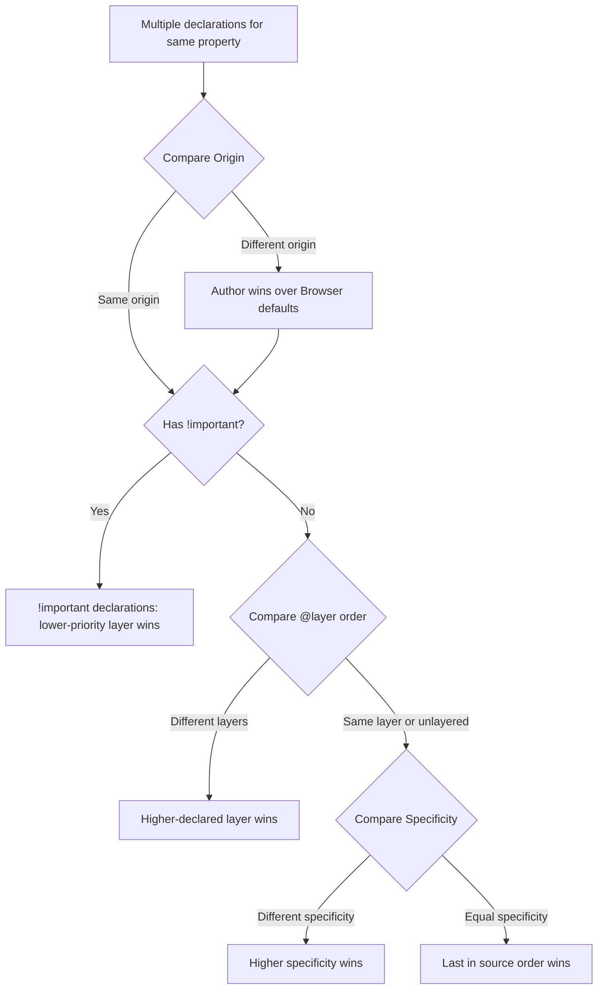

# CSS Specificity and Cascade Control

🎯 **Interview Weight:** high - specificity and the cascade
are core CSS mechanics; every senior developer must explain
exactly how conflicts are resolved and how to control them
in production systems

---

### 🎯 Model Answer

**30 seconds:**

> Specificity is CSS's algorithm for deciding which rule
> wins when multiple rules target the same element. It's
> a weight system: IDs (0,1,0,0) beat classes (0,0,1,0),
> which beat elements (0,0,0,1). When weights are equal,
> the last rule in source order wins. The cascade is the
> full resolution algorithm: origin (browser vs author vs
> user), importance (`!important`), specificity, and source
> order.

**3 minutes (Senior):**

> Specificity is calculated as a 3-component vector:
> (a, b, c) where a = ID count, b = class/attribute/pseudo-
> class count, c = element/pseudo-element count. Compare
> component by component, left to right - first non-equal
> component determines the winner.
>
> `#header .nav li a:hover` → (1, 2, 2): 1 ID, 2 classes
> (`.nav` + `:hover`), 2 elements (`li` + `a`).
>
> The full cascade algorithm has layers:
> 1. Origin: browser default < user < author (your CSS)
> 2. `!important` in each origin flips priority within
>    that origin
> 3. CSS `@layer` (modern): author layer order
> 4. Specificity: within the same origin and layer
> 5. Source order: tie-breaker
>
> Common mistakes: using IDs in CSS (creates high-specificity
> rules hard to override). Using `!important` as a quick
> fix creates unfixable styles. The correct solution:
> CSS Cascade Layers (`@layer`) for systematic override
> control.
>
> `:where()` is the zero-specificity selector wrapper -
> `where(.card) .title { }` has the same specificity as
> `.title { }`. `:is()` and `:has()` take the specificity
> of their most specific argument.

*Adapting up:* Discuss CSS `@layer` as the modern
specificity management system; `@scope` as native scoping.

*Adapting down:* Think of specificity like a 3-digit number:
IDs are hundreds, classes are tens, elements are ones.
Higher number wins.

**Blank Mind Recovery:**

**(1) Restate:** "You are asking about CSS specificity - the
algorithm that determines which CSS rule wins when multiple
rules target the same element."

**(2) First principles:** "From first principles, the browser
must resolve conflicting style declarations. It uses a
priority system: inline style > ID > class > element.
When priority is equal, last rule wins."

**(3) Bridge:** "Think of specificity like a court system:
appeals courts override lower courts. IDs are the supreme
court - they override everything except inline styles and
!important."

---

### 📘 Concept Explanation

**What it is:**

Specificity: a numeric weight assigned to CSS selectors
that determines which rule applies when multiple rules
target the same element and property.

The Cascade: CSS's full conflict resolution algorithm -
source origin, `!important`, `@layer` order, specificity,
and source order.

**The problem it solves:**

Multiple CSS rules targeting the same element with
conflicting values. The browser needs a deterministic
algorithm to choose one value.

**How it works:**

```
SPECIFICITY CALCULATION:
  (ID count, class+attr+pseudo-class count, element+pseudo-element)

  Selector                Specificity  Notes
  ──────────────────────  ───────────  ──────────────────────
  *                       (0,0,0)      universal, zero
  p                       (0,0,1)      1 element
  .class                  (0,1,0)      1 class
  #id                     (1,0,0)      1 ID
  p.class                 (0,1,1)      element + class
  #id .class p            (1,1,1)
  .nav:hover              (0,2,0)      class + pseudo-class
  .nav li a:hover         (0,1,3)      1 class + 3 elements
                                       + 1 pseudo-class = (0,2,2)
  Wait: .nav=class(1)+
        li=elem(1)+a=elem(1)+:hover=pseudo-class(1)
  Correct: (0, 2, 2)

  inline style=""         (1,0,0,0)    4th column, highest
  !important              overrides    cascade origin flip

COMPARISON (left-to-right):
  (0,2,2) vs (0,1,3)
   0=0, 2>1 → first wins (more class weight)

CASCADE FULL ALGORITHM:
  1. Find all declarations for this property on this element
  2. Filter by origin:
     - Browser default (lowest)
     - User stylesheet
     - Author stylesheet (your CSS)
  3. !important in each origin (flips priority)
  4. @layer order within author origin
  5. Specificity (higher wins)
  6. Source order (last wins if tied)

CSS CASCADE LAYERS (@layer):
  @layer base, components, utilities;
  /* Layer order: base < components < utilities */

  @layer components { .button { color: blue; } }
  @layer utilities  { .text-red { color: red; } }
  /* utilities > components, so .text-red wins on
     an element with both classes, regardless of
     specificity (both are 0,1,0) */
```

**The key insight:**

`@layer` is specificity-independent cascade control.
A class in a higher-priority layer overrides a class in
a lower-priority layer even if the lower-priority class
has higher specificity. This is the correct long-term tool
for managing overrides in design systems.

**When to use each approach:**

`:where()` wrapper: when you want a style to be easily
overridable (zero specificity).

`@layer`: when you need systematic override management
across categories of CSS (base, components, utilities).

`!important`: almost never in application CSS; acceptable
in utility classes that must always win.

**When NOT to use:**

IDs in CSS selectors: creates high specificity that blocks
overrides. Use IDs only for JavaScript hooks, not styling.

**Alternatives:**

CSS Modules: eliminates specificity battles through scoping.
BEM: eliminates battles through flat specificity convention.
Tailwind: no component classes to conflict.

**First-principles derivation:**

HTML elements receive styles from multiple sources (browser
defaults, author CSS, inline styles). The browser must pick
one value per property per element. A deterministic priority
algorithm is required. Specificity provides that algorithm.

---

### 💻 Code Example

**BAD: specificity war**

```css
/* BAD: escalating specificity leads to !important */
.card .title { color: blue; }
/* Later, someone overrides: */
.section .card .title { color: red; }
/* Even later: */
#main .section .card .title { color: green; }
/* Finally, desperation: */
h2.card-title { color: black !important; }
/* Now NOTHING can override this */
```

> **Code walkthrough:** Each developer increased specificity
> to override the previous rule. The final `!important` is
> the end of the road - you cannot override `!important` on
> the same element without your own `!important`. This is
> the classic CSS specificity war. The root cause: allowing
> high-specificity selectors into the codebase at all.

**GOOD: flat specificity with BEM**

```css
/* GOOD: all single-class selectors, equal specificity */
.card { }          /* (0,1,0) */
.card__title { }   /* (0,1,0) */
/* Only source order determines cascade */
/* No specificity battles */

/* State override - explicit, traceable */
.card--featured .card__title {
  color: gold; /* (0,2,0) - intentional increase */
}
/* This is acceptable: the modifier context
   needs higher specificity to override */
```

> **Code walkthrough:** BEM's flat specificity means all
> component classes are (0,1,0). Source order determines
> cascade. When a modifier context genuinely needs an
> override (`.card--featured` changes the title color),
> the (0,2,0) specificity is intentional and documented
> by the BEM naming.

**PRODUCTION: @layer for design system override management**

```css
/* Define layer order (lowest to highest priority) */
@layer reset, tokens, base, components, utilities;

@layer reset {
  *, *::before, *::after { box-sizing: border-box; }
  body { margin: 0; }
}

@layer tokens {
  :root {
    --color-primary: #2563eb;
    --text-sm: 0.875rem;
  }
}

@layer base {
  a { color: var(--color-primary); }
  p { line-height: 1.6; }
}

@layer components {
  /* Components have higher priority than base */
  /* (even if same or lower specificity) */
  .button { color: white; background: var(--color-primary); }
  .card { padding: 1rem; }
}

@layer utilities {
  /* Utilities have highest priority */
  /* Override components without !important */
  .text-red { color: #ef4444; }
  .hidden   { display: none; }
}
```

> **Code walkthrough:** `@layer` declares priority order
> independent of specificity or source order. A `utilities`
> layer class always overrides a `components` layer class
> even if both have identical (0,1,0) specificity. `@layer`
> is the correct tool for the "utilities should override
> components" pattern that previously required `!important`.

**:where() for zero-specificity**

```css
/* Library CSS that should be easily overridable */
/* BAD: library uses .alert which blocks user override */
.alert { padding: 1rem; border-radius: 4px; }

/* GOOD: wrap in :where() for zero specificity */
:where(.alert) { padding: 1rem; border-radius: 4px; }

/* User's CSS (0,1,0): overrides :where() (0,0,0) */
.alert { border-radius: 0; } /* wins! */
```

> **Code walkthrough:** `:where()` applies the selector's
> styles but contributes zero specificity. Library CSS should
> use `:where()` wrappers so users can override with any
> specificity. Design systems intended for external consumption
> benefit greatly from `:where()`.

---

### 🎓 Answers by Seniority

**Junior / Mid (0-5 years):**

> Specificity is the way the browser decides which CSS rule
> wins when two rules conflict on the same element. IDs have
> more weight than classes, which have more weight than
> element selectors. Inline styles are the most specific.
> When specificity ties, the last rule in the CSS file wins.
> I avoid using IDs in CSS and avoid `!important` except
> for utility classes.

---

**Senior / Staff (5+ years):**

> Specificity is a (a,b,c) vector: IDs, classes/attrs/pseudo-
> classes, elements. Compare left to right. But specificity
> is part of the larger cascade algorithm: `@layer` order
> controls precedence at a higher level than specificity.
>
> For production systems: flat specificity (all classes at
> 0,1,0) through BEM or CSS Modules, combined with `@layer`
> for systematic utility-over-component overrides. `:where()`
> for library code that must be easily overridable.
>
> Never use IDs in CSS - they create (1,0,0) blocks. Reserve
> `!important` for utility classes by convention (or never,
> and use `@layer` instead).

---

### ⚠️ Common Misconceptions

**"More selectors in a rule = higher specificity"**

Not exactly. Specificity counts TYPES of selectors. 10 element
selectors `div p span ul li a em strong b s` = (0,0,10).
ONE class `.title` = (0,1,0). The single class wins over
10 element selectors.

**":not() is zero specificity"**

`:not()` itself contributes zero specificity, but its
argument does. `.nav :not(a)` has specificity of the
`:not(a)` argument = (0,0,1). In CSS Selectors Level 4,
`:not()` takes complex selectors: `:not(.active)` = (0,1,0).

---

### 🚨 Failure Modes and Diagnosis

**Symptom: styles not applying despite correct rule**

```
DevTools steps:
1. Inspect element → Styles panel
2. Find the property that's not applying
3. Strikethrough = overridden (lower specificity/order)
4. The winning rule shows at the top
5. Compare selectors: (0,1,0) vs (0,2,0) means 2-class wins
6. Check for !important (yellow warning icon)
7. Check @layer (newer DevTools show layer badges)
```

---

**Symptom: `!important` can't be overridden**

`!important` in author CSS is overridden ONLY by
`!important` in inline styles.
`!important` in inline styles cannot be overridden.
Fix: use `@layer` for cascade control instead of `!important`.

---

### 🎯 Interview Deep-Dive

| Scenario | Recommended Time | Key Signal |
|---|---|---|
| Calculate specificity | 3 min | (a,b,c) vector |
| Cascade algorithm order | 3-4 min | Origin, layer, specificity, order |
| Why IDs in CSS are bad | 3 min | Specificity lock-in |
| !important gotchas | 3 min | Cascade origin flip |
| @layer usage | 3-4 min | Layer order > specificity |
| :where() zero specificity | 3 min | Library CSS strategy |
| :is() and :has() specificity | 3 min | Argument-based |
| Debugging specificity | 3 min | DevTools workflow |
| @scope preview | 3 min | Future CSS |

---

**Q1: How is CSS specificity calculated?** `[MID]`
MECHANISM

*Why they ask:* Core CSS knowledge required of all frontend devs.

*Likely follow-up:* "What happens when specificity is equal?"

> **Answer:**
>
> Specificity is a 3-component vector: (a, b, c)
>
> a = number of ID selectors (`#id`)
> b = number of class, attribute, and pseudo-class selectors
>     (`.class`, `[attr]`, `:hover`, `:focus`, `:nth-child()`)
> c = number of element and pseudo-element selectors
>     (`div`, `p`, `::before`, `::after`)
>
> `:not()`, `:is()`, `:has()`: contributes the specificity
> of their most specific argument (the selector itself adds 0).
> `:where()`: always contributes 0.
>
> Universal selector `*`: 0 specificity.
> Inline style: a 4th component (1,0,0,0) - always wins.
>
> Examples:
> ```
> .nav-item              (0,1,0)
> .nav-item:hover        (0,2,0)  :hover = pseudo-class
> .nav a                 (0,1,1)
> .nav:first-child a     (0,2,1)  :first-child = pseudo-class
> #header                (1,0,0)
> #header .nav li        (1,1,1)
> style="..."           (1,0,0,0) always wins
> :is(.a, .b, #id) .c   (1,2,0)  #id is most specific arg
> :where(.a, .b) .c     (0,1,0)  :where always zero
> ```
>
> Comparison: left-to-right, first non-equal component wins.
> `(1,0,0)` vs `(0,99,99)` → `(1,0,0)` wins (ID > classes).
>
> Equal specificity: source order (last rule wins).
>
> *What separates good from great:* The specificity
> calculation changed slightly with CSS Selectors Level 4.
> `:is()`, `:has()`, `:not()` now take complex selectors
> and inherit the specificity of their most specific argument.
> `:not(.a, #id)` in Level 4 = `(1,0,0)` (the `#id` is
> most specific). In Level 3, `:not()` took only simple
> selectors. This change means `:is()` and `:has()` queries
> can introduce high specificity through their arguments.

---

**Q2: What is the full CSS cascade algorithm?** `[SENIOR]`
MECHANISM

*Why they ask:* Understanding the cascade depth signals
CSS expertise.

*Likely follow-up:* "Where does @layer fit in the cascade?"

> **Answer:**
>
> The cascade determines which CSS declaration applies to
> a property on an element. The full algorithm (priority
> order, lowest to highest):
>
> 1. **Origin and importance** (highest level):
>    - Browser default styles
>    - Browser defaults with `!important`
>    - User styles (rare: browser extensions, user prefs)
>    - User `!important` styles
>    - Author CSS (your stylesheets)
>    - Author CSS `@layer` order (see step 3)
>    - Author `!important` CSS
>    - Inline styles
>    - Inline `!important`
>    - Transitions (override everything while active)
>    - Animations
>
> 2. **@layer order** (within author CSS, non-important):
>    - Unlayered CSS: highest priority within author
>    - Named layers: priority by declaration order
>      `@layer base, components, utilities;`
>      → utilities > components > base
>    - `!important` in layers reverses: base !important
>      > components !important > utilities !important
>
> 3. **Specificity** (within same layer):
>    - (a, b, c) vector comparison
>
> 4. **Source order** (tie-breaker):
>    - Last declaration in source wins
>
> Key counterintuitive behavior: `!important` in a LOW-
> priority layer beats `!important` in a high-priority layer.
> This is intentional - it allows base/reset layers to
> provide overrides that can't be cancelled by components.
>
> Unlayered CSS has the HIGHEST non-important priority
> within author CSS. Code added without `@layer` beats
> all layered code (unless the layered code uses `!important`).
> This means adding `@layer` retroactively to a codebase
> changes cascade behavior.
>
> *What separates good from great:* The transition to using
> `@layer` in a codebase with existing CSS requires care.
> Unlayered CSS always beats layered CSS. If you add
> `@layer components { .button {} }` but have unlayered
> `.button {}` elsewhere, the unlayered rule wins. Migrating
> to `@layer` must be done comprehensively or the layer
> assignments won't behave as expected.

---

**Q3: Why should you avoid using IDs in CSS selectors?**
`[JUNIOR]` TRADE-OFF

*Why they ask:* Common CSS best practice with a non-obvious reason.

*Likely follow-up:* "Are there any cases where IDs in CSS
are acceptable?"

> **Answer:**
>
> ID selectors (`#id`) have specificity (1,0,0). A single
> ID outweighs 256 class selectors (0,256,0) - you cannot
> override an ID rule with class rules alone.
>
> In practice: if a library or colleague writes:
> ```css
> #main-nav { color: blue; }
> ```
>
> You cannot override this with:
> ```css
> .nav-item { color: red; }          /* (0,1,0) - LOSES */
> .nav-item.active { color: green; } /* (0,2,0) - LOSES */
> .nav .nav-item { color: orange; }  /* (0,2,0) - LOSES */
> /* Only way to override: */
> #main-nav .nav-item { color: red; } /* (1,1,0) - wins */
> /* or: */
> #main-nav { color: red !important; } /* !important */
> ```
>
> This creates a maintenance trap: every override requires
> either an ID selector or `!important`.
>
> IDs are fine for:
> - JavaScript `getElementById()` hooks
> - HTML `for` / `aria-labelledby` attribute links
> - Fragment identifiers (`href="#section"`)
>
> For styling, never use IDs. Same element can be targeted
> by class or data attribute.
>
> When IDs in CSS are acceptable: none. Even for styles
> that should "always win," use `!important` in a utility
> class or `@layer unlayered` (unlayered beats all layers).
>
> *What separates good from great:* `:is(#id)` has the
> same specificity as `#id`. However, `:where(#id)` has
> zero specificity. If you're consuming a third-party CSS
> that uses IDs and need to override it, you can use
> `@layer` - place your overrides in a new layer loaded
> AFTER the third-party CSS, making your layer higher
> priority. This avoids the ID specificity problem.

---

**Q4: What does !important actually do in the cascade?**
`[SENIOR]` MECHANISM

*Why they ask:* !important is widely misunderstood.

*Likely follow-up:* "Can !important ever be overridden?"

> **Answer:**
>
> `!important` does NOT give a declaration "the highest
> priority." It flips cascade priority within the same
> ORIGIN.
>
> The cascade origins (normal priority):
> Browser < User < Author
>
> With `!important`:
> Author !important < User !important < Browser !important
>
> This reversal means User !important beats Author !important.
> This is intentional: user accessibility overrides should
> win over author stylesheets. For example, a user who
> needs large text sizes can set `!important` in their
> browser extension and it overrides author styles.
>
> Within author CSS: `!important` declarations take
> precedence over non-important, then specificity applies
> among `!important` declarations.
>
> Can `!important` be overridden?
>
> - Author `!important` is overridden by User `!important`
> - Author `!important` in a `@layer` is overridden by
>   Author `!important` in an earlier-declared layer (reversed):
>
> ```css
> @layer base, utilities;
>
> @layer base { p { color: red !important; } }
> @layer utilities { p { color: blue !important; } }
> /* RED wins - !important in lower-priority layers
>    beats !important in higher-priority layers */
> ```
>
> Inline `!important`: cannot be overridden by stylesheet
> declarations. Only transitions and animations override
> inline styles.
>
> Practical rule: `!important` in author CSS is appropriate
> ONLY for utility classes that must always win (`.hidden`,
> `.sr-only`). For everything else, use `@layer` order.
>
> *What separates good from great:* The `@layer` + `!important`
> reversal is the most misunderstood CSS behavior. When you
> add `!important` to a reset/base layer, that reset beats
> all other `!important` declarations in components and
> utilities. This is sometimes useful: `@layer reset`
> declarations with `!important` create unbreakable resets.

---

**Q5: What is CSS @layer and how does it control cascade?**
`[SENIOR]` MECHANISM

*Why they ask:* @layer is modern CSS's answer to specificity wars.

*Likely follow-up:* "Does @layer work with Tailwind?"

> **Answer:**
>
> `@layer` creates named cascade layers. Declarations in a
> later-declared layer take priority over earlier layers,
> REGARDLESS of specificity.
>
> ```css
> /* Declare order (lowest to highest priority) */
> @layer reset, base, components, utilities;
>
> @layer reset {
>   * { box-sizing: border-box; }
> }
>
> @layer components {
>   .button { color: blue; /* specificity: (0,1,0) */ }
> }
>
> @layer utilities {
>   .text-red { color: red; /* specificity: (0,1,0) */ }
> }
>
> /* On <button class="button text-red">:
>    Both have (0,1,0) specificity.
>    utilities layer > components layer.
>    Result: red text */
> ```
>
> Unlayered CSS is implicitly the highest-priority layer
> (for non-important declarations):
>
> ```css
> .button { color: green; } /* unlayered - beats all layers */
> @layer utilities { .text-red { color: red; } }
> /* On <button class="button text-red">: GREEN wins
>    because unlayered CSS > any @layer */
> ```
>
> This is important: adding `@layer` to existing code
> must be done carefully because unlayered code always wins.
>
> @layer with Tailwind: Tailwind 3.1+ has an `@layer`
> option. Tailwind utilities can be placed in their own
> layer, allowing your components to override Tailwind
> without `!important`.
>
> ```css
> @layer tailwind-base, tailwind-utilities, my-components;
> @import "tailwind" layer(tailwind-base tailwind-utilities);
> /* my-components layer > tailwind-utilities */
> ```
>
> *What separates good from great:* `@layer` is supported
> in all modern browsers since 2022. The key question for
> existing codebases: can we add `@layer` incrementally?
> Yes, but unlayered code will BEAT all layered code. The
> correct migration: move ALL author CSS into layers, with
> unlayered CSS as a temporary "has not been migrated" bucket
> that you drain over time.

---

**Q6: What is :where() and when do you use it?** `[SENIOR]`
MECHANISM

*Why they ask:* Modern CSS pseudo-class; library authors
must know it.

*Likely follow-up:* "How does :where() differ from :is()?"

> **Answer:**
>
> `:where()` is a functional pseudo-class that matches its
> selector argument but contributes ZERO specificity.
>
> `:is()` is identical but takes the specificity of its
> most specific argument.
>
> ```css
> /* :is() - uses specificity of argument */
> :is(.a, .b) .c { }
> /* Specificity: (0,2,0) - .a/.b class + .c class */
>
> /* :where() - always zero specificity */
> :where(.a, .b) .c { }
> /* Specificity: (0,1,0) - only .c contributes */
>
> :where(#id) .c { }
> /* Specificity: (0,1,0) - :where() zeroes the #id! */
> ```
>
> Use cases:
>
> 1. **Library / reset CSS**: your CSS should be easily
>    overridable by consumers.
>
>    ```css
>    /* Browser resets with zero specificity */
>    :where(h1, h2, h3) { font-weight: bold; }
>    /* User overrides with class (0,1,0) > (0,0,0): wins */
>    ```
>
> 2. **Base component styles** that should defer to themes:
>    ```css
>    :where(.button) {
>      display: inline-flex;
>      padding: 0.5rem 1rem;
>    }
>    /* Theme overrides .button (0,1,0) > :where(.button) (0,0,0) */
>    ```
>
> 3. **Overriding third-party ID styles**:
>    ```css
>    /* Third party has: #widget .title { color: blue } (1,1,0) */
>    /* You can't beat (1,1,0) with classes alone */
>    /* But: use @layer where your code is higher priority */
>    @layer my-overrides {
>      :where(#widget) .title { color: red; }
>      /* (0,1,0) - low specificity */
>      /* But my-overrides layer > third-party layer = wins */
>    }
>    ```
>
> *What separates good from great:* `:is()` is for MATCHING
> multiple selectors efficiently: `h1, h2, h3, h4, h5, h6 { }`
> vs `:is(h1, h2, h3, h4, h5, h6) { }`. The second is
> cleaner. But using `:is()` with mixed specificity arguments
> like `:is(.class, #id)` makes the whole rule `(1,0,0)` -
> that's a trap. If you need a forgiving selector with
> mixed specificity, use `:where()`.

---

**Q7: How do you debug a specificity problem?** `[MID]`
DEBUGGING

*Why they ask:* Practical DevTools knowledge.

*Likely follow-up:* "What does the strikethrough in the
Styles panel mean?"

> **Answer:**
>
> Step-by-step specificity debugging workflow:
>
> **Step 1: Open DevTools Styles panel**
> - Right-click element → Inspect
> - Styles panel shows all matching rules, ordered by priority
>
> **Step 2: Find the property**
> - Locate the property with wrong value
> - The FIRST (unhidden) occurrence is the winning rule
>
> **Step 3: Read the strikethrough**
> - Strikethrough = overridden rule
> - Greyed out = not applied (lower specificity or source order)
>
> **Step 4: Compare selectors**
> - Look at selectors of competing rules
> - Calculate specificity: (a,b,c)
> - Higher wins; equal specificity → last in source wins
>
> **Step 5: Check @layer**
> - DevTools (Chrome 106+) shows layer badges on rules
> - `[layer: utilities]` next to a rule shows its layer
> - Layer order shown in Computed tab
>
> **Step 6: Check for !important**
> - `!important` declarations show a warning icon
> - These override specificity within the same origin
>
> **Step 7: Fix strategy**
> - If CSS you control: lower specificity of winning rule,
>   or increase specificity of your rule
> - Better fix: use `@layer` to control priority without
>   changing specificity
> - If third-party CSS: wrap your styles in a higher-priority
>   `@layer`
>
> Quick test in DevTools: toggle rules on/off by clicking
> the checkbox next to each property to see which rule is
> actually applying.
>
> *What separates good from great:* Chrome DevTools
> Computed panel shows the FINAL applied value for every
> property, with a link to the source rule that "won."
> When the Styles panel is confusing (many competing rules),
> the Computed panel gives the answer directly.

---

**Q8: How does specificity interact with CSS Custom
Properties?** `[SENIOR]` MECHANISM

*Why they ask:* Custom properties have their own inheritance/
cascade behavior.

*Likely follow-up:* "What is the !important behavior of
custom properties?"

> **Answer:**
>
> CSS custom properties (`--name: value`) participate in
> the cascade like regular properties. They can be overridden
> by specificity and source order.
>
> ```css
> :root { --color: blue; }       /* (0,0,1) - element */
> .card { --color: red; }        /* (0,1,0) - class: wins */
> /* On .card: --color is red */
>
> .card .title {
>   color: var(--color); /* inherits red from .card */
> }
> ```
>
> Custom properties follow CSS inheritance:
> - The value set on an element is inherited by descendants
> - The INHERITED value at point of use is what `var()` reads
> - This is NOT the same as the value at `:root`
>
> ```css
> :root     { --color: blue; }
> .section  { --color: green; }
> .card     { /* inherits green from .section */ }
> .card .title {
>   color: var(--color); /* green (inherited from parent) */
> }
> ```
>
> `!important` with custom properties is unusual:
> ```css
> .card { --color: red !important; }
> /* Setting custom property !important is unusual */
> /* The custom property declaration wins the cascade */
> /* Descendants still inherit the property's value */
> /* !important doesn't "lock" the inherited value */
> ```
>
> The `var()` fallback:
> ```css
> color: var(--color, navy); /* fallback if --color unset */
> ```
> The fallback only applies if the property is unset,
> NOT if it has an invalid value. If `--color: 42` and
> you use `var(--color)` where a color is expected, the
> property is invalid at computed value (not the fallback).
>
> *What separates good from great:* CSS custom properties
> as "variables" behave differently from programming
> variables. They participate in inheritance and the cascade.
> This is their power (component themes via inheritance)
> and a source of bugs. When `--color` changes unexpectedly
> in a component, check parent elements for overrides using
> the DevTools Computed panel to see the property's resolved
> value.

---

**Q9: What is CSS @scope and when will it matter?**
`[STAFF]` ARCHITECTURE

*Why they ask:* Staff engineers track browser platform evolution.

*Likely follow-up:* "How does @scope relate to CSS Modules?"

> **Answer:**
>
> `@scope` (CSS Cascade Level 6 spec, Chrome 118+) enables
> native CSS scoping - styles apply only within a specific
> subtree, with optional "donut holes" (elements that are
> excluded).
>
> ```css
> /* Scope styles to .card */
> @scope (.card) {
>   .title { font-size: 1.25rem; }  /* only card titles */
>   img    { border-radius: 4px; }  /* only card images */
> }
>
> /* Donut hole: exclude inner cards */
> @scope (.card) to (.card) {
>   /* Applies within .card but NOT within nested .card */
>   .title { color: blue; }
> }
> ```
>
> Specificity within `@scope`: scoped rules win over
> equivalent non-scoped rules (additional specificity from
> the scope selector). `:where(@scope(.card)) .title` has
> zero scope specificity but still has scope proximity.
>
> "Scope proximity": when two scoped rules compete, the one
> CLOSER in the DOM to the styled element wins. This is a
> new cascade criterion that doesn't exist today.
>
> Relationship to CSS Modules:
> - CSS Modules: build-tool transforms class names, no runtime
> - `@scope`: native browser scoping, no build tool needed
>
> As `@scope` gains broader browser support, it becomes the
> native alternative to CSS Modules and BEM. You scope
> component styles with `@scope (.card) { ... }` instead
> of writing `.card__title`, `.card__image` etc.
>
> Current status (2024):
> - Chrome 118+: supported
> - Firefox: in development
> - Safari: in development
>
> Not yet safe for production without polyfill/PostCSS.
>
> *What separates good from great:* `@scope` is the long-
> term answer to CSS's global scope problem at the browser
> level. Unlike BEM (convention) and CSS Modules (tooling),
> `@scope` requires neither discipline nor build steps.
> PostCSS will likely provide a polyfill (`postcss-scope`)
> that transforms `@scope` for older browsers, enabling
> adoption ahead of universal browser support - the same
> way `postcss-nesting` enabled CSS nesting.

---

| Interviewer Type | Emphasis |
|---|---|
| Technical Panel | @layer cascade behavior |
| Hiring Manager | Practical specificity debugging |
| Bar Raiser | @scope and future CSS platform |
| Peer Engineer | :where() for library CSS |

---

### ⚖️ Comparison Table

| Tool | Specificity Level | Override Control | Browser Native |
|---|---|---|---|
| ID selector | (1,0,0) | Hard to override | Yes |
| Class selector | (0,1,0) | Standard | Yes |
| `!important` | Flips origin | Extreme | Yes |
| `@layer` | Layer order | Systematic | Modern |
| `:where()` | (0,0,0) | Very easy | Modern |
| CSS Modules | Scoped class | Isolated | Build tool |
| `@scope` | Proximity-based | Native scoping | Emerging |

---

### 🏛️ System Design

*(Omit: ★★☆ working-level - cascade architecture at
design system scale in L5 Design Systems)*

---

### 📊 Diagram

```
SPECIFICITY VECTOR VISUALIZATION:
┌────────────┬──────────────┬────────────────────────────┐
│  Column A  │   Column B   │         Column C           │
│   IDs      │ Classes,Attr │  Elements, Pseudo-elements │
│  #id       │ .cls [attr]  │  div p ::before            │
│   (1,0,0)  │  (0,1,0)    │       (0,0,1)              │
├────────────┼──────────────┼────────────────────────────┤
│  1 ID wins │ 256 classes  │ 256 elements < 1 class     │
│ over 256   │ < 1 ID       │                            │
│ classes    │              │                            │
└────────────┴──────────────┴────────────────────────────┘
Inline style: ABOVE ALL (column before A)
!important:  ABOVE inline (cascade origin flip)
```



> **Diagram walkthrough:** The cascade resolves declarations
> in a strict priority chain. Origin is checked first - the
> browser's default stylesheet loses to author CSS. Within
> author CSS, `@layer` order takes precedence over specificity,
> which takes precedence over source order. `!important` inverts
> layer priority within the important declarations. Understanding
> this complete chain explains why `@layer` can override high-
> specificity rules without `!important`.

---
---

# CSS Pseudo-classes and Pseudo-elements

🎯 **Interview Weight:** medium - pseudo-selectors are used
daily; knowing the distinction, performance implications,
and modern additions (`:is()`, `:has()`, `:where()`) separates
working developers from CSS experts

---

### 🎯 Model Answer

**30 seconds:**

> Pseudo-classes select elements based on their state or
> position: `:hover`, `:focus`, `:nth-child()`. A single
> colon. Pseudo-elements create virtual elements or select
> content parts: `::before`, `::after`, `::first-line`.
> Double colon (CSS3 convention). `:is()`, `:has()`, and
> `:where()` are modern functional pseudo-classes that
> enable complex selections with cleaner syntax.

**3 minutes (Senior):**

> The single/double colon distinction is notation-only for
> modern browsers - `:before` and `::before` work the same.
> The convention: double colon for pseudo-elements (CSS3+),
> single colon for pseudo-classes. Some older pseudo-elements
> kept single-colon for compatibility (`:before`, `:after`).
>
> `:is()` and `:where()` are "forgiving selector lists" -
> if one selector in the list is invalid, the whole list
> doesn't fail (unlike regular comma-separated selectors).
> This is critical for progressive CSS: `:is(:hover, :focus-
> visible)` works even in browsers that don't support
> `:focus-visible` (the invalid part is ignored).
>
> `:has()` is the "parent selector" CSS never had for 25 years.
> `figure:has(figcaption)` selects figures that contain a
> figcaption. `.form:has(:invalid)` selects forms that
> contain invalid inputs. It's now supported in all modern
> browsers (Chrome 105+, Firefox 121+).
>
> Performance: complex pseudo-classes like `:has()` are
> evaluated by the browser's style engine. `:has()` in
> particular can be expensive if it's broad and triggers
> on every state change - test in DevTools Performance panel.

*Adapting up:* Discuss `:has()` as enabling parent-
dependent style logic previously requiring JavaScript.

*Adapting down:* Pseudo-classes (`:hover`, `:focus`)
select element states. Pseudo-elements (`::before`,
`::after`) create virtual elements.

**Blank Mind Recovery:**

**(1) Restate:** "You are asking about pseudo-classes and
pseudo-elements - CSS selectors for states and virtual
content."

**(2) First principles:** "From first principles, CSS needs
to select elements based on dynamic state (hovered, focused)
and to create styling hooks for content that doesn't exist
in the HTML. Pseudo-selectors solve both."

**(3) Bridge:** "Pseudo-classes are like adjectives for
elements (:hover = 'currently hovered'). Pseudo-elements
are like adding invisible children to elements (::before
= 'an invisible first child')."

---

### 📘 Concept Explanation

**What it is:**

Pseudo-classes: keywords added to selectors that specify
a special state. Preceded by `:`.

Pseudo-elements: keywords added to selectors that select
a specific part of an element or create virtual content.
Preceded by `::`.

**The problem it solves:**

Styling element states (hover, focus, checked) without
JavaScript class toggling. Creating decorative content
(tooltips, icons, clearfix) without extra HTML elements.

**How it works:**

```
PSEUDO-CLASSES (state and position):

State-based:
  :hover        - mouse over element
  :focus        - element has focus
  :focus-within - element or descendant has focus
  :focus-visible - focus visible (keyboard only)
  :active       - element is being clicked
  :checked      - checkbox/radio is checked
  :disabled     - form element is disabled
  :enabled      - form element is enabled
  :required     - required form field
  :valid/:invalid - form validation state
  :placeholder-shown - input showing placeholder

Position-based:
  :first-child  - first child of parent
  :last-child   - last child of parent
  :nth-child(n) - every n-th child
  :nth-child(odd/even) - alternating
  :only-child   - only child of parent
  :first-of-type - first of type in parent
  :nth-of-type(n)

Target:
  :target       - element with matching URL hash

Negation and functional:
  :not(.class)  - elements NOT matching selector
  :is(.a, .b)   - matches either (arg specificity)
  :where(.a,.b) - matches either (zero specificity)
  :has(.child)  - has a matching descendant

Link-specific:
  :link, :visited, :hover, :active (LVHA order)

PSEUDO-ELEMENTS (virtual content):

Content creation:
  ::before      - generated content before element
  ::after       - generated content after element

Text selection:
  ::first-line  - first line of text block
  ::first-letter - first letter of text block
  ::selection   - user-selected text

Form-specific:
  ::placeholder - input placeholder text
  ::file-selector-button - file input button

Advanced:
  ::marker      - list item marker (bullet/number)
  ::backdrop    - behind <dialog> / fullscreen
  ::slotted()   - Shadow DOM slot content
  ::part()      - Shadow DOM exportparts
```

**The key insight:**

`:focus-visible` vs `:focus`: `:focus` shows the focus ring
on both keyboard and mouse navigation. `:focus-visible` shows
it only when keyboard or assistive technology is used. This
enables removing the focus ring for mouse users (common design
request) while preserving it for keyboard users (required for
accessibility). Use `:focus-visible` for focus ring styles.

**When to use pseudo-elements:**

`::before`/`::after` for: decorative icons (replaced by
SVG/icon fonts in practice), CSS triangles, clearfix,
quotation marks, counter values. Need `content: ""` to display.

**When NOT to use:**

Don't use `::before`/`::after` for essential content - it's
not accessible to screen readers by default. Use HTML for
content, CSS pseudo-elements for pure decoration.

**Alternatives:**

For complex state logic: JavaScript class toggling.
For decorative content: SVG inline or `background-image`.
For parent selection: `:has()` now available.

**First-principles derivation:**

HTML structure doesn't always reflect styling needs. An
element's appearance changes based on interaction state
(hover, focus) and DOM position (first/last child). Pseudo-
classes provide CSS access to these states without requiring
JavaScript to add/remove classes.

---

### 💻 Code Example

**BAD: JavaScript for states CSS can handle**

```javascript
// BAD: using JS for hover/focus styles
document.querySelectorAll('.button').forEach(btn => {
  btn.addEventListener('mouseenter', () => {
    btn.style.background = 'darkblue';
  });
  btn.addEventListener('mouseleave', () => {
    btn.style.background = 'blue';
  });
  btn.addEventListener('focus', () => {
    btn.style.outline = '2px solid blue';
  });
});
/* JavaScript event overhead for pure styling */
/* Loses benefits of CSS transitions/animations */
```

> **Code walkthrough:** Hover and focus state styling
> belongs entirely in CSS. JavaScript event listeners for
> pure visual state changes add unnecessary overhead, prevent
> CSS transitions from working smoothly, and don't work
> when JavaScript is disabled or slow to load.

**GOOD: CSS pseudo-classes for all state styling**

```css
/* GOOD: CSS handles all state styling */
.button {
  background: var(--color-primary);
  transition: background 0.15s, outline-offset 0.1s;
  outline: 2px solid transparent; /* space for focus ring */
  outline-offset: 0;
}
.button:hover {
  background: var(--color-primary-dark);
}
/* Only show ring for keyboard navigation */
.button:focus-visible {
  outline-color: var(--color-primary);
  outline-offset: 3px;
}
.button:active {
  background: var(--color-primary-darker);
  transform: scale(0.99);
}
.button:disabled {
  opacity: 0.6;
  cursor: not-allowed;
  pointer-events: none;
}
```

> **Code walkthrough:** All visual states handled in CSS.
> `:focus-visible` replaces `:focus` for focus rings - shows
> the ring only for keyboard users, not mouse clicks. CSS
> transitions on `background` and `outline-offset` animate
> the state changes smoothly. No JavaScript required.

**PRODUCTION: :has() for parent-dependent styling**

```css
/* Parent-dependent layout using :has() */
.card:has(.card__image) {
  /* Card layout when it contains an image */
  display: grid;
  grid-template-columns: 150px 1fr;
}

/* Form validation state */
.form-group:has(:invalid) label {
  color: var(--color-danger);
}
.form-group:has(:valid) label {
  color: var(--color-success);
}

/* Navigation item with dropdown */
.nav-item:has(.dropdown):hover .dropdown {
  display: block;
}

/* Figure caption alignment */
figure:has(figcaption) img {
  /* Only when caption exists: add bottom margin */
  margin-bottom: 0.5rem;
}
```

> **Code walkthrough:** `:has()` enables styles that depend
> on the element's CONTENT or state of its children - the
> "parent selector" missing from CSS for 25 years. Before
> `:has()`, every example here required JavaScript class
> manipulation. Form validation state in CSS (`:has(:invalid)`)
> eliminates JavaScript just for coloring labels based on
> field validity.

---

### 🎓 Answers by Seniority

**Junior / Mid (0-5 years):**

> Pseudo-classes have single colon and select element states:
> `:hover`, `:focus`, `:checked`, `:nth-child()`. Pseudo-
> elements have double colon and create virtual content or
> select content parts: `::before`, `::after`, `::placeholder`.
> The practical difference: pseudo-classes filter which
> elements match, pseudo-elements select or create parts
> of elements.

---

**Senior / Staff (5+ years):**

> The modern functional pseudo-classes are the most
> architecturally significant additions to CSS selectors.
> `:has()` eliminates JavaScript for parent-dependent
> styling - form validation feedback, layout switching
> based on content, conditional navigation reveals.
>
> `:focus-visible` is the accessibility-correct way to
> handle focus rings. `:is()` and `:where()` simplify
> complex selector lists and enable progressive CSS
> (forgiving parser ignores unknown selectors in the list).
>
> Performance note: `:has()` can cause style recalculation
> on DOM mutations. Broad `:has()` selectors (`:root:has(.modal-open)`)
> trigger style recalc for the whole document on every
> matching change. Profile before using in high-frequency
> event handlers.

---

### ⚠️ Common Misconceptions

**"::before creates a real DOM element"**

`::before` is a pseudo-element - it exists in the rendering
but not in the DOM. `document.querySelector('.card::before')`
returns `null`. Screen readers generally don't read `::before`
content (and for decorative-only content, that's correct
behavior).

**":nth-child(2) selects the 2nd element of that type"**

No. `:nth-child(2)` selects an element that is the 2nd CHILD
of its parent, regardless of type. `p:nth-child(2)` selects
a `<p>` that is the 2nd child. If the 2nd child is a `<div>`,
nothing is selected. Use `:nth-of-type(2)` to select the
2nd element of a specific type.

---

### 🚨 Failure Modes and Diagnosis

**Symptom: :focus styles apply on mouse click**

Users complained about an ugly focus ring on every button
click.

Cause: using `:focus` instead of `:focus-visible`.

Fix: replace `button:focus { outline: ... }` with
`button:focus-visible { outline: ... }`. `:focus-visible`
only applies when the browser's heuristics determine that
visible focus indication is needed (keyboard navigation,
not mouse).

---

**Symptom: ::before content not showing**

`::before` requires BOTH `content:` AND `display` (default
is inline). If either is missing:
- `content: ""`: empty content (shows as empty box)
- `content: none` or missing: nothing renders
- Absolute positioned ::before needs position on parent

---

### 🎯 Interview Deep-Dive

| Scenario | Recommended Time | Key Signal |
|---|---|---|
| Pseudo-class vs pseudo-element | 2-3 min | : vs :: |
| :focus-visible vs :focus | 3-4 min | Accessibility |
| :nth-child vs :nth-of-type | 3 min | Child vs type |
| :has() use cases | 4 min | Parent selector |
| :is() and :where() | 3 min | Forgiving selectors |
| ::before requirements | 2-3 min | content + display |
| :not() vs :where(:not()) | 3 min | Specificity |
| LVHA link order | 2-3 min | Cascade order |
| :has() performance | 3 min | Style recalculation |

---

**Q1: What is the difference between pseudo-classes and
pseudo-elements?** `[JUNIOR]` MECHANISM

*Why they ask:* Fundamental CSS knowledge check.

*Likely follow-up:* "When do you use double colon vs single?"

> **Answer:**
>
> **Pseudo-classes** (`:`) select elements based on their
> state, position, or characteristics that can't be expressed
> by simple selectors alone.
>
> Examples: `:hover`, `:focus`, `:checked`, `:disabled`,
> `:nth-child()`, `:first-child`, `:not()`, `:has()`
>
> They don't change the element they select - they just
> further filter which elements the rule applies to.
>
> **Pseudo-elements** (`::`) represent virtual elements
> or specific parts of an element.
>
> `::before` / `::after`: insert generated content
> `::first-line`: the first rendered line of text
> `::first-letter`: the first letter
> `::placeholder`: the placeholder text in inputs
> `::selection`: the text currently selected by the user
>
> They create or target a sub-part that doesn't exist as
> a real HTML element.
>
> Single vs double colon: CSS2 used `:before`, `:after`
> with single colon. CSS3 introduced double `::` to
> distinguish pseudo-elements from pseudo-classes. Modern
> browsers support both `:before` and `::before`, but
> the convention is `::` for pseudo-elements.
>
> All new pseudo-elements use `::`.
> Old pseudo-elements (`:before`, `:after`, `:first-line`,
> `:first-letter`) support both for backward compatibility.
>
> *What separates good from great:* You can only use ONE
> pseudo-element per selector (though this restriction may
> change). `p::first-letter::selection` is invalid. Multiple
> pseudo-classes are fine: `a:link:hover`. Pseudo-elements
> always come after pseudo-classes: `a:first-child::before`.

---

**Q2: Explain :focus vs :focus-visible vs :focus-within.**
`[SENIOR]` MECHANISM

*Why they ask:* Focus handling is critical for accessibility.

*Likely follow-up:* "What is the default browser focus
ring behavior?"

> **Answer:**
>
> `:focus`: applies whenever an element has keyboard focus,
> regardless of how it got focus (mouse click, keyboard Tab,
> programmatic `.focus()`).
>
> `:focus-visible`: applies only when the browser decides
> that visible focus indication is necessary. The browser's
> heuristic: keyboard navigation triggers `:focus-visible`;
> mouse/touch click typically does NOT (unless the element
> is a text input, which always shows a visible focus ring).
>
> `:focus-within`: applies to an element when IT OR ANY
> DESCENDANT has focus. Useful for styling a parent
> (form group, dropdown wrapper) when a child input is focused.
>
> ```css
> /* WRONG: focus ring shows on mouse click too */
> .button:focus {
>   outline: 2px solid blue;
> }
>
> /* RIGHT: focus ring only for keyboard navigation */
> .button:focus-visible {
>   outline: 2px solid blue;
>   outline-offset: 2px;
> }
>
> /* Parent styling when child is focused */
> .form-group:focus-within label {
>   color: var(--color-primary);
>   transform: translateY(-1.2em) scale(0.85);
>   /* Floating label animation */
> }
> ```
>
> Default browser behavior: Chrome/Safari show the focus
> ring only for `:focus-visible` by default (since Chrome 86).
> Firefox shows it for all `:focus`. Never set `outline: none`
> on `:focus` without providing a `:focus-visible` alternative
> - this breaks keyboard accessibility.
>
> *What separates good from great:* The CSS to remove default
> focus ring and replace with custom: do NOT use
> `:focus { outline: none }`. Instead:
> ```css
> :focus { outline: none; }
> :focus-visible { outline: 2px solid var(--color-primary); }
> ```
> The `:focus { outline: none }` removes the ring for keyboard
> users in Firefox. The two-rule approach removes it visually
> for mouse users while preserving it for keyboard.

---

**Q3: How does :nth-child differ from :nth-of-type?**
`[JUNIOR]` MECHANISM

*Why they ask:* Common source of bugs for developers.

*Likely follow-up:* "What is :nth-child(odd/even)?"

> **Answer:**
>
> `:nth-child(n)` selects an element that is the nth child
> of its parent, regardless of element type.
>
> `:nth-of-type(n)` selects the nth element of that SPECIFIC
> TYPE among its siblings.
>
> ```html
> <div>
>   <h2>Heading</h2>    <!-- child 1, h2 type 1 -->
>   <p>First para</p>   <!-- child 2, p type 1 -->
>   <p>Second para</p>  <!-- child 3, p type 2 -->
>   <p>Third para</p>   <!-- child 4, p type 3 -->
> </div>
> ```
>
> ```css
> p:nth-child(2) { color: red; }
> /* Selects p that is the 2nd child → "First para" */
>
> p:nth-child(3) { color: blue; }
> /* Selects p that is the 3rd child → "Second para" */
>
> p:nth-of-type(2) { color: green; }
> /* Selects the 2nd p in its parent → "Second para" */
> /* Ignores h2 in the count */
> ```
>
> Stripe table rows with `:nth-child`:
> ```css
> tr:nth-child(odd) { background: #f9f9f9; }
> /* Works perfectly: selects 1st, 3rd, 5th rows */
>
> /* Equivalent: */
> tr:nth-child(2n+1) { background: #f9f9f9; }
> ```
>
> `:nth-child` in CSS Selectors Level 4 accepts a `of` selector:
> ```css
> :nth-child(2 of .highlighted) { }
> /* Selects the 2nd child that has class .highlighted */
> /* Counts only .highlighted children */
> ```
>
> *What separates good from great:* `:nth-child(n)` and
> `:nth-of-type(n)` both accept the `An+B` notation.
> `3n` = every 3rd, `3n+1` = every 3rd starting from 1st,
> `-n+3` = first 3, `n+3` = from 3rd onwards. The `of`
> keyword (CSS Selectors 4, Chrome 111+) makes `:nth-child`
> count only elements matching a specific selector - more
> powerful and usually what developers actually want.

---

**Q4: Explain the LVHA order for link pseudo-classes.**
`[JUNIOR]` MECHANISM

*Why they ask:* Common gotcha with link styling.

*Likely follow-up:* "What does Cha do that LVHA doesn't?"

> **Answer:**
>
> LVHA: the required source order for link pseudo-class
> styles:
>
> 1. **:link** - unvisited links
> 2. **:visited** - visited links
> 3. **:hover** - mouse hover
> 4. **:active** - being clicked
>
> Order matters because all four selectors have equal
> specificity (0,1,0). Source order determines the winner.
>
> Wrong order produces broken behavior:
> ```css
> /* WRONG: hover before visited */
> a:hover { color: red; }
> a:visited { color: purple; }
> /* Visited links are always purple even on hover */
> /* :visited rule comes after :hover, overrides it */
>
> /* RIGHT: LVHA order */
> a:link    { color: blue; }
> a:visited { color: purple; }
> a:hover   { color: red; }   /* overrides both */
> a:active  { color: orange; } /* overrides hover */
> ```
>
> Mnemonic: **L**o**V**e **HA**te or **L**inks **V**isited
> **H**over **A**ctive.
>
> Extended with `:focus`: LVFHA - add `:focus` before
> `:hover`. Screen readers and keyboard navigation use
> focus, not hover.
>
> `:any-link` pseudo-class matches both `:link` and
> `:visited` in one selector.
>
> *What separates good from great:* `:visited` has security
> restrictions - only `color`, `background-color`, and a
> few other properties can be changed on `:visited` links.
> Properties that affect layout (like `outline`, `border`,
> `font-size`) are NOT respected for `:visited` to prevent
> history sniffing attacks (a malicious site could detect
> whether a link was visited by checking its computed style).

---

**Q5: What is the :has() selector and why is it significant?**
`[SENIOR]` MECHANISM

*Why they ask:* `:has()` is the biggest CSS selector addition
in years.

*Likely follow-up:* "What are :has() performance concerns?"

> **Answer:**
>
> `:has()` matches elements that CONTAIN matching descendants
> or have matching siblings. It's called the "parent selector"
> because it lets you style a parent based on its children.
>
> CSS had no parent selector for 25 years - a widely-
> requested feature. `:has()` arrived in Chrome 105 (2022),
> Safari 15.4 (2022), Firefox 121 (2023).
>
> Examples:
>
> ```css
> /* Style figure that has a figcaption */
> figure:has(figcaption) { display: grid; gap: 0.5rem; }
>
> /* Style label when sibling input is invalid */
> label:has(+ :invalid) { color: red; }
> /* + is adjacent sibling: :has(+ :invalid) = 
>    element followed immediately by invalid element */
>
> /* Form that contains any invalid field */
> form:has(:invalid) .submit-btn { opacity: 0.5; }
>
> /* Card with no image: single-column layout */
> .card:not(:has(.card__image)) {
>   grid-template-columns: 1fr;
> }
>
> /* Navigation item with open dropdown */
> .nav-item:has(> .dropdown[open]) {
>   background: var(--nav-active-bg);
> }
>
> /* Dialog is open - dim everything behind it */
> body:has(dialog[open]) main {
>   filter: blur(2px);
>   pointer-events: none;
> }
> ```
>
> What was previously possible only with JavaScript:
> - Parent state based on child state
> - Layout changes based on content presence
> - Form validation visual feedback without JS class toggling
>
> Performance:
> `:has()` is evaluated during style matching for every
> element that could match the outer selector. Broad queries
> like `body:has(:hover)` evaluate frequently. Test with
> DevTools Performance panel's "Recalculate Style" events.
>
> *What separates good from great:* `:has()` can use
> relative selectors with combinators. `:has(+ span)` means
> "has an immediately-following sibling span" (adjacent).
> `:has(~ span)` means "has any following sibling span"
> (general). `:has(> span)` means "has a direct child span".
> These combinators enable previously-impossible pure CSS
> patterns.

---

**Q6: When and how do you use ::before and ::after?**
`[MID]` HANDS-ON

*Why they ask:* Common CSS technique with specific requirements.

*Likely follow-up:* "Can ::before be used with replaced elements?"

> **Answer:**
>
> `::before` inserts generated content before the element's
> content. `::after` inserts after. Both require `content:` to
> display anything.
>
> ```css
> /* Required: content property (even empty) */
> .badge::before {
>   content: "";  /* empty but renders */
>   display: inline-block;
>   width: 8px;
>   height: 8px;
>   border-radius: 50%;
>   background: currentColor;
>   margin-right: 4px;
> }
>
> /* Text content */
> .required-field::after {
>   content: " *";
>   color: red;
>   aria-hidden: "true"; /* hide from screen readers */
> }
>
> /* CSS counter */
> ol { counter-reset: item; }
> ol li::before {
>   counter-increment: item;
>   content: counter(item) ". ";
> }
>
> /* Clearfix (legacy) */
> .clearfix::after {
>   content: "";
>   display: table;
>   clear: both;
> }
> /* Modern: use display: flow-root on parent instead */
>
> /* Overlay background */
> .modal-backdrop::before {
>   content: "";
>   position: fixed;
>   inset: 0;
>   background: rgba(0,0,0,0.5);
> }
> ```
>
> `::before`/`::after` don't work on:
> - Replaced elements: ``, `<input>`, `<video>` have
>   no content model. You can't insert before/after their content.
>   `img::before { content: "X"; }` does nothing.
> - Solution: wrap in a `<span>` or `<div>` and use pseudo-
>   elements on the wrapper.
>
> Accessibility:
> - Content in `::before`/`::after` is NOT reliably read
>   by screen readers (varies by browser/AT combination)
> - Only use for DECORATIVE content
> - Essential content belongs in HTML, not generated content
>
> *What separates good from great:* `content` accepts
> multiple values: `content: "Open: " counter(item) " of "
> attr(data-total)`. It can combine text, counters, and
> attribute values. `attr()` reads HTML attributes:
> `[data-tooltip]::after { content: attr(data-tooltip); }`
> is how pure CSS tooltips work.

---

**Q7: What is :not() and how does it handle specificity?**
`[SENIOR]` MECHANISM

*Why they ask:* `:not()` behavior changed between CSS2 and CSS4.

*Likely follow-up:* "What is the difference between :not(.a)
and :not(.a, .b)?"

> **Answer:**
>
> `:not()` selects elements that do NOT match its argument.
>
> CSS Selectors Level 3: `:not()` took only simple selectors
> (one class, element, ID, pseudo-class). Specificity was
> the specificity of the argument. No forgiving selector list.
>
> CSS Selectors Level 4 (modern):
> `:not()` takes complex selectors and a FORGIVING list.
>
> `:not(.a, .b)` = elements that are neither `.a` nor `.b`.
>
> ```css
> /* Level 3 (still works) */
> li:not(.active) { color: gray; }  /* (0,2,0) */
>
> /* Level 4 - complex arguments */
> :not(.card, .button, [data-special]) { }
> /* (0,1,0) - specificity of most specific arg */
>
> :not(#id) { }
> /* (1,0,0) - the #id contributes to specificity */
>
> /* Combined with :where() for zero specificity */
> :not(:where(.a, .b)) { }
> /* (0,0,0) - :where() zeroes the specificity */
> ```
>
> `:not()` in Level 4 is FORGIVING:
> ```css
> :not(:is-a-fake-selector, .real-class) { }
> /* Unknown :is-a-fake-selector is ignored */
> /* Rule applies to non-.real-class elements */
> ```
>
> Regular comma list is NOT forgiving:
> ```css
> .a, :is-fake, .c { } /* Entire rule invalid! */
> :is(.a, :is-fake, .c) { } /* VALID - :is() is forgiving */
> ```
>
> *What separates good from great:* The "forgiving selector
> list" in `:is()`, `:not()`, `:where()`, `:has()` is
> important for progressive enhancement. You can write
> CSS with future or vendor-specific selectors inside
> these functions. The unknown selectors are silently
> ignored rather than invalidating the whole rule. This
> is how you safely use new pseudo-classes in current code:
> `:where(:focus-visible, :focus)` works even in browsers
> that don't support `:focus-visible` (the unknown
> `:focus-visible` is ignored; `:focus` still matches).

---

**Q8: What is the ::selection pseudo-element?** `[JUNIOR]`
MECHANISM

*Why they ask:* Accessible CSS customization technique.

*Likely follow-up:* "What properties can you change?"

> **Answer:**
>
> `::selection` targets text the user has highlighted
> (selected) on the page. You can customize its appearance.
>
> ```css
> /* Global selection style */
> ::selection {
>   background-color: var(--color-primary);
>   color: white;
> }
>
> /* Code blocks: different selection color */
> pre::selection,
> code::selection {
>   background-color: #264f78;
>   color: #d4d4d4;
> }
>
> /* Or use :is() to simplify */
> :is(pre, code)::selection {
>   background-color: #264f78;
> }
> ```
>
> Allowed properties (limited):
> - `color`: text color
> - `background-color`: highlight color
> - `text-shadow`: text shadow
> - `caret-color`: (not always applicable)
>
> NOT allowed (for security/UX reasons):
> - `text-decoration`, `text-stroke`, `font-size`,
>   layout-affecting properties
>
> Accessibility: ensure color contrast meets WCAG 4.5:1
> ratio. The default blue selection on Windows and blue/
> orange on some systems have been tested for accessibility.
> Custom colors need to be tested.
>
> `::selection` doesn't work within `<input>` or
> `<textarea>` - those use OS-level selection styling.
>
> *What separates good from great:* `::selection` in
> dark mode: pair with `prefers-color-scheme` media query.
> `::selection { background-color: ... }` in `:root`
> can be inside a `@media (prefers-color-scheme: dark) { }`
> block. Matching the selection color to your brand while
> maintaining contrast in both modes is a polish detail
> that distinguishes carefully designed UIs.

---

**Q9: Debug this: styles inside :hover on a touch device
don't work.** `[SENIOR]` DEBUGGING

*Why they ask:* Touch vs pointer device CSS interaction is
a real production issue.

*Likely follow-up:* "What media query helps here?"

> **Answer:**
>
> Touch devices don't have a persistent hover state. A
> "hover" event fires on tap, then immediately clears.
> This causes `:hover` styles to flicker or not stick.
>
> The issue:
> ```css
> .dropdown:hover .dropdown-menu {
>   display: block;
> }
> /* Tap on touch device: menu shows briefly, disappears */
> ```
>
> Root cause: touch events don't generate true `mousemove`
> events. The browser simulates compatibility mouse events
> for old sites, but hover state doesn't persist.
>
> Fix 1: Use click/tap events in JavaScript for touch:
> ```javascript
> button.addEventListener('click', toggleDropdown);
> ```
>
> Fix 2: CSS-only with `@media (hover: hover)`:
> ```css
> /* Only apply hover-based styles on pointer devices */
> @media (hover: hover) and (pointer: fine) {
>   .dropdown:hover .dropdown-menu {
>     display: block;
>   }
> }
>
> /* Touch: always show or use different trigger */
> @media (hover: none) {
>   .dropdown .dropdown-menu {
>     display: block; /* always visible on touch */
>   }
> }
> ```
>
> `hover: hover` = primary input device supports hover.
> `pointer: fine` = primary input is fine pointer (mouse).
> `hover: none` = primary input device can't hover (touch).
>
> Fix 3: Progressively enhance with `:focus-within`:
> ```css
> .dropdown:hover .dropdown-menu,
> .dropdown:focus-within .dropdown-menu {
>   display: block;
> }
> /* focus-within works on tap: tap button → focus-within
>    triggers → menu shows → tap outside → focus lost → hides */
> ```
>
> *What separates good from great:* The `@media (hover)` and
> `@media (pointer)` media features are the correct solution.
> They detect device capability, not screen size. A small
> touchscreen laptop has `hover: hover` and `pointer: fine`
> (mouse/trackpad available). These features are supported
> since Chrome 41, Firefox 64, Safari 9.

---

| Interviewer Type | Emphasis |
|---|---|
| Technical Panel | :has() parent selector mechanics |
| Hiring Manager | Focus accessibility :focus-visible |
| Bar Raiser | :has() forgiving selector + performance |
| Peer Engineer | Practical ::before/::after usage |

---

### ⚖️ Comparison Table

| Selector | Type | Specificity | Use Case |
|---|---|---|---|
| `:hover` | pseudo-class | (0,1,0) | Mouse over state |
| `:focus-visible` | pseudo-class | (0,1,0) | Keyboard focus |
| `:has()` | pseudo-class | Arg-based | Parent-dependent |
| `:where()` | pseudo-class | (0,0,0) | Overridable base |
| `::before` | pseudo-element | (0,0,1) | Generated content |
| `::selection` | pseudo-element | N/A | User text selection |
| `:nth-child()` | pseudo-class | (0,1,0) | Position-based |

---

### 🏛️ System Design

*(Omit: ★★☆ working-level - pseudo-selector systems at
scale covered in CSS methodologies and design tokens)*

---

### 📊 Diagram

*(Omit: pseudo-selector categories are best shown through
code examples, provided above)*
