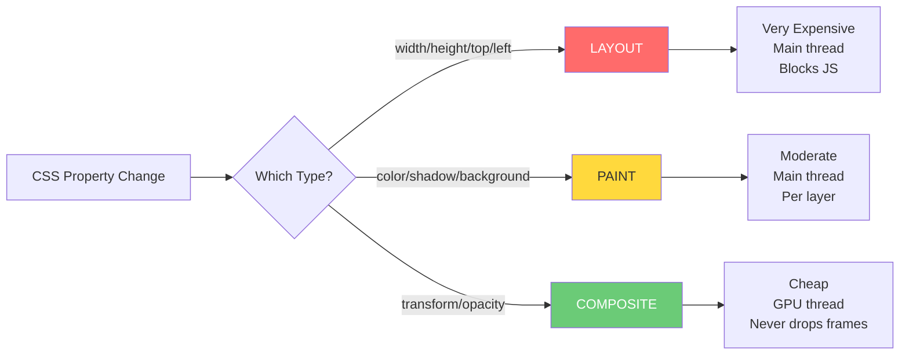

# CSS Performance, Reflow, and Repaint

🎯 **Interview Weight:** critical (★★★) - browser rendering
performance is a production concern; the distinction between
reflow, repaint, and composite is the foundation for all
CSS animation and layout performance work

---

### 🎯 Model Answer

**30 seconds:**

> The browser rendering pipeline: Parse HTML/CSS → Style
> calculation → Layout (reflow) → Paint → Composite.
> Reflow recalculates geometry (position, size) - expensive,
> invalidates child and ancestor layout. Repaint redraws
> pixels without geometry changes. Composite only reorders
> pre-painted layers on the GPU. CSS animations targeting
> `transform` and `opacity` skip reflow and repaint,
> running only on the compositor thread - this is why
> they never drop frames even under JavaScript load.

**3 minutes (Senior):**

> The browser rendering pipeline has 5 stages: Style (CSS
> matching), Layout (geometry calculation), Paint (pixel
> drawing), Composite (GPU layer ordering). Each CSS property
> change triggers the pipeline from a specific stage.
>
> Reflow (Layout): triggered by properties that affect
> geometry. `width`, `height`, `top`, `left`, `margin`,
> `padding`, `border`, `font-size`, `display`. Reflow is
> expensive because it propagates: changing the width of
> an element invalidates the layout of its parent and all
> descendants. The entire layout tree may be recalculated.
>
> Repaint: triggered by visual changes that don't affect
> layout. `color`, `background-color`, `visibility`,
> `box-shadow`, `text-decoration`. Less expensive than
> reflow but still synchronous main-thread work.
>
> Composite: only `transform` and `opacity`. The browser
> moves pre-painted texture layers on the GPU. The main
> thread is NOT involved. Even if JavaScript has a 200ms
> blocking task, `transform` animations continue at 60fps.
>
> `will-change`: promotes an element to its own compositor
> layer preemptively. `will-change: transform` tells the
> browser "this will be animated" - useful before complex
> animations but adds memory overhead per layer.
>
> Forced synchronous layout: reading a layout-dependent
> property (like `offsetWidth`) after a DOM mutation forces
> the browser to flush pending layout calculations immediately.
> In a loop, this causes "layout thrashing" - the most
> common CSS/DOM performance bug.

*Adapting up:* Discuss GPU memory budget for compositor
layers; Houdini Worklets and CSS Paint API; RAIL model for
performance targets.

*Adapting down:* `transform` is fast, `width` is slow.
CSS animations should use `transform` and `opacity`.

**Blank Mind Recovery:**

**(1) Restate:** "You are asking about CSS rendering
performance - specifically reflow, repaint, and composite
and how to write CSS that avoids expensive reflows."

**(2) First principles:** "From first principles, changing
an element's geometry requires recalculating the layout of
the entire document (or subtree). That's expensive. Changing
only its visual appearance (color) requires only redrawing
pixels. Moving an already-painted texture on the GPU is
nearly free."

**(3) Bridge:** "Think of a newspaper: changing the word
count forces relayout of the entire page (reflow). Changing
ink color requires reprinting. Sliding the finished paper
across a desk requires no reprinting at all (composite)."

---

### 📘 Concept Explanation

**What it is:**

The browser rendering pipeline and CSS's impact at each
stage. Understanding which CSS properties trigger which
pipeline stages enables writing CSS that animates at 60fps
and avoids layout thrashing.

**The problem it solves:**

CSS property changes that trigger reflow (layout
recalculation) are expensive and block the main thread.
Animations using reflow-triggering properties drop frames.
CSS developers need to know which properties are "safe"
for animation (composite-only) vs "expensive" (reflow).

**How it works:**

```
BROWSER RENDERING PIPELINE:

  HTML/CSS → Parse → STYLE → LAYOUT → PAINT → COMPOSITE
                      ↑         ↑         ↑         ↑
                   CSS rules  geometry  pixels    GPU layers
                   matched    calculated drawn     ordered

CSS PROPERTY IMPACT BY STAGE:

  REFLOW (Layout) triggers - EXPENSIVE:
    Geometry: width, height, min/max-width/height
    Positioning: top, left, right, bottom
    Spacing: margin, padding, border-width
    Display: display, float, position (change)
    Font: font-size, line-height, font-family
    Other: overflow, clear, flex properties

  REPAINT triggers - MODERATE:
    Color: color, background-color, border-color
    Shadow: box-shadow, text-shadow
    Visibility: visibility (not display!)
    Decoration: text-decoration, outline

  COMPOSITE ONLY - CHEAP (GPU, no main thread):
    transform: translate, scale, rotate, skew
    opacity: 0 to 1 transitions
    filter: (partially - depends on browser)

ANIMATION PROPERTY COMPARISON:
  /* Expensive - reflow every frame */
  .bad-anim {
    animation: move 1s;
  }
  @keyframes move {
    to { left: 200px; } /* triggers reflow */
  }

  /* Cheap - composite only, never drops frames */
  .good-anim {
    animation: move 1s;
  }
  @keyframes move {
    to { transform: translateX(200px); } /* composite */
  }

FORCED SYNCHRONOUS LAYOUT (LAYOUT THRASHING):
  // BAD: read-write-read in loop
  elements.forEach(el => {
    const w = el.offsetWidth; // READ: forces layout flush
    el.style.width = (w * 2) + 'px'; // WRITE: invalidates
    // Next iteration: READ again forces another flush
    // Result: N layout calculations per loop iteration
  });

  // GOOD: batch reads, then batch writes
  const widths = elements.map(el => el.offsetWidth); // all reads
  elements.forEach((el, i) => {
    el.style.width = (widths[i] * 2) + 'px'; // all writes
  });
  // Result: 1 layout calculation total
```

**The key insight:**

`transform` and `opacity` are the only CSS properties that
bypass the main thread entirely. They run on the GPU
compositor thread. Even a completely blocked main thread
(long JavaScript task) cannot drop `transform`/`opacity`
animation frames. This is why every CSS animation guide
says "use transform instead of left/top."

**When to use `will-change`:**

Before complex animations that would benefit from pre-
promotion to a compositor layer. `will-change: transform`
on a card that will be animated during a user interaction
(hover, click). Remove `will-change` after the animation
to free the layer's GPU memory.

**When NOT to use `will-change`:**

`will-change: all`: promotes everything - wastes GPU memory
with no benefit. Every element with `will-change` consumes
GPU memory for its texture. Too many layers = GPU memory
exhaustion = worse performance.

**Alternatives for performance:**

CSS `content-visibility: auto` for off-screen sections.
`contain: layout` to isolate layout calculation to a subtree.
Virtual scrolling for long lists.

**First-principles derivation:**

The browser must transform HTML + CSS into pixels on screen.
This requires geometry calculation (where is each element?),
painting (what pixels?), and compositing (layers in order).
Properties that affect geometry invalidate ALL downstream
geometry - expensive. Properties that only affect pixels
are cheaper. Properties that only move already-painted
layers are cheapest.

---

### 💻 Code Example

**BAD: left/top animation causes reflow every frame**

```css
/* BAD: animating left/top triggers layout every frame */
.modal {
  position: absolute;
  top: -100px;
  left: 0;
  transition: top 0.3s ease;
}
.modal.is-open {
  top: 50px; /* reflow on every frame of the transition */
}

/* Also BAD: JavaScript top/left animation */
function animate(element, to) {
  let pos = 0;
  function step() {
    pos += 5;
    element.style.top = pos + 'px'; // reflow each frame
    if (pos < to) requestAnimationFrame(step);
  }
  requestAnimationFrame(step);
}
```

> **Code walkthrough:** `top` is a layout property - changing
> it triggers reflow. Every animation frame (16ms at 60fps)
> the browser recalculates layout for the modal and everything
> affected by its position. Under any main thread pressure,
> these frames drop. `element.style.top` also forces a
> synchronous layout flush if any reads follow.

**GOOD: transform for smooth animation**

```css
/* GOOD: transform = composite only, never drops frames */
.modal {
  position: absolute;
  top: 0;
  left: 0;
  transform: translateY(-100%);
  transition: transform 0.3s ease;
  will-change: transform; /* pre-promote layer */
}
.modal.is-open {
  transform: translateY(0);
  /* only composite needed - GPU handles this */
}

/* Dialog slide-in with cubic-bezier */
.slide-panel {
  transform: translateX(100%);
  transition: transform 0.25s cubic-bezier(0.4, 0, 0.2, 1);
}
.slide-panel.open {
  transform: translateX(0);
}
```

> **Code walkthrough:** `transform: translateY(-100%)` moves
> the element visually without changing its position in the
> layout flow. The transition between states runs entirely
> on the GPU compositor thread. `will-change: transform`
> promotes the element to its own layer before the animation
> starts, preventing jank from the initial promotion.

**PRODUCTION: batched DOM operations to prevent thrashing**

```javascript
// GOOD: batch reads then writes with requestAnimationFrame
class ElementResizer {
  constructor(elements) {
    this.elements = Array.from(elements);
  }

  resizeAll(multiplier) {
    // Batch phase 1: READ all dimensions (one layout flush)
    const dims = this.elements.map(el => ({
      el,
      width: el.offsetWidth,   // causes layout flush (once)
      height: el.offsetHeight
    }));

    // Request a frame to batch writes
    requestAnimationFrame(() => {
      // Batch phase 2: WRITE all changes
      dims.forEach(({ el, width, height }) => {
        el.style.width  = (width  * multiplier) + 'px';
        el.style.height = (height * multiplier) + 'px';
      });
      // Only 1 layout + 1 paint triggered total
    });
  }
}
```

> **Code walkthrough:** All reads happen synchronously in
> one pass (causing one layout flush). Then `requestAnimationFrame`
> defers the writes to the next frame. The writes happen after
> the browser's layout/paint cycle for that frame. Result:
> one layout calculation per resize operation, not N. The
> `requestAnimationFrame` also ensures writes happen at the
> browser's rendering cadence (60fps).

**PRODUCTION: content-visibility for large pages**

```css
/* Long page with many off-screen sections */
.section {
  content-visibility: auto;
  /* Tells browser to skip rendering off-screen sections */
  contain-intrinsic-size: 0 500px;
  /* Provides size estimate while section is not rendered */
  /* Prevents layout shift when section renders */
}

/* Without content-visibility: 100 sections render on load */
/* With content-visibility: only visible sections render */
/* 50-80% reduction in initial render time for long pages */
```

> **Code walkthrough:** `content-visibility: auto` is a CSS
> containment hint. The browser skips layout and painting for
> off-screen sections. `contain-intrinsic-size` estimates the
> section's height for scroll position calculation. Without it,
> off-screen sections have zero height until rendered, causing
> scroll jumps. This is the modern alternative to JavaScript-
> based virtual rendering for static content.

---

### 🎓 Answers by Seniority

**Junior / Mid (0-5 years):**

> CSS performance comes down to which rendering stage a
> property change triggers. `transform` and `opacity` are
> cheap because they run on the GPU compositor thread.
> Properties like `width`, `height`, `top`, `left` trigger
> layout recalculation (reflow) - expensive and can drop
> frames. For animations, always prefer `transform:
> translate()` over `left`/`top`, and `opacity` over
> `visibility`. I also avoid reading layout properties
> (offsetWidth) inside animation loops to prevent layout
> thrashing.

---

**Senior / Staff (5+ years):**

> The rendering pipeline fundamentals: Style > Layout >
> Paint > Composite. `transform` and `opacity` are compositor-
> only - they literally skip the main thread and run on a
> dedicated GPU thread. This is why they're the only CSS
> properties guaranteed to never drop frames under JavaScript
> load.
>
> Layout thrashing is the most common production performance
> issue: interleaving DOM reads (offsetWidth, getBoundingClientRect)
> and DOM writes (style changes) inside loops forces repeated
> synchronous layout flushes. FastDOM or batching with
> requestAnimationFrame solves this.
>
> At scale: `content-visibility: auto` for long pages
> reduces initial render by skipping off-screen layout and
> paint. `@layer` containment and CSS `contain: layout` for
> widget isolation. GPU memory budget awareness for `will-change`:
> each promoted layer costs ~4x its bitmap size in GPU memory.

---

### ⚠️ Common Misconceptions

**"Opacity 0 removes the element from layout"**

No. `opacity: 0` is still composite-only (cheap) but the
element still occupies its layout space. Use `display: none`
to remove from layout (but that triggers reflow). For animations,
use `opacity: 0` + `pointer-events: none` to hide while
keeping the layer.

**"will-change: transform always improves performance"**

`will-change` forces the element onto its own GPU layer.
If the element doesn't animate, this wastes GPU memory.
If you apply `will-change` to many elements simultaneously,
you exhaust the GPU memory budget, causing the browser
to de-promote layers - worse than not using it. Apply
`will-change` only to elements about to animate, and remove
it after the animation completes.

**"transform: translate doesn't change an element's position"**

`transform` changes the VISUAL position but not the
LAYOUT position. Other elements are not affected (no reflow).
The element's space in the layout flow is unchanged - it's
as if you physically moved the rendered image without
touching the box.

---

### 🚨 Failure Modes and Diagnosis

**Symptom: animation jank (dropped frames)**

```
DevTools diagnosis:
1. Performance panel → Record → trigger animation
2. Frames section: red frames = dropped frames
3. Flame chart: look for long "Layout" (purple) events
4. Click "Layout" event: see which elements triggered reflow
5. Layers panel: show compositor layers (green = GPU layer)

Diagnosis checklist:
- Animation uses left/top → change to transform
- Style changes in loop → check for thrash pattern
- Too many will-change layers → GPU memory exhaustion
- CSS transition on layout properties → use transform
```

---

**Symptom: layout thrashing (slow list/table operations)**

```javascript
// Diagnosis: Chrome DevTools Performance
// "Forced Reflow" warning in purple:
// "Layout forced - document needs layout"

// Fix pattern: use FastDOM library
import fastdom from 'fastdom';
elements.forEach(el => {
  fastdom.measure(() => {
    const w = el.offsetWidth; // queued read
    fastdom.mutate(() => {
      el.style.width = w * 2 + 'px'; // queued write
    });
  });
});
// FastDOM batches all reads then all writes per frame
```

---

**Symptom: scrolling performance drops when adding shadows**

`box-shadow` triggers repaint. On elements that scroll within
a container, repaint happens on every scroll event.

Fix: promote the element to a compositor layer with
`will-change: transform` or `transform: translateZ(0)`.
This moves the element's painting to a separate GPU texture.
The scrolling becomes composite-only.

---

### 🎯 Interview Deep-Dive

| Scenario | Recommended Time | Key Signal |
|---|---|---|
| Rendering pipeline stages | 3-4 min | All 4 stages |
| Reflow vs repaint vs composite | 4 min | Property categories |
| Why transform is fast | 3-4 min | Compositor thread |
| Layout thrashing | 4-5 min | Read/write batching |
| will-change usage + risks | 3-4 min | GPU memory trade-off |
| content-visibility | 3-4 min | Modern optimization |
| CSS animation vs JS animation | 4 min | Thread comparison |
| Forced synchronous layout | 3-4 min | offsetWidth trap |
| contain: layout | 3-4 min | Layout isolation |
| Diagnose jank in DevTools | 4-5 min | Performance tooling |
| CSS houdini/paint API | 4 min | Extensibility |
| GPU memory budget | 3-4 min | will-change limits |

---

**Q1: Walk me through the browser rendering pipeline
and how CSS fits in.** `[SENIOR]` MECHANISM

*Why they ask:* Foundation of all CSS performance knowledge.

*Likely follow-up:* "What is recalculate style?"

> **Answer:**
>
> The browser rendering pipeline has five stages:
>
> **1. HTML/CSS Parsing**: The browser downloads and parses
> HTML (building the DOM tree) and CSS (building the CSSOM).
> These run in parallel where possible. JavaScript blocks
> HTML parsing by default.
>
> **2. Style Calculation (Recalculate Style)**: The browser
> matches CSS rules to DOM elements and calculates each
> element's computed styles. Expensive if there are many
> complex selectors, many elements, or frequent style
> invalidation.
>
> **3. Layout (Reflow)**: The browser calculates the geometry
> of every element - position, size, the box model. Layout
> is the most expensive stage because changes propagate:
> changing one element's width may force recalculation of
> its children, siblings, and ancestors.
>
> **4. Paint**: The browser rasterizes each layer - draws
> text, images, backgrounds, borders, shadows into a bitmap.
> Paint is done per layer. Layer = area of the screen with
> independent z-stacking.
>
> **5. Composite**: The GPU takes all painted layers and
> composites them in the correct order to produce the final
> frame. The compositor thread is separate from the main
> thread.
>
> CSS property changes trigger the pipeline from specific
> stages:
> - Layout-affecting properties (width, top): full pipeline
> - Visual properties (color, shadow): from Paint
> - Transform/opacity: from Composite only
>
> "Recalculate Style" in DevTools is the Style stage.
> Long recalculate style times indicate either complex
> selectors (fix: reduce specificity) or too many matching
> elements being invalidated.
>
> *What separates good from great:* The cascade in CSS
> style calculation runs once. But style recalculation runs
> on every invalidation - class changes, pseudostate changes,
> DOM mutations. Minimizing unnecessary style invalidations
> (not triggering CSS changes in animation loops, batching
> class changes) keeps recalculate style fast.

---

**Q2: What is the difference between reflow, repaint,
and composite?** `[MID]` MECHANISM

*Why they ask:* Core question for CSS performance.

*Likely follow-up:* "Give me 5 examples of each type."

> **Answer:**
>
> **Reflow (Layout)**:
>
> Reflow recalculates the geometry - position and size -
> of all affected elements. It propagates through the
> element tree: changing the width of a parent invalidates
> the layout of all its children.
>
> Triggers (geometry-affecting):
> `width`, `height`, `min/max-width/height`, `margin`,
> `padding`, `border`, `top`, `left`, `right`, `bottom`,
> `font-size`, `line-height`, `display`, `position`,
> `float`, `overflow`, `vertical-align`
>
> Cost: high. Full subtree recalculation. Main thread.
> Synchronous (blocks other JavaScript).
>
> **Repaint (Paint)**:
>
> Repaint redraws the pixels of affected elements. Geometry
> is unchanged; only visual appearance changes.
>
> Triggers (non-geometric visual):
> `color`, `background-color`, `background-image`, `border-color`,
> `visibility`, `box-shadow`, `text-decoration`, `outline-color`
>
> Cost: moderate. Pixel-level drawing. Main thread.
> Cheaper than reflow.
>
> **Composite**:
>
> The GPU reorders and blends pre-painted layer textures.
> No pixel drawing, no geometry calculation.
>
> Triggers (compositor-only properties):
> `transform: translate/scale/rotate`
> `opacity`
> `filter` (partially - depends on browser/property)
>
> Cost: very low. GPU thread only. Does NOT block the
> JavaScript main thread. Animations continue at 60fps even
> during heavy JavaScript work.
>
> *What separates good from great:* `filter: blur(5px)` is
> mostly compositor but can trigger repaint in some browsers.
> `clip-path` on animated elements triggers repaint. These
> "mostly compositor" properties are safe for most use cases
> but fall back to repaint in edge cases. Verify with
> DevTools Layers panel - if the layer shows "reasons:
> filter" it's on the compositor.

---

**Q3: Why should you use transform instead of top/left
for animation?** `[JUNIOR]` MECHANISM

*Why they ask:* This is the most practical CSS performance rule.

*Likely follow-up:* "How do you animate position changes
with transform?"

> **Answer:**
>
> `top`/`left` are layout properties. Changing them triggers
> reflow on every animation frame. At 60fps, this is 60
> layout calculations per second. The browser must:
> 1. Invalidate the layout tree
> 2. Recalculate position for the element and all affected
>    neighbors
> 3. Mark the area dirty for repaint
> 4. Repaint the affected area
> 5. Composite
>
> `transform: translate(x, y)` is a compositor-only property.
> The element's layout position never changes. The GPU simply
> moves the element's pre-painted texture to the target
> offset. No layout, no paint. The main thread is not involved.
>
> How to animate position with transform:
>
> ```css
> /* Start position: set with layout properties */
> .panel {
>   position: absolute;
>   top: 0;
>   left: 0;
>   /* No animation here */
> }
>
> /* Animate with transform: */
> .panel--slide-in {
>   transform: translateX(300px);
>   transition: transform 0.3s ease;
>   /* Or: translate(300px, 0) - modern CSS Transforms Level 2 */
> }
>
> .panel--active {
>   transform: translateX(0);
>   /* Back to original position */
> }
> ```
>
> The element stays at `top: 0; left: 0` in the layout flow.
> `transform` moves its visual rendering without affecting
> layout.
>
> *What separates good from great:* CSS Transforms Level 2
> introduces `translate`, `rotate`, `scale` as individual
> transform properties, separate from the `transform` shorthand.
> `translate: 100px 0` is equivalent to `transform: translateX(100px)`.
> These individual properties are also compositor-only and
> compose cleanly with the `transform` shorthand (useful when
> both a layout transform and an animation transform are needed
> on the same element).

---

**Q4: What is layout thrashing and how do you prevent it?**
`[SENIOR]` PRODUCTION

*Why they ask:* Layout thrashing is the most common DOM
performance bug.

*Likely follow-up:* "What causes forced synchronous layout?"

> **Answer:**
>
> Layout thrashing occurs when JavaScript alternately READS
> layout properties and WRITES style changes in a loop,
> forcing the browser to perform synchronous layout
> recalculations on every read.
>
> The problem: when you read a layout property (offsetWidth,
> clientHeight, getBoundingClientRect, etc.) after a DOM
> write (style change), the browser must finish its pending
> layout work before returning the value. This is called a
> "forced synchronous layout."
>
> ```javascript
> // THRASHING: read-write alternation
> items.forEach(item => {
>   const h = item.offsetHeight; // READ: forces layout flush
>   item.style.height = (h + 20) + 'px'; // WRITE
>   // Next iteration: READ again forces ANOTHER flush
>   // 100 items = 100 synchronous layout calculations
> });
> ```
>
> Layout properties that cause forced sync layout:
> `offsetWidth/Height`, `clientWidth/Height`,
> `scrollWidth/Height`, `getBoundingClientRect()`,
> `getComputedStyle()`, `offsetTop/Left`,
> `scrollTop/Left`
>
> Prevention:
>
> **1. Batch reads then writes:**
> ```javascript
> // Read phase (one flush)
> const heights = items.map(item => item.offsetHeight);
> // Write phase (no reads - no flush forced)
> items.forEach((item, i) => {
>   item.style.height = (heights[i] + 20) + 'px';
> });
> ```
>
> **2. requestAnimationFrame for writes:**
> ```javascript
> const heights = items.map(item => item.offsetHeight);
> requestAnimationFrame(() => {
>   items.forEach((item, i) => {
>     item.style.height = (heights[i] + 20) + 'px';
>   });
> });
> ```
>
> **3. FastDOM library** (battle-tested batching):
> ```javascript
> import fastdom from 'fastdom';
> items.forEach(item => {
>   fastdom.measure(() => {
>     const h = item.offsetHeight;
>     fastdom.mutate(() => { item.style.height = h + 20 + 'px'; });
>   });
> });
> ```
>
> **4. ResizeObserver** for size-reactive UI:
> ```javascript
> const observer = new ResizeObserver(entries => {
>   requestAnimationFrame(() => {
>     entries.forEach(entry => {
>       // entry.contentRect.width/height - no layout flush
>       // These are already-calculated values
>     });
>   });
> });
> ```
>
> *What separates good from great:* The DevTools Performance
> panel shows "Forced Reflow" events in the flame chart as
> purple "Layout" markers. Each one means a forced synchronous
> layout was triggered. In a list with 100 items, you should
> see ONE purple Layout event per frame, not 100.

---

**Q5: What is `will-change` and what are its risks?**
`[SENIOR]` TRADE-OFF

*Why they ask:* Misuse of will-change is a common performance
anti-pattern.

*Likely follow-up:* "How does will-change interact with
z-index stacking context?"

> **Answer:**
>
> `will-change` is a hint to the browser that an element
> will soon be animated. The browser promotes the element
> to its own compositor layer in advance, preventing the
> cost of layer promotion during the animation (which
> causes jank on first frame).
>
> ```css
> /* Good use: element about to animate */
> .card:hover {
>   will-change: transform;
>   /* Promotes to compositor layer on hover */
>   /* Transition to transform starts with layer already set */
> }
>
> /* Better: conditional class applied just before animation */
> .card.animating { will-change: transform; }
> ```
>
> Risks:
>
> **1. GPU memory exhaustion**:
> Each `will-change` element's texture is uploaded to GPU
> memory. A 1920x1080 element at 4 bytes/pixel = ~8MB.
> With 50 elements using `will-change`, that's potentially
> 400MB of GPU memory. Mobile GPUs have 256-512MB total.
> When GPU memory fills, the browser de-promotes layers -
> worse performance than if `will-change` was never used.
>
> **2. Creates stacking context**:
> `will-change: transform` creates a stacking context
> (same as `position: relative; z-index: 0`). This can
> break `z-index` layering for fixed/absolute positioned
> children. A tooltip inside a `will-change: transform`
> parent can't escape the parent's stacking context.
>
> **3. Constant repaint for incorrect usage**:
> `will-change: all` forces the browser to track all
> properties. Every minor state change triggers the layer
> to re-upload its texture.
>
> Best practices:
> - Apply `will-change` programmatically, remove after animation
> - Only on elements that actually animate
> - Specific property only: `will-change: transform` not `all`
> - Test GPU memory in DevTools Layers panel
>
> *What separates good from great:* `transform: translateZ(0)`
> and `backface-visibility: hidden` are older hacks to force
> GPU layer promotion (from before `will-change` existed).
> They still work but are semantically wrong - avoid using
> these tricks in new code. Use `will-change` with proper
> lifecycle management instead.

---

**Q6: What is `content-visibility: auto` and when should
you use it?** `[SENIOR]` PRODUCTION

*Why they ask:* Modern CSS performance technique for long pages.

*Likely follow-up:* "What is `contain-intrinsic-size`?"

> **Answer:**
>
> `content-visibility: auto` skips rendering (layout + paint)
> for elements outside the viewport. The browser treats the
> element as if it were `visibility: hidden` for rendering
> purposes until it comes near the viewport.
>
> ```css
> .article-section {
>   content-visibility: auto;
>   contain-intrinsic-size: 0 500px;
>   /* Estimate: 0px wide (uses actual), 500px tall */
>   /* Used for scroll height calculation while off-screen */
> }
> ```
>
> Without `content-visibility`: a 100-section article causes
> the browser to lay out and paint all 100 sections on initial
> load. Sections 2-100 are off-screen but still processed.
>
> With `content-visibility: auto`: only sections near the
> viewport are rendered. Sections far from the viewport are
> skipped. As you scroll, sections enter "rendering range"
> (~500px from viewport edge) and render on-demand.
>
> Performance impact: Google's case studies show 50-80%
> reduction in initial render time for long content pages.
>
> `contain-intrinsic-size` is critical: without it, off-screen
> sections have 0 height. The scrollbar changes as you scroll
> (sections expand from 0 to their real size). With the
> size estimate, the scroll position is stable.
>
> Caveats:
> - Off-screen elements are not searchable (Ctrl+F won't
>   find text in skipped sections - browser handles this
>   by rendering sections matching the search)
> - Doesn't work well for animated or frequently-updated
>   off-screen content
> - Requires correct intrinsic size estimate for stable scroll
>
> *What separates good from great:* `content-visibility` is
> based on the CSS Containment specification (`contain: layout
> paint style`). CSS `contain: strict` or `contain: layout` are
> the underlying primitives. `contain: layout` tells the browser
> "this element's layout is self-contained - changes inside
> don't affect outside." This enables browser optimization.
> `content-visibility: auto` is a high-level API over these
> containment primitives.

---

**Q7: What is the CSS paint API (Houdini)?** `[STAFF]`
MECHANISM

*Why they ask:* Staff engineers understand the CSS extensibility
platform.

*Likely follow-up:* "What limits does the Houdini paint API
have?"

> **Answer:**
>
> CSS Houdini is a set of low-level browser APIs that expose
> parts of the CSS rendering engine to JavaScript. The Paint
> API (CSS Painting API) lets you define a custom CSS value
> for `background`, `background-image`, `border-image`, and
> `mask-image` that draws custom graphics.
>
> Without Houdini:
> - Box shadow is limited to offset/blur/spread
> - Border is limited to solid/dashed/dotted
> - Background gradients are limited to built-in types
>
> With Houdini Paint API:
>
> ```javascript
> // my-paint.js (registered as a worklet)
> class PolkaDotPainter {
>   static get inputProperties() {
>     return ['--dot-color', '--dot-size'];
>   }
>
>   paint(ctx, geom, properties) {
>     const color = properties.get('--dot-color').toString();
>     const size = parseFloat(properties.get('--dot-size'));
>     const cols = Math.ceil(geom.width / (size * 2));
>     const rows = Math.ceil(geom.height / (size * 2));
>
>     ctx.fillStyle = color;
>     for (let y = 0; y < rows; y++) {
>       for (let x = 0; x < cols; x++) {
>         ctx.beginPath();
>         ctx.arc(
>           x * size * 2 + size, y * size * 2 + size,
>           size / 2, 0, Math.PI * 2
>         );
>         ctx.fill();
>       }
>     }
>   }
> }
> registerPaint('polka-dot', PolkaDotPainter);
> ```
>
> ```javascript
> // Register the worklet
> CSS.paintWorklet.addModule('my-paint.js');
> ```
>
> ```css
> /* Use in CSS */
> .background {
>   --dot-color: blue;
>   --dot-size: 20px;
>   background: paint(polka-dot);
> }
> ```
>
> The paint worklet runs in a separate thread (similar to
> Web Workers). It has no access to the DOM.
>
> Limits:
> - Cannot access DOM (no `document.querySelector`)
> - Cannot access global variables from main thread
> - Only runs during paint phase (not layout)
> - Chrome-only currently (Firefox behind flag, Safari not yet)
>
> *What separates good from great:* Houdini's CSS Properties
> and Values API (`@property`) is related. It lets you register
> custom properties with types, enabling browser-native
> ANIMATION of custom properties. `@property --color { syntax:
> '<color>'; initial-value: blue; inherits: false; }` makes
> `--color` animatable - you can `transition: --color 1s` and
> the browser interpolates between two color values. Without
> `@property`, custom property transitions don't work (the
> browser doesn't know the value is a color).

---

**Q8: What is CSS `contain` and when is it valuable?**
`[SENIOR]` MECHANISM

*Why they ask:* CSS Containment is an underused performance tool.

*Likely follow-up:* "What is the difference between contain:
layout and contain: strict?"

> **Answer:**
>
> The `contain` property tells the browser that an element
> is isolated from the rest of the page in specific ways,
> enabling performance optimizations.
>
> `contain: layout`: changes inside this element do not
> affect the layout of elements outside it. The browser
> can stop layout recalculation at this element's boundary.
>
> `contain: paint`: elements inside that overflow this
> element's bounds are not painted (like `overflow: hidden`
> but more powerful).
>
> `contain: style`: counter-increment and counter-reset don't
> affect elements outside this container.
>
> `contain: size`: the element's size doesn't depend on
> its children.
>
> `contain: strict`: `contain: layout paint size style`
>
> `contain: content`: `contain: layout paint style` (no size)
>
> Use case: widget isolation
>
> ```css
> /* Isolated widget: internal changes don't affect page */
> .widget {
>   contain: layout;
>   /* CSS change inside .widget doesn't trigger
>      recalculation of elements outside .widget */
> }
>
> /* Completely isolated section */
> .section {
>   contain: content; /* layout + paint + style */
>   /* Safe to update independently */
> }
>
> /* Third-party widget (ads, embeds): */
> .ad-container {
>   contain: strict;
>   /* Ad's aggressive DOM manipulation is isolated */
>   /* Cannot reflow the page */
> }
> ```
>
> `content-visibility: auto` implicitly applies
> `contain: layout paint style` while element is off-screen.
>
> *What separates good from great:* `contain: strict` is
> valuable for ad containers and third-party embeds. Ads
> notoriously cause layout thrashing by reading/writing
> DOM properties. With `contain: strict`, any layout work
> the ad causes is contained to the ad's box - the rest
> of the page is isolated. This is how Googlebot and
> frameworks like Angular use containment.

---

**Q9: How do you diagnose CSS animation performance
with DevTools?** `[SENIOR]` DEBUGGING

*Why they ask:* Performance diagnosis is a production skill.

*Likely follow-up:* "What does the Layers panel show?"

> **Answer:**
>
> Step-by-step CSS animation performance diagnosis:
>
> **Step 1: Record a Performance trace**
> - DevTools → Performance → Record
> - Trigger the animation (scroll, click, hover)
> - Stop recording
>
> **Step 2: Check Frame Rate**
> - Frames timeline: green = 60fps, yellow = 30fps, red = <30fps
> - Target: green for all animated frames
>
> **Step 3: Identify Long Tasks**
> - Flame chart: look for "Layout" (purple), "Paint" (green)
>   tasks during the animation
> - Long Layout during animation = layout-triggering property
>   (change to transform)
>
> **Step 4: Find the cause**
> - Click a "Layout" event
> - "Layout Forced" = JavaScript triggered synchronous reflow
> - Stack trace shows the offending code
>
> **Step 5: Layers panel**
> - DevTools → Layers panel (enable in More Tools)
> - Shows all compositor layers as 3D visualization
> - Hover layer to see why it was promoted:
>   "transform 3D", "will-change", "overlap with other layer"
> - Too many layers = GPU memory pressure
>
> **Step 6: Rendering panel (paint flashing)**
> - DevTools → Rendering → Enable "Paint flashing"
> - Green flashes = areas that repainted each frame
> - If the whole page flashes during animation: something
>   triggers a full repaint (find and fix)
>
> Command: `chrome://flags/#show-fps-counter` shows a live
> FPS overlay for quick visual check.
>
> *What separates good from great:* The Rendering panel's
> "Layer borders" option draws blue/orange borders around
> compositor layers. Orange = tile layers (large content
> split into tiles). Blue = composited layers (GPU). Seeing
> 50+ blue layers on a simple page indicates excessive
> `will-change` usage. The Layer Memory chart in DevTools
> shows total GPU memory consumed by all layers.

---

**Q10: What is the RAIL model and how does it relate
to CSS performance?** `[STAFF]` ARCHITECTURE

*Why they ask:* Staff engineers tie CSS optimization to
user experience goals.

*Likely follow-up:* "What is the time budget for an animation
frame?"

> **Answer:**
>
> RAIL is Google's user-centric performance model defining
> response time targets:
>
> **R - Response**: < 100ms for user input response
> (button click, navigation). CSS transitions < 100ms feel
> instant.
>
> **A - Animation**: 60fps = 16.7ms per frame. Each frame
> budget: 16ms. The browser itself needs ~6ms, leaving
> 10ms for JavaScript + CSS work. If CSS causes >10ms of
> layout/paint per frame, frames drop.
>
> **I - Idle**: 50ms chunks for non-critical work. CSS
> animations running during idle time must stay in compositor
> (transform/opacity) or they block idle JavaScript work.
>
> **L - Load**: < 1000ms for initial page load. Critical CSS
> (above-the-fold styles) must be inlined. Non-critical CSS
> deferred.
>
> CSS performance targets per RAIL:
>
> Animation budget breakdown per frame (16ms):
> - Style recalculation: < 1ms (simple selectors)
> - Layout: < 3ms (small subtree changes)
> - Paint: < 3ms (small paint area)
> - Composite: < 2ms
> - Remaining: 7ms for JavaScript
>
> If any one CSS operation exceeds its budget, the total
> frame exceeds 16ms and the frame drops.
>
> How transform/opacity fit: they use 0ms of the layout
> budget and 0ms of the paint budget. They only use ~2ms
> in the composite stage. Even with JavaScript using its
> entire 10ms budget, the frame completes in 12ms (well
> under 16ms).
>
> *What separates good from great:* The 16.7ms frame budget
> applies to 60fps displays. For 120Hz displays (iPad Pro,
> ProMotion), the budget is 8.3ms. For 90Hz (Pixel), 11ms.
> CSS animations need to stay compositor-only to reliably
> meet budgets across all display frequencies. The RAIL
> model predates high-refresh-rate displays - modern
> performance targets should account for 90/120Hz screens.

---

**Q11: What CSS properties create a stacking context?**
`[SENIOR]` MECHANISM

*Why they ask:* Stacking contexts cause z-index bugs that
confuse developers.

*Likely follow-up:* "Why does will-change create a stacking
context?"

> **Answer:**
>
> A stacking context is an element that creates its own
> z-index coordinate space. Elements inside a stacking
> context can only be z-ordered relative to each other -
> they cannot interleave with elements outside the context.
>
> CSS properties that create stacking contexts:
>
> 1. `position: relative/absolute/fixed/sticky` + `z-index`
>    not `auto`
> 2. `opacity < 1`
> 3. `transform` (any value other than `none`)
> 4. `filter` (any value other than `none`)
> 5. `will-change` for any property that creates a stacking
>    context if animated (`transform`, `opacity`, `filter`)
> 6. `isolation: isolate`
> 7. `mix-blend-mode` (any value other than `normal`)
> 8. `contain: layout` or `contain: paint`
> 9. `perspective` (any value other than `none`)
> 10. `clip-path` (any value other than `none`)
> 11. `mask` / `mask-image` (any value other than `none`)
>
> The classic bug:
>
> ```html
> <div class="modal-wrapper">  <!-- stacking context from transform -->
>   <div class="tooltip" style="z-index: 9999">
>     <!-- tooltip CANNOT appear above elements outside
>          .modal-wrapper, regardless of z-index value -->
>   </div>
> </div>
> ```
>
> Fix: ensure tooltips, dropdowns, and modals render in
> a portal at the document root (not inside elements with
> stacking contexts). React's `createPortal` solves this.
>
> Why `will-change` creates a stacking context: the browser
> must paint `will-change` elements on their own GPU layer,
> which requires them to have their own coordinate space.
> This is the same requirement as stacking contexts - they
> share the same browser mechanism.
>
> *What separates good from great:* `isolation: isolate` is
> the INTENTIONAL way to create a stacking context without
> the side effects of `opacity` or `transform`. Use it when
> you want to ensure `z-index` inside a component doesn't
> interact with the outside, but don't want to add visual
> transforms.

---

**Q12: Describe a CSS performance investigation at scale.
You have a React app with 500+ components and users report
scroll lag.** `[STAFF]` PRODUCTION

*Why they ask:* Staff-level scenario combining all
performance knowledge.

*Likely follow-up:* "How do you find which component causes
the reflow?"

> **Answer:**
>
> Investigation framework:
>
> **Step 1: Reproduce and measure baseline**
> - Identify device type (mobile often shows scroll lag that
>   desktop doesn't)
> - Record a Performance trace during scroll: 5 seconds
> - Note: frames per second, main thread blocking time
>
> **Step 2: Check for main thread blocking during scroll**
> - Flame chart during scroll: are there "Long Tasks" (red)?
> - If yes: this is JavaScript, not CSS. Different investigation.
> - If no long tasks but still lag: CSS pipeline issue.
>
> **Step 3: Identify expensive CSS operations during scroll**
> - Flame chart: purple "Layout" events during scroll = reflow
>   being triggered. Which JavaScript calls trigger this?
> - Green "Paint" events = areas repainting on scroll.
>   Enable "Paint Flashing" to visualize.
>
> **Step 4: Diagnose CSS causes**
>
> Common culprits for scroll reflow:
> - `position: sticky` elements with expensive selectors
> - `box-shadow` or `filter` on many elements
> - `transform` animations that also touch layout properties
> - `@scroll-timeline` (new) interactions affecting layout
>
> For repaint on scroll:
> - Elements with `box-shadow` or `filter` near the scroll
>   area that don't have their own compositor layers
>   → Add `will-change: transform` to promote them
>
> **Step 5: Scroll-specific optimizations**
>
> ```css
> /* Option 1: promote scroll container */
> .scroll-container {
>   overflow: auto;
>   will-change: transform; /* promotes to GPU layer */
>   -webkit-overflow-scrolling: touch; /* legacy iOS */
> }
>
> /* Option 2: content-visibility for off-screen items */
> .list-item {
>   content-visibility: auto;
>   contain-intrinsic-size: 0 80px; /* item height estimate */
> }
>
> /* Option 3: contain layout-heavy components */
> .card-grid-item {
>   contain: layout;
> }
> ```
>
> **Step 6: React-specific**
>
> 500 components rendering on scroll is likely a React issue.
> Check for components re-rendering on every scroll event
> with React DevTools Profiler. CSS changes alone don't
> typically cause 500-component render lag.
>
> **Step 7: Measure after each change**
> Performance improvements must be measured, not assumed.
> Run 5 traces before and after each change. Use average
> frame time, not best-case.
>
> *What separates good from great:* CSS `@scroll-timeline`
> (now Scroll-driven Animations, CSS level 4) enables scroll-
> linked animations that run entirely on the compositor
> thread. Previously, scroll-linked JS animations (parallax)
> required main-thread event listeners and caused layout
> thrashing. Scroll-driven animations: `animation-timeline:
> scroll()` - run at 60fps on compositor even on slow JavaScript.

---

| Interviewer Type | Emphasis |
|---|---|
| Technical Panel | Layout thrashing and batching patterns |
| Hiring Manager | RAIL model and user experience targets |
| Bar Raiser | Scroll-driven animations and Houdini |
| Peer Engineer | DevTools diagnosis workflow |

---

### ⚖️ Comparison Table

| CSS Property Change | Stage Triggered | Cost | Animation Safe |
|---|---|---|---|
| width/height | Layout → Paint → Composite | High | No |
| top/left | Layout → Paint → Composite | High | No |
| background-color | Paint → Composite | Medium | No |
| box-shadow | Paint → Composite | Medium | No |
| transform | Composite only | Very low | Yes |
| opacity | Composite only | Very low | Yes |
| visibility | Paint → Composite | Medium | Limited |
| display | Layout → Paint → Composite | Very High | No |

---

### 🏛️ System Design

**Large-scale CSS performance strategy:**

Design system with 500+ components, 100+ pages, tens of
thousands of concurrent users. CSS performance budget:
initial render < 200ms, scroll at 60fps, animations at 60fps.

**Architecture:**

```
CSS PERFORMANCE ARCHITECTURE:
┌─────────────────────────────────────────────┐
│          CSS Delivery Strategy              │
│                                             │
│  Critical CSS (< 14KB inline in <head>)     │
│  └── Above-fold components only             │
│  └── Generated by critical-css-webpack      │
│                                             │
│  Component CSS (lazy loaded per component)  │
│  └── CSS Modules (scoped, tree-shakeable)   │
│  └── Loaded with component chunk            │
│                                             │
│  Shared utilities (Tailwind subset)         │
│  └── Atomic, de-duplicated                  │
│  └── Loaded once in main bundle             │
└─────────────────────────────────────────────┘
         ↓
┌─────────────────────────────────────────────┐
│          Rendering Performance              │
│                                             │
│  @layer: base < components < utilities      │
│  contain: layout on all widget containers   │
│  content-visibility: auto on page sections  │
│  will-change: transform on animated items   │
│  transform + opacity only for all animation │
└─────────────────────────────────────────────┘
```

Key decisions:
- Critical CSS inlined: eliminates render-blocking CSS
- `contain: layout` on all widget boundaries: prevents
  third-party content from causing page-wide reflow
- `content-visibility: auto` on long-scroll sections:
  50-80% initial render reduction
- Animation linting rule: CI fails if `@keyframes` uses
  non-compositor properties

---

### 📊 Diagram

```
RENDERING PIPELINE STAGES:
┌─────────────────────────────────────────────┐
│  HTML/CSS     │ Parse DOM + CSSOM            │
│               │ Builds style tree            │
├───────────────┼──────────────────────────────┤
│  STYLE        │ Match rules to elements      │
│               │ Compute final styles         │
├───────────────┼──────────────────────────────┤
│  LAYOUT       │ Calc position + size         │
│  (Reflow)     │ Box model for all elements   │
│               │ EXPENSIVE - propagates up    │
├───────────────┼──────────────────────────────┤
│  PAINT        │ Draw pixels per layer        │
│  (Repaint)    │ Text, borders, shadows       │
│               │ MODERATE cost                │
├───────────────┼──────────────────────────────┤
│  COMPOSITE    │ GPU: order + blend layers    │
│               │ CHEAP - separate thread      │
│               │ transform + opacity land here│
└───────────────┴──────────────────────────────┘
CSS ANIMATION SHORTCUT:
  transform, opacity → SKIP to COMPOSITE
  All others → Start from LAYOUT or PAINT
```



> **Diagram walkthrough:** CSS property changes enter the
> rendering pipeline at different stages. Layout-affecting
> properties (geometry) trigger the full pipeline from
> Layout, making them the most expensive. Visual-only
> properties skip Layout and start from Paint. `transform`
> and `opacity` skip both Layout and Paint entirely, going
> directly to the GPU Composite stage. This is why `transform`-
> based animations are guaranteed to never compete with
> JavaScript for main thread time and never drop frames
> under JavaScript load.
