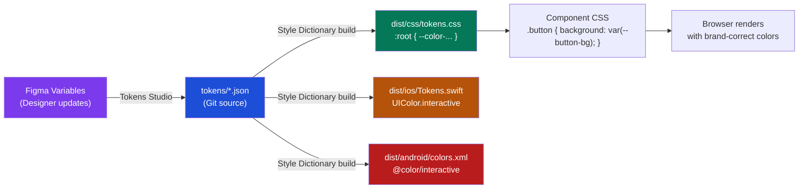

# CSS Design Token Architecture at Scale

🎯 **Interview Weight:** critical (★★★) - Design tokens
are the foundational layer of every modern design system;
understanding the multi-tier token model, CSS custom property
architecture, and multi-platform distribution separates
architects from implementers

---

### 🎯 Model Answer

**30 seconds:**

> Design tokens are named design decisions - color, spacing,
> typography, shadow - stored as data and compiled to any
> output format (CSS custom properties, iOS Swift, Android XML,
> JSON). The architecture has three tiers: Primitive tokens
> (raw values: `--color-blue-500: #3b82f6`), Semantic tokens
> (role-based: `--color-action: var(--color-blue-500)`), and
> Component tokens (scoped: `--button-background: var(--color-action)`).
> CSS custom properties are the browser implementation; the
> token data lives in a platform-agnostic format (JSON, YAML)
> compiled by a build tool.

**3 minutes (Senior):**

> The three-tier design token model:
>
> **Tier 1 - Primitive (Global) tokens**: raw values with no
> semantic meaning. `--color-blue-500: #3b82f6`. `--spacing-4: 1rem`.
> Never used directly in components - only referenced by
> semantic tokens.
>
> **Tier 2 - Semantic (Alias) tokens**: named by ROLE not value.
> `--color-interactive: var(--color-blue-500)`. `--color-surface:
> var(--color-gray-50)`. Components use semantic tokens. When
> the brand color changes from blue to purple, only the semantic
> token's value changes. All components update automatically.
>
> **Tier 3 - Component tokens**: component-scoped semantic aliases.
> `--button-background: var(--color-interactive)`. These tokens
> provide per-component override hooks without affecting the global
> semantic layer.
>
> Multi-platform distribution: tools like Style Dictionary (Amazon)
> transform a single token source (JSON/YAML) into CSS custom
> properties, iOS Swift UIColor constants, Android color XML, Figma
> tokens, and Storybook docs simultaneously. One source of truth,
> any platform.
>
> Dark mode: swap semantic tokens only. Change `--color-surface`
> and `--color-text` in `[data-theme="dark"]` or
> `@media (prefers-color-scheme: dark)`. Primitives unchanged.
> Components unchanged. Only the semantic tier updates.
>
> CSS `@property` for animatable tokens: `@property --color-progress
> { syntax: '<number>'; inherits: false; initial-value: 0; }` enables
> browser-native transitions of custom property values.

*Adapting up:* Discuss token versioning and breaking changes;
semantic naming conventions (Salesforce Lightning, Material 3);
token distribution via npm packages.

*Adapting down:* Design tokens are named values for your
design system - like constants in code. CSS custom properties
are how they're implemented in CSS.

**Blank Mind Recovery:**

**(1) Restate:** "You are asking about design token
architecture - how to organize CSS custom properties at
design system scale with semantic naming and multi-platform
support."

**(2) First principles:** "From first principles, design
decisions (brand colors, spacing scale) are made once and
used everywhere. Encoding them as named data (tokens) enables
a single source of truth compiled to any output format."

**(3) Bridge:** "Design tokens are to CSS custom properties
what environment variables are to code. ENV vars are the
mechanism; a well-organized env file with NAMING CONVENTIONS
for production vs development vs testing is the architecture."

---

### 📘 Concept Explanation

**What it is:**

Design tokens: named, typed design decisions stored as
platform-agnostic data. Compiled to CSS custom properties,
Swift, XML, Sass variables, etc.

The three-tier model:
- Tier 1 (Primitive): raw values
- Tier 2 (Semantic): role-based aliases
- Tier 3 (Component): component-scoped aliases

**The problem it solves:**

Hard-coded values scattered across CSS files are impossible
to systematically update. "Change the brand color from blue
to indigo" means searching every file. Without design tokens,
no programmatic relationship exists between visual design
and code.

**How it works:**

```
THREE-TIER TOKEN ARCHITECTURE:

TIER 1 - PRIMITIVE TOKENS (raw values):
  {
    "color": {
      "blue-100": { "value": "#dbeafe" },
      "blue-500": { "value": "#3b82f6" },
      "blue-900": { "value": "#1e3a5f" },
      "gray-50":  { "value": "#f9fafb" },
      "gray-900": { "value": "#111827" }
    },
    "spacing": {
      "0":  { "value": "0" },
      "1":  { "value": "0.25rem" },
      "4":  { "value": "1rem" },
      "8":  { "value": "2rem" },
      "16": { "value": "4rem" }
    }
  }

  CSS output:
  :root {
    --color-blue-100: #dbeafe;
    --color-blue-500: #3b82f6;
    --spacing-4: 1rem;
  }

TIER 2 - SEMANTIC TOKENS (role-based):
  {
    "color": {
      "interactive": { "value": "{color.blue-500}" },
      "interactive-hover": { "value": "{color.blue-900}" },
      "surface": { "value": "{color.gray-50}" },
      "text-primary": { "value": "{color.gray-900}" },
      "text-on-interactive": { "value": "#ffffff" }
    }
  }

  CSS output (referencing primitives via var()):
  :root {
    --color-interactive: var(--color-blue-500);
    --color-surface: var(--color-gray-50);
    --color-text-primary: var(--color-gray-900);
  }

TIER 3 - COMPONENT TOKENS:
  :root {
    --button-background: var(--color-interactive);
    --button-text: var(--color-text-on-interactive);
    --button-background-hover: var(--color-interactive-hover);
    --button-padding-x: var(--spacing-4);
    --button-padding-y: var(--spacing-2);
    --button-radius: var(--radius-md);
  }

COMPONENT CSS:
  .button {
    background: var(--button-background);
    color: var(--button-text);
    padding: var(--button-padding-y) var(--button-padding-x);
    border-radius: var(--button-radius);
  }

DARK MODE (semantic tier only changes):
  @media (prefers-color-scheme: dark) {
    :root {
      --color-interactive: var(--color-blue-400); /* lighter blue */
      --color-surface: var(--color-gray-900);
      --color-text-primary: var(--color-gray-100);
      /* Primitives unchanged. Components unchanged. */
    }
  }

MULTI-PLATFORM OUTPUT (Style Dictionary):
  style-dictionary.config.js:
  {
    "source": ["tokens/**/*.json"],
    "platforms": {
      "css": {
        "transformGroup": "css",
        "prefix": "ds",  /* ds-color-blue-500 */
        "buildPath": "dist/css/",
        "files": [{ "destination": "tokens.css", "format": "css/variables" }]
      },
      "ios": {
        "transformGroup": "ios-swift",
        "buildPath": "dist/ios/",
        "files": [{ "destination": "Tokens.swift", "format": "ios-swift/class.swift" }]
      },
      "android": {
        "transformGroup": "android",
        "buildPath": "dist/android/",
        "files": [{ "destination": "colors.xml", "format": "android/colors" }]
      }
    }
  }
```

**The key insight:**

The three-tier model separates WHAT (primitive value) from
HOW IT'S USED (semantic) from WHERE IT'S USED (component).
This indirection enables:
1. Brand retheming: change tier 1 primitive, all semantic
   references update
2. Theme switching: change tier 2 semantic, all component
   uses update (dark mode)
3. Component overrides: change tier 3 only, one component
   affected

**When to use this architecture:**

- Design systems consumed by multiple teams or platforms
- Products with theme switching (light/dark/brand themes)
- Applications requiring Figma-code synchronization
- Multi-brand products (white-label)

**When NOT to use:**

Small applications with one team and no multi-brand
requirements. The three-tier token model adds overhead
justifiable only for systems serving multiple consumers.
For a single-team product, semantic tokens (tier 2) only
are usually sufficient.

**Alternatives:**

Tailwind's design tokens (limited to Tailwind utilities).
CSS custom properties directly (no build step, no tier
structure). Sass maps for compile-time tokens (no runtime
dynamism).

**First-principles derivation:**

Code uses named constants (variables) for maintainability.
Design decisions ARE constants. Encoding them with meaningful
names in a structured system enables the same benefits
for CSS: find-by-name, update-once-update-everywhere,
cross-platform consistency.

---

### 💻 Code Example

**BAD: hard-coded values with no token layer**

```css
/* BAD: every component contains hard-coded values */
.button-primary {
  background: #3b82f6; /* hard-coded */
  color: white;
  padding: 8px 16px;   /* hard-coded */
  border-radius: 4px;  /* hard-coded */
}

.input {
  border: 1px solid #d1d5db; /* hard-coded */
  padding: 8px 12px;          /* hard-coded */
}

/* Later: brand color changes from blue to indigo */
/* Must grep every file for #3b82f6 */
/* And #2563eb (hover state) */
/* And #1d4ed8 (active state) */
/* And 100+ other occurrences */
```

> **Code walkthrough:** Hard-coded values have no semantic
> relationship. When the brand color changes, every file
> must be updated individually. Blue-500 in a button and
> blue-500 in a badge have no programmatic connection.
> The risk: a developer fixes the button but misses the
> badge, creating inconsistency.

**GOOD: three-tier token architecture**

```css
/* TIER 1: Primitives (generated by Style Dictionary) */
:root {
  --color-blue-50: #eff6ff;
  --color-blue-400: #60a5fa;
  --color-blue-500: #3b82f6;
  --color-blue-600: #2563eb;
  --spacing-2: 0.5rem;
  --spacing-3: 0.75rem;
  --spacing-4: 1rem;
  --radius-sm: 4px;
  --radius-md: 6px;
}

/* TIER 2: Semantic (role-based aliases) */
:root {
  --color-action:          var(--color-blue-500);
  --color-action-hover:    var(--color-blue-600);
  --color-action-subtle:   var(--color-blue-50);
  --color-border:          var(--color-gray-200);
  --color-text-primary:    var(--color-gray-900);
}

/* Dark mode: semantic tier changes, components unchanged */
@media (prefers-color-scheme: dark) {
  :root {
    --color-action:       var(--color-blue-400);
    --color-action-hover: var(--color-blue-300);
    --color-text-primary: var(--color-gray-100);
  }
}

/* TIER 3: Component tokens */
:root {
  --button-bg:       var(--color-action);
  --button-bg-hover: var(--color-action-hover);
  --button-px:       var(--spacing-4);
  --button-py:       var(--spacing-2);
  --button-radius:   var(--radius-sm);
}

/* Component CSS: only uses component tokens */
.button {
  background: var(--button-bg);
  padding: var(--button-py) var(--button-px);
  border-radius: var(--button-radius);
}
.button:hover {
  background: var(--button-bg-hover);
}
```

> **Code walkthrough:** Brand color change from blue to
> indigo: update ONLY the primitive tier (`--color-blue-500:
> #6366f1`). Every semantic token that references this
> primitive automatically updates. Every component that
> uses those semantic tokens automatically updates. Zero
> component changes required.

**PRODUCTION: Style Dictionary build pipeline**

```javascript
// tokens/color.json
{
  "color": {
    "primitive": {
      "blue": {
        "50":  { "value": "#eff6ff", "type": "color" },
        "500": { "value": "#3b82f6", "type": "color" }
      }
    },
    "semantic": {
      "action": {
        "default": {
          "value": "{color.primitive.blue.500}",
          "type": "color",
          "description": "Primary interactive action color"
        }
      }
    }
  }
}

// style-dictionary.config.mjs
import StyleDictionary from 'style-dictionary';
import { register } from '@tokens-studio/sd-transforms';
register(StyleDictionary); // tokens-studio transforms

const sd = new StyleDictionary({
  source: ['tokens/**/*.json'],
  platforms: {
    css: {
      transformGroup: 'tokens-studio',
      transforms: ['name/camel'],
      prefix: '',
      buildPath: 'dist/',
      files: [{
        destination: 'tokens.css',
        format: 'css/variables',
        options: {
          selector: ':root',
          outputReferences: true, // output var() refs
        },
      }],
    },
  },
});
sd.buildAllPlatforms();
```

> **Code walkthrough:** Style Dictionary reads JSON token
> files, resolves references (`{color.primitive.blue.500}`
> becomes the actual value), and outputs CSS custom properties.
> `outputReferences: true` preserves the `var()` chain in
> the output (tier 2 references tier 1 as `var(--color-blue-500)`
> rather than inlining the value). This maintains the runtime
> dynamism - JavaScript can change `--color-blue-500` and
> all semantic tokens update automatically.

---

### 🎓 Answers by Seniority

**Junior / Mid (0-5 years):**

> Design tokens are named values for design decisions - colors,
> spacing, font sizes - defined as CSS custom properties.
> Instead of hard-coding `#3b82f6` in multiple files, I define
> `--color-primary: #3b82f6` once and reference it everywhere.
> When the brand color changes, I update one line. The naming
> convention matters: semantic names (`--color-action`) are
> more maintainable than value names (`--color-blue`).

---

**Senior / Staff (5+ years):**

> The three-tier model: Primitive (raw values), Semantic
> (role-based), Component (scoped). Semantic tokens are the
> key - they decouple design decisions (this should be the
> "action" color) from implementation (it happens to be
> blue-500 today). Dark mode swaps semantic values only.
> Brand retheming changes primitives only. Either change
> propagates automatically.
>
> For multi-platform systems (web + iOS + Android + Figma),
> Style Dictionary transforms a single JSON source into
> platform-specific outputs. One design review, one token
> update, all platforms reflect it automatically.
>
> The `@property` registration enables CSS transitions of
> custom property values - crucial for smooth dark mode
> transitions and animated design token transitions.

---

### ⚠️ Common Misconceptions

**"CSS custom properties ARE design tokens"**

CSS custom properties are the BROWSER IMPLEMENTATION of
design tokens. Design tokens are the data (JSON/YAML with
names, values, types, metadata). CSS custom properties
are one output format. The same token data also outputs
iOS Swift constants, Android XML, Sass variables, etc.

**"Semantic tokens should describe the component"**

Semantic tokens describe ROLES (`--color-surface`,
`--color-interactive`), not components (`--card-background`).
Component-specific names belong in tier 3 (component tokens).
If a semantic token references a specific component, it
can't be reused across components - defeating the purpose.

---

### 🚨 Failure Modes and Diagnosis

**Symptom: dark mode flash of incorrect theme**

```
Problem: CSS custom properties defined in @media (prefers-color-scheme: dark)
update after JavaScript loads, causing initial flash.

Fix:
1. Detect system preference server-side, set
   data-theme="dark" in HTML before CSS loads.
2. Use a small inline script to set data-theme before
   CSS is processed:
   <script>
     const dark = window.matchMedia('(prefers-color-scheme: dark)').matches;
     document.documentElement.dataset.theme = dark ? 'dark' : 'light';
   </script>
3. Define dark tokens in [data-theme="dark"] { }
   rather than @media - faster to apply before render.
```

---

**Symptom: circular token reference**

`--color-interactive: var(--color-interactive-hover)` while
`--color-interactive-hover: var(--color-interactive)`.

Style Dictionary detects and errors on circular references
at build time. In plain CSS, circular `var()` references
resolve to the initial value (empty), silently.

Fix: trace the reference chain. Semantic tokens should
only reference primitive tokens (tier 1). Semantic → semantic
references create potential cycles.

---

### 🎯 Interview Deep-Dive

| Scenario | Recommended Time | Key Signal |
|---|---|---|
| Three-tier token model | 4-5 min | Primitive/Semantic/Component |
| Dark mode with tokens | 4 min | Semantic tier only changes |
| Multi-platform distribution | 4 min | Style Dictionary |
| @property for token animation | 3-4 min | Type registration |
| Token naming conventions | 3-4 min | Role-based naming |
| Figma tokens to code | 3-4 min | Token Studio / Tokens plugin |
| Breaking changes in tokens | 3-4 min | Versioning strategies |
| White-label theming | 4-5 min | Per-brand token overrides |
| CSS custom property performance | 3-4 min | CSSOM lookups |
| Token governance | 3-4 min | Decision process |
| Token documentation | 3 min | Storybook integration |
| Token testing | 3-4 min | Visual regression |

---

**Q1: Explain the three-tier design token model.** `[SENIOR]`
MECHANISM

*Why they ask:* Core design token knowledge separates
practitioners from users.

*Likely follow-up:* "What happens when the brand color changes?"

> **Answer:**
>
> The three-tier model organizes design tokens from generic
> to specific:
>
> **Tier 1 - Primitive tokens** (also: global, base, raw):
> Named values with NO SEMANTIC meaning. Pure values.
>
> ```json
> "color-blue-500": "#3b82f6"
> "color-gray-100": "#f3f4f6"
> "spacing-4": "1rem"
> "radius-sm": "4px"
> ```
>
> NEVER used directly in components. These are the building
> blocks. `--color-blue-500` is never in a CSS rule directly.
>
> **Tier 2 - Semantic tokens** (also: alias, role-based):
> Named by ROLE, values reference primitives.
>
> ```json
> "color-interactive": "{color-blue-500}"
> "color-surface": "{color-gray-100}"
> "color-border": "{color-gray-200}"
> ```
>
> Components use semantic tokens. Semantic tokens express
> the design language: "this is the interactive color."
> The WHICH (blue-500) is decoupled from the WHAT (interactive).
>
> **Tier 3 - Component tokens** (also: component-specific):
> Component-scoped aliases for semantic tokens.
>
> ```json
> "button-background": "{color-interactive}"
> "button-text": "{color-on-interactive}"
> ```
>
> Component tokens provide override points. A consumer can
> change `--button-background` without changing `--color-interactive`.
>
> Brand color change from blue to indigo:
>
> 1. Update: `"color-blue-500": "#6366f1"` (one JSON edit)
> 2. Rebuild Style Dictionary
> 3. CSS output: `--color-blue-500: #6366f1;`
> 4. Via var() chain: `--color-interactive` references
>    `--color-blue-500` → resolved to `#6366f1`
> 5. `.button` uses `--button-background` → `--color-interactive`
>    → `#6366f1`
>
> Zero component CSS changes required. Automatic propagation
> through the var() chain.
>
> *What separates good from great:* The `outputReferences: true`
> option in Style Dictionary preserves the `var()` chain in
> the CSS output: `--color-interactive: var(--color-blue-500)`.
> Without it, Style Dictionary inlines the value:
> `--color-interactive: #3b82f6`. Inlined values lose the
> runtime benefit of CSS custom properties - JavaScript can't
> update `--color-blue-500` and have `--color-interactive`
> update automatically. Always use `outputReferences: true`.

---

**Q2: How do you implement dark mode with design tokens?**
`[SENIOR]` PRODUCTION

*Why they ask:* Dark mode is nearly universal; the
implementation approach reveals architectural understanding.

*Likely follow-up:* "How do you prevent the flash of
wrong theme?"

> **Answer:**
>
> Dark mode with the three-tier token model changes ONLY
> semantic tokens. Primitives (the blue palette) remain
> identical. Components remain identical.
>
> Implementation:
>
> ```css
> /* TIER 1: Primitives - identical in both modes */
> :root {
>   --color-blue-400: #60a5fa;
>   --color-blue-500: #3b82f6;
>   --color-gray-100: #f3f4f6;
>   --color-gray-900: #111827;
>   --color-white: #ffffff;
> }
>
> /* TIER 2: Semantic - light mode defaults */
> :root {
>   --color-surface:    var(--color-gray-100);
>   --color-surface-raised: var(--color-white);
>   --color-text:       var(--color-gray-900);
>   --color-text-muted: var(--color-gray-500);
>   --color-interactive: var(--color-blue-500);
>   --color-border:     var(--color-gray-200);
> }
>
> /* DARK MODE: only semantic tier changes */
> [data-theme="dark"] {
>   --color-surface:    var(--color-gray-900);
>   --color-surface-raised: var(--color-gray-800);
>   --color-text:       var(--color-gray-100);
>   --color-text-muted: var(--color-gray-400);
>   --color-interactive: var(--color-blue-400); /* lighter */
>   --color-border:     var(--color-gray-700);
> }
>
> /* Or: system preference */
> @media (prefers-color-scheme: dark) {
>   :root { /* same overrides */ }
> }
>
> /* TIER 3 and COMPONENTS: never change */
> .card {
>   background: var(--color-surface-raised);
>   color: var(--color-text);
>   border: 1px solid var(--color-border);
> }
> ```
>
> Preventing flash of wrong theme (FOIT):
>
> ```html
> <!-- In <head>, before any CSS: -->
> <script>
>   (function() {
>     const stored = localStorage.getItem('theme');
>     const system = window.matchMedia(
>       '(prefers-color-scheme: dark)').matches;
>     const theme = stored || (system ? 'dark' : 'light');
>     document.documentElement.dataset.theme = theme;
>   })();
> </script>
> ```
>
> This script runs synchronously before CSS is applied.
> The `data-theme` attribute is set before the browser
> renders any styles, so the correct theme applies from
> the first paint.
>
> *What separates good from great:* The `transition` on
> semantic tokens for smooth mode switching:
> ```css
> :root {
>   transition: --color-surface 0.2s, --color-text 0.2s;
> }
> ```
> This does NOT work without `@property` registration.
> CSS custom properties are strings - they can't be
> interpolated. Register them:
> ```css
> @property --color-surface { syntax: '<color>'; inherits: true; initial-value: #f3f4f6; }
> ```
> Now `transition: --color-surface 0.2s` correctly
> interpolates between the two color values.

---

**Q3: What is CSS `@property` and how does it enhance
design tokens?** `[SENIOR]` MECHANISM

*Why they ask:* @property is a Houdini feature that
enables animated tokens.

*Likely follow-up:* "What values can @property register?"

> **Answer:**
>
> `@property` (CSS Properties and Values API) registers
> a custom property with a type, inheritance behavior, and
> initial value. This enables:
>
> 1. **Type checking**: the browser validates the value
>    matches the declared syntax. Invalid values fall
>    back to `initial-value`.
>
> 2. **Animation and transition**: typed properties can
>    be transitioned and animated. Without `@property`,
>    custom properties are strings - browsers can't
>    interpolate between two `<color>` strings.
>
> 3. **Inheritance control**: `inherits: false` means the
>    property doesn't inherit from parents (unlike all
>    custom properties by default).
>
> ```css
> @property --progress {
>   syntax: '<number>';
>   inherits: false;
>   initial-value: 0;
> }
>
> /* Now --progress can be animated: */
> .progress-ring {
>   --progress: 0;
>   animation: fill 2s forwards;
>   background: conic-gradient(
>     var(--color-interactive) calc(var(--progress) * 1%),
>     transparent 0
>   );
> }
>
> @keyframes fill {
>   to { --progress: 75; }
> }
> /* Browser interpolates --progress as a number: 0→75 */
> /* This animates the conic-gradient fill */
> ```
>
> Design token application:
>
> ```css
> @property --color-interactive {
>   syntax: '<color>';
>   inherits: true;
>   initial-value: #3b82f6;
> }
>
> /* Now dark mode transition works: */
> html {
>   transition: --color-interactive 0.3s ease;
> }
>
> [data-theme="dark"] {
>   --color-interactive: #60a5fa;
> }
> /* Switching data-theme triggers a color interpolation */
> /* Browser smoothly transitions from blue-500 to blue-400 */
> ```
>
> Syntax values: `<color>`, `<number>`, `<length>`,
> `<percentage>`, `<angle>`, `<time>`, `<resolution>`,
> `<integer>`, `<url>`, `<image>`, `<transform-list>`,
> any of the above with `+` (space-separated list),
> or combined with `|`: `<color> | <number>`.
>
> *What separates good from great:* `@property` with
> `inherits: true` (default-like behavior) means the property
> can be overridden in child elements via the cascade -
> identical to regular custom properties. `inherits: false`
> creates isolated properties per element instance. This
> enables component-scoped token state: a progress bar's
> `--progress` doesn't affect its parent's rendering even
> if they share the property name.

---

**Q4: How does Style Dictionary enable multi-platform
design token distribution?** `[SENIOR]` ARCHITECTURE

*Why they ask:* Multi-platform token distribution is the
key architectural value of design tokens.

*Likely follow-up:* "What are custom transforms in Style Dictionary?"

> **Answer:**
>
> Style Dictionary (Amazon, open-source) transforms a single
> token source into platform-specific output files. The
> separation: tokens are DATA, not CSS. The build tool
> generates the CSS (and Swift, XML, etc.) from the data.
>
> Pipeline:
>
> ```
> Token Data (JSON/YAML)
>     ↓  Style Dictionary
> ┌─────────────────────────────────────────────────┐
> │  CSS: --color-interactive: #3b82f6              │
> │  iOS Swift: UIColor.colorInteractive = ...      │
> │  Android XML: <color name="colorInteractive">   │
> │  Sass: $color-interactive: #3b82f6;             │
> │  JSON (for Figma): { "colorInteractive": ... }  │
> └─────────────────────────────────────────────────┘
> ```
>
> Custom transforms enable brand-specific naming:
>
> ```javascript
> // style-dictionary.config.mjs
> import StyleDictionary from 'style-dictionary';
>
> StyleDictionary.registerTransform({
>   name: 'name/prefix-brand',
>   type: 'name',
>   transformer: (token, options) => {
>     const brand = options.brand || 'ds'; // design-system
>     return `${brand}-${token.path.join('-')}`;
>   },
> });
>
> // Output: --brand-color-interactive (white-label brands)
>
> // Multi-brand config:
> const brands = ['acme', 'globex', 'initech'];
> brands.forEach(brand => {
>   const sd = new StyleDictionary({
>     source: [
>       'tokens/shared/**/*.json',    // shared tokens
>       `tokens/brands/${brand}/**/*.json`, // brand overrides
>     ],
>     platforms: {
>       css: {
>         options: { brand },
>         // ... same as before, different output directory
>         buildPath: `dist/${brand}/`,
>       }
>     }
>   });
>   sd.buildAllPlatforms();
> });
> ```
>
> Figma sync: the Figma Tokens Plugin / Tokens Studio reads
> and writes the token JSON directly from Figma. Designers
> update tokens in Figma → commit to repo → Style Dictionary
> builds → CSS updates → Storybook shows changes. One-way
> or bi-directional sync possible.
>
> *What separates good from great:* Style Dictionary's
> `references` feature for circular reference detection and
> deep nesting flattening is critical. Without it, manually
> maintaining token files creates undetectable circular
> references (`--a: var(--b); --b: var(--a)`) that produce
> empty values in CSS. Style Dictionary errors at BUILD time,
> not at browser render time.

---

**Q5: How do you handle design token breaking changes
and versioning?** `[STAFF]` ARCHITECTURE

*Why they ask:* Token governance at scale is a staff-level
architectural concern.

*Likely follow-up:* "How do you deprecate a token without
breaking consumers?"

> **Answer:**
>
> Design token breaking changes occur when:
> 1. A token is RENAMED (`--color-primary` → `--color-action`)
> 2. A token is REMOVED
> 3. A token's MEANING changes (`--color-surface` changes
>    to a darker color in light mode)
>
> Versioning strategy:
>
> **Semantic versioning for the token package:**
> - `patch`: value change (brand color shade adjusted)
> - `minor`: new token added
> - `major`: token renamed, removed, or meaning changed
>
> **Deprecation workflow (for renamed tokens):**
>
> ```css
> /* Phase 1: Add the new token, keep old as alias */
> :root {
>   --color-action: var(--color-blue-500);
>   --color-primary: var(--color-action); /* deprecated alias */
> }
>
> /* Phase 2: Update Style Dictionary to emit deprecation warning */
> /* Add to token JSON: "deprecated": true */
>
> /* Phase 3: Build a linting rule */
> /* stylelint-config-tokens detects deprecated token usage */
>
> /* Phase 4: Communicate + migrate consumers */
> /* Wait for adoption (2-4 weeks) */
>
> /* Phase 5: Remove deprecated alias in major version */
> ```
>
> Token linting:
>
> ```javascript
> // stylelint rule: no-deprecated-tokens
> // Reads the token JSON for "deprecated" flag
> // Fails CI for any file using deprecated tokens
> // Provides the migration path in the error message
> ```
>
> Changelog automation: Semantic Release or changesets
> reads token JSON diffs, categorizes changes (new, modified,
> deprecated, removed), and generates a formatted changelog.
>
> *What separates good from great:* Token breaking changes
> should NEVER be the direct cause of a visual regression.
> The deprecation phase (alias pointing to new name) ensures
> consumers continue working. The deprecation warning ensures
> migration is visible. The major version + removal ensures
> cleanup happens. Without this 3-phase approach, token
> system updates break consumer applications silently.

---

**Q6: What are the CSS custom property performance
implications at design system scale?** `[SENIOR]` PRODUCTION

*Why they ask:* Custom property performance is often overlooked.

*Likely follow-up:* "At what scale do custom properties
become slow?"

> **Answer:**
>
> CSS custom property resolution is performed by the browser's
> style engine on every element that uses them. Performance
> considerations:
>
> **1. Cascade lookup per use:**
> Each `var(--token)` requires the browser to walk up
> the element's ancestor chain to find the nearest element
> that defines `--token`. Deeply nested elements with many
> `var()` references have more lookup work.
>
> In practice: this is not measurable for typical design
> token usage (1-3 levels of token nesting). Only becomes
> relevant with extremely deep component nesting (10+
> levels) and many tokens per element.
>
> **2. Invalid value fallback:**
> If `--token` is undefined, `var(--token, fallback)` uses
> the fallback. The fallback is not "free" - the browser
> parses both values. Design tokens should always have
> explicit values; don't rely on fallbacks as the primary
> value path.
>
> **3. Style invalidation:**
> Changing a custom property on an element invalidates
> the styles of ALL descendants that use it (via inheritance).
> Changing `--color-interactive` on `:root` invalidates
> the entire document's matching styles.
>
> Mitigation: use `inherits: false` (via `@property`) for
> component-scoped tokens that shouldn't propagate. Scope
> changes to the smallest valid ancestor.
>
> **4. Token chain depth:**
>
> ```css
> /* Chain depth: 3 */
> --button-bg: var(--color-interactive);
> --color-interactive: var(--color-blue-500);
> --color-blue-500: #3b82f6;
>
> /* Browser resolves 3 lookups per --button-bg use */
> /* Acceptable for design tokens */
> /* Not acceptable for hotpath animation properties */
> ```
>
> For animation: don't chain tokens in properties that
> animate at 60fps. Pre-compute with `@property` or use
> CSS `calc()` to resolve chains at style calculation time.
>
> *What separates good from great:* `getComputedStyle(el)
> .getPropertyValue('--token')` returns the computed value.
> In dev mode, you can audit token chain depth with a script
> that logs unresolved custom properties. Browser DevTools
> Computed panel shows custom property values and their
> inheritance source.

---

**Q7: How do you integrate design tokens with Figma?**
`[SENIOR]` PRODUCTION

*Why they ask:* Figma-code synchronization is a design system
operational concern.

*Likely follow-up:* "What is Tokens Studio (Figma Tokens Plugin)?"

> **Answer:**
>
> Figma-token synchronization enables a designer-to-developer
> workflow where token changes in Figma automatically flow
> to code (and optionally, code changes flow back to Figma).
>
> Tools:
>
> **Tokens Studio (Figma Tokens Plugin)**:
> - Reads/writes W3C token JSON format in Figma
> - Connects to GitHub repo (direct sync)
> - Designers change a token in Figma → push to GitHub →
>   CI runs Style Dictionary → CSS updated
>
> **Workflow**:
>
> ```
> Designer                  Developer
>   │                           │
>   ├─ Figma: update token      │
>   │  blue-500: #3B82F6→       │
>   │  #2563EB                  │
>   │                           │
>   ├─ Push via Tokens Studio   │
>   │  → PR created in GitHub   │
>   │                           │
>   │                    ├─ Review PR
>   │                    ├─ Merge
>   │                    ├─ CI: Style Dictionary build
>   │                    ├─ CSS updated in dist/
>   │                    └─ Storybook reflects change
> ```
>
> **W3C Design Token Community Group format:**
> Standard token format that Figma Tokens, Style Dictionary,
> and other tools share. Adopting the standard ensures
> tool compatibility.
>
> ```json
> {
>   "color": {
>     "blue-500": {
>       "$value": "#3b82f6",
>       "$type": "color",
>       "$description": "Primary blue, interactive actions"
>     }
>   }
> }
> ```
>
> Figma Variables (native Figma feature): Figma 2023+
> added native "Variables" which are Figma's own token
> system. The Figma REST API exposes variables for programmatic
> export. Tools like `fig2css` convert Figma Variables
> to CSS custom properties. This replaces the plugin-based
> approach for teams using Figma's native system.
>
> *What separates good from great:* The synchronization
> direction matters. Purely designer → developer (Figma
> is truth) is the most common. Bi-directional (code changes
> can update Figma) is complex and usually unnecessary.
> The principle: Figma is the design source of truth,
> code is the implementation. Token JSON is the handoff
> contract.

---

**Q8: How do you build a white-label theming system with
design tokens?** `[STAFF]` SYSTEM DESIGN

*Why they ask:* White-label theming is a common enterprise
design system requirement.

*Likely follow-up:* "How do you handle brand-specific
components?"

> **Answer:**
>
> White-label theming: one component library, multiple brands,
> each with distinct visual identity.
>
> Token architecture:
>
> ```
> tokens/
>   shared/           # Platform-wide tokens (spacing, radius, typography scale)
>     spacing.json
>     typography.json
>     radius.json
>   semantic/         # Semantic role definitions (no values)
>     color-schema.json  # Declares names: interactive, surface, etc.
>   brands/
>     acme/
>       color.json    # ACME brand values for semantic tokens
>     globex/
>       color.json    # Globex brand values
>     initech/
>       color.json    # Initech brand values
> ```
>
> ```javascript
> // Each brand builds its own CSS:
> // acme/tokens.css:
> // :root { --color-interactive: #e63946; } /* ACME red */
>
> // globex/tokens.css:
> // :root { --color-interactive: #06d6a0; } /* Globex teal */
> ```
>
> Application loading:
>
> ```html
> <!-- Server determines brand, loads brand-specific tokens -->
> <link rel="stylesheet" href="/brands/acme/tokens.css">
> <!-- Then shared component CSS -->
> <link rel="stylesheet" href="/shared/components.css">
> <!-- All components use var(--color-interactive) -->
> <!-- ACME brand: red. Globex brand: teal. Same components. -->
> ```
>
> Runtime switching (for theme previews):
>
> ```javascript
> async function switchBrand(brand) {
>   // Remove old brand stylesheet
>   document.querySelector('[data-brand]')?.remove();
>   // Load new brand tokens
>   const link = document.createElement('link');
>   link.rel = 'stylesheet';
>   link.href = `/brands/${brand}/tokens.css`;
>   link.dataset.brand = brand;
>   document.head.appendChild(link);
>   await link.onload; // Wait for new tokens
>   // Components immediately reflect new brand tokens
> }
> ```
>
> Brand-specific components: when a brand needs fundamentally
> different component behavior (not just color), use CSS
> container style queries + brand token flags:
>
> ```css
> :root { --brand: acme; }
>
> @container style(--brand: acme) {
>   .button { border-radius: 0; } /* ACME: no border radius */
> }
> @container style(--brand: globex) {
>   .button { border-radius: 9999px; } /* Globex: pill buttons */
> }
> ```
>
> *What separates good from great:* Token naming for
> white-label systems should be PURELY semantic. Never use
> brand-specific names in shared semantic tokens:
> `--color-acme-red` should never appear in shared components.
> The semantic layer (`--color-interactive`) is brand-agnostic
> by design. Each brand assigns its brand values to the
> semantic names.

---

**Q9: What is the token governance process for a large
organization?** `[STAFF]` ARCHITECTURE

*Why they ask:* Staff-level concern about design system
operational maturity.

*Likely follow-up:* "Who owns token decisions?"

> **Answer:**
>
> Token governance defines how new tokens are added, changed,
> and removed - and who makes those decisions.
>
> Governance model:
>
> **Ownership tiers:**
> - Primitive tokens: design system core team
>   (rarely changed after initial definition)
> - Semantic tokens: design system team + brand/design leads
>   (changes require design review)
> - Component tokens: component owners
>   (more frequent changes, component-level impact only)
>
> **Request process for new tokens:**
>
> 1. Consumer team requests a new token
> 2. Design system team evaluates:
>    - Does an existing token cover this need?
>    - Is this a component-specific token or semantic?
>    - What is the naming convention?
> 3. If semantic: design review required
> 4. Token added to JSON, Style Dictionary builds output
> 5. Published in next release
>
> **Anti-patterns that governance prevents:**
> - "Christmas tree" semantic tokens: too many hyper-specific
>   tokens (`--color-warning-banner-background-hover-pressed`)
> - Bypassing tokens: component CSS using hard-coded hex
>   values (caught by `stylelint-design-token-utils`)
> - Token sprawl: adding tokens without reviewing if
>   existing tokens serve the need
>
> **Tooling for governance:**
>
> Token audit script:
> ```javascript
> // Find CSS files that use hard-coded values instead of tokens
> // (hex colors, specific pixel values)
> // stylelint rule: design-token/use-design-token
> // Fails CI for any hard-coded color value
> ```
>
> *What separates good from great:* The governance process
> matches the token tier. Primitive token changes are rare
> and require broad approval (impact is universal). Semantic
> token changes require design + engineering review (impact
> is application-wide). Component token changes require only
> component team sign-off. This tier-based governance scales
> with the organization size without bottlenecking all changes
> at the top.

---

**Q10: How do you document and test design tokens?**
`[SENIOR]` PRODUCTION

*Why they ask:* Undocumented tokens are unusable tokens.

*Likely follow-up:* "How do you prevent token regressions?"

> **Answer:**
>
> Documentation strategies:
>
> **1. Storybook addon-design-tokens**:
> Storybook automatically renders all design tokens in a
> visual catalog. Tokens from `tokens.css` are displayed
> with their names, values, and visual previews (color
> swatches, spacing scale, type scale).
>
> **2. Token metadata in JSON**:
> ```json
> {
>   "color-interactive": {
>     "$value": "{color.blue-500}",
>     "$type": "color",
>     "$description": "Primary interactive/action color. Use for buttons, links, and primary CTAs.",
>     "deprecated": false,
>     "since": "1.0.0"
>   }
> }
> ```
> Style Dictionary can compile this metadata into
> documentation sites.
>
> **3. Usage examples in docs**:
> For each semantic token, document:
> - Intended use cases
> - Components that use it
> - What NOT to use it for
>
> Testing:
>
> **Visual regression testing:**
> ```javascript
> // Chromatic or Percy Storybook integration
> // Run after any token change:
> // 1. Render all Storybook stories
> // 2. Compare screenshots to baseline
> // 3. Any pixel change = token regression caught
> // Blocks PR merge if visual diffs found
> ```
>
> **Token lint testing:**
> ```javascript
> // stylelint configuration:
> {
>   "rules": {
>     "design-token/use-design-token": [true, {
>       "files": ["tokens/**/*.json"]
>     }]
>   }
> }
> // Fails if component CSS contains hard-coded colors
> ```
>
> **Automated visual comparison for themes:**
> ```javascript
> // Playwright test: render component in each theme
> for (const theme of ['light', 'dark', 'brand-acme']) {
>   await page.evaluate((t) => {
>     document.documentElement.dataset.theme = t;
>   }, theme);
>   await expect(page).toHaveScreenshot(`button-${theme}.png`);
> }
> ```
>
> *What separates good from great:* Token documentation has
> two audiences: designers (token meaning and usage intent)
> and developers (token names and API). A good token doc
> includes: visual preview, name, value, intended use,
> NOT intended use, relationship to other tokens, and
> a "see also" for related tokens. This is the diff between
> a token list and a token reference that people actually use.

---

**Q11: What are the CSS performance implications of a
large token system?** `[SENIOR]` PRODUCTION

*Why they ask:* Practical concern for large design systems.

*Likely follow-up:* "How many custom properties is too many?"

> **Answer:**
>
> CSS custom property impact on performance:
>
> **Bundle size**: a design system with 300 tokens at ~30
> chars each = ~9KB of token declarations. Acceptable.
> gzipped: ~2-3KB.
>
> **Style calculation time**: the browser resolves `var()`
> chains at style calculation. Each var() lookup traverses
> the inherited values. 3-tier chains (component → semantic
> → primitive) = 3 lookups per token use. Browsers optimize
> this with caching per element type. In practice, not
> measurable for typical usage.
>
> **Memory**: each element has its own custom property
> scope (inherited from parent). Browsers share inherited
> values by reference (not copying). Memory impact is O(unique
> elements with custom property overrides), not O(all elements
> × token count).
>
> **Style invalidation cascade**: changing a root token
> (`--color-interactive` on `:root`) invalidates ALL matching
> styles. For dark mode switching, the entire document
> recalculates. This is one reason dark mode should transition
> smoothly (CSS transition on `color-scheme`) rather than
> abruptly.
>
> Practical optimization: scope tokens as narrowly as
> possible. If only `.card` components use `--card-radius`,
> define it on `.card`, not `:root`.
>
> ```css
> /* WORSE: global scope for component-specific token */
> :root { --card-radius: 8px; }
>
> /* BETTER: component scope (only card elements read this) */
> .card { --card-radius: 8px; }
> ```
>
> "How many is too many": there is no hard limit. Google
> Material 3 has 200+ design tokens. Salesforce Lightning
> has 400+. At 1000+ tokens, bundle size becomes the concern
> (not computation). Split tokens by feature/component and
> load only what the page needs.
>
> *What separates good from great:* CSS `@layer` organization
> for token declarations. Place token `:root` declarations
> in a `@layer tokens` block:
> ```css
> @layer reset, tokens, base, components, utilities;
> @layer tokens { :root { --color-interactive: blue; } }
> ```
> Token layer declarations are explicit and organized.
> Overrides in a higher-priority layer override the tokens
> for theming without `!important`.

---

**Q12: What will CSS Houdini Typed OM and CSS Custom
Highlight API enable for design systems?** `[STAFF]`
ARCHITECTURE

*Why they ask:* Staff engineers track the CSS platform roadmap.

*Likely follow-up:* "What is the Typed OM?"

> **Answer:**
>
> **CSS Typed Object Model (Typed OM)**:
>
> Current CSSOM returns all values as strings:
> `getComputedStyle(el).paddingTop` → `"16px"` (string).
> Typed OM returns typed values:
> `el.computedStyleMap().get('padding-top')` → `CSSUnitValue { value: 16, unit: 'px' }`.
>
> For design systems:
> - Reading token values returns typed objects (not strings)
> - Arithmetic: `el.attributeStyleMap.set('padding', CSS.px(16))`
>   (no string concatenation)
> - Performance: typed values are structured data, avoiding
>   repeated parsing of CSS strings
>
> ```javascript
> // Reading a design token as typed value:
> const map = document.documentElement.computedStyleMap();
> const spacing = map.get('--spacing-4'); // CSSKeywordValue
> // CSS custom properties return CSSKeywordValue, not CSSUnitValue
> // For registered @property tokens with type: typed value
>
> // Setting a typed value:
> el.attributeStyleMap.set('--card-gap', CSS.rem(1));
> ```
>
> `@property` + Typed OM = typed design token API.
> `@property --spacing-4 { syntax: '<length>'; }` lets
> Typed OM return `CSSUnitValue { value: 1, unit: 'rem' }`
> for `--spacing-4`.
>
> **CSS Custom Highlight API**: Enables syntax highlighting
> and text annotations styled with CSS:
> ```javascript
> const range = new Range();
> CSS.highlights.set('search-result', new Highlight(range));
> ```
> ```css
> ::highlight(search-result) { background: yellow; }
> ```
>
> For design systems: standardized way to style text
> highlights using design tokens:
> ```css
> ::highlight(code-keyword) { color: var(--color-code-keyword); }
> ::highlight(code-string)  { color: var(--color-code-string); }
> ```
>
> *What separates good from great:* CSS Typed OM is an
> optimization for code that reads/writes many CSS values
> in hot paths (animation, drag handlers). For design token
> READING (infrequent), the performance difference vs
> `getComputedStyle` is negligible. The architectural value
> of Typed OM for design systems is TYPE SAFETY: accessing
> a spacing token returns a `CSSUnitValue` with arithmetic
> methods, not a string that requires `parseFloat()`.

---

| Interviewer Type | Emphasis |
|---|---|
| Technical Panel | Three-tier model + Style Dictionary |
| Hiring Manager | Multi-brand token governance |
| Bar Raiser | @property + Typed OM + platform strategy |
| Peer Engineer | Dark mode token implementation |

---

### ⚖️ Comparison Table

| Token Tool | Source Format | Output Formats | Figma Sync |
|---|---|---|---|
| Style Dictionary | JSON/YAML | CSS/iOS/Android/Sass | Via plugin |
| Theo (Salesforce) | JSON/YAML | CSS/Sass/Android/iOS | No |
| Diez | TypeScript | Web/iOS/Android | No |
| Tokens Studio | Figma Variables | JSON (+ Style Dict) | Yes (native) |
| Tailwind theme | JS config | CSS utilities only | No |
| vanilla-extract | TypeScript | CSS at build | No |

---

### 🏛️ System Design

**Design Token Architecture for a Multi-Brand SaaS:**

10 brands, 20 teams, 200+ components. Single component
library.

```
TOKEN SYSTEM ARCHITECTURE:
┌─────────────────────────────────────────────────┐
│  DATA LAYER (Git: tokens/ repository)           │
│  tokens/                                        │
│  ├── shared/  (spacing, radius, typography)     │
│  ├── semantic/ (color roles: semantic.json)     │
│  └── brands/                                   │
│      ├── brand-a/ (color assignments)           │
│      └── brand-b/                              │
├─────────────────────────────────────────────────┤
│  BUILD LAYER (Style Dictionary + CI)            │
│  Input: token JSONs                             │
│  Transforms: naming, value resolution           │
│  Output: per-brand CSS files                    │
│  Triggers: token JSON commit, daily             │
├─────────────────────────────────────────────────┤
│  DISTRIBUTION LAYER (NPM)                       │
│  @company/tokens → dist/brand-a/tokens.css      │
│  @company/tokens → dist/brand-b/tokens.css      │
│  Consumed by component library                  │
├─────────────────────────────────────────────────┤
│  APPLICATION LAYER                              │
│  Load brand CSS based on tenant/URL             │
│  All component CSS uses var() references        │
│  No brand-specific component code               │
└─────────────────────────────────────────────────┘

GOVERNANCE:
  - Primitive changes: CTO/Design Director sign-off
  - Semantic changes: PR reviewed by system team
  - Component tokens: component team
  - Lint: no hard-coded values in component CSS (CI)
  - Visual regression: Chromatic on every PR
```

---

### 📊 Diagram

```
THREE-TIER TOKEN FLOW:
Tier 1          Tier 2          Tier 3       Component
(Primitive)     (Semantic)      (Component)  CSS
─────────       ───────────     ──────────   ──────────
blue-500  ──→  interactive ──→  button-bg ─→ background:
#3b82f6        var(blue-500)    var(inter.)  var(button-bg)

Dark mode:     swap tier 2     cascade      all updates
               only            propagates   automatically
```



> **Diagram walkthrough:** The design token system is a
> build pipeline: Figma is the design source (left), Git
> token JSON is the implementation source, Style Dictionary
> transforms JSON to platform outputs simultaneously, and
> component CSS consumes CSS custom properties via `var()`.
> When a designer updates a token in Figma and syncs via
> Tokens Studio, the change flows through the pipeline to
> every platform - CSS, iOS, Android - in one build. No
> manual updates in platform code. This is the "single source
> of truth" that design token systems promise.
