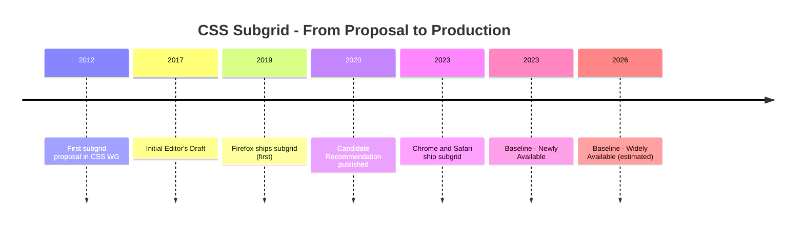

# CSS Object Model (CSSOM) and Houdini

🎯 **Interview Weight:** high (★★☆) - CSSOM is the runtime
API the browser exposes; Houdini is the CSS extensibility
platform - both reveal deep browser internals knowledge

---

### 🎯 Model Answer

**30 seconds:**

> The CSSOM is the browser's object model for CSS, parallel
> to the DOM for HTML. It exposes stylesheets, rules, and
> computed styles programmatically via JavaScript. CSS Houdini
> is a set of low-level APIs that expose CSS engine internals:
> CSS Typed OM (typed properties vs strings), CSS Paint API
> (custom backgrounds/borders via Canvas), CSS Layout API
> (custom layout algorithms), and Properties and Values API
> (`@property` for typed custom properties).

**3 minutes (Senior):**

> The CSSOM has two parts:
>
> **StyleSheets**: `document.styleSheets` returns a list of
> `CSSStyleSheet` objects. Each has `cssRules` (an array of
> rule objects). You can modify rules programmatically:
> `CSSStyleSheet.insertRule()`, `deleteRule()`. This is how
> CSS-in-JS libraries like Emotion and JSS work at the
> browser level - they create a `<style>` tag and insert
> CSS rules programmatically.
>
> **Computed styles**: `window.getComputedStyle(el)` returns
> a `CSSStyleDeclaration` with all resolved/computed styles.
> Values are final (after inheritance, specificity, cascade).
> All values are strings: `"16px"`, `"#3b82f6"`.
>
> Houdini:
>
> **CSS Properties and Values API** (`@property`): register
> typed custom properties. Enables browser-native transitions
> of custom property values. Supported in all modern browsers.
>
> **CSS Paint API** (Paint Worklet): custom `background-image`
> and `border-image` drawn via Canvas 2D API in a worklet.
> No DOM access, runs off-thread. Pattern:
> `CSS.paintWorklet.addModule('paint.js')` then
> `background: paint(my-painter)`.
>
> **CSS Typed Object Model**: replaces string values with
> typed objects. `el.computedStyleMap().get('opacity')`
> returns `CSSUnitValue { value: 0.5, unit: 'number' }`.
> Enables arithmetic: `CSS.px(16).add(CSS.rem(1))`.
>
> **CSS Layout API** (Layout Worklet): implement custom
> `display` values. `display: layout(my-layout)` calls
> JavaScript to position children. Experimental.

*Adapting up:* Discuss worklet thread model, Paint API
performance vs CSS backgrounds, and Houdini polyfilling.

*Adapting down:* CSSOM is JavaScript's API to read and
modify CSS. Houdini lets JavaScript extend what CSS can do.

**Blank Mind Recovery:**

**(1) Restate:** "CSSOM is the browser's JavaScript API
for CSS - how you read and modify styles programmatically.
Houdini is the low-level API to extend the CSS engine itself."

**(2) First principles:** "Browsers parse HTML to DOM, CSS
to CSSOM, then combine them into a Render Tree. The DOM
is fully exposed via JavaScript. The CSSOM is partially
exposed. Houdini exposes the remaining internals."

**(3) Bridge:** "CSSOM is like reading a company's published
financial reports - structured data, some API. Houdini is
like having access to the company's internal accounting
system - you can add custom calculations to the core engine."

---

### 📘 Concept Explanation

**What it is:**

**CSSOM**: the browser's object model for CSS. Includes:
- `CSSStyleSheet`: individual stylesheet objects
- `CSSRule`: base class for all rule types
- `CSSStyleRule`: `.selector { declarations }`
- `CSSMediaRule`: `@media` rules
- `CSSStyleDeclaration`: set of CSS declarations

**Houdini**: low-level CSS extension APIs:
- CSS Properties and Values API (`@property`)
- CSS Paint API (Paint Worklet)
- CSS Typed Object Model (Typed OM)
- CSS Layout API (Layout Worklet)
- CSS Animation Worklet

**How it works:**

```
CSSOM OVERVIEW:

document.styleSheets
  CSSStyleSheet (index 0 = first <style> or <link>)
    cssRules
      [0]: CSSStyleRule
        selectorText: ".button"
        style: CSSStyleDeclaration
          background: "blue"
          padding: "8px 16px"
      [1]: CSSMediaRule
        conditionText: "(min-width: 768px)"
        cssRules: [...nested rules]
    insertRule(".highlight { color: red }", 0)
    deleteRule(0)

Inline styles:
  el.style.backgroundColor = 'red';
  el.style.setProperty('--token', 'blue');

Computed styles (read-only):
  const cs = window.getComputedStyle(el);
  cs.getPropertyValue('padding-top'); // "16px"
  cs.getPropertyValue('--token');     // " blue"

CSS TYPED OM (Houdini):
  // Old: string parsing
  const old = parseFloat(
    getComputedStyle(el).paddingTop);
  el.style.paddingTop = (old + 8) + 'px';

  // Typed OM: no string round-trips
  const cs = el.computedStyleMap();
  const pad = cs.get('padding-top');
  // CSSUnitValue {value:16, unit:'px'}
  el.attributeStyleMap.set(
    'padding-top', pad.add(CSS.px(8))
  );

CSS PAINT API:
  // paint-worklet.js (worklet context)
  class CheckerPainter {
    static get inputProperties() {
      return ['--checker-size', '--checker-color'];
    }
    paint(ctx, geom, props) {
      const size = props.get('--checker-size').value;
      const color = props.get('--checker-color').toString();
      ctx.fillStyle = color;
      for (let y = 0; y < geom.height; y += size * 2) {
        for (let x = 0; x < geom.width; x += size * 2) {
          ctx.fillRect(x, y, size, size);
          ctx.fillRect(x + size, y + size, size, size);
        }
      }
    }
  }
  registerPaint('checker', CheckerPainter);

  // Main thread:
  await CSS.paintWorklet.addModule('paint-worklet.js');

  // CSS:
  .element {
    background: paint(checker);
    --checker-size: 20;
    --checker-color: #dbeafe;
  }
```

**The key insight:**

The browser's CSS rendering pipeline has historically been
a black box. Houdini opens hooks into:
1. Style calculation (Properties and Values API)
2. Layout (Layout Worklet)
3. Paint (Paint Worklet)
4. Composite (Animation Worklet)

Each hook lets JavaScript extend the CSS engine at that
phase, rather than approximating effects via JavaScript
after the fact (which causes layout thrashing).

**When to use CSSOM manipulation:**

- CSS-in-JS runtime style injection
- Dynamic theming (change a global custom property from JS)
- Animation coordination (WAAPI + CSSOM)

**When to use Houdini:**

- Paint API: custom background patterns
- Properties and Values API: typed custom properties (`@property`)
- Typed OM: hot paths reading/writing many CSS values

**When NOT to use:**

Avoid direct `cssRules` manipulation for production styling;
it bypasses CSS cascade and DevTools visibility. Prefer
class toggling.

---

### 💻 Code Example

**BAD: string-based CSSOM style manipulation**

```javascript
// BAD: string parsing in animation loop (GC pressure)
function animateSize(el, targetPx) {
  const current = parseFloat(
    getComputedStyle(el).width
  ); // triggers layout flush
  const step = (targetPx - current) * 0.1;
  el.style.width = (current + step) + 'px'; // stringify
}
// Every frame: layout flush + float parse + string alloc
```

> **Code walkthrough:** Calling `getComputedStyle` in a
> rAF loop forces a layout flush. Parsing the string to
> float and re-stringifying adds GC-visible allocations.
> At 60fps with multiple elements, this degrades performance.

**GOOD: CSS Typed OM for type-safe animation**

```javascript
// GOOD: Typed OM avoids string round-trips
async function animateWithTypedOM(el, targetPx) {
  // Read: typed value, no string parsing
  const current = el.computedStyleMap().get('width');
  // current: CSSUnitValue { value: 200, unit: 'px' }

  // Arithmetic: typed, no string manipulation
  const step = (targetPx - current.value) * 0.1;
  const next = current.add(CSS.px(step));

  // Write: typed, no stringify
  el.attributeStyleMap.set('width', next);
}
```

> **Code walkthrough:** `computedStyleMap()` returns
> `CSSUnitValue` objects. The `.add()` method performs
> typed arithmetic. `attributeStyleMap.set()` writes
> without stringification. For hot-path animation code,
> this reduces GC pressure and avoids the parse-do-math-
> stringify cycle. NOTE: `computedStyleMap()` still triggers
> layout if geometry is being read; the ergonomic benefit
> is more significant than the performance benefit here.

**PRODUCTION: @property for animated design token**

```css
@property --hue {
  syntax: '<number>';
  inherits: false;
  initial-value: 220;
}

.gradient-card {
  --hue: 220;
  background: linear-gradient(
    135deg,
    hsl(var(--hue), 80%, 60%),
    hsl(calc(var(--hue) + 60), 80%, 50%)
  );
  transition: --hue 0.5s ease;
}

.gradient-card:hover {
  --hue: 280;
}
/* --hue interpolates 220→280 on hover */
/* Without @property: no interpolation (string) */
```

> **Code walkthrough:** Without `@property`, `--hue` is
> a string - browsers can't interpolate strings. `@property`
> registers `--hue` as `<number>`, enabling numeric
> interpolation. The `hsl()` gradient changes smoothly on
> hover. This is the canonical use case for `@property`:
> animating CSS custom properties that drive complex
> computed values.

---

### 🎓 Answers by Seniority

**Junior / Mid:**

> The CSSOM is the JavaScript API to read and modify CSS.
> `window.getComputedStyle(el)` returns all computed styles
> as strings. `el.style.propertyName` sets inline styles.
> `document.styleSheets` exposes stylesheet objects.
> Houdini adds `@property` for typed custom properties -
> the main production-ready feature for CSS animations
> with custom properties.

---

**Senior / Staff:**

> CSSOM is the browser's programmatic CSS API. CSS-in-JS
> runtimes use `CSSStyleSheet.insertRule()` for efficient
> style injection. `getComputedStyle()` returns final values
> after full cascade resolution.
>
> Houdini opens the CSS pipeline at four phases: `@property`
> (Properties and Values API) is production-ready and enables
> typed custom properties with transitions. CSS Paint API
> enables off-thread Canvas painting for backgrounds.
> Typed OM reduces string parsing overhead in animation-hot
> code paths.
>
> The CSS Layout API lets JavaScript define custom `display`
> values. Not ready for production but represents the future
> of CSS extensibility - the CSS algorithm equivalent of
> an npm package.

---

### ⚠️ Common Misconceptions

**"`getComputedStyle` returns live values"**

`getComputedStyle()` returns a snapshot at the time of call.
It is NOT live. To observe style changes, use ResizeObserver,
MutationObserver, or requestAnimationFrame.

**"CSS Paint API runs on the main thread"**

Paint worklets run in a separate worklet context - not the
main thread, not a Web Worker. They have no DOM access.
Off-thread execution is why Paint API can render complex
patterns without main-thread jank.

---

### 🚨 Failure Modes and Diagnosis

**Symptom: @property animation not working**

```
Checklist:
1. Correct syntax type?
   syntax: '<number>'   for numeric interpolation
   syntax: '<color>'    for color interpolation
   syntax: '<length>'   for px/rem values
   syntax: '*'          untyped (no interpolation)

2. @property declared BEFORE usage in stylesheet?

3. Browser support:
   Chrome 85+, Firefox 128+, Safari 16.4+
   Use @supports (background: paint(x)) for Houdini.

4. initial-value type matches syntax declaration?
   @property --hue {
     syntax: '<number>';
     initial-value: 0; <- must be a valid <number>
   }
```

---

### 🎯 Interview Deep-Dive

| Scenario | Recommended Time | Key Signal |
|---|---|---|
| CSSOM getComputedStyle | 3 min | Cascade resolution |
| CSSStyleSheet insertRule | 3 min | CSS-in-JS mechanism |
| @property syntax types | 3 min | Typed custom properties |
| CSS Paint API worklet | 4 min | Off-thread rendering |
| CSS Typed OM vs getComputedStyle | 3-4 min | Performance |
| Houdini Layout API | 3 min | Custom display values |
| CSS Animation Worklet | 3 min | Off-thread animation |
| Constructable Stylesheets | 3-4 min | Shadow DOM tokens |
| @property browser support | 2 min | Progressive enhancement |

---

**Q1: What is `getComputedStyle` and how does it differ
from `el.style`?** `[SENIOR]` MECHANISM

*Why they ask:* Fundamental CSSOM API distinction.

*Likely follow-up:* "What does getComputedStyle return
for custom properties?"

> **Answer:**
>
> `el.style` is the INLINE style declaration. Only reflects
> styles set directly on the element. If no inline style
> is set, returns `""` (empty string).
>
> `window.getComputedStyle(el)` returns ALL styles after
> the complete cascade - inherited styles, stylesheet rules,
> and inline styles. Values are COMPUTED/RESOLVED:
> - `em` → `px` (absolute pixels)
> - `inherit` → actual inherited value
> - `currentColor` → actual color value
>
> For custom properties: `getComputedStyle(el).getPropertyValue
> ('--token')` returns the value as declared. CSS custom
> properties are NOT resolved the same way as standard
> properties - they are substituted at use time. The value
> may still contain `var()` references.
>
> ```javascript
> // Inline style: only what's directly on the element
> el.style.color; // "" if not set inline
>
> // Computed style: final resolved value
> getComputedStyle(el).color; // "rgb(17, 24, 39)"
> // Resolved from class rules or inheritance
>
> // Custom property: as declared
> getComputedStyle(el)
>   .getPropertyValue('--spacing-4'); // " 1rem"
> // Note leading space - this is normal
> ```
>
> *What separates good from great:* `getComputedStyle`
> forces layout. Accessing layout-related properties in
> a rAF loop after style mutations creates layout thrashing:
> write styles (invalidates layout), then `getComputedStyle`
> (forces sync layout calculation), then write again
> (invalidates again). Batch writes before reads in
> animation loops to prevent this.

---

**Q2: How does the CSS Paint API work?** `[SENIOR]`
MECHANISM

*Why they ask:* Tests depth of Houdini knowledge.

*Likely follow-up:* "What can't a Paint Worklet do?"

> **Answer:**
>
> CSS Paint API lets JavaScript draw `background-image`
> via Canvas 2D API in a paint worklet (off-thread).
>
> Three parts:
>
> **Paint worklet** (separate thread):
> ```javascript
> // wave-painter.js
> class WavePainter {
>   static get inputProperties() {
>     return ['--wave-color', '--wave-amplitude'];
>   }
>   paint(ctx, size, props) {
>     const color = props.get('--wave-color').toString();
>     const amp = props.get('--wave-amplitude').value;
>     ctx.strokeStyle = color;
>     ctx.lineWidth = 2;
>     ctx.beginPath();
>     for (let x = 0; x <= size.width; x++) {
>       const y = size.height / 2 +
>         Math.sin(x * 0.05) * amp;
>       x === 0
>         ? ctx.moveTo(x, y)
>         : ctx.lineTo(x, y);
>     }
>     ctx.stroke();
>   }
> }
> registerPaint('wave', WavePainter);
> ```
>
> **Registration** (main thread):
> ```javascript
> CSS.paintWorklet.addModule('wave-painter.js');
> ```
>
> **CSS usage**:
> ```css
> .wave-banner {
>   background: paint(wave);
>   --wave-color: #3b82f6;
>   --wave-amplitude: 30;
> }
> ```
>
> What Paint Worklets CANNOT do:
> - Access the DOM (no `document`, `window`)
> - Make network requests
> - Use CSS values beyond `inputProperties`
> - Produce side effects
>
> These restrictions enable off-thread execution.
>
> *What separates good from great:* The Paint API runs
> BEFORE compositing. If `--wave-color` changes (dark mode),
> only the paint step re-runs, not the full layout. This
> is more efficient than Canvas animations on `<canvas>`
> elements which require full DOM involvement and main
> thread participation.

---

**Q3: What is the CSS Typed Object Model and when should
you use it?** `[SENIOR]` MECHANISM

*Why they ask:* Typed OM is the performance and ergonomics
upgrade to CSSOM.

*Likely follow-up:* "How is it different from getComputedStyle?"

> **Answer:**
>
> The CSS Typed OM replaces string-based CSS values with
> structured JavaScript objects.
>
> ```javascript
> // Old CSSOM (strings, requires parsing):
> el.style.fontSize = '1.5rem';
> const size = parseFloat(getComputedStyle(el).fontSize);
> el.style.fontSize = (size * 1.1) + 'px';
>
> // CSS Typed OM (typed values, arithmetic):
> el.attributeStyleMap.set('font-size', CSS.rem(1.5));
> const map = el.computedStyleMap();
> const size = map.get('font-size');
> // CSSUnitValue { value: 24, unit: 'px' }
> el.attributeStyleMap.set(
>   'font-size', size.multiply(1.1)
> );
> ```
>
> Key types:
> - `CSSUnitValue`: `CSS.px(16)`, `CSS.rem(1)`, `CSS.percent(50)`
> - `CSSKeywordValue`: `"auto"`, `"none"`
> - `CSSMathValue`: `CSSMathSum`, `CSSMathProduct` for `calc()`
> - `CSSTransformValue`: list of transform functions
>
> APIs:
> - `el.attributeStyleMap`: live inline styles (read/write)
> - `el.computedStyleMap()`: snapshot computed styles (read)
>
> When to use:
> - Animation loops reading/writing many properties
> - FLIP animation libraries
> - Drag handlers computing positions
>
> When NOT to use:
> - Static style reads (use `getComputedStyle` - simpler)
>
> *What separates good from great:* Typed OM avoids string
> round-trips: parse → float → math → stringify. Reduces
> GC pressure in animation frames. BUT: `computedStyleMap()`
> still triggers layout for geometry properties. The key
> benefit is ERGONOMICS and TYPE SAFETY, with GC reduction
> as secondary.

---

**Q4: What is the CSS Layout API and what would it enable?**
`[STAFF]` ARCHITECTURE

*Why they ask:* Staff engineers track CSS capabilities.

*Likely follow-up:* "How is masonry currently handled?"

> **Answer:**
>
> The CSS Layout API lets JavaScript implement a custom
> `display` value - a custom layout algorithm.
>
> ```javascript
> // layout-worklet.js (off-thread)
> registerLayout('masonry', class {
>   async layout(children, edges, constraints, styleMap) {
>     const cols = 3;
>     const colW = constraints.fixedInlineSize / cols;
>     const heights = new Array(cols).fill(0);
>
>     const frags = await Promise.all(
>       children.map(c =>
>         c.layoutNextFragment({ fixedInlineSize: colW })
>       )
>     );
>
>     frags.forEach(frag => {
>       const col = heights.indexOf(Math.min(...heights));
>       frag.inlineOffset = col * colW;
>       frag.blockOffset = heights[col];
>       heights[col] += frag.blockSize;
>     });
>
>     return {
>       autoBlockSize: Math.max(...heights),
>       childFragments: frags,
>     };
>   }
> });
> ```
>
> ```css
> .masonry-grid { display: layout(masonry); }
> ```
>
> Current status (2024): Chromium-only, behind flags.
> Not production-ready. Safari and Firefox have not shipped.
>
> Current masonry alternatives:
> - `grid-template-rows: masonry` (Firefox experimental)
> - JavaScript + multi-column tracking
> - Libraries (Masonry.js)
>
> When shipped: layout algorithms as npm packages. CSS-native
> masonry, waterfall, packing algorithms.
>
> *What separates good from great:* Layout worklets are
> sandboxed - no DOM access. Children are abstract fragments.
> The browser can run custom layout off-thread without
> security risks or unexpected DOM side effects. This is
> the enabling constraint for the off-thread model.

---

**Q5: What are Constructable Stylesheets and why do they
matter for Web Components?** `[SENIOR]` PRODUCTION

*Why they ask:* Modern Shadow DOM architecture pattern.

*Likely follow-up:* "How do design tokens work in Shadow DOM?"

> **Answer:**
>
> Constructable Stylesheets create a `CSSStyleSheet` without
> a DOM element:
>
> ```javascript
> const sheet = new CSSStyleSheet();
> sheet.replaceSync('.button { color: var(--color-action); }');
> // or async:
> await sheet.replace('.card { background: white; }');
>
> // Adopt in the document:
> document.adoptedStyleSheets = [
>   ...document.adoptedStyleSheets,
>   sheet,
> ];
>
> // Adopt in Shadow DOM:
> const shadow = el.attachShadow({ mode: 'open' });
> shadow.adoptedStyleSheets = [designTokenSheet, componentSheet];
> ```
>
> Why they matter for Web Components + design tokens:
>
> **The problem**: each Shadow DOM is style-isolated.
> Design tokens defined on `:root` do NOT inherit into
> Shadow DOM (CSS custom properties ARE inherited through
> Shadow DOM, but they must be defined OUTSIDE the shadow
> root). When building a component library with Shadow DOM,
> each component historically needed its own `<style>` tag
> with all relevant tokens duplicated.
>
> **The solution**: one `CSSStyleSheet` with all design
> tokens is created once, then SHARED (same JS object
> reference) across all component shadow roots:
>
> ```javascript
> // Design system initialization
> export const tokensSheet = new CSSStyleSheet();
> tokensSheet.replaceSync(`
>   :host { --color-action: #3b82f6; }
> `);
>
> // Every component adopts the SAME sheet object
> // (no duplication in memory or CSSOM)
> class MyButton extends HTMLElement {
>   connectedCallback() {
>     const shadow = this.attachShadow({ mode: 'open' });
>     shadow.adoptedStyleSheets = [tokensSheet, buttonSheet];
>   }
> }
> ```
>
> Browser support: Chrome 73+, Safari 16.4+, Firefox 101+.
> All modern browsers as of 2022. Safe for production.
>
> *What separates good from great:* Adopted stylesheets
> are shared by REFERENCE. 1000 component instances on a
> page share one CSSStyleSheet object. Changing
> `tokensSheet.replaceSync(newTokens)` updates ALL 1000
> instances simultaneously - this is the CSS mechanism
> for runtime theming of Web Component libraries.

---

**Q6: How does understanding CSSOM help with CSS-in-JS
library selection?** `[SENIOR]` PRODUCTION

*Why they ask:* Practical CSSOM implications for framework choices.

*Likely follow-up:* "What is the SSR challenge for CSS-in-JS?"

> **Answer:**
>
> CSS-in-JS libraries use CSSOM in three different ways:
>
> **Runtime injection** (Emotion, styled-components v5):
> Uses `CSSStyleSheet.insertRule()` at component render time.
> Fast for small apps; at scale, hundreds of CSSOM rules
> slow style calculation.
>
> **Build-time extraction** (vanilla-extract, Linaria):
> CSS extracted at build time. No runtime CSSOM manipulation.
> Best performance. Requires build tool integration.
>
> **Hybrid** (styled-components v6):
> Generates class names at build time, injects deduplicated
> rules at runtime.
>
> SSR challenge: `CSSStyleSheet.insertRule()` only works
> in browser (no `document` on server). Libraries solve this:
> 1. Collect styles during SSR render
> 2. Serialize to `<style>` tag HTML string
> 3. Hydrate on client (re-use existing stylesheet,
>    don't re-insert rules)
>
> Library choice based on CSSOM behavior:
>
> ```
> High-traffic SSR app (Next.js, Remix):
>   → vanilla-extract or Linaria (zero runtime)
>
> Client-side SPA with dynamic theming:
>   → Emotion with runtime (needs insertRule flexibility)
>
> Web Components design system:
>   → Constructable Stylesheets (native, shared by reference)
>
> Simple project:
>   → CSS Modules + PostCSS (zero runtime, no CSSOM)
> ```
>
> *What separates good from great:* CSS-in-JS source maps.
> `insertRule()` doesn't attach source location. Libraries
> like Emotion with `@emotion/babel-plugin` add `label`
> and source maps to generated classes, enabling DevTools
> to show "this style comes from Button.tsx line 42." Without
> this, CSS-in-JS produces undebuggable production styles.

---

**Q7: What is the browser rendering pipeline and where
do Houdini hooks fit?** `[STAFF]` ARCHITECTURE

*Why they ask:* Holistic understanding of CSS engine architecture.

*Likely follow-up:* "Where does CSS Animation Worklet fit?"

> **Answer:**
>
> ```
> Browser pipeline:
> Style → Layout → Paint → Composite
>   |         |        |        |
> @property  Layout  Paint  Animation
>   API       API     API     Worklet
> ```
>
> **Style phase** - CSS Properties and Values API:
> `@property` defines typed custom properties at style
> calculation. Affects how `var()` substitution and
> transitions work. Production-ready.
>
> **Layout phase** - CSS Layout API:
> Custom `display` values processed at layout. Receives
> children as fragments, returns positioned fragments.
> Experimental (Chromium-only).
>
> **Paint phase** - CSS Paint API:
> Custom `background-image` drawn at paint time. Off-thread
> Canvas 2D. Result is a bitmap for compositing.
> Mostly production-ready (not Safari 17-).
>
> **Composite phase** - CSS Animation Worklet:
> Animations at compositor-thread speed (60fps without
> main thread). Input: timeline time. Output: keyframe
> progress.
>
> ```javascript
> // Animation Worklet (experimental):
> registerAnimator('scroll-parallax', class {
>   animate(currentTime, effect) {
>     effect.localTime = currentTime * 0.5;
>     // drive keyframe at half scroll speed
>   }
> });
> ```
>
> The off-thread model is the key: Paint and Animation
> Worklets run off-thread. Main thread JavaScript cannot
> block them. This is why Houdini can achieve 60fps visuals
> that main-thread canvas animation cannot.
>
> *What separates good from great:* CSS Typed OM has a
> fifth role: it bridges all pipeline phases. Properties
> set via `attributeStyleMap` are consumed at the Style
> phase. `computedStyleMap()` reads values after layout.
> The consistent typed value model across all phases is
> what makes Typed OM architecturally significant beyond
> just avoiding string parsing.

---

**Q8: How does @property integrate with CSS animations
and keyframes?** `[SENIOR]` MECHANISM

*Why they ask:* Practical animation pattern.

*Likely follow-up:* "What is the performance impact?"

> **Answer:**
>
> Without `@property`, CSS custom properties can't be
> used in keyframes or transitions - they're strings.
>
> ```css
> /* Without @property: keyframes DO NOT interpolate --bg */
> @keyframes pulse-bad {
>   from { --bg: 0; }  /* string: "0" */
>   to   { --bg: 1; }  /* string: "1" */
> }
> /* --bg jumps from "0" to "1" at 50% progress */
> /* No smooth transition */
>
> /* WITH @property: keyframes interpolate numerically */
> @property --opacity-level {
>   syntax: '<number>';
>   inherits: false;
>   initial-value: 1;
> }
>
> @keyframes pulse-good {
>   0%  { --opacity-level: 1; }
>   50% { --opacity-level: 0.3; }
>   100%{ --opacity-level: 1; }
> }
>
> .pulsing {
>   opacity: var(--opacity-level);
>   animation: pulse-good 2s infinite;
> }
>
> /* Advanced: @property for gradient animation */
> @property --gradient-stop {
>   syntax: '<percentage>';
>   inherits: false;
>   initial-value: 0%;
> }
>
> .progress-bar {
>   --gradient-stop: 0%;
>   background: linear-gradient(
>     to right,
>     var(--color-action) var(--gradient-stop),
>     var(--color-surface) var(--gradient-stop)
>   );
>   transition: --gradient-stop 0.3s ease;
> }
>
> /* When --gradient-stop changes, the gradient
>    position smoothly transitions */
> ```
>
> Performance impact: `@property` transitions run on the
> MAIN THREAD (style calculation phase). Unlike `transform`
> and `opacity` which run on the compositor thread,
> `@property` changes trigger style recalculation.
>
> Use `@property` animations for: UI state transitions
> (loading → complete), hover effects, theme transitions.
>
> Use `transform`/`opacity` for: continuous animations
> at 60fps (scroll-based, loop animations).
>
> *What separates good from great:* The `@property` +
> `transition` combination for design tokens is the
> correct pattern for smooth dark mode switching.
> `--color-surface`, `--color-text`, `--color-border`
> registered as `<color>` with `inherits: true` all
> transition smoothly when `data-theme` changes. This
> is CSS-native dark mode animation without JavaScript
> timing or `requestAnimationFrame` loops.

---

**Q9: How will fully-shipped Houdini change CSS polyfilling?**
`[STAFF]` ARCHITECTURE

*Why they ask:* Architectural implication of extensible CSS.

*Likely follow-up:* "Is Houdini polyfilling practical today?"

> **Answer:**
>
> Today: polyfilling CSS features requires post-DOM JavaScript.
> The polyfill runs AFTER CSS - can't hook into layout or
> paint phases. Causes flash, thrashing, imperfect fidelity.
>
> With Houdini: polyfills hook into the actual pipeline:
>
> **Paint polyfill**: if `conic-gradient()` isn't supported,
> a Paint Worklet implements the same rendering at paint time.
>
> **Layout polyfill**: subgrid could be a Layout Worklet
> on unsupported browsers - layout runs off-thread with
> the same geometry model as native.
>
> **Properties polyfill**: JavaScript `CSS.registerProperty()`
> is equivalent to `@property`:
> ```javascript
> CSS.registerProperty({
>   name: '--color-interactive',
>   syntax: '<color>',
>   inherits: true,
>   initialValue: '#3b82f6',
> });
> ```
>
> Practical reality (2024):
> - Layout API: Chromium-only, not production-ready
> - Animation Worklet: not production-ready
> - Paint API: Chrome/Edge production, Safari 17.2+
> - `@property`: universally supported (2024)
>
> `@property` is the main Houdini capability available
> for polyfilling today. The rest require feature detection
> and JavaScript fallbacks.
>
> *What separates good from great:* Houdini's deeper
> architectural value: new CSS features can be prototyped
> as Houdini worklets by the community BEFORE native
> browser implementation. The path from proposal to
> real-world testing is shorter. CSS `@scope` was
> prototyped as a Houdini polyfill before native support,
> enabling the CSS WG to gather developer feedback earlier.

---

| Interviewer Type | Emphasis |
|---|---|
| Technical Panel | CSSOM API + @property mechanism |
| Hiring Manager | CSS-in-JS selection via CSSOM |
| Bar Raiser | Houdini pipeline hooks |
| Peer Engineer | getComputedStyle vs Typed OM |

---

### ⚖️ Comparison Table

| API | Phase | Thread | Production Ready | Use Case |
|---|---|---|---|---|
| getComputedStyle | Post-layout | Main | Yes | Read resolved styles |
| el.style | Pre-layout | Main | Yes | Inline style mutation |
| @property | Style | Main | Yes | Typed token animation |
| CSS Paint API | Paint | Worklet | Mostly (Safari 17.2+) | Custom backgrounds |
| CSS Typed OM | Any | Main | Yes | Type-safe style reads |
| CSS Layout API | Layout | Worklet | No | Custom display values |
| Constructable StyleSheets | Any | Main | Yes | Shadow DOM token sharing |

---

### 🏛️ System Design

*(Omit: L6 Theory keyword - system design scope belongs
at L5 Architecture level.)*

---

### 📊 Diagram

```
BROWSER PIPELINE + HOUDINI HOOKS:
Style → Layout → Paint → Composite
  |        |        |         |
@prop   Layout   Paint    Animation
API      API      API      Worklet
(done)   (exp)  (mostly)   (exp)
```

```mermaid
flowchart LR
    S[Style\nCalculation] -->|@property\nCSS Props & Values| B1[Typed\nCustom Props]
    S --> L[Layout]
    L -->|CSS Layout API\nLayout Worklet| B2[Custom\ndisplay]
    L --> P[Paint]
    P -->|CSS Paint API\nPaint Worklet| B3[Custom\nbg/border]
    P --> C[Composite]
    C -->|Animation Worklet| B4[Off-thread\nAnimation]
    style B1 fill:#047857,color:#fff
    style B2 fill:#b45309,color:#fff
    style B3 fill:#1d4ed8,color:#fff
    style B4 fill:#b91c1c,color:#fff
```

> **Diagram walkthrough:** The browser pipeline has four
> major phases, each with a corresponding Houdini hook.
> Green (@property) is fully production-ready and universally
> supported. Blue (Paint API) is mostly ready - Chrome/Edge
> solid, Safari 17.2+. Yellow (Layout) and Red (Animation)
> are experimental Chromium-only. Understanding production
> readiness by phase prevents shipping unstable Houdini APIs.

---

---

# CSS Specification Process and Levels

🎯 **Interview Weight:** medium (★★☆) - Understanding how
CSS features move from idea to browser helps engineers
predict support timelines and engage with the standards process

---

### 🎯 Model Answer

**30 seconds:**

> CSS is developed by the CSS Working Group (CSS WG) at the
> W3C. New CSS features start as proposals, become Editor's
> Drafts in a CSS module (like CSS Grid Level 1), advance
> through Working Draft, Candidate Recommendation, and
> finally W3C Recommendations. The "CSS Levels" (CSS1, CSS2,
> CSS3) are a legacy concept - modern CSS is modular:
> `CSS Flexbox Level 1`, `CSS Grid Level 2`, each advancing
> independently.

**3 minutes (Senior):**

> CSS specification levels:
>
> **CSS1 (1996)**: basic formatting - colors, fonts, text.
>
> **CSS2/2.1 (1998/2011)**: positioning, floats, `@media`.
> CSS 2.1 was the stable reference for a decade.
>
> **"CSS3"**: not a version. The umbrella term for all CSS
> modules in development after CSS 2.1. Each module advances
> independently: `CSS Flexbox Level 1` became a Recommendation
> in 2018. `CSS Grid Level 2` (subgrid) became CR in 2020.
>
> **Baseline** (Google/MDN): a compatibility signal.
> "Newly available" = all major browsers shipped the feature.
> "Widely available" = available for 30 months (safe for
> most production use without @supports).
>
> Feature flags and Origin Trials: browsers implement
> experimental features behind flags or Origin Trials
> (production testing with a registration token).

*Adapting up:* Discuss Interop projects, CSS WG participation,
WHATWG vs W3C.

*Adapting down:* The CSS spec is how browsers agree on
which CSS features to support. Features take 2-5 years
from proposal to universal support.

**Blank Mind Recovery:**

**(1) Restate:** "You are asking about how new CSS features
are developed - the W3C CSS WG process, specification levels,
and how browsers implement features."

**(2) First principles:** "Open web standards require multi-
stakeholder agreement. The spec pipeline is how disagreements
get resolved before implementation."

**(3) Bridge:** "CSS specification levels are like software
versioning - except each module (Flexbox, Grid, Color)
versions independently."

---

### 📘 Concept Explanation

**What it is:**

The W3C CSS specification process defines how new CSS
features are proposed, refined, and standardized. The
CSS Working Group coordinates browser vendors and developers.

**The problem it solves:**

Without coordination, browsers implement features
inconsistently. The spec process enables interoperability:
a CSS feature means the same thing in all browsers.

**How it works:**

```
CSS SPECIFICATION LIFECYCLE:

Proposal (GitHub issue: w3c/csswg-drafts)
  → Editor's Draft (ED): informal, may change
  → Working Draft (WD): published, may still change
  → Candidate Recommendation (CR):
      feature-complete, stable, browsers implement
  → Proposed Recommendation (PR): final review
  → W3C Recommendation (REC): final standard

TIMELINE EXAMPLES:
  CSS Flexbox:  WD 2009 → CR 2015 → REC 2018
  CSS Grid:     WD 2011 → CR 2016 → REC 2017
  CSS Subgrid:  Proposal 2019 → CR 2020 → Universal 2023
  CSS Nesting:  Proposal 2016 → CR 2023 → Universal 2024

CSS MODULE LEVELS:
  CSS Selectors Level 4 (:is, :where, :has)
  CSS Grid Level 2 (subgrid)
  CSS Color Level 5 (oklch, relative color syntax)
  CSS Conditional Rules Level 5 (@when/@else)
  CSS Cascading Level 5 (@layer)
  CSS Values Level 4 (env(), math functions)

BROWSER IMPLEMENTATION SIGNALS:
  Can I Use (caniuse.com): global % + browser matrix
  MDN Browser Compat: detailed browser version data
  Baseline (web.dev/baseline): Newly/Widely Available
  Chrome Status (chromestatus.com): intent to ship
  WebKit Status (webkit.org/status): Safari status
  Interop (wpt.fyi): vendor coordination priorities
```

**The key insight:**

"CSS3" is a marketing term, not a specification version.
There is no CSS3 specification document. There are CSS3-era
modules each at different levels. `CSS Selectors Level 4`
is a real spec; "CSS4" is not.

---

### 💻 Code Example

**PRODUCTION: progressive enhancement by Baseline status**

```css
/* BASELINE WIDELY AVAILABLE: no @supports needed */
.card-grid {
  display: grid;
  grid-template-columns:
    repeat(auto-fill, minmax(280px, 1fr));
  gap: 1rem;
}

/* BASELINE NEWLY AVAILABLE (2022): use with @supports */
@supports (container-type: inline-size) {
  .card-wrapper { container-type: inline-size; }
  @container (min-width: 400px) {
    .card { flex-direction: row; }
  }
}

/* NEWLY AVAILABLE (2023): subgrid */
@supports (grid-template-rows: subgrid) {
  .card {
    grid-row: span 3;
    grid-template-rows: subgrid;
    display: grid;
  }
}

/* :has() - newly available 2023 */
@supports selector(:has(.modal-open)) {
  .nav:has(+ .search-open) {
    transform: translateY(-100%);
  }
}
```

> **Code walkthrough:** The layered approach uses Baseline
> status as the decision criterion: "widely available"
> features need no @supports; "newly available" features
> use @supports for graceful degradation; experimental
> features use @supports selector() for feature detection.
> The base experience works everywhere; enhanced browsers
> get better layouts.

---

### 🎓 Answers by Seniority

**Junior / Mid:**

> CSS features are developed by the W3C CSS Working Group
> through drafts, candidate recommendations, and final
> recommendations. I use Can I Use and MDN to check browser
> support, and Baseline as a quick signal for production
> safety. "CSS3" is just the term for CSS modules developed
> after CSS 2.1 - there's no single CSS3 specification.

---

**Senior / Staff:**

> The spec process matters practically for feature adoption
> strategy. Candidate Recommendation is when browsers begin
> implementing. "Newly Available" Baseline means all major
> browsers shipped it. "Widely Available" (30 months) means
> safe for production without @supports.
>
> The Interop projects (Interop 2022/2023/2024) are
> coordinated browser vendor efforts to fix interoperability
> bugs. Grid, subgrid, and container queries went through
> Interop years. Following Interop priority areas predicts
> which "supported" features will become truly reliable.
>
> Origin Trials enable real-world testing before finalization -
> a two-way relationship: vendors get usage data, teams
> get early access.

---

### ⚠️ Common Misconceptions

**"CSS4 is a thing"**

No CSS4 specification exists. The CSS WG moved to modular
versioning after CSS 2.1. `CSS Selectors Level 4` is a
real module; "CSS4" is colloquial shorthand for "modern CSS."

**"If it's in the spec, browsers support it"**

Specification status does not equal browser implementation
status. A feature at Candidate Recommendation may have
zero browser implementations. A feature at Editor's Draft
may already be in Chrome behind a flag.

---

### 🚨 Failure Modes and Diagnosis

**Symptom: feature works in Chrome, broken in Safari**

```
Diagnosis:
1. Check Can I Use (caniuse.com/feature-name)
   What Safari version is required?

2. Check WebKit Feature Status (webkit.org/status)
   Status: Supported / In Development / Not planned

3. Check Interop (wpt.fyi/interop-2024)
   Is this in current Interop focus?
   YES → Safari fix likely in next release cycle

4. Write @supports fallback:
   @supports (feature: value) {
     .enhanced { /* better layout */ }
   }
   /* .default in non-@supports block */
```

---

### 🎯 Interview Deep-Dive

| Scenario | Recommended Time | Key Signal |
|---|---|---|
| CSS spec stages | 3 min | ED → WD → CR → REC |
| CSS3 vs CSS modules | 3 min | Modular versioning |
| Baseline signal | 3 min | Newly/Widely available |
| Interop projects | 3 min | Vendor coordination |
| Feature flags vs Origin Trials | 3 min | Experimental testing |
| @supports usage | 3-4 min | Progressive enhancement |
| Vendor prefixes history | 2-3 min | Why they existed |
| CSS Nesting and @scope | 3-4 min | Architecture impact |
| Design system CSS adoption | 3-4 min | Conservative model |

---

**Q1: What does it mean for a CSS feature to be at
Candidate Recommendation?** `[SENIOR]` CONCEPTUAL

*Why they ask:* Spec stages help with adoption decisions.

*Likely follow-up:* "When is a CR feature safe to use?"

> **Answer:**
>
> Candidate Recommendation means the feature spec is
> feature-complete and stable. The CSS WG believes the
> design is correct. Browser vendors are invited to implement.
> The spec may still change based on implementation feedback,
> but the core design is locked.
>
> At CR: browsers begin implementing. Implementation reports
> are written. The spec may receive normative changes based
> on implementation experience.
>
> Using CR features: depends on browser implementation
> status, NOT spec stage. Grid was at CR in 2016 when
> browsers shipped it universally. Subgrid was CR in 2020
> but wasn't cross-browser until 2023.
>
> Check Can I Use for actual browser support. The spec stage
> tells you the design stability, not the adoption signal.
>
> *What separates good from great:* CR to W3C Recommendation
> can take years, but a CR feature with universal browser
> support is as stable as a Recommendation for practical
> purposes. The W3C Recommendation is a formality for the
> standards record. Engineering decisions should be based
> on browser support percentages, not specification stage.

---

**Q2: What is the Interop initiative and why does it
matter?** `[SENIOR]` ARCHITECTURE

*Why they ask:* Interop is where browser vendor coordination happens.

*Likely follow-up:* "What features were in Interop 2023?"

> **Answer:**
>
> Interop is an annual coordinated effort between browser
> vendors (Apple/WebKit, Google/Chromium, Mozilla/Firefox,
> Microsoft/Chromium) to fix interoperability failures.
>
> Process:
> 1. Community submits proposals (GitHub: web-platform-tests/interop)
> 2. Browser vendors vote on priorities
> 3. Selected focus areas receive dedicated engineering from all vendors
> 4. Progress tracked via Web Platform Tests (wpt.fyi)
>
> Selected focus areas by year:
> - Interop 2022: cascade layers (@layer), color spaces (oklch),
>   subgrid, viewport units (svh/dvh)
> - Interop 2023: :has(), nesting, color-mix(), custom properties
>   (CSSOM), popover
> - Interop 2024: @property, backdrop-filter, anchor positioning,
>   declarative Shadow DOM
>
> Why it matters: a feature in the current Interop year will
> significantly improve cross-browser compatibility in the
> next release cycle (3-6 months). An Interop priority is a
> reliable signal for "safe to adopt with @supports now,
> drop @supports in 6-12 months."
>
> *What separates good from great:* Following Interop
> announcements (January each year) provides a 6-12 month
> preview of CSS adoption opportunities. Container queries
> were Interop 2022 focus - cross-browser by early 2023.
> `:has()` was Interop 2023 - production-safe mid-2023.
> The Interop list is more actionable for adoption planning
> than Baseline status alone.

---

**Q3: How do Origin Trials work?** `[SENIOR]` PRODUCTION

*Why they ask:* Origin Trials enable testing experimental features.

*Likely follow-up:* "What's the downside?"

> **Answer:**
>
> Origin Trials allow testing experimental browser features
> in production for a limited time (typically 6-9 months).
> Provides real-world usage data to browser vendors before
> shipping to all users.
>
> How to use (Chrome example):
>
> 1. Register at `developer.chrome.com/origintrials`
> 2. Receive a token bound to your origin
> 3. Add to HTML:
>    ```html
>    <meta http-equiv="origin-trial" content="TOKEN">
>    ```
>    or HTTP header: `Origin-Trial: TOKEN`
> 4. Feature is enabled for users at your registered origin
>
> Downsides:
> - Feature may change or be removed before shipping
> - Token expires; must re-register each period
> - Only works in the vendor's browser (Chrome OT != Safari)
> - Requires maintenance: monitoring expiry dates
>
> When to use: high-value features that would significantly
> improve UX, when you can handle migration risk if the
> feature changes.
>
> *What separates good from great:* Origin Trials generate
> usage data that vendors need to justify shipping features.
> Participating and filing bug reports actively influences
> feature development. The OT program is a two-way
> relationship: vendors get data, teams get early access.

---

**Q4: Why did vendor prefixes exist and why were they
deprecated?** `[SENIOR]` CONCEPTUAL

*Why they ask:* Historical context explains CSS evolution.

*Likely follow-up:* "Are vendor prefixes gone completely?"

> **Answer:**
>
> Vendor prefixes (`-webkit-`, `-moz-`, `-ms-`) were intended
> as a mechanism to implement experimental CSS features:
> `-webkit-animation` was Chrome/Safari's experimental
> version before `animation` was standardized. The idea:
> prefix = "this is experimental, not the standard."
>
> What went wrong:
>
> 1. Sites shipped `-webkit-transform` without the unprefixed
>    `transform`. Browsers had to keep the prefixed version
>    forever for backward compatibility.
>
> 2. Safari kept `-webkit-` prefixes long after other browsers
>    dropped them. Sites coded for `-webkit-` failed in
>    Firefox and IE.
>
> 3. Firefox and Chrome added `-webkit-` aliases because so
>    many sites required them. The prefix system was broken.
>
> Why deprecated: Origin Trials replace prefixes for
> experimental features. `@supports` provides CSS-native
> progressive enhancement. Features ship to stable only when
> ready.
>
> Status today: some `-webkit-` prefixes still required:
> - `-webkit-text-fill-color` (for background-clip: text)
> - Some `@media` queries in iOS Safari
>
> Autoprefixer handles these in build pipelines automatically.
>
> *What separates good from great:* Origin Trials don't
> modify the property name. If a feature ships, no code
> changes needed. If it doesn't ship, code is removed.
> No prefix legacy remains. This is the core improvement
> over the vendor prefix model.

---

**Q5: How should a design system manage CSS feature
adoption for 50+ consuming teams?** `[STAFF]` ARCHITECTURE

*Why they ask:* Staff-level adoption strategy for high-impact systems.

*Likely follow-up:* "How do you communicate CSS breaking changes?"

> **Answer:**
>
> A design system serving 50+ teams requires a conservative
> adoption model:
>
> 1. Browser support is the MOST conservative across all teams
> 2. Consuming teams get the design system's CSS without
>    per-team @supports control
> 3. Breaking CSS changes require all 50 teams to re-test
>
> Adoption framework:
>
> ```
> LEVEL 1 - ADDITIVE (no risk):
>   New component token, new utility class
>   Semver patch/minor
>   Ship immediately
>
> LEVEL 2 - ENHANCED (opt-in):
>   New visual behavior (container query layout)
>   Baseline "Newly Available" feature
>   Ship with @supports, no fallback behavior change
>   Semver minor
>
> LEVEL 3 - BEHAVIORAL (breaking):
>   Changes how existing component renders
>   Ship as new component variant
>   Old component deprecated, not removed
>   Semver major, 6-month deprecation window
>
> LEVEL 4 - ARCHITECTURE (breaking):
>   Token naming changes, @layer order changes
>   RFC process: GitHub Discussions + 2+ sprint bake
>   Multiple major versions to migrate
> ```
>
> Communication: changelog per CSS feature with Baseline
> status and required browser version. Consuming teams
> opt-in via package version update.
>
> *What separates good from great:* The design system's
> browser support policy is a documented MINIMUM. "Baseline
> Widely Available" is defensible: it means the last 2.5
> years of browser releases support it. Teams with older
> browser requirements have an atypical need they handle
> independently. Defining this boundary prevents endless
> "but our analytics show 2% IE11" blockers.

---

**Q6: How do CSS Nesting and @scope change CSS
architecture?** `[SENIOR]` ARCHITECTURE

*Why they ask:* These features reshape CSS authoring patterns.

*Likely follow-up:* "Does CSS Nesting replace Sass?"

> **Answer:**
>
> **CSS Nesting** (native, universally supported 2024):
>
> ```css
> .card {
>   padding: 1rem;
>
>   /* .card .title */
>   .title { font-size: 1.25rem; }
>
>   /* .card:hover */
>   &:hover { box-shadow: 0 2px 8px rgba(0,0,0,0.1); }
>
>   /* Nested @media */
>   @media (min-width: 768px) {
>     flex-direction: row;
>   }
> }
> ```
>
> Does it replace Sass? For nesting and variables (custom
> properties): yes. For Sass loops (`@each`), conditionals
> (`@if`), mixins, functions: no. New projects may skip Sass;
> existing Sass projects have no urgency to remove it.
>
> **`@scope`** (newly available 2024):
>
> ```css
> @scope (.card) {
>   h2 { font-size: 1.25rem; }
>   p  { color: #4b5563; }
>   a  { color: var(--color-interactive); }
> }
>
> /* Donut scope: exclude nested components */
> @scope (.article) to (.ad-container) {
>   a { color: inherit; }
>   /* Doesn't affect links inside .ad-container */
> }
> ```
>
> `@scope` eliminates BEM naming prefixes for scoping.
> `.card__title` becomes `h2` inside `@scope (.card)`.
>
> Combined: Nesting + @scope + Container Queries provides
> CSS-native component encapsulation:
>
> ```css
> @scope (.product-card) {
>   :scope { container-type: inline-size; }
>   h2 { font-size: 1.25rem; }
>   @container (min-width: 300px) {
>     :scope { flex-direction: row; }
>   }
> }
> ```
>
> *What separates good from great:* `@scope` uses PROXIMITY
> to resolve overlapping scopes - the closer ancestor wins.
> This is different from specificity-based cascade.
> Developers adopting `@scope` need the new mental model:
> proximity cascade, not just specificity.

---

**Q7: What CSS features will significantly impact development
in the next 2 years?** `[STAFF]` ARCHITECTURE

*Why they ask:* Staff engineers advise on technology strategy.

*Likely follow-up:* "How do you stay current with CSS?"

> **Answer:**
>
> High-impact CSS features approaching wide availability:
>
> **1. CSS Anchor Positioning** (Chrome 125, 2024):
> Position elements relative to other elements (not parents).
> Tooltips, popovers, dropdowns positioned relative to their
> trigger - without JavaScript position calculation.
>
> **2. CSS `@scope`** (Chrome 118, 2023):
> Native CSS component scoping. CSS Modules use case in
> native CSS.
>
> **3. `transition-behavior: allow-discrete`** (2024):
> `display: none` can now be transitioned. Eliminates
> JavaScript for modal/drawer fade animations.
>
> **4. `@starting-style`** (2024):
> Define "from" styles for elements entering the DOM.
> Elements animate IN without JavaScript class toggling.
> ```css
> .dialog[open] { opacity: 1; transform: scale(1); }
> @starting-style {
>   .dialog[open] { opacity: 0; transform: scale(0.9); }
> }
> ```
>
> **5. View Transitions API** (Chrome 111, Safari 18):
> CSS-driven page transition animations with morph effects.
>
> **6. Relative color syntax** (2024):
> ```css
> .dark {
>   background: oklch(
>     from var(--color-action)
>     calc(l - 0.2) c h
>   );
> }
> /* Derive darker variant from any base color */
> ```
>
> *What separates good from great:* Anchor Positioning +
> Popover API + `@starting-style` + discrete transitions =
> JavaScript-free accessible tooltips, dropdowns, and modals.
> For the first time, a complete interactive UI is achievable
> without a JavaScript framework for popover behavior.
> Staff engineers should evaluate where this changes the
> library dependency decision.

---

**Q8: How does @supports improve on vendor prefixes for
progressive enhancement?** `[SENIOR]` MECHANISM

*Why they ask:* Practical @supports usage.

*Likely follow-up:* "When should you NOT use @supports?"

> **Answer:**
>
> Vendor prefixes provided syntax-level feature detection
> (if the property was parsed, the browser supported it).
> But prefixed properties could be PRESENT without full
> functionality.
>
> `@supports` is an explicit feature detection mechanism:
>
> ```css
> /* Feature detection by property value: */
> @supports (display: grid) {
>   .container { display: grid; }
> }
>
> /* Feature detection by property: */
> @supports (container-type: inline-size) {
>   .wrapper { container-type: inline-size; }
>   @container (min-width: 400px) {
>     .card { flex-direction: row; }
>   }
> }
>
> /* Selector detection: */
> @supports selector(:has(+ div)) {
>   nav:has(+ .open) { display: none; }
> }
>
> /* NOT detection: */
> @supports not (grid-template-rows: subgrid) {
>   /* Fallback for non-subgrid browsers */
>   .card { min-height: 300px; }
> }
>
> /* AND / OR: */
> @supports (display: flex) and
>           (gap: 1rem) {
>   .flex-grid { display: flex; gap: 1rem; }
> }
> ```
>
> When NOT to use @supports:
> - Feature is "Baseline Widely Available" (unnecessary)
> - Enhancement is purely cosmetic (graceful degradation
>   is acceptable without the @supports block)
> - The @supports fallback is WORSE than the base style
>   (double-check that the base style is the fallback)
>
> *What separates good from great:* `@supports` is evaluated
> at parse time in the cascade. It does NOT re-evaluate
> dynamically. If a browser doesn't support `@supports`,
> the entire block is ignored. This means the FALLBACK
> must be OUTSIDE the @supports block - the default case,
> not nested inside `@supports not (feature)`.

---

**Q9: How does the CSS specification interact with
accessibility standards?** `[SENIOR]` ARCHITECTURE

*Why they ask:* Holistic web standards understanding.

*Likely follow-up:* "Does opacity: 0 hide from screen readers?"

> **Answer:**
>
> CSS, HTML, and WAI-ARIA are maintained by different groups
> at the W3C but interact closely:
>
> - CSS WG: CSS specifications
> - HTML WG / WHATWG: HTML Living Standard
> - ARIA WG: WAI-ARIA roles, properties, states
>
> Key CSS-accessibility interactions:
>
> **display: none**: hides from accessibility tree AND visual
> rendering. Screen readers cannot reach the element.
>
> **visibility: hidden**: hides visually, reserves space.
> Hidden from accessibility tree.
>
> **opacity: 0**: visually invisible but PRESENT in the
> accessibility tree. Interactive elements (buttons, links)
> remain focusable and operable. This surprises developers
> who equate "invisible" with "inaccessible."
>
> **content-visibility: hidden**: hides from a11y tree
> and visual rendering. CSS WG coordinated with ARIA WG
> to define this behavior explicitly.
>
> Visually hidden but accessible (screen-reader-only text):
> ```css
> .sr-only {
>   position: absolute;
>   width: 1px;
>   height: 1px;
>   overflow: hidden;
>   clip: rect(0 0 0 0);
>   clip-path: inset(50%);
>   white-space: nowrap;
> }
> /* DO NOT use: display: none (removes from a11y tree) */
> /* DO NOT use: visibility: hidden (same) */
> ```
>
> CSS `@scope` and accessibility: `@scope` doesn't affect
> the accessibility tree. It's purely a style cascade
> mechanism.
>
> *What separates good from great:* `opacity: 0` buttons
> are still tab-focusable. This is why "visually hidden"
> interactive elements must use `display: none` or
> `pointer-events: none; tabindex="-1"`. The accessibility
> tree follows the DOM, not CSS visibility. Understanding
> WHICH CSS properties affect the accessibility tree vs
> only the visual tree is prerequisite knowledge for
> CSS-based UI engineering.

---

| Interviewer Type | Emphasis |
|---|---|
| Technical Panel | Spec stages + Interop |
| Hiring Manager | Design system adoption strategy |
| Bar Raiser | Baseline + Origin Trials |
| Peer Engineer | @supports and CSS nesting |

---

### ⚖️ Comparison Table

| Source | What It Tells You | Best For |
|---|---|---|
| Baseline (web.dev) | Safe / not-yet-safe signal | Quick adoption decision |
| Can I Use | % global support + browser matrix | Share with PMs |
| MDN Compat | Browser version details + notes | Debug browser issues |
| Chrome Status | Chrome implementation timeline | Chrome ETA |
| WebKit Status | Safari implementation status | Safari timeline |
| Interop (wpt.fyi) | Cross-browser coordination | 6-12 month forecast |
| CSS WG GitHub | Raw spec discussion | Deep feature design |

---

### 🏛️ System Design

*(Omit: L6 Theory keyword - system design scope is L5
Architecture level.)*

---

### 📊 Diagram

```
CSS SPEC PIPELINE:
Proposal → Editor's Draft → Working Draft
       → Candidate Rec → W3C Recommendation
                 ↑
       Browsers implement here

ADOPTION BY BASELINE STATUS:
  Widely Available (30mo): use directly
  Newly Available:         use with @supports
  Not yet Baseline:        wait or @supports + fallback
```



> **Diagram walkthrough:** Subgrid's timeline illustrates
> the typical gap between specification maturity and
> production readiness. It became Candidate Recommendation
> in 2020 but wasn't cross-browser until 2023 - a 3-year
> gap where the spec was stable but the feature couldn't
> be used without major fallbacks. The "Widely Available"
> estimate (2026) is when subgrid can be used without
> @supports in most production contexts. This gap is why
> specification stage alone is insufficient for adoption
> decisions - browser support data is always the primary signal.
