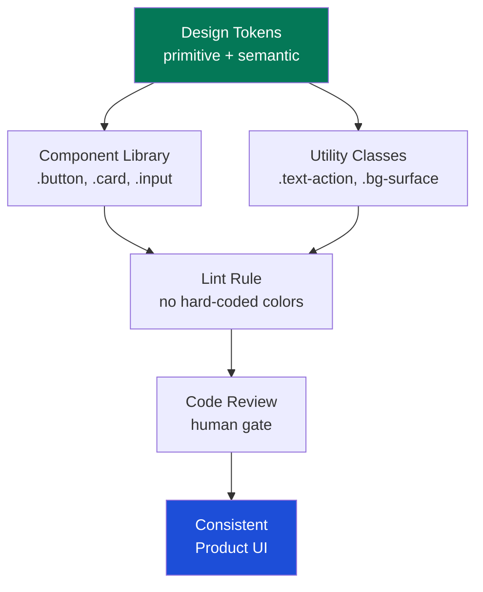
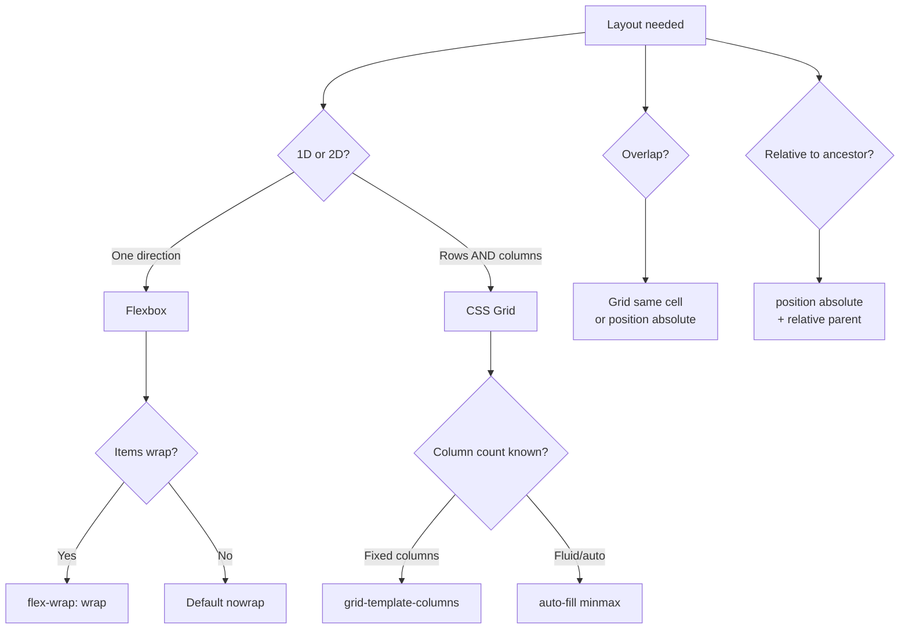
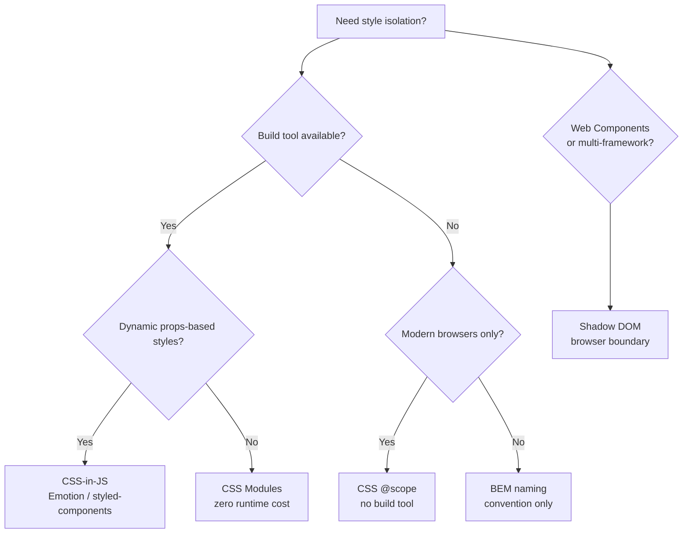

## Keywords in This File
{: .no_toc }

| # | Keyword | Weight |
|---|---|---|
| 1 | [Visual Consistency Mental Model](#visual-consistency-mental-model) | high |
| 2 | [Layout Decision Framework](#layout-decision-framework) | high |
| 3 | [Style Isolation Patterns](#style-isolation-patterns) | high |

---

# Visual Consistency Mental Model

🎯 **Interview Weight:** high (★☆☆) - The mental model for
visual consistency transcends CSS - it is the design thinking
framework that explains WHY design systems exist and HOW
CSS architecture supports them

---

### 🎯 Model Answer

**30 seconds:**

> Visual consistency is achieved through CONSTRAINT, not
> freedom. A design system that says "pick any color" produces
> inconsistency. A system that says "pick from these 10
> named roles - primary, surface, border, text" enforces
> consistency. In CSS, this constraint is implemented via
> design tokens (named values) and a limited set of semantic
> names that encode design decisions. Consistency is about
> having a shared vocabulary - the same word means the same
> thing everywhere.

**3 minutes (Senior):**

> Visual consistency operates at multiple scales:
>
> **Micro-consistency**: the same component looks the same
> everywhere it appears. A button in a sidebar and a button
> in a modal have identical styling. Enforced by: shared
> CSS classes, component library.
>
> **Semantic-consistency**: different components that play
> the same role look similar. Primary CTAs share the same
> color, weight, and size regardless of component type.
> Enforced by: design tokens with semantic names
> (`--color-action`, `--button-background: var(--color-action)`).
>
> **Structural-consistency**: layouts share alignment, spacing,
> and grid behavior. Enforced by: spatial scale (4px grid),
> layout tokens (`--spacing-4`, `--spacing-8`), CSS Grid
> with consistent track sizing.
>
> **Brand-consistency**: the visual language reflects the
> brand even as individual elements change. Enforced by:
> the three-tier token model where primitive tokens encode
> the brand palette.
>
> The mental model: CSS is the EXPRESSION of design decisions.
> The CSS architecture should make it EASY to follow the
> design system and HARD to violate it.

*Adapting up:* Discuss how visual debt accrues (CSS sprawl)
and the governance needed to prevent it.

*Adapting down:* Visual consistency means the app looks
like one product made by one team, not many different
experiments stitched together.

**Blank Mind Recovery:**

**(1) Restate:** "Visual consistency is about having a
shared CSS vocabulary that encodes design decisions and
makes violations difficult."

**(2) First principles:** "Inconsistency in software UI
comes from freedom - freedom to use any value, any color.
Consistency comes from constraint: named values, limited
choices, enforced via CSS architecture."

**(3) Bridge:** "Design tokens are to visual consistency
what a style guide is to writing. The style guide doesn't
prevent writing - it ensures all writing sounds like
the same voice."

---

### 📘 Concept Explanation

**What it is:**

The Visual Consistency Mental Model is the framework for
understanding how CSS architecture choices (tokens, component
classes, utility classes, naming conventions) translate into
a consistent user experience across all product surfaces.

**Four scales of visual consistency:**

1. **Pixel scale**: identical values (same px, same color)
2. **Component scale**: same component renders identically
3. **Semantic scale**: same role = same visual treatment
4. **Brand scale**: the whole is recognizable as one product

**How CSS enforces consistency:**

```
CONSISTENCY ENFORCEMENT MECHANISMS:

1. DESIGN TOKENS (hardest to violate):
   :root {
     --color-action: #3b82f6;
     /* Only one way to get the action color */
   }
   .button { background: var(--color-action); }
   /* Developer CANNOT use a different blue without
      explicitly overriding the token */

2. UTILITY CLASSES (medium enforcement):
   /* Tailwind-style: limited set of choices */
   .p-4 { padding: 1rem; }    /* 16px */
   .p-6 { padding: 1.5rem; }  /* 24px */
   /* No .p-17px class exists - enforces scale */

3. COMPONENT CLASSES (enforced per component):
   .button { /* all button behavior */ }
   /* Developers use the class, not custom CSS */

4. LINTING (automated enforcement):
   /* stylelint rule: no hard-coded colors */
   /* Fails CI: color: #3b82f6 */
   /* Must use: color: var(--color-action) */

CONSISTENCY DEBT PATTERN:
  Sprint 1: .alert-box { color: red; }
  Sprint 2: .warning-panel { color: #e74c3c; }
  Sprint 3: .error-dialog { color: rgb(220,53,69); }
  Sprint 10: "Why don't our error states look consistent?"
  → 3 different reds, none documented as "the error color"
  → No search-and-replace fix (different formats)
  
ENFORCED PATTERN:
  Token: --color-danger: #dc2626;
  
  .alert-box { color: var(--color-danger); }
  .warning-panel { color: var(--color-danger); }
  .error-dialog { color: var(--color-danger); }
  → All share one token → change once, update all
```

> **Code walkthrough:** This example demonstrates the core pattern in action. The key mechanism shows how the concept works in practice. Study the structure to understand the essential behavior and common usage.

**The key insight:**

Visual consistency is not a visual problem. It's a PROCESS
problem. The CSS architecture either makes it easy to
be consistent (tokens, component library, linting) or
easy to be inconsistent (any value, any time).

---

### 💻 Code Example

**BAD: freedom that creates inconsistency**

```css
/* Different developer, different interpretation */
/* Sprint 1: */
.hero-cta { background: #2563eb; padding: 12px 24px; }

/* Sprint 2: */
.nav-cta { background: #3b82f6; padding: 10px 20px; }

/* Sprint 3: */
.modal-button { background: #1d4ed8; padding: 14px 28px; }

/* Result: 3 different blues, 3 different paddings
   "What is our primary button color?" 
   → No one knows */
```

> **Code walkthrough:** Without design tokens or a shared
> component, every developer makes independent decisions.
> Each decision is locally "fine" but globally inconsistent.
> The product looks like it was made by three different teams
> with three different style guides.

**GOOD: tokens enforce consistency by constraint**

```css
/* TOKENS (defined once, owned by design system): */
:root {
  --color-action: #3b82f6;
  --button-px: 1.5rem;    /* 24px */
  --button-py: 0.75rem;   /* 12px */
  --button-radius: 6px;
}

/* COMPONENT (defined once): */
.button {
  background: var(--color-action);
  padding: var(--button-py) var(--button-px);
  border-radius: var(--button-radius);
}

/* All CTAs: same class, zero decisions */
/* <button class="button">Hero CTA</button> */
/* <button class="button">Nav CTA</button> */
/* <button class="button">Modal CTA</button> */

/* Lint rule: no hard-coded blue */
/* CI fails if developer writes: background: #3b82f6 */
```

> **Code walkthrough:** The token + component approach
> makes the consistent choice the EASY choice. A developer
> adding a new CTA writes `<button class="button">` - zero
> decisions, automatically consistent. The only way to be
> inconsistent is to explicitly override the token, which
> is visible in code review.

---

### 🎓 Answers by Seniority

**Junior / Mid:**

> Visual consistency means using design tokens (named CSS
> custom properties) instead of hard-coded values. When
> I use `var(--color-action)` instead of `#3b82f6`, every
> button in the app has the same color, and changing the
> brand color is one edit. I also use shared component
> classes instead of recreating the same styles in different
> files.

---

**Senior / Staff:**

> Visual consistency is an architectural constraint problem.
> A CSS architecture that makes it EASY to use the right
> values (tokens, components) and HARD to use wrong values
> (linting, code review) produces consistent UIs without
> requiring every developer to memorize design decisions.
>
> The deeper insight: visual inconsistency accumulates as
> "design debt." Unlike technical debt (broken code),
> design debt is invisible to developers but immediately
> visible to users. CSS architecture is the mechanism to
> prevent design debt from accumulating.

---

### ⚠️ Common Misconceptions

**"Consistency means everything looks the same"**

Consistency means SIMILAR roles look similar and DIFFERENT
roles look distinct. A primary button and a destructive
button should look DIFFERENT. A primary button in a modal
and a primary button in a sidebar should look the SAME.

**"A style guide is enough to ensure consistency"**

A written style guide requires developers to read and
follow it. CSS architecture (tokens, linting) enforces
consistency automatically without requiring memory or
constant vigilance.

---

### 🚨 Failure Modes and Diagnosis

**Symptom: "Why do we have 5 different shades of blue?"**

```
Root cause: no design token for action color
Diagnosis: grep the codebase for hex blue values
  grep -r "#[0-9a-f]\{6\}" docs/ --include="*.css"
  → Find all hard-coded color values
  → Group by similar colors (multiple blues = problem)

Fix:
  1. Create --color-action token
  2. Replace all blues with var(--color-action)
  3. Add stylelint rule: no hard-coded colors
  4. The "which blue is right?" question becomes moot
```

> **Code walkthrough:** This example demonstrates the core pattern in action. The key mechanism shows how the concept works in practice. Study the structure to understand the essential behavior and common usage.

---

### 🎯 Interview Deep-Dive

| Scenario | Recommended Time | Key Signal |
|---|---|---|
| Why tokens create consistency | 3 min | Constraint over freedom |
| Design debt accumulation | 3 min | Invisible debt pattern |
| Enforcing consistency at scale | 3-4 min | Linting + code review |
| Consistency vs flexibility | 3 min | Override hooks |
| Semantic vs pixel consistency | 3 min | Role-based thinking |
| CSS architecture choices | 3-4 min | Token + component + utility |
| Measuring visual consistency | 3 min | Visual regression |

---

**Q1: How does CSS architecture enforce visual
consistency?** `[SENIOR]` MECHANISM

*Why they ask:* Core architectural thinking for CSS.

*Likely follow-up:* "How do you enforce tokens in code review?"

> **Answer:**
>
> CSS architecture enforces consistency through three
> mechanisms in decreasing order of automation:
>
> **1. Design tokens (prevent inconsistency by definition)**:
> When `--color-action` is the ONLY way to get the brand
> color, every developer using the color automatically
> uses the correct value. Violation requires explicit
> override (visible in code review).
>
> **2. Component classes (prevent reimplementation)**:
> A shared `.button` class ensures all buttons have
> identical base styles. New buttons inherit the system;
> old buttons can be updated centrally.
>
> **3. CSS linting (automated enforcement)**:
> `stylelint-config-tokens` or `design-token/use-design-token`
> fails CI for any hard-coded color value that should
> be a token. Inconsistency is caught before code merges.
>
> **4. Code review (human enforcement)**:
> Reviewers check for token usage, component reuse, and
> naming convention adherence. The weakest mechanism -
> depends on reviewers knowing the system.
>
> The order of precedence:
> ```
> Lint (automated) > Tokens (hard to violate) >
> Components (easy to use) > Review (human fallback)
> ```
>
> Best systems rely on automation for routine enforcement
> and human review for novel decisions.
>
> *What separates good from great:* The BEST consistency
> mechanism is "pit of success" design: make the consistent
> choice the path of least resistance. A token with a
> meaningful name (`--color-action` not `--color-blue-500`)
> is self-documenting. A developer who doesn't know the
> design system will search for "action" or "primary" and
> find the right token. The token name IS the design system
> documentation.

---

**Q2: What is design debt and how does CSS architecture
prevent it?** `[SENIOR]` CONCEPTUAL

*Why they ask:* Senior engineers articulate the long-term
cost of poor CSS architecture.

*Likely follow-up:* "How do you refactor a codebase with
high design debt?"

> **Answer:**
>
> Design debt: the accumulation of inconsistent visual
> decisions that diverge from the design system over time.
>
> Unlike technical debt (which can crash the app), design
> debt is:
> - Invisible in error logs (no stack traces)
> - Immediately visible to users (things look "off")
> - Expensive to fix (touch every file)
> - Self-compounding (each new decision references an
>   inconsistent existing pattern as "how we do it")
>
> How it accumulates:
>
> ```
> Month 1: Design says blue-600. Dev hard-codes #2563eb.
> Month 3: New feature. Dev copies the old code → #2563eb.
> Month 6: Brand refresh. Design says blue-500.
>   → How many places have #2563eb? #3b82f6? rgb(37,99,235)?
>   → No systematic answer possible
>   → Manual grep across 50+ files
>   → Some usages missed → inconsistency survives the refresh
> ```
>
> CSS architecture prevention:
>
> ```
> Month 1: Design says blue-600.
>   → Token: --color-action: #2563eb
>   → Component: .button { background: var(--color-action) }
>   → Lint: no hard-coded #2563eb
>
> Month 6: Brand refresh.
>   → ONE line change: --color-action: #3b82f6
>   → All components update automatically
>   → Lint prevents any remaining hard-coded occurrences
>   → Zero missed usages
> ```
>
> *What separates good from great:* Design debt is the CSS
> manifestation of the "broken windows theory" - one
> inconsistent pattern normalizes inconsistency. The fix
> isn't policing every violation; it's changing the system
> so violations are caught before they become patterns.
> Linting is the "broken window" prevention mechanism.

---

**Q3: How do you balance design consistency with the
need for exceptions?** `[SENIOR]` ARCHITECTURE

*Why they ask:* Real codebases need escape hatches; the
question is whether exceptions are principled or chaotic.

*Likely follow-up:* "How do you document exceptions?"

> **Answer:**
>
> Every design system needs an exception mechanism.
> Without one, developers hack around the system (worse
> than principled exceptions).
>
> Principled exception mechanisms:
>
> **1. Component token overrides (tier 3)**:
> Override the component-level token, not the semantic
> or primitive token.
>
> ```css
> /* Principled: override component token */
> .promo-banner .button {
>   --button-background: var(--color-promotion);
>   /* Override at component scope */
>   /* Semantic tokens unchanged */
> }
>
> /* Unprincipled: override semantic token globally */
> /* --color-action: var(--color-promotion) */
> /* This would affect ALL action-colored elements */
> ```
>
> **2. Intent-documenting comments**:
> ```css
> /* Exception: marketing landing page requires
>    off-brand gradient button per design decision 2023-11-01
>    See: design-decisions.md#hero-cta
>    Reviewed by: design lead + engineering lead */
> .hero-cta {
>   background: linear-gradient(
>     135deg,
>     var(--color-blue-500),
>     var(--color-purple-500)
>   );
> }
> ```
>
> **3. `@scope` isolation**:
> ```css
> @scope (.marketing-page) {
>   /* Exception styles scoped to one page */
>   /* Cannot leak to the rest of the app */
>   .button { border-radius: 0; }
> }
> ```
>
> **4. Variant components**:
> Create a named variant (`button--promotional`) rather
> than ad-hoc overrides. Variants are documented, auditable,
> and intentional.
>
> Rule of thumb: an exception is principled if it:
> 1. Is documented (comment or component variant)
> 2. Is scoped (not global override)
> 3. Uses tier-3 tokens (not semantic/primitive)
> 4. Is reviewed (design + engineering sign-off)
>
> *What separates good from great:* The distinction between
> "variant" and "exception" is architectural. A variant is
> a documented design decision: `.button--danger` exists
> by design. An exception is an ad-hoc override: `.cancel-
> btn-red { color: red; }` exists despite the design.
> Good CSS architecture converts exceptions into variants
> and eliminates the rest.

---

**Q4: How does visual consistency translate to user
trust?** `[SENIOR]` CONCEPTUAL

*Why they ask:* Business context for CSS architecture work.

*Likely follow-up:* "How do you measure visual consistency?"

> **Answer:**
>
> Visual consistency communicates reliability. Users learn
> a product's visual language: "blue buttons do actions,
> red elements indicate danger." When this language is
> inconsistent (some blue buttons are inactive, some red
> elements are informational), the user's mental model
> breaks. They stop trusting their visual intuition.
>
> The trust-consistency link:
> - **Predictability**: consistent UI is predictable. Users
>   know what will happen before they click.
> - **Professionalism**: inconsistent UI looks like a
>   "half-finished" product, reducing perceived quality.
> - **Reduced cognitive load**: consistent visual patterns
>   let users focus on CONTENT, not learning a new visual
>   language per page.
>
> Measurement approaches:
>
> **1. Visual regression testing**:
> Chromatic, Percy, or Playwright screenshot testing.
> Captures component screenshots. Any unexpected visual
> change = alert. Measures consistency OVER TIME.
>
> **2. Design system audit**:
> Script that checks component usage: are components using
> design system classes or custom CSS?
> ```javascript
> // Find CSS that uses hard-coded values
> // instead of tokens (consistency indicator)
> ```
>
> **3. User research**:
> "Does this page feel like part of the same app as the
> other pages?" - qualitative signal.
>
> **4. Token coverage metric**:
> What % of color declarations use tokens vs hard-coded?
> A "token coverage" metric in CI can track this over time.
>
> *What separates good from great:* Visual consistency
> is a product quality metric, not just a CSS engineering
> metric. Presenting it as "our token coverage went from
> 72% to 94%" is less impactful than "we reduced visual
> regressions by 60% by enforcing design token usage,
> which translates to fewer UX bugs in releases." The
> business language is user trust and product quality,
> not CSS architecture cleanliness.

---

**Q5: How do you migrate a legacy codebase to design
tokens incrementally?** `[SENIOR]` PRODUCTION

*Why they ask:* Practical migration is a common engineering challenge.

*Likely follow-up:* "How do you prevent regressions during migration?"

> **Answer:**
>
> Incremental design token migration strategy:
>
> **Step 1: Audit (discover the chaos)**
> ```bash
> # Find all hard-coded color values
> grep -r "color:" docs/ --include="*.css" \
>   | grep -v "var(--" \
>   | grep -E "#[0-9a-fA-F]{3,8}|rgb\(|rgba\("
> # Count: how many unique colors? How many are "the same"?
> ```
>
> **Step 2: Define tokens (don't over-engineer)**
> Start with the 10-20 most-used values.
> Map to semantic names:
> ```css
> :root {
>   --color-action: #3b82f6;   /* from audit: 15 uses */
>   --color-text: #111827;     /* from audit: 42 uses */
>   --color-surface: #f9fafb;  /* from audit: 28 uses */
> }
> ```
>
> **Step 3: Migrate file by file (not all at once)**
> Pick one component folder. Replace hard-coded values
> with tokens. Verify visually in Storybook.
>
> **Step 4: Add lint rule for migrated files**
> ```javascript
> // .stylelintrc: enable for migrated folders
> {
>   "overrides": [{
>     "files": ["docs/components/**/*.css"],
>     "rules": {
>       "design-token/use-design-token": true
>     }
>   }]
> }
> ```
> The lint rule expands as more folders migrate.
>
> **Step 5: Visual regression test before/after**
> Screenshot each component before and after token
> migration. Verify no visual change (colors should
> be identical, just coming from a token now).
>
> **Anti-pattern: big-bang migration**
> Replacing all hard-coded values in one PR:
> - Risk: visual regressions across the entire product
> - Unreviable: too many changes to review safely
> - All-or-nothing: any regression blocks the entire PR
>
> *What separates good from great:* The token migration
> is the easy part. The CULTURAL migration is harder:
> developers who learned "write the hex value" need to
> learn "find the token." The token naming should be
> intuitive enough that searching `--color-action` finds
> the right token without consulting documentation. Token
> naming is UX for developers.

---

**Q6: What is the CSS architecture principle of "locality
of reasoning"?** `[SENIOR]` ARCHITECTURE

*Why they ask:* Deep CSS architecture thinking.

*Likely follow-up:* "How does @scope support locality of reasoning?"

> **Answer:**
>
> Locality of reasoning in CSS: being able to understand
> the styling of an element by reading ONLY its nearby code
> (the element's CSS rules, its direct parent's tokens)
> without tracing inheritance chains, specificity battles,
> or global state.
>
> CSS's global nature BREAKS locality of reasoning:
>
> ```css
> /* In a file loaded 3rd: */
> .button { color: white; }
>
> /* In a file loaded 5th: */
> .container .button { color: black; }
> /* Why is my button black?
>    Need to check all stylesheets, in load order,
>    for any rule matching .container .button */
> ```
>
> Mechanisms that RESTORE locality of reasoning:
>
> **1. CSS Modules** (file-scoped class names):
> `.button` in `Button.module.css` compiles to a unique
> class (`.button_3fR7k`). No global class collision.
>
> **2. `@scope`** (proximity-based cascade):
> `@scope (.card) { .button { color: white; } }` - this
> button style only applies within `.card`. The scope
> is declared with the rule.
>
> **3. BEM naming** (naming convention as scoping):
> `.card__button` can only conflict with other `.card__button`
> selectors. Explicit scope in the name.
>
> **4. Utility classes** (single-purpose, no global state):
> `class="text-white bg-blue-500"` - all styling is visible
> in the HTML. No CSS file to trace.
>
> **5. Design tokens** (explicit reference, not global search):
> `color: var(--button-text)` says exactly where the color
> comes from. Trace `--button-text` in one place.
>
> Locality of reasoning is the principle that explains why
> CSS Modules, utility-first CSS, and `@scope` all gained
> adoption - each solves the global CSS locality problem
> differently.
>
> *What separates good from great:* Utility-first CSS
> (Tailwind) maximizes locality of reasoning by putting
> ALL styling in the HTML: no CSS file needed to understand
> the element's appearance. The tradeoff: the HTML is verbose,
> and changes require editing HTML rather than CSS. The
> locality benefit is real; the verbosity cost is the
> debate. Understanding this tradeoff explains every
> "Tailwind vs CSS-in-JS vs CSS Modules" architectural discussion.

---

**Q7: How does visual consistency at scale relate to
organizational structure?** `[STAFF]` ARCHITECTURE

*Why they ask:* Conway's Law applies to CSS architecture.

*Likely follow-up:* "How do you structure a CSS team?"

> **Answer:**
>
> Conway's Law: organizations produce systems that mirror
> their communication structures.
>
> Applied to CSS: a product with 5 feature teams and no
> shared CSS infrastructure produces CSS with 5 different
> visual patterns - each team's "local optimum" expressed
> in CSS.
>
> Organizational patterns that create visual inconsistency:
>
> **1. No design system team**: each team owns their CSS.
>    Result: N teams × M components = M×N CSS files with
>    overlapping concerns and inconsistent decisions.
>
> **2. Shared component library, no governance**: anyone
>    can add to the library. Result: 12 button variants,
>    no guidance on which to use when.
>
> **3. CSS framework without customization discipline**:
>    Tailwind or Bootstrap with per-team custom extensions.
>    Result: the base system is consistent; the extensions
>    are inconsistent.
>
> Organizational structure that creates consistency:
>
> **Design system team** (platform):
> - Owns primitive and semantic tokens
> - Owns core component library
> - Governs token naming conventions
> - Publishes via npm, versioned
>
> **Feature teams** (consumers):
> - Use design system components and tokens
> - Create feature-specific components from tokens
> - Cannot modify the token layer
> - Submit RFCs for new token requests
>
> This maps to Conway's Law inversely: structure the
> organization to produce the architecture you want.
>
> *What separates good from great:* The "platform vs product"
> team model is the industry standard for design system
> governance. But it requires a critical mass (typically
> 5+ product teams) to justify a dedicated design system
> team. Smaller organizations benefit more from a "CSS
> champion" model - one engineer per product area who
> owns CSS conventions and enforces them through code review.
> The scalable governance mechanism matches organizational size.

---

| Interviewer Type | Emphasis |
|---|---|
| Technical Panel | Token enforcement + lint rules |
| Hiring Manager | Design debt business impact |
| Bar Raiser | Conway's Law + org structure |
| Peer Engineer | Migration strategy |

---

### ⚖️ Comparison Table

*(Omit: ★☆☆ keyword - conceptual topic without direct
CSS feature comparisons.)*

---

### 🏛️ System Design

*(Omit: ★☆☆ keyword - META pattern, not system design topic.)*

---

### 📊 Diagram

```
VISUAL CONSISTENCY STACK:
Brand (primitive tokens) → Semantic (roles)
  → Components (implementations)
    → Lint (enforcement)
      → Review (human gate)

CONSISTENCY DEBT FLOW (without tokens):
Dev A: #2563eb → Dev B: #3b82f6 → Dev C: #1d4ed8
                    3 blues, 0 consistency
```



> **Diagram walkthrough:** Visual consistency is a layered
> enforcement system, not a single policy. Design tokens are
> the foundation - they encode what is correct. Components
> and utilities make correct choices easy. Linting makes
> violations visible automatically. Code review catches
> anything that linting misses. The more automation (tokens
> + linting), the less reliance on human review for routine
> consistency decisions.

---

---

---

### 💻 Code Example

*(Omit: this concept does not have a programmatic interface that can be demonstrated in code. The conceptual explanation above is sufficient.)*


---

### 🏛️ System Design

*(Omit: system design diagram not applicable for this concept - see ★★★ keywords for full system design coverage.)*


---

### ⚖️ Comparison Table

*(Omit: this is a ★☆☆ foundational concept with no direct alternatives to compare - see higher-difficulty keywords for trade-off analysis.)*


---

### 📊 Diagram

*(Omit: no standalone visual diagram required for this concept - the explanations and code examples above provide sufficient clarity.)*


# Layout Decision Framework

🎯 **Interview Weight:** high (★☆☆) - The ability to
choose the right CSS layout mechanism for any given
problem is a core skill that separates CSS beginners
from confident practitioners

---

### 🎯 Model Answer

**30 seconds:**

> The CSS layout decision follows a simple framework: Is
> this one-dimensional (row OR column)? Use Flexbox. Is
> it two-dimensional (rows AND columns simultaneously)? Use
> Grid. Is this a full document layout? Use Grid. Is this
> a component with unknown child count? Use Flexbox with
> `flex-wrap`. Is this content inline with text? Use inline
> or `display: inline-flex`. Is this positioned relative
> to a specific ancestor? Use `position: absolute` or
> container queries.

**3 minutes (Senior):**

> The full decision tree:
>
> **1. One-dimensional flow** (items in a row or column):
> Flexbox. The main axis defines the direction. Cross axis
> handles alignment. `flex-wrap` handles overflow.
>
> **2. Two-dimensional grid** (rows AND columns):
> CSS Grid. Define tracks explicitly with `grid-template-columns/rows`
> or let content create implicit tracks.
>
> **3. Content-driven flow** (unknown content, should flow
> naturally): CSS Grid with `auto-fill/auto-fit` + `minmax`.
> Grid handles column count automatically.
>
> **4. Overlapping elements**: CSS Grid (place items in
> the same area). Or `position: relative/absolute` (z-index
> stacking).
>
> **5. Responsive component layout**: Container Queries +
> Flexbox or Grid. Component changes layout based on
> container width.
>
> **6. Document/page layout**: CSS Grid for the high-level
> regions (header, sidebar, main, footer). Flexbox within
> each region for its content.
>
> **7. Inline with text**: `display: inline-flex` or
> `display: inline-grid` for inline-level containers that
> size with content.
>
> The mental model: Flexbox = content-driven axis layout.
> Grid = structure-driven (you define the grid). Use Grid
> when you know the structure. Use Flexbox when the structure
> depends on the content.

*Adapting up:* Discuss CSS Grid `subgrid` for nested
alignment and container queries for compound layout decisions.

*Adapting down:* Flexbox is for lines of things, Grid is
for tables/grids of things.

**Blank Mind Recovery:**

**(1) Restate:** "The layout decision framework is how I
choose between Flexbox, Grid, Positioning, and Multi-column
for any given layout challenge."

**(2) First principles:** "All layout systems answer the
same questions: How big is each item? Where does each
item go? What happens when there's too much or too little
content? Each layout system answers these questions differently."

**(3) Bridge:** "Flexbox is a team bus - everyone sits
in a row, and the bus adjusts to seat everyone. Grid is
a stadium - you define the seats and then assign people
to specific seats."

---

### 📘 Concept Explanation

**What it is:**

The Layout Decision Framework is a mental model for choosing
the appropriate CSS layout mechanism based on the layout
requirements.

**The layout systems:**

- **Normal flow**: default block/inline stacking
- **Flexbox**: one-dimensional flexible layout
- **CSS Grid**: two-dimensional structured layout
- **Positioning**: explicit coordinate placement
- **Multi-column**: flow content across columns
- **Table layout**: `display: table` (legacy)

**The decision framework:**

```
LAYOUT DECISION TREE:

Q1: Are items flowing in ONE direction (row or column)?
  YES → Flexbox
    Q1a: Do items need to WRAP to next line?
      YES → Flexbox with flex-wrap: wrap
      NO  → Flexbox with nowrap (default)
    Q1b: Do you control item sizes from the CONTAINER?
      YES → Flexbox with flex-grow/shrink/basis
      NO  → Flexbox with align/justify

Q2: Do you need rows AND columns simultaneously?
  YES → CSS Grid
    Q2a: Do columns adapt to content count?
      YES → grid-template-columns: repeat(auto-fill, ...)
      NO  → grid-template-columns: 1fr 2fr 1fr (explicit)
    Q2b: Do nested items need to align to parent tracks?
      YES → CSS Grid + subgrid
      NO  → CSS Grid without subgrid

Q3: Should elements overlap?
  YES → CSS Grid (place in same cell) OR position: absolute
  
Q4: Is this a PAGE LAYOUT (header/sidebar/main/footer)?
  → CSS Grid (high-level structural regions)

Q5: Is this INLINE with text flow?
  → display: inline-flex or inline-block

Q6: Are items positioned relative to a SPECIFIC ancestor?
  → position: absolute + position: relative on ancestor

Q7: Should layout respond to CONTAINER size (not viewport)?
  → Container Queries + Flexbox/Grid inside

COMMON PATTERNS:
  Navigation bar:           display: flex (one-dimensional)
  Product grid:             display: grid (auto-fill minmax)
  Card internal layout:     display: flex (column or row)
  Page layout:              display: grid (named areas)
  Overlay/Modal:            position: fixed
  Tooltip:                  position: absolute (or anchor)
  Multi-column article:     columns: 3 (multi-column layout)
  Responsive widget:        container query + flex/grid
```

> **Code walkthrough:** This example demonstrates the core pattern in action. The key mechanism shows how the concept works in practice. Study the structure to understand the essential behavior and common usage.

**The key insight:**

Flexbox and Grid are NOT alternatives for the same problem.
They solve different problems:

- Flexbox: "I have items, let them flow along one axis.
  The content determines the sizes."
- Grid: "I have a structure. Items fit into the structure.
  The structure determines the sizes."

When both "work," the right choice is the one where the
layout is DEFINED by the design - if you're thinking about
columns and rows, use Grid. If you're thinking about a
line of items, use Flexbox.

---

### 💻 Code Example

**BAD: wrong tool for the job**

```css
/* BAD: using tables for non-tabular data */
.card-list { display: table; }
.card { display: table-row; }
.card-image { display: table-cell; }
/* Rigid, inaccessible, no responsive support */

/* BAD: using position: absolute for a simple row layout */
.nav { position: relative; height: 60px; }
.nav-item-1 { position: absolute; left: 0; }
.nav-item-2 { position: absolute; left: 120px; }
/* Brittle: hard-coded positions, breaks with content */

/* BAD: using float for multi-column card grid */
.card { float: left; width: 33.33%; }
/* Clearfix required, no gap support, fragile */
```

> **Code walkthrough:** Each wrong-tool case creates
> brittle CSS: table layout breaks with content changes,
> absolute positioning requires manual coordinate management,
> floats require clearfix and don't support `gap`. Modern
> layout (Flexbox/Grid) handles all these cases cleanly.

**GOOD: right tool for each layout pattern**

```css
/* Navigation row: Flexbox (one-dimensional) */
.nav {
  display: flex;
  align-items: center;
  gap: 1.5rem;
}
/* Items flow horizontally, align to center,
   spacing via gap - clean and responsive */

/* Product grid: CSS Grid (two-dimensional, fluid) */
.product-grid {
  display: grid;
  grid-template-columns: repeat(auto-fill, minmax(280px, 1fr));
  gap: 1.5rem;
}
/* Auto-fills columns based on available width,
   each column minimum 280px, maximum 1fr */

/* Page layout: CSS Grid (structural regions) */
.page {
  display: grid;
  grid-template-areas:
    "header header"
    "sidebar main"
    "footer footer";
  grid-template-columns: 250px 1fr;
  grid-template-rows: auto 1fr auto;
  min-height: 100vh;
}
.header { grid-area: header; }
.sidebar { grid-area: sidebar; }
.main { grid-area: main; }
.footer { grid-area: footer; }

/* Card internal: Flexbox (one-dimensional column) */
.card {
  display: flex;
  flex-direction: column;
  gap: 0.75rem;
}
.card__footer {
  margin-top: auto; /* push footer to bottom */
}
```

> **Code walkthrough:** Each layout uses the appropriate
> tool. Navigation = Flexbox (items in a row). Product grid
> = Grid (two-dimensional, auto-fill). Page layout = Grid
> with named areas (named regions are a Grid feature with
> no Flexbox equivalent). Card = Flexbox column with
> `margin-top: auto` on the footer (Flexbox auto-margin
> fills remaining space - the "sticky footer" pattern).

---

### 🎓 Answers by Seniority

**Junior / Mid:**

> I use Flexbox when arranging items in a row or column
> where the content drives the sizing. I use Grid when I
> need a 2D layout or when I want the structure to define
> the item sizes. For a nav bar, header, or single-row
> component: Flexbox. For a product grid, page layout, or
> anything with both rows and columns: Grid. Positioning
> is for overlays, modals, or elements that need to be
> exactly placed relative to a parent.

---

**Senior / Staff:**

> The layout decision is about who controls the size:
> content or structure. Flexbox is content-driven - items
> negotiate space with each other. Grid is structure-driven
> - you define the tracks, items fit in.
>
> Common error: using Grid everywhere. Grid has more
> cognitive overhead (track definitions, area names).
> Flexbox is simpler for one-dimensional flows. Use Grid
> when you have specific sizing requirements or need 2D.
>
> At the system level: page layout → Grid. Layout regions
> (header, sidebar, main) → Grid. Within regions: Flexbox
> for component internals. Design systems should document
> which layout mechanism is expected at each level.

---

### ⚠️ Common Misconceptions

**"Flexbox and Grid do the same thing"**

Flexbox works along ONE axis (the main axis). Cross-axis
alignment is secondary. Grid defines BOTH axes simultaneously.
You cannot create a true 2D grid with Flexbox (items on
different rows don't align to each other without Grid).

**"CSS Grid is overkill for simple layouts"**

Grid's `grid-template-areas` and `auto-fill` patterns
are often SIMPLER to write than equivalent Flexbox code.
`grid-template-columns: repeat(auto-fill, minmax(280px, 1fr))`
is one line for a responsive fluid grid. The Flexbox
equivalent requires more code.

---

### 🚨 Failure Modes and Diagnosis

**Symptom: Flexbox items not wrapping**

```
Check: flex-wrap property
  flex-wrap: nowrap (default) → items never wrap, overflow
  flex-wrap: wrap            → items wrap to new row
  
Fix: add flex-wrap: wrap to flex container

Also check: min-width on flex items
  min-width: 0 on flex children prevents overflow
  flex items default to min-width: auto (content size)
  which prevents them from shrinking below content width
```

> **Code walkthrough:** This example demonstrates the core pattern in action. The key mechanism shows how the concept works in practice. Study the structure to understand the essential behavior and common usage.

---

**Symptom: Grid items not expanding to fill rows**

```
Check: align-items on grid container
  Default: align-items: stretch (fills cell height)
  If set to: align-items: start/end/center → items
  don't stretch to fill the row height
  
Fix: remove explicit align-items or set to stretch
```

> **Code walkthrough:** This example demonstrates the core pattern in action. The key mechanism shows how the concept works in practice. Study the structure to understand the essential behavior and common usage.

---

### 🎯 Interview Deep-Dive

| Scenario | Recommended Time | Key Signal |
|---|---|---|
| Flexbox vs Grid decision | 3-4 min | Content vs structure |
| auto-fill vs auto-fit | 3 min | Track creation semantics |
| Flexbox main vs cross axis | 3 min | justify vs align |
| Grid named areas | 3 min | Template pattern |
| min-width: 0 in Flexbox | 3 min | Overflow debugging |
| Sticky footer in Flexbox | 3 min | margin-top: auto |
| Container queries + layout | 3-4 min | Component responsiveness |
| Multi-column for text | 2-3 min | Reading flow |

---

**Q1: When do you choose Flexbox over Grid?** `[SENIOR]`
MECHANISM

*Why they ask:* Most common CSS layout question.

*Likely follow-up:* "Give me a layout that requires Grid."

> **Answer:**
>
> Choose Flexbox when:
>
> 1. **Items flow in one direction** (row or column only):
>    navigation bars, button groups, icon+label rows,
>    card content columns, form fields.
>
> 2. **Content drives the sizing**: items should be as
>    wide as their content, or flexibly fill available space.
>    `flex: 1` on items that should grow equally.
>
> 3. **The layout is "unknown count" items in a row**:
>    tag lists, toolbar buttons, responsive wrapping grids
>    where column count doesn't matter.
>
> 4. **The layout involves ALIGNMENT of items to each other**
>    along ONE axis: vertical centering in a row, space-between
>    distribution, `align-items: center`.
>
> Choose Grid when:
>
> 1. **You need rows AND columns** defined simultaneously.
>    Cards with aligned titles, bodies, footers across rows.
>
> 2. **The structure is predefined**: "3 columns, auto rows"
>    or named areas like "header/sidebar/main/footer."
>
> 3. **Items need to OVERLAP**: place multiple items in
>    the same grid cell.
>
> 4. **Items should span multiple rows/columns**.
>
> **Required Grid examples**:
> - Product grid with 3 columns and aligned card rows
> - Page layout with sidebar + main content
> - Overlapping image with text overlay (same grid cell)
>
> *What separates good from great:* The real question is
> "who defines the size?" In Flexbox, items negotiate size
> along the main axis (content + flex properties). In Grid,
> the container defines track sizes; items fill the tracks.
> When you catch yourself writing flex-basis: 33.33% on
> three flex items to create a 3-column "grid," you're
> using Flexbox to simulate Grid - a signal to switch tools.

---

**Q2: What is the difference between `auto-fill` and
`auto-fit` in CSS Grid?** `[SENIOR]` MECHANISM

*Why they ask:* Common interview question that reveals
deep Grid understanding.

*Likely follow-up:* "Which one should you use for a card grid?"

> **Answer:**
>
> Both create as many tracks as fit in the available space.
> The difference is what happens to EMPTY tracks when the
> grid has fewer items than tracks.
>
> ```css
> /* Container: 900px wide */
> /* Column minimum: 200px → 4 columns fit (4 × 200 = 800) */
>
> /* auto-fill with 3 items (fewer than 4 columns): */
> .grid-fill {
>   grid-template-columns: repeat(auto-fill, minmax(200px, 1fr));
> }
> /* Creates 4 columns (fills all tracks that fit) */
> /* 3 items occupy 3 tracks */
> /* 4th track EXISTS but is empty */
> /* 3 items are each 200px wide (not stretched to 300px) */
>
> /* auto-fit with 3 items: */
> .grid-fit {
>   grid-template-columns: repeat(auto-fit, minmax(200px, 1fr));
> }
> /* Creates 4 tracks, then COLLAPSES empty tracks to 0 */
> /* 3 items occupy 3 tracks */
> /* 4th collapsed track = 0 width */
> /* 3 items each expand to 1fr of 900px = 300px wide */
> ```
>
> Practical difference:
>
> `auto-fill`: items stay at minimum size when there are
> fewer items than columns. Items don't stretch to fill
> the row. Use for card grids where you want consistent
> card sizes regardless of count.
>
> `auto-fit`: items expand to fill the row when there are
> fewer items than columns. Items stretch. Use when you
> want full-width expansion for the last row (less common).
>
> For card grids: `auto-fill` is almost always correct.
> A product grid with 3 items shouldn't have 3 giant cards;
> it should have 3 properly-sized cards with empty space.
>
> *What separates good from great:* The `minmax(200px, 1fr)`
> in combination with `auto-fill` is the complete responsive
> grid solution. Items are `200px` minimum (won't shrink
> to unreadable), `1fr` maximum (expand to fill). The number
> of columns is automatic: viewport / 200px columns. No
> JavaScript, no media queries. One line of CSS.

---

**Q3: Explain `justify-content` vs `align-items` in
Flexbox.** `[SENIOR]` MECHANISM

*Why they ask:* Most common Flexbox confusion point.

*Likely follow-up:* "What changes if flex-direction is column?"

> **Answer:**
>
> In Flexbox, items flow along the MAIN AXIS and align
> on the CROSS AXIS.
>
> `justify-content`: controls distribution of items along
> the MAIN AXIS (where items flow).
>
> `align-items`: controls alignment of items on the CROSS
> AXIS (perpendicular to flow).
>
> With `flex-direction: row` (default):
> - Main axis = horizontal
> - Cross axis = vertical
> - `justify-content: center` → items centered horizontally
> - `align-items: center` → items centered vertically
>
> ```css
> .nav {
>   display: flex;
>   flex-direction: row;
>   /* justify-content controls LEFT-RIGHT distribution */
>   justify-content: space-between; /* logo left, links right */
>   /* align-items controls UP-DOWN alignment */
>   align-items: center; /* vertically centered in nav */
>   height: 60px;
> }
> ```
>
> With `flex-direction: column`:
> - Main axis = vertical
> - Cross axis = horizontal
> - `justify-content: center` → centered VERTICALLY
> - `align-items: center` → centered HORIZONTALLY
>
> Mnemonic: `justify` = along the direction of flow.
> `align` = across the direction of flow.
>
> `align-content` (vs `align-items`):
> `align-items` aligns items within a single row/column.
> `align-content` aligns the ROWS/COLUMNS themselves when
> there's extra space on the cross axis (only matters when
> `flex-wrap: wrap` creates multiple rows/columns).
>
> *What separates good from great:* The flex direction
> inverts the intuition. `justify-content: center` with
> `flex-direction: row` centers left-right (main axis).
> `justify-content: center` with `flex-direction: column`
> centers top-bottom. This trips developers when switching
> from row to column navigation. Always relate justify/align
> to the current main axis direction, not to absolute
> horizontal/vertical axes.

---

**Q4: What is the `min-width: 0` Flexbox fix?** `[SENIOR]`
MECHANISM

*Why they ask:* Common Flexbox overflow bug that reveals
spec knowledge.

*Likely follow-up:* "Why does this happen?"

> **Answer:**
>
> Flex items have `min-width: auto` by default. `auto` means
> the item won't shrink below its CONTENT's minimum size.
> For a flex item containing a long word or a wide image,
> this means the item can OVERFLOW the flex container
> instead of shrinking.
>
> ```css
> /* Bug: */
> .nav { display: flex; }
> .nav-item { /* min-width: auto (default) */ }
>
> <nav class="nav">
>   <div class="nav-item">Averylongnavigationlinkname</div>
>   <div class="nav-item">Short</div>
> </nav>
>
> /* The long word sets min-width for the first item */
> /* Flex container overflows instead of shrinking item */
>
> /* Fix: */
> .nav-item { min-width: 0; }
> /* Now item CAN shrink below content size */
> /* overflow: hidden on item handles text overflow */
> /* text-overflow: ellipsis clips long text */
> ```
>
> Why this happens: the CSS spec defines `min-width: auto`
> on flex items as "don't shrink below content size." This
> was intentional - prevent flex items from becoming
> unreadably small. But for navigation, text truncation,
> and flex items with long content, it creates overflow.
>
> `min-width: 0` restores the pre-flex behavior: the item
> CAN shrink to 0. Combined with `overflow: hidden` or
> `text-overflow: ellipsis`, this handles long content
> without overflow.
>
> Grid items have a similar default: `min-width: auto`
> in a grid item also prevents shrinking below content.
> Same fix: `min-width: 0` on the grid item.
>
> *What separates good from great:* This is one of the
> most common Flexbox/Grid debugging questions in interviews
> precisely because it reveals specification knowledge, not
> just framework experience. The answer requires knowing
> that `min-width: auto` on flex/grid items is a CSS spec
> decision (not a bug), and knowing the principled fix
> (`min-width: 0`) rather than a workaround (`overflow: hidden`
> alone, which hides the problem without fixing the cause).

---

**Q5: How do you implement the "sticky footer" pattern
in Flexbox and Grid?** `[SENIOR]` HANDS-ON

*Why they ask:* Classic layout challenge tests practical mastery.

*Likely follow-up:* "What was the old CSS approach?"

> **Answer:**
>
> "Sticky footer": footer stays at the BOTTOM of the
> viewport when content is short, but BELOW content
> when content is tall.
>
> **Flexbox approach**:
> ```css
> body {
>   display: flex;
>   flex-direction: column;
>   min-height: 100vh; /* at least full viewport height */
> }
>
> main {
>   flex: 1; /* grow to fill available space */
>   /* OR: margin-top: auto on footer */
> }
>
> footer {
>   /* auto-sizes to its content */
> }
> ```
>
> `flex: 1` on main grows the main content to fill all
> available space. Footer is pushed to the bottom.
>
> **Grid approach**:
> ```css
> body {
>   display: grid;
>   grid-template-rows: auto 1fr auto;
>   /* header: auto, main: 1fr (fills remaining), footer: auto */
>   min-height: 100vh;
> }
> ```
>
> Grid `1fr` makes the main row fill remaining space.
> Header and footer auto-size to content.
>
> **Alternative Flexbox (margin-top: auto on footer)**:
> ```css
> body {
>   display: flex;
>   flex-direction: column;
>   min-height: 100vh;
> }
>
> footer { margin-top: auto; }
> /* auto margin on a flex item fills remaining space BEFORE it */
> /* Footer is always pushed to the bottom */
> ```
>
> **Old approach** (before Flexbox):
> ```css
> /* Hack: negative margin */
> html, body { height: 100%; }
> .wrap { min-height: 100%; margin-bottom: -FOOTER_HEIGHT; }
> .footer { height: FOOTER_HEIGHT; }
> /* Required knowing exact footer height - fragile */
> ```
>
> *What separates good from great:* The Grid approach with
> `grid-template-rows: auto 1fr auto` is the most explicit
> and readable. The `1fr` is semantically clear: "main
> content gets all remaining space." The Flexbox `flex: 1`
> approach is equally correct but slightly less explicit
> about the structural intent.

---

**Q6: How do you choose between CSS Grid and Flexbox for
a card grid with items of variable height?** `[SENIOR]`
MECHANISM

*Why they ask:* Variable height cards are a common product requirement.

*Likely follow-up:* "When does subgrid help here?"

> **Answer:**
>
> Two card grid scenarios:
>
> **Scenario A: card heights can be independent**
> Cards fill to their content height. Cards in the same
> row can have different heights.
>
> ```css
> .card-grid {
>   display: grid;
>   grid-template-columns: repeat(auto-fill, minmax(280px, 1fr));
>   gap: 1.5rem;
>   align-items: start; /* cards don't stretch to row height */
> }
> /* Each card is its content height */
> /* Rows are uneven */
> ```
>
> Good for: blog post cards, news articles, feeds.
>
> **Scenario B: cards in the same row should be equal height**
> (product cards, feature cards, pricing cards)
>
> ```css
> .card-grid {
>   display: grid;
>   grid-template-columns: repeat(auto-fill, minmax(280px, 1fr));
>   gap: 1.5rem;
>   /* default align-items: stretch → cards fill row height */
> }
>
> .card {
>   display: flex;
>   flex-direction: column; /* flex inside grid */
> }
>
> .card__footer {
>   margin-top: auto; /* footer always at card bottom */
> }
> ```
>
> Grid makes cards equal height per row (stretch).
> Flexbox inside each card ensures the footer is always
> at the bottom regardless of body content length.
>
> **When subgrid helps**:
> If cards have multi-section internal structure (title,
> category, description, rating, CTA - 5 rows), and you
> want all titles, all descriptions, all CTAs to align
> across columns - that's subgrid:
>
> ```css
> .card {
>   grid-row: span 5;
>   grid-template-rows: subgrid;
>   display: grid;
> }
> ```
>
> *What separates good from great:* The Grid + Flexbox
> combination (Grid for the outer grid, Flexbox inside
> each card) is the standard pattern for product card
> grids. Grid controls equal-height rows. Flexbox inside
> the card controls the footer position within the card.
> This two-level layout approach is what junior engineers
> miss - they try to solve both concerns with one display
> mechanism.

---

**Q7: What layout mechanism should you use for a
dashboard with multiple widget types?** `[SENIOR]`
ARCHITECTURE

*Why they ask:* Complex real-world layout scenario.

*Likely follow-up:* "How do you handle differently-sized
widgets?"

> **Answer:**
>
> Dashboard layout strategy: multiple levels of layout.
>
> **Level 1: Dashboard layout (Grid with named areas or
> fixed columns)**:
> ```css
> .dashboard {
>   display: grid;
>   grid-template-columns: 1fr 1fr 1fr;
>   grid-auto-rows: minmax(200px, auto);
>   gap: 1.5rem;
>   container-type: inline-size;
> }
> ```
>
> **Level 2: Widget sizing (span multiple cells)**:
> ```css
> .widget--wide { grid-column: span 2; }
> .widget--tall { grid-row: span 2; }
> .widget--large { grid-column: span 2; grid-row: span 2; }
> ```
>
> **Level 3: Widget internal layout (Flexbox per widget type)**:
> ```css
> .widget-chart {
>   display: flex;
>   flex-direction: column;
>   gap: 0.5rem;
> }
>
> .widget-stats {
>   display: grid;
>   grid-template-columns: repeat(2, 1fr);
>   gap: 0.5rem;
> }
> ```
>
> **Level 4: Container query for widget responsiveness**:
> ```css
> .widget { container-type: inline-size; }
>
> @container (min-width: 400px) {
>   .widget-header {
>     flex-direction: row;
>     justify-content: space-between;
>   }
> }
> ```
>
> The dashboard grid handles placement.
> Widget classes handle sizing (span).
> Internal widget layout uses appropriate Flexbox/Grid.
> Container queries handle widget layout changes when
> the dashboard is narrow (mobile/tablet).
>
> For user-resizable dashboards (drag-to-resize): CSS Grid
> with JavaScript to update `grid-column: span N` based
> on user interaction. The grid handles the actual rendering;
> JavaScript only updates span values.
>
> *What separates good from great:* The separation of
> concerns: the dashboard OWNER (outer grid) controls
> placement. The widget COMPONENT controls its internal
> layout. Container queries ensure the widget adapts to
> being narrow (1-column span) vs wide (3-column span)
> without explicit media query breakpoints. This is the
> composable layout model.

---

| Interviewer Type | Emphasis |
|---|---|
| Technical Panel | auto-fill vs auto-fit + min-width: 0 |
| Hiring Manager | Layout decision explanation |
| Bar Raiser | Multi-level layout architecture |
| Peer Engineer | Sticky footer + card grid pattern |

---

### ⚖️ Comparison Table

| Layout | Use Case | 1D/2D | Content-driven? | Key Property |
|---|---|---|---|---|
| Flexbox | Row/column of items | 1D | Yes | flex, align, justify |
| CSS Grid | Structured rows+cols | 2D | No (structure first) | grid-template |
| Position (abs) | Overlay, exact placement | - | No | top/left/right/bottom |
| Multi-column | Text flow | 1D (vertical) | Yes | columns, column-count |
| Normal flow | Document text + blocks | 1D (vertical) | Yes | display: block/inline |

---

### 🏛️ System Design

*(Omit: ★☆☆ keyword - META pattern focused on decision
framework, not system design.)*

---

### 📊 Diagram

```
LAYOUT DECISION TREE:
                    Layout needed
                         |
            ┌────────────┴────────────┐
         1D flow?                2D grid?
            |                        |
         Flexbox               CSS Grid
         row/col           template-columns/rows
            |                        |
       flex-wrap?              auto-fill/fit?
       for wrapping            for fluid columns
```



> **Diagram walkthrough:** The layout decision is a binary
> tree. The first question is always dimension: one direction
> or both directions simultaneously. Flexbox handles the
> one-dimensional case efficiently. Grid handles both dimensions.
> Overlap and positional relationships (relative to a specific
> parent) are handled by CSS Positioning. Following this
> tree eliminates the "which should I use?" uncertainty
> that slows CSS development.

---

---

---

### 💻 Code Example

*(Omit: this concept does not have a programmatic interface that can be demonstrated in code. The conceptual explanation above is sufficient.)*


---

### 🏛️ System Design

*(Omit: system design diagram not applicable for this concept - see ★★★ keywords for full system design coverage.)*


---

### ⚖️ Comparison Table

*(Omit: this is a ★☆☆ foundational concept with no direct alternatives to compare - see higher-difficulty keywords for trade-off analysis.)*


---

### 📊 Diagram

*(Omit: no standalone visual diagram required for this concept - the explanations and code examples above provide sufficient clarity.)*


# Style Isolation Patterns

🎯 **Interview Weight:** high (★☆☆) - Style isolation is
the CSS meta-pattern that explains why BEM, CSS Modules,
CSS-in-JS, and `@scope` all exist - and when to use each

---

### 🎯 Model Answer

**30 seconds:**

> Style isolation prevents CSS styles from one component
> from unintentionally affecting another. CSS is global by
> default - a `.button` style affects ALL elements with that
> class everywhere. Isolation approaches: BEM naming
> (`.card__button`), CSS Modules (scoped class names),
> CSS-in-JS (generated unique class names), Shadow DOM
> (hard browser boundary), and native `@scope` (cascade
> proximity scoping). Each trades off build complexity,
> runtime overhead, and isolation strength.

**3 minutes (Senior):**

> The isolation spectrum from weak to strong:
>
> **Naming conventions (BEM, SMACSS)**: no browser
> enforcement. `.card__button` won't conflict with `.nav__button`
> because the names don't collide. But nothing prevents
> a developer from writing `.card { .button { } }` (nesting)
> and creating an unintended override. Low build cost,
> no runtime cost, requires developer discipline.
>
> **CSS Modules**: build-time scoping. `.button` in
> `Card.module.css` compiles to `.button_a1b2c3` (unique hash).
> Isolation guaranteed by the build tool. Zero runtime cost.
> Works in any CSS file. Cannot share styles between modules
> without explicit `composes`.
>
> **CSS-in-JS** (Emotion, styled-components): runtime or
> build-time generated unique class names. Full JavaScript
> power (props-based styling, theme access). Runtime cost.
> SSR complexity.
>
> **Shadow DOM**: browser-enforced isolation. External CSS
> cannot reach inside a Shadow DOM. Internal styles cannot
> leak out. Complete isolation. Requires Web Components
> boilerplate. Design token sharing requires Constructable
> Stylesheets.
>
> **`@scope`**: CSS-native proximity scoping. `@scope (.card) { h2 }`
> applies `h2` styles only inside `.card`. Donut scope
> excludes nested regions. No build tool. No runtime cost.
> Available in all modern browsers (2024).

*Adapting up:* Discuss `@scope` vs CSS Modules for component
libraries; Shadow DOM isolation for micro-frontend architecture.

*Adapting down:* Style isolation means "this CSS only
affects my component, not everything on the page."

**Blank Mind Recovery:**

**(1) Restate:** "Style isolation is how we prevent CSS
from one component from accidentally changing another
component's appearance."

**(2) First principles:** "CSS is global by default.
Every rule that matches an element applies, from any
stylesheet, in any order. Isolation mechanisms restrict
where rules match."

**(3) Bridge:** "CSS global scope is like a shared mutable
global variable in programming. BEM is naming conventions
to prevent collisions. CSS Modules are module-scoped
variables. Shadow DOM is a private module with no exports."

---

### 📘 Concept Explanation

**What it is:**

Style isolation patterns are techniques to prevent CSS
rules from one component from unintentionally affecting
another component.

**Why it's needed:**

CSS is global. Every `<link>` and `<style>` tag adds rules
to a global pool. Rules match based on selector specificity
and cascade order. In a large application with many teams,
this creates:

- Accidental overrides: `.container h2` targeting the
  wrong `h2`
- Specificity wars: increasing specificity to "win" against
  other rules
- Style leakage: changing one component breaks another
- Naming collisions: `.button` has different meanings in
  different contexts

**The isolation mechanisms:**

```
ISOLATION SPECTRUM (weakest → strongest):

1. NAMING CONVENTIONS (BEM):
   .block__element--modifier
   → Manual isolation via unique names
   → No build tool, no browser enforcement
   → Requires discipline, breaks with nesting shortcuts
   
   Example:
   .card { }
   .card__title { }      /* NOT just .title */
   .card__title--large { }

2. CSS MODULES (build-time):
   Input: .title { color: red; }
   Output: .title_a1b2c3 { color: red; }
   → Build tool transforms class names
   → Usage: import styles from './Card.module.css'
             <h2 className={styles.title}>
   → No runtime cost, no developer discipline needed
   → Isolation enforced by tooling

3. CSS-IN-JS (runtime or build):
   const Card = styled.div`
     color: red;
   `;
   → Generates: .css-1a2b3c { color: red; }
   → Component-scoped by default
   → JavaScript access to props, theme
   → Runtime cost (or build extraction)

4. SHADOW DOM (browser-enforced):
   class MyCard extends HTMLElement {
     connectedCallback() {
       const shadow = this.attachShadow({ mode: 'open' });
       shadow.innerHTML = `
         <style>h2 { color: red; }</style>
         <h2>Title</h2>
       `;
     }
   }
   → External CSS cannot affect h2 inside Shadow DOM
   → Shadow DOM styles cannot leak out
   → Hard browser boundary, not just naming

5. @scope (CSS-native, 2024):
   @scope (.card) {
     h2 { color: red; } /* ONLY inside .card */
   }
   @scope (.card) to (.nested-component) {
     /* Donut: inside .card, excluding .nested-component */
   }
   → No build tool, no framework
   → Proximity-based cascade
   → Modern browsers only

CHOOSING AN ISOLATION APPROACH:
  Static site / simple CSS → BEM + PostCSS nesting
  React / Vue with build tool → CSS Modules
  React with dynamic styles → CSS-in-JS (Emotion, vanilla-extract)
  Web Components / micro-frontends → Shadow DOM
  Modern pure CSS without build → @scope
```

> **Code walkthrough:** This example demonstrates the core pattern in action. The key mechanism shows how the concept works in practice. Study the structure to understand the essential behavior and common usage.

**The key insight:**

The isolation problem is a SCOPE problem. Every programming
language has a scoping mechanism (functions, modules, classes).
CSS's global scope is unusual among programming languages.
Each isolation approach maps to a familiar programming
scope analog: BEM = naming conventions; CSS Modules = module
scope; Shadow DOM = private class; `@scope` = lexical scope.

---

### 💻 Code Example

**BAD: global CSS with no isolation**

```css
/* Button styles */
.button { padding: 8px 16px; }
.button:hover { background: blue; }

/* Later: card component */
.card { /* ... */ }
.card .button {
  /* Override: card buttons look different */
  padding: 4px 8px;
  background: green;
}

/* Problem: .card .button is now higher specificity
   than just .button */
/* A dropdown inside a card also gets the green button */
/* A modal inside a card also gets green buttons */
/* The cascade is out of control */
```

> **Code walkthrough:** Without isolation, specificity
> compounds. `.card .button` overrides `.button`. `.modal
> .card .button` overrides that. Teams increase specificity
> to "win" overrides. The CSS becomes unmanageable.

**GOOD: CSS Modules for guaranteed isolation**

```css
/* Button.module.css */
.button {
  padding: 0.5rem 1rem;
  background: var(--color-action);
  border-radius: var(--radius-sm);
}
.button:hover { background: var(--color-action-hover); }

/* Card.module.css */
.card { background: white; border-radius: 8px; }
.button {
  /* This is a DIFFERENT .button than the one above */
  /* Compiled to: .button_xyz456 */
  /* Cannot conflict with Button.module.css's .button_abc123 */
  padding: 0.25rem 0.5rem;
  font-size: 0.875rem;
}
```

> **Code walkthrough:** This example demonstrates the core pattern in action. The key mechanism shows how the concept works in practice. Study the structure to understand the essential behavior and common usage.

```javascript
// Button.tsx
import styles from './Button.module.css';
// styles.button → "button_abc123"
export const Button = ({ children }) => (
  <button className={styles.button}>{children}</button>
);

// Card.tsx
import styles from './Card.module.css';
// styles.button → "button_xyz456" (different hash!)
export const Card = ({ children, action }) => (
  <div className={styles.card}>
    {children}
    <button className={styles.button}>{action}</button>
  </div>
);
```

> **Code walkthrough:** CSS Modules compile `.button`
> in each file to a unique hashed class name. `Button.module.css`'s
> `.button` and `Card.module.css`'s `.button` become different
> class names in the output. No selector can match both
> because they have different names. The isolation is
> GUARANTEED by the build tool - no developer discipline required.

**PRODUCTION: @scope for CSS-native isolation**

```css
/* No build tool needed */
@scope (.product-card) {
  h2 {
    font-size: 1.25rem;
    font-weight: 600;
    /* Only affects h2 INSIDE .product-card */
    /* h2 outside .product-card is unaffected */
  }
  
  p { color: var(--color-text-muted); }
  
  .actions {
    display: flex;
    gap: 0.5rem;
    padding-top: 0.75rem;
    border-top: 1px solid var(--color-border);
  }
}

/* Donut scope: exclude nested ads from card scoping */
@scope (.article-card) to (.advertisement) {
  a {
    color: var(--color-interactive);
    text-decoration: underline;
  }
  /* Links inside .article-card are styled */
  /* Links inside .advertisement inside .article-card are NOT */
}
```

> **Code walkthrough:** `@scope (.product-card)` creates
> a CSS scope - all selectors inside only match descendants
> of `.product-card`. The `h2` rule is equivalent to
> `.product-card h2` but uses proximity-based cascade rather
> than specificity. The donut scope `@scope (.article-card) to
> (.advertisement)` excludes the `.advertisement` subtree -
> exactly the behavior needed when embedding third-party
> content that should not inherit the article's styles.

---

### 🎓 Answers by Seniority

**Junior / Mid:**

> Style isolation prevents CSS from one component from
> accidentally affecting another. I use CSS Modules in React
> projects - each `.module.css` file's classes get unique
> hashed names, so `.button` in `Card.module.css` is a
> different class from `.button` in `NavBar.module.css`.
> I also follow BEM naming for plain CSS projects.

---

**Senior / Staff:**

> Isolation is a spectrum. BEM is disciplined naming -
> no enforcement. CSS Modules is build-time scoping - no
> discipline required but needs a build tool. Shadow DOM
> is a hard browser boundary - complete isolation including
> events and slots. CSS `@scope` is the CSS-native approach
> for modern browsers.
>
> The choice is driven by constraints:
> - Legacy codebase with PostCSS? BEM + PostCSS nesting.
> - React SPA? CSS Modules or CSS-in-JS.
> - Web Components / micro-frontends? Shadow DOM.
> - New project, modern browsers, no build overhead? @scope.
>
> At the design system level: CSS Modules prevent component-
> level naming collisions. Constructable Stylesheets + Shadow
> DOM share tokens across components without duplication.

---

### ⚠️ Common Misconceptions

**"Shadow DOM isolation prevents EVERYTHING from leaking"**

CSS Custom Properties (design tokens) DO inherit through
Shadow DOM. `--color-action: blue` on `:root` IS inherited
by elements inside Shadow DOM. This is intentional and useful
for theming. Shadow DOM isolates RULE MATCHING, not property
inheritance.

**"CSS Modules remove the need for naming conventions"**

CSS Modules prevent external collisions but not internal
ones. Within a module, `.button` inside a `.modal-class`
creates the same internal specificity issues. Good naming
within modules still prevents confusion.

---

### 🚨 Failure Modes and Diagnosis

**Symptom: styles leaking out of a component in React**

```
Diagnosis:
1. Is this a CSS Module? (.module.css)
   Check: import styles from './Component.module.css'
   Check: className={styles.button} (not just 'button')
   If className="button" (no styles object): not scoped!

2. Is this a global class accidentally imported?
   import './GlobalStyle.css' (no .module) → global

3. Is there a :global() block in the module?
   :global(.button) { } → intentionally un-scoped
   Check if :global() is needed or accidental

Fix: ensure all class names use styles.className reference
     not string literals for non-global styles
```

> **Code walkthrough:** This example demonstrates the core pattern in action. The key mechanism shows how the concept works in practice. Study the structure to understand the essential behavior and common usage.

---

### 🎯 Interview Deep-Dive

| Scenario | Recommended Time | Key Signal |
|---|---|---|
| BEM naming motivation | 3 min | Global CSS problem |
| CSS Modules mechanism | 3-4 min | Build-time scoping |
| CSS-in-JS trade-offs | 3-4 min | Runtime vs build |
| Shadow DOM isolation | 3-4 min | Hard browser boundary |
| @scope proximity cascade | 3 min | New mental model |
| Custom property inheritance in Shadow DOM | 3 min | Token sharing |
| Isolation vs performance | 3 min | Trade-offs |
| Micro-frontend CSS | 3-4 min | Team isolation |

---

**Q1: Why does CSS need isolation mechanisms?** `[SENIOR]`
CONCEPTUAL

*Why they ask:* Root motivation for BEM, CSS Modules, etc.

*Likely follow-up:* "What problems does global CSS cause at scale?"

> **Answer:**
>
> CSS is global by design. Every stylesheet loaded by a
> page contributes to a single cascade. Rules from any
> stylesheet can match any element.
>
> At small scale: manageable. A 5-page site with one CSS
> file has no isolation problems.
>
> At application scale (50+ components, 10+ teams):
>
> **1. Naming collisions**: `.card`, `.header`, `.button`
> are common names. Team A's `.card` overrides Team B's
> `.card` if they're loaded in the wrong order.
>
> **2. Specificity escalation**: to override another team's
> styles, teams add more specific selectors. `.page-header
> .main-nav .nav-link` is written to "beat" `.nav-link`.
> The cascade becomes a specificity war.
>
> **3. Unintended inheritance**: `h2 { font-size: 1.5rem; }`
> at the top of one team's CSS affects ALL `h2` elements
> in the application, including another team's widget.
>
> **4. Order-dependent behavior**: the stylesheet that loads
> LAST wins ties. Teams can't predict load order in complex
> applications. The same CSS can have different effects
> depending on which feature is on the page.
>
> These problems don't manifest in small codebases. They
> appear at scale - usually around the time the first
> "why is my component styled wrong?" bug is filed that
> takes 2 hours to trace through six stylesheets.
>
> *What separates good from great:* CSS isolation is
> a SCALE problem, not a correctness problem. A senior
> engineer who has worked on large codebases has EXPERIENCED
> the specificity wars and naming collisions. They adopt
> isolation patterns proactively because they've seen the
> cost of not doing so. The interviewer is checking for
> this production experience.

---

**Q2: How do CSS Modules work under the hood?** `[SENIOR]`
MECHANISM

*Why they ask:* Build-time mechanism reveals technical depth.

*Likely follow-up:* "How do you share styles between modules?"

> **Answer:**
>
> CSS Modules are processed at build time (Webpack/Vite/etc.).
> The build tool:
>
> 1. **Parses** the `.module.css` file
> 2. **Transforms** each local class name by appending a
>    content hash: `.button` → `.button_1a2b3c4d`
>    (hash derived from file path + class name)
> 3. **Outputs** the transformed CSS file
> 4. **Generates** a JavaScript object mapping original
>    names to transformed names:
>    `{ button: "button_1a2b3c4d", card: "card_5e6f7g8h" }`
>
> In the React component:
> ```javascript
> import styles from './Card.module.css';
> // styles = { button: "button_1a2b3c4d", card: "card_5e6f7g8h" }
>
> <div className={styles.card}>
>   <button className={styles.button}>Click</button>
> </div>
> // Renders: class="card_5e6f7g8h" class="button_1a2b3c4d"
> ```
>
> Sharing styles between modules:
>
> **`composes` keyword**:
> ```css
> /* base.module.css */
> .buttonBase { padding: 0.5rem 1rem; }
>
> /* card.module.css */
> .cardButton {
>   composes: buttonBase from './base.module.css';
>   background: green;
> }
> /* .cardButton element gets BOTH class names applied:
>    class="cardButton_xyz buttonBase_abc" */
> ```
>
> **`:global()` modifier**:
> ```css
> /* Escape hatch: global class name (not scoped) */
> :global(.legacy-class) { color: red; }
> /* Use for: third-party component overrides,
>    global resets, keyframe names */
> ```
>
> *What separates good from great:* CSS Modules are a
> BUILD TOOL convention, not a browser feature. The browser
> receives the transformed CSS with hashed class names.
> There's no special browser mechanism. This means CSS
> Modules have ZERO runtime cost - all work happens at
> build time. The tradeoff: you need a build tool (Webpack,
> Vite, Parcel). For a plain HTML site, CSS Modules are
> not available.

---

**Q3: How does Shadow DOM style isolation work?** `[SENIOR]`
MECHANISM

*Why they ask:* Shadow DOM isolation is deeper than CSS Modules.

*Likely follow-up:* "How do design tokens work across
Shadow DOM boundaries?"

> **Answer:**
>
> Shadow DOM creates a "shadow root" - a separate document
> tree attached to a host element. The browser enforces:
>
> **External → Shadow DOM isolation**:
> CSS rules in the main document CANNOT match elements
> inside a Shadow DOM. A page-level `.button { color: red }`
> does NOT affect a `.button` inside a Shadow DOM.
>
> **Shadow DOM → External isolation**:
> CSS rules inside a Shadow DOM CANNOT match elements
> outside it. `.button { color: red }` inside Shadow DOM
> is scoped to that shadow root only.
>
> The EXCEPTION: CSS Custom Properties DO inherit through
> Shadow DOM boundaries:
> ```css
> /* Main document: */
> :root { --color-action: #3b82f6; }
>
> /* Inside Shadow DOM:
>    var(--color-action) resolves to #3b82f6
>    Custom property inheritance crosses the shadow boundary */
> ```
>
> Design token integration:
> ```javascript
> class TokenizedCard extends HTMLElement {
>   connectedCallback() {
>     const shadow = this.attachShadow({ mode: 'open' });
>     // Shared token stylesheet (Constructable Stylesheets)
>     shadow.adoptedStyleSheets = [
>       tokenSheet,    // :host { --color-action: #3b82f6; }
>       componentSheet // internal component styles
>     ];
>   }
> }
> ```
>
> Or simpler: define tokens on `:root` in main document.
> `var(--color-action)` inside Shadow DOM resolves via
> CSS Custom Property inheritance.
>
> Shadow DOM part selectors (`::part()`): host exposes
> "parts" for external styling:
> ```html
> <my-button>
>   <shadow-root>
>     <button part="base">Click</button>
>   </shadow-root>
> </my-button>
> ```
> ```css
> my-button::part(base) { color: red; }
> /* External CSS can style the exposed "base" part */
> ```
>
> *What separates good from great:* Shadow DOM isolation
> is the ONLY CSS isolation mechanism enforced by the browser
> at runtime (not build time). All other mechanisms (CSS
> Modules, BEM, @scope) are build-time or developer
> conventions. Shadow DOM isolation is guaranteed regardless
> of what other CSS is on the page. This makes it the
> appropriate choice for Web Components in micro-frontend
> architectures where CSS from other teams must be kept
> completely separate.

---

**Q4: How does `@scope` change CSS isolation compared
to previous approaches?** `[SENIOR]` MECHANISM

*Why they ask:* `@scope` is the CSS-native isolation mechanism.

*Likely follow-up:* "What is the proximity cascade and
how does it differ from specificity?"

> **Answer:**
>
> `@scope` is the CSS Working Group's answer to "how do
> we do component-level scoping without a build tool?"
>
> ```css
> /* Before @scope: rely on specificity */
> .card h2 { font-size: 1.25rem; }   /* specificity: 0,1,1 */
> .nav h2 { font-size: 1rem; }        /* specificity: 0,1,1 */
> /* When both match: last-in-wins (fragile) */
>
> /* With @scope: proximity-based cascade */
> @scope (.card) { h2 { font-size: 1.25rem; } }
> @scope (.nav)  { h2 { font-size: 1rem; } }
> /* When both match: CLOSER ANCESTOR WINS */
> /* An h2 inside .card inside .nav gets 1.25rem */
> /* (card is closer to h2 than nav) */
> ```
>
> The proximity cascade: when two `@scope` rules match
> the same element, the rule whose scope ROOT is closest
> to the element wins - regardless of specificity.
>
> Donut scope (scoped + excluded subtree):
> ```css
> @scope (.article) to (.embedded-widget) {
>   /* Styles apply inside .article */
>   /* EXCEPT inside .embedded-widget */
>   a { color: var(--color-interactive); }
>   /* .embedded-widget's links are not affected */
> }
> ```
>
> How @scope compares:
>
> | | Build tool | Runtime | Browser enforcement |
> |---|---|---|---|
> | BEM | No | No | No |
> | CSS Modules | Yes | No | No |
> | @scope | No | No | Yes (proximity) |
> | Shadow DOM | No | No | Yes (hard boundary) |
>
> `@scope` advantage: zero tooling, zero runtime, works
> in any CSS environment. The proximity-based cascade is
> more predictable than specificity wars.
>
> `@scope` limitation: doesn't prevent external styles
> from overriding scoped styles IF they have higher specificity.
> `@scope` adds a proximity dimension to the cascade, but
> the existing specificity rules still apply.
>
> *What separates good from great:* The proximity cascade
> is the CASCADE LAYER equivalent for scoping. `@layer`
> adds explicit ordering to the cascade. `@scope` adds
> proximity to the cascade. Together they represent CSS's
> evolution toward explicit cascade control. A developer
> who understands both features understands the full cascade
> model: origin → layer → scope → specificity → order.

---

**Q5: How do you handle CSS isolation in a
micro-frontend architecture?** `[STAFF]` ARCHITECTURE

*Why they ask:* Micro-frontends amplify the CSS isolation problem.

*Likely follow-up:* "What is the biggest CSS risk in
micro-frontends?"

> **Answer:**
>
> Micro-frontends: multiple independent applications
> composed into one page. Each team owns their frontend
> independently, potentially with different CSS frameworks.
>
> CSS isolation risks:
>
> 1. **Global class collision**: Team A's `.button` and
>    Team B's `.button` in the same document - last loaded wins.
>
> 2. **Reset/normalize pollution**: Team A loads `normalize.css`
>    which resets `box-sizing: border-box` globally, affecting
>    Team B's components.
>
> 3. **CSS variable collision**: both teams define
>    `--color-primary` on `:root` with different values.
>
> 4. **Third-party library conflicts**: both teams include
>    Bootstrap 4 - duplicate CSS with potential version
>    differences.
>
> Isolation strategies:
>
> **1. Shadow DOM for each micro-frontend**:
> ```javascript
> // Wrap each micro-frontend in Shadow DOM
> const shadow = container.attachShadow({ mode: 'open' });
> shadow.innerHTML = `<style>/* all app CSS */</style>`;
> // Render React/Vue into shadow root
> ReactDOM.createRoot(shadow).render(<App />);
> ```
> Full isolation. Team A's CSS cannot affect Team B.
>
> **2. CSS prefix convention**:
> All CSS classes prefixed with the team/app name:
> `team-a-button`, `team-b-card`. Enforced by lint rule.
>
> **3. CSS Modules across all teams**:
> All micro-frontends use CSS Modules. Generated hashes
> prevent collision. Coordinate hash formats to ensure
> uniqueness across teams.
>
> **4. Separate `<style>` tag cleanup**:
> On unmount, each micro-frontend removes its `<style>` tags.
>
> The robustness ranking:
> Shadow DOM > CSS Modules across teams > Prefix convention
>
> Shadow DOM is the only BROWSER-ENFORCED isolation.
> Others depend on team discipline.
>
> CSS Custom Property risk: even Shadow DOM doesn't prevent
> custom property inheritance. Coordinate design token
> names across teams (all use `--company-color-action`)
> or use Constructable Stylesheets for token isolation.
>
> *What separates good from great:* Shadow DOM for micro-
> frontends is architecturally sound but complicates React
> rendering (React renders into the shadow root but some
> React features assume document-level access). The practical
> approach is CSS Modules + lint-enforced prefixes for
> CSS class isolation, with documented design token naming
> conventions across teams for custom property isolation.
> Full Shadow DOM isolation is reserved for Web Component
> libraries that need it, not whole micro-frontend applications.

---

**Q6: What is the performance trade-off of CSS-in-JS
vs CSS Modules?** `[SENIOR]` PRODUCTION

*Why they ask:* CSS-in-JS is the most divisive CSS isolation approach.

*Likely follow-up:* "When would you choose CSS-in-JS
over CSS Modules?"

> **Answer:**
>
> CSS Modules vs CSS-in-JS performance comparison:
>
> **CSS Modules**:
> - **Build time**: transforms class names (fast, minimal)
> - **Runtime**: ZERO. Transformed CSS is a static file.
>   Browser loads it as regular CSS. No JavaScript needed.
> - **SSR**: trivial. The CSS file is sent in HTML `<link>`.
>   No hydration needed.
> - **Bundle size**: CSS file is separate from JS bundle.
>   CSS can be cached independently.
>
> **CSS-in-JS (runtime: Emotion, styled-components v5)**:
> - **Build time**: minimal (template literals preserved)
> - **Runtime**: SIGNIFICANT. For each component render:
>   1. Parse template literal with props
>   2. Check cache for matching rule
>   3. If miss: generate unique class name
>   4. Insert CSS rule via CSSOM
>   This runs on EVERY render of EVERY component.
> - **SSR**: complex. Styles must be collected during render,
>   serialized to `<style>` tags, then "hydrated" on client.
>   Mismatches cause re-renders.
> - **Bundle size**: all CSS logic is in the JS bundle.
>
> **CSS-in-JS (build-time: vanilla-extract, Linaria)**:
> - **Build time**: extracts CSS at build time
> - **Runtime**: ZERO. Behaves like CSS Modules.
> - **SSR**: simple. Same as CSS Modules.
> - **DX**: keeps CSS-in-JS syntax (TypeScript, co-location)
>
> When to choose runtime CSS-in-JS:
> - Dynamic styles based on component props that change
>   frequently (not just class toggles)
> - Tight design token integration with TypeScript types
> - Theme context with many theme variants
>
> When to choose CSS Modules:
> - Performance-critical applications
> - Large codebases where runtime cost accumulates
> - SSR-heavy applications (Next.js, Remix)
>
> *What separates good from great:* The CSS-in-JS
> "performance tax" is measurable but context-dependent.
> For a marketing site with mostly static components:
> negligible. For a data-dense dashboard with 1000+
> re-renders per second (real-time charts, WebSocket data):
> runtime CSS-in-JS adds measurable overhead. The correct
> answer is always "measure first, then decide" - but
> the ARCHITECTURE default should favor zero-runtime
> options (CSS Modules, vanilla-extract) unless dynamic
> styling justifies the cost.

---

**Q7: How does style isolation relate to the component
architecture decision?** `[STAFF]` ARCHITECTURE

*Why they ask:* Architectural insight connecting CSS to component design.

*Likely follow-up:* "How do isolation choices constrain
component composition?"

> **Answer:**
>
> Style isolation choice CONSTRAINS component architecture:
>
> **CSS Modules (co-located, build-time)**:
> - Component = `.tsx` file + `.module.css` file (co-located)
> - Each component is self-contained
> - Sharing styles requires explicit `composes` or design tokens
> - Works with: React, Vue, Svelte, Angular
>
> **CSS-in-JS (co-located, co-authored)**:
> - Component = `.tsx` file with styled components inline
> - Zero separate CSS file
> - TypeScript types for props-based styling
> - Theme access via context
> - Works with: React (primary), Vue (limited)
>
> **Shadow DOM (Web Components)**:
> - Component = HTML element with shadow root
> - Complete isolation from parent framework
> - Works with: ANY framework (or none)
> - Constraint: component composition via slots, not JSX
>
> **BEM (no isolation enforcement)**:
> - Component = CSS file + any template file
> - Works with: everything
> - Constraint: developer discipline (not enforced)
>
> Composition implications:
>
> CSS Modules make component COMPOSITION explicit:
> a parent must explicitly pass a `className` prop to
> style a child from outside:
> ```jsx
> // Parent passes CSS Module class to child
> <Button className={styles.heroButton}>Click</Button>
> ```
>
> CSS-in-JS enables theme-based composition:
> all styled components respond to the ThemeProvider
> without explicit className threading.
>
> Shadow DOM enables framework-agnostic composition:
> `<my-button>` works in React, Vue, or plain HTML. The
> isolation is the enabler - the component's internals
> are framework-independent.
>
> *What separates good from great:* The isolation choice
> encodes organizational assumptions. CSS Modules encode
> "one team owns this component file." CSS-in-JS encodes
> "the design system is a JavaScript API." Shadow DOM encodes
> "this component must work across frameworks." These are
> architectural commitments, not just CSS choices. The
> isolation mechanism should match the organizational and
> architectural model.

---

| Interviewer Type | Emphasis |
|---|---|
| Technical Panel | CSS Modules mechanism + Shadow DOM |
| Hiring Manager | Micro-frontend CSS risk |
| Bar Raiser | Isolation → component architecture relationship |
| Peer Engineer | @scope vs CSS Modules trade-offs |

---

### ⚖️ Comparison Table

| Mechanism | Build Tool | Runtime Cost | Browser Enforcement | Scope Strength |
|---|---|---|---|---|
| BEM naming | Optional | None | None | Convention only |
| CSS Modules | Yes | None | None (build-time) | Strong |
| CSS-in-JS (runtime) | Optional | High | None | Strong |
| CSS-in-JS (build) | Yes | None | None | Strong |
| @scope | No | None | Proximity cascade | Medium |
| Shadow DOM | No | Low | Hard boundary | Complete |

---

### 🏛️ System Design

*(Omit: ★☆☆ keyword - META pattern; system design is
L5 Architecture scope.)*

---

### 📊 Diagram

```
CSS ISOLATION SPECTRUM:
Convention    Build-time       CSS-native     Browser-enforced
   BEM     →  CSS Modules  →   @scope     →   Shadow DOM
(discipline) (build tool)   (proximity)    (hard boundary)
    ↑              ↑              ↑               ↑
 weakest                                       strongest
 enforcement                               enforcement
```



> **Diagram walkthrough:** The isolation mechanism decision
> follows two key questions: is a build tool available (for
> CSS Modules or CSS-in-JS), and do styles need to change
> based on component props at runtime (for runtime CSS-in-JS)?
> If no build tool and modern browsers, `@scope` is the
> CSS-native path. For Web Components or multi-framework
> scenarios, Shadow DOM provides the only browser-enforced
> boundary. BEM is the fallback when no other mechanism
> is viable.

---

### 💻 Code Example

*(Omit: this concept does not have a programmatic interface that can be demonstrated in code. The conceptual explanation above is sufficient.)*


---

### 🏛️ System Design

*(Omit: system design diagram not applicable for this concept - see ★★★ keywords for full system design coverage.)*


---

### ⚖️ Comparison Table

*(Omit: this is a ★☆☆ foundational concept with no direct alternatives to compare - see higher-difficulty keywords for trade-off analysis.)*


---

### 📊 Diagram

*(Omit: no standalone visual diagram required for this concept - the explanations and code examples above provide sufficient clarity.)*


