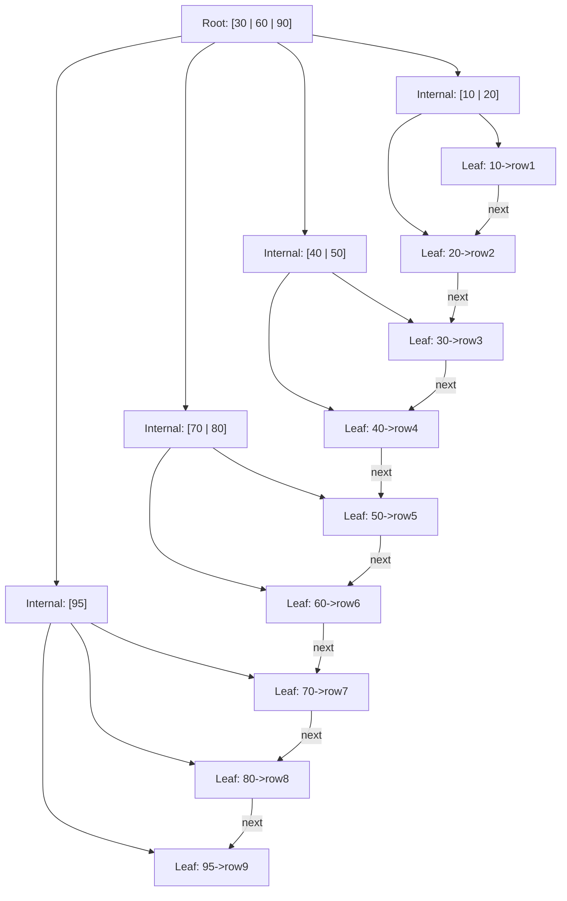

## Keywords in This File
{: .no_toc }

| # | Keyword | Weight |
|---|---|---|
| 20 | [B-Trees and Database Index Internals](#b-trees-and-database-index-internals) | critical |

---

# B-Trees and Database Index Internals

---
id: DS-020
title: B-Trees and Database Index Internals
category: Data Structures
difficulty: ★★★
interview_weight: critical
asked_at: FAANG
seniority: senior
tags: #data-structures #b-tree #database #indexes #storage-engine #interview-critical
status: draft
sd: true
version: 1
render_with_liquid: false
---

🎯 Interview Weight: Critical - One of the most frequently asked senior+ database questions at FAANG; directly tests whether a candidate understands how queries actually execute and why indexes work the way they do.

---

### 🎯 Model Answer

**30 seconds:**
> A B-Tree is a self-balancing tree structure where each node stores multiple keys and has multiple children, designed specifically to minimize disk I/O by keeping the tree height low. Database engines use B-Trees to implement indexes because a single node read fetches a full disk block worth of sorted keys, making range scans and lookups efficient. The critical insight is that B-Trees optimize for storage hierarchy - they are designed for disk, not RAM.

**3 minutes (Senior):**
> I think about B-Trees as the answer to one specific problem: how do you build an ordered index that stays balanced after millions of inserts and deletes, where each comparison costs a disk I/O? The naive answer - a binary BST - fails because it is unbalanced without extra work and each node is just one key, so you need O(log n) disk reads for a lookup. A B-Tree node holds hundreds of keys, so the height of the tree for a billion-row table is typically 3 or 4. Three disk reads to find any row in a billion-row table is the promise B-Trees deliver.

> In PostgreSQL and MySQL InnoDB, the B-Tree is specifically a B+ Tree: all actual row data (or row pointers) are stored only in leaf nodes, and all leaf nodes are linked in a doubly-linked list. This design means two things: first, point lookups read from root to leaf (3-4 I/Os), and second, range scans are a single seek to the starting leaf followed by a sequential scan along the leaf chain, which maps directly to sequential disk reads. Sequential reads on SSDs and HDDs are 10-100x faster than random reads.

> The non-obvious insight: the page size of a B-Tree node is typically 8KB or 16KB, chosen to match the OS page size and disk sector size. This means a single I/O fetches an entire B-Tree node. Filling those pages efficiently - the fill factor setting - is a tuning knob that trades space for insert performance.

**Framework:** WHAT → WHY → HOW → TRADE-OFF → EXAMPLE

*Adapting up:* At staff level, discuss write amplification in B-Trees vs LSM trees, the impact of random vs sequential writes on SSD wear, fill factor tuning for write-heavy vs read-heavy workloads, and the trade-off between clustered vs non-clustered indexes.

*Adapting down:* Junior: "A B-Tree keeps data sorted in a tree where each node holds many keys, making lookups fast and range queries possible. Databases use them for indexes."

**Blank Mind Recovery:**
If you blank in the interview:

**(1) Restate:** "So you are asking about B-Trees and how database indexes work - let me think through what problem this solves."

**(2) First principles:** "From first principles, you need to find a row in a billion-row table without reading every row. You need a sorted structure that stays balanced after arbitrary inserts, but each comparison costs a disk I/O, so you want as few levels as possible - that means each node should hold many keys."

**(3) Bridge:** "This is similar to a binary search tree but optimized for disk. A BST minimizes comparisons; a B-Tree minimizes disk I/Os by maximizing keys per node."

---

### 📘 Concept Explanation

**What it is:**
A B-Tree is a self-balancing ordered tree where each node holds between t-1 and 2t-1 keys (for a minimum degree t), ensuring all leaf nodes are at the same depth, with the tree remaining balanced through split and merge operations during insert and delete.

**The problem it solves:**
Binary search trees become unbalanced with skewed inserts (e.g., inserting sorted data builds a linked list), and even a balanced BST has O(log n) height where each level is a separate disk I/O. For a billion-row table, that is 30 disk reads - at 10ms per read, that is 300ms just for one lookup. B-Trees solve this by making each node hold hundreds of keys, reducing tree height to 3-4 levels regardless of table size.

**How it works:**
A B-Tree with minimum degree t has these invariants:
1. Every node has at most 2t-1 keys
2. Every non-root node has at least t-1 keys
3. All leaf nodes are at the same depth
4. A node with k keys has k+1 children

Operations:
- **Search**: start at root, binary-search within node to find key or descend to child, recurse
- **Insert**: descend to leaf, insert key; if leaf overflows (2t keys), split into two nodes and push median key to parent; split propagates upward if needed
- **Delete**: more complex - may require borrowing from sibling or merging nodes to maintain minimum fill

Database B+ Tree variant:
- Internal nodes store only keys (no data) for higher fan-out
- All data stored in leaf nodes
- Leaf nodes linked in a sorted doubly-linked list
- Enables range scans without returning to the root

```
B+ Tree structure (order 3, fan-out 4):

Root:   [30 | 60]
         /    |    \
[10|20] [40|50] [70|80]
  |  |    |  |    |  |
leaf chain: 10->20->30->40->50->60->70->80
```

> **Diagram walkthrough:** This depicts the B+ Tree structure used in all production relational databases. The Root holds routing keys directing traversal downward; Level 1 internal nodes narrow the search to a specific leaf range; leaf nodes hold the actual key-pointer pairs with all data rows. The critical relationship is the doubly-linked leaf chain - once the correct starting leaf is found via 3-4 tree-level reads, a range scan follows next-pointers sequentially without re-traversing the tree. On failure: a corrupted leaf chain pointer causes range queries to stop early or wrap incorrectly, returning silently incomplete result sets. The insight a senior engineer notices: the leaf chain explains why `ORDER BY indexed_column` requires no explicit sort step - the storage engine delivers rows already in B+ Tree key order.

**The key insight:**
B-Tree page size is chosen to match the OS page and disk block size (typically 4KB-16KB). This means one disk I/O fetches an entire B-Tree node. With a 16KB page and 16-byte keys plus 8-byte pointers, a node holds about 600 key-pointer pairs. A three-level B+ Tree with fan-out 600 can index 600^3 = 216 million rows. A four-level tree handles 130 billion rows. This is why database indexes work.

**When to use it:**
- Any ordered index: primary keys, foreign keys, range-queried columns
- Covering indexes (include all columns needed by a query)
- Multi-column indexes where prefix scans are needed
- When reads and writes are roughly balanced (B-Tree handles both well)

**When NOT to use it:**
- Hash indexes are faster for equality lookups and require no sorting overhead
- LSM Trees (LevelDB, RocksDB, Cassandra) outperform B-Trees for write-heavy workloads because they convert random writes to sequential appends
- Bitmap indexes are more space-efficient for low-cardinality columns (e.g., status flags) in OLAP workloads

**Alternatives:**
- Hash index - O(1) equality lookup, no range support, not ordered
- LSM Tree - better write throughput, higher read amplification
- Bitmap index - space-efficient for low-cardinality columns in analytics
- R-Tree - spatial indexing for geographic data
- Full-text inverted index - text search with token-level lookups

**First-principles derivation:**
Given: we need to find a key in a sorted set of N items, but each comparison costs one disk I/O (10-100ms). With binary search on a flat sorted array, we need O(log2 N) disk I/Os. For N=1 billion, that is 30 reads. The constraint is: minimize disk I/Os. If we can read B items per I/O, we need O(logB N) reads. For B=600, logB(10^9) = log(10^9)/log(600) ≈ 3.4. So 4 reads to find any item in a billion-item set. The B-Tree structure is the natural ordered data structure that achieves exactly this bound.

---

### 💻 Code Example

```java
// BAD: Linear scan instead of B-Tree index
// SELECT * FROM orders WHERE customer_id = 12345;
// Without an index, this scans every row
// At 100M rows: 100M disk reads = minutes
public List<Order> findOrdersBad(long customerId) {
    // Full table scan - O(n)
    return jdbcTemplate.query(
        "SELECT * FROM orders WHERE customer_id = ?",
        orderRowMapper, customerId);
    // No index = storage engine reads every page
}
```

> **Code walkthrough:** This shows the cost of missing an index. The query with no index on `customer_id` forces the storage engine to read every data page in the orders table - a full table scan. KEY MECHANISM: PostgreSQL/MySQL reads 8KB pages sequentially; for 100M rows at 100 bytes each, that is ~10GB of data reads. WHY IT MATTERS: at 200MB/s sequential read speed, a full scan takes 50 seconds even on fast storage. WHAT BREAKS: no explicit error, just catastrophic latency that grows linearly with table size - invisible in development, fatal in production. TAKEAWAY: every query that filters on a column should have that column indexed unless the table is tiny.

```java
// GOOD: B-Tree index covers the lookup
// CREATE INDEX idx_orders_customer ON orders(customer_id);
// Now the same query uses the B-Tree index
public List<Order> findOrdersGood(long customerId) {
    // B-Tree index lookup: 3-4 I/Os to find leaf page
    // Then sequential scan of matching leaf pages
    return jdbcTemplate.query(
        "SELECT * FROM orders WHERE customer_id = ?",
        orderRowMapper, customerId);
}

// Range query: B-Tree shines here
public List<Order> findOrdersByDateRange(
        long customerId,
        LocalDate from,
        LocalDate to) {
    // CREATE INDEX idx_orders_cust_date
    //   ON orders(customer_id, created_at);
    // B+ Tree leaf chain makes range scan sequential
    return jdbcTemplate.query(
        "SELECT * FROM orders " +
        "WHERE customer_id = ? " +
        "  AND created_at BETWEEN ? AND ?",
        orderRowMapper,
        customerId,
        from,
        to);
}
```

> **Code walkthrough:** With a B-Tree index on `customer_id`, the storage engine descends 3-4 levels of the B+ Tree to the first matching leaf page, then follows the leaf chain to collect all matching rows. KEY MECHANISM: InnoDB's B+ Tree leaf nodes are linked; a range scan reads them sequentially, which maps to sequential disk reads - the fastest access pattern for both SSDs and HDDs. WHY IT MATTERS: a query that took 50 seconds now takes 2ms because instead of reading 10GB we read ~50KB (a few B-Tree pages). WHAT BREAKS: if the query uses a function on the indexed column (`WHERE YEAR(created_at) = 2024`), the index cannot be used because the storage engine cannot evaluate which node to start at. TAKEAWAY: always match the query predicate shape to the index definition - functions and type casts on indexed columns bypass the index.

```java
// Index internals simulation - understanding fill factor
// In PostgreSQL: CREATE INDEX WITH (fillfactor=70)
// In MySQL InnoDB: innodb_fill_factor = 70

// Demonstration: the cost of page splits on insert
//
// With fillfactor=100 (fully packed pages):
//   - Maximum space efficiency
//   - Every insert into a full page causes a split
//   - Split: allocate new page, move half the keys,
//     update parent - expensive for write-heavy tables
//
// With fillfactor=70 (30% free space on leaf pages):
//   - Pages have room for new inserts without splitting
//   - Better write performance on sequential inserts
//   - Uses ~43% more storage for the index
//   - Choose for: INSERT-heavy tables with sequential PKs

// Check index bloat in PostgreSQL:
// SELECT schemaname, tablename, indexname,
//        pg_size_pretty(pg_relation_size(indexrelid))
//          AS index_size
// FROM pg_stat_user_indexes
// ORDER BY pg_relation_size(indexrelid) DESC;
```

> **Code walkthrough:** This shows the fill factor trade-off that most engineers miss. KEY MECHANISM: when a B-Tree leaf page is full (fillfactor=100) and a new key must be inserted, PostgreSQL/InnoDB allocates a new page, moves half the keys to it, and updates the parent node - a page split requiring multiple writes. With fillfactor=70, the page has 30% free space, deferring splits. WHY IT MATTERS: on a write-heavy table inserting 10,000 rows/second, page splits under high fill factor can reduce throughput by 30-50% and cause latency spikes. WHAT BREAKS: with low fill factor, the index uses significantly more disk space and more pages must be read for range scans. TAKEAWAY: set fillfactor below 100 for write-heavy sequential-insert tables; use the default (90 in PostgreSQL) for balanced workloads.

---

### 🎓 Answers by Seniority

**Junior / Mid (0-5 years):**
> A B-Tree is a balanced tree where each node can hold many keys - not just one like a binary tree. Databases use B-Trees for indexes because they minimize the number of disk reads needed to find a row. Instead of 30 disk reads for a billion-row table with a binary tree, a B-Tree needs only 3-4 reads. Range queries are efficient because leaf nodes are linked in sorted order.

*Push deeper:* "The key thing is that B-Trees are designed for disk, not RAM. The node size matches the disk page size (4KB-16KB), so one disk I/O fetches an entire node. That is the reason they work so well for storage."

---

**Senior / Staff (5+ years):**
> B-Trees are the dominant storage structure for relational database indexes because they solve the disk I/O problem optimally for balanced read/write workloads. The fan-out of a B-Tree node - how many children it can have - is determined by page size divided by key plus pointer size. With 16KB pages and 24-byte entries, you get fan-out of ~600, meaning 4 levels can index 600^4 = 130 billion rows.

> The choice between B-Tree and LSM Tree is the defining trade-off in modern database design. B-Trees write data in-place, so writes are random I/Os - expensive for HDDs, manageable for SSDs, but still causing write amplification. LSM Trees convert all writes to sequential appends, then merge in the background. RocksDB, Cassandra, and FoundationDB use LSM Trees for this reason. The crossover point: when your write:read ratio exceeds roughly 3:1, LSM Trees start winning. Below that, B-Trees win on read latency and simpler read path.

*Push deeper:* "At staff level I also think about clustered vs non-clustered indexes. In InnoDB, the primary key is the clustered index - the table is physically stored in B-Tree order by primary key. Secondary indexes store the primary key value as the pointer to the data row. This means a secondary index lookup does two B-Tree traversals: one in the secondary index to find the primary key, one in the clustered index to fetch the row. This double-lookup cost is why covering indexes matter in InnoDB."

---

### ⚠️ Common Misconceptions

**Misconception 1: "B-Tree and B+ Tree are the same thing."**
They are not. A B-Tree stores data in both internal and leaf nodes. A B+ Tree stores data only in leaf nodes, with internal nodes holding only keys for routing. All databases (PostgreSQL, MySQL InnoDB, SQLite, Oracle) use B+ Trees because the higher fan-out of data-free internal nodes reduces tree height, and the linked leaf chain enables efficient range scans. When engineers say "B-Tree index" in a database context, they almost always mean B+ Tree.

**Misconception 2: "Adding more indexes always makes queries faster."**
Every index adds write overhead: every INSERT, UPDATE, or DELETE must update all indexes on the table. A table with 10 indexes pays 10x the write cost per row mutation. Index bloat also consumes buffer pool space, reducing the hot data that fits in memory. The rule: index every column that is in a WHERE clause, JOIN condition, or ORDER BY of a frequent slow query - and no others.

**Misconception 3: "The index is always used if the column is indexed."**
The query planner uses cost estimation to decide whether an index scan or a sequential scan is cheaper. For a query that returns 30% of a large table's rows, a full table scan is faster because: (a) sequential I/O is faster than random I/O, and (b) a single sequential read can fetch multiple rows per page. The optimizer chooses sequential scan when the estimated selectivity is too low. Understanding this prevents the frustrating case where you add an index and the query is still slow.

**Misconception 4: "B-Trees handle all query shapes equally well."**
B-Trees are optimal for prefix queries: WHERE a = 1 AND b = 2 uses a (a, b) index. But the index is useless for WHERE b = 2 without the leading column a, because the B-Tree is sorted first by a, and there is no contiguous range of b values to scan. This is the left-most prefix rule for composite indexes.

---

### 🚨 Failure Modes and Diagnosis

**Failure 1: Index not used despite existing**
Symptom: EXPLAIN shows Seq Scan even though an index exists; query is slow.
Diagnosis:
```sql
-- PostgreSQL: check if index exists and is valid
SELECT indexname, indexdef, indisvalid
FROM pg_indexes
JOIN pg_index ON pg_indexes.indexname::text =
  (SELECT relname FROM pg_class WHERE oid = indexrelid)
WHERE tablename = 'orders';

-- Check planner statistics
EXPLAIN (ANALYZE, BUFFERS)
SELECT * FROM orders WHERE customer_id = 12345;
```

> **Code walkthrough:** These two diagnostic queries reveal why an expected index is not being used. `pg_indexes` joined with `pg_index` exposes `indisvalid` - an index left invalid by a failed concurrent build is silently ignored by the planner despite appearing in catalog views. `EXPLAIN (ANALYZE, BUFFERS)` runs the actual query and compares estimated vs actual row counts plus shared block hits/reads. What breaks: `EXPLAIN ANALYZE` executes the full query in production - never use on slow or data-mutating queries; use plain `EXPLAIN` instead. Takeaway: always verify `indisvalid = true` before concluding an index is absent; PostgreSQL can leave silent invalid indexes from interrupted `CREATE INDEX CONCURRENTLY` operations.

Common causes:
- Function on indexed column: `WHERE DATE(created_at) = '2024-01-01'` prevents index use; fix: `WHERE created_at >= '2024-01-01' AND created_at < '2024-01-02'`
- Type mismatch: `WHERE user_id = '12345'` when `user_id` is INTEGER forces a cast that bypasses the index
- Stale statistics: after bulk loads, run `ANALYZE orders` to rebuild planner statistics
- Low selectivity: planner estimates a sequential scan is cheaper; add a partial index or accept the scan

**Failure 2: Index bloat causing slow queries and excessive storage**
Symptom: index is larger than the table it indexes; query performance degrades over time despite low data growth.
Diagnosis:
```sql
-- PostgreSQL: find bloated indexes
SELECT indexname,
  pg_size_pretty(pg_relation_size(indexrelid)) AS index_size,
  pg_size_pretty(pg_relation_size(indrelid)) AS table_size
FROM pg_stat_user_indexes
JOIN pg_index USING (indexrelid)
ORDER BY pg_relation_size(indexrelid) DESC;
```

> **Code walkthrough:** This query measures index-to-table size ratio, the primary bloat signal. `pg_relation_size(indexrelid)` returns the total on-disk bytes of the index file including dead pages; dividing by table size shows if the index has grown disproportionately. Key mechanism: PostgreSQL uses MVCC - deleted tuples are marked dead but pages are not immediately reclaimed, so an index on a high-churn table silently grows until VACUUM or REINDEX runs. Why it matters: a 5x bloated index on a 50GB table adds 40GB of unnecessary I/O per range scan. What breaks: this query reads only catalog tables and is safe in production, but `pg_relation_size` acquires a brief lock - avoid on extremely high-frequency monitoring intervals. Takeaway: run this query monthly on high-churn tables; any index with ratio > 200% needs VACUUM or REINDEX CONCURRENTLY.

Cause: B-Tree pages are never reused after deletes in PostgreSQL unless VACUUM runs; the freed space is available for new inserts in the same page but the page count stays high. Fix: `REINDEX CONCURRENTLY idx_name` to rebuild without locking the table.

**Failure 3: Write performance cliff on high-insert tables**
Symptom: INSERT throughput drops 50% suddenly; latency spikes correlate with disk I/O spikes on monitoring.
Diagnosis: check for page split storms with `pg_stat_bgwriter`, monitor `blks_written` during insert bursts.
Cause: B-Tree pages are full (fillfactor=100 or approaching it), causing cascading page splits. Each split requires writing 2-3 pages to disk.
Fix: For sequential primary keys (UUIDs are not sequential - they are random!), use `fillfactor=90`. For random-insert tables (UUID primary keys), use `fillfactor=70` or switch to sequential IDs (`BIGSERIAL`, `SEQUENCE`) to keep inserts at the right end of the B-Tree.

**Failure 4: Covering index not used due to column order**
Symptom: query runs correctly but EXPLAIN shows index scan + heap fetch (costly) instead of index-only scan.
Diagnosis: `EXPLAIN` shows "Heap Fetches > 0" even with a covering index.
Fix: In PostgreSQL, verify the index includes all columns in the SELECT list, and that the visibility map is up to date (`VACUUM` the table). In MySQL, verify the covering index uses `INCLUDE` columns if needed.

---

### 🎯 Interview Deep-Dive

| Category | Count | Coverage |
|---|---|---|
| Conceptual | 3 | B-Tree structure, B+ Tree, database storage |
| Mechanism | 3 | insert/split, range scan, clustered index |
| Debugging | 3 | missing index, bloat, write performance |
| Trade-off | 3 | B-Tree vs LSM, index selection, composite keys |

---

**[SENIOR] Q1 - [CONCEPTUAL] Explain what a B-Tree is and why databases use it for indexes instead of a binary search tree.**

A B-Tree is a self-balancing, ordered tree data structure where each node can hold multiple keys and have multiple children. The defining property is that all leaf nodes are at the same depth, keeping the tree balanced automatically through split and merge operations.

Databases use B-Trees instead of binary search trees for one fundamental reason: disk I/O cost. A binary BST node holds one key and has two children. To search a billion-row table, you need O(log2 n) = 30 node reads. If each node read is a disk I/O (even at 0.1ms on NVMe, that is 3ms), and you are running 10,000 queries per second, the BST is infeasible.

A B-Tree node holds hundreds of keys - the exact number depends on page size and key size. With 16KB pages and 24-byte key-pointer pairs, a node holds 600+ entries. The tree height for a billion rows is O(log600 10^9) ≈ 3.4, so 4 disk reads maximum. The same search that requires 30 reads in a BST requires 4 in a B-Tree.

Databases specifically use the B+ Tree variant, where data is stored only in leaf nodes. Internal nodes hold only routing keys, achieving higher fan-out. All leaf nodes are linked in a doubly-linked sorted list, enabling range scans to be sequential reads (find the start leaf, scan right) rather than repeated tree traversals.

The critical detail: B-Tree page size (typically 8KB or 16KB) is chosen to match the OS memory page size and disk sector size, ensuring that one disk I/O fetches exactly one complete B-Tree node.

*What separates good from great:* Great engineers can derive why B-Trees have this fan-out from first principles: page_size / (key_size + pointer_size) = entries_per_node. And they understand that this is not just an efficiency optimization - it is the difference between a query taking 4ms and 400ms.

---

**[SENIOR] Q2 - [MECHANISM] Walk me through what happens internally when you INSERT a row into a table with a B+ Tree index.**

When you insert a row, the storage engine must:

**Step 1 - Find the insertion point**: Traverse the B+ Tree from root to the appropriate leaf node. The engine reads 3-4 pages (one per tree level) and binary-searches within each to find the correct child pointer. Each read hits the buffer pool first - if the page is cached (common for hot indexes), there is no disk I/O.

**Step 2 - Insert into the leaf node**: The new key-value pair is inserted in sorted order within the leaf node. In InnoDB's clustered index, the leaf node contains the full row data.

**Step 3 - Handle overflow (page split)**: If the leaf node is full (exceeds fillfactor), a page split occurs:
- Allocate a new page
- Move the upper half of keys to the new page
- Update the parent node to point to both pages
- If the parent also overflows, the split propagates upward
- In the worst case, the split reaches the root, which creates a new root and increases tree height by 1

**Step 4 - Update secondary indexes**: For every secondary index on the table, the engine performs a similar operation - find the index leaf position, insert the indexed column value plus the primary key as the record pointer.

The critical performance implication: random inserts (e.g., UUID primary keys) cause page splits at random positions in the B-Tree, forcing writes to random pages. Sequential inserts (e.g., auto-increment IDs) always append to the rightmost leaf, requiring no splits for hot pages. This is why MySQL/InnoDB performs dramatically better with sequential primary keys, and why UUID primary keys can reduce insert throughput by 30-50%.

*What separates good from great:* Knowing that InnoDB keeps the last-inserted leaf page in the buffer pool hot, so sequential inserts hit mostly cached pages. Random inserts evict cold pages on every insert, causing disk I/O even on tables smaller than the buffer pool.

---

**[SENIOR] Q3 - [CONCEPTUAL] Explain the difference between a clustered and non-clustered index. Why does it matter?**

A clustered index determines the physical storage order of rows on disk. In InnoDB, the primary key is always the clustered index - the table itself is stored as a B+ Tree ordered by primary key. There is exactly one clustered index per table.

A non-clustered (secondary) index is a separate B-Tree structure. Each leaf node in a secondary index stores the indexed column value(s) plus a pointer to the corresponding row. In InnoDB, the pointer is the primary key value (not a physical row address), which means looking up a row via a secondary index requires two B-Tree traversals: first in the secondary index to find the primary key, then in the clustered index to fetch the actual row. This is called a "double lookup" or "bookmark lookup."

Why it matters for query performance:

1. **Range scans are faster on clustered indexes** because rows are physically stored in key order, enabling sequential disk reads. A range scan on a secondary index causes random I/Os if the matching rows are scattered across the table.

2. **Covering indexes eliminate the double lookup**: if the secondary index contains all columns needed by the query (a "covering index"), the engine can return the result from the index alone without touching the clustered index. `EXPLAIN` shows this as "Index Only Scan" in PostgreSQL or "Using index" in MySQL.

3. **UUID primary keys cause fragmentation**: because rows are inserted at random positions in the B+ Tree (ordered by UUID, not by insert time), the clustered index becomes fragmented over time. The data pages are no longer correlated with access patterns, reducing cache efficiency. Auto-increment integer keys keep recently-inserted rows together, improving cache hit rates for recent-data queries.

*What separates good from great:* In PostgreSQL, unlike InnoDB, there is no concept of a "clustered index" in the storage engine - all indexes are non-clustered, and the physical order of rows in a heap is not guaranteed by any index. PostgreSQL's `CLUSTER` command reorders the heap once, but the order degrades over time as new rows are inserted. This difference changes the performance characteristics of sequential vs UUID primary keys in PostgreSQL vs MySQL.

---

**[STAFF] Q4 - [TRADE-OFF] What is write amplification in B-Trees, and when does it become a problem?**

Write amplification is the ratio of bytes written to storage per byte of user data written. In a B-Tree, write amplification occurs because:

**Case 1 - In-place updates**: Updating a key value requires reading the leaf page into the buffer pool (if not cached), modifying it, and writing it back. Even for a 1-byte change, an 8KB page is written.

**Case 2 - Page splits**: When a leaf page overflows on insert, the engine writes two full pages (the original, now half-empty, and the new page) plus modifies the parent node. A single insert that causes a split writes 3+ pages.

**Case 3 - WAL/redo logging**: Relational databases write changes to a Write-Ahead Log (WAL) before modifying data pages, for crash safety. Every B-Tree modification is written twice: once to the WAL, once to the data page. B-Trees have a WAL write amplification of roughly 2x.

Write amplification becomes a problem when:
- Insert throughput exceeds 50,000+ rows/second on a single table
- SSD wear is a concern (SSDs have limited write endurance; high write amplification accelerates wear)
- The workload is write-heavy with few reads (B-Tree's write costs are not amortized over reads)

The alternative for write-heavy workloads is LSM Trees (Log-Structured Merge Trees), used by RocksDB, Cassandra, and FoundationDB. LSM Trees convert random writes to sequential appends (lower write amplification), at the cost of read amplification (multiple files may contain versions of the same key, requiring merge-read at query time).

*What separates good from great:* The break-even point between B-Tree and LSM Tree depends on the write:read ratio and the specific hardware. On NVMe SSDs, random writes are fast enough that B-Trees win up to very high write rates. On HDDs, LSM Trees win at much lower write rates because sequential I/O on HDD is 100x faster than random I/O.

---

**[SENIOR] Q5 - [MECHANISM] How do composite indexes work in B-Trees, and what is the left-most prefix rule?**

A composite (multi-column) index creates a B-Tree sorted first by column A, then by column B within each value of A. The B-Tree key is the concatenation of the indexed columns.

For an index on (last_name, first_name):
- The leaves are ordered: Anderson/Alice, Anderson/Bob, Anderson/Carol, ..., Baker/Alice, Baker/Bob, ...
- A query `WHERE last_name = 'Anderson'` can use the index: seek to the first 'Anderson' leaf and scan right
- A query `WHERE last_name = 'Anderson' AND first_name = 'Bob'` uses the index fully: seek directly to the exact position
- A query `WHERE first_name = 'Bob'` cannot use this index: first_name values are scattered throughout the tree (not contiguous for any given first_name value), so there is no range to seek into

This is the left-most prefix rule: a composite index on (A, B, C) is usable for queries that filter on A, or (A, B), or (A, B, C) - but NOT for queries that filter only on B, only on C, or only on (B, C). The filter must start with the leading columns.

The rule extends to range conditions: `WHERE A = 1 AND B > 5` can use the index for A and then B, but `WHERE A > 1 AND B = 5` can only use the index for the A range (the B condition cannot be evaluated as a B-Tree range because B values are not ordered within the range of A values).

Practical guidance: for a query `WHERE status = ? AND created_at > ? ORDER BY created_at`, the optimal composite index is (status, created_at), placing the equality column first and the range/sort column last.

*What separates good from great:* Knowing that MySQL/InnoDB can use the index for filtering and then skip the ORDER BY clause if the ORDER BY columns match the index suffix - eliminating a sort operation entirely, which can reduce query time from seconds to milliseconds for large result sets.

---

**[STAFF] Q6 - [DEBUGGING] You notice a query is running slow even though EXPLAIN shows it is using an index. What are the possible causes?**

The most common causes of slow queries despite index usage:

**1. High selectivity with many matching rows**: The index correctly points to a large range of matching rows, but fetching those rows requires many random I/Os. If 10% of the table matches and the rows are scattered, a query might generate 100,000 random page reads - slower than a sequential full scan. EXPLAIN shows the correct index being used, but the "rows" estimate is high.

**2. Non-covering index with many columns in SELECT**: A secondary index points to primary key values. Fetching each matching row requires a second B-Tree lookup (the double lookup / bookmark lookup). For a query returning 10,000 rows, this is 10,000 random reads in the clustered index. Fix: add all projected columns to the index as INCLUDE columns to create a covering index.

**3. Index statistics are stale**: The query planner estimates row counts using statistics collected by ANALYZE. Stale statistics after a bulk load can cause poor index choice. Fix: `ANALYZE table_name` to rebuild statistics.

**4. The index is the wrong index**: The planner chose an index that reduces the result set from 100M to 10M rows, but another index would reduce it to 100 rows. Check all WHERE conditions and compare to available indexes.

**5. The query uses a function on the indexed column**: `WHERE LOWER(email) = 'test@example.com'` bypasses the index on `email`. Fix: add a functional index `CREATE INDEX idx_email_lower ON users(LOWER(email))`.

Diagnosis steps:
```sql
-- PostgreSQL: full explain with actual timings
EXPLAIN (ANALYZE, BUFFERS, FORMAT TEXT)
SELECT * FROM orders WHERE customer_id = 12345;
-- Look for: actual time vs estimated, heap fetches, shared hits vs reads
```

> **Code walkthrough:** `EXPLAIN (ANALYZE, BUFFERS, FORMAT TEXT)` runs the query and returns the full execution plan with actual timing, row counts, and buffer statistics. Key mechanism: `actual time` vs `rows` discrepancy indicates stale statistics - if the planner estimated 10 rows but saw 100,000, update statistics with `ANALYZE`. `Buffers: shared hit=X read=Y` shows cache efficiency - high `read` numbers indicate a cold cache or index too large for buffer pool. What breaks: using FORMAT JSON or XML makes output machine-parseable but harder to read; FORMAT TEXT is best for human diagnosis. Takeaway: always compare `actual rows` vs `rows` in every EXPLAIN node - a 10x discrepancy anywhere in the plan is a signal that statistics need rebuilding.

*What separates good from great:* Understanding that "using an index" and "performing well" are not the same thing. An index scan can be slower than a sequential scan if the matching rows are scattered across the table. Great engineers read the EXPLAIN output for actual_rows vs estimated_rows discrepancies, and for high heap_fetches counts.

---

**[STAFF] Q7 - [DEBUGGING] What is index bloat and how do you fix it in production without downtime?**

Index bloat occurs when a B-Tree index grows much larger than the actual data it indexes, because deleted or updated rows leave gaps that are not reclaimed.

In PostgreSQL, when a row is deleted, the leaf entry in the B-Tree index is marked as dead but the page is not immediately reclaimed. Over time, with many deletes and updates, index pages become mostly empty - the index might be 3x the size of the table data, and range scans must read 3x as many pages.

VACUUM in PostgreSQL reclaims dead tuples from the heap and removes dead index entries. But VACUUM cannot always reduce the size of the index on disk - it only marks pages as reusable for future inserts. If there are entire pages with no live tuples, VACUUM can return them to the free space map, but the index file on disk stays the same size.

Fix options:
```sql
-- Check index bloat (PostgreSQL):
SELECT indexname,
  round(100 * pg_relation_size(indexrelid) /
    nullif(pg_relation_size(indrelid), 0)) AS ratio_pct
FROM pg_stat_user_indexes
JOIN pg_index USING (indexrelid);

-- Fix 1: REINDEX without locking (Postgres 12+)
REINDEX INDEX CONCURRENTLY idx_orders_customer;
-- Builds a new index alongside the old one,
-- then swaps atomically. Table remains accessible.

-- Fix 2: For MySQL, use pt-online-schema-change
-- or native ALTER TABLE ... ALGORITHM=INPLACE, LOCK=NONE
-- (depending on MySQL version and index type)
```

> **Code walkthrough:** `REINDEX INDEX CONCURRENTLY` rebuilds the index from scratch in the background without blocking reads or writes, making it safe for production use. Key mechanism: PostgreSQL builds a new index alongside the old one, swaps the catalog entry atomically, then drops the old index - applications see no interruption. Why it matters: without `CONCURRENTLY`, `REINDEX` acquires an exclusive lock that blocks all reads and writes for the duration - fatal on a large index. What breaks: `REINDEX CONCURRENTLY` requires extra disk space equal to the index size; if disk is near-full the operation fails mid-rebuild leaving the index in an invalid state. Takeaway: always check available disk space before running `REINDEX CONCURRENTLY`; the required space is `pg_relation_size(index_oid)` bytes.

For tables with very high update rates, schedule regular `REINDEX CONCURRENTLY` as a maintenance job (weekly or monthly), or configure `autovacuum` more aggressively for that specific table.

*What separates good from great:* Knowing that `REINDEX CONCURRENTLY` in PostgreSQL is available since PostgreSQL 12, but requires additional disk space equal to the index size during the rebuild. On a 100GB index with 10GB of free space, `REINDEX CONCURRENTLY` will fail. Fix: add disk space first, or use a partial reindex strategy.

---

**[STAFF] Q8 - [DESIGN] Design an indexing strategy for a multi-tenant SaaS application with a high-volume orders table. What indexes would you create and why?**

Assumptions: orders table with columns (id, tenant_id, customer_id, status, amount, created_at, updated_at). 500M rows, multi-tenant isolation required, mix of OLTP queries and reporting queries.

Primary key: `id BIGSERIAL` (clustered index, sequential, avoids UUID fragmentation)

Secondary indexes:

**1. (tenant_id, created_at)** - covers the most common query: "show me recent orders for this tenant." This satisfies `WHERE tenant_id = ? ORDER BY created_at DESC LIMIT 100` in a single index range scan with no sort.

**2. (tenant_id, customer_id, created_at)** - covers "show me orders for this customer in this tenant." Prefix (tenant_id, customer_id) for equality, then range on created_at.

**3. (tenant_id, status)** - covers "how many pending orders for this tenant?" Note: if status is low-cardinality (5-10 values), consider a partial index `WHERE status = 'pending'` to reduce index size.

**4. Partial index**: `CREATE INDEX idx_orders_pending ON orders(tenant_id, created_at) WHERE status IN ('pending', 'processing')` - this index is much smaller (only non-terminal orders) and covers the most latency-sensitive queries.

What I would NOT index: `amount` alone (rarely used as a filter), `updated_at` (rarely queried, high-churn column that causes index updates on every row modification).

Monitoring strategy:
```sql
-- Find unused indexes consuming write overhead:
SELECT indexname, idx_scan, idx_tup_read, idx_tup_fetch
FROM pg_stat_user_indexes
WHERE idx_scan = 0 AND indexname NOT LIKE 'pg_%';
```

> **Code walkthrough:** This query identifies write-only indexes - indexes that consume write overhead on every INSERT/UPDATE but are never used by any query. Key mechanism: `pg_stat_user_indexes.idx_scan` accumulates since the last `pg_stat_reset()` call; filtering for zero scans over a 30-day window is a strong signal the index is unused. Why it matters: each unused index adds one B-Tree insert per row write - 5 unused indexes on a 10,000 inserts/second table waste 50,000 B-Tree operations/second with zero query benefit. What breaks: statistics reset at PostgreSQL restart or explicit `SELECT pg_stat_reset()` - verify with `pg_stat_user_tables.last_autoanalyze` to confirm the 30-day window is valid. Takeaway: never drop an index based solely on `idx_scan = 0` without also checking `pg_stat_statements` for queries that might reference the column; some indexes protect uniqueness constraints.

Drop any index with zero scans after 30 days of production traffic.

*What separates good from great:* Including `tenant_id` as the leading column in every index is a deliberate multi-tenancy pattern - it ensures every index scan is tenant-scoped, preventing cross-tenant data access and ensuring the index is usable for per-tenant queries.

---

**[SENIOR] Q9 - [DEBUGGING] What is the N+1 index problem and how would you diagnose it in a production database?**

The N+1 query problem (also called the N+1 select problem) occurs when an ORM loads a parent entity and then separately queries for each child entity - executing 1 query for N parents followed by N queries for the children, where a single JOIN would suffice.

This is not strictly a B-Tree problem, but it interacts with indexes: each of the N child queries does a separate B-Tree lookup, causing N random I/Os instead of one range scan.

Diagnosis:
```bash
# PostgreSQL: enable query logging and look for patterns
# In postgresql.conf:
log_min_duration_statement = 10  # log all queries > 10ms
log_duration = on

# Then search logs for repeated similar queries:
grep "SELECT.*WHERE order_id" postgresql.log | wc -l
# If this count equals the number of parent records
# loaded in the same request: N+1 detected
```

> **Code walkthrough:** This bash diagnostic counts how many times a specific parameterized query pattern appears in PostgreSQL logs within a request window. Key mechanism: enable `log_min_duration_statement = 10` in postgresql.conf to capture all queries over 10ms, then grep for the repeating pattern with `wc -l`; if the count equals the number of parent records loaded, N+1 is confirmed. Why it matters: N+1 causes log floods at scale - a list page loading 100 parents generates 100 child queries; 1,000 concurrent users cause 100,000 child queries per second. What breaks: `log_min_duration_statement = 0` logs all queries including fast ones and creates gigabytes of logs per hour; set a threshold that captures slow queries only. Takeaway: use `pg_stat_statements` in production rather than log parsing - it aggregates query patterns with execution counts without the log volume.

Fix: use JOIN queries or batch loading:
```java
// BAD: N+1 - one query per order
List<Order> orders = orderRepository.findAll(); // 1 query
for (Order order : orders) {
    List<Item> items = itemRepository
        .findByOrderId(order.getId()); // N queries
}

// GOOD: one query with JOIN or IN clause
List<Order> orders = orderRepository
    .findAllWithItems(); // 1 query with JOIN
// Or:
List<Long> orderIds = orders.stream()
    .map(Order::getId)
    .collect(toList());
Map<Long, List<Item>> itemsByOrder = itemRepository
    .findByOrderIdIn(orderIds); // 1 query with IN clause
```

> **Code walkthrough:** This BAD/GOOD pair shows the N+1 pattern and its fix. The BAD version calls `findByOrderId` inside a loop - each call issues a separate SQL query, causing N random B-Tree leaf lookups for N orders. The GOOD version uses either a JOIN (fetches all data in one query with the database handling the join internally) or a batch `IN` clause (sends all IDs to the database in one round trip, still using the B-Tree index but reducing network overhead from N trips to 1). What breaks: the `IN` clause approach still does N index lookups; for N > 10,000 the IN list becomes too large for some databases. Takeaway: prefer JOINs over IN-batch for large N; use Spring Data's `@EntityGraph` or JPA `JOIN FETCH` to eliminate N+1 at the ORM layer without writing raw SQL.

*What separates good from great:* Knowing that `WHERE id IN (1,2,3,...1000)` with a B-Tree index results in 1000 individual B-Tree leaf lookups - still N random I/Os. For true sequential performance, join to a temp table and let the query planner choose a hash join or sort-merge join.

---

**[STAFF] Q10 - [MECHANISM] How does a database decide whether to use an index or do a full table scan?**

The query planner uses a cost-based optimizer (CBO) that estimates the total I/O and CPU cost of each execution plan and chooses the cheapest.

For an index scan, the estimated cost is:
- `num_matching_rows / rows_per_page * random_io_cost` - because rows might be scattered across pages
- Plus the cost of traversing the B-Tree (usually 3-4 I/Os, negligible)

For a sequential scan, the estimated cost is:
- `total_pages * seq_io_cost`

The planner switches from index scan to sequential scan when the estimated fraction of matching rows exceeds a threshold. In PostgreSQL, the default cost parameters are: `seq_page_cost = 1.0`, `random_page_cost = 4.0`. This means a sequential read is assumed to be 4x cheaper than a random read per page. Under these settings, the planner favors a full scan when the index scan would require reading more than ~25% of table pages randomly.

On modern SSDs, `random_page_cost` should be set lower (1.1-2.0) because the seek penalty for random reads is much lower than on HDDs. Adjusting this setting causes the planner to use indexes more aggressively.

Diagnosing wrong planner choices:
```sql
-- PostgreSQL: force or disable index scan for testing
SET enable_indexscan = off;  -- forces seq scan
SET enable_seqscan = off;    -- forces index scan
EXPLAIN ANALYZE SELECT ...;  -- compare costs

-- Check table statistics accuracy
SELECT reltuples, relpages FROM pg_class
WHERE relname = 'orders';
-- If reltuples is far from actual row count: run ANALYZE
```

> **Code walkthrough:** These three commands let you probe and override the query planner's index-or-scan decision. `SET enable_indexscan = off` forces a sequential scan so you can compare the actual cost against the index path. `pg_class.reltuples` shows the planner's row count estimate - if it shows 100,000 but `SELECT COUNT(*)` returns 10,000, statistics are stale and the planner may incorrectly choose a sequential scan. Why it matters: stale statistics are the #1 cause of unexpected full-table scans in production after large bulk data changes. What breaks: `SET enable_seqscan = off` disables sequential scans globally in the session - always wrap in a transaction and rollback, or the session will use suboptimal plans for all subsequent queries. Takeaway: run `ANALYZE table_name` immediately after any bulk INSERT/DELETE/UPDATE affecting more than 10% of rows.

*What separates good from great:* The planner's selectivity estimate can be wrong if the data distribution is non-uniform (e.g., 90% of orders belong to one tenant). `CREATE STATISTICS` in PostgreSQL 10+ allows defining multi-column statistics to help the planner estimate joint selectivity more accurately.

---

**[STAFF] Q11 - [TRADE-OFF] Describe the trade-off between B-Trees and LSM Trees. When would you choose each?**

B-Trees and LSM Trees represent two fundamentally different philosophies for handling writes to an ordered on-disk data structure.

**B-Trees**: update data in place. A write goes to the WAL for crash safety, then updates the B-Tree page in the buffer pool. When the page is dirty (modified but not yet written to disk), it is eventually flushed. Write amplification is roughly 2-3x (WAL + data page). Read amplification is minimal (3-4 page reads per lookup). Space amplification is low-moderate (fragmentation from page splits and delete tombstones).

**LSM Trees**: append all writes to a memory buffer (MemTable), then flush to immutable sorted files (SSTables) on disk when the buffer fills. Reads must check the MemTable plus all SSTables (use Bloom filters to skip most files). A background compaction process merges SSTables, discarding overwritten/deleted keys. Write amplification is 10-30x due to compaction. Read amplification is 2-10x. Space amplification is moderate (multiple versions exist until compaction removes them).

Choose B-Trees when:
- Reads and writes are roughly balanced
- Read latency is critical (consistent 3-4 I/O reads)
- Data is updated frequently (in-place updates are cheaper than compaction)
- Using a relational database (PostgreSQL, MySQL, Oracle - all use B-Trees)

Choose LSM Trees when:
- Write throughput is the bottleneck (time-series, log ingestion, event streams)
- Sequential write patterns dominate (LSM converts random writes to sequential)
- Write:read ratio > 3:1
- Using RocksDB, Cassandra, ScyllaDB, LevelDB, TiKV, or FoundationDB

*What separates good from great:* The emerging hybrid: TiKV (TiDB's storage layer) uses an LSM Tree for write performance but adds a columnar secondary index stored in a B+ Tree for OLAP queries. Understanding that B-Tree vs LSM is not a binary choice but a design parameter tunable at the column-group level.

---

**[STAFF] Q12 - [TRADE-OFF] A senior engineer on your team proposes removing all secondary indexes from a write-heavy table to improve write throughput. How do you evaluate this?**

This is a legitimate trade-off but requires analysis before action.

First, understand the current situation:
```sql
-- Find which indexes are actually being used
SELECT indexname, idx_scan, idx_tup_read,
  pg_size_pretty(pg_relation_size(indexrelid)) AS size
FROM pg_stat_user_indexes
WHERE tablename = 'orders'
ORDER BY idx_scan DESC;
```

> **Code walkthrough:** This query ranks indexes by usage frequency (`idx_scan` = total index scans since last statistics reset) with their disk footprint. Key mechanism: `pg_stat_user_indexes` accumulates scan counts per index per table; sorting by `idx_scan DESC` immediately reveals which indexes are carrying the read workload and which are pure overhead. Why it matters: before removing any index, you must quantify what queries use it - removing an index with `idx_scan = 100` could silently degrade those 100 daily queries from milliseconds to seconds. What breaks: `pg_size_pretty` shows compressed human-readable sizes but loses precision for calculations; use `pg_relation_size` directly if scripting. Takeaway: use `pg_stat_statements` alongside this query to map each index to specific query patterns before making removal decisions.

Any index with `idx_scan = 0` over the past 30 days is a candidate for removal - it is paying write overhead with no read benefit.

For indexes with non-zero scans, the analysis is:
- What queries use this index? (use `pg_stat_statements` and EXPLAIN)
- What is the read SLA for those queries?
- If the index is removed, what does query time become?
- What is the current write throughput bottleneck? (Is it the index updates, or something else like lock contention or WAL I/O?)

Common finding: 3-4 secondary indexes exist, but 80% of index scans come from 1-2 indexes. The other 2-3 indexes serve occasional reporting queries.

Resolution options:
1. **Remove unused indexes** - zero-risk win
2. **Move reporting queries to a read replica** - eliminate those index scans from the primary, then remove the supporting indexes
3. **Replace secondary indexes with partial indexes** - `WHERE status = 'pending'` covers 5% of rows instead of 100%, dramatically reducing write overhead
4. **Queue-based architecture** - writes go to a queue, indexes are updated asynchronously from the read side

The key principle: never remove an index without validating the queries that depend on it. Silent query degradation is worse than the write overhead you were trying to fix.

*What separates good from great:* Quantifying the write overhead before removing. Each secondary index adds roughly one extra B-Tree insert per row insert. If inserts are 5,000/second and there are 5 secondary indexes, that is 25,000 B-Tree updates/second. Measuring the actual write throughput improvement after removing one index tells you whether the hypothesis is correct before committing to a larger change.

---

### ⚖️ Comparison Table

| Structure | Read Complexity | Write Complexity | Range Scans | Space | Best For |
|---|---|---|---|---|---|
| **B+ Tree** | O(log n) | O(log n) | Excellent (leaf chain) | Moderate | OLTP balanced r/w |
| Hash Index | O(1) avg | O(1) avg | None (unordered) | Low | Equality-only lookups |
| LSM Tree | O(log n) + bloom | O(1) amortized | Good (merge read) | High (versions) | Write-heavy workloads |
| Bitmap Index | O(1) + AND/OR | O(n) bulk-only | Excellent (bitwise ops) | Very low (low cardinality) | OLAP, low-cardinality cols |
| R-Tree | O(log n) spatial | O(log n) | Spatial ranges | Moderate | Geographic / spatial data |
| Inverted Index | O(posting list) | Batch rebuild | Token ranges | High | Full-text search |

**The deciding factor:**
Choose B+ Tree for any relational database primary or secondary index with mixed read/write workloads; switch to LSM when write throughput exceeds what B-Tree can sustain, and accept higher read amplification in exchange.

---

### 🏛️ System Design

> *(Conditional: included because this is a ★★★ entry and B-Tree indexes are a core system design component.)*

**Where B-Trees appear in system design:**
- Database indexing layer (every relational database, every cloud SQL service)
- Key-value stores with ordered key support (LevelDB-based stores use LSM, but BoltDB uses B-Tree)
- File system B-Tree directories (ext4, NTFS, APFS all use B-Tree variants for directory structures)
- In-memory sorted map implementations (Java TreeMap, C++ std::map use red-black trees, but disk-backed versions use B-Trees)

**Example question:** "Design a leaderboard system for a game with 100M players that supports top-K queries, rank lookups, and score updates in real time."

**6-step framework answer:**

Step 1 CLARIFY (~5 min):
- Update frequency: real-time vs batched?
- Query patterns: top-K global, rank of specific user, range (users ranked 1000-1010)?
- Consistency: does a player need to see their exact rank immediately after scoring?

Step 2 ESTIMATE (~5 min):
- 100M players, score updates: 10,000/second
- Top-K queries: 50,000/second (read-heavy)
- Score update payload: 50 bytes, index update: ~200 bytes
- Write throughput: ~2MB/s, manageable for a single primary

Step 3 DESIGN (~10 min):
- Primary storage: PostgreSQL with (score DESC, user_id) index
- Rank query: `SELECT COUNT(*) FROM players WHERE score > ?` or pre-computed rank column updated on score change
- Caching layer: Redis sorted set (`ZADD players score user_id`) for sub-millisecond top-K

Step 4 DEEP DIVE (~10 min) - B-Tree relevance:
- PostgreSQL index on (score DESC) enables fast top-K: `ORDER BY score DESC LIMIT 100` uses the index to read exactly 100 rows
- But "rank of specific user" requires counting all users with higher score: `SELECT COUNT(*) WHERE score > ?` - still a B-Tree range scan over potentially millions of rows
- B-Tree index is perfect for "users with score between X and Y" (range scan on sorted structure)
- The limitation: B-Tree cannot efficiently answer "what is the rank of user 12345?" without a full count

Step 5 ALTS (~5 min):
- Redis sorted set: O(log n) rank queries natively via `ZRANK`; but 100M entries at 50 bytes each = 5GB RAM - expensive
- Skip list (used internally by Redis sorted sets): O(log n) insert, delete, and rank query; same asymptotic as B-Tree but with rank position naturally embedded in skip list structure
- Segment tree or Fenwick tree: O(log n) rank queries with score discretization; more complex to implement but lower memory than full Redis set

Step 6 EVOLVE (~5 min):
- At 1B players: shard by score range (tier-based sharding); top 1% in one shard, rest in another
- At 10B updates/second: move to a streaming pipeline (Kafka → Flink aggregate → Redis update) to decouple write spikes from the database

**Scale inflection point:**
At approximately 50,000 score updates/second on a single PostgreSQL instance, the B-Tree index write overhead (one index update per score change) becomes the bottleneck. Before that threshold, a single primary with a covering index suffices. Beyond that, decouple updates through a write buffer.

**Common system design traps:**
- Storing rank as a column: rank changes for every player when one player's score changes - updating N rows per score update is O(N) and untenable at scale
- Using a full-table COUNT query for rank: at 100M rows, even with an index, counting all users with score > X scans a significant fraction of the index
- Forgetting that B-Tree index updates are synchronous: in PostgreSQL, inserting a row updates all indexes before returning to the client; at high write rates, index update latency is in the client's critical path

**Staff angle:** At staff level, the leaderboard problem is really a decision between "strong consistency with expensive rank computation" vs "eventual consistency with O(log n) rank via Redis sorted sets." The cost of Redis at scale (memory, replication) vs the simplicity of a PostgreSQL covering index determines the architecture. Most teams start with PostgreSQL and migrate to Redis when they hit the count-query bottleneck, but Redis sorted sets require careful partitioning above 500M entries.

---

### 📊 Diagram

The following diagram shows the B+ Tree structure used in database indexes, with the leaf node chain that enables efficient range scans.

```
B+ Tree Index Structure (InnoDB simplified)

Root (Level 2):
+---------------------------+
| 30 | 60 | 90             |
+---------------------------+
   |     |     |     |

Level 1 Nodes:
+-------+  +-------+  +-------+  +-------+
|10 | 20|  |40 | 50|  |70 | 80|  |95 |   |
+-------+  +-------+  +-------+  +-------+
  |   |      |   |      |   |      |

Leaf Level (Level 0) - linked list:
+------+    +------+    +------+
|10|row|<-->|20|row|<-->|30|row|<-->...
+------+    +------+    +------+
 ^-- data stored here (B+ Tree)

Range scan: SEEK to first leaf, follow chain ->
```

> **Diagram walkthrough:** This depicts the three-level B+ Tree structure used in InnoDB, PostgreSQL, and all major relational engines. The Root node at the top holds partition keys that route reads to the correct Level 1 internal node; Level 1 internal nodes further subdivide key ranges to the correct leaf cluster; leaf nodes hold actual (key, row_pointer) pairs linked in a sorted doubly-linked list. The critical relationship is the horizontal leaf chain - a range scan finds the starting leaf with 3 tree reads then traverses the chain sequentially, turning random I/O into sequential I/O. On failure: if a leaf pointer is corrupted, range scans terminate silently mid-result, a notoriously hard bug to detect since partial results look complete. The insight a senior engineer notices: the leaf chain is why clustered indexes (where data IS the leaf) are superior for range queries - secondary index scans must double-hop from leaf to the heap page.

The B+ Tree structure maps internal routing keys to leaf pages containing actual data. The leaf chain enables sequential range scans.



> **Diagram walkthrough:** The diagram depicts a three-level B+ Tree index with root, internal routing nodes, and data-bearing leaf nodes. Reading top-to-bottom: the root node contains the partition keys (30, 60, 90) that route queries to the correct internal node; internal nodes further narrow the search range; leaf nodes hold the actual key-row pairs and are linked left-to-right in sorted order. The KEY RELATIONSHIP is the leaf chain: a range query `WHERE key BETWEEN 20 AND 50` requires only one root-to-leaf traversal (3 I/Os) to reach key 20, then sequential leaf page reads to reach 50 - no additional tree traversals. The EDGE CASE: if a leaf page splits during a range scan (from concurrent inserts), the engine follows the new sibling pointer - the range scan remains correct but may observe one extra I/O. The INSIGHT a senior notices: data is stored ONLY in leaves (not in internal nodes), which maximizes the fan-out of internal nodes - a 16KB internal node holding only keys (not rows) can route 600+ children, keeping tree height at 3-4 levels for billion-row tables.
