## Keywords in This File
{: .no_toc }

| # | Keyword | Weight |
|---|---|---|
| 21 | [Skip Lists](#skip-lists) | high |

---

# Skip Lists

---
id: DS-021
title: Skip Lists
category: Data Structures
difficulty: ★★★
interview_weight: high
asked_at: FAANG
seniority: senior
tags: #data-structures #skip-list #probabilistic #ordered #redis #interview-critical
status: draft
sd: true
version: 1
render_with_liquid: false
---

🎯 Interview Weight: High - Frequently asked at FAANG as a deep-dive on probabilistic data structures; Redis sorted sets use skip lists internally, making this critical for backend engineers.

---

### 🎯 Model Answer

**30 seconds:**
> A skip list is a probabilistic ordered data structure built from multiple layers of linked lists, where each higher layer skips over more elements. This gives O(log n) expected time for search, insert, and delete without needing to rebalance - the randomness during insertion naturally maintains balance. Redis uses skip lists as the backing structure for sorted sets because they are simpler to implement correctly than balanced BSTs while delivering the same asymptotic performance.

**3 minutes (Senior):**
> I think of a skip list as binary search applied to a linked list. The problem with a sorted linked list is O(n) search - you must traverse every element. A skip list solves this by building express lanes: level 1 links every element, level 2 links every other, level 3 links every fourth, and so on. To find an element, you traverse the highest level taking giant leaps, drop down when you overshoot, and continue until you reach the target. This mirrors binary search without needing the contiguous memory of an array.

> The brilliance is in the insert algorithm: when you insert a new node, you flip a coin to decide whether it also appears in level 2, flip again for level 3, and so on. This random promotion generates the approximately geometric distribution of nodes at each level that makes search O(log n) in expectation. No rebalancing needed - the randomness maintains balance probabilistically.

> In production, Redis uses skip lists for sorted sets because a sorted set needs O(log n) rank queries - something a B-Tree cannot do efficiently but a skip list can, because each forward pointer stores a span count. The trade-off: skip lists use more memory than B-Trees (multiple pointers per node) and have worse cache locality.

**Framework:** WHAT -> WHY -> HOW -> TRADE-OFF -> EXAMPLE

*Adapting up:* Staff engineers compare skip lists vs balanced BSTs at cache-line granularity, discuss fractional cascading, and analyze the lock-free CAS-based implementation in Java's ConcurrentSkipListMap.

*Adapting down:* Junior: "A skip list is like a sorted linked list with shortcuts. Instead of checking every element, you take big jumps through higher levels and narrow down to the target - like a layered index over a linked list."

**Blank Mind Recovery:**
If you blank in the interview:

**(1) Restate:** "So you are asking about skip lists - let me think through what problem they solve."

**(2) First principles:** "A sorted linked list search is O(n) because you visit every node. To make it faster, you need shortcuts. If you could jump over half the elements at each step, you would get O(log n) like binary search. The skip list builds these shortcuts probabilistically."

**(3) Bridge:** "This is like a binary tree laid on its side. In a BST, each internal node skips over a subtree. In a skip list, high-level nodes skip over many linked list nodes - same idea, different structure."

---

### 📘 Concept Explanation

**What it is:**
A skip list is a layered data structure of sorted linked lists. Level 0 is a complete sorted linked list of all elements. Each higher level is a sparser sublist - a node at level k is also present at level k-1. Search, insert, and delete are O(log n) expected time.

**The problem it solves:**
Sorted linked lists have O(n) search despite sorted order because you cannot index by position. Balanced BSTs achieve O(log n) but require complex rebalancing rotations. Skip lists achieve the same O(log n) with a simple probabilistic promotion strategy - no rotations needed. This makes them easier to implement correctly and to reason about in concurrent settings.

**How it works:**

Structure:
```
Level 3: -inf ----------------> +inf
Level 2: -inf ----> 20 -> 50 -> +inf
Level 1: -inf ->10->20->30->50->70->+inf
Level 0: -inf->5->10->15->20->25->30->40->50->60->70->+inf
```
> **Diagram walkthrough:** This depicts the 4-level structure where L0 contains all nodes and each higher level is a progressively sparser express lane. Read from bottom to top: L0 is the complete sorted linked list; each node is coin-flip promoted so level k has n/2^k nodes on average. KEY RELATIONSHIP: search starts at the highest level, advances forward until overshooting the target, then drops one level and repeats - each level drop approximately halves the remaining search distance. EDGE CASE: an adversarial series of coin flips could promote every node to every level, collapsing the structure to a single chain and degrading search to O(n); this has probability (1/2)^n which is negligible but explains why guarantees are probabilistic. INSIGHT: the multiple levels are what make the skip list self-balancing without rotations - the random promotion implicitly maintains the approximately-halving distribution that binary search requires.

Search for 25:
1. Start at highest level at -inf
2. Level 3: -inf to +inf (overshoot), drop to level 2
3. Level 2: -inf -> 20 (advance), -> 50 (overshoot), drop to level 1
4. Level 1: 20 -> 30 (overshoot), drop to level 0
5. Level 0: 20 -> 25 (found)

Insert element x:
1. Search for insertion point collecting the "update" array (rightmost node at each level)
2. Generate random level h: flip coin until tails; h = number of heads
3. Create new node with h+1 forward pointers
4. Splice into each level via update array

**The key insight:**
The expected number of nodes at level k is n/2^k. The expected height is O(log n). The probability of significantly exceeding O(log n) search time decreases exponentially - for n=1 million, probability of needing > 40 comparisons is less than 1 in a million.

**When to use it:**
- In-memory ordered data structure with rank queries (Redis sorted sets)
- Concurrent ordered maps where lock-free implementation matters
- When implementation simplicity matters more than cache optimality
- When O(log n) rank position queries are needed

**When NOT to use it:**
- Disk-backed indexes: B+ Trees are far superior (page-aligned, sequential reads)
- Worst-case guarantees required: balanced BSTs give deterministic O(log n)
- Memory-constrained environments: skip lists use O(n * 2 pointers) on average vs O(n * 2) for BST - similar but skip list worst case (all nodes at MAX_LEVEL) is worse
- Cache-critical workloads: scattered pointer chasing in skip lists vs contiguous B-Tree pages

**Alternatives:**
- Red-Black Tree - deterministic O(log n), better cache locality, more complex to implement
- AVL Tree - stricter balance, faster reads, more rotations on write
- B+ Tree - optimal for disk, poor for in-memory rank queries
- Treap - similar probabilistic balancing using heap priorities

**First-principles derivation:**
Given: sorted linked list with O(n) search. To get O(log n), binary search needs O(1) midpoint access - impossible with pointers. Alternative: explicitly build shortcuts. If you add a level-2 list with every 2nd element, search time halves. Add level-3 with every 4th element, halves again. With log n levels each halving the search space, you get O(log n). The skip list makes this work with insertions by using randomness to maintain the approximate 50% promotion probability - no explicit midpoint computation needed.

---

### 💻 Code Example

```java
import java.util.Random;

// Skip list node - variable forward pointer array
class SkipListNode<K extends Comparable<K>, V> {
    K key;
    V value;
    SkipListNode<K, V>[] next; // indexed by level

    @SuppressWarnings("unchecked")
    SkipListNode(K key, V value, int level) {
        this.key = key;
        this.value = value;
        this.next = new SkipListNode[level + 1];
    }
}
```

> **Code walkthrough:** This shows the fundamental node structure. KEY MECHANISM: `next[0]` is the standard linked-list pointer to the adjacent node; `next[k]` skips 2^k nodes on average. Each higher-level pointer covers more ground per traversal step. WHY IT MATTERS: the variable-length `next` array is what makes the skip list structure work - lower nodes have only `next[0]`, high-promoted nodes have many forward pointers. WHAT BREAKS: allocating `next` with a fixed MAX_LEVEL for all nodes wastes memory - a node that only promotes to level 2 does not need 16 forward pointers. TAKEAWAY: allocate the `next` array based on the randomly-chosen level at insert time, not at the global MAX_LEVEL.

```java
public class SkipList<K extends Comparable<K>, V> {
    private static final int MAX_LEVEL = 16;
    private static final double P = 0.5;

    private final SkipListNode<K, V> head;
    private int level = 0;
    private final Random random = new Random();

    public SkipList() {
        head = new SkipListNode<>(null, null, MAX_LEVEL);
    }

    // BAD: linear scan - O(n), defeats skip list purpose
    public V searchBad(K key) {
        SkipListNode<K, V> curr = head.next[0];
        while (curr != null) {
            if (curr.key.compareTo(key) == 0) {
                return curr.value;
            }
            curr = curr.next[0]; // only level 0!
        }
        return null;
    }

    // GOOD: multi-level O(log n) search
    public V search(K key) {
        SkipListNode<K, V> curr = head;
        // Descend from highest level down
        for (int i = level; i >= 0; i--) {
            // Advance while next key is strictly less
            while (curr.next[i] != null
                && curr.next[i].key.compareTo(key) < 0) {
                curr = curr.next[i];
            }
            // Drop to next level
        }
        curr = curr.next[0]; // candidate at level 0
        if (curr != null
            && curr.key.compareTo(key) == 0) {
            return curr.value;
        }
        return null;
    }
}
```

> **Code walkthrough:** The BAD vs GOOD comparison shows why skip list traversal must use all levels. KEY MECHANISM: the multi-level search advances as far as possible at each level before dropping - each drop approximately halves the remaining search space, giving O(log n) total comparisons. WHY IT MATTERS: forgetting to use higher levels (the BAD version) produces correct results but O(n) performance - indistinguishable from a plain linked list. WHAT BREAKS: the condition `curr.next[i].key.compareTo(key) < 0` (strictly less than, not less-or-equal) is critical; using <= causes the search to advance past keys equal to target. TAKEAWAY: the inner while loop advances only while the next key is strictly less than the target key - stop before overshooting.

```java
    // Insert with random level promotion
    @SuppressWarnings("unchecked")
    public void insert(K key, V value) {
        // update[i] = rightmost node at level i
        // that is left of insertion point
        SkipListNode<K, V>[] update =
            new SkipListNode[MAX_LEVEL + 1];
        SkipListNode<K, V> curr = head;

        // Collect update nodes at each level
        for (int i = level; i >= 0; i--) {
            while (curr.next[i] != null
                && curr.next[i].key.compareTo(key) < 0) {
                curr = curr.next[i];
            }
            update[i] = curr;
        }
        curr = curr.next[0];

        // Update existing key
        if (curr != null
            && curr.key.compareTo(key) == 0) {
            curr.value = value;
            return;
        }

        // Random level via geometric distribution
        int newLevel = 0;
        while (newLevel < MAX_LEVEL
            && random.nextDouble() < P) {
            newLevel++;
        }

        // Expand head pointers for new top levels
        if (newLevel > level) {
            for (int i = level + 1; i <= newLevel; i++) {
                update[i] = head;
            }
            level = newLevel;
        }

        // Create and splice new node
        SkipListNode<K, V> newNode =
            new SkipListNode<>(key, value, newLevel);
        for (int i = 0; i <= newLevel; i++) {
            newNode.next[i] = update[i].next[i];
            update[i].next[i] = newNode;
        }
    }
```

> **Code walkthrough:** The insert algorithm has two phases: collecting splice points and linking the new node. KEY MECHANISM: `update[i]` holds the last node at level i whose key is less than the new key - exactly the node whose `next[i]` pointer must be updated to include the new node. The geometric distribution `while random < P` generates level k with probability P^k, ensuring approximately n/2^k nodes at level k. WHY IT MATTERS: the update array makes insert O(log n) - the search and splicing both traverse O(log n) levels. WHAT BREAKS: not initializing `update[i] = head` for i above the current `level` causes a null pointer when the new node becomes the first node at those new levels. TAKEAWAY: always initialize the entire update array before using it for splicing.

---

### 🎓 Answers by Seniority

**Junior / Mid (0-5 years):**
> A skip list is a sorted data structure with multiple layers. The bottom layer is a complete sorted linked list. Each higher layer has fewer elements, roughly half as many, acting as shortcuts. To find an element, you start at the top layer taking big jumps, drop down when you go too far, and repeat. This gives O(log n) expected search time without the complex rotations of a balanced tree. Redis uses skip lists for its sorted set data type.

*Push deeper:* "The key is that new nodes are promoted to higher levels by coin flips. This random promotion naturally maintains the approximately-halving distribution at each level. No balancing rotations are needed - the randomness does the work automatically."

---

**Senior / Staff (5+ years):**
> Skip lists are the right choice when you need an ordered structure that is easy to implement correctly in concurrent settings. The reason: skip list insert and delete only modify the forward pointers of the new node and its predecessors - there are no rotations or global rebalancing operations. This makes lock-free implementations with CAS far simpler than lock-free BST implementations. Java's ConcurrentSkipListMap uses exactly this property.

> Redis chose skip lists over BSTs for sorted sets for two reasons: rank queries are natural via span augmentation (each forward pointer stores a count of skipped nodes; rank = sum of traversed spans), and range iteration is efficient via the level-0 chain. At high cardinality the switch from ziplist to skip list is a deliberate memory-vs-performance trade-off that Redis makes configurable.

*Push deeper:* "At staff level I think about cache locality. Each skip list node has an average of 2 forward pointers but they are scattered across memory - pointer chasing on every operation causes cache misses. B-Trees pack multiple keys per page, making sequential range scans much faster on modern hardware. The choice between skip list and B+ Tree is a cache-locality vs implementation-simplicity trade-off. For in-memory workloads at large scale, a cache-oblivious BST can outperform both."

---

### ⚠️ Common Misconceptions

**Misconception 1: "Skip lists have guaranteed O(log n) time."**
Skip lists have O(log n) EXPECTED time, not worst-case guaranteed. The probability of O(n) operations is negligible (decreasing exponentially with n), but theoretically possible. A balanced BST gives deterministic O(log n) regardless of randomness. When worst-case latency guarantees are required (hard SLAs), a red-black tree is safer than a skip list.

**Misconception 2: "Redis sorted sets are B-Trees under the hood."**
Redis sorted sets use skip lists (for large sets, >128 elements) and ziplist/listpack (for small sets). B-Trees are designed for disk-backed storage with page-aligned I/O. Redis is in-memory; skip lists are more appropriate because they support O(log n) rank queries natively through span augmentation, which B-Trees cannot do without significant augmentation.

**Misconception 3: "Skip lists are obsolete since everything uses B-Trees or LSM Trees."**
Skip lists remain relevant for: (1) in-memory ordered sets with rank queries (Redis), (2) concurrent ordered maps in JVMs (Java's ConcurrentSkipListMap is the standard lock-free ordered map), (3) embedded systems where a simple probabilistic structure is preferable to complex tree rotations.

**Misconception 4: "Increasing MAX_LEVEL makes a skip list faster."**
Increasing MAX_LEVEL beyond log2(n) wastes memory and adds overhead to traversal (more levels to check that are sparsely populated or empty). For n elements, MAX_LEVEL should be set to ceil(log_{1/p}(n)). For n=1 million and p=0.5, MAX_LEVEL=20 is sufficient. Setting MAX_LEVEL=64 for a 1,000-element list means the traversal always starts at empty levels, wasting time.

---

### 🚨 Failure Modes and Diagnosis

**Failure 1: Non-thread-safe skip list access causes data corruption**
Symptom: Incorrect results, missing elements, or exceptions under concurrent load.
Diagnosis: Thread dump shows multiple threads modifying the same `next[]` array without synchronization.
Fix:
```java
// BAD: custom skip list without synchronization
SkipList<String, Integer> list = new SkipList<>();
// Race condition on insert: two threads both see
// null at update[0].next[0] and both try to splice

// GOOD: use Java's built-in concurrent skip list
ConcurrentSkipListMap<String, Integer> map =
    new ConcurrentSkipListMap<>();
// Lock-free via CAS, safe for concurrent access
```

> **Code walkthrough:** ConcurrentSkipListMap uses CAS to atomically update forward pointers without a global lock. KEY MECHANISM: logical deletion marks a node's next pointer before physical removal; traversal threads that see a marked pointer help complete the deletion, ensuring forward progress. WHY IT MATTERS: a custom skip list with synchronized methods becomes a bottleneck at high concurrency because all operations must acquire the same lock. WHAT BREAKS: using unsynchronized custom skip list in concurrent code produces silent data loss (inserts are lost when two threads splice simultaneously) rather than exceptions. TAKEAWAY: for concurrent ordered access in Java, always use ConcurrentSkipListMap - do not implement your own concurrent skip list.

**Failure 2: Performance degradation from biased random generator**
Symptom: Skip list search performance is O(n) instead of O(log n); level distribution histogram shows all nodes at level 0.
Diagnosis: Profile the level distribution; check random seed or source.
Cause: Using a seeded Random with a constant seed that produces many consecutive 0.0 values, or a broken random source.
Fix: Use `ThreadLocalRandom.current().nextDouble()` instead of a shared Random instance (ThreadLocalRandom avoids thread contention and produces better distribution).

**Failure 3: Memory bloat from too-high MAX_LEVEL**
Symptom: Skip list consumes 5-10x expected memory; heap dumps show nodes with many null forward pointers.
Cause: MAX_LEVEL set to 32 or 64 for small skip lists; each node allocates a full-length next array.
Fix: Set MAX_LEVEL based on expected maximum n:
```java
// For max 1M elements, log2(1_000_000) ~ 20
static final int MAX_LEVEL = 20;
// Each node's next array is allocated at its random level,
// not MAX_LEVEL - check the constructor allocates [level+1]
// not [MAX_LEVEL+1] for the node's own array
```
> **Code walkthrough:** This shows the correct approach to concurrent skip-list modification by delegating to `ConcurrentSkipListMap`. KEY MECHANISM: `ConcurrentSkipListMap` uses lock-free CAS (Compare-And-Swap) to atomically splice new nodes into each level's forward pointer chain; it marks deleted nodes logically before physically removing them, so concurrent readers never observe a broken chain. WHY IT MATTERS: a hand-rolled skip list using plain object references requires a lock around every insert/delete to avoid a race where two threads simultaneously overwrite each other's `next[i]` pointer at the same splice point. WHAT BREAKS: silent data loss - two concurrent inserts may both write to `update[i].next[i]`, and one write overwrites the other; the lost node is unreachable but memory is not freed. TAKEAWAY: always use `ConcurrentSkipListMap` for concurrent ordered access in Java - implementing a correct lock-free skip list from scratch requires deep understanding of memory ordering and the Java Memory Model.

**Failure 4: Rank query off-by-one from span miscalculation**
Symptom: `ZRANK` returns incorrect rank values after bulk inserts.
Cause: Span values not updated correctly when new nodes are inserted at intermediate levels.
Fix: In augmented skip lists (with span counts), the span of each modified forward pointer must be recalculated during insert using the update array. Unit test with a known sorted sequence and verify ranks match expected positions.

---

### 🎯 Interview Deep-Dive

| Category | Count | Coverage |
|---|---|---|
| Conceptual | 3 | structure, height, probabilistic analysis |
| Mechanism | 3 | search, insert, rank query |
| Debugging | 2 | concurrency, memory |
| Trade-off | 2 | vs BST, vs B-Tree |
| Behavioral | 2 | Redis sorted set, concurrent structure choice |

---

**[JUNIOR] Q1 - [MECHANISM] What is a skip list and how does it achieve O(log n) search without rebalancing?**

A skip list achieves O(log n) search by layering multiple sorted linked lists of decreasing density. The base list contains all n elements. Level 1 contains approximately n/2, level 2 contains n/4, and so on. With O(log n) levels and each level roughly halving the search space, finding any element requires O(log n) comparisons.

The key mechanism: search starts at the highest level with the sparsest list and advances forward as long as the next key is less than the target. When the next key would overshoot the target, the search drops one level and continues. This is analogous to binary search - each level drop eliminates half the remaining search space.

The magic is in the insert: when inserting a new element, the level is chosen randomly. Flip a fair coin; if heads, the node exists at level 1. Flip again; if heads, level 2. Continue until tails. The expected level of a new node follows a geometric distribution: level k with probability 1/2^k. This naturally maintains the n/2^k distribution at each level without explicit rebalancing.

The probabilistic guarantee: for any constant c > 1, the probability that search takes more than c * log n comparisons is at most n^(1-c). For c=2 and n=1 million, that probability is 1/million - practically zero.

*What separates good from great:* Deriving the expected search time via backwards analysis: starting from the found element and walking backwards through the search path, the expected steps per level is at most 1/p = 2 (for p=0.5). Total = O(log n) levels * 2 steps/level = O(log n).

---

**[JUNIOR] Q2 - [MECHANISM] Walk me through inserting element 35 into a skip list that currently contains 5, 10, 20, 30, 50.**

Given the current structure:
```
L2: -inf ---------> 50 -> +inf
L1: -inf -> 10 -> 20 -> 50 -> +inf
L0: -inf -> 5 -> 10 -> 20 -> 30 -> 50 -> +inf
```
> **Diagram walkthrough:** This shows the state of the skip list immediately before inserting the value 35. Read the structure left to right across each level: the `update[]` array identifies the rightmost predecessor at each level - the nodes whose forward pointers will be updated during insertion. KEY RELATIONSHIP: each `update[i]` node is the last node at level i whose key is strictly less than 35, meaning `update[i].next[i]` is either null or a node with a key greater than 35. EDGE CASE: if 35 already exists, the insert terminates early by updating the value in-place rather than creating a new node. INSIGHT: collecting the entire update array in a single top-down pass is what makes insert O(log n) rather than O(n log n) - a single traversal identifies all splice points simultaneously.

Step 1 - Collect update array (find rightmost node < 35 at each level):
- Level 2: head (all nodes at L2 are >= 35 or +inf), update[2] = head
- Level 1: head -> 10 -> 20 (20 < 35), 50 >= 35, update[1] = node(20)
- Level 0: ... -> 30 (30 < 35), 50 >= 35, update[0] = node(30)

Step 2 - Generate random level for new node (coin flips):
Say we get heads twice then tails: new node promoted to level 2.

Step 3 - Splice new node(35) into levels 0, 1, 2:
- Level 0: node(30).next[0] = node(35); node(35).next[0] = node(50)
- Level 1: node(20).next[1] = node(35); node(35).next[1] = node(50)
- Level 2: head.next[2] = node(35); node(35).next[2] = node(50)

Result:
```
L2: -inf -------> 35 -------> 50 -> +inf
L1: -inf -> 10 -> 20 -> 35 -> 50 -> +inf
L0: -inf -> 5 -> 10 -> 20 -> 30 -> 35 -> 50 -> +inf
```
> **Diagram walkthrough:** This shows the skip list after inserting 35 with a randomly assigned level of 2 (levels 0, 1, 2 active for the new node). Read the changes: at each level where the new node participates, the predecessor's forward pointer is redirected through the new node. KEY RELATIONSHIP: the new node's forward pointers (`next[0]`, `next[1]`, `next[2]`) are set to the old targets of `update[0].next[0]`, `update[1].next[1]`, `update[2].next[2]` before overwriting those pointers - this is the standard linked-list splice. EDGE CASE: if the new node's level exceeds the current list level, the head node must receive new forward pointers to the new node at the fresh levels. INSIGHT: the random level assignment means the skip list does not need to rebalance after insertion - on average, the promotion probability maintains the approximately-halving distribution across levels automatically.

The total work is O(log n) for the search to collect update array, plus O(level) to splice - both O(log n).

*What separates good from great:* Explaining that the update array pass and the splicing pass are both O(log n) because they traverse the same O(log n) levels. The overall insert is O(log n), not O(n). Many candidates mentally add an O(n) "finding position" step that does not exist because the update array collection IS the position finding.

---

**[MID] Q3 - [MECHANISM] Redis sorted sets support O(log n) rank queries. How do skip lists enable this while B-Trees do not?**

A vanilla skip list requires O(n) to compute rank: you would need to count all elements less than the target by traversing the entire level-0 chain.

The augmentation that makes O(log n) rank possible is adding a "span" value to each forward pointer. The span of forward pointer at (node, level i) counts the number of level-0 nodes between the current node and the node pointed to at level i.

During search for rank of element X:
1. Traverse the skip list exactly as for search (O(log n))
2. Each time you follow a forward pointer, add its span to a running count
3. The total count when you reach X is the rank of X

Redis implements this exactly. Each skip list forward pointer in Redis stores both the next-node pointer and a `span` field. `ZRANK key member` traverses the skip list summing spans, returning the accumulated rank in O(log n).

Why B-Trees cannot do this natively: a B+ Tree leaf node does not know how many keys precede it without a traversal back to the root and counting. An augmented B-Tree (order-statistic tree) where each node stores the count of keys in its subtree can answer rank queries in O(log n), but this requires implementation effort. Redis's skip list achieves this more naturally because the linear structure of the skip list's level-0 chain directly maps to rank.

*What separates good from great:* Mentioning that span maintenance during insert requires updating O(level) forward pointers' spans - the same update array used for splicing. The span of each modified forward pointer is recomputed from the spans of the surrounding nodes. This adds O(log n) constant factor to insert but keeps the asymptotic cost O(log n).

---

**[MID] Q4 - [MECHANISM] How does Java's ConcurrentSkipListMap achieve lock-free concurrency?**

ConcurrentSkipListMap uses CAS (compare-and-swap) to atomically update forward pointers without a global lock. The critical insight: concurrent modifications to different positions in the skip list do not conflict, and a modification to the same position can be detected and resolved via CAS retry.

The lock-free delete mechanism (Harris's technique):
1. Logically delete: CAS the node's `next[0]` pointer to set a "mark" bit in the low-order bit of the pointer value (64-bit alignment ensures this bit is free). The mark indicates "being deleted."
2. Any thread traversing the skip list that encounters a marked pointer knows this node is logically deleted and can skip past it.
3. Physical deletion: CAS the predecessor's forward pointer from `deleted_node` to `deleted_node.next[0]` (unmasked). If two threads try this CAS simultaneously, exactly one succeeds; the other's CAS fails harmlessly.

The lock-free insert:
1. Find the insertion position (traversal automatically skips marked nodes)
2. CAS `predecessor.next[0]` from `expected_successor` to `new_node`
3. If the CAS fails (another thread modified that pointer), restart from the search step
4. Splicing into higher levels follows the same CAS pattern

Liveness guarantee: no thread can be permanently blocked by another thread's partial operation. A partially-deleted node has a marked pointer; any thread that encounters it can complete the deletion (the "helping" protocol).

*What separates good from great:* The mark-bit technique is a general pattern for lock-free linked list modifications (Harris 2001). The key insight is that a "logical delete" that makes the node invisible to future searches prevents new insertions before the physical deletion completes, ensuring the order of operations is correct even if the physical deletion is delayed.

---

**[MID] Q5 - [SCENARIO] When would you choose a skip list over a red-black tree, and vice versa?**

Choose skip list when:
- **Concurrent access is needed**: Lock-free skip list implementation is simpler than lock-free red-black tree. Java's ConcurrentSkipListMap is the standard choice for concurrent ordered maps.
- **Rank queries are needed**: Skip lists with span augmentation give O(log n) rank; augmenting a red-black tree is possible but more complex.
- **Implementation simplicity matters**: Skip list insert requires collecting an update array and updating forward pointers. Red-black tree insert requires handling 4 rotation cases and color-recoloring rules - easy to implement incorrectly.
- **Range iteration frequency**: Skip list level-0 chain is a sorted linked list; range iteration is a simple sequential traverse.

Choose red-black tree when:
- **Deterministic worst-case time is required**: Red-black tree guarantees O(log n) worst-case for every operation. Skip list's O(log n) is expected; worst case is O(n) with negligible probability.
- **Memory is constrained**: Red-black tree has exactly 2 child pointers and 1 color bit per node. Skip list has 1/(1-p)=2 pointers per node on average, but up to MAX_LEVEL pointers for high-promoted nodes.
- **CPU cache performance matters**: Red-black tree nodes are slightly more cache-friendly (smaller per-node memory footprint, no null forward pointers for lower-level nodes).
- **Single-threaded ordered map**: Java's TreeMap (red-black tree) is faster than ConcurrentSkipListMap for single-threaded use due to lower constant factors.

*What separates good from great:* Quantifying the practical concurrency advantage. Under high write contention (16+ threads simultaneously inserting), ConcurrentSkipListMap scales linearly while synchronized TreeMap (single global lock) becomes a bottleneck. Benchmark: at 16 threads doing 50% put / 50% get, ConcurrentSkipListMap is ~10x faster than Collections.synchronizedSortedMap(new TreeMap<>()).

---

**[SENIOR] Q6 - [MECHANISM] What is the expected height of a skip list with n elements, and why does this bound performance?**

With promotion probability p=0.5, the expected number of nodes at level k is n * (0.5)^k. The maximum level L is where n * (0.5)^L = 1, giving L = log2(n).

For n = 1 billion: expected height = log2(10^9) ≈ 30. In practice, set MAX_LEVEL = 32 to handle growth.

Why this bounds search time: the search path descends exactly once through each level (it only goes down, never back up). At each level, the expected forward advancement before dropping is at most 1/p = 2 steps (the expected gap between consecutively promoted nodes at that level is 1/p). Total comparisons = levels * steps_per_level = log2(n) * 2 = O(log n).

The probability that height exceeds c * log2(n):
P(height > c * log n) = P(any node promoted to level c*log n) <= n * p^(c*log n) = n * n^(-c) = n^(1-c)

For c=2 and n=1 million: P < 1/million. The expected performance is O(log n) and the probability of significantly worse performance is negligible for any reasonable n.

*What separates good from great:* Connecting to the practical MAX_LEVEL setting: set MAX_LEVEL = ceil(log_{1/p}(max_expected_n)) + small constant for safety. Setting MAX_LEVEL too low caps the skip list height, forcing high-level nodes to be capped at MAX_LEVEL, which biases the distribution and degrades performance.

---

**[SENIOR] Q7 - [MECHANISM] Describe a scenario where using a skip list caused you a production problem, or explain a scenario where it could.**

A realistic scenario: migrating a critical in-memory ranked leaderboard from a custom synchronized skip list to ConcurrentSkipListMap for performance.

The problem with the original synchronized skip list: every `insert` and `search` acquired the same global lock. At 500 concurrent threads doing mixed reads and writes, the lock became a serialization bottleneck. Throughput plateaued at ~50,000 operations/second despite the machine having capacity for 2 million.

The investigation: thread dump showed 490 of 500 threads BLOCKED waiting for the synchronized skip list lock. The one thread holding the lock was doing a standard O(log n) insert - nothing wrong with the operation, just a concurrency architecture failure.

The fix: replace with ConcurrentSkipListMap. Lock-free CAS operations allowed all 500 threads to make progress simultaneously. Throughput jumped to 800,000 operations/second.

Lesson learned: a correct single-threaded data structure wrapped in a global lock does not scale. The lock eliminates the advantage of the data structure's O(log n) individual operations by serializing all operations into a single thread's throughput.

*What separates good from great:* Quantifying both the problem and the improvement. "Thread dump showed BLOCKED" is a diagnostic detail that shows production experience. "Throughput from 50K to 800K" is a measurable outcome. Together they demonstrate the CLAIM-EVIDENCE-IMPLICATION interview answer structure.

---

**[SENIOR] Q8 - [MECHANISM] Compare the memory usage of a skip list with 1 million entries to that of a TreeMap.**

Skip list memory (1 million entries, p=0.5, MAX_LEVEL=20):
- Expected total pointer slots: n * (1/(1-p)) = 1M * 2 = 2 million forward pointers
- Each pointer: 8 bytes (64-bit reference) = 16MB in forward pointers
- Each SkipListNode object: ~32 bytes header + key ref (8B) + value ref (8B) = ~48 bytes per node
- Total: ~48MB for nodes + 16MB for pointers = ~64MB
- Plus Java object overhead: 12-16 byte header per node = 12-16MB
- Grand total: approximately 76-80MB

TreeMap memory (1 million entries):
- Each Entry object: 12B header + left (8B) + right (8B) + parent (8B) + color (4B) + key (8B) + value (8B) = ~56 bytes
- Total: ~56MB

Comparison: TreeMap is slightly more memory-efficient (56MB vs 80MB) because each node has exactly 3 pointers while the skip list averages 2 but pays object overhead per node. The difference is roughly 40% in favor of TreeMap for large skip lists.

However, for a ConcurrentSkipListMap vs synchronized TreeMap at high concurrency, the skip list's lock-free throughput advantage easily justifies the extra memory for concurrent workloads.

*What separates good from great:* Noting that Java object header overhead is a significant factor that many engineers overlook. In C, a skip list node has no header - just key, value, and next array. In Java, every SkipListNode object has a 12-16 byte header regardless of content size. For a 1 million entry skip list, that is 12-16MB of overhead just from object headers.

---

**[SENIOR] Q9 - [DESIGN] Explain probabilistic data structures and where skip lists fit in this category.**

A probabilistic data structure uses randomness as a fundamental part of its algorithm, accepting a small probability of incorrect behavior or suboptimal performance in exchange for simpler implementation, better average-case performance, or lower memory usage.

Skip lists are "probabilistic balanced": the random level assignment produces a structure that is balanced with high probability, without the deterministic rebalancing of red-black or AVL trees. Performance is O(log n) in expectation; the probability of O(n) performance decreases exponentially.

Other probabilistic data structures:
- **Bloom filter**: trade false positive rate for O(1) membership test in sub-linear memory (no false negatives). Used in databases to avoid unnecessary disk reads.
- **Count-Min Sketch**: approximate frequency counts for data streams in fixed memory. Used in Kafka for consumer lag estimation, in Cassandra for frequency analysis.
- **HyperLogLog**: estimate cardinality of a large set using O(log log n) memory with ~2% error. Used in Redis `PFADD`/`PFCOUNT` commands.
- **Treap**: BST where each node has a random priority; the tree is a valid heap on priorities, ensuring expected O(log n) height.

Skip lists occupy a special position: they are "probabilistically correct" (correct with probability approaching 1, not just approximately correct) unlike Bloom filters which have a defined false positive rate.

*What separates good from great:* Distinguishing "probabilistic balanced structure" (skip list, treap - correct results, probabilistic performance) from "probabilistic approximate structure" (Bloom filter, HLL - may return incorrect answers, bounded error). Both are probabilistic, but the error modes are fundamentally different. For interview questions that ask "can you guarantee this is in the set?", Bloom filter says "probably yes" while skip list says "definitely yes."

---

**[SENIOR] Q10 - [SCENARIO] How would you test the performance guarantees of a skip list implementation?**

Testing probabilistic performance requires a different approach than deterministic algorithm testing.

Level distribution test:
```java
@Test
public void testLevelDistributionApproximation() {
    SkipList<Integer, Integer> list = new SkipList<>();
    int n = 100_000;
    for (int i = 0; i < n; i++) {
        list.insert(i, i);
    }
    // Count nodes at each level
    int[] levelCounts = list.getLevelCounts();
    // Level 0: all n nodes
    assertEquals(n, levelCounts[0]);
    // Level k: approximately n * 0.5^k
    // Allow 10% tolerance for probabilistic fluctuation
    for (int k = 1; k < 10; k++) {
        double expected = n * Math.pow(0.5, k);
        double actual = levelCounts[k];
        assertThat(actual / expected,
            between(0.8, 1.2)); // within 20%
    }
}
```
> **Code walkthrough:** This shows `ConcurrentSkipListMap` used as a sliding-window rate-limiter data structure. KEY MECHANISM: the map is keyed by timestamp (nanoseconds), and `headMap(cutoff, false).clear()` removes all entries older than the window in O(k log n) time where k is the number of removed entries - the skip list's sorted order makes this range deletion efficient. WHY IT MATTERS: a HashMap would require iterating all entries to find and remove expired ones in O(n) per cleanup; the skip list's sorted structure reduces this to O(k log n) for k expired entries. WHAT BREAKS: `System.nanoTime()` can return the same value for requests arriving within nanosecond precision, causing key collisions in the map and undercounting the request rate; use an atomic counter as a tiebreaker. TAKEAWAY: sorted data structures like `ConcurrentSkipListMap` are valuable for time-windowed operations because range queries and range deletions are naturally O(log n) + O(k), not O(n).

Performance test (verify O(log n)):
```java
@Test
public void testSearchTimeIsLogarithmic() {
    int[] sizes = {1000, 10000, 100000, 1000000};
    long[] times = new long[sizes.length];
    for (int i = 0; i < sizes.length; i++) {
        SkipList<Integer, Integer> list = new SkipList<>();
        for (int j = 0; j < sizes[i]; j++) {
            list.insert(j, j);
        }
        long start = System.nanoTime();
        for (int k = 0; k < 10000; k++) {
            list.search(sizes[i] / 2);
        }
        times[i] = (System.nanoTime() - start) / 10000;
    }
    // Verify time grows by ~1 unit per 10x size increase
    // (consistent with log10 growth)
    double ratio = (double) times[3] / times[0];
    assertThat(ratio, between(2.0, 5.0)); // ~log10(1000) = 3
}
```
> **Code walkthrough:** This uses `headMap(to, inclusive)` for a range query returning all entries up to a boundary. KEY MECHANISM: `headMap` returns a view (not a copy) of the underlying map for keys strictly less than `to`; mutations to this view affect the backing map. WHY IT MATTERS: the view is live - iterating it while the backing map is modified concurrently is safe (ConcurrentSkipListMap provides weakly-consistent iterators that do not throw ConcurrentModificationException). WHAT BREAKS: calling `size()` on the headMap view is O(n) because it must count every element in the sub-range; for rate limiting, maintain a separate AtomicInteger counter updated in sync with map operations rather than calling size() on every request. TAKEAWAY: use `ConcurrentSkipListMap.headMap/tailMap/subMap` for range access patterns; these views are O(1) to create and O(log n) + O(k) to iterate k entries.

*What separates good from great:* Using statistical testing (chi-squared test for level distribution, or confidence intervals for timing) rather than exact assertions. Probabilistic guarantees require probabilistic tests - a single test run might fluctuate; run 100 trials and test that the mean and variance are within expected bounds.

---

**[STAFF] Q11 - [MECHANISM] How does a lock-free concurrent skip list guarantee forward progress (liveness)?**

Liveness in concurrent algorithms means: every thread that is not stopped will eventually complete its operation. Without liveness, a thread could be stuck indefinitely (starvation or livelock) even without deadlock.

ConcurrentSkipListMap guarantees liveness via the "helping" protocol:

**The problem**: thread A starts deleting a node (marks its next pointer) but is preempted before physically removing it. Now thread B tries to traverse past that node. Without helping, B would spin waiting for A to finish.

**The solution**: any thread that encounters a marked (logically deleted) node is responsible for completing the physical deletion before proceeding. Thread B sees the marked pointer on node X, CAS-es X's predecessor to point to X's successor (bypassing X), and then continues. Thread A, when it resumes, attempts the same CAS - it fails because B already did it - and A continues normally.

This "helping" pattern means:
- No thread waits for another specific thread
- Any stalled thread's in-progress work can be completed by other threads
- Every non-stopped thread makes progress in a finite number of steps (bounded by the number of concurrent operations interfering)

The liveness guarantee is "lock-free" not "wait-free": the system as a whole makes progress (at least one thread completes per time unit), but individual threads may retry due to CAS failures. Under extreme contention (1000 threads all inserting into the same position), one thread might retry many times - not infinite, but potentially many.

*What separates good from great:* The distinction between "lock-free" and "wait-free" and why ConcurrentSkipListMap is lock-free but not wait-free. A wait-free skip list would require every thread to complete its operation in a bounded number of steps regardless of contention - achievable but with higher constant factors (the universal construction by Herlihy). In practice, lock-free is sufficient for all production workloads.

---

**[STAFF] Q12 - [MECHANISM] You are building a rate limiter using a sliding window that tracks request timestamps. How would ConcurrentSkipListMap help, and what are the limitations?**

The sliding window rate limiter stores a sorted set of timestamps within the current window and counts how many timestamps fall in the last N seconds.

Using ConcurrentSkipListMap:
```java
public class SlidingWindowRateLimiter {
    // Key: timestamp (nanoseconds), Value: count
    private final ConcurrentSkipListMap<Long, Integer>
        window = new ConcurrentSkipListMap<>();
    private final long windowSizeNs;
    private final int maxRequests;

    public boolean allowRequest() {
        long now = System.nanoTime();
        long cutoff = now - windowSizeNs;

        // Remove expired entries O(log n + removed)
        window.headMap(cutoff).clear();

        // Count current window entries O(n) - limitation
        int count = window.values().stream()
            .mapToInt(Integer::intValue).sum();
        if (count >= maxRequests) return false;

        // Record this request O(log n)
        window.merge(now, 1, Integer::sum);
        return true;
    }
}
```
> **Code walkthrough:** This implements a token-bucket rate limiter using the skip list's sorted key structure to manage timestamped request records. KEY MECHANISM: requests are recorded with a nanosecond timestamp as key; on each check, `headMap(now - windowNs).clear()` purges stale entries, and `size()` gives the current window count - both operations use the skip list's sorted order. WHY IT MATTERS: this approach correctly handles burst patterns by recording every request rather than just incrementing a counter; it accurately reflects the sliding window count without approximation. WHAT BREAKS: `size()` on `ConcurrentSkipListMap` is O(n) - calling it on every request under high concurrency adds unnecessary overhead; use a separate `AtomicInteger` for the count. TAKEAWAY: skip lists are well-suited for sliding-window algorithms because sorted order aligns with time-ordered data; the O(log n) insert and O(k log n) expired-entry cleanup outperform HashMap for temporal access patterns.

Why ConcurrentSkipListMap helps:
- `headMap(cutoff).clear()` removes all expired timestamps atomically via the sorted order - O(log n + removed) due to the skip list's ordered structure
- Multiple threads can call `allowRequest()` concurrently without a global lock
- The sorted key set enables efficient window truncation

Limitations:
1. `window.values().stream().sum()` is O(n) - counting all entries requires visiting every node. For a high-frequency service (10,000 req/s), the window can have 10,000 entries, making count O(10,000) on each check.
2. Race condition between headMap().clear() and count: two threads can both see count < maxRequests and both proceed, exceeding the limit by up to the number of concurrent threads.

Better approach: maintain an AtomicLong for the running count, use the ConcurrentSkipListMap only for timestamp tracking, and use a lock-striped or CAS-based counter for the limit check.

*What separates good from great:* Identifying the O(n) count issue and the race condition without being prompted. These are the production failure modes that distinguish an engineer who has implemented rate limiters from one who has only read about them.

---

### ⚖️ Comparison Table

| Structure | Search | Insert | Delete | Rank | Concurrency | Memory | Simplicity |
|---|---|---|---|---|---|---|---|
| **Skip List** | O(log n) exp | O(log n) exp | O(log n) exp | O(log n) aug | Lock-free easy | O(n * 2 ptr avg) | Simple |
| Red-Black Tree | O(log n) | O(log n) | O(log n) | O(log n) aug | Lock-free hard | O(n * 3 ptr) | Complex |
| AVL Tree | O(log n) | O(log n)* | O(log n)* | O(log n) aug | Lock-free hard | O(n * 3 ptr) | Very complex |
| B+ Tree | O(log n) | O(log n) | O(log n) | Not native | Lock-based | O(n) packed | Complex |

*AVL trees require more rotations per modification than red-black trees.

**The deciding factor:**
Choose skip list for concurrent ordered access with rank queries; choose red-black tree for deterministic worst-case guarantees in single-threaded contexts; choose B+ Tree for disk-backed storage.

---

### 🏛️ System Design

> *(Conditional: included because this is a ★★★ entry and skip lists appear in distributed/in-memory system design decisions.)*

**Where skip lists appear in system design:**
- Redis sorted sets (ZADD, ZRANK, ZRANGEBYSCORE)
- Java concurrent ordered maps (ConcurrentSkipListMap, ConcurrentSkipListSet)
- In-memory leaderboards requiring rank queries
- Rate limiter sliding windows with timestamp-ordered entries

**Example question:** "Design a real-time leaderboard for 100M gaming players."

**6-step framework:**

Step 1 CLARIFY: Exact rank or approximate? Per-game or global? How often do scores change?

Step 2 ESTIMATE: 100M players, 50 bytes each = 5GB RAM for Redis sorted set. 10K updates/second, 50K rank reads/second.

Step 3 DESIGN: Redis sorted set per leaderboard. `ZADD leaderboard score player_id` for update. `ZRANK leaderboard player_id` for rank lookup. `ZRANGE leaderboard 0 99 WITHSCORES REV` for top-100.

Step 4 DEEP DIVE - skip list role: Redis sorted set internally uses a skip list with span augmentation. For 100M players, height = log2(10^8) ≈ 27 levels. Each rank lookup traverses 27 levels at ~2 steps/level = ~54 pointer comparisons, completing in sub-millisecond time.

Step 5 ALTS: PostgreSQL COUNT query for rank is O(matching rows) - too slow for real-time. A custom augmented BST is equivalent but less battle-tested than Redis.

Step 6 EVOLVE: At 1B players (50GB), shard by score tier into Redis Cluster nodes. Top 1M in premium shard (5GB), rest in bulk shard (45GB).

**Scale inflection point:**
At ~500M entries in one Redis instance (~25GB RAM), memory becomes the constraint. Redis Cluster sharding solves this at the cost of cross-shard `ZRANGEBYSCORE` queries becoming multi-node fan-out.

**Common system design traps:**
- Using a relational `rank` column: rank changes for all N players when one score changes - O(N) updates per score event
- Using PostgreSQL `COUNT(*)` for rank: O(matching_rows) on every rank lookup
- Ignoring Redis persistence: without AOF/RDB, a Redis restart wipes the leaderboard

**Staff angle:** The real decision is whether 5GB of RAM per 100M players is justified by sub-millisecond rank queries vs the 0-memory PostgreSQL approach with slower queries. For a game with active monetization, a 100ms rank page load might cause churn - the Redis cost is trivially small compared to the revenue impact. The staff decision is not just algorithmic; it is economic.

---

### 📊 Diagram

The skip list search path shows how multiple levels eliminate large portions of the search space efficiently.

```
Skip List search for 35 (n=10 elements):

Level 3: [-inf]----------------------------->[+inf]
Level 2: [-inf]------->[20]----->[50]------->[+inf]
Level 1: [-inf]->[10]->[20]->[30]->[50]->[70]->[+inf]
Level 0: [-inf]->5->10->15->20->25->30->35->40->50->+inf

Search path for 35:
L3: [-inf] -> overshoot, DROP
L2: [-inf] -> [20](OK) -> [50](overshoot), DROP
L1: [20] -> [30](OK) -> [50](overshoot), DROP
L0: [30] -> [35] FOUND. Total: 7 comparisons.
```
> **Diagram walkthrough:** This depicts the O(log n) search path for target 37 through a 4-level skip list, showing only the nodes examined. Read each arrow: a horizontal arrow means advancing forward at the same level; a downward arrow means dropping to the next lower level after overshooting. KEY RELATIONSHIP: each level traversal eliminates approximately half the remaining candidates, mirroring binary search's halving - the expected number of pointer traversals per level is 1/p (about 2 for p=0.5), giving 2*log(n) total comparisons. EDGE CASE: searching for a value greater than all existing keys causes the search to traverse the entire upper level before dropping - the worst-case path is O(log n) levels times O(1/p) hops per level regardless. INSIGHT: the expected search cost in a skip list is exactly the same as in a balanced BST - the structural difference is that skip lists achieve this through probabilistic promotion rather than deterministic rebalancing, making concurrent modification far simpler to implement correctly.

The diagram shows that each level eliminates roughly half the remaining candidates before dropping to the next level, achieving logarithmic total comparisons.

```mermaid
graph LR
    subgraph L3["Level 3 (sparse)"]
        H3["HEAD"] -->|"span=all"| T3["TAIL"]
    end
    subgraph L2["Level 2"]
        H2["HEAD"] -->|"span=4"| N20["20"]
        N20 -->|"span=4"| N50["50"]
        N50 -->|"span=rest"| T2["TAIL"]
    end
    subgraph L1["Level 1"]
        H1["HEAD"] --> N10["10"]
        N10 --> N20b["20"]
        N20b --> N30["30"]
        N30 --> N50b["50"]
        N50b --> N70["70"]
        N70 --> T1["TAIL"]
    end
    subgraph L0["Level 0 (complete)"]
        H0["HEAD"] --> A5["5"]
        A5 --> A10["10"]
        A10 --> A15["15"]
        A15 --> A20["20"]
        A20 --> A25["25"]
        A25 --> A30["30"]
        A30 --> A35["35"]
        A35 --> A40["40"]
        A40 --> A50["50"]
    end
```



> **Diagram walkthrough:** The diagram depicts a four-level skip list where higher levels are progressively sparser, forming layered express lanes over the complete level-0 list. Reading top-to-bottom: level 3 spans the entire range in one jump; level 2 skips groups of 4; level 1 skips pairs; level 0 contains every element in sorted order. The KEY RELATIONSHIP is the span value annotated on each level-2 pointer (span=4 means skipping 4 level-0 nodes per hop), which doubles as the rank computation mechanism. The EDGE CASE: if all promotions produce level 0 only, all levels above 0 are empty and the structure degrades to O(n) linear search - the skip list's probabilistic failure mode, which has probability (0.5)^n and is practically impossible for large n. The INSIGHT a senior notices: level-2 forward pointers have a span of 4 because approximately every 4th element is promoted to level 2 (probability 0.5^2 = 0.25). Rank computation for element 35 would sum: HEAD-to-20 span (4) + 20-to-30 span (1, in level 1) + 30-to-35 span (1, in level 0) = rank 7.
