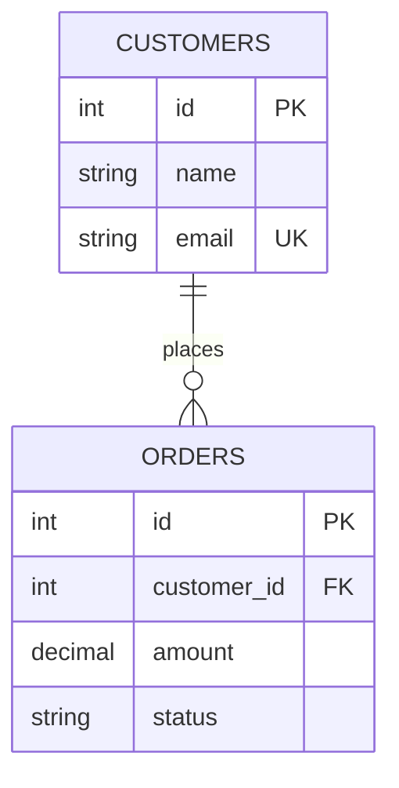
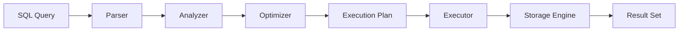
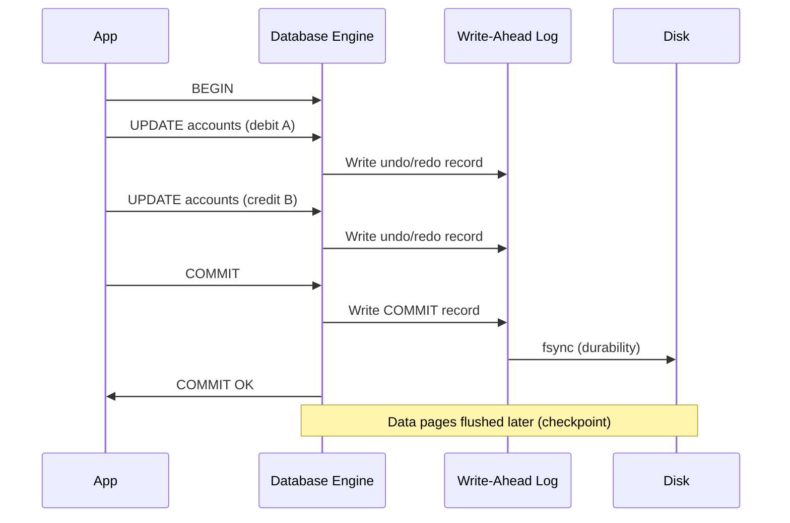
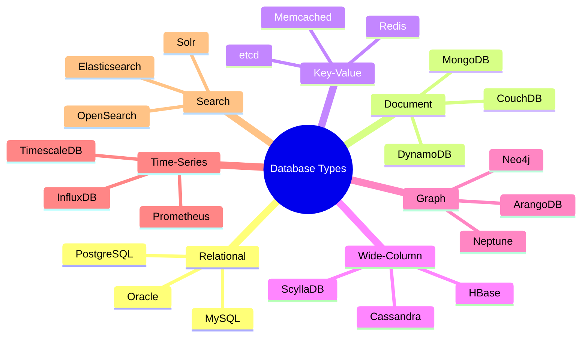

## Keywords in This File
{: .no_toc }

| # | Keyword | Weight |
|---|---|---|
| 1 | [Relational Database Fundamentals](#relational-database-fundamentals) | high |
| 2 | [SQL Language Overview](#sql-language-overview) | high |
| 3 | [ACID Properties Overview](#acid-properties-overview) | high |
| 4 | [Database Ecosystem and Types](#database-ecosystem-and-types) | high |

---

# Relational Database Fundamentals

**Interview Weight:** high - foundational vocabulary. Every database
interview starts here. If you cannot explain tables, keys, and
relationships, nothing else matters.

---

### 🎯 Model Answer

**30 seconds:**

> A relational database stores data in tables (relations) with rows
> (tuples) and columns (attributes). Tables are linked through keys:
> primary keys uniquely identify rows, foreign keys reference other
> tables. The relational model guarantees data integrity through
> constraints (NOT NULL, UNIQUE, CHECK, FK) and supports powerful
> querying via SQL - a declarative language where you describe WHAT
> you want, not HOW to get it. The key advantage over other models:
> data independence - you can change physical storage without changing
> application queries.

**3 minutes (Senior):**

> The relational model (Codd, 1970) is built on set theory and
> predicate logic. A table is a set of tuples; each tuple is an
> ordered set of attribute values. This mathematical foundation
> is why SQL is declarative - the optimizer can choose any execution
> path that produces the correct set-theoretic result.
>
> In production, the critical concepts are:
>
> 1. NORMALIZATION: eliminates data redundancy. 3NF means every
>    non-key column depends on the key, the whole key, and nothing
>    but the key. Denormalization is intentional for read performance.
>
> 2. REFERENTIAL INTEGRITY: foreign keys guarantee you cannot have
>    orphan records. ON DELETE CASCADE vs RESTRICT is a design
>    decision that affects data consistency vs application flexibility.
>
> 3. CONSTRAINTS: the database enforces business rules at the storage
>    layer - cheaper and safer than application-layer validation.
>    A CHECK constraint is always checked; application validation
>    can be bypassed by direct SQL or other clients.
>
> 4. INDEXES: physical structures (B-trees by default) that trade
>    write performance for read performance. Without an index, every
>    query is a full table scan. With too many indexes, every INSERT
>    is slow.
>
> The practical implication: relational databases excel when data has
> structure, relationships between entities matter, and you need
> strong consistency guarantees (ACID). They are the wrong choice
> when your data is truly unstructured, relationships are fluid
> (graph), or you need horizontal write scaling beyond what a single
> node provides.

**Blank Mind Recovery:**

**(1) Restate:** "You are asking about the foundational concepts of
relational databases - tables, keys, and how data is organized."

**(2) First principles:** "A relational database is a collection of
named relations (tables). Each relation has a schema (column
definitions) and contains tuples (rows) that conform to that schema."

**(3) Bridge:** "Think of a spreadsheet where each sheet is a table,
each row is a record, each column is a field. But unlike a
spreadsheet, the database ENFORCES rules: this column cannot be
empty, this value must reference an existing row in another table,
this combination must be unique."

---

### 📘 Concept Explanation

**What it is:**

A relational database management system (RDBMS) stores data in
tables with defined schemas, enforces integrity through constraints,
links tables through key relationships, and provides SQL for
declarative data manipulation.

**The problem it solves:**

Before relational databases: data was stored in flat files or
hierarchical/network models. Changing the physical storage format
required rewriting all application code. The relational model
provides DATA INDEPENDENCE - logical structure is separate from
physical storage. Applications query logical tables; the DBMS
decides how to physically store and retrieve data.

**How it works:**

```
RELATIONAL MODEL STRUCTURE:

  TABLE: customers
  +----+----------+------------------+
  | id | name     | email            |
  +----+----------+------------------+  <- Schema (columns)
  | 1  | Alice    | alice@example.com|
  | 2  | Bob      | bob@example.com  |  <- Tuples (rows)
  +----+----------+------------------+

  TABLE: orders
  +----+-------------+--------+--------+
  | id | customer_id | amount | status |
  +----+-------------+--------+--------+
  | 10 | 1           | 99.99  | paid   |
  | 11 | 2           | 45.00  | open   |
  +----+-------------+--------+--------+
       ^
       FK -> customers.id (referential integrity)
```



> **Diagram walkthrough:** Two tables linked by a foreign key
> (customer_id references customers.id). The relationship is
> one-to-many: one customer can have many orders. The PK ensures
> row uniqueness; the FK ensures every order references an existing
> customer. This structure prevents orphan orders and enables JOIN
> queries across tables.

**The key insight:**

The relational model separates LOGICAL structure (tables, columns,
keys) from PHYSICAL storage (pages, indexes, buffer pools). This
is why you can add an index without changing application code, or
the optimizer can choose different execution plans for the same
query. Data independence is the fundamental advantage.

**When to use relational databases:**

- Structured data with known schema
- Relationships between entities (orders belong to customers)
- Strong consistency requirements (financial data, inventory)
- Complex queries (joins, aggregations, analytics)
- ACID transaction guarantees needed

**When NOT to use:**

- Truly unstructured data (logs, documents with varying fields)
- Graph-heavy traversals (social networks, recommendations)
- Extreme write throughput requiring horizontal scaling
- Time-series data at massive scale (use TimescaleDB or InfluxDB)

---

### 💻 Code Example

```sql
-- BAD: No constraints, no keys, no relationships
CREATE TABLE customers (
    name TEXT,
    email TEXT
);
CREATE TABLE orders (
    customer_name TEXT,  -- string reference (breakable)
    amount TEXT          -- wrong type for money
);
-- Problems: duplicate customers possible,
-- orphan orders possible, amount is text not numeric,
-- no way to JOIN reliably (name can change)
```

> **Code walkthrough:** Without constraints: duplicate customers
> are possible (no UNIQUE on email), orphan orders exist (no FK),
> amount stored as text allows "abc" as a value. The string-based
> reference (customer_name) breaks when a name changes. This design
> offers zero data integrity guarantees.

```sql
-- GOOD: Proper relational design with constraints
CREATE TABLE customers (
    id BIGINT GENERATED ALWAYS AS IDENTITY PRIMARY KEY,
    name VARCHAR(255) NOT NULL,
    email VARCHAR(255) NOT NULL UNIQUE,
    created_at TIMESTAMPTZ NOT NULL DEFAULT NOW()
);

CREATE TABLE orders (
    id BIGINT GENERATED ALWAYS AS IDENTITY PRIMARY KEY,
    customer_id BIGINT NOT NULL
        REFERENCES customers(id) ON DELETE RESTRICT,
    amount NUMERIC(12,2) NOT NULL CHECK (amount > 0),
    status VARCHAR(20) NOT NULL DEFAULT 'pending'
        CHECK (status IN (
            'pending','paid','shipped','cancelled'
        )),
    created_at TIMESTAMPTZ NOT NULL DEFAULT NOW()
);

CREATE INDEX idx_orders_customer
    ON orders(customer_id);
```

> **Code walkthrough:** Identity columns for surrogate keys (no
> business meaning, never changes). NOT NULL prevents incomplete
> data. UNIQUE on email prevents duplicates. FK with ON DELETE
> RESTRICT prevents deleting a customer who has orders. CHECK on
> amount prevents negative/zero values. CHECK on status limits to
> valid values. Index on FK column makes JOIN queries fast. This
> schema ENFORCES business rules at the database layer.

---

### 🎓 Answers by Seniority

**Junior / Mid (0-5 years):**

> A relational database stores data in tables with rows and columns.
> Tables are linked through primary keys (unique identifier per row)
> and foreign keys (reference to another table's primary key). SQL
> is used to query, insert, update, and delete data. The database
> enforces constraints like NOT NULL, UNIQUE, and foreign key
> relationships to maintain data integrity.

*Push deeper:* "The key advantage over NoSQL for structured data:
the database itself enforces business rules. You cannot insert an
order for a non-existent customer if the FK constraint is active."

---

**Senior / Staff (5+ years):**

> I think about relational databases in terms of three guarantees:
> structural integrity (schema enforces shape), referential integrity
> (FKs enforce relationships), and domain integrity (CHECK and NOT
> NULL enforce business rules). The optimizer's ability to choose
> execution plans depends on the relational algebra foundation - any
> execution that produces the same set-theoretic result is valid.
>
> In production, my focus is: normalization for write-heavy tables
> (avoid update anomalies), strategic denormalization for read-heavy
> tables (avoid expensive JOINs), and constraint design that pushes
> validation to the database layer where it cannot be bypassed.

*Push deeper:* "Data independence is the real value. I can add
indexes, partition tables, or change storage parameters without
touching application code. The optimizer adapts automatically."

---

### ⚠️ Common Misconceptions

**"Relational databases are slow."**

Relational databases with proper indexes, normalized schema, and
connection pooling handle thousands of transactions per second on
a single node. PostgreSQL with 32 cores and NVMe storage handles
100k+ TPS for OLTP workloads. "Slow" usually means missing indexes
or bad query design, not a database limitation.

**"You should always normalize to 3NF."**

Normalization prevents update anomalies but increases JOIN count.
For read-heavy workloads (reporting, dashboards), intentional
denormalization (storing derived/redundant data) is a valid trade-off.
The decision: how often does this data change vs how often is it
read?

**"NoSQL replaces relational databases."**

NoSQL databases solve specific problems (document flexibility,
horizontal write scaling, graph traversals). For structured data
with relationships and consistency requirements, relational
databases remain the correct choice. Most applications benefit from
both (polyglot persistence).

---

### 🚨 Failure Modes and Diagnosis

| Failure | Symptom | Diagnosis |
|---|---|---|
| Missing FK constraints | Orphan records in child tables | `SELECT o.* FROM orders o LEFT JOIN customers c ON o.customer_id = c.id WHERE c.id IS NULL` |
| Missing NOT NULL | NullPointerException in application | Check schema: `\d+ tablename` in psql, add NOT NULL |
| No index on FK column | Slow JOIN queries, lock escalation on parent delete | `EXPLAIN ANALYZE` shows Seq Scan on child table during JOIN |
| Wrong data type | Precision loss (FLOAT for money), comparison errors | Use NUMERIC(12,2) for money, TIMESTAMPTZ for dates |
| Over-normalization | Every query requires 5+ JOINs, read performance degrades | Measure query latency; consider materialized views or strategic denormalization |

---

### 🎯 Interview Deep-Dive

| Experience | Time | Depth |
|---|---|---|
| Junior | 2 min | Define tables, keys, constraints |
| Mid | 4 min | Normalization trade-offs, index basics |
| Senior | 6 min | Schema design decisions, optimizer awareness |
| Staff | 10 min | Data independence, polyglot decisions |

---

**[JUNIOR] Q1 - What is a primary key and why is it required?**

*Why they ask:* Fundamental vocabulary test.

A primary key uniquely identifies each row in a table. It enforces
two constraints: UNIQUE (no two rows have the same value) and NOT
NULL (every row must have a value). Without a primary key, you
cannot reliably reference a specific row - JOINs become ambiguous,
UPDATE/DELETE cannot target a single record.

Two types: natural keys (email, SSN - has business meaning) and
surrogate keys (auto-increment integer or UUID - no business
meaning). Surrogate keys are preferred because: they never change
(natural keys like email can change), they are compact (integer
JOINs are faster than string JOINs), and they do not leak business
information in URLs.

PostgreSQL recommendation: `BIGINT GENERATED ALWAYS AS IDENTITY`.
This prevents accidental manual insertion of ID values and supports
up to 9.2 quintillion rows.

*What separates good from great:* Explaining WHY surrogate keys
are preferred (stability, performance, privacy) rather than just
knowing the definition.

---

**[JUNIOR] Q2 - What is the difference between UNIQUE and
PRIMARY KEY?**

*Why they ask:* Tests precision of understanding.

Both enforce uniqueness. Differences: (1) A table has exactly ONE
primary key but can have MANY unique constraints. (2) Primary key
implies NOT NULL; unique columns CAN be NULL (and multiple NULLs
are considered distinct in standard SQL). (3) Primary key is the
default clustering key in some databases (InnoDB clusters data by
PK physically). (4) Foreign keys typically reference the primary
key (though they can reference any unique column).

Practical implication: use PRIMARY KEY for the row identifier. Use
UNIQUE for business-level uniqueness (email, username, SKU).
Example: `id` is PK, `email` is UNIQUE. Both prevent duplicates
but serve different purposes.

*What separates good from great:* Knowing that UNIQUE allows NULL
and the clustering implication (InnoDB stores data in PK order).

---

**[MID] Q3 - Explain normalization. When would you intentionally
denormalize?**

*Why they ask:* Design judgment beyond textbook rules.

Normalization eliminates data redundancy through progressive normal
forms: 1NF (atomic values, no repeating groups), 2NF (no partial
dependencies on composite keys), 3NF (no transitive dependencies -
every non-key column depends on the key, the whole key, and nothing
but the key).

I denormalize intentionally when: (1) Read/write ratio is heavily
read-skewed (100:1). Computing the denormalized value on every read
is more expensive than maintaining it on rare writes. (2) JOIN count
for common queries exceeds 3-4 tables, causing unacceptable latency.
(3) Reporting/analytics queries need pre-aggregated data (materialized
views are a form of controlled denormalization).

The trade-off: denormalization saves read time but creates update
anomalies (must update redundant data in multiple places). Strategy:
use triggers, materialized views, or application-level events to
keep denormalized copies consistent.

*What separates good from great:* Giving specific criteria for WHEN
to denormalize (read ratio, JOIN count, latency requirements) rather
than vague "it depends."

---

**[MID] Q4 - What is referential integrity and how do ON DELETE
options work?**

*Why they ask:* Tests understanding of FK behavior in production.

Referential integrity means every foreign key value must reference
an existing row in the parent table. The database rejects inserts
or updates that would create orphan references.

ON DELETE options control what happens when a parent row is deleted:
- CASCADE: delete all child rows automatically (dangerous for
  important data - one delete cascades through the graph)
- RESTRICT: prevent parent deletion if children exist (safest
  default - forces explicit cleanup)
- SET NULL: set FK column to NULL in children (requires nullable FK)
- SET DEFAULT: set FK to its default value

Production choice: RESTRICT for important relationships (customers,
accounts). CASCADE only for true ownership (delete a blog post and
its comments). Never CASCADE on financial data.

*What separates good from great:* Having a clear policy (RESTRICT
by default, CASCADE only for owned child data) and explaining the
risk of CASCADE on deep relationship graphs.

---

**[SENIOR] Q5 - How does data independence benefit production
systems?**

*Why they ask:* Tests architectural thinking.

Data independence means the logical schema (tables, columns) is
separate from the physical storage (files, pages, indexes). Benefits:

1. ADD INDEX without changing application code. The optimizer
   automatically uses new indexes for relevant queries.
2. PARTITION tables without changing queries. A table partitioned
   by date still appears as one table to applications.
3. CHANGE STORAGE parameters (fill factor, compression) without
   application awareness.
4. OPTIMIZER UPGRADES (PostgreSQL version upgrade) can improve
   query plans without query changes.

This is why relational databases survive decades. The application
wrote SQL in 2005; the database was upgraded, re-indexed, and
partitioned multiple times since then. The SQL still works.

Contrast with NoSQL: in many document databases, query patterns
are coupled to data layout. Change the document structure and you
must change all queries.

*What separates good from great:* Connecting data independence to
long-term maintainability and contrasting with the tight coupling
in many NoSQL systems.

---

**[SENIOR] Q6 - When would you choose a non-relational database
over PostgreSQL?**

*Why they ask:* Decision framework maturity.

I choose non-relational when the relational model creates more
friction than value:

- Document DB (MongoDB): truly polymorphic documents where schema
  varies per record and relationships are rare. Example: content
  management with flexible page layouts.
- Graph DB (Neo4j): queries dominated by relationship traversals
  (shortest path, recommendations, fraud detection). Relational
  JOINs become exponentially expensive at 4+ hops.
- Wide-column (Cassandra): write-heavy with horizontal scaling
  needs beyond single-node capacity. Example: IoT sensor data
  at 500k writes/sec across regions.
- Key-value (Redis): sub-millisecond access patterns for caching,
  sessions, or rate limiting. Not a primary data store.

Decision framework: (1) Is data structured with relationships?
-> relational. (2) Do I need ACID across multiple entities? ->
relational. (3) Is the access pattern dominated by graph traversals?
-> graph. (4) Do I need horizontal write scaling beyond 100k TPS?
-> wide-column. Default: PostgreSQL (it handles JSON, full-text
search, and time-series reasonably well).

*What separates good from great:* Specific use cases per database
type and a clear decision framework rather than vague "it depends
on requirements."

---

**[STAFF] Q7 - How would you design a database schema for a system
that needs both OLTP and OLAP access patterns?**

*Why they ask:* Architecture-level design thinking.

OLTP (transactional) and OLAP (analytical) have conflicting
requirements. OLTP needs: normalized schema, fast single-row
operations, low latency. OLAP needs: denormalized/star schema,
full-table scans, columnar storage, complex aggregations.

Strategy options:

1. SEPARATE DATABASES: OLTP in PostgreSQL (row-based), OLAP in
   ClickHouse or Redshift (columnar). CDC (Change Data Capture)
   streams changes from OLTP to OLAP with seconds of lag.

2. MATERIALIZED VIEWS: keep OLTP normalized, create materialized
   views for analytical queries. Refresh periodically. Works for
   small-to-medium analytical needs.

3. CQRS: separate read models (denormalized) from write models
   (normalized). Events propagate changes to read models.

4. HTAP DATABASES: TiDB, CockroachDB, or PostgreSQL with columnar
   extensions (Citus) that handle both patterns in one system.

Production choice: for most systems, option 1 (separate) with CDC.
It gives each workload optimal storage format without compromise.
Materialized views work until analytical queries need to scan
billions of rows.

*What separates good from great:* Knowing multiple strategies with
specific products, and having a default recommendation (separate
with CDC) with reasoning for when to use alternatives.

---

---

# SQL Language Overview

**Interview Weight:** high - ecosystem map. Tests whether you know
SQL as a LANGUAGE (DDL, DML, DCL, TCL) and understand declarative
vs procedural.

---

### 🎯 Model Answer

**30 seconds:**

> SQL is a declarative language for managing relational data. It has
> four sub-languages: DDL (CREATE, ALTER, DROP - define structure),
> DML (SELECT, INSERT, UPDATE, DELETE - manipulate data), DCL (GRANT,
> REVOKE - control access), and TCL (COMMIT, ROLLBACK, SAVEPOINT -
> control transactions). The key principle: you declare WHAT result
> you want; the query optimizer decides HOW to retrieve it. This
> separation enables the optimizer to choose different execution
> plans as data grows or indexes change.

**3 minutes (Senior):**

> SQL's declarative nature is its greatest strength and source of
> confusion. When you write `SELECT * FROM orders WHERE status =
> 'paid' ORDER BY created_at DESC LIMIT 10`, you describe the
> result set. The optimizer considers: should it use an index on
> status? On created_at? A composite index? Full table scan with
> sort? The answer depends on data distribution, table size, and
> available indexes - and can change without query modification.
>
> The practical implications:
>
> 1. QUERY WRITING: focus on correctness (right result), not on
>    telling the database how to execute. Do not write loops or
>    cursor-based logic when set-based operations work.
>
> 2. PERFORMANCE: if a query is slow, you do not rewrite the query
>    logic (usually). You add/modify indexes, update statistics,
>    or restructure the schema. The optimizer adapts.
>
> 3. PORTABILITY: standard SQL works across databases. Extensions
>    (window functions, CTEs, JSON operators) vary by vendor but
>    the core is portable.
>
> 4. SECURITY: parameterized queries prevent SQL injection. The
>    database treats parameters as DATA, not as executable SQL.
>    Never concatenate user input into SQL strings.
>
> Key dialect differences that matter in production: PostgreSQL uses
> RETURNING clause, UPSERT via ON CONFLICT. MySQL uses LAST_INSERT_ID(),
> INSERT ON DUPLICATE KEY. Understanding your specific dialect's
> strengths prevents writing generic SQL that misses optimizations.

**Blank Mind Recovery:**

**(1) Restate:** "You are asking about SQL as a language - its
sub-languages (DDL, DML, DCL, TCL) and the declarative execution
model."

**(2) First principles:** "SQL is declarative: you describe the
result, not the steps. The optimizer translates your declaration
into an execution plan based on statistics and indexes."

**(3) Bridge:** "SQL is like ordering food at a restaurant - you
say 'steak, medium rare, with fries' (WHAT). The kitchen decides
HOW (which pan, which burner, timing). You get the same result
regardless of how the kitchen is organized."

---

### 📘 Concept Explanation

**What it is:**

SQL (Structured Query Language) is a domain-specific declarative
language for defining, manipulating, controlling access to, and
managing transactions in relational databases. It operates on SETS
of data, not individual records.

**The problem it solves:**

Without SQL, accessing data requires procedural code: open file,
scan records, filter manually, sort in memory, close file. SQL
abstracts this: describe the result set and the database engine
handles retrieval, optimization, concurrency control, and crash
recovery.

**How it works:**

```
SQL SUB-LANGUAGES:

DDL (Data Definition Language):
  CREATE TABLE, ALTER TABLE, DROP TABLE
  CREATE INDEX, CREATE VIEW
  -> Defines structure (schema)

DML (Data Manipulation Language):
  SELECT, INSERT, UPDATE, DELETE, MERGE
  -> Reads and writes data

DCL (Data Control Language):
  GRANT, REVOKE
  -> Controls who can do what

TCL (Transaction Control Language):
  BEGIN, COMMIT, ROLLBACK, SAVEPOINT
  -> Controls transaction boundaries
```



> **Diagram walkthrough:** A SQL query passes through: parsing
> (syntax check), analysis (semantic check - do tables exist?),
> optimization (choose the cheapest execution plan), and execution
> (retrieve data from storage). The optimizer is the key component -
> it transforms declarative SQL into efficient procedural steps
> without developer intervention.

**The key insight:**

SQL is SET-BASED, not record-based. Thinking in sets is the most
important skill shift. Instead of "loop through orders and filter
where status is paid," think "the SET of orders where status equals
paid." Set-based thinking enables the optimizer to parallelize,
use indexes, and batch I/O operations.

**When to use SQL:**

- Structured data with known schema and relationships
- Complex queries involving JOINs, aggregations, groupings
- Transactions requiring ACID guarantees
- Reporting and analytics on relational data

**When SQL is insufficient:**

- Real-time streaming (use Kafka + stream processing)
- Graph traversals beyond 3-4 hops (use Cypher/Gremlin)
- Full-text search with relevance ranking (use Elasticsearch,
  though PostgreSQL's tsvector works for moderate needs)

---

### 💻 Code Example

```sql
-- BAD: Procedural thinking in SQL (cursor-based)
DECLARE cur CURSOR FOR
    SELECT id, amount FROM orders
    WHERE status = 'pending';
DECLARE @total DECIMAL(12,2) = 0;
OPEN cur;
FETCH NEXT FROM cur INTO @id, @amount;
WHILE @@FETCH_STATUS = 0
BEGIN
    SET @total = @total + @amount;
    FETCH NEXT FROM cur INTO @id, @amount;
END;
CLOSE cur; DEALLOCATE cur;
-- Iterates row-by-row. Slow. Cannot be optimized.
```

> **Code walkthrough:** Cursor-based approach processes one row at a
> time. The optimizer cannot parallelize or use indexes efficiently
> for aggregation. On 1M rows, this takes seconds. The database
> engine was designed for SET operations, not loops.

```sql
-- GOOD: Set-based thinking
SELECT SUM(amount) AS total
FROM orders
WHERE status = 'pending';
-- One statement. Optimizer can use index on status,
-- parallelize aggregation. On 1M rows: milliseconds.
```

> **Code walkthrough:** Set-based: declare the result (sum of
> amounts where status is pending). The optimizer uses an index on
> status to locate qualifying rows, then aggregates in a single
> pass. No cursor overhead, no row-by-row processing. Scales from
> 100 to 100M rows with index support.

```sql
-- Production example: combining SQL sub-languages
BEGIN;  -- TCL: start transaction

-- DDL: create a partitioned table
CREATE TABLE IF NOT EXISTS events (
    id BIGINT GENERATED ALWAYS AS IDENTITY,
    type VARCHAR(50) NOT NULL,
    payload JSONB NOT NULL,
    created_at TIMESTAMPTZ NOT NULL DEFAULT NOW()
) PARTITION BY RANGE (created_at);

-- DML: insert with conflict handling
INSERT INTO events (type, payload)
VALUES ('order.created', '{"order_id": 123}')
RETURNING id, created_at;

-- DCL: grant read access to reporting role
GRANT SELECT ON events TO reporting_role;

COMMIT;  -- TCL: commit transaction
```

> **Code walkthrough:** All four SQL sub-languages in one
> transaction: DDL creates the table structure, DML inserts data
> with RETURNING (PostgreSQL-specific), DCL grants access, TCL
> manages the transaction boundary. In production, DDL in
> transactions is PostgreSQL-specific (MySQL commits implicitly
> on DDL).

---

### 🎓 Answers by Seniority

**Junior / Mid (0-5 years):**

> SQL has four parts: DDL for defining structure (CREATE TABLE),
> DML for data operations (SELECT, INSERT, UPDATE, DELETE), DCL
> for access control (GRANT, REVOKE), and TCL for transactions
> (COMMIT, ROLLBACK). It is declarative - I describe what I want
> and the database decides how to get it efficiently.

*Push deeper:* "The most important mindset shift: think in SETS,
not loops. Instead of iterating through records, describe the
result set. The optimizer handles the rest."

---

**Senior / Staff (5+ years):**

> SQL's declarativeness means performance optimization happens at
> the schema and index level, not at the query level. When a query
> is slow, my first instinct is: check the execution plan (EXPLAIN
> ANALYZE), check if appropriate indexes exist, check statistics
> freshness. I almost never rewrite the query logic itself.
>
> I also leverage dialect-specific features: PostgreSQL's RETURNING
> clause eliminates a second query after INSERT. ON CONFLICT handles
> upserts atomically. CTEs with MATERIALIZED/NOT MATERIALIZED hints
> control optimizer behavior when the default choice is suboptimal.

*Push deeper:* "Understanding that SQL is an INTERFACE to the
optimizer - not direct instructions - changes how you approach
performance. The optimizer is your partner, not your enemy."

---

### ⚠️ Common Misconceptions

**"SQL is just for simple CRUD operations."**

SQL handles: recursive queries (hierarchical data), window functions
(running totals, rankings), lateral joins (correlated subqueries),
JSON manipulation, full-text search, and complex analytical queries.
Modern SQL (SQL:2016+) is Turing-complete with recursive CTEs.

**"Writing SQL in a specific way makes it faster."**

In most cases, the optimizer rewrites your query internally. Writing
`WHERE a = 1 AND b = 2` vs `WHERE b = 2 AND a = 1` makes no
difference - the optimizer evaluates both orderings. What matters:
indexes exist for the columns, statistics are current, and the
query is SARGABLE (can use indexes).

**"ORMs eliminate the need to know SQL."**

ORMs generate SQL. When the generated SQL is slow (N+1 queries, bad
JOIN strategies), you must understand SQL to diagnose and fix it.
Every senior developer needs to read execution plans regardless of
ORM usage.

---

### 🚨 Failure Modes and Diagnosis

| Failure | Symptom | Diagnosis |
|---|---|---|
| Cursor-based thinking | Stored procedures with loops, slow batch processing | Replace with set-based operations (one UPDATE with WHERE) |
| SQL injection | Application crashes or data breach | Use parameterized queries; never concatenate user input |
| Wrong dialect assumption | Code fails on migration (MySQL -> PostgreSQL) | Abstract dialect differences; test against target DB |
| Ignoring execution plans | "It works" but takes 30 seconds | Run EXPLAIN ANALYZE; add missing indexes |
| Over-reliance on ORM | N+1 queries, unnecessary data loading | Log generated SQL; use fetch joins or native queries |

---

### 🎯 Interview Deep-Dive

| Experience | Time | Depth |
|---|---|---|
| Junior | 2 min | Name SQL sub-languages with examples |
| Mid | 4 min | Declarative vs procedural, set-based thinking |
| Senior | 6 min | Optimizer interaction, dialect differences |
| Staff | 10 min | SQL as an interface, performance philosophy |

---

**[JUNIOR] Q1 - Name the four SQL sub-languages and give an
example of each.**

*Why they ask:* Basic vocabulary check.

DDL (Data Definition Language): `CREATE TABLE users (id INT PRIMARY
KEY, name VARCHAR(100))` - defines structure. DML (Data Manipulation
Language): `SELECT * FROM users WHERE id = 1` - retrieves data.
DCL (Data Control Language): `GRANT SELECT ON users TO app_role` -
controls access. TCL (Transaction Control Language): `BEGIN; ...
COMMIT;` - manages transaction boundaries.

The key distinction: DDL changes STRUCTURE (what exists), DML changes
DATA (what is stored), DCL changes PERMISSIONS (who can access),
TCL changes TRANSACTION STATE (what is committed).

*What separates good from great:* Giving a clear, memorable
distinction between each sub-language rather than just listing
commands.

---

**[JUNIOR] Q2 - What does "declarative" mean in the context of
SQL?**

*Why they ask:* Fundamental paradigm understanding.

Declarative means you describe the RESULT you want, not the steps
to achieve it. `SELECT name FROM users WHERE age > 25 ORDER BY name`
says "give me names of users over 25, sorted alphabetically." It
does NOT say "scan the users table, check each row's age column,
collect matching names into a list, sort that list."

The database optimizer decides HOW: use an index? Full scan? Sort
in memory or on disk? Parallel execution? This decision is based on
table size, data distribution, available indexes, and hardware. The
same query can have different execution plans on different data sizes.

Contrast with procedural: in Java, you would write a for-loop,
explicit filter, and sort call. You ARE specifying the steps.

*What separates good from great:* Connecting declarative execution
to the optimizer's role and explaining WHY this matters (the same
query adapts to changing data without modification).

---

**[MID] Q3 - What is SARGABLE and why does it matter?**

*Why they ask:* Tests practical SQL performance knowledge.

SARGABLE (Search ARGument ABLE) means a WHERE clause can use an
index. Non-sargable expressions force full table scans.

Non-sargable (index cannot be used):
- `WHERE YEAR(created_at) = 2024` - function on column
- `WHERE amount * 1.1 > 100` - expression on column
- `WHERE name LIKE '%smith'` - leading wildcard
- `WHERE UPPER(email) = 'TEST@MAIL.COM'` - function on column

Sargable equivalents:
- `WHERE created_at >= '2024-01-01' AND created_at < '2025-01-01'`
- `WHERE amount > 100 / 1.1`
- `WHERE name LIKE 'smith%'`
- Use a functional index: `CREATE INDEX ON users(UPPER(email))`

The rule: keep indexed columns NAKED on one side of the comparison.
Move functions and calculations to the other side (the constant
side). PostgreSQL supports functional indexes as a workaround when
you cannot rewrite the query.

*What separates good from great:* Providing both non-sargable AND
sargable equivalents, plus knowing functional indexes as a fallback.

---

**[MID] Q4 - How does SQL injection work and how do you prevent
it?**

*Why they ask:* Security awareness (mandatory topic).

SQL injection occurs when user input is concatenated directly into
a SQL string: `"SELECT * FROM users WHERE id = " + userInput`. If
userInput is `"1 OR 1=1"`, the query returns all rows. If it is
`"1; DROP TABLE users; --"`, it deletes the table.

Prevention (layered):
1. PARAMETERIZED QUERIES (primary defense): `SELECT * FROM users
   WHERE id = ?` - the database treats the parameter as DATA, never
   as executable SQL. Works in every language/framework.
2. INPUT VALIDATION: validate that numeric fields are numeric,
   strings match expected patterns. Defense in depth.
3. LEAST PRIVILEGE: the application database user should not have
   DROP TABLE permission. Even if injection succeeds, damage is
   limited.
4. WAF/MONITORING: detect suspicious patterns in queries.

Never rely solely on escaping or blacklisting special characters.
Parameterized queries are the only reliable defense because they
separate code (SQL structure) from data (parameter values) at the
protocol level.

*What separates good from great:* Layered defense (parameterized +
validation + least privilege) rather than just "use prepared
statements."

---

**[SENIOR] Q5 - Compare PostgreSQL and MySQL for a new project.
What factors drive your choice?**

*Why they ask:* Decision-making with trade-offs.

PostgreSQL advantages: standards compliance, advanced features
(window functions, CTEs, JSONB, full-text search, array types),
true MVCC without gap locks, extensibility (custom types, extensions
like PostGIS, TimescaleDB), transactional DDL.

MySQL advantages: simpler operational model, wider hosting support,
faster for simple read-heavy workloads (especially with InnoDB
buffer pool tuning), better replication ecosystem (MySQL Group
Replication, ProxySQL).

Decision factors:
- Complex queries (analytics, window functions): PostgreSQL
- Simple CRUD with massive read volume: MySQL (with caching)
- JSONB queries: PostgreSQL (superior JSON operators and indexing)
- Operational simplicity: MySQL (more ops tooling, simpler backups)
- Correctness guarantees: PostgreSQL (stricter SQL compliance)
- Cloud managed: both well-supported (RDS, Cloud SQL, Aurora)

My default: PostgreSQL unless there is a specific reason for MySQL
(existing team expertise, specific hosting requirement, or read
replication needs that favor MySQL's ecosystem).

*What separates good from great:* Specific decision criteria with
concrete examples rather than vague "PostgreSQL is more advanced."

---

**[SENIOR] Q6 - What are the trade-offs of set-based vs
cursor-based approaches?**

*Why they ask:* Shows depth of SQL understanding.

Set-based (preferred 95% of the time): the optimizer sees the full
operation and can parallelize, use indexes, and batch I/O. One
`UPDATE orders SET status = 'archived' WHERE created_at < '2023-01-01'`
updates millions of rows in one optimized operation.

Cursor-based (rare but valid cases):
- Row-by-row processing with complex conditional logic that cannot
  be expressed in SQL (calling external APIs per row)
- Processing that must commit per-row to avoid holding long
  transactions open (batch deletes in chunks)
- Memory-constrained processing of very large result sets (streaming)

The trade-off: cursors are 10-100x slower for the same operation
but provide row-level control and memory predictability. In
practice: if you can express it as a single SQL statement, do so.
Use cursors only when you need row-level side effects that SQL
cannot express.

Example of valid cursor use: batch delete in chunks to avoid lock
escalation: process 1000 rows, commit, process next 1000.

*What separates good from great:* Acknowledging the RARE valid
cases for cursors (batch processing with commits, external API
calls) while clearly stating the default preference.

---

**[STAFF] Q7 - How do you approach SQL performance at scale
(billions of rows)?**

*Why they ask:* Architecture-level thinking.

At billions of rows, single-table approaches fail. Strategy:

1. PARTITIONING: split table by date range or hash. Queries that
   include the partition key only scan relevant partitions. PostgreSQL
   declarative partitioning: `PARTITION BY RANGE (created_at)`.

2. INDEXING STRATEGY: partial indexes (`WHERE status = 'active'`
   indexes only active rows). BRIN indexes for naturally ordered data
   (timestamps). Covering indexes (`INCLUDE (col)`) for index-only
   scans.

3. MATERIALIZED VIEWS: pre-compute expensive aggregations. Refresh
   concurrently to avoid blocking reads during refresh.

4. READ REPLICAS: route analytical queries to replicas. Accept
   slight lag for non-critical reads.

5. ARCHIVAL: move historical data to cold storage (S3 + Athena).
   Keep hot data small and fast.

6. CONNECTION POOLING: at scale, connection count becomes the
   bottleneck before query speed. PgBouncer in transaction mode.

7. QUERY DESIGN: avoid OFFSET pagination (use keyset/cursor
   pagination). Avoid SELECT * (transfer only needed columns).
   Avoid correlated subqueries (use JOINs or lateral joins).

The meta-strategy: keep the HOT dataset (data accessed frequently)
small. Partition, archive, or summarize cold data. A 10B row table
with proper partitioning behaves like many 100M row tables.

*What separates good from great:* A systematic multi-strategy
approach (partition + index + materialize + archive) rather than a
single silver bullet.

---

---

# ACID Properties Overview

**Interview Weight:** high - fundamental transaction concept. Asked
in virtually every database interview. Must be explained precisely
with production implications.

---

### 🎯 Model Answer

**30 seconds:**

> ACID guarantees transaction reliability: Atomicity (all or nothing -
> either all operations in a transaction succeed or none do),
> Consistency (transaction moves the database from one valid state to
> another, respecting all constraints), Isolation (concurrent
> transactions do not interfere with each other), Durability (once
> committed, data survives crashes - written to disk/WAL). The
> trade-off: stronger ACID guarantees reduce throughput due to
> locking and fsync overhead.

**3 minutes (Senior):**

> Each property has specific implementation mechanisms and trade-offs:
>
> ATOMICITY - implemented via Write-Ahead Logging (WAL). Every change
> is first written to the WAL. On crash, the database replays the WAL
> to redo committed transactions and undo uncommitted ones. This is
> why you never get a "half-completed" transaction even after a power
> failure.
>
> CONSISTENCY - enforced by constraints (CHECK, FK, UNIQUE, NOT NULL)
> and triggers. The database rejects any transaction that would
> violate declared constraints. Note: "consistency" here means
> constraint satisfaction, not the "C" in CAP theorem (which means
> all nodes see the same data).
>
> ISOLATION - implemented via MVCC (Multi-Version Concurrency Control)
> in PostgreSQL. Each transaction sees a SNAPSHOT of data at its start
> time. Writers do not block readers. Isolation levels (READ COMMITTED,
> REPEATABLE READ, SERIALIZABLE) trade correctness for concurrency.
>
> DURABILITY - implemented via fsync of WAL records to disk before
> reporting COMMIT success. Trade-off: synchronous_commit=on (default,
> safest, slight latency) vs synchronous_commit=off (faster, risks
> losing last few milliseconds of committed transactions on crash).
>
> Production implication: most applications use READ COMMITTED
> isolation (PostgreSQL default). This means non-repeatable reads are
> possible. If you run the same SELECT twice in one transaction, you
> might get different results because other committed transactions
> modified data between your reads. REPEATABLE READ prevents this but
> requires retry logic for serialization failures.

**Blank Mind Recovery:**

**(1) Restate:** "You are asking about the four guarantees that
relational databases provide for transactions."

**(2) First principles:** "ACID = the database's promise: your
transaction either fully succeeds or fully fails (A), respects all
declared rules (C), is protected from other transactions (I), and
once confirmed cannot be lost (D)."

**(3) Bridge:** "ACID is like a bank transfer. Atomicity: money
leaves account A AND arrives at account B - never one without the
other. Consistency: no account goes negative (constraint). Isolation:
two simultaneous transfers do not double-spend. Durability: once
confirmed, the transfer survives a bank system crash."

---

### 📘 Concept Explanation

**What it is:**

ACID is a set of four properties that guarantee reliable transaction
processing in a database. Every committed transaction satisfies all
four properties simultaneously.

**The problem it solves:**

Without ACID: partial writes on crash (money debited but not
credited), constraint violations under concurrency (overselling
inventory), lost updates when two users edit simultaneously, and
data loss on hardware failure.

**How it works:**

```
ACID IN ACTION (bank transfer $100 from A to B):

Transaction:
  1. BEGIN
  2. UPDATE accounts SET balance = balance - 100
     WHERE id = 'A'
  3. UPDATE accounts SET balance = balance + 100
     WHERE id = 'B'
  4. COMMIT

Atomicity: if crash after step 2, step 2 is UNDONE
Consistency: CHECK(balance >= 0) prevents overdraft
Isolation: other transactions see old OR new balance
            (never intermediate state)
Durability: after COMMIT returns, survives crash
```



> **Diagram walkthrough:** The WAL (Write-Ahead Log) is the
> mechanism behind Atomicity and Durability. Every change is logged
> BEFORE being applied to data pages. The COMMIT record is fsynced
> to disk before the application is told "success." On crash: replay
> WAL to recover committed state. Data pages are flushed to disk
> lazily (checkpoint), but the WAL ensures no committed data is lost.

**The key insight:**

ACID properties are NOT free. Each costs performance:
- Atomicity: WAL overhead (every write is written twice - WAL + data)
- Consistency: constraint checking on every write
- Isolation: MVCC creates multiple versions (bloat) + possible
  serialization failures at higher isolation levels
- Durability: fsync latency (waiting for disk confirmation)

This is why NoSQL databases that relax ACID (eventual consistency,
no multi-document transactions) can achieve higher throughput. The
question is always: what guarantees does your data NEED?

**When ACID is essential:**

- Financial transactions (double-spend prevention)
- Inventory management (overselling prevention)
- User registration (unique email enforcement)
- Any multi-step operation that must be all-or-nothing

**When ACID can be relaxed:**

- Analytics and reporting (stale data acceptable)
- Caching layers (TTL-based invalidation acceptable)
- Event logs (append-only, no updates)
- Social media feeds (eventual consistency acceptable)

---

### 💻 Code Example

```sql
-- BAD: No transaction boundaries (non-atomic)
UPDATE accounts SET balance = balance - 100
    WHERE id = 'A';
-- CRASH HERE: money debited but not credited
-- -> $100 vanishes from the system
UPDATE accounts SET balance = balance + 100
    WHERE id = 'B';
```

> **Code walkthrough:** Without explicit transaction boundaries,
> each statement auto-commits. A crash between the two statements
> results in money disappearing: debited from A but never credited
> to B. This violates atomicity - the operation is not all-or-nothing.

```sql
-- GOOD: Explicit transaction with constraints
BEGIN;

-- Check sufficient balance (application-level)
SELECT balance FROM accounts WHERE id = 'A'
    FOR UPDATE;  -- row-level lock

UPDATE accounts SET balance = balance - 100
    WHERE id = 'A';
-- CHECK constraint ensures balance >= 0

UPDATE accounts SET balance = balance + 100
    WHERE id = 'B';

COMMIT;
-- If anything fails: automatic ROLLBACK
-- After COMMIT: survives any crash
```

> **Code walkthrough:** Explicit BEGIN/COMMIT wraps both operations
> atomically. `FOR UPDATE` acquires a row lock preventing concurrent
> modification (isolation). The CHECK constraint on balance enforces
> the business rule (consistency). After COMMIT returns, the WAL
> guarantees persistence (durability). All four ACID properties
> satisfied.

```java
// Production Java: ACID with proper error handling
@Transactional(isolation = Isolation.READ_COMMITTED)
public void transfer(Long fromId, Long toId,
                     BigDecimal amount) {
    // Lock ordering prevents deadlock
    Long first = Math.min(fromId, toId);
    Long second = Math.max(fromId, toId);

    Account a1 = accountRepo
        .findByIdWithLock(first);   // SELECT FOR UPDATE
    Account a2 = accountRepo
        .findByIdWithLock(second);  // SELECT FOR UPDATE

    Account from = fromId.equals(first) ? a1 : a2;
    Account to = fromId.equals(first) ? a2 : a1;

    if (from.getBalance().compareTo(amount) < 0) {
        throw new InsufficientFundsException();
    }
    from.debit(amount);
    to.credit(amount);
    // COMMIT happens on method exit (Spring manages)
    // ROLLBACK on any exception (Spring default)
}
```

> **Code walkthrough:** Production pattern: Spring's @Transactional
> provides atomicity (rollback on exception). Lock ordering (always
> lock lower ID first) prevents deadlocks between concurrent
> transfers. SELECT FOR UPDATE provides isolation (row locks).
> Balance check before debit enforces consistency. Durability is
> handled by the database (WAL + fsync on commit).

---

### 🎓 Answers by Seniority

**Junior / Mid (0-5 years):**

> ACID stands for Atomicity (all or nothing), Consistency (constraints
> are never violated), Isolation (transactions do not see each other's
> intermediate state), and Durability (committed data survives
> crashes). In practice: I always use explicit transactions for
> multi-step operations, rely on CHECK constraints for business rules,
> and understand that READ COMMITTED is the default isolation level.

*Push deeper:* "The practical implication: if I do two UPDATE
statements without a transaction, a crash between them leaves
inconsistent data. Always wrap related operations in BEGIN/COMMIT."

---

**Senior / Staff (5+ years):**

> I think about ACID as a cost-benefit calculation. Full ACID with
> SERIALIZABLE isolation gives the strongest guarantees but the lowest
> throughput (serialization failures require retries). For most OLTP
> applications, READ COMMITTED isolation with explicit locking where
> needed (SELECT FOR UPDATE for critical sections) gives the right
> balance.
>
> The architecture decision: which operations NEED ACID? Financial
> transactions: absolutely. Analytics queries: no (use read replicas
> with slight lag). Event publishing: depends (exactly-once semantics
> need transactional outbox pattern, not just ACID).

*Push deeper:* "Durability has a knob: synchronous_commit in
PostgreSQL. Setting it to OFF gives 3-5x write performance but risks
losing the last few milliseconds of data on crash. Valid for
non-critical writes (page views, logs) - never for financial data."

---

### ⚠️ Common Misconceptions

**"ACID means the database is always consistent."**

ACID Consistency means constraints are enforced. It does NOT mean
the data is CORRECT from a business perspective. If your application
logic is wrong (charges the wrong amount), ACID faithfully persists
the wrong data. ACID prevents MECHANICAL inconsistency (constraint
violations), not LOGICAL errors.

**"Transactions are slow, so avoid them."**

Every single SQL statement runs in a transaction (auto-commit mode
wraps each statement in an implicit transaction). Explicit
transactions are not SLOWER - they just group multiple statements.
The overhead is the LOCK DURATION (holding locks across multiple
statements) and WAL writes, not the transaction itself.

**"READ COMMITTED means my transaction sees consistent data."**

READ COMMITTED means each STATEMENT sees the latest committed data.
Between two statements in the same transaction, data can change
(non-repeatable read). If you need consistent reads across multiple
statements, use REPEATABLE READ - but be prepared for serialization
failure retries.

---

### 🚨 Failure Modes and Diagnosis

| Failure | Symptom | Diagnosis |
|---|---|---|
| Missing transaction (non-atomic) | Partial state after crash (money debited but not credited) | Wrap related operations in BEGIN/COMMIT |
| Lost update | Two users overwrite each other's changes | Use SELECT FOR UPDATE or optimistic locking (version column) |
| Dirty read (wrong isolation) | Application sees uncommitted data from other transactions | Verify isolation level; PostgreSQL READ COMMITTED prevents this |
| Durability loss | Committed data missing after crash | Check synchronous_commit setting; verify WAL is on durable storage |
| Serialization failure | ERROR: could not serialize access | Expected at REPEATABLE READ/SERIALIZABLE; implement retry logic |

---

### 🎯 Interview Deep-Dive

| Experience | Time | Depth |
|---|---|---|
| Junior | 2 min | Define each letter with example |
| Mid | 5 min | Implementation mechanisms, isolation levels |
| Senior | 8 min | Trade-offs, performance implications |
| Staff | 12 min | Architecture decisions, ACID relaxation |

---

**[JUNIOR] Q1 - Define each ACID property with one sentence and
one example.**

*Why they ask:* Vocabulary precision test.

Atomicity: a transaction is all-or-nothing. Example: bank transfer
either debits AND credits, or neither happens.

Consistency: a transaction cannot violate declared constraints.
Example: CHECK(balance >= 0) prevents overdraft even under
concurrent access.

Isolation: concurrent transactions do not see each other's
intermediate state. Example: while a transfer is in progress,
other queries see the BEFORE state or the AFTER state, never the
in-between.

Durability: once COMMIT returns, the data survives any failure.
Example: power loss after COMMIT does not lose the transaction -
the WAL ensures recovery.

*What separates good from great:* Using the bank transfer as a
UNIFIED example that demonstrates all four properties in one
scenario.

---

**[MID] Q2 - How is Atomicity implemented? What happens on crash
mid-transaction?**

*Why they ask:* Implementation understanding.

Atomicity is implemented through the Write-Ahead Log (WAL). Every
change is written to the WAL BEFORE being applied to data pages.
The WAL records both the old value (undo information) and new value
(redo information).

On crash mid-transaction: the database restarts, reads the WAL, and
identifies which transactions committed (have a COMMIT record) and
which did not. Committed transactions are redone (changes re-applied
to data pages if needed). Uncommitted transactions are undone (changes
rolled back using undo information).

This is called ARIES (Algorithm for Recovery and Isolation Exploiting
Semantics). The WAL is append-only and sequential - much faster than
random data page writes. This is why databases can be durable without
flushing every data page to disk on every commit.

*What separates good from great:* Explaining the redo/undo mechanism
and WHY WAL is fast (sequential append vs random page writes).

---

**[MID] Q3 - What is the difference between ACID Consistency and
CAP Consistency?**

*Why they ask:* Common confusion point.

ACID Consistency: a transaction respects all declared constraints.
The database moves from one VALID state to another. This is about
RULE ENFORCEMENT within a single database node.

CAP Consistency: all nodes in a distributed system see the SAME DATA
at the same time. This is about DATA AGREEMENT across multiple nodes.

They are completely different concepts sharing a name. A single-node
PostgreSQL database provides ACID consistency (constraint enforcement)
but CAP consistency is irrelevant (only one node). A distributed
database like CockroachDB provides both: ACID constraints are
enforced AND all nodes agree on the data (at the cost of latency
for cross-node coordination).

*What separates good from great:* Clearly stating these are
different concepts, explaining what each means, and giving an
example where one applies but not the other.

---

**[SENIOR] Q4 - Explain isolation levels and their trade-offs.**

*Why they ask:* Production decision-making.

SQL standard defines four isolation levels (strongest to weakest):

SERIALIZABLE: transactions execute as if serial (one at a time).
Prevents ALL anomalies. Cost: serialization failures requiring
retries; reduced concurrency. Use: financial calculations where
correctness is paramount.

REPEATABLE READ: prevents dirty reads and non-repeatable reads.
A snapshot is taken at transaction start; the same SELECT always
returns the same results within the transaction. Cost: phantom
reads possible (new rows inserted by others); serialization failures.
PostgreSQL implementation: actually prevents phantoms too (snapshot
isolation via MVCC).

READ COMMITTED (PostgreSQL default): each statement sees the latest
committed data. Between two statements in one transaction, data can
change. Cost: non-repeatable reads, phantom reads. But: no
serialization failures, no retries needed.

READ UNCOMMITTED: sees uncommitted data (dirty reads). PostgreSQL
does NOT support this - it silently upgrades to READ COMMITTED.

Production choice: READ COMMITTED for 95% of operations (simple,
no retries, sufficient isolation). REPEATABLE READ or SERIALIZABLE
for critical financial operations where you need snapshot consistency
or full serializability - with retry logic implemented.

*What separates good from great:* Knowing PostgreSQL's specific
behavior (no dirty reads ever, REPEATABLE READ prevents phantoms),
and having a clear default recommendation with exceptions.

---

**[SENIOR] Q5 - What is the performance cost of Durability? How
would you tune it?**

*Why they ask:* Production tuning knowledge.

Durability cost: every COMMIT must wait for WAL records to be
fsynced to disk. On spinning disks: 5-10ms per fsync. On NVMe SSD:
50-200 microseconds. This is the floor for commit latency.

Tuning options (PostgreSQL):
- `synchronous_commit = on` (default): full durability. Safest.
- `synchronous_commit = off`: WAL is written but not fsynced on
  commit. 3-5x faster commits but risk losing last ~100ms of
  committed transactions on crash.
- `wal_buffers`: size of WAL write buffer. Larger = fewer writes.
- `commit_delay` + `commit_siblings`: group commit optimization.
  Wait briefly for other transactions to commit together (one
  fsync for multiple commits).

Decision: `synchronous_commit = off` is valid for non-critical
data (page views, logs, analytics events). NEVER for financial
data, user credentials, or business-critical state. Can be set
per-transaction: `SET LOCAL synchronous_commit = off;` for specific
non-critical operations within an otherwise safe connection.

*What separates good from great:* Knowing per-transaction override
and specific latency numbers for fsync on different hardware.

---

**[STAFF] Q6 - How do you achieve ACID-like guarantees in a
distributed system (microservices)?**

*Why they ask:* Architecture-level design.

In a monolithic database, ACID is built-in. In microservices where
each service has its own database, you cannot use a single
transaction across services. Strategies:

1. SAGA PATTERN: a sequence of local transactions with compensating
   actions. Service A commits locally, publishes event. Service B
   commits locally on event receipt. If B fails: Service A executes
   a compensating transaction (undo). Provides eventual atomicity.

2. TRANSACTIONAL OUTBOX: write the event AND business data in one
   local transaction (same database). A separate process reads the
   outbox table and publishes events. Guarantees at-least-once
   delivery without 2PC.

3. EVENT SOURCING: store the event (immutable fact) instead of
   mutable state. Derived state is rebuilt from events. Atomicity
   is per-event (single write). Eventual consistency across
   read models.

4. TWO-PHASE COMMIT (2PC): distributed transaction protocol. All
   participants prepare, then all commit. Provides true ACID across
   services but: single coordinator failure blocks all participants.
   Avoid in microservices (latency, coupling).

Production choice: Saga + Transactional Outbox for most
microservice architectures. 2PC only within tightly coupled services
that share a transaction manager (rare).

The key trade-off: distributed systems trade IMMEDIATE consistency
for EVENTUAL consistency + higher availability. Accept that cross-
service operations will be temporarily inconsistent and design
idempotent compensating actions.

*What separates good from great:* Knowing multiple strategies with
clear trade-offs and a default recommendation (Saga + Outbox), plus
acknowledging that true distributed ACID (2PC) has severe
operational costs.

---

**[STAFF] Q7 - A system processes 50,000 transactions/second. What
ACID trade-offs would you make?**

*Why they ask:* Scale-aware architecture thinking.

At 50k TPS, full ACID with synchronous_commit and SERIALIZABLE
isolation is unlikely to sustain throughput on a single node. Trade-
offs:

1. ISOLATION: drop to READ COMMITTED (eliminates serialization
   failures and retries). Use SELECT FOR UPDATE only for critical
   sections (inventory deduction, balance updates).

2. DURABILITY: use group commit (commit_delay = 10ms, commit_siblings
   = 5). Multiple transactions share one fsync. Latency increases by
   10ms but throughput multiplies.

3. PARTITIONING: split by tenant/region. Each partition handles a
   fraction of TPS. Full ACID per partition; eventual consistency
   across partitions for cross-partition queries.

4. CONNECTION POOLING: at 50k TPS, connection count is critical.
   PgBouncer in transaction mode limits actual PostgreSQL connections
   to ~100-200 while serving thousands of application connections.

5. BATCHING: for non-interactive writes (event logging), batch
   inserts (COPY or multi-row INSERT). One transaction inserts 1000
   rows instead of 1000 transactions inserting 1 row each.

6. SELECTIVE DURABILITY: synchronous_commit = on for financial
   writes; synchronous_commit = off for analytics/logging writes.
   Mix within the same database.

The meta-strategy: identify which 10% of operations NEED full ACID
(financial, inventory) and give them the strongest guarantees.
The other 90% (reads, analytics, logging) can relax isolation
and durability safely.

*What separates good from great:* A systematic approach that
identifies WHICH operations need which ACID guarantees rather than
applying one strategy uniformly.

---

---

# Database Ecosystem and Types

**Interview Weight:** high - ecosystem map question. Tests breadth
of knowledge and ability to choose the right database for a given
problem.

---

### 🎯 Model Answer

**30 seconds:**

> The database ecosystem includes: Relational (PostgreSQL, MySQL -
> structured data, ACID, complex queries), Document (MongoDB -
> flexible schema, nested data), Key-Value (Redis - sub-millisecond
> access, caching), Wide-Column (Cassandra - horizontal write
> scaling), Graph (Neo4j - relationship traversals), Time-Series
> (TimescaleDB, InfluxDB - time-ordered metrics), Search (Elasticsearch
> - full-text search with relevance). Choice depends on: data
> structure, access patterns, consistency requirements, and scale
> needs.

**3 minutes (Senior):**

> Database selection is a FORCE-DRIVEN decision. Each database type
> resolves specific forces:
>
> RELATIONAL (PostgreSQL, MySQL, Oracle):
> Forces resolved: structured data, complex relationships, ACID
> transactions, complex analytical queries (JOINs, aggregations).
> Trade-off: vertical scaling primarily; horizontal write scaling
> is difficult.
>
> DOCUMENT (MongoDB, DynamoDB):
> Forces resolved: schema flexibility (documents vary per record),
> co-located access (read one document = all related data in one
> read), horizontal scaling for simple queries.
> Trade-off: no JOINs (or limited), eventual consistency by default,
> weaker constraints.
>
> KEY-VALUE (Redis, Memcached):
> Forces resolved: sub-millisecond reads, simple access patterns
> (get/set by key), caching, sessions, rate limiting.
> Trade-off: no complex queries, limited data modeling, data size
> constraints (in-memory cost).
>
> WIDE-COLUMN (Cassandra, ScyllaDB, HBase):
> Forces resolved: massive write throughput, horizontal scaling,
> time-series and event data, multi-region replication.
> Trade-off: limited query flexibility (must query by partition key),
> eventual consistency, no JOINs.
>
> GRAPH (Neo4j, Amazon Neptune):
> Forces resolved: relationship-heavy queries (shortest path, friend-
> of-friend, recommendation engines), variable-depth traversals.
> Trade-off: poor aggregation performance, limited scaling, not
> suitable for bulk data processing.
>
> The decision framework: (1) What is the primary access pattern?
> (2) What consistency model is required? (3) What scale is needed
> (reads vs writes)? (4) How structured is the data?
>
> In practice: most systems use 2-3 databases (polyglot persistence).
> PostgreSQL for core business data, Redis for caching, Elasticsearch
> for search.

**Blank Mind Recovery:**

**(1) Restate:** "You are asking about the different types of
databases and when to use each."

**(2) First principles:** "Each database type optimizes for specific
access patterns and trade-offs. Relational = relationships + ACID.
Document = flexibility + co-location. Key-value = speed + simplicity.
Graph = traversals."

**(3) Bridge:** "Databases are like vehicles. A car (relational) is
versatile - works for most trips. A truck (wide-column) handles
heavy loads. A sports car (Redis) is fastest for simple routes. A
helicopter (graph) navigates complex paths. You choose by the
journey, not personal preference."

---

### 📘 Concept Explanation

**What it is:**

The database ecosystem is a collection of specialized storage systems,
each optimized for different data models, access patterns, and
scalability requirements.

**The problem it solves:**

No single database excels at everything. Relational databases
struggle with horizontal write scaling. Document databases struggle
with complex JOINs. Key-value stores cannot handle ad-hoc queries.
Choosing the right database prevents fighting against a system's
fundamental design limitations.

**How it works:**

```
DATABASE SELECTION MATRIX:

Need                    | Best Choice
-----------------------|-------------------
ACID + complex queries  | PostgreSQL/MySQL
Flexible documents      | MongoDB/DynamoDB
Sub-ms cache            | Redis/Memcached
Write-heavy at scale    | Cassandra/ScyllaDB
Graph traversals        | Neo4j/Neptune
Time-series metrics     | TimescaleDB/InfluxDB
Full-text search        | Elasticsearch
Streaming               | Kafka (+ processor)
```



> **Diagram walkthrough:** Seven database categories, each with
> representative products. Most production systems use polyglot
> persistence: a primary relational database for business data plus
> specialized databases for specific access patterns (Redis for
> cache, Elasticsearch for search). The choice is driven by access
> patterns, not by database popularity.

**The key insight:**

The decision is NOT "which database is best?" It is "which database's
TRADE-OFFS align with my requirements?" Every database trades
something for something else. Relational trades horizontal scaling
for consistency. Cassandra trades query flexibility for write
throughput. Redis trades durability for speed.

**When to use polyglot persistence:**

- Core business data needs ACID + complex queries (relational)
- Search needs full-text with relevance scoring (Elasticsearch)
- Caching needs sub-ms reads (Redis)
- Analytics needs columnar storage (ClickHouse)

**When to use a single database:**

- Small/medium applications where PostgreSQL covers all needs
  (it handles JSON, full-text search, time-series reasonably)
- Team size does not support multiple database operations
- Operational simplicity outweighs specialized performance

---

### 💻 Code Example

```java
// BAD: Using relational DB for everything
// Graph traversal in SQL (friend-of-friend)
String sql = """
    SELECT DISTINCT f3.name
    FROM friendships f1
    JOIN friendships f2 ON f1.friend_id = f2.user_id
    JOIN friendships f3 ON f2.friend_id = f3.user_id
    WHERE f1.user_id = ?
    AND f3.user_id != f1.user_id
    """;
// 3 self-JOINs for 3 hops. At 4+ hops: exponential
// join explosion. 1M users = query takes minutes.
```

> **Code walkthrough:** Graph traversals in SQL require self-JOINs
> that grow exponentially with hop depth. At 3 hops on 1M users with
> 100 friends each: 1M * 100 * 100 * 100 = 1 trillion candidate
> rows before filtering. The relational model is not designed for
> variable-depth traversals.

```java
// GOOD: Right database for the right access pattern
// Graph query in Cypher (Neo4j)
String cypher = """
    MATCH (me:User {id: $userId})-[:FRIEND*2..4]-(fof)
    WHERE fof <> me
    RETURN DISTINCT fof.name LIMIT 20
    """;
// Variable-depth traversal (2-4 hops) in milliseconds.
// Graph DB stores relationships as pointers - no JOINs.

// Relational for core business logic
@Repository
public interface OrderRepository
    extends JpaRepository<Order, Long> {
    @Query("SELECT o FROM Order o JOIN FETCH o.items "
         + "WHERE o.customer.id = :customerId")
    List<Order> findByCustomer(Long customerId);
}

// Redis for caching hot data
@Cacheable(value = "products", key = "#id")
public Product findProduct(Long id) {
    return productRepo.findById(id).orElseThrow();
}
```

> **Code walkthrough:** Polyglot persistence: Neo4j for graph
> traversals (index-free adjacency - follows pointers, no JOINs).
> JPA/PostgreSQL for core business data (ACID, complex queries).
> Redis for caching (sub-ms reads for frequently accessed products).
> Each database used for its strength.

---

### 🎓 Answers by Seniority

**Junior / Mid (0-5 years):**

> The main database types are: relational (PostgreSQL - for
> structured data with relationships), document (MongoDB - for
> flexible schemas), key-value (Redis - for caching), and graph
> (Neo4j - for relationship traversals). I choose based on the
> primary access pattern and consistency requirements.

*Push deeper:* "Most applications benefit from polyglot persistence:
PostgreSQL for core data, Redis for caching, maybe Elasticsearch
for search. The key is matching the access pattern to the database
strength."

---

**Senior / Staff (5+ years):**

> My database selection framework: (1) Define the primary access
> pattern (point lookups vs range scans vs joins vs traversals).
> (2) Define consistency requirements (ACID vs eventual). (3) Define
> scale needs (read vs write TPS, data volume). (4) Map to database
> types. (5) Factor in operational cost (team expertise, managed
> service availability, backup/recovery complexity).
>
> I resist the temptation to use too many databases. Each additional
> database adds operational complexity, increases failure modes, and
> requires expertise. PostgreSQL with extensions (PostGIS, pgvector,
> TimescaleDB) often covers 80% of specialized needs without adding
> a new system.

*Push deeper:* "The hidden cost of polyglot: data synchronization.
If products exist in PostgreSQL AND Elasticsearch, you need a sync
mechanism (CDC, events) and must handle eventual consistency between
them."

---

### ⚖️ Comparison Table

| Type | Strengths | Weaknesses | Best For |
|---|---|---|---|
| Relational | ACID, JOINs, SQL | Vertical scale | Business data |
| Document | Flexible schema | No JOINs, weaker consistency | Content, catalogs |
| Key-Value | Sub-ms latency | No queries | Cache, sessions |
| Wide-Column | Write throughput | Query limitations | Events, IoT |
| Graph | Traversals | Poor aggregation | Social, fraud |
| Time-Series | Time-ordered data | Limited updates | Metrics, logs |
| Search | Full-text, relevance | Not primary store | Search, logs |

**The deciding factor:** Default to relational (PostgreSQL) unless a
specific access pattern makes relational fundamentally unsuitable.
Add specialized databases only when PostgreSQL cannot meet
performance requirements for a specific pattern.

---

### ⚠️ Common Misconceptions

**"MongoDB is web-scale and PostgreSQL is not."**

PostgreSQL handles massive scale with proper architecture (read
replicas, partitioning, Citus for horizontal scaling). MongoDB's
scaling advantage is specifically for WRITE scaling (sharding by
shard key). For read-heavy workloads, PostgreSQL with replicas
scales just as well.

**"You need a separate search engine for all text search."**

PostgreSQL's tsvector/tsquery provides full-text search with ranking,
stemming, and multiple languages. For moderate search needs (up to
millions of documents), PostgreSQL full-text search is sufficient
without Elasticsearch. Add Elasticsearch when you need: faceted
search, complex relevance tuning, or sub-100ms search across
billions of documents.

**"NoSQL means no SQL."**

Many NoSQL databases now support SQL-like query languages (CQL in
Cassandra, N1QL in Couchbase, PartiQL in DynamoDB). "NoSQL" more
accurately means "not only SQL" - these systems offer different
data models and trade-offs, not the absence of query languages.

---

### 🚨 Failure Modes and Diagnosis

| Failure | Symptom | Diagnosis |
|---|---|---|
| Wrong database for access pattern | Slow queries despite optimization (graph in SQL, analytics in OLTP) | Profile queries; if structural mismatch, consider specialized DB |
| Too many databases | Sync failures, stale data, operational overhead | Evaluate if PostgreSQL extensions can consolidate |
| Missing cache layer | Database overloaded with repetitive reads | Add Redis for hot data; measure hit ratio (target >90%) |
| Polyglot sync failure | Search results inconsistent with database | Implement CDC with health monitoring; accept bounded staleness |
| Over-engineering for scale | Complex distributed setup for 1000 TPS (single PostgreSQL suffices) | Right-size: single node handles more than most teams think |

---

### 🎯 Interview Deep-Dive

| Experience | Time | Depth |
|---|---|---|
| Junior | 2 min | Name database types and examples |
| Mid | 4 min | Selection criteria for specific scenarios |
| Senior | 8 min | Polyglot persistence architecture |
| Staff | 12 min | Database strategy for an organization |

---

**[JUNIOR] Q1 - Name three database types and when you would use
each.**

*Why they ask:* Breadth check.

Relational (PostgreSQL): structured data with relationships.
Example: e-commerce order system with customers, orders, and
products linked by foreign keys. Needs ACID for payment processing.

Key-Value (Redis): sub-millisecond access by key. Example: session
storage for a web application - look up session by session ID,
no complex queries needed.

Document (MongoDB): flexible schema where documents vary. Example:
content management system where each page type has different fields
(blog post vs product page vs landing page).

The decision: structured + relationships = relational. Simple
lookup by key = key-value. Varying structure = document.

*What separates good from great:* Giving specific real-world
examples (not just definitions) and explaining the decision
criterion for each.

---

**[MID] Q2 - Your application needs full-text search. When do you
use PostgreSQL vs Elasticsearch?**

*Why they ask:* Trade-off evaluation with specific technology.

PostgreSQL full-text search is sufficient when: document count is
under 10M, search queries are simple (keyword matching with ranking),
and you want operational simplicity (one less system to manage). Use
tsvector columns with GIN indexes. Performance: ms-range for simple
queries.

Elasticsearch is needed when: you need faceted search (filter by
category, price range, color simultaneously), complex relevance
tuning (boosting recent results, field weighting), real-time
indexing of billions of documents, or fuzzy matching / autocomplete
with sub-100ms latency at scale.

The hidden cost of Elasticsearch: data synchronization (must keep
ES index in sync with source of truth), operational complexity
(cluster management, index lifecycle, memory tuning), and it is NOT
a primary data store (you still need PostgreSQL for ACID writes).

My default: start with PostgreSQL full-text search. Add Elasticsearch
when PostgreSQL search performance degrades or you need faceted
search features.

*What separates good from great:* Specific criteria (10M documents,
faceted search, fuzzy matching) rather than vague "it depends on
scale."

---

**[SENIOR] Q3 - Design a polyglot persistence architecture for an
e-commerce platform.**

*Why they ask:* Architecture-level database strategy.

E-commerce access patterns and database mapping:

1. CORE BUSINESS DATA (PostgreSQL): customers, orders, inventory,
   payments. Needs ACID (cannot oversell inventory), complex JOINs
   (order with items, customer with addresses), and SQL analytics.

2. PRODUCT CATALOG SEARCH (Elasticsearch): full-text search with
   facets (filter by category, brand, price, rating). Real-time
   indexing when products change. Powered by CDC from PostgreSQL.

3. SESSION AND CART (Redis): sub-ms access for cart operations. TTL
   for session expiry. No durability needed (cart rebuilt from last
   saved state). Redis Cluster for horizontal scaling.

4. RECOMMENDATIONS (Neo4j or Redis Graph): "customers who bought X
   also bought Y" is a graph traversal. Precomputed recommendations
   stored in Redis for serving; graph DB for computation.

5. ANALYTICS (ClickHouse): event data (page views, clicks,
   conversions). Columnar storage for fast aggregations. CDC from
   PostgreSQL + event stream from frontend.

Data flow: PostgreSQL is source of truth. CDC streams changes to
Elasticsearch (search index) and ClickHouse (analytics). Application
writes go to PostgreSQL; reads are routed to the appropriate
specialized store based on the access pattern.

*What separates good from great:* Clear data flow (which is source
of truth, how sync works) and explicit reasoning for each database
choice tied to specific access patterns.

---

**[SENIOR] Q4 - What are the risks of polyglot persistence and how
do you mitigate them?**

*Why they ask:* Operational maturity.

Risks and mitigations:

1. DATA INCONSISTENCY: PostgreSQL updated but Elasticsearch not
   yet synced. Mitigation: accept bounded staleness (search results
   may be seconds behind), show "last updated" timestamps, use
   transactional outbox for guaranteed event delivery.

2. OPERATIONAL COMPLEXITY: N databases = N backup strategies, N
   monitoring dashboards, N upgrade procedures, N sets of expertise.
   Mitigation: use managed services (RDS, ElastiCache, Elastic
   Cloud). Reduce to minimum viable database count.

3. QUERY SPANNING MULTIPLE STORES: "Show me customer orders (PG)
   with their search ranking (ES)." Mitigation: design services to
   encapsulate their data store. Avoid cross-store queries; use
   API composition at the application layer.

4. FAILURE CASCADE: Redis down = sessions lost = all users logged
   out. Mitigation: graceful degradation (fall back to database-
   backed sessions, slower but functional). Circuit breakers per
   store.

5. TEAM SKILLS GAP: developers comfortable with SQL but not Cypher.
   Mitigation: limit technology choices to what the team can operate
   in production at 3 AM.

*What separates good from great:* Specific mitigation strategies
per risk and the pragmatic rule "limit to what you can operate at
3 AM."

---

**[STAFF] Q5 - How would you decide the database strategy for a
new startup vs an established enterprise?**

*Why they ask:* Contextual decision-making.

Startup strategy:
- Start with ONE database (PostgreSQL). It handles: relational
  data, JSON documents (JSONB), full-text search (tsvector), basic
  time-series, and even pub/sub (LISTEN/NOTIFY).
- Add Redis when you need caching (month 6-12 typically).
- Add Elasticsearch only when PostgreSQL search is measurably
  insufficient.
- Principle: minimize operational surface. Every database is a
  failure mode, a backup requirement, and a skill requirement.

Enterprise strategy:
- Dedicated teams can operate multiple databases.
- Data platform team provides managed internal services (Kafka,
  Elasticsearch, Redis clusters) as shared infrastructure.
- Decision framework per service: what access pattern? What
  consistency? What scale? Choose from the approved database menu.
- Avoid: every team choosing their own database (operational chaos).
  Have a curated list with clear guidelines.

The meta-principle: operational capability determines database
strategy. A startup with 3 engineers cannot operate 5 databases
well. An enterprise with a data platform team can.

*What separates good from great:* Different strategies for different
organizational contexts, with the meta-principle (operational
capability) as the deciding factor.

---

**[STAFF] Q6 - When would you migrate from PostgreSQL to a
specialized database?**

*Why they ask:* Migration judgment.

Migration triggers (must have ALL of these):
1. PostgreSQL measurably cannot meet the requirement despite
   optimization (indexes, partitioning, read replicas).
2. The specialized database demonstrably solves the problem (POC
   with production-like data and load).
3. The team has capacity to operate the new database in production.
4. The migration cost (development, data sync, testing) is justified
   by the benefit.

Red flags that suggest migration:
- Full-text search queries taking >500ms on properly indexed data
  at your document scale -> Elasticsearch.
- Graph queries requiring 4+ self-JOINs and growing -> Neo4j.
- Write throughput exceeding single-node capacity after partitioning
  -> Cassandra/ScyllaDB.
- Analytics queries blocking OLTP transactions despite read replicas
  -> ClickHouse.

Red flags that suggest STAYING with PostgreSQL:
- "MongoDB is web-scale" (marketing, not engineering).
- "We might need to scale someday" (premature optimization).
- "The team wants to learn new technology" (curiosity, not need).

The safe migration path: keep PostgreSQL as source of truth. Add
the specialized database as a READ OPTIMIZED view (synced via CDC).
If it fails, PostgreSQL still has all the data. Migrate writes only
after the read path is proven stable.

*What separates good from great:* The four-criteria framework for
migration (measured problem + proven solution + operational capacity
+ justified cost) and the safe migration path (read replica first).

---

**[STAFF] Q7 - How does the CAP theorem influence database
selection for distributed systems?**

*Why they ask:* Theoretical grounding for practical decisions.

CAP theorem: in a network partition, choose Consistency (all nodes
agree) or Availability (all nodes respond). You cannot have both
during a partition.

Practical impact on database selection:

CP databases (consistency over availability): PostgreSQL with
synchronous replication, CockroachDB, Spanner. During network
partition: some nodes become unavailable but data is never stale.
Use for: financial data, inventory, anything where stale reads are
dangerous.

AP databases (availability over consistency): Cassandra, DynamoDB
(default mode), CouchDB. During network partition: all nodes respond
but data may be stale (eventually consistent). Use for: social media
feeds, product catalogs, analytics where stale data is acceptable.

The nuance: partitions are RARE in modern cloud infrastructure
(same-region). The real trade-off is LATENCY vs CONSISTENCY (PACELC
theorem): even without partitions, do you want fast responses
(eventual consistency) or correct responses (strong consistency with
coordination latency)?

Production decision: for most applications, PostgreSQL with async
replication (reads from replica may be slightly stale) covers the
need. True CP (synchronous replication) costs latency and is needed
only for data where stale reads are unacceptable.

*What separates good from great:* Extending CAP to PACELC (the
latency-consistency trade-off during normal operation) and
acknowledging that partitions are rare in practice.
