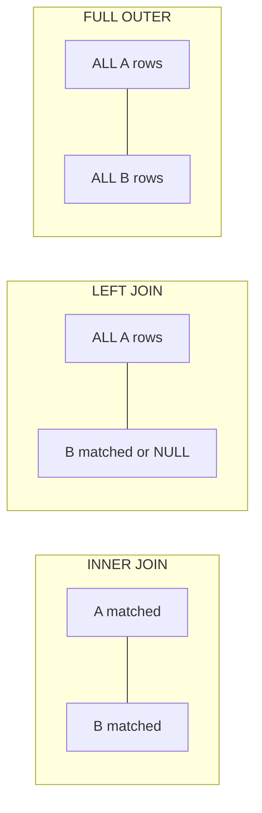
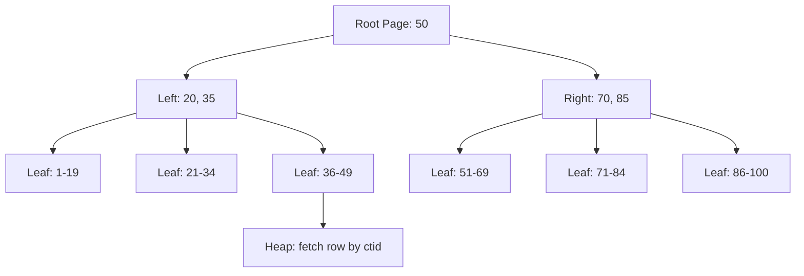
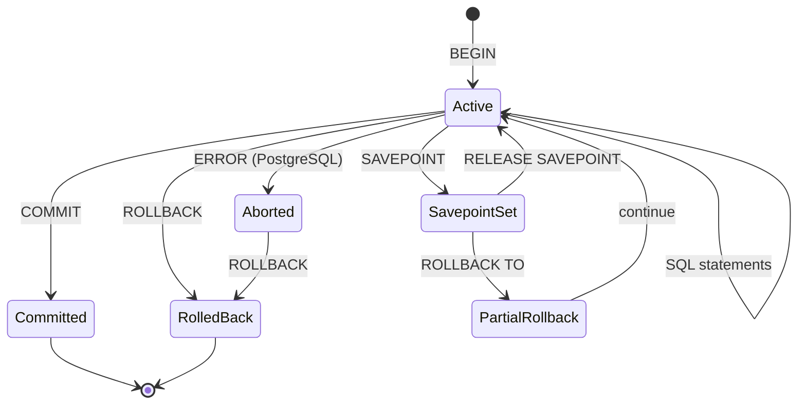

## Keywords in This File
{: .no_toc }

| # | Keyword | Weight |
|---|---|---|
| 1 | [SELECT Queries and JOIN Types](#select-queries-and-join-types) | high |
| 2 | [INSERT UPDATE DELETE and MERGE](#insert-update-delete-and-merge) | high |
| 3 | [Data Types and Constraints](#data-types-and-constraints) | high |
| 4 | [Index Fundamentals](#index-fundamentals) | high |
| 5 | [Transaction Basics and Savepoints](#transaction-basics-and-savepoints) | high |

---

# SELECT Queries and JOIN Types

**Interview Weight:** high - The most asked SQL topic. Every
database interview tests JOIN understanding. Confusing INNER
vs LEFT vs CROSS JOIN is an immediate red flag.

---

### 🎯 Model Answer

**30 seconds:**

> SELECT retrieves data from one or more tables. JOINs combine
> rows from multiple tables based on a related column. INNER JOIN
> returns only matching rows from both sides. LEFT JOIN returns
> all rows from the left table plus matching rows from the right
> (NULLs where no match). RIGHT JOIN is the reverse. FULL OUTER
> JOIN returns all rows from both sides. CROSS JOIN returns the
> Cartesian product (every combination). The JOIN type determines
> what happens to non-matching rows.

**3 minutes (Senior):**

> JOIN selection depends on the business question:
>
> INNER JOIN: "Show me customers WITH orders." Only customers who
> have at least one order appear. Customers without orders are
> excluded. This is the most restrictive - both sides must match.
>
> LEFT JOIN: "Show me ALL customers and their orders if any." Every
> customer appears. Customers without orders have NULL in order
> columns. Critical for: showing all entities even when related
> data is optional.
>
> RIGHT JOIN: equivalent to LEFT JOIN with tables swapped. Rarely
> used in practice - rewrite as LEFT JOIN for readability.
>
> FULL OUTER JOIN: "Show me all customers and all orders, matched
> where possible." Rows from both sides that have no match still
> appear (with NULLs). Use case: reconciliation queries.
>
> CROSS JOIN: every row from table A paired with every row from
> table B. N rows x M rows = N*M result rows. Use case: generating
> combinations (sizes x colors), date range expansion.
>
> Performance considerations: JOIN order matters for the optimizer.
> The optimizer rewrites JOINs but hints help. Always JOIN on
> indexed columns. A LEFT JOIN with a WHERE clause on the right
> table (WHERE right.col IS NOT NULL) effectively becomes an INNER
> JOIN - this is a common mistake.
>
> Advanced: LATERAL JOIN (PostgreSQL) allows the right side to
> reference columns from the left side - like a correlated subquery
> but in JOIN syntax. Useful for "top-N per group" patterns.

**Blank Mind Recovery:**

**(1) Restate:** "You are asking about SQL SELECT and the different
JOIN types for combining data from multiple tables."

**(2) First principles:** "JOINs combine rows from two tables based
on a condition. The JOIN TYPE determines what happens to rows that
do NOT match: exclude them (INNER), keep left side (LEFT), keep
both sides (FULL)."

**(3) Bridge:** "JOINs are like matching guests to invitations.
INNER JOIN: only guests WITH invitations enter. LEFT JOIN: all
invitations shown, some with no guest. CROSS JOIN: every guest
paired with every invitation."

---

### 📘 Concept Explanation

**What it is:**

SELECT is the DML command for data retrieval. JOINs are the
mechanism for combining related tables into a single result set
based on matching column values.

**The problem it solves:**

Normalized databases split data across tables to avoid redundancy.
JOINs reassemble the data for queries without storing it redundantly.
Without JOINs, you would need denormalized tables (redundant data)
or multiple queries stitched together in application code.

**How it works:**

```
TABLES:
  customers: id=1 Alice, id=2 Bob, id=3 Charlie
  orders:    customer_id=1, customer_id=1, customer_id=2

INNER JOIN (only matches):
  Alice  - Order1
  Alice  - Order2
  Bob    - Order3
  (Charlie excluded - no orders)

LEFT JOIN (all left + matches):
  Alice   - Order1
  Alice   - Order2
  Bob     - Order3
  Charlie - NULL    <- preserved, no match

CROSS JOIN (all combinations):
  Alice   - Order1
  Alice   - Order2
  Alice   - Order3
  Bob     - Order1
  Bob     - Order2
  ...     (3 x 3 = 9 rows)
```



> **Diagram walkthrough:** INNER keeps only the intersection (both
> sides must match). LEFT keeps all rows from the left table,
> filling NULLs where the right has no match. FULL OUTER keeps
> everything from both sides, with NULLs on either side where no
> match exists.

**The key insight:**

The most common mistake: using LEFT JOIN but adding a WHERE clause
that filters on the RIGHT table's column (`WHERE orders.status =
'paid'`). This converts it to an INNER JOIN because NULL values
(from non-matching left rows) are filtered out by the WHERE clause.
Move the condition to the ON clause to preserve LEFT JOIN behavior:
`LEFT JOIN orders ON ... AND orders.status = 'paid'`.

**When to use each JOIN:**

- INNER: both sides are required (show orders with their customers)
- LEFT: one side is optional (show all products, with sales if any)
- FULL OUTER: reconciliation (find unmatched rows on both sides)
- CROSS: generate combinations (all dates x all stores for reporting)

---

### 💻 Code Example

```sql
-- BAD: LEFT JOIN negated by WHERE on right table
SELECT c.name, o.total
FROM customers c
LEFT JOIN orders o ON c.id = o.customer_id
WHERE o.status = 'paid';  -- NULLs filtered out!
-- Customers without orders are EXCLUDED (not LEFT JOIN behavior)

-- GOOD: Condition in ON clause preserves LEFT JOIN
SELECT c.name, o.total
FROM customers c
LEFT JOIN orders o ON c.id = o.customer_id
    AND o.status = 'paid';  -- applied during join
-- Customers without paid orders show NULL for o.total
```

> **Code walkthrough:** The WHERE clause filters AFTER the JOIN,
> eliminating rows where o.status IS NULL (non-matching left rows).
> Moving the condition into the ON clause applies it DURING the JOIN,
> preserving all left rows. This is the #1 LEFT JOIN mistake in
> production code.

```sql
-- Production pattern: multi-table JOIN with aliases
SELECT
    c.name AS customer_name,
    COUNT(o.id) AS order_count,
    COALESCE(SUM(o.total), 0) AS total_spent,
    MAX(o.created_at) AS last_order_date
FROM customers c
LEFT JOIN orders o ON c.id = o.customer_id
    AND o.status != 'cancelled'
GROUP BY c.id, c.name
HAVING COUNT(o.id) > 0
ORDER BY total_spent DESC
LIMIT 20;
```

> **Code walkthrough:** LEFT JOIN to include all customers, condition
> in ON to exclude cancelled orders during join. GROUP BY aggregates
> per customer. COALESCE handles NULL sums (customers with no
> qualifying orders). HAVING filters groups after aggregation.
> This pattern is the backbone of reporting queries.

```sql
-- LATERAL JOIN: top-3 orders per customer (PostgreSQL)
SELECT c.name, recent.*
FROM customers c
LEFT JOIN LATERAL (
    SELECT o.id, o.total, o.created_at
    FROM orders o
    WHERE o.customer_id = c.id
    ORDER BY o.created_at DESC
    LIMIT 3
) recent ON true;
-- Subquery references c.id from outer table
-- Much faster than window functions for top-N-per-group
```

> **Code walkthrough:** LATERAL JOIN allows the subquery to reference
> the outer table (c.id). For each customer, it retrieves the 3 most
> recent orders. This is more efficient than ROW_NUMBER() window
> function for top-N-per-group because it can use an index on
> (customer_id, created_at DESC) with a limit scan per customer.

---

### 🎓 Answers by Seniority

**Junior / Mid (0-5 years):**

> INNER JOIN returns only matching rows. LEFT JOIN returns all rows
> from the left table with NULLs where no match exists on the right.
> CROSS JOIN produces all possible combinations. I use INNER when
> both tables must have data, LEFT when one side is optional.

*Push deeper:* "The gotcha: never put a condition on the right
table in the WHERE clause with a LEFT JOIN - it converts to INNER
JOIN. Put it in the ON clause instead."

---

**Senior / Staff (5+ years):**

> I think about JOINs in terms of what I want to happen to
> NON-MATCHING rows. INNER: exclude. LEFT: keep from one side.
> FULL OUTER: keep from both. In practice, 90% of my JOINs are
> INNER (required relationships) or LEFT (optional relationships).
>
> Performance-wise: I always ensure JOIN columns are indexed. For
> large tables, I check the execution plan to verify the optimizer
> chose the right join algorithm (nested loop for small/indexed,
> hash join for large unsorted, merge join for pre-sorted). LATERAL
> JOIN replaces correlated subqueries with better optimization
> opportunities.

*Push deeper:* "At scale (100M+ rows): JOIN order hints, partial
indexes on join columns, and materialized views for frequently
joined result sets become necessary."

---

### ⚠️ Common Misconceptions

**"LEFT JOIN is slower than INNER JOIN."**

LEFT JOIN is not inherently slower. The optimizer uses the same
algorithms (nested loop, hash, merge). LEFT JOIN produces MORE ROWS
(includes non-matching), which can increase result set transfer
time, but the join operation itself is comparable. A missing index
on the join column makes ANY join type slow.

**"The order of tables in a JOIN matters for performance."**

In most modern databases, the optimizer rewrites JOIN order. You
can write `A JOIN B` or `B JOIN A` and get the same execution plan.
Exception: LEFT JOIN order IS significant (left table is preserved).
And in MySQL without optimization hints, the written order can
influence the optimizer more than in PostgreSQL.

**"CROSS JOIN is always wrong/dangerous."**

CROSS JOIN has valid uses: generating date ranges (CROSS JOIN
generate_series), creating reporting grids (all stores x all
products), or expanding configuration combinations. The danger is
ACCIDENTAL cross joins (forgetting the ON clause in INNER JOIN
syntax), not intentional ones.

---

### 🚨 Failure Modes and Diagnosis

| Failure | Symptom | Diagnosis |
|---|---|---|
| LEFT JOIN becomes INNER | Expected rows missing from result | Check WHERE clause for conditions on right table columns |
| Accidental CROSS JOIN | Result has N*M rows, query takes forever | Missing or wrong ON clause; check JOIN conditions |
| Cartesian explosion | JOIN produces millions of unexpected rows | Many-to-many relationship without proper grouping; add DISTINCT or fix the relationship |
| Missing index on FK | JOIN query takes seconds on moderate tables | EXPLAIN shows Seq Scan on joined table; add index on FK column |
| NULL comparison in JOIN | Rows unexpectedly excluded | NULL != NULL in SQL; use IS NOT DISTINCT FROM for NULL-safe comparisons |

---

### 🎯 Interview Deep-Dive

| Experience | Time | Depth |
|---|---|---|
| Junior | 3 min | Name JOIN types with examples |
| Mid | 5 min | LEFT JOIN pitfalls, performance |
| Senior | 8 min | Execution plan analysis, LATERAL |
| Staff | 10 min | JOIN strategies at scale |

---

**[JUNIOR] Q1 - What is the difference between INNER JOIN and LEFT
JOIN?**

*Why they ask:* Fundamental vocabulary.

*Likely follow-up:* "Show me a query where they produce different
results."

INNER JOIN returns only rows where BOTH tables have a matching value
in the join column. If a customer has no orders, that customer is
excluded from the result entirely.

LEFT JOIN returns ALL rows from the left table regardless of whether
a match exists in the right table. If a customer has no orders, that
customer still appears in the result with NULL values for all order
columns.

Example: 3 customers, 2 have orders.
- INNER JOIN: 2 rows (only customers with orders)
- LEFT JOIN: 3 rows (all customers; one with NULLs for order data)

The choice depends on the business question: "Show customers who
ordered" (INNER) vs "Show all customers and their orders if any"
(LEFT).

*What separates good from great:* Explaining the BUSINESS REASON
for choosing each type (required vs optional relationship) rather
than just the mechanical difference.

---

**[JUNIOR] Q2 - What happens if you forget the ON clause in a
JOIN?**

*Why they ask:* Tests understanding of Cartesian products.

Without an ON clause (or with a CROSS JOIN), you get a Cartesian
product: every row from table A paired with every row from table B.
If A has 1000 rows and B has 1000 rows, the result has 1,000,000
rows. This is almost always a bug.

The danger: in older SQL syntax (`FROM a, b WHERE a.id = b.a_id`),
forgetting the WHERE condition silently produces a Cartesian product.
In modern ANSI syntax (`FROM a JOIN b ON a.id = b.a_id`), the ON
clause is required for INNER/LEFT/RIGHT JOIN - the parser catches
the mistake. This is why ANSI JOIN syntax is preferred.

*What separates good from great:* Connecting to ANSI syntax as a
safeguard and explaining the old comma-join syntax where this bug
was common.

---

**[MID] Q3 - How does a LEFT JOIN with a WHERE clause on the right
table behave?**

*Why they ask:* Most common JOIN mistake in production.

*Likely follow-up:* "How do you fix it?"

A LEFT JOIN followed by `WHERE right_table.column = value` filters
out ALL rows where the right table has NULL (non-matching rows from
the left). This effectively converts the LEFT JOIN into an INNER
JOIN because only matched rows survive the WHERE filter.

Fix: move the condition into the ON clause.

```sql
-- Wrong: WHERE o.status = 'paid' removes non-matching
LEFT JOIN orders o ON c.id = o.customer_id
WHERE o.status = 'paid'

-- Correct: ON clause preserves non-matching rows
LEFT JOIN orders o ON c.id = o.customer_id
    AND o.status = 'paid'
```

The exception: `WHERE right_table.column IS NULL` is intentionally
used to find LEFT-ONLY rows (anti-join pattern - "find customers
without orders"). This is a valid use of WHERE on the right table.

*What separates good from great:* Knowing the anti-join exception
(`IS NULL` check is intentional) and being able to explain WHY
the WHERE filter converts it (NULLs fail equality checks).

---

**[MID] Q4 - Explain the three JOIN algorithms the optimizer can
choose.**

*Why they ask:* Tests understanding of execution plans.

*Likely follow-up:* "Which is best for what scenario?"

1. NESTED LOOP: for each row in the outer table, scan the inner
   table for matches. O(N*M) without index, O(N*logM) with index.
   Best when: outer table is small, inner table has index on join
   column. Used by default for indexed lookups.

2. HASH JOIN: build a hash table from the smaller table, probe it
   with the larger table. O(N+M) time, O(min(N,M)) memory. Best
   when: no useful index exists, both tables are large, enough
   memory for the hash table. PostgreSQL uses this frequently.

3. MERGE JOIN: sort both tables on the join column, then merge in
   one pass. O(NlogN + MlogM) for sort + O(N+M) for merge. Best
   when: data is already sorted (indexed) on the join column, or
   the sorted result is needed for ORDER BY.

In EXPLAIN output: "Nested Loop" / "Hash Join" / "Merge Join".
If you see "Nested Loop" on a large table without an index: add
the index or hint the optimizer toward Hash Join.

*What separates good from great:* Knowing the O() complexity of
each, when each is optimal, and how to identify the wrong choice
in EXPLAIN output.

---

**[SENIOR] Q5 - How do you optimize a query that JOINs 5 tables
and runs slowly?**

*Why they ask:* Production performance problem-solving.

*Likely follow-up:* "What if adding indexes does not help?"

Step-by-step diagnosis:

1. Run EXPLAIN ANALYZE: identify which join is the bottleneck
   (highest actual time). Look for Seq Scans on large tables.

2. Check indexes: every FK column used in ON clauses must be
   indexed. Missing index = Seq Scan = slow.

3. Check statistics: run ANALYZE on tables. Stale statistics cause
   the optimizer to choose wrong join order or algorithm.

4. Check row estimates vs actual: if the optimizer estimates 100
   rows but actually processes 100,000, it chose the wrong plan.
   Update statistics or use pg_hint_plan.

5. Consider restructuring: can one of the JOINs be replaced with
   a subquery that reduces rows BEFORE joining? Filter early.

6. Materialized view: if this query runs frequently, pre-compute
   the multi-table result as a materialized view with REFRESH
   CONCURRENTLY on a schedule.

If indexes do not help: the problem is likely row explosion (many-
to-many relationships multiply rows at each join step). Solution:
aggregate before joining, or split into multiple queries with
application-level assembly.

*What separates good from great:* The systematic approach (EXPLAIN
first, indexes second, statistics third, restructure fourth) and
knowing that row explosion from many-to-many is a common hidden
cause.

---

**[SENIOR] Q6 - When would you use a LATERAL JOIN instead of a
regular subquery?**

*Why they ask:* Advanced SQL knowledge.

*Likely follow-up:* "Give a concrete example."

LATERAL JOIN allows the subquery to reference columns from the
preceding table (like a correlated subquery but in FROM clause).
Use when:

1. Top-N per group: "3 most recent orders per customer." LATERAL
   with LIMIT is faster than ROW_NUMBER() window function because
   it can use an index scan with early termination per group.

2. Set-returning functions per row: `LATERAL unnest(array_column)`
   to expand arrays, or `LATERAL generate_series(start, end)` per
   row.

3. Complex calculations per row that produce multiple columns:
   instead of repeating the subquery in SELECT, compute once in
   LATERAL and reference all columns.

Performance: LATERAL executes the subquery ONCE PER ROW from the
outer table. With an index, this is N index lookups (fast for
moderate N). Without an index, it is N sequential scans (slow).

*What separates good from great:* Knowing that LATERAL + index +
LIMIT outperforms ROW_NUMBER() for top-N-per-group because it
avoids computing the window over ALL rows.

---

**[STAFF] Q7 - How do you handle JOINs across databases in a
microservices architecture?**

*Why they ask:* Architecture-level thinking.

*Likely follow-up:* "What are the trade-offs?"

In microservices, each service owns its data. Cross-service JOINs
are impossible at the SQL level. Strategies:

1. API COMPOSITION: the calling service fetches data from multiple
   services and joins in memory. Works for small result sets. N+1
   problem if not batched.

2. CQRS READ MODEL: a denormalized read model combines data from
   multiple services (populated via events/CDC). Queries are local
   to one database. Trade-off: eventual consistency.

3. SHARED DATA PLATFORM: a data lake/warehouse joins data from
   multiple services for analytics. Not for OLTP.

4. SERVICE CONSOLIDATION: if two services are always queried
   together, they might be one service (wrong boundary).

5. MATERIALIZED VIEWS ACROSS SERVICES: one service subscribes to
   events from another and maintains a local copy of needed data.
   Like a denormalized cache.

The anti-pattern: shared database across services (couples services
at the data layer, eliminates independent deployment).

*What separates good from great:* Multiple strategies with clear
trade-offs and the anti-pattern identification (shared database
negates microservice benefits).

---

---

# INSERT UPDATE DELETE and MERGE

**Interview Weight:** high - DML fundamentals. Interviewers test
understanding of data modification with emphasis on atomicity,
RETURNING clause, and bulk operations.

---

### 🎯 Model Answer

**30 seconds:**

> INSERT adds rows, UPDATE modifies existing rows, DELETE removes
> rows, MERGE (upsert) combines insert-or-update in one atomic
> statement. Key production practices: always use WHERE with UPDATE/
> DELETE (without WHERE = all rows affected), use RETURNING to get
> back modified data without a second query, use transactions for
> multi-statement operations, and prefer bulk operations over
> row-by-row for performance.

**3 minutes (Senior):**

> Production DML practices:
>
> INSERT: single-row vs multi-row (`INSERT INTO t VALUES (...),
> (...), (...)` - much faster than N separate inserts). COPY
> command for bulk loading (10-100x faster than INSERT). ON CONFLICT
> (PostgreSQL) or ON DUPLICATE KEY (MySQL) for upsert semantics.
> RETURNING clause to get generated IDs without a second query.
>
> UPDATE: always verify the WHERE clause matches the intended rows
> BEFORE executing. In production, I run a SELECT with the same
> WHERE first to verify row count. Batch updates for large sets
> (UPDATE with LIMIT in a loop to avoid long-running transactions
> and lock escalation).
>
> DELETE: soft delete (set deleted_at timestamp) vs hard delete
> (remove row). Soft delete for audit trails and undo capability.
> Hard delete for GDPR compliance and storage reclamation. CASCADE
> considerations: deleting a parent may cascade to children.
>
> MERGE/UPSERT: atomic "insert if not exists, update if exists."
> PostgreSQL: `INSERT ... ON CONFLICT (key) DO UPDATE SET ...`.
> Critical for idempotent processing (processing the same event
> twice should not create duplicates).
>
> Performance at scale: bulk INSERT via COPY (PostgreSQL) or LOAD
> DATA INFILE (MySQL). Batch UPDATE in chunks of 1000-5000 rows
> to avoid holding locks for minutes. Partitioned DELETE (delete
> old partitions instead of row-by-row deletion).

**Blank Mind Recovery:**

**(1) Restate:** "You are asking about the SQL data modification
commands: INSERT, UPDATE, DELETE, and MERGE/upsert."

**(2) First principles:** "INSERT adds rows. UPDATE changes existing
rows. DELETE removes rows. MERGE atomically does insert-or-update.
All four operate on SETS of rows defined by a WHERE clause."

**(3) Bridge:** "DML is like editing a spreadsheet: INSERT adds a
row, UPDATE changes cell values in existing rows, DELETE removes
rows. MERGE is like 'paste special' - if the row exists, update it;
if not, create it."

---

### 📘 Concept Explanation

**What it is:**

DML (Data Manipulation Language) commands that modify data in
tables. They operate within transactions and can be rolled back.

**The problem it solves:**

Applications need to create, modify, and remove data. DML provides
set-based operations that the database can optimize, verify against
constraints, and make atomic via transactions.

**How it works:**

```
DML OPERATION FLOW:

  INSERT: Parse -> Check constraints -> Write to WAL
          -> Insert into table -> Update indexes
          -> Return (or RETURNING clause)

  UPDATE: Parse -> Find rows (WHERE) -> Check constraints
          -> Write old values to WAL (undo)
          -> Write new values -> Update affected indexes
          -> Return row count (or RETURNING)

  DELETE: Parse -> Find rows (WHERE) -> Check FK refs
          -> Write to WAL -> Mark rows as dead
          -> Update indexes -> Return row count

  MERGE:  Parse -> Find row by key -> EXISTS?
          -> Yes: UPDATE path
          -> No:  INSERT path
          (atomic - no race condition between check and act)
```

**The key insight:**

Every DML statement is implicitly in a transaction (auto-commit
mode). For multi-statement operations, explicit transactions
(BEGIN/COMMIT) ensure atomicity. Without explicit transactions,
a failure between two UPDATE statements leaves inconsistent data.

**When to use each:**

- INSERT: new data entering the system
- UPDATE: correcting or evolving existing data
- DELETE: removing data (consider soft delete first)
- MERGE/UPSERT: idempotent processing, sync operations

---

### 💻 Code Example

```sql
-- BAD: Row-by-row inserts (slow, N round-trips)
INSERT INTO orders (customer_id, total)
    VALUES (1, 99.99);
INSERT INTO orders (customer_id, total)
    VALUES (2, 45.00);
INSERT INTO orders (customer_id, total)
    VALUES (3, 120.50);
-- 3 network round-trips, 3 transaction commits

-- GOOD: Multi-row insert (1 round-trip, 1 commit)
INSERT INTO orders (customer_id, total) VALUES
    (1, 99.99),
    (2, 45.00),
    (3, 120.50)
RETURNING id, customer_id, total, created_at;
-- Returns generated IDs without a second query
```

> **Code walkthrough:** Multi-row INSERT sends all data in one
> network round-trip, one parse, one transaction. For 1000 rows:
> 1 commit instead of 1000. RETURNING eliminates the need for a
> subsequent SELECT to get generated IDs. This is 10-50x faster
> than row-by-row inserts for bulk data.

```sql
-- BAD: UPDATE without verifying scope
UPDATE orders SET status = 'cancelled';
-- Missing WHERE! ALL orders cancelled. Catastrophic.

-- GOOD: Verify before executing
-- Step 1: Check what will be affected
SELECT COUNT(*) FROM orders
    WHERE status = 'pending'
    AND created_at < NOW() - INTERVAL '30 days';
-- Step 2: Execute with explicit WHERE
UPDATE orders
SET status = 'cancelled',
    cancelled_at = NOW(),
    cancelled_by = 'system-cleanup'
WHERE status = 'pending'
    AND created_at < NOW() - INTERVAL '30 days'
RETURNING id;

-- GOOD: Batch update to avoid long locks
DO $$
DECLARE batch_size INT := 5000;
        affected INT;
BEGIN
    LOOP
        UPDATE orders SET status = 'archived'
        WHERE id IN (
            SELECT id FROM orders
            WHERE status = 'completed'
            AND created_at < '2023-01-01'
            LIMIT batch_size
            FOR UPDATE SKIP LOCKED
        );
        GET DIAGNOSTICS affected = ROW_COUNT;
        COMMIT;
        EXIT WHEN affected < batch_size;
    END LOOP;
END $$;
```

> **Code walkthrough:** Batch UPDATE processes 5000 rows per
> transaction, commits, then repeats. This avoids holding locks on
> millions of rows for minutes. `SKIP LOCKED` allows concurrent
> batch processes to work without blocking each other. Each batch
> commits independently - if the process fails, partial progress
> is preserved.

```sql
-- UPSERT: Idempotent insert-or-update (PostgreSQL)
INSERT INTO product_inventory (sku, quantity, updated_at)
VALUES ('WIDGET-001', 150, NOW())
ON CONFLICT (sku) DO UPDATE SET
    quantity = EXCLUDED.quantity,
    updated_at = EXCLUDED.updated_at
WHERE product_inventory.quantity != EXCLUDED.quantity;
-- Only updates if quantity actually changed (avoids
-- unnecessary WAL writes and trigger fires)
```

> **Code walkthrough:** ON CONFLICT makes this idempotent: process
> the same message twice and the result is the same. The WHERE
> clause on DO UPDATE prevents no-op writes (if quantity is already
> 150, skip the update). This reduces WAL traffic, avoids triggering
> unnecessary replication events, and is safe for at-least-once
> message delivery.

---

### 🎓 Answers by Seniority

**Junior / Mid (0-5 years):**

> INSERT adds rows, UPDATE modifies them, DELETE removes them. Always
> use WHERE with UPDATE/DELETE to avoid affecting all rows. Use
> RETURNING to get back generated values. Use multi-row INSERT for
> bulk operations instead of looping.

*Push deeper:* "For production safety: I always run a SELECT with
the same WHERE clause first to verify the row count before
executing an UPDATE or DELETE."

---

**Senior / Staff (5+ years):**

> My production DML strategy: batch operations in chunks (5000 rows)
> to limit lock duration. UPSERT (ON CONFLICT) for idempotent
> processing. COPY for bulk loads. Soft delete for auditability
> with hard delete for GDPR. For critical updates, I use SELECT
> FOR UPDATE to lock the rows explicitly before modification,
> preventing lost updates from concurrent transactions.

*Push deeper:* "The biggest DML mistake at scale: a single UPDATE
affecting 10M rows holds locks for minutes, blocking all other
transactions on those rows. Always batch."

---

### ⚠️ Common Misconceptions

**"DELETE actually removes data from disk immediately."**

In PostgreSQL (MVCC), DELETE marks rows as dead (invisible to new
transactions). The space is reclaimed later by VACUUM. In high-
delete workloads, table bloat occurs if VACUUM cannot keep up. This
is why partitioned tables with DROP PARTITION are preferred for
time-based data retention.

**"UPDATE in-place modifies the existing row."**

In PostgreSQL, UPDATE creates a NEW row version and marks the old
one as dead (MVCC). This means UPDATE is as expensive as DELETE +
INSERT internally. High-update tables bloat without aggressive
VACUUM. This is fundamentally different from MySQL/InnoDB which
updates in-place (with undo logs for rollback).

**"MERGE and UPSERT are the same thing."**

SQL standard MERGE supports insert, update, AND delete in one
statement based on matching conditions. PostgreSQL's INSERT ON
CONFLICT only handles insert-or-update. MySQL's INSERT ON DUPLICATE
KEY is similar to PostgreSQL's ON CONFLICT. True MERGE (SQL:2003)
is more powerful but less commonly needed.

---

### 🚨 Failure Modes and Diagnosis

| Failure | Symptom | Diagnosis |
|---|---|---|
| Missing WHERE on UPDATE/DELETE | All rows affected, data loss | Always SELECT first; use transactions; restore from backup |
| Bulk UPDATE holding locks too long | Other queries timeout, connection pool exhausted | Batch in chunks of 1000-5000 with COMMIT between |
| UPSERT race condition | Duplicate key errors under high concurrency | Use ON CONFLICT with retry logic; add advisory locks for complex cases |
| Table bloat after mass DELETE | Table size does not shrink, queries slow down | Run VACUUM FULL (blocks table) or pg_repack (online) |
| FK constraint blocks DELETE | ERROR: violates foreign key constraint | Check cascade settings; delete children first or use ON DELETE CASCADE |

---

### 🎯 Interview Deep-Dive

| Experience | Time | Depth |
|---|---|---|
| Junior | 3 min | Basic DML syntax and safety |
| Mid | 5 min | UPSERT, RETURNING, bulk operations |
| Senior | 8 min | Batch strategies, MVCC implications |
| Staff | 10 min | DML at scale, replication impact |

---

**[JUNIOR] Q1 - What is the difference between DELETE and
TRUNCATE?**

*Why they ask:* Tests understanding of DML vs DDL.

*Likely follow-up:* "When would you use each?"

DELETE is DML: removes rows matching a WHERE clause, logs each row
to WAL (can be rolled back), fires triggers, respects FK
constraints. TRUNCATE is DDL: removes ALL rows instantly by resetting
the table's storage, minimal WAL logging, does NOT fire row-level
triggers, and in PostgreSQL is transactional (can be rolled back).

Use DELETE when: removing specific rows, need triggers to fire,
need row-level audit, small number of rows. Use TRUNCATE when:
clearing an entire table (test cleanup, rebuilding), need speed
(TRUNCATE on 100M rows is instant; DELETE takes minutes).

*What separates good from great:* Knowing that TRUNCATE resets the
table storage rather than marking rows dead (no VACUUM needed),
and that PostgreSQL TRUNCATE is transactional (unlike MySQL).

---

**[MID] Q2 - Explain INSERT ON CONFLICT and when you would use it.**

*Why they ask:* Tests practical PostgreSQL knowledge.

*Likely follow-up:* "How does it handle concurrency?"

`INSERT ... ON CONFLICT (column) DO UPDATE SET ...` atomically
handles the "insert if new, update if exists" pattern. The conflict
target (column or constraint) determines what counts as a duplicate.

Use cases: idempotent event processing (same event ID processed
twice = one row), inventory sync (external system pushes current
state), configuration updates (key-value store pattern).

Concurrency: ON CONFLICT uses the unique index to detect conflicts.
Under high concurrency, it serializes conflicting inserts (one wins
the insert, others see the conflict and take the UPDATE path). This
is safe without explicit locking. However, if the conflict column
is not a unique index, ON CONFLICT cannot work.

*What separates good from great:* Explaining the concurrency
safety (no race condition between check and insert because the
unique index provides the atomic check) and the WHERE clause on
DO UPDATE that prevents unnecessary writes.

---

**[MID] Q3 - How do you safely UPDATE millions of rows without
blocking other transactions?**

*Why they ask:* Production operations knowledge.

*Likely follow-up:* "What if you need to update 500M rows?"

Batch strategy: update in chunks of 1000-5000 rows per transaction.
Each batch acquires locks only on its chunk, commits, releases
locks, then processes the next chunk.

```sql
-- Process 5000 at a time
UPDATE target SET col = 'new'
WHERE id IN (
    SELECT id FROM target
    WHERE col = 'old'
    LIMIT 5000
    FOR UPDATE SKIP LOCKED
);
```

FOR UPDATE SKIP LOCKED: skip rows already locked by another
process (enables parallel batch processing). The chunk size
balances: too small = overhead per commit; too large = long lock
duration.

For 500M rows: estimate time (5000 rows/batch * 100ms/batch =
10,000 batches = ~17 minutes). Run during low-traffic windows.
Consider: creating a new table with the updated values and swapping
(pg_repack approach) for truly massive changes.

*What separates good from great:* The calculation of total time
from batch size, the parallel processing option (SKIP LOCKED),
and the table-swap alternative for very large operations.

---

**[SENIOR] Q4 - What is the MVCC implication of UPDATE in
PostgreSQL vs MySQL?**

*Why they ask:* Deep internals knowledge.

*Likely follow-up:* "How does this affect VACUUM?"

PostgreSQL UPDATE: creates a NEW tuple version, marks old as dead.
The new version has a new xmin (transaction ID). Dead tuples remain
until VACUUM clears them. This means: (1) UPDATE is as expensive
as DELETE + INSERT. (2) High-update tables accumulate dead tuples
(bloat). (3) HOT (Heap-Only Tuple) optimization avoids index
updates if no indexed columns change and space exists on same page.

MySQL/InnoDB UPDATE: modifies in-place on the clustered index page.
Old values are written to the undo log for rollback and MVCC reads.
No dead tuples accumulate. VACUUM equivalent (purge thread) cleans
undo logs, not table pages.

Practical impact: PostgreSQL high-update tables need aggressive
autovacuum settings (autovacuum_vacuum_scale_factor = 0.01 for
frequently updated tables). Without this, tables bloat to 10x their
actual data size, causing slow sequential scans and wasted I/O.

*What separates good from great:* Understanding HOT optimization
(avoids index overhead when non-indexed columns change), and knowing
that this fundamental difference drives PostgreSQL's VACUUM
requirement.

---

**[SENIOR] Q5 - How do you implement soft delete correctly?**

*Why they ask:* Design decision with production implications.

*Likely follow-up:* "What are the query implications?"

Soft delete: add `deleted_at TIMESTAMPTZ` column (NULL = active,
non-NULL = deleted). Benefits: audit trail, undo capability, no FK
cascade needed.

Implementation requirements:
1. Partial unique indexes: `CREATE UNIQUE INDEX ON users(email)
   WHERE deleted_at IS NULL` - allow duplicate emails if one is
   soft-deleted.
2. Default WHERE clause: all queries must add `WHERE deleted_at IS
   NULL` - use a VIEW or repository layer to enforce.
3. FK handling: soft-deleted parent rows still satisfy FK constraints
   (children do not become orphans).
4. GDPR: soft delete is NOT sufficient for "right to erasure" -
   personal data must be hard-deleted or anonymized.

Anti-patterns: boolean `is_deleted` (no timestamp = no audit trail).
Global WHERE clause forgotten in one query (leaks deleted data).
Not excluding soft-deleted from UNIQUE constraints (duplicate
violations).

*What separates good from great:* The partial unique index solution
(critical for maintaining uniqueness only on active records) and
the GDPR limitation (soft delete != erasure).

---

**[SENIOR] Q6 - Explain RETURNING clause and its production uses.**

*Why they ask:* Tests PostgreSQL-specific optimization knowledge.

*Likely follow-up:* "How does it differ from @@IDENTITY in SQL Server?"

RETURNING (PostgreSQL) returns the result of the DML operation as a
result set. Available on INSERT, UPDATE, and DELETE.

Production uses:
- INSERT RETURNING id: get auto-generated IDs without a second query
- UPDATE RETURNING *: get the new row values after modification
- DELETE RETURNING *: audit what was deleted (log before removal)
- INSERT ... ON CONFLICT ... RETURNING: get the final row state
  whether it was inserted or updated

Compared to @@IDENTITY (SQL Server) or LAST_INSERT_ID() (MySQL):
RETURNING is set-based (works with multi-row INSERT), returns ANY
columns (not just the ID), and works with UPDATE/DELETE too. It
eliminates the race condition of separate INSERT + SELECT (another
transaction could insert between them).

*What separates good from great:* Knowing RETURNING works on all
DML types (not just INSERT), is set-based, and eliminates race
conditions that plague INSERT + separate SELECT approaches.

---

**[STAFF] Q7 - How do you handle DML at 100k+ transactions per
second?**

*Why they ask:* Scale architecture.

*Likely follow-up:* "What breaks first?"

At 100k+ TPS, the bottlenecks are:

1. WAL WRITE THROUGHPUT: every DML writes to WAL. Solution: fast
   NVMe storage for pg_wal, group commit (commit_delay), or
   synchronous_commit=off for non-critical writes.

2. LOCK CONTENTION: hot rows (popular products, counters) serialize
   under row locks. Solution: advisory locks, optimistic locking
   with retry, or sharding by key.

3. INDEX MAINTENANCE: every INSERT updates all indexes. Solution:
   minimal indexes on write-heavy tables, batch inserts with
   temporarily disabled indexes (for bulk loads only).

4. CONNECTION OVERHEAD: 100k TPS with 1 connection per transaction
   = 100k connections (impossible). Solution: PgBouncer in
   transaction mode (multiplex 100k app connections onto 200 DB
   connections).

5. VACUUM LAG: high DML creates dead tuples faster than VACUUM
   can clean. Solution: aggressive autovacuum (naptime=1s,
   cost_limit=2000), or partitioning with DROP PARTITION for
   time-series data.

Architecture: partition by time (for append-mostly), shard by
tenant (for multi-tenant), separate read replicas for queries.
Writes go to the primary; reads go to replicas.

*What separates good from great:* Systematic identification of all
5 bottleneck categories with specific solutions per category, and
knowing what breaks FIRST (usually WAL + connection count before
CPU).

---

---

# Data Types and Constraints

**Interview Weight:** high - Schema design fundamentals. Wrong data
types cause bugs, wrong constraints cause data corruption. Both are
asked in every database design interview.

---

### 🎯 Model Answer

**30 seconds:**

> Data types define what values a column can hold: INTEGER, VARCHAR,
> NUMERIC, BOOLEAN, TIMESTAMPTZ, JSON/JSONB, arrays. Constraints
> enforce business rules at the database layer: PRIMARY KEY (unique
> + not null), UNIQUE, NOT NULL, CHECK (arbitrary conditions),
> FOREIGN KEY (referential integrity). Choosing the right type and
> constraints prevents an entire class of bugs - the database
> rejects invalid data before it enters the system.

**3 minutes (Senior):**

> Data type decisions with production impact:
>
> NUMBERS: Use INTEGER/BIGINT for IDs and counts. Use NUMERIC(p,s)
> for money (never FLOAT/DOUBLE - binary floating point loses
> precision: 0.1 + 0.2 != 0.3). BIGINT GENERATED ALWAYS AS
> IDENTITY for auto-increment (not SERIAL - deprecated pattern).
>
> TEXT: VARCHAR(n) for bounded text (email, username). TEXT for
> unbounded (no performance difference in PostgreSQL). Never use
> CHAR(n) - pads with spaces, causes comparison bugs.
>
> DATES: TIMESTAMPTZ (timestamp with time zone) always. Never
> TIMESTAMP without timezone - ambiguous when servers are in
> different time zones. Store in UTC, display in user's timezone.
>
> JSON: JSONB in PostgreSQL (binary, indexable, queryable). Use for
> truly flexible schemas (event payloads, configuration). Not for
> data you need to JOIN or query by specific fields frequently
> (use columns for that).
>
> CONSTRAINTS as business rules:
> - NOT NULL: "this field is always required" (NULL is a bug)
> - UNIQUE: "no duplicates allowed" (email, SKU)
> - CHECK: "this value must satisfy a condition" (balance >= 0,
>   status IN ('active', 'suspended', 'deleted'))
> - FK: "this reference must be valid" (no orphan records)
> - EXCLUDE: "no overlapping ranges" (room bookings, schedules)
>
> The principle: push validation to the database layer. Application
> validation can be bypassed (direct SQL, other clients, bugs).
> Database constraints cannot be bypassed. Defense in depth: validate
> in the application AND enforce in the database.

**Blank Mind Recovery:**

**(1) Restate:** "You are asking about SQL data types and
constraints - how to define what values are valid for each column."

**(2) First principles:** "Data types control the SHAPE of data
(integer, text, date). Constraints control the RULES (required,
unique, valid range). Together they prevent invalid data from
entering the database."

**(3) Bridge:** "Types and constraints are like form validation
that cannot be bypassed. A type says 'this field accepts only
numbers.' A constraint says 'this number must be between 1 and 100
and must be unique across all records.'"

---

### 📘 Concept Explanation

**What it is:**

Data types define the domain of valid values for a column (numeric,
text, temporal, boolean, structured). Constraints define rules that
the database enforces on every INSERT and UPDATE - rejecting any
data that violates them.

**The problem it solves:**

Without types: storing "abc" in a price column, "2024-13-45" in a
date column. Without constraints: duplicate emails, orders without
customers, negative balances. The database becomes a dumpster of
inconsistent data that requires expensive application-level
cleanup.

**How it works:**

```
DATA TYPE SELECTION GUIDE:

  ID/Key:        BIGINT GENERATED ALWAYS AS IDENTITY
  Money:         NUMERIC(12,2) (never FLOAT!)
  Text bounded:  VARCHAR(255) with constraint
  Text free:     TEXT (no length limit)
  Boolean:       BOOLEAN (not INT 0/1)
  Date/time:     TIMESTAMPTZ (always with timezone)
  Duration:      INTERVAL
  Flexible data: JSONB (binary, indexable)
  Binary:        BYTEA (or external storage ref)
  Enum-like:     VARCHAR + CHECK constraint
                 (not PostgreSQL ENUM type - hard to modify)
```

**The key insight:**

The most impactful constraint is NOT NULL. Every column should be
NOT NULL by default - add NULL only when you have a specific
business reason for "unknown/missing." NULL propagates through
calculations (NULL + 5 = NULL), makes comparisons surprising
(NULL != NULL), and requires COALESCE everywhere. Designing with
NOT NULL eliminates an entire class of NullPointerException bugs.

---

### 💻 Code Example

```sql
-- BAD: Wrong types and missing constraints
CREATE TABLE products (
    id SERIAL,                       -- deprecated pattern
    name VARCHAR(50),                -- can be NULL (unintentional)
    price FLOAT,                     -- precision loss for money
    created_at TIMESTAMP,            -- no timezone!
    status VARCHAR(20)               -- any string allowed
);
-- Problems: SERIAL has gaps, FLOAT loses precision,
-- no NOT NULL, no CHECK on status, no timezone
```

> **Code walkthrough:** SERIAL (deprecated, allows manual ID
> insertion). FLOAT for money loses cents over many calculations.
> NULL allowed on name (is a nameless product valid?). TIMESTAMP
> without timezone causes ambiguity across servers in different
> time zones. Status accepts any string including typos.

```sql
-- GOOD: Proper types and constraints
CREATE TABLE products (
    id BIGINT GENERATED ALWAYS AS IDENTITY PRIMARY KEY,
    name VARCHAR(255) NOT NULL,
    slug VARCHAR(255) NOT NULL UNIQUE,
    price NUMERIC(12,2) NOT NULL
        CHECK (price >= 0),
    cost NUMERIC(12,2)
        CHECK (cost >= 0 AND cost <= price),
    status VARCHAR(20) NOT NULL DEFAULT 'draft'
        CHECK (status IN (
            'draft', 'active', 'discontinued'
        )),
    metadata JSONB NOT NULL DEFAULT '{}',
    created_at TIMESTAMPTZ NOT NULL DEFAULT NOW(),
    updated_at TIMESTAMPTZ NOT NULL DEFAULT NOW()
);

-- Partial unique: active products have unique slugs
CREATE UNIQUE INDEX idx_products_slug_active
    ON products(slug) WHERE status = 'active';

-- Exclusion constraint: no overlapping date ranges
CREATE TABLE room_bookings (
    id BIGINT GENERATED ALWAYS AS IDENTITY PRIMARY KEY,
    room_id INT NOT NULL REFERENCES rooms(id),
    booked_from TIMESTAMPTZ NOT NULL,
    booked_until TIMESTAMPTZ NOT NULL,
    CHECK (booked_until > booked_from),
    EXCLUDE USING gist (
        room_id WITH =,
        tstzrange(booked_from, booked_until) WITH &&
    )
);
```

> **Code walkthrough:** GENERATED ALWAYS prevents manual ID
> insertion. NUMERIC(12,2) for money preserves cents exactly. CHECK
> on price ensures non-negative. CHECK on cost ensures cost <= price
> (cross-column constraint). Status limited to valid values via
> CHECK. JSONB with NOT NULL DEFAULT '{}' prevents NULL JSON issues.
> TIMESTAMPTZ stores UTC. Exclusion constraint prevents double-
> booking a room (no overlapping time ranges for the same room_id).

---

### 🎓 Answers by Seniority

**Junior / Mid (0-5 years):**

> I choose types based on the domain: BIGINT for IDs, NUMERIC for
> money (never FLOAT), VARCHAR for bounded text, TIMESTAMPTZ for
> dates. I add NOT NULL to every column unless NULL has a specific
> business meaning. CHECK constraints encode business rules
> (status must be one of a set of values, amount must be positive).

*Push deeper:* "The strongest schema design principle: NOT NULL by
default. Make NULL the exception that requires justification."

---

**Senior / Staff (5+ years):**

> I design schemas to make invalid states unrepresentable. Constraints
> are the first line of defense. If business logic says 'an order
> must have at least one item,' I use a CHECK or trigger to enforce
> it. If 'no two active users can have the same email,' I use a
> partial unique index (`WHERE deleted_at IS NULL`).
>
> Type choices I fight for: NUMERIC for all money (I have seen $0.01
> rounding errors compound into $10,000 discrepancies over millions
> of transactions with FLOAT). TIMESTAMPTZ always (I have seen
> production bugs when a server in UTC generates data consumed by a
> server in EST). JSONB only for truly flexible data (never for
> structured fields that need indexing or JOINs).

*Push deeper:* "Exclusion constraints (EXCLUDE USING gist) are
underused. They prevent overlapping ranges - booking conflicts,
schedule overlaps - at the database level rather than in error-prone
application code."

---

### ⚠️ Common Misconceptions

**"VARCHAR(255) is the standard default for text columns."**

255 is a MySQL legacy (1-byte length prefix). In PostgreSQL, there
is zero performance difference between VARCHAR(100), VARCHAR(1000),
and TEXT. Choose a limit that reflects the business domain (email =
320 chars, username = 50 chars). Use TEXT if there is genuinely no
business limit.

**"Use ENUM type for status columns."**

PostgreSQL ENUM types are difficult to modify (adding a value
requires ALTER TYPE, removing is impossible without recreating).
Use VARCHAR + CHECK constraint instead - easy to modify by altering
the CHECK constraint. ENUMs are appropriate only for truly immutable
value sets (days of week, ISO country codes).

**"NULL means empty string or zero."**

NULL means UNKNOWN/MISSING - fundamentally different from empty
string ('') or zero (0). An empty string means "we know the value
and it is empty." NULL means "we do not know the value." They
compare differently: `'' = ''` is true, `NULL = NULL` is false
(use IS NULL). Many bugs come from conflating these.

---

### 🚨 Failure Modes and Diagnosis

| Failure | Symptom | Diagnosis |
|---|---|---|
| FLOAT for money | Rounding errors compound over time ($0.01 becomes $1000s) | Audit: compare SUM of line items vs stored totals; migrate to NUMERIC |
| Missing NOT NULL | NullPointerException in application, unexpected query results | Review schema: mark columns NOT NULL, backfill existing NULLs |
| TIMESTAMP without TZ | Time appears shifted by hours in different environments | Migrate to TIMESTAMPTZ; ensure all apps send UTC |
| Over-permissive CHECK | Invalid status values in data | Add/tighten CHECK constraint; clean existing violations first |
| VARCHAR too short | ERROR: value too long for type character varying(50) | ALTER TABLE ALTER COLUMN with longer limit; review why limit was chosen |

---

### 🎯 Interview Deep-Dive

| Experience | Time | Depth |
|---|---|---|
| Junior | 3 min | Name types for common use cases |
| Mid | 5 min | Constraint design, NULL semantics |
| Senior | 8 min | Type implications at scale, exclusion constraints |
| Staff | 10 min | Schema evolution, type migration strategies |

---

**[JUNIOR] Q1 - Why should you never use FLOAT for money?**

*Why they ask:* Tests awareness of a critical real-world bug.

*Likely follow-up:* "What do you use instead?"

FLOAT (IEEE 754 binary floating point) cannot represent 0.1 exactly
in binary - it stores an approximation. 0.1 + 0.2 = 0.30000000000000004.
Over millions of transactions, these tiny errors compound into
significant discrepancies.

Example: a banking system processing 1M transactions/day with FLOAT.
Each transaction has ~0.000000000000001 error. Over a year: 365M
transactions with cumulative error potentially reaching dollars.

Fix: NUMERIC(12,2) stores EXACT decimal values. 0.1 + 0.2 = 0.3
always. Trade-off: NUMERIC is slower for arithmetic than FLOAT
(software math vs hardware). For money: correctness > performance.

*What separates good from great:* Explaining the binary
representation issue (0.1 in binary is repeating, like 1/3 in
decimal) and giving a scale example (cumulative error over millions
of operations).

---

**[JUNIOR] Q2 - What is the difference between VARCHAR(n) and
TEXT?**

*Why they ask:* Tests practical PostgreSQL knowledge.

*Likely follow-up:* "Which should you use?"

In PostgreSQL: zero performance difference. Both use the same
internal storage (varlena). VARCHAR(100) adds a LENGTH CHECK
constraint - it rejects strings longer than 100. TEXT has no length
limit.

Use VARCHAR(n) when: the business domain has a natural limit (email
= 320, US phone = 15, UUID = 36). The constraint catches obviously
wrong data (a 10,000-character "phone number" is clearly a bug).

Use TEXT when: no meaningful business limit exists (descriptions,
comments, JSON strings). Do not use arbitrary limits like VARCHAR(255)
- they provide no value and may need migration later.

In MySQL: there IS a performance difference (VARCHAR stored inline
vs TEXT stored separately). PostgreSQL developers coming from MySQL
often over-constrain with VARCHAR unnecessarily.

*What separates good from great:* Knowing the PostgreSQL-specific
behavior (no difference) vs MySQL behavior (there is a difference),
and explaining when a constraint adds value vs when it is arbitrary.

---

**[MID] Q3 - Explain NULL semantics and three-valued logic in SQL.**

*Why they ask:* A source of subtle bugs.

*Likely follow-up:* "How does NULL affect aggregations?"

SQL uses three-valued logic: TRUE, FALSE, UNKNOWN. Any comparison
with NULL yields UNKNOWN (not TRUE or FALSE). `WHERE col = NULL` is
UNKNOWN (always filters out). Must use `WHERE col IS NULL`.

Implications:
- `NULL = NULL` -> UNKNOWN (not TRUE!)
- `NULL != 5` -> UNKNOWN (not TRUE!)
- `NOT (NULL = 5)` -> UNKNOWN (not TRUE!)
- `NULL IN (1, 2, 3)` -> UNKNOWN
- `WHERE col != 'active'` does NOT include NULL rows

Aggregations: COUNT(*) counts all rows. COUNT(col) skips NULLs.
SUM, AVG, MIN, MAX all skip NULLs. This means AVG of (10, NULL,
20) is 15 (not 10) because NULL is excluded from both sum and count.

COALESCE(col, default): replaces NULL with default. Use for display
and calculations. NULLIF(a, b): returns NULL if a = b (inverse of
COALESCE).

*What separates good from great:* The WHERE col != 'active' trap
(does not include NULLs, which surprises most developers) and the
AVG/COUNT behavior (NULLs excluded from aggregation, changing
results).

---

**[MID] Q4 - Design a schema for a multi-currency financial
system.**

*Why they ask:* Applied type and constraint knowledge.

*Likely follow-up:* "How do you handle exchange rates?"

```sql
CREATE TABLE accounts (
    id BIGINT GENERATED ALWAYS AS IDENTITY PRIMARY KEY,
    owner_id BIGINT NOT NULL REFERENCES users(id),
    currency CHAR(3) NOT NULL CHECK (currency ~ '^[A-Z]{3}$'),
    balance NUMERIC(18,8) NOT NULL DEFAULT 0
        CHECK (balance >= 0),
    UNIQUE(owner_id, currency)
);

CREATE TABLE transactions (
    id BIGINT GENERATED ALWAYS AS IDENTITY PRIMARY KEY,
    from_account BIGINT NOT NULL REFERENCES accounts(id),
    to_account BIGINT NOT NULL REFERENCES accounts(id),
    amount NUMERIC(18,8) NOT NULL CHECK (amount > 0),
    currency CHAR(3) NOT NULL,
    exchange_rate NUMERIC(12,8),
    created_at TIMESTAMPTZ NOT NULL DEFAULT NOW(),
    CHECK (from_account != to_account)
);
```

Key decisions: NUMERIC(18,8) for crypto-friendly precision (8
decimal places). CHAR(3) for ISO 4217 currency codes (fixed-width,
always 3 characters). CHECK constraint validates currency format.
UNIQUE on (owner_id, currency) prevents duplicate accounts.
exchange_rate stored per transaction for auditability (rates change).

*What separates good from great:* NUMERIC precision choice explained
(8 decimals for crypto, 2 for fiat), storing exchange_rate per
transaction (audit trail), and the cross-column CHECK (cannot
transfer to self).

---

**[SENIOR] Q5 - When do you use JSONB columns and when do you use
relational columns?**

*Why they ask:* Architecture decision.

*Likely follow-up:* "What are the indexing implications?"

Use JSONB when:
- Schema varies per row (event payloads, plugin configuration)
- Nested data accessed as a unit (not queried by subfields)
- Rapid prototyping (schema not yet finalized)
- External data with unpredictable structure

Use relational columns when:
- Field is queried in WHERE clauses frequently
- Field participates in JOINs or aggregations
- Field needs a constraint (NOT NULL, CHECK, FK)
- Field appears in indexes

Hybrid approach: common fields as columns, flexible data in JSONB.
Example: `orders` table has `customer_id` (column, indexed, FK) +
`metadata JSONB` (flexible attributes that vary per order type).

Indexing JSONB: GIN index on the entire JSONB column enables
containment queries (`@>` operator). Expression index on specific
path (`CREATE INDEX ON t((data->>'email'))`) for frequent lookups.

*What separates good from great:* The hybrid approach (columns for
structured + JSONB for flexible) and specific indexing strategies
(GIN for containment, expression index for specific paths).

---

**[SENIOR] Q6 - How do you evolve constraints on a production
table with 100M rows?**

*Why they ask:* Production operations maturity.

*Likely follow-up:* "What if existing data violates the new
constraint?"

Adding NOT NULL to an existing column:
1. Backfill NULLs: `UPDATE ... SET col = default WHERE col IS NULL`
   (batch this for large tables)
2. Add DEFAULT for new rows: `ALTER TABLE ALTER COLUMN SET DEFAULT`
3. Add NOT NULL: `ALTER TABLE ALTER COLUMN SET NOT NULL`

Adding CHECK constraint:
1. Validate existing data: `SELECT COUNT(*) WHERE NOT (condition)`
2. Fix violations (update or delete invalid rows)
3. Add as NOT VALID first: `ALTER TABLE ADD CONSTRAINT ... NOT VALID`
   (does not scan table, only checks new rows)
4. Validate later: `ALTER TABLE VALIDATE CONSTRAINT ...`
   (scans table with ShareUpdateExclusiveLock - does not block writes)

Adding FK constraint:
1. Check for orphan references: `SELECT ... LEFT JOIN ... IS NULL`
2. Fix orphans (delete or re-assign)
3. Add constraint NOT VALID, then VALIDATE

The NOT VALID + VALIDATE pattern is critical: adding a constraint
normally locks the table and scans all rows. NOT VALID avoids the
scan (immediate, non-blocking). VALIDATE does the scan with a
weaker lock (allows concurrent writes).

*What separates good from great:* The NOT VALID + VALIDATE two-step
pattern for zero-downtime constraint addition on large tables.

---

**[STAFF] Q7 - How do you handle schema migrations without
downtime?**

*Why they ask:* Production architecture.

*Likely follow-up:* "What about backwards compatibility?"

Zero-downtime migration phases:

Phase 1 - EXPAND: add new column/table alongside old. Both exist.
Application writes to both, reads from old. No breaking changes.

Phase 2 - MIGRATE: backfill new column from old data. Verify
correctness. Application starts reading from new, still writes both.

Phase 3 - CONTRACT: remove old column. Application only uses new.
Deploy application update that drops the old read/write.

Example (renaming a column):
1. Add new column (NULL initially)
2. Deploy app that writes to BOTH columns
3. Backfill new column from old
4. Deploy app that reads from new column
5. Drop old column

Critical rules:
- Never add NOT NULL without DEFAULT in one step (breaks inserts)
- Never rename/drop column while application uses it
- Always be backwards-compatible for at least one deploy cycle
- Use migration tools (Flyway, Liquibase) with version tracking

*What separates good from great:* The expand-migrate-contract
pattern with specific example, and the rule "backwards-compatible
for at least one deploy cycle" (old app version must still work).

---

---

# Index Fundamentals

**Interview Weight:** high - Asked in every database performance
discussion. Without indexes, every query is a full table scan.
With wrong indexes, writes are slow and storage bloats.

---

### 🎯 Model Answer

**30 seconds:**

> An index is a separate data structure (usually a B-tree) that
> stores column values in sorted order with pointers to the table
> rows. It enables the database to find rows without scanning the
> entire table - like a book index that maps topics to page numbers.
> Trade-off: indexes speed up reads (SELECT with WHERE/JOIN/ORDER BY)
> but slow down writes (every INSERT/UPDATE/DELETE must also update
> all affected indexes). Design strategy: index columns that appear
> in WHERE, JOIN ON, and ORDER BY clauses of frequent queries.

**3 minutes (Senior):**

> Index internals: a B-tree index stores key values in a balanced
> tree structure. Each leaf node contains the indexed value and a
> pointer (ctid in PostgreSQL) to the heap tuple. Lookup is O(log N)
> - 3-4 page reads for millions of rows. Without an index: O(N)
> sequential scan of every page.
>
> Index types in PostgreSQL:
> - B-tree (default): equality and range queries, sorting
> - Hash: equality only (faster for exact match, no range support)
> - GIN (Generalized Inverted Index): full-text search, JSONB
>   containment, array membership
> - GiST (Generalized Search Tree): geometric data, range types,
>   full-text search
> - BRIN (Block Range Index): very large tables with naturally
>   ordered data (timestamps) - tiny index, good for sequential data
>
> Critical indexing concepts:
> - COMPOSITE INDEX: (a, b, c) - supports queries on (a), (a, b),
>   and (a, b, c) but NOT (b) or (c) alone. Leftmost prefix rule.
> - COVERING INDEX: includes all columns needed by the query
>   (INCLUDE clause) - enables index-only scans (no table lookup).
> - PARTIAL INDEX: indexes only rows matching a condition
>   (`WHERE status = 'active'`) - smaller, more efficient.
> - UNIQUE INDEX: enforces uniqueness as a side effect of indexing.
>
> The production rule: do not index every column. Each index costs:
> storage (often 10-30% of table size), write overhead (every DML
> updates all affected indexes), and VACUUM work (dead index tuples
> must be cleaned). Monitor unused indexes and drop them.

**Blank Mind Recovery:**

**(1) Restate:** "You are asking about database indexes - how they
work, when to use them, and the trade-offs."

**(2) First principles:** "An index trades WRITE performance and
STORAGE for READ performance. It transforms O(N) table scans into
O(log N) tree lookups. The B-tree is the default structure."

**(3) Bridge:** "An index is a book's index: instead of reading
every page to find 'transaction isolation,' you look up 'T' in the
index, find 'page 247,' and go directly there. The cost: someone
had to create and maintain that index (write overhead)."

---

### 📘 Concept Explanation

**What it is:**

An index is an auxiliary data structure maintained by the database
that provides efficient access paths to rows based on column values.
The default type (B-tree) stores sorted keys with pointers to heap
tuples.

**The problem it solves:**

Without indexes, every query requires a sequential scan of the
entire table (reading every page from disk). A 100M row table with
8KB pages = ~12GB of sequential I/O for every query. With a B-tree
index: 3-4 page reads (24-32KB) regardless of table size.

**How it works:**

```
B-TREE INDEX STRUCTURE:

         [50]                     <- root (1 page)
        /    \
    [20,35]  [70,85]              <- internal (2 pages)
    / | \     / | \
  [..] [..] [..] [..]            <- leaf pages (sorted values)
   |    |    |    |
   v    v    v    v
  HEAP TUPLES (actual table rows)

  Lookup: WHERE id = 42
  1. Root page: 42 < 50, go left
  2. Internal: 35 < 42, go right child
  3. Leaf page: scan for 42, find ctid
  4. Fetch heap tuple by ctid
  = 3-4 page reads (vs millions for seq scan)
```



> **Diagram walkthrough:** B-tree provides logarithmic depth. For
> 100M rows with a branching factor of ~500 (typical for 8KB pages
> with integer keys): log base 500 of 100M is roughly 3. So any
> row is reachable in 3-4 page reads. Leaf pages are linked for
> efficient range scans (reading consecutive values follows the
> linked list without returning to internal nodes).

**The key insight:**

The most expensive index operation is not the lookup - it is the
MAINTENANCE. Every INSERT adds an entry to every index on that
table. Every UPDATE that changes an indexed column adds a new entry
(old one becomes dead). Every DELETE marks index entries as dead.
At 10 indexes on a table: every INSERT does 11 writes (1 heap +
10 index entries). This is why write-heavy tables should have
minimal indexes.

**When to index:**

- Columns in WHERE clauses of frequent queries
- Columns used in JOIN ON conditions (FK columns)
- Columns used in ORDER BY (enables index-based sort)
- Columns with high cardinality (many distinct values)

**When NOT to index:**

- Small tables (< 1000 rows) - seq scan is faster
- Low-cardinality columns (boolean, status with 3 values) - unless
  combined with high-cardinality in composite index
- Write-heavy tables with rare reads (event logs)
- Columns never used in WHERE/JOIN/ORDER BY

---

### 💻 Code Example

```sql
-- BAD: No index on FK column (slow JOINs)
CREATE TABLE orders (
    id BIGINT PRIMARY KEY,
    customer_id BIGINT REFERENCES customers(id),
    created_at TIMESTAMPTZ NOT NULL
);
-- JOIN orders ON customer_id = full table scan!
-- WHERE created_at BETWEEN = full table scan!

-- GOOD: Targeted indexes for actual query patterns
CREATE INDEX idx_orders_customer
    ON orders(customer_id);
-- Enables: JOIN, WHERE customer_id = ?

CREATE INDEX idx_orders_created
    ON orders(created_at DESC);
-- Enables: ORDER BY created_at DESC, range queries

-- GOOD: Composite index for common query pattern
CREATE INDEX idx_orders_status_created
    ON orders(status, created_at DESC)
    WHERE status != 'cancelled';
-- Partial: excludes cancelled (70% of rows)
-- Composite: supports WHERE status = 'active'
-- ORDER BY created_at DESC in one index scan

-- GOOD: Covering index (index-only scan)
CREATE INDEX idx_orders_covering
    ON orders(customer_id)
    INCLUDE (total, status, created_at);
-- SELECT total, status FROM orders WHERE customer_id = ?
-- Answered entirely from index (no heap fetch)
```

> **Code walkthrough:** The FK column (customer_id) must be indexed
> for JOIN performance. Partial index excludes 70% of rows (cancelled
> orders), making it smaller and faster. Composite index (status,
> created_at) serves the common query pattern "active orders,
> newest first" in one index scan. Covering index (INCLUDE) enables
> index-only scans - the query is answered entirely from the index
> without touching the heap (table), eliminating random I/O.

```sql
-- Diagnosing missing indexes
EXPLAIN ANALYZE
SELECT * FROM orders WHERE customer_id = 12345;
-- If output shows "Seq Scan" with high actual time:
-- -> Seq Scan on orders (actual time=0.01..450.23
--    rows=5 loops=1) Filter: (customer_id = 12345)
--    Rows Removed by Filter: 999995
-- FIX: CREATE INDEX idx_orders_customer ON orders(customer_id);
-- After index:
-- -> Index Scan using idx_orders_customer (actual time=0.03..0.05
--    rows=5 loops=1)
```

> **Code walkthrough:** EXPLAIN ANALYZE shows the actual execution
> plan with timing. "Seq Scan" with "Rows Removed by Filter: 999995"
> means the database scanned 1M rows to find 5 matching. After
> adding the index: "Index Scan" with sub-millisecond execution.
> This is the #1 performance diagnosis tool.

---

### ⚖️ Comparison Table

| Index Type | Best For | Limitations |
|---|---|---|
| B-tree (default) | Equality, range, sorting, LIKE 'prefix%' | Not for full-text or geometric |
| Hash | Exact equality only | No range queries, no sorting |
| GIN | JSONB containment, arrays, full-text | Slow to build, large size |
| GiST | Geometric, ranges, nearest-neighbor | Less precise than B-tree for scalars |
| BRIN | Large naturally-ordered tables (timestamps) | Imprecise (block ranges, not exact) |
| Covering (INCLUDE) | Index-only scans | Larger index size |
| Partial (WHERE) | Subsets of data | Only queries matching the predicate benefit |

**Decision framework:** Start with B-tree on WHERE/JOIN/ORDER BY
columns. Add GIN for JSONB/full-text. Add BRIN for time-series
tables. Add INCLUDE for index-only scan on frequent queries. Add
partial to reduce index size when only a subset matters.

---

### 🎓 Answers by Seniority

**Junior / Mid (0-5 years):**

> An index is a B-tree that enables O(log N) lookups instead of
> O(N) table scans. I create indexes on columns used in WHERE,
> JOIN, and ORDER BY. Trade-off: indexes speed up reads but slow
> down writes (every INSERT/UPDATE maintains all indexes). I use
> EXPLAIN ANALYZE to find missing indexes (Seq Scan = needs index).

*Push deeper:* "The leftmost prefix rule: a composite index on
(a, b, c) supports queries on (a), (a, b), and (a, b, c) but
cannot help queries on (b) or (c) alone."

---

**Senior / Staff (5+ years):**

> My indexing strategy: start with no indexes beyond PK. Add indexes
> based on EXPLAIN ANALYZE of actual slow queries (not speculation).
> Monitor unused indexes with pg_stat_user_indexes (idx_scan = 0
> means unused - drop it). Prefer composite indexes that serve
> multiple query patterns over single-column indexes.
>
> Advanced techniques: partial indexes for data with skewed
> distribution (99% of queries target active rows - index only
> active). Covering indexes with INCLUDE for index-only scans on
> hot queries. BRIN for time-series append-only tables (tiny index,
> huge table). Concurrent index creation (CREATE INDEX CONCURRENTLY)
> for zero-downtime on production tables.

*Push deeper:* "At scale: index maintenance becomes the write
bottleneck. 10 indexes on a high-write table means 11x write
amplification. I monitor pg_stat_user_indexes and aggressively
drop unused indexes."

---

### ⚠️ Common Misconceptions

**"More indexes = faster queries."**

Each index has costs: storage (often 10-30% of table size per
index), write overhead (every INSERT/UPDATE/DELETE maintains all
indexes), VACUUM overhead (dead index tuples), and memory
(frequently accessed index pages consume buffer pool). Over-indexing
makes writes slow and wastes RAM. Index only what queries actually
need.

**"A composite index (a, b) helps queries on column b."**

B-tree composite indexes follow the LEFTMOST PREFIX rule. Index
(a, b) supports: WHERE a = ?, WHERE a = ? AND b = ?, WHERE a = ?
ORDER BY b. It does NOT support: WHERE b = ? (cannot skip the first
column). If you need queries on b alone, create a separate index
on (b).

**"Index Scan is always faster than Seq Scan."**

For queries returning > 5-10% of rows, Seq Scan (reading pages
sequentially) is faster than Index Scan (random page fetches per
row). The optimizer correctly chooses Seq Scan when selectivity is
low. Forcing an index scan for a non-selective query is slower
due to random I/O patterns.

**"Indexes prevent slow queries."**

Indexes help only if the query is SARGABLE (can use the index).
Functions on columns (`WHERE YEAR(date) = 2024`), LIKE with leading
wildcard (`WHERE name LIKE '%smith'`), or expressions
(`WHERE price * qty > 1000`) cannot use standard B-tree indexes.
Rewrite queries to be sargable or use functional indexes.

---

### 🚨 Failure Modes and Diagnosis

| Failure | Symptom | Diagnosis |
|---|---|---|
| Missing index on FK | JOIN queries slow, DELETE on parent takes minutes | `EXPLAIN ANALYZE` shows Seq Scan on child table; add index |
| Index bloat | Index size 3-5x logical data size | `SELECT pg_size_pretty(pg_relation_size('idx'))` vs row count; REINDEX |
| Unused indexes | Write performance degraded, storage waste | Check `pg_stat_user_indexes WHERE idx_scan = 0`; drop unused |
| Wrong composite order | Index exists but optimizer ignores it | Check leftmost prefix rule; verify query pattern matches index column order |
| Non-sargable WHERE | Index exists but Seq Scan chosen | Function on indexed column; rewrite query or create functional index |

---

### 🎯 Interview Deep-Dive

| Experience | Time | Depth |
|---|---|---|
| Junior | 3 min | What indexes are, when to create them |
| Mid | 5 min | Composite, partial, EXPLAIN diagnosis |
| Senior | 8 min | Index internals, covering, write trade-offs |
| Staff | 12 min | Indexing strategy at scale, monitoring |

---

**[JUNIOR] Q1 - What is an index and why do you need one?**

*Why they ask:* Fundamental understanding.

*Likely follow-up:* "What is the trade-off?"

An index is a sorted data structure (B-tree by default) that maps
column values to row locations. Without it: finding a row requires
scanning every row in the table (sequential scan). With it: the
database navigates the tree in 3-4 steps regardless of table size.

Analogy: looking up "INDEX" in a 1000-page textbook. Without the
book index: read every page. With it: look up I -> INDEX -> page 547.

Trade-off: indexes speed up reads but slow down writes. Every INSERT
must add an entry to every index. A table with 10 indexes: each
INSERT does 11 writes (heap + 10 indexes). Decision: index columns
used in frequent queries; do not index everything.

*What separates good from great:* Quantifying the trade-off (each
index adds write overhead) and knowing when NOT to index (small
tables, write-heavy with rare reads).

---

**[JUNIOR] Q2 - How do you find if a query needs an index?**

*Why they ask:* Practical diagnosis skill.

*Likely follow-up:* "Show me the EXPLAIN output."

Run `EXPLAIN ANALYZE` before the query. Look for:
- "Seq Scan" on a large table with few rows returned = needs index
- "Rows Removed by Filter: 999000" = scanning many, keeping few
- High "actual time" relative to rows returned

After adding an index, re-run EXPLAIN ANALYZE and verify:
- "Index Scan" or "Index Only Scan" appears
- Actual time drops dramatically
- "Rows Removed by Filter" disappears or is minimal

Rule of thumb: if a query returns < 5% of rows and shows Seq Scan
on a table with > 10,000 rows, it likely needs an index on the
WHERE/JOIN column.

*What separates good from great:* Knowing the 5% selectivity
threshold and that Seq Scan is actually CORRECT for low-selectivity
queries (returning most rows).

---

**[MID] Q3 - Explain the leftmost prefix rule for composite
indexes.**

*Why they ask:* Critical practical knowledge.

*Likely follow-up:* "Design an index for this query pattern."

A composite index on (a, b, c) is a B-tree sorted by a first,
then b within each a value, then c within each (a, b). This means:

- `WHERE a = 1` - uses index (navigate by a)
- `WHERE a = 1 AND b = 2` - uses index (navigate by a then b)
- `WHERE a = 1 AND b = 2 AND c = 3` - uses full index
- `WHERE a = 1 ORDER BY b` - uses index (a filters, b is sorted)
- `WHERE b = 2` - CANNOT use index (b is not the leftmost)
- `WHERE c = 3` - CANNOT use index
- `WHERE a = 1 AND c = 3` - partially uses index (navigates a,
  then scans remaining for c - "index filter")

Design rule: put the most selective (most filtering) column first.
Put range conditions (BETWEEN, >, <) last (range breaks the sort
order for subsequent columns).

Example: queries are `WHERE status = 'active' AND created_at > ?
ORDER BY created_at`. Index: (status, created_at). Status is
equality (preserves sort order for next column), created_at is
range (benefits from sorted leaf pages).

*What separates good from great:* Understanding WHY range breaks
the composite (after a range scan, the B-tree sort order for
subsequent columns is not guaranteed) and the design rule
(equality columns first, range last).

---

**[MID] Q4 - What is a covering index and when would you use one?**

*Why they ask:* Performance optimization knowledge.

*Likely follow-up:* "What is an index-only scan?"

A covering index includes ALL columns needed by a query. When a
query can be answered entirely from the index without fetching the
heap (table) row, it is an "index-only scan." This eliminates
random heap I/O - the most expensive part of indexed lookups.

PostgreSQL syntax: `CREATE INDEX idx ON t(a, b) INCLUDE (c, d)`.
The INCLUDE columns are stored in leaf pages but not in the B-tree
sort order (they do not affect index navigation, only avoid heap
fetches).

When to use:
- Queries with SELECT that reads only a few columns
- High-frequency queries where heap fetch is the bottleneck
- Tables with wide rows (fetching 1KB row to read 4 bytes is waste)

Trade-off: covering indexes are LARGER (store additional columns).
A non-covering index on (customer_id) might be 100MB. Adding
INCLUDE (name, email, created_at) makes it 400MB. Only worth it
for frequently executed queries.

*What separates good from great:* The distinction between indexed
columns (used for navigation/sorting) and INCLUDE columns (stored
for data access only), and the size trade-off.

---

**[MID] Q5 - What is a partial index and when is it better than a
full index?**

*Why they ask:* Space-efficient indexing.

*Likely follow-up:* "Give a concrete example."

A partial index only indexes rows matching a WHERE condition:
`CREATE INDEX idx ON orders(created_at) WHERE status = 'active'`.

Benefits: if only 10% of orders are active, this index is 1/10
the size of a full index. Smaller index = fits in memory, faster
lookups, less maintenance overhead.

Use when:
- Queries always filter on the same condition (WHERE status = 'active')
- Data is skewed (most rows are in a state you never query)
- Unique constraint on a subset (email unique only for non-deleted)

Examples:
- `WHERE deleted_at IS NULL` - only index non-deleted rows
- `WHERE status = 'pending'` - only 1% of orders are pending
- `WHERE is_published = true` - only index published articles

Important: the query WHERE clause must MATCH or be more restrictive
than the index predicate. `WHERE status = 'shipped'` cannot use an
index with `WHERE status = 'active'`.

*What separates good from great:* Concrete examples where partial
indexes provide 10x size reduction, and the matching rule (query
predicate must logically imply index predicate).

---

**[SENIOR] Q6 - How does index bloat occur and how do you fix it?**

*Why they ask:* Production operations.

*Likely follow-up:* "How do you prevent it?"

Index bloat occurs when dead tuples in the index are not reclaimed.
Causes: VACUUM cannot keep up with update/delete rate, long-running
transactions preventing dead tuple cleanup, or VACUUM being blocked
by open transactions holding old snapshots.

Diagnosis:
```sql
-- Compare index size to expected size
SELECT pg_size_pretty(pg_relation_size('idx_name'));
-- If index is 3-5x larger than expected for the row count:
-- bloated.

-- Use pgstattuple extension
SELECT * FROM pgstattuple('idx_name');
-- dead_tuple_percent > 20% = needs action
```

Fix options:
1. REINDEX CONCURRENTLY: rebuild index without blocking writes
   (PostgreSQL 12+). Safest for production.
2. DROP + CREATE INDEX CONCURRENTLY: equivalent but more explicit.
3. Fix the root cause: tune autovacuum (vacuum_cost_limit,
   autovacuum_naptime) so it runs more aggressively.
4. Kill long-running transactions holding old snapshots.

Prevention: aggressive autovacuum settings for high-update tables.
Monitor with alerts on index size growth rate.

*What separates good from great:* The root cause chain (long
transactions block VACUUM, which causes bloat) and the REINDEX
CONCURRENTLY fix (zero-downtime).

---

**[SENIOR] Q7 - When would you choose BRIN over B-tree?**

*Why they ask:* Advanced index selection.

*Likely follow-up:* "What are the limitations?"

BRIN (Block Range Index) stores min/max values per range of
physical table pages (128 pages by default). It is tiny (KB vs GB
for B-tree) but imprecise (may read false-positive pages).

Ideal for: large tables where data is physically ordered by the
indexed column. Classic case: time-series data where rows are
inserted in timestamp order. BRIN on created_at: the index says
"pages 1-128 contain timestamps from Jan 1-3, pages 129-256 from
Jan 3-5..." A query for "WHERE created_at = Jan 4" reads only
pages 129-256 (not the entire table).

Requirements:
- Table data must be PHYSICALLY CORRELATED with the indexed column
  (appended in order). If data is randomly ordered, BRIN is useless.
- Works best for range queries (BETWEEN, >, <) not equality.
- Table must be large (BRIN overhead is per-page-range; for small
  tables, B-tree is better).

Size comparison: for a 100GB table with 1B rows:
- B-tree on timestamp: ~3GB
- BRIN on timestamp: ~500KB (6000x smaller)

*What separates good from great:* The physical correlation
requirement (BRIN is useless on randomly ordered data) and the
dramatic size difference (6000x smaller for naturally ordered data).

---

**[SENIOR] Q8 - How do you create an index on a production table
without downtime?**

*Why they ask:* Operations knowledge.

*Likely follow-up:* "What can go wrong?"

`CREATE INDEX CONCURRENTLY` builds the index without holding an
exclusive lock on the table. Normal `CREATE INDEX` locks the table
against writes for the entire build duration (minutes to hours on
large tables).

How CONCURRENTLY works: two table scans. First scan: build a
preliminary index while new writes accumulate. Second scan: pick up
writes that happened during the first scan. Result: a complete
index without blocking any DML.

Risks:
1. Takes 2-3x longer than normal CREATE INDEX (two passes)
2. Cannot be run inside a transaction block
3. Can fail and leave an INVALID index (check with `\di+` for
   INVALID status; drop and retry)
4. Requires enough free space for the index build
5. May interact badly with autovacuum (VACUUM may run during build)

Monitoring during build: check `pg_stat_progress_create_index` for
phase and percentage. Typical phases: initializing, building index
(tuple count), index validation.

*What separates good from great:* Knowing the two-pass mechanism,
the INVALID index risk on failure, and how to monitor progress.

---

**[STAFF] Q9 - Design an indexing strategy for a table with 500M
rows receiving 10k writes/second.**

*Why they ask:* Architecture-level indexing.

*Likely follow-up:* "How do you monitor it over time?"

Strategy for high-write, high-volume tables:

1. MINIMAL INDEXES: only indexes required by the top-10 query
   patterns. Each index = write amplification. Start with 2-3,
   never exceed 5-6.

2. COMPOSITE OVER SINGLE: one composite index (status, customer_id,
   created_at) serves 3 query patterns. Better than 3 separate
   single-column indexes (less total write overhead).

3. PARTIAL INDEXES: if 80% of queries filter on status='active'
   and only 5% of rows are active: index only active rows. 20x
   smaller, 20x less maintenance.

4. BRIN FOR TIME: if table is append-only by timestamp: BRIN on
   created_at (500KB instead of 10GB B-tree). Range queries on
   time benefit from physical correlation.

5. MONITOR CONSTANTLY: pg_stat_user_indexes shows scan count per
   index. Drop indexes with idx_scan < 10 in the past month.
   Track index size growth.

6. AUTOVACUUM TUNING: for 10k writes/sec, default autovacuum is
   too slow. Set per-table: `autovacuum_vacuum_scale_factor = 0.01`,
   `autovacuum_vacuum_cost_limit = 2000`.

The meta-principle: indexes are a BUDGET, not a free resource.
Every index has a cost. Spend the budget on the highest-value
query patterns.

*What separates good from great:* The budget metaphor, the
specific per-table autovacuum tuning, and the monitoring strategy
(drop unused indexes after measurement).

---

---

# Transaction Basics and Savepoints

**Interview Weight:** high - Transaction management is fundamental
to data integrity. Interviewers test whether you understand
BEGIN/COMMIT/ROLLBACK and the subtleties of auto-commit,
savepoints, and nested transactions.

---

### 🎯 Model Answer

**30 seconds:**

> A transaction groups multiple SQL statements into one atomic unit:
> either ALL succeed (COMMIT) or ALL are undone (ROLLBACK). BEGIN
> starts a transaction, COMMIT makes changes permanent, ROLLBACK
> discards all changes since BEGIN. Savepoints create named
> checkpoints within a transaction - you can ROLLBACK TO SAVEPOINT
> to undo partial work without aborting the entire transaction.
> Without explicit transactions, each statement auto-commits
> independently (no atomicity across statements).

**3 minutes (Senior):**

> Transaction management in production:
>
> AUTO-COMMIT MODE: the default in most clients. Each statement is
> its own transaction. Problem: if you run two UPDATEs and the
> second fails, the first is already committed - inconsistent state.
> Solution: explicit BEGIN/COMMIT for multi-statement operations.
>
> SAVEPOINTS: create undo points within a transaction. Use case:
> processing a batch of records where individual failures should not
> abort the entire batch.
>
> ```sql
> BEGIN;
> SAVEPOINT before_item;
> -- process item (may fail)
> ROLLBACK TO before_item;  -- undo just this item
> -- continue with next item...
> COMMIT;  -- everything except failed items
> ```
>
> TRANSACTION DURATION: keep transactions short. Long transactions
> hold locks, prevent VACUUM from cleaning dead tuples, and increase
> the risk of deadlocks. In web applications: one transaction per
> HTTP request is the standard pattern. Never hold a transaction
> open waiting for user input.
>
> ERROR HANDLING: in PostgreSQL, any error within a transaction
> marks it as "aborted" - all subsequent commands fail with
> "current transaction is aborted" until ROLLBACK. This is different
> from MySQL where errors do not abort the transaction automatically.
> Savepoints are the workaround: ROLLBACK TO SAVEPOINT clears the
> error state.
>
> SPRING/JPA PATTERN: @Transactional starts a transaction on method
> entry, commits on normal return, rolls back on exception. Nested
> @Transactional methods use savepoints (PROPAGATION_NESTED) or join
> the outer transaction (PROPAGATION_REQUIRED).

**Blank Mind Recovery:**

**(1) Restate:** "You are asking about SQL transactions - BEGIN,
COMMIT, ROLLBACK, and savepoints for partial rollback."

**(2) First principles:** "A transaction is a unit of work that is
atomic (all-or-nothing). COMMIT makes it permanent. ROLLBACK
undoes it. Savepoints are bookmarks for partial undo within a
transaction."

**(3) Bridge:** "A transaction is like writing a document with
'Undo' available. COMMIT = save the file (permanent). ROLLBACK =
close without saving (everything lost). Savepoints = undo points
you can return to without losing all your work."

---

### 📘 Concept Explanation

**What it is:**

A transaction is a logical unit of work consisting of one or more
SQL statements that either all succeed (COMMIT) or all fail
(ROLLBACK) as a single atomic operation.

**The problem it solves:**

Without transactions: a multi-step operation (transfer money from
A to B) can be partially completed if the process crashes between
steps. Transactions guarantee that partial state never becomes
permanent.

**How it works:**

```
TRANSACTION LIFECYCLE:

  BEGIN ──→ Statement 1 (write to WAL)
         ──→ Statement 2 (write to WAL)
         ──→ Statement 3 (write to WAL)
         ──→ COMMIT (fsync WAL, return success)
              or
         ──→ ROLLBACK (discard, undo changes)
              or
         ──→ ERROR! (auto-abort in PostgreSQL)
              ──→ ROLLBACK required

  WITH SAVEPOINTS:
  BEGIN ──→ Statement 1
         ──→ SAVEPOINT sp1
         ──→ Statement 2 (fails!)
         ──→ ROLLBACK TO sp1 (undo stmt 2 only)
         ──→ Statement 3 (retry or alternative)
         ──→ COMMIT (stmt 1 + stmt 3 committed)
```



> **Diagram walkthrough:** A transaction starts in Active state.
> SQL statements execute within it. On COMMIT: changes become
> permanent. On ROLLBACK: all changes discarded. In PostgreSQL,
> any ERROR moves to Aborted state (all subsequent commands fail).
> Savepoints enable partial rollback without aborting the entire
> transaction - essential for error recovery within batches.

**The key insight:**

PostgreSQL's "aborted transaction" behavior catches many developers
by surprise. After an error (e.g., constraint violation), you
CANNOT continue executing statements - the transaction is in an
error state. You must ROLLBACK (losing all work) or ROLLBACK TO
SAVEPOINT (losing only work after the savepoint). This is why
savepoints are critical for robust error handling.

**When to use explicit transactions:**

- Multiple related writes that must be atomic (transfer, order
  creation with items)
- Read-then-write patterns (SELECT FOR UPDATE, then UPDATE)
- Batch processing with partial failure tolerance (savepoints)

**When auto-commit is fine:**

- Single standalone writes (one INSERT, one UPDATE)
- Read-only queries (no state to protect)
- Simple CRUD where each operation is independent

---

### 💻 Code Example

```sql
-- BAD: No transaction (non-atomic multi-step)
INSERT INTO orders (customer_id, total)
    VALUES (1, 99.99);  -- auto-commits
INSERT INTO order_items (order_id, product_id, qty)
    VALUES (currval('orders_id_seq'), 5, 2);  -- auto-commits
-- If second INSERT fails: order exists without items!
-- Inconsistent state permanently committed.

-- GOOD: Explicit transaction (atomic)
BEGIN;
INSERT INTO orders (customer_id, total)
    VALUES (1, 99.99) RETURNING id;
-- Returns order_id = 42
INSERT INTO order_items (order_id, product_id, qty)
    VALUES (42, 5, 2);
INSERT INTO order_items (order_id, product_id, qty)
    VALUES (42, 8, 1);
COMMIT;
-- All three inserts succeed together, or none do.
```

> **Code walkthrough:** Without BEGIN/COMMIT, each INSERT auto-
> commits independently. A failure between them leaves an order
> with no items. With explicit transaction: if any INSERT fails,
> ROLLBACK undoes all three. The database never contains an order
> without items.

```sql
-- GOOD: Savepoints for batch processing
BEGIN;
DECLARE batch_count INT := 0;

-- Process each record, continue on individual failures
FOR record IN SELECT * FROM pending_imports LOOP
    SAVEPOINT before_item;
    BEGIN
        INSERT INTO products (sku, name, price)
        VALUES (record.sku, record.name, record.price);
        batch_count := batch_count + 1;
    EXCEPTION WHEN unique_violation THEN
        -- Duplicate SKU - rollback just this item
        ROLLBACK TO before_item;
        INSERT INTO import_errors (sku, error)
        VALUES (record.sku, 'duplicate');
    END;
END LOOP;

COMMIT;  -- All successful items committed together
-- Failed items logged, not committed, not blocking
```

> **Code walkthrough:** Savepoints enable processing a batch where
> individual items may fail (duplicate SKU). Without savepoints,
> one duplicate aborts the entire batch (PostgreSQL error state).
> With savepoints: ROLLBACK TO undoes only the failed item, the
> transaction remains active for subsequent items. All successes
> commit together at the end.

```java
// Production Java: Spring @Transactional with savepoints
@Service
public class OrderService {

    @Transactional  // BEGIN on entry, COMMIT on return
    public Order createOrder(OrderRequest req) {
        Order order = orderRepo.save(
            new Order(req.customerId(), req.total())
        );
        for (ItemRequest item : req.items()) {
            orderItemRepo.save(
                new OrderItem(order, item.productId(),
                              item.qty())
            );
        }
        // COMMIT happens here (method exit)
        // Any exception -> ROLLBACK (all or nothing)
        return order;
    }

    @Transactional(propagation = Propagation.NESTED)
    public void processItem(ImportRecord record) {
        // NESTED = uses SAVEPOINT internally
        // If this method throws: only this savepoint
        // rolls back, outer transaction continues
        productRepo.save(record.toProduct());
    }
}
```

> **Code walkthrough:** Spring's @Transactional manages the
> transaction lifecycle. NESTED propagation creates a savepoint -
> if processItem fails, only its work is rolled back; the calling
> transaction continues. This maps to PostgreSQL savepoints under
> the hood. The key: PROPAGATION_REQUIRED (default) joins the
> existing transaction; PROPAGATION_NESTED uses a savepoint;
> PROPAGATION_REQUIRES_NEW creates a completely separate transaction.

---

### ⚖️ Comparison Table

| Aspect | Auto-Commit | Explicit Transaction | Savepoint |
|---|---|---|---|
| Scope | Single statement | Multiple statements | Partial within transaction |
| Atomicity | Per statement | All-or-nothing for group | Partial rollback possible |
| Lock duration | Minimal (per stmt) | Entire transaction | Entire transaction |
| Error recovery | Statement fails independently | Error aborts all (PG) | ROLLBACK TO continues |
| Use case | Simple CRUD | Multi-step operations | Batch with partial failure |
| Spring mapping | No @Transactional | @Transactional | PROPAGATION_NESTED |

**Decision framework:** Use auto-commit for single independent
operations. Use explicit transactions when multiple operations must
succeed together. Use savepoints when you need partial failure
tolerance within a larger atomic operation.

---

### 🎓 Answers by Seniority

**Junior / Mid (0-5 years):**

> BEGIN starts a transaction, COMMIT makes it permanent, ROLLBACK
> undoes it. Without explicit transactions, each statement auto-
> commits. I use transactions for multi-step operations that must be
> atomic. Savepoints let me undo part of a transaction without
> rolling back everything.

*Push deeper:* "In PostgreSQL, any error within a transaction aborts
it - you cannot continue. Savepoints are the only way to handle
errors without losing all prior work in the transaction."

---

**Senior / Staff (5+ years):**

> Transaction management strategy: keep transactions as short as
> possible (milliseconds, not seconds). One transaction per request
> in web applications. For batch processing: savepoints per item
> to tolerate individual failures. For distributed systems:
> transactional outbox pattern (write business data + event in one
> local transaction; publish event separately).
>
> I watch for: long-running transactions (block VACUUM, hold locks),
> connection pool exhaustion under load (all connections holding
> transactions), and implicit transaction promotions in ORMs
> (Hibernate dirty checking may hold connections longer than expected).

*Push deeper:* "The most dangerous transaction pattern: acquiring
a lock, then doing I/O (calling an API, sending email) within
the transaction. If the I/O is slow, the lock is held for the
entire I/O duration, blocking other transactions."

---

### ⚠️ Common Misconceptions

**"PostgreSQL supports nested transactions."**

PostgreSQL does not have true nested transactions (autonomous
transactions). SAVEPOINT provides partial rollback within a
transaction but does not create an independent transaction. A
ROLLBACK of the outer transaction discards ALL work, including
committed savepoints. Oracle has autonomous transactions (PRAGMA);
PostgreSQL does not.

**"A long transaction only affects the operations inside it."**

Long transactions in PostgreSQL prevent VACUUM from cleaning dead
tuples created by OTHER transactions. If your transaction started
5 minutes ago, dead tuples created in the last 5 minutes by ANY
transaction cannot be vacuumed. This is why idle-in-transaction
connections are dangerous (they hold the transaction horizon).

**"ROLLBACK is always safe and has no cost."**

ROLLBACK itself is fast (mark transaction as aborted in WAL). But
the UNDO work can be expensive: if the transaction modified millions
of rows, PostgreSQL must undo all changes (restore old tuple
versions). The WAL replay for undo is proportional to the work done.
Large rollbacks can take minutes.

**"Auto-commit means I do not need to think about transactions."**

Auto-commit wraps each statement in its own transaction. Between two
statements, another client can modify data. Read-then-write patterns
(`SELECT balance; UPDATE balance`) are NOT atomic under auto-commit.
Another transaction can change balance between your SELECT and UPDATE.
This requires explicit BEGIN + SELECT FOR UPDATE + UPDATE + COMMIT.

---

### 🚨 Failure Modes and Diagnosis

| Failure | Symptom | Diagnosis |
|---|---|---|
| Transaction too long | VACUUM blocked, table bloat, lock contention | Check `pg_stat_activity` for `idle in transaction`; set `idle_in_transaction_session_timeout` |
| Missing transaction (non-atomic) | Inconsistent data after failure (order without items) | Wrap multi-step operations in BEGIN/COMMIT |
| Error without savepoint | "current transaction is aborted" in PostgreSQL | Add SAVEPOINT before risky operations; ROLLBACK TO on error |
| Lock held during I/O | Other transactions blocked while waiting for external API | Move I/O outside the transaction; use async/event patterns |
| Connection leak with open transaction | Pool exhaustion, "too many clients" error | Set statement_timeout and idle_in_transaction_session_timeout |

---

### 🎯 Interview Deep-Dive

| Experience | Time | Depth |
|---|---|---|
| Junior | 3 min | BEGIN/COMMIT/ROLLBACK basics |
| Mid | 5 min | Savepoints, auto-commit pitfalls |
| Senior | 8 min | Transaction duration, lock implications |
| Staff | 12 min | Distributed transactions, patterns |

---

**[JUNIOR] Q1 - What happens if you do not use BEGIN/COMMIT?**

*Why they ask:* Auto-commit understanding.

*Likely follow-up:* "When is that a problem?"

Without explicit BEGIN/COMMIT, the database runs in auto-commit
mode: each statement is its own transaction that commits immediately
after execution. This means: INSERT executes and commits, then the
next INSERT executes and commits independently.

Problem: if you have two related operations (debit account A,
credit account B) and the second fails, the first is already
committed. You have debited A but never credited B - money has
vanished. The application cannot undo the first operation because
it is already committed.

Solution: BEGIN wraps both operations. If either fails, ROLLBACK
undoes both. Only COMMIT makes the changes permanent.

*What separates good from great:* Concrete example of the problem
(partial state with financial data) rather than abstract explanation.

---

**[JUNIOR] Q2 - What is ROLLBACK and when would you use it?**

*Why they ask:* Error handling basics.

*Likely follow-up:* "Is there a cost to ROLLBACK?"

ROLLBACK discards all changes made since the last BEGIN. The
database restores the state to before the transaction started.
Use when: an error occurs (constraint violation, business rule
failure), or the application decides to abort the operation.

Examples:
- User cancels a multi-step form submission: ROLLBACK
- Validation fails after partial writes: ROLLBACK
- External service call fails after database write: ROLLBACK

Cost: ROLLBACK is fast for small transactions (mark as aborted in
WAL). For large transactions (modified millions of rows): the undo
work can take minutes as PostgreSQL restores old tuple versions.
This is why long-running transactions that might fail should be
split into smaller batches with savepoints.

*What separates good from great:* Knowing that ROLLBACK cost is
proportional to work done (large rollbacks are expensive) and the
batch + savepoint alternative.

---

**[MID] Q3 - Explain savepoints and when they are useful.**

*Why they ask:* Error recovery within transactions.

*Likely follow-up:* "How do they work in Spring?"

A savepoint is a named point within a transaction that you can
rollback to without aborting the entire transaction.

```sql
BEGIN;
INSERT INTO logs (...); -- succeeds
SAVEPOINT sp1;
INSERT INTO products (...); -- might fail (duplicate)
-- If fails: ROLLBACK TO sp1 (undo only the product insert)
-- logs insert is preserved
COMMIT; -- commits everything except the rolled-back part
```

Use cases:
1. Batch processing: process 1000 items, savepoint per item. Failed
   items rollback individually, successful items commit together.
2. Error recovery in PostgreSQL: any error aborts the transaction.
   Savepoints are the ONLY way to continue after an error without
   losing all prior work.
3. Try-catch in SQL: savepoint before risky operation, rollback to
   savepoint in exception handler, continue.

In Spring: `@Transactional(propagation = Propagation.NESTED)` uses
savepoints internally. The nested method can fail without aborting
the outer transaction.

*What separates good from great:* The PostgreSQL-specific necessity
(errors abort transactions, savepoints are the workaround) and the
Spring NESTED mapping.

---

**[MID] Q4 - What is the difference between ROLLBACK TO SAVEPOINT
and RELEASE SAVEPOINT?**

*Why they ask:* Tests precise understanding.

*Likely follow-up:* "What happens to savepoints on COMMIT?"

ROLLBACK TO SAVEPOINT: undoes all work done AFTER the savepoint was
created. The transaction continues (savepoint is still active for
future use). The savepoint itself remains valid.

RELEASE SAVEPOINT: destroys the savepoint (it can no longer be
rolled back to). The work done after the savepoint is KEPT and
becomes part of the regular transaction. It is NOT a commit - the
outer transaction can still rollback everything.

On COMMIT: all savepoints are implicitly released. On ROLLBACK of
the outer transaction: ALL work (including "released" savepoints)
is undone. Savepoints do not provide durability - only the outer
COMMIT does.

Common confusion: RELEASE SAVEPOINT does NOT commit work. It simply
destroys the undo point. If the outer transaction later rolls back,
the "released" work is still undone.

*What separates good from great:* Clearly stating that RELEASE is
not COMMIT, and that outer ROLLBACK undoes everything regardless of
savepoint release status.

---

**[SENIOR] Q5 - Why are long-running transactions dangerous in
PostgreSQL?**

*Why they ask:* Production operations knowledge.

*Likely follow-up:* "How do you detect and prevent them?"

Long transactions in PostgreSQL cause:

1. VACUUM BLOCKED: PostgreSQL MVCC keeps old tuple versions visible
   to active transactions. A transaction from 5 minutes ago prevents
   VACUUM from cleaning dead tuples created in those 5 minutes by
   ANY transaction. Table bloat accumulates.

2. LOCK ACCUMULATION: locks held for the transaction duration. A
   SELECT FOR UPDATE holds a row lock until COMMIT. Other
   transactions waiting for that lock accumulate, potentially
   exhausting connection pool.

3. SNAPSHOT BLOAT: the transaction holds a snapshot of the database
   at its start time. The system must maintain visibility information
   for all tuple versions since that snapshot.

Detection:
```sql
SELECT pid, now() - xact_start AS duration,
       state, query
FROM pg_stat_activity
WHERE state = 'idle in transaction'
  AND now() - xact_start > interval '1 minute';
```

Prevention:
- `idle_in_transaction_session_timeout = '30s'`
- `statement_timeout = '30s'`
- Application-level transaction timeout
- Monitor and alert on long transactions

*What separates good from great:* The VACUUM blocking mechanism
(transaction horizon prevents cleanup of OTHER transactions' dead
tuples) and the specific pg_stat_activity query for detection.

---

**[SENIOR] Q6 - Compare transaction handling in PostgreSQL vs
MySQL/InnoDB.**

*Why they ask:* Cross-database knowledge.

*Likely follow-up:* "Which behavior causes more production issues?"

Key differences:

1. ERROR HANDLING: PostgreSQL aborts the entire transaction on any
   error (must ROLLBACK or use savepoint). MySQL allows continuation
   after errors (ignores the failed statement, continues with the
   next). PostgreSQL behavior is SAFER (prevents partial execution
   in error state) but requires more careful error handling.

2. DDL IN TRANSACTIONS: PostgreSQL supports transactional DDL
   (CREATE TABLE in a transaction can be rolled back). MySQL
   implicitly commits before DDL (CREATE TABLE auto-commits, cannot
   be rolled back).

3. IMPLICIT COMMIT: MySQL has many statements that cause implicit
   commit (DDL, LOCK TABLES, etc.). PostgreSQL has very few implicit
   commits (only in autocommit mode).

4. MVCC IMPLEMENTATION: PostgreSQL keeps old versions in heap (needs
   VACUUM). MySQL/InnoDB keeps old versions in undo logs (purge
   thread cleans automatically, no equivalent of VACUUM).

Which causes more issues: MySQL's "continue after error" behavior
leads to silent data corruption (application thinks it succeeded
after an error). PostgreSQL's abort behavior is noisy but safe.

*What separates good from great:* The DDL-in-transaction difference
(critical for schema migrations) and the safety argument for
PostgreSQL's error-abort behavior.

---

**[SENIOR] Q7 - How do you implement the "read-then-write" pattern
safely?**

*Why they ask:* Common concurrency pattern.

*Likely follow-up:* "What about optimistic locking?"

The read-then-write pattern: read a value, make a decision, write
back. Example: check balance, deduct if sufficient. Without
protection: two concurrent transactions both read sufficient balance,
both deduct, resulting in overdraft.

Solutions:

1. PESSIMISTIC LOCKING (SELECT FOR UPDATE):
```sql
BEGIN;
SELECT balance FROM accounts WHERE id = 1 FOR UPDATE;
-- Row is locked - other transactions wait here
UPDATE accounts SET balance = balance - 100 WHERE id = 1;
COMMIT;
```

2. OPTIMISTIC LOCKING (version column):
```sql
UPDATE accounts SET balance = balance - 100, version = version + 1
WHERE id = 1 AND version = 5;  -- current version
-- If 0 rows affected: someone else updated first, retry
```

3. ATOMIC UPDATE (single statement):
```sql
UPDATE accounts SET balance = balance - 100
WHERE id = 1 AND balance >= 100;
-- Atomic: read + check + write in one statement
-- If 0 rows affected: insufficient balance
```

Option 3 is simplest when the logic fits in a single UPDATE. Option 1
for complex multi-step logic. Option 2 when you want to detect
conflicts without blocking (retry at application level).

*What separates good from great:* Three solutions with clear
criteria for choosing each, and the single-statement atomic pattern
(often overlooked but simplest).

---

**[STAFF] Q8 - How do you handle transactions across microservices?**

*Why they ask:* Distributed systems architecture.

*Likely follow-up:* "What about exactly-once semantics?"

Cross-service transactions cannot use database-level BEGIN/COMMIT
(each service has its own database). Patterns:

1. SAGA PATTERN: sequence of local transactions with compensating
   actions. Order service commits order -> Payment service charges
   card -> if payment fails -> Order service executes compensating
   action (cancel order). Choreography (events) or orchestration
   (central coordinator).

2. TRANSACTIONAL OUTBOX: write business data + outbox event in ONE
   local transaction. A separate process reads the outbox and
   publishes events. Guarantees: business state and event are
   consistent (same transaction).

3. IDEMPOTENCY: design all operations to be safely retryable.
   Store a deduplication key per operation. On retry: check if key
   exists, skip if already processed. This enables at-least-once
   delivery to behave as exactly-once.

Example (order + payment):
```
1. Order service: BEGIN -> insert order + outbox event -> COMMIT
2. Outbox publisher: read event -> publish to Kafka
3. Payment service: consume event -> BEGIN -> check idempotency
   key -> charge card -> insert idempotency record -> COMMIT
4. If payment fails: publish failure event
5. Order service: consume failure -> compensate (cancel order)
```

*What separates good from great:* The concrete example showing all
three patterns working together (outbox for reliable publishing,
idempotency for safe retries, saga for cross-service atomicity).

---

**[STAFF] Q9 - Design transaction management for a system
processing 50,000 orders/second.**

*Why they ask:* Scale architecture.

*Likely follow-up:* "What is the bottleneck?"

At 50k orders/sec, transaction management strategy:

1. TRANSACTION SCOPE: minimal. Each order is one transaction:
   insert order + items + update inventory. No cross-order
   transactions. Average duration: < 5ms.

2. CONNECTION POOLING: PgBouncer in transaction mode. 50k TPS does
   not need 50k connections. 200 PostgreSQL connections with
   PgBouncer multiplexing thousands of application connections.
   Each connection handles ~250 TPS.

3. HOT ROW MITIGATION: popular products have high-contention
   inventory rows. Solutions: advisory locks with retry, row-level
   sharding (split inventory into buckets), or eventual consistency
   (decrement async, check stock periodically).

4. GROUP COMMIT: PostgreSQL's commit_delay batches multiple commits
   into one fsync. At 50k TPS: many transactions complete within
   the delay window, sharing one disk sync.

5. PARTITIONING: orders table partitioned by date. Each partition
   handles a fraction of inserts. Old partitions are read-only
   (no contention).

6. MONITORING: transaction duration histogram (P50 < 2ms, P99 < 10ms,
   alert on P99 > 50ms). Connection pool utilization (alert at 80%).
   Lock wait time (alert on any wait > 100ms).

Bottleneck order: connection pool (first) -> WAL write throughput
(second) -> hot row contention (third) -> CPU (rarely the limit).

*What separates good from great:* The bottleneck ordering (what
breaks first), the hot row mitigation strategies, and the specific
monitoring thresholds.
