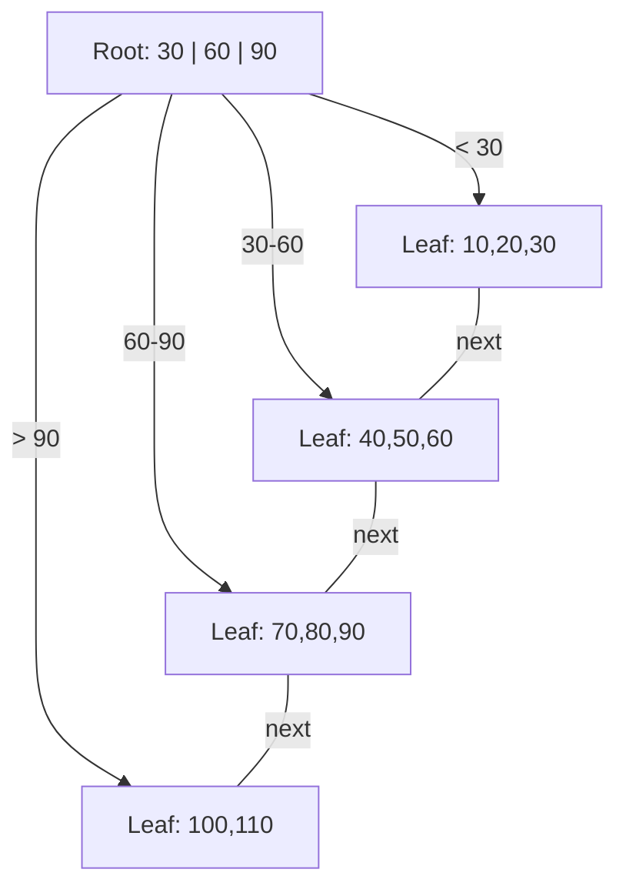
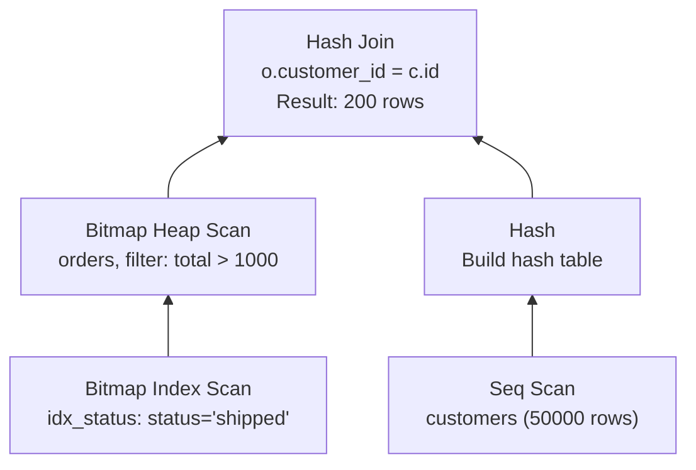
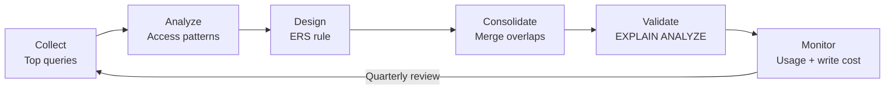
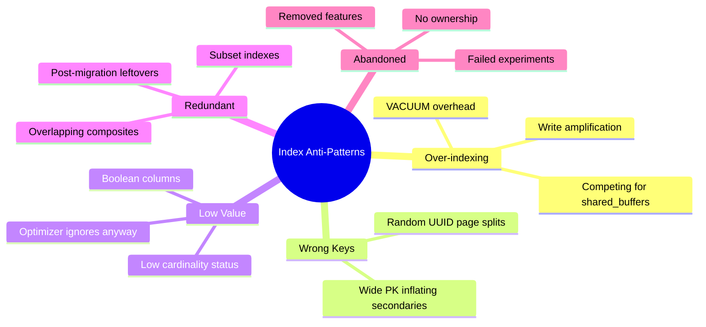

## Keywords in This File

{: .no_toc }

| # | Keyword | Weight |
|---|---|---|
| 1 | [B-Tree Index Structure](#b-tree-index-structure) | high |
| 2 | [Composite and Covering Indexes](#composite-and-covering-indexes) | high |
| 3 | [Query Execution Plans and EXPLAIN](#query-execution-plans-and-explain) | high |
| 4 | [Index Design Strategy](#index-design-strategy) | high |
| 5 | [Index Anti-Patterns](#index-anti-patterns) | medium |

---

# B-Tree Index Structure

**Interview Weight:** high - The foundational data structure behind
90% of database indexes. Interviewers test whether you understand
WHY indexes speed up queries and WHEN they do not.

---

### 🎯 Model Answer

**30 seconds:**

> A B-Tree index is a balanced tree structure where each node
> contains sorted keys and pointers to child nodes. Leaf nodes
> form a doubly-linked list for range scans. Lookups are O(log N)
> because the tree height is typically 3-4 levels even for billions
> of rows. The database navigates from root to leaf, reading one
> page per level - so a lookup on a billion-row table reads only
> 3-4 disk pages instead of scanning millions.

**3 minutes (Senior):**

> B-Tree (technically B+Tree in most databases) keeps all data
> pointers in leaf nodes and uses internal nodes purely for
> navigation. The tree stays balanced through splits and merges
> during inserts and deletes. Each node is sized to match a disk
> page (typically 8KB in PostgreSQL, 16KB in InnoDB).
>
> The critical insight: tree height determines lookup cost. With
> a fill factor of ~70% and 8KB pages, each internal node holds
> roughly 500 keys. Height 3 covers 500^3 = 125 million rows.
> Height 4 covers 62 billion rows. So even on massive tables,
> an index lookup reads 3-4 pages from disk.
>
> Range scans are efficient because leaf nodes are linked: once
> you find the start of a range, you follow the leaf chain
> without navigating back up the tree. This is why B+Trees beat
> hash indexes for range queries (BETWEEN, ORDER BY, >, <).
>
> The cost of indexes: every INSERT/UPDATE/DELETE must maintain
> the tree structure. Writes to indexed columns trigger page
> splits (when a leaf is full), which cascade upward. This is
> why over-indexing kills write performance. The trade-off is
> always read speed vs write overhead.

**Framework:** STRUCTURE (balanced tree, pages) -> LOOKUP COST
(height = log N) -> RANGE EFFICIENCY (leaf chain) ->
WRITE COST (splits, maintenance)

**Blank Mind Recovery:**

**(1) Restate:** "You are asking about B-Tree index structure -
how databases organize index data for fast lookups."

**(2) First principles:** "We need O(log N) lookups on disk.
Trees give logarithmic access. B-Trees are wide (high fan-out)
to minimize tree height and thus disk reads."

**(3) Bridge:** "Think of a library card catalog - sorted cards
in drawers (leaf nodes), with a directory (internal nodes)
telling you which drawer to open."

---

### 📘 Concept Explanation

**What it is:**

A B+Tree is a self-balancing tree data structure optimized for
disk-based storage. Internal nodes contain keys and child pointers
for navigation. Leaf nodes contain keys and row pointers (or the
actual row data in clustered indexes), linked together for
sequential access.

**How it works:**

```
  B+Tree Structure (simplified, fan-out=4):

  INTERNAL:    [  30  |  60  |  90  ]
              /    |       |       \
  LEAF:  [10,20,30]->[40,50,60]->[70,80,90]->[100,110]
         ← doubly linked for range scans →

  Lookup "55":
    Root: 55 > 30, 55 < 60 → middle child
    Leaf: scan [40,50,60] → 55 not found
    Cost: 2 page reads (root + leaf)

  Range "40 to 80":
    Find 40 in leaf [40,50,60]
    Follow link → [70,80,90], stop at 80
    Cost: 2 page reads + 1 sequential read
```



> **Diagram walkthrough:** The root node acts as a directory,
> routing queries to the correct leaf based on key ranges.
> Leaf nodes store actual keys and are linked sequentially,
> enabling efficient range scans without returning to the root.

**The key insight:**

Fan-out (keys per node) determines tree height. A higher fan-out
means fewer levels, which means fewer disk I/O operations per
lookup. B-Trees maximize fan-out by making nodes page-sized.
This is why B-Trees dominate disk-based databases while binary
trees (fan-out=2) are used only in memory.

**When to use it:**

- Point lookups (WHERE id = 5) - O(log N)
- Range queries (WHERE date BETWEEN x AND y) - O(log N + K)
- ORDER BY on indexed column - already sorted
- JOIN conditions - nested loop join uses index lookups

**When NOT to use it:**

- Columns with very low cardinality (boolean, status with 3 values)
  - Full table scan is often faster than index + random I/O
- Write-heavy tables with many indexes
  - Each index adds write amplification
- Small tables (< 1000 rows)
  - Sequential scan fits in one page; index adds overhead

---

### 💻 Code Example

**Example 1: BAD - Full table scan on unindexed column**

```sql
-- BAD: No index on email - full table scan O(N)
SELECT * FROM users WHERE email = 'alice@example.com';
-- Seq Scan on users (cost=0..25000 rows=1 width=100)
-- Reads ALL pages even though only 1 row matches

-- GOOD: B-Tree index enables O(log N) lookup
CREATE INDEX idx_users_email ON users (email);
SELECT * FROM users WHERE email = 'alice@example.com';
-- Index Scan using idx_users_email (cost=0..8 rows=1)
-- Reads 3-4 pages: root → internal → leaf → heap
```

> **Code walkthrough:** Without an index, PostgreSQL reads every
> page of the users table sequentially. With a B-Tree index on
> email, it navigates 3-4 tree levels to find the single matching
> row. The cost drops from reading thousands of pages to 3-4.

**Example 2: Range scan using leaf chain**

```sql
-- Range query leveraging B-Tree leaf linkage
CREATE INDEX idx_orders_date ON orders (order_date);

SELECT order_id, total
FROM orders
WHERE order_date BETWEEN '2024-01-01' AND '2024-01-31'
ORDER BY order_date;
-- Index Scan using idx_orders_date
-- Finds start of range in leaf, follows links forward
-- ORDER BY is free - index is already sorted

-- Contrast with hash index (PostgreSQL):
CREATE INDEX idx_orders_hash ON orders USING hash (order_id);
-- Hash index: O(1) for equality, CANNOT do range queries
-- B-Tree: O(log N) for equality, O(log N + K) for ranges
```

> **Code walkthrough:** The B-Tree finds the first leaf containing
> '2024-01-01', then follows the leaf linked list until it passes
> '2024-01-31'. ORDER BY is free because the index stores keys in
> sorted order. A hash index cannot support this - it only handles
> exact equality lookups.

**Example 3: Monitoring index health (page splits, bloat)**

```sql
-- PostgreSQL: Check index size and bloat
SELECT schemaname, indexrelname,
       pg_size_pretty(pg_relation_size(indexrelid)) AS size,
       idx_scan AS times_used,
       idx_tup_read AS rows_returned
FROM pg_stat_user_indexes
WHERE schemaname = 'public'
ORDER BY pg_relation_size(indexrelid) DESC;

-- Check for unused indexes (candidates for removal)
SELECT indexrelname, idx_scan
FROM pg_stat_user_indexes
WHERE idx_scan = 0 AND schemaname = 'public';
-- If idx_scan = 0 after weeks of production traffic,
-- the index is dead weight - costing write overhead
-- with zero read benefit
```

> **Code walkthrough:** `pg_stat_user_indexes` reveals which indexes
> are actually used. An index with zero scans is pure write overhead.
> The size query helps identify bloated indexes that need REINDEX.
> Production databases accumulate dead indexes from abandoned features.

---

### ⚖️ Comparison Table

| Index Type | Lookup | Range | Sorted | Write Cost | Use When |
|---|---|---|---|---|---|
| **B-Tree** | O(log N) | O(log N + K) | yes | medium | Default - most queries |
| Hash | O(1) | impossible | no | low | Equality-only, high cardinality |
| GIN | O(log N) | per element | no | high | Arrays, full-text, JSONB |
| GiST | O(log N) | spatial | no | medium | Geometry, range types |
| BRIN | O(1) per range | block-level | no | very low | Time-series, append-only |

**The deciding factor:** Use B-Tree by default. Switch to hash
only for exact-equality on high-cardinality columns. Use GIN for
multi-value columns (arrays, JSONB). Use BRIN for physically
ordered data (timestamps in append-only tables).

---

### 🎓 Answers by Seniority

**Junior / Mid (0-5 years):**

> A B-Tree index is a balanced tree where lookups are O(log N).
> The tree is typically 3-4 levels deep even for billions of rows,
> so a lookup reads only 3-4 disk pages. Leaf nodes are linked
> together for efficient range scans. B-Trees handle both equality
> and range queries, which is why they are the default index type.

---

**Senior / Staff (5+ years):**

> I think about B-Trees in terms of I/O cost. Each tree level is
> one random disk read. With 8KB pages and typical key sizes, the
> fan-out is 200-500, so height 3 covers hundreds of millions of
> rows. The operational concerns are: page splits during heavy
> inserts (which cause write amplification and fragmentation),
> index bloat from UPDATE-heavy workloads in MVCC databases
> (dead tuples in index pages), and the tradeoff between fill
> factor (space efficiency) and split frequency.

---

### ⚠️ Common Misconceptions

| # | Misconception | Reality |
|---|---|---|
| 1 | "Adding an index always makes queries faster" | Indexes on low-cardinality columns (3 distinct values in 1M rows) often trigger random I/O that is slower than a sequential scan. The optimizer may ignore the index. |
| 2 | "B-Tree height grows linearly with data" | Height grows logarithmically. Doubling table size adds at most one level. A billion-row table is only 3-4 levels deep. |
| 3 | "Indexes have no cost when you are not querying" | Every INSERT/UPDATE/DELETE maintains all indexes on the table. 5 indexes = 5x write amplification on indexed columns. |
| 4 | "B-Tree and Binary Tree are the same thing" | Binary trees have fan-out 2 (height = log2 N). B-Trees have fan-out 200-500 (height = log500 N). The difference is 20 disk reads vs 3 for a million rows. |
| 5 | "Hash indexes are always faster for equality" | In PostgreSQL, hash indexes are not WAL-logged before v10, do not support unique constraints, and B-Tree equality is fast enough (one extra page read vs hash). |

---

### 🚨 Failure Modes and Diagnosis

**Failure 1: Index bloat causing slow queries**

- **Symptom:** Queries that were fast become progressively slower.
  Index size grows much larger than expected for the row count.
- **Root Cause:** MVCC dead tuples in index pages. Heavy UPDATE
  workloads create dead index entries that VACUUM cannot always
  reclaim (especially with long-running transactions holding
  snapshots).
- **Diagnostic:**
  ```sql
  -- Compare actual size to estimated minimum size
  SELECT pg_size_pretty(pg_relation_size('idx_name'))
    AS actual_size;
  -- pgstattuple extension:
  SELECT * FROM pgstatindex('idx_name');
  -- leaf_fragmentation > 30% indicates bloat
  ```
- **Fix:** `REINDEX CONCURRENTLY idx_name;` (PostgreSQL 12+) or
  `CREATE INDEX CONCURRENTLY` + drop old index.
- **Prevention:** Tune autovacuum (reduce
  `autovacuum_vacuum_scale_factor` for hot tables). Avoid
  long-running transactions.

**Failure 2: Page splits causing write latency spikes**

- **Symptom:** Periodic latency spikes on INSERT-heavy tables.
  Write latency distribution has a long tail.
- **Root Cause:** When a leaf page is full and a new key must be
  inserted, the page splits into two. The split propagates upward
  if parent nodes are also full. This is expensive I/O.
- **Diagnostic:**
  ```sql
  -- PostgreSQL: monitor split activity via pg_stat_bgwriter
  -- or check leaf_fragmentation in pgstatindex
  SELECT * FROM pgstatindex('idx_orders_date');
  ```
- **Fix:** Set a lower fill factor (`CREATE INDEX ... WITH
  (fillfactor = 70)`) to leave room for future inserts.
  For monotonically increasing keys (timestamps, sequences),
  splits only happen at the rightmost leaf - less impactful.
- **Prevention:** Fill factor 70-90% for insert-heavy indexes.
  Use BRIN for append-only time-series data.

**Failure 3: Wrong index chosen by optimizer**

- **Symptom:** Query uses an index scan when a sequential scan
  would be faster (or vice versa). Query regresses after
  ANALYZE or data distribution change.
- **Root Cause:** Stale statistics. The optimizer estimates
  selectivity incorrectly (thinks the query returns 10 rows
  but it actually returns 100,000).
- **Diagnostic:**
  ```sql
  EXPLAIN ANALYZE SELECT ... ;
  -- Compare "estimated rows" vs "actual rows"
  -- If off by 10x+, statistics are stale
  ANALYZE table_name;
  -- Rerun query - if plan changes, stats were the issue
  ```
- **Fix:** `ANALYZE table_name;` or increase
  `default_statistics_target` for columns with skewed
  distributions. In extreme cases, use `pg_hint_plan` or
  adjust `random_page_cost`.
- **Prevention:** Ensure autovacuum runs frequently enough.
  Monitor `n_dead_tup` and `last_autoanalyze` in
  `pg_stat_user_tables`.

---

### 🎯 Interview Deep-Dive

**Timing Guidelines:**

| Depth | Time | Signal |
|---|---|---|
| Definition | 30 sec | Knows what B-Tree is |
| Mechanism | 1-2 min | Understands page structure |
| Trade-offs | 2-3 min | Knows write cost, fan-out |
| Production | 3-5 min | Diagnosed bloat, splits |
| System design | 5+ min | Index strategy at scale |

---

**Q1. What is a B-Tree index and why do databases use it?** [JUNIOR]

*Why they ask:* Baseline understanding of index internals.

*Likely follow-up:* "Why not a hash table?"

**A:** A B-Tree (specifically B+Tree) is a balanced tree structure
optimized for disk I/O. Each node is sized to match a disk page
(8-16KB). Internal nodes contain sorted keys and pointers to child
nodes - they act as a directory. Leaf nodes contain keys and
pointers to actual rows, linked together in a doubly-linked list.

The reason databases use B-Trees over simpler structures comes down
to two properties: logarithmic height (3-4 levels for billions of
rows means 3-4 disk reads per lookup) and sequential leaf access
(range queries follow the leaf chain without returning to the root).
A hash table gives O(1) for equality lookups but cannot support
range queries, ORDER BY, or partial key matches. Since most real
queries involve ranges, sorting, or prefix matching, B-Trees are
the universal default.

The fan-out (keys per node) is the critical parameter. With 8KB
pages and 16-byte keys, you get roughly 500 keys per internal
node. Height = log_500(N). For 1 billion rows: log_500(10^9) is
about 3.3, so height 4. That is 4 random disk reads per lookup -
and the root node is always cached in memory, so effectively 2-3
reads. This is why indexes feel "instant" even on very large tables.

*What separates good from great:* Great candidates mention the
fan-out calculation and explain why B-Trees beat binary trees
(log_500 vs log_2 - the difference between 3 disk reads and 30).

---

**Q2. How does a B-Tree handle INSERT operations?** [MID]

*Why they ask:* Tests understanding of write-side costs.

*Likely follow-up:* "What is a page split?"

**A:** When inserting a new key, the database navigates the tree
from root to the correct leaf node (same path as a lookup). If the
leaf has space, the key is inserted in sorted order within the page
- this is the fast path. If the leaf is full, a page split occurs:
the leaf is divided into two nodes, approximately half the keys go
to each, and a new separator key is promoted to the parent node.

If the parent is also full, the split cascades upward. In the worst
case, splits cascade all the way to the root, which creates a new
root level (this is how the tree grows taller). In practice, root
splits are extremely rare because a single root split creates
capacity for 500x more entries.

The write amplification is real: one logical INSERT may cause
multiple page writes (the leaf, its new sibling, the parent, and
potentially pages above). This is why heavily indexed tables have
slower writes. The fill factor setting (default 90% in PostgreSQL)
leaves headroom in each page to reduce split frequency at the cost
of slightly more disk space.

For monotonically increasing keys (auto-increment IDs, timestamps),
inserts always go to the rightmost leaf. This means only the
rightmost leaf ever splits, which is very efficient. Random UUIDs
as primary keys cause inserts scattered across all leaves, causing
far more splits and cache misses - this is a common performance
anti-pattern.

*What separates good from great:* Great candidates connect UUID
primary keys to random I/O and page splits, and can recommend
UUIDv7 (time-ordered) as the fix.

---

**Q3. Explain the difference between a clustered and
non-clustered index.** [MID]

*Why they ask:* Tests whether you understand the physical vs
logical organization of data.

*Likely follow-up:* "What is a heap fetch?"

**A:** A clustered index (InnoDB primary key, SQL Server clustered
index) stores the actual row data in the leaf nodes of the B-Tree.
The table IS the index - rows are physically ordered by the
clustering key. There can be only one clustered index per table
because you can only physically sort data one way.

A non-clustered (secondary) index stores index keys plus a pointer
back to the row. In InnoDB, secondary index leaves contain the
primary key value (not a physical row pointer). This means a
secondary index lookup requires two B-Tree traversals: first the
secondary index to find the primary key, then the primary key
(clustered) index to find the actual row. This is called a
"double lookup" or "bookmark lookup."

In PostgreSQL, there is no clustered index by default. All indexes
are secondary, pointing to physical tuple locations (ctid). The
CLUSTER command can physically reorder a table once, but it does
not maintain the order on subsequent writes.

The practical implication: in InnoDB, choosing the right primary
key is critical because it determines the physical layout of all
data. A wide primary key (UUID) makes every secondary index larger
because each secondary index leaf stores a copy of the primary key.
An auto-increment integer primary key keeps secondary indexes
compact and inserts sequential (no random page splits).

*What separates good from great:* Great candidates explain why
InnoDB secondary indexes contain the PK (not a row pointer) -
because row pointers would become invalid after page splits or
OPTIMIZE TABLE, while PK values are stable.

---

**Q4. You have a query that is slow despite having an index.
What could be wrong?** [SENIOR] [DEBUGGING]

*Why they ask:* Tests production debugging skills.

*Likely follow-up:* "Show me how you would diagnose this."

**A:** Several reasons an index might not help or might not be used:

First, the optimizer might choose not to use the index. If the
query returns more than about 5-20% of the table rows, a sequential
scan with fewer total I/O operations beats an index scan with random
I/O. Run EXPLAIN ANALYZE and compare estimated vs actual rows - if
they differ significantly, run ANALYZE to refresh statistics.

Second, the index might not be usable for the query pattern. A
composite index on (a, b, c) cannot be used if the WHERE clause
filters only on b or c (leftmost prefix rule). Functions on indexed
columns (WHERE UPPER(email) = ...) prevent index usage unless you
have a functional index. Implicit type casts (WHERE int_col =
'123') can also prevent index usage.

Third, the index might be bloated. After heavy UPDATE workloads in
MVCC databases, index pages accumulate dead tuples. The index is
larger than necessary, causing more I/O. Check with pgstatindex()
and fix with REINDEX CONCURRENTLY.

Fourth, the data might have poor physical correlation. If the index
order is completely different from the heap order, each index lookup
fetches a different heap page (random I/O). A sequential scan
reading pages in order might be faster despite reading more data.
Check correlation in pg_stats.

My diagnostic workflow: (1) EXPLAIN ANALYZE to see actual plan and
row estimates, (2) check if index is being used at all, (3) if used
but slow, check index bloat and physical correlation, (4) if not
used, check if the predicate matches the index structure.

*What separates good from great:* Great candidates mention physical
correlation and the tipping point where sequential scan beats index
scan, showing they understand the I/O cost model, not just
"add an index."

---

**Q5. When would you choose NOT to add an index?** [SENIOR]
[TRADE-OFF]

*Why they ask:* Tests trade-off thinking - indexes are not free.

*Likely follow-up:* "How do you decide which indexes to drop?"

**A:** I would not add an index in several situations:

Write-heavy workloads where the column is frequently updated. Each
index on a table adds write amplification - one row INSERT becomes
N+1 writes (heap + N indexes). For a table with 10 indexes that
receives 10,000 inserts/second, that is 110,000 write operations
per second. If a query using that index runs only once per hour,
the cost-benefit ratio is terrible.

Low-cardinality columns. An index on a boolean column (or status
with 3 values) typically reads 33-50% of the table for any given
value. The optimizer will choose a sequential scan anyway because
sequential I/O on 33% of the table is faster than random I/O on
33% of the table via the index.

Small tables. If the entire table fits in a few pages (under 1000
rows), a sequential scan reads those pages faster than navigating
the index tree (which itself is several pages).

My decision framework: (1) Run the query without the index and
measure actual time. (2) Add the index and measure improvement.
(3) Measure write overhead increase using pg_stat_user_indexes.
(4) If the index is used fewer than N times per day and the table
has heavy writes, the index is probably not worth it.

For dropping indexes: I query pg_stat_user_indexes for indexes with
idx_scan = 0 over the past month. Those are pure write overhead.
I validate by checking if any batch jobs or reports use them
infrequently, then drop with a safety window (CREATE INDEX
CONCURRENTLY is fast to rebuild if needed).

*What separates good from great:* Great candidates quantify the
trade-off (write amplification per index vs query frequency) rather
than giving the generic "indexes slow down writes."

---

**Q6. How does the database optimizer decide between an index scan
and a sequential scan?** [SENIOR]

*Why they ask:* Tests understanding of the cost model.

*Likely follow-up:* "What is random_page_cost?"

**A:** The optimizer uses a cost model that estimates the total I/O
and CPU cost of each possible execution plan. The key parameters
are:

Sequential page cost (seq_page_cost, default 1.0 in PostgreSQL) -
the cost of reading one page sequentially from disk. This is cheap
because sequential reads benefit from OS read-ahead and SSD
sequential access patterns.

Random page cost (random_page_cost, default 4.0 in PostgreSQL) -
the cost of reading one page via random I/O. An index scan
typically causes random reads because it jumps between index pages
and heap pages in no particular order.

The optimizer estimates how many pages each plan will read and
whether those reads are sequential or random. If a query matches
20% of the table, the index plan reads 20% of heap pages randomly
(cost = 0.2 * N * 4.0) while the sequential plan reads all pages
sequentially (cost = N * 1.0). The sequential plan wins when:
N * 1.0 < 0.2 * N * 4.0, which simplifies to 1.0 < 0.8, which is
true - so the optimizer picks sequential scan.

In practice, the crossover point is around 5-20% of the table. On
SSDs, random_page_cost should be lowered to 1.1-1.5 because SSDs
have near-zero seek time. Many production databases are mis-tuned
with random_page_cost=4.0 on SSD storage, causing the optimizer to
avoid indexes more than it should.

*What separates good from great:* Great candidates immediately
mention adjusting random_page_cost for SSDs and can calculate the
selectivity threshold where the optimizer switches plans.

---

**Q7. Explain how VACUUM interacts with B-Tree indexes in
PostgreSQL.** [SENIOR]

*Why they ask:* Tests deep operational knowledge.

*Likely follow-up:* "What happens if VACUUM cannot keep up?"

**A:** PostgreSQL's MVCC means that UPDATE and DELETE do not
immediately remove old row versions. Dead tuples remain in both
the heap and all indexes until VACUUM reclaims them.

For the heap, VACUUM marks dead tuples as reusable space. For
indexes, VACUUM removes index entries pointing to dead heap tuples.
This is called "index vacuuming" and it is often the most expensive
part of VACUUM because it requires scanning the entire index to
find entries pointing to dead tuples.

If VACUUM cannot keep up (long-running transactions hold old
snapshots, or autovacuum is throttled), indexes bloat. The index
contains entries for both live and dead tuples, making it larger
than necessary. Queries read more pages, and the index structure
becomes fragmented.

The worst case is transaction ID wraparound: if VACUUM has not
processed a table for 2 billion transactions, PostgreSQL forces
an aggressive VACUUM that blocks all writes (autovacuum to prevent
wraparound). This is a production emergency.

My monitoring approach: track n_dead_tup and last_autovacuum in
pg_stat_user_tables. Alert when dead tuple ratio exceeds 20% of
live tuples. For hot tables, reduce autovacuum_vacuum_scale_factor
from 0.2 to 0.01 so autovacuum triggers more frequently.

*What separates good from great:* Great candidates connect VACUUM
delays to index bloat specifically (not just heap bloat) and
mention the wraparound emergency scenario.

---

**Q8. How would you design an indexing strategy for a table
that handles both OLTP writes and analytical reads?** [STAFF]

*Why they ask:* Tests architectural thinking about conflicting
requirements.

*Likely follow-up:* "How do you prevent read-optimized indexes
from killing write performance?"

**A:** This is fundamentally a conflict between read optimization
(more indexes, wider covering indexes) and write performance (fewer
indexes, minimal maintenance overhead). My approach:

First, separate the workloads if possible. Use read replicas for
analytical queries with additional indexes that do not exist on the
primary. The primary has minimal indexes for OLTP write performance.
Replicas can have 10+ indexes without impacting write latency.

If separation is not possible, I tier the indexes: essential indexes
for OLTP queries (primary key, foreign keys, the 3-4 most critical
lookup patterns) stay on the table permanently. Analytical indexes
are partial indexes with conditions that match only the subset of
data the analysts query (e.g., CREATE INDEX ... WHERE status =
'completed' AND created_at > now() - interval '90 days').

For truly heavy analytical queries, I use materialized views with
their own indexes, refreshed on a schedule. The base table stays
lean for writes.

The organizational pattern: I establish an index budget per table
(e.g., max 6 indexes on hot OLTP tables) and require justification
(query plan + frequency + latency impact) for any new index. This
prevents the "just add an index" culture that slowly degrades write
performance over years.

*What separates good from great:* Great candidates propose the
read-replica-with-extra-indexes pattern and explain the index budget
concept as an organizational constraint, not just a technical one.

---

**Q9. Your team uses UUID primary keys. A colleague proposes
switching to auto-increment integers for performance. Walk me
through the trade-off analysis.** [STAFF] [TRADE-OFF]

*Why they ask:* Tests ability to analyze a real architectural
decision with multiple dimensions.

*Likely follow-up:* "What about UUIDv7?"

**A:** This is a multi-dimensional trade-off. Let me structure it:

UUID advantages: globally unique without coordination (critical for
distributed systems, microservices generating IDs independently),
no information leakage (cannot enumerate resources by incrementing),
merge-safe (no conflicts when combining data from multiple sources).

Auto-increment advantages: compact (8 bytes vs 16 bytes - every
secondary index stores the PK in each leaf entry, so 16-byte UUIDs
make all secondary indexes ~2x larger), sequential insertion
(inserts always go to the rightmost leaf page - no random page
splits, better cache utilization), better range locality (nearby
IDs were created at similar times, improving cache hit rates for
recent-data queries).

The performance impact is real: I have seen workloads where
switching from random UUIDv4 to auto-increment reduced write
latency by 40% and secondary index size by 45%. The random I/O
from UUIDv4 inserts scattered across the B-Tree is the primary
cause.

My recommendation: UUIDv7 (time-ordered UUID, RFC 9562). It
preserves global uniqueness and no-coordination generation while
providing monotonically increasing values (the first 48 bits are
a Unix timestamp). This gives sequential insertion behavior
(rightmost leaf inserts) with distributed ID generation. It is the
best of both worlds for most applications.

The remaining case for auto-increment: when storage is extremely
constrained (billions of rows where 8 bytes per secondary index
entry matters) or when you need human-readable IDs.

*What separates good from great:* Great candidates know UUIDv7
exists, can explain WHY random UUIDs cause page splits (scattered
inserts across the B-Tree), and quantify the secondary index size
impact.

---

**Interviewer Type Adaptation:**

| Interviewer Type | Emphasis |
|---|---|
| Technical Panel | Fan-out calculation, page split mechanics, height formula |
| Hiring Manager | When to add/remove indexes - practical judgment |
| Bar Raiser | VACUUM interaction, write amplification quantification |
| Peer Engineer | "Our index is 3x the table size - how do we fix this?" |

---

---

# Composite and Covering Indexes

**Interview Weight:** high - The most common index optimization
question. Tests whether you understand column order matters and
can eliminate heap lookups.

---

### 🎯 Model Answer

**30 seconds:**

> A composite index is a B-Tree on multiple columns. Column order
> matters - the index is usable only from the leftmost column
> (leftmost prefix rule). A covering index includes all columns
> the query needs, so the database reads only the index without
> touching the table (index-only scan). Composite indexes turn
> multiple single-column lookups into one efficient multi-column
> navigation.

**3 minutes (Senior):**

> The key insight about composite indexes is that they are sorted
> lexicographically: first by column A, then by column B within
> each A value, then by column C within each (A, B) pair. This
> means the index on (A, B, C) can efficiently answer queries
> filtering on A; on A and B; or on A, B, and C - but NOT on
> B alone or C alone (the index cannot skip the first column).
>
> A covering index adds columns to the index that the query
> SELECTs but does not filter on. In PostgreSQL, INCLUDE columns
> (CREATE INDEX ... ON t(a, b) INCLUDE (c, d)) add c and d to
> leaf nodes without affecting the sort order or tree navigation.
> The benefit: an index-only scan reads data exclusively from the
> index, avoiding the heap fetch entirely. This eliminates random
> I/O to the table and can make queries 5-10x faster for
> workloads where the index fits in memory but the table does not.
>
> The design principle: put equality columns first (high
> selectivity filters), range columns last (they break the sort
> for subsequent columns), and INCLUDE columns that are selected
> but never filtered. This gives the tightest possible range scan
> with all needed data available in the index itself.

**Framework:** COLUMN ORDER (equality first, range last) ->
LEFTMOST PREFIX (what queries can use it) -> COVERING (avoid
heap fetch) -> INCLUDE vs KEY columns

**Blank Mind Recovery:**

**(1) Restate:** "You are asking about indexes on multiple
columns - how column order affects usability and how covering
indexes avoid table lookups."

**(2) First principles:** "A multi-column index sorts by first
column, then second within each first-column value. Like a phone
book: sorted by last name, then first name within each last name."

**(3) Bridge:** "Phone book analogy - you can find all 'Smith'
entries (first column), or 'Smith, John' (both columns), but you
cannot efficiently find all 'John' entries (skipping the first
column)."

---

### 📘 Concept Explanation

**What it is:**

A composite index is a single B-Tree index built on two or more
columns. Keys are sorted lexicographically by column order. A
covering index is any index that contains all columns referenced
by a query (in WHERE, SELECT, ORDER BY, JOIN), enabling an
index-only scan with zero table access.

**How it works:**

```
  Composite index on (department, last_name, salary):

  Leaf entries sorted as:
  (Engineering, Adams, 80000) → row_ptr
  (Engineering, Baker, 95000) → row_ptr
  (Engineering, Chen, 110000) → row_ptr
  (Marketing, Adams, 75000)   → row_ptr
  (Marketing, Davis, 88000)   → row_ptr
  (Sales, Adams, 70000)       → row_ptr

  Query: WHERE department = 'Engineering'
         AND last_name = 'Chen'
  → Navigate tree to (Engineering, Chen) → 1 result
    Uses both columns ✓

  Query: WHERE last_name = 'Adams'
  → Cannot use this index efficiently!
    Must scan ALL departments to find 'Adams'
    (index is not sorted by last_name alone)

  COVERING example (index-only scan):
  CREATE INDEX idx_dept_name_sal
    ON employees(department, last_name)
    INCLUDE (salary);
  SELECT last_name, salary
  FROM employees WHERE department = 'Engineering';
  → All data in the index leaf. No heap fetch needed.
```

**The key insight:**

Column order in a composite index determines which query patterns
can use it. The rule: an index on (A, B, C) supports queries on
A; A+B; or A+B+C. It does NOT support queries on B alone, C
alone, or B+C. Once a range condition appears (>, <, BETWEEN),
subsequent columns in the index cannot be used for further
navigation - they can only be used as filters within the range.

**When to use it:**

- Queries with multiple equality conditions on different columns
- Queries that filter + sort on different columns
- Queries where you want to eliminate heap lookups (covering)
- Replacing multiple single-column indexes with one composite

**When NOT to use it:**

- When each column is always queried independently (separate
  single-column indexes are more flexible)
- When the combination creates a very wide index key (>100 bytes)
  reducing fan-out significantly
- When the table is write-heavy and the index maintenance cost
  outweighs the read benefit

---

### 💻 Code Example

**Example 1: BAD column order vs GOOD column order**

```sql
-- BAD: Range column first - breaks navigation for equality
CREATE INDEX idx_bad ON orders (order_date, status, customer_id);

-- Query: Find completed orders for customer 42
SELECT * FROM orders
WHERE status = 'completed'
  AND customer_id = 42
  AND order_date > '2024-01-01';
-- Cannot use idx_bad efficiently!
-- order_date range first → scans huge range,
-- then filters status and customer_id from those leaves.

-- GOOD: Equality columns first, range column last
CREATE INDEX idx_good ON orders (status, customer_id, order_date);

-- Same query now:
-- Navigate to (completed, 42) → precise prefix
-- Then range scan on order_date within that prefix
-- Reads only the exact rows needed
```

> **Code walkthrough:** With range column first, the database
> scans all order_date values > '2024-01-01' across ALL statuses
> and customers, then filters. With equality columns first, it
> navigates directly to the (status=completed, customer_id=42)
> subtree, then range-scans only the dates within that tiny
> subset. The difference can be 1000x fewer pages read.

**Example 2: Covering index eliminating heap fetch**

```sql
-- Without covering index: requires heap fetch
CREATE INDEX idx_orders_cust ON orders (customer_id);

SELECT order_id, order_date, total
FROM orders WHERE customer_id = 42;
-- Plan: Index Scan using idx_orders_cust
--   → for each matching entry, fetch row from heap
--   → random I/O for order_id, order_date, total

-- GOOD: Covering index with INCLUDE (PostgreSQL 11+)
CREATE INDEX idx_orders_cust_covering
  ON orders (customer_id)
  INCLUDE (order_id, order_date, total);

SELECT order_id, order_date, total
FROM orders WHERE customer_id = 42;
-- Plan: Index Only Scan using idx_orders_cust_covering
--   → ALL data available in index leaf
--   → ZERO heap fetches. 5-10x faster if table is large.
```

> **Code walkthrough:** The first index finds matching rows but
> must fetch order_id, order_date, and total from the heap (random
> I/O). The covering index includes those columns in the leaf
> nodes. The query reads only the index - no table access at all.
> INCLUDE columns are stored in leaves but do not affect the sort
> order or increase tree height.

**Example 3: Verifying index-only scan in EXPLAIN**

```sql
EXPLAIN (ANALYZE, BUFFERS) SELECT order_id, order_date, total
FROM orders WHERE customer_id = 42;

-- With covering index, look for:
-- "Index Only Scan" (not "Index Scan")
-- "Heap Fetches: 0" (or very low)
--
-- If Heap Fetches is high despite covering index:
-- VACUUM has not run recently (visibility map not updated)
-- Fix: VACUUM orders;
-- Then re-run: Heap Fetches drops to 0
```

> **Code walkthrough:** "Index Only Scan" confirms the covering
> index is working. If you see heap fetches despite a covering
> index, the visibility map is stale - VACUUM updates it to mark
> pages as all-visible, enabling true index-only scans. This is
> a common production gotcha.

---

### ⚖️ Comparison Table

| Strategy | Index Size | Write Cost | Read Benefit | Use When |
|---|---|---|---|---|
| **Single-column index** | small | low | one filter | Column queried independently |
| **Composite (key only)** | medium | medium | multi-filter + sort | Multiple columns always queried together |
| **Covering (INCLUDE)** | larger | medium-high | eliminates heap | Hot query needing few extra columns |
| **Multiple single indexes** | small each | low each | bitmap combine | Columns used in different combinations |

**The deciding factor:** If a specific query pattern dominates
(>80% of reads), a composite covering index for that exact pattern
gives the best performance. If queries use columns in varying
combinations, multiple single-column indexes with bitmap AND/OR
are more flexible.

---

### 🎓 Answers by Seniority

**Junior / Mid (0-5 years):**

> A composite index is an index on multiple columns. The order
> matters - the leftmost prefix rule means (A, B, C) can be used
> for queries on A, or A+B, or A+B+C, but not B alone. A covering
> index includes all columns a query needs so the database never
> touches the table - it reads everything from the index.

---

**Senior / Staff (5+ years):**

> I design composite indexes by analyzing the query workload: put
> high-selectivity equality columns first, range columns last, and
> INCLUDE columns that appear in SELECT but not WHERE. The goal is
> index-only scans for the top 5 most expensive queries. I validate
> with EXPLAIN ANALYZE checking for "Index Only Scan" and "Heap
> Fetches: 0". The trade-off is index width - a covering index is
> larger and costs more to maintain, so I only do it for queries
> that are both frequent and latency-sensitive.

---

### ⚠️ Common Misconceptions

| # | Misconception | Reality |
|---|---|---|
| 1 | "Column order in a composite index does not matter" | Order is critical. (A, B) and (B, A) serve completely different query patterns. Put equality columns first, range columns last. |
| 2 | "A composite index on (A, B) helps queries filtering only on B" | No. The leftmost prefix rule means (A, B) is useless for WHERE B = x without A. You need a separate index on (B). |
| 3 | "More columns in the index is always better" | Extra key columns increase index size, reduce fan-out, slow writes, and may not improve read if the additional selectivity is minimal. |
| 4 | "INCLUDE and adding a column to the key are the same" | Key columns affect sort order and enable range scans on those columns. INCLUDE columns are stored in leaves but do not affect navigation - they only serve index-only scans. |
| 5 | "Index-only scan always works with a covering index" | It requires an up-to-date visibility map (maintained by VACUUM). If pages are not marked all-visible, the database still fetches from the heap to check tuple visibility. |

---

### 🚨 Failure Modes and Diagnosis

**Failure 1: Composite index not used due to wrong column order**

- **Symptom:** Query does a sequential scan despite a composite
  index existing on the relevant columns.
- **Root Cause:** The WHERE clause skips the leading column. Index
  on (A, B, C), query filters on B and C only.
- **Diagnostic:**
  ```sql
  EXPLAIN SELECT * FROM t WHERE b = 1 AND c = 2;
  -- Shows "Seq Scan" despite index on (a, b, c)
  -- The leftmost column 'a' is not in the WHERE clause
  ```
- **Fix:** Create a separate index on (B, C) or reorder the
  composite if A is never used without B.
- **Prevention:** Design indexes from the query workload, not from
  the table structure. List the top queries, extract their WHERE
  and ORDER BY columns, design indexes to match.

**Failure 2: Covering index not providing index-only scans**

- **Symptom:** EXPLAIN shows "Index Scan" instead of "Index Only
  Scan" despite all columns being in the index.
- **Root Cause:** Visibility map is stale. Pages modified since
  last VACUUM are not marked all-visible, forcing heap fetches
  to check tuple visibility.
- **Diagnostic:**
  ```sql
  EXPLAIN (ANALYZE, BUFFERS)
    SELECT a, b FROM t WHERE a = 1;
  -- Look for "Heap Fetches: 50000" (should be 0)
  VACUUM t;
  -- Re-run: "Heap Fetches: 0"
  ```
- **Fix:** Run VACUUM on the table. Tune autovacuum to run more
  frequently on hot tables.
- **Prevention:** Lower `autovacuum_vacuum_scale_factor` for tables
  where index-only scans are critical to performance.

**Failure 3: Index too wide - write performance degradation**

- **Symptom:** INSERT/UPDATE latency increases after adding a
  covering index with many INCLUDE columns.
- **Root Cause:** The index leaf entries are now 200+ bytes.
  Fewer entries fit per page. More pages to write and maintain.
  Fill factor is hit sooner, causing more frequent page splits.
- **Diagnostic:**
  ```sql
  SELECT pg_size_pretty(pg_relation_size('idx_covering'))
    AS idx_size;
  -- Compare to: row_count * avg_key_width estimate
  -- If actual >> estimated, the index is bloated or too wide
  ```
- **Fix:** Remove unnecessary INCLUDE columns. Only include
  columns that appear in the SELECT of the hot query. Consider
  if the query is frequent enough to justify the write cost.
- **Prevention:** Establish an index width budget. INCLUDE only
  columns from verified hot queries, not "just in case."

---

### 🎯 Interview Deep-Dive

**Timing Guidelines:**

| Depth | Time | Signal |
|---|---|---|
| Definition | 30 sec | Knows composite vs covering |
| Column order | 1-2 min | Understands leftmost prefix |
| Design | 2-3 min | Can design index from query |
| Production | 3-5 min | Knows visibility map, VACUUM |
| Architecture | 5+ min | Index strategy across workload |

---

**Q1. What is the leftmost prefix rule?** [JUNIOR]

*Why they ask:* Foundation for all composite index reasoning.

*Likely follow-up:* "Give me an example where it matters."

**A:** The leftmost prefix rule states that a composite index on
columns (A, B, C) can be used for queries that filter on A; on A
and B; or on A, B, and C - but not for queries that filter only
on B, only on C, or on B and C without A.

This exists because of how B-Trees sort data. A composite index
sorts first by A, then by B within each A value, then by C within
each (A, B) pair. Without a condition on A, the database cannot
navigate to a specific subtree - entries with B=5 are scattered
across the entire index (under different A values). So the index
is useless without the leading column.

Think of a phone book sorted by (LastName, FirstName). You can
find all "Smith" entries (leading column). You can find "Smith,
John" (both columns). But you cannot efficiently find all "John"
entries - they are scattered throughout the book under different
last names. You would need a separate index sorted by FirstName.

The practical implication: if your queries sometimes filter on A+B
and sometimes on B alone, you need TWO indexes: one on (A, B) and
one on (B). A single composite index cannot serve both patterns.

*What separates good from great:* Great candidates extend to
explain how a range condition on A breaks the usefulness of B
and C for navigation (they become filters, not navigators).

---

**Q2. How do you decide the column order in a composite index?**
[MID]

*Why they ask:* Tests practical index design skill.

*Likely follow-up:* "What if you have both equality and range?"

**A:** My decision framework uses three rules:

Rule 1 - Equality before range. Equality conditions (=) allow the
database to navigate to a precise point in the index. Range
conditions (>, <, BETWEEN, LIKE 'prefix%') start a scan from that
point. Once a range condition appears on a column, subsequent
columns can only filter (not navigate). So: put all equality
columns first, range column last.

Rule 2 - Higher selectivity first (among equality columns). If
I have WHERE status = 'active' AND customer_id = 42, and status
has 5 distinct values but customer_id has 100,000, I put
customer_id first. Navigating to customer_id=42 eliminates 99.999%
of rows; navigating to status='active' only eliminates 80%.

Rule 3 - Align with ORDER BY. If the query has ORDER BY on a
column that is also in WHERE, place it in the index so the sort
order matches. This gives a "free sort" (no additional sort step).

Example: SELECT * FROM orders WHERE customer_id = 42
AND status = 'shipped' ORDER BY order_date DESC.
Index: (customer_id, status, order_date DESC). Equality columns
first (customer_id, status), then range/sort column last
(order_date). The DESC in the index matches the ORDER BY DESC -
no sort needed.

*What separates good from great:* Great candidates mention the
DESC index option and explain how mixing ASC/DESC columns in a
composite index affects ORDER BY optimization.

---

**Q3. What is the difference between including a column in the
index key vs using INCLUDE?** [MID]

*Why they ask:* Tests understanding of PostgreSQL 11+ feature.

*Likely follow-up:* "When would you NOT use INCLUDE?"

**A:** When a column is part of the index key (e.g., CREATE INDEX
ON t(a, b, c)), it affects the sort order of the B-Tree. The
index is sorted by a, then b, then c. All three columns can be
used for navigation (filtering) and range scanning. The column
appears in both internal nodes (for routing) and leaf nodes.

When a column is in INCLUDE (e.g., CREATE INDEX ON t(a, b)
INCLUDE (c)), it is stored ONLY in the leaf nodes. It does not
affect the sort order. It cannot be used for filtering or range
scanning. Its only purpose is to make the data available for
index-only scans without a heap fetch.

The trade-off: key columns increase the size of internal nodes
(reducing fan-out and potentially increasing tree height). INCLUDE
columns only increase leaf size. For columns you only need in
SELECT but never in WHERE or ORDER BY, INCLUDE is strictly better
because it does not affect tree navigation efficiency.

Example: CREATE INDEX ON orders(customer_id, status) INCLUDE
(order_total, ship_date). The tree navigates by (customer_id,
status). Once it finds the matching leaf entries, order_total and
ship_date are right there - no heap fetch. But you cannot write
WHERE order_total > 100 and expect this index to help with that
filter (it would need to scan all leaves).

*What separates good from great:* Great candidates explain the
impact on internal nodes (fan-out) vs leaf-only storage, showing
they understand the B-Tree structure at the page level.

---

**Q4. You run EXPLAIN ANALYZE and see "Index Scan" instead of
"Index Only Scan" on a covering index. Why?** [SENIOR]
[DEBUGGING]

*Why they ask:* Tests production PostgreSQL knowledge.

*Likely follow-up:* "How do you fix it permanently?"

**A:** The most common cause is a stale visibility map. PostgreSQL
uses a visibility map (one bit per heap page) to track which pages
contain only tuples visible to all current transactions. An
index-only scan can skip the heap fetch only for pages marked
all-visible in the visibility map.

If the table has been recently modified and VACUUM has not yet run,
modified pages are not marked all-visible. The database must fetch
from the heap to check tuple visibility (whether the row is
actually visible to the current transaction given MVCC). This shows
up in EXPLAIN ANALYZE as "Heap Fetches: N" where N should be zero.

The fix is straightforward: run VACUUM on the table. After VACUUM
updates the visibility map, re-run the query - it should show
"Index Only Scan" with "Heap Fetches: 0".

The permanent fix: tune autovacuum for this table. Lower
autovacuum_vacuum_scale_factor (from default 0.2 to 0.05 or 0.01)
so VACUUM runs more frequently. For tables with constant writes,
consider autovacuum_vacuum_threshold = 50 to trigger VACUUM after
every 50 dead tuples rather than waiting for 20% of the table.

A less common cause: the query references a column not in the
index. Double-check that ALL columns in SELECT, WHERE, and JOIN
are included in the index definition.

*What separates good from great:* Great candidates explain the
visibility map mechanism specifically (not just "VACUUM fixes it")
and know the autovacuum tuning parameters by name.

---

**Q5. Design a composite index for this query pattern:** [SENIOR]
[TRADE-OFF]

```sql
SELECT product_name, price
FROM products
WHERE category = 'Electronics'
  AND brand IN ('Samsung', 'Apple')
  AND price BETWEEN 100 AND 500
ORDER BY price ASC;
```

*Why they ask:* Tests practical index design under constraints.

*Likely follow-up:* "What if the brand list changes dynamically?"

**A:** Analyzing the query: category is equality (=), brand is
equality (IN translates to multiple equality matches), price is
range (BETWEEN) AND sort (ORDER BY). I need product_name and price
in the output.

Applying my rules: equality before range, so category and brand
before price. Between category (few values) and brand (moderate
cardinality), I choose: category first (most queries likely filter
on category), then brand, then price (range + sort).

My index: CREATE INDEX idx_products_cat_brand_price
ON products(category, brand, price)
INCLUDE (product_name);

Why this works: (1) Navigate to category='Electronics' (equality).
(2) Within that, navigate to each brand value (IN becomes multiple
equality lookups on Samsung and Apple subtrees). (3) Within each
(category, brand) subtree, range scan price 100-500 in order.
(4) price is already sorted in the index, so ORDER BY is free.
(5) product_name in INCLUDE means index-only scan (no heap fetch).

The result is: Index Only Scan, no sort step, no heap fetches.
This is the optimal plan.

Trade-off: this index is tailored to this exact query pattern.
If another query filters on brand without category, it cannot
use this index. I would verify this is the dominant query before
creating a specialized index.

*What separates good from great:* Great candidates explain that
IN on the second column works as multiple equality navigations
within the first column's subtree, and that the ORDER BY is free
because price is the last key column (sorted within each
category+brand group).

---

**Q6. When should you use multiple single-column indexes vs one
composite index?** [SENIOR]

*Why they ask:* Tests nuanced judgment about index strategy.

*Likely follow-up:* "How does bitmap AND work?"

**A:** Multiple single-column indexes are better when queries use
columns in varying combinations. PostgreSQL can combine multiple
indexes using Bitmap Index Scan with BitmapAnd/BitmapOr. This
gives flexibility: index on (A), index on (B), index on (C) can
serve queries on A, on B, on A+B, on A+C, on B+C - any combination.

A composite index (A, B, C) is better when queries consistently
use the same column combination in the same order and performance
is critical. A composite index serves A+B+C queries with one
B-Tree traversal. Bitmap combining two separate indexes requires
two B-Tree traversals plus a bitmap merge step.

My decision framework:

Use composite when: (1) A specific query pattern dominates (>50%
of query volume), (2) you need a covering index for that pattern,
(3) performance requirements are strict (sub-millisecond).

Use multiple singles when: (1) Queries use columns in unpredictable
combinations (ad-hoc reporting), (2) you want flexibility for
future queries without adding more indexes, (3) write performance
matters (one narrow index is cheaper to maintain than one wide one).

The hybrid approach: have a few targeted composite indexes for the
top 3-5 hot queries, plus single-column indexes on high-selectivity
columns used in ad-hoc filters.

*What separates good from great:* Great candidates explain the
bitmap merge mechanism and its cost (extra I/O for bitmap creation)
vs the precision of a composite B-Tree traversal.

---

**Q7. How would you handle an application where different users
query the same table with completely different filter columns?**
[STAFF]

*Why they ask:* Tests architectural thinking about flexible schemas.

*Likely follow-up:* "What about a search/filter UI with 20
optional columns?"

**A:** This is the "flexible filter" problem, common in
e-commerce search, admin panels, and reporting UIs. You cannot
create composite indexes for every possible column combination
(2^20 combinations = a million indexes).

My layered approach:

Layer 1 - Mandatory filters: Identify columns that appear in >80%
of queries (e.g., tenant_id in multi-tenant, status, date range).
Create composite indexes anchored on these. Most queries get
efficient index navigation on the mandatory prefix.

Layer 2 - Single-column indexes on high-selectivity optional
filters. The database combines them via bitmap scans when needed.
This covers the long tail of ad-hoc queries.

Layer 3 - For truly flexible search (20+ filterable columns),
consider a search engine (Elasticsearch) for the filter/sort path,
with the database as the source of truth. The search engine's
inverted indexes handle arbitrary column combinations efficiently.

Layer 4 - Partial indexes for common subsets. If 70% of queries
filter on status='active', a partial index WHERE status='active'
is half the size and twice as fast.

The anti-pattern I push back on: adding a new index every time
someone reports a slow query. Without a strategy, you end up with
30 indexes on a hot table, destroying write performance. Instead,
analyze the query workload weekly, identify patterns, and design
indexes that serve multiple queries.

*What separates good from great:* Great candidates recognize when
the problem outgrows B-Tree indexes entirely and propose the
search engine layer, explaining the consistency trade-offs
(eventual consistency for search vs strong for transactional reads).

---

**Q8. Explain how index-only scans interact with HOT updates in
PostgreSQL.** [STAFF]

*Why they ask:* Tests deep PostgreSQL internals knowledge.

*Likely follow-up:* "When do HOT updates prevent index-only scans?"

**A:** HOT (Heap Only Tuple) updates are an optimization where
PostgreSQL avoids updating indexes when the modified columns are
not part of any index. The new tuple version is stored in the same
heap page and linked from the old version via a HOT chain. Index
entries still point to the original tuple location, and the
database follows the chain to find the current version.

The interaction with index-only scans: for a page to support
index-only scans, it must be marked all-visible in the visibility
map (meaning all tuples on the page are visible to all
transactions). HOT updates create new tuple versions on the page.
Until VACUUM prunes the old versions and confirms all remaining
tuples are visible, the page cannot be marked all-visible.

So: frequent HOT updates on a table cause pages to lose their
all-visible status. This degrades index-only scan performance
(more heap fetches needed to check visibility). The page gets
re-marked all-visible only after VACUUM prunes dead tuples.

The practical impact: on tables with frequent updates (even if
indexes are not affected), covering indexes may not deliver their
full benefit. The fix is aggressive VACUUM scheduling. Tables
that need both HOT updates (write performance) and index-only
scans (read performance) require careful autovacuum tuning to
balance both.

*What separates good from great:* Great candidates understand
the tension: HOT updates improve write performance by avoiding
index maintenance, but they degrade index-only scan performance
by invalidating the visibility map. They can articulate the
VACUUM frequency needed to keep both working.

---

**Q9. Your team has a 500-million row table with 12 indexes.
Writes are getting slow. How do you reduce the index count
without breaking reads?** [STAFF] [TRADE-OFF]

*Why they ask:* Tests real-world operational judgment.

*Likely follow-up:* "How do you validate that removing an index
is safe?"

**A:** This is an index consolidation project. My approach:

Step 1 - Audit usage. Query pg_stat_user_indexes for idx_scan
counts over the past 30 days. Any index with zero scans is
immediately a candidate for removal. Typical finding: 3-4 of 12
indexes are never used.

Step 2 - Identify redundant indexes. An index on (A) is redundant
if an index on (A, B) exists (the composite serves all queries the
single-column index serves). Look for subset relationships.

Step 3 - Merge complementary indexes. If you have index on (A, B)
and index on (A, C), and queries never need B and C together,
consider if one composite (A, B, C) could serve both with
appropriate INCLUDE columns.

Step 4 - Validate before dropping. For each candidate index, run
the top queries that COULD use it with the index disabled
(pg_hint_plan to force a different plan, or SET enable_indexscan =
off in a test session). Measure the performance impact.

Step 5 - Drop with a safety net. Keep the CREATE INDEX statement
ready. Monitor query performance for 1 week after dropping. If
any regression appears, CREATE INDEX CONCURRENTLY rebuilds it
within minutes without blocking writes.

Typical result: 12 indexes reduced to 7-8, write latency improves
30-40%, no measurable read regression. The biggest wins come from
removing unused indexes (zero cost to drop) and consolidating
subsets.

*What separates good from great:* Great candidates describe the
validation workflow (not just "drop unused ones") and mention
CREATE INDEX CONCURRENTLY as the safety net that makes index
removal low-risk.

---

**Interviewer Type Adaptation:**

| Interviewer Type | Emphasis |
|---|---|
| Technical Panel | Leftmost prefix rule, equality-before-range, INCLUDE semantics |
| Hiring Manager | How you decide which indexes to create - systematic approach |
| Bar Raiser | Visibility map, HOT interaction, index consolidation at scale |
| Peer Engineer | "We have 15 indexes on our orders table and writes are slow..." |

---

---

# Query Execution Plans and EXPLAIN

**Interview Weight:** high - Every database performance question
ultimately requires reading an execution plan. Interviewers test
whether you can diagnose slow queries from real plan output.

---

### 🎯 Model Answer

**30 seconds:**

> EXPLAIN shows the execution plan the database optimizer chose for
> a query - which indexes it uses, join algorithms, sort methods,
> and estimated costs. EXPLAIN ANALYZE actually runs the query and
> shows real execution times and row counts alongside estimates.
> The gap between estimated and actual rows is the #1 signal for
> performance problems - it means the optimizer made decisions
> based on wrong assumptions.

**3 minutes (Senior):**

> The query optimizer generates multiple candidate plans and picks
> the lowest-cost one using statistics about table sizes, column
> distributions, and index availability. EXPLAIN reveals this
> decision without running the query. EXPLAIN ANALYZE runs it and
> annotates each node with actual time and rows.
>
> I read plans bottom-up, inside-out: the innermost nodes execute
> first. Key things I look for: (1) Seq Scan on large tables where
> an Index Scan is expected - means missing index or optimizer
> choosing not to use one. (2) Estimated rows vs actual rows
> differing by 10x+ - means stale statistics, causing wrong join
> order or wrong algorithm choice. (3) Sort nodes with "Sort
> Method: external merge" - means the sort spilled to disk because
> work_mem is too small. (4) Nested Loop with inner Index Scan on
> a large table - fine for small outer sets, catastrophic for
> large ones.
>
> The most common fix after reading a plan: ANALYZE to refresh
> statistics. If that does not help, the issue is usually a missing
> index, a query that prevents index usage (function on column,
> type mismatch), or a data distribution so skewed that the
> optimizer cannot model it with default statistics targets.

**Framework:** READ PLAN (bottom-up) -> CHECK ESTIMATES (vs actual)
-> IDENTIFY BOTTLENECK (scan type, sort spill, join method) ->
FIX (ANALYZE, index, rewrite, settings)

**Blank Mind Recovery:**

**(1) Restate:** "You are asking about reading execution plans -
how to use EXPLAIN to understand and fix query performance."

**(2) First principles:** "The optimizer estimates cost for
multiple plans and picks the cheapest. EXPLAIN shows the winner.
If the estimate is wrong, the plan is wrong."

**(3) Bridge:** "Like a GPS routing algorithm - it picks the
fastest route based on traffic data. If the traffic data is stale,
it picks a bad route."

---

### 📘 Concept Explanation

**What it is:**

An execution plan is the step-by-step algorithm the database uses
to execute a query. EXPLAIN displays this plan as a tree of
operations (nodes). Each node has a type (Seq Scan, Index Scan,
Hash Join, Sort, etc.), estimated cost, and estimated row count.
EXPLAIN ANALYZE adds actual execution time and actual row counts.

**How it works:**

```
  Query: SELECT o.*, c.name
         FROM orders o JOIN customers c
           ON o.customer_id = c.id
         WHERE o.status = 'shipped'
           AND o.total > 1000;

  Execution Plan (simplified):

  Hash Join (cost=100..500 rows=200)
    Hash Cond: o.customer_id = c.id
    -> Bitmap Heap Scan on orders (rows=200)
         Recheck Cond: status = 'shipped'
         Filter: total > 1000
         -> Bitmap Index Scan on idx_status
              Index Cond: status = 'shipped'
    -> Hash (rows=50000)
         -> Seq Scan on customers (rows=50000)

  Read bottom-up:
  1. Bitmap Index Scan: find order rows with status='shipped'
  2. Bitmap Heap Scan: fetch those rows, filter total>1000
  3. Seq Scan customers: read all customers into hash table
  4. Hash Join: match orders to customers via hash lookup
```



> **Diagram walkthrough:** Execution flows bottom-up. The left
> branch finds orders matching the filter via bitmap scan. The
> right branch builds a hash table of all customers. The Hash Join
> at the top combines them. Reading plans bottom-up reveals which
> operations feed into which.

**The key insight:**

The plan tree is not just "what" the database does but "why" - the
optimizer chose this plan because it estimated 200 rows from
orders (making a bitmap scan efficient) and all customers needed
(making a hash join cheaper than nested loop). If those estimates
are wrong, the plan choice is wrong.

**When to use it:**

- Any query running slower than expected
- After adding/dropping indexes to verify the optimizer uses them
- When investigating why a query regressed after data growth
- During code review of complex queries (verify plan before deploy)

**When NOT to use it:**

- EXPLAIN without ANALYZE for write statements (INSERT/UPDATE/DELETE)
  in production - EXPLAIN ANALYZE would actually execute the write
- On very long-running queries in production (EXPLAIN ANALYZE
  must finish executing; use EXPLAIN alone for estimates)

---

### 💻 Code Example

**Example 1: BAD - Guessing at performance vs GOOD - Reading the plan**

```sql
-- BAD: "This query must be slow because it joins 3 tables"
-- Reality: the optimizer might use efficient hash joins
-- NEVER guess - always read the plan

-- GOOD: Let the plan tell you what is actually slow
EXPLAIN (ANALYZE, BUFFERS, FORMAT TEXT)
SELECT o.order_id, p.name, o.total
FROM orders o
JOIN order_items oi ON oi.order_id = o.order_id
JOIN products p ON p.id = oi.product_id
WHERE o.customer_id = 42
  AND o.order_date > '2024-01-01';

-- Read the output:
-- Nested Loop (actual time=0.5..12.3 rows=47)
--   -> Index Scan using idx_orders_cust_date
--        on orders (actual time=0.1..0.3 rows=12)
--        Index Cond: customer_id=42 AND order_date>'2024-01-01'
--   -> Nested Loop (actual time=0.03..0.9 rows=4)
--        -> Index Scan using idx_oi_order
--             on order_items (actual rows=4)
--        -> Index Scan using products_pkey
--             on products (actual rows=1)
-- Planning Time: 0.2ms  Execution Time: 12.5ms
```

> **Code walkthrough:** EXPLAIN ANALYZE reveals the actual plan:
> nested loops driven by a tight index scan on customer_id + date
> (12 rows), then index lookups for order_items and products.
> Total 12.5ms. Without the plan, you might wrongly assume the
> 3-table join is the problem. The plan shows it is efficient.

**Example 2: Diagnosing a bad estimate**

```sql
EXPLAIN ANALYZE
SELECT * FROM events
WHERE event_type = 'page_view'
  AND created_at > '2024-06-01';

-- Output:
-- Seq Scan on events
--   (cost=0..85000 rows=100 width=120)
--   (actual time=0.05..3200.00 rows=2500000 actual loops=1)
--   Filter: event_type='page_view' AND created_at>'2024-06-01'
--   Rows Removed by Filter: 500000
-- Planning Time: 0.1ms  Execution Time: 3450ms

-- PROBLEM: estimated 100 rows, actual 2,500,000!
-- The optimizer thought Seq Scan was fine for 100 rows.
-- With 2.5M rows, an index scan would be far better.

-- FIX: Update statistics
ANALYZE events;

-- Now the optimizer knows the true row count:
EXPLAIN ANALYZE SELECT * FROM events
WHERE event_type = 'page_view'
  AND created_at > '2024-06-01';
-- Index Scan using idx_events_type_date
--   (estimated rows=2400000)
--   (actual time=0.05..850.00 rows=2500000)
-- 4x faster with correct statistics!
```

> **Code walkthrough:** The estimated vs actual row discrepancy
> (100 vs 2,500,000) caused the optimizer to pick Seq Scan
> (reasonable for 100 rows, terrible for 2.5M). After ANALYZE
> refreshes statistics, the optimizer correctly chooses an index
> scan. This is the #1 cause of query regressions in production.

**Example 3: Identifying sort spill to disk**

```sql
EXPLAIN (ANALYZE, BUFFERS)
SELECT * FROM large_events
ORDER BY created_at DESC LIMIT 1000;

-- Output:
-- Limit (actual time=4500..4502 rows=1000)
--   -> Sort (actual time=4500..4501 rows=1000)
--        Sort Key: created_at DESC
--        Sort Method: external merge  Disk: 2048000kB
--        -> Seq Scan on large_events (actual rows=50000000)
-- Planning Time: 0.1ms  Execution Time: 4600ms

-- PROBLEM: "external merge Disk: 2GB" means sort spilled
-- work_mem is too small for 50M rows

-- FIX Option 1: Add index (best for this pattern)
CREATE INDEX idx_events_created_desc
  ON large_events (created_at DESC);
-- Now: Index Scan (no sort needed), fetches top 1000 directly

-- FIX Option 2: Increase work_mem for this session
SET work_mem = '512MB';
-- Sort stays in memory (Sort Method: quicksort Memory: 480MB)
-- But 512MB per sort is expensive in high-concurrency
```

> **Code walkthrough:** "external merge Disk" means the sort
> exceeded work_mem and spilled to disk - catastrophically slow.
> The proper fix is an index on (created_at DESC) that eliminates
> the sort entirely. Increasing work_mem is a band-aid that
> consumes memory per connection.

---

### ⚖️ Comparison Table

| Plan Node | What It Does | Good When | Bad When |
|---|---|---|---|
| **Seq Scan** | Reads entire table sequentially | < 5% of table filtered out, small table | Large table with selective filter |
| **Index Scan** | B-Tree lookup + heap fetch | Highly selective (< 5% of rows) | Low selectivity (> 20% rows) |
| **Bitmap Index Scan** | Index -> bitmap -> heap in order | Medium selectivity (5-20%) | Very low or very high selectivity |
| **Index Only Scan** | Reads from index, no heap | Covering index, up-to-date visibility map | Stale visibility map (heap fetches) |
| **Hash Join** | Build hash + probe | Large tables, equality join | Memory-constrained, inequality join |
| **Nested Loop** | For each outer row, scan inner | Small outer set, indexed inner | Large outer set, no inner index |
| **Merge Join** | Both sides pre-sorted, merge | Both inputs already sorted | Neither input sorted |

---

### 🎓 Answers by Seniority

**Junior / Mid (0-5 years):**

> EXPLAIN shows the execution plan - which tables are scanned, what
> indexes are used, and the join algorithm. EXPLAIN ANALYZE actually
> runs the query and shows real timings. I look for sequential scans
> on large tables (missing index), sorts spilling to disk (need
> index or more memory), and large estimated vs actual row
> differences (need ANALYZE).

---

**Senior / Staff (5+ years):**

> I use EXPLAIN (ANALYZE, BUFFERS) to see both timing and I/O. The
> BUFFERS output shows shared_hit (from cache) vs shared_read (from
> disk) - this tells me if the working set fits in shared_buffers.
> I read plans bottom-up, validate estimates against actuals at each
> node, and focus on the node with the largest time gap. My standard
> workflow: check estimates first (stale stats?), then scan types
> (missing index?), then join order (wrong cardinality assumption?),
> then memory (sort/hash spill?). I also use pg_stat_statements to
> find the queries worth optimizing before diving into individual plans.

---

### ⚠️ Common Misconceptions

| # | Misconception | Reality |
|---|---|---|
| 1 | "EXPLAIN shows how long the query takes" | EXPLAIN alone shows estimates only. You need EXPLAIN ANALYZE to see actual timing (but it runs the query). |
| 2 | "Higher cost number = slower query" | Cost is in arbitrary units for plan comparison. A cost of 10000 might take 10ms. Do not compare costs across different queries. |
| 3 | "Seq Scan is always bad" | Seq Scan is optimal for small tables, low-selectivity filters (>20% of rows), or when the entire table must be processed anyway. |
| 4 | "The plan will always be the same for the same query" | Plans change when statistics change, data grows, or configuration parameters change. A query that was fast yesterday can regress tomorrow if ANALYZE has not run. |
| 5 | "Nested Loop join means bad performance" | Nested Loop is optimal when the outer set is small and the inner has an index. It is the most common join for OLTP point queries. |

---

### 🚨 Failure Modes and Diagnosis

**Failure 1: Query regression after data growth**

- **Symptom:** Query that ran in 50ms now takes 30 seconds. No
  code change occurred.
- **Root Cause:** Data grew past a threshold where the old plan
  (e.g., Nested Loop) became inefficient, but the optimizer still
  picks it because statistics are stale or because the plan was
  cached.
- **Diagnostic:**
  ```sql
  EXPLAIN ANALYZE <query>;
  -- Check: estimated rows vs actual rows at each node
  -- If estimated=100, actual=500000: stats are stale
  ANALYZE <table>;
  -- Re-run EXPLAIN ANALYZE - new plan should appear
  ```
- **Fix:** ANALYZE the table. If the plan still does not improve,
  check if default_statistics_target is sufficient for skewed
  columns (increase to 1000 for columns with unusual distributions).
- **Prevention:** Monitor autovacuum frequency. Set
  autovacuum_analyze_scale_factor lower for growing tables.

**Failure 2: EXPLAIN shows good plan but query is still slow**

- **Symptom:** EXPLAIN ANALYZE shows Index Scan (correct), total
  time 5 seconds, but estimated rows and actual rows match.
- **Root Cause:** I/O wait. The index scan is correct, but the
  data is not in cache. Every page read goes to disk.
- **Diagnostic:**
  ```sql
  EXPLAIN (ANALYZE, BUFFERS) <query>;
  -- Look at "shared hit" vs "shared read"
  -- shared_hit=5, shared_read=50000 means 50000 disk reads
  -- Each disk read = ~0.1ms on SSD, ~5ms on HDD
  ```
- **Fix:** Increase shared_buffers if RAM allows. If the working
  set is larger than RAM, consider a covering index (smaller than
  the table, more likely to stay in cache). Or add hardware (more
  RAM, faster storage).
- **Prevention:** Monitor buffer cache hit ratio. Alert when it
  drops below 99% for OLTP workloads.

**Failure 3: Plan instability (flip-flopping between plans)**

- **Symptom:** Query sometimes takes 10ms, sometimes 10 seconds.
  The plan changes between executions.
- **Root Cause:** The optimizer is on a "knife edge" - the cost
  of two plans is nearly equal. Small changes in statistics
  (after ANALYZE) flip the choice. Often happens with correlated
  predicates or when random_page_cost is mis-set.
- **Diagnostic:**
  ```sql
  -- Run the query multiple times, capture each plan
  EXPLAIN ANALYZE <query>;  -- note the plan
  ANALYZE <table>;
  EXPLAIN ANALYZE <query>;  -- plan might change
  -- If it flips, the optimizer is on the boundary
  ```
- **Fix:** Make one plan clearly better. Add a covering index for
  the fast plan. Or use pg_hint_plan to lock the plan for critical
  queries. Adjust random_page_cost for SSD storage.
- **Prevention:** Monitor query latency distributions
  (p50 vs p99). Large gaps indicate plan instability.

---

### 🎯 Interview Deep-Dive

**Timing Guidelines:**

| Depth | Time | Signal |
|---|---|---|
| Definition | 30 sec | Knows what EXPLAIN does |
| Reading plans | 1-2 min | Can read a plan node-by-node |
| Diagnosis | 2-3 min | Identifies bottleneck from plan |
| Production | 3-5 min | Uses BUFFERS, fixes real issues |
| Architecture | 5+ min | Plan stability, monitoring strategy |

---

**Q1. What does EXPLAIN ANALYZE do differently from EXPLAIN?**
[JUNIOR]

*Why they ask:* Baseline understanding of the tool.

*Likely follow-up:* "When would you NOT use EXPLAIN ANALYZE?"

**A:** EXPLAIN displays the execution plan the optimizer WOULD use
without running the query. It shows estimated costs, estimated row
counts, and the planned operations (scan types, join methods). It
is safe to run on any query including INSERTs and DELETEs because
it does not execute them.

EXPLAIN ANALYZE actually executes the query and annotates each plan
node with real measurements: actual time (milliseconds), actual
row counts, and loop counts. This reveals where estimates diverge
from reality. The query really runs - so for INSERT/UPDATE/DELETE,
you must wrap it in a transaction and ROLLBACK.

The critical output from EXPLAIN ANALYZE is the estimated-vs-actual
row comparison at each node. If the optimizer estimated 100 rows
but 500,000 actually appeared, the entire plan downstream is likely
wrong (wrong join algorithm, wrong join order). This one signal
diagnoses 70% of slow query problems.

I always use EXPLAIN (ANALYZE, BUFFERS, FORMAT TEXT) for diagnosis.
BUFFERS adds I/O information (shared hits vs reads), FORMAT TEXT is
the most readable for complex plans. In production on write queries,
I use: BEGIN; EXPLAIN ANALYZE DELETE FROM ...; ROLLBACK; to avoid
side effects.

*What separates good from great:* Great candidates mention the
BEGIN/ROLLBACK pattern for write queries and explain why BUFFERS
is essential (distinguishes CPU-bound from I/O-bound queries).

---

**Q2. How do you read an execution plan - what do you look at
first?** [MID]

*Why they ask:* Tests practical diagnostic workflow.

*Likely follow-up:* "Walk me through this plan."

**A:** I read plans with a consistent top-down diagnostic workflow:

Step 1 - Total execution time (bottom of output). If it is
acceptable, I stop. If not, I need to find the bottleneck.

Step 2 - Scan each node for estimated vs actual row discrepancies.
Any node where actual is 10x+ different from estimated is the
root cause. The optimizer made a bad decision based on wrong
estimates.

Step 3 - Find the most time-consuming node. In EXPLAIN ANALYZE,
each node shows "actual time=X..Y". X is time to first row, Y is
time to last row. Subtract the children's time to find the node's
own contribution. The node consuming the most time is the bottleneck.

Step 4 - Identify the bottleneck type: (a) Seq Scan on large table
with low rows returned = missing index. (b) Sort with external merge
= work_mem too low or missing index for ORDER BY. (c) Nested Loop
with high loop count on large inner = wrong join algorithm (should
be Hash Join). (d) "Rows Removed by Filter" is very large = the
scan is too broad, need a more selective index.

Step 5 - Check BUFFERS for I/O pattern. High shared_read means data
is not cached. High temp_read/temp_written means sorts or hash tables
spilling to disk.

This workflow diagnoses 90% of slow queries in under 5 minutes.

*What separates good from great:* Great candidates subtract child
node times to isolate individual node costs, rather than looking
at cumulative times which can be misleading.

---

**Q3. What is the difference between a Bitmap Index Scan and a
regular Index Scan?** [MID]

*Why they ask:* Tests understanding of scan strategies.

*Likely follow-up:* "When does the optimizer choose one over the other?"

**A:** An Index Scan navigates the B-Tree to find matching entries,
then for each entry immediately fetches the corresponding row from
the heap. This causes random I/O: each row might be on a different
heap page. For highly selective queries (few rows), this is fine
because you fetch few pages.

A Bitmap Index Scan works in two phases: (1) Scan the index and
build an in-memory bitmap of which heap pages contain matching rows.
(2) Bitmap Heap Scan reads those pages in physical order (sequential
I/O). This converts random I/O into sequential I/O at the cost of
memory for the bitmap.

The optimizer chooses Bitmap when selectivity is moderate (5-20% of
the table). Too few rows: regular Index Scan is simpler and cheaper.
Too many rows: Seq Scan avoids the index entirely. The bitmap
approach also enables combining multiple indexes with BitmapAnd/Or
- something a regular Index Scan cannot do.

The "lossy" case: if the bitmap exceeds work_mem, it degrades from
tracking individual row positions to tracking entire pages. The
Bitmap Heap Scan then re-checks the filter condition on each row
in flagged pages. EXPLAIN shows "Recheck Cond" - if many rows are
rechecked but few qualify, the bitmap went lossy and work_mem might
need increasing.

*What separates good from great:* Great candidates explain the
lossy bitmap degradation, the Recheck Cond signal in EXPLAIN, and
the ability to BitmapAnd multiple indexes.

---

**Q4. You have a query where EXPLAIN shows "Rows Removed by Filter:
4999000" out of 5000000 scanned. What does this tell you?**
[SENIOR] [DEBUGGING]

*Why they ask:* Real diagnostic scenario - excessive filtering.

*Likely follow-up:* "How would you fix it?"

**A:** This tells me the database scanned 5 million rows but only
1000 actually matched the filter condition. It discarded 4,999,000
rows after reading them. This is catastrophically inefficient - it
means the scan is too broad.

The root cause is one of: (1) No index on the filter column - the
database does a Seq Scan and applies the filter post-hoc. Fix: add
an index on the column(s) in the filter. (2) Index exists but the
filter column is not in the leading position of a composite index.
Fix: create a new index with the filter column in the right
position. (3) The filter uses a function or type cast that prevents
index usage (WHERE UPPER(email) = 'FOO'). Fix: create a functional
index (CREATE INDEX ON t(UPPER(email))). (4) The selectivity
estimate is correct but the optimizer chose Seq Scan because the
index correlation is low (high random I/O cost). Fix: CLUSTER the
table on the index, or lower random_page_cost on SSD.

My diagnostic steps: Check EXPLAIN for the scan type. If it is a
Seq Scan, check if an index exists. If Index Scan, the "Rows
Removed by Filter" is happening on heap pages after the index
narrowed down - meaning the index's conditions are not selective
enough and additional filter columns should be added to the index.

The metric I watch: ratio of (Rows Removed by Filter) / (total rows
from scan). If > 90%, the scan strategy is wrong.

*What separates good from great:* Great candidates distinguish
between "Filter" (post-scan) and "Index Cond" (navigated via
index) in the plan, and explain that moving a Filter condition
into an Index Cond (by adding it to the index) is the fix.

---

**Q5. How do stale statistics cause wrong execution plans?**
[SENIOR]

*Why they ask:* The most common cause of production query regressions.

*Likely follow-up:* "How do you prevent this?"

**A:** The optimizer estimates row counts using table statistics
stored in pg_statistic (exposed via pg_stats view). These include:
n_distinct (number of distinct values), most_common_vals (frequent
values and their frequencies), and a histogram of value
distribution for the rest.

When statistics are stale (data has grown or distribution has
changed since last ANALYZE), the optimizer's row estimates are wrong.
For example: statistics say status='pending' matches 100 rows (from
when the table was small), but now it matches 500,000. The optimizer
plans for 100 rows: chooses Nested Loop (good for small sets),
allocates small hash tables. When 500,000 rows actually appear, the
Nested Loop does 500,000 index lookups (catastrophic) or the hash
table spills repeatedly to disk.

The cascade effect: a wrong estimate at one node propagates upward.
If the optimizer underestimates a join input by 100x, it picks
Nested Loop instead of Hash Join, and the query goes from 10ms to
300 seconds.

Prevention: (1) Ensure autovacuum/autoanalyze runs frequently on
growing tables. Default triggers at 10% row change - reduce to 1-2%
for volatile tables. (2) Increase default_statistics_target (from
100 to 500 or 1000) for columns with skewed distributions. (3)
After bulk loads or major data changes, manually run ANALYZE before
queries hit the table. (4) Monitor: compare pg_stat_user_tables
last_autoanalyze timestamp with n_mod_since_analyze - if
modifications are high but analyze has not run, you will get bad plans.

*What separates good from great:* Great candidates explain the
cascade effect (wrong estimate at one node causes wrong decisions
everywhere above it) and know the autovacuum tuning parameters.

---

**Q6. What is the difference between cost and actual time in
EXPLAIN ANALYZE?** [MID]

*Why they ask:* Tests understanding of the optimizer's cost model.

*Likely follow-up:* "Why might a high-cost plan be fast?"

**A:** Cost is the optimizer's internal estimate in arbitrary units.
It represents expected resource consumption (I/O + CPU) based on the
cost model parameters (seq_page_cost, random_page_cost, cpu_tuple_cost,
etc.). The optimizer compares costs of different plans to pick the
cheapest. Cost numbers have no direct mapping to wall-clock time.

Actual time (from EXPLAIN ANALYZE) is measured wall-clock
milliseconds during execution. It is the real time each node took.

These can diverge for several reasons: (1) Data is cached in memory
(cost model assumes some disk reads, but shared_buffers serves them
instantly). (2) random_page_cost is set for HDD but the system uses
SSD (index scans are cheaper than the model predicts). (3) CPU
parallelism - the plan does not account for OS-level parallelism
outside PostgreSQL's parallel query feature. (4) Lock waits or I/O
contention that the cost model cannot predict.

The practical implication: never compare cost numbers across
different queries. Cost 1000 on one query might be 5ms, cost 500
on another might be 2 seconds (if the second query has enormous
rows per page read). Only compare costs of alternative plans for
the SAME query.

*What separates good from great:* Great candidates explain WHY cost
is in arbitrary units (it is a relative measure for plan comparison,
not an absolute prediction of time) and know that tuning
random_page_cost on SSDs changes plan selection.

---

**Q7. How would you set up a systematic query performance
monitoring approach for a production system?** [STAFF]

*Why they ask:* Tests operational maturity and proactive thinking.

*Likely follow-up:* "What alerts would you configure?"

**A:** My approach has four layers:

Layer 1 - pg_stat_statements. This extension tracks execution
statistics for all queries: total time, calls, mean time, rows
returned, shared buffers hit/read. I query it weekly to find the
top 10 queries by total_time (the biggest optimization targets) and
any query where mean_time increased >2x (regressions).

Layer 2 - Slow query log. Set log_min_duration_statement to a
threshold (e.g., 500ms initially, lower as you optimize). Each
logged query includes its plan. I pipe these to a log aggregator
and alert on: new queries appearing in slow log, existing queries
with increasing frequency.

Layer 3 - Automated EXPLAIN for top queries. Using auto_explain
extension (log_min_duration = 1000ms, log_analyze = on), every
query exceeding the threshold gets its full EXPLAIN ANALYZE output
logged. This gives me the plan for every slow execution without
manually reproducing it.

Layer 4 - Proactive statistics monitoring. Alert when
n_mod_since_analyze exceeds 10% of reltuples for any table in
pg_stat_user_tables. This catches stale statistics before they
cause plan regressions.

The workflow: pg_stat_statements tells me WHAT is slow,
auto_explain tells me WHY (the plan), and statistics monitoring
prevents future regressions. I review weekly and after every
deployment.

*What separates good from great:* Great candidates describe all
four layers as a system rather than a single tool, and mention
the auto_explain extension specifically (most candidates only
know about manual EXPLAIN).

---

**Q8. Explain how parallel query execution appears in a plan
and when it helps.** [SENIOR]

*Why they ask:* Tests understanding of modern optimizer features.

*Likely follow-up:* "When does it NOT help?"

**A:** PostgreSQL can parallelize certain operations (Seq Scan,
Index Scan, Hash Join, aggregation, sort) by spawning worker
processes. In EXPLAIN, parallel plans show a "Gather" or "Gather
Merge" node at the top, with parallel workers underneath.

```
Gather Merge (actual time=200..450 rows=1000000)
  Workers Planned: 4, Workers Launched: 4
  -> Sort (actual time=180..200 rows=250000)
       -> Parallel Seq Scan on events (rows=250000)
            Filter: type = 'click'
```

Each worker processes a portion of the table in parallel. The
Gather node collects results from all workers. Total wall-clock
time decreases roughly proportional to workers (4 workers = ~4x
faster for CPU-bound or I/O-bound operations that can parallelize).

When it helps: large sequential scans, large hash joins, parallel
aggregations on big tables, analytical queries. When it does NOT
help: (1) Small tables (overhead of starting workers exceeds
benefit). (2) Queries already fast via index lookup (parallel
overhead is wasted). (3) Write operations (INSERT/UPDATE/DELETE
cannot be parallelized). (4) Functions marked PARALLEL UNSAFE in
the query. (5) Nested inside a cursor or when max_parallel_workers
is saturated.

Configuration: max_parallel_workers_per_gather (default 2),
parallel_tuple_cost, min_parallel_table_scan_size. I typically set
max_parallel_workers_per_gather = 4 for analytical workloads and
leave it at 2 for OLTP (where index lookups are more important).

*What separates good from great:* Great candidates know the
configuration parameters, can read a parallel plan output, and
explain when parallelism has diminishing returns (I/O bandwidth
saturation).

---

**Q9. Your application has a critical query that suddenly regressed
from 50ms to 30 seconds after a routine deployment. The query
and schema did not change. Walk me through your investigation.**
[STAFF] [DEBUGGING]

*Why they ask:* Tests real-world incident response.

*Likely follow-up:* "How do you prevent this from happening again?"

**A:** My investigation follows a systematic elimination process:

First 30 seconds - Confirm the regression. Run EXPLAIN ANALYZE on
the query. Compare the plan to the known-good plan (which I keep
in our query plan repository for critical queries). Identify which
node changed.

Most likely cause (check first): Statistics changed. If the
deployment included a data migration, bulk insert, or schema change,
autoanalyze might have run with new data and produced different
statistics. Check: compare estimated vs actual rows. If they
diverge wildly, run ANALYZE and re-test.

Second check: Schema change. Even if "the query did not change,"
a deployment might have dropped and recreated an index (common in
migration tools), changed a column type, or added a new index that
the optimizer now incorrectly prefers. Check: verify all expected
indexes exist with correct definitions using pg_indexes.

Third check: Configuration change. A deployment might have changed
postgresql.conf (work_mem, random_page_cost, effective_cache_size)
or connection pooler settings. Check: pg_settings for
pending_restart or recently changed values.

Fourth check: Concurrency. The query might be correct but waiting
on locks from the deployment (long-running migrations holding
locks). Check: pg_stat_activity for blocking queries and
pg_locks for lock contention.

After identifying the cause, I fix it AND add monitoring to catch
it earlier: save the expected plan hash in our monitoring system,
alert on plan changes for critical queries using pg_stat_statements
(the queryid stays the same, but plan statistics change when the
plan changes).

*What separates good from great:* Great candidates have a
systematic elimination process (not random guessing), check
statistics first (most common cause), and describe a prevention
strategy (plan monitoring, not just reactive fixing).

---

**Interviewer Type Adaptation:**

| Interviewer Type | Emphasis |
|---|---|
| Technical Panel | Plan reading mechanics, node types, cost model parameters |
| Hiring Manager | Diagnostic workflow, time-to-resolution, systematic approach |
| Bar Raiser | Plan stability monitoring, auto_explain, prevention strategy |
| Peer Engineer | "This query is slow, here is the plan - what do you see?" |

---

---

# Index Design Strategy

**Interview Weight:** high - Separates juniors (who add indexes
reactively) from seniors (who design indexes proactively from the
query workload). Every database interview asks about index strategy.

---

### 🎯 Model Answer

**30 seconds:**

> Index design should be driven by the query workload, not the
> table structure. I identify the top queries by frequency and
> latency, analyze their WHERE/JOIN/ORDER BY columns, then design
> composite indexes with equality columns first, range columns last,
> and INCLUDE for covering. I balance read benefit against write
> cost - every index has ongoing maintenance overhead.

**3 minutes (Senior):**

> My index design process has five steps: (1) Identify the top 10
> queries by total execution time (from pg_stat_statements). These
> are the optimization targets. (2) For each query, extract the
> access pattern: equality predicates, range predicates, join
> conditions, ORDER BY, SELECT columns. (3) Design composite
> indexes following the equality-range-sort rule: equality columns
> first (high selectivity first among equals), then range/sort
> column last, INCLUDE additional SELECT columns for covering.
> (4) Check for index consolidation: can one index serve multiple
> queries? An index on (A, B, C) serves queries on A, A+B, and
> A+B+C. (5) Validate: run EXPLAIN ANALYZE before and after,
> measure the improvement, monitor write latency impact.
>
> The trade-off I always consider: indexes are not free. Each index
> adds write amplification (every INSERT/UPDATE/DELETE maintains all
> indexes), consumes storage and memory (competes for
> shared_buffers), and adds VACUUM work (dead tuples in index
> pages). My rule of thumb: a table should have 5-8 indexes
> maximum. Beyond that, I look for consolidation opportunities
> or move analytical queries to read replicas with extra indexes.
>
> The organizational dimension: I maintain an index registry
> documenting why each index exists, which queries it serves, and
> when it was last validated. Without this, teams accumulate
> orphaned indexes over years.

**Framework:** WORKLOAD ANALYSIS (top queries) -> ACCESS PATTERN
(equality, range, sort) -> DESIGN (column order, covering) ->
VALIDATE (EXPLAIN before/after) -> MAINTAIN (monitor, prune)

**Blank Mind Recovery:**

**(1) Restate:** "You are asking about systematic index design -
how to decide what indexes a table needs."

**(2) First principles:** "Indexes trade write cost for read speed.
The goal is minimum indexes for maximum read benefit."

**(3) Bridge:** "Like investing: you want maximum return (read
performance) for minimum cost (write overhead). Diversification
(many narrow indexes) vs concentration (fewer composite indexes)
depends on query predictability."

---

### 📘 Concept Explanation

**What it is:**

Index design strategy is the systematic process of determining
which indexes a table needs based on actual query patterns,
balancing read performance gains against write overhead and
storage costs.

**How it works:**

```
  Index Design Decision Framework:

  1. COLLECT: pg_stat_statements → top queries by total_time
  2. ANALYZE: For each query extract:
     - Equality preds (=, IN)     → first in index
     - Range preds (>, <, BETWEEN) → last in key
     - JOIN columns               → separate index
     - ORDER BY                   → after range in key
     - SELECT columns             → INCLUDE (covering)
  3. DESIGN: Apply ERS rule (Equality-Range-Sort)
  4. CONSOLIDATE: Merge indexes serving similar queries
  5. VALIDATE: EXPLAIN ANALYZE before/after
  6. MONITOR: idx_scan counts, write latency impact

  Example: Top query is:
  SELECT name, email FROM users
  WHERE tenant_id = ? AND status = ?
    AND created_at > ?
  ORDER BY created_at DESC;

  Design: CREATE INDEX idx_users_tenant_status_created
    ON users(tenant_id, status, created_at DESC)
    INCLUDE (name, email);
  → Equality first (tenant_id, status)
  → Range/Sort last (created_at DESC)
  → Covering (name, email in INCLUDE)
  → Result: Index Only Scan, no sort, no heap fetch
```



> **Diagram walkthrough:** Index design is a continuous loop.
> You collect workload data, analyze access patterns, design
> indexes, consolidate to minimize count, validate the improvement,
> and monitor ongoing usage. Quarterly reviews catch unused indexes
> and new query patterns that need coverage.

**The key insight:**

The best index for a table depends entirely on the queries, not
the table structure. Two tables with identical schemas but different
query patterns need completely different indexes. Design from
queries, not from columns.

**When to use formal index design:**

- Tables with >1M rows where performance matters
- Tables with >5 indexes (consolidation opportunity)
- After profiling shows query performance issues
- During schema design for new features (proactive)

**When NOT to over-invest in index design:**

- Small tables (<10K rows) - sequential scan is fine
- Tables that are write-only (logs, events written but rarely queried)
- Temporary/staging tables with short lifespans

---

### 💻 Code Example

**Example 1: BAD - Index per column vs GOOD - Composite from workload**

```sql
-- BAD: One index per column (the "spray and pray" approach)
CREATE INDEX idx_orders_customer ON orders(customer_id);
CREATE INDEX idx_orders_status ON orders(status);
CREATE INDEX idx_orders_date ON orders(order_date);
CREATE INDEX idx_orders_total ON orders(total);
-- 4 indexes, each partially helps, none optimal
-- Query still needs bitmap combine or heap fetches

-- The actual query that matters:
SELECT order_id, total FROM orders
WHERE customer_id = 42 AND status = 'shipped'
  AND order_date > '2024-01-01'
ORDER BY order_date DESC;

-- GOOD: One composite index designed for this query
CREATE INDEX idx_orders_optimal
  ON orders(customer_id, status, order_date DESC)
  INCLUDE (total);
-- Single index: Index Only Scan, no sort, no heap fetch
-- Replaces 3 of the 4 single-column indexes for this query
```

> **Code walkthrough:** Four single-column indexes give the
> optimizer limited options (bitmap combine at best). One
> composite index designed from the query pattern gives an
> index-only scan with free sort. The composite approach is
> fewer indexes (less write overhead) with better read performance.

**Example 2: Workload analysis script**

```sql
-- Step 1: Find top queries by total execution time
SELECT query, calls, total_exec_time,
       mean_exec_time, rows
FROM pg_stat_statements
ORDER BY total_exec_time DESC
LIMIT 10;

-- Step 2: For each top query, check current index usage
SELECT indexrelname, idx_scan, idx_tup_read,
       idx_tup_fetch
FROM pg_stat_user_indexes
WHERE relname = 'orders'
ORDER BY idx_scan DESC;

-- Step 3: Find unused indexes (candidates for removal)
SELECT schemaname, relname, indexrelname, idx_scan,
       pg_size_pretty(pg_relation_size(indexrelid)) size
FROM pg_stat_user_indexes
WHERE idx_scan = 0
  AND schemaname = 'public'
ORDER BY pg_relation_size(indexrelid) DESC;
```

> **Code walkthrough:** This three-step script drives the index
> design process. Step 1 identifies what to optimize (top queries).
> Step 2 reveals which indexes are actually working. Step 3 finds
> dead-weight indexes to remove. This data-driven approach replaces
> guessing.

**Example 3: Index consolidation in practice**

```sql
-- BEFORE: Overlapping indexes (common in legacy systems)
CREATE INDEX idx_a ON orders(customer_id);
CREATE INDEX idx_b ON orders(customer_id, status);
CREATE INDEX idx_c ON orders(customer_id, order_date);
-- idx_a is REDUNDANT (idx_b already has customer_id as prefix)

-- AFTER: Consolidated to 2 indexes
DROP INDEX idx_a;  -- Redundant (subset of idx_b)
-- Keep idx_b: serves WHERE customer_id=? AND status=?
-- Keep idx_c: serves WHERE customer_id=? ORDER BY order_date

-- Further consolidation (if queries allow):
-- If status is always equality and order_date is always range:
DROP INDEX idx_b;
DROP INDEX idx_c;
CREATE INDEX idx_consolidated
  ON orders(customer_id, status, order_date DESC)
  INCLUDE (total);
-- One index serves BOTH query patterns + provides covering
```

> **Code walkthrough:** Consolidation reduces 3 indexes to 1 by
> recognizing that (customer_id) is a prefix of (customer_id,
> status) and both query patterns can be served by one composite
> with the right column order. Fewer indexes = less write overhead,
> less storage, less VACUUM work.

---

### ⚖️ Comparison Table

| Strategy | Index Count | Write Impact | Read Benefit | Best For |
|---|---|---|---|---|
| **One index per column** | high | high | partial (bitmap combine) | Ad-hoc queries, unpredictable patterns |
| **Composite per query** | low-medium | medium | optimal per query | Predictable workloads, OLTP |
| **Covering indexes** | low | medium-high | maximum (no heap) | Latency-critical hot paths |
| **Partial indexes** | low | low | targeted | Queries on specific subsets |
| **No additional indexes** | minimal | none | primary key only | Write-heavy, rarely-queried tables |

**The deciding factor:** For OLTP with predictable queries, design
composite covering indexes for the top 5-10 queries. For analytics
with unpredictable queries, use single-column indexes and let the
optimizer bitmap-combine them.

---

### 🎓 Answers by Seniority

**Junior / Mid (0-5 years):**

> I add indexes based on which queries are slow. If EXPLAIN shows a
> Seq Scan on a column that is filtered with WHERE or used in JOIN,
> I add an index on that column. For composite indexes, I put
> equality columns first and range columns last.

---

**Senior / Staff (5+ years):**

> I design indexes from the workload, not reactively. I query
> pg_stat_statements for the top queries by total time, extract
> their access patterns, and design the minimum set of composite
> indexes that covers them. I treat index count as a budget (5-8
> per table max) and regularly audit for unused indexes. My process
> includes validation (EXPLAIN before/after), monitoring (idx_scan
> trending), and quarterly reviews to prune dead indexes and
> consolidate overlapping ones.

---

### ⚠️ Common Misconceptions

| # | Misconception | Reality |
|---|---|---|
| 1 | "More indexes = faster database" | Each index adds write overhead, memory consumption, and VACUUM work. Beyond 8-10 indexes per table, you are likely degrading writes more than improving reads. |
| 2 | "Design indexes from the table structure" | Design indexes from the query workload. A column that is never filtered or joined on does not need an index regardless of its apparent importance. |
| 3 | "Just add an index when a query is slow" | Reactive indexing without analysis leads to redundant, overlapping indexes. A composite index might serve 5 queries that currently use 5 separate indexes. |
| 4 | "Partial indexes are niche features" | Partial indexes (WHERE status = 'active') are dramatically smaller and faster for workloads where 90% of queries target a known subset. They are under-used. |
| 5 | "Once created, indexes are set and forget" | Indexes need maintenance: monitor usage (drop unused), check bloat (REINDEX), validate plans after data growth, and re-evaluate after query changes. |

---

### 🚨 Failure Modes and Diagnosis

**Failure 1: Index sprawl degrading write performance**

- **Symptom:** INSERT/UPDATE latency increases gradually over
  months. Table has 15+ indexes, many added reactively.
- **Root Cause:** Each write operation must maintain all indexes.
  15 indexes = 15x write amplification. Combined with page splits
  on some indexes, writes become I/O bound.
- **Diagnostic:**
  ```sql
  -- Count indexes per table
  SELECT relname, count(*) as idx_count
  FROM pg_stat_user_indexes
  GROUP BY relname ORDER BY idx_count DESC;
  -- Check which are actually used
  SELECT indexrelname, idx_scan FROM pg_stat_user_indexes
  WHERE relname = 'hot_table' ORDER BY idx_scan;
  -- idx_scan = 0 means unused
  ```
- **Fix:** Drop unused indexes. Consolidate overlapping indexes.
  Establish an index budget (max 8 per table) and enforce via
  code review.
- **Prevention:** Require justification (query plan + frequency)
  for every new index. Review quarterly.

**Failure 2: Missing index on foreign key causing slow JOINs**

- **Symptom:** JOIN queries between parent and child tables are
  slow. DELETE on parent table blocks for minutes.
- **Root Cause:** Foreign key columns often lack an index. Without
  it, every JOIN requires a Seq Scan on the child table, and
  DELETE on the parent requires scanning the child to check
  referential integrity.
- **Diagnostic:**
  ```sql
  -- Find foreign keys without matching indexes
  SELECT conrelid::regclass AS table_name,
         conname AS fk_name,
         a.attname AS fk_column
  FROM pg_constraint c
  JOIN pg_attribute a ON a.attrelid = c.conrelid
    AND a.attnum = ANY(c.conkey)
  WHERE contype = 'f'
    AND NOT EXISTS (
      SELECT 1 FROM pg_index i
      WHERE i.indrelid = c.conrelid
        AND a.attnum = ANY(i.indkey)
    );
  ```
- **Fix:** Add indexes on all foreign key columns. This is so
  common that it should be part of the schema creation process.
- **Prevention:** Enforce a rule: every foreign key must have an
  index. Automate detection in CI/CD.

**Failure 3: Index chosen for wrong query after consolidation**

- **Symptom:** After merging indexes during consolidation, one
  query regresses because the optimizer now uses a suboptimal path
  through the consolidated index.
- **Root Cause:** The consolidated index's column order does not
  serve all original queries equally. A query that previously used
  a single-column index on (B) now must use a composite on (A, B)
  but does not filter on A.
- **Diagnostic:**
  ```sql
  -- Compare plans before and after consolidation
  EXPLAIN ANALYZE <regressed_query>;
  -- If Seq Scan where Index Scan was before:
  -- The query cannot use the consolidated index's prefix
  ```
- **Fix:** Keep a separate index for the affected query, or
  redesign the consolidated index to cover both patterns.
- **Prevention:** Before dropping any index during consolidation,
  verify ALL queries that used it can still be served efficiently.
  Test each query's plan after the change.

---

### 🎯 Interview Deep-Dive

**Timing Guidelines:**

| Depth | Time | Signal |
|---|---|---|
| Definition | 30 sec | Knows indexes are query-driven |
| Process | 1-2 min | Has a design workflow |
| Trade-offs | 2-3 min | Quantifies write cost vs read benefit |
| Production | 3-5 min | Monitors, consolidates, budgets |
| Architecture | 5+ min | Organizational strategy, index governance |

---

**Q1. How do you decide what indexes a new table needs?** [JUNIOR]

*Why they ask:* Baseline approach to index design.

*Likely follow-up:* "Do you add them all at creation time?"

**A:** For a new table, I start with the minimum: primary key
(automatic), indexes on foreign key columns (always needed for JOIN
performance and DELETE cascading), and one or two indexes for the
most obviously frequent queries (the access patterns that the
application design makes clear).

I do NOT add more indexes at creation time because I do not yet know
the real query workload. Premature indexing based on guesses wastes
write performance on unused indexes. Instead, I plan a review after
1-2 weeks of production traffic: query pg_stat_statements to find
the actual top queries, check pg_stat_user_indexes to see what is
used, and add targeted composite indexes for the real hot paths.

The exception: if the application design makes query patterns
completely predictable (e.g., a multi-tenant SaaS where every query
includes tenant_id), I add those indexes at creation because the
pattern is certain.

My initial checklist: (1) Primary key (auto). (2) Foreign keys (all
of them). (3) Unique constraints for business rules. (4) The one
most-obvious lookup column (e.g., email for a users table). Then
wait for data before adding more.

*What separates good from great:* Great candidates resist the
temptation to over-index at creation and describe a plan for
data-driven review after real traffic emerges.

---

**Q2. Explain the equality-range-sort (ERS) rule for composite
index column ordering.** [MID]

*Why they ask:* Core design principle for composite indexes.

*Likely follow-up:* "What if equality and sort are on the same column?"

**A:** The ERS rule determines optimal column order in a composite
index:

Equality columns first: columns compared with = or IN. These allow
the B-Tree to navigate directly to a precise subtree. Multiple
equality columns each further narrow the subtree. Put higher-
selectivity equality columns first (they eliminate more rows).

Range column next: the column compared with >, <, BETWEEN, or LIKE
'prefix%'. This is last among key columns because once a range scan
starts, the B-Tree can no longer navigate precisely on subsequent
columns - it must scan the range.

Sort column: if the query has ORDER BY on a column that is also
the range column, they align naturally (the range scan produces
results in sorted order). If ORDER BY is on a different column,
placing it after equality columns gives free sort within each
equality group.

Example: WHERE tenant_id = 1 AND status = 'active' AND created_at
> '2024-01-01' ORDER BY created_at DESC.
Index: (tenant_id, status, created_at DESC). tenant_id and status
are equality (navigate precisely), created_at is both range AND
sort (DESC in the index matches ORDER BY DESC - no sort step).

The rule breaks down when you have range conditions on multiple
columns (can only put one last), or when different queries need
different orderings. In those cases, you need multiple indexes.

*What separates good from great:* Great candidates explain WHY
range breaks subsequent column navigation (because within a range,
the next column is not sorted across the whole range, only within
each value of the range column).

---

**Q3. How do you handle indexing for a multi-tenant SaaS
application?** [SENIOR]

*Why they ask:* Tests domain-specific index strategy.

*Likely follow-up:* "What about tenants with very different sizes?"

**A:** In multi-tenant SaaS, tenant_id appears in virtually every
query (data isolation). This fundamentally shapes index design:

Rule 1: tenant_id is the leading column on (almost) every index.
Every query filters by tenant_id first, so it must be the leftmost
column in composite indexes. This ensures each query navigates
directly to the tenant's subtree.

Rule 2: Account for tenant size skew. If one tenant has 50M rows
and another has 500, the optimizer's average statistics are wrong
for both. Solutions: increase default_statistics_target for
tenant_id-filtered columns, or use CREATE STATISTICS for correlated
columns.

Rule 3: Partial indexes for large tenants. If the biggest tenant
causes 80% of load, a partial index (WHERE tenant_id = 'big_corp')
can be smaller and more efficient than the general index because it
skips all other tenant data.

Rule 4: Covering indexes for the tenant dashboard query. Every
SaaS has a "list my items" query that runs thousands of times per
second. Design a covering index for this exact pattern to get
index-only scans: (tenant_id, status, created_at DESC) INCLUDE
(name, summary).

Rule 5: Partition by tenant_id for very large deployments. Each
partition has its own indexes - the query planner eliminates
partitions for other tenants without scanning them.

The anti-pattern: creating indexes without tenant_id as the leading
column. Queries still work (the optimizer bitmap-combines) but
performance degrades because the index scans across all tenants.

*What separates good from great:* Great candidates address the
skew problem (different tenant sizes making statistics unreliable)
and propose partitioning for very large scale.

---

**Q4. You have 500 queries hitting a table. How do you decide
which deserve dedicated indexes?** [SENIOR] [TRADE-OFF]

*Why they ask:* Tests prioritization under constraints.

*Likely follow-up:* "What is your index budget?"

**A:** I use a cost-benefit scoring approach:

Score each query: frequency (calls/hour) * mean_latency_improvement
/ write_cost_increase. High-frequency queries with large potential
improvement and low additional write cost get indexes first.

Step 1 - Sort by total_exec_time in pg_stat_statements. The top 10
queries typically account for 80%+ of total database time. Focus
there.

Step 2 - Group queries by access pattern. Queries on the same table
with similar WHERE clauses often share one composite index. 500
queries might reduce to 20 distinct access patterns.

Step 3 - Design composite indexes for the top access patterns.
Each composite might serve 5-10 queries that share the same leading
columns.

Step 4 - Apply the index budget. My rule: max 8 indexes per table
(5 for very write-heavy tables, up to 12 for read-heavy with
replicas handling writes). If I need more coverage, I route
analytical queries to a read replica with additional indexes.

Step 5 - Accept imperfection. The bottom 20% of queries (by total
time) get no dedicated index. They use bitmap combinations of
existing indexes or accept sequential scans. Optimizing everything
creates index sprawl.

The 80/20 principle: 80% of performance gain comes from indexing
the top 20% of queries. Chasing the long tail has diminishing
returns and increasing write cost.

*What separates good from great:* Great candidates frame index
design as a resource allocation problem with diminishing returns,
not an attempt to make every query optimal.

---

**Q5. When and why would you use a partial index?** [SENIOR]

*Why they ask:* Tests knowledge of an under-used optimization.

*Likely follow-up:* "How much smaller is a partial vs full index?"

**A:** A partial index includes only rows matching a WHERE
condition. It is smaller, faster to scan, and cheaper to maintain
than a full index.

Use case 1 - Active records. Most queries filter WHERE status =
'active' and only 10% of rows are active. A partial index
(WHERE status = 'active') is 10x smaller than a full index.
Queries on active records are faster, and writes to non-active
rows do not update this index at all.

Use case 2 - Recent data. Queries typically filter on the last 90
days. A partial index (WHERE created_at > now() - interval '90
days') covers only recent data. It is dramatically smaller and
stays in cache. Old data does not bloat the index.

Use case 3 - Unprocessed items. A queue-like pattern where queries
target WHERE processed = false and most rows are processed. The
partial index only contains unprocessed items (typically a small
fraction of the table).

Size reduction: if 5% of rows match the partial condition, the
index is roughly 20x smaller than a full index. This means 20x
less memory, 20x faster VACUUM, and near-zero maintenance cost for
inserts that do not match the condition.

The catch: partial indexes only help queries whose WHERE clause
MATCHES or IMPLIES the index condition. The optimizer must prove
that the query's filter is a subset of the index's condition.
Sometimes you need to restructure the query slightly.

*What separates good from great:* Great candidates quantify the
size reduction and explain that writes to non-matching rows have
ZERO index maintenance cost (not even a "no-op check").

---

**Q6. How do you validate that an index is actually helping
and not just taking up space?** [SENIOR] [DEBUGGING]

*Why they ask:* Tests operational index management.

*Likely follow-up:* "How long do you wait before removing an unused index?"

**A:** My validation approach has three dimensions:

Dimension 1 - Usage tracking. Query pg_stat_user_indexes for
idx_scan (number of times the index was used for scanning). If
idx_scan is zero after 30 days of representative traffic (not just
weekdays - check if batch jobs run weekly or monthly), the index
is unused.

Dimension 2 - Performance impact measurement. Before and after
adding an index, measure: (a) Query mean_exec_time from
pg_stat_statements for the target queries. (b) Table insert/update
latency (p50 and p99). (c) Index size relative to table size. If
the read improvement does not justify the write cost increase, the
index is net negative.

Dimension 3 - Plan validation. EXPLAIN ANALYZE the target queries
to confirm the optimizer actually uses the index. An index might
exist but be ignored (wrong selectivity estimate, correlation
issues, or a newer index is preferred).

The removal process: (1) Identify candidates (idx_scan = 0 for 30+
days). (2) Validate no batch jobs use them (check weekend/monthly
patterns). (3) Mark as "deprecated" in the index registry. (4) Wait
one full business cycle (month). (5) DROP with a safety window
(keep the CREATE INDEX statement ready for instant rebuild with
CREATE INDEX CONCURRENTLY).

*What separates good from great:* Great candidates account for
periodic batch jobs (monthly reports that might use an index only
once per month) and describe the full removal lifecycle.

---

**Q7. How does index design differ between OLTP and OLAP
workloads?** [SENIOR]

*Why they ask:* Tests understanding of workload-specific strategies.

*Likely follow-up:* "What about HTAP?"

**A:** The strategies are fundamentally different because the
workloads have opposing characteristics:

OLTP (Online Transaction Processing): many short queries (< 10ms),
high concurrency (1000s/sec), point lookups and small range scans,
writes on every request. Index strategy: few, narrow composite
indexes on exact query patterns. Covering indexes for the hottest
paths. Minimize index count to protect write latency. Every
millisecond matters.

OLAP (Online Analytical Processing): few long queries (seconds to
minutes), low concurrency (10s/sec), full table scans, aggregations,
large joins. Read-heavy (batch loads, rarely per-row updates).
Index strategy: more indexes are affordable (writes are batch,
not latency-sensitive). BRIN indexes for time-series data (tiny
size, good enough for range scans). Partial indexes for common
filters. Columnar storage or materialized views often beat indexes
entirely.

HTAP (Hybrid): the hardest scenario. My approach: separate the
workloads. Primary database optimized for OLTP (minimal indexes,
tight write path). Read replica with additional OLAP indexes.
Materialized views refreshed periodically for the heaviest
analytical queries. This avoids the impossible trade-off of
optimizing one system for both patterns.

Key differences: OLTP indexes must be narrow (protect fan-out).
OLAP indexes can be wider (write cost is amortized over batch
loads). OLTP needs covering indexes (avoid random heap I/O at
high concurrency). OLAP tolerates sequential scans (parallel
workers make them fast enough).

*What separates good from great:* Great candidates propose the
replica-with-extra-indexes separation and explain why BRIN indexes
are ideal for OLAP time-series (tiny index, block-level ranges
match physical data ordering).

---

**Q8. Design an indexing strategy for a table receiving 10,000
writes per second.** [STAFF] [TRADE-OFF]

*Why they ask:* Tests high-write-volume design thinking.

*Likely follow-up:* "How do you handle the associated read queries?"

**A:** At 10K writes/sec, every index multiplies the I/O load. My
strategy prioritizes write efficiency:

Constraint 1: Maximum 3-4 indexes on this table. Each additional
index adds 10K+ index page writes per second. The budget is strict.

Constraint 2: Primary key must be sequential (auto-increment or
UUIDv7). Random PKs (UUIDv4) would cause index page splits across
the entire B-Tree at 10K/sec - catastrophic for I/O.

Design: (1) Primary key (auto-increment, sequential). (2) One
composite index for THE most critical read query (the one query that
absolutely must be fast). (3) One index for the foreign key that is
JOINed most often. (4) Consider a partial index instead of a full
index if most reads target a small subset.

For additional read patterns: move them to a read replica with
more indexes. The replica handles analytical and secondary lookup
queries without impacting write throughput on the primary.

Performance tuning: fillfactor = 70% on the primary key index
(leaves room for page-level inserts without splits). WAL
compression enabled (less disk I/O for the write-ahead log).
Autovacuum tuned aggressively (vacuum_cost_delay reduced, more
frequent runs to prevent bloat under heavy write load).

The organizational conversation: I push back on "just add an index"
requests with data. "That index will add 10K writes/sec. The query
it helps runs 100 times per day. Cost: 864M extra page writes per
day. Benefit: 100 queries go from 200ms to 5ms. Is that trade-off
worth it? Usually not - route that query to the replica."

*What separates good from great:* Great candidates quantify the
write amplification (10K writes * N indexes = NK page writes/sec)
and propose the replica pattern rather than compromising the
primary.

---

**Q9. Your team has 12 different microservices writing to the
same shared database table. Each team wants their own indexes.
How do you manage this?** [STAFF] [BEHAVIORAL]

*Why they ask:* Tests organizational and technical leadership.

*Likely follow-up:* "How do you prevent this situation in the future?"

**A:** This is primarily an organizational problem with technical
consequences. My approach:

Step 1 - Establish visibility. Create an index registry documenting
every index: which service uses it, which queries it serves, when
it was last validated (pg_stat_user_indexes reset after each
quarterly review). Make this visible to all teams.

Step 2 - Conduct an index audit. With 12 services, there are
certainly redundant and overlapping indexes. Run the workload
analysis: find unused indexes (idx_scan = 0), find subset indexes
(idx on A when idx on A,B exists), find consolidation opportunities.
Present findings with data.

Step 3 - Establish governance. Create a simple process: any new
index requires a justification (EXPLAIN plan + query frequency +
expected latency improvement). A "DBA of the week" rotation reviews
requests. The review takes 5 minutes and prevents 90% of
unnecessary indexes.

Step 4 - Separate workloads. If different services need conflicting
index strategies (one needs heavy reads, another heavy writes), the
answer is often: stop sharing the table. Either give services their
own tables (with sync), or route read-heavy services to a replica
with service-specific indexes.

Step 5 - Set a budget and enforce it. "This table has an 8-index
budget. You want to add one? Show me which existing index can be
removed or consolidated." This forces teams to think holistically.

The anti-pattern I have seen: no governance, teams add indexes
via migration scripts, nobody removes old ones. After 3 years the
table has 25 indexes and writes are 5x slower than necessary.

*What separates good from great:* Great candidates address the
organizational dimension (governance, visibility, budgets) not just
the technical solution (drop unused indexes), because the root
cause is lack of coordination.

---

**Interviewer Type Adaptation:**

| Interviewer Type | Emphasis |
|---|---|
| Technical Panel | ERS rule, workload analysis, partial index mechanics |
| Hiring Manager | Process, governance, cross-team coordination |
| Bar Raiser | Quantified trade-offs, 10K writes/sec scenario |
| Peer Engineer | "Help me design indexes for this table and queries" |

---

---

# Index Anti-Patterns

**Interview Weight:** medium - Tests whether you know what NOT to do.
Common in "tell me about a mistake" behavioral questions and in
production debugging scenarios where bad indexes are the root cause.

---

### 🎯 Model Answer

**30 seconds:**

> Index anti-patterns are common mistakes that waste resources or
> actively hurt performance: indexing every column "just in case,"
> using random UUIDs as clustered keys, indexing low-cardinality
> columns, creating redundant/overlapping indexes, and never
> removing unused indexes. The result is write amplification,
> wasted storage, and VACUUM overhead without meaningful read
> benefit.

**3 minutes (Senior):**

> I categorize index anti-patterns into five groups: (1) Over-
> indexing: too many indexes on one table, causing write
> amplification that degrades INSERT/UPDATE latency. I have seen
> tables with 20+ indexes where writes took 10x longer than
> necessary. (2) Wrong key choice: random UUIDv4 as primary key
> causes scattered inserts across the B-Tree (page splits on every
> insert). Sequential keys (auto-increment, UUIDv7) always go to
> the rightmost leaf - no splits. (3) Low-value indexes: indexing
> a boolean column (2 values) or status with 3 values - the
> optimizer ignores these because a Seq Scan is faster than random
> I/O on 33% of the table. (4) Redundant indexes: index on (A) is
> completely redundant when (A, B) exists. The composite serves all
> queries the single-column index serves. (5) Abandoned indexes:
> indexes created for features that were removed, queries that no
> longer run, or experiments that were never cleaned up. They
> accumulate silently, costing writes forever.
>
> My detection strategy: monthly audit using pg_stat_user_indexes
> for zero-scan indexes, pg_indexes for redundancy checks, and
> write latency monitoring to catch the symptoms before they
> become emergencies.

**Framework:** OVER-INDEXING (too many) -> WRONG KEYS (random PK) ->
LOW-VALUE (low cardinality) -> REDUNDANT (subset indexes) ->
ABANDONED (unused, never removed)

**Blank Mind Recovery:**

**(1) Restate:** "You are asking about common indexing mistakes
that hurt performance."

**(2) First principles:** "Every index trades write performance for
read performance. An anti-pattern is when the trade-off is
negative - costing writes without helping reads."

**(3) Bridge:** "Like magazine subscriptions - each one costs money
monthly. If you never read some of them, you are paying for nothing.
Index anti-patterns are the subscriptions you forgot to cancel."

---

### 📘 Concept Explanation

**What it is:**

Index anti-patterns are design and operational mistakes that cause
indexes to hurt more than they help: degrading write performance,
wasting storage, increasing VACUUM overhead, and sometimes not
improving reads at all.

**How it works:**

```
  Anti-Pattern Impact Matrix:

  Anti-Pattern          | Write Cost | Read Benefit | Net Value
  ─────────────────────────────────────────────────────────────
  Over-indexing (20+)   | VERY HIGH  | diminishing  | NEGATIVE
  Random UUID PK        | HIGH       | same as seq  | NEGATIVE
  Low-cardinality idx   | MEDIUM     | NONE (unused)| NEGATIVE
  Redundant indexes     | MEDIUM     | ZERO (dup)   | NEGATIVE
  Unused/abandoned      | MEDIUM     | ZERO         | NEGATIVE
  Function-preventing   | N/A        | ZERO (unused)| ZERO
  Too-wide covering     | HIGH       | moderate     | DEPENDS

  Detection: pg_stat_user_indexes.idx_scan = 0
  means the index has NEVER been used for a scan.
  Pure write overhead.
```



> **Diagram walkthrough:** Index anti-patterns fall into five
> categories. Over-indexing and wrong keys have the highest write
> cost. Low-value and redundant indexes waste resources silently.
> Abandoned indexes are the most insidious because they accumulate
> over years without anyone noticing.

**The key insight:**

The cost of an index is paid on EVERY write, forever. The benefit
is only realized when a query actually uses it. If idx_scan = 0,
the cost is infinite relative to the zero benefit. Most databases
accumulate anti-pattern indexes over time because adding is easy
and removing requires confidence.

**When to audit:**

- Monthly: check idx_scan = 0 for any index
- After every major feature removal (associated indexes may be orphaned)
- When write latency increases without code changes
- During quarterly index budget reviews

---

### 💻 Code Example

**Example 1: BAD - Random UUIDv4 primary key vs GOOD - UUIDv7**

```sql
-- BAD: Random UUID as primary key (PostgreSQL)
CREATE TABLE events (
  id UUID DEFAULT gen_random_uuid() PRIMARY KEY,
  event_type TEXT,
  payload JSONB,
  created_at TIMESTAMPTZ DEFAULT now()
);
-- gen_random_uuid() produces UUIDv4 (random)
-- Inserts scatter across entire B-Tree
-- Page splits on EVERY insert (random position)
-- Secondary indexes store 16-byte UUID in every leaf
-- At 10K inserts/sec: constant page split storm

-- GOOD: UUIDv7 (time-ordered) or BIGSERIAL
CREATE TABLE events (
  id UUID DEFAULT gen_uuid_v7() PRIMARY KEY,
  -- Or: id BIGSERIAL PRIMARY KEY (8 bytes, sequential)
  event_type TEXT,
  payload JSONB,
  created_at TIMESTAMPTZ DEFAULT now()
);
-- UUIDv7: first 48 bits are timestamp → sequential
-- Inserts always go to rightmost leaf → no splits
-- Still globally unique, no coordination needed
-- Secondary indexes: 16 bytes (UUID) vs 8 (BIGINT)
-- Choose BIGINT when globally unique is not required
```

> **Code walkthrough:** UUIDv4 produces random values that scatter
> inserts across the entire B-Tree, causing page splits on every
> insert. UUIDv7 is time-ordered (monotonically increasing) so
> inserts always append to the rightmost leaf - same I/O pattern
> as auto-increment. The difference at 10K inserts/sec is dramatic:
> zero splits vs hundreds per second.

**Example 2: BAD - Redundant indexes vs GOOD - Consolidated**

```sql
-- BAD: Redundant and overlapping indexes (common in legacy)
CREATE INDEX idx1 ON orders(customer_id);
CREATE INDEX idx2 ON orders(customer_id, status);
CREATE INDEX idx3 ON orders(customer_id, order_date);
CREATE INDEX idx4 ON orders(customer_id, status, order_date);
-- idx1 is REDUNDANT: idx2 and idx4 both start with customer_id
-- idx2 is REDUNDANT: idx4 starts with (customer_id, status)
-- 4 indexes maintaining 4 B-Trees on every INSERT

-- GOOD: Minimal set after analysis
-- Query 1: WHERE customer_id=? AND status=? ORDER BY order_date
-- Query 2: WHERE customer_id=? ORDER BY order_date
-- Both served by ONE index:
CREATE INDEX idx_orders_main
  ON orders(customer_id, status, order_date DESC)
  INCLUDE (total);
-- Query 1: navigates (customer_id, status), range on order_date
-- Query 2: navigates (customer_id), filters status in leaves
-- One index instead of four. 75% less write overhead.

-- Detection script for redundant indexes:
SELECT a.indexrelname AS redundant_index,
       b.indexrelname AS covering_index
FROM pg_stat_user_indexes a
JOIN pg_indexes ai ON ai.indexname = a.indexrelname
JOIN pg_stat_user_indexes b ON b.relname = a.relname
JOIN pg_indexes bi ON bi.indexname = b.indexrelname
WHERE a.indexrelname != b.indexrelname
  AND bi.indexdef LIKE '%' ||
      regexp_replace(
        ai.indexdef, '.*\((.*)\).*', '\1'
      ) || '%'
  AND a.relname = 'orders';
```

> **Code walkthrough:** The legacy system has 4 indexes where 1
> suffices. idx1 is a pure subset of idx2 and idx4. idx2 is a
> subset of idx4. After consolidation, one composite index serves
> both query patterns with a single B-Tree. The detection script
> finds indexes whose columns are a prefix of another index.

**Example 3: BAD - Low-cardinality index vs GOOD - Partial index**

```sql
-- BAD: Index on boolean column
CREATE INDEX idx_users_active ON users(is_active);
-- is_active has 2 values: true (95%) and false (5%)
-- WHERE is_active = true matches 95% of table
-- Optimizer ALWAYS chooses Seq Scan (sequential I/O
-- on 95% of table beats random I/O via index)
-- WHERE is_active = false: only 5%, but still low cardinality
-- This index is NEVER used. Pure write overhead.

-- GOOD: Partial index on the minority value
CREATE INDEX idx_users_inactive
  ON users(email, name)
  WHERE is_active = false;
-- Only indexes the 5% that are inactive
-- 20x smaller than a full index
-- Only maintained when is_active changes to false
-- Queries: SELECT * FROM users WHERE is_active = false
--   → Uses the partial index (all matching rows are indexed)
-- Queries: WHERE is_active = true
--   → Seq Scan (correct - 95% of table, sequential is optimal)
```

> **Code walkthrough:** A full index on a boolean column is never
> used by the optimizer. A partial index on the minority value (5%)
> is 20x smaller and actually gets used. This converts a write-
> only cost (full index maintained on every row) into a targeted
> optimization for the specific query that benefits from it.

---

### ⚖️ Comparison Table

| Anti-Pattern | Severity | Detection | Fix |
|---|---|---|---|
| **Random UUID PK** | critical | Measure insert latency + page splits | Switch to UUIDv7 or BIGSERIAL |
| **Over-indexing (15+)** | high | Count indexes per table | Consolidate, drop unused |
| **Redundant indexes** | medium | Prefix analysis of index columns | Drop subset index |
| **Low-cardinality index** | medium | Check idx_scan = 0 + n_distinct | Drop or convert to partial |
| **Unused/abandoned** | medium | idx_scan = 0 for 30+ days | Drop with safety net |
| **Function-preventing** | low | EXPLAIN shows Seq Scan despite index | Create functional index |

**The deciding factor:** Random UUID PKs are the most damaging
because they affect EVERY write (not just indexed columns) and
inflate every secondary index. Over-indexing is second because it
multiplies write cost. The rest are localized waste.

---

### 🎓 Answers by Seniority

**Junior / Mid (0-5 years):**

> Common index anti-patterns include indexing every column, using
> random UUIDs as primary keys, and never cleaning up unused
> indexes. I check pg_stat_user_indexes for indexes with zero
> scans and remove them after validating no queries need them.

---

**Senior / Staff (5+ years):**

> I categorize anti-patterns by impact: random UUIDv4 PKs are the
> worst (page splits + bloated secondaries at scale), followed by
> over-indexing (write amplification multiplied by index count). I
> run monthly audits: zero-scan indexes get queued for removal,
> redundant indexes get consolidated, and low-cardinality indexes
> get converted to partial indexes on the minority value. I also
> establish governance: index budget per table, justification
> required for new indexes, and ownership tracking so abandoned
> indexes get caught when features are decommissioned.

---

### ⚠️ Common Misconceptions

| # | Misconception | Reality |
|---|---|---|
| 1 | "Unused indexes only waste disk space" | They waste write I/O (maintained on every INSERT/UPDATE/DELETE), memory (compete for shared_buffers), and VACUUM time. Disk space is the LEAST of the costs. |
| 2 | "UUID primary keys are fine because they are unique" | Uniqueness is correct but irrelevant to performance. The issue is RANDOMNESS causing page splits and cache misses. UUIDv7 is unique AND sequential. |
| 3 | "If an index exists, the optimizer will use it" | The optimizer ignores indexes when it estimates they would be slower than alternatives (low selectivity, poor correlation, stale statistics). |
| 4 | "You should index foreign key columns always" | Yes for most databases (JOIN and DELETE performance), but in rare write-heavy scenarios with no JOINs on that FK, the index may be pure overhead. Always index FKs is 99% correct but not absolute. |
| 5 | "Dropping an index is dangerous and irreversible" | CREATE INDEX CONCURRENTLY can rebuild any dropped index in minutes without locking the table. This makes removal low-risk with a fast rollback path. |

---

### 🚨 Failure Modes and Diagnosis

**Failure 1: Page split storms from random UUIDs**

- **Symptom:** INSERT latency highly variable (spikes of 50-100ms
  mixed with 1ms). WAL generation rate is 3-5x higher than expected
  for the write volume.
- **Root Cause:** Random UUIDv4 inserts hit random positions in the
  B-Tree. Most insertions require page splits because existing
  leaf pages are full. Each split generates multiple WAL records.
- **Diagnostic:**
  ```sql
  -- Check WAL generation rate (PostgreSQL 14+)
  SELECT pg_current_wal_lsn();
  -- Wait 60 seconds
  SELECT pg_wal_lsn_diff(pg_current_wal_lsn(), '<prev_lsn>')
    / 60 AS bytes_per_sec;
  -- If abnormally high for your write rate: split storms
  -- Also check: pgstatindex('pk_index').leaf_fragmentation
  ```
- **Fix:** Migrate to UUIDv7 (ALTER column default, backfill
  is not necessary - new rows get sequential UUIDs). For new
  tables, use UUIDv7 from the start. For maximum performance
  on write-heavy tables, use BIGSERIAL.
- **Prevention:** Ban UUIDv4 as primary key in schema guidelines.
  Use UUIDv7 or sequential IDs from day one.

**Failure 2: Cascading VACUUM failure from over-indexing**

- **Symptom:** VACUUM on a table takes 4+ hours. Table bloat
  grows despite VACUUM running. Autovacuum workers are always busy
  with this one table.
- **Root Cause:** VACUUM must scan EVERY index on the table to
  remove dead tuple entries. With 20 indexes, VACUUM spends 95%
  of its time scanning indexes. If the table also has high write
  volume, dead tuples accumulate faster than VACUUM can clean them.
- **Diagnostic:**
  ```sql
  -- Check dead tuple accumulation
  SELECT relname, n_dead_tup, n_live_tup,
         last_autovacuum, last_autoanalyze
  FROM pg_stat_user_tables
  WHERE relname = 'hot_table';
  -- If n_dead_tup is growing between autovacuum runs:
  -- VACUUM cannot keep up

  -- Check index count
  SELECT count(*) FROM pg_indexes
  WHERE tablename = 'hot_table';
  ```
- **Fix:** Drop unused indexes (immediately reduces VACUUM time
  proportionally). For extreme cases, use index_cleanup = off
  temporarily (skip index cleaning) then REINDEX after dropping
  unnecessary indexes.
- **Prevention:** Index budget (max 8). Alert when index count
  exceeds threshold. Monitor VACUUM duration trends.

**Failure 3: Query regression from too many candidate indexes**

- **Symptom:** The optimizer occasionally picks a poor plan because
  too many indexes create a complex planning space. Plan instability
  increases.
- **Root Cause:** With many overlapping indexes, the optimizer's
  cost estimates for different plans are very close. Small changes
  in statistics cause it to switch between plans. More indexes =
  more candidate plans = higher chance of a bad choice.
- **Diagnostic:**
  ```sql
  -- Check planning time (should be < 5ms for OLTP)
  EXPLAIN ANALYZE <query>;
  -- Planning Time: 45ms ← too high, optimizer exploring many paths
  -- Multiple runs show different plans for same query
  ```
- **Fix:** Reduce index count to create clear "winning" plans.
  When the optimizer has fewer choices, it makes them faster and
  more consistently. Use pg_hint_plan for critical queries if
  instability persists.
- **Prevention:** Fewer, well-designed indexes beat many
  mediocre ones. Plan for predictability, not coverage of every
  possible query.

---

### 🎯 Interview Deep-Dive

**Timing Guidelines:**

| Depth | Time | Signal |
|---|---|---|
| Definition | 30 sec | Can name 3+ anti-patterns |
| Impact | 1-2 min | Understands write cost model |
| Detection | 2-3 min | Knows diagnostic queries |
| Production | 3-5 min | Has cleaned up real systems |
| Architecture | 5+ min | Governance strategy at org level |

---

**Q1. What are the most common index anti-patterns you have
seen in production?** [JUNIOR]

*Why they ask:* Tests practical experience and awareness.

*Likely follow-up:* "How did you find them?"

**A:** The three most common I have encountered:

First: unused indexes that nobody owns. In every production database
I have audited, 20-40% of indexes have zero scans in
pg_stat_user_indexes. They were created for features that were
removed, queries that were rewritten, or one-time migration scripts.
They cost write performance on every INSERT/UPDATE but provide zero
read benefit.

Second: redundant indexes. An index on (customer_id) alongside an
index on (customer_id, status). The composite serves all queries
the single-column index serves (leftmost prefix rule), making the
single-column index pure waste. This happens when different
developers add indexes for their queries without checking existing
ones.

Third: random UUID primary keys in write-heavy tables. The B-Tree
page splits on every insert because the random value lands in a
random position. I have seen a table go from 5ms INSERT latency to
50ms just by switching from random UUID to auto-increment. The fix
is UUIDv7 (time-ordered, maintains uniqueness).

Detection is straightforward: query pg_stat_user_indexes for
idx_scan = 0, cross-reference index definitions for prefix
overlaps, and check primary key types for randomness.

*What separates good from great:* Great candidates quantify the
impact ("20-40% of indexes unused" from real audits) rather than
just listing anti-patterns theoretically.

---

**Q2. Why are random UUIDs problematic as primary keys and what
alternatives exist?** [MID]

*Why they ask:* Extremely common real-world design decision.

*Likely follow-up:* "What about security - can you enumerate auto-increment IDs?"

**A:** Random UUIDv4 values cause three compounding problems:

Problem 1 - Page splits on every insert. A B-Tree index stays
balanced by splitting full leaf pages into two when a new key must
be inserted into a full page. With sequential keys, inserts always
go to the rightmost leaf (only one page ever splits). With random
keys, inserts hit random pages across the entire tree - triggering
splits on pages scattered throughout the index. At high write
volumes, this becomes a "split storm."

Problem 2 - Cache inefficiency. Sequential inserts keep the
rightmost leaf and its parent pages in the buffer cache (hot).
Random inserts access pages across the entire index - the working
set is the ENTIRE index, not just the active edge. This causes
cache misses and disk reads on every insert.

Problem 3 - Secondary index bloat. In InnoDB, every secondary
index stores the primary key in its leaf entries. A 16-byte UUID
vs an 8-byte BIGINT means secondary indexes are roughly 30-50%
larger (depending on other key columns). Larger indexes = more
pages = more I/O = lower cache hit rate.

Alternatives: (1) BIGSERIAL (auto-increment): 8 bytes, sequential,
maximum performance. Downside: enumerable (security risk if exposed
in URLs), not globally unique across services. (2) UUIDv7
(RFC 9562): 16 bytes, time-ordered (first 48 bits are Unix
timestamp), globally unique, no coordination. Best of both worlds
for most applications. (3) Snowflake IDs (Twitter pattern): 8
bytes, time-ordered, include machine ID for distributed generation.

For the security concern: never expose internal IDs in URLs
regardless of type. Use a separate public-facing slug or token.
Security through obscurity (random UUID) is not real security.

*What separates good from great:* Great candidates explain all
three problems (splits, cache, secondary bloat) and recommend
UUIDv7 specifically rather than generic "use auto-increment."

---

**Q3. How do you detect and remove unused indexes safely?**
[MID]

*Why they ask:* Tests operational index management.

*Likely follow-up:* "How long do you wait before declaring an index unused?"

**A:** My process has four steps with safety checks:

Step 1 - Detection. Query pg_stat_user_indexes for indexes where
idx_scan = 0. This counter tracks how many times the index was
used for scanning since the last statistics reset. I also check
idx_tup_read = 0 to confirm no tuples were read through it.

Step 2 - Validation window. I wait at least 30 days to account for
monthly batch jobs, end-of-quarter reports, and other periodic
queries. I also check if the statistics were recently reset
(pg_stat_reset_time) which would make low counts unreliable.

Step 3 - Cross-reference. Before dropping, I verify: Is this index
used for a UNIQUE constraint? (Cannot drop - it enforces data
integrity.) Is it the only index on a foreign key? (Dropping would
make DELETEs on the parent table do full scans.) Is it referenced
by any query in the application code? (grep the codebase for hint
annotations or explicit index references.)

Step 4 - Safe removal. Save the CREATE INDEX statement. Drop the
index during low-traffic hours. Monitor query latency for 24-48
hours. If any regression appears, rebuild immediately with
CREATE INDEX CONCURRENTLY (non-blocking, takes minutes).

The key safety net: CREATE INDEX CONCURRENTLY makes dropping an
index a low-risk operation. You can rebuild any dropped index
without blocking reads or writes. This removes the fear that
typically prevents teams from cleaning up.

*What separates good from great:* Great candidates mention the
30-day validation window (batch jobs), the unique constraint check
(cannot drop), and CREATE INDEX CONCURRENTLY as the safety net.

---

**Q4. A production database has 25 indexes on its most-written
table. INSERT latency is 5x higher than expected. Walk me
through your remediation.** [SENIOR] [DEBUGGING]

*Why they ask:* Real-world incident response for over-indexing.

*Likely follow-up:* "How do you prevent this from recurring?"

**A:** This is an index sprawl emergency. My remediation plan:

Immediate assessment (15 minutes): Query pg_stat_user_indexes for
all 25 indexes on this table. Sort by idx_scan. Identify: (a) Zero-
scan indexes (never used). (b) Low-scan indexes (< 100 scans/month).
(c) Indexes that are subsets of other indexes (redundant).

Quick wins (same day): Drop zero-scan indexes immediately. These
are guaranteed to be pure waste. In my experience, 5-10 of 25 will
be zero-scan. Each dropped index immediately reduces write overhead
by 1/25 of the total.

Analysis phase (1-2 days): For the remaining indexes, map each to
the queries it serves (using pg_stat_statements to identify which
queries hit the table, then EXPLAIN each to see which index they
use). Build a matrix: index vs query. Identify indexes that serve
no query in the top 50 by frequency.

Consolidation (1 week): Redesign the remaining indexes as a minimal
set. Target: 6-8 indexes total. Multiple overlapping composites can
often be merged. Validate each query still gets an efficient plan
with the reduced set.

Expected result: 25 indexes reduced to 7-8. INSERT latency drops
60-70%. The table goes from spending 80% of write time on index
maintenance to 30%.

Prevention: Establish index governance (budget, ownership, quarterly
audit). Add a CI check that alerts when index count exceeds the
budget.

*What separates good from great:* Great candidates have a phased
approach (immediate safe drops, then careful consolidation) rather
than trying to redesign everything at once, which risks query
regressions.

---

**Q5. How do over-indexed tables affect VACUUM and what is the
cascading impact?** [SENIOR]

*Why they ask:* Tests deep operational knowledge of PostgreSQL.

*Likely follow-up:* "What is the worst case scenario?"

**A:** VACUUM's job is to reclaim dead tuples (from MVCC updates
and deletes). For each dead tuple in the heap, VACUUM must also
remove the corresponding entry from EVERY index on the table.

With 25 indexes, VACUUM does 25 index scans for every vacuum cycle.
If the table generates 1M dead tuples per hour, VACUUM must remove
1M entries from each of 25 indexes - that is 25M index entry
removals per cycle. This makes VACUUM slow.

The cascading failure: (1) VACUUM takes too long to complete. (2)
Dead tuples accumulate faster than VACUUM can remove them. (3)
Table and indexes bloat. (4) Queries slow down (reading through
dead tuples). (5) More dead tuples accumulate (slow queries
timeout, retries create more writes). (6) Eventually: transaction
ID wraparound danger - PostgreSQL forces a full-table freeze that
blocks ALL writes.

The metrics that signal this cascade: (a) n_dead_tup growing
between autovacuum runs. (b) VACUUM duration increasing over weeks.
(c) Table size growing faster than data insertion rate. (d)
last_autovacuum falling behind schedule.

The emergency fix: DROP the worst unused indexes immediately (each
dropped index speeds up VACUUM proportionally). Then run VACUUM
FULL (rewrites table, but blocks all access) or use
pg_repack (online table rewrite, no blocking) for the bloated
table.

*What separates good from great:* Great candidates describe the
full cascade (dead tuples -> bloat -> slowness -> more dead tuples
-> wraparound) and know that dropping indexes is the fastest way
to speed up VACUUM.

---

**Q6. What is the impact of indexing a column used in a WHERE
clause with a function?** [MID]

*Why they ask:* Common mistake that makes indexes unusable.

*Likely follow-up:* "How do you fix it?"

**A:** When a function is applied to an indexed column in the
WHERE clause, the optimizer cannot use the index. The index stores
the raw column values in sorted order. A function transforms those
values - the index's sort order does not apply to the transformed
values.

Example: WHERE UPPER(email) = 'ALICE@EXAMPLE.COM'. Even with an
index on email, the optimizer cannot use it because UPPER(email)
produces different values than the stored email values. It would
need to compute UPPER() for every row to compare - defeating the
purpose of the index.

This also applies to: WHERE YEAR(created_at) = 2024 (function on
column), WHERE col + 1 = 5 (arithmetic on column), WHERE
col::text = '123' (type cast on column).

The fix is a functional (expression) index:
CREATE INDEX idx_email_upper ON users(UPPER(email));
Now the index stores UPPER(email) values in sorted order, and the
query WHERE UPPER(email) = 'ALICE@EXAMPLE.COM' can navigate the
index directly.

Alternatively, rewrite the query to avoid the function:
WHERE email = LOWER('ALICE@EXAMPLE.COM') - if email is stored
consistently in lowercase, this uses the plain index on email.
This is cheaper (no extra index) but requires data consistency.

The general principle: the expression in WHERE must match the
expression in the index definition exactly. The optimizer does
not simplify or transform expressions to match indexes.

*What separates good from great:* Great candidates mention that
the optimizer does exact expression matching (WHERE col + 1 = 5
does NOT match an index on col, even though mathematically
equivalent to WHERE col = 4) and recommend rewriting queries
over creating functional indexes when possible.

---

**Q7. Tell me about a time you discovered and fixed a significant
index anti-pattern in production.** [SENIOR] [BEHAVIORAL]

*Why they ask:* Tests real experience and communication skills.

*Likely follow-up:* "What was the impact and how did you prevent recurrence?"

**A:** In a previous role, we had an orders table with 10K
inserts/sec that experienced gradually increasing write latency
over 18 months - from p99 of 15ms to p99 of 120ms. The table had
accumulated 22 indexes over time as different feature teams added
indexes for their queries without coordination.

Discovery: I ran the monthly index audit and found: 7 indexes with
zero scans (features removed), 4 redundant indexes (prefixes of
other composites), and 3 indexes on low-cardinality columns
(order_status with 5 values). That is 14 of 22 indexes providing
zero or negligible read benefit.

Action: I presented the data to the team: "We are maintaining 22
indexes at 10K writes/sec. That is 220K index page writes per
second. 14 of those indexes are unused or redundant - we can
eliminate 140K unnecessary page writes per second." I dropped the
7 zero-scan indexes immediately (zero risk - they were never used).
Then over 2 weeks, I consolidated the redundant ones and replaced
low-cardinality indexes with partial indexes.

Result: Index count went from 22 to 8. Write p99 dropped from
120ms to 25ms. VACUUM time reduced from 45 minutes to 8 minutes.
The team saved on storage and the cascading VACUUM delays that had
caused occasional read degradation.

Prevention: I established an index registry (Confluence page listing
every index with owner, purpose, and creation date), an index budget
(max 10 for this table), and a quarterly audit process. Any new
index requires a PR with EXPLAIN output and frequency justification.

*What separates good from great:* Great candidates tell a complete
story (discovery, data-driven decision, phased rollout, measured
result, prevention) rather than a vague "I dropped some indexes."

---

**Q8. How do you handle the tension between developers wanting
more indexes for read performance and DBAs wanting fewer for
write stability?** [STAFF] [TRADE-OFF]

*Why they ask:* Tests organizational leadership and communication.

*Likely follow-up:* "What if a VP insists on a new index for their team's feature?"

**A:** This tension exists because developers see only their
query's read latency while DBAs see the aggregate write overhead
across all indexes. Neither perspective alone is complete.

My resolution framework:

Make costs visible. Translate index cost into language developers
understand: "This index will add 2ms to every INSERT. You have
10K inserts/sec. That is 20 CPU-seconds per second spent on this
one index. Your query that benefits runs 50 times per day. Cost:
1.7M index updates/day. Benefit: 50 queries go from 200ms to 5ms,
saving 9.75 seconds/day. The math does not work."

Offer alternatives. "Your query needs fast reads? Route it to the
read replica where we can add this index without affecting writes.
Or use a materialized view refreshed every 5 minutes. Or redesign
the query to use an existing composite index."

Establish a governance process. (1) Index budget per table (8 max).
(2) New index requires: EXPLAIN output, query frequency from logs,
measured latency impact on writes. (3) Quarterly review: remove
indexes whose queries no longer run. This is not bureaucracy - it
is a 5-minute review that prevents 18 months of accumulated waste.

Align incentives. Give developers visibility into write latency
attributed to their indexes. When they see "your team's 3 indexes
contribute 40% of this table's write latency," they self-manage.

*What separates good from great:* Great candidates frame this as
a quantification problem (make costs visible) rather than a
political problem (DBA says no), and offer constructive alternatives
(replicas, materialized views) instead of just blocking.

---

**Q9. Design an index audit process for a company with 500+
tables across 20 microservices.** [STAFF]

*Why they ask:* Tests ability to operate at organizational scale.

*Likely follow-up:* "How do you handle teams that ignore the audit findings?"

**A:** At this scale, manual auditing is impossible. I design an
automated system with human review for decisions:

Automated collection (daily): A cron job queries pg_stat_user_indexes
across all databases, stores results in a central metrics table.
Tracks: idx_scan (daily delta), index size, table write volume.
This creates a time series of index usage.

Automated detection (weekly): Script identifies: (a) Zero-scan
indexes (30+ days). (b) Redundant indexes (prefix analysis). (c)
Tables exceeding index budget. (d) Indexes where
size > 0.5 * table_size (suspiciously large). Generates a report
per service team.

Team-level review (monthly): Each team reviews their report.
Zero-scan indexes get a 30-day grace period then auto-flagged for
removal. Redundant indexes get consolidated. Teams own their
indexes - they decide what to keep.

Organizational governance (quarterly): I present aggregate metrics:
total unused index storage, estimated write overhead from unused
indexes, top 10 worst offenders. This creates social pressure and
executive visibility.

Enforcement: New indexes in migration scripts trigger a CI check
that: (a) Verifies the table is below index budget. (b) Requires
a comment with the query pattern. (c) Alerts the team lead. Not
blocking (teams can override) but creates friction and awareness.

The key insight at 500+ tables: you cannot review every index.
Automate detection, distribute ownership, and focus human attention
on the top offenders (Pareto principle - 20% of tables cause 80%
of index-related problems).

*What separates good from great:* Great candidates design a system
(automated detection + distributed ownership + escalation) rather
than trying to be the single person auditing 500 tables manually.

---

**Interviewer Type Adaptation:**

| Interviewer Type | Emphasis |
|---|---|
| Technical Panel | UUID page splits, redundancy detection queries, functional indexes |
| Hiring Manager | Audit process, governance, cross-team communication |
| Bar Raiser | VACUUM cascade, 22-to-8 index reduction story, quantified costs |
| Peer Engineer | "Our table has 20 indexes and writes are slow - help" |
