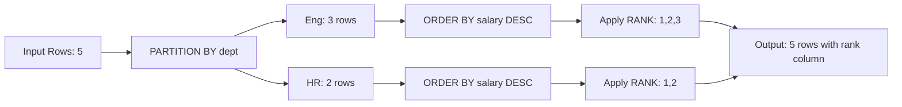
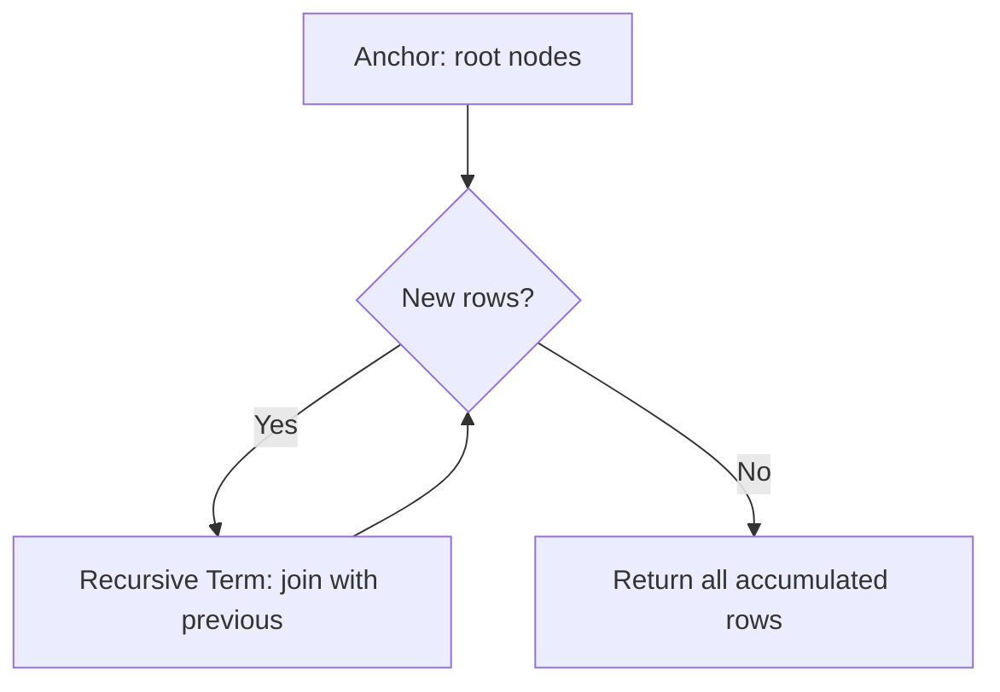
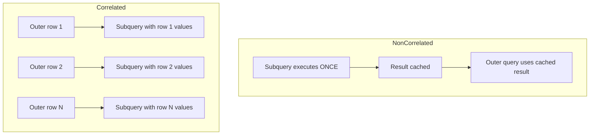
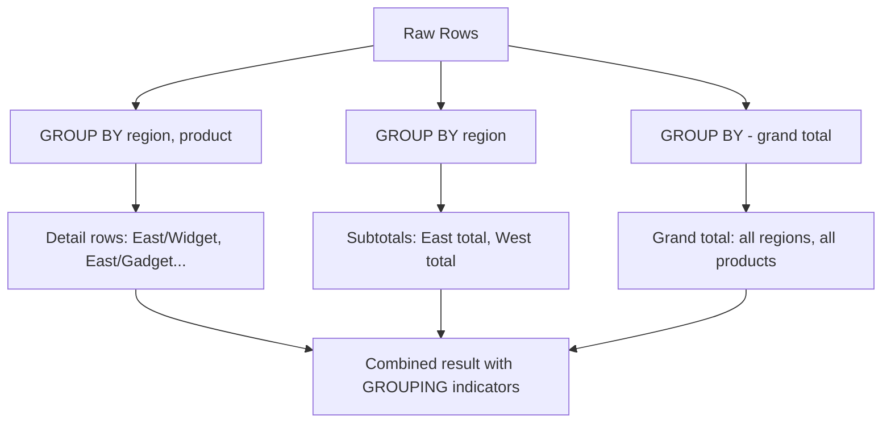
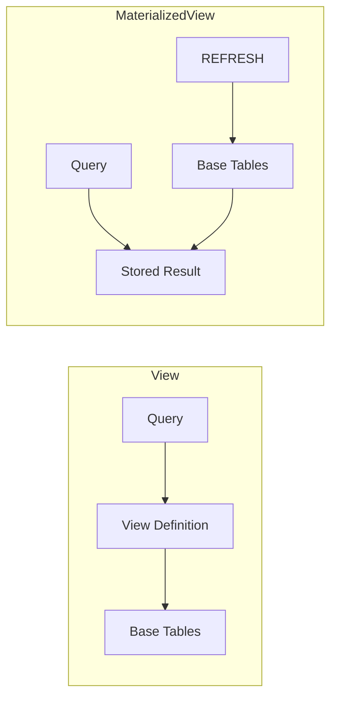

## Keywords in This File

{: .no_toc }

| #   | Keyword                                      | Weight |
| --- | -------------------------------------------- | ------ |
| 1   | [Window Functions](#window-functions)         | medium |
| 2   | [Common Table Expressions and Recursive CTEs](#common-table-expressions-and-recursive-ctes) | medium |
| 3   | [Subqueries and Correlated Queries](#subqueries-and-correlated-queries) | medium |
| 4   | [Aggregations and GROUP BY Advanced](#aggregations-and-group-by-advanced) | medium |
| 5   | [Views and Materialized Views](#views-and-materialized-views) | medium |

---

# Window Functions

**Interview Weight:** high - Window functions separate intermediate
SQL developers from juniors. They enable analytics (ranking, running
totals, moving averages) without self-joins or subqueries.

---

### 🎯 Model Answer

**30 seconds:**

> Window functions perform calculations across a SET of rows related
> to the current row without collapsing them into groups. Unlike
> GROUP BY (which produces one output row per group), window
> functions produce one output row PER INPUT ROW with the computed
> value added. Syntax: `function() OVER (PARTITION BY ... ORDER BY
> ...)`. Common uses: ROW_NUMBER (ranking), RANK/DENSE_RANK
> (ranking with ties), LAG/LEAD (access adjacent rows), SUM/AVG
> OVER (running totals/averages).

**3 minutes (Senior):**

> Window functions are evaluated AFTER WHERE, GROUP BY, and HAVING
> but BEFORE ORDER BY and LIMIT. This means: you cannot use window
> function results in WHERE (use a CTE or subquery to filter on
> window results). The execution order:
>
> FROM -> WHERE -> GROUP BY -> HAVING -> SELECT (window functions
> here) -> ORDER BY -> LIMIT
>
> Key concepts:
> - PARTITION BY: divides rows into groups (like GROUP BY) but keeps
>   all rows in the output. Each partition is an independent window.
> - ORDER BY within OVER: defines the order of rows within each
>   partition for ranking or accumulation.
> - FRAME clause: defines the subset of the partition to consider
>   for aggregate window functions. Default: RANGE BETWEEN
>   UNBOUNDED PRECEDING AND CURRENT ROW. Options include ROWS
>   BETWEEN (exact row count) and RANGE BETWEEN (value ranges).
>
> Performance implications:
> - Window functions require SORTING (by partition + order columns)
> - Multiple window functions with the SAME PARTITION BY + ORDER BY
>   share one sort pass (efficient)
> - Different PARTITION BY clauses require multiple sort passes
> - For large datasets: ensure indexes support the sort order to
>   avoid in-memory sorting
>
> Common production patterns:
> - Deduplication: ROW_NUMBER() to pick one row per group
> - Gap-and-island detection: difference between ROW_NUMBER and a
>   value to identify consecutive sequences
> - Running totals: SUM() OVER (ORDER BY date) for financial reports
> - Period-over-period: LAG(value, 1) to compare current vs previous

**Blank Mind Recovery:**

**(1) Restate:** "You are asking about window functions - SQL
functions that compute across sets of rows without collapsing
them."

**(2) First principles:** "A window function adds a computed column
to every row based on a 'window' of related rows. PARTITION BY
defines groups, ORDER BY defines sequence within groups."

**(3) Bridge:** "Like looking at a spreadsheet: you see every row,
but each cell in the 'rank' column was computed by looking at the
entire column of values. The rows are not collapsed - you just added
a computed column."

---

### 📘 Concept Explanation

**What it is:**

A window function computes a value for each row by examining a set
(window) of related rows. The result is added as a new column to
each row without reducing the number of rows in the output.

**The problem it solves:**

Without window functions, computing rankings, running totals, or
row-to-row comparisons requires self-joins or correlated subqueries
- which are verbose, error-prone, and slow. A simple "rank products
by revenue within each category" would need a correlated subquery
counting how many products have higher revenue.

**How it works:**

```
WINDOW FUNCTION EVALUATION:

Input rows:
  dept | emp   | salary
  -----+-------+--------
  Eng  | Alice | 100000
  Eng  | Bob   | 90000
  Eng  | Carol | 110000
  HR   | Dave  | 80000
  HR   | Eve   | 85000

RANK() OVER (PARTITION BY dept ORDER BY salary DESC):

  Step 1: Partition by dept
    [Eng: Alice, Bob, Carol]  [HR: Dave, Eve]

  Step 2: Order within partition (salary DESC)
    [Eng: Carol(110k), Alice(100k), Bob(90k)]
    [HR: Eve(85k), Dave(80k)]

  Step 3: Apply RANK
    Eng | Carol | 110000 | rank=1
    Eng | Alice | 100000 | rank=2
    Eng | Bob   |  90000 | rank=3
    HR  | Eve   |  85000 | rank=1
    HR  | Dave  |  80000 | rank=2

All 5 rows preserved (not collapsed).
```



> **Diagram walkthrough:** Window functions work in three stages:
> partition (divide into groups), order (sort within groups), then
> apply the function. Unlike GROUP BY, all original rows appear in
> the output - the window function result is simply added as a new
> column.

**The key insight:**

Window functions separate WHAT you compute (the function) from
WHICH ROWS participate (the window). The same query can compute
multiple different windows: a rank within department, a company-wide
percentile, and a running total - all in one SELECT without
self-joins.

---

### 💻 Code Example

```sql
-- BAD: Self-join for ranking (slow, verbose)
SELECT e.dept, e.emp, e.salary,
  (SELECT COUNT(*) + 1 FROM employees e2
   WHERE e2.dept = e.dept
     AND e2.salary > e.salary) AS rank
FROM employees e;
-- O(N^2) - correlated subquery runs per row

-- GOOD: Window function (single pass)
SELECT dept, emp, salary,
    RANK() OVER (
        PARTITION BY dept
        ORDER BY salary DESC
    ) AS salary_rank
FROM employees;
-- O(N log N) - sort per partition, one pass
```

> **Code walkthrough:** The correlated subquery approach runs a
> COUNT query for every row (O(N^2)). The window function sorts
> each partition once (O(N log N)) and computes the rank in a
> single pass. For 1M rows: subquery takes minutes, window function
> takes seconds.

```sql
-- Production: deduplication (keep latest per customer)
WITH ranked AS (
    SELECT *,
        ROW_NUMBER() OVER (
            PARTITION BY customer_id
            ORDER BY updated_at DESC
        ) AS rn
    FROM customer_events
)
SELECT * FROM ranked WHERE rn = 1;
-- Each customer: only most recent event kept

-- Production: running total (financial reports)
SELECT
    transaction_date,
    amount,
    SUM(amount) OVER (
        ORDER BY transaction_date
        ROWS BETWEEN UNBOUNDED PRECEDING AND CURRENT ROW
    ) AS running_total,
    AVG(amount) OVER (
        ORDER BY transaction_date
        ROWS BETWEEN 6 PRECEDING AND CURRENT ROW
    ) AS seven_day_avg
FROM daily_revenue;
```

> **Code walkthrough:** Deduplication with ROW_NUMBER is the most
> common production pattern - picks one row per group without a
> self-join. Running totals use the frame clause to accumulate. The
> 7-day moving average uses ROWS BETWEEN 6 PRECEDING AND CURRENT
> ROW (7 rows total including current). Frame clause defaults matter:
> RANGE vs ROWS behaves differently with ties.

```sql
-- Failure: window function in WHERE (does not work)
-- BAD:
SELECT *, RANK() OVER (ORDER BY score DESC) AS r
FROM students
WHERE r <= 10;  -- ERROR: cannot reference window in WHERE

-- GOOD: wrap in CTE or subquery
WITH ranked AS (
    SELECT *, RANK() OVER (ORDER BY score DESC) AS r
    FROM students
)
SELECT * FROM ranked WHERE r <= 10;
```

> **Code walkthrough:** Window functions are evaluated AFTER WHERE
> in SQL's logical execution order. You cannot filter on window
> results directly. The CTE (or derived table) materializes the
> window result, then the outer query filters. This is the #1
> window function mistake in interviews.

---

### ⚖️ Comparison Table

| Function | What It Does | Ties Behavior | Use When |
|---|---|---|---|
| ROW_NUMBER() | Assigns 1,2,3... per partition | No ties (arbitrary order) | Deduplication, pagination |
| RANK() | Assigns rank, skips on ties | 1,1,3 (skip) | Competition ranking |
| DENSE_RANK() | Assigns rank, no skip on ties | 1,1,2 (no skip) | Top-N with ties |
| NTILE(n) | Divides into n equal buckets | Distributes remainder | Percentile buckets |
| LAG(col, n) | Value from n rows before | N/A | Period comparison |
| LEAD(col, n) | Value from n rows after | N/A | Next-event analysis |
| FIRST_VALUE() | First value in window | N/A | Group reference point |
| SUM/AVG OVER | Running aggregate | N/A | Running totals, averages |

**Decision framework:** ROW_NUMBER for deduplication (always unique).
RANK when ties should share position (competition). DENSE_RANK for
"top 3 distinct scores." LAG/LEAD for row-to-row comparison.

---

### 🎓 Answers by Seniority

**Junior / Mid (0-5 years):**

> Window functions compute a value across a set of related rows
> without collapsing them. PARTITION BY groups rows, ORDER BY sorts
> within groups. Common functions: ROW_NUMBER for unique ordering,
> RANK for competition ranking, SUM OVER for running totals, LAG
> for accessing previous rows. Cannot use window results in WHERE -
> wrap in a CTE.

*Push deeper:* "Frame clause matters: ROWS BETWEEN gives exact row
counts, RANGE BETWEEN gives value ranges. Default frame includes
everything up to current row."

---

**Senior / Staff (5+ years):**

> Window function performance: each distinct PARTITION BY + ORDER BY
> combination requires a sort pass. Strategy: design queries so
> multiple window functions share the same OVER clause. For large
> tables: indexes on (partition_col, order_col) enable sorted input
> (avoid in-memory sort).
>
> Advanced patterns: gap-and-island detection (difference between
> ROW_NUMBER and value reveals consecutive groups), session analysis
> (LAG to detect session boundaries by time gap), percentile
> calculation (PERCENT_RANK/CUME_DIST for distribution analysis).

*Push deeper:* "At scale, window functions over unbounded partitions
(millions of rows per partition) spill to disk. Control with: frame
clause to limit scope, or pre-aggregate then window over the
pre-aggregated result."

---

### ⚠️ Common Misconceptions

**"Window functions are just GROUP BY with extra features."**

GROUP BY collapses rows (100 rows -> 10 groups = 10 output rows).
Window functions keep ALL rows (100 rows -> 100 rows with new
columns). They solve fundamentally different problems: GROUP BY for
summarization, window for per-row analytics.

**"ROW_NUMBER and RANK are the same."**

With ties (equal values): ROW_NUMBER assigns arbitrary unique numbers
(1,2,3,4). RANK assigns equal ranks then skips (1,1,3,4). DENSE_RANK
assigns equal ranks without skipping (1,1,2,3). The choice changes
results dramatically for "top N" queries.

**"Window functions are slow because they scan all rows."**

Window functions with proper indexes can use sorted input (no
additional sort). The computation itself is O(N) per partition (one
pass). The bottleneck is sorting - which indexes eliminate. Without
indexes: O(N log N) for the sort.

**"OVER () and OVER (PARTITION BY ...) are interchangeable."**

OVER () defines the window as ALL rows in the result set (single
partition). OVER (PARTITION BY dept) defines separate windows per
department. SUM(salary) OVER () gives total company salary in every
row. SUM(salary) OVER (PARTITION BY dept) gives department salary
in each row. Very different results.

**"Frame clause does not matter for ranking functions."**

True for ROW_NUMBER/RANK/DENSE_RANK (they ignore frame). But for
aggregates (SUM, AVG, COUNT), the frame clause determines which
rows are included. Default frame with ORDER BY is RANGE BETWEEN
UNBOUNDED PRECEDING AND CURRENT ROW (running total from start to
current row). Without ORDER BY: the frame is the entire partition.

---

### 🚨 Failure Modes and Diagnosis

| Failure | Symptom | Diagnosis |
|---|---|---|
| Missing ORDER BY in OVER | Non-deterministic ranking (different results each run) | Add explicit ORDER BY with a tiebreaker (unique column) |
| Huge partition spill | Query uses all memory, then disk (slow) | Check partition sizes; add frame clause to limit scope |
| Window in WHERE | SQL error "window functions not allowed in WHERE" | Wrap in CTE, filter in outer query |
| Wrong frame default | Running total includes future rows unexpectedly | Explicitly specify ROWS BETWEEN UNBOUNDED PRECEDING AND CURRENT ROW |
| Non-deterministic ROW_NUMBER | Same data returns different rankings on re-runs | Add unique tiebreaker column to ORDER BY (e.g., id) |

---

### 🎯 Interview Deep-Dive

| Experience | Time | Depth |
|---|---|---|
| Junior | 3 min | Basic syntax, PARTITION BY vs GROUP BY |
| Mid | 5 min | Frame clause, multiple windows, CTE wrapping |
| Senior | 8 min | Performance, gap-and-island, optimization |
| Staff | 12 min | Scale strategies, index design for windows |

---

**[JUNIOR] Q1 - What is the difference between GROUP BY and window
functions?**

*Why they ask:* Fundamental distinction.

*Likely follow-up:* "Give an example where you need both."

GROUP BY collapses rows into groups and produces ONE output row per
group. Window functions produce ONE output row PER INPUT ROW with
the computed value added as a new column.

Example: 100 employees in 10 departments.
- GROUP BY dept: 10 rows (one per department with aggregates)
- Window function PARTITION BY dept: 100 rows (each employee with
  department aggregate added)

Use GROUP BY when you want summaries (total salary per dept). Use
window functions when you want per-row analytics alongside the
original data (each employee's salary AND their department's total).

You can combine both: GROUP BY to summarize daily revenue, then
window function over the grouped result to compute running total of
daily revenues.

*What separates good from great:* The concrete row-count difference
(100 -> 10 vs 100 -> 100) and the combined GROUP BY + window
pattern.

---

**[JUNIOR] Q2 - Explain ROW_NUMBER, RANK, and DENSE_RANK with
an example.**

*Why they ask:* Most common ranking functions.

*Likely follow-up:* "Which would you use for deduplication?"

Given scores: [95, 90, 90, 85]:
- ROW_NUMBER: 1, 2, 3, 4 (arbitrary order for ties)
- RANK: 1, 2, 2, 4 (ties get same rank, next rank skipped)
- DENSE_RANK: 1, 2, 2, 3 (ties get same rank, no skip)

Use cases:
- ROW_NUMBER: deduplication (pick exactly one row per group).
  Works because it always produces unique numbers.
- RANK: competition ranking ("2nd place" is meaningful even with
  ties in 1st). "Show top 3" might return 4+ rows if ties exist.
- DENSE_RANK: "show top 3 distinct scores" - always exactly 3
  distinct rank values.

For deduplication: always ROW_NUMBER (guaranteed unique). RANK/
DENSE_RANK can produce duplicates (multiple rows with rank=1 if
tied), which defeats deduplication.

*What separates good from great:* Knowing ROW_NUMBER is for
deduplication (guaranteed unique) while RANK can produce duplicate
ranks (useless for dedup).

---

**[MID] Q3 - Explain the frame clause and when it matters.**

*Why they ask:* Advanced window semantics.

*Likely follow-up:* "What is the default frame?"

The frame clause defines WHICH ROWS within the partition are
included in the aggregate calculation for the current row:

```sql
SUM(amount) OVER (
    ORDER BY date
    ROWS BETWEEN 2 PRECEDING AND CURRENT ROW
)
```

Types:
- ROWS BETWEEN: counts exact rows (regardless of values)
- RANGE BETWEEN: includes all rows with values within a range
- GROUPS BETWEEN (PG 11+): counts distinct groups of values

Default behavior (trap!):
- With ORDER BY: RANGE BETWEEN UNBOUNDED PRECEDING AND CURRENT ROW
  (running total from start to current row, including ties)
- Without ORDER BY: RANGE BETWEEN UNBOUNDED PRECEDING AND
  UNBOUNDED FOLLOWING (entire partition)

Common patterns:
- Moving average: ROWS BETWEEN 6 PRECEDING AND CURRENT ROW (7 days)
- Running total: ROWS BETWEEN UNBOUNDED PRECEDING AND CURRENT ROW
- Centered average: ROWS BETWEEN 3 PRECEDING AND 3 FOLLOWING

*What separates good from great:* The default frame trap (RANGE vs
ROWS with ties produce different results) and the practical
difference between ROWS and RANGE.

---

**[MID] Q4 - How would you find gaps in a sequence using window
functions?**

*Why they ask:* Classic analytics problem.

*Likely follow-up:* "What about islands (consecutive groups)?"

Gap detection: compare each value with the next using LEAD:

```sql
SELECT value,
    LEAD(value) OVER (ORDER BY value) AS next_value,
    LEAD(value) OVER (ORDER BY value) - value AS gap
FROM sequence_table
HAVING gap > 1;  -- gaps where next value is not consecutive
```

For gap-and-island (finding consecutive sequences):

```sql
WITH numbered AS (
    SELECT value,
        value - ROW_NUMBER() OVER (ORDER BY value)
            AS grp
    FROM sequence_table
)
SELECT MIN(value) AS island_start,
       MAX(value) AS island_end,
       COUNT(*) AS island_length
FROM numbered
GROUP BY grp;
```

The trick: for consecutive values, value - ROW_NUMBER is constant.
Values [1,2,3,7,8,9]: ROW_NUMBER [1,2,3,4,5,6].
Difference [0,0,0,3,3,3]. Two islands identified by the constant
difference.

*What separates good from great:* The mathematical insight behind
gap-and-island (consecutive values minus sequential numbers produce
a constant grouping key).

---

**[MID] Q5 - Write a query to find the top 3 products by revenue
in each category.**

*Why they ask:* Practical window function usage.

*Likely follow-up:* "What if there are ties?"

```sql
WITH ranked AS (
    SELECT
        category,
        product_name,
        revenue,
        DENSE_RANK() OVER (
            PARTITION BY category
            ORDER BY revenue DESC
        ) AS rnk
    FROM products
)
SELECT category, product_name, revenue
FROM ranked
WHERE rnk <= 3;
```

Why DENSE_RANK: "top 3" means top 3 distinct revenue values. If
two products tie for #1, both should appear. DENSE_RANK ensures
the next distinct value is #2 (not #3).

If "exactly 3 rows per category" is needed: use ROW_NUMBER (but
adds a tiebreaker - which tied product is chosen is arbitrary unless
you add ORDER BY revenue DESC, product_name to make it deterministic).

*What separates good from great:* Knowing when to use DENSE_RANK
(include all ties) vs ROW_NUMBER (exactly N rows, deterministic
tiebreaker needed).

---

**[SENIOR] Q6 - How do you optimize window function performance
on large tables?**

*Why they ask:* Production scale.

*Likely follow-up:* "What about when you have multiple different
OVER clauses?"

Performance strategy:

1. INDEXES FOR SORTED INPUT: if the window is OVER (PARTITION BY
   dept ORDER BY salary DESC), an index on (dept, salary DESC)
   provides sorted input - no in-memory sort needed. This transforms
   O(N log N) into O(N).

2. SHARED WINDOW DEFINITIONS: multiple window functions with the
   SAME OVER clause share one sort pass. Rewrite to use WINDOW
   clause:
   ```sql
   SELECT ...,
       RANK() OVER w,
       SUM(salary) OVER w
   FROM employees
   WINDOW w AS (PARTITION BY dept ORDER BY salary DESC);
   ```

3. LIMIT PARTITION SIZE: if one partition has 10M rows, the sort
   spills to disk. Solutions: pre-filter (WHERE), use frame clause
   to limit scope, or pre-aggregate.

4. MATERIALIZED COMPUTATION: for dashboards reusing the same window
   computation, materialize in a materialized view (refresh on
   schedule).

5. PARALLEL QUERY: PostgreSQL can parallelize window functions when
   partitions are independent (each worker handles different
   partitions). Ensure max_parallel_workers_per_gather > 1.

*What separates good from great:* The index strategy (supporting
sorted input eliminates the sort) and the WINDOW clause for sharing
sort passes across multiple window functions.

---

**[SENIOR] Q7 - How do you detect session boundaries using window
functions?**

*Why they ask:* Real-world analytics.

*Likely follow-up:* "How do you handle edge cases?"

Session detection: group events by time gaps (if gap between events
exceeds threshold, start a new session).

```sql
WITH time_gaps AS (
    SELECT *,
        EXTRACT(EPOCH FROM (
            event_time - LAG(event_time) OVER (
                PARTITION BY user_id
                ORDER BY event_time
            )
        )) AS gap_seconds
    FROM user_events
),
session_starts AS (
    SELECT *,
        CASE
            WHEN gap_seconds > 1800  -- 30 min threshold
                 OR gap_seconds IS NULL  -- first event
            THEN 1
            ELSE 0
        END AS is_new_session
    FROM time_gaps
),
session_ids AS (
    SELECT *,
        SUM(is_new_session) OVER (
            PARTITION BY user_id
            ORDER BY event_time
        ) AS session_id
    FROM session_starts
)
SELECT user_id, session_id,
    MIN(event_time) AS session_start,
    MAX(event_time) AS session_end,
    COUNT(*) AS events
FROM session_ids
GROUP BY user_id, session_id;
```

Pattern: LAG to find gaps -> flag session boundaries -> running SUM
of flags creates session IDs -> GROUP BY session_id for session
metrics. Three window functions chained through CTEs.

*What separates good from great:* The running-SUM-of-flags technique
(converts binary flags into incrementing group IDs) and handling
the NULL case (first event has no LAG).

---

**[SENIOR] Q8 - What happens when you use window functions with
DISTINCT or LIMIT?**

*Why they ask:* Subtle interaction traps.

*Likely follow-up:* "How does the SQL execution order affect this?"

SQL logical execution order:
FROM -> WHERE -> GROUP BY -> HAVING -> SELECT (windows) -> DISTINCT
-> ORDER BY -> LIMIT

DISTINCT + window: window is computed BEFORE DISTINCT. If window
creates different values for otherwise-duplicate rows, DISTINCT does
not collapse them:
```sql
SELECT DISTINCT dept, ROW_NUMBER() OVER () AS rn
FROM employees;
-- Every row is unique (rn differs) - DISTINCT has no effect!
```

LIMIT + window: window is computed over ALL qualifying rows, then
LIMIT truncates the output. The window sees the full dataset, not
just the limited result:
```sql
SELECT *, RANK() OVER (ORDER BY score DESC) AS r
FROM students
LIMIT 3;
-- RANK is computed over ALL students, then top 3 rows returned
-- Correct: shows ranks 1,2,3 (not 1,1,1)
```

But combining LIMIT with window can cause non-deterministic results
if ORDER BY in LIMIT differs from ORDER BY in OVER.

*What separates good from great:* The execution order explanation
(SELECT windows before DISTINCT) and the DISTINCT-is-useless trap
when windows produce unique values per row.

---

**[STAFF] Q9 - Design an analytics query layer for a dashboard
showing "top 10 products per category with month-over-month growth,
running 12-month average, and percentile rank."**

*Why they ask:* Complex multi-window architecture.

*Likely follow-up:* "How would you cache this?"

```sql
WITH monthly_revenue AS (
    SELECT
        category_id,
        product_id,
        DATE_TRUNC('month', order_date) AS month,
        SUM(revenue) AS monthly_rev
    FROM order_items
    WHERE order_date >= NOW() - INTERVAL '13 months'
    GROUP BY 1, 2, 3
),
analytics AS (
    SELECT *,
        -- Month-over-month growth
        LAG(monthly_rev) OVER w_prod AS prev_month_rev,
        (monthly_rev - LAG(monthly_rev) OVER w_prod)
            / NULLIF(LAG(monthly_rev) OVER w_prod, 0)
            * 100 AS mom_growth_pct,
        -- 12-month rolling average
        AVG(monthly_rev) OVER (
            PARTITION BY category_id, product_id
            ORDER BY month
            ROWS BETWEEN 11 PRECEDING AND CURRENT ROW
        ) AS rolling_12m_avg,
        -- Percentile within category (this month)
        PERCENT_RANK() OVER (
            PARTITION BY category_id, month
            ORDER BY monthly_rev
        ) AS category_percentile,
        -- Rank for top-10 filtering
        DENSE_RANK() OVER (
            PARTITION BY category_id, month
            ORDER BY monthly_rev DESC
        ) AS category_rank
    FROM monthly_revenue
    WINDOW w_prod AS (
        PARTITION BY category_id, product_id
        ORDER BY month
    )
)
SELECT * FROM analytics
WHERE month = DATE_TRUNC('month', NOW())
  AND category_rank <= 10;
```

Strategy: pre-aggregate to monthly level (reduces row count 100x),
compute all analytics in one query with shared WINDOW clause, filter
last. For caching: materialize monthly_revenue as a materialized
view (refresh hourly), put analytics computation in an application-
level cache (Redis) refreshed every 5 minutes.

*What separates good from great:* Shared WINDOW clause (one sort
for LAG and MOM growth), pre-aggregation to reduce dataset, and
the caching strategy (materialized view + application cache).

---

---

# Common Table Expressions and Recursive CTEs

**Interview Weight:** high - CTEs make complex queries readable and
enable recursion for hierarchical data. Interviewers test
readability decisions and recursive query mechanics.

---

### 🎯 Model Answer

**30 seconds:**

> A CTE (WITH clause) defines a temporary named result set that
> exists only for the duration of the query. It makes complex queries
> readable by breaking them into named steps. A RECURSIVE CTE calls
> itself to traverse hierarchical data (org charts, bill of materials,
> tree structures) without knowing the depth in advance. CTEs are
> NOT materialized by default in PostgreSQL 12+ (the optimizer may
> inline them like subqueries). Force materialization with
> `AS MATERIALIZED`.

**3 minutes (Senior):**

> CTE mechanics:
>
> NON-RECURSIVE CTE: syntactic sugar for readability. In PostgreSQL
> 12+, the optimizer can inline CTEs (treat them as subqueries and
> push predicates through). Before PG 12: CTEs were always
> materialized (optimization barrier). MySQL 8.0+ inlines by
> default.
>
> RECURSIVE CTE: two parts - anchor (base case) and recursive term
> (joined via UNION ALL). Execution: compute anchor rows, then
> repeatedly execute recursive term using previous iteration's output
> until no new rows are produced.
>
> ```sql
> WITH RECURSIVE tree AS (
>     SELECT id, parent_id, name, 1 AS depth  -- anchor
>     FROM categories WHERE parent_id IS NULL
>     UNION ALL
>     SELECT c.id, c.parent_id, c.name, t.depth + 1
>     FROM categories c
>     JOIN tree t ON c.parent_id = t.id        -- recursive
> )
> SELECT * FROM tree;
> ```
>
> Safeguards:
> - Set max recursion depth: `WHERE depth < 100` (prevent infinite)
> - PostgreSQL: no built-in recursion limit (hangs on cycles)
> - MySQL: `SET cte_max_recursion_depth = 100` (default 1000)
> - SQL Server: OPTION (MAXRECURSION 100)
>
> Performance considerations:
> - Non-recursive CTEs: zero overhead in PG 12+ (inlined)
> - Recursive CTEs: O(N) per level of depth. For 10 levels with
>   1000 nodes per level: 10 iterations each scanning previous
>   results.
> - Deep hierarchies (100+ levels): consider materialized path or
>   nested sets instead of recursive CTE at query time

**Blank Mind Recovery:**

**(1) Restate:** "You are asking about CTEs - the WITH clause for
named subqueries, and recursive CTEs for hierarchical traversal."

**(2) First principles:** "A CTE names a result set for reuse
within a query. Recursive CTEs self-reference to walk tree
structures level by level until no new rows are produced."

**(3) Bridge:** "A CTE is a paragraph label in an essay - it lets
you refer back by name. A recursive CTE is following a family tree:
start with the root ancestor, then find their children, then
grandchildren, until no more descendants exist."

---

### 📘 Concept Explanation

**What it is:**

A Common Table Expression is a named temporary result set defined
using WITH that exists only within the scope of a single SQL
statement. Recursive CTEs extend this by allowing the named result
to reference itself.

**The problem it solves:**

Complex queries with multiple stages (filter -> transform -> rank
-> filter again) become unreadable as nested subqueries. CTEs
provide named, sequential steps. For hierarchical data (org charts,
categories, threads), recursive CTEs eliminate the need for
fixed-depth joins or application-level recursion.

**How it works:**

```
NON-RECURSIVE CTE EXECUTION:

  WITH step1 AS (SELECT ... FROM raw_data)
       step2 AS (SELECT ... FROM step1)
  SELECT ... FROM step2;

  Execution (PG 12+, non-materialized):
  1. Optimizer inlines step1/step2 as subqueries
  2. Pushes predicates from outer query into CTEs
  3. Executes as one unified plan
  = No materialization overhead

  Execution (PG < 12, or AS MATERIALIZED):
  1. Compute step1 -> temp result
  2. Compute step2 from temp result -> temp result
  3. Final SELECT from step2 temp result
  = Optimization barrier (no predicate push)
```

```
RECURSIVE CTE EXECUTION:

  WITH RECURSIVE r AS (
      SELECT ... WHERE root    -- anchor
      UNION ALL
      SELECT ... JOIN r ON ... -- recursive term
  )

  Iteration 0: anchor rows = {root nodes}
  Iteration 1: join recursive term with iter-0 result
  Iteration 2: join recursive term with iter-1 result
  ...
  Iteration N: no new rows produced -> STOP
  Final: UNION ALL of all iteration results
```



> **Diagram walkthrough:** Recursive CTE execution is iterative
> (not truly recursive). Each iteration produces new rows by joining
> the recursive term with the previous iteration's output. When an
> iteration produces zero new rows, the loop terminates. The final
> result is the union of all iterations' outputs.

---

### 💻 Code Example

```sql
-- BAD: Deeply nested subqueries (unreadable)
SELECT * FROM (
    SELECT *, RANK() OVER (PARTITION BY dept
        ORDER BY salary DESC) AS r
    FROM (
        SELECT e.*, d.name AS dept
        FROM employees e
        JOIN departments d ON e.dept_id = d.id
        WHERE d.active = true
    ) AS active_employees
) AS ranked
WHERE r <= 5;

-- GOOD: CTEs (clear, named steps)
WITH active_employees AS (
    SELECT e.*, d.name AS dept
    FROM employees e
    JOIN departments d ON e.dept_id = d.id
    WHERE d.active = true
),
ranked AS (
    SELECT *,
        RANK() OVER (
            PARTITION BY dept ORDER BY salary DESC
        ) AS r
    FROM active_employees
)
SELECT * FROM ranked WHERE r <= 5;
```

> **Code walkthrough:** Both queries produce identical results and
> identical execution plans (PG 12+ inlines CTEs). The CTE version
> is readable: each step has a name describing its purpose. For
> debugging: test each CTE independently by replacing the final
> SELECT with `SELECT * FROM active_employees`.

```sql
-- Recursive CTE: org chart traversal
WITH RECURSIVE org_tree AS (
    -- Anchor: CEO (no manager)
    SELECT id, name, manager_id, 1 AS depth,
        name::TEXT AS path
    FROM employees
    WHERE manager_id IS NULL

    UNION ALL

    -- Recursive: direct reports of previous level
    SELECT e.id, e.name, e.manager_id,
        t.depth + 1,
        t.path || ' > ' || e.name
    FROM employees e
    JOIN org_tree t ON e.manager_id = t.id
    WHERE t.depth < 20  -- safety: prevent infinite
)
SELECT depth, path, name
FROM org_tree
ORDER BY path;
```

> **Code walkthrough:** Anchor selects the CEO (manager_id IS NULL).
> Each recursive iteration finds employees whose manager_id matches
> the previous level's id. The depth counter prevents infinite loops
> (cycles in data). The path column builds a human-readable trail
> showing the reporting chain.

```sql
-- Failure: infinite recursion (cycles in data)
-- BAD: No depth limit with cyclic data
WITH RECURSIVE inf AS (
    SELECT id, parent_id FROM nodes WHERE id = 1
    UNION ALL
    SELECT n.id, n.parent_id
    FROM nodes n
    JOIN inf i ON n.parent_id = i.id
    -- If node 5 -> node 3 -> node 5 (cycle): INFINITE
)
SELECT * FROM inf;  -- hangs forever in PostgreSQL!

-- GOOD: Cycle detection
WITH RECURSIVE safe AS (
    SELECT id, parent_id, ARRAY[id] AS visited,
        false AS is_cycle
    FROM nodes WHERE id = 1
    UNION ALL
    SELECT n.id, n.parent_id,
        s.visited || n.id,
        n.id = ANY(s.visited)  -- cycle detection
    FROM nodes n
    JOIN safe s ON n.parent_id = s.id
    WHERE NOT s.is_cycle  -- stop on cycle
)
SELECT * FROM safe WHERE NOT is_cycle;
```

> **Code walkthrough:** Cyclic data causes recursive CTEs to loop
> forever in PostgreSQL (no built-in cycle protection). The fix:
> track visited nodes in an array, detect when a node appears twice,
> and stop recursion on that branch. PostgreSQL 14+ added CYCLE
> clause for cleaner syntax: `CYCLE id SET is_cycle USING path`.

---

### ⚖️ Comparison Table

| Aspect | CTE | Subquery | Temp Table | View |
|---|---|---|---|---|
| Scope | Single statement | Single reference | Session | Permanent |
| Materialization (PG12+) | Inlined (default) | Inlined | Always materialized | Virtual (not stored) |
| Reusable in query | Yes (named) | No (must repeat) | Yes | Yes (from any query) |
| Supports recursion | Yes | No | No | No (except recursive view) |
| Best for | Readability, hierarchy | Simple one-time use | Large intermediate results | Reusable logic |

**Decision framework:** Use CTEs for readability and recursion.
Use subqueries for simple single-use derivations. Use temp tables
when the intermediate result is large and referenced multiple times
(forces materialization). Use views for reusable logic across queries.

---

### 🎓 Answers by Seniority

**Junior / Mid (0-5 years):**

> CTEs are named temporary result sets (WITH clause) that make
> complex queries readable. Each CTE is a named step I can reference
> later. Recursive CTEs traverse hierarchies by self-referencing
> with UNION ALL. I always add a depth limit to prevent infinite
> recursion.

*Push deeper:* "In PostgreSQL 12+, non-recursive CTEs are inlined
by default (zero overhead). Before 12: they were optimization
barriers (prevented predicate pushdown)."

---

**Senior / Staff (5+ years):**

> CTE optimization awareness: I choose between inlined CTEs (default
> PG 12+) and materialized CTEs (AS MATERIALIZED) based on whether
> the CTE result is referenced multiple times. If referenced once:
> inline is better (optimizer pushes predicates). If referenced 3+
> times: MATERIALIZED avoids recomputation.
>
> For recursive CTEs at scale: I avoid deep recursion in queries (>
> 10 levels is a smell). Instead: store materialized paths
> (ltree in PostgreSQL) or use nested sets for read-heavy hierarchy
> queries. Recursive CTEs at query time are fine for shallow
> hierarchies (< 10 levels, < 10K nodes).

*Push deeper:* "The SEARCH and CYCLE clauses (PG 14+) provide
built-in breadth-first/depth-first traversal control and cycle
detection without manual array tracking."

---

### ⚠️ Common Misconceptions

**"CTEs are always materialized (like temp tables)."**

In PostgreSQL 12+, non-recursive CTEs are inlined by default (the
optimizer treats them as subqueries and can push predicates through).
Only recursive CTEs and CTEs with side effects (INSERT/UPDATE) are
automatically materialized. Force materialization with
`AS MATERIALIZED` when the CTE is referenced multiple times and
you want to avoid recomputation.

**"Recursive CTEs are efficient for deep hierarchies."**

Recursive CTEs iterate level by level. For a tree with depth 100
and 1000 nodes per level: 100 iterations, each scanning the
previous level's results. For deep or wide trees queried frequently:
use materialized paths (ltree), nested sets (lft/rgt), or closure
tables. Recursive CTEs are best for infrequent queries or shallow
trees.

**"CTEs improve performance."**

CTEs improve READABILITY, not performance. In PG 12+, they compile
to the same plan as equivalent subqueries. Before PG 12: CTEs
could HURT performance by preventing predicate pushdown. Choose
CTEs for clarity, not speed.

**"UNION in recursive CTE removes duplicates automatically."**

UNION ALL in recursive CTEs keeps all rows (including duplicates).
Using UNION (without ALL) does deduplicate but cannot prevent
infinite cycles (a cycle can produce the same row values in different
iterations). Cycle prevention requires explicit tracking (visited
array or CYCLE clause).

---

### 🚨 Failure Modes and Diagnosis

| Failure | Symptom | Diagnosis |
|---|---|---|
| Infinite recursion (cycle) | Query hangs, CPU at 100%, eventual OOM | Add CYCLE clause or depth limit; check for cycles in data |
| CTE optimization barrier (PG < 12) | Query slow despite selective outer WHERE | Upgrade to PG 12+ or rewrite CTE as subquery |
| Materialized when not needed | Large temp result created unnecessarily | Use `AS NOT MATERIALIZED` (PG 12+) to force inline |
| Deep recursion stack overflow | Error at max recursion depth (MySQL/SQL Server) | Increase limit or redesign with materialized path |
| Multiple materializations | CTE referenced 5 times, computed 5 times (inlined) | Use `AS MATERIALIZED` to compute once |

---

### 🎯 Interview Deep-Dive

| Experience | Time | Depth |
|---|---|---|
| Junior | 3 min | Basic WITH clause, readability benefit |
| Mid | 5 min | Recursive CTEs, cycle prevention |
| Senior | 8 min | Materialization control, performance |
| Staff | 12 min | Hierarchy alternatives, scale decisions |

---

**[JUNIOR] Q1 - What is a CTE and why would you use one?**

*Why they ask:* Basic understanding.

*Likely follow-up:* "Is there a performance benefit?"

A CTE (Common Table Expression) is a named temporary result set
defined with the WITH keyword. It exists only for the single
statement it is defined in.

Why use it: readability. A complex query with 4 nested subqueries
is unreadable. With CTEs, each step has a descriptive name:
```sql
WITH active_users AS (...),
     recent_orders AS (...),
     high_value AS (...)
SELECT ... FROM high_value;
```

Each CTE can be debugged independently (replace final SELECT with
`SELECT * FROM active_users`). No performance benefit in PG 12+
(inlined like subqueries). The benefit is purely human: readable,
maintainable, debuggable queries.

*What separates good from great:* Noting that CTEs are for
readability not performance, and the debugging technique (select
from intermediate CTE to verify logic step by step).

---

**[JUNIOR] Q2 - Write a recursive CTE to traverse a tree.**

*Why they ask:* Practical recursion skill.

*Likely follow-up:* "How do you prevent infinite loops?"

```sql
WITH RECURSIVE tree AS (
    -- Anchor: start from root
    SELECT id, name, parent_id, 0 AS depth
    FROM categories
    WHERE parent_id IS NULL
    UNION ALL
    -- Recursive: find children
    SELECT c.id, c.name, c.parent_id, t.depth + 1
    FROM categories c
    JOIN tree t ON c.parent_id = t.id
    WHERE t.depth < 50  -- prevent infinite loop
)
SELECT * FROM tree ORDER BY depth, name;
```

Structure: anchor (base case, no self-reference) + UNION ALL +
recursive term (references the CTE name). Execution: anchor produces
root nodes, recursive term repeatedly finds the next level's
children, stops when no new rows are produced (or depth limit hit).

Prevention of infinite loops: add `WHERE depth < N` or use
PostgreSQL 14's CYCLE clause. Without protection: cyclic data
(child points to ancestor) causes infinite execution.

*What separates good from great:* Including the depth guard against
cycles, and explaining the iterative execution model (not true
recursion - it is a loop).

---

**[MID] Q3 - Explain CTE materialization in PostgreSQL 12+.**

*Why they ask:* Performance awareness.

*Likely follow-up:* "When would you force materialization?"

Before PG 12: all CTEs were materialized (computed once, stored in
temp buffer). This was an optimization barrier - the outer query's
WHERE could not be pushed into the CTE.

PG 12+: non-recursive CTEs referenced once are inlined (treated as
subqueries). The optimizer can push predicates through, producing
the same plan as a subquery.

Force materialization: `AS MATERIALIZED` - useful when:
- CTE is referenced 3+ times (avoid recomputation)
- CTE result is expensive to compute and outer query would push
  unhelpful predicates into it

Force inline: `AS NOT MATERIALIZED` - useful when:
- CTE is referenced once (default behavior anyway)
- You want predicates pushed in (for selective filtering)

Recursive CTEs: always materialized (each iteration needs the
previous result).

*What separates good from great:* The predicate pushdown implication
(materialized CTEs cannot benefit from outer WHERE conditions) and
the rule of thumb (materialize when referenced 3+ times).

---

**[MID] Q4 - How do you handle hierarchical data without recursive
CTEs?**

*Why they ask:* Architecture alternatives.

*Likely follow-up:* "What are the trade-offs?"

Alternatives for hierarchical data:

1. MATERIALIZED PATH: store the full path as a string column.
   `/root/child/grandchild`. Query: `WHERE path LIKE '/root/%'`.
   Fast reads (LIKE with prefix), slower writes (update all
   descendants on move). PostgreSQL has `ltree` extension.

2. NESTED SETS: store left/right boundaries per node. All
   descendants of node X: `WHERE lft > X.lft AND rgt < X.rgt`.
   Fast reads (range query, single index scan), expensive writes
   (renumber all boundaries on insert).

3. CLOSURE TABLE: separate table storing all ancestor-descendant
   pairs. Query any relationship directly. Moderate read/write
   performance. Extra storage.

4. ADJACENCY LIST (parent_id): simplest storage, requires recursive
   CTE for multi-level queries. Best for shallow, infrequent
   queries.

Decision: read-heavy with rare structural changes -> nested sets or
materialized path. Write-heavy -> adjacency list + recursive CTE
or closure table. Mixed -> closure table.

*What separates good from great:* The read/write trade-off analysis
and the specific recommendation per workload pattern.

---

**[SENIOR] Q5 - How would you optimize a recursive CTE that is
scanning millions of rows?**

*Why they ask:* Production scale.

*Likely follow-up:* "When should you abandon recursive CTEs?"

Optimization strategies:

1. LIMIT RECURSION SCOPE: add WHERE conditions in the recursive
   term to prune branches early. Only traverse needed subtrees.

2. INDEX FOR JOIN: ensure the recursive join column (parent_id)
   is indexed. Each iteration performs a join - without index it
   becomes a nested loop with seq scan per level.

3. PRE-MATERIALIZE SUBTREES: for frequently queried subtrees,
   store the result in a materialized view or a path column.
   Recursive CTE on query time only for ad-hoc exploration.

4. BREADTH-FIRST vs DEPTH-FIRST: PG 14+ SEARCH BREADTH FIRST
   or SEARCH DEPTH FIRST controls traversal order. For "find
   first 10 nodes at level 3": breadth-first with LIMIT is
   efficient (stops after finding 10 at the target level).

5. ABANDONMENT CRITERIA: if hierarchy is > 20 levels deep, has
   > 100K nodes, or is queried > 100 times/second: switch to
   materialized path (ltree) or closure table. Recursive CTEs
   at that scale are not viable.

*What separates good from great:* The specific abandonment criteria
(depth > 20, nodes > 100K, frequency > 100/s) and the alternative
recommendation (ltree for PostgreSQL).

---

**[SENIOR] Q6 - Compare CTEs vs temp tables vs subqueries for
large intermediate results.**

*Why they ask:* Architecture decision.

*Likely follow-up:* "When does each approach win?"

Decision matrix:

SUBQUERY: best when used once, predicate pushdown is beneficial,
result is small. Overhead: zero (optimized as part of main query).

CTE (inlined, PG 12+): identical to subquery for single-reference
case. Clearer syntax. Use for readability.

CTE (MATERIALIZED): compute once, store in memory/temp file. Best
when: referenced multiple times OR when you WANT an optimization
barrier (prevent unhelpful predicate pushdown).

TEMP TABLE: explicit CREATE TEMP TABLE + INSERT + SELECT. Best when:
- Result is large (won't fit in work_mem as CTE)
- You need indexes on the intermediate result
- Multiple subsequent queries reference the same data
- Transaction boundary needed (commit intermediate work)

Performance reality for 10M intermediate rows:
- CTE MATERIALIZED: ~2GB in temp_buffers, no index
- TEMP TABLE: on disk, can add indexes, analyze for stats
- Subquery: re-executed if referenced multiple times

*What separates good from great:* The temp table advantage of
adding indexes on intermediate results (impossible with CTEs) and
the temp_buffers size limitation for large materialized CTEs.

---

**[SENIOR] Q7 - What is the difference between UNION and UNION ALL
in recursive CTEs?**

*Why they ask:* Subtle correctness issue.

*Likely follow-up:* "Does UNION prevent cycles?"

UNION ALL: keeps all rows including duplicates. Standard for
recursive CTEs. Each iteration's output is directly available to
the next iteration.

UNION: deduplicates across all iterations (removes rows already
produced in previous iterations). Potentially stops earlier if a
row was seen before.

However: UNION does NOT reliably prevent cycles. A cycle produces
the same (id, parent_id) pair, which UNION would deduplicate and
stop. But if the recursive term includes changing columns (depth,
path), the rows are NOT duplicates (depth differs), so UNION does
not help.

For cycle prevention: always use explicit cycle detection (CYCLE
clause in PG 14+, or visited-array pattern). Do not rely on UNION.

Performance: UNION ALL is faster (no deduplication sort/hash). UNION
requires maintaining a hash table of all seen rows across all
iterations. For large results: significant memory overhead.

*What separates good from great:* The insight that UNION does NOT
prevent cycles when columns like depth change between iterations,
and the explicit recommendation to use CYCLE clause instead.

---

**[STAFF] Q8 - Design a hierarchy query system for an e-commerce
category tree with 50,000 categories, 8 levels deep, queried
1000 times/second.**

*Why they ask:* Architecture at scale.

*Likely follow-up:* "How do you handle category moves?"

At 1000 QPS with 50K nodes and 8 levels: recursive CTEs are
NOT viable (each query does 8 iterations with joins). Solution:

Storage: adjacency list (parent_id) + materialized path (ltree):
```sql
ALTER TABLE categories ADD COLUMN path ltree;
CREATE INDEX idx_categories_path
    ON categories USING GIST(path);
-- path example: 'root.electronics.phones.smartphones'
```

Query patterns:
- All descendants: `WHERE path <@ 'root.electronics'` (index scan)
- Direct children: `WHERE parent_id = ?` (simple index)
- Ancestors: `WHERE path @> ?` (reverse ltree query)
- Depth: `nlevel(path)` function

Updates (category moves): update the moved node's path and all
descendants' paths. For 50K total nodes: a category move touches
at most ~6K nodes (one subtree). Run in a transaction, invalidate
cache for affected paths.

Caching: Redis hash map of category_id -> {path, name, parent_id,
children_ids}. Cache the full tree (50K entries is small - ~5MB).
Invalidate on category CUD operations.

Fallback: if ltree is not available, store path as VARCHAR
('/electronics/phones/smartphones/') and query with LIKE prefix.
Less efficient than ltree GiST index but works on any database.

*What separates good from great:* The ltree choice with GiST index
(purpose-built for hierarchy queries), the cache-invalidation
strategy on moves, and the concrete sizing (50K categories is small
enough to cache entirely).

---

**[STAFF] Q9 - You have a query with 12 CTEs and it is slow.
How do you diagnose and fix it?**

*Why they ask:* Debugging complex queries.

*Likely follow-up:* "How do you decide which CTEs to materialize?"

Diagnosis approach:

1. RUN EXPLAIN ANALYZE: look at the full plan. In PG 12+, inlined
   CTEs show as subplans within the main plan. Materialized CTEs
   show as "CTE Scan" nodes with their own timing.

2. IDENTIFY BOTTLENECK: find the node with highest actual time
   relative to rows produced. Common culprits: Seq Scan on large
   table, Nested Loop with many iterations, Sort with disk spill.

3. TEST CTEs INDIVIDUALLY: replace final SELECT with
   `SELECT * FROM cte_5` and time it. If cte_5 alone is fast but
   the final join with cte_5 is slow: the problem is the join
   strategy, not the CTE.

4. CHECK MATERIALIZATION: if a CTE is referenced 3+ times and
   PG is inlining it (computing 3 times): add AS MATERIALIZED.
   If a CTE is materialized but would benefit from predicate
   pushdown: add AS NOT MATERIALIZED.

5. CONSIDER TEMP TABLE: if a CTE produces 10M rows that are then
   joined multiple times: create a temp table with appropriate
   indexes instead. CTEs cannot have indexes.

6. SIMPLIFY: 12 CTEs often means the logic is over-engineered.
   Can some CTEs be merged? Can the query be split into 2-3
   simpler queries with temp tables?

*What separates good from great:* The systematic approach (EXPLAIN
first, isolate bottleneck, test individual CTEs) and the practical
fix options (materialization toggle, temp table with indexes, query
simplification).

---

---

# Subqueries and Correlated Queries

**Interview Weight:** medium - Subqueries are fundamental SQL
building blocks. Correlated subqueries test whether candidates
understand per-row execution and when to rewrite for performance.

---

### 🎯 Model Answer

**30 seconds:**

> A subquery is a SELECT nested inside another SQL statement.
> Non-correlated subqueries execute ONCE (independent of outer
> query). Correlated subqueries reference columns from the outer
> query and execute ONCE PER OUTER ROW - making them O(N*M) without
> optimization. The optimizer often transforms correlated subqueries
> into JOINs (decorrelation). Key uses: EXISTS (most efficient for
> "has related rows"), IN (set membership), scalar subqueries
> (single-value lookup).

**3 minutes (Senior):**

> Subquery classification:
>
> 1. SCALAR subquery: returns exactly one value. Used in SELECT
>    list or WHERE: `WHERE salary > (SELECT AVG(salary) FROM emp)`.
>    Executes once, result cached.
>
> 2. ROW subquery: returns one row. Used with row constructors:
>    `WHERE (dept, level) IN (SELECT dept, level FROM targets)`.
>
> 3. TABLE subquery: returns a result set. Used in FROM (derived
>    table) or with IN/EXISTS/ANY/ALL operators.
>
> 4. CORRELATED subquery: references outer query columns. Re-
>    evaluated for each outer row unless the optimizer decorrelates
>    it (transforms into a join).
>
> Optimizer behavior:
> - EXISTS with correlated subquery: optimizer uses semi-join (stops
>   at first match per outer row). Very efficient - often faster
>   than IN with large subquery results.
> - IN with non-correlated subquery: computes subquery once, builds
>   hash table, probes for each outer row. Efficient for small-
>   medium subquery results.
> - IN with NULL gotcha: if the subquery contains NULL, `NOT IN`
>   returns no rows (three-valued logic). Always prefer NOT EXISTS
>   over NOT IN.
>
> Performance reality:
> - Most correlated subqueries are automatically decorrelated by
>   modern optimizers (transformed into joins)
> - EXISTS vs IN: EXISTS is usually equal or better (semi-join,
>   short-circuits). IN builds a full hash set.
> - Manual rewrite to JOIN is rarely needed with modern PostgreSQL
>   (optimizer does it automatically)
> - WHERE to watch: NOT IN with nullable columns (logic trap)

**Blank Mind Recovery:**

**(1) Restate:** "You are asking about nested queries - subqueries
and correlated subqueries, when they are efficient and when they
are traps."

**(2) First principles:** "Non-correlated subquery = independent,
executes once. Correlated subquery = dependent on outer row,
conceptually executes per row. EXISTS = most efficient correlated
pattern (semi-join, stops at first match)."

**(3) Bridge:** "A non-correlated subquery is like a lookup table
you compute once and reuse. A correlated subquery is like asking
'does this person have any orders?' for every person individually -
the question depends on which person you are looking at."

---

### 📘 Concept Explanation

**What it is:**

A subquery is a complete SELECT statement embedded within another
SQL statement. A correlated subquery is a subquery that references
columns from the enclosing (outer) query, creating a dependency
between the two.

**The problem it solves:**

Multi-step questions: "Show employees whose salary exceeds their
department average" requires computing the department average and
comparing each employee against it. Without subqueries: requires
self-joins or multiple queries from the application. Subqueries
express this in one statement.

**How it works:**

```
NON-CORRELATED:
  SELECT * FROM emp
  WHERE salary > (SELECT AVG(salary) FROM emp);
  
  Step 1: Execute subquery -> 75000 (once)
  Step 2: Scan emp WHERE salary > 75000
  = O(N) + O(N) = O(N)

CORRELATED (conceptual):
  SELECT * FROM emp e1
  WHERE salary > (
      SELECT AVG(salary) FROM emp e2
      WHERE e2.dept = e1.dept  -- references outer
  );

  For each row in emp e1:
    Compute AVG for e1.dept -> compare
  = O(N * M) conceptually

  Optimizer (lateral join):
    Compute AVG per dept -> join with emp -> filter
  = O(N) with hash join
```



> **Diagram walkthrough:** Non-correlated subqueries are independent
> - compute once, reuse. Correlated subqueries logically re-execute
> for every outer row (because they depend on outer column values).
> The optimizer's job is to decorrelate: transform the per-row
> execution into a single join operation.

---

### 💻 Code Example

```sql
-- BAD: NOT IN with nullable column (logic trap!)
SELECT * FROM customers
WHERE id NOT IN (
    SELECT customer_id FROM orders
    -- If ANY customer_id is NULL:
    -- NOT IN returns EMPTY SET (no rows!)
    -- Because: x NOT IN (1, 2, NULL)
    -- = x != 1 AND x != 2 AND x != NULL
    -- = TRUE AND TRUE AND UNKNOWN = UNKNOWN
);

-- GOOD: NOT EXISTS (NULL-safe)
SELECT * FROM customers c
WHERE NOT EXISTS (
    SELECT 1 FROM orders o
    WHERE o.customer_id = c.id
);
-- NULL in orders.customer_id does not cause issues
-- EXISTS checks for ROW EXISTENCE, not value equality
```

> **Code walkthrough:** NOT IN with nullable subquery columns is
> the #1 subquery trap. Three-valued logic: comparing anything with
> NULL yields UNKNOWN, and NOT IN requires ALL comparisons to be
> TRUE. One NULL in the subquery result = empty result set. NOT
> EXISTS is always safe because it checks row existence (not value
> comparison).

```sql
-- Correlated subquery for "above department average"
-- BAD: correlated subquery (may be O(N*M) on old optimizers)
SELECT e.name, e.salary, e.dept
FROM employees e
WHERE e.salary > (
    SELECT AVG(e2.salary)
    FROM employees e2
    WHERE e2.dept = e.dept
);

-- GOOD: explicit JOIN with pre-computed aggregate
SELECT e.name, e.salary, e.dept
FROM employees e
JOIN (
    SELECT dept, AVG(salary) AS avg_sal
    FROM employees
    GROUP BY dept
) dept_avg ON e.dept = dept_avg.dept
WHERE e.salary > dept_avg.avg_sal;

-- Also GOOD: window function approach
SELECT name, salary, dept
FROM (
    SELECT *, AVG(salary) OVER (PARTITION BY dept) AS avg
    FROM employees
) t
WHERE salary > avg;
```

> **Code walkthrough:** Three equivalent approaches. Modern
> PostgreSQL decorrelates the correlated subquery into the JOIN form
> automatically. The explicit JOIN and window approaches are
> equivalent in performance. The window approach is most concise.
> Use whichever is most readable for your team.

```sql
-- EXISTS vs IN performance
-- EXISTS: semi-join (stops at first match)
SELECT * FROM products p
WHERE EXISTS (
    SELECT 1 FROM order_items oi
    WHERE oi.product_id = p.id
);
-- Stops scanning order_items after first match per product

-- IN: builds full set, then probes
SELECT * FROM products
WHERE id IN (SELECT product_id FROM order_items);
-- Builds hash of ALL product_ids in order_items first

-- For large order_items: EXISTS may be faster (short-circuit)
-- For small order_items: IN may be faster (one hash build)
-- Modern PG: usually same plan (optimizer converts both to
-- semi-join when possible)
```

> **Code walkthrough:** EXISTS semantically stops at the first
> matching row (semi-join). IN computes the full subquery result
> set. Modern PostgreSQL often produces the same execution plan for
> both, but EXISTS is semantically clearer for "has related rows"
> questions and avoids the NULL trap of NOT IN.

---

### 🎓 Answers by Seniority

**Junior / Mid (0-5 years):**

> A subquery is a SELECT inside another query. Non-correlated runs
> once (independent). Correlated references outer columns (runs per
> row conceptually). I prefer EXISTS over IN for "has related rows"
> because it is NULL-safe and uses semi-join. NOT IN with nullable
> columns is a trap (returns empty set).

*Push deeper:* "Modern optimizers decorrelate most correlated
subqueries into joins automatically. Manual rewriting is rarely
needed, but understanding the concept helps debug slow queries where
decorrelation fails."

---

**Senior / Staff (5+ years):**

> Subquery optimization: I check EXPLAIN for "SubPlan" nodes (means
> the optimizer did NOT decorrelate - executing per row). If I see
> SubPlan with high loops count: manual rewrite to JOIN or LATERAL
> may help. EXISTS is my default for existence checks (semi-join,
> NULL-safe, short-circuits). I never use NOT IN with nullable FK
> columns.
>
> LATERAL subqueries (PG 9.3+): explicitly correlated derived
> tables. Use for: "top N per group" with LIMIT (instead of window
> function), or when you need to reference an outer column in FROM.

*Push deeper:* "At scale: large IN lists (10K+ values) should be
replaced with JOIN against a VALUES list or temp table. The query
plan for IN with 10K values may regress to poor plans."

---

### ⚠️ Common Misconceptions

**"Correlated subqueries are always slow."**

Modern optimizers (PostgreSQL, Oracle, SQL Server) decorrelate most
correlated subqueries into hash joins or merge joins. The per-row
execution is a LOGICAL model, not how it actually executes. Check
EXPLAIN: if you see a join instead of "SubPlan" -> decorrelation
happened -> performance is fine.

**"IN and EXISTS are always interchangeable."**

Semantically different with NULLs. NOT IN with NULL in subquery
returns empty set. NOT EXISTS with NULL is fine. Also different
when subquery returns duplicates: IN deduplicates implicitly (set
membership), EXISTS does not care (just checks existence).

**"Subqueries are slower than JOINs."**

Non-correlated subqueries in WHERE (like `WHERE id IN (subquery)`)
often produce identical plans to equivalent JOINs. The optimizer
transforms them. Choosing subquery vs JOIN should be a READABILITY
decision, not a performance one (on modern databases).

**"You should always rewrite subqueries as JOINs."**

Some patterns are CLEARER as subqueries: "employees earning above
average" is more readable with a scalar subquery than a self-join.
EXISTS for existence checks is clearer than a LEFT JOIN + IS NULL.
Rewrite only when EXPLAIN shows a SubPlan with high cost.

---

### 🚨 Failure Modes and Diagnosis

| Failure | Symptom | Diagnosis |
|---|---|---|
| NOT IN with NULL | Query returns 0 rows unexpectedly | Check subquery for NULLs; rewrite to NOT EXISTS |
| SubPlan (not decorrelated) | Slow query, high loops in EXPLAIN | Rewrite as explicit JOIN or LATERAL |
| Scalar subquery returns multiple rows | Runtime error "more than one row" | Add LIMIT 1 or ensure logic returns exactly one row |
| Large IN list (10K+ values) | Plan regression, slow parsing | Replace with JOIN against VALUES or temp table |
| Correlated subquery on unindexed column | O(N*M) nested loop | Add index on the correlated column |

---

### 🎯 Interview Deep-Dive

| Experience | Time | Depth |
|---|---|---|
| Junior | 3 min | Subquery types, IN vs EXISTS |
| Mid | 5 min | Correlated mechanics, NOT IN trap |
| Senior | 8 min | Decorrelation, LATERAL, optimization |
| Staff | 12 min | Scale patterns, query plan diagnosis |

---

**[JUNIOR] Q1 - What is the difference between a correlated and
non-correlated subquery?**

*Why they ask:* Fundamental concept.

*Likely follow-up:* "Which is faster?"

A non-correlated subquery is independent of the outer query. It
executes ONCE and its result is reused:
```sql
WHERE salary > (SELECT AVG(salary) FROM employees)
-- Subquery computes one number, used for all rows
```

A correlated subquery references columns from the outer query. It
conceptually re-executes for each outer row:
```sql
WHERE salary > (SELECT AVG(salary) FROM employees e2
                WHERE e2.dept = e1.dept)
-- Different average per department (depends on outer row)
```

Performance: non-correlated is O(N) + O(M). Correlated is
conceptually O(N*M) but modern optimizers often decorrelate it
into a join (O(N+M) with hash join). Check EXPLAIN to see the
actual plan.

*What separates good from great:* Knowing that correlated subquery
performance depends on whether the optimizer can decorrelate it
(not inherently slow with modern databases).

---

**[JUNIOR] Q2 - When do you use EXISTS vs IN?**

*Why they ask:* Common decision point.

*Likely follow-up:* "What about NOT IN vs NOT EXISTS?"

EXISTS: use when checking if related rows EXIST. Semi-join
semantics (stops at first match). NULL-safe.
```sql
WHERE EXISTS (SELECT 1 FROM orders WHERE orders.cust_id = c.id)
```

IN: use for set membership (is this value in a known set?). Good
for small, static sets.
```sql
WHERE status IN ('active', 'pending', 'reviewing')
```

Critical rule: NEVER use NOT IN when the subquery column can be
NULL. Use NOT EXISTS instead. NOT IN with NULL returns empty set
due to three-valued logic.

Performance-wise: modern PostgreSQL generates the same semi-join
plan for both EXISTS and IN in most cases. Choose based on
semantics and NULL safety.

*What separates good from great:* The NOT IN NULL trap with a
concrete explanation of WHY (three-valued logic: x != NULL =
UNKNOWN, AND UNKNOWN = UNKNOWN).

---

**[MID] Q3 - Explain the NOT IN NULL trap in detail.**

*Why they ask:* Common production bug.

*Likely follow-up:* "How do you prevent it?"

```sql
SELECT * FROM customers
WHERE id NOT IN (SELECT customer_id FROM orders);
```

If orders.customer_id contains NULL (orphaned row), the query
returns ZERO rows. Why:

Three-valued logic expansion:
```
id NOT IN (1, 2, NULL)
= id != 1 AND id != 2 AND id != NULL
= TRUE AND TRUE AND UNKNOWN
= UNKNOWN
```

In WHERE, UNKNOWN is treated as FALSE. So EVERY row evaluates to
FALSE -> empty result set.

Fix options:
1. NOT EXISTS (checks row existence, not value equality)
2. Filter NULLs: `WHERE id NOT IN (SELECT customer_id FROM orders WHERE customer_id IS NOT NULL)`
3. LEFT JOIN + IS NULL pattern:
   `LEFT JOIN orders ON customers.id = orders.customer_id WHERE orders.id IS NULL`

Prevention: add NOT NULL constraint on FK columns. If column cannot
be NOT NULL, always use NOT EXISTS.

*What separates good from great:* The step-by-step logic expansion
showing WHY the result is empty (not just that it is) and the three
fix options ranked by preference.

---

**[MID] Q4 - What is a LATERAL subquery?**

*Why they ask:* Advanced PostgreSQL/MySQL feature.

*Likely follow-up:* "When do you use it instead of a window
function?"

LATERAL (PG 9.3+, MySQL 8.0.14+) is an explicitly correlated
subquery in the FROM clause. It can reference columns from
preceding FROM items:

```sql
SELECT d.name, top3.*
FROM departments d
CROSS JOIN LATERAL (
    SELECT e.name, e.salary
    FROM employees e
    WHERE e.dept_id = d.id  -- reference to outer!
    ORDER BY e.salary DESC
    LIMIT 3
) top3;
```

Use when: "top N per group" with LIMIT (window function computes
ALL rows then filters; LATERAL stops at N per group). Also useful
for calling set-returning functions per row.

Performance: LATERAL forces nested-loop execution (one subquery
per outer row). For small result sets per iteration (LIMIT 3) with
indexed lookup: fast. For large scans per iteration: slow.

Equivalent window function:
```sql
WITH ranked AS (
    SELECT *, ROW_NUMBER() OVER (
        PARTITION BY dept_id ORDER BY salary DESC
    ) AS rn FROM employees
)
SELECT * FROM ranked WHERE rn <= 3;
```

LATERAL advantage: reads only 3 rows per group (index scan + limit).
Window: reads ALL rows, ranks them, then filters. For large tables
with small result per group: LATERAL wins.

*What separates good from great:* The performance comparison with
window function (LATERAL reads fewer rows when result per group is
small) and the nested-loop implication.

---

**[SENIOR] Q5 - How do you identify when a correlated subquery
fails to decorrelate?**

*Why they ask:* Performance diagnosis.

*Likely follow-up:* "How do you fix it?"

In EXPLAIN ANALYZE output, look for "SubPlan" nodes. A decorrelated
subquery appears as a join (Hash Join, Merge Join, Nested Loop Join).
A non-decorrelated subquery appears as:

```
-> SubPlan 1
   -> Seq Scan on employees e2
   Rows: 5000  Loops: 10000
```

"Loops: 10000" means the subquery executed 10,000 times (once per
outer row). Total rows scanned: 5000 * 10000 = 50M.

Common causes of failed decorrelation:
- Complex expressions in correlation (functions, casts)
- OR conditions mixing correlated and non-correlated predicates
- Subquery contains LIMIT, OFFSET, or volatile functions
- Subquery references multiple outer tables

Fixes:
1. Simplify correlation predicate (remove functions)
2. Rewrite as explicit JOIN or LATERAL
3. Pre-compute the subquery result into a temp table
4. Add appropriate indexes for the nested-loop case

*What separates good from great:* Reading the EXPLAIN output
(SubPlan with high Loops = failed decorrelation) and knowing the
specific causes that prevent decorrelation.

---

**[SENIOR] Q6 - Compare ALL, ANY, and EXISTS for subquery
conditions.**

*Why they ask:* Less common operators.

*Likely follow-up:* "When is ALL useful vs MAX?"

ANY (= SOME): true if comparison is true for ANY row in subquery.
```sql
WHERE salary > ANY (SELECT salary FROM managers)
-- True if salary exceeds at least one manager's salary
-- Equivalent: WHERE salary > (SELECT MIN(salary) FROM managers)
```

ALL: true if comparison is true for ALL rows in subquery.
```sql
WHERE salary > ALL (SELECT salary FROM managers)
-- True if salary exceeds every manager's salary
-- Equivalent: WHERE salary > (SELECT MAX(salary) FROM managers)
```

EXISTS: true if subquery returns at least one row (ignores values).
```sql
WHERE EXISTS (SELECT 1 FROM orders WHERE cust_id = c.id)
-- True if any matching row exists (value irrelevant)
```

NULL behavior:
- ANY with NULL in subquery: may return UNKNOWN (not always FALSE)
- ALL with NULL in subquery: may return UNKNOWN (trap!)
- EXISTS: unaffected by NULLs in the subquery (checks row count)

Practical advice: EXISTS is almost always preferable to ANY/ALL.
It is clearer, NULL-safe, and the optimizer handles it well. Use
`> (SELECT MAX(...))` instead of `> ALL (...)` for readability.

*What separates good from great:* The equivalence to MIN/MAX
(simpler to understand and optimize) and the NULL behavior
differences.

---

**[SENIOR] Q7 - How would you rewrite a slow correlated subquery
as a JOIN?**

*Why they ask:* Performance fix skill.

*Likely follow-up:* "Does the optimizer always do this?"

Correlated subquery:
```sql
SELECT e.name,
    (SELECT d.name FROM departments d
     WHERE d.id = e.dept_id) AS dept_name
FROM employees e;
```

Equivalent JOIN:
```sql
SELECT e.name, d.name AS dept_name
FROM employees e
LEFT JOIN departments d ON d.id = e.dept_id;
```

Rules for rewriting:
1. Scalar subquery in SELECT -> LEFT JOIN (preserves rows with no
   match by returning NULL instead of dropping the row)
2. EXISTS in WHERE -> INNER JOIN (only rows with matches)
   or semi-join (removes duplicates from the joined result)
3. NOT EXISTS in WHERE -> LEFT JOIN + IS NULL
4. IN subquery -> INNER JOIN (if subquery has no duplicates)
   or SEMI JOIN

Important: use LEFT JOIN for scalar subqueries (not INNER JOIN)
because the subquery returns NULL when no match exists. INNER JOIN
would drop rows without matches.

Caveats: the optimizer already does this for simple cases. Manual
rewriting helps when: decorrelation fails, or when you can add
better join conditions that the optimizer cannot infer.

*What separates good from great:* LEFT JOIN for scalar (not INNER -
preserves rows) and knowing when manual rewriting is unnecessary
(optimizer already decorrelates simple cases).

---

**[STAFF] Q8 - Design a query for "find all users who have ordered
every product in category X" using subqueries.**

*Why they ask:* Relational division problem.

*Likely follow-up:* "How does this perform at scale?"

Relational division: "all users who have ordered ALL products in
category X" - the dual of EXISTS (which finds "at least one").

```sql
-- Approach: count matching products per user = total products
SELECT u.id, u.name
FROM users u
WHERE NOT EXISTS (
    -- Find any product in category X that user has NOT ordered
    SELECT 1
    FROM products p
    WHERE p.category_id = 'X'
      AND NOT EXISTS (
          SELECT 1
          FROM order_items oi
          JOIN orders o ON oi.order_id = o.id
          WHERE o.user_id = u.id
            AND oi.product_id = p.id
      )
);
-- "Users for whom no product in X is un-ordered"
-- Double NOT EXISTS = universal quantification
```

Alternative (counting approach):
```sql
SELECT o.user_id
FROM orders o
JOIN order_items oi ON o.id = oi.order_id
JOIN products p ON oi.product_id = p.id
WHERE p.category_id = 'X'
GROUP BY o.user_id
HAVING COUNT(DISTINCT p.id) = (
    SELECT COUNT(*) FROM products WHERE category_id = 'X'
);
```

Performance: double-NOT-EXISTS is efficient with proper indexes
(semi-join per user, semi-join per product). The counting approach
scans more rows but may be easier to optimize with a hash aggregate.
For large catalogs: pre-compute product counts per category.

*What separates good from great:* Recognizing the "relational
division" pattern (universal quantification via double negation)
and providing both approaches with performance comparison.

---

**[STAFF] Q9 - When would you use a subquery vs a CTE vs a
materialized view for a complex reporting query?**

*Why they ask:* Architecture decision.

*Likely follow-up:* "How do you decide at what point to
materialize?"

Decision framework:

SUBQUERY (inline, non-materialized):
- Referenced once in the query
- Small intermediate result
- Benefits from predicate pushdown (outer WHERE filters propagate)
- Ad-hoc queries that change frequently

CTE (WITH clause):
- Same as subquery but: improves readability for multi-step logic
- Referenced multiple times in the same query (use MATERIALIZED)
- Enables recursion (hierarchical queries)
- Development/debugging (test each step independently)

MATERIALIZED VIEW:
- Query is expensive (seconds to compute)
- Result is reused across many application queries
- Staleness is acceptable (refresh on schedule or on demand)
- Dashboard/reporting queries executed thousands of times with
  same underlying data

TEMP TABLE:
- Very large intermediate result (won't fit in work_mem)
- Need indexes on intermediate result
- Multiple subsequent queries (across statements) need the result
- Need to ANALYZE for statistics

Materialization threshold: if the same expensive computation
(> 100ms) is executed > 100 times/hour with the same data, it
should be materialized. Below that threshold: inline computation
(subquery/CTE) is fine.

*What separates good from great:* The specific materialization
threshold (100ms * 100 calls/hour = worth caching) and the temp
table advantage (indexes on intermediate results).

---

---

# Aggregations and GROUP BY Advanced

**Interview Weight:** medium - GROUP BY with HAVING, GROUPING SETS,
ROLLUP, and CUBE separate SQL practitioners from beginners.
Interviewers test understanding of aggregation mechanics and
advanced grouping.

---

### 🎯 Model Answer

**30 seconds:**

> GROUP BY collapses rows into groups and computes aggregate values
> (SUM, COUNT, AVG, MIN, MAX) per group. HAVING filters groups
> after aggregation (WHERE filters rows before). Advanced: GROUPING
> SETS compute multiple GROUP BY combinations in one pass. ROLLUP
> adds subtotals and grand total. CUBE computes all possible
> grouping combinations. These replace multiple UNION ALL queries
> for reporting.

**3 minutes (Senior):**

> Aggregation execution:
>
> 1. FROM + WHERE: filter rows
> 2. GROUP BY: partition rows into groups
> 3. Aggregate functions: compute per group
> 4. HAVING: filter groups based on aggregate results
> 5. SELECT: project columns
>
> Critical rule: any column in SELECT must be in GROUP BY or inside
> an aggregate function. Otherwise: undefined behavior (error in
> standard SQL, random value in MySQL without ONLY_FULL_GROUP_BY).
>
> Advanced grouping (SQL:1999):
>
> GROUPING SETS - explicit list of groupings:
> ```sql
> GROUP BY GROUPING SETS (
>     (region, product),  -- per region-product
>     (region),           -- per region subtotal
>     ()                  -- grand total
> )
> ```
>
> ROLLUP - hierarchical subtotals:
> ```sql
> GROUP BY ROLLUP(region, product)
> -- = GROUPING SETS((region, product), (region), ())
> ```
>
> CUBE - all combinations:
> ```sql
> GROUP BY CUBE(region, product)
> -- = GROUPING SETS(
> --     (region, product), (region), (product), ()
> -- )
> ```
>
> GROUPING() function: returns 1 when the column is aggregated
> (NULL due to grouping, not data). Distinguishes "subtotal NULL"
> from "data NULL."
>
> Performance: GROUPING SETS scans the table ONCE and computes
> multiple groupings simultaneously. Without it: you would need
> multiple queries with UNION ALL (multiple table scans).

**Blank Mind Recovery:**

**(1) Restate:** "You are asking about advanced GROUP BY - HAVING,
GROUPING SETS, ROLLUP, CUBE, and aggregation mechanics."

**(2) First principles:** "GROUP BY collapses rows into groups.
Aggregates compute one value per group. GROUPING SETS compute
multiple groupings in a single table scan."

**(3) Bridge:** "GROUP BY is like sorting receipts into piles by
category and computing totals per pile. ROLLUP adds a 'subtotal'
row for each pile and a 'grand total' row at the end. CUBE adds
totals for every possible combination of categories."

---

### 📘 Concept Explanation

**What it is:**

GROUP BY partitions result rows into groups sharing the same values
in the specified columns. Aggregate functions (SUM, COUNT, AVG, MIN,
MAX) compute summary values across each group. Advanced grouping
operators (GROUPING SETS, ROLLUP, CUBE) compute multiple levels of
aggregation in a single query pass.

**The problem it solves:**

Reporting requirements: "Show sales by region, by product, by region
AND product, plus subtotals and grand total." Without advanced
grouping: 4 separate queries with UNION ALL (4 table scans, complex
maintenance). With ROLLUP: one query, one scan, all subtotals
automatically.

**How it works:**

```
ROLLUP(region, product) computes:

  Input: sales rows
  |
  +-> Group by (region, product) -> subtotal per combo
  |     East, Widget: $500
  |     East, Gadget: $300
  |     West, Widget: $200
  |
  +-> Group by (region) -> subtotal per region
  |     East: $800
  |     West: $200
  |
  +-> Group by () -> grand total
        Total: $1000

  NULL in product column = "all products" (subtotal)
  NULL in both = grand total
  Use GROUPING(product) to distinguish from data NULLs
```



> **Diagram walkthrough:** ROLLUP computes three levels of
> aggregation from one data scan. The GROUPING() function
> distinguishes NULL values that mean "subtotal/all" from actual
> NULL data values. This eliminates the need for multiple UNION ALL
> queries.

---

### 💻 Code Example

```sql
-- BAD: Multiple queries for reporting
SELECT region, product, SUM(amount) AS total
FROM sales GROUP BY region, product
UNION ALL
SELECT region, NULL, SUM(amount)
FROM sales GROUP BY region
UNION ALL
SELECT NULL, NULL, SUM(amount)
FROM sales;
-- 3 table scans, manual NULL semantics, brittle

-- GOOD: ROLLUP (single scan)
SELECT
    COALESCE(region, 'ALL REGIONS') AS region,
    COALESCE(product, 'ALL PRODUCTS') AS product,
    SUM(amount) AS total,
    GROUPING(region) AS is_region_total,
    GROUPING(product) AS is_product_total
FROM sales
GROUP BY ROLLUP(region, product);
-- 1 table scan, automatic subtotals, GROUPING()
-- distinguishes "subtotal NULL" from "data NULL"
```

> **Code walkthrough:** ROLLUP computes detail + subtotals + grand
> total in one pass. GROUPING() returns 1 when the column is NULL
> due to aggregation (not data). COALESCE replaces grouping NULLs
> with readable labels. This replaces 3 separate queries with one.

```sql
-- CUBE: all combinations (cross-tab reporting)
SELECT
    region,
    product,
    quarter,
    SUM(amount) AS total
FROM sales
GROUP BY CUBE(region, product, quarter);
-- Produces 2^3 = 8 grouping combinations:
-- (region,product,quarter), (region,product),
-- (region,quarter), (product,quarter),
-- (region), (product), (quarter), ()

-- GROUPING SETS: explicit control
SELECT region, product, SUM(amount) AS total
FROM sales
GROUP BY GROUPING SETS (
    (region, product),  -- detail
    (region),           -- by region
    (product),          -- by product (ROLLUP misses this)
    ()                  -- grand total
);
-- Same as CUBE(region, product) but more explicit
```

> **Code walkthrough:** CUBE generates all possible grouping
> combinations (2^N for N columns). GROUPING SETS provides explicit
> control - you specify exactly which groupings you need. Use
> GROUPING SETS when you need specific combinations (not all of
> them). ROLLUP is a shorthand for hierarchical combinations only.

```sql
-- HAVING: filter on aggregate results
-- BAD: filtering in WHERE (error)
SELECT dept, COUNT(*) AS emp_count
FROM employees
WHERE COUNT(*) > 5  -- ERROR: cannot use aggregate in WHERE
GROUP BY dept;

-- GOOD: HAVING for aggregate conditions
SELECT dept, COUNT(*) AS emp_count, AVG(salary) AS avg_sal
FROM employees
WHERE hire_date > '2020-01-01'  -- row filter (before GROUP)
GROUP BY dept
HAVING COUNT(*) > 5             -- group filter (after GROUP)
   AND AVG(salary) > 80000;
-- WHERE filters rows -> GROUP BY -> HAVING filters groups
```

> **Code walkthrough:** WHERE filters individual rows BEFORE
> grouping. HAVING filters groups AFTER aggregation. Cannot use
> aggregate functions in WHERE (rows have not been grouped yet).
> The execution order: FROM -> WHERE -> GROUP BY -> HAVING ->
> SELECT determines which clause can reference what.

---

### 🎓 Answers by Seniority

**Junior / Mid (0-5 years):**

> GROUP BY collapses rows into groups. Every column in SELECT must
> be in GROUP BY or inside an aggregate. HAVING filters groups (not
> rows). WHERE runs before GROUP BY, HAVING runs after. For
> multi-level reporting: ROLLUP adds hierarchical subtotals, CUBE
> adds all combinations. GROUPING() distinguishes subtotal NULLs
> from data NULLs.

*Push deeper:* "GROUP BY with ROLLUP in one scan replaces N
separate queries with UNION ALL - critical for dashboard queries
that need multiple aggregation levels."

---

**Senior / Staff (5+ years):**

> Aggregation strategy: use GROUPING SETS for explicit multi-level
> reports (one scan, multiple groupings). For high-cardinality GROUP
> BY: HashAggregate spills to disk when work_mem is exceeded -
> increase work_mem or pre-filter. For real-time dashboards: pre-
> aggregate into summary tables (materialized views refreshed on
> schedule) rather than computing CUBE on the fly.
>
> Advanced patterns: FILTER clause for conditional aggregation
> (`COUNT(*) FILTER (WHERE status = 'active')`), ordered-set
> aggregates (PERCENTILE_CONT, MODE), and string aggregation
> (STRING_AGG with ORDER BY within each group).

*Push deeper:* "At scale (billions of rows): approximate aggregates
(HyperLogLog for COUNT DISTINCT, t-digest for percentiles) trade
accuracy for speed. PostgreSQL's pg_stat_statements reveals which
aggregations are bottlenecks."

---

### ⚠️ Common Misconceptions

**"HAVING is just WHERE for groups."**

HAVING can reference aggregates (COUNT, SUM, AVG). WHERE cannot.
HAVING runs after GROUP BY (filters complete groups). WHERE runs
before (filters individual rows before grouping). Using WHERE when
possible is more efficient (reduces rows before aggregation).

**"GROUP BY with SELECT * works."**

Standard SQL requires every non-aggregated column in SELECT to
appear in GROUP BY. MySQL with ONLY_FULL_GROUP_BY disabled allows
it (picks random value from the group) - this is a bug source.
PostgreSQL and standard-compliant databases reject it with an error.

**"NULL values are excluded from GROUP BY."**

NULL is treated as a single group value. All rows with NULL in the
GROUP BY column form one group. COUNT(column) excludes NULLs, but
COUNT(*) counts all rows (including NULLs). This difference trips
up developers counting nullable columns.

**"DISTINCT and GROUP BY are the same."**

SELECT DISTINCT removes duplicate result rows (after all
computation). GROUP BY creates groups for aggregation. They produce
the same result for simple column selection (SELECT DISTINCT dept =
SELECT dept GROUP BY dept). But GROUP BY enables aggregate functions
(SUM, COUNT), DISTINCT does not.

---

### 🚨 Failure Modes and Diagnosis

| Failure | Symptom | Diagnosis |
|---|---|---|
| HashAggregate spill to disk | Slow GROUP BY, high disk I/O in EXPLAIN | Increase work_mem; pre-filter to reduce groups |
| Non-deterministic GROUP BY (MySQL) | Different results on different runs | Enable ONLY_FULL_GROUP_BY mode; fix SELECT list |
| COUNT(*) vs COUNT(col) confusion | Wrong counts (NULLs counted or excluded unexpectedly) | COUNT(*) = all rows; COUNT(col) = non-null only |
| GROUPING NULL vs data NULL | Cannot distinguish subtotal rows from real NULLs | Use GROUPING() function to identify subtotal rows |
| HAVING without GROUP BY | Entire result treated as one group | HAVING without GROUP BY applies to the single-group aggregate |

---

### 🎯 Interview Deep-Dive

| Experience | Time | Depth |
|---|---|---|
| Junior | 3 min | GROUP BY basics, HAVING vs WHERE |
| Mid | 5 min | ROLLUP, CUBE, GROUPING SETS |
| Senior | 8 min | Performance, FILTER, approximate |
| Staff | 12 min | Scale patterns, pre-aggregation |

---

**[JUNIOR] Q1 - What is the difference between WHERE and HAVING?**

*Why they ask:* Fundamental SQL execution order.

*Likely follow-up:* "Which is more efficient?"

WHERE filters individual rows BEFORE grouping. HAVING filters
groups AFTER aggregation.

Execution order: FROM -> WHERE -> GROUP BY -> HAVING -> SELECT.
WHERE cannot reference aggregate functions (rows are not yet
grouped). HAVING can reference aggregate functions (groups are
computed).

```sql
SELECT dept, COUNT(*) AS cnt
FROM employees
WHERE salary > 50000    -- filters rows (before grouping)
GROUP BY dept
HAVING COUNT(*) > 3;    -- filters groups (after grouping)
```

Efficiency: WHERE is more efficient because it reduces rows BEFORE
the expensive GROUP BY operation. If a condition can be expressed
in WHERE (no aggregate needed), always put it there rather than in
HAVING.

*What separates good from great:* The efficiency argument (WHERE
reduces input to GROUP BY) and the concrete example showing both
in one query.

---

**[JUNIOR] Q2 - Why does this query fail: SELECT dept, name,
COUNT(*) FROM employees GROUP BY dept?**

*Why they ask:* The most common GROUP BY error.

*Likely follow-up:* "How does MySQL handle this differently?"

Error: `name` is not in GROUP BY and not inside an aggregate
function. When grouping by dept, each group has MULTIPLE names.
Which name should the database pick for the output row? It is
ambiguous.

Fix options:
1. Add name to GROUP BY: `GROUP BY dept, name` (but changes
   semantics - now one row per dept+name combination)
2. Aggregate name: `MAX(name)`, `STRING_AGG(name, ',')` or remove
   from SELECT
3. Use a window function instead (keep all rows)

MySQL behavior: with ONLY_FULL_GROUP_BY disabled, MySQL picks an
ARBITRARY value for `name` from the group. This is a bug source -
the result is non-deterministic. PostgreSQL and SQL Server correctly
reject the query.

*What separates good from great:* The explanation of WHY it is
ambiguous (multiple values per group, which to pick?) and the
MySQL non-deterministic behavior warning.

---

**[MID] Q3 - Explain ROLLUP and when you would use it.**

*Why they ask:* Reporting skill.

*Likely follow-up:* "How is it different from CUBE?"

ROLLUP creates hierarchical subtotals. GROUP BY ROLLUP(a, b, c)
produces groupings: (a,b,c), (a,b), (a), () - removing columns
from right to left. Perfect for hierarchical reports (region ->
country -> city with subtotals at each level).

```sql
SELECT region, country, city, SUM(sales) AS total
FROM stores
GROUP BY ROLLUP(region, country, city);
-- Produces:
-- Detail: (region, country, city) - per-city totals
-- Subtotal: (region, country, NULL) - per-country totals
-- Subtotal: (region, NULL, NULL) - per-region totals
-- Grand: (NULL, NULL, NULL) - grand total
```

CUBE difference: CUBE(a, b, c) produces ALL 2^N=8 combinations
(including (country) alone, (city) alone, etc.). ROLLUP produces
only N+1 hierarchical combinations.

Use ROLLUP for: hierarchical reports (time -> quarter -> month,
geography -> region -> city). Use CUBE for: cross-tabulation
where any combination might be needed.

*What separates good from great:* The "removes from right to left"
mental model and the specific use case distinction (hierarchical
vs cross-tab).

---

**[MID] Q4 - What does GROUPING() do and why do you need it?**

*Why they ask:* Subtlety of NULL semantics.

*Likely follow-up:* "What about GROUPING_ID?"

GROUPING(column) returns 1 if the column's NULL value is due to
aggregation (it is a subtotal row), and 0 if the NULL is actual
data.

Problem: in ROLLUP output, NULL in the region column means "grand
total across all regions." But what if you have data with
region = NULL (unknown region)? You cannot distinguish them.

```sql
SELECT
    region,
    GROUPING(region) AS is_subtotal,
    SUM(sales)
FROM stores
GROUP BY ROLLUP(region);
-- region=NULL, is_subtotal=0 -> actual NULL data
-- region=NULL, is_subtotal=1 -> grand total row
```

GROUPING_ID: combines multiple GROUPING() values into one bitmask.
For GROUPING_ID(region, product): 0=detail, 1=product subtotal,
2=region subtotal, 3=grand total. Useful for HAVING filters on
specific grouping levels.

*What separates good from great:* The concrete example where data
NULL and subtotal NULL are indistinguishable without GROUPING(),
and the GROUPING_ID bitmask explanation.

---

**[MID] Q5 - Explain the FILTER clause for conditional
aggregation.**

*Why they ask:* Modern SQL feature.

*Likely follow-up:* "How does it compare to CASE WHEN inside
aggregate?"

FILTER (PostgreSQL 9.4+, SQL:2003 standard) applies a condition to
an individual aggregate without affecting other aggregates in the
same query:

```sql
SELECT
    dept,
    COUNT(*) AS total,
    COUNT(*) FILTER (WHERE status = 'active')
        AS active_count,
    AVG(salary) FILTER (WHERE hire_date > '2023-01-01')
        AS recent_avg_salary
FROM employees
GROUP BY dept;
```

Equivalent CASE WHEN (works on all databases):
```sql
SELECT
    dept,
    COUNT(*) AS total,
    COUNT(CASE WHEN status = 'active' THEN 1 END)
        AS active_count,
    AVG(CASE WHEN hire_date > '2023-01-01'
             THEN salary END)
        AS recent_avg_salary
FROM employees
GROUP BY dept;
```

FILTER advantages: cleaner syntax, explicit intent, potentially
better optimization (optimizer knows it is a filtered aggregate).
CASE WHEN: works on all databases (MySQL, SQL Server, Oracle).

*What separates good from great:* Showing both approaches (FILTER
for readability, CASE WHEN for portability) and noting that the
execution plan is typically identical.

---

**[SENIOR] Q6 - How does PostgreSQL execute GROUP BY with large
numbers of groups?**

*Why they ask:* Performance internals.

*Likely follow-up:* "When does it switch strategies?"

PostgreSQL has two GROUP BY strategies:

1. HASH AGGREGATE: builds a hash table with one entry per group.
   Computes aggregates as rows are inserted into hash table. Fast
   for medium group counts that fit in work_mem.
   Cost: O(N) time, O(groups * row_size) memory.

2. GROUP AGGREGATE (sort-based): sort input by GROUP BY columns,
   then sequential scan computing aggregates for each group
   (group boundary = new group values).
   Cost: O(N log N) for sort + O(N) for aggregation.

Decision: the optimizer chooses based on estimated group count and
work_mem:
- Few groups (< work_mem / row_size): HashAggregate (no sort)
- Many groups (would exceed work_mem): GroupAggregate with sort
- If input already sorted (by index): GroupAggregate (free sort)

When HashAggregate SPILLS: if estimated groups fit in work_mem but
actual groups exceed it, PostgreSQL spills hash partitions to disk
(PG 13+). Before PG 13: switched to sort if hash did not fit.

Tuning: increase work_mem for hash-intensive queries (SET LOCAL
work_mem = '256MB' within a transaction).

*What separates good from great:* The two strategies with cost
analysis, the work_mem threshold, and the PG 13 hash-spill behavior.

---

**[SENIOR] Q7 - How do you handle COUNT DISTINCT at scale?**

*Why they ask:* Common performance problem.

*Likely follow-up:* "What about approximate counts?"

COUNT(DISTINCT column) requires tracking all unique values - either
via sort (O(N log N)) or hash (O(N) time, O(distinct_values) memory).
At scale (1B rows, 100M distinct values): hash consumes 100M entries
worth of memory.

Optimization strategies:

1. PRE-AGGREGATE: if counting distinct users per day, pre-compute
   daily distinct sets and union them for larger ranges.

2. INDEX: if the column is indexed: Index Only Scan with group-by
   on the index (skip-scan in some databases).

3. APPROXIMATE (HyperLogLog): PostgreSQL extensions (postgresql-hll)
   provide O(1) memory approximate distinct counts with < 2% error:
   ```sql
   SELECT hll_cardinality(hll_add_agg(hll_hash_integer(user_id)))
   FROM events;
   -- ~12KB memory regardless of cardinality
   ```

4. MATERIALIZED: for dashboards, pre-compute distinct counts in a
   materialized view and refresh periodically.

5. PARTITION: if counting distinct per (date, category), partition
   the computation: compute distinct per partition (smaller working
   set), then combine results.

*What separates good from great:* HyperLogLog with specific error
bounds (~2%) and constant memory (~12KB), and knowing when exact
count is required vs approximate is acceptable.

---

**[STAFF] Q8 - Design an aggregation pipeline for a real-time
analytics dashboard showing metrics across multiple dimensions.**

*Why they ask:* Architecture at scale.

*Likely follow-up:* "How do you handle late-arriving data?"

Requirements: show sales metrics (revenue, count, avg order value)
across dimensions (region, product category, time) with sub-second
response time. Data arrives at 10K events/second.

Architecture:

1. STREAMING PRE-AGGREGATION: Kafka + Flink/ksqlDB compute
   per-minute aggregates as events arrive:
   ```sql
   -- ksqlDB: continuous aggregation
   CREATE TABLE sales_1min AS
   SELECT region, category,
       WINDOWSTART AS minute,
       SUM(amount), COUNT(*), AVG(amount)
   FROM sales_stream
   WINDOW TUMBLING (SIZE 1 MINUTE)
   GROUP BY region, category;
   ```

2. MATERIALIZED ROLLUPS: periodic job (every 5 min) computes
   ROLLUP from 1-minute aggregates:
   ```sql
   INSERT INTO sales_summary
   SELECT region, category, date_trunc('hour', minute),
       SUM(sum_amount), SUM(count_val)
   FROM sales_1min
   GROUP BY ROLLUP(region, category, date_trunc('hour', minute));
   ```

3. QUERY LAYER: API reads pre-computed summaries. For any
   dimension combination: direct lookup (not live aggregation).
   Sub-second because it reads pre-computed rows.

4. LATE DATA: event timestamps may arrive late. Strategy:
   idempotent upsert on (region, category, minute) key. Late
   events update existing aggregates. Rollups recompute affected
   time windows on next cycle.

*What separates good from great:* The streaming + rollup pipeline
(never aggregate raw data at query time), the late-data handling
(idempotent upsert + recomputation), and the concrete ksqlDB
example.

---

**[STAFF] Q9 - What are ordered-set aggregates and when would
you use them?**

*Why they ask:* Advanced SQL knowledge.

*Likely follow-up:* "How do they perform compared to window
functions?"

Ordered-set aggregates compute results that depend on the ORDER of
input values. Standard examples:

```sql
-- PERCENTILE_CONT: continuous percentile (interpolated)
SELECT
    dept,
    PERCENTILE_CONT(0.5) WITHIN GROUP (ORDER BY salary)
        AS median_salary,
    PERCENTILE_CONT(0.95) WITHIN GROUP (ORDER BY salary)
        AS p95_salary
FROM employees
GROUP BY dept;

-- MODE: most frequent value
SELECT dept, MODE() WITHIN GROUP (ORDER BY level)
    AS most_common_level
FROM employees
GROUP BY dept;

-- PERCENTILE_DISC: discrete percentile (actual value)
SELECT
    PERCENTILE_DISC(0.5) WITHIN GROUP (ORDER BY response_ms)
        AS median_response
FROM api_metrics;
```

Use cases:
- Median calculation (PERCENTILE_CONT(0.5)) - more accurate than
  AVG for skewed distributions
- P95/P99 latency reporting (SLA monitoring)
- Mode (most common value in a group)

Performance: requires sorting within each group (O(N log N)). For
large groups: expensive. Alternative for approximate percentiles:
t-digest or quantile sketches (constant memory, O(N) time).

PERCENTILE_CONT vs PERCENTILE_DISC: CONT interpolates between
values (returns a value that may not exist in the data). DISC
returns an actual value from the data set (nearest to the
percentile position).

*What separates good from great:* The WITHIN GROUP syntax (not a
window function - it is a true aggregate), the CONT vs DISC
distinction, and the approximate alternative for scale (t-digest).

---

---

# Views and Materialized Views

**Interview Weight:** medium - Views abstract query complexity.
Materialized views enable caching expensive computations.
Interviewers test understanding of when each is appropriate and the
refresh trade-offs.

---

### 🎯 Model Answer

**30 seconds:**

> A VIEW is a named SQL query stored as a definition (not data).
> Every time you query a view, it re-executes the underlying query.
> A MATERIALIZED VIEW (PostgreSQL) stores the query RESULT as actual
> data on disk. It executes the query once at creation/refresh and
> returns cached data on read. Trade-off: views are always current
> but potentially slow. Materialized views are fast to read but can
> be stale (require explicit REFRESH).

**3 minutes (Senior):**

> View implementation:
>
> REGULAR VIEW: the optimizer inlines the view definition into the
> outer query (macro expansion). `SELECT * FROM my_view WHERE x=1`
> becomes `SELECT * FROM (view_definition) WHERE x=1` - the
> optimizer can push the WHERE predicate into the view. No storage
> cost, no maintenance, always current.
>
> MATERIALIZED VIEW: stores query result on disk (like a table).
> Supports indexes. Must be explicitly refreshed:
> - `REFRESH MATERIALIZED VIEW mv_name` - full recomputation,
>   locks the view during refresh (reads blocked)
> - `REFRESH MATERIALIZED VIEW CONCURRENTLY mv_name` - does not
>   block reads (requires a UNIQUE index on the view)
>
> Decision framework:
> - Use REGULAR VIEW for: query simplification, access control
>   (expose subset of columns), stable queries that are fast enough
> - Use MATERIALIZED VIEW for: expensive queries (aggregations over
>   large tables), dashboards with acceptable staleness, queries
>   that benefit from indexes on computed results
>
> Refresh strategies:
> - Time-based: cron job refreshes every N minutes
> - Trigger-based: refresh on underlying data change (expensive if
>   frequent changes)
> - On-demand: application refreshes when needed
> - Lazy: stale is acceptable, refresh on schedule or manually
>
> Limitations:
> - PostgreSQL does not support incremental refresh (always full
>   recompute). For incremental: use application-level summary
>   tables or pg_ivm extension (community).
> - No parameterized materialized views (use functions or generate
>   dynamic SQL instead)

**Blank Mind Recovery:**

**(1) Restate:** "You are asking about views (virtual - query stored
as definition) vs materialized views (physical - result stored as
data)."

**(2) First principles:** "View = named query, no storage, always
current, re-executes on access. Materialized view = cached result,
has storage, fast reads, requires refresh for currency."

**(3) Bridge:** "A view is like a saved search in your email - it
re-runs the search every time. A materialized view is like
exporting that search to a spreadsheet - instant to open, but you
must re-export to see new emails."

---

### 📘 Concept Explanation

**What it is:**

A view is a stored query definition that acts as a virtual table.
A materialized view is a view whose results are physically stored
on disk and periodically refreshed.

**The problem it solves:**

Complex queries used by multiple consumers (dashboards, reports,
APIs) should not be duplicated. Views provide a single source of
truth for the query logic. Materialized views additionally solve
the performance problem: expensive queries that take seconds to
compute can be pre-computed and served in milliseconds.

**How it works:**

```
REGULAR VIEW:
  CREATE VIEW active_orders AS
  SELECT * FROM orders WHERE status = 'active';

  Query: SELECT * FROM active_orders WHERE total > 100;
  Optimizer sees:
  SELECT * FROM orders WHERE status = 'active' AND total > 100;
  (view definition inlined, predicates merged)

MATERIALIZED VIEW:
  CREATE MATERIALIZED VIEW daily_stats AS
  SELECT date, SUM(amount), COUNT(*) FROM transactions
  GROUP BY date;

  Refresh: REFRESH MATERIALIZED VIEW daily_stats;
  (re-executes query, replaces stored data)

  Query: SELECT * FROM daily_stats WHERE date > '2024-01-01';
  (reads from stored data - no aggregation at query time)
```



> **Diagram walkthrough:** A regular view routes every query through
> the definition to the base tables (always current, compute-on-
> access). A materialized view serves from stored results (fast) and
> only touches base tables during REFRESH (periodic, explicit).

---

### 💻 Code Example

```sql
-- Regular view: access control + simplification
CREATE VIEW customer_orders_summary AS
SELECT
    c.id AS customer_id,
    c.name,
    COUNT(o.id) AS order_count,
    COALESCE(SUM(o.total), 0) AS total_spent,
    MAX(o.created_at) AS last_order
FROM customers c
LEFT JOIN orders o ON o.customer_id = c.id
GROUP BY c.id, c.name;

-- Usage (always current):
SELECT * FROM customer_orders_summary
WHERE total_spent > 1000;
-- Optimizer inlines view + pushes predicate
```

> **Code walkthrough:** The view abstracts a complex join + aggregation.
> Consumers query it like a table. The optimizer merges the outer WHERE
> into the view definition. No storage cost. But: if the underlying
> tables are large, this query is expensive every time it runs.

```sql
-- Materialized view: pre-computed dashboard data
CREATE MATERIALIZED VIEW mv_daily_revenue AS
SELECT
    date_trunc('day', created_at) AS day,
    product_category,
    SUM(amount) AS revenue,
    COUNT(*) AS order_count,
    AVG(amount) AS avg_order_value
FROM orders
WHERE created_at > NOW() - INTERVAL '2 years'
GROUP BY 1, 2;

-- Add index for fast filtered reads
CREATE INDEX idx_mv_daily_rev_day
    ON mv_daily_revenue(day DESC);
CREATE INDEX idx_mv_daily_rev_cat
    ON mv_daily_revenue(product_category);

-- Refresh (full recompute, blocks reads):
REFRESH MATERIALIZED VIEW mv_daily_revenue;

-- Refresh (concurrent, requires unique index):
CREATE UNIQUE INDEX idx_mv_daily_rev_unique
    ON mv_daily_revenue(day, product_category);
REFRESH MATERIALIZED VIEW CONCURRENTLY mv_daily_revenue;
-- Does not block reads during refresh!
```

> **Code walkthrough:** Materialized view stores pre-aggregated data.
> Indexes on the view enable fast filtered reads. CONCURRENTLY refresh
> requires a unique index but does not block readers. Without
> CONCURRENTLY: queries against the view are blocked during the entire
> refresh duration (seconds to minutes for large datasets).

```sql
-- BAD: using regular view for expensive computation
CREATE VIEW bad_analytics AS
SELECT ... complex 5-table join with aggregation ...;
-- Every dashboard query re-executes this expensive join
-- 10 dashboard panels = 10 executions of the same heavy query

-- GOOD: materialized view with refresh schedule
CREATE MATERIALIZED VIEW mv_analytics AS
SELECT ... same complex query ...;
-- Dashboard reads cached result (milliseconds)
-- Scheduled refresh every 5 minutes:
-- (in cron or pg_cron extension)
-- SELECT cron.schedule('*/5 * * * *',
--     'REFRESH MATERIALIZED VIEW CONCURRENTLY mv_analytics');
```

> **Code walkthrough:** Using a regular view for an expensive query
> means every consumer re-executes it. With 10 dashboard panels
> querying the same view: 10 expensive executions. Materialized view:
> compute once, serve 10 reads from cache. The pg_cron extension
> enables scheduled refresh within PostgreSQL.

---

### ⚖️ Comparison Table

| Aspect | Regular View | Materialized View | Table (manual cache) |
|---|---|---|---|
| Storage | None (definition only) | Yes (stores result) | Yes |
| Currency | Always current | Stale until refresh | Stale until update |
| Read speed | Same as underlying query | Fast (stored data) | Fast |
| Indexes | No (indexes on base tables) | Yes (create on MV) | Yes |
| Write overhead | None | Refresh cost | Application manages |
| Refresh | N/A (always re-executes) | Explicit (full recompute) | Application logic |
| Parameterized | Yes (via function wrapping) | No | Yes |
| Incremental update | N/A | Not natively (PG) | Application manages |

**Decision framework:** Use regular views for: abstraction,
security (column-level access), simple queries. Use materialized
views for: expensive queries with acceptable staleness (> 1 min).
Use application-managed tables for: incremental updates, complex
refresh logic, parameterized caches.

---

### 🎓 Answers by Seniority

**Junior / Mid (0-5 years):**

> A view is a named query - no storage, always current, re-executes
> on access. A materialized view stores the query result on disk -
> fast to read but requires explicit REFRESH. I use views for
> simplification and access control. I use materialized views for
> expensive dashboard queries where staleness of a few minutes is
> acceptable.

*Push deeper:* "REFRESH MATERIALIZED VIEW CONCURRENTLY does not
block reads (requires unique index). Without CONCURRENTLY: readers
are blocked during the entire refresh."

---

**Senior / Staff (5+ years):**

> Materialized view strategy: compute expensive aggregations once,
> serve cached. Refresh with pg_cron on a schedule matching the
> staleness SLA. Use CONCURRENTLY to avoid blocking readers. Add
> indexes on the materialized view for fast filtered lookups.
>
> Limitations driving architecture decisions: no incremental refresh
> in PostgreSQL (full recompute every time). For large MVs (10M+
> rows): refresh takes minutes. Alternatives: application-managed
> summary tables with incremental updates on INSERT triggers, or
> streaming aggregation (Kafka + Flink) feeding a summary table.

*Push deeper:* "At scale: materialized views hit the full-recompute
wall. The solution is event-driven summary tables: on each INSERT,
update pre-computed aggregates incrementally (O(1) per event vs
O(N) for full MV refresh)."

---

### ⚠️ Common Misconceptions

**"Views improve query performance."**

Regular views are macro expansions (the optimizer inlines them).
Performance is identical to running the underlying query directly.
Views improve READABILITY and MAINTENANCE (single source of truth),
not performance. Only materialized views improve read performance
(by caching results).

**"Materialized views update automatically."**

PostgreSQL materialized views do NOT auto-refresh. You must
explicitly call REFRESH. Without refresh: the data is stale from
the moment it was created/last refreshed. Schedule refresh with
pg_cron or application-level job.

**"You can use WHERE when querying a materialized view."**

True - and the optimizer uses INDEXES on the materialized view for
filtered queries. This is the key advantage: you can create indexes
on computed/aggregated columns that would be impossible on a regular
view (since views have no physical storage).

**"REFRESH MATERIALIZED VIEW is a lightweight operation."**

REFRESH does a FULL recompute of the underlying query. For a
materialized view over 100M rows with complex joins: refresh takes
the same time as the original query (seconds to minutes). There is
no incremental/delta refresh in PostgreSQL core. The entire result
set is recomputed and replaced.

---

### 🚨 Failure Modes and Diagnosis

| Failure | Symptom | Diagnosis |
|---|---|---|
| MV not refreshed (stale data) | Dashboard shows old numbers | Check `pg_stat_user_tables` for last refresh time; add monitoring |
| REFRESH blocks reads | Dashboard timeouts during refresh | Use REFRESH CONCURRENTLY (requires unique index) |
| REFRESH takes too long | Scheduled refresh overlaps with next window | Optimize underlying query; consider partial refresh via summary table |
| View causes slow query | Complex view inlined into already complex outer query | Check EXPLAIN; consider materialized view if query is expensive |
| No unique index for CONCURRENT | Error on REFRESH CONCURRENTLY | Add unique index on MV columns that identify each row |

---

### 🎯 Interview Deep-Dive

| Experience | Time | Depth |
|---|---|---|
| Junior | 3 min | View vs MV basics |
| Mid | 5 min | Refresh strategies, indexes on MV |
| Senior | 8 min | Concurrent refresh, limitations |
| Staff | 12 min | Scale alternatives, event-driven |

---

**[JUNIOR] Q1 - What is a view and when would you use one?**

*Why they ask:* Basic abstraction understanding.

*Likely follow-up:* "Does it store data?"

A view is a named SQL query stored as a definition. It acts as a
virtual table - you query it like a table but it has no physical
storage. Every access re-executes the underlying query.

Use cases:
- SIMPLIFICATION: complex 5-table join used by multiple consumers
  is defined once as a view
- ACCESS CONTROL: expose only certain columns to certain roles
  (sensitive data hidden)
- API STABILITY: if the underlying tables change, update the view
  definition while keeping the view's "interface" stable
- STANDARDIZATION: ensure all consumers use the same business logic
  (e.g., "active orders" defined consistently)

Does NOT improve performance (same as running the query directly).
Does improve maintainability (single source of truth for logic).

*What separates good from great:* The access control use case
(grant SELECT on view, revoke on base table) and the API stability
angle (view as abstraction layer over schema changes).

---

**[MID] Q2 - How does a materialized view differ from a regular
view in implementation?**

*Why they ask:* Understanding of storage and performance.

*Likely follow-up:* "How do you keep it current?"

Regular view: definition only (stored in pg_views catalog). At
query time: optimizer substitutes the definition (macro expansion).
No storage, no indexes, always current.

Materialized view: physical storage (like a table with no constraints).
At creation: executes the query and stores the result. Supports
indexes (CREATE INDEX on MV). Not automatically updated - must call
REFRESH. Has storage cost proportional to result size.

Key implementation details:
- MV appears in pg_matviews catalog (not pg_views)
- MV has its own OID and relfilenode (physical file)
- MV can be ANALYZED (generate statistics for optimizer)
- MV supports toast (large values compressed)
- MV does NOT support triggers, constraints, or FK references

Keeping current: schedule REFRESH via pg_cron (every N minutes) or
trigger refresh from application after known data changes. Choose
refresh frequency based on staleness tolerance.

*What separates good from great:* The physical storage details
(own relfilenode, supports ANALYZE) and the explicit note that
MVs have no auto-refresh mechanism.

---

**[MID] Q3 - What is REFRESH MATERIALIZED VIEW CONCURRENTLY?**

*Why they ask:* Production operations.

*Likely follow-up:* "What are the requirements?"

Normal REFRESH: acquires an exclusive lock on the MV. All readers
are blocked until refresh completes (could be minutes for large
datasets). This causes dashboard timeouts.

CONCURRENTLY: refreshes without blocking reads. How: computes new
result into a temporary location, then diffs against existing data
and applies changes (like an online index rebuild).

Requirements:
- The MV must have a UNIQUE INDEX (to identify which rows changed)
- Without unique index: ERROR - cannot use CONCURRENTLY

Trade-offs:
- Takes 2x longer than normal refresh (compute + diff + apply)
- Uses more temporary space (stores both old and new results
  briefly)
- But: zero reader downtime (no exclusive lock)

Production setup:
```sql
CREATE UNIQUE INDEX idx_mv_unique
    ON my_mv(dimension1, dimension2);
-- Required for CONCURRENTLY

-- Schedule via pg_cron:
SELECT cron.schedule('refresh_mv', '*/5 * * * *',
    'REFRESH MATERIALIZED VIEW CONCURRENTLY my_mv');
```

*What separates good from great:* The unique index requirement
(without it CONCURRENTLY fails) and the implementation detail
(diff-and-apply rather than in-place replacement).

---

**[SENIOR] Q4 - What are the limitations of materialized views in
PostgreSQL?**

*Why they ask:* Architecture decision awareness.

*Likely follow-up:* "What alternatives exist?"

Limitations:

1. NO INCREMENTAL REFRESH: every REFRESH recomputes the entire
   query from scratch. For a 1B row aggregation: takes minutes
   even if only 100 new rows were added. Community extension
   pg_ivm provides incremental, but not in core.

2. NO AUTO-REFRESH: no trigger or event-based refresh. Must be
   scheduled externally (pg_cron, application cron).

3. NO PARAMETERS: cannot create `MV WHERE region = $1`. Each
   materialized view is a fixed query. Workaround: create one MV
   per parameter value (impractical for high cardinality).

4. STORAGE COST: full copy of the result set. Large aggregations =
   large storage. Plus indexes.

5. NO REAL-TIME: always stale by at least the refresh interval.
   For real-time requirements: not suitable.

Alternatives for each limitation:
1. Summary tables with trigger-based incremental updates
2. pg_cron for scheduling; application events for on-demand
3. Functions returning tables (parameterized)
4. Application-level caching (Redis) for selective caching
5. Streaming aggregation (Kafka + Flink) for real-time

*What separates good from great:* Pairing each limitation with its
specific alternative, and knowing when to abandon MVs entirely
(real-time needs, high-parameter queries).

---

**[SENIOR] Q5 - How do you design a refresh strategy for multiple
materialized views with dependencies?**

*Why they ask:* Complex systems.

*Likely follow-up:* "What if refresh fails midway?"

Scenario: MV_B depends on MV_A (MV_B's query reads from MV_A).
Refresh order matters: MV_A must refresh before MV_B.

Strategy:

1. DEPENDENCY GRAPH: map which MVs depend on which base tables and
   other MVs. Topological sort gives refresh order.

2. SEQUENTIAL REFRESH: refresh in dependency order within a wrapper
   function:
   ```sql
   CREATE OR REPLACE FUNCTION refresh_all_mvs() RETURNS void AS $$
   BEGIN
       REFRESH MATERIALIZED VIEW CONCURRENTLY mv_daily_stats;
       REFRESH MATERIALIZED VIEW CONCURRENTLY mv_weekly_stats;
       REFRESH MATERIALIZED VIEW CONCURRENTLY mv_dashboard;
   END;
   $$ LANGUAGE plpgsql;
   ```

3. ERROR HANDLING: if MV_A refresh fails, do NOT refresh MV_B
   (it would use stale MV_A data). Log the failure, alert, retry.

4. MONITORING: track refresh duration and success/failure. Alert
   if refresh takes longer than expected (data growth) or fails.

5. STAGGERED SCHEDULES: not all MVs need the same refresh frequency.
   Expensive MVs refresh hourly; cheap ones refresh every 5 minutes.

*What separates good from great:* The dependency ordering
requirement (topological sort) and the error-stops-cascade rule
(failed upstream = skip downstream).

---

**[SENIOR] Q6 - When would you choose a materialized view vs
application-level caching (Redis)?**

*Why they ask:* Architecture trade-off.

*Likely follow-up:* "Can you use both?"

Materialized view advantages:
- SQL interface (query with WHERE, JOIN, aggregate further)
- Indexes on cached result (complex filtered reads)
- Consistent with other database objects (same backup, same HA)
- No additional infrastructure (just PostgreSQL)
- Transactionally consistent snapshot

Redis/application cache advantages:
- Sub-millisecond reads (network hop to Redis vs query plan in PG)
- Fine-grained invalidation (invalidate one key, not entire MV)
- Parameterized caching (cache per user, per session)
- Real-time updates (cache-aside pattern: update on write)
- No full-recompute problem (update individual entries)

Decision:
- MV: complex analytical queries, SQL-based access, moderate
  staleness acceptable, no additional infra desired
- Redis: key-value lookups, per-user data, real-time requirements,
  high read volume (100K+ QPS), fine-grained invalidation needed

Combined pattern: MV for heavy aggregations (hourly refresh), Redis
for hot-path reads (cache MV results in Redis for sub-ms access).

*What separates good from great:* The combined pattern (MV for
computation, Redis for serving) and the specific criteria (SQL
queries = MV, key-value lookups = Redis).

---

**[STAFF] Q7 - Design an alternative to materialized views for
real-time aggregations on a 10B row table.**

*Why they ask:* Architecture beyond built-in features.

*Likely follow-up:* "How do you handle corrections?"

Problem: MV refresh on 10B rows takes 30+ minutes. Need real-time
(< 1 second staleness) aggregations.

Solution: event-driven summary tables with incremental maintenance.

Architecture:
1. BASE TABLE: receives INSERTs via application
2. TRIGGER/LOGICAL REPLICATION: captures each INSERT
3. SUMMARY TABLE: pre-aggregated by dimensions (region, day, category)
4. INCREMENT FUNCTION: on each INSERT, UPDATE the summary table:
   ```sql
   -- Trigger function (runs per INSERT):
   UPDATE daily_summary SET
       revenue = revenue + NEW.amount,
       order_count = order_count + 1
   WHERE day = NEW.order_date::date
     AND region = NEW.region;
   -- If no row (first order for this day/region):
   INSERT INTO daily_summary (day, region, revenue, order_count)
   VALUES (NEW.order_date::date, NEW.region, NEW.amount, 1)
   ON CONFLICT (day, region) DO UPDATE SET
       revenue = daily_summary.revenue + EXCLUDED.revenue,
       order_count = daily_summary.order_count + 1;
   ```

5. MULTI-LEVEL: minute -> hour -> day summary tables. Each level
   aggregates the level below (triggered by time-based rollup job).

6. CORRECTIONS: when a correction arrives (negative amount or
   update), apply the delta to the summary table. Periodic
   reconciliation job (nightly) recomputes from raw to fix drift.

7. QUERY LAYER: applications query summary tables (small: millions
   of rows, not billions). Sub-millisecond response.

*What separates good from great:* The multi-level rollup design
(minute -> hour -> day), the ON CONFLICT upsert for incremental
updates, and the nightly reconciliation to fix accumulated drift.

---

**[STAFF] Q8 - How do you handle view proliferation in a large
organization?**

*Why they ask:* Governance at scale.

*Likely follow-up:* "How do you deprecate views?"

View proliferation: 500+ views, nobody knows which are used, some
are broken (reference dropped tables), cascading dependencies make
changes risky.

Governance framework:

1. CATALOG: maintain a registry of views with owner, purpose,
   consumers, freshness SLA, and dependencies. Automate discovery
   from pg_views + pg_depend.

2. USAGE TRACKING: use pg_stat_user_tables or query logging to
   track which views are actually queried. Views with zero reads
   in 90 days: candidates for deprecation.

3. DEPENDENCY VISUALIZATION: query pg_depend to build a dependency
   graph. Before modifying a base table: trace all dependent views.
   ```sql
   SELECT dependent_ns.nspname, dependent_view.relname
   FROM pg_depend
   JOIN pg_rewrite ON pg_depend.objid = pg_rewrite.oid
   JOIN pg_class dependent_view ON pg_rewrite.ev_class = dependent_view.oid
   JOIN pg_namespace dependent_ns ON dependent_view.relnamespace = dependent_ns.oid
   WHERE pg_depend.refobjid = 'base_table'::regclass;
   ```

4. LAYERED ARCHITECTURE: base views (direct table access), composed
   views (join base views), consumer views (application-specific).
   Only consumer views exposed to applications.

5. DEPRECATION PROCESS: mark view as deprecated (comment), monitor
   for remaining usage, notify consumers, drop after grace period.

*What separates good from great:* The pg_depend query for dependency
tracing, the usage tracking for identifying dead views, and the
layered architecture to control view coupling.

---

**[STAFF] Q9 - Compare PostgreSQL materialized views with Oracle,
SQL Server, and MySQL implementations.**

*Why they ask:* Cross-platform knowledge.

*Likely follow-up:* "Which implementation is most production-ready?"

PostgreSQL:
- REFRESH MATERIALIZED VIEW (full recompute only)
- CONCURRENTLY (non-blocking, requires unique index)
- No incremental refresh in core (pg_ivm extension exists)
- No auto-refresh (requires external scheduling)

Oracle (Materialized Views):
- REFRESH FAST: incremental refresh using materialized view logs
  (tracks changes to base tables). True incremental - only processes
  deltas. Most production-ready.
- ON COMMIT refresh: auto-refresh after each commit to base tables.
- QUERY REWRITE: optimizer transparently rewrites queries to use MV
  (query hits base table, optimizer rewrites to MV if applicable).

SQL Server (Indexed Views):
- Automatically maintained (no explicit refresh needed)
- Restrictions: no outer joins, no subqueries, deterministic only
- Optimizer automatically considers indexed views for query plans
- Enterprise Edition: auto-matching. Standard: must reference view.

MySQL 8.0+:
- No native materialized views
- Workaround: table + scheduled event to populate
- No query rewrite, no incremental refresh

Ranking: Oracle > SQL Server > PostgreSQL > MySQL for MV maturity.
PostgreSQL's advantage: simplicity and community extensions. Oracle's
advantage: true incremental refresh and query rewrite.

*What separates good from great:* Oracle's REFRESH FAST (true
incremental via MV logs), SQL Server's automatic maintenance
(zero refresh management), and PostgreSQL's explicit simplicity
(full recompute, but predictable).
