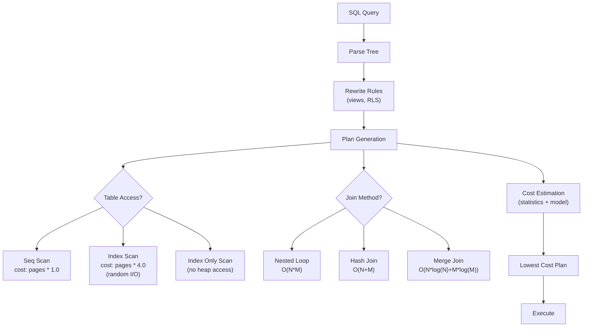
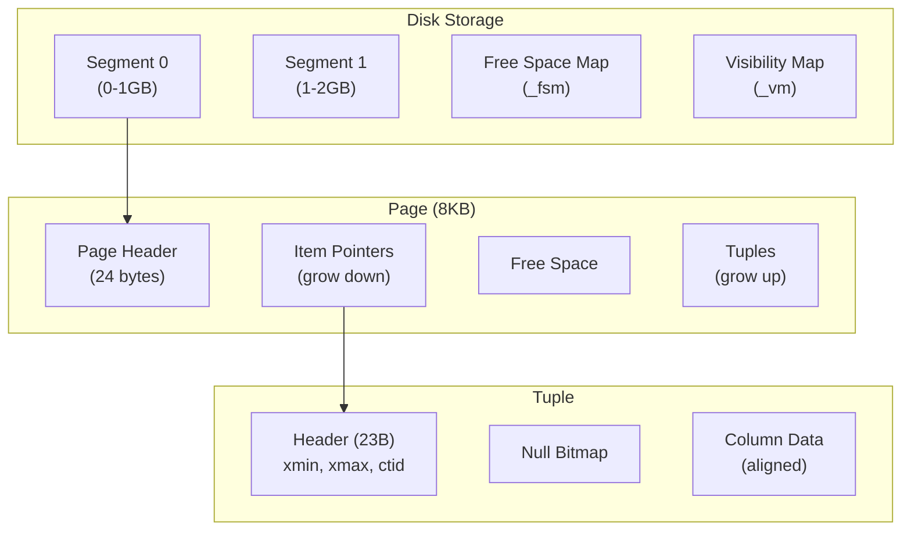
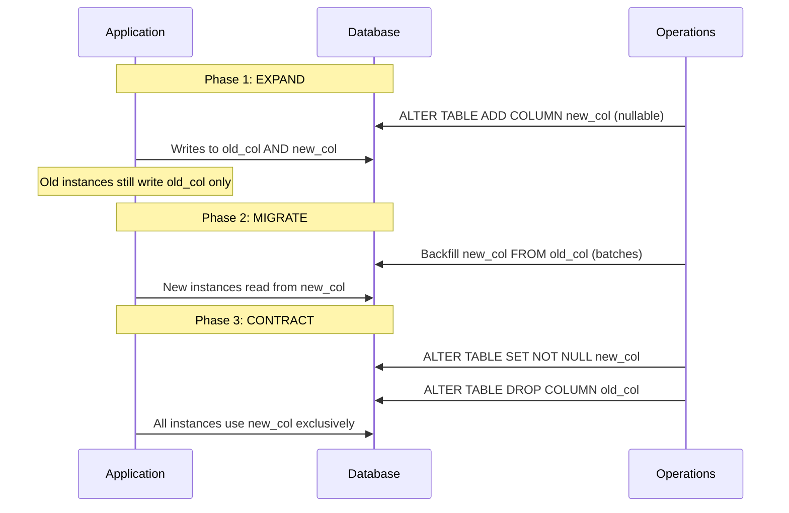
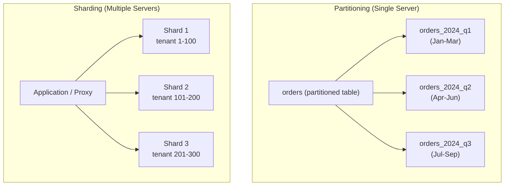

# PostgreSQL Query Optimizer

**Interview Weight:** high - Understanding the query optimizer
separates engineers who can write performant SQL from those who
rely on trial-and-error. Interviewers test whether you understand
HOW the database decides to execute your query.

---

### 🎯 Model Answer

**30 seconds:**

> PostgreSQL's query optimizer is a cost-based optimizer that
> evaluates multiple execution plans for each query and selects
> the one with the lowest estimated cost. It uses table statistics
> (pg_statistic, collected by ANALYZE) to estimate row counts and
> I/O costs. Key decisions: sequential scan vs index scan, join
> order, join algorithm (nested loop, hash join, merge join), and
> whether to materialize subqueries.

**3 minutes (Senior):**

> The optimizer works in three phases: (1) Query rewriting -
> transforms the SQL into canonical form (view expansion, subquery
> flattening, constraint exclusion). (2) Plan generation -
> enumerates possible execution plans using dynamic programming
> for join ordering. For N tables, there are N! possible join
> orders; the optimizer prunes this space using heuristics. (3)
> Cost estimation - assigns a numeric cost to each plan based on
> sequential page reads (seq_page_cost=1.0), random page reads
> (random_page_cost=4.0), CPU tuple processing (cpu_tuple_cost),
> and operator evaluation costs.
>
> The statistics that drive decisions: pg_statistic stores per-column
> histograms (value distribution), most common values (MCV lists),
> correlation (physical ordering), and n_distinct (cardinality).
> ANALYZE samples 300 pages per column by default (adjustable via
> ALTER TABLE SET STATISTICS). Stale statistics = bad estimates =
> bad plans.
>
> Common optimizer failures: (1) Cardinality misestimation - the
> optimizer thinks a filter returns 100 rows but it returns 100K.
> This causes nested loop joins where hash joins should be used.
> (2) Correlation blindness - multiple correlated columns are
> estimated independently (assumed independent), leading to
> underestimates. (3) Parameter sniffing (less in PG than SQL
> Server) - prepared statement plans may be suboptimal for specific
> parameter values.
>
> Influencing the optimizer: (1) Keep statistics fresh (ANALYZE
> after bulk operations). (2) Increase statistics targets for
> columns with skewed distributions. (3) Use CTEs as optimization
> fences when needed (materialized CTEs). (4) Set enable_* GUCs
> for debugging (never in production permanently).

**Framework:** REWRITE (canonicalize SQL) -> GENERATE (enumerate
plans, dynamic programming) -> ESTIMATE (cost model + statistics)
-> EXECUTE (chosen plan) -> FEEDBACK (EXPLAIN ANALYZE actual vs
estimated)

**Blank Mind Recovery:**

**(1) Restate:** "You are asking about how PostgreSQL decides which
execution plan to use for a query."

**(2) First principles:** "Multiple ways exist to execute any query
(full scan vs index, different join orders). The optimizer picks
the cheapest one based on estimated I/O and CPU cost."

**(3) Bridge:** "Like a GPS choosing a route. It estimates travel
time for each option (cost), uses traffic data (statistics), and
picks the fastest. If the traffic data is stale, it picks a bad
route."

---

### 📘 Concept Explanation

**What it is:**

The query optimizer (also called query planner) transforms a
declarative SQL query into an imperative execution plan. SQL says
WHAT data you want; the optimizer decides HOW to retrieve it
efficiently.

**How it works:**

```
  Query Optimization Pipeline:

  SQL Query
    │
    ▼
  ┌─────────────────────────────────────┐
  │ 1. PARSE: SQL → parse tree          │
  │ 2. REWRITE: views, rules, RLS       │
  │ 3. PLAN: cost-based optimization    │
  │    a. Generate candidate plans      │
  │    b. Estimate cardinality          │
  │    c. Estimate I/O + CPU cost       │
  │    d. Choose lowest-cost plan       │
  │ 4. EXECUTE: run the chosen plan     │
  └─────────────────────────────────────┘

  Cost Model Parameters:
  ┌────────────────────────────────────────────┐
  │ seq_page_cost     = 1.0  (baseline)        │
  │ random_page_cost  = 4.0  (seeks are 4x)   │
  │ cpu_tuple_cost    = 0.01 (per-row CPU)     │
  │ cpu_index_tuple_cost = 0.005               │
  │ cpu_operator_cost = 0.0025                 │
  │ effective_cache_size = 4GB (assumed cache)  │
  └────────────────────────────────────────────┘

  Decision Tree (simplified):
  Table access: Seq Scan vs Index Scan vs Index Only Scan
  Join method: Nested Loop vs Hash Join vs Merge Join
  Join order: For N tables, pick optimal order (N! space)
  Aggregation: Hash Aggregate vs Sort + Group
```



> **Diagram walkthrough:** The optimizer generates multiple candidate
> plans by combining different table access methods (seq scan vs
> index) and join algorithms. Each combination is costed using the
> cost model parameters and table statistics. The lowest-cost plan
> wins. The quality of the decision depends entirely on the accuracy
> of the statistics.

**The key insight:**

The optimizer is only as good as its statistics. A perfectly
designed query can perform terribly if ANALYZE has not been run
(stale statistics → wrong cardinality estimates → wrong plan).
Conversely, a simple query can perform well if statistics are
fresh. The first debugging step for slow queries is ALWAYS:
check if statistics are current.

**When the optimizer chooses wrong:**

- Statistics stale → run ANALYZE
- Multi-column correlation → increase statistics target, use
  extended statistics (CREATE STATISTICS)
- Highly skewed data → increase default_statistics_target
- Parameter-dependent plan → use plan guides or dynamic SQL

---

### 💻 Code Example

**Example 1: EXPLAIN ANALYZE reading (the essential skill)**

```sql
-- Understanding EXPLAIN ANALYZE output
EXPLAIN (ANALYZE, BUFFERS, FORMAT TEXT)
SELECT o.id, c.name
FROM orders o
JOIN customers c ON c.id = o.customer_id
WHERE o.status = 'pending'
  AND o.created_at > '2024-01-01';

-- Output:
-- Hash Join  (cost=25.00..450.00 rows=100 width=36)
--           (actual time=0.5..12.3 rows=5000 loops=1)
--   Hash Cond: (o.customer_id = c.id)
--   Buffers: shared hit=200 read=50
--   -> Bitmap Heap Scan on orders o
--       (cost=10.00..400.00 rows=100 width=20)
--       (actual time=0.3..10.1 rows=5000 loops=1)
--       Recheck Cond: (status = 'pending')
--       Filter: (created_at > '2024-01-01')
--       Rows Removed by Filter: 200
--       Buffers: shared hit=180 read=50
--       -> Bitmap Index Scan on idx_orders_status
--           (cost=0.00..9.75 rows=300 width=0)
--           (actual time=0.1..0.1 rows=5200 loops=1)
--   -> Hash  (cost=10.00..10.00 rows=500 width=20)
--       (actual time=0.2..0.2 rows=500 loops=1)
--       Buckets: 1024
--       -> Seq Scan on customers c
--           (cost=0.00..10.00 rows=500 width=20)
--           (actual time=0.0..0.1 rows=500 loops=1)

-- KEY READING:
-- rows=100 (estimated) vs rows=5000 (actual) → 50x underestimate!
-- This means the optimizer chose this plan thinking 100 rows,
-- but actually 5000 rows came through.
-- A hash join is still OK here, but if it had chosen nested loop
-- (good for 100 rows, terrible for 5000), we would have a problem.
```

> **Code walkthrough:** The critical skill is comparing estimated
> rows to actual rows. A 50x difference (100 estimated, 5000 actual)
> indicates stale statistics or correlated columns. The optimizer
> chose a hash join which still works, but a larger misestimate
> could cause it to choose nested loop (catastrophic for large
> result sets). Run ANALYZE to fix.

**Example 2: BAD vs GOOD - statistics maintenance**

```sql
-- BAD: Never running ANALYZE after bulk operations
-- After loading 1M rows into orders table:
INSERT INTO orders SELECT ... FROM staging;
-- Statistics still say orders has 10K rows
-- Optimizer plans as if the table is tiny
-- Result: nested loops where hash joins are needed, full scans
-- where index scans would help

-- GOOD: ANALYZE after significant data changes
INSERT INTO orders SELECT ... FROM staging;
ANALYZE orders;  -- Update statistics for this table
-- Now optimizer knows the table has 1M rows
-- Chooses appropriate plans

-- BETTER: Configure autovacuum to ANALYZE aggressively
ALTER TABLE orders SET (
  autovacuum_analyze_threshold = 1000,
  autovacuum_analyze_scale_factor = 0.02
);
-- ANALYZE triggers when 1000 + 2% of rows change
-- (default is 50 + 10% which is too lazy for large tables)

-- BEST: Extended statistics for correlated columns
CREATE STATISTICS orders_stats (dependencies)
ON status, created_at FROM orders;
ANALYZE orders;
-- Now optimizer understands that status='pending' AND
-- created_at > '2024-01-01' are correlated (not independent)
-- Estimates are much more accurate
```

> **Code walkthrough:** Without ANALYZE, the optimizer uses stale
> statistics from before the bulk load. Extended statistics
> (PostgreSQL 10+) tell the optimizer that columns are correlated,
> fixing the independence assumption that causes underestimates
> when filtering on multiple correlated columns.

**Example 3: Join ordering impact**

```sql
-- The optimizer's join order choice can mean 1000x difference
-- Consider: SELECT * FROM A JOIN B JOIN C WHERE A.x = 1

-- If A filtered has 10 rows, B has 10K, C has 1M:
-- Good order: A(10) → B(finds 50) → C(finds 200)  = fast
-- Bad order:  C(1M) → B(1M * 10K matches?) → A    = catastrophe

-- Force join order for debugging (NEVER in production permanently):
SET join_collapse_limit = 1;  -- Preserves written order
SELECT * FROM a
JOIN b ON b.a_id = a.id
JOIN c ON c.b_id = b.id
WHERE a.status = 'active';
-- Now joins in order: A → B → C (as written)

-- The optimizer normally picks the best order automatically.
-- If it picks wrong: the statistics for the WHERE clause
-- cardinality are incorrect. Fix statistics, not join order.

-- Check what the optimizer estimates vs actual:
EXPLAIN ANALYZE SELECT ...;
-- Look for "rows=X" (estimated) far from actual
-- The table with the worst estimate is your culprit
```

> **Code walkthrough:** Join ordering is the optimizer's highest-
> impact decision. For 5 tables, there are 120 possible orders.
> The optimizer picks the best one IF its row count estimates are
> correct. When it picks wrong, the root cause is almost always
> inaccurate cardinality estimates - fix statistics, not the join
> order.

---

### ⚖️ Comparison Table

| Join Algorithm | Best When | Complexity | Memory |
|---|---|---|---|
| **Nested Loop** | Small outer, indexed inner | O(N*M) worst, O(N*log(M)) with index | Minimal |
| **Hash Join** | No useful index, both tables fit in memory | O(N+M) | O(smaller table) |
| **Merge Join** | Both inputs pre-sorted (index order) | O(N+M) | O(sort buffers) |

| Scan Method | Best When | I/O Pattern |
|---|---|---|
| **Sequential Scan** | Selecting >5-10% of table, no useful index | Sequential (fast) |
| **Index Scan** | Selecting <5% of rows, good index exists | Random (slow per page) |
| **Index Only Scan** | All needed columns in index, visibility map clean | Random (no heap access) |
| **Bitmap Index Scan** | Selecting 5-20% of rows, converts random to sequential | Sequential (after bitmap) |

---

### 🎓 Answers by Seniority

**Junior / Mid (0-5 years):**

> PostgreSQL uses a cost-based optimizer that estimates the cost of
> different plans and picks the cheapest. I use EXPLAIN ANALYZE to
> see what plan was chosen and compare estimated vs actual rows.
> When queries are slow, I check if statistics are fresh (ANALYZE)
> and if appropriate indexes exist.

---

**Senior / Staff (5+ years):**

> I think about the optimizer in terms of its failure modes:
> cardinality misestimation (fix with ANALYZE, extended statistics,
> or increased statistics targets), join order mistakes (fix the
> table with the worst estimate), and cost model miscalibration
> (adjust random_page_cost for SSDs). I proactively set aggressive
> autovacuum_analyze thresholds on high-write tables, use extended
> statistics for correlated columns, and monitor query plan
> regressions after deployments. I never use enable_* settings or
> forced join orders in production - I fix the root cause
> (statistics) instead.

---

### ⚠️ Common Misconceptions

| # | Misconception | Reality |
|---|---|---|
| 1 | "The optimizer always picks the best plan" | It picks the best plan GIVEN ITS ESTIMATES. If estimates are wrong (stale stats, correlated columns), it picks a terrible plan confidently. |
| 2 | "Adding an index always makes queries faster" | The optimizer may ignore the index if it estimates the query returns >5-10% of the table (seq scan is cheaper for bulk reads). Or if the index is not selective enough. |
| 3 | "EXPLAIN shows the actual cost" | EXPLAIN (without ANALYZE) shows ESTIMATED cost. Only EXPLAIN ANALYZE shows actual execution times. The estimated cost is in arbitrary units, not milliseconds. |
| 4 | "SET enable_seqscan = off fixes slow queries" | This forces index scans even when seq scans are optimal. It masks the real problem (bad statistics or missing index). Never use in production. |
| 5 | "PostgreSQL re-optimizes prepared statements" | In PG 12+, it re-plans after 5 executions if generic plan is much worse. But for PG <12, prepared statements used a generic plan that could be suboptimal for specific parameters. |

---

### 🚨 Failure Modes and Diagnosis

**Failure 1: Cardinality misestimation causing nested loop on
large result set**

- **Symptom:** Query runs for minutes instead of milliseconds.
  EXPLAIN ANALYZE shows "Nested Loop" with outer table returning
  50K rows (estimated: 50). Each iteration does an index lookup
  on inner table. 50K * (one random I/O each) = extremely slow.
- **Root Cause:** The optimizer estimated 50 rows from the WHERE
  clause (based on stale or inaccurate statistics) and chose
  nested loop (efficient for small outer sets). Actually 50K rows
  matched, making nested loop catastrophic.
- **Diagnostic:**
  ```sql
  EXPLAIN ANALYZE SELECT ...;
  -- Look for: (rows=50) vs (actual rows=50000) on the outer node
  -- The 1000x misestimate caused nested loop selection

  -- Check statistics freshness:
  SELECT relname, last_analyze, last_autoanalyze,
         n_live_tup, n_mod_since_analyze
  FROM pg_stat_user_tables
  WHERE relname = 'orders';
  -- If n_mod_since_analyze is high: stats are stale
  ```
- **Fix:** (1) Run ANALYZE on the table. (2) Re-execute the query
  (optimizer now sees 50K rows, picks hash join). (3) For
  correlated columns: CREATE STATISTICS. (4) Increase
  default_statistics_target for columns with skewed distributions.
- **Prevention:** Aggressive autovacuum_analyze settings on high-
  write tables. Monitor pg_stat_user_tables.n_mod_since_analyze.

**Failure 2: Plan regression after PostgreSQL upgrade or config
change**

- **Symptom:** Queries that were fast (5ms) suddenly become slow
  (5 seconds) after a PostgreSQL version upgrade or a parameter
  change (like random_page_cost adjustment). No schema or data
  changes.
- **Root Cause:** The optimizer's cost model or plan enumeration
  changed between versions. A query that previously used an index
  now uses a seq scan (or vice versa) because cost estimates
  shifted.
- **Diagnostic:**
  ```sql
  -- Compare plan before and after:
  EXPLAIN (ANALYZE, BUFFERS) SELECT ...;
  -- Look for different plan shapes (different join types,
  -- different scan methods)

  -- Check which parameter changed:
  SELECT name, setting, boot_val
  FROM pg_settings
  WHERE name IN ('random_page_cost', 'effective_cache_size',
    'work_mem', 'seq_page_cost');
  ```
- **Fix:** (1) Adjust cost parameters to reflect actual hardware
  (random_page_cost = 1.1 for SSD, not 4.0). (2) Increase
  work_mem if hash joins are spilling to disk. (3) If a specific
  query regressed: check if an index is missing or if statistics
  need refreshing.
- **Prevention:** Test major upgrades with production query workload
  (pg_stat_statements captures top queries). Compare EXPLAIN output
  before/after. Use pg_qualstats for monitoring estimation accuracy.

**Failure 3: Work_mem too low causing hash join to spill to disk**

- **Symptom:** Hash join running for 10x longer than expected.
  EXPLAIN ANALYZE shows "Batches: 16" (spilling to multiple disk
  batches) instead of "Batches: 1" (in-memory).
- **Root Cause:** work_mem (default 4MB) is too small for the hash
  table. The join builds a hash on the inner table, but if the
  table exceeds work_mem, it spills to temp files on disk. Multiple
  passes over disk are much slower.
- **Diagnostic:**
  ```sql
  EXPLAIN (ANALYZE, BUFFERS) SELECT ...;
  -- Look for: "Batches: 16" on Hash node
  -- Peak Memory Usage: 4096kB (= work_mem limit hit)
  -- temp read/written = many MB (spilling to disk)

  -- Check current setting:
  SHOW work_mem;  -- Default: 4MB (often too low)
  ```
- **Fix:** Increase work_mem. For specific sessions:
  `SET work_mem = '256MB';` For the query only:
  `SET LOCAL work_mem = '256MB';` Globally: adjust in
  postgresql.conf (be careful - work_mem is per-operation per-query,
  not per-connection. A complex query with 5 hash joins uses 5 *
  work_mem).
- **Prevention:** Set work_mem based on: available_memory /
  max_connections / estimated_operations_per_query. Monitor temp
  file usage (pg_stat_database.temp_bytes).

---

### 🎯 Interview Deep-Dive

**Timing Guidelines:**

| Depth | Time | Signal |
|---|---|---|
| Definition | 30 sec | Knows optimizer exists |
| Mechanism | 1-2 min | Explains cost-based approach |
| Diagnosis | 2-3 min | Reads EXPLAIN ANALYZE output |
| Production | 3-5 min | Fixes optimizer-related performance issues |
| Architecture | 5+ min | Designs statistics maintenance strategy |

---

**Q1. What is a cost-based optimizer and how does it differ from
a rule-based optimizer?** [JUNIOR]

*Why they ask:* Baseline understanding of query planning.

*Likely follow-up:* "What costs does PostgreSQL consider?"

**A:** A cost-based optimizer evaluates multiple execution plans and
chooses the one with the lowest estimated cost. The cost represents
the expected resource consumption (I/O operations, CPU cycles,
memory). It uses statistical information about the data (row counts,
value distributions, correlations) to make these estimates.

A rule-based optimizer (used by Oracle before 10g, now obsolete)
applies fixed heuristic rules: "always use an index if one exists,"
"always do nested loop for indexed joins." It does not consider
the actual data distribution or table sizes. This leads to bad
decisions: using an index when 80% of the table matches (seq scan
would be faster), or choosing nested loop when hash join would be
1000x faster.

PostgreSQL's cost model assigns numeric costs to operations:
reading a sequential page costs 1.0 (baseline). Reading a random
page costs 4.0 (seeks are 4x more expensive on spinning disks, but
should be 1.1 for SSDs). Processing each tuple costs 0.01 CPU
units. Evaluating an operator costs 0.0025. The total plan cost is
the sum of all these operations.

The optimizer generates all possible plans (within search limits)
and picks the one with the lowest total cost. For a 3-table join,
it considers: all scan methods for each table * all join methods *
all join orders = potentially hundreds of plans. Dynamic
programming prunes this space efficiently.

*What separates good from great:* Great candidates mention the
specific cost parameters (seq_page_cost, random_page_cost) and
explain that random_page_cost should be lowered for SSDs - a
practical tuning insight.

---

**Q2. How do you read and interpret EXPLAIN ANALYZE output?**
[MID]

*Why they ask:* Essential practical skill.

*Likely follow-up:* "What does the BUFFERS option tell you?"

**A:** EXPLAIN ANALYZE runs the query and reports both estimated
and actual metrics for each plan node. The critical comparisons:

Estimated vs actual rows: Each node shows `rows=X` (estimated)
and `actual rows=Y`. If X and Y differ by more than 10x, the
optimizer made a bad plan choice based on wrong estimates. This is
the #1 thing to check.

Cost numbers: `cost=startup..total` in arbitrary cost units. The
startup cost is how much work before the first row is produced.
Total cost is the full execution. These are NOT milliseconds.

Actual time: `actual time=startup..total` in milliseconds. This
is wall-clock time. Compare across nodes to find the bottleneck.

Loops: `loops=N` means the node was executed N times (inside a
nested loop). Multiply actual time by loops for the real time
spent in that node.

BUFFERS option: Shows `shared hit=X read=Y` - hits are from
PostgreSQL's buffer cache (fast), reads are from disk (slow). If
read is high relative to hit, your effective_cache_size might be
wrong or you need more shared_buffers.

Reading strategy: (1) Start at the innermost (most indented) node.
(2) Check rows estimated vs actual. (3) Find the node with the
highest actual time * loops. (4) Check if that node is doing
something unexpected (seq scan instead of index scan, nested loop
on large outer).

*What separates good from great:* Great candidates emphasize the
"multiply by loops" rule (a nested loop inner node showing 0.1ms
that executes 100,000 times = 10 seconds) and read from innermost
to outermost.

---

**Q3. What are extended statistics and when do you need them?**
[SENIOR]

*Why they ask:* Tests advanced optimization knowledge.

*Likely follow-up:* "What types of extended statistics exist?"

**A:** Extended statistics (PostgreSQL 10+) solve the optimizer's
independence assumption. By default, PostgreSQL estimates the
selectivity of multi-column predicates by multiplying individual
column selectivities. If column A has 10% selectivity and column B
has 10% selectivity, the optimizer estimates A AND B = 1%. But if
A and B are correlated (e.g., city and zip code), the actual
selectivity might be 10% (not 1%).

This causes underestimation: the optimizer thinks 1% of rows match
and chooses nested loop (good for small sets). Actually 10% match
and hash join would be 100x faster.

Extended statistics types:

Dependencies: Tells the optimizer that column values are
functionally dependent (knowing A determines B).
```sql
CREATE STATISTICS stats_city_zip (dependencies)
ON city, zip_code FROM addresses;
ANALYZE addresses;
-- Now: WHERE city = 'Seattle' AND zip_code = '98101'
-- estimates correctly (zip depends on city)
```

N-distinct: Tells the optimizer the actual number of distinct
combinations for a group of columns.
```sql
CREATE STATISTICS stats_ndistinct (ndistinct)
ON department, team FROM employees;
ANALYZE employees;
-- Now: GROUP BY department, team correctly estimates group count
```

MCV (Most Common Values - PostgreSQL 12+): Stores the most common
combinations of values across columns.
```sql
CREATE STATISTICS stats_mcv (mcv)
ON status, priority FROM tickets;
ANALYZE tickets;
-- Now: WHERE status = 'open' AND priority = 'high'
-- uses actual frequency of this combination, not multiplication
```

When to create extended statistics: when EXPLAIN ANALYZE shows
multi-column predicates with large estimation errors (estimated 100,
actual 10000) and the columns are logically correlated.

*What separates good from great:* Great candidates identify the
specific correlation that is causing the problem (from EXPLAIN
ANALYZE), create the appropriate statistics type, and verify the
estimate improves after ANALYZE.

---

**Q4. A query that ran in 5ms suddenly takes 30 seconds after a
data load. Nothing else changed. Diagnose.** [SENIOR] [DEBUGGING]

*Why they ask:* Classic production scenario.

*Likely follow-up:* "How do you prevent this from recurring?"

**A:** This is almost certainly a statistics problem causing a plan
change. My diagnostic workflow:

Step 1 - Capture the current plan:
```sql
EXPLAIN (ANALYZE, BUFFERS) SELECT ...;
-- Compare to cached plan (if available from pg_stat_statements)
```

Step 2 - Check statistics freshness:
```sql
SELECT relname, n_live_tup, n_mod_since_analyze,
       last_analyze, last_autoanalyze
FROM pg_stat_user_tables
WHERE relname IN ('affected_tables');
-- If n_mod_since_analyze is large relative to n_live_tup:
-- statistics are stale (the bulk load changed data distribution
-- but ANALYZE has not run yet)
```

Step 3 - Run ANALYZE and re-check:
```sql
ANALYZE affected_table;
EXPLAIN (ANALYZE, BUFFERS) SELECT ...;
-- If the plan changes and performance returns to 5ms: confirmed
-- The bulk load changed data distribution, stats were stale
```

Step 4 - Identify what changed. The bulk load likely: (1) Changed
the selectivity of a WHERE clause (a column that used to have 1%
matching now has 20%). (2) Changed the table size significantly
(optimizer now correctly prefers seq scan over index for the new
larger result set). (3) Changed the most common values (MCV list
is outdated).

Step 5 - Prevent recurrence:
```sql
-- Lower autovacuum analyze thresholds for this table
ALTER TABLE affected_table SET (
  autovacuum_analyze_threshold = 500,
  autovacuum_analyze_scale_factor = 0.01
);
-- ANALYZE triggers after 500 + 1% of rows change

-- For batch operations: always ANALYZE after bulk load
INSERT INTO ... SELECT ...;
ANALYZE affected_table;
-- Make this part of the batch job, not optional
```

*What separates good from great:* Great candidates check statistics
freshness FIRST (n_mod_since_analyze), run ANALYZE as the immediate
fix, and then set preventive thresholds. They do NOT immediately
add indexes or rewrite the query.

---

**Q5. How does the optimizer choose between nested loop, hash join,
and merge join?** [MID]

*Why they ask:* Fundamental optimizer knowledge.

*Likely follow-up:* "When is nested loop the best choice?"

**A:** The optimizer estimates the cost of each join algorithm and
picks the cheapest based on: input sizes, available indexes,
sortedness of inputs, and available memory (work_mem).

Nested Loop: For each row in the outer table, scan the inner table
for matches. Cost: O(N * M) without index, O(N * log(M)) with
index on inner table. Best when: outer table is very small (< 100
rows after filtering) AND inner table has an index on the join
column. Worst when: both tables are large (quadratic explosion).

Hash Join: Build a hash table on the smaller input, then probe it
with each row from the larger input. Cost: O(N + M) assuming hash
table fits in work_mem. Best when: no useful index exists, both
tables are moderately sized, and the smaller table fits in work_mem.
Worst when: smaller table exceeds work_mem (spills to disk in
batches, multiple passes required).

Merge Join: Sort both inputs on the join key, then merge them in
order. Cost: O(N*log(N) + M*log(M)) for sorting + O(N + M) for
merge. Best when: both inputs are already sorted (from an index
scan or a preceding sort operation). Avoids building a hash table.
Worst when: neither input is sorted and the sort cost exceeds the
hash build cost.

The optimizer's decision tree (simplified):
```
if outer_rows < 10 AND inner has index → nested loop
elif smaller table fits in work_mem → hash join
elif both inputs are pre-sorted → merge join
else → hash join (with potential disk spill)
```

In practice for PostgreSQL OLTP: 80% of joins are hash joins
(general purpose, efficient). Nested loops for small-outer-indexed-
inner patterns. Merge joins for pre-sorted data (ORDER BY on join
column already present from index).

*What separates good from great:* Great candidates explain the
work_mem dependency for hash joins (spilling to disk = batches > 1
in EXPLAIN output) and that merge join requires BOTH inputs sorted.

---

**Q6. What is the role of effective_cache_size and how does it
affect query plans?** [SENIOR]

*Why they ask:* Tests understanding of cost model tuning.

*Likely follow-up:* "How do you set it correctly?"

**A:** effective_cache_size tells the optimizer how much memory is
available for caching data pages (combining PostgreSQL's
shared_buffers + the OS filesystem cache). It does NOT allocate
memory - it is purely an estimate that influences plan costs.

The effect: when effective_cache_size is large, the optimizer
assumes that random I/O is more likely to hit cached pages (reducing
the effective random_page_cost). This makes index scans cheaper
relative to sequential scans, so the optimizer is more likely to
choose index scans.

When effective_cache_size is small, the optimizer assumes most
random reads go to disk. Index scans (which do random I/O) are
estimated as expensive. Sequential scans (which do sequential I/O)
are preferred even for queries that return a small percentage of
rows.

Setting it correctly:
```sql
-- On a dedicated database server:
-- effective_cache_size = 75% of total RAM
-- (shared_buffers = 25% + OS cache = ~50% more)
-- For 32GB server: effective_cache_size = 24GB

-- On a shared server:
-- effective_cache_size = shared_buffers + estimated OS cache for DB
-- More conservative: 50% of available RAM

-- Check actual cache hit ratio:
SELECT
  sum(heap_blks_hit) / (sum(heap_blks_hit) + sum(heap_blks_read))
  AS cache_hit_ratio
FROM pg_statio_user_tables;
-- If > 99%: effective_cache_size can be set high (data IS cached)
-- If < 95%: set more conservatively (cache misses are real)
```

The dangerous misconfiguration: setting effective_cache_size too
HIGH makes the optimizer over-commit to index scans. On a system
where data does NOT fit in cache, those index scans generate
massive random I/O (each page fetched from disk). Setting it too
LOW makes the optimizer avoid indexes even when data IS cached.

*What separates good from great:* Great candidates check the
actual cache hit ratio (pg_statio_user_tables) to validate their
effective_cache_size setting, and explain it does not allocate
memory - it only influences cost estimates.

---

**Q7. How do you handle query performance regression in a CI/CD
pipeline?** [STAFF] [TRADE-OFF]

*Why they ask:* Tests systematic quality assurance approach.

*Likely follow-up:* "What metrics do you track?"

**A:** Query performance regression detection requires:
capturing baselines, detecting deviations, and blocking deployments
that introduce regressions.

Architecture:
```
  CI/CD Pipeline with Query Performance Gate:

  ┌──────────────────────────────────────────────┐
  │ 1. Staging DB: clone of production data      │
  │ 2. Run migrations on staging                 │
  │ 3. Replay top 100 queries (from             │
  │    pg_stat_statements on production)          │
  │ 4. Capture EXPLAIN ANALYZE for each          │
  │ 5. Compare to baseline (previous release)    │
  │ 6. Flag: plan changes, >2x time increase,    │
  │    new seq scans on large tables              │
  │ 7. Block deploy if regression detected        │
  └──────────────────────────────────────────────┘
```

Implementation:
```sql
-- Capture baseline (after each release):
INSERT INTO query_baselines (query_hash, plan_hash, avg_time)
SELECT queryid, plans_hash, mean_exec_time
FROM pg_stat_statements
WHERE calls > 100  -- only frequent queries
ORDER BY total_exec_time DESC
LIMIT 100;

-- Compare after migration:
SELECT b.query_hash,
       b.avg_time AS baseline_ms,
       current.mean_exec_time AS current_ms,
       current.mean_exec_time / b.avg_time AS regression_factor
FROM query_baselines b
JOIN pg_stat_statements current ON current.queryid = b.query_hash
WHERE current.mean_exec_time / b.avg_time > 2.0;
-- Any query > 2x slower = potential regression
```

What to detect: (1) Plan shape changes (index scan → seq scan, hash
join → nested loop). (2) Execution time increase > 2x. (3) Buffer
reads increase > 5x (I/O regression). (4) New queries without
appropriate indexes (full table scans).

Trade-off: false positives vs missed regressions. A 2x threshold
catches real problems but may flag natural variance. A 5x threshold
misses gradual degradation. I use 2x with automatic investigation
(explain output attached to the alert) rather than hard blocking.

*What separates good from great:* Great candidates design the full
pipeline (staging with production-like data, query replay, plan
comparison) and explain the threshold trade-off between sensitivity
and false positives.

---

**Q8. Explain how work_mem affects query performance and what are
the risks of setting it too high.** [SENIOR] [TRADE-OFF]

*Why they ask:* Critical tuning parameter.

*Likely follow-up:* "How do you calculate the right value?"

**A:** work_mem controls the memory available for internal sort
operations and hash tables BEFORE spilling to temporary disk files.
Default: 4MB. It is allocated PER OPERATION PER QUERY (not per
connection).

The impact: a hash join on a 100MB table with work_mem = 4MB
creates 25+ batches, making 25+ passes over the data on disk.
With work_mem = 128MB, it runs entirely in memory (single pass).
The difference can be 100x in execution time.

The risk of setting too high: work_mem is per-operation. A complex
query with 5 hash joins and 3 sorts = 8 operations = 8 *
work_mem allocated simultaneously. With 100 concurrent connections:
100 * 8 * work_mem. If work_mem = 1GB: 100 * 8 * 1GB = 800GB
memory demand (impossible - causes OOM or swap thrashing).

Calculation approach:
```
available_memory = total_RAM - shared_buffers - OS_overhead
max_work_mem_total = available_memory * 0.5
per_connection_budget = max_work_mem_total / max_connections
work_mem = per_connection_budget / estimated_operations_per_query

Example: 32GB RAM, shared_buffers=8GB, OS=2GB
available = 32 - 8 - 2 = 22GB
budget = 22GB * 0.5 = 11GB
per_conn = 11GB / 100 connections = 110MB
work_mem = 110MB / 4 ops average = ~28MB
```

Setting strategy: (1) Global work_mem = conservative (32-64MB).
(2) For specific expensive queries, set per-session:
`SET LOCAL work_mem = '512MB';` before the query. This avoids
global over-allocation while giving specific queries the memory
they need.

Monitor: check pg_stat_database.temp_bytes. If increasing: queries
are spilling to disk. Candidates for higher work_mem.

*What separates good from great:* Great candidates calculate the
worst-case memory consumption (connections * operations * work_mem)
and use SET LOCAL for specific queries rather than raising the
global setting.

---

**Q9. How does the optimizer handle subqueries and CTEs? When
should you rewrite one to the other?** [SENIOR]

*Why they ask:* Practical optimization skill.

*Likely follow-up:* "What changed in PostgreSQL 12 for CTEs?"

**A:** PostgreSQL's handling of subqueries and CTEs has evolved:

Subqueries (pre-12 behavior and current): The optimizer can
"flatten" subqueries - pulling them into the main query and
optimizing globally. A subquery in FROM clause may be merged into
the parent query's join tree, allowing the optimizer to choose
the best join order across all tables.

CTEs (pre-PostgreSQL 12): CTEs were ALWAYS materialized -
executed once, results stored in a temp structure. They acted as
optimization fences: the optimizer could not push predicates into
CTEs or merge them with the outer query. This was useful when you
WANTED to force a specific execution (e.g., materializing a
complex calculation once), but harmful when it prevented useful
optimizations.

CTEs (PostgreSQL 12+): CTEs are now inlined by default (treated
like subqueries, flattened into the main query). The optimizer can
push predicates into them and optimize globally. To force
materialization, use `WITH cte AS MATERIALIZED (...)`.

When to materialize: (1) The CTE result is used multiple times
in the query (compute once, use many). (2) You want to prevent
the optimizer from making a bad choice (rare - usually fix
statistics instead). (3) The CTE has side effects (volatile
functions).

When to inline (default in PG 12+): (1) The CTE is used once.
(2) Predicates from the outer query can filter early. (3) The
optimizer should be free to choose the best overall plan.

Rewriting strategy:
```sql
-- BAD in PG < 12: CTE prevents predicate push-down
WITH all_orders AS (
  SELECT * FROM orders  -- reads ALL orders
)
SELECT * FROM all_orders WHERE customer_id = 42;
-- CTE materializes ALL orders first, THEN filters
-- 1M rows materialized when only 50 needed

-- GOOD in all versions: subquery allows push-down
SELECT * FROM (
  SELECT * FROM orders
) sub WHERE sub.customer_id = 42;
-- Optimizer pushes customer_id = 42 into the scan
-- Only reads 50 rows from the start
```

*What separates good from great:* Great candidates know the PG 12
behavior change (CTEs now inlined by default), explain when
MATERIALIZED is useful (multi-use CTEs), and use subqueries for
single-use expressions in older PostgreSQL versions.

---

**Q10. Your team uses an ORM that generates SQL. How do you ensure
the optimizer gets good plans for ORM-generated queries?** [STAFF]
[BEHAVIORAL]

*Why they ask:* Real-world ORM + performance challenge.

*Likely follow-up:* "How do you convince the team to care about query plans?"

**A:** ORMs generate SQL that is often suboptimal for the optimizer:
N+1 query patterns, unnecessary JOINs, inefficient pagination, and
lack of query hints. My approach:

Step 1 - Visibility: Enable pg_stat_statements to capture all query
patterns. Use slow query logging (log_min_duration_statement = 100ms)
to catch problematic ORM-generated queries. The team cannot fix
what they cannot see.

Step 2 - Top-N analysis: Weekly, examine the top 10 queries by
total execution time (calls * mean_time). These are the highest-
impact optimization targets regardless of whether they are ORM-
generated.

Step 3 - Statistics maintenance: ORM patterns often hit the same
tables (User, Order, Product). Ensure these tables have aggressive
ANALYZE settings. Create extended statistics for commonly-filtered
column combinations.

Step 4 - Index strategy: Analyze ORM-generated WHERE clauses and
JOIN conditions. Create indexes that cover the most frequent
patterns. Use partial indexes for common filters:
```sql
-- ORM always adds: WHERE deleted = false
CREATE INDEX idx_orders_active ON orders (customer_id)
WHERE deleted = false;
-- Smaller index, faster scans for the 99% case
```

Step 5 - Query override for critical paths: For the top 5 most
impactful queries, bypass the ORM and use native SQL (Spring Data
@Query, Hibernate @NamedNativeQuery). This gives full control over
the query shape.

Step 6 - Connection tuning: Configure the ORM's connection pool
(HikariCP) with statement caching enabled. Prepared statements
allow the optimizer to cache plans for parameterized queries.

How I communicate to the team: Dashboard showing query performance
(grafana with pg_stat_statements). Weekly "query of the week" in
standup highlighting the worst performer and its fix. Code review
checklist: "Did you check EXPLAIN ANALYZE for new queries?"

*What separates good from great:* Great candidates combine
infrastructure (monitoring, statistics, indexes) with process
(top-N analysis, team communication, code review gates) rather
than just saying "use native SQL."

---

**Interviewer Type Adaptation:**

| Interviewer Type | Emphasis |
|---|---|
| Technical Panel | Cost model parameters, extended statistics, join algorithms |
| Hiring Manager | Regression prevention, team process, monitoring strategy |
| Bar Raiser | CI/CD integration, work_mem calculation, ORM governance |
| Peer Engineer | "This query went from 5ms to 30s after data load - help" |

---

---

# Database Storage Engine Internals

**Interview Weight:** high - Understanding storage internals
separates engineers who can diagnose I/O problems from those who
treat the database as a black box. Tests deep understanding of
how data is physically stored and retrieved.

---

### 🎯 Model Answer

**30 seconds:**

> PostgreSQL uses a heap-based storage engine. Data is stored in
> 8KB pages. Each page contains tuples (rows) with a tuple header
> (23 bytes: xmin, xmax, infomask, ctid). Tables are stored as
> sequences of pages in files on disk. Indexes are separate
> structures that point to heap tuples via (page, offset) pairs
> called TIDs. TOAST handles large values by compressing and
> storing them out-of-line.

**3 minutes (Senior):**

> PostgreSQL's storage architecture has several layers:
>
> Physical layer: Each table is stored as one or more 1GB segment
> files in the data directory (base/{dboid}/{relfilenode}). Each
> segment contains 8KB pages. The page layout: page header (24
> bytes) + item pointers (4 bytes each, pointing to tuples) + free
> space + tuples (growing from end of page backwards). This
> split-pointer design allows tuples to be rearranged within a
> page without invalidating index entries.
>
> Tuple layout: Each tuple has a 23-byte header containing: xmin
> (inserting transaction), xmax (deleting/updating transaction),
> infomask (status bits), ctid (current tuple location, self-
> referencing or pointing to newer version for HOT updates), natts
> (number of attributes), and null bitmap. After the header comes
> the actual data, aligned to type-specific boundaries.
>
> MVCC storage: UPDATEs do not modify tuples in-place. They create
> a NEW tuple (new xmin) and mark the OLD tuple dead (set xmax).
> Both versions coexist until VACUUM removes the dead one. This is
> why UPDATE-heavy tables grow (bloat) and why VACUUM is critical.
>
> TOAST (The Oversized-Attribute Storage Technique): Values > 2KB
> are compressed (LZ4 or pglz). If still > 2KB after compression,
> they are stored in a separate TOAST table and referenced by a
> pointer. This keeps the main heap pages compact for scanning.
>
> Buffer pool: PostgreSQL does not read directly from disk. All page
> access goes through shared_buffers (the buffer pool). Pages are
> read into shared_buffers on first access and evicted via a clock-
> sweep algorithm. The WAL (Write-Ahead Log) ensures durability:
> changes are written to WAL first, then dirty pages are flushed
> to heap files asynchronously by the background writer and
> checkpointer.

**Framework:** FILES (segments, 8KB pages) -> PAGES (header, items,
tuples) -> TUPLES (header with xmin/xmax, data) -> MVCC (dead
tuples, VACUUM) -> TOAST (large values) -> BUFFER POOL (shared
memory, WAL)

**Blank Mind Recovery:**

**(1) Restate:** "You are asking about how PostgreSQL physically
stores data on disk and manages it in memory."

**(2) First principles:** "Data must be stored persistently (files),
accessed efficiently (pages and indexes), and modified safely
(WAL for crash recovery)."

**(3) Bridge:** "Like a library. Books (tuples) are stored on
shelves (pages). The catalog (indexes) tells you which shelf. Old
editions (dead tuples) accumulate until the librarian cleans up
(VACUUM)."

---

### 📘 Concept Explanation

**What it is:**

The storage engine is the component that handles physical data
storage, retrieval, and modification. PostgreSQL's storage engine
is heap-based with MVCC, meaning all row versions are stored in
the same heap structure and visibility is determined at read time.

**How it works:**

```
  PostgreSQL Physical Storage:

  data_directory/
  └── base/
      └── {database_oid}/
          ├── {relfilenode}      (main table, segment 0)
          ├── {relfilenode}.1    (segment 1, after 1GB)
          ├── {relfilenode}_fsm  (free space map)
          ├── {relfilenode}_vm   (visibility map)
          └── {relfilenode}_init (unlogged table init fork)

  Page Layout (8KB = 8192 bytes):
  ┌──────────────────────────────────────────────┐
  │ Page Header (24 bytes)                       │
  │   pd_lsn, pd_checksum, pd_lower, pd_upper   │
  ├──────────────────────────────────────────────┤
  │ Item Pointers (4 bytes each)                 │
  │   [offset, length, flags] → tuple locations  │
  │   Grows DOWNWARD from top                    │
  ├──────────────────────────────────────────────┤
  │ Free Space                                   │
  ├──────────────────────────────────────────────┤
  │ Tuples (variable length)                     │
  │   Grows UPWARD from bottom                   │
  │   [header 23B | null bitmap | data]          │
  └──────────────────────────────────────────────┘

  Tuple Header (23 bytes):
  ┌────────────────────────────────────────────┐
  │ xmin (4B): inserting transaction ID        │
  │ xmax (4B): deleting transaction ID         │
  │ cid  (4B): command ID within transaction   │
  │ ctid (6B): (page, offset) current location │
  │ infomask (2B): status flags (committed,    │
  │   aborted, has null, has toast, etc.)      │
  │ infomask2 (2B): number of attributes + flags│
  │ t_hoff (1B): offset to data                │
  └────────────────────────────────────────────┘
```



> **Diagram walkthrough:** Data flows from segment files on disk
> through 8KB pages into individual tuples. Each tuple carries
> its own visibility information (xmin/xmax) for MVCC. The item
> pointer indirection allows tuples to be physically moved within
> a page without updating index entries (HOT updates). The free
> space map tracks available space for new inserts.

**The key insight:**

PostgreSQL's UPDATE creates a new tuple and marks the old one dead.
This means: (1) UPDATEs are as expensive as INSERT + DELETE (they
write a new full tuple). (2) Tables grow with dead tuples (bloat)
unless VACUUM reclaims space. (3) Every index must be updated on
UPDATE (unless HOT applies - the new tuple is on the same page and
no indexed columns changed). This design enables MVCC but has
significant write amplification.

**Write-Ahead Log (WAL):**

Every modification is first written to WAL (sequential I/O) before
the heap page is modified in memory. WAL ensures crash recovery:
after a crash, PostgreSQL replays WAL records to reconstruct any
pages that were modified but not yet flushed to disk. This
separation of concerns enables: (1) Durability without fsync on
every page write. (2) Streaming replication (replicas apply WAL).
(3) Point-in-time recovery (replay WAL to a specific timestamp).

---

### 💻 Code Example

**Example 1: Inspecting physical storage**

```sql
-- Find physical file location of a table
SELECT pg_relation_filepath('orders');
-- Returns: base/16384/24576 (segment 0)

-- Table size breakdown
SELECT pg_size_pretty(pg_relation_size('orders')) AS heap,
       pg_size_pretty(pg_indexes_size('orders')) AS indexes,
       pg_size_pretty(pg_total_relation_size('orders')) AS total,
       pg_size_pretty(pg_relation_size('orders', 'fsm'))
         AS free_space_map,
       pg_size_pretty(pg_relation_size('orders', 'vm'))
         AS visibility_map;
-- heap: 1200 MB, indexes: 800 MB, total: 2048 MB
-- fsm: 3 MB, vm: 384 KB

-- Page-level inspection (pageinspect extension)
CREATE EXTENSION IF NOT EXISTS pageinspect;

-- Read page header
SELECT * FROM page_header(get_raw_page('orders', 0));
-- lsn, checksum, lower, upper, special, pagesize, version

-- Count tuples per page (detect bloat)
SELECT (ctid::text::point)[0]::int AS page,
       count(*) AS live_tuples
FROM orders
GROUP BY 1
ORDER BY 1
LIMIT 10;
-- Shows how many live tuples per page
-- If pages have few tuples: bloat exists
```

> **Code walkthrough:** pg_relation_filepath reveals the actual OS
> file. The size functions show the breakdown (heap vs indexes vs
> TOAST). pageinspect allows reading raw page contents for debugging.
> The ctid-based query estimates per-page density - low density
> indicates bloat from dead tuples not yet vacuumed.

**Example 2: BAD vs GOOD - Understanding bloat from UPDATEs**

```sql
-- BAD: Updating every row without understanding the storage cost
-- Table: 10M rows, 1.2 GB on disk
UPDATE users SET last_login = now();
-- This creates 10M NEW tuples (1.2 GB of new data)
-- Old tuples are dead (still 1.2 GB until VACUUM)
-- Table is now 2.4 GB on disk!
-- VACUUM reclaims dead tuple space but does NOT shrink the file
-- Table file stays at 2.4 GB (free space reused by future inserts)

-- Check bloat:
SELECT relname,
       n_live_tup,
       n_dead_tup,
       n_dead_tup * 100.0 / nullif(n_live_tup, 0) AS dead_pct
FROM pg_stat_user_tables
WHERE relname = 'users';
-- dead_pct > 20% indicates significant bloat

-- GOOD: Batch updates to control bloat and lock duration
DO $$
DECLARE
  batch_size INT := 10000;
  affected INT;
BEGIN
  LOOP
    UPDATE users SET last_login = now()
    WHERE id IN (
      SELECT id FROM users
      WHERE last_login IS NULL OR last_login < '2024-01-01'
      ORDER BY id
      LIMIT batch_size
      FOR UPDATE SKIP LOCKED
    );
    GET DIAGNOSTICS affected = ROW_COUNT;
    IF affected = 0 THEN EXIT; END IF;
    PERFORM pg_sleep(0.1);  -- Allow VACUUM to work
  END LOOP;
END $$;
-- Smaller dead tuple accumulation at any given time
-- VACUUM can keep up between batches
```

> **Code walkthrough:** A full-table UPDATE doubles the physical
> table size because every UPDATE creates a new tuple. The dead
> tuples occupy space until VACUUM runs. Batch updates spread the
> dead tuple creation over time, allowing autovacuum to reclaim
> space between batches. The file never doubles because old space
> is reused.

**Example 3: HOT (Heap-Only Tuple) updates**

```sql
-- HOT updates avoid index updates (massive performance win)
-- Requirements: (1) new tuple fits on same page
--               (2) no indexed columns are modified

-- Check HOT update ratio:
SELECT relname,
       n_tup_upd,
       n_tup_hot_upd,
       n_tup_hot_upd * 100.0 / nullif(n_tup_upd, 0)
         AS hot_pct
FROM pg_stat_user_tables
WHERE relname = 'orders';
-- hot_pct > 90% is excellent
-- hot_pct < 50% means indexes are being updated unnecessarily

-- BAD: Index on last_updated defeats HOT for that column
CREATE INDEX idx_orders_last_updated ON orders (last_updated);
-- Now every: UPDATE orders SET last_updated = now() WHERE id = X
-- cannot be HOT because an indexed column changed
-- Every update must update ALL indexes (even unrelated ones)

-- GOOD: Only index columns that are queried, not updated
-- If you only need to find orders by status:
CREATE INDEX idx_orders_status ON orders (status);
-- UPDATE orders SET last_updated = now() WHERE id = X
-- CAN be HOT (no indexed column changed)
-- Only the heap tuple is updated, indexes untouched

-- Optimize for HOT: set fillfactor < 100
ALTER TABLE orders SET (fillfactor = 70);
-- Each page keeps 30% free space for HOT updates
-- New tuple versions stay on the same page
-- Trade-off: table is 30% larger on disk, but updates are faster
```

> **Code walkthrough:** HOT updates avoid the expensive step of
> updating all indexes on every UPDATE. They require the new tuple
> to fit on the same page (use fillfactor < 100) and no indexed
> column to change. A high HOT ratio (>90%) means the table is
> well-designed for its update pattern. Low HOT ratio means
> unnecessary indexes are forcing full index updates.

---

### ⚖️ Comparison Table

| Storage Engine | Architecture | MVCC Method | Bloat | Update Cost |
|---|---|---|---|---|
| **PostgreSQL (heap)** | Append-only heap, separate indexes | In-heap (dead tuples) | Requires VACUUM | HIGH (new tuple + all indexes unless HOT) |
| **MySQL/InnoDB** | Clustered index (B-tree organized) | Undo log (rollback segment) | Minimal (undo space recycled) | LOWER (in-place update, undo for old version) |
| **Oracle** | Heap + undo tablespace | Undo log (rollback segment) | Minimal (undo managed separately) | LOWER (in-place with rollback) |

**Trade-off:** PostgreSQL's design makes reads never blocked by
writes (MVCC via heap) but writes are expensive (full tuple copy +
index updates). InnoDB's clustered index makes primary key lookups
faster (one fewer I/O hop) but secondary indexes are larger (they
store the PK, not a physical pointer).

---

### 🎓 Answers by Seniority

**Junior / Mid (0-5 years):**

> PostgreSQL stores data in 8KB pages. Each row (tuple) has a
> header with transaction IDs for visibility control. Updates
> create new tuple versions; old versions are cleaned up by VACUUM.
> I monitor table bloat using pg_stat_user_tables and ensure
> autovacuum is properly configured.

---

**Senior / Staff (5+ years):**

> I think about PostgreSQL storage in terms of write amplification:
> every UPDATE writes a full new tuple plus updates to every index
> (unless HOT applies). I design for HOT: avoid indexing frequently-
> updated columns, use fillfactor < 100 for update-heavy tables.
> I monitor n_tup_hot_upd/n_tup_upd ratio. For bloat prevention,
> I tune autovacuum aggressively on high-update tables
> (autovacuum_vacuum_scale_factor = 0.01 instead of 0.2). I
> understand TOAST behavior and ensure JSONB columns are properly
> TOASTed. For extreme cases, I consider table partitioning to
> scope VACUUM to active partitions only.

---

### ⚠️ Common Misconceptions

| # | Misconception | Reality |
|---|---|---|
| 1 | "UPDATE modifies the row in place" | PostgreSQL creates a NEW tuple and marks the old one dead. UPDATEs are as expensive as INSERT + DELETE. This is fundamental to MVCC. |
| 2 | "VACUUM shrinks the table file" | VACUUM marks dead tuple space as reusable but does NOT return it to the OS. Only VACUUM FULL (which locks the table exclusively) rebuilds and shrinks. |
| 3 | "Indexes point directly to rows" | Indexes point to item pointers (TIDs) on heap pages. The item pointer then points to the actual tuple. This indirection enables HOT updates. |
| 4 | "Bigger shared_buffers is always better" | Beyond ~25% of RAM, you get diminishing returns. The OS filesystem cache also caches pages. Setting shared_buffers to 50% leaves no room for OS cache and can HURT performance. |
| 5 | "TOAST only stores text/JSON columns" | TOAST applies to any variable-length type > 2KB: bytea, text, jsonb, arrays, even numeric arrays. The threshold is configurable per column. |

---

### 🚨 Failure Modes and Diagnosis

**Failure 1: Table bloat causing full disk and slow queries**

- **Symptom:** Disk usage growing despite stable data volume.
  Sequential scans taking longer each week. autovacuum running
  constantly but not reducing table size.
- **Root Cause:** High-update tables accumulate dead tuples faster
  than autovacuum can remove them. Even after VACUUM, the file
  size does not shrink (space is reusable but not returned to OS).
  Eventually the table is 80% dead space.
- **Diagnostic:**
  ```sql
  -- Estimate bloat (pgstattuple extension)
  CREATE EXTENSION IF NOT EXISTS pgstattuple;
  SELECT * FROM pgstattuple('orders');
  -- dead_tuple_percent > 50% = severe bloat

  -- Quick estimate without extension:
  SELECT relname,
         pg_size_pretty(pg_relation_size(relid)) AS size,
         n_live_tup,
         n_dead_tup,
         round(n_dead_tup * 100.0 /
           nullif(n_live_tup + n_dead_tup, 0), 1) AS dead_pct
  FROM pg_stat_user_tables
  ORDER BY n_dead_tup DESC
  LIMIT 10;
  ```
- **Fix:** (1) Immediate: pg_repack (online rebuild, no exclusive
  lock). (2) If pg_repack unavailable: VACUUM FULL (acquires
  ACCESS EXCLUSIVE - blocks all traffic). (3) Long-term: partition
  the table so VACUUM operates on smaller partitions.
- **Prevention:** Tune autovacuum per-table:
  ```sql
  ALTER TABLE orders SET (
    autovacuum_vacuum_scale_factor = 0.01,
    autovacuum_vacuum_threshold = 1000,
    autovacuum_vacuum_cost_limit = 2000
  );
  ```

**Failure 2: Write amplification from excessive indexes**

- **Symptom:** INSERT/UPDATE throughput decreasing. WAL generation
  increasing. Disk I/O saturated on writes despite modest write
  volume.
- **Root Cause:** Every INSERT updates all indexes. Every UPDATE
  (non-HOT) updates all indexes. A table with 10 indexes means
  each write operation does 11 physical writes (1 heap + 10 index).
- **Diagnostic:**
  ```sql
  -- Count indexes per table
  SELECT schemaname, relname, indexrelname, idx_scan
  FROM pg_stat_user_indexes
  WHERE schemaname = 'public'
  ORDER BY relname, idx_scan;
  -- Indexes with idx_scan = 0: never used, pure write overhead

  -- Check HOT update ratio (low = too many indexed columns)
  SELECT relname, n_tup_upd, n_tup_hot_upd,
         round(n_tup_hot_upd * 100.0 /
           nullif(n_tup_upd, 0), 1) AS hot_pct
  FROM pg_stat_user_tables
  WHERE n_tup_upd > 1000
  ORDER BY hot_pct ASC;
  -- hot_pct < 50% = investigate which indexes prevent HOT
  ```
- **Fix:** (1) Drop unused indexes (idx_scan = 0). (2) Remove
  indexes on frequently-updated columns (allow HOT). (3) Use
  covering indexes to consolidate multiple indexes into one.
- **Prevention:** Quarterly index audit. Alert on WAL generation
  rate. Maintain HOT ratio > 80%.

**Failure 3: TOAST table bloat causing slow JSON/text queries**

- **Symptom:** Queries on JSONB or TEXT columns are slow even with
  indexes. Table size seems normal but pg_total_relation_size is
  much larger. TOAST table is huge.
- **Root Cause:** Large JSONB values are stored in the TOAST table.
  Frequent updates to JSONB columns create dead TOAST tuples.
  VACUUM must also vacuum the TOAST table (which it does, but
  TOAST vacuum can be slow).
- **Diagnostic:**
  ```sql
  -- Find TOAST table size
  SELECT c.relname AS table_name,
         pg_size_pretty(pg_relation_size(c.reltoastrelid))
           AS toast_size,
         pg_size_pretty(pg_relation_size(c.oid)) AS heap_size
  FROM pg_class c
  WHERE c.reltoastrelid != 0
  ORDER BY pg_relation_size(c.reltoastrelid) DESC
  LIMIT 5;
  ```
- **Fix:** (1) VACUUM the main table (triggers TOAST vacuum). (2)
  If severe: VACUUM FULL or pg_repack. (3) Design: store large
  JSON in a separate table with fewer updates. (4) Use JSONB path
  updates (`jsonb_set`) instead of full-column replacement when
  modifying specific keys.
- **Prevention:** Monitor TOAST table sizes. Avoid storing large
  frequently-updated documents in JSONB (use document database or
  separate table).

---

### 🎯 Interview Deep-Dive

**Timing Guidelines:**

| Depth | Time | Signal |
|---|---|---|
| Definition | 30 sec | Knows pages and tuples exist |
| Mechanism | 1-2 min | Explains page layout, MVCC storage |
| Diagnosis | 2-3 min | Reads bloat metrics, identifies problems |
| Production | 3-5 min | Designs storage-optimized schemas |
| Architecture | 5+ min | Compares storage engines, designs for write patterns |

---

**Q1. How does PostgreSQL physically store a table on disk?**
[JUNIOR]

*Why they ask:* Baseline storage understanding.

*Likely follow-up:* "What is a page?"

**A:** PostgreSQL stores each table as one or more files in the
data directory. The path is base/{database_oid}/{table_filenode}.
Each file is divided into 8KB pages (the fundamental I/O unit).
When a file exceeds 1GB, a new segment file is created
({filenode}.1, .2, etc.).

Each 8KB page contains: a page header (24 bytes with LSN, checksum,
pointers to free space), item pointers (an array at the top, each
4 bytes, pointing to tuple locations within the page), free space
in the middle, and tuples packed at the bottom. Item pointers grow
downward; tuples grow upward. When they meet, the page is full.

Each tuple (row) has a 23-byte header containing xmin (transaction
that created it), xmax (transaction that deleted/updated it), ctid
(the tuple's own page+offset location), and infomask (status flags).
After the header comes the actual column data, aligned to type-
specific boundaries.

The table also has auxiliary files: _fsm (free space map - tracks
which pages have room for new tuples) and _vm (visibility map -
tracks which pages are fully visible to all transactions, enabling
index-only scans).

*What separates good from great:* Great candidates explain the item
pointer indirection (indexes point to item pointers, not directly
to tuples) and why this enables HOT updates without touching
indexes.

---

**Q2. Explain how PostgreSQL's UPDATE operation works at the
storage level.** [MID]

*Why they ask:* Critical for understanding performance.

*Likely follow-up:* "Why is this different from MySQL/InnoDB?"

**A:** PostgreSQL's UPDATE is fundamentally different from most
other databases. It does NOT modify the existing tuple. Instead:

Step 1: Find the target tuple (via index or sequential scan).

Step 2: Create a completely NEW tuple with the updated values, a
new xmin (current transaction), and zero xmax. Insert this new
tuple into the same page (if space exists) or a different page.

Step 3: Set the old tuple's xmax to the current transaction ID.
This marks it as "dead" (invisible to transactions that start after
this one commits). Update the old tuple's ctid to point to the new
tuple's location (creating a version chain).

Step 4: Update ALL indexes to add entries pointing to the new
tuple's location. This is the expensive part - a table with 10
indexes requires 10 additional B-tree insertions.

Exception - HOT (Heap-Only Tuple): If the new tuple fits on the
SAME page AND no indexed column was changed, PostgreSQL skips step
4 entirely. The old tuple's ctid points to the new tuple on the
same page. Index entries still point to the old item pointer, which
chains to the new tuple. This is a huge optimization.

Comparison with InnoDB: InnoDB modifies the row in-place (in the
clustered index) and stores the OLD version in the undo log. Only
secondary indexes need updating (and only if indexed columns
changed). This means InnoDB UPDATEs are generally cheaper than
PostgreSQL's, especially for wide tables with many indexes.

*What separates good from great:* Great candidates quantify the
cost: "a table with 5 indexes means each non-HOT update does 6
physical writes (1 heap + 5 indexes)" and explain how fillfactor
and HOT mitigate this.

---

**Q3. What is table bloat and how do you diagnose and fix it?**
[SENIOR] [DEBUGGING]

*Why they ask:* Very common production problem.

*Likely follow-up:* "Why doesn't VACUUM shrink the table?"

**A:** Table bloat is dead tuples occupying space in the heap file
that has not been reclaimed or cannot be reclaimed. Dead tuples
accumulate from UPDATEs and DELETEs. VACUUM marks their space as
reusable but does NOT shrink the file.

Diagnosis:
```sql
-- Quick: check dead tuple ratio
SELECT relname, n_live_tup, n_dead_tup,
       pg_size_pretty(pg_relation_size(relid)) AS size,
       round(n_dead_tup * 100.0 /
         nullif(n_live_tup + n_dead_tup, 0), 1) AS dead_pct
FROM pg_stat_user_tables
WHERE n_dead_tup > 10000
ORDER BY n_dead_tup DESC;

-- Precise: pgstattuple (reads entire table, slow on large tables)
SELECT * FROM pgstattuple('orders');
-- dead_tuple_percent, free_percent, tuple_percent
-- dead > 20%: moderate bloat. dead > 50%: severe.

-- Estimate expected vs actual size:
SELECT relname,
  pg_size_pretty(pg_relation_size(relid)) AS actual_size,
  pg_size_pretty(n_live_tup * avg_tuple_size) AS expected_size
FROM (
  SELECT relid, relname, n_live_tup,
    (SELECT avg(pg_column_size(t)) FROM orders t LIMIT 1000)
      AS avg_tuple_size
  FROM pg_stat_user_tables WHERE relname = 'orders'
) sub;
-- If actual >> expected: bloat confirmed
```

Fixing bloat (options from least to most disruptive):
1. **Let autovacuum catch up**: increase cost_limit, reduce
   naptime. Dead space becomes reusable (but file stays large).
2. **pg_repack**: online table rebuild. No exclusive lock. Builds
   new copy, swaps atomically. Needs free disk space = table size.
3. **VACUUM FULL**: rebuilds table, returns space to OS. But takes
   ACCESS EXCLUSIVE lock (total downtime for that table).
4. **CLUSTER**: rebuilds table in index order. Same lock as
   VACUUM FULL but also orders data physically.

Why VACUUM does not shrink: VACUUM only marks dead tuple space as
reusable in the FSM (free space map). It can truncate empty pages
at the END of the file (if the last pages are entirely empty). But
it cannot compact the middle of the file (would require moving live
tuples, which would require updating all indexes pointing to them).

Prevention: aggressive autovacuum settings on high-update tables,
monitor dead_tuple_percent trending, and use pg_repack on a
schedule for chronically bloated tables.

*What separates good from great:* Great candidates explain WHY
VACUUM cannot shrink (would need to relocate live tuples = update
all indexes = essentially a full rebuild anyway), and recommend
pg_repack as the production-safe alternative.

---

**Q4. Explain the Visibility Map and its role in Index Only
Scans.** [SENIOR]

*Why they ask:* Tests understanding of performance optimization.

*Likely follow-up:* "When does an Index Only Scan become
impossible?"

**A:** The visibility map (VM) is a bitmap with one bit per heap
page. A bit is set when ALL tuples on that page are visible to
all current and future transactions (all-visible). VACUUM sets
the bit after confirming all tuples on a page are visible.

Purpose 1 - Index Only Scans: When all requested columns are in
the index, PostgreSQL can potentially satisfy the query without
touching the heap. But it must verify that the tuples are visible
(MVCC). Without the VM, it would need to read the heap page for
every index entry (defeating the purpose). With the VM: if the
page's bit is set (all-visible), skip the heap check entirely.
The tuple is guaranteed visible.

If the VM bit is NOT set (page has recently modified tuples), the
heap page must be read to check visibility. A table with many
recent modifications has many unset VM bits, making index-only
scans degrade to regular index scans.

Purpose 2 - VACUUM optimization: VACUUM only needs to check pages
where the VM bit is NOT set. All-visible pages cannot contain dead
tuples. This makes VACUUM much faster on tables with cold
(unmodified) sections.

Checking VM health:
```sql
-- Are index-only scans working effectively?
EXPLAIN (ANALYZE, BUFFERS) SELECT id FROM orders WHERE id > 1000;
-- Look for: "Index Only Scan"
-- Heap Fetches: 0 (ideal - all pages all-visible)
-- Heap Fetches: 50000 (bad - many pages not all-visible)

-- Check VM coverage:
SELECT relname,
  pg_stat_get_live_tuples(c.oid) AS live_tuples,
  (SELECT count(*) FROM pg_visibility('orders')
   WHERE all_visible) AS visible_pages,
  (SELECT count(*) FROM pg_visibility('orders')) AS total_pages
FROM pg_class c WHERE relname = 'orders';
-- visible_pages / total_pages = VM coverage percentage
-- Low coverage: VACUUM has not caught up
```

*What separates good from great:* Great candidates connect VM to
both index-only scan performance AND VACUUM efficiency, and check
"Heap Fetches" in EXPLAIN ANALYZE to verify index-only scans are
truly avoiding heap access.

---

**Q5. What is TOAST and how does it affect query performance?**
[MID]

*Why they ask:* Tests understanding of large value storage.

*Likely follow-up:* "How do you optimize JSONB storage?"

**A:** TOAST (The Oversized-Attribute Storage Technique) handles
values larger than approximately 2KB. When a tuple's total size
would exceed the page size, TOAST compresses and/or moves large
attributes out-of-line.

TOAST strategies (per-column configurable):
- PLAIN: no TOAST (fixed-length types only). Value must fit in
  page.
- EXTENDED (default for variable-length): compress first, then
  store out-of-line if still too large. Best for text/jsonb.
- EXTERNAL: store out-of-line without compression. Faster for
  already-compressed data (images, encrypted values).
- MAIN: try compression, avoid out-of-line storage. Only stores
  out-of-line if absolutely necessary. Best when you frequently
  access the full value.

Performance implications:
1. Reading a TOASTed column requires a second table access (the
   TOAST table). If you SELECT * but only need id and status, you
   pay for detoasting ALL columns. Always SELECT specific columns.
2. TOAST compression adds CPU cost. For frequently accessed columns
   with high compression ratios, the I/O savings outweigh CPU cost.
   For low-compression data, EXTERNAL avoids wasted CPU.
3. TOAST tables have their own bloat. Updating a JSONB column
   creates dead TOAST tuples. VACUUM must clean both heap and TOAST.

Optimization:
```sql
-- Check which columns are TOASTed and their size
SELECT attname, attstorage,
  pg_size_pretty(avg(pg_column_size(attname::text))) AS avg_size
FROM pg_attribute
WHERE attrelid = 'orders'::regclass AND attnum > 0
GROUP BY attname, attstorage;

-- Change TOAST strategy for a column:
ALTER TABLE orders ALTER COLUMN metadata SET STORAGE EXTERNAL;
-- Now metadata is stored out-of-line without compression
-- Good for pre-compressed data or when CPU is the bottleneck
```

*What separates good from great:* Great candidates explain the
performance rule: SELECT only needed columns (avoids detoasting
unused JSONB/text), and configure STORAGE strategy per-column
based on access patterns.

---

**Q6. How does the WAL (Write-Ahead Log) ensure durability and
what is its performance impact?** [SENIOR]

*Why they ask:* Tests understanding of crash recovery.

*Likely follow-up:* "How do you tune WAL for performance?"

**A:** WAL guarantees that committed transactions survive crashes.
The protocol: before any data page modification becomes permanent,
the describing WAL record must be flushed to disk. This means:
(1) Modify page in shared_buffers (memory). (2) Write WAL record
to WAL buffer. (3) On COMMIT: flush WAL buffer to disk (fsync).
(4) Background writer eventually flushes dirty data pages.

If the system crashes after step 3: data pages might be lost from
memory. On recovery, PostgreSQL replays WAL records from the last
checkpoint, reconstructing any lost page modifications. The data
is safe because WAL was flushed before COMMIT returned.

Performance impact: WAL writing is sequential I/O (fast on any
storage). The COMMIT fsync is the bottleneck. Each COMMIT must
wait for the WAL flush to disk. Solutions:
- commit_delay: Wait a few microseconds to batch multiple commits
  into one fsync (group commit).
- synchronous_commit = off: Return COMMIT immediately without
  waiting for WAL flush. Risk: last ~200ms of transactions lost on
  crash. Massive throughput gain.
- WAL on separate disk: Isolate WAL sequential writes from random
  data page I/O.

WAL generation rate affects: (1) Disk space (WAL segments accumulate
until checkpoint). (2) Replication lag (replicas must apply WAL
at generation rate). (3) Checkpoint frequency (more WAL = more
work at checkpoint). Monitoring: pg_stat_wal for WAL generation
rate, pg_stat_bgwriter for checkpoint frequency.

Tuning parameters:
- wal_level: minimal / replica / logical (more = more WAL)
- max_wal_size: when to trigger checkpoint (larger = fewer
  checkpoints but longer recovery)
- checkpoint_completion_target: spread checkpoint I/O (0.9 = spread
  over 90% of checkpoint interval)
- full_page_writes: write full page after checkpoint (prevents torn
  pages, adds WAL volume)

*What separates good from great:* Great candidates explain the
full_page_writes cost (first modification of each page after
checkpoint writes entire 8KB page to WAL, not just the change)
and the synchronous_commit = off trade-off (huge throughput gain
for acceptable durability risk in specific use cases).

---

**Q7. Compare PostgreSQL's storage model with InnoDB's clustered
index approach.** [STAFF] [TRADE-OFF]

*Why they ask:* Tests breadth of knowledge across databases.

*Likely follow-up:* "Which is better for which workload?"

**A:** The fundamental difference: PostgreSQL stores data in a heap
(unordered) with separate B-tree indexes pointing to heap tuples.
InnoDB stores data IN the primary key B-tree (clustered index)
with secondary indexes pointing to the primary key value.

Implications for reads:
- PostgreSQL primary key lookup: index B-tree → TID → heap page
  (2 I/O hops minimum). Secondary index: same (both point to heap).
- InnoDB primary key lookup: clustered index B-tree → data is
  right there (1 hop - data is in the leaf). Secondary index:
  B-tree → primary key → clustered index → data (3 hops for
  secondary, but the clustered lookup is often cached).

Implications for writes:
- PostgreSQL UPDATE: new tuple in heap + update ALL indexes.
  (Unless HOT: same page, no indexed columns changed.)
- InnoDB UPDATE: in-place modification in clustered index + old
  version in undo log. Only secondary indexes with changed columns
  need updating. Generally cheaper for updates.

Implications for table size:
- PostgreSQL: heap file + separate index files. Total size = data +
  indexes. Secondary indexes are small (store TID = 6 bytes).
- InnoDB: clustered index IS the data. Secondary indexes store full
  primary key (if PK is 36-byte UUID: every secondary index entry
  has 36 extra bytes). Large PKs make secondary indexes huge.

Implications for VACUUM/bloat:
- PostgreSQL: dead tuples in heap until VACUUM. Table bloat is a
  constant operational concern. VACUUM is essential.
- InnoDB: old versions in undo tablespace (automatically managed).
  No table bloat. Undo space is recycled automatically. No
  equivalent of VACUUM.

Implications for sequential scans:
- PostgreSQL: heap is physically unordered. Sequential scan reads
  pages in file order. After many updates, related rows scatter.
  CLUSTER command physically reorders (but takes exclusive lock).
- InnoDB: data is in PK order in clustered index. Sequential scan
  in PK order is extremely fast (leaf pages are linked). Range
  scans on PK are optimal by design.

When PostgreSQL wins: write-heavy workloads where HOT applies
(updates to non-indexed columns on the same page), workloads
needing many concurrent readers (MVCC is cleaner with heap), and
workloads with many secondary indexes (TID is small).

When InnoDB wins: PK-ordered range scans, point lookups by PK
(one fewer hop), update-heavy workloads with many indexes (in-place
update + undo vs full tuple copy).

*What separates good from great:* Great candidates frame the
trade-off in terms of workload characteristics (read vs write
patterns, PK access patterns, secondary index count) rather than
declaring one "better."

---

**Q8. How does PostgreSQL's shared_buffers interact with the OS
page cache?** [SENIOR]

*Why they ask:* Tests systems-level understanding.

*Likely follow-up:* "Why not set shared_buffers to 80% of RAM?"

**A:** PostgreSQL has a double-buffering situation: shared_buffers
(PostgreSQL-managed) AND the OS filesystem cache (kernel-managed)
both cache the same data files. Every read from disk goes through
both caches. This means:

When PostgreSQL reads a page: (1) Check shared_buffers. If hit:
fast (no system call). (2) If miss: call pread() on the data file.
(3) OS checks its page cache. If hit: data returned from RAM (fast,
but requires a system call). (4) If OS cache miss: physical disk
read. (5) Page loaded into both OS cache AND shared_buffers.

Why not set shared_buffers to 100% of RAM: (1) The OS needs memory
for its own page cache (which also caches data files!). (2) Each
PostgreSQL backend process needs stack/heap memory. (3) work_mem
allocations come from backend memory. (4) The OS needs memory for
other processes.

Recommended: shared_buffers = 25% of total RAM on dedicated servers.
Why 25%? Because the remaining 75% is used by: OS page cache (caches
data files that are not in shared_buffers - effectively extending
the cache), backend processes (5-10MB per connection), work_mem
allocations (per-operation sort/hash memory), and OS overhead.

The synergy: shared_buffers handles the HOT data (frequently
accessed pages kept in PostgreSQL's own cache with faster access).
OS page cache handles the WARM data (less frequent pages, cached
without system call overhead since pread hits OS cache).
Together they create an effective cache of ~75% of RAM.

Monitoring:
```sql
-- PostgreSQL buffer cache hit ratio:
SELECT
  sum(blks_hit) / (sum(blks_hit) + sum(blks_read)) AS hit_ratio
FROM pg_stat_database;
-- > 99% ideal (most reads from shared_buffers)
-- < 95%: either shared_buffers too small or working set too large

-- Per-table cache residency (pg_buffercache extension):
CREATE EXTENSION pg_buffercache;
SELECT c.relname, count(*) AS buffers,
       pg_size_pretty(count(*) * 8192) AS cached_size
FROM pg_buffercache b
JOIN pg_class c ON c.relfilenode = b.relfilenode
GROUP BY c.relname
ORDER BY buffers DESC LIMIT 10;
-- Shows which tables are consuming shared_buffers
```

*What separates good from great:* Great candidates explain the
double-buffering design (shared_buffers + OS cache) and why the
25% recommendation accounts for this synergy, rather than just
citing the number.

---

**Q9. What is the Free Space Map and how does it affect INSERT
performance?** [MID]

*Why they ask:* Tests internal knowledge affecting performance.

*Likely follow-up:* "What happens when the FSM is inaccurate?"

**A:** The Free Space Map (FSM) is a separate file ({relfilenode}_
fsm) that tracks how much free space exists on each heap page.
When PostgreSQL needs to INSERT a new tuple, it consults the FSM
to find a page with enough space, rather than scanning all pages.

How it works: The FSM stores one byte per page, representing free
space in categories (not exact bytes). When INSERT needs space for
a 200-byte tuple: (1) Query FSM for a page with >= 200 bytes free.
(2) FSM returns a page number. (3) Insert the tuple on that page.
(4) Update FSM with new free space estimate for that page.

VACUUM's role: VACUUM updates the FSM after cleaning dead tuples.
When VACUUM removes dead tuples from a page, it updates the FSM
to reflect the newly available space. Without VACUUM, the FSM
does not know about reclaimed space.

Impact on INSERT performance: (1) If FSM is accurate: INSERT finds
available space quickly (O(1) FSM lookup). (2) If FSM is inaccurate
(stale, has not been updated by VACUUM): INSERT cannot find space
on existing pages. It extends the table by adding new pages at the
end. This causes unnecessary table growth (bloat) even when free
space exists on existing pages.

Failure scenario: table with aggressive DELETEs but delayed VACUUM.
Many pages have dead tuples (reclaimable space). FSM still shows
these pages as full. INSERTs keep extending the file. Table grows
indefinitely even though it has plenty of internal space.

Fix: run VACUUM (updates FSM). Prevention: ensure autovacuum is
running frequently enough to keep FSM accurate.

*What separates good from great:* Great candidates explain the
cascading effect: stale FSM → INSERT extends file → bloat grows →
sequential scans get slower → performance degrades continuously.

---

**Q10. A table has 100GB of data but only 20 million rows.
You estimate it should be ~30GB. Diagnose and explain.** [STAFF]
[BEHAVIORAL]

*Why they ask:* Real production investigation.

*Likely follow-up:* "How do you fix this without downtime?"

**A:** 100GB for 20M rows that should be 30GB means ~70% bloat.
My diagnostic workflow:

Step 1 - Confirm bloat type:
```sql
-- Check dead tuples:
SELECT n_live_tup, n_dead_tup,
       round(n_dead_tup * 100.0 /
         nullif(n_live_tup + n_dead_tup, 0), 1) AS dead_pct
FROM pg_stat_user_tables WHERE relname = 'the_table';
-- If high dead_pct: VACUUM is not keeping up

-- Check actual space utilization:
SELECT * FROM pgstattuple('the_table');
-- dead_tuple_percent: space from dead tuples
-- free_percent: space marked free by VACUUM but file not shrunk
-- tuple_percent: space used by live tuples
```

Step 2 - Determine root cause:
- dead_tuple_percent high (>30%): VACUUM is failing or not running.
  Check: pg_stat_progress_vacuum, autovacuum logs.
- free_percent high + dead low: VACUUM ran but file cannot shrink
  (normal - VACUUM does not compact). Table has been bloated for a
  while, VACUUM freed space internally but OS file is still large.
- tuple_percent low + free low + dead low: alignment padding or
  TOAST overhead.

Step 3 - Check why VACUUM is not keeping up:
```sql
-- Is autovacuum running?
SELECT * FROM pg_stat_progress_vacuum;
-- Is a long transaction blocking VACUUM?
SELECT pid, xact_start, state, query
FROM pg_stat_activity
WHERE xact_start < now() - interval '1 hour';
-- Long-running transactions hold back the VACUUM horizon
-- (VACUUM cannot remove tuples visible to any open transaction)
```

Step 4 - Fix:
- If dead tuples high: kill blocking long transactions, run manual
  VACUUM, tune autovacuum settings.
- If free space high (bloated file): pg_repack to rebuild online.
  Or create a new table, copy data, swap (manual VACUUM FULL
  equivalent with less lock time).
- Long-term: partition the table. Active partition stays compact.
  Old partitions can be individually repacked.

What I tell the team: "The table is 3x its expected size because
UPDATE-heavy workload creates dead tuples faster than VACUUM cleans
them. The file grew to accommodate dead tuples and does not shrink
even after VACUUM. We need pg_repack to rebuild it, then aggressive
autovacuum to prevent recurrence."

*What separates good from great:* Great candidates distinguish
between dead tuples (VACUUM not running) and free space (VACUUM ran
but file is bloated), explain that long transactions block VACUUM's
ability to reclaim, and recommend pg_repack over VACUUM FULL for
production tables.

---

**Interviewer Type Adaptation:**

| Interviewer Type | Emphasis |
|---|---|
| Technical Panel | Page layout, tuple header, MVCC mechanics |
| Hiring Manager | Bloat diagnosis workflow, VACUUM tuning process |
| Bar Raiser | PostgreSQL vs InnoDB trade-offs, storage design decisions |
| Peer Engineer | "Our table is 100GB but should be 30GB - investigate" |

---

---

# Schema Migration Strategies

**Interview Weight:** high - Every production system evolves its
schema. Interviewers test whether you can perform schema changes
safely without downtime, understand rollback strategies, and
coordinate migrations across multiple services.

---

### 🎯 Model Answer

**30 seconds:**

> Schema migrations change database structure (tables, columns,
> indexes, constraints) while the application is running. The key
> challenge: DDL operations acquire ACCESS EXCLUSIVE locks that
> block all queries. Safe migrations require: small reversible
> steps, lock_timeout to prevent queue pile-ups, backwards-
> compatible changes (expand-then-contract pattern), and separation
> of deploy from migration.

**3 minutes (Senior):**

> My migration approach follows the expand-contract pattern:
> (1) EXPAND: add new columns/tables without removing old ones.
> Application writes to both old and new. Old application versions
> still work. (2) MIGRATE: backfill data from old to new structure.
> Run in batches to avoid long locks. (3) CONTRACT: after all
> application instances use the new structure, remove old columns/
> tables. This ensures zero-downtime because at every step, both
> old and new application versions can function.
>
> Safe DDL practices for PostgreSQL: (1) SET lock_timeout = '5s'
> before any DDL. If the lock cannot be acquired in 5 seconds, fail
> rather than causing a queue pile-up. (2) CREATE INDEX CONCURRENTLY
> (does not take ACCESS EXCLUSIVE). (3) ADD COLUMN without DEFAULT
> is instant in PostgreSQL 11+ (does not rewrite the table). (4)
> ADD COLUMN with volatile DEFAULT still rewrites (avoid). (5) DROP
> COLUMN only marks the column as dropped (instant, no rewrite).
> Actual space is reclaimed on next VACUUM.
>
> Migration tooling: Flyway or Liquibase for version-controlled
> migrations. Key principles: (1) Migrations are immutable once
> applied (never modify a deployed migration). (2) Every migration
> has a rollback/down counterpart. (3) Migrations are tested with
> concurrent traffic (not just on an empty database). (4) Large
> data migrations are separate from schema changes.
>
> The operational concerns: coordinating migration with deployment
> (migrate-first or deploy-first?), handling failed migrations
> (partial state), and ensuring migrations work with both old and
> new application code simultaneously during rolling deploys.

**Framework:** EXPAND (add new, keep old) -> MIGRATE (backfill
data in batches) -> CONTRACT (remove old after verification) ->
VALIDATE (constraints, data integrity) -> ROLLBACK (undo plan
for each step)

**Blank Mind Recovery:**

**(1) Restate:** "You are asking about how to change database
schema safely in production without downtime."

**(2) First principles:** "Schema changes must be backwards
compatible because old and new application code runs simultaneously
during deployment."

**(3) Bridge:** "Like renovating a restaurant while it is open.
You cannot close the kitchen (DDL lock). Instead: build the new
kitchen alongside, gradually move operations over, then demolish
the old one."

---

### 📘 Concept Explanation

**What it is:**

Schema migration is the process of evolving a database's structure
(tables, columns, indexes, constraints, types) over time. In
production systems, this must happen without downtime, without data
loss, and with rollback capability.

**How it works:**

```
  Expand-Contract Migration Pattern:

  Phase 1: EXPAND (backwards compatible)
  ┌─────────────────────────────────────────────┐
  │ - Add new column (nullable, no default)     │
  │ - Add new table                             │
  │ - Add new index (CONCURRENTLY)              │
  │ - Old app code still works unchanged        │
  │ - New app code writes to both old and new   │
  └─────────────────────────────────────────────┘
            │
            ▼
  Phase 2: MIGRATE (data backfill)
  ┌─────────────────────────────────────────────┐
  │ - Backfill new column from old data         │
  │ - Run in batches (1000-10000 rows per txn)  │
  │ - Monitor progress, can pause/resume        │
  │ - Both old and new structures contain data  │
  └─────────────────────────────────────────────┘
            │
            ▼
  Phase 3: CONTRACT (remove old)
  ┌─────────────────────────────────────────────┐
  │ - Add NOT NULL constraint (after backfill)  │
  │ - Drop old column/table                     │
  │ - Remove old code paths                     │
  │ - Only after ALL instances use new code     │
  └─────────────────────────────────────────────┘
```



> **Diagram walkthrough:** The three-phase approach ensures zero
> downtime. At every step, both old and new application versions
> work correctly. The expand phase is safe (additive). The migrate
> phase is restartable (batches). The contract phase only runs
> after verification that all instances use the new structure.

**The key insight:**

Never combine schema change and data migration in one step. Schema
changes should be instant (or near-instant) DDL. Data backfills
should be separate batch operations. This separation allows:
rollback of either independently, monitoring progress, and
pausing if problems occur.

**Safe vs dangerous DDL in PostgreSQL:**

| Operation | Lock | Duration | Safe? |
|---|---|---|---|
| ADD COLUMN (nullable, no default) | ACCESS EXCLUSIVE | Instant | Yes |
| ADD COLUMN (with DEFAULT, PG 11+) | ACCESS EXCLUSIVE | Instant | Yes |
| ADD COLUMN (with volatile DEFAULT) | ACCESS EXCLUSIVE | Table rewrite | NO |
| DROP COLUMN | ACCESS EXCLUSIVE | Instant (marks dropped) | Yes |
| ADD CONSTRAINT (NOT NULL) | ACCESS EXCLUSIVE | Full table scan | Slow on large tables |
| ADD CONSTRAINT (NOT NULL, NOT VALID) | ACCESS EXCLUSIVE | Instant | Yes (validate separately) |
| CREATE INDEX | ACCESS EXCLUSIVE | Duration of build | NO |
| CREATE INDEX CONCURRENTLY | SHARE UPDATE EXCLUSIVE | Duration (longer) | Yes |
| ALTER COLUMN TYPE | ACCESS EXCLUSIVE | Table rewrite | NO |
| RENAME COLUMN | ACCESS EXCLUSIVE | Instant | Yes |

---

### 💻 Code Example

**Example 1: BAD - Blocking migration vs GOOD - Safe migration**

```sql
-- BAD: Adding NOT NULL column with default (rewrite in PG <11)
ALTER TABLE orders ADD COLUMN priority INT NOT NULL DEFAULT 0;
-- PG <11: Rewrites ENTIRE table (holds ACCESS EXCLUSIVE for minutes/hours)
-- ALL queries blocked during rewrite. Outage.

-- BAD: Creating index without CONCURRENTLY
CREATE INDEX idx_orders_customer ON orders (customer_id);
-- Holds ACCESS EXCLUSIVE. All queries on orders table BLOCKED.
-- On a 100M row table: could take 10+ minutes.

-- GOOD: Safe multi-step migration
-- Step 1: Add nullable column (instant, even on PG <11)
SET lock_timeout = '5s';
ALTER TABLE orders ADD COLUMN priority INT;
-- Instant. No rewrite. No blocking (beyond brief lock acquisition).

-- Step 2: Set default for new rows
ALTER TABLE orders ALTER COLUMN priority SET DEFAULT 0;
-- Instant. Only affects NEW inserts.

-- Step 3: Backfill existing rows in batches
DO $$
DECLARE
  batch_size INT := 10000;
  rows_updated INT;
BEGIN
  LOOP
    UPDATE orders SET priority = 0
    WHERE id IN (
      SELECT id FROM orders
      WHERE priority IS NULL
      ORDER BY id LIMIT batch_size
      FOR UPDATE SKIP LOCKED
    );
    GET DIAGNOSTICS rows_updated = ROW_COUNT;
    IF rows_updated = 0 THEN EXIT; END IF;
    COMMIT;  -- Release locks between batches
    PERFORM pg_sleep(0.1);  -- Let other queries through
  END LOOP;
END $$;

-- Step 4: Add NOT NULL constraint (after all rows backfilled)
-- Use NOT VALID to avoid full table scan:
ALTER TABLE orders ADD CONSTRAINT orders_priority_nn
  CHECK (priority IS NOT NULL) NOT VALID;
-- Instant. New rows enforce constraint immediately.

-- Step 5: Validate constraint (does full scan but no exclusive lock):
ALTER TABLE orders VALIDATE CONSTRAINT orders_priority_nn;
-- Takes SHARE UPDATE EXCLUSIVE (does NOT block DML).
-- Scans all rows to confirm constraint holds. Safe.

-- Step 6: Create index concurrently
CREATE INDEX CONCURRENTLY idx_orders_priority
  ON orders (priority);
-- No ACCESS EXCLUSIVE. DML continues during build.
-- Takes longer than regular CREATE INDEX but safe.
```

> **Code walkthrough:** The safe migration breaks a dangerous
> single-step operation into 6 small, safe steps. Each step either
> takes an instant lock or uses non-blocking variants. The backfill
> runs in batches with SKIP LOCKED (does not conflict with
> production traffic). The constraint is added NOT VALID first
> (instant) then validated separately (non-blocking scan).

**Example 2: Column type change (the hard case)**

```sql
-- BAD: Direct type change rewrites entire table
ALTER TABLE orders ALTER COLUMN amount TYPE NUMERIC(12,2);
-- ACCESS EXCLUSIVE for the entire rewrite duration. Outage.

-- GOOD: Expand-contract for type change
-- Step 1: Add new column with desired type
ALTER TABLE orders ADD COLUMN amount_new NUMERIC(12,2);

-- Step 2: Add trigger to keep new column in sync
CREATE OR REPLACE FUNCTION sync_amount() RETURNS TRIGGER AS $$
BEGIN
  NEW.amount_new := NEW.amount::NUMERIC(12,2);
  RETURN NEW;
END;
$$ LANGUAGE plpgsql;
CREATE TRIGGER trg_sync_amount
  BEFORE INSERT OR UPDATE ON orders
  FOR EACH ROW EXECUTE FUNCTION sync_amount();

-- Step 3: Backfill existing rows
UPDATE orders SET amount_new = amount::NUMERIC(12,2)
WHERE amount_new IS NULL;  -- Run in batches for large tables

-- Step 4: Deploy application code that reads from amount_new
-- (reads new column, writes both old and new)

-- Step 5: After all instances deployed, switch
-- Drop trigger and old column:
DROP TRIGGER trg_sync_amount ON orders;
ALTER TABLE orders DROP COLUMN amount;
ALTER TABLE orders RENAME COLUMN amount_new TO amount;
-- Each ALTER is instant
```

> **Code walkthrough:** Changing a column type normally requires a
> table rewrite (blocking). The expand-contract approach uses a new
> column with a sync trigger, avoiding any rewrite. The trigger
> ensures data consistency during the transition period. After all
> application instances read from the new column, the old one is
> dropped (instant).

**Example 3: Flyway migration with rollback**

```sql
-- V20240115_001__add_orders_status_enum.sql
-- Migration: Add status enum type and column

SET lock_timeout = '5s';

-- Idempotent: only create if not exists
DO $$ BEGIN
  CREATE TYPE order_status AS ENUM
    ('pending', 'processing', 'shipped', 'delivered', 'cancelled');
EXCEPTION
  WHEN duplicate_object THEN NULL;
END $$;

ALTER TABLE orders ADD COLUMN IF NOT EXISTS
  status_new order_status DEFAULT 'pending';

-- Verification:
DO $$ BEGIN
  ASSERT (
    SELECT EXISTS (
      SELECT 1 FROM information_schema.columns
      WHERE table_name = 'orders' AND column_name = 'status_new'
    )
  ), 'Migration failed: status_new column not created';
END $$;
```

```sql
-- U20240115_001__add_orders_status_enum.sql (undo/rollback)
ALTER TABLE orders DROP COLUMN IF EXISTS status_new;
DROP TYPE IF EXISTS order_status;
```

> **Code walkthrough:** Flyway migrations are versioned SQL files.
> The forward migration uses IF NOT EXISTS for idempotency (safe
> to re-run). lock_timeout prevents blocking. The undo migration
> reverses the change cleanly. Verification at the end catches
> failures immediately.

---

### ⚖️ Comparison Table

| Tool | Language | Approach | Rollback | Key Feature |
|---|---|---|---|---|
| **Flyway** | SQL files | Version-ordered SQL | Undo migrations (paid) | Simple, SQL-first |
| **Liquibase** | XML/YAML/SQL | Changeset-based | Auto-generated rollback | Database-agnostic abstraction |
| **Alembic** | Python (SQLAlchemy) | Python migration scripts | Manual downgrade() | Integrates with SQLAlchemy models |
| **pg_repack** | N/A (tool) | Online table rebuild | N/A | Zero-downtime table restructure |
| **gh-ost** | N/A (MySQL) | Trigger-based copy | Drop shadow table | Online schema change for MySQL |

---

### 🎓 Answers by Seniority

**Junior / Mid (0-5 years):**

> I use Flyway for schema migrations. Each migration is a versioned
> SQL file applied in order. I always use lock_timeout before DDL,
> CREATE INDEX CONCURRENTLY for indexes, and add columns as nullable
> first before backfilling.

---

**Senior / Staff (5+ years):**

> I design migrations using expand-contract: never remove anything
> in the same deploy that adds the replacement. I separate schema
> DDL (instant operations) from data migrations (batched DML). I
> classify every DDL by its lock behavior and duration (is it
> instant? does it rewrite? does it scan?). For large tables, I use
> NOT VALID constraints with separate VALIDATE (non-blocking). I
> coordinate migration timing with application deploys (migrate
> before deploy for additive changes, after deploy for removals).
> Every migration has a tested rollback path.

---

### ⚠️ Common Misconceptions

| # | Misconception | Reality |
|---|---|---|
| 1 | "ADD COLUMN is always instant" | Instant only if nullable with no default (PG <11) or any default (PG 11+). Volatile defaults still rewrite. And the ACCESS EXCLUSIVE lock acquisition can still queue. |
| 2 | "DROP COLUMN removes data immediately" | DROP COLUMN only marks the column as dropped in pg_attribute. Physical data remains on disk until tuples are rewritten by VACUUM FULL or future UPDATEs. |
| 3 | "Migrations should be run during deployment" | Migrations should be decoupled from deployment. Deploy application first (compatible with both schemas), then run migration, then clean up. |
| 4 | "Rollback means I can undo any migration" | Some migrations are irreversible (data loss: DROP TABLE, column type narrowing). Plan rollback BEFORE running forward migration. Test rollback on staging. |
| 5 | "NOT NULL constraint is just a metadata change" | Adding NOT NULL requires a full table scan to verify no NULLs exist (unless using NOT VALID + VALIDATE pattern). On a billion-row table: minutes of ACCESS EXCLUSIVE lock. |

---

### 🚨 Failure Modes and Diagnosis

**Failure 1: Migration causes outage via lock queue**

- **Symptom:** All application queries hang. Connection pool
  exhausts. The migration "should have been instant" but caused
  5 minutes of downtime.
- **Root Cause:** Even "instant" DDL (like ADD COLUMN) needs ACCESS
  EXCLUSIVE lock. If a long-running query holds ACCESS SHARE on
  the table, DDL waits. All subsequent queries queue behind the
  waiting DDL. Connection pool fills with waiting queries.
- **Diagnostic:**
  ```sql
  SELECT pid, state, query, wait_event_type,
         age(now(), xact_start) AS duration
  FROM pg_stat_activity
  WHERE wait_event_type = 'Lock';
  -- Shows queries waiting for locks (the queue)
  ```
- **Fix:** (1) Cancel the DDL (releases the queue). (2) Kill the
  long-running query blocking it. (3) Retry DDL with lock_timeout.
- **Prevention:** ALWAYS: SET lock_timeout = '5s'; before DDL. Kill
  long queries before migration window. Run DDL during low traffic.

**Failure 2: Partial migration leaves inconsistent state**

- **Symptom:** Migration failed halfway. Some tables have new
  columns, others do not. Application errors referencing columns
  that do not exist.
- **Root Cause:** Migration script with multiple DDL statements.
  One failed (lock timeout, constraint violation) but previous
  statements committed. No transactional wrapping.
- **Diagnostic:** Check migration tool's status table (e.g.,
  flyway_schema_history). Compare expected schema with actual schema
  using information_schema.
- **Fix:** (1) Determine which statements succeeded. (2) Manually
  apply remaining statements or rollback applied ones. (3) Update
  migration tool's state to reflect actual state.
- **Prevention:** (1) Wrap related DDL in a transaction (DDL IS
  transactional in PostgreSQL). (2) Use IF NOT EXISTS / IF EXISTS
  for idempotency. (3) Test migrations on staging with concurrent
  traffic.

**Failure 3: Backfill migration locks table for hours**

- **Symptom:** Data backfill (UPDATE millions of rows) runs as a
  single transaction. All rows locked for the duration. Other
  queries on the same rows wait or timeout.
- **Root Cause:** Backfill written as single UPDATE without batching.
  Single transaction holds locks on all modified rows until commit.
  Other transactions that need those rows wait.
- **Diagnostic:**
  ```sql
  SELECT pid, state, query, age(now(), xact_start)
  FROM pg_stat_activity
  WHERE query LIKE '%UPDATE%orders%'
    AND state = 'active';
  -- Shows the long-running backfill
  ```
- **Fix:** Cancel the backfill. Rewrite with batching (LIMIT +
  OFFSET or WHERE id BETWEEN). Commit between batches.
- **Prevention:** NEVER run a single UPDATE on >10K rows in
  production. Always batch. Always commit between batches. Always
  add pg_sleep() between batches to let other queries through.

---

### 🎯 Interview Deep-Dive

**Timing Guidelines:**

| Depth | Time | Signal |
|---|---|---|
| Definition | 30 sec | Knows migrations exist |
| Tools | 1-2 min | Uses Flyway/Liquibase |
| Safety | 2-3 min | Understands lock_timeout, CONCURRENTLY |
| Production | 3-5 min | Designs expand-contract migrations |
| Architecture | 5+ min | Coordinates multi-service migrations |

---

**Q1. What is the expand-contract pattern and why is it important
for zero-downtime deployments?** [MID]

*Why they ask:* Core migration strategy.

*Likely follow-up:* "Give an example of renaming a column safely."

**A:** The expand-contract pattern splits any breaking schema change
into three non-breaking steps:

Expand: Add the new structure alongside the old one. Both coexist.
Old application code works unchanged. New application code writes
to both old and new structures. This is deployed first.

Migrate: Backfill the new structure with data from the old one.
Run as a separate batch operation (not part of deployment). Both
structures now contain equivalent data.

Contract: Remove the old structure after ALL application instances
have been updated to use the new one. This is the only potentially
breaking step - but by now, nothing uses the old structure.

Why it matters: During a rolling deployment, both old and new
application versions run simultaneously (for minutes to hours).
If the migration removes something the old version needs, the old
instances crash. Expand-contract ensures both versions work at
every step.

Example - renaming a column (users.name → users.full_name):
```
Step 1: ALTER TABLE users ADD COLUMN full_name TEXT;
Step 2: Deploy app that writes to BOTH name and full_name
Step 3: UPDATE users SET full_name = name WHERE full_name IS NULL;
Step 4: Deploy app that reads from full_name only
Step 5: ALTER TABLE users DROP COLUMN name;
```

Each step is safe. Each step is reversible. Old instances work
through steps 1-3. New instances work through steps 2-5.

*What separates good from great:* Great candidates emphasize that
this is 3-5 separate deployments (not one big-bang migration) and
that each intermediate state must be a valid, working application
state.

---

**Q2. How do you safely add a NOT NULL constraint to an existing
column with millions of rows?** [SENIOR]

*Why they ask:* Very common operation with hidden dangers.

*Likely follow-up:* "What if some rows have NULLs?"

**A:** Direct approach (dangerous):
```sql
ALTER TABLE orders ALTER COLUMN status SET NOT NULL;
```
This acquires ACCESS EXCLUSIVE and scans the entire table to verify
no NULLs exist. On 100M rows: minutes of blocking.

Safe approach (PostgreSQL 11+):
```sql
-- Step 1: Add CHECK constraint as NOT VALID (instant)
ALTER TABLE orders ADD CONSTRAINT orders_status_nn
  CHECK (status IS NOT NULL) NOT VALID;
-- ACCESS EXCLUSIVE for an instant. No scan.
-- New rows are immediately validated against the constraint.
-- Existing rows are NOT checked.

-- Step 2: Validate (non-blocking)
ALTER TABLE orders VALIDATE CONSTRAINT orders_status_nn;
-- Takes SHARE UPDATE EXCLUSIVE (allows concurrent DML).
-- Scans all rows to verify constraint.
-- On 100M rows: takes minutes but does NOT block writes.

-- Step 3 (optional): Convert to real NOT NULL
-- PostgreSQL 12+ recognizes valid CHECK(col IS NOT NULL) as equivalent
-- to NOT NULL. You can optionally:
ALTER TABLE orders ALTER COLUMN status SET NOT NULL;
-- Now instant because PG knows the CHECK already validated it.
ALTER TABLE orders DROP CONSTRAINT orders_status_nn;
```

If NULLs exist: backfill them first (in batches) before step 2.
If you cannot backfill all NULLs: reconsider whether NOT NULL is
the right constraint. Maybe a DEFAULT value is more appropriate.

*What separates good from great:* Great candidates know that
PostgreSQL 12+ recognizes a validated CHECK(IS NOT NULL) as
equivalent to the NOT NULL attribute, making the final SET NOT NULL
instant (no redundant scan).

---

**Q3. Your team needs to change a column type from VARCHAR(50) to
VARCHAR(255). How do you do this safely?** [MID]

*Why they ask:* Tests knowledge of what operations require rewrites.

*Likely follow-up:* "What if you need to change from VARCHAR to INT?"

**A:** Good news: in PostgreSQL, increasing VARCHAR length does NOT
require a table rewrite.

```sql
ALTER TABLE users ALTER COLUMN name TYPE VARCHAR(255);
```

This is instant in PostgreSQL because the length constraint is
stored in pg_attribute (metadata only). No physical data changes.
The ACCESS EXCLUSIVE lock is acquired only briefly.

However: (1) Still set lock_timeout = '5s' (the brief lock
acquisition can queue behind long queries). (2) If you are
changing from VARCHAR(50) to TEXT: also instant (TEXT and VARCHAR
are physically identical in PostgreSQL, only the check constraint
differs).

Dangerous type changes that DO require rewrite:
- INT → BIGINT: Physical representation changes (4 bytes → 8 bytes)
- VARCHAR → INT: Requires type cast validation
- NUMERIC(10,2) → NUMERIC(12,4): Rewrites if precision increases
  storage

For dangerous type changes: use the expand-contract pattern (add
new column, sync with trigger, backfill, switch).

Special case - adding a DEFAULT to an existing column:
- PostgreSQL 11+: ADD COLUMN with DEFAULT is instant (default value
  stored in pg_attribute, returned for rows that do not physically
  have the column)
- PostgreSQL <11: ADD COLUMN with DEFAULT rewrites entire table

*What separates good from great:* Great candidates classify which
type changes are instant (same physical representation) vs which
require rewrites (different physical representation) and can
explain WHY based on storage format.

---

**Q4. How do you coordinate schema migrations across multiple
microservices that share a database?** [STAFF] [TRADE-OFF]

*Why they ask:* Real-world multi-team challenge.

*Likely follow-up:* "What about database-per-service?"

**A:** Multiple services sharing a database create migration
coordination challenges: one service's migration can break another
service's queries. My approach:

Strategy 1 - Shared migration ownership: One team/service owns
the database schema. Other services submit migration requests
(reviewed for compatibility). A single migration pipeline applies
changes. Pro: coordination is centralized. Con: bottleneck for
schema changes.

Strategy 2 - Schema namespaces: Each service owns specific tables
(or a PostgreSQL schema). Migrations for those tables are owned
by that service. Shared tables have a designated owner. Pro:
independent evolution. Con: cross-service queries become complex.

Strategy 3 - Database-per-service (ideal): Each service has its
own database. No shared schema. Cross-service data access via API.
Pro: complete independence. Con: no cross-service JOINs, eventual
consistency.

For shared databases (strategy 1 or 2), migration rules:

Rule 1: Never make breaking changes without notifying all consumers.
A breaking change is: removing/renaming columns, changing types,
adding NOT NULL without default.

Rule 2: Expand-contract across services. Service A adds new column
(expand). Service A and B both update to use new column. Service A
removes old column (contract). This requires coordination across
deploy schedules.

Rule 3: Use views as abstraction layers. Services query views
instead of tables directly. Schema changes update the view
definition without breaking consumers:
```sql
-- Instead of direct table access:
CREATE VIEW orders_v AS SELECT id, amount, status FROM orders;
-- Service queries orders_v
-- When schema changes, update view to present same interface
```

Rule 4: Migration ordering in CI. Each PR runs compatibility check:
"does this migration break any known query from other services?"

*What separates good from great:* Great candidates recognize that
shared databases require organizational process (not just technical
tooling) and recommend database-per-service as the target state.

---

**Q5. A migration has been running for 2 hours in production.
It should have taken 5 minutes. What do you do?** [SENIOR]
[DEBUGGING]

*Why they ask:* Real incident response.

*Likely follow-up:* "How do you decide to kill it or wait?"

**A:** This is an active incident. My decision tree:

Step 1 - Assess impact:
```sql
-- Is the migration blocking other queries?
SELECT count(*) FROM pg_stat_activity
WHERE wait_event_type = 'Lock' AND state = 'active';
-- If high: other queries are blocked. Users are affected.

-- What is the migration doing?
SELECT pid, state, query, wait_event,
       age(now(), xact_start) AS duration
FROM pg_stat_activity
WHERE query LIKE '%ALTER%' OR query LIKE '%UPDATE%'
ORDER BY duration DESC;
```

Step 2 - Determine the cause:
- Waiting for lock (wait_event = 'Lock'): Another transaction is
  blocking it. Kill the blocker or wait for it to finish.
- Actively running (state = 'active', no wait): The operation is
  doing work (rewriting table, backfilling data). It will eventually
  finish but is taking longer than expected.
- Network/IO stall: Check OS-level I/O (iostat, pg_stat_io).

Step 3 - Decision:
- If blocking users AND the migration can be safely cancelled:
  ```sql
  SELECT pg_cancel_backend(migration_pid);
  -- Cancels the query. Transaction rolls back.
  -- All DDL within that transaction is undone.
  ```
- If NOT blocking users: let it run (killing wastes all progress).
- If the migration is a data backfill: killing and restarting with
  smaller batches is usually better than waiting.

Step 4 - After resolution:
- Investigate why it took so long (stale statistics causing bad
  plan for the backfill? Lock contention? Insufficient I/O?).
- Fix the root cause and retry during lower-traffic window.
- Add timeout to the migration script (prevent recurrence).

Key principle: DDL IS transactional in PostgreSQL. Cancelling a
transaction rolls back ALL DDL within it cleanly. You can safely
cancel ALTER TABLE, CREATE INDEX, etc. without leaving corrupt
state.

*What separates good from great:* Great candidates immediately
check if users are impacted (blocking assessment) before deciding
to wait or kill, and know that DDL is safely transactional in
PostgreSQL.

---

**Q6. How do you handle data migrations (backfilling millions of
rows) without impacting production performance?** [SENIOR]

*Why they ask:* Common operational challenge.

*Likely follow-up:* "What batch size do you use?"

**A:** Data migrations require careful batching to avoid lock
contention, bloat accumulation, and replication lag.

Principles:
1. Small batches (1000-10000 rows per transaction)
2. Commit between batches (release locks, reduce undo/bloat)
3. Throttle (pg_sleep between batches, or rate-limit)
4. Monitor (replication lag, lock waits, response times)
5. Pausable/resumable (can stop and restart without data loss)

Implementation pattern:
```sql
-- Resumable batch migration with progress tracking
CREATE TABLE migration_progress (
  table_name TEXT PRIMARY KEY,
  last_processed_id BIGINT DEFAULT 0,
  rows_updated BIGINT DEFAULT 0,
  started_at TIMESTAMPTZ DEFAULT now()
);
INSERT INTO migration_progress (table_name)
VALUES ('orders') ON CONFLICT DO NOTHING;

-- Migration loop:
DO $$
DECLARE
  batch_size INT := 5000;
  start_id BIGINT;
  affected INT;
BEGIN
  SELECT last_processed_id INTO start_id
  FROM migration_progress WHERE table_name = 'orders';

  LOOP
    UPDATE orders SET priority = 0
    WHERE id > start_id AND id <= start_id + batch_size
      AND priority IS NULL;
    GET DIAGNOSTICS affected = ROW_COUNT;

    -- Track progress
    start_id := start_id + batch_size;
    UPDATE migration_progress
    SET last_processed_id = start_id,
        rows_updated = rows_updated + affected
    WHERE table_name = 'orders';
    COMMIT;

    IF affected = 0 THEN EXIT; END IF;
    PERFORM pg_sleep(0.05);  -- 50ms pause between batches
  END LOOP;
END $$;
```

Batch size selection:
- Start with 5000 rows
- Monitor: transaction duration should be < 100ms
- If replication lag increases: reduce batch size or increase sleep
- If lock waits appear: reduce batch size
- If no impact: increase batch size (up to 50000)

Monitoring during migration:
```sql
-- Replication lag (must stay < 5s):
SELECT now() - pg_last_xact_replay_timestamp() AS lag;
-- If lag grows: pause migration.

-- Lock waits:
SELECT count(*) FROM pg_stat_activity
WHERE wait_event_type = 'Lock';
-- If increasing: reduce batch size.
```

*What separates good from great:* Great candidates include
resumability (progress tracking table), monitor replication lag
as the primary throttle signal, and specify concrete batch size
tuning criteria.

---

**Q7. Design a zero-downtime migration strategy for splitting a
monolith database into service-specific databases.** [STAFF]
[BEHAVIORAL]

*Why they ask:* Architecture-level challenge.

*Likely follow-up:* "How long does this take?"

**A:** Database decomposition is a multi-month project with several
phases:

Phase 1 - Identify boundaries (2-4 weeks):
- Map which services access which tables (pg_stat_statements +
  application code audit)
- Identify shared tables (used by multiple services)
- Define ownership: which service OWNS each table
- Identify cross-service JOINs that must become API calls

Phase 2 - Introduce abstraction layer (2-4 weeks):
- Each service accesses tables through a data access layer (not
  direct SQL)
- Shared tables get a dedicated service (data owner)
- Cross-service data access goes through API (not database)
- This is pure code change - no database changes yet

Phase 3 - Dual-write (2-4 weeks):
- Create the target database for the first service to extract
- Service writes to BOTH old and new databases
- Set up CDC (Change Data Capture) for sync:
  ```sql
  -- Using logical replication in PostgreSQL:
  CREATE PUBLICATION service_a_pub
  FOR TABLE orders, order_items, shipments;
  -- New DB subscribes to this publication
  ```
- Verify data consistency between old and new databases

Phase 4 - Switchover (1 week per service):
- Service reads from new database (verify correctness)
- Service writes only to new database
- Other services access this service's data via API (not direct DB)
- Remove old tables from shared database after verification period

Phase 5 - Cleanup (ongoing):
- Drop extracted tables from shared database
- Remove CDC replication
- Decommission shared database connections from extracted services

Timeline: 3-6 months for the first service extraction. Faster for
subsequent services (pattern established).

Key risks: (1) Data inconsistency during dual-write (use checksums
to verify). (2) Performance regression from API calls replacing
JOINs (cache frequently accessed data). (3) Transaction boundaries
that span multiple services (use saga pattern or accept eventual
consistency).

*What separates good from great:* Great candidates use CDC (logical
replication) for the transition rather than application-level dual-
write (which has consistency risks), and estimate realistic
timelines (months, not weeks).

---

**Q8. What are the risks of running migrations in a transaction
vs without a transaction?** [SENIOR] [TRADE-OFF]

*Why they ask:* Tests understanding of DDL transactionality.

*Likely follow-up:* "Which operations cannot be in a transaction?"

**A:** PostgreSQL DDL IS transactional (unlike MySQL where DDL
auto-commits). This means you CAN wrap multiple DDL statements in
a transaction and rollback if one fails.

Running IN a transaction:
```sql
BEGIN;
ALTER TABLE orders ADD COLUMN priority INT;
ALTER TABLE orders ADD COLUMN source VARCHAR(50);
CREATE INDEX CONCURRENTLY ...;  -- ERROR! Cannot run in transaction
COMMIT;
```

Advantages: Atomicity (all-or-nothing). If the third statement
fails, the first two are rolled back. No partial state.

Disadvantages: (1) ACCESS EXCLUSIVE locks are held for the entire
transaction duration. If backfilling data between DDL statements,
the lock blocks all queries for the entire migration. (2) Some
operations CANNOT run in transactions: CREATE INDEX CONCURRENTLY,
CREATE DATABASE, VACUUM. These fail with an error inside BEGIN.
(3) Long transactions prevent VACUUM from cleaning dead tuples.

Running WITHOUT a transaction:
```sql
-- Each statement is its own transaction (auto-commit)
ALTER TABLE orders ADD COLUMN priority INT;
ALTER TABLE orders ADD COLUMN source VARCHAR(50);
CREATE INDEX CONCURRENTLY idx_orders_priority ON orders (priority);
```

Advantages: (1) Locks released between statements. (2)
CONCURRENTLY operations work. (3) Shorter lock durations.

Disadvantages: (1) Partial state possible (first succeeds, second
fails). (2) Rollback requires manual undo for each applied step.
(3) Must make each statement idempotent (IF NOT EXISTS).

My recommendation: Use transactions for small, fast DDL batches
(multiple column additions). Use auto-commit for operations that
include CONCURRENTLY or large data migrations. Always make
individual statements idempotent regardless.

*What separates good from great:* Great candidates know that CREATE
INDEX CONCURRENTLY cannot run in a transaction, explain WHY (it
requires multiple transactions internally to build the index without
blocking), and design migrations accordingly.

---

**Q9. How do you test migrations before running them in
production?** [SENIOR] [BEHAVIORAL]

*Why they ask:* Tests process and rigor.

*Likely follow-up:* "What do you do if the migration fails in production?"

**A:** My migration testing pipeline has four levels:

Level 1 - Local: Run migration on a fresh database (docker-compose).
Verify: applies cleanly, rollback works, application starts against
new schema. This catches syntax errors and basic incompatibilities.

Level 2 - Staging with production-like data: Clone production
database (pg_dump or snapshot). Apply migration. Measure: execution
time, lock duration, space requirements. This catches performance
issues invisible on empty databases (a CREATE INDEX that takes 0.1s
on empty takes 30 minutes on 100M rows).

Level 3 - Staging with concurrent load: Apply migration while
running application load tests (k6, locust). Verify: no query
errors, no timeouts, no lock queue pile-ups. This catches the lock
interaction issues.

Level 4 - Production canary: Run migration with lock_timeout = 5s
during low-traffic window. If it fails: investigate and retry. If
it succeeds: monitor application metrics for 30 minutes before
proceeding.

What I verify at each level:
- Forward migration applies cleanly
- Rollback migration undoes changes completely
- Application works with new schema (no missing columns/types)
- Application works with OLD schema (backwards compatibility)
- Performance: query times within 2x of baseline
- No blocking: lock wait count stays at zero

Runbook for production failure:
1. Cancel migration (pg_cancel_backend)
2. Verify rollback completed (check schema state)
3. Investigate failure (logs, lock analysis)
4. Fix root cause (add lock_timeout, batch differently)
5. Re-test on staging with fix
6. Reschedule production migration

*What separates good from great:* Great candidates test with
concurrent load (not just on a quiet database) and verify backwards
compatibility (old application code + new schema works).

---

**Interviewer Type Adaptation:**

| Interviewer Type | Emphasis |
|---|---|
| Technical Panel | DDL lock behavior, NOT VALID constraints, CONCURRENTLY |
| Hiring Manager | Process: testing, rollback plan, team coordination |
| Bar Raiser | Multi-service migration, database decomposition |
| Peer Engineer | "How do we rename this column without downtime?" |

---

---

# Partitioning and Sharding

**Interview Weight:** high - Tests understanding of horizontal
scaling strategies. Interviewers want to know when to partition
(single database), when to shard (multiple databases), and the
operational trade-offs of each approach.

---

### 🎯 Model Answer

**30 seconds:**

> Partitioning splits a single logical table into smaller physical
> tables within ONE database. PostgreSQL supports range, list, and
> hash partitioning. Sharding distributes data across MULTIPLE
> databases (usually on different servers). Partition when a single
> table gets too large for efficient querying or maintenance.
> Shard when a single server cannot handle the write throughput or
> storage volume.

**3 minutes (Senior):**

> Partitioning solves three problems within a single database: (1)
> Query performance - partition pruning eliminates irrelevant
> partitions from scans (query WHERE date > '2024-01' only touches
> the 2024-01 partition). (2) Maintenance - VACUUM, ANALYZE, and
> REINDEX operate on individual partitions (smaller, faster). (3)
> Data lifecycle - drop old partitions instantly (DROP TABLE is
> instant vs DELETE millions of rows + VACUUM).
>
> PostgreSQL declarative partitioning (v10+) supports: range
> partitioning (date ranges, ID ranges), list partitioning (by
> category, region, tenant), and hash partitioning (even
> distribution for no natural range). Partitions can be
> sub-partitioned (e.g., range by year, then list by region).
>
> Sharding goes beyond what a single server can handle. When write
> throughput exceeds one server's capacity, or storage exceeds one
> server's disk, you distribute across multiple servers. Sharding
> strategies: hash-based (consistent hashing by shard key), range-
> based (tenant 1-1000 on shard 1, 1001-2000 on shard 2), or
> directory-based (lookup table maps entity to shard).
>
> The critical decision is the shard key (partition key). It must:
> (1) Be present in all queries (otherwise cross-shard queries
> required). (2) Have high cardinality (otherwise hot shards). (3)
> Be immutable (changing shard key requires moving data). (4)
> Distribute data evenly. Common choices: tenant_id (multi-tenant
> SaaS), user_id, order_id.
>
> The trade-offs: partitioning adds complexity but stays within one
> database (transactions, JOINs, foreign keys all work). Sharding
> adds massive complexity: no cross-shard JOINs, no cross-shard
> transactions (without 2PC), no cross-shard foreign keys, complex
> migration (rebalancing).

**Framework:** SINGLE TABLE (small) -> PARTITIONING (big table,
one server) -> READ REPLICAS (read scaling) -> SHARDING (write
scaling, multiple servers) -> FEDERATED (multiple databases, different
schemas)

**Blank Mind Recovery:**

**(1) Restate:** "You are asking about horizontal data distribution -
splitting tables for performance and scaling."

**(2) First principles:** "When data gets too large for one unit
(table/server), split it into smaller units. The split dimension
determines what operations become easy vs hard."

**(3) Bridge:** "Like organizing books. Partitioning = one library
with sections (fiction, non-fiction). Sharding = multiple library
branches in different cities. Finding a book in your branch is fast.
Finding one across branches requires coordination."

---

### 📘 Concept Explanation

**What it is:**

Partitioning and sharding are horizontal scaling techniques that
split data into smaller subsets. Partitioning operates within one
database server. Sharding distributes across multiple servers.

**How it works:**

```
  Partitioning vs Sharding:

  PARTITIONING (single server):
  ┌─────────────────────────────────────────────┐
  │ PostgreSQL Server                           │
  │ ┌─────────────────────────────────────────┐ │
  │ │ orders (parent - virtual, no data)      │ │
  │ │ ┌────────┐ ┌────────┐ ┌────────┐       │ │
  │ │ │2024_Q1 │ │2024_Q2 │ │2024_Q3 │       │ │
  │ │ │(3M rows│ │(3M rows│ │(3M rows│       │ │
  │ │ └────────┘ └────────┘ └────────┘       │ │
  │ └─────────────────────────────────────────┘ │
  │ - Transparent to queries (query parent)     │
  │ - Partition pruning optimizes reads         │
  │ - VACUUM per partition (fast)               │
  │ - DROP partition (instant delete)           │
  └─────────────────────────────────────────────┘

  SHARDING (multiple servers):
  ┌──────────┐  ┌──────────┐  ┌──────────┐
  │ Shard 1  │  │ Shard 2  │  │ Shard 3  │
  │ Server A │  │ Server B │  │ Server C │
  │ users    │  │ users    │  │ users    │
  │ 1-1000   │  │1001-2000 │  │2001-3000 │
  └──────────┘  └──────────┘  └──────────┘
       │               │              │
       └───────────────┼──────────────┘
                       │
                 ┌───────────┐
                 │ Router /  │
                 │ Proxy     │
                 └───────────┘
  - Cross-shard queries require scatter-gather
  - No cross-shard transactions (without 2PC)
  - Rebalancing is complex and expensive
```



> **Diagram walkthrough:** Partitioning splits a table within one
> server - queries go through the parent table and the optimizer
> prunes irrelevant partitions. Sharding distributes across servers
> - a router directs queries to the correct shard based on the
> shard key. Partitioning is transparent; sharding requires
> application awareness.

**The key insight:**

Partition by your most common WHERE clause dimension. If 90% of
queries filter by date: partition by date range. If 90% filter by
tenant_id: partition by list (tenant). The partition key determines
which queries get pruning (fast) vs which need to scan all
partitions (slow).

**When to partition (signals):**

- Table exceeds 100GB (VACUUM takes too long)
- Sequential scans needed but table is too large
- Data has natural time-series pattern (archive old, query recent)
- Maintenance windows too short for full-table operations

**When to shard (signals):**

- Write throughput exceeds single server (>50K writes/sec)
- Storage exceeds single server (>10TB)
- Read replicas cannot keep up with replication lag
- Geographic distribution required (data residency laws)

---

### 💻 Code Example

**Example 1: Range partitioning by date**

```sql
-- Create partitioned table (PostgreSQL 10+)
CREATE TABLE orders (
    id          BIGSERIAL,
    customer_id BIGINT NOT NULL,
    amount      NUMERIC(12,2) NOT NULL,
    status      TEXT NOT NULL,
    created_at  TIMESTAMPTZ NOT NULL,
    PRIMARY KEY (id, created_at)  -- partition key must be in PK
) PARTITION BY RANGE (created_at);

-- Create partitions
CREATE TABLE orders_2024_q1
  PARTITION OF orders
  FOR VALUES FROM ('2024-01-01') TO ('2024-04-01');

CREATE TABLE orders_2024_q2
  PARTITION OF orders
  FOR VALUES FROM ('2024-04-01') TO ('2024-07-01');

CREATE TABLE orders_2024_q3
  PARTITION OF orders
  FOR VALUES FROM ('2024-07-01') TO ('2024-10-01');

-- Query with partition pruning:
EXPLAIN SELECT * FROM orders
WHERE created_at >= '2024-04-01' AND created_at < '2024-07-01';
-- Output: ONLY scans orders_2024_q2
-- Other partitions completely skipped (pruned)

-- BAD: Query without partition key in WHERE
SELECT * FROM orders WHERE customer_id = 42;
-- Must scan ALL partitions (no pruning possible)
-- This is why partition key choice is critical

-- Data lifecycle: drop old data instantly
DROP TABLE orders_2023_q1;
-- Instant. No VACUUM needed. No dead tuples.
-- vs: DELETE FROM orders WHERE created_at < '2024-01-01'
-- which creates millions of dead tuples + needs VACUUM
```

> **Code walkthrough:** Range partitioning by created_at enables
> partition pruning for time-based queries (most common in OLTP).
> Dropping old partitions is instant (vs DELETE which is slow and
> creates bloat). The partition key MUST be included in the primary
> key (PostgreSQL requirement for unique constraint enforcement).

**Example 2: List partitioning by tenant (multi-tenant SaaS)**

```sql
-- Multi-tenant partitioning
CREATE TABLE events (
    id          BIGSERIAL,
    tenant_id   INT NOT NULL,
    event_type  TEXT NOT NULL,
    payload     JSONB,
    created_at  TIMESTAMPTZ NOT NULL DEFAULT now(),
    PRIMARY KEY (id, tenant_id)
) PARTITION BY LIST (tenant_id);

-- Large tenants get dedicated partitions
CREATE TABLE events_tenant_1
  PARTITION OF events FOR VALUES IN (1);
CREATE TABLE events_tenant_2
  PARTITION OF events FOR VALUES IN (2);
-- Small tenants share a partition
CREATE TABLE events_tenant_others
  PARTITION OF events FOR VALUES IN (3, 4, 5, 6, 7, 8, 9, 10);

-- Benefits:
-- 1. Large tenant queries only scan their partition
-- 2. Can move hot tenants to faster storage (tablespace)
-- 3. Can independently VACUUM hot tenant partitions
-- 4. Tenant deletion: DROP TABLE (instant, no bloat)

-- Adding a new tenant:
CREATE TABLE events_tenant_11
  PARTITION OF events FOR VALUES IN (11);
-- Instant. No data movement.

-- Detaching a partition (for archival):
ALTER TABLE events DETACH PARTITION events_tenant_1;
-- Partition becomes standalone table
-- Can be moved, archived, or analyzed independently
```

> **Code walkthrough:** List partitioning by tenant_id isolates
> tenant data physically. Large tenants get dedicated partitions
> for performance isolation. Small tenants share a partition for
> efficiency. Detaching a partition enables tenant-specific
> operations (backup, archival, deletion) without affecting others.

**Example 3: Automatic partition creation**

```sql
-- Automatic monthly partition creation (PG 11+)
-- Use pg_partman extension for production:
CREATE EXTENSION pg_partman;

SELECT partman.create_parent(
    p_parent_table := 'public.orders',
    p_control := 'created_at',
    p_type := 'native',        -- use declarative partitioning
    p_interval := '1 month',
    p_premake := 3             -- create 3 months ahead
);

-- Or DIY with a cron job:
CREATE OR REPLACE FUNCTION create_monthly_partition()
RETURNS void AS $$
DECLARE
    partition_date DATE;
    partition_name TEXT;
    start_date DATE;
    end_date DATE;
BEGIN
    -- Create partition for next month
    partition_date := date_trunc('month', now()) + INTERVAL '1 month';
    partition_name := 'orders_' || to_char(partition_date, 'YYYY_MM');
    start_date := partition_date;
    end_date := partition_date + INTERVAL '1 month';

    EXECUTE format(
        'CREATE TABLE IF NOT EXISTS %I PARTITION OF orders
         FOR VALUES FROM (%L) TO (%L)',
        partition_name, start_date, end_date
    );
END;
$$ LANGUAGE plpgsql;

-- Schedule: run daily, creates next month's partition if missing
-- Missing partition = INSERT fails with:
-- "ERROR: no partition of relation orders found for row"
```

> **Code walkthrough:** Automatic partition management prevents the
> catastrophic failure of INSERTs failing because no partition
> exists for new data. pg_partman is the production standard for
> PostgreSQL. Premake creates partitions ahead of time (3 months
> in advance). A missing partition causes immediate INSERT failures.

---

### ⚖️ Comparison Table

| Strategy | Scope | Transactions | JOINs | Complexity | When |
|---|---|---|---|---|---|
| **Range partitioning** | Single DB | Full support | Normal | Low | Time-series, data lifecycle |
| **List partitioning** | Single DB | Full support | Normal | Low | Multi-tenant, category-based |
| **Hash partitioning** | Single DB | Full support | Normal | Low | Even distribution, no natural range |
| **Application sharding** | Multi-server | Per-shard only | Cross-shard = API | High | Write scaling, >10TB |
| **Citus (distributed PG)** | Multi-server | Distributed | Co-located JOINs | Medium | PostgreSQL at scale |
| **Vitess (MySQL)** | Multi-server | Distributed | Limited | High | MySQL at massive scale |

---

### 🎓 Answers by Seniority

**Junior / Mid (0-5 years):**

> Partitioning splits a large table into smaller physical tables
> based on a partition key. I use range partitioning by date for
> time-series data. Queries that include the partition key in WHERE
> benefit from partition pruning. I use it when tables exceed ~100GB
> or when I need to drop old data efficiently.

---

**Senior / Staff (5+ years):**

> I view partitioning as a maintenance and lifecycle tool first,
> performance tool second. The primary benefit is operational:
> VACUUM operates on individual partitions (100x faster than full
> table), old data is dropped instantly (DROP TABLE vs DELETE +
> VACUUM), and individual partitions can be independently managed
> (tablespace, reindex, analyze). I choose partition key based on
> the most common query pattern AND maintenance needs. For sharding,
> I exhaust vertical scaling and read replicas first. Only when
> write throughput exceeds single-server capacity do I consider
> sharding, and I use Citus or similar distributed PostgreSQL rather
> than application-level sharding.

---

### ⚠️ Common Misconceptions

| # | Misconception | Reality |
|---|---|---|
| 1 | "Partitioning always improves query performance" | Only queries that include the partition key in WHERE get pruning. Other queries scan ALL partitions (potentially worse than a single table with an index). |
| 2 | "Partition key must be the primary key" | Partition key must be PART of any unique constraint (including PK). You can have: PRIMARY KEY (id, created_at) where created_at is the partition key. |
| 3 | "More partitions = better performance" | Too many partitions (>1000) causes planning overhead (optimizer must evaluate each). Keep partition count reasonable. |
| 4 | "Sharding is just partitioning across servers" | Sharding loses: cross-shard transactions, cross-shard JOINs, cross-shard foreign keys, global sequences, and simple aggregations. It is fundamentally different in complexity. |
| 5 | "Hash partitioning distributes data evenly" | Only if the hash input has high cardinality. Hashing on a column with 3 distinct values across 8 partitions still creates skew. |

---

### 🚨 Failure Modes and Diagnosis

**Failure 1: Missing partition causes INSERT failures**

- **Symptom:** Application logs: "ERROR: no partition of relation
  orders found for row." INSERTs fail for new data.
- **Root Cause:** No partition exists for the date/value being
  inserted. Automatic partition creation script failed or was not
  scheduled. The new month started and no partition was ready.
- **Diagnostic:**
  ```sql
  -- List existing partitions:
  SELECT inhrelid::regclass AS partition_name,
         pg_get_expr(relpartbound, inhrelid) AS bound
  FROM pg_inherits
  JOIN pg_class ON pg_class.oid = inhrelid
  WHERE inhparent = 'orders'::regclass
  ORDER BY partition_name;
  -- Check: is the next month's partition present?
  ```
- **Fix:** Create the missing partition immediately:
  ```sql
  CREATE TABLE orders_2024_10 PARTITION OF orders
  FOR VALUES FROM ('2024-10-01') TO ('2024-11-01');
  ```
- **Prevention:** Use pg_partman with premake = 3+ months. Add
  monitoring: alert if next month's partition does not exist.
  Create a DEFAULT partition (catches all unrouted rows as fallback).

**Failure 2: Query scanning all partitions (no pruning)**

- **Symptom:** Query on a partitioned table is SLOWER than before
  partitioning. EXPLAIN shows Append node scanning all partitions.
- **Root Cause:** The WHERE clause does not include the partition
  key, or the partition key comparison uses a function/expression
  that prevents pruning.
- **Diagnostic:**
  ```sql
  EXPLAIN SELECT * FROM orders WHERE customer_id = 42;
  -- Shows: Append → all partitions scanned
  -- Because customer_id is NOT the partition key

  EXPLAIN SELECT * FROM orders
  WHERE created_at::date = '2024-06-15';
  -- Shows: all partitions (::date cast prevents pruning)

  -- GOOD: direct comparison enables pruning:
  EXPLAIN SELECT * FROM orders
  WHERE created_at >= '2024-06-15'
    AND created_at < '2024-06-16';
  -- Shows: only orders_2024_q2 scanned
  ```
- **Fix:** (1) Ensure queries include partition key in WHERE. (2)
  Avoid functions/casts on partition key column. (3) Add indexes
  within partitions for non-partition-key queries.
- **Prevention:** Document: "All queries on orders MUST include
  created_at in WHERE clause for partition pruning." Add composite
  indexes (partition_key, other_columns) to support common queries.

**Failure 3: Shard hot spot causing uneven load**

- **Symptom:** One shard at 95% CPU while others are at 20%. One
  shard's storage is 5x larger than others. Response time
  degrades for users on the hot shard.
- **Root Cause:** Shard key has skewed distribution. A large tenant
  (20% of data) is on one shard. Or a viral user's data grows
  disproportionately.
- **Diagnostic:**
  ```sql
  -- On each shard, check data volume:
  SELECT count(*) AS rows, pg_size_pretty(pg_table_size('events'))
  FROM events;
  -- Compare across shards
  -- Also check: which tenant_id contributes most to hot shard
  SELECT tenant_id, count(*) FROM events GROUP BY 1
  ORDER BY 2 DESC LIMIT 5;
  ```
- **Fix:** (1) Split the hot shard (move large tenant to dedicated
  shard). (2) Re-shard with finer granularity (more shards). (3)
  Use consistent hashing (minimizes data movement during rebalance).
- **Prevention:** Monitor per-shard metrics (size, CPU, queries).
  Use hash-based sharding for even distribution. Plan for tenant
  migration capability from day 1.

---

### 🎯 Interview Deep-Dive

**Timing Guidelines:**

| Depth | Time | Signal |
|---|---|---|
| Definition | 30 sec | Knows difference between partitioning and sharding |
| Design | 1-2 min | Chooses correct partition key |
| Implementation | 2-3 min | Creates declarative partitions |
| Production | 3-5 min | Manages partitions at scale |
| Architecture | 5+ min | Designs sharding strategy |

---

**Q1. What are the types of partitioning in PostgreSQL and when
do you use each?** [JUNIOR]

*Why they ask:* Baseline knowledge.

*Likely follow-up:* "Which would you use for an orders table?"

**A:** PostgreSQL supports three native partitioning strategies:

Range partitioning: Data is divided by value ranges of the
partition key. Best for: time-series data (partition by month/
quarter), sequential IDs (partition by ID range), or any data with
a natural ordering. Example: orders partitioned by created_at
(one partition per month). Most common in practice.

List partitioning: Data is divided by discrete values of the
partition key. Best for: multi-tenant data (partition by tenant_id),
regional data (partition by region), categorical data (partition by
status). Each partition contains rows with specific values.
Example: events partitioned by tenant_id (large tenants get
dedicated partitions).

Hash partitioning: Data is distributed across partitions using a
hash function on the partition key. Best for: even distribution
when no natural range or list exists. The hash determines which
partition holds each row. Guarantees roughly equal distribution.
Example: session data hashed by session_id across 8 partitions.

Sub-partitioning: Combine strategies. Example: range by year (top
level) then list by region (second level). Use when a single
dimension is insufficient.

For an orders table: Range by created_at (monthly) is the standard
choice because: (1) Most queries filter by date range. (2) Old
orders can be dropped instantly. (3) VACUUM operates on small
monthly partitions. (4) Active partition stays compact.

*What separates good from great:* Great candidates explain that
the partition key choice is driven by query patterns AND
maintenance needs (not just one or the other).

---

**Q2. What is partition pruning and what can prevent it from
working?** [MID]

*Why they ask:* Tests practical understanding.

*Likely follow-up:* "How do you verify pruning is happening?"

**A:** Partition pruning is the optimizer's ability to exclude
(skip) partitions that cannot contain relevant data based on the
WHERE clause. If you query WHERE created_at = '2024-06-15' on a
monthly-partitioned table, the optimizer only scans the June 2024
partition and ignores all others.

What prevents pruning:

1. Missing partition key in WHERE: If the query has no condition
   on the partition key, all partitions must be scanned.

2. Functions on partition key: `WHERE date_trunc('month', created_at)
   = '2024-06-01'` does NOT prune because the function prevents the
   optimizer from mapping the value to a partition boundary. Use
   range comparisons instead: `WHERE created_at >= '2024-06-01'
   AND created_at < '2024-07-01'`.

3. Parameterized queries: In some cases, prepared statements with
   parameters cannot be pruned at plan time (plan is generic). PG
   12+ supports runtime pruning (evaluates partitions at execution
   time using actual parameter values). But complex expressions may
   still prevent it.

4. Cross-type comparison: `WHERE created_at > '2024-06-01'::text`
   (comparing timestamp to text) prevents pruning. Types must match.

5. OR conditions spanning partitions: `WHERE created_at = '2024-06-01'
   OR customer_id = 42` - the OR with a non-partition-key condition
   forces all partitions to be scanned.

Verification:
```sql
EXPLAIN (ANALYZE) SELECT * FROM orders
WHERE created_at >= '2024-06-01' AND created_at < '2024-07-01';
-- Look for: only one partition in the plan
-- Absence of other partitions = pruning successful
-- "Subplans Removed: 11" = 11 partitions pruned
```

*What separates good from great:* Great candidates explain runtime
pruning (PG 12+) vs plan-time pruning and know that parameterized
queries benefit from runtime pruning even when plan-time pruning
is impossible.

---

**Q3. How do you manage partition lifecycle (creation, archival,
deletion) in production?** [SENIOR]

*Why they ask:* Operational maturity.

*Likely follow-up:* "What happens if you forget to create a new partition?"

**A:** Partition lifecycle has three phases: creation (ahead of
time), monitoring (size, performance), and retirement (archive or
drop).

Creation strategy: ALWAYS create partitions ahead of time. Missing
partitions cause INSERT failures. My approach:

```sql
-- pg_partman handles this automatically:
SELECT partman.create_parent(
    p_parent_table := 'public.orders',
    p_control := 'created_at',
    p_interval := '1 month',
    p_premake := 3  -- create 3 months ahead
);

-- Plus monitoring:
-- Alert if: next month's partition does not exist
-- Alert if: current partition is >80% of expected max size
```

Retirement strategy:
```sql
-- Option 1: DROP (instant, data gone forever)
DROP TABLE orders_2023_01;
-- 500ms regardless of partition size. No VACUUM needed.

-- Option 2: Detach and archive
ALTER TABLE orders DETACH PARTITION orders_2023_01;
-- Now orders_2023_01 is a standalone table
-- Move to cheap storage:
ALTER TABLE orders_2023_01 SET TABLESPACE archive_storage;
-- Or dump and remove:
pg_dump -t orders_2023_01 | gzip > archive/orders_2023_01.sql.gz
DROP TABLE orders_2023_01;

-- Option 3: Detach and compress (pg_repack to smaller size)
ALTER TABLE orders DETACH PARTITION orders_2023_01;
CLUSTER orders_2023_01 USING idx_orders_2023_01_id;
-- Compacts, removes bloat, reorders physically
```

DEFAULT partition (safety net):
```sql
CREATE TABLE orders_default PARTITION OF orders DEFAULT;
-- Catches any rows that don't match existing partitions
-- Prevents INSERT failures for unexpected values
-- Monitor: alert if default partition receives rows
-- (means a partition boundary is missing)
```

*What separates good from great:* Great candidates use a DEFAULT
partition as a safety net (prevents INSERT failures), monitor it
(rows in DEFAULT = missing partition = immediate action needed),
and pre-create partitions well ahead of time.

---

**Q4. When should you choose sharding over partitioning? What are
the trade-offs?** [SENIOR] [TRADE-OFF]

*Why they ask:* Architecture-level scaling decision.

*Likely follow-up:* "How do you handle cross-shard queries?"

**A:** The decision hierarchy (exhaust each before moving to next):

1. **Optimize queries** (indexes, query rewriting) - free
2. **Vertical scaling** (bigger server, more RAM) - easy
3. **Read replicas** (offload reads) - moderate complexity
4. **Partitioning** (single server, table splitting) - moderate
5. **Sharding** (multi-server distribution) - high complexity

Choose sharding ONLY when: (1) Write throughput exceeds single
server capacity (>50K writes/sec sustained). (2) Data volume
exceeds single server storage (>10TB with growth projection). (3)
Geographic distribution required (GDPR data residency). (4)
Failure isolation required (one customer's issue cannot affect
others).

Trade-offs of sharding:

| Gained | Lost |
|---|---|
| Horizontal write scaling | Cross-shard transactions |
| Data isolation | Cross-shard JOINs |
| Failure isolation | Global aggregations |
| Geographic placement | Referential integrity |
| Independent scaling | Simple deployment |

Cross-shard query strategies:
- Scatter-gather: query all shards, merge results in application.
  Slow but complete. Use for admin/reporting only.
- Co-located data: design so related data is on the same shard.
  Orders and order_items share shard key (customer_id). JOINs
  within one shard work normally.
- Reference tables: small, rarely-changing tables (countries,
  categories) replicated to ALL shards. JOINs with reference
  tables work locally.

My recommendation for most applications: partition within
PostgreSQL (handles tables up to ~10TB with proper partitioning).
Add read replicas for read scaling. Only shard when proven
necessary (most applications never reach this threshold).

*What separates good from great:* Great candidates articulate the
decision hierarchy (exhaust simpler options first), quantify the
threshold for sharding (>50K writes/sec or >10TB), and explain
co-located data as the key to making sharding workable.

---

**Q5. Design a partitioning strategy for a SaaS application with
500 tenants of varying sizes.** [STAFF]

*Why they ask:* Real-world design challenge.

*Likely follow-up:* "How do you handle the largest tenant?"

**A:** Multi-tenant partitioning requires balancing isolation,
performance, and manageability.

Strategy: Hybrid list + range partitioning.
```sql
-- Top level: list by tenant group
CREATE TABLE events (
    id BIGSERIAL,
    tenant_id INT NOT NULL,
    event_type TEXT NOT NULL,
    payload JSONB,
    created_at TIMESTAMPTZ NOT NULL,
    PRIMARY KEY (id, tenant_id, created_at)
) PARTITION BY LIST (tenant_id);

-- Large tenants (top 10): dedicated partition, sub-partitioned by date
CREATE TABLE events_tenant_1
  PARTITION OF events FOR VALUES IN (1)
  PARTITION BY RANGE (created_at);
CREATE TABLE events_tenant_1_2024_01
  PARTITION OF events_tenant_1
  FOR VALUES FROM ('2024-01-01') TO ('2024-02-01');
-- Monthly partitions for each large tenant

-- Medium tenants (next 50): grouped by bucket, sub-partitioned
CREATE TABLE events_bucket_1
  PARTITION OF events FOR VALUES IN (11, 12, 13, 14, 15)
  PARTITION BY RANGE (created_at);
-- 5 tenants per bucket, monthly sub-partitions

-- Small tenants (remaining 440): shared partitions
CREATE TABLE events_small
  PARTITION OF events FOR VALUES IN (51, 52, ... 500)
  PARTITION BY RANGE (created_at);
-- All small tenants share date-based sub-partitions
```

Benefits of this design:
- Large tenants: complete isolation. Can independently VACUUM,
  reindex, move to faster storage, or drop old data.
- Medium tenants: partial isolation. Grouped with similar-size
  tenants for manageable partition count.
- Small tenants: shared for efficiency. 440 individual partitions
  would be excessive overhead.

Tenant migration (when a small tenant grows large):
1. Create new dedicated partition for the tenant
2. Move data: INSERT INTO events_tenant_NEW SELECT * FROM events_small WHERE tenant_id = X
3. DELETE from shared partition: DELETE FROM events_small WHERE tenant_id = X
4. Update partition list: ALTER TABLE events DETACH events_small, recreate without the migrated tenant_id

Monitoring:
- Per-partition size and growth rate
- Per-tenant query latency (detect hot tenants)
- Partition count (keep < 500 total for planning performance)

*What separates good from great:* Great candidates design the
tiered approach (large/medium/small get different treatment) rather
than a one-size-fits-all strategy, and include tenant growth
migration as part of the design.

---

**Q6. What are the challenges of implementing application-level
sharding?** [SENIOR] [DEBUGGING]

*Why they ask:* Tests real-world implementation awareness.

*Likely follow-up:* "How do you handle rebalancing?"

**A:** Application-level sharding means the application decides
which shard to query based on the shard key. This introduces
several challenges:

Challenge 1 - Shard routing: Every query must include the shard
key. If the user queries by email but shards are by user_id, you
need a lookup table (email → user_id → shard). This lookup becomes
a critical dependency and single point of failure.

Challenge 2 - Cross-shard queries: "Show me all orders across all
users" requires querying ALL shards and merging results in the
application. Sorting, pagination, and aggregation across shards
are extremely complex (merge sort across N result sets, distributed
COUNT/SUM/AVG).

Challenge 3 - Rebalancing: When a shard gets too large, splitting
it requires: (1) Create new shard. (2) Copy subset of data to new
shard (while writes continue). (3) Switch routing for migrated
entities. (4) Delete migrated data from old shard. This is a
multi-day operation with consistency risks.

Challenge 4 - Schema migrations: Every shard must be migrated
independently. 100 shards = 100 migration runs. One failure leaves
one shard out of sync. Need migration orchestration tooling.

Challenge 5 - ID generation: Cannot use database sequences (they
are per-shard). Need globally unique IDs: UUIDs (unordered, 36
bytes), Snowflake IDs (time-ordered, 8 bytes), or a central ID
service.

Challenge 6 - Operational complexity: Monitoring, alerting, backup,
restore all multiplied by shard count. A 10-shard system has 10x
the operational surface area.

My recommendation: Use Citus (distributed PostgreSQL extension)
over application-level sharding. Citus handles routing, cross-shard
queries, distributed transactions, and rebalancing within the
PostgreSQL ecosystem. Application-level sharding should be the last
resort.

*What separates good from great:* Great candidates enumerate the
full complexity cost (not just "cross-shard queries are hard") and
recommend existing solutions (Citus, Vitess) over building custom
sharding infrastructure.

---

**Q7. How do you handle data that does not fit neatly into the
shard key? (e.g., cross-tenant analytics)** [STAFF] [TRADE-OFF]

*Why they ask:* Tests design for complex requirements.

*Likely follow-up:* "What about real-time vs batch analytics?"

**A:** In a sharded system, some queries inherently need data from
multiple shards (analytics, reporting, search). This is the
fundamental tension: sharding optimizes per-shard queries at the
cost of cross-shard operations.

Strategy 1 - Materialized views / aggregates:
Pre-compute cross-shard metrics and store in a single analytics
database. Each shard publishes events (CDC/Kafka) to an analytics
pipeline that aggregates across all shards.
```
Shards → Kafka → Stream Processor → Analytics DB (single)
```
Pro: Real-time-ish (seconds delay). Con: Additional infrastructure.

Strategy 2 - Read replicas aggregated:
Each shard replicates to a central read replica. Analytics queries
hit the combined replica. Pro: Simple setup. Con: Combined replica
has all data (may be too large for one server).

Strategy 3 - Query federation:
Application sends query to all shards, merges results:
```python
results = []
for shard in shards:
    partial = shard.execute("SELECT region, SUM(amount) ...")
    results.append(partial)
merged = merge_and_aggregate(results)
```
Pro: No extra infrastructure. Con: Slow for large result sets,
complex merge logic.

Strategy 4 - CQRS (Command Query Responsibility Segregation):
Writes go to sharded OLTP system. Reads (analytics) go to a
separate, denormalized read store (Elasticsearch, ClickHouse,
BigQuery) that is populated from all shards via CDC.
```
Writes → Sharded PostgreSQL
Reads  → ClickHouse (all data, optimized for analytics)
```
Pro: Each system optimized for its workload. Con: Eventual
consistency, operational complexity.

My recommendation for most SaaS: CQRS with ClickHouse or BigQuery
for analytics. OLTP shards handle transactional writes efficiently.
Analytics database handles cross-shard reads efficiently. Delay
between write and analytics availability: 1-30 seconds (acceptable
for most reporting).

*What separates good from great:* Great candidates design the full
CQRS architecture with CDC pipeline and articulate the consistency
trade-off (analytics data is seconds behind, which is acceptable
for reporting but not for user-facing features).

---

**Q8. Your team's 2TB table takes 8 hours to VACUUM. Design a
partitioning migration to fix this.** [STAFF] [BEHAVIORAL]

*Why they ask:* Real operational problem.

*Likely follow-up:* "How long will the migration take?"

**A:** A 2TB table with 8-hour VACUUM is a textbook partitioning
candidate. My migration plan:

Phase 1 - Analysis (1 day):
```sql
-- What is the query pattern? (determines partition key)
SELECT query, calls, mean_exec_time
FROM pg_stat_statements
WHERE query LIKE '%big_table%'
ORDER BY total_exec_time DESC LIMIT 10;
-- If 80% of queries filter by created_at → partition by month

-- What is the data distribution?
SELECT date_trunc('month', created_at) AS month,
       count(*), pg_size_pretty(sum(pg_column_size(t.*)))
FROM big_table t
GROUP BY 1 ORDER BY 1;
-- Shows data per month. Helps determine partition granularity.
```

Phase 2 - Create new partitioned table (1 hour):
```sql
CREATE TABLE big_table_new (LIKE big_table INCLUDING ALL)
PARTITION BY RANGE (created_at);

-- Create monthly partitions covering existing data range
-- (automate with a loop for 3+ years of monthly partitions)
DO $$ DECLARE m DATE := '2022-01-01'; BEGIN
  WHILE m < '2025-01-01' LOOP
    EXECUTE format(
      'CREATE TABLE big_table_%s PARTITION OF big_table_new
       FOR VALUES FROM (%L) TO (%L)',
      to_char(m, 'YYYY_MM'), m, m + INTERVAL '1 month');
    m := m + INTERVAL '1 month';
  END LOOP;
END $$;
```

Phase 3 - Data migration (3-7 days, online):
```sql
-- Copy data in daily batches (does not lock source table)
INSERT INTO big_table_new
SELECT * FROM big_table
WHERE created_at >= '2022-01-01' AND created_at < '2022-01-02';
-- Run one day at a time. ~2TB / 1095 days = ~2GB per batch.
-- Each batch takes ~1-5 minutes. Non-blocking.

-- During migration: new writes go to old table (application unchanged)
-- After migration: switch application to new table
```

Phase 4 - Catch-up and switchover (1 hour):
```sql
-- Pause writes momentarily, copy any new rows since migration started
BEGIN;
LOCK TABLE big_table IN ACCESS EXCLUSIVE MODE;
INSERT INTO big_table_new
SELECT * FROM big_table
WHERE created_at > (SELECT max(created_at) FROM big_table_new);
-- Rename tables atomically:
ALTER TABLE big_table RENAME TO big_table_old;
ALTER TABLE big_table_new RENAME TO big_table;
COMMIT;
-- Brief downtime: seconds for the final catch-up + rename
```

Phase 5 - Verification (1 day):
- Compare row counts
- Run application integration tests
- Monitor performance metrics
- After 7 days: DROP TABLE big_table_old;

Result: VACUUM on monthly partitions takes ~5 minutes each (vs 8
hours for the full table). Autovacuum keeps up easily.

*What separates good from great:* Great candidates include the
online data migration phase (non-blocking copy in daily batches),
the final catch-up + atomic rename pattern, and realistic timeline
(days, not hours).

---

**Q9. How does PostgreSQL's partition pruning interact with
prepared statements and JIT compilation?** [EXPERT]

*Why they ask:* Tests deep optimizer knowledge.

*Likely follow-up:* "When does partition pruning fail with prepared statements?"

**A:** PostgreSQL has two types of partition pruning that interact
differently with prepared statements:

Plan-time pruning: During query planning, the optimizer examines
constants in the WHERE clause and eliminates partitions that cannot
contain matching rows. This works perfectly with literal values in
the query. With prepared statements using parameters ($1, $2), the
generic plan does NOT know the parameter values at plan time, so
plan-time pruning cannot eliminate partitions.

Runtime pruning (PostgreSQL 12+): During query execution, after
parameter values are bound, the executor re-evaluates partition
constraints and skips irrelevant partitions. This enables pruning
for prepared statements because by execution time, parameter values
are known.

The interaction with custom vs generic plans: PostgreSQL uses custom
plans (re-planned per execution with actual parameter values) for
the first 5 executions of a prepared statement. After 5 executions,
if the generic plan is not significantly worse, it switches to a
generic plan (uses $1, $2 without replanning). Custom plans get
plan-time pruning. Generic plans rely on runtime pruning.

JIT interaction: JIT compilation is triggered for expensive queries
(cost > jit_above_cost). For partitioned tables with many
partitions, the planning phase generates code for each non-pruned
partition. If runtime pruning eliminates partitions AFTER JIT
compiles code for them, the JIT overhead was wasted. This can cause
slower first execution:
```sql
-- With 100 partitions and runtime pruning:
-- JIT compiles code for all 100 partitions (plan-time cannot prune)
-- Runtime pruning skips 99 partitions (only 1 executed)
-- Result: JIT compilation overhead for 99 unused code paths
-- Fix: increase jit_above_cost for partitioned tables
-- Or: disable JIT for specific queries (SET jit = off)
```

Monitoring: EXPLAIN (ANALYZE) shows "Subplans Removed: N" for
runtime pruning. If N is high and JIT time is significant,
consider disabling JIT for that query.

*What separates good from great:* Great candidates explain the
two pruning phases (plan-time vs runtime), their interaction with
prepared statement plan caching, and the JIT overhead problem with
many-partition tables.

---

**Interviewer Type Adaptation:**

| Interviewer Type | Emphasis |
|---|---|
| Technical Panel | Partition pruning, key constraints, sub-partitioning |
| Hiring Manager | Migration plan, timeline, risk management |
| Bar Raiser | Sharding trade-offs, CQRS design, multi-tenant strategy |
| Peer Engineer | "Our VACUUM takes 8 hours - help us partition" |

---

---

# Full-Text Search and JSON Queries

**Interview Weight:** medium-high - Tests whether you understand
PostgreSQL's built-in search capabilities and semi-structured data
handling. Interviewers want to know when to use PostgreSQL's FTS
vs Elasticsearch, and how to query JSONB efficiently.

---

### 🎯 Model Answer

**30 seconds:**

> PostgreSQL provides built-in full-text search using tsvector
> (document representation) and tsquery (search expression). It
> supports stemming, ranking, phrase search, and GIN indexes for
> fast lookups. For JSON, PostgreSQL's JSONB type provides binary
> storage with operators for path queries (@>, ->>, #>>), GIN
> indexes for containment queries, and jsonpath for SQL/JSON
> standard queries. Use PostgreSQL FTS when search is a secondary
> feature; use Elasticsearch when search is the primary product.

**3 minutes (Senior):**

> Full-text search in PostgreSQL works by: (1) Converting text to
> tsvector (a sorted list of lexemes - stemmed, normalized words
> with positional information). (2) Converting search input to
> tsquery (a boolean expression of lexemes). (3) Matching tsvector
> against tsquery using the @@ operator. GIN indexes on tsvector
> columns make this fast.
>
> The pipeline: text → parser (tokenizes) → dictionaries (stem,
> stop words, synonyms) → tsvector. PostgreSQL ships with parsers
> for 15+ languages. You can configure dictionaries for domain-
> specific needs (medical terms, product names).
>
> Ranking: ts_rank() and ts_rank_cd() score results by relevance
> (based on term frequency, proximity, and weighting). Weights
> (A/B/C/D) allow boosting titles over body text.
>
> JSONB: stored as decomposed binary (not text). Advantages over
> JSON: deduplicates keys, supports indexing, faster access. Key
> operators: -> (get JSON object by key), ->> (get as text), @>
> (contains), ? (key exists), jsonb_path_query (SQL/JSON path).
> GIN indexes support @> and ? operators (containment and existence
> queries). For path queries (->>, -> chains), use B-tree indexes
> on extracted expressions.
>
> Decision framework: PostgreSQL FTS when search volume < 10K
> queries/sec, documents < 10M, and search is not the primary
> feature. Elasticsearch when search is the product (complex
> faceting, fuzzy matching, geo-search, real-time indexing at scale,
> >100M documents).

**Framework:** FTS: TEXT -> TSVECTOR (parse, stem, normalize) ->
GIN INDEX -> TSQUERY (search expression) -> RANK (relevance scoring).
JSONB: DOCUMENT -> BINARY STORAGE -> GIN/B-TREE INDEX -> OPERATORS
(@>, ->>, jsonpath) -> QUERY RESULT.

**Blank Mind Recovery:**

**(1) Restate:** "You are asking about PostgreSQL's capabilities
for searching text and querying semi-structured JSON data."

**(2) First principles:** "Text search requires converting human
language into comparable tokens (stemming). JSON querying requires
navigating nested structures efficiently."

**(3) Bridge:** "FTS is like a book's index - pre-computed entries
pointing to locations. JSONB is like a filing cabinet with
labeled folders - you navigate to the right folder (path) to
find your data."

---

### 📘 Concept Explanation

**What it is:**

Full-text search (FTS) enables searching natural language documents
for relevant matches (beyond simple LIKE or regex). JSONB provides
a binary JSON type with native operators and indexing for querying
semi-structured data without schema constraints.

**How it works:**

```
  Full-Text Search Pipeline:

  Document text:
  "PostgreSQL provides full-text search capabilities"
       │
       ▼
  Parser (tokenizes):
  [postgresql, provides, full, text, search, capabilities]
       │
       ▼
  Dictionaries (stem + stop words):
  [postgresql, provid, full, text, search, capabl]
  (stop words removed, words stemmed to base form)
       │
       ▼
  tsvector:
  'capabl':6 'full':3 'postgresql':1 'provid':2 'search':5 'text':4
  (sorted lexemes with positions)

  Search query: "text searching"
       │
       ▼
  tsquery: 'text' & 'search'
  (stemmed, boolean operators)

  Match: tsvector @@ tsquery → true
  (both lexemes present in document)

  JSONB Storage:
  ┌────────────────────────────────────────────┐
  │ {"name": "Widget", "tags": ["new", "sale"],│
  │  "specs": {"weight": 2.5, "color": "red"}} │
  └────────────────────────────────────────────┘
  Binary format: keys sorted, deduplicated, indexed

  Access patterns:
  data->'specs'->'weight'     → 2.5 (jsonb)
  data->>'name'               → 'Widget' (text)
  data @> '{"tags": ["sale"]}' → true (containment)
  data ? 'name'               → true (key exists)
```

```mermaid
flowchart LR
    subgraph "Full-Text Search"
        Doc["Document Text"]
        Parse["Parser<br/>(tokenize)"]
        Dict["Dictionaries<br/>(stem, stop words)"]
        TSV["tsvector<br/>(indexed)"]
        TSQ["tsquery<br/>(search input)"]
        Match["@@ Match"]
        Doc --> Parse --> Dict --> TSV
        TSQ --> Match
        TSV --> Match
    end
    subgraph "JSONB"
        JSON["JSON Document"]
        JSONB["JSONB Binary<br/>(sorted keys)"]
        GIN["GIN Index<br/>(@>, ?)"]
        Ops["Operators<br/>->>, @>, jsonpath"]
        JSON --> JSONB
        JSONB --> GIN
        JSONB --> Ops
    end
```

> **Diagram walkthrough:** FTS converts text through a pipeline
> (tokenize → stem → tsvector) and matches against search
> expressions (tsquery). JSONB stores JSON in binary format with
> sorted keys, enabling GIN indexing for containment (@>) and
> existence (?) queries. Both support GIN indexes for fast lookups
> without sequential scanning.

**The key insight (FTS):**

FTS is not "better LIKE." It understands language: "running" matches
"run" (stemming), stop words are ignored ("the", "is"), and results
are ranked by relevance. LIKE '%word%' cannot use indexes and does
not understand language.

**The key insight (JSONB):**

JSONB is not "store anything without schema." It is a tool for data
that genuinely varies per row (user preferences, event payloads,
API responses). For data with consistent structure, regular columns
are always better (type safety, NOT NULL constraints, simpler
queries, smaller storage).

---

### 💻 Code Example

**Example 1: Full-text search setup and usage**

```sql
-- BAD: Using LIKE for text search
SELECT * FROM articles WHERE body LIKE '%database%';
-- Problems: (1) No index usage (seq scan)
-- (2) No stemming ('databases' won't match 'database')
-- (3) No ranking (results in random order)
-- (4) No stop words (searching 'the' returns everything)

-- GOOD: Full-text search with tsvector
-- Step 1: Add tsvector column (pre-computed for speed)
ALTER TABLE articles ADD COLUMN search_vector tsvector;

-- Step 2: Populate with weighted text
UPDATE articles SET search_vector =
  setweight(to_tsvector('english', coalesce(title, '')), 'A') ||
  setweight(to_tsvector('english', coalesce(body, '')), 'B');
-- Title gets weight 'A' (highest), body gets 'B'

-- Step 3: Create GIN index
CREATE INDEX idx_articles_search
  ON articles USING GIN (search_vector);

-- Step 4: Keep it updated with a trigger
CREATE FUNCTION articles_search_trigger() RETURNS trigger AS $$
BEGIN
  NEW.search_vector :=
    setweight(to_tsvector('english', coalesce(NEW.title, '')), 'A') ||
    setweight(to_tsvector('english', coalesce(NEW.body, '')), 'B');
  RETURN NEW;
END;
$$ LANGUAGE plpgsql;
CREATE TRIGGER trg_articles_search
  BEFORE INSERT OR UPDATE ON articles
  FOR EACH ROW EXECUTE FUNCTION articles_search_trigger();

-- Step 5: Search with ranking
SELECT id, title, ts_rank(search_vector, query) AS rank
FROM articles,
     to_tsquery('english', 'database & performance') AS query
WHERE search_vector @@ query
ORDER BY rank DESC
LIMIT 20;
-- Fast (uses GIN index), language-aware, ranked by relevance
```

> **Code walkthrough:** The tsvector column pre-computes the search
> representation (avoid re-parsing on every query). Weights (A/B)
> boost title matches over body matches. The GIN index enables
> sub-millisecond lookups on millions of documents. The trigger
> keeps the search vector synchronized with source columns.

**Example 2: JSONB querying and indexing**

```sql
-- BAD: Extracting JSON in WHERE without index support
SELECT * FROM products
WHERE (metadata->>'category') = 'electronics'
  AND (metadata->'specs'->>'weight')::numeric < 2.0;
-- (1) Cannot use GIN index for ->> extraction
-- (2) Cast to numeric on every row (expensive)
-- (3) Full table scan

-- GOOD: Design for indexing
-- Strategy 1: GIN index for containment queries
CREATE INDEX idx_products_metadata ON products USING GIN (metadata);

-- Containment query (uses GIN index):
SELECT * FROM products
WHERE metadata @> '{"category": "electronics"}';
-- GIN index lookup. Fast.

-- Strategy 2: B-tree index on extracted path
CREATE INDEX idx_products_category
  ON products ((metadata->>'category'));
-- B-tree on extracted text value

SELECT * FROM products
WHERE metadata->>'category' = 'electronics';
-- Uses B-tree index on the extracted value. Fast.

-- Strategy 3: Expression index for computed values
CREATE INDEX idx_products_weight
  ON products (((metadata->'specs'->>'weight')::numeric));

SELECT * FROM products
WHERE (metadata->'specs'->>'weight')::numeric < 2.0;
-- Uses expression index. Fast.

-- JSONB path query (PostgreSQL 12+, SQL/JSON standard):
SELECT * FROM products
WHERE jsonb_path_exists(
  metadata,
  '$.specs ? (@.weight < 2 && @.color == "red")'
);
-- SQL/JSON path expression. More readable for complex conditions.
```

> **Code walkthrough:** GIN indexes support containment (@>) and
> existence (?) operators. For equality/range on extracted values,
> use B-tree expression indexes. The choice depends on query
> pattern: @> for "find documents containing X" (GIN), ->> = 'Y'
> for "find documents where extracted field equals Y" (B-tree).

**Example 3: Combining FTS with JSONB**

```sql
-- Search within JSONB documents
-- Scenario: events table with JSONB payload containing text fields

-- Create a generated tsvector from JSONB fields:
ALTER TABLE events ADD COLUMN search_vector tsvector
  GENERATED ALWAYS AS (
    setweight(to_tsvector('english',
      coalesce(payload->>'title', '')), 'A') ||
    setweight(to_tsvector('english',
      coalesce(payload->>'description', '')), 'B')
  ) STORED;

CREATE INDEX idx_events_search
  ON events USING GIN (search_vector);

-- Search events by text within JSONB payload:
SELECT id, payload->>'title' AS title,
       ts_rank(search_vector, q) AS rank
FROM events,
     websearch_to_tsquery('english', 'deployment failed') AS q
WHERE search_vector @@ q
  AND payload @> '{"severity": "critical"}'
ORDER BY rank DESC;
-- Combines: FTS on text within JSONB (GIN on tsvector)
-- + JSONB containment filter (GIN on payload)
-- Both conditions can use their respective GIN indexes

-- websearch_to_tsquery handles natural search syntax:
-- "deployment failed" → 'deploy' & 'fail' (stemmed, AND)
-- "deploy OR fail"    → 'deploy' | 'fail'
-- "-test deploy"      → 'deploy' & !'test'
```

> **Code walkthrough:** Generated columns (PG 12+) automatically
> compute tsvector from JSONB fields without triggers. This
> combines the best of both worlds: full-text search on text
> within JSON, plus structured JSONB filtering. Both use GIN
> indexes for sub-millisecond performance on large datasets.

---

### ⚖️ Comparison Table

| Feature | PostgreSQL FTS | Elasticsearch | PostgreSQL JSONB | MongoDB |
|---|---|---|---|---|
| **Search quality** | Good (stemming, ranking, weights) | Excellent (BM25, fuzzy, analyzers) | N/A | Limited text search |
| **Scale** | <10M docs well | Billions of docs | <100M docs well | Billions |
| **Faceting** | Manual (GROUP BY) | Native aggregations | Manual | Native |
| **Real-time indexing** | Immediate (trigger) | Near real-time (~1s) | Immediate | Immediate |
| **Operational cost** | Zero (built-in) | High (cluster mgmt) | Zero (built-in) | Medium |
| **Best for** | Search as secondary feature | Search as primary product | Semi-structured data in RDBMS | Document-first design |

---

### 🎓 Answers by Seniority

**Junior / Mid (0-5 years):**

> PostgreSQL's full-text search uses tsvector and tsquery with GIN
> indexes. I use it for basic search functionality within the
> application. For JSONB, I use @> for containment queries with GIN
> indexes and ->> for extracting specific values with B-tree
> expression indexes.

---

**Senior / Staff (5+ years):**

> I choose between PostgreSQL FTS and Elasticsearch based on the
> role of search in the product. If search is a feature (product
> catalog search, document search within an app): PostgreSQL FTS
> with generated tsvector columns and GIN indexes. Zero operational
> overhead, transactionally consistent, good enough for most use
> cases. If search IS the product (marketplace search, log
> analytics, auto-complete with fuzzy matching): Elasticsearch.
> For JSONB, I maintain strict discipline: use JSONB only for
> genuinely variable data. The moment a JSON field is queried
> frequently with the same path, it should become a regular column
> (better performance, type safety, constraints).

---

### ⚠️ Common Misconceptions

| # | Misconception | Reality |
|---|---|---|
| 1 | "GIN index on JSONB makes all queries fast" | GIN supports @> (containment) and ? (existence) only. It does NOT help with ->> extraction, range queries, or ordering. Use expression B-tree indexes for those. |
| 2 | "tsvector stores the original text" | tsvector stores stemmed lexemes with positions. The original text is gone. You cannot reconstruct the original from tsvector. Keep the source column for display. |
| 3 | "JSONB is slower than JSON" | JSONB is FASTER for reading (pre-parsed binary). JSON is stored as text (re-parsed every access). JSONB is slightly slower on INSERT (parse overhead) but faster on every read. |
| 4 | "PostgreSQL FTS can replace Elasticsearch" | For simple search, yes. For complex requirements (fuzzy matching, geo-distance, custom scoring, distributed scale, real-time analytics, faceted navigation): Elasticsearch is significantly more capable. |
| 5 | "Storing everything in JSONB avoids schema migrations" | True but harmful. You lose type safety, NOT NULL constraints, foreign keys, efficient storage, and query optimization. JSONB is not a schema-free database. |

---

### 🚨 Failure Modes and Diagnosis

**Failure 1: FTS query slow despite GIN index**

- **Symptom:** Full-text search query takes seconds despite GIN
  index existing. EXPLAIN shows the index is used but the query
  is still slow.
- **Root Cause:** The search term matches too many documents (low
  selectivity). A GIN index efficiently finds matching documents
  but if 50% of documents match "the" (stop word not configured),
  the index returns half the table.
- **Diagnostic:**
  ```sql
  EXPLAIN (ANALYZE, BUFFERS) SELECT * FROM articles
  WHERE search_vector @@ to_tsquery('english', 'common_word');
  -- Check: Rows returned by index scan
  -- If high (>10% of table): the term is too common

  -- Check term frequency:
  SELECT word, ndoc FROM ts_stat(
    'SELECT search_vector FROM articles'
  ) ORDER BY ndoc DESC LIMIT 20;
  -- Shows most common terms. If your search term is here: problem
  ```
- **Fix:** (1) Ensure stop words are configured (common words
  excluded from indexing). (2) Use more specific queries (add
  additional terms). (3) Add additional WHERE filters to reduce
  result set before ranking. (4) Use LIMIT (don't fetch all matches).
- **Prevention:** Configure appropriate text search dictionaries.
  Monitor query selectivity. Add composite conditions for broad
  terms.

**Failure 2: JSONB GIN index not used for ->> queries**

- **Symptom:** Query on JSONB column does full table scan despite
  GIN index existing. EXPLAIN shows Seq Scan.
- **Root Cause:** GIN index on JSONB supports @> (containment) and
  ? (key existence) operators only. The ->> operator (extract as
  text) is NOT supported by GIN indexes. The query uses ->> but
  the index is GIN.
- **Diagnostic:**
  ```sql
  -- This query CANNOT use GIN index:
  EXPLAIN SELECT * FROM products
  WHERE metadata->>'category' = 'electronics';
  -- Shows: Seq Scan (GIN does not support ->>)

  -- This query CAN use GIN index:
  EXPLAIN SELECT * FROM products
  WHERE metadata @> '{"category": "electronics"}';
  -- Shows: Bitmap Index Scan on GIN index
  ```
- **Fix:** Either: (1) Rewrite query to use @> containment
  (leverages GIN). (2) Create a B-tree expression index on the
  extracted path:
  ```sql
  CREATE INDEX idx_prod_category
    ON products ((metadata->>'category'));
  ```
- **Prevention:** Document which query patterns each index type
  supports. Standard pattern: GIN for containment, B-tree for
  extracted field equality/range.

**Failure 3: JSONB bloat from frequent updates**

- **Symptom:** Table with JSONB column grows rapidly. JSONB column
  contains large documents (>10KB). UPDATE frequency is high.
  Table size is 5x expected.
- **Root Cause:** Updating any field in a JSONB column rewrites the
  ENTIRE JSONB value (PostgreSQL stores JSONB as a single atomic
  value). A 50KB JSONB document modified 10 times creates 500KB of
  dead tuples. Plus, large JSONB values are TOASTed - TOAST table
  also bloats.
- **Diagnostic:**
  ```sql
  SELECT relname,
    pg_size_pretty(pg_relation_size(relid)) AS heap,
    pg_size_pretty(
      pg_relation_size(reltoastrelid)) AS toast,
    n_dead_tup
  FROM pg_stat_user_tables
  JOIN pg_class ON pg_class.oid = relid
  WHERE relname = 'events';
  -- Large toast size + high dead tuples = JSONB bloat
  ```
- **Fix:** (1) Use jsonb_set() for partial updates (still rewrites
  internally, but at SQL level makes intent clear). (2) Normalize:
  extract frequently-updated fields into regular columns. (3)
  Split: store static JSONB in one table, dynamic JSONB in another.
  (4) Aggressive VACUUM settings on the table.
- **Prevention:** Design rule: if a JSONB field is updated > 1x per
  day per row, it should be a regular column. Keep JSONB for
  write-once or rarely-updated data.

---

### 🎯 Interview Deep-Dive

**Timing Guidelines:**

| Depth | Time | Signal |
|---|---|---|
| Definition | 30 sec | Knows tsvector/tsquery exist |
| Usage | 1-2 min | Can write FTS queries with ranking |
| Design | 2-3 min | Chooses correct index strategy for JSONB |
| Production | 3-5 min | Designs search architecture |
| Architecture | 5+ min | PostgreSQL FTS vs Elasticsearch decision |

---

**Q1. How does PostgreSQL full-text search work at a high level?**
[JUNIOR]

*Why they ask:* Baseline understanding.

*Likely follow-up:* "How do you index it?"

**A:** PostgreSQL FTS works in three stages:

Stage 1 - Document preparation: Convert text to a tsvector using
to_tsvector('english', text). This tokenizes the text, removes stop
words ("the", "is", "a"), stems words to their base form ("running"
→ "run"), and stores the resulting lexemes with positional
information. The result is a sorted list of normalized terms.

Stage 2 - Query preparation: Convert the search input to a tsquery
using to_tsquery('english', 'search & terms'). This applies the
same normalization (stemming) to search terms and combines them
with boolean operators (& = AND, | = OR, ! = NOT).

Stage 3 - Matching: The @@ operator checks if a tsvector satisfies
a tsquery. For example: tsvector @@ tsquery returns true if all
required lexemes from the tsquery are present in the tsvector.

Indexing: Create a GIN (Generalized Inverted Index) on the tsvector
column. GIN stores a posting list for each lexeme (which documents
contain it). This enables fast lookup: instead of scanning all
documents, look up each search term in the index and intersect the
posting lists.

Ranking: ts_rank() scores each matching document by how well it
matches the query (considers term frequency, proximity, and
weights). Higher rank = more relevant.

The key advantage over LIKE: FTS understands language (stemming,
stop words), uses indexes efficiently (GIN), and ranks results by
relevance.

*What separates good from great:* Great candidates explain that
the tsvector is pre-computed and stored (not computed at query
time), and that GIN indexes make it O(1) per term lookup instead
of O(N) table scan.

---

**Q2. When would you choose PostgreSQL FTS over Elasticsearch?**
[SENIOR] [TRADE-OFF]

*Why they ask:* Architecture decision.

*Likely follow-up:* "What about Typesense or Meilisearch?"

**A:** The decision depends on four factors:

Factor 1 - Search complexity: PostgreSQL FTS handles stemming,
boolean queries, phrase search, and basic ranking. Elasticsearch
adds: fuzzy matching (typo tolerance), custom scoring functions,
more-like-this queries, auto-complete with edge ngrams, geo-distance
scoring, and nested object search.

Factor 2 - Scale: PostgreSQL FTS works well up to ~10M documents
with GIN indexes. Query time: 1-50ms for typical searches.
Elasticsearch scales to billions of documents across clusters.
Distributed indexing and search.

Factor 3 - Operational cost: PostgreSQL FTS is zero additional
infrastructure (it is in your existing database). Transactionally
consistent (search results are immediately consistent with writes).
Elasticsearch requires a separate cluster (3+ nodes for production),
monitoring, backup, upgrade management. Data is eventually
consistent (1s delay between write and searchability).

Factor 4 - Features needed: Faceted navigation (price ranges,
categories), auto-complete, did-you-mean, synonym expansion,
language detection, custom analyzers - all native in Elasticsearch,
all require custom code in PostgreSQL.

My decision framework:
- Search is a feature (product search within an app, internal doc
  search): PostgreSQL FTS. Zero ops cost, good enough quality.
- Search is the product (marketplace, job board, log analytics):
  Elasticsearch. Features and scale justify the ops cost.
- Simple auto-complete: PostgreSQL trigram index (pg_trgm) is often
  sufficient without FTS or ES.

Hybrid approach: Use PostgreSQL FTS for basic search, add
Elasticsearch only when users complain about search quality or when
the feature roadmap demands faceting/fuzzy matching.

*What separates good from great:* Great candidates frame this as
a build-vs-buy decision with specific thresholds (document count,
feature requirements, operational capacity) rather than defaulting
to one option.

---

**Q3. How do you index JSONB columns for optimal query
performance?** [MID]

*Why they ask:* Practical JSONB usage.

*Likely follow-up:* "What about nested paths?"

**A:** JSONB indexing depends on your query patterns. Three
strategies:

Strategy 1 - GIN index on entire column:
```sql
CREATE INDEX idx_data_gin ON events USING GIN (data);
```
Supports: @> (containment), ? (key exists), ?& (all keys exist),
?| (any key exists). Best for: "find documents containing this
sub-structure." Cannot help with: ->> extraction, range queries,
ordering.

Strategy 2 - GIN with jsonb_path_ops:
```sql
CREATE INDEX idx_data_pathops
  ON events USING GIN (data jsonb_path_ops);
```
Only supports @> (containment). Smaller index, faster lookups for
containment-only queries. Use when you only do @> queries.

Strategy 3 - B-tree expression index:
```sql
CREATE INDEX idx_data_status
  ON events ((data->>'status'));
CREATE INDEX idx_data_amount
  ON events (((data->>'amount')::numeric));
```
Supports: equality, range, ordering on the extracted value. Best
for: "find documents where this specific field equals/exceeds a
value." Each index covers one path only.

Strategy 4 - Partial GIN index:
```sql
CREATE INDEX idx_data_active
  ON events USING GIN (data)
  WHERE data->>'status' = 'active';
-- Smaller index, only for active events
```

Decision matrix:
| Query Pattern | Index Type | Example |
|---|---|---|
| data @> '{"status": "active"}' | GIN | "Find by sub-structure" |
| data->>'status' = 'active' | B-tree expression | "Find by extracted value" |
| data ? 'email' | GIN | "Find docs with key" |
| (data->>'score')::int > 90 | B-tree expression | "Range on extracted value" |
| ORDER BY data->>'name' | B-tree expression | "Sort by extracted value" |

*What separates good from great:* Great candidates match query
patterns to index types and explain that GIN cannot help with ->>
(the most common beginner mistake with JSONB indexing).

---

**Q4. How do you implement auto-complete / search-as-you-type
in PostgreSQL?** [SENIOR]

*Why they ask:* Common feature request.

*Likely follow-up:* "How does this perform at scale?"

**A:** Auto-complete requires prefix matching with fast response
(<50ms). Three approaches in PostgreSQL:

Approach 1 - pg_trgm (trigram matching):
```sql
CREATE EXTENSION pg_trgm;
CREATE INDEX idx_products_name_trgm
  ON products USING GIN (name gin_trgm_ops);

SELECT name, similarity(name, 'postg') AS sim
FROM products
WHERE name % 'postg'  -- similarity threshold
ORDER BY sim DESC
LIMIT 10;
-- Supports: prefix, substring, fuzzy matching
-- Performance: <10ms for <1M rows
```

Approach 2 - B-tree with text_pattern_ops (prefix only):
```sql
CREATE INDEX idx_products_name_prefix
  ON products (lower(name) text_pattern_ops);

SELECT name FROM products
WHERE lower(name) LIKE 'postg%'
ORDER BY name
LIMIT 10;
-- Extremely fast for prefix-only (B-tree range scan)
-- No fuzzy matching, no substring matching
```

Approach 3 - tsvector with prefix matching:
```sql
SELECT title FROM articles
WHERE search_vector @@ to_tsquery('english', 'datab:*');
-- The :* suffix enables prefix matching in FTS
-- 'datab:*' matches 'database', 'databases', 'databricks'
-- Uses GIN index. Combines with other FTS features.
```

For production auto-complete, I typically use a combination:
- First keystroke: no search (too broad)
- 2-3 characters: prefix match (B-tree, fastest)
- 4+ characters: trigram similarity (handles typos)
- Full terms: full-text search (semantically correct)

Performance at scale (>10M products): cache the top 1000 most
common prefixes in Redis. Only hit PostgreSQL for uncommon prefixes.
This gives <5ms response for 90% of auto-complete queries.

*What separates good from great:* Great candidates design the
progressive strategy (different techniques at different input
lengths) and mention caching for the most common prefixes.

---

**Q5. Design the search architecture for a product catalog with
500K products.** [SENIOR] [TRADE-OFF]

*Why they ask:* Real-world design challenge.

*Likely follow-up:* "How would you add faceted search?"

**A:** For 500K products, PostgreSQL FTS is sufficient and optimal.
No need for Elasticsearch at this scale.

Architecture:
```sql
-- Materialized search view combining all searchable fields
CREATE MATERIALIZED VIEW product_search AS
SELECT
    p.id,
    p.name,
    p.brand,
    p.price,
    p.category_id,
    c.name AS category_name,
    setweight(to_tsvector('english', p.name), 'A') ||
    setweight(to_tsvector('english', coalesce(p.brand, '')), 'B') ||
    setweight(to_tsvector('english', coalesce(p.description, '')), 'C') ||
    setweight(to_tsvector('english', coalesce(c.name, '')), 'D')
      AS search_vector
FROM products p
JOIN categories c ON c.id = p.category_id;

-- Indexes for different query types:
CREATE INDEX idx_ps_search ON product_search USING GIN (search_vector);
CREATE INDEX idx_ps_category ON product_search (category_id);
CREATE INDEX idx_ps_price ON product_search (price);
CREATE INDEX idx_ps_name_trgm ON product_search USING GIN (name gin_trgm_ops);

-- Search query with facets (manual):
SELECT id, name, brand, price,
       ts_rank(search_vector, q) AS relevance
FROM product_search,
     websearch_to_tsquery('english', 'wireless headphones') AS q
WHERE search_vector @@ q
  AND price BETWEEN 50 AND 200
  AND category_id = 5
ORDER BY relevance DESC
LIMIT 20;
-- All conditions use indexes: GIN for FTS, B-tree for price/category

-- Faceted counts (separate query):
SELECT category_id, category_name, count(*)
FROM product_search,
     websearch_to_tsquery('english', 'wireless headphones') AS q
WHERE search_vector @@ q
GROUP BY category_id, category_name
ORDER BY count(*) DESC;
```

Refresh strategy:
```sql
-- REFRESH CONCURRENTLY (does not lock the view):
REFRESH MATERIALIZED VIEW CONCURRENTLY product_search;
-- Schedule: every 5 minutes via pg_cron
-- Requires unique index on the view for CONCURRENTLY
CREATE UNIQUE INDEX idx_ps_id ON product_search (id);
```

Performance at 500K products: search query <20ms, facet query <50ms.
Materialized view refresh: <30 seconds every 5 minutes.

When to migrate to Elasticsearch: when you need real-time indexing
(<1 second freshness), fuzzy matching ("wireles headphon" should
work), complex faceting (price ranges, brand facets, nested
attributes), or >5M products.

*What separates good from great:* Great candidates use a
materialized view (pre-joins searchable data), REFRESH CONCURRENTLY
(non-blocking), and clearly state the threshold for migrating to
Elasticsearch.

---

**Q6. How do you handle multilingual full-text search?** [SENIOR]

*Why they ask:* Tests FTS depth beyond basic usage.

*Likely follow-up:* "How do you detect the language?"

**A:** PostgreSQL supports multiple text search configurations
(one per language). Each configuration specifies language-specific
stemming rules, stop words, and dictionaries.

Challenge: different stemming for different languages. "running"
stems to "run" in English but should not be stemmed in French
(where it might be a proper noun).

Approach 1 - Per-row language (best for multilingual catalogs):
```sql
ALTER TABLE articles ADD COLUMN lang TEXT DEFAULT 'english';
ALTER TABLE articles ADD COLUMN search_vector tsvector;

-- Generate tsvector using the row's language:
UPDATE articles SET search_vector =
  to_tsvector(lang::regconfig, coalesce(title, '') || ' ' ||
    coalesce(body, ''));
-- Each row stemmed according to its language

-- Index:
CREATE INDEX idx_articles_fts ON articles USING GIN (search_vector);

-- Search (must match language):
SELECT * FROM articles
WHERE search_vector @@ to_tsquery('french', 'recherche');
-- Uses French stemming for the search query
```

Approach 2 - Multiple tsvector columns (best for fixed languages):
```sql
ALTER TABLE products
  ADD COLUMN search_en tsvector,
  ADD COLUMN search_fr tsvector,
  ADD COLUMN search_de tsvector;

-- Index each:
CREATE INDEX idx_prod_search_en ON products USING GIN (search_en);
CREATE INDEX idx_prod_search_fr ON products USING GIN (search_fr);

-- Query the appropriate column based on user locale
```

Approach 3 - Simple configuration (language-agnostic):
```sql
-- Use 'simple' config: no stemming, just lowercasing + tokenizing
SELECT to_tsvector('simple', 'Running in München');
-- 'münchen':3 'running':1 'in':2
-- No stemming applied. Works for all languages equally.
-- Trade-off: 'run' won't match 'running' (no stemming)
```

Language detection: PostgreSQL does not detect language
automatically. Options: (1) User-provided language preference. (2)
Application-level detection (langdetect library). (3) Store content
in language-specific columns during ingestion.

*What separates good from great:* Great candidates know the 'simple'
configuration as a pragmatic multilingual fallback (trades stemming
quality for universal applicability) and explain that language
detection is an application responsibility.

---

**Q7. What are the performance implications of storing large JSONB
documents vs normalizing the data?** [SENIOR] [DEBUGGING]

*Why they ask:* Tests schema design judgment.

*Likely follow-up:* "When is JSONB the right choice?"

**A:** JSONB has concrete performance implications compared to
normalized columns:

Storage overhead: JSONB stores key names WITH every row. A column
named "customer_email" in a regular table uses the column name
once (in pg_attribute). In JSONB, "customer_email" is stored as a
string key in every single row. For 10M rows with 20 keys averaging
15 characters: 10M * 20 * 15 = 3GB just for key names.

Update amplification: Any modification to a JSONB value rewrites
the ENTIRE document. Updating one field in a 50KB JSONB document
writes 50KB of new data (new tuple). With a normalized schema,
updating one column writes only that column's size (maybe 8 bytes).

Index limitations: GIN on JSONB supports containment only. You
cannot CREATE INDEX on jsonb_column for ORDER BY, range scans,
or joins on extracted fields without expression indexes (which
must be individually created for each path).

Query readability: `data->'address'->>'city'` vs `city` (column).
The path-based access is less readable, harder to optimize, and
cannot be validated at the schema level (no NOT NULL on a JSON path).

TOAST interaction: JSONB > 2KB is TOASTed (stored out-of-line).
Reading any field requires detoasting the entire document. Accessing
`data->>'status'` on a 100KB JSONB document reads 100KB even though
you need 10 bytes.

When JSONB IS correct:
- Schema genuinely varies per row (user preferences, plugin config)
- Data comes from external APIs with unstable schemas
- Write-once data that is rarely queried (audit logs, event payloads)
- Prototype/MVP where schema is evolving rapidly

When JSONB is WRONG:
- Core business entities (orders, users, products)
- Frequently filtered/sorted fields
- Fields with NOT NULL requirements
- Fields that participate in JOINs or foreign keys

*What separates good from great:* Great candidates quantify the
costs (key storage overhead, TOAST decompression, update
amplification) and state clear rules for when JSONB is appropriate
vs inappropriate.

---

**Q8. How do you implement phrase search and proximity search in
PostgreSQL FTS?** [MID]

*Why they ask:* Tests FTS feature knowledge.

*Likely follow-up:* "How does this affect index usage?"

**A:** PostgreSQL supports phrase search (exact word sequences) and
proximity search (words within N positions of each other):

Phrase search (exact sequence):
```sql
-- Find "machine learning" as an exact phrase:
SELECT * FROM articles
WHERE search_vector @@ phraseto_tsquery('english',
  'machine learning');
-- Matches: "...machine learning algorithms..."
-- Does NOT match: "...learning machine..."
-- Uses positional information in tsvector

-- Equivalent with explicit operator:
SELECT * FROM articles
WHERE search_vector @@ to_tsquery('english',
  'machine <-> learning');
-- <-> means "immediately followed by"
```

Proximity search (within N words):
```sql
-- Find "database" within 3 words of "performance":
SELECT * FROM articles
WHERE search_vector @@ to_tsquery('english',
  'database <3> performance');
-- <3> means "within 3 positions"
-- Matches: "database query performance"
-- Matches: "database and performance"
-- Does NOT match: "database for optimal system performance" (>3)
```

Important: positional information is required. If you build tsvector
without positions (using strip()), phrase and proximity search will
not work:
```sql
-- BAD: strip removes positions
SELECT strip(to_tsvector('english', 'some text'));
-- No positional data. Phrase search impossible.

-- GOOD: keep positions (default behavior)
SELECT to_tsvector('english', 'some text');
-- 'text':2 'some':1 (positions preserved)
```

Performance consideration: phrase search uses the same GIN index as
regular FTS. The index finds candidate documents containing both
terms. Then positional checking filters for phrase matches. For
common terms, many candidates may need positional verification
(slower than simple boolean matching).

*What separates good from great:* Great candidates explain the
two-phase process: GIN finds candidates (fast), then position check
filters (slower for common terms), and know that strip() destroys
phrase search capability.

---

**Q9. Your application stores audit events as JSONB. Over time,
queries on this data have become very slow. Redesign the storage.**
[STAFF] [BEHAVIORAL]

*Why they ask:* Real-world schema evolution challenge.

*Likely follow-up:* "How do you migrate without downtime?"

**A:** Audit events starting as JSONB is common (flexible during
early development, painful at scale). My analysis and redesign:

Diagnosis - why it is slow:
```sql
-- Check table size and bloat:
SELECT pg_size_pretty(pg_total_relation_size('audit_events'));
-- 500GB? Problem.

-- Check most common query patterns:
SELECT query, calls, mean_exec_time
FROM pg_stat_statements
WHERE query LIKE '%audit_events%'
ORDER BY total_exec_time DESC LIMIT 10;
-- Likely: filtering by user_id, event_type, timestamp
-- All in JSONB → no efficient indexing
```

Root causes: (1) Queries extract fields from JSONB on every row
(no expression indexes). (2) Table is huge (JSONB key name
repetition + no columnar compression). (3) Updates create massive
dead tuples (full JSONB rewrite per change).

Redesign - extract common fields:
```sql
-- New schema: hybrid (structured columns + JSONB for variable data)
CREATE TABLE audit_events_new (
    id          BIGSERIAL PRIMARY KEY,
    event_type  TEXT NOT NULL,
    actor_id    BIGINT NOT NULL,
    target_type TEXT,
    target_id   BIGINT,
    action      TEXT NOT NULL,
    created_at  TIMESTAMPTZ NOT NULL DEFAULT now(),
    -- Only truly variable data stays as JSONB:
    metadata    JSONB
) PARTITION BY RANGE (created_at);

-- Indexes on extracted columns (standard B-tree):
CREATE INDEX idx_ae_actor ON audit_events_new (actor_id);
CREATE INDEX idx_ae_type ON audit_events_new (event_type, created_at);
CREATE INDEX idx_ae_target ON audit_events_new (target_type, target_id);
-- GIN only for the remaining JSONB:
CREATE INDEX idx_ae_metadata ON audit_events_new USING GIN (metadata);
```

Benefits: (1) actor_id filter uses B-tree (vs GIN containment on
JSONB). (2) No key name repetition (saves 40% storage). (3)
Partitioning by created_at enables efficient time-range queries
and data lifecycle. (4) NOT NULL constraints enforce data quality.

Migration plan:
1. Create new table structure (instant)
2. Deploy dual-write code (writes to both old and new)
3. Backfill: INSERT INTO new SELECT extracted fields FROM old
   (in batches, 10K rows at a time)
4. Verify: count match, spot-check data integrity
5. Switch reads to new table
6. Stop writes to old table
7. After 30 days: drop old table

*What separates good from great:* Great candidates keep JSONB for
genuinely variable data (metadata) while extracting the 5-6 fields
that appear in 90% of queries into proper columns, and partition
by timestamp for lifecycle management.

---

**Interviewer Type Adaptation:**

| Interviewer Type | Emphasis |
|---|---|
| Technical Panel | tsvector internals, GIN structure, jsonpath |
| Hiring Manager | PostgreSQL vs Elasticsearch decision, operational cost |
| Bar Raiser | Multi-language search design, JSONB schema evolution |
| Peer Engineer | "Our JSONB queries are slow - help us fix the schema" |
