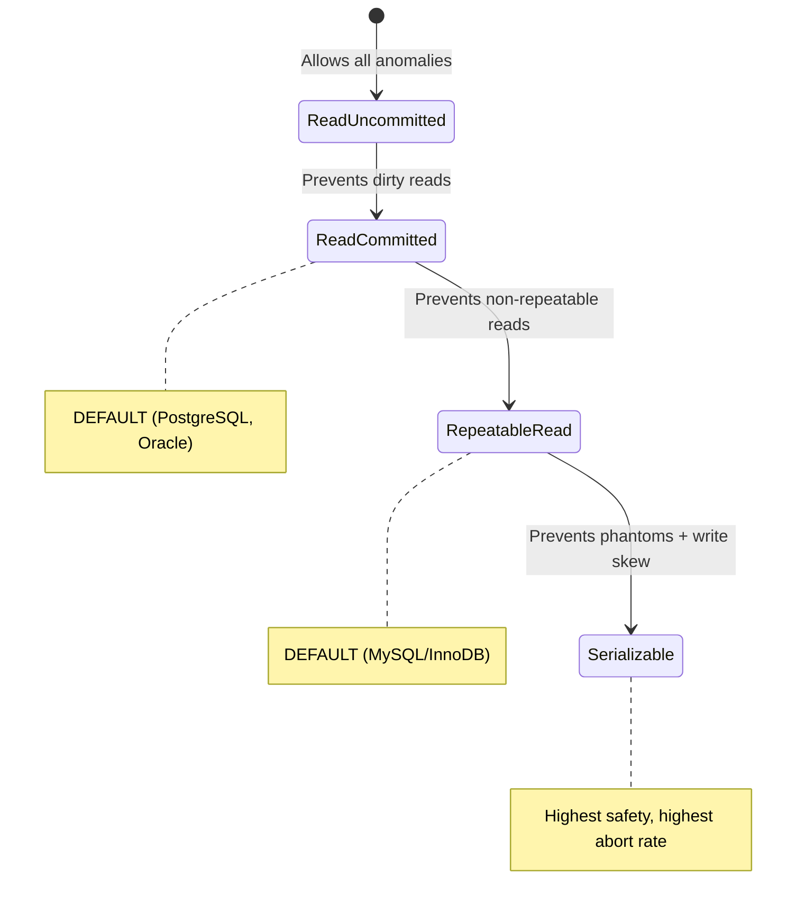
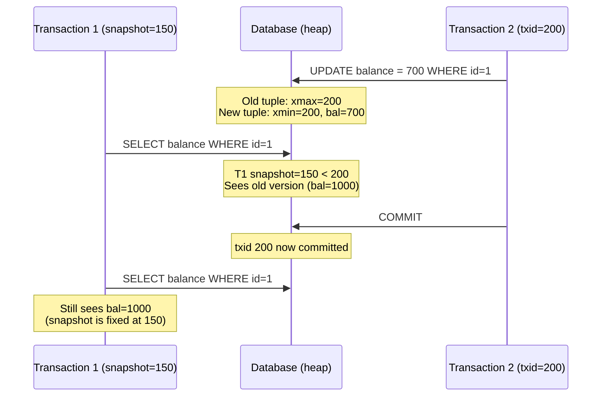
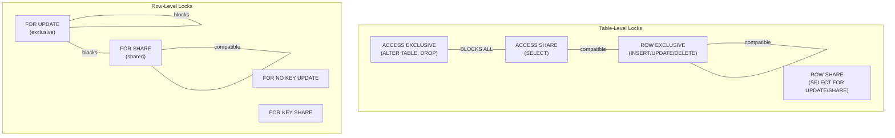
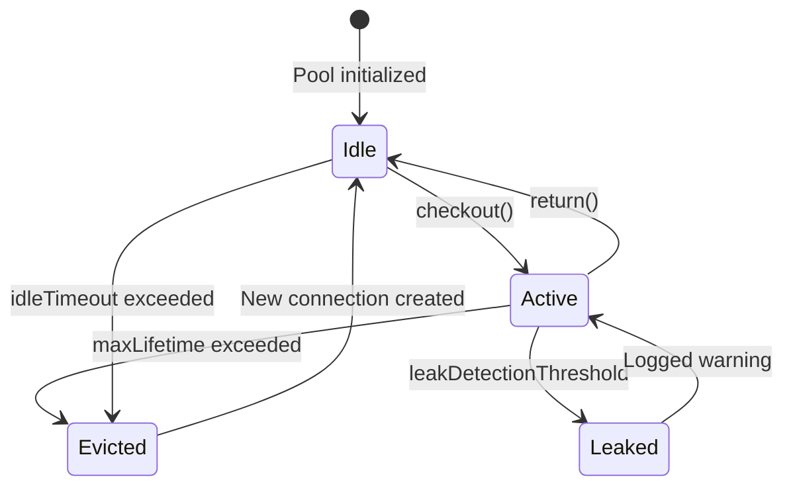
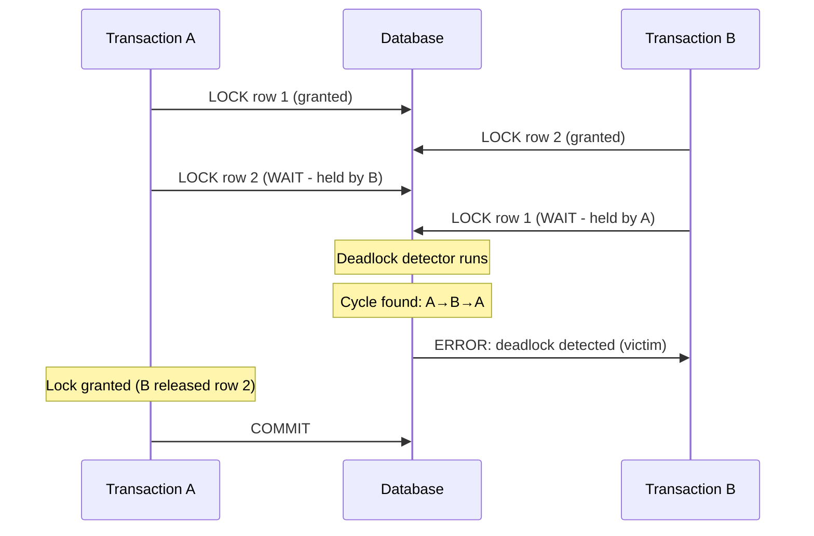

## Keywords in This File

{: .no_toc }

| # | Keyword | Weight |
|---|---|---|
| 1 | [Transaction Isolation Levels](#transaction-isolation-levels) | high |
| 2 | [MVCC and Row Versioning](#mvcc-and-row-versioning) | high |
| 3 | [Database Locking Strategies](#database-locking-strategies) | high |
| 4 | [Connection Pooling and HikariCP](#connection-pooling-and-hikaricp) | high |
| 5 | [Deadlock Detection and Prevention](#deadlock-detection-and-prevention) | high |

---

# Transaction Isolation Levels

**Interview Weight:** high - One of the most-asked database topics
at senior level. Tests understanding of concurrency anomalies and
the trade-off between consistency and performance.

---

### 🎯 Model Answer

**30 seconds:**

> Transaction isolation levels define what concurrency anomalies a
> transaction can observe. SQL standard defines four levels: Read
> Uncommitted (sees uncommitted data), Read Committed (sees only
> committed data, but can see changes between statements),
> Repeatable Read (snapshot at transaction start, no phantom reads
> in PostgreSQL), and Serializable (full isolation, as if
> transactions ran sequentially). Higher isolation = fewer anomalies
> = more contention and potential aborts.

**3 minutes (Senior):**

> The four isolation levels protect against progressively more
> anomalies: dirty reads (seeing uncommitted writes), non-repeatable
> reads (a row changes between two reads in the same transaction),
> and phantom reads (new rows appear matching a previous query's
> condition).
>
> In practice, most production systems use Read Committed (the
> PostgreSQL and Oracle default). Each statement sees a fresh
> snapshot - you never see uncommitted data, but consecutive
> SELECT statements may return different results as other
> transactions commit between them. This is the right trade-off
> for most OLTP: no dirty reads (correctness) with minimal
> blocking (performance).
>
> Repeatable Read in PostgreSQL uses MVCC snapshots: the transaction
> sees a consistent snapshot from its start time. Any write
> conflicts cause the second writer to abort (serialization failure).
> This is needed for read-then-write patterns where the write
> depends on the read result (e.g., "check balance, then debit").
>
> Serializable (SSI in PostgreSQL) provides the strongest guarantee:
> the result is equivalent to some serial execution order. It
> detects read-write dependencies between concurrent transactions
> and aborts one on conflict. The cost: higher abort rates under
> contention. Applications must retry aborted transactions.
>
> The critical insight: isolation levels are NOT about locking
> (that is the implementation). They are about which anomalies
> you accept. PostgreSQL implements them via MVCC + SSI without
> read locks. MySQL/InnoDB uses locking reads (SELECT FOR SHARE)
> for Repeatable Read.

**Framework:** ANOMALIES (dirty, non-repeatable, phantom) ->
LEVELS (RU, RC, RR, S) -> IMPLEMENTATION (MVCC vs locks) ->
PRODUCTION CHOICE (default RC, upgrade for critical sections)

**Blank Mind Recovery:**

**(1) Restate:** "You are asking about isolation levels - what
concurrency anomalies each level allows or prevents."

**(2) First principles:** "Concurrent transactions can interfere
with each other. Isolation levels define how much interference
is acceptable."

**(3) Bridge:** "Like noise-canceling headphones with adjustable
levels: level 1 blocks loud noises only, level 4 blocks everything.
Higher isolation = more blocking = more peaceful but more expensive."

---

### 📘 Concept Explanation

**What it is:**

Transaction isolation levels specify the degree to which one
transaction must be isolated from data modifications made by
other concurrent transactions. They balance correctness (preventing
anomalies) against concurrency (allowing parallel execution).

**How it works:**

```
  Concurrency Anomalies:

  DIRTY READ: T1 writes X=100, T2 reads X=100, T1 ROLLBACK
    → T2 used a value that never existed
    → Prevented by: Read Committed and above

  NON-REPEATABLE READ: T1 reads X=50, T2 updates X=100
    and COMMIT, T1 reads X=100 (different!)
    → Same query, different result within one transaction
    → Prevented by: Repeatable Read and above

  PHANTOM READ: T1 reads WHERE age>20 (gets 5 rows),
    T2 inserts row with age=25 and COMMIT,
    T1 reads WHERE age>20 (gets 6 rows!)
    → New rows appear matching the same condition
    → Prevented by: Serializable (and RR in PostgreSQL)

  Level         | Dirty | Non-Repeatable | Phantom
  ──────────────────────────────────────────────────
  Read Uncommit | YES   | YES            | YES
  Read Committed| NO    | YES            | YES
  Repeatable Rd | NO    | NO             | YES*
  Serializable  | NO    | NO             | NO

  * PostgreSQL RR also prevents phantoms (MVCC snapshot)
```



> **Diagram walkthrough:** Each level adds protection against
> additional anomalies. Read Committed is the most common
> production default because it prevents the most dangerous
> anomaly (dirty reads) while maintaining good concurrency.
> Moving up requires accepting higher abort rates and retry logic.

**The key insight:**

Isolation levels are about WHICH ANOMALIES YOU ACCEPT, not about
how much locking occurs. PostgreSQL achieves Repeatable Read
without any read locks - purely through MVCC snapshots. The
mechanism varies by database, but the anomaly guarantees are
standardized.

**When to use each level:**

- **Read Committed (default):** Most OLTP. Each statement sees
  latest committed data. Simple, low contention.
- **Repeatable Read:** When a transaction reads data and then
  makes a decision based on that data (check-then-act). The
  snapshot prevents the data from changing underneath you.
- **Serializable:** Financial calculations, inventory management,
  any operation where even phantom reads could cause incorrect
  results. Requires retry logic for serialization failures.

---

### 💻 Code Example

**Example 1: BAD - Lost update in Read Committed**

```sql
-- BAD: Read Committed allows non-repeatable reads
-- Two transactions trying to debit an account:

-- Session 1 (Read Committed - default):
BEGIN;
SELECT balance FROM accounts WHERE id = 1; -- Returns 1000
-- Meanwhile, Session 2 also reads balance = 1000 and debits
UPDATE accounts SET balance = balance - 200 WHERE id = 1;
COMMIT;
-- Session 1 thinks balance is 1000, debits 300:
UPDATE accounts SET balance = 1000 - 300 WHERE id = 1;
-- balance = 700 (WRONG! Should be 500)
COMMIT;
-- Session 2's debit is LOST

-- GOOD: Use Repeatable Read or explicit locking
-- Option A: Repeatable Read (abort on conflict)
BEGIN ISOLATION LEVEL REPEATABLE READ;
SELECT balance FROM accounts WHERE id = 1; -- 1000
-- Session 2 commits its update first
UPDATE accounts SET balance = balance - 300 WHERE id = 1;
-- ERROR: could not serialize access due to concurrent update
-- Application RETRIES the transaction from the start
ROLLBACK;

-- Option B: SELECT FOR UPDATE (explicit lock)
BEGIN;
SELECT balance FROM accounts WHERE id = 1 FOR UPDATE;
-- This LOCKS the row. Session 2 must wait.
UPDATE accounts SET balance = balance - 300 WHERE id = 1;
COMMIT;
-- Correct: Session 2 now reads updated balance
```

> **Code walkthrough:** Read Committed allows the lost update
> anomaly because Session 1 reads the balance before Session 2
> commits. Two fixes: Repeatable Read detects the conflict and
> aborts (requires retry), or SELECT FOR UPDATE acquires a row
> lock preventing concurrent reads from proceeding.

**Example 2: Serialization failure and retry pattern**

```java
// Production retry pattern for Serializable transactions
public <T> T executeWithRetry(
    Function<Connection, T> operation,
    int maxRetries
) {
    int attempt = 0;
    while (true) {
        try (Connection conn = dataSource.getConnection()) {
            conn.setTransactionIsolation(
                Connection.TRANSACTION_SERIALIZABLE
            );
            conn.setAutoCommit(false);
            T result = operation.apply(conn);
            conn.commit();
            return result;
        } catch (SQLException e) {
            if (e.getSQLState().equals("40001") // serialization
                && attempt < maxRetries) {
                attempt++;
                // Exponential backoff with jitter
                Thread.sleep(
                    (long)(Math.pow(2, attempt) * 10
                    + Math.random() * 50)
                );
                continue;
            }
            throw new RuntimeException(
                "Transaction failed after " + attempt
                + " retries", e
            );
        }
    }
}
```

> **Code walkthrough:** Serializable isolation may abort
> transactions on conflict (SQLSTATE 40001). Production code MUST
> handle this with retry logic. Exponential backoff with jitter
> prevents retry storms. The caller's operation function is
> re-executed from scratch on each retry - it must be idempotent
> in terms of side effects outside the database.

**Example 3: Observing isolation level behavior**

```sql
-- Demonstrate the difference between RC and RR:

-- Terminal 1:
BEGIN ISOLATION LEVEL READ COMMITTED;
SELECT count(*) FROM orders WHERE status = 'pending';
-- Returns 100

-- Terminal 2 (concurrent):
INSERT INTO orders (status) VALUES ('pending');
COMMIT;

-- Terminal 1 (same transaction):
SELECT count(*) FROM orders WHERE status = 'pending';
-- Returns 101 (!)  <-- Non-repeatable read / phantom

-- Now with Repeatable Read:
-- Terminal 1:
BEGIN ISOLATION LEVEL REPEATABLE READ;
SELECT count(*) FROM orders WHERE status = 'pending';
-- Returns 100 (snapshot taken at first statement)

-- Terminal 2:
INSERT INTO orders (status) VALUES ('pending');
COMMIT;

-- Terminal 1 (same transaction):
SELECT count(*) FROM orders WHERE status = 'pending';
-- Still returns 100!  <-- Snapshot isolation
COMMIT;
```

> **Code walkthrough:** In Read Committed, each statement sees
> the latest committed state (count changes within the transaction).
> In Repeatable Read, the transaction's snapshot is fixed at the
> first statement - it never sees changes committed by other
> transactions after that point. This is the practical difference.

---

### ⚖️ Comparison Table

| Level | Default In | Anomalies Allowed | Contention | Retry Needed | Use Case |
|---|---|---|---|---|---|
| **Read Uncommitted** | (none) | dirty, NR, phantom | none | no | Never in production |
| **Read Committed** | PostgreSQL, Oracle | NR, phantom | minimal | no | General OLTP |
| **Repeatable Read** | MySQL/InnoDB | phantom (standard), none (PG) | moderate | yes (on conflict) | Check-then-act patterns |
| **Serializable** | (explicit only) | none | high | yes (always) | Financial, inventory |

**The deciding factor:** Use Read Committed by default. Upgrade to
Repeatable Read for specific transactions that read-then-write on
the same data. Use Serializable only for provably critical
calculations where even subtle anomalies cause business loss.

---

### 🎓 Answers by Seniority

**Junior / Mid (0-5 years):**

> There are four isolation levels: Read Uncommitted (sees dirty
> data), Read Committed (sees only committed data), Repeatable
> Read (consistent within a transaction), and Serializable (acts
> like serial execution). Read Committed is the default in
> PostgreSQL. Higher levels prevent more anomalies but can cause
> transaction aborts that need retry logic.

---

**Senior / Staff (5+ years):**

> I choose isolation levels per-transaction based on the operation's
> requirements. Most operations use the default Read Committed. For
> check-then-act patterns (read balance, then debit), I use
> Repeatable Read or SELECT FOR UPDATE depending on contention
> level. SELECT FOR UPDATE is better for high-contention cases
> (it waits rather than aborting). Serializable is reserved for
> complex invariant enforcement where I cannot express the
> constraint as a single SQL statement or database constraint.
> Every non-RC isolation level requires retry logic in the
> application layer.

---

### ⚠️ Common Misconceptions

| # | Misconception | Reality |
|---|---|---|
| 1 | "Read Committed prevents lost updates" | It does NOT. Two transactions can both read the same value and then overwrite each other's updates. Use SELECT FOR UPDATE or Repeatable Read. |
| 2 | "Repeatable Read uses read locks" | In PostgreSQL, RR uses MVCC snapshots (no locks). In MySQL/InnoDB, RR uses gap locks for certain operations. Implementation varies drastically by database. |
| 3 | "Serializable means transactions run one at a time" | Serializable means the RESULT is equivalent to some serial order. Transactions still run concurrently - the system aborts ones that would violate serializability. |
| 4 | "Higher isolation is always safer" | Higher isolation means more aborts. If your retry logic is broken (no backoff, infinite loops, non-idempotent operations), higher isolation can cause more harm than the anomalies it prevents. |
| 5 | "You can just set everything to Serializable and forget about it" | Serializable has 10-40% higher abort rates under contention. Without robust retry logic and idempotent operations, this causes cascade failures under load. |

---

### 🚨 Failure Modes and Diagnosis

**Failure 1: Lost updates in Read Committed**

- **Symptom:** Account balances, inventory counts, or counters
  drift from expected values. Numbers do not add up at end-of-day
  reconciliation.
- **Root Cause:** Classic read-modify-write pattern in Read
  Committed. Two transactions read the same value, compute
  independently, and the last writer wins (first write is lost).
- **Diagnostic:**
  ```sql
  -- Check if concurrent sessions modify the same rows
  SELECT pid, state, query, xact_start
  FROM pg_stat_activity
  WHERE datname = current_database()
    AND state != 'idle';
  -- If multiple sessions UPDATE the same table/row concurrently
  -- in Read Committed: lost updates are happening
  ```
- **Fix:** Three options depending on context: (1) SET TRANSACTION
  ISOLATION LEVEL REPEATABLE READ (abort on conflict + retry).
  (2) SELECT ... FOR UPDATE (acquire row lock before reading).
  (3) Rewrite as single atomic UPDATE: UPDATE accounts SET
  balance = balance - 300 WHERE id = 1 (no separate read).
- **Prevention:** For all check-then-act patterns, default to
  SELECT FOR UPDATE or atomic SQL (UPDATE with calculation).

**Failure 2: Serialization failure storms**

- **Symptom:** Application logs filled with "could not serialize
  access" errors. Transaction retry rate exceeds 30%. Overall
  throughput drops as retries consume connections.
- **Root Cause:** Too many concurrent transactions operating on
  overlapping data at Serializable isolation. Each conflict causes
  an abort and retry, which may conflict again.
- **Diagnostic:**
  ```sql
  -- Monitor serialization failures in PostgreSQL
  SELECT datname,
         conflicts AS serialization_conflicts
  FROM pg_stat_database;
  -- Application metrics: retry_rate, retry_exhausted_count
  ```
- **Fix:** (1) Reduce contention: partition data so transactions
  touch different rows. (2) Reduce transaction duration: keep
  transactions as short as possible. (3) Reduce isolation: do only
  the critical section at Serializable, do the rest at RC.
  (4) Add jitter to retry backoff to prevent thundering herd.
- **Prevention:** Use Serializable only for truly necessary
  operations. Benchmark retry rates before production. Design
  for sub-100ms transactions.

**Failure 3: Phantom reads causing business logic errors**

- **Symptom:** A scheduling system double-books a resource. A
  unique-check-then-insert allows duplicates. Business invariants
  are violated despite "checking first."
- **Root Cause:** In Read Committed, between the CHECK query and
  the INSERT, another transaction can insert a conflicting row.
  The check saw no conflict, but by the time INSERT runs, the
  conflict exists.
- **Diagnostic:**
  ```sql
  -- The pattern that fails:
  BEGIN; -- Read Committed
  SELECT count(*) FROM bookings
    WHERE room_id = 1 AND date = '2024-06-15';
  -- Returns 0 → "room is available"
  -- Another transaction inserts a booking for same room+date
  INSERT INTO bookings (room_id, date, user_id)
    VALUES (1, '2024-06-15', 42);
  -- DOUBLE BOOKING! The check was stale.
  COMMIT;
  ```
- **Fix:** (1) UNIQUE constraint (database enforces, one INSERT
  fails). (2) Serializable isolation (detects the dependency). (3)
  SELECT FOR UPDATE on the resource row (advisory lock if no row
  exists yet). (4) INSERT ... ON CONFLICT DO NOTHING (atomic
  upsert).
- **Prevention:** Never trust read-then-write patterns in Read
  Committed for uniqueness. Use constraints or higher isolation.

---

### 🎯 Interview Deep-Dive

**Timing Guidelines:**

| Depth | Time | Signal |
|---|---|---|
| Definition | 30 sec | Can name 4 levels + anomalies |
| Mechanism | 1-2 min | Understands MVCC vs locks |
| Application | 2-3 min | Chooses correct level for scenario |
| Production | 3-5 min | Handles serialization failures |
| Architecture | 5+ min | Designs retry infrastructure |

---

**Q1. Name the four isolation levels and what each prevents.**
[JUNIOR]

*Why they ask:* Baseline knowledge check.

*Likely follow-up:* "Which is the default in PostgreSQL?"

**A:** The four SQL standard isolation levels are:

Read Uncommitted: the lowest level. A transaction can read data
written by other transactions that have not yet committed (dirty
reads). It also allows non-repeatable reads and phantom reads.
Almost never used in production because dirty reads mean you can
act on data that might be rolled back.

Read Committed: prevents dirty reads. A transaction only sees data
committed before each statement executes. However, if you run the
same SELECT twice within one transaction, you might get different
results if another transaction commits between them (non-repeatable
reads and phantoms are allowed). This is the default in PostgreSQL
and Oracle.

Repeatable Read: prevents dirty and non-repeatable reads. Once you
read a row, it will not change for the duration of your
transaction. In PostgreSQL, this also prevents phantom reads (due
to MVCC snapshot implementation). In MySQL, phantoms are still
theoretically possible per the SQL standard though gap locks
prevent most cases. Default in MySQL/InnoDB.

Serializable: prevents all anomalies. Transactions behave as if
they were executed one after another in some serial order. Any
concurrent execution that cannot map to a serial order causes one
transaction to be aborted. This requires applications to handle
serialization failures and retry.

*What separates good from great:* Great candidates note that
PostgreSQL's Repeatable Read is stronger than the SQL standard
requires (it also prevents phantoms via MVCC snapshots) and that
MySQL/InnoDB's implementation differs significantly.

---

**Q2. What is the difference between Read Committed and
Repeatable Read in practical terms?** [MID]

*Why they ask:* Tests understanding of when to upgrade isolation.

*Likely follow-up:* "Give me a scenario where RC fails but RR succeeds."

**A:** The practical difference: in Read Committed, each SQL
statement within a transaction sees the latest committed state. In
Repeatable Read, the entire transaction sees a consistent snapshot
from its first statement.

This matters for read-then-write patterns. Example: "Transfer $300
from account A to account B only if A has sufficient balance."

In Read Committed: SELECT balance FROM accounts WHERE id = 'A'
returns $500. Meanwhile, another transaction debits $400 and
commits. When you execute UPDATE accounts SET balance = balance -
300 WHERE id = 'A', the balance is now $100, and your debit makes
it -$200 (overdraft! The check was meaningless because the data
changed between your read and write).

In Repeatable Read (PostgreSQL): your transaction's snapshot is
fixed. If another transaction modifies the row you read and commits
first, your UPDATE will fail with "could not serialize access due
to concurrent update." You MUST retry. But you will never silently
produce an incorrect result.

The trade-off: RC never aborts (but may produce wrong results
without explicit locking). RR may abort (but guarantees snapshot
consistency). In PostgreSQL, the abort only happens if the specific
row you are modifying was changed by another committed transaction
during your transaction.

In practice: use RC (default) with SELECT FOR UPDATE for specific
rows that need protection. Use RR when multiple reads must be
consistent within a transaction (reporting, multi-row calculations
that cannot be expressed as a single SQL statement).

*What separates good from great:* Great candidates explain WHEN
the abort happens in PostgreSQL RR (only on write conflict to a
modified row, not on every read) and contrast with MySQL's gap
locking approach.

---

**Q3. How does PostgreSQL implement Repeatable Read differently
from MySQL/InnoDB?** [SENIOR]

*Why they ask:* Tests cross-database depth.

*Likely follow-up:* "Which approach do you prefer and why?"

**A:** The fundamental difference is MVCC snapshots (PostgreSQL) vs
locking (MySQL/InnoDB):

PostgreSQL Repeatable Read: takes a snapshot at the first statement.
All subsequent reads see only data committed before that snapshot.
No read locks are acquired. Writers never block readers and readers
never block writers. If two transactions write to the same row, the
second to commit is aborted (first-updater-wins rule). Very high
concurrency for read-heavy workloads.

MySQL/InnoDB Repeatable Read: also uses MVCC for consistent reads
(reads from the snapshot without locks). However, for locking reads
(SELECT FOR UPDATE, SELECT FOR SHARE) and write operations, InnoDB
uses next-key locks (record lock + gap lock). Gap locks prevent
phantom inserts in the locked range. This means writes CAN block
other writes and even some reads if they use locking reads.

The practical differences:

Phantom prevention: PostgreSQL RR prevents phantoms automatically
(snapshot never sees new rows). MySQL RR prevents phantoms only for
locking reads (gap locks) but not for plain SELECTs (which read
from snapshot, so effectively also prevents them for consistent
reads).

Conflict handling: PostgreSQL aborts the loser immediately on write
conflict (no waiting). MySQL makes the second writer WAIT until the
first commits or rolls back, then proceeds (no abort unless
deadlock is detected). This means MySQL has fewer serialization
errors but higher latency under contention.

My preference: PostgreSQL's approach for OLTP because failures are
fast (abort immediately rather than waiting). With proper retry
logic, the application recovers quickly. MySQL's approach avoids
retries but can cause latency spikes when transactions wait for
locks.

*What separates good from great:* Great candidates contrast the
failure modes: PostgreSQL aborts fast (retry needed) vs MySQL waits
(latency spike), and explain which is better for different workloads.

---

**Q4. You have a financial transfer operation. Walk me through
choosing the right isolation level and locking strategy.**
[SENIOR] [TRADE-OFF]

*Why they ask:* Tests real design decision under safety requirements.

*Likely follow-up:* "What if this runs at 10K transactions/second?"

**A:** Financial transfer: debit account A, credit account B,
ensure A's balance never goes negative. This is a classic
check-then-act across two rows.

Option 1 - Atomic SQL (no explicit isolation upgrade needed):
```sql
UPDATE accounts SET balance = balance - 300
WHERE id = 'A' AND balance >= 300;
-- If 0 rows affected: insufficient funds
```
This is a single statement - atomically checks AND updates. No race
condition. Works at Read Committed. Highest performance, lowest
complexity. But it does not return the new balance or allow complex
validation logic.

Option 2 - SELECT FOR UPDATE (Read Committed + explicit lock):
```sql
BEGIN;
SELECT balance FROM accounts WHERE id = 'A' FOR UPDATE;
-- Row is LOCKED. Other transactions wait here.
-- Validate balance >= 300 in application
UPDATE accounts SET balance = balance - 300 WHERE id = 'A';
UPDATE accounts SET balance = balance + 300 WHERE id = 'B';
COMMIT;
```
Explicit lock prevents concurrent access. No retry needed (waiters
just wait). But under high contention, waiters queue up causing
latency spikes.

Option 3 - Serializable (detect and retry):
```sql
BEGIN ISOLATION LEVEL SERIALIZABLE;
SELECT balance FROM accounts WHERE id = 'A';
-- No lock acquired - but conflict will be detected at commit
UPDATE accounts SET balance = balance - 300 WHERE id = 'A';
UPDATE accounts SET balance = balance + 300 WHERE id = 'B';
COMMIT;
-- May fail with 40001 - retry
```
No waiting, but requires retry logic. Under contention, retry rate
increases.

My recommendation for 10K TPS: Option 1 (atomic SQL) for simple
transfers. Option 2 (SELECT FOR UPDATE) with lock ordering
(always lock lower account ID first) for complex multi-row
operations. This prevents deadlocks and gives predictable latency.
Option 3 (Serializable) only if the business logic is too complex
for a single SQL statement and explicit locking.

*What separates good from great:* Great candidates start with the
simplest solution (atomic SQL) and escalate only when complexity
requires it, rather than jumping to Serializable for everything.

---

**Q5. What is write skew and how does Serializable isolation
prevent it?** [SENIOR]

*Why they ask:* Tests understanding of subtle anomalies.

*Likely follow-up:* "Give a real-world example."

**A:** Write skew occurs when two transactions each read data that
the other modifies, and the combined result violates a constraint
that neither transaction violated individually.

Classic example: hospital on-call scheduling. Rule: at least one
doctor must be on-call at all times. Currently doctors A and B are
on-call.

Transaction 1: reads on-call list (A, B). Sees two doctors. Removes
doctor A from on-call. (Still has B - rule satisfied.)

Transaction 2 (concurrent): reads on-call list (A, B). Sees two
doctors. Removes doctor B from on-call. (Still has A - rule
satisfied.)

Both commit. Result: nobody is on-call! Each transaction's check
was valid at read time, but the combined effect violates the
invariant.

Repeatable Read does NOT prevent this because neither transaction
modified a row the other read (T1 modified A's row, T2 modified
B's row - no write conflict on the same row). Only Serializable
detects the read-write dependency: T1 read the set that T2 modified,
and T2 read the set that T1 modified. This circular dependency
proves no serial order is possible, so one transaction is aborted.

Real-world examples: double-booking (two meetings check room
availability then book), inventory reservation (two orders check
stock then reserve), unique value generation (two processes check
"code not used" then create).

Prevention without Serializable: materialize the constraint. Create
a single row representing the invariant (e.g., "on-call count") and
have both transactions lock that row. Or use an explicit application
lock (advisory lock in PostgreSQL).

*What separates good from great:* Great candidates explain that
write skew involves two transactions reading what the other writes
(circular dependency), and that Serializable Snapshot Isolation
(SSI) detects this via read-write dependency tracking.

---

**Q6. How does Serializable Snapshot Isolation (SSI) work in
PostgreSQL?** [STAFF]

*Why they ask:* Deep internals question for architect-level roles.

*Likely follow-up:* "What are the false positive abort cases?"

**A:** SSI (PostgreSQL 9.1+) implements serializable isolation
without read locks. It extends Snapshot Isolation by detecting
dangerous structures in the transaction dependency graph.

The mechanism: PostgreSQL tracks two types of dependencies between
concurrent serializable transactions:

rw-dependency (read-write): Transaction T1 reads a version that T2
later overwrites. T1 "depends on" the old state that T2 changed.

ww-dependency (write-write): Transaction T1 writes a version that
T2 overwrites (first-updater-wins already handles this via abort).

The dangerous structure: a cycle of rw-dependencies between
transactions. Specifically, if T1 has an rw-dependency on T2, and
T2 has an rw-dependency on T1 (or any cycle), no serial order
exists. SSI aborts one transaction to break the cycle.

Implementation: PostgreSQL maintains predicate locks (SIREAD locks)
that track which data ranges each serializable transaction has read.
These are not blocking locks - they are just records of "what did
this transaction see?" When a write occurs that conflicts with
another transaction's predicate lock, a rw-dependency is recorded.
If the dependency graph forms a dangerous structure, one transaction
is aborted.

False positives: SSI can abort transactions that would actually be
serializable (the detection is conservative). This happens with
coarse-grained predicate locks (page-level instead of row-level).
The rate depends on workload and can be reduced by keeping
transactions short and accessing data in consistent patterns.

Performance: SSI adds ~5-10% overhead for dependency tracking.
Under low contention, abort rates are minimal. Under high
contention on overlapping data, abort rates increase. The key
advantage over traditional 2PL (two-phase locking): readers never
block writers and vice versa.

*What separates good from great:* Great candidates explain the
rw-dependency graph and dangerous structure (pivot transactions)
rather than just saying "it detects conflicts."

---

**Q7. How do you choose between SELECT FOR UPDATE and a higher
isolation level?** [SENIOR] [TRADE-OFF]

*Why they ask:* Common production design decision.

*Likely follow-up:* "What about advisory locks?"

**A:** The choice depends on contention pattern and failure handling
preference:

SELECT FOR UPDATE (pessimistic locking):
- Acquires a lock immediately. Other transactions WAIT.
- No retry logic needed (waiters eventually proceed).
- Best when: contention is high on specific rows, you want
  predictable latency (no aborts), and the locked section is short.
- Downside: if one transaction holds the lock too long, all waiters
  queue up. Risk of deadlocks if lock ordering is not consistent.

Higher isolation (optimistic concurrency):
- No locks acquired during reads. Conflicts detected at commit.
- Requires retry logic (aborted transactions must be re-executed).
- Best when: contention is low (most transactions do not conflict),
  reads are frequent but write conflicts are rare, or you cannot
  identify which rows to lock in advance.
- Downside: under high contention, retry storms. Wasted work when
  transactions that did significant computation get aborted at
  commit.

My decision framework:
- Can I identify the specific rows that might conflict? → SELECT
  FOR UPDATE (targeted locking on known rows).
- Is the conflict between transactions that read overlapping sets
  without modifying the same row? (write skew) → Serializable
  (only SSI can detect this without explicit locking).
- Is contention very low (<1% conflict rate)? → Higher isolation
  with retry (cheaper than acquiring locks on every transaction).
- Is contention high (>10% conflict rate)? → SELECT FOR UPDATE
  (avoid the retry storm).

Advisory locks are a third option: pg_advisory_xact_lock(key).
Useful when the conflict is logical (not tied to a specific row)
and you need to serialize access to a concept (e.g., "one process
at a time for tenant 42's billing calculation").

*What separates good from great:* Great candidates use the conflict
rate as the deciding factor and mention advisory locks for
logical-level serialization.

---

**Q8. A financial system needs exact-once processing of payment
events. How do you design the transaction strategy?** [STAFF]

*Why they ask:* Real architecture problem combining isolation with
idempotency.

*Likely follow-up:* "What happens during a network partition?"

**A:** Exact-once processing requires idempotency + appropriate
isolation. My design:

Layer 1 - Idempotency key table:
```sql
CREATE TABLE processed_events (
  event_id UUID PRIMARY KEY,
  processed_at TIMESTAMPTZ DEFAULT now(),
  result JSONB
);
```
Every payment event has a unique event_id. Before processing, check
if event_id exists in processed_events. If yes, return the cached
result (idempotent). If no, process and insert atomically.

Layer 2 - Transaction design:
```sql
BEGIN ISOLATION LEVEL READ COMMITTED;
-- Attempt insert first (atomic check-and-insert):
INSERT INTO processed_events (event_id)
  VALUES ($event_id)
  ON CONFLICT (event_id) DO NOTHING;
-- If 0 rows inserted: already processed → return cached result
-- If 1 row inserted: we own this event, proceed
UPDATE accounts SET balance = balance - $amount
  WHERE id = $account_id AND balance >= $amount;
-- Check rows affected: 0 = insufficient funds
UPDATE processed_events
  SET result = '{"status": "success"}'
  WHERE event_id = $event_id;
COMMIT;
```

Why Read Committed is sufficient here: the idempotency check uses
INSERT ON CONFLICT which is atomic. The balance update uses an
atomic check (AND balance >= $amount). No read-then-write gap
exists - each step is a single atomic statement.

Layer 3 - Failure handling: if the application crashes between
payment processing and the commit, the transaction rolls back
(both the processed_events insert and the balance update). The
event will be redelivered and processed from scratch. If the
commit succeeds but the acknowledgment to the message broker fails,
the event is redelivered - but the idempotency check prevents
double-processing.

Layer 4 - Monitoring: track duplicate event rates (how often the
ON CONFLICT fires), processing latency percentiles, and
unacknowledged events (events in processed_events without a
result).

*What separates good from great:* Great candidates design the
idempotency layer FIRST (it handles the hardest problem -
exactly-once delivery does not exist in distributed systems, so
you make processing idempotent), then show that simple isolation
levels suffice when each step is atomic.

---

**Q9. Explain how different isolation levels affect connection
pool behavior and application performance.** [STAFF]

*Why they ask:* Tests understanding of system-level interactions.

*Likely follow-up:* "How does long-running Serializable transactions
affect other transactions?"

**A:** Isolation levels interact with connection pools in several
ways that impact system performance:

Read Committed impact: connections are released back to the pool as
soon as the transaction commits. Transactions are short (typically
< 50ms). Connection utilization is high. No global impact - each
transaction is independent.

Repeatable Read impact: the snapshot is held for the transaction
duration. If a transaction takes 5 seconds (reading multiple
tables, computing, then writing), the snapshot prevents VACUUM from
cleaning dead tuples created during those 5 seconds (for the
specific data this transaction might read). With 100 concurrent RR
transactions, the oldest snapshot determines what VACUUM can clean.
Long RR transactions = table bloat.

Serializable impact: SSI tracks predicate locks for all concurrent
serializable transactions. Long-running serializable transactions
hold predicate locks longer, increasing the chance of conflicts
with other transactions. Under connection pooling, if one connection
runs a long serializable transaction, other connections' serializable
transactions accumulate dependencies - increasing abort rates
cluster-wide.

Connection pool sizing: for Read Committed (short transactions),
pool size = CPU cores * 2-4 is typically sufficient (connections
are quickly returned). For higher isolation with longer transactions,
you may need more connections to maintain throughput (more are
"in-flight" at any time).

The anti-pattern: running analytical queries (minutes-long) at
Repeatable Read on the primary. The long-lived snapshot prevents
VACUUM from cleaning ANY dead tuples created after the snapshot
started. This causes table bloat that affects ALL queries. Fix:
route long-running reads to a replica, or use Read Committed for
analytics (accepting that results may shift between statements).

*What separates good from great:* Great candidates explain the
VACUUM-blocking effect of long-lived snapshots and how it cascades
to table bloat affecting unrelated queries on the same table.

---

**Interviewer Type Adaptation:**

| Interviewer Type | Emphasis |
|---|---|
| Technical Panel | Anomaly definitions, SSI mechanics, PostgreSQL vs MySQL |
| Hiring Manager | Choosing the right level for business requirements |
| Bar Raiser | Write skew, retry infrastructure, VACUUM interaction |
| Peer Engineer | "Our transfers occasionally lose money - help us debug" |

---

---

# MVCC and Row Versioning

**Interview Weight:** high - The mechanism behind PostgreSQL and
InnoDB concurrency. Senior interviews test whether you understand
HOW isolation is implemented, not just what it guarantees.

---

### 🎯 Model Answer

**30 seconds:**

> MVCC (Multi-Version Concurrency Control) allows readers and
> writers to operate concurrently without blocking each other.
> Instead of locking rows, the database keeps multiple versions
> of each row. Each transaction sees a consistent snapshot -
> the version of each row that was committed before the transaction
> started. Old versions are cleaned up by VACUUM (PostgreSQL) or
> purge thread (InnoDB) after no transaction needs them.

**3 minutes (Senior):**

> MVCC solves the fundamental problem: how to let reads and writes
> happen simultaneously without data corruption or blocking.
>
> In PostgreSQL, every row has hidden system columns: xmin (the
> transaction ID that created this version) and xmax (the
> transaction ID that deleted/updated it, or 0 if still live).
> When a transaction reads, it only sees rows where xmin is a
> committed transaction before the snapshot AND xmax is either 0
> or an uncommitted/aborted transaction. This is the visibility
> check.
>
> When a row is updated, PostgreSQL does not modify in place.
> It creates a NEW tuple with the updated values (xmin = current
> transaction), and marks the OLD tuple with xmax = current
> transaction. Both versions coexist on disk. Old versions become
> "dead tuples" once no snapshot can see them. VACUUM reclaims
> their space.
>
> In InnoDB, the approach is different: the current version is
> stored in the data page, and previous versions are written to
> the undo log (rollback segment). Readers reconstruct old versions
> by applying undo records backwards. Purge thread deletes undo
> records that no active snapshot needs.
>
> The critical operational implication: long-running transactions
> hold snapshots that prevent cleanup of old versions. In
> PostgreSQL: table bloat (dead tuples cannot be vacuumed). In
> InnoDB: undo log growth (old versions cannot be purged). Both
> degrade performance over time.

**Framework:** PROBLEM (readers block writers) -> SOLUTION (keep
multiple versions) -> MECHANISM (xmin/xmax or undo log) ->
CLEANUP (VACUUM or purge) -> OPERATIONAL RISK (long snapshots
block cleanup)

**Blank Mind Recovery:**

**(1) Restate:** "You are asking about Multi-Version Concurrency
Control - how databases allow concurrent access without locking."

**(2) First principles:** "We need reads and writes to not block
each other. Solution: keep old versions around so readers can see
consistent data while writers create new versions."

**(3) Bridge:** "Like Git: you commit a new version but can always
check out old commits. Multiple people work on different branches
(snapshots) simultaneously. Garbage collection removes old objects
nobody references."

---

### 📘 Concept Explanation

**What it is:**

MVCC is a concurrency control method where the database maintains
multiple versions of each data item. Transactions see a consistent
snapshot without acquiring read locks. Writers create new versions
rather than modifying existing data in place.

**How it works:**

```
  PostgreSQL MVCC (heap-based versioning):

  Row update: balance 1000 → 700

  BEFORE UPDATE:
  Heap Page:
  ┌──────────────────────────────────────┐
  │ Tuple A: (id=1, bal=1000)            │
  │   xmin=100 (committed) xmax=0       │
  └──────────────────────────────────────┘

  AFTER UPDATE (txid=200):
  Heap Page:
  ┌──────────────────────────────────────┐
  │ Tuple A (dead): (id=1, bal=1000)     │
  │   xmin=100 xmax=200                  │
  │ Tuple B (live): (id=1, bal=700)      │
  │   xmin=200 xmax=0                    │
  └──────────────────────────────────────┘

  Transaction with snapshot < 200 sees Tuple A (bal=1000)
  Transaction with snapshot >= 200 sees Tuple B (bal=700)
  After all snapshots > 200 exist: Tuple A is dead → VACUUM
```



> **Diagram walkthrough:** Transaction 1 (snapshot 150) always sees
> the old version (balance 1000) regardless of T2's commit. The
> snapshot is fixed at transaction start. T2's update creates a new
> tuple version. Both versions coexist until VACUUM cleans the old
> one after T1 ends.

**The key insight:**

MVCC trades storage space for concurrency. Instead of locking (which
blocks), it uses extra storage (old versions) to let everyone
proceed. The operational cost is cleanup: dead tuples must be
reclaimed, and long-running transactions prevent that cleanup.

**When it matters:**

- Understanding why VACUUM is critical (it cleans dead tuples)
- Diagnosing table bloat (long transactions prevent cleanup)
- Understanding isolation levels (they control WHICH version you see)
- Index design (indexes point to all versions, including dead ones)

---

### 💻 Code Example

**Example 1: BAD - Long transaction blocking VACUUM**

```sql
-- BAD: Long-running transaction holding a snapshot
-- Session 1: starts a transaction and goes idle
BEGIN; -- Snapshot taken here
SELECT 1; -- Keeps the snapshot alive
-- Developer goes to lunch. Transaction stays open for 2 hours.

-- Meanwhile: millions of updates happen on other tables.
-- VACUUM cannot clean ANY dead tuples created after
-- Session 1's snapshot timestamp because Session 1
-- MIGHT still read them.

-- After 2 hours: tables are 3x their normal size.
-- Performance degraded for ALL users.

-- GOOD: Keep transactions short, or use statement-level snapshots
-- Option A: No explicit transaction for read-only operations
SELECT * FROM reports WHERE date > '2024-01-01';
-- In autocommit mode (no BEGIN), snapshot is per-statement
-- Released immediately. No blocking.

-- Option B: Use idle_in_transaction_session_timeout
ALTER SYSTEM SET idle_in_transaction_session_timeout = '5min';
SELECT pg_reload_conf();
-- Automatically terminates sessions idle in transaction > 5 min
```

> **Code walkthrough:** An idle open transaction holds a snapshot
> that prevents VACUUM from cleaning dead tuples created after that
> snapshot. Even though this transaction is not doing anything, it
> blocks cleanup for the ENTIRE database. The fix is either
> avoiding unnecessary transactions or setting timeouts to kill
> idle ones.

**Example 2: Observing MVCC versions in PostgreSQL**

```sql
-- See the hidden system columns that drive MVCC
CREATE TABLE mvcc_demo (id int, value text);
INSERT INTO mvcc_demo VALUES (1, 'original');

-- View the internal tuple metadata
SELECT ctid, xmin, xmax, id, value FROM mvcc_demo;
-- ctid  | xmin | xmax | id | value
-- (0,1) | 100  | 0    | 1  | original
-- xmin=100 (creating transaction), xmax=0 (not deleted)

-- Update the row
BEGIN;
UPDATE mvcc_demo SET value = 'modified' WHERE id = 1;
-- Before commit, another session sees:
-- (0,1) | 100 | 200 | 1 | original    ← old version (xmax=200 means "being deleted by txid 200")
-- (0,2) | 200 | 0   | 1 | modified    ← new version (only visible after 200 commits)
COMMIT;

-- After commit:
SELECT ctid, xmin, xmax, id, value FROM mvcc_demo;
-- (0,2) | 200 | 0 | 1 | modified
-- The old tuple (0,1) is dead but still physically present
-- Until VACUUM clears it
```

> **Code walkthrough:** xmin and xmax are the version markers.
> xmin = creating transaction, xmax = deleting/updating transaction.
> After an UPDATE, both old and new tuples exist on disk. The old
> tuple has xmax set to the updating transaction's ID. VACUUM will
> reclaim it once no snapshot needs it.

**Example 3: Monitoring MVCC health**

```sql
-- Check dead tuple accumulation (MVCC cleanup health)
SELECT relname,
       n_live_tup,
       n_dead_tup,
       ROUND(n_dead_tup::numeric /
         NULLIF(n_live_tup, 0) * 100, 1) AS dead_pct,
       last_autovacuum,
       last_autoanalyze
FROM pg_stat_user_tables
WHERE n_dead_tup > 10000
ORDER BY n_dead_tup DESC;

-- Find the oldest transaction blocking VACUUM
SELECT pid, state, xact_start,
       age(now(), xact_start) AS duration,
       query
FROM pg_stat_activity
WHERE state = 'idle in transaction'
ORDER BY xact_start ASC
LIMIT 5;

-- Check table bloat estimate
SELECT schemaname, relname,
       pg_size_pretty(pg_total_relation_size(relid)) AS total,
       pg_size_pretty(
         pg_total_relation_size(relid) -
         pg_relation_size(relid)
       ) AS index_size
FROM pg_stat_user_tables
ORDER BY pg_total_relation_size(relid) DESC
LIMIT 10;
```

> **Code walkthrough:** The first query identifies tables with
> excessive dead tuples (MVCC cleanup falling behind). The second
> finds idle transactions holding old snapshots (the root cause of
> cleanup delays). The third shows overall table sizes to detect
> bloat. A table with 50% dead tuples is severely bloated.

---

### ⚖️ Comparison Table

| Aspect | PostgreSQL MVCC | InnoDB MVCC |
|---|---|---|
| **Version storage** | In heap (both versions in table) | Current in page, old in undo log |
| **Update mechanism** | Create new tuple, mark old with xmax | Update in-place, write undo record |
| **Cleanup** | VACUUM (external process) | Purge thread (internal) |
| **Bloat risk** | Table bloat (dead tuples in heap) | Undo log growth |
| **Index impact** | Indexes point to all versions (dead too) | Indexes point to current; undo reconstructs old |
| **Read cost** | Visibility check per tuple (cheap) | Undo chain traversal for old snapshots (can be expensive) |
| **Long transaction impact** | Prevents VACUUM → table bloat | Prevents purge → undo growth → slower reads |

**The deciding factor:** PostgreSQL's approach is simpler but
requires active VACUUM management. InnoDB's approach is more
space-efficient for the current version but can have expensive
undo chain traversal for old snapshots.

---

### 🎓 Answers by Seniority

**Junior / Mid (0-5 years):**

> MVCC keeps multiple versions of each row so readers and writers
> do not block each other. When a row is updated, the old version
> is kept for transactions that started before the update. VACUUM
> cleans up old versions that no one needs anymore. Without VACUUM,
> the database bloats.

---

**Senior / Staff (5+ years):**

> I think about MVCC operationally. The mechanism is elegant
> (xmin/xmax visibility checks, snapshot-based consistency), but
> the operational reality is: dead tuples accumulate from every
> UPDATE and DELETE, VACUUM must keep pace with write volume, and
> long-running transactions are toxic because they hold snapshots
> that prevent cleanup. My monitoring focuses on dead_tuple_ratio,
> oldest active snapshot age, and VACUUM lag. I enforce
> idle_in_transaction_session_timeout and tune autovacuum
> per-table for hot tables.

---

### ⚠️ Common Misconceptions

| # | Misconception | Reality |
|---|---|---|
| 1 | "UPDATE modifies the row in place" | In PostgreSQL, UPDATE creates a NEW tuple and marks the old one dead. The old tuple remains on disk until VACUUM removes it. |
| 2 | "VACUUM is optional maintenance" | VACUUM is essential for survival. Without it: table bloat, index bloat, and eventually transaction ID wraparound (forces emergency freeze that blocks all writes). |
| 3 | "MVCC means no locking at all" | MVCC eliminates READ locks. Write locks still exist (two transactions cannot update the same row simultaneously). SELECT FOR UPDATE also acquires explicit locks. |
| 4 | "Dead tuples only waste disk space" | Dead tuples waste I/O (sequential scans read through them), CPU (visibility checks), and prevent index-only scans (pages with dead tuples are not all-visible). |
| 5 | "InnoDB does not have bloat problems" | InnoDB has undo log growth. Long-running transactions prevent purge of undo records. Old undo chains make reads slow (must traverse history). Different symptom, same cause. |

---

### 🚨 Failure Modes and Diagnosis

**Failure 1: Table bloat from insufficient VACUUM**

- **Symptom:** Table size grows steadily even with constant row
  count. Queries slow down progressively. Seq scans take longer
  than expected for the live row count.
- **Root Cause:** MVCC dead tuples accumulate faster than VACUUM
  removes them. Common causes: autovacuum throttled too
  aggressively, long-running transactions holding old snapshots,
  very high update rate overwhelming default autovacuum settings.
- **Diagnostic:**
  ```sql
  SELECT relname, n_live_tup, n_dead_tup,
         ROUND(n_dead_tup::numeric /
           NULLIF(n_live_tup + n_dead_tup, 0) * 100, 1)
           AS dead_pct
  FROM pg_stat_user_tables
  WHERE n_dead_tup > 1000
  ORDER BY dead_pct DESC;
  -- dead_pct > 20% = immediate attention needed
  -- dead_pct > 50% = emergency
  ```
- **Fix:** (1) Kill idle transactions (terminate the snapshot
  holders). (2) Run manual VACUUM on worst tables. (3) Tune
  autovacuum: reduce autovacuum_vacuum_scale_factor to 0.02,
  increase autovacuum_vacuum_cost_limit. (4) For severe bloat:
  pg_repack (online rewrite) or VACUUM FULL (offline, blocking).
- **Prevention:** Set idle_in_transaction_session_timeout = 5min.
  Monitor dead_tuple_ratio. Alert at 20%.

**Failure 2: Transaction ID wraparound emergency**

- **Symptom:** PostgreSQL log shows "WARNING: database must be
  vacuumed within X transactions." Eventually the database refuses
  all writes with "database is not accepting commands to avoid
  wraparound data loss."
- **Root Cause:** PostgreSQL uses 32-bit transaction IDs (4 billion
  values). When half are "in the past" and half "in the future,"
  old transaction IDs must be "frozen" (marked as definitively
  in the past). If VACUUM has not frozen old tuples for 2 billion
  transactions, wraparound threatens data visibility.
- **Diagnostic:**
  ```sql
  SELECT datname, age(datfrozenxid) AS xid_age,
         current_setting('autovacuum_freeze_max_age')::int
           AS freeze_max
  FROM pg_database
  ORDER BY age(datfrozenxid) DESC;
  -- If xid_age approaches freeze_max (200M default):
  -- Aggressive autovacuum will trigger (non-cancelable)
  -- If xid_age approaches 2 billion: EMERGENCY
  ```
- **Fix:** Run aggressive VACUUM FREEZE on all tables. This may
  take hours and consume significant I/O. Do not terminate it.
  If the database is already refusing writes: single-user mode
  VACUUM.
- **Prevention:** Monitor xid_age. Alert at 500M. Ensure
  autovacuum is never disabled. Never let long transactions run
  for hours/days.

**Failure 3: InnoDB undo log growing unbounded**

- **Symptom:** InnoDB undo tablespace grows to 100GB+. Reads
  become progressively slower. "History list length" in SHOW
  ENGINE INNODB STATUS grows continuously.
- **Root Cause:** Long-running transactions or read views prevent
  the purge thread from cleaning old undo records. Every
  consistent read must traverse the undo chain back to its
  snapshot - the longer the chain, the slower the read.
- **Diagnostic:**
  ```sql
  -- MySQL: Check undo history length
  SHOW ENGINE INNODB STATUS\G
  -- Look for "History list length: 5000000"
  -- Normal: < 1000. Problem: > 100000. Emergency: > 1M

  -- Find the blocking transaction
  SELECT * FROM information_schema.innodb_trx
  ORDER BY trx_started ASC LIMIT 5;
  ```
- **Fix:** Kill the oldest transaction. The purge thread will
  immediately start cleaning. For severe cases: wait for purge
  to complete (monitor history list length decreasing).
- **Prevention:** Set innodb_undo_log_truncate = ON. Monitor
  history list length. Kill idle transactions after 5 minutes.

---

### 🎯 Interview Deep-Dive

**Timing Guidelines:**

| Depth | Time | Signal |
|---|---|---|
| Definition | 30 sec | Knows MVCC = multiple versions |
| Mechanism | 1-2 min | Understands xmin/xmax or undo |
| Operations | 2-3 min | Knows VACUUM necessity and tuning |
| Production | 3-5 min | Diagnosed bloat, prevented wraparound |
| Architecture | 5+ min | Designs MVCC-aware systems |

---

**Q1. What is MVCC and why do databases use it?** [JUNIOR]

*Why they ask:* Baseline understanding of concurrency mechanism.

*Likely follow-up:* "What is the alternative to MVCC?"

**A:** MVCC (Multi-Version Concurrency Control) is a technique
where the database keeps multiple versions of each row to allow
concurrent transactions to see consistent data without blocking
each other.

The problem MVCC solves: without it, the database must use locks.
A writer acquiring a lock on a row blocks all readers of that row
(and vice versa). Under high concurrency, this creates massive
contention - transactions queue up waiting for locks, throughput
collapses. MVCC eliminates this: readers see old versions while
writers create new ones. No waiting.

How it works conceptually: when Transaction A reads a row,
it sees the version committed before A's snapshot. When Transaction
B updates that row concurrently, it creates a new version. A still
sees the old version (consistent snapshot). B sees its own new
version. Both proceed without blocking.

The cost: old versions must be stored (using space) and eventually
cleaned up (VACUUM in PostgreSQL, purge in InnoDB). If cleanup falls
behind, the database bloats and performance degrades. MVCC trades
storage overhead for concurrency.

The alternative (pre-MVCC) is two-phase locking (2PL): readers
acquire shared locks, writers acquire exclusive locks. This is
correct but has low concurrency (readers block writers and writers
block readers). Some databases still offer this mode (SELECT FOR
SHARE uses it explicitly).

*What separates good from great:* Great candidates explain that
MVCC eliminates the reader-writer conflict specifically (writers
still block other writers to the same row) and connect it to the
operational need for VACUUM.

---

**Q2. How does PostgreSQL's MVCC implementation differ from
InnoDB's?** [MID]

*Why they ask:* Cross-database comparison shows depth.

*Likely follow-up:* "Which approach handles long transactions better?"

**A:** The fundamental difference is WHERE old versions are stored:

PostgreSQL stores both old and new versions in the main heap table.
An UPDATE creates a new tuple in the same (or a different) heap
page. The old tuple remains in place with xmax set to the updating
transaction's ID. Both versions are in the table. All indexes point
to both versions. VACUUM is an external process that must scan the
heap and all indexes to remove dead tuples.

InnoDB stores the CURRENT version in the main data page and moves
the OLD version to the undo log (rollback segment). An UPDATE
modifies the row in place in the data page and writes the previous
values to an undo record. Readers needing old versions traverse the
undo chain backwards to reconstruct the version they need. The purge
thread removes undo records that no active snapshot references.

Implications:

Read performance: PostgreSQL reads are constant-time (just check
visibility on the tuple in the heap). InnoDB reads of old versions
require traversing the undo chain - the older the snapshot, the
longer the chain, the slower the read.

Write performance: PostgreSQL writes are slightly more expensive
(creates a full new tuple, updates indexes to point to it). InnoDB
writes are cheaper for the main page (in-place update) but must
write the undo record.

Bloat pattern: PostgreSQL bloats the main table (dead tuples take
space in heap pages). InnoDB bloats the undo tablespace (undo
records accumulate). PostgreSQL bloat affects sequential scan
performance directly. InnoDB undo bloat affects reads of old
snapshots.

Index maintenance: PostgreSQL indexes point to ALL tuple versions
(including dead ones). InnoDB indexes point to the current version
only (old versions are in undo). This means PostgreSQL indexes
bloat along with the heap; InnoDB indexes stay lean.

*What separates good from great:* Great candidates explain the
index impact: PostgreSQL's dead tuples bloat indexes too (VACUUM
must clean all indexes), while InnoDB indexes only reference
current versions.

---

**Q3. What happens when VACUUM cannot keep up with the write
workload?** [SENIOR] [DEBUGGING]

*Why they ask:* Critical production scenario.

*Likely follow-up:* "How would you tune autovacuum for a table
with 100K updates per second?"

**A:** When VACUUM falls behind, a cascading degradation occurs:

Phase 1 - Dead tuple accumulation. The table's n_dead_tup grows
continuously. Sequential scans slow down because they read dead
tuples (then discard them). Index scans may slow because index
entries point to dead tuples that must be filtered out.

Phase 2 - Table bloat. Dead tuples occupy space that cannot be
reused. The table grows on disk even with constant live row count.
A table with 1M live rows might have 5M dead tuples - meaning
sequential scans read 6x more data than necessary.

Phase 3 - Index bloat. In PostgreSQL, all indexes reference both
live and dead tuples. Indexes grow proportionally with dead tuples.
Index scans read more pages. Index-only scans degrade (pages are
not all-visible due to dead tuples).

Phase 4 - XID exhaustion danger. If VACUUM has not frozen old
tuples, the transaction ID counter approaches wraparound. PostgreSQL
begins aggressive autovacuum (non-cancelable, I/O intensive, affects
all other queries).

My tuning approach for high-write tables:
```
autovacuum_vacuum_scale_factor = 0.01 (trigger at 1% dead, not 20%)
autovacuum_vacuum_cost_limit = 2000 (default 200 is too conservative)
autovacuum_vacuum_cost_delay = 2ms (default 20ms is too slow)
autovacuum_naptime = 10s (check more frequently)
```

For extreme cases (100K updates/sec): consider partitioning the
table so VACUUM works on smaller partitions in parallel. Each
partition gets its own autovacuum worker.

*What separates good from great:* Great candidates describe the
full cascade (not just "table bloats"), know the autovacuum tuning
parameters by name, and suggest partitioning for extreme write
volumes.

---

**Q4. How does HOT (Heap Only Tuple) update optimization work
and when does it help?** [SENIOR]

*Why they ask:* Tests deep PostgreSQL MVCC knowledge.

*Likely follow-up:* "What breaks HOT updates?"

**A:** HOT (Heap Only Tuple) is a PostgreSQL optimization that
avoids index maintenance during updates when two conditions are met:
(1) the updated columns are NOT part of any index, and (2) the new
tuple can fit on the SAME heap page as the old tuple.

Normal update flow: create new tuple, update ALL indexes to point
to the new tuple (expensive - each index gets a new entry).

HOT update flow: create new tuple on the same page, link it from
the old tuple via a HOT chain. Index entries still point to the
original tuple location. When following the index entry, PostgreSQL
traverses the HOT chain on the page to find the current version.

The benefit is massive: zero index maintenance for the update. If
a table has 10 indexes and updates only non-indexed columns, HOT
saves 10 index insertions per update. For high-frequency updates
to non-indexed columns (counters, timestamps, status fields), this
is a 10x reduction in write amplification.

What breaks HOT: (1) The updated column IS indexed - the index
entry must change. (2) No room on the same page for the new tuple -
must go to a different page, breaking the same-page requirement.

Fillfactor matters: CREATE TABLE ... WITH (fillfactor = 70) leaves
30% of each page empty specifically to accommodate HOT updates. For
update-heavy tables with updates to non-indexed columns, lowering
fillfactor to 50-70% dramatically increases HOT update success rate.

Monitoring: pg_stat_user_tables.n_tup_hot_upd vs n_tup_upd. The
ratio tells you what percentage of updates are HOT. If it is low
and you expect it to be high, check if an index on the updated
column is preventing HOT.

*What separates good from great:* Great candidates connect fillfactor
to HOT success rate and explain the monitoring query to validate
HOT is actually happening.

---

**Q5. How do MVCC snapshots interact with replication?** [STAFF]
[TRADE-OFF]

*Why they ask:* Tests understanding of system-wide MVCC effects.

*Likely follow-up:* "What happens if a replica query blocks WAL apply?"

**A:** In streaming replication, the replica applies WAL records
from the primary. When a replica has active queries (hot standby),
those queries hold MVCC snapshots just like on the primary. This
creates a conflict:

The conflict: WAL from the primary may contain VACUUM operations
that remove dead tuples. But a replica query's snapshot might still
need those tuples. If the replica applies the VACUUM WAL record, it
would remove tuples visible to an active query - causing wrong
results.

PostgreSQL's resolution: the replica pauses WAL replay for the
conflicting records (waits until the query finishes), OR cancels
the query on the replica (if max_standby_streaming_delay is
exceeded). The default is to wait 30 seconds then cancel the query.

The trade-off:

Option A - Let queries run, delay replication. Set
max_standby_streaming_delay = -1 (infinite wait). Replica queries
never get canceled. But replication lag increases when long queries
run. If the primary fails during high lag, you lose recent data on
failover.

Option B - Cancel queries to keep replication current. Set
max_standby_streaming_delay = 5s. Replica stays close to primary.
But long-running analytical queries get canceled frequently.

Option C - Use hot_standby_feedback = on. The replica reports its
oldest active snapshot to the primary. The primary's VACUUM will
NOT clean tuples that the replica might need. Downside: the
primary's table bloats because VACUUM is constrained by the
replica's queries.

My recommendation: Use dedicated analytics replicas with
hot_standby_feedback = on for reporting queries. Use a separate
low-lag replica (tight max_standby_streaming_delay) for failover.
Never mix the failover replica with heavy analytical queries.

*What separates good from great:* Great candidates explain all
three options with their trade-offs and propose the dedicated
replica pattern to avoid compromising either concern.

---

**Q6. Explain the visibility map and its role in MVCC cleanup.**
[SENIOR]

*Why they ask:* Tests deep understanding of PostgreSQL internals.

*Likely follow-up:* "How does it enable index-only scans?"

**A:** The visibility map (VM) is a bitmap structure with one bit
per heap page. A set bit means "all tuples on this page are visible
to ALL current and future transactions" (all-visible). This serves
two purposes:

Purpose 1 - VACUUM optimization. VACUUM can skip pages marked
all-visible because there are no dead tuples to clean. For a table
where only 5% of pages have been modified, VACUUM only processes
5% of the table. This makes VACUUM dramatically faster on
mostly-static tables.

Purpose 2 - Index-only scans. When a query can be answered entirely
from an index (covering index), the database normally still needs to
visit the heap to check tuple visibility (is this version visible to
my snapshot?). If the visibility map says the page is all-visible,
the heap visit is unnecessary - all tuples on that page are
definitively visible. This enables true index-only scans with zero
heap access.

The lifecycle: (1) Page starts all-visible. (2) Any modification
(INSERT, UPDATE, DELETE) clears the all-visible bit for that page.
(3) VACUUM, after cleaning dead tuples from a page, sets the
all-visible bit if all remaining tuples are visible to all.

The frozen bit (PostgreSQL 9.6+): a second bit per page in the VM
indicates "all tuples on this page are frozen" (their xmin is
marked as definitively committed in the past, not needing XID
comparison). Frozen pages do not need anti-wraparound VACUUM.

Operational impact: aggressive VACUUM keeps the visibility map
up-to-date, enabling index-only scans. Infrequent VACUUM means
many pages lose their all-visible bit, degrading index-only scan
performance even with a perfect covering index.

*What separates good from great:* Great candidates connect the
visibility map to both VACUUM efficiency (skip clean pages) AND
index-only scan enablement (avoid heap visits), showing
understanding of how the two features interact.

---

**Q7. How would you diagnose whether MVCC overhead is causing
a performance problem vs other issues?** [SENIOR] [DEBUGGING]

*Why they ask:* Tests systematic diagnostic approach.

*Likely follow-up:* "Show me the specific queries you would run."

**A:** MVCC overhead manifests in specific, detectable ways. My
diagnostic checklist:

Symptom 1 - Sequential scans slower than expected for row count.
If a table has 1M live rows but a sequential scan reads 5M tuples
(visible in EXPLAIN ANALYZE as "Rows Removed by Filter" including
dead tuples in some contexts, or just slow wall-clock time):
```sql
SELECT n_live_tup, n_dead_tup,
       ROUND(n_dead_tup::numeric /
         NULLIF(n_live_tup, 0) * 100) AS dead_pct
FROM pg_stat_user_tables WHERE relname = 'my_table';
-- dead_pct > 20%: MVCC bloat is the cause
```

Symptom 2 - Table size much larger than expected data size.
```sql
SELECT pg_size_pretty(pg_relation_size('my_table')) AS heap,
       reltuples::bigint AS est_rows
FROM pg_class WHERE relname = 'my_table';
-- Compare: actual size vs (rows * avg_row_width)
-- If actual is 3x+ expected: bloat from dead tuples
```

Symptom 3 - Index-only scans showing heap fetches.
```sql
EXPLAIN (ANALYZE, BUFFERS) SELECT ...;
-- "Heap Fetches: 500000" despite covering index
-- Cause: visibility map is stale (pages not all-visible)
-- Fix: VACUUM the table
```

Symptom 4 - Long-running queries causing bloat globally.
```sql
SELECT pid, xact_start, state,
       age(now(), xact_start) AS duration
FROM pg_stat_activity
WHERE state IN ('idle in transaction', 'active')
  AND xact_start < now() - interval '5 minutes';
-- Any result: this transaction is holding a snapshot
-- blocking VACUUM globally
```

If these diagnostics show low dead_pct and normal table size, the
performance problem is NOT MVCC-related - look at indexes, query
plans, or resource contention instead.

*What separates good from great:* Great candidates have a specific
diagnostic sequence (not "just check pg_stat_user_tables") and know
how to EXCLUDE MVCC as the cause when metrics are normal.

---

**Q8. Design a VACUUM strategy for a system with 50 hot tables
each receiving 50K updates per second.** [STAFF]

*Why they ask:* Tests operational architecture at scale.

*Likely follow-up:* "How many autovacuum workers do you need?"

**A:** At 50K updates/sec per table (50 tables = 2.5M updates/sec
total), default autovacuum settings will catastrophically fail.
My strategy:

Autovacuum worker pool: Default 3 workers is absurdly insufficient.
Set autovacuum_max_workers = 10-15. Each hot table needs its own
worker running almost continuously.

Per-table tuning (ALTER TABLE):
```sql
ALTER TABLE hot_table SET (
  autovacuum_vacuum_scale_factor = 0.005, -- trigger at 0.5% dead
  autovacuum_vacuum_threshold = 1000,     -- or 1000 dead tuples
  autovacuum_vacuum_cost_limit = 5000,    -- aggressive I/O budget
  autovacuum_vacuum_cost_delay = 2,       -- minimal pause between pages
  fillfactor = 70                          -- leave room for HOT updates
);
```

Monitoring: custom dashboard showing per-table metrics:
- dead_tuple_ratio (alert at 10%, emergency at 25%)
- last_autovacuum timestamp (alert if > 10 minutes ago for hot tables)
- VACUUM duration trend (increasing = falling behind)
- xid_age per database (alert at 500M, emergency at 1B)

Partitioning: partition each hot table by time (daily or weekly).
Benefits: (1) VACUUM only processes the active partition (yesterday's
partition has no new dead tuples). (2) Old partitions can be dropped
instead of vacuumed (instant cleanup). (3) Each partition is smaller,
so VACUUM finishes faster.

Resource isolation: dedicate I/O capacity for VACUUM. On cloud:
provision storage IOPS considering that 30-40% will be used by
VACUUM at steady state. Underprovision IOPS = VACUUM falls behind =
bloat = worse performance = more VACUUM needed (death spiral).

The math: 50K updates/sec per table creates 50K dead tuples/sec.
At default cost_delay=20ms and cost_limit=200, autovacuum processes
roughly 10K tuples/sec per worker. That is 5 workers per table just
to break even. With tuned settings (cost_delay=2ms, limit=5000),
one worker handles ~200K tuples/sec. At 50K dead/sec, one dedicated
worker per table is sufficient with margin.

*What separates good from great:* Great candidates do the math
(dead tuple generation rate vs vacuum processing rate) and propose
partitioning to bound the problem rather than relying solely on
aggressive vacuum settings.

---

**Q9. A junior developer asks "Why can't we just disable VACUUM?
It uses too much I/O." How do you explain the consequences?**
[MID] [BEHAVIORAL]

*Why they ask:* Tests communication and teaching ability.

*Likely follow-up:* "How do you balance VACUUM I/O with application I/O?"

**A:** I would explain using a concrete analogy and timeline:

"VACUUM is like taking out the trash. Every UPDATE or DELETE leaves
behind old row versions (trash). If you stop taking out the trash:"

Week 1: The table is slightly larger than necessary. You might not
notice. Performance is normal.

Week 2-4: The table is 2-3x its logical size. Sequential scans read
2-3x more data (dead rows mixed with live ones). Queries that were
taking 100ms now take 250ms. Index-only scans stop working (stale
visibility map). Users start noticing.

Month 2-3: The table is 5-10x its logical size. Disk usage alarms
fire. Query performance degraded by 5-10x. The DBA dashboard is
all red. Autovacuum desperately tries to run (if not disabled) but
has so much to clean it takes hours.

Month 6+: Transaction ID wraparound approaches. PostgreSQL starts
logging URGENT warnings. Eventually: the database REFUSES ALL
WRITES. Not slow - completely stopped. Production down. The only
fix is emergency VACUUM in single-user mode that takes hours to
days depending on table size.

"So: VACUUM uses 20% of I/O to prevent 5-10x performance
degradation and eventual complete outage. The I/O it uses is an
investment, not waste."

For the I/O concern: tune autovacuum_vacuum_cost_delay and
cost_limit to spread VACUUM I/O over time. Use autovacuum_naptime
to control frequency. Schedule manual VACUUM during low-traffic
windows for the heaviest cleanup. But never disable it.

*What separates good from great:* Great candidates use the timeline
approach (showing progressive degradation, not just "it will break")
and offer the constructive alternative (tune, don't disable).

---

**Interviewer Type Adaptation:**

| Interviewer Type | Emphasis |
|---|---|
| Technical Panel | xmin/xmax mechanics, visibility check algorithm, HOT |
| Hiring Manager | Bloat diagnosis workflow, explain consequences clearly |
| Bar Raiser | VACUUM tuning math, replication interaction, wraparound |
| Peer Engineer | "Our table is 500GB but only has 50M rows - what happened?" |

---

---

# Database Locking Strategies

**Interview Weight:** high - Critical for understanding concurrency
control beyond MVCC. Tests whether you know when explicit locks are
needed, what types exist, and how to avoid lock-related problems.

---

### 🎯 Model Answer

**30 seconds:**

> Database locks control concurrent access to shared resources.
> Row-level locks (SELECT FOR UPDATE, FOR SHARE) protect individual
> rows during read-modify-write operations. Table-level locks
> (LOCK TABLE, DDL operations) prevent structural changes during
> queries. Advisory locks provide application-level mutual exclusion.
> The key principle: lock at the finest granularity possible, for
> the shortest duration, in a consistent order to prevent deadlocks.

**3 minutes (Senior):**

> Locking operates at multiple levels in PostgreSQL. Row-level locks
> are the most common: SELECT FOR UPDATE acquires an exclusive row
> lock (blocks other FOR UPDATE and writes, but not plain SELECTs
> due to MVCC). SELECT FOR SHARE acquires a shared row lock (allows
> concurrent reads but blocks writes). These are held until
> transaction commit/rollback.
>
> Table-level locks are acquired by DDL and explicit LOCK TABLE.
> PostgreSQL uses eight lock modes from weakest (ACCESS SHARE, taken
> by SELECT) to strongest (ACCESS EXCLUSIVE, taken by ALTER TABLE,
> DROP TABLE). Most DML only takes ROW EXCLUSIVE which is compatible
> with other DML. But DDL operations like ALTER TABLE take ACCESS
> EXCLUSIVE which blocks EVERYTHING - including SELECTs. This is
> why schema migrations can cause outages.
>
> The operational concerns: (1) Lock duration - long transactions
> holding locks block other transactions. Keep transactions short.
> (2) Lock ordering - inconsistent ordering across transactions
> causes deadlocks. Always acquire locks in a predictable order
> (e.g., by primary key ascending). (3) Lock escalation - some
> databases escalate many row locks to a table lock. PostgreSQL
> does NOT do this (no escalation ever). (4) Queue piling - when
> a DDL command waits for an ACCESS EXCLUSIVE lock, all subsequent
> queries queue behind it, even if they would not conflict with
> current queries.
>
> Advisory locks (pg_advisory_lock) are purely application-defined.
> The database provides mutual exclusion but attaches no semantics.
> Use them for rate limiting, preventing duplicate processing, or
> serializing operations that are not tied to specific rows.

**Framework:** GRANULARITY (row, page, table, advisory) -> MODE
(shared vs exclusive) -> DURATION (until commit) -> ORDERING
(prevent deadlocks) -> MONITORING (pg_locks, waiting queries)

**Blank Mind Recovery:**

**(1) Restate:** "You are asking about database locking - how
concurrent transactions coordinate access to shared data."

**(2) First principles:** "When multiple transactions modify the
same data, we need a coordination mechanism. Locks provide mutual
exclusion - only one writer at a time."

**(3) Bridge:** "Like a bathroom door lock. When you are inside
(holding the lock), others wait. Problems occur when two people
each hold a different bathroom and need the other's (deadlock)."

---

### 📘 Concept Explanation

**What it is:**

Database locks are mechanisms that prevent concurrent transactions
from interfering with each other when MVCC alone is insufficient.
They provide mutual exclusion guarantees at various granularities.

**How it works:**

```
  Lock Mode Compatibility (PostgreSQL, simplified):

  Held \ Requested │ ACCESS │ ROW    │ ROW    │ ACCESS
                   │ SHARE  │ SHARE  │ EXCL   │ EXCL
  ─────────────────┼────────┼────────┼────────┼────────
  ACCESS SHARE     │  ✓     │  ✓     │  ✓     │  ✗
  ROW SHARE        │  ✓     │  ✓     │  ✓     │  ✗
  ROW EXCLUSIVE    │  ✓     │  ✓     │  ✓*    │  ✗
  ACCESS EXCLUSIVE │  ✗     │  ✗     │  ✗     │  ✗

  * DML is compatible with other DML
    (row-level locks handle the fine-grained conflict)

  ACCESS EXCLUSIVE blocks EVERYTHING:
  - Acquired by: ALTER TABLE, DROP TABLE, TRUNCATE, REINDEX
  - Blocks: SELECT, INSERT, UPDATE, DELETE (all queries)
  - Duration: held until DDL completes

  Row-level locks (within ROW EXCLUSIVE table lock):
  - FOR UPDATE: exclusive row lock (blocks other FOR UPDATE + writes)
  - FOR SHARE: shared row lock (blocks writes, allows FOR SHARE)
  - FOR NO KEY UPDATE: weaker exclusive (does not block FOR KEY SHARE)
  - FOR KEY SHARE: weakest shared (only blocks FOR UPDATE on the row)
```



> **Diagram walkthrough:** Table-level locks form a compatibility
> matrix. Most DML operations use ROW EXCLUSIVE which is compatible
> with other DML (fine-grained conflict handled at row level).
> ACCESS EXCLUSIVE (DDL) is the nuclear option - blocks everything.
> Row-level locks provide fine-grained control within compatible
> table-level locks.

**The key insight:**

In PostgreSQL with MVCC, you rarely need explicit locks for reads.
Plain SELECTs never block and never wait. Explicit locks are needed
for: (1) read-modify-write patterns (SELECT FOR UPDATE), (2)
preventing phantom inserts during a check-then-insert, and (3)
DDL operations that modify table structure.

**When to use explicit locks:**

- SELECT FOR UPDATE: when you read a row and will update it based
  on the read value (check balance then debit)
- SELECT FOR SHARE: when you read a row and need it to remain
  unchanged until your transaction commits (foreign key validation)
- Advisory locks: serialize non-row-specific operations
  (tenant billing calculation, batch processing deduplication)

**When NOT to use explicit locks:**

- For read-only operations (MVCC handles this)
- When a single atomic UPDATE suffices (no need to lock then update)
- As a general "safety measure" (causes unnecessary contention)

---

### 💻 Code Example

**Example 1: BAD - Missing lock in read-modify-write**

```sql
-- BAD: Read Committed without locking (lost update)
BEGIN;
SELECT quantity FROM inventory WHERE product_id = 42;
-- Returns 10
-- Another transaction also reads 10 and reserves 3 (sets to 7)
-- We try to reserve 5:
UPDATE inventory SET quantity = 10 - 5 WHERE product_id = 42;
-- Sets to 5 (WRONG! Should be 7-5=2 or fail if <5)
COMMIT;

-- GOOD: SELECT FOR UPDATE prevents concurrent modification
BEGIN;
SELECT quantity FROM inventory
  WHERE product_id = 42
  FOR UPDATE;  -- Row is LOCKED until commit
-- Other transactions WAIT here if they try FOR UPDATE on same row
-- Returns 10 (or 7 if other txn committed first)
UPDATE inventory SET quantity = quantity - 5
  WHERE product_id = 42
  AND quantity >= 5;  -- Also validate sufficiency
COMMIT;

-- ALTERNATIVE GOOD: Single atomic statement (no explicit lock needed)
UPDATE inventory
  SET quantity = quantity - 5
  WHERE product_id = 42 AND quantity >= 5;
-- Returns rows affected: 1 = success, 0 = insufficient
```

> **Code walkthrough:** Without FOR UPDATE, two transactions can
> both read the old value and overwrite each other. FOR UPDATE
> serializes access - the second transaction waits until the first
> commits, then reads the updated value. The atomic UPDATE
> alternative avoids the lock entirely by doing check-and-modify
> in one statement.

**Example 2: DDL lock queue problem**

```sql
-- BAD: ALTER TABLE blocks everything - including queries queuing behind it
-- Scenario: ALTER TABLE waiting for a long-running query

-- Session 1 (long analytical query, holds ACCESS SHARE):
SELECT * FROM orders WHERE ... ; -- takes 5 minutes

-- Session 2 (DDL, needs ACCESS EXCLUSIVE):
ALTER TABLE orders ADD COLUMN new_col INT;
-- WAITS for Session 1 to finish (needs exclusive access)

-- Session 3, 4, 5... (normal queries):
SELECT * FROM orders WHERE id = 1;
-- ALSO WAIT! Even though they only need ACCESS SHARE
-- which is compatible with Session 1's ACCESS SHARE,
-- they queue BEHIND Session 2's pending exclusive lock.
-- The entire table is frozen until Session 1 finishes.

-- GOOD: Use lock_timeout to fail fast instead of blocking
SET lock_timeout = '5s';
ALTER TABLE orders ADD COLUMN new_col INT;
-- If cannot acquire lock within 5 seconds: ERROR
-- Other queries are not affected

-- BETTER: Use CREATE INDEX CONCURRENTLY for index DDL
CREATE INDEX CONCURRENTLY idx_new ON orders (new_col);
-- Does NOT acquire ACCESS EXCLUSIVE
-- Uses SHARE UPDATE EXCLUSIVE (compatible with DML)
```

> **Code walkthrough:** The DDL lock queue is a production killer.
> ALTER TABLE waiting for ACCESS EXCLUSIVE causes ALL subsequent
> queries to queue behind it - even SELECTs. Setting lock_timeout
> ensures DDL fails fast rather than causing a cascading outage.
> CONCURRENTLY variants avoid the problem entirely for indexes.

**Example 3: Advisory locks for application-level serialization**

```sql
-- Use advisory locks to prevent duplicate processing
-- Scenario: multiple workers processing events from a queue

-- Worker picks an event and locks it:
BEGIN;
-- Try to acquire lock for event_id 12345 (non-blocking)
SELECT pg_try_advisory_xact_lock(12345) AS acquired;
-- Returns true if lock acquired, false if another worker has it

-- If acquired = true: process the event
UPDATE events SET status = 'processing' WHERE id = 12345;
-- ... do work ...
UPDATE events SET status = 'completed' WHERE id = 12345;
COMMIT;  -- Advisory lock released automatically

-- If acquired = false: skip this event (another worker handles it)
ROLLBACK;

-- Alternative: session-level advisory lock (survives transactions)
SELECT pg_advisory_lock(hashtext('tenant_billing'), tenant_id);
-- Only one process computes billing for this tenant at a time
-- Must explicitly release: pg_advisory_unlock(...)
```

> **Code walkthrough:** Advisory locks provide mutual exclusion
> without being tied to specific rows. pg_try_advisory_xact_lock
> is non-blocking (returns immediately) and auto-releases at
> transaction end. This is perfect for worker coordination where
> you want "only one processor per logical unit" semantics.

---

### ⚖️ Comparison Table

| Lock Type | Granularity | Blocks | Released | Use Case |
|---|---|---|---|---|
| **Row - FOR UPDATE** | single row | writers + FOR UPDATE | commit/rollback | Read-modify-write |
| **Row - FOR SHARE** | single row | writers only | commit/rollback | Prevent modification during read |
| **Table - ROW EXCLUSIVE** | table (auto) | DDL only | commit/rollback | Normal DML (automatic) |
| **Table - ACCESS EXCLUSIVE** | table (DDL) | everything | DDL complete | Schema changes |
| **Advisory - transaction** | logical key | same key | commit/rollback | App-level serialization |
| **Advisory - session** | logical key | same key | explicit release | Long-lived coordination |

---

### 🎓 Answers by Seniority

**Junior / Mid (0-5 years):**

> SELECT FOR UPDATE locks a row until the transaction commits,
> preventing other transactions from modifying it. This prevents
> lost updates in read-modify-write patterns. I use it when I need
> to read a value and then update based on that value. For simple
> cases, a single atomic UPDATE statement avoids needing explicit
> locks entirely.

---

**Senior / Staff (5+ years):**

> I think about locking in three dimensions: granularity (finest
> possible), duration (shortest possible), and ordering (consistent
> to prevent deadlocks). My default is no explicit locks - MVCC
> handles most reads. I use SELECT FOR UPDATE only for check-then-
> act patterns where atomic SQL is not possible. For DDL, I always
> set lock_timeout and schedule schema changes during low-traffic
> windows. I monitor pg_stat_activity for waiting queries and
> pg_locks for lock conflicts. Advisory locks handle application-
> level serialization that does not map to specific rows.

---

### ⚠️ Common Misconceptions

| # | Misconception | Reality |
|---|---|---|
| 1 | "SELECT FOR UPDATE locks the row for reads too" | In PostgreSQL, plain SELECTs are never blocked by row locks (MVCC serves them from old versions). FOR UPDATE only blocks other FOR UPDATE and writes. |
| 2 | "Locks are released when the statement finishes" | Locks are held until the TRANSACTION ends (commit or rollback). A 5-minute transaction holds all its locks for 5 minutes. |
| 3 | "PostgreSQL escalates row locks to table locks" | PostgreSQL NEVER escalates. You can lock millions of rows individually without the database deciding to lock the whole table. (SQL Server and Oracle do escalate.) |
| 4 | "DDL waits for its lock without affecting others" | DDL waiting for ACCESS EXCLUSIVE blocks all NEW queries that arrive after it (the lock queue effect). Even SELECTs queue behind pending DDL. |
| 5 | "Advisory locks are slower than row locks" | Advisory locks are often FASTER because they skip visibility checks and heap access. They are a lightweight coordination primitive. |

---

### 🚨 Failure Modes and Diagnosis

**Failure 1: DDL lock queue causing outage**

- **Symptom:** Application connections exhaust. All queries time
  out. Database shows hundreds of "waiting" queries. An ALTER TABLE
  or REINDEX is running (or waiting to run).
- **Root Cause:** DDL needs ACCESS EXCLUSIVE. A long query holds
  ACCESS SHARE (blocking DDL). DDL queues. All subsequent queries
  queue behind DDL. Connection pool exhausts.
- **Diagnostic:**
  ```sql
  -- Find blocking chain
  SELECT blocked_locks.pid AS blocked_pid,
         blocked_activity.query AS blocked_query,
         blocking_locks.pid AS blocking_pid,
         blocking_activity.query AS blocking_query
  FROM pg_locks blocked_locks
  JOIN pg_stat_activity blocked_activity
    ON blocked_activity.pid = blocked_locks.pid
  JOIN pg_locks blocking_locks
    ON blocking_locks.locktype = blocked_locks.locktype
    AND blocking_locks.relation = blocked_locks.relation
    AND blocking_locks.pid != blocked_locks.pid
  JOIN pg_stat_activity blocking_activity
    ON blocking_activity.pid = blocking_locks.pid
  WHERE NOT blocked_locks.granted;
  ```
- **Fix:** (1) Cancel the DDL (it is causing the pile-up). (2)
  Kill the long-running query blocking DDL. (3) Retry DDL with
  lock_timeout = '5s'. (4) Schedule DDL during maintenance window.
- **Prevention:** ALWAYS set lock_timeout before DDL. Use
  CONCURRENTLY variants. Never run DDL during peak traffic.

**Failure 2: Excessive FOR UPDATE causing connection pile-up**

- **Symptom:** Connection pool saturated. Active connections all
  show "Lock" wait event. Transactions taking 10-100x longer than
  normal.
- **Root Cause:** A hot row (e.g., a counter or a shared resource
  record) is locked by every transaction. If one transaction is
  slow, all others queue on that row lock.
- **Diagnostic:**
  ```sql
  SELECT relation::regclass, locktype, mode,
         count(*) AS waiters
  FROM pg_locks
  WHERE NOT granted
  GROUP BY relation, locktype, mode
  ORDER BY waiters DESC;
  -- High waiter count on one relation = hot row contention
  ```
- **Fix:** (1) Reduce lock duration (shorter transactions). (2)
  Eliminate the hot row (use per-row counters instead of a global
  counter). (3) Use SKIP LOCKED for queue-like patterns:
  `SELECT * FROM jobs WHERE status='pending' FOR UPDATE SKIP LOCKED LIMIT 1;`
- **Prevention:** Design schemas to avoid hot rows. Partition
  contention across multiple rows. Use SKIP LOCKED for job queues.

**Failure 3: Advisory lock leaks**

- **Symptom:** Operations that should be serialized are permanently
  blocked. pg_locks shows advisory locks held by sessions that are
  idle or disconnected.
- **Root Cause:** Session-level advisory locks (pg_advisory_lock)
  are NOT released when the transaction ends. If the application
  crashes or loses the connection without calling pg_advisory_unlock,
  the lock persists until the session terminates.
- **Diagnostic:**
  ```sql
  SELECT l.pid, l.objid, a.state, a.query
  FROM pg_locks l
  JOIN pg_stat_activity a ON a.pid = l.pid
  WHERE l.locktype = 'advisory'
    AND a.state = 'idle';
  -- Idle sessions holding advisory locks = leak
  ```
- **Fix:** Terminate the leaking sessions:
  `SELECT pg_terminate_backend(pid) FROM pg_stat_activity WHERE ...;`
- **Prevention:** Use transaction-level advisory locks
  (pg_advisory_xact_lock) which auto-release at commit/rollback.
  Only use session-level locks when you specifically need cross-
  transaction locking with explicit release logic.

---

### 🎯 Interview Deep-Dive

**Timing Guidelines:**

| Depth | Time | Signal |
|---|---|---|
| Definition | 30 sec | Knows lock types |
| Mechanism | 1-2 min | Understands modes, compatibility |
| Application | 2-3 min | Designs locking strategies |
| Production | 3-5 min | Diagnoses lock issues live |
| Architecture | 5+ min | Designs lock-free patterns |

---

**Q1. What types of locks does PostgreSQL support?** [JUNIOR]

*Why they ask:* Baseline knowledge of the locking hierarchy.

*Likely follow-up:* "When is each type acquired?"

**A:** PostgreSQL supports three categories of locks:

Table-level locks: eight modes from ACCESS SHARE (weakest, acquired
by SELECT) through ACCESS EXCLUSIVE (strongest, acquired by DDL like
ALTER TABLE). Normal DML (INSERT/UPDATE/DELETE) acquires ROW
EXCLUSIVE which is compatible with other DML - meaning multiple
transactions can INSERT/UPDATE simultaneously at the table level.
Fine-grained conflict is handled at the row level.

Row-level locks: four modes. FOR UPDATE (exclusive - blocks writes
and other FOR UPDATE). FOR NO KEY UPDATE (exclusive but does not
block FOR KEY SHARE). FOR SHARE (shared - blocks writes but allows
other FOR SHARE). FOR KEY SHARE (weakest - only blocks FOR UPDATE
on the key columns). Row locks are never stored on disk - they are
implemented as xmax flags on the tuple.

Advisory locks: application-defined mutual exclusion. No connection
to any table or row. Two forms: transaction-level (auto-release at
commit/rollback) and session-level (explicit release required). Used
for logical serialization that does not map to physical rows.

The hierarchy: table lock is acquired first (automatically for DML),
then row lock within the table. Two transactions doing concurrent
UPDATEs on different rows both hold ROW EXCLUSIVE table lock
(compatible) but their row locks do not conflict because they
target different rows.

*What separates good from great:* Great candidates explain the
two-level hierarchy (table lock compatibility determines if you can
even attempt row operations, then row locks determine fine-grained
conflict resolution).

---

**Q2. What is the difference between SELECT FOR UPDATE and
SELECT FOR SHARE?** [MID]

*Why they ask:* Tests understanding of shared vs exclusive locking.

*Likely follow-up:* "When would you use FOR SHARE?"

**A:** SELECT FOR UPDATE acquires an exclusive row lock. No other
transaction can modify the row OR acquire another FOR UPDATE lock
on it until the holding transaction commits. This is used for
read-modify-write patterns where you will UPDATE the row after
reading it. Other transactions that try FOR UPDATE on the same row
WAIT until you commit.

SELECT FOR SHARE acquires a shared row lock. Multiple transactions
can simultaneously hold FOR SHARE on the same row. But no
transaction can UPDATE or DELETE the row while any FOR SHARE lock
is held. This is used when you need the row to remain unchanged
until your transaction commits, but you are NOT going to modify
it yourself.

Use FOR SHARE when: you read a parent row and need it to exist
and remain unchanged while you INSERT a child row (referential
integrity that goes beyond the database's built-in FK enforcement).
Or when validating a configuration row that must remain stable
during your operation.

Use FOR UPDATE when: you will modify the row based on what you read.
Classic example: check balance then debit. You need exclusive access
because you will change the value.

The NOWAIT and SKIP LOCKED variants: FOR UPDATE NOWAIT fails
immediately if the lock cannot be acquired (instead of waiting).
FOR UPDATE SKIP LOCKED skips locked rows and returns only unlocked
ones. SKIP LOCKED is essential for queue patterns - multiple workers
can grab different unlocked jobs concurrently.

*What separates good from great:* Great candidates explain SKIP
LOCKED for job queues and NOWAIT for fail-fast patterns, not just
the basic shared vs exclusive difference.

---

**Q3. Explain the DDL lock queue problem and how to mitigate it.**
[SENIOR] [DEBUGGING]

*Why they ask:* Very common production incident.

*Likely follow-up:* "How do you run schema migrations safely?"

**A:** The DDL lock queue problem occurs when a DDL statement
(ALTER TABLE, REINDEX, DROP INDEX without CONCURRENTLY) needs
ACCESS EXCLUSIVE lock but cannot acquire it because ongoing queries
hold ACCESS SHARE. The DDL waits in the lock queue. The critical
issue: all subsequent queries that arrive AFTER the DDL queue
BEHIND it, even though they only need ACCESS SHARE (which would be
compatible with existing ACCESS SHARE holders).

The cascade: existing queries proceed normally. DDL waits for them.
All new queries queue behind DDL. Connection pool fills up with
waiting queries. Application gets connection timeouts. Effective
outage.

Mitigation strategies:

Strategy 1 - lock_timeout: SET lock_timeout = '3s'; before any DDL.
If the lock cannot be acquired within 3 seconds, the DDL fails
rather than causing a pile-up. Retry during a quieter moment.

Strategy 2 - Kill blocking queries first. Before running DDL,
identify and terminate long-running queries on the target table.
Then DDL acquires its lock immediately.

Strategy 3 - CONCURRENTLY variants. CREATE INDEX CONCURRENTLY uses
SHARE UPDATE EXCLUSIVE (compatible with DML). No outage. Takes
longer but safe. For PostgreSQL 12+: REINDEX CONCURRENTLY exists.

Strategy 4 - Low-traffic scheduling. Run blocking DDL during
maintenance windows when no long queries are active.

Strategy 5 - Migration tooling. pg_repack for table rewrites
(online, no ACCESS EXCLUSIVE). gh-ost or pt-online-schema-change
for MySQL.

My production playbook: (1) Set lock_timeout = '5s'. (2) Attempt
DDL. (3) If timeout: query pg_stat_activity for long-running
queries on the table. (4) Decide: wait for them, cancel them, or
schedule for later. (5) Never leave DDL waiting without a timeout.

*What separates good from great:* Great candidates explain the
queue-behind-DDL mechanic specifically (not just "DDL blocks
queries") and have a multi-strategy approach to safe migrations.

---

**Q4. How does SKIP LOCKED work and when would you use it?**
[SENIOR]

*Why they ask:* Tests knowledge of modern concurrency patterns.

*Likely follow-up:* "Design a job queue using SKIP LOCKED."

**A:** SKIP LOCKED is a row-locking modifier that silently skips
rows already locked by other transactions instead of waiting.
Combined with FOR UPDATE, it creates a non-blocking concurrent
access pattern perfect for job queues.

How it works:
```sql
SELECT * FROM jobs
WHERE status = 'pending'
ORDER BY priority DESC
FOR UPDATE SKIP LOCKED
LIMIT 1;
```
Multiple workers execute this simultaneously. Each worker gets a
DIFFERENT row because locked rows are skipped. No waiting, no
contention, maximum parallelism.

The job queue pattern:
```sql
-- Worker loop:
BEGIN;
SELECT id, payload FROM job_queue
WHERE status = 'ready'
FOR UPDATE SKIP LOCKED
LIMIT 1;
-- If no row returned: no work available, sleep and retry
-- If row returned: process the job
UPDATE job_queue SET status = 'processing' WHERE id = $1;
COMMIT;
-- Process payload...
-- Mark complete:
UPDATE job_queue SET status = 'done' WHERE id = $1;
```

This is better than advisory locks for job queues because: (1)
The lock is automatically scoped to the row. (2) If the worker
crashes, the transaction rolls back and the row becomes available
again. (3) No cleanup needed for abandoned locks. (4) Scales
naturally - add more workers, they each grab different rows.

Limitations: SKIP LOCKED provides no fairness guarantee. Under
high concurrency, some rows might be repeatedly skipped (starvation
is possible but rare in practice with ORDER BY priority).

*What separates good from great:* Great candidates design the
complete job queue pattern (grab + mark processing + crash
recovery via transaction rollback) rather than just explaining
the SKIP LOCKED clause in isolation.

---

**Q5. How do you prevent deadlocks in a multi-table update
scenario?** [SENIOR] [TRADE-OFF]

*Why they ask:* Classic concurrency design challenge.

*Likely follow-up:* "What if you cannot control lock ordering?"

**A:** Deadlocks occur when two transactions hold locks and each
waits for the lock the other holds. Prevention requires breaking
one of the four necessary conditions (mutual exclusion, hold-and-
wait, no preemption, circular wait). The most practical: break
circular wait via consistent lock ordering.

Strategy 1 - Consistent lock ordering: always acquire locks on
rows/tables in the same deterministic order. For example, when
transferring money between accounts, always lock the lower account
ID first:
```sql
-- Transfer from A to B:
BEGIN;
SELECT * FROM accounts WHERE id = LEAST(A, B) FOR UPDATE;
SELECT * FROM accounts WHERE id = GREATEST(A, B) FOR UPDATE;
-- Now perform transfer
COMMIT;
```
Both transactions lock in the same order → no circular wait.

Strategy 2 - Reduce lock duration. Shorter transactions hold locks
for less time, reducing the window where deadlocks can form. Move
computation outside the transaction.

Strategy 3 - Lock escalation to coarser granularity. If many rows
in one table are involved, acquire a table-level lock instead of
many row locks (trades concurrency for simplicity).

Strategy 4 - NOWAIT or lock_timeout. Instead of waiting (and
potentially deadlocking), fail fast and retry:
```sql
SELECT * FROM accounts WHERE id = 42
FOR UPDATE NOWAIT;  -- Fails immediately if locked
-- Application retries with backoff
```

Strategy 5 - Eliminate explicit locks. Redesign to use single
atomic statements (UPDATE ... WHERE) that never hold locks across
application logic. Or use Serializable isolation (PostgreSQL
detects conflicts without explicit locks).

PostgreSQL's deadlock detector: checks for cycles in the wait graph
every deadlock_timeout (default 1 second). If found, one transaction
is terminated. This is a safety net, not a solution - detecting
deadlocks means they are happening, and one transaction was wasted.

*What separates good from great:* Great candidates provide the
LEAST/GREATEST ordering pattern as a concrete solution and explain
that deadlock detection is a safety net, not a strategy.

---

**Q6. What are advisory locks and when are they better than row
locks?** [SENIOR]

*Why they ask:* Tests knowledge of application-level concurrency.

*Likely follow-up:* "What are the risks of advisory locks?"

**A:** Advisory locks are database-managed locks that have no
connection to any table row. You lock on an arbitrary integer key
(or pair of integers). The database provides the locking semantics
(blocking, try-lock, shared/exclusive) but attaches no data
semantics.

Better than row locks when: (1) The thing you want to serialize is
not a specific row. Example: "only one process should run tenant
42's monthly billing calculation at a time." There is no single row
representing "tenant 42's billing process." An advisory lock on
key=tenant_id serializes at the logical level. (2) The target row
does not exist yet. You cannot SELECT FOR UPDATE a row that has not
been inserted. An advisory lock on the expected key serializes the
INSERT. (3) You need cross-table serialization. Locking rows in
multiple tables is complex and deadlock-prone. One advisory lock
on a logical operation serializes the entire workflow.

Two types: pg_advisory_xact_lock(key) - released at commit/rollback
(safe, auto-cleanup). pg_advisory_lock(key) - session-level, must
be explicitly released with pg_advisory_unlock (risky - can leak if
application crashes without calling unlock).

Risks: (1) No automatic release for session-level locks on
application crash. (2) No visibility into what the lock "means" -
only the integer key exists. Documentation is essential. (3) Key
collision - two unrelated features accidentally using the same
integer key. Use hashtext('feature_name') or separate key spaces.

My rule: always use transaction-level advisory locks unless you
have a specific reason to outlive the transaction. And always use
pg_TRY_advisory_xact_lock (non-blocking) to avoid indefinite waits.

*What separates good from great:* Great candidates identify the
session-level leak risk, recommend transaction-level by default,
and explain the key-space collision problem.

---

**Q7. How do you monitor lock contention in production?** [SENIOR]
[DEBUGGING]

*Why they ask:* Tests operational skills.

*Likely follow-up:* "What metrics do you alert on?"

**A:** My lock monitoring approach has three layers:

Layer 1 - Real-time visibility (during incidents):
```sql
-- Find all waiting locks and what is blocking them
SELECT blocked.pid AS blocked_pid,
       blocked_activity.query AS blocked_query,
       blocked.mode AS blocked_mode,
       blocking.pid AS blocking_pid,
       blocking_activity.query AS blocking_query,
       blocking.mode AS blocking_mode,
       age(now(), blocking_activity.xact_start) AS blocking_duration
FROM pg_locks blocked
JOIN pg_stat_activity blocked_activity
  ON blocked_activity.pid = blocked.pid
JOIN pg_locks blocking
  ON blocking.locktype = blocked.locktype
  AND blocking.relation = blocked.relation
  AND blocking.pid != blocked.pid
  AND blocking.granted
JOIN pg_stat_activity blocking_activity
  ON blocking_activity.pid = blocking.pid
WHERE NOT blocked.granted
ORDER BY blocking_duration DESC;
```

Layer 2 - Continuous metrics (Prometheus/Grafana):
- `pg_locks` count by mode and granted status
- Wait event counts from pg_stat_activity (Lock, LWLock)
- Transaction duration percentiles (long transactions = long locks)
- Deadlock count from pg_stat_database

Layer 3 - Alerting thresholds:
- Blocked queries > 10: immediate investigation
- Any query waiting > 30 seconds: page on-call
- Deadlock rate > 1/minute: design review needed
- ACCESS EXCLUSIVE lock held > 5 seconds: DDL problem

The key metric is not lock count but WAIT TIME. Many held locks are
fine (they are compatible). What matters is how long queries are
WAITING for locks they cannot acquire.

*What separates good from great:* Great candidates have a layered
monitoring approach (real-time debugging query, continuous metrics,
alerting thresholds) and focus on wait time rather than lock count.

---

**Q8. Design a locking strategy for a ticket booking system
where multiple users may try to book the same seat.**
[STAFF] [TRADE-OFF]

*Why they ask:* Real-world concurrent design challenge.

*Likely follow-up:* "How does this scale to 100K bookings per minute?"

**A:** This is a contention-heavy scenario where the same resource
(a specific seat) is contested by multiple users. My design
considers three levels of scale:

Level 1 - Low contention (standard events):
```sql
BEGIN;
SELECT id FROM seats
WHERE event_id = $1 AND seat_number = $2 AND status = 'available'
FOR UPDATE NOWAIT;
-- If no row or NOWAIT fails: "seat unavailable" immediately
UPDATE seats SET status = 'booked', user_id = $3
WHERE id = $seat_id;
COMMIT;
```
FOR UPDATE NOWAIT fails immediately if the seat is locked. User gets
instant feedback. No queuing.

Level 2 - High contention (popular events, concert ticket drop):
Reduce lock scope. Do not lock the seat during the payment flow
(which takes 30-60 seconds). Instead use a two-phase approach:
```sql
-- Phase 1: Reserve (short lock, <100ms)
UPDATE seats SET status = 'reserved', reserved_until = now() + '5 min'
WHERE event_id = $1 AND seat_number = $2 AND status = 'available';
-- If 0 rows affected: seat taken
-- Phase 2: Confirm after payment (separate transaction later)
UPDATE seats SET status = 'booked'
WHERE id = $seat_id AND status = 'reserved' AND user_id = $user;
-- Phase 3: Expire unpaid reservations (background job)
UPDATE seats SET status = 'available'
WHERE status = 'reserved' AND reserved_until < now();
```

Level 3 - Extreme scale (100K/minute, Taylor Swift):
Move to event-driven with optimistic processing. Accept booking
requests into a queue. Process sequentially per seat (no locking
needed - single consumer per seat). Respond asynchronously. Use
Redis or partition the queue by event section.

The trade-off: Level 1 gives immediate consistency but limits
throughput. Level 2 gives responsive UX with eventual confirmation.
Level 3 sacrifices synchronous response for unlimited scale.

*What separates good from great:* Great candidates design for
multiple scale levels rather than a one-size-fits-all solution,
and separate the reservation (short lock) from the payment
(no lock needed).

---

**Q9. A team reports that their schema migration caused a 5-minute
outage even though ALTER TABLE should have been fast. Explain
what likely happened and how to prevent it.** [STAFF] [BEHAVIORAL]

*Why they ask:* Real production incident analysis.

*Likely follow-up:* "How would you design the migration process?"

**A:** The classic DDL lock queue incident. Here is what happened:

Timeline: (1) The ALTER TABLE was fast (e.g., ADD COLUMN with
DEFAULT in PostgreSQL 11+ does not rewrite the table). The DDL
itself takes milliseconds. (2) BUT the DDL needed ACCESS EXCLUSIVE
lock. (3) A long-running query (analytics report, data export, or
stuck transaction) was holding ACCESS SHARE on the table. (4) The
ALTER TABLE waited for that query to finish. (5) All new queries
arriving after the ALTER TABLE queued BEHIND it. (6) After 30
seconds of queue build-up, connection pool exhausted. (7) After 5
minutes, the long query finally finished, ALTER TABLE ran in 1ms,
and 500 queued queries rushed in simultaneously.

What went wrong: no lock_timeout on the DDL, no pre-check for
blocking queries, and running DDL during active traffic.

How to prevent:
```sql
-- Step 1: Check for blocking queries BEFORE running DDL
SELECT pid, state, query, age(now(), xact_start)
FROM pg_stat_activity
WHERE relation_oid = 'target_table'::regclass;
-- Kill anything old or wait for it

-- Step 2: Set lock_timeout
SET lock_timeout = '5s';

-- Step 3: Attempt DDL in a retry loop
DO $$
BEGIN
  EXECUTE 'ALTER TABLE target ADD COLUMN x INT';
EXCEPTION WHEN lock_not_available THEN
  RAISE NOTICE 'Could not acquire lock, retrying...';
END;
$$;

-- Step 4: If it keeps failing, schedule for maintenance window
```

My migration playbook: (1) Test migration on staging with
concurrent load. (2) Time the migration (know expected duration).
(3) Set lock_timeout = 5s. (4) Run during low-traffic window. (5)
Monitor pg_stat_activity for lock pile-up. (6) Have a rollback plan.

*What separates good from great:* Great candidates explain the
queue-behind-DDL mechanism precisely (not just "DDL blocks queries")
and present the retry-loop approach with lock_timeout as standard
practice.

---

**Interviewer Type Adaptation:**

| Interviewer Type | Emphasis |
|---|---|
| Technical Panel | Lock modes, compatibility matrix, advisory lock internals |
| Hiring Manager | Migration safety, outage prevention, process |
| Bar Raiser | SKIP LOCKED queue design, deadlock prevention ordering |
| Peer Engineer | "Our migration caused an outage - help us not repeat it" |

---

---

# Connection Pooling and HikariCP

**Interview Weight:** high - Every Java backend uses connection
pooling. Interviewers test whether you understand WHY pooling exists,
how to SIZE the pool correctly, and how to diagnose pool-related
failures.

---

### 🎯 Model Answer

**30 seconds:**

> Connection pooling reuses database connections across requests
> instead of creating a new one per query. Creating a connection is
> expensive (TCP handshake, TLS negotiation, authentication,
> process forking in PostgreSQL). HikariCP is the fastest Java
> connection pool. The critical configuration: pool size should be
> small (connections = CPU cores * 2 + disk spindles, typically
> 10-20 for most applications). The #1 mistake is making the pool
> too large.

**3 minutes (Senior):**

> Connection pooling solves three problems: (1) Connection creation
> cost (50-100ms per connection in PostgreSQL due to process fork).
> (2) Resource limits (PostgreSQL's max_connections is finite;
> each connection consumes ~10MB RAM). (3) Connection management
> (lifecycle, health checks, leak detection).
>
> HikariCP dominates Java connection pooling due to zero-overhead
> design: no locks on the fast path, ConcurrentBag for connection
> storage, bytecode-level optimizations, and minimal wrapper over
> java.sql.Connection. It achieves <1ms connection acquisition 99%
> of the time.
>
> Pool sizing is the most critical decision: the optimal pool size
> is MUCH SMALLER than most developers expect. The formula:
> connections = (core_count * 2) + effective_spindle_count.
> For a 4-core server with SSD: 4 * 2 + 1 = 9 connections. Not 50.
> Not 100. Nine. The reason: CPUs can only execute N threads truly
> in parallel. More connections than CPUs means context switching
> overhead, lock contention, and cache thrashing. A pool of 10
> connections serves thousands of concurrent requests because each
> connection handles a transaction in milliseconds and is returned.
>
> The operational concerns: (1) connectionTimeout - how long a
> request waits for a connection (too low = errors under burst;
> too high = thread pile-up). (2) maxLifetime - connections should
> be recycled before the database drops them (set lower than
> PostgreSQL's idle_in_transaction_session_timeout). (3) Leak
> detection - HikariCP can log warnings when connections are not
> returned within a threshold.

**Framework:** PROBLEM (connection cost, resource limits) ->
SOLUTION (pool reuses connections) -> SIZING (cores * 2 + spindles)
-> TUNING (timeout, lifetime, leak detection) -> MONITORING
(active, idle, waiting threads)

**Blank Mind Recovery:**

**(1) Restate:** "You are asking about connection pooling - how
applications manage database connections efficiently."

**(2) First principles:** "Creating a DB connection is expensive.
Requests are short. Reusing connections amortizes the creation cost
across many requests."

**(3) Bridge:** "Like a taxi pool at an airport. Instead of each
passenger buying a car (creating a connection), they share a pool
of taxis. The pool size should match demand, not total passengers."

---

### 📘 Concept Explanation

**What it is:**

Connection pooling maintains a set of pre-established database
connections that are checked out by application threads, used for
one or more queries, and returned to the pool. This eliminates
the per-request overhead of connection creation and bounds the
total number of database connections.

**How it works:**

```
  Connection Pool Lifecycle:

  Application         Pool (size=5)        Database
  ─────────────────────────────────────────────────────
  Request 1 ──→ checkout(conn1) ──→ [connected]
  Request 2 ──→ checkout(conn2) ──→ [connected]
  Request 1 ──→ return(conn1)   ──→ [idle in pool]
  Request 3 ──→ checkout(conn1) ──→ [reused!]

  If all 5 busy + Request 6 arrives:
    → WAIT up to connectionTimeout
    → If timeout: SQLTransientConnectionException
    → If a conn returns in time: checkout succeeds

  Pool states:
  ┌─────────────────────────────────┐
  │ Total = maximumPoolSize (10)    │
  │ Active = checked-out (7)        │
  │ Idle = available in pool (3)    │
  │ Waiting = threads in queue (0)  │
  └─────────────────────────────────┘
```



> **Diagram walkthrough:** Connections cycle between Idle (available
> in pool) and Active (in use by application). They are evicted
> when they exceed maxLifetime or idleTimeout. Leak detection
> triggers when a connection is held active longer than expected,
> indicating the application forgot to close it.

**The key insight:**

Pool size should be SMALL. The optimal number of active connections
equals the number of threads that can make meaningful progress
simultaneously. For CPU-bound work: equal to core count. For
I/O-bound work (database): cores * 2 (one thread computes while
another waits for I/O). More connections than this causes
contention inside the database (lock waits, context switching,
cache thrashing) that makes everything SLOWER.

**When to tune:**

- connectionTimeout: when you see "Connection not available" errors
- maximumPoolSize: almost never increase (decrease instead!)
- maxLifetime: when connections are dropped by DB or network
- leakDetectionThreshold: when connections are not returned

---

### 💻 Code Example

**Example 1: BAD - Over-sized pool vs GOOD - Right-sized**

```java
// BAD: Pool too large (common mistake)
HikariConfig config = new HikariConfig();
config.setMaximumPoolSize(100);
// 100 connections to a 4-core database server
// Only 8-10 can execute simultaneously
// The other 90 compete for CPU, cause context switches,
// increase lock contention, and waste 1GB of PostgreSQL RAM
// Result: SLOWER than a pool of 10

// GOOD: Right-sized pool
HikariConfig config = new HikariConfig();
config.setMaximumPoolSize(10);
// Formula: (CPU cores * 2) + effective_spindles
// 4 cores * 2 + 1 (SSD) = 9, round to 10
// 10 connections handle 5000+ requests/sec easily
// because each transaction takes <50ms
// Throughput: 10 conns * (1000ms/50ms) = 200 txns/sec
// per conn = 2000 txns/sec total (and most are faster)

config.setMinimumIdle(10);
// Keep all connections alive (avoid creation latency)
config.setConnectionTimeout(30000); // 30s wait max
config.setMaxLifetime(1800000);     // 30 min max age
config.setIdleTimeout(600000);      // 10 min idle max
```

> **Code walkthrough:** A pool of 100 connections to a 4-core
> database HURTS performance by creating contention. A pool of 10
> is optimal because only 8-10 queries can execute in parallel on
> 4 cores. The math: if average transaction time is 50ms, 10
> connections deliver 200 transactions/second. That handles most
> application loads.

**Example 2: Production HikariCP configuration**

```java
// Production-grade HikariCP configuration
@Bean
public HikariDataSource dataSource() {
    HikariConfig config = new HikariConfig();
    config.setJdbcUrl("jdbc:postgresql://db:5432/app");
    config.setUsername("app_user");

    // Pool sizing
    config.setMaximumPoolSize(10);
    config.setMinimumIdle(10);
    // Keep min = max to avoid connection creation latency

    // Timeouts
    config.setConnectionTimeout(30_000);  // 30s
    // How long a thread waits for a connection
    // Too low: errors under burst. Too high: thread pile-up.

    config.setMaxLifetime(1_740_000);  // 29 min
    // Must be LESS than DB's wait_timeout or
    // idle_in_transaction_session_timeout
    // PostgreSQL default statement_timeout: none
    // Set 1 min less than DB-side timeout

    config.setIdleTimeout(600_000);  // 10 min
    // Only applies when minimumIdle < maximumPoolSize
    // With min=max, this is irrelevant

    // Leak detection
    config.setLeakDetectionThreshold(60_000); // 60s
    // Log warning if connection held > 60s without return
    // Helps find forgotten close() calls

    // Validation
    config.setConnectionTestQuery("SELECT 1");
    // Or better: use JDBC4 isValid() (no query needed)

    // Performance
    config.addDataSourceProperty("cachePrepStmts", "true");
    config.addDataSourceProperty("prepStmtCacheSize", "250");
    config.addDataSourceProperty("prepStmtCacheSqlLimit", "2048");

    return new HikariDataSource(config);
}
```

> **Code walkthrough:** minimumIdle = maximumPoolSize keeps all
> connections pre-established (no creation latency on requests).
> maxLifetime is set 1 minute below the database timeout to prevent
> the database from killing connections that the pool thinks are
> alive. leakDetectionThreshold catches forgotten close() calls.
> Prepared statement caching reuses query plans across connection
> reuses.

**Example 3: Diagnosing pool exhaustion**

```java
// HikariCP metrics via Micrometer (Spring Boot)
@Bean
public MeterRegistryCustomizer<MeterRegistry> metricsCustomizer(
    HikariDataSource dataSource
) {
    return registry -> {
        dataSource.setMetricRegistry(registry);
        // Exposes:
        // hikaricp_connections_active (currently in use)
        // hikaricp_connections_idle (available)
        // hikaricp_connections_pending (threads waiting)
        // hikaricp_connections_timeout_total (exhaustion events)
        // hikaricp_connections_usage_seconds (checkout duration)
    };
}

// Grafana alerts:
// - hikaricp_connections_pending > 0 for > 10s → WARNING
// - hikaricp_connections_timeout_total increasing → CRITICAL
// - hikaricp_connections_active == maximumPoolSize → AT CAPACITY
// - hikaricp_connections_usage_seconds p99 > 5s → LEAK SUSPECT
```

> **Code walkthrough:** HikariCP exposes metrics that reveal pool
> health. The critical alert is connections_pending > 0 sustained,
> meaning threads are waiting for connections. If usage_seconds is
> high, connections are held too long (possible leak or long
> transactions). timeout_total increasing means requests are failing.

---

### ⚖️ Comparison Table

| Pool | Speed | Features | Use Case |
|---|---|---|---|
| **HikariCP** | fastest (bytecode-level) | minimal, focused | Java production (default in Spring Boot) |
| Tomcat DBCP2 | fast | more configuration options | Legacy Tomcat applications |
| c3p0 | slow (legacy) | many features, complex | Legacy only - do not use for new projects |
| PgBouncer | N/A (external proxy) | transaction/session pooling | When app cannot pool (serverless, many languages) |

**The deciding factor:** HikariCP for Java applications (no reason
to choose anything else). PgBouncer for non-Java or serverless
deployments where application-level pooling is not possible.

---

### 🎓 Answers by Seniority

**Junior / Mid (0-5 years):**

> Connection pooling reuses database connections to avoid the
> overhead of creating a new one per request. HikariCP is the
> standard pool for Java. The pool size should be small - around
> 10 connections for most applications. I configure connectionTimeout,
> maxLifetime, and leak detection.

---

**Senior / Staff (5+ years):**

> I size pools using the formula: cores * 2 + spindles. I keep
> minimumIdle = maximumPoolSize to avoid creation latency. I monitor
> pending connection requests (the #1 signal of pool exhaustion) and
> alert on usage_seconds p99 (leak detection). When pools are
> exhausted, the fix is almost never "make the pool bigger" - it is
> "make transactions shorter" or "fix the connection leak." I also
> coordinate pool size with PostgreSQL's max_connections: if 20
> microservices each have pool size 10, that is 200 connections
> total. PostgreSQL max_connections must accommodate all pools plus
> superuser reserved connections.

---

### ⚠️ Common Misconceptions

| # | Misconception | Reality |
|---|---|---|
| 1 | "Bigger pool = better performance" | Beyond cores*2, additional connections cause contention inside the database (CPU context switching, lock waits, cache thrashing). Performance DECREASES. |
| 2 | "Pool exhaustion means the pool is too small" | Usually means transactions are too long or connections are being leaked. The fix is shorter transactions, not bigger pools. |
| 3 | "Each microservice needs its own pool of 50" | If you have 20 services with pool=50, that is 1000 connections. PostgreSQL struggles above 300-500. Use PgBouncer as an intermediary or reduce per-service pools. |
| 4 | "Connection validation on every checkout is safe" | Validation adds latency to every request. HikariCP uses background keepalive and maxLifetime to ensure connections are valid without per-checkout validation. |
| 5 | "Idle connections are wasted resources" | Idle connections are pre-established and ready. Creating connections on-demand adds 50-100ms latency to the first request after idle period. Keep min = max for consistent latency. |

---

### 🚨 Failure Modes and Diagnosis

**Failure 1: Pool exhaustion (connection timeout)**

- **Symptom:** Application logs: "Connection is not available,
  request timed out after 30000ms." Multiple threads blocked.
  Response times spike. 5xx errors increase.
- **Root Cause:** All pool connections are checked out and none are
  returned within connectionTimeout. Common causes: long-running
  queries, connection leaks (missing close()), or a downstream
  service timeout causing transactions to hang.
- **Diagnostic:**
  ```sql
  -- On the database: what are the connections doing?
  SELECT state, count(*), avg(age(now(), xact_start))
  FROM pg_stat_activity
  WHERE usename = 'app_user'
  GROUP BY state;
  -- If many "idle in transaction": app is holding connections
  -- without actively querying (possible leak or slow processing)
  
  -- Check application metrics:
  -- hikaricp_connections_active == maximumPoolSize (saturated)
  -- hikaricp_connections_pending > 0 (threads waiting)
  ```
- **Fix:** (1) Find and fix the leak (search for Connection
  acquisition without corresponding close() in finally block).
  (2) Add statement_timeout on the database to kill long queries.
  (3) Reduce transaction scope (move non-DB logic outside txn).
  (4) Do NOT just increase pool size (masks the real problem).
- **Prevention:** Set leakDetectionThreshold. Use try-with-resources
  for all connection usage. Monitor pending connections continuously.

**Failure 2: Connection storm after pool restart**

- **Symptom:** Application restarts and immediately creates N
  connections simultaneously. Database logs show a spike of
  connection creation. If many pods restart simultaneously (rolling
  deployment), the database sees 100+ new connections in seconds.
- **Root Cause:** HikariCP creates connections eagerly at startup
  when minimumIdle = maximumPoolSize. With 10 pods restarting
  sequentially, 100 connections are created in rapid succession.
- **Diagnostic:**
  ```sql
  SELECT count(*) FROM pg_stat_activity WHERE usename = 'app_user';
  -- Spike during deployment matches sum of all pool sizes
  ```
- **Fix:** Set initializationFailTimeout = -1 (lazy initialization).
  Or stagger pod restarts (rolling deployment with intervals).
  Or use PgBouncer as a connection multiplexer between app and DB.
- **Prevention:** PgBouncer in transaction mode (fronts the database,
  holds real connections, gives apps virtual connections). Apps can
  have large virtual pool sizes without overwhelming the database.

**Failure 3: Stale connections after database failover**

- **Symptom:** After database failover (primary dies, replica
  promoted), application throws "connection is closed" or "terminating
  connection due to administrator command." Errors persist for
  maxLifetime duration.
- **Root Cause:** Pool holds connections to the old primary (now
  dead). maxLifetime may be 30 minutes - meaning stale connections
  persist for up to 30 minutes before being recycled.
- **Diagnostic:**
  ```sql
  -- On new primary: check if app has connected
  SELECT count(*) FROM pg_stat_activity WHERE usename = 'app_user';
  -- Low count = app still using old connections
  ```
- **Fix:** (1) Call HikariDataSource.evictConnection() on error.
  (2) Use HikariCP's connectionInitSql to validate on checkout.
  (3) Set a shorter maxLifetime (5 minutes) if failover time is
  critical. (4) Use a smarter JDBC URL with failover support
  (jdbc:postgresql://host1,host2/db?targetServerType=primary).
- **Prevention:** Use JDBC multi-host URLs. Set
  socketTimeout to detect dead connections quickly (e.g., 30s).
  Implement a connection error handler that calls evict.

---

### 🎯 Interview Deep-Dive

**Timing Guidelines:**

| Depth | Time | Signal |
|---|---|---|
| Definition | 30 sec | Knows why pooling exists |
| Configuration | 1-2 min | Can configure HikariCP |
| Sizing | 2-3 min | Understands the cores*2 formula |
| Production | 3-5 min | Diagnoses pool exhaustion |
| Architecture | 5+ min | Multi-service pool coordination |

---

**Q1. Why do we need connection pooling?** [JUNIOR]

*Why they ask:* Baseline understanding.

*Likely follow-up:* "What happens without a pool?"

**A:** Database connections are expensive to create. In PostgreSQL,
each new connection forks a new OS process (~5-10ms on Linux,
50-100ms with TLS). Each connection consumes ~10MB of database
server RAM (process stack, shared buffer mappings, state tracking).
The database has a hard limit (max_connections, typically 100-500).

Without pooling, every HTTP request creates a connection, runs a
query, and destroys the connection. At 1000 requests/second, that
is 1000 connections created and destroyed per second. The creation
overhead alone adds 50-100ms to every request. The RAM overhead
means you need 10GB just for connection state. And you will hit
max_connections quickly, rejecting new requests.

With pooling, 10 pre-established connections handle all 1000
requests/second by reusing connections across requests. Each
request checks out a connection (~0.001ms), runs its query (~5ms),
and returns the connection (~0.001ms). The pool amortizes the
creation cost across millions of requests. RAM is bounded (10
connections = 100MB constant). max_connections is never approached.

The pool also handles: health checking (detecting and replacing
dead connections), leak detection (logging when connections are
not returned), and lifecycle management (recycling connections
before they go stale).

*What separates good from great:* Great candidates quantify the
cost: connection creation time, per-connection RAM, and
max_connections limit - not just "it's expensive."

---

**Q2. How do you determine the correct pool size?** [MID]

*Why they ask:* The most practical HikariCP question.

*Likely follow-up:* "What if my application does more than just DB calls?"

**A:** The optimal pool size formula from the HikariCP wiki:
connections = (core_count * 2) + effective_spindle_count.

For a 4-core database server with SSD (1 effective spindle):
4 * 2 + 1 = 9 connections per application instance.

The reasoning: a CPU core can execute one thread at a time. With
hyper-threading, effectively 2 per core. When a thread is waiting
for disk I/O, another thread can use the CPU. So cores * 2 handles
the CPU/IO interleaving. The +spindles accounts for parallel I/O
capacity.

Beyond this number, additional connections cause: (1) Context
switching overhead (OS scheduler thrashing between 50 threads
competing for 8 CPU slots). (2) Increased lock contention (more
concurrent transactions means more rows locked simultaneously,
more deadlocks). (3) Cache thrashing (each active connection has
its own working set in L1/L2 cache; too many active connections
destroy cache hit rates).

For applications with multiple connection pools (reading pool +
writing pool, or multi-tenant pools): the sum of all pools must
not exceed the database's max_connections. And the sum should
ideally not exceed cores * 2 + spindles for the database server.

If the application does CPU work between DB calls (computation,
HTTP calls to other services): those threads release the connection
back to the pool during non-DB work. This means even more
concurrent requests can be served by the same small pool.

*What separates good from great:* Great candidates explain WHY
more connections hurts (context switching, lock contention, cache
thrashing) rather than just citing the formula.

---

**Q3. What is the difference between application-level pooling
(HikariCP) and external pooling (PgBouncer)?** [SENIOR]

*Why they ask:* Architecture decision for microservices.

*Likely follow-up:* "When would you choose PgBouncer over HikariCP?"

**A:** Application-level pooling (HikariCP) manages connections
within a single JVM process. Each application instance has its own
pool. The sum of all instances' pools equals total database
connections consumed. Benefits: low latency (in-process), full
JDBC feature support, prepared statement caching.

External pooling (PgBouncer) is a separate process that sits
between applications and the database. It accepts many client
connections (potentially thousands) and multiplexes them onto a
smaller number of real database connections.

PgBouncer modes: (1) Session mode: one-to-one mapping (no
multiplexing, just connection management). (2) Transaction mode:
real connection assigned per transaction, returned between
transactions. 1000 client connections share 50 real connections.
(3) Statement mode: real connection assigned per statement (cannot
use multi-statement transactions).

When to use PgBouncer: (1) Many microservices (50 services * 10
pool each = 500 connections; PgBouncer consolidates to 50 real).
(2) Serverless functions (Lambda/Cloud Functions that cannot
maintain persistent pools). (3) Non-Java applications without good
pooling libraries. (4) When max_connections is the bottleneck and
you cannot add more RAM.

When NOT to use PgBouncer: (1) Transaction mode breaks prepared
statements and session-level settings (unless using newer
PgBouncer versions with prepare support). (2) Adds network hop
latency (~0.5ms). (3) Application-level pooling is simpler when
you have few services.

My architecture for microservices: HikariCP (pool=5) in each
service → PgBouncer (transaction mode, max_db_connections=50) →
PostgreSQL (max_connections=100). This gives 200 services * 5 =
1000 virtual connections multiplexed onto 50 real connections.

*What separates good from great:* Great candidates articulate the
trade-off: PgBouncer breaks prepared statements in transaction
mode (significant performance impact for OLTP) and describe the
full topology (app pool → PgBouncer → database).

---

**Q4. Your application is throwing "Connection not available"
errors during peak traffic. Walk me through diagnosis.**
[SENIOR] [DEBUGGING]

*Why they ask:* The most common connection pool incident.

*Likely follow-up:* "Should you increase the pool size?"

**A:** "Connection not available" means all pool connections are
checked out and none returned within connectionTimeout. My
diagnostic workflow:

Step 1 - Check pool metrics: hikaricp_connections_active should
equal maximumPoolSize (saturated). hikaricp_connections_pending
shows how many threads are waiting. This confirms pool exhaustion.

Step 2 - Check what connections are doing on the database:
```sql
SELECT state, wait_event_type, wait_event,
       age(now(), xact_start) AS txn_duration,
       query
FROM pg_stat_activity
WHERE usename = 'app_user'
ORDER BY xact_start;
```
Possible findings:
- Many "idle in transaction": connection leak (app holds connection
  without querying). Fix: find missing close().
- Many "active" with long-running queries: slow query blocking
  return. Fix: add statement_timeout, optimize query.
- Many "idle in transaction" with wait_event "ClientRead": app
  is doing non-DB work while holding connection. Fix: restructure
  code to release connection between DB calls.

Step 3 - Check connection usage duration (Hikari metric:
connections_usage_seconds). If p99 is 30 seconds but transactions
should take 50ms, something is holding connections 600x longer
than expected. This is the smoking gun for a leak.

Step 4 - Fix the root cause (NOT "increase pool size"):
- Connection leak → close() in finally/try-with-resources
- Long queries → statement_timeout + query optimization
- Non-DB work in transaction → restructure code
- Legitimate load increase → add read replicas, not more connections

Increasing pool size is almost never the answer. If 10 connections
are all held for 30 seconds, 50 connections will also all be held
for 30 seconds - you just delayed the exhaustion by a factor of 5
without fixing anything.

*What separates good from great:* Great candidates systematically
eliminate causes and explicitly state that increasing pool size is
NOT the fix (it is the #1 wrong reaction to pool exhaustion).

---

**Q5. How does pool sizing interact with PostgreSQL's
max_connections in a microservices architecture?** [STAFF]
[TRADE-OFF]

*Why they ask:* Tests system-level architectural thinking.

*Likely follow-up:* "What happens when max_connections is exhausted?"

**A:** In microservices, total pool connections across all services
must fit within PostgreSQL's max_connections. This creates a
system-level constraint:

Total = (services) * (instances_per_service) * (pool_size_per_instance)
Example: 20 services * 3 instances * 10 pool = 600 connections needed.
PostgreSQL default max_connections = 100. Problem.

The solutions cascade from cheap to expensive:

Solution 1 - Reduce per-instance pool size. Most services do not
need 10. A service making 5 queries/request at 100 requests/sec
needs: 100 * 5ms_per_query / 1000 = 0.5 connections average. Pool
of 3-5 is generous. 20 * 3 * 5 = 300 connections.

Solution 2 - Increase max_connections. Each connection costs ~10MB
RAM. 600 connections = 6GB RAM just for connection state. Possible
on modern servers but impacts shared_buffers allocation and overall
memory efficiency.

Solution 3 - PgBouncer transaction pooling. 600 virtual connections
from apps multiplexed onto 50-100 real connections. Most efficient
use of database resources. Trade-off: prepared statement limitations
in transaction mode.

Solution 4 - Separate databases per service (database-per-service
pattern). Each service has its own database with max_connections =
20-50. No competition between services. Trade-off: cross-service
queries require API calls instead of JOINs.

My recommendation for 20+ services: PgBouncer in front of
PostgreSQL. Services use HikariCP locally (pool=5 for fast in-
process checkout), PgBouncer multiplexes (max_db_connections=100 per
database). This gives 300 virtual connections multiplexed onto 100
real connections, with 6GB RAM savings on the database server.

*What separates good from great:* Great candidates calculate the
actual math (services * instances * pool = total), compare against
max_connections, and propose the PgBouncer multiplexing tier rather
than just "increase max_connections."

---

**Q6. Explain HikariCP's leak detection mechanism and how it helps
in production.** [MID]

*Why they ask:* Practical production configuration.

*Likely follow-up:* "What causes connection leaks?"

**A:** HikariCP's leakDetectionThreshold setting monitors how long
each connection is held by application code. If a connection is not
returned within the threshold (e.g., 60 seconds), HikariCP logs a
WARNING with the stack trace of where the connection was acquired.

This is critical because connection leaks are the #1 cause of pool
exhaustion. A leak happens when application code acquires a
connection but does not close/return it - typically due to: (1)
Missing close() in a finally block. (2) Exception thrown between
getConnection() and close(). (3) Forgetting to close when using
raw JDBC (not Spring's @Transactional). (4) Complex control flow
where some code paths skip the close.

The detection works by scheduling a timer when a connection is
checked out. If the timer fires before the connection is returned,
the warning is logged. The stack trace identifies the exact code
location that acquired the connection.

Configuration:
```java
config.setLeakDetectionThreshold(60_000); // 60 seconds
// If a connection is held > 60s, log a warning with stack trace
// Set this LONGER than your longest expected transaction
// But SHORT enough to catch leaks before pool exhaustion
```

In production, I set this to 2-3x the expected max transaction
duration. If transactions should never exceed 5 seconds, I set
detection at 15 seconds. Any warning means a probable leak that
needs immediate investigation.

The fix for leaks: use try-with-resources (Java 7+):
```java
try (Connection conn = dataSource.getConnection()) {
    // ... use connection ...
} // Automatically closed, even on exception
```

*What separates good from great:* Great candidates explain that
leakDetectionThreshold logs the ACQUISITION stack trace (shows
where in your code the connection was obtained), making it
trivially easy to find the missing close().

---

**Q7. How do you handle connection pool configuration when your
application has both fast OLTP queries and slow reporting queries?**
[SENIOR] [TRADE-OFF]

*Why they ask:* Mixed-workload design challenge.

*Likely follow-up:* "What if they cannot be separated?"

**A:** Fast queries (5ms) and slow reports (30 seconds) should NOT
share a pool. A slow report holding a connection for 30 seconds
blocks 6000 fast queries from using that connection (30s / 5ms per
query). Even one slow query degrades the fast path.

Solution: Dual pool architecture.
```java
@Bean("oltpDataSource")
public HikariDataSource oltpPool() {
    HikariConfig config = new HikariConfig();
    config.setMaximumPoolSize(10);
    config.setConnectionTimeout(5_000);  // 5s - fail fast
    // Short timeout: if pool is exhausted, fail immediately
    // rather than queuing behind slow queries
    return new HikariDataSource(config);
}

@Bean("reportingDataSource")
public HikariDataSource reportingPool() {
    HikariConfig config = new HikariConfig();
    config.setJdbcUrl(REPLICA_URL);  // Read replica
    config.setMaximumPoolSize(5);
    config.setConnectionTimeout(60_000); // 60s - reports can wait
    // Larger timeout: reports are less latency-sensitive
    return new HikariDataSource(config);
}
```

Even better: route reports to a read replica (separate database
server entirely). This means: (1) Report queries do not compete
for connections with OLTP. (2) Report queries do not cause lock
contention on the primary. (3) Report queries can have their own
indexes on the replica (not maintained on write-heavy primary).

If separation is impossible (one database, one pool), use
statement_timeout aggressively:
```sql
-- Set per-session for reporting queries:
SET statement_timeout = '60s';
-- Set per-session for OLTP:
SET statement_timeout = '5s';
```
This prevents a runaway report from holding a connection indefinitely.

*What separates good from great:* Great candidates propose the dual
pool + replica architecture and explain the cascade effect (one
slow query blocking thousands of fast ones via pool exhaustion).

---

**Q8. How does connection pooling interact with database
failover?** [STAFF]

*Why they ask:* Tests resilience design.

*Likely follow-up:* "What is the recovery time when the primary fails?"

**A:** During database failover, the pool holds connections to the
old primary (now dead). The behavior depends on how failure is
detected:

Immediate failure (TCP reset/connection refused): HikariCP detects
the connection is dead on the next usage and evicts it. A new
connection is created to... the same (dead) host. Errors persist
until DNS or connection string is updated.

Silent failure (network partition, no TCP reset): Connections appear
alive but queries hang. Threads wait for TCP timeout (default: OS
socket timeout, often 30-120 seconds). During this time, pool
connections are "active" (held by hung threads). Pool exhaustion
occurs within seconds.

Recovery design:
```java
// JDBC multi-host URL (PostgreSQL driver):
String url = "jdbc:postgresql://primary:5432,replica:5432/db"
    + "?targetServerType=primary"
    + "&connectTimeout=5"
    + "&socketTimeout=30";
// Driver tries hosts in order, connects to whichever is primary
// After failover: new connections go to promoted replica
// socketTimeout=30s: detects hung connections in 30s max

// HikariCP settings for fast recovery:
config.setMaxLifetime(300_000);     // 5 min (faster recycling)
config.setKeepaliveTime(120_000);   // 2 min keepalive
config.setConnectionTimeout(10_000); // 10s fail-fast
```

The keepaliveTime setting (HikariCP 4.0+) periodically tests idle
connections. Dead connections are detected and replaced without
waiting for a request to fail.

Full recovery timeline with good configuration: ~30-60 seconds
(socketTimeout detects hung connections, new connections route to
new primary via multi-host URL).

*What separates good from great:* Great candidates describe the
multi-host URL approach (built into the JDBC driver), set
socketTimeout to bound silent failure detection, and use
keepaliveTime for proactive dead connection detection.

---

**Q9. You are designing the database connectivity layer for a
platform with 100 microservices. How do you manage connection
pools across the organization?** [STAFF]

*Why they ask:* Tests organizational-scale technical design.

*Likely follow-up:* "How do you enforce pool size limits across teams?"

**A:** At 100 microservices, uncoordinated pool management leads to
connection starvation (too many total connections) or waste (over-
provisioned pools). My layered approach:

Layer 1 - Shared configuration library. A company-internal library
wraps HikariCP with sensible defaults. Teams import it and get:
pool size calculated from their service's CPU allocation (Kubernetes
resource limits → automatic pool sizing), standard monitoring
(Prometheus metrics exported), leak detection enabled, and
connection to the PgBouncer tier.

Layer 2 - PgBouncer multiplexing tier. Between services and
databases, PgBouncer instances (one per database) multiplex
connections. Services connect to PgBouncer (large virtual pools),
PgBouncer maintains few real connections to PostgreSQL. This
decouples service scaling from database connection capacity.

Layer 3 - Connection budget allocation. Each database has a
connection budget (e.g., 200 real connections via PgBouncer). This
budget is allocated proportionally: service A (high traffic) gets
60%, service B gets 20%, others share 20%. Enforced in PgBouncer
per-user limits.

Layer 4 - Monitoring and alerting. Centralized dashboard showing
per-service pool metrics: active connections, pending threads,
timeout rate. Alert when any service exceeds its allocation or
when aggregate connections approach PgBouncer limits.

Layer 5 - Governance. Quarterly review: services with consistently
low pool utilization (< 20%) get their allocation reduced. Services
hitting timeouts get optimization support (not bigger pools).

*What separates good from great:* Great candidates design the full
system (shared library → PgBouncer → budget allocation → monitoring
→ governance) rather than just saying "use PgBouncer." The
organizational process (budget, review, governance) is as important
as the technical architecture.

---

**Interviewer Type Adaptation:**

| Interviewer Type | Emphasis |
|---|---|
| Technical Panel | Pool sizing formula, HikariCP internals, JDBC multi-host |
| Hiring Manager | Pool exhaustion diagnosis, organizational governance |
| Bar Raiser | Microservices coordination, PgBouncer trade-offs, failover design |
| Peer Engineer | "Our app throws connection timeout during peak - help" |

---

---

# Deadlock Detection and Prevention

**Interview Weight:** high - Tests whether you understand the theory
of deadlocks, how databases detect them, and how to design systems
that avoid them. Frequently asked in senior-level interviews with
follow-up scenario-based questions.

---

### 🎯 Model Answer

**30 seconds:**

> A deadlock occurs when two or more transactions each hold locks
> and wait for locks held by the other, creating a cycle. No
> transaction can proceed. PostgreSQL detects deadlocks by checking
> for cycles in the wait-for graph every deadlock_timeout
> (default 1 second). It terminates one transaction (the victim)
> to break the cycle. Prevention strategies: consistent lock
> ordering, shorter transactions, NOWAIT/SKIP LOCKED, and reducing
> lock granularity.

**3 minutes (Senior):**

> Deadlocks require four conditions simultaneously (Coffman
> conditions): (1) Mutual exclusion - locks are exclusive. (2) Hold
> and wait - a transaction holds one lock while requesting another.
> (3) No preemption - locks cannot be forcibly taken. (4) Circular
> wait - a cycle exists in the wait-for graph. Breaking ANY one
> condition prevents deadlocks.
>
> PostgreSQL's deadlock detector runs every deadlock_timeout (1s).
> It builds a wait-for graph from pg_locks and checks for cycles.
> If a cycle exists, it selects a victim (the transaction with the
> least work done) and terminates it with: "ERROR: deadlock
> detected." The other transactions proceed.
>
> Detection is a safety net, not a strategy. Every detected deadlock
> means one transaction was rolled back (wasted work) and the
> application must retry it. The real goal is prevention:
>
> Strategy 1 - Consistent ordering: always lock resources in the
> same deterministic order across all code paths. If you always lock
> account A before account B (sorted by ID), no cycle is possible.
>
> Strategy 2 - Minimize hold duration: keep transactions short. Less
> time holding locks = smaller window for deadlock formation.
>
> Strategy 3 - Lock all at once: acquire all needed locks at the
> beginning of the transaction (breaks hold-and-wait). Use
> SELECT ... FOR UPDATE on all needed rows in one statement.
>
> Strategy 4 - Use NOWAIT: fail immediately when a lock cannot be
> acquired. Retry with backoff. No waiting = no deadlock cycle.
>
> Strategy 5 - Reduce lock granularity: use advisory locks or
> redesign to avoid multi-row locking patterns.
>
> The operational reality: in complex systems, some deadlocks are
> unavoidable. The standard approach is: detect + retry. Keep
> deadlock rate below 1/minute. If higher: redesign the hot path.

**Framework:** THEORY (4 Coffman conditions) -> DETECTION (wait-for
graph, victim selection) -> PREVENTION (ordering, duration,
NOWAIT) -> MONITORING (rate, frequency, affected tables) ->
DESIGN (retry logic, idempotency)

**Blank Mind Recovery:**

**(1) Restate:** "You are asking about deadlocks - when transactions
block each other in a cycle and neither can proceed."

**(2) First principles:** "Two people facing each other in a narrow
hallway. Each waits for the other to move. Solution: establish a
rule - whoever is closer to the wall goes first."

**(3) Bridge:** "In databases: transactions A and B hold locks X and
Y respectively, and each wants the other's lock. Detection breaks
the cycle by killing one. Prevention avoids the cycle entirely."

---

### 📘 Concept Explanation

**What it is:**

A deadlock is a situation where two or more transactions form a
circular chain of lock dependencies, making it impossible for any
of them to proceed without external intervention.

**How it works:**

```
  Deadlock Example (simplified):

  Time   Transaction A        Transaction B
  ─────────────────────────────────────────────────
  T1     LOCK row 1 (ok)
  T2                          LOCK row 2 (ok)
  T3     LOCK row 2 (WAIT)
  T4                          LOCK row 1 (WAIT)
  ─────────────────────────────────────────────────
         ← DEADLOCK: A waits for B, B waits for A →

  Wait-for graph:
  ┌─────────────┐          ┌─────────────┐
  │    Txn A    │──waits──→│    Txn B    │
  │ (holds R1)  │←──waits──│ (holds R2)  │
  └─────────────┘          └─────────────┘
       CYCLE DETECTED → Kill one (victim)

  PostgreSQL deadlock detection:
  1. Every deadlock_timeout (1 second), check for cycles
  2. Build wait-for graph from pg_locks
  3. If cycle found: choose victim (least work done)
  4. Terminate victim with ERROR: deadlock detected
  5. Other transactions in cycle proceed
```



> **Diagram walkthrough:** Transactions A and B acquire locks in
> opposite order, creating a cycle. The deadlock detector identifies
> the cycle after deadlock_timeout and terminates one transaction
> (the victim). The survivor proceeds normally. The victim must
> retry from the beginning.

**The key insight:**

Deadlocks are a design problem, not a configuration problem. You
cannot tune them away with settings. You must either: (1) prevent
them by design (consistent ordering), or (2) accept them and handle
them gracefully (retry logic). Most production systems do both:
prevent the common cases and retry the rare ones.

**Four Coffman conditions (break any one to prevent):**

| Condition | What It Means | How to Break It |
|---|---|---|
| Mutual Exclusion | Resources are locked exclusively | Use shared locks where possible, optimistic concurrency |
| Hold and Wait | Hold one, request another | Lock all needed resources at once |
| No Preemption | Cannot forcibly take locks | Use NOWAIT (fails instead of waiting) |
| Circular Wait | Cycle in wait graph | Consistent lock ordering |

---

### 💻 Code Example

**Example 1: BAD - Opposite lock ordering causes deadlock**

```sql
-- BAD: Inconsistent lock ordering → deadlock

-- Transfer $100 from Account A (id=1) to Account B (id=2)
-- Transaction 1:
BEGIN;
SELECT * FROM accounts WHERE id = 1 FOR UPDATE; -- locks row 1
SELECT * FROM accounts WHERE id = 2 FOR UPDATE; -- waits if locked
UPDATE accounts SET balance = balance - 100 WHERE id = 1;
UPDATE accounts SET balance = balance + 100 WHERE id = 2;
COMMIT;

-- Concurrent: Transfer $50 from Account B (id=2) to Account A (id=1)
-- Transaction 2:
BEGIN;
SELECT * FROM accounts WHERE id = 2 FOR UPDATE; -- locks row 2
SELECT * FROM accounts WHERE id = 1 FOR UPDATE; -- DEADLOCK!
-- Txn1 holds row 1, waits for row 2
-- Txn2 holds row 2, waits for row 1 → CYCLE

-- GOOD: Always lock in ascending ID order

-- Transfer from A to B (locks 1, then 2):
BEGIN;
SELECT * FROM accounts WHERE id = LEAST(1, 2) FOR UPDATE;
SELECT * FROM accounts WHERE id = GREATEST(1, 2) FOR UPDATE;
UPDATE accounts SET balance = balance - 100 WHERE id = 1;
UPDATE accounts SET balance = balance + 100 WHERE id = 2;
COMMIT;

-- Transfer from B to A (ALSO locks 1, then 2):
BEGIN;
SELECT * FROM accounts WHERE id = LEAST(2, 1) FOR UPDATE;
SELECT * FROM accounts WHERE id = GREATEST(2, 1) FOR UPDATE;
UPDATE accounts SET balance = balance - 50 WHERE id = 2;
UPDATE accounts SET balance = balance + 50 WHERE id = 1;
COMMIT;

-- Same ordering → no cycle possible → no deadlock
```

> **Code walkthrough:** Using LEAST/GREATEST ensures both directions
> of transfer lock accounts in ascending ID order. This breaks the
> circular wait condition. No cycle is possible because all
> transactions acquire locks in the same global order.

**Example 2: Lock-all-at-once pattern**

```sql
-- BAD: Acquiring locks incrementally (each new lock is a deadlock risk)
BEGIN;
SELECT * FROM orders WHERE id = 101 FOR UPDATE;
-- ... application logic ...
SELECT * FROM inventory WHERE product_id = 42 FOR UPDATE;
-- Window between these two locks = deadlock opportunity
COMMIT;

-- GOOD: Lock all needed rows in one statement (no hold-and-wait)
BEGIN;
-- Lock everything needed at the start
SELECT o.id, i.id
FROM orders o
JOIN inventory i ON i.product_id = o.product_id
WHERE o.id = 101 AND i.product_id = 42
FOR UPDATE;
-- Both rows locked atomically - no intermediate state
-- where we hold one and wait for the other

-- ... process the order ...
UPDATE inventory SET quantity = quantity - 1
  WHERE product_id = 42;
UPDATE orders SET status = 'shipped' WHERE id = 101;
COMMIT;
```

> **Code walkthrough:** Locking all needed rows in a single SELECT
> FOR UPDATE eliminates the hold-and-wait window. If any row is
> already locked, the entire statement waits (or fails with NOWAIT)
> without holding partial locks that could cause a cycle.

**Example 3: Application-level retry logic for deadlocks**

```java
// Production retry pattern for deadlock handling
@Retryable(
    value = DeadlockLoserDataAccessException.class,
    maxAttempts = 3,
    backoff = @Backoff(delay = 100, multiplier = 2)
)
@Transactional
public void transferFunds(long fromId, long toId, BigDecimal amount) {
    // Lock in consistent order (ascending ID)
    long firstId = Math.min(fromId, toId);
    long secondId = Math.max(fromId, toId);
    
    Account first = accountRepo.findByIdForUpdate(firstId);
    Account second = accountRepo.findByIdForUpdate(secondId);
    
    Account from = (fromId == firstId) ? first : second;
    Account to = (fromId == firstId) ? second : first;
    
    if (from.getBalance().compareTo(amount) < 0) {
        throw new InsufficientFundsException();
    }
    from.debit(amount);
    to.credit(amount);
}

// The @Retryable handles the rare deadlock that occurs despite
// ordering (e.g., a third transaction creating a multi-node cycle)
// Exponential backoff: 100ms, 200ms, 400ms between retries
// After 3 failures: propagate error to caller
```

> **Code walkthrough:** This combines prevention (consistent lock
> ordering by ID) with graceful handling (retry on deadlock). The
> LEAST/GREATEST logic is applied in Java. @Retryable with
> exponential backoff handles the rare deadlock that occurs in
> multi-party scenarios. The transaction is idempotent so retries
> are safe.

---

### ⚖️ Comparison Table

| Prevention Strategy | Breaks Condition | Complexity | Trade-off |
|---|---|---|---|
| **Consistent ordering** | Circular wait | Low | Must know all lock targets upfront |
| **Lock-all-at-once** | Hold and wait | Medium | May over-lock (pessimistic) |
| **NOWAIT + retry** | No preemption (effectively) | Medium | Retry logic needed, wasted work |
| **Serializable isolation** | All (via SSI) | Low (code) | Higher abort rate, more retries |
| **Advisory locks (serialize)** | Mutual exclusion (coarsen) | Low | Reduces concurrency |
| **Optimistic (no explicit locks)** | Mutual exclusion | Medium | Must handle conflict at commit |

---

### 🎓 Answers by Seniority

**Junior / Mid (0-5 years):**

> A deadlock happens when two transactions wait for each other's
> locks. PostgreSQL detects this and kills one transaction. To
> prevent deadlocks, I lock rows in a consistent order (e.g.,
> ascending by primary key). I also keep transactions short to
> reduce the window where deadlocks can form.

---

**Senior / Staff (5+ years):**

> I treat deadlocks at three levels: prevention (consistent lock
> ordering as a coding standard, lock-all-at-once for multi-resource
> operations), detection-and-retry (wrap critical paths in retry
> logic with exponential backoff), and monitoring (alert on deadlock
> rate > 1/minute, investigate affected tables). In practice, the
> common deadlocks are prevented by ordering. Rare deadlocks in
> complex multi-party operations are handled by retry. I monitor
> pg_stat_database.deadlocks for trending. If a table frequently
> appears in deadlocks, the access pattern needs redesign - usually
> by eliminating the cross-table lock dependency.

---

### ⚠️ Common Misconceptions

| # | Misconception | Reality |
|---|---|---|
| 1 | "Deadlocks only happen with explicit FOR UPDATE" | Any row modification (UPDATE, DELETE) acquires row locks. Two UPDATEs on overlapping rows in opposite order can deadlock without any explicit locking. |
| 2 | "Increasing deadlock_timeout prevents deadlocks" | deadlock_timeout only controls how often the detector CHECKS for deadlocks. It does not prevent them. Lower values detect faster but add slight overhead. |
| 3 | "PostgreSQL prevents deadlocks automatically" | PostgreSQL only DETECTS deadlocks (after the fact). Prevention is the application's responsibility. Detection is the safety net, not the solution. |
| 4 | "Serializable isolation prevents deadlocks" | Serializable Snapshot Isolation (SSI) can still have serialization failures (similar to deadlocks). Transactions are aborted with "could not serialize access." The application still needs retry logic. |
| 5 | "Deadlocks mean the database is broken" | Occasional deadlocks are normal in concurrent systems. The concern is RATE. Zero deadlocks with high concurrency often means over-serialization (poor performance). 1-2/day on a busy system is typical and healthy. |

---

### 🚨 Failure Modes and Diagnosis

**Failure 1: Deadlock storm (hundreds of deadlocks per minute)**

- **Symptom:** Application logs flooded with "ERROR: deadlock
  detected" messages. Transaction retry rate spikes. Throughput
  drops. Latency increases. pg_stat_database.deadlocks counter
  jumps by hundreds per minute.
- **Root Cause:** A code path acquires locks in inconsistent order
  under high concurrency. At low traffic, deadlocks are rare
  (timing must align). At high traffic, the probability approaches
  certainty. Common trigger: a deployment introducing a new query
  path that locks rows in different order than existing code.
- **Diagnostic:**
  ```sql
  -- Check deadlock rate
  SELECT datname, deadlocks,
         deadlocks - lag(deadlocks) OVER (ORDER BY stats_reset) AS recent
  FROM pg_stat_database
  WHERE datname = 'mydb';

  -- Enable deadlock logging for details
  -- In postgresql.conf: log_lock_waits = on
  -- Then check PostgreSQL logs for:
  -- "Process X waits for ShareLock on transaction Y"
  -- "Process Y waits for ShareLock on transaction X"
  -- "Process X: UPDATE accounts SET ... WHERE id = 1"
  -- "Process Y: UPDATE accounts SET ... WHERE id = 2"
  ```
- **Fix:** (1) Identify the two conflicting code paths from the
  log (shows exact SQL). (2) Add consistent lock ordering to both.
  (3) If ordering is impossible (dynamic row sets), use advisory
  locks to serialize the operation. (4) Add retry logic as
  immediate mitigation while fixing root cause.
- **Prevention:** Code review rule: any transaction that locks
  multiple rows must document the locking order. Add integration
  tests that exercise concurrent lock paths.

**Failure 2: Silent deadlock due to foreign key cascades**

- **Symptom:** Deadlocks occur but the application code appears to
  lock in correct order. No explicit FOR UPDATE in the involved
  code paths.
- **Root Cause:** Foreign key constraints with ON DELETE CASCADE or
  ON UPDATE CASCADE implicitly lock child rows when the parent is
  modified. The application locks parent rows in consistent order
  but the cascade locks children in unpredictable order. If two
  transactions modify parents that share children, the cascaded
  child locks can deadlock.
- **Diagnostic:**
  ```sql
  -- Check which tables are involved in the deadlock log
  -- If child tables appear that your code does not explicitly lock:
  -- cascade is the culprit

  -- Find cascade relationships:
  SELECT conname, conrelid::regclass, confrelid::regclass,
         confdeltype, confupdtype
  FROM pg_constraint
  WHERE confdeltype = 'c' OR confupdtype = 'c';
  -- 'c' = cascade
  ```
- **Fix:** (1) Remove CASCADE and handle deletion in application
  code (gives explicit control over lock ordering). (2) Lock child
  rows explicitly before modifying the parent (in consistent order).
  (3) Use advisory locks to serialize the parent operations.
- **Prevention:** Avoid ON DELETE CASCADE in high-concurrency tables.
  Use soft deletes (status flag) or application-managed deletion
  with explicit lock ordering.

**Failure 3: Deadlock between DDL and DML**

- **Symptom:** A schema migration deadlocks with application DML.
  DDL needs ACCESS EXCLUSIVE (waiting), DML has ROW EXCLUSIVE on
  the same table (granted), and another DDL or DML creates the
  cycle through a different table or index.
- **Root Cause:** CREATE INDEX (non-concurrent) on table X while
  transactions hold locks on X and request locks on other tables
  that are also being altered. Multi-table DDL migrations run
  concurrently with DML.
- **Diagnostic:** Check PostgreSQL log for the deadlock details.
  The involved processes will show one running DDL and one running
  DML with their exact lock modes.
- **Fix:** (1) Run DDL with lock_timeout (fails fast instead of
  deadlocking). (2) Use CREATE INDEX CONCURRENTLY (does not require
  ACCESS EXCLUSIVE). (3) Run schema migrations in isolation
  (disable application traffic during migration).
- **Prevention:** Never run non-concurrent DDL during active
  traffic. Use lock_timeout on all DDL. Test migrations with
  concurrent load on staging.

---

### 🎯 Interview Deep-Dive

**Timing Guidelines:**

| Depth | Time | Signal |
|---|---|---|
| Definition | 30 sec | Knows what a deadlock is |
| Theory | 1-2 min | Explains Coffman conditions |
| Prevention | 2-3 min | Designs deadlock-free code |
| Production | 3-5 min | Diagnoses deadlock storms |
| Architecture | 5+ min | Multi-system deadlock avoidance |

---

**Q1. What is a deadlock and how does PostgreSQL handle it?**
[JUNIOR]

*Why they ask:* Baseline understanding.

*Likely follow-up:* "How quickly is it detected?"

**A:** A deadlock is a situation where two or more transactions
form a circular chain of lock dependencies. Transaction A holds
lock 1 and waits for lock 2. Transaction B holds lock 2 and waits
for lock 1. Neither can proceed - they are stuck forever without
intervention.

PostgreSQL handles deadlocks through detection, not prevention.
Every deadlock_timeout interval (default: 1 second), when a
transaction has been waiting for a lock for at least that long,
PostgreSQL builds a wait-for graph from pg_locks and searches for
cycles. If a cycle is found, it selects a victim transaction (the
one that has done the least work) and terminates it with:
"ERROR: deadlock detected. DETAIL: Process X waits for ShareLock
on transaction Y; blocked by process Z."

The victim's transaction is rolled back completely. All its locks
are released. The other transactions in the cycle can now proceed.
The victim's application receives the error and should retry the
entire transaction from the beginning.

Important nuance: the 1-second deadlock_timeout does NOT mean
deadlocks take 1 second to resolve. It means PostgreSQL only
CHECKS after a transaction has waited at least 1 second. If the
lock is acquired within 1 second (no deadlock, just contention),
no detection check occurs. This avoids the overhead of checking
for cycles on every lock wait.

*What separates good from great:* Great candidates explain that
detection only triggers AFTER deadlock_timeout waiting (not
immediately) and that the victim is rolled back completely
(requiring application-level retry logic).

---

**Q2. What are the four Coffman conditions and how do you break
each one?** [MID]

*Why they ask:* Tests theoretical understanding.

*Likely follow-up:* "Which condition is easiest to break in practice?"

**A:** The four Coffman conditions are necessary and sufficient for
deadlock. If ANY one is absent, deadlock is impossible:

Condition 1 - Mutual Exclusion: resources are held in exclusive
mode (only one transaction can hold the lock). Breaking it: use
shared locks (FOR SHARE) where possible. Use optimistic concurrency
control (no locks at all - check for conflicts at commit time).
Use MVCC (readers never block writers in PostgreSQL).

Condition 2 - Hold and Wait: a transaction holds at least one lock
while waiting for additional locks. Breaking it: acquire ALL needed
locks at the start of the transaction in one operation. The SELECT
... FOR UPDATE with a JOIN acquires multiple row locks atomically.
If any cannot be acquired, wait without holding others.

Condition 3 - No Preemption: locks cannot be forcibly taken from a
holding transaction. Breaking it: use NOWAIT (if lock unavailable,
fail immediately and release all held locks by rolling back). Or
use lock_timeout (fail after N seconds). Effectively "preempts"
by choosing to abort rather than wait.

Condition 4 - Circular Wait: a cycle exists in the wait-for graph.
Breaking it: impose a total ordering on all lockable resources. All
transactions must acquire locks in this order. If resources are
numbered 1-100, always lock lower numbers first. No cycle is
possible with consistent ordering.

In practice, Circular Wait (condition 4) is the easiest and most
common to break. Consistent lock ordering is a code convention that
requires no infrastructure changes. Hold and Wait (condition 2) is
the next easiest - lock everything upfront. The other two are
harder to break in traditional RDBMS systems.

*What separates good from great:* Great candidates rank the
conditions by practicality (condition 4 is easiest to break) and
give concrete SQL examples for breaking each one, not just
theoretical descriptions.

---

**Q3. You notice deadlock rate increased 10x after a deployment.
How do you diagnose and fix it?** [SENIOR] [DEBUGGING]

*Why they ask:* Real production scenario.

*Likely follow-up:* "How do you prevent regression?"

**A:** My incident response for a deadlock rate spike:

Step 1 - Confirm the spike. Check pg_stat_database.deadlocks
counter. Compare current rate to baseline. 10x means we went from
(e.g.) 5/hour to 50/hour. This is impacting retry rates and
latency.

Step 2 - Get the deadlock details from PostgreSQL logs.
```sql
-- Ensure logging is enabled:
-- log_lock_waits = on
-- deadlock_timeout = 1s (default)
-- The log shows EXACTLY which processes and SQL caused the deadlock
```

The PostgreSQL log entry shows: (1) Process IDs involved. (2) Lock
types each was waiting for. (3) The EXACT SQL each was executing.
(4) Which was chosen as victim. This tells me the specific tables
and operations involved.

Step 3 - Identify the new code path. Since this started after a
deployment, diff the deployment against the previous version.
Find the new or modified query that locks rows in a different order
than existing code. Common patterns: (1) New feature locks rows in
table X then Y, existing code locks Y then X. (2) Bulk UPDATE with
IN clause where row ordering is non-deterministic.

Step 4 - Fix the ordering. Ensure the new code acquires locks in
the same global order as all other code. For UPDATEs with IN
clauses, add ORDER BY to the subquery:
```sql
-- BAD: non-deterministic order
UPDATE accounts SET status = 'locked'
WHERE id IN (SELECT id FROM flagged_accounts);

-- GOOD: deterministic order (prevents deadlock with concurrent txns)
UPDATE accounts SET status = 'locked'
WHERE id IN (
  SELECT id FROM flagged_accounts ORDER BY id FOR UPDATE
);
```

Step 5 - Deploy fix and verify. Monitor deadlock rate after
deployment. Should return to baseline.

Step 6 - Prevent regression. Add a code review checklist item:
"Does this transaction lock multiple rows? In what order?" Add an
integration test that exercises the new path concurrently.

*What separates good from great:* Great candidates go to the
PostgreSQL log first (it has the EXACT SQL), correlate with the
deployment diff, and fix the root cause (ordering) rather than
just adding retry logic.

---

**Q4. How would you design a retry mechanism for deadlock-prone
operations?** [SENIOR] [TRADE-OFF]

*Why they ask:* Practical resilience design.

*Likely follow-up:* "What about idempotency?"

**A:** Retry design for deadlock-prone operations requires: (1)
Detection: catch the specific deadlock error. (2) Backoff: avoid
hammering the same lock. (3) Limit: do not retry forever. (4)
Idempotency: retries must be safe.

Pattern implementation:
```java
public <T> T withDeadlockRetry(Supplier<T> operation) {
    int maxRetries = 3;
    int baseDelay = 50; // milliseconds
    
    for (int attempt = 1; attempt <= maxRetries; attempt++) {
        try {
            return operation.get();
        } catch (DeadlockLoserDataAccessException e) {
            if (attempt == maxRetries) throw e;
            // Exponential backoff with jitter
            long delay = baseDelay * (1L << (attempt - 1));
            delay += ThreadLocalRandom.current().nextLong(delay);
            Thread.sleep(delay);
            // Log: include attempt number and table involved
            log.warn("Deadlock retry {}/{} after {}ms",
                attempt, maxRetries, delay);
        }
    }
}
```

Design decisions:

Backoff strategy: Exponential with jitter. Not fixed delay (causes
thundering herd where all victims retry simultaneously and deadlock
again). Jitter ensures retries are staggered in time.

Retry limit: 3 attempts is standard. If 3 retries all deadlock,
the problem is systemic (needs code fix, not more retries). Do not
retry 10 times - that masks design bugs.

Idempotency: The retry runs the ENTIRE transaction from scratch.
This is safe if the operation is idempotent or if the previous
attempt was rolled back completely. For non-idempotent operations
(sending emails, charging credit cards): use an idempotency key.
Check if the operation already completed before retrying.

Monitoring: Log every deadlock retry with: table involved, wait
duration, retry attempt number. Alert if retry rate exceeds
threshold. Dashboard showing deadlock retries by code path.

The trade-off: retries add latency (3 retries with backoff =
potentially 350ms added). But they prevent user-facing errors.
The alternative (no retry, propagate error) gives faster failure
but worse user experience.

*What separates good from great:* Great candidates include jitter
in the backoff (prevents retry storms), limit retries to 3 (more
indicates a design bug), and address idempotency explicitly.

---

**Q5. Explain how deadlocks can occur without explicit SELECT FOR
UPDATE - just with regular UPDATE statements.** [SENIOR]

*Why they ask:* Tests deep understanding of implicit locking.

*Likely follow-up:* "How do you prevent this?"

**A:** Every UPDATE statement implicitly acquires an exclusive row
lock on each row it modifies. If two transactions update
overlapping sets of rows in different orders, they can deadlock
without any explicit FOR UPDATE.

Example:
```sql
-- Transaction 1:
BEGIN;
UPDATE orders SET status = 'shipped'
  WHERE customer_id = 1 AND id IN (101, 102, 103);
-- Locks rows in physical order: 101, then 102, then 103

-- Transaction 2 (concurrent):
BEGIN;
UPDATE orders SET status = 'cancelled'
  WHERE id IN (103, 102);
-- Locks rows in physical order: 103, then 102

-- If Txn1 locks 101 and 102, waiting for 103 (held by Txn2)
-- And Txn2 holds 103, waiting for 102 (held by Txn1)
-- DEADLOCK! No explicit FOR UPDATE was used.
```

The root cause: UPDATE locks rows as it finds them (typically in
heap scan or index scan order). Two UPDATEs scanning rows in
different orders create the ordering violation.

Prevention strategies: (1) Add ORDER BY to the subquery that
identifies rows:
```sql
-- Force consistent ordering for multi-row UPDATEs:
UPDATE orders SET status = 'shipped'
WHERE id IN (
  SELECT id FROM orders
  WHERE customer_id = 1
  ORDER BY id        -- deterministic order
  FOR UPDATE         -- lock in this order
);
```
(2) Break multi-row UPDATEs into single-row UPDATEs in a loop
(each row in one statement - no hold-and-wait within one UPDATE).
(3) Use Serializable isolation (PostgreSQL uses predicate locking
and detects conflicts without deadlocking - but may abort more
transactions).

The counter-intuitive fact: single-row UPDATEs (WHERE id = X)
cannot deadlock with other single-row UPDATEs on the same row -
they just wait. Deadlocks require MULTIPLE rows being locked in
different orders.

*What separates good from great:* Great candidates explain that
the lock ordering in UPDATE depends on the execution plan's scan
order, which is not always predictable - making the FOR UPDATE
with ORDER BY pattern essential for multi-row operations.

---

**Q6. How does PostgreSQL's deadlock detection interact with
statement_timeout and lock_timeout?** [MID]

*Why they ask:* Tests understanding of timeout interplay.

*Likely follow-up:* "Which should you set for deadlock prevention?"

**A:** Three timeouts interact with deadlocks:

deadlock_timeout (default: 1s): How long a transaction must wait
for a lock BEFORE the deadlock detector checks for cycles. If the
lock is acquired within this time, no check occurs. If still
waiting after this time, PostgreSQL builds the wait-for graph. If
a cycle exists: deadlock error. If no cycle: transaction continues
waiting. This is purely a detection trigger, not a prevention tool.

lock_timeout (default: 0, disabled): Maximum time a statement waits
for ANY lock. If the lock is not acquired within lock_timeout, the
statement fails with "ERROR: canceling statement due to lock
timeout." This is not deadlock-specific - it applies to all lock
waits. Setting lock_timeout = 5s means: if I cannot get my lock in
5 seconds, fail. This prevents deadlocks by ensuring no transaction
waits indefinitely (breaks no-preemption condition).

statement_timeout (default: 0, disabled): Maximum total execution
time for a statement. If a statement takes longer than this
(including lock wait time), it is cancelled. This is broader than
lock_timeout - it also covers slow queries that are not waiting
for locks.

The interaction: PostgreSQL checks in this order: (1) After
deadlock_timeout: run deadlock detection. (2) After lock_timeout:
cancel the lock wait (regardless of deadlock). (3) After
statement_timeout: cancel the entire statement.

If lock_timeout = 5s and deadlock_timeout = 1s: at 1 second,
PostgreSQL checks for deadlock. If no deadlock, continues waiting.
At 5 seconds, cancels due to lock_timeout (even without deadlock).

My recommendation: Set lock_timeout = 5-10s on all DDL (prevents
DDL queue pile-up). Leave lock_timeout disabled for DML (let
deadlock detector handle actual deadlocks at 1s). Set
statement_timeout = 30s as a safety net for runaway queries.

*What separates good from great:* Great candidates explain the
ordering (deadlock_timeout triggers detection first, lock_timeout
is the hard cap regardless) and give specific recommendations for
DDL vs DML.

---

**Q7. Design a deadlock-free batch processing system that updates
millions of rows across multiple tables.** [STAFF] [TRADE-OFF]

*Why they ask:* Architecture-level concurrency design.

*Likely follow-up:* "How does this interact with OLTP traffic?"

**A:** Batch processing millions of rows with zero deadlocks
requires isolation from OLTP traffic and deterministic ordering
within the batch.

Architecture:
```
  Batch Processor Design (deadlock-free):

  ┌─────────────────────────────────────────────┐
  │ 1. Partition work into chunks (1000 rows)   │
  │ 2. Sort each chunk by primary key (ASC)     │
  │ 3. Process chunks sequentially              │
  │ 4. Within each chunk: single transaction    │
  │ 5. COMMIT between chunks (release locks)    │
  └─────────────────────────────────────────────┘

  Why this is deadlock-free:
  - Consistent ordering within chunk (no circular wait)
  - Short transactions (1000 rows, not 1M)
  - COMMIT between chunks (no hold-and-wait across chunks)
  - OLTP operates on single rows (no conflict with batch ordering)
```

Implementation:
```sql
-- Process in sorted chunks with advisory lock for exclusion
SELECT pg_advisory_xact_lock(hashtext('batch_order_update'));
-- Only one batch processor runs at a time

-- Chunk 1: rows 1-1000
BEGIN;
UPDATE orders SET status = 'archived'
WHERE id BETWEEN 1 AND 1000 AND status = 'completed'
  AND created_at < now() - INTERVAL '90 days';
COMMIT;

-- Chunk 2: rows 1001-2000
BEGIN;
UPDATE orders SET status = 'archived'
WHERE id BETWEEN 1001 AND 2000 AND status = 'completed'
  AND created_at < now() - INTERVAL '90 days';
COMMIT;
-- Continue until all chunks processed
```

Multi-table scenario (update orders then order_items):
```sql
-- For each chunk: lock parent rows first, then children
BEGIN;
-- Lock parent rows in order
SELECT id FROM orders
WHERE id BETWEEN 1 AND 1000 AND status = 'completed'
ORDER BY id FOR UPDATE;

-- Lock child rows in order (matching parent ordering)
SELECT id FROM order_items
WHERE order_id BETWEEN 1 AND 1000
ORDER BY order_id, id FOR UPDATE;

-- Now update both tables (all locks held, no deadlock possible)
UPDATE order_items SET archived = true
WHERE order_id BETWEEN 1 AND 1000;
UPDATE orders SET status = 'archived'
WHERE id BETWEEN 1 AND 1000 AND status = 'completed';
COMMIT;
```

Trade-offs:

Chunk size: smaller chunks = shorter locks = less OLTP impact, but
more overhead (transaction start/commit per chunk). 1000 rows is a
good balance for most systems.

OLTP interaction: OLTP modifying rows within the current chunk will
wait (short wait since chunk processes quickly). OLTP on rows
outside the current chunk is unaffected. No deadlock because OLTP
does single-row operations (no multi-row ordering conflict).

Advisory lock: prevents multiple batch processors from running
simultaneously (which could deadlock with each other if their
chunks overlap).

*What separates good from great:* Great candidates design the
multi-table locking order (parent then child, both sorted by PK),
explain why OLTP single-row operations cannot deadlock with the
batch (no circular wait possible), and use advisory locks to
prevent batch-vs-batch conflicts.

---

**Q8. How do you implement optimistic concurrency control as an
alternative to locking (and deadlocks)?** [SENIOR]

*Why they ask:* Tests knowledge of lock-free alternatives.

*Likely follow-up:* "When is optimistic better than pessimistic?"

**A:** Optimistic concurrency control (OCC) eliminates deadlocks by
eliminating locks entirely. Instead of locking rows before
modification, you read without locks, do your work, and at commit
time check if anyone else modified the data. If yes: abort and
retry. If no: commit succeeds.

Implementation using a version column:
```sql
-- Read (no lock):
SELECT id, balance, version FROM accounts WHERE id = 42;
-- Returns: id=42, balance=1000, version=5

-- Application computes new balance: 1000 - 100 = 900

-- Write with version check (optimistic lock):
UPDATE accounts
SET balance = 900, version = 6
WHERE id = 42 AND version = 5;
-- If rows_affected = 1: success (no concurrent modification)
-- If rows_affected = 0: conflict (someone else updated first)
-- Application must reload and retry

-- JPA equivalent:
@Entity
public class Account {
    @Version
    private Long version; // JPA checks automatically
    
    private BigDecimal balance;
}
// JPA throws OptimisticLockException on conflict
```

When optimistic is better: (1) Low contention (most transactions
do not conflict). The overhead is a version check, not lock waits.
(2) Read-heavy workloads where locks would block readers
unnecessarily (though PostgreSQL MVCC already handles this). (3)
Distributed systems where distributed locks are expensive.

When pessimistic (locking) is better: (1) High contention (same
rows modified frequently). Optimistic would have high retry rates -
transactions waste work. (2) Long transactions where retrying
is expensive. (3) When you need guaranteed progress (pessimistic
ensures one transaction always succeeds; optimistic can have
livelock where transactions keep aborting each other).

The deadlock elimination: no locks means no circular wait, no
hold-and-wait. Conflicts are detected at commit time, not during
execution. The trade-off is wasted work (compute done but rolled
back on conflict).

*What separates good from great:* Great candidates explain the
livelock risk (two transactions repeatedly conflicting and
retrying, never completing) and articulate the threshold: "when
conflict rate exceeds ~10%, switch to pessimistic."

---

**Q9. Your team wants to add a new feature that requires updating
3 tables in one transaction. The existing system already has
heavy write traffic on these tables. How do you design it to
avoid deadlocks?** [STAFF] [BEHAVIORAL]

*Why they ask:* Real-world design challenge.

*Likely follow-up:* "How do you ensure the team follows this?"

**A:** This is a design-level question that I approach
systematically:

Step 1 - Map existing lock patterns. Before writing any code, I
inventory how existing traffic locks these three tables. What
order? What granularity? What duration? I query pg_locks during
peak traffic to see the actual lock pattern.

Step 2 - Define the global lock ordering. Establish a canonical
ordering for these three tables (e.g., Table A → Table B → Table
C, sorted alphabetically or by dependency graph). ALL code paths
(existing and new) must acquire locks in this order. If existing
code violates this: fix existing code first.

Step 3 - Design the new feature's transaction:
```sql
BEGIN;
-- Phase 1: Lock all needed rows in canonical order
SELECT * FROM table_a WHERE ... FOR UPDATE; -- Table A first
SELECT * FROM table_b WHERE ... FOR UPDATE; -- Table B second
SELECT * FROM table_c WHERE ... FOR UPDATE; -- Table C third

-- Phase 2: Perform modifications (all locks held)
UPDATE table_a SET ... ;
UPDATE table_b SET ... ;
UPDATE table_c SET ... ;
COMMIT;
```

Step 4 - Minimize lock duration. Move all non-DB computation
BEFORE the transaction. The transaction should only contain: lock
acquisition + modifications + commit. No HTTP calls, no complex
calculations within the transaction.

Step 5 - Add retry logic. Despite prevention, add
@Retryable(DeadlockLoserDataAccessException.class) as a safety net.
Log every retry for monitoring.

Step 6 - Document and enforce. Add the locking order to the team's
technical documentation. Add it as a code review checklist item.
Consider a linting rule or code comment convention:
```java
// LOCK ORDER: accounts → orders → order_items (by PK ASC)
```

Step 7 - Test under load. Write a concurrent integration test that
exercises the new feature alongside existing traffic patterns.
Run with multiple threads. Verify zero deadlocks.

How I communicate this to the team: "Every transaction that touches
multiple tables MUST lock in this order: [Table A, Table B, Table
C]. If you need rows from Table C, you still lock Table A first
(even if you do not need Table A rows). This is the price of
deadlock freedom."

*What separates good from great:* Great candidates start by mapping
EXISTING lock patterns (you cannot design ordering without knowing
what is already in production), and they enforce the convention
through documentation, code review, and testing - not just code.

---

**Q10. What is the difference between a deadlock and a livelock?**
[MID]

*Why they ask:* Tests breadth of concurrency knowledge.

*Likely follow-up:* "Have you seen livelocks in production?"

**A:** A deadlock is when transactions are STUCK - each waiting for
the other's lock, neither doing any work. No progress is possible
without external intervention (killing a transaction).

A livelock is when transactions are ACTIVE but making no progress -
they repeatedly retry, conflict, abort, retry, conflict, abort in
an endless loop. The system is consuming CPU (not stuck) but no
useful work completes.

In databases, livelocks occur with: (1) Optimistic concurrency
control under high contention - two transactions keep conflicting
at commit time and retrying, only to conflict again. (2) Retry
logic without backoff - deadlocked transactions immediately retry
and deadlock again. (3) NOWAIT patterns where transactions fail
and immediately retry on the same lock.

Example livelock scenario:
```
Txn A: read row 1 (version 5), compute, try commit (version now 6)
  → CONFLICT, retry
Txn A: read row 1 (version 6), compute, try commit (version now 7)
  → CONFLICT (Txn B committed), retry
Txn A: read row 1 (version 7), compute...
  → This can continue indefinitely under sustained contention
```

Prevention: (1) Exponential backoff with jitter - staggers retries
so transactions do not collide repeatedly. (2) Retry limits - after
N attempts, fail permanently (break the cycle). (3) Priority-based
resolution: assign one transaction higher priority (deterministic
winner breaks symmetry). (4) Reduce contention: redesign to avoid
hot spots.

*What separates good from great:* Great candidates give a concrete
livelock example (optimistic retries on hot row) and explain that
jitter is the key prevention (breaks the symmetry that causes both
transactions to retry at the same moment).

---

**Q11. How does Serializable Snapshot Isolation (SSI) relate to
deadlock prevention?** [EXPERT]

*Why they ask:* Tests knowledge of modern concurrency theory.

*Likely follow-up:* "When would you choose Serializable over explicit locking?"

**A:** Serializable Snapshot Isolation (SSI) in PostgreSQL provides
full serializability without explicit locking. It does not prevent
deadlocks in the traditional sense - instead, it replaces lock-wait
deadlocks with serialization failures that require the same retry
approach.

How SSI works: transactions run on their own snapshot (like
Repeatable Read) but PostgreSQL tracks read-write dependencies
between concurrent transactions. At commit time, if a dependency
cycle exists (the equivalent of a serialization order violation),
one transaction is aborted with: "ERROR: could not serialize access
due to read/write dependencies among transactions."

Relationship to deadlocks: (1) Traditional deadlocks (lock-wait
cycles) can still occur under SSI and are handled normally by the
deadlock detector. (2) SSI adds ADDITIONAL aborts for serialization
violations (transactions that would produce non-serializable
results). (3) SSI may actually REDUCE traditional deadlocks because
it does not require explicit FOR UPDATE locks (fewer lock waits =
fewer opportunities for lock-wait cycles).

When to use SSI: (1) Complex invariants that are hard to protect
with explicit locks. (2) Code that is difficult to reason about
lock ordering. (3) When you prefer "let the database figure it out"
over manual lock management. (4) Financial calculations where
serializability is required but lock management is error-prone.

The trade-off: SSI has a higher abort rate than Repeatable Read
(transactions are aborted for serialization violations even when
they would have succeeded under RR). You need robust retry logic
AND you pay the cost of restarted transactions. But you get
correctness without manual lock management.

*What separates good from great:* Great candidates articulate that
SSI trades increased abort rate for eliminated lock management
complexity, and that retry logic is still required (just for
different error types).

---

**Q12. Describe a deadlock scenario involving application-level
resources combined with database locks.** [EXPERT]

*Why they ask:* Tests cross-system concurrency thinking.

*Likely follow-up:* "How do you prevent cross-system deadlocks?"

**A:** Cross-system deadlocks involve resources from different
systems (database rows + Java locks, database + Redis, database +
file locks). The database's deadlock detector cannot see these
because it only monitors pg_locks.

Example: Java synchronized + database lock:
```java
// Thread 1:
synchronized (accountLock) {           // Java lock acquired
    Connection conn = pool.getConnection();
    conn.execute("SELECT * FROM accounts WHERE id=1 FOR UPDATE");
    // Holds: Java lock + DB row lock on row 1
    // Now needs: DB row lock on row 2
    conn.execute("SELECT * FROM accounts WHERE id=2 FOR UPDATE");
    // WAITS if row 2 is held by Thread 2
}

// Thread 2:
Connection conn = pool.getConnection();
conn.execute("SELECT * FROM accounts WHERE id=2 FOR UPDATE");
// Holds: DB row lock on row 2
// Now needs: Java accountLock
synchronized (accountLock) {           // WAITS for Thread 1
    // Thread 1 holds Java lock + row 1, waits for row 2
    // Thread 2 holds row 2, waits for Java lock
    // DEADLOCK! But PostgreSQL cannot detect it (Java lock invisible)
}
```

This deadlock is PERMANENT. PostgreSQL's deadlock detector does not
see the Java lock dependency. The system hangs until a timeout or
manual intervention.

Prevention strategies:
1. Never mix lock types. Use ONLY database locks or ONLY application
   locks, never both in the same operation.
2. If mixing is required, establish a global ordering: application
   locks BEFORE database locks, always. Never hold a DB lock and
   then request an application lock.
3. Use lock_timeout on all DB locks so the cross-system deadlock
   eventually breaks (one side times out).
4. Replace Java synchronized with database advisory locks (keeps
   all locking in one system where the detector can find cycles).

The general principle: deadlock detection only works WITHIN a
single system's visibility. Cross-system deadlocks (DB + cache +
file + app locks) require prevention by design because no single
detector can see all the dependencies.

*What separates good from great:* Great candidates explain WHY
the database cannot detect it (pg_locks does not see JVM
synchronization), propose the concrete rule (app locks always
before DB locks), and suggest consolidating all locking into one
system (advisory locks replace synchronized).

---

**Interviewer Type Adaptation:**

| Interviewer Type | Emphasis |
|---|---|
| Technical Panel | Coffman conditions, SSI mechanics, wait-for graph |
| Hiring Manager | Incident response process, team conventions, code review |
| Bar Raiser | Cross-system deadlocks, batch design, prevention vs detection |
| Peer Engineer | "We have 50 deadlocks/hour after last deployment - fix it" |
