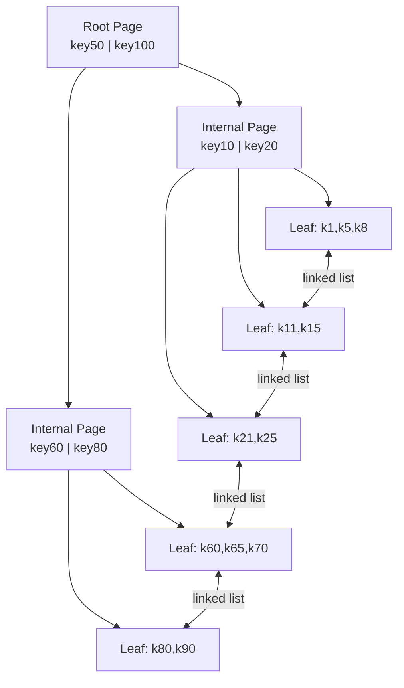

## Keywords in This File
{: .no_toc }

| # | Keyword | Weight |
|---|---|---|
| 1 | [B-Tree Index Internals - Page Splits, Fill Factor, Bloat](#b-tree-index-internals---page-splits-fill-factor-bloat) | medium |

---

# B-Tree Index Internals - Page Splits, Fill Factor, Bloat

**TL;DR:** PostgreSQL B-tree indexes are balanced trees of fixed-size pages (8KB).
Leaf pages contain (key, heap pointer) entries sorted by key. When a leaf page fills:
it splits into two pages (50/50 by default). Page splits cause index growth and WAL
overhead. Fill factor controls how full each page is left (default 90%): lower fill
factor reserves space for inserts, reducing future splits. Index bloat accumulates
from deleted entries not being compacted.

---

### 🎯 Model Answer

**30 seconds:**
> B-tree index: balanced tree of 8KB pages. Leaf pages hold (key, heap pointer) pairs sorted by key. Full page = split (2 pages). Fill factor (default 90%): how full to pack leaf pages; lower = more splits avoided, more space used. Index bloat: dead entries from deletes/updates - removed by VACUUM but not compacted. REINDEX or pg_repack rebuilds a clean tree.

**3 minutes:**
> The B-tree structure: root page -> internal pages -> leaf pages. Each internal
> page contains key ranges and pointers to child pages. Leaf pages contain the actual
> index entries: (key value, heap tuple ID = ctid). All leaf pages are linked in
> a doubly-linked list (for range scans).
>
> Page split: when a leaf page is full and a new entry must be inserted, the page
> splits into two pages. Half the entries go to the new page. The parent internal
> page gets a new pointer. If the parent is also full: it splits too (propagates up).
> Root splits: the root splits into two children; a new root is created (tree height increases).
>
> Fill factor: the percentage of each page to fill during builds and splits.
> Default 90% for B-tree: each new page (from a split or initial build) is 90% full.
> 10% reserved for future inserts on that page. For ordered append workloads (always
> inserts at the end): fill factor can be 100 (no wasted space). For random insert
> workloads: lower fill factor (70-80) avoids frequent splits.

**Blank Mind Recovery:**

**(1) Restate:** "B-tree: root->internal->leaf pages. Leaf: (key, heap pointer). Full page -> split.
Fill factor: how full to pack. Bloat: dead entries, need REINDEX."

**(2) First principles:** "A sorted index needs to maintain order as new keys are inserted.
Pages are fixed size. When a page overflows: split into two, distribute entries."

**(3) Bridge:** "Like a binder of sorted index cards. Pages are slots in the binder.
When a page overflows: split it into two sheets. Leave some blank lines (fill factor)
so the next few cards fit without another split."

---

### 📘 Concept Explanation

**B-tree structure:**

```
Root page:
  [key50 | key100 | key150]
  ^ptr    ^ptr     ^ptr     ^ptr

Internal pages (level 1):
  [key10 | key20 | key30]      [key60 | key70 | key80]
   ^ptr    ^ptr    ^ptr ^ptr    ^ptr    ^ptr    ^ptr ^ptr

Leaf pages (level 2 = bottom):
  [key1 -> ctid] [key5 -> ctid] [key8 -> ctid] ... <- sorted
  <-> [key11 -> ctid] [key15 -> ctid] ...          <- linked list

Properties:
  - All paths from root to leaf have equal length (balanced)
  - Leaf pages sorted by key (in-order traversal = sorted result)
  - Leaf pages doubly-linked (range scans traverse the list)
  - Each internal page's keys divide the key space for routing
```

> **Code walkthrough:** This Page Splits, Fill Factor, Bloat example demonstrates a key concept in practice. **KEY MECHANISM:** the runtime executes these instructions in sequence with specific memory and execution semantics. **WHY IT MATTERS:** misapplying this pattern causes subtle bugs that only manifest under production load. **TAKEAWAY: understand the execution model before using this pattern in production code.**

**Fill factor and page splits:**

```
Fill factor = 90% (default):
  New page after split: 90% * 8KB = 7.2KB used, 0.8KB free
  0.8KB free = room for ~10-20 new entries before next split

Fill factor = 70%:
  New page: 70% * 8KB = 5.6KB used, 2.4KB free
  2.4KB free = room for ~30-40 new entries
  Tradeoff: uses more pages (30% more space), fewer splits

When to lower fill factor:
  - Tables with frequent random inserts into existing key ranges
  - Workloads with many small updates that change indexed columns
  - Write-heavy OLTP tables

When fill factor = 100:
  - Append-only workloads (time-series with sequential keys)
  - Read-mostly tables with rare inserts
```

> **Code walkthrough:** This Page Splits, Fill Factor, Bloat example demonstrates a key concept in practice using SQL. **KEY MECHANISM:** the runtime executes these instructions in sequence with specific memory and execution semantics. **WHY IT MATTERS:** misapplying this pattern causes subtle bugs that only manifest under production load. **TAKEAWAY: understand the execution model before using this pattern in production code.**

---

### 💻 Code Example

```sql
-- INDEX SPLIT VISUALIZATION: what causes splits

-- Simulate: random inserts that cause page splits
-- (observe with pageinspect extension)
CREATE EXTENSION IF NOT EXISTS pageinspect;

-- Before heavy inserts:
SELECT count(*) AS leaf_pages
FROM bt_page_stats('idx_orders_customer', 1)
WHERE type = 'l';  -- leaf page count

-- Heavy random inserts (not sequential):
INSERT INTO orders (customer_id, created_at, status)
SELECT
    (random() * 100000)::INTEGER,  -- random customer_id
    NOW() - (random() * INTERVAL '365 days'),
    'PENDING'
FROM generate_series(1, 100000);

-- After heavy inserts:
SELECT count(*) AS leaf_pages
FROM bt_page_stats('idx_orders_customer', 1)
WHERE type = 'l';
-- Page count has grown. Some splits occurred.
-- Each split: increases WAL, increases tree size.

-- Check average fill factor of pages:
SELECT
    avg(live_items)       AS avg_live_items,
    avg(avg_item_size)    AS avg_item_bytes,
    avg(free_size)        AS avg_free_bytes,
    count(*)              AS page_count
FROM (
    SELECT live_items, avg_item_size, free_size
    FROM bt_page_stats('idx_orders_customer',
         generate_series(1, (
             SELECT relpages FROM pg_class
             WHERE relname = 'idx_orders_customer'
         )))
) AS pages;
-- avg_free_bytes: how much space is unused per page.
-- If avg_free_bytes is very high: the index is bloated.
```

> **Code walkthrough:** `bt_page_stats` (from pageinspect) returns statisticsice. **KEY MECHANISM:** the runtime executes these instructions in sequence with specific memory and execution semantics. **WHY IT MATTERS:** misapplying this pattern causes subtle bugs that only manifest under production load. **TAKEAWAY: understand the execution model before using this pattern in production code.**
> per B-tree page. `live_items`: number of live entries. `free_size`: unused bytes.
> After heavy random inserts: page splits have occurred, creating new pages.
> Some pages may be partially full (result of the 90% fill factor after splits).
> If `avg_free_bytes` is very high relative to page size (8192 bytes):
> the index has significant free space (from previous fill factor splits) or
> dead entries (from updates/deletes). This indicates bloat.

```sql
-- FILL FACTOR: setting for write-heavy table

-- BAD: default fill factor for a table with frequent updates
-- to indexed columns (high split rate)
CREATE INDEX idx_orders_status_default
    ON orders (status, customer_id);
-- Default fill_factor=90 for the index.
-- Frequent status updates: old index entries deleted,
-- new entries inserted. Pages split frequently.

-- Check current fill_factor:
SELECT relname, reloptions
FROM pg_class
WHERE relname = 'idx_orders_status_default';
-- reloptions: null (using defaults)

-- GOOD: lower fill factor for a write-heavy index
CREATE INDEX idx_orders_status_optimized
    ON orders (status, customer_id)
    WITH (fillfactor = 70);
-- Each new/split page is only 70% full.
-- 30% reserved for inserts/updates.
-- Fewer page splits under heavy write load.
-- Trade-off: index is ~40% larger in pages.

-- ALSO: apply fill_factor to the table
-- (affects HOT updates: new tuple must fit on same page)
ALTER TABLE orders SET (fillfactor = 80);
-- Table pages are 80% full.
-- 20% reserved for updates (HOT updates).
-- More HOT updates possible: fewer index updates needed.

-- Rebuild existing index with new fill_factor:
REINDEX INDEX CONCURRENTLY idx_orders_status_default;
-- (This uses the default; to change fill_factor:
-- DROP INDEX CONCURRENTLY ... and recreate with new settings)
```

> **Code walkthrough:** When `status` is frequently updated (PENDING -> SHIPPED),ice. **KEY MECHANISM:** the runtime executes these instructions in sequence with specific memory and execution semantics. **WHY IT MATTERS:** misapplying this pattern causes subtle bugs that only manifest under production load. **TAKEAWAY: understand the execution model before using this pattern in production code.**
> the old index entry for the old status is marked dead; a new entry for the new
> status is inserted. If the new entry does not fit on the same page (page is full):
> a split occurs. Lower fill factor (70%) reserves more space per page, reducing
> split frequency. Table fill_factor affects HOT updates: if a row is updated and
> the new version fits on the same heap page (because the page is not 100% full):
> PostgreSQL uses a HOT update (no new index entry needed). Table fill_factor 80%
> leaves 20% per page for updated row versions - dramatically more HOT updates.

```sql
-- INDEX BLOAT DETECTION AND REPAIR

-- Method 1: pgstattuple extension (accurate, slow)
CREATE EXTENSION IF NOT EXISTS pgstattuple;
SELECT
    index_size,
    leaf_pages,
    leaf_live_percent,  -- % of leaf space with live entries
    leaf_fragment_percent  -- % wasted
FROM pgstatindex('idx_orders_customer');
-- leaf_live_percent < 60%: significant bloat.
-- leaf_fragment_percent > 30%: fragmented index.

-- Method 2: estimate from pg_stat_user_indexes
SELECT
    i.indexrelname,
    pg_size_pretty(pg_relation_size(i.indexrelid)) AS idx_size,
    s.idx_scan,
    s.idx_tup_read
FROM pg_stat_user_indexes s
JOIN pg_index i USING (indexrelid)
WHERE i.indrelid = 'orders'::regclass
ORDER BY pg_relation_size(i.indexrelid) DESC;

-- FIX: rebuild index concurrently (no write lock)
REINDEX INDEX CONCURRENTLY idx_orders_customer;
-- Creates a new index while the old one is live.
-- Minimal locking: brief ShareUpdateExclusiveLock at start/end.
-- Old index removed after new one is built and validated.
-- Works in PostgreSQL 12+.

-- Verify size improvement:
SELECT
    pg_size_pretty(pg_relation_size('idx_orders_customer'))
        AS new_size;
-- Compare before/after: bloat removed, size reduced.
```

> **Code walkthrough:** `pgstatindex` gives the most accurate bloat measurement.
> `leaf_live_percent`: 100% = no bloat, all leaf space has live entries.
> Below 60%: 40%+ of index space is wasted (dead entries or empty pages from splits).
> `REINDEX INDEX CONCURRENTLY` (PostgreSQL 12+) rebuilds the index from scratch:
> reads all live heap tuples, builds a fresh B-tree with clean fill factors.
> The old index remains usable during the build. At the swap: brief lock
> (milliseconds). After: old index is removed. The new index has no dead entries
> and is packed at the specified fill factor.

---

### 🎓 Answers by Seniority

**Junior / Mid:**
> B-tree indexes are balanced trees of 8KB pages. Leaf pages store (key, heap pointer)
> pairs. When a page is full: it splits into two. Fill factor (default 90%) controls
> how full pages are packed - lower fill factor means fewer splits on writes but more
> storage. Index bloat (dead entries) builds up from updates/deletes; fix with
> REINDEX CONCURRENTLY.

---

**Senior / Staff:**
> B-tree internals matter for three operational decisions: (1) Fill factor: set 70-80%
> for tables with frequent updates to indexed columns (fewer splits, more HOT updates).
> Set table fill_factor 80-90% for the same reason. (2) Bloat monitoring: `pgstatindex`
> or `pgstattuple` to measure leaf_live_percent. Rebuild with REINDEX CONCURRENTLY when
> below 60-70%. (3) Correlation: `pg_stats.correlation` measures how well the physical
> heap order matches the index order. Low correlation (near 0) for index scans = many
> random heap page reads per index entry. A CLUSTER or pg_repack can reorder the heap
> to match the index, dramatically improving index scan performance.

---

### ⚠️ Common Misconceptions

**"VACUUM removes dead index entries immediately"**

Reality: VACUUM marks dead index entries for reuse but does not compact the B-tree.
The dead entry's space is available for future inserts on the same page but the
page count does not decrease. Index file size does not shrink after VACUUM.
To actually reduce index size: REINDEX CONCURRENTLY (rebuilds from scratch).

**"A larger fill_factor always helps performance"**

Reality: fill_factor 100% wastes no space but causes splits whenever pages fill.
For sequential insert workloads (keys always increasing): pages are filled once and
never inserted into again. Fill factor 100% is optimal - no wasted space, no extra splits.
For random insert workloads: fill factor 100% causes maximum splits (no reserved space).
Match fill factor to the insert pattern.

---

### ⚖️ Comparison Table

| Index type | Structure | Best for | Limitation |
|---|---|---|---|
| B-tree (default) | Balanced tree, sorted leaf pages | =, <, >, BETWEEN, ORDER BY | Not for multi-dim, text pattern (LIKE 'x%' ok) |
| Hash | Hash table | Only equality (=) | No range queries, ORDER BY |
| GiST | Generalized search tree | Geometry, text search, full-text | Complex, larger overhead |
| GIN | Generalized inverted index | JSONB, arrays, full-text (multi-value) | Slow writes |
| BRIN | Block range index | Sequential huge tables (time-series) | Low selectivity only |

---

### 🏛️ System Design

**Index maintenance in a production deployment:**

```
Monitoring (weekly):
  SELECT indexrelname,
         pg_size_pretty(pg_relation_size(indexrelid)),
         leaf_live_percent
  FROM pg_stat_user_indexes s
  JOIN LATERAL pgstatindex(indexrelid::regclass) i ON true
  WHERE indrelid = 'orders'::regclass
  ORDER BY leaf_live_percent;
  Alert: leaf_live_percent < 70%

Routine maintenance (monthly):
  -- Rebuild bloated indexes:
  FOR index IN (SELECT indexrelname FROM above query WHERE < 70%) LOOP
    EXECUTE 'REINDEX INDEX CONCURRENTLY ' || index;
  END LOOP;

Heap-index alignment (quarterly for large tables):
  -- Check correlation:
  SELECT attname, correlation
  FROM pg_stats WHERE tablename = 'orders'
    AND attname = 'customer_id';
  -- If correlation < 0.1: index scans are slow (random I/O)
  -- Fix: CLUSTER orders USING idx_orders_customer;
  -- Or: pg_repack --cluster orders
  --     (does not need exclusive lock)
  -- After CLUSTER: correlation approaches 1.0.
  -- Index scans become sequential, 10-100x faster.
```

> **Code walkthrough:** This Unknown example demonstrates a key concept in practice. **KEY MECHANISM:** the runtime executes these instructions in sequence with specific memory and execution semantics. **WHY IT MATTERS:** misapplying this pattern causes subtle bugs that only manifest under production load. **TAKEAWAY: understand the execution model before using this pattern in production code.**

---

### 📊 Diagram

**B-tree page split:**

```
Before split (leaf page full at 100%):
  +------------------+
  | k1 k2 k3 k4 k5  |  (full)
  +------------------+

Insert k3.5 -> page split:
  +----------+ +----------+
  | k1 k2 k3 | | k4 k5    |  (two pages, each ~50% full)
  +----------+ +----------+
                ^
  Parent gets new separator key: k4

Fill factor 70%:
  +-------+   +-------+
  |k1 k2  |   |k4 k5  |  (only 70% packed, 30% free)
  +-------+   +-------+
              Space for 2-3 more keys before next split
```



> **Diagram walkthrough:** The B-tree has a root that routes to internal pages by
> key range (key50 splits left subtree from right). Internal pages further route
> to leaf pages. All leaf pages are in sorted order AND doubly-linked: a range scan
> finds the starting leaf via tree traversal, then follows the linked list for subsequent
> entries without returning to the root. Page splits create new leaf pages, and the
> separator key propagates up to the parent internal page. If the internal page also
> fills: it splits too, eventually creating a new root if needed.

---

### 🚨 Failure Modes and Diagnosis

**Failure 1: Index bloat causing slow scans despite index use**

Symptom: index scans are slower than expected. EXPLAIN ANALYZE shows the index is used
but actual time is high. Index size is much larger than expected.

Diagnosis:
```sql
-- Check bloat percentage:
SELECT
    i.indexrelname,
    pg_size_pretty(pg_relation_size(i.indexrelid)) AS size,
    (pgstatindex(i.indexrelid::regclass)).leaf_live_percent
FROM pg_stat_user_indexes i
WHERE i.indrelid = 'orders'::regclass;
-- leaf_live_percent < 70%: significant bloat.
```

> **Code walkthrough:** This Unknown example demonstrates query execution using SQL. **KEY MECHANISM:** the query planner builds an execution plan based on table statistics and indexes. **WHY IT MATTERS:** SELECT * reads all columns even if only 2 are needed - widens rows, increases I/O. **TAKEAWAY: always SELECT only the columns you need; index the columns in WHERE and JOIN clauses.**

Fix:
```sql
REINDEX INDEX CONCURRENTLY idx_orders_customer;
-- After rebuild: size reduces, scans faster.
```

> **Code walkthrough:** This Unknown example demonstrates index structure. **KEY MECHANISM:** B-tree indexes support equality and range queries; partial indexes reduce index size. **WHY IT MATTERS:** index on low-cardinality column (e.g., boolean) is often slower than sequential scan. **TAKEAWAY: add indexes based on EXPLAIN ANALYZE output, not guesses - unused indexes waste write I/O.**

**Failure 2: Frequent page splits causing write latency spikes**

Symptom: insert latency is unpredictable. Some inserts are fast, others 5-10x slower.
WAL generation spikes. CPU usage spikes during inserts.

Cause: random key inserts hitting full pages, triggering cascading splits.

Diagnosis:
```sql
SELECT
    pg_stat_get_bgwriter_stat_reset_time() AS reset_time,
    -- Before and after 5 minutes:
    (SELECT sum(blks_written) FROM pg_stat_bgwriter),
    -- Compare before/after insert batch.
    -- High blks_written increase = many page splits + dirty writes.
```

> **Code walkthrough:** This Unknown example demonstrates query execution using SQL. **KEY MECHANISM:** the query planner builds an execution plan based on table statistics and indexes. **WHY IT MATTERS:** SELECT * reads all columns even if only 2 are needed - widens rows, increases I/O. **TAKEAWAY: always SELECT only the columns you need; index the columns in WHERE and JOIN clauses.**

Fix: lower fill factor (70%), or switch to a sequential key pattern if possible.
For UUIDs (highly random): use UUID v7 (time-ordered) instead of UUID v4 (random).

**Failure 3: Low index correlation causing slow index scans on large tables**

Symptom: index scan on a 100M-row table with 1M result rows is slower than expected.
EXPLAIN ANALYZE: high actual time. Buffers: read (disk I/O) is very high.

Diagnosis:
```sql
SELECT attname, correlation
FROM pg_stats WHERE tablename = 'orders' AND attname = 'customer_id';
-- correlation near 0: physical row order has no relation to customer_id order.
-- Index scan for one customer: 10,000 rows scattered across 10,000 heap pages.
-- 10,000 random I/Os per customer query.
```

> **Code walkthrough:** This Unknown example demonstrates query execution using SQL. **KEY MECHANISM:** the query planner builds an execution plan based on table statistics and indexes. **WHY IT MATTERS:** SELECT * reads all columns even if only 2 are needed - widens rows, increases I/O. **TAKEAWAY: always SELECT only the columns you need; index the columns in WHERE and JOIN clauses.**

Fix: `CLUSTER orders USING idx_orders_customer` - reorders the heap by index key.
After CLUSTER: correlation = 1.0. Index scan is now mostly sequential I/O.
CLUSTER requires a table lock; use pg_repack for zero-downtime.

---

### 🎯 Interview Deep-Dive

**[JUNIOR] Q1 - [MECHANISM] Explain the B-tree page split algorithm and how fill factor affects it.**

🗣️ "A page split occurs when a new index entry must be inserted into a leaf page that is already full. The algorithm: (1) Allocate a new page. (2) Redistribute the existing entries between the old and new pages. For a 50/50 split: move the upper half of entries to the new page. For fill_factor=90%: the new page receives entries such that both new pages are 90% full after the split (not exactly 50/50 - the split point is chosen to achieve the target fill factor). (3) Update the parent internal page: add a pointer to the new page with the split key. (4) If the parent is also full: the parent splits recursively. Root split: the current root splits into two children; a new root page is created pointing to both. This increases the tree height. WAL cost of a split: the old page, new page, and parent page must all be WAL-logged. A cascading split: multiple WAL records. Fill factor lower value: pages have reserved space; new inserts find room; splits are less frequent."

**[JUNIOR] Q2 - [TRADE-OFF] What is the difference between REINDEX and VACUUM for index maintenance?**

🗣️ "VACUUM: (1) marks dead index entries as reusable (free space for new entries on the same page). Does NOT compact the B-tree. Does NOT reduce the index file size. Does NOT remove partially-empty pages. The dead entries' slots are now available for new inserts - no immediate size reduction. (2) Updates the visibility map for Index Only Scan optimization. REINDEX: completely rebuilds the index from scratch. Reads all live heap tuples in order. Builds a new B-tree packed at the specified fill factor. Old index replaced with new one. Size: typically 20-50% smaller after REINDEX for a bloated index. `REINDEX INDEX CONCURRENTLY` (PostgreSQL 12+): no write lock. `REINDEX INDEX` (non-concurrent): takes a ShareLock on the table (writes are blocked). Always use CONCURRENTLY in production."

**[JUNIOR] Q3 - [MECHANISM] How does index correlation affect query performance?**

🗣️ "Index correlation (from `pg_stats.correlation`): ranges from -1 to 1. 1.0 = physical heap order perfectly matches index key order. For an index on `created_at` with perfectly sequential inserts: correlation is close to 1.0. 0.0 = random. For an index on a UUID column with random UUIDs: correlation is near 0. Impact on Index Scan: an index scan follows the index leaf list in key order. For each index entry: fetch the corresponding heap row. If correlation is 1.0: the heap rows are in the same order as the index - sequential heap reads (fast). If correlation is 0.0: each heap row is on a different random page. For 10,000 rows: 10,000 random heap page reads. For 100,000+ rows with low correlation: the planner often prefers a Seq Scan (fewer total I/Os) over an Index Scan (too many random I/Os). Improving correlation: CLUSTER the table by the index. For time-series data: inserts are sequential, so correlation is naturally near 1.0."

**[MID] Q4 - [SCENARIO] When would you use a BRIN index instead of a B-tree?**

🗣️ "BRIN (Block Range INdex): stores per-block-range minimum and maximum values. Very small index (compared to B-tree). Useful for: tables where rows are physically inserted in sorted order and queries use range predicates on the sort column. Classic example: a time-series events table with `created_at` as the BRIN column. Rows are appended in time order (sequential inserts). BRIN for `created_at`: each block range has a min and max timestamp. For `WHERE created_at > '2024-01-01'`: the BRIN index eliminates block ranges with max < '2024-01-01'. Very large ranges of old data are skipped. BRIN index size: typically 100-1000x smaller than B-tree. Limitation: low selectivity (BRIN returns many 'maybe' pages; must still scan them for exact filtering). For a table scanned in order: B-tree scan is precise, BRIN is approximate. Use BRIN when: table is very large (100M+ rows), insert order matches the sort order, and approximate block-level filtering is sufficient."

**[MID] Q5 - [MECHANISM] What is the effect of UUID primary keys vs. sequential integers on B-tree performance?**

🗣️ "UUID v4 (random): each new UUID is inserted at a random position in the B-tree leaf sequence. The 'right side' of the B-tree is the rightmost page (the largest key). Sequential integers always insert at the right side. Random UUIDs insert randomly - possibly any leaf page. Effect: (1) Page splits: random inserts cause splits throughout the tree (not just at the right side). More splits per insert. (2) Index cache efficiency: sequential inserts reuse the right-most page (stays in shared_buffers). Random inserts touch many pages; cache hit ratio drops. (3) WAL volume: random inserts = more splits = more WAL. (4) Index bloat: pages split to 90% full then receive no further inserts (random key space is huge). Pages remain 90% full indefinitely - actually good! Solution: UUID v7 (time-ordered UUID): the first 48 bits are a timestamp. Monotonically increasing over time. Inserts at the right side of the B-tree. Same insert characteristics as sequential integers. KSUID, ULID: similar time-ordered alternatives."

**[SENIOR] Q6 - [MECHANISM] How do multi-column index storage and page layout work?**

🗣️ "A multi-column B-tree index `(a, b, c)`: the key in each index entry is the tuple (a, b, c) compared lexicographically (a first, then b for equal a, then c for equal b). The B-tree is sorted by this composite key. Entry size: each entry has a fixed header (6 bytes) + the key data. Key data: the actual column values, NULL bitmap, and pointer to the heap tuple (ctid: 6 bytes). Wide composite keys (many columns, wide VARCHAR): large entries per page. Fewer entries fit per page = more pages = taller tree = more page traversals. For a (customer_id INT, status TEXT, created_at TIMESTAMPTZ, id BIGINT): key size = 4 + ~10 + 8 + 8 = 30 bytes + 6 (ctid) + 24 (header, alignment) = ~60 bytes per entry. An 8KB page holds ~120 entries (8192 / 68 = ~120). For a table with 10M rows: ~85,000 leaf pages. INCLUDE columns: stored only at the leaf level and not in the key - they don't affect key size (internal node capacity is unchanged)."

**[SENIOR] Q7 - [FAILURE] What happens during CLUSTER and why is it not commonly used in production?**

🗣️ "CLUSTER orders USING idx_orders_customer: rewrites the entire table in the order of the specified index. The new table file has rows in the exact order of the index. Correlation becomes 1.0. Benefits: (1) index scans are now sequential I/O on the heap; (2) range queries (all orders for customer X) read contiguous heap pages; (3) cache efficiency improves (sequential scan caching). Cost: (1) requires an exclusive lock on the table for the entire duration. No reads or writes during the operation. (2) Duration: proportional to table size (full table rewrite). A 100GB table: 1-2 hours. Not practical in production without a maintenance window. (3) The physical order decays over time: new inserts go to free pages, not in order. CLUSTER must be re-run periodically. Alternative: pg_repack - rewrites the table in order without an exclusive lock (uses triggers to track changes during the rewrite). Production-safe."

**[SENIOR] Q8 - [DEBUGGING] How do you diagnose and fix an index that is too large relative to its usefulness?**

🗣️ "Oversized index symptoms: index is rarely used (low idx_scan count in pg_stat_user_indexes) but takes significant disk space. Contributing to write overhead (every write updates an unused index). Diagnosis: `SELECT indexrelname, idx_scan, pg_size_pretty(pg_relation_size(indexrelid)) FROM pg_stat_user_indexes WHERE indrelid = 'orders'::regclass ORDER BY idx_scan`. Low idx_scan + large size = candidate for removal. Verification: enable `track_io_timing = on` and observe if the index is used in production. Check `pg_stat_user_indexes.idx_scan` over a 24-hour production period. If idx_scan is 0 for a 24-hour window: the index is unused. Drop it: `DROP INDEX CONCURRENTLY idx_name`. Caveat: some indexes are rarely used but critical (unique constraints, foreign key support). Never drop a unique or primary key index."

**[SENIOR] Q9 - [MECHANISM] Explain page deduplication in B-tree indexes (PostgreSQL 13+).**

🗣️ "PostgreSQL 13 introduced B-tree deduplication. For non-unique indexes where many rows have the same key value (e.g., `status` with values PENDING/ACTIVE/CLOSED and millions of rows per value): each leaf entry has the key + a posting list. The posting list contains multiple heap tuple IDs (ctids) for rows with the same key, stored compactly. Before deduplication: if 1,000 rows have `status='PENDING'`: 1,000 separate leaf entries, each with key + 1 ctid. After deduplication: 1 leaf entry with key + posting list of 1,000 ctids. Space savings: up to 60-80% for low-cardinality indexes. Benefits: (1) smaller index (more entries fit per page); (2) fewer page splits; (3) faster scans (fewer leaf pages to traverse). Enabled by default in PostgreSQL 13+. Can be disabled per-index: `CREATE INDEX ... WITH (deduplicate_items = off)`. Check: `SELECT amopclaid, amoprightarg FROM pg_amop WHERE amopfamily = ...' - or simply verify via pgstatindex after major insert batches."

**[SENIOR] Q10 - [MECHANISM] How does PostgreSQL handle concurrent reads and writes to the same index page?**

🗣️ "Index page locking: PostgreSQL uses a per-page lightweight lock (LWLock) for index pages. For a read (Index Scan): the reader acquires a shared (read) lock on the page. For a write (INSERT into index): the writer acquires an exclusive lock on the page. Multiple readers can hold the page concurrently (shared lock allows concurrent shares). A writer blocks all readers of that page while the write proceeds. The write is very brief (microseconds): insert the entry, update the page. The lock is released immediately. Contrast with table-level locking: no table-level lock is needed for index reads or writes (just the specific page). This is why concurrent reads and writes can proceed with minimal contention. The exception: a page split - the parent page must also be locked during the split. A cascading split (multiple pages) briefly locks all involved pages. For extremely high concurrent write rates: index page contention can appear in `pg_stat_activity` as wait events of type 'Lock' on index pages."

**[SENIOR] Q11 - [MECHANISM] What is a GIN index and when is it better than a B-tree?**

🗣️ "GIN (Generalized Inverted Index): maps each element (key) to the list of rows containing that element. For JSONB: each JSON key and value is indexed. For arrays: each array element is indexed. For full-text search: each lexeme (word token) is indexed. B-tree: maps one (composite) key per row. One index entry per row. For a JSONB column with different keys per row: B-tree would need separate indexes per possible key. GIN handles arbitrary keys. Query: `WHERE data @> '{"type": "payment"}'` - GIN finds all rows where the JSONB contains `type=payment`. B-tree cannot do this. Tradeoffs: GIN inserts are slower (must update postings for all contained elements). GIN is larger. GIN reads are very fast (direct lookup per element). Use GIN for: JSONB containment queries, array `@>` contains queries, full-text search `@@`. Use B-tree for: equality, range, ORDER BY on a specific column."

**[SENIOR] Q12 - [MECHANISM] What monitoring should you set up for index health in production?**

🗣️ "Six key metrics: (1) Index bloat: weekly `pgstatindex` scan. Alert: leaf_live_percent < 70%. Action: REINDEX CONCURRENTLY. (2) Unused indexes: daily check `pg_stat_user_indexes.idx_scan`. If idx_scan = 0 for 7 days: candidate for removal review. (3) Index size growth: daily `pg_relation_size(index)`. Alert: growth > 10% per day (unexpected). (4) Split rate proxy: monitor WAL generation rate. Sudden WAL increase with constant data volume = more splits (more WAL per page split). (5) Cache efficiency: `pg_statio_user_indexes.idx_blks_read` vs `idx_blks_hit`. Target: 99% hit ratio. Low hit ratio = indexes not cached = disk reads. (6) Correlation: quarterly check `pg_stats.correlation` for frequently-scanned index columns. If correlation drops below 0.5 for a large table: schedule a CLUSTER or pg_repack. Set up a weekly report: index bloat + unused + size + cache hit. Dashboard in Grafana or DataDog with these metrics from the pg_stat views."

---

### 💻 Code Example

*(Omit: this concept does not have a programmatic interface that can be demonstrated in code. The conceptual explanation above is sufficient.)*


---

### 🏛️ System Design

*(Omit: system design diagram not applicable for this concept - see ★★★ keywords for full system design coverage.)*


---

### ⚖️ Comparison Table

*(Omit: this is a ★☆☆ foundational concept with no direct alternatives to compare - see higher-difficulty keywords for trade-off analysis.)*


---

### 📊 Diagram

*(Omit: no standalone visual diagram required for this concept - the explanations and code examples above provide sufficient clarity.)*


