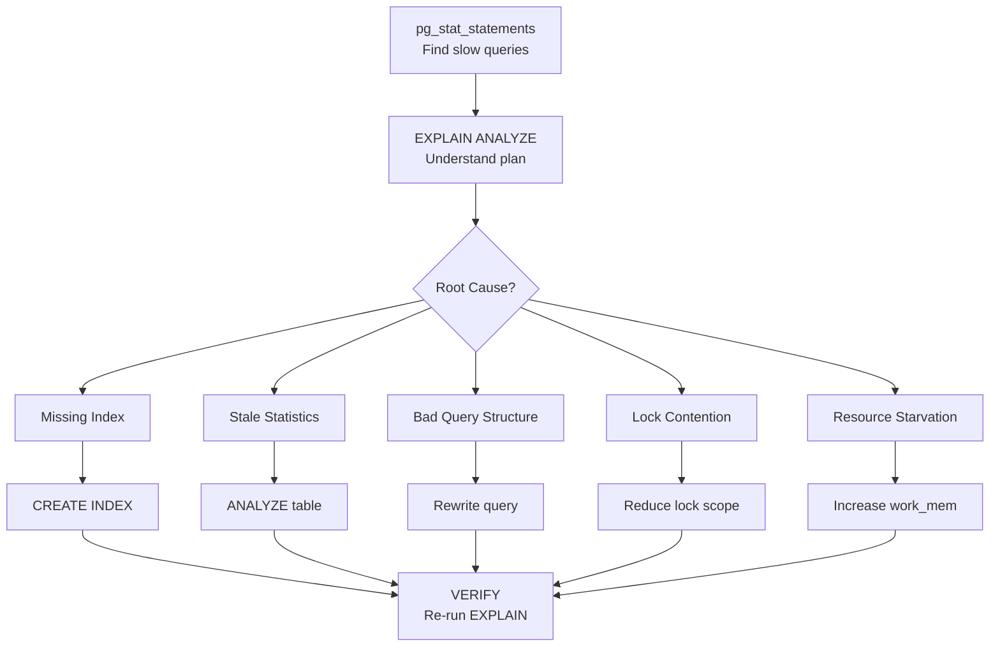
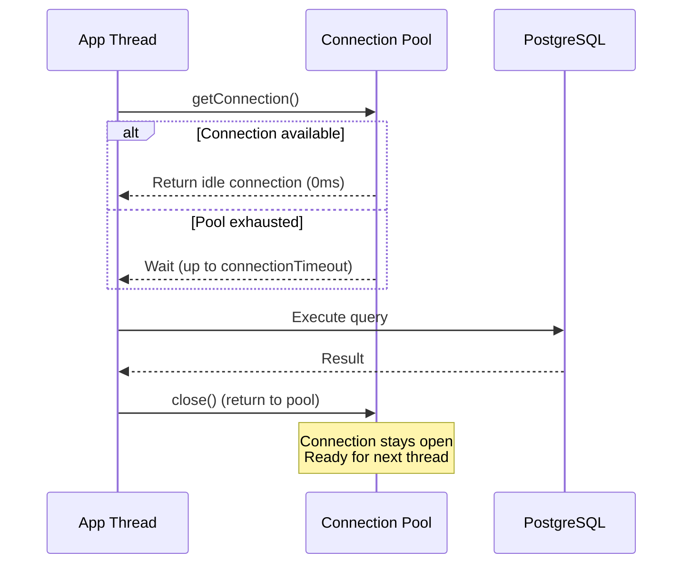

# Query Performance Diagnosis

**Interview Weight:** very high - This is the #1 most-asked database
question for senior roles. Interviewers want to see you diagnose
slow queries systematically using EXPLAIN ANALYZE, pg_stat_statements,
and identify the root cause (missing index, bad stats, lock contention,
sequential scans on large tables).

---

### 🎯 Model Answer

**30 seconds:**

> I diagnose slow queries in three steps: (1) Identify the slow query
> using pg_stat_statements (sorted by total_exec_time). (2) Run
> EXPLAIN (ANALYZE, BUFFERS) to see the execution plan - look for
> sequential scans on large tables, nested loops with high row counts,
> and buffer hits vs reads. (3) Fix by adding indexes, rewriting
> the query, or updating statistics. The goal is turning sequential
> scans into index scans and reducing the number of rows processed
> at each step of the plan.

**3 minutes (Senior):**

> Query performance diagnosis is systematic, not guessing. I follow
> this workflow:
>
> Phase 1 - Find the problem queries:
> pg_stat_statements ranks queries by total_exec_time (cumulative),
> mean_exec_time (per-call), and calls (frequency). A query with
> 2ms mean time but 10M calls per day is a bigger problem than a
> query with 5s mean time called 10 times/day.
>
> Phase 2 - Understand the plan:
> EXPLAIN (ANALYZE, BUFFERS, FORMAT TEXT) shows actual execution.
> Key things I look for: (a) Seq Scan on tables > 10K rows (usually
> needs an index). (b) Nested Loop with high actual rows on the
> inner side (consider Hash Join via work_mem increase or index).
> (c) Sort with external merge (work_mem too low, spilling to disk).
> (d) Rows Removed by Filter: high number means the plan fetches
> too many rows then discards them. (e) Buffers: shared read vs
> shared hit - high reads means data is not in cache.
>
> Phase 3 - Identify root cause categories:
> (1) Missing index - add appropriate index (B-tree, GIN, partial).
> (2) Stale statistics - ANALYZE table manually (autovacuum lagging).
> (3) Bad query structure - rewrite correlated subquery as JOIN,
> replace NOT IN with NOT EXISTS, avoid functions on indexed columns.
> (4) Lock contention - pg_stat_activity shows waiting queries.
> (5) Resource starvation - work_mem too low (sort/hash spill to
> disk), shared_buffers too small (low cache hit ratio).
>
> Phase 4 - Verify fix:
> Re-run EXPLAIN ANALYZE. Compare: total time, rows scanned, buffer
> usage. Measure in staging with production-like data volumes.

**Framework:** IDENTIFY (pg_stat_statements) → EXPLAIN (analyze plan)
→ DIAGNOSE (root cause category) → FIX (index/rewrite/config) →
VERIFY (compare before/after plans).

**Blank Mind Recovery:**

**(1) Restate:** "You are asking how I systematically find and fix
slow database queries in production."

**(2) First principles:** "Slow queries either scan too many rows
(missing index), use too much memory (spill to disk), or wait for
locks (contention). Diagnosis tells me which."

**(3) Bridge:** "I use EXPLAIN ANALYZE like a doctor uses an X-ray -
it shows me exactly where the plan is spending time and resources."

---

### 📘 Concept Explanation

**What it is:**

Query performance diagnosis is the systematic process of identifying
slow SQL queries, understanding why they are slow (via execution
plans), and applying targeted fixes. It is the database equivalent
of profiling application code.

**How it works:**

```
  Query Performance Diagnosis Workflow:

  Step 1: FIND slow queries
  ┌─────────────────────────────────────────────┐
  │ pg_stat_statements                          │
  │ ORDER BY total_exec_time DESC               │
  │                                             │
  │ Query: SELECT * FROM orders WHERE...        │
  │ Calls: 50,000/day | Mean: 450ms | Total: 6h│
  └─────────────────────────────────────────────┘
           │
           ▼
  Step 2: EXPLAIN the plan
  ┌─────────────────────────────────────────────┐
  │ EXPLAIN (ANALYZE, BUFFERS)                  │
  │                                             │
  │ Seq Scan on orders (rows=5M, time=380ms)    │
  │   Filter: customer_id = 42                  │
  │   Rows Removed by Filter: 4,999,900        │
  │   Buffers: shared read=38000               │
  └─────────────────────────────────────────────┘
           │
           ▼
  Step 3: DIAGNOSE root cause
  ┌─────────────────────────────────────────────┐
  │ ✗ Seq Scan on 5M row table                  │
  │ ✗ Filter removes 99.99% of rows            │
  │ ✗ High shared reads (data not in cache)     │
  │ → MISSING INDEX on customer_id              │
  └─────────────────────────────────────────────┘
           │
           ▼
  Step 4: FIX
  ┌─────────────────────────────────────────────┐
  │ CREATE INDEX idx_orders_customer            │
  │   ON orders (customer_id);                  │
  └─────────────────────────────────────────────┘
           │
           ▼
  Step 5: VERIFY
  ┌─────────────────────────────────────────────┐
  │ Index Scan on idx_orders_customer           │
  │   Index Cond: customer_id = 42              │
  │   Rows: 100 | Time: 0.3ms                  │
  │   Buffers: shared hit=5                    │
  └─────────────────────────────────────────────┘
```



> **Diagram walkthrough:** The diagnosis workflow starts with finding
> the most expensive queries (pg_stat_statements), then understanding
> their execution plan (EXPLAIN ANALYZE). The root cause determines
> the fix: index for missing index, ANALYZE for stale stats, rewrite
> for bad structure, lock reduction for contention, or config change
> for resource issues. Every fix is verified with another EXPLAIN.

**The key insight:**

The execution plan tells you WHAT the database is actually doing
(not what you think it is doing). A query you expect to use an index
might do a sequential scan because: (1) the index does not exist,
(2) statistics are stale (planner thinks table is small), (3) the
planner correctly chose sequential scan because the table IS small
enough, or (4) you applied a function to the indexed column
(breaking index usage).

---

### 💻 Code Example

**Example 1: Finding and diagnosing slow queries**

```sql
-- BAD: Guessing which queries are slow
-- Looking at application logs and "feeling" something is slow
-- Running random EXPLAINs on queries you think might be bad

-- GOOD: Systematic identification via pg_stat_statements
-- Step 1: Enable pg_stat_statements (postgresql.conf)
-- shared_preload_libraries = 'pg_stat_statements'
-- pg_stat_statements.max = 10000
-- pg_stat_statements.track = top

-- Step 2: Find top offenders by total time
SELECT
    substring(query, 1, 60) AS query_preview,
    calls,
    round(total_exec_time::numeric, 2) AS total_ms,
    round(mean_exec_time::numeric, 2) AS mean_ms,
    rows,
    round((100.0 * shared_blks_hit /
      nullif(shared_blks_hit + shared_blks_read, 0))
      ::numeric, 2) AS cache_hit_pct
FROM pg_stat_statements
ORDER BY total_exec_time DESC
LIMIT 10;

-- Step 3: Detailed plan for the worst query
EXPLAIN (ANALYZE, BUFFERS, FORMAT TEXT)
SELECT o.id, o.total, c.name
FROM orders o
JOIN customers c ON c.id = o.customer_id
WHERE o.status = 'pending'
  AND o.created_at > now() - interval '7 days';

-- Read the plan bottom-up:
-- Seq Scan on orders (actual time=0..380ms rows=5000000)
--   Filter: status = 'pending' AND created_at > ...
--   Rows Removed by Filter: 4995000
--   Buffers: shared read=38461
-- Hash Join (actual time=380..420ms rows=5000)
--   Hash Cond: (o.customer_id = c.id)
--   -> (orders scan above)
--   -> Hash (actual time=5ms)
--     -> Seq Scan on customers (rows=10000)
--        Buffers: shared hit=200
--
-- DIAGNOSIS:
-- (a) orders table: Seq Scan on 5M rows, removes 99.9%
-- (b) High shared read = data not cached
-- (c) The customers hash is fine (small table, cached)
-- ROOT CAUSE: missing index on orders(status, created_at)
```

> **Code walkthrough:** pg_stat_statements provides data-driven
> identification of slow queries (no guessing). EXPLAIN ANALYZE shows
> actual execution: the orders table is sequentially scanned (5M rows)
> to find 5000 matching rows. The filter removes 99.9% of rows
> scanned - a clear sign that an index would help. High shared read
> (vs hit) means the data was not in shared_buffers (cold cache).

**Example 2: Index fixes for common patterns**

```sql
-- BAD: Function on indexed column prevents index usage
SELECT * FROM orders
WHERE LOWER(email) = 'user@example.com';
-- Has index on email, but LOWER() prevents usage!
-- Plan shows: Seq Scan (function blocks index)

-- GOOD: Expression index matching the query
CREATE INDEX idx_orders_email_lower
  ON orders (LOWER(email));
-- Now the query uses: Index Scan on idx_orders_email_lower

-- BAD: Implicit cast prevents index usage
SELECT * FROM events
WHERE event_id = '12345';
-- event_id is INTEGER, '12345' is TEXT
-- PostgreSQL casts every row: event_id::text = '12345'
-- Plan shows: Seq Scan (implicit cast on every row)

-- GOOD: Match types in query
SELECT * FROM events WHERE event_id = 12345;
-- No cast needed. Index Scan directly.

-- BAD: OR conditions prevent single index usage
SELECT * FROM orders
WHERE customer_id = 42 OR status = 'pending';
-- Cannot use index on customer_id OR index on status
-- Plan: Bitmap Or of two index scans (or Seq Scan)

-- GOOD: UNION ALL for OR conditions on different columns
SELECT * FROM orders WHERE customer_id = 42
UNION ALL
SELECT * FROM orders WHERE status = 'pending'
  AND customer_id != 42;
-- Each branch uses its own index efficiently

-- Common fix: composite index for multi-condition queries
CREATE INDEX idx_orders_status_created
  ON orders (status, created_at)
  WHERE status IN ('pending', 'processing');
-- Partial index: smaller, faster, covers 90% of queries
-- Only indexes rows with status pending/processing
```

> **Code walkthrough:** Index usage fails when functions are applied
> to indexed columns (use expression indexes), types mismatch
> (implicit casts defeat indexes), or OR spans different columns.
> Partial indexes reduce index size dramatically when queries target
> a subset of rows (active orders are 5% of total but 95% of queries).

**Example 3: Lock contention diagnosis**

```sql
-- BAD: Wondering why queries are slow intermittently
-- (Not checking for lock waits)

-- GOOD: Check for blocked queries in real-time
SELECT
    blocked.pid AS blocked_pid,
    blocked.query AS blocked_query,
    age(now(), blocked.query_start) AS blocked_duration,
    blocker.pid AS blocker_pid,
    blocker.query AS blocker_query,
    age(now(), blocker.query_start) AS blocker_duration
FROM pg_stat_activity blocked
JOIN pg_locks bl ON bl.pid = blocked.pid
JOIN pg_locks lk ON lk.locktype = bl.locktype
  AND lk.database IS NOT DISTINCT FROM bl.database
  AND lk.relation IS NOT DISTINCT FROM bl.relation
  AND lk.page IS NOT DISTINCT FROM bl.page
  AND lk.tuple IS NOT DISTINCT FROM bl.tuple
  AND lk.pid != bl.pid
JOIN pg_stat_activity blocker ON blocker.pid = lk.pid
WHERE NOT bl.granted;

-- Check: long-running transactions holding locks
SELECT pid, age(now(), xact_start) AS xact_duration,
       state, query
FROM pg_stat_activity
WHERE xact_start < now() - interval '5 minutes'
  AND state != 'idle'
ORDER BY xact_start;

-- Fix: kill long-running blocker (after investigation)
-- SELECT pg_terminate_backend(blocker_pid);

-- Prevention: set lock_timeout per session
SET lock_timeout = '5s';
-- Queries fail fast instead of waiting indefinitely
```

> **Code walkthrough:** Lock contention causes intermittent slowness
> (queries are fast when no locks, slow when blocked). The diagnostic
> query joins pg_stat_activity with pg_locks to find which query is
> blocking which. Long-running transactions are the usual culprits.
> Setting lock_timeout prevents cascading waits.

---

### ⚖️ Comparison Table

| Diagnostic Tool | What It Shows | When to Use | Overhead |
|---|---|---|---|
| **pg_stat_statements** | Aggregated query stats (time, calls, rows) | First step: find worst queries | Low (always-on) |
| **EXPLAIN ANALYZE** | Actual execution plan with timing | Deep-dive on specific query | Medium (executes query) |
| **pg_stat_activity** | Currently running/waiting queries | Real-time diagnosis | Zero |
| **pg_locks** | Lock dependencies and waits | Lock contention investigation | Zero |
| **auto_explain** | Logs slow query plans automatically | Post-mortem analysis | Low-Medium |
| **pg_stat_user_tables** | Table-level stats (seq scans, dead tuples) | Identify tables needing indexes | Zero |

---

### 🎓 Answers by Seniority

**Junior / Mid (0-5 years):**

> I use EXPLAIN ANALYZE to check if queries use indexes. If I see a
> sequential scan on a large table, I add an index on the columns in
> the WHERE clause. I also check if statistics are up to date using
> ANALYZE.

---

**Senior / Staff (5+ years):**

> I treat query performance as a system-level concern, not an ad-hoc
> task. My approach: (1) pg_stat_statements running always, reviewed
> weekly for regression detection. (2) Automated alerting when
> mean_exec_time exceeds baseline by 2x. (3) For each slow query:
> EXPLAIN (ANALYZE, BUFFERS) to understand the actual plan. (4) I
> classify root causes (missing index, stale stats, lock contention,
> resource starvation) because each has a different fix. (5) I
> validate fixes with production-like data volumes (the index that
> helps on 1M rows might not help on 100M rows due to selectivity
> changes). (6) I use partial indexes to reduce index maintenance
> overhead while targeting the hot path queries.

---

### ⚠️ Common Misconceptions

| # | Misconception | Reality |
|---|---|---|
| 1 | "Add more indexes to make queries faster" | Every index slows writes (INSERT/UPDATE/DELETE). A table with 15 indexes has 15x write amplification. Only add indexes that serve actual query patterns. |
| 2 | "EXPLAIN (without ANALYZE) shows actual performance" | EXPLAIN alone shows the PLANNER'S ESTIMATE, not reality. Only EXPLAIN ANALYZE executes the query and shows actual timing and row counts. Estimates can be wildly wrong with stale statistics. |
| 3 | "Sequential scan always means missing index" | For small tables (<10K rows), sequential scan IS faster than index scan (no random I/O). The planner correctly chooses seq scan when the table fits in a few pages. |
| 4 | "Raising shared_buffers fixes slow queries" | shared_buffers is rarely the bottleneck after a certain threshold (25% of RAM). Most slow queries are caused by missing indexes or bad query structure, not insufficient cache. |
| 5 | "Query tuning is a one-time task" | Query performance degrades as data grows (yesterday's fast query is tomorrow's slow query). Continuous monitoring via pg_stat_statements is mandatory. |

---

### 🚨 Failure Modes and Diagnosis

**Failure 1: Query plan changes after data growth**

- **Symptom:** Query was fast (5ms) for months. After table grew
  from 1M to 50M rows, it became slow (800ms). No code changes.
- **Root Cause:** The planner switched from Index Scan to Sequential
  Scan because the selectivity changed. With 1M rows and 10 distinct
  status values: each status has 100K rows (10% selectivity = index
  still wins). With 50M rows: statistics updated, planner decided
  fetching 5M rows (10%) via random I/O is slower than sequential
  scan of all 50M rows.
- **Diagnostic:**
  ```sql
  -- Check selectivity:
  SELECT attname, n_distinct, most_common_vals, most_common_freqs
  FROM pg_stats WHERE tablename = 'orders' AND attname = 'status';
  -- If most_common_freq > 0.05 (5%): index may not be used

  -- Compare estimated vs actual:
  EXPLAIN (ANALYZE) SELECT * FROM orders WHERE status = 'pending';
  -- If Rows Estimated ≈ Rows Actual: planner is correct (your
  -- index just isn't selective enough)
  ```
- **Fix:** (1) Partial index: `CREATE INDEX ... WHERE status = 'pending'`
  (index only the rows you query). (2) Add more selective columns to
  the WHERE clause. (3) If you KNOW the index is better: `SET
  enable_seqscan = off` temporarily to verify, then adjust
  random_page_cost.
- **Prevention:** Monitor pg_stat_statements for gradual regression.
  Use partial indexes for low-selectivity columns.

**Failure 2: Sudden spike in query latency (lock-related)**

- **Symptom:** All queries to the orders table suddenly take 30+
  seconds. No schema or code changes. CPU is low. Disk I/O is low.
- **Root Cause:** A long-running transaction holds a lock (e.g.,
  ALTER TABLE, VACUUM FULL, or even a forgotten transaction in a
  developer's psql session). All other queries wait for the lock.
- **Diagnostic:**
  ```sql
  -- Check waiting queries:
  SELECT pid, wait_event_type, wait_event, state,
    age(now(), query_start) AS duration, query
  FROM pg_stat_activity
  WHERE wait_event_type = 'Lock'
  ORDER BY query_start;

  -- Find the blocker:
  SELECT * FROM pg_blocking_pids(waiting_pid);
  ```
- **Fix:** (1) Terminate the blocking session: `SELECT
  pg_terminate_backend(blocker_pid)`. (2) If it is a legitimate
  DDL operation: wait or schedule for maintenance window.
- **Prevention:** (1) Set `lock_timeout = '10s'` on application
  connections (fail fast). (2) Set `statement_timeout = '60s'` for
  web requests. (3) Use `CREATE INDEX CONCURRENTLY` for index
  creation (does not hold exclusive lock). (4) Never run DDL during
  peak hours.

**Failure 3: Cache hit ratio drops after restart**

- **Symptom:** After PostgreSQL restart, all queries are slow for
  15-30 minutes, then gradually improve. pg_stat_statements shows
  very low cache_hit_ratio.
- **Root Cause:** shared_buffers is empty after restart (cold cache).
  Every query must read from disk until the working set is loaded
  into memory.
- **Diagnostic:**
  ```sql
  -- Check cache hit ratio:
  SELECT
    sum(blks_hit) / nullif(sum(blks_hit + blks_read), 0) AS ratio
  FROM pg_stat_database;
  -- Normal: > 0.99 (99%). After restart: may drop to 0.5-0.8
  ```
- **Fix:** (1) Pre-warm: `CREATE EXTENSION pg_prewarm; SELECT
  pg_prewarm('orders')` for critical tables. (2) Gradually shift
  traffic (blue-green deployment). (3) Accept the warm-up period
  in DR planning.
- **Prevention:** Minimize restarts. Use pg_prewarm after planned
  maintenance. Size shared_buffers to hold the hot working set.

---

### 🎯 Interview Deep-Dive

**Timing Guidelines:**

| Depth | Time | Signal |
|---|---|---|
| Definition | 30 sec | Knows EXPLAIN exists |
| Usage | 1-2 min | Can read a basic plan |
| Design | 2-3 min | Systematic diagnosis workflow |
| Production | 3-5 min | pg_stat_statements, lock diagnosis |
| Architecture | 5+ min | Proactive monitoring, regression prevention |

---

**Q1. Walk me through how you diagnose a slow query in production.**
[SENIOR]

*Why they ask:* Core skill for any senior backend engineer.

*Likely follow-up:* "Show me on a real example."

**A:** My production diagnosis workflow has five steps:

Step 1 - Identify: I use pg_stat_statements to find queries ranked
by total_exec_time (total impact = frequency × latency). I look at
the top 10 by total time and the top 10 by mean time. A query called
1M times at 2ms each has more total impact than one called 10 times
at 5 seconds.

Step 2 - Reproduce: I run EXPLAIN (ANALYZE, BUFFERS, FORMAT TEXT)
on the slow query with representative parameters. I use FORMAT TEXT
(not JSON) for readability. ANALYZE executes the query, so on
production I use a read replica or time it during low traffic.

Step 3 - Read the plan bottom-up: The innermost operations execute
first. I look for: (a) Seq Scan on tables >10K rows (b) Nested
Loops where the inner side has high actual rows (c) Sort methods
showing "external merge" (disk spill) (d) "Rows Removed by Filter"
being >10x the rows returned (e) Buffers: shared read >> shared hit
(cold data).

Step 4 - Classify root cause: Missing index (most common, 60% of
cases). Stale statistics (ANALYZE fixes it). Bad join order (planner
miscalculated). Lock contention (not a query issue at all). Resource
starvation (work_mem too low causing disk sorts).

Step 5 - Fix and verify: Apply the fix, re-run EXPLAIN ANALYZE,
compare the plans. I verify with production-like data volumes because
the optimization might not work on small test datasets.

I maintain a dashboard showing pg_stat_statements trends over time.
Query regression (mean_exec_time doubles) triggers an alert before
users notice.

*What separates good from great:* Great candidates have a systematic
workflow (not ad-hoc debugging) and use quantitative data
(pg_stat_statements) rather than intuition to prioritize which
queries to optimize.

---

**Q2. What is the difference between EXPLAIN and EXPLAIN ANALYZE?
When would you NOT use EXPLAIN ANALYZE?** [MID]

*Why they ask:* Understanding the tool.

*Likely follow-up:* "What about EXPLAIN BUFFERS?"

**A:** EXPLAIN shows the planner's estimated plan without executing
the query. EXPLAIN ANALYZE executes the query and shows actual timing
and row counts alongside estimates.

Key differences:
- EXPLAIN: shows estimated rows, estimated cost, chosen plan. Fast
  (no execution). Safe (no side effects). But estimates may be
  wildly wrong if statistics are stale.
- EXPLAIN ANALYZE: shows actual rows, actual time, actual loops,
  buffers read/hit. Slow (executes the full query). Shows reality.

When NOT to use EXPLAIN ANALYZE:
(1) Mutating queries: EXPLAIN ANALYZE on DELETE FROM orders WHERE
status = 'old' will ACTUALLY DELETE those rows. Wrap in a
transaction and ROLLBACK:
```sql
BEGIN; EXPLAIN ANALYZE DELETE FROM orders WHERE ...; ROLLBACK;
```
(2) Production heavy queries: If the query takes 30 minutes, EXPLAIN
ANALYZE will take 30 minutes. Use EXPLAIN first to see if the plan
looks obviously wrong.
(3) Queries with side effects: If the query calls functions that
send emails or modify external state - EXPLAIN ANALYZE will trigger
those side effects.

Additional options I always include:
- BUFFERS: shows shared blocks read from disk vs cache (critical for
  understanding I/O behavior)
- SETTINGS: shows non-default settings affecting the plan
- WAL: shows WAL generation (useful for write-heavy operations)

*What separates good from great:* Great candidates immediately
mention the mutation danger (EXPLAIN ANALYZE on DELETE/UPDATE
actually modifies data) and always wrap in BEGIN/ROLLBACK.

---

**Q3. A query uses an index in development but does a sequential
scan in production. Why?** [SENIOR] [DEBUGGING]

*Why they ask:* Common production mystery.

*Likely follow-up:* "How do you force the planner to use the index?"

**A:** Five common reasons the planner makes different choices:

Reason 1 - Data distribution: Development has 10K rows. Production
has 50M rows. The planner might choose sequential scan on production
because the WHERE clause matches too many rows (low selectivity).
Index scan with random I/O on 5M rows (10% of 50M) is slower than a
sequential scan of all 50M rows.

Reason 2 - Stale statistics: autovacuum has not run ANALYZE recently.
The planner thinks the table has 100K rows when it has 50M. It
chooses index scan based on wrong estimates. Or the opposite: it
thinks a value is common when it is rare.
```sql
-- Check when stats were last updated:
SELECT schemaname, relname, last_analyze, last_autoanalyze
FROM pg_stat_user_tables WHERE relname = 'orders';
-- If null or old: run ANALYZE orders;
```

Reason 3 - Different configuration: Production has different
random_page_cost (default 4.0). If production runs on SSD,
random_page_cost should be 1.1-1.5 (random I/O is nearly as fast
as sequential). With default 4.0, the planner overestimates random
I/O cost and avoids index scans.

Reason 4 - Table is within shared_buffers threshold: On development,
the table fits entirely in memory. The planner knows a seq scan
will hit cache (fast). In production, the table exceeds
shared_buffers, but the planner might still choose seq scan if the
alternative (index scan + heap fetches) generates more random I/O.

Reason 5 - Parameterized queries and generic plans: In prepared
statements, after 5 executions PostgreSQL switches to a "generic
plan" (not optimized for specific parameter values). The generic
plan might choose seq scan because for SOME parameter values, the
index is not selective enough.
```sql
-- Check: is the prepared statement using generic plan?
EXPLAIN EXECUTE my_statement('rare_value');
-- If plan is suboptimal: force custom plan
SET plan_cache_mode = 'force_custom_plan';
```

*What separates good from great:* Great candidates list multiple
hypotheses and know how to verify each one (check statistics, check
configuration, check selectivity, check plan_cache_mode).

---

**Q4. How do you monitor query performance continuously?** [SENIOR]

*Why they ask:* Proactive vs reactive.

*Likely follow-up:* "How do you detect regressions?"

**A:** My continuous monitoring setup has three layers:

Layer 1 - Always-on collection (pg_stat_statements):
I reset pg_stat_statements weekly and export snapshots every hour to
a time-series store (Prometheus/InfluxDB). This gives me trending:
I can see query mean_exec_time increasing day-over-day before it
becomes a user-visible problem.

Key metrics per query:
- mean_exec_time (trending up = regression)
- calls per hour (sudden spike = new code path or bot)
- rows / calls (increasing = table growth affecting selectivity)
- shared_blks_read / calls (increasing = data outgrowing cache)

Layer 2 - Threshold alerts:
- P95 latency > 500ms for any query → alert
- Cache hit ratio < 95% → alert (system-wide)
- Sequential scans on tables > 1M rows → daily report
- Table with 0 index scans and >1000 seq scans → missing index

Layer 3 - Automated slow query logging:
```sql
-- postgresql.conf:
-- log_min_duration_statement = 1000  (log queries > 1s)
-- auto_explain.log_min_duration = 1000  (log plan too)
-- auto_explain.log_analyze = true
-- auto_explain.log_buffers = true
```
auto_explain automatically logs the execution plan for slow queries.
No need to manually run EXPLAIN on production.

Regression detection: I compare this week's top-10 queries (by mean
time) against last week. If a query that was 5ms is now 50ms, it
gets flagged automatically. Common causes: data growth crossing a
selectivity threshold, statistics going stale after bulk load,
or a code change adding a new hot query path.

*What separates good from great:* Great candidates set up proactive
monitoring (detect regression before users complain) rather than
reactive debugging (user reports slowness → start investigating).

---

**Q5. Explain the difference between Index Scan, Index Only Scan,
and Bitmap Index Scan.** [MID]

*Why they ask:* Understanding plan nodes.

*Likely follow-up:* "When does the planner choose each one?"

**A:** Three scan types using B-tree indexes:

Index Scan: Traverses the B-tree to find matching index entries.
For each entry, follows the pointer (TID) to the heap page to
fetch the full row. One index lookup → one heap page read (random
I/O). Best when: few rows match (high selectivity), row data needed.

Index Only Scan: Same B-tree traversal, but ALL requested columns
are in the index (covering index). No heap access needed. HOWEVER:
must check the visibility map to confirm the row is visible to the
current transaction (if page is not all-visible, must visit heap).
Best when: query only needs columns in the index AND most pages are
all-visible (after VACUUM).

Bitmap Index Scan: Scans the index to collect ALL matching TIDs into
a bitmap (one bit per heap page). Then sorts by page number and
reads heap pages sequentially. Two phases: (a) Bitmap Index Scan
(build the bitmap), (b) Bitmap Heap Scan (read pages in order).
Best when: moderate selectivity (too many rows for Index Scan, too
few for Seq Scan). Converts random I/O into sequential I/O.

Bonus - Bitmap OR/AND: Can combine multiple indexes using bitmap
operations:
```sql
-- Uses Bitmap OR of two indexes:
WHERE status = 'pending' OR customer_id = 42;
-- BitmapOr
--   -> Bitmap Index Scan on idx_status
--   -> Bitmap Index Scan on idx_customer
-- -> Bitmap Heap Scan (union of both bitmaps)
```

The planner chooses based on selectivity:
- < 1% of table: Index Scan (few random reads)
- 1-15% of table: Bitmap Index Scan (sorted sequential reads)
- > 15% of table: Sequential Scan (read everything once)
These thresholds vary with random_page_cost and effective_cache_size.

*What separates good from great:* Great candidates explain the
visibility map requirement for Index Only Scan (freshly VACUUMed
tables benefit most) and the bitmap's role in converting random I/O
to sequential I/O.

---

**Q6. You have a query with a Nested Loop join that is slow. How
do you fix it?** [SENIOR] [TRADE-OFF]

*Why they ask:* Join optimization.

*Likely follow-up:* "When IS Nested Loop the right choice?"

**A:** A Nested Loop join iterates the outer table and for each row,
scans the inner table. It is slow when: (a) the outer side has many
rows, (b) the inner side does not use an index, or (c) both sides
are large.

Diagnosis:
```sql
-- In EXPLAIN output:
-- Nested Loop (actual time=0..5000ms rows=100000)
--   -> Seq Scan on orders (rows=10000)  ← outer
--   -> Index Scan on items (rows=10)    ← inner, per outer row
--      Index Cond: items.order_id = orders.id
-- Total inner executions: 10000 × 10 = 100000 row reads
```

The three fixes:

Fix 1 - Ensure index on inner join column:
If the inner side shows Seq Scan: create an index on the join
column. Nested Loop with inner Index Scan is fast (O(outer × log N)).
Without index: O(outer × N) - catastrophic.

Fix 2 - Encourage Hash Join (increase work_mem):
```sql
SET work_mem = '256MB';
EXPLAIN ANALYZE SELECT ...;
-- If plan switches to Hash Join: hash build on smaller table,
-- probe from larger table. O(N + M) instead of O(N × M).
```
Hash Join needs enough work_mem to build the hash table in memory.
If work_mem is too low, the hash spills to disk (slower).

Fix 3 - Rewrite to reduce outer row count:
If the outer side returns too many rows because of a missing filter
or the filter is applied after the join: restructure the query to
filter early. Use a CTE or subquery to reduce the outer set before
joining:
```sql
-- BAD: filter after join
SELECT * FROM orders o
JOIN items i ON i.order_id = o.id
WHERE o.status = 'active';

-- GOOD: filter before join (if planner doesn't push down)
SELECT * FROM (
    SELECT * FROM orders WHERE status = 'active'
) o JOIN items i ON i.order_id = o.id;
```

When Nested Loop IS correct: when outer side has few rows (< 100)
and inner side has an index. Nested Loop with Index Scan on the
inner side and a small outer set is the FASTEST join method (no
hash build overhead, no sort).

*What separates good from great:* Great candidates know that Nested
Loop is not inherently bad - it is the best join type when the outer
side is small. The problem is only when the outer side is large or
the inner side lacks an index.

---

**Q7. How do you identify and fix queries that are causing I/O
problems?** [SENIOR]

*Why they ask:* Resource-level diagnosis.

*Likely follow-up:* "How do you distinguish CPU-bound from I/O-bound?"

**A:** I/O-bound queries are identified by high shared_blks_read
(disk reads) and low shared_blks_hit (cache hits) in pg_stat_statements
or EXPLAIN BUFFERS:

Identification:
```sql
-- Queries with worst I/O:
SELECT query, calls,
    shared_blks_read AS disk_reads,
    shared_blks_hit AS cache_hits,
    round(100.0 * shared_blks_read /
      nullif(shared_blks_read + shared_blks_hit, 0), 2)
      AS miss_pct,
    temp_blks_written AS disk_sorts
FROM pg_stat_statements
WHERE shared_blks_read > 1000
ORDER BY shared_blks_read DESC LIMIT 10;
```

Root causes and fixes:

Cause 1 - Working set exceeds shared_buffers: Table is 100GB,
shared_buffers is 4GB. Only 4% of data is cached. Fix: increase
shared_buffers (up to 25% of RAM), or reduce the working set
(partitioning, archiving old data).

Cause 2 - Sequential scan on large table: Query reads all 100GB
every time. Fix: add appropriate index (read only the rows needed).

Cause 3 - Sort spilling to disk (temp_blks_written > 0):
work_mem too low for the sort/hash operation. Fix: increase
work_mem for the session/query, or add an index that provides
pre-sorted results (ORDER BY column matching index order).

Cause 4 - Index scan on low-selectivity query: Index returns too
many heap pages (random I/O). Each heap page read is a disk seek.
Fix: The planner should choose seq scan (it is faster for low
selectivity). If it does not: update statistics, or use a covering
index (Index Only Scan avoids heap entirely).

CPU-bound vs I/O-bound distinction:
- High actual time with low buffers read = CPU-bound (complex
  expressions, functions, regex)
- High buffers read with time proportional to reads = I/O-bound
  (needs index or more memory)
- High time with waiting on LWLock = contention (not CPU or I/O)

*What separates good from great:* Great candidates look at
shared_blks_read vs shared_blks_hit to quantify I/O problems and
distinguish from CPU-bound issues using the buffers-to-time ratio.

---

**Q8. A table has 15 indexes and writes are slow. How do you
decide which indexes to remove?** [STAFF] [TRADE-OFF]

*Why they ask:* Index lifecycle management.

*Likely follow-up:* "How do you safely remove an index in production?"

**A:** Every index costs: write amplification (INSERT updates every
index), storage (each index is a separate data structure on disk),
and VACUUM overhead (must clean dead entries from every index).
15 indexes means 15x write amplification.

Methodology to identify removable indexes:

Step 1 - Find unused indexes:
```sql
SELECT indexrelname, idx_scan, idx_tup_read,
    pg_size_pretty(pg_relation_size(indexrelid)) AS size
FROM pg_stat_user_indexes
WHERE schemaname = 'public'
  AND relname = 'orders'
ORDER BY idx_scan ASC;
-- idx_scan = 0 means NEVER used since last stats reset
-- Size shows storage cost of keeping it
```

Step 2 - Find redundant indexes:
```sql
-- Index on (a, b) makes index on (a) redundant
-- Index on (a) is a prefix of (a, b), so queries on just (a)
-- can use the (a, b) index.
-- Exception: index on (a) is smaller → faster for a-only queries
SELECT * FROM pg_indexes WHERE tablename = 'orders';
-- Manually review: are any indexes a prefix of another?
```

Step 3 - Find duplicate indexes:
```sql
-- Exact same columns in same order = duplicate
SELECT array_agg(indexname) AS duplicates, indexdef
FROM pg_indexes
WHERE tablename = 'orders'
GROUP BY indexdef
HAVING count(*) > 1;
```

Step 4 - Measure write impact:
```sql
-- Before removing: check n_tup_ins, n_tup_upd, n_tup_del
SELECT relname, n_tup_ins, n_tup_upd, n_tup_del
FROM pg_stat_user_tables WHERE relname = 'orders';
-- 100K inserts/day × 15 indexes = 1.5M index entries written/day
-- Removing 5 unused indexes: 500K fewer index entries/day
```

Safe removal process:
1. Mark index as invalid (prevents new queries from using it):
   `UPDATE pg_index SET indisvalid = false WHERE indexrelid = 'idx_name'::regclass;`
2. Monitor for 7 days (no errors = nothing depended on it)
3. DROP INDEX CONCURRENTLY (non-blocking)
4. Monitor write latency improvement

Decision framework: keep an index only if it has > 100 scans/day
or it serves a critical query path (even if infrequent, like a
nightly report). Everything else is a candidate for removal.

*What separates good from great:* Great candidates use the
invalidation technique (disable before dropping) to safely test
whether any critical path depends on the index without risking
production outage.

---

**Q9. Explain how you would tune work_mem for a specific workload.**
[SENIOR]

*Why they ask:* Resource configuration.

*Likely follow-up:* "What happens if you set it too high?"

**A:** work_mem controls how much memory each sort/hash operation can
use before spilling to disk. Default is 4MB. Critical for: ORDER BY,
GROUP BY, Hash Joins, DISTINCT, window functions.

Understanding the risk: work_mem is PER OPERATION PER CONNECTION.
A query with 3 sorts uses 3 × work_mem. With 100 connections: up
to 300 × work_mem of memory consumed simultaneously.

Diagnosis - are queries spilling to disk?
```sql
-- Check for disk sorts in EXPLAIN:
EXPLAIN (ANALYZE, BUFFERS) SELECT ...;
-- Look for: "Sort Method: external merge  Disk: 50000kB"
-- external merge = spilled to disk (work_mem exceeded)
-- "Sort Method: quicksort  Memory: 25kB" = fits in memory (good)

-- System-wide: temporary file usage
SELECT datname,
    temp_files AS spill_count,
    pg_size_pretty(temp_bytes) AS spill_size
FROM pg_stat_database WHERE datname = current_database();
-- High temp_files = queries regularly spilling to disk
```

Tuning approach:
```sql
-- Step 1: Find the largest sort/hash in your workload
-- (from auto_explain logs or manual EXPLAIN on top queries)
-- "Sort Method: external merge  Disk: 250MB"
-- → Needs 250MB work_mem for this query to sort in-memory

-- Step 2: Calculate safe global setting
-- RAM: 64GB. shared_buffers: 16GB. Remaining: 48GB.
-- Max connections: 200. Sorts per query: ~3 (average).
-- Worst case: 200 × 3 × work_mem < 48GB
-- → work_mem = 48GB / 600 = ~80MB
-- Conservative: work_mem = 32MB globally

-- Step 3: Set per-session for heavy queries
SET work_mem = '256MB';  -- Just for this query/session
SELECT ... complex analytical query ...;
RESET work_mem;  -- Back to global default

-- Step 4: Use connection pool settings for different workloads
-- OLTP connections: work_mem = 16MB (small sorts, many connections)
-- Reporting connections: work_mem = 256MB (large sorts, few connections)
```

Too low: queries spill to disk (10-100x slower for large sorts).
Too high: memory exhaustion risk under concurrent load, OOM killer.

*What separates good from great:* Great candidates understand the
multiplication factor (per-operation × per-connection) and use
different work_mem settings for OLTP vs analytical workloads via
connection pool routing.

---

**Q10. How do you diagnose and fix a query that was fast but
became slow after a PostgreSQL upgrade?** [STAFF] [DEBUGGING]

*Why they ask:* Version migration challenges.

*Likely follow-up:* "How do you prevent this?"

**A:** PostgreSQL upgrades can change query plans because the
optimizer is improved with each version. The same query might get a
different (and sometimes worse) plan due to: new planner features,
changed cost constants, or updated selectivity estimation.

Diagnosis process:

Step 1 - Identify regressed queries:
```sql
-- Compare pg_stat_statements before and after upgrade
-- (must have exported pre-upgrade stats)
-- Look for: queries where mean_exec_time increased > 2x
```

Step 2 - Compare execution plans:
Save EXPLAIN ANALYZE output from the old version (before upgrade).
Compare with the new version's plan. Look for: different join types,
different scan types, different join order.

Step 3 - Common causes:

Cause 1 - JIT compilation overhead (new in PG 11+):
```sql
-- JIT compiles queries to machine code. For simple queries,
-- the compilation time exceeds the execution time saved.
EXPLAIN ANALYZE SELECT ...;
-- Shows: "JIT: Functions: 25, Generation Time: 15ms, ..."
-- If JIT time > execution time: disable for this query
SET jit = off;
```

Cause 2 - Enable/disable of new planner features:
```sql
-- New PostgreSQL versions may enable features that change plans
-- Example: enable_memoize (PG 14+), enable_partitionwise_join
SET enable_memoize = off;
EXPLAIN ANALYZE SELECT ...;
-- If plan improves: the new feature hurts this specific query
```

Cause 3 - Statistics changes:
```sql
-- New PG version may use extended statistics or different
-- selectivity estimation. Re-run ANALYZE:
ANALYZE table_name;
-- If plan improves: stale stats after pg_upgrade
-- pg_upgrade preserves data but statistics may need refresh
```

Prevention strategy:
1. Before upgrade: export EXPLAIN plans for top 50 queries
2. After upgrade: run `ANALYZE` on all tables immediately
3. Compare plans using pg_stat_statements (mean time before/after)
4. Have rollback plan (keep old cluster until verified)
5. Use `pg_hint_plan` extension as emergency escape hatch (force
   specific plans for regressed queries while investigating root cause)

*What separates good from great:* Great candidates save pre-upgrade
baselines (plans + stats) and have a systematic comparison process
rather than discovering regressions via user complaints.

---

**Q11. How does PostgreSQL decide between different join algorithms?**
[MID]

*Why they ask:* Tests understanding of join planning.

*Likely follow-up:* "Can you force a specific join type?"

**A:** PostgreSQL has three join algorithms. The planner chooses
based on data size, available indexes, and memory (work_mem):

Nested Loop Join:
- Algorithm: For each row in outer table, scan inner table
- With index on inner: O(N × log M) - very fast for small N
- Without index: O(N × M) - catastrophic for large tables
- Best when: outer table is small (<100 rows), inner has index
- Memory: O(1) - no extra memory needed

Hash Join:
- Algorithm: Build hash table from smaller table, probe with
  larger table. O(N + M) time.
- Best when: no useful indexes, both tables moderately sized,
  enough work_mem for the hash table
- Memory: O(smaller table) - must fit in work_mem or spills
- Cannot do inequality joins (only equi-joins)

Merge Join:
- Algorithm: Sort both inputs on join key, merge in order.
  O(N log N + M log M) for sort, O(N + M) for merge.
- Best when: both inputs are already sorted (from index scan
  or previous sort), or result needs ORDER BY on the join key
- Memory: O(1) if pre-sorted, O(N + M) for sort otherwise
- Handles inequality joins (>, <, BETWEEN)

Planner's decision framework:
```
  small outer + index on inner → Nested Loop + Index Scan
  medium tables + equi-join + enough work_mem → Hash Join
  pre-sorted inputs + equi-join → Merge Join
  large tables + no index + low work_mem → Hash Join (disk)
  inequality join → Nested Loop or Merge Join (Hash cannot)
```

You can influence (but rarely should force) the choice:
```sql
SET enable_hashjoin = off;   -- Disable hash joins
SET enable_nestloop = off;   -- Disable nested loops
-- WARNING: only for diagnosis. Never in production permanently.
```

*What separates good from great:* Great candidates explain that
Nested Loop with an inner index scan is often the fastest join
(not the worst) and that Hash Join's memory requirement makes
work_mem tuning critical.

---

**Q12. Your team is debating whether to add a database connection
to a critical monitoring query. Walk us through your decision
process.** [STAFF] [BEHAVIORAL]

*Why they ask:* Decision-making process.

*Likely follow-up:* "What if the team disagrees?"

**A:** I frame this as a cost-benefit analysis with concrete data:

Assessment phase:
1. What is the current query performance? (baseline from
   pg_stat_statements: mean_time, p99, calls/hour)
2. What is the expected load increase? (monitoring query frequency
   × data volume)
3. What is the resource overhead? (CPU, I/O, connection count)
4. What is the impact on other queries? (shared resources)

Trade-offs I would present to the team:

Benefits of the monitoring query:
- Proactive alerting (detect issues before users notice)
- Data-driven capacity planning
- Post-incident analysis capability

Risks:
- Connection pool slot consumed (one fewer for user traffic)
- CPU/I/O consumed by monitoring (could slow user queries)
- Lock contention if monitoring reads conflict with writes
- Observer effect (monitoring changes what is measured)

My recommendation approach:
1. Profile the monitoring query in staging with production load
2. Quantify: "This query uses X% of CPU, Y connections, runs
   every Z seconds"
3. If overhead < 1% of capacity: approve without hesitation
4. If overhead 1-5%: approve with rate limiting (reduce frequency)
5. If overhead > 5%: consider alternatives (read replica, external
   monitoring, sampling)

Implementation safeguards:
- Run on read replica (zero impact on primary)
- Set statement_timeout (monitoring should fail fast, not block)
- Use dedicated connection pool (separate from application pool)
- Monitor the monitor (alert if monitoring query itself is slow)

How I handle team disagreement: I present data (not opinions).
If the monitoring query takes 2ms every 60 seconds and we have
200 connections available - that is 0.003% of capacity. The benefit
(early detection) far outweighs the cost. I show the numbers and
let the team decide.

*What separates good from great:* Great candidates quantify the
cost (not "it might be slow" but "it consumes 0.003% of capacity"),
suggest mitigations (read replica), and present the trade-off in
concrete terms the team can evaluate.

---

**Interviewer Type Adaptation:**

| Interviewer Type | Emphasis |
|---|---|
| Technical Panel | EXPLAIN reading, plan nodes, index selection |
| Hiring Manager | Systematic process, proactive monitoring |
| Bar Raiser | Complex diagnosis, multi-factor root cause analysis |
| Peer Engineer | "Our P99 latency spiked - walk me through diagnosis" |

---

---

# Connection Pool Tuning and Diagnosis

**Interview Weight:** high - Connection pool misconfiguration is one
of the most common causes of production outages. Interviewers test
whether you understand pool sizing, timeout configuration, leak
detection, and the relationship between pool size and database
connections.

---

### 🎯 Model Answer

**30 seconds:**

> A connection pool (HikariCP, PgBouncer) reuses database connections
> instead of creating new ones per request. Key tuning: pool size =
> (core_count × 2) + effective_spindle_count (HikariCP formula, usually
> 10-20 for most workloads). Monitor: connection wait time (>50ms is
> bad), pool utilization (>80% is dangerous), and connection lifetime.
> Common failures: pool exhaustion (all connections busy), connection
> leaks (not returned to pool), and timeout cascades.

**3 minutes (Senior):**

> Connection pooling operates at two levels:
>
> Application-level pool (HikariCP/c3p0): Maintains a pool of
> JDBC connections. Each request borrows a connection, executes SQL,
> and returns it. Key parameters: maximumPoolSize (hard cap),
> minimumIdle (pre-warmed connections), connectionTimeout (how long
> to wait for a connection before throwing), idleTimeout (how long
> unused connections live), maxLifetime (connection recycling).
>
> External proxy pool (PgBouncer): Sits between application and
> PostgreSQL. Multiplexes many client connections to fewer PostgreSQL
> connections. Three modes: session (1:1 mapping, safest), transaction
> (connection returned after each transaction, most efficient),
> statement (connection returned after each statement, most aggressive
> but breaks multi-statement transactions).
>
> Pool sizing formula (HikariCP wiki): connections = (core_count × 2) +
> effective_spindle_count. For a 4-core machine with SSD: 4 × 2 + 1 =
> ~10 connections. This is NOT intuitive - most teams set pool size to
> 50-100 and make things WORSE (context switching, lock contention,
> cache thrashing).
>
> Why smaller is better: PostgreSQL processes one query per connection
> per time slice. With 10 connections, 10 queries run concurrently.
> With 100 connections, you get 100 queries competing for the same
> CPU cores, disk heads, and buffer pool. The overhead of context
> switching and lock contention EXCEEDS the parallelism benefit.
>
> Diagnosis workflow: (1) Check connection wait time (HikariCP metrics).
> (2) Check active vs idle connections (pg_stat_activity). (3) Check
> for connection leaks (connections in 'idle in transaction' state for
> minutes). (4) Check if pool size matches hardware (not a guess, a
> formula).

**Framework:** BORROW (request) → EXECUTE (SQL) → RETURN (to pool).
Pool sizing: (cores × 2) + spindles. Monitoring: wait time, utilization,
leaks. Failure: exhaustion → timeout cascade → outage.

**Blank Mind Recovery:**

**(1) Restate:** "You are asking about configuring and troubleshooting
database connection pools in production."

**(2) First principles:** "Database connections are expensive to create
(TCP + SSL + auth + process fork). Pools reuse them. But too many
concurrent connections overwhelm the database."

**(3) Bridge:** "A connection pool is like a car rental counter at an
airport. You do not buy a car (create connection) for each trip (query).
You rent one (borrow) and return it. But the airport has limited parking
(cores) - 1000 cars (connections) in 50 spaces (cores) means gridlock."

---

### 📘 Concept Explanation

**What it is:**

A connection pool maintains a fixed set of pre-established database
connections that are shared among application threads. It eliminates
the overhead of creating connections on demand (TCP handshake + SSL
negotiation + authentication + PostgreSQL process fork = 50-200ms per
connection) and bounds the total load on the database.

**How it works:**

```
  Connection Pool Architecture:

  Application Server (100 threads)
  ┌────────────────────────────────────────────┐
  │  Thread 1 ─┐                               │
  │  Thread 2 ─┤                               │
  │  Thread 3 ─┼──→ HikariCP Pool (10 conns)   │
  │  ...       │    ┌─────────────────┐        │
  │  Thread 100┘    │ Conn 1 [active] │──┐     │
  │                 │ Conn 2 [idle]   │  │     │
  │                 │ Conn 3 [active] │  │     │
  │                 │ ...             │  │     │
  │                 │ Conn 10 [idle]  │  │     │
  │                 └─────────────────┘  │     │
  └──────────────────────────────────────┼─────┘
                                         │
          TCP connections (10 only)      │
  ┌──────────────────────────────────────┼─────┐
  │ PostgreSQL                           │     │
  │  Backend 1 [busy]  ←─────────────────┘     │
  │  Backend 2 [idle]                          │
  │  Backend 3 [busy]                          │
  │  ...                                       │
  │  Backend 10 [idle]                         │
  │  max_connections = 100 (headroom for       │
  │  monitoring, replication, maintenance)     │
  └────────────────────────────────────────────┘

  Without pool: 100 threads → 100 connections → DB overwhelmed
  With pool: 100 threads → 10 connections → DB efficient
  Threads wait in queue when all connections are busy
```



> **Diagram walkthrough:** Application threads request connections
> from the pool. If available, return immediately (zero overhead). If
> all connections are busy, threads wait in a queue (bounded by
> connectionTimeout). After query execution, the connection is
> returned to the pool (not closed). The pool maintains only 10
> TCP connections to PostgreSQL regardless of how many threads need
> database access.

**The key insight:**

More connections does NOT mean more throughput. A 4-core database
server can only process 4 queries truly concurrently. Adding more
connections just adds overhead: context switching between processes,
CPU cache invalidation, lock contention on shared buffers, and disk
I/O queue depth exceeding SSD parallelism. The optimal pool size is
always surprisingly small (10-20 for most workloads).

---

### 💻 Code Example

**Example 1: HikariCP configuration (correct)**

```java
// BAD: Common misconfiguration
HikariConfig config = new HikariConfig();
config.setMaximumPoolSize(100);  // Way too large!
config.setConnectionTimeout(30000); // 30s wait (too long)
config.setIdleTimeout(0);  // Never remove idle connections
// No leak detection. No lifetime limit.
// Result: 100 connections to DB, context switching,
// threads wait 30s during pool exhaustion (cascading failure)

// GOOD: Production-ready configuration
HikariConfig config = new HikariConfig();
config.setJdbcUrl("jdbc:postgresql://host:5432/db");
config.setUsername("app");
config.setPassword("secret");

// Pool sizing: (cores × 2) + spindles
// For 4-core DB server with SSD: 4*2 + 1 = 9 ≈ 10
config.setMaximumPoolSize(10);
config.setMinimumIdle(10); // Keep pool full (no cold start)

// Timeouts
config.setConnectionTimeout(5000);  // Fail fast: 5s
config.setIdleTimeout(600000);      // 10 min idle OK
config.setMaxLifetime(1800000);     // 30 min recycle
// maxLifetime must be < PostgreSQL's idle_in_transaction_session_timeout

// Leak detection
config.setLeakDetectionThreshold(60000); // 60s = probable leak

// Validation
config.setConnectionTestQuery("SELECT 1"); // Or use JDBC4 isValid()
config.setValidationTimeout(3000);

// Metrics (expose to Prometheus/Grafana)
config.setMetricRegistry(prometheusRegistry);
config.setPoolName("app-primary-pool");

DataSource ds = new HikariDataSource(config);
```

> **Code walkthrough:** Pool size of 10 matches the hardware formula
> (not a guess). connectionTimeout of 5s fails fast (prevents cascade).
> leakDetectionThreshold alerts when a connection is held for 60s
> (probable leak). maxLifetime recycles connections before the database
> kills them. minimumIdle=maximumPoolSize keeps the pool pre-warmed.

**Example 2: Diagnosing pool exhaustion**

```sql
-- BAD: Not monitoring pool state until outage happens

-- GOOD: Production monitoring queries

-- Step 1: Check PostgreSQL connection state
SELECT state, count(*) FROM pg_stat_activity
WHERE datname = 'myapp'
GROUP BY state;
-- Ideal: active < maximumPoolSize, idle = remainder
-- BAD: many 'idle in transaction' (connection leak!)

-- Step 2: Find connection leaks (idle in transaction)
SELECT pid, state, age(now(), xact_start) AS xact_age,
       age(now(), query_start) AS query_age,
       query
FROM pg_stat_activity
WHERE state = 'idle in transaction'
  AND xact_start < now() - interval '5 minutes'
ORDER BY xact_start;
-- These connections are HOLDING a transaction open but doing nothing
-- They consume a pool slot and may hold locks

-- Step 3: Check total connections vs max_connections
SELECT
    (SELECT count(*) FROM pg_stat_activity) AS current,
    (SELECT setting FROM pg_settings
     WHERE name = 'max_connections') AS max;
-- If current > 80% of max: danger zone

-- Step 4: Kill leaked connections (emergency)
SELECT pg_terminate_backend(pid)
FROM pg_stat_activity
WHERE state = 'idle in transaction'
  AND xact_start < now() - interval '10 minutes';
```

> **Code walkthrough:** 'idle in transaction' connections are the #1
> pool killer. They hold a connection slot (counted against pool max)
> but do no work. Common cause: application code that opens a
> transaction, does HTTP calls or processing, then forgets to
> commit/rollback. HikariCP's leak detection catches these on the
> application side; the PostgreSQL query catches them on the DB side.

**Example 3: PgBouncer configuration**

```ini
; BAD: Session pooling with high max_client_conn
[pgbouncer]
pool_mode = session          ; 1:1 mapping (no multiplexing)
max_client_conn = 1000       ; Accepts 1000 clients...
default_pool_size = 1000     ; ...and opens 1000 DB connections!
; No better than no pool at all.

; GOOD: Transaction pooling with proper sizing
[pgbouncer]
pool_mode = transaction      ; Return conn after each txn
max_client_conn = 1000       ; Accept 1000 app connections
default_pool_size = 20       ; Only 20 real DB connections!
reserve_pool_size = 5        ; Emergency overflow
reserve_pool_timeout = 3     ; Use reserve if wait > 3s

; Timeouts
server_idle_timeout = 600    ; Close unused DB connections
client_idle_timeout = 300    ; Close idle client connections
query_timeout = 60           ; Kill queries running > 60s

; Connection lifetime
server_lifetime = 3600       ; Recycle DB connections hourly
server_connect_timeout = 5   ; Fail fast on DB unreachable

[databases]
myapp = host=127.0.0.1 port=5432 dbname=myapp
; 1000 app connections multiplexed into 20 DB connections
; PostgreSQL sees only 20 backends
```

> **Code walkthrough:** PgBouncer in transaction mode multiplexes 1000
> application connections into 20 database connections. The database
> server only manages 20 backends (low overhead). Each transaction gets
> a real connection, executes, and releases it. This is critical for
> serverless/microservice architectures where 100+ app instances each
> have their own pool (without PgBouncer: 100 × 10 = 1000 DB
> connections; with PgBouncer: 20 total).

---

### ⚖️ Comparison Table

| Aspect | HikariCP | PgBouncer | pgpool-II |
|---|---|---|---|
| **Level** | Application (JVM) | External proxy | External proxy |
| **Mode** | Fixed pool per JVM | Session/Transaction/Statement | Connection pool + LB + replication |
| **Best for** | Single app server | Multi-service multiplexing | Read replica load balancing |
| **Pool sizing** | per-JVM (10-20) | per-database (20-50) | per-database |
| **Overhead** | Zero (in-process) | Low (lightweight C process) | Medium (feature-rich) |
| **Limitation** | Only this JVM's connections | Cannot use prepared statements in txn mode | Complex configuration |

---

### 🎓 Answers by Seniority

**Junior / Mid (0-5 years):**

> I configure HikariCP with a connection pool size of 10-20, set
> connectionTimeout to 5 seconds so requests fail fast, and enable leak
> detection. I monitor the pool via metrics (active connections, wait
> time) and set maxLifetime to recycle connections periodically.

---

**Senior / Staff (5+ years):**

> I approach connection pooling as a system-level concern. Pool size is
> calculated from hardware (cores × 2 + spindles), not guessed.
> I deploy PgBouncer in transaction mode between the application tier
> and PostgreSQL to multiplex connections from multiple app instances
> (50 app servers × 10 pool each = 500 connections without PgBouncer,
> 20 connections with it). I monitor three signals: (1) HikariCP wait
> time (thread waiting for connection >5ms = pool too small or queries
> too slow), (2) 'idle in transaction' connections in pg_stat_activity
> (leak indicator), (3) total backend count vs max_connections (capacity
> headroom). I set aggressive timeouts: connectionTimeout=5s (fail fast),
> idle_in_transaction_session_timeout=60s (auto-kill leaked transactions),
> statement_timeout=30s (bound query execution). I use separate pools
> for read/write (primary) and read-only (replica) to double effective
> capacity.

---

### ⚠️ Common Misconceptions

| # | Misconception | Reality |
|---|---|---|
| 1 | "Bigger pool = better performance" | A 4-core DB server with 100 connections is SLOWER than with 10. Context switching, lock contention, and cache thrashing outweigh parallelism. The formula: cores × 2 + spindles. |
| 2 | "connectionTimeout should be high to handle load spikes" | High timeout (30s) causes cascading failure: all threads blocked waiting for connections, request queue grows, entire service becomes unresponsive. Fail fast (5s) is better. |
| 3 | "Connection leaks only happen with raw JDBC" | Leaks happen with Spring/JPA too: @Transactional methods that throw exceptions caught by outer code (transaction never committed/rolled back), lazy loading outside transaction scope, manual EntityManager usage. |
| 4 | "PgBouncer transaction mode works with all PostgreSQL features" | Transaction mode breaks: prepared statements (session-scoped), SET commands (session-scoped), advisory locks (session-scoped), LISTEN/NOTIFY (session-scoped). Use session mode for these. |
| 5 | "Pool size should match max_connections" | max_connections must be LARGER than total pool sizes (leave headroom for monitoring, replication, maintenance connections). Pool size should be based on hardware capacity, not max_connections. |

---

### 🚨 Failure Modes and Diagnosis

**Failure 1: Pool exhaustion causing cascading timeout**

- **Symptom:** Application throws "Connection is not available,
  request timed out after 5000ms" (HikariCP). Requests pile up.
  Within 30 seconds, the entire service is unresponsive.
- **Root Cause:** All pool connections are busy. New requests wait
  for connectionTimeout, then fail. But during the wait, more
  requests arrive (each consuming a thread). Thread pool also
  exhausts. Cascade: connection pool full → thread pool full →
  HTTP server stops accepting requests → health check fails →
  load balancer removes instance → more load on remaining instances
  → they fail too.
- **Diagnostic:**
  ```java
  // HikariCP metrics (Prometheus/Grafana):
  // hikaricp_connections_active = maximumPoolSize (ALL busy)
  // hikaricp_connections_pending > 0 (threads waiting)
  // hikaricp_connections_timeout_total increasing (failures)
  ```
  ```sql
  -- PostgreSQL side:
  SELECT state, count(*) FROM pg_stat_activity
  WHERE datname = 'myapp' GROUP BY state;
  -- If 'active' = pool size and queries are running:
  -- Pool is correctly sized but queries are too slow
  -- If 'idle in transaction' > 0: LEAK
  ```
- **Fix:** (1) If leak: find and fix the code path that does not
  close connections. (2) If queries slow: optimize queries (index,
  rewrite). (3) If traffic spike: add read replicas or rate-limit.
  (4) Emergency: increase pool size temporarily (buys time, not a
  real fix).
- **Prevention:** connectionTimeout=5s (fail fast), circuit breaker
  on database calls, separate pools for critical/non-critical paths,
  monitor pool utilization with alerting at 80%.

**Failure 2: Connection leak from @Transactional misuse**

- **Symptom:** Over hours, pool gradually fills. Eventually pool
  exhaustion. Restarting the app fixes it temporarily. Slow drip.
- **Root Cause:** Code pattern:
  ```java
  @Transactional
  public void process(Order order) {
      // Opens transaction + borrows connection
      orderRepo.save(order);
      // Calls external HTTP service (takes 30 seconds)
      externalService.notify(order);
      // Connection held for 30 seconds doing NOTHING
      // If externalService throws: connection returned
      // If timeout + caught exception: connection may leak
  }
  ```
- **Diagnostic:** HikariCP leak detection logs:
  `Connection leak detection triggered for conn-7, stack trace: ...`
  Shows exactly which code path held the connection too long.
- **Fix:** Move external calls outside the transaction:
  ```java
  public void process(Order order) {
      save(order);  // @Transactional (fast, releases conn)
      externalService.notify(order);  // No connection held
  }
  ```
- **Prevention:** (1) Rule: @Transactional methods must ONLY do
  database work. (2) LeakDetectionThreshold=60s. (3) PostgreSQL:
  idle_in_transaction_session_timeout=120s (auto-kill).

**Failure 3: PgBouncer in transaction mode breaks prepared statements**

- **Symptom:** After deploying PgBouncer in transaction mode,
  application throws: "prepared statement does not exist." Random
  queries fail intermittently.
- **Root Cause:** Prepared statements are session-scoped in
  PostgreSQL. In transaction mode, PgBouncer assigns a different
  server connection for each transaction. A prepared statement
  created in transaction A is on server connection X. Transaction
  B may get server connection Y (where the prepared statement does
  not exist).
- **Diagnostic:** Errors occur randomly (depends on which server
  connection PgBouncer assigns). More connections in the pool =
  higher failure rate. Setting pool_mode=session fixes it (confirms
  the cause).
- **Fix:** (1) Disable prepared statements in the JDBC driver:
  `prepareThreshold=0` in connection string. (2) Use PgBouncer
  1.21+ with `max_prepared_statements` setting (transparent prepared
  statement support). (3) Use session mode if prepared statements
  are critical for performance.
- **Prevention:** Test with PgBouncer in transaction mode before
  deploying. Document which PostgreSQL features are session-scoped
  and incompatible with transaction pooling.

---

### 🎯 Interview Deep-Dive

**Timing Guidelines:**

| Depth | Time | Signal |
|---|---|---|
| Definition | 30 sec | Knows what connection pooling is |
| Usage | 1-2 min | Can configure HikariCP basics |
| Design | 2-3 min | Explains pool sizing formula |
| Production | 3-5 min | Diagnoses leaks, exhaustion, cascade |
| Architecture | 5+ min | PgBouncer multiplexing, multi-pool strategy |

---

**Q1. What is connection pooling and why is it necessary?** [JUNIOR]

*Why they ask:* Baseline understanding.

*Likely follow-up:* "What happens without a pool?"

**A:** Connection pooling maintains a set of pre-established database
connections that are reused by application threads instead of creating
new connections for each database operation.

Why it is necessary: Creating a PostgreSQL connection involves:
(1) TCP three-way handshake (~1ms LAN, 50ms+ WAN). (2) TLS
negotiation if using SSL (~10-50ms). (3) PostgreSQL authentication
(password verification, LDAP, etc.). (4) PostgreSQL forks a new
backend process (memory allocation, shared buffer registration).
Total: 50-200ms per new connection.

For a web application handling 1000 requests/second, each needing
a database query: 1000 connections created and destroyed per second.
That is 1000 × (50-200ms) = 50-200 seconds of connection overhead
per second. Impossible.

With a pool of 10 connections: each connection is established once
and reused ~100 times per second. Overhead: effectively zero per
request (connection already exists, just borrow and return).

Additional benefits: (1) Bounds database load (max_connections
protection). (2) Provides metrics (wait time, utilization). (3)
Validates connections (detects stale/broken connections automatically).
(4) Thread safety (handles concurrent access correctly).

*What separates good from great:* Great candidates quantify the
connection creation cost (50-200ms) and explain that the pool also
BOUNDS concurrent database access (protecting the database from
overload, not just saving connection time).

---

**Q2. Explain the HikariCP pool sizing formula. Why is a smaller
pool better?** [SENIOR] [TRADE-OFF]

*Why they ask:* Counter-intuitive concept.

*Likely follow-up:* "What if we have 50 microservices?"

**A:** The HikariCP pool sizing formula is: connections =
(core_count × 2) + effective_spindle_count. For a 4-core DB server
with SSD: (4 × 2) + 1 = 9 ≈ 10 connections.

Why smaller is better: A CPU core can execute ONE instruction at a
time. A 4-core machine can do 4 things concurrently. Having 100
database connections means 100 queries competing for 4 cores.

What happens with too many connections:
(1) Context switching: OS switches between 100 processes thousands
of times per second. Each switch invalidates CPU L1/L2 cache (~100ns
penalty per switch).
(2) Lock contention: PostgreSQL's lightweight locks (buffer pins,
WAL insertion, etc.) have more contenders. Spin locks waste CPU.
(3) Cache thrashing: Each of 100 backends loads different data pages
into shared_buffers. With 10 backends, the same pages stay in cache
longer (higher hit ratio).
(4) Disk queue saturation: 100 backends all issuing random I/O
overwhelm even NVMe (queue depth limits). 10 backends with sequential
access patterns are faster.

The "×2" factor accounts for I/O wait: while one query waits for
disk, the core can process another query. With SSD (minimal I/O
wait), even (cores × 2) might be generous.

Real-world example: A client with 4-core RDS instance switched from
50 connections to 10 connections. Result: p95 latency dropped from
120ms to 45ms, throughput INCREASED by 30%. Counter-intuitive but
explained by the physics of CPU scheduling and lock contention.

For 50 microservices: use PgBouncer. Each service has pool_size=10
(500 total application connections). PgBouncer multiplexes them into
20 real database connections. The database sees 20 backends, not 500.

*What separates good from great:* Great candidates can explain the
CPU scheduling and cache invalidation mechanics (not just "it is
in the HikariCP docs") and know to use PgBouncer for multi-service
architectures.

---

**Q3. How do you detect and fix connection leaks?** [SENIOR]
[DEBUGGING]

*Why they ask:* Common production issue.

*Likely follow-up:* "How do you prevent them architecturally?"

**A:** A connection leak occurs when application code borrows a
connection from the pool but never returns it (forgets to call
close(), or an exception prevents the finally block from executing).

Detection methods:

Method 1 - HikariCP leak detection:
```java
config.setLeakDetectionThreshold(60000); // 60 seconds
// Logs warning with full stack trace when a connection
// is held for > 60s without being returned.
// The stack trace shows EXACTLY which code path leaked.
```

Method 2 - PostgreSQL server-side:
```sql
SELECT pid, state, query, age(now(), xact_start) AS txn_age,
       age(now(), state_change) AS state_age
FROM pg_stat_activity
WHERE state = 'idle in transaction'
  AND state_change < now() - interval '5 minutes';
-- 'idle in transaction' for 5+ minutes = almost certainly a leak
```

Method 3 - Pool metrics trending:
Monitor hikaricp_connections_active over time. If it trends upward
without corresponding traffic increase: connections are being
borrowed but not returned.

Common leak patterns in Java:
```java
// Leak pattern 1: Exception before close
Connection conn = dataSource.getConnection();
Statement stmt = conn.createStatement();
ResultSet rs = stmt.executeQuery("SELECT...");  // Throws!
conn.close();  // Never reached

// Fix: try-with-resources
try (Connection conn = dataSource.getConnection();
     Statement stmt = conn.createStatement();
     ResultSet rs = stmt.executeQuery("SELECT...")) {
    // Process results
}  // Auto-closed even on exception

// Leak pattern 2: @Transactional with external call
@Transactional
public void processOrder(Order o) {
    repo.save(o);          // DB operation (fast)
    httpClient.call(url);  // External call (slow)
    // Connection held during entire HTTP call
}

// Fix: Split transaction boundary
public void processOrder(Order o) {
    saveOrder(o);          // @Transactional (fast, releases)
    httpClient.call(url);  // No connection held
}
@Transactional
void saveOrder(Order o) { repo.save(o); }
```

Server-side prevention:
```sql
-- Kill connections idle in transaction > 2 minutes
ALTER SYSTEM SET idle_in_transaction_session_timeout = '120s';
SELECT pg_reload_conf();
-- PostgreSQL auto-terminates leaked connections
```

*What separates good from great:* Great candidates use BOTH
application-side detection (HikariCP leak threshold) AND server-side
protection (idle_in_transaction_session_timeout) as defense-in-depth,
and can identify leak patterns in Spring @Transactional code.

---

**Q4. Your application suddenly starts throwing "connection timeout"
errors. Walk through your diagnosis.** [SENIOR]

*Why they ask:* Incident response skill.

*Likely follow-up:* "How do you prevent recurrence?"

**A:** "Connection timeout" means a thread requested a connection
from the pool but none became available within connectionTimeout.
My diagnosis is systematic:

Step 1 - Confirm pool exhaustion (not network issue):
Check HikariCP metrics: is hikaricp_connections_active = maximumPoolSize?
If yes: all connections are borrowed. The pool is exhausted.
If no: the timeout is on connection CREATION (network/DB issue).

Step 2 - Determine WHY connections are not being returned:
```sql
-- Check pg_stat_activity for this application's connections:
SELECT state, count(*), avg(age(now(), query_start)) AS avg_age
FROM pg_stat_activity
WHERE application_name = 'myapp'
GROUP BY state;
```
Possible states:
- All 'active' with long-running queries: slow queries are holding
  connections. Fix: optimize the slow query.
- Mix of 'active' and 'idle in transaction': leaks. Fix: find and
  close leaked transactions.
- All 'idle': connections are in pool but application cannot borrow
  them (application-side issue, not DB). This should not happen with
  healthy HikariCP.

Step 3 - Check for blocking:
```sql
SELECT blocked.pid, blocked.query,
       blocker.pid AS blocker_pid, blocker.query AS blocker_query
FROM pg_stat_activity blocked
JOIN pg_locks bl ON bl.pid = blocked.pid AND NOT bl.granted
JOIN pg_locks lk ON lk.locktype = bl.locktype
  AND lk.relation = bl.relation AND lk.pid != bl.pid
JOIN pg_stat_activity blocker ON blocker.pid = lk.pid;
-- If connections are waiting for locks: one transaction is
-- holding a lock and all others are queued behind it
```

Step 4 - Check for recent changes:
- New deployment? (might have introduced a leak)
- Traffic spike? (might need more pool capacity temporarily)
- Database maintenance? (VACUUM FULL holds exclusive locks)

Emergency mitigation:
1. Kill long-running/leaked transactions (pg_terminate_backend)
2. Temporarily increase pool size (buys time for root cause fix)
3. Enable connection timeout on DB side (statement_timeout)
4. If traffic spike: enable rate limiting on the application

*What separates good from great:* Great candidates have a
systematic checklist (not random debugging) and distinguish between
pool exhaustion causes: slow queries, leaks, lock blocking, and
traffic spikes each have different fixes.

---

**Q5. How do you design connection pool architecture for 50
microservices sharing one database?** [STAFF] [TRADE-OFF]

*Why they ask:* Architecture challenge.

*Likely follow-up:* "How do you handle traffic spikes?"

**A:** 50 microservices with individual pools: 50 × 10 connections
= 500 database connections. For a 4-core PostgreSQL instance, this
is catastrophic (recall: optimal is ~10 connections).

Architecture with PgBouncer:

```
  50 Microservices (10 connections each local pool)
       │ (500 total application connections)
       ▼
  PgBouncer (transaction mode)
  ┌────────────────────────────────────────────┐
  │ default_pool_size = 20                     │
  │ reserve_pool_size = 10                     │
  │ max_client_conn = 1000                     │
  └────────────────────────────────────────────┘
       │ (20 real database connections)
       ▼
  PostgreSQL (max_connections = 50)
  (20 active + 30 headroom for monitoring, replication)
```

Design decisions:

Decision 1 - Pool at which layer?
- Application-level only (HikariCP per service): 500 DB connections.
  Unacceptable.
- PgBouncer only (no app pool): works but loses HikariCP metrics
  and validation.
- Both (recommended): HikariCP per service (5-10 per service for
  local queueing + metrics) + PgBouncer (multiplexes to 20 real
  connections). Best of both worlds.

Decision 2 - Transaction vs session mode?
Transaction mode: connection returned after each transaction.
Enables 50:1 multiplexing. Breaks: prepared statements, SET
commands, advisory locks, LISTEN/NOTIFY.
Session mode: 1:1 mapping (no multiplexing benefit). Use only
if features require it.

Decision 3 - Separate pools for different workloads:
```ini
; PgBouncer configuration:
[databases]
myapp_write = host=primary port=5432 dbname=myapp
myapp_read = host=replica port=5432 dbname=myapp

[pgbouncer]
; Write pool: smaller (writes are serialized anyway)
; Read pool: larger (reads can parallelize on replica)
```

Decision 4 - Per-service connection limits:
Use PgBouncer's per-database, per-user limits to prevent one
misbehaving service from consuming all connections:
```ini
[databases]
myapp = host=primary pool_size=20
; Per-user limits in auth file prevent one service from hogging
```

Traffic spike handling:
- reserve_pool kicks in when default_pool is exhausted (extra 10
  connections for bursts)
- Application-side circuit breaker (fail fast if pool wait > 5s)
- Auto-scaling adds more app instances but they share the same
  PgBouncer pool (DB load stays constant)

*What separates good from great:* Great candidates design the two-
layer pool architecture (app pool + PgBouncer), explain why both
layers are needed (metrics + multiplexing), and set per-service
limits to prevent noisy-neighbor problems.

---

**Q6. What metrics do you monitor for connection pool health?**
[SENIOR]

*Why they ask:* Operational maturity.

*Likely follow-up:* "What thresholds trigger alerts?"

**A:** I monitor three categories of pool metrics:

Category 1 - Pool utilization:
- Active connections / max pool size (utilization %). Alert at 80%.
- Pending threads (waiting for a connection). Alert at > 0 for > 30s.
- Timeout count (connections not obtained in time). Alert immediately.
- Total connections (idle + active). Should equal minimumIdle or max.

Category 2 - Connection quality:
- Connection creation time (ms). Alert if > 100ms (network issue).
- Connection validation failures (broken connections detected).
- maxLifetime evictions (normal recycling, should be steady).
- Connection age distribution (all same age = bulk creation after
  restart; staggered = healthy recycling).

Category 3 - Database-side:
- pg_stat_activity states: active, idle, idle in transaction.
- Connection count vs max_connections (headroom). Alert at 80%.
- Query duration distribution (slow queries hold connections longer).
- Lock waits (connections blocked, not released).

Alert thresholds:
```yaml
# Prometheus alerting rules:
- alert: PoolUtilizationHigh
  expr: hikaricp_connections_active / hikaricp_connections_max > 0.8
  for: 5m
  labels: { severity: warning }

- alert: PoolExhausted
  expr: hikaricp_connections_pending > 0
  for: 30s
  labels: { severity: critical }

- alert: ConnectionLeakSuspected
  expr: increase(hikaricp_connections_timeout_total[5m]) > 0
  labels: { severity: critical }

- alert: IdleInTransactionLeak
  expr: pg_stat_activity_idle_in_transaction > 0
  for: 2m
  labels: { severity: warning }
```

Dashboard layout: I structure the dashboard as a funnel:
Application requests → Pool queue → Active connections → Database
queries → Response. Each stage shows count, latency, and errors.
Bottleneck is immediately visible.

*What separates good from great:* Great candidates monitor BOTH
the application pool (HikariCP) AND the database (pg_stat_activity)
because they show different aspects: the pool shows demand pressure,
the database shows supply capacity.

---

**Q7. Explain the difference between connection pool modes in
PgBouncer and their trade-offs.** [MID]

*Why they ask:* PgBouncer architecture knowledge.

*Likely follow-up:* "Which features break in each mode?"

**A:** PgBouncer has three pooling modes, each with different
connection reuse strategies:

Session mode: Connection assigned to a client for the entire session.
Returned to pool only when client disconnects. Effectively 1:1
mapping (same as no pooling for concurrency). Only benefit: reduced
connection creation overhead.

Transaction mode: Connection assigned for one transaction. After
COMMIT/ROLLBACK, connection goes back to pool. Next transaction
from the same or different client may get a different connection.
This enables massive multiplexing (1000 clients sharing 20
connections).

Statement mode: Connection assigned for one statement. Returned
immediately after each query result. Most aggressive multiplexing.
Breaks multi-statement transactions (BEGIN...COMMIT impossible
because each statement may go to a different connection).

What breaks in transaction mode:
- Prepared statements (session-scoped, lost on connection switch)
- SET commands (session variables reset on next transaction)
- Advisory locks (pg_advisory_lock is session-scoped)
- LISTEN/NOTIFY (notification channel is session-scoped)
- Temporary tables (dropped when session ends = after each txn)
- Cursors WITH HOLD (session-scoped)

Decision matrix:
| Requirement | Mode |
|---|---|
| Must use prepared statements | Session |
| Must use LISTEN/NOTIFY | Session |
| Need multiplexing + standard SQL | Transaction |
| Simple stateless queries only | Statement |
| Mix of requirements | Two PgBouncer pools (one session, one transaction) |

Most production deployments use transaction mode (80%+ of workloads
are compatible). Services requiring session-scoped features get
dedicated session-mode pools.

*What separates good from great:* Great candidates list specific
PostgreSQL features that break in each mode (not just "some features
don't work") and suggest running multiple PgBouncer pools with
different modes for different workload requirements.

---

**Q8. A microservice is experiencing intermittent "connection
reset by peer" errors. Diagnose the cause.** [SENIOR] [DEBUGGING]

*Why they ask:* Network-level pool issue.

*Likely follow-up:* "How do you prevent this?"

**A:** "Connection reset by peer" means the TCP connection was closed
by the other side (PostgreSQL or network) while the application was
trying to use it. The application held a stale/broken connection.

Common causes:

Cause 1 - PostgreSQL killed the idle connection:
PostgreSQL has `idle_session_timeout` and `tcp_keepalives_idle`.
If a connection is idle longer than these settings, PostgreSQL closes
it. The pool still thinks the connection is valid. Next borrow: app
writes to a closed socket → "connection reset."
```
Fix: Set HikariCP maxLifetime < PostgreSQL timeout.
If PostgreSQL idle timeout = 600s: set maxLifetime = 540s (60s margin)
```

Cause 2 - Network load balancer timeout:
AWS ALB/NLB, Azure LB, or any L4 load balancer between app and DB
has an idle connection timeout (typically 350s for AWS NLB). If a
pooled connection is idle longer than the LB timeout, the LB drops
the TCP connection silently. The pool sends a query on a dead
connection → "connection reset."
```
Fix: Set TCP keepalives shorter than LB timeout:
  jdbc:postgresql://host/db?tcpKeepAlive=true
  (sends keepalive probes every 60s, shorter than LB timeout)
  
Or: Set HikariCP maxLifetime < LB timeout
```

Cause 3 - PostgreSQL restart/failover:
Database restarted or failed over to replica. All existing
connections are now dead. Pool tries to use them → "connection reset."
```
Fix: HikariCP detects broken connections on borrow (validation).
  config.setConnectionTestQuery("SELECT 1");
  Or (JDBC4+): automatic isValid() check on borrow.
  HikariCP removes broken connections and creates new ones.
```

Cause 4 - OOM killer terminated PostgreSQL backend:
Linux OOM killer killed specific PostgreSQL backend processes.
The connection to that backend is now dead.
```
Fix: Monitor kernel logs (dmesg) for OOM events.
     Set PostgreSQL memory limits conservatively.
```

Prevention strategy:
1. TCP keepalives enabled (detects dead connections proactively)
2. maxLifetime < minimum of (PG timeout, LB timeout)
3. Connection validation on borrow (HikariCP default with JDBC4)
4. Retry logic for transient connection errors (retry once, then fail)
5. Health check on the pool (periodic validation of idle connections)

*What separates good from great:* Great candidates immediately
identify the load balancer timeout as a hidden cause (not just
PostgreSQL settings) and configure TCP keepalives + maxLifetime
to prevent stale connections proactively.

---

**Q9. How would you design connection management for a system
that needs both OLTP (fast, short) and OLAP (slow, long) queries
on the same database?** [STAFF] [BEHAVIORAL]

*Why they ask:* Architectural trade-off.

*Likely follow-up:* "What about read replicas?"

**A:** OLTP and OLAP have conflicting connection requirements:
- OLTP: many short queries (1-10ms), high concurrency, connections
  returned quickly, pool size based on cores formula.
- OLAP: few long queries (seconds to minutes), hold connections for
  extended periods, need large work_mem.

Mixed on same pool = both suffer:
- OLAP holds connections for minutes → OLTP starved of connections
- OLTP pool_size tuned small → OLAP waits for connections
- Same work_mem: too low for OLAP sorts, too high risk for OLTP

My design - separate pools with different characteristics:

```
Application Layer:
┌─────────────────────────────────────────────────────────┐
│ OLTP Pool (HikariCP)        OLAP Pool (HikariCP)       │
│ maxPoolSize=10              maxPoolSize=3               │
│ connectionTimeout=5s        connectionTimeout=30s       │
│ statement_timeout=10s       statement_timeout=600s      │
└────────────┬──────────────────────────┬─────────────────┘
             │                          │
             ▼                          ▼
  PostgreSQL Primary              PostgreSQL Replica
  (write + fast reads)            (analytics, reports)
```

Configuration differences:
```java
// OLTP pool: fast, strict, small
oltp.setMaximumPoolSize(10);
oltp.setConnectionTimeout(5000);
oltp.addDataSourceProperty("options",
    "-c statement_timeout=10000 -c work_mem=16MB");

// OLAP pool: patient, large memory, separate instance
olap.setMaximumPoolSize(3);
olap.setConnectionTimeout(30000);
olap.addDataSourceProperty("options",
    "-c statement_timeout=600000 -c work_mem=512MB");
// Points to read replica (no impact on primary)
```

Benefits:
1. OLAP cannot starve OLTP (separate pools, separate databases)
2. Each pool is tuned for its workload (timeout, work_mem)
3. OLAP runs on replica (zero impact on write performance)
4. OLAP failures do not cascade to OLTP (circuit breaker isolation)

For cases where OLAP must read fresh data (no replica lag):
- Use a separate connection pool on the PRIMARY but with a 3-
  connection limit and lower priority
- Set PostgreSQL `priority` (not built-in, but can use resource
  groups in some distributions or cgroups externally)
- Schedule heavy OLAP during off-peak hours

*What separates good from great:* Great candidates separate OLTP
and OLAP at the pool level AND the database instance level (replicas
for analytics), with different timeouts, work_mem, and statement
limits per pool.

---

**Interviewer Type Adaptation:**

| Interviewer Type | Emphasis |
|---|---|
| Technical Panel | Pool sizing formula, PgBouncer modes, HikariCP config |
| Hiring Manager | Incident response (pool exhaustion), monitoring strategy |
| Bar Raiser | Multi-service architecture, OLTP/OLAP separation |
| Peer Engineer | "Our app keeps timing out on DB connections - help" |
