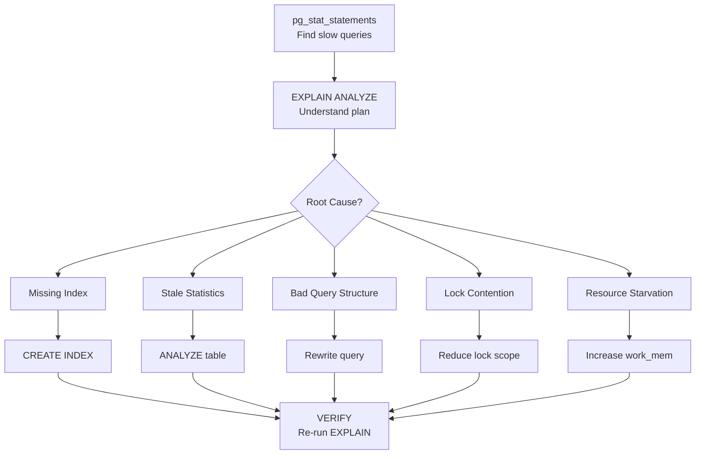
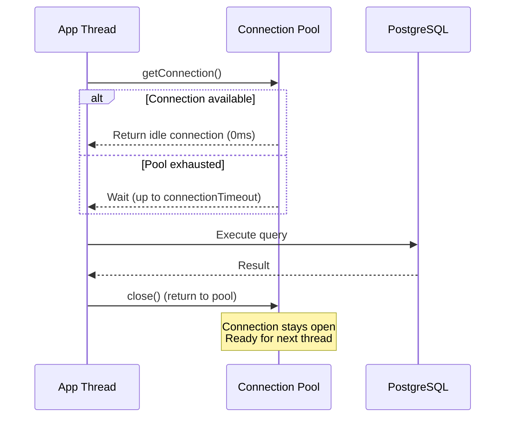
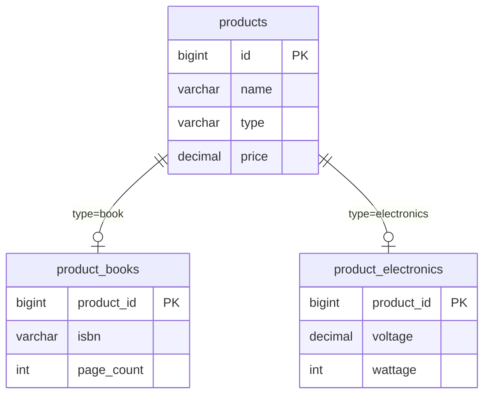
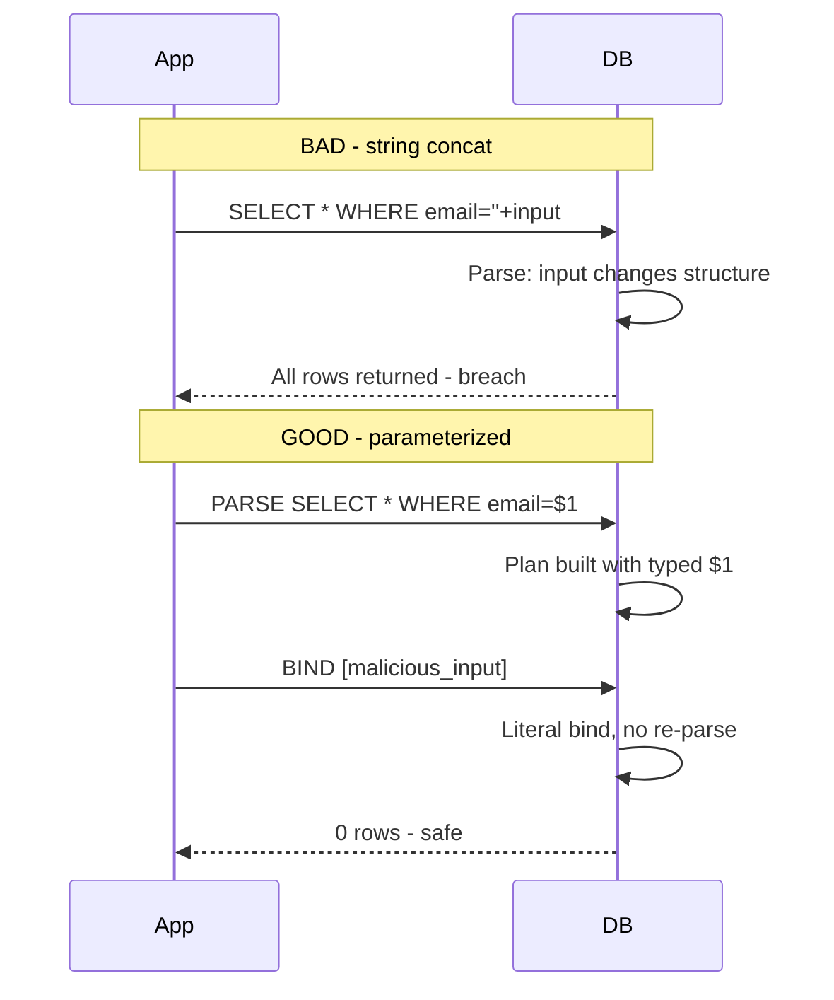
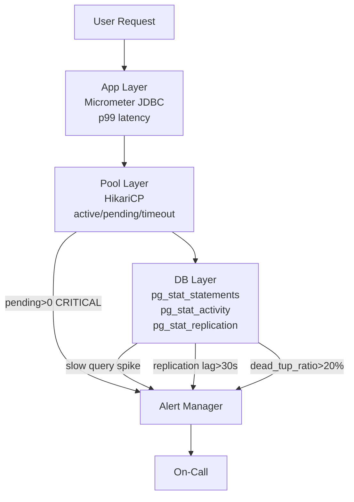

# Query Performance Diagnosis

**Interview Weight:** very high - This is the #1 most-asked database
question for senior roles. Interviewers want to see you diagnose
slow queries systematically using EXPLAIN ANALYZE, pg_stat_statements,
and identify the root cause (missing index, bad stats, lock contention,
sequential scans on large tables).

---

### 🎯 Model Answer

**30 seconds:**

> I diagnose slow queries in three steps: (1) Identify the slow query
> using pg_stat_statements (sorted by total_exec_time). (2) Run
> EXPLAIN (ANALYZE, BUFFERS) to see the execution plan - look for
> sequential scans on large tables, nested loops with high row counts,
> and buffer hits vs reads. (3) Fix by adding indexes, rewriting
> the query, or updating statistics. The goal is turning sequential
> scans into index scans and reducing the number of rows processed
> at each step of the plan.

**3 minutes (Senior):**

> Query performance diagnosis is systematic, not guessing. I follow
> this workflow:
>
> Phase 1 - Find the problem queries:
> pg_stat_statements ranks queries by total_exec_time (cumulative),
> mean_exec_time (per-call), and calls (frequency). A query with
> 2ms mean time but 10M calls per day is a bigger problem than a
> query with 5s mean time called 10 times/day.
>
> Phase 2 - Understand the plan:
> EXPLAIN (ANALYZE, BUFFERS, FORMAT TEXT) shows actual execution.
> Key things I look for: (a) Seq Scan on tables > 10K rows (usually
> needs an index). (b) Nested Loop with high actual rows on the
> inner side (consider Hash Join via work_mem increase or index).
> (c) Sort with external merge (work_mem too low, spilling to disk).
> (d) Rows Removed by Filter: high number means the plan fetches
> too many rows then discards them. (e) Buffers: shared read vs
> shared hit - high reads means data is not in cache.
>
> Phase 3 - Identify root cause categories:
> (1) Missing index - add appropriate index (B-tree, GIN, partial).
> (2) Stale statistics - ANALYZE table manually (autovacuum lagging).
> (3) Bad query structure - rewrite correlated subquery as JOIN,
> replace NOT IN with NOT EXISTS, avoid functions on indexed columns.
> (4) Lock contention - pg_stat_activity shows waiting queries.
> (5) Resource starvation - work_mem too low (sort/hash spill to
> disk), shared_buffers too small (low cache hit ratio).
>
> Phase 4 - Verify fix:
> Re-run EXPLAIN ANALYZE. Compare: total time, rows scanned, buffer
> usage. Measure in staging with production-like data volumes.

**Framework:** IDENTIFY (pg_stat_statements) → EXPLAIN (analyze plan)
→ DIAGNOSE (root cause category) → FIX (index/rewrite/config) →
VERIFY (compare before/after plans).

**Blank Mind Recovery:**

**(1) Restate:** "You are asking how I systematically find and fix
slow database queries in production."

**(2) First principles:** "Slow queries either scan too many rows
(missing index), use too much memory (spill to disk), or wait for
locks (contention). Diagnosis tells me which."

**(3) Bridge:** "I use EXPLAIN ANALYZE like a doctor uses an X-ray -
it shows me exactly where the plan is spending time and resources."

---

### 📘 Concept Explanation

**What it is:**

Query performance diagnosis is the systematic process of identifying
slow SQL queries, understanding why they are slow (via execution
plans), and applying targeted fixes. It is the database equivalent
of profiling application code.

**How it works:**

```
  Query Performance Diagnosis Workflow:

  Step 1: FIND slow queries
  ┌─────────────────────────────────────────────┐
  │ pg_stat_statements                          │
  │ ORDER BY total_exec_time DESC               │
  │                                             │
  │ Query: SELECT * FROM orders WHERE...        │
  │ Calls: 50,000/day | Mean: 450ms | Total: 6h│
  └─────────────────────────────────────────────┘
           │
           ▼
  Step 2: EXPLAIN the plan
  ┌─────────────────────────────────────────────┐
  │ EXPLAIN (ANALYZE, BUFFERS)                  │
  │                                             │
  │ Seq Scan on orders (rows=5M, time=380ms)    │
  │   Filter: customer_id = 42                  │
  │   Rows Removed by Filter: 4,999,900        │
  │   Buffers: shared read=38000               │
  └─────────────────────────────────────────────┘
           │
           ▼
  Step 3: DIAGNOSE root cause
  ┌─────────────────────────────────────────────┐
  │ ✗ Seq Scan on 5M row table                  │
  │ ✗ Filter removes 99.99% of rows            │
  │ ✗ High shared reads (data not in cache)     │
  │ → MISSING INDEX on customer_id              │
  └─────────────────────────────────────────────┘
           │
           ▼
  Step 4: FIX
  ┌─────────────────────────────────────────────┐
  │ CREATE INDEX idx_orders_customer            │
  │   ON orders (customer_id);                  │
  └─────────────────────────────────────────────┘
           │
           ▼
  Step 5: VERIFY
  ┌─────────────────────────────────────────────┐
  │ Index Scan on idx_orders_customer           │
  │   Index Cond: customer_id = 42              │
  │   Rows: 100 | Time: 0.3ms                  │
  │   Buffers: shared hit=5                    │
  └─────────────────────────────────────────────┘
```



> **Diagram walkthrough:** The diagnosis workflow starts with finding
> the most expensive queries (pg_stat_statements), then understanding
> their execution plan (EXPLAIN ANALYZE). The root cause determines
> the fix: index for missing index, ANALYZE for stale stats, rewrite
> for bad structure, lock reduction for contention, or config change
> for resource issues. Every fix is verified with another EXPLAIN.

**The key insight:**

The execution plan tells you WHAT the database is actually doing
(not what you think it is doing). A query you expect to use an index
might do a sequential scan because: (1) the index does not exist,
(2) statistics are stale (planner thinks table is small), (3) the
planner correctly chose sequential scan because the table IS small
enough, or (4) you applied a function to the indexed column
(breaking index usage).

---

### 💻 Code Example

**Example 1: Finding and diagnosing slow queries**

```sql
-- BAD: Guessing which queries are slow
-- Looking at application logs and "feeling" something is slow
-- Running random EXPLAINs on queries you think might be bad

-- GOOD: Systematic identification via pg_stat_statements
-- Step 1: Enable pg_stat_statements (postgresql.conf)
-- shared_preload_libraries = 'pg_stat_statements'
-- pg_stat_statements.max = 10000
-- pg_stat_statements.track = top

-- Step 2: Find top offenders by total time
SELECT
    substring(query, 1, 60) AS query_preview,
    calls,
    round(total_exec_time::numeric, 2) AS total_ms,
    round(mean_exec_time::numeric, 2) AS mean_ms,
    rows,
    round((100.0 * shared_blks_hit /
      nullif(shared_blks_hit + shared_blks_read, 0))
      ::numeric, 2) AS cache_hit_pct
FROM pg_stat_statements
ORDER BY total_exec_time DESC
LIMIT 10;

-- Step 3: Detailed plan for the worst query
EXPLAIN (ANALYZE, BUFFERS, FORMAT TEXT)
SELECT o.id, o.total, c.name
FROM orders o
JOIN customers c ON c.id = o.customer_id
WHERE o.status = 'pending'
  AND o.created_at > now() - interval '7 days';

-- Read the plan bottom-up:
-- Seq Scan on orders (actual time=0..380ms rows=5000000)
--   Filter: status = 'pending' AND created_at > ...
--   Rows Removed by Filter: 4995000
--   Buffers: shared read=38461
-- Hash Join (actual time=380..420ms rows=5000)
--   Hash Cond: (o.customer_id = c.id)
--   -> (orders scan above)
--   -> Hash (actual time=5ms)
--     -> Seq Scan on customers (rows=10000)
--        Buffers: shared hit=200
--
-- DIAGNOSIS:
-- (a) orders table: Seq Scan on 5M rows, removes 99.9%
-- (b) High shared read = data not cached
-- (c) The customers hash is fine (small table, cached)
-- ROOT CAUSE: missing index on orders(status, created_at)
```

> **Code walkthrough:** pg_stat_statements provides data-driven
> identification of slow queries (no guessing). EXPLAIN ANALYZE shows
> actual execution: the orders table is sequentially scanned (5M rows)
> to find 5000 matching rows. The filter removes 99.9% of rows
> scanned - a clear sign that an index would help. High shared read
> (vs hit) means the data was not in shared_buffers (cold cache).

**Example 2: Index fixes for common patterns**

```sql
-- BAD: Function on indexed column prevents index usage
SELECT * FROM orders
WHERE LOWER(email) = 'user@example.com';
-- Has index on email, but LOWER() prevents usage!
-- Plan shows: Seq Scan (function blocks index)

-- GOOD: Expression index matching the query
CREATE INDEX idx_orders_email_lower
  ON orders (LOWER(email));
-- Now the query uses: Index Scan on idx_orders_email_lower

-- BAD: Implicit cast prevents index usage
SELECT * FROM events
WHERE event_id = '12345';
-- event_id is INTEGER, '12345' is TEXT
-- PostgreSQL casts every row: event_id::text = '12345'
-- Plan shows: Seq Scan (implicit cast on every row)

-- GOOD: Match types in query
SELECT * FROM events WHERE event_id = 12345;
-- No cast needed. Index Scan directly.

-- BAD: OR conditions prevent single index usage
SELECT * FROM orders
WHERE customer_id = 42 OR status = 'pending';
-- Cannot use index on customer_id OR index on status
-- Plan: Bitmap Or of two index scans (or Seq Scan)

-- GOOD: UNION ALL for OR conditions on different columns
SELECT * FROM orders WHERE customer_id = 42
UNION ALL
SELECT * FROM orders WHERE status = 'pending'
  AND customer_id != 42;
-- Each branch uses its own index efficiently

-- Common fix: composite index for multi-condition queries
CREATE INDEX idx_orders_status_created
  ON orders (status, created_at)
  WHERE status IN ('pending', 'processing');
-- Partial index: smaller, faster, covers 90% of queries
-- Only indexes rows with status pending/processing
```

> **Code walkthrough:** Index usage fails when functions are applied
> to indexed columns (use expression indexes), types mismatch
> (implicit casts defeat indexes), or OR spans different columns.
> Partial indexes reduce index size dramatically when queries target
> a subset of rows (active orders are 5% of total but 95% of queries).

**Example 3: Lock contention diagnosis**

```sql
-- BAD: Wondering why queries are slow intermittently
-- (Not checking for lock waits)

-- GOOD: Check for blocked queries in real-time
SELECT
    blocked.pid AS blocked_pid,
    blocked.query AS blocked_query,
    age(now(), blocked.query_start) AS blocked_duration,
    blocker.pid AS blocker_pid,
    blocker.query AS blocker_query,
    age(now(), blocker.query_start) AS blocker_duration
FROM pg_stat_activity blocked
JOIN pg_locks bl ON bl.pid = blocked.pid
JOIN pg_locks lk ON lk.locktype = bl.locktype
  AND lk.database IS NOT DISTINCT FROM bl.database
  AND lk.relation IS NOT DISTINCT FROM bl.relation
  AND lk.page IS NOT DISTINCT FROM bl.page
  AND lk.tuple IS NOT DISTINCT FROM bl.tuple
  AND lk.pid != bl.pid
JOIN pg_stat_activity blocker ON blocker.pid = lk.pid
WHERE NOT bl.granted;

-- Check: long-running transactions holding locks
SELECT pid, age(now(), xact_start) AS xact_duration,
       state, query
FROM pg_stat_activity
WHERE xact_start < now() - interval '5 minutes'
  AND state != 'idle'
ORDER BY xact_start;

-- Fix: kill long-running blocker (after investigation)
-- SELECT pg_terminate_backend(blocker_pid);

-- Prevention: set lock_timeout per session
SET lock_timeout = '5s';
-- Queries fail fast instead of waiting indefinitely
```

> **Code walkthrough:** Lock contention causes intermittent slowness
> (queries are fast when no locks, slow when blocked). The diagnostic
> query joins pg_stat_activity with pg_locks to find which query is
> blocking which. Long-running transactions are the usual culprits.
> Setting lock_timeout prevents cascading waits.

---

### ⚖️ Comparison Table

| Diagnostic Tool | What It Shows | When to Use | Overhead |
|---|---|---|---|
| **pg_stat_statements** | Aggregated query stats (time, calls, rows) | First step: find worst queries | Low (always-on) |
| **EXPLAIN ANALYZE** | Actual execution plan with timing | Deep-dive on specific query | Medium (executes query) |
| **pg_stat_activity** | Currently running/waiting queries | Real-time diagnosis | Zero |
| **pg_locks** | Lock dependencies and waits | Lock contention investigation | Zero |
| **auto_explain** | Logs slow query plans automatically | Post-mortem analysis | Low-Medium |
| **pg_stat_user_tables** | Table-level stats (seq scans, dead tuples) | Identify tables needing indexes | Zero |

---

### 🎓 Answers by Seniority

**Junior / Mid (0-5 years):**

> I use EXPLAIN ANALYZE to check if queries use indexes. If I see a
> sequential scan on a large table, I add an index on the columns in
> the WHERE clause. I also check if statistics are up to date using
> ANALYZE.

---

**Senior / Staff (5+ years):**

> I treat query performance as a system-level concern, not an ad-hoc
> task. My approach: (1) pg_stat_statements running always, reviewed
> weekly for regression detection. (2) Automated alerting when
> mean_exec_time exceeds baseline by 2x. (3) For each slow query:
> EXPLAIN (ANALYZE, BUFFERS) to understand the actual plan. (4) I
> classify root causes (missing index, stale stats, lock contention,
> resource starvation) because each has a different fix. (5) I
> validate fixes with production-like data volumes (the index that
> helps on 1M rows might not help on 100M rows due to selectivity
> changes). (6) I use partial indexes to reduce index maintenance
> overhead while targeting the hot path queries.

---

### ⚠️ Common Misconceptions

| # | Misconception | Reality |
|---|---|---|
| 1 | "Add more indexes to make queries faster" | Every index slows writes (INSERT/UPDATE/DELETE). A table with 15 indexes has 15x write amplification. Only add indexes that serve actual query patterns. |
| 2 | "EXPLAIN (without ANALYZE) shows actual performance" | EXPLAIN alone shows the PLANNER'S ESTIMATE, not reality. Only EXPLAIN ANALYZE executes the query and shows actual timing and row counts. Estimates can be wildly wrong with stale statistics. |
| 3 | "Sequential scan always means missing index" | For small tables (<10K rows), sequential scan IS faster than index scan (no random I/O). The planner correctly chooses seq scan when the table fits in a few pages. |
| 4 | "Raising shared_buffers fixes slow queries" | shared_buffers is rarely the bottleneck after a certain threshold (25% of RAM). Most slow queries are caused by missing indexes or bad query structure, not insufficient cache. |
| 5 | "Query tuning is a one-time task" | Query performance degrades as data grows (yesterday's fast query is tomorrow's slow query). Continuous monitoring via pg_stat_statements is mandatory. |

---

### 🚨 Failure Modes and Diagnosis

**Failure 1: Query plan changes after data growth**

- **Symptom:** Query was fast (5ms) for months. After table grew
  from 1M to 50M rows, it became slow (800ms). No code changes.
- **Root Cause:** The planner switched from Index Scan to Sequential
  Scan because the selectivity changed. With 1M rows and 10 distinct
  status values: each status has 100K rows (10% selectivity = index
  still wins). With 50M rows: statistics updated, planner decided
  fetching 5M rows (10%) via random I/O is slower than sequential
  scan of all 50M rows.
- **Diagnostic:**
  ```sql
  -- Check selectivity:
  SELECT attname, n_distinct, most_common_vals, most_common_freqs
  FROM pg_stats WHERE tablename = 'orders' AND attname = 'status';
  -- If most_common_freq > 0.05 (5%): index may not be used

  -- Compare estimated vs actual:
  EXPLAIN (ANALYZE) SELECT * FROM orders WHERE status = 'pending';
  -- If Rows Estimated ≈ Rows Actual: planner is correct (your
  -- index just isn't selective enough)
  ```
- **Fix:** (1) Partial index: `CREATE INDEX ... WHERE status = 'pending'`
  (index only the rows you query). (2) Add more selective columns to
  the WHERE clause. (3) If you KNOW the index is better: `SET
  enable_seqscan = off` temporarily to verify, then adjust
  random_page_cost.
- **Prevention:** Monitor pg_stat_statements for gradual regression.
  Use partial indexes for low-selectivity columns.

**Failure 2: Sudden spike in query latency (lock-related)**

- **Symptom:** All queries to the orders table suddenly take 30+
  seconds. No schema or code changes. CPU is low. Disk I/O is low.
- **Root Cause:** A long-running transaction holds a lock (e.g.,
  ALTER TABLE, VACUUM FULL, or even a forgotten transaction in a
  developer's psql session). All other queries wait for the lock.
- **Diagnostic:**
  ```sql
  -- Check waiting queries:
  SELECT pid, wait_event_type, wait_event, state,
    age(now(), query_start) AS duration, query
  FROM pg_stat_activity
  WHERE wait_event_type = 'Lock'
  ORDER BY query_start;

  -- Find the blocker:
  SELECT * FROM pg_blocking_pids(waiting_pid);
  ```
- **Fix:** (1) Terminate the blocking session: `SELECT
  pg_terminate_backend(blocker_pid)`. (2) If it is a legitimate
  DDL operation: wait or schedule for maintenance window.
- **Prevention:** (1) Set `lock_timeout = '10s'` on application
  connections (fail fast). (2) Set `statement_timeout = '60s'` for
  web requests. (3) Use `CREATE INDEX CONCURRENTLY` for index
  creation (does not hold exclusive lock). (4) Never run DDL during
  peak hours.

**Failure 3: Cache hit ratio drops after restart**

- **Symptom:** After PostgreSQL restart, all queries are slow for
  15-30 minutes, then gradually improve. pg_stat_statements shows
  very low cache_hit_ratio.
- **Root Cause:** shared_buffers is empty after restart (cold cache).
  Every query must read from disk until the working set is loaded
  into memory.
- **Diagnostic:**
  ```sql
  -- Check cache hit ratio:
  SELECT
    sum(blks_hit) / nullif(sum(blks_hit + blks_read), 0) AS ratio
  FROM pg_stat_database;
  -- Normal: > 0.99 (99%). After restart: may drop to 0.5-0.8
  ```
- **Fix:** (1) Pre-warm: `CREATE EXTENSION pg_prewarm; SELECT
  pg_prewarm('orders')` for critical tables. (2) Gradually shift
  traffic (blue-green deployment). (3) Accept the warm-up period
  in DR planning.
- **Prevention:** Minimize restarts. Use pg_prewarm after planned
  maintenance. Size shared_buffers to hold the hot working set.

---

### 🎯 Interview Deep-Dive

**Timing Guidelines:**

| Depth | Time | Signal |
|---|---|---|
| Definition | 30 sec | Knows EXPLAIN exists |
| Usage | 1-2 min | Can read a basic plan |
| Design | 2-3 min | Systematic diagnosis workflow |
| Production | 3-5 min | pg_stat_statements, lock diagnosis |
| Architecture | 5+ min | Proactive monitoring, regression prevention |

---

**Q1. Walk me through how you diagnose a slow query in production.**
[SENIOR]

*Why they ask:* Core skill for any senior backend engineer.

*Likely follow-up:* "Show me on a real example."

**A:** My production diagnosis workflow has five steps:

Step 1 - Identify: I use pg_stat_statements to find queries ranked
by total_exec_time (total impact = frequency × latency). I look at
the top 10 by total time and the top 10 by mean time. A query called
1M times at 2ms each has more total impact than one called 10 times
at 5 seconds.

Step 2 - Reproduce: I run EXPLAIN (ANALYZE, BUFFERS, FORMAT TEXT)
on the slow query with representative parameters. I use FORMAT TEXT
(not JSON) for readability. ANALYZE executes the query, so on
production I use a read replica or time it during low traffic.

Step 3 - Read the plan bottom-up: The innermost operations execute
first. I look for: (a) Seq Scan on tables >10K rows (b) Nested
Loops where the inner side has high actual rows (c) Sort methods
showing "external merge" (disk spill) (d) "Rows Removed by Filter"
being >10x the rows returned (e) Buffers: shared read >> shared hit
(cold data).

Step 4 - Classify root cause: Missing index (most common, 60% of
cases). Stale statistics (ANALYZE fixes it). Bad join order (planner
miscalculated). Lock contention (not a query issue at all). Resource
starvation (work_mem too low causing disk sorts).

Step 5 - Fix and verify: Apply the fix, re-run EXPLAIN ANALYZE,
compare the plans. I verify with production-like data volumes because
the optimization might not work on small test datasets.

I maintain a dashboard showing pg_stat_statements trends over time.
Query regression (mean_exec_time doubles) triggers an alert before
users notice.

*What separates good from great:* Great candidates have a systematic
workflow (not ad-hoc debugging) and use quantitative data
(pg_stat_statements) rather than intuition to prioritize which
queries to optimize.

---

**Q2. What is the difference between EXPLAIN and EXPLAIN ANALYZE?
When would you NOT use EXPLAIN ANALYZE?** [MID]

*Why they ask:* Understanding the tool.

*Likely follow-up:* "What about EXPLAIN BUFFERS?"

**A:** EXPLAIN shows the planner's estimated plan without executing
the query. EXPLAIN ANALYZE executes the query and shows actual timing
and row counts alongside estimates.

Key differences:
- EXPLAIN: shows estimated rows, estimated cost, chosen plan. Fast
  (no execution). Safe (no side effects). But estimates may be
  wildly wrong if statistics are stale.
- EXPLAIN ANALYZE: shows actual rows, actual time, actual loops,
  buffers read/hit. Slow (executes the full query). Shows reality.

When NOT to use EXPLAIN ANALYZE:
(1) Mutating queries: EXPLAIN ANALYZE on DELETE FROM orders WHERE
status = 'old' will ACTUALLY DELETE those rows. Wrap in a
transaction and ROLLBACK:
```sql
BEGIN; EXPLAIN ANALYZE DELETE FROM orders WHERE ...; ROLLBACK;
```
(2) Production heavy queries: If the query takes 30 minutes, EXPLAIN
ANALYZE will take 30 minutes. Use EXPLAIN first to see if the plan
looks obviously wrong.
(3) Queries with side effects: If the query calls functions that
send emails or modify external state - EXPLAIN ANALYZE will trigger
those side effects.

Additional options I always include:
- BUFFERS: shows shared blocks read from disk vs cache (critical for
  understanding I/O behavior)
- SETTINGS: shows non-default settings affecting the plan
- WAL: shows WAL generation (useful for write-heavy operations)

*What separates good from great:* Great candidates immediately
mention the mutation danger (EXPLAIN ANALYZE on DELETE/UPDATE
actually modifies data) and always wrap in BEGIN/ROLLBACK.

---

**Q3. A query uses an index in development but does a sequential
scan in production. Why?** [SENIOR] [DEBUGGING]

*Why they ask:* Common production mystery.

*Likely follow-up:* "How do you force the planner to use the index?"

**A:** Five common reasons the planner makes different choices:

Reason 1 - Data distribution: Development has 10K rows. Production
has 50M rows. The planner might choose sequential scan on production
because the WHERE clause matches too many rows (low selectivity).
Index scan with random I/O on 5M rows (10% of 50M) is slower than a
sequential scan of all 50M rows.

Reason 2 - Stale statistics: autovacuum has not run ANALYZE recently.
The planner thinks the table has 100K rows when it has 50M. It
chooses index scan based on wrong estimates. Or the opposite: it
thinks a value is common when it is rare.
```sql
-- Check when stats were last updated:
SELECT schemaname, relname, last_analyze, last_autoanalyze
FROM pg_stat_user_tables WHERE relname = 'orders';
-- If null or old: run ANALYZE orders;
```

Reason 3 - Different configuration: Production has different
random_page_cost (default 4.0). If production runs on SSD,
random_page_cost should be 1.1-1.5 (random I/O is nearly as fast
as sequential). With default 4.0, the planner overestimates random
I/O cost and avoids index scans.

Reason 4 - Table is within shared_buffers threshold: On development,
the table fits entirely in memory. The planner knows a seq scan
will hit cache (fast). In production, the table exceeds
shared_buffers, but the planner might still choose seq scan if the
alternative (index scan + heap fetches) generates more random I/O.

Reason 5 - Parameterized queries and generic plans: In prepared
statements, after 5 executions PostgreSQL switches to a "generic
plan" (not optimized for specific parameter values). The generic
plan might choose seq scan because for SOME parameter values, the
index is not selective enough.
```sql
-- Check: is the prepared statement using generic plan?
EXPLAIN EXECUTE my_statement('rare_value');
-- If plan is suboptimal: force custom plan
SET plan_cache_mode = 'force_custom_plan';
```

*What separates good from great:* Great candidates list multiple
hypotheses and know how to verify each one (check statistics, check
configuration, check selectivity, check plan_cache_mode).

---

**Q4. How do you monitor query performance continuously?** [SENIOR]

*Why they ask:* Proactive vs reactive.

*Likely follow-up:* "How do you detect regressions?"

**A:** My continuous monitoring setup has three layers:

Layer 1 - Always-on collection (pg_stat_statements):
I reset pg_stat_statements weekly and export snapshots every hour to
a time-series store (Prometheus/InfluxDB). This gives me trending:
I can see query mean_exec_time increasing day-over-day before it
becomes a user-visible problem.

Key metrics per query:
- mean_exec_time (trending up = regression)
- calls per hour (sudden spike = new code path or bot)
- rows / calls (increasing = table growth affecting selectivity)
- shared_blks_read / calls (increasing = data outgrowing cache)

Layer 2 - Threshold alerts:
- P95 latency > 500ms for any query → alert
- Cache hit ratio < 95% → alert (system-wide)
- Sequential scans on tables > 1M rows → daily report
- Table with 0 index scans and >1000 seq scans → missing index

Layer 3 - Automated slow query logging:
```sql
-- postgresql.conf:
-- log_min_duration_statement = 1000  (log queries > 1s)
-- auto_explain.log_min_duration = 1000  (log plan too)
-- auto_explain.log_analyze = true
-- auto_explain.log_buffers = true
```
auto_explain automatically logs the execution plan for slow queries.
No need to manually run EXPLAIN on production.

Regression detection: I compare this week's top-10 queries (by mean
time) against last week. If a query that was 5ms is now 50ms, it
gets flagged automatically. Common causes: data growth crossing a
selectivity threshold, statistics going stale after bulk load,
or a code change adding a new hot query path.

*What separates good from great:* Great candidates set up proactive
monitoring (detect regression before users complain) rather than
reactive debugging (user reports slowness → start investigating).

---

**Q5. Explain the difference between Index Scan, Index Only Scan,
and Bitmap Index Scan.** [MID]

*Why they ask:* Understanding plan nodes.

*Likely follow-up:* "When does the planner choose each one?"

**A:** Three scan types using B-tree indexes:

Index Scan: Traverses the B-tree to find matching index entries.
For each entry, follows the pointer (TID) to the heap page to
fetch the full row. One index lookup → one heap page read (random
I/O). Best when: few rows match (high selectivity), row data needed.

Index Only Scan: Same B-tree traversal, but ALL requested columns
are in the index (covering index). No heap access needed. HOWEVER:
must check the visibility map to confirm the row is visible to the
current transaction (if page is not all-visible, must visit heap).
Best when: query only needs columns in the index AND most pages are
all-visible (after VACUUM).

Bitmap Index Scan: Scans the index to collect ALL matching TIDs into
a bitmap (one bit per heap page). Then sorts by page number and
reads heap pages sequentially. Two phases: (a) Bitmap Index Scan
(build the bitmap), (b) Bitmap Heap Scan (read pages in order).
Best when: moderate selectivity (too many rows for Index Scan, too
few for Seq Scan). Converts random I/O into sequential I/O.

Bonus - Bitmap OR/AND: Can combine multiple indexes using bitmap
operations:
```sql
-- Uses Bitmap OR of two indexes:
WHERE status = 'pending' OR customer_id = 42;
-- BitmapOr
--   -> Bitmap Index Scan on idx_status
--   -> Bitmap Index Scan on idx_customer
-- -> Bitmap Heap Scan (union of both bitmaps)
```

The planner chooses based on selectivity:
- < 1% of table: Index Scan (few random reads)
- 1-15% of table: Bitmap Index Scan (sorted sequential reads)
- > 15% of table: Sequential Scan (read everything once)
These thresholds vary with random_page_cost and effective_cache_size.

*What separates good from great:* Great candidates explain the
visibility map requirement for Index Only Scan (freshly VACUUMed
tables benefit most) and the bitmap's role in converting random I/O
to sequential I/O.

---

**Q6. You have a query with a Nested Loop join that is slow. How
do you fix it?** [SENIOR] [TRADE-OFF]

*Why they ask:* Join optimization.

*Likely follow-up:* "When IS Nested Loop the right choice?"

**A:** A Nested Loop join iterates the outer table and for each row,
scans the inner table. It is slow when: (a) the outer side has many
rows, (b) the inner side does not use an index, or (c) both sides
are large.

Diagnosis:
```sql
-- In EXPLAIN output:
-- Nested Loop (actual time=0..5000ms rows=100000)
--   -> Seq Scan on orders (rows=10000)  ← outer
--   -> Index Scan on items (rows=10)    ← inner, per outer row
--      Index Cond: items.order_id = orders.id
-- Total inner executions: 10000 × 10 = 100000 row reads
```

The three fixes:

Fix 1 - Ensure index on inner join column:
If the inner side shows Seq Scan: create an index on the join
column. Nested Loop with inner Index Scan is fast (O(outer × log N)).
Without index: O(outer × N) - catastrophic.

Fix 2 - Encourage Hash Join (increase work_mem):
```sql
SET work_mem = '256MB';
EXPLAIN ANALYZE SELECT ...;
-- If plan switches to Hash Join: hash build on smaller table,
-- probe from larger table. O(N + M) instead of O(N × M).
```
Hash Join needs enough work_mem to build the hash table in memory.
If work_mem is too low, the hash spills to disk (slower).

Fix 3 - Rewrite to reduce outer row count:
If the outer side returns too many rows because of a missing filter
or the filter is applied after the join: restructure the query to
filter early. Use a CTE or subquery to reduce the outer set before
joining:
```sql
-- BAD: filter after join
SELECT * FROM orders o
JOIN items i ON i.order_id = o.id
WHERE o.status = 'active';

-- GOOD: filter before join (if planner doesn't push down)
SELECT * FROM (
    SELECT * FROM orders WHERE status = 'active'
) o JOIN items i ON i.order_id = o.id;
```

When Nested Loop IS correct: when outer side has few rows (< 100)
and inner side has an index. Nested Loop with Index Scan on the
inner side and a small outer set is the FASTEST join method (no
hash build overhead, no sort).

*What separates good from great:* Great candidates know that Nested
Loop is not inherently bad - it is the best join type when the outer
side is small. The problem is only when the outer side is large or
the inner side lacks an index.

---

**Q7. How do you identify and fix queries that are causing I/O
problems?** [SENIOR]

*Why they ask:* Resource-level diagnosis.

*Likely follow-up:* "How do you distinguish CPU-bound from I/O-bound?"

**A:** I/O-bound queries are identified by high shared_blks_read
(disk reads) and low shared_blks_hit (cache hits) in pg_stat_statements
or EXPLAIN BUFFERS:

Identification:
```sql
-- Queries with worst I/O:
SELECT query, calls,
    shared_blks_read AS disk_reads,
    shared_blks_hit AS cache_hits,
    round(100.0 * shared_blks_read /
      nullif(shared_blks_read + shared_blks_hit, 0), 2)
      AS miss_pct,
    temp_blks_written AS disk_sorts
FROM pg_stat_statements
WHERE shared_blks_read > 1000
ORDER BY shared_blks_read DESC LIMIT 10;
```

Root causes and fixes:

Cause 1 - Working set exceeds shared_buffers: Table is 100GB,
shared_buffers is 4GB. Only 4% of data is cached. Fix: increase
shared_buffers (up to 25% of RAM), or reduce the working set
(partitioning, archiving old data).

Cause 2 - Sequential scan on large table: Query reads all 100GB
every time. Fix: add appropriate index (read only the rows needed).

Cause 3 - Sort spilling to disk (temp_blks_written > 0):
work_mem too low for the sort/hash operation. Fix: increase
work_mem for the session/query, or add an index that provides
pre-sorted results (ORDER BY column matching index order).

Cause 4 - Index scan on low-selectivity query: Index returns too
many heap pages (random I/O). Each heap page read is a disk seek.
Fix: The planner should choose seq scan (it is faster for low
selectivity). If it does not: update statistics, or use a covering
index (Index Only Scan avoids heap entirely).

CPU-bound vs I/O-bound distinction:
- High actual time with low buffers read = CPU-bound (complex
  expressions, functions, regex)
- High buffers read with time proportional to reads = I/O-bound
  (needs index or more memory)
- High time with waiting on LWLock = contention (not CPU or I/O)

*What separates good from great:* Great candidates look at
shared_blks_read vs shared_blks_hit to quantify I/O problems and
distinguish from CPU-bound issues using the buffers-to-time ratio.

---

**Q8. A table has 15 indexes and writes are slow. How do you
decide which indexes to remove?** [STAFF] [TRADE-OFF]

*Why they ask:* Index lifecycle management.

*Likely follow-up:* "How do you safely remove an index in production?"

**A:** Every index costs: write amplification (INSERT updates every
index), storage (each index is a separate data structure on disk),
and VACUUM overhead (must clean dead entries from every index).
15 indexes means 15x write amplification.

Methodology to identify removable indexes:

Step 1 - Find unused indexes:
```sql
SELECT indexrelname, idx_scan, idx_tup_read,
    pg_size_pretty(pg_relation_size(indexrelid)) AS size
FROM pg_stat_user_indexes
WHERE schemaname = 'public'
  AND relname = 'orders'
ORDER BY idx_scan ASC;
-- idx_scan = 0 means NEVER used since last stats reset
-- Size shows storage cost of keeping it
```

Step 2 - Find redundant indexes:
```sql
-- Index on (a, b) makes index on (a) redundant
-- Index on (a) is a prefix of (a, b), so queries on just (a)
-- can use the (a, b) index.
-- Exception: index on (a) is smaller → faster for a-only queries
SELECT * FROM pg_indexes WHERE tablename = 'orders';
-- Manually review: are any indexes a prefix of another?
```

Step 3 - Find duplicate indexes:
```sql
-- Exact same columns in same order = duplicate
SELECT array_agg(indexname) AS duplicates, indexdef
FROM pg_indexes
WHERE tablename = 'orders'
GROUP BY indexdef
HAVING count(*) > 1;
```

Step 4 - Measure write impact:
```sql
-- Before removing: check n_tup_ins, n_tup_upd, n_tup_del
SELECT relname, n_tup_ins, n_tup_upd, n_tup_del
FROM pg_stat_user_tables WHERE relname = 'orders';
-- 100K inserts/day × 15 indexes = 1.5M index entries written/day
-- Removing 5 unused indexes: 500K fewer index entries/day
```

Safe removal process:
1. Mark index as invalid (prevents new queries from using it):
   `UPDATE pg_index SET indisvalid = false WHERE indexrelid = 'idx_name'::regclass;`
2. Monitor for 7 days (no errors = nothing depended on it)
3. DROP INDEX CONCURRENTLY (non-blocking)
4. Monitor write latency improvement

Decision framework: keep an index only if it has > 100 scans/day
or it serves a critical query path (even if infrequent, like a
nightly report). Everything else is a candidate for removal.

*What separates good from great:* Great candidates use the
invalidation technique (disable before dropping) to safely test
whether any critical path depends on the index without risking
production outage.

---

**Q9. Explain how you would tune work_mem for a specific workload.**
[SENIOR]

*Why they ask:* Resource configuration.

*Likely follow-up:* "What happens if you set it too high?"

**A:** work_mem controls how much memory each sort/hash operation can
use before spilling to disk. Default is 4MB. Critical for: ORDER BY,
GROUP BY, Hash Joins, DISTINCT, window functions.

Understanding the risk: work_mem is PER OPERATION PER CONNECTION.
A query with 3 sorts uses 3 × work_mem. With 100 connections: up
to 300 × work_mem of memory consumed simultaneously.

Diagnosis - are queries spilling to disk?
```sql
-- Check for disk sorts in EXPLAIN:
EXPLAIN (ANALYZE, BUFFERS) SELECT ...;
-- Look for: "Sort Method: external merge  Disk: 50000kB"
-- external merge = spilled to disk (work_mem exceeded)
-- "Sort Method: quicksort  Memory: 25kB" = fits in memory (good)

-- System-wide: temporary file usage
SELECT datname,
    temp_files AS spill_count,
    pg_size_pretty(temp_bytes) AS spill_size
FROM pg_stat_database WHERE datname = current_database();
-- High temp_files = queries regularly spilling to disk
```

Tuning approach:
```sql
-- Step 1: Find the largest sort/hash in your workload
-- (from auto_explain logs or manual EXPLAIN on top queries)
-- "Sort Method: external merge  Disk: 250MB"
-- → Needs 250MB work_mem for this query to sort in-memory

-- Step 2: Calculate safe global setting
-- RAM: 64GB. shared_buffers: 16GB. Remaining: 48GB.
-- Max connections: 200. Sorts per query: ~3 (average).
-- Worst case: 200 × 3 × work_mem < 48GB
-- → work_mem = 48GB / 600 = ~80MB
-- Conservative: work_mem = 32MB globally

-- Step 3: Set per-session for heavy queries
SET work_mem = '256MB';  -- Just for this query/session
SELECT ... complex analytical query ...;
RESET work_mem;  -- Back to global default

-- Step 4: Use connection pool settings for different workloads
-- OLTP connections: work_mem = 16MB (small sorts, many connections)
-- Reporting connections: work_mem = 256MB (large sorts, few connections)
```

Too low: queries spill to disk (10-100x slower for large sorts).
Too high: memory exhaustion risk under concurrent load, OOM killer.

*What separates good from great:* Great candidates understand the
multiplication factor (per-operation × per-connection) and use
different work_mem settings for OLTP vs analytical workloads via
connection pool routing.

---

**Q10. How do you diagnose and fix a query that was fast but
became slow after a PostgreSQL upgrade?** [STAFF] [DEBUGGING]

*Why they ask:* Version migration challenges.

*Likely follow-up:* "How do you prevent this?"

**A:** PostgreSQL upgrades can change query plans because the
optimizer is improved with each version. The same query might get a
different (and sometimes worse) plan due to: new planner features,
changed cost constants, or updated selectivity estimation.

Diagnosis process:

Step 1 - Identify regressed queries:
```sql
-- Compare pg_stat_statements before and after upgrade
-- (must have exported pre-upgrade stats)
-- Look for: queries where mean_exec_time increased > 2x
```

Step 2 - Compare execution plans:
Save EXPLAIN ANALYZE output from the old version (before upgrade).
Compare with the new version's plan. Look for: different join types,
different scan types, different join order.

Step 3 - Common causes:

Cause 1 - JIT compilation overhead (new in PG 11+):
```sql
-- JIT compiles queries to machine code. For simple queries,
-- the compilation time exceeds the execution time saved.
EXPLAIN ANALYZE SELECT ...;
-- Shows: "JIT: Functions: 25, Generation Time: 15ms, ..."
-- If JIT time > execution time: disable for this query
SET jit = off;
```

Cause 2 - Enable/disable of new planner features:
```sql
-- New PostgreSQL versions may enable features that change plans
-- Example: enable_memoize (PG 14+), enable_partitionwise_join
SET enable_memoize = off;
EXPLAIN ANALYZE SELECT ...;
-- If plan improves: the new feature hurts this specific query
```

Cause 3 - Statistics changes:
```sql
-- New PG version may use extended statistics or different
-- selectivity estimation. Re-run ANALYZE:
ANALYZE table_name;
-- If plan improves: stale stats after pg_upgrade
-- pg_upgrade preserves data but statistics may need refresh
```

Prevention strategy:
1. Before upgrade: export EXPLAIN plans for top 50 queries
2. After upgrade: run `ANALYZE` on all tables immediately
3. Compare plans using pg_stat_statements (mean time before/after)
4. Have rollback plan (keep old cluster until verified)
5. Use `pg_hint_plan` extension as emergency escape hatch (force
   specific plans for regressed queries while investigating root cause)

*What separates good from great:* Great candidates save pre-upgrade
baselines (plans + stats) and have a systematic comparison process
rather than discovering regressions via user complaints.

---

**Q11. How does PostgreSQL decide between different join algorithms?**
[MID]

*Why they ask:* Tests understanding of join planning.

*Likely follow-up:* "Can you force a specific join type?"

**A:** PostgreSQL has three join algorithms. The planner chooses
based on data size, available indexes, and memory (work_mem):

Nested Loop Join:
- Algorithm: For each row in outer table, scan inner table
- With index on inner: O(N × log M) - very fast for small N
- Without index: O(N × M) - catastrophic for large tables
- Best when: outer table is small (<100 rows), inner has index
- Memory: O(1) - no extra memory needed

Hash Join:
- Algorithm: Build hash table from smaller table, probe with
  larger table. O(N + M) time.
- Best when: no useful indexes, both tables moderately sized,
  enough work_mem for the hash table
- Memory: O(smaller table) - must fit in work_mem or spills
- Cannot do inequality joins (only equi-joins)

Merge Join:
- Algorithm: Sort both inputs on join key, merge in order.
  O(N log N + M log M) for sort, O(N + M) for merge.
- Best when: both inputs are already sorted (from index scan
  or previous sort), or result needs ORDER BY on the join key
- Memory: O(1) if pre-sorted, O(N + M) for sort otherwise
- Handles inequality joins (>, <, BETWEEN)

Planner's decision framework:
```
  small outer + index on inner → Nested Loop + Index Scan
  medium tables + equi-join + enough work_mem → Hash Join
  pre-sorted inputs + equi-join → Merge Join
  large tables + no index + low work_mem → Hash Join (disk)
  inequality join → Nested Loop or Merge Join (Hash cannot)
```

You can influence (but rarely should force) the choice:
```sql
SET enable_hashjoin = off;   -- Disable hash joins
SET enable_nestloop = off;   -- Disable nested loops
-- WARNING: only for diagnosis. Never in production permanently.
```

*What separates good from great:* Great candidates explain that
Nested Loop with an inner index scan is often the fastest join
(not the worst) and that Hash Join's memory requirement makes
work_mem tuning critical.

---

**Q12. Your team is debating whether to add a database connection
to a critical monitoring query. Walk us through your decision
process.** [STAFF] [BEHAVIORAL]

*Why they ask:* Decision-making process.

*Likely follow-up:* "What if the team disagrees?"

**A:** I frame this as a cost-benefit analysis with concrete data:

Assessment phase:
1. What is the current query performance? (baseline from
   pg_stat_statements: mean_time, p99, calls/hour)
2. What is the expected load increase? (monitoring query frequency
   × data volume)
3. What is the resource overhead? (CPU, I/O, connection count)
4. What is the impact on other queries? (shared resources)

Trade-offs I would present to the team:

Benefits of the monitoring query:
- Proactive alerting (detect issues before users notice)
- Data-driven capacity planning
- Post-incident analysis capability

Risks:
- Connection pool slot consumed (one fewer for user traffic)
- CPU/I/O consumed by monitoring (could slow user queries)
- Lock contention if monitoring reads conflict with writes
- Observer effect (monitoring changes what is measured)

My recommendation approach:
1. Profile the monitoring query in staging with production load
2. Quantify: "This query uses X% of CPU, Y connections, runs
   every Z seconds"
3. If overhead < 1% of capacity: approve without hesitation
4. If overhead 1-5%: approve with rate limiting (reduce frequency)
5. If overhead > 5%: consider alternatives (read replica, external
   monitoring, sampling)

Implementation safeguards:
- Run on read replica (zero impact on primary)
- Set statement_timeout (monitoring should fail fast, not block)
- Use dedicated connection pool (separate from application pool)
- Monitor the monitor (alert if monitoring query itself is slow)

How I handle team disagreement: I present data (not opinions).
If the monitoring query takes 2ms every 60 seconds and we have
200 connections available - that is 0.003% of capacity. The benefit
(early detection) far outweighs the cost. I show the numbers and
let the team decide.

*What separates good from great:* Great candidates quantify the
cost (not "it might be slow" but "it consumes 0.003% of capacity"),
suggest mitigations (read replica), and present the trade-off in
concrete terms the team can evaluate.

---

**Interviewer Type Adaptation:**

| Interviewer Type | Emphasis |
|---|---|
| Technical Panel | EXPLAIN reading, plan nodes, index selection |
| Hiring Manager | Systematic process, proactive monitoring |
| Bar Raiser | Complex diagnosis, multi-factor root cause analysis |
| Peer Engineer | "Our P99 latency spiked - walk me through diagnosis" |

---

---

# Connection Pool Tuning and Diagnosis

**Interview Weight:** high - Connection pool misconfiguration is one
of the most common causes of production outages. Interviewers test
whether you understand pool sizing, timeout configuration, leak
detection, and the relationship between pool size and database
connections.

---

### 🎯 Model Answer

**30 seconds:**

> A connection pool (HikariCP, PgBouncer) reuses database connections
> instead of creating new ones per request. Key tuning: pool size =
> (core_count × 2) + effective_spindle_count (HikariCP formula, usually
> 10-20 for most workloads). Monitor: connection wait time (>50ms is
> bad), pool utilization (>80% is dangerous), and connection lifetime.
> Common failures: pool exhaustion (all connections busy), connection
> leaks (not returned to pool), and timeout cascades.

**3 minutes (Senior):**

> Connection pooling operates at two levels:
>
> Application-level pool (HikariCP/c3p0): Maintains a pool of
> JDBC connections. Each request borrows a connection, executes SQL,
> and returns it. Key parameters: maximumPoolSize (hard cap),
> minimumIdle (pre-warmed connections), connectionTimeout (how long
> to wait for a connection before throwing), idleTimeout (how long
> unused connections live), maxLifetime (connection recycling).
>
> External proxy pool (PgBouncer): Sits between application and
> PostgreSQL. Multiplexes many client connections to fewer PostgreSQL
> connections. Three modes: session (1:1 mapping, safest), transaction
> (connection returned after each transaction, most efficient),
> statement (connection returned after each statement, most aggressive
> but breaks multi-statement transactions).
>
> Pool sizing formula (HikariCP wiki): connections = (core_count × 2) +
> effective_spindle_count. For a 4-core machine with SSD: 4 × 2 + 1 =
> ~10 connections. This is NOT intuitive - most teams set pool size to
> 50-100 and make things WORSE (context switching, lock contention,
> cache thrashing).
>
> Why smaller is better: PostgreSQL processes one query per connection
> per time slice. With 10 connections, 10 queries run concurrently.
> With 100 connections, you get 100 queries competing for the same
> CPU cores, disk heads, and buffer pool. The overhead of context
> switching and lock contention EXCEEDS the parallelism benefit.
>
> Diagnosis workflow: (1) Check connection wait time (HikariCP metrics).
> (2) Check active vs idle connections (pg_stat_activity). (3) Check
> for connection leaks (connections in 'idle in transaction' state for
> minutes). (4) Check if pool size matches hardware (not a guess, a
> formula).

**Framework:** BORROW (request) → EXECUTE (SQL) → RETURN (to pool).
Pool sizing: (cores × 2) + spindles. Monitoring: wait time, utilization,
leaks. Failure: exhaustion → timeout cascade → outage.

**Blank Mind Recovery:**

**(1) Restate:** "You are asking about configuring and troubleshooting
database connection pools in production."

**(2) First principles:** "Database connections are expensive to create
(TCP + SSL + auth + process fork). Pools reuse them. But too many
concurrent connections overwhelm the database."

**(3) Bridge:** "A connection pool is like a car rental counter at an
airport. You do not buy a car (create connection) for each trip (query).
You rent one (borrow) and return it. But the airport has limited parking
(cores) - 1000 cars (connections) in 50 spaces (cores) means gridlock."

---

### 📘 Concept Explanation

**What it is:**

A connection pool maintains a fixed set of pre-established database
connections that are shared among application threads. It eliminates
the overhead of creating connections on demand (TCP handshake + SSL
negotiation + authentication + PostgreSQL process fork = 50-200ms per
connection) and bounds the total load on the database.

**How it works:**

```
  Connection Pool Architecture:

  Application Server (100 threads)
  ┌────────────────────────────────────────────┐
  │  Thread 1 ─┐                               │
  │  Thread 2 ─┤                               │
  │  Thread 3 ─┼──→ HikariCP Pool (10 conns)   │
  │  ...       │    ┌─────────────────┐        │
  │  Thread 100┘    │ Conn 1 [active] │──┐     │
  │                 │ Conn 2 [idle]   │  │     │
  │                 │ Conn 3 [active] │  │     │
  │                 │ ...             │  │     │
  │                 │ Conn 10 [idle]  │  │     │
  │                 └─────────────────┘  │     │
  └──────────────────────────────────────┼─────┘
                                         │
          TCP connections (10 only)      │
  ┌──────────────────────────────────────┼─────┐
  │ PostgreSQL                           │     │
  │  Backend 1 [busy]  ←─────────────────┘     │
  │  Backend 2 [idle]                          │
  │  Backend 3 [busy]                          │
  │  ...                                       │
  │  Backend 10 [idle]                         │
  │  max_connections = 100 (headroom for       │
  │  monitoring, replication, maintenance)     │
  └────────────────────────────────────────────┘

  Without pool: 100 threads → 100 connections → DB overwhelmed
  With pool: 100 threads → 10 connections → DB efficient
  Threads wait in queue when all connections are busy
```



> **Diagram walkthrough:** Application threads request connections
> from the pool. If available, return immediately (zero overhead). If
> all connections are busy, threads wait in a queue (bounded by
> connectionTimeout). After query execution, the connection is
> returned to the pool (not closed). The pool maintains only 10
> TCP connections to PostgreSQL regardless of how many threads need
> database access.

**The key insight:**

More connections does NOT mean more throughput. A 4-core database
server can only process 4 queries truly concurrently. Adding more
connections just adds overhead: context switching between processes,
CPU cache invalidation, lock contention on shared buffers, and disk
I/O queue depth exceeding SSD parallelism. The optimal pool size is
always surprisingly small (10-20 for most workloads).

---

### 💻 Code Example

**Example 1: HikariCP configuration (correct)**

```java
// BAD: Common misconfiguration
HikariConfig config = new HikariConfig();
config.setMaximumPoolSize(100);  // Way too large!
config.setConnectionTimeout(30000); // 30s wait (too long)
config.setIdleTimeout(0);  // Never remove idle connections
// No leak detection. No lifetime limit.
// Result: 100 connections to DB, context switching,
// threads wait 30s during pool exhaustion (cascading failure)

// GOOD: Production-ready configuration
HikariConfig config = new HikariConfig();
config.setJdbcUrl("jdbc:postgresql://host:5432/db");
config.setUsername("app");
config.setPassword("secret");

// Pool sizing: (cores × 2) + spindles
// For 4-core DB server with SSD: 4*2 + 1 = 9 ≈ 10
config.setMaximumPoolSize(10);
config.setMinimumIdle(10); // Keep pool full (no cold start)

// Timeouts
config.setConnectionTimeout(5000);  // Fail fast: 5s
config.setIdleTimeout(600000);      // 10 min idle OK
config.setMaxLifetime(1800000);     // 30 min recycle
// maxLifetime must be < PostgreSQL's idle_in_transaction_session_timeout

// Leak detection
config.setLeakDetectionThreshold(60000); // 60s = probable leak

// Validation
config.setConnectionTestQuery("SELECT 1"); // Or use JDBC4 isValid()
config.setValidationTimeout(3000);

// Metrics (expose to Prometheus/Grafana)
config.setMetricRegistry(prometheusRegistry);
config.setPoolName("app-primary-pool");

DataSource ds = new HikariDataSource(config);
```

> **Code walkthrough:** Pool size of 10 matches the hardware formula
> (not a guess). connectionTimeout of 5s fails fast (prevents cascade).
> leakDetectionThreshold alerts when a connection is held for 60s
> (probable leak). maxLifetime recycles connections before the database
> kills them. minimumIdle=maximumPoolSize keeps the pool pre-warmed.

**Example 2: Diagnosing pool exhaustion**

```sql
-- BAD: Not monitoring pool state until outage happens

-- GOOD: Production monitoring queries

-- Step 1: Check PostgreSQL connection state
SELECT state, count(*) FROM pg_stat_activity
WHERE datname = 'myapp'
GROUP BY state;
-- Ideal: active < maximumPoolSize, idle = remainder
-- BAD: many 'idle in transaction' (connection leak!)

-- Step 2: Find connection leaks (idle in transaction)
SELECT pid, state, age(now(), xact_start) AS xact_age,
       age(now(), query_start) AS query_age,
       query
FROM pg_stat_activity
WHERE state = 'idle in transaction'
  AND xact_start < now() - interval '5 minutes'
ORDER BY xact_start;
-- These connections are HOLDING a transaction open but doing nothing
-- They consume a pool slot and may hold locks

-- Step 3: Check total connections vs max_connections
SELECT
    (SELECT count(*) FROM pg_stat_activity) AS current,
    (SELECT setting FROM pg_settings
     WHERE name = 'max_connections') AS max;
-- If current > 80% of max: danger zone

-- Step 4: Kill leaked connections (emergency)
SELECT pg_terminate_backend(pid)
FROM pg_stat_activity
WHERE state = 'idle in transaction'
  AND xact_start < now() - interval '10 minutes';
```

> **Code walkthrough:** 'idle in transaction' connections are the #1
> pool killer. They hold a connection slot (counted against pool max)
> but do no work. Common cause: application code that opens a
> transaction, does HTTP calls or processing, then forgets to
> commit/rollback. HikariCP's leak detection catches these on the
> application side; the PostgreSQL query catches them on the DB side.

**Example 3: PgBouncer configuration**

```ini
; BAD: Session pooling with high max_client_conn
[pgbouncer]
pool_mode = session          ; 1:1 mapping (no multiplexing)
max_client_conn = 1000       ; Accepts 1000 clients...
default_pool_size = 1000     ; ...and opens 1000 DB connections!
; No better than no pool at all.

; GOOD: Transaction pooling with proper sizing
[pgbouncer]
pool_mode = transaction      ; Return conn after each txn
max_client_conn = 1000       ; Accept 1000 app connections
default_pool_size = 20       ; Only 20 real DB connections!
reserve_pool_size = 5        ; Emergency overflow
reserve_pool_timeout = 3     ; Use reserve if wait > 3s

; Timeouts
server_idle_timeout = 600    ; Close unused DB connections
client_idle_timeout = 300    ; Close idle client connections
query_timeout = 60           ; Kill queries running > 60s

; Connection lifetime
server_lifetime = 3600       ; Recycle DB connections hourly
server_connect_timeout = 5   ; Fail fast on DB unreachable

[databases]
myapp = host=127.0.0.1 port=5432 dbname=myapp
; 1000 app connections multiplexed into 20 DB connections
; PostgreSQL sees only 20 backends
```

> **Code walkthrough:** PgBouncer in transaction mode multiplexes 1000
> application connections into 20 database connections. The database
> server only manages 20 backends (low overhead). Each transaction gets
> a real connection, executes, and releases it. This is critical for
> serverless/microservice architectures where 100+ app instances each
> have their own pool (without PgBouncer: 100 × 10 = 1000 DB
> connections; with PgBouncer: 20 total).

---

### ⚖️ Comparison Table

| Aspect | HikariCP | PgBouncer | pgpool-II |
|---|---|---|---|
| **Level** | Application (JVM) | External proxy | External proxy |
| **Mode** | Fixed pool per JVM | Session/Transaction/Statement | Connection pool + LB + replication |
| **Best for** | Single app server | Multi-service multiplexing | Read replica load balancing |
| **Pool sizing** | per-JVM (10-20) | per-database (20-50) | per-database |
| **Overhead** | Zero (in-process) | Low (lightweight C process) | Medium (feature-rich) |
| **Limitation** | Only this JVM's connections | Cannot use prepared statements in txn mode | Complex configuration |

---

### 🎓 Answers by Seniority

**Junior / Mid (0-5 years):**

> I configure HikariCP with a connection pool size of 10-20, set
> connectionTimeout to 5 seconds so requests fail fast, and enable leak
> detection. I monitor the pool via metrics (active connections, wait
> time) and set maxLifetime to recycle connections periodically.

---

**Senior / Staff (5+ years):**

> I approach connection pooling as a system-level concern. Pool size is
> calculated from hardware (cores × 2 + spindles), not guessed.
> I deploy PgBouncer in transaction mode between the application tier
> and PostgreSQL to multiplex connections from multiple app instances
> (50 app servers × 10 pool each = 500 connections without PgBouncer,
> 20 connections with it). I monitor three signals: (1) HikariCP wait
> time (thread waiting for connection >5ms = pool too small or queries
> too slow), (2) 'idle in transaction' connections in pg_stat_activity
> (leak indicator), (3) total backend count vs max_connections (capacity
> headroom). I set aggressive timeouts: connectionTimeout=5s (fail fast),
> idle_in_transaction_session_timeout=60s (auto-kill leaked transactions),
> statement_timeout=30s (bound query execution). I use separate pools
> for read/write (primary) and read-only (replica) to double effective
> capacity.

---

### ⚠️ Common Misconceptions

| # | Misconception | Reality |
|---|---|---|
| 1 | "Bigger pool = better performance" | A 4-core DB server with 100 connections is SLOWER than with 10. Context switching, lock contention, and cache thrashing outweigh parallelism. The formula: cores × 2 + spindles. |
| 2 | "connectionTimeout should be high to handle load spikes" | High timeout (30s) causes cascading failure: all threads blocked waiting for connections, request queue grows, entire service becomes unresponsive. Fail fast (5s) is better. |
| 3 | "Connection leaks only happen with raw JDBC" | Leaks happen with Spring/JPA too: @Transactional methods that throw exceptions caught by outer code (transaction never committed/rolled back), lazy loading outside transaction scope, manual EntityManager usage. |
| 4 | "PgBouncer transaction mode works with all PostgreSQL features" | Transaction mode breaks: prepared statements (session-scoped), SET commands (session-scoped), advisory locks (session-scoped), LISTEN/NOTIFY (session-scoped). Use session mode for these. |
| 5 | "Pool size should match max_connections" | max_connections must be LARGER than total pool sizes (leave headroom for monitoring, replication, maintenance connections). Pool size should be based on hardware capacity, not max_connections. |

---

### 🚨 Failure Modes and Diagnosis

**Failure 1: Pool exhaustion causing cascading timeout**

- **Symptom:** Application throws "Connection is not available,
  request timed out after 5000ms" (HikariCP). Requests pile up.
  Within 30 seconds, the entire service is unresponsive.
- **Root Cause:** All pool connections are busy. New requests wait
  for connectionTimeout, then fail. But during the wait, more
  requests arrive (each consuming a thread). Thread pool also
  exhausts. Cascade: connection pool full → thread pool full →
  HTTP server stops accepting requests → health check fails →
  load balancer removes instance → more load on remaining instances
  → they fail too.
- **Diagnostic:**
  ```java
  // HikariCP metrics (Prometheus/Grafana):
  // hikaricp_connections_active = maximumPoolSize (ALL busy)
  // hikaricp_connections_pending > 0 (threads waiting)
  // hikaricp_connections_timeout_total increasing (failures)
  ```
  ```sql
  -- PostgreSQL side:
  SELECT state, count(*) FROM pg_stat_activity
  WHERE datname = 'myapp' GROUP BY state;
  -- If 'active' = pool size and queries are running:
  -- Pool is correctly sized but queries are too slow
  -- If 'idle in transaction' > 0: LEAK
  ```
- **Fix:** (1) If leak: find and fix the code path that does not
  close connections. (2) If queries slow: optimize queries (index,
  rewrite). (3) If traffic spike: add read replicas or rate-limit.
  (4) Emergency: increase pool size temporarily (buys time, not a
  real fix).
- **Prevention:** connectionTimeout=5s (fail fast), circuit breaker
  on database calls, separate pools for critical/non-critical paths,
  monitor pool utilization with alerting at 80%.

**Failure 2: Connection leak from @Transactional misuse**

- **Symptom:** Over hours, pool gradually fills. Eventually pool
  exhaustion. Restarting the app fixes it temporarily. Slow drip.
- **Root Cause:** Code pattern:
  ```java
  @Transactional
  public void process(Order order) {
      // Opens transaction + borrows connection
      orderRepo.save(order);
      // Calls external HTTP service (takes 30 seconds)
      externalService.notify(order);
      // Connection held for 30 seconds doing NOTHING
      // If externalService throws: connection returned
      // If timeout + caught exception: connection may leak
  }
  ```
- **Diagnostic:** HikariCP leak detection logs:
  `Connection leak detection triggered for conn-7, stack trace: ...`
  Shows exactly which code path held the connection too long.
- **Fix:** Move external calls outside the transaction:
  ```java
  public void process(Order order) {
      save(order);  // @Transactional (fast, releases conn)
      externalService.notify(order);  // No connection held
  }
  ```
- **Prevention:** (1) Rule: @Transactional methods must ONLY do
  database work. (2) LeakDetectionThreshold=60s. (3) PostgreSQL:
  idle_in_transaction_session_timeout=120s (auto-kill).

**Failure 3: PgBouncer in transaction mode breaks prepared statements**

- **Symptom:** After deploying PgBouncer in transaction mode,
  application throws: "prepared statement does not exist." Random
  queries fail intermittently.
- **Root Cause:** Prepared statements are session-scoped in
  PostgreSQL. In transaction mode, PgBouncer assigns a different
  server connection for each transaction. A prepared statement
  created in transaction A is on server connection X. Transaction
  B may get server connection Y (where the prepared statement does
  not exist).
- **Diagnostic:** Errors occur randomly (depends on which server
  connection PgBouncer assigns). More connections in the pool =
  higher failure rate. Setting pool_mode=session fixes it (confirms
  the cause).
- **Fix:** (1) Disable prepared statements in the JDBC driver:
  `prepareThreshold=0` in connection string. (2) Use PgBouncer
  1.21+ with `max_prepared_statements` setting (transparent prepared
  statement support). (3) Use session mode if prepared statements
  are critical for performance.
- **Prevention:** Test with PgBouncer in transaction mode before
  deploying. Document which PostgreSQL features are session-scoped
  and incompatible with transaction pooling.

---

### 🎯 Interview Deep-Dive

**Timing Guidelines:**

| Depth | Time | Signal |
|---|---|---|
| Definition | 30 sec | Knows what connection pooling is |
| Usage | 1-2 min | Can configure HikariCP basics |
| Design | 2-3 min | Explains pool sizing formula |
| Production | 3-5 min | Diagnoses leaks, exhaustion, cascade |
| Architecture | 5+ min | PgBouncer multiplexing, multi-pool strategy |

---

**Q1. What is connection pooling and why is it necessary?** [JUNIOR]

*Why they ask:* Baseline understanding.

*Likely follow-up:* "What happens without a pool?"

**A:** Connection pooling maintains a set of pre-established database
connections that are reused by application threads instead of creating
new connections for each database operation.

Why it is necessary: Creating a PostgreSQL connection involves:
(1) TCP three-way handshake (~1ms LAN, 50ms+ WAN). (2) TLS
negotiation if using SSL (~10-50ms). (3) PostgreSQL authentication
(password verification, LDAP, etc.). (4) PostgreSQL forks a new
backend process (memory allocation, shared buffer registration).
Total: 50-200ms per new connection.

For a web application handling 1000 requests/second, each needing
a database query: 1000 connections created and destroyed per second.
That is 1000 × (50-200ms) = 50-200 seconds of connection overhead
per second. Impossible.

With a pool of 10 connections: each connection is established once
and reused ~100 times per second. Overhead: effectively zero per
request (connection already exists, just borrow and return).

Additional benefits: (1) Bounds database load (max_connections
protection). (2) Provides metrics (wait time, utilization). (3)
Validates connections (detects stale/broken connections automatically).
(4) Thread safety (handles concurrent access correctly).

*What separates good from great:* Great candidates quantify the
connection creation cost (50-200ms) and explain that the pool also
BOUNDS concurrent database access (protecting the database from
overload, not just saving connection time).

---

**Q2. Explain the HikariCP pool sizing formula. Why is a smaller
pool better?** [SENIOR] [TRADE-OFF]

*Why they ask:* Counter-intuitive concept.

*Likely follow-up:* "What if we have 50 microservices?"

**A:** The HikariCP pool sizing formula is: connections =
(core_count × 2) + effective_spindle_count. For a 4-core DB server
with SSD: (4 × 2) + 1 = 9 ≈ 10 connections.

Why smaller is better: A CPU core can execute ONE instruction at a
time. A 4-core machine can do 4 things concurrently. Having 100
database connections means 100 queries competing for 4 cores.

What happens with too many connections:
(1) Context switching: OS switches between 100 processes thousands
of times per second. Each switch invalidates CPU L1/L2 cache (~100ns
penalty per switch).
(2) Lock contention: PostgreSQL's lightweight locks (buffer pins,
WAL insertion, etc.) have more contenders. Spin locks waste CPU.
(3) Cache thrashing: Each of 100 backends loads different data pages
into shared_buffers. With 10 backends, the same pages stay in cache
longer (higher hit ratio).
(4) Disk queue saturation: 100 backends all issuing random I/O
overwhelm even NVMe (queue depth limits). 10 backends with sequential
access patterns are faster.

The "×2" factor accounts for I/O wait: while one query waits for
disk, the core can process another query. With SSD (minimal I/O
wait), even (cores × 2) might be generous.

Real-world example: A client with 4-core RDS instance switched from
50 connections to 10 connections. Result: p95 latency dropped from
120ms to 45ms, throughput INCREASED by 30%. Counter-intuitive but
explained by the physics of CPU scheduling and lock contention.

For 50 microservices: use PgBouncer. Each service has pool_size=10
(500 total application connections). PgBouncer multiplexes them into
20 real database connections. The database sees 20 backends, not 500.

*What separates good from great:* Great candidates can explain the
CPU scheduling and cache invalidation mechanics (not just "it is
in the HikariCP docs") and know to use PgBouncer for multi-service
architectures.

---

**Q3. How do you detect and fix connection leaks?** [SENIOR]
[DEBUGGING]

*Why they ask:* Common production issue.

*Likely follow-up:* "How do you prevent them architecturally?"

**A:** A connection leak occurs when application code borrows a
connection from the pool but never returns it (forgets to call
close(), or an exception prevents the finally block from executing).

Detection methods:

Method 1 - HikariCP leak detection:
```java
config.setLeakDetectionThreshold(60000); // 60 seconds
// Logs warning with full stack trace when a connection
// is held for > 60s without being returned.
// The stack trace shows EXACTLY which code path leaked.
```

Method 2 - PostgreSQL server-side:
```sql
SELECT pid, state, query, age(now(), xact_start) AS txn_age,
       age(now(), state_change) AS state_age
FROM pg_stat_activity
WHERE state = 'idle in transaction'
  AND state_change < now() - interval '5 minutes';
-- 'idle in transaction' for 5+ minutes = almost certainly a leak
```

Method 3 - Pool metrics trending:
Monitor hikaricp_connections_active over time. If it trends upward
without corresponding traffic increase: connections are being
borrowed but not returned.

Common leak patterns in Java:
```java
// Leak pattern 1: Exception before close
Connection conn = dataSource.getConnection();
Statement stmt = conn.createStatement();
ResultSet rs = stmt.executeQuery("SELECT...");  // Throws!
conn.close();  // Never reached

// Fix: try-with-resources
try (Connection conn = dataSource.getConnection();
     Statement stmt = conn.createStatement();
     ResultSet rs = stmt.executeQuery("SELECT...")) {
    // Process results
}  // Auto-closed even on exception

// Leak pattern 2: @Transactional with external call
@Transactional
public void processOrder(Order o) {
    repo.save(o);          // DB operation (fast)
    httpClient.call(url);  // External call (slow)
    // Connection held during entire HTTP call
}

// Fix: Split transaction boundary
public void processOrder(Order o) {
    saveOrder(o);          // @Transactional (fast, releases)
    httpClient.call(url);  // No connection held
}
@Transactional
void saveOrder(Order o) { repo.save(o); }
```

Server-side prevention:
```sql
-- Kill connections idle in transaction > 2 minutes
ALTER SYSTEM SET idle_in_transaction_session_timeout = '120s';
SELECT pg_reload_conf();
```

---

---

# Schema Design Anti-Patterns

**Interview Weight:** high - Schema design anti-patterns are among
the most revealing questions in senior database interviews. They
expose whether you understand normalized, maintainable schemas or
create long-lived technical debt that haunts production systems.

---

### 🎯 Model Answer

**30 seconds:**
> Schema design anti-patterns are recurring database structure
> mistakes that trade short-term convenience for long-term pain.
> The most damaging are EAV tables (storing attributes as rows
> instead of typed columns, making queries require many self-joins),
> polymorphic associations (a foreign key that can point to different
> tables, which breaks referential integrity), and wide tables with
> mostly-NULL columns (which indicate a missing subtype). Each
> pattern feels flexible at design time but creates compounding
> performance and integrity problems in production.

**3 minutes (Senior):**
> The schema anti-patterns I have dealt with most in production
> are EAV and polymorphic associations, because they actively
> prevent the database from enforcing integrity.
>
> EAV (Entity-Attribute-Value): a three-column table with
> entity_id, attr_name, attr_value VARCHAR. Looks flexible -
> add any attribute without DDL. The problem: retrieving N
> attributes for one entity requires N self-joins. No type
> safety (everything is VARCHAR, so range queries need CAST).
> No efficient composite indexes for multi-attribute queries.
> I replaced an EAV system once by first auditing the actual
> attribute set - 95% of attributes were used by all entities,
> so a proper normalized table was the right answer.
>
> Polymorphic associations: a FK that stores (parent_type
> VARCHAR, parent_id INT). Looks reusable. The problem: no
> FK constraint is possible (which table does it reference?).
> Application must cascade deletes manually - and it silently
> fails when developers forget, direct DB access skips the
> app layer, or batch jobs run outside the normal code path.
> I have seen systems with millions of orphaned rows caused
> by polymorphic FKs and non-cascading deletes.
>
> Wide nullable tables: a 60-column table where electronics
> rows have NULL book columns and vice versa indicates a
> missing supertype/subtype split. The PostgreSQL cost: each
> page holds fewer rows (wider tuple), so every scan touches
> more pages and autovacuum takes longer.
>
> The non-obvious insight: every anti-pattern optimizes write
> convenience (the schema accepts any data) at the cost of
> read correctness and query performance. The right instinct
> is: what queries run most often? Design the schema for those.

**Framework:** IDENTIFY anti-pattern -> COST (query, integrity,
maintenance) -> FIX (normalized alternative) -> MIGRATE
(non-breaking, view-based)

*Adapting up:* Add migration strategy, backward-compat via
views, and org-level cost (developer velocity, on-call burden).

*Adapting down:* Name 2-3 anti-patterns and why they cause pain.

**Blank Mind Recovery:**

**(1) Restate:** "So you are asking about schema anti-patterns
- let me think through what makes a schema design painful
over time."

**(2) First principles:** "From first principles, a schema
should make common queries fast and data integrity automatic.
When a schema defeats both goals, that is an anti-pattern."

**(3) Bridge:** "This reminds me of code smells. EAV is like
using Map<String,Object> where you needed a typed class - you
get flexibility but lose type safety, validation, and IDE help."

---

### 📘 Concept Explanation

**What it is:**
Schema design anti-patterns are recurring structural mistakes
in relational databases that optimize for short-term design
convenience at the cost of performance, maintainability, and
data integrity.

**The problem it solves:**
Before naming these patterns, developers made the same mistakes
independently - EAV for flexibility, polymorphic FKs for
reuse, wide nullable tables for "future columns". Naming them
creates a shared vocabulary to identify and correct them early,
before they become multi-sprint migration projects.

**How it works:**

Major anti-patterns and their failure mechanisms:

1. EAV (Entity-Attribute-Value):
```
entity_attributes
+-----------+-----------+-----------+
|entity_id  |attr_name  |attr_value |
|    1      | email     | a@b.com   |
|    1      | age       | 30        |
|    2      | email     | c@d.com   |
+-----------+-----------+-----------+
```
Pivot query for one entity needs N self-joins (N = attrs
needed). No type enforcement (everything is VARCHAR). No
efficient composite index for multi-attribute queries.

2. Polymorphic Association:
```
comments
+----+-------------+-----------+------+
| id | parent_type | parent_id | body |
+----+-------------+-----------+------+
| 1  | Post        |    5      | ...  |
| 2  | Video       |    3      | ...  |
```
No FOREIGN KEY constraint possible. Orphans accumulate when
parent is deleted outside the application code path.

3. Wide nullable table (missing subtype):
A 60-column products table where book-specific columns are
NULL for electronics rows and vice versa. Should be split
into a products supertype + product_books + product_electronics
subtype tables.

4. Missing unique constraint on business key:
Surrogate PK is unique but the natural business key
(customer_id, product_id, order_date) has no constraint.
Duplicate business-key rows accumulate silently.

5. Transitive dependency (3NF violation):
Storing customer_email in the orders table. It depends on
customer_id, not order_id. Update anomaly: customer changes
email, some orders still hold the old address.

**The key insight:**
Every anti-pattern optimizes the schema to accept any data
(write convenience) at the cost of making the most common
queries slow or incorrect. The correct first question is:
what queries run most often? - not: what data structure is
most flexible?

**When to use it:**
Anti-pattern awareness applies when designing new schemas,
reviewing DDL pull requests, diagnosing slow queries caused
by structural problems, and planning migrations from
inherited legacy systems.

**When NOT to use it:**
EAV is sometimes genuinely appropriate for truly dynamic,
user-defined attribute sets (clinical records where clinicians
define custom fields per patient). But PostgreSQL JSONB with
GIN indexes is almost always a better choice even for dynamic
attributes - it preserves query capability while avoiding
the N self-join cost.

**Alternatives:**
- EAV -> normalized subtype tables or JSONB (dynamic attrs)
- Polymorphic FK -> separate junction tables per relation
- Wide nullable table -> supertype + per-type subtype tables
- Missing business key uniqueness -> UNIQUE constraint on
  the natural key tuple

**First-principles derivation:**
The relational model requires: every column has a defined
type, every row satisfies a unique constraint, FK references
are to a known table. EAV violates types (all VARCHAR).
Polymorphic FKs violate referential integrity (no known
target table). Wide nullable tables violate the design
principle that a row models one kind of thing. Each
anti-pattern is a violation of a specific relational rule.

---

### 💻 Code Example

**Example 1: EAV BAD vs normalized GOOD**

```sql
-- BAD: EAV - flexible but query-hostile
CREATE TABLE entity_attributes (
  entity_id  BIGINT       NOT NULL,
  attr_name  VARCHAR(100) NOT NULL,
  attr_value VARCHAR(500),
  PRIMARY KEY (entity_id, attr_name)
);

-- Pivot for one user: N self-joins
SELECT e1.attr_value AS email,
       e2.attr_value AS age
FROM entity_attributes e1
JOIN entity_attributes e2
  ON e1.entity_id = e2.entity_id
 AND e2.attr_name = 'age'
WHERE e1.attr_name = 'email'
  AND e1.entity_id = 42;
-- 10 attrs = 10 self-joins. All VARCHAR, no type safety.

-- GOOD: Normalized - fast, typed, indexable
CREATE TABLE users (
  id    BIGINT       PRIMARY KEY,
  email VARCHAR(255) NOT NULL UNIQUE,
  age   INT          CHECK (age BETWEEN 0 AND 150)
);
SELECT email, age FROM users WHERE id = 42;
-- Single PK index scan. Typed. Constrained.
```

> **Code walkthrough:** The BAD EAV pattern requires a self-join
> for every attribute retrieved - 10 attributes means 10 joins on
> the same table. All values are VARCHAR, so age comparisons need
> CAST and cannot use integer statistics. The GOOD normalized table
> retrieves all attributes in one index scan with full type safety.
> The EAV trade-off (no DDL change for new attributes) costs O(N
> joins) per query - a trade that worsens linearly with attribute
> count.

**Example 2: Polymorphic FK BAD vs junction tables GOOD**

```sql
-- BAD: polymorphic association - no FK possible
CREATE TABLE comments (
  id          BIGINT PRIMARY KEY,
  parent_type VARCHAR(50) NOT NULL,
  parent_id   BIGINT      NOT NULL,
  body        TEXT        NOT NULL
  -- FOREIGN KEY impossible: which table does parent_id ref?
);
-- Orphans appear when posts deleted outside app layer:
-- DELETE FROM posts WHERE id=1;
-- -> comments(parent_type='Post', parent_id=1) remain!

-- GOOD: separate junction tables with real FKs
CREATE TABLE post_comments (
  id      BIGINT PRIMARY KEY,
  post_id BIGINT NOT NULL
    REFERENCES posts(id) ON DELETE CASCADE,
  body    TEXT   NOT NULL
);
CREATE TABLE video_comments (
  id       BIGINT PRIMARY KEY,
  video_id BIGINT NOT NULL
    REFERENCES videos(id) ON DELETE CASCADE,
  body     TEXT   NOT NULL
);
-- FK enforced at DB level. CASCADE DELETE automatic.
```

> **Code walkthrough:** The BAD polymorphic pattern stores a string
> discriminator and raw integer ID - the database cannot verify the
> parent exists and cannot cascade deletes. Orphaned rows accumulate
> every time a parent is deleted via any path other than the
> application's specific delete method. The GOOD pattern uses
> separate tables with real FK constraints and CASCADE DELETE -
> the database enforces integrity unconditionally regardless of
> which code path triggers the deletion.

**Example 3: Wide nullable table BAD vs supertype/subtype GOOD**

```sql
-- BAD: wide table - NULL columns for wrong type rows
CREATE TABLE products (
  id          BIGINT PRIMARY KEY,
  name        VARCHAR(255) NOT NULL,
  type        VARCHAR(50)  NOT NULL,
  isbn        VARCHAR(20),      -- NULL for non-books
  page_count  INT,              -- NULL for non-books
  voltage     DECIMAL(5,2),     -- NULL for non-electronics
  wattage     INT               -- NULL for non-electronics
);

-- GOOD: supertype + subtype vertical partition
CREATE TABLE products (
  id   BIGINT PRIMARY KEY,
  name VARCHAR(255) NOT NULL,
  type VARCHAR(50)  NOT NULL
    CHECK (type IN ('book','electronics'))
);
CREATE TABLE product_books (
  product_id BIGINT PRIMARY KEY
    REFERENCES products(id) ON DELETE CASCADE,
  isbn       VARCHAR(20) NOT NULL UNIQUE,
  page_count INT         NOT NULL
);
CREATE TABLE product_electronics (
  product_id BIGINT       PRIMARY KEY
    REFERENCES products(id) ON DELETE CASCADE,
  voltage    DECIMAL(5,2) NOT NULL,
  wattage    INT          NOT NULL
);
```

> **Code walkthrough:** The BAD wide-table pattern wastes storage
> (every book row carries NULL electronics columns and vice versa)
> and makes type-specific columns NULLable when they should be
> mandatory. The GOOD supertype/subtype pattern has a lean
> products table for shared data and subtype tables with NOT NULL
> on every type-specific column - the database enforces that every
> book has an isbn and every electronics product has a voltage.

---

### 🎓 Answers by Seniority

**Junior / Mid (0-5 years):**
> Schema design anti-patterns are recurring structural mistakes in
> relational databases. The three I see most are EAV - where
> attributes are stored as rows instead of typed columns, requiring
> many self-joins to retrieve them; polymorphic associations -
> where a single FK references multiple possible tables, making
> real FK constraints impossible; and wide tables with many NULL
> columns, which usually means a missing subtype table. Each one
> trades short-term design flexibility for long-term query pain.

*Push deeper:* Explain the EAV pivot query: N attributes = N
self-joins. Describe the orphan problem with polymorphic FKs.
Name the normal form each anti-pattern violates.

---

**Senior / Staff (5+ years):**
> The most production-damaging anti-patterns I have dealt with are
> EAV and missing unique constraints on business keys. EAV makes
> pivot queries O(N joins) per row, which is invisible at 100K
> rows and catastrophic at 100M rows. The missing business key
> uniqueness is subtle: only the surrogate PK is unique, not the
> natural (customer_id, product_id, order_date) tuple - so
> concurrent inserts create duplicate orders and the system
> charges customers twice.
>
> For migrations I use a phased approach: create the normalized
> table, add a view that exposes the old structure via the new
> table (backward compat for existing code), migrate writes first,
> then reads, then drop the view. Never a big-bang cutover.

*Push deeper:* Discuss how JSONB with GIN indexes is the right
alternative for genuinely dynamic EAV use cases. Describe
org-level cost: EAV adds 3-5x developer hours per new query
and is a common root cause of on-call incidents from timeouts.

---

### ❓ Questions & Spoken Answers

#### Definition
- "What are schema design anti-patterns?"
- "Can you name three common database schema anti-patterns?"
- "What is EAV and why is it considered an anti-pattern?"
- "What is a polymorphic association in database design?"
🗣️ "Schema design anti-patterns are recurring structural mistakes
that optimize for write convenience at the cost of read performance
and data integrity. The three I see most often are EAV - storing
attributes as key-value rows instead of typed columns, which
forces N self-joins to read N attributes; polymorphic associations
- a FK that can reference multiple tables, making real referential
integrity constraints impossible; and wide nullable tables, where
many columns are NULL for most rows, indicating a missing
supertype/subtype split. Each looks like a shortcut at design
time but creates compounding technical debt in production."

#### Mechanism
- "How does EAV break query performance step by step?"
- "Walk me through why polymorphic FKs create orphaned rows."
- "What is the storage impact of wide nullable tables in
  PostgreSQL?"
- "How do transitive dependencies cause update anomalies?"
🗣️ "EAV breaks query performance because retrieving N attributes for
one entity requires N self-joins on the attribute table. Each join
multiplies the working set size. With 10 attributes, the query
planner sees a 10-way self-join and usually chooses a hash join
with a 100K-row attribute table as build input - even for a query
returning one row. There are no efficient composite indexes for
multi-attribute queries. Polymorphic FKs create orphans because
no FK constraint can exist - when a post is deleted via a batch
job or direct DB access that skips the application layer, the
comments table retains rows with parent_type='Post' pointing to
a non-existent post. Wide nullable tables in PostgreSQL hurt
autovacuum: each physical page holds fewer live rows (wider
tuples), so VACUUM must scan more pages to mark the same number
of dead tuples."

#### Comparison
- "When is EAV acceptable versus JSONB?"
- "Compare polymorphic associations to supertype/subtype."
- "Wide table vs vertical partition - when do you choose each?"
- "EAV vs separate attribute tables - deciding factor?"
🗣️ "EAV versus JSONB is the key comparison. EAV in relational tables
is almost never the right answer because JSONB with GIN indexes
gives the same flexibility with better query performance. I use
JSONB when the attribute set is truly user-defined - like a
clinical data platform where clinicians define custom fields per
patient. I use a normalized table when the attribute set is
engineering-defined and bounded - say, 20 fixed user profile
fields. The deciding factor is: who defines the attribute schema?
If it is domain data (user-defined), use JSONB. If it is
application code, normalize it."

#### Scenario
- "You inherited a system with an EAV schema. How do you
  migrate it?"
- "A table has 60 columns and half are NULL for most rows.
  Diagnosis and fix?"
- "You see orphaned comments pointing to deleted posts.
  What caused this and how do you prevent it?"
- "Your schema has customer_email in the orders table.
  What problem does this create?"
🗣️ "For an EAV migration I follow three phases. First, analysis:
query distinct attr_names and their actual value types to design
the target schema. Second, transition: create the normalized table
and a view that exposes the old EAV structure via pivoting the
new table - this keeps existing code working. Third, cutover:
migrate writes to the new table (dual-write if necessary),
backfill historical data in batches with LIMIT/OFFSET to avoid
locking, migrate reads, then drop the view and old table. Each
step is independently deployable and rollback-safe. For the
60-column table, I check which columns are NULL for which rows -
if the NULL pattern follows type boundaries, that is a missing
subtype split."

#### Debugging
- "Your analytics query on an EAV table takes 30 seconds.
  What do you check first?"
- "You find duplicate orders differing only by surrogate PK.
  Root cause?"
- "Orphaned rows are accumulating in your comments table.
  How do you diagnose and fix?"
- "A denormalized email column in orders is diverging from
  the users table. How did this happen?"
🗣️ "For a slow EAV query, I run EXPLAIN ANALYZE and look for the
N self-joins pattern - N sequential scans or N hash joins on the
attribute table. That confirms it is the EAV pivot cost, not a
missing index. The immediate fix: add a partial index on
(entity_id) WHERE attr_name = 'specific_attr' to speed up
single-attribute lookups. Long-term fix: migrate to normalized.
For duplicate orders, the root cause is almost always a missing
UNIQUE constraint on the business key tuple. I confirm with:
SELECT customer_id, product_id, order_date, COUNT(*)
FROM orders GROUP BY 1,2,3 HAVING COUNT(*) > 1. Fix: add
UNIQUE(customer_id, product_id, order_date) and deduplicate
by deleting rows where created_at is later per business key."

#### Deep Dive
- "Why does EAV violate the relational model?"
- "What database mechanisms does supertype/subtype enable
  that polymorphic associations cannot?"
- "How does wide nullable table affect PostgreSQL VACUUM?"
- "What is the difference between a 3NF violation and the
  EAV pattern?"
🗣️ "EAV does not technically violate 1NF - each cell holds a single
value. But it violates the spirit of the relational model: columns
should have defined types, and EAV gives every column the same
type (VARCHAR). It is a denormalization of a proper multi-column
table into a key-value store housed inside a relational system.
The supertype/subtype pattern enables: real FK constraints with
CASCADE DELETE (impossible with polymorphic FKs), per-column type
constraints (age INT, email VARCHAR UNIQUE), partial indexes on
specific columns, and per-column optimizer statistics. Wide
nullable tables hurt PostgreSQL VACUUM because the tuple map is
sparser - VACUUM must scan the full table width to process dead
tuples even when most of the width is NULL, and each page holds
fewer rows so the total page count is higher."

#### Misconception / Trap
- "EAV is the right choice when attributes are highly dynamic
  - right?"
- "Polymorphic associations are fine if you handle cascades in
  application code."
- "Having one big unified table is simpler than many small ones."
- "Just use MongoDB and you will not have these problems."
🗣️ "I would push back on EAV being the right choice for dynamic
attributes. The threshold question is not 'are the attributes
dynamic?' but 'do you need to query specific attributes?'. If you
need to filter, sort, or aggregate on attribute values, EAV's
query performance is poor regardless of how dynamic the schema is.
PostgreSQL JSONB with GIN indexes handles dynamic, queryable
attributes much better. On the MongoDB suggestion - document stores
help with variable-structure documents, but you trade referential
integrity, multi-document ACID transactions, and JOIN capability.
You are not solving the data modeling problem; you are moving it
to a store with fewer enforcement mechanisms."

#### Performance & Scalability
- "How does EAV performance scale from 10M to 100M rows?"
- "What happens to a wide nullable table under high write load?"
- "At what scale does the missing unique constraint anti-pattern
  cause business failures?"
- "How does the polymorphic FK orphan problem compound at scale?"
🗣️ "At 100M rows the EAV performance gap becomes severe. A normalized
table needs one PK index scan - O(log N). The equivalent EAV pivot
needs N self-joins on a 100M-row table, each join with a large
build input - I have seen equivalent queries take 30 seconds on
EAV versus 2ms on normalized. Wide nullable tables under high write
load cause autovacuum to fall behind: wider tuples mean fewer rows
per page, more pages total, longer VACUUM scans, and higher table
bloat accumulation rates. The missing unique constraint failure is
subtle at low scale but at 10x scale becomes business-critical -
duplicate orders are charged to customers, deduplification queries
become expensive and lock-heavy, and the fix (adding UNIQUE) can
fail if duplicates already exist and must be cleaned first."

| Interviewer Type | Emphasis |
|---|---|
| Technical Panel  | Lead with mechanism. Use precise terminology. |
| Hiring Manager   | Lead with business impact. Outcome language. |
| Bar Raiser       | Lead with trade-offs. What you would NOT use it for. |
| Peer Engineer    | Collaborative. "The thing I keep finding is..." |

---

### ⚖️ Comparison

| Option | Query Performance | Integrity | Flexibility | Choose When |
|---|---|---|---|---|
| **Normalized table** | Excellent - typed index scan | Full FK + CHECK | Low - DDL per attr | Attribute set is known + bounded |
| EAV table | Poor - N self-joins per row | None - all VARCHAR | High - no DDL | Avoid in RDBMS; migrate to JSONB |
| JSONB column | Good - GIN indexed any path | Partial - CHECK | High - schema-free | Dynamic user-defined attributes |
| Supertype/subtype | Good - JOIN on PK | Full FK per subtype | Medium - DDL/subtype | Shared base + type-specific cols |
| Polymorphic FK | Poor - UNION or dynamic SQL | None - no FK possible | Medium | Never - use junction tables |

**The deciding factor:**
Choose normalized columns when the attribute set is known; choose
JSONB when attributes are user-defined and queryable; never choose
EAV or polymorphic FKs in a relational database - they only exist
as legacy patterns to migrate away from.

---

### 🔥 Field Q&A

#### Production Failures

Q: An analytics query that ran in 2 seconds now takes 3 minutes
after 40 nullable columns were added for a new product type.
What happened?

A: The wide table change increased physical page count. PostgreSQL
stores each row as a tuple; wider tuples fit fewer rows per 8KB
page, so the same row count now requires more pages. The analytics
query that used to read 10K pages now reads 18K. I confirm with
EXPLAIN (ANALYZE, BUFFERS): compare Buffers: shared read before
and after. Immediate fix: add a partial index on the columns the
analytics query filters on. Long-term fix: vertical partition
into supertype + subtype tables so the analytics query joins only
the narrow supertype.

Q: The business reports customers being charged twice for the
same order. Two rows exist with different surrogate PKs but
identical customer, product, and date. How did this happen?

A: Root cause is a missing UNIQUE constraint on the business key
tuple (customer_id, product_id, order_date). Two concurrent
requests both pass the application-level duplicate check (both
read zero existing orders) and both insert successfully - a
classic TOCTOU race. Fix: ALTER TABLE orders ADD CONSTRAINT
uq_orders_business_key UNIQUE(customer_id, product_id,
order_date). Before that, deduplicate: SELECT * FROM orders
WHERE (customer_id, product_id, order_date) IN (SELECT
customer_id, product_id, order_date FROM orders GROUP BY 1,2,3
HAVING COUNT(*) > 1) ORDER BY created_at. Keep the first,
delete the rest, refund affected customers.

Q: Comments referencing deleted posts are accumulating in
production despite application-level delete cascades. Why?

A: The comments table uses a polymorphic association
(parent_type + parent_id) with no FK constraint. The
application-level cascade only fires when the application
delete method is called. Direct DB deletions, batch cleanup
jobs, and admin tools that delete posts directly bypass the
application cascade entirely. Fix: migrate to separate
post_comments and video_comments tables with real FK
REFERENCES + ON DELETE CASCADE. Interim: add a scheduled
job that detects orphans via LEFT JOIN + IS NULL on each
parent table and deletes them.

#### Candidate Mistakes

Q: Candidate justifies EAV with "it is flexible - no DDL
changes needed."

**What NOT to say:** "EAV is the best approach for flexible
schemas because you can add attributes without migrations."

**Say instead:** "EAV avoids DDL changes but trades that for
catastrophic query performance at scale and zero type safety.
The right question is: what queries will run? If you need to
filter by attribute value, EAV forces N self-joins. JSONB with
GIN indexes gives the same flexibility with better query support.
I would only consider EAV if attribute names were themselves
domain data - not just a shortcut to avoid migrations."

Q: Candidate proposes polymorphic FKs saying application code
will handle cascades.

**What NOT to say:** "We delete in the right order in a
transaction so orphans cannot happen."

**Say instead:** "Application-level cascade is fragile. It fails
when records are deleted via direct DB access, batch jobs, admin
scripts, or future code that does not know about the pattern.
Database FK constraints enforce integrity unconditionally.
I would replace polymorphic FKs with separate junction tables
that have real REFERENCES + ON DELETE CASCADE - the schema
enforces the rule, not developer discipline."

Q: Candidate proposes a big-bang schema migration on a live
table.

**What NOT to say:** "I will create the new table, migrate all
the data, update all the code, then drop the old table."

**Say instead:** "A flag-day migration on a live system is too
risky. I use a phased approach: create the new table, add a view
that exposes the old structure via the new one for backward
compatibility, migrate writes first (dual-write if needed),
then migrate reads one service at a time, then drop the view
and old table. Every step is independently deployable and
rollback-safe without a maintenance window."

Q: Candidate treats anti-patterns as absolute prohibitions.

**What NOT to say:** "EAV is always wrong and should never
be used."

**Say instead:** "EAV is wrong for most cases, but there are
genuine use cases - clinical data platforms where clinicians
define custom fields per patient are a classic example. The
judgment is: do you need to query specific attribute values?
If yes, normalize or use JSONB. If no (just store and retrieve
the full blob), JSONB or even EAV might be acceptable. Blanket
rules miss context."

#### Questions to Ask the Interviewer

Q: "What schema anti-patterns exist in your current system,
and what is your migration strategy for them?"

*Why:* Signals production realism - you know real systems have
anti-patterns and you think about migration paths, not just
ideal design.

*If asked back:* "Every system I have inherited has had at
least one. The worst I migrated was an EAV table with 8M rows
- I used a materialized view as a compatibility layer and
migrated over three sprints with zero downtime."

Q: "How does your team review schema migrations? Is there a
database review step in your PR process?"

*Why:* Signals you know DDL changes are high-risk and require
specific review discipline separate from application code.

*If asked back:* "I have advocated for schema review checklists:
new FKs have indexes, new nullable columns document the
invariant, and wide tables are checked for the supertype/subtype
pattern before merging."

Q: "Has an EAV or polymorphic association pattern been a factor
in a production incident here?"

*Why:* Shows you understand that anti-patterns have real
operational costs, not just theoretical problems.

*If asked back:* "I ask because it tells me the team's appetite
for remediation and whether there is a culture of schema review
versus ship-first."

Q: "What is your strategy for migrating anti-patterns on tables
with hundreds of millions of rows?"

*Why:* Signals awareness that large-table migrations require
non-blocking DDL, batched backfills, and lock management.

*If asked back:* "On PostgreSQL: CREATE TABLE AS SELECT for
the new table, backfill in batches with LIMIT/OFFSET, create
indexes CONCURRENTLY, swap via view, then VACUUM FULL after
traffic migrates."

#### Live Coding Context

Coding question template:
"Given an EAV schema with 10M rows, write the SQL to retrieve
five specific attributes for a list of 100 user IDs efficiently.
Then propose the normalized schema that makes this query trivial."

What the interviewer watches:
- Whether the candidate writes the self-join pivot correctly
  as the BAD baseline before proposing the fix
- Whether the candidate identifies the specific performance
  problem (N self-joins, not a missing index)
- Whether the normalized schema includes NOT NULL, UNIQUE,
  and type constraints - not just CREATE TABLE with columns

Most common implementation mistake:
Using PIVOT (SQL Server) or crosstab() (PostgreSQL) as the
fix - these are presentation improvements only and still
require a sequential scan; the real fix is schema redesign.

*Why this signals:* Candidates who reach for PIVOT fixed the
output format but not the performance. Candidates who propose
schema normalization show architectural judgment and understand
that query optimization starts at schema design.

---

### 🏛️ System Design

> *(Conditional: included because ★★★ and schema design decisions
> appear in every data-centric system design interview.)*

**Where Schema Design Anti-Patterns appear in system design:**
- Designing a product catalog with 20+ variable attribute types
- Designing a CMS with polymorphic comments and reactions
- Designing a multi-tenant SaaS schema with per-tenant fields
- Diagnosing why a legacy system is slow despite good indexes

**Example question:** "Design a product catalog for an e-commerce
platform supporting 20 product types with different attributes
per type, queried at 100K attribute-filtered searches per day."

**6-step framework answer:**

Step 1 CLARIFY (~5 min) - How many product types? Are product
attributes user-defined or engineering-defined? Most frequent
queries: attribute-filtered search, or full product detail?

Step 2 ESTIMATE (~5 min) - 20 product types, 100M products,
50 attrs/type average, 1M product views/day, 100K filtered
searches/day.

Step 3 DESIGN (~10 min) - Supertype: products(id, name, type,
price). Subtypes: product_books(product_id FK, isbn, page_count)
and product_electronics(product_id FK, voltage, wattage). Index
per subtype on searchable columns.

Step 4 DEEP DIVE (~10 min) - The EAV temptation is high (dynamic
types, many attrs). EAV cost: pivot queries are O(N self-joins)
per product page view. Better: subtype tables with indexed typed
columns for standard attributes. For genuinely seller-defined
custom fields: JSONB column with GIN index in the subtype table,
queried with the @> operator.

Step 5 ALTS (~5 min) - Pure JSONB for all attributes: more write
flexibility, weaker query planning for complex filters. EAV: worst
of both worlds. MongoDB: document model fits variable attrs but
loses FK integrity and JOIN capability.

Step 6 EVOLVE (~5 min) - At 1B products: partition products table
by type. Attribute-filtered search moves to Elasticsearch synced
via CDC. Subtype tables become candidates for per-type read
replicas.

**Scale inflection point:**
At ~50M rows in an EAV attribute table, pivot queries for product
detail pages exceed 100ms even with indexes - the N self-join cost
becomes visible at mid-range scale. Normalized or JSONB approaches
do not have this inflection point.

**Common system design traps:**
- Using EAV for flexibility and discovering the N self-join cost
  only under production load after 50M rows have accumulated
- Not adding UNIQUE constraints on business key tuples, leading to
  duplicate orders at scale with business-level consequences
- Storing serialized CSV or JSON in VARCHAR columns and then needing
  to filter on them, forcing full table scans

**LLD sketch:**

```
products (supertype)
+----+------+------+-------+
| id | name | type | price |
+----+------+------+-------+
  |
  +-- product_books
  |   +---------+------+--------+
  |   | prod_id | isbn |pg_count|
  |   +---------+------+--------+
  |   FK prod_id -> products.id
  |
  +-- product_electronics
      +---------+-------+-------+
      | prod_id |voltage|wattage|
      +---------+-------+-------+
      FK prod_id -> products.id
```

**Staff angle:**
Schema anti-patterns accumulate org-level technical debt: an EAV
table with 100M rows costs 3-5x developer hours per new query
(pivot code is complex and brittle), generates on-call incidents
from query timeouts, and blocks database migrations without
significant ETL work. The staff decision is not just "fix the
schema" but "institute a process that prevents recurrence": a
schema review checklist in PR templates, a required DBA reviewer
for DDL changes, and a schema linting tool in CI that flags new
nullable columns without documented invariants.

---

### 📊 Diagram

> *(Conditional: included because the EAV anti-pattern vs normalized
> pattern contrast requires visual explanation.)*

```
ANTI-PATTERN: EAV
entity_attributes
+--------+----------+----------+
|ent_id  |attr_name |attr_value|
|   1    | email    | a@b.com  |
|   1    | age      | 30       |
|   2    | email    | c@d.com  |
+--------+----------+----------+
Pivot for user 1: N self-joins

PATTERN: Supertype/Subtype
products
+----+------+------+-------+
| id | name | type | price |
+----+------+------+-------+
  |              |
product_books  product_electronics
+------+----+   +------+-----+
|p_id |isbn|   |p_id  |volt |
+------+----+   +------+-----+
FK->products    FK->products
One PK join. Typed. FK-safe.
```



> **Diagram walkthrough:** The ER diagram shows the supertype/subtype
> normalized pattern as the correct EAV alternative. The products
> table holds shared columns with a surrogate PK; each subtype table
> has product_id as both PK and FK pointing to products, creating a
> 1-to-0-or-1 relationship. The FK enables CASCADE DELETE so deleting
> a product automatically removes its subtype row. The ASCII block
> contrasts the EAV pivot pattern (N self-joins to reassemble one
> entity's attributes) with the normalized single-join approach. The
> key visual: EAV join complexity grows linearly with attribute count;
> the normalized model does not.

---

---

# Database Security and Injection Prevention

**Interview Weight:** critical - SQL injection is consistently in
the OWASP Top 10. Every senior backend interview includes security
questions. Interviewers test not just "use prepared statements" but
whether you understand privilege escalation, row-level security,
audit logging, and defense-in-depth.

---

### 🎯 Model Answer

**30 seconds:**
> Database security means preventing attackers and internal misuse
> from reading, modifying, or destroying data they are not authorized
> to access. The primary attack is SQL injection - defeated by
> parameterized queries (never string concatenation with user input).
> Defense in depth also requires least-privilege database users,
> row-level security for multi-tenant systems, encrypted connections,
> and audit logging to detect breaches after they occur.

**3 minutes (Senior):**
> SQL injection is the most impactful database attack and the most
> preventable. Root cause: string concatenation of user input into
> SQL. Fix: parameterized queries - the query structure is sent to
> the database first and parsed once, then parameters are sent
> separately. The database engine never interprets parameters as SQL.
>
> Defense in depth beyond injection:
>
> Least privilege: the application database user has only SELECT,
> INSERT, UPDATE, DELETE on specific tables. Never SUPERUSER, never
> DDL in production. This limits blast radius if injection gets
> through.
>
> Row-Level Security (RLS): PostgreSQL RLS defines per-row visibility
> policies. In a multi-tenant system, tenant_id =
> current_setting('app.tenant_id')::INT ensures that even if the
> application omits a WHERE clause, the database returns zero rows
> rather than leaking cross-tenant data.
>
> Audit logging: pgaudit records every DDL and DML with user,
> timestamp, and SQL text. This is the forensic record when a
> breach is suspected.
>
> Encrypted connections: sslmode=verify-full in transit. pgcrypto
> for field-level encryption of regulated data (PCI, HIPAA).
>
> The non-obvious insight: second-order injection - user input
> stored safely via a parameterized insert, then retrieved and
> concatenated into dynamic SQL later - is the subtle, dangerous
> variant that bypasses the initial safety.

**Framework:** PREVENT (parameterize) -> ISOLATE (least privilege,
RLS) -> DETECT (audit log) -> RESPOND (incident playbook)

*Adapting up:* Add compliance requirements (GDPR, PCI-DSS column
encryption), security review process, and penetration testing.

*Adapting down:* "Always use prepared statements; never concatenate
user input into SQL."

**Blank Mind Recovery:**

**(1) Restate:** "So you are asking about database security -
let me think through the attack surfaces from the outside in."

**(2) First principles:** "From first principles, the database
holds the most valuable data in any system. Any path from user
input to SQL execution is a potential injection vector."

**(3) Bridge:** "This is similar to OS command injection - the
root cause is mixing untrusted data with trusted commands. The
fix is the same: separate the command structure from data at the
protocol level."

---

### 📘 Concept Explanation

**What it is:**
Database security is the set of controls preventing unauthorized
access, modification, or destruction of database contents. SQL
injection is the primary active attack; least privilege, RLS,
encryption, and auditing form the defense-in-depth layers.

**The problem it solves:**
SQL injection has been in the OWASP Top 10 for 20+ years. Without
parameterized queries, user input containing SQL syntax changes the
query structure - attackers can read any table, delete all rows,
or escalate to OS-level access via COPY TO or malicious extensions.

**How it works:**

SQL injection mechanism:
```
BAD: string concat
Input: "' OR '1'='1"
Built: WHERE email='' OR '1'='1'
Effect: always-true -> returns all rows
```

Parameterized query - safe path:
```
PARSE:  SELECT * FROM users WHERE email=$1
        (DB parses template, builds plan)
BIND:   $1 = "' OR '1'='1"
        (treated as literal bytes, not SQL)
Effect: 0 rows matched, no injection
```

Second-order injection:
```
Step 1: safe parameterized insert
  INSERT INTO users(name) VALUES($1)
  $1 = "admin'--"
Step 2: later unsafe dynamic SQL
  EXECUTE 'UPDATE users SET role=''user''
  WHERE name=''' || name || ''''
  -> admin'-- comments out WHERE
  -> updates ALL users to role='user'
```

Row-Level Security:
```sql
ALTER TABLE orders ENABLE ROW LEVEL SECURITY;
CREATE POLICY tenant_iso ON orders
  USING (
    tenant_id =
      current_setting('app.tenant_id')::INT
  );
-- Even if WHERE clause is omitted,
-- DB enforces tenant filter automatically
```

**The key insight:**
Parameterized queries prevent injection because the query structure
and the data are separate protocol messages. The database parses the
template (no data yet), builds a plan with typed placeholders, then
receives data in the bind phase. Data is never re-parsed as SQL.

**When to use it:**
- Always: parameterized queries for all SQL with any user input
- Multi-tenant systems: RLS for database-level tenant isolation
- Regulated data (PCI, HIPAA, GDPR): audit logging + encryption
- All environments: least-privilege roles, SSL connections

**When NOT to use it:**
Dynamic identifiers (column names, table names) cannot be
parameterized. Use an allowlist: validate the identifier against
a known-safe list in application code, then interpolate only the
validated value.

**Alternatives:**
- ORMs with parameterized queries by default -> same protection for
  standard queries; raw escape hatches still need parameterization
- Stored procedures -> can isolate privilege, but EXECUTE calls
  inside them still require parameterized SQL
- WAF -> detects injection patterns in HTTP but not a substitute
  for parameterized queries at the database layer

**First-principles derivation:**
SQL injection exists because SQL is a text protocol where code and
data share the same string representation. When untrusted text is
concatenated and parsed as SQL, it can change the parse tree.
Parameterized queries fix this by sending the parse tree and data
in separate protocol messages. The universal fix for any language
where code and data share a representation (SQL, shell, HTML/JS)
is the same: encoding separation at the protocol level.

---

### 💻 Code Example

**Example 1: Injection BAD vs parameterized GOOD**

```java
// BAD: string concatenation - injectable
public User findByEmail(String email) {
  // email = "' OR '1'='1" -> all rows returned
  String sql =
    "SELECT * FROM users WHERE email = '"
    + email + "'";
  return jdbcTemplate.queryForObject(
      sql, userMapper);
}

// GOOD: parameterized - injection-safe
public User findByEmail(String email) {
  String sql =
    "SELECT * FROM users WHERE email = ?";
  // email sent as typed parameter, never parsed
  return jdbcTemplate.queryForObject(
      sql, userMapper, email);
}
```

> **Code walkthrough:** The BAD pattern concatenates email into the
> SQL string - a malicious email containing SQL syntax changes the
> query structure because the whole string is parsed together. The
> GOOD pattern uses ? as a typed placeholder; the database parses
> the template first, then receives the email as a literal value in
> a separate protocol message. The email cannot change the structure
> because the parse phase is already complete when it arrives.

**Example 2: Row-Level Security for tenant isolation**

```sql
-- Enable RLS on tenant-scoped table
ALTER TABLE orders ENABLE ROW LEVEL SECURITY;

CREATE POLICY tenant_isolation ON orders
  FOR ALL
  USING (
    tenant_id =
      current_setting('app.tenant_id')::INT
  );

-- App sets per-request via connection pool callback:
-- SET LOCAL app.tenant_id = '42';
-- Now: SELECT * FROM orders
-- returns ONLY tenant 42 rows even if WHERE omitted

-- Role MUST NOT be SUPERUSER (bypasses RLS)
GRANT SELECT, INSERT, UPDATE, DELETE
  ON orders TO app_role;

-- Verify RLS is active
SELECT relrowsecurity
FROM pg_class WHERE relname = 'orders';
-- Must return: true
```

> **Code walkthrough:** RLS adds a mandatory predicate to every query
> against orders for non-superuser roles. A missed WHERE clause in
> app code returns zero rows, not leaked data. The current_setting()
> reads a per-session variable set at connection acquisition. The
> critical point: SUPERUSER bypasses RLS unconditionally - the
> application role must never be superuser.

**Example 3: Least-privilege role setup**

```sql
-- BAD: app connects as superuser
-- -> injection has full DB + OS access

-- GOOD: minimal privilege per service
CREATE ROLE app_user LOGIN
  PASSWORD 'use-vault-not-hardcoded';

GRANT SELECT, INSERT, UPDATE, DELETE
  ON TABLE orders, products, users
  TO app_user;
-- No DDL, no TRUNCATE, no pg_read_file

-- Read-only reporting role
CREATE ROLE reporting_user LOGIN PASSWORD '...';
GRANT SELECT ON ALL TABLES IN SCHEMA public
  TO reporting_user;

-- Audit: check actual grants
SELECT grantee, table_name, privilege_type
FROM information_schema.role_table_grants
WHERE grantee = 'app_user';
```

> **Code walkthrough:** Connecting as superuser means any injection
> has full database and OS access. Minimal privilege limits blast
> radius: injection against app_user cannot touch tables it has no
> grant on and cannot run DDL. The reporting role cannot modify data.
> The SELECT on information_schema.role_table_grants catches over-
> privileged roles before they reach production.

---

### 🎓 Answers by Seniority

**Junior / Mid (0-5 years):**
> Database security starts with SQL injection prevention. The rule:
> always use parameterized queries, never string concatenation with
> user input. In Java: PreparedStatement or JdbcTemplate with ?
> placeholders. In Python: cursor.execute(sql, params) not
> cursor.execute(sql % params). Beyond that: least-privilege DB
> users and SSL connections in production.

*Push deeper:* Explain the mechanism - parameterized queries
separate query structure from data at the wire protocol level.
Mention second-order injection. Describe row-level security basics.

---

**Senior / Staff (5+ years):**
> SQL injection prevention is the baseline - parameterized queries
> always. The deeper production work: least-privilege roles (app
> user has only SELECT/INSERT/UPDATE/DELETE on specific tables, no
> DDL), RLS for multi-tenant isolation (DB-level enforcement so a
> missed WHERE clause returns zero rows, not leaked tenant data),
> pgaudit for audit trails (PCI and HIPAA mandate a forensic record
> of who accessed what and when), and sslmode=verify-full to prevent
> MITM on database connections.
>
> The attack I watch for in code review is second-order injection:
> user input stored safely via parameterized insert, then retrieved
> and concatenated into EXECUTE format inside a stored procedure or
> admin script. Parameterizing the initial insert is not enough -
> every dynamic SQL must be parameterized wherever the value is used.

*Push deeper:* SECURITY DEFINER privilege escalation. pgcrypto
column-level encryption for GDPR/PCI. Incident response playbook.
Security review as a required gate for DDL changes.

---

### ❓ Questions & Spoken Answers

#### Definition
- "What is SQL injection and how do you prevent it?"
- "What is the difference between parameterized queries and
  prepared statements?"
- "What is row-level security in PostgreSQL?"
- "What is the principle of least privilege for database users?"
🗣️ "SQL injection is an attack where user-supplied input containing
SQL syntax changes the structure of a database query - returning
unauthorized data, deleting rows, or escalating privileges. I
prevent it with parameterized queries: the query template is sent
to the database and parsed once, then parameter values are sent
separately and treated as literal data, never re-parsed as SQL.
Prepared statements are the same concept - named parameterized
queries cached server-side. Parameterization is the baseline;
defense in depth adds least-privilege roles, RLS for multi-tenant
isolation, and pgaudit for audit logging."

#### Mechanism
- "Walk me through exactly how a SQL injection attack executes."
- "How do parameterized queries prevent injection at the protocol
  level?"
- "How does PostgreSQL's RLS work internally?"
- "What is second-order SQL injection and why is it dangerous?"
🗣️ "SQL injection works because SQL is a text protocol where query
structure and data share the same string. If I write WHERE email='"
+ input + "' and the user sends ' OR '1'='1, the parser sees
WHERE email='' OR '1'='1' - always true, returns all rows.
Parameterized queries fix this at the protocol level: PostgreSQL's
wire protocol has separate PARSE and BIND phases. PARSE sends the
template and builds a typed plan with $1 as a placeholder. BIND
sends the parameter value as a literal byte sequence - the parse
phase is already complete, so the value cannot change the plan
structure. Second-order injection bypasses the initial safe insert:
the payload is stored correctly via parameterized query, but a
later stored procedure retrieves it and concatenates it into an
EXECUTE call. Safe storage does not make the value safe for later
dynamic SQL."

#### Comparison
- "Compare RLS vs application-level tenant filtering."
- "Parameterized queries vs stored procedures - which is safer?"
- "Column-level encryption vs TDE - when do you need each?"
- "pgaudit vs application-level audit logging - trade-offs?"
🗣️ "RLS versus application-level filtering: app-level filtering
requires every developer to add WHERE tenant_id = ? on every query
- correct only through sustained discipline. RLS enforces the
filter at the DB engine level for all queries against the table,
regardless of what the application sends. A missed WHERE clause
returns zero rows instead of a data breach. Trade-off: RLS has a
small predicate overhead and requires a session variable per
connection. For high-security multi-tenant systems, RLS is the
right layer. For single-tenant systems with trusted application
code, application-level filtering is sufficient."

#### Scenario
- "A security audit requires tenant isolation enforced at the
  database level, not just application level. What do you build?"
- "Your Java app uses string concatenation for dynamic ORDER BY
  columns. How do you secure it?"
- "You need to store only the last 4 digits of credit card
  numbers per PCI compliance. How do you design this?"
- "A pen test found injection in a Hibernate native query. How
  do you assess and fix it?"
🗣️ "For the dynamic ORDER BY column case: column names cannot be
parameterized - parameterization works for values, not identifiers.
The secure solution is an allowlist: define an enum or Set of
permitted column names in application code, validate user input
against it, reject anything not in the list with a 400, and only
interpolate the validated name into the SQL. I never pass a raw
user string as a column name even through ORM query builders -
the validation must happen before the query is built."

#### Debugging
- "You suspect a SQL injection attack. What do you check first?"
- "pgaudit logs show an unexpected DROP TABLE. What happened?"
- "A multi-tenant query returned rows from the wrong tenant.
  Diagnosis?"
- "Logs show 'permission denied for table users'. What does
  this reveal about your security model?"
🗣️ "If I suspect SQL injection, I check pgaudit logs for queries
containing OR 1=1, UNION SELECT, or comment sequences (-- or
/*). I also check pg_stat_statements for novel query patterns not
seen before. I identify the application user that executed them
and trace back to the HTTP endpoint. For an unexpected DROP TABLE:
the application user had DDL privileges it should not have, or
credentials were compromised. Immediate response: rotate database
credentials, revoke DDL grants, check the audit log for data
exfiltration (unusual SELECT volumes or COPY TO commands). For
cross-tenant data: check if RLS is enabled (SELECT relrowsecurity
FROM pg_class WHERE relname='orders'), and check if the app role
is SUPERUSER (SUPERUSER bypasses RLS)."

#### Deep Dive
- "How does a SECURITY DEFINER function create privilege
  escalation risk?"
- "What attack vectors remain even with parameterized queries?"
- "How does pgcrypto column-level encryption differ from TDE?"
- "What is the pg_hba.conf attack surface?"
🗣️ "SECURITY DEFINER functions run with the privileges of the
function owner (typically superuser) rather than the calling user.
If a superuser creates a SECURITY DEFINER function and the app
role can call it, the app effectively has superuser access within
that function's scope - a privilege escalation path even with
least-privilege table grants. Secure practice: use SECURITY INVOKER
(the default) unless specifically needed, and scope any SECURITY
DEFINER function as narrowly as possible. Remaining attack vectors
with parameterized queries everywhere: direct DB connections
bypassing the application layer (requires pg_hba.conf restricting
connections by IP and SSL client certificates), credential
compromise (requires Vault or AWS Secrets Manager with rotation,
never plaintext config), and extension attacks (malicious
PostgreSQL extensions require compromised superuser access - do
not allow non-reviewed extensions in production)."

#### Misconception / Trap
- "ORMs protect you from SQL injection automatically - right?"
- "Since I only use stored procedures, I do not need parameterized
  queries."
- "Encryption at rest is sufficient for GDPR compliance."
- "Database firewalls are the right layer for injection prevention."
🗣️ "I would push back on the ORM assumption. ORMs use parameterized
queries for generated SQL, but they all expose raw query escape
hatches - Hibernate native queries, Django raw(), JPA JPQL with
string building. Every use of these is a potential injection point.
Developers who trust the ORM and use raw queries for complex cases
are vulnerable. The rule remains: parameterize all user input
regardless of ORM. On stored procedures: stored procedures can
contain EXECUTE format(sql, input) which is injectable if called
with unsanitized input. Parameterization must apply inside stored
procedures too, not just at the application call site."

#### Performance & Scalability
- "What is the performance impact of prepared statements vs ad
  hoc queries at 10K QPS?"
- "How does RLS affect query performance on a 100M-row table?"
- "What is the audit logging volume impact of pgaudit at high
  throughput?"
- "How does column-level encryption affect query performance?"
🗣️ "Prepared statements improve performance at scale: the query plan
is computed once and cached for the session lifetime. Ad hoc
queries require re-parsing and re-planning on every execution.
At 10K QPS, plan cache eliminates 10K plan computations per second.
RLS adds a per-row predicate evaluation - the same as an explicit
WHERE clause. With a B-tree index on the tenant_id column, the
overhead is one additional index lookup per query - negligible.
Without the index, RLS causes full table scans on queries that
would otherwise use a different index. Always index the RLS
predicate column. pgaudit at high throughput generates significant
I/O for log writes; use log_destination=csvlog and ship to a
SIEM asynchronously to avoid blocking query execution."

| Interviewer Type | Emphasis |
|---|---|
| Technical Panel  | Lead with mechanism. Use precise terminology. |
| Hiring Manager   | Lead with business impact. Outcome language. |
| Bar Raiser       | Lead with trade-offs. What you would NOT use it for. |
| Peer Engineer    | Collaborative. "The thing I keep finding is..." |

---

### ⚖️ Comparison

| Approach | Protection | Overhead | When to Use |
|---|---|---|---|
| **Parameterized queries** | Prevents injection fully | None | Always - baseline |
| String concatenation | None | None | Never with user input |
| ORM standard queries | Injection-safe | Framework overhead | Default for CRUD |
| RLS | DB-level enforcement | Small predicate | Multi-tenant isolation |
| App-level tenant filter | Discipline-dependent | None | Single-tenant or trusted |
| pgaudit | Detection + forensics | Log I/O | Regulated data |

**The deciding factor:**
Use parameterized queries everywhere as the non-negotiable baseline;
add RLS when a missed WHERE clause would cause a data breach
rather than just a logic error.

---

### 🔥 Field Q&A

#### Production Failures

Q: A penetration test found SQL injection in a Hibernate native
query. The developer says "we use Hibernate so we are safe."
How do you assess and fix this?

A: The developer is wrong. I audit every Hibernate native query
call: grep -r "createNativeQuery\|createQuery.*concat\|format("
and review each for user-controlled input. Any query using string
concatenation is injectable. Fix: convert to named parameters
(:param) or positional (?1). For dynamic column names (ORDER BY),
add an allowlist validator that rejects any value not in an
approved set. After fixing, rerun the pen test to verify closure.

Q: Your security team reports the application database user has
SUPERUSER privileges. What is the risk and remediation plan?

A: SUPERUSER means any SQL injection has full database access:
read any table, drop tables, create superuser accounts, read OS
files via COPY TO, install malicious extensions. Blast radius is
maximum. Remediation: (1) create a new limited role with only
required permissions; (2) test application against the limited
role (it may use DDL at startup - Flyway, Liquibase - which needs
a separate migration role); (3) rotate the DB password and update
secrets management; (4) monitor for permission errors during the
transition; (5) revoke SUPERUSER from the application role.

Q: A GDPR audit requires proof that all access to personal data
is logged. Your current setup has no audit trail. What do you
implement?

A: Install pgaudit (shared_preload_libraries = 'pgaudit',
pgaudit.log = 'read,write'). This records every SELECT, INSERT,
UPDATE, DELETE with timestamp, user, application name, and full
SQL. Ship PostgreSQL logs to a SIEM (Datadog, Splunk) for long-
term retention and anomaly alerting. For GDPR specifically, add
application-level audit logging capturing which business user
initiated the request and which personal data records were accessed
by primary key - the DB log gives the SQL, the application log
gives the business context needed for GDPR Article 30 records.

#### Candidate Mistakes

Q: Candidate says "prepared statements are slower because of
two round trips."

**What NOT to say:** "Prepared statements add overhead because
they require two messages."

**Say instead:** "The two-message overhead (parse + bind) is
submillisecond. The benefit is plan caching for the session
lifetime - subsequent executions skip parse+plan entirely. At
10K QPS this eliminates 10K plan computations per second. Ad hoc
queries require parse+plan on every execution. The plan cache
benefit far outweighs the one-time parse cost."

Q: Candidate thinks ORMs eliminate all injection risk.

**What NOT to say:** "I use Hibernate so injection is not a
concern."

**Say instead:** "ORMs use parameterized queries for generated
SQL but expose raw escape hatches for complex queries - Hibernate
native queries, JPA JPQL with string building, Django raw(). I
audit every raw query in code review and ensure all user-controlled
input is parameterized, regardless of ORM usage."

Q: Candidate proposes encryption as the primary injection defense.

**What NOT to say:** "Encrypting the database prevents injection
from reading sensitive data."

**Say instead:** "Encryption at rest protects against physical
media theft. SQL injection executes queries as the application
user, who has a valid connection with decryption access.
Parameterized queries prevent injection; encryption protects
against storage-level theft. Both are needed but for different
threats."

Q: Candidate omits audit logging from the security discussion.

**What NOT to say:** "Database security means parameterized
queries and a firewall."

**Say instead:** "Prevention is one layer. I always add audit
logging with pgaudit so there is a forensic record when a breach
is suspected. The audit log answers: who accessed what, when,
and via what SQL. PCI-DSS and GDPR require this for regulated
data. Detection capability is as important as prevention."

#### Questions to Ask the Interviewer

Q: "Does your application database user have SUPERUSER
privileges? If so, what is the remediation plan?"

*Why:* Signals awareness that SUPERUSER is high-risk and you
think practically about security debt, not just new features.

*If asked back:* "In several inherited systems the app user was
SUPERUSER as the path of least resistance. Fix: create a minimal-
privilege role, test the app against it, rotate credentials,
revoke SUPERUSER."

Q: "How do you prevent injection in dynamic queries such as
user-driven sort column selection?"

*Why:* Shows awareness of the allowlist pattern for identifiers
- a gap parameterization alone cannot close.

*If asked back:* "I define an allowlist of permitted column names
in application code. Input not on the list is rejected with a
400. Only the validated name is interpolated."

Q: "Do you use RLS for tenant isolation or rely on application-
layer WHERE clauses?"

*Why:* Shows understanding of RLS as a defense-in-depth layer
beyond application-level filtering.

*If asked back:* "RLS enforces isolation at the DB engine level.
A missed WHERE clause returns zero rows, not leaked data. Trade-
off: predicate overhead and required index on the tenant column."

Q: "How are database credentials stored, rotated, and accessed
by applications in your environment?"

*Why:* Shows production security maturity - credentials are the
most common breach vector beyond injection.

*If asked back:* "I use HashiCorp Vault or AWS Secrets Manager
with short-lived dynamic credentials and automatic rotation.
Never plaintext credentials in environment variables or config
files in source control."

#### Live Coding Context

Coding question template:
"This Java method takes a user search term and returns matching
products via string concatenation. Identify the security issue,
fix it, and extend it to support user-selectable sort columns
securely."

What the interviewer watches:
- Whether the candidate identifies string concatenation as the
  injection vulnerability (not just "missing input validation")
- Whether the fix uses PreparedStatement or JdbcTemplate with
  ? or :param, not regex escaping
- Whether the candidate uses an allowlist for the sort column
  (not parameterization - column names are identifiers, not values)

Most common implementation mistake:
Using ORDER BY ? or ORDER BY :param for the sort column. Column
names are identifiers, not values, and cannot be parameterized
in standard SQL. The correct fix is allowlist validation before
interpolation.

*Why this signals:* Candidates who know parameterization handles
values but not identifiers, and who reach for an allowlist for
identifiers, show production security depth beyond "always use
PreparedStatement."

---

### 🏛️ System Design

> *(Conditional: included because ★★★ and database security
> appears in every system design interview involving sensitive
> or regulated data.)*

**Where Database Security appears in system design:**
- Multi-tenant SaaS: tenant data isolation via RLS
- Payment systems: PCI-DSS compliance, encrypted card data
- Healthcare: HIPAA audit trails, PHI access logging
- Any user-facing system: injection in search/filter endpoints

**Example question:** "Design a multi-tenant SaaS application
where tenant data isolation is enforced even if application code
has a bug that omits a WHERE tenant_id filter."

**6-step framework answer:**

Step 1 CLARIFY (~5 min) - Sensitive data scope? Regulatory
requirements (GDPR, HIPAA)? Shared schema or per-tenant schema?

Step 2 ESTIMATE (~5 min) - 1000 tenants, 1M rows per tenant in
orders, 10K queries/second total.

Step 3 DESIGN (~10 min) - Shared database, shared schema with
tenant_id on all tenant-scoped tables. Enable RLS on those tables.
Application sets session variable per request. Index on tenant_id.

Step 4 DEEP DIVE (~10 min) - RLS policy: USING (tenant_id =
current_setting('app.tenant_id')::INT). Application role is NOT
SUPERUSER. Connection pool sets the variable at connection
acquisition: SET LOCAL app.tenant_id = :tenantId. pgaudit enabled
for regulated tables.

Step 5 ALTS (~5 min) - Per-tenant schema: stronger isolation,
complex at 1000+ tenants. Per-tenant database: strongest isolation,
highest operational overhead. RLS is the pragmatic middle ground.

Step 6 EVOLVE (~5 min) - At 100K tenants: RLS scales with data
volume, not tenant count. At GDPR scale: column-level encryption
for PII with pgcrypto and per-tenant keys.

**Scale inflection point:**
At ~10K tenants with shared schema + RLS, the index on tenant_id
is critical. Without it, every query is a full table scan filtered
by RLS. With the index, RLS overhead is one additional index
lookup per query - negligible at any scale.

**Common system design traps:**
- Using SUPERUSER for the application role (bypasses RLS)
- Not indexing the RLS predicate column (full scans at scale)
- Relying solely on application-layer filtering with no DB-level
  safety net

**Staff angle:**
Security at staff level is cross-team: secrets management strategy
(Vault or AWS Secrets Manager with rotation, never env vars),
security review as a required gate for DDL changes and API endpoint
additions, pen testing cadence, and incident response playbook
(credential rotation SLA, audit log preservation, GDPR breach
notification within 72 hours).

---

### 📊 Diagram

> *(Conditional: included because the parameterization mechanism
> and RLS enforcement flow require visual explanation.)*

```
INJECTION ATTACK vs PARAMETERIZED QUERY

BAD: string concat
App->DB: "WHERE email='"+input+"'"
         ^-- input changes parse tree
DB: parses full string as SQL
Result: breach (all rows or worse)

GOOD: parameterized
App->DB: PARSE "WHERE email=$1"
DB: builds typed plan for $1
App->DB: BIND [$1 = malicious_input]
DB: binds as literal, no re-parse
Result: 0 rows, injection blocked
```



> **Diagram walkthrough:** The sequence diagram contrasts the two
> execution paths. In the BAD path, one message containing the full
> query string including user input is sent - the database parses it
> as SQL and the input changes the parse tree. In the GOOD path, two
> separate protocol messages are used: PARSE sends the template (parse
> phase completes, plan built with typed $1 placeholder), then BIND
> sends the parameter value (bound as a literal byte sequence, the
> parse phase is already done). The database's parser never sees the
> parameter as SQL. This is why parameterized queries prevent injection
> at the wire protocol level - the data never enters the parse phase.

---

---

# Database Monitoring and Alerting

**Interview Weight:** high - Senior database interviews always
include "how do you know your database is healthy?" Interviewers
test whether you know the specific metrics, queries, and alert
thresholds - not just that monitoring exists.

---

### 🎯 Model Answer

**30 seconds:**
> Database monitoring means watching the right signals before they
> become incidents: slow query counts (pg_stat_statements), connection
> pool saturation (HikariCP pending count), replication lag, table
> bloat (autovacuum health), and lock wait time. The key is alerting
> on leading indicators before the database is unavailable, not
> after. I monitor at three levels: database internals
> (pg_stat_activity, pg_stat_user_tables), connection pool
> (HikariCP metrics), and application (query latency p99 at the
> ORM level).

**3 minutes (Senior):**
> Database monitoring divides into three layers, each showing a
> different failure mode:
>
> Layer 1 - PostgreSQL internals: pg_stat_statements is the most
> important view. It shows every query ranked by total execution
> time, call count, mean time, and rows. This is where I find which
> queries are driving 80% of database load. pg_stat_user_tables
> shows n_dead_tup per table - when this grows fast, autovacuum is
> falling behind and table bloat will increase. pg_stat_bgwriter
> shows checkpointer activity; frequent checkpoints (checkpoint
> completion below 0.9) indicate write pressure exceeding
> checkpoint_completion_target.
>
> Layer 2 - Connection pool: HikariCP exports Micrometer metrics.
> The critical ones: hikaricp_connections_active (current usage),
> hikaricp_connections_pending (queued waiting), and
> hikaricp_connections_timeout_total (leaked or exhausted). When
> pending > 0 for more than 30 seconds, that is an incident.
>
> Layer 3 - Application: query latency p95/p99 at the ORM or
> JDBC layer. This is the user-visible metric. DB-layer metrics
> can look healthy while application-layer p99 is high, because
> connection pool queuing happens before the query reaches the DB.
>
> Alert hierarchy: connection_pending > 0 is critical, slow query
> count increase is warning, replication lag > 30s is critical,
> autovacuum lag > 24h is warning.
>
> The non-obvious insight: most database incidents are visible as
> leading indicators 10-30 minutes before they become user-visible.
> The monitoring gap is usually that teams monitor the final symptom
> (timeout errors in logs) rather than the precursor (connection
> pending count trending up over 5 minutes).

**Framework:** INTERNALS (pg_stat_*) -> POOL (HikariCP) ->
APPLICATION (p99 latency) -> ALERT (leading indicators)

*Adapting up:* Add replication monitoring, long-running
transaction detection, capacity planning metrics.

*Adapting down:* "Monitor slow queries with pg_stat_statements
and connection pool utilization."

**Blank Mind Recovery:**

**(1) Restate:** "So you are asking how I monitor database health
- let me think through the failure modes I need to detect."

**(2) First principles:** "From first principles, a database can
fail in four ways: slow queries, connection exhaustion, replication
failure, or disk pressure. Each needs a different metric."

**(3) Bridge:** "This is similar to how I monitor application
services - you watch the RED signals (rate, errors, duration)
but at the DB layer instead of the HTTP layer."

---

### 📘 Concept Explanation

**What it is:**
Database monitoring is the collection of metrics, logs, and
alerts that enable proactive detection of performance degradation,
resource exhaustion, and correctness issues before they cause
user-visible failures.

**The problem it solves:**
Without monitoring, database problems are discovered when
applications start timing out - after the problem has fully
manifested. With proper leading indicators, issues are detected
and resolved 10-30 minutes earlier, before user impact.

**How it works:**

Key PostgreSQL monitoring views:

```sql
-- Slow query discovery
SELECT query, calls, mean_exec_time,
       total_exec_time, rows
FROM pg_stat_statements
ORDER BY total_exec_time DESC
LIMIT 20;
-- Sorted by total_exec_time to find biggest DB cost
-- Not mean_exec_time - high-frequency cheap queries
-- can cost more total than rare expensive ones

-- Table health (autovacuum lag indicator)
SELECT relname, n_live_tup, n_dead_tup,
       last_autovacuum, last_autoanalyze
FROM pg_stat_user_tables
ORDER BY n_dead_tup DESC;
-- n_dead_tup > 20% of n_live_tup = autovacuum behind

-- Active connections and their state
SELECT state, count(*),
       max(extract(epoch FROM
           now() - query_start)) AS max_age_s
FROM pg_stat_activity
WHERE pid != pg_backend_pid()
GROUP BY state;

-- Replication lag (on primary)
SELECT client_addr,
       extract(epoch FROM
           replay_lag) AS lag_seconds
FROM pg_stat_replication;
-- > 30s is alert threshold for most workloads

-- Lock waits
SELECT blocked.pid, blocked.query,
       blocker.pid AS blocker_pid
FROM pg_stat_activity blocked
JOIN pg_locks bl
  ON bl.pid = blocked.pid
 AND NOT bl.granted
JOIN pg_locks kl
  ON kl.relation = bl.relation
 AND kl.pid != bl.pid
 AND kl.granted
JOIN pg_stat_activity blocker
  ON blocker.pid = kl.pid
LIMIT 10;
```

HikariCP metrics (Micrometer):
```
hikaricp_connections_active   # In use right now
hikaricp_connections_idle     # Available in pool
hikaricp_connections_pending  # Waiting for connection
hikaricp_connections_timeout_total  # Exhaustion events
hikaricp_connection_acquire   # Time to borrow (p99)
```

Prometheus alerting rules:
```yaml
# Critical: pool exhaustion imminent
- alert: PoolUtilizationHigh
  expr: >
    hikaricp_connections_active /
    hikaricp_connections_max > 0.8
  for: 5m
  severity: warning

- alert: PoolExhausted
  expr: hikaricp_connections_pending > 0
  for: 30s
  severity: critical

# Warning: slow query count increasing
- alert: SlowQueriesIncreasing
  expr: >
    rate(pg_stat_statements_total_time[5m])
    > 1000
  for: 5m
  severity: warning

# Critical: replication lag
- alert: ReplicationLagHigh
  expr: >
    pg_replication_lag_seconds > 30
  for: 2m
  severity: critical
```

**The key insight:**
The most dangerous leading indicator is connection pool pending
count. When hikaricp_connections_pending > 0, every new application
request requiring a DB connection will queue. This cascades to
HTTP timeouts in seconds. Monitoring this metric and alerting
before it reaches zero headroom prevents the cascade.

**When to use it:**
- Always in production: all three monitoring layers active
- During capacity planning: baseline throughput metrics
- During incident response: real-time pg_stat_activity queries
- After deployments: watch slow query count for regressions

**When NOT to use it:**
pg_stat_statements has a small CPU overhead (1-3%) and a shared
memory buffer (pg_stat_statements.max = 1000 queries by default).
In extremely CPU-constrained OLTP environments, the overhead is
measurable - but this is the exception, not the rule.

**Alternatives:**
- pgBadger: log-based slow query analysis (offline, not real-time)
- DataDog / New Relic: managed DB monitoring with APM integration
- AWS RDS Performance Insights: managed, pre-built dashboards
- Prometheus + postgres_exporter: self-hosted, full control

**First-principles derivation:**
A database can be in four failure states: slow queries (CPU/IO
bound), connection exhaustion (concurrency bound), replication
failure (availability bound), or storage pressure (capacity bound).
Each requires a different metric. Leading indicators are the
metrics that trend toward failure before it completes - monitoring
those, not just the failure state, is the difference between
proactive and reactive operations.

---

### 💻 Code Example

**Example 1: Slow query discovery workflow**

```sql
-- Step 1: find top queries by total DB cost
SELECT left(query, 80) AS query_snippet,
       calls,
       round(mean_exec_time::numeric, 2) AS mean_ms,
       round(total_exec_time::numeric, 2) AS total_ms,
       rows
FROM pg_stat_statements
ORDER BY total_exec_time DESC
LIMIT 10;

-- Step 2: reset stats after tuning baseline
SELECT pg_stat_statements_reset();
-- Run for 1 hour, then re-query to see new baseline

-- Step 3: check if query has a slow plan
EXPLAIN (ANALYZE, BUFFERS, FORMAT TEXT)
  <paste the slow query here>;
-- Look for: Seq Scan on large tables,
-- Sort with external merge (disk spill),
-- Nested Loop with high actual rows inner side
```

> **Code walkthrough:** The three-step workflow shows the correct
> diagnostic sequence: find the expensive queries by total cost
> (not just worst single run), reset stats to get a clean baseline
> after tuning, then dive into the plan of the top offender with
> EXPLAIN ANALYZE BUFFERS. Total execution time (not mean) identifies
> the queries that drive 80% of database load - a query called
> 100K times/day at 5ms average costs more total than a query called
> once at 10 seconds.

**Example 2: Connection pool health check**

```java
// Spring Boot: expose HikariCP metrics via Actuator
// application.properties:
// management.endpoints.web.exposure.include=metrics
// spring.datasource.hikari.pool-name=HikariPool-1

// Prometheus scrape will expose:
// hikaricp_connections_active{pool="HikariPool-1"}
// hikaricp_connections_pending{pool="HikariPool-1"}
// hikaricp_connections_timeout_total{pool="HikariPool-1"}

// Live check via actuator endpoint:
// GET /actuator/metrics/hikaricp.connections.active
// GET /actuator/metrics/hikaricp.connections.pending

// Programmatic check (health indicator)
@Component
public class PoolHealthCheck
    implements HealthIndicator {
  private final HikariDataSource ds;
  public Health health() {
    int active = ds.getHikariPoolMXBean()
        .getActiveConnections();
    int pending = ds.getHikariPoolMXBean()
        .getThreadsAwaitingConnection();
    if (pending > 0) {
      return Health.down()
          .withDetail("pending", pending)
          .withDetail("active", active).build();
    }
    return Health.up()
        .withDetail("active", active).build();
  }
}
```

> **Code walkthrough:** HikariCP exposes pool state via JMX through
> HikariPoolMXBean and via Micrometer for Prometheus scraping.
> The health indicator checks pending (threads waiting for a
> connection) as the critical failure signal - any non-zero pending
> count means new requests are queuing. Spring Boot Actuator exposes
> these metrics at /actuator/metrics/hikaricp.* for immediate
> inspection during an incident without connecting to the database.

**Example 3: Table bloat and autovacuum health**

```sql
-- Check for tables where autovacuum is falling behind
SELECT schemaname,
       relname,
       n_live_tup,
       n_dead_tup,
       round(
         n_dead_tup::numeric /
         NULLIF(n_live_tup, 0) * 100, 1
       ) AS dead_pct,
       last_autovacuum,
       last_autoanalyze
FROM pg_stat_user_tables
WHERE n_dead_tup > 10000
ORDER BY n_dead_tup DESC;
-- dead_pct > 20 = autovacuum falling behind
-- last_autovacuum > 24h = potential bloat accumulation

-- Force vacuum if needed
VACUUM ANALYZE orders;
-- or VACUUM FULL orders (takes exclusive lock - plan
-- carefully, causes downtime on large tables)

-- Check table bloat estimate
SELECT relname,
  pg_size_pretty(pg_total_relation_size(oid)) AS total,
  pg_size_pretty(pg_relation_size(oid)) AS table_only
FROM pg_class
WHERE relkind = 'r'
ORDER BY pg_total_relation_size(oid) DESC
LIMIT 20;
```

> **Code walkthrough:** The dead tuple ratio (n_dead_tup / n_live_tup)
> is the primary autovacuum health indicator. When autovacuum falls
> behind (typically because table update rate exceeds autovacuum
> throughput), dead tuples accumulate, table files grow, and every
> sequential scan becomes slower. The last_autovacuum timestamp shows
> when vacuum last ran - a table not vacuumed in 24+ hours on a high-
> write workload is a warning sign. pg_size_pretty shows the actual
> disk footprint; a table whose total size is 3x the live data size
> has severe bloat.

---

### 🎓 Answers by Seniority

**Junior / Mid (0-5 years):**
> I monitor databases by tracking slow queries with
> pg_stat_statements (find queries consuming the most total database
> time), connection pool metrics (HikariCP active and pending
> connections), and error rates in application logs. In production I
> set alerts for: slow query count increase, connection pending > 0,
> and replication lag > 30 seconds on replicas.

*Push deeper:* Describe the specific pg_stat_statements columns
and why total_exec_time (not mean_exec_time) is the right sort
key. Explain the HikariCP metrics exposed via Micrometer.

---

**Senior / Staff (5+ years):**
> I monitor at three layers: PostgreSQL internals (pg_stat_statements,
> pg_stat_user_tables for autovacuum health, pg_stat_activity for
> connection state), connection pool (HikariCP Micrometer metrics
> with alerts on pending > 0 and connection_timeout > 0), and
> application (query latency p99 at the ORM layer).
>
> The leading indicator I prioritize is connection pool pending
> count. When pending > 0, application requests are queuing. This
> cascades to HTTP timeouts in seconds. I alert at 80% pool
> utilization (warning) and any pending > 0 lasting 30+ seconds
> (critical).
>
> For autovacuum: I watch n_dead_tup per table. When it exceeds
> 20% of n_live_tup and last_autovacuum is stale, I know bloat is
> accumulating. The fix depends on whether it is a configuration
> issue (autovacuum_vacuum_scale_factor too high for this table)
> or a write rate issue (table needs manual VACUUM schedule).

*Push deeper:* Describe Prometheus postgres_exporter deployment,
Grafana dashboard structure (funnel view from app to pool to DB),
and capacity planning based on historical metric trends.

---

### ❓ Questions & Spoken Answers

#### Definition
- "What database metrics do you monitor in production?"
- "What is pg_stat_statements and what does it tell you?"
- "What HikariCP metrics indicate a connection pool problem?"
- "What is the difference between monitoring and alerting
  for a database?"
🗣️ "In production I monitor three layers: PostgreSQL internals,
connection pool, and application. For PostgreSQL, the most
important is pg_stat_statements - it shows every query ranked by
total execution time, call count, mean time, and rows. This is
where I find which queries drive 80% of database load. For the
connection pool, the critical metrics are HikariCP active
connections (current usage), pending connections (requests queuing
for a connection - any non-zero value is a warning), and
connection_timeout_total (exhaustion events). For the application,
I track query latency p99 at the JDBC/ORM layer - this is the
user-visible metric that accounts for both query time and pool
queuing time."

#### Mechanism
- "Walk me through how you diagnose a slow database from the
  first symptom to the root cause."
- "How does autovacuum work and how do you tell when it is
  falling behind?"
- "What is the connection pool pending count and why is it a
  leading indicator?"
- "How do pg_stat_statements totals differ between calls with
  and without parameter normalization?"
🗣️ "For a slow database diagnosis, I follow four steps. First:
identify the symptom layer - is it slow queries (pg_stat_statements
shows increased total_exec_time), connection exhaustion (HikariCP
pending > 0), or application-layer queuing (p99 up but pool
looks fine)? Second: isolate the top offender - for slow queries
it is the top 5 queries by total_exec_time after a fresh reset.
For connections it is pg_stat_activity grouped by state and
application. Third: run EXPLAIN (ANALYZE, BUFFERS) on the slow
query to find the plan bottleneck (seq scan, sort spill, nested
loop on large rows). Fourth: fix and verify - add the index,
rewrite the query, or tune pool size, then re-run pg_stat_statements
to confirm the total_exec_time dropped."

#### Comparison
- "Compare pg_stat_statements vs slow query log for monitoring."
- "Prometheus postgres_exporter vs DataDog vs RDS Performance
  Insights - trade-offs?"
- "pgBadger vs real-time pg_stat_statements analysis - when
  to use each?"
- "Application-level query metrics vs database-level metrics
  - what is the difference in what you see?"
🗣️ "pg_stat_statements versus slow query log: slow query log
captures queries exceeding a threshold (log_min_duration_statement)
and writes them to a file - good for offline analysis with pgBadger
but requires file access and is not real-time. pg_stat_statements
is an in-memory view updated on every query, queryable with SQL,
showing aggregate statistics across all executions since last reset.
I use pg_stat_statements for real-time diagnosis and capacity
planning. I use the slow query log for historical analysis and
for queries that are individually slow but rare (which
pg_stat_statements aggregates may not surface prominently)."

#### Scenario
- "Your application starts getting connection timeouts every
  morning at 9 AM. How do you diagnose?"
- "p99 query latency jumped from 50ms to 800ms after a
  deployment. What do you check?"
- "A table's storage size doubled in one week despite no data
  growth. What happened?"
- "You need to set up database monitoring for a new service
  from scratch. What do you deploy first?"
🗣️ "For the 9 AM connection timeout pattern: this is a daily peak
traffic + connection exhaustion pattern. I check HikariCP pending
count trend from 8-10 AM and pg_stat_activity around 9 AM
(group by state, application_name). Common causes: batch jobs
that run at 9 AM hold connections during long transactions, or
max_connections is reached as all services start. I look at both
the pool metrics and pg_stat_activity to distinguish between pool-
level exhaustion (fix: increase pool max or reduce pool size per
service) and DB-level exhaustion (fix: PgBouncer connection
multiplexing or reduce max pool size)."

#### Debugging
- "pg_stat_statements shows a query with 500ms mean time but
  it runs in 5ms when you run it manually. Why?"
- "HikariCP connection_timeout_total is incrementing but
  active connections look fine. What is happening?"
- "Autovacuum is running constantly but n_dead_tup is still
  high. Root cause?"
- "Replication lag spiked to 5 minutes, then recovered. What
  caused it?"
🗣️ "The 500ms in pg_stat_statements vs 5ms manually - the most
common cause is lock wait time being included in the execution
time. pg_stat_statements measures wall clock time from when the
query is sent to when it completes, including any lock waits. The
manual test runs at low traffic with no contention. I confirm by
checking pg_stat_activity during peak for blocked queries and
checking pg_locks for the query's relation. The second most common
cause is plan variability: the cached plan is optimal for a common
parameter value but not for an edge case value. I check by running
EXPLAIN (ANALYZE) with the actual parameter values seen in
pg_stat_statements."

#### Deep Dive
- "What does checkpoint_completion_target control and how do
  you know when to tune it?"
- "How does pg_stat_statements impact performance and how do
  you tune its overhead?"
- "What is the difference between pg_stat_activity and
  pg_stat_statements for performance diagnosis?"
- "How do you detect and respond to transaction ID wraparound
  risk?"
🗣️ "checkpoint_completion_target controls how quickly PostgreSQL
writes dirty buffers to disk between checkpoints (0.9 means write
90% of dirty buffers by the time 90% of checkpoint_timeout has
elapsed, spreading I/O evenly). When checkpoints complete faster
than the target (checkpoint_completion_target < actual completion
percentage), it indicates the system is writing all dirty buffers
in a burst rather than spreading them. Symptoms: I/O spikes
followed by quiet periods, visible in pg_stat_bgwriter as
buffers_checkpoint growing faster than maxwritten_clean. Fix:
increase checkpoint_completion_target to 0.9, or increase
checkpoint_timeout from 5m to 15m to space checkpoints further
apart."

#### Misconception / Trap
- "Monitoring mean query time is sufficient to detect database
  problems."
- "If autovacuum is running, table bloat cannot be a problem."
- "Pool size should match max_connections on the database."
- "High connection count to the database means the database
  is healthy."
🗣️ "I would challenge the mean query time assumption. Mean hides
bimodal distributions: a query with mean 50ms might have p95 of
500ms and p99 of 5000ms. The 1% of requests hitting 5000ms cause
timeout-related failures that mean masks completely. I monitor
histograms (or at minimum p95/p99/max) not just mean. At high
request volume even the 0.1% tail matters. For autovacuum: it
can be running and still fall behind on very high write-rate
tables. The metric that matters is n_dead_tup / n_live_tup ratio,
not whether autovacuum is running. If the ratio is > 20% and
autovacuum just finished, the write rate exceeds autovacuum's
throughput - you need to tune autovacuum_vacuum_cost_delay or
autovacuum_vacuum_scale_factor for that specific table."

#### Performance & Scalability
- "What happens to pg_stat_statements at very high query
  diversity (10K distinct query types)?"
- "How does monitoring overhead scale with query throughput?"
- "At what query rate do monitoring queries themselves become
  a significant load?"
- "How do you monitor a 100-node read replica setup efficiently?"
🗣️ "pg_stat_statements stores up to pg_stat_statements.max distinct
normalized query strings (default 1000). At high query diversity,
the least recently executed queries are evicted from the ring
buffer. At 10K distinct query types with a 1000-entry max, the
oldest 90% of query patterns are invisible. Fix: increase
pg_stat_statements.max to 5000-10000 (uses more shared memory).
At very high throughput (100K+ QPS), monitoring queries against
pg_stat_statements and pg_stat_activity from an external scraper
can themselves generate load if run too frequently. I scrape at
15-second intervals for most metrics and 60-second intervals for
expensive aggregations like table size queries."

| Interviewer Type | Emphasis |
|---|---|
| Technical Panel  | Lead with mechanism. Use precise terminology. |
| Hiring Manager   | Lead with business impact. Outcome language. |
| Bar Raiser       | Lead with trade-offs. What you would NOT use it for. |
| Peer Engineer    | Collaborative. "The thing I keep finding is..." |

---

### ⚖️ Comparison

| Tool | Real-time | Depth | Overhead | When to Use |
|---|---|---|---|---|
| **pg_stat_statements** | Yes | Query-level | 1-3% CPU | Production standard - always on |
| Slow query log | Delayed (file) | Full SQL text | Log I/O | Historical analysis, rare slow queries |
| pgBadger | Offline | Reports | None (offline) | Weekly reporting, trend analysis |
| DataDog | Yes | APM + DB | Agent overhead | Managed visibility, APM correlation |
| RDS Performance Insights | Yes | Pre-built | Managed | AWS RDS / Aurora environments |
| postgres_exporter | Yes | Full PG stats | Scrape overhead | Self-hosted Prometheus stack |

**The deciding factor:**
Use pg_stat_statements always for real-time query profiling; add
postgres_exporter + Prometheus for infrastructure metrics; use
pgBadger for deep offline analysis when pg_stat_statements evicts
high-diversity queries.

---

### 🔥 Field Q&A

#### Production Failures

Q: Your service starts returning 504 errors every morning at
9 AM for 5-10 minutes. How do you diagnose and fix this?

A: 9 AM patterns are almost always daily peak traffic hitting
a resource ceiling. Diagnosis: (1) Check HikariCP pending
connections at 9 AM via Prometheus - if pending > 0, it is pool
exhaustion. (2) Check pg_stat_activity at 9 AM: are connections
held in 'idle in transaction' state? (3) Check if a batch job
runs at 9 AM and holds connections during long operations. Fix
depends on root cause: if pool exhaustion from traffic, increase
max pool size or deploy PgBouncer in transaction mode for
connection multiplexing. If a batch job is holding connections,
break it into smaller transactions with explicit releases.

Q: After a deployment, p99 query latency jumped from 40ms to
600ms. The deployment added a new index. What happened?

A: Counterintuitive: a new index can cause regressions if it
causes the planner to choose a worse plan for a high-frequency
query. Check pg_stat_statements for the specific queries that
degraded - sort by (current mean_exec_time - previous baseline).
Run EXPLAIN (ANALYZE) on the degraded queries with the new index
in place and compare plans. Common causes: the planner now
chooses an index scan over a sequential scan on a table where
the sequential scan was actually faster (low selectivity, no
correlation), or the new index is a composite index the planner
misapplies via index scan on a non-selective prefix. Fix: use
pg_hint_plan to force the original plan while investigating, or
DROP the problematic index.

Q: n_dead_tup for the orders table is 50M and growing despite
autovacuum running every 10 minutes. Root cause?

A: Autovacuum is running but cannot keep up. Causes: (1) High
update/delete rate exceeds autovacuum throughput (autovacuum
is throttled by autovacuum_vacuum_cost_delay = 2ms by default -
it sleeps between page cleans to reduce I/O impact). Fix: set
ALTER TABLE orders SET (autovacuum_vacuum_cost_delay = 0) for
this specific table to allow full-speed vacuum. (2) Autovacuum
cannot vacuum rows held by a long-running transaction - those
rows remain 'dead' until the transaction commits. Check
pg_stat_activity for transactions older than 30 minutes. (3)
autovacuum_vacuum_scale_factor is too high (default 0.2 = 20%
dead tuples triggers vacuum) - lower it to 0.05 for high-traffic
tables.

#### Candidate Mistakes

Q: Candidate monitors only mean query time.

**What NOT to say:** "I check average query time and if it is
under 50ms, the database is healthy."

**Say instead:** "Mean hides the tail. I monitor p95 and p99
because at 1000 QPS even 1% tail means 10 requests per second
experiencing the worst-case latency. A bimodal query (5ms 99%
of the time, 5000ms 1%) has a 55ms mean that looks fine while
1% of users experience 100x the expected latency. I alert on
p99 exceeding threshold, not mean."

Q: Candidate says high connection count means the database is
handling load well.

**What NOT to say:** "We have 200 connections to the database,
which means it is handling load well."

**Say instead:** "High connection count to the database can mean
the opposite - it can indicate connection leaks, long-running
transactions holding connections, or the application not using
a connection pool properly. The healthy signal is: active
connections are proportional to real query load, idle connections
are bounded, and idle_in_transaction connections are zero. A
large number of idle_in_transaction connections is a red flag for
leaks."

Q: Candidate proposes matching pool max to database max_connections.

**What NOT to say:** "If max_connections is 500, I should set
pool max to 500."

**Say instead:** "Pool max and max_connections are different layers.
max_connections is the database's hard limit on open connections
(each costs ~5-10MB). Pool max is the application's soft limit
per service instance. If I have 10 service instances each with
pool max 50, that is 500 total connections - the full max_connections.
The correct calculation is: max_connections / number_of_service_instances
/ safety_factor, leaving room for admin connections and replicas.
Saturating max_connections leaves no room for VACUUM, monitoring,
or admin sessions."

Q: Candidate thinks autovacuum running means no bloat.

**What NOT to say:** "Autovacuum is enabled so table bloat is
not a concern."

**Say instead:** "Autovacuum running does not mean it is keeping
up. On high-write tables, autovacuum's default throttling (sleep
between page cleans) means it can fall behind the write rate.
I check n_dead_tup / n_live_tup ratio and last_autovacuum
timestamp. If the ratio is above 20% and autovacuum just ran,
the write rate exceeds autovacuum's throughput - I need to tune
autovacuum_vacuum_cost_delay or autovacuum_vacuum_scale_factor
for that specific table."

#### Questions to Ask the Interviewer

Q: "What is your current database monitoring stack and what
signals trigger on-call alerts?"

*Why:* Signals you think in terms of operational maturity and
want to understand what the team already has before proposing
changes.

*If asked back:* "I look for three layers: DB internals
(pg_stat_statements, pg_stat_activity), connection pool
(HikariCP Micrometer), and application query latency p99. If
any layer is missing, that is a gap I would close first."

Q: "What was the last database-related on-call incident and
what monitoring missed the early warning signs?"

*Why:* Shows you think about monitoring gaps as the root cause
of delayed incident detection, not just the incident itself.

*If asked back:* "In my experience the most common gap is
connection pool pending count - teams monitor DB-level metrics
but not the application-side pool, so they see DB health but
miss the pool exhaustion that is causing user-facing timeouts."

Q: "How do you detect when a deployment has introduced a query
performance regression before users notice?"

*Why:* Signals you think about monitoring as a deployment gate,
not just a reactive tool.

*If asked back:* "I compare pg_stat_statements total_exec_time
per query before and after deployment. A 2x increase in
total_exec_time for a high-frequency query after deployment is
a rollback signal."

Q: "How do you monitor replication lag and what is your
alerting threshold?"

*Why:* Shows awareness of high-availability database topology
and the operational implications of replica lag.

*If asked back:* "I alert at 30 seconds replication lag for
read replicas and 5 seconds for replica that serves failover.
Above these thresholds, replicas are either serving stale data
or unavailable for failover. The root cause is usually a large
write burst or a long-running exclusive lock on the primary."

#### Live Coding Context

Coding question template:
"Write the SQL queries to: (1) find the top 5 queries consuming
the most database time, (2) identify which connections are in
the 'idle in transaction' state, (3) check replication lag."

What the interviewer watches:
- Whether the candidate uses total_exec_time (not mean) to
  rank by overall DB cost
- Whether the candidate knows the pg_stat_activity state values
  ('idle in transaction' not just 'active')
- Whether the candidate knows to query pg_stat_replication on
  the primary for lag, not the replica

Most common implementation mistake:
Sorting pg_stat_statements by mean_exec_time instead of
total_exec_time. Mean finds the slowest individual queries.
Total finds the queries that consume the most aggregate database
time. For capacity planning and load reduction, total is almost
always the right metric.

*Why this signals:* Candidates who know to sort by total
understand that a 2ms query called 1M times/day costs more than
a 5s query called once/day. This is the practical production
insight that separates candidates who have actually diagnosed
database problems from those who only read about them.

---

### 🏛️ System Design

> *(Conditional: included because ★★★ and database monitoring is
> a key operational concern in every production system design.)*

**Where Database Monitoring appears in system design:**
- Any production system: query performance baseline and alerting
- Multi-tier systems: connection pool monitoring per service
- HA setups: replication lag alerting
- High-write systems: autovacuum health and bloat monitoring

**Example question:** "Design the observability stack for a
PostgreSQL database serving a 100 RPS e-commerce API."

**6-step framework answer:**

Step 1 CLARIFY (~5 min) - What is the SLO? RDS or self-managed?
Existing monitoring stack (Prometheus/Grafana or managed)?

Step 2 ESTIMATE (~5 min) - 100 RPS, average 5 queries per
request = 500 QPS, 3 service instances, pool max 20 per instance
= 60 connections max to DB.

Step 3 DESIGN (~10 min) - Three layers: (1) Prometheus
postgres_exporter scraping pg_stat_statements, pg_stat_activity,
pg_stat_user_tables, pg_stat_replication every 15s. (2) HikariCP
Micrometer metrics exported to Prometheus per service instance.
(3) Application p99 query latency via Micrometer on JDBC wrapper.

Step 4 DEEP DIVE (~10 min) - Alert rules: PoolPending > 0 for
30s (critical), PoolUtilization > 80% for 5min (warning),
SlowQueryRate increase > 2x in 5min (warning), ReplicationLag
> 30s for 2min (critical), DeadTupleRatio > 20% for 24h
(warning). Dashboard: funnel view from HTTP requests -> pool ->
DB queries -> response time.

Step 5 ALTS (~5 min) - DataDog: managed, integrated APM +
DB monitoring, higher cost. AWS RDS Performance Insights:
excellent for RDS, no self-managed. self-managed Prometheus:
full control, operational overhead for the stack itself.

Step 6 EVOLVE (~5 min) - At 1000 RPS: postgres_exporter scrape
becomes a meaningful query load itself (15s interval, 5 expensive
views). Move to push model (pg_stat_statements export job) or
increase scrape interval to 60s for expensive queries.

**Scale inflection point:**
At ~1000 QPS, monitoring queries themselves become a measurable
load. pg_stat_statements is a view over a shared memory segment
(fast), but pg_stat_activity and table size queries require lock
acquisition and may contend with high-throughput workloads.
Scrape intervals of 60s for expensive views prevent monitoring
from impacting the system it monitors.

**Common system design traps:**
- Monitoring only DB-level metrics and missing connection pool
  exhaustion (pool queuing appears as application latency, not
  DB latency)
- Alerting on mean query time instead of p99 (mean masks tail
  latency distribution)
- Scraping monitoring views too frequently at high QPS (monitoring
  overhead becomes a measurable load)

**Staff angle:**
At staff level, database monitoring is an org-wide SLO contract:
what is the agreed-upon query latency budget, connection utilization
ceiling, and replication lag SLA? These drive alert thresholds that
teams across the org agree on rather than each team setting
arbitrary numbers. The staff decision is also: self-managed
Prometheus versus managed observability (DataDog, Grafana Cloud)
based on operational capacity and cost.

---

### 📊 Diagram

> *(Conditional: included because the three-layer monitoring
> architecture and metric flow require visual explanation.)*

```
DATABASE MONITORING LAYERS
                          User Request
                              |
              +---------------v--------------+
              | App Layer (Micrometer/JDBC)   |
              | - p99 query latency           |
              | - ORM slow query log          |
              +---------------+--------------+
                              |
              +---------------v--------------+
              | Pool Layer (HikariCP)         |
              | - connections_active          |
              | - connections_pending  <alert |
              | - connections_timeout  <alert |
              +---------------+--------------+
                              |
              +---------------v--------------+
              | DB Layer (pg_stat_*)          |
              | - pg_stat_statements          |
              | - pg_stat_activity            |
              | - pg_stat_replication  <alert |
              | - n_dead_tup (autovacuum)     |
              +------------------------------+
```



> **Diagram walkthrough:** The monitoring architecture shows three
> distinct layers, each revealing different failure modes. The
> application layer catches user-visible latency including pool
> queuing time. The pool layer shows the first bottleneck - when
> pending > 0, new requests start queueing before they even reach
> the database. The database layer shows query performance, connection
> state, replication health, and table maintenance health. Alert
> flow goes from the DB/pool layers to Alert Manager and then to
> on-call. The critical insight is that pool pending alerts fire
> before DB-level metrics show stress - catching the failure cascade
> earlier.
