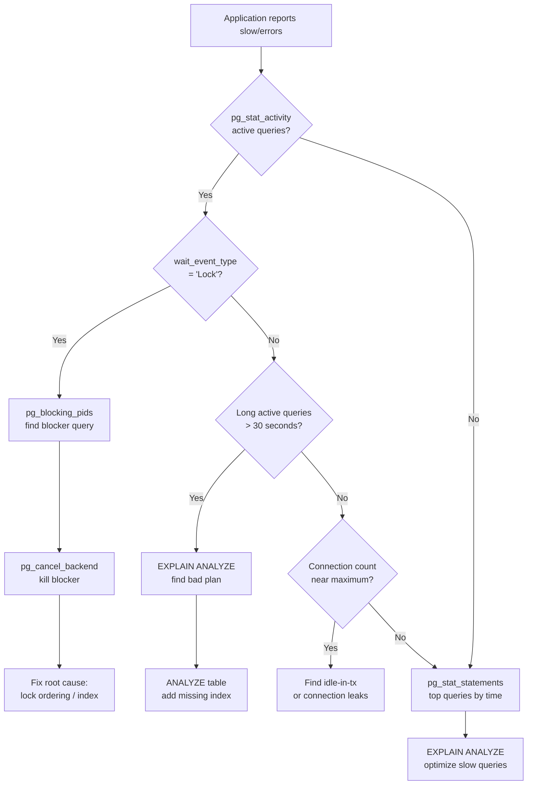

## Keywords in This File
{: .no_toc }

| # | Keyword | Weight |
|---|---|---|
| 1 | [Database Production Diagnostics - Locks, Deadlocks, Slow Queries](#database-production-diagnostics---locks-deadlocks-slow-queries) | medium |

---

# Database Production Diagnostics - Locks, Deadlocks, Slow Queries

**TL;DR:** Production database diagnosis follows a systematic path: identify
the symptom (slow queries, connection saturation, lock waits), pinpoint the
cause using `pg_stat_activity`, `pg_locks`, `pg_stat_statements`, and `EXPLAIN ANALYZE`,
then apply the targeted fix. Deadlocks, connection pool exhaustion, and query regressions
are the most common critical incidents. Every diagnosis starts with live activity.

---

### 🎯 Model Answer

**30 seconds:**
> Diagnose database incidents in order: (1) `pg_stat_activity` - who is doing what, what is waiting.
> (2) `pg_locks` joined to `pg_stat_activity` - which locks are blocking which queries.
> (3) `pg_stat_statements` - which queries are the slowest by total or mean time.
> (4) `EXPLAIN ANALYZE` on the slow query - why the plan is bad.
> (5) Apply the fix: kill the blocker, add an index, or rewrite the query.

**3 minutes:**
> Incident triage sequence:
> (1) Application reports slow or failing queries.
> (2) Connect to PostgreSQL directly (bypass connection pool if needed).
> (3) `SELECT pid, state, wait_event_type, wait_event, query FROM pg_stat_activity WHERE state != 'idle'`
> - see all active queries, their wait states.
> (4) Lock waits: `wait_event_type = 'Lock'` shows queries waiting for a lock.
> Find the blocking query via `pg_blocking_pids(pid)`.
> (5) Long-running queries: `state = 'active'` + `query_start < NOW() - INTERVAL '1 minute'`.
> These may be holding locks or consuming resources.
> (6) Idle-in-transaction: `state = 'idle in transaction'` + long `xact_start`.
> These hold locks and block VACUUM.
>
> Deadlock: PostgreSQL auto-detects deadlocks (circular wait). One transaction
> is aborted with `ERROR: deadlock detected`. Check PostgreSQL logs for the deadlock
> graph. Fix: consistent lock ordering in application code.
>
> `pg_stat_statements`: after enabling the extension, it tracks query execution
> statistics (total time, mean time, calls). Identify the top-10 queries by total
> time: these are the candidates for optimization.

**Blank Mind Recovery:**

**(1) Restate:** "Diagnostic order: pg_stat_activity -> pg_locks -> pg_stat_statements ->
EXPLAIN ANALYZE -> fix. Start with: what is currently running and waiting."

**(2) First principles:** "Production issues are symptoms. The database has full visibility
into its own internals via system views. Use them systematically, not randomly."

**(3) Bridge:** "Like a hospital triage. First: who is in critical condition (pg_stat_activity).
Second: what is blocking who (pg_locks). Third: what systemic problems exist (pg_stat_statements).
Fourth: diagnose the specific patient (EXPLAIN ANALYZE). Then treat."

---

### 📘 Concept Explanation

**Diagnostic view map:**

```
pg_stat_activity:
  One row per backend connection.
  state: active, idle, idle in transaction, idle in tx (aborted)
  wait_event_type: Lock, LWLock, IO, Client, ...
  wait_event: specific lock or event name
  query: current or last query
  xact_start: when current transaction started
  query_start: when current statement started

pg_locks:
  One row per lock held or waited for.
  granted: TRUE = holding the lock, FALSE = waiting
  locktype: relation, tuple, transactionid, advisory, ...
  relation: which table/index is locked

pg_stat_statements:
  Requires: shared_preload_libraries = 'pg_stat_statements'
  One row per normalized query (SQL parameters replaced with $1, $2).
  total_exec_time: cumulative execution time
  mean_exec_time: average per call
  calls: how many times executed
  rows: total rows returned/affected
```

> **Code walkthrough:** This Locks, Deadlocks, Slow Queries example demonstrates a key concept in practice. **KEY MECHANISM:** the runtime executes these instructions in sequence with specific memory and execution semantics. **WHY IT MATTERS:** misapplying this pattern causes subtle bugs that only manifest under production load. **TAKEAWAY: understand the execution model before using this pattern in production code.**

---

### 💻 Code Example

```sql
-- DIAGNOSTIC TOOLKIT: lock investigation

-- Step 1: Who is running, who is waiting?
SELECT
    pid,
    usename,
    application_name,
    state,
    wait_event_type,
    wait_event,
    EXTRACT(EPOCH FROM (NOW() - query_start)) AS query_secs,
    LEFT(query, 80) AS query_snippet
FROM pg_stat_activity
WHERE state NOT IN ('idle')
  AND pid != pg_backend_pid()
ORDER BY query_secs DESC NULLS LAST;
-- Long-running active queries: potential resource hogs
-- wait_event_type = 'Lock': waiting for a row/table lock
-- state = 'idle in transaction': holding locks, blocking vacuum

-- Step 2: Who is blocking whom?
SELECT
    blocked.pid         AS blocked_pid,
    blocked.query       AS blocked_query,
    blocker.pid         AS blocker_pid,
    blocker.query       AS blocker_query,
    blocker.state       AS blocker_state,
    EXTRACT(EPOCH FROM (NOW() - blocker.query_start))
                        AS blocker_secs
FROM pg_stat_activity blocked
JOIN LATERAL (
    SELECT pid, query, state, query_start
    FROM pg_stat_activity
    WHERE pid = ANY(pg_blocking_pids(blocked.pid))
) blocker ON true
WHERE cardinality(pg_blocking_pids(blocked.pid)) > 0;
-- blocked_query: the query that is waiting
-- blocker_query: the query holding the lock
-- blocker_secs: how long the blocker has been running

-- Step 3: Kill the blocker (if appropriate)
-- pg_cancel_backend(pid): sends SIGINT, cancels current query
-- pg_terminate_backend(pid): sends SIGTERM, kills connection
SELECT pg_cancel_backend(blocker_pid);
-- Use cancel first (softer); terminate if cancel does not work.
```

> **Code walkthrough:** The three-step diagnostic: (1) `pg_stat_activity` showsice. **KEY MECHANISM:** the runtime executes these instructions in sequence with specific memory and execution semantics. **WHY IT MATTERS:** misapplying this pattern causes subtle bugs that only manifest under production load. **TAKEAWAY: understand the execution model before using this pattern in production code.**
> all active backends - `query_secs` sorted descending puts the oldest query first.
> `wait_event_type = 'Lock'` immediately flags blocked queries. (2) The blocker
> investigation joins `pg_blocking_pids(pid)` which returns the PIDs holding the
> locks that `blocked.pid` is waiting for. This gives: "query X is blocked by query Y."
> (3) `pg_cancel_backend` sends SIGINT to the blocker's backend: it cancels the
> current statement (if the application handles it, the transaction continues).
> `pg_terminate_backend` kills the connection completely (forces a rollback of any
> open transaction). Use terminate only when cancel does not resolve the block.

```sql
-- pg_stat_statements: finding slow queries

-- Enable once (restart needed if not in shared_preload_libraries):
-- shared_preload_libraries = 'pg_stat_statements' in postgresql.conf

-- Top 10 queries by TOTAL execution time:
SELECT
    LEFT(query, 100)     AS query,
    calls,
    ROUND(total_exec_time::NUMERIC, 2) AS total_ms,
    ROUND(mean_exec_time::NUMERIC, 2)  AS mean_ms,
    ROUND(rows::NUMERIC / calls, 1)    AS rows_per_call,
    ROUND(100.0 * total_exec_time /
          SUM(total_exec_time) OVER (), 1) AS pct_of_total
FROM pg_stat_statements
WHERE calls > 100   -- filter noise (rare queries)
ORDER BY total_exec_time DESC
LIMIT 10;
-- pct_of_total: query #1 responsible for 40% of all query time?
-- -> primary optimization target

-- Top 10 queries by MEAN execution time:
SELECT
    LEFT(query, 100) AS query,
    calls,
    ROUND(mean_exec_time::NUMERIC, 2) AS mean_ms,
    ROUND(stddev_exec_time::NUMERIC, 2) AS stddev_ms
FROM pg_stat_statements
ORDER BY mean_exec_time DESC
LIMIT 10;
-- High mean: individual calls are slow.
-- High stddev: inconsistent (sometimes fast, sometimes slow).
-- Inconsistent queries: often affected by statistics/plan choice.

-- Reset statistics for a new baseline:
SELECT pg_stat_statements_reset();
```

> **Code walkthrough:** `pg_stat_statements` aggregates execution statistics perice. **KEY MECHANISM:** the runtime executes these instructions in sequence with specific memory and execution semantics. **WHY IT MATTERS:** misapplying this pattern causes subtle bugs that only manifest under production load. **TAKEAWAY: understand the execution model before using this pattern in production code.**
> normalized query (parameters replaced with `$1, $2`). `total_exec_time` identifies
> the queries that consume the most total database CPU time (high calls * reasonable
> mean, or few calls * very high mean). `pct_of_total` is the most impactful column:
> if query X represents 40% of total query time, optimizing it has maximum leverage.
> `stddev_exec_time`: high stddev means the query is sometimes slow and sometimes fast -
> a plan choice issue (wrong plan for certain parameter values) or lock contention.
> Reset after fixing: compare before/after to measure improvement.

```sql
-- DEADLOCK DETECTION AND ANALYSIS

-- Deadlock appears in PostgreSQL logs:
-- ERROR: deadlock detected
-- DETAIL: Process 12345 waits for ShareLock on tx 56789;
--         blocked by process 67890.
--         Process 67890 waits for ShareLock on tx 12345;
--         blocked by process 12345.
-- HINT: See server log for query details.

-- Reproduce a deadlock scenario:
-- Session 1:
BEGIN;
UPDATE accounts SET balance = balance - 100 WHERE id = 1;
-- Now holds lock on row 1.

-- Session 2 (concurrent):
BEGIN;
UPDATE accounts SET balance = balance - 50 WHERE id = 2;
-- Now holds lock on row 2.

-- Session 1 (continued):
UPDATE accounts SET balance = balance + 50 WHERE id = 2;
-- Waits for Session 2 to release lock on row 2.

-- Session 2 (continued):
UPDATE accounts SET balance = balance + 100 WHERE id = 1;
-- Waits for Session 1 to release lock on row 1.
-- DEADLOCK: PostgreSQL detects the cycle.
-- One transaction is aborted with ERROR: deadlock detected.

-- PREVENTION: consistent ordering
BEGIN;
-- Always lock lower ID first:
UPDATE accounts SET balance = balance - 100 WHERE id = 1;
UPDATE accounts SET balance = balance + 50 WHERE id = 2;
COMMIT;
-- Never possible for another transaction to hold 1 and wait for 2
-- if all transactions take 1 first.
```

> **Code walkthrough:** The deadlock: session 1 holds row 1 and waits for row 2.
> Session 2 holds row 2 and waits for row 1. Circular wait. PostgreSQL's deadlock
> detector runs every `deadlock_timeout` (default 1 second) and detects the cycle.
> One of the transactions (arbitrary selection: the one with less work) is aborted.
> The aborted transaction receives the error; the other proceeds. Prevention: consistent
> lock ordering. If every code path that touches rows 1 and 2 always locks row 1 first:
> session 2 would block on row 1 before acquiring row 2. Session 1 acquires both in order.
> No deadlock possible.

```java
// CONNECTION POOL SATURATION: diagnosis and fix

// Symptom: application requests time out with
// "connection pool exhausted" or "no available connections"

// Diagnosis - connections by state:
// SELECT state, count(*) FROM pg_stat_activity
// GROUP BY state;
// Result: 95 active, 5 idle in transaction, 0 idle
// MaxConnections: 100. Pool at maximum.

// Root cause: slow queries holding connections
// Each active query occupies a connection.
// Slow queries = connections occupied longer.
// More slow queries -> all connections occupied -> timeouts.

// Find long-active queries:
// SELECT pid, query_start, state, query
// FROM pg_stat_activity
// WHERE state = 'active'
//   AND query_start < NOW() - INTERVAL '30 seconds'
// ORDER BY query_start;

// Fix the connection pool (HikariCP):
HikariConfig config = new HikariConfig();
config.setMaximumPoolSize(50);         // Not too large
config.setMinimumIdle(10);
config.setConnectionTimeout(3000);     // 3s timeout
config.setIdleTimeout(600000);         // 10min idle
config.setMaxLifetime(1800000);        // 30min max age
// Leak detection - logs if a connection is held > 10s:
config.setLeakDetectionThreshold(10000);
// Key: leakDetectionThreshold exposes code holding
// connections longer than expected.
```

> **Code walkthrough:** Connection pool exhaustion is a symptom, not a cause.
> The root cause: slow queries, or connections not being returned to the pool
> (connection leak). `pg_stat_activity` breaks down connections by state.
> Many active connections = queries running slowly. Many `idle in transaction` =
> code opened a transaction and did not commit/rollback (connection leak).
> HikariCP's `leakDetectionThreshold`: if a connection is checked out for > 10 seconds,
> HikariCP logs a warning with a stack trace showing where it was checked out.
> This immediately identifies connection leaks in application code.

---

### 🎓 Answers by Seniority

**Junior / Mid:**
> Use `pg_stat_activity` to see what queries are running and waiting. Find blocking
> queries with `pg_blocking_pids()`. Use `pg_stat_statements` to find the slowest
> queries. Run `EXPLAIN ANALYZE` on slow queries to see the execution plan.
> Kill blocking queries with `pg_cancel_backend()` if they are causing an incident.

---

**Senior / Staff:**
> Production incident response: (1) Preserve evidence before killing blockers
> (log the blocker's query, PID, state, start time). (2) Kill with `pg_cancel_backend`
> (soft cancel) before `pg_terminate_backend` (hard kill). (3) Find the root cause,
> not just the symptom - why is that query slow or blocking? Is it missing an index,
> a statistics problem, a lock ordering bug, or a connection leak? (4) After resolution:
> deploy the fix to prevent recurrence. (5) Add monitoring: alert on lock waits
> > 5 seconds, `pg_stat_statements` top query mean time regressions, and
> connection pool near-saturation.

---

### ⚠️ Common Misconceptions

**"pg_cancel_backend kills the transaction immediately"**

Reality: `pg_cancel_backend` cancels the current statement. If the backend is in
an interactive session or the application retries: the transaction may continue
with the next statement. `pg_terminate_backend` kills the connection and rolls back
the transaction. For a stuck blocker: use `pg_terminate_backend` if `pg_cancel_backend`
does not clear the block within a few seconds.

**"Deadlocks are always caused by application bugs"**

Reality: most deadlocks are application lock ordering bugs. But PostgreSQL can
also produce deadlocks from: ON UPDATE CASCADE/ON DELETE CASCADE on circular
foreign key relationships, triggers that modify related rows, and bulk operations
that lock rows in different orders based on query plan choices.

---

### ⚖️ Comparison Table

| Issue | Primary View | Key Column | Action |
|---|---|---|---|
| Slow query | pg_stat_statements | mean_exec_time | EXPLAIN ANALYZE, add index |
| Lock wait | pg_stat_activity | wait_event_type='Lock' | Kill blocker, fix ordering |
| Deadlock | PostgreSQL logs | "deadlock detected" | Fix lock ordering |
| Connection saturation | pg_stat_activity | state counts | Kill idle-in-tx, tune pool |
| Table bloat | pg_stat_user_tables | n_dead_tup | VACUUM, tune autovacuum |
| Index bloat | pgstatindex | leaf_live_percent | REINDEX CONCURRENTLY |

---

### 🏛️ System Design

**Observability stack for PostgreSQL in production:**

```
Data collection:
  pg_stat_statements:  query-level statistics (latency, calls)
  pg_stat_activity:    real-time connection state
  pg_stat_user_tables: table-level I/O, seq/idx scan counts
  pg_stat_bgwriter:    checkpoint frequency and WAL
  pg_stat_replication: replication lag

External collectors:
  pganalyze (SaaS):    automated query analysis + alerts
  Prometheus + prometheus-postgres-exporter: metrics scraping
  DataDog postgres integration: APM + database monitoring

Alerting rules:
  - Connection count > 80% of max_connections
  - pg_stat_statements mean_exec_time for top-5 queries
    increases > 50% vs baseline
  - n_dead_tup > 20% of n_live_tup for any table
  - Replication lag > 100MB
  - age(datfrozenxid) > 500,000,000 (XID wraparound risk)
  - Lock wait duration > 5 seconds (pg_stat_activity polling)

Dashboard (Grafana):
  Panel 1: Connections by state (active/idle/idle-in-tx)
  Panel 2: Top 5 queries by mean execution time (p50, p95)
  Panel 3: Checkpoint frequency + WAL generation rate
  Panel 4: Table bloat % for top 10 tables
  Panel 5: Replication lag in bytes + seconds
  Panel 6: Cache hit ratio (shared_buffers hit %)
```

> **Code walkthrough:** This Unknown example demonstrates a key concept in practice. **KEY MECHANISM:** the runtime executes these instructions in sequence with specific memory and execution semantics. **WHY IT MATTERS:** misapplying this pattern causes subtle bugs that only manifest under production load. **TAKEAWAY: understand the execution model before using this pattern in production code.**

---

### 📊 Diagram

**Production incident diagnostic flowchart:**

```
Application reports slow queries or errors
  |
  v
pg_stat_activity: active queries?
  |
  |-- YES: any wait_event_type = 'Lock'?
  |     |
  |     |-- YES: pg_blocking_pids(pid) -> find blocker
  |     |        -> pg_cancel_backend(blocker_pid)
  |     |        -> investigate blocker query
  |     |
  |     |-- NO: long active queries (> 30s)?
  |           |-- YES: EXPLAIN ANALYZE -> bad plan?
  |           |        -> ANALYZE table, add index
  |           |-- NO: high pg_stat_activity count?
  |                   -> connection pool saturation
  |                   -> find leak with leakDetection
  |
  |-- NO: check pg_stat_statements
        -> top queries by total/mean time
        -> EXPLAIN ANALYZE slowest
        -> add index, rewrite query
```



> **Diagram walkthrough:** The diagnostic tree starts at the observable symptom
> (slow application) and drills down systematically. The first branch: active
> queries - if many are waiting on locks, the problem is contention (find the
> blocker). If queries are running long without lock waits: the plan is wrong
> (EXPLAIN ANALYZE). If connection count is near maximum: saturation (pool/leak
> investigation). If activity looks normal: the problem is chronic (use pg_stat_statements
> to find systemic slow queries). This systematic approach avoids random guessing
> and directly targets the root cause.

---

### 🚨 Failure Modes and Diagnosis

**Failure 1: Cascade of blocked queries (lock avalanche)**

Symptom: one slow query causes 50+ other queries to pile up waiting for a lock.
Application is completely unresponsive.

Cause: a long-running transaction (or idle-in-transaction) holds a lock on a
popular table. All subsequent queries that touch that table block behind it.

Emergency:
```sql
-- Find and kill the root blocker:
SELECT pid, state, xact_start, query
FROM pg_stat_activity
WHERE pid = (
    SELECT blocking_pids[1]
    FROM (
        SELECT pg_blocking_pids(pid) AS blocking_pids
        FROM pg_stat_activity
        WHERE wait_event_type = 'Lock'
        LIMIT 1
    ) t
);
-- If the blocker is idle-in-transaction: terminate
SELECT pg_terminate_backend(blocker_pid);
-- The waiting queue clears within seconds.
```

> **Code walkthrough:** This Unknown example demonstrates query execution using SQL. **KEY MECHANISM:** the query planner builds an execution plan based on table statistics and indexes. **WHY IT MATTERS:** SELECT * reads all columns even if only 2 are needed - widens rows, increases I/O. **TAKEAWAY: always SELECT only the columns you need; index the columns in WHERE and JOIN clauses.**

Prevention: `idle_in_transaction_session_timeout = '60s'` auto-terminates
connections that are idle in transaction for more than 60 seconds.

**Failure 2: pg_stat_statements shows one query with 10x mean time increase**

Symptom: a specific query (normalized form in pg_stat_statements) suddenly
becomes 10x slower. Application SLA breach.

Cause: (1) stale statistics causing a plan change; (2) a new deployment
changed the query; (3) table size grew past a threshold where the old plan breaks.

Diagnosis:
```sql
-- Get the exact SQL (pg_stat_statements uses normalized form):
-- Find the query in pg_stat_statements by queryid
-- Run EXPLAIN ANALYZE with actual parameter values:
EXPLAIN (ANALYZE, BUFFERS, FORMAT TEXT)
SELECT ... (actual query with real values) ...;
-- Look for: "rows=X estimated vs Y actual" discrepancy.
```

> **Code walkthrough:** This Unknown example demonstrates query execution using SQL. **KEY MECHANISM:** the query planner builds an execution plan based on table statistics and indexes. **WHY IT MATTERS:** SELECT * reads all columns even if only 2 are needed - widens rows, increases I/O. **TAKEAWAY: always SELECT only the columns you need; index the columns in WHERE and JOIN clauses.**

Fix: `ANALYZE orders;` to refresh statistics. If plan is still wrong:
check if a new index is needed or if statistics_target needs increasing.

---

### 🎯 Interview Deep-Dive

**[JUNIOR] Q1 - [DEBUGGING] Walk me through diagnosing a production outage where all database connections are busy.**

🗣️ "Step 1: connect directly to PostgreSQL bypassing the application connection pool (use a reserved connection or `psql` directly). Run: `SELECT state, count(*) FROM pg_stat_activity GROUP BY state`. This shows connection distribution. Step 2: if most are 'active': queries are running (CPU/IO bound). If most are 'idle in transaction': connection leak or long transactions. Step 3: find the root: `SELECT pid, state, wait_event_type, wait_event, LEFT(query, 100), EXTRACT(EPOCH FROM now()-query_start) FROM pg_stat_activity WHERE state != 'idle' ORDER BY query_start`. Step 4: look for wait_event_type='Lock' (lock contention). Find the head-of-chain blocker. Step 5: kill the blocker: `pg_terminate_backend(pid)`. Step 6: monitor recovery: connections should drain. Step 7: root cause analysis: why was the blocker running so long? Missing index? Connection leak? Schedule the fix."

**[JUNIOR] Q2 - [MECHANISM] How do you identify which queries are responsible for most of your database load?**

🗣️ "`pg_stat_statements` is the standard tool. The query: `SELECT query, calls, total_exec_time, mean_exec_time, rows, 100.0 * total_exec_time / SUM(total_exec_time) OVER () AS pct_load FROM pg_stat_statements ORDER BY total_exec_time DESC LIMIT 10`. `pct_load` for query #1: if it's 40%, that single query (across all its calls) consumes 40% of database CPU time. This is the optimization target. `mean_exec_time`: each individual call takes this long on average. `calls`: frequency. High calls * moderate mean = most load. Low calls * very high mean = individual bottleneck. Cross-reference with `pg_stat_user_tables`: `seq_scan / (seq_scan + idx_scan)` ratio. High seq_scan on large tables = missing indexes (shows up as high total_exec_time in pg_stat_statements)."

**[JUNIOR] Q3 - [MECHANISM] What is wait event analysis and how do you use it in production?**

🗣️ "Wait events: PostgreSQL tracks exactly what each backend is waiting for. Types: Lock (row/table lock), LWLock (internal latch), IO (disk read/write), Client (waiting for client to send data), IPC (inter-process communication). Use: `SELECT wait_event_type, wait_event, COUNT(*) FROM pg_stat_activity WHERE wait_event IS NOT NULL GROUP BY 1, 2 ORDER BY 3 DESC`. IO waits on 'DataFileRead': queries are reading from disk (not cached) - increase shared_buffers or add indexes. LWLock on 'BufferMapping': very high concurrency on shared_buffers. LWLock on 'WALWrite': WAL write contention (high commit rate). Lock on 'relation': table-level lock (DDL running while queries are active). Lock on 'tuple': row-level lock contention. Each wait_event points to a specific subsystem to tune."

**[MID] Q4 - [DEBUGGING] How do you enable and use query-level logging for diagnosis?**

🗣️ "`log_min_duration_statement`: log all queries taking longer than N milliseconds. `SET log_min_duration_statement = 1000` (1 second). All queries > 1 second are logged with duration, query text, and plan if `auto_explain` is enabled. For production: set 1000ms (don't log fast queries - too much noise). For diagnosis: lower to 100ms. `auto_explain` extension: captures the EXPLAIN ANALYZE output for slow queries automatically. `shared_preload_libraries = 'auto_explain'`. `auto_explain.log_min_duration = 1000`. `auto_explain.log_analyze = true`. `auto_explain.log_buffers = true`. This logs the full execution plan for any query > 1 second in the PostgreSQL log. Critical for diagnosing intermittent slowness: the plan is captured when the problem occurs, not after (by which point the data/plan may have changed)."

**[MID] Q5 - [DEBUGGING] How do you diagnose a query that is sometimes fast and sometimes slow?**

🗣️ "Intermittent slowness: the most challenging diagnosis. Causes: (1) Plan instability: the query has a generic cached plan (used for prepared statements) that is sometimes wrong for specific parameter values (skewed data). `SET plan_cache_mode = force_custom_plan` to always re-plan. (2) Lock waits: the query is fast itself but waits for a lock. `auto_explain` shows execution time including lock wait. `wait_event_type='Lock'` appears in `pg_stat_activity` during the slow execution. (3) Bloat: the table or index has grown bloated. Some executions hit cached data (fast); others read from disk (slow). (4) Checkpoint I/O spike: query runs during a checkpoint (heavy background I/O). Correlate query slowness with checkpoint timing from `pg_stat_bgwriter`. Diagnostic approach: capture the plan with `auto_explain` during a slow occurrence. Compare with the plan during a fast occurrence. Identify what differs."

**[SENIOR] Q6 - [TRADE-OFF] What is the difference between pg_cancel_backend and pg_terminate_backend?**

🗣️ "`pg_cancel_backend(pid)`: sends SIGINT to the backend process. Effect: cancels the current SQL statement. The connection remains open. The transaction (if open) is still active - the application receives an error and can decide to commit, rollback, or retry. Useful for: canceling a stuck SELECT or DML without closing the connection. `pg_terminate_backend(pid)`: sends SIGTERM to the backend process. Effect: the backend process is killed. The connection is closed. Any open transaction is rolled back (via SIGTERM cleanup). Useful for: killing a connection that is not releasing a lock (idle in transaction) or a connection that is not responding to cancel. Order of operations in an incident: (1) try `pg_cancel_backend` first (softer); (2) if still running or blocking after 5-10 seconds: `pg_terminate_backend`. Both require superuser or membership in the `pg_signal_backend` role."

**[SENIOR] Q7 - [DEBUGGING] How do you investigate and resolve a deadlock incident?**

🗣️ "Step 1: find the deadlock in the PostgreSQL log. `deadlock_timeout` (default 1s): PostgreSQL checks for deadlocks after a lock wait exceeds this duration. Log entry: `ERROR: deadlock detected DETAIL: Process X waits for ShareLock on transaction Y; blocked by process Z. Process Z waits for ShareLock on transaction X; blocked by process Y.` With `log_lock_waits = on` (logs lock waits > `deadlock_timeout`): all lock waits are logged, giving visibility before a deadlock occurs. Step 2: identify the query pairs involved. The DETAIL shows the PIDs and transaction IDs. The server log shows the queries each process was executing. Step 3: identify the lock ordering: process X locked row A then tried to lock row B. Process Y locked row B then tried to lock row A. Step 4: fix: ensure all code paths that lock both A and B always do so in the same order (alphabetical, by ID, etc.). Step 5: test: load test with concurrent processes to verify the deadlock no longer occurs."

**[SENIOR] Q8 - [MECHANISM] How does pg_stat_statements handle queries with bind parameters?**

🗣️ "`pg_stat_statements` normalizes query text: bind parameter values are replaced with `$1, $2, ...` placeholders. `SELECT * FROM orders WHERE customer_id = 42` and `SELECT * FROM orders WHERE customer_id = 99` are combined into one entry: `SELECT * FROM orders WHERE customer_id = $1`. This is intentional: it groups all executions of the same query pattern, regardless of parameter values. Statistics are aggregated across all parameter values. Caveat: if a query is sometimes fast (for common values) and sometimes slow (for rare values, different plan): `pg_stat_statements.mean_exec_time` is the average across all values. High `stddev_exec_time` indicates parameter-dependent performance. To diagnose per-parameter performance: enable `auto_explain` + `log_min_duration_statement` and look at individual query plans in the logs."

**[SENIOR] Q9 - [MECHANISM] How do you monitor for query plan regressions after a deployment?**

🗣️ "Plan regressions: a deployment changes a query, adds/removes an index, or changes data volume, causing a query to switch to a worse plan. Detection: (1) pg_stat_statements tracks query performance. After deployment: compare `mean_exec_time` for top-10 queries to the pre-deployment baseline. Alert if any query's mean increases > 50%. (2) `pganalyze` (SaaS tool): continuously monitors pg_stat_statements and alerts on plan regressions, new slow queries, and missing indexes. (3) EXPLAIN plan comparison: before deployment: run EXPLAIN on critical queries and save the plan. After deployment: run again and compare. If the plan changed: investigate why. (4) Canary deployments: route 1% of traffic to the new version. Compare pg_stat_statements between old and new. Catch regressions before full rollout. Prevention: always run a load test with `pg_stat_statements` active after deploying schema changes."

**[SENIOR] Q10 - [MECHANISM] What are the most common causes of production database incidents?**

🗣️ "In frequency order: (1) Missing index: a table grew past the threshold where a seq scan becomes slower than an index scan. A query that was fine at 100K rows is slow at 10M rows. (2) Lock contention: a deployment added a long ALTER TABLE (exclusive lock) during peak traffic. Or a connection leak left a transaction open holding locks. (3) Autovacuum not keeping up: table bloat from high UPDATE/DELETE rate. Queries scan 2x more pages than necessary. (4) N+1 query pattern: an API endpoint accidentally runs 1000 queries instead of 1 (ORM issue). Visible in pg_stat_statements as high calls on a specific query pattern. (5) Statistics stale: ANALYZE did not run after a bulk data load. Wrong plan choice causing seq scans on large tables. (6) Connection pool misconfiguration: pool too small for peak concurrency, or no connection timeout, causing connection saturation. (7) Runaway query: a report query escaped to production and is doing a seq scan on a 100M-row table."

**[SENIOR] Q11 - [MECHANISM] How do you implement proactive monitoring to prevent incidents?**

🗣️ "Three layers: (1) Metric alerts (Prometheus + pg_exporter): alert on connection count > 80%, cache hit ratio < 95%, replication lag > 100MB, dead tuple ratio > 20%, XID age > 500M. (2) Query performance baseline (pg_stat_statements): weekly: record top-10 queries by mean time. Alert if any query's mean increases > 50% week-over-week. (3) Log analysis (auto_explain + log aggregation): send PostgreSQL logs to Datadog/Splunk. Alert on 'deadlock detected' frequency, 'lock wait' frequency, and slow query count. Dashboards: connection state breakdown (pie chart), top queries by load (pg_stat_statements), table bloat trends, replication lag time-series. PagerDuty integration: page on-call for: deadlock rate > 10/min, connection saturation > 95%, replica lag > 5 minutes, XID age > 1 billion. Runbook link attached to each alert."

**[SENIOR] Q12 - [DEBUGGING] How do you safely diagnose a production database under load without adding more load?**

🗣️ "Principles for zero-impact diagnosis: (1) pg_stat_activity: read-only system view, negligible overhead. Safe at any time. (2) EXPLAIN (no ANALYZE): generates the plan without executing the query. Zero impact. (3) EXPLAIN ANALYZE on a replica: run on the read replica to get execution stats without touching the primary. (4) pg_stat_statements: already collected; just read the view. No overhead. (5) Connection to the database: always reserve one admin connection (limit 1 in pg_hba.conf or use a dedicated `superuser_reserved_connections`). If the pool is saturated: you can still connect as superuser. `superuser_reserved_connections = 3` (default): 3 connections reserved for superusers. (6) Avoid: VACUUM ANALYZE on large tables under load (heavy I/O). EXPLAIN ANALYZE on large slow queries (actually runs the query). Lock views that could block. Use pganalyze or read replicas for intensive analysis."

---

### 💻 Code Example

*(Omit: this concept does not have a programmatic interface that can be demonstrated in code. The conceptual explanation above is sufficient.)*


---

### 🏛️ System Design

*(Omit: system design diagram not applicable for this concept - see ★★★ keywords for full system design coverage.)*


---

### ⚖️ Comparison Table

*(Omit: this is a ★☆☆ foundational concept with no direct alternatives to compare - see higher-difficulty keywords for trade-off analysis.)*


---

### 📊 Diagram

*(Omit: no standalone visual diagram required for this concept - the explanations and code examples above provide sufficient clarity.)*


