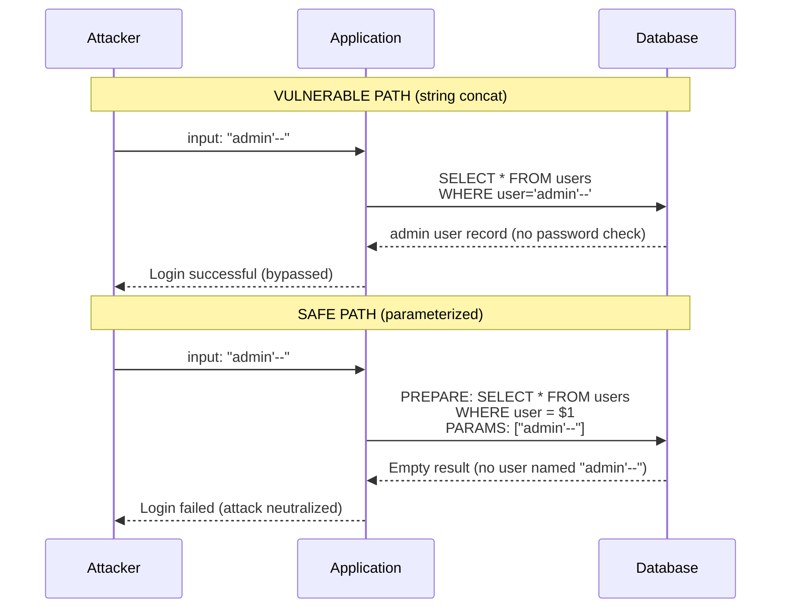

# SQL Injection - Attack Vectors, Detection, and Prevention

**TL;DR:** SQL injection: attacker-controlled input is interpreted as SQL syntax,
changing the query's structure and meaning. The root cause is string concatenation
of user input into SQL. The complete fix: parameterized queries (prepared statements)
for all user input, combined with: least-privilege database roles, stored procedures
with SECURITY DEFINER when needed, input validation at the application boundary,
and WAF rules. Parameterized queries are non-negotiable; everything else is defense-in-depth.

---

### 🎯 Model Answer

**30 seconds:**
> SQL injection: user input changes the SQL structure (not just a value). Root cause:
> string concatenation into SQL. Fix: parameterized queries - the query structure is
> fixed at parse time; parameters can never change the structure. Defense in depth:
> least-privilege DB roles, WAF, input validation. Never: string concatenation of
> user input into SQL.

**3 minutes:**
> String concatenation vulnerability: `"SELECT * FROM users WHERE username = '" + username + "'"`.
> If username = `admin' --`: the query becomes `SELECT * FROM users WHERE username = 'admin' --'`.
> The `--` comments out the password check. Authentication bypassed.
>
> More dangerous: `username = "'; DROP TABLE users; --"` (if multi-statement is allowed).
> Or: `username = "' UNION SELECT id, password_hash, email FROM users --"` (data extraction).
>
> Prevention layers:
> (1) Parameterized queries / prepared statements: the SQL structure is compiled and
> fixed at prepare time. Parameters are passed separately. The database driver ensures
> parameters are treated as values, never as SQL syntax. This is the only complete fix.
> (2) Stored procedures: if the stored procedure uses parameterized internal queries:
> safe. If it uses dynamic SQL with concatenation: still vulnerable.
> (3) ORMs: most modern ORMs use parameterized queries by default. Vulnerable when
> using raw query features (`.nativeQuery`, `createNativeQuery`, `em.createQuery` with
> string concatenation).
> (4) Input validation: secondary defense. Reject input that contains SQL metacharacters.
> Cannot substitute for parameterized queries (attacker can encode around validation).
> (5) WAF: blocks known SQLi patterns at the network layer. Secondary defense only.
> (6) Least privilege: the database user should only have SELECT/INSERT/UPDATE/DELETE
> on specific tables. No DROP, CREATE, or superuser privileges.

**Blank Mind Recovery:**

**(1) Restate:** "SQLi: user input becomes SQL syntax via string concat.
Fix: parameterized queries (structure fixed, params are values, never syntax)."

**(2) First principles:** "SQL is text. Concatenating untrusted text into SQL code
is code injection. Parameterized queries separate code (structure) from data (values)."

**(3) Bridge:** "Like filling a form vs editing a document. Parameterized query:
fill in the blank fields - the fields are fixed, you can only add text to the value.
String concat: you can edit the document itself - change the structure."

---

### 📘 Concept Explanation

**Attack vector taxonomy:**

```
SQLi types:
  1. Classic (In-band): attacker sees results directly
     - Union-based: inject UNION SELECT to extract data
     - Error-based: trigger DB errors revealing structure

  2. Blind: no direct output
     - Boolean-based: true/false conditions to infer data
       WHERE 1=1 (true) vs WHERE 1=2 (false) -> different responses
     - Time-based: IF(condition, SLEEP(5), 0) -> timing reveals data

  3. Out-of-band: data exfil via DNS/HTTP requests
     - e.g., LOAD_FILE + DNS resolution to attacker's server

  4. Second-order: injection stored, executed later
     - Input saved to DB seemingly safely,
       retrieved and used in a query without re-validation
```

---

### 💻 Code Example

```java
// VULNERABILITY: classic string concatenation SQLi
// BAD - NEVER do this
public User login(String username, String password) {
    String sql =
        "SELECT * FROM users " +
        "WHERE username = '" + username +
        "' AND password_hash = '" + password + "'";
    // If username = "admin' --":
    // WHERE username = 'admin' --' AND password = '...'
    // The AND password check is commented out.
    // Returns the admin user without checking password.
    return jdbcTemplate.queryForObject(
        sql, userRowMapper);
}
```

> **Code walkthrough:** The string concatenation inserts the attacker's input
> directly into the SQL text. The database parser sees the single quote from
> the input as closing the string literal. Everything after it (up to `--`)
> is interpreted as SQL syntax. The `--` starts a line comment, making the
> password check disappear entirely. The attacker is now authenticated as admin
> with any password.

```java
// FIX: parameterized query (PreparedStatement)
// GOOD - always use parameterized queries
public User login(String username, String password) {
    String sql =
        "SELECT * FROM users " +
        "WHERE username = ? AND password_hash = ?";
    // The SQL structure is fixed at this point.
    // ? placeholders are value slots, not code injection points.
    return jdbcTemplate.queryForObject(
        sql,
        userRowMapper,
        username,    // parameter 1: treated as a value
        password     // parameter 2: treated as a value
    );
    // If username = "admin' --":
    // username param = "admin' --" (literal string value)
    // No SQL metacharacter interpretation occurs.
    // The query returns no rows (no user with username "admin' --")
}
```

> **Code walkthrough:** With parameterized queries: the SQL text is sent to
> the database as-is (with `?` markers). The database parses and compiles
> the query structure at prepare time. The parameter values are sent separately.
> The database engine substitutes the parameters as values, applying proper
> escaping/quoting internally. No matter what characters are in `username`:
> the database treats the entire string as a single value to compare against
> the `username` column. Single quotes, dashes, semicolons: all treated as
> literal text.

```java
// VULNERABLE: Spring Data JPA with raw string interpolation
// BAD - string interpolation in JPQL/HQL
@Repository
public interface UserRepository extends JpaRepository<User, Long> {

    // BAD: direct string in @Query
    @Query("SELECT u FROM User u " +
           "WHERE u.username = '" + username + "'")
    // Cannot compile - but pattern seen in dynamic query building:
    List<User> findByRole(String role);
}

// BAD: EntityManager with string concatenation
public List<User> searchUsers(String searchTerm) {
    String jpql =
        "SELECT u FROM User u " +
        "WHERE u.email LIKE '%" + searchTerm + "%'";
    // Injection: searchTerm = "' OR '1'='1"
    // WHERE u.email LIKE '%' OR '1'='1%'
    // Returns all users
    return em.createQuery(jpql, User.class).getResultList();
}

// GOOD: parameterized JPQL with named parameters
public List<User> searchUsers(String searchTerm) {
    String jpql =
        "SELECT u FROM User u " +
        "WHERE u.email LIKE :pattern";
    return em.createQuery(jpql, User.class)
             .setParameter("pattern",
                 "%" + searchTerm + "%")
             // searchTerm is a parameter value;
             // % wildcards added safely.
             .getResultList();
}
```

> **Code walkthrough:** ORMs protect against SQLi when using parameterized
> queries (`:namedParam` or `?` positional). The vulnerability reappears when
> developers build query strings by concatenation - even in JPQL/HQL (which
> is then translated to SQL). The LIKE pattern: use `setParameter("pattern", "%" + searchTerm + "%")`.
> The database receives `LIKE :pattern` and the value `%searchTerm%`. The `%` signs
> are part of the value (LIKE wildcard) not SQL structure. If `searchTerm` contains
> a single quote: it is safely escaped by the driver.

```java
// SECOND-ORDER INJECTION: stored then re-used
// Step 1: attacker registers a username that looks like SQL
String maliciousUsername = "admin'--";
// Application correctly uses parameterized insert:
String insertSql =
    "INSERT INTO users(username, email) VALUES (?, ?)";
jdbcTemplate.update(insertSql,
    maliciousUsername, email);
// Stored safely: username = "admin'--" (literal string)

// Step 2: another part of the codebase uses the stored username
// BAD: assumes data from DB is safe (it is NOT)
public void updateUserEmail(Long userId, String newEmail) {
    User user = userRepo.findById(userId).get();
    // BAD: concatenating DB value into SQL
    String sql =
        "UPDATE users SET email = '" + newEmail + "'" +
        " WHERE username = '" + user.getUsername() + "'";
    // user.getUsername() = "admin'--"
    // UPDATE users SET email = 'x' WHERE username = 'admin'--'
    // The WHERE clause is: username = 'admin'
    // Attacker's email is set for the admin user!
    jdbcTemplate.execute(sql);
}

// FIX: ALWAYS parameterize, even for data from the database
public void updateUserEmail(Long userId, String newEmail) {
    jdbcTemplate.update(
        "UPDATE users SET email = ? WHERE id = ?",
        newEmail, userId
    );
}
```

> **Code walkthrough:** Second-order injection: the malicious string is correctly
> stored in the database. The vulnerability is in a separate code path that reads
> the value from the database and naively trusts it as safe input for SQL construction.
> The assumption "data from our database is safe" is wrong: attackers control the data
> they register. The rule: ALWAYS use parameterized queries, regardless of where the
> value came from (user input, database, API response, environment variable).

```sql
-- LEAST PRIVILEGE: application database role
-- BAD: application connects as postgres (superuser)
-- If SQLi occurs: attacker has full superuser access.
-- Can: DROP TABLE, CREATE USER, read pg_shadow, etc.

-- GOOD: minimal application role
CREATE ROLE app_user LOGIN PASSWORD 'secure_password';
-- Grant only what is needed:
GRANT SELECT, INSERT, UPDATE ON orders TO app_user;
GRANT SELECT, INSERT, UPDATE ON order_items TO app_user;
GRANT SELECT ON products TO app_user;
GRANT SELECT ON customers TO app_user;
-- Do NOT grant: DELETE (if not needed), TRUNCATE,
--               DROP, CREATE, pg_read_file, COPY TO FILE
-- Do NOT grant: access to system tables (pg_shadow,
--               pg_authid)

-- If SQLi occurs: attacker can only SELECT/INSERT/UPDATE
-- the granted tables. Cannot: read password hashes from
-- pg_authid, drop tables, execute OS commands.

-- Even better: separate read and write roles
CREATE ROLE app_reader LOGIN PASSWORD '...';
GRANT SELECT ON ALL TABLES IN SCHEMA public TO app_reader;

CREATE ROLE app_writer LOGIN PASSWORD '...';
GRANT SELECT, INSERT, UPDATE ON orders TO app_writer;
-- Read-only operations: use app_reader
-- Write operations: use app_writer
```

> **Code walkthrough:** Least privilege is defense-in-depth. If parameterized
> queries are used everywhere: SQLi is already impossible. Least privilege limits
> the blast radius of a mistake (missed parameterization, a vulnerability in
> a dependency). The attacker who achieves SQLi via a missed parameterization
> is limited to SELECT/INSERT/UPDATE on specific tables - cannot read `pg_authid`
> (password hashes), execute `COPY TO PROGRAM` (OS command execution), or
> drop database objects.

---

### 🎓 Answers by Seniority

**Junior / Mid:**
> SQL injection happens when user input is concatenated into SQL strings, allowing
> the input to change the SQL structure. Prevention: always use parameterized queries
> (PreparedStatement, Spring JdbcTemplate with `?` parameters, JPA named parameters).
> Never use string concatenation for SQL with user input.

---

**Senior / Staff:**
> SQL injection prevention is an engineering discipline, not a one-time fix. Defense
> layers: (1) parameterized queries as a hard architectural rule (enforced via code
> review and static analysis - SpotBugs, SonarQube detect string concatenation
> into SQL). (2) Least-privilege database roles: application role has only the
> grants it needs. (3) Static analysis in CI: fail the build on any detected
> concatenated SQL. (4) Dynamic testing: SQLMap in the security pipeline for
> regression testing. (5) Second-order injection awareness: data from the database
> is not inherently safe - parameterize always. (6) Stored procedures with parameterized
> internals as an additional abstraction layer. ORMs: safe by default for standard
> operations; audit all `.createNativeQuery`, `.nativeQuery`, and dynamic query
> builder usage.

---

### ⚠️ Common Misconceptions

**"ORMs protect you from SQL injection completely"**

Reality: ORMs protect standard operations (entity queries, JPA criteria API).
Vulnerable patterns in ORMs: `em.createNativeQuery("SELECT ... " + userInput)`,
`@Query(nativeQuery=true, value="... " + userInput)`, Spring Data JPA `@Query` with
SpEL expressions using unsanitized input. Always audit ORM code for raw query usage.

**"Stored procedures prevent SQL injection"**

Reality: a stored procedure that uses `EXECUTE 'SELECT...' || user_input` internally
is just as vulnerable as the equivalent application code. A stored procedure that uses
parameterized internal queries (PREPARE/EXECUTE or PL/pgSQL function parameters) is safe.
The structure of the query must be fixed; the user input must flow through as a parameter.

---

### ⚖️ Comparison Table

| Defense | Effectiveness | Effort | Notes |
|---|---|---|---|
| Parameterized queries | Complete (for injection) | Low | Fixes the root cause |
| Input validation | Partial | Medium | Bypass-able; secondary |
| Stored procedures | Complete only if parameterized internally | Medium | Not a free pass |
| ORM (standard use) | Complete | Low | Audit raw query paths |
| WAF | Partial | Low | Blocks known patterns only |
| Least privilege | Blast-radius reduction | Low | Defense-in-depth |
| Error hiding | Partial (blocks error-based) | Low | Secondary only |

---

### 🏛️ System Design

**Secure database access layer:**

```
Layer 1: Application
  - Parameterized queries: enforced by code review + CI
  - ORM: standard entity operations (auto-parameterized)
  - Audit: grep for createNativeQuery, raw SQL builders
  - Static analysis: SpotBugs FindSQL rule, SonarQube

Layer 2: Database Access
  - Connection pool: app_user role (least privilege)
  - Separate roles: app_reader, app_writer, app_reports
  - Connection string: never with superuser credentials
  - SSL: always (prevent credential sniffing)

Layer 3: Database
  - pg_audit extension: log all DML on sensitive tables
  - Row-level security (RLS): tenant isolation in SaaS
  - pg_hba.conf: restrict connections by IP/host

Layer 4: Infrastructure
  - WAF: AWS WAF or ModSecurity with SQLi ruleset
  - VPC: database not publicly accessible
  - Secrets manager: rotate credentials without restart
  - Security scanner: SQLMap in CI/staging pipeline

Monitoring:
  - Alert: pg_audit finds SELECT on pg_authid or pg_shadow
  - Alert: unexpected UNION in pg_stat_statements queries
  - Alert: spike in pg_stat_statements.rows for sensitive
    tables (data exfiltration pattern)
```

---

### 📊 Diagram

**SQL injection attack vs. parameterized query:**

```
VULNERABLE (string concat):
  App code:
    "SELECT * FROM users WHERE id = " + userId
    userId = "1 OR 1=1"
    -> "SELECT * FROM users WHERE id = 1 OR 1=1"
    DB executes: returns ALL users

  App code:
    "WHERE username = '" + input + "'"
    input = "admin'--"
    -> WHERE username = 'admin'--'
    DB executes: returns admin user (no password check)

SAFE (parameterized):
  App code:
    "SELECT * FROM users WHERE id = ?"
    params: [userId]  <- userId = "1 OR 1=1"
    DB receives: query structure + ["1 OR 1=1"] as a value
    DB executes:
      id = ? where ? = "1 OR 1=1" (string)
      No user has id="1 OR 1=1" -> empty result
```



> **Diagram walkthrough:** In the vulnerable path: the attacker's input `admin'--`
> closes the string literal early and starts a SQL comment, removing the password
> check. The DB executes the modified query and returns the admin user. In the
> safe path: the query structure is sent first (PREPARE). Parameters are sent
> separately. The DB engine receives `admin'--` as the value of parameter `$1`
> and compares it literally against the `user` column. No user has that exact name
> (including the quote and dashes), so no rows are returned. The single quote in
> the input cannot escape the parameter context.

---

### 🚨 Failure Modes and Diagnosis

**Failure 1: ORM raw query bypassing parameterization**

Symptom: application passes all automated SQLi tests (they test HTML inputs) but
has a backend API that builds a native query with string concatenation. Exploitation
may occur without triggering WAF rules (API endpoint with structured JSON input).

Detection:
```bash
# Static analysis: find createNativeQuery with concatenation
grep -r "createNativeQuery" src/
grep -r "nativeQuery.*+" src/
# Or use SonarQube with SQL injection rule enabled
```

Fix: convert to named parameters or Criteria API.

**Failure 2: Second-order injection via stored data**

Symptom: registration with a crafted username succeeds (parameterized). A profile
update endpoint that uses the stored username in a dynamic query is exploited later.

Detection: audit every code path that reads data from the database and uses it
in a subsequent query. Even data from a trusted database is not safe to concatenate.

Fix: parameterize all SQL queries regardless of data source.

**Failure 3: Dynamic ORDER BY / column names vulnerable to injection**

Symptom: a report endpoint accepts a `sortBy` parameter. The developer uses it
directly: `ORDER BY " + sortBy`. Injection: `sortBy = "id; DROP TABLE users; --"`.

Detection: grep for `ORDER BY +` or `ORDER BY "` in query strings.
```java
// FIX: whitelist column names
Set<String> ALLOWED_SORT = Set.of(
    "created_at", "total_amount", "customer_id");
if (!ALLOWED_SORT.contains(sortBy)) {
    throw new IllegalArgumentException("Invalid sort");
}
String sql = "SELECT ... ORDER BY " + sortBy;
// sortBy is now guaranteed safe
// Column names cannot be parameterized in SQL.
// Whitelist is the correct approach for dynamic identifiers.
```

---

### 🎯 Interview Deep-Dive

**Q1: Explain how SQL injection works at the parser level.**

🗣️ "SQL is a text protocol. The database parses the query text into a parse tree. In the vulnerable case: `SELECT * FROM users WHERE username = 'admin'--'`. The parser tokenizes: SELECT, *, FROM, users, WHERE, username, =, 'admin' (string literal), -- (line comment start), which causes the rest of the line to be ignored. The WHERE clause is `username = 'admin'`. Single quote in the input ('admin'--) closes the string literal that the developer opened ('admin'). The injected SQL syntax (--) is interpreted as SQL, not data. With parameterized queries: the SQL text is `SELECT * FROM users WHERE username = $1`. The parser sees: $1 is a parameter reference. The parameter value is transmitted separately as a typed value (`text` type). The parser/executor substitutes the parameter as a value - the value is never re-parsed as SQL. The parameter value can contain any characters (quotes, semicolons, comments) without affecting the SQL structure."

**Q2: What is the difference between SQL injection and command injection?**

🗣️ "SQL injection: the attacker-controlled input is interpreted as SQL syntax, changing the SQL query's structure. The vulnerability is in the database query layer. Command injection: the attacker-controlled input is interpreted as OS shell commands. Example: `Runtime.exec('ls -la ' + userInput)` - if `userInput = '; cat /etc/passwd'`: the shell executes `ls -la; cat /etc/passwd`. Both are injection attacks: the root cause is mixing data (attacker input) with code (SQL or shell commands). The defense is the same: separation of code and data. For SQL: parameterized queries. For shell: use API equivalents instead of shell commands; if shell is unavoidable, validate strictly against a whitelist. SQL injection is more common because database queries are central to most applications. Command injection is more dangerous: it can escalate to full OS compromise."

**Q3: How do you detect SQL injection vulnerabilities in an existing codebase?**

🗣️ "Four approaches: (1) Static analysis: SonarQube with the Java SQL injection rule (squid:S2077) catches `createNativeQuery`, JdbcTemplate.execute, Statement.execute with string concatenation. SpotBugs FindBugs has SQL injection detection. Run in CI as a gate. (2) Code review checklist: any use of `+` or string formatting within a SQL/JPQL/HQL string is a red flag. Specifically audit: `createNativeQuery`, `createQuery` with string concat, `JdbcTemplate.execute(sql)` where sql is built by concatenation, stored procedures that use EXECUTE with concatenation. (3) Dynamic testing: SQLMap (`sqlmap -u 'https://app/api?id=1' --dbs`) - automated SQLi scanner. Run against staging environment. (4) Penetration testing: manual fuzzing of all input parameters with SQL metacharacters (`'`, `''`, `'--`, `' OR '1'='1`, `' UNION SELECT ...`). Look for database errors in responses (indicates error-based injection)."

**Q4: Why is input validation not sufficient to prevent SQL injection?**

🗣️ "Input validation (blacklist approach) attempts to reject or escape dangerous characters: single quotes, semicolons, double dashes. Problems: (1) Bypasses: attackers can use encoding to avoid simple filters. URL encoding (%27 = single quote), Unicode variations, multi-byte characters. (2) Context-dependence: a single quote is dangerous in a string context but harmless in a numeric context. A validation rule cannot know the context without parsing the full query - which is essentially reimplementing a SQL parser. (3) Whitelist validation is better but still secondary: if you accept only alphanumeric characters in a username field, injection is unlikely. But not all fields can be strictly whitelisted (free text fields, search terms). (4) Defense-in-depth: input validation is a useful secondary layer but cannot replace parameterized queries as the primary fix. Use both: parameterized queries as the complete fix, validation to reject obviously malformed input early."

**Q5: How do you handle dynamic SQL where table or column names must be user-controlled?**

🗣️ "Table names and column names cannot be passed as parameters in SQL. Parameterized queries only work for values (WHERE clause values, INSERT/UPDATE values). For dynamic identifiers (ORDER BY column, table sharding by tenant): (1) Whitelist validation: `Set<String> ALLOWED = Set.of('created_at', 'amount', 'status')`. If the input is not in the set: reject with 400. Then safely concatenate: `ORDER BY ' + validatedColumn`. (2) Enum mapping: the API accepts an enum value ('CREATED_AT', 'AMOUNT'). The backend maps the enum to the actual column name internally. No user input ever touches the SQL identifier. (3) Avoid: never use a user-supplied table name or column name directly. If your multi-tenant schema requires dynamic table selection (tenant schema per table): the table name should be derived from an internal session variable (tenant ID), not a user-supplied string. Example: `schemaName = tenantIdToSchema(session.getTenantId())` - derived internally, never directly from user input."

**Q6: What is blind SQL injection and why is it more dangerous to miss?**

🗣️ "Blind SQL injection: the attacker cannot see query results directly (the application doesn't display database data). Instead: the attacker infers data from application behavior. Boolean-based: `WHERE username = 'admin' AND SUBSTRING(password,1,1)='a'`. If the application behaves differently for true vs false (login successful vs failed): the attacker can extract data one bit at a time. Time-based: `WHERE username = 'admin' AND (SELECT CASE WHEN SUBSTRING(password,1,1)='a' THEN pg_sleep(5) ELSE 0 END) IS NOT NULL`. If the application responds in 5+ seconds: the first character of the password is 'a'. Why more dangerous to miss: error-based SQLi is visible (error messages reveal injection). Blind SQLi is silent - no error messages, no unusual output. Automated scanners often miss it. A WAF blocking error messages does nothing. The attacker needs more time but can still extract all data from the database. Detection: look for unusual patterns in timing (response time correlation with input values). Prevention: parameterized queries prevent both in-band and blind injection."

**Q7: How should SQL injection prevention be enforced at the team level?**

🗣️ "Enforcement layers: (1) Developer education: SQLi is in OWASP Top 10. All developers must understand why string concatenation is the root cause and why parameterized queries are the fix. (2) Code review: explicit checklist item: 'Does this code use parameterized queries for all SQL?' All PRs with database access reviewed by someone who knows SQLi patterns. (3) Static analysis in CI: SonarQube rule squid:S2077 (SQL injection). Build fails on any detected SQL string concatenation. No exceptions without documented justification. (4) Security scanning in staging: SQLMap automated scan on all API endpoints. Integrated into the QA pipeline. (5) Periodic penetration testing: professional pen testers attempt SQLi on critical endpoints quarterly. (6) Architecture: recommend ORMs for standard CRUD (auto-parameterized). Mandate code review for all native queries. Maintain a list of all places where native queries are used."

**Q8: What additional PostgreSQL-specific protections exist against SQL injection?**

🗣️ "PostgreSQL-specific defenses: (1) `SET search_path = '$user', public`: prevents injection attacks that exploit unqualified table names. If search_path includes attacker-controlled schemas: `SELECT * FROM users` might resolve to an attacker's `users` table (schema injection). (2) `pg_audit` extension: logs all DML on sensitive tables. Post-exploit forensic evidence. Audit log alert: unusual SELECT patterns on `pg_authid` or sensitive tables. (3) Row-level security (RLS): even if SQLi succeeds, the attacker can only see rows they are authorized for. For multi-tenant SaaS: `CREATE POLICY tenant_isolation ON orders USING (tenant_id = current_setting('app.tenant_id')::bigint)`. Bypassing RLS requires superuser: further justification for least-privilege application role. (4) `restrict_nonsuperuser_login` and role attributes: `NOINHERIT`, `NOBYPASSRLS` for application roles. (5) `pg_dump` restriction: application role should not have the privilege to dump the entire database."

**Q9: How do you investigate a suspected SQL injection attack in production?**

🗣️ "Step 1: preserve evidence. Enable `log_min_duration_statement = 0` (log all queries) on a replica if not already running. Don't modify production logs. Step 2: review recent query logs. Look for: UNION SELECT, OR 1=1, double dashes, quoted strings with SQL metacharacters, pg_sleep, information_schema queries. Step 3: check `pg_stat_statements` for unusual query patterns. Has a new normalized query pattern appeared with unusual structure? Step 4: review access logs (HTTP). Look for: unusual parameter values in URLs or POST bodies, repeated variations of the same parameter (enumeration pattern), very long parameter values, response time spikes (time-based blind injection). Step 5: check for data exfiltration. Review `pg_audit` logs for unexpected SELECT on sensitive tables (users, orders, payment info). Check for `COPY TO` commands or `pg_read_file` calls. Step 6: incident response. If confirmed: rotate all database credentials immediately (the credentials may have been extracted). Notify security team. Preserve all logs as evidence."

**Q10: What is the OWASP Top 10 ranking for SQL injection and what does that mean for prioritization?**

🗣️ "SQL injection has historically been #1 in OWASP Top 10 (Injection attacks were #1 for many years). In 2021 it was reclassified into 'Injection' (#3), but SQL injection remains the most prevalent and dangerous injection type. What it means for prioritization: (1) Never ship an application without verifying SQLi protection. It is the most well-known vulnerability class - any successful SQLi in production is an embarrassing failure. (2) It is preventable with certainty using parameterized queries - not a complex mitigation. A 100% fixable vulnerability with no excuses. (3) Bug bounty programs pay high rewards for SQLi: critical severity, often leading to full database compromise. (4) Regulatory impact: SQLi leading to PII exposure triggers GDPR breach notification (72 hours), potential fines (4% of annual revenue). The business impact of a successful SQLi attack is typically the most severe of any vulnerability class."

**Q11: How do you retrofit SQL injection protection into a legacy codebase with hundreds of concatenated queries?**

🗣️ "Approach: (1) Risk prioritization: use SAST (SonarQube) to enumerate ALL concatenated queries. Triage by exposure: which queries accept external user input? Which handle authentication? Data access? Prioritize authentication and PII-access queries. (2) Quick wins: queries where the concatenated value is a numeric ID can be fixed by adding input validation (`if (!input.matches('[0-9]+')) throw new ...`) as a temporary measure while the full parameterization is scheduled. Not a permanent fix - schedule the full fix. (3) Systematic refactoring: allocate engineering time per sprint to convert N concatenated queries to parameterized. Track in a security backlog. (4) Wrap with DAL: create a data access layer (DAL) with typed methods. New code MUST use the DAL. Old code is migrated to the DAL incrementally. (5) Regression tests: for each fixed query: add a security test that passes SQLi payloads (`'`, `' OR '1'='1`, UNION SELECT) and asserts the application handles them safely (no unexpected data returned). (6) Timeline: with a team of 5, converting 200 queries takes 3-6 months. Do not skip; it is technical security debt."

**Q12: What is Row Level Security and how does it provide defense-in-depth against SQL injection?**

🗣️ "Row Level Security (RLS): PostgreSQL feature that adds per-row access control to tables, enforced by the database engine. Even if an application query is: `SELECT * FROM orders` with no WHERE clause - RLS ensures the user only sees rows they are authorized to see. Example for multi-tenant SaaS: `CREATE POLICY tenant_policy ON orders USING (tenant_id = current_setting('app.tenant_id')::bigint)`. The application sets `SET app.tenant_id = 42` at connection time (from the session context). Any query on orders - even a completely injected query - will have `WHERE tenant_id = 42` implicitly added by PostgreSQL. The attacker cannot see other tenants' data. Defense-in-depth against SQLi: if an attacker achieves SQLi and runs `UNION SELECT * FROM orders --`, they only see orders for the current tenant (42). Cross-tenant data exfiltration is prevented at the database level. RLS bypass requires superuser or `BYPASSRLS` privilege - further reason for least-privilege application role with neither. RLS is a powerful additional layer that reduces the blast radius of a successful injection."
