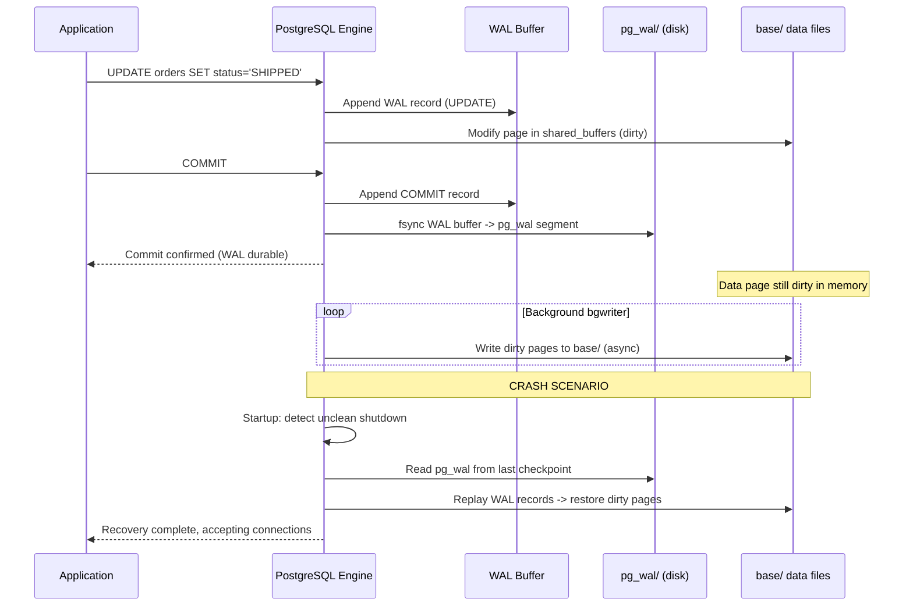

# Write-Ahead Log (WAL) - Crash Recovery Internals

**TL;DR:** WAL (Write-Ahead Log) is the durability mechanism in PostgreSQL.
Before any heap or index page is modified on disk, the change is first
recorded in the WAL as a sequential log record. On crash: replay WAL
from the last checkpoint to reconstruct all committed changes. WAL also
enables streaming replication (standbys apply WAL records as they arrive)
and Point-in-Time Recovery (PITR).

---

### 🎯 Model Answer

**30 seconds:**
> WAL records every database change as an append-only log before writing
> to data pages. On crash: replay WAL from the last checkpoint to recover.
> Two rules: (1) WAL record written before data page modified (write-ahead).
> (2) WAL flushed to disk on transaction commit (fsync). Benefits: crash
> recovery, streaming replication, and PITR.

**3 minutes:**
> The write-ahead rule: before PostgreSQL modifies a heap or index page,
> it appends a WAL record describing the change. The WAL record is written
> to the WAL segment file (in `pg_wal/`). On transaction COMMIT: the WAL
> record for the commit is flushed to disk (fsync). Only after the WAL record
> is durable does the commit return to the application.
>
> The data pages (in `base/`) may still be "dirty" in shared_buffers at this
> point - they have not been written to disk yet. This is safe because the
> WAL record can reproduce the change. On crash: PostgreSQL replays the WAL
> from the last checkpoint. Any dirty pages that were not written to disk
> before the crash: rebuilt from the WAL records.
>
> Checkpoint: a point at which all dirty pages have been flushed to disk.
> At checkpoint, a special WAL record is written. On crash recovery: replay
> only starts from the last checkpoint (not from the beginning of WAL).
> Frequent checkpoints = faster recovery but more I/O during normal operations.
>
> Replication: the WAL stream is sent to standby servers. Standbys apply WAL
> records continuously. A standby is simply "WAL replay in progress." PITR:
> archive WAL segments to object storage. Restore from a base backup, then
> replay WAL up to any target timestamp.

**Blank Mind Recovery:**

**(1) Restate:** "WAL: log change before modify data page. Commit = flush WAL.
Crash recovery: replay WAL from last checkpoint."

**(2) First principles:** "Database needs durability: committed changes survive crashes.
Writing data pages is slow (random I/O). Writing WAL is fast (sequential I/O).
Log first, apply later: sequential log write + delayed random write."

**(3) Bridge:** "Like an accounting ledger. Before changing the balance sheet (data page),
write the transaction in the ledger (WAL). If the office burns down: reconstruct
the balance sheet by replaying the ledger. The ledger is sequential, easy to write
and replay."

---

### 📘 Concept Explanation

**WAL architecture:**

```
Application                 PostgreSQL
   |                           |
   |--- SQL: UPDATE orders--->|
   |                           |--- 1. Generate WAL record
   |                           |    (describes the change to
   |                           |     heap page XY, offset Z)
   |                           |
   |                           |--- 2. Write WAL record to
   |                           |    WAL buffer (in memory)
   |                           |
   |                           |--- 3. Modify data page in
   |                           |    shared_buffers (in memory)
   |                           |
   |--- COMMIT -------------->|
   |                           |--- 4. fsync WAL buffer to disk
   |                           |    (WAL segment in pg_wal/)
   |                           |
   |<--- Commit confirmed -----|    (data page may still be dirty
                                    in shared_buffers at this point)

Background: bgwriter/checkpoint
   - Periodically writes dirty data pages to disk
   - On checkpoint: WAL records up to this LSN are "stable"
     (data pages confirmed on disk; WAL before checkpoint
     not needed for recovery)
```

**WAL record structure:**

```
Each WAL record contains:
  LSN (Log Sequence Number): unique position in WAL stream
  Transaction ID
  Resource manager: what type of change (heap, index, xact)
  Record type: INSERT, UPDATE, DELETE, COMMIT, CHECKPOINT
  Block reference: (database, relation, block number)
  Before/After image: the change (for redo)

Physical WAL files:
  pg_wal/000000010000000000000001  (16MB segments by default)
  pg_wal/000000010000000000000002
  ...
  Segment name encodes: timeline + LSN (hex)
```

---

### 💻 Code Example

```sql
-- WAL MONITORING: observe WAL activity

-- Current WAL LSN (Log Sequence Number):
SELECT pg_current_wal_lsn();
-- Returns: 0/3A1F2B8 (hexadecimal LSN)
-- Increases with every WAL record written.

-- WAL lag on a standby:
SELECT
    client_addr,
    state,
    sent_lsn,
    write_lsn,
    flush_lsn,
    replay_lsn,
    (sent_lsn - replay_lsn) AS replication_lag_bytes
FROM pg_stat_replication;
-- sent_lsn:   WAL sent to standby
-- write_lsn:  standby wrote WAL to its local disk
-- flush_lsn:  standby flushed WAL (durable on standby)
-- replay_lsn: standby applied WAL to its data files
-- lag_bytes:  (sent - replay) = how far behind the standby is

-- Check current checkpoint information:
SELECT
    checkpoints_timed,
    checkpoints_req,
    checkpoint_write_time,
    checkpoint_sync_time,
    buffers_checkpoint
FROM pg_stat_bgwriter;
-- checkpoints_req (requested checkpoints): if high relative
-- to checkpoints_timed: checkpoint is being forced by WAL
-- filling up. Need to increase checkpoint_completion_target
-- or max_wal_size.

-- WAL generation rate:
SELECT
    pg_size_pretty(
        pg_wal_lsn_diff(
            pg_current_wal_lsn(),
            '0/0'
        )
    ) AS total_wal_generated;
-- Total WAL bytes generated since instance start.
-- Per minute: compare two readings 60s apart.
```

> **Code walkthrough:** `pg_current_wal_lsn()` returns the current write position
> in the WAL stream as an LSN. `pg_stat_replication` is the primary's view of
> connected standbys: `sent_lsn` - latest WAL sent, `flush_lsn` - standby confirmed
> durable, `replay_lsn` - standby actually applied. The lag `sent_lsn - replay_lsn`
> measures how far behind the standby is (in bytes). A growing lag indicates the
> standby cannot apply WAL as fast as the primary generates it. `checkpoints_req`
> vs `checkpoints_timed`: requested checkpoints happen when WAL has filled
> `max_wal_size`; this is bad (forced I/O spike). Increase `max_wal_size` or
> the checkpoint interval to avoid forced checkpoints.

```java
// WAL DURABILITY: fsync and commit behavior in Java

// PostgreSQL will fsync WAL on every commit.
// For high-throughput write workloads: this is the bottleneck.
// Each commit waits for the kernel fsync to return.

// BAD: one commit per row (10,000 separate fsyncs)
try (Connection conn = dataSource.getConnection()) {
    conn.setAutoCommit(true);  // default: autocommit
    PreparedStatement ps = conn.prepareStatement(
        "INSERT INTO events (type, payload) VALUES (?, ?)"
    );
    for (Event event : events) {
        ps.setString(1, event.getType());
        ps.setString(2, event.getPayload());
        ps.executeUpdate();  // fsync per commit = 10,000 fsyncs
    }
}
// At 1ms per fsync: 10,000 inserts = 10 seconds

// GOOD: batch in a single transaction (1 fsync for all)
try (Connection conn = dataSource.getConnection()) {
    conn.setAutoCommit(false);
    PreparedStatement ps = conn.prepareStatement(
        "INSERT INTO events (type, payload) VALUES (?, ?)"
    );
    for (Event event : events) {
        ps.setString(1, event.getType());
        ps.setString(2, event.getPayload());
        ps.addBatch();
    }
    ps.executeBatch();
    conn.commit();  // 1 fsync for all 10,000 rows
}
// At 1ms per fsync: 10,000 inserts = ~100ms (100x faster)
```

> **Code walkthrough:** Each `COMMIT` causes PostgreSQL to fsync the WAL buffer
> to disk before returning. This is non-negotiable for durability: the WAL record
> must be durable before the application is told the commit succeeded. On a typical
> SSD: one fsync costs 0.5-2ms. Auto-commit (one commit per statement): 10,000
> inserts = 10,000 fsyncs = 5-20 seconds. Batching in one transaction: 10,000 inserts
> = 1 fsync = 5-20ms. 100x+ improvement. The batch is fully durable: if the server
> crashes after the commit returns, all 10,000 rows are guaranteed to survive.

```sql
-- CRASH RECOVERY VERIFICATION

-- Simulate crash scenario (PostgreSQL self-test):
-- 1. Create test data
BEGIN;
INSERT INTO orders (id, status) VALUES (99999, 'TEST');
COMMIT;
-- WAL record written, fsync'd.

-- 2. SIMULATE: dirty data page in shared_buffers
--    (not yet written to disk)
--    In a test env: kill -9 postmaster
--    On restart: PostgreSQL detects the unclean shutdown.

-- 3. ON RESTART: PostgreSQL reads pg_control
--    which contains the last checkpoint LSN.
--    Replays WAL from that checkpoint.
--    Every committed change is replayed.
--    The INSERT for order 99999 is in the WAL:
--    it is replayed and appears in the database.
--    Uncommitted changes: no COMMIT record in WAL,
--    so they are not replayed.

-- 4. VERIFY:
SELECT id, status FROM orders WHERE id = 99999;
-- Returns: (99999, 'TEST') - survived the crash.
-- The WAL replay reconstructed the committed INSERT.

-- Monitor recovery progress:
SELECT pg_is_in_recovery();
-- Returns TRUE if currently in WAL recovery.
SELECT pg_last_wal_replay_lsn();
-- Returns the LSN of the last WAL record applied.
```

> **Code walkthrough:** After a crash, PostgreSQL's startup process finds that
> `pg_control` shows an unclean shutdown. It reads the `redo start LSN` from the
> last valid checkpoint record. It opens the WAL segment containing that LSN and
> replays all records from that point to the end of WAL. Each replay record
> applies the change to the corresponding data page. `COMMIT` records: mark the
> transaction as committed. Records without a COMMIT: not applied (they represent
> an in-progress transaction at the time of the crash). The database is consistent:
> all committed transactions are present, all in-progress ones are absent.

---

### 🎓 Answers by Seniority

**Junior / Mid:**
> WAL records every change as an append-only log before modifying data files.
> On commit: WAL is flushed to disk. On crash: replay WAL from the last checkpoint.
> WAL enables crash recovery, streaming replication, and PITR.

---

**Senior / Staff:**
> WAL is the foundation of PostgreSQL's ACID durability and HA. Operationally:
> (1) WAL generation rate determines replication lag - monitor and size the replication
> connection bandwidth accordingly. (2) `checkpoint_completion_target` (0.9 = spread
> checkpoint I/O over 90% of the checkpoint interval) prevents I/O spikes. (3) Batching
> writes in a transaction is the single most impactful performance optimization for
> write-heavy workloads - each commit = one fsync. (4) For highest throughput with
> acceptable durability trade-off: `synchronous_commit = off` (WAL commit is asynchronous;
> up to `wal_writer_delay` of data loss risk on crash, usually 200ms; no data corruption).

---

### ⚠️ Common Misconceptions

**"synchronous_commit = off means the database might lose committed data forever"**

Reality: `synchronous_commit = off` means the commit returns to the application
before the WAL record is flushed to disk. On crash: up to `wal_writer_delay`
(default 200ms) of committed transactions can be lost. But: the database remains
consistent (no corruption). The transactions that are lost were committed from
the application's perspective but the WAL record was not flushed. On restart:
those transactions are gone but the database is in a consistent state. This is
a durability trade-off: some data loss is possible, but data corruption is not.

**"WAL is only for crash recovery"**

Reality: WAL has three major uses: (1) crash recovery (replay on restart);
(2) streaming replication (WAL streamed to standbys); (3) logical replication
(WAL decoded to logical changes for CDC and cross-system sync). WAL is the
foundational audit log of all database changes.

---

### ⚖️ Comparison Table

| Feature | WAL-based (PostgreSQL) | Redo log (Oracle/MySQL InnoDB) | Notes |
|---|---|---|---|
| Crash recovery | WAL replay from checkpoint | Redo log replay | Same concept |
| Replication | WAL streaming (physical) | Binlog (logical) | Different levels |
| PITR | WAL archive + base backup | Incremental backup | WAL approach flexible |
| Durability on commit | fsync WAL (configurable) | fsync redo log | Both can be tuned |
| Bloat | Separate from data | In tablespace | WAL separate |

---

### 🏛️ System Design

**WAL in a production HA setup:**

```
Primary -> WAL stream -> Synchronous standby
        -> WAL stream -> Asynchronous standby (reporting)
        -> WAL archive -> S3/GCS (PITR)

Synchronous standby:
  synchronous_commit = on (default)
  Every commit: wait for standby to flush WAL
  Zero data loss on primary failure
  Cost: commit latency += network round trip (1-5ms)
  Use: financial systems, critical writes

Asynchronous standby:
  synchronous_commit = off (on primary)
  Commit returns without waiting for standby
  Data loss: up to WAL lag (typically <1s)
  Use: read replicas, reporting databases

WAL archiving for PITR:
  archive_mode = on
  archive_command = 'aws s3 cp %p s3://pgbackup/%f'
  %p = source WAL segment path
  %f = WAL segment filename

Recovery to a specific point in time:
  1. Restore base backup (pg_basebackup or pgbackup)
  2. Set recovery.conf (or postgresql.conf in PG12+):
     restore_command = 'aws s3 cp s3://pgbackup/%f %p'
     recovery_target_time = '2024-01-15 14:30:00'
  3. Start PostgreSQL: replays WAL until target time
  4. Review data, promote when satisfied
```

**Write throughput and WAL:**

```
High-insert workload (event stream, logs):
  Problem: 1M inserts/hour = 1M commits = 1M fsyncs
  At 1ms/fsync: 1,000 seconds (impossible)

  Solution 1: Batch inserts (1 commit per 1000 rows)
  Result: 1,000 commits = 1,000 fsyncs = 1 second

  Solution 2: COPY command (bulk load)
  COPY events FROM STDIN (FORMAT CSV);
  Single WAL record for the entire batch.
  Fastest bulk load method.

  Solution 3: Unlogged tables (no WAL)
  CREATE UNLOGGED TABLE temp_events (...);
  - Zero WAL overhead
  - Data lost on crash (intentional for temp data)
  - Use: staging tables, caches, ephemeral queues

Checkpoint configuration for write-heavy:
  max_wal_size = 2GB     (allow more WAL between checkpoints)
  checkpoint_completion_target = 0.9  (spread checkpoint I/O)
  wal_compression = on   (reduce WAL size)
```

---

### 📊 Diagram

**WAL write path and crash recovery:**

```
Write path (normal operation):
  SQL: UPDATE orders SET status='SHIPPED' WHERE id=1

  1. WAL buffer          2. shared_buffers
     [WAL record]  ->       [modified heap page]
          |                       |
          | (on COMMIT)           | (async: bgwriter/checkpoint)
          v                       v
  3. pg_wal/ (disk)      4. base/ (disk)
     [WAL segment]           [data files]

Crash recovery (on restart):
  1. Read pg_control -> last checkpoint LSN
  2. Open WAL segment at checkpoint LSN
  3. For each WAL record:
     a. COMMIT record -> mark TX committed
     b. Heap/index record -> apply change to data page
  4. Skip uncommitted TX records (no COMMIT found)
  5. Database is consistent (REDO complete)
```



> **Diagram walkthrough:** The write path separates WAL writes (sequential, fast)
> from data page writes (random, async). On COMMIT: only the WAL is fsynced.
> The data page modification stays in shared_buffers (dirty). The bgwriter
> and checkpoint process flush dirty pages asynchronously. On crash: the data
> page's in-memory changes are lost, but the WAL record is durable. Recovery
> replays the WAL record to reconstruct the data page. The key guarantee:
> if fsync on the WAL succeeded (commit returned), the change is permanent.

---

### 🚨 Failure Modes and Diagnosis

**Failure 1: WAL disk full - database halts all writes**

Symptom: all write operations fail with `ERROR: could not write to file "pg_wal/..."`.
Database refuses new writes. Reads still work.

Cause: the `pg_wal/` directory filled the disk. WAL cannot be written.

Immediate diagnosis:
```bash
df -h /var/lib/postgresql/data/pg_wal/
# Check disk usage

ls -lh /var/lib/postgresql/data/pg_wal/
# Look for stale WAL segments not being removed
```

Fix:
```bash
# If replication lag is the cause (WAL held for standby):
# Check pg_stat_replication for max replication lag
# Disconnect lagging standby if acceptable:
# SELECT pg_terminate_backend(pid) FROM pg_stat_replication
#   WHERE sent_lsn - replay_lsn > 1000000000;  -- 1GB lag

# Increase max_wal_size temporarily:
# ALTER SYSTEM SET max_wal_size = '4GB';
# SELECT pg_reload_conf();

# Last resort: free disk space in /pg_wal/ by removing
# archived segments (after verifying they are archived):
# pg_archivecleanup /pg_wal/ latest_archive_lsn
```

**Failure 2: Replication standby falls behind causing WAL retention**

Symptom: `pg_wal/` grows continuously. `pg_stat_replication` shows increasing lag.
Eventually: disk full.

Cause: standby cannot apply WAL as fast as primary generates it (CPU/IO bound
on standby, or network bandwidth saturated).

Diagnosis:
```sql
SELECT
    client_addr,
    sent_lsn - replay_lsn AS lag_bytes
FROM pg_stat_replication;
-- Lag > 1GB = concern. Lag > 10GB = critical.
```

Fix: (1) Remove WAL retention slot if using slots (`DROP REPLICATION SLOT slot_name`).
(2) Speed up standby (more CPU, faster disk). (3) Compress WAL (`wal_compression=on`).
(4) Use WAL archiving instead of streaming for the slow standby.

**Failure 3: Checkpoint frequency causing I/O spikes**

Symptom: periodic I/O spikes causing query latency spikes. `pg_stat_bgwriter.checkpoints_req`
is growing (requested checkpoints, not timed).

Cause: `max_wal_size` is too small. WAL fills up before the checkpoint interval;
PostgreSQL forces a checkpoint. All dirty pages are flushed simultaneously.

Fix:
```sql
-- Increase max_wal_size to allow more WAL between checkpoints:
ALTER SYSTEM SET max_wal_size = '2GB';  -- default: 1GB
-- Spread checkpoint I/O more:
ALTER SYSTEM SET checkpoint_completion_target = 0.9;  -- default: 0.5
SELECT pg_reload_conf();
-- Now checkpoints spread writes over 90% of the checkpoint interval.
-- I/O spikes become I/O gradual increase.
```

---

### 🎯 Interview Deep-Dive

**Q1: What is the relationship between WAL and ACID durability?**

🗣️ "The D in ACID: Durability. Committed transactions survive crashes. WAL provides
this guarantee through the write-ahead rule and fsync on commit. The write-ahead rule:
the WAL record describing the change must be written to disk before the data page change
is considered permanent. fsync on commit: when a transaction commits, PostgreSQL calls
fsync on the WAL buffer. This ensures the OS has actually written the WAL record to
disk (not just to the OS page cache). After fsync returns: the WAL record survives
a power failure. On crash recovery: PostgreSQL finds the committed WAL record and
replays it. The data page in shared_buffers (which may not have been written to disk)
is reconstructed. Without fsync on commit: the WAL could be in the OS page cache
only. A power failure: OS cache is lost. WAL record is gone. The committed transaction
vanishes. That would violate Durability. `synchronous_commit = off` removes this
fsync and is the explicit trade-off: performance at the cost of potential data loss."

**Q2: How does WAL enable streaming replication?**

🗣️ "Streaming replication: the standby connects to the primary and receives the WAL
stream in real time. The process: (1) Primary generates WAL records for every change.
(2) The WAL sender process (on the primary) reads WAL segments and sends them to
the WAL receiver (on the standby) over a replication connection. (3) The WAL receiver
writes received WAL to the standby's local `pg_wal/`. (4) The startup process (recovery
mode on the standby) reads the WAL from local `pg_wal/` and applies the changes.
The standby is a live database in recovery mode. It can serve read-only queries
while applying WAL. Synchronous replication: on the primary, the commit only returns
after the standby confirms it has flushed the WAL (`synchronous_standby_names`).
This guarantees zero data loss on primary failure."

**Q3: What is a replication slot and when would you use one?**

🗣️ "A replication slot: a mechanism for the primary to retain WAL segments until
a standby has consumed them. Without slots: the primary deletes WAL segments after
they are no longer needed (past the checkpoint and not held by any standby).
If the standby disconnects: the primary may delete WAL the standby has not yet received.
The standby falls behind and must be rebuilt. With a replication slot: the primary
retains WAL segments until the slot's consumer has confirmed receiving them.
The standby can reconnect and continue from where it left off. Risk: if the slot's
consumer disconnects and never reconnects: WAL accumulates indefinitely, filling disk.
Always monitor `pg_replication_slots.active` and `pg_replication_slots.restart_lsn`.
If a slot is inactive and has fallen far behind: drop it to prevent disk fill.
Logical replication slots (for CDC tools like Debezium): same mechanism but for
logical changes."

**Q4: What is synchronous_commit and what are the durability/performance trade-offs?**

🗣️ "`synchronous_commit` controls when PostgreSQL confirms a commit to the application.
Values: `on` (default): commit returns only after WAL is flushed to local disk.
`remote_write`: commit returns after WAL is sent AND written to standby's disk (not fsynced).
`remote_apply`: commit returns after WAL is applied on standby (can read your writes on standby).
`local`: commit returns after WAL is flushed locally (standby not waited for).
`off`: commit returns immediately without waiting for WAL flush.
Performance impact: `on` = one local fsync = 1-2ms overhead per commit. `off` = no fsync wait
= maximum throughput. Risk of `off`: up to `wal_writer_delay` (200ms) of committed transactions
can be lost on crash. Not corruption: the database is consistent, just some recent commits
are missing. Use `off` for: high-volume event logging, metrics ingestion, any system where
a small window of data loss is acceptable."

**Q5: What is full-page writes and why does PostgreSQL use it?**

🗣️ "Full-page writes: after a checkpoint, the first modification to any data page writes
the entire page content into the WAL (not just the change). This is because: on crash
during a write, the OS may write only part of an 8KB page (the OS block size is 512B or 4KB).
A partial page write corrupts the page. Replaying WAL against a partially-written page
would not produce the correct result. Full-page write: WAL contains the complete page.
Recovery can safely apply the full-page image and then any subsequent changes.
After the checkpoint: the first modification to each page includes the full page.
Subsequent modifications (before next checkpoint) include only the incremental change.
Cost: WAL volume increases after each checkpoint (more data written). Mitigation:
`wal_compression = on` (compresses full-page images, typically 40-70% reduction).
PostgreSQL 16+: ICU-based WAL compression."

**Q6: How does PITR (Point-in-Time Recovery) work?**

🗣️ "PITR: restore the database to the state at any past point in time.
Required: (1) A base backup: a consistent full copy of the data directory.
(2) WAL archive: all WAL segments generated since the base backup.
Recovery process: (1) Restore the base backup (just copy the data directory).
(2) Configure recovery: set `restore_command` to fetch WAL segments from the archive.
(3) Set the target: `recovery_target_time`, `recovery_target_xid`, or `recovery_target_lsn`.
(4) Start PostgreSQL: it runs in recovery mode, applying WAL records one by one.
(5) When the target is reached: stops and enters the 'paused' state (configurable).
(6) Inspect the database. If correct: promote to production with `pg_ctl promote`.
(7) If not correct: stop, restore again, adjust the target time.
Use cases: (1) data corruption or accidental `DELETE` recovery; (2) disaster recovery;
(3) testing: what was the database state at 3pm yesterday? All operational databases
should have PITR configured."

**Q7: How does WAL-level parameter wal_level affect replication and logical decoding?**

🗣️ "`wal_level`: controls what information is written to WAL. Values:
`minimal`: minimum WAL. No replication. Not enough to replay from a base backup.
`replica` (default): WAL includes all information for recovery and streaming replication.
`logical`: adds information needed for logical decoding. Required for: logical
replication, CDC tools (Debezium), and pglogical.
For each level: `logical > replica > minimal` in terms of WAL volume.
`logical` adds: the full row before and after each change (for logical decoding).
Without `logical`: WAL contains the physical change (which bytes on which page).
With `logical`: WAL contains the row values (INSERT/UPDATE/DELETE with column values).
This is how Debezium reads the WAL and produces INSERT/UPDATE/DELETE events.
Always set `wal_level = logical` if using CDC or logical replication.
Cost: ~10-20% more WAL volume."

**Q8: What happens during WAL recovery if a WAL segment is missing?**

🗣️ "Recovery reads WAL segments in sequence. If a segment is missing: recovery fails
with `FATAL: could not open file "pg_wal/000000010000000000000042": No such file`.
All WAL after the missing segment is unplayable: recovery stops at the gap.
The database enters 'inconsistent state' and cannot be opened.
Resolution depends on context: (1) For a standby that missed a segment while offline:
the standby must be rebuilt from scratch (base backup + replay all WAL from the new baseline).
(2) For a PITR restore with a gap in the archive: the database can only be recovered up to
the point before the missing segment. Any committed transactions in the missing segment
are permanently lost. Prevention: monitor WAL archiving: `archive_status/` shows which
segments are waiting to be archived (`.ready`) and which succeeded (`.done`).
Alert if a segment stays in `.ready` for more than a few minutes."

**Q9: How does crash recovery differ from backup-based restore?**

🗣️ "Crash recovery: the database was running and crashed (OS crash, power failure,
`kill -9`). `pg_control` records the last valid checkpoint. On restart:
PostgreSQL reads the checkpoint from `pg_control`, opens WAL from that point,
and replays all records to the end of WAL. Duration: proportional to WAL generated
since the last checkpoint (checkpoint interval * WAL generation rate). With `checkpoint_timeout=5min`
and moderate write load: recovery takes < 1 minute. Backup-based restore: starting from
a clean base backup + all WAL since the backup. Duration: proportional to total WAL
since the backup. For a 7-day-old base backup with 1GB/hour WAL: 168GB of WAL to replay.
Takes hours. Best practice: take base backups frequently (daily or more) to minimize
WAL replay time for disaster recovery. RTO (Recovery Time Objective) = base backup age
+ WAL replay time + startup time."

**Q10: How do you optimize WAL write performance for bulk data loads?**

🗣️ "Several strategies: (1) COPY command: bulk data is loaded as a single WAL operation
(minimal WAL record per row, not per-statement overhead). Always use COPY over INSERT
for bulk loads. (2) Unlogged tables: `CREATE UNLOGGED TABLE load_staging (...)`.
Zero WAL. Data is not replicated and is lost on crash. Use for staging tables
that are disposable. After loading: copy to permanent table. (3) `synchronous_commit = off`
for the session: commits return before WAL fsync. 200ms maximum data loss risk.
For bulk load sessions: acceptable. (4) Increase `maintenance_work_mem` before
the load: indexes built during COPY use more memory, fewer passes.
(5) Drop indexes before load, rebuild after: index maintenance WAL is eliminated
during the load; rebuild once in a single pass. (6) Disable autovacuum for the
table during load: `ALTER TABLE load_staging SET (autovacuum_enabled = false)`.
Re-enable after. Run ANALYZE manually post-load."

**Q11: What is the write performance impact of synchronous standby replication?**

🗣️ "With `synchronous_standby_names = 'standby1'` and `synchronous_commit = on`:
every commit on the primary waits for the standby to flush the WAL before returning.
The latency added: network RTT + standby WAL write time. For a co-located standby
(same datacenter): 1-3ms added per commit. For a cross-datacenter standby (100ms RTT):
100ms added per commit. This directly affects application response time for any
write operation. At 100ms added per commit: a transaction that commits once takes 100ms
extra. A checkout flow with 5 commits: 500ms extra. Unacceptable for user-facing ops.
Solutions: (1) Co-locate synchronous standby (same AZ for <5ms RTT). (2) Use `remote_write`
instead of `on` (standby writes WAL to disk but does not fsync; faster but not fully durable). (3) Use async standby for the remote DC and sync for local standby. (4) Batch multiple
operations in one transaction to reduce commit count."

**Q12: How do you implement PITR in a production environment at scale?**

🗣️ "Production PITR setup: (1) Base backup tool: pgBackRest or Barman (not pg_basebackup
directly for production - they add compression, encryption, parallel transfer).
pgBackRest: full + incremental + differential backups. WAL archiving integrated.
(2) WAL archiving: configure `archive_command` to upload to S3/GCS with retry:
`archive_command = 'pgbackrest --stanza=main archive-push %p'`.
pgBackRest handles retries, compression, and encryption.
(3) Schedule: full backup weekly, WAL archived continuously.
(4) Retention: keep 30 days of WAL + base backups. Managed by pgBackRest.
(5) Testing: PITR is only reliable if tested. Monthly: restore from backup to a
test instance, verify data, time the restore. Measure actual RTO.
(6) Monitoring: alert if archive_status has stale `.ready` files.
Alert if last successful full backup is > 2 days old.
(7) Target RPO/RTO: with continuous WAL archiving: RPO < 1 minute (maximum WAL archive lag).
RTO: 30 minutes to 4 hours depending on base backup size and WAL volume."
