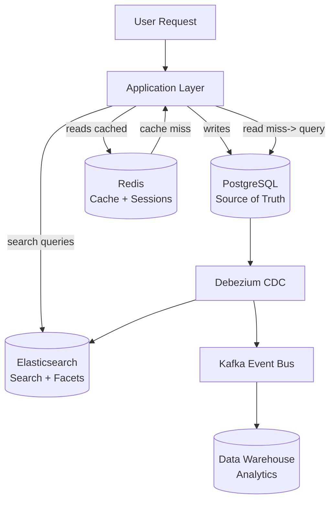

## Keywords in This File
{: .no_toc }

| # | Keyword | Weight |
|---|---|---|
| 1 | [Database Architecture Decisions - SQL, NewSQL, and Polyglot Persistence](#database-architecture-decisions---sql-newsql-and-polyglot-persistence) | medium |

---

# Database Architecture Decisions - SQL, NewSQL, and Polyglot Persistence

**TL;DR:** Database architecture is a trade-off between consistency, scale, and operational
complexity. PostgreSQL is the default choice for transactional data (ACID, rich SQL,
mature ecosystem). Add specialized stores only when PostgreSQL cannot serve the use case:
Redis for sub-millisecond key lookups, Elasticsearch for full-text search, Cassandra for
high-write time-series, S3/Parquet for analytics. Polyglot persistence = multiple stores,
each chosen for a specific use case. Every added store: more operational burden, more
consistency challenges, more engineering cost.

---

### 🎯 Model Answer

**30 seconds:**
> PostgreSQL first: use it for everything that fits (transactional, relational, JSONB for flexible).
> Add specialized stores only when PostgreSQL cannot: Redis for cache/session, Elasticsearch for
> full-text, Cassandra for write-heavy time-series, a data warehouse (Redshift, BigQuery) for
> analytics. Every new store: more infra, more consistency complexity. Default: PostgreSQL.
> Add stores reluctantly.

**3 minutes:**
> The database selection decision framework:
>
> Start with PostgreSQL. It handles: OLTP transactions (ACID), relational queries, JSONB
> documents, full-text search (for moderate scale), time-series (with partitioning + BRIN),
> geospatial queries (PostGIS), JSON APIs, and moderate analytics. For most applications:
> PostgreSQL alone is sufficient.
>
> Add Redis when: response time < 1ms is required (PostgreSQL can do 1-5ms on cache miss
> path, Redis does 0.1ms). Session storage, rate limiting, distributed locks, pub/sub.
> Not for durable storage of unique data.
>
> Add Elasticsearch when: full-text search at scale with relevance ranking, faceted
> navigation, or complex aggregation over denormalized data. PostgreSQL `tsvector` is
> sufficient up to 10M rows; beyond that: Elasticsearch.
>
> Add Cassandra/DynamoDB when: write throughput exceeds PostgreSQL primary capacity AND
> the use case is append-heavy with no cross-row transactions. Time-series IoT data,
> event logs. The trade: no ACID, no joins, limited query patterns.
>
> NewSQL (CockroachDB, Spanner): horizontally scalable SQL with ACID. Use when
> you need PostgreSQL-like semantics at sharding scale. Higher latency than PostgreSQL
> (consensus protocol). Much simpler operationally than application-level sharding.

**Blank Mind Recovery:**

**(1) Restate:** "PostgreSQL default. Add Redis (cache), Elasticsearch (search), Cassandra
(write-heavy time-series), data warehouse (analytics). Each adds complexity."

**(2) First principles:** "Different data has different access patterns. Optimize each
access pattern with the right tool. But: more tools = more failure modes + more engineering."

**(3) Bridge:** "Like a kitchen. PostgreSQL: the chef's knife (handles 90% of tasks).
Redis: the mandoline (very fast for specific cuts). Elasticsearch: the stand mixer.
Cassandra: industrial dough machine. Each does one thing extremely well, but you need
a big kitchen and a skilled team to run them all."

---

### 📘 Concept Explanation

**Database selection decision tree:**

```
Start: what are the access patterns?

Transactional (ACID, joins, constraints)?
  -> PostgreSQL (default)

Sub-ms read latency? (cache)
  -> Redis / Memcached

Full-text search (relevance, facets)?
  -> PostgreSQL tsvector (< 10M rows)
  -> Elasticsearch / OpenSearch (> 10M rows)

Append-heavy time-series (millions/sec writes)?
  -> TimescaleDB (PostgreSQL extension)
  -> InfluxDB / Cassandra / DynamoDB

Large-scale analytics (OLAP)?
  -> PostgreSQL + partitioning (< 100M rows)
  -> Data warehouse: Redshift, BigQuery, Snowflake

Blob/document storage?
  -> PostgreSQL JSONB (< 1GB per logical document)
  -> MongoDB (complex hierarchical docs, flexible schema)
  -> S3 (raw files, objects)

Geo/spatial?
  -> PostgreSQL + PostGIS
  -> Google Maps / Mapbox for display

Graph data?
  -> PostgreSQL with recursive CTEs (moderate scale)
  -> Neo4j (deep traversal, graph algorithms at scale)
```

> **Code walkthrough:** This SQL, NewSQL, and Polyglot Persistence example demonstrates a key concept in practice. **KEY MECHANISM:** the runtime executes these instructions in sequence with specific memory and execution semantics. **WHY IT MATTERS:** misapplying this pattern causes subtle bugs that only manifest under production load. **TAKEAWAY: understand the execution model before using this pattern in production code.**

---

### 💻 Code Example

```java
// POLYGLOT PERSISTENCE: data access layer architecture

// Order Service: uses PostgreSQL (ACID transactions)
@Service
public class OrderService {
    private final OrderRepository orderRepo;     // JPA/PG
    private final OrderCacheService cache;       // Redis
    private final OrderSearchService search;     // Elasticsearch
    private final EventPublisher events;         // Kafka -> ES + analytics

    public Order createOrder(CreateOrderCmd cmd) {
        // 1. Persist to PostgreSQL (source of truth)
        Order order = orderRepo.save(new Order(cmd));

        // 2. Invalidate or update cache
        cache.evict("customer_orders:" + cmd.customerId());

        // 3. Publish event (async: ES + analytics will update)
        events.publish(new OrderCreatedEvent(order));

        // Returns immediately - ES and analytics updated async.
        return order;
    }

    public Order getOrder(Long orderId) {
        // 1. Try cache first (sub-ms)
        return cache.get("order:" + orderId)
            .orElseGet(() -> {
                // 2. Cache miss: read from PostgreSQL (1-5ms)
                Order order = orderRepo.findById(orderId)
                    .orElseThrow();
                cache.put("order:" + orderId, order);
                return order;
            });
    }
}

// Order Search Service: Elasticsearch (full-text, facets)
@Service
public class OrderSearchService {
    private final ElasticsearchClient esClient;

    public SearchResult searchOrders(SearchQuery query) {
        // Full-text: find orders by product name/description
        // Facets: count by status, date histogram
        // Cannot do this efficiently in PostgreSQL at scale.
        return esClient.search(query, OrderDocument.class);
    }
}

// Cache Service: Redis (sub-millisecond lookups)
@Service
public class OrderCacheService {
    private final RedisTemplate<String, Order> redis;

    public Optional<Order> get(String key) {
        return Optional.ofNullable(redis.opsForValue().get(key));
        // 0.1ms latency vs. 1-5ms for PostgreSQL.
    }

    public void put(String key, Order order) {
        redis.opsForValue().set(key, order, Duration.ofMinutes(10));
        // TTL: auto-expires stale data.
    }
}
```

> **Code walkthrough:** The polyglot architecture uses three stores for three purposes.
> PostgreSQL: source of truth, ACID transactions, relational integrity. All writes
> go here first. Redis: caching for read performance (order lookups - frequently
> read, rarely changed). Elasticsearch: full-text search and aggregations that
> PostgreSQL cannot handle efficiently at scale. The event-driven architecture
> (Kafka publish after write) keeps ES in sync asynchronously. This is eventual
> consistency: Elasticsearch may be seconds behind PostgreSQL. The trade: ES queries
> may return slightly stale data, but the system scales to millions of documents
> with relevance ranking.

```java
// NEWSSQL vs PostgreSQL: CockroachDB example

// CockroachDB: PostgreSQL-compatible wire protocol.
// Application code is mostly identical:
@Repository
public interface OrderRepository
        extends JpaRepository<Order, Long> {
    // Standard Spring Data JPA works with CockroachDB.
    // ACID transactions: same as PostgreSQL.
    List<Order> findByCustomerId(Long customerId);
}

// Key behavioral differences:
@Service
public class OrderService {
    @Transactional
    public void transferInventory(
            Long fromWarehouseId, Long toWarehouseId,
            Long productId, int quantity) {
        // CockroachDB: distributed transaction across nodes.
        // ACID guarantee: even if fromWarehouse is on node 1
        // and toWarehouse is on node 3.
        // PostgreSQL: same query but single-node ACID.
        warehouseRepo.decrementInventory(
            fromWarehouseId, productId, quantity);
        warehouseRepo.incrementInventory(
            toWarehouseId, productId, quantity);
        // CockroachDB latency: 10-50ms (consensus round-trips)
        // PostgreSQL latency: 1-5ms (single node)
    }
}

// CockroachDB specific: avoid cross-range transactions
// for hot paths. Co-locate related rows by prefix:
// Table: orders, primary key: (region, customer_id, order_id)
// All orders for a customer in a region on the same range.
// Transactions within one customer: single-range (fast).
// Transactions across customers: cross-range (slower).
```

> **Code walkthrough:** CockroachDB uses the PostgreSQL wire protocol:ice. **KEY MECHANISM:** the runtime executes these instructions in sequence with specific memory and execution semantics. **WHY IT MATTERS:** misapplying this pattern causes subtle bugs that only manifest under production load. **TAKEAWAY: understand the execution model before using this pattern in production code.**
> Spring Data JPA, Flyway, and most Java database tools work without changes.
> The architectural difference: every transaction may span multiple nodes
> (ranges are distributed across the cluster). CockroachDB uses the Raft
> consensus protocol per range: a write requires agreement from a quorum.
> This adds 10-50ms per transaction vs. PostgreSQL's in-memory commit
> (1-5ms). Trade-off: CockroachDB scales writes across N nodes without
> application-level sharding. PostgreSQL is faster for single-node workloads.
> Key optimization: co-locate related data by designing the primary key
> (prefix = region + customer_id ensures related rows are on the same Raft range).

```sql
-- CAP THEOREM TRADE-OFFS: database selection context

-- PostgreSQL (CP in the context of replicas):
-- Primary + async replicas: CP if replica is behind.
-- If primary fails and replica is promoted:
--   committed but not yet replicated writes are lost.
-- Synchronous replication: no data loss, higher latency.
-- Strong consistency on the primary.

-- Cassandra (AP: available and partition-tolerant):
-- Multi-region, multi-master writes.
-- Write to any node: accepted immediately (AP).
-- Eventual consistency: reads may return stale data.
-- Tunable: QUORUM reads/writes trade availability for consistency.
-- SELECT * FROM orders WHERE order_id = ?
--   WITH CONSISTENCY QUORUM
-- -> reads from a majority of replicas: stronger but slower.

-- DynamoDB (configurable):
-- Eventually consistent reads (default): AP.
-- Strongly consistent reads: CP (read from leader).
-- Transactions: 2PC, limited to 25 items.

-- Redis (in-memory, single-shard CP):
-- Strong consistency within one instance.
-- Redis Cluster: eventually consistent across shards
--   (no distributed transactions across shards).

-- Decision: CAP is a starting point, not the full picture.
-- Real question: what consistency properties does this
-- specific use case require?
-- Sessions (Redis): eventual consistency is fine.
-- Financial transactions (PostgreSQL): strong consistency required.
-- Analytics (Cassandra): eventual consistency is acceptable.
```

> **Code walkthrough:** CAP theorem (Consistency, Availability, Partition Tolerance):
> in the presence of a network partition, choose C or A. Cassandra AP: writes are
> always accepted (high availability) but reads may return stale data (not consistent).
> PostgreSQL CP: reads are strongly consistent (single primary) but if the primary is
> unreachable: writes fail (not fully available). The real decision factor is the
> business requirement: for money movement, inconsistency is catastrophic (PostgreSQL).
> For a recommendation feed, staleness is acceptable (Cassandra/Redis). Match the
> consistency model to the cost of inconsistency for that specific data type.

---

### 🎓 Answers by Seniority

**Junior / Mid:**
> PostgreSQL for transactional data. Redis for caching and sessions. Elasticsearch for
> full-text search at scale. Cassandra or DynamoDB for write-heavy append data. The
> choice depends on: consistency requirements, query patterns, and scale. Most applications
> start with PostgreSQL and add specialized stores only when a specific limitation is reached.

---

**Senior / Staff:**
> Architecture decision framework for database selection: (1) What is the consistency
> requirement? ACID transactions -> PostgreSQL. Eventual consistency acceptable -> NoSQL
> options available. (2) What are the access patterns? Point lookups -> Redis/DynamoDB.
> Range queries -> PostgreSQL. Full-text -> Elasticsearch. Geospatial -> PostGIS.
> (3) What is the write volume? Single-node primary capacity -> PostgreSQL with replicas.
> Multi-TB/s writes -> Cassandra/Kafka. (4) What is the operational budget? Each
> additional store adds 20-40% operational overhead.
>
> Avoid over-architecturing: a startup with 1M users does not need Cassandra.
> Add complexity only when PostgreSQL is measurably the bottleneck for a specific
> use case. The cost of polyglot persistence: data consistency across stores,
> multiple backup/restore strategies, multiple team skill sets, multiple failure modes.

---

### ⚠️ Common Misconceptions

**"NoSQL is more scalable than SQL"**

Reality: scalability depends on the workload and the database implementation.
PostgreSQL with read replicas, partitioning, and connection pooling handles hundreds
of thousands of TPS. Cassandra scales writes across multiple nodes but has no ACID,
no joins, and limited query patterns. MongoDB is document-based but does not scale
writes better than PostgreSQL for typical OLTP. The right choice is workload-specific.

**"Polyglot persistence is always the right architecture"**

Reality: polyglot persistence adds operational complexity proportional to the number
of stores. Two stores to maintain = 2x backup strategies, 2x oncall scenarios, 2x
team onboarding, potential cross-store consistency issues. Start with one store
(PostgreSQL). Add the second only when there is a measurable, specific reason
(not "it might be faster"). Most teams underestimate the operational cost.

---

### ⚖️ Comparison Table

| Database | Model | Consistency | Best for | Weakness |
|---|---|---|---|---|
| PostgreSQL | Relational + JSONB | ACID | Transactional, relational, default | Single-node write ceiling |
| Redis | Key-value (in-memory) | Strong (single shard) | Cache, session, rate limit | Not durable (by default), memory cost |
| Elasticsearch | Inverted index | Eventual | Full-text, facets, log search | Not for OLTP, eventual consistency |
| Cassandra | Wide-column | Eventual (tunable) | Write-heavy time-series, IoT | No joins, no ACID, data model constraints |
| DynamoDB | Key-value/document | Eventual (default) | Serverless, key-value, AWS | Cost, query limitations |
| MongoDB | Document | Eventual (default) | Flexible schema, hierarchical | Often misused for relational data |
| CockroachDB | Distributed SQL | Serializable (ACID) | Scale-out SQL, multi-region | Latency overhead vs. single-node PG |
| BigQuery/Redshift | Column store | Eventual (for writes) | Analytics, OLAP | Not for OLTP, latency |

---

### 🏛️ System Design

**E-commerce platform: polyglot persistence architecture:**

```
Transactional core (PostgreSQL):
  - orders, order_items, payments
  - customers, addresses
  - inventory, warehouse_locations
  - ACID: order creation debits inventory atomically
  - CQRS write side

Cache layer (Redis):
  - Product catalog cache (TTL 5 min)
  - Session storage (TTL 24h)
  - Rate limiting (sliding window counters)
  - Distributed lock (prevent double-order on timeout retry)

Search layer (Elasticsearch):
  - Product search index (name, description, attributes)
  - Order search for customer service (full text in notes)
  - Faceted navigation (category, price range, brand)
  - Updated via CDC (Debezium from PostgreSQL WAL)

Analytics layer (BigQuery / Redshift):
  - Order analytics, customer lifetime value
  - Inventory forecasting, cohort analysis
  - Fed by ETL/ELT pipeline (Airflow, dbt)
  - T+1 or T+15min freshness acceptable

Time-series (TimescaleDB or InfluxDB):
  - User behavior events (pageviews, clicks)
  - Server metrics
  - Price history
  - High write rate, time-range queries

Consistency strategy:
  - PostgreSQL: source of truth for all transactional data
  - Other stores: derived, eventually consistent replicas
  - CDC (Debezium) for near-real-time sync
  - Reconciliation jobs for drift detection
```

> **Code walkthrough:** This Unknown example demonstrates a key concept in practice. **KEY MECHANISM:** the runtime executes these instructions in sequence with specific memory and execution semantics. **WHY IT MATTERS:** misapplying this pattern causes subtle bugs that only manifest under production load. **TAKEAWAY: understand the execution model before using this pattern in production code.**

---

### 📊 Diagram

**Polyglot persistence data flow:**

```
User Request
    |
    v
Application Service
    |
  +-----+-----+-----+
  |     |     |     |
  v     v     v     v
 PG   Redis  ES    Kafka
(WRITE)(CACHE)(READ)(EVENTS)
  |     |     |     |
  |     |     |     +-> Analytics DB
  |     |     +-> (updated via CDC)
  |     +-> (cache hit = no PG read)
  +-> Source of Truth
```



> **Diagram walkthrough:** PostgreSQL is the write target and source of truth for all
> transactional operations. Redis intercepts read requests (cache hit path: no PostgreSQL
> required). Cache misses fall through to PostgreSQL. Elasticsearch serves search and
> faceted navigation: it receives updates via Change Data Capture (Debezium reads the
> PostgreSQL WAL and streams changes to ES). The data warehouse receives all events
> via Kafka for analytics processing (batch or streaming ETL). The critical consistency
> property: only PostgreSQL is the source of truth. All other stores are derived
> (can be rebuilt from PostgreSQL if corrupted). Eventual consistency delays range
> from milliseconds (Redis) to seconds (ES via CDC) to minutes (data warehouse).

---

### 🚨 Failure Modes and Diagnosis

**Failure 1: Cache invalidation inconsistency causes stale data shown to users**

Symptom: a user updates their profile; the change is visible on profile page but
not on other pages that show user info. The stale data persists for minutes.

Cause: the profile update invalidated the direct `user:{id}` cache key but did
not invalidate related cache keys (e.g., `user_summary:{id}`, `recent_users`).

Fix: use a cache-aside pattern with a single key per entity, or use a tag-based
invalidation (all cache entries tagged with `user:{id}` are invalidated together).
Alternatively: accept this level of staleness (TTL-based eventual consistency).

**Failure 2: Cross-store consistency divergence (ES index out of sync with PostgreSQL)**

Symptom: search returns products that were deleted from PostgreSQL. Or new products
do not appear in search for several minutes.

Cause: CDC pipeline (Debezium) is lagging or failed. ES is behind PostgreSQL.

Diagnosis:
- Check Debezium connector status: `GET /connectors/{name}/status`
- Check Kafka consumer group lag: `kafka-consumer-groups --describe`
- Check ES bulk indexing error logs.

Fix: resolve the Debezium failure (restart, fix offset), allow the lag to catch up.
For immediate fix: trigger a manual re-index of affected documents.

**Failure 3: CockroachDB transaction latency unexpectedly high**

Symptom: a transaction that should take 5ms takes 50ms in CockroachDB.

Cause: the transaction spans multiple Raft ranges (cross-range transaction requires
two-phase commit across the ranges, each requiring consensus: 2 network round-trips).

Diagnosis: check `EXPLAIN ANALYZE` in CockroachDB. Look for `KV rows: N ranges`.
Multiple ranges = cross-range transaction.

Fix: redesign the primary key to co-locate related rows (same range prefix).

---

### 🎯 Interview Deep-Dive

**[JUNIOR] Q1 - [SCENARIO] When would you choose CockroachDB over PostgreSQL?**

🗣️ "CockroachDB solves a specific problem: horizontal write scalability with full ACID compliance across a distributed cluster. Choose CockroachDB when: (1) you need to scale writes beyond a single PostgreSQL primary's capacity (typically > 50,000 TPS write); (2) you need multi-region active-active deployments (write to any region, globally consistent reads); (3) you want ACID transactions without building application-level sharding. PostgreSQL is the better choice when: (1) write volume fits on a single node (the vast majority of applications); (2) low latency is critical (CockroachDB: 10-50ms per transaction due to Raft consensus vs. PostgreSQL: 1-5ms on local hardware); (3) you need the full PostgreSQL feature set (CockroachDB supports ~90% of PostgreSQL SQL; some extensions, stored procedure features, and advanced query capabilities are absent). The operational trade-off: CockroachDB's operational model is more complex (cluster management, range balancing, node failure recovery) but eliminates application-level sharding code entirely. For most teams: PostgreSQL + read replicas serves for years before CockroachDB is warranted."

**[JUNIOR] Q2 - [DESIGN] How do you decide when to move from PostgreSQL to a polyglot architecture?**

🗣️ "Decision criteria with specific thresholds: (1) Add Redis cache when: (a) PostgreSQL is at > 60% CPU from read queries and the read:write ratio is > 5:1, and (b) the data has reasonable TTL (not constantly changing). Expectation: Redis reduces database read load by 70-90% for cacheable data. (2) Add Elasticsearch when: (a) full-text search queries exceed 100ms on PostgreSQL with tsvector indexes, or (b) you need relevance scoring, multi-field text search, or aggregations over unstructured text at scale. (3) Add a data warehouse when: (a) analytics queries run for > 30 seconds on PostgreSQL and impact OLTP performance, or (b) you need complex analytical queries across multiple year's data. (4) Add Cassandra/DynamoDB when: (a) write throughput exceeds 100K TPS and the data is append-only with no cross-row transactions. Each addition should be driven by a measured bottleneck, not anticipated future need. Document the specific metric that triggered the decision."

**[JUNIOR] Q3 - [DESIGN] What is the CAP theorem and how does it inform database architecture decisions?**

🗣️ "CAP theorem: a distributed system can guarantee at most two of: Consistency (every read returns the latest write), Availability (every request gets a non-error response), Partition Tolerance (system operates despite network partitions between nodes). Partition tolerance is required in any distributed system (networks fail). So the choice is between C and A during partitions. CP databases (PostgreSQL, CockroachDB): when a partition occurs, the primary may become unreachable. Writes fail (sacrifice availability) to maintain consistency. AP databases (Cassandra, DynamoDB): during a partition, all nodes continue to accept writes. Consistency is sacrificed (different nodes may have different versions of the same row). For database architecture: (1) financial transactions: CP is required. The cost of inconsistency (double-debit, lost payment) > the cost of unavailability (retry later). (2) analytics counters, user activity: AP is fine. A slightly wrong count is acceptable. Application behavior is never designed around the read always returning the very latest write. (3) Important caveat: CAP is a theoretical framework. In practice: PACELC is more useful - it adds latency to the analysis (CP systems also have latency costs even without partitions, because of synchronization)."

**[MID] Q4 - [MECHANISM] How do you maintain consistency between PostgreSQL and Elasticsearch?**

🗣️ "Three approaches, by consistency guarantee: (1) Synchronous dual write: the application writes to both PostgreSQL and Elasticsearch in the same request handler. Easy to implement. Problem: partial failure (PG write succeeds, ES write fails) leaves them inconsistent. Requires compensating transactions. Not recommended for production at scale. (2) Change Data Capture (CDC) with Debezium: Debezium reads the PostgreSQL WAL (as a replica) and streams all changes to Kafka. An ES consumer reads from Kafka and indexes the data. Consistency lag: seconds to minutes depending on Kafka lag. Failure recovery: Debezium tracks the WAL offset; on restart it resumes from the last processed position. No data loss. At-least-once delivery: ES indexing must be idempotent (upsert by document ID). (3) Outbox pattern: the application writes to both the PostgreSQL data table and an `outbox` table in the same transaction. A separate relay process reads the outbox and publishes to Kafka/ES. Guarantees: exactly-once delivery (outbox row is deleted after successful publish). No dual-write failure risk. Recommended for financial/critical data. For search indexes: CDC (Debezium) is the standard approach."

**[MID] Q5 - [MECHANISM] What is the CQRS pattern and when does it justify the added complexity?**

🗣️ "CQRS (Command Query Responsibility Segregation): separate the write model (commands) from the read model (queries). Commands (writes) go to the PostgreSQL write store (normalized, ACID, constraints). Queries (reads) go to a separate read store optimized for the read pattern (denormalized, possibly a different database entirely). The read model is derived from the write model via events or CDC. Justification threshold: CQRS adds architectural complexity (event publishing, two stores, eventual consistency for reads). Justified when: (1) read and write models are fundamentally different: the write model is normalized (3NF) but the read model needs to be highly denormalized (a single JSON document per query) - maintaining a normalized read model under high query load is expensive. (2) Read and write scale differently: writes are low-volume but reads are extremely high volume - scaling the two models independently is necessary. (3) Multiple diverse read models: an order needs to be read as a list of items (customer view), as a fulfillment task (warehouse view), and as a revenue record (accounting view). Each read model is optimized differently. Not justified: if the application can serve reads from a single PostgreSQL schema with indexes and a read replica. CQRS for its own sake adds technical debt."

**[SENIOR] Q6 - [MECHANISM] How do you handle the dual-write problem when updating multiple databases?**

🗣️ "Dual-write problem: writing to two systems (e.g., PostgreSQL + Elasticsearch) in the same request. If the first write succeeds and the second fails: the systems are inconsistent. Solutions: (1) Idempotent retry: after PostgreSQL write, publish an event to a durable queue (Kafka, AWS SQS). If the event publish fails: retry (the PostgreSQL write is already committed; the event can be retried safely). The consumer writes to ES idempotently (upsert by ID). At-least-once delivery + idempotent consumer = eventual consistency with no permanent data loss. (2) Outbox pattern: write to the outbox table in the same PostgreSQL transaction as the data. A relay process (Debezium, custom polling job) reads the outbox and publishes to the second store. The outbox write is atomic with the data write. No split-brain. (3) Saga pattern: for cross-service transactions where each service has its own database. Each step publishes an event. Compensating transactions handle failures. (4) Two-Phase Commit (2PC): both systems participate in a distributed transaction. Atomically commit to both. Very slow, complex, and fragile. Not recommended for application-level polyglot persistence. Recommendation: outbox pattern for new systems; CDC for existing systems where you cannot modify the write path."

**[SENIOR] Q7 - [MECHANISM] What factors make Redis a poor choice for primary data storage?**

🗣️ "Redis is an in-memory data store with optional persistence. Poor choice for primary storage for four reasons: (1) Memory cost: RAM is 10-100x more expensive per GB than SSD. A 1TB Redis cluster costs vastly more than a 1TB PostgreSQL cluster. Not economical for large datasets that are not frequently accessed. (2) Durability trade-offs: Redis persistence options: RDB (snapshot: data loss up to the snapshot interval, default 5 minutes) or AOF (append-only file: near-zero data loss but slower). Without AOF fsync on every write: some data loss is possible on crash. PostgreSQL: WAL guarantees durability with fsync on commit. (3) Limited query model: Redis supports key-value operations, sorted sets, hashes, lists. No joins, no complex queries. Not a replacement for relational queries. (4) No ACID: Redis is single-threaded (operations are atomic per command) but not transactional in the SQL sense. MULTI/EXEC provides optimistic concurrency; no rollback of a partially-executed MULTI block if a command fails. Use Redis for: cache (data it cannot afford to lose = cached copy of DB data), sessions (short-lived, acceptable data loss), rate limiting, pub/sub. Not for: any data that is the sole source of truth."

**[SENIOR] Q8 - [SCENARIO] When would you use a document database (MongoDB) over PostgreSQL?**

🗣️ "MongoDB genuine advantages over PostgreSQL: (1) Extremely flexible schema: when the document structure varies dramatically per document and schema changes are very frequent (e.g., product catalog where each product category has different attributes: a shoe has size/color, a book has ISBN/author). PostgreSQL JSONB can handle this, but MongoDB's native document model has more expressive update operators for nested arrays. (2) Hierarchical data: deeply nested documents that are always read and written as a unit - no need to join multiple tables. (3) Development speed with schema-less: early prototyping when the schema is unknown and changes weekly. Honest PostgreSQL advantages: (1) PostgreSQL JSONB handles flexible schemas adequately for most use cases. (2) ACID transactions across documents (MongoDB added multi-document transactions in 4.0 but it's not the default use case). (3) Mature ecosystem (psql, pgAdmin, robust backup tools). (4) Richer query language (SQL + window functions, CTEs, all aggregations). Decision: for most teams, PostgreSQL JSONB provides sufficient document flexibility. MongoDB adds value when the hierarchical document model is deeply central to the application's data model and the team is comfortable with MongoDB's operational complexity."

**[SENIOR] Q9 - [MECHANISM] How do you make a make-or-buy decision for a database vs. managed service?**

🗣️ "Self-managed database (e.g., PostgreSQL on EC2 or bare metal): full control, potentially lower cost at high scale, no vendor lock-in. Hidden costs: DBA time for backups, updates, replication setup, monitoring, failure recovery. Team must have deep PostgreSQL expertise. Managed service (AWS RDS, Google Cloud SQL, Aurora): automated backups, point-in-time recovery, read replicas via one click, automatic minor version updates, monitoring out of the box, multi-AZ failover. Cost: 2-4x the raw EC2 cost. Decision framework: (1) Team expertise: does the team have a DBA who deeply knows PostgreSQL internals (VACUUM tuning, replication, crash recovery)? If not: managed service. (2) Scale: at very high scale (> 10TB, > 100K TPS), managed service limitations may justify self-managed. (3) Cost: a 500GB RDS instance costs ~$1000/month vs. ~$250/month for raw EC2. Difference: DBA time to maintain. If DBA cost > $750/month: managed service is cheaper. (4) Compliance: some regulatory environments require self-managed (data sovereignty, hardware control). Recommendation: start with managed service (RDS/Cloud SQL). Switch to self-managed only when cost at scale justifies it and the team has the expertise."

**[SENIOR] Q10 - [MECHANISM] How do you evaluate whether to adopt a NewSQL database (CockroachDB/Spanner)?**

🗣️ "Evaluation criteria for NewSQL adoption: Benefits: horizontal write scalability, multi-region active-active, no application-level sharding code, ACID across nodes. Costs: (1) Latency: consensus protocol adds 10-50ms per transaction vs. 1-5ms for single-node PostgreSQL. For high-frequency micro-transactions (payment processing at < 5ms SLA): CockroachDB may not meet SLA. (2) SQL compatibility: CockroachDB is 90%+ compatible with PostgreSQL but has gaps (certain stored procedure syntax, some extensions, some administrative features). Audit your schema and queries against the compatibility matrix before migrating. (3) Data model constraints: co-location design is critical for performance (primary key prefix determines range placement). Wrong data model = cross-range transactions = high latency. Requires a new mental model vs. PostgreSQL. (4) Operational complexity: cluster management (node add/remove, rebalancing), range troubleshooting, monitoring. More complex than single-node PostgreSQL; less complex than custom application-level sharding. (5) Cost: CockroachDB Cloud is comparable to managed RDS; self-hosted requires more nodes (minimum 3 for HA). Verdict: CockroachDB/Spanner is justified when application-level sharding is the alternative, the write scale is genuinely beyond single-node capacity, and the team has 3-6 months to migrate and learn the operational model."

**[SENIOR] Q11 - [MECHANISM] What is the database-per-service pattern in microservices and what problems does it cause?**

🗣️ "Database-per-service: each microservice owns its own database schema (or separate database instance). Service A cannot directly query Service B's database; it must call Service B's API. Purpose: loose coupling (services can change their schema independently), independent scalability (scale the database of the service that needs it), technology freedom (each service can use the database that best fits its needs). Problems: (1) Cross-service queries: a report that joins data from 5 services requires 5 API calls + application-level join. Very slow and complex. Solution: CQRS with a denormalized read model (an analytics service subscribes to events from all services and builds a unified read model). (2) Distributed transactions: a business operation that spans two services (e.g., Order Service creates an order AND Inventory Service decrements stock) cannot use a single ACID transaction. Requires sagas with compensating transactions. Much more complex than a simple SQL transaction. (3) Data consistency: each service's database eventually drifts unless careful event-driven sync is maintained. Reference data (product catalog) must be replicated to every service that needs it (or fetched via API with caching). The database-per-service pattern is powerful for long-term autonomy but adds enormous short-term complexity. Many teams adopt it prematurely."

**[SENIOR] Q12 - [DESIGN] How do you architect for both OLTP and OLAP workloads on the same data?**

🗣️ "OLTP (Online Transaction Processing): high-throughput, low-latency, short transactions. Normalized schema. Indexed columns. Many concurrent connections. OLAP (Online Analytical Processing): complex queries, long-running, full table scans, aggregations over millions of rows. OLAP queries on an OLTP PostgreSQL database: they compete for I/O with OLTP queries. A 5-minute report query locks pages in shared_buffers, causing cache eviction that slows OLTP queries. Solutions: (1) Read replica for analytics: route OLAP queries to a dedicated read replica with no connection from the OLTP application pool. The OLAP queries do not impact OLTP. Lag: the replica may be seconds behind (acceptable for analytics). (2) Separate data warehouse (Redshift, BigQuery, Snowflake): ETL/ELT pipeline moves data daily or hourly from PostgreSQL to the warehouse. OLAP runs on the warehouse. No impact on PostgreSQL. Fresh data has T+1 or T+15min delay. Best for compliance reports, BI dashboards. (3) Hybrid: TimescaleDB or Citus PostgreSQL extension - column-store indexes for analytical queries alongside B-tree indexes for OLTP queries. Experimental but growing. Decision: for straightforward reporting (daily dashboards): read replica. For complex analytics, large data volumes, BI tools: dedicated data warehouse. For real-time analytics: streaming pipeline (Kafka -> Flink -> OLAP store)."

---

### 💻 Code Example

*(Omit: this concept does not have a programmatic interface that can be demonstrated in code. The conceptual explanation above is sufficient.)*


---

### 🏛️ System Design

*(Omit: system design diagram not applicable for this concept - see ★★★ keywords for full system design coverage.)*


---

### ⚖️ Comparison Table

*(Omit: this is a ★☆☆ foundational concept with no direct alternatives to compare - see higher-difficulty keywords for trade-off analysis.)*


---

### 📊 Diagram

*(Omit: no standalone visual diagram required for this concept - the explanations and code examples above provide sufficient clarity.)*


