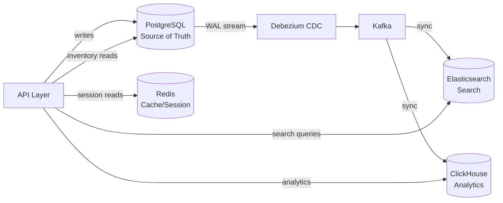
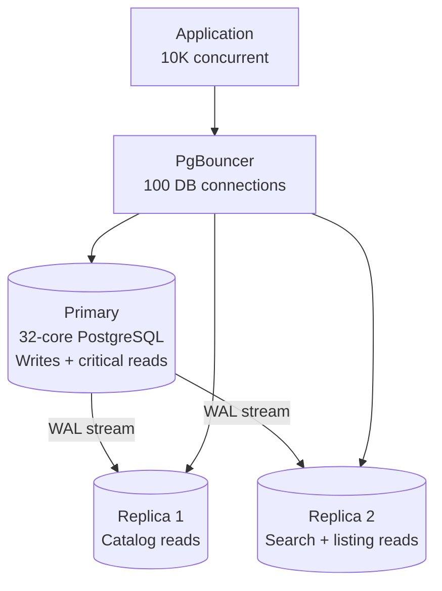
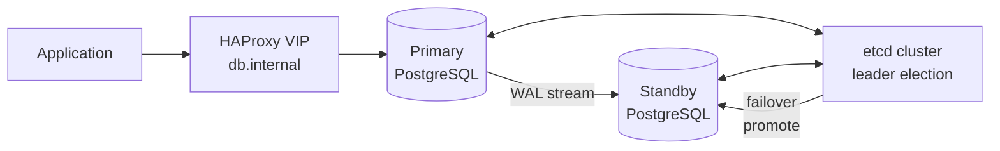
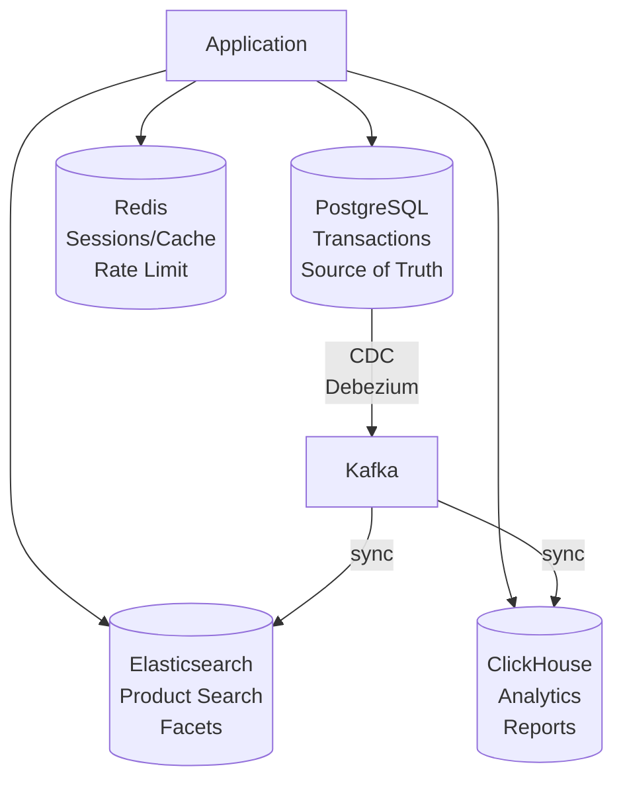

# Polyglot Persistence Strategy

**Interview Weight:** high - Staff-level interviews always include
persistence strategy questions. Interviewers test whether you can
reason about when to move data out of the relational database and
into a purpose-built store, and what the operational and consistency
trade-offs are.

---

### 🎯 Model Answer

**30 seconds:**
> Polyglot persistence means using multiple database technologies in
> one system, each chosen because it is the best fit for a specific
> data access pattern. Relational databases for transactional data
> with complex queries. Document stores for hierarchical, flexible
> schema data. Key-value stores for high-throughput session and cache
> data. Search engines for full-text search. The decision is driven
> by access patterns, not familiarity with one technology.

**3 minutes (Senior):**
> I use polyglot persistence when a single database is being forced
> to do things it is not designed for, and the operational cost of
> that mismatch exceeds the complexity of adding a second store.
>
> Concrete examples: A relational database can do full-text search
> (PostgreSQL tsvector), but at 10M documents the query performance
> and relevance ranking fall significantly behind Elasticsearch.
> Adding Elasticsearch for search while keeping PostgreSQL as the
> source of truth is the right trade-off when search quality and
> speed are user-facing requirements. A relational database can store
> session data, but at 100K RPS every session lookup is a DB round
> trip - Redis with sub-millisecond latency is purpose-built for this.
>
> The costs of polyglot persistence: each store adds operational
> complexity (backup, monitoring, failover), data synchronization
> complexity (keeping stores consistent, usually via CDC or event
> streaming), and developer cognitive load (different query languages,
> different consistency models). These costs are real and should not
> be dismissed.
>
> My decision rule: add a second store only when the mismatch between
> the primary store and the access pattern is causing user-visible
> problems AND the operational maturity to run a second store exists.
> Premature polyglot persistence adds complexity without benefit.

**Framework:** IDENTIFY access pattern -> MEASURE mismatch cost ->
EVALUATE purpose-built store -> ASSESS operational maturity ->
DECIDE (add store OR optimize primary)

*Adapting up:* Add data governance implications, consistency model
choice, and CDC/event streaming architecture for synchronization.

*Adapting down:* "Use the right database for each access pattern."

**Blank Mind Recovery:**

**(1) Restate:** "So you are asking about polyglot persistence -
let me think through when adding a second database is worth the
cost."

**(2) First principles:** "From first principles, every database
is optimized for specific access patterns. When your access pattern
does not match your database's optimization, you pay the mismatch
cost in performance, query complexity, or both."

**(3) Bridge:** "This is similar to the single-responsibility
principle: one class for one responsibility. Polyglot persistence
applies the same principle to data storage."

---

### 📘 Concept Explanation

**What it is:**
Polyglot persistence is the architectural practice of using
multiple, purpose-specific database technologies in one system,
each selected because it is the best fit for a specific data
access pattern.

**The problem it solves:**
Relational databases excel at transactional, relational data with
complex queries but struggle at: sub-millisecond key-value lookups
(Redis is 100x faster), full-text search relevance ranking
(Elasticsearch's inverted index is purpose-built), graph traversal
(Neo4j handles N-hop traversals that would require N recursive
CTEs in SQL), and time-series compression (TimescaleDB's columnar
storage is 10x more efficient for sensor data).

**How it works:**

Common polyglot persistence patterns:

```
System design with polyglot persistence

Write path:
  API -> PostgreSQL (source of truth)
       -> CDC (Debezium/Kafka) -> Elasticsearch
       -> Cache invalidation -> Redis

Read paths:
  Product search    -> Elasticsearch
  User session      -> Redis
  Order history     -> PostgreSQL
  Analytics queries -> ClickHouse (via ETL)
  Graph queries     -> Neo4j (via sync)
```

Data flow pattern:
```
PostgreSQL (primary)
    |
    |-- Debezium CDC --> Kafka --> Elasticsearch
    |                         --> Redis (cache)
    |                         --> ClickHouse (analytics)
    |
    v
Source of truth, ACID transactions, joins
```

**The key insight:**
The decision to add a second store should be driven by measured
mismatch cost, not by the technology being "better." PostgreSQL
with proper indexes often outperforms specialized stores at moderate
scale. The crossover point - where the specialized store wins -
depends on data volume, access pattern frequency, and query
complexity.

**When to use it:**
- Full-text search at scale (> 10M documents): Elasticsearch
- High-throughput session/cache (> 10K RPS, < 5ms SLA): Redis
- Time-series sensor data (> 1M data points/day): TimescaleDB
  or InfluxDB
- Graph traversal (> 3 hops, complex relationship queries): Neo4j
- Analytics over large datasets (> 100GB, low write): ClickHouse

**When NOT to use it:**
Do not add a second store when: PostgreSQL with proper indexes
handles the query within SLO, the team lacks operational maturity
for the second store, or the data synchronization complexity
would exceed the performance benefit.

**Alternatives:**
- PostgreSQL extensions: tsvector (full-text), TimescaleDB
  (time-series), pgvector (vector similarity) - avoids second
  store at the cost of some performance ceiling
- Denormalized tables: pre-aggregate or pre-join for analytics
  queries - simpler than a separate OLAP store at moderate scale
- Caching layer: in-memory cache for frequent reads before adding
  a dedicated cache store

**First-principles derivation:**
Database performance is determined by storage format, indexing
structure, and query execution model. A B-tree index is optimal
for range and equality queries on sorted data. An inverted index
is optimal for full-text lookup. A log-structured merge tree is
optimal for high-write, time-series data. No single storage format
is optimal for all access patterns. From first principles: use
the storage format optimized for each access pattern.

---

### 💻 Code Example

**Example 1: PostgreSQL full-text search vs Elasticsearch**

```sql
-- PostgreSQL full-text search (moderate scale)
-- Works well up to ~10M documents
CREATE INDEX products_search_idx
  ON products
  USING GIN(to_tsvector('english', name || ' ' || description));

SELECT id, name
FROM products
WHERE to_tsvector('english', name || ' ' || description)
    @@ plainto_tsquery('english', 'wireless headphones')
ORDER BY ts_rank(
    to_tsvector('english', name || ' ' || description),
    plainto_tsquery('english', 'wireless headphones')
) DESC
LIMIT 20;
-- Adequate for < 10M docs; limited relevance ranking;
-- no faceted search, synonyms, or fuzzy matching
```

> **Code walkthrough:** The PostgreSQL GIN-indexed full-text search
> works well at moderate scale. The limitation becomes visible at
> scale: the relevance ranking (ts_rank) is a simple term frequency
> score with no TF-IDF weighting, field boosting, or synonym
> expansion. At 10M+ documents the GIN index becomes large, rank
> computation becomes CPU-intensive, and the query cannot be
> parallelized as effectively as Elasticsearch's distributed sharded
> index. This is the crossover point where adding Elasticsearch
> as a read store is justified.

**Example 2: Redis for session storage**

```java
// BAD: PostgreSQL for session at high throughput
// Every request = 1 DB round trip = 2-5ms overhead
// At 10K RPS = 10K extra DB queries/second

// GOOD: Redis for session (sub-millisecond)
@Configuration
public class SessionConfig {
  // Spring Session with Redis
  // application.properties:
  // spring.session.store-type=redis
  // spring.redis.host=redis-host
  // spring.redis.port=6379

  // Session stored as Redis hash
  // Key: "spring:session:sessions:{sessionId}"
  // Value: serialized session attributes
  // TTL: session.timeout (default 30m)
}

// In controller: session reads/writes are now Redis ops
// Read: ~0.3ms (Redis, in-memory)
// vs 2-5ms (PostgreSQL, network + disk)
// At 10K RPS: saves 17-47 seconds of cumulative latency/sec
```

> **Code walkthrough:** The BAD pattern uses PostgreSQL for session
> storage, adding 2-5ms of DB round trip to every request that reads
> session data. At 10K RPS this generates 10K extra database queries
> per second - significant connection pool and I/O pressure. The GOOD
> pattern uses Spring Session with Redis. Redis stores sessions in
> memory as hashes with TTL, delivering sub-millisecond reads.
> The trade-off: Redis data is not durable by default (RDB snapshots
> or AOF persistence adds durability at cost), so session loss on
> Redis restart is acceptable (users re-authenticate); transactional
> data must stay in PostgreSQL.

**Example 3: CDC-based synchronization**

```yaml
# Debezium PostgreSQL connector config
# Streams PostgreSQL WAL changes to Kafka
# Kafka consumers sync to Elasticsearch
name: postgres-source-connector
config:
  connector.class: io.debezium.connector.postgresql.PostgresConnector
  database.hostname: postgres-host
  database.port: "5432"
  database.user: debezium_user
  database.password: "${DB_PASSWORD}"
  database.dbname: myapp
  table.include.list: public.products
  plugin.name: pgoutput
  slot.name: debezium_slot
  publication.name: debezium_publication
  # Topic: dbserver1.public.products
  # Every INSERT/UPDATE/DELETE -> Kafka message
```

> **Code walkthrough:** Debezium reads PostgreSQL's Write-Ahead Log
> (WAL) via logical replication and publishes every INSERT, UPDATE,
> DELETE as a structured Kafka message. A Kafka consumer reads these
> events and applies them to Elasticsearch. This pattern keeps
> Elasticsearch eventually consistent with PostgreSQL as the source
> of truth. The key consideration: WAL replication adds a small write
> overhead to PostgreSQL (WAL must be preserved until Debezium
> acknowledges consumption). The replication slot can cause WAL
> bloat if the consumer falls behind - monitor slot lag.

---

### 🎓 Answers by Seniority

**Junior / Mid (0-5 years):**
> Polyglot persistence means using different databases for different
> access patterns in the same system. Common examples: Redis for
> fast session and cache data, Elasticsearch for full-text search,
> PostgreSQL for transactional data. Each is chosen because it is
> better suited to that specific workload than a single general-
> purpose database would be.

*Push deeper:* Describe the data synchronization challenge (CDC,
event streaming). Name the crossover point where Elasticsearch
beats PostgreSQL full-text search. Explain why Redis data is not
transactional.

---

**Senior / Staff (5+ years):**
> I use polyglot persistence when a measured mismatch between the
> primary store and the access pattern is causing user-visible
> problems. The three most common triggers: search quality falls
> behind at >10M documents (add Elasticsearch), session/cache
> latency is adding 5ms to every request (add Redis), or analytics
> queries take minutes and block OLTP connections (add ClickHouse
> or Redshift).
>
> The costs I model carefully: each store adds operational complexity
> (backup, monitoring, failover, version upgrades), data consistency
> risk (sync delay between stores means stale reads are possible),
> and team cognitive load (new query language, different failure
> modes). I only add a second store when the benefit clearly exceeds
> these costs AND the team has the operational maturity to run it.

*Push deeper:* Describe CDC architecture with Debezium and Kafka.
Discuss consistency guarantees (eventual consistency with CDC vs
dual-write with 2PC). Describe organizational patterns for database
ownership in microservices.

---

### ❓ Questions & Spoken Answers

#### Definition
- "What is polyglot persistence?"
- "When would you use Redis alongside a relational database?"
- "What is CDC and how does it relate to polyglot persistence?"
- "What are the operational costs of polyglot persistence?"
🗣️ "Polyglot persistence is using multiple database technologies
in one system, each chosen for a specific data access pattern
rather than using one general-purpose database for everything.
Common example: PostgreSQL as the source of truth for transactional
data, Redis for sub-millisecond session and cache access,
Elasticsearch for full-text search with relevance ranking, and
ClickHouse for analytics over large datasets. Each store is chosen
because its storage model, indexing structure, or access latency
makes it the best fit for that specific pattern."

#### Mechanism
- "How does CDC keep multiple databases synchronized?"
- "What is the consistency model in a polyglot persistence setup?"
- "How do you handle a write that needs to be consistent across
  two stores?"
- "What is WAL-based replication and how does Debezium use it?"
🗣️ "CDC (Change Data Capture) reads the database's write-ahead log
and publishes every row-level change as an event. In PostgreSQL,
Debezium uses logical replication to stream WAL changes to Kafka.
Kafka consumers apply these changes to secondary stores -
Elasticsearch, Redis, ClickHouse. The consistency model is
eventual consistency: after a write to PostgreSQL, the secondary
stores are updated asynchronously, typically within milliseconds
to seconds. Applications reading from secondary stores may see
stale data for this window. For scenarios requiring read-after-
write consistency (immediately see your own write), the application
must read from PostgreSQL, not the secondary store."

#### Comparison
- "Compare CDC versus dual-write for keeping stores synchronized."
- "PostgreSQL with Elasticsearch for search vs PostgreSQL's
  tsvector - when do you switch?"
- "Redis versus Memcached for cache - deciding factor?"
- "Polyglot persistence versus a unified NewSQL database like
  CockroachDB - trade-offs?"
🗣️ "CDC versus dual-write: dual-write means the application writes
to PostgreSQL and Elasticsearch in the same request. Easier to
implement, but creates a consistency problem - if the Elasticsearch
write fails, the data is in PostgreSQL but not Elasticsearch. You
need idempotent retry logic and a reconciliation job. CDC is more
complex to set up (Debezium, Kafka) but more reliable: changes
are guaranteed to eventually reach all stores because the WAL is
the single authoritative change log. I prefer CDC for production
systems; dual-write only for low-stakes secondary stores where
occasional inconsistency is acceptable."

#### Scenario
- "Your product search is slow and returning poor results at
  10M products. What do you add and how do you synchronize it?"
- "Your session service is hitting the database for every request
  at 5K RPS. How do you fix this?"
- "How would you migrate from PostgreSQL-only to polyglot
  persistence without downtime?"
- "Your analytics team's queries are impacting OLTP performance.
  What is your architecture?"
🗣️ "For analytics impacting OLTP: I separate read traffic at the
persistence layer. Step 1: create a read replica and route all
analytics queries to it. This removes analytics from the primary's
connection pool. Step 2: if replication lag from analytics is
still a problem (long queries on replica slow replication), set
up a dedicated analytics replica with statement_timeout disabled
and parallel query enabled. Step 3: for historical analytics over
months of data, set up ClickHouse via Debezium CDC. ClickHouse's
columnar storage provides 100x compression and 10x query speed
for aggregation queries versus PostgreSQL on the same data."

#### Debugging
- "Your Elasticsearch index is showing stale data 30 minutes
  after a product update. How do you diagnose?"
- "Redis is showing keys with wrong data. What are the possible
  causes?"
- "Debezium slot lag is growing. What is happening and what is
  the risk?"
- "After adding Redis for session, users are seeing each other's
  data. What caused this?"
🗣️ "Elasticsearch showing stale data after 30 minutes: the CDC
pipeline is lagging. I check Kafka consumer group lag for the
elasticsearch-sync consumer (kafka-consumer-groups.sh --describe).
If the consumer is far behind, either (a) Elasticsearch indexing
is slow (bulk indexing throughput below write rate), (b) the
consumer crashed and auto-restart failed, or (c) the Debezium
connector is paused or errored. I check the Kafka connector
status via the Kafka Connect REST API. For Debezium slot lag: a
growing replication slot means PostgreSQL must retain WAL for the
consumer to catch up. If the consumer is far behind, the WAL
directory grows unboundedly and risks filling the disk. Emergency
action: if the consumer cannot catch up, drop the slot (losing
sync) and re-sync from snapshot."

#### Deep Dive
- "What are the design patterns for data synchronization in
  polyglot persistence?"
- "How do you handle schema migrations when data is replicated
  to multiple stores?"
- "What is the saga pattern and when does it apply to polyglot
  persistence?"
- "How do you implement read-after-write consistency in a
  polyglot system?"
🗣️ "Read-after-write consistency in a polyglot system: if a user
writes a product and immediately reads it, and we route reads
to Elasticsearch, they may see the pre-write version due to CDC
lag. Solutions: (1) route reads for the specific user's own
writes to PostgreSQL for 5 seconds after a write (sticky
routing), (2) include a version token in the write response and
pass it to the read - the read service waits until Elasticsearch
has indexed that version (version-based consistency), (3) accept
eventual consistency and show a 'updates may take a few seconds
to appear' message in the UI. The pragmatic choice for most
systems is option 3, reserving strict consistency for critical
operations only."

#### Misconception / Trap
- "You should always use the best database for each use case
  from day one."
- "CDC guarantees exactly-once delivery to downstream stores."
- "Redis is persistent storage - you can replace PostgreSQL
  with it for user data."
- "Polyglot persistence solves all performance problems."
🗣️ "I would challenge 'use the best tool from day one.' Premature
polyglot persistence adds operational complexity before it is
needed. A PostgreSQL database with proper indexes can handle
full-text search at moderate scale, session storage at moderate
throughput, and simple analytics. Adding specialized stores
before reaching the mismatch threshold costs engineering time
and operational burden. My rule: start with one database, measure
where it is failing under actual load, and add specialized stores
only when the measured cost of mismatch exceeds the operational
cost of the second store. PostgreSQL is surprisingly capable at
moderate scale."

#### Performance & Scalability
- "How does polyglot persistence improve throughput at scale?"
- "What is the consistency lag in a CDC-based polyglot system?"
- "At what scale does Elasticsearch outperform PostgreSQL
  full-text search?"
- "How does Redis cluster affect consistency and throughput?"
🗣️ "The throughput improvement from polyglot persistence is access-
pattern specific. Redis sub-millisecond reads versus PostgreSQL
2-5ms reads: at 10K RPS, replacing PostgreSQL session reads with
Redis reduces session-related database load by 10K queries/second.
This is not just a latency improvement - it frees 10K connection-
seconds per second of database capacity for transactional work.
Elasticsearch versus PostgreSQL full-text: at 100M documents,
Elasticsearch's distributed sharded index delivers sub-second
full-text search with relevance ranking. PostgreSQL's GIN index
at the same scale requires sequential GIN pages reads plus
ts_rank computation on millions of matching rows - query times
exceed 5-10 seconds for complex queries."

| Interviewer Type | Emphasis |
|---|---|
| Technical Panel  | Lead with mechanism. Use precise terminology. |
| Hiring Manager   | Lead with business impact. Outcome language. |
| Bar Raiser       | Lead with trade-offs. What you would NOT use it for. |
| Peer Engineer    | Collaborative. "The thing I keep finding is..." |

---

### ⚖️ Comparison

| Store | Best For | Consistency | Ops Cost | Choose When |
|---|---|---|---|---|
| **PostgreSQL** | Transactional, relational | ACID, strong | Low | Source of truth, joins, transactions |
| Redis | Session, cache, queues | Eventual (async) | Medium | < 5ms latency, high throughput key-value |
| Elasticsearch | Full-text search, facets | Eventual (CDC) | High | > 10M docs, relevance ranking needed |
| ClickHouse | Analytics, aggregations | Eventual (ETL) | High | Large-scale OLAP, columnar compression |
| MongoDB | Flexible document schema | Configurable | Medium | Semi-structured, variable schema docs |

**The deciding factor:**
Stay with PostgreSQL until measured mismatch cost (query latency,
connection pressure, or query complexity) clearly exceeds the
operational cost of adding a second store.

---

### 🔥 Field Q&A

#### Production Failures

Q: After adding Elasticsearch for product search, some products
appear in search results after they were deleted from PostgreSQL.
What happened?

A: The CDC delete event was not processed by the Elasticsearch
consumer. Possible causes: (1) the Debezium connector uses
soft deletes in the application (is_deleted=true) and the
Elasticsearch consumer only handles INSERT/UPDATE, not hard
deletes; (2) the Kafka consumer crashed after committing the
offset but before indexing, causing it to re-process the update
but skip the delete; (3) the Elasticsearch index mapping treats
deletes as no-ops due to a bug. I check: Kafka consumer group
lag, Debezium connector status, and whether the specific product
ID appears in the Elasticsearch index after the PostgreSQL delete.

Q: Redis cluster failover caused some users to see each other's
session data. How is this possible?

A: This is a session ID collision after a Redis cluster reset or
an ID generation bug. If the session ID generator uses low-entropy
random values or sequential IDs, and Redis lost all session data
during failover, new sessions may receive the same ID as a
previous session being rebuilt. The fix: use cryptographically
secure random session IDs (Java SecureRandom, at least 128 bits).
Verify no session ID reuse: after failover, monitor for session
validation errors where the session exists but does not match
the expected user.

Q: Your Debezium replication slot lag is at 50GB and growing.
The disk is 200GB. What do you do?

A: This is a high-urgency situation. The WAL disk will fill in
hours. Steps: (1) Check Kafka consumer lag for the Debezium
topic - if the consumer is stopped, restart it immediately.
(2) If the consumer is running but slow, check Elasticsearch
indexing throughput and increase parallelism. (3) If the
consumer cannot catch up, consider dropping the replication
slot (pg_drop_replication_slot) and re-syncing from a full
snapshot - you will have a sync gap during re-index but avoid
disk exhaustion. After recovery: add alerting on
pg_replication_slots.confirmed_flush_lsn lag and set a maximum
slot lag threshold.

#### Candidate Mistakes

Q: Candidate adds specialized stores for every use case from
the start of system design.

**What NOT to say:** "I would use Redis for sessions,
Elasticsearch for search, ClickHouse for analytics, and
PostgreSQL for transactions - polyglot persistence from the
start."

**Say instead:** "I start with PostgreSQL for everything and
add specialized stores only when I measure that PostgreSQL is
failing to meet SLOs for a specific access pattern. Premature
polyglot persistence adds operational complexity before it is
needed. PostgreSQL handles sessions, full-text search, and
moderate analytics well at early scale."

Q: Candidate uses dual-write instead of CDC for synchronization.

**What NOT to say:** "I write to PostgreSQL and Elasticsearch
in the same request to keep them in sync."

**Say instead:** "Dual-write creates a consistency gap: if the
Elasticsearch write fails, data is in PostgreSQL but not
Elasticsearch. I prefer CDC via Debezium - it uses the PostgreSQL
WAL as the authoritative change log, so every committed change
eventually reaches all downstream stores. CDC is more complex
to set up but more reliable in production."

Q: Candidate treats Redis as equivalent to PostgreSQL for
durability.

**What NOT to say:** "I store user profile data in Redis for
performance."

**Say instead:** "Redis is designed for low-latency access to
non-critical data. By default, Redis uses asynchronous persistence
(RDB snapshots) which can lose the last few seconds of data on
crash. User profile data needs the durability guarantees of
PostgreSQL - ACID transactions and fsync. Redis is appropriate
for session state (acceptable to lose on restart - users just
re-authenticate) and cache data (rebuilt on miss)."

Q: Candidate does not account for eventual consistency in reads.

**What NOT to say:** "After writing to PostgreSQL, I read from
Elasticsearch immediately to show the updated product."

**Say instead:** "CDC introduces replication lag - typically
milliseconds to seconds. Reading from Elasticsearch immediately
after a write may return stale data. For critical read-after-
write scenarios (user sees their own update), I route that read
to PostgreSQL. For general listing and search, eventual
consistency is acceptable and I document the consistency model
in the API contract."

#### Questions to Ask the Interviewer

Q: "Which data stores do you use in your production stack, and
what drove the decision to add each one beyond PostgreSQL?"

*Why:* Signals you understand that polyglot persistence is a
considered choice, and you want to learn from their experience.

*If asked back:* "In systems I have worked on, the most common
trigger was full-text search quality at scale (Elasticsearch)
and session throughput (Redis). Both were added after PostgreSQL
reached a measurable SLO threshold."

Q: "How do you handle data synchronization consistency between
your stores, and what is your accepted staleness window?"

*Why:* Shows you understand that polyglot persistence introduces
consistency trade-offs that need to be explicitly decided.

*If asked back:* "For most read paths, eventual consistency with
a sub-second staleness window is acceptable. For read-after-write
consistency I route to the primary store."

Q: "What is your strategy for schema migrations in a polyglot
system where changes need to be applied to multiple stores?"

*Why:* Signals you have thought through the operational
complexity of coordinating schema changes across multiple stores.

*If asked back:* "I use a two-phase approach: expand the schema
(add fields, do not remove old ones), migrate consumers, then
contract (remove old fields). This avoids flag-day migrations
that require all stores to be updated simultaneously."

Q: "If you had to eliminate one of your secondary stores to
reduce operational complexity, which would you remove first
and why?"

*Why:* Shows you think about polyglot persistence trade-offs
and can reason about when complexity reduction is worth the
capability loss.

*If asked back:* "I would remove the one with the smallest
performance gap from the primary store. If PostgreSQL's full-
text search meets search SLOs, Elasticsearch is the first
candidate. Redis is usually the last to go because the latency
gap (0.3ms vs 3ms) is significant at high throughput."

#### Live Coding Context

Coding question template:
"Design the data model and synchronization strategy for a
product catalog that needs to support: transactional updates,
full-text search with relevance ranking, and real-time analytics
dashboards. What stores do you use and how do you keep them
consistent?"

What the interviewer watches:
- Whether the candidate starts with PostgreSQL as source of
  truth and adds stores based on access pattern needs
- Whether the candidate explicitly accounts for eventual
  consistency in the architecture
- Whether the candidate identifies CDC/event streaming as
  the synchronization mechanism, not dual-write

Most common implementation mistake:
Proposing synchronous dual-write to both PostgreSQL and
Elasticsearch in the same API request, without handling the
partial failure case (one write succeeds, the other fails).

*Why this signals:* Candidates who choose CDC show they
understand eventual consistency and distributed systems. Those
who choose dual-write may not have operated a polyglot system
under failure conditions.

---

### 🏛️ System Design

> *(Conditional: included because ★★★ and polyglot persistence is
> a core system design topic for senior/staff interviews.)*

**Where Polyglot Persistence appears in system design:**
- E-commerce: products in PostgreSQL + Elasticsearch for search
- Social: posts in PostgreSQL + Redis for feed, Cassandra for
  activity
- Analytics: OLTP in PostgreSQL + ClickHouse for historical
  aggregations
- IoT: time-series in TimescaleDB or InfluxDB + PostgreSQL for
  device metadata

**Example question:** "Design a product catalog system for an
e-commerce platform that needs full-text search, analytics, and
transactional inventory management."

**6-step framework answer:**

Step 1 CLARIFY (~5 min) - Scale? Search query volume? Analytics
latency requirement? Consistency requirements for inventory?

Step 2 ESTIMATE (~5 min) - 10M products, 1K search QPS, 100 write
QPS, 10 analytics queries/hour, inventory must be accurate.

Step 3 DESIGN (~10 min) - PostgreSQL: source of truth for
products, inventory (ACID transactions). Elasticsearch: product
search (GIN + relevance). ClickHouse: analytics. CDC via Debezium
for synchronization.

Step 4 DEEP DIVE (~10 min) - CDC flow: PostgreSQL WAL -> Debezium
-> Kafka -> (Elasticsearch consumer, ClickHouse consumer). Write
path: all writes to PostgreSQL only. Read path: search queries
to Elasticsearch, analytics to ClickHouse, inventory to
PostgreSQL (consistency critical).

Step 5 ALTS (~5 min) - PostgreSQL tsvector for search at < 1M
products (simpler, avoid Elasticsearch). Single PostgreSQL with
read replica for analytics at low volume (simpler). DynamoDB for
product catalog (loses joins and transactions).

Step 6 EVOLVE (~5 min) - At 100M products: Elasticsearch cluster
needs sharding (50 shards, 2 replicas). ClickHouse adds
materialized views for real-time dashboards. PostgreSQL partitions
products by category.

**Scale inflection point:**
At ~10M products and 1K search QPS, PostgreSQL tsvector GIN
index queries start exceeding 200ms for complex queries with
ranking. Elasticsearch delivers sub-100ms for the same queries
due to distributed scoring across shards. This is the crossover
point where adding Elasticsearch is justified.

**Common system design traps:**
- Dual-writing to PostgreSQL and Elasticsearch synchronously
  (consistency gap if one write fails)
- Using Elasticsearch as the source of truth (it is not designed
  for ACID transactions or inventory consistency)
- Not planning for CDC consumer lag (stale search results during
  high write bursts)

**Staff angle:**
At staff level, polyglot persistence introduces org-level
complexity: each store needs a team with operational expertise,
monitoring, and on-call coverage. The decision to add a store
is an org decision, not just a technical one. I also evaluate:
vendor lock-in (cloud-managed Elasticsearch vs OpenSearch),
data governance implications (GDPR right-to-delete across multiple
stores requires coordinated deletion), and migration cost when
a store reaches end-of-life.

---

### 📊 Diagram

> *(Conditional: included because the polyglot persistence data
> flow and synchronization architecture require visual explanation.)*

```
POLYGLOT PERSISTENCE ARCHITECTURE

Write Path:
API Write Request
      |
      v
PostgreSQL (source of truth)
  WAL -> Debezium -> Kafka
      |              |
      |    +---------+-----------+
      |    |                     |
      v    v                     v
      (sync)  Elasticsearch   ClickHouse
              (search index)  (analytics)

Read Paths:
  inventory queries  -> PostgreSQL (consistency)
  full-text search   -> Elasticsearch (speed+relevance)
  analytics/reports  -> ClickHouse (aggregation)
  session/cache      -> Redis (latency)
```



> **Diagram walkthrough:** The architecture shows a single write path
> (all writes go to PostgreSQL as the source of truth) and multiple
> read paths (each routed to the store optimized for that access
> pattern). Debezium reads the PostgreSQL WAL and publishes changes
> to Kafka, which fans out to Elasticsearch and ClickHouse consumers.
> Redis is separate - populated by the application cache-aside pattern
> rather than CDC. The critical insight: PostgreSQL is never bypassed
> for writes - it is the only ACID-consistent, FK-enforced store and
> all consistency guarantees derive from it.
---

---

# Database Scaling Patterns

**Interview Weight:** high - Database scaling is asked in every
senior/staff system design interview. Interviewers test whether
you know the spectrum from vertical scaling to read replicas to
sharding, the trade-offs at each level, and when to choose each.

---

### 🎯 Model Answer

**30 seconds:**
> Database scaling progresses through a hierarchy of increasing
> complexity. First: optimize queries and indexes (free). Second:
> vertical scaling (bigger instance - simple, has a ceiling). Third:
> read replicas (scale reads, not writes - works when reads dominate).
> Fourth: connection pooling via PgBouncer (scale concurrent clients,
> not DB throughput). Fifth: sharding (scale writes and storage -
> most complex, requires application changes). Each step adds
> complexity, so exhaust the cheaper options first.

**3 minutes (Senior):**
> Database scaling follows a cost-benefit hierarchy. I work through
> it before recommending any architecture:
>
> Level 1 - Query optimization: a missing index can explain 100x
> query slowdown. Before scaling hardware, I check pg_stat_statements
> for expensive queries and add indexes. This is free and immediate.
>
> Level 2 - Vertical scaling: moving from 4 cores/16GB to 16 cores/
> 64GB can provide 4x capacity. Simple, no application changes. The
> ceiling is the largest available instance (192 cores, 1.5TB on AWS
> db.r6g.16xlarge). Cost-effective up to that ceiling.
>
> Level 3 - Read replicas: if 80%+ of load is reads, a read replica
> handles most queries with no write scaling. Application must route
> read-only queries to replicas. Replication lag means reads can be
> slightly stale - acceptable for most use cases.
>
> Level 4 - Connection pooling (PgBouncer): PostgreSQL forks a process
> per connection (5-10MB each). At 10K concurrent clients, direct
> connections exhaust memory before CPU. PgBouncer in transaction mode
> multiplexes 10K clients onto 100 DB connections.
>
> Level 5 - Sharding: horizontal partitioning of data across multiple
> database instances. Each shard is an independent PostgreSQL instance
> holding a partition of the data (by user_id range, hash, or tenant).
> Dramatically increases write throughput and storage capacity. Cost:
> cross-shard queries become application-level joins, global sequences
> become complex, and schema migrations must run on every shard.
>
> The non-obvious insight: most applications never need sharding.
> A properly tuned PostgreSQL on a large instance handles 10K QPS with
> sub-10ms p99 latency. Sharding before reaching that ceiling is
> premature scaling.

**Framework:** OPTIMIZE (query/index) -> VERTICAL (bigger box) ->
REPLICATE (read replicas) -> POOL (PgBouncer) -> SHARD (last resort)

*Adapting up:* Add Global Database (Aurora Global, Google Spanner)
and CQRS patterns for further scale.

*Adapting down:* "Read replicas for read-heavy workloads, sharding
for write-heavy workloads that exceed a single instance."

**Blank Mind Recovery:**

**(1) Restate:** "So you are asking about database scaling strategies
- let me think through the hierarchy from simplest to most complex."

**(2) First principles:** "From first principles, a database is
bounded by CPU, memory, I/O, and network. Each scaling strategy
relieves a different bottleneck."

**(3) Bridge:** "This is similar to application scaling - optimize
first, then scale out. The same principle applies to databases but
with different primitives."

---

### 📘 Concept Explanation

**What it is:**
Database scaling patterns are the architectural techniques for
increasing a database's capacity to handle more load - whether
measured in QPS, concurrent connections, or data volume.

**The problem it solves:**
A single PostgreSQL instance has finite CPU, memory, and I/O. As
application traffic grows, the database becomes the bottleneck.
Scaling patterns extend capacity, but each introduces trade-offs
in complexity, consistency, and operational overhead.

**How it works:**

Scaling hierarchy and typical limits:

```
Level 1: Query optimization
  Cost: 0 | Impact: 10-100x for missing indexes
  Tool: pg_stat_statements, EXPLAIN ANALYZE

Level 2: Vertical scaling
  Limit: ~192 cores, 1.5TB RAM (cloud)
  Cost: 2x-8x instance cost
  SLA: requires instance restart

Level 3: Read replicas (streaming replication)
  Benefit: scales reads N times (N replicas)
  Limit: does not scale writes
  Lag: typically < 100ms

Level 4: PgBouncer (connection pooling)
  Benefit: 10K clients -> 100 DB connections
  Mode: transaction pooling (most efficient)
  Limit: cannot use session-level features
          with transaction pooling

Level 5: Sharding
  Benefit: unlimited horizontal scale
  Tools: Citus, Vitess, app-level sharding
  Cost: cross-shard queries, no cross-shard
        FK constraints, migration complexity
```

Sharding strategies:
```
Range sharding:
  Shard 1: user_id 1-1M
  Shard 2: user_id 1M-2M
  Pro: range queries to one shard
  Con: hot spots if IDs are sequential

Hash sharding:
  Shard = hash(user_id) % num_shards
  Pro: even distribution
  Con: range queries hit all shards

Directory sharding (tenant-based):
  tenant_id -> shard mapping in a directory
  Pro: flexible, can move tenants
  Con: directory becomes single point of failure
```

**The key insight:**
Most scalability problems are solved before sharding. PostgreSQL
on a well-sized instance with proper indexes and a connection
pool handles 10K+ QPS. Sharding introduces application-level
complexity that can be avoided for most applications.

**When to use it:**
- Read replicas: when 70%+ of queries are reads and write QPS
  is under control
- PgBouncer: always in production - direct connections at scale
  exhaust memory before CPU
- Sharding: when a single primary instance is the write
  bottleneck AND vertical scaling + read replicas do not suffice

**When NOT to use it:**
Do not shard prematurely. If the primary instance is at 30%
CPU and 50% memory, there is significant headroom. Shard only
when the primary is the proven write bottleneck after exhausting
vertical scaling.

**Alternatives:**
- CQRS: separate write model (normalized, PostgreSQL) from read
  model (denormalized, or search-optimized) without sharding
- Partitioning (within one instance): table partitioning on
  PostgreSQL distributes I/O across multiple physical files while
  staying within one instance - simpler than sharding
- NewSQL databases (CockroachDB, Spanner): distributed SQL that
  handles sharding transparently - trades some performance for
  distributed consistency

**First-principles derivation:**
A single server has bounded CPU, memory, and I/O. Vertical
scaling relaxes these bounds within one machine. Read replicas
relax CPU/IO for reads by running them on parallel machines.
Sharding relaxes all three bounds for both reads and writes by
partitioning data across machines. Each step increases scalability
but also increases the coordination cost between machines. Start
at the cheapest level and escalate only when necessary.

---

### 💻 Code Example

**Example 1: PgBouncer connection pooling configuration**

```ini
; pgbouncer.ini - transaction mode pooling
[databases]
; Route myapp connections to PostgreSQL
myapp = host=postgres-primary port=5432 dbname=myapp

[pgbouncer]
listen_port = 6432
listen_addr = *
auth_type = md5
auth_file = /etc/pgbouncer/userlist.txt

; TRANSACTION mode: connection released after
; each transaction (not each session)
; Most efficient for high-concurrency OLTP
pool_mode = transaction

; DB-side connections (PostgreSQL process limit)
max_client_conn = 10000   ; clients connecting to PgBouncer
default_pool_size = 100   ; DB connections per database
min_pool_size = 10

; Timeout settings
query_timeout = 30
connect_timeout = 5
```

> **Code walkthrough:** PgBouncer in transaction mode is the standard
> configuration for high-concurrency OLTP. max_client_conn = 10000
> means 10K application threads can connect to PgBouncer. default_pool_size = 100
> means PgBouncer maintains 100 actual connections to PostgreSQL.
> In transaction mode, each PostgreSQL connection is returned to
> the pool after every transaction - 10K clients can efficiently
> share 100 DB connections because most are between transactions
> at any moment. The trade-off: SET session variables, prepared
> statements, and advisory locks do not survive across transactions
> in transaction mode.

**Example 2: Read replica routing in Spring Boot**

```java
// application.properties
// spring.datasource.url=jdbc:postgresql://primary/myapp
// spring.datasource.replica.url=jdbc:postgresql://replica/myapp

@Configuration
public class DataSourceConfig {
  @Bean
  @Primary
  public DataSource primaryDataSource() {
    // Writes go here
    return buildHikariDS(env.getProperty(
        "spring.datasource.url"));
  }

  @Bean("replicaDataSource")
  public DataSource replicaDataSource() {
    // Reads go here
    return buildHikariDS(env.getProperty(
        "spring.datasource.replica.url"));
  }
}

// Repository that uses replica for reads
@Repository
public class ProductRepository {
  @Autowired private JdbcTemplate primary;
  @Autowired
  @Qualifier("replicaDataSource")
  private JdbcTemplate replica;

  // Read from replica (may be slightly stale)
  public List<Product> findAll() {
    return replica.query("SELECT * FROM products",
        productMapper);
  }

  // Write to primary (immediately consistent)
  public void save(Product p) {
    primary.update("INSERT INTO products ...", ...);
  }
}
```

> **Code walkthrough:** The dual-datasource pattern routes writes to
> the primary and reads to the replica. Spring Boot creates two
> HikariCP pools, one per datasource. The replica datasource may lag
> the primary by milliseconds to seconds - reads may see slightly
> stale data. This is acceptable for product catalog reads but not
> for inventory reads (which must be consistent). The @Primary
> annotation makes the primary the default datasource for
> transactional methods.

**Example 3: Hash sharding at the application level**

```java
// Sharding key: user_id
// Shard assignment: hash(user_id) % NUM_SHARDS
// Each shard is a separate DataSource
public class ShardRouter {
  private static final int NUM_SHARDS = 8;
  private final DataSource[] shards;

  public DataSource getShardFor(long userId) {
    int shardIndex = (int)(
        Math.abs(userId) % NUM_SHARDS
    );
    return shards[shardIndex];
    // All data for userId goes to same shard
    // Cross-user queries hit ALL shards (scatter/gather)
  }

  // Cross-shard query (expensive - use sparingly)
  public List<Order> findOrdersAcrossShards(
      LocalDate date) {
    // Must query all 8 shards and merge results
    return Arrays.stream(shards)
        .parallel()
        .flatMap(shard -> queryOrders(shard, date))
        .sorted(Comparator.comparing(Order::getCreatedAt))
        .collect(toList());
    // N shards = N queries in parallel
    // Latency bounded by slowest shard
  }
}
```

> **Code walkthrough:** Hash sharding routes each userId to a
> consistent shard via modulo hashing. All queries for a specific
> user go to one shard - efficient for user-scoped queries. Cross-
> shard queries (find all orders on a date regardless of user) must
> scatter to all shards and gather results - the latency is bounded
> by the slowest shard and the result set must be sorted after merge.
> This is the fundamental trade-off of sharding: single-key queries
> are fast and independent; cross-key queries are expensive and
> complex.

---

### 🎓 Answers by Seniority

**Junior / Mid (0-5 years):**
> Database scaling starts with optimization (add indexes, fix slow
> queries) before hardware changes. The main strategies are: vertical
> scaling (bigger instance), read replicas (add replicas for read-
> heavy workloads), connection pooling (PgBouncer to handle many
> concurrent clients), and sharding (partition data across multiple
> instances for very high write or storage requirements). Each step
> adds complexity, so use the simplest approach that works.

*Push deeper:* Explain replication lag and its implications for
read consistency. Describe PgBouncer connection modes. Explain
the cross-shard query problem.

---

**Senior / Staff (5+ years):**
> I follow the scaling hierarchy strictly. A single well-tuned
> PostgreSQL on a 64-core/500GB instance handles 10K+ QPS for most
> workloads. Read replicas scale the read side for read-heavy
> services. PgBouncer is mandatory in production - direct connections
> at scale exhaust PostgreSQL's per-connection memory before CPU.
> Sharding is the last resort, not the first choice.
>
> When I do evaluate sharding, I choose the sharding key carefully:
> it must co-locate all data needed by the most common queries on
> one shard. For a multi-tenant SaaS, tenant_id is usually the right
> key (all tenant data on one shard, all queries to one shard). For
> social, user_id. For IoT, device_id. The worst key is one that
> creates hot spots (sequential IDs in range sharding) or that
> forces cross-shard queries on the most common access pattern.

*Push deeper:* Discuss Citus (PostgreSQL extension for distributed
tables), Aurora with auto-sharding, and cross-region active-active
patterns. Describe the trade-offs of consistent hashing for
shard rebalancing.

---

### ❓ Questions & Spoken Answers

#### Definition
- "What are the main database scaling strategies?"
- "What is the difference between vertical and horizontal scaling?"
- "What is database sharding?"
- "What is PgBouncer and why is it needed?"
🗣️ "Database scaling follows a hierarchy of increasing complexity.
First I optimize queries and indexes - this is free and often
solves the problem. Then vertical scaling (larger instance) -
simple but has a hardware ceiling. Then read replicas for read-
heavy workloads - scales reads, not writes. Then PgBouncer for
connection pooling - PostgreSQL forks a process per connection
(5-10MB), so direct connections at high concurrency exhaust
memory. PgBouncer multiplexes thousands of client connections
onto a small number of actual DB connections. Finally sharding
- partitioning data across multiple instances - dramatically
increases write capacity but introduces application complexity
and loses cross-shard joins and transactions."

#### Mechanism
- "How does PostgreSQL streaming replication work?"
- "Walk me through how PgBouncer's transaction pooling works."
- "What is the sharding key selection problem?"
- "How does Citus extend PostgreSQL for distributed tables?"
🗣️ "PgBouncer transaction pooling works as follows: the client
connects to PgBouncer (not directly to PostgreSQL). When the
client sends a query, PgBouncer borrows an idle PostgreSQL
connection from the pool, forwards the query, receives the
response, returns the connection to the pool, and sends the
response to the client. In transaction mode, the connection is
held for the duration of the transaction (BEGIN to COMMIT/
ROLLBACK) and then returned. This means 10K clients can share
100 DB connections because most clients are between transactions
at any moment. The constraint: session-level state (SET
statements, prepared statements, advisory locks) is not preserved
between transactions in transaction mode."

#### Comparison
- "Read replicas vs sharding for scaling reads - when do you
  choose each?"
- "PgBouncer vs pgpool-II - differences?"
- "Citus vs application-level sharding - trade-offs?"
- "Vertical scaling vs horizontal scaling - deciding factor?"
🗣️ "Read replicas versus sharding for reads: read replicas are far
simpler - streaming replication is native to PostgreSQL, no
application changes needed beyond routing. They scale reads to
N times with N replicas. Sharding scales both reads AND writes
AND storage, but requires application changes (sharding key in
every query), loses cross-shard joins, and complicates schema
migrations. I choose read replicas when writes are under control
and only reads need scaling. I choose sharding when the primary
write instance is the proven bottleneck and vertical scaling
has reached its limit."

#### Scenario
- "Your PostgreSQL primary is at 90% CPU at peak. What are
  your next three steps?"
- "You need to handle 50K concurrent users, but PostgreSQL
  cannot handle that many connections. Solution?"
- "Your multi-tenant SaaS is growing to 10K tenants with
  1M rows each. When do you shard?"
- "After adding a read replica, you see users getting stale
  order data. How do you fix the routing?"
🗣️ "For 90% CPU on the primary: step 1 - check pg_stat_statements
for the top queries by total_exec_time and add missing indexes.
Step 2 - check if the load is read or write dominated:
pg_stat_activity group by state and application. If mostly reads,
add a read replica and route read-only queries to it. This removes
50-80% of CPU load from the primary if reads dominate. Step 3 -
if writes are the bottleneck: vertical scaling to a larger
instance. Only if the primary is at maximum instance size AND
writes are still the bottleneck do I evaluate sharding."

#### Debugging
- "After adding a read replica, your application still hits the
  primary for all queries. Why?"
- "PgBouncer is showing 'no more connections allowed' errors.
  What happened?"
- "After sharding, some cross-user reports take 10x longer.
  Root cause?"
- "Your read replica is lagging 5 minutes behind the primary.
  How do you diagnose?"
🗣️ "For read replica lag: I check pg_stat_replication on the primary
(replay_lag column) and pg_stat_wal_receiver on the replica. The
causes: (1) long-running queries on the replica (they can block
VACUUM and replay) - check pg_stat_activity on replica for long
queries; (2) high write rate on primary exceeding replica apply
throughput - check WAL apply throughput in pg_stat_replication;
(3) network bandwidth between primary and replica - check network
metrics; (4) a DDL operation (ALTER TABLE, CREATE INDEX) that
requires an exclusive lock on the replica side - check pg_locks
on the replica. The fix depends on cause: kill blocking queries
on replica, tune wal_receiver_status_interval, or increase
replica compute."

#### Deep Dive
- "What is consistent hashing and why is it used for sharding?"
- "What is the two-phase commit problem in distributed databases?"
- "How does Vitess handle cross-shard transactions?"
- "What is the N+1 query problem at scale with sharding?"
🗣️ "Consistent hashing is used for sharding to minimize data
movement when shards are added or removed. In simple modulo
hashing (hash(key) % N), adding one shard changes almost every
key's shard assignment (N-1 of N keys move). In consistent
hashing, each shard covers a range on a hash ring. Adding a
shard splits one range in half - only half of that shard's keys
move. For a system with 8 shards adding a 9th, modulo hashing
moves ~88% of keys; consistent hashing moves ~11%. This is
critical for live systems where data movement causes rebalancing
load."

#### Misconception / Trap
- "Sharding is the first step to database scaling."
- "Read replicas solve all scaling problems."
- "PgBouncer solves write scalability."
- "More replicas always means better read throughput."
🗣️ "I would push back on sharding as the first step. Sharding is
the last resort in the scaling hierarchy because it fundamentally
changes the application (sharding key required in all queries),
eliminates cross-shard joins and transactions, and complicates
schema migrations. A well-tuned PostgreSQL on a large instance
handles 10K+ QPS. Most applications never reach the write volume
that requires sharding. Reaching for sharding before exhausting
query optimization, vertical scaling, and read replicas is
premature optimization that adds significant complexity without
benefit at the current scale."

#### Performance & Scalability
- "What is the write throughput ceiling for a single PostgreSQL
  instance?"
- "How many read replicas can you effectively add before
  diminishing returns?"
- "What is the PgBouncer connection multiplexing ratio and its
  limits?"
- "How does sharding affect latency for scatter/gather queries?"
🗣️ "A single PostgreSQL primary write throughput ceiling is roughly
5K-20K simple writes per second (INSERT/UPDATE) depending on
hardware (NVMe SSD, instance size) and transaction size. For read
replicas, the practical limit is determined by replication overhead
on the primary (WAL generation and streaming). On a primary at
moderate load, 5-10 read replicas with streaming replication is
common without meaningful primary impact. Beyond that, cascading
replication (replicas replicating from other replicas, not the
primary) reduces primary overhead. PgBouncer multiplexing ratio
depends on transaction duration: if average transaction time is
1ms and connection borrowing overhead is 0.1ms, 100 DB connections
can serve 1000 clients concurrently (assuming 10% are in-flight
at any time)."

| Interviewer Type | Emphasis |
|---|---|
| Technical Panel  | Lead with mechanism. Use precise terminology. |
| Hiring Manager   | Lead with business impact. Outcome language. |
| Bar Raiser       | Lead with trade-offs. What you would NOT use it for. |
| Peer Engineer    | Collaborative. "The thing I keep finding is..." |

---

### ⚖️ Comparison

| Strategy | Scales | Complexity | When to Use |
|---|---|---|---|
| **Query optimization** | 10-100x (free) | None | Always first |
| Vertical scaling | 4-8x | Low (restart) | Before replicas |
| Read replicas | Reads N-fold | Low-medium | Read-dominated workload |
| PgBouncer pooling | Connections 100x | Low | Always in production |
| Table partitioning | I/O distribution | Medium | Large single-table queries |
| Sharding | Writes + storage | Very high | Last resort, proven bottleneck |

**The deciding factor:**
Exhaust cheaper options first. Shard only when the primary is the
proven write bottleneck after query optimization + vertical scaling
+ read replicas have been applied.

---

### 🔥 Field Q&A

#### Production Failures

Q: Your PostgreSQL primary is at 95% CPU and application
response times are 3x normal. What is your immediate response?

A: Immediate response: (1) check pg_stat_statements for queries
with suddenly increased total_exec_time (a new deployment may
have introduced a bad query or invalidated a plan). (2) Check
pg_stat_activity for the mix of query types - if dominated by
a few expensive queries, kill them with pg_cancel_backend() to
buy time. (3) Add a read replica immediately if reads dominate
and route the top read queries to it. Longer term: identify root
cause from pg_stat_statements, add missing indexes, optimize the
expensive query, or scale vertically.

Q: After deploying PgBouncer in transaction mode, your Spring
app starts throwing "cannot use prepared statement with
transaction pool mode" errors. What happened?

A: Transaction mode PgBouncer does not preserve session-level
state between transactions, including server-side prepared
statements. JDBC drivers by default use server-side prepared
statements (PreparedStatement in JDBC maps to a named
server-side prepared statement after 5 executions in
PostgreSQL JDBC). Fix: add ?prepareThreshold=0 to the
JDBC URL to disable server-side prepared statements (use
client-side substitution instead), or switch PgBouncer to
session mode (loses most of the connection multiplexing benefit).
Alternatively, configure PgBouncer server_reset_query to reset
prepared statements on connection return.

Q: After sharding by user_id, your "top products this month"
report takes 20 seconds instead of 500ms. Root cause and fix?

A: This is the cross-shard scatter/gather problem. The query
must run on all N shards and aggregate results in the application.
At 8 shards, the latency is the max of 8 parallel queries plus
the aggregation. Fix options: (1) maintain a separate analytics
read replica or ClickHouse that has all data in one place
(unsharded) for reporting queries; (2) pre-aggregate into a
global summary table on one shard updated nightly; (3) accept
the 20s latency for analytics (if real-time is not required).
This is the canonical example of why sharding key selection must
account for ALL common query patterns, not just single-key reads.

#### Candidate Mistakes

Q: Candidate proposes sharding as the first scaling solution.

**What NOT to say:** "When the database cannot handle the load,
I would shard by user_id across 8 nodes."

**Say instead:** "Sharding is the last resort after exhausting
cheaper options. First I check if query optimization (missing
indexes, bad plans) can solve it. Then vertical scaling. Then
read replicas for read-heavy workloads. PgBouncer for connection
scaling is mandatory in production regardless. Sharding only if
the primary is proven to be the write bottleneck and vertical
scaling has reached its limit."

Q: Candidate says read replicas solve all scaling problems.

**What NOT to say:** "Adding read replicas will scale the
database to handle any load."

**Say instead:** "Read replicas scale reads, not writes. If the
write rate is the bottleneck, read replicas do not help. And
reads from replicas may be slightly stale due to replication lag
- I need to identify which queries can tolerate stale reads
versus which require reading from the primary."

Q: Candidate ignores PgBouncer for production connection scaling.

**What NOT to say:** "The application will connect directly to
PostgreSQL with a large HikariCP pool."

**Say instead:** "Direct connections at scale exhaust PostgreSQL's
per-connection memory budget before CPU. PostgreSQL forks a
process per connection (5-10MB). 1000 direct connections = 5-10GB
of connection overhead before any queries run. PgBouncer in
transaction mode multiplexes 1000+ application connections onto
50-100 actual DB connections. It is standard practice in
production for high-concurrency systems."

Q: Candidate does not address replication lag for read routing.

**What NOT to say:** "I'll route all reads to replicas and all
writes to the primary."

**Say instead:** "Reads from replicas are eventually consistent
due to replication lag (typically 10-100ms, can be seconds under
high write load). I need to route reads to replicas only for
queries that tolerate slightly stale data - product catalog,
public listings, analytics. For queries requiring strong
consistency (inventory, order status), I route to the primary."

#### Questions to Ask the Interviewer

Q: "What is your current database scaling level - are you on
replicas, PgBouncer, or have you sharded?"

*Why:* Signals you understand there is a scaling hierarchy and
want to understand what stage the system is at.

*If asked back:* "Understanding the current stage tells me where
the next scaling step is and what trade-offs the team will face."

Q: "How do you route read queries to replicas and what is your
accepted replication lag?"

*Why:* Shows you know that read replica routing requires an
explicit consistency decision.

*If asked back:* "I use the datasource routing pattern in Spring
or a pgpool routing proxy. Accepted lag depends on the data
type - 100ms is fine for catalog data, 0ms required for
inventory."

Q: "Have you encountered the cross-shard query problem and how
do you handle reporting queries after sharding?"

*Why:* Shows awareness of the biggest operational challenge
after sharding.

*If asked back:* "I maintain an unsharded analytics replica
or ClickHouse for cross-shard reporting queries. Sharding should
never require sharding the analytics layer."

Q: "What is your strategy for schema migrations on a sharded
database?"

*Why:* Signals you understand that sharding multiplies migration
complexity significantly.

*If asked back:* "Schema migrations must run on every shard, in
order, with rollback capability. I use expand-contract migrations
and run them shard by shard with automated tooling."

#### Live Coding Context

Coding question template:
"Given a PostgreSQL database at 80% CPU serving 5K QPS with
70% reads and 30% writes, design the scaling strategy including
connection management, read routing, and when to consider sharding."

What the interviewer watches:
- Whether the candidate starts with optimization before
  architecture changes
- Whether the candidate correctly identifies that replicas
  help reads but not writes
- Whether the candidate mentions PgBouncer as a prerequisite
  before discussing sharding

Most common implementation mistake:
Proposing sharding before read replicas + PgBouncer. Sharding
is a drastic step; most 5K QPS databases with 70% reads can be
handled by one primary + two replicas + PgBouncer.

*Why this signals:* Candidates who exhaust simpler options first
show engineering judgment. Those who jump to sharding have read
about it but not operated a scaling database under real constraints.

---

### 🏛️ System Design

> *(Conditional: included because ★★★ and database scaling patterns
> are central to every senior system design interview.)*

**Where Database Scaling Patterns appear in system design:**
- Any high-traffic system design: scaling the persistence layer
- Read-heavy systems (catalog, content): read replica strategy
- Write-heavy systems (IoT, events): sharding or event sourcing
- High-concurrency systems: PgBouncer connection multiplexing

**Example question:** "Design the database tier for a high-traffic
e-commerce platform expecting 10K RPS at peak, with 80% reads
and 20% writes."

**6-step framework answer:**

Step 1 CLARIFY (~5 min) - Read/write ratio? Consistency requirements?
Peak vs sustained traffic? Acceptable replication lag?

Step 2 ESTIMATE (~5 min) - 10K RPS, 8K read / 2K write, 500ms p99
SLO, 99.99% availability.

Step 3 DESIGN (~10 min) - Primary: 32-core PostgreSQL + PgBouncer
(100 DB connections, 5K client connections). Two read replicas for
product catalog reads. Application routes reads to replicas, writes
to primary. Prometheus monitoring on all three.

Step 4 DEEP DIVE (~10 min) - PgBouncer transaction mode for write
path (reduces connection overhead). Read routing: @Transactional
(readOnly=true) -> replica datasource. Replication lag SLA: 500ms
acceptable for catalog, 0ms for inventory (primary only for
inventory).

Step 5 ALTS (~5 min) - Aurora PostgreSQL with auto-scaling read
replicas (simpler operations at AWS). CockroachDB for distributed
SQL (trades single-datacenter latency for geographic distribution).

Step 6 EVOLVE (~5 min) - At 100K RPS: vertical scaling exhausted,
evaluate sharding by category_id for products. Elasticsearch for
search. ClickHouse for analytics. Keep primary for transactions.

**Scale inflection point:**
At ~10-20K write QPS, a single PostgreSQL primary (32 cores) hits
CPU saturation on WAL write and lock contention. Before that,
read replicas + vertical scaling handles virtually any traffic.

**Common system design traps:**
- Proposing sharding before read replicas (adds massive complexity
  for a problem that read replicas solve)
- Not mentioning PgBouncer (direct connections at 10K RPS exhaust
  PostgreSQL process memory)
- Not distinguishing reads that can tolerate lag from reads that
  cannot (inventory must read from primary)

**Staff angle:**
At staff level, scaling decisions involve cost modeling: a 32-core
AWS RDS instance + 2 replicas costs ~$15K/month. CockroachDB or
Aurora Global adds 3-5x. Sharding requires significant engineering
investment (3-6 months for a clean migration). The staff decision
is: what is the expected lifetime value of the scaling complexity?
For a startup at 5K RPS, the answer is almost never sharding.

---

### 📊 Diagram

> *(Conditional: included because the scaling hierarchy and replica
> topology require visual explanation.)*

```
DATABASE SCALING HIERARCHY

     One instance, one connection pool
     +-----PgBouncer--------+
     | clients: 10K         |
     | DB connections: 100  |
     +-----+----------------+
           |
           v
     +--PostgreSQL PRIMARY--+
     | 32 cores, 256GB RAM  |
     | WAL streaming ->     |
     +----+-----------------+
          |  Replication stream
    +-----+------+
    |             |
+---v----+  +----v---+
|Replica1|  |Replica2|
|Reads   |  |Reads   |
+--------+  +--------+
```



> **Diagram walkthrough:** The architecture shows two scaling
> dimensions working together. PgBouncer multiplexes 10K application
> connections onto 100 actual PostgreSQL connections (vertical
> compression of the connection layer). Streaming replication sends
> WAL to two read replicas, distributing read load across three
> database instances (horizontal expansion of the read tier). The
> primary handles only writes and consistency-critical reads
> (inventory). Replicas handle the 80% read-only traffic. The
> connection pool sits in front of all three, routing write
> connections to the primary and read connections to replicas.

---

---

# Database Replication and High Availability

**Interview Weight:** high - HA and replication are asked in senior
infrastructure and backend interviews. Interviewers want to know
you understand streaming replication internals, failover strategies,
and the consistency trade-offs of different HA topologies.

---

### 🎯 Model Answer

**30 seconds:**
> Database high availability in PostgreSQL means having a standby
> that can take over if the primary fails. Streaming replication
> copies WAL (write-ahead log) records from primary to standby in
> near real-time. Failover is either manual (an operator promotes
> the standby) or automatic (a HA manager like Patroni detects
> primary failure and promotes the standby). The key risk is split-
> brain: both old primary and new primary believe they are primary,
> accepting writes, leading to divergent data. Patroni prevents this
> with fencing - it revokes primary's ability to accept writes before
> promoting the standby.

**3 minutes (Senior):**
> PostgreSQL streaming replication works at the WAL level. Every
> write on the primary is first written to WAL (a durability
> guarantee - if the process crashes, WAL enables recovery). The
> walsender process on the primary streams WAL records to the
> walreceiver on the standby. The standby replays WAL, keeping its
> state synchronized with the primary.
>
> Synchronous vs asynchronous replication is the critical HA
> trade-off: async replication is the default - commits on the
> primary do not wait for the standby to confirm WAL receipt.
> This means: if the primary fails immediately after a commit,
> that commit may not have reached the standby yet (the standby
> lags behind). Recovery Point Objective (RPO) is non-zero - some
> data is lost. In contrast, synchronous replication
> (synchronous_commit = on, synchronous_standby_names set)
> blocks primary commits until at least one standby confirms WAL
> receipt. This guarantees RPO = 0 (no data loss on primary
> failure) but increases commit latency by the round-trip to
> the standby.
>
> Automatic failover requires three components: (1) a replication
> topology that the HA manager can observe, (2) leader election
> with consensus (Patroni uses etcd/Consul/ZooKeeper for DCS -
> distributed consensus store), and (3) fencing to prevent the
> old primary from accepting writes after the new primary is
> elected. Without fencing, split-brain causes data divergence
> that is very difficult to reconcile.
>
> RTO (Recovery Time Objective) with Patroni automatic failover
> is typically 30-60 seconds: Patroni detects primary failure
> (10-30s based on health check interval), promotes standby,
> updates DCS and DNS/VIP, applications reconnect. During this
> window, writes fail. Applications must implement retry with
> exponential backoff.

**Framework:** STREAMING REPLICATION (WAL transfer) ->
SYNC vs ASYNC (RPO trade-off) -> AUTOMATIC FAILOVER (Patroni +
DCS + fencing) -> APPLICATION RESILIENCE (retry + circuit breaker)

*Adapting up:* Add logical replication for partial/cross-version
replication, Patroni REST API for health monitoring, and
multi-region active-active with Spanner/Aurora Global.

*Adapting down:* "Primary with a standby that takes over on failure,
with a consensus service preventing split-brain."

**Blank Mind Recovery:**

**(1) Restate:** "So you are asking about database replication and
HA topology - let me think through how WAL replication and
automatic failover work."

**(2) First principles:** "From first principles, HA requires
redundancy (a standby with copies of data), detection (noticing
the primary is down), and promotion (making the standby primary),
plus fencing to prevent the old primary from accepting writes."

**(3) Bridge:** "This is similar to leader election in distributed
systems - same concepts of consensus, split-brain prevention, and
health checking apply."

---

### 📘 Concept Explanation

**What it is:**
Database replication copies data from a primary database to one
or more standbys, providing redundancy for high availability.
HA combines replication with automated failure detection and
promotion to minimize downtime.

**The problem it solves:**
A single database instance is a single point of failure. When
it fails (hardware, OS, or software), the application is
unavailable. Replication provides redundancy; HA automation
reduces the time to recovery.

**How it works:**

PostgreSQL streaming replication architecture:

```
PRIMARY
  |-- WAL write (every commit)
  |-- walsender process
  |       |-- streams WAL segments over TCP
  |
STANDBY
  |-- walreceiver process (receives WAL)
  |-- startup process (replays WAL)
  |-- hot_standby = on (accepts read-only queries)
  |-- primary_conninfo (connection to primary)
```

Synchronous vs asynchronous:

```
ASYNC (default):
  Primary: COMMIT -> ack to client
  Standby: receives WAL eventually
  RPO: seconds (amount of lag at failure time)
  Commit latency: unchanged

SYNC (synchronous_standby_names = 'replica1'):
  Primary: COMMIT -> wait for standby WAL ack
             -> ack to client
  Standby: WAL received and durably written
  RPO: 0 (no data loss)
  Commit latency: +round-trip to standby
```

Patroni HA architecture:

```
+--------+  health  +-------+
|Patroni |--------->| etcd  | (DCS: distributed
|primary |          | cluster| config store)
+---+----+          +---+---+
    |                   |
    | streaming repl    | Patroni standby
    v                   | reads leader key
+--------+  health  +---+---+
|Patroni |--------->| etcd  |
|standby |          +-------+
+---+----+
    |
    v reads
```

Failover sequence (automatic):

```
1. Primary health check fails (timeout: 30s)
2. Patroni standby acquires leader key in etcd
3. Patroni demotes old primary (fencing: STONITH,
   pg_ctl stop, or revoke DCS lease)
4. Patroni promotes standby: pg_promote()
5. DNS/VIP updated to point to new primary
6. Application reconnects (retry logic)
Total: 30-60 seconds
```

**The key insight:**
Split-brain is the fundamental HA risk. If fencing fails and
both the old primary and new primary accept writes, data diverges
in a way that requires manual reconciliation. Patroni's fencing
mechanisms (DCS lease revocation, STONITH) are as important as
the promotion logic itself.

**When to use it:**
- Async replication: most production deployments where a few
  seconds of data loss on failure is acceptable
- Sync replication: financial transactions, audit logs where
  RPO = 0 is required
- Patroni automatic failover: any production system where manual
  failover RTO (10-30 minutes) is too long

**When NOT to use it:**
Do not use synchronous replication if the network between primary
and standby is unreliable or high-latency. If the standby is
unreachable, synchronous_commit = on will block all commits on
the primary (commits wait for a standby that never acknowledges).

**Alternatives:**
- AWS RDS Multi-AZ: managed synchronous replication with
  automatic failover - simpler but less control
- Aurora: shared storage replication (not WAL streaming) with
  automatic failover within 30s
- Google Spanner: distributed consensus at the storage layer,
  no single primary failure point

---

### 💻 Code Example

**Example 1: BAD - no synchronous_commit, no Patroni**

```sql
-- BAD: default PostgreSQL single instance
-- No standby, no failover, no HA.
-- Single point of failure.
-- RTO: however long it takes to restore from backup (hours).
-- RPO: last backup (hours).

-- No recovery.conf, no standby, no monitoring.
-- On instance failure: application is down.
```

**Example 2: GOOD - Patroni PostgreSQL HA configuration**

```yaml
# patroni.yml - primary node configuration
scope: postgres-cluster
namespace: /db/
name: postgresql0

restapi:
  listen: 0.0.0.0:8008
  connect_address: 192.168.0.1:8008

etcd:
  hosts: 192.168.0.10:2379,192.168.0.11:2379,
         192.168.0.12:2379

bootstrap:
  dcs:
    ttl: 30
    loop_wait: 10
    retry_timeout: 10
    maximum_lag_on_failover: 1048576  # 1MB lag limit
    synchronous_mode: false
    postgresql:
      use_pg_rewind: true
      parameters:
        wal_level: replica
        hot_standby: "on"
        wal_keep_size: 128MB
        max_wal_senders: 10

postgresql:
  listen: 0.0.0.0:5432
  connect_address: 192.168.0.1:5432
  data_dir: /data/patroni
  authentication:
    replication:
      username: replicator
      password: secret
    superuser:
      username: postgres
      password: secret
```

> **Code walkthrough:** This Patroni configuration creates a
> PostgreSQL HA cluster using etcd as the DCS. The ttl: 30 means
> the primary's DCS lease expires after 30 seconds of inactivity,
> triggering failover. loop_wait: 10 is Patroni's health check
> interval. maximum_lag_on_failover: 1048576 (1MB) means a standby
> can only be promoted if it lags less than 1MB of WAL from the
> primary - prevents promoting a severely lagged standby that would
> lose significant data. use_pg_rewind: true allows Patroni to
> resync the old primary as a standby after a failover by rewinding
> its WAL to the divergence point, instead of resyncing from scratch.
> This dramatically reduces the time to rejoin the cluster after
> a failover.

**Example 3: Application retry pattern for failover**

```java
// Retry configuration for HA database
// Application must retry on connection failure during failover

@Configuration
public class DatabaseResilienceConfig {

  @Bean
  public DataSource resilientDataSource() {
    HikariConfig cfg = new HikariConfig();
    // Point to VIP/DNS that Patroni updates on failover
    cfg.setJdbcUrl(
        "jdbc:postgresql://db-primary.internal:5432/myapp");
    // Connection retry on failure
    cfg.setConnectionTimeout(5000);   // 5s per attempt
    cfg.setInitializationFailTimeout(-1);  // retry forever
    cfg.setConnectionRetryAttempts(3);
    cfg.setConnectionRetryDelay(2000);  // 2s between retries
    return new HikariDataSource(cfg);
  }
}

// Transaction retry on serialization/connection failure
@Service
@Transactional
public class OrderService {
  @Retryable(
    value = {CannotGetJdbcConnectionException.class},
    maxAttempts = 3,
    backoff = @Backoff(delay = 1000, multiplier = 2)
  )
  public Order createOrder(OrderRequest request) {
    // Will retry up to 3 times with backoff on connection fail
    return orderRepository.save(request.toOrder());
  }
}
```

> **Code walkthrough:** During a Patroni failover (30-60 seconds),
> the primary is unreachable and connections fail. HikariCP with
> initializationFailTimeout = -1 retries indefinitely, so the
> connection pool survives the failover window. The @Retryable
> annotation retries the transaction on CannotGetJdbcConnectionException
> with exponential backoff. After 30-60s when the new primary is
> up and DNS/VIP is updated, the application reconnects automatically.
> Without retry logic, the application fails hard during failover
> and requires a manual restart.

---

### 🎓 Answers by Seniority

**Junior / Mid (0-5 years):**
> Database replication copies data from a primary to a standby.
> High availability means the standby can take over if the primary
> fails. Streaming replication in PostgreSQL sends WAL records to
> the standby in near real-time. Automatic failover (using tools
> like Patroni) detects the primary failure and promotes the standby
> automatically in 30-60 seconds. The key concern is preventing split-
> brain, where both the old and new primary accept writes - HA tools
> prevent this by fencing the old primary before promoting the standby.

*Push deeper:* Explain synchronous versus asynchronous replication.
Describe the RPO/RTO trade-off. Explain what Patroni does with etcd.

---

**Senior / Staff (5+ years):**
> My HA design starts with RPO and RTO requirements. If RPO = 0 (no
> data loss allowed on failure), I configure synchronous replication
> with at least one synchronous standby. This adds latency to every
> commit (round-trip to standby) but guarantees the standby has all
> committed data. For most workloads, async replication with a well-
> monitored lag is acceptable - pg_stat_replication lag column is
> the real-time RPO indicator.
>
> For RTO, Patroni with etcd gives me 30-60 second automatic failover.
> The key design decision is maximum_lag_on_failover: this caps how
> much data loss is acceptable when choosing which standby to promote
> (if two standbys are available, choose the least lagged one, but
> only if its lag is under the cap). I also configure pg_rewind so
> the old primary can rejoin as a standby after failover without a
> full base backup - critical for cluster stability after frequent
> failovers.
>
> I never operate production PostgreSQL without a HAProxy or DNS-
> based VIP layer in front. Applications must never hard-code the
> IP of the primary - when the primary changes, the VIP is the
> stable endpoint.

*Push deeper:* Discuss Patroni slots and physical/logical replication
slots, cascading replication for reducing primary WAL sender load,
and multi-region DR using logical replication.

---

### ❓ Questions & Spoken Answers

#### Definition
- "What is database high availability?"
- "What is streaming replication in PostgreSQL?"
- "What is the difference between RPO and RTO?"
- "What is Patroni and why is it used?"
🗣️ "Database high availability means the database can survive
instance failure with minimal downtime. It requires redundancy
(a standby), failure detection (health checks), and promotion
(making the standby primary). PostgreSQL streaming replication
streams WAL (write-ahead log) records from the primary to a
standby, keeping the standby synchronized. Patroni is a HA
manager that uses a distributed consensus store (etcd, Consul,
or ZooKeeper) for leader election - it detects primary failure,
fences the old primary, promotes the standby, and updates the
cluster topology, all automatically in 30-60 seconds. RPO is
Recovery Point Objective - how much data can be lost on failure.
RTO is Recovery Time Objective - how long the system can be
unavailable."

#### Mechanism
- "Walk me through how streaming replication works internally."
- "How does Patroni prevent split-brain?"
- "What is pg_rewind and when is it used?"
- "How does synchronous replication block commits?"
🗣️ "Patroni prevents split-brain through DCS fencing and lease
expiry. The primary holds a lease in etcd with a configurable
TTL (e.g., 30 seconds). Patroni renews this lease continuously
on a short interval. If the primary is truly down, the lease
expires. The standby then runs an election: it attempts to write
a new leader key to etcd. etcd's distributed consensus guarantees
only one node wins. After winning, the standby demotes the old
primary by either removing its DCS lease (which causes the old
primary's Patroni to step down and block connections) or using
STONITH (shoot-the-other-node-in-the-head: power off the old
primary). Only after the old primary is confirmed fenced does
the standby promote itself to primary."

#### Comparison
- "Sync vs async replication - when do you use each?"
- "Patroni vs AWS RDS Multi-AZ - trade-offs?"
- "Streaming replication vs logical replication - use cases?"
- "Hot standby vs warm standby - difference?"
🗣️ "Streaming versus logical replication: streaming replication is
physical - it copies exact WAL bytes, producing an identical copy
of the entire primary. Used for HA standbys and read replicas.
Requires same PostgreSQL major version. Logical replication
replicates at the change level (INSERT/UPDATE/DELETE on specific
tables). Allows replication across major versions (great for zero-
downtime major upgrades) and selective table replication (replicate
only some tables to a subscriber). Logical replication has more
overhead per transaction but much more flexibility. I use streaming
for HA and read replicas, logical for major version upgrades and
data distribution to analytics systems."

#### Scenario
- "Your Patroni primary just failed. Walk me through what happens."
- "Your application is seeing connection failures intermittently.
  How do you determine if it is a replication lag issue?"
- "After a failover, your old primary comes back online. How
  does it rejoin the cluster?"
- "You need zero data loss on primary failure. Design the
  replication topology."
🗣️ "For zero RPO: synchronous replication with synchronous_standby_names
configured. At minimum, one synchronous standby in the same
datacenter (low latency, low commit overhead). Patroni with
synchronous_mode: true ensures automatic failover only promotes
the synchronous standby (the one with confirmed WAL receipt). The
commit path: client sends COMMIT, primary writes WAL, standby
receives and writes WAL, standby acks, primary acks client.
Every commit has the latency of a round-trip to the standby.
For cross-datacenter RPO = 0, the latency becomes the inter-
datacenter round-trip (10-100ms) which significantly impacts
write throughput. I explicitly discuss this trade-off with
stakeholders: RPO = 0 has a write latency cost."

#### Debugging
- "Your Patroni standby replication lag is increasing. Diagnose."
- "After a failover, clients see ERR_CONNECTION_REFUSED for 2
  minutes. What is wrong?"
- "You are getting split-brain in your Patroni cluster. How did
  this happen?"
- "The old primary after failover keeps trying to become primary.
  How do you stop it?"
🗣️ "For 2 minutes of connection failures after failover: the VIP
or DNS update is the bottleneck. Patroni updates its DCS
immediately after promotion, but if the application connects
via DNS with a high TTL (e.g., 300s), DNS resolution still
returns the old primary's IP. Clients try the old primary
(which is now a standby and rejects write connections) for
the full DNS TTL before resolving to the new primary. Fix:
reduce DNS TTL to 15-30 seconds for the database endpoint, or
use HAProxy with Patroni REST API health checks (HAProxy polls
Patroni /master endpoint every second and routes to the current
primary, with failover detection in 1-2s)."

#### Deep Dive
- "What is a replication slot and what problem does it solve?"
- "What is WAL amplification and how does it affect standbys?"
- "Explain how pg_rewind works."
- "What happens to in-flight transactions during failover?"
🗣️ "Replication slots solve the WAL retention problem: without a
slot, the primary can delete WAL segments that have already been
sent to standbys (to reclaim disk space). If a standby falls
behind and the primary has already deleted the WAL segments the
standby needs, the standby cannot catch up and must be rebuilt
from a full base backup. A replication slot causes the primary
to retain all WAL segments that the slot consumer has not yet
confirmed receiving. This guarantees the standby can always
catch up after temporary disconnection - at the cost of
potentially significant disk usage if the standby falls far
behind. I always monitor pg_replication_slots for slot lag
(pg_current_wal_lsn() - confirmed_flush_lsn) to prevent disk
exhaustion."

#### Misconception / Trap
- "Async replication means zero data loss because WAL is
  streamed continuously."
- "Patroni automatic failover means my application is
  automatically resilient."
- "If we have two standbys, failover is instant."
- "Synchronous replication blocks writes until the standby
  is completely up-to-date."
🗣️ "Patroni automatic failover does not mean the application is
automatically resilient. During the 30-60 second failover window,
the primary is unavailable. Applications with no retry logic will
fail hard on every request during this window and require a
manual restart. The application must implement retry with
exponential backoff on connection failure, circuit breakers to
avoid thundering-herd reconnections after failover, and health
check endpoints to detect the failover window. Patroni handles
the database side. The application side requires explicit
resilience design."

#### Performance & Scalability
- "How many read replicas can you have in a PostgreSQL cluster?"
- "What is the WAL sender overhead on the primary?"
- "How does synchronous replication affect write throughput
  under high load?"
- "What is the max lag before a standby must be rebuilt from
  scratch?"
🗣️ "Synchronous replication under high load: each commit waits
for the synchronous standby to confirm WAL receipt. If the
standby is 5ms away (same datacenter), each write transaction
adds 5ms to commit latency. For write workloads with 100
concurrent transactions, this serializes at the network layer -
each commit must wait for ack before releasing. At very high
write QPS, the synchronous standby's apply throughput becomes
the bottleneck: if the primary can commit 5K TPS but the standby
can only apply 4K TPS (due to I/O on the standby side), the
primary must slow down to match, effectively capping write
throughput at the standby's apply rate. I monitor
pg_stat_replication write_lag, flush_lag, and replay_lag to
detect this constraint."

| Interviewer Type | Emphasis |
|---|---|
| Technical Panel  | Lead with mechanism. Use precise WAL terminology. |
| Hiring Manager   | Lead with RTO/RPO. Business impact of downtime. |
| Bar Raiser       | Lead with trade-offs. Sync vs async, fencing. |
| Peer Engineer    | Collaborative. Share Patroni operational experience. |

---

### ⚖️ Comparison

| Approach | RPO | RTO | Complexity | Best For |
|---|---|---|---|---|
| **No replication** | Hours (last backup) | Hours | None | Dev/test only |
| Async streaming | Seconds (lag) | 30-60s (Patroni) | Medium | Most production |
| Sync streaming | 0 (no data loss) | 30-60s (Patroni) | Medium | Financial, audit |
| AWS RDS Multi-AZ | ~0 (sync EBS) | 60-120s | Low | AWS, managed |
| Aurora | ~0 | 30s | Low | AWS, managed |
| Spanner | 0 (distributed) | near-instant | High | Global scale |

**The deciding factor:**
RPO = 0 requires synchronous replication (cost: write latency).
RTO < 60s requires Patroni/managed failover. Most production
systems should use async streaming + Patroni.

---

### 🔥 Field Q&A

#### Production Failures

Q: Your Patroni cluster elected a new primary during a network
partition. When the network healed, both nodes thought they
were primary and accepted writes for 5 minutes. How do you
detect and recover from this split-brain?

A: Detection: check pg_stat_replication on each node - if
both show as primary with no replication connection between
them, split-brain occurred. To determine which node has the
authoritative state: check which node the DCS (etcd) recognizes
as the leader (patronictl -c patroni.yml list). The etcd leader
is authoritative. For the non-authoritative node: use pg_rewind
to rewind it to the divergence point and rejoin as standby. For
data that was written only to the non-authoritative node during
the split: it is lost. Recovery is not possible without
application-level re-submission. This is why preventing split-
brain (proper fencing, quorum-based DCS) is mandatory. After
recovery, audit the divergence period in the application log
to identify lost writes and remediate.

Q: Your PostgreSQL primary's WAL disk is 95% full and growing.
pg_stat_replication shows a standby 2GB behind. What is wrong?

A: A replication slot is retaining WAL that the lagging standby
has not confirmed. The primary cannot delete WAL segments the
slot depends on. Check pg_replication_slots - look for a slot
with a large confirmed_flush_lsn gap. Immediate action: if the
standby lag is recoverable (still replicating, just slow),
increase disk or add a disk. If the standby is offline and will
not catch up before disk is full: drop the replication slot
(pg_drop_replication_slot) to allow WAL cleanup. The standby
will need a full base backup to rejoin. Longer term: monitor
slot lag with Prometheus pg_replication_slots metrics and alert
before disk is critical.

Q: Your application shows "FATAL: role replicator does not exist"
on the new primary after a failover. Why?

A: The replication user was created only on the old primary and
was not replicated to the standby before failover. PostgreSQL
streaming replication replicates data changes (DML) but also
replicates DDL and user management (CREATE ROLE, CREATE DATABASE)
because they are WAL-logged. However, if the replication user
was created and the standby was lagging at the time of failover
(common during emergency scenarios), the CREATE ROLE change
may not have reached the standby. Fix: create the replication
user on the new primary manually. Longer term: treat user
management as infrastructure code (Ansible, Terraform) and
apply it to all nodes independently, not just through replication.

#### Candidate Mistakes

Q: Candidate does not mention fencing when discussing failover.

**What NOT to say:** "Patroni detects the failure and promotes
the standby automatically."

**Say instead:** "Patroni promotes the standby, but first it
fences the old primary. Fencing is critical - without it, the
old primary could still be accepting writes while the new
primary is elected, causing split-brain. Patroni fences by
revoking the old primary's DCS lease, which causes the old
primary's Patroni agent to step down and block connections."

Q: Candidate says replication slot is always good.

**What NOT to say:** "I always use a replication slot to
ensure the standby can always catch up."

**Say instead:** "Replication slots are useful for ensuring
WAL retention, but they have a critical risk: if the standby
goes offline for an extended period, the slot retains all WAL
during that time. The primary's WAL disk can fill up, crashing
the primary. I monitor slot lag alerting at 1GB and drop
stuck slots proactively. Slots should only be used when the
standby is expected to stay connected."

#### Questions to Ask the Interviewer

Q: "What is your current RTO and RPO for database failures?"

*Why:* The HA design flows from RTO/RPO requirements. Asking
this shows you start from requirements, not solutions.

Q: "How does your application handle the failover window - do
you have retry logic and circuit breakers?"

*Why:* Database HA without application resilience is incomplete.
This shows you think end-to-end.

---

### 🏛️ System Design

> *(Conditional: included because ★★★ and replication is a core
> component of any distributed system design.)*

**Where replication appears in system design:**
- Any system with a persistence layer requiring HA
- Multi-region systems (active-active, active-passive)
- Systems with strict data consistency requirements

**Example question:** "Design a database tier for a payment
processing system requiring 99.99% availability and RPO = 0."

**Framework answer:**
Primary with synchronous standby (same datacenter, RPO = 0 for
local failure). Patroni with etcd for automatic failover (RTO
30-60s). DR standby in a second datacenter with async replication
(RPO = seconds for regional disaster, reduces commit latency
cost vs sync cross-DC). HAProxy in front for transparent client
routing. All database connections via PgBouncer at each
application tier. Application: @Retryable with exponential
backoff on connection failure. Monitoring: pg_stat_replication
lag, Patroni health API, PagerDuty alert at 10MB WAL lag.

---

### 📊 Diagram

```
PATRONI HA TOPOLOGY

+----------etcd cluster----------+
| node1 node2 node3  (quorum)    |
+-------+------------------------+
        | leader key: pg-primary
        |
   +----v---------+    stream WAL   +----------+
   | Patroni      |---------------->| Patroni  |
   | PRIMARY      |                 | STANDBY  |
   | PostgreSQL   |<- confirms ->   | PostgreSQL|
   | 192.168.0.1  |                 | 192.168.0.2|
   +------^-------+                 +----------+
          |
     HAProxy VIP
     db.internal
          |
    [Application]
```



> **Diagram walkthrough:** The Patroni HA topology has three layers.
> The etcd cluster provides distributed consensus for leader election
> - all Patroni agents write to and read from etcd to determine who
> is the current primary. The primary streams WAL to the standby
> continuously. HAProxy sits in front and routes all application
> traffic to the current primary using Patroni's REST health endpoint
> (/master returns 200 only on the primary, 503 on standbys). On
> failover, the standby is promoted (DCS-coordinated), HAProxy
> detects the health check change within seconds, and application
> traffic is automatically redirected - the VIP (db.internal) never
> changes, only the backend it points to.

---

---

# NoSQL Decision Framework

**Interview Weight:** very high - "SQL vs NoSQL" and "when to use
a document/column/key-value/graph store" is among the most
common senior and staff interview questions. Interviewers want a
structured decision framework, not just a list of NoSQL databases.

---

### 🎯 Model Answer

**30 seconds:**
> My NoSQL decision framework starts with access patterns, not
> database marketing. I ask: what are the primary query shapes,
> what is the expected read/write ratio, and what consistency level
> is required? SQL/relational databases are the default for complex
> queries, transactions, and normalized data. NoSQL is warranted when
> a specific access pattern dominates and SQL's trade-offs (joins,
> normalized schema, single-server write scaling) are the bottleneck.
> Each NoSQL category has a single sweet spot: key-value for lookup
> by ID, document for flexible schema with nested data, column-family
> for time-series or event streams, graph for relationship traversal.

**3 minutes (Senior):**
> The NoSQL decision framework has four steps:
>
> Step 1 - Identify the primary access pattern. What is the most
> frequent and most latency-sensitive query? If it is "look up
> everything about entity X by ID" with no joins, a key-value or
> document store is likely a fit. If it is "find all relationships
> within 3 hops of node X", a graph database is the fit. If it is
> "ingest 1M events/second and query by time range", a column-family
> or time-series store fits. If it is "complex joins across multiple
> normalized tables", PostgreSQL is the fit.
>
> Step 2 - Evaluate consistency requirements. NoSQL databases
> historically traded consistency for availability (BASE vs ACID).
> Modern document stores (MongoDB with transactions) and NewSQL
> (CockroachDB) close this gap. But many NoSQL deployments still
> use eventual consistency - acceptable for a product catalog,
> not for a bank balance. I never use an eventually-consistent store
> for data that requires read-your-own-write consistency without
> explicitly designing for it (routing reads to the same replica that
> received the write, or using strong consistency mode at higher cost).
>
> Step 3 - Evaluate schema flexibility needs. If the data shape is
> well-understood and stable, normalized SQL is cleaner and more
> maintainable. If attributes vary widely per entity (product catalog
> with different attributes for electronics vs clothing), a document
> store avoids sparse columns and the polymorphic table anti-pattern.
>
> Step 4 - Evaluate scale. For horizontal write scaling beyond a
> single PostgreSQL instance, NoSQL databases often have native
> distributed architectures. For most applications, a well-tuned
> PostgreSQL handles the scale without going NoSQL.
>
> The non-obvious insight: polyglot persistence - using multiple
> databases, each optimized for its query type - is the right
> architecture for complex systems, not a single "best" database.
> PostgreSQL for transactions, Redis for caching and sessions,
> Elasticsearch for search, ClickHouse for analytics. Each handles
> its query type excellently.

**Framework:** ACCESS PATTERN -> CONSISTENCY -> SCHEMA FLEXIBILITY
-> SCALE -> POLYGLOT if multiple patterns exist

*Adapting up:* Discuss CAP theorem trade-offs per NoSQL category,
PACELC model, and the strong consistency options in DynamoDB and
MongoDB. Discuss the data modeling anti-patterns in each NoSQL
type (denormalization drift, hot partition in DynamoDB).

*Adapting down:* "Start with SQL. Add NoSQL databases for specific
use cases that SQL handles poorly - full-text search, sessions,
time-series data, graph traversal."

**Blank Mind Recovery:**

**(1) Restate:** "So you are asking how to choose between SQL and
NoSQL - let me walk through the decision framework I use."

**(2) First principles:** "Every database is a trade-off between
write speed, query flexibility, consistency, and scalability.
SQL maximizes query flexibility and consistency. NoSQL maximizes
one of the others for a specific access pattern."

**(3) Bridge:** "This is similar to the right tool for the job -
I don't use a hammer for every fastener. The question is: what
is the dominant load, and what does it optimize for?"

---

### 📘 Concept Explanation

**What it is:**
The NoSQL decision framework is a structured process for choosing
between relational databases (SQL) and non-relational databases
(NoSQL), and for selecting the right NoSQL category when NoSQL
is warranted.

**The NoSQL categories:**

```
KEY-VALUE STORES (Redis, DynamoDB basic)
  Pattern: get(key), set(key, value)
  Sweet spot: sessions, caching, leaderboards,
              rate limiting
  Limitation: no queries except by exact key

DOCUMENT STORES (MongoDB, CouchDB, Firestore)
  Pattern: find({field: value}), nested documents
  Sweet spot: flexible schema, nested/hierarchical
              data, rapid iteration
  Limitation: cross-collection joins, complex
              multi-document transactions

COLUMN-FAMILY (Cassandra, HBase)
  Pattern: read/write by partition key,
           sort by clustering key
  Sweet spot: time-series, IoT, event streams,
              high write throughput
  Limitation: query flexibility limited by
              partition key, strong consistency
              is expensive

GRAPH DATABASES (Neo4j, Amazon Neptune)
  Pattern: traverse edges between nodes,
           shortest path, k-hop neighborhood
  Sweet spot: social graphs, fraud detection,
              knowledge graphs, recommendations
  Limitation: poor for non-graph queries,
              limited horizontal scale

SEARCH ENGINES (Elasticsearch, Solr)
  Pattern: full-text search, faceted search,
           aggregations
  Sweet spot: product search, log analytics,
              autocomplete
  Limitation: not a primary store (use as
              secondary read index)

TIME-SERIES (InfluxDB, TimescaleDB, ClickHouse)
  Pattern: write append-only, query time ranges,
           downsample, aggregate
  Sweet spot: monitoring, IoT metrics, financial
              tick data
  Limitation: not suited for general transactional
              data
```

**Decision matrix:**

```
Access Pattern              -> Best Fit
-----------------------------------------
Complex joins, transactions -> PostgreSQL
Lookup by ID                -> Redis/DynamoDB
Flexible schema, nesting    -> MongoDB
High write, time ordered    -> Cassandra/ClickHouse
Graph traversal             -> Neo4j
Full-text search            -> Elasticsearch
Analytics, OLAP             -> ClickHouse/BigQuery
```

**The key insight:**
Most systems need multiple databases (polyglot persistence). The
question is never "SQL or NoSQL" but "what data store for each
distinct access pattern." PostgreSQL for the system of record,
Redis for cache/sessions, Elasticsearch for search, ClickHouse
for analytics is a common and well-validated stack.

**When to use it:**
Use this framework whenever evaluating a new service's storage
requirements, or when an existing database is becoming the
bottleneck for a specific query type that a specialized store
handles better.

**When NOT to use it:**
Do not introduce a new database technology for a capability that
an existing database can handle. Adding MongoDB because "flexible
schema might be useful" when PostgreSQL with JSONB covers the
use case is unnecessary operational overhead.

**Alternatives (partial):**
- PostgreSQL JSONB: flexible schema within a relational database,
  avoids the consistency and operational complexity of MongoDB
- PostgreSQL with pg_partman: time-series within PostgreSQL for
  moderate volume (under 100GB/day)
- PostgreSQL full-text search (tsvector): basic full-text search
  without Elasticsearch

---

### 💻 Code Example

**Example 1: BAD - using MongoDB for relational data**

```javascript
// BAD: storing financial transactions in MongoDB
// These are highly relational, transactional data
// MongoDB does not guarantee ACID across collections
// without explicitly using multi-document transactions

db.transactions.insertOne({
  userId: "u123",
  amount: 100.00,
  type: "debit"
  // No foreign key constraints
  // No referential integrity
  // Balance update in accounts is a separate operation
  // with no guaranteed atomicity (by default)
});
```

**Example 2: GOOD - polyglot persistence for e-commerce**

```java
// E-commerce polyglot persistence:
// PostgreSQL: orders, users, inventory (transactional)
// Redis: sessions, cart, rate limiting
// Elasticsearch: product search
// ClickHouse: analytics, reporting

@Service
public class ProductSearchService {
  // Elasticsearch for full-text, faceted product search
  @Autowired ElasticsearchClient esClient;

  public SearchResult search(String query, Filters f) {
    // Full-text + facets: Elasticsearch is optimal
    return esClient.search(q -> q
        .index("products")
        .query(mq -> mq.multiMatch(mm -> mm
            .query(query)
            .fields("name^3", "description", "tags")))
        .aggregations("brand", a -> a.terms(
            t -> t.field("brand.keyword"))),
        ProductDoc.class);
  }
}

@Service
public class OrderService {
  // PostgreSQL: transactional order creation
  // Inventory deduction and order creation must be atomic
  @Autowired JdbcTemplate jdbc;

  @Transactional
  public Order createOrder(Cart cart) {
    // Atomic: deduct inventory AND create order
    jdbc.update(
        "UPDATE inventory SET qty = qty - ? "
        + "WHERE product_id = ? AND qty >= ?",
        cart.qty(), cart.productId(), cart.qty()
    );
    return jdbc.queryForObject(
        "INSERT INTO orders (...) VALUES (...) "
        + "RETURNING *", orderMapper);
  }
}

@Service
public class SessionService {
  // Redis: sessions with TTL, sub-millisecond latency
  @Autowired RedisTemplate<String, Session> redis;

  public void saveSession(String token, Session s) {
    redis.opsForValue().set(
        "session:" + token, s,
        Duration.ofHours(24)
    );
  }
}
```

> **Code walkthrough:** This polyglot design assigns each data
> store to the query pattern it excels at. Elasticsearch handles
> full-text + faceted search (a strength PostgreSQL handles poorly
> without extensions). PostgreSQL handles the transactional order +
> inventory update where ACID guarantees are non-negotiable. Redis
> handles sessions with sub-millisecond get latency and automatic
> TTL expiry. Each database does exactly what it is best at. The
> complexity is synchronization - when a product is created, it must
> be written to both PostgreSQL (source of truth) and Elasticsearch
> (search index). This is typically done via Kafka CDC or application-
> level dual-write.

---

### 🎓 Answers by Seniority

**Junior / Mid (0-5 years):**
> I start with SQL by default - PostgreSQL handles most workloads
> with complex queries and ACID transactions. I consider NoSQL for
> specific use cases: Redis for caching/sessions (sub-millisecond
> key-value), MongoDB for flexible schema with nested documents,
> Cassandra for high-throughput time-series or event data,
> Elasticsearch for full-text search, Neo4j for graph relationships.
> The key question is the primary access pattern - SQL optimizes
> for flexible queries; NoSQL optimizes for a specific pattern.

*Push deeper:* Describe the consistency trade-off in MongoDB's
eventual vs strong consistency modes. Explain Cassandra's partition
key and why it constrains queries. Explain why Elasticsearch is a
secondary read index, not a primary store.

---

**Senior / Staff (5+ years):**
> My framework is access-pattern driven, not technology-first.
> For each new service, I ask: what is the primary read query shape,
> what is the write pattern, and what consistency level is required?
> SQL is the default - it handles complex queries and transactions
> with well-understood operational behavior.
>
> I add NoSQL databases only when SQL is provably inadequate for
> the access pattern. Product full-text search with facets: SQL
> full-text is functional but Elasticsearch is significantly better
> UX and performance. Session storage with TTL: Redis is the obvious
> choice - PostgreSQL sessions would require a cleanup job. Time-
> series metrics at high volume: TimescaleDB (PostgreSQL extension)
> for moderate volume, ClickHouse for high volume analytics.
>
> The staff-level concern is operational complexity: each additional
> database technology requires expertise, monitoring, on-call coverage,
> and backup procedures. I treat adding a new database technology as
> a significant decision that needs explicit justification and team
> buy-in, not a casual architectural choice.

*Push deeper:* Discuss the MongoDB vs PostgreSQL JSONB decision
(when does MongoDB's native document model outweigh PostgreSQL
JSONB?), Cassandra's data modeling discipline (designing tables for
queries, not entities), and NewSQL (CockroachDB) as a middle ground.

---

### ❓ Questions & Spoken Answers

#### Definition
- "What is the difference between SQL and NoSQL databases?"
- "What are the main NoSQL categories?"
- "What is eventual consistency?"
- "What is polyglot persistence?"
🗣️ "SQL databases organize data in normalized tables with foreign
key relationships and ACID transactions. They excel at flexible
queries (any combination of columns) and data integrity. NoSQL is
a broad category of databases optimized for specific access
patterns: key-value stores for lookup by ID, document stores for
flexible schema and nested data, column-family stores for high-
throughput ordered writes, graph stores for relationship traversal.
NoSQL historically traded consistency (ACID guarantees) for
availability and horizontal scalability - the BASE model: Basically
Available, Soft state, Eventually consistent. Polyglot persistence
is the architectural pattern of using multiple databases, each
optimized for its use case, within the same system."

#### Mechanism
- "How does DynamoDB's partition key affect query patterns?"
- "What is Cassandra's data modeling discipline?"
- "How does Redis achieve sub-millisecond latency?"
- "What makes MongoDB flexible schema different from SQL JSONB?"
🗣️ "Cassandra's data modeling is query-first: you design tables
for specific queries, not for normalized entities. In SQL you
normalize data and write queries to join. In Cassandra, you
denormalize: you create a separate table for each distinct query
pattern. User-by-id table, orders-by-user table, orders-by-date
table. Each query hits exactly one partition (the partition key
must be present in every query). Range queries are only supported
on the clustering key (within a partition). There are no joins.
This is why Cassandra can write 100K+ messages per second with
consistent low latency - every write goes to exactly one partition,
no cross-partition coordination."

#### Comparison
- "MongoDB vs PostgreSQL JSONB - when does MongoDB win?"
- "Cassandra vs Kafka for event streaming - use cases?"
- "Redis vs Memcached - which and why?"
- "DynamoDB vs Cassandra - key differences?"
🗣️ "MongoDB versus PostgreSQL JSONB: PostgreSQL JSONB can store
and index JSON documents with GIN indexes and query JSON fields.
For moderate document complexity with mixed relational and document
data, PostgreSQL JSONB eliminates the need for a separate MongoDB
deployment. MongoDB wins when: (1) the data is predominantly
documents with minimal relational structure; (2) the team prefers
MongoDB's native aggregation pipeline and change streams over
PostgreSQL's query model; (3) the deployment is multi-region and
MongoDB Atlas's global cluster provides geographic distribution
that PostgreSQL requires more work to achieve. My default: try
PostgreSQL JSONB first. Add MongoDB only if it provides a specific
capability PostgreSQL cannot match."

#### Scenario
- "Your e-commerce product catalog needs full-text search with
  facets (filter by brand, price range, category). SQL or NoSQL?"
- "Your IoT platform ingests 500K sensor events per second.
  What database?"
- "Your fraud detection system needs to find all transactions
  within 3 hops of a suspicious account in under 100ms. SQL
  or NoSQL?"
- "Your user session store needs sub-millisecond reads and
  automatic 24-hour expiry. What database?"
🗣️ "For fraud detection requiring 3-hop graph traversal in under
100ms: a graph database (Neo4j or Amazon Neptune) is the right
choice. In PostgreSQL, a 3-hop traversal on a large transactions
table requires recursive CTEs (WITH RECURSIVE) with self-joins.
For a small graph (< 1M nodes), PostgreSQL handles this. For a
large graph (10M+ accounts, 100M+ transactions), PostgreSQL query
planning becomes expensive and the query exceeds the latency budget.
Neo4j Cypher query: MATCH (a:Account {id: $id})-[:SENT_TO*1..3]-
(suspect) WHERE suspect.risk_score > 0.8 RETURN suspect - this is
a native graph traversal that Neo4j optimizes with a traversal-
optimized storage layout. The decision: for small graphs, PostgreSQL
recursive CTE. For large graphs with tight latency SLAs, Neo4j."

#### Debugging
- "Your MongoDB queries are suddenly 100x slower. First checks?"
- "Your Cassandra node is a hot partition. Diagnose."
- "After migrating to DynamoDB, your queries cost 10x more than
  expected. Why?"
- "Your Elasticsearch indexing is falling behind real-time data
  ingestion. Root cause?"
🗣️ "For Cassandra hot partition: a hot partition occurs when too
many writes go to one partition key. Check nodetool tpstats for
write request queues on one node. Check nodetool tablestats for
the table - read/write latency per node. If one node shows 10x
higher write rate, a partition key has skewed distribution. The
fix: change the partition key to one with better cardinality.
For time-series data, if the partition key is just 'device_id',
a very active device creates a hot partition. Fix: composite
partition key (device_id, time_bucket) to distribute across
partitions. Or use Cassandra 4.0 virtual nodes (vnodes) to
redistribute partitions dynamically."

#### Deep Dive
- "What is the CAP theorem and how does it apply to NoSQL?"
- "What is a hot partition in DynamoDB and how do you prevent it?"
- "What is Cassandra's LSM tree and how does it affect reads?"
- "What is change data capture (CDC) and how is it used with
  polyglot persistence?"
🗣️ "Change data capture (CDC) is the technique of capturing every
row-level change in a database (INSERT, UPDATE, DELETE) as an
ordered event stream, and publishing those events to downstream
consumers. In the polyglot persistence context: when a product
is created in PostgreSQL (the system of record), CDC captures
the INSERT event and publishes it to Kafka. An Elasticsearch
consumer reads from Kafka and indexes the product in Elasticsearch.
A Redis consumer updates the cache. CDC ensures that all secondary
stores stay synchronized with the primary store without dual-write
in the application. Tools: Debezium (Kafka connector for
PostgreSQL, MySQL, MongoDB), AWS DMS. The benefit: the application
writes once, CDC fans out to all consumers. The cost: eventual
consistency between the primary and secondary stores - Elasticsearch
lags by seconds to minutes."

#### Misconception / Trap
- "NoSQL databases are always faster than SQL."
- "MongoDB is good for everything because it has flexible schema."
- "Cassandra can handle any query as long as you have enough nodes."
- "We should migrate to NoSQL to scale."
🗣️ "I would push back on NoSQL for scaling. The premise conflates
data store choice with scalability. PostgreSQL with proper indexing,
read replicas, and PgBouncer scales to most application traffic.
NoSQL databases solve specific problems: MongoDB for flexible schema,
Cassandra for high-throughput ordered writes, Redis for key-value
caching. Migrating to NoSQL because the database is slow usually
means either: (1) query optimization was not applied first (missing
indexes account for 80% of slow queries), or (2) the wrong NoSQL
type is chosen (document store will not fix write throughput, column-
family store will not fix complex query performance). The correct
approach: identify the specific bottleneck, then select the tool
that solves that bottleneck."

#### Performance & Scalability
- "What is DynamoDB's write throughput model and how is capacity
  calculated?"
- "At what point does Elasticsearch become a bottleneck?"
- "How does Cassandra's write throughput compare to PostgreSQL?"
- "What is the Redis memory limit and how do you handle eviction?"
🗣️ "Cassandra write throughput versus PostgreSQL: Cassandra is
designed for write-heavy workloads at scale. A single Cassandra
node can handle 50-100K writes/second on commodity hardware. This
comes from its LSM (Log-Structured Merge) tree storage: all writes
are sequential appends to an in-memory memtable (then flushed to
SSTables on disk). No random I/O on writes. PostgreSQL WAL is also
sequential, but heap writes (the actual table pages) involve random
I/O for updates. Cassandra trades read performance for write
performance: reads must merge multiple SSTables (compaction reduces
this over time). For append-heavy workloads with low read frequency,
Cassandra's write throughput advantage is significant. For balanced
read/write workloads with complex query needs, PostgreSQL is
competitive up to 10K+ TPS."

| Interviewer Type | Emphasis |
|---|---|
| Technical Panel  | Lead with framework. Use access pattern terminology. |
| Hiring Manager   | Lead with trade-offs. Operational cost of polyglot. |
| Bar Raiser       | Lead with first principles. What does each database optimize? |
| Peer Engineer    | Collaborative. "The pattern I've found useful is..." |

---

### ⚖️ Comparison

| Store Type | Sweet Spot | Key Limitation | Production Risk |
|---|---|---|---|
| **PostgreSQL** | Transactions, complex queries | Single-node write scale | Sharding complexity |
| Redis | Cache, sessions, counters | In-memory only (RAM size) | Data loss on restart |
| MongoDB | Flexible schema, nested docs | Eventual consistency default | Schema drift |
| Cassandra | High write throughput, time-series | Query pattern rigidity | Hot partitions |
| Elasticsearch | Full-text search, log analytics | Not a primary store | Index lag |
| Neo4j | Graph traversal, k-hop queries | Limited horizontal scale | Memory for large graphs |
| ClickHouse | OLAP, analytics aggregations | Not for transactional data | Eventual consistency |

---

### 🔥 Field Q&A

#### Production Failures

Q: Your team migrated from PostgreSQL to MongoDB "for flexible
schema" and now queries are 100x slower. Root cause?

A: In PostgreSQL, schema discipline enforces that every row has
the expected fields. In MongoDB with flexible schema, documents
can have arbitrary shapes. Over 2 years of iteration, the
collection has 15 different document shapes from different
schema versions. Queries must now handle nullable/missing fields
across all shapes. Indexes were added for the initial schema
but do not cover the new field locations. Root cause: schema
drift without governance. Fix: (1) schema validation at the
application layer (Mongoose schema validation or JSON Schema
in MongoDB); (2) a schema migration to normalize all documents
to a consistent shape; (3) missing index identification on the
fields in slow query filters. Long term: PostgreSQL JSONB with
JSONB_PATH_OPS indexes provides flexible schema within a
governed schema framework.

Q: Your Cassandra write latency spiked from 1ms to 100ms for
one table. Compaction is running. Is this expected?

A: Yes, but it depends on the compaction strategy and table
characteristics. Major compaction merges all SSTables into one,
pausing all writes to the involved nodes temporarily. For STCS
(SizeTiered Compaction Strategy), large compactions blocking
writes are expected under sustained write load. Mitigation:
switch to LCS (Leveled Compaction Strategy) for write-heavy
tables - LCS compacts more frequently in the background with
smaller files, reducing the spike magnitude. Also check if
compaction is I/O-bound: if disk throughput is saturated during
compaction, writes queue behind it. Adding disk throughput or
reducing compaction I/O priority (compaction_throughput_mb_per_sec)
trades compaction speed for write throughput.

#### Candidate Mistakes

Q: Candidate says "NoSQL is always better for scale."

**What NOT to say:** "We need to scale, so we should use NoSQL."

**Say instead:** "Scaling decisions should be driven by the
specific bottleneck. PostgreSQL on appropriate hardware with
proper indexing handles most application traffic. NoSQL databases
solve specific problems - key-value for cache, column-family for
high-throughput appends. If the bottleneck is read throughput,
PostgreSQL read replicas solve it. If it is write throughput,
Cassandra is appropriate. The tool selection must match the
specific constraint."

Q: Candidate does not mention operational complexity of polyglot.

**What NOT to say:** "We'll use PostgreSQL for transactions,
MongoDB for documents, Cassandra for time-series, Redis for
cache, and Elasticsearch for search."

**Say instead:** "Polyglot persistence is the right long-term
architecture for complex systems, but each additional database
technology adds operational overhead: monitoring, on-call,
backup, patching, expertise requirements. I introduce each store
only when an existing store is provably inadequate. For a team of
5 engineers, running 5 different database technologies is often
a mistake - the cognitive and operational overhead exceeds the
benefit. I start with PostgreSQL + Redis and add stores as
specific needs are proven."

#### Questions to Ask the Interviewer

Q: "What is your current data store stack and what pain points
are driving this discussion?"

*Why:* Shows you start from existing context, not theoretical
architectures.

Q: "What are the dominant access patterns and what consistency
requirements exist?"

*Why:* Shows you apply the access-pattern-first framework.

---

### 🏛️ System Design

> *(Conditional: included because ★★★ and NoSQL selection is asked
> in virtually every system design interview.)*

**Example question:** "Design the data storage layer for a large-
scale e-commerce platform."

**Framework answer:**
- PostgreSQL (primary): orders, users, inventory, payments - all
  transactional data requiring ACID guarantees
- Redis: sessions, cart, product cache, rate limiting
- Elasticsearch: product search, autocomplete, faceted filtering
- ClickHouse: analytics - revenue reports, sales funnels, A/B
  test results
- CDC via Debezium: keeps Elasticsearch and ClickHouse in sync
  with PostgreSQL as the system of record
- No MongoDB: PostgreSQL JSONB handles variable product attributes

**Trade-off narrative:** Adding Elasticsearch adds operational
complexity (cluster management, index mapping, refresh lag). But
SQL full-text search on a 10M product catalog with multi-field
relevance scoring and faceted aggregations is significantly worse
UX and performance. The specific capability is worth the cost.

---

### 📊 Diagram

```
POLYGLOT PERSISTENCE ARCHITECTURE

[Application]
   |          |           |           |
   v          v           v           v
[PostgreSQL] [Redis]  [Elasticsearch] [ClickHouse]
Transactions Sessions  Product search  Analytics
 Orders       Cart      Autocomplete   Reports
 Inventory    RateLimit Facets         Funnels
   |
   | CDC (Debezium + Kafka)
   +---------> Elasticsearch (sync)
   +---------> ClickHouse (sync)
```



> **Diagram walkthrough:** PostgreSQL is the source of truth for
> all transactional data. CDC (Debezium reading PostgreSQL WAL)
> publishes every change to Kafka. Elasticsearch and ClickHouse
> consume from Kafka and stay eventually consistent with PostgreSQL.
> Redis is not in the CDC pipeline - it is populated by the
> application on write (cache-aside pattern) and expires via TTL.
> The application reads from the optimal store for each query type:
> product search from Elasticsearch, order history from PostgreSQL,
> dashboards from ClickHouse, active session from Redis. No single
> database is asked to do everything.
