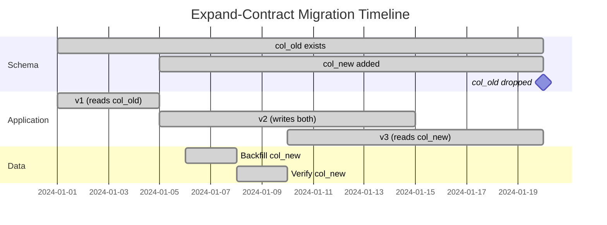

## Keywords in This File
{: .no_toc }

| # | Keyword | Weight |
|---|---|---|
| 1 | [Schema Migration Strategy at Scale - Zero-Downtime Deployments](#schema-migration-strategy-at-scale---zero-downtime-deployments) | medium |

---

# Schema Migration Strategy at Scale - Zero-Downtime Deployments

**TL;DR:** Schema migrations at scale require zero-downtime because production databases
cannot be taken offline. Zero-downtime migration: (1) expand (add new columns/tables
with no constraints that break existing code); (2) deploy new application that writes
to both old and new schema; (3) backfill existing data; (4) deploy application that
reads from the new schema; (5) contract (drop old columns). Each step is backward-compatible.
Tools: Flyway/Liquibase for migration versioning. Critical rules: never add NOT NULL
columns without a default, never rename columns, never add exclusive locks in production.

---

### 🎯 Model Answer

**30 seconds:**
> Zero-downtime migration = expand-contract pattern. Add new column (nullable or with default),
> deploy app that writes to both old and new column, backfill old rows, verify, deploy app
> using new column only, drop old column. Never: add NOT NULL with no default (table rewrite
> in PostgreSQL 10), rename columns (breaks old code), or add indexes without CONCURRENTLY
> (locks the table).

**3 minutes:**
> The expand-contract pattern is the fundamental technique for zero-downtime schema changes:
>
> Phase 1 - Expand: add the new structural element. The change must be backward-compatible
> with the currently deployed application version. Rules: new columns must be nullable OR
> have a default value (PostgreSQL 11+ stores the default without a table rewrite). No new
> NOT NULL constraints without defaults. New tables are fine. New nullable foreign keys are
> fine.
>
> Phase 2 - Application v2: deploy the new application version that writes to BOTH the old
> and new schema. Old writes still populate the old column. New writes populate both.
> If rollback occurs: old application version still works (old column is still populated).
>
> Phase 3 - Backfill: update all rows that were created before Phase 2 to populate the new
> column. For large tables: batch the UPDATE (100-1000 rows at a time with a delay) to avoid
> a single massive UPDATE that locks rows, generates huge WAL, and impacts performance.
>
> Phase 4 - Verify and read from new: once backfill is complete, deploy the application that
> reads from the new column. Verify correctness.
>
> Phase 5 - Contract: drop the old column. This removes the old structural element after
> all application versions that use it are no longer deployed.

**Blank Mind Recovery:**

**(1) Restate:** "Expand: add new schema (backward-compatible). Deploy new app (writes both).
Backfill data. Deploy app using new. Contract: drop old."

**(2) First principles:** "Two versions of the application run during a deployment. The
schema must be compatible with BOTH simultaneously. Design each migration step
so that the previous application version still works."

**(3) Bridge:** "Like renovating a house while living in it. First: add the new room (expand).
Move into the new room (deploy new app). Move your stuff (backfill data). Then demolish
the old room (contract). Never: demolish the old room first."

---

### 📘 Concept Explanation

**Migration classification by risk:**

```
LOW RISK (compatible with all app versions):
  - Add nullable column
  - Add column with default (PostgreSQL 11+: instant)
  - Add new table
  - Add index CONCURRENTLY
  - Add nullable foreign key

MEDIUM RISK (requires app coordination):
  - Add NOT NULL column (needs default or backfill)
  - Rename column (requires expand-contract)
  - Change column type (same logical type, widen)
  - Add non-unique index (CONCURRENTLY)

HIGH RISK (can block production):
  - Add NOT NULL without default (table rewrite)
  - Add index WITHOUT CONCURRENTLY (table lock)
  - DROP COLUMN (breaks old app versions)
  - ALTER COLUMN TYPE (may rewrite table)
  - RENAME TABLE / COLUMN (breaks old app)
  - ADD FOREIGN KEY (acquires ShareRowExclusiveLock,
    scans entire table to validate)
```

> **Code walkthrough:** This Zero-Downtime Deployments example demonstrates a key concept in practice. **KEY MECHANISM:** the runtime executes these instructions in sequence with specific memory and execution semantics. **WHY IT MATTERS:** misapplying this pattern causes subtle bugs that only manifest under production load. **TAKEAWAY: understand the execution model before using this pattern in production code.**

---

### 💻 Code Example

```sql
-- EXPAND-CONTRACT: rename a column safely
-- Goal: rename 'email_address' to 'email' in users table

-- PHASE 1 - Expand: add new column (nullable):
ALTER TABLE users ADD COLUMN email TEXT;
-- Instant: no table rewrite, no lock held.
-- Old code: still uses 'email_address' (works fine).
-- New column is NULL for all existing rows.

-- PHASE 2 - Application v2: write to both columns
-- (In application code, not SQL - write both fields)
-- UPDATE users SET email = email_address
-- is done by the application for each row it writes.

-- PHASE 3 - Backfill: copy old data to new column
-- For small tables (< 1M rows): single UPDATE is ok.
-- For large tables: batch UPDATE to avoid lock contention.

DO $$
DECLARE
    batch_size INTEGER := 1000;
    last_id    BIGINT := 0;
BEGIN
    LOOP
        UPDATE users
        SET email = email_address
        WHERE id > last_id
          AND id <= last_id + batch_size
          AND email IS NULL;
        -- Process only rows without new value yet.
        EXIT WHEN NOT FOUND;
        last_id := last_id + batch_size;
        -- Small delay: avoid saturating I/O.
        PERFORM pg_sleep(0.01);
    END LOOP;
END $$;

-- PHASE 4 - Add NOT NULL constraint (after backfill):
-- In PostgreSQL 12+: constraint can be validated
-- without a table rewrite:
ALTER TABLE users
    ADD CONSTRAINT users_email_not_null
    CHECK (email IS NOT NULL)
    NOT VALID;
-- NOT VALID: constraint stored but not yet validated.
-- Validates new/updated rows only. No full table scan.
ALTER TABLE users
    VALIDATE CONSTRAINT users_email_not_null;
-- VALIDATE acquires ShareUpdateExclusiveLock (no writes blocked).
-- Reads all rows to confirm constraint is satisfied.
-- No table rewrite.

-- PHASE 5 - Contract: drop old column (after app migration)
ALTER TABLE users DROP COLUMN email_address;
-- Only safe after ALL application versions that use
-- 'email_address' have been retired from production.
```

> **Code walkthrough:** The five phases never break the old application.
> Phase 1 (add column): no lock beyond a brief AccessExclusiveLock for the ALTER
> (instant for adding a nullable column). Phase 3 (batch backfill): UPDATE in small
> batches avoids one massive row-level lock acquisition. `pg_sleep(0.01)` gives
> other transactions a chance to run between batches. Phase 4 (NOT VALID constraint):
> PostgreSQL 12+ allows adding a CHECK constraint as `NOT VALID`: it validates only
> future writes (not the existing rows). `VALIDATE CONSTRAINT` then checks existing
> rows with a ShareUpdateExclusiveLock (reads are allowed; no writes blocked).
> This splits a potentially table-locking single ALTER into two low-impact steps.

```sql
-- INDEXES: safe creation in production
-- BAD: creates an exclusive table lock for duration of build
CREATE INDEX idx_orders_customer
    ON orders (customer_id);
-- Holds AccessShareExclusiveLock during entire index build.
-- All reads AND writes on orders are blocked.
-- For a 50M-row table: takes 5-30 minutes.
-- Complete outage for that table.

-- GOOD: no write lock during index build
CREATE INDEX CONCURRENTLY idx_orders_customer
    ON orders (customer_id);
-- Phase 1: scans table, builds initial index. Reads/writes OK.
-- Phase 2: second pass to catch new rows (minimal lock).
-- Phase 3: marks index valid. Brief ShareUpdateExclusiveLock.
-- Total: 2-3x longer than non-concurrent, but no outage.
-- Caveat: fails if any transaction is active that started
--   before Phase 1. Must be retried manually on failure.
-- Check: pg_indexes to confirm index is not 'invalid'.
SELECT indexrelname, indisvalid
FROM pg_stat_user_indexes
WHERE relname = 'orders';
-- indisvalid = false: index build failed. Drop and retry.
```

> **Code walkthrough:** `CREATE INDEX CONCURRENTLY` is non-negotiable for production
> tables. The standard `CREATE INDEX` holds an exclusive lock for the entire build
> duration - for a large table, this means minutes of complete unavailability.
> Concurrent index creation does two scan passes: the first builds the structure
> while allowing writes; the second catches rows written during the first pass.
> If the build fails (e.g., a long-running transaction is present during Phase 3):
> the index is left in an 'invalid' state. Check `indisvalid` in `pg_stat_user_indexes`.
> A failed invalid index still has overhead (write maintenance cost) without providing
> read benefit. Drop it with `DROP INDEX CONCURRENTLY` and retry.

```java
// FLYWAY: version-controlled migrations

// File: src/main/resources/db/migration/V23__add_email_column.sql
// (Flyway naming: V{version}__{description}.sql)

// V23__add_email_column.sql:
// ALTER TABLE users ADD COLUMN email TEXT;
// CREATE INDEX CONCURRENTLY idx_users_email
//     ON users (email);

// V24__backfill_email.sql:
// UPDATE users SET email = email_address
// WHERE email IS NULL;
// (Small table: single UPDATE is fine)
// (Large table: use a PL/pgSQL batch script)

// V25__email_not_null.sql:
// ALTER TABLE users
//     ALTER COLUMN email SET NOT NULL;
// (Safe only after backfill is complete and verified)

// V26__drop_email_address.sql:
// ALTER TABLE users DROP COLUMN email_address;
// (Only deploy after all app versions use 'email')

// Application configuration:
@Bean
public Flyway flyway(DataSource dataSource) {
    return Flyway.configure()
        .dataSource(dataSource)
        .locations("classpath:db/migration")
        .validateOnMigrate(true)
        // Fail-fast if migrations don't match checksums:
        .outOfOrderAllowed(false)
        .load();
}
// flyway.migrate() runs at application startup.
// Applied migrations recorded in flyway_schema_history.
// Idempotent: already-applied versions are skipped.
```

> **Code walkthrough:** Flyway enforces migration versioning. Version number in the
> filename determines execution order. Applied migrations are stored in the
> `flyway_schema_history` table (checksum verification). The expand-contract pattern
> is spread across 4 separate migration scripts (V23-V26), each deployed with a
> separate application version. This is the disciplined approach: each SQL script
> is reviewed, tested in staging, and deployed independently. The alternative
> (all in one script) would require downtime for the NOT NULL addition and
> would not give time for backfill verification between steps.

---

### 🎓 Answers by Seniority

**Junior / Mid:**
> Use Flyway or Liquibase to version migrations. Add new columns as nullable first.
> For large tables: use `CREATE INDEX CONCURRENTLY` instead of `CREATE INDEX`.
> Never rename a column in a single deployment - use expand-contract (add new, migrate
> data, drop old). The most dangerous migrations are ones that lock the table.

---

**Senior / Staff:**
> Zero-downtime migrations require treating the schema as an API between application
> versions. Any migration that breaks the currently-running application version is
> a downtime-causing migration.
>
> Key operational rules: (1) Never add NOT NULL without a default in PostgreSQL 10
> or earlier (causes full table rewrite). PostgreSQL 11+: adding a column with a
> constant default is instant (stored in pg_attribute, not rewritten). (2) Backfill
> in batches. (3) Always use CONCURRENTLY for index creation. (4) Add FK constraints
> NOT VALID, then VALIDATE separately. (5) Keep migrations reversible: Flyway's
> undo migrations or blue-green deployment with snapshot rollback.
>
> At scale: migrations on tables with 100M+ rows require a dedicated maintenance
> window or an online schema change tool (pt-online-schema-change for MySQL,
> pg_repack for PostgreSQL). pg_repack rewrites the table to a new file while
> the original is live, then swaps them with a brief lock.

---

### ⚠️ Common Misconceptions

**"Adding a NOT NULL column with a default value is instant in PostgreSQL"**

Reality: it depends on the version. PostgreSQL 10 and earlier: `ALTER TABLE ADD COLUMN x INT NOT NULL DEFAULT 0` rewrites the entire table (fills in the default for every row). For a 100M-row table: this takes 30+ minutes and holds an exclusive lock. PostgreSQL 11+: constant defaults are stored in `pg_attribute` (no table rewrite, instant). Variable defaults (e.g., `DEFAULT gen_random_uuid()`) still require a table rewrite. Always test migration timing on a production-sized copy before deploying.

**"Flyway prevents bad migrations"**

Reality: Flyway ensures migrations run in order and are not repeated. It does not validate that a migration is safe (lock-free, backward-compatible). A Flyway migration `ALTER TABLE users RENAME COLUMN email_address TO email` will run successfully and break all currently-deployed application instances that reference `email_address`. Flyway is a migration execution and versioning tool; migration safety is the developer's responsibility.

---

### ⚖️ Comparison Table

| Risky pattern | Safe alternative | Reason |
|---|---|---|
| CREATE INDEX | CREATE INDEX CONCURRENTLY | Avoids table lock |
| ADD NOT NULL (PG 10) | Add nullable, backfill, add NOT NULL | Avoids table rewrite |
| RENAME COLUMN | Expand-contract (add, migrate, drop) | Avoids breaking old code |
| ADD FK (validated) | ADD FK NOT VALID, then VALIDATE | Splits lock + scan |
| Single DELETE of millions of rows | Batch DELETE or partition detach | Avoids WAL storm, bloat |
| ALTER COLUMN TYPE (incompatible) | Add new column, migrate, drop old | Avoids table rewrite |

---

### 🏛️ System Design

**Migration pipeline for a large-scale system:**

```
Pre-deployment:
  1. Migration script authored (Flyway V{N}__description.sql)
  2. Code review: check for lock-causing operations
     - grep for CREATE INDEX (not CONCURRENTLY)
     - grep for RENAME COLUMN / RENAME TABLE
     - grep for ADD COLUMN NOT NULL (PostgreSQL < 11)
  3. Dry run on staging (same data volume as production)
     - Measure execution time
     - Check for lock waits (pg_stat_activity)
  4. Canary deployment (5% of traffic):
     - New app + migration applied to canary shard/region
     - Monitor for errors, slowness

Deployment:
  1. Run migration (Flyway at startup or explicit step)
  2. New application version starts alongside old
  3. Both versions compatible with migrated schema
  4. Old version drained (no new requests)
  5. Old version shut down

Post-deployment:
  1. Verify data integrity (CHECK constraints)
  2. Monitor pg_stat_statements for new slow queries
     (new columns may need indexes)
  3. Plan 'contract' phase (drop old columns)
     in a subsequent deployment

Tools:
  - Flyway (Java/Spring), Liquibase (XML/YAML/JSON/SQL)
  - pg_repack: zero-lock table rewrite
  - Terragrunt/Terraform for infra migration
  - Debezium CDC: real-time data copy for cut-over
```

> **Code walkthrough:** This Unknown example demonstrates a key concept in practice. **KEY MECHANISM:** the runtime executes these instructions in sequence with specific memory and execution semantics. **WHY IT MATTERS:** misapplying this pattern causes subtle bugs that only manifest under production load. **TAKEAWAY: understand the execution model before using this pattern in production code.**

---

### 📊 Diagram

**Expand-contract migration timeline:**

```
Time:     T0          T1         T2        T3        T4
Schema:   [col_old]   [col_old   [col_old  [col_old  [col_new]
                       col_new]   col_new]  col_new]
App:      [v1:        [v2: write  [v2]      [v3: read  [v3]
           reads old]  both cols]            new col]

T0: v1 reads col_old only
T1: add col_new (expand), deploy v2 (writes both)
T2: backfill col_new for all existing rows
T3: deploy v3 (reads col_new), verify
T4: drop col_old (contract)
    v3 now uses col_new only
```



> **Diagram walkthrough:** The migration spans 20 days across three deployment phases.
> The schema has both old and new columns during the transition period (days 5-20):
> this is the 'expand' phase. Application v2 (days 5-15) writes to both columns,
> ensuring backward compatibility if v1 is re-deployed during a rollback. The backfill
> happens after v2 is deployed (days 6-8). After verification (days 8-10), v3 is
> deployed to read from the new column (days 10-20). Only after v3 is confirmed
> stable does the 'contract' phase occur (day 20): drop the old column. Each step
> is independently reversible until the contract phase.

---

### 🚨 Failure Modes and Diagnosis

**Failure 1: NOT NULL column addition causes production outage**

Symptom: deploying a migration with `ALTER TABLE orders ADD COLUMN discount NUMERIC NOT NULL DEFAULT 0`
causes the database CPU to spike, all order queries block, and the migration runs for
30 minutes. Production is down.

Cause: PostgreSQL 10 (or earlier) rewrites the entire table when adding a NOT NULL column
with a default. 100M-row table = 30+ minutes of table rewrite, holding an exclusive lock.

Diagnosis: `pg_stat_activity` shows `ALTER TABLE orders ADD COLUMN` in `idle in transaction`
or `active` state. All other queries on `orders` are in `Lock` wait.

Prevention:
```sql
-- Step 1: add as nullable (instant):
ALTER TABLE orders ADD COLUMN discount NUMERIC;
-- Step 2: backfill (batch UPDATE):
-- ...
-- Step 3: add NOT NULL (PostgreSQL 12+: NOT VALID + VALIDATE):
ALTER TABLE orders
    ALTER COLUMN discount SET DEFAULT 0;
ALTER TABLE orders
    ADD CONSTRAINT orders_discount_nn
    CHECK (discount IS NOT NULL) NOT VALID;
ALTER TABLE orders VALIDATE CONSTRAINT orders_discount_nn;
```

> **Code walkthrough:** This Unknown example demonstrates SQL pattern using SQL. **KEY MECHANISM:** the database parses, plans, and executes the query; EXPLAIN ANALYZE shows the actual plan. **WHY IT MATTERS:** missing WHERE clause on UPDATE/DELETE affects all rows - no undo without a transaction rollback. **TAKEAWAY: always test destructive SQL in a transaction; use EXPLAIN ANALYZE before deploying.**

**Failure 2: CONCURRENTLY index build left 'invalid'**

Symptom: `CREATE INDEX CONCURRENTLY` ran but queries are not using the new index.
`EXPLAIN` shows it does not appear in the plan.

Diagnosis:
```sql
SELECT relname, indexrelname, indisvalid
FROM pg_stat_user_indexes si
JOIN pg_index i ON si.indexrelid = i.indexrelid
WHERE relname = 'orders';
-- indisvalid = false: index build failed.
```

> **Code walkthrough:** This Unknown example demonstrates query execution using SQL. **KEY MECHANISM:** the query planner builds an execution plan based on table statistics and indexes. **WHY IT MATTERS:** SELECT * reads all columns even if only 2 are needed - widens rows, increases I/O. **TAKEAWAY: always SELECT only the columns you need; index the columns in WHERE and JOIN clauses.**

Fix: `DROP INDEX CONCURRENTLY idx_name;` then retry `CREATE INDEX CONCURRENTLY`.
Cause of failure: a long-running transaction was active during Phase 3 of the build.
Check for idle-in-transaction sessions before retrying.

---

### 🎯 Interview Deep-Dive

**[JUNIOR] Q1 - [MECHANISM] What is the expand-contract pattern and why is it necessary for zero-downtime deployments?**

🗣️ "The expand-contract pattern is the foundational technique for safe schema migrations in continuously-deployed systems. The core insight: during a deployment, multiple versions of the application run simultaneously (old version is still serving traffic while the new version starts). The schema must be compatible with ALL running versions at once. Expand phase: add new schema elements that the new application version needs, in a form that is backward-compatible with the old version. Example: add a new nullable column (old code ignores it; new code writes to it). The old application still works unchanged. Contract phase: remove old schema elements only after ALL running application instances use the new schema and no old instances remain. Example: drop the old column only when zero old-version pods are running. The pattern is necessary because: databases cannot be rolled back at the SQL level once data has been written; application deployments are gradual (blue-green, rolling, canary); both old and new code must work with the same database state at the transition boundary."

**[JUNIOR] Q2 - [MECHANISM] Which ALTER TABLE operations are safe in production and which require special handling?**

🗣️ "Safe (low or no lock, fast): (1) `ADD COLUMN` nullable: instant lock, then done. (2) `ADD COLUMN` with a constant default (PostgreSQL 11+): instant, default stored in catalog. (3) `CREATE INDEX CONCURRENTLY`: no write lock. (4) `ADD CONSTRAINT NOT VALID`: no full table scan. (5) `DROP INDEX CONCURRENTLY`: no table lock. Requires special handling: (1) `ADD COLUMN NOT NULL` without default (PostgreSQL 10-): full table rewrite. Use nullable + backfill + validate. (2) `ALTER COLUMN TYPE`: if changing to an incompatible type: full table rewrite. Widening compatible types (e.g., INT to BIGINT in PostgreSQL 14+): may be instant. (3) `ADD FOREIGN KEY` (standard): scans the entire table to validate existing rows. Use `NOT VALID` first, then `VALIDATE CONSTRAINT`. (4) `RENAME TABLE/COLUMN`: breaks any application version using the old name. Use expand-contract. (5) `DROP TABLE/COLUMN`: breaks any application version using the old name. Only in contract phase."

**[JUNIOR] Q3 - [MECHANISM] How do you handle a failed Flyway migration in production?**

🗣️ "Flyway records the failed migration in `flyway_schema_history` with status `FAILED`. Subsequent Flyway runs refuse to proceed (they see an unresolved failed migration). Recovery steps: (1) Diagnose the failure: check PostgreSQL logs and Flyway error output to understand what SQL failed and why. (2) Assess state: how much of the migration script ran before failure? PostgreSQL runs each migration in a transaction by default - if the script failed mid-way, the entire script was rolled back (atomically). But PostgreSQL DDL operations (CREATE INDEX, ALTER TABLE) are transactional: the failure rollback is clean. (3) Fix the migration script (or the underlying cause: missing permission, too much lock wait, etc.). (4) Clear the failed record: `DELETE FROM flyway_schema_history WHERE version = 'N' AND success = false`. (5) Retry: run Flyway again with the corrected script. For non-transactional failures (e.g., `CREATE INDEX CONCURRENTLY` which cannot run in a transaction): Flyway uses the `@NonTransactional` annotation. A failed concurrent index leaves an invalid index. Must be cleaned up manually before retrying."

**[MID] Q4 - [SCENARIO] What is pg_repack and when would you use it?**

🗣️ "pg_repack: a PostgreSQL extension that rewrites tables and indexes in their entirety, concurrently, without holding a long exclusive lock. Use case: a table that has become severely bloated (from heavy UPDATE/DELETE workload) where VACUUM cannot reclaim space (VACUUM marks dead tuples reusable but does not compact the table file). pg_repack process: (1) creates a new shadow table with the same schema. (2) Installs a trigger on the original table to capture all changes during the repack. (3) Copies all live rows from the original table to the shadow table in sorted order (optionally re-clustering by index). (4) Replays changes captured by the trigger. (5) Acquires a brief exclusive lock (milliseconds) and swaps the original and shadow tables. (6) Drops the old table. Result: the table is compacted (all dead space removed), optionally re-clustered (correlation improved). The long work (copying data) happens without a lock; only the final swap is locked. pg_repack vs CLUSTER: CLUSTER holds an exclusive lock for the entire duration (hours for large tables). pg_repack: only milliseconds of exclusive lock at the swap."

**[MID] Q5 - [MECHANISM] How do you migrate a column to a new data type in a production database?**

🗣️ "Direct `ALTER COLUMN TYPE`: causes a full table rewrite if the type change is not compatible at the storage level. Even `VARCHAR(255)` to `VARCHAR(500)` requires a table scan to validate no row exceeds the new limit (it may rewrite). `INTEGER` to `BIGINT` in PostgreSQL 14+ can be done without rewrite if the new type is larger and no index on that column. Zero-downtime approach for type change: (1) Add a new column with the new type: `ALTER TABLE orders ADD COLUMN amount_bigint BIGINT`. (2) Write trigger or dual-write in application: populate both `amount` (INT) and `amount_bigint` (BIGINT) for all new rows. (3) Backfill: `UPDATE orders SET amount_bigint = amount::BIGINT WHERE amount_bigint IS NULL` in batches. (4) Verify: confirm `amount_bigint` is complete and correct. (5) Application migration: deploy code that reads from `amount_bigint`. (6) Add NOT NULL constraint (validated separately). (7) Rename: since RENAME blocks old app version: continue using the new column name in code; rename in a later contract phase or keep both names with a view. (8) Drop old column after all code references are removed."

**[SENIOR] Q6 - [MECHANISM] What is the role of feature flags in database migrations?**

🗣️ "Feature flags (feature toggles) decouple code deployment from feature activation. In the context of database migrations: (1) Deploy the migration (add new column) separately from enabling the code that uses it. Expand phase: migration deployed, feature flag OFF (old behavior). Code that writes to the new column exists in the codebase but is behind the flag (inactive). (2) Enable the flag: activate the new code path (writes to both old and new columns). Flag can be enabled for 1% of users (canary) before full rollout. (3) Backfill while flag is on for partial traffic. (4) 100% flag enable: all writes use new column. (5) Remove flag, remove old code path. (6) Contract: drop old column. Benefits: instant rollback (flip flag off) without schema rollback. Fine-grained percentage rollout. Canary testing for data migration correctness. Works with dark launches: run the new write path in shadow mode (write to new column but don't use it), verify the output matches expected, then switch reads to the new column."

**[SENIOR] Q7 - [MECHANISM] How do you validate data integrity after a migration?**

🗣️ "Post-migration data validation is non-negotiable. Techniques: (1) SQL assertions: write SQL queries that verify the expected state. Count of new column populated: `SELECT COUNT(*) FROM orders WHERE new_col IS NULL`. Should be 0 after backfill. Data consistency: `SELECT COUNT(*) FROM orders WHERE old_col != new_col` (should be 0 if both should have the same value). (2) Application-level reconciliation: run the old and new code paths on the same input and compare outputs. If results differ: the migration has a bug. (3) CHECK constraints with VALIDATE: `ALTER TABLE orders ADD CONSTRAINT chk_new_col CHECK (new_col IS NOT NULL) NOT VALID; ALTER TABLE orders VALIDATE CONSTRAINT chk_new_col;` - the VALIDATE step performs a full table scan to confirm no violation. If VALIDATE fails: the backfill was incomplete. (4) Monitor error rates: after deploying the new code path, monitor for unexpected NULLs, foreign key violations, unique constraint violations in application logs. An error spike indicates the migration has a problem. (5) Checksums: for critical data (financial amounts), compute a checksum over old + new column and compare: `SUM(old_col) = SUM(new_col)` (should be equal if migrating amounts)."

**[SENIOR] Q8 - [MECHANISM] How do you handle long-running migrations in a CI/CD pipeline?**

🗣️ "Long-running migrations break standard CI/CD (deployments take minutes, not hours). Solutions: (1) Separate migration from deployment: run the migration as a separate step before the application deployment. The application can only start after the migration completes. For very long migrations: this still means a deployment window; but the application is not blocking. (2) Background migration: for large backfills, use a background worker (not blocking application startup). The application starts, the backfill runs asynchronously. Application code handles the partially-backfilled state gracefully (reads new column with NULL fallback to old column). This is the 'lazy migration' pattern. (3) Online schema change tools: pg_repack for table rebuilds, custom batch scripts for data migrations. Run these as operational tasks outside the deploy pipeline. (4) Migration timeouts: set a Flyway `connectRetries` and migration timeout. If the migration exceeds the timeout: fail the deployment, alert the team. Prevents a deployment from being stuck indefinitely waiting for a migration that will never complete (e.g., blocked by a lock). (5) Canary schema migration: apply the migration to a canary environment first. Monitor for 24 hours. Then apply to production."

**[SENIOR] Q9 - [MECHANISM] What is the 'ghost row' technique and when is it used?**

🗣️ "Ghost row technique (also called 'shadow write'): during a column migration, new writes go to both the old and new columns. This is Phase 2 of expand-contract. 'Ghost' refers to the new column being written but not yet read (it exists in the data but is invisible to the application). The technique is critical for large tables: the backfill only needs to cover rows written before Phase 2 began (historical rows). All rows written during and after Phase 2 are already populated in the new column by the application. The backfill job can track progress: `WHERE new_col IS NULL AND id < (max_id at Phase 2 start)`. This bounds the backfill to a fixed set of rows. New rows are handled automatically by the application. Pitfall: if the application crashes during Phase 2 and falls back to v1 (old code): v1 does not write the new column. The ghost rows written during the Phase 2 period now have NULL in the new column. The backfill script must handle this case (re-scan recent rows)."

**[SENIOR] Q10 - [MECHANISM] What monitoring is needed during a production migration?**

🗣️ "Six monitoring signals: (1) Migration duration: track how long the migration script is running. Alert if > 5 minutes for an expected fast migration (suggests blocking). (2) Table locks: `pg_stat_activity WHERE wait_event_type = 'Lock' AND relation = 'target_table'`. Alert if any query is waiting for more than 30 seconds during the migration. (3) Replication lag: if the migration generates large WAL (large backfill): replicas may lag. Monitor `pg_stat_replication.lag_bytes`. Alert if > 100MB. (4) Application error rate: watch for application errors that correlate with the migration start time. NullPointerException on the new column, foreign key violations, or unexpected behavior. (5) Query latency: `pg_stat_statements` mean_exec_time for queries on the migrated table. Alert if latency doubles after migration (a new column may change plans). (6) Database CPU and I/O: a large backfill generates CPU and I/O load. Monitor to ensure the database is not saturated. If load approaches 80%: pause the backfill (decrease batch size or increase delay between batches)."

**[SENIOR] Q11 - [MECHANISM] How does zero-downtime deployment differ between PostgreSQL and MySQL for schema migrations?**

🗣️ "Key differences: (1) Online DDL: MySQL 5.6+ and MySQL 8.0 have Online DDL for many ALTER TABLE operations (runs without a full table lock, similar to PostgreSQL CONCURRENTLY). PostgreSQL also has non-locking options but requires `CONCURRENTLY` explicitly. (2) NOT NULL columns: MySQL allows `ALTER TABLE ADD COLUMN col INT NOT NULL DEFAULT 0` without a table rewrite in modern versions (stores the default). PostgreSQL 11+ also has this optimization for constant defaults. PostgreSQL 10-: requires the expand-contract approach. (3) Transactions around DDL: PostgreSQL DDL is transactional (can be rolled back). MySQL DDL is NOT transactional (an interrupted migration leaves partial state). This makes PostgreSQL migration recovery cleaner. (4) pt-online-schema-change: MySQL's analog to pg_repack. Creates a shadow table, copies data with triggers, swaps. (5) Rename columns: both databases have the same fundamental problem (breaks running application code). pt-osc for MySQL and pg_repack for PostgreSQL can help with table rewrites, but column renames still require the expand-contract pattern regardless of database."

**[SENIOR] Q12 - [FAILURE] What is the risk of running Flyway migrations at application startup vs. as a separate pre-deploy step?**

🗣️ "At-startup migration (default Flyway): the application runs `flyway.migrate()` at startup, before serving traffic. Simple but has risks: (1) Multiple instances start simultaneously (Kubernetes rolling deploy): all instances try to migrate at once. Flyway uses a database lock to serialize this (only one wins; others wait). Safe for fast migrations. For long migrations: all instances wait (slow startup). (2) Migration failure = startup failure: if the migration fails, the new version does not start. Good (fast feedback) but may block rollout. (3) The migration runs with application credentials: must have DDL permissions. Application role should ideally be least-privilege. Workaround: separate migration role. Pre-deploy step (separate migration job): run the migration as a Kubernetes Job or a CI step before deploying the new application version. Advantages: (1) migration completes before any new app instances start. (2) Only one migration runner (the Job) - no serialization needed. (3) If migration fails: deployment pipeline stops before the new application is deployed. (4) Migration can run with a higher-privilege role; application uses least-privilege. Disadvantage: more complex CI/CD pipeline. Recommendation: pre-deploy step for production at scale; at-startup for simplicity in small applications."

---

### 💻 Code Example

*(Omit: this concept does not have a programmatic interface that can be demonstrated in code. The conceptual explanation above is sufficient.)*


---

### 🏛️ System Design

*(Omit: system design diagram not applicable for this concept - see ★★★ keywords for full system design coverage.)*


---

### ⚖️ Comparison Table

*(Omit: this is a ★☆☆ foundational concept with no direct alternatives to compare - see higher-difficulty keywords for trade-off analysis.)*


---

### 📊 Diagram

*(Omit: no standalone visual diagram required for this concept - the explanations and code examples above provide sufficient clarity.)*


