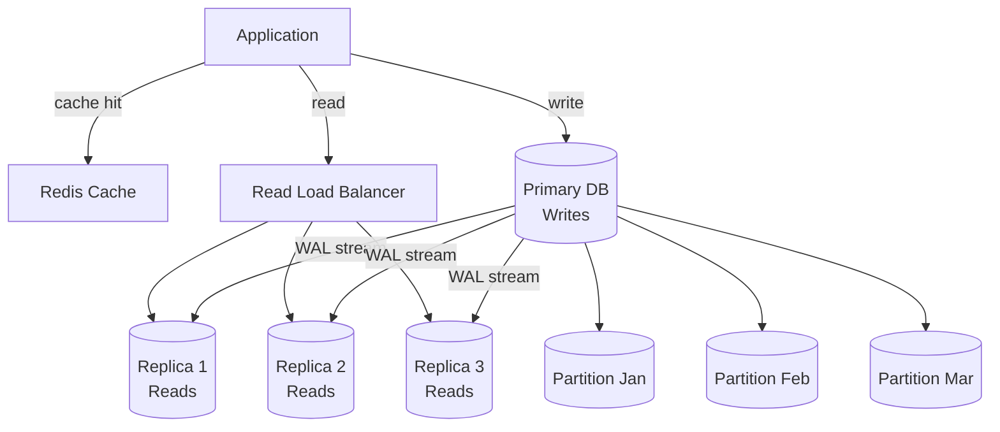

## Keywords in This File
{: .no_toc }

| # | Keyword | Weight |
|---|---|---|
| 1 | [Database Scalability - Read Replicas, Sharding, and Partitioning](#database-scalability---read-replicas-sharding-and-partitioning) | medium |

---

# Database Scalability - Read Replicas, Sharding, and Partitioning

**TL;DR:** Database scalability follows a tiered approach: (1) vertical scaling (bigger
hardware) - quick but limited; (2) read replicas - separate read and write load,
scale reads horizontally; (3) table partitioning - distribute data within one logical
database; (4) sharding - horizontal partitioning across multiple independent databases.
Each tier multiplies complexity. Use the simplest tier that meets your requirements.
Most applications never need sharding; 90% of scale problems are solved by caching,
read replicas, and indexes.

---

### 🎯 Model Answer

**30 seconds:**
> Scale tiers: (1) Vertical: bigger server. Fast, expensive, limited ceiling.
> (2) Caching: Redis/Memcached absorbs read load. (3) Read replicas: async copy
> to N read databases. Writes still single-node. (4) Partitioning: split a table
> across multiple physical files/nodes, same database. (5) Sharding: split data
> across multiple independent databases by a shard key. Each tier adds complexity.
> Start simple, add tiers only when the current tier is exhausted.

**3 minutes:**
> Read replicas: the primary accepts all writes; WAL is streamed to replicas.
> Replicas are slightly behind (replication lag). Application routes reads to replicas,
> writes to primary. Read:write ratio is typically 10:1 or higher. Replicas multiply
> read capacity horizontally: 10 replicas = 10x read throughput.
> Replication lag is the key operational challenge: reads may return stale data.
>
> Partitioning: a logical table is split into physical partitions (files) based on
> a partition key. Range partitioning: `created_at < 2024` in partition P1,
> `2024 <= created_at < 2025` in partition P2. PostgreSQL routes queries to the
> correct partition (partition pruning). Benefits: maintenance per partition (VACUUM,
> ANALYZE), faster range queries (only relevant partitions scanned), detach old
> partitions (instant delete of old data). All partitions remain in the same database.
>
> Sharding: data is split across N independent databases (shards). A shard key
> determines which shard a row belongs to. Shard 1: customers 1-1M, Shard 2: 1M-2M.
> Each shard has its own primary + replicas. Cross-shard queries are expensive
> (scatter-gather across N shards). ACID transactions across shards require distributed
> transactions (2PC). Joins across shards are not possible without aggregating at
> the application layer. Sharding is operationally very complex.

**Blank Mind Recovery:**

**(1) Restate:** "Read replicas: copy writes to N readers. Partitioning: split one table
across files in one DB. Sharding: split data across N independent DBs. Add tiers
when simpler tiers are exhausted."

**(2) First principles:** "A single server has finite CPU, RAM, and I/O. Distribution
spreads load across multiple servers. More copies = more read capacity. More nodes =
more write capacity. Each distribution adds coordination overhead."

**(3) Bridge:** "Like a library: (1) get a bigger building (vertical). (2) Add more
reading rooms with copies of popular books (read replicas). (3) Organize by floor -
fiction on floor 1, non-fiction on floor 2 (partitioning, same building). (4) Build
separate branch libraries (sharding). Each step: more capacity, more coordination."

---

### 📘 Concept Explanation

**Scalability decision framework:**

```
Bottleneck -> Solution

CPU / Query time  -> Indexes, query optimization, caching
Read I/O          -> Read replicas, caching (Redis)
Storage size      -> Partitioning (drop old partitions), archiving
Write throughput  -> Partitioning (route writes to current partition),
                     then sharding (write to separate shard nodes)
Single-node cap   -> Sharding (full horizontal write scale)

Costs:
  Vertical:    expensive hardware, single point of failure
  Read replica: replication lag, extra infrastructure
  Partitioning: partition key design, constraint management
  Sharding:     no cross-shard joins, no cross-shard ACID,
                re-sharding is very painful
```

> **Code walkthrough:** This Read Replicas, Sharding, and Partitioning example demonstrates a key concept in practice. **KEY MECHANISM:** the runtime executes these instructions in sequence with specific memory and execution semantics. **WHY IT MATTERS:** misapplying this pattern causes subtle bugs that only manifest under production load. **TAKEAWAY: understand the execution model before using this pattern in production code.**

---

### 💻 Code Example

```sql
-- READ REPLICAS: application routing pattern
-- (PostgreSQL streaming replication setup)

-- On primary (postgresql.conf):
-- wal_level = replica
-- max_wal_senders = 10
-- synchronous_commit = on (for sync replica)
--   or 'local' (for async with local commit)

-- On replica: pg_basebackup + recovery.conf
-- or streaming_replication_enabled in newer versions

-- Application routing (HikariCP + read/write split):
-- Read replica: set default transaction to read-only
-- The driver or proxy (PgBouncer, HikariCP read split)
-- routes SELECT to replicas automatically.

-- In PostgreSQL:
-- Session on replica (application reads):
SET default_transaction_read_only = on;
-- All transactions are read-only.
-- If a write is attempted: ERROR: cannot execute INSERT
-- in a read-only transaction.
-- This is a safety net: mis-routed writes fail fast.

-- Replication lag check:
SELECT
    client_addr,
    state,
    sent_lsn,
    write_lsn,
    flush_lsn,
    replay_lsn,
    (sent_lsn - replay_lsn) AS lag_bytes
FROM pg_stat_replication;
-- lag_bytes = 0: replica is fully caught up.
-- lag_bytes high: replica is behind.
-- Alert: lag_bytes > 10MB (or lag_seconds > 5s)
```

> **Code walkthrough:** `pg_stat_replication` on the primary shows each connectedice. **KEY MECHANISM:** the runtime executes these instructions in sequence with specific memory and execution semantics. **WHY IT MATTERS:** misapplying this pattern causes subtle bugs that only manifest under production load. **TAKEAWAY: understand the execution model before using this pattern in production code.**
> replica's position. `sent_lsn`: the WAL position sent to the replica.
> `replay_lsn`: the WAL position the replica has replayed (applied).
> `sent_lsn - replay_lsn` in bytes: how far behind the replica is.
> High lag means reads on the replica may be stale by the lag amount.
> The `default_transaction_read_only = on` setting on replica connections
> prevents application bugs from accidentally writing to a replica.

```sql
-- TABLE PARTITIONING: range partitioned by date

-- Parent table (no data stored here):
CREATE TABLE orders (
    id          BIGSERIAL,
    customer_id BIGINT         NOT NULL,
    created_at  TIMESTAMPTZ    NOT NULL,
    status      TEXT           NOT NULL,
    total       NUMERIC(10,2)  NOT NULL
) PARTITION BY RANGE (created_at);

-- Monthly partitions:
CREATE TABLE orders_2024_01 PARTITION OF orders
    FOR VALUES FROM ('2024-01-01') TO ('2024-02-01');

CREATE TABLE orders_2024_02 PARTITION OF orders
    FOR VALUES FROM ('2024-02-01') TO ('2024-03-01');

-- Each partition can have its own indexes:
CREATE INDEX ON orders_2024_01 (customer_id);
CREATE INDEX ON orders_2024_02 (customer_id);

-- Partition pruning: PostgreSQL executes on correct partition
EXPLAIN SELECT * FROM orders
WHERE created_at >= '2024-01-15'
  AND created_at < '2024-02-01';
-- -> Seq Scan on orders_2024_01 (only this partition scanned)
-- orders_2024_02, 2024_03, ... are pruned.

-- Drop old data (instant - no row-by-row DELETE):
ALTER TABLE orders DETACH PARTITION orders_2023_01;
DROP TABLE orders_2023_01;
-- Detach + drop is O(1) (metadata only, not row deletion).
-- DELETE FROM orders WHERE created_at < '2023-02-01':
-- O(N), slow, generates huge WAL, bloats table.
```

> **Code walkthrough:** Declarative partitioning: the parent table `orders`ice. **KEY MECHANISM:** the runtime executes these instructions in sequence with specific memory and execution semantics. **WHY IT MATTERS:** misapplying this pattern causes subtle bugs that only manifest under production load. **TAKEAWAY: understand the execution model before using this pattern in production code.**
> is the logical table (no actual data storage). Each partition is a physical
> table with a constraint restricting its key range. PostgreSQL's query planner
> applies partition pruning: only the partitions that overlap the query's
> `created_at` range are scanned. For a monthly query on 5 years of data (60 partitions):
> only 1 partition is scanned instead of all 60. Partition maintenance: VACUUM,
> ANALYZE, REINDEX per partition (smaller scope). Dropping old data: detach the
> old partition (removes it from the parent) then drop it. Milliseconds vs.
> hours for DELETE on the same volume.

```java
// SHARDING: consistent hashing example
// (application-level sharding logic)

public class ShardRouter {
    private final Map<Integer, DataSource> shards;
    private final int SHARD_COUNT = 16;

    // Determine shard for a customerId:
    public DataSource getShardForCustomer(
            long customerId) {
        // Hash the shard key to a shard slot:
        int shardId =
            (int) (Math.abs(customerId) % SHARD_COUNT);
        return shards.get(shardId);
    }

    // Route a query to the correct shard:
    public Order findOrder(long orderId,
                           long customerId) {
        DataSource shard =
            getShardForCustomer(customerId);
        // All data for this customer is on this shard.
        // No cross-shard query needed.
        try (Connection conn = shard.getConnection()) {
            PreparedStatement ps = conn.prepareStatement(
                "SELECT * FROM orders " +
                "WHERE id = ? AND customer_id = ?");
            ps.setLong(1, orderId);
            ps.setLong(2, customerId);
            return mapResult(ps.executeQuery());
        }
    }

    // Cross-shard query (expensive): scatter-gather
    public List<Order> findOrdersByStatus(String status) {
        // Must query ALL shards:
        return shards.values()
            .parallelStream()
            .flatMap(shard -> queryShardForStatus(
                shard, status).stream())
            .collect(Collectors.toList());
        // 16 parallel queries. Latency = slowest shard.
        // Total load = 16x a single shard query.
    }
}
```

> **Code walkthrough:** Application-level sharding: the `ShardRouter` containsice. **KEY MECHANISM:** the runtime executes these instructions in sequence with specific memory and execution semantics. **WHY IT MATTERS:** misapplying this pattern causes subtle bugs that only manifest under production load. **TAKEAWAY: understand the execution model before using this pattern in production code.**
> the routing logic. `customerId % SHARD_COUNT` deterministically maps each customer
> to a shard (consistent hash). All of customer 42's orders are on shard `42 % 16 = 10`.
> Single-customer queries: route to one shard, same performance as a non-sharded database.
> Cross-shard query (`findOrdersByStatus`): must query all 16 shards in parallel and
> aggregate. Latency: the slowest shard determines total latency. Database load: 16x.
> This illustrates why shard key selection is critical: queries that do not include
> the shard key in the WHERE clause always result in scatter-gather.

---

### 🎓 Answers by Seniority

**Junior / Mid:**
> Read replicas: multiple database copies that accept reads; writes go to the primary.
> Scales read-heavy workloads. Replication lag means replicas may be slightly behind.
> Partitioning: splitting a large table into smaller physical pieces (e.g., one partition
> per month). Faster queries on a date range; easy to drop old data. Sharding: splitting
> data across multiple independent databases. Most complex; needed only at very high scale.

---

**Senior / Staff:**
> Scalability architecture starts with capacity planning: what is the bottleneck?
> Read-heavy: cache + read replicas. Storage-heavy with time-series data: range
> partitioning with auto-detach of old partitions. Write-heavy: this is hard. Partitioning
> helps route writes to the current partition. Sharding provides true horizontal write
> scale at the cost of cross-shard queries and distributed transactions.
>
> Key design decisions before sharding: (1) is there a natural shard key (customer_id,
> tenant_id) where most queries include it? (2) Can the schema be designed so that
> related data always lands on the same shard (co-location)? (3) Is re-sharding
> (doubling the number of shards as data grows) planned for?
> If you cannot answer all three: you will face severe operational pain.
> Consider managed NewSQL (CockroachDB, Spanner) that handles sharding automatically
> before building application-layer sharding.

---

### ⚠️ Common Misconceptions

**"Sharding is the natural next step after vertical scaling"**

Reality: the natural next step is read replicas + caching. Sharding is a last resort
because it eliminates cross-shard joins, breaks cross-shard ACID transactions, makes
re-sharding painful, and adds significant application complexity. Many large systems
(millions of daily users) operate successfully with read replicas + partitioning +
well-tuned queries. Sharding is appropriate when: write throughput exceeds primary
capacity AND the data access pattern allows a clean shard key.

**"Replication lag is always small and can be ignored"**

Reality: under heavy write load, replication lag can reach seconds or minutes.
If the application routes a read to a replica immediately after a write: the replica
may not yet have the new data. This is the "read-your-own-write" consistency problem.
Solutions: (1) route writes AND subsequent reads to the primary for the same user
session. (2) Use synchronous replication for the subset of data that must be consistent
(at the cost of write latency). (3) Accept eventual consistency for non-critical reads.

---

### ⚖️ Comparison Table

| Approach | Scales | Limitation | When to use |
|---|---|---|---|
| Vertical | Everything (same as single node) | Hardware ceiling, cost, SPOF | First step; quick wins |
| Caching (Redis) | Reads (cached data) | Invalidation complexity, memory cost | Read-heavy, cacheable data |
| Read replicas | Reads only | Replication lag, writes still single-node | Read:write ratio > 5:1 |
| Partitioning | Storage, maintenance, range query perf | Same write node, complex key design | Large tables, time-series |
| Sharding | Writes + reads | No cross-shard joins/ACID, re-sharding | Very high write volume, clear shard key |
| NewSQL (CockroachDB) | Writes + reads (auto-sharded) | SQL subset, latency, cost | When sharding benefits needed without custom sharding code |

---

### 🏛️ System Design

**Progressive scalability architecture:**

```
Phase 1 (1M users):
  Primary PostgreSQL (32 cores, 256GB RAM)
  Redis cache (hot data)
  Read replica x1
  -> Handles most workloads

Phase 2 (10M users):
  Primary PostgreSQL (same or vertical upgrade)
  Redis cluster
  Read replicas x5 (with load balancer)
  Table partitioning (by month for orders, events)
  PgBouncer connection pooling
  -> Handles 10x read scale; writes still single-node

Phase 3 (100M users - write bottleneck):
  Option A: CockroachDB or Spanner (auto-sharded NewSQL)
    Pros: SQL-compatible, auto-rebalancing
    Cons: latency, not all PG features available
  Option B: Application-level sharding
    16 PostgreSQL clusters by customer_id mod 16
    Each cluster: primary + 5 replicas
    Application ShardRouter
    Cons: no cross-shard joins, complex migrations

Phase 4 (special read models):
  CQRS: separate read store (Elasticsearch, Cassandra)
  for non-structured queries (full-text, geospatial)
  Events stream to read store via Kafka
  PostgreSQL: source of truth for writes
```

> **Code walkthrough:** This Unknown example demonstrates a key concept in practice. **KEY MECHANISM:** the runtime executes these instructions in sequence with specific memory and execution semantics. **WHY IT MATTERS:** misapplying this pattern causes subtle bugs that only manifest under production load. **TAKEAWAY: understand the execution model before using this pattern in production code.**

---

### 📊 Diagram

**Scalability tier progression:**

```
Tier 1 (single node):
  App -> Primary DB

Tier 2 (read replicas):
  App (writes) -> Primary DB
                      |
               WAL stream
                      |
  App (reads) -> Replica 1, Replica 2, Replica 3

Tier 3 (partitioning, same primary):
  Primary DB:
    orders_2024_01 | orders_2024_02 | ... | orders_2024_12
    (each partition: separate file, separate index)

Tier 4 (sharding):
  Shard 1 (customer 1-1M):  Primary + 3 Replicas
  Shard 2 (customer 1M-2M): Primary + 3 Replicas
  Shard 3 (customer 2M-3M): Primary + 3 Replicas
  App: ShardRouter (routes by customer_id)
```



> **Diagram walkthrough:** The architecture shows three scalability mechanisms
> working together. Redis cache intercepts reads for hot/cacheable data (no DB hit).
> The read load balancer distributes read traffic across replicas (3x read capacity).
> WAL streaming keeps replicas current (with replication lag). The primary stores
> partitioned data: queries targeting a specific month hit one partition (partition pruning).
> This combination handles 10-100x the load of a single unoptimized database node
> without sharding. Adding sharding (not shown) would create N independent primary+replica
> clusters, each serving a subset of the shard key space.

---

### 🚨 Failure Modes and Diagnosis

**Failure 1: Replication lag causing stale read inconsistency**

Symptom: a user creates an order; the next API call to read their orders returns
the old list (the new order is missing). The user refreshes; it appears. Intermittent.

Cause: the write went to the primary; the read was routed to a replica that has not
yet replayed the new order's WAL.

Diagnosis:
```sql
-- On primary:
SELECT client_addr, state, replay_lsn,
    (sent_lsn - replay_lsn) AS lag_bytes
FROM pg_stat_replication;
-- lag_bytes under load: check if > expected threshold.
```

> **Code walkthrough:** This Unknown example demonstrates query execution using SQL. **KEY MECHANISM:** the query planner builds an execution plan based on table statistics and indexes. **WHY IT MATTERS:** SELECT * reads all columns even if only 2 are needed - widens rows, increases I/O. **TAKEAWAY: always SELECT only the columns you need; index the columns in WHERE and JOIN clauses.**

Fix: (1) For writes that require immediate read consistency: route subsequent reads
to primary for the same user session for N seconds. (2) Synchronous replication
for critical writes: `synchronous_commit = on` with a named synchronous standby.
Write latency increases by the round-trip time to the replica.

**Failure 2: Hot shard - uneven distribution in sharded system**

Symptom: one database shard is at 100% CPU/IO while others are at 20%.
Overall system is slow despite total capacity being available.

Cause: the shard key has a hotspot. Example: sharding by `created_date` - all
current-day writes go to shard 1 (the shard for today's date).

Diagnosis: check load metrics per shard. A significant imbalance with a pattern
(e.g., one shard always takes new writes) indicates a bad shard key.

Fix: re-shard with a better key (customer_id is usually better than date for
writes). Re-sharding is painful: requires migrating data while maintaining
availability. Plan the shard key before sharding; it is very hard to change later.

---

### 🎯 Interview Deep-Dive

**[JUNIOR] Q1 - [MECHANISM] When do you recommend sharding vs. staying with a single primary and read replicas?**

🗣️ "The decision is primarily about write bottlenecks and data volume. Read replicas scale reads horizontally. If the bottleneck is reads: replicas solve it. If the bottleneck is writes: a single primary is the ceiling; sharding is the path to horizontal write scaling. Thresholds for considering sharding: (1) primary CPU consistently > 80% even after query optimization; (2) write throughput approaching the WAL write limit (typically 100-500MB/s WAL for high-end hardware); (3) table sizes > 1TB making VACUUM/index operations slow; (4) clear shard key exists where most queries include it. Before sharding: try application-level caching, write batching, async writes (events), CQRS (separate read and write models), and Postgres with optimized hardware. Sharding adds: no cross-shard ACID, no cross-shard joins, complex re-sharding, operational burden of N databases. Many 'large' applications (100M users) do not need sharding if writes are low-volume (mostly reads with occasional writes)."

**[JUNIOR] Q2 - [MECHANISM] What are the consistency implications of read replicas?**

🗣️ "Asynchronous replication (default): the primary commits a transaction and acknowledges to the application immediately. The WAL is streamed to replicas asynchronously. The replica replays the WAL with a lag (milliseconds to seconds under normal load; higher under write pressure). Consistency model: eventual consistency for reads from replicas. Violations possible: (1) read-your-own-write inconsistency - write to primary, read immediately from replica (which hasn't caught up) - read your old data. (2) Monotonic read inconsistency - if reads are distributed across replicas with different lag, a user might see 'newer' data on one request and 'older' data on the next. Solutions: (1) sticky sessions - route a user's requests to the same replica for the duration of a session. (2) Read-your-write guarantee - for the current user's session, route reads to the primary for 10 seconds after any write. (3) Synchronous replication - the primary waits for at least one replica to confirm before acknowledging the write. No lag for that replica; write latency increases by network RTT to replica."

**[JUNIOR] Q3 - [MECHANISM] Describe the operational challenges of managing a sharded PostgreSQL cluster.**

🗣️ "Seven major operational challenges: (1) Schema migrations: deploying a schema change requires running it on all N shards, ideally in a coordinated way (blue-green deployment per shard, using zero-downtime migration tools). A failed migration on shard 5 means shards 1-4 are on the new schema, 5-16 on the old. Application code must handle both schemas during the migration window. (2) Re-sharding: when the number of shards must increase (data growth), data must be moved from some shards to new shards. During the move: both old and new shard locations must serve traffic. Very complex; typically requires a double-write period followed by cutover. (3) Cross-shard queries: reports or admin queries that need data from all shards require scatter-gather (query all N shards in parallel, aggregate in the application). Slower, more complex, and can cascade load. (4) Distributed transactions: any operation that touches two shards needs 2PC (two-phase commit) or application-level compensating transactions. 2PC is slow and complex; compensating transactions require idempotent operations. (5) Connection scaling: each shard has its own connection pool. N shards * M replicas * connection pool size. Connection counts can become large. (6) Monitoring: N primary metrics + N*replica sets to monitor. PagerDuty rules per shard. (7) Backup/restore: backup of each shard independently. Point-in-time recovery requires coordinating across all shards."

**[MID] Q4 - [MECHANISM] How does consistent hashing differ from modulo sharding and why does it matter for re-sharding?**

🗣️ "Modulo sharding: `shard = customerId % N`. Simple, deterministic. Problem at re-sharding: when N changes from 16 to 32, almost every key moves to a different shard (because `x % 32 != x % 16` in general). A re-shard from 16 to 32: ~50% of data moves (massive data migration). Consistent hashing: keys are mapped to a ring [0, 2^32]. Each shard owns a range of the ring. A key maps to the shard whose range contains it. When adding a new shard: only the keys in the new shard's range move (only from adjacent shards). A re-shard from 16 to 32 shards: only 1/32 of the data moves per new shard. Total data moved: ~50% (same as modulo), but distributed across time as shards are added one at a time. More importantly: virtual nodes (vNodes) - each physical shard owns multiple small ranges on the ring. This distributes load more evenly and makes individual shard additions move less data per step. Used by: Amazon DynamoDB, Apache Cassandra, Redis Cluster. For PostgreSQL: consistent hashing must be implemented in the application or a sharding middleware (Citus)."

**[MID] Q5 - [MECHANISM] What is Citus and how does it differ from application-level sharding?**

🗣️ "Citus: a PostgreSQL extension (now merged into core for parallel queries) that adds distributed table management to PostgreSQL. It adds: a coordinator node (standard PostgreSQL that knows the shard map) + N worker nodes (standard PostgreSQL, each holding a subset of shards). SQL queries go to the coordinator; it routes to the correct worker(s). From the application: no sharding logic. The coordinator handles scatter-gather, parallel execution, and result aggregation. Differences from application-level sharding: (1) application remains unaware of sharding (standard SQL to the coordinator). (2) Cross-shard joins are executed at the coordinator level (not in application code). (3) Distributed aggregates (SUM, COUNT) across shards are supported. (4) Schema migrations via the coordinator propagate to all shards. Limitations vs. application sharding: (1) joins across non-co-located tables are expensive (require data movement). (2) Some PostgreSQL features are not supported in distributed mode. (3) The coordinator is a single point of routing (though not a write bottleneck). Best for: analytical workloads (time-series, OLAP on large datasets). For OLTP: CockroachDB or Spanner may be more appropriate."

**[SENIOR] Q6 - [MECHANISM] How do you handle cross-shard transactions?**

🗣️ "Cross-shard transactions: a transaction that modifies data on two different shards. Neither shard knows about the other. ACID across both shards requires coordination. Options: (1) Avoid cross-shard transactions by design: co-locate related data on the same shard. If `orders` and `order_items` are always accessed together: shard both by `customer_id`. All order + order_items for one customer are on the same shard. Single-shard ACID works. (2) Two-Phase Commit (2PC): the coordinator asks all involved shards to prepare (Phase 1). If all shards confirm: the coordinator commits all (Phase 2). Failure in Phase 2: some shards committed, others did not. Requires recovery protocol. Complex, slow, and fragile. (3) Saga pattern: break the transaction into a sequence of local transactions, each on one shard. Compensating transactions for rollback. Example: debit shard A (local tx 1), credit shard B (local tx 2). If tx 2 fails: run compensation on shard A (reverse debit). Requires idempotent operations and a saga coordinator. (4) Accept eventual consistency: for low-risk data (e.g., analytics counters): use async best-effort updates with reconciliation. The correct approach is (1) first: design the data model to avoid cross-shard transactions. Only use 2PC or sagas when unavoidable."

**[SENIOR] Q7 - [MECHANISM] What is CQRS and how does it relate to database scalability?**

🗣️ "CQRS (Command Query Responsibility Segregation): separate the write model (command side) from the read model (query side). Command side: normalized PostgreSQL, optimized for writes, ACID, constraints. Query side: separate denormalized store (PostgreSQL read model, Elasticsearch, Redis, Cassandra) optimized for specific read patterns. The read model is populated by events or change data capture (CDC via Debezium from PostgreSQL WAL). Scalability relationship: (1) The read store can be a different technology optimized for the read pattern: Elasticsearch for full-text, Cassandra for time-series, Redis for low-latency lookups. (2) Each read model scales independently from the write model. (3) Read models can be rebuilt from events at any time (if the event log is retained). Tradeoffs: eventual consistency between write and read models (the read model lags the write by the CDC latency). Increased architectural complexity. More infrastructure to operate. Use when: read queries are complex and diverse (full-text + geospatial + time-series), and the application is already event-driven."

**[SENIOR] Q8 - [MECHANISM] How does PostgreSQL table partitioning interact with the query planner?**

🗣️ "Declarative partitioning creates multiple physical tables (each partition is a real table with a constraint). The query planner knows the partition constraints. Partition pruning: when a query includes a WHERE clause on the partition key, the planner eliminates partitions whose constraint cannot satisfy the WHERE condition. Example: `WHERE created_at BETWEEN '2024-01-01' AND '2024-01-31'`. The planner checks each monthly partition's constraint: only `orders_2024_01` (Jan) has values in this range. All other partitions are pruned. The query only scans `orders_2024_01`. Types of pruning: (1) static pruning at plan time (constant values in WHERE); (2) dynamic pruning at execute time (parameterized queries: the pruning happens when the parameter is bound). `enable_partition_pruning = on` (default). Gotcha: if the WHERE clause uses a function on the partition key (e.g., `DATE(created_at) = '2024-01-15'`): the planner cannot prune (function over the key prevents pruning). Use the key directly: `created_at >= '2024-01-15' AND created_at < '2024-01-16'`."

**[SENIOR] Q9 - [MECHANISM] What is connection pooling and why is it critical for scalable database access?**

🗣️ "PostgreSQL creates a new OS process per connection (`max_connections`, default 100). Each process uses ~5-10MB of RAM. For an application with 100 threads, each holding a connection: 100 processes, ~1GB RAM just for connections. At 1,000 connections: 10GB RAM, significant context-switch overhead. Connection pooling: a pool of pre-created database connections shared among application threads. Application thread checks out a connection (milliseconds) vs. creates a new one (20-200ms). PgBouncer: dedicated PostgreSQL connection pooler. Three modes: (1) Session mode: one connection per application session (same as no pooling). (2) Transaction mode: connection assigned per transaction (most efficient for short OLTP transactions). (3) Statement mode: connection assigned per statement (breaks multi-statement transactions). Transaction mode: 1,000 application connections can share 20 database connections (if average transaction duration is short). Pool utilization: 1,000 / 50 = 20x connection multiplexing. Caveat: PgBouncer transaction mode disables some PostgreSQL features: prepared statements, advisory locks, session-level settings. Application must be designed for a stateless connection."

**[SENIOR] Q10 - [DESIGN] How do you approach capacity planning for a database before reaching scale limits?**

🗣️ "Five-step capacity planning: (1) Baseline metrics: current query throughput (TPS from pg_stat_statements), read/write ratio, average query latency (p50/p95/p99), CPU/memory/IO utilization on the primary. Establish these numbers now. (2) Growth model: estimate data growth rate (bytes/day) and query volume growth (TPS/year). Plot on a timeline. (3) Limit projection: at the current growth rate, when will: CPU hit 80%? Memory exceed available RAM? Disk fill? Write TPS exceed WAL throughput? (4) Lead time: plan the next scaling tier 3-6 months before the limit is hit (hardware procurement, testing, migration downtime planning). (5) Scaling actions: at 50% CPU: add read replicas (if read-dominated). At 70% storage: implement partitioning with rolling detach of old partitions. At 80% write TPS: evaluate sharding or write-ahead design (batch writes). Track the metrics in a dashboard. Review monthly. Avoid reactive scaling (when already at 95%: too late for a safe migration)."

**[SENIOR] Q11 - [MECHANISM] How do read replicas affect the write path in terms of performance?**

🗣️ "Synchronous replication impact: with `synchronous_standby_names` set, the primary waits for at least one synchronous standby to confirm WAL receipt before acknowledging the commit to the application. Write latency increases by the network round-trip time to the replica (typically 1-5ms in the same data center, 50-100ms cross-region). The commit cannot proceed until the standby confirms. This guarantees zero data loss (RPO=0) but costs latency. Asynchronous replication: the primary commits immediately (no wait for replica). Zero write latency impact. Replica may be behind by milliseconds. Data loss possible (RPO > 0) if the primary fails before the replica has replayed recent WAL. Synchronous commit settings: `synchronous_commit = on` (full sync, waits for replica flush + ack). `synchronous_commit = remote_write` (waits for replica to write to OS buffer). `synchronous_commit = remote_apply` (waits for replica to replay = fully applied). `synchronous_commit = local` (commits locally, replica async - reads from replica may lag). Trade-off: durability guarantees vs. write latency vs. risk of data loss."

**[SENIOR] Q12 - [MECHANISM] What are the key differences between horizontal and vertical sharding?**

🗣️ "Horizontal sharding (traditional 'sharding'): splits rows across shards. All columns of a row are on one shard. Shard 1: rows 1-1M, Shard 2: rows 1M-2M. Each shard has the full row. Queries within a shard key are single-shard (fast). Cross-shard queries: scatter-gather. This is what most people mean by 'sharding.' Vertical sharding (vertical partitioning): splits columns across different tables or databases. Example: orders table split into: order_header (id, customer_id, status, created_at) and order_details (order_id, line_items, shipping_address, notes). The two tables are in different databases. Hot data (header: frequently queried) is separated from cold data (details: rarely accessed in full). Benefits: (1) the 'hot' table is smaller (fewer columns, fits in cache better). (2) wide tables can be split so that common queries only access fast columns. In practice: vertical partitioning is done within a single database by table structure design (not truly 'sharding'). The more useful concept in production is column-store databases (Redshift, BigQuery) for OLAP: columnar storage is vertical partitioning taken to its logical extreme, where each column is stored independently (ultra-fast for analytical aggregates on specific columns)."

---

### 💻 Code Example

*(Omit: this concept does not have a programmatic interface that can be demonstrated in code. The conceptual explanation above is sufficient.)*


---

### 🏛️ System Design

*(Omit: system design diagram not applicable for this concept - see ★★★ keywords for full system design coverage.)*


---

### ⚖️ Comparison Table

*(Omit: this is a ★☆☆ foundational concept with no direct alternatives to compare - see higher-difficulty keywords for trade-off analysis.)*


---

### 📊 Diagram

*(Omit: no standalone visual diagram required for this concept - the explanations and code examples above provide sufficient clarity.)*


