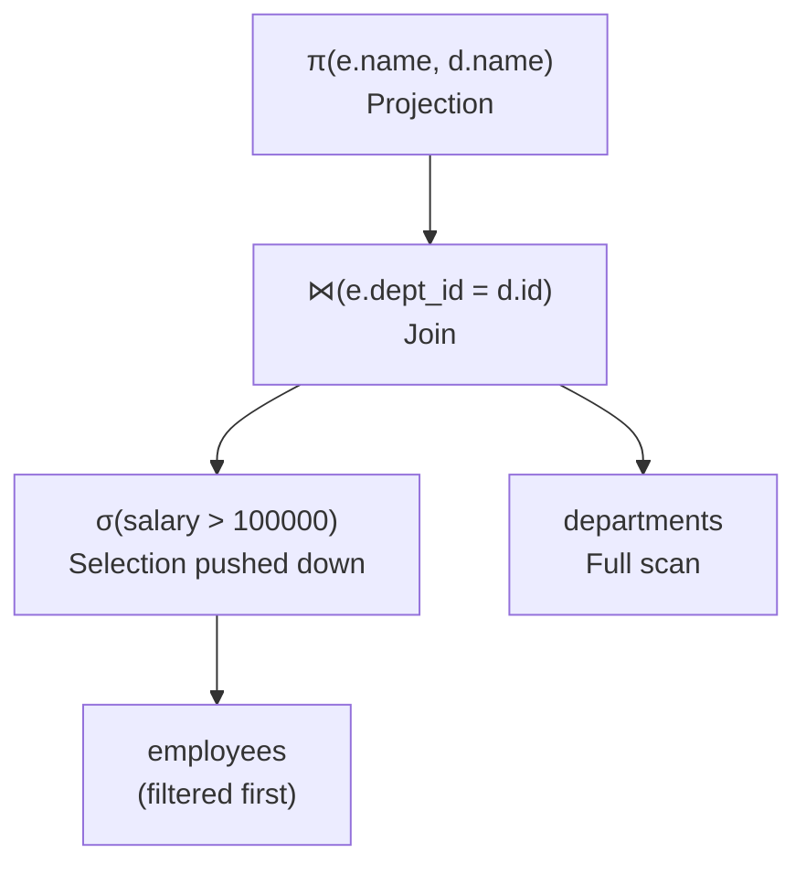
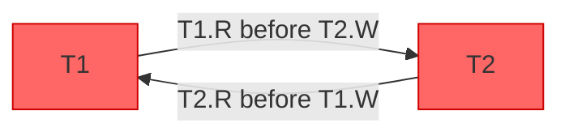
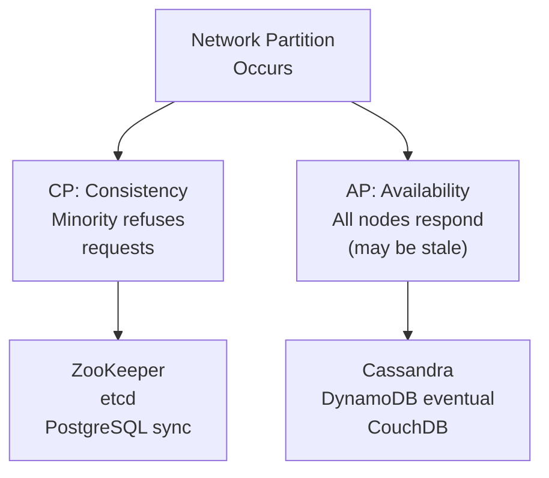

# Relational Algebra and Set Theory

**Interview Weight:** medium-high at staff/principal level - asked
as a "depth" question to verify theoretical foundations. Interviewers
want you to connect algebra operations to SQL query semantics and
optimizer behavior.

---

### 🎯 Model Answer

**30 seconds:**
> Relational algebra is the formal mathematical foundation of SQL.
> Every SQL query is equivalent to a sequence of relational algebra
> operations: selection (WHERE), projection (SELECT columns), join
> (JOIN), union (UNION), difference (EXCEPT), and intersection
> (INTERSECT). Understanding these operations explains why the query
> optimizer rewrites queries - it applies algebraic equivalences
> (predicate pushdown, join reordering) to minimize I/O.

**3 minutes (Senior):**
> Relational algebra defines six fundamental operations on sets of
> tuples. Selection (σ) filters rows matching a predicate - maps to
> SQL WHERE clause. Projection (π) retains specific columns - maps
> to SELECT column list. Cross product (×) produces all combinations
> of two relations - the basis for JOIN (a cross product followed by
> a selection on the join predicate). Union (∪) combines rows from
> two relations, eliminating duplicates - maps to SQL UNION. Difference
> (-) returns rows in the first relation not in the second - maps to
> SQL EXCEPT. Intersection (∩) returns rows in both - maps to SQL
> INTERSECT.
>
> These are closed operations: every operation takes relations and
> returns a relation. This closure property means any combination of
> operations is valid and produces a relation - the basis for nested
> subqueries.
>
> The query optimizer uses algebraic equivalences to transform your
> SQL into a more efficient execution plan. Predicate pushdown moves
> selection operations earlier (filter rows before joining - reduces
> I/O). Join reordering exploits commutativity and associativity of
> joins to find the cheapest join order. These transformations are
> proven correct by relational algebra - the result set is identical
> regardless of evaluation order.
>
> Set theory foundations: relations are sets (no duplicates, no
> order). SQL deviates from pure set theory with bags (multisets -
> allow duplicates). SELECT returns a bag (duplicates allowed) while
> UNION removes duplicates (set behavior). SELECT DISTINCT converts
> a bag to a set. This distinction is why UNION ALL (bag union) is
> faster than UNION (set union with deduplication).

**Framework:** ALGEBRA (6 operations) -> SQL MAPPING (each SQL
clause = an algebra operation) -> OPTIMIZER (uses algebraic
equivalences for plan rewriting) -> PRACTICAL IMPACT (predicate
pushdown, join reordering)

---

### 📘 Concept Explanation

**What it is:**
Relational algebra is the formal query language underlying SQL,
defined by E.F. Codd in 1970. It provides a mathematical framework
for expressing queries as compositions of operations on sets of
tuples (relations).

**The six fundamental operations:**

```
SELECTION (σ): filter rows by predicate
  σ(age > 25)(employees)
  SQL: SELECT * FROM employees WHERE age > 25

PROJECTION (π): retain specific columns
  π(name, salary)(employees)
  SQL: SELECT name, salary FROM employees

CROSS PRODUCT (×): all combinations of two relations
  employees × departments
  SQL: SELECT * FROM employees, departments
  (rarely used directly - basis for JOIN)

UNION (∪): combine rows, no duplicates
  customers_ny ∪ customers_ca
  SQL: SELECT ... UNION SELECT ...

DIFFERENCE (-): rows in A not in B
  all_customers - inactive_customers
  SQL: SELECT ... EXCEPT SELECT ...

INTERSECTION (∩): rows in both A and B
  customers ∩ premium_members
  SQL: SELECT ... INTERSECT SELECT ...
```

**Derived operations (built from fundamentals):**

```
NATURAL JOIN (⋈): cross product + selection on
                   matching column names
  employees ⋈ departments
  SQL: SELECT * FROM employees JOIN departments
       ON employees.dept_id = departments.id

THETA JOIN: cross product + selection on condition
  r1 ⋈(condition) r2
  SQL: JOIN ... ON condition

DIVISION (÷): find entities related to ALL values
               in a set (complex - no direct SQL)
  "Find employees who know ALL required skills"
  SQL: implemented with EXCEPT or GROUP BY HAVING
```

**Algebraic equivalences used by optimizer:**

```
Predicate pushdown:
  σ(p)(R1 ⋈ R2) ≡ σ(p)(R1) ⋈ R2  (if p only refs R1)
  Filter BEFORE join reduces intermediate result size

Join commutativity:
  R1 ⋈ R2 ≡ R2 ⋈ R1
  Optimizer can choose join order

Join associativity:
  (R1 ⋈ R2) ⋈ R3 ≡ R1 ⋈ (R2 ⋈ R3)
  Optimizer can reorder multi-table joins
```

**The key insight:**
The optimizer rewrites your SQL query using algebraic equivalences
to minimize I/O. It applies predicate pushdown automatically
(regardless of where you write the WHERE clause) and uses statistics
to choose the optimal join order. Understanding algebra explains
why "write the filter early in the query" is not necessary in SQL -
the optimizer does it for you.

**When to use it:**
Understanding relational algebra helps when: (1) reading an EXPLAIN
plan (each node corresponds to an algebra operation); (2) writing
correlated subqueries (they map to division or difference);
(3) debugging optimizer plan choices.

---

### 💻 Code Example

**Example 1: Relational algebra to SQL mapping**

```sql
-- σ (Selection): WHERE clause
-- π (Projection): SELECT column list
-- ⋈ (Join): JOIN ... ON
-- Example: π(e.name, d.name)(σ(e.salary > 100000)
--          (employees ⋈ departments))

-- BAD: implicit cross product (Cartesian product)
SELECT e.name, d.name
FROM employees e, departments d;
-- This is: employees × departments (all combinations)
-- 1000 employees × 50 departments = 50,000 rows
-- Missing the theta join predicate

-- GOOD: explicit theta join (cross product + selection)
SELECT e.name, d.name
FROM employees e
JOIN departments d ON e.dept_id = d.id
WHERE e.salary > 100000;
-- σ(salary > 100000 AND e.dept_id = d.id)
-- (employees × departments)
-- Optimizer rewrites: σ(e.dept_id = d.id)(employees)
-- applied as a hash/merge join, not cross product
```

> **Code walkthrough:** The BAD example creates a Cartesian product
> (cross product × with no theta) - with 1000 employees and 50
> departments it produces 50K rows before any filtering. PostgreSQL
> shows this as "Nested Loop (no join condition)" in EXPLAIN. The
> GOOD example states the join predicate, allowing the optimizer to
> use a hash join or index lookup instead of the cross product. The
> WHERE salary > 100000 is a selection (σ) that the optimizer pushes
> down to filter employees before the join (predicate pushdown
> algebraic equivalence), reducing the join input size.

**Example 2: Division operation (find entities related to ALL)**

```sql
-- Relational division: "Find all students who
-- enrolled in ALL required courses"
-- required_courses = {CS101, CS201, CS301}

-- BAD: attempt with IN (finds students in ANY course)
SELECT DISTINCT student_id
FROM enrollments
WHERE course_id IN ('CS101','CS201','CS301');
-- Returns students who took at least 1 course

-- GOOD: EXCEPT-based implementation of division
-- "Students who haven't NOT-enrolled in any
--  required course"
SELECT student_id FROM students s
WHERE NOT EXISTS (
  SELECT course_id FROM required_courses rc
  WHERE NOT EXISTS (
    SELECT 1 FROM enrollments e
    WHERE e.student_id = s.student_id
    AND e.course_id = rc.course_id
  )
);
-- Or equivalently with GROUP BY + HAVING:
SELECT student_id
FROM enrollments
WHERE course_id IN ('CS101','CS201','CS301')
GROUP BY student_id
HAVING COUNT(DISTINCT course_id) = 3;
```

> **Code walkthrough:** Relational division ("find X related to all
> Y") has no direct SQL operator - it must be expressed as a double
> negation (NOT EXISTS within NOT EXISTS). This double negation
> pattern is a direct translation of the algebraic division. The
> GROUP BY + HAVING alternative is clearer and more efficient for
> this specific case (counts distinct matching courses and compares
> to the required count). This pattern appears in "find customers who
> ordered all products" and "find employees with all required skills"
> problems.

---

### 🎓 Answers by Seniority

**Junior / Mid:** SQL is built on relational algebra - the formal
math behind tables and queries. Selection filters rows (WHERE),
projection picks columns (SELECT), join combines tables. The query
optimizer uses algebraic rules like predicate pushdown to make
queries efficient.

**Senior / Staff:** I use relational algebra to reason about query
optimizer behavior. When a query runs unexpectedly slowly, I check
the EXPLAIN plan to see which algebraic operations are expensive and
whether the optimizer is applying predicate pushdown correctly. I
also use the double-negation pattern (NOT EXISTS within NOT EXISTS)
when I need relational division semantics.

---

### ❓ Questions & Spoken Answers

#### Definition
- "What is relational algebra?"
- "What is the difference between a set and a bag in databases?"
- "What are the six fundamental relational algebra operations?"
- "How does relational algebra relate to SQL?"
🗣️ "Relational algebra is the mathematical foundation of SQL, defined
by E.F. Codd in 1970. The six operations: selection (filter rows -
maps to WHERE), projection (pick columns - maps to SELECT), cross
product (all row combinations - basis for JOIN), union (combine
rows without duplicates - maps to UNION), difference (rows in A not
in B - maps to EXCEPT), and intersection (rows in both - maps to
INTERSECT). Every SQL query is equivalent to a sequence of these
operations. The query optimizer uses algebraic equivalences to
transform your query into a more efficient execution plan - predicate
pushdown moves filters before joins (equivalent transformation, less
I/O). SQL deviates from pure set theory by using bags (multisets
that allow duplicate rows) by default. SELECT returns a bag; DISTINCT
or UNION converts it to a set."

#### Mechanism
- "What is predicate pushdown and why is it an algebraic equivalence?"
- "What is relational division and how do you implement it in SQL?"
- "How does join reordering use algebraic properties?"
- "Why is UNION slower than UNION ALL?"
🗣️ "UNION versus UNION ALL: UNION is the set union operator from
relational algebra - it eliminates duplicate rows. SQL must sort or
hash both result sets to detect duplicates. UNION ALL is the bag
union - it concatenates the results without deduplication. For the
optimizer, UNION ALL is simply append (no extra hash or sort step).
UNION adds O(N log N) or O(N) overhead for deduplication. If you
know the results have no duplicates (different primary keys, different
time ranges), use UNION ALL. The result is semantically identical
but the execution is cheaper by the deduplication cost."

#### Comparison
- "Relational model vs document model - algebraic expressiveness?"
- "Natural join vs explicit join - which should you use?"
- "SQL bags vs mathematical sets - practical implications?"
- "Relational algebra vs relational calculus - difference?"
🗣️ "Relational calculus is the declarative counterpart to procedural
relational algebra. Algebra says 'how to compute' (a sequence of
operations). Calculus says 'what to compute' (a predicate over the
result). SQL is based on relational calculus (you declare what you
want, the optimizer decides how). The query optimizer internally
converts the SQL (calculus-based) into an algebraic execution plan
(operations in a specific order). Codd proved that algebra and
calculus are equivalent in expressive power (Codd's theorem) -
any query expressible in one is expressible in the other."

#### Scenario
- "A query is slow. How would you reason about it using algebra?"
- "You need to find all products with ALL required attributes.
  How do you write this?"
- "Why does filter position in SQL not matter for performance?"
- "How would you detect a Cartesian product in a query?"
🗣️ "For the EXPLAIN analysis using algebra: each node in the EXPLAIN
plan corresponds to an algebra operation. 'Seq Scan on employees'
is a selection. 'Hash Join' is a theta join implemented as hashing.
'Sort' is needed when ORDER BY or DISTINCT is required (bag to set
conversion for DISTINCT, or ordered output for ORDER BY). I look
for 'Nested Loop' with high row estimates on the inner side (usually
indicates a missing index on the join column), 'Seq Scan' on large
tables where an index would help (indicates missing index or
statistics not updated), and whether predicate pushdown occurred
(filter should appear below the join node, not above it)."

#### Deep Dive
- "What is the third normal form and how does it relate to the
  relational model?"
- "What is functional dependency and why does it matter?"
- "Explain the domain-key normal form."
- "What is the closure property of relational algebra?"
🗣️ "The closure property: every relational algebra operation takes
relations as input and produces a relation as output. This means
operations can be arbitrarily composed - the result of any operation
is a valid input to another operation. In SQL terms: subqueries are
valid wherever a table reference is valid because a subquery returns
a relation (result set). This is why you can write SELECT ... FROM
(SELECT ...) AS derived_table - the inner SELECT produces a relation
(derived table), and the outer SELECT operates on it like any other
table. Without closure, nested queries would not be possible."

#### Misconception / Trap
- "WHERE clause position affects performance."
- "JOIN and WHERE are evaluated in the order written."
- "UNION and UNION ALL have the same semantics."
- "SELECT DISTINCT is always correct for deduplication."
🗣️ "WHERE clause position does not affect performance because the
query optimizer applies predicate pushdown algebraically. Whether
you write WHERE before or after a join, the optimizer transforms
the plan so that filters are applied as early as possible (below
join nodes in the plan tree). The only exception: lateral joins and
LATERAL subqueries where the predicate depends on the outer query.
The general rule: write SQL for clarity, not for manual optimization.
The optimizer handles predicate placement."

#### Performance & Scalability
- "Why are multi-table cross products catastrophic for performance?"
- "What is the cost of UNION deduplication?"
- "How does join cardinality estimation affect plan quality?"
- "What is projection pushdown and why does it matter for columnar?"
🗣️ "Cardinality estimation for join ordering: the optimizer estimates
the number of rows each join produces to choose the join order and
join algorithm. If statistics are stale (ANALYZE not run), cardinality
estimates are wrong, and the optimizer may choose a suboptimal join
order (e.g., joining two large tables first instead of filtering
one small) or wrong algorithm (nested loop where hash join is better).
I run ANALYZE after large data loads and check if estimated rows in
EXPLAIN match actual rows. A 10x discrepancy between estimated and
actual rows is a strong signal that statistics need updating and the
plan may be suboptimal."

| Interviewer Type | Emphasis |
|---|---|
| Technical Panel  | Theoretical depth. Connect algebra to optimizer. |
| Hiring Manager   | Practical impact. Why does this matter for performance? |
| Bar Raiser       | First principles. Can you derive optimizer behavior? |
| Peer Engineer    | Applied examples. Query rewriting patterns. |

---

### ⚖️ Comparison

| Concept | SQL Operator | Algebra | Performance Note |
|---|---|---|---|
| **Filter rows** | WHERE | Selection (σ) | Pushed before joins |
| **Pick columns** | SELECT list | Projection (π) | Pushed before joins in columnar |
| **Combine tables** | JOIN ON | Theta join (⋈) | Hash/merge/nested loop |
| **All combinations** | cross join | Cross product (×) | Very expensive |
| **Combine results** | UNION | Union (∪) | Slower (deduplication) |
| **Combine all results** | UNION ALL | Bag union | Fast (append only) |
| **Rows not in another** | EXCEPT | Difference (-) | Sort or hash |
| **Rows in both** | INTERSECT | Intersection (∩) | Sort or hash |

---

### 🔥 Field Q&A

#### Production Failures

Q: A developer writes a join without a predicate and the query
runs for 30 minutes producing millions of rows. Diagnose.

A: This is an accidental Cartesian product - a cross product (×)
with no theta join condition. In EXPLAIN it shows as "Nested Loop"
or "Hash Join" with no join condition, with estimated rows as
table1_size × table2_size. A 10K × 10K table cross product = 100M
rows. Fix immediately by killing the query (pg_cancel_backend),
then adding the JOIN ON predicate. Prevention: query review
tooling that flags queries with missing join predicates, and
read_timeout limits that prevent runaway queries.

#### Candidate Mistakes

Q: Candidate cannot connect relational algebra to SQL optimizer.

**What NOT to say:** "Relational algebra is theoretical and
doesn't apply to practical SQL work."

**Say instead:** "Relational algebra explains optimizer behavior
directly. Predicate pushdown is the algebraic equivalence
σ(p)(R1 ⋈ R2) ≡ σ(p)(R1) ⋈ R2. The optimizer applies this
transformation automatically - that's why WHERE clause position
doesn't affect performance in SQL."

---

### 🏛️ System Design

> *(Conditional: included because ★★★.)*

Relational algebra underpins query planner design. In system
design for a custom query engine or database: the planner converts
SQL to a logical algebra tree, applies rewrite rules (predicate
pushdown, constant folding, join elimination), estimates costs
using statistics, and generates a physical plan (choosing hash join
vs merge join vs nested loop based on cardinality estimates and
available indexes). This is the standard architecture of PostgreSQL,
MySQL, SQLite, and most SQL engines.

---

### 📊 Diagram

```
QUERY OPTIMIZER: ALGEBRA REWRITE

Original query:
  SELECT e.name, d.name
  FROM employees e
  JOIN departments d ON e.dept_id = d.id
  WHERE e.salary > 100000

Logical algebra tree (before rewrite):
  π(e.name, d.name)
    σ(e.salary > 100000)
      ⋈(e.dept_id = d.id)
        employees     departments

After predicate pushdown:
  π(e.name, d.name)
    ⋈(e.dept_id = d.id)
      σ(e.salary > 100000)(employees)
      departments
  (Filter before join = less data to join)
```



> **Diagram walkthrough:** The left tree shows the query before
> optimizer rewriting: the selection (salary filter) sits above the
> join, meaning the join runs on all rows before filtering. The right
> tree shows after predicate pushdown: the selection is pushed below
> the join, filtering employees first (e.g., 100 rows with salary >
> 100K from 10K employees), then joining only 100 rows to departments
> instead of 10K. This algebraic equivalence (proven mathematically
> equivalent in result) produces far less I/O and CPU for the join.

---

---

# Transaction Serializability Theory

**Interview Weight:** high at senior/staff level - asked in
distributed systems and database interviews. Interviewers want
you to connect isolation levels to serializability theory and
explain why certain anomalies occur.

---

### 🎯 Model Answer

**30 seconds:**
> A schedule of concurrent transactions is serializable if its
> effect is equivalent to some serial execution of those transactions.
> Serializability is the gold standard of isolation. Most databases
> do not guarantee full serializability by default because it is
> expensive - they use weaker isolation levels like Read Committed
> or Repeatable Read, which allow specific anomalies in exchange for
> better concurrency. Conflict serializability is tested by building
> a precedence graph: if the graph is acyclic, the schedule is
> serializable.

**3 minutes (Senior):**
> Serializability theory classifies transaction schedules by whether
> their interleaved execution is equivalent to some serial execution.
> Two operations conflict if they access the same data item and at
> least one is a write. In a conflict-serializable schedule, conflicts
> can be resolved into a serial order with no cycles. The test: build
> a precedence graph (dependency graph) where each node is a
> transaction and a directed edge Ti -> Tj exists if Ti has a
> conflicting operation before Tj. If this graph has no cycle, the
> schedule is conflict serializable.
>
> In practice, databases implement serializability approximations.
> 2PL (Two-Phase Locking) guarantees conflict serializability by
> requiring transactions to acquire all locks before releasing any
> (growing phase then shrinking phase). It is correct but can deadlock.
> Snapshot Isolation (SI) gives each transaction a consistent
> snapshot of the database at start time. It avoids many anomalies
> but does NOT guarantee serializability - it allows the write skew
> anomaly. Serializable Snapshot Isolation (SSI, implemented in
> PostgreSQL SERIALIZABLE level) extends SI with anti-dependency
> tracking to detect and abort transactions that would violate
> serializability.
>
> The practical implication: if you use PostgreSQL's default Read
> Committed level, you get good performance but allow anomalies
> (non-repeatable reads, phantom reads). If you need a guarantee
> that concurrent transactions behave as if sequential, use
> SERIALIZABLE isolation. This is the correct choice for financial
> transactions, inventory reservations, and any case where
> "read-then-write" logic must be atomic.

**Framework:** SCHEDULES -> CONFLICT (read/write on same data) ->
PRECEDENCE GRAPH (cycle = not serializable) -> 2PL (locks,
correct but deadlock-prone) -> SI (snapshot, fast, write skew
risk) -> SSI (PostgreSQL SERIALIZABLE, correct + concurrent)

---

### 📘 Concept Explanation

**What it is:**
Transaction serializability is the formal correctness criterion
for concurrent transaction execution. A schedule (interleaving of
operations from multiple transactions) is serializable if its
outcome is identical to some serial execution of the transactions
in some order.

**Conflict analysis:**

```
Two operations conflict when:
  1. They access the same data item
  2. At least one is a write
  3. They are from different transactions

Types:
  Read-Write conflict (RW): Ti reads X, Tj writes X
  Write-Read conflict (WR): Ti writes X, Tj reads X
                            (also: "dirty read" if not committed)
  Write-Write conflict (WW): Ti writes X, Tj writes X
                             (also: "lost update")
```

**Precedence graph (serialization graph):**

```
Schedule:
  T1: R(A), W(A)
  T2: R(A), W(A)
  Interleaved: T1.R(A), T2.R(A), T1.W(A), T2.W(A)

Conflicts:
  T1.R(A) before T2.W(A) -> T1 must precede T2 (T1 -> T2)
  T2.R(A) before T1.W(A) -> T2 must precede T1 (T2 -> T1)

Graph: T1 -> T2 AND T2 -> T1 = CYCLE
Result: NOT serializable (lost update anomaly)
```

**2PL (Two-Phase Locking):**

```
Growing phase: acquire locks, release none
Shrinking phase: release locks, acquire none

T1 acquires S-lock on A (shared, read)
T2 tries S-lock on A -> WAIT (T1 holds S-lock)
T1 upgrades to X-lock (exclusive, write)
T1 commits, releases locks
T2 acquires S-lock on A
...

Guarantees: conflict serializability
Risk: deadlock (T1 waits for T2 while T2 waits for T1)
```

**Snapshot Isolation vs Serializability:**

```
Write Skew Anomaly (not caught by Snapshot Isolation):
  Constraint: at least one doctor must be on-call
  T1: reads doctors_on_call = 2 -> sets doctor A off-call
  T2: reads doctors_on_call = 2 -> sets doctor B off-call
  Result: 0 doctors on-call (constraint violated)
  SI missed this because:
    T1 and T2 saw a consistent snapshot (2 on-call)
    Their writes did not overlap (different rows)
    No conflict detected by SI

SERIALIZABLE (SSI) catches this:
  Anti-dependency: T1's READ depends on what T2 WRITEs
  SSI detects this anti-dependency cycle and aborts T2
```

**The key insight:**
Most applications use Read Committed (PostgreSQL default) which
allows significant anomalies. Using SERIALIZABLE isolation is
safer for complex multi-row logic but requires handling transaction
aborts (SSI aborts transactions to resolve conflicts - you must
retry aborted transactions).

**When to use it:**
Use SERIALIZABLE when: (1) multiple rows must be read and then
updated atomically (inventory reservation, seat booking); (2) the
business logic has invariants that depend on aggregate reads (sum
of balances, count of available slots); (3) write skew would cause
data corruption.

**When NOT to use it:**
Do not use SERIALIZABLE for simple CRUD operations where each
transaction reads and writes independent rows. The overhead of
anti-dependency tracking (SSI) and potential aborts is not
justified when isolation anomalies cannot occur.

---

### 💻 Code Example

**Example 1: BAD - write skew with REPEATABLE READ**

```sql
-- BAD: ticket reservation with snapshot isolation
-- Two transactions both see 1 seat available
-- Both reserve it -> overbooking

-- T1 and T2 run concurrently

-- T1:
BEGIN ISOLATION LEVEL REPEATABLE READ;
SELECT COUNT(*) FROM seats
  WHERE event_id = 1 AND status = 'available';
-- Returns: 1
UPDATE seats SET status = 'reserved', user_id = 100
  WHERE event_id = 1 AND status = 'available'
  LIMIT 1;
COMMIT;
-- T1 sees 1 seat, reserves it

-- T2 (concurrent, same snapshot):
BEGIN ISOLATION LEVEL REPEATABLE READ;
SELECT COUNT(*) FROM seats
  WHERE event_id = 1 AND status = 'available';
-- Also returns: 1 (snapshot taken before T1 committed)
UPDATE seats SET status = 'reserved', user_id = 200
  WHERE event_id = 1 AND status = 'available'
  LIMIT 1;
COMMIT;
-- T2 also sees 1 seat from its snapshot,
-- writes to a different physical slot
-- Result: OVERBOOKING (2 reservations for 1 seat)
```

**Example 2: GOOD - serializable isolation prevents write skew**

```sql
-- GOOD: Use SERIALIZABLE isolation
-- SSI detects the anti-dependency and aborts one transaction

BEGIN ISOLATION LEVEL SERIALIZABLE;
SELECT COUNT(*) FROM seats
  WHERE event_id = 1 AND status = 'available';
-- Returns: 1

UPDATE seats SET status = 'reserved', user_id = 100
  WHERE event_id = 1 AND status = 'available'
  LIMIT 1;
COMMIT;
-- One transaction commits, the other is aborted
-- with: ERROR: could not serialize access due to
-- read/write dependencies among transactions

-- Application must retry the aborted transaction
-- Retry: on ERROR:40001 (serialization_failure)
-- -> retry the entire transaction from BEGIN
```

> **Code walkthrough:** Snapshot Isolation allows the write skew
> anomaly because each transaction reads a consistent snapshot and
> their writes do not physically overlap (different rows). SSI
> (PostgreSQL SERIALIZABLE) tracks anti-dependencies: T2 reads the
> seat count which depends on T1's write. When SSI detects a
> dangerous read/write anti-dependency cycle, it aborts one
> transaction. The application must catch serialization_failure
> (SQLSTATE 40001) and retry the entire transaction. The retry
> guarantees that the retried transaction sees T1's committed result
> and correctly sees 0 available seats.

---

### 🎓 Answers by Seniority

**Junior / Mid:** A serializable transaction schedule is one where
concurrent transactions produce a result equivalent to running them
one at a time (serially). Most databases do not use full
serializability by default - they use weaker isolation levels that
allow some anomalies for better performance. The PostgreSQL SERIALIZABLE
level uses SSI to provide true serializability.

**Senior / Staff:** I use SERIALIZABLE isolation for any logic where
a read-then-conditional-write pattern has correctness constraints.
The canonical examples are seat/inventory reservation and financial
double-entry accounting. Snapshot Isolation (Repeatable Read) is
not sufficient for these cases because write skew can violate
invariants. I also ensure the application retries on serialization
failure (SQLSTATE 40001) - SERIALIZABLE guarantees correctness but
may abort transactions to achieve it.

---

### ❓ Questions & Spoken Answers

#### Definition
- "What is a serializable schedule?"
- "What is conflict serializability?"
- "What is the difference between Snapshot Isolation and Serializable
  isolation?"
- "What is write skew?"
🗣️ "A serializable schedule of concurrent transactions is one where
the interleaved execution produces a result identical to some serial
execution of the same transactions. Conflict serializability is
the standard test: build a precedence graph where each directed
edge Ti -> Tj means Ti has a conflicting operation (same data item,
at least one write) that precedes Tj's conflicting operation. If
the graph is acyclic, the schedule is conflict serializable. Write
skew is the anomaly that Snapshot Isolation allows: two concurrent
transactions each read overlapping data, each decide to write based
on that read, and neither's write conflicts with the other's write -
but together they violate a constraint. Classic example: two doctors
both see 2 on-call, both decide to go off-call - leaving 0 on-call,
violating the business rule."

#### Mechanism
- "How does 2PL guarantee conflict serializability?"
- "How does PostgreSQL SSI detect write skew?"
- "What is the growing phase and shrinking phase in 2PL?"
- "How does deadlock happen with 2PL?"
🗣️ "PostgreSQL SSI detects write skew using Serializable Snapshot
Isolation (SSI), which adds anti-dependency tracking to Snapshot
Isolation. An anti-dependency Ti -> Tj means Ti reads a version
of data that Tj has since overwritten. SSI looks for a dangerous
pattern: a cycle in the combined dependency + anti-dependency graph
involving at least one anti-dependency edge. When a cycle is
detected, SSI aborts the transaction that is cheapest to abort
(the one that has done less work, with SQLSTATE 40001). The aborted
transaction must be retried. This gives true serializability with
significantly better concurrency than 2PL (which holds locks and
blocks, while SSI detects conflicts without blocking)."

#### Comparison
- "2PL vs Optimistic Concurrency Control - which is better?"
- "Serializable vs REPEATABLE READ - practical difference?"
- "View serializability vs conflict serializability?"
- "SSI vs strict 2PL - which is more concurrent?"
🗣️ "2PL versus Optimistic Concurrency Control (OCC): 2PL is
pessimistic - it locks data to prevent conflicts, blocking
concurrent transactions. OCC is optimistic - transactions proceed
without locks, and at commit time, OCC checks if any conflict
occurred. If yes, one transaction aborts and retries. 2PL is better
when conflicts are frequent (locking prevents wasted work). OCC is
better when conflicts are rare (no lock overhead for the common
case). SSI is a form of OCC for serializability - it does not block
but may abort. The practical choice: use READ COMMITTED for low-
conflict CRUD, SERIALIZABLE (SSI) for invariant-constrained
multi-row logic."

#### Scenario
- "You have a booking system where overbooking is occurring.
  How do you fix it at the isolation level?"
- "Your SERIALIZABLE transactions are aborting frequently. Why?"
- "You need to transfer money between accounts atomically.
  What isolation level and why?"
- "After adding SERIALIZABLE isolation, latency went up 20%.
  Is this expected?"
🗣️ "For the money transfer: SERIALIZABLE isolation provides the
strongest guarantee. A transfer involves reading both account
balances and updating both. With Read Committed, a concurrent
transfer involving the same accounts could produce a lost update
(both read the old balance, both compute a new balance, one
update is lost). With SERIALIZABLE, SSI detects the anti-dependency
between the two concurrent transfers and aborts one. The aborted
transfer retries and sees the committed result of the first,
computing the correct new balance. The application must handle
SQLSTATE 40001 and retry. For the latency increase: 20% overhead
for SSI is expected - anti-dependency tracking adds bookkeeping
per read. This is acceptable for financial correctness."

#### Deep Dive
- "Prove that conflict serializability implies view serializability."
- "What is the phantom problem and which isolation level prevents it?"
- "What is a predicate lock and how does it prevent phantoms?"
- "How does PostgreSQL implement SSI using SIReadLock?"
🗣️ "Phantom reads: a transaction reads a set of rows matching a
predicate (WHERE salary > 100000). A concurrent transaction inserts
a new row matching that predicate. The first transaction, if it
re-executes the read, sees the new row (a 'phantom'). Repeatable
Read prevents non-repeatable reads (re-reading a row gets the same
result) but does NOT prevent phantoms (a new row can appear in a
re-executed predicate-based query). SERIALIZABLE (SSI) prevents
phantoms: the anti-dependency between the inserting transaction and
the reading transaction's predicate is detected, and SSI aborts
the transaction whose commit would create an anomaly."

#### Misconception / Trap
- "REPEATABLE READ is the same as SERIALIZABLE."
- "SERIALIZABLE isolation means no transactions ever abort."
- "2PL eliminates all anomalies."
- "Snapshot Isolation guarantees serializability."
🗣️ "SERIALIZABLE isolation does not mean no transactions ever abort.
SSI achieves serializability by detecting and aborting transactions
that would violate it. The documentation says: 'It is possible for
applications to be written to retry transactions that fail due to
serialization failure.' SQLSTATE 40001 (serialization_failure) must
be caught and the transaction retried from the beginning. Without
retry logic, SERIALIZABLE isolation causes silent failures when
under concurrent write load. This is the most common mistake when
first adopting SERIALIZABLE: the isolation is correct but without
retry, aborted transactions lose their work silently."

#### Performance & Scalability
- "What is the throughput cost of SERIALIZABLE vs READ COMMITTED?"
- "How does 2PL's lock table scale under high concurrency?"
- "What is the abort rate under SSI and how does it affect throughput?"
- "How does PostgreSQL's lock manager scale?"
🗣️ "SSI abort rate and throughput: in workloads with frequent
conflicts (many transactions reading and writing the same rows),
SSI abort rates can be high - 10-30% in adversarial workloads. Each
abort wastes the work done by the aborted transaction. Under high
contention, this reduces throughput below Read Committed. The
mitigation: keep transactions short (less window for conflict),
avoid long-running reads within transactions, and ensure the
application retries promptly with exponential backoff. For workloads
where SERIALIZABLE is required but conflict rate is high, an
explicit pessimistic lock (SELECT ... FOR UPDATE) on the key rows
may have better throughput than SSI by preventing the conflict
rather than detecting it after the fact."

| Interviewer Type | Emphasis |
|---|---|
| Technical Panel  | Theoretical precision. Precedence graph. SSI mechanism. |
| Hiring Manager   | Business impact. What anomalies can occur without it? |
| Bar Raiser       | Edge cases. Write skew. SSI abort handling. |
| Peer Engineer    | Practical advice. When to use SERIALIZABLE and retry. |

---

### ⚖️ Comparison

| Isolation Level | Prevents | Allows | Cost |
|---|---|---|---|
| **Read Uncommitted** | Nothing | Dirty read, NRR, phantom, write skew | None |
| Read Committed | Dirty read | NRR, phantom, write skew | Low |
| Repeatable Read | Dirty read, NRR | Phantom, write skew | Medium |
| Snapshot Isolation | Dirty read, NRR, phantom | Write skew | Medium |
| Serializable (SSI) | All anomalies | Nothing | Medium + abort risk |

NRR = Non-Repeatable Read

---

### 🔥 Field Q&A

#### Production Failures

Q: Your ticket booking system oversold a concert by 50 tickets.
The database was using Repeatable Read. What happened and how
do you fix it?

A: Classic write skew under Snapshot Isolation. 50 concurrent
purchase transactions each read the available seat count from
their snapshot (50 seats remaining). Each decided to reserve a
seat. Their writes targeted different rows (different seat
assignments) so no conflict was detected. All 50 committed
successfully, selling 50 seats when possibly only 20 remained
in reality. Fix: switch to SERIALIZABLE isolation for the
purchase transaction. SSI detects the anti-dependency (each
transaction's read depends on the others' writes to the seat
count). One transaction at a time commits; the rest are aborted
and retry. The first retry sees the committed result (fewer
seats) and either reserves a remaining seat or returns "sold
out". Application must handle SQLSTATE 40001 retry.

#### Candidate Mistakes

Q: Candidate says "just use Serializable everywhere."

**What NOT to say:** "We should always use SERIALIZABLE to
avoid all isolation problems."

**Say instead:** "SERIALIZABLE provides the strongest guarantees,
but it has costs: SSI abort rate increases under contention,
requiring retry logic in the application; anti-dependency tracking
adds bookkeeping overhead per read operation. For simple CRUD
where each transaction touches independent rows, Read Committed
provides sufficient isolation with better performance. I use
SERIALIZABLE specifically when the logic requires read-then-
conditional-write on shared state (inventory, seat booking,
account transfers). Using it universally adds overhead and
abort-retry complexity where it is not needed."

---

### 🏛️ System Design

> *(Conditional: included because ★★★.)*

Serializability theory informs distributed transaction design.
In a distributed system (microservices with separate databases),
achieving serializability across services requires 2PC (two-phase
commit) or distributed transactions. 2PC is correct but introduces
blocking: if the coordinator fails between prepare and commit,
participants are blocked waiting for a decision. Saga pattern is
the alternative: break the distributed transaction into a sequence
of local transactions with compensating transactions for rollback.
Saga sacrifices serializability (intermediate states are visible)
for availability (no coordinator blocking).

---

### 📊 Diagram

```
CONFLICT SERIALIZABILITY TEST

Schedule:
  T1: R(A), W(A)
  T2: R(A), W(A)
  Interleaved: T1.R T2.R T1.W T2.W

Precedence graph:
  T1.R before T2.W  =>  T1 -> T2
  T2.R before T1.W  =>  T2 -> T1
  T1 <-> T2 CYCLE  =>  NOT serializable
```



> **Diagram walkthrough:** The precedence graph captures the conflict
> relationships between transactions. T1.R(A) precedes T2.W(A)
> (same data item, T1 reads before T2 writes), creating the edge
> T1 -> T2 (T1 must come before T2 in any serial order). T2.R(A)
> precedes T1.W(A) (T2 reads before T1 writes), creating the edge
> T2 -> T1. Both edges together form a cycle: T1 before T2 AND T2
> before T1 is impossible in any serial schedule. Therefore the
> schedule is not conflict serializable - one of the transactions
> will see an inconsistent state.

---

---

# CAP Theorem and Consistency Models

**Interview Weight:** very high - asked in every distributed
systems and system design interview. Interviewers want you to
state CAP correctly, apply it to real systems, and describe
the consistency spectrum beyond CAP.

---

### 🎯 Model Answer

**30 seconds:**
> CAP theorem states that a distributed system can guarantee only
> two of three: Consistency (every read sees the latest write),
> Availability (every request receives a response), and Partition
> Tolerance (the system functions during network partitions). In
> practice, network partitions are unavoidable, so the real trade-off
> is CP (consistency, gives up availability during a partition) versus
> AP (availability, gives up consistency during a partition). The more
> useful framework is the consistency spectrum: strong consistency,
> sequential consistency, causal consistency, eventual consistency -
> each with different performance and correctness trade-offs.

**3 minutes (Senior):**
> CAP theorem, formally proven by Gilbert and Lynch in 2002, defines
> three properties: Consistency (C) - every read returns the most
> recent write or an error; Availability (A) - every request receives
> a non-error response (though it may be stale); Partition Tolerance
> (P) - the system continues operating despite network partitions.
>
> The standard teaching: choose C+P or A+P. But this is oversimplified.
> Network partitions in a distributed system are not optional - they
> happen (link failures, network congestion, data center splits).
> Therefore P is not really a choice. The true trade-off is: during
> a partition, do you prioritize consistency (refuse writes/reads
> that could be stale - CP) or availability (serve potentially stale
> data - AP)?
>
> Practically:
> - ZooKeeper, etcd (consensus systems): CP - during a partition,
>   a minority partition refuses requests to maintain consistency
> - Cassandra (without strong consistency): AP - all nodes accept
>   writes, eventually consistent
> - DynamoDB with eventual consistency: AP
> - DynamoDB with strong consistency: CP (reads hit quorum)
>
> CAP is binary, which is too coarse for real systems. The PACELC
> model extends it: even without a partition (E = Else), there is
> a trade-off between Latency (L) and Consistency (C). Strong
> consistency requires coordinating writes (quorum writes, 2PC) which
> adds latency. The PACELC framing is more practical for daily design
> decisions.
>
> The consistency spectrum (from strong to weak):
> - Linearizability: reads always return the latest write, as if
>   there is a single copy of the data
> - Sequential consistency: operations appear to execute in some
>   global sequential order (allows reordering, not strictly time-
>   based)
> - Causal consistency: causally related operations are seen in order;
>   concurrent operations may be seen in any order
> - Eventual consistency: all replicas eventually converge to the
>   same state (no guarantee of when or what intermediate states
>   are seen)

**Framework:** CAP THEOREM (C/A trade-off during partition) ->
PACELC (L/C trade-off without partition) -> CONSISTENCY SPECTRUM
(linearizable -> sequential -> causal -> eventual) -> PRACTICAL
SYSTEMS (which level does each database use?)

---

### 📘 Concept Explanation

**What it is:**
CAP theorem is a formal impossibility result in distributed systems.
It proves that a distributed data store cannot simultaneously provide
all three of Consistency, Availability, and Partition Tolerance.

**The three properties:**

```
CONSISTENCY (C):
  Every read reflects the most recent write
  "I will always see the latest data"
  Maps to: linearizability in formal terms

AVAILABILITY (A):
  Every request receives a non-error response
  "The system never refuses a request"
  Does NOT mean the response is current/correct

PARTITION TOLERANCE (P):
  System continues operating during network partitions
  (nodes cannot communicate with each other)
  "A network failure does not bring down the system"
```

**The real trade-off (CP vs AP):**

```
During a network partition:

CP choice (Consistency + Partition Tolerance):
  Minority partition refuses writes/reads
  Guarantees: no stale data returned
  Cost: availability - some requests fail
  Examples: ZooKeeper, etcd, Consul, PostgreSQL
            with synchronous replication

AP choice (Availability + Partition Tolerance):
  All nodes continue to serve requests
  Guarantees: always responds
  Cost: may return stale data
  Examples: Cassandra, DynamoDB (eventual),
            CouchDB
```

**PACELC model:**

```
During Partition: choose C (consistency) or A (availability)
Else (no partition): choose L (latency) or C (consistency)

System       | Partition | No-Partition
-------------|-----------|-------------
DynamoDB     | AP        | EL (low latency)
Cassandra    | AP        | EL (tunable)
CockroachDB  | CP        | EC (consistent)
PostgreSQL   | CP        | EC (ACID)
MongoDB      | CP (def)  | EC (strong) or
             |           | EL (eventual)
```

**Consistency spectrum:**

```
STRONGEST                              WEAKEST
    |                                      |
Linearizability -> Sequential -> Causal -> Eventual
    |                                      |
All reads see    Ops appear in  Causally   Replicas
latest write     global order   related    converge
                 (not wall-     ops in     eventually
                 clock time)    order
```

**The key insight:**
CAP says you cannot have C+A+P simultaneously. But "you must
sacrifice consistency" is the wrong lesson. The right lesson is:
during a partition, choose your trade-off deliberately. For a
banking system, choose CP - refuse writes during a partition rather
than risk inconsistency. For a social media feed, choose AP - show
slightly stale posts rather than go down.

**When eventual consistency is acceptable:**
- Product catalog (stale description for seconds is fine)
- Social media timelines (slightly stale feed is fine)
- Recommendation systems (stale recommendations are fine)

**When strong consistency is required:**
- Bank balances (stale balance could cause overdraft)
- Inventory counts (stale count causes overselling)
- Authentication tokens (stale revocation status causes security risk)

---

### 💻 Code Example

**Example 1: BAD - assuming strong consistency in AP system**

```java
// BAD: Reading inventory from Cassandra with eventual
// consistency and assuming it's accurate

@Service
public class InventoryService {
  // Cassandra default consistency level: ONE
  // Reads from one replica - may be stale
  @Autowired CassandraTemplate cassandra;

  public boolean reserveItem(String itemId, int qty) {
    // This read may see stale inventory
    // Another node may have already reserved this stock
    int available = cassandra.selectOne(
        select().from("inventory")
            .where(eq("item_id", itemId)),
        Integer.class
    );
    if (available >= qty) {
      // RACE CONDITION: multiple nodes serve this
      // request simultaneously with same stale count
      updateInventory(itemId, available - qty);
      return true;
    }
    return false;
  }
}
```

**Example 2: GOOD - tuning consistency level for the operation**

```java
// GOOD: Use QUORUM consistency for inventory operations
// QUORUM: majority of replicas must agree -> strong consistency

@Service
public class InventoryService {
  @Autowired CqlSession cqlSession;

  public boolean reserveItem(String itemId, int qty) {
    // Use Lightweight Transaction (LWT) for CAS
    // compare-and-set - atomic check-then-update
    // Cassandra LWT provides linearizable CAS
    PreparedStatement ps = cqlSession.prepare(
        "UPDATE inventory SET qty = ? "
        + "WHERE item_id = ? "
        + "IF qty >= ?"
    );
    BoundStatement bs = ps.bind(
        // new qty = current - requested
        // Cassandra evaluates IF condition atomically
        // Returns applied=true if condition was met
        qty,     // would be current - qty in real impl
        itemId,
        qty
    );
    // Using LOCAL_QUORUM for cross-datacenter safety
    bs = bs.setConsistencyLevel(
        ConsistencyLevel.LOCAL_QUORUM
    );
    ResultSet rs = cqlSession.execute(bs);
    return rs.wasApplied();
    // If qty >= requested: update applied (true)
    // If qty < requested: not applied (false)
    // Atomic compare-and-set prevents race condition
  }
}
```

> **Code walkthrough:** The BAD example reads with eventual
> consistency (ONE replica) and then writes separately - this is
> a classic read-then-write race condition under eventual
> consistency. Two concurrent requests can both read the same stale
> count and both succeed. The GOOD example uses Cassandra Lightweight
> Transactions (LWT), which provide linearizable compare-and-set
> semantics using Paxos internally. The IF qty >= ? condition is
> evaluated atomically on a quorum - only one transaction wins the
> CAS. The trade-off: LWT has 4x higher latency than a normal write
> (Paxos requires 4 round-trips). Use it only for operations where
> consistency is critical.

---

### 🎓 Answers by Seniority

**Junior / Mid:** CAP theorem says a distributed system can guarantee
only two of: Consistency (latest data on every read), Availability
(always responds), and Partition Tolerance (survives network splits).
Since partitions always happen in distributed systems, the real trade-
off is consistency vs availability during a partition. Cassandra
prioritizes availability (AP), ZooKeeper prioritizes consistency (CP).

**Senior / Staff:** I apply PACELC rather than CAP for design
decisions. Even without partitions, strong consistency requires
coordination (quorum writes, 2PC), which adds latency. For most
microservices, eventual consistency is acceptable and provides much
lower latency. For inventory and financial data, I use strong
consistency or SERIALIZABLE isolation and accept the latency cost.
I choose the consistency model per data type, not per system.

---

### ❓ Questions & Spoken Answers

#### Definition
- "Explain CAP theorem."
- "What is linearizability?"
- "What is eventual consistency?"
- "What is the difference between CAP and PACELC?"
🗣️ "CAP theorem states that a distributed data store cannot
simultaneously provide: Consistency (every read returns the most
recent write), Availability (every request receives a non-error
response), and Partition Tolerance (the system functions during
network partitions). Since network partitions are unavoidable, the
practical trade-off is CP (refuse requests during partition to
maintain consistency) versus AP (serve potentially stale responses
during partition to maintain availability). PACELC extends CAP with
an even-when-no-partition dimension: even during normal operation,
there is a trade-off between Latency (L) and Consistency (C).
Strong consistency requires quorum coordination (higher latency).
Eventual consistency can be served by any replica (lower latency).
PACELC is the more actionable model for everyday design decisions."

#### Mechanism
- "How does Cassandra's quorum consistency work?"
- "How does ZooKeeper achieve CP consistency?"
- "What is vector clock and how does it track causality?"
- "How does DynamoDB achieve eventual consistency?"
🗣️ "ZooKeeper achieves CP using the ZAB (ZooKeeper Atomic Broadcast)
protocol, a variant of Paxos. All writes go to the leader, which
broadcasts to followers and waits for a quorum (majority) to
acknowledge before committing. Reads by default go to the local
replica (may be slightly stale). For strong read consistency,
clients call sync() before read, forcing a round-trip to the
leader. During a partition, the minority partition (fewer than
quorum nodes) stops serving writes and returns errors. This is
the CP choice: consistency over availability. The majority partition
continues normally. Applications using ZooKeeper for distributed
locks and leader election rely on this CP guarantee - if the
minority returned stale data, it could lead to two leaders or
double-lock grants."

#### Comparison
- "Cassandra vs ZooKeeper - consistency model difference?"
- "Eventual consistency vs strong consistency - when to use?"
- "DynamoDB strong vs eventual read consistency - difference?"
- "CAP theorem vs PACELC - which is more useful?"
🗣️ "DynamoDB strong vs eventual read consistency: DynamoDB supports
both per-read. Eventual consistency reads (default) go to any
replica - reflect writes within 1 second but may be stale during
propagation. Strong consistency reads go to the leader replica,
guaranteeing the latest committed write. Cost: strong consistency
reads cost 2x in read capacity units and have slightly higher
latency. The decision per operation: for most reads (product
listing, user profiles), eventual is fine. For reads immediately
after a critical write (read-your-own-write scenarios, seat
availability after booking), use strong consistency. Mixing
per-operation is best practice: default eventual, explicit strong
for critical paths."

#### Scenario
- "You are designing a distributed counter for inventory. How
  do you handle consistency?"
- "Your microservice reads user session data from a replicated
  Redis cluster. What consistency risks exist?"
- "You need global availability for a social graph across
  3 regions. What consistency model?"
- "After a network partition, your AP database has divergent
  writes. How do you reconcile?"
🗣️ "For conflict reconciliation after an AP partition: eventual
consistency databases use conflict resolution strategies. Cassandra
uses Last Write Wins (LWW) based on timestamp - the write with the
higher timestamp wins and the other is discarded. This is simple
but can lose writes (the earlier write is silently dropped).
DynamoDB uses conditional writes (if the item has not changed,
apply the write - otherwise return a conflict error). CouchDB uses
multi-version conflict resolution with an application-defined
merge function. For financial data, LWW is dangerous (can silently
lose transactions). The correct approach for financial data: use
CP (coordinator-based consensus) so conflicts never arise, rather
than AP with post-hoc reconciliation."

#### Deep Dive
- "Prove that CAP is an impossibility result."
- "What is the FLP impossibility theorem?"
- "How does CRDT achieve eventual consistency without conflicts?"
- "What is the difference between safety and liveness in
  distributed systems?"
🗣️ "CRDT (Conflict-free Replicated Data Type) achieves eventual
consistency without conflicts by using data structures whose merge
operation is commutative, associative, and idempotent. A G-Counter
(grow-only counter) assigns a separate counter per node - each node
only increments its own slot. The total is the sum of all slots.
Any replica's state can be merged with any other by taking the max
per slot. Order of merge does not matter (commutative + associative).
This guarantees convergence without coordination. Examples: shopping
cart (G-Set or OR-Set for add/remove), social media likes (G-Counter),
collaborative document editing (CRDT text editors like Atom's Teletype
or Notion). The limitation: not all data structures have CRDT forms -
general-purpose transactions do not map to CRDTs."

#### Misconception / Trap
- "CAP means you must choose consistency or availability."
- "Eventual consistency means data loss."
- "CP systems are always safer than AP systems."
- "Strong consistency is always the right choice."
🗣️ "The misconception that CAP forces a global system-wide choice.
In reality, most systems are not uniformly CP or AP - they vary by
operation. DynamoDB is AP by default but offers strong consistency
per read. PostgreSQL is CP for writes (commits are durable and
consistent) but can serve reads from async replicas (AP behavior
for reads). Cassandra's consistency level is tunable per operation:
QUORUM for strong, ONE for eventual. The right approach is to classify
each operation by its consistency requirement and apply the appropriate
consistency level, rather than choosing one consistency model for
the entire system."

#### Performance & Scalability
- "What is the latency cost of strong consistency in a distributed
  system?"
- "How does quorum reads scale with cluster size?"
- "What is the throughput impact of 2PC for distributed transactions?"
- "How does Google Spanner achieve external consistency globally?"
🗣️ "Google Spanner achieves external consistency (linearizability at
global scale) using TrueTime - a globally synchronized clock with
bounded uncertainty (±7ms). Every transaction receives a timestamp.
Spanner waits out the uncertainty interval before committing (if
the clock uncertainty is [t-e, t+e], wait until real time > t+e
before making the write visible). This guarantees that any read after
the commit will see the write. The wait time is the uncertainty
interval (7ms typical, 10ms worst case). This is the clock-based
alternative to Paxos coordination - Spanner uses Paxos within each
zone for replication, but uses TrueTime to achieve external
consistency globally without a global master. The cost: 7-10ms
commit latency minimum, regardless of hardware performance."

| Interviewer Type | Emphasis |
|---|---|
| Technical Panel  | Formal precision. Prove CAP. Define linearizability. |
| Hiring Manager   | Business impact. When do you pick AP vs CP? |
| Bar Raiser       | Advanced models. PACELC, CRDT, Spanner TrueTime. |
| Peer Engineer    | Applied design. Cassandra tuning, DynamoDB modes. |

---

### ⚖️ Comparison

| System | CAP | Consistency Default | Strong Option |
|---|---|---|---|
| **PostgreSQL** | CP | ACID (strong) | Always strong |
| Cassandra | AP | Eventual (ONE) | QUORUM (tunable) |
| DynamoDB | AP | Eventual | Strong (per-read, 2x cost) |
| MongoDB | CP | Eventual (secondary) | Primary reads |
| ZooKeeper | CP | Strong | Always strong |
| CockroachDB | CP | Strong | Always strong |
| Redis Cluster | AP | Eventual | Not supported |

---

### 🔥 Field Q&A

#### Production Failures

Q: Your Redis cluster had a partition and you lost 15 minutes
of session writes. Users were logged out. Post-mortem?

A: Redis Cluster is AP - during a partition, nodes in the
minority partition continue accepting writes that are lost when
the cluster heals. Sessions written during the partition to
minority nodes were lost. Root cause: using Redis Cluster with
async replication for session data that requires durability.
Mitigation options: (1) use Redis Sentinel (single primary) with
sync replication to at least one replica - lower availability but
no data loss on partition; (2) use a CP store (database, etcd)
for session token validity and Redis only for session data cache;
(3) design sessions to be stateless (JWT tokens signed by the
server - no session store needed, token validity is self-contained
and cryptographically verified). The architectural lesson: choose
data store durability guarantees based on the data's recovery cost,
not its access pattern alone.

Q: Your distributed inventory system shows negative stock
after concurrent requests from 3 data centers. Root cause?

A: This is the classic AP consistency failure under multi-site
concurrent writes with eventual consistency. Each data center
served reads from its local replica (showing stock > 0) and
accepted writes (decrement). The decrements from all 3 centers
eventually converged, but the final count is negative because all
centers saw stale counts before the others' decrements arrived.
Fix: inventory reservation must use CP consistency. Options:
(1) single-region strong consistency for inventory writes (route
all inventory writes to one region, replicate reads); (2) Cassandra
LWT (Paxos-based CAS) for atomic decrement; (3) CockroachDB for
distributed SQL with serializable isolation globally.

#### Candidate Mistakes

Q: Candidate says "we use AP so we never have downtime."

**What NOT to say:** "We chose AP so the system is always
available regardless of partitions."

**Say instead:** "AP availability during a partition means the
system responds to requests, but responses may be stale or
inconsistent. For a social feed, stale posts for seconds are
acceptable. For inventory or account balance, returning stale
data means the system reports incorrect state - which may be
worse than brief unavailability. I choose AP or CP based on the
consequences of stale data, not based on a universal preference
for availability."

---

### 🏛️ System Design

> *(Conditional: included because ★★★.)*

CAP and consistency models are the foundation of distributed
data store selection in system design. For global systems:

- User-facing reads (feeds, catalogs): AP with eventual
  consistency - low latency, globally distributed
- Financial transactions: CP with strong consistency - Spanner,
  CockroachDB, or single-region PostgreSQL with failover
- Coordination (leader election, locks): CP - etcd, ZooKeeper
- Metadata (service registry, config): CP - etcd

The staff-level insight: microservices with AP databases are
common for user-facing services. The operational risk is eventual
consistency anomalies. Mitigating this: domain events (publish
on write, subscribe to build read models), CQRS, and idempotent
operations that can be safely retried without double-counting.

---

### 📊 Diagram

```
CAP THEOREM: PARTITION TRADE-OFF

             [Network Partition]
               /             \
  CP: CONSISTENT         AP: AVAILABLE
  +--------------+       +--------------+
  | Minority     |       | All nodes    |
  | partition    |       | serve        |
  | refuses      |       | requests     |
  | requests     |       | (may be      |
  | (503 error)  |       | stale)       |
  +--------------+       +--------------+
  Examples:              Examples:
  ZooKeeper, etcd        Cassandra, DynamoDB,
  PostgreSQL (sync)      CouchDB
```



> **Diagram walkthrough:** When a network partition splits a
> distributed cluster, the CP choice is to refuse requests in the
> minority partition to maintain a consistent view. Clients in the
> minority see errors (503, timeout) but can retry against the
> majority partition. The AP choice is to continue serving all
> clients from all partitions, potentially returning stale data.
> When the partition heals, divergent writes must be reconciled.
> The right choice depends on the consequence of stale data for
> each use case - CP for financial and inventory data, AP for
> social and catalog data.
