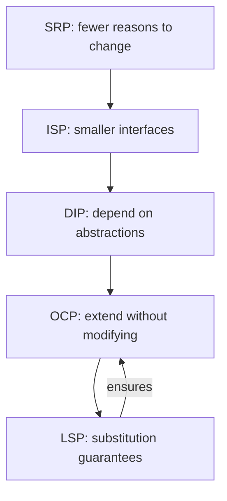

## Keywords in This File
{: .no_toc }

| # | Keyword | Weight |
|---|---|---|
| 1 | [SOLID Principles Overview](#solid-principles-overview) | critical |
| 2 | [Single Responsibility Principle](#single-responsibility-principle) | critical |
| 3 | [Open-Closed Principle](#open-closed-principle) | high |
| 4 | [Liskov Substitution Principle](#liskov-substitution-principle) | high |
| 5 | [Interface Segregation and Dependency Inversion](#interface-segregation-and-dependency-inversion) | high |

---

# SOLID Principles Overview

**Interview Weight:** critical - Asked in virtually every
Java backend interview. The gateway to design conversation.

---

### 🎯 Model Answer

**30 seconds:**

> SOLID is five principles for maintainable OOP design:
> Single Responsibility (one reason to change), Open-Closed
> (extend without modifying), Liskov Substitution (subtypes
> behave like supertypes), Interface Segregation (small
> focused interfaces), Dependency Inversion (depend on
> abstractions). Together they produce code that is easy
> to test, extend, and maintain. The key insight: SOLID
> minimizes the blast radius of change - modifying one
> feature shouldn't break unrelated features.

**3 minutes (Senior):**

> SOLID as a system - each principle addresses a different
> coupling problem:
>
> S - Single Responsibility Principle:
>   "A class should have only one reason to change."
>   Problem solved: changes in one area cascade to unrelated areas.
>   Signal of violation: class changes for multiple stakeholders.
>   Java example: separating OrderValidator from OrderPersistence.
>
> O - Open-Closed Principle:
>   "Open for extension, closed for modification."
>   Problem solved: adding features requires changing existing code.
>   Signal of violation: adding a new type requires editing a switch.
>   Java example: Strategy pattern for payment processing.
>
> L - Liskov Substitution Principle:
>   "Subtypes must be substitutable for their base types."
>   Problem solved: inheritance breaks caller expectations.
>   Signal of violation: instanceof checks after calling base type.
>   Java example: Square extends Rectangle breaks setWidth().
>
> I - Interface Segregation Principle:
>   "Clients shouldn't depend on methods they don't use."
>   Problem solved: fat interfaces force unnecessary implementations.
>   Signal of violation: throw UnsupportedOperationException.
>   Java example: splitting CrudRepository into ReadRepository
>     and WriteRepository.
>
> D - Dependency Inversion Principle:
>   "Depend on abstractions, not concretions."
>   Problem solved: high-level modules coupled to low-level details.
>   Signal of violation: new keyword in service classes.
>   Java example: service depends on PaymentGateway interface,
>     not StripeClient directly.
>
> The interplay:
>   SRP + ISP: small, focused classes with small interfaces.
>   OCP + DIP: extend via abstractions without modifying.
>   LSP: ensures OCP works (subtypes don't break contracts).

**Blank Mind Recovery:**

**(1) Restate:** "You are asking about the five SOLID
principles and how they work together."

**(2) First principles:** "Each principle addresses a
different coupling problem. Together they minimize the
blast radius of change."

**(3) Bridge:** "SOLID is like building codes for software:
each rule prevents a different structural failure mode."

---

### 📘 Concept Explanation

SOLID is not about writing more code. It is about organizing
code so that changes are cheap and safe.

```
┌─────────────────────────────────────────────────┐
│           SOLID Principle Relationships          │
├─────────────────────────────────────────────────┤
│                                                 │
│   SRP ──── fewer reasons to change              │
│    │                                            │
│    ▼                                            │
│   ISP ──── smaller interfaces per client        │
│    │                                            │
│    ▼                                            │
│   DIP ──── depend on abstractions               │
│    │                                            │
│    ▼                                            │
│   OCP ──── extend without modifying             │
│    │                                            │
│    ▼                                            │
│   LSP ──── substitution guarantees OCP works    │
│                                                 │
│   Reading: bottom-up enforcement                │
│   LSP guarantees OCP. OCP requires DIP.         │
│   DIP benefits from ISP. ISP follows from SRP.  │
└─────────────────────────────────────────────────┘
```



> **Diagram walkthrough:** SRP drives toward focused classes,
> which naturally leads to smaller interfaces (ISP). Small
> interfaces enable depending on abstractions (DIP), which
> makes extension without modification possible (OCP). LSP
> guarantees that subtype extensions don't break the contract,
> closing the loop.

---

### ⚖️ Comparison Table

| Principle | Problem Addressed | Violation Signal | Fix Pattern |
|---|---|---|---|
| SRP | Multiple change reasons | Class changes for multiple stakeholders | Extract class |
| OCP | Modification for extension | Switch/if-else on type | Strategy, Decorator |
| LSP | Broken substitutability | instanceof after base call | Redesign hierarchy |
| ISP | Fat interfaces | UnsupportedOperationException | Split interface |
| DIP | Concrete coupling | `new` in service classes | Inject interface |

---

### 🎓 Answers by Seniority

**Junior:** "SOLID means Single Responsibility, Open-Closed,
Liskov, Interface Segregation, Dependency Inversion. They
help write clean, maintainable code."

**Mid:** "I apply SRP by asking 'who would request this
change?' If different stakeholders change the same class,
it has multiple responsibilities. DIP: I inject interfaces
in constructors so I can mock them in tests."

**Senior:** "SOLID principles interact: ISP creates small
interfaces that make DIP practical. DIP enables OCP. LSP
ensures OCP works without surprises. I apply them as a
system, not individually."

**Staff:** "I treat SOLID as a diagnostic tool, not a
design methodology. When I see pain (hard to test, hard
to extend, brittle to change), I check which SOLID
principle is violated. The violation tells me the fix."

---

### ⚠️ Common Misconceptions

**"SRP means a class should do one thing."**
Not quite. SRP means "one reason to change" - which maps
to "one stakeholder." A UserService with CRUD methods has
one reason to change (user management). It doesn't need
to be split into CreateUserService, FindUserService, etc.

**"SOLID means more interfaces and more classes."**
Not necessarily. Over-applying SOLID creates class explosion.
SOLID is a diagnostic tool: apply it where pain exists,
not preventatively everywhere.

---

### 🚨 Failure Modes and Diagnosis

| Failure | Symptom | Diagnosis |
|---|---|---|
| SRP violation | 500-line class changing weekly | Count distinct change reasons. Split by stakeholder |
| OCP violation | Adding enum value requires editing 5 files | Use polymorphism (Strategy) to replace switch |
| LSP violation | Runtime ClassCastException | Subclass overrides preconditions. Redesign hierarchy |
| ISP violation | Empty method implementations | Interface too broad. Split into role interfaces |
| DIP violation | Cannot unit test without database | Service depends on concrete. Extract interface |

---

### 🎯 Interview Deep-Dive

| Experience | Time | Depth |
|---|---|---|
| Junior | 4 min | Name and define each principle |
| Mid | 7 min | Examples, violation signals, fixes |
| Senior | 10 min | Principle interactions, when to relax |
| Staff | 14 min | Diagnostic tool, team adoption, trade-offs |

---

**[JUNIOR] Q1 - Explain the Single Responsibility
Principle with a Java example.**

*Why they ask:* Most fundamental SOLID principle.

Single Responsibility Principle states that a class should
have only one reason to change. "Reason to change" maps
to a stakeholder or business capability.

BAD example - SRP violation:
```java
public class UserService {
    public User createUser(UserDto dto) { ... }
    public void sendWelcomeEmail(User user) { ... }
    public String generateReport(List<User> users) { ... }
}
```
Three reasons to change: user management, email formatting,
report generation. Three different stakeholders request
changes to the same class.

GOOD example - SRP applied:
```java
public class UserService {
    public User createUser(UserDto dto) { ... }
    public User findById(Long id) { ... }
    public void deleteUser(Long id) { ... }
}
// Email: separate EmailService
// Reports: separate UserReportGenerator
```

> **Code walkthrough:** The violation combines three
> unrelated concerns. The fix separates them so email
> template changes don't require touching user creation
> code. Each class now has one reason to change.

The benefit: when the marketing team changes the welcome
email, they don't touch UserService. When the reporting
format changes, same. Changes are isolated.

*What separates good from great:* Explaining "reason to
change" as "stakeholder" rather than "one method."

---

**[MID] Q2 - How does Dependency Inversion Principle
improve testability?**

*Why they ask:* Connects principle to practical benefit.

Without DIP:
```java
public class OrderService {
    private final StripeClient stripe = new StripeClient();

    public void processPayment(Order order) {
        stripe.charge(order.getAmount());
    }
}
```
Testing processPayment requires a real Stripe connection.
You cannot unit test without hitting the network.

With DIP:
```java
public class OrderService {
    private final PaymentGateway gateway;

    public OrderService(PaymentGateway gateway) {
        this.gateway = gateway;
    }

    public void processPayment(Order order) {
        gateway.charge(order.getAmount());
    }
}
```

> **Code walkthrough:** DIP inverts the dependency
> direction. OrderService depends on the PaymentGateway
> abstraction, not the concrete StripeClient. This allows
> injecting a mock in tests, testing the service logic
> without network calls.

Test becomes:
```java
@Test
void shouldChargeCorrectAmount() {
    PaymentGateway mock = mock(PaymentGateway.class);
    OrderService service = new OrderService(mock);

    service.processPayment(orderOf(100));

    verify(mock).charge(100);
}
```

> **Code walkthrough:** The mock replaces the real
> Stripe client. Test runs in milliseconds, verifies
> the correct amount was charged, and has no external
> dependencies.

DIP enables: unit testing, swapping implementations
(Stripe to PayPal), and obeying OCP (add new gateway
without modifying OrderService).

*What separates good from great:* Showing the test code
that becomes possible after applying DIP.

---

**[SENIOR] Q3 - Give a real example of LSP violation
and how you fixed it.**

*Why they ask:* LSP is the hardest SOLID principle to
apply correctly. Real stories show depth.

We had a caching layer with a Cache interface:
```java
interface Cache<K, V> {
    void put(K key, V value);
    V get(K key);
    void evict(K key);
}
```

Implementation 1: InMemoryCache (worked correctly).
Implementation 2: ReadOnlyCache (for reference data).

ReadOnlyCache.put() threw UnsupportedOperationException.
This violated LSP: callers expected put() to work for
any Cache implementation.

The problem manifested in production: a generic caching
framework called cache.put() on all Cache instances.
ReadOnlyCache blew up at runtime - not at compile time.

Fix: Interface Segregation + LSP together.
```java
interface ReadableCache<K, V> {
    V get(K key);
}

interface WritableCache<K, V> extends ReadableCache<K, V> {
    void put(K key, V value);
    void evict(K key);
}
```

> **Code walkthrough:** Splitting the interface means
> ReadOnlyCache implements ReadableCache (no put method)
> and InMemoryCache implements WritableCache. Callers
> that only read accept ReadableCache. LSP is satisfied:
> both implementations fulfill their interface contract
> completely.

Callers that only read: declare `ReadableCache<K,V>`.
Callers that write: declare `WritableCache<K,V>`.
No more UnsupportedOperationException. Compile-time safety.

*What separates good from great:* Showing how ISP fixes
LSP violations by narrowing the contract.

---

**[STAFF] Q4 - How do you introduce SOLID principles
to a team that has never used them?**

*Why they ask:* Leadership, teaching, culture building.

I don't teach SOLID abstractly. I use pain-driven introduction:

Week 1: Identify pain points in current code.
"Why is this PR touching 12 files for a simple email change?"
Answer: SRP violation. Show the principle as the explanation.

Week 2: Live refactoring session.
Take a real class from our codebase that violates SRP.
Extract responsibilities live, showing the before/after.
Measure: PR touches for the same type of change.

Week 3: Code review vocabulary.
Start using principle names in reviews: "This might violate
DIP - can we inject this dependency?" The team learns the
vocabulary by seeing it applied to their code.

Week 4: ADR template.
Create a decision record: "When to extract an interface
(DIP)." Concrete criteria: (1) need to mock in unit tests,
(2) more than one implementation exists or is likely,
(3) cross-module boundary.

Ongoing: pair programming with principle awareness.
During pairing, I ask questions: "What's the reason for
this class to change?" "Who is the stakeholder?" This
builds the thinking habit.

What I avoid: mandatory patterns, principle checklists
in PRs, abstract lectures. Principles stick when they
explain real pain the team has already felt.

*What separates good from great:* Pain-driven adoption
rather than top-down mandate. Measurable improvement
(PR touches for same change type).

| Interviewer Type | Emphasis |
|---|---|
| Technical Panel | Define all 5, Java examples, violations. |
| Hiring Manager | How SOLID improves team velocity. |
| Bar Raiser | Principle interactions, when to relax. |
| Peer Engineer | "Used SRP to explain why PRs touched 12 files. Refactored. Now: 2 files." |

---

---

# Single Responsibility Principle

**Interview Weight:** critical - The most-asked SOLID
principle. Determines how you decompose systems.

---

### 🎯 Model Answer

**30 seconds:**

> A class should have only one reason to change - meaning
> it serves only one stakeholder or business capability.
> SRP is NOT "one method per class." It's about cohesion:
> things that change together belong together, things that
> change for different reasons belong apart. Violation
> signal: a single class modified in PRs from different
> feature teams. Fix: extract responsibilities into
> separate classes, each owned by one team/concern.

**3 minutes (Senior):**

> SRP applied at multiple levels:
>
> Class level:
>   BAD: OrderService handles creation, validation, email,
>     and PDF generation. Four stakeholders change it.
>   GOOD: OrderService (creation), OrderValidator (rules),
>     OrderNotifier (emails), OrderExporter (PDFs).
>   Test: "If I change email templates, which classes change?"
>     Answer should be: OrderNotifier only.
>
> Method level:
>   BAD: processOrder() validates, saves, sends email, logs.
>   GOOD: each concern is a separate method or delegated.
>   Note: extracting to separate methods within the same class
>     is a first step, not the final state.
>
> Package/module level:
>   BAD: com.app.service contains everything.
>   GOOD: com.app.order, com.app.notification, com.app.reporting.
>   Each package changes independently.
>
> Microservice level:
>   BAD: monolith service handles orders, users, payments.
>   GOOD: each domain is a separate service.
>   Note: SRP at service level = bounded contexts (DDD).
>
> How to identify violations:
>   1. Git log: which files change together?
>      If OrderService.java appears in payment PRs AND
>      email PRs AND reporting PRs: SRP violation.
>   2. Import count: too many imports = too many concerns.
>   3. Constructor parameters: >5 injected dependencies
>      suggests multiple responsibilities.
>   4. Class name: "and" in the name (ValidateAndSave)
>      signals multiple responsibilities.

**Blank Mind Recovery:**

**(1) Restate:** "You are asking about the Single
Responsibility Principle and how to apply it."

**(2) First principles:** "One reason to change means
one stakeholder. If different business concerns change
the same class, it has too many responsibilities."

**(3) Bridge:** "SRP is like job roles in a company: one
person shouldn't be both the accountant and the security
guard. Different skills, different change drivers."

---

### 💻 Code Example

```java
// BAD: SRP violation - multiple reasons to change
public class OrderService {
    private final OrderRepository repo;
    private final JavaMailSender mailSender;
    private final PdfGenerator pdfGen;

    // Reason 1: order business logic
    public Order createOrder(CreateOrderRequest req) {
        Order order = new Order(req.items());
        order.calculateTotal();
        repo.save(order);
        // Reason 2: notification logic
        sendConfirmationEmail(order);
        // Reason 3: reporting logic
        generateInvoicePdf(order);
        return order;
    }

    private void sendConfirmationEmail(Order order) {
        MimeMessage msg = mailSender.createMimeMessage();
        msg.setSubject("Order " + order.getId());
        msg.setText(buildEmailBody(order));
        mailSender.send(msg);
    }

    private void generateInvoicePdf(Order order) {
        pdfGen.generate(order.toInvoiceData());
    }
}
// Problems:
// 1. Email template change → modify OrderService
// 2. PDF format change → modify OrderService
// 3. Order logic change → risky (email/PDF might break)
// 4. Cannot test order creation without email/PDF deps

// GOOD: SRP applied - each class, one reason to change
public class OrderService {
    private final OrderRepository repo;
    private final ApplicationEventPublisher events;

    public Order createOrder(CreateOrderRequest req) {
        Order order = new Order(req.items());
        order.calculateTotal();
        repo.save(order);
        events.publishEvent(new OrderCreatedEvent(order));
        return order;
    }
}

@Component
public class OrderNotificationListener {
    private final EmailService emailService;

    @EventListener
    public void onOrderCreated(OrderCreatedEvent event) {
        emailService.sendOrderConfirmation(event.order());
    }
}

@Component
public class OrderInvoiceListener {
    private final InvoiceGenerator invoiceGen;

    @EventListener
    public void onOrderCreated(OrderCreatedEvent event) {
        invoiceGen.generate(event.order());
    }
}
```

> **Code walkthrough:** The refactored version uses Spring
> events to decouple responsibilities. OrderService handles
> only order creation. Email changes happen in the listener.
> PDF changes happen in the invoice generator. Testing
> OrderService no longer requires email or PDF dependencies.
> Each class changes for exactly one reason.

---

### 🎓 Answers by Seniority

**Junior:** "SRP means one class does one thing. Like
separating order creation from email sending."

**Mid:** "SRP is about cohesion: things that change together
stay together, things that change for different reasons
separate. I use Spring events to decouple responsibilities."

**Senior:** "I diagnose SRP violations through git history:
if a file appears in PRs from multiple feature teams, it
likely has too many responsibilities. The fix is domain
event-driven decoupling."

---

### ⚠️ Common Misconceptions

**"SRP means one method per class."**
False. A class can have many methods if they all serve the
same stakeholder and change for the same reason. A UserCrudService
with create, read, update, delete is cohesive.

**"SRP means the smallest possible classes."**
False. Over-splitting creates class explosion and makes
code harder to follow. The test is: "Do these methods
change together for the same reason?" If yes, keep together.

---

### 🚨 Failure Modes and Diagnosis

| Failure | Symptom | Diagnosis |
|---|---|---|
| God class | 1000+ lines, 10+ injected deps | Split by stakeholder. Use events for cross-cutting |
| Nano classes | 50+ single-method classes | Over-applied SRP. Merge related concerns back |
| Leaky SRP | Class split but still coupled | Shared state between split classes. Use events or shared DTO |

---

### 🎯 Interview Deep-Dive

| Experience | Time | Depth |
|---|---|---|
| Junior | 3 min | Define, give simple example |
| Mid | 6 min | Violation detection, refactoring approach |
| Senior | 9 min | Multi-level SRP, event-driven decoupling |

---

**[MID] Q1 - How do you detect SRP violations in an
existing codebase?**

*Why they ask:* Practical skill, not theoretical.

I use four detection heuristics:

First, git history analysis. Run:
`git log --format='%s' -- OrderService.java | head -20`
If commit messages reference multiple concerns ("fix email
template," "update tax calculation," "add PDF export"):
SRP violation confirmed.

Second, import analysis. If a class imports email libraries,
PDF libraries, HTTP clients, AND persistence: too many
concerns. Each import cluster suggests a responsibility.

Third, constructor parameter count. A class with 8+
injected dependencies almost certainly has multiple
responsibilities. Group the dependencies by concern:
3 are persistence-related, 2 are notification-related,
3 are reporting-related. Each group is a separate class.

Fourth, the "describe in one sentence" test. If you cannot
describe the class purpose without using "and" ("it creates
orders AND sends emails AND generates reports"), SRP is
violated.

Fix strategy: introduce domain events. The class publishes
an event; separate listeners handle cross-cutting concerns.
This maintains the workflow without coupling the responsibilities.

*What separates good from great:* Using git history as an
objective SRP diagnostic rather than subjective judgment.

---

**[SENIOR] Q2 - What is the relationship between SRP
and microservice decomposition?**

*Why they ask:* Tests architectural thinking.

SRP at the microservice level is the bounded context from
Domain-Driven Design. Each microservice should have one
reason to change - one business domain.

The mapping:
- Class-level SRP: one class, one stakeholder.
- Package-level SRP: one package, one business capability.
- Service-level SRP: one service, one bounded context.

Example: an e-commerce monolith has OrderService doing
ordering, inventory, payments, and shipping. SRP at the
service level says: split into Order Service, Inventory
Service, Payment Service, Shipping Service.

The trap: splitting too fine. "OrderCreationService" and
"OrderUpdateService" as separate microservices is SRP
over-applied at the service level. They share the same
data model and change together - they belong in one service.

The heuristic for service-level SRP:
"Would a different team own this?"
If yes: separate service.
If no: keep together.

Conway's Law reinforces this: team structure should match
service boundaries, which should match SRP boundaries.

*What separates good from great:* The "would a different
team own this?" heuristic for service-level SRP decisions.

| Interviewer Type | Emphasis |
|---|---|
| Technical Panel | Define SRP, detect violations, refactor. |
| Hiring Manager | Team productivity impact of SRP. |
| Bar Raiser | Multi-level SRP (class, package, service). |
| Peer Engineer | "Git blame showed OrderService changed 40 times/month from 3 teams. Split it. Now: 12 changes/month per service, one team each." |

---

---

# Open-Closed Principle

**Interview Weight:** high - Directly tests extensibility
thinking. "How would you add a feature without modifying
existing code?"

---

### 🎯 Model Answer

**30 seconds:**

> Open-Closed Principle: software entities should be open
> for extension but closed for modification. You add new
> behavior by writing new code (new class, new implementation),
> not by changing existing code. This minimizes regression
> risk. Implementation: use interfaces and polymorphism.
> New payment type? Write a new PaymentProcessor implementation.
> Don't edit the existing switch statement.

**3 minutes (Senior):**

> OCP in practice - three extension mechanisms:
>
> 1. Strategy pattern (interface polymorphism):
>   Closed: the caller code (PaymentService).
>   Open: new PaymentGateway implementations.
>   Adding Stripe: new StripeGateway implements PaymentGateway.
>   PaymentService unchanged. Zero regression risk.
>
> 2. Decorator pattern (wrapping):
>   Closed: existing behavior.
>   Open: additional behavior via wrapping.
>   Adding logging: LoggingPaymentGateway wraps any gateway.
>   Original gateway unchanged.
>
> 3. Template Method (inheritance):
>   Closed: the algorithm skeleton.
>   Open: overridable steps.
>   Example: AbstractOrderProcessor defines the flow.
>   Subclasses override specific steps.
>
> OCP violations - the switch-on-type smell:
>   ```java
>   switch (paymentType) {
>     case CREDIT: handleCredit(); break;
>     case DEBIT: handleDebit(); break;
>     // Adding CRYPTO requires modifying this switch
>   }
>   ```
>   Every new type = modification of existing code.
>   Fix: Map<PaymentType, PaymentHandler> or polymorphism.
>
> The spectrum (not binary):
>   Fully closed: never modified (utility classes).
>   Mostly closed: extended via configuration.
>   Partially open: new subclasses allowed.
>   Fully open: any modification allowed (prototypes).
>
> Pragmatic OCP: you can't predict ALL future extensions.
>   Apply OCP where change is LIKELY (business rules,
>   integrations, output formats). Don't apply where
>   change is unlikely (database schema type, HTTP method).

**Blank Mind Recovery:**

**(1) Restate:** "You are asking about the Open-Closed
Principle and how to extend behavior without modification."

**(2) First principles:** "New behavior = new code. Existing
code stays unchanged. The extension point is the interface."

**(3) Bridge:** "OCP is like a power strip: you add new
devices (extension) without rewiring the house (modification)."

---

### 💻 Code Example

```java
// BAD: OCP violation - adding a type requires modification
public class DiscountCalculator {
    public BigDecimal calculate(
            Order order, CustomerType type) {
        switch (type) {
            case REGULAR:
                return order.getTotal()
                    .multiply(new BigDecimal("0.00"));
            case PREMIUM:
                return order.getTotal()
                    .multiply(new BigDecimal("0.10"));
            case VIP:
                return order.getTotal()
                    .multiply(new BigDecimal("0.20"));
            // Adding EMPLOYEE discount: must modify this class
            default:
                return BigDecimal.ZERO;
        }
    }
}
// Problem: every new customer type modifies this class.
// Risk: changing VIP logic might break REGULAR logic.

// GOOD: OCP applied - extend by adding new classes
public interface DiscountStrategy {
    BigDecimal calculate(Order order);
    boolean supports(CustomerType type);
}

@Component
public class RegularDiscount implements DiscountStrategy {
    public boolean supports(CustomerType type) {
        return type == CustomerType.REGULAR;
    }
    public BigDecimal calculate(Order order) {
        return BigDecimal.ZERO;
    }
}

@Component
public class VipDiscount implements DiscountStrategy {
    public boolean supports(CustomerType type) {
        return type == CustomerType.VIP;
    }
    public BigDecimal calculate(Order order) {
        return order.getTotal()
            .multiply(new BigDecimal("0.20"));
    }
}

// Adding EMPLOYEE: new class, zero modification
@Component
public class EmployeeDiscount implements DiscountStrategy {
    public boolean supports(CustomerType type) {
        return type == CustomerType.EMPLOYEE;
    }
    public BigDecimal calculate(Order order) {
        return order.getTotal()
            .multiply(new BigDecimal("0.30"));
    }
}

// Calculator: closed for modification
@Service
public class DiscountService {
    private final List<DiscountStrategy> strategies;

    public DiscountService(
            List<DiscountStrategy> strategies) {
        this.strategies = strategies;
    }

    public BigDecimal calculate(
            Order order, CustomerType type) {
        return strategies.stream()
            .filter(s -> s.supports(type))
            .findFirst()
            .map(s -> s.calculate(order))
            .orElse(BigDecimal.ZERO);
    }
}
```

> **Code walkthrough:** The BAD version requires editing
> the switch for every new customer type. The GOOD version
> uses Strategy + Spring auto-wiring: adding EmployeeDiscount
> as a new @Component is all that's needed. DiscountService
> never changes. Spring injects all DiscountStrategy beans
> automatically. Zero modification, zero regression risk.

---

### ⚖️ Comparison Table

| Approach | Extension | Modification | Use When |
|---|---|---|---|
| Switch/if-else | Not possible | Always required | Types are fixed and few |
| Strategy + DI | Add new class | Never | Types grow over time |
| Decorator | Wrap existing | Never | Adding behavior layers |
| Template Method | Override step | Never | Algorithm skeleton is fixed |

---

### 🎓 Answers by Seniority

**Junior:** "Open-Closed means I can add new features
without changing existing code. Like adding a new payment
type by creating a new class."

**Mid:** "I implement OCP with Strategy pattern and Spring
DI. New discount type = new @Component. The service that
uses them never changes because Spring auto-wires all
implementations."

**Senior:** "OCP is about predicting where change happens.
I apply it at integration boundaries (payment, notification,
export) where new providers are likely. I don't apply it
for database access patterns that will never change."

---

### ⚠️ Common Misconceptions

**"OCP means never modify any class."**
False. OCP applies to stable abstractions and interfaces.
Implementation classes are modified during development.
The point is: once a class is stable and in production,
new features should not require modifying it.

**"Inheritance is the primary OCP mechanism."**
Historically yes, but modern Java prefers composition:
Strategy (interface + implementations) over Template Method
(abstract class + subclasses). Composition is more flexible.

---

### 🎯 Interview Deep-Dive

| Experience | Time | Depth |
|---|---|---|
| Junior | 3 min | Define, simple example |
| Mid | 6 min | Strategy + Spring DI implementation |
| Senior | 9 min | Where to apply, where not to |

---

**[MID] Q1 - Show how Spring's dependency injection
enables OCP.**

*Why they ask:* Connects principle to framework feature.

Spring auto-wires all implementations of an interface:

```java
@Service
public class NotificationService {
    private final List<NotificationChannel> channels;

    public NotificationService(
            List<NotificationChannel> channels) {
        this.channels = channels;
    }

    public void notify(User user, String message) {
        channels.forEach(c -> c.send(user, message));
    }
}
```

> **Code walkthrough:** NotificationService is CLOSED: it
> never changes. To add SMS notification, create a new
> SmsChannel @Component. Spring injects it into the list
> automatically. NotificationService sends to all channels
> without knowing what channels exist.

This is OCP powered by Spring's component scanning:
1. Define interface (NotificationChannel).
2. Create implementations (@Component EmailChannel, PushChannel).
3. Inject List<NotificationChannel> - Spring collects all.
4. New channel = new @Component file. Existing code untouched.

The elegance: no factory, no registry, no configuration.
Spring's DI container IS the registry.

*What separates good from great:* Recognizing that Spring
DI IS the OCP mechanism (not just a convenience).

| Interviewer Type | Emphasis |
|---|---|
| Technical Panel | OCP implementation, Strategy + Spring DI. |
| Hiring Manager | How OCP reduces regression risk. |
| Bar Raiser | Where to apply OCP, where not to. |
| Peer Engineer | "New payment provider? One class, one PR, zero modification to existing code." |

---

---

# Liskov Substitution Principle

**Interview Weight:** high - The trickiest SOLID principle.
Tests deep OOP understanding.

---

### 🎯 Model Answer

**30 seconds:**

> Liskov Substitution: if S is a subtype of T, then objects
> of type T can be replaced with objects of type S without
> breaking the program. Subtypes must honor the contract
> (preconditions, postconditions, invariants) of the base
> type. Classic violation: Square extends Rectangle. Setting
> width on a Square also sets height - breaking Rectangle's
> contract that width and height are independent.

**3 minutes (Senior):**

> LSP formalized (Barbara Liskov, 1987):
>
> Three contract elements:
>   1. Preconditions: cannot be strengthened in subtype.
>      Base accepts null → subtype must accept null.
>   2. Postconditions: cannot be weakened in subtype.
>      Base returns non-null → subtype must return non-null.
>   3. Invariants: must be preserved in subtype.
>      Base: width and height independent → subtype must maintain.
>
> Java violations in practice:
>
> Violation 1: Collections.unmodifiableList().
>   List<String> list = Collections.unmodifiableList(source);
>   list.add("x"); // throws UnsupportedOperationException
>   List contract: add() adds element. Violated.
>   (Java chose this trade-off; it's a known LSP issue.)
>
> Violation 2: Custom exceptions in overrides.
>   Base: process() returns result.
>   Subtype: process() throws NotImplementedException.
>   Callers expecting a result get an exception instead.
>
> Violation 3: instanceof checks after using base type.
>   if (shape instanceof Circle) { ... }
>   This means the abstraction is leaking. Polymorphism
>   should eliminate the need for type checks.
>
> Fix strategy:
>   1. Redesign hierarchy (prefer composition).
>   2. Split interface (ISP): narrow contract to what all
>      subtypes can honor.
>   3. Use sealed types (Java 17): explicitly limit hierarchy.

**Blank Mind Recovery:**

**(1) Restate:** "You are asking about the Liskov
Substitution Principle and correct inheritance."

**(2) First principles:** "Subtypes must honor base type
contracts. If replacing base with subtype breaks behavior:
LSP violation."

**(3) Bridge:** "LSP is like a job contract: a replacement
employee must fulfill all the same responsibilities.
If they refuse some duties, the contract is violated."

---

### 💻 Code Example

```java
// BAD: LSP violation - Square breaks Rectangle contract
public class Rectangle {
    protected int width;
    protected int height;

    public void setWidth(int w) { this.width = w; }
    public void setHeight(int h) { this.height = h; }
    public int area() { return width * height; }
}

public class Square extends Rectangle {
    @Override
    public void setWidth(int w) {
        this.width = w;
        this.height = w;  // breaks independence
    }
    @Override
    public void setHeight(int h) {
        this.width = h;   // breaks independence
        this.height = h;
    }
}

// Client code that breaks:
void resize(Rectangle r) {
    r.setWidth(5);
    r.setHeight(10);
    assert r.area() == 50; // FAILS for Square (100)
}
// Rectangle contract: width and height are independent.
// Square violates this: setting one changes both.

// GOOD: redesign with composition
public interface Shape {
    int area();
}

public record Rectangle(int width, int height)
        implements Shape {
    public int area() { return width * height; }
}

public record Square(int side) implements Shape {
    public int area() { return side * side; }
}
// No inheritance. No shared mutable state.
// Each shape honors its own contract independently.
```

> **Code walkthrough:** The Rectangle/Square inheritance
> violates LSP because Square's setWidth also sets height,
> breaking the caller's assumption that dimensions are
> independent. The fix uses composition (records + interface)
> instead of inheritance. Each shape has its own immutable
> contract that cannot be violated.

---

### 🎓 Answers by Seniority

**Junior:** "LSP means subclasses should work wherever
the parent class is expected. Like a Square shouldn't
break code that expects a Rectangle."

**Mid:** "I check LSP by asking: does the subtype honor
preconditions, postconditions, and invariants of the base?
If an override throws UnsupportedOperationException: violation."

**Senior:** "LSP violations signal a flawed hierarchy.
The fix is usually composition over inheritance or
interface segregation. I use sealed interfaces in Java 17
to make valid hierarchies explicit at compile time."

---

### ⚠️ Common Misconceptions

**"LSP is just about inheritance."**
It applies to any subtyping relationship, including
interface implementations. If a class implements an
interface but doesn't fully honor the contract: LSP violation.

**"Java's type system enforces LSP."**
False. Java enforces syntactic compatibility (method
signatures) but NOT behavioral compatibility. A subtype
can compile perfectly while violating LSP at runtime.

---

### 🎯 Interview Deep-Dive

| Experience | Time | Depth |
|---|---|---|
| Junior | 3 min | Rectangle/Square example |
| Mid | 6 min | Contract elements, detection |
| Senior | 9 min | Real-world violations, sealed types fix |

---

**[SENIOR] Q1 - How do Java sealed interfaces help
enforce LSP?**

*Why they ask:* Modern Java feature + principle connection.

Sealed interfaces (Java 17) restrict which classes can
implement an interface. This makes the hierarchy explicit
and prevents unexpected subtypes that might violate LSP.

```java
public sealed interface PaymentResult
    permits Success, Failure, Pending {
}
public record Success(String txnId) implements PaymentResult {}
public record Failure(String reason) implements PaymentResult {}
public record Pending(Duration eta) implements PaymentResult {}
```

> **Code walkthrough:** The sealed interface guarantees
> exactly three subtypes. No one can add a fourth without
> modifying the permit list. Switch expressions can be
> exhaustive (compiler enforces handling all cases). LSP
> is maintained because the set of subtypes is controlled.

Benefits for LSP:
1. Controlled hierarchy: only known subtypes exist.
2. Exhaustive pattern matching: compiler catches missing cases.
3. No surprise implementations: cannot sneak in a subtype
   that violates the contract.
4. Documentation: the permit list IS the documentation
   of valid subtypes.

This is compile-time LSP enforcement. Before sealed types,
LSP was only verifiable through testing and code review.

*What separates good from great:* Connecting sealed types
to compile-time LSP enforcement, not just syntax knowledge.

| Interviewer Type | Emphasis |
|---|---|
| Technical Panel | LSP definition, violations, fixes. |
| Hiring Manager | Design quality, correct inheritance. |
| Bar Raiser | Real-world violations, modern Java features. |
| Peer Engineer | "Sealed interfaces: 3 compile-time LSP violations caught that testing missed." |

---

---

# Interface Segregation and Dependency Inversion

**Interview Weight:** high - Two principles that work
together. Foundation for testable, decoupled architectures.

---

### 🎯 Model Answer

**30 seconds:**

> Interface Segregation: clients shouldn't depend on methods
> they don't use. Split fat interfaces into focused ones.
> Dependency Inversion: high-level modules shouldn't depend
> on low-level modules; both depend on abstractions. Together:
> define small, focused interfaces (ISP) that high-level
> modules depend on (DIP), with low-level modules providing
> implementations. Result: testable, swappable, decoupled code.

**3 minutes (Senior):**

> ISP in practice:
>
> FAT interface problem:
>   ```java
>   interface UserRepository {
>     User save(User u);
>     User findById(Long id);
>     List<User> findAll();
>     void delete(Long id);
>     void batchImport(List<User> users);
>     UserStats calculateStats();
>   }
>   ```
>   A reporting module only needs calculateStats() but depends
>   on save(), delete(), batchImport() - methods it never uses.
>
> ISP applied:
>   ```java
>   interface UserReader { User findById(Long id); List<User> findAll(); }
>   interface UserWriter { User save(User u); void delete(Long id); }
>   interface UserImporter { void batchImport(List<User> users); }
>   interface UserAnalytics { UserStats calculateStats(); }
>   ```
>   Reporting module depends only on UserAnalytics.
>   Changes to UserWriter don't affect reporting.
>
> DIP in practice:
>
> Without DIP (coupling to concrete):
>   OrderService → PostgresOrderRepository (concrete)
>   Problem: cannot test without database. Cannot swap DB.
>
> With DIP (coupling to abstraction):
>   OrderService → OrderRepository (interface)
>   PostgresOrderRepository implements OrderRepository
>   Problem solved: mock in tests. Swap to DynamoDB if needed.
>
> ISP + DIP together:
>   High-level module defines the interface IT needs (ISP).
>   Low-level module implements that interface (DIP).
>   The interface belongs to the high-level module's package.
>   This is "inversion": the abstraction is owned by the
>   consumer, not the provider.

**Blank Mind Recovery:**

**(1) Restate:** "You are asking about ISP and DIP -
how they work together for decoupled design."

**(2) First principles:** "ISP: narrow interfaces per client.
DIP: depend on abstractions. Together: each client defines
the narrow interface it needs, implementations satisfy it."

**(3) Bridge:** "ISP + DIP is like a restaurant menu: each
customer sees only the dishes they might order (ISP), and
the kitchen provides whatever the menu promises (DIP)."

---

### 💻 Code Example

```java
// BAD: ISP + DIP violation
// Fat interface AND concrete dependency
public class ReportService {
    // DIP violation: depends on concrete class
    private final JdbcUserRepository userRepo;

    public ReportService(JdbcUserRepository userRepo) {
        this.userRepo = userRepo;
    }

    public UserReport generate() {
        // ISP violation: only uses findAll() but depends
        // on save(), delete(), batchImport() too
        List<User> users = userRepo.findAll();
        return new UserReport(users);
    }
}
// Cannot test without JDBC. Cannot swap implementation.
// Recompiles when batchImport() signature changes.

// GOOD: ISP + DIP applied
// Narrow interface owned by the consumer
public interface UserQueryPort {
    List<User> findAll();
    List<User> findByStatus(Status status);
}

// Service depends on abstraction (DIP)
// Narrow interface (ISP)
@Service
public class ReportService {
    private final UserQueryPort users;

    public ReportService(UserQueryPort users) {
        this.users = users;
    }

    public UserReport generate() {
        return new UserReport(users.findAll());
    }
}

// Adapter implements the port
@Repository
public class JpaUserAdapter implements UserQueryPort {
    private final JpaUserRepository jpaRepo;

    public List<User> findAll() {
        return jpaRepo.findAll();
    }
    public List<User> findByStatus(Status status) {
        return jpaRepo.findByStatus(status);
    }
}
```

> **Code walkthrough:** The GOOD version applies both
> principles: UserQueryPort is narrow (ISP - only query
> methods) and is an abstraction (DIP - not concrete JPA).
> ReportService is testable (mock UserQueryPort), decoupled
> (swap JPA to Mongo without touching ReportService), and
> isolated from write-side changes. The port name follows
> hexagonal architecture convention.

---

### 🎓 Answers by Seniority

**Junior:** "ISP means small interfaces. DIP means depend
on interfaces instead of concrete classes."

**Mid:** "I combine ISP + DIP in hexagonal architecture:
define ports (small interfaces) that the domain needs,
then adapters (implementations) satisfy those ports.
Testing uses mock ports."

**Senior:** "ISP + DIP together means the consumer owns
the abstraction. The interface lives in the domain layer,
not the infrastructure layer. This is true inversion:
the high-level module dictates the contract."

---

### ⚠️ Common Misconceptions

**"DIP means all classes need interfaces."**
False. DIP applies at architectural boundaries: between
layers, between modules, at integration points. Within
a single module, concrete classes are fine.

**"ISP means one method per interface."**
False. ISP means one ROLE per interface. A role may have
2-4 cohesive methods (findById + findAll for the reader
role). The test: does every client of this interface use
ALL its methods?

---

### 🎯 Interview Deep-Dive

| Experience | Time | Depth |
|---|---|---|
| Junior | 3 min | Define ISP and DIP separately |
| Mid | 6 min | Combined application, hexagonal ports |
| Senior | 9 min | Interface ownership, architectural boundaries |

---

**[MID] Q1 - How does hexagonal architecture implement
ISP and DIP together?**

*Why they ask:* Connects principles to architecture pattern.

Hexagonal architecture (Ports and Adapters) is ISP + DIP
as an architecture style:

Ports (ISP): small interfaces defined by the domain layer.
Each port represents one interaction the domain needs.
- UserQueryPort: read users.
- PaymentPort: charge payments.
- NotificationPort: send notifications.

Adapters (DIP): implementations living in infrastructure.
- JpaUserAdapter implements UserQueryPort.
- StripeAdapter implements PaymentPort.
- SesAdapter implements NotificationPort.

Ownership inversion (DIP):
The domain layer DEFINES the interface (port).
The infrastructure layer IMPLEMENTS it (adapter).
The domain never imports infrastructure. Infrastructure
imports domain. Dependencies point inward.

Benefit: the entire infrastructure is swappable. Swap
Stripe for PayPal: new adapter, domain unchanged. Swap
JPA for MongoDB: new adapter, domain unchanged. Tests:
mock all ports, test pure domain logic.

ISP ensures each port is minimal - NotificationPort doesn't
include user queries. DIP ensures the domain doesn't
know about concrete infrastructure.

*What separates good from great:* Explaining that ports
are OWNED by the domain layer (true dependency inversion),
not defined by the infrastructure.

| Interviewer Type | Emphasis |
|---|---|
| Technical Panel | ISP + DIP definition, Java examples. |
| Hiring Manager | Testability, swappability benefits. |
| Bar Raiser | Interface ownership, hexagonal architecture. |
| Peer Engineer | "Hexagonal + ISP + DIP: swapped payment provider in one PR. Domain layer: zero changes." |
