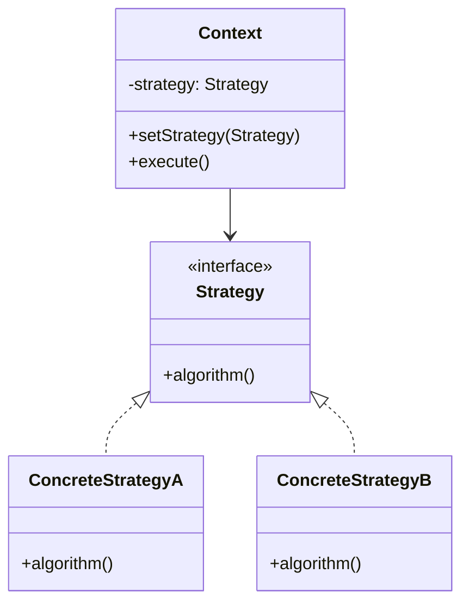
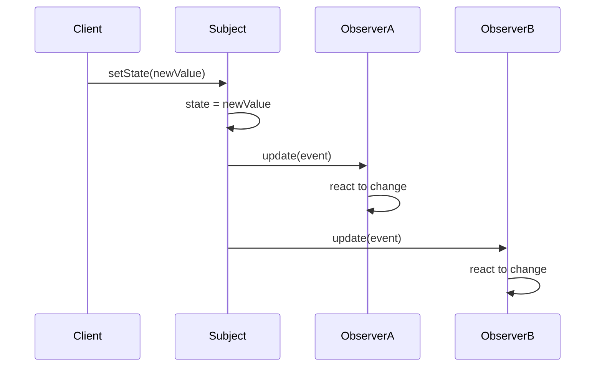
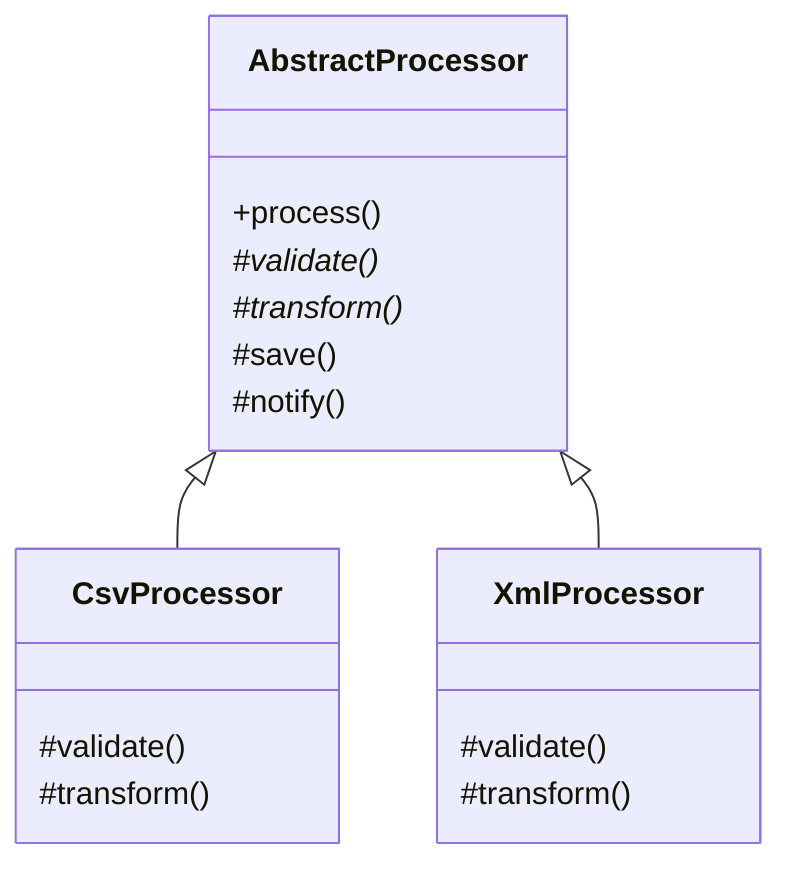
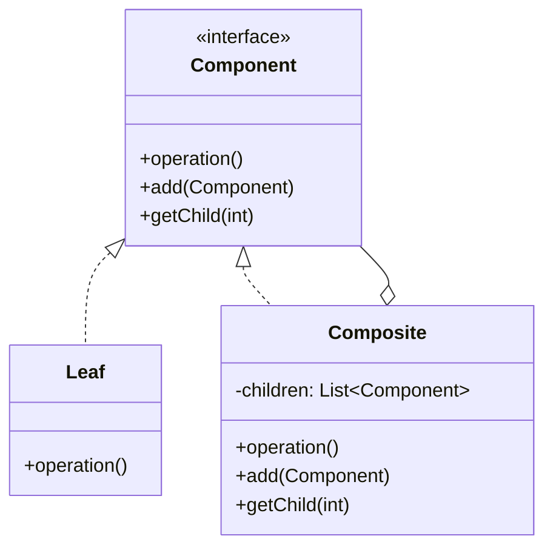
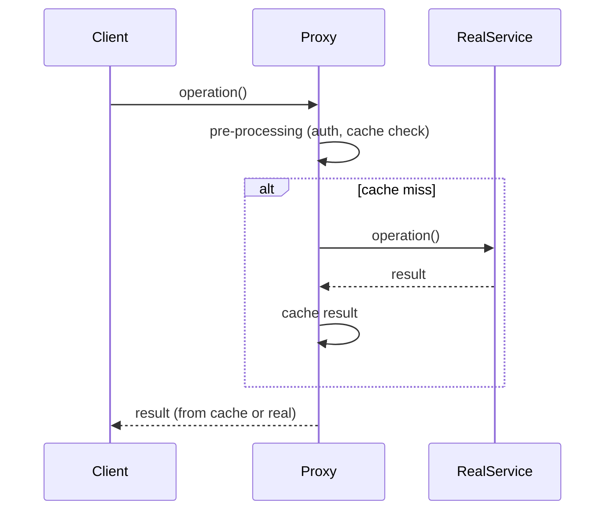

## Keywords in This File
{: .no_toc }

| # | Keyword | Weight |
|---|---|---|
| 1 | [Strategy Pattern](#strategy-pattern) | high |
| 2 | [Observer Pattern](#observer-pattern) | high |
| 3 | [Template Method Pattern](#template-method-pattern) | medium |
| 4 | [Iterator and Composite Patterns](#iterator-and-composite-patterns) | medium |
| 5 | [Facade and Proxy Patterns](#facade-and-proxy-patterns) | high |

---

# Strategy Pattern

**Interview Weight:** high - Asked at every level from mid
onward. Tests whether you can decouple algorithms from
their clients and reason about runtime flexibility.

---

### 🎯 Model Answer

**30 seconds:**

> Strategy pattern defines a family of algorithms,
> encapsulates each one, and makes them interchangeable
> at runtime. The client delegates behavior to a strategy
> object instead of using conditionals. This eliminates
> if-else chains, makes each algorithm independently
> testable, and lets you add new strategies without
> modifying existing code - directly applying the
> Open-Closed Principle.

**3 minutes (Senior):**

> Strategy solves the "algorithm selection" problem.
> Without it, you end up with massive switch statements
> or if-else chains that grow every time you add a new
> variation. I have seen payment processing modules with
> 800-line methods because someone kept adding
> "else if (type == CRYPTO)" branches.
>
> The pattern has three parts:
> A Strategy interface declaring the algorithm contract.
> Concrete Strategy classes implementing each variation.
> A Context class that holds a reference to the current
> strategy and delegates to it.
>
> In production, I use Strategy for:
> Pricing engines (different discount algorithms per tier).
> Notification routing (email vs SMS vs push).
> Validation pipelines (different rules per country).
> Serialization (JSON vs XML vs Protobuf).
>
> The trade-off: you get flexibility and testability at
> the cost of more classes. Each strategy is a separate
> class. For trivial variations (two branches, never
> changes), a simple if-else is better.
>
> The non-obvious insight: in modern Java, lambdas ARE
> strategies. Comparator.comparing(Person::getAge) is
> the Strategy pattern without the ceremony. Functional
> interfaces made the pattern lightweight enough that
> you use it constantly without realizing it.

**Blank Mind Recovery:**

**(1) Restate:** "You are asking about the Strategy
pattern - how to swap algorithms at runtime."

**(2) First principles:** "When you have multiple ways
to do something and the choice varies at runtime, you
need to decouple the 'what to do' from the 'how to
do it.' Strategy encapsulates each 'how' separately."

**(3) Bridge:** "This is similar to Dependency Injection
- instead of hardcoding which algorithm to use, you
inject the algorithm. Strategy is DI for behavior."

---

### 📘 Concept Explanation

**What it is:**

A behavioral pattern that defines a family of algorithms,
encapsulates each one in a separate class, and makes
them interchangeable through a common interface.

**The problem it solves:**

Before Strategy, algorithm selection meant conditionals:
if type is A, do this; if B, do that. Adding a new
algorithm meant modifying existing code (violating OCP),
and testing meant exercising every branch in one method.

**How it works:**

```
+----------+       +-----------------+
| Context  |------>| <<interface>>   |
|          |       | Strategy        |
| -strategy|       +-----------------+
| +execute()|      | +algorithm()    |
+----------+       +-----------------+
                     ^       ^       ^
                     |       |       |
              +------+  +----+  +---+------+
              |StratA|  |StrB|  |StratC    |
              +------+  +----+  +----------+
```



> **Diagram walkthrough:** Context holds a Strategy
> reference and delegates its work to it. Each concrete
> strategy implements the same interface but with different
> logic. Swapping strategy at runtime changes behavior
> without touching the context class.

**The key insight:**

Strategy turns a compile-time decision (which branch to
take) into a runtime decision (which object to call).
This is the fundamental shift - behavior becomes data
that can be stored, passed, and swapped.

**When to use it:**

- Multiple algorithms for the same task exist
- Algorithm selection changes at runtime
- You want each algorithm independently testable
- You see growing if-else/switch on a "type" field

**When NOT to use it:**

- Only 2 variations that will never grow (just use if-else)
- The algorithm is fixed at compile time and never changes
- Adding a strategy interface for a single implementation

**Alternatives:**

- Template Method: algorithm structure fixed, only steps
  vary (inheritance vs composition)
- Command: encapsulates a request, not an algorithm family
- Lambda/function reference: lightweight Strategy for
  single-method interfaces

---

### 💻 Code Example

```java
// BAD: if-else chain that violates OCP
public class ShippingCalculator {
    public double calculate(
        Order order, String method
    ) {
        if ("STANDARD".equals(method)) {
            return order.getWeight() * 1.5;
        } else if ("EXPRESS".equals(method)) {
            return order.getWeight() * 3.0 + 5.0;
        } else if ("OVERNIGHT".equals(method)) {
            return order.getWeight() * 5.0 + 15.0;
        }
        // Adding new method = modify this class
        throw new IllegalArgumentException(method);
    }
}
```

> **Code walkthrough:** Every new shipping method forces
> a change to this class. Testing requires exercising
> all branches. The method grows unbounded. This violates
> OCP and SRP simultaneously.

```java
// GOOD: Strategy pattern with clean separation
public interface ShippingStrategy {
    double calculate(Order order);
    String name();
}

public class StandardShipping
    implements ShippingStrategy {
    @Override
    public double calculate(Order order) {
        return order.getWeight() * 1.5;
    }
    @Override
    public String name() { return "STANDARD"; }
}

public class ExpressShipping
    implements ShippingStrategy {
    @Override
    public double calculate(Order order) {
        return order.getWeight() * 3.0 + 5.0;
    }
    @Override
    public String name() { return "EXPRESS"; }
}

public class ShippingCalculator {
    private ShippingStrategy strategy;

    public ShippingCalculator(
        ShippingStrategy strategy
    ) {
        this.strategy = strategy;
    }

    public void setStrategy(
        ShippingStrategy strategy
    ) {
        this.strategy = strategy;
    }

    public double calculate(Order order) {
        return strategy.calculate(order);
    }
}
```

> **Code walkthrough:** Each shipping method is a separate
> class implementing ShippingStrategy. Adding overnight
> shipping means creating a new class - zero changes to
> existing code. Each strategy is independently unit
> testable. The calculator delegates without knowing
> which algorithm runs.

```java
// PRODUCTION: Strategy with Spring DI + registry
@Component
public class ShippingStrategyRegistry {
    private final Map<String, ShippingStrategy> map;

    public ShippingStrategyRegistry(
        List<ShippingStrategy> strategies
    ) {
        this.map = strategies.stream()
            .collect(Collectors.toMap(
                ShippingStrategy::name,
                Function.identity()
            ));
    }

    public ShippingStrategy resolve(String method) {
        ShippingStrategy s = map.get(method);
        if (s == null) {
            throw new UnsupportedShippingException(
                method
            );
        }
        return s;
    }
}
```

> **Code walkthrough:** Spring auto-discovers all
> ShippingStrategy beans and builds a registry map.
> New strategies just need @Component - the registry
> finds them automatically. This is how Strategy works
> in real production Spring applications: DI container
> manages the strategy lifecycle and discovery.

---

### 🎓 Answers by Seniority

**Junior / Mid (0-5 years):**

> Strategy pattern lets you swap algorithms at runtime
> by putting each one behind a common interface. Instead
> of if-else chains, you inject the right strategy.

I use it for things like different payment processors
or notification channels. Each implements the same
interface, and I pick the right one at runtime.

*Push deeper:* "In modern Java, lambdas are lightweight
strategies. Comparator.comparing() is Strategy without
the boilerplate."

---

**Senior / Staff (5+ years):**

> Strategy extracts algorithm families into separate
> classes, enabling OCP compliance and isolated testing.
> The real value is not flexibility - it is testability
> and team scalability.

In production, I combine Strategy with a registry
pattern and Spring DI. Each strategy is a @Component,
auto-discovered at startup. Adding a new shipping
method is a single class file - no coordination needed.
The trade-off: trivial algorithms (2 fixed branches)
do not justify the pattern. I have refactored away
over-applied Strategy where a simple enum method
would suffice.

*Push deeper:* "At org scale, Strategy enables parallel
team development. Team A adds their strategy, Team B
adds theirs. No merge conflicts. The registry pattern
makes feature flags trivial - enable/disable strategies
by configuration."

---

### ⚖️ Comparison Table

| Pattern | Varies | Binding | Composition | Choose When |
|---|---|---|---|---|
| **Strategy** | Entire algorithm | Runtime | Object holds strategy ref | Multiple interchangeable algorithms |
| Template Method | Steps within fixed skeleton | Compile-time | Inheritance | Algorithm structure is fixed, only steps vary |
| State | Behavior based on state | Runtime | Object holds state ref | Behavior changes with internal state transitions |
| Command | Encapsulated request | Runtime | Object wraps action | Need undo, queue, or log operations |

**The deciding factor:** If you need to swap the ENTIRE
algorithm at runtime without changing the client, use
Strategy. If the algorithm skeleton is fixed and only
steps vary, use Template Method.

---

### ⚠️ Common Misconceptions

**"Strategy always needs a class per algorithm."**

False in modern Java. Functional interfaces allow lambdas:
`calculator.setStrategy(order -> order.getWeight() * 1.5)`
is a valid strategy. Reserve classes for complex strategies
with state or multiple methods.

**"Strategy and State are the same pattern."**

Structurally similar (both delegate to an interface), but
semantically different. Strategy: client chooses which
algorithm. State: the object transitions between states
internally. The key difference is who controls the switch.

**"Strategy is always better than if-else."**

False. For 2 fixed branches that will never grow, Strategy
adds unnecessary indirection. The pattern pays off when
you have 3+ variations OR expect growth.

---

### 🚨 Failure Modes and Diagnosis

| Failure | Symptom | Diagnosis |
|---|---|---|
| Strategy explosion | 50 strategy classes for trivial variations | Check if lambdas or enum methods would suffice |
| Context too fat | Context does half the work, strategy does half | Strategy should do ALL the algorithm work |
| Strategy selection leaked | Callers know about all concrete strategies | Use a factory or registry to hide selection logic |
| Missing null strategy | NPE when no strategy is set | Use Null Object pattern as default strategy |
| Strategy state pollution | Strategy holds request-specific state | Strategies should be stateless or request-scoped |

---

### 🎯 Interview Deep-Dive

| Experience | Time | Depth |
|---|---|---|
| Junior | 3 min | Define, give example, name interface |
| Mid | 5 min | Compare with Template Method, show code |
| Senior | 8 min | Production registry, Spring DI, testing |
| Staff | 12 min | Org-scale patterns, when to remove |

---

**[JUNIOR] Q1 - What is the Strategy pattern and when
would you use it?**

*Why they ask:* Baseline pattern knowledge.

The Strategy pattern defines a family of algorithms,
encapsulates each one behind a common interface, and
makes them interchangeable. I would use it when I have
multiple ways to perform the same operation and the
choice varies at runtime.

For example, a payment system might support credit card,
PayPal, and bank transfer. Each payment method implements
a PaymentStrategy interface with a pay() method. The
checkout service holds a strategy reference and delegates
to it. Adding a new payment method means creating one
new class - no changes to existing code.

The three signals that Strategy is appropriate: multiple
algorithms for the same task, the selection changes at
runtime, and you want each algorithm independently
testable. If those conditions are not met, a simple
if-else is better.

*What separates good from great:* Mentioning that modern
Java lambdas ARE lightweight strategies - showing you
understand the pattern beyond the textbook.

---

**[JUNIOR] Q2 - What are the three participants in the
Strategy pattern?**

*Why they ask:* Structure understanding.

Three participants: the Strategy interface that declares
the algorithm contract, the Concrete Strategies that
implement specific algorithms, and the Context that holds
a strategy reference and delegates to it.

The Context does not know which concrete strategy it
holds - it only knows the interface. This is the core
of the decoupling. The client or a factory decides which
concrete strategy to inject into the context.

In Java, the Strategy interface is typically a functional
interface with a single method. This lets you use either
a class implementation or a lambda expression depending
on the algorithm's complexity.

*What separates good from great:* Noting that the Context
should NOT participate in the algorithm - it should purely
delegate. If the Context does half the work, you have a
leaky abstraction.

---

**[MID] Q3 - How does Strategy differ from Template
Method?**

*Why they ask:* Pattern comparison reveals deep
understanding.

Strategy uses composition - the algorithm lives in a
separate object injected into the context. Template
Method uses inheritance - the algorithm skeleton lives
in a base class and subclasses override specific steps.

Strategy lets you change the entire algorithm at runtime.
Template Method fixes the algorithm structure at compile
time - only individual steps vary. Strategy favors
composition over inheritance, making it more flexible
but slightly more complex.

I choose Strategy when: algorithms are truly
interchangeable, I need runtime switching, or I want
to avoid deep inheritance hierarchies. I choose Template
Method when: the algorithm structure is fixed and shared,
only 1-2 steps vary, and I want to enforce a sequence.

Real example: Spring's JdbcTemplate is Template Method -
it fixes the connection/statement/result sequence and
lets you override the query logic. Spring's
RestTemplate message converters use Strategy - different
serialization strategies plugged into the same HTTP
client.

*What separates good from great:* Giving concrete
framework examples (JdbcTemplate vs message converters)
that show you recognize patterns in production code.

---

**[MID] Q4 - How would you implement Strategy with
Spring dependency injection?**

*Why they ask:* Production implementation knowledge.

In Spring, I make each strategy a @Component implementing
a common interface. Spring auto-discovers them. Then I
inject a List of all strategy beans into a registry
component that maps a discriminator (like a string key)
to the appropriate strategy.

The registry pattern solves strategy selection cleanly:
the caller asks for a strategy by name, the registry
returns it. Adding a new strategy is just a new
@Component - Spring discovers it automatically at the
next restart.

For example: a NotificationStrategy interface with
EmailStrategy, SmsStrategy, PushStrategy. Each is
@Component. The NotificationRegistry injects
List<NotificationStrategy> and builds a map. The
service calls registry.resolve(channel) to get the
right strategy. Adding Slack notification means one
new class with @Component - zero changes to existing
code.

The alternative approach: @Qualifier injection for
specific strategies when you need a fixed one. Use
the registry when selection is dynamic at runtime.

*What separates good from great:* Explaining the
Spring List injection trick and how it eliminates
manual registration of new strategies.

---

**[MID] Q5 - Can you give an example where Strategy
pattern was the wrong choice?**

*Why they ask:* Tests judgment about when NOT to use
patterns.

I once saw a codebase with a SortStrategy interface
and three implementations: AscendingSort,
DescendingSort, and NaturalSort. Each was a one-line
lambda. The Strategy infrastructure (interface, three
classes, factory, registry) was more code than the
actual logic. A simple enum with a Comparator field
would have been clearer and faster to navigate.

Strategy is wrong when: the variations are trivial
(one-liners), the set is fixed and small (2-3
options that will never grow), or the selection is
always known at compile time. In those cases, an enum,
a switch expression, or a simple conditional is better.

The test I apply: will a new team member understand
this faster WITH or WITHOUT the pattern? If the pattern
adds indirection that slows comprehension without adding
real flexibility, remove it.

*What separates good from great:* Showing you have
actually removed an over-applied pattern and explaining
the decision criteria - not just knowing when to add
patterns but when to subtract them.

---

**[SENIOR] Q6 - How do you handle strategy selection
in a multi-tenant system?**

*Why they ask:* Production-scale application of the
pattern.

In a multi-tenant system, strategy selection becomes
configuration-driven. Each tenant might have different
pricing strategies, notification preferences, or
validation rules. I implement this with a
TenantStrategyResolver that reads tenant configuration
and returns the appropriate strategy.

Architecture: TenantContext (thread-local or request
scope) holds the tenant ID. The resolver queries a
configuration store (database or config service) to
determine which strategy that tenant uses. Strategies
are pre-instantiated and cached in the registry.

The challenge is hot-reloading: when a tenant changes
their configuration, the resolver must pick up the new
strategy without restart. I solve this with a
configuration cache that refreshes on a short TTL or
listens to change events.

Testing approach: each strategy is unit-tested in
isolation. The resolver is tested with mock
configurations. Integration tests verify the full
chain per tenant.

The failure mode to watch: tenant A's request accidentally
getting tenant B's strategy due to thread-local leaks in
async code. Always clear context after request completion.

*What separates good from great:* Discussing the
thread-safety concern in async/reactive contexts where
thread-local tenant context can leak between requests.

---

**[SENIOR] Q7 - How do you test code that uses the
Strategy pattern?**

*Why they ask:* Verifies practical testing approach.

Three levels of testing:

Unit test each strategy in isolation: give it input,
assert output. No mocking needed - strategies are pure
logic. This is the biggest testing benefit of Strategy
- each algorithm is independently verifiable.

Unit test the context with a mock strategy: verify the
context calls strategy.execute() correctly, passes the
right arguments, handles the strategy's return value.
This proves the wiring works.

Integration test the registry: verify that all
strategies are discovered, the resolver maps correctly,
and end-to-end a request gets the right algorithm.

Common testing mistake: testing the strategy through the
context (integration-style) when you should test each
layer independently. Another mistake: not testing what
happens when the strategy throws an exception - the
context must handle strategy failures gracefully.

In Spring, use @SpringBootTest with a test configuration
that limits discovered strategies to control the test
environment. Use @MockBean to replace specific strategies
when testing the context layer.

*What separates good from great:* Mentioning the
exception-handling test case - what does the context
do when a strategy fails? This reveals production
thinking.

---

**[SENIOR] Q8 - What happens when your strategy
interface needs to evolve?**

*Why they ask:* Interface evolution is a real production
challenge.

Interface evolution is the hardest part of Strategy at
scale. If you add a method to the Strategy interface,
every concrete strategy must implement it. With 20
strategies across multiple teams, this is a coordination
nightmare.

Solutions I have used:

Default methods (Java 8+): add the new method with a
default implementation. Existing strategies work
unchanged. New strategies override it. This is the
least disruptive approach.

Interface segregation: split into two interfaces.
Strategies that support the new capability implement
both. The context checks instanceof for the extended
interface. Less clean but avoids breaking existing
code.

Versioned strategies: Strategy and StrategyV2 with an
adapter between them. Migrates gradually.

The anti-pattern: adding a method and having half the
strategies throw UnsupportedOperationException. This
violates LSP and creates runtime surprises.

Prevention: design strategy interfaces with evolution
in mind. Keep them narrow (1-2 methods). Use method
objects (a request/response DTO) so you can add fields
without changing the method signature.

*What separates good from great:* Showing awareness of
the interface evolution problem and having a concrete
migration strategy - default methods for backward
compatibility.

---

**[STAFF] Q9 - How does the Strategy pattern relate to
the broader architecture of a microservices system?**

*Why they ask:* System-level design thinking.

At the microservices level, Strategy manifests
differently. Instead of in-process strategy objects,
you have external service routing. The "strategy" is
which service to call, resolved by configuration or
feature flags.

Example: a payment gateway service that routes to
Stripe, Adyen, or PayPal based on merchant configuration.
The gateway holds no payment logic - it resolves the
target and delegates. This is Strategy at the service
boundary.

The architectural benefit: each payment processor is
a separate deployment. Teams own their strategy
independently. Failures are isolated. New processors
can be added without touching the gateway.

The trade-off at this scale: network latency, partial
failures, observability across strategy boundaries.
You need circuit breakers per strategy, health checks,
and fallback strategies (if primary fails, try
secondary).

At org scale, the pattern selection itself becomes a
strategy: which team owns which strategies, how do we
version the strategy interface contract (API schema),
and how do we test across strategy boundaries (contract
testing).

*What separates good from great:* Connecting the
in-process pattern to its service-level manifestation
and discussing the operational concerns (circuit
breakers, fallback, contract testing) that do not
exist at the code level.

---

# Observer Pattern

**Interview Weight:** high - Fundamental to event-driven
architecture. Asked from mid-level onward, especially
for reactive systems and framework internals.

---

### 🎯 Model Answer

**30 seconds:**

> Observer defines a one-to-many dependency between
> objects so that when one object changes state, all
> its dependents are notified automatically. The
> subject maintains a list of observers and broadcasts
> events without knowing who listens or what they do.
> This decouples the event source from event consumers,
> enabling extensibility without modification.

**3 minutes (Senior):**

> Observer solves the "notification without coupling"
> problem. Without it, an object that changes state
> would need to know every other object that cares -
> creating a tangled dependency web.
>
> Structure:
> Subject (Observable): holds state + observer list.
> Observer: interface with an update method.
> Concrete Observers: react to notifications.
>
> When the subject's state changes, it iterates its
> observer list and calls update() on each one. The
> subject never imports or references concrete observers.
>
> Production uses I have built:
> Event bus for domain events (order created, payment
> received, stock updated).
> UI refresh triggers (model change notifies views).
> Cache invalidation (data change notifies caches).
> Audit logging (state changes notify audit service).
>
> Two flavors:
> Push model: subject sends data in the notification.
> Pull model: subject sends minimal signal, observers
> query back for what they need.
>
> The non-obvious insight: Observer is the foundation
> of reactive programming. RxJava, Project Reactor,
> and Spring ApplicationEvent are all Observer at scale.
> The difference is backpressure, error handling, and
> lifecycle management that raw Observer lacks.
>
> Trade-off: Observer creates invisible coupling.
> Debugging is harder because you cannot trace the
> call path by reading code. "Who gets notified when
> this changes?" requires finding all registered
> observers. In complex systems, event storms and
> circular notifications are real production risks.

**Blank Mind Recovery:**

**(1) Restate:** "You are asking about the Observer
pattern - the publish-subscribe mechanism for notifying
dependents of state changes."

**(2) First principles:** "When one object changes and
others need to know, you either have the source call
each dependent (tight coupling) or you create a
subscription mechanism (loose coupling). Observer is
that subscription mechanism."

**(3) Bridge:** "Observer is the in-process version of
a message queue. Same concept: producer does not know
consumers. The difference is Observer is synchronous
and in-memory, while message queues are async and
distributed."

---

### 📘 Concept Explanation

**What it is:**

A behavioral pattern where an object (subject) maintains
a list of dependents (observers) and notifies them
automatically when its state changes.

**The problem it solves:**

Without Observer, object A that changes state must
explicitly call B.update(), C.refresh(), D.invalidate().
A knows about B, C, and D - adding E means modifying A.
Observer inverts this: A just broadcasts; anyone
interested subscribes.

**How it works:**

```
+-----------+        +--------------+
| Subject   |------->| <<interface>>|
|           |  0..*  | Observer     |
| -observers|        +--------------+
| +attach() |        | +update()    |
| +detach() |        +--------------+
| +notify() |           ^        ^
+-----------+           |        |
                   +----+--+ +---+----+
                   |ObsA   | |ObsB    |
                   +--------+ +--------+
```



> **Diagram walkthrough:** The client modifies the
> subject's state. The subject then iterates its
> observer list and calls update() on each. Each
> observer reacts independently. The subject does not
> wait for or depend on observer responses in the
> basic synchronous implementation.

**The key insight:**

Observer inverts the dependency direction. Without it,
the state-holder depends on all consumers. With it,
consumers depend on the state-holder's interface.
Adding a new consumer requires zero changes to the
source - only registration.

**When to use it:**

- One object's state change must trigger updates in
  multiple other objects
- You do not know at compile time how many objects
  need to react
- The reacting objects change over the system lifetime
- You want to add new reactions without modifying the
  event source

**When NOT to use it:**

- Only one observer that never changes (direct call is
  simpler)
- Order of notification matters (Observer does not
  guarantee order)
- Synchronous notification causes performance issues
  (use async events instead)
- Complex event dependencies create circular
  notification chains

**Alternatives:**

- Mediator: centralized communication instead of direct
  subscription
- Event Bus/Message Queue: async, distributed Observer
  with backpressure
- Reactive Streams: Observer + backpressure + error
  handling + lifecycle

---

### 💻 Code Example

```java
// BAD: direct coupling between event source and
// consumers
public class OrderService {
    private EmailService email;
    private InventoryService inventory;
    private AnalyticsService analytics;
    private AuditService audit;

    public void placeOrder(Order order) {
        // Business logic
        order.setStatus(CONFIRMED);

        // Tight coupling to every consumer
        email.sendConfirmation(order);
        inventory.reserve(order.getItems());
        analytics.trackPurchase(order);
        audit.log("order.placed", order);
        // Adding SMS = modify this class
    }
}
```

> **Code walkthrough:** OrderService directly calls
> every downstream consumer. Adding a new reaction
> (SMS notification, loyalty points) means modifying
> this class. Testing requires mocking all four
> dependencies. The class violates SRP - it handles
> ordering AND orchestration of side effects.

```java
// GOOD: Observer via Spring Application Events
public class OrderPlacedEvent {
    private final Order order;
    private final Instant timestamp;

    public OrderPlacedEvent(Order order) {
        this.order = order;
        this.timestamp = Instant.now();
    }

    public Order getOrder() { return order; }
    public Instant getTimestamp() {
        return timestamp;
    }
}

@Service
public class OrderService {
    private final ApplicationEventPublisher publisher;

    public OrderService(
        ApplicationEventPublisher publisher
    ) {
        this.publisher = publisher;
    }

    public void placeOrder(Order order) {
        order.setStatus(CONFIRMED);
        publisher.publishEvent(
            new OrderPlacedEvent(order)
        );
    }
}

@Component
public class OrderEmailListener {
    @EventListener
    public void onOrderPlaced(OrderPlacedEvent event) {
        // Send confirmation email
        emailService.sendConfirmation(
            event.getOrder()
        );
    }
}

@Component
public class InventoryListener {
    @EventListener
    public void onOrderPlaced(OrderPlacedEvent event) {
        inventoryService.reserve(
            event.getOrder().getItems()
        );
    }
}
```

> **Code walkthrough:** OrderService publishes an event
> without knowing who listens. Each listener is a
> separate @Component with @EventListener. Adding SMS
> notification means one new class - zero changes to
> OrderService. Testing OrderService only needs to
> verify the event was published. Each listener is
> tested independently.

```java
// PRODUCTION: Async events with error isolation
@Component
public class OrderEmailListener {
    private static final Logger log =
        LoggerFactory.getLogger(
            OrderEmailListener.class
        );

    @Async
    @EventListener
    @Order(1)
    public void onOrderPlaced(OrderPlacedEvent event) {
        try {
            emailService.sendConfirmation(
                event.getOrder()
            );
        } catch (Exception e) {
            log.error(
                "Email failed for order {}",
                event.getOrder().getId(), e
            );
            // Do NOT rethrow - other listeners
            // must still execute
        }
    }
}
```

> **Code walkthrough:** @Async makes notification
> non-blocking. @Order controls execution sequence
> when needed. The try-catch ensures one listener's
> failure does not prevent other listeners from
> executing. This is critical in production - email
> failure must not block inventory reservation.

---

### 🎓 Answers by Seniority

**Junior / Mid (0-5 years):**

> Observer lets an object notify multiple dependents
> when its state changes, without knowing who they are.
> In Spring, I use ApplicationEvent and @EventListener
> for this - publish an event, any component can react.

I use it for decoupling side effects from core logic.
Order placed triggers email, inventory, and analytics
independently.

*Push deeper:* "The push vs pull distinction matters:
push sends data with the event, pull sends a signal
and observers query back. Spring events use push."

---

**Senior / Staff (5+ years):**

> Observer decouples event sources from consumers via
> subscription. In production, I combine it with async
> execution and error isolation so one listener's
> failure does not cascade.

The real challenge is debugging. When something does
not happen (email not sent), you trace backward: was
the event published? Was the listener registered? Did
it throw silently? I always add correlation IDs to
events and structured logging in every listener.

At scale, in-process Observer becomes a bottleneck.
When you have 50 listeners and events fire thousands
of times per second, you need to move to async
(@Async), then to external event bus (Kafka), then to
full event-driven architecture. Observer is the
starting point of that evolution.

*Push deeper:* "At staff level, I design the event
contract as carefully as an API. Events are immutable,
versioned, and schema-documented. Breaking change to
an event is like breaking a public API - it needs
deprecation and migration."

---

### ⚖️ Comparison Table

| Approach | Coupling | Delivery | Scale | Choose When |
|---|---|---|---|---|
| **Observer (in-process)** | Loose (interface) | Sync or @Async | Single JVM | Side effects within one service |
| Spring Events | Loose (event class) | Sync/Async configurable | Single JVM | Spring applications, domain events |
| Message Queue (Kafka) | None (schema only) | Async, persistent | Multi-service | Cross-service, need durability |
| Reactive Streams | Loose (Publisher) | Async with backpressure | Single JVM | High-throughput data pipelines |

**The deciding factor:** If consumers are in the same
JVM, use Observer/Spring Events. If consumers are in
different services, use a message queue. If you need
backpressure, use Reactive Streams.

---

### ⚠️ Common Misconceptions

**"Observer and Pub-Sub are the same thing."**

Related but distinct. Observer: subject knows its
observers directly (holds references). Pub-Sub: a
broker mediates - publisher and subscriber do not know
each other. Spring's @EventListener is closer to
pub-sub because the ApplicationContext mediates.

**"Observer notifications are always asynchronous."**

Default Observer is synchronous. The subject calls
update() and waits for each observer to finish before
notifying the next. Async requires explicit async
infrastructure (@Async, thread pool, message queue).

**"Observer guarantees delivery."**

No. If an observer throws, subsequent observers may
not be notified (depends on implementation). If the
JVM crashes mid-notification, some observers miss the
event. For guaranteed delivery, you need persistent
event stores or message queues.

---

### 🚨 Failure Modes and Diagnosis

| Failure | Symptom | Diagnosis |
|---|---|---|
| Memory leak | Observers registered but never removed | Check for missing unsubscribe/detach in lifecycle callbacks |
| Event storm | System overloads from cascading events | Observer A triggers event that triggers Observer B that triggers A again |
| Silent failure | Expected action did not happen | Listener threw exception, was swallowed. Check logs for errors |
| Ordering dependency | Race condition between listeners | Two listeners depend on each other's side effects |
| Slow listener blocking | All notifications delayed | One synchronous listener takes 5s, blocking the chain |

---

### 🎯 Interview Deep-Dive

| Experience | Time | Depth |
|---|---|---|
| Junior | 3 min | Define pattern, name subject/observer |
| Mid | 5 min | Push vs pull, Spring events, testing |
| Senior | 8 min | Async, error isolation, debugging |
| Staff | 12 min | Event architecture evolution, contracts |

---

**[JUNIOR] Q1 - What is the Observer pattern and
where have you seen it?**

*Why they ask:* Pattern recognition in real code.

Observer defines a one-to-many dependency where a
subject notifies all registered observers when its
state changes. The subject does not know what the
observers do - it just calls their update method.

Where I have seen it: Java's event listener model
(ActionListener on buttons), Spring's
ApplicationEventPublisher, JavaScript's addEventListener,
RxJava's Observable/Subscriber. Every event-driven
framework uses Observer as its foundation.

The simplest example: a button click. The button
(subject) does not know what happens when clicked.
It just notifies all registered listeners. Each
listener decides independently how to react.

*What separates good from great:* Identifying Observer
in real frameworks you use daily - showing it is not
just a textbook pattern but the foundation of event
handling everywhere.

---

**[JUNIOR] Q2 - What is the difference between push
and pull models in Observer?**

*Why they ask:* Understanding of the two notification
strategies.

Push model: the subject sends the changed data directly
in the notification. update(OrderPlacedEvent event)
carries the order data. Observers get everything
immediately. Pro: simple. Con: observers receive data
they might not need.

Pull model: the subject sends a minimal signal
(update()). Observers call back to the subject to get
what they need (subject.getState()). Pro: observers
only fetch what they need. Con: extra round-trip to
the subject, subject must be accessible.

In practice, I use push for domain events (the event
carries all relevant data) and pull when the observer
needs only a subset of a large state change. Spring
events use push - the event object carries the data.

*What separates good from great:* Giving the practical
heuristic: "push when events are small and consumed
fully, pull when the state is large and observers need
different subsets."

---

**[MID] Q3 - How do you handle errors in observer
notifications?**

*Why they ask:* Production resilience knowledge.

The core problem: if observer B throws during
notification, observers C and D might not get notified.
In production, one listener's failure must not break
the entire notification chain.

My approach: wrap each observer call in try-catch. Log
the error with the event correlation ID and the
observer identity. Continue notifying remaining
observers. Optionally, collect failures and report
them after all observers have been attempted.

In Spring, synchronous @EventListener propagates
exceptions to the publisher by default. I use @Async
listeners so each runs independently in its own thread.
Alternatively, I configure a custom
ApplicationEventMulticaster with an ErrorHandler that
logs and continues.

For critical operations that MUST not fail silently, I
combine Observer with a dead-letter mechanism: failed
events go to a retry queue with exponential backoff.

*What separates good from great:* Mentioning the dead
letter / retry mechanism for critical notifications -
showing you think about eventual consistency and
guaranteed processing, not just fire-and-forget.

---

**[MID] Q4 - How do you avoid memory leaks with
observers?**

*Why they ask:* Classic Observer production issue.

Memory leaks happen when observers register but never
unregister. The subject holds strong references to
observers, preventing garbage collection even after
the observer's logical lifetime ends.

Solutions:

WeakReference observers: the subject holds weak
references. When an observer is garbage collected, the
weak reference returns null. The subject skips nulls
during notification. Downside: non-deterministic
cleanup timing.

Lifecycle-aware registration: tie observer registration
to a lifecycle event (Spring bean destruction,
request scope end, activity onDestroy). In Spring,
beans are unregistered when the context closes.

Explicit unsubscribe: require observers to call
detach() when done. This is the most reliable but
requires discipline. Document the contract clearly.

Scoped observers: use request-scoped or session-scoped
beans that automatically deregister when the scope
ends. Spring's scope management handles this.

I always add observer count metrics in production
systems. If the count grows without bound, there is a
leak. Alert when observer count exceeds expected
thresholds.

*What separates good from great:* The monitoring
approach - adding metrics to detect leaks before they
become OutOfMemoryErrors in production.

---

**[MID] Q5 - How would you implement Observer in a
way that is thread-safe?**

*Why they ask:* Concurrency awareness.

The observer list is shared mutable state. Without
synchronization, concurrent register/unregister/notify
operations can cause ConcurrentModificationException or
missed notifications.

My approach: use CopyOnWriteArrayList for the observer
list. Reads (notification iteration) are lock-free.
Writes (register/unregister) copy the array. This is
ideal when notifications are frequent and
registration is rare.

Alternative: synchronize the notify method with
ReadWriteLock. Readers (notify) can proceed in
parallel. Writers (register/unregister) get exclusive
access. Better when registration is frequent.

The subtle bug: notifying while iterating a plain
ArrayList when an observer unregisters itself inside
its update() method. CopyOnWriteArrayList prevents
this because iteration uses a snapshot.

Thread-safe notification order: if order matters, use
a synchronized approach. CopyOnWriteArrayList preserves
insertion order but concurrent modifications create
new copies that might interleave differently.

*What separates good from great:* Identifying the
self-unregister-during-notification bug - a classic
issue that shows you have actually debugged concurrent
Observer implementations.

---

**[SENIOR] Q6 - How do you debug issues in an
event-driven system based on Observer?**

*Why they ask:* Production debugging skills.

Event-driven systems are hard to debug because the
call path is not visible in code. "Why did this not
happen?" requires tracing: was the event published?
Was the listener registered? Did it execute? Did it
throw?

My debugging toolkit:

Correlation IDs: every event carries a unique ID.
Every listener logs it. I can trace a single event's
full lifecycle across all listeners.

Event store: persist all published events with
timestamps. When something does not happen, I check:
is the event in the store? If yes, the listener
failed. If no, the publisher did not fire.

Listener health metrics: count events received per
listener, processing time, error rate. A listener
with zero events received is not registered. A
listener with high error rate has a bug.

Spring Actuator: expose event listener bindings as
a health endpoint. In development, enable debug
logging for org.springframework.context.event to
see every event dispatch.

The hardest bug: ordering issues where listener A
depends on listener B's side effect but B runs after A.
Solution: make dependencies explicit with @Order or
move to a saga pattern where sequence is guaranteed.

*What separates good from great:* The structured
approach: correlation IDs + event store + metrics -
not ad-hoc println debugging but systematic
observability.

---

**[SENIOR] Q7 - When should you migrate from in-process
Observer to a message queue?**

*Why they ask:* Architecture evolution judgment.

The migration trigger signals:

Cross-service need: observers are in different services.
In-process Observer cannot cross JVM boundaries. Use
Kafka, RabbitMQ, or similar.

Durability need: if the JVM crashes mid-notification,
events are lost. A persistent queue ensures delivery
even after restarts.

Scale need: 50+ listeners processing events at
thousands per second. Thread pool saturation. Moving
to an external queue lets consumers scale independently.

Ordering need: when event ordering must be strict and
guaranteed. Kafka partitions provide ordering guarantees
that in-process Observer cannot match.

Latency tolerance: if consumers can tolerate eventual
consistency (seconds delay), async queues are fine.
If reactions must be synchronous (same transaction),
stay in-process.

The migration path: start with Spring Events (in-process).
When you need cross-service, add a Transactional Outbox
that publishes to Kafka. Listeners become Kafka consumers.
The domain code still publishes events - only the
infrastructure changes.

*What separates good from great:* The transactional
outbox pattern as the migration bridge - showing you
know how to evolve from in-process to distributed
without losing events during the transition.

---

**[SENIOR] Q8 - How do you prevent event storms in
Observer-based architectures?**

*Why they ask:* Scale-aware design thinking.

Event storms happen when: observer A processes an
event, which changes state, which fires another event,
which triggers observer B, which changes state, which
fires another event back to observer A. Circular
cascades can bring down a system in seconds.

Prevention strategies:

Event deduplication: track processed event IDs. If
an event has been seen, skip it. Use a time-windowed
set to bound memory.

Depth limiting: attach a "depth" counter to events.
Each cascade increments it. Reject events beyond
depth N (typically 3-5). Log a warning.

Idempotent observers: design every observer so
processing the same event twice has no additional
effect. This does not prevent storms but limits damage.

Rate limiting per observer: cap how many events an
observer processes per second. Excess goes to a
backlog queue processed at controlled rate.

Circuit breaker: if an observer's error rate exceeds
threshold, trip the circuit and stop delivering events
to it. Alert operations. Resume after cooldown.

Architectural fix: event sourcing with explicit command
handlers. Events represent facts (past tense). Commands
represent intentions (future tense). Observers never
publish events - they issue commands. This breaks the
cascade.

*What separates good from great:* The architectural
distinction between events and commands as the
fundamental fix for cascades - not just rate limiting
but eliminating the structural cause.

---

**[STAFF] Q9 - How would you design an event contract
governance system for a large organization?**

*Why they ask:* Organizational design thinking.

At org scale with 50+ services publishing events, the
event contract becomes critical shared infrastructure.

Event schema registry: central repository of all event
schemas (Avro, Protobuf, or JSON Schema). Every event
has a versioned schema. Producers validate against the
schema before publishing.

Backward compatibility rules: new fields are optional.
Existing fields never removed in the same major version.
Consumers must handle unknown fields gracefully.
Automated compatibility checks in CI.

Event catalog: searchable documentation of all events.
Who publishes them, who consumes them, schema versions,
SLAs (latency, throughput). Self-service for teams to
discover available events.

Ownership model: each event has an owning team.
Consumers can subscribe freely, but schema changes
require owner approval. Breaking changes require
deprecation notice and migration timeline.

Testing strategy: contract tests between producers
and consumers. Consumer-driven contracts: consumers
declare what fields they need, producers verify they
provide them. This catches breaking changes before
deployment.

The staff-level insight: events are the org's nervous
system. Poor event governance leads to "event spaghetti"
where nobody knows what depends on what. Good governance
enables autonomous teams that communicate through
well-defined contracts.

*What separates good from great:* Connecting event
governance to organizational autonomy - showing you
understand that technical architecture serves team
architecture (Conway's Law applied to events).

---

# Template Method Pattern

**Interview Weight:** medium - Tests understanding of
inheritance-based behavioral patterns and the
Hollywood Principle. Common in framework design questions.

---

### 🎯 Model Answer

**30 seconds:**

> Template Method defines the skeleton of an algorithm
> in a base class, deferring specific steps to subclasses.
> The base class controls the sequence (what happens in
> what order) while subclasses provide the implementation
> of individual steps. This is the Hollywood Principle:
> "Don't call us, we'll call you" - the framework calls
> your code, not the other way around.

**3 minutes (Senior):**

> Template Method exists because many algorithms share
> the same structure but differ in specific steps. Without
> it, you duplicate the shared structure across every
> implementation and risk inconsistency.
>
> Structure:
> Abstract class defines the template method (final or
> non-overridable) that calls abstract/hook methods in
> sequence. Subclasses override only the steps they need
> to customize.
>
> Three kinds of methods in the base class:
> Template method: defines the sequence (final).
> Abstract methods: subclasses MUST override (mandatory).
> Hook methods: have default behavior, MAY override
> (optional extension points).
>
> Production examples:
> Spring's JdbcTemplate: connection acquire, statement
> create, execute, result map, cleanup - you only write
> the query logic.
> HttpServlet: service() dispatches to doGet()/doPost() -
> you override only the HTTP methods you handle.
> JUnit @Before/@Test/@After: the framework controls
> the lifecycle, you write only the test body.
>
> The trade-off: simplicity vs flexibility. Template
> Method uses inheritance, which is more rigid than
> Strategy's composition. You cannot change the behavior
> at runtime - it is fixed at class definition time.
> For runtime flexibility, use Strategy instead.
>
> The non-obvious insight: every framework you use is
> Template Method. Spring Boot's autoconfiguration,
> servlet lifecycle, test frameworks - they all define
> the skeleton and call your customization code. Knowing
> this pattern means understanding how frameworks work
> internally.

**Blank Mind Recovery:**

**(1) Restate:** "You are asking about Template Method -
the pattern where a base class defines algorithm
structure and subclasses fill in the steps."

**(2) First principles:** "When multiple algorithms share
the same sequence but differ in individual steps, you
extract the sequence into a base class and let subclasses
define only the varying parts."

**(3) Bridge:** "Template Method is the inheritance-based
counterpart to Strategy. Both solve algorithm variation,
but Template Method fixes the structure and varies
steps, while Strategy varies the entire algorithm."

---

### 📘 Concept Explanation

**What it is:**

A behavioral pattern where an abstract class defines
the algorithm skeleton as a sequence of method calls,
with one or more of those methods left abstract for
subclasses to implement.

**The problem it solves:**

Without Template Method, every subclass duplicates
the algorithm structure. If the sequence changes, you
modify every implementation. Template Method centralizes
the structure in one place - DRY for algorithm flow.

**How it works:**

```
+-------------------------+
| AbstractProcessor       |
|-------------------------|
| +process() [final]      |
|   1. validate()         |
|   2. transform()        |
|   3. save()             |
|   4. notify()           |
|                         |
| #validate() [abstract]  |
| #transform() [abstract] |
| #save() [hook: default] |
| #notify() [hook: empty] |
+-------------------------+
       ^            ^
       |            |
+------+-----+ +---+--------+
|CsvProcessor| |XmlProcessor|
|  validate()| |  validate()|
|  transform()| | transform()|
+------------+ +------------+
```



> **Diagram walkthrough:** AbstractProcessor defines
> process() which calls validate, transform, save,
> notify in fixed order. Subclasses only override
> validate() and transform() with format-specific
> logic. save() and notify() have defaults that
> subclasses can optionally override.

**The key insight:**

Template Method inverts control. Your code does not
call the framework - the framework calls your code.
This is why frameworks feel "magical": they control
the flow and you just plug in the pieces.

**When to use it:**

- Multiple classes share the same algorithm structure
- The sequence must be enforced and consistent
- You want to prevent subclasses from changing the order
- Framework design where you control lifecycle

**When NOT to use it:**

- The algorithm steps vary at runtime (use Strategy)
- The class hierarchy grows beyond 3 levels deep
- Subclasses need to rearrange the step order
- You prefer composition over inheritance

**Alternatives:**

- Strategy: varies the entire algorithm, not just steps
- Builder: constructs complex objects step by step
- Callback/Hook functions: lightweight alternative
  without inheritance

---

### 💻 Code Example

```java
// BAD: duplicated algorithm structure
public class CsvDataImporter {
    public void importData(File file) {
        // Validate
        if (!file.getName().endsWith(".csv"))
            throw new ValidationException("Not CSV");
        // Parse
        List<String[]> rows = parseCsv(file);
        // Transform
        List<Record> records = rows.stream()
            .map(this::mapCsvRow)
            .collect(toList());
        // Save
        repository.saveAll(records);
        // Notify
        eventBus.publish(new ImportComplete(records));
    }
}

public class XmlDataImporter {
    public void importData(File file) {
        // Validate - DUPLICATED structure
        if (!file.getName().endsWith(".xml"))
            throw new ValidationException("Not XML");
        // Parse - different impl, same position
        Document doc = parseXml(file);
        // Transform
        List<Record> records = doc.getElements()
            .stream().map(this::mapXmlElement)
            .collect(toList());
        // Save - IDENTICAL to CSV
        repository.saveAll(records);
        // Notify - IDENTICAL to CSV
        eventBus.publish(new ImportComplete(records));
    }
}
```

> **Code walkthrough:** Both importers follow identical
> structure (validate, parse, transform, save, notify)
> but duplicate the sequence. If you add a "deduplicate"
> step between transform and save, you modify BOTH
> classes. Save and notify are identical but repeated.

```java
// GOOD: Template Method extracts the shared skeleton
public abstract class DataImporter {
    // Template method - controls the sequence
    public final void importData(File file) {
        validate(file);
        List<RawData> raw = parse(file);
        List<Record> records = transform(raw);
        save(records);
        notify(records);
    }

    // Abstract - subclasses MUST implement
    protected abstract void validate(File file);
    protected abstract List<RawData> parse(File file);
    protected abstract List<Record> transform(
        List<RawData> raw
    );

    // Hook - default impl, MAY override
    protected void save(List<Record> records) {
        repository.saveAll(records);
    }

    // Hook - empty default, MAY override
    protected void notify(List<Record> records) {
        eventBus.publish(
            new ImportComplete(records)
        );
    }
}

public class CsvImporter extends DataImporter {
    @Override
    protected void validate(File file) {
        if (!file.getName().endsWith(".csv"))
            throw new ValidationException("Not CSV");
    }

    @Override
    protected List<RawData> parse(File file) {
        return CsvParser.parse(file);
    }

    @Override
    protected List<Record> transform(
        List<RawData> raw
    ) {
        return raw.stream()
            .map(this::mapCsvRow)
            .collect(toList());
    }
}
```

> **Code walkthrough:** DataImporter.importData() is
> final - subclasses cannot change the sequence. Adding
> a deduplicate step means one change in the base class.
> CsvImporter and XmlImporter only implement their
> unique logic. save() and notify() use defaults unless
> a subclass needs custom behavior.

```java
// PRODUCTION: Spring's JdbcTemplate as Template Method
// You do not write connection management - Spring does
public List<Customer> findActive() {
    return jdbcTemplate.query(
        "SELECT * FROM customer WHERE active = true",
        (rs, rowNum) -> new Customer(
            rs.getLong("id"),
            rs.getString("name"),
            rs.getString("email")
        )
    );
}
// The template method (inside JdbcTemplate):
// 1. Acquire connection from pool
// 2. Create PreparedStatement
// 3. Execute query
// 4. Map results (YOUR code - the callback)
// 5. Close statement
// 6. Return connection to pool
// 7. Handle exceptions (translate to Spring)
```

> **Code walkthrough:** JdbcTemplate is Template Method
> in production. You write only the RowMapper (step 4).
> Spring controls connection lifecycle, exception
> translation, and resource cleanup. This is why Spring
> feels magical - it is Template Method all the way down.

---

### 🎓 Answers by Seniority

**Junior / Mid (0-5 years):**

> Template Method defines an algorithm skeleton in a
> base class. Subclasses override specific steps without
> changing the sequence. It is the Hollywood Principle:
> the framework calls you, not the other way around.

I see it in every framework: JdbcTemplate, HttpServlet,
JUnit lifecycle. The framework controls flow and I
just implement the pieces.

*Push deeper:* "The key distinction from Strategy:
Template Method fixes the structure and varies steps
via inheritance. Strategy varies the entire algorithm
via composition."

---

**Senior / Staff (5+ years):**

> Template Method centralizes algorithm control in a
> base class. I use it for framework design where the
> lifecycle must be enforced consistently. The trade-off
> is rigidity - inheritance locks you into one hierarchy.

In practice, I favor Strategy for application code
(more flexible, testable without subclassing) and
Template Method for framework code (where enforcing
sequence is the entire point). When I see Template
Method in application code growing beyond 3 levels deep,
I refactor to Strategy with composed functions.

*Push deeper:* "Modern evolution: functional Template
Method. Instead of subclassing, pass lambda functions
for each step. Spring WebFlux uses this - the template
method calls your functional handlers. Same concept,
no inheritance."

---

### ⚖️ Comparison Table

| Pattern | Varies | Binding | Mechanism | Choose When |
|---|---|---|---|---|
| **Template Method** | Individual steps | Compile-time | Inheritance | Enforcing algorithm structure across implementations |
| Strategy | Entire algorithm | Runtime | Composition | Swapping algorithms dynamically |
| Builder | Construction steps | Compile-time | Fluent API | Complex object creation with optional steps |
| Chain of Responsibility | Which handler processes | Runtime | Linked list | Multiple handlers, first match wins |

**The deciding factor:** If the algorithm SEQUENCE must
be enforced and only individual steps vary, use Template
Method. If the ENTIRE algorithm should be swappable at
runtime, use Strategy.

---

### ⚠️ Common Misconceptions

**"Template Method requires abstract classes."**

Not strictly. You can use concrete base classes with
hook methods that have empty defaults. Subclasses
override only what they need. Abstract methods force
implementation; hooks make it optional.

**"Template Method is outdated because inheritance is
bad."**

Inheritance misuse is bad. Template Method is the
CORRECT use of inheritance: the base class genuinely
defines shared behavior that subclasses specialize.
It is "bad inheritance" when the relationship is not
truly is-a or the hierarchy grows too deep.

**"Strategy always replaces Template Method."**

They solve different problems. Strategy varies the
entire algorithm. Template Method varies steps within
a fixed structure. When you NEED to enforce a sequence,
Template Method is the right tool. Strategy cannot
enforce step ordering.

---

### 🚨 Failure Modes and Diagnosis

| Failure | Symptom | Diagnosis |
|---|---|---|
| Deep hierarchy | 5+ levels of inheritance | Refactor: extract strategies for varying steps |
| Fragile base class | Changing base breaks all subclasses | Base class exposes too many implementation details |
| Step coupling | Subclass step depends on another step's internals | Steps should be independent; pass data through parameters |
| Hook confusion | Developers do not know which methods to override | Document clearly: abstract = must, hook = may |
| Template method not final | Subclass overrides the skeleton itself | Mark template method as final to enforce structure |

---

### 🎯 Interview Deep-Dive

| Experience | Time | Depth |
|---|---|---|
| Junior | 3 min | Define, name 3 methods types, one example |
| Mid | 5 min | Compare with Strategy, framework examples |
| Senior | 8 min | When to refactor away, functional alternative |
| Staff | 12 min | Framework design, lifecycle patterns |

---

**[JUNIOR] Q1 - What is Template Method and what are
the three types of methods in it?**

*Why they ask:* Structural understanding of the pattern.

Template Method defines an algorithm skeleton in a base
class. Three types of methods:

Template method itself: the public method that defines
the sequence. It calls the other methods in order. It
should be final so subclasses cannot change the flow.

Abstract methods: steps that subclasses MUST implement.
These represent the parts that genuinely vary between
implementations. No default behavior.

Hook methods: steps with a default implementation that
subclasses MAY override. They provide optional extension
points without forcing every subclass to implement them.

Example: a report generator. generateReport() is the
template method (final). gatherData() and formatOutput()
are abstract. addHeader() and addFooter() are hooks
with sensible defaults.

*What separates good from great:* Clearly distinguishing
abstract (must override) from hook (may override) and
explaining why the template method should be final.

---

**[JUNIOR] Q2 - What is the Hollywood Principle and
how does it relate to Template Method?**

*Why they ask:* Understanding of Inversion of Control.

The Hollywood Principle says "Don't call us, we'll
call you." In Template Method, the base class (the
framework) calls the subclass's methods - not the
other way around. The subclass never calls the
template method; it provides implementations that the
base class invokes at the right time.

This is Inversion of Control (IoC). In normal code,
your code calls library functions. In Template Method,
the framework code calls YOUR functions. You lose
control of the flow but gain consistency and reuse.

Every framework works this way: Spring calls your
@Bean methods. JUnit calls your @Test methods. Servlet
container calls your doGet(). You write the pieces;
the framework assembles and sequences them.

*What separates good from great:* Connecting Hollywood
Principle to IoC and then to real frameworks -
showing that Template Method is not an academic
pattern but the foundation of all frameworks.

---

**[MID] Q3 - Compare Template Method with Strategy.
When do you choose each?**

*Why they ask:* Design decision judgment.

Template Method: varies STEPS within a fixed algorithm
via inheritance. Binding is at compile time. The base
class enforces the sequence.

Strategy: varies the ENTIRE algorithm via composition.
Binding is at runtime. The client can swap strategies
dynamically.

I choose Template Method when: the algorithm sequence
must be enforced across all implementations, the
variations are limited to specific steps, and I am
building framework code that controls lifecycle.

I choose Strategy when: the algorithm varies entirely
at runtime, I need to test strategies in isolation
without subclassing, or I want to avoid inheritance
hierarchies.

Real example: Spring's JdbcTemplate uses Template
Method to enforce connection lifecycle (must acquire
before use, must release after). But Spring's
HandlerMapping uses Strategy - different mapping
strategies can be swapped without changing the
dispatcher.

Hybrid approach: a template method that delegates one
of its steps to an injected strategy. This gives you
enforced sequence (Template Method) with runtime
flexibility for specific steps (Strategy).

*What separates good from great:* The hybrid approach
showing that patterns compose - you do not have to
choose one exclusively.

---

**[MID] Q4 - What problems does deep inheritance in
Template Method cause?**

*Why they ask:* Awareness of the pattern's limitations.

Deep hierarchies (4+ levels) cause three problems:

Fragile base class: changing any level breaks all
levels below it. A small change in the abstract base
ripples through every concrete subclass. Testing
requires exercising every path at every level.

Cognitive load: reading a concrete class requires
tracing up 4 levels to understand the full behavior.
The template method might call a hook defined 3 levels
up. Developers cannot reason about behavior locally.

Combinatorial explosion: if you have 2 dimensions of
variation (format x destination), inheritance gives
you MxN classes. CsvFileImporter, CsvDatabaseImporter,
XmlFileImporter, XmlDatabaseImporter. Strategy would
decouple these into M+N classes instead.

My refactoring approach: when hierarchy exceeds 3
levels, extract the varying behavior into Strategy
objects composed in the template method. The base
class holds strategy references. Subclasses become
unnecessary because variation is compositional, not
hierarchical.

*What separates good from great:* The MxN vs M+N
insight showing how composition (Strategy) avoids
the combinatorial explosion that inheritance creates.

---

**[MID] Q5 - Give an example of Template Method in
the Spring Framework.**

*Why they ask:* Pattern recognition in production code.

JdbcTemplate: the quintessential example. The execute()
method is the template: acquire connection, create
statement, execute SQL, map results, handle exceptions,
close resources. You only write the RowMapper or
PreparedStatementSetter.

AbstractController (Spring MVC): handleRequest() is
the template that handles request validation, model
creation, view resolution. You override
handleRequestInternal().

Spring Security's filter chain: doFilter() processes
authentication in a fixed sequence. Each filter is a
step in the template. Custom filters override specific
behavior points.

RestTemplate: similar to JdbcTemplate for HTTP.
Controls the request/response lifecycle. You provide
the request entity and response type. Template handles
serialization, error handling, connection management.

TransactionTemplate: execute() wraps your code in a
transaction. Begin, execute your logic, commit or
rollback. You provide only the business logic callback.

*What separates good from great:* Naming 3+ Spring
examples and explaining WHAT is the template method
and WHAT you customize in each.

---

**[SENIOR] Q6 - How would you refactor a Template
Method into a functional style?**

*Why they ask:* Modern design evolution thinking.

Instead of subclassing, accept functions for each step:

The template method takes lambdas as parameters. Each
lambda represents one customizable step. No inheritance
needed. Each step is independently testable.

Example transformation:
From: class CsvImporter extends DataImporter (override
validate, parse, transform)
To: DataImporter.builder()
    .validator(file -> checkCsvExtension(file))
    .parser(file -> parseCsv(file))
    .transformer(raw -> mapRows(raw))
    .build()
    .importData(file);

Benefits: no class hierarchy, each function is a
separate concern, steps can be reused across
different configurations, runtime composition.

Spring WebFlux uses this approach: RouterFunction
composes handler functions without inheritance. Each
route is a function composed into the pipeline.

The trade-off: you lose the compile-time enforcement
that abstract methods provide. With inheritance, you
MUST implement abstract steps. With functions, a null
function causes runtime failure. Mitigate with builder
validation.

*What separates good from great:* Showing the concrete
refactoring path from inheritance-based to
function-based, with awareness of the trade-off
(compile-time safety vs runtime flexibility).

---

**[SENIOR] Q7 - When would you refactor AWAY from
Template Method?**

*Why they ask:* Pattern removal judgment.

Signals to refactor away from Template Method:

The hierarchy grows beyond 3 levels. Cognitive load
exceeds the benefit of shared structure. Extract
varying steps into Strategy objects.

Only one concrete subclass exists. The abstraction is
premature. Inline the base class into the concrete
class and wait until you actually need the second
implementation.

Subclasses override most hooks. If every subclass
overrides 80% of hooks, the "shared structure" is not
actually shared. Consider Strategy or Builder instead.

Testing requires the full hierarchy. If unit testing
a step requires instantiating the entire inheritance
chain, the coupling is too tight. Strategies can be
tested in isolation.

My refactoring approach: introduce Strategy objects
for each varying step. The former template method
becomes a simple coordinator that calls injected
strategies in sequence. Subclasses disappear.
Same sequence enforcement, no inheritance.

*What separates good from great:* Having specific
removal criteria (not just "inheritance bad") and
showing the concrete refactoring path to composition.

---

**[SENIOR] Q8 - How do you test Template Method
based code effectively?**

*Why they ask:* Practical testing knowledge.

Three testing strategies:

Test the template method with a concrete test subclass.
Create a minimal subclass in your test that implements
abstract methods with simple/controlled behavior.
Verify the template method calls steps in the right
order and handles return values correctly.

Test each step independently where possible. If steps
are protected methods with clear inputs/outputs, test
them via the test subclass. Each step should be
testable without exercising the full template.

Test hook behavior: verify that default hooks work
correctly AND that overridden hooks are called. Create
one test subclass that uses defaults and another that
overrides each hook.

The challenge: template methods that have side effects
between steps (step A sets state that step B reads).
This creates testing coupling. My fix: pass data
between steps via return values and parameters, not
shared mutable state. This makes each step testable
in isolation.

Mocking approach: in Spring, you can often inject
dependencies into the concrete subclass and mock them.
Test the subclass directly rather than the base class.

*What separates good from great:* The insight about
passing data between steps via parameters (not shared
state) as a design choice that improves testability.

---

**[STAFF] Q9 - How would you design a processing
framework using Template Method?**

*Why they ask:* Framework design capability.

A data processing framework with Template Method:

Define the lifecycle: validate, authenticate, parse,
transform, validate output, persist, publish, cleanup.
This sequence is the template method.

Design extension points: which steps are mandatory
(abstract), optional (hooks), and fixed (private
helpers). Start conservative - fewer abstract methods.
You can add hooks later but cannot remove abstract
methods without breaking subclasses.

Add cross-cutting concerns in the template method:
logging before/after each step, metrics collection,
error handling with step identification. Subclasses
get these for free.

Document the contract: what each step receives, what
it must return, what exceptions it may throw, and what
invariants the template method maintains between steps.

Versioning strategy: when the template method needs
to evolve, introduce a new abstract method with a
default implementation (Java 8 default methods in
interface, or hook method with base behavior). Existing
subclasses work unchanged. New subclasses can override.

Anti-pattern to avoid: God Template with 15 steps.
If the template method has more than 5-7 steps, split
into sub-templates or introduce a pipeline/chain
architecture instead.

*What separates good from great:* The versioning
strategy for evolving the template without breaking
existing subclasses - showing you think about framework
maintenance over time, not just initial design.

---

# Iterator and Composite Patterns

**Interview Weight:** medium - Tests understanding of
traversal abstraction and recursive tree structures.
Common in framework internals and data structure
design questions.

---

### 🎯 Model Answer

**30 seconds:**

> Iterator provides a way to access elements of a
> collection sequentially without exposing its
> underlying representation. Composite lets you treat
> individual objects and compositions uniformly through
> a common interface. They pair naturally: Composite
> builds tree structures, Iterator traverses them.
> Java's Iterable/Iterator and Stream are Iterator
> pattern, while UI component trees and file systems
> are Composite pattern.

**3 minutes (Senior):**

> Iterator solves the "traversal without coupling"
> problem. Without it, clients need to know whether
> the data is in an array, linked list, tree, or hash
> map. Iterator abstracts traversal so the client code
> works regardless of the data structure underneath.
>
> Java's Iterator has two methods: hasNext() and next().
> That minimal interface lets you traverse anything -
> ArrayList, TreeSet, database result sets, paginated
> APIs. The enhanced for-loop compiles to Iterator
> calls.
>
> Composite solves the "uniform treatment" problem.
> In a file system, a directory contains files AND
> other directories. You want to call getSize() on
> both a file (leaf) and a directory (composite) and
> get the right answer. Composite makes this possible
> by giving leaves and composites the same interface.
>
> They pair because Composite creates tree structures
> and Iterator provides standardized traversal over
> those structures. Java's Stream API is essentially
> a powerful Iterator. Spring's component scanning
> traverses a Composite of packages and classes.
>
> The trade-off for Iterator: it hides the collection
> structure, which means clients cannot exploit structure
> for optimization. If you know it is sorted, direct
> binary search is O(log n) but Iterator gives you
> O(n) sequential access only.
>
> The trade-off for Composite: all components share
> the same interface, which means leaf nodes might
> expose methods that do not apply to them (like
> addChild() on a leaf). This creates a design tension
> between type safety and uniformity.

**Blank Mind Recovery:**

**(1) Restate:** "You are asking about Iterator and
Composite - traversal abstraction and tree structure
uniformity."

**(2) First principles:** "Any collection needs
traversal. Instead of exposing internals, you provide
a standard 'give me the next element' interface. For
tree structures, you want the same operations on
leaves and branches - that is Composite."

**(3) Bridge:** "Iterator is like a database cursor -
you call next() without knowing the query plan.
Composite is like a file system - ls works the same
on files and directories."

---

### 📘 Concept Explanation

**What it is:**

Iterator: an object that provides sequential access
to elements of a collection without exposing how the
collection is stored internally.

Composite: a tree structure where individual objects
(leaves) and groups of objects (composites) implement
the same interface, enabling recursive operations.

**The problem it solves:**

Iterator: without it, to traverse an ArrayList you
use index access, but for a LinkedList you use node
pointers, for a TreeSet you need in-order traversal.
Client code is coupled to the specific collection type.

Composite: without it, you need type-checking everywhere:
if (node instanceof Leaf) getLeafSize();
else getCompositeSize(). Every operation needs this
conditional for every node type.

**How it works:**

```
ITERATOR:
+----------+    +-------------------+
| Client   |--->| <<interface>>     |
|          |    | Iterator<E>       |
+----------+    +-------------------+
                | +hasNext(): bool  |
                | +next(): E        |
                +-------------------+
                     ^         ^
              +------+--+ +---+--------+
              |ArrayIter | |LinkedIter  |
              +---------+ +------------+

COMPOSITE:
+-----------------+
| <<interface>>   |
| Component       |
| +operation()    |
| +add(Component) |
| +remove()      |
+-----------------+
     ^          ^
     |          |
+----+---+ +---+--------+
| Leaf   | | Composite  |
| op()   | | -children  |
+---------+ | op() loops |
            | add()/rem()|
            +------------+
```



> **Diagram walkthrough:** Component interface declares
> operations for both leaves and composites. Leaf
> implements terminal behavior. Composite holds a list
> of child Components and implements operation() by
> delegating to each child recursively. This enables
> treating a single leaf and an entire subtree uniformly.

**The key insight:**

Iterator abstracts WHAT you traverse over (the data
structure). Composite abstracts WHAT you operate on
(single item vs tree of items). Together they enable
uniform traversal of arbitrary tree structures.

**When to use Iterator:**

- Collection internals should be hidden from clients
- Multiple traversal orders needed (forward, reverse)
- Same client code should work on different collections
- You need lazy traversal (do not load all elements)

**When to use Composite:**

- You have a part-whole hierarchy (tree structure)
- You want to apply operations uniformly to leaves
  and branches
- Clients should not need to distinguish leaves from
  composites
- Recursive operations are natural (sum, render, find)

**When NOT to use them:**

- Iterator: when you need random access (use index)
- Iterator: when structure knowledge enables optimization
- Composite: when leaves and composites genuinely have
  different interfaces (forcing uniformity hurts clarity)
- Composite: when the tree is always flat (just use List)

**Alternatives:**

- Visitor: when you need multiple different operations
  on a Composite without modifying node classes
- Stream API: modern Iterator with functional operations
- Cursor: database-specific Iterator with seek/scroll

---

### 💻 Code Example

```java
// BAD: client coupled to collection internals
public double calculateTotal(Object collection) {
    if (collection instanceof ArrayList) {
        ArrayList<Item> list = (ArrayList) collection;
        double total = 0;
        for (int i = 0; i < list.size(); i++) {
            total += list.get(i).getPrice();
        }
        return total;
    } else if (collection instanceof LinkedList) {
        // Different traversal needed
        LinkedList<Item> ll = (LinkedList) collection;
        // ... node-by-node traversal
    }
    throw new UnsupportedOperationException();
}
```

> **Code walkthrough:** Client must know the specific
> collection type to traverse it. Adding a new
> collection type means modifying this method. The
> traversal logic is mixed with the business logic
> (calculating total). This violates OCP and SRP.

```java
// GOOD: Iterator abstracts traversal
public double calculateTotal(Iterable<Item> items) {
    double total = 0;
    for (Item item : items) {
        total += item.getPrice();
    }
    return total;
}
// Works with ArrayList, LinkedList, TreeSet,
// custom collections, database result sets,
// paginated API responses - anything Iterable.
```

> **Code walkthrough:** The method accepts any Iterable.
> It does not know or care about the underlying data
> structure. The enhanced for-loop uses the Iterator
> internally. Adding a new collection type requires
> zero changes here - just implement Iterable.

```java
// GOOD: Composite for menu/category tree
public interface MenuComponent {
    String getName();
    double getPrice();
    void print(int indent);
}

public class MenuItem implements MenuComponent {
    private final String name;
    private final double price;

    @Override
    public double getPrice() { return price; }

    @Override
    public void print(int indent) {
        System.out.println(
            " ".repeat(indent) + name
            + " - $" + price
        );
    }
    // Constructor and getName omitted for brevity
}

public class MenuCategory implements MenuComponent {
    private final String name;
    private final List<MenuComponent> children =
        new ArrayList<>();

    public void add(MenuComponent component) {
        children.add(component);
    }

    @Override
    public double getPrice() {
        return children.stream()
            .mapToDouble(MenuComponent::getPrice)
            .sum();
    }

    @Override
    public void print(int indent) {
        System.out.println(
            " ".repeat(indent) + name
        );
        children.forEach(
            c -> c.print(indent + 2)
        );
    }
}
```

> **Code walkthrough:** MenuComponent is the common
> interface. MenuItem (leaf) returns its own price.
> MenuCategory (composite) sums children's prices
> recursively. Calling getPrice() on any node works
> uniformly - client never needs instanceof checks.
> print() renders the full tree with indentation.

---

### 🎓 Answers by Seniority

**Junior / Mid (0-5 years):**

> Iterator gives sequential access to any collection
> without exposing its internals. Composite lets you
> treat single items and groups uniformly through the
> same interface. Java's for-each loop uses Iterator;
> file systems and UI trees use Composite.

I use Iterator through Iterable in every method that
accepts collections. I use Composite when modeling
hierarchies like organization structures or category
trees.

*Push deeper:* "Java's Stream API is a powerful
Iterator with lazy evaluation and functional operations.
Spliterator enables parallel traversal of Composite
structures."

---

**Senior / Staff (5+ years):**

> Iterator separates traversal from data structure.
> Composite enables recursive operations on tree
> structures. They combine naturally: Composite builds
> the tree, Iterator traverses it. Java Streams are
> the modern evolution - lazy Iterator with map/filter.

In production, I use Composite for permission systems
(role contains permissions AND sub-roles), pricing
rules (rule groups contain rules AND sub-groups), and
report structures (sections contain items AND
sub-sections). The power is recursive operations -
getTotal(), validate(), render() - all work uniformly.

*Push deeper:* "The design tension in Composite is
type safety vs uniformity. Do you put add() on the
Component interface (violates leaf contract) or only
on Composite (forces instanceof checks)? I favor a
separate Container interface that extends Component."

---

### ⚖️ Comparison Table

| Pattern | Purpose | Structure | Choose When |
|---|---|---|---|
| **Iterator** | Sequential access abstraction | Client uses hasNext/next | Traversing any collection uniformly |
| **Composite** | Part-whole hierarchy | Tree with uniform interface | Recursive operations on tree structures |
| Visitor | Multiple operations on structure | Double-dispatch | Many different operations, structure stable |
| Stream API | Functional traversal with operations | Lazy pipeline | Filtering, mapping, reducing collections |

**The deciding factor:** If you need to traverse
uniformly: Iterator. If you need to OPERATE uniformly
on a tree: Composite. If you need multiple DIFFERENT
operations on a structure without modifying it: Visitor.

---

### ⚠️ Common Misconceptions

**"Iterator is obsolete because of Streams."**

Streams ARE iterators internally (backed by Spliterator).
Understanding Iterator helps you understand Stream
behavior: lazy evaluation, single-use, terminal
operations triggering traversal.

**"Composite requires all methods on the Component
interface."**

Two valid designs: transparent (all methods on
Component, leaves throw UnsupportedOperationException)
vs safe (only shared methods on Component, tree methods
on Composite). Neither is always correct - choose based
on client usage patterns.

**"for-each loop copies the collection."**

No. Enhanced for-loop calls iterator() once, then
hasNext()/next() repeatedly. It traverses in-place.
Modifying the collection during iteration causes
ConcurrentModificationException (fail-fast iterators).

---

### 🚨 Failure Modes and Diagnosis

| Failure | Symptom | Diagnosis |
|---|---|---|
| ConcurrentModificationException | Modifying collection during iteration | Use Iterator.remove() or CopyOnWriteArrayList |
| Stack overflow in Composite | Deep recursive tree | Add depth limit or switch to iterative traversal |
| Circular reference in Composite | Infinite recursion | Track visited nodes with a Set |
| Iterator not closed | Resource leak (database cursors) | Use try-with-resources for AutoCloseable iterators |
| Composite getPrice() on leaf with children method | UnsupportedOperationException | Use safe Composite design (separate Container interface) |

---

### 🎯 Interview Deep-Dive

| Experience | Time | Depth |
|---|---|---|
| Junior | 3 min | Define both, name Java examples |
| Mid | 5 min | Internal vs external iterator, Composite design choices |
| Senior | 8 min | Custom iterators, parallel traversal, production trees |
| Staff | 12 min | Framework design with both patterns |

---

**[JUNIOR] Q1 - What is the Iterator pattern and how
does Java implement it?**

*Why they ask:* Foundation of collection traversal.

Iterator provides sequential access to elements without
exposing the collection's internal structure. Java
implements it through two interfaces:

Iterator<E> with hasNext() and next(). This is the
traversal mechanism.

Iterable<E> with iterator(). This marks a class as
traversable. Any Iterable works in enhanced for-loops.

Every Java collection implements Iterable. When you
write `for (Item i : list)`, the compiler converts it
to: `Iterator<Item> it = list.iterator(); while
(it.hasNext()) { Item i = it.next(); ... }`.

The benefit: the same for-each loop works on ArrayList
(index-based internally), LinkedList (node-based),
TreeSet (tree-based), and custom collections. Client
code is decoupled from the data structure.

*What separates good from great:* Explaining the
Iterable/Iterator relationship and showing what the
for-each loop actually compiles to.

---

**[JUNIOR] Q2 - What is the Composite pattern?
Give a real-world example.**

*Why they ask:* Tree structure abstraction.

Composite lets you treat individual objects and
compositions of objects uniformly. The key: a composite
(branch) and a leaf implement the same interface.

Real example: a file system. File implements
FileComponent with getSize(). Directory ALSO implements
FileComponent with getSize() - but its size is the sum
of all children's sizes (recursive). You can call
getSize() on any node without knowing if it is a file
or directory.

Other examples: UI widget trees (Panel contains Buttons
AND other Panels), organizational hierarchies (Team
contains Members AND sub-Teams), pricing rules (RuleGroup
contains Rules AND sub-RuleGroups).

The pattern has three roles: Component (interface),
Leaf (terminal node), Composite (node with children
that delegates operations recursively).

*What separates good from great:* Naming the recursive
nature explicitly - Composite's operation() calls the
same operation on its children, which may be other
Composites or Leaves.

---

**[MID] Q3 - What is the difference between internal
and external iterators?**

*Why they ask:* Iterator design understanding.

External iterator: the CLIENT controls traversal.
Client calls hasNext()/next() and decides when to
advance. Java's Iterator is external. The client
can stop, skip, or interleave traversals.

Internal iterator: the COLLECTION controls traversal.
Client passes a function and the collection applies it
to each element. Java's forEach() and Streams use
internal iteration. The collection decides order and
parallelism.

Trade-offs:
External gives more control (stop early, interleave
multiple iterators, custom advancement logic).
Internal enables optimization (parallel streams,
lazy evaluation, vectorization).

Practical choice: use internal (Streams) for standard
operations (filter/map/reduce). Use external (Iterator)
when you need fine-grained control (comparing elements
from two collections simultaneously, or implementing
custom merge logic).

*What separates good from great:* Connecting internal
iteration to parallel streams - the collection can
parallelize because it controls the traversal, which
external iterators cannot do.

---

**[MID] Q4 - What design choices exist for the
Composite pattern interface?**

*Why they ask:* Design trade-off awareness.

Two approaches to Composite interface design:

Transparent approach: put ALL operations (including
add/remove children) on the Component interface. Both
leaves and composites expose the same methods. Leaves
throw UnsupportedOperationException for child
management. Pro: uniform treatment everywhere, no
casting. Con: leaves have meaningless methods, runtime
errors instead of compile-time safety.

Safe approach: Component interface has only shared
operations (getSize, render). Child management
(add/remove) is only on the Composite class. Pro:
type-safe, no runtime errors. Con: clients need
instanceof or separate Container reference to manage
children.

My preference: a Container interface extending
Component that adds child management. Clients that
only read use Component. Clients that build the tree
use Container. This preserves type safety while keeping
traversal uniform.

Java collections use the safe approach: Iterable is
the read interface, Collection adds modification
methods. You pass Iterable when you only need to read.

*What separates good from great:* The Container
interface solution and the analogy to Java's
Iterable/Collection split.

---

**[MID] Q5 - How would you implement a custom
Iterator for a paginated API?**

*Why they ask:* Practical Iterator implementation.

A paginated API returns pages of results. I wrap it
in an Iterator that fetches pages lazily - the client
sees a seamless stream of items.

Implementation: the Iterator holds the current page
and position within it. hasNext() checks if more items
exist in the current page or if another page is
available. next() returns the current item and advances;
when the page is exhausted, it fetches the next page.

Key decisions: page size (larger = fewer network calls,
more memory), prefetching (fetch next page while
processing current), and error handling (retry on
network failure or throw).

The Iterator contract guarantees: call hasNext() before
next(), never modify during iteration, handle
NoSuchElementException. My paginated iterator hides
all pagination complexity behind this simple contract.

In production, I implement Spliterator for parallel
streaming support and make it AutoCloseable to release
HTTP connections when traversal ends early.

*What separates good from great:* Mentioning
Spliterator for parallel support and AutoCloseable
for resource cleanup - production concerns beyond the
basic pattern.

---

**[SENIOR] Q6 - How do you handle circular references
in Composite structures?**

*Why they ask:* Production tree structure challenges.

Circular references cause infinite recursion: node A
contains B which contains A. Any recursive operation
(getSize, render, validate) never terminates.

Prevention: validate on insertion. When adding a child
to a composite, check that the child is not an ancestor
of the composite. Walk up the parent chain and verify
no cycle exists. This is O(depth) per insertion.

Detection: use a visited Set during recursive
operations. Before processing a node, check if it is
already in the visited set. If yes, skip it (or throw).
Add it before recursing, remove it after.

Production approach: use unique IDs for nodes. Store
the tree in a database with parent_id foreign keys.
The database prevents cycles through constraint
validation. In-memory representation mirrors the
database structure.

The deeper issue: if your domain genuinely has cycles
(organization where someone reports to multiple
managers), Composite is the wrong pattern. Use a
directed acyclic graph (DAG) with topological traversal
instead.

*What separates good from great:* Recognizing when
Composite is wrong (genuine cycles in the domain) and
suggesting the alternative data structure (DAG).

---

**[SENIOR] Q7 - How do Java Streams relate to Iterator
and what are the production implications?**

*Why they ask:* Modern Java Iterator evolution.

Streams are internal iterators with functional
operations. Internally, Stream uses Spliterator (split
+ iterator) which enables parallel decomposition.

Connection to Iterator: Stream.iterator() returns a
regular Iterator. Spliterator.forEachRemaining() is
internal iteration. StreamSupport.stream(spliterator)
converts any Spliterator to a Stream.

Production implications:

Streams are single-use. Unlike Iterator which you can
create multiple times from an Iterable, a Stream cannot
be reused. Attempting to reuse throws
IllegalStateException.

Lazy evaluation: intermediate operations (map, filter)
do not execute until a terminal operation (collect,
forEach) is called. This means short-circuiting is
possible (findFirst stops after finding one match).

Parallel risk: parallel() splits work across the
ForkJoinPool. For I/O-bound operations, this is
counterproductive (threads block). Use parallel streams
only for CPU-bound, non-blocking operations on large
collections.

Memory: Stream pipelines process one element at a time
(mostly). They do NOT load the entire collection into
memory for each operation. But sorted() requires
buffering all elements - be careful with large streams.

*What separates good from great:* The single-use
warning, the parallel stream I/O trap, and the sorted()
memory buffering issue - production knowledge that
prevents real bugs.

---

**[SENIOR] Q8 - How do you implement the Visitor
pattern to add operations to a Composite without
modifying node classes?**

*Why they ask:* Pattern combination knowledge.

Visitor adds operations to Composite nodes without
changing their classes. Each node has accept(Visitor v)
which calls v.visit(this). The Visitor has a visit
method for each node type.

Why it pairs with Composite: Composite gives you a
uniform tree structure. Visitor lets you define
multiple operations (render, validate, serialize,
calculate) without modifying the node classes. The
node classes are stable; operations grow independently.

The double-dispatch mechanism: the node calls
visitor.visit(this), passing its specific type. The
visitor's overloaded visit methods handle each type.
This achieves runtime polymorphism based on BOTH the
node type AND the operation type.

Trade-off: adding a new node type requires modifying
every Visitor (add a new visit method). Adding a new
operation requires only a new Visitor class. So Visitor
is ideal when node types are stable but operations
grow.

In Java: use sealed interfaces (Java 17+) with pattern
matching as a modern alternative. Switch expressions
on sealed types give exhaustive checking without the
Visitor ceremony.

*What separates good from great:* Mentioning sealed
interfaces + pattern matching as the modern Java
alternative to Visitor - showing you know when classic
patterns have language-level replacements.

---

**[STAFF] Q9 - How would you design a rule engine
using Composite and Iterator patterns?**

*Why they ask:* Framework design with pattern
composition.

A rule engine evaluates business rules organized in
groups. Composite naturally models this: Rule (leaf)
evaluates a single condition. RuleGroup (composite)
evaluates all children and combines results (AND/OR
semantics).

Design:

RuleComponent interface: evaluate(Context) returns
RuleResult. Both Rule and RuleGroup implement this.
Client calls evaluate() on the root - the entire tree
evaluates recursively.

RuleGroup has an operator (AND/OR/CUSTOM). AND: all
children must pass. OR: at least one must pass. CUSTOM:
a pluggable combinator (Strategy within Composite).

Iterator provides traversal for different needs:
depth-first for evaluation (natural recursive),
breadth-first for reporting ("which top-level groups
failed?"), filtered iteration (only failed rules).

Production concerns:

Short-circuit evaluation: if AND group has a child
that fails, skip remaining children. Iterator enables
this (external iteration with early termination).

Rule ordering: some rules are expensive (DB lookup).
Evaluate cheap rules first. Use priority in the
Iterator ordering.

Caching: store evaluation results per rule per context.
If the same rule evaluates against the same context
twice, return cached result. The Iterator tracks which
rules have been evaluated.

Observability: log each rule evaluation with duration
and result. The Iterator emits events as it traverses.
This enables: "Why was this loan rejected?" - trace
the full evaluation path.

*What separates good from great:* The short-circuit
optimization, rule ordering by cost, and the
observability concern - showing you think about
production performance and debuggability of the
composite structure.

---

# Facade and Proxy Patterns

**Interview Weight:** high - Both are structural patterns
you use daily without realizing it. Tests understanding
of interface simplification (Facade) and access control
with indirection (Proxy). Spring AOP is Proxy.

---

### 🎯 Model Answer

**30 seconds:**

> Facade provides a simplified interface to a complex
> subsystem - one class that hides the complexity of
> multiple classes working together. Proxy provides a
> surrogate that controls access to another object,
> adding behavior (lazy loading, caching, security)
> without the client knowing. In Spring, @Transactional
> and @Cacheable work through dynamic proxies that wrap
> your bean transparently.

**3 minutes (Senior):**

> Facade solves the "complex subsystem" problem. When
> a client needs to coordinate 5 classes to accomplish
> a task, Facade wraps that coordination into one
> simple method call. The subsystem still exists - Facade
> just provides a shortcut for common use cases.
>
> Real examples:
> SLF4J is a facade over logging frameworks.
> Spring's JdbcTemplate facades JDBC connection management.
> A PaymentFacade that coordinates PaymentGateway,
> FraudChecker, InventoryService, and NotificationService.
>
> Proxy solves the "add behavior without modifying the
> object" problem. The proxy has the same interface as
> the real object. The client cannot tell the difference.
> This enables:
> Lazy initialization (load expensive object on first use).
> Access control (check permissions before delegating).
> Caching (return cached result if available).
> Logging/metrics (measure method execution time).
> Remote proxy (hide network communication).
>
> Spring's entire AOP system is Proxy. When you annotate
> @Transactional, Spring creates a proxy around your bean
> that begins a transaction before calling your method and
> commits/rolls back after. @Cacheable adds a caching
> proxy. @Async adds an async proxy. Your code is unchanged
> - the proxy adds behavior transparently.
>
> The non-obvious insight: Spring proxies explain a
> common bug. Self-invocation (calling @Transactional
> method from within the same class) bypasses the proxy
> because the call goes directly to `this`, not through
> the proxy wrapper. Understanding Proxy pattern reveals
> why this fails.

**Blank Mind Recovery:**

**(1) Restate:** "You are asking about Facade and Proxy -
two structural patterns that add a layer of indirection
for different purposes."

**(2) First principles:** "Complex systems need simple
entry points (Facade). Objects need controlled access
or enhanced behavior without modification (Proxy).
Both add a wrapper - Facade simplifies, Proxy controls."

**(3) Bridge:** "Facade is like a hotel concierge -
one person coordinates restaurant reservations, taxi,
tickets. Proxy is like a security guard - same door,
but with access checks before you enter."

---

### 📘 Concept Explanation

**What it is:**

Facade: a class that provides a simple interface to a
complex subsystem of classes, hiding their interactions.

Proxy: a class that acts as a stand-in for another
object, controlling access to it while maintaining
the same interface.

**The problem it solves:**

Facade: without it, clients must know about 5-10
classes and their correct interaction sequence. This
creates coupling to subsystem internals. When internals
change, every client breaks.

Proxy: without it, you cannot add cross-cutting
behavior (security, caching, logging) without modifying
the target class. You would scatter these concerns
throughout business logic.

**How it works:**

```
FACADE:
+--------+     +--------+
| Client |---->| Facade |
+--------+     +--+--+--+
                  |  |  |
          +-------+  |  +------+
          v          v         v
     +------+  +--------+  +------+
     |ClassA|  |Class B |  |ClassC|
     +------+  +--------+  +------+

PROXY:
+--------+    +---------------+
| Client |--->| <<interface>> |
+--------+    | Service       |
              +---------------+
                ^          ^
                |          |
          +-----+---+ +---+------+
          | Proxy   | | RealSvc  |
          | -real   |-+ (actual) |
          | +op()   |  +--------+
          +---------+
```



> **Diagram walkthrough:** Client calls Proxy thinking
> it is the real service. Proxy performs pre-processing
> (authentication, cache lookup). If the cache has the
> result, Proxy returns it directly. Otherwise, Proxy
> delegates to the real service, caches the result,
> and returns it. The client never knows about the
> proxy layer.

**The key insight:**

Facade reduces complexity (many interfaces to one).
Proxy adds behavior (same interface, enhanced
functionality). Facade creates a new simplified API.
Proxy preserves the existing API while adding concerns.

**When to use Facade:**

- Subsystem is complex with many interdependent classes
- Clients need a simple entry point for common tasks
- You want to decouple clients from subsystem internals
- You are designing an API for a library or module

**When to use Proxy:**

- You need lazy initialization of expensive objects
- You need access control (security checks)
- You need caching, logging, or metrics transparently
- You want AOP-style cross-cutting concerns

**When NOT to use them:**

- Facade: when clients genuinely need fine-grained
  subsystem access (facade becomes a bottleneck)
- Proxy: when the indirection causes confusion (proxy
  hides behavior that developers need to be aware of)
- Both: when the extra layer adds complexity without
  value

**Alternatives:**

- Adapter: changes the interface (different API). Proxy
  and Facade keep or simplify the interface
- Decorator: adds responsibilities (can be stacked).
  Proxy controls access. Similar structure but different
  intent
- Mediator: coordinates communication between objects
  (bidirectional). Facade is one-directional shortcut

---

### 💻 Code Example

```java
// BAD: client coordinates complex subsystem directly
public class OrderController {
    public ResponseEntity<?> placeOrder(OrderDTO dto) {
        // Client knows about 6 subsystem classes
        User user = userService.findById(dto.getUserId());
        CreditCheck cc = creditService.check(user);
        if (!cc.isApproved()) return badRequest();
        Inventory inv = inventoryService.reserve(
            dto.getItems()
        );
        Payment pay = paymentService.charge(
            user, dto.getTotal()
        );
        Order order = orderRepository.save(
            new Order(user, dto.getItems(), pay)
        );
        notificationService.sendConfirmation(
            user, order
        );
        analyticsService.track("order.placed", order);
        return ok(order);
    }
}
```

> **Code walkthrough:** The controller knows about 6
> services and their correct calling sequence. If the
> fraud check step is added, the controller changes.
> If the sequence changes, the controller changes.
> Every controller that places orders must duplicate
> this coordination. Testing requires mocking 6 deps.

```java
// GOOD: Facade encapsulates the coordination
@Service
public class OrderFacade {
    private final UserService users;
    private final CreditService credit;
    private final InventoryService inventory;
    private final PaymentService payment;
    private final OrderRepository orders;
    private final NotificationService notifications;

    @Transactional
    public Order placeOrder(OrderRequest request) {
        User user = users.findById(request.userId());
        credit.verifyOrThrow(user);
        inventory.reserveOrThrow(request.items());
        Payment pay = payment.charge(
            user, request.total()
        );
        Order order = orders.save(
            Order.create(user, request.items(), pay)
        );
        notifications.orderPlaced(user, order);
        return order;
    }
}

// Controller is now simple
@RestController
public class OrderController {
    private final OrderFacade orderFacade;

    @PostMapping("/orders")
    public ResponseEntity<Order> placeOrder(
        @RequestBody OrderRequest request
    ) {
        Order order = orderFacade.placeOrder(request);
        return ResponseEntity.ok(order);
    }
}
```

> **Code walkthrough:** OrderFacade encapsulates the
> entire order placement workflow. The controller calls
> one method. Any new step (fraud check, loyalty points)
> is added to the facade without changing the controller.
> The facade is independently testable and reusable
> from multiple entry points (REST, message consumer,
> scheduled job).

```java
// GOOD: Proxy for caching (Spring @Cacheable
// internally creates a proxy)
public interface ProductService {
    Product findById(Long id);
    List<Product> search(String query);
}

@Service
public class ProductServiceImpl
    implements ProductService {

    @Override
    @Cacheable("products")
    public Product findById(Long id) {
        // Expensive database call
        return productRepository.findById(id)
            .orElseThrow();
    }

    @Override
    @Cacheable("product-search")
    public List<Product> search(String query) {
        // Expensive full-text search
        return searchEngine.query(query);
    }
}
// Spring creates a PROXY around ProductServiceImpl.
// When findById() is called, the proxy:
// 1. Checks cache for key "products::42"
// 2. If hit: return cached value (skip real method)
// 3. If miss: call real method, cache result, return
```

> **Code walkthrough:** @Cacheable tells Spring to
> create a caching proxy. The proxy intercepts calls,
> checks the cache, and only delegates to the real
> implementation on cache miss. The business code has
> zero caching logic. This is the Proxy pattern in
> action - same interface, added behavior transparently.

---

### 🎓 Answers by Seniority

**Junior / Mid (0-5 years):**

> Facade simplifies a complex subsystem into one easy
> interface. Proxy wraps an object to control access
> or add behavior. In Spring, @Transactional and
> @Cacheable use proxy pattern - they add behavior
> around your methods transparently.

I use Facade for service orchestration (OrderFacade
coordinates payment, inventory, notification). I use
Proxy through Spring annotations daily.

*Push deeper:* "Spring creates JDK dynamic proxies
(for interfaces) or CGLIB proxies (for classes). This
is why self-invocation bypasses @Transactional - the
call does not go through the proxy."

---

**Senior / Staff (5+ years):**

> Facade reduces cognitive load by providing curated
> entry points to subsystems. Proxy enables AOP -
> adding cross-cutting concerns without modifying
> business logic. Spring's entire enhancement model
> is Proxy-based.

The production insight: understanding proxies explains
80% of Spring "magic" bugs. Self-invocation bypass,
final method limitations (CGLIB cannot proxy final
methods), and proxy ordering (@Transactional +
@Cacheable - which proxy wraps which?) are all
explained by knowing how proxies compose.

At architecture level, I design facades at module
boundaries. Each bounded context exposes a facade API.
Internal complexity is hidden. Teams can refactor
internals without breaking consumers.

*Push deeper:* "The facade becomes an anti-corruption
layer in DDD. When integrating with a legacy system,
the facade translates between your domain model and
the legacy API. It protects your domain from legacy
concepts leaking in."

---

### ⚖️ Comparison Table

| Pattern | Interface | Purpose | Awareness | Choose When |
|---|---|---|---|---|
| **Facade** | Simplified new API | Reduce complexity | Client knows it is a facade | Complex subsystem needs simple entry point |
| **Proxy** | Same as target | Add behavior/control | Client does NOT know (transparent) | Cross-cutting concerns without modifying target |
| Adapter | Different API | Convert interface | Client sees new interface | Incompatible interfaces need bridging |
| Decorator | Same as target | Stack responsibilities | Client may not know | Multiple optional enhancements composable |

**The deciding factor:** If you are SIMPLIFYING access
to a complex subsystem, use Facade. If you are ADDING
transparent behavior to an existing object without
changing its interface, use Proxy.

---

### ⚠️ Common Misconceptions

**"Facade hides ALL subsystem access."**

No. Facade provides a simplified path for common use
cases. Clients can still access subsystem classes
directly when they need fine-grained control. Facade
is a convenience, not a restriction.

**"Proxy and Decorator are the same pattern."**

Structurally similar (both wrap an object with the same
interface), but intent differs. Proxy controls access
(security, lazy loading, caching). Decorator adds
responsibilities (can be stacked). A logging proxy logs
and delegates. A logging decorator logs - and you can
wrap it with a caching decorator, then a retry
decorator.

**"Spring @Transactional works on private methods."**

No. Spring creates a proxy around the bean. External
calls go through the proxy (which adds the transaction).
Private methods and self-invocation bypass the proxy
entirely because they call `this.method()` directly.
Understanding Proxy pattern explains this limitation.

---

### 🚨 Failure Modes and Diagnosis

| Failure | Symptom | Diagnosis |
|---|---|---|
| Self-invocation bypass | @Transactional not working on internal call | Call goes through `this`, not proxy. Inject self or extract to separate bean |
| Facade God class | Facade grows to 2000 lines | Split into sub-facades by use case domain |
| Proxy ordering confusion | Cache hits inside transaction (wrong) | Check @Order or advice ordering. Transaction should wrap cache |
| CGLIB final method | Enhancement silently not applied | CGLIB cannot override final. Remove final or switch to interface proxy |
| Proxy not created | Annotation has no effect | Bean must be Spring-managed. Check component scanning |

---

### 🎯 Interview Deep-Dive

| Experience | Time | Depth |
|---|---|---|
| Junior | 3 min | Define both, name one example each |
| Mid | 5 min | Spring proxy mechanism, facade design |
| Senior | 8 min | Self-invocation bug, proxy ordering |
| Staff | 12 min | Module boundaries, anti-corruption layer |

---

**[JUNIOR] Q1 - What is the difference between Facade
and Proxy?**

*Why they ask:* Distinguish two structural patterns.

Facade creates a SIMPLIFIED interface over a complex
subsystem. It is a new, simpler API that coordinates
multiple classes. The client knows it is using a
facade - it is an explicit simplification.

Proxy has the SAME interface as the target object. The
client does not know it is talking to a proxy. The
proxy adds behavior (caching, security, logging)
transparently.

Key distinction: Facade changes the interface (simpler).
Proxy preserves the interface (same but enhanced).
Facade is about simplification. Proxy is about
controlled access and transparent enhancement.

Example: OrderFacade simplifies order placement (one
method instead of coordinating 6 services). A caching
proxy around ProductService adds caching without
changing the ProductService interface.

*What separates good from great:* The transparency
distinction - clients know about facades (they are
explicit APIs), but should not know about proxies
(they are transparent enhancements).

---

**[JUNIOR] Q2 - Name three types of Proxy and when
you would use each.**

*Why they ask:* Proxy variety awareness.

Virtual Proxy (lazy initialization): delays expensive
object creation until first use. Example: loading a
large image only when it is actually displayed. I use
this for heavy objects that might never be accessed.

Protection Proxy (access control): checks permissions
before delegating. Example: Spring Security proxies
that verify @PreAuthorize conditions before method
execution.

Caching Proxy: returns cached results for repeated
calls with the same parameters. Example: Spring
@Cacheable creates a proxy that checks the cache before
calling the real method.

Other types: Remote Proxy (hides network communication -
RMI stubs), Logging Proxy (records method calls and
timing - Spring AOP), Smart Reference Proxy (performs
additional actions like reference counting when accessed).

*What separates good from great:* Connecting each type
to a real Spring or Java feature you use daily,
showing the pattern is not theoretical.

---

**[MID] Q3 - How does Spring create proxies and what
are the two proxy mechanisms?**

*Why they ask:* Framework internals understanding.

Spring uses two proxy mechanisms:

JDK Dynamic Proxy: for beans that implement an
interface. Creates a proxy class at runtime that
implements the same interface. Method calls are
intercepted by an InvocationHandler. Limitation: only
works with interface methods.

CGLIB Proxy: for beans without interfaces (concrete
classes). Creates a subclass at runtime that overrides
methods. The subclass intercepts calls and delegates
to the original. Limitation: cannot proxy final classes
or final methods.

Spring Boot defaults to CGLIB (proxyTargetClass=true).
You can force JDK proxies with
spring.aop.proxy-target-class=false.

How it works: when Spring creates a bean that has
AOP advice (like @Transactional), it wraps the bean
in a proxy. The ApplicationContext returns the proxy,
not the original bean. All external calls go through
the proxy. Internal calls (this.method()) bypass it.

The common bug: @Transactional on a method called from
within the same class. The call goes to `this`, not the
proxy. The transaction is never started. Fix: inject
the bean into itself (self-injection), use
AopContext.currentProxy(), or extract the method to a
separate bean.

*What separates good from great:* Explaining the
self-invocation bug with the concrete mechanism (call
goes to `this`, not the proxy wrapper) and giving
practical fixes.

---

**[MID] Q4 - When would you design a Facade versus
just using the service layer directly?**

*Why they ask:* Architectural judgment.

I introduce a Facade when:

Multiple services must be coordinated in a specific
sequence for a use case. The sequence is domain logic,
not controller logic. A facade encapsulates this
workflow.

Multiple entry points (REST, GraphQL, message consumer)
need the same workflow. Without a facade, you duplicate
the coordination in each controller.

The subsystem API is unstable or complex. The facade
provides a stable API while internals evolve. Clients
depend on the facade contract, not internal services.

I skip the Facade when:

The controller already calls exactly one service method.
Adding a facade is pointless indirection.

Each endpoint has unique logic with no shared workflow.
A facade would just be a pass-through.

The system is simple enough that service classes ARE
the appropriate abstraction level.

The anti-pattern: Facade that just delegates to one
service without adding coordination. That is needless
indirection. A facade must coordinate or simplify -
otherwise it adds a layer for no reason.

*What separates good from great:* The anti-pattern
recognition (pass-through facade) and the decision
criteria based on reuse across entry points.

---

**[MID] Q5 - How do you handle the case where a Proxy
wraps another Proxy?**

*Why they ask:* Proxy composition understanding.

Proxy stacking happens in Spring: a bean with
@Transactional + @Cacheable + @Async has three proxy
layers. The order matters:

Outer → @Async (creates new thread) → @Transactional
(begins transaction) → @Cacheable (checks cache) →
real method.

If the order is wrong (@Cacheable outside
@Transactional), you might serve stale cached data
that was read in a different transaction context.

Spring controls ordering through @Order annotation on
aspects or through the order property on
@EnableCaching/@EnableTransactionManagement.

Debugging stacked proxies: in a debugger, the call
stack shows each proxy layer. Spring Actuator exposes
bean proxy information. You can check at runtime:
AopUtils.isAopProxy(bean) and
AopUtils.getTargetClass(bean).

My rule: minimize proxy stacking. If a method needs
3+ aspects, consider whether the method is doing too
much. Extract sub-methods or use explicit
composition instead of annotation magic.

*What separates good from great:* Knowing that proxy
order matters, being able to reason about what goes
wrong with incorrect ordering, and having a diagnostic
approach.

---

**[SENIOR] Q6 - Explain the Spring self-invocation
problem with @Transactional and how you solve it.**

*Why they ask:* Classic Spring production bug.

The problem: method A() in a service calls method B()
which is annotated @Transactional. But B() runs WITHOUT
a transaction because the call goes to `this.B()`, not
through the proxy.

Root cause: Spring AOP is proxy-based. Only external
calls (from another bean) go through the proxy. Internal
calls are regular Java method calls on `this` - they
bypass the proxy entirely.

Solutions I have used:

Self-injection: inject the bean into itself.
@Lazy @Autowired private MyService self;
Then call self.B() instead of this.B(). The injected
reference is the proxy.

Extract to separate bean: move B() to a different
@Service. Now the call is always external (cross-bean),
so it always goes through the proxy.

AopContext.currentProxy(): cast
AopContext.currentProxy() to your interface and call
the method. Requires exposeProxy=true configuration.
Less clean but works without refactoring.

AspectJ weaving (compile-time or load-time): replaces
proxy-based AOP entirely. Weaves aspects directly into
bytecode. Self-invocation works because there is no
proxy - the aspect is in the method itself. Heavier
setup.

My preference: extract to a separate bean. It is the
cleanest and makes the dependency explicit. Self-
injection works but looks unusual and confuses
newcomers.

*What separates good from great:* Explaining WHY it
happens (proxy mechanism) before listing solutions,
and having a preference with reasoning.

---

**[SENIOR] Q7 - How would you design a facade that
supports both sync and async execution?**

*Why they ask:* Advanced facade design.

The challenge: the same facade workflow (place order)
needs to work synchronously (REST response) and
asynchronously (message consumer, fire-and-forget).

My approach: the facade always executes synchronously.
The async adapter wraps the facade call. This keeps
the facade simple and testable.

Architecture:
OrderFacade.placeOrder(request) - synchronous, returns
Order. Contains all coordination logic.

OrderAsyncAdapter uses @Async or a message listener
that calls orderFacade.placeOrder() and publishes
the result to a response topic.

OrderController calls orderFacade directly (sync).
OrderMessageListener calls orderFacade directly (sync
within its thread).

Why not make the facade itself async? Because: async
changes error handling semantics (where do errors go?),
complicates transaction boundaries (which thread owns
the transaction?), and makes testing harder (need to
await futures).

The facade returns a result. The caller decides what
to do with it (return to HTTP client, publish to topic,
log and discard). Separation of concerns.

*What separates good from great:* The principle that
the facade stays synchronous and adapters add async
behavior - avoiding the complexity leak of async into
business logic.

---

**[SENIOR] Q8 - What is the anti-corruption layer
pattern and how does it relate to Facade?**

*Why they ask:* DDD integration pattern.

The anti-corruption layer (ACL) is a specialized Facade
that protects your domain model from external system
concepts. When integrating with a legacy system or
third-party API, the ACL translates between their model
and yours.

Example: a legacy payment system uses "account codes"
and "transaction types" that do not map to your domain's
"payment methods" and "order events." The ACL facade
translates: your domain calls acl.processPayment(order),
the ACL converts to legacy API calls internally.

The ACL provides:
Model translation (their types to your types).
Protocol adaptation (SOAP to REST, sync to async).
Error translation (their error codes to your exceptions).
Concept isolation (your domain never imports their model
classes).

Without ACL, legacy concepts leak into your domain.
Your entities start having "legacyAccountCode" fields.
Your services have if-else branches for legacy vs modern.
Eventually your domain IS the legacy.

Implementation: the ACL is a separate module/package.
It depends on both your domain model and the external
API client. Nothing else in your system imports the
external API directly.

*What separates good from great:* The concrete example
of concept leaking (legacyAccountCode fields) and the
module boundary enforcement (only ACL imports the
external client).

---

**[STAFF] Q9 - How would you design a module boundary
system using Facade pattern for a large monolith?**

*Why they ask:* Architecture-scale pattern application.

In a large monolith, module boundaries prevent
spaghetti dependencies. Each module exposes a Facade
as its public API. Internal classes are package-private.

Architecture:

Each module has: ModuleFacade (public interface),
ModuleFacadeImpl (package-private), internal services
(package-private), internal repositories (package-
private).

Rules: modules can only call each other through facades.
No module imports another module's internal classes.
ArchUnit tests enforce this at CI time.

Benefits:
Refactoring safety: module internals can change without
affecting consumers (they use only the facade).
Team boundaries: team A owns their module and its facade
contract. Team B depends only on the facade interface.
Future extraction: when a module grows large enough for
its own service, the facade becomes the REST API.
The internal implementation moves to the new service.
Consumers just change the facade implementation from
in-process to HTTP client.

Event publication: facades publish domain events. Other
modules listen instead of calling. This reduces temporal
coupling and enables eventual consistency.

The migration path: monolith with facades becomes a
modular monolith. Modular monolith with event-driven
facades becomes a microservices architecture. The facade
pattern enables this gradual evolution without big-bang
rewrites.

*What separates good from great:* The migration path
from monolith to microservices enabled by facades -
showing you think about architecture evolution over
years, not just current state.
