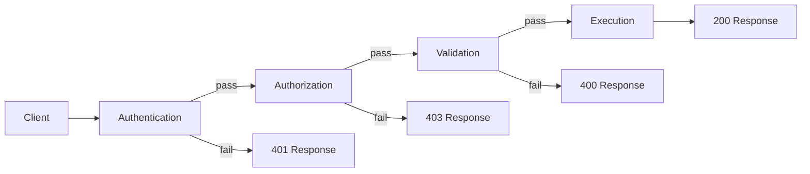
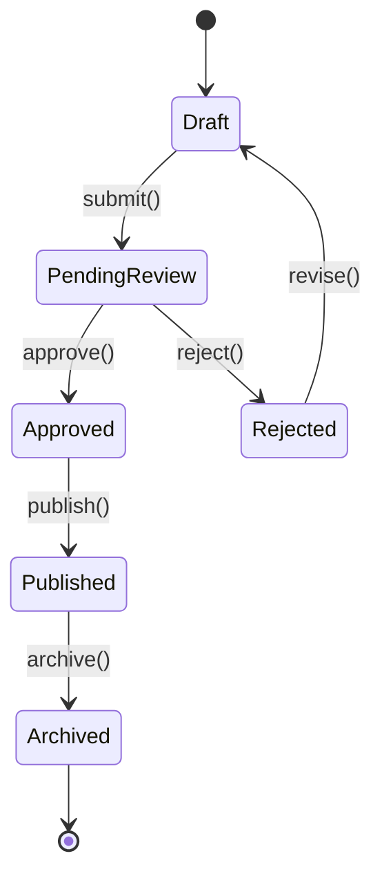
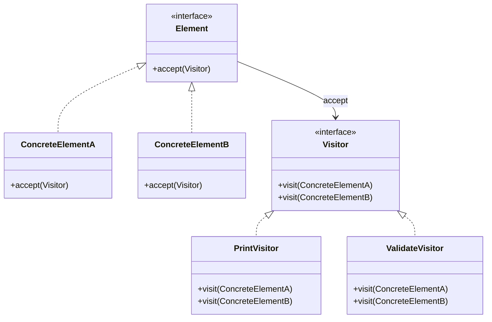
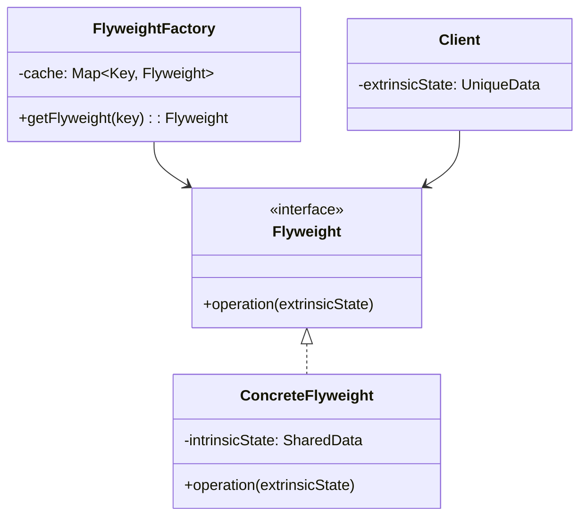
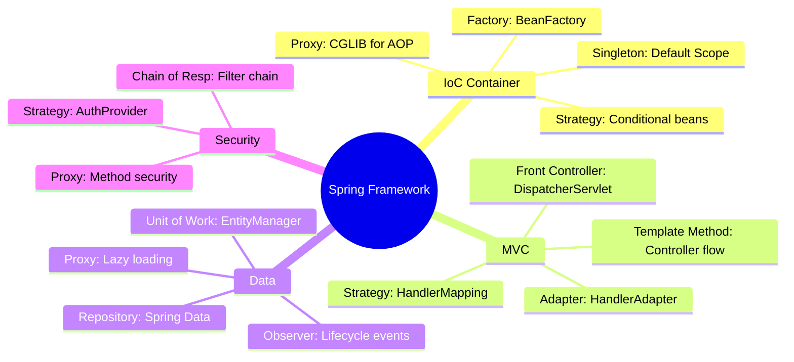

## Keywords in This File
{: .no_toc }

| # | Keyword | Weight |
|---|---|---|
| 1 | [Command and Chain of Responsibility](#command-and-chain-of-responsibility) | medium-high |
| 2 | [State and Mediator Patterns](#state-and-mediator-patterns) | medium |
| 3 | [Visitor and Bridge Patterns](#visitor-and-bridge-patterns) | medium |
| 4 | [Prototype and Flyweight Patterns](#prototype-and-flyweight-patterns) | medium |
| 5 | [Pattern Combinations in Java Frameworks](#pattern-combinations-in-java-frameworks) | high |

---

# Command and Chain of Responsibility

**Interview Weight:** medium-high - Tests understanding
of decoupling request senders from receivers, undo
mechanisms, and flexible handler chains. Common in
frameworks (Spring Security filters, servlet chains).

---

### 🎯 Model Answer

**30 seconds:**

> Command encapsulates a request as an object,
> enabling parameterization, queuing, logging, and
> undo of operations. Chain of Responsibility passes
> a request along a chain of handlers until one
> processes it. Both decouple the sender from the
> receiver - Command turns "what to do" into an object;
> Chain lets you build dynamic processing pipelines.

**3 minutes (Senior):**

> Command pattern turns method calls into first-class
> objects. Instead of calling service.doThing(), you
> create new DoThingCommand(params) and pass it to an
> executor. The executor can: queue it, log it, undo
> it, retry it, or serialize it for remote execution.
>
> Command structure:
> Command interface: execute(), optionally undo().
> ConcreteCommand: holds receiver + parameters.
> Invoker: triggers execution (button, scheduler,
> message consumer).
> Receiver: the actual logic executor.
>
> Java production uses:
> Runnable/Callable: simplest command (execute + return).
> Spring @Async: command submitted to thread pool.
> Message queues: serialized commands executed remotely.
> CQRS: write commands separated from read queries.
>
> Chain of Responsibility passes requests through an
> ordered sequence of handlers. Each handler decides:
> handle it, pass to next, or both.
>
> Chain structure:
> Handler interface: handle(request), setNext(handler).
> ConcreteHandlers: authentication, authorization,
> validation, logging, rate-limiting.
> Client: sends request to the first handler.
>
> Java production uses:
> Servlet filters (FilterChain.doFilter).
> Spring Security filter chain.
> Spring Interceptors (HandlerInterceptor).
> Exception handler chains.
>
> The non-obvious insight: these two patterns COMBINE
> powerfully. A command pipeline: parse command, validate
> command, authorize command, execute command, audit
> command - each step is a handler in a chain that
> processes a command object. This is how CQRS command
> buses work.

**Blank Mind Recovery:**

**(1) Restate:** "You are asking about Command - turning
operations into objects - and Chain of Responsibility -
passing requests through a handler pipeline."

**(2) First principles:** "Sometimes you need to
decouple WHEN/HOW something is requested from WHO
processes it. Command decouples the 'what' into an
object. Chain decouples the 'who' into a pipeline."

**(3) Bridge:** "Command is like a restaurant order
ticket - written down, queued, can be cancelled.
Chain of Responsibility is like airport security -
your boarding pass goes through ID check, bag scan,
body scan - each station decides pass or reject."

---

### 📘 Concept Explanation

**What it is:**

Command: a behavioral pattern that encapsulates a
request as an object with all parameters needed for
execution.

Chain of Responsibility: a behavioral pattern that
passes a request along a chain of handlers, where
each handler can process or forward the request.

**The problem it solves:**

Command: decouples the object that invokes an operation
from the one that performs it. Enables undo, queuing,
logging, and transactional behavior.

Chain: decouples the sender from specific receivers.
Allows dynamic handler composition without the sender
knowing which handler will process the request.

**How it works:**

```
COMMAND PATTERN:
+--------+    +---------+    +----------+
| Invoker|--->| Command |    | Receiver |
| (button)|   +---------+    +----------+
+--------+    |+execute()|-->|doAction()|
              |+undo()   |   +----------+
              +---------+

CHAIN OF RESPONSIBILITY:
Request --> [Auth] --> [Validate] --> [Execute]
              |            |              |
           pass/fail    pass/fail      result
```



> **Diagram walkthrough:** The Chain processes a
> request through ordered handlers. Each handler can
> short-circuit (return error) or pass to next. The
> client does not know which handler will process the
> request. Adding a new handler (rate limiting) means
> inserting it in the chain without changing existing
> handlers or the client.

**The key insight:**

Command makes operations first-class objects (storable,
serializable, undoable). Chain makes processing
pipelines composable (add/remove handlers without
changing senders or receivers). Together they enable
command buses, middleware pipelines, and event
processing systems.

**When to use Command:**

- Undo/redo functionality
- Operation queuing (task schedulers)
- Remote execution (serialize command, send to worker)
- Transaction logging (persist commands for replay)
- CQRS write side

**When to use Chain:**

- Request validation pipelines
- Security filter chains
- Middleware (logging, metrics, error handling)
- Event processing with multiple potential handlers

**When NOT to use:**

- Simple direct method calls (over-engineering)
- When there is always exactly one handler (no chain)
- When undo is impossible (irreversible operations)

**Alternatives:**

- Strategy: single algorithm selection (not queuing)
- Observer: notify multiple parties (not sequential)
- Decorator: wrap behavior (not conditional routing)

---

### 💻 Code Example

```java
// BAD: switch-based command dispatch
public class OrderController {
    public Response handleAction(
        String action, Map<String, Object> params
    ) {
        // Growing switch, no undo, no queuing
        switch (action) {
            case "place":
                return placeOrder(params);
            case "cancel":
                return cancelOrder(params);
            case "refund":
                return refundOrder(params);
            // 20 more cases...
            default:
                throw new IllegalArgumentException(
                    "Unknown: " + action
                );
        }
    }
}
```

> **Code walkthrough:** Switch-based dispatch couples
> the controller to every operation. Adding a new action
> means modifying this class. No undo capability.
> No queuing. No audit trail. No way to serialize and
> execute remotely. Violates Open-Closed Principle.

```java
// GOOD: Command pattern with Chain of Responsibility
// Command interface
public interface Command<R> {
    R execute();
    default void undo() {
        throw new UnsupportedOperationException(
            "Undo not supported for " + getClass()
        );
    }
}

// Concrete command
public record PlaceOrderCommand(
    Long customerId,
    List<OrderItemRequest> items,
    PaymentMethod payment
) implements Command<Order> {

    @Override
    public Order execute() {
        // Delegated by handler, not self-executing
        throw new IllegalStateException("Use handler");
    }
}

// Handler in the chain
public interface CommandHandler<C extends Command<R>, R> {
    R handle(C command);
    boolean canHandle(Command<?> command);
}

// Chain of Responsibility for command processing
public class CommandBus {
    private final List<CommandMiddleware> middleware;
    private final Map<Class<?>, CommandHandler<?, ?>>
        handlers;

    public <R> R dispatch(Command<R> command) {
        // Build chain: middleware wraps handler
        CommandExecution<R> execution =
            buildChain(command);
        return execution.proceed();
    }

    private <R> CommandExecution<R> buildChain(
        Command<R> command
    ) {
        CommandHandler handler =
            handlers.get(command.getClass());
        // Wrap handler with middleware chain
        CommandExecution<R> tail =
            () -> handler.handle(command);
        for (int i = middleware.size() - 1;
             i >= 0; i--) {
            CommandExecution<R> next = tail;
            CommandMiddleware mw = middleware.get(i);
            tail = () -> mw.execute(command, next);
        }
        return tail;
    }
}

// Middleware (Chain of Responsibility)
public interface CommandMiddleware {
    <R> R execute(
        Command<R> cmd, CommandExecution<R> next
    );
}

// Validation middleware
public class ValidationMiddleware
    implements CommandMiddleware {
    @Override
    public <R> R execute(
        Command<R> cmd, CommandExecution<R> next
    ) {
        validate(cmd);  // throws if invalid
        return next.proceed();  // pass to next
    }
}

// Logging middleware
public class LoggingMiddleware
    implements CommandMiddleware {
    @Override
    public <R> R execute(
        Command<R> cmd, CommandExecution<R> next
    ) {
        log.info("Executing: {}", cmd.getClass());
        R result = next.proceed();
        log.info("Completed: {}", cmd.getClass());
        return result;
    }
}
```

> **Code walkthrough:** Command objects encapsulate
> operations with their parameters (PlaceOrderCommand).
> CommandBus dispatches commands through a middleware
> chain (validation, logging, auth) before reaching
> the handler. Adding new commands requires only a new
> Command class and Handler. Adding cross-cutting
> behavior requires only a new middleware. Neither
> changes existing code.

---

### 🎓 Answers by Seniority

**Junior / Mid (0-5 years):**

> Command turns operations into objects that can be
> queued, logged, and undone. Chain of Responsibility
> passes requests through handlers until one processes
> it. Servlet filters are a chain; Runnable is a
> simple command.

I use Chain for validation pipelines (each validator
checks one rule, passes to next if valid). I use
Command when operations need to be queued or retried.

*Push deeper:* "The combination: a command bus with
middleware IS Command + Chain. The command is the
request object. The middleware chain processes it
through validation, auth, logging before execution."

---

**Senior / Staff (5+ years):**

> These patterns form the backbone of framework
> architecture. Spring Security's filter chain is CoR.
> Spring's ApplicationEvent system combines Command
> (event as object) with Chain (listener chain).
> CQRS command buses combine both: command objects
> dispatched through middleware chains.

In production, I design command handlers as isolated
units: each handles exactly one command type, has its
own dependencies, and is independently testable. The
chain provides cross-cutting behavior without coupling
handlers to infrastructure concerns.

*Push deeper:* "At scale, command sourcing (persisting
commands before execution) gives you replay, audit,
and debugging. The Chain becomes critical for
idempotency middleware: if this command was already
executed (check by ID), return cached result."

---

### ⚖️ Comparison Table

| Pattern | Decouples | Object | Direction | Choose When |
|---|---|---|---|---|
| **Command** | Invoker from executor | Operation as object | One-to-one | Undo, queue, serialize, audit operations |
| **Chain of Resp** | Sender from receivers | Request through pipeline | Sequential handlers | Validation chains, middleware, filters |
| Strategy | Client from algorithm | Algorithm selection | One-to-one | Runtime algorithm switching |
| Observer | Subject from observers | Event notification | One-to-many | Multiple parties react to event |

**The deciding factor:** Need to STORE, QUEUE, or UNDO
an operation? Command. Need to PIPELINE processing
through multiple handlers? Chain. Need both? Command
Bus with middleware.

---

### ⚠️ Common Misconceptions

**"Command pattern means the command executes itself."**

In most implementations, the command is a data object.
A separate Handler executes it. Self-executing commands
(command.execute()) couple the command to its
infrastructure. Handler-based execution keeps commands
as pure data (serializable, testable).

**"Chain of Responsibility always stops at the first
handler."**

Two variants: "pure" (stops when handled) and
"pipeline" (all handlers process sequentially).
Servlet filters use the pipeline variant - every
filter runs, calling chain.doFilter() to pass along.
Exception handling uses the pure variant - first
matching handler wins.

**"These patterns add complexity without value."**

For simple CRUD: yes, they add overhead. For systems
with: undo, queuing, retry, audit logging, validation
pipelines, or dynamic handler composition - they
eliminate the exponential complexity of handling all
combinations in procedural code.

---

### 🚨 Failure Modes and Diagnosis

| Failure | Symptom | Diagnosis |
|---|---|---|
| Chain not terminated | Request passes through all handlers unprocessed | Add a terminal handler that always handles (default case) |
| Command handler not found | NullPointerException when dispatching | Register handlers for all command types; add fallback handler |
| Middleware ordering error | Auth runs after validation (access before check) | Document middleware order; add order priority numbers |
| Command too large | Serialization timeout, queue overflow | Split into smaller commands; use reference IDs instead of embedded data |
| Infinite chain loop | StackOverflowError or timeout | Ensure handlers call next.proceed() only once; add max-depth guard |

---

### 🎯 Interview Deep-Dive

| Experience | Time | Depth |
|---|---|---|
| Junior | 3 min | Define both patterns, examples |
| Mid | 5 min | Framework usage, undo mechanism |
| Senior | 8 min | Command bus, middleware design |
| Staff | 12 min | CQRS integration, event sourcing |

---

**[JUNIOR] Q1 - What is the Command pattern and where
have you seen it in Java?**

*Why they ask:* Pattern recognition in frameworks.

Command encapsulates an operation as an object. The
interface has an execute() method. Implementations hold
the parameters and receiver needed to perform the
operation.

Java examples:
Runnable: a command with no return value. You pass it
to a thread pool for execution.
Callable<V>: a command that returns a result.
CompletableFuture: wraps an async command.
Spring's ApplicationEvent: event as command, published
to listeners for handling.

The value: once an operation is an object, you can store
it (undo history), queue it (thread pool), serialize it
(message queue), log it (audit trail), and retry it
(failure recovery).

*What separates good from great:* Connecting Runnable
and Callable as everyday Command pattern implementations
that developers use without realizing it is a pattern.

---

**[JUNIOR] Q2 - What is Chain of Responsibility and
how do servlet filters use it?**

*Why they ask:* Framework connection.

Chain of Responsibility passes a request through
ordered handlers. Each handler can process the request,
pass it to the next handler, or both.

Servlet filter implementation:
Each Filter implements doFilter(request, response,
chain). It can: modify the request, call
chain.doFilter(request, response) to pass to next
filter, modify the response after the chain returns,
or short-circuit by NOT calling chain.doFilter().

The FilterChain IS the chain. Spring Security adds
15+ filters: CorsFilter, CsrfFilter,
UsernamePasswordAuthenticationFilter, etc. Each handles
its concern independently. Adding/removing security
features means adding/removing filters from the chain.

*What separates good from great:* Explaining that NOT
calling chain.doFilter() short-circuits the chain -
this is how authentication rejection works.

---

**[MID] Q3 - How would you implement undo/redo using
Command pattern?**

*Why they ask:* Practical application.

Each command implements both execute() and undo():

PlaceOrderCommand.execute(): creates order, returns ID.
PlaceOrderCommand.undo(): cancels the order by ID.

Undo stack: after each execute(), push the command
onto an undo stack. Undo pops and calls undo().
Redo stack: when undoing, push onto redo stack.
When redoing, pop and execute() again.

Challenges in production:
Not all operations are undoable (sending email, charging
credit card). Mark these as non-undoable.
Undo may require compensation rather than reversal
(refund instead of "un-charge").
State may have changed between execute and undo
(another user modified the record).

My approach: separate UndoableCommand from Command.
Store enough state in the command to reverse it
(previous values, not just current). Validate undo
preconditions before executing undo.

*What separates good from great:* The compensation
vs reversal distinction and storing previous state
in the command for safe undo.

---

**[MID] Q4 - How do you order handlers in a chain
and what happens when order matters?**

*Why they ask:* Design discipline.

Handler ordering is critical: authentication before
authorization before validation before execution.
Wrong order creates security vulnerabilities.

Ordering approaches:
Explicit priority: each handler has @Order(n) or
implements Ordered. Spring sorts by priority value.
Lower number = earlier in chain.

Positional configuration: list handlers in order in
configuration. No ambiguity.

Dependency-based: handler declares "I must run after
X and before Y." Framework resolves order.

When ordering goes wrong:
Authorization before authentication: system checks
permissions before verifying identity (access bypass).
Logging after error handler: errors are caught but
not logged.
Validation after execution: invalid data reaches
business logic.

My rule: security handlers first (auth, rate limit),
then transformation handlers (parse, enrich), then
validation, then execution, then response handlers
(serialization, compression).

*What separates good from great:* The security
implication of wrong ordering and a clear ordering
taxonomy (security -> transform -> validate -> execute).

---

**[SENIOR] Q5 - How does a Command Bus differ from
direct service calls?**

*Why they ask:* Architecture pattern.

Direct call: controller calls orderService.placeOrder().
Tight coupling, no cross-cutting behavior injection.

Command Bus: controller creates PlaceOrderCommand,
dispatches to bus. Bus routes through middleware (auth,
validation, logging, metrics) to the handler.

Benefits:
Single entry point for all write operations.
Cross-cutting concerns applied uniformly.
Commands are serializable (async processing).
Easy auditing (log all commands).
Testable in isolation (test handler without middleware).

Trade-offs:
Indirection: harder to trace "what handles this?"
Performance: middleware chain adds latency per request.
Complexity: more classes for simple operations.

When worth it: 20+ different operations with shared
cross-cutting needs. When NOT worth it: 3 CRUD
endpoints with no cross-cutting needs beyond
@Transactional.

*What separates good from great:* The threshold (20+
operations with shared cross-cutting) making it
concrete rather than theoretical.

---

**[SENIOR] Q6 - How does Spring Security use Chain of
Responsibility?**

*Why they ask:* Framework internals.

Spring Security's FilterChainProxy manages multiple
SecurityFilterChain instances. Each chain is a sequence
of filters (handlers) that process HTTP requests.

Filter order (approximate):
1. CorsFilter (CORS headers)
2. CsrfFilter (CSRF token validation)
3. UsernamePasswordAuthenticationFilter
4. BasicAuthenticationFilter
5. AuthorizationFilter (access decisions)
6. ExceptionTranslationFilter (error responses)

Each filter can:
- Pass to next: SecurityContextHolder set, continue.
- Short-circuit: return 401/403 without calling chain.
- Modify request/response: add headers, wrap request.

Customization: add custom filters at specific positions
(addFilterBefore, addFilterAfter). The chain is
ordered but extensible.

The security architecture: each filter handles ONE
concern. No filter knows about others. The chain
composition determines security policy. Changing
policy = changing filter configuration, not filter
code.

*What separates good from great:* Naming the actual
Spring Security filters in order and explaining
addFilterBefore/After for customization.

---

**[SENIOR] Q7 - How do you make commands idempotent
in distributed systems?**

*Why they ask:* Production reliability.

Idempotent command: executing it twice produces the same
result as executing once. Critical when: messages might
be delivered twice, retries after timeout, at-least-once
delivery semantics.

Implementation:
Command ID: every command has a unique identifier
(UUID). Before executing, check if this ID was already
processed.

Idempotency store: persist command IDs after successful
execution. On duplicate, return cached result.

Middleware approach: add IdempotencyMiddleware to the
command bus chain. It checks the store before passing
to the handler. If already executed, return stored
result.

Database-level: use UPSERT or INSERT ... ON CONFLICT
to make the database operation itself idempotent.
Combined with command ID as a unique constraint.

The challenge: the window between "execute" and "store
ID." If the process crashes after execution but before
storing the ID, the next retry re-executes. Solution:
store command ID in the SAME transaction as the
business operation (Outbox pattern).

*What separates good from great:* The crash-window
problem and the same-transaction solution showing
awareness of exactly-once semantics challenges.

---

**[STAFF] Q8 - How would you design a command sourcing
system for audit and replay?**

*Why they ask:* Architecture-level application.

Command sourcing: persist every command before
execution. The command log IS the audit trail. Replay
commands to reconstruct state or debug issues.

Architecture:
1. Client submits command.
2. Command bus persists command to durable log
   (database, Kafka).
3. Command is dispatched to handler.
4. Result is stored alongside the command.
5. Replay: read commands from log, re-execute in order.

Benefits:
Complete audit trail (who did what, when, with what
parameters).
Debugging: replay the exact sequence that caused a bug.
Recovery: rebuild state from command log after failure.
Testing: replay production commands against new code.

Design decisions:
Log storage: append-only table or event stream.
Serialization: commands must be version-tolerant
(old commands still deserializable after code changes).
Replay safety: commands must be idempotent for replay.
Selective replay: filter by time, user, or type.

The difference from Event Sourcing: command sourcing
stores INTENT (what was requested). Event sourcing
stores RESULT (what happened). Command sourcing can
fail on replay (business rules may reject). Event
sourcing always succeeds (events are facts).

*What separates good from great:* The distinction
between command sourcing (intent, may fail on replay)
and event sourcing (facts, always succeeds) showing
you understand both approaches deeply.

---

**[STAFF] Q9 - How do you test command handlers and
middleware chains independently?**

*Why they ask:* Testability of the architecture.

Testing strategy:

Command handlers (unit tests): test each handler in
isolation. Pass a command, assert the result. Mock
repositories and external services. No middleware,
no chain. Test BUSINESS LOGIC only.

Middleware (unit tests): test each middleware
independently. Pass a command and a mock next-step.
Assert the middleware's behavior (validation throws,
logging records, metrics increment). Test
CROSS-CUTTING BEHAVIOR only.

Chain integration tests: assemble the full chain with
real middleware and a test handler. Verify ordering:
auth rejects before validation runs. Verify
composition: all middleware executes for a valid
request.

Command bus end-to-end: dispatch a command through
the real bus. Assert the final state change. Uses
in-memory repositories. Tests the FULL PIPELINE.

The testing pyramid:
Many handler unit tests (fast, isolated).
Some middleware unit tests (verify each concern).
Few chain integration tests (verify composition).
Fewer end-to-end tests (verify the full path).

*What separates good from great:* The explicit test
pyramid showing what each level tests and why you
need all levels (not just end-to-end).

---

# State and Mediator Patterns

**Interview Weight:** medium - Tests understanding of
complex state machines, centralized coordination, and
when to use each for managing object interactions.

---

### 🎯 Model Answer

**30 seconds:**

> State pattern allows an object to alter its behavior
> when its internal state changes - the object appears
> to change its class. Mediator defines an object that
> encapsulates how a set of objects interact,
> preventing them from referring to each other
> explicitly. State manages transitions WITHIN one
> object; Mediator manages communication BETWEEN objects.

**3 minutes (Senior):**

> State pattern replaces conditional logic with
> polymorphism. Instead of:
> if (status == PENDING) doA()
> else if (status == APPROVED) doB()
> else if (status == SHIPPED) doC()
>
> You have: state.handle(context). Each state is a
> class that knows its valid transitions and behaviors.
> PendingState.approve() -> move to ApprovedState.
> ShippedState.approve() -> throw IllegalStateException.
>
> State structure:
> Context: holds current state reference.
> State interface: defines all possible operations.
> ConcreteState classes: implement behavior for each
> state plus valid transitions.
>
> The benefit: adding a new state means adding a class,
> not modifying every switch statement. Invalid
> transitions are enforced at compile-time by the
> state class (method throws or is absent).
>
> Mediator pattern solves the "everyone talks to
> everyone" problem. In a chat room, if each user
> held references to all others, adding one user means
> updating all existing users. Mediator centralizes:
> user sends message to mediator, mediator routes to
> appropriate recipients.
>
> Production Mediator examples:
> Spring's ApplicationEventPublisher: components
> publish events, mediator (Spring context) routes to
> listeners. No component knows about others.
> Air traffic control: planes talk to tower, not to
> each other.
> UI event bus: components emit events, mediator
> dispatches to interested handlers.
>
> The non-obvious insight: these patterns complement
> each other. A state machine with complex inter-object
> coordination uses State to manage individual object
> transitions and Mediator to coordinate between
> multiple state machines.

**Blank Mind Recovery:**

**(1) Restate:** "You are asking about State - replacing
conditionals with state objects - and Mediator -
centralizing object interactions through a coordinator."

**(2) First principles:** "Complex conditionals based on
state grow into unmaintainable switch statements. State
pattern gives each state its own class. Many-to-many
object interactions create tangled coupling. Mediator
centralizes communication through one coordinator."

**(3) Bridge:** "State is like a traffic light: the
light changes what it DOES (stop, go, caution) based
on which state it is in. Mediator is like a call center
switchboard: callers talk to the operator, not directly
to each other."

---

### 📘 Concept Explanation

**What it is:**

State: a pattern where an object delegates behavior to
a state object, switching the state object to change
behavior dynamically.

Mediator: a pattern where a central object coordinates
communication between multiple objects, replacing
direct references with indirect communication.

**The problem it solves:**

State: eliminates complex conditional logic based on
object state. Without it, every method has
if/else/switch on the current state, duplicating
transition logic across the class.

Mediator: eliminates tight coupling between objects
that interact. Without it, adding or removing a
participant requires modifying all other participants.

**How it works:**

```
STATE PATTERN:
+--------+     +----------------+
|Context |---->| <<interface>>  |
|        |     | State          |
|setState()|   +----------------+
+--------+     | +handle(ctx)   |
               | +transition()  |
               +-------+--------+
                       |
          +------------+------------+
          |            |            |
     +----+----+ +----+----+ +----+----+
     |Pending  | |Approved | |Shipped  |
     |State    | |State    | |State    |
     +---------+ +---------+ +---------+

MEDIATOR PATTERN:
+-----+     +---------+     +-----+
|Comp |<--->| Mediator|<--->|Comp |
|  A  |     +---------+     |  B  |
+-----+          ^          +-----+
                 |
            +----+----+
            |  Comp   |
            |    C    |
            +---------+
```



> **Diagram walkthrough:** State diagram shows valid
> transitions for a content workflow. Each state is a
> class that defines which transitions are valid from
> that state. Draft can submit but cannot approve.
> Approved can publish but cannot reject. Invalid
> transitions throw exceptions - enforced by the state
> class, not by if/else.

**The key insight:**

State makes the type system enforce valid transitions.
If ShippedState has no cancel() method (or throws),
calling cancel on a shipped order fails at the right
place with a clear error. No more "if status != SHIPPED
then cancel" scattered across 5 methods.

**When to use State:**

- Object behavior varies significantly by state
- Complex conditional logic based on state
- State transitions have rules (not all transitions
  are valid from all states)
- State machine with 4+ states

**When to use Mediator:**

- Multiple objects with complex interactions
- Objects should not know about each other
- Adding/removing participants should not affect others
- Centralized control of interaction logic

**When NOT to use:**

- State: simple boolean flags (on/off) with trivial
  behavior differences. Overhead not justified.
- Mediator: only 2 objects interact (direct reference
  is simpler). When mediator becomes a God class.

**Alternatives:**

- State: enum + switch (simpler for < 4 states)
- Mediator: Observer (decentered notification),
  Event Bus (framework-provided mediator)

---

### 💻 Code Example

```java
// BAD: switch on state in every method
public class Order {
    private OrderStatus status;

    public void approve() {
        // Repeated in EVERY method
        switch (status) {
            case PENDING:
                // approve logic
                this.status = OrderStatus.APPROVED;
                break;
            case APPROVED:
                throw new IllegalStateException(
                    "Already approved"
                );
            case SHIPPED:
                throw new IllegalStateException(
                    "Cannot approve shipped order"
                );
            case CANCELLED:
                throw new IllegalStateException(
                    "Cannot approve cancelled order"
                );
        }
    }
    // Same switch in cancel(), ship(), refund()...
    // 4 methods x 4 states = 16 cases to maintain
}
```

> **Code walkthrough:** Every method duplicates state
> checking logic. Adding a new state means modifying
> ALL methods. Adding a new operation means adding a
> case to ALL states. This grows as states * operations,
> making maintenance exponential.

```java
// GOOD: State pattern
public interface OrderState {
    OrderState approve(Order context);
    OrderState cancel(Order context);
    OrderState ship(Order context);

    default OrderState reject(String reason) {
        throw new InvalidTransitionException(
            getClass().getSimpleName(), "reject"
        );
    }
}

public class PendingState implements OrderState {
    @Override
    public OrderState approve(Order context) {
        context.setApprovedAt(Instant.now());
        return new ApprovedState();
    }

    @Override
    public OrderState cancel(Order context) {
        context.setCancelledAt(Instant.now());
        context.refundPayment();
        return new CancelledState();
    }

    @Override
    public OrderState ship(Order context) {
        throw new InvalidTransitionException(
            "Pending", "ship"
        );
    }
}

public class ApprovedState implements OrderState {
    @Override
    public OrderState approve(Order context) {
        throw new InvalidTransitionException(
            "Approved", "approve"
        );
    }

    @Override
    public OrderState cancel(Order context) {
        context.setCancelledAt(Instant.now());
        context.refundPayment();
        return new CancelledState();
    }

    @Override
    public OrderState ship(Order context) {
        context.setShippedAt(Instant.now());
        context.notifyCustomer();
        return new ShippedState();
    }
}

// Context delegates to state
public class Order {
    private OrderState state = new PendingState();

    public void approve() {
        this.state = state.approve(this);
    }

    public void ship() {
        this.state = state.ship(this);
    }
}
```

> **Code walkthrough:** Each state class handles ONLY
> its valid transitions. Adding a new state: create a
> new class. Adding a new operation: add to interface
> (compiler forces all states to implement or default).
> The Order class is trivial - it delegates to the
> current state. Invalid transitions throw immediately
> with clear context (which state, which operation).

```java
// PRODUCTION: Mediator for multi-component coordination
public interface OrderMediator {
    void notify(Object sender, String event);
}

@Service
public class OrderProcessingMediator
    implements OrderMediator {

    private final InventoryService inventory;
    private final PaymentService payment;
    private final NotificationService notification;
    private final AnalyticsService analytics;

    @Override
    public void notify(
        Object sender, String event
    ) {
        switch (event) {
            case "order_placed" -> {
                inventory.reserve(
                    ((Order) sender).getItems()
                );
                payment.authorize(
                    ((Order) sender).getTotal()
                );
                analytics.track("order_placed");
            }
            case "payment_confirmed" -> {
                inventory.commit(
                    ((Order) sender).getItems()
                );
                notification.sendConfirmation(
                    (Order) sender
                );
            }
            case "order_cancelled" -> {
                inventory.release(
                    ((Order) sender).getItems()
                );
                payment.refund(
                    ((Order) sender).getTotal()
                );
                notification.sendCancellation(
                    (Order) sender
                );
            }
        }
    }
}
```

> **Code walkthrough:** The mediator coordinates
> inventory, payment, notification, and analytics.
> None of these services know about each other. Adding
> a new service (fraud detection) means modifying only
> the mediator. Removing analytics means changing one
> place. Each service is independently testable. The
> mediator encapsulates the interaction protocol.

---

### 🎓 Answers by Seniority

**Junior / Mid (0-5 years):**

> State replaces conditional logic with state objects -
> each state is a class that defines valid behavior and
> transitions. Mediator centralizes communication so
> objects do not reference each other directly.

I use State for order workflows (pending -> approved ->
shipped) where each state has different valid actions.
I use Mediator when multiple services need coordination
without knowing about each other.

*Push deeper:* "State encodes transition rules in types.
If approve() is not valid from ShippedState, the
compiler (or the state class) enforces it. No runtime
surprise."

---

**Senior / Staff (5+ years):**

> State + Mediator are how I implement workflow engines.
> State manages individual entity lifecycles. Mediator
> coordinates cross-entity effects (order approved ->
> reserve inventory + charge payment + notify customer).
> Spring's event system IS a mediator.

The evolution path: start with enum + switch for simple
state (2-3 states, trivial logic). Migrate to State
pattern when: states exceed 4, transition logic is
complex, or different states need fundamentally
different behavior.

*Push deeper:* "At scale, State machines become
declarative: define states, transitions, and guards
in configuration (Spring State Machine, Apache
Commons SCXML). The pattern remains the same but
the implementation moves from code to data."

---

### ⚖️ Comparison Table

| Pattern | Manages | Scale Problem | Coupling | Choose When |
|---|---|---|---|---|
| **State** | Behavior within one object | Many states x many operations | State to context | Object behavior varies by internal state |
| **Mediator** | Communication between objects | Many objects x many interactions | All to mediator | Multiple objects interact with complex rules |
| Strategy | Algorithm selection | Many algorithms | Client to strategy | One behavior varies, not state-dependent |
| Observer | Event notification | Many listeners | Subject to observer | Multiple parties react to changes |

**The deciding factor:** If one object's behavior
changes based on its state: State. If multiple objects
need coordinated interaction without knowing each
other: Mediator.

---

### ⚠️ Common Misconceptions

**"State pattern is just an enum with a switch."**

An enum with a switch centralizes ALL logic in one
place. State pattern DISTRIBUTES logic to state
classes. Each state class is independently testable
and modifiable. Adding a state in enum means updating
every switch. Adding a State class is isolated.

**"Mediator is just an event bus."**

An event bus broadcasts without logic (publish-
subscribe). A Mediator contains interaction LOGIC
(when A does X, tell B to do Y and C to do Z).
Mediator knows the protocol. Event bus is protocol-
agnostic.

**"State pattern requires state objects to be
stateless."**

State objects CAN hold data (entry time, attempt
count, timeout duration). A RetryState might track
retry count. The key: the State is associated with the
Context, not shared globally.

---

### 🚨 Failure Modes and Diagnosis

| Failure | Symptom | Diagnosis |
|---|---|---|
| Missing state transition | IllegalStateException in production | State class missing a valid transition. Add transition or document why invalid |
| God mediator | Mediator class is 1000+ lines | Split by concern: OrderPaymentMediator, OrderShippingMediator |
| State explosion | 20+ state classes | Consider hierarchical states (super-states) or state machine framework |
| Mediator becomes coupling point | Cannot change one service without updating mediator | Use events instead of direct mediator calls for loosely-coupled interactions |
| Inconsistent state after error | State transitions partially applied | Make transitions atomic: either all side effects complete or rollback |

---

### 🎯 Interview Deep-Dive

| Experience | Time | Depth |
|---|---|---|
| Junior | 3 min | Define both, simple examples |
| Mid | 5 min | State machine implementation, Mediator vs Observer |
| Senior | 8 min | Complex workflows, Spring integration |
| Staff | 12 min | Distributed state machines, saga as mediator |

---

**[JUNIOR] Q1 - What problem does the State pattern
solve?**

*Why they ask:* Conditional complexity awareness.

State pattern solves the "growing switch statement"
problem. When object behavior depends on internal
state, every method needs state-checking logic:
if PENDING do X, if APPROVED do Y, if SHIPPED do Z.

With 5 states and 5 operations, you have 25 conditional
branches scattered across 5 methods. Adding a state
means updating all 5 methods. Adding an operation means
adding 5 cases.

State pattern inverts this: each state is a class with
5 methods. Adding a state adds one class. Adding an
operation adds one method to the interface. Each state
class is small, focused, and independently testable.

*What separates good from great:* The growth math -
states * operations grows multiplicatively in switch
but additively with State pattern.

---

**[MID] Q2 - How do you implement state transitions
with side effects safely?**

*Why they ask:* Practical state machine design.

Transitions often have side effects: approve() sends
email, reserve inventory, update audit log. If the
transition fails midway, state is inconsistent.

Safe transition approach:
1. Validate transition is legal from current state.
2. Collect side effects (do not execute yet).
3. Execute side effects within a transaction.
4. Change state only if all side effects succeed.
5. If any side effect fails, rollback.

Implementation: state.transition() returns a
TransitionResult containing: new state + list of domain
events. The context applies the state change and
publishes events in one transaction. If anything fails,
the state does not change.

For async side effects (email, external API): change
state first, publish events. Listeners handle side
effects asynchronously. If email fails, the order is
still approved (state correct) and the email retries.

*What separates good from great:* Separating
synchronous side effects (same transaction) from
async side effects (eventual) and the TransitionResult
pattern.

---

**[MID] Q3 - When would you use Mediator over direct
method calls?**

*Why they ask:* Design judgment.

Use Mediator when:
N objects interact with M other objects (N*M coupling).
Adding a participant should not affect existing ones.
The interaction PROTOCOL is complex enough to
centralize (if A does X, B does Y only if Z).
You want to test participants in isolation.

Direct calls are fine when:
Only 2 objects interact.
The interaction is simple (A calls B, done).
There is no protocol logic (just delegation).
Performance matters (mediator adds indirection).

The threshold: 4+ participants with conditional
interaction logic. Below that, direct calls are
clearer.

Real example: order processing with inventory,
payment, shipping, notification, fraud detection.
Each needs to react to order events differently.
Mediator encapsulates "when order placed: check
fraud, then reserve inventory, then authorize
payment." Without mediator: Order class imports all
5 services.

*What separates good from great:* The concrete
threshold (4+ participants with conditional logic)
and the example showing what the mediator centralizes.

---

**[SENIOR] Q4 - How do you persist state machine state
with JPA?**

*Why they ask:* Practical integration.

Two approaches:

Enum storage: persist the state as an enum column.
Recreate state objects from enum on load.
@Enumerated(EnumType.STRING) OrderStatus status.
On load: state = StateFactory.from(status).
Pro: simple, queryable. Con: state objects are recreated
each load (lose any state-specific data).

State table: persist state with its data.
State class is @Embeddable or separate table.
Stores: state type + state-specific data (retry count,
entered_at, timeout_at).
Pro: rich state with data. Con: more complex mapping.

Transition history: persist ALL transitions in an audit
table (order_id, from_state, to_state, timestamp,
actor). Enables: audit trail, replay, debugging "how
did it get here?"

My preference: enum column for current state (queryable:
"find all PENDING orders") + transition history table
for audit. State objects are recreated in memory from
the enum value.

*What separates good from great:* The dual approach
(enum for current + history table for audit) and
explaining why enum is queryable while state objects
are not.

---

**[SENIOR] Q5 - How do you prevent the Mediator from
becoming a God class?**

*Why they ask:* Design discipline.

Symptoms of God Mediator: 500+ lines, handles 20+
event types, knows about all services in detail.

Solutions:

Split by domain: OrderPaymentMediator,
OrderShippingMediator, OrderNotificationMediator.
Each handles its domain's interactions.

Event-driven mediator: replace direct coordination
with events. The mediator publishes events; specific
handlers subscribe. The mediator becomes a dispatcher,
not a logic container.

Sub-mediators: complex interactions decompose into
sub-mediators. Main mediator delegates to specialized
coordinators for specific workflows.

Rule engine: if interaction logic is complex and
data-driven, externalize rules. Mediator reads rules
and executes them. Adding a rule does not change code.

My rule: if a mediator exceeds 200 lines or coordinates
more than 5 participants, split it. The split axis is
usually by business process (payment flow, shipping
flow, notification flow).

*What separates good from great:* The concrete
threshold (200 lines, 5 participants) and multiple
splitting strategies with selection criteria.

---

**[SENIOR] Q6 - How does Spring State Machine
implement the State pattern?**

*Why they ask:* Framework knowledge.

Spring State Machine provides a framework-level
implementation:

Configuration: define states, transitions, guards,
and actions in a builder.
States: enum or string identifiers.
Transitions: source state + event + target state +
guard (condition) + action (side effect).
Guards: boolean functions that allow/deny transitions.
Actions: executed during transition (side effects).

Key features:
Hierarchical states: sub-states within super-states.
Parallel states: multiple active states simultaneously.
Persistence: save/restore state machine state.
Listeners: react to state changes.

When to use framework vs custom: Framework when you
need persistence, hierarchical states, or visual
editing. Custom when you need simplicity, performance,
or tight domain integration.

The trade-off: Spring State Machine is powerful but
heavy (complex configuration, learning curve). For
simple 3-5 state flows, custom State pattern classes
are clearer and more maintainable.

*What separates good from great:* The decision
criteria (framework for complex needs, custom for
simple) rather than always recommending the framework.

---

**[STAFF] Q7 - How do you implement distributed state
machines across microservices?**

*Why they ask:* Architecture-level state management.

Problem: order state spans multiple services. Payment
service says "paid." Shipping service says "shipped."
Who owns the state machine?

Approaches:

Orchestrator (centralized state): one service owns
the state machine and coordinates others. Saga
orchestrator tells payment "charge," waits for
response, tells shipping "ship." Clear ownership.
Risk: single point of failure.

Choreography (distributed state): each service
transitions its local state and publishes events.
Other services react. No central owner. Risk: no
single view of overall state. Hard to debug.

Hybrid: orchestrator for complex workflows (order
fulfillment). Choreography for simple interactions
(notification on event).

State synchronization: event sourcing gives each
service an eventually-consistent view of overall
state. Each event represents a state transition.
Services replay events to compute current state.

My preference: Saga orchestrator for business-critical
multi-step processes (payment + shipping + notification).
Each service has its own local state machine. The
orchestrator manages the COORDINATION state (overall
workflow progress). This separates concerns: local
states are autonomous, coordination is centralized.

*What separates good from great:* The separation
between local state machines (autonomous per service)
and coordination state (orchestrator) showing you
design for both autonomy and visibility.

---

**[STAFF] Q8 - How do you test complex state machines
with 10+ states?**

*Why they ask:* Verification at scale.

Testing strategy for complex state machines:

Transition tests: for every valid transition, verify:
starting state + event = ending state + side effects.
This is N*M tests but each is simple and fast.

Invalid transition tests: for every INVALID transition,
verify rejection. Proves the state machine prevents
illegal paths.

Path tests: identify the most common paths through the
machine (happy path, cancellation path, error path).
Test complete journeys.

Property-based testing: generate random sequences of
events. Assert invariants: no illegal state reached,
no stuck states, all terminal states reachable.

State coverage: measure which states and transitions
are exercised by tests. Uncovered transitions are
potential bugs.

Visualization: generate a state diagram from the code
(dot/Mermaid). Review with domain experts. "Is this
transition valid? Is this state reachable?"

My approach: transition matrix as the specification.
Generate tests from the matrix. Every cell is either
a valid transition (test behavior) or invalid (test
rejection). The matrix IS the documentation.

*What separates good from great:* Property-based
testing for state machines (random event sequences +
invariant assertions) and the transition matrix as
specification approach.

---

**[STAFF] Q9 - When does the Mediator pattern become
the Saga pattern?**

*Why they ask:* Pattern evolution.

Mediator coordinates synchronous, local interactions.
Saga coordinates distributed, long-running transactions
with compensation.

The evolution:
Simple mediator: "when order placed, call inventory
and payment." All in one transaction. Synchronous.
Works in monolith.

Distributed mediator: "when order placed, send message
to inventory service and payment service." Async.
Network can fail. Partial completion possible.

Saga: "when order placed, step 1: reserve inventory.
If success, step 2: charge payment. If payment fails,
compensate step 1: release inventory." Explicit
compensation for each step. Handles partial failure.

The Saga IS a mediator with: step ordering, failure
handling per step, compensation logic, and persistent
state tracking (which steps completed).

Implementation: Saga orchestrator maintains state
(which step is current). On success: advance. On
failure: execute compensation for all completed steps
in reverse order.

*What separates good from great:* Showing the
evolutionary path (mediator -> distributed mediator ->
saga) and identifying the exact moment to switch:
when you need compensation for partial failures in
distributed operations.

---

# Visitor and Bridge Patterns

**Interview Weight:** medium - Tests understanding of
double dispatch, separating abstraction from
implementation, and when these structurally complex
patterns justify their overhead.

---

### 🎯 Model Answer

**30 seconds:**

> Visitor adds new operations to existing class
> hierarchies without modifying them - it uses double
> dispatch to select the correct method based on both
> the visitor type and the element type. Bridge
> separates an abstraction from its implementation so
> both can vary independently - it replaces inheritance
> with composition for multi-dimensional variation.

**3 minutes (Senior):**

> Visitor solves the "add operation without modifying
> classes" problem. You have a hierarchy (AST nodes,
> document elements, shape types). Adding a new
> operation (print, validate, export) normally means
> adding a method to every class. Visitor externalizes
> the operation:
>
> element.accept(visitor) calls visitor.visit(this).
> The visitor has a visit method per element type.
> Adding a new operation = new visitor class.
> No element classes change.
>
> The trade-off: adding new ELEMENT types requires
> modifying every visitor (add a visit method). So
> Visitor works when: operations change frequently,
> element types are stable.
>
> Java example: Java compiler's AST processing.
> The AST node types (MethodDecl, FieldDecl, ClassDecl)
> are stable. Operations (type-check, generate code,
> lint, format) change frequently. Each operation is
> a separate visitor.
>
> Bridge solves the "combinatorial explosion of
> subclasses" problem. If you have Shape with Circle
> and Square, and Renderer with OpenGL and Vulkan,
> inheritance gives: OpenGLCircle, OpenGLSquare,
> VulkanCircle, VulkanSquare (4 classes). Adding a
> new shape or renderer multiplies.
>
> Bridge separates: Shape holds a reference to Renderer.
> Shape.draw() delegates to renderer.render(). Adding a
> shape: 1 class. Adding a renderer: 1 class. Total
> stays linear, not multiplicative.
>
> Production Bridge examples:
> JDBC: DriverManager (abstraction) + Driver
> implementations (PostgreSQL, MySQL, Oracle).
> SLF4J: Logger (abstraction) + Logback/Log4j
> (implementation).
> Spring Data: Repository (abstraction) + JPA/Mongo/
> Redis (implementation).
>
> The non-obvious insight: Bridge looks like Strategy
> but differs in intent. Strategy selects one algorithm
> at runtime. Bridge separates TWO independent dimension
> of variation permanently. Strategy is behavioral;
> Bridge is structural.

**Blank Mind Recovery:**

**(1) Restate:** "You are asking about Visitor - adding
operations without modifying classes - and Bridge -
separating abstraction from implementation."

**(2) First principles:** "When types are stable but
operations grow: Visitor. When two dimensions vary
independently and inheritance explodes: Bridge."

**(3) Bridge (for Visitor):** "Visitor is like a
building inspector. The building (element) does not
change when you add a new inspection type (fire,
electrical, structural). Each inspector visits the
same building, checks different things."

---

### 📘 Concept Explanation

**What it is:**

Visitor: a pattern that lets you define new operations
on elements of a structure without changing the element
classes, using double dispatch.

Bridge: a pattern that decouples an abstraction from
its implementation, allowing both to vary independently
through composition rather than inheritance.

**The problem it solves:**

Visitor: the Expression Problem - you have a closed
set of types and want open-ended operations. Without
it, each new operation modifies every type class.

Bridge: inheritance explosion when two dimensions vary.
M abstractions * N implementations = M*N subclasses.
Bridge reduces to M + N.

**How it works:**

```
VISITOR (double dispatch):
element.accept(visitor)
  -> visitor.visit(this)  // 'this' has concrete type
     -> correct overload selected

BRIDGE:
Abstraction         Implementation
+---------+         +----------------+
|Shape    |-------->| Renderer       |
|+draw()  |         |+renderCircle() |
+---------+         |+renderSquare() |
| Circle  |         +----------------+
| Square  |         | OpenGL | Vulkan|
+---------+         +--------+-------+
```



> **Diagram walkthrough:** Elements have a fixed set of
> types (A, B). Visitors define operations across all
> types. Adding a new operation (ExportVisitor) requires
> only a new class. Adding a new element type requires
> updating ALL visitors. This trade-off determines
> when Visitor is appropriate.

**The key insight:**

Visitor is the only pattern that achieves double
dispatch in Java (which has only single dispatch).
The accept(visitor) call dispatches on the element
type. The visitor.visit(element) call dispatches on
both element AND visitor type. This gives you virtual
method behavior across two type hierarchies.

**When to use Visitor:**

- Element types are stable (AST nodes, document parts)
- Operations change/grow frequently
- You need to add behavior without modifying elements
- Operations need access to element-specific data

**When to use Bridge:**

- Two independent dimensions of variation
- Inheritance would create M*N subclasses
- Abstraction and implementation evolve independently
- You want runtime switching of implementations

**When NOT to use:**

- Visitor: element types change often (every new type
  breaks all visitors). Also: if elements have few
  types, just use switch/instanceof.
- Bridge: only one dimension varies (just use Strategy)

**Alternatives:**

- Visitor: pattern matching (Java 21 switch with
  sealed types), polymorphic methods on elements
- Bridge: Strategy (if only implementation varies),
  inheritance (if both dimensions are small and fixed)

---

### 💻 Code Example

```java
// BAD: adding operations by modifying element classes
public abstract class AstNode {
    abstract String print();      // operation 1
    abstract void validate();    // operation 2
    abstract String toJson();    // operation 3
    // Every new operation = modify ALL subclasses
}

public class MethodNode extends AstNode {
    String print() { /* method printing */ }
    void validate() { /* method validation */ }
    String toJson() { /* method serialization */ }
    // Must add a method here for EVERY new operation
}
// FieldNode, ClassNode, etc. - all must change
```

> **Code walkthrough:** Every new operation (format,
> optimize, metrics) requires modifying AstNode and
> ALL its subclasses. If subclasses are in a library
> you do not own, you cannot add operations. This
> violates Open-Closed Principle.

```java
// GOOD: Visitor - add operations without modifying
public sealed interface AstNode
    permits MethodNode, FieldNode, ClassNode {
    <R> R accept(AstVisitor<R> visitor);
}

public record MethodNode(
    String name, List<ParamNode> params, BlockNode body
) implements AstNode {
    @Override
    public <R> R accept(AstVisitor<R> visitor) {
        return visitor.visitMethod(this);
    }
}

public record FieldNode(
    String name, String type, String modifier
) implements AstNode {
    @Override
    public <R> R accept(AstVisitor<R> visitor) {
        return visitor.visitField(this);
    }
}

// Visitor interface
public interface AstVisitor<R> {
    R visitMethod(MethodNode node);
    R visitField(FieldNode node);
    R visitClass(ClassNode node);
}

// Operation 1: print (new class, no element changes)
public class PrintVisitor
    implements AstVisitor<String> {
    @Override
    public String visitMethod(MethodNode node) {
        return "method " + node.name() + "(...)";
    }
    @Override
    public String visitField(FieldNode node) {
        return node.modifier() + " "
            + node.type() + " " + node.name();
    }
    @Override
    public String visitClass(ClassNode node) {
        return "class " + node.name();
    }
}

// Operation 2: validate (another class, no changes)
public class ValidateVisitor
    implements AstVisitor<List<Error>> {
    @Override
    public List<Error> visitMethod(MethodNode node) {
        var errors = new ArrayList<Error>();
        if (node.name().startsWith("_")) {
            errors.add(new Error(
                "Method names should not start "
                + "with underscore"
            ));
        }
        return errors;
    }
    // ...
}
```

> **Code walkthrough:** AstNode types are sealed and
> stable. Adding a new operation (linting, formatting,
> metrics) means creating a new Visitor class. No
> element class changes. Each visitor has full access
> to element-specific data through typed visit methods.
> The sealed interface ensures exhaustive handling.

```java
// GOOD: Bridge - JDBC as real-world example
// Abstraction
public abstract class DataSource {
    protected Connection connection;

    // Implementation injected (bridged)
    protected Driver driver;

    public DataSource(Driver driver) {
        this.driver = driver;
    }

    public abstract ResultSet query(String sql);
}

// Refined abstractions
public class PooledDataSource extends DataSource {
    private final ConnectionPool pool;

    @Override
    public ResultSet query(String sql) {
        Connection conn = pool.acquire();
        try {
            return driver.execute(conn, sql);
        } finally {
            pool.release(conn);
        }
    }
}

// Implementations (vary independently)
public interface Driver {
    Connection connect(String url);
    ResultSet execute(Connection conn, String sql);
}

public class PostgresDriver implements Driver { }
public class MySQLDriver implements Driver { }
// Adding OracleDriver does not touch DataSource
// Adding DistributedDataSource does not touch Drivers
```

> **Code walkthrough:** DataSource (abstraction) and
> Driver (implementation) vary independently. Adding
> a new database (Oracle) means one Driver class.
> Adding a new DataSource type (distributed, replicated)
> means one DataSource class. Without Bridge: you would
> need PooledPostgresDataSource, PooledMySQLDataSource,
> DistributedPostgres... - combinatorial explosion.

---

### 🎓 Answers by Seniority

**Junior / Mid (0-5 years):**

> Visitor lets you add operations to a class hierarchy
> without modifying the classes. Bridge separates
> abstraction from implementation so both can change
> independently. JDBC is a Bridge: your code uses
> DataSource, the driver is swappable.

I recognize Visitor in AST processing and document
traversal. Bridge appears whenever I see an interface
that has multiple implementations AND the abstraction
also varies (SLF4J/Logback, JDBC/drivers).

*Push deeper:* "Visitor uses double dispatch: accept()
dispatches on element type, visit() dispatches on
visitor type. Java lacks multiple dispatch, so this
two-step mechanism simulates it."

---

**Senior / Staff (5+ years):**

> Visitor's real value is separation of concerns:
> element classes own their data structure, visitors
> own operations on that structure. In Java 21+,
> sealed types + pattern matching reduce Visitor's
> need: switch(node) { case MethodNode m -> ... }
> gives the same exhaustive dispatch without the
> accept/visit ceremony.

Bridge's production value: JDBC, SLF4J, Spring Data
all use it. The key design signal: if you see "M
abstractions * N implementations" growing, Bridge
prevents the explosion.

*Push deeper:* "The Expression Problem: Visitor makes
operations open and types closed. Pattern matching
(sealed + switch) makes BOTH checkable at compile time
in Java 21. Visitor may become less common in modern
Java as pattern matching matures."

---

### ⚖️ Comparison Table

| Pattern | Varies Easily | Fixed Dimension | Java Modern Alternative | Choose When |
|---|---|---|---|---|
| **Visitor** | Operations (new visitors) | Element types (sealed) | Pattern matching (switch + sealed) | Stable types, many operations |
| **Bridge** | Both dimensions | Neither (both grow) | Interface + dependency injection | Two independent variation axes |
| Strategy | Algorithm | Context using it | Functional interface + lambda | One dimension varies at runtime |
| Adapter | Interface compatibility | Both sides exist | Default methods, wrapper classes | Converting between incompatible interfaces |

**The deciding factor:** Visitor when types are stable
but operations grow. Bridge when TWO dimensions grow
independently. If only one dimension varies: simpler
patterns suffice.

---

### ⚠️ Common Misconceptions

**"Visitor is just instanceof checks."**

Visitor provides compile-time exhaustiveness (add a
new element = compiler error in every visitor) and
type-safe access to element-specific fields. instanceof
chains have no compile-time safety - miss a type and
the compiler stays silent.

**"Bridge and Strategy are the same."**

Strategy varies ONE dimension (algorithm) at runtime.
Bridge separates TWO dimensions permanently. In
Strategy, the context is fixed and the algorithm
changes. In Bridge, BOTH abstraction and implementation
can have hierarchies that grow.

**"Visitor is outdated in modern Java."**

Partially true. Java 21 sealed types + pattern matching
provide similar exhaustive dispatch with less ceremony.
But Visitor still wins when: visitors accumulate state
across elements, operations need setup/teardown, or you
process trees recursively.

---

### 🚨 Failure Modes and Diagnosis

| Failure | Symptom | Diagnosis |
|---|---|---|
| New element type breaks all visitors | Compiler errors in every visitor class | Element types were not stable - Visitor was wrong choice |
| Visitor state leaks between elements | Incorrect results on second traversal | Clear visitor state between traversals or use fresh instances |
| Bridge over-abstraction | Abstraction has one implementation | Only use Bridge when multiple implementations exist or are planned |
| Double dispatch confusion | Wrong visit method called | Verify accept() calls this-typed visit method, not base type |
| Bridge implementation leak | Abstraction exposes implementation details | Abstraction should depend only on the implementation interface |

---

### 🎯 Interview Deep-Dive

| Experience | Time | Depth |
|---|---|---|
| Junior | 3 min | Define both, one example each |
| Mid | 5 min | Double dispatch, JDBC as Bridge |
| Senior | 8 min | Expression Problem, pattern matching |
| Staff | 12 min | Compiler design, multi-dim abstractions |

---

**[JUNIOR] Q1 - What is double dispatch and why does
Visitor need it?**

*Why they ask:* Core mechanism understanding.

Java uses single dispatch: the method called depends
only on the runtime type of the receiver
(object.method()). It does NOT consider the runtime
types of arguments.

Problem for Visitor: if you call visitor.visit(element),
Java selects the visit method based on the COMPILE-TIME
type of element (the interface), not its runtime type.
All elements call the same visit(Element) overload.

Solution (double dispatch): two-step call.
1. element.accept(visitor) - dispatches on element's
   runtime type (single dispatch works here).
2. Inside accept: visitor.visit(this) - 'this' has
   the concrete type (MethodNode, not AstNode). Java
   selects the correct overload.

Result: the correct visit method is called based on
BOTH the visitor type (which visitor) AND the element
type (which element). Two dispatches = double dispatch.

*What separates good from great:* Explaining WHY Java
cannot do it in one step (single dispatch limitation)
and how the two-step mechanism works around it.

---

**[MID] Q2 - How does Java 21 pattern matching reduce
the need for Visitor?**

*Why they ask:* Modern language evolution.

Java 21 sealed types + switch expressions:

```java
sealed interface AstNode permits Method, Field, Class {}
String print(AstNode node) {
    return switch (node) {
        case Method m -> "method " + m.name();
        case Field f -> f.type() + " " + f.name();
        case Class c -> "class " + c.name();
    };
}
```

This provides: exhaustive checking (compiler error if
a case is missing), type-safe access to element fields
(pattern variables), and no accept/visit ceremony.

When Visitor still wins:
Visitor accumulates state across traversal (count
nodes, collect errors). Pattern matching is stateless
per invocation.
Visitor enables recursive tree processing with shared
context.
Visitor is better when operations have setup/teardown.
Visitor works across module boundaries (visitor in
one module, elements in another).

*What separates good from great:* Knowing BOTH that
pattern matching replaces simple visitors AND when
Visitor is still superior (stateful traversal, cross-
module operations).

---

**[SENIOR] Q3 - Give a real production use case for
Bridge pattern.**

*Why they ask:* Practical pattern recognition.

Notification system with two dimensions:
Urgency (abstraction): UrgentNotification,
NormalNotification, BatchNotification.
Channel (implementation): EmailChannel, SMSChannel,
PushChannel, SlackChannel.

Without Bridge: UrgentEmail, UrgentSMS, UrgentPush,
NormalEmail, NormalSMS, NormalPush... 3*4 = 12 classes.
Adding a channel means 3 new classes.

With Bridge: notification.send() delegates to
channel.deliver(message). UrgentNotification adds
retry + escalation. NormalNotification sends once.
Channel handles the delivery mechanism.

Adding Telegram channel: one class.
Adding CriticalNotification: one class.
Total stays 3 + 4 = 7, not 3*4 = 12.

JDBC is the canonical real example. DataSource
(abstraction) with PooledDataSource, RoutingDataSource,
ReadReplicaDataSource. Driver (implementation) with
PostgresDriver, MySQLDriver, OracleDriver. Both
dimensions grow independently.

*What separates good from great:* The growth math
(M+N vs M*N) with a concrete notification example
that is more relatable than the classic
shape/renderer textbook example.

---

**[SENIOR] Q4 - What is the Expression Problem and
how do Visitor and sealed types address it?**

*Why they ask:* Type theory awareness.

The Expression Problem: how to extend BOTH the set of
types AND the set of operations without modifying
existing code and maintaining type safety.

OOP (inheritance): easy to add new types (subclass),
hard to add new operations (modify all types).

FP (pattern matching): easy to add new operations
(new function), hard to add new types (modify all
functions).

Visitor: makes operations open (new visitors), types
closed (sealed hierarchy). Solves half the problem.

Sealed types + pattern matching: compiler verifies
exhaustiveness. Adding a new type = compiler errors
everywhere that switches on it. Solves safety but not
extensibility.

True solutions (in other languages): type classes
(Haskell), extension methods (Kotlin), multimethods
(Clojure). Java has no complete solution but sealed +
Visitor covers most practical needs.

*What separates good from great:* Framing it as a
fundamental type theory problem, not just a pattern
choice, and knowing that no Java solution fully
resolves it.

---

**[STAFF] Q5 - How would you design a plugin
architecture using Visitor and Bridge together?**

*Why they ask:* Combined pattern application.

Plugin architecture: core defines element types
(document nodes). Plugins add operations (export
formats, validations, transformations).

Visitor for operations: each plugin implements a
Visitor. The core provides accept() on all elements.
Plugins process elements without core modification.

Bridge for rendering: each plugin outputs to a
different target (HTML, PDF, LaTeX). The render
abstraction (DocumentRenderer) bridges to output
implementations (HtmlOutput, PdfOutput).

Combined: ExportVisitor visits document nodes,
delegates rendering to a bridged output implementation.
Adding a new export format: new output implementation.
Adding a new document node: update visitor interface
(breaking change for plugins - so keep types stable).

Extension point design: visitor interfaces versioned
(Visitor2 extends Visitor with new methods + defaults).
Bridge implementations registered via ServiceLoader.
Plugin JAR provides both a Visitor and/or an Output
implementation.

*What separates good from great:* The versioning
strategy (Visitor2 with defaults) that lets plugins
continue working when new element types are added,
and ServiceLoader for discovery.

---

# Prototype and Flyweight Patterns

**Interview Weight:** medium - Tests understanding of
object cloning, shared state optimization, and memory-
efficient designs. Less common in interviews but
reveals deep knowledge when discussed well.

---

### 🎯 Model Answer

**30 seconds:**

> Prototype creates new objects by cloning an existing
> instance rather than constructing from scratch -
> useful when creation is expensive or complex.
> Flyweight shares common state between many objects
> to reduce memory usage - it separates intrinsic
> (shared) state from extrinsic (unique) state. Java
> examples: Object.clone() and String pool (intern).

**3 minutes (Senior):**

> Prototype solves expensive object creation. If
> building an object requires: database queries,
> network calls, complex computation, or deep
> hierarchies - do it once, then clone. The clone
> is a cheap memory copy.
>
> Java implementation:
> Cloneable + Object.clone(): shallow copy (primitive
> fields copied, reference fields shared). Broken
> design (no clone method on Cloneable, throws
> CloneNotSupportedException). Legacy - avoid.
>
> Copy constructor: new Entity(existingEntity). You
> control what is copied. Explicit, no surprises.
>
> Serialization clone: serialize to bytes, deserialize.
> Deep copy guaranteed but slow.
>
> Record-based: records are immutable, so "copying" is
> creating a new record with some fields changed.
>
> Production uses:
> Configuration templates: clone a base config, modify
> per environment.
> Thread-safe copies: clone mutable state before
> passing to another thread.
> Undo: clone state before modification for rollback.
>
> Flyweight solves memory bloat from many similar
> objects. If 10,000 characters in a document each
> store font, size, color - that is massive redundancy.
> Flyweight: share the formatting (intrinsic) and store
> only position (extrinsic) per character.
>
> Java Flyweight examples:
> Integer.valueOf(): caches -128 to 127. Same value =
> same object (shared instance).
> String.intern(): shared string pool. Same content =
> same reference.
> EnumSet: bit-vector backing for enum collections.
> Connection pool: shared connections (heavyweight)
> with per-use context (lightweight).
>
> The non-obvious insight: Flyweight is NOT just caching.
> Caching stores results for reuse. Flyweight splits an
> object's state into shared (intrinsic) and unique
> (extrinsic) parts, restructuring how you model the
> object. The shared part is immutable and reused;
> the unique part is passed externally.

**Blank Mind Recovery:**

**(1) Restate:** "You are asking about Prototype -
creating by cloning - and Flyweight - sharing state
to save memory."

**(2) First principles:** "Object creation can be
expensive (Prototype solves by cloning). Many objects
can share common state (Flyweight solves by sharing
intrinsic state and externalizing unique state)."

**(3) Bridge:** "Prototype is like a photocopier -
making copies of an original is cheaper than
recreating from scratch. Flyweight is like a font file -
one font definition is shared by every character on
screen rather than each character storing its own font."

---

### 📘 Concept Explanation

**What it is:**

Prototype: a creational pattern where new objects are
created by copying a prototype instance.

Flyweight: a structural pattern that uses sharing to
support large numbers of fine-grained objects
efficiently.

**The problem it solves:**

Prototype: when object construction is expensive
(complex setup, external resources) or when the
exact type to create is determined at runtime.

Flyweight: when an application creates thousands of
similar objects that consume excessive memory due to
duplicated shared state.

**How it works:**

```
PROTOTYPE:
+----------+     +----------+
| Prototype|     | Clone    |
| (complex |---->| (cheap   |
|  setup)  |     |  copy)   |
+----------+     +----------+
  DB queries       Memory copy
  API calls        Modify fields
  Computations     Ready to use

FLYWEIGHT:
Before: 10000 x [font|size|color|x|y|char]
After:  shared  [font|size|color] <-+ intrinsic
        10000 x [x|y|char] ----------+ extrinsic
```



> **Diagram walkthrough:** FlyweightFactory manages
> shared instances (cache). Clients hold extrinsic
> (unique) state and pass it to the flyweight for
> operations. The flyweight holds only intrinsic
> (shared) state. 10,000 clients share 50 flyweights
> instead of creating 10,000 full objects.

**The key insight:**

Flyweight requires a STATE SPLIT decision: which fields
are intrinsic (same across instances, shareable) versus
extrinsic (different per context, must be passed in)?
This split fundamentally changes your object model and
API design. Get it wrong and you either share nothing
(no benefit) or share too much (stale state bugs).

**When to use Prototype:**

- Object construction is expensive
- You need many similar objects with slight variations
- The type to create is determined at runtime
- Deep copying complex object graphs

**When to use Flyweight:**

- Thousands of objects with shared state
- Memory is the bottleneck (profiler confirms)
- Intrinsic/extrinsic split is clear and stable
- Shared state is immutable

**When NOT to use:**

- Prototype: objects are cheap to create (just use new)
- Flyweight: few objects, or no clear shared state,
  or premature optimization without profiler evidence

**Alternatives:**

- Prototype: Builder pattern (construct from parts),
  Factory (parameterized creation)
- Flyweight: Object pooling (reuse instances), lazy
  initialization (create only when needed)

---

### 💻 Code Example

```java
// BAD: creating complex objects repeatedly
public class ReportGenerator {
    public Report generateReport(String department) {
        // Expensive: loads template, connects to DB,
        // fetches styles, initializes fonts
        Report report = new Report();
        report.loadTemplate("monthly");  // file I/O
        report.connectToDataSource();    // network
        report.initializeFonts();        // heavy
        report.setDepartment(department);
        report.populateData();
        return report;
    }
    // Called 50 times per batch - 50x expensive setup
}
```

> **Code walkthrough:** Each report creation repeats
> expensive initialization (template loading, DB
> connection, font initialization). For 50 departments,
> this means 50 template loads and 50 font
> initializations. The template and fonts are the same
> every time - wasted work.

```java
// GOOD: Prototype for expensive objects
public class ReportPrototype implements Cloneable {
    private Template template;      // expensive
    private FontSet fonts;          // expensive
    private DataSource dataSource;  // expensive
    private String department;      // varies
    private List<Row> data;         // varies

    // Create once with full setup
    public static ReportPrototype createBase() {
        var proto = new ReportPrototype();
        proto.template = Template.load("monthly");
        proto.fonts = FontSet.initialize();
        proto.dataSource = DataSource.connect();
        return proto;
    }

    // Clone is cheap - reuses shared setup
    public ReportPrototype cloneForDepartment(
        String dept
    ) {
        var clone = new ReportPrototype();
        clone.template = this.template;   // shared
        clone.fonts = this.fonts;         // shared
        clone.dataSource = this.dataSource;// shared
        clone.department = dept;          // unique
        clone.data = null;                // fresh
        return clone;
    }

    public void populateData() {
        this.data = dataSource.queryFor(department);
    }
}

// Usage: one expensive setup, 50 cheap clones
ReportPrototype base = ReportPrototype.createBase();
for (String dept : departments) {
    var report = base.cloneForDepartment(dept);
    report.populateData();
    reports.add(report);
}
```

> **Code walkthrough:** The base prototype is created
> once with expensive initialization. Each department
> gets a cheap clone that reuses template, fonts, and
> data source. Only the department-specific data is
> fresh. 50 reports share the expensive initialization
> done once.

```java
// GOOD: Flyweight for memory optimization
// Flyweight (shared intrinsic state)
public record TextStyle(
    String fontFamily, int fontSize, Color color,
    boolean bold, boolean italic
) {
    // Immutable, safe to share
}

// Flyweight factory
public class TextStyleFactory {
    private static final Map<String, TextStyle> cache =
        new ConcurrentHashMap<>();

    public static TextStyle getStyle(
        String font, int size, Color color,
        boolean bold, boolean italic
    ) {
        String key = font + size + color
            + bold + italic;
        return cache.computeIfAbsent(
            key,
            k -> new TextStyle(
                font, size, color, bold, italic
            )
        );
    }
}

// Context with extrinsic state only
public record TextCharacter(
    char character, int x, int y, TextStyle style
) {
    // style is a shared flyweight reference
    // x, y, character are extrinsic (unique per char)
}

// Usage: 100,000 characters share ~50 styles
List<TextCharacter> document = new ArrayList<>();
TextStyle bodyStyle = TextStyleFactory.getStyle(
    "Arial", 12, Color.BLACK, false, false
);
// 90,000 body characters share ONE style instance
for (var ch : bodyText.toCharArray()) {
    document.add(
        new TextCharacter(ch, x++, y, bodyStyle)
    );
}
```

> **Code walkthrough:** TextStyle is the flyweight
> (intrinsic state: font, size, color). TextCharacter
> holds extrinsic state (position, character) and a
> reference to the shared style. 100,000 characters
> might share only 50 TextStyle instances. Memory:
> without Flyweight ~4MB (100K full objects), with
> Flyweight ~1MB (100K small objects + 50 shared).

---

### 🎓 Answers by Seniority

**Junior / Mid (0-5 years):**

> Prototype creates objects by cloning instead of
> construction. Flyweight shares common state across
> many objects to reduce memory. Java examples:
> Object.clone() for Prototype; Integer cache and
> String pool for Flyweight.

I use Prototype when creating test fixtures (clone
a base entity, modify specific fields per test). I
recognize Flyweight in connection pools and cached
value objects.

*Push deeper:* "The key design decision for Flyweight:
identifying which state is intrinsic (shared,
immutable) versus extrinsic (unique, passed in). Wrong
split = no benefit or stale data bugs."

---

**Senior / Staff (5+ years):**

> These patterns are about COST optimization. Prototype
> optimizes creation cost (time). Flyweight optimizes
> storage cost (memory). Both require profiler evidence
> to justify - premature use adds complexity without
> measurable benefit.

In production, I see Flyweight principles in: enum
instances (shared, immutable), Spring singleton beans
(shared instances with request-scoped extrinsic data),
and pooled resources (JDBC connections reused across
requests).

*Push deeper:* "The modern equivalent of Flyweight is
interning + immutable records. record Money(BigDecimal
amount, Currency currency) can be cached by the factory
if the same amount+currency recurs. The record's
immutability guarantees safe sharing."

---

### ⚖️ Comparison Table

| Pattern | Optimizes | Mechanism | Requirement | Choose When |
|---|---|---|---|---|
| **Prototype** | Creation time | Copy existing instance | Clone-safe objects | Object construction is expensive |
| **Flyweight** | Memory usage | Share intrinsic state | Clear state split | Thousands of similar objects |
| Object Pool | Resource reuse | Borrow/return lifecycle | Stateless or resettable objects | Expensive resources (connections, threads) |
| Singleton | Instance count | One instance globally | Stateless or thread-safe | Only one should exist |

**The deciding factor:** Profile first. Use Prototype
when construction time is measurably expensive. Use
Flyweight when memory profiler shows duplication. Do
NOT use either "just in case."

---

### ⚠️ Common Misconceptions

**"Clone() is the only way to implement Prototype."**

Object.clone() is broken by design (shallow copy,
Cloneable has no clone method, checked exception).
Use copy constructors, static factory methods, or
serialization-based deep copy instead. clone() is
legacy.

**"Flyweight is just a cache."**

A cache stores RESULTS of expensive operations.
Flyweight RESTRUCTURES objects by splitting shared
from unique state. The object's API changes (extrinsic
state is passed to methods, not stored). It is a
structural redesign, not a performance trick.

**"Flyweight makes objects immutable."**

The FLYWEIGHT (shared part) must be immutable. The
CONTEXT (client holding extrinsic state) can be
mutable. The character's position can change; the
shared TextStyle cannot.

---

### 🚨 Failure Modes and Diagnosis

| Failure | Symptom | Diagnosis |
|---|---|---|
| Shallow copy bugs | Cloned object modifies original's collection | Use deep copy for mutable reference fields |
| Flyweight stale state | All instances show old value after update | Intrinsic state was not truly immutable; fix: make flyweight record or final fields |
| Flyweight memory leak | Cache grows unbounded | Use WeakHashMap or bounded cache with eviction policy |
| Prototype over-cloning | Performance worse than new construction | Measure: if clone is not faster than new, do not use Prototype |
| Extrinsic state confusion | Method needs data not in its parameters | State split was wrong; move field from extrinsic to intrinsic or vice versa |

---

### 🎯 Interview Deep-Dive

| Experience | Time | Depth |
|---|---|---|
| Junior | 3 min | Define both, Java examples |
| Mid | 5 min | Deep vs shallow copy, String pool |
| Senior | 8 min | State split design, thread safety |
| Staff | 12 min | Memory profiling, JVM flyweights |

---

**[JUNIOR] Q1 - What is the Prototype pattern and when
would you use it?**

*Why they ask:* Creational pattern awareness.

Prototype creates new objects by copying an existing
prototype instance. Instead of new Object() with
complex setup, you clone() a pre-configured template.

When to use:
Object construction involves expensive operations
(database queries, file loading, network calls).
You need many similar objects with slight variations.
The concrete type is determined at runtime (you have
an instance, not a class reference).

Java implementations:
Copy constructor: new Entity(existingEntity).
Builder with template: Builder.from(existing).build().
Record withers: new Record(existing.a(), newB).
Serialization: serialize + deserialize for deep copy.

Avoid Object.clone(): broken API design, shallow copy
semantics, checked exception, no type safety.

*What separates good from great:* Knowing WHY to avoid
clone() (specific design problems) and listing modern
alternatives (copy constructor, builder, record).

---

**[MID] Q2 - What is the difference between shallow
and deep copy?**

*Why they ask:* Copy semantics understanding.

Shallow copy: copies primitive fields and reference
values. Both original and copy point to the SAME
objects for reference fields. Modifying a list in the
copy modifies it in the original.

Deep copy: copies primitive fields AND creates new
copies of all referenced objects recursively. Original
and copy are completely independent. Modifying one
never affects the other.

When each is appropriate:
Shallow copy: referenced objects are immutable (String,
Integer, records). No modification risk.
Deep copy: referenced objects are mutable (Lists, Maps,
custom mutable objects). Independence required.

Deep copy implementations:
Manual: copy constructor that also copies collections
(new ArrayList<>(original.getItems())).
Serialization: ObjectOutputStream -> ObjectInputStream.
Guaranteed deep but slow and requires Serializable.
Library: Apache Commons BeanUtils.cloneBean(),
Jackson serialize/deserialize.

The production rule: prefer immutable objects. If
everything is immutable, shallow copy IS deep copy.
No copy bugs possible.

*What separates good from great:* The insight that
immutable objects eliminate the shallow/deep
distinction entirely.

---

**[SENIOR] Q3 - How does the Integer cache demonstrate
Flyweight in the JVM?**

*Why they ask:* JVM internals knowledge.

Integer.valueOf(int) caches instances for values -128
to 127. For values in this range, the same Integer
object is returned every time. This is Flyweight:
the Integer instances are shared.

Why this range: most integers in typical programs are
small (loop counters, array indices, status codes).
Caching them eliminates millions of tiny object
allocations.

Implications:
Integer.valueOf(42) == Integer.valueOf(42) is TRUE
(same instance).
Integer.valueOf(200) == Integer.valueOf(200) is FALSE
(different instances).
new Integer(42) == new Integer(42) is FALSE (bypasses
cache - deprecated in Java 9+).

The range is configurable:
-XX:AutoBoxCacheMax=1000 extends the cache. Useful
when your application uses larger integer values
frequently.

Similar JVM flyweights:
String.intern(): shared string pool.
Boolean.TRUE/FALSE: only two instances ever.
Byte, Short, Character caches (same -128 to 127).
Enum instances: one per constant, shared globally.

*What separates good from great:* The configurable
cache max JVM flag and explaining WHY the
identity-equality behavior differs between cached
and non-cached ranges.

---

**[SENIOR] Q4 - How do you decide when to apply
Flyweight in production?**

*Why they ask:* Engineering judgment.

Decision process:

Step 1: Profile memory. Flyweight is ONLY justified
when memory profiler shows significant duplication.
Never apply "just in case."

Step 2: Identify duplication. Look for: many objects
with identical field subsets, objects that differ only
in a few fields, repeated allocation of equivalent
immutable objects.

Step 3: Verify the state split. Intrinsic state must
be: immutable, shared safely, and meaningfully
duplicated. Extrinsic state must be: provided by
context, not too complex to pass around.

Step 4: Measure impact. After implementing, verify
memory reduction with profiler. If reduction is < 20%,
complexity may not be worth it.

Red flags to avoid:
Thread safety issues: shared flyweight must be
immutable or thread-safe.
API pollution: if passing extrinsic state makes the
API ugly, reconsider.
Premature optimization: if you have 100 objects, not
100,000 - do not bother.

My threshold: Flyweight when profiler shows > 50% of
heap is duplicate state AND objects number > 10,000.
Below that, simpler approaches (just reduce object
count or use arrays).

*What separates good from great:* The quantitative
threshold (50% heap duplication, 10K+ objects) and the
full decision process starting with profiler evidence.

---

**[STAFF] Q5 - How do modern JVM features reduce the
need for explicit Flyweight?**

*Why they ask:* Evolution awareness.

JVM features that subsume Flyweight:

Compact Strings (Java 9+): String internally uses
byte[] with Latin-1 encoding when possible. Halves
memory for ASCII strings without developer action.

Value types (Project Valhalla, preview): inline objects
without headers. Array of Point values stored flat,
no per-object 16-byte header overhead. Eliminates
many Flyweight scenarios.

Records (Java 16+): immutable by default. Same-valued
records CAN be interned (by the developer or future
JVM optimization). Safe sharing guaranteed.

ZGC/Shenandoah: low-latency GC handles short-lived
objects efficiently. The allocation cost that motivated
Flyweight is lower with modern GCs.

String deduplication (-XX:+UseStringDeduplication):
GC identifies duplicate strings and shares backing
arrays automatically. Flyweight for strings without
code changes.

The remaining Flyweight use cases:
Domain objects with clear intrinsic/extrinsic split
(text rendering, game sprites, configuration
templates).
Cross-JVM sharing (serialized flyweights shared between
processes via shared memory or cache).
Bounded memory environments (containers with 256MB
heap where every object counts).

*What separates good from great:* Knowing specific JVM
flags (-XX:+UseStringDeduplication) and Project
Valhalla's impact on object memory, showing awareness
of where the JVM is heading.

---

# Pattern Combinations in Java Frameworks

**Interview Weight:** high - Staff/Principal level
question. Tests ability to recognize multiple patterns
working together, understand framework architecture,
and explain why specific combinations emerge.

---

### 🎯 Model Answer

**30 seconds:**

> Java frameworks combine multiple design patterns to
> create their architecture. Spring uses: Factory
> (BeanFactory), Singleton (bean scope), Proxy
> (AOP/transactions), Template Method (JdbcTemplate),
> Observer (events), and Strategy (various pluggable
> behaviors). Understanding these combinations reveals
> WHY frameworks are designed the way they are and how
> to extend them effectively.

**3 minutes (Senior):**

> Pattern combinations are not accidental - they solve
> complementary problems:
>
> Spring IoC Container:
> Factory + Singleton + Proxy + Strategy.
> BeanFactory (Factory) creates beans. Default scope
> is Singleton. @Transactional creates CGLIB Proxies.
> Pluggable behaviors use Strategy (BeanPostProcessor,
> BeanFactoryPostProcessor).
>
> Spring MVC:
> Front Controller + Strategy + Template Method +
> Adapter.
> DispatcherServlet (Front Controller) receives all
> requests. HandlerMapping (Strategy) selects handler.
> HandlerAdapter (Adapter) normalizes different handler
> types. Controller methods (Template Method via
> annotations) define the processing steps.
>
> JPA/Hibernate:
> Unit of Work + Identity Map + Repository + Proxy +
> Observer.
> EntityManager (Unit of Work) tracks changes. First-
> level cache (Identity Map) ensures one instance per
> ID. Lazy relationships use CGLIB Proxies. Lifecycle
> callbacks use Observer (@PrePersist, @PostLoad).
>
> Spring Security:
> Chain of Responsibility + Strategy + Proxy.
> Filter chain (CoR) processes security concerns.
> AuthenticationProvider (Strategy) plugs in auth
> mechanisms. Method security uses AOP Proxies.
>
> The non-obvious insight: patterns combine because
> they solve DIFFERENT dimensions of the same problem.
> Factory handles creation, Singleton handles lifecycle,
> Proxy handles cross-cutting, Strategy handles
> variability. Each pattern contributes one capability.
> The framework's power comes from their interaction.

**Blank Mind Recovery:**

**(1) Restate:** "You are asking how design patterns
combine in Java frameworks to create their
architecture."

**(2) First principles:** "A framework solves many
problems simultaneously: creation, lifecycle,
extensibility, cross-cutting concerns. Each pattern
solves one problem. Combining them covers all
concerns."

**(3) Bridge:** "A framework is like an orchestra.
Each instrument (pattern) plays one part. The composer
(architect) combines them into a symphony. No single
instrument makes music alone."

---

### 📘 Concept Explanation

**What it is:**

The practice of combining multiple design patterns
where each solves a specific concern, creating a
cohesive architecture greater than the sum of its
parts. Framework design is essentially pattern
composition.

**The problem it solves:**

No single pattern solves all architectural needs.
Factory alone does not give you lifecycle management.
Singleton alone does not give you proxied behavior.
Observer alone does not give you request routing.
Frameworks need ALL of these simultaneously.

**How it works:**

```
SPRING FRAMEWORK PATTERN MAP:
+------------------+   +---------+
|  BeanFactory     |-->| Singleton|
|  (Factory)       |   | (Scope) |
+--------+---------+   +---------+
         |
+--------v---------+   +---------+
| BeanPostProcessor|-->|  Proxy  |
| (Strategy+CoR)   |   | (AOP)   |
+--------+---------+   +---------+
         |
+--------v---------+   +---------+
| ApplicationEvent |-->| Observer |
| (Event System)   |   |(Listener)|
+------------------+   +---------+
```



> **Diagram walkthrough:** Each Spring module composes
> multiple patterns. IoC combines Factory + Singleton +
> Proxy + Strategy. MVC combines Front Controller +
> Strategy + Adapter. Data combines Repository + UoW +
> Proxy + Observer. Understanding these combinations
> reveals the architectural decisions and extension
> points.

**The key insight:**

When you understand which patterns a framework uses,
you know: (1) where to extend it (implement the
Strategy interfaces), (2) what to expect (Singleton
scope means shared state), (3) what can go wrong
(Proxy means self-invocation bypasses AOP), and
(4) how to debug it (Identity Map means stale state
within transaction).

**When to recognize combinations:**

- Learning a new framework (identify its patterns)
- Debugging unexpected behavior (proxy limitations)
- Extending frameworks (implement the right interface)
- Designing your own framework or library

**When NOT to over-combine:**

- Application code (use frameworks, do not build them)
- Simple services (one or two patterns suffice)
- When team cannot understand the interaction

**Common combinations:**

- Factory + Strategy: create objects based on pluggable
  creation strategies
- Singleton + Proxy: shared instance with dynamic
  behavior (AOP)
- Template Method + Strategy: fixed skeleton with
  pluggable steps
- Observer + Mediator: event system with centralized
  coordination

---

### 💻 Code Example

```java
// BAD: monolithic framework without patterns
public class AppFramework {
    private Map<String, Object> beans = new HashMap<>();

    public void start() {
        // One giant method doing everything
        // No extension points
        // No separation of concerns
        var db = new Database("url");
        beans.put("db", db);
        var service = new OrderService(db);
        beans.put("orderService", service);
        // Cannot add logging without modifying
        // Cannot change creation without modifying
        // Cannot add lifecycle without modifying
    }

    public Object getBean(String name) {
        return beans.get(name);
    }
}
```

> **Code walkthrough:** No patterns means no extension
> points. Adding logging requires modifying start().
> Adding a new bean scope requires rewriting creation.
> Adding lifecycle callbacks requires touching every
> bean. This does not scale beyond trivial applications.

```java
// GOOD: Pattern combinations - mini framework
// Factory pattern (creation)
public interface BeanFactory {
    <T> T getBean(Class<T> type);
    <T> T getBean(String name, Class<T> type);
}

// Strategy pattern (extensible processing)
public interface BeanPostProcessor {
    default Object postProcess(
        Object bean, String name
    ) {
        return bean;  // default: no-op
    }
}

// Proxy pattern (cross-cutting via Strategy)
public class TransactionPostProcessor
    implements BeanPostProcessor {

    @Override
    public Object postProcess(
        Object bean, String name
    ) {
        if (!hasTransactionalMethods(bean)) {
            return bean;  // no proxy needed
        }
        // Wrap in transaction proxy
        return Proxy.newProxyInstance(
            bean.getClass().getClassLoader(),
            bean.getClass().getInterfaces(),
            (proxy, method, args) -> {
                if (isTransactional(method)) {
                    return executeInTransaction(
                        () -> method.invoke(bean, args)
                    );
                }
                return method.invoke(bean, args);
            }
        );
    }
}

// Observer pattern (lifecycle events)
public interface BeanLifecycleListener {
    void onBeanCreated(String name, Object bean);
    void onContainerReady();
}

// Template Method (container startup sequence)
public abstract class AbstractApplicationContext
    implements BeanFactory {

    // Template method - fixed sequence
    public final void refresh() {
        prepareBeanFactory();     // step 1
        loadBeanDefinitions();    // step 2 (abstract)
        registerBeanPostProcessors();  // step 3
        instantiateBeans();       // step 4
        applyPostProcessors();   // step 5
        notifyListeners();        // step 6 (Observer)
    }

    // Hook for subclasses (Template Method)
    protected abstract void loadBeanDefinitions();

    private void applyPostProcessors() {
        for (var entry : beans.entrySet()) {
            Object bean = entry.getValue();
            for (var processor : postProcessors) {
                bean = processor.postProcess(
                    bean, entry.getKey()
                );
            }
            entry.setValue(bean);  // may be proxy now
        }
    }
}

// Concrete context (fills in template)
public class AnnotationApplicationContext
    extends AbstractApplicationContext {

    @Override
    protected void loadBeanDefinitions() {
        // Scan for @Component annotations
        // Register bean definitions from annotations
    }
}
```

> **Code walkthrough:** This mini-framework combines:
> Factory (BeanFactory interface), Strategy
> (BeanPostProcessor for extensible processing), Proxy
> (TransactionPostProcessor wraps beans), Observer
> (BeanLifecycleListener), Template Method
> (AbstractApplicationContext.refresh() defines the
> startup sequence). Each pattern is a separate concern.
> Adding transaction support: implement BeanPostProcessor.
> Adding events: implement BeanLifecycleListener. No
> existing code changes.

```java
// PRODUCTION: Spring MVC pattern combination
// Front Controller
@Configuration
public class WebConfig {
    // DispatcherServlet is the Front Controller
    // It delegates to these Strategy implementations:

    // Strategy: how to find the handler
    @Bean
    public HandlerMapping handlerMapping() {
        return new RequestMappingHandlerMapping();
    }

    // Adapter: normalize different handler types
    @Bean
    public HandlerAdapter handlerAdapter() {
        return new RequestMappingHandlerAdapter();
    }

    // Strategy: how to resolve views
    @Bean
    public ViewResolver viewResolver() {
        return new ThymeleafViewResolver();
    }

    // Chain of Responsibility: interceptors
    @Bean
    public WebMvcConfigurer interceptors() {
        return new WebMvcConfigurer() {
            @Override
            public void addInterceptors(
                InterceptorRegistry registry
            ) {
                registry.addInterceptor(
                    new LoggingInterceptor()
                );
                registry.addInterceptor(
                    new MetricsInterceptor()
                );
            }
        };
    }
}
```

> **Code walkthrough:** Spring MVC in one configuration
> shows 4 patterns: DispatcherServlet (Front Controller)
> routes all requests. HandlerMapping (Strategy) finds
> the controller. HandlerAdapter (Adapter) normalizes
> invocation. Interceptors (Chain of Responsibility)
> provide cross-cutting behavior. Each is pluggable -
> swap ViewResolver to switch from Thymeleaf to
> FreeMarker without touching controller code.

---

### 🎓 Answers by Seniority

**Junior / Mid (0-5 years):**

> Frameworks combine patterns: Spring uses Factory for
> bean creation, Singleton for default scope, Proxy for
> AOP, and Strategy for extensibility. Understanding
> this helps me know WHERE to extend the framework.

I recognize patterns when I see: @Bean methods
(Factory), @Transactional (Proxy), event listeners
(Observer), filter chains (CoR), and template methods
(JdbcTemplate callbacks).

*Push deeper:* "When I see unexpected behavior (like
@Transactional not working on self-invocation), I know
it is the Proxy pattern limitation: the proxy intercepts
external calls, not this.method() calls."

---

**Senior / Staff (5+ years):**

> Pattern combinations reveal framework architecture
> decisions and their trade-offs. Spring chose Proxy
> for AOP (transparent, runtime) over AspectJ weaving
> (powerful, compile-time). This decision propagates:
> self-invocation bypass, interface-vs-CGLIB choice,
> and final class limitations.

When I design libraries, I compose patterns
intentionally: Template Method for the fixed algorithm,
Strategy for pluggable steps, Observer for lifecycle
hooks, and Factory for user-provided implementations.
This gives users clear extension points without
modifying library internals.

*Push deeper:* "The architectural insight: Framework
patterns create INVERSION OF CONTROL. You implement
interfaces (Strategy, Observer, Template Method hooks).
The framework calls YOUR code. Understanding which
pattern governs each extension point tells you exactly
how to extend the framework correctly."

---

### ⚖️ Comparison Table

| Framework | Primary Patterns | Extension Mechanism | Limitation from Pattern Choice |
|---|---|---|---|
| **Spring IoC** | Factory + Singleton + Proxy | BeanPostProcessor (Strategy) | Self-invocation bypasses proxy |
| **Spring MVC** | Front Controller + Strategy + Adapter | HandlerMapping, ViewResolver | DispatcherServlet is single entry point |
| **Hibernate** | Unit of Work + Identity Map + Proxy | Interceptor, EventListener | First-level cache = stale data within transaction |
| **Spring Security** | Chain of Responsibility + Strategy | AuthenticationProvider, Filter | Filter ordering is critical and fragile |

**The deciding factor:** Understanding the pattern
combination tells you both HOW to extend (implement
the Strategy interface) and WHAT pitfalls to avoid
(proxy limitations, cache staleness, ordering bugs).

---

### ⚠️ Common Misconceptions

**"You need to know patterns to use frameworks."**

You CAN use frameworks without pattern knowledge. But
you cannot DEBUG them, EXTEND them effectively, or
understand WHY they behave unexpectedly without knowing
their patterns. The @Transactional self-invocation bug
is only mysterious if you do not understand Proxy.

**"More patterns means better architecture."**

Over-combination creates complexity. A microservice
with Factory + Strategy + Template Method + Observer +
Chain + Proxy is over-engineered if it handles 3
endpoints. Frameworks JUSTIFY the complexity through
reuse across thousands of applications.

**"Pattern combinations are planned upfront."**

Most emerge incrementally. Spring did not start with
all patterns designed together. BeanFactory came first.
AOP proxies were added later. Event system evolved.
The combination was DISCOVERED through usage, not
designed from a whiteboard.

---

### 🚨 Failure Modes and Diagnosis

| Failure | Symptom | Diagnosis |
|---|---|---|
| Proxy self-invocation | @Transactional/@Async ignored on internal calls | Extract to separate bean or use AopContext.currentProxy() |
| Identity Map staleness | Entity shows old data within same transaction | Clear persistence context or use stateless query |
| Over-patterned code | Simple logic hidden behind 5 abstractions | Flatten - not every service needs command bus + events + strategy |
| Pattern mismatch | Observer used where Chain needed | Observer notifies all; Chain stops at handler. Choose by semantics |
| Framework extension wrong point | Custom BPP when simpler @Bean suffices | Use simplest extension: @Bean > @Configuration > BeanPostProcessor |

---

### 🎯 Interview Deep-Dive

| Experience | Time | Depth |
|---|---|---|
| Junior | 3 min | Name patterns in Spring |
| Mid | 5 min | Extension points, proxy limitations |
| Senior | 8 min | Framework design trade-offs |
| Staff | 12 min | Design a framework with patterns |

---

**[JUNIOR] Q1 - What patterns does Spring use and
where?**

*Why they ask:* Framework awareness.

Core patterns in Spring:

Factory: BeanFactory creates all beans. You never call
`new` on your services - the factory does.

Singleton: default bean scope. One instance per
container, shared across all injection points.

Proxy: @Transactional, @Async, @Cacheable create
proxies that add behavior around your methods.

Observer: ApplicationEvent + @EventListener. Components
publish events; listeners react without coupling.

Template Method: JdbcTemplate, RestTemplate, etc.
Framework defines the algorithm (open connection,
execute, close). You provide the variable step
(the SQL or URL).

Strategy: many extension points. HandlerMapping,
ViewResolver, AuthenticationProvider. You implement
an interface; the framework uses your implementation.

*What separates good from great:* Connecting each
pattern to its Spring mechanism with a concrete
example, not just listing pattern names.

---

**[MID] Q2 - Why does @Transactional not work on
self-invocation?**

*Why they ask:* Proxy pattern limitation.

Spring implements @Transactional using a Proxy. When
you inject a @Service, you actually get a proxy that
wraps the real instance. The proxy intercepts method
calls and manages the transaction.

Self-invocation: when methodA() calls this.methodB(),
it bypasses the proxy. The call goes directly to the
real object (not through the proxy). If methodB has
@Transactional, no transaction is created because the
proxy was never involved.

Why: Java's `this` reference points to the real object,
not the proxy. The proxy only intercepts calls FROM
OUTSIDE the class.

Solutions:
Extract to a separate bean: move methodB to another
@Service. The call goes through that bean's proxy.
Inject self: inject the same bean into itself (gets
the proxy). Call self.methodB() instead of
this.methodB().
AopContext: AopContext.currentProxy() returns the
proxy. Cast and call through it. Fragile and not
recommended.
AspectJ weaving: compile-time or load-time weaving
modifies bytecode directly. No proxy limitation.

*What separates good from great:* Explaining the
fundamental reason (this != proxy) and knowing
multiple solutions with their trade-offs.

---

**[SENIOR] Q3 - How do Template Method and Strategy
combine in Spring's JdbcTemplate?**

*Why they ask:* Pattern interaction understanding.

JdbcTemplate uses Template Method for the fixed
algorithm: acquire connection, create statement,
execute, handle exceptions, release resources. You
never write this boilerplate.

Strategy fills in the variable steps:
RowMapper (Strategy): how to map each ResultSet row.
PreparedStatementCreator (Strategy): how to set params.
ResultSetExtractor (Strategy): how to process results.

The combination:
Template Method handles: resource management, exception
translation, transaction participation (the boring,
error-prone stuff).
Strategy handles: the unique part per query (mapping,
parameters).

This is why JdbcTemplate is safe to use: the template
guarantees resources are released even if your mapper
throws. The strategy pattern means you only write the
unique logic per query.

Modern evolution: JdbcClient (Spring 6.1) uses a
fluent API with lambdas instead of named strategy
interfaces. The patterns are the same but expressed
more concisely.

*What separates good from great:* Explaining the
SAFETY guarantee (template ensures cleanup) and the
modern evolution (JdbcClient with lambdas preserving
the same patterns).

---

**[SENIOR] Q4 - How does Hibernate combine patterns
for lazy loading?**

*Why they ask:* Framework internals.

Lazy loading combines: Proxy + Unit of Work + Observer.

Proxy: when you load an Order with a lazy Customer
relationship, Hibernate creates a CGLIB proxy for
Customer. The proxy looks like Customer but holds only
the ID. Fields are not loaded.

Unit of Work (EntityManager): when you access
customer.getName(), the proxy intercepts the call.
It asks the EntityManager to load the real Customer.
The EntityManager fetches from database and populates
the proxy.

Observer (@PostLoad): after loading, lifecycle callbacks
fire. Custom logic can run after the lazy object is
fetched.

The failure mode: LazyInitializationException. If you
access customer.getName() after the EntityManager is
closed (transaction ended), the proxy has no way to
fetch the data. The Unit of Work is gone.

Solutions:
JOIN FETCH in query: eager load in the original query.
@EntityGraph: declaratively define what to fetch.
Open Session in View: keep EntityManager open through
the request (controversial - leaks persistence to view).
DTO projection: query only needed fields, no lazy
proxies involved.

*What separates good from great:* The three-pattern
interaction (Proxy triggers fetch through UoW with
Observer hooks) and explaining LazyInitException as a
PATTERN LIMITATION, not just a "Hibernate bug."

---

**[SENIOR] Q5 - How do you identify patterns when
reading unfamiliar framework code?**

*Why they ask:* Code comprehension skill.

Pattern recognition signals:

Factory: static create methods, abstract creation
methods, *Factory class names, methods returning
interface types.

Strategy: interface with multiple implementations,
injected via constructor, switched at runtime.

Template Method: abstract class with final method
calling abstract methods. *Template class names.
Hook methods (protected, default implementation).

Observer: *Listener interfaces, subscribe/publish
methods, event objects, notify loops.

Proxy: Invocation handlers, bytecode generation,
interceptors wrapping target objects, method
delegation.

Chain of Responsibility: next/chain references,
Filter/Interceptor names, ordered list of handlers.

My approach: start at the entry point (request comes
in). Follow the call chain. At each delegation, ask:
"Why is this indirect?" The answer is usually a pattern
serving a purpose (extensibility, decoupling, lifecycle
management).

*What separates good from great:* The specific
recognition signals per pattern and the systematic
approach (follow delegation, ask why indirect).

---

**[STAFF] Q6 - If you were designing a new framework,
which pattern combinations would you choose?**

*Why they ask:* Architectural design capability.

Framework type determines pattern selection:

Web framework (request/response):
Front Controller (single entry) +
Chain of Responsibility (middleware) +
Strategy (handler selection) +
Template Method (request lifecycle).

Justification: every request follows the same
lifecycle but needs different processing. Chain
provides extension points for cross-cutting. Strategy
allows pluggable routing and handling.

ORM framework (object-relational mapping):
Unit of Work (change tracking) +
Identity Map (instance uniqueness) +
Proxy (lazy loading) +
Repository (collection interface) +
Observer (lifecycle hooks).

Justification: persistence requires tracking changes,
ensuring one instance per entity, deferring expensive
loads, and providing lifecycle extension.

Event processing framework:
Observer (event notification) +
Chain of Responsibility (processing pipeline) +
Command (event as object) +
Strategy (serialization, routing).

Justification: events arrive, pass through processing
stages, notify interested parties, and must be
serializable/routable.

The design principle: each pattern solves ONE concern.
You combine them to cover ALL concerns. If two patterns
overlap in purpose, choose one. If no pattern covers
a concern, you have a gap.

*What separates good from great:* JUSTIFYING each
pattern's inclusion (not just naming them) and showing
the "one concern per pattern" principle in action.

---

**[STAFF] Q7 - What happens when pattern combinations
create emergent complexity?**

*Why they ask:* Complexity management.

Emergent complexity: patterns interact in unexpected
ways when combined:

Proxy + Singleton: the proxy IS the singleton. If you
get a reference before the proxy is applied, you
hold the raw object (bypasses all AOP). Race condition
during container startup.

Observer + Transaction: if an event listener runs in
a different transaction than the publisher, the
listener may see uncommitted data or miss committed
changes. @TransactionalEventListener mitigates this.

Factory + Chain: if the factory creates objects that
go through a post-processing chain, and the chain
modifies the object type (wraps in proxy), downstream
code may fail instanceof checks against the original
class.

Diagnosing emergent complexity:
Enable debug logging at framework level. Trace the
ACTUAL object flow (is it a proxy? is it the singleton
instance?). Use breakpoints on proxy invocation
handlers. Check object identity (==) not just equality.

Preventing it:
Document interaction rules. Test with the full
framework context (not just unit tests with mocks).
Keep combination depth shallow (3 patterns deep max).
When debugging feels impossible, you have too many
interacting patterns.

*What separates good from great:* Concrete emergent
complexity examples (proxy+singleton race, observer+
transaction inconsistency) with both diagnosis and
prevention strategies.

---

**[STAFF] Q8 - How do you teach pattern recognition
to a team?**

*Why they ask:* Technical leadership.

Teaching approach:

Code reading sessions: take a Spring feature (like
@Transactional). Trace through the source code
identifying each pattern. "Here is where Proxy
creates the wrapper. Here is where Strategy selects
the transaction manager."

Pattern catalog per project: document which patterns
YOUR codebase uses and where. New developers read this
before diving into code. "Our command handling uses
Command + Chain. Our persistence uses Repository + UoW."

Refactoring exercises: take procedural code and
evolve it. First extract Strategy. Then add Observer.
Then Template Method. Show how each addition solves a
specific problem that was previously handled by
conditional logic.

Pattern failure analysis: when bugs occur because of
pattern interactions (proxy self-invocation, lazy
loading outside transaction), document them as "pattern
lessons." Build a team FAQ of pattern-related pitfalls.

Assessment: ask in code reviews "which pattern is
this implementing?" and "is this the right pattern
for this problem?" This builds recognition muscles.

*What separates good from great:* Multiple teaching
methods (reading sessions, catalog, exercises, failure
analysis) tailored to different learning styles, not
just "read the GoF book."

---

**[STAFF] Q9 - How do pattern combinations evolve as
Java the language evolves?**

*Why they ask:* Technology evolution awareness.

Java evolution replaces verbose patterns with language
features:

Records (Java 16): replaces Builder for immutable
data. record Point(int x, int y) replaces
Point.builder().x(1).y(2).build().

Sealed types (Java 17): replaces Visitor with pattern
matching. switch(shape) { case Circle c -> ... } is
less ceremony than accept/visit.

Lambdas (Java 8): replaces single-method Strategy
interfaces. list.sort(comparator) with a lambda
replaces a Comparator class.

Pattern matching (Java 21): reduces need for
instanceof chains and Visitor. Exhaustive switch on
sealed types gives compile-time safety.

Virtual threads (Java 21): reduce need for Observer
in async scenarios. Instead of callbacks, write
sequential code on virtual threads.

What does NOT change:
Structural patterns (Bridge, Composite, Decorator)
remain relevant - they solve structural problems that
language features do not address.
Architectural patterns (Repository, Unit of Work,
Front Controller) solve infrastructure problems
independent of language syntax.
Combination patterns (Factory + Singleton + Proxy in
frameworks) remain because frameworks need extensibility
regardless of language version.

The principle: language features absorb BEHAVIORAL
patterns (Strategy -> lambda, Visitor -> pattern
matching). STRUCTURAL and ARCHITECTURAL patterns
persist because they solve design problems, not
syntax problems.

*What separates good from great:* The categorization
insight - behavioral patterns get absorbed by language
features, structural/architectural patterns persist -
showing you understand WHY patterns exist beyond their
implementation.
