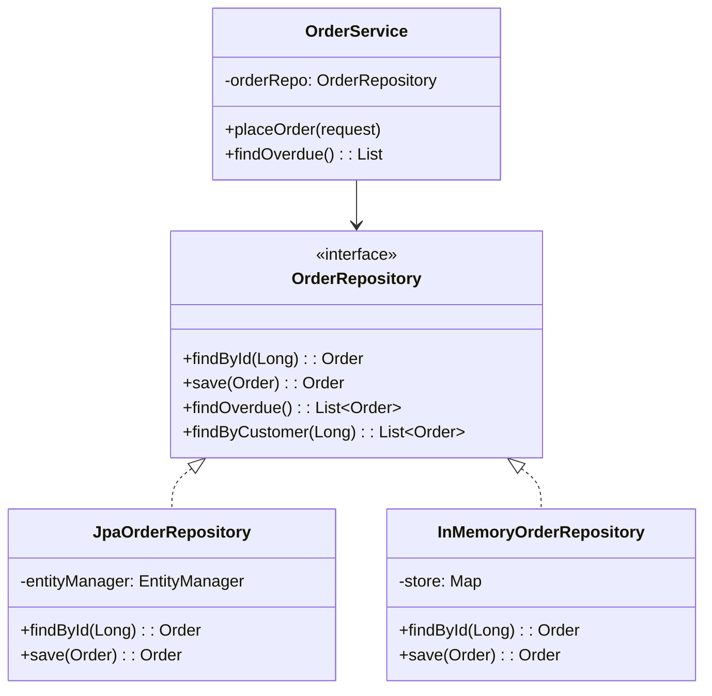
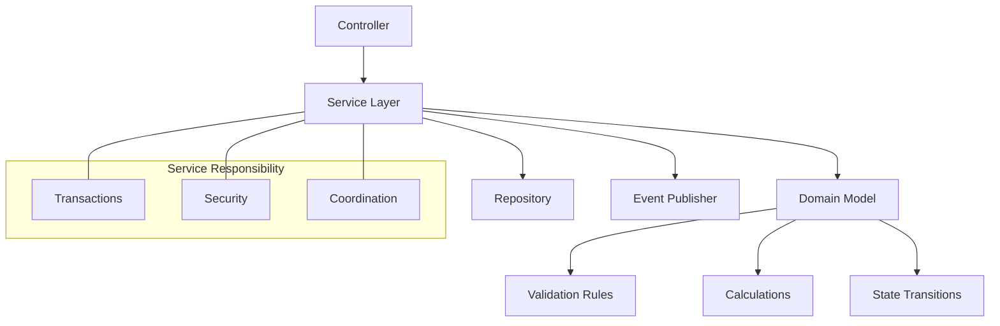
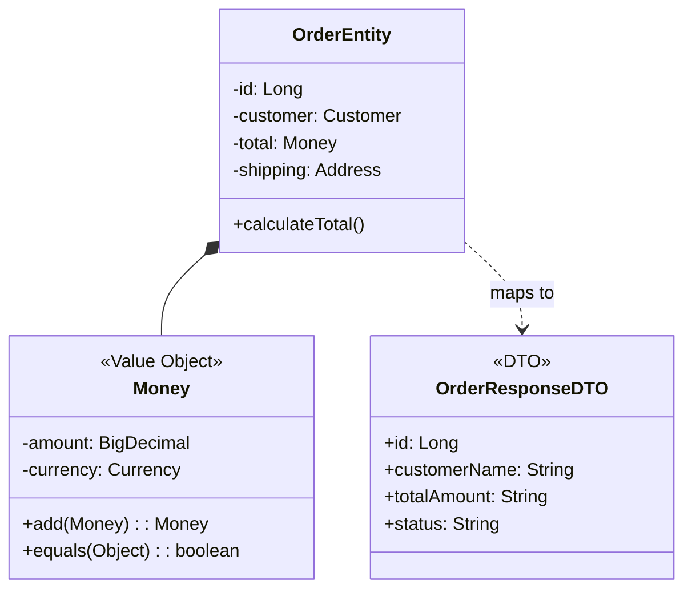
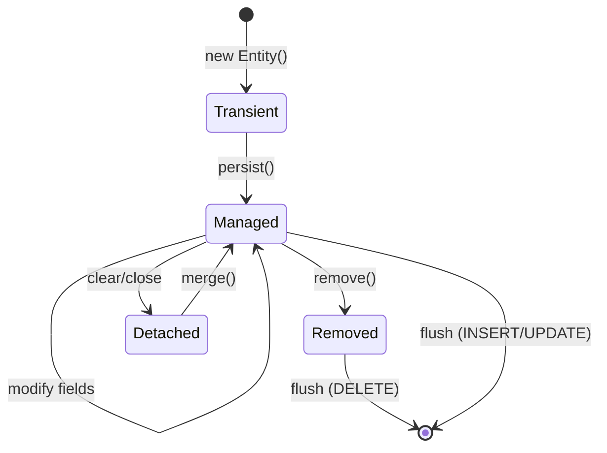
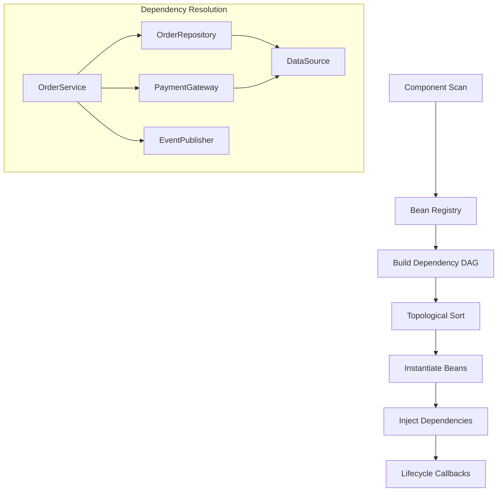

## Keywords in This File
{: .no_toc }

| # | Keyword | Weight |
|---|---|---|
| 1 | [Repository Pattern](#repository-pattern) | high |
| 2 | [Service Layer and Domain Model](#service-layer-and-domain-model) | high |
| 3 | [DTO and Value Object Patterns](#dto-and-value-object-patterns) | high |
| 4 | [Unit of Work Pattern](#unit-of-work-pattern) | medium |
| 5 | [Dependency Injection Pattern Internals](#dependency-injection-pattern-internals) | very |

---

# Repository Pattern

**Interview Weight:** high - Asked at every level for
backend roles. Tests understanding of data access
abstraction, persistence ignorance, and the boundary
between domain and infrastructure.

---

### 🎯 Model Answer

**30 seconds:**

> Repository mediates between the domain layer and data
> mapping layer, acting as an in-memory collection of
> domain objects. It encapsulates the logic for
> retrieving, persisting, and querying entities behind
> a collection-like interface. The domain code says
> "give me all active customers" without knowing whether
> the data comes from a database, cache, or external API.

**3 minutes (Senior):**

> Repository exists because domain logic should not
> know about persistence details. Without it, your
> service methods contain JPQL queries, connection
> management, and result set mapping. The domain is
> polluted with infrastructure.
>
> A Repository looks like a collection to its callers:
> repository.findById(id), repository.save(entity),
> repository.findByStatus(ACTIVE). The implementation
> might use JPA, JDBC, MongoDB, or even an in-memory
> HashMap for tests.
>
> Three flavors in Java:
> Spring Data JPA Repository: interface-only, Spring
> generates the implementation from method names.
> DDD Repository: domain-oriented, expresses domain
> queries (findOverduePayments, not findByStatusAndDate).
> Generic Repository: anti-pattern when used as a base
> class for everything.
>
> The production trade-off: Repository adds a layer
> between domain and database. For simple CRUD, this
> is free (Spring Data generates it). For complex
> queries, you choose: Specification pattern for
> type-safe dynamic queries, @Query annotation for
> JPQL, or a separate QueryRepository for read-heavy
> operations (CQRS-lite).
>
> The non-obvious insight: Repository is not just a
> DAO with a fancier name. DAO exposes data operations
> (SELECT, INSERT). Repository exposes domain concepts
> (findActiveCustomers, saveOrder). The method names
> use domain language, not persistence language.

**Blank Mind Recovery:**

**(1) Restate:** "You are asking about the Repository
pattern - abstracting data access behind a
collection-like interface."

**(2) First principles:** "Domain logic needs data but
should not depend on HOW data is stored. Repository
provides a stable interface that hides whether data
comes from SQL, NoSQL, cache, or API."

**(3) Bridge:** "Repository is like a library catalog.
You ask for a book by title (domain concept). The
catalog knows whether to check the shelf, storage
room, or inter-library loan (infrastructure detail)."

---

### 📘 Concept Explanation

**What it is:**

An object that mediates between the domain and data
mapping layers using a collection-like interface for
accessing and persisting domain objects.

**The problem it solves:**

Without Repository, service methods contain SQL queries,
EntityManager calls, and result mapping. Testing
requires a running database. Switching persistence
technology means rewriting business logic. Domain
concepts are expressed in database terms.

**How it works:**

```
+----------------+    +----------------+
| Domain Service |--->| <<interface>>  |
| (uses domain   |    | Repository     |
|  language)     |    +----------------+
+----------------+    | +findById(id)  |
                      | +save(entity)  |
                      | +findActive()  |
                      +-------+--------+
                              |
                  +-----------+-----------+
                  |                       |
          +-------+------+    +----------+---+
          | JpaRepoImpl  |    | InMemoryRepo |
          | (production) |    | (testing)    |
          +--------------+    +--------------+
```



> **Diagram walkthrough:** OrderService depends only
> on the Repository interface. JpaOrderRepository is
> the production implementation using EntityManager.
> InMemoryOrderRepository is used in tests. The domain
> service never imports JPA, Hibernate, or JDBC classes.

**The key insight:**

Repository makes persistence a plug-in, not a
foundation. Your domain logic is testable without
a database, portable between persistence technologies,
and expressible in domain language rather than SQL.

**When to use it:**

- Domain objects need persistence but should not know
  how persistence works
- You want fast unit tests without database
- You might switch persistence technology
- Domain queries are complex enough to name

**When NOT to use it:**

- Simple scripts or prototypes (direct queries are fine)
- Analytics/reporting that IS about the database
- When Repository becomes a thin wrapper over DAO with
  no additional abstraction value

**Alternatives:**

- DAO (Data Access Object): lower-level, exposes CRUD
  operations in persistence language, not domain language
- Active Record: entity manages its own persistence
  (entity.save()). Simpler but couples domain to DB.
- CQRS: separate read/write repositories when query
  patterns diverge significantly from write patterns

---

### 💻 Code Example

```java
// BAD: domain service coupled to JPA
@Service
public class OrderService {
    @PersistenceContext
    private EntityManager em;

    public List<Order> findOverdueOrders() {
        // Domain service knows JPQL, persistence
        return em.createQuery(
            "SELECT o FROM Order o "
            + "WHERE o.status = :status "
            + "AND o.dueDate < :now",
            Order.class
        )
        .setParameter("status", OrderStatus.PENDING)
        .setParameter("now", LocalDate.now())
        .getResultList();
    }
}
// Testing requires a database
// Changing to MongoDB means rewriting this method
```

> **Code walkthrough:** The service knows about
> EntityManager, JPQL syntax, and query parameters.
> Testing this method requires starting a JPA context
> with a database. Switching to MongoDB requires
> rewriting every query. Domain concept (overdue orders)
> is expressed in persistence language.

```java
// GOOD: Repository abstracts persistence
public interface OrderRepository {
    Order findById(Long id);
    Order save(Order order);
    List<Order> findOverdue();
    List<Order> findByCustomerSince(
        Long customerId, LocalDate since
    );
    void delete(Order order);
}

// Spring Data implementation
public interface JpaOrderRepository
    extends JpaRepository<Order, Long>,
            OrderRepository {

    @Query("SELECT o FROM Order o "
        + "WHERE o.status = 'PENDING' "
        + "AND o.dueDate < CURRENT_DATE")
    List<Order> findOverdue();

    @Query("SELECT o FROM Order o "
        + "WHERE o.customer.id = :custId "
        + "AND o.createdAt >= :since")
    List<Order> findByCustomerSince(
        @Param("custId") Long customerId,
        @Param("since") LocalDate since
    );
}

// Service uses domain language only
@Service
public class OrderService {
    private final OrderRepository orders;

    public List<Order> getOverdueOrders() {
        return orders.findOverdue();
    }
}
```

> **Code walkthrough:** OrderRepository interface
> speaks domain language (findOverdue, not JPQL).
> JpaOrderRepository implements it with Spring Data.
> OrderService has zero JPA imports. Testing uses
> InMemoryOrderRepository. Switching to MongoDB means
> only changing the repository implementation.

```java
// PRODUCTION: Test with in-memory repository
public class InMemoryOrderRepository
    implements OrderRepository {

    private final Map<Long, Order> store =
        new ConcurrentHashMap<>();
    private final AtomicLong idGen =
        new AtomicLong(1);

    @Override
    public Order save(Order order) {
        if (order.getId() == null) {
            order.setId(idGen.getAndIncrement());
        }
        store.put(order.getId(), order);
        return order;
    }

    @Override
    public List<Order> findOverdue() {
        return store.values().stream()
            .filter(o -> o.getStatus() == PENDING)
            .filter(o -> o.getDueDate()
                .isBefore(LocalDate.now()))
            .collect(toList());
    }
    // ... other methods
}

// Unit test: no database needed
@Test
void overdueOrders_returnsOnlyPastDue() {
    var repo = new InMemoryOrderRepository();
    repo.save(overdueOrder());
    repo.save(currentOrder());

    var result = repo.findOverdue();

    assertThat(result).hasSize(1);
}
```

> **Code walkthrough:** InMemoryOrderRepository
> implements the same interface with a HashMap. Unit
> tests run instantly without database setup. The test
> verifies domain logic (overdue = pending + past due
> date) without persistence infrastructure. This is
> the testability payoff of Repository pattern.

---

### 🎓 Answers by Seniority

**Junior / Mid (0-5 years):**

> Repository provides a collection-like interface for
> accessing domain objects, hiding persistence details.
> In Spring Data JPA, I just define an interface and
> Spring generates the implementation.

I use it in every project. findById(), save(),
findByStatus() - the method names express what I want
in domain terms, not SQL terms.

*Push deeper:* "The difference from DAO: Repository
uses domain language (findOverdueOrders), DAO uses
persistence language (findByStatusAndDateBefore).
Repository is about domain modeling, DAO is about
data access."

---

**Senior / Staff (5+ years):**

> Repository is the boundary between domain and
> infrastructure. Domain logic depends on the interface;
> implementations are interchangeable. In production,
> I split into Command Repository (write-heavy, entity
> focused) and Query Repository (read-heavy, projection
> focused) when read/write patterns diverge.

The real design challenge: when does a repository query
become complex enough that it should be a Specification
or a dedicated service? My rule: if the query requires
business logic to build (conditional joins, dynamic
filters), use Specification pattern. If it is a fixed
domain concept (findOverdue), keep it on the Repository.

*Push deeper:* "At scale, I separate the domain
Repository interface from the Spring Data interface.
The domain interface lives in the domain module, the
Spring Data implementation lives in the infrastructure
module. This keeps domain portable."

---

### ⚖️ Comparison Table

| Pattern | Abstraction Level | Language | Testability | Choose When |
|---|---|---|---|---|
| **Repository** | Domain concepts | Domain language (findOverdue) | Mockable/in-memory | Domain-driven design, testable services |
| DAO | Data operations | Persistence language (SQL/JPQL) | Requires DB or mock | Simple CRUD without domain complexity |
| Active Record | Entity self-persistence | entity.save() | Coupled to DB | Rapid prototyping, simple models |
| CQRS | Separate read/write | Domain + query language | Separate test strategies | Read/write patterns diverge significantly |

**The deciding factor:** If your domain has meaningful
query concepts that deserve names (findOverdue,
findAtRisk, findRecommended), use Repository. If you
just need CRUD with no domain language, DAO suffices.

---

### ⚠️ Common Misconceptions

**"Repository and DAO are the same thing."**

Not in DDD. DAO exposes generic data operations (CRUD).
Repository exposes named domain operations. A DAO might
have findByStatusAndDateBefore(). A Repository has
findOverdue(). The repository method NAME is the domain
concept.

**"Every entity needs its own Repository."**

Only aggregate roots get repositories. In DDD, you
access child entities through their aggregate root's
repository. OrderRepository returns Orders which contain
OrderItems. There is no separate OrderItemRepository.

**"Spring Data JPA Repository IS the Repository
pattern."**

Spring Data provides the mechanism but not automatically
the pattern. If your interface only has
findByNameAndStatusAndCreatedDateBefore(), you have a
DAO with Spring Data syntax. True Repository means
domain-named query methods.

---

### 🚨 Failure Modes and Diagnosis

| Failure | Symptom | Diagnosis |
|---|---|---|
| God repository | 50+ methods on one interface | Split by read/write or by aggregate boundary |
| Leaky abstraction | Service constructs Specification with JPA criteria | Move query-building logic into repository implementation |
| N+1 queries via repository | findAll then loop calling findRelated | Add a repository method with JOIN FETCH for the use case |
| Generic repository base class | Every entity inherits GenericRepository<T> | Remove generic base; each aggregate gets its own interface |
| Transaction boundary confusion | Repository called outside transaction | Ensure service layer (not repository) manages transactions |

---

### 🎯 Interview Deep-Dive

| Experience | Time | Depth |
|---|---|---|
| Junior | 3 min | Define, Spring Data basics |
| Mid | 5 min | Repository vs DAO, testing strategy |
| Senior | 8 min | Aggregate boundaries, CQRS split |
| Staff | 12 min | Module architecture, domain purity |

---

**[JUNIOR] Q1 - What is the Repository pattern and
how does Spring Data implement it?**

*Why they ask:* Baseline persistence pattern knowledge.

Repository provides a collection-like interface for
domain object persistence. You ask for objects using
domain concepts (findById, findActive) without knowing
the storage mechanism.

Spring Data implements it through interface derivation.
You define an interface extending JpaRepository<Entity,
ID>. Spring generates the implementation at startup.
Method naming conventions (findByStatusAndCreatedAfter)
are parsed into JPQL queries automatically.

For custom queries, @Query annotation provides JPQL or
native SQL. For dynamic queries, Specification pattern
gives type-safe criteria building. The interface
remains clean - implementation details are hidden.

*What separates good from great:* Distinguishing
derived queries (method name parsing) from @Query
(explicit JPQL) from Specification (dynamic criteria)
and knowing when to use each.

---

**[JUNIOR] Q2 - What is the difference between
Repository and DAO?**

*Why they ask:* Fundamental pattern distinction.

DAO (Data Access Object) exposes generic CRUD
operations: create, read, update, delete. Method names
describe data operations: findByColumn, insertRow,
updateField. It speaks persistence language.

Repository exposes domain-meaningful operations: method
names describe business concepts. findOverduePayments(),
findAtRiskAccounts(), saveOrder(). It speaks domain
language. The caller never thinks about tables or
columns.

In practice: a DAO might be findByStatusAndDueDateBefore
(persistence concept). A Repository method for the same
query would be findOverdue() (domain concept). The
domain code reads like business requirements, not SQL.

Another distinction: in DDD, repositories exist only
for aggregate roots. You cannot have an OrderItemDAO
because OrderItems are accessed through OrderRepository.
DAOs have no aggregate boundary concept.

*What separates good from great:* The aggregate root
restriction - showing you understand DDD's boundaries,
not just naming conventions.

---

**[MID] Q3 - How do you test code that uses Repository
pattern?**

*Why they ask:* Practical testing knowledge.

Three testing strategies:

Unit tests with in-memory repository: implement the
interface with a HashMap. Tests run in milliseconds.
Verify domain logic without persistence infrastructure.
This tests the SERVICE logic, not the repository.

Integration tests with @DataJpaTest: Spring loads only
JPA infrastructure with H2 or Testcontainers. Verifies
that @Query annotations, Specifications, and named
queries work correctly. This tests the REPOSITORY
implementation.

Contract tests: verify that in-memory repository
behaves identically to the real one for the methods
the service uses. Catches cases where in-memory
implementation diverges from JPA behavior.

My approach: service layer gets unit tests with
in-memory repositories (fast, many scenarios).
Repository implementations get integration tests
(slower, cover query correctness). The combination
gives high confidence without slow test suites.

*What separates good from great:* The three-layer
strategy and especially contract tests that verify
in-memory and real implementations agree.

---

**[MID] Q4 - When would you split a Repository into
command and query sides?**

*Why they ask:* CQRS awareness.

I split when read and write patterns diverge
significantly:

Write side (Command Repository): operates on full
aggregate roots. save(Order), delete(Order). Returns
entities. Works within transactions. Uses JPA
EntityManager for change tracking.

Read side (Query Repository): returns projections, DTOs,
or flat views. Does not load full aggregates. Uses JPQL
projections, native queries, or even separate read
models. Optimized for display, not mutation.

The trigger: when read queries need joins across
aggregates or return data shapes that differ from the
entity model. Loading a full Order aggregate just to
display an order summary is wasteful. A query
repository returns OrderSummaryDTO directly.

Implementation: OrderCommandRepository extends
JpaRepository (entity-focused). OrderQueryRepository
is a separate interface with @Query methods returning
DTOs or interface projections.

*What separates good from great:* The specific trigger
(read shapes differ from entity shapes) and the
implementation approach (separate interfaces, DTO
projections) rather than abstract CQRS theory.

---

**[SENIOR] Q5 - How do you handle complex dynamic
queries without polluting the Repository interface?**

*Why they ask:* Real-world query complexity.

Dynamic queries (search with optional filters) create
combinatorial explosion if expressed as repository
methods. findByNameAndStatus, findByName,
findByStatus, findByNameAndStatusAndDateRange - this
grows exponentially.

Solutions:

Specification pattern: build criteria programmatically.
Each specification is a reusable predicate. Combine
with and()/or(). Spring Data supports
JpaSpecificationExecutor.

QueryDSL: type-safe query building with generated
Q-classes. More readable than Criteria API. Supports
complex joins and subqueries.

Custom repository fragment: create a CustomOrderRepo
interface with the complex method, implement it, and
have the main repository extend both JpaRepository
and CustomOrderRepo. Spring merges them.

My preference: Specification for simple filter
combinations (3-5 optional fields). QueryDSL for
complex multi-join queries. Custom fragment for
anything that needs native SQL or stored procedures.

*What separates good from great:* Having used multiple
approaches and knowing the selection criteria (simple
filters = Specification, complex joins = QueryDSL,
native SQL needs = custom fragment).

---

**[SENIOR] Q6 - How do you prevent the Repository
from becoming a God object?**

*Why they ask:* Design discipline.

God Repository symptoms: 50+ methods, methods that
serve UI concerns (findForDropdown, findForReport),
methods that cross aggregate boundaries (findOrdersWith
CustomerAndPaymentAndShipping).

Prevention strategies:

Aggregate boundary enforcement: one repository per
aggregate root. OrderRepository manages Orders and
their child entities. No OrderItemRepository, no
OrderHistoryRepository.

CQRS split: command repository (3-5 methods: save,
findById, delete) stays small. Query repositories are
separate, can grow per read use case.

Use case repositories: instead of one OrderRepository
with 50 methods, have OrderCommandRepository (write),
OrderSearchRepository (search filters),
OrderReportingRepository (analytics queries). Each is
focused.

Specification/QueryDSL: generic findAll(Specification)
replaces 20 specific find methods. The specification
is built by the caller, not defined on the repository.

My rule: if a repository has more than 10-12 methods,
it needs splitting. The split axis is usually by
use case (command/query/reporting) or by client
(API/admin/batch).

*What separates good from great:* Having a concrete
threshold (10-12 methods) and clear split axes rather
than vague "keep it small" advice.

---

**[SENIOR] Q7 - How do you handle cross-aggregate
queries without violating DDD boundaries?**

*Why they ask:* Advanced domain modeling.

The problem: you need data from Order + Customer +
Payment aggregates in one view. DDD says each has
its own repository. You cannot JOIN across aggregate
boundaries through repositories.

Solutions:

Domain service queries: a service that calls multiple
repositories and assembles the result. Simple but
creates many database calls (N+1 risk).

Read model / projection: a separate query model that
denormalizes the data. A view or materialized view in
the database. A dedicated query repository reads it
directly without going through aggregate repositories.

Event-driven denormalization: aggregates publish events.
A read-model updater listens and maintains denormalized
views. Query repository reads the view. Eventually
consistent but highly performant.

JPQL JOIN across entities: if entities share a database,
a query repository can join them via JPQL. This couples
the read side to the relational schema but is pragmatic
for monoliths.

My preference: for monoliths, query repositories with
JPQL projections. For microservices, event-driven read
models. The choice depends on consistency requirements
and system architecture.

*What separates good from great:* Knowing that the
pragmatic answer (JPQL join) is acceptable in monoliths
while the pure DDD answer (event-driven read model) is
for distributed systems - showing context-dependent
judgment.

---

**[STAFF] Q8 - How would you design a Repository
architecture for a modular monolith?**

*Why they ask:* Architecture-level pattern application.

In a modular monolith, each module has its own domain,
its own repositories, and its own database schema (or
schema-separated tables).

Architecture:

Module boundary: each module defines its Repository
interfaces in the domain layer. Implementations live
in the infrastructure layer of that module.

Cross-module access: modules NEVER import each other's
repositories. They communicate through domain events or
module facade APIs. If Module A needs Module B's data,
A calls B's facade, not B's repository.

Schema ownership: each module owns its tables. No
foreign keys across module boundaries. Referential
integrity is eventual (through events) not enforced
(through FK constraints).

Testing: each module's repositories are tested
independently. Integration tests use schema-isolated
databases or separate schemas within one database.

Migration path: when a module is extracted to a
microservice, its repositories become the service's
persistence layer. The facade becomes a REST API.
Cross-module event communication stays event-based.
Only the transport changes (in-process to Kafka).

*What separates good from great:* The no-cross-module-FK
rule and the migration path to microservices - showing
you design the monolith for future extraction from day
one.

---

**[STAFF] Q9 - What are the trade-offs of Repository
pattern at scale with 100+ developers?**

*Why they ask:* Organizational impact assessment.

At scale (100+ developers, 50+ modules), Repository
pattern creates both benefits and challenges:

Benefits:
Clear ownership: each team owns their aggregate
repositories. No cross-team dependency on data access.
Testability: fast unit tests with in-memory repos
enable high development velocity.
Portability: switching from Oracle to PostgreSQL
affects only repository implementations.

Challenges:
Inconsistency: without standards, teams implement
repositories differently. Some use Specification, some
use raw JPQL, some use QueryDSL. Onboarding is slower.
Performance: junior developers create N+1 patterns
because the repository hides what queries actually
execute. They call findById in a loop without realizing
it is N separate queries.
Over-abstraction: teams create repositories for simple
lookups that need no abstraction. A configuration
table with 10 rows does not need a full Repository.

Governance I implement:
Repository style guide: standard patterns for common
operations. Code reviews enforce consistency.
Query logging in CI: detect N+1 patterns automatically
in integration tests. Fail the build if query count
exceeds threshold.
Pragmatism doctrine: not everything needs a Repository.
Configuration, enums, and static data can be loaded
directly. Reserve Repository for true aggregate roots.

*What separates good from great:* The governance
approach (style guide + automated N+1 detection) and
the pragmatism doctrine - showing you balance pattern
purity with organizational reality.

---

# Service Layer and Domain Model

**Interview Weight:** high - Fundamental architecture
pattern. Tests understanding of where business logic
lives, transaction boundaries, and the separation
between domain, application, and infrastructure layers.

---

### 🎯 Model Answer

**30 seconds:**

> Service Layer defines the application's boundary and
> coordinates use cases. It delegates to Domain Model
> objects that contain the actual business logic. The
> service handles transactions, security, and
> orchestration - the domain handles rules, calculations,
> and invariants. This separation keeps domain logic
> testable without infrastructure.

**3 minutes (Senior):**

> Two patterns that work together:
>
> Domain Model: objects that represent business concepts
> with BOTH data and behavior. An Order knows how to
> calculate its total, validate its items, and transition
> its state. Not a data bag - an intelligent object.
>
> Service Layer: thin orchestration layer that
> coordinates domain objects for a use case. It starts
> transactions, loads aggregates from repositories,
> calls domain methods, and publishes events. It does
> NOT contain business rules itself.
>
> The critical distinction:
> Fat service (anti-pattern): all logic in the service.
> Domain objects are just data holders (Anemic Domain
> Model). Testing requires mocking everything.
>
> Rich domain (correct): services are thin coordinators.
> Business logic lives in domain objects. Testing domain
> rules requires only the domain object - no mocks.
>
> Where logic goes:
> Domain: validation rules, calculations, state
> transitions, invariant enforcement.
> Service: transaction management, authorization checks,
> cross-aggregate coordination, event publishing.
>
> The non-obvious insight: if your service class has
> if-else statements about business rules, that logic
> belongs in the domain object. Services should be
> boring - load, delegate, save, publish. If a service
> is interesting, it is doing too much.

**Blank Mind Recovery:**

**(1) Restate:** "You are asking about Service Layer
and Domain Model - where business logic lives and
how use cases are coordinated."

**(2) First principles:** "Business rules need a home.
Either they live in service classes (procedural,
hard to test) or in domain objects (OO, easy to test).
Domain Model says: put rules in the objects. Service
Layer says: coordinate the objects."

**(3) Bridge:** "Service Layer is like a movie director -
coordinates actors but does not act. Domain Model
objects are the actors - they have the talent (logic).
A bad director tries to act (fat service). A good
director enables the actors (thin service)."

---

### 📘 Concept Explanation

**What it is:**

Service Layer: an application boundary layer that
defines available operations, coordinates domain
objects, and manages transactions.

Domain Model: a layer of objects that represent
business concepts with both state and behavior,
encapsulating business rules and logic.

**The problem it solves:**

Without Service Layer: business operations are scattered
across controllers, message handlers, and scheduled
tasks. Transaction boundaries are inconsistent.
Security checks are duplicated.

Without Domain Model: business logic lives in service
classes as procedural code. Objects are data bags.
Testing requires full infrastructure setup.

**How it works:**

```
+------------+    +---------------+
| Controller |--->| Service Layer |
+------------+    +---+-----------+
                      |
  Transactions -------+------- Security
  Coordination -------+------- Events
                      |
              +-------v--------+
              | Domain Model   |
              | (Business Rules)|
              +-------+--------+
                      |
              +-------v--------+
              | Repository     |
              | (Persistence)  |
              +----------------+
```



> **Diagram walkthrough:** Controller invokes Service
> Layer for use cases. Service manages transactions,
> security, and coordination. It delegates business
> logic to Domain Model objects which encapsulate
> rules, calculations, and state machines. Repository
> handles persistence. Events communicate outcomes.

**The key insight:**

The litmus test for correct separation: can you test
your business rules with ZERO mocks and ZERO database?
If yes, your domain model is rich. If no, your services
are fat and your domain is anemic.

**When to use them:**

- Domain has meaningful business rules beyond CRUD
- Multiple entry points need the same business logic
- Business rules should be testable without infrastructure
- Team needs clear separation of concerns

**When NOT to use them:**

- Pure CRUD applications with no business rules
- Prototypes where speed matters more than architecture
- Simple microservices with 1-2 operations

**Alternatives:**

- Transaction Script: procedural services with no domain
  model. Simple for CRUD but scales poorly with
  complexity.
- Active Record: entity manages its own persistence.
  Simpler but couples domain to infrastructure.
- Hexagonal Architecture: extends Service Layer with
  explicit ports and adapters at the boundary.

---

### 💻 Code Example

```java
// BAD: Anemic Domain Model + Fat Service
// Domain object is just a data bag
public class Order {
    private Long id;
    private OrderStatus status;
    private List<OrderItem> items;
    private BigDecimal total;
    // Only getters and setters - NO behavior
}

// All logic in the service (procedural)
@Service
public class OrderService {
    public void placeOrder(OrderRequest request) {
        Order order = new Order();
        order.setStatus(OrderStatus.PENDING);

        // Business rule in service (WRONG place)
        BigDecimal total = BigDecimal.ZERO;
        for (var item : request.getItems()) {
            if (item.getQuantity() > 100) {
                throw new BusinessException(
                    "Max 100 per item"
                );
            }
            total = total.add(
                item.getPrice()
                    .multiply(
                        BigDecimal.valueOf(
                            item.getQuantity()
                        )
                    )
            );
        }
        // Discount logic in service (WRONG place)
        if (total.compareTo(
            BigDecimal.valueOf(1000)) > 0
        ) {
            total = total.multiply(
                BigDecimal.valueOf(0.9)
            );
        }
        order.setTotal(total);
        order.setItems(mapItems(request.getItems()));
        orderRepository.save(order);
    }
}
```

> **Code walkthrough:** Order is a data bag with no
> behavior. ALL business logic (quantity validation,
> total calculation, discount rules) lives in the
> service. Testing these rules requires mocking the
> repository. Adding a new discount rule means
> modifying the service. The Order class tells you
> nothing about what an Order CAN do.

```java
// GOOD: Rich Domain Model + Thin Service Layer
public class Order {
    private Long id;
    private OrderStatus status;
    private List<OrderItem> items;
    private BigDecimal total;
    private List<DomainEvent> events = new ArrayList<>();

    public static Order create(
        List<OrderItemRequest> itemRequests
    ) {
        Order order = new Order();
        order.status = OrderStatus.PENDING;
        order.items = itemRequests.stream()
            .map(Order::validateAndCreateItem)
            .collect(toList());
        order.total = order.calculateTotal();
        order.events.add(new OrderCreated(order));
        return order;
    }

    private static OrderItem validateAndCreateItem(
        OrderItemRequest request
    ) {
        if (request.quantity() > 100) {
            throw new OrderValidationException(
                "Max 100 items per line"
            );
        }
        return new OrderItem(
            request.productId(),
            request.quantity(),
            request.price()
        );
    }

    private BigDecimal calculateTotal() {
        BigDecimal subtotal = items.stream()
            .map(OrderItem::lineTotal)
            .reduce(BigDecimal.ZERO, BigDecimal::add);
        return applyDiscount(subtotal);
    }

    private BigDecimal applyDiscount(
        BigDecimal subtotal
    ) {
        if (subtotal.compareTo(
            BigDecimal.valueOf(1000)) > 0
        ) {
            return subtotal.multiply(
                BigDecimal.valueOf(0.9)
            );
        }
        return subtotal;
    }

    public List<DomainEvent> getDomainEvents() {
        return Collections.unmodifiableList(events);
    }
}

// Thin Service Layer - just coordinates
@Service
@Transactional
public class OrderService {
    private final OrderRepository orders;
    private final EventPublisher events;

    public Order placeOrder(OrderRequest request) {
        Order order = Order.create(request.items());
        order = orders.save(order);
        events.publishAll(order.getDomainEvents());
        return order;
    }
}
```

> **Code walkthrough:** Order contains ALL business
> logic: validation, calculation, discount rules, and
> event generation. The service is 4 lines: create
> domain object, save, publish events. Testing business
> rules needs only `new Order()` - no mocks, no database.
> Adding a new discount rule means modifying Order, not
> the service. The domain tells you what an Order can do.

---

### 🎓 Answers by Seniority

**Junior / Mid (0-5 years):**

> Service Layer coordinates use cases: starts
> transactions, calls domain objects, saves results.
> Domain Model contains business logic in objects that
> have both data and behavior. The service is thin;
> the domain is rich.

I put validation, calculations, and state transitions
in domain objects. Services handle transactions and
cross-cutting concerns. This keeps domain rules
testable without mocking infrastructure.

*Push deeper:* "The test: if your service has
if-else business logic, it belongs in the domain
object instead. Services should be boring coordinators."

---

**Senior / Staff (5+ years):**

> Service Layer is the application boundary - it
> defines what the system CAN do. Domain Model
> defines how it DOES it. The service manages the
> use case lifecycle (transaction, auth, events). The
> domain manages business invariants.

In practice, I see teams default to anemic models
because it feels simpler. It IS simpler for the first
3 months. Then business rules scatter across 10 service
methods, each with slightly different validation logic.
Rich domain centralizes rules in one place. The
investment pays off at 6+ months when rules change.

*Push deeper:* "At staff level, I design domain events
as the communication mechanism between aggregates
within the service layer. The service coordinates: load
aggregate A, call behavior, collect events, apply events
to aggregate B. This keeps aggregates independent."

---

### ⚖️ Comparison Table

| Architecture | Logic Location | Testing | Complexity Threshold | Choose When |
|---|---|---|---|---|
| **Rich Domain + Thin Service** | Domain objects | Unit test domain; integration test service | Medium-high business complexity | Rules change often, multiple operations on same entities |
| Anemic Model + Fat Service | Service classes | Integration tests only (mock-heavy) | Low-medium complexity | Simple CRUD, few business rules |
| Transaction Script | Procedural functions | Test each script | Very low complexity | Scripts, batch jobs, one-off operations |
| Hexagonal Architecture | Domain (inner ring) | Domain isolated from all I/O | High complexity, many integrations | Multiple adapters, strict domain purity needed |

**The deciding factor:** If business rules exist beyond
simple validation and will evolve over time, use Rich
Domain Model. If the application is pure CRUD with no
meaningful business logic, Anemic Model is acceptable.

---

### ⚠️ Common Misconceptions

**"Service Layer should contain all business logic."**

This creates the Anemic Domain Model anti-pattern.
Services coordinate; domains contain rules. If a
service has business if-else logic, extract it to the
domain object that owns that data.

**"Domain Model means no services at all."**

Services are still needed for: transaction management,
cross-aggregate coordination, infrastructure integration
(email, messaging), and use case orchestration. The
domain cannot start its own transaction or send an email.

**"Rich Domain Model is always better than Anemic."**

For pure CRUD (no business rules), rich domain adds
unnecessary complexity. If your "business logic" is
just save-to-database, an anemic model is honest and
simple. The problem is when teams use anemic model
for complex domains where rules DO exist.

---

### 🚨 Failure Modes and Diagnosis

| Failure | Symptom | Diagnosis |
|---|---|---|
| Anemic domain | Entities have only getters/setters | Look for business logic in services that operates on entity data |
| Fat service | Service class has 500+ lines | Extract domain logic into the entities it operates on |
| Logic duplication | Same validation in 3 services | Centralize in domain object where data lives |
| Transaction leak | Domain object manages its own DB calls | Domain objects must NOT access repositories - service handles persistence |
| Event storm | Domain generates events that trigger infinite cascading | Use explicit saga/orchestrator pattern for multi-step processes |

---

### 🎯 Interview Deep-Dive

| Experience | Time | Depth |
|---|---|---|
| Junior | 3 min | Define both, layer separation |
| Mid | 5 min | Anemic vs Rich, testing benefits |
| Senior | 8 min | Transaction boundaries, domain events |
| Staff | 12 min | Modular architecture, scaling teams |

---

**[JUNIOR] Q1 - What is the difference between Service
Layer and Domain Model?**

*Why they ask:* Layer understanding.

Service Layer is the orchestration layer. It defines
what operations the application supports: placeOrder(),
cancelOrder(), findCustomerOrders(). It coordinates
domain objects, manages transactions, and enforces
security.

Domain Model is the business logic layer. Objects
represent business concepts with behavior: Order knows
how to calculate its total, Customer knows if it is
eligible for discount, Payment knows how to validate
itself.

The relationship: the service USES domain objects. It
loads them from repositories, calls their methods to
perform business operations, and saves the results.
The service does not contain the rules - it orchestrates
the objects that do.

Example: OrderService.placeOrder() loads inventory,
creates an Order (which validates itself), saves it,
and publishes an event. The validation logic lives in
Order, not in OrderService.

*What separates good from great:* Giving a concrete
example showing WHERE specific logic lives (validation
in domain, transaction in service) rather than abstract
definitions.

---

**[JUNIOR] Q2 - What is the Anemic Domain Model
anti-pattern?**

*Why they ask:* Common mistake recognition.

Anemic Domain Model: entities that have ONLY data
(fields + getters + setters) with NO business behavior.
All logic lives in service classes that manipulate
entity data from outside.

Why it is an anti-pattern: it defeats the purpose of
OOP. You have objects that do not DO anything. The
"object-oriented" code is actually procedural - services
are just functions operating on data structures.

Symptoms: entities are DTOs with JPA annotations.
Services have methods like calculateOrderTotal(order)
instead of order.calculateTotal(). Business rules
are scattered across multiple services.

Why teams do it anyway: it feels simpler initially.
You do not need to think about where logic belongs.
But it creates maintenance problems: rules get
duplicated, changes require finding all services that
touch an entity, and testing requires full service
infrastructure.

The fix: move behavior to the object that owns the
data. If calculateTotal uses order items and discount
rules, it belongs ON the Order class.

*What separates good from great:* Explaining WHY teams
fall into it (initial simplicity) and the long-term
cost (duplication, scattered logic, hard testing).

---

**[MID] Q3 - Where should transaction boundaries be
in a Service Layer?**

*Why they ask:* Infrastructure design knowledge.

Transaction boundaries belong at the Service Layer
method level. Each public service method represents
one unit of work - either it all succeeds or it all
rolls back.

Rules I follow:

One transaction per use case: placeOrder() is one
transaction. If payment fails, inventory reservation
rolls back too.

Service calls service: if ServiceA calls ServiceB,
they share the same transaction (Spring's REQUIRED
propagation). The outer service defines the boundary.

Long operations: if a use case spans multiple
aggregates and might be slow, consider eventual
consistency with events instead of one large
transaction.

Never in controllers: controllers should not define
transactions. They call the service which is
@Transactional.

Never in repositories: repositories participate in
existing transactions but do not create their own.

Never in domain objects: domain objects must not be
aware of transactions. They perform pure business
logic. The service wraps their execution in a
transaction.

*What separates good from great:* The rule "never in
domain objects" with the reasoning (domain purity)
and the eventual consistency alternative for long
operations.

---

**[MID] Q4 - How do you keep services thin when
coordination logic is complex?**

*Why they ask:* Design discipline under complexity.

When use cases require coordinating 5+ steps across
multiple aggregates, the service grows. Strategies
to keep it thin:

Domain events within service: aggregate A produces
events. The service applies them to aggregate B.
Each aggregate handles its own logic.

Saga/Orchestrator: extract complex multi-step
coordination into a dedicated Saga class. The service
delegates to the saga which manages the steps,
compensation, and state.

Pipeline pattern: decompose the use case into ordered
steps. Each step is a function. The service runs the
pipeline. Each step is independently testable.

Facade pattern: split the service into a facade
(the entry point) and sub-services (focused
coordinators). The facade delegates to the appropriate
sub-service.

My test: if a service method exceeds 20 lines, I ask:
is any of this business logic? If yes, push to domain.
Is this multi-aggregate coordination? If yes, extract
a saga. Is this sequential steps? If yes, use pipeline.

*What separates good from great:* Having multiple
strategies with selection criteria, not just "keep
it small" without actionable guidance.

---

**[SENIOR] Q5 - How do domain events work within the
Service Layer?**

*Why they ask:* Domain-driven coordination.

Domain events represent something that happened in the
domain: OrderPlaced, PaymentReceived, InventoryReserved.
They enable loose coupling between aggregates.

Within the service layer:
The service calls a domain method: order.place().
The domain object records an event internally:
events.add(new OrderPlaced(this)).
The service collects events: order.getDomainEvents().
The service publishes them: eventPublisher.publishAll().
Other listeners react asynchronously.

Why not publish from the domain object? Because
publishing requires infrastructure (message broker,
application context). Domain objects should have no
infrastructure dependencies. The service mediates.

Transaction considerations: events should be published
AFTER the transaction commits (otherwise listeners
react to data that might roll back). Use
@TransactionalEventListener(phase = AFTER_COMMIT) in
Spring.

The alternative: if eventual consistency is acceptable,
use the Outbox pattern. Save events to an outbox table
in the same transaction as the aggregate. A separate
process reads the outbox and publishes to the broker.
Guarantees: event is published if and only if the
aggregate was saved.

*What separates good from great:* The AFTER_COMMIT
consideration and the Outbox pattern for guaranteed
delivery - showing awareness of transactional event
publishing pitfalls.

---

**[SENIOR] Q6 - How do you decide between Rich Domain
Model and Anemic Model for a new project?**

*Why they ask:* Architecture decision judgment.

Decision criteria:

Choose Rich Domain when:
The domain has non-trivial business rules (validation
beyond null checks, calculations, state machines).
Multiple services would duplicate the same logic.
Domain experts have a language (ubiquitous language)
worth encoding in code.
The domain will evolve and rules will change.

Choose Anemic when:
The application is pure CRUD with no business logic.
The "domain" is just data in, data out.
The team is small and speed matters more than structure.
Logic is truly procedural (batch processing, ETL).

The hybrid approach (what I usually do):
Start anemic for simple entities (Address, Category).
Use rich domain for complex aggregates (Order, Account).
Not everything needs to be one style.

The warning sign of wrong choice:
Anemic in complex domain: 5 services duplicate the
same validation logic. Business rule changes require
updating multiple places.
Rich in simple domain: Order.save() fails because
the domain object should not know about persistence.
Over-engineering for CRUD.

*What separates good from great:* The hybrid approach
showing pragmatism - not dogmatic about one style
for everything.

---

**[SENIOR] Q7 - How do you handle cross-cutting
concerns in the Service Layer?**

*Why they ask:* Separation of concerns practice.

Cross-cutting concerns (logging, security, auditing,
metrics) should not pollute service business logic.

AOP (Spring @Aspect): method-level concerns applied
declaratively. @Transactional, @PreAuthorize, @Timed.
The service method stays focused on coordination.

Interceptors/Filters: request-level concerns applied
before/after the service is invoked. Authentication,
request logging, correlation ID injection.

Decorators: wrap the service with additional behavior.
A CachingOrderService wraps OrderService and adds
caching. Explicit, testable, but more verbose.

Event listeners: audit logging as a separate listener
on domain events. The service publishes events; the
audit listener writes audit records. Complete
decoupling.

My layering:
Controller filters: auth, rate limiting, request logging.
AOP on service: @Transactional, @PreAuthorize, metrics.
Domain events: audit trail, notifications.
Service code: ONLY business coordination.

Result: the service method body contains only the use
case logic. Everything else is applied declaratively
or reactively.

*What separates good from great:* The complete layering
approach showing where each concern lives, rather than
just mentioning AOP.

---

**[STAFF] Q8 - How do you design Service Layer
boundaries for a team of 50+ engineers?**

*Why they ask:* Organizational architecture.

At scale, service boundaries map to team boundaries.
Each team owns a bounded context with its own service
layer and domain model.

Module boundary design:
Each module exposes a Facade (simplified service
interface). Internal services are not accessible
cross-module. Communication is through facades and
events.

Contract definition:
Each facade has a well-defined interface contract.
Input/output types are shared (in a common API module).
Internal domain types are NOT shared.

Team autonomy enablers:
Each team can evolve their internal domain model
independently. As long as the facade contract holds,
internal refactoring is safe. Events follow published
schemas with backward compatibility.

Consistency boundaries:
Within a module: strong consistency (one transaction).
Across modules: eventual consistency (events).
This maps to DDD's aggregate boundaries at module scale.

The staff insight: service layer boundaries ARE
organizational boundaries. Conway's Law means your
service architecture will mirror your team structure.
Design the service boundaries to MATCH the team
structure you want, not the other way around.

*What separates good from great:* The Conway's Law
insight applied intentionally - designing service
boundaries to create the team autonomy you want.

---

**[STAFF] Q9 - What is the evolution path from
Transaction Script to Rich Domain Model?**

*Why they ask:* Migration strategy for existing systems.

Most systems start as Transaction Scripts (procedural
services) and need to evolve as complexity grows.

Phase 1 - Identify domain concepts:
Look for nouns in service methods that have behavior
attached. If calculateOrderTotal, validateOrder,
transitionOrderStatus all exist as service methods,
"Order" wants to be a rich domain object.

Phase 2 - Extract behavior to entities:
Move logic from services INTO the entities they
operate on. calculateTotal() moves from OrderService
to Order. The service still calls it but does not
contain it.

Phase 3 - Introduce domain events:
Replace direct service-to-service calls with events.
Instead of orderService calling inventoryService,
Order produces an OrderPlaced event that inventory
listens to.

Phase 4 - Define aggregate boundaries:
Identify which entities form a consistency boundary.
Order + OrderItems = one aggregate. Customer is a
separate aggregate. Each gets its own repository.

Phase 5 - Thin the services:
Services now only: load aggregate, call domain method,
save, publish events. If a service still has business
logic, repeat Phase 2.

The key: this is incremental. You do NOT rewrite.
Each sprint, pick the most complex service method,
extract its logic to the domain, add tests. Over 6
months, the system transforms organically.

*What separates good from great:* The incremental
approach (not a rewrite) with concrete phases and the
"pick the most complex method" heuristic for
prioritization.

---

# DTO and Value Object Patterns

**Interview Weight:** high - Asked at all levels.
Tests understanding of data transfer boundaries,
immutability, and the difference between identity-based
and value-based equality.

---

### 🎯 Model Answer

**30 seconds:**

> DTO (Data Transfer Object) carries data between
> processes or layers without behavior - a pure data
> container optimized for transfer. Value Object is a
> domain concept defined entirely by its attributes,
> not by identity - two Value Objects with the same
> fields are equal. Money(100, "USD") equals another
> Money(100, "USD") regardless of which instance.
> Java Records are ideal for both patterns.

**3 minutes (Senior):**

> DTOs solve the "what to send across boundaries"
> problem. Your domain entity has 30 fields, lazy
> relationships, and internal state. You cannot and
> should not serialize it directly. A DTO carries
> exactly the fields the consumer needs - nothing more.
>
> DTO use cases:
> API responses: expose only safe, relevant fields.
> API requests: accept only valid input fields.
> Inter-service communication: defined schema, no
> domain leakage.
> View models: shaped for UI needs, not domain shape.
>
> Value Objects solve the "meaningful equality" problem.
> Two Address objects with the same street, city, zip
> ARE the same address - identity does not matter.
> Compare to Entity: two Customer objects might have
> the same name but are different people (identity
> matters).
>
> Value Object rules:
> Immutable (no setters after creation).
> Equality by ALL fields (not by ID).
> Self-validating (constructor rejects invalid state).
> Side-effect-free methods (return new instances).
>
> Production examples of Value Objects:
> Money (amount + currency).
> DateRange (start + end, validates start < end).
> EmailAddress (validated format on construction).
> GeoCoordinate (latitude + longitude).
>
> Java Records (Java 16+) are perfect for both:
> record OrderDTO(Long id, String status, BigDecimal
> total) is a DTO. record Money(BigDecimal amount,
> Currency currency) is a Value Object. Records give
> you immutability, equals/hashCode by fields, and
> concise syntax.
>
> The non-obvious insight: the difference between DTO
> and Value Object is intent. DTOs cross boundaries
> (layer to layer, service to service). Value Objects
> live WITHIN the domain to represent concepts with
> meaningful equality. A DTO has no invariants. A Value
> Object enforces its own validity.

**Blank Mind Recovery:**

**(1) Restate:** "You are asking about DTO and Value
Object - data transfer containers versus domain
value concepts."

**(2) First principles:** "Systems need to send data
across boundaries (DTO) and model concepts where
identity does not matter, only value (Value Object).
One is about transfer, the other about domain
semantics."

**(3) Bridge:** "DTO is like a shipping box - carries
items between locations, no behavior of its own.
Value Object is like a $20 bill - any $20 bill is
interchangeable, defined by its denomination, not
by serial number."

---

### 📘 Concept Explanation

**What it is:**

DTO: a data container with no business logic, designed
to transfer data between layers or systems.

Value Object: an immutable domain concept defined
entirely by its attribute values, with equality based
on those values rather than object identity.

**The problem it solves:**

DTO: prevents domain model leakage across boundaries.
Without it, you expose internal entity structure,
lazy-loading proxies, and circular references to
API consumers.

Value Object: prevents primitive obsession (using
raw String for email, int for money) and provides
type-safe, self-validating domain concepts with
meaningful equality.

**How it works:**

```
DOMAIN BOUNDARY:
+----------+     +---------+     +--------+
|Controller|<--->|   DTO   |<--->|Service |
|  (API)   |     |(transfer)|    |(domain)|
+----------+     +---------+     +---+----+
                                     |
                              +------v------+
                              |Domain Entity|
                              |contains     |
                              |Value Objects|
                              +-------------+
                              |Money  |Email|
                              +-------+-----+
```



> **Diagram walkthrough:** OrderEntity is the domain
> object containing Money (Value Object) for type-safe
> currency operations. OrderResponseDTO is a flat
> structure sent to the API consumer - no domain
> objects, no lazy proxies, only the fields needed
> for display.

**The key insight:**

DTO is about WHAT crosses boundaries. Value Object is
about HOW you model domain concepts. They serve
different purposes and often work together: a domain
entity contains Value Objects internally and is mapped
to DTOs at the boundary.

**When to use DTO:**

- API request/response payloads
- Data crossing module or service boundaries
- When entity shape differs from consumer needs
- Preventing lazy-loading proxy serialization issues

**When to use Value Object:**

- Primitive obsession (String email, int age)
- Concepts where equality is by value (Money, Address)
- Self-validating domain concepts
- Concepts that are immutable by nature

**When NOT to use them:**

- DTO: internal method-to-method communication within
  one class (over-engineering)
- Value Object: concepts where identity matters
  (Customer, Order - those are Entities)

**Alternatives:**

- Map/JSON directly: simple but no type safety
- Entity projection: JPA interface projection avoids
  manual DTO mapping
- Record: Java 16+ records serve as both DTO and
  Value Object

---

### 💻 Code Example

```java
// BAD: exposing domain entity directly as API response
@GetMapping("/orders/{id}")
public Order getOrder(@PathVariable Long id) {
    // PROBLEMS:
    // 1. Exposes ALL fields (including internal ones)
    // 2. Lazy proxy serialization fails
    // 3. Circular reference (order->customer->orders)
    // 4. Internal field names leak to API consumers
    // 5. Cannot evolve domain without breaking API
    return orderRepository.findById(id).orElseThrow();
}
```

> **Code walkthrough:** Returning the entity directly
> couples API consumers to domain internals. Hibernate
> lazy proxies throw LazyInitializationException during
> serialization. Circular references cause infinite
> JSON recursion. Adding internal fields exposes them
> to all consumers.

```java
// GOOD: DTO at the boundary + Value Object in domain
// Value Object - immutable, equality by value
public record Money(
    BigDecimal amount, Currency currency
) {
    // Self-validating constructor
    public Money {
        if (amount == null || currency == null) {
            throw new IllegalArgumentException(
                "Amount and currency required"
            );
        }
        if (amount.scale() > currency.scale()) {
            throw new IllegalArgumentException(
                "Exceeds currency precision"
            );
        }
    }

    public Money add(Money other) {
        if (!currency.equals(other.currency)) {
            throw new CurrencyMismatchException(
                currency, other.currency
            );
        }
        return new Money(
            amount.add(other.amount), currency
        );
    }

    public Money multiply(int quantity) {
        return new Money(
            amount.multiply(
                BigDecimal.valueOf(quantity)
            ),
            currency
        );
    }
}

// DTO - API response, no behavior
public record OrderResponse(
    Long id,
    String customerName,
    String total,
    String currency,
    String status,
    LocalDateTime createdAt
) {
    public static OrderResponse from(Order order) {
        return new OrderResponse(
            order.getId(),
            order.getCustomer().getName(),
            order.getTotal().amount().toString(),
            order.getTotal().currency().getCode(),
            order.getStatus().name(),
            order.getCreatedAt()
        );
    }
}

@GetMapping("/orders/{id}")
public OrderResponse getOrder(
    @PathVariable Long id
) {
    Order order = orderService.findById(id);
    return OrderResponse.from(order);
}
```

> **Code walkthrough:** Money is a Value Object: immutable,
> self-validating, equality by value, operations return
> new instances. OrderResponse is a DTO: flat structure,
> no behavior, maps from domain to API shape. The
> controller returns the DTO, not the entity. Domain
> evolves independently from API contract.

---

### 🎓 Answers by Seniority

**Junior / Mid (0-5 years):**

> DTO carries data between layers without behavior.
> Value Object represents a domain concept by its
> value, not identity - two Money(100, USD) are equal.
> Java Records work perfectly for both.

I use DTOs for API responses (control what consumers
see) and Value Objects for domain concepts like Money,
EmailAddress, DateRange that should validate themselves.

*Push deeper:* "The key difference: DTOs have no
invariants (any combination of fields is valid). Value
Objects enforce invariants in their constructor (Money
rejects negative amounts). DTOs cross boundaries;
Value Objects live within the domain."

---

**Senior / Staff (5+ years):**

> DTOs decouple domain evolution from API contracts.
> Value Objects eliminate primitive obsession and
> encode domain rules at the type level. Together:
> entities contain Value Objects internally and are
> mapped to DTOs at boundaries.

In production, the mapping layer (entity to DTO) is
where most bugs hide. I use MapStruct for compile-time
mapping with null safety. For complex mappings, I write
explicit static factory methods on the DTO itself.

*Push deeper:* "At scale, DTO versioning matters. API
v1 returns OrderResponseV1, API v2 adds new fields.
Both map from the same domain entity. The DTO layer
absorbs API evolution without touching domain code."

---

### ⚖️ Comparison Table

| Concept | Identity | Mutability | Validation | Choose When |
|---|---|---|---|---|
| **DTO** | None (data bag) | Typically immutable | None (accepts any data) | Transferring data across boundaries |
| **Value Object** | By value (all fields) | Always immutable | Self-validating constructor | Modeling domain concepts without identity |
| Entity | By ID | Mutable (managed lifecycle) | Domain invariants | Objects with unique identity and lifecycle |
| Record | By value (all fields) | Immutable | Optional (compact constructor) | Both DTO and Value Object implementation |

**The deciding factor:** If it crosses a boundary: DTO.
If it models a domain concept where identity does not
matter: Value Object. If it has a lifecycle and unique
identity: Entity.

---

### ⚠️ Common Misconceptions

**"DTO and Value Object are the same thing."**

No. DTO is about data transfer (no validation, no
behavior, crosses boundaries). Value Object is about
domain modeling (self-validating, has behavior like
add/multiply, lives within the domain).

**"Value Objects cannot have methods."**

They SHOULD have methods - but only side-effect-free
methods that return new instances. Money.add(other)
returns a new Money. DateRange.overlaps(other) returns
boolean. They are immutable but not behavior-free.

**"You need a DTO for every entity."**

Only at boundaries. Internal service-to-service
communication within one module can pass entities.
DTOs are for layer transitions (API, messaging,
cross-module) where you control the exposed shape.

---

### 🚨 Failure Modes and Diagnosis

| Failure | Symptom | Diagnosis |
|---|---|---|
| Primitive obsession | String email, int cents scattered everywhere | Introduce Value Objects (EmailAddress, Money) |
| DTO explosion | 15 DTO classes for one entity | Use projection interfaces or shared base DTOs |
| Mutable Value Object | Shared Money instance modified in one place | Make all fields final, return new instances from operations |
| Entity in API response | LazyInitializationException in JSON serialization | Map to DTO before returning from service |
| DTO with logic | OrderDTO.calculateDiscount() | DTOs must have NO behavior - move to domain |

---

### 🎯 Interview Deep-Dive

| Experience | Time | Depth |
|---|---|---|
| Junior | 3 min | Define both, Java Record example |
| Mid | 5 min | When to use each, mapping strategies |
| Senior | 8 min | API versioning, DDD aggregate boundaries |
| Staff | 12 min | Module boundary contracts, schema evolution |

---

**[JUNIOR] Q1 - What is a DTO and why do we need it?**

*Why they ask:* Layer separation understanding.

A DTO is a data container for transferring data between
processes or layers. It has fields, getters, and no
business logic.

We need DTOs because domain entities have internal
state, lazy relationships, and complex structures that
should not leak outside. A Customer entity might have
password hashes, audit fields, and relationship proxies.
The API should return CustomerDTO with only name, email,
and registration date.

DTOs also decouple API evolution from domain evolution.
You can add a new entity field without changing the API
response. You can restructure the domain without
breaking consumers. The DTO mapping layer absorbs
changes in both directions.

*What separates good from great:* The decoupling
argument - DTOs let domain and API evolve independently,
not just "hide fields."

---

**[JUNIOR] Q2 - What makes a Value Object different
from an Entity?**

*Why they ask:* DDD fundamentals.

Entities have identity - two Customer objects with
the same name might be different people. You compare
them by ID. They have a lifecycle (created, modified,
archived).

Value Objects have no identity - two Money(100, USD)
objects ARE the same regardless of which instance you
hold. You compare them by ALL their fields. They are
immutable and have no lifecycle.

The test: if you replace one instance with another that
has the same values, does anything break? If no: Value
Object. If yes (because identity matters): Entity.

Examples: Money, Address, DateRange, EmailAddress,
Color, GeoCoordinate are Value Objects. Customer, Order,
Account, Product are Entities.

*What separates good from great:* The replacement
test giving a clear, practical way to decide.

---

**[MID] Q3 - How do you handle DTO mapping in
production?**

*Why they ask:* Practical implementation knowledge.

Three approaches:

Manual mapping (static factory methods): DTO has a
from(Entity entity) method. Most explicit, no magic,
easy to debug. I prefer this for complex mappings.

MapStruct (compile-time code generation): declare
an interface with @Mapper. MapStruct generates the
mapping implementation at compile time. Type-safe, fast,
handles nested objects and collections.

ModelMapper/Dozer (runtime reflection): configure
mappings and map at runtime. Flexible but slower, harder
to debug, silent failures when field names change.

My preference: MapStruct for simple mappings (field
names align), manual factory methods for complex
mappings (calculations, conditional logic, nested
transformations). I avoid reflection-based mappers
because field renames break silently.

The gotcha: ensure your mapping includes null checks
for optional relationships and handles lazy-loaded
fields correctly (fetch before mapping or exclude).

*What separates good from great:* Knowing the trade-offs
of each approach and having a selection criteria rather
than always using one tool.

---

**[MID] Q4 - How do you implement Value Objects with
JPA/Hibernate?**

*Why they ask:* Persistence of value types.

JPA supports Value Objects through @Embeddable:

The Value Object class is annotated @Embeddable.
The entity embeds it with @Embedded. JPA stores the
Value Object fields as columns in the entity's table.

For example: @Embedded Money price stores amount and
currency_code columns in the order table. No separate
table needed.

@AttributeOverride customizes column names when
embedding the same Value Object type multiple times
(e.g., billingAddress and shippingAddress).

For collections of Value Objects: @ElementCollection
creates a separate table. @CollectionTable names it.
Each row stores one Value Object's fields.

The challenge: JPA requires a no-arg constructor
(even if private). Records work with Hibernate 6+ but
earlier versions need class-based Value Objects with
a private no-arg constructor.

*What separates good from great:* The @AttributeOverride
solution for multiple embeddings and awareness of the
no-arg constructor requirement.

---

**[SENIOR] Q5 - How do you design DTO contracts for
API versioning?**

*Why they ask:* Long-term API evolution.

API versioning through DTOs:

V1 DTO: OrderResponseV1 with original fields.
V2 DTO: OrderResponseV2 extends or replaces fields.
Both map from the same domain entity.

Strategies:

Additive evolution (preferred): only ADD fields to
existing DTOs. Never remove or rename. Consumers
ignore unknown fields (forward compatibility). This
avoids version proliferation.

Explicit versioning: separate DTO classes per version.
V1 mapper and V2 mapper both read the domain entity.
Content negotiation or URL path selects the version.

Deprecation: mark deprecated fields with documentation.
Remove only after all consumers migrate. Monitor usage
of deprecated fields before removal.

The DTO layer is the version boundary. Domain can
evolve freely. Each DTO version is a snapshot of what
that API generation needs.

*What separates good from great:* Preferring additive
evolution over explicit versioning, and using monitoring
to verify deprecation readiness.

---

**[SENIOR] Q6 - What are the pitfalls of Value Objects
in distributed systems?**

*Why they ask:* Scale awareness.

Serialization: Value Objects must serialize cleanly.
Java Records serialize well with Jackson. Custom
serialization needed for complex types (Money with
custom precision). Ensure all services use the same
Value Object definition.

Schema evolution: if you add a field to a Value Object,
all services that deserialize it must be updated. Use
optional fields with defaults for backward
compatibility.

Cross-service sharing: should Value Objects be in a
shared library? Pro: consistent definition. Con:
coupling between services. My preference: share the
serialized schema (JSON Schema, Protobuf), let each
service implement its own Value Object that conforms.

Equality across services: Money(100, USD) in service A
should equal Money(100, USD) in service B. If they use
different precision or rounding, equality breaks.
Standardize precision rules in the schema.

Performance: complex Value Objects with validation in
the constructor add latency when deserializing thousands
per second. Consider lazy validation or pre-validated
markers for hot paths.

*What separates good from great:* The shared-schema-
not-shared-class approach and the precision
standardization across services.

---

**[SENIOR] Q7 - When does DTO mapping become an
anti-pattern?**

*Why they ask:* Over-engineering awareness.

DTO mapping becomes overhead when:

Pass-through mapping: entity has 10 fields, DTO has
the same 10 fields with same names. The mapping adds
code without adding value. Use JPA interface projection
instead - the query returns the DTO shape directly.

Internal boundaries: mapping between services within
the same module. If both services own the same domain,
passing entities is fine. DTOs are for EXTERNAL
boundaries.

Over-mapping: creating request DTO, response DTO,
internal DTO, database DTO for the same concept. Each
adds a mapping layer. Consolidate where shapes are
identical.

Single consumer: if only one consumer uses the API and
the entity shape matches their needs, a DTO adds
mapping cost without flexibility benefit.

My rule: introduce DTOs at compile-time module
boundaries and external APIs. Skip them for internal
method-to-method communication within one bounded
context.

*What separates good from great:* The specific
anti-patterns (pass-through, internal boundary,
over-mapping) with concrete alternatives for each.

---

**[STAFF] Q8 - How do Value Objects and DTOs fit into
a hexagonal architecture?**

*Why they ask:* Architecture-level integration.

In hexagonal architecture:

Domain layer (innermost): contains Entities and Value
Objects. Money, Address, OrderStatus are Value Objects
in the domain. No framework dependencies.

Application layer (use cases): service methods accept
and return domain objects or simple primitives.

Port interfaces: define what the domain needs from
outside (outbound) and what outside can ask the domain
(inbound).

Adapters (outermost): convert between external formats
and domain objects. REST adapter converts JSON to
domain request, calls the port, converts domain
response to DTO.

DTOs live in the adapter layer. They are the external
representation. Value Objects live in the domain layer.
They are the internal representation.

The mapping happens at the adapter boundary:
Inbound: JSON -> RequestDTO -> domain Value Objects ->
domain service -> domain result -> ResponseDTO -> JSON.

The benefit: the domain is completely independent of
any serialization format, API version, or external
schema. Multiple adapters (REST, GraphQL, gRPC) can
exist, each with their own DTOs, all calling the same
domain.

*What separates good from great:* Explicitly placing
DTOs in the adapter layer and Value Objects in the
domain layer - showing the architectural principle is
"domain purity through boundary mapping."

---

**[STAFF] Q9 - How do you standardize DTO and Value
Object practices across 50+ microservices?**

*Why they ask:* Governance at scale.

Standardization approach:

Shared schema registry: all API DTOs are defined as
schemas (OpenAPI, Protobuf, Avro). Services generate
their own DTO classes from schemas. Schema registry
enforces backward compatibility checks.

Value Object library: core Value Objects (Money,
EmailAddress, PhoneNumber, DateRange) in a shared
library. Versioned. Each service includes it as a
dependency. Evolution follows semantic versioning.

Code generation: OpenAPI spec generates DTOs
automatically for each service. Teams do not write DTO
classes manually. Schema changes propagate through
regeneration.

Validation standards: all Value Objects validate in
constructor. All DTOs are validated at the API boundary
(Bean Validation on request DTOs). Never trust DTOs
internally - convert to Value Objects immediately.

Mapping standards: MapStruct for simple mappings,
manual factory methods for complex. No reflection-based
mappers (too fragile at scale). Code review enforces
consistency.

The organizational challenge: teams want autonomy but
shared contracts must be consistent. The schema
registry provides consistency. Code generation from
schemas provides autonomy (teams own their
implementation).

*What separates good from great:* The schema-first
approach (shared schemas, generated code) as the
balance between consistency and autonomy.

---

# Unit of Work Pattern

**Interview Weight:** medium - Tests understanding of
change tracking, transaction management, and how ORMs
coordinate persistence. JPA's EntityManager IS a Unit
of Work.

---

### 🎯 Model Answer

**30 seconds:**

> Unit of Work maintains a list of objects affected by
> a business transaction and coordinates writing out
> changes and resolving concurrency problems. It tracks
> new, modified, and deleted objects, then flushes all
> changes to the database in a single transaction at
> the end. JPA's EntityManager and Hibernate's Session
> are implementations of Unit of Work.

**3 minutes (Senior):**

> Unit of Work solves three problems:
>
> 1. Multiple updates in one transaction: without it,
> each save() opens a connection, executes a query,
> and commits. With 10 modifications, that is 10
> round trips. Unit of Work batches them into one flush.
>
> 2. Change detection: you load entities, modify them
> in Java, and UoW detects what changed by comparing
> current state to original (dirty checking). You
> never write UPDATE statements manually.
>
> 3. Ordering: INSERT before UPDATE, UPDATE before
> DELETE, respect foreign key order. UoW determines
> the correct SQL ordering automatically.
>
> How JPA implements it:
> entityManager.persist(entity) - registers as NEW.
> You modify entity fields - UoW tracks via dirty check.
> entityManager.remove(entity) - marks for DELETE.
> At flush time (or transaction commit), UoW generates
> and executes all SQL in the correct order.
>
> The persistence context IS the Unit of Work. Every
> entity loaded through the EntityManager is managed
> (tracked). Modifications are detected automatically
> at flush time.
>
> The non-obvious insight: you do NOT need to call
> save() on managed entities in JPA. If you load an
> entity, modify a field, and the transaction commits,
> JPA detects the change and generates the UPDATE
> automatically. This confuses developers who expect
> explicit save calls.

**Blank Mind Recovery:**

**(1) Restate:** "You are asking about Unit of Work -
the pattern that tracks all changes in a business
transaction and writes them as one coordinated unit."

**(2) First principles:** "Multiple database changes
need coordination: batch them for efficiency, order
them for foreign key safety, detect changes without
manual tracking. Unit of Work does all three."

**(3) Bridge:** "Unit of Work is like a shopping cart.
You add items (persist), remove items (remove), modify
quantities (dirty checking). Checkout (flush) sends
everything to the warehouse in one optimized batch."

---

### 📘 Concept Explanation

**What it is:**

A pattern that maintains a list of objects affected
by a business transaction, coordinates persistence of
changes, handles concurrency, and batches database
operations for efficiency.

**The problem it solves:**

Without Unit of Work: each modification triggers an
immediate database call. N modifications = N round
trips. No automatic ordering. No batch optimization.
No change detection - you must explicitly track what
changed.

**How it works:**

```
+-------------------+
| Unit of Work      |
| (EntityManager)   |
+-------------------+
| -newObjects       |
| -dirtyObjects     |
| -removedObjects   |
+-------------------+
| +register(obj)    |
| +commit()         |
|   1. dirty check  |
|   2. order SQL    |
|   3. batch exec   |
|   4. clear state  |
+-------------------+
```



> **Diagram walkthrough:** Entities transition through
> states managed by the Unit of Work. New entities
> become Managed via persist(). Modifications to
> managed entities are tracked automatically. Remove
> marks for deletion. Flush generates SQL for all
> pending changes. Clear/close detaches all entities.

**The key insight:**

Unit of Work makes persistence implicit for managed
entities. You modify Java objects; the framework detects
changes and synchronizes with the database. This
eliminates explicit UPDATE calls but requires
understanding when flush happens.

**When to use it:**

- Multiple entities change in one business operation
- You want automatic change detection
- Database round trips need minimization
- SQL ordering must respect foreign key constraints

**When NOT to use it:**

- Simple single-entity CRUD (direct save is fine)
- Read-only operations (no changes to track)
- Batch processing with thousands of entities (UoW
  memory grows; use stateless sessions)
- When you need explicit control over every SQL

**Alternatives:**

- Active Record: entity saves itself (no external
  change tracker)
- Repository save(): explicit call per entity without
  automatic dirty checking
- Stateless Session (Hibernate): no change tracking,
  explicit operations only. Better for batch inserts.

---

### 💻 Code Example

```java
// BAD: multiple explicit saves, no batching
@Transactional
public void transferMoney(
    Long fromId, Long toId, BigDecimal amount
) {
    Account from = accountRepo.findById(fromId)
        .orElseThrow();
    Account to = accountRepo.findById(toId)
        .orElseThrow();

    from.setBalance(
        from.getBalance().subtract(amount)
    );
    accountRepo.save(from);  // Immediate flush?

    to.setBalance(to.getBalance().add(amount));
    accountRepo.save(to);    // Another flush?

    Transfer t = new Transfer(from, to, amount);
    transferRepo.save(t);    // Third flush?
    // Three separate save calls, uncertain ordering
}
```

> **Code walkthrough:** Explicit save() calls obscure
> what the Unit of Work already handles. With JPA, the
> entities are managed - modifications are tracked
> automatically. The save() calls are unnecessary for
> updates and create confusion about when SQL executes.

```java
// GOOD: leverage Unit of Work (JPA EntityManager)
@Transactional
public void transferMoney(
    Long fromId, Long toId, BigDecimal amount
) {
    Account from = accountRepo.findById(fromId)
        .orElseThrow();
    Account to = accountRepo.findById(toId)
        .orElseThrow();

    // Modify managed entities - UoW tracks changes
    from.debit(amount);   // Domain method
    to.credit(amount);    // Domain method

    // Persist new entity
    Transfer transfer = Transfer.create(
        from, to, amount
    );
    transferRepo.save(transfer);

    // At transaction commit:
    // UoW dirty-checks from (balance changed)
    // UoW dirty-checks to (balance changed)
    // UoW orders: INSERT transfer, UPDATE from,
    //             UPDATE to
    // One batch flush to database
}
```

> **Code walkthrough:** The managed entities (from, to)
> do not need explicit save() - UoW detects their
> changes at flush time. Only the NEW entity (transfer)
> needs save() to register it. At commit, UoW generates
> all SQL in the correct order as one batch. Fewer
> lines, clearer intent, same result.

```java
// PRODUCTION: Understanding flush timing
@Transactional
public Order processOrder(Long orderId) {
    Order order = orderRepo.findById(orderId)
        .orElseThrow();

    order.process();  // Changes status

    // JPQL query triggers auto-flush BEFORE query
    // to ensure consistency
    List<Order> pending =
        orderRepo.findByStatus(PENDING);
    // Auto-flush happened here ^
    // order's status change is now in DB
    // so it will NOT appear in pending list

    return order;
    // Transaction commits - final flush for any
    // remaining changes
}
```

> **Code walkthrough:** JPA auto-flushes before JPQL
> queries to maintain consistency. The order's status
> change is flushed BEFORE the findByStatus query
> executes, so the query sees current state. This
> auto-flush behavior surprises developers who expect
> changes to be invisible until commit.

---

### 🎓 Answers by Seniority

**Junior / Mid (0-5 years):**

> Unit of Work tracks all entity changes in a
> transaction and flushes them as one batch at commit.
> JPA's EntityManager is a Unit of Work - it
> automatically detects when managed entities change
> and generates the appropriate SQL.

I rely on it daily: load entities, modify them, let
the transaction commit handle persistence. I only
call save() for NEW entities.

*Push deeper:* "The key behavior to understand:
auto-flush before JPQL queries. JPA flushes pending
changes before executing queries to maintain read
consistency within the transaction."

---

**Senior / Staff (5+ years):**

> Unit of Work is JPA's persistence context. It
> provides dirty checking, change batching, and SQL
> ordering. Understanding its flush behavior is
> critical: auto-flush before queries, manual flush
> for immediate persistence, and the memory cost of
> tracking thousands of entities.

In production, I watch for: oversized persistence
contexts (loading 10K entities causes OOM during dirty
check), unexpected auto-flush causing performance
issues, and detached entity confusion (modifying a
detached entity has no effect without merge).

*Push deeper:* "For batch operations, I bypass UoW
entirely. Hibernate's StatelessSession or JDBC batch
INSERT skips change tracking. UoW's per-entity dirty
checking is O(n) at flush time - for 10K entities
that is a problem."

---

### ⚖️ Comparison Table

| Approach | Change Tracking | Batching | Memory Cost | Choose When |
|---|---|---|---|---|
| **Unit of Work (JPA)** | Automatic (dirty check) | Yes (flush batches) | High (all managed entities in memory) | Business transactions with multiple entity changes |
| Explicit Save | Manual (call save per entity) | No (immediate per save) | Low (no tracking) | Simple CRUD, stateless operations |
| StatelessSession | None | Manual JDBC batch | Very low | Bulk inserts/updates (1000+ entities) |
| Event Sourcing | Event log (append-only) | N/A (events stored) | Low (events are append) | Audit trail, complex state reconstruction |

**The deciding factor:** If you modify multiple related
entities in one transaction and want automatic change
detection: Unit of Work. If you process thousands of
entities in batch: bypass UoW with StatelessSession.

---

### ⚠️ Common Misconceptions

**"You must call save() on every entity modification."**

Not for managed entities in JPA. If you loaded an
entity within the transaction, modifying its fields is
automatically detected at flush time. save() is only
needed for NEW (transient) entities. Calling save() on
a managed entity is harmless but unnecessary.

**"Unit of Work is just transaction management."**

Transaction management decides when to commit or roll
back. Unit of Work decides WHAT to write and in what
ORDER. They work together but are separate concerns.
You can have a transaction without UoW (raw JDBC) and
UoW without transactions (though that is unusual).

**"Dirty checking is free."**

It has cost. At flush time, JPA compares every managed
entity's current state to its loaded state field by
field. With 1000 managed entities each having 20 fields,
that is 20,000 comparisons per flush. For read-heavy
operations, use read-only transactions or projections
to skip dirty checking.

---

### 🚨 Failure Modes and Diagnosis

| Failure | Symptom | Diagnosis |
|---|---|---|
| OutOfMemoryError | Flush of large result set | Loading too many entities into persistence context. Use pagination or StatelessSession |
| Unexpected auto-flush | Query returns stale data or slow JPQL | Check FlushMode. AUTO flushes before queries; COMMIT only at commit |
| Detached entity not saved | Modifications silently lost | Entity was detached (session closed). Use merge() to reattach |
| Dirty check performance | Transaction takes seconds to commit | Too many managed entities. Clear context periodically or use projections |
| Optimistic lock failure | OptimisticLockException at flush | Another transaction modified the entity. Retry or merge conflict |

---

### 🎯 Interview Deep-Dive

| Experience | Time | Depth |
|---|---|---|
| Junior | 3 min | Define, JPA connection, flush concept |
| Mid | 5 min | Dirty checking, flush modes, entity states |
| Senior | 8 min | Performance, batch operations, concurrency |
| Staff | 12 min | Architecture decisions, UoW limitations |

---

**[JUNIOR] Q1 - What is Unit of Work and how does JPA
implement it?**

*Why they ask:* ORM fundamentals.

Unit of Work tracks all changes made to entities during
a transaction and writes them to the database as one
coordinated batch at the end.

JPA implements it through the EntityManager and its
persistence context. When you load an entity via
findById(), it becomes "managed" - the EntityManager
tracks it. Any field modification is detected
automatically (dirty checking). At transaction commit,
all pending INSERTs, UPDATEs, and DELETEs execute in
the correct order.

The persistence context IS the Unit of Work. It holds
references to all managed entities, their original
state (for comparison), and the pending new/removed
entities. Flush writes everything to the database.

*What separates good from great:* Explaining that the
persistence context holds both current AND original
state for comparison - that is how dirty checking works.

---

**[MID] Q2 - What are the JPA entity states and how
do they relate to Unit of Work?**

*Why they ask:* Entity lifecycle understanding.

Four states:

Transient: new entity, not yet registered with UoW.
Created with `new Entity()`. Not tracked.

Managed: registered with UoW. Loaded via find(),
query, or registered via persist(). Changes are
automatically detected. This is the "tracked" state.

Detached: was managed but is no longer tracked.
Happens when the persistence context closes or
entity is explicitly detached. Modifications are NOT
tracked.

Removed: marked for deletion. Will generate DELETE
SQL at flush time. Still managed until flush completes.

Key transitions:
Transient -> Managed: persist()
Managed -> Removed: remove()
Managed -> Detached: close/clear/detach()
Detached -> Managed: merge() (returns new managed copy)

The common bug: modifying a detached entity and
expecting the change to be saved. It will not - the
UoW does not see it. You must merge() it first.

*What separates good from great:* The merge() semantics
- it returns a NEW managed instance; the original
detached object is NOT reattached.

---

**[MID] Q3 - When does JPA flush and how does it
affect performance?**

*Why they ask:* Flush timing understanding.

JPA flushes (writes pending SQL to DB) at three points:

1. Transaction commit: all remaining changes flush.
2. Before JPQL/Criteria queries: AUTO flush mode
   ensures query sees latest changes. This can
   surprise you with unexpected SQL.
3. Explicit flush(): you force it manually.

FlushMode options:
AUTO (default): flush before queries + at commit.
COMMIT: flush only at commit. Queries may see stale
in-transaction state.

Performance impact: each flush triggers dirty checking
on ALL managed entities. With 500 entities, that is
500 comparisons before generating SQL. In loops that
call queries, AUTO mode flushes every iteration.

My optimization: for read-heavy transactions, set
FlushMode.COMMIT to avoid unnecessary flushes. For
batch writes, flush + clear every 50 entities to
limit memory and dirty-check scope.

*What separates good from great:* The batch pattern
(flush + clear every N entities) showing awareness of
memory management in UoW.

---

**[SENIOR] Q4 - How do you handle batch operations
that exceed Unit of Work capacity?**

*Why they ask:* Scale awareness.

UoW struggles with bulk operations because it holds
ALL entities in memory for dirty checking. Loading
100K entities causes OOM or extreme flush latency.

Solutions:

Pagination with clear: load 100 entities, process,
flush, clear persistence context, repeat. Each batch
is a fresh UoW context.

StatelessSession (Hibernate): bypasses UoW entirely.
No dirty checking, no caching, no entity state
management. You explicitly call insert/update/delete.
Much faster for bulk operations.

JDBC batch: bypass ORM entirely. Use JdbcTemplate
with batch operations. No entity mapping overhead.
Best performance for simple inserts.

Native UPDATE/DELETE: for bulk modifications,
use JPQL UPDATE queries (UPDATE Order SET status =
:s WHERE ...). Executes as one SQL statement. Caveat:
bypasses entity lifecycle callbacks and cache.

My decision tree: < 100 entities: standard UoW.
100-10K: paginated flush+clear. 10K-100K:
StatelessSession or JDBC batch. 100K+: database-native
bulk operations (COPY, LOAD DATA).

*What separates good from great:* The decision tree
with concrete thresholds and the awareness that bulk
JPQL UPDATE bypasses entity listeners/cache.

---

**[SENIOR] Q5 - How does optimistic locking work
within Unit of Work?**

*Why they ask:* Concurrency handling.

Optimistic locking uses a version field (@Version) to
detect concurrent modifications. The UoW includes the
version in UPDATE WHERE clauses:
UPDATE order SET status=?, version=version+1
WHERE id=? AND version=?

If another transaction modified the entity (version
changed), the UPDATE affects 0 rows. JPA throws
OptimisticLockException at flush time.

How it interacts with UoW:
Load entity (version=1). Modify it. At flush,
generated SQL includes AND version=1. If another
transaction incremented to version=2, the update
fails.

The timing subtlety: the lock check happens at FLUSH,
not at modification time. If you modify an entity at
time T=0 but flush at T=10s, another transaction can
modify and commit between T=0 and T=10s. The longer
between modification and flush, the higher the
conflict probability.

Handling conflicts: catch OptimisticLockException,
reload the entity (fresh state), re-apply business
logic, retry. Limit retries to 3 to prevent infinite
loops. Log conflicts for monitoring.

*What separates good from great:* The timing subtlety
(lock check at flush, not modification) and its
implication for long-running transactions.

---

**[SENIOR] Q6 - What are the memory implications of
large persistence contexts?**

*Why they ask:* Production performance.

The persistence context holds: a reference to every
managed entity, the original state snapshot (for dirty
checking), and identity map entries (ensuring only one
instance per ID).

Memory cost per entity: original snapshot (copy of all
fields) + reference + identity map entry. For an entity
with 20 String fields averaging 50 chars each, that is
roughly 2-4 KB per entity (original + managed copy).
1000 entities = 2-4 MB. 100K entities = 200-400 MB.

Dirty check cost: at flush, iterate ALL managed entities,
compare each field to original. O(entities * fields).
With 10K entities of 20 fields = 200K comparisons per
flush.

Solutions:
Read-only transactions: @Transactional(readOnly=true)
lets Hibernate skip dirty checking entirely (no
snapshots stored). Significant memory and CPU savings
for queries.

Periodic clear: entityManager.clear() releases all
managed entities. Use after processing each batch.

Projections/DTOs: query directly into DTOs. No entities
enter the persistence context. Zero tracking overhead.

*What separates good from great:* The readOnly=true
optimization (skips snapshot storage) and quantifying
the per-entity memory cost.

---

**[STAFF] Q7 - When would you design a custom Unit
of Work outside of JPA?**

*Why they ask:* Pattern understanding beyond ORM.

Custom UoW scenarios:

Multi-store transactions: changes span a SQL database
AND a search index (Elasticsearch). JPA UoW handles
SQL only. A custom UoW coordinates both: track changes
to entities AND index documents, flush both atomically
(or with eventual consistency).

Event sourcing systems: instead of UPDATE, you append
events. The UoW collects domain events during the
transaction, persists them to the event store at
commit, and publishes to the event bus.

CQRS write side: the command handler loads an aggregate,
applies commands (producing events), and the UoW
persists events + updates the read model in one
coordinated commit.

API integration: changes to external services (create
user in IdP, create record in CRM). A custom UoW
queues these operations and executes them in the right
order with rollback compensation on failure.

Design: interface UnitOfWork with registerNew(),
registerDirty(), registerRemoved(), commit(). The
commit() implementation coordinates all registered
changes. Each store has its own persistence strategy
within the UoW.

*What separates good from great:* The multi-store
coordination scenario showing UoW's value beyond ORM -
it is a general change-coordination pattern.

---

# Dependency Injection Pattern Internals

**Interview Weight:** very high - Asked at every level.
Senior/Staff interviews probe the internals: how
containers resolve dependencies, lifecycle management,
circular dependency handling, and when DI becomes a
liability.

---

### 🎯 Model Answer

**30 seconds:**

> Dependency Injection is a technique where an object
> receives its dependencies from external code rather
> than creating them internally. A DI container
> manages object creation, wiring, and lifecycle
> automatically. Spring's IoC container scans for
> components, resolves dependency graphs, creates beans
> in correct order, and injects them via constructor,
> field, or setter injection.

**3 minutes (Senior):**

> DI separates object CREATION from object USE. Without
> DI, a class creates its own collaborators (new
> PaymentGateway()). With DI, collaborators are provided
> externally. The class declares what it needs; someone
> else provides it.
>
> The container internals (Spring context startup):
> 1. Component scanning: finds all @Component,
>    @Service, @Repository, @Controller classes.
> 2. Bean definition: registers metadata (class, scope,
>    dependencies, init method) for each bean.
> 3. Dependency resolution: builds a directed acyclic
>    graph (DAG) of dependencies. Topological sort
>    determines creation order.
> 4. Instantiation: creates beans bottom-up (leaf
>    dependencies first, then their dependents).
> 5. Injection: wires dependencies via constructor
>    args, field reflection, or setter methods.
> 6. Lifecycle callbacks: @PostConstruct, InitializingBean,
>    @EventListener(ContextRefreshedEvent).
>
> Injection types (ranked):
> Constructor injection (preferred): all dependencies
> in constructor. Object is fully initialized or fails
> at startup. Immutable, testable.
> Setter injection: optional dependencies that can
> change. Allows partially initialized objects (risky).
> Field injection: @Autowired on field. Convenient but
> untestable without reflection, hides dependencies.
>
> The non-obvious insight: DI containers solve the
> "who creates the first object" problem. In a 200-class
> application, manual wiring means knowing the entire
> dependency graph. The container resolves this
> automatically. But the real value is not convenience -
> it is the INVERSION: your code depends on abstractions
> (interfaces), and the container decides which
> implementation to inject at runtime.

**Blank Mind Recovery:**

**(1) Restate:** "You are asking about DI internals -
how containers resolve and inject dependencies, not
just what DI is."

**(2) First principles:** "Objects need collaborators.
Either they create them (coupling) or receive them
(injection). A container automates the receiving by
building a dependency graph and resolving it."

**(3) Bridge:** "DI container is like a casting director
for a movie. The script (your code) says 'I need a
villain.' The casting director (container) decides
which actor (implementation) fills the role, based
on availability (scope) and fit (qualifiers)."

---

### 📘 Concept Explanation

**What it is:**

A design pattern where dependencies are provided to
an object externally, combined with a container that
automates dependency resolution, object creation,
lifecycle management, and wiring.

**The problem it solves:**

Without DI: classes create their own dependencies,
creating tight coupling, making testing require real
implementations, preventing swapping implementations,
and making the dependency graph invisible.

**How it works:**

```
CONTAINER STARTUP:
1. Scan classpath for @Component
2. Build BeanDefinition registry
3. Resolve dependency graph (DAG)
4. Topological sort (creation order)
5. Instantiate + inject (bottom-up)
6. Lifecycle callbacks

DEPENDENCY GRAPH:
OrderController
  -> OrderService
       -> OrderRepository
       -> PaymentGateway
       -> EventPublisher
  -> AuthService
       -> UserRepository
       -> TokenProvider
```



> **Diagram walkthrough:** Container startup follows
> a strict sequence: scan, register, resolve graph,
> sort, create, inject, lifecycle. The dependency
> subgraph shows how the container resolves shared
> dependencies (DataSource used by both OrderRepository
> and PaymentGateway) and determines creation order.

**The key insight:**

DI is not about convenience (avoiding `new`). It is
about INVERSION OF CONTROL: your code declares needs
via interfaces; the runtime decides which concrete
implementation satisfies them. This enables testing
(inject mocks), configuration-driven behavior (inject
different implementations per environment), and
architectural enforcement (depend on abstractions).

**When to use it:**

- Applications with many collaborating objects
- When you need testability (inject mocks)
- When implementations vary by environment
- When following SOLID principles (DIP)

**When NOT to use it:**

- Simple scripts or utilities (over-engineering)
- Value objects and data classes (no dependencies)
- Performance-critical hot paths where container
  lookup adds latency
- When it creates a "new AbstractSingletonProxyFactory
  Bean" level of indirection

**Alternatives:**

- Service Locator: object asks a registry for its
  dependencies. Inverts creation but hides dependencies
  (not declared in constructor). Considered anti-pattern.
- Manual wiring: main() creates everything. Works for
  small apps but does not scale.
- Factory methods: centralized creation without a
  full container. Middle ground for moderate complexity.

---

### 💻 Code Example

```java
// BAD: class creates its own dependencies
public class OrderService {
    // Tight coupling - cannot test without real DB
    private final OrderRepository repo =
        new JpaOrderRepository(
            new HikariDataSource(/*prod config*/)
        );
    // Tight coupling - cannot test without gateway
    private final PaymentGateway gateway =
        new StripePaymentGateway(
            "sk_live_abc123"
        );

    public void placeOrder(OrderRequest request) {
        // Uses prod implementations always
        // Testing = calling real Stripe
        // Swapping payment provider = rewrite
        Order order = Order.create(request);
        repo.save(order);
        gateway.charge(order.getTotal());
    }
}
```

> **Code walkthrough:** OrderService constructs its
> own dependencies with hardcoded implementations and
> configuration. Testing requires a real database and
> real Stripe account. Switching from Stripe to PayPal
> means modifying this class. The dependency graph is
> invisible from outside.

```java
// GOOD: DI via constructor injection
public interface PaymentGateway {
    PaymentResult charge(Money amount, PaymentMethod m);
}

@Service
public class OrderService {
    private final OrderRepository repo;
    private final PaymentGateway gateway;
    private final EventPublisher events;

    // Constructor injection - all deps visible
    public OrderService(
        OrderRepository repo,
        PaymentGateway gateway,
        EventPublisher events
    ) {
        this.repo = repo;
        this.gateway = gateway;
        this.events = events;
    }

    public Order placeOrder(OrderRequest request) {
        Order order = Order.create(request);
        repo.save(order);
        gateway.charge(
            order.getTotal(),
            request.paymentMethod()
        );
        events.publish(new OrderPlaced(order));
        return order;
    }
}

// Test: inject mocks, no container needed
@Test
void placeOrder_chargesPayment() {
    var repo = new InMemoryOrderRepository();
    var gateway = mock(PaymentGateway.class);
    var events = mock(EventPublisher.class);

    var service = new OrderService(
        repo, gateway, events
    );
    service.placeOrder(validRequest());

    verify(gateway).charge(any(), any());
}
```

> **Code walkthrough:** OrderService declares
> dependencies in its constructor. The container
> provides implementations at runtime. Tests create
> the service directly with mocks - no container,
> no database, no external services. Swapping payment
> provider means adding a new @Service PayPalGateway
> and configuring which one to inject.

```java
// PRODUCTION: Custom qualifier for multiple impls
public interface NotificationSender {
    void send(Notification n);
}

@Service
@Qualifier("email")
public class EmailNotificationSender
    implements NotificationSender {
    // Email implementation
}

@Service
@Qualifier("sms")
public class SmsNotificationSender
    implements NotificationSender {
    // SMS implementation
}

// Injecting specific implementation
@Service
public class AlertService {
    private final NotificationSender sender;

    public AlertService(
        @Qualifier("sms") NotificationSender sender
    ) {
        this.sender = sender;
    }
}

// Injecting ALL implementations
@Service
public class BroadcastService {
    private final List<NotificationSender> senders;

    public BroadcastService(
        List<NotificationSender> senders
    ) {
        this.senders = senders;
    }

    public void broadcast(Notification n) {
        senders.forEach(s -> s.send(n));
    }
}
```

> **Code walkthrough:** Multiple implementations of
> the same interface. @Qualifier selects a specific
> one. Injecting a List<Interface> gets ALL
> implementations (useful for plugin architectures).
> The container resolves which beans match the
> interface and injects them automatically.

---

### 🎓 Answers by Seniority

**Junior / Mid (0-5 years):**

> DI means objects receive their dependencies instead
> of creating them. Spring's container scans for
> components, resolves the dependency graph, and injects
> via constructors. I always use constructor injection
> for testability and immutability.

I annotate with @Service/@Repository, define interfaces
for dependencies, and the container wires everything.
Tests use mocks injected through the constructor - no
container needed.

*Push deeper:* "Constructor injection makes dependencies
explicit: if the constructor has 8 parameters, the
class has too many dependencies. It is a design smell
detector that field injection hides."

---

**Senior / Staff (5+ years):**

> DI containers resolve directed acyclic dependency
> graphs via topological sort. Spring's BeanFactory
> creates singletons eagerly at startup (fail-fast)
> or lazily on first use. I leverage profiles for
> environment-specific beans, @Conditional for feature
> flags, and custom BeanPostProcessors for cross-cutting
> enhancements.

The real challenge is not injecting dependencies - it is
managing the dependency GRAPH at scale. With 500+ beans,
circular dependencies emerge, startup time grows, and
understanding "why was this implementation chosen?"
requires tracing @Conditional/@Profile chains.

*Push deeper:* "I use dependency analysis tools to
detect graph issues: startup reports, bean dependency
graphs, and architecture fitness functions that fail
the build if module A depends on module B's internals."

---

### ⚖️ Comparison Table

| Approach | Dependency Visibility | Testability | Startup Cost | Choose When |
|---|---|---|---|---|
| **Constructor DI** | Explicit (params) | Excellent (new + mocks) | Container resolves graph | Default - always prefer |
| Field injection | Hidden (@Autowired) | Poor (needs reflection) | Same | Never (except frameworks) |
| Setter injection | Semi-visible | Moderate | Same | Optional dependencies only |
| Service Locator | Hidden (runtime lookup) | Difficult (mock locator) | Lazy resolution | Legacy systems, plugin loading |
| Manual wiring | Explicit (main method) | Good (no container) | Zero | Small apps, lambda handlers |

**The deciding factor:** Constructor injection is the
default. Deviate only for optional dependencies
(setter) or framework requirements (field). Service
Locator is an anti-pattern in new code.

---

### ⚠️ Common Misconceptions

**"DI is about avoiding the new keyword."**

DI is about inverting control of WHICH implementation
is used. new Money(100) is fine (Value Objects). DI
is for collaborators with behavior that might vary
(different implementations, mocks for testing,
environment-specific behavior).

**"Field injection with @Autowired is fine for
production code."**

It hides dependencies (invisible without reading the
class body), prevents immutability (fields cannot be
final), and makes testing require reflection or a
container. Constructor injection makes all dependencies
visible in the API, enables final fields, and allows
plain `new` in tests.

**"A DI container is required for Dependency
Injection."**

DI is a principle, not a framework. You can practice
DI by passing dependencies through constructors
manually. The container AUTOMATES the wiring but is not
required. Tests prove this: you inject mocks via
constructors without any container.

---

### 🚨 Failure Modes and Diagnosis

| Failure | Symptom | Diagnosis |
|---|---|---|
| Circular dependency | BeanCurrentlyInCreationException at startup | Break cycle with @Lazy, redesign (extract shared dependency), or use events |
| Multiple candidates | NoUniqueBeanDefinitionException | Add @Qualifier or @Primary to disambiguate |
| Missing bean | NoSuchBeanDefinitionException | Check component scan base packages, verify @Component annotation present |
| Slow startup (500+ beans) | Application takes 30s+ to start | Use @Lazy for heavy beans, reduce scan scope, consider GraalVM native |
| Scope mismatch | Singleton holds request-scoped bean | Inject Provider<T> or ObjectFactory<T> for narrower-scoped dependencies |

---

### 🎯 Interview Deep-Dive

| Experience | Time | Depth |
|---|---|---|
| Junior | 3 min | Define DI, injection types |
| Mid | 5 min | Container lifecycle, circular deps |
| Senior | 8 min | Custom BeanPostProcessor, scopes |
| Staff | 12 min | Modular DI, compile-time DI, alternatives |

---

**[JUNIOR] Q1 - What are the three types of
dependency injection and which is preferred?**

*Why they ask:* Basic DI understanding.

Constructor injection: dependencies passed as
constructor parameters. The object is fully initialized
or construction fails. Fields can be final (immutable).
All dependencies are visible in the constructor
signature. Testing: just use `new MyService(mockA,
mockB)`. PREFERRED always.

Setter injection: dependencies set via setter methods
after construction. Object may be partially initialized
(setters not called). Useful for optional dependencies.
Fields cannot be final. Allows circular dependencies
(which is a design smell).

Field injection: @Autowired on the field directly.
Most concise but worst for testability. Cannot set
fields from outside without reflection. Hides
dependencies from the class API. Used in test classes
and framework internals.

Why constructor is preferred: fails fast (missing dep =
startup failure), supports immutability (final fields),
makes dependencies countable (8 params = too many),
works without container (new + mocks in tests).

*What separates good from great:* The "design smell
detector" insight - constructor with many parameters
signals a class with too many responsibilities.

---

**[JUNIOR] Q2 - How does Spring's component scanning
work?**

*Why they ask:* Container mechanics.

@ComponentScan (or @SpringBootApplication which
includes it) tells Spring which packages to scan for
annotated classes.

The scan process:
1. Spring reads the base packages specified.
2. It uses ASM (bytecode reader) to find classes
   annotated with @Component or its stereotypes
   (@Service, @Repository, @Controller, @Configuration).
3. For each found class, it creates a BeanDefinition
   containing: class name, scope, dependencies
   (constructor params), init/destroy methods.
4. BeanDefinitions are registered in the BeanFactory.
5. The container processes all definitions, resolves
   dependencies, and creates instances.

Performance note: scanning is O(classes in packages).
In large projects with 10K classes, startup time grows.
Mitigation: narrow the base packages or use Spring's
component index (@Indexed annotation generates
META-INF/spring.components at compile time for O(1)
lookup).

*What separates good from great:* Knowing that
scanning uses ASM (not reflection, which would load
all classes) and the @Indexed optimization for large
codebases.

---

**[MID] Q3 - How does Spring resolve circular
dependencies?**

*Why they ask:* Container internals.

Circular dependency: A depends on B, B depends on A.
With constructor injection, this is IMPOSSIBLE to
resolve - you cannot create A without B and B without A.
Spring throws BeanCurrentlyInCreationException.

With setter/field injection, Spring uses a three-level
cache to resolve it:
Level 1 (singletonObjects): fully initialized beans.
Level 2 (earlySingletonObjects): partially initialized
beans (created but not yet injected).
Level 3 (singletonFactories): factories that create
early references.

Process: Spring creates A (empty), puts an early
reference in Level 3. Then creates B, which needs A.
Spring provides the early reference from Level 3 to B.
B is fully initialized. Then A receives B. Both are
complete.

My recommendation: do NOT rely on this. Circular
dependencies are a design smell. Solutions:
1. Extract shared logic into a third class (C).
2. Use @Lazy on one dependency (proxy injected, real
   bean resolved on first call).
3. Use events instead of direct dependency.
4. Redesign: if A and B depend on each other, they
   might be one class split artificially.

*What separates good from great:* Explaining the
three-level cache mechanism AND recommending against
relying on it with concrete redesign alternatives.

---

**[MID] Q4 - What is the difference between @Bean
and @Component?**

*Why they ask:* Configuration knowledge.

@Component (and stereotypes): marks a CLASS for
auto-detection during component scanning. The class
itself declares "I am a bean." Spring controls the
instantiation entirely.

@Bean: marks a METHOD in a @Configuration class. The
method creates and returns the bean instance. YOU
control the instantiation. Used for third-party classes
you cannot annotate, complex initialization logic, or
conditional bean creation.

When @Bean is required:
Third-party classes: you cannot add @Component to
HikariDataSource or RestTemplate. You create a @Bean
method that instantiates and configures them.
Complex construction: when bean creation requires
reading config, calling factories, or conditional logic.
Multiple instances: creating two DataSource beans with
different configurations (each is a @Bean method).

Inter-@Bean dependencies: calling another @Bean method
from within a @Configuration class does NOT create a
new instance. Spring intercepts the call through CGLIB
proxy and returns the existing singleton. This is why
@Configuration classes are proxied.

*What separates good from great:* The CGLIB proxy
behavior explaining why calling @Bean methods within
@Configuration returns singletons, not new instances.

---

**[SENIOR] Q5 - How do bean scopes work and what
problems does scope mismatch cause?**

*Why they ask:* Lifecycle management.

Scopes define bean lifecycle:
Singleton (default): one instance per container.
Created at startup. Lives until shutdown.
Prototype: new instance per injection/lookup.
Container creates but does NOT manage lifecycle.
Request: one per HTTP request. Destroyed after response.
Session: one per HTTP session.
Application: one per ServletContext.

Scope mismatch problem: singleton A depends on
request-scoped B. Since A is created ONCE at startup,
it holds ONE reference to B. But B should be different
per request. Result: all requests share one B instance
(stale/leaked state).

Solutions:
Proxy injection: @Scope(value="request",
proxyMode=ScopedProxyMode.TARGET_CLASS). Spring injects
a proxy that delegates to the correct request-scoped
instance at call time.
Provider injection: inject Provider<B> or
ObjectFactory<B>. The singleton calls provider.get()
for each request, getting the current request's
instance.
Method injection: @Lookup annotation creates a proxy
that overrides the method to return the correct scoped
bean.

*What separates good from great:* Explaining all three
solutions with the proxy mechanism and knowing that
prototype beans are NOT destroyed by the container
(potential memory leak if not managed).

---

**[SENIOR] Q6 - How does @Conditional work and when
would you write a custom Condition?**

*Why they ask:* Advanced configuration.

@Conditional controls whether a bean is registered
based on runtime conditions. Spring Boot adds many
shortcuts: @ConditionalOnProperty, @ConditionalOnClass,
@ConditionalOnMissingBean, @ConditionalOnProfile.

Evaluation happens during bean definition processing
(before instantiation). If the condition is false, the
bean definition is excluded. It never exists in the
container.

Custom Condition example: bean only registered if a
feature flag service returns true, or if a database
table exists, or if a circuit breaker is closed.

Implementation:
```
public class FeatureFlagCondition
    implements Condition {
    @Override
    public boolean matches(
        ConditionContext ctx,
        AnnotatedTypeMetadata metadata
    ) {
        String flag = (String) metadata
            .getAnnotationAttributes(
                ConditionalOnFeature.class.getName()
            ).get("value");
        return ctx.getEnvironment()
            .getProperty("feature." + flag, "false")
            .equals("true");
    }
}
```

Production uses:
Stub services in dev (mock payment gateway when
Stripe API unavailable).
Feature toggles: new service implementation enabled
by property.
Infrastructure detection: use Redis cache if Redis
is available, fall back to local cache if not.

*What separates good from great:* The infrastructure
detection example (graceful degradation) and writing
a custom condition implementation rather than only
using Spring Boot's built-in conditionals.

---

**[SENIOR] Q7 - What is BeanPostProcessor and when
would you implement one?**

*Why they ask:* Container extension points.

BeanPostProcessor is Spring's extension mechanism for
modifying beans after instantiation. Two callbacks:
postProcessBeforeInitialization: after injection,
before @PostConstruct.
postProcessAfterInitialization: after @PostConstruct,
before bean is used.

Spring uses it internally for:
@Autowired resolution (AutowiredAnnotationBPP).
@Transactional proxy creation.
@Async proxy creation.
@Scheduled method registration.

Custom implementations:
Logging decorator: wrap every @Service in a logging
proxy that logs method entry/exit.
Metrics injection: automatically register metrics
for all repository beans.
Security wrapper: apply authorization checks to
all @Controller methods.
Validation: verify all beans with @Validated pass
configuration validation on startup.

The power and the danger: BeanPostProcessor sees
EVERY bean in the container. Performance matters.
A slow BPP delays startup for every bean. Use
type checks early to skip irrelevant beans.

*What separates good from great:* Naming Spring's
internal BPPs (showing you understand how
@Transactional proxy creation works) and the
performance warning for custom BPPs.

---

**[STAFF] Q8 - How does compile-time DI (Micronaut,
Dagger) differ from Spring's runtime DI?**

*Why they ask:* Architecture tradeoff awareness.

Spring (runtime DI): resolves dependencies at
application startup using reflection, classpath
scanning, and CGLIB proxies. Flexible (change beans
without recompile) but slow startup and high memory.

Micronaut/Quarkus (compile-time DI): resolves
dependencies at BUILD TIME using annotation processors.
Bean definitions, dependency graphs, and proxy classes
are generated as source/bytecode during compilation.
Startup: instantiate pre-resolved beans. No reflection,
no scanning.

Dagger 2 (compile-time, Android): generates a
dependency graph at compile time. Errors are compile
errors, not runtime exceptions. Zero reflection.

Trade-offs:
Startup: compile-time is 10-100x faster (no scanning).
Memory: compile-time uses less (no reflection metadata).
Flexibility: runtime allows conditional beans,
profiles, and dynamic registration.
Development speed: compile-time requires recompile for
wiring changes. Runtime supports hot reload.
Error discovery: compile-time fails at build (safer).
Runtime fails at startup (later but more flexible).

When to choose compile-time: serverless (startup
latency matters), containers (memory budget), native
images (GraalVM reflection limitations). When to choose
runtime: enterprise apps (flexibility, hot config),
rapid development, complex conditional wiring.

*What separates good from great:* Concrete trade-offs
with use cases for each, not just "compile-time is
faster" without explaining what you lose.

---

**[STAFF] Q9 - How do you manage dependency injection
in a modular monolith with 500+ beans?**

*Why they ask:* Large-scale DI architecture.

At 500+ beans, DI challenges:
Startup time: scanning and resolving takes seconds.
Understanding: "where does this bean come from?"
requires tracing conditions and configurations.
Circular dependencies: more likely as graph grows.
Module boundary violations: Module A accidentally
depends on Module B's internal beans.

Solutions:

Module-scoped component scanning: each module scans
only its own package. No cross-module auto-detection.
Cross-module dependencies are explicit @Bean methods
in a module configuration class.

API module pattern: each module exports a public API
(interfaces + DTOs). Internal implementations are
package-private. The container can only inject the
public API. This enforces module boundaries at the
DI level.

Architecture fitness functions: build-time checks
that verify dependency directions. "Module A may
depend on Module B's API but never on its internals."
ArchUnit or jMolecules enforce this.

Lazy initialization: @Lazy on modules loaded only
when first used. Reduces startup time for rarely-used
modules.

Bean grouping: @Configuration classes per module that
expose only the module's public beans. Other modules
import specific configurations, not entire packages.

The organizational benefit: when a module's beans
are only accessible through its explicit API
configuration, teams can refactor internals without
breaking other modules. DI architecture mirrors
organizational boundaries.

*What separates good from great:* The API module
pattern (public interface + package-private
implementation) and architecture fitness functions
showing you enforce boundaries automatically, not
just by convention.

---

**[STAFF] Q10 - What are the failure modes of DI at
scale and how do you diagnose them?**

*Why they ask:* Production readiness at scale.

Failure mode 1: Startup takes 60+ seconds.
Diagnosis: enable Spring startup actuator (spring.main.
lazy-initialization for measurement). Identify heavy
@PostConstruct methods, large component scans, and
expensive bean creation. Solution: @Lazy for heavy
beans, narrow scan scope, async initialization for
independent modules.

Failure mode 2: NoSuchBeanDefinitionException in
production but not in tests.
Diagnosis: test profile loads mock beans. Production
profile missing a @Configuration or @ConditionalOnProperty
evaluates differently. Solution: integration test with
production profile. Use @SpringBootTest without
@MockBean.

Failure mode 3: Memory pressure from singleton bloat.
Diagnosis: heap dump shows 500+ singleton beans
holding references to large caches, connection pools,
or buffers. Solution: prototype scope for transient
services, @DependsOn for ordered shutdown, explicit
resource cleanup in @PreDestroy.

Failure mode 4: Debugging "which implementation was
injected?"
Diagnosis: actuator/beans endpoint shows all beans
and their dependencies. Conditional evaluation report
(--debug flag) shows which @Conditional passed/failed.
Spring Boot startup report shows auto-configuration
decisions.

Failure mode 5: Circular dependency introduced by
new feature.
Diagnosis: BeanCurrentlyInCreationException with stack
trace showing the cycle. Solution: break the cycle
(extract shared interface, use events, apply @Lazy).
Prevention: ArchUnit test that detects cycles in the
dependency graph at build time.

*What separates good from great:* Having both diagnosis
commands (actuator/beans, --debug, startup report) AND
prevention strategies (ArchUnit cycle detection,
integration tests with prod profile) rather than only
reactive fixes.
