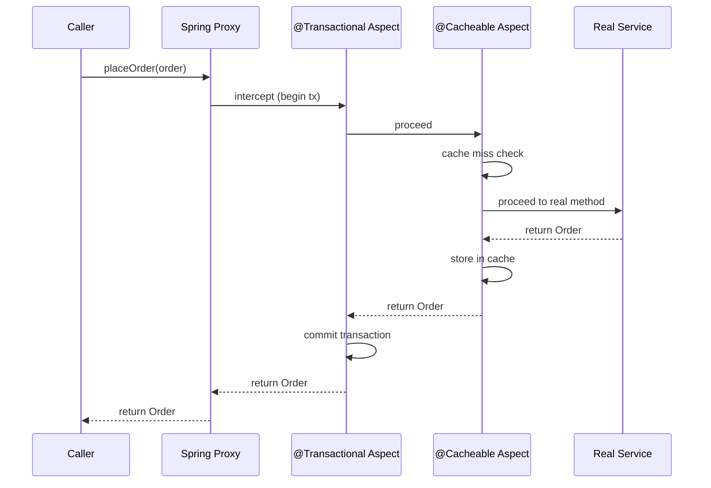

# Dynamic Proxy and AOP

---
id: DP-027
title: Dynamic Proxy and AOP
category: Design Patterns
difficulty: ★★★
interview_weight: critical
asked_at: Senior/Staff
seniority: senior
tags: #design-patterns, #proxy, #aop, #spring, #cglib, #java, #reflection
status: draft
version: 1
---

### 🎯 Model Answer

**30 seconds:**
> A dynamic proxy creates a proxy object at runtime without compile-time
> code generation. Java has two mechanisms: JDK dynamic proxy (interface-
> based, uses `java.lang.reflect.Proxy`) and CGLIB (class-based, generates
> a bytecode subclass). Spring AOP uses both: JDK proxy when the bean
> implements an interface, CGLIB when it does not. The proxy intercepts
> method calls and adds cross-cutting behavior (transaction management,
> security, logging, caching) without the target class knowing.

**3 minutes (Senior):**
> Dynamic proxy is the mechanism behind Spring AOP and everything Spring
> adds around your beans: `@Transactional`, `@Cacheable`, `@Secured`,
> `@Async`. When you call `orderService.placeOrder()`, you are calling
> through a proxy. The proxy checks: does this method have `@Transactional`?
> If yes: start a transaction, call the real method, commit (or rollback
> on exception), return. The real `OrderService.placeOrder()` has no
> transaction code. The proxy adds it transparently.
>
> The critical limitation: self-invocation bypass. When an `@Transactional`
> method A calls another `@Transactional` method B on the same class,
> method B's proxy is never invoked (A calls `this.B()`, not `proxy.B()`).
> Spring's transaction is not applied to B. This is the most common
> production bug from misunderstanding proxy mechanics.
>
> JDK vs CGLIB: JDK proxy requires an interface. CGLIB generates a
> subclass, so `final` classes and `final` methods cannot be proxied.
> Spring Boot 2.x uses CGLIB by default for all beans (avoids the
> "must implement interface" requirement). When a proxy-based `@Transactional`
> call must fail silently (self-invocation), the fix is either to inject
> `ApplicationContext` to get the proxy reference or to restructure
> so the method call crosses the proxy boundary.

**Blank Mind Recovery:**

**(1) Restate:** "Dynamic proxy - runtime-generated proxy that intercepts
method calls to add cross-cutting behavior. Foundation of Spring AOP."

**(2) First principles:** "A proxy stands in front of the real object.
All calls go through the proxy. The proxy can do anything before/after
the real call. Dynamic: the proxy class is created at runtime from a
template, not hand-written."

**(3) Bridge:** "Like a personal assistant who screens calls before
they reach you. The caller dials your number (the interface), the
assistant answers (the proxy), checks if the meeting is approved
(cross-cutting check), then connects the caller (calls the real
method). You never know the assistant was there."

---

### 📘 Concept Explanation

**How JDK Dynamic Proxy works:**

```
java.lang.reflect.Proxy.newProxyInstance(
  classLoader,
  interfaces[],     // target interfaces
  invocationHandler // what to do on each call
)

At runtime:
1. JVM generates a new class implementing interfaces[]
2. All methods forward to InvocationHandler.invoke()
3. invoke() receives: proxy object, Method, args[]
4. invoke() can: add behavior before/after, skip real call,
   throw exception, return different value

Requirement: target object MUST implement at least one interface.
```

**How CGLIB works:**

```
CGLib.Enhancer:
1. Generates a bytecode subclass of the target class at runtime
2. Overrides all non-final methods
3. Overridden methods call MethodInterceptor.intercept()
4. intercept() can add behavior, call super.method(), etc.

Requirements:
- Class must not be final
- Methods must not be final
- No-arg constructor must be accessible (Spring enhances this)

Spring Boot 2+ preference: CGLIB for all Spring beans
(even when interfaces exist) unless spring.aop.proxy-target-class=false
```

**The proxy call path in Spring:**

```
Caller
  |
  v
[Spring Proxy] <-- what Spring gives you on @Autowire
  |-- checks @Transactional -> open transaction
  |-- checks @Cacheable -> cache lookup
  |-- checks @Secured -> security check
  |-- checks @Async -> submit to thread pool
  v
[Real Bean] orderService.placeOrder(order)
  |-- real business logic, no cross-cutting
  v
[Spring Proxy continues]
  |-- commit/rollback transaction
  |-- store result in cache
  v
Caller receives result
```

**The self-invocation problem:**

```java
@Service
public class OrderService {
    @Transactional
    public void placeOrder(Order order) {
        // ... business logic ...
        sendConfirmation(order); // BAD: self-invocation
    }

    @Transactional(propagation = Propagation.REQUIRES_NEW)
    public void sendConfirmation(Order order) {
        // Expected: new transaction
        // Actual: runs in parent transaction (proxy bypassed)
        // Why: "this.sendConfirmation()" bypasses the proxy
    }
}
```

**AOP concepts:**

- **Aspect:** A module containing cross-cutting logic (a class with `@Aspect`)
- **Advice:** What to do (before, after, around method execution)
- **Pointcut:** Which methods to intercept (expression matching)
- **Join point:** A specific method invocation that matches a pointcut
- **Weaving:** The process of applying advice to join points (Spring does this at runtime with proxies; AspectJ does it at compile/load time with bytecode)

---

### 💻 Code Example

```java
// STEP 1: JDK Dynamic Proxy - raw mechanism
public interface OrderService {
    Order placeOrder(CartItem... items);
    Order getOrder(Long orderId);
}

public class OrderServiceImpl implements OrderService {
    @Override
    public Order placeOrder(CartItem... items) {
        // real business logic
        return new Order(items);
    }
    @Override
    public Order getOrder(Long orderId) {
        return orderRepository.findById(orderId);
    }
}

// Creating a proxy with logging:
OrderService proxy = (OrderService)
    Proxy.newProxyInstance(
        OrderService.class.getClassLoader(),
        new Class<?>[]{ OrderService.class },
        new InvocationHandler() {
            private final OrderService target
                = new OrderServiceImpl();

            @Override
            public Object invoke(
                    Object proxy, Method method, Object[] args)
                    throws Throwable {
                long start = System.currentTimeMillis();
                try {
                    Object result = method.invoke(target, args);
                    long elapsed =
                        System.currentTimeMillis() - start;
                    System.out.printf(
                        "[TIMING] %s: %dms%n",
                        method.getName(), elapsed);
                    return result;
                } catch (InvocationTargetException e) {
                    throw e.getCause(); // unwrap
                }
            }
        }
    );
```

> **Code walkthrough:** `Proxy.newProxyInstance` creates a new class at
> runtime that implements `OrderService`. Every method call on `proxy`
> routes through `InvocationHandler.invoke`. The handler records start
> time, delegates to `target.method.invoke(target, args)`, records elapsed
> time, and logs. The real `OrderServiceImpl` has zero timing code.
> Note `InvocationTargetException.getCause()`: `method.invoke()` wraps
> thrown exceptions in `InvocationTargetException`. Unwrapping is required
> to preserve the original exception type for callers.

```java
// STEP 2: Spring AOP with @Around advice
// (Spring manages the proxy creation; you write only the advice)
@Aspect
@Component
public class TimingAspect {

    // Pointcut: any method in any class in com.example.service
    @Around("execution(* com.example.service.*.*(..))")
    public Object measureTime(ProceedingJoinPoint pjp)
            throws Throwable {
        long start = System.currentTimeMillis();
        try {
            Object result = pjp.proceed(); // call real method
            return result;
        } finally {
            long elapsed = System.currentTimeMillis() - start;
            String method = pjp.getSignature().getName();
            System.out.printf(
                "[TIMING] %s: %dms%n", method, elapsed);
        }
    }
}
// Spring creates a proxy for every bean in com.example.service.
// Every method call goes through TimingAspect.measureTime first.
// No timing code in any service class.
```

> **Code walkthrough:** `@Around` advice wraps the real method call.
> `pjp.proceed()` calls the real method. Code before `proceed()` runs
> as "before" advice; code after (in `finally`) runs as "after" advice.
> `pjp.getSignature().getName()` gives the method name. Spring applies
> this advice to all beans matching the pointcut expression. The pointcut
> `execution(* com.example.service.*.*(..))` matches: any return type (`*`),
> any class in `com.example.service` (`*`), any method name (`*`), any
> arguments (`(..)`).

```java
// STEP 3: Self-invocation problem (production bug)
@Service
public class UserService {

    // BAD: self-invocation bypasses @Transactional on createAudit
    @Transactional
    public void createUser(UserRequest req) {
        User user = new User(req.getName(), req.getEmail());
        userRepository.save(user);
        createAudit(user);  // self-invocation!
    }

    @Transactional(propagation = Propagation.REQUIRES_NEW)
    public void createAudit(User user) {
        // Intended: new transaction (audit survives user rollback)
        // Actual: runs in createUser's transaction
        // Bug: if createUser rolls back, audit also rolls back
        auditRepository.save(new AuditEntry(user));
    }
}

// FIX 1: Inject self as a Spring bean (gets the proxy)
@Service
public class UserService {
    @Autowired
    @Lazy  // prevents circular dependency
    private UserService self;

    @Transactional
    public void createUser(UserRequest req) {
        User user = new User(req.getName(), req.getEmail());
        userRepository.save(user);
        self.createAudit(user);  // goes through proxy now
    }

    @Transactional(propagation = Propagation.REQUIRES_NEW)
    public void createAudit(User user) {
        // Now actually runs in new transaction
        auditRepository.save(new AuditEntry(user));
    }
}

// FIX 2: Extract to separate service (cleaner)
@Service
public class AuditService {
    @Transactional(propagation = Propagation.REQUIRES_NEW)
    public void createAudit(User user) {
        auditRepository.save(new AuditEntry(user));
    }
}

@Service
public class UserService {
    private final AuditService auditService;
    // constructor injection

    @Transactional
    public void createUser(UserRequest req) {
        User user = new User(req.getName(), req.getEmail());
        userRepository.save(user);
        auditService.createAudit(user);  // crosses proxy boundary
    }
}
```

> **Code walkthrough:** Fix 1 (`@Lazy` self-injection) works but is
> code smell - it reveals that the class should be split. Fix 2 is the
> correct solution: extract the independently-transacted operation to
> its own Spring bean. `auditService.createAudit(user)` now goes through
> `AuditService`'s proxy, which applies the `REQUIRES_NEW` propagation.
> The audit runs in a separate transaction. If `createUser` rolls back
> (user save fails), the audit is already committed independently.

---

### 🎓 Answers by Seniority

**Junior / Mid (0-5 years):**
> Dynamic proxy creates a wrapper object at runtime that intercepts
> method calls. Spring uses dynamic proxies to implement `@Transactional`,
> `@Cacheable`, and security annotations without any code in your service
> classes. The important limitation: if your service method calls another
> method on `this`, the call bypasses the proxy and annotations on the
> second method have no effect. This is why `@Transactional` on a private
> method does nothing - the proxy can only intercept public methods through
> the proxy reference.

---

**Senior / Staff (5+ years):**
> Dynamic proxy is a runtime implementation of the Proxy structural
> pattern. The two mechanisms have different constraints: JDK proxy
> requires interfaces (Spring must proxy the interface, not the class);
> CGLIB requires the class to be non-final with non-final methods
> (subclass-based interception). Spring Boot 2.x defaulted to CGLIB
> for all beans to avoid the "remember to program to interfaces" requirement.
>
> The most subtle production issue: `@Transactional` on a `@Service`
> that is also called within the same class. Self-invocation bypasses
> the proxy. The fix is extracting to a separate service bean. A second
> subtle issue: `@Transactional` on `private` methods is silently ignored
> (the proxy cannot override private methods). This is a common mistake
> that manifests as missing transaction rollback in production.
>
> For performance: every proxy call goes through reflection (JDK) or
> generated bytecode (CGLIB). CGLIB is significantly faster than JDK
> proxy because it uses direct bytecode calls rather than reflection.
> For extremely hot paths, the overhead is measurable. AspectJ's compile-
> time weaving eliminates proxy overhead entirely but requires an AspectJ
> compiler step.

---

### 🏛️ System Design

**Scenario: Implement a Multi-Tenant Rate Limiting Aspect**

Problem: An API has 50+ endpoints. Each endpoint must enforce per-tenant
rate limits. Adding rate limit checks to every method is duplication.
Use Spring AOP + Dynamic Proxy to add rate limiting transparently.

**Design:**

```
@RateLimit annotation (custom annotation)
  |
  v
@Aspect RateLimitAspect
  |-- intercepts all methods annotated with @RateLimit
  |-- extracts tenant ID from SecurityContext
  |-- checks rate in Redis (Bucket4j / token bucket)
  |-- if exceeded: throw RateLimitExceededException
  |-- if ok: proceed() to real method
  |
  v
Redis (distributed rate counter)
  |-- key: "rate:tenant:{tenantId}:endpoint:{name}"
  |-- token bucket algorithm
  |-- TTL: sliding window

@RateLimit(limit=100, per=MINUTE)
public ProductPage searchProducts(SearchRequest req) {
    // No rate limit code here
}
```

**The aspect intercept chain for one request:**

```
HTTP Request
  |
SecurityFilter (sets tenant in SecurityContext)
  |
DispatcherServlet
  |
[Spring Proxy for ProductService]
  |-- SecurityAspect (authorization check)
  |-- RateLimitAspect (per-tenant rate check)
  |-- CacheAspect (cache check)
  |-- TimingAspect (metrics)
  v
ProductService.searchProducts() (real logic)
```

**Aspect ordering (important for correctness):**

```java
@Aspect
@Order(1)  // runs first (outermost)
public class SecurityAspect { ... }

@Aspect
@Order(2)  // runs second
public class RateLimitAspect { ... }

@Aspect
@Order(3)  // runs third
public class CacheAspect { ... }
```

Aspects wrap the method like nested functions. `@Order(1)` is the
outermost wrapper. Security should run before rate limiting (no point
counting a rate for an unauthenticated request). Caching should run
after rate limiting (count the rate even for cached responses).

**Trade-offs:**

- Proxy-based AOP: no bytecode weaving step, runtime overhead per call.
  Good for service layer methods (called infrequently relative to compute).
- AspectJ weaving: zero runtime overhead, but requires AspectJ compiler.
  Good for extremely hot paths.
- Manual cross-cutting code: no proxy overhead, full control, but
  violates DRY and makes every service class dependent on cross-cutting concerns.

---

### 📊 Diagram

```
JDK Dynamic Proxy (interface-based)

Caller
  |
  | calls interface method
  v
+------------------+
|  $Proxy0         | <-- JVM-generated class
|  (implements     |     implements OrderService
|   OrderService)  |
|                  |
|  placeOrder() ---|----> InvocationHandler.invoke()
|                  |         |
+------------------+         | method.invoke(target, args)
                              |
                              v
                    +------------------+
                    | OrderServiceImpl |
                    | (real target)    |
                    +------------------+

CGLIB Proxy (subclass-based)

Caller
  |
  | calls method
  v
+------------------------+
| OrderService$$EnhCGLIB | <-- CGLIB-generated subclass
| extends OrderService   |
|                        |
| placeOrder() override--|--> MethodInterceptor.intercept()
|                        |         |
+------------------------+         | methodProxy.invokeSuper()
                                    |
                                    v
                          +------------------+
                          | OrderService     |
                          | (super class)    |
                          +------------------+
```



> **Diagram walkthrough:** The sequence shows the aspect chain for a
> single method call. The proxy coordinates the aspect chain. Each aspect
> calls `proceed()` to pass control to the next aspect (or the real
> method at the end). `@Transactional` wraps the outermost boundary -
> it starts the transaction before any other aspect runs and commits
> after all aspects complete. `@Cacheable` is inner: the cache check
> happens after transaction opens. Aspects are nested functions: the
> call enters from outside in and returns from inside out.

---

### ⚠️ Common Misconceptions

**Misconception 1: "@Transactional on private methods works"**

Reality: Spring AOP can only intercept public methods. The proxy cannot
override private methods (they are not visible to subclasses or
implementors). `@Transactional` on a private method is silently ignored.
Spring does not warn you at startup. The transaction attribute has no
effect, which manifests as unexpected behavior when the method throws
an exception that should trigger a rollback.

**Misconception 2: "Spring always uses JDK proxy"**

Reality: Spring Boot 2.x changed the default to CGLIB for all Spring
beans (`spring.aop.proxy-target-class=true` is the default). JDK proxy
is used only when explicitly configured. The reason: CGLIB works for
classes without interfaces, which is the common case in Spring Boot
applications that do not follow the interface-per-service pattern.

**Misconception 3: "Self-invocation with @Transactional propagation works"**

Reality: The most production-impacting misconception. Method A calls
method B on `this`. Method B's `@Transactional` annotations are ignored
because `this` refers to the real object, not the proxy. Only calls
through the proxy reference are intercepted.

**Misconception 4: "Dynamic proxy has no performance cost"**

Reality: JDK proxy uses `Method.invoke()` (reflection), which is slower
than direct method calls, particularly before JIT warmup. CGLIB uses
generated bytecode that is close to direct calls after JIT. In benchmarks,
JDK proxy adds 100-500ns per call; CGLIB adds 10-50ns. For typical service
methods (milliseconds of real work), the overhead is negligible. For
extremely hot paths (called millions of times per second), it can be
measurable.

---

### 🚨 Failure Modes and Diagnosis

**Failure 1: @Transactional not applying (self-invocation)**

Symptom: method B annotated `@Transactional(REQUIRES_NEW)` but runs
in the caller's transaction. Rollback of B does not roll back;
rollback of A incorrectly rolls back B too.

Diagnosis:
```java
// Add logging to detect:
@Transactional(propagation = REQUIRES_NEW)
public void createAudit(User user) {
    TransactionStatus status =
        TransactionAspectSupport
            .currentTransactionStatus();
    log.info("Is new transaction: {}",
        status.isNewTransaction()); // should be true; if false: bug
}
```

Fix: Extract to a separate `@Service` bean. Or use `@Lazy` self-injection.

**Failure 2: @Transactional on private method - silent ignore**

Symptom: exception thrown in method should trigger rollback, but
transaction commits anyway.

Diagnosis: Check if the method is `private` or `final`. Spring AOP
cannot intercept private methods.

```bash
# Enable Spring transaction debug logging
logging.level.org.springframework.transaction=DEBUG
# Look for: "Getting transaction for [ClassName.methodName]"
# If your method is not listed: AOP is not intercepting it
```

**Failure 3: CGLIB fails on final class or final method**

Symptom: startup fails with:
`Cannot subclass final class com.example.MyService`
or:
`Unable to proxy final method`

Diagnosis: Remove `final` from the class or method. Or implement
an interface and configure `proxy-target-class=false` to use JDK proxy.

**Failure 4: Circular proxy creation**

Symptom: `BeanCurrentlyInCreationException` on application startup.

Diagnosis: Two beans each depend on each other, and both need CGLIB
proxies. Spring cannot create either proxy because the other is not
yet fully constructed. Fix: use `@Lazy` on one of the injections, or
restructure dependencies to eliminate the cycle.

**Failure 5: Aspect ordering producing wrong results**

Symptom: Cache is checked before authentication; unauthenticated users
get cached results.

Diagnosis: Check `@Order` values on aspects. Security must have lower
`@Order` number (runs first/outermost). Cache must have higher number.

```java
@Aspect @Order(1) class SecurityAspect {}  // outermost
@Aspect @Order(2) class RateLimitAspect {} // second
@Aspect @Order(3) class CacheAspect {}     // innermost
```

---

### 🎯 Interview Deep-Dive

| Format | Time | Goal |
|---|---|---|
| 30-second definition | 0-30s | Proxy intercepts method calls at runtime |
| 3-minute explanation | 30s-3m | JDK vs CGLIB, Spring AOP, self-invocation |
| Deep questions | 3m+ | Mechanisms, failure modes, production impact |

**Minimum 12 questions for ★★★:**

---

**Q1 (DEFINITION): What is a dynamic proxy and how does it differ from a static proxy?**

A: A static proxy is a class written manually: you implement the same
interface as the real object and wrap every method with additional behavior.
A dynamic proxy is generated at runtime without writing proxy class code:
`Proxy.newProxyInstance()` generates a class at runtime that implements
the target interfaces and routes all calls to your `InvocationHandler`.

Static proxy advantages: compile-time safety, clear what the proxy does,
no reflection overhead. Dynamic proxy advantages: one handler handles all
methods (add logging to 50 methods with one handler), works for any
interface without writing 50 proxy methods, enables AOP frameworks to
work without code generation build steps.

Spring uses dynamic proxies specifically because it cannot write a proxy
class for every user-defined service at compile time - it generates them
at runtime from the bean definitions.

*What separates good from great:* Understanding that dynamic proxy was
the enabling technology for Spring AOP, which replaced EJB's complex
compile-time weaving. The simplicity of `@Transactional` depends entirely
on the runtime proxy mechanism.

---

**Q2 (MECHANISM): Walk through exactly what happens when Spring creates
a `@Transactional` proxy bean.**

A: At application startup, Spring scans beans for `@Transactional`
annotations. For each bean with any `@Transactional` method:
(1) Spring's `AbstractAutoProxyCreator` (a `BeanPostProcessor`) intercepts
the bean creation. (2) It creates a proxy: CGLIB if `proxy-target-class=true`
(default), or JDK if the bean implements interfaces and `proxy-target-class=false`.
(3) The proxy is registered in the Spring context instead of the raw bean.
(4) When you `@Autowired` the bean, you receive the proxy.
(5) At method invocation: the proxy's override calls `TransactionInterceptor.invoke()`,
which reads the `@Transactional` metadata, opens a transaction (via
`PlatformTransactionManager`), calls `method.invoke(target, args)` (or
`methodProxy.invokeSuper()` for CGLIB), commits or rolls back, and returns.
The real bean is stored as `target` inside the proxy.

*What separates good from great:* Knowing `BeanPostProcessor` is the
Spring extension point. `AbstractAutoProxyCreator` is a `BeanPostProcessor`
that wraps beans in proxies. Any custom `BeanPostProcessor` can do the same.

---

**Q3 (MECHANISM): Why does CGLIB fail for final classes and final methods?**

A: CGLIB generates a subclass of the target class. The generated subclass
overrides non-final methods to insert the interception logic. A `final class`
cannot be subclassed in Java (compiler enforces this). A `final method`
cannot be overridden. Therefore: (1) `final class` - CGLIB throws
`IllegalArgumentException: Cannot subclass final class`.
(2) `final method` - CGLIB generates the subclass but the final method
is not overridden, so the method is called directly on the real object
without proxy interception. Spring logs a warning for final methods.
The practical implication: any `@Transactional` annotation on a `final`
method in a class proxied by CGLIB is silently ignored (same as private
methods). Spring will not start with a final class if CGLIB is selected;
it fails at startup.

*What separates good from great:* Recognizing that `@MockBean` in Spring
tests also uses CGLIB (or ByteBuddy) and fails for `final` classes.
Mockito has the same limitation unless the class is annotated with
`@ExtendWith(MockitoExtension.class)` and the mockito-subclass module
is on the classpath.

---

**Q4 (FAILURE): Describe the self-invocation problem in detail. How do
you reliably detect it?**

A: Self-invocation occurs when a Spring bean calls one of its own methods.
The call uses `this.method()` which references the real bean, not the
Spring proxy. Any aspect advice on the called method is not applied.

Reliable detection: Enable `DEBUG` logging for
`org.springframework.transaction.interceptor` (for `@Transactional`)
or the relevant aspect. Every intercepted method call produces a log line
like: `Getting transaction for [com.example.OrderService.placeOrder]`.
If your method is not in the log but is called: it was called via
self-invocation and the proxy was bypassed.

For transaction-specific detection:
```java
@Transactional
public void methodB() {
    boolean isNewTx = TransactionSynchronizationManager
        .isActualTransactionActive();
    // Should be true for REQUIRED, true+new for REQUIRES_NEW
    // If false when you expected REQUIRED: check self-invocation
}
```

For general proxy detection:
```java
AopContext.currentProxy() // throws if called outside proxy
// If currentProxy() returns a different reference than 'this': in proxy
// If throws: this call bypassed the proxy
```

*What separates good from great:* Knowing `AopContext.currentProxy()`
exists (requires `@EnableAspectJAutoProxy(exposeProxy=true)`). This is
the Spring-provided mechanism for self-invocation workaround and proxy
detection.

---

**Q5 (PRODUCTION): @Transactional on a method that catches all exceptions.
What is the problem?**

A: `@Transactional` triggers rollback on unchecked exceptions
(`RuntimeException` and `Error`) by default. If the method catches all
exceptions and does not re-throw, `@Transactional` never sees the exception.
The transaction commits even though the operation failed.

```java
@Transactional
public void process(Order order) {
    try {
        orderRepository.save(order);
        externalApiService.notify(order);
    } catch (Exception e) {
        log.error("Failed: {}", e.getMessage());
        // Exception swallowed
        // @Transactional sees no exception -> commits
        // Order is saved even though notification failed
    }
}
```

Fix options: (1) Re-throw after logging:
`throw new ProcessingException("Failed", e);`
(2) Mark rollback explicitly: `TransactionAspectSupport.currentTransactionStatus().setRollbackOnly();`
(3) Use `@Transactional(rollbackFor = Exception.class)` and do not catch
checked exceptions. The rule: never swallow exceptions in transactional
methods unless you explicitly want the transaction to commit after partial work.

*What separates good from great:* Knowing that Spring's default rollback
behavior does NOT roll back on checked exceptions (`Exception` subclasses
that are not `RuntimeException`). If your method throws a checked exception,
you must use `@Transactional(rollbackFor = CheckedException.class)`.

---

**Q6 (COMPARISON): JDK dynamic proxy vs CGLIB - when does Spring choose each?**

A: Spring Boot 2.x default: CGLIB for all beans
(`spring.aop.proxy-target-class=true`). JDK proxy was the original default
when Spring required the "program to interfaces" convention.

Spring chooses JDK proxy when: `spring.aop.proxy-target-class=false`
AND the target bean implements at least one interface. If the bean has
no interface, Spring falls back to CGLIB regardless of the setting.

CGLIB is faster (direct bytecode vs reflection), works without interfaces,
but fails on final classes/methods and requires a CGLIB dependency
(now bundled in Spring Core, no separate dependency needed since Spring 3.2).

JDK proxy is cleaner (works within Java's security model without
bytecode manipulation), is the JDK standard, but only works with
interfaces and has reflection overhead.

For test mocking: Mockito < 2.x used subclassing (same as CGLIB);
Mockito 2+ uses `ByteBuddy` by default which handles `final` methods.
`@MockBean` in Spring Boot tests uses the same proxy mechanism as the
application context - if a class is not mockable by CGLIB, `@MockBean` fails.

*What separates good from great:* Knowing that Spring moved to CGLIB
default in Spring Boot 2.x specifically to avoid a common mistake where
developers `@Autowired` the implementation type (`OrderServiceImpl`)
instead of the interface. With JDK proxy, the proxy object does not
extend `OrderServiceImpl`, so injecting the impl type fails. With CGLIB,
the proxy extends the impl, so it works.

---

**Q7 (ARCHITECTURE): How does Spring AOP differ from full AspectJ?**

A: Spring AOP is proxy-based: aspects are applied at method call time
through a proxy. This means: (1) only method-level join points (no field
access, no constructor, no static method); (2) only for Spring-managed
beans; (3) runtime overhead per method call; (4) self-invocation bypasses
aspects (the core limitation).

AspectJ is a full AOP framework with compile-time weaving (CTW) or
load-time weaving (LTW): (1) supports all join point types including field
access, constructor calls, static methods; (2) works for any Java object,
not just Spring beans; (3) near-zero runtime overhead (bytecode is woven
at compile/load time, no proxy at runtime); (4) no self-invocation
problem (every call site is woven, including `this.method()`).

Spring supports AspectJ annotation style (`@Aspect`, `@Around`, `@Before`)
with Spring AOP runtime (not full AspectJ weaving). You can also enable
true AspectJ LTW in Spring by adding the `AspectJ LTW` agent.

When to use full AspectJ: you need to intercept constructors or static
methods, you are not in a Spring context, or you have a performance-critical
hot path where proxy overhead is measurable. When to use Spring AOP:
all other cases - it is simpler, requires no build step, and covers 95%
of cross-cutting concerns in Spring applications.

*What separates good from great:* Knowing that Spring AOP is not AspectJ.
It uses AspectJ annotations but implements them through proxies, not
bytecode weaving. The distinction matters when you hit the self-invocation
limitation and incorrectly conclude "but I'm using AspectJ syntax, so
self-invocation should work."

---

**Q8 (DEBUGGING): @Cacheable is not caching. How do you diagnose?**

A: Five root causes: (1) Self-invocation: the method is called from
within the same class (`this.method()`). The proxy is bypassed; no
caching. (2) Method is private or final: `@Cacheable` on private/final
methods is silently ignored. (3) Cache manager not configured: no
`CacheManager` bean in context. Spring logs a warning at startup.
(4) Cache key collision: two methods share a cache name but have different
parameters, causing wrong cache hits. (5) Exception thrown before cache
store: if the method throws after computing the result, the cache is not
populated.

Diagnosis steps:
```bash
# Step 1: Enable cache debug logging
logging.level.org.springframework.cache=TRACE
# Look for: "Computed cache key... for operation..."
# Missing log = proxy not intercepting

# Step 2: Verify CacheManager exists
# @SpringBootApplication scans detect @EnableCaching
# Check if spring-boot-starter-cache is in pom.xml

# Step 3: Check if method is public and non-final
# Check if the call comes from outside the class

# Step 4: Check cache key expression
@Cacheable(value="products", key="#id")
public Product getProduct(Long id) { ... }
# If key is wrong, cache misses every time
```

*What separates good from great:* Knowing that `@Cacheable` has the
same proxy limitation as `@Transactional`. The fix is identical:
extract to a separate bean, or use self-injection (`@Lazy` proxy
reference).

---

**Q9 (SECURITY): What are the security implications of proxy-based AOP?**

A: Three security-relevant aspects: (1) Authorization bypass via
self-invocation. `@Secured` or `@PreAuthorize` on a method called from
within the same class is not enforced. An attacker exploiting a path
that reaches the unprotected internal call bypasses security checks.
Mitigation: always add security checks at the public API boundary
(controller layer), not only on service methods. (2) Proxy replacement
attack: if the `BeanDefinitionRegistry` or `BeanFactory` is accessible
to an attacker (e.g., through Spring Boot Actuator misconfiguration),
the proxy definition could be replaced. Mitigation: secure Actuator endpoints.
(3) Reflection-based proxy: JDK proxy uses `Method.invoke()`. If an
attacker can inject an arbitrary `InvocationHandler`, all method calls
are captured. Mitigation: the `InvocationHandler` is created internally
by Spring's proxy factory; it is not user-controlled in production.

The practical security guidance: do not rely on method-level security
annotations alone. Always validate at the controller/filter layer first.
Method security is defense-in-depth, not the primary gate.

*What separates good from great:* Knowing that Spring Security's
`@PreAuthorize` has the same self-invocation limitation as `@Transactional`.
Security annotations on private or self-called methods are silently
bypassed, which can create authorization vulnerabilities.

---

**Q10 (SCALE): How does proxy overhead change under load?**

A: Proxy overhead has two phases: startup and runtime. Startup: CGLIB
generates bytecode at class loading time. With 500+ Spring beans,
startup time increases. Minimized with Spring's lazy initialization
(`spring.main.lazy-initialization=true`). Runtime: per-call overhead.
JDK proxy: 100-500ns per intercepted call (before JIT). After JVM warmup
and JIT compilation: 10-50ns. CGLIB: 10-50ns before JIT; near-zero after
(bytecode is directly called by JIT-compiled code).

Under load (10,000 rps): 10,000 calls/sec * 50ns = 0.5ms/sec of pure
proxy overhead per method. Negligible compared to database queries (1-100ms).
The only scenario where proxy overhead matters: extremely fine-grained
aspects on hot inner loops (called millions of times per second in tight
loops). In that case: use AspectJ compile-time weaving or remove the aspect
from the hot path.

Memory: each proxied class generates bytecode that is loaded into the JVM's
metaspace. 500 CGLIB-proxied classes adds approximately 50-100MB of metaspace.
`MetaspaceSize` and `MaxMetaspaceSize` JVM flags control this.

*What separates good from great:* Understanding that startup time is a
real proxy cost for cloud-native applications where fast startup matters
(Kubernetes pod restart, AWS Lambda cold start). Spring Native (GraalVM)
avoids CGLIB proxies entirely by doing the proxy generation at compile
time, addressing the startup overhead.

---

**Q11 (TRADE-OFF): When would you choose compile-time AOP weaving over
Spring AOP proxies?**

A: Choose compile-time AspectJ weaving when: (1) You need to intercept
call types that Spring AOP cannot: field access, constructor invocations,
static methods, or calls on non-Spring-managed objects. (2) Performance
is critical on a specific hot path where the per-call proxy overhead is
measurable (profiling confirms). (3) You need to weave aspects into
library code you do not control (add caching to a third-party class).
Spring AOP cannot proxy classes it does not manage.

Disadvantages of compile-time weaving: requires AspectJ compiler plugin
in the build (Maven/Gradle plugin), complicates IDE integration, compile
times increase, harder to debug (bytecode is modified), and the self-
invocation problem disappears (which removes a common surprise but also
means all methods are intercepted, including hot inner-class calls you
did not intend to advise).

In practice: 99% of Spring Boot applications use Spring AOP proxies and
never need compile-time AspectJ. The self-invocation limitation is solved
by architecture (separate beans), not by switching to compile-time weaving.

*What separates good from great:* Knowing that Spring Boot's `@SpringBootApplication`
with auto-configuration uses proxy-based AOP. Switching to AspectJ CTW
in a Spring Boot app requires non-trivial build changes and breaks some
Spring auto-configuration that assumes proxy-based beans.

---

**Q12 (BEHAVIORAL): A security audit finds that `@PreAuthorize` checks
can be bypassed. What is the architectural fix?**

A: The root cause is relying on method-level security as the only security
gate. Method-level `@PreAuthorize` has the self-invocation limitation and
is only effective for calls through the proxy. The architectural fix
(defense in depth): (1) Apply authentication and authorization at the
HTTP layer (Spring Security filters) before requests reach service methods.
`SecurityFilterChain` is not proxy-based - it cannot be bypassed by
self-invocation. (2) `@PreAuthorize` at the service layer is a second
check (defense-in-depth), not the primary gate. (3) For sensitive operations,
add explicit authorization checks in code:
```java
if (!securityContext.hasPermission(user, "WRITE_ORDER")) {
    throw new AccessDeniedException("Permission denied");
}
```
This is explicit, testable, and not proxy-dependent.
(4) Integrate security unit tests: test that the method rejects unauthorized
callers with a proper mock security context.

*What separates good from great:* Understanding that the proxy mechanism
is an implementation detail, and security design should not depend on
implementation details. Security checks should be explicit, testable,
and at every layer of entry. Method-level annotations are ergonomic
shortcuts, not security architecture.
