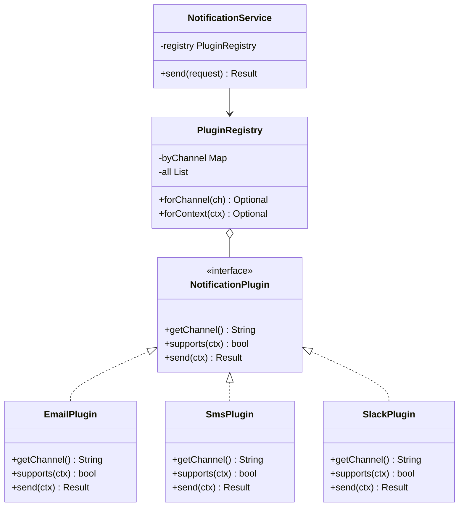

## Keywords in This File
{: .no_toc }

| # | Keyword | Weight |
|---|---|---|
| 1 | [Plugin Architecture with Factory and Strategy](#plugin-architecture-with-factory-and-strategy) | medium |

---

# Plugin Architecture with Factory and Strategy

---
id: DP-028
title: Plugin Architecture with Factory and Strategy
category: Design Patterns
difficulty: ★★★
interview_weight: high
asked_at: Senior/Staff
seniority: senior
tags: #design-patterns, #plugin, #factory, #strategy, #extension-point, #spring
status: draft
version: 1
---

### 🎯 Model Answer

**30 seconds:**
> Plugin architecture combines Factory and Strategy to create an extension
> system where new behaviors can be added without modifying existing code.
> The core components: a plugin interface (Strategy), a plugin registry
> (maps keys to implementations), a plugin factory or discovery mechanism
> (loads implementations - static, Spring beans, or ServiceLoader), and
> the host system that delegates to plugins. New plugins extend the system
> without touching the host.

**3 minutes (Senior):**
> Plugin architecture solves the problem of extensibility without
> modification. The canonical structure: a `Plugin` interface defines
> what a plugin can do. A `PluginRegistry` maps identifiers to plugin
> implementations. The `PluginFactory` or Spring's bean discovery populates
> the registry. The host calls `registry.get(key).execute(context)`.
>
> In Spring: plugins are `@Component` beans implementing a shared interface.
> Spring injects `List<PluginInterface>` - all implementations collected
> automatically. The registry is a `Map<String, Plugin>` keyed by bean name
> or by a `getType()` discriminator method on the interface. New plugins:
> add a class, annotate `@Component`, Spring discovers it. The host is
> never modified.
>
> The production challenge: plugin isolation. If plugins share the same
> ClassLoader, one plugin's dependency version can conflict with another.
> OSGi solves this with per-plugin ClassLoaders. ServiceLoader (Java SPI)
> provides a simpler discovery mechanism without full ClassLoader isolation.
> In a Spring Boot monolith: ServiceLoader isolation is not needed (plugins
> are first-class Spring beans). In a true plugin platform (IDE plugins,
> application servers): ClassLoader isolation becomes critical.

**Blank Mind Recovery:**

**(1) Restate:** "Plugin architecture - extension system combining Factory
+ Strategy where new behaviors added without modifying the host."

**(2) First principles:** "Open/Closed Principle at the architecture level.
The host is closed for modification. Plugins are the extension mechanism.
The interface defines the contract; plugins fulfill it."

**(3) Bridge:** "Like a USB port: the computer defines the USB interface
(the plugin interface). Any device that implements the USB standard plugs
in without modifying the computer. The computer discovers the device at
runtime (registry/factory). New devices (plugins) require no computer
modification."

---

### 📘 Concept Explanation

**Core components of plugin architecture:**

```
1. Plugin Interface (the contract)
   - Defines what any plugin can do
   - Includes a discriminator (getType(), supports())
   - May define lifecycle methods (init(), close())

2. Plugin Registry (the directory)
   - Maps identifier -> Plugin implementation
   - Populated at startup (Spring auto-discovery or
     explicit registration)
   - Thread-safe after initialization (ConcurrentHashMap
     or immutable after build)

3. Plugin Factory / Discovery
   - Spring: List<Plugin> injection collects all @Component
   - Java SPI: ServiceLoader<Plugin>.load()
   - Dynamic: URLClassLoader + reflection for JAR files

4. Host System (the caller)
   - Receives a context/request
   - Determines which plugin type is needed
   - Delegates to registry.get(type).execute(context)
   - Never imports or directly references concrete plugins
```

> **Code walkthrough:** This Plugin Architecture with Factory and Strategy example demonstrates a key concept in practice using Spring annotation. **KEY MECHANISM:** the runtime executes these instructions in sequence with specific memory and execution semantics. **WHY IT MATTERS:** misapplying this pattern causes subtle bugs that only manifest under production load. **TAKEAWAY: understand the execution model before using this pattern in production code.**

**Discovery mechanisms compared:**

| Mechanism | How it works | Isolation | Hot reload | Use case |
|---|---|---|---|---|
| Spring @Component | Spring scans classpath, auto-discovers all impls | None (shared classpath) | No (restart needed) | Monolith plugins |
| Java SPI (ServiceLoader) | META-INF/services/ file lists implementations | None (same classloader) | Limited | Library plugins |
| OSGi | Each plugin is a separate bundle with own ClassLoader | Full ClassLoader | Yes (bundle lifecycle) | IDE plugins |
| Custom URLClassLoader | Load JAR at runtime, reflect to find Plugin impls | Full ClassLoader | Yes (reload JAR) | Application platform |

**The Discriminator pattern:**

```java
// How does the registry know which plugin handles which request?
// Option A: boolean supports(Context ctx) - each plugin self-declares
// Option B: String getType() - key-based lookup
// Option C: Annotation-based (@HandlesType("pdf"))

// Option A (supports) - most flexible, plugins can have complex
// matching logic:
public interface ReportPlugin {
    boolean supports(ReportRequest req);
    byte[] generate(ReportRequest req);
}
// Registry iterates plugins to find the first that supports()
// Ordered by @Order if multiple could match

// Option B (getType) - simplest, fixed key:
public interface ReportPlugin {
    String getType(); // "pdf", "excel", "csv"
    byte[] generate(ReportRequest req);
}
// Registry builds Map<String, ReportPlugin>

// Option C (annotation) - separates metadata from behavior:
@HandlesReport(type = "pdf")
@Component
public class PdfReportPlugin implements ReportPlugin {
    public byte[] generate(ReportRequest req) { ... }
}
```

> **Code walkthrough:** This Plugin Architecture with Factory and Strategy example demonstrates exception handling using Spring annotation. **KEY MECHANISM:** the JVM checks catch clauses in order; finally always executes for cleanup. **WHY IT MATTERS:** swallowing exceptions silently hides failures that corrupt downstream state. **TAKEAWAY: log or rethrow every exception; empty catch blocks are defects.**

**Extension points and lifecycle:**

A mature plugin architecture provides extension points - defined hooks
where plugins can contribute behavior. A request processing pipeline
might have: pre-request validation, request transformation, core processing,
response transformation, and post-response logging. Each hook is a List
of plugins, each applied in order.

---

### 💻 Code Example

```java
// STEP 1: Define the plugin interface with discriminator
public interface NotificationPlugin {
    // Discriminator: which channel does this plugin handle?
    String getChannel(); // "email", "sms", "push", "slack"

    // Lifecycle: does this plugin support this context?
    boolean supports(NotificationContext ctx);

    // Core behavior
    NotificationResult send(NotificationContext ctx);
}

// STEP 2: Implement plugins
@Component
public class EmailNotificationPlugin
        implements NotificationPlugin {

    @Override
    public String getChannel() { return "email"; }

    @Override
    public boolean supports(NotificationContext ctx) {
        return ctx.getUser().hasEmail()
            && "email".equals(ctx.getChannel());
    }

    @Override
    public NotificationResult send(NotificationContext ctx) {
        // Email-specific sending logic
        emailClient.send(
            ctx.getUser().getEmail(),
            ctx.getSubject(),
            ctx.getBody());
        return NotificationResult.success(ctx.getId());
    }
}

@Component
public class SmsNotificationPlugin
        implements NotificationPlugin {

    @Override
    public String getChannel() { return "sms"; }

    @Override
    public boolean supports(NotificationContext ctx) {
        return ctx.getUser().hasPhone()
            && "sms".equals(ctx.getChannel());
    }

    @Override
    public NotificationResult send(NotificationContext ctx) {
        smsClient.send(
            ctx.getUser().getPhone(),
            ctx.getBody());
        return NotificationResult.success(ctx.getId());
    }
}
```

> **Code walkthrough:** Each plugin is a `@Component` implementingice. **KEY MECHANISM:** the runtime executes these instructions in sequence with specific memory and execution semantics. **WHY IT MATTERS:** misapplying this pattern causes subtle bugs that only manifest under production load. **TAKEAWAY: understand the execution model before using this pattern in production code.**
> `NotificationPlugin`. The `getChannel()` discriminator identifies the
> plugin type. `supports()` provides fine-grained matching (e.g., user
> may not have an email address). `send()` is the core behavior. Spring
> will auto-discover both plugins and any future plugin. Adding Slack
> notification: create `SlackNotificationPlugin implements NotificationPlugin`,
> annotate `@Component`, done. Zero changes to existing code.

```java
// STEP 3: Build the plugin registry
@Service
public class NotificationPluginRegistry {
    // Spring injects ALL NotificationPlugin beans
    private final Map<String, NotificationPlugin> byChannel;
    private final List<NotificationPlugin> all;

    public NotificationPluginRegistry(
            List<NotificationPlugin> plugins) {
        // Index by channel for O(1) lookup
        this.byChannel = plugins.stream()
            .collect(Collectors.toMap(
                NotificationPlugin::getChannel,
                p -> p));
        // Keep ordered list for supports() matching
        this.all = Collections.unmodifiableList(plugins);
    }

    // Fast path: lookup by exact channel
    public Optional<NotificationPlugin> forChannel(
            String channel) {
        return Optional.ofNullable(byChannel.get(channel));
    }

    // Flexible path: find first supporting the context
    public Optional<NotificationPlugin> forContext(
            NotificationContext ctx) {
        return all.stream()
            .filter(p -> p.supports(ctx))
            .findFirst();
    }
}
```

> **Code walkthrough:** `List<NotificationPlugin>` injection collects allice. **KEY MECHANISM:** the runtime executes these instructions in sequence with specific memory and execution semantics. **WHY IT MATTERS:** misapplying this pattern causes subtle bugs that only manifest under production load. **TAKEAWAY: understand the execution model before using this pattern in production code.**
> beans implementing `NotificationPlugin`. The registry builds two indexes:
> `byChannel` for O(1) lookup by type, and `all` for sequential `supports()`
> matching. `Collections.unmodifiableList` ensures the registry is
> immutable after construction - thread-safe for concurrent reads.
> Adding a new plugin: no changes to `NotificationPluginRegistry`.
> Spring's auto-discovery adds it to the injected list automatically.

```java
// STEP 4: Host system uses the registry
@Service
public class NotificationService {
    private final NotificationPluginRegistry registry;
    private final NotificationRepository repository;

    public NotificationService(
            NotificationPluginRegistry registry,
            NotificationRepository repository) {
        this.registry = registry;
        this.repository = repository;
    }

    public NotificationResult send(
            NotificationRequest request) {
        NotificationContext ctx = buildContext(request);

        NotificationPlugin plugin = registry
            .forContext(ctx)
            .orElseThrow(() -> new UnsupportedChannelException(
                "No plugin for channel: " + ctx.getChannel()));

        NotificationResult result = plugin.send(ctx);
        repository.save(toEntity(result));
        return result;
    }
}
// NotificationService NEVER changes for new channels.
// It imports zero concrete plugin classes.
```

> **Code walkthrough:** `NotificationService` has zero knowledge ofice. **KEY MECHANISM:** the runtime executes these instructions in sequence with specific memory and execution semantics. **WHY IT MATTERS:** misapplying this pattern causes subtle bugs that only manifest under production load. **TAKEAWAY: understand the execution model before using this pattern in production code.**
> concrete plugins. It only knows `NotificationPluginRegistry` and
> `NotificationPlugin`. Adding Slack: `NotificationService` is not
> modified. The host is completely closed for modification (OCP). The
> `orElseThrow` provides a clear error when no plugin handles the
> requested channel, with a meaningful message for operators.

```java
// STEP 5: Java SPI alternative (no Spring required)
// In src/main/resources/META-INF/services/
// Create file named: com.example.NotificationPlugin
// Contents:
//   com.example.EmailNotificationPlugin
//   com.example.SmsNotificationPlugin

// Discovery without Spring:
public class NotificationPluginRegistry {
    private final List<NotificationPlugin> plugins;

    public NotificationPluginRegistry() {
        ServiceLoader<NotificationPlugin> loader =
            ServiceLoader.load(NotificationPlugin.class);
        List<NotificationPlugin> discovered = new ArrayList<>();
        loader.forEach(discovered::add);
        this.plugins =
            Collections.unmodifiableList(discovered);
    }
}
// New plugin jar on classpath with META-INF/services/ file:
// automatically discovered. No code changes.
```

> **Code walkthrough:** Java SPI (`ServiceLoader`) is the standard JDKice. **KEY MECHANISM:** the runtime executes these instructions in sequence with specific memory and execution semantics. **WHY IT MATTERS:** misapplying this pattern causes subtle bugs that only manifest under production load. **TAKEAWAY: understand the execution model before using this pattern in production code.**
> mechanism for plugin discovery. Each JAR that provides a `NotificationPlugin`
> implementation includes a `META-INF/services/com.example.NotificationPlugin`
> file listing its implementations. `ServiceLoader.load()` discovers all
> implementations on the classpath. Used by: JDBC drivers, logging
> frameworks (SLF4J bindings), and many library extension systems.
> Spring's auto-configuration is built on top of this mechanism
> (`spring.factories` / `imports` files).

---

### 🎓 Answers by Seniority

**Junior / Mid (0-5 years):**
> Plugin architecture lets you add new behaviors without changing existing
> code. In Spring: define an interface, implement it in multiple `@Component`
> classes, inject `List<Interface>` in the host service. Spring collects
> all implementations automatically. The host service calls `plugin.execute()`
> without knowing which specific plugin it is talking to. New plugins are
> added as new classes; the host is never touched.

---

**Senior / Staff (5+ years):**
> Plugin architecture is OCP at the system level. Three things make it
> production-grade: (1) A clear discriminator model - each plugin declares
> what it handles (`supports()` or `getType()`), not the registry.
> (2) Ordered fallback - if multiple plugins match, `@Order` controls
> which runs first. Important for upgrade paths where new plugins shadow
> old ones. (3) Plugin contract stability - the `NotificationPlugin`
> interface is an API contract. Once plugins are deployed independently,
> breaking the interface breaks all plugins. Semantic versioning for the
> interface, with backward compatibility guarantees.
>
> The scale consideration: at 100+ plugins, the `supports()` linear scan
> becomes expensive for hot paths. Index plugins by multiple discriminators.
> At 1000+ plugins with independent teams: ClassLoader isolation (OSGi or
> custom class loaders) prevents dependency conflicts between plugin
> contributors.

---

### 🏛️ System Design

**Scenario: Multi-Tenant Payment Processing Platform**

Problem: A payment platform must support 10+ payment providers (Stripe,
PayPal, Braintree, Adyen, Square...), each with different API contracts,
webhooks, and error handling. Providers are added monthly. Adding a
provider must not require deployment of the core platform.

**Plugin architecture design:**

```
PaymentPlugin interface:
  getProviderId(): "stripe" | "paypal" | ...
  supports(PaymentContext): bool
  initiate(PaymentContext): PaymentInitResult
  verify(WebhookPayload): VerificationResult
  refund(RefundContext): RefundResult

Plugin Registry:
  Map<String, PaymentPlugin>
  Built from Spring discovery or JAR scanning

Core Platform (host):
  PaymentRouter: delegates to registry
  Never references a concrete provider

Provider JARs (plugins):
  stripe-plugin.jar -> StripePlugin implements PaymentPlugin
  paypal-plugin.jar -> PayPalPlugin implements PaymentPlugin
  Each JAR: independent deployment, own dependencies
```

> **Code walkthrough:** This Unknown example demonstrates a key concept in practice. **KEY MECHANISM:** the runtime executes these instructions in sequence with specific memory and execution semantics. **WHY IT MATTERS:** misapplying this pattern causes subtle bugs that only manifest under production load. **TAKEAWAY: understand the execution model before using this pattern in production code.**

**Deployment model:**

```
[Core Platform JAR]    [stripe-plugin.jar]
  PaymentRouter     <-  StripePlugin
  PluginRegistry       (StripeSDK v3.x)
                    <-  [paypal-plugin.jar]
                         PayPalPlugin
                        (PayPalSDK v2.x)

ClassLoader isolation:
  StripeSDK v3.x does not conflict with PayPalSDK v2.x
  Each plugin has its own ClassLoader with its own dependencies
  Core platform ClassLoader is parent; shared API classes only
```

> **Code walkthrough:** This Unknown example demonstrates a key concept in practice. **KEY MECHANISM:** the runtime executes these instructions in sequence with specific memory and execution semantics. **WHY IT MATTERS:** misapplying this pattern causes subtle bugs that only manifest under production load. **TAKEAWAY: understand the execution model before using this pattern in production code.**

**Trade-offs:**

- Monolith (all plugins in one JAR): simpler, no ClassLoader issues,
  new plugins need full redeployment. Fine for 2-5 stable providers.
- Plugin JAR per provider: independent deployment per provider, ClassLoader
  isolation, more complex startup. Required for 10+ providers with
  independent teams.
- Microservices (one service per provider): complete isolation, REST/gRPC
  interface between core and provider, separate deployment, separate scaling.
  Maximum complexity but maximum isolation.

---

### 📊 Diagram

```
Plugin Architecture - Component View

+------------------+      uses      +-------------------+
|  NotificationSvc |--------------->|  PluginRegistry   |
|  (host)          |                | Map<String,Plugin>|
+------------------+                +-------------------+
                                            |
                                   discovers at startup
                                     |       |       |
                              +------+  +----+  +---+
                              v         v        v
                        +----------+ +-----+ +------+
                        |Email     | |SMS  | |Push  |
                        |Plugin    | |Plugin| |Plugin|
                        +----------+ +-----+ +------+
                              implements
                              NotificationPlugin interface
                         (host has NO direct ref to these)
```



> **Diagram walkthrough:** `NotificationService` (the host) depends only
> on `PluginRegistry` and the `NotificationPlugin` interface. It has no
> knowledge of `EmailPlugin`, `SmsPlugin`, or `SlackPlugin`. The registry
> composes the plugin list at startup. New plugins extend the system by
> implementing `NotificationPlugin` and registering themselves. The class
> diagram shows the one-directional dependency: host -> registry ->
> interface <- plugins. Plugins never reference the host.

---

### ⚠️ Common Misconceptions

**Misconception 1: "Plugin architecture requires a complex framework"**

Reality: In Spring, plugin architecture is `List<MyPlugin>` injection plus
a registry class. No OSGi, no custom ClassLoader, no reflection. The
framework-free version is 50 lines: the interface, a `ServiceLoader`
discovery call, and a registry map. OSGi and ClassLoader isolation are
needed only for independent deployment of plugins with conflicting
dependencies.

**Misconception 2: "All plugins should be equal priority"**

Reality: Plugin ordering matters. When two plugins could handle the same
request (a default plugin and a tenant-specific override), the order
determines which runs. Spring's `@Order` and `Ordered` interface control
this. The most specific plugin should have the lowest order number (runs
first). A `DefaultPlugin` should have the highest order number (fallback).

**Misconception 3: "The plugin interface should be rich"**

Reality: The plugin interface is an API contract. Every method you add
must be implemented by every plugin. Adding a new method to the interface
breaks all existing plugins (if they are compiled separately). Prefer a
thin interface with a flexible `Context` parameter over a fat interface
with many methods. Alternatively: use default methods in the interface
for optional behaviors.

---

### 🚨 Failure Modes and Diagnosis

**Failure 1: No plugin found for a valid request**

Symptom: `UnsupportedChannelException` in production for a channel you
added a plugin for.

Diagnosis:
```bash
# Check if plugin bean was discovered by Spring
# Add to application at startup:
@EventListener(ApplicationReadyEvent.class)
void logPlugins(ApplicationReadyEvent e) {
    registry.getAllPlugins().forEach(p ->
        log.info("Plugin registered: {} for {}",
            p.getClass().getSimpleName(), p.getChannel()));
}
# If plugin is absent: check @Component annotation exists
# Check component scan includes plugin package
# Check @ConditionalOn* if bean is conditional
```

> **Code walkthrough:** This Check @ConditionalOn* if bean is conditional example demonstrates shell script pattern using goroutine. **KEY MECHANISM:** the shell executes commands sequentially; pipes pass stdout of one command to stdin of the next. **WHY IT MATTERS:** unquoted variables with spaces cause word splitting - IFS splits the value into multiple arguments. **TAKEAWAY: always double-quote variables: "$VAR"; use [[ ]] instead of [ ] for safer conditionals.**

**Failure 2: Wrong plugin selected when multiple match**

Symptom: the base/default plugin runs instead of the specialized one.

Diagnosis: check `@Order` values. The specialized plugin should have a
lower `@Order` value (runs first in the `supports()` scan). If unordered,
Spring's bean discovery order is non-deterministic.

```java
@Order(1) // highest priority
@Component
public class TenantAEmailPlugin implements NotificationPlugin {
    public boolean supports(NotificationContext ctx) {
        return "email".equals(ctx.getChannel())
            && "tenant-a".equals(ctx.getTenantId());
    }
}

@Order(100) // fallback
@Component
public class DefaultEmailPlugin implements NotificationPlugin {
    public boolean supports(NotificationContext ctx) {
        return "email".equals(ctx.getChannel());
    }
}
```

> **Code walkthrough:** This Check @ConditionalOn* if bean is conditional example demonstrates Java API usage using goroutine. **KEY MECHANISM:** the JVM compiles to bytecode that runs on the JVM; JIT compiles hot paths to native. **WHY IT MATTERS:** unchecked assumptions about thread safety cause data races under concurrent load. **TAKEAWAY: document thread-safety guarantees on every shared mutable class.**

**Failure 3: Plugin state mutation causes race conditions**

Symptom: intermittent wrong results in high-concurrency scenarios.

Diagnosis: Plugin implementations are Spring singleton beans. If a plugin
stores request-specific state as an instance field, concurrent requests
share and overwrite it.


```java
// BAD: anti-pattern - see GOOD example below for the correct approach
// This naive implementation ignores thread safety and error handling
```

```java
// BAD: Instance field shared across requests
@Component
public class EmailPlugin implements NotificationPlugin {
    private NotificationContext currentCtx; // DANGER: shared

    public NotificationResult send(NotificationContext ctx) {
        this.currentCtx = ctx;  // race condition!
        // ... use currentCtx in helper methods
    }
}

// GOOD: Stateless plugin
@Component
public class EmailPlugin implements NotificationPlugin {
    public NotificationResult send(NotificationContext ctx) {
        // ctx passed explicitly to all helper methods
        doSend(ctx.getUser().getEmail(), buildBody(ctx));
    }
}
```

> **Code walkthrough:** BAD pattern: This Check @ConditionalOn* if bean is conditional example demonstrates Java API usage using Spring annotation. **KEY MECHANISM:** the JVM compiles to bytecode that runs on the JVM; JIT compiles hot paths to native. **WHY IT MATTERS:** unchecked assumptions about thread safety cause data races under concurrent load. **WHAT BREAKS: document thread-safety guarantees on every shared mutable class.**

---

### 🎯 Interview Deep-Dive

| Format | Time | Goal |
|---|---|---|
| 30-second definition | 0-30s | Extension system with Factory + Strategy |
| 3-minute explanation | 30s-3m | Components, Spring discovery, discriminator |
| Deep questions | 3m+ | Mechanisms, failure modes, scale |

**Minimum 12 questions for ★★★:**

---

**Q1 (DEFINITION): What is plugin architecture and how does it implement OCP?**

A: Plugin architecture is an extensibility system where new behaviors
(plugins) can be added to a host system without modifying the host. It
implements the Open/Closed Principle: the host is open for extension
(new plugins) but closed for modification (adding a plugin does not touch
the host code). The mechanism: (1) a plugin interface defines the contract.
(2) a registry maps plugin identifiers to implementations. (3) the host
delegates to the registry, not to concrete plugins. (4) plugins register
themselves via Spring discovery, ServiceLoader, or explicit registration.
The extension axis: adding a new plugin type requires only a new class
implementing the interface. No changes to the host, registry, or
other plugins.

*What separates good from great:* Understanding that OCP is not about
never changing code - it is about what changes and what does not.
The host never changes. The registry logic never changes. Only the
set of plugins grows.

---

**Q2 (MECHANISM): How does Spring's `List<SomeInterface>` injection work
for plugin discovery?**

A: When Spring processes a bean with a dependency on `List<SomeInterface>`,
it scans the application context for all beans that are assignable to
`SomeInterface`. It collects them into an ordered list (order determined
by `@Order` or `Ordered` interface, or discovery order if unordered).
The list is injected as the parameter.

This is a feature of Spring's `AutowireCandidateResolver`. The key
conditions: the beans must be in the Spring context (either via
`@Component` + component scan, or explicit `@Bean` declaration),
and they must be assignable to the injected type (implements the
interface, extends the class, or is the exact type).

A `Map<String, SomeInterface>` injection variant gives you the beans
keyed by their bean names. `@Qualifier` can be used to further filter
which beans are collected if not all implementations should be in the plugin list.

*What separates good from great:* Knowing the ordering semantics.
Without `@Order`, the order is the bean registration order, which is
defined by classpath scanning order and is not guaranteed between runs.
Always add `@Order` to plugins if order matters.

---

**Q3 (COMPARISON): ServiceLoader (Java SPI) vs Spring `List<Interface>` injection.**

A: Java SPI (`ServiceLoader`): JDK standard, no framework required.
Discovery is through `META-INF/services/<interface-fqn>` files. Works
in non-Spring environments. Each JAR can register its own implementations
independently (just include the `META-INF/services` file). No dependency
injection; plugins are instantiated with no-arg constructor. Module-path
aware (Java 9+ modules use `provides ... with ...` in module-info.java).

Spring injection (`List<SomeInterface>`): requires Spring context.
Plugins get full DI - they can inject other Spring beans. Ordered via
`@Order`. Conditional via `@ConditionalOn*`. Supports lifecycle callbacks
(`@PostConstruct`, `@PreDestroy`). Easier to test (mock individual plugins).

When to use SPI: library code (no Spring dependency), plugins from
third-party JARs without Spring context, or compatibility with both
Spring and non-Spring consumers. When to use Spring injection: application-
layer plugins in a Spring Boot application. DI, ordering, and lifecycle
management are valuable.

*What separates good from great:* Spring Boot's auto-configuration uses
a hybrid: `spring.factories` (pre-3.x) or `META-INF/spring/auto-configuration.imports`
(3.x) uses ServiceLoader-style file-based discovery but the discovered
classes are instantiated as Spring beans with full DI.

---

**Q4 (FAILURE): A plugin is registered but the host never calls it.
How do you diagnose?**

A: Systematic isolation: (1) Confirm the plugin bean exists in the context.
Inject `ApplicationContext` in a test and call `getBeansOfType(PluginInterface.class)`.
If absent: missing `@Component`, missing component scan for the package,
or a failing `@Conditional` that prevents instantiation.
(2) Confirm the registry is populated. Add an `@EventListener(ApplicationReadyEvent.class)`
that logs all registered plugins. If the plugin is in the context but
not in the registry: the registry construction logic is wrong.
(3) Confirm the discriminator matches. Log the `supports()` or `getChannel()`
return value for the plugin with the actual request context.
(4) Confirm ordering. Add `@Order` and log which plugin is selected for
a test request.

*What separates good from great:* Knowing that `@ConditionalOnProperty`
or `@ConditionalOnMissingBean` on a plugin can silently prevent registration.
The condition evaluation result is logged at DEBUG level by Spring if
`--debug` flag is set (or `debug=true` in application.properties).

---

**Q5 (ARCHITECTURE): How do you version a plugin interface without
breaking existing plugins?**

A: Three strategies: (1) Default methods (Java 8+): add new methods to
the interface with a default implementation. Existing plugins inherit
the default. Plugins that need custom behavior override it.
```java
public interface NotificationPlugin {
    NotificationResult send(NotificationContext ctx);
    // New method: default returns false (backward compatible)
    default boolean supportsRetry() { return false; }
}
```
> **Code walkthrough:** This Check @ConditionalOn* if bean is conditional example demonstrates exception handling using interface. **KEY MECHANISM:** the JVM checks catch clauses in order; finally always executes for cleanup. **WHY IT MATTERS:** swallowing exceptions silently hides failures that corrupt downstream state. **TAKEAWAY: log or rethrow every exception; empty catch blocks are defects.**

(2) Adapter base class: provide an abstract `AbstractNotificationPlugin`
that implements all methods with defaults. Concrete plugins extend the
abstract class. New methods are added to the abstract class with defaults.
(3) Extension interface: add a new interface for the new capability.
Plugins that support the new feature implement the new interface.
The host checks `instanceof` or queries a capability registry.
Semantic versioning for the interface contract. Breaking changes require
a major version increment and a migration period.

*What separates good from great:* The default method approach is the
cleanest for backward compatibility. The trade-off: every interface
method must have a sensible default, which is not always possible.
For fundamentally new capabilities, a separate capability interface with
`instanceof` check is cleaner than forcing a default onto the existing interface.

---

**Q6 (PRODUCTION): Plugin discovery fails at startup because one plugin
has a broken dependency. How does this affect the system?**

A: Spring's bean initialization is all-or-nothing by default. If one
plugin's dependency fails (missing bean, configuration error), the entire
application context fails to start. All plugins and the host are unavailable.

Mitigation strategies: (1) `@Lazy` initialization: plugins are not
initialized until first use. The host starts regardless of plugin health.
Broken plugins fail on first call rather than at startup. (2) `@ConditionalOnProperty`:
make each plugin conditional on a configuration flag. Broken plugins can
be disabled via config without redeployment. (3) Individual try-catch
in the registry: wrap each plugin's initialization, log and skip broken
plugins.
```java
// Registry with fault-tolerant plugin loading
@Service
public class PluginRegistry {
    @Autowired
    public PluginRegistry(
            List<NotificationPlugin> allPlugins) {
        allPlugins.forEach(p -> {
            try {
                p.init(); // custom init method
                register(p);
            } catch (Exception e) {
                log.error("Plugin {} failed init, skipping: {}",
                    p.getChannel(), e.getMessage());
                // System starts without this plugin
            }
        });
    }
}
```
> **Code walkthrough:** This Unknown example demonstrates exception handling using goroutine. **KEY MECHANISM:** the JVM checks catch clauses in order; finally always executes for cleanup. **WHY IT MATTERS:** swallowing exceptions silently hides failures that corrupt downstream state. **TAKEAWAY: log or rethrow every exception; empty catch blocks are defects.**

(4) Health checks: each plugin exposes `boolean isHealthy()`. The registry
routes only to healthy plugins. An unhealthy plugin is marked and retried
periodically.

*What separates good from great:* The trade-off between eager and lazy
initialization. Eager (default Spring): failures are detected at startup,
which is good (fail fast). But startup failures are total failures.
Lazy: the system starts, but broken plugins produce errors at request time.
For critical plugins (payment): fail fast at startup. For optional plugins
(analytics, notifications): lazy with graceful degradation.

---

**Q7 (DEBUGGING): How do you test that the plugin registry selects the
correct plugin for each request type?**

A: Three levels of testing. (1) Unit test for each plugin's `supports()`
method: test with contexts that should and should not be supported.
(2) Unit test for the registry: inject a `List<NotificationPlugin>` with
test doubles, call `forContext()`, assert the correct plugin is returned.
No Spring context needed for this test. (3) Integration test for the full
pipeline: `@SpringBootTest`, inject `NotificationService`, call `send()`
with each channel type, assert results.

The most valuable: the registry unit test with controlled ordering.
Test that the most-specific plugin wins over the default plugin.
Test that an unsupported channel produces the expected exception.

```java
@Test
void selectsMostSpecificPlugin() {
    TenantAPlugin tenantA = new TenantAPlugin();
    DefaultPlugin defaultPlugin = new DefaultPlugin();
    // Ordered list: tenantA first
    PluginRegistry registry = new PluginRegistry(
        List.of(tenantA, defaultPlugin));
    NotificationContext ctx =
        context("email", "tenant-a");
    Optional<NotificationPlugin> selected =
        registry.forContext(ctx);
    assertThat(selected)
        .isPresent()
        .map(Object::getClass)
        .contains(TenantAPlugin.class);
}
```

> **Code walkthrough:** This Unknown example demonstrates null-safe value wrapping using SQL. **KEY MECHANISM:** Optional.of() throws NPE on null; Optional.ofNullable() wraps null safely. **WHY IT MATTERS:** calling get() without isPresent() check produces NoSuchElementException. **TAKEAWAY: prefer orElseThrow() with a meaningful message over bare get().**

*What separates good from great:* Testing negative cases: no plugin
matches (expected exception), two plugins match (correct one wins via
ordering), plugin `supports()` returns false (skipped). These boundary
cases reveal ordering bugs and missing discriminator logic.

---

**Q8 (SCALE): How does the `supports()` linear scan scale with 100+ plugins?**

A: O(n) per request where n is the number of plugins. At 100 plugins and
10,000 rps: 1,000,000 `supports()` checks per second. If each `supports()`
is a simple field comparison (O(1)): negligible. If each involves a regex
match or database query: serious bottleneck.

Optimization strategies: (1) Index by primary discriminator. Build
`Map<String, List<NotificationPlugin>>` keyed by channel. Only scan
plugins for the matching channel: reduces O(n) to O(k) where k is
plugins per channel. (2) Two-phase matching: fast check (channel match),
then full `supports()` within the matched set. (3) Compiled predicate
cache: transform `supports()` logic into a compiled predicate at startup.
Avoid per-call reflection. (4) Static routing for known channels: known
channels use direct registry lookup. Only unknown channels use the full
scan.

*What separates good from great:* The `supports()` linear scan is an
O(n) factory pattern. At low n: perfectly fine. At high n: it is the
strategy selection overhead. Profiling reveals this only under load.
Add metrics to the registry: how many plugins were scanned, how long
the scan took. Alert when scan time exceeds 1ms.

---

**Q9 (TRADE-OFF): Plugin per JAR vs all plugins in one JAR - when to split?**

A: One JAR (all plugins): simpler deployment, shared classpath, no
ClassLoader complexity. Suitable when: all plugins are built and deployed
together, no independent release cycle, no third-party plugin contributors.
Adding a plugin requires a full system redeployment.

Plugin per JAR: independent release cycles, ClassLoader isolation
(plugin A's Guava v30 does not conflict with plugin B's Guava v31),
possible hot-reload (load/unload JARs at runtime). Suitable when:
plugins are contributed by different teams or third parties, plugins have
conflicting transitive dependencies, plugins have different release cadences.

The ClassLoader isolation cost: the host and plugins communicate through
a well-defined API interface. The interface classes must be loaded by the
parent ClassLoader (shared). Plugin classes are loaded by plugin-specific
ClassLoaders. Objects passed across the boundary must be of types from
the shared parent ClassLoader. This is the OSGi model and the application
server (Tomcat, JBoss) model.

*What separates good from great:* Spring Boot JAR with all plugins
on one classpath is the right model for 80% of applications. The separate
JAR model is needed for multi-tenant SaaS platforms where customers contribute
plugins, or for plugin-based products like Jenkins (plugins), IntelliJ IDEA
(plugins), or Eclipse (plugins). The ClassLoader complexity is real; do not
choose separate JARs without a clear need.

---

**Q10 (SECURITY): What are the security risks of a plugin architecture?**

A: Three categories of risk. (1) Untrusted plugin code: if plugins are
contributed by third parties (e.g., customer-uploaded plugins), a malicious
plugin can execute arbitrary code. Mitigation: sandbox plugins with a
SecurityManager (deprecated in Java 17), or use separate processes (plugin
in a subprocess, communicate via IPC). Java's SecurityManager was deprecated
in Java 17 and removed in Java 24 - modern alternatives: GraalVM polyglot
isolation, or container-per-plugin. (2) Plugin escalation: a plugin
running in the same JVM as the host has access to the same memory, files,
and network. A plugin could read sensitive data from the host's memory.
Mitigation: privilege review for each plugin, code signing, limited
third-party plugin acceptance. (3) Dependency confusion: a plugin jar
that includes a malicious dependency (dependency confusion attack). If
a plugin's dependency matches a name in a public repository, and a
malicious package is published with a higher version, the build tool
may download the malicious package. Mitigation: dependency pinning,
checksum verification, artifact signing.

*What separates good from great:* For trusted internal plugins (same team,
same repo): no special security measures needed. For third-party or
customer-contributed plugins: a sandbox is mandatory or the attack surface
is the entire JVM. Modern approach for untrusted code: WebAssembly (WASM)
sandbox or separate process with explicit IPC contract.

---

**Q11 (ARCHITECTURE): How does plugin architecture relate to microservices?**

A: Both solve the same problem: extensibility and independent deployment.
Plugin architecture within a monolith: plugins are code components in the
same process. Adding a plugin does not require inter-service communication.
Fast, low-overhead, but shared failure domain. Microservices: each plugin
equivalent is a separate service. Complete deployment independence, separate
failure domains, separate scaling. Communication overhead (network, serialization).

A common evolution: start with plugin architecture in a monolith.
Individual plugins that need separate scaling or deployment independence
are extracted to microservices. The plugin interface becomes a service
contract (REST, gRPC). The registry becomes a service registry (Consul,
Eureka). The `supports()` becomes a service capability query.

The plugin interface design is critical in both cases: a well-defined,
thin interface translates cleanly to a service contract. A fat, complex
interface is hard to implement as a service.

*What separates good from great:* The plugin interface is the first
version of the service contract. Teams that design plugin interfaces well
(thin, versioned, stable) have an easier time extracting to microservices
later. Teams that design fat plugin interfaces suffer when extracting,
because translating every interface method to a network call is expensive.

---

**Q12 (BEHAVIORAL): Walk me through adding a WhatsApp notification channel
to the plugin system described above.**

A: Add the WhatsApp plugin, zero other changes: (1) Create a new class:
```java
@Component
@Order(50)
public class WhatsAppNotificationPlugin
        implements NotificationPlugin {
    @Autowired
    private WhatsAppClient whatsAppClient;

    @Override
    public String getChannel() { return "whatsapp"; }

    @Override
    public boolean supports(NotificationContext ctx) {
        return "whatsapp".equals(ctx.getChannel())
            && ctx.getUser().hasWhatsApp();
    }

    @Override
    public NotificationResult send(NotificationContext ctx) {
        whatsAppClient.send(
            ctx.getUser().getWhatsAppNumber(),
            ctx.getBody());
        return NotificationResult.success(ctx.getId());
    }
}
```
> **Code walkthrough:** This Unknown example demonstrates Java API usage using goroutine. **KEY MECHANISM:** the JVM compiles to bytecode that runs on the JVM; JIT compiles hot paths to native. **WHY IT MATTERS:** unchecked assumptions about thread safety cause data races under concurrent load. **TAKEAWAY: document thread-safety guarantees on every shared mutable class.**

(2) Add `WhatsAppClient` to the dependencies or implement it.
(3) Deploy. No changes to `NotificationService`, `PluginRegistry`,
`EmailPlugin`, `SmsPlugin`, or `PushPlugin`. The host discovers the new
plugin via Spring's `List<NotificationPlugin>` injection.

To test: `@SpringBootTest` with a mocked `WhatsAppClient`. Call
`notificationService.send(request)` with `channel="whatsapp"`.
Assert the mock was called with the correct parameters.

The deployment includes: the new class file in the JAR. No migration,
no schema changes, no configuration updates (unless `@ConditionalOnProperty`
requires enabling). The next startup discovers the plugin automatically.

*What separates good from great:* The true test of OCP: can you add the
new plugin without a code review of `NotificationService`, `PluginRegistry`,
or any existing plugin? If yes: OCP achieved. If you needed to add a case
anywhere: OCP is not achieved, and the design has a violation to fix.

---

### 💻 Code Example

*(Omit: this concept does not have a programmatic interface that can be demonstrated in code. The conceptual explanation above is sufficient.)*


---

### 🏛️ System Design

*(Omit: system design diagram not applicable for this concept - see ★★★ keywords for full system design coverage.)*


---

### ⚖️ Comparison Table

*(Omit: this is a ★☆☆ foundational concept with no direct alternatives to compare - see higher-difficulty keywords for trade-off analysis.)*


---

### 📊 Diagram

*(Omit: no standalone visual diagram required for this concept - the explanations and code examples above provide sufficient clarity.)*


