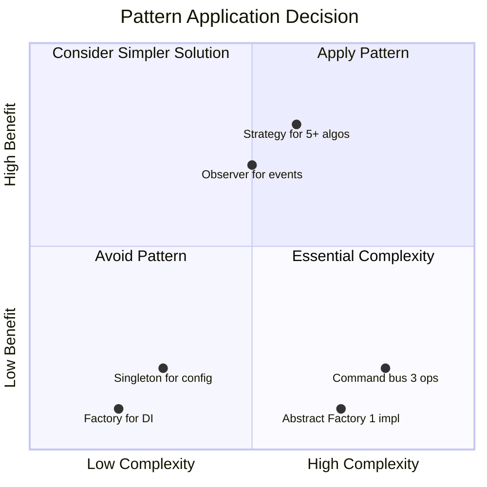
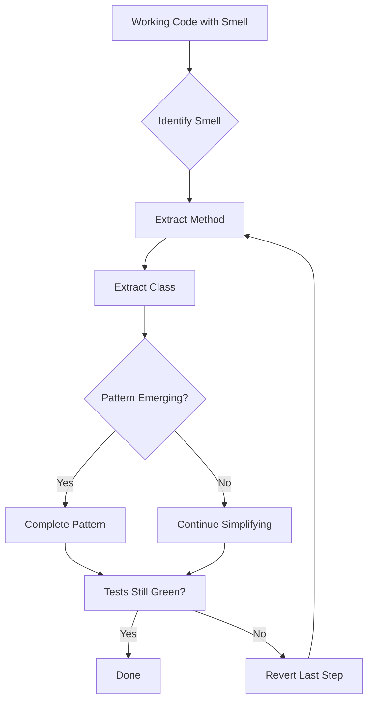
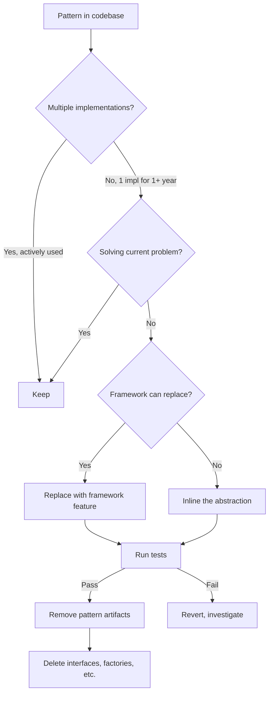
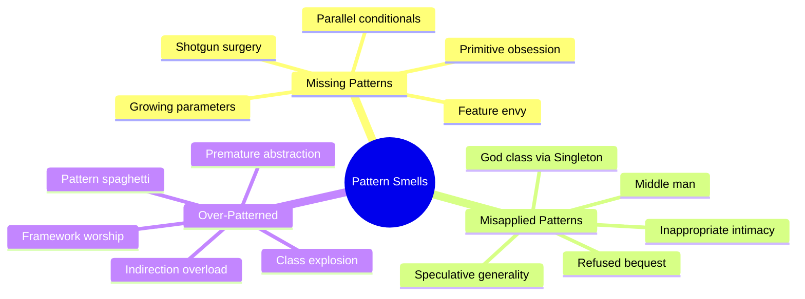

## Keywords in This File
{: .no_toc }

| # | Keyword | Weight |
|---|---|---|
| 1 | [Design Pattern Anti-Patterns and Abuse](#design-pattern-anti-patterns-and-abuse) | very |
| 2 | [Refactoring to Patterns](#refactoring-to-patterns) | high |
| 3 | [Refactoring Away from Patterns](#refactoring-away-from-patterns) | high |
| 4 | [Pattern-Related Code Smells Diagnosis](#pattern-related-code-smells-diagnosis) | high |
| 5 | [Security Patterns and Secure Design Principles](#security-patterns-and-secure-design-principles) | high |

---

# Design Pattern Anti-Patterns and Abuse

**Interview Weight:** very high - Staff/Principal
level. Tests ability to recognize over-engineering,
pattern misuse, and the wisdom to know when patterns
HURT rather than help. This separates senior from
staff engineers.

---

### 🎯 Model Answer

**30 seconds:**

> Pattern abuse means applying patterns where they add
> complexity without solving a real problem. Common
> anti-patterns: Singleton overuse (hidden global state),
> AbstractFactory for one implementation, Strategy with
> one strategy, Observer creating event spaghetti, and
> premature pattern application "just in case." The
> cure: apply patterns to solve EXISTING problems, not
> hypothetical future ones.

**3 minutes (Senior):**

> Five categories of pattern abuse:
>
> 1. PREMATURE PATTERNS: adding Factory, Strategy,
> Observer before complexity justifies them. A service
> with one implementation does not need an interface.
> A method with one algorithm does not need Strategy.
> Wait for the second use case.
>
> 2. PATTERN STACKING: using 5 patterns where 2 suffice.
> Command + Chain + Strategy + Observer + Factory for a
> simple CRUD endpoint. Each pattern adds indirection.
> Five layers of indirection make debugging impossible.
>
> 3. WRONG PATTERN: using Observer when Chain of
> Responsibility is needed. Using Singleton when a
> plain object with DI works. Using Template Method
> when Strategy gives more flexibility.
>
> 4. PATTERN AS CARGO CULT: applying patterns because
> "GoF says so" or "best practice" without understanding
> the problem they solve. Singleton because "we only
> need one" (but DI gives you that). Abstract Factory
> because "we might add implementations" (but YAGNI).
>
> 5. PATTERN HIDING SIMPLICITY: the original 20-line
> function becomes 5 classes, 3 interfaces, and 200
> lines. The code is "patterned" but less readable,
> harder to debug, and slower to modify.
>
> The diagnostic question: "Can I explain what problem
> this pattern solves HERE, not in theory?" If the
> answer is "it might be useful someday" or "it is best
> practice" - remove it.
>
> The non-obvious insight: the MOST experienced
> engineers use FEWER patterns. Juniors over-apply.
> Seniors recognize that simple code that works is
> better than patterned code that is correct but
> incomprehensible. Patterns are tools, not goals.

**Blank Mind Recovery:**

**(1) Restate:** "You are asking about pattern misuse -
when applying design patterns makes code worse, not
better."

**(2) First principles:** "Patterns solve specific
problems. Applied without that problem, they add
complexity without value. The skill is recognizing
when a pattern helps versus when simple code suffices."

**(3) Bridge:** "Pattern abuse is like bringing a
chainsaw to cut a sandwich. The tool is powerful and
appropriate in its context (logging). Applied to the
wrong problem (sandwich), it creates destruction."

---

### 📘 Concept Explanation

**What it is:**

The application of design patterns in contexts where
they add structural complexity without solving a
commensurate design problem. Results in code that is
technically "well-patterned" but practically harder
to understand, modify, and debug.

**The problem it solves:**

Recognizing pattern abuse prevents: over-engineered
codebases, slow development velocity, debugging
nightmares, onboarding friction, and the "I cannot
understand what this code does" problem that plagues
teams.

**How it works:**

```
PATTERN ABUSE SPECTRUM:

Too Simple          Right              Too Complex
|                     |                     |
|  No abstractions    |  Pattern solves     |  5 patterns for
|  Everything inline  |  actual pain point  |  20 lines of logic
|  Duplication OK     |  Clear benefit      |  "Just in case"
|                     |                     |

ANTI-PATTERN RECOGNITION:
[Symptom]          [Likely Abuse]
Can't find logic   -> Too much indirection
Only 1 impl        -> Premature abstraction
20 files for CRUD  -> Pattern stacking
"Might need later" -> YAGNI violation
```



> **Diagram walkthrough:** Patterns should be in the
> top-right quadrant (high complexity solved, high
> benefit). Bottom-left patterns (low complexity, low
> benefit) are better replaced with simple code.
> Bottom-right is the danger zone: high complexity
> added for low benefit. This is pattern abuse.

**The key insight:**

The cost of a pattern is not writing it - it is
READING it. Every future developer must understand
the indirection. If the problem the pattern solves
is not obvious from context, the pattern is a net
negative. Patterns should make code EASIER to
understand, not harder.

**When patterns are appropriate:**

- The problem they solve EXISTS (not hypothetical)
- At least 2 variations/implementations exist
- The indirection makes code CLEARER
- Team consensus that the pattern helps

**When patterns become anti-patterns:**

- Solving problems that do not exist yet (YAGNI)
- One implementation behind an interface
- Unable to explain what problem it solves HERE
- Debugging requires following 5+ layers
- New team members cannot understand the flow

**Common pattern anti-patterns by name:**

- Golden Hammer: using one favorite pattern everywhere
- Speculative Generality: abstractions for hypothetical
  future requirements
- Inner-Platform Effect: building a mini-framework
  within the application
- Accidental Complexity: complexity from the solution,
  not the problem

---

### 💻 Code Example

```java
// BAD: Over-patterned simple feature
// "Send welcome email when user registers"

// Unnecessary interface (one implementation)
public interface EmailSender {
    void send(Email email);
}

// Unnecessary factory (one type of sender)
public class EmailSenderFactory {
    public EmailSender create(String type) {
        return new SmtpEmailSender();
        // Only one case. Factory adds nothing.
    }
}

// Unnecessary command (not queued or undone)
public record SendWelcomeEmailCommand(
    String userId
) implements Command { }

// Unnecessary handler
public class SendWelcomeEmailHandler
    implements CommandHandler<SendWelcomeEmailCommand> {
    @Override
    public void handle(SendWelcomeEmailCommand cmd) {
        // Just delegates to service anyway
        emailService.sendWelcome(cmd.userId());
    }
}

// Unnecessary event (only one listener)
public record UserRegisteredEvent(String userId) { }

// Unnecessary listener
@EventListener
public void onUserRegistered(UserRegisteredEvent e) {
    commandBus.dispatch(
        new SendWelcomeEmailCommand(e.userId())
    );
}

// Result: 7 classes/interfaces for "send email"
// Debugging: follow 5 layers to find the actual send
```

> **Code walkthrough:** Sending a welcome email became
> 7 classes: interface, factory, command, handler,
> event, listener, and the actual sender. The flow:
> register -> publish event -> listener -> dispatch
> command -> handler -> service -> sender. Each layer
> adds indirection without adding value. There is ONE
> email type, ONE sender, ONE listener. Patterns solved
> no real problem here.

```java
// GOOD: Simple code for simple problem
@Service
public class UserRegistrationService {
    private final UserRepository users;
    private final EmailService emails;

    @Transactional
    public User register(RegistrationRequest req) {
        User user = User.create(req);
        users.save(user);
        emails.sendWelcome(user.getEmail());
        return user;
    }
}

// When would patterns become appropriate?
// 1. Multiple email providers -> Strategy
// 2. Email must be async/queued -> Command
// 3. Multiple reactions to registration -> Observer
// 4. Email fails should not fail registration ->
//    @Async or event with separate transaction
```

> **Code walkthrough:** Three lines of actual logic.
> The service handles registration directly. Comments
> show WHEN patterns become justified (multiple
> providers, async requirement, multiple reactions).
> None of those exist yet, so no patterns yet. Add
> them when the need arises - not before.

```java
// PRODUCTION: Right-sized pattern application
// Strategy justified: 3 payment providers exist NOW
public interface PaymentGateway {
    PaymentResult charge(Money amount, Card card);
}

@Service("stripe")
public class StripeGateway implements PaymentGateway {}
@Service("paypal")
public class PayPalGateway implements PaymentGateway {}
@Service("braintree")
public class BraintreeGateway implements PaymentGateway {}

// Observer justified: 5 reactions to payment exist NOW
@EventListener
public void updateInventory(PaymentCompleted e) {}
@EventListener
public void sendReceipt(PaymentCompleted e) {}
@EventListener
public void updateAnalytics(PaymentCompleted e) {}
@EventListener
public void notifyWarehouse(PaymentCompleted e) {}
@EventListener
public void triggerLoyaltyPoints(PaymentCompleted e) {}

// Simple direct call where no pattern needed
@Service
public class TaxService {
    // One calculation method, no variation, no async
    public Money calculateTax(Money amount, Address a) {
        return taxTable.lookup(a.getState())
            .apply(amount);
    }
    // No interface, no factory, no pattern. Just code.
}
```

> **Code walkthrough:** Strategy for PaymentGateway is
> justified (3 implementations exist). Observer for
> PaymentCompleted is justified (5 listeners exist).
> TaxService has no pattern because none is needed -
> one method, one implementation, no variation.
> Pattern application matches actual complexity.

---

### 🎓 Answers by Seniority

**Junior / Mid (0-5 years):**

> Pattern abuse is applying patterns without a real
> problem to solve. Signs: one implementation behind
> an interface, factory for one type, command without
> queuing/undo. The fix: apply patterns when you have
> at least two use cases, not "just in case."

I have learned to start simple and add patterns when
complexity emerges. My rule: if I cannot explain what
problem this pattern solves in THIS code, I remove it.

*Push deeper:* "The hardest anti-pattern to recognize:
premature abstraction. Creating an interface 'because
we might need another implementation' when YAGNI
says we will not."

---

**Senior / Staff (5+ years):**

> The most common pattern abuse I see: teams apply
> enterprise patterns to every service regardless of
> complexity. A microservice with 3 endpoints does
> not need command bus + event sourcing + CQRS. The
> patterns solve problems at scale that the service
> does not have.

My approach: I actively REMOVE unnecessary patterns
during refactoring. If a Factory always returns the
same type, inline it. If an Observer has one listener,
make it a direct call. If a Strategy has one algorithm,
delete the interface. This is not simplification - it
is removing accidental complexity.

*Push deeper:* "The organizational anti-pattern:
architects mandating patterns as standards ('all
services must use Command pattern'). Patterns should
emerge from problems, not be imposed from authority.
Mandated patterns become cargo cult."

---

### ⚖️ Comparison Table

| Signal | Appropriate Pattern | Pattern Abuse |
|---|---|---|
| Multiple implementations exist NOW | Strategy interface | Interface with one impl "just in case" |
| Operations need queuing/undo | Command objects | Command for every service call |
| 5+ reactions to an event | Observer/Events | Event for one listener |
| Complex creation with varying types | Factory | Factory returning always the same type |
| Many fields, validation, immutability | Builder | Builder for 2-field object |

**The deciding factor:** Does the pattern solve a
problem that EXISTS today? If yes: apply. If "might
need later": wait. YAGNI is not laziness - it is
discipline.

---

### ⚠️ Common Misconceptions

**"More patterns equals better code."**

More patterns means more indirection, more files, more
concepts to understand. Better code is the MINIMUM
complexity that solves the problem correctly. Sometimes
that means zero patterns - just clear functions.

**"Removing patterns means technical debt."**

An unnecessary pattern IS technical debt. It costs
reading time, debugging time, and modification time
for every future developer. Removing it is PAYING
DOWN debt, not creating it.

**"Experienced developers always use patterns."**

Experienced developers use patterns SELECTIVELY. They
have seen the cost of over-engineering. They know that
20 lines of clear procedural code is better than 5
classes implementing a pattern that nobody asked for.

---

### 🚨 Failure Modes and Diagnosis

| Failure | Symptom | Diagnosis |
|---|---|---|
| Premature abstraction | Interface with one implementation for 2+ years | Delete interface, use concrete class. Add interface WHEN second impl arrives |
| Pattern stacking | 5+ layers of indirection for simple operation | Flatten. Ask: which layers add value? Remove others |
| Golden hammer | Same pattern in every class regardless of need | Recognize the pattern matches SOME problems, not all |
| Speculative generality | "What if we need..." code paths never used | Delete. YAGNI. Git history preserves it if truly needed later |
| Inner platform | Custom framework within the application | Use the actual framework (Spring, etc.) instead of rebuilding it |

---

### 🎯 Interview Deep-Dive

| Experience | Time | Depth |
|---|---|---|
| Junior | 3 min | Recognize anti-patterns |
| Mid | 5 min | Real examples of abuse |
| Senior | 8 min | When to remove patterns |
| Staff | 12 min | Team governance, architecture review |

---

**[JUNIOR] Q1 - What is the most commonly abused
design pattern?**

*Why they ask:* Pattern critical thinking.

Singleton is the most abused pattern. Teams use it
for: configuration, caches, registries, utilities -
turning them into global state accessed from anywhere.

Why it is abuse:
Hidden dependencies: classes use Singleton.getInstance()
internally. You cannot see from outside what a class
depends on.
Testing nightmare: cannot replace the singleton with a
mock without reflection hacks or PowerMock.
Concurrency bugs: shared mutable state accessed from
multiple threads.
Order-dependent initialization: singleton A depends on
singleton B which depends on C. Initialization order
matters but is implicit.

The fix: use DI. Every "singleton" becomes a regular
bean with singleton scope managed by the container.
Dependencies are explicit (constructor injection).
Testing injects mocks naturally. The container manages
creation order.

*What separates good from great:* The four specific
problems (hidden deps, testing, concurrency,
initialization order) with the DI solution - not just
"Singleton is bad."

---

**[MID] Q2 - How do you recognize when code is
over-patterned?**

*Why they ask:* Engineering judgment.

Symptoms of over-patterning:

Line count: simple feature (send notification, validate
input) spans 10+ files across multiple packages.

Indirection depth: following a method call requires
jumping through 4+ classes before reaching actual
logic.

Name smell: AbstractNotificationFactoryStrategy,
BaseSingletonProxyHandler - names that describe
STRUCTURE rather than BUSINESS DOMAIN.

Ratio: more infrastructure code (interfaces, factories,
registries) than business code (actual logic).

Debugging difficulty: set a breakpoint on the business
logic and the stack trace shows 15 framework/pattern
frames before reaching your code.

My threshold: if a junior developer cannot understand
the flow by reading the code linearly within 5 minutes,
it is probably over-patterned for its actual complexity.

Recovery: identify which patterns solve actual
(not hypothetical) problems. Remove the rest. Inline
single-implementation interfaces. Delete unused
factories. Collapse unnecessary event chains.

*What separates good from great:* The specific
symptoms (line count, depth, names, ratio) with
a concrete threshold (5-minute junior test) rather
than vague "too complex."

---

**[SENIOR] Q3 - When should you refactor a pattern
OUT of code?**

*Why they ask:* Reverse engineering judgment.

Refactor a pattern out when:

The reason it was added no longer exists: "We had 3
payment providers, now we have 1 forever" - remove
the Strategy interface.

Only one implementation has existed for > 1 year:
the hypothetical second implementation never arrived.
The interface adds nothing.

The pattern makes debugging harder than the problem
it solves: event-driven architecture for a simple
sequential flow. Every step is an event hop. Flatten
to direct calls.

The team cannot explain what it solves: if nobody can
articulate the benefit, there is no benefit.

Performance: each indirection layer adds overhead.
In hot paths, unnecessary abstraction layers cost real
latency.

The process: remove the pattern, run tests, deploy. If
nothing breaks and code is clearer - the pattern was
unnecessary. Git preserves the history if you need it
back.

*What separates good from great:* The 1-year rule for
single-implementation interfaces and the confidence to
remove (git preserves history, tests validate).

---

**[SENIOR] Q4 - How do you balance SOLID principles
with over-engineering?**

*Why they ask:* Principle application judgment.

SOLID can be applied excessively:

SRP taken too far: every class has 1 method. 100
classes where 10 would suffice. Finding logic requires
traversing many tiny classes.

OCP taken too far: everything is extensible via
Strategy/Plugin. Even one-off logic is behind an
interface "for future extension."

ISP taken too far: 20 single-method interfaces where
3 cohesive interfaces would be clearer and more
discoverable.

DIP taken too far: every dependency has an interface,
even internal implementation details that will never
change.

My balance:

SRP: responsibility at MODULE level, not class level.
A class can have multiple methods if they serve one
cohesive concept.

OCP: apply at BOUNDARY level. Public API should be
open for extension. Internal implementation can be
closed and simple.

ISP: separate when clients ACTUALLY differ. Not
preemptively.

DIP: invert at ARCHITECTURE boundaries (domain vs
infrastructure). Not between every two classes.

Rule: SOLID applies most strongly at module boundaries
and public APIs. Internal code can be pragmatic.

*What separates good from great:* The "where to apply"
framework (boundaries yes, internals pragmatic) rather
than blanket SOLID application.

---

**[SENIOR] Q5 - Give an example of the wrong pattern
choice and its consequences.**

*Why they ask:* Experience and judgment.

Scenario: team chose Observer pattern for order
processing steps. When order is placed: inventory
event, payment event, shipping event, notification
event, analytics event.

Problem: Observer makes execution ORDER undefined.
But order processing IS sequential: verify inventory
BEFORE charging payment BEFORE shipping. Payment
should not happen if inventory fails.

Consequences:
Race conditions: payment charges before inventory
confirms availability.
Partial processing: payment succeeds but shipping
listener fails. No compensation logic.
Debugging: "why was payment charged before inventory?"
because Observer does not guarantee order.
Error handling: each listener is independent. One
failure does not stop others.

The right pattern: Chain of Responsibility or Saga.
Sequential steps with conditional continuation.
Each step can abort the chain if preconditions fail.
Compensation is explicit.

Lesson: Observer is for INDEPENDENT reactions to an
event. If reactions have ORDER or DEPENDENCIES, use
Chain or Saga.

*What separates good from great:* The specific
consequences (race conditions, partial processing)
with the correct pattern (Chain/Saga) and the
selection criteria (independent = Observer, ordered
= Chain).

---

**[STAFF] Q6 - How do you establish pattern governance
in a team of 50+ engineers?**

*Why they ask:* Organizational leadership.

Governance approach:

Pattern decision records: for each pattern in the
codebase, document: what problem it solves, when to
use it, when NOT to use it, code example of correct
usage. ADR (Architecture Decision Record) format.

Code review checklist: reviewers ask "what problem
does this pattern solve HERE?" If the author cannot
answer concretely, the pattern is removed.

Complexity budget: each feature has a complexity
allowance (measured by: number of files, depth of
call chain, number of new interfaces). Exceeding the
budget requires architectural approval.

Pattern library: approved patterns for common problems.
"For multiple implementations: Strategy. For async
processing: event + listener. For cross-cutting:
AOP." Teams do not invent their own.

Anti-pattern detection: static analysis rules that
detect: interface with single implementation (warn
after 6 months), Factory with one product, unused
Strategy alternatives.

Refactoring sprints: quarterly, teams identify and
remove unnecessary patterns. Measured by: files
deleted, interfaces inlined, reduced call depth.

*What separates good from great:* The quantitative
approach (complexity budget, 6-month single-impl
detection) combined with regular removal sprints
showing active governance, not just initial guidelines.

---

**[STAFF] Q7 - What is the Inner Platform Effect and
how do you recognize it?**

*Why they ask:* Architecture anti-pattern awareness.

Inner Platform Effect: building a mini-framework
within your application that reimplements features
of your actual framework.

Examples:
Custom DI container inside a Spring application.
Custom ORM when Hibernate is available.
Custom event bus when Spring Events exist.
Custom routing engine in a Spring MVC app.
Custom configuration system when Spring profiles work.

Why it happens:
"Not invented here" syndrome.
Developers unaware of framework capabilities.
Desire for "simpler" custom solution that grows complex.
Framework feature discovered after custom code written.

Consequences:
Maintenance of two systems (framework + inner platform).
Onboarding friction (learn framework + custom system).
Bugs in the custom system (framework has years of
battle-testing).
Missing features (custom system reinvents wheel
incompletely).

Recognition signals:
Base classes that mimic framework concepts.
"Util" packages that grow into mini-frameworks.
Custom annotations that duplicate framework behavior.
Documentation that explains "our way of doing X"
when the framework already provides X.

Fix: identify framework features that replace custom
code. Migrate incrementally. Delete custom system.

*What separates good from great:* Concrete examples
of Inner Platform in Spring applications and the
incremental migration approach rather than just naming
the anti-pattern.

---

**[STAFF] Q8 - How do you teach restraint in pattern
application?**

*Why they ask:* Teaching and mentoring.

Teaching restraint:

Before/after comparisons: show the same feature
implemented with 7 patterns (over-engineered) and with
1 pattern or zero (right-sized). Compare: readability,
testability, debugging, modification time.

Pattern cost exercise: for each pattern applied, make
the developer list: classes added, indirection depth,
concepts to understand. Then ask: "Is the problem this
solves worth this cost?"

"When would you add it?" exercise: start with simple
code. Ask: "What CHANGE would justify adding Strategy
here?" The answer must be concrete: "When we have a
second algorithm." Not "in case we need one."

Code review language: instead of "add a pattern here,"
ask "what problem are you solving with this pattern?"
If the answer is vague, the pattern is premature.

Pattern removal code reviews: celebrate PRs that
REMOVE unnecessary patterns. Frame it as paying down
technical debt, not as regression.

The cultural shift: from "patterns are good practice"
to "patterns are tools with cost." The team measures
success by simplicity, not by pattern count.

*What separates good from great:* The specific
teaching exercises (before/after, cost listing, "when
would you add") and the cultural reframe (tools with
cost, celebrate removal).

---

**[STAFF] Q9 - How do you evaluate pattern decisions
in architecture reviews?**

*Why they ask:* Technical leadership practice.

Architecture review checklist for patterns:

Problem identification: "What concrete problem does
each pattern solve?" Not theory - actual, present,
measurable problems.

Alternative analysis: "What is the SIMPLEST approach
that works?" If simple code works: why add a pattern?
Patterns must beat the simple alternative.

Cost-benefit ratio: "Does the benefit (flexibility,
testability, readability) exceed the cost (files,
indirection, learning curve)?" Quantify both sides.

Second implementation test: "Does a second
implementation/use-case exist or is concrete planned
within 3 months?" If not, the abstraction is premature.

Removal plan: "When would you remove this pattern?"
If the answer is "never" - question whether it is
appropriate. All patterns should have conditions under
which they become unnecessary.

Team capability: "Can the team understand and maintain
this?" Pattern complexity must match team experience.
A junior-heavy team with complex pattern interactions
creates maintenance nightmares.

Time-horizon match: "Does the pattern's benefit
timeline match the project's timeline?" Enterprise
patterns for a 3-month prototype waste time. Simple
code for a 5-year platform creates debt.

*What separates good from great:* The removal plan
question and time-horizon matching showing you think
about patterns as temporary tools, not permanent
structures.

---

**[STAFF] Q10 - What is the relationship between
pattern abuse and technical debt?**

*Why they ask:* System-level thinking.

Pattern abuse IS a form of technical debt, but
invisible debt. Traditional debt (hacks, todos, missing
tests) is recognized. Pattern debt looks like "good
code" but costs the same:

Reading cost: every developer spends extra time
understanding unnecessary abstractions. Over a year
with 20 developers: thousands of hours lost.

Modification cost: changing behavior requires
navigating multiple layers. Simple changes become
multi-file modifications through abstraction layers.

Debugging cost: production issues require tracing
through indirection. "Where does this actually
execute?" requires following 5 interface hops.

Onboarding cost: new developers learn the patterns
before they learn the domain. Pattern complexity
obscures business logic.

How to quantify:
Measure: time to implement simple features. If simple
changes take days, investigate whether pattern overhead
is the cause.
Survey: ask developers "what makes this codebase hard
to work with?" Pattern complexity often surfaces.
Track: new developer time-to-first-PR. If it is weeks,
check if unnecessary patterns are the learning barrier.

The paradox: teams with MORE "best practices" and
"clean architecture" often have SLOWER delivery because
every feature must navigate extensive pattern
infrastructure. The fastest teams use the minimum
abstraction that solves actual problems.

*What separates good from great:* Quantification
methods (time-to-implement, developer survey,
onboarding time) and the counterintuitive insight
that "clean" code can be slower to work with than
pragmatic code.

---

# Refactoring to Patterns

**Interview Weight:** high - Staff level. Tests
ability to evolve existing code incrementally toward
pattern-based solutions, recognizing when code has
grown complex enough to justify pattern introduction.

---

### 🎯 Model Answer

**30 seconds:**

> Refactoring to patterns means evolving existing code
> toward a pattern through small, safe steps rather
> than big-bang rewrites. You start with working code,
> identify the design pressure (duplication, rigid
> conditionals, tight coupling), and apply incremental
> refactoring moves until the pattern emerges naturally.
> The key: the PROBLEM drives the pattern, not the
> pattern driving the redesign.

**3 minutes (Senior):**

> The process (Joshua Kerievsky's approach):
>
> 1. IDENTIFY THE SMELL: code duplication, long
> conditionals, type codes with behavior, parallel
> inheritance hierarchies.
>
> 2. IDENTIFY THE TARGET PATTERN: the smell points to
> which pattern resolves it. Conditional complexity ->
> Strategy or State. Creation complexity -> Factory.
> Feature envy -> move method (not always a pattern).
>
> 3. APPLY MECHANICS: named, reversible refactoring
> steps. Each step keeps tests green. No big-bang.
>
> Common refactoring-to-pattern sequences:
>
> Replace Conditional with Strategy:
> - Extract each condition branch into a method.
> - Create Strategy interface with those method sigs.
> - Move each branch method into a Strategy class.
> - Replace conditional with strategy dispatch.
>
> Replace Type Code with State/Strategy:
> - Identify the type field (status, mode, level).
> - Create abstract class for the type.
> - Create subclass per type value.
> - Move type-dependent behavior into subclasses.
>
> Replace Constructor with Factory Method:
> - Identify complex/conditional construction.
> - Create static factory method with descriptive name.
> - Move construction logic into factory.
> - Make constructor private.
>
> The non-obvious insight: you do NOT need to know the
> target pattern at the start. Start refactoring toward
> clarity (extract method, extract class, reduce
> parameters). The pattern EMERGES as the code gets
> cleaner. If you reach a recognizable pattern: great.
> If you reach clean code without a named pattern: also
> great. The goal is clarity, not pattern compliance.

**Blank Mind Recovery:**

**(1) Restate:** "You are asking how to evolve existing
code toward patterns through incremental refactoring."

**(2) First principles:** "Code accumulates complexity.
When specific complexities match what patterns solve,
you can refactor toward that pattern in small, safe
steps while keeping tests green throughout."

**(3) Bridge:** "Refactoring to patterns is like
renovating a house room-by-room while living in it.
You do not demolish and rebuild. You improve one area
at a time, and eventually the house has a coherent
design."

---

### 📘 Concept Explanation

**What it is:**

A disciplined approach to introducing design patterns
into existing code through sequences of small,
behavior-preserving transformations, guided by code
smells that indicate the pattern's applicability.

**The problem it solves:**

Big-bang rewrites are risky (introduce bugs, take
weeks, block features). Refactoring to patterns
introduces structure incrementally while maintaining
a working system at every step.

**How it works:**

```
CODE SMELL --> PATTERN TARGET --> REFACTORING STEPS

Switch on type    -> Strategy    -> Extract method
                                    per branch, create
                                    interface, move to
                                    classes

Duplicate code    -> Template    -> Extract common
with variations      Method        code, parameterize
                                    variation points

Complex creation  -> Factory     -> Extract creation
with conditionals    Method        to static method,
                                    name descriptively

Object state      -> State       -> Create state
changes behavior                    classes, delegate
                                    behavior per state
```



> **Diagram walkthrough:** The process is iterative
> and safe. Start with working code, identify smells,
> apply small extractions. At each step, verify tests
> pass. If a pattern emerges: complete it. If not:
> continue simplifying. If tests break: revert one step.
> Never proceed with broken tests.

**The key insight:**

Refactoring to patterns is DISCOVERY, not APPLICATION.
You discover the pattern by cleaning the code. The
pattern is already there, hidden under complexity.
Refactoring reveals it. This is the opposite of
"let me apply Strategy here" (top-down pattern
application that often leads to abuse).

**When to use this approach:**

- Code smells indicate a specific pattern's problem
- Tests exist (or can be added) for safety
- Incremental improvement is preferred over rewrite
- The team needs to maintain the system during refactoring

**When NOT to use:**

- Greenfield code (design patterns in from the start)
- No tests exist and cannot be added (too risky)
- The code is being replaced entirely
- The "smell" is actually appropriate for the context

**Key refactoring sequences:**

| Smell | Target Pattern | First Move |
|---|---|---|
| Switch on type | Strategy/State | Extract method per branch |
| Duplicated code with variation | Template Method | Extract identical parts |
| Complex object creation | Factory Method | Extract creation method |
| Feature envy | Move to richer domain | Move method to data owner |
| Long parameter list | Parameter Object/Builder | Group related params |

---

### 💻 Code Example

```java
// BAD: Code with pattern potential (not yet refactored)
public class ShippingCalculator {
    public BigDecimal calculate(
        Order order, String shippingType
    ) {
        BigDecimal cost;
        // Growing switch - new type = modify this
        switch (shippingType) {
            case "standard":
                cost = order.getWeight()
                    .multiply(new BigDecimal("0.5"));
                if (order.getTotal()
                    .compareTo(new BigDecimal("100"))
                    > 0) {
                    cost = BigDecimal.ZERO; // free
                }
                break;
            case "express":
                cost = order.getWeight()
                    .multiply(new BigDecimal("1.5"));
                cost = cost.add(new BigDecimal("10"));
                break;
            case "overnight":
                cost = order.getWeight()
                    .multiply(new BigDecimal("3.0"));
                cost = cost.add(new BigDecimal("25"));
                if (order.getItems().size() > 10) {
                    cost = cost.multiply(
                        new BigDecimal("1.2")
                    );
                }
                break;
            default:
                throw new IllegalArgumentException(
                    "Unknown: " + shippingType
                );
        }
        return cost;
    }
}
```

> **Code walkthrough:** Classic switch smell: each case
> has unique calculation logic. Adding "same-day"
> shipping means modifying this method. Testing one
> shipping type requires testing the whole method.
> Business rules are coupled to the switch structure.

```java
// STEP 1: Extract method per branch
public class ShippingCalculator {
    public BigDecimal calculate(
        Order order, String shippingType
    ) {
        return switch (shippingType) {
            case "standard" ->
                calculateStandard(order);
            case "express" ->
                calculateExpress(order);
            case "overnight" ->
                calculateOvernight(order);
            default -> throw new IllegalArgumentException(
                "Unknown: " + shippingType
            );
        };
    }

    private BigDecimal calculateStandard(Order order) {
        BigDecimal cost = order.getWeight()
            .multiply(new BigDecimal("0.5"));
        if (order.getTotal()
            .compareTo(new BigDecimal("100")) > 0) {
            return BigDecimal.ZERO;
        }
        return cost;
    }
    // ... other methods
}
```

> **Code walkthrough:** Step 1 extracts each branch
> into a named method. Tests still pass. Logic is
> unchanged. But now each shipping calculation is
> isolated and named. The pattern (Strategy) is
> starting to emerge - each method could become a class.

```java
// STEP 2: Extract interface + implementations
public interface ShippingStrategy {
    BigDecimal calculate(Order order);
}

public class StandardShipping
    implements ShippingStrategy {
    @Override
    public BigDecimal calculate(Order order) {
        BigDecimal cost = order.getWeight()
            .multiply(new BigDecimal("0.5"));
        if (order.getTotal()
            .compareTo(new BigDecimal("100")) > 0) {
            return BigDecimal.ZERO;
        }
        return cost;
    }
}

public class ExpressShipping
    implements ShippingStrategy {
    @Override
    public BigDecimal calculate(Order order) {
        return order.getWeight()
            .multiply(new BigDecimal("1.5"))
            .add(new BigDecimal("10"));
    }
}

// STEP 3: Replace switch with map dispatch
@Service
public class ShippingCalculator {
    private final Map<String, ShippingStrategy>
        strategies;

    public ShippingCalculator(
        List<ShippingStrategy> strategies
    ) {
        this.strategies = strategies.stream()
            .collect(toMap(
                s -> s.getType(),
                Function.identity()
            ));
    }

    public BigDecimal calculate(
        Order order, String type
    ) {
        ShippingStrategy strategy =
            strategies.get(type);
        if (strategy == null) {
            throw new IllegalArgumentException(
                "Unknown shipping: " + type
            );
        }
        return strategy.calculate(order);
    }
}
```

> **Code walkthrough:** Step 2 creates the Strategy
> interface and moves each method to its own class.
> Step 3 replaces the switch with map-based dispatch.
> Adding "same-day" shipping: create SameDayShipping
> class, annotate with @Service. No existing code
> changes. Each step kept tests green. The pattern
> emerged through extraction, not top-down design.

---

### 🎓 Answers by Seniority

**Junior / Mid (0-5 years):**

> Refactoring to patterns means introducing patterns
> incrementally through small steps. Start with extract
> method, then extract class, then the pattern emerges.
> Each step keeps tests green. The smell guides you
> to the right pattern.

My common refactoring: long switch -> extract methods
per branch -> create Strategy interface -> move to
separate classes. Three steps, tests green throughout.

*Push deeper:* "The key insight: I do not START with
'I want Strategy here.' I start with 'this switch is
growing and hard to test.' The refactoring leads me
to Strategy naturally."

---

**Senior / Staff (5+ years):**

> Refactoring to patterns requires recognizing the
> THRESHOLD: when does code complexity justify pattern
> introduction? Two branches do not need Strategy.
> Five branches with distinct logic do. The refactoring
> is safe because each step is reversible and tests
> verify behavior preservation.

In practice, I plan the refactoring in reverse: "What
would the final code look like with the pattern? What
are the intermediate states? Can I define a step
sequence where each step is independently committable?"
This gives me a roadmap and escape hatches.

*Push deeper:* "At staff level, I teach the team to
recognize refactoring opportunities through code review.
Instead of 'apply Strategy here,' I ask 'what would
this look like if we extracted each case?' This teaches
the discovery process."

---

### ⚖️ Comparison Table

| Approach | Risk | Speed | Learning | Choose When |
|---|---|---|---|---|
| **Refactor to pattern** | Low (incremental, reversible) | Slow (many steps) | High (understand why) | Existing code with tests, want safety |
| Big-bang rewrite | High (all-or-nothing) | Fast if successful | Medium | Code is unsalvageable, good test coverage |
| Pattern from start | None (greenfield) | Fast | Medium | New code, pattern clearly needed |
| Leave as-is | Zero | Zero | Zero | Complexity is acceptable, code works |

**The deciding factor:** Refactor when the code HAS
tests, the smell IS causing problems (not hypothetical),
and incremental improvement is safer than rewrite.

---

### ⚠️ Common Misconceptions

**"Refactoring to patterns requires knowing the target
pattern upfront."**

Start refactoring toward clarity. Extract method,
extract class, reduce duplication. The pattern EMERGES.
If you reach Strategy: great. If you reach clean code
without a named pattern: also great.

**"Each refactoring step must be a named refactoring."**

Named refactorings (Extract Method, Move Class) provide
vocabulary but are not mandatory. The rule is: each
step keeps tests green and moves toward clarity.
Whether it has a name in Fowler's catalog is secondary.

**"You need complete test coverage before refactoring."**

You need tests that cover the BEHAVIOR you are
changing. If refactoring a switch statement, you need
tests for each branch. You do not need 100% overall
coverage. Add targeted tests for the area before
refactoring if they do not exist.

---

### 🚨 Failure Modes and Diagnosis

| Failure | Symptom | Diagnosis |
|---|---|---|
| Refactoring without tests | Bug introduced mid-refactoring, undetected | Add characterization tests before starting |
| Target pattern mismatch | Code gets more complex after refactoring | The smell did not match the pattern. Revert and reconsider |
| Incomplete refactoring | Half-pattern state (some logic in old switch, some in Strategy) | Either complete the pattern or revert entirely |
| Over-refactoring | Simple code becomes pattern-heavy | Stop when the smell is resolved, not when pattern is "complete" |
| Refactoring scope creep | Started fixing one method, redesigned entire module | Time-box refactoring. One smell, one pattern, one PR |

---

### 🎯 Interview Deep-Dive

| Experience | Time | Depth |
|---|---|---|
| Junior | 3 min | Name refactoring steps |
| Mid | 5 min | Walk through a real refactoring |
| Senior | 8 min | Threshold decisions, safety nets |
| Staff | 12 min | Team practices, legacy code strategy |

---

**[MID] Q1 - Walk me through refactoring a conditional
to Strategy pattern step by step.**

*Why they ask:* Practical refactoring skill.

Starting code: method with 4-case switch, each case
30+ lines of distinct calculation logic.

Step 1 - Extract methods: each case becomes a named
private method. The switch calls methods instead of
containing logic. Tests stay green.

Step 2 - Create interface: define an interface with
the method signature. Each extracted method becomes a
candidate implementation.

Step 3 - Create first implementation: move one method
body into a class implementing the interface. Test
that class independently. The switch now calls the
class for that case, methods for others.

Step 4 - Repeat for remaining cases: each case becomes
a class. Switch is now: call the appropriate class.

Step 5 - Replace switch with polymorphic dispatch: use
a Map or DI to select the strategy. The switch
disappears entirely.

Step 6 - Clean up: remove the old private methods
(now in strategy classes). Verify all tests pass.

Each step: commit, run tests, review. If any step
breaks tests: revert that step only. The process is
safe because each step is small and reversible.

*What separates good from great:* The gradual migration
(switch calls class for ONE case while keeping methods
for others) rather than big-bang replacement of all
cases at once.

---

**[SENIOR] Q2 - How do you decide the threshold for
introducing a pattern?**

*Why they ask:* Engineering judgment.

My thresholds:

Strategy: introduce when the conditional has 3+
branches with distinct logic AND new branches are
being added (growth signal). Two branches: leave as
if/else.

State: introduce when state-dependent behavior exists
in 4+ methods AND states have distinct valid
transitions. Simple boolean: leave as conditional.

Factory: introduce when creation logic has 3+ products
or creation is complex (> 10 lines) or repeated in
multiple places.

Observer: introduce when 3+ independent reactions
exist to the same event AND new reactions are added
regularly.

Template Method: introduce when 3+ algorithms share
the same skeleton with different steps AND the skeleton
is duplicated.

The meta-rule: pattern justification requires BOTH:
(1) the problem exists now (not hypothetical), AND
(2) the problem is GROWING (new branches, new cases).
If the code has been stable for a year with 2 cases,
leave it alone.

*What separates good from great:* Quantified thresholds
per pattern AND the dual requirement (exists now +
growing) that prevents premature application.

---

**[SENIOR] Q3 - How do you handle refactoring in code
without tests?**

*Why they ask:* Legacy code reality.

The golden rule: add tests BEFORE refactoring. But in
legacy code without tests, adding tests is itself
difficult because the code is not testable.

Michael Feathers' approach (Working Effectively with
Legacy Code):

1. Identify the change point (where you want to
   refactor).
2. Find an inflection point (where you can observe
   behavior without testing everything).
3. Write characterization tests: tests that document
   CURRENT behavior (even if wrong). They protect
   against unintended changes.
4. Apply safe refactorings: Extract Method is safe
   without tests (does not change behavior if done
   correctly by IDE). Extract Interface is safe.
   Rename is safe.
5. Once extracted: the new code IS testable. Add unit
   tests for extracted methods/classes.
6. Continue refactoring with test safety.

Characterization tests: call the method with known
inputs, assert the ACTUAL output (whatever it is).
This captures current behavior. If refactoring changes
it, the test fails. You decide: was that intentional?

*What separates good from great:* The characterization
test concept (document what IS, not what SHOULD BE)
and the safe refactoring steps that work without tests
(Extract Method via IDE is mechanically safe).

---

**[STAFF] Q4 - How do you plan large-scale refactoring
to patterns across a team?**

*Why they ask:* Technical leadership.

Large-scale refactoring strategy:

Phase 1 - Map: identify all instances of the smell
across the codebase. For example: 15 switch statements
in payment processing that should be Strategy.

Phase 2 - Prove: refactor ONE instance completely.
Measure: time taken, lines of code, test stability.
This proves the approach and gives a template.

Phase 3 - Guide: write a refactoring guide from the
proven example. Include: before/after, step sequence,
common pitfalls, test strategy. Share with team.

Phase 4 - Parallelize: team members each take one
instance. They follow the guide. Code review ensures
consistency. Each instance is one PR.

Phase 5 - Track: dashboard showing: instances
remaining, instances refactored, bugs introduced (should
be zero). Weekly progress visible.

Scope management: never refactor ALL instances. Set
a threshold: "refactor instances in actively-developed
modules." Stable, untouched code can wait. Focus
effort where change is happening anyway.

Integration with feature work: "while you are adding
the new payment type, refactor this switch to Strategy."
Combining refactoring with feature delivery amortizes
the cost and provides test coverage naturally.

*What separates good from great:* The prove-then-
parallelize approach (one instance proves feasibility
before scaling) and combining refactoring with feature
work to amortize cost.

---

**[STAFF] Q5 - How do you refactor toward patterns in
a microservices architecture?**

*Why they ask:* Distributed system refactoring.

Challenges in microservices:
No single codebase to refactor across.
Services may use different languages/frameworks.
API contracts must remain stable during refactoring.
Teams are autonomous - cannot force refactoring.

Approach:

Service-internal refactoring: within one service,
refactor freely (no cross-service impact). Each team
applies patterns to their service independently.

Cross-service pattern introduction: introducing Saga
or CQRS spans services. Requires:
1. Define the target architecture (which services
   participate, how they communicate).
2. Introduce pattern incrementally: Service A publishes
   events (new). Service B still uses sync calls (old).
   Both work simultaneously.
3. Migrate consumers one at a time.
4. Remove old sync paths after all consumers migrate.

Strangler Fig: introduce the pattern in NEW code paths.
Old code uses old approach. New features use new
pattern. Over time, new code replaces old. Eventually
old approach is removed.

Contract testing: Consumer-Driven Contract tests
ensure refactoring does not break API contracts between
services. Pact or Spring Cloud Contract.

*What separates good from great:* The Strangler Fig
approach (new code uses new pattern, old code stays
until replaced) and contract testing as the safety net
for distributed refactoring.

---

# Refactoring Away from Patterns

**Interview Weight:** high - Staff/Principal level.
The inverse of "refactoring to patterns." Tests the
wisdom to recognize when a pattern has outlived its
usefulness and should be removed for simplicity.

---

### 🎯 Model Answer

**30 seconds:**

> Refactoring away from patterns means removing design
> patterns that no longer justify their complexity.
> Patterns introduced for flexibility that was never
> used, patterns whose problem was solved by language
> evolution, or patterns that accumulated as the system
> simplified. The process: inline the abstraction,
> collapse the indirection, verify tests pass.

**3 minutes (Senior):**

> Patterns become removable when:
>
> 1. Single implementation: interface with one class
> for 2+ years. The "flexibility" never materialized.
> Inline the interface - use the concrete class.
>
> 2. Language evolved: Strategy with lambdas makes
> separate strategy classes unnecessary. Visitor with
> sealed types + pattern matching. Observer with
> reactive streams.
>
> 3. Requirements simplified: the system had 5 payment
> providers (Strategy justified). Now it has 1 (Stripe
> only, contract locked). The Strategy interface adds
> indirection with zero flexibility benefit.
>
> 4. Framework absorbed it: custom Factory replaced by
> Spring DI. Custom Observer replaced by Spring Events.
> Custom Singleton replaced by @Scope("singleton").
>
> 5. Over-engineering recognized: pattern added
> "just in case" during initial development. Two years
> later, the case never came. Remove it.
>
> Removal mechanics:
> Interface with one impl -> Inline interface (replace
> all references with concrete class).
> Factory with one product -> Inline creation (use new
> or @Bean directly).
> Strategy with one algorithm -> Inline the logic into
> the calling code.
> Observer with one listener -> Replace with direct
> method call.
> Template Method used once -> Flatten into one class.
>
> The non-obvious insight: removing a pattern requires
> MORE confidence than adding one. Adding is speculative.
> Removing requires proving that the flexibility is
> truly unnecessary. Evidence: git history (was second
> impl ever created?), product roadmap (is another
> impl planned?), team consensus (does anyone need this
> abstraction?).

**Blank Mind Recovery:**

**(1) Restate:** "You are asking about removing patterns
that no longer justify their complexity."

**(2) First principles:** "Patterns trade simplicity
for flexibility. When that flexibility is unused, you
are paying the complexity cost for zero benefit.
Removing restores simplicity."

**(3) Bridge:** "Refactoring away from patterns is
like removing scaffolding after construction. The
scaffolding (pattern) was useful during building
(early development). Once the structure is stable and
requirements are clear, the scaffolding just obscures
the building."

---

### 📘 Concept Explanation

**What it is:**

The disciplined removal of design patterns from code
when they no longer provide sufficient value to justify
their structural complexity, performed through safe,
incremental refactoring steps.

**The problem it solves:**

Codebases accumulate patterns over time. Some were
added prematurely, some solved problems that no longer
exist, some were superseded by framework features.
Each remaining pattern adds: cognitive load, files to
navigate, indirection to trace. Removal restores
simplicity.

**How it works:**

```
REMOVAL DECISION TREE:
Has the pattern had >1 implementation?
  No for 1+ years -> CANDIDATE for removal
  Yes -> Keep (proven value)

Is the pattern solving a CURRENT problem?
  No -> CANDIDATE
  Yes -> Keep

Could a language/framework feature replace it?
  Yes -> CANDIDATE (replace with simpler mechanism)
  No -> Keep

Does the team agree it adds value?
  No one can explain -> REMOVE
  Clear benefit stated -> Keep
```



> **Diagram walkthrough:** Decision tree for pattern
> removal. Multiple implementations means the pattern
> is earning its keep. Single implementation for 1+
> years is a removal candidate. The process is safe:
> inline, test, clean up. Revert if tests fail.

**The key insight:**

Code entropy is bidirectional. Systems get MORE complex
over time (features added, patterns stacked). Active
simplification - removing patterns, inlining
abstractions, collapsing layers - is a form of
maintenance that prevents complexity from growing
unbounded.

**When to remove patterns:**

- Single implementation for 1+ years
- Language/framework now provides the capability
- Problem the pattern solved no longer exists
- Team cannot articulate what problem it solves
- Debugging through the pattern wastes developer time

**When NOT to remove:**

- Multiple implementations actively used
- Second implementation is planned within 3 months
- The pattern provides testability benefits (mock point)
- Removing would couple modules inappropriately

---

### 💻 Code Example

```java
// BEFORE: Strategy with one implementation
// (never had a second provider in 3 years)
public interface NotificationSender {
    void send(Notification n);
}

public class EmailNotificationSender
    implements NotificationSender {
    @Override
    public void send(Notification n) {
        smtp.send(n.getRecipient(), n.getBody());
    }
}

// Factory that always returns the same thing
@Bean
public NotificationSender notificationSender() {
    return new EmailNotificationSender(smtpConfig);
}

// Service uses the interface
@Service
public class AlertService {
    private final NotificationSender sender;
    // ...
}
```

> **Code walkthrough:** NotificationSender interface
> has had ONE implementation for 3 years. The factory
> always returns EmailNotificationSender. The interface
> adds a file, an indirection, and no flexibility.
> Every developer must navigate interface -> impl to
> find the actual code.

```java
// AFTER: Inlined - pattern removed
@Service
public class EmailNotificationSender {
    private final SmtpConfig smtp;

    public void send(Notification n) {
        smtp.send(n.getRecipient(), n.getBody());
    }
}

// Service uses concrete class directly
@Service
public class AlertService {
    private final EmailNotificationSender sender;
    // Direct reference - no interface hop
}

// IF a second provider is ever needed (YAGNI until
// then): re-extract interface at that point.
// Git history preserves the old interface design.
```

> **Code walkthrough:** Interface removed. Factory
> removed. Service injects concrete class directly.
> Code is simpler: one fewer file, one fewer
> indirection, clearer navigation. Testing still works
> (mock the concrete class or use @MockBean). If a
> second notification provider is needed someday:
> re-extract the interface in 5 minutes.

```java
// BEFORE: Observer for one listener
public class OrderService {
    private final ApplicationEventPublisher events;

    public Order placeOrder(OrderRequest req) {
        Order order = createOrder(req);
        events.publishEvent(new OrderPlaced(order));
        return order;
    }
}

// The ONLY listener in 2 years:
@EventListener
public void sendConfirmation(OrderPlaced event) {
    emailService.sendOrderConfirmation(
        event.getOrder()
    );
}

// AFTER: Direct call (one reaction = no Observer)
@Service
public class OrderService {
    private final EmailService emails;

    public Order placeOrder(OrderRequest req) {
        Order order = createOrder(req);
        emails.sendOrderConfirmation(order);
        return order;
    }
}
// Simpler, debuggable, traceable.
// Add Observer back WHEN a second reaction appears.
```

> **Code walkthrough:** Observer pattern for ONE
> listener adds event class, publisher, and invisible
> control flow. Direct call is simpler: you can read
> the flow linearly, set breakpoints, and understand
> what happens after placeOrder. When a second reaction
> is needed: reintroduce Observer then.

---

### 🎓 Answers by Seniority

**Junior / Mid (0-5 years):**

> Refactoring away from patterns means removing patterns
> that add complexity without solving a current problem.
> If an interface has had one implementation for years,
> inline it. If an Observer has one listener, use a
> direct call.

I look for: interfaces with one impl, factories that
return one type, events with one listener. These are
patterns that never earned their complexity.

*Push deeper:* "The safety net: git history preserves
the old design. If the flexibility IS needed later,
re-extract in minutes. The cost of removal is low;
the cost of keeping unnecessary patterns forever is
high."

---

**Senior / Staff (5+ years):**

> Pattern removal is a form of active simplification.
> I schedule it as tech debt reduction: identify
> over-patterned areas, prove they are removable (git
> history shows no second impl), remove in focused PRs.
> The result: fewer files, shallower call stacks,
> faster debugging, faster onboarding.

The hardest removals: patterns that SOME team members
defend philosophically ("but what if we need it?").
Evidence helps: "This interface had one implementation
for 3 years. The git log shows zero attempts to add
another. The product roadmap has no plans for another.
Removing it saves every developer 30 seconds per
debugging session."

*Push deeper:* "At scale, I track 'abstraction debt':
interfaces with single implementations, factories
with one product, unused extension points. Quarterly,
we reduce the count. It is measurable simplification."

---

### ⚖️ Comparison Table

| Removal | When | Risk | Reversibility |
|---|---|---|---|
| Inline interface (1 impl) | No second impl for 1+ years | Very low (tests catch issues) | 5 min to re-extract |
| Remove Factory (1 product) | Factory always returns same type | Low | Trivial to re-add |
| Remove Observer (1 listener) | Only one reaction for 1+ years | Low-medium (may miss future listeners) | Easy to reintroduce |
| Remove Strategy (1 algorithm) | Switched to only one provider | Medium (may need another someday) | 30 min to re-extract |
| Remove Template Method | Only one template user | Low | Merge into single class |

**The deciding factor:** Has the pattern proven its
value through actual use (multiple implementations,
multiple listeners, multiple products)? If yes: keep.
If no: candidate for removal.

---

### ⚠️ Common Misconceptions

**"Removing patterns is going backwards."**

It is going FORWARD toward appropriate complexity.
Appropriate complexity matches actual requirements.
Over-patterned code has inappropriate complexity.
Removal is improvement.

**"We might need the flexibility someday."**

If "someday" has not come in 1-2 years, it likely
never will. And if it does: re-extraction takes
minutes with IDE support. The cost of re-adding is
low; the cost of maintaining unnecessary abstraction
is continuous.

**"Tests depend on the interface (mocking)."**

Modern mocking (Mockito) mocks concrete classes as
easily as interfaces. @MockBean works on classes.
The testing argument for keeping single-impl
interfaces is outdated.

---

### 🚨 Failure Modes and Diagnosis

| Failure | Symptom | Diagnosis |
|---|---|---|
| Removed too soon | Second implementation needed within 3 months | Re-extract interface. Accept the minor cost. Check roadmap before removing |
| Incomplete removal | Interface gone but factory remains, or vice versa | Remove all pattern artifacts in one PR |
| Module coupling after removal | Service A now imports Service B's concrete class directly | Keep the interface if it prevents module coupling |
| Lost testability | Cannot mock without interface | Use Mockito's concrete class mocking or keep the interface at test boundary only |
| Team disagreement | PR rejected because "we might need it" | Use evidence: git history, roadmap, usage analysis |

---

### 🎯 Interview Deep-Dive

| Experience | Time | Depth |
|---|---|---|
| Junior | 3 min | Recognize removable patterns |
| Mid | 5 min | Step-by-step removal process |
| Senior | 8 min | Decision criteria, evidence-based |
| Staff | 12 min | Organizational strategy, metrics |

---

**[SENIOR] Q1 - How do you decide between keeping a
pattern "for future flexibility" versus removing it?**

*Why they ask:* Engineering judgment.

Evidence-based decision:

Check git history: in the last 2 years, was a second
implementation created, attempted, or even discussed
in PRs/issues? If no: flexibility was never needed.

Check product roadmap: is a concrete plan within 6
months that requires the flexibility? Not "might" -
"is actively planned with a ticket."

Cost calculation: how much time does the abstraction
cost per developer per week? (Extra navigation, extra
files, confusion for new team members.) Compare to
re-extraction cost (typically 30-60 minutes).

If: no historical use + no planned use + ongoing cost
> re-extraction cost => REMOVE.

If: planned use within 6 months OR historical use
(second impl was tried) => KEEP.

The tiebreaker: ask 3 team members independently
"what does this interface give us?" If nobody can
articulate the benefit without saying "flexibility"
or "best practice" => REMOVE.

*What separates good from great:* The quantitative
framework (time cost vs re-extraction cost) and the
team consensus test with the "no vague answers" rule.

---

**[SENIOR] Q2 - What patterns are most commonly worth
removing in mature codebases?**

*Why they ask:* Pattern-specific judgment.

In order of removal frequency:

1. Interfaces with single implementation: most common.
Created "because DI needs interfaces" (false in modern
Spring). Remove unless it defines a module boundary.

2. Abstract Factory for one product family: team
planned multiple themes/providers. Only one exists.
Replace with simple @Bean creation.

3. Observer/Event for one listener: event-driven
architecture applied to sequential flows. Replace
with direct call.

4. Builder for simple objects: 2-3 field object with
a Builder class. Use constructor or record instead.

5. Custom Singleton replaced by DI container:
getInstance() pattern when Spring @Service gives
you singleton scope automatically.

6. Template Method with one template user: abstract
class with one concrete subclass. Merge into single
class.

7. Strategy with one algorithm: interface + one impl.
Created for "extensibility" that never arrived.

*What separates good from great:* Prioritized list
from most to least common, with each pattern's typical
origin story explaining how it became unnecessary.

---

**[STAFF] Q3 - How do you implement pattern removal
as an organizational practice?**

*Why they ask:* Technical leadership.

Organizational approach:

Metrics: track "abstraction count" - interfaces with
single implementations, factories with one product,
events with one listener. Publish monthly. Trend
should be decreasing.

Pattern audit sprint: quarterly, dedicate 1-2 days
to removing unnecessary patterns. Each developer takes
5 abstractions and evaluates: keep or remove. Produces
focused cleanup PRs.

Code review criteria: when reviewing new code, ask
"is this pattern earning its keep?" For new interfaces:
"does a second implementation exist or is it planned?"
Block premature patterns at entry.

Feature-adjacent removal: when modifying code near
an unnecessary pattern, remove it as part of the
feature PR. Amortizes cleanup cost.

Celebration: track files deleted, interfaces inlined,
layers removed. Celebrate simplification as achievement,
not just feature addition.

The cultural shift: from "more abstraction = better
engineering" to "appropriate abstraction = better
engineering." Simplicity is a feature.

*What separates good from great:* Metrics-driven
approach (measurable abstraction count trending down)
combined with cultural shift (celebrate removal).

---

**[STAFF] Q4 - How do language evolution signals tell
you when to remove patterns?**

*Why they ask:* Technology evolution awareness.

Language features that signal pattern removal:

Java Records (16+): Builders for immutable data classes
become unnecessary. record Point(int x, int y)
replaces Point.builder().x(1).y(2).build().

Sealed types (17+): Visitor pattern becomes removable.
Pattern matching switch gives exhaustive dispatch
without accept/visit ceremony.

Lambdas (8+): Strategy interfaces with one method
are replaceable with functional interfaces. Comparator
class -> lambda. Predicate class -> lambda.

Pattern matching (21+): instanceof chains and type-
dispatch Visitors are replaceable with switch
expressions.

Virtual threads (21+): Callback-based Observer patterns
for async operations are replaceable with sequential
code on virtual threads.

The migration strategy: do NOT rush to remove patterns
when a language feature appears. Wait until:
1. Team has adopted the new feature (everyone
   understands it).
2. Codebase minimum Java version supports it.
3. The pattern removal actually simplifies (sometimes
   the existing pattern is fine).

*What separates good from great:* The migration
strategy with three conditions before removal, showing
patience and pragmatism rather than rushing to adopt
every new feature.

---

# Pattern-Related Code Smells Diagnosis

**Interview Weight:** high - Senior/Staff level. Tests
the ability to recognize when patterns are being
misused, overused, or absent through observable code
symptoms, and to prescribe the correct remedy.

---

### 🎯 Model Answer

**30 seconds:**

> Pattern-related code smells are observable symptoms
> in code that indicate either missing patterns,
> misapplied patterns, or over-patterned code. Examples:
> duplicated conditional logic (missing Strategy),
> interface with dozens of methods (Interface Segregation
> violation / missing Role Interface), class explosion
> (over-application of inheritance). Diagnosis maps
> smell to root cause to remedy.

**3 minutes (Senior):**

> Three categories of pattern-related smells:
>
> MISSING PATTERN SMELLS (pattern should be introduced):
>
> 1. Parallel switch statements: same conditional
> structure repeated in multiple methods. Missing
> Strategy or State. The branches should be polymorphic.
>
> 2. Long parameter lists growing with each change:
> missing Builder or Parameter Object. Parameters
> represent a concept that should be encapsulated.
>
> 3. Feature envy: method uses more data from another
> class than its own. Missing object that owns both
> the data and the behavior.
>
> 4. Shotgun surgery: one change requires modifying
> many classes. Missing Mediator or Observer.
>
> MISAPPLIED PATTERN SMELLS (pattern used wrong):
>
> 1. Speculative generality: interfaces, factories,
> abstract classes with one implementation. Pattern
> applied "just in case." Inline until needed.
>
> 2. Inappropriate intimacy between pattern classes:
> Strategy knows about Context internal state.
> Violation of pattern contract.
>
> 3. Middle man: class that only delegates to another
> (over-applied Facade or Proxy with zero added logic).
>
> 4. Refused bequest: subclass does not use most of
> parent's methods (Template Method misfit).
>
> OVER-PATTERNED SMELLS (too many patterns):
>
> 1. Indirection overload: 5+ classes involved in
> routing a request (Observer -> Command -> Strategy ->
> Factory -> Adapter). Trace complexity exceeds benefit.
>
> 2. Class explosion: 50+ tiny classes where 10 would
> suffice. Over-decomposition via pattern layering.
>
> 3. Pattern spaghetti: patterns reference each other
> cyclically. Observer notifies Command that triggers
> Strategy that publishes event caught by Observer.

**Blank Mind Recovery:**

**(1) Restate:** "You are asking how to identify code
smells that indicate pattern problems and diagnose the
root cause."

**(2) First principles:** "Code smells are symptoms of
structural problems. Pattern-related smells specifically
indicate where patterns are needed, misused, or
excessive. Mapping smell to remedy is the skill."

**(3) Bridge:** "Pattern smells are like medical
symptoms. A fever (duplicated conditionals) could
indicate multiple diseases (missing Strategy, missing
State). Diagnosis requires checking other symptoms to
identify the right treatment."

---

### 📘 Concept Explanation

**What it is:**

A diagnostic framework for identifying code structural
problems through observable symptoms (smells) and
mapping them to pattern-based remedies or pattern
removals.

**The problem it solves:**

Developers know patterns exist but struggle to
recognize WHEN to apply them. Code smells bridge the
gap: "I see this symptom -> this pattern resolves it."
It also prevents over-patterning by teaching "I see
this symptom -> remove/simplify the pattern."

**How it works:**

```
DIAGNOSTIC FRAMEWORK:
                                   +-- [MISSING]
Observe -> Identify -> Classify ---+-- [MISAPPLIED]
                                   +-- [OVER-PATTERNED]
    |           |           |
  Code      Symptom      Remedy
  reading    pattern      action

SMELL-TO-PATTERN MAP (common cases):
Parallel conditionals -> Strategy/State
Type code + behavior  -> State/Strategy
Complex creation      -> Factory/Builder
Cross-cutting concern -> Observer/Decorator
Request routing       -> Chain of Responsibility
Bulk operations       -> Composite/Iterator
```



> **Diagram walkthrough:** Three diagnostic categories
> with specific smells under each. Missing-pattern
> smells are the most common in growing codebases.
> Misapplied-pattern smells appear in "pattern-aware"
> teams that apply prematurely. Over-patterned smells
> appear in mature, heavily-maintained systems.

**The key insight:**

Code smells are OBJECTIVE. "This interface has one
implementation for 2 years" is a fact, not an opinion.
"These 4 methods all switch on the same enum" is
measurable. Smell-based diagnosis removes pattern
debates ("I think we need Strategy" vs "I do not think
so") and replaces them with evidence.

**When to use this framework:**

- Code reviews (identify smells, suggest remedies)
- Tech debt assessment (quantify pattern problems)
- Refactoring planning (prioritize by smell severity)
- Onboarding (teach pattern recognition through smells)

**When NOT to rely on smells alone:**

- Performance problems (smells indicate structure, not
  performance)
- Business logic errors (smells are about structure)
- Very new code (let patterns emerge; 1 month minimum)

---

### 💻 Code Example

```java
// BAD: Multiple pattern smells in one class
public class ReportGenerator {
    // SMELL: Long parameter list (growing)
    public byte[] generate(
        String type, String format,
        LocalDate start, LocalDate end,
        boolean includeCharts, boolean landscape,
        String watermark, int dpi
    ) {
        // SMELL: Parallel conditionals
        DataSource data;
        if ("sales".equals(type)) {
            data = fetchSalesData(start, end);
        } else if ("inventory".equals(type)) {
            data = fetchInventoryData(start, end);
        } else if ("hr".equals(type)) {
            data = fetchHRData(start, end);
        }

        // SMELL: Same conditional structure repeated
        byte[] output;
        if ("pdf".equals(format)) {
            output = renderPdf(data, landscape,
                watermark, dpi);
        } else if ("excel".equals(format)) {
            output = renderExcel(data, includeCharts);
        } else if ("csv".equals(format)) {
            output = renderCsv(data);
        }
        return output;
    }
}
```

> **Code walkthrough:** Three smells: (1) Long
> parameter list that grows with each new feature.
> (2) Parallel conditionals on "type" repeated for
> data fetching. (3) Parallel conditionals on "format"
> repeated for rendering. Adding a new report type or
> format modifies this class. Smells indicate: missing
> Strategy for data fetching, missing Strategy for
> rendering, missing Parameter Object/Builder for
> configuration.

```java
// GOOD: Each smell resolved with appropriate pattern
// Parameter Object for report config
public record ReportConfig(
    LocalDate start,
    LocalDate end,
    boolean includeCharts,
    boolean landscape,
    String watermark,
    int dpi
) {}

// Strategy for data fetching (resolves type switch)
public interface ReportDataSource {
    String getType();
    DataSet fetch(ReportConfig config);
}

@Component
public class SalesDataSource
    implements ReportDataSource {
    public String getType() { return "sales"; }
    public DataSet fetch(ReportConfig config) {
        return salesRepo.findByDateRange(
            config.start(), config.end()
        );
    }
}

// Strategy for rendering (resolves format switch)
public interface ReportRenderer {
    String getFormat();
    byte[] render(DataSet data, ReportConfig config);
}

@Component
public class PdfRenderer implements ReportRenderer {
    public String getFormat() { return "pdf"; }
    public byte[] render(
        DataSet data, ReportConfig config
    ) {
        return pdfLib.create(data)
            .landscape(config.landscape())
            .watermark(config.watermark())
            .dpi(config.dpi())
            .export();
    }
}

// Coordinator: no conditionals, no long params
@Service
public class ReportGenerator {
    private final Map<String, ReportDataSource>
        sources;
    private final Map<String, ReportRenderer>
        renderers;

    public byte[] generate(
        String type, String format,
        ReportConfig config
    ) {
        DataSet data = sources.get(type).fetch(config);
        return renderers.get(format)
            .render(data, config);
    }
}
```

> **Code walkthrough:** Three smells resolved: (1)
> Parameter Object (ReportConfig record) replaces long
> parameter list. (2) Strategy (ReportDataSource) with
> map dispatch replaces type conditionals. (3) Strategy
> (ReportRenderer) replaces format conditionals. Adding
> a new report type or format: create one class,
> annotate with @Component. No existing code changes.
> Each smell pointed directly to its remedy.

---

### 🎓 Answers by Seniority

**Junior / Mid (0-5 years):**

> Code smells tell me where patterns are needed.
> Parallel switch statements: Strategy. Long parameter
> list: Parameter Object or Builder. Feature envy:
> move method. Middle man: inline the delegation.

In code reviews, I can identify these smells and
suggest the pattern remedy. The smell is objective
evidence - not personal preference.

*Push deeper:* "I use a checklist: (1) Are there
parallel conditionals? (2) Is the parameter list
growing? (3) Does one change touch many files?
Each 'yes' points to a specific pattern."

---

**Senior / Staff (5+ years):**

> Pattern smells exist in three categories: missing,
> misapplied, and over-patterned. The diagnostic skill
> is determining WHICH category: "this code is complex"
> could mean missing pattern (add one) OR over-patterned
> (remove one). The distinguishing factor: is complexity
> from DUPLICATION (add pattern) or INDIRECTION (remove
> pattern)?

I use static analysis tools to quantify smells: method
count per class (potential God Object), interface
implementation count (speculative generality detector),
dependency depth (indirection measure).

*Push deeper:* "At staff level, I build team smell
recognition through pattern reviews: monthly, we review
one module for smells. Everyone identifies independently,
then we compare. This calibrates the team's pattern
judgment."

---

### ⚖️ Comparison Table

| Smell Category | Signal | Remedy Direction | Risk of Ignoring |
|---|---|---|---|
| Missing pattern | Duplication, growing conditionals | ADD pattern | Feature velocity decreases |
| Misapplied pattern | Over-abstraction, dead interfaces | SIMPLIFY/REMOVE | Onboarding cost rises |
| Over-patterned | Indirection layers, class explosion | INLINE/COLLAPSE | Debugging time increases |
| Structural mismatch | Pattern fights the domain | REPLACE with different pattern | Workarounds accumulate |

**The deciding factor:** Is the complexity from
DUPLICATION (smell says add pattern) or from
INDIRECTION (smell says remove pattern)?

---

### ⚠️ Common Misconceptions

**"Code smells always mean something is wrong."**

Some smells are acceptable in context. A long method
that reads like a script (deployment steps) may be
clearer than extracting 10 methods. A God Class that
is actually a Facade for a complex subsystem may be
intentional. Smells are signals, not verdicts.

**"Every smell has exactly one correct remedy."**

Feature envy could indicate: (1) move method to other
class, (2) extract shared interface, (3) introduce
Mediator. Context determines the remedy. The smell
identifies the problem; the solution requires judgment.

**"Static analysis tools can detect all pattern smells."**

Tools detect structural symptoms (method count, class
size, coupling metrics). They cannot detect semantic
issues like "this Strategy's algorithm is identical to
another" or "this Observer chain has a hidden cycle."
Human judgment is irreplaceable for pattern smells.

---

### 🚨 Failure Modes and Diagnosis

| Failure | Symptom | Diagnosis |
|---|---|---|
| Misdiagnosed smell | Applied Strategy but the real issue was missing domain object | Re-examine: is the duplication in conditional logic or in data handling? |
| Ignored smell too long | 10+ conditionals, new ones added every sprint | Track smell metrics over time. Act when growth trend is clear |
| Over-responded to smell | Refactored 2-case conditional to Strategy | Apply threshold rule: 3+ cases with growth before introducing pattern |
| Wrong category | Treated missing-pattern smell as over-patterning | Check: is complexity from duplication (missing) or indirection (over-patterned)? |
| Smell in test code | Applied production patterns to test code | Test code smells have different remedies (Test Data Builder, not Strategy) |

---

### 🎯 Interview Deep-Dive

| Experience | Time | Depth |
|---|---|---|
| Junior | 3 min | Name common smells and pattern remedies |
| Mid | 5 min | Walk through smell identification in real code |
| Senior | 8 min | Distinguish missing vs over-patterned smells |
| Staff | 12 min | Organizational smell tracking and remediation |

---

**[MID] Q1 - What are the top 3 code smells that
indicate a missing Strategy pattern?**

*Why they ask:* Pattern recognition skill.

Smell 1 - Parallel switch/if-else on the same variable
in multiple methods. If `order.getType()` drives
different logic in `calculatePrice()`, `validate()`,
AND `generateReceipt()`, each is a Strategy candidate.
One switch is tolerable. Parallel switches multiply
maintenance cost.

Smell 2 - Method parameter that controls behavior
(boolean or enum that selects an algorithm). When you
see `process(data, mode)` where mode = FAST, THOROUGH,
BATCH - each mode is a strategy hiding in a parameter.

Smell 3 - Growing conditional blocks that increase
with each new feature. If every sprint adds another
`else if` to the same method: the method is a
dispatch point for strategies that should be classes.

Additional signals: (a) testing requires testing all
branches together, (b) one branch's bug fix affects
other branches (coupling within the conditional),
(c) new developers always modify the wrong branch.

*What separates good from great:* The "parallel" signal
(same conditional in multiple methods) versus "single"
switch (which might be acceptable) as the threshold.

---

**[SENIOR] Q2 - How do you distinguish "too few
patterns" from "too many patterns" when code is hard
to understand?**

*Why they ask:* Diagnostic accuracy.

The differentiator: trace the SOURCE of confusion.

Too few patterns (under-structured):
- Confusion from DUPLICATION: "this logic exists in 3
  places; which one is authoritative?"
- Confusion from COUPLING: "changing X breaks Y, Z"
- Confusion from SIZE: "this 500-line method does
  everything"
- Symptom: adding features requires touching many files
  in unpredictable ways.

Too many patterns (over-structured):
- Confusion from INDIRECTION: "to find where this is
  handled, I traverse 5 layers"
- Confusion from NAMING: "what is the difference
  between Handler, Processor, Manager, Service?"
- Confusion from CLASS COUNT: "200 classes for a CRUD
  feature"
- Symptom: understanding flow requires opening 8+ files.

Measurement:
- Under-patterned: count duplicated logic blocks. If
  > 3 duplicates with slight variation: missing pattern.
- Over-patterned: count layers between entry point and
  actual logic. If > 4 layers with single implementations:
  too much indirection.

The meta-test: ask a new team member to add a feature.
Under-patterned: they copy-paste (duplication was the
path of least resistance). Over-patterned: they cannot
find WHERE to add the feature (indirection obscures
the extension point).

*What separates good from great:* The source-of-
confusion diagnostic (DUPLICATION vs INDIRECTION) and
the new-team-member test as objective measure.

---

**[SENIOR] Q3 - Walk me through diagnosing and fixing
"God Class" smell with pattern remedies.**

*Why they ask:* Complex smell decomposition.

Diagnosis steps for a 2000-line OrderService:

Step 1 - Method clustering: group methods by which
fields they access. Methods that share fields form a
cluster. OrderService has: payment methods (4),
shipping methods (3), notification methods (2),
validation methods (5), reporting methods (3).

Step 2 - Identify hidden classes: each cluster is a
class waiting to be extracted. PaymentProcessor,
ShippingCalculator, NotificationService,
OrderValidator, OrderReporter.

Step 3 - Identify patterns in clusters:
- Payment: Strategy pattern (multiple payment modes)
- Shipping: Strategy pattern (shipping types)
- Notification: Observer pattern (multiple channels)
- Validation: Chain of Responsibility (sequential rules)
- Reporting: Template Method (similar reports, different
  details)

Step 4 - Extract incrementally: one cluster per PR.
Start with the one that changes most frequently (highest
churn in git log). Extract to its own class with the
pattern that fits.

Step 5 - OrderService becomes orchestrator: after
extraction, it delegates to specialized services.
2000 lines become 200. Each extracted service is 100-
300 lines with clear responsibility.

*What separates good from great:* The method-clustering
technique (group by shared field access) as an
objective decomposition strategy rather than
intuition-based splitting.

---

**[STAFF] Q4 - How do you implement smell detection
as a team practice?**

*Why they ask:* Technical leadership.

Three-level practice:

Level 1 - Automated: static analysis rules in CI.
SonarQube rules for: method length (> 50 lines),
class size (> 500 lines), coupling (> 10 dependencies),
duplicate blocks (> 10 lines). These catch structural
smells. False positives are acceptable - humans filter.

Level 2 - Code review checklist: reviewers check for
pattern-specific smells. Questions on every PR:
"Does this add a conditional to an existing switch?"
"Does this create an interface with one implementation?"
"Does this add a parameter to an already-long list?"
If yes: flag for pattern discussion.

Level 3 - Monthly smell review: team picks one module,
spends 30 minutes independently identifying smells
(using a standardized smell catalog). Then compare.
Calibrates team judgment. Build shared vocabulary.

Tracking: maintain a "smell log" (spreadsheet or
issue tracker). Each smell: location, category, severity
(how much does it hurt?), remedy (which pattern?),
priority (based on change frequency of that code).
Review quarterly. Close resolved smells. Escalate
growing ones.

*What separates good from great:* The three-level
approach (automated catches easy ones, review catches
contextual ones, audit catches systemic ones) and the
change-frequency priority (fix smells in hot code first).

---

**[STAFF] Q5 - How do you handle the "pattern smell
disagreement" in code reviews?**

*Why they ask:* Conflict resolution.

Common disagreement: reviewer says "this switch needs
Strategy" and author says "two cases is fine."

Resolution framework:

Step 1 - Make it measurable: "How many cases exist
today? How many were added in the last 6 months?
If the growth rate continues, when does it exceed
the threshold?" Remove opinion. Add data.

Step 2 - Apply thresholds: 2 cases with no growth
signal = leave. 3+ cases OR 2 cases with growth signal
= refactor. This is a team-agreed threshold, not
individual preference.

Step 3 - Defer but track: if below threshold, author
wins BUT logs a tech debt item: "Monitor this switch
for growth. Refactor to Strategy if it reaches 3
cases." This prevents both premature patterning AND
ignoring legitimate smells.

Step 4 - Precedent database: maintain team wiki of
past decisions. "In OrderProcessor, we chose NOT to
apply Strategy because..." "In PaymentService, we DID
apply Strategy because..." This builds case law that
resolves future disputes.

The leadership principle: never let pattern discussions
become opinion battles. Always ground in: line count,
case count, change frequency, bug history. Data
resolves disagreements that taste cannot.

*What separates good from great:* The "defer but track"
approach (neither force nor ignore) and the precedent
database that builds team-specific case law.

---

# Security Patterns and Secure Design Principles

**Interview Weight:** high - Senior/Staff level. Tests
understanding of security as a design concern addressed
through patterns, not just tools. Covers authentication
gatekeeping, input validation chains, least privilege,
defense in depth, and secure-by-default architecture.

---

### 🎯 Model Answer

**30 seconds:**

> Security patterns apply the same Gang of Four
> structural thinking to security concerns: Proxy for
> access control, Chain of Responsibility for input
> validation, Strategy for authentication schemes,
> Decorator for audit logging, and Facade for attack
> surface reduction. The principle: security should be
> structural (enforced by design) not behavioral
> (enforced by developer discipline).

**3 minutes (Senior):**

> Core security design principles mapped to patterns:
>
> 1. LEAST PRIVILEGE (Proxy pattern): every access goes
> through a Proxy that verifies authorization before
> delegating. The real service is unreachable without
> passing the Proxy. Spring Security's method-level
> @PreAuthorize is a Proxy implementation.
>
> 2. DEFENSE IN DEPTH (Chain of Responsibility):
> multiple validation/security filters in sequence.
> Each catches different threats. If one fails to catch
> something, the next one does. Spring Security filter
> chain: CORS -> CSRF -> Authentication -> Authorization.
>
> 3. FAIL SECURE (Template Method): define the secure
> default behavior in the abstract class. Subclasses
> can add behavior but cannot bypass the security step.
> The template ensures: authenticate -> authorize ->
> execute -> audit (steps are not skippable).
>
> 4. MINIMIZE ATTACK SURFACE (Facade): expose a minimal
> Facade to external callers. The complex subsystem
> behind it is unreachable except through the controlled
> Facade methods. Each Facade method validates inputs
> before delegating.
>
> 5. SEPARATION OF DUTIES (Strategy): sensitive
> operations require multiple independent approvals.
> Each approval is a Strategy - different validation
> logic, same interface. The operation proceeds only
> when ALL strategies approve.
>
> The non-obvious insight: security patterns work
> because they make insecure code STRUCTURALLY
> impossible rather than relying on developers
> remembering to add security checks. If the Proxy is
> the only path to the service, unauthorized access
> cannot happen through forgetting a check.
>
> Anti-patterns: (1) Security by obscurity (hiding
> rather than protecting). (2) Single gate (one check
> at entry, nothing else). (3) Optional security
> (developer can bypass the pattern).

**Blank Mind Recovery:**

**(1) Restate:** "You are asking about applying
design patterns specifically to security concerns."

**(2) First principles:** "Security must be structural.
Patterns provide structure. Security patterns make
violations impossible through design rather than
relying on human discipline."

**(3) Bridge:** "Security patterns are like building
codes for architecture. A building code does not say
'remember to add fire exits.' It says 'the structure
MUST have exits at these intervals.' Similarly,
security patterns FORCE security through design, not
guidelines."

---

### 📘 Concept Explanation

**What it is:**

The application of established design patterns to
security concerns, creating architectures where
security is enforced structurally (by the design
itself) rather than behaviorally (by developer
discipline).

**The problem it solves:**

Security checks scattered throughout code are
fragile - one missed check creates a vulnerability.
Security patterns create chokepoints, mandatory paths,
and structural guarantees that prevent bypass.

**How it works:**

```
SECURITY PATTERN MAPPING:

Principle         Pattern              Example
-------           -------              -------
Least Privilege   Proxy                @PreAuthorize
Defense in Depth  Chain of Resp.       Filter chain
Fail Secure       Template Method      Secure default
Minimize Surface  Facade               API gateway
Separation Duty   Strategy (multiple)  Multi-approval
Input Validation  Decorator chain      Sanitizer stack
Immutability      Builder + final      Secure config
Audit Trail       Observer             Event logging
```



```mermaid
flowchart LR
    A[External Request] --> B[Facade/Gateway]
    B --> C[Auth Filter]
    C --> D[AuthZ Proxy]
    D --> E[Input Validator]
    E --> F[Rate Limiter]
    F --> G[Service Logic]
    G --> H[Audit Observer]
    
    style B fill:#f96,stroke:#333
    style C fill:#f96,stroke:#333
    style D fill:#f96,stroke:#333
    style E fill:#f96,stroke:#333
    style F fill:#f96,stroke:#333
    style H fill:#69f,stroke:#333
```

> **Diagram walkthrough:** Defense in depth: request
> passes through 5 security layers before reaching
> business logic. Facade limits attack surface. Auth
> filter validates identity. AuthZ Proxy checks
> permissions. Input Validator prevents injection.
> Rate Limiter prevents abuse. Audit Observer logs
> everything. Each layer is a pattern instance.

**The key insight:**

The STRUCTURAL enforcement principle: if the only
path from request to service goes through the security
Proxy, bypassing security requires bypassing the
Proxy itself (which is an infrastructure concern, not
a code concern). This is fundamentally more secure
than hoping every developer remembers to call
`checkPermission()`.

**When to use security patterns:**

- Public-facing APIs (mandatory)
- Multi-tenant systems (isolation requirements)
- Financial/healthcare data (compliance)
- Systems with multiple developer teams (discipline
  cannot be assumed across teams)

**When simpler approaches suffice:**

- Internal-only services with network-level security
- Prototypes and MVPs (but plan for migration)
- Single-user applications (no authorization needed)

---

### 💻 Code Example

```java
// BAD: Security by discipline (developers must
// remember to check permissions everywhere)
@RestController
public class AccountController {
    @GetMapping("/accounts/{id}")
    public Account getAccount(@PathVariable Long id) {
        // Developer MUST remember this check
        // What if they forget in the next endpoint?
        if (!securityContext.hasPermission(
            "account:read", id)) {
            throw new AccessDeniedException("No");
        }
        return accountService.findById(id);
    }

    @PostMapping("/accounts/{id}/transfer")
    public void transfer(
        @PathVariable Long id,
        @RequestBody TransferRequest req
    ) {
        // Forgot the permission check here!
        // SECURITY VULNERABILITY
        accountService.transfer(id, req);
    }
}
```

> **Code walkthrough:** Security by developer
> discipline: each endpoint must manually check
> permissions. The transfer endpoint was forgotten -
> anyone can transfer money. This is the fundamental
> flaw: one missed check = vulnerability. As the
> codebase grows, the probability of missed checks
> approaches certainty.

```java
// GOOD: Security by structure (Proxy pattern)
// Step 1: Service interface
public interface AccountService {
    Account findById(Long id);
    void transfer(Long id, TransferRequest req);
}

// Step 2: Real implementation (no security logic)
@Service("accountServiceImpl")
public class AccountServiceImpl
    implements AccountService {
    @Override
    public Account findById(Long id) {
        return accountRepo.findById(id)
            .orElseThrow();
    }
    @Override
    public void transfer(
        Long id, TransferRequest req
    ) {
        // Pure business logic
        Account from = findById(id);
        Account to = findById(req.targetId());
        from.debit(req.amount());
        to.credit(req.amount());
    }
}

// Step 3: Security Proxy (structural enforcement)
@Service
@Primary
public class SecureAccountService
    implements AccountService {
    private final AccountService delegate;
    private final AuthorizationService authz;

    @Override
    public Account findById(Long id) {
        authz.require("account:read", id);
        return delegate.findById(id);
    }

    @Override
    public void transfer(
        Long id, TransferRequest req
    ) {
        authz.require("account:write", id);
        authz.require("transfer:execute", id);
        auditLog.record("transfer_attempt", id);
        delegate.transfer(id, req);
        auditLog.record("transfer_success", id);
    }
}

// Step 4: Controller injects the Proxy (cannot skip)
@RestController
public class AccountController {
    // Injects SecureAccountService (@Primary)
    private final AccountService accountService;

    @GetMapping("/accounts/{id}")
    public Account getAccount(@PathVariable Long id) {
        // Security is STRUCTURAL - no way to bypass
        return accountService.findById(id);
    }

    @PostMapping("/accounts/{id}/transfer")
    public void transfer(
        @PathVariable Long id,
        @RequestBody TransferRequest req
    ) {
        // Security enforced by Proxy structure
        accountService.transfer(id, req);
    }
}
```

> **Code walkthrough:** Proxy pattern for security.
> The controller CANNOT reach the real service. It
> injects the Proxy (@Primary), which checks
> permissions before delegating. Adding new endpoints
> does not require remembering security checks - the
> Proxy handles them. The vulnerability from the BAD
> example is structurally impossible: every call goes
> through the secure Proxy.

```java
// Defense in Depth: Chain of Responsibility
// for input validation
public interface ValidationFilter {
    void validate(Request req)
        throws SecurityException;
}

@Component @Order(1)
public class SqlInjectionFilter
    implements ValidationFilter {
    public void validate(Request req) {
        for (String param : req.getParams()) {
            if (SQL_PATTERN.matcher(param).find()) {
                throw new SecurityException(
                    "SQL injection detected"
                );
            }
        }
    }
}

@Component @Order(2)
public class XssFilter
    implements ValidationFilter {
    public void validate(Request req) {
        for (String param : req.getParams()) {
            if (XSS_PATTERN.matcher(param).find()) {
                throw new SecurityException(
                    "XSS attempt detected"
                );
            }
        }
    }
}

@Component @Order(3)
public class SizeFilter
    implements ValidationFilter {
    public void validate(Request req) {
        if (req.getBody().length > MAX_SIZE) {
            throw new SecurityException(
                "Payload too large"
            );
        }
    }
}

// Chain executor
@Service
public class ValidationChain {
    private final List<ValidationFilter> filters;

    public void validateRequest(Request req) {
        for (ValidationFilter filter : filters) {
            filter.validate(req); // throws on failure
        }
    }
}
```

> **Code walkthrough:** Chain of Responsibility for
> defense in depth. Each filter checks one attack type.
> Adding a new filter: create a class with @Component
> and @Order. No existing code changes. If SQL
> injection filter misses a variant, XSS filter or
> size filter may still catch the payload. Layers
> reduce single-point-of-failure risk.

---

### 🎓 Answers by Seniority

**Junior / Mid (0-5 years):**

> Security patterns enforce security through structure
> rather than developer discipline. Proxy enforces
> authorization: the only path to the service goes
> through the permission check. Chain of Responsibility
> layers defenses: SQL injection filter + XSS filter +
> size filter, each independent.

I prefer structural security because it eliminates
"forgot to add check" vulnerabilities. If the Proxy
is the only way in, security cannot be bypassed by
accident.

*Push deeper:* "The test: can a developer accidentally
create an endpoint that bypasses security? With
scattered checks: yes. With Proxy structure: no."

---

**Senior / Staff (5+ years):**

> I architect security as structural constraints:
> (1) No service is directly injectable - only its
> security Proxy is @Primary. (2) Validation is a
> filter chain - new threats get new filters without
> modifying existing ones. (3) Audit is an Observer -
> adding audit to new operations requires zero code
> changes in the operation itself.

The governance model: security patterns are defined
by the platform team. Application developers cannot
bypass them because the patterns are structural, not
opt-in. The most dangerous anti-pattern: security as
a library (call if you want to) vs security as
infrastructure (enforced by the container).

*Push deeper:* "At scale, I implement 'security
boundaries' between modules. Each boundary has a
Proxy layer. Cross-module calls MUST go through the
boundary. This prevents lateral movement after
compromise."

---

### ⚖️ Comparison Table

| Security Approach | Bypass Risk | Development Speed | Maintenance | Choose When |
|---|---|---|---|---|
| Scattered checks (manual) | High (one miss = vuln) | Fast initially | Grows with endpoints | Never in production |
| **Proxy pattern** | Very low (structural) | Medium | Centralized | Service-level authorization |
| **Filter chain** | Low (defense in depth) | Medium | Add filters, no change | Input validation, threat detection |
| Framework annotations | Low (AOP-based) | Fast | Framework handles | Standard RBAC requirements |
| API Gateway only | Medium (internal bypass possible) | Fast | External only | When internal trust is acceptable |

**The deciding factor:** Structural patterns (Proxy,
Chain) when internal developers could accidentally
bypass security. Framework annotations when RBAC is
standard. Gateway-only when internal services are
fully trusted.

---

### ⚠️ Common Misconceptions

**"Security patterns slow down development."**

The Proxy and Chain patterns ADD structure at the
boundary. Application code (inside the boundary)
becomes SIMPLER because it does not contain security
logic. Net development speed often increases because
developers do not think about security per endpoint.

**"Spring Security already handles everything."**

Spring Security implements these patterns (filter
chain, method-level proxy). Understanding the
underlying patterns is essential for: customization,
debugging security failures, designing for non-Spring
components, understanding what the framework cannot
protect (business logic authorization).

**"Input validation is not a design pattern concern."**

Chain of Responsibility for validation is one of the
most impactful security patterns. Parameterized
queries prevent SQL injection, but defense in depth
(validate at boundary + parameterize at persistence)
prevents vulnerabilities from novel attack vectors.

---

### 🚨 Failure Modes and Diagnosis

| Failure | Symptom | Diagnosis |
|---|---|---|
| Proxy bypass | Developers inject impl directly (not @Primary proxy) | Enforce: make impl package-private or use DI config to prevent direct injection |
| Incomplete chain | New attack vector not covered by any filter | Regular security audit of filter coverage + penetration testing |
| Over-permissive Proxy | Proxy checks role but not resource ownership | Add resource-level checks: user X can access account Y? |
| Audit gaps | Some operations not logged | Observer pattern on service interface guarantees all calls are audited |
| Performance degradation | Chain has too many filters for high-throughput endpoints | Profile filter chain. Move expensive checks later (fail-fast with cheap checks first) |

---

### 🎯 Interview Deep-Dive

| Experience | Time | Depth |
|---|---|---|
| Junior | 3 min | Name security patterns and what they protect |
| Mid | 5 min | Implement Proxy-based security |
| Senior | 8 min | Architect defense-in-depth layers |
| Staff | 12 min | Organization-wide security architecture |

---

**[MID] Q1 - How does the Proxy pattern prevent
authorization bypass?**

*Why they ask:* Structural security understanding.

The mechanism:

1. Service interface defines the contract (what
   operations exist).
2. Real implementation contains only business logic
   (no security checks).
3. Security Proxy implements the same interface,
   checks permissions, then delegates to the real impl.
4. DI container is configured so that ALL consumers
   receive the Proxy (@Primary, or only the Proxy is
   exposed as a Bean).
5. The real impl is either package-private, inner class,
   or not directly injectable.

Why bypass is impossible:
- Controller injects AccountService interface
- DI gives it SecureAccountService (the Proxy)
- Real AccountServiceImpl is not directly injectable
- No code path exists from controller to real impl
  without passing through the Proxy
- Adding new endpoints: same Proxy, same protection

The structural guarantee: the only way to bypass is to
modify the DI configuration itself, which is:
(a) reviewed in PRs, (b) visible in config,
(c) detectable by security audit tools.

Compare to scattered checks: any developer can forget
to add `checkPermission()`. The bypass is invisible -
nothing signals that a check is missing.

*What separates good from great:* The DI enforcement
mechanism (real impl not directly injectable) and the
comparison of "visible structural guarantee" vs
"invisible missing check."

---

**[SENIOR] Q2 - Design a defense-in-depth architecture
for a payment processing system.**

*Why they ask:* Real-world security architecture.

Five defense layers:

Layer 1 - API Gateway (Facade): rate limiting, IP
allowlisting, TLS termination, request size limits.
Blocks volumetric attacks before they reach services.

Layer 2 - Authentication Filter (Chain): validate JWT
signature, check token expiry, verify issuer, extract
claims. Rejects unauthenticated requests.

Layer 3 - Authorization Proxy: method-level checks.
`transferFunds` requires: (a) "transfer" permission,
(b) ownership of source account, (c) transfer amount
within user's daily limit. All three must pass.

Layer 4 - Input Validation Chain: (a) schema validation
(JSON structure), (b) business validation (amount > 0,
currency valid), (c) security validation (no script
injection in memo field), (d) cross-field validation
(source != target account).

Layer 5 - Execution Safeguards: (a) idempotency key
prevents double-processing, (b) transaction isolation
prevents race conditions, (c) post-execution audit
event (Observer) for compliance logging.

Pattern composition:
- Facade (Layer 1) + Chain (Layers 2, 4) + Proxy
  (Layer 3) + Observer (Layer 5)
- Each layer is independently testable
- Failure in any layer blocks the operation
- No single point of failure (attacker must bypass ALL
  layers)

Additional: fraud detection as a parallel Observer
chain. After execution, events are analyzed
asynchronously. Suspicious patterns trigger alerts
without blocking legitimate operations.

*What separates good from great:* The five-layer
composition with pattern identification per layer,
plus the async fraud detection that does not block
operations but catches patterns.

---

**[SENIOR] Q3 - How do you handle security for
multi-tenant systems using design patterns?**

*Why they ask:* Complex authorization requirements.

Multi-tenancy patterns:

Tenant Isolation Proxy: every data access goes through
a Proxy that adds tenant filter. The service layer
CANNOT see other tenants' data because the Proxy
prepends `WHERE tenant_id = ?` to every query (or
configures the ORM filter).

```java
// Structural isolation via Proxy
@Service @Primary
public class TenantAwareOrderRepo
    implements OrderRepository {
    private final OrderRepository real;
    private final TenantContext ctx;

    public List<Order> findAll() {
        return real.findByTenantId(
            ctx.getCurrentTenantId()
        );
    }
}
```

Tenant Context (ThreadLocal/Strategy): current tenant
propagated through the call chain. All security
patterns use it without explicit passing.

Cross-tenant operation (rare, admin): requires a
different security path with elevated permissions
and mandatory audit. Template Method ensures:
verify-admin -> log-reason -> execute -> audit.

Testing strategy: create test with Tenant A context,
verify Tenant B data is inaccessible. This tests the
Proxy structurally, not individual queries.

*What separates good from great:* The Proxy-at-
repository-level approach (impossible to query without
tenant filter) rather than tenant checks at the
service level (forgettable).

---

**[STAFF] Q4 - How do you architect "secure by default"
using patterns at organization scale?**

*Why they ask:* Platform security architecture.

Secure-by-default platform:

1. Starter/archetype: project template includes
   security patterns pre-wired. New services START
   with: Proxy layer, filter chain, audit Observer.
   Developers opt-out (visible, reviewed) not opt-in
   (invisible, missable).

2. Shared security libraries: SecurityProxy base class,
   ValidationChain orchestrator, AuditObserver. Teams
   implement their specific checks, the structure is
   enforced by the library.

3. Service mesh for network-level: mTLS between
   services (Proxy at network layer), traffic policies
   (Chain at mesh layer). Application code does not
   implement these - infrastructure enforces them.

4. Security scanning in CI: static analysis detects
   pattern bypasses. Rules: "No direct injection of
   *Impl classes outside their module." "All @Service
   classes must have corresponding security tests."

5. Blast radius containment: services communicate
   through Facades with minimal interfaces. If one
   service is compromised, the Facade limits what the
   attacker can reach (attack surface minimization at
   service boundary).

Cultural enforcement: security patterns are in the
"platform contract." Teams can choose their domain
patterns freely (Strategy, Observer, etc.) but MUST
use the security patterns as defined. This is non-
negotiable architecture.

*What separates good from great:* The "opt-out not
opt-in" principle (security is default, removal
requires justification and review) and the layered
enforcement (library + CI + mesh + culture).

---

**[STAFF] Q5 - How do you handle the tension between
security patterns and performance?**

*Why they ask:* Real-world trade-offs.

Tension points and resolutions:

1. Proxy overhead: each service call goes through
   security Proxy. Resolution: cache authorization
   decisions. First call: full check (20ms). Subsequent
   calls within TTL: cached result (0.1ms). Invalidate
   on permission change event (Observer).

2. Chain length: 8-filter validation chain adds
   latency. Resolution: order filters cheapest-first.
   Size check (0.01ms) before regex scan (5ms) before
   external API call (50ms). Fail-fast on cheap checks.

3. Audit Observer overhead: logging every operation.
   Resolution: async Observer. Audit events published
   to queue, consumed asynchronously. Zero latency
   impact on the operation itself.

4. Encryption Decorator: encrypting/decrypting
   sensitive fields. Resolution: encrypt at-rest only.
   Use field-level encryption with hardware-accelerated
   AES. Decrypt on read, encrypt on write. Cache
   decrypted values in memory (with expiry).

5. Rate limiting: per-user rate check on every request.
   Resolution: sliding window in Redis (O(1)). Token
   bucket algorithm with pre-computed tokens. Minimal
   latency (1ms for Redis lookup).

The meta-principle: security patterns establish the
STRUCTURE. Performance optimizations happen WITHIN
the structure (caching, async, ordering). Never
sacrifice the structural guarantee for performance.
A fast insecure system is worthless.

*What separates good from great:* The "optimize within
the structure, never remove the structure" principle
and specific techniques per pattern (cache for Proxy,
ordering for Chain, async for Observer).
