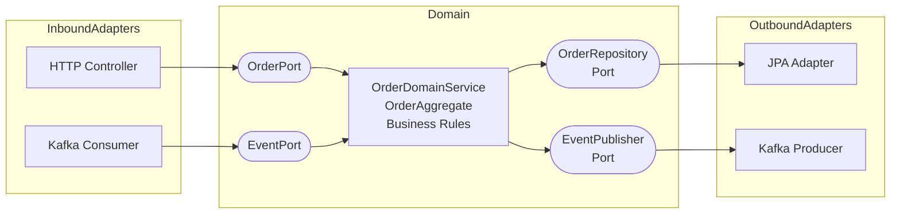

## Keywords in This File
{: .no_toc }

| # | Keyword | Weight |
|---|---|---|
| 1 | [Architectural Patterns and Design Pattern Migration](#architectural-patterns-and-design-pattern-migration) | medium |

---

# Architectural Patterns and Design Pattern Migration

---
id: DP-031
title: Architectural Patterns and Design Pattern Migration
category: Design Patterns
difficulty: ★★★
interview_weight: high
asked_at: Staff/Principal
seniority: staff
tags: #design-patterns, #architecture, #cqrs, #event-sourcing, #saga, #hexagonal, #migration
status: draft
version: 1
---

### 🎯 Model Answer

**30 seconds:**
> Architectural patterns are design patterns applied at the system level:
> they govern how subsystems and services are organized, communicate, and
> evolve. Key architectural patterns that combine GoF patterns: Hexagonal
> (Ports and Adapters) uses DIP at the architecture level. CQRS uses
> Command and Query separation at the service level. Event Sourcing uses
> Observer + Command for state management. Saga uses Command + Mediator
> for distributed transactions. Understanding how GoF patterns compose
> into architectures is Staff-level differentiation.

**3 minutes (Senior):**
> The synthesis: GoF patterns are the bricks; architectural patterns are
> the buildings. Hexagonal architecture is DIP applied at the macro level:
> the domain (core) depends on ports (abstractions), and adapters implement
> ports. The domain is isolated from infrastructure. CQRS splits write
> operations (Commands) from read operations (Queries). The Command side
> applies the Command GoF pattern: each write is a command object with
> full encapsulation and auditability. The Query side uses the Repository
> pattern for optimized reads (separate read models, denormalized, cached).
>
> Saga is the distributed transaction pattern. Each step in a distributed
> workflow is a Command. If a step fails, compensating Commands are issued
> (undo the previous steps). The Saga Orchestrator is a Mediator: it knows
> the sequence, knows the compensation, and coordinates without peer
> objects knowing each other.
>
> Design pattern migration: moving from a tangled monolith to a patterned
> architecture is done incrementally. The Strangler Fig: gradually replace
> the monolith's functionality with properly patterned code. The Facade:
> hide the monolith behind a clean interface, then gradually replace the
> monolith's internals.

**Blank Mind Recovery:**

**(1) Restate:** "Architectural patterns - GoF patterns applied at the
system level. Hexagonal = DIP at scale. CQRS = Command separation.
Saga = Mediator for distributed workflows."

**(2) First principles:** "A system with good architecture has the same
properties as a class with good design: one responsibility, open for
extension, dependencies on abstractions. Scale the class-level rules
to the system level."

**(3) Bridge:** "Like city planning: individual buildings (classes) follow
building codes (SOLID). The city layout (architecture) decides how roads
(data flows), districts (bounded contexts), and utilities (shared services)
are organized. The same principles at different scales."

---

### 📘 Concept Explanation

**Hexagonal Architecture (Ports and Adapters):**

```
External System (HTTP, DB, Queue)
         |
    [Adapter]          <- implements Port, translates protocol
         |
    [Port/Interface]   <- defined by the Domain
         |
    [Domain Core]      <- pure business logic, no framework
         |
    [Port/Interface]   <- defined by the Domain (outbound)
         |
    [Adapter]          <- implements outbound Port (DB, Email)
         |
External System (Database, Email, Cache)
```

> **Code walkthrough:** This Architectural Patterns and Design Pattern Migration example demonstrates a key concept in practice. **KEY MECHANISM:** the runtime executes these instructions in sequence with specific memory and execution semantics. **WHY IT MATTERS:** misapplying this pattern causes subtle bugs that only manifest under production load. **TAKEAWAY: understand the execution model before using this pattern in production code.**

The domain defines what it needs (ports). Adapters fulfill those needs.
The domain is testable without any external system (inject test adapters).

**CQRS (Command Query Responsibility Segregation):**

```
Write side (Commands):
  Request -> CommandHandler -> Validate -> Mutate State -> Event
  - Uses Command pattern: each mutation is a command object
  - Auditable: every command is logged
  - Complex validation logic

Read side (Queries):
  Request -> QueryHandler -> ReadModel -> Response
  - Optimized for reads: denormalized, pre-joined
  - Separate from write model (different tables/DB in full CQRS)
  - Cached aggressively

Communication: Write side publishes Events;
Read side subscribes and updates ReadModel.
(Observer pattern between Command and Query sides)
```

> **Code walkthrough:** This Architectural Patterns and Design Pattern Migration example demonstrates a key concept in practice using SQL. **KEY MECHANISM:** the runtime executes these instructions in sequence with specific memory and execution semantics. **WHY IT MATTERS:** misapplying this pattern causes subtle bugs that only manifest under production load. **TAKEAWAY: understand the execution model before using this pattern in production code.**

**Event Sourcing:**

```
Traditional:
  State is the current snapshot (UPDATE users SET name = 'X')

Event Sourcing:
  State is computed from event history:
  [UserCreated, NameChanged, EmailChanged] -> current User state
  - Every change is stored as an event (append-only)
  - State is rebuilt by replaying events
  - Audit trail is free (events = history)
  - Time travel: replay to any past state
  - Patterns: Command (each change is a command that emits an event)
    Observer (projections update on new events)
    Memento (snapshots for performance)
```

> **Code walkthrough:** This Architectural Patterns and Design Pattern Migration example demonstrates a key concept in practice using SQL. **KEY MECHANISM:** the runtime executes these instructions in sequence with specific memory and execution semantics. **WHY IT MATTERS:** misapplying this pattern causes subtle bugs that only manifest under production load. **TAKEAWAY: understand the execution model before using this pattern in production code.**

**Saga Pattern (Distributed Transactions):**

```
Problem: A workflow spans multiple services.
  Step 1: Reserve inventory (Inventory Service)
  Step 2: Charge payment (Payment Service)
  Step 3: Create shipment (Shipping Service)
  If Step 3 fails: must undo Step 1 and Step 2.

Choreography Saga:
  Each service publishes events; next service listens.
  No central coordinator.
  Failure: compensation events triggered by failure.
  Problem: implicit flow, hard to debug.

Orchestration Saga:
  A SagaOrchestrator (Mediator) knows the sequence.
  Calls each service step by step.
  On failure: calls compensation actions in reverse order.
  Benefit: flow is explicit and visible in one place.
```

> **Code walkthrough:** This Architectural Patterns and Design Pattern Migration example demonstrates a key concept in practice. **KEY MECHANISM:** the runtime executes these instructions in sequence with specific memory and execution semantics. **WHY IT MATTERS:** misapplying this pattern causes subtle bugs that only manifest under production load. **TAKEAWAY: understand the execution model before using this pattern in production code.**

**Migration strategies:**

- **Strangler Fig**: route a small slice of traffic to new implementation.
  Gradually increase. Old system shrinks; new grows. Zero downtime.
- **Branch by Abstraction**: introduce an abstraction (interface/facade)
  over the old code. Implement both old and new behind the abstraction.
  Switch. Remove old. Zero downtime.
- **Event Interception**: for pattern introduction in monolith. Publish
  events from existing code; new pattern subscribers handle them. Gradual
  migration from synchronous calls to event-driven.

---

### 💻 Code Example

```java
// HEXAGONAL ARCHITECTURE: Domain defines its own port

// Domain layer: pure business logic, no Spring imports
public class OrderDomainService {
    private final OrderRepository orderRepo;  // Port
    private final InventoryPort inventory;    // Port

    // No Spring annotations. Framework-independent.
    public OrderDomainService(
            OrderRepository orderRepo,
            InventoryPort inventory) {
        this.orderRepo = orderRepo;
        this.inventory = inventory;
    }

    public Order placeOrder(PlaceOrderCommand cmd) {
        inventory.reserveItems(cmd.getItems()); // via port
        Order order = Order.create(cmd);
        orderRepo.save(order);                  // via port
        return order;
    }
}

// Port (interface defined in domain):
public interface OrderRepository {
    void save(Order order);
    Optional<Order> findById(OrderId id);
}

// Adapter (Spring-specific, implements Port):
@Repository
public class JpaOrderRepository
        implements OrderRepository {  // implements domain port
    private final SpringDataOrderRepository jpaRepo;

    public void save(Order order) {
        jpaRepo.save(OrderEntity.from(order));
    }
    public Optional<Order> findById(OrderId id) {
        return jpaRepo.findById(id.getValue())
            .map(OrderEntity::toDomain);
    }
}
// Domain knows nothing about Spring or JPA.
// Test: inject InMemoryOrderRepository (no Spring needed).
```

> **Code walkthrough:** `OrderDomainService` has no Spring imports.
> It is a pure Java class with two constructor-injected ports.
> `JpaOrderRepository` is the adapter: it implements the domain's port
> using Spring Data JPA. The domain-to-entity mapping (`OrderEntity.from(Order)`,
> `OrderEntity.toDomain()`) is in the adapter layer. Tests for the domain
> service: inject `InMemoryOrderRepository` and a mock inventory port.
> No application context, no database, sub-millisecond tests.

```java
// CQRS: Separating Command and Query handlers

// COMMAND SIDE: OrderPlacementCommand
public record PlaceOrderCommand(
    String userId,
    List<OrderItem> items,
    String deliveryAddress) {}

@Service
public class PlaceOrderCommandHandler {
    private final OrderRepository orderRepo;
    private final InventoryService inventory;
    private final EventPublisher events;

    @Transactional
    public OrderId handle(PlaceOrderCommand cmd) {
        // Validate
        inventory.validateStock(cmd.getItems());

        // Create domain object
        Order order = Order.create(
            cmd.getUserId(), cmd.getItems(),
            cmd.getDeliveryAddress());

        // Persist
        orderRepo.save(order);

        // Publish event (Query side will update read model)
        events.publish(new OrderPlacedEvent(
            order.getId(), order.getUserId(),
            order.getItems()));

        return order.getId();
    }
}

// QUERY SIDE: Separate read model, optimized for reads
// Read model: denormalized, pre-joined, cached
public record OrderSummary(
    String orderId,
    String userId,
    String userEmail,  // denormalized from User
    List<OrderItemSummary> items,
    BigDecimal totalPrice,
    String status,
    LocalDateTime placedAt) {}

@Service
public class GetOrderQueryHandler {
    private final OrderReadRepository readRepo;

    public OrderSummary handle(GetOrderQuery query) {
        return readRepo.findById(query.getOrderId())
            .orElseThrow(OrderNotFoundException::new);
    }
}

// Read model updater (Observer on OrderPlacedEvent)
@EventListener
@Service
public class OrderReadModelUpdater {
    private final OrderReadRepository readRepo;
    private final UserRepository userRepo; // for denormalization

    @TransactionalEventListener(
        phase = TransactionPhase.AFTER_COMMIT)
    public void on(OrderPlacedEvent event) {
        User user = userRepo.findById(event.getUserId());
        OrderSummary summary = buildSummary(event, user);
        readRepo.save(summary);
    }
}
```

> **Code walkthrough:** CQRS in action. `PlaceOrderCommandHandler` handlesice. **KEY MECHANISM:** the runtime executes these instructions in sequence with specific memory and execution semantics. **WHY IT MATTERS:** misapplying this pattern causes subtle bugs that only manifest under production load. **TAKEAWAY: understand the execution model before using this pattern in production code.**
> writes: validates, creates domain object, persists, publishes event.
> `GetOrderQueryHandler` handles reads from a denormalized `OrderSummary`
> read model. `OrderReadModelUpdater` listens for `OrderPlacedEvent` and
> populates the read model with denormalized data (user email included
> in order summary). Reads never touch the Order write table.
> `@TransactionalEventListener(AFTER_COMMIT)`: the read model update runs
> after the write transaction commits, ensuring the event is only processed
> if the write succeeded.

```java
// SAGA ORCHESTRATION: Distributed order processing
@Service
public class OrderPlacementSaga {

    private final InventoryService inventory;
    private final PaymentService payment;
    private final ShippingService shipping;
    private final SagaRepository sagaRepo;

    @Transactional
    public OrderResult execute(PlaceOrderRequest req) {
        SagaState saga = SagaState.start(req.getOrderId());
        sagaRepo.save(saga);

        try {
            // Step 1: Reserve inventory
            ReservationId reservationId =
                inventory.reserve(req.getItems());
            saga.recordStep("INVENTORY_RESERVED", reservationId);

            // Step 2: Charge payment
            PaymentId paymentId =
                payment.charge(req.getUserId(), req.getTotal());
            saga.recordStep("PAYMENT_CHARGED", paymentId);

            // Step 3: Create shipment
            ShipmentId shipmentId =
                shipping.create(req.getAddress(), req.getItems());
            saga.recordStep("SHIPMENT_CREATED", shipmentId);

            saga.complete();
            sagaRepo.save(saga);
            return OrderResult.success(req.getOrderId());

        } catch (InventoryException e) {
            // Step 1 failed: nothing to compensate
            saga.fail("INVENTORY_FAILED", e.getMessage());
            sagaRepo.save(saga);
            throw new OrderFailedException("Inventory unavailable");
        } catch (PaymentException e) {
            // Step 2 failed: compensate Step 1
            inventory.cancelReservation(
                saga.getStepData("INVENTORY_RESERVED"));
            saga.fail("PAYMENT_FAILED", e.getMessage());
            sagaRepo.save(saga);
            throw new OrderFailedException("Payment failed");
        } catch (ShippingException e) {
            // Step 3 failed: compensate Steps 2 and 1
            payment.refund(
                saga.getStepData("PAYMENT_CHARGED"));
            inventory.cancelReservation(
                saga.getStepData("INVENTORY_RESERVED"));
            saga.fail("SHIPPING_FAILED", e.getMessage());
            sagaRepo.save(saga);
            throw new OrderFailedException("Shipping unavailable");
        }
    }
}
```

> **Code walkthrough:** The Orchestration Saga maintains a `SagaState`ice. **KEY MECHANISM:** the runtime executes these instructions in sequence with specific memory and execution semantics. **WHY IT MATTERS:** misapplying this pattern causes subtle bugs that only manifest under production load. **TAKEAWAY: understand the execution model before using this pattern in production code.**
> that records each completed step and its result (IDs for compensation).
> If any step fails: compensation is called in reverse order. The
> `sagaRepo.save(saga)` after each step persists the progress.
> If the system crashes mid-saga: recovery replays from the last saved
> state. The `SagaState` is the Memento pattern for distributed transactions.
> The compensation logic is explicit: each catch block knows exactly what
> to undo based on which step failed.

---

### 🎓 Answers by Seniority

**Junior / Mid (0-5 years):**
> Architectural patterns organize entire systems, not just classes.
> Hexagonal architecture isolates business logic from frameworks and databases.
> CQRS separates reads from writes for performance and clarity. Saga handles
> workflows across multiple services when distributed transactions are needed.
> These patterns compose GoF patterns at the system level: CQRS uses the
> Command pattern; Saga uses Mediator; Hexagonal uses DIP.

---

**Senior / Staff (5+ years):**
> The question I ask when evaluating architecture: "Where does complexity
> live?" In a well-patterned system: complexity lives in the domain
> (business rules, invariants). The infrastructure is boring (adapters
> translate, nothing more). In a poorly-patterned system: complexity is
> spread everywhere - business logic in controllers, validation in services,
> mapping in repositories.
>
> Hexagonal architecture isolates complexity in the domain. CQRS isolates
> write complexity (validation, consistency) from read complexity (performance,
> denormalization). Saga isolates distributed workflow complexity in one
> class. Each pattern answers the same question: "where does this complexity
> belong?" with a clear structural answer.
>
> Migration: the most impactful architectural improvements are done
> incrementally. The Strangler Fig pattern for a monolith: introduce the
> Hexagonal architecture for one bounded context (e.g., order management),
> keep everything else as-is. Test it, gain confidence, expand. Never big-bang
> architectural rewrites.

---

### 🏛️ System Design

**Scenario: Migrate a 10-year-old Monolith to Event-Driven Microservices**

Problem: A 10-year-old e-commerce monolith. Business wants to scale the
Order service independently. The monolith has no clear boundaries.

**Migration strategy using patterns:**

```
Phase 1 (months 1-3): Introduce Hexagonal Architecture in Monolith
  - Identify the Order bounded context
  - Extract an OrderDomain package with pure domain logic
  - Add ports/interfaces between domain and infrastructure
  - No service extraction yet; just internal organization
  - Benefit: domain logic is now testable independently

Phase 2 (months 4-6): Strangler Fig - Extract OrderService
  - Create new OrderService (Spring Boot microservice)
  - OrderService implements the same OrderPort interface
  - Route 10% of order traffic to new service
  - Test, fix, increase to 100%
  - Monolith's order code still runs (strangler fig)

Phase 3 (months 7-9): Event-Driven Integration
  - OrderService publishes OrderPlaced events to Kafka
  - Monolith subscribes (inventory, notifications still in monolith)
  - Replace synchronous calls with event-driven
  - Gradual decoupling

Phase 4 (months 10-12): CQRS for Order Reads
  - Separate read model for Order queries
  - OrderService writes; Kafka propagates; ReadModel updates
  - High-read endpoints use ReadModel (cached, denormalized)
  - Write consistency preserved (command side)
```

> **Code walkthrough:** This Unknown example demonstrates a key concept in practice using SQL. **KEY MECHANISM:** the runtime executes these instructions in sequence with specific memory and execution semantics. **WHY IT MATTERS:** misapplying this pattern causes subtle bugs that only manifest under production load. **TAKEAWAY: understand the execution model before using this pattern in production code.**

**Pattern composition in the final state:**

- Hexagonal: domain isolation in each service
- CQRS: separate read/write in Order and Inventory services
- Saga: orchestrated order placement workflow
- Event-Driven: Observer pattern at service level (Kafka)
- Plugin Architecture: each payment provider is a plugin

---

### 📊 Diagram

```
Hexagonal Architecture

+---------------------------------------------+
|  [HTTP Adapter]  [Kafka Adapter]            |
|       |                  |                  |
|  [Inbound Port]   [Inbound Port]            |
|       |                  |                  |
|  +-----------------------------------+      |
|  |      DOMAIN CORE                 |      |
|  |  OrderDomainService              |      |
|  |  OrderAggregate                  |      |
|  |  Business Rules + Invariants     |      |
|  +-----------------------------------+      |
|       |                  |                  |
|  [Outbound Port]  [Outbound Port]           |
|       |                  |                  |
|  [JPA Adapter]   [Kafka Adapter]            |
|  [Database]      [Event Bus]                |
+---------------------------------------------+
```



> **Diagram walkthrough:** The hexagonal architecture is symmetrical.
> Inbound adapters (HTTP, Kafka consumer) translate external protocols
> into domain calls via inbound ports. The domain core is a pure island:
> it imports nothing from the adapters. Outbound ports are interfaces
> defined by the domain; outbound adapters (JPA, Kafka producer) implement
> them. The domain is surrounded on all sides by adapters. Tests replace
> all adapters with fakes: the domain is exercised without any I/O.

---

### ⚠️ Common Misconceptions

**Misconception 1: "CQRS requires separate databases"**

Reality: CQRS is a logical separation (separate command and query handlers),
not necessarily a physical separation (separate databases). The minimal
form: one database, but different query paths for reads (optimized SQL,
projections) vs writes (command handlers, domain model). Full CQRS with
separate read stores (Redis for reads, PostgreSQL for writes) is an
advanced form needed only when read and write performance requirements
diverge significantly.

**Misconception 2: "Event Sourcing is always better for audit trails"**

Reality: Event Sourcing adds significant complexity: event schema evolution,
snapshots for performance, projection consistency management, and replay
issues. A simple audit log table (`audit_events` with `who, what, when,
old_value, new_value`) provides 80% of the audit trail benefit with 5%
of the complexity. Use Event Sourcing when: you need time travel (rebuild
state at any past point), when events are the system's primary model
(DDD Aggregates), or when event replay is a core feature (analytics, debugging).

**Misconception 3: "Saga is the same as two-phase commit"**

Reality: Two-phase commit (2PC) is a distributed consensus protocol:
all participants must agree to commit or all roll back. Atomic consistency
across services. High latency, locking. Saga is a sequence of local
transactions: each step commits independently. If a step fails, compensating
transactions undo previous steps. Eventual consistency, not atomic. Saga
is preferred for microservices because 2PC creates tight coupling and
distributed locks that reduce availability.

---

### 🚨 Failure Modes and Diagnosis

**Failure 1: Hexagonal architecture with domain depending on infrastructure**

Symptom: domain classes import `javax.persistence`, `org.springframework.*`.
Domain is not testable without Spring context.

Diagnosis:
```bash
# Check domain package imports
grep -r "import org.springframework" src/main/java/com/example/domain/
grep -r "import javax.persistence" src/main/java/com/example/domain/
# Any match = port/domain boundary violation
```

> **Code walkthrough:** This Any match = port/domain boundary violation example demonstrates shell script pattern. **KEY MECHANISM:** the shell executes commands sequentially; pipes pass stdout of one command to stdin of the next. **WHY IT MATTERS:** unquoted variables with spaces cause word splitting - IFS splits the value into multiple arguments. **TAKEAWAY: always double-quote variables: "$VAR"; use [[ ]] instead of [ ] for safer conditionals.**

**Failure 2: CQRS read model becomes stale**

Symptom: reads show outdated data after writes. Users see inconsistency.

Diagnosis: `@TransactionalEventListener(phase = AFTER_COMMIT)` is the
correct phase. If `BEFORE_COMMIT` is used: the write may roll back after
the read model is updated - inconsistency in the other direction.
Check the event listener phase and the lag between write and read model update.

**Failure 3: Saga stuck in incomplete state (partial failure)**

Symptom: order shows PAYMENT_CHARGED but no SHIPMENT_CREATED.
Inventory was reserved, payment charged, shipping failed, but compensation
did not run (system crashed between `ShippingException` and compensation).

Diagnosis: the saga state in the database shows the last completed step
and the failure reason. A recovery job replays incomplete sagas from the
last known state and completes compensation.

```java
// Recovery job: run on startup
@PostConstruct
public void recoverIncompleteSagas() {
    sagaRepo.findIncompleteSagas().forEach(saga -> {
        log.warn("Recovering incomplete saga: {}", saga.getId());
        compensateSaga(saga);  // compensate from last known step
    });
}
```

> **Code walkthrough:** This Any match = port/domain boundary violation example demonstrates Java API usage. **KEY MECHANISM:** the JVM compiles to bytecode that runs on the JVM; JIT compiles hot paths to native. **WHY IT MATTERS:** unchecked assumptions about thread safety cause data races under concurrent load. **TAKEAWAY: document thread-safety guarantees on every shared mutable class.**

---

### 🎯 Interview Deep-Dive

| Format | Time | Goal |
|---|---|---|
| 30-second definition | 0-30s | GoF patterns at system level |
| 3-minute explanation | 30s-3m | Hexagonal, CQRS, Saga, migration |
| Deep questions | 3m+ | Trade-offs, failure modes, real incidents |

**Minimum 12 questions for ★★★:**

---

**Q1 (DEFINITION): What is hexagonal architecture and how does it relate to GoF patterns?**

A: Hexagonal architecture (Ports and Adapters, coined by Alistair Cockburn)
organizes a system around a domain core surrounded by ports (interfaces
defined by the domain) and adapters (implementations of those ports for
specific technologies). The domain is the center; all dependencies point
inward.

GoF pattern relationship: (1) DIP is the foundational principle. The domain
defines abstractions (ports); adapters are the details that depend on
those abstractions. (2) Adapter pattern is literally in the name - adapters
translate between the domain's protocol and external system protocols.
(3) Factory pattern: the application bootstrap (Spring, in Java) wires
adapters to ports using DI. (4) Observer: event-driven hexagonal systems
use Observer-style port notifications where the domain publishes domain
events through an outbound event port.

The practical benefit: the domain is testable with zero infrastructure.
Tests inject fake adapters (in-memory repositories, mock event publishers).
Test execution: milliseconds. No database, no network.

*What separates good from great:* Hexagonal architecture makes the
direction of dependencies explicit and architectural. In a layered
architecture (Controller -> Service -> Repository), dependencies point
downward but Service still imports Repository interfaces. In hexagonal:
the domain defines what it needs; infrastructure implements it. The
dependency direction is inverted at the architectural boundary.

---

**Q2 (MECHANISM): How does CQRS improve performance for read-heavy applications?**

A: CQRS separates reads and writes physically. The write model is normalized
(entities, relationships) optimized for consistency and business rule
enforcement. The read model is denormalized (pre-joined, pre-calculated)
optimized for query performance. An `OrderSummary` read model includes
the user's email (from the User table), the total price (pre-calculated),
and all item names (denormalized). A single read hits one table with
no joins. Without CQRS: the query joins orders, users, and order_items
with every read request.

At scale: (1) Read models can be stored in different databases. Write to
PostgreSQL (ACID). Read from Redis (in-memory, 100x faster). (2) Read models
can be indexed independently (the write model is not over-indexed to keep
write performance). (3) Read models can be scaled independently (horizontal
Redis cluster for read; single-master PostgreSQL for write).

The event bridge: when the write side commits, it publishes an event.
A background projector subscribes, updates the read model asynchronously.
Result: eventual consistency. The read model may lag by milliseconds.
For most reads (product catalog, order history): acceptable. For balance
or inventory: may require synchronous consistency or reading from the
write model.

*What separates good from great:* Knowing the eventual consistency
trade-off. After a write, a read immediately after may see stale data
from the read model. Strategies: (1) return the written object directly
from the command handler without reading the read model; (2) use the
write model for the first read after a write; (3) accept eventual consistency
and inform UX ("Your order has been placed, order history updates in a
few seconds").

---

**Q3 (COMPARISON): Choreography Saga vs Orchestration Saga - when to use each?**

A: Choreography: each service publishes events after completing its step.
The next service subscribes to those events. No central coordinator.
Advantages: loose coupling (services do not call each other directly),
resilient (each service can process events at its own pace).
Disadvantages: the overall workflow is implicit - no single place shows
the full flow. Debugging "why did the order not complete?" requires
tracing events across 3-5 services. Adding a new step requires changing
the last service in the chain.

Orchestration: a central Saga Orchestrator calls each service step by step.
The workflow is explicit and visible in one class. Compensation is also
in one place. Debugging: one class shows the full flow and all compensations.
Adding a new step: modify the orchestrator.
Disadvantage: the orchestrator becomes a central point of coupling.
If the orchestrator fails: the workflow stops.

Use choreography when: the flow is simple (2-3 steps), services are
autonomous and rarely need new steps, and you want maximum decoupling.
Use orchestration when: the flow is complex (5+ steps), compensation
logic is non-trivial, and the workflow needs to be monitored as a unit.

*What separates good from great:* Production: orchestration sagas are
debuggable. Choreography sagas require distributed tracing to understand
the flow. In real incidents, "why is the order stuck?" is answered in
minutes with orchestration (check the Saga state table) and hours with
choreography (trace events across services). The operational difference
is significant.

---

**Q4 (ARCHITECTURE): What is the Strangler Fig pattern and why is it the
preferred migration strategy?**

A: The Strangler Fig (named after the strangler fig tree that grows
around a host tree) is a migration strategy where the new system gradually
replaces the old. The steps: (1) Route some traffic to the new system
(initially 0%). (2) Implement a feature in the new system. (3) Route
traffic for that feature to the new system (5%, then 50%, then 100%).
(4) Remove the feature from the old system. (5) Repeat for each feature.
The old system shrinks as the new grows. At the end: the old system is
gone, replaced entirely by the new.

Why preferred: (1) Zero big-bang risk. Each feature migrated independently.
If the new system has bugs: route back to old. (2) Continuous delivery.
The system delivers value during migration. (3) Team learning. Small
increments allow the team to learn the new patterns without betting
on a multi-month rewrite. (4) Proven. Martin Fowler's original Strangler
Fig article cites dozens of successful enterprise migrations.

The alternative (full rewrite) is high risk: the "second system effect"
(rewrite is more complex than the original), months without new features,
and a single high-stakes cutover that often fails.

*What separates good from great:* The Strangler Fig requires a facade
or routing layer that can direct traffic to old or new system. In HTTP:
a reverse proxy (Nginx, API Gateway) routes by URL or feature flag.
In event-driven: a router publishes events to old or new consumer
based on a flag. The routing layer is temporary; remove it after migration.

---

**Q5 (FAILURE): A CQRS read model is out of sync with the write model.
How do you recover?**

A: Recovery options: (1) Replay: re-process all events from the event
log to rebuild the read model. For event-sourced systems: replay all
events for the affected aggregate from the beginning (or from a snapshot).
For systems without event sourcing: use the write database as source
of truth - re-project from the write tables. (2) Manual reconciliation:
identify the discrepancy (compare write model count vs read model count),
run a reconciliation query to find missing records, re-project those
specific records. (3) Invalidation and rebuild: mark the read model as
stale, stop serving from it, rebuild it, re-enable. For non-critical
reads: acceptable. For core features: add a fallback to the write model
during rebuild.

Prevention: (1) Idempotent projectors: the read model updater must handle
duplicate events (Kafka may deliver the same event twice). Use the event
ID as an idempotency key. (2) Transactional outbox: write the event to
an outbox table in the same transaction as the write model update.
A poller publishes events from the outbox, ensuring events are published
only after the write commits.

*What separates good from great:* The transactional outbox pattern is
the solution to "event published but write rolled back" or "write committed
but event not published" inconsistencies. In the same transaction:
`INSERT INTO orders; INSERT INTO outbox_events`. The outbox poller
publishes from the outbox after commit. This is the dual-write problem
solved with an outbox instead of distributed transactions.

---

**Q6 (PRODUCTION): You discover that the Saga Orchestrator is a single
point of failure. How do you address it?**

A: Three approaches: (1) Make the Orchestrator stateless and the state
durable. The saga state (which step completed, IDs of created resources
for compensation) is in a database, not in the orchestrator's memory.
Any instance of the orchestrator can resume a saga from where it stopped.
Horizontal scaling: multiple orchestrator instances; each picks up sagas
from the state table. (2) Idempotent operations: if the orchestrator
retries a step after a crash, the step is applied twice. Each step must
be idempotent (second application has no effect). Payment: idempotency
key = saga ID + step. If payment is attempted twice with the same key:
second attempt returns the first result without double-charging.
(3) Dead letter queue for failed sagas: sagas that fail all retries
are moved to a DLQ for manual review. Operations team resolves the failure
and requeues the saga.

*What separates good from great:* The orchestrator is not a single point
of failure if: the state is in a durable store (not in-memory), operations
are idempotent, and there are multiple instances. The SPOF concern is
valid only when the orchestrator holds state in memory or when operations
are not idempotent. These are implementation concerns, not architectural
concerns.

---

**Q7 (COMPARISON): CQRS vs simple read replicas - when is CQRS overkill?**

A: Read replicas: add a database read replica; direct read queries to
the replica. Simple, operational, minimal code changes. Solves the
"database is bottlenecked by reads" problem. The read model is the
same schema as the write model.

CQRS: separate read models with different schemas. Read model is
denormalized, optimized per query. Eliminates N+1 queries (pre-joins
are done at write time). Enables read models in different technologies
(Redis, Elasticsearch). Higher implementation complexity.

CQRS is overkill when: (1) The read and write schemas are the same (no
benefit from denormalization). (2) Read traffic is manageable with a
simple index or read replica. (3) The team is small and the added complexity
is not justified. (4) Eventual consistency is not acceptable for the
use case.

CQRS is appropriate when: (1) The read query is expensive (5+ table
joins) and is called 1,000+ times per second. (2) Different read queries
need different optimizations (search needs Elasticsearch, summaries need
Redis, reports need a data warehouse). (3) Write and read scalability
requirements diverge significantly.

*What separates good from great:* A common mistake: introducing CQRS
to solve a query performance problem that is better solved by adding
an index or a read replica. CQRS adds significant complexity. It should
solve a problem that simpler solutions cannot. The question: "Can I solve
this with an index and a read replica?" If yes: do that.

---

**Q8 (DEBUGGING): An Event Sourcing system is slow at rebuilding state
for large aggregates. How do you diagnose and fix?**

A: Symptoms: rebuilding an `Order` aggregate with 1,000 events takes seconds.
The aggregate is loaded for every command (each command rebuilds from
events before applying the new event).

Root cause: O(n) event replay where n is the number of events. For active
aggregates with many events: rebuild time grows linearly.

Fix: snapshots (Memento pattern). Periodically save a snapshot of the
aggregate state (e.g., every 100 events). On load: find the latest snapshot,
rebuild from the snapshot plus events since the snapshot. O(1) snapshot
load + O(k) recent events where k << n.

```java
public class OrderAggregate {
    // Rebuild from events
    public static OrderAggregate rebuild(
            List<DomainEvent> events) {
        OrderAggregate agg = new OrderAggregate();
        events.forEach(agg::apply);
        return agg;
    }

    // Rebuild from snapshot + recent events
    public static OrderAggregate rebuildFromSnapshot(
            OrderSnapshot snapshot,
            List<DomainEvent> recentEvents) {
        OrderAggregate agg = snapshot.restore();
        recentEvents.forEach(agg::apply);
        return agg;
    }
}
// Snapshot creation: every 50 events
```

> **Code walkthrough:** This Unknown example demonstrates Java API usage. **KEY MECHANISM:** the JVM compiles to bytecode that runs on the JVM; JIT compiles hot paths to native. **WHY IT MATTERS:** unchecked assumptions about thread safety cause data races under concurrent load. **TAKEAWAY: document thread-safety guarantees on every shared mutable class.**

*What separates good from great:* The snapshot strategy: how often to
snapshot? Too frequent: high write overhead. Too infrequent: long replay
time. A reasonable default: snapshot every 50-100 events. For aggregates
that receive few events: no snapshots needed. For high-event aggregates
(e.g., a trading order book with thousands of events per day): aggressive
snapshotting (every 10 events).

---

**Q9 (SECURITY): What are the security implications of Event Sourcing
and CQRS?**

A: Event Sourcing: (1) Immutable event log contains all historical data
including deleted records. "Right to erasure" (GDPR) is hard: you cannot
delete events without breaking the log. Mitigation: encrypt sensitive
data in events with a per-user key. To "erase" a user: delete their
encryption key. Events remain but are unreadable. (2) Event log is
an audit trail - a security benefit. Every state change is traceable.
Useful for: detecting unauthorized changes, forensic investigation.
(3) Event log access: the log contains all business events. Compromising
the log reveals the full history of the system. Encrypt at rest.

CQRS: (1) Read model may include denormalized sensitive data (user
emails, addresses in order summaries). Read model security: apply the
same access controls as the write model. Row-level security if the read
model is in the same database. (2) Event lag: a write completes; the
read model update is async. An immediate read after write may return
data from before the update. For security-sensitive reads (balance, permissions):
read directly from the write model to avoid stale security data.

*What separates good from great:* The GDPR "right to erasure" challenge
for Event Sourcing is a real architectural constraint. Before choosing
Event Sourcing for a system with PII: plan the encryption key strategy.
The crypto-shredding approach (encrypt PII fields with per-user keys,
delete keys to "erase") is the industry solution but adds key management
complexity.

---

**Q10 (SCALE): How does Event Sourcing scale with millions of events per day?**

A: Storage: 1M events/day * 1KB per event = 1GB/day = 365GB/year.
For Kafka: this is a few partitions, easily manageable. For a relational
event store: partitioning by aggregate ID or time range is required after
a few years.

Read performance: the bottleneck is rebuilding aggregates. With snapshots:
load snapshot + last K events. K is small (< 100). Acceptable performance.
Without snapshots: load N events for large aggregates. N can be thousands
for long-lived aggregates.

Projections: the read side (projections) must keep up with the write rate.
1M events/day = ~12 events/second average. Peak may be 10x. Projections
must process 120 events/second. For multiple projections: partition by
aggregate ID and run projections in parallel.

Long-term: archive old events to cheap storage (S3). Keep only recent
events in the primary store. Snapshots serve as checkpoints: events before
the snapshot are archived. Rebuilding current state: load latest snapshot
(in primary store), replay recent events (in primary store). Access to
archived events: only for full historical replay or audit.

*What separates good from great:* The event store is the system of record.
Its durability and consistency guarantee is non-negotiable. Kafka is often
used as the transport but not as the durable store (Kafka's retention is
time-based or size-based). The authoritative event store is PostgreSQL,
EventStoreDB, or a similar durable store. Kafka is the distribution layer.
This distinction matters at scale: "Kafka is not a database" - it is a
message broker with retention. The event store must be the durable source
of truth.

---

**Q11 (TRADE-OFF): When should you choose Microservices over a Hexagonal Monolith?**

A: A Hexagonal Monolith (well-structured, domain-isolated monolith) is
the better choice when: (1) The team is small (< 10 developers). Microservices
overhead (service discovery, distributed tracing, network failures, CI/CD
per service) consumes team capacity. (2) Deployment frequency is low.
A monolith deployed twice a week does not benefit from service-level deployment
independence. (3) The bounded contexts are not yet clear. Premature service
extraction results in chatty services that are tightly coupled (a distributed
monolith). Clarify boundaries first. (4) Transaction requirements are strong.
Multi-service Sagas are complex; monolith transactions are simple.

Microservices add value when: (1) Services have genuinely different scaling
requirements (the search service needs 20x capacity of the order service).
(2) Teams are independent and need independent deployment. (3) Bounded contexts
are clear and stable. (4) Services have different technology requirements
(search needs Elasticsearch; order management needs ACID transactions).

The Martin Fowler guideline: "Start with a monolith, extract services
when scaling or team independence requires it." The default is a well-
structured monolith. Services are extracted when a specific pain drives it.

*What separates good from great:* The "distributed monolith" antipattern:
microservices that are tightly coupled (every service change requires
changing 3 other services). This is worse than a monolith: all the
operational complexity of microservices with none of the independence
benefits. The test for healthy microservices: "Can each service be deployed
independently without coordinating with other teams?" If no: it is a
distributed monolith.

---

**Q12 (BEHAVIORAL): Walk through designing a new product recommendation
engine using the architectural patterns discussed.**

A: Requirements: recommend products to users in real-time, personalized
by behavior, at 50,000 requests per second.

Architectural design: (1) Hexagonal: the recommendation domain (algorithms,
models) is isolated. It depends on ports: `UserBehaviorPort` (reads user
behavior), `ProductCatalogPort` (reads product data), `RecommendationResultPort`
(writes results). Adapters: Kafka consumer for behavior events, Elasticsearch
for product catalog, Redis for recommendation cache. (2) CQRS: write side
ingests behavior events (click, purchase, view) - Command/Event pattern.
Read side serves recommendations - pre-computed read model in Redis.
(3) Event-driven: user behavior events flow via Kafka.
The recommendation engine subscribes, updates ML models asynchronously.
Read requests never wait for model updates.

Scale answer: 50,000 rps recommendations served from Redis (sub-millisecond).
ML model updates are async (event-driven). No synchronous coupling between
behavior ingestion and recommendation serving. Adding a new recommendation
algorithm: new Strategy implementation in the domain. Adding a new behavior
signal: new event type, new Kafka consumer. Hexagonal domain never changes.

*What separates good from great:* Recognizing that "real-time personalization"
at 50,000 rps is not actually real-time - it is near-real-time. The user's
behavior from 30 seconds ago influences recommendations updated within
5-10 seconds. This eventual consistency is acceptable for recommendations
and is what makes the system scalable. True real-time (sub-100ms model
update, sub-10ms serve) requires in-memory feature computation and is
significantly more complex. The design should match the actual latency
requirement, not an assumed "must be instantaneous."

---

### 💻 Code Example

*(Omit: this concept does not have a programmatic interface that can be demonstrated in code. The conceptual explanation above is sufficient.)*


---

### 🏛️ System Design

*(Omit: system design diagram not applicable for this concept - see ★★★ keywords for full system design coverage.)*


---

### ⚖️ Comparison Table

*(Omit: this is a ★☆☆ foundational concept with no direct alternatives to compare - see higher-difficulty keywords for trade-off analysis.)*


---

### 📊 Diagram

*(Omit: no standalone visual diagram required for this concept - the explanations and code examples above provide sufficient clarity.)*


