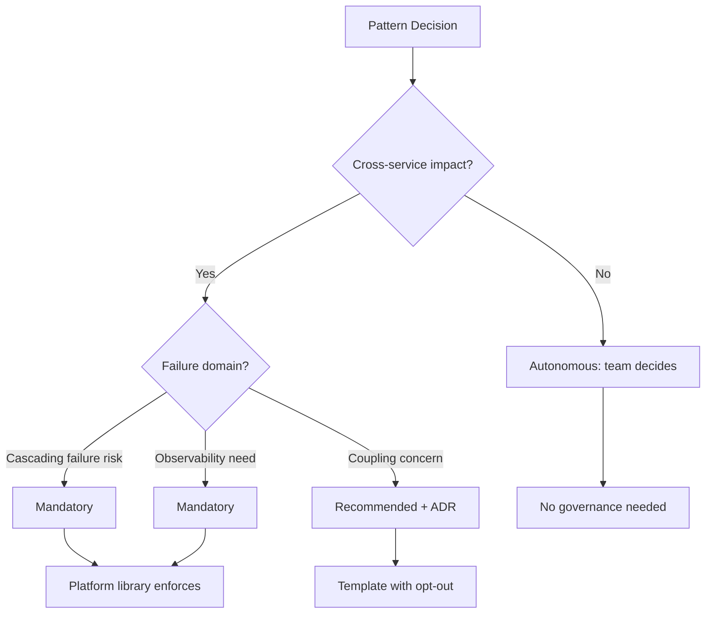
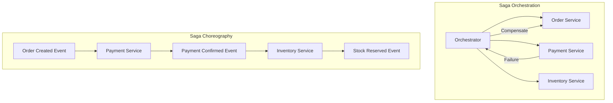
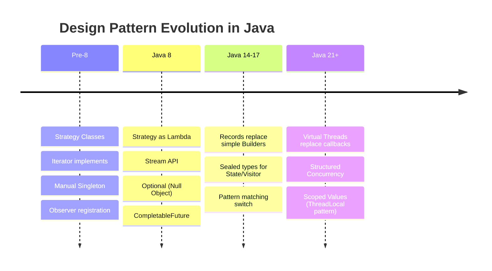
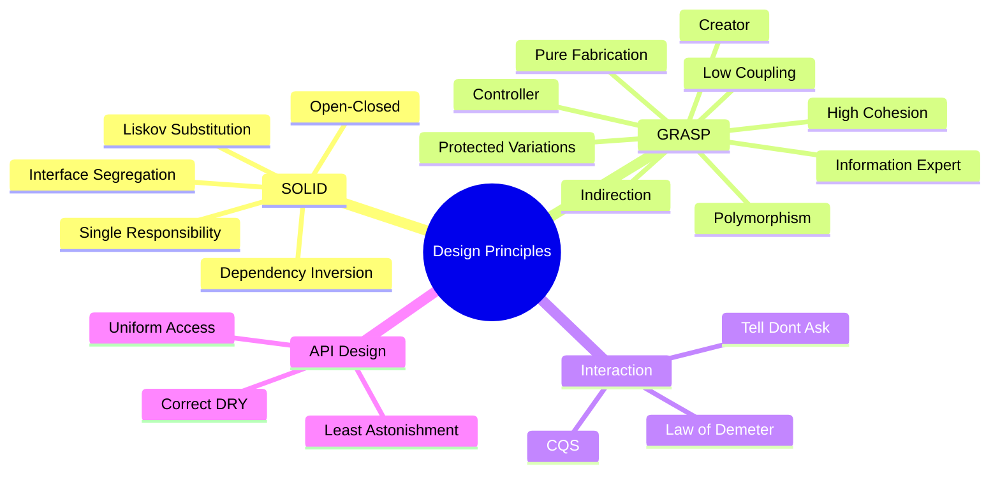

## Keywords in This File
{: .no_toc }

| # | Keyword | Weight |
|---|---|---|
| 1 | [Pattern Selection at Architecture Scale](#pattern-selection-at-architecture-scale) | high |
| 2 | [Microservices Design Patterns](#microservices-design-patterns) | high |
| 3 | [Pattern Evolution and Modernization](#pattern-evolution-and-modernization) | high |
| 4 | [Design Principles Beyond SOLID](#design-principles-beyond-solid) | high |

---

# Pattern Selection at Architecture Scale

**Interview Weight:** high - Staff/Principal level.
Tests the ability to select and compose patterns
across system boundaries, balancing consistency,
autonomy, and evolutionary architecture. This goes
beyond single-class pattern selection into system-wide
pattern strategy.

---

### 🎯 Model Answer

**30 seconds:**

> Pattern selection at architecture scale means choosing
> which patterns to standardize across the system, which
> to leave to individual teams, and how patterns compose
> across service boundaries. The decisions: which
> patterns are mandatory (Circuit Breaker, Retry), which
> are recommended (Repository, CQRS), and which are
> team-autonomous (internal implementation patterns).

**3 minutes (Senior):**

> Three layers of pattern governance:
>
> MANDATORY PATTERNS (system-wide, non-negotiable):
> - Circuit Breaker: every external call must have one.
>   Without it, cascading failures take down the system.
> - Retry with exponential backoff: every cross-service
>   call. Without it, transient failures cause visible
>   errors.
> - Bulkhead: thread pool isolation for external
>   dependencies. Without it, slow dependency starves
>   all threads.
> - Correlation ID propagation: every service must pass
>   it. Without it, distributed tracing is impossible.
>
> RECOMMENDED PATTERNS (team should justify deviation):
> - CQRS for read-heavy services: separate read/write
>   models. Recommended because reads are 90%+ of traffic.
> - Repository for data access: clean separation.
>   Deviation: if using event-sourcing (different access
>   pattern).
> - Event-driven for cross-service communication: loose
>   coupling. Deviation: synchronous call for strong
>   consistency requirements.
>
> AUTONOMOUS PATTERNS (team chooses freely):
> - Internal class design: Strategy, State, Observer
>   within a service. No cross-service impact.
> - Implementation patterns: Builder, Factory, Decorator
>   for internal object creation and composition.
> - Testing patterns: each team picks their own
>   (Arrange-Act-Assert, Given-When-Then, etc.).
>
> Selection criteria for architecture-scale patterns:
> 1. Failure domain: patterns that prevent cascading
>    failures are mandatory (one failure = system failure).
> 2. Observability: patterns that enable debugging are
>    mandatory (without tracing, incidents last hours).
> 3. Coupling: patterns at service boundaries should
>    minimize coupling (events over sync calls).
> 4. Team autonomy: patterns within a service should
>    maximize autonomy (team knows their domain best).

**Blank Mind Recovery:**

**(1) Restate:** "You are asking how to decide which
patterns to enforce at system scale versus which to
leave to team choice."

**(2) First principles:** "Architecture-scale pattern
decisions balance system resilience (mandatory patterns)
against team autonomy (autonomous patterns). The
boundary is: cross-service impact = mandatory,
within-service impact = autonomous."

**(3) Bridge:** "Think of city planning versus interior
design. The city mandates: roads, water pipes, fire
exits (system-wide patterns). Each building's interior
is owner's choice (team-autonomous patterns). The
boundary: does it affect others?"

---

### 📘 Concept Explanation

**What it is:**

The discipline of selecting, standardizing, and
governing design patterns across a distributed system,
distinguishing between patterns that must be uniform
(for resilience, observability, compatibility) and
patterns that should be autonomous (for team velocity
and domain fit).

**The problem it solves:**

Without pattern governance: team A uses synchronous
retry with no limit, team B uses Circuit Breaker,
team C has no resilience. Result: unpredictable
cascade behavior. With governance: all teams use
Circuit Breaker (mandatory), each chooses internal
patterns freely (autonomous).

**How it works:**

```
PATTERN GOVERNANCE MODEL:
+------------------------------------+
| MANDATORY (Platform enforces)      |
| Circuit Breaker, Retry, Bulkhead,  |
| Correlation ID, Health Check       |
+------------------------------------+
| RECOMMENDED (ADR justifies devn.)  |
| CQRS, Repository, Event-Driven,   |
| Saga, Outbox, API Gateway          |
+------------------------------------+
| AUTONOMOUS (Team decides)          |
| GoF patterns, impl strategy,      |
| test patterns, internal structure  |
+------------------------------------+
```



> **Diagram walkthrough:** Decision tree for pattern
> governance level. Cross-service impact determines
> governance. Cascading failure risk and observability
> needs make patterns mandatory (enforced by platform).
> Coupling concerns make patterns recommended (with
> documented deviation). No cross-service impact means
> team autonomy.

**The key insight:**

Pattern governance is NOT about consistency for its
own sake. It is about FAILURE ISOLATION. The mandatory
patterns exist because their absence causes system-wide
failures. The autonomous patterns exist because their
variation causes zero cross-team impact. The line
between mandatory and autonomous is drawn by failure
domain, not by architectural preference.

**When to formalize pattern governance:**

- 5+ services with 3+ teams
- After a cascading failure caused by inconsistent
  resilience patterns
- When onboarding new teams that need architectural
  guardrails

**When NOT to over-govern:**

- 1-3 services (single team can align informally)
- Greenfield exploration (premature standardization)
- Highly heterogeneous tech stack (patterns differ
  by language/framework)

---

### 💻 Code Example

```java
// BAD: No pattern governance - each service ad-hoc
// Service A: raw HTTP, no resilience
@Service
public class PaymentClient {
    public PaymentResult charge(Order order) {
        // No circuit breaker, no retry, no timeout
        return restTemplate.postForObject(
            "http://payment-svc/charge",
            order, PaymentResult.class
        );
    }
}

// Service B: manual retry, no circuit breaker
@Service
public class InventoryClient {
    public Stock check(String sku) {
        for (int i = 0; i < 5; i++) { // retry storm
            try {
                return restTemplate.getForObject(
                    "http://inv-svc/" + sku,
                    Stock.class
                );
            } catch (Exception e) {
                // Retries immediately - DDoS own svc
            }
        }
        throw new RuntimeException("Inventory down");
    }
}
```

> **Code walkthrough:** Service A has zero resilience -
> payment service down = order service hangs forever.
> Service B has naive retry without backoff - creates
> retry storm that DDoS's the inventory service during
> degradation. Both are architecture-scale failures
> caused by lack of pattern governance.

```java
// GOOD: Platform-mandated patterns via shared library
// Platform library: mandatory resilience patterns
@Target(ElementType.TYPE)
@Retention(RetentionPolicy.RUNTIME)
@Inherited
public @interface ResilientClient {
    int timeoutMs() default 2000;
    int circuitBreakerThreshold() default 5;
    int retryAttempts() default 3;
    int retryBackoffMs() default 100;
}

// Platform auto-configuration (teams get for free)
@Aspect
@Component
public class ResilienceAspect {
    @Around("@within(ResilientClient)")
    public Object applyResilience(
        ProceedingJoinPoint pjp
    ) throws Throwable {
        ResilientClient config = pjp.getTarget()
            .getClass()
            .getAnnotation(ResilientClient.class);

        return Resilience4j.decorateCheckedSupplier(
            CircuitBreaker.of(
                pjp.getTarget().getClass().getName(),
                CircuitBreakerConfig.custom()
                    .failureRateThreshold(
                        config.circuitBreakerThreshold()
                    )
                    .build()
            ),
            Retry.of("retry", RetryConfig.custom()
                .maxAttempts(config.retryAttempts())
                .waitDuration(Duration.ofMillis(
                    config.retryBackoffMs()
                ))
                .build()
            ),
            () -> pjp.proceed()
        ).get();
    }
}

// Team usage: just annotate (mandatory pattern, easy)
@ResilientClient(
    timeoutMs = 3000,
    circuitBreakerThreshold = 3
)
@Service
public class PaymentClient {
    public PaymentResult charge(Order order) {
        // Circuit breaker + retry + timeout: automatic
        return restTemplate.postForObject(
            "http://payment-svc/charge",
            order, PaymentResult.class
        );
    }
}
```

> **Code walkthrough:** Platform library provides
> @ResilientClient annotation. Aspect auto-applies
> Circuit Breaker + Retry + Timeout. Teams annotate
> their client classes. Pattern is mandatory but
> effortless: zero boilerplate, consistent behavior,
> configurable per-service. Governance achieved through
> enablement, not enforcement.

---

### 🎓 Answers by Seniority

**Junior / Mid (0-5 years):**

> Architecture-scale pattern selection means deciding
> which patterns ALL services must use (Circuit Breaker,
> retry) and which each team chooses. The mandatory
> ones prevent system-wide failures. The autonomous
> ones maximize team velocity.

I know the mandatory patterns: Circuit Breaker
(prevents cascading failure), retry with backoff
(handles transients), correlation ID (enables tracing).

*Push deeper:* "The implementation: platform team
provides libraries with these patterns built in.
Teams use the library. The pattern is mandatory but
the effort is minimal."

---

**Senior / Staff (5+ years):**

> I classify patterns into mandatory (failure domain
> impact), recommended (with ADR justification for
> deviation), and autonomous (team choice). The key
> governance mechanism: mandatory patterns are provided
> as platform libraries - easy to use correctly, hard
> to bypass. Recommended patterns have templates and
> documentation but allow deviation with written
> rationale.

The failure I have seen: over-governance. Mandating
internal patterns (every service MUST use Repository
pattern) kills team autonomy and fits poorly for some
domains (event-sourced services do not need Repository).
Only mandate what has cross-service failure impact.

*Push deeper:* "At staff level, I run quarterly
'pattern fitness reviews': are the mandatory patterns
still correct? Has a new failure mode emerged that
needs a new mandatory pattern? Has a mandatory pattern
become unnecessary (framework absorbed it)?"

---

### ⚖️ Comparison Table

| Governance Level | Examples | Enforcement | Deviation Process |
|---|---|---|---|
| Mandatory | Circuit Breaker, Retry, Bulkhead, Health Check | Platform library, CI check | Requires VP/architect approval |
| Recommended | CQRS, Repository, Event-Driven, Saga | Template + documentation | ADR (Architecture Decision Record) |
| Autonomous | GoF patterns, internal structure, test patterns | None | Team decides freely |
| Anti-pattern | Banned patterns (God Service, Shared DB) | Code review + lint rules | Not allowed |

**The deciding factor:** Cross-service failure impact
determines governance level. Impact = mandatory.
No impact = autonomous. Coupling concern = recommended.

---

### ⚠️ Common Misconceptions

**"Mandatory patterns mean all services look the same."**

Only resilience and observability patterns are
mandatory. 90% of a service's code uses autonomous
patterns chosen by the team. Mandatory patterns are
typically 5% of the codebase (the boundary layer).

**"Platform libraries reduce team autonomy."**

Platform libraries INCREASE autonomy by handling
cross-cutting concerns. Teams spend zero time on
resilience implementation and all time on domain
logic. Autonomy where it matters (domain), governance
where failure matters (boundaries).

**"More governance is safer."**

Over-governance causes: slow delivery (approval gates),
frustration (forced patterns that do not fit), gaming
(teams technically comply but poorly implement). The
safest system mandates the minimum set of patterns
that prevent cascading failures and nothing more.

---

### 🚨 Failure Modes and Diagnosis

| Failure | Symptom | Diagnosis |
|---|---|---|
| Under-governance | Cascading failures, retry storms, invisible calls | Add mandatory resilience patterns to all external calls |
| Over-governance | Slow delivery, deviation requests backlog | Reduce mandatory to only failure-domain patterns |
| Governance without enablement | Teams comply poorly (copy-paste, misconfigure) | Provide platform library that makes correct usage easy |
| Stale governance | Mandatory pattern superseded by framework feature | Quarterly review of pattern fitness |
| Governance gaps | New service type not covered by existing rules | Extend governance when new failure patterns emerge |

---

### 🎯 Interview Deep-Dive

| Experience | Time | Depth |
|---|---|---|
| Junior | 3 min | Name mandatory patterns and why |
| Mid | 5 min | Explain governance levels |
| Senior | 8 min | Design governance model for 20-service system |
| Staff | 12 min | Organizational pattern strategy |

---

**[MID] Q1 - Why are some patterns mandatory at
architecture scale while others are optional?**

*Why they ask:* Understanding governance rationale.

The distinction is FAILURE DOMAIN.

Mandatory patterns prevent failures that propagate
across service boundaries. Circuit Breaker: without it,
one slow service causes thread exhaustion in callers,
which cascades to THEIR callers. One failure becomes
system-wide outage. This is not a team choice - it
affects everyone.

Optional (autonomous) patterns affect only the team
that chose them. If team A uses Strategy internally
and team B uses if-else: zero cross-service impact.
Team A's code quality is their concern. Team B's
service still works fine regardless.

The boundary test: "If this team uses the wrong pattern
(or no pattern), does it affect OTHER teams?" If yes:
mandatory. If no: autonomous.

Examples of mandatory impact:
- No Circuit Breaker: cascade (affects all callers)
- No correlation ID: untraceable incidents (affects
  all teams during debugging)
- No health check: load balancer sends traffic to dead
  instance (affects all users)

Examples of zero cross-service impact:
- Builder vs constructor (internal API)
- Strategy vs switch (internal logic)
- Template Method vs copy-paste (internal DRY choice)

*What separates good from great:* The "failure domain"
framing - not consistency for consistency's sake, but
specifically preventing cross-service cascade.

---

**[SENIOR] Q2 - How do you implement pattern governance
without slowing teams down?**

*Why they ask:* Governance-velocity balance.

Three principles:

1. Paved road: mandatory patterns are PRE-IMPLEMENTED
in platform libraries. Teams do not implement Circuit
Breaker from scratch. They annotate a class or add a
dependency. The correct behavior is the EASY path.

2. Sensible defaults with override: platform library
ships with production-ready defaults (timeout: 2s,
retry: 3, backoff: exponential). Teams override for
their specific needs. No upfront configuration
required - it "just works."

3. Invisible enforcement: CI pipeline detects services
that call external URLs without resilience annotations.
Warning in PR, block in merge. Teams see the issue
early, fix it easily (add annotation). No approval
gate - self-service compliance.

What SLOWS teams (anti-patterns):
- Mandatory approval before using a pattern (gate)
- Custom implementation required (no library support)
- Documentation-only governance (no enforcement,
  inconsistent compliance)
- Retroactive audits (find issues months later)

What ACCELERATES teams:
- Libraries that provide mandatory patterns in one line
- Starter templates with governance pre-wired
- Automated compliance (CI, not humans)
- Self-service deviation (write ADR, merge)

*What separates good from great:* The "paved road"
concept - make the right thing the easy thing - and
automated compliance that gives fast feedback without
human gates.

---

**[STAFF] Q3 - How do you evolve architectural pattern
decisions as the system grows?**

*Why they ask:* Long-term architecture evolution.

Pattern decisions that were correct at 5 services may
be wrong at 50:

Phase 1 (1-5 services): mandatory = Circuit Breaker +
retry. Recommended = REST APIs. All services in one
team's scope. Communication overhead is low. Governance
is informal (team agreement).

Phase 2 (5-20 services): mandatory adds Correlation
ID, structured logging, health checks. Recommended
adds event-driven for cross-domain communication.
Multiple teams. ADRs formalize decisions. Platform
library appears.

Phase 3 (20-100 services): mandatory adds rate
limiting, Bulkhead isolation. Recommended adds CQRS,
Saga for complex workflows. Service mesh handles
some patterns (retry, timeout at infrastructure layer).
Pattern responsibility shifts from application code
to infrastructure.

Phase 4 (100+ services): platform team owns mandatory
patterns entirely. Application teams interact through
SDKs. New services are generated from templates with
all mandatory patterns pre-configured. Governance is
automated - humans only handle deviation requests.

Evolution signals (when to upgrade governance):
- Cascading failure incident -> new mandatory pattern
- Team independently solves same problem 3 times ->
  promote to platform library
- Mandatory pattern has zero deviations for 1 year ->
  bake into infrastructure (no application code needed)
- Mandatory pattern has many deviations -> demote to
  recommended (maybe it does not fit universally)

*What separates good from great:* The phase-based
evolution (governance grows WITH the system, not ahead
of it) and the feedback signals that drive promotion
and demotion of patterns between levels.

---

**[STAFF] Q4 - How do you handle pattern conflicts
between teams in a microservices architecture?**

*Why they ask:* Cross-team technical alignment.

Common conflicts and resolution:

Conflict: Team A wants synchronous calls (simpler,
immediate consistency). Team B wants events (decoupled,
eventual consistency). Both communicate with each other.

Resolution framework:

1. Identify the system requirement: does the
   interaction require strong consistency? If yes:
   synchronous is correct. If eventual is acceptable:
   events are preferred (lower coupling).

2. If ambiguous: the CONSUMER decides. Team B (receiving
   team) chooses how they want to be called. They own
   their API contract. If they prefer events: publisher
   (Team A) adapts.

3. Document the decision in a shared ADR. Include:
   requirement analysis, alternatives considered,
   consequences accepted. Future teams with similar
   interactions reference this ADR.

4. Revisit annually: consistency requirements change.
   What was "must be synchronous" may become "eventual
   is fine" after a product change.

Conflict: Team C wants to use Shared Database (faster,
simpler). Architecture mandates service-owns-data.

Resolution: Shared Database is in the "anti-pattern"
governance list. It is banned because: schema coupling,
deployment coupling, scaling coupling. Team C must
use API calls or events. Provide them with efficient
patterns (CQRS read model, event-carried state
transfer) to achieve the performance they need without
sharing the database.

*What separates good from great:* The "consumer
decides" principle for ambiguous interactions and the
specific alternative patterns offered when banning
the anti-pattern.

---

**[STAFF] Q5 - How do you measure whether your pattern
governance is effective?**

*Why they ask:* Metrics-driven architecture.

Four governance effectiveness metrics:

1. Cascade incident rate: how often does a single
   service failure cascade? Healthy: 0 cascading
   incidents per quarter. If > 0: mandatory patterns
   are either incomplete or poorly implemented.

2. Time-to-compliance for new services: how long from
   service creation to full governance compliance?
   Healthy: < 1 day (template + library). Unhealthy:
   > 1 week (manual implementation, documentation
   hunting).

3. Deviation request rate: how often do teams request
   deviations from mandatory patterns? Healthy: < 5%
   of services. If > 20%: the mandatory pattern may
   not fit (consider demoting to recommended).

4. Mean time to debug (MTTD): how long to identify
   root cause during incidents? Healthy: < 15 minutes
   (correlation IDs, structured logging working).
   Unhealthy: > 1 hour (observability patterns are
   incomplete).

Leading indicators (predict future problems):
- Services without @ResilientClient annotation (CI
  can count these)
- Services with custom resilience implementations
  (diverging from platform library)
- New services not using the starter template
- Teams that have never written an ADR for deviations

Review cadence: quarterly pattern fitness review.
Check metrics, review incidents, adjust governance
levels. Remove patterns that are universally adopted
(bake into infrastructure). Add patterns that recent
incidents revealed as missing.

*What separates good from great:* The four specific
metrics with healthy/unhealthy thresholds and the
leading indicators that predict problems before
incidents occur.

---

# Microservices Design Patterns

**Interview Weight:** high - Senior/Staff level. Tests
deep understanding of patterns specific to distributed
systems: Saga, CQRS, Event Sourcing, API Gateway,
Circuit Breaker composition, Strangler Fig, and how
GoF patterns manifest differently in microservices.

---

### 🎯 Model Answer

**30 seconds:**

> Microservices design patterns solve the unique
> challenges of distributed systems: Saga for
> distributed transactions, CQRS for read/write
> optimization, API Gateway for client simplification,
> Circuit Breaker for cascade prevention, Strangler
> Fig for migration, and Outbox for reliable event
> publishing. They exist because monolith patterns
> (shared memory, ACID transactions, synchronous calls)
> do not work across network boundaries.

**3 minutes (Senior):**

> Key microservices patterns by problem domain:
>
> DATA CONSISTENCY patterns:
> - Saga (Choreography): services publish events, other
>   services react. No central coordinator. Works for
>   simple flows (3-4 steps). Fails for complex flows
>   (hard to trace, hard to compensate).
> - Saga (Orchestration): central orchestrator calls
>   each service in sequence, handles compensations.
>   Works for complex flows. Single point of visibility.
> - Outbox Pattern: instead of publishing events
>   directly (dual write risk), write the event to an
>   outbox table in the same transaction as the data
>   change. A relay reads the outbox and publishes.
>   Guarantees at-least-once delivery.
>
> QUERY patterns:
> - CQRS: separate read and write models. Write model
>   is normalized (strong consistency). Read model is
>   denormalized (fast queries, eventual consistency).
>   Justification: reads and writes have different
>   scaling, optimization, and model needs.
> - API Composition: API Gateway or BFF aggregates data
>   from multiple services for the client. Avoids
>   chatty client-to-service communication.
>
> RESILIENCE patterns:
> - Circuit Breaker: detect failing dependency, stop
>   calling it, fail fast. Prevent cascade.
> - Bulkhead: isolate thread pools per dependency. Slow
>   dependency does not starve threads for others.
> - Retry with backoff: handle transient failures.
>   Exponential backoff prevents retry storms.
>
> MIGRATION patterns:
> - Strangler Fig: new microservice handles new
>   requests. Old monolith handles old requests.
>   Gradually route more traffic to microservice.
>   Eventually monolith is empty and retired.
>
> The non-obvious insight: these patterns exist because
> the NETWORK creates problems that do not exist in
> monoliths. Partial failure (service A succeeds,
> service B fails), eventual consistency (data
> propagates with delay), and observability gaps (cannot
> set a breakpoint across services).

**Blank Mind Recovery:**

**(1) Restate:** "You are asking about design patterns
specific to microservices architecture."

**(2) First principles:** "Microservices introduce
network boundaries. Network boundaries create: partial
failure, eventual consistency, and communication
overhead. Microservices patterns solve these specific
problems."

**(3) Bridge:** "Monolith patterns assume shared
memory and ACID transactions. Microservices patterns
assume network partitions and eventual consistency.
The patterns are different because the constraints
are different."

---

### 📘 Concept Explanation

**What it is:**

A catalog of design patterns that solve problems
unique to distributed microservice architectures:
data consistency without distributed transactions,
query optimization across service boundaries,
resilience against partial failures, and migration
from monolithic systems.

**The problem it solves:**

Traditional patterns assume a single process with
shared memory. In microservices: no shared database,
no distributed transactions (2PC does not scale), no
shared state. New patterns are needed for the
problems that arise from service independence.

**How it works:**

```
PATTERN SELECTION BY PROBLEM:

Problem                 Pattern
------                  -------
Multi-service txn       Saga (choreo or orch)
Reliable event publish  Outbox + CDC
Read optimization       CQRS + materialized view
Client aggregation      API Gateway / BFF
Cascade prevention      Circuit Breaker + Bulkhead
Monolith migration      Strangler Fig
Service discovery       Registry + Client LB
Config management       Externalized Config
Cross-cutting concerns  Sidecar / Service Mesh
```



> **Diagram walkthrough:** Two Saga styles.
> Orchestration: central coordinator controls flow and
> handles compensation on failure. Choreography: events
> flow between services with no coordinator. Orchestration
> is easier to debug (single visibility point).
> Choreography is more decoupled (no coordinator
> bottleneck). Choose based on flow complexity.

**The key insight:**

Microservices patterns are COMPENSATION patterns, not
PREVENTION patterns. In a monolith, you prevent
inconsistency (ACID). In microservices, you DETECT
inconsistency and COMPENSATE. Saga compensates failed
steps. Eventual consistency tolerates temporary
inconsistency. Outbox prevents lost events. The
mindset shift: from "prevent all failures" to "detect
and recover from failures."

**When to use microservices patterns:**

- Multi-service transactions (Saga)
- High read-to-write ratio (CQRS)
- Unreliable dependencies (Circuit Breaker)
- Monolith decomposition (Strangler Fig)
- Multi-client APIs (Gateway/BFF)

**When NOT to use (stay monolithic):**

- Single team, single deployment
- Transactions that MUST be ACID (financial core)
- Low traffic that does not justify operational
  complexity
- Team has no distributed systems experience

---

### 💻 Code Example

```java
// BAD: Distributed transaction attempt (2PC style)
// Does NOT work reliably in microservices
@Transactional // only covers local DB!
public OrderResult placeOrder(OrderRequest req) {
    // Step 1: create order locally
    Order order = orderRepo.save(new Order(req));

    // Step 2: call payment service (NETWORK CALL)
    // If this succeeds but step 3 fails -> inconsist.
    PaymentResult payment = paymentClient.charge(
        order.getId(), req.getAmount()
    );

    // Step 3: call inventory service (NETWORK CALL)
    // If this fails after payment -> money charged,
    // no inventory reserved. INCONSISTENCY.
    inventoryClient.reserve(
        order.getId(), req.getItems()
    );

    return new OrderResult(order, payment);
}
// @Transactional cannot rollback remote calls!
```

> **Code walkthrough:** The fundamental anti-pattern:
> @Transactional only covers the local database. If
> payment succeeds but inventory fails, money is charged
> with no reservation. Cannot rollback the payment
> (it is a completed remote call). This is why 2PC
> does not work in microservices - partial failure is
> the norm.

```java
// GOOD: Saga Orchestration pattern
@Service
public class OrderSagaOrchestrator {
    private final OrderRepository orderRepo;
    private final PaymentClient payment;
    private final InventoryClient inventory;

    public OrderResult placeOrder(OrderRequest req) {
        // Step 1: Create order (PENDING state)
        Order order = orderRepo.save(
            Order.pending(req)
        );

        try {
            // Step 2: Reserve inventory
            ReservationId reservation =
                inventory.reserve(
                    order.getId(), req.getItems()
                );
            order.setReservation(reservation);

            // Step 3: Charge payment
            PaymentId paymentId = payment.charge(
                order.getId(), req.getAmount()
            );
            order.setPayment(paymentId);

            // All succeeded: confirm order
            order.confirm();
            orderRepo.save(order);
            return OrderResult.success(order);

        } catch (InventoryException e) {
            // Inventory failed: no compensation needed
            // (nothing succeeded after order creation)
            order.cancel("Inventory unavailable");
            orderRepo.save(order);
            return OrderResult.failed(order, e);

        } catch (PaymentException e) {
            // Payment failed: compensate inventory
            inventory.cancelReservation(
                order.getReservation()
            );
            order.cancel("Payment failed");
            orderRepo.save(order);
            return OrderResult.failed(order, e);
        }
    }
}
```

> **Code walkthrough:** Saga orchestration: central
> orchestrator controls the flow. On payment failure,
> it explicitly compensates inventory (cancel
> reservation). Order state tracks progress (PENDING ->
> CONFIRMED or CANCELLED). Each step has a
> corresponding compensation step. The orchestrator
> is the single point of visibility for the entire
> flow.

```java
// GOOD: Outbox pattern for reliable event publishing
@Service
public class OrderService {
    private final OrderRepository orderRepo;
    private final OutboxRepository outbox;

    @Transactional // single local transaction
    public Order createOrder(OrderRequest req) {
        Order order = orderRepo.save(
            Order.pending(req)
        );
        // Event stored in SAME transaction as data
        outbox.save(new OutboxEvent(
            "order.created",
            order.getId().toString(),
            toJson(new OrderCreatedEvent(
                order.getId(),
                order.getItems(),
                order.getAmount()
            ))
        ));
        return order;
        // No dual-write risk: data + event atomic
    }
}

// Separate relay (CDC or polling) publishes events
@Scheduled(fixedDelay = 100)
public void publishOutboxEvents() {
    List<OutboxEvent> pending =
        outbox.findUnpublished();
    for (OutboxEvent event : pending) {
        kafka.send(event.getTopic(), event.getPayload());
        event.markPublished();
        outbox.save(event);
    }
}
```

> **Code walkthrough:** Outbox pattern solves the
> dual-write problem. Data change and event are written
> in the SAME database transaction (atomic). A separate
> relay process publishes events from the outbox table
> to Kafka. If the relay fails: events are retried
> (at-least-once). If the service crashes after data
> write: event is in the outbox, will be published on
> recovery. Zero lost events.

---

### 🎓 Answers by Seniority

**Junior / Mid (0-5 years):**

> Microservices patterns solve distributed problems:
> Saga for multi-service transactions (orchestration
> for complex flows, choreography for simple ones),
> Outbox for reliable event publishing, CQRS for
> read/write separation, Circuit Breaker for cascade
> prevention.

I know why @Transactional does not work across
services: it only covers the local database. Remote
calls need Saga compensation logic.

*Push deeper:* "The mindset shift: from preventing
failures (monolith ACID) to detecting and compensating
failures (microservices Saga). Eventual consistency is
the norm, not the exception."

---

**Senior / Staff (5+ years):**

> I choose microservices patterns based on consistency
> requirements: strong consistency (avoid distribution
> - keep in one service), eventual consistency with
> guaranteed delivery (Saga + Outbox), eventual with
> best-effort (events without outbox). The pattern
> complexity must be justified by the business
> requirement.

My decision framework: Can this be ONE service?
(Simplest.) If not: do all steps need to succeed
atomically? If yes: Saga with compensation. If
eventual is fine: event-driven with Outbox.

*Push deeper:* "At staff level, the decision is often
'do not distribute this at all.' Many microservices
pattern needs disappear when you draw service
boundaries correctly. The cheapest Saga is the one
you do not need."

---

### ⚖️ Comparison Table

| Pattern | Problem Solved | Complexity | Consistency | Choose When |
|---|---|---|---|---|
| Saga (Orchestration) | Multi-service transaction | High | Eventual + compensation | Complex flows (5+ steps), need visibility |
| Saga (Choreography) | Multi-service transaction | Medium | Eventual + events | Simple flows (3-4 steps), loose coupling |
| Outbox | Reliable event publishing | Medium | At-least-once delivery | Any event-driven communication |
| CQRS | Read/write optimization | High | Eventual (read model lag) | 90%+ reads, different read/write models |
| Circuit Breaker | Cascade prevention | Low | N/A (resilience) | Every external dependency |
| API Gateway | Client simplification | Medium | N/A (routing) | Multiple clients, cross-service aggregation |

**The deciding factor:** Consistency requirements
determine the pattern. Strong = keep in one service.
Eventual with compensation = Saga. Eventual without
compensation = events. Read optimization = CQRS.

---

### ⚠️ Common Misconceptions

**"Microservices patterns replace monolith patterns."**

They COMPLEMENT monolith patterns. Within each service,
you still use Strategy, Repository, Factory, Observer.
Microservices patterns operate at the SERVICE BOUNDARY
level. Inside each service: familiar GoF and enterprise
patterns.

**"Saga is like a distributed transaction."**

Saga is the OPPOSITE of a distributed transaction.
Distributed transactions (2PC) lock resources across
services. Saga uses compensation: each step commits
locally and can be compensated (reversed) if a later
step fails. No locking, no 2PC coordinator.

**"CQRS means Event Sourcing."**

CQRS and Event Sourcing are independent patterns.
CQRS: separate read/write models. Event Sourcing:
store events as the source of truth. You can use CQRS
without Event Sourcing (read model built from projected
state) or Event Sourcing without CQRS (single model
rebuilt from events).

---

### 🚨 Failure Modes and Diagnosis

| Failure | Symptom | Diagnosis |
|---|---|---|
| Saga without compensation logic | Partial completion, inconsistent state | Ensure every step has explicit undo/compensate |
| Outbox without idempotency | Duplicate event processing (at-least-once) | Add idempotency keys, consumers handle duplicates |
| CQRS stale reads | User sees outdated data after write | Accept eventual lag OR implement read-after-write consistency |
| Circuit Breaker too sensitive | Healthy service blocked (false open) | Tune threshold, use sliding window, add health check |
| Choreography dead letter | Event processed by no one (dropped) | Dead letter queue monitoring, event schema registry |

---

### 🎯 Interview Deep-Dive

| Experience | Time | Depth |
|---|---|---|
| Junior | 3 min | Name patterns and what they solve |
| Mid | 5 min | Implement Saga for a real flow |
| Senior | 8 min | Choose between patterns, trade-offs |
| Staff | 12 min | System-wide pattern composition |

---

**[MID] Q1 - Explain the Outbox pattern and why it
is needed.**

*Why they ask:* Dual-write understanding.

The problem: when a service needs to both update its
database AND publish an event, two things can go wrong:

Scenario 1: write to DB, then publish event. If
publish fails (Kafka down): data saved, event lost.
Downstream services never know.

Scenario 2: publish event, then write to DB. If DB
write fails: event published, data not saved.
Downstream services act on phantom data.

Both are "dual write" problems: two systems must be
updated atomically but there is no distributed
transaction between DB and Kafka.

The Outbox solution:
1. Write data AND event to the DATABASE in one local
   transaction (atomic - ACID guaranteed).
2. A separate process (CDC or polling) reads new events
   from the outbox table and publishes to Kafka.
3. If CDC/polling fails: events stay in outbox, retried
   later (at-least-once delivery).
4. If service crashes after step 1: events are in the
   database, relay picks them up on recovery.

Guarantee: if data is committed, the event WILL be
published (eventually). Zero lost events.

Consumer responsibility: events may arrive more than
once (at-least-once). Consumers must be idempotent
(processing same event twice has no extra effect).

*What separates good from great:* The dual-write
problem framing (why it exists), the at-least-once
guarantee (not exactly-once), and consumer idempotency
as the complementary requirement.

---

**[SENIOR] Q2 - When do you choose Saga Orchestration
over Choreography?**

*Why they ask:* Pattern trade-off judgment.

Orchestration advantages:
- Single point of visibility (orchestrator knows full
  flow state)
- Easy to add compensation logic (orchestrator handles
  all rollback)
- Complex flows (5+ steps, conditional branches)
- Easier to test (test the orchestrator, mock services)
- Easier to debug (one log tells you where it failed)

Choreography advantages:
- No single point of failure (no coordinator)
- Truly decoupled services (no service knows the flow)
- Simpler for simple flows (2-3 steps, linear)
- Better scalability (no coordinator bottleneck)
- Services evolve independently (no orchestrator change)

My decision:
- 2-3 steps, linear, no conditions: choreography
- 4+ steps, conditional, compensation needed: orchestration
- Visibility requirement (compliance, audit): orchestration
- Services owned by different teams: choreography
  (no one wants to own the orchestrator for another
  team's flow)
- Mixed: simple sub-flows choreographed, complex
  cross-domain flows orchestrated

The hybrid approach: use choreography for the "happy
path" (events flow between services). Add an
orchestrator-style "saga monitor" that detects stuck
or failed flows and triggers compensation. Best of
both: decoupled operations, centralized error handling.

*What separates good from great:* The hybrid approach
(choreography + monitor) and the team ownership
consideration (who owns the orchestrator?).

---

**[STAFF] Q3 - How do you handle Saga failure and
compensation in production?**

*Why they ask:* Production reality of distributed
transactions.

Compensation challenges in production:

1. Non-compensatable steps: you cannot "uncharge" a
   credit card after settlement. Solution: separate
   authorization (reservable) from capture (final).
   Compensate authorization (release hold), never need
   to compensate capture.

2. Compensation failure: the compensation step itself
   fails (network issue). Solution: retry compensation
   with exponential backoff. If permanently fails:
   alert human operator + dead letter queue for manual
   resolution.

3. Concurrent modification: between failure detection
   and compensation, another process modifies the data.
   Solution: optimistic locking on compensation.
   Version check before compensating. If version
   mismatch: re-evaluate whether compensation is still
   needed.

4. Observability: tracking which sagas are in progress,
   which have failed, which are compensating. Solution:
   saga state machine with persistent state. Dashboard
   shows: active, completed, compensating, failed
   (needs human). SLA alerts on sagas stuck in
   "compensating" for > X minutes.

5. Testing: how to test compensation logic (rarely
   exercised in production). Solution: chaos engineering.
   Inject failures in staging that trigger compensation.
   Verify compensation completes correctly. Run monthly.

*What separates good from great:* The non-compensatable
step insight (separate reserve from capture) and the
compensation-failure handling (retry + dead letter +
human escalation).

---

**[STAFF] Q4 - How do you design CQRS for a system
with 50+ read models?**

*Why they ask:* CQRS at scale.

Scaling CQRS:

Read model proliferation: each client/use case may
need a different view of the data. Mobile app needs
summary. Admin needs detailed. Analytics needs
aggregated. Each is a separate read model.

Architecture:
1. Single write model (source of truth, normalized).
2. Events published on every write (domain events).
3. Multiple projectors: each builds one read model
   from events. Projectors are independent services.
4. Read models stored in optimal stores: Elasticsearch
   for search, Redis for cache, Postgres for complex
   queries, DynamoDB for key-value access.

At 50+ read models:
- Event versioning: events evolve. Old read models
  need adapters for new event versions. Use event
  schema registry with compatibility rules.
- Rebuild capability: any read model can be rebuilt
  from event history. New read model: replay all events,
  build from scratch. Takes minutes-hours depending
  on volume.
- Monitoring: each projector has lag metric (how far
  behind real-time). Alert if lag exceeds SLA.
  Dashboard shows all 50+ projectors' health.
- Ownership: each read model owned by its consuming
  team. They build their projector, they monitor it,
  they choose their storage. Write team just publishes
  events.

*What separates good from great:* The "rebuild from
event history" capability for new read models and the
ownership model (consuming team owns their projector).

---

**[STAFF] Q5 - How do you migrate from monolith to
microservices using Strangler Fig?**

*Why they ask:* Migration strategy.

Strangler Fig execution:

Phase 0 - Prepare: add an API Gateway / reverse proxy
in front of the monolith. ALL traffic goes through it.
Monolith is unaware. This enables traffic routing.

Phase 1 - Extract first service: choose a bounded
context with clear boundaries (often authentication
or notification - few inbound dependencies). Build
the microservice. Route traffic for those endpoints
to the new service. Monolith still handles everything
else.

Phase 2 - Data migration: the new service needs its
own database. Options:
(a) Synchronize: keep data in both, sync via events.
(b) Cut over: migrate data, update references.
(c) Shared read: new service reads from monolith DB
    initially, then migrates. (Temporary compromise.)

Phase 3 - Iterate: extract next bounded context.
Route traffic. Repeat. Each extraction shrinks the
monolith. Each new service is independent.

Phase 4 - Retire: when monolith handles no traffic,
shut it down. This may take 1-3 years for large
monoliths.

Key principles:
- Never rewrite. Always extract. Rewrites fail because
  they attempt too much at once.
- New features ONLY in new services. Monolith is
  frozen (bug fixes only). This naturally grows the
  new architecture.
- Anti-corruption layer: new services do NOT depend on
  monolith internals. They call the monolith's API.
  If the monolith has no API: wrap it with one first.

*What separates good from great:* The "new features
only in new services" rule (natural migration pressure)
and the anti-corruption layer (prevents new services
from inheriting monolith debt).

---

# Pattern Evolution and Modernization

**Interview Weight:** high - Staff/Principal level.
Tests understanding of how patterns evolve with
language features (Java 8 lambdas, 17 sealed types,
21 virtual threads), framework evolution (Spring Boot
3.x, Quarkus), and paradigm shifts (reactive,
functional, cloud-native).

---

### 🎯 Model Answer

**30 seconds:**

> Pattern evolution means recognizing when language or
> framework advances make existing pattern
> implementations obsolete and replacing them with
> simpler, modern equivalents. Examples: Strategy
> classes replaced by lambdas (Java 8), Visitor
> replaced by sealed types + pattern matching (Java 17+),
> callback-based Observer replaced by reactive streams,
> manual Singleton replaced by DI container scope.

**3 minutes (Senior):**

> Three evolution forces:
>
> LANGUAGE EVOLUTION (Java progression):
>
> Java 8 (lambdas/streams):
> - Strategy: separate class -> single lambda
> - Command: CommandImpl -> Runnable/Supplier lambda
> - Template Method: abstract class -> method accepting
>   functional interface
> - Iterator: explicit Iterator class -> Stream API
>
> Java 14-17 (records, sealed, pattern matching):
> - Builder: manual builder -> record with compact
>   constructor (for simple DTOs)
> - Visitor: accept/visit ceremony -> sealed interface +
>   switch pattern matching
> - State: explicit state classes -> sealed permit +
>   exhaustive switch
>
> Java 21 (virtual threads):
> - Observer/Callback: async callbacks for non-blocking
>   -> sequential code on virtual threads
> - Reactor pattern: event loop + handlers -> thread-
>   per-request with virtual threads
>
> FRAMEWORK EVOLUTION:
> - Singleton: getInstance() -> @Scope("singleton")
>   (framework manages lifecycle)
> - Factory: manual factory -> @Configuration + @Bean
>   (DI container IS the factory)
> - Observer: manual registration -> @EventListener
>   (framework handles dispatch)
> - Proxy: manual proxy -> Spring AOP + @Aspect
>
> PARADIGM EVOLUTION:
> - Imperative patterns -> reactive equivalents
>   (Observer -> Flux/Mono pub-sub)
> - OOP patterns -> functional equivalents
>   (Strategy class -> Function<T,R>)
> - Monolith patterns -> distributed equivalents
>   (Repository -> CQRS, Transaction -> Saga)
>
> The judgment: not all evolutions are improvements.
> Lambda-based Strategy works for simple single-method
> strategies. Multi-method strategies still need classes.
> Record-based DTOs work for simple immutable data.
> Complex validation still needs Builder. The modern
> feature is a tool, not a universal replacement.

**Blank Mind Recovery:**

**(1) Restate:** "You are asking how design patterns
change as languages, frameworks, and paradigms evolve."

**(2) First principles:** "Patterns solve problems.
When the language solves the problem natively, the
pattern simplifies or disappears. When new problems
emerge (distribution, scale), new patterns appear."

**(3) Bridge:** "Pattern evolution is like tool
evolution. A hand drill (manual Singleton) was
replaced by a power drill (DI container). The NEED
(make holes) did not change. The SOLUTION simplified.
Knowing both helps: you understand WHY the power drill
exists and when hand tools are still appropriate."

---

### 📘 Concept Explanation

**What it is:**

The ongoing process of adapting, simplifying, or
replacing design patterns as programming languages
add features, frameworks provide higher-level
abstractions, and architectural paradigms shift.

**The problem it solves:**

Codebases that use outdated pattern implementations
accumulate unnecessary complexity. Java 8+ code with
separate Strategy classes for single-method behaviors
is more complex than lambda equivalents. Modernization
reduces boilerplate while preserving intent.

**How it works:**

```
PATTERN EVOLUTION TIMELINE (Java focus):

Pre-Java 8          Java 8+         Java 17+
----------          -------         --------
Strategy class  ->  Lambda       -> (unchanged)
Command class   ->  Runnable     -> (unchanged)
Builder manual  ->  (unchanged)  -> Record (simple)
Visitor accept  ->  (unchanged)  -> Sealed + switch
Iterator class  ->  Stream       -> (unchanged)
Singleton static -> (unchanged)  -> (DI container)
Observer manual ->  @EventListen -> Reactive stream
Template Method ->  Method+FI    -> (unchanged)
State classes   ->  (unchanged)  -> Sealed states
Factory manual  ->  @Bean        -> (unchanged)
Proxy manual    ->  AOP          -> (unchanged)
```



> **Diagram walkthrough:** Each Java version simplifies
> specific patterns. Java 8 simplified behavioral
> patterns (Strategy, Command, Iterator) with lambdas
> and streams. Java 14-17 simplified structural patterns
> (Builder for DTOs, Visitor, State) with records and
> sealed types. Java 21+ simplifies concurrency patterns
> (Observer callbacks, Reactor) with virtual threads.

**The key insight:**

Pattern evolution is NOT pattern elimination. The
CONCEPT persists; the IMPLEMENTATION simplifies. You
still THINK in Strategy (select algorithm at runtime).
You just IMPLEMENT it differently (lambda instead of
class). Understanding the pattern concept is permanent
knowledge. Implementation details evolve.

**When to modernize pattern implementations:**

- Codebase minimum Java version supports the feature
- Team has adopted the feature (everyone understands)
- The modernization actually simplifies (not just
  "newer = better")
- The modernization does not lose functionality
  (multi-method Strategy still needs classes)

**When to keep legacy implementations:**

- Team not trained on new features yet
- Legacy pattern has additional behavior (logging,
  validation) that lambdas cannot express
- Multi-method interface (lambdas only work for SAMs)
- Code is stable and working (if it is not broken...)

---

### 💻 Code Example

```java
// BAD: Pre-Java 8 Strategy (verbose for simple case)
public interface SortStrategy {
    List<Product> sort(List<Product> products);
}

public class PriceSortStrategy
    implements SortStrategy {
    @Override
    public List<Product> sort(List<Product> products) {
        return products.stream()
            .sorted(comparing(Product::getPrice))
            .collect(toList());
    }
}

public class NameSortStrategy
    implements SortStrategy {
    @Override
    public List<Product> sort(List<Product> products) {
        return products.stream()
            .sorted(comparing(Product::getName))
            .collect(toList());
    }
}

// 3 files for a simple comparator choice
public class ProductService {
    private SortStrategy strategy;
    public void setStrategy(SortStrategy s) {
        this.strategy = s;
    }
    public List<Product> getSorted(List<Product> p) {
        return strategy.sort(p);
    }
}
```

> **Code walkthrough:** Three classes for a simple
> "sort by X" decision. Each Strategy implementation
> is one line of logic wrapped in a class. The
> interface, two implementations, and the service make
> 4 files. Pre-Java 8, this was necessary. Post-Java 8,
> it is unnecessary ceremony for single-method behavior.

```java
// GOOD: Modern Strategy (Java 8+ lambda)
@Service
public class ProductService {
    // Strategy as functional interface (Comparator)
    private static final Map<String, Comparator<Product>>
        STRATEGIES = Map.of(
            "price", comparing(Product::getPrice),
            "name", comparing(Product::getName),
            "rating", comparing(Product::getRating)
                .reversed()
        );

    public List<Product> getSorted(
        List<Product> products, String sortBy
    ) {
        Comparator<Product> strategy =
            STRATEGIES.getOrDefault(
                sortBy, comparing(Product::getName)
            );
        return products.stream()
            .sorted(strategy)
            .collect(toList());
    }
}
// 1 file, zero interfaces, zero Strategy classes
// Adding new sort: add one Map entry
```

> **Code walkthrough:** Same Strategy concept, modern
> implementation. Comparator IS a functional interface
> (SAM). Lambdas/method refs replace classes. Map
> replaces if-else dispatch. One file instead of four.
> Adding a new strategy: one line in the map. The
> PATTERN (select algorithm at runtime) is identical.
> The IMPLEMENTATION is dramatically simpler.

```java
// BAD: Pre-Java 17 Visitor pattern
public interface ShapeVisitor {
    void visit(Circle c);
    void visit(Rectangle r);
    void visit(Triangle t);
}

public interface Shape {
    void accept(ShapeVisitor v);
}

public class Circle implements Shape {
    public void accept(ShapeVisitor v) {
        v.visit(this);
    }
}
// ... Rectangle, Triangle similarly

public class AreaCalculator implements ShapeVisitor {
    private double total = 0;
    public void visit(Circle c) {
        total += Math.PI * c.radius() * c.radius();
    }
    public void visit(Rectangle r) {
        total += r.width() * r.height();
    }
    public void visit(Triangle t) {
        total += 0.5 * t.base() * t.height();
    }
}
```

> **Code walkthrough:** Classic Visitor: double dispatch
> through accept/visit ceremony. 1 interface (Visitor),
> 1 interface (Shape), 3 Shape implementations with
> accept(), 1 Visitor implementation. 6 files/classes
> for area calculation. Adding a new shape: modify
> Visitor interface (breaking change to all visitors).

```java
// GOOD: Java 17+ sealed types replace Visitor
public sealed interface Shape
    permits Circle, Rectangle, Triangle {}

public record Circle(double radius)
    implements Shape {}
public record Rectangle(double w, double h)
    implements Shape {}
public record Triangle(double base, double height)
    implements Shape {}

// "Visitor" is just pattern matching switch
public class AreaCalculator {
    public double calculate(Shape shape) {
        return switch (shape) {
            case Circle c ->
                Math.PI * c.radius() * c.radius();
            case Rectangle r ->
                r.w() * r.h();
            case Triangle t ->
                0.5 * t.base() * t.height();
        }; // Exhaustive - compiler checks all cases
    }
}
// No accept(), no visit(), no double-dispatch
// Adding new shape: compiler forces all switches
```

> **Code walkthrough:** Sealed types + pattern matching
> replace Visitor entirely. No accept/visit ceremony.
> Exhaustive switch: compiler forces handling all cases
> (same safety as Visitor interface). Adding a new shape:
> add to permits, compiler shows all switches that need
> updating. Simpler, safer, same guarantee.

---

### 🎓 Answers by Seniority

**Junior / Mid (0-5 years):**

> Patterns evolve with language features. Java 8
> lambdas simplified Strategy (class -> lambda) and
> Iterator (manual -> Stream). Java 17 sealed types
> simplified Visitor (accept/visit -> switch). The
> pattern concept stays; the implementation simplifies.

I know when to use each: single-method Strategy = lambda.
Multi-method Strategy = still needs interface + classes.
Simple DTO = record. Complex creation = still needs
Builder.

*Push deeper:* "The decision: does the modern feature
fully replace the pattern's FUNCTIONALITY (not just
structure)? If yes: modernize. If no: keep the pattern
and use the modern feature where it fits."

---

**Senior / Staff (5+ years):**

> I drive pattern modernization in two ways: (1) When
> touching existing code (feature work near legacy
> patterns): modernize adjacent patterns in the same PR.
> (2) Dedicated modernization: quarterly, identify
> patterns superseded by language features, batch-
> modernize them. Both approaches amortize the cost.

The judgment I exercise: not everything should be
modernized. Stable code with working patterns: leave
it. Actively-developed code with verbose patterns:
modernize on contact. New code: use modern patterns
from the start.

*Push deeper:* "At staff level, I set the team's
pattern currency: 'Our minimum Java version is 21.
All new code uses: lambdas for single-method Strategy,
records for simple DTOs, sealed types for type
hierarchies, virtual threads for blocking I/O. Legacy
code modernized on contact only.'"

---

### ⚖️ Comparison Table

| Pattern | Legacy Implementation | Modern (Java 17+) | When to Keep Legacy |
|---|---|---|---|
| Strategy | Interface + N classes | Lambda/method ref | Multi-method interface, stateful strategy |
| Visitor | accept/visit double dispatch | Sealed + pattern matching | Cross-compilation-unit dispatch, plugin system |
| Builder | Manual builder class | Record (simple DTOs) | Complex validation, optional fields, fluent API |
| Singleton | static getInstance() | @Scope("singleton") in DI | Non-Spring contexts, early bootstrap |
| Observer | Manual listener registration | @EventListener / reactive | Custom dispatch logic, priority ordering |
| Iterator | Iterator<T> implementation | Stream<T> API | Stateful iteration, external iterator control |

**The deciding factor:** Modern is simpler WHEN the
use case is simple. Complex use cases (multi-method,
stateful, pluggable) often still need classic patterns.

---

### ⚠️ Common Misconceptions

**"Lambdas eliminate the Strategy pattern."**

Lambdas eliminate STRATEGY CLASSES for single-method
interfaces. The pattern (select algorithm at runtime)
still exists. Multi-method strategies (3+ methods,
shared state) still need classes. Lambdas handle
~60% of Strategy use cases.

**"Records replace Builder everywhere."**

Records replace Builder for simple, immutable DTOs.
Builder is still needed for: optional fields (record
has no optional params), complex validation (record
compact constructor is limited), fluent APIs (record
has no chaining), mutable construction (record is
immutable).

**"Always use the newest language feature."**

Not if: (a) team does not understand it yet, (b) the
existing pattern has additional behavior that the
feature cannot express, (c) the code is stable and
working. Modernization has a cost. Only pay it when
the benefit exceeds the cost (usually: actively
developed code near the pattern).

---

### 🚨 Failure Modes and Diagnosis

| Failure | Symptom | Diagnosis |
|---|---|---|
| Premature modernization | Team confused by pattern matching, writes bugs | Wait until team is trained. Modernize AFTER adoption |
| Incomplete modernization | Half-lambda, half-class Strategy implementations | Batch-modernize per module. Do not leave mixed styles |
| Over-modernization | Record used where Builder needed (complex validation lost) | Recognize when modern feature is insufficient |
| Ignoring evolution | New code still creates Strategy classes for one-method interfaces | Set team policy: modern patterns for new code |
| Mixed Java versions | Lambda in module A, classes in module B (inconsistent) | Align minimum Java version across all modules first |

---

### 🎯 Interview Deep-Dive

| Experience | Time | Depth |
|---|---|---|
| Junior | 3 min | Name modern replacements per pattern |
| Mid | 5 min | Show before/after modernization |
| Senior | 8 min | Decide when to modernize vs keep |
| Staff | 12 min | Organization-wide modernization strategy |

---

**[MID] Q1 - Show how Java 8 lambdas changed the
Strategy pattern implementation.**

*Why they ask:* Practical modernization skill.

Before Java 8:
```java
// Interface
public interface Validator {
    boolean validate(String input);
}
// Implementations (separate files)
public class EmailValidator implements Validator { }
public class PhoneValidator implements Validator { }
// Usage
service.setValidator(new EmailValidator());
```

After Java 8:
```java
// No interface file needed (use Predicate<String>)
// No implementation files needed (use lambdas)
Map<String, Predicate<String>> validators = Map.of(
    "email", s -> s.contains("@") && s.contains("."),
    "phone", s -> s.matches("\\d{10}")
);
// Usage
Predicate<String> v = validators.get(type);
boolean valid = v.test(input);
```

The transformation: 3 files (interface + 2 classes) ->
3 lines in a map. The pattern concept (select
validation logic at runtime) is IDENTICAL. The
implementation is dramatically simpler.

When this does NOT work: when Validator has multiple
methods (validate + getErrorMessage + getSeverity).
Lambdas only represent single-method interfaces.
Multi-method: keep the interface + classes.

*What separates good from great:* Showing both the
simplification AND the limitation (when lambdas do
not suffice) demonstrates mature judgment.

---

**[SENIOR] Q2 - How do sealed types and pattern
matching eliminate the Visitor pattern?**

*Why they ask:* Java 17+ pattern knowledge.

The Visitor pattern exists because Java lacked:
(a) exhaustive type dispatch, (b) sealed hierarchies.

With sealed types (Java 17):
- `sealed interface Shape permits Circle, Rectangle`
  guarantees the type set is CLOSED.
- Pattern matching switch handles each type.
- Compiler verifies EXHAUSTIVENESS (same guarantee as
  Visitor's compile-time checking).

What Visitor gave us that sealed + switch also gives:
1. Type-safe dispatch: compiler checks all cases.
2. Open for operations: add new operations without
   modifying shapes (just write a new switch).
3. Closed for types: adding a shape forces updating
   all operations (compiler error on non-exhaustive).

What Visitor gave us that sealed + switch does BETTER:
- No double-dispatch ceremony (accept/visit gone)
- Simpler mental model (just a switch statement)
- IDE support (compiler errors, not runtime ClassCast)
- Data access via deconstruction patterns

When to KEEP Visitor even with Java 17+:
- Plugin/extension systems where operation providers
  are loaded dynamically (cannot use switch with
  unknown types)
- Cross-compilation-unit dispatch (sealed requires
  same compilation unit)
- Libraries that must support older Java versions

*What separates good from great:* Mapping each Visitor
benefit to its sealed-type equivalent AND identifying
the remaining use cases where Visitor survives.

---

**[STAFF] Q3 - How do you plan a team-wide pattern
modernization initiative?**

*Why they ask:* Technical leadership.

Pattern modernization roadmap:

Phase 1 - Inventory (1 week): scan codebase for
legacy pattern implementations. Count: Strategy
classes (could be lambdas), Visitor implementations
(could be sealed), Builder classes for simple DTOs
(could be records), manual Singleton (could be DI).

Phase 2 - Prioritize (by modernization value):
Priority 1: Patterns in actively-developed code
(high change frequency, high team exposure).
Priority 2: Patterns that cause bugs or confusion
(complex Visitor dispatch, Singleton lifecycle issues).
Priority 3: Patterns in stable code (low priority -
working code, low change frequency).

Phase 3 - Training: run workshop on modern
alternatives. Show before/after. Let team practice
on small examples. Do NOT mandate modernization before
team understands the modern alternatives.

Phase 4 - Policy: "All NEW code uses modern patterns.
EXISTING code modernized on contact (when you change
a file, modernize adjacent legacy patterns). Dedicated
modernization: 1 module per sprint (pair programming
with less experienced developer = knowledge transfer)."

Phase 5 - Track: metrics showing progress.
- % of Strategy implementations using lambdas
- % of type hierarchies using sealed types
- % of simple DTOs using records

This is NOT rushed. Typical timeline: 6-12 months
for a large codebase. The modernization happens
naturally through daily work (on-contact) supplemented
by dedicated sessions (1 module per sprint).

*What separates good from great:* The "on-contact"
strategy (modernize adjacent to changes, not big-bang)
combined with tracking metrics and the training
prerequisite.

---

**[STAFF] Q4 - How do virtual threads change
concurrency patterns?**

*Why they ask:* Latest Java evolution impact.

Pre-virtual-threads concurrency patterns:
- Reactor pattern (event loop + handlers): one thread
  handles many connections via non-blocking I/O.
- Callback/Future-based Observer: avoid blocking,
  chain operations with CompletableFuture.
- Thread pool + Bulkhead: limit threads per dependency
  to prevent starvation.

Virtual threads eliminate the REASON for these patterns:
- Thread-per-request becomes viable (virtual threads
  are cheap - millions possible).
- Blocking is acceptable (virtual thread yields when
  blocked - no thread waste).
- Sequential code replaces reactive chains (easier to
  read, debug, profile).

Pattern changes:
- Reactor/WebFlux: less necessary. Blocking on virtual
  thread achieves same throughput without reactive
  complexity.
- CompletableFuture chains: replaceable with sequential
  calls on virtual thread. Each call blocks, thread
  yields, no resource waste.
- Thread pool sizing: virtual threads use ForkJoinPool
  carriers. Manual pool sizing becomes less critical.
- Bulkhead: still needed conceptually (limit concurrent
  requests to dependency) but implemented differently
  (Semaphore rather than separate thread pool).

What does NOT change:
- CPU-bound parallelism: virtual threads do not help.
  Still need ForkJoinPool or parallel streams.
- Data structures: concurrent collections still needed.
- Synchronization: synchronized still blocks carrier
  thread (use ReentrantLock instead).
- Pattern CONCEPTS: you still need timeout, retry,
  circuit breaker. Just the implementation simplifies.

*What separates good from great:* Distinguishing what
changes (reactive patterns become optional) from what
stays (CPU parallelism, synchronization, resilience
concepts) and the practical gotcha (synchronized
blocks carrier thread).

---

**[STAFF] Q5 - How do you prevent "pattern nostalgia"
where senior developers resist modernization?**

*Why they ask:* Change management.

Pattern nostalgia: senior developers prefer patterns
they learned and mastered, resisting modern alternatives
even when simpler.

Resolution approach:

Evidence-based comparison: do not argue taste. Show
metrics. "This Visitor implementation is 200 lines
across 6 files. The sealed + switch equivalent is 40
lines in 1 file. Both provide exhaustive type checking.
Which is easier for a new team member?"

Gradual adoption: do not ban legacy patterns. Instead:
"New code uses modern patterns. Existing code stays
unless modified." This respects existing work while
nudging evolution.

Pair programming: senior + junior working together.
Junior shows modern approach. Senior evaluates.
Mutual learning: senior provides context on WHY the
old pattern existed. Junior provides how the new
feature solves it better.

Acknowledge legitimate cases: "You are right that
sealed + switch does not work for plugin systems.
In THAT case, we keep Visitor. For our 12 internal
type hierarchies: sealed is simpler." Validate their
expertise while showing the boundary.

The leadership principle: resistance often comes from
feeling that expertise is devalued. Frame modernization
as "your pattern knowledge PLUS new features = optimal
code" not "your patterns are obsolete." Pattern
knowledge is MORE valuable when you also know the
modern alternatives - you make better decisions about
which to use where.

*What separates good from great:* The psychological
framing ("expertise + new features" not "expertise is
obsolete") and the legitimate-cases acknowledgment
that validates senior developer judgment.

---

# Design Principles Beyond SOLID

**Interview Weight:** high - Staff/Principal level.
Tests knowledge of design principles that complement
or extend SOLID: GRASP, Law of Demeter, Tell Don't
Ask, Command-Query Separation, Principle of Least
Astonishment, DRY (correct application), and
composition principles.

---

### 🎯 Model Answer

**30 seconds:**

> Beyond SOLID, the principles that govern good OO
> design include: GRASP (responsibility assignment),
> Law of Demeter (limit coupling depth), Tell Don't
> Ask (push behavior to data owner), CQS (methods
> either query or command, never both), Principle of
> Least Astonishment (code behaves as readers expect),
> and correct DRY (knowledge duplication, not code
> duplication). These principles complement SOLID by
> addressing interaction patterns, responsibility
> assignment, and API design.

**3 minutes (Senior):**

> Principles beyond SOLID, organized by what they govern:
>
> RESPONSIBILITY ASSIGNMENT (where does behavior live?):
>
> GRASP (General Responsibility Assignment Software
> Principles): 9 principles for deciding which class
> owns which behavior. Key ones:
> - Information Expert: assign behavior to the class
>   that has the data needed to fulfill it.
> - Creator: assign object creation to the class that
>   has the initialization data.
> - Controller: assign system event handling to a
>   non-UI class representing the use case.
> - Low Coupling / High Cohesion: favor designs that
>   reduce dependencies between classes and keep
>   related behavior together.
>
> Tell Don't Ask: instead of ASKING an object for data
> and TELLING it what to do externally, TELL the object
> to do it itself. Push behavior to the data owner.
> Eliminates Feature Envy smell.
>
> INTERACTION DESIGN (how do objects communicate?):
>
> Law of Demeter (Principle of Least Knowledge): a
> method should only call methods on: (1) itself, (2)
> its parameters, (3) objects it creates, (4) its
> direct fields. No chaining through intermediaries.
> `customer.getAddress().getCity().getZipCode()` violates it.
>
> CQS (Command-Query Separation): methods that return
> data (queries) must not change state. Methods that
> change state (commands) must not return data. This
> makes code predictable: calling a "get" method has
> no side effects.
>
> API DESIGN (how does code FEEL to use?):
>
> Principle of Least Astonishment (POLA): code should
> behave the way a reasonable reader would expect.
> Method named `getUser()` should not modify the user.
> Method named `isEmpty()` should not throw exceptions.
>
> Correct DRY: DRY applies to KNOWLEDGE (business
> rules), not to CODE. Two pieces of identical code
> that represent different business concepts should NOT
> be merged. They change for different reasons. Merging
> them creates artificial coupling.

**Blank Mind Recovery:**

**(1) Restate:** "You are asking about design
principles beyond SOLID that guide good object-oriented
design."

**(2) First principles:** "SOLID focuses on class
design (single responsibility, extension, substitution,
interfaces, dependencies). Beyond SOLID: responsibility
assignment (GRASP), interaction depth (Law of Demeter),
behavior location (Tell Don't Ask), method semantics
(CQS), and user experience (POLA)."

**(3) Bridge:** "If SOLID is the grammar of OO design
(how to structure classes), these principles are the
style guide (how to assign responsibilities, design
interactions, and create readable code)."

---

### 📘 Concept Explanation

**What it is:**

A set of design principles that address aspects of
software design not covered by SOLID: where to place
behavior (GRASP), how deep coupling should go (Demeter),
how methods should behave (CQS), and how code should
read (POLA). Together with SOLID, they form a complete
design guidance framework.

**The problem it solves:**

SOLID tells you HOW to structure classes but not WHERE
to put behavior or HOW objects should interact. Code
can follow all SOLID principles yet still have:
feature envy (behavior in wrong class), train wrecks
(deep coupling chains), confusing APIs (unexpected
side effects), and artificial DRY coupling.

**How it works:**

```
PRINCIPLE COVERAGE MAP:

SOLID covers:        Beyond SOLID covers:
- Class size (SRP)   - Behavior location (GRASP)
- Extension (OCP)    - Coupling depth (Demeter)
- Substitution (LSP) - Data-behavior proximity
- Interfaces (ISP)     (Tell Don't Ask)
- Dependencies (DIP) - Method semantics (CQS)
                     - API predictability (POLA)
                     - Knowledge duplication (DRY)
```



> **Diagram walkthrough:** Three categories beyond SOLID.
> GRASP (9 principles) addresses responsibility
> assignment. Interaction principles (Demeter, Tell
> Don't Ask, CQS) address how objects communicate.
> API design principles (POLA, correct DRY) address
> how code reads and evolves. Together with SOLID,
> this covers all aspects of OO design.

**The key insight:**

These principles often CONFLICT, and engineering
judgment resolves the conflict:
- DRY says "remove duplication." But correct DRY says
  "only if the duplication represents the same
  knowledge."
- Law of Demeter says "no chaining." But fluent APIs
  (Builder pattern) deliberately chain.
- CQS says "no side effects in queries." But
  `stack.pop()` both queries and mutates (practical).

The skill is knowing when each principle applies and
when to intentionally violate it with justification.

**When each principle is most valuable:**

| Principle | Most valuable when... |
|---|---|
| GRASP | Designing new classes (where does this go?) |
| Demeter | Code review (coupling depth check) |
| Tell Don't Ask | Refactoring anemic domain models |
| CQS | API design (predictable method behavior) |
| POLA | Public API design (external consumers) |
| DRY (correct) | Deciding whether to extract shared code |

---

### 💻 Code Example

```java
// BAD: Violates Tell Don't Ask + Law of Demeter
public class OrderProcessor {
    public void applyDiscount(Order order) {
        // ASKING order for data, deciding externally
        Customer customer = order.getCustomer();
        // Law of Demeter violation (train wreck)
        String tier = customer.getMembership()
            .getLevel().getTierName();

        BigDecimal discount;
        if ("gold".equals(tier)) {
            discount = new BigDecimal("0.20");
        } else if ("silver".equals(tier)) {
            discount = new BigDecimal("0.10");
        } else {
            discount = BigDecimal.ZERO;
        }

        // TELLING order what to do with OUR decision
        order.setTotal(
            order.getTotal().multiply(
                BigDecimal.ONE.subtract(discount)
            )
        );
    }
}
```

> **Code walkthrough:** Three violations: (1) Tell
> Don't Ask: OrderProcessor ASKS order for data, makes
> a decision, then TELLS order the result. The discount
> logic belongs IN the order (or customer). (2) Law of
> Demeter: `customer.getMembership().getLevel().getTierName()`
> navigates 3 levels deep. (3) Information Expert
> (GRASP): customer knows its own tier - the discount
> calculation should live there, not in OrderProcessor.

```java
// GOOD: Follows Tell Don't Ask + Demeter + GRASP
public class Order {
    private final Customer customer;
    private BigDecimal total;

    // TELL the order to apply discount
    // Order delegates to customer (who knows its tier)
    public void applyDiscount() {
        BigDecimal rate = customer.getDiscountRate();
        this.total = total.multiply(
            BigDecimal.ONE.subtract(rate)
        );
    }
}

public class Customer {
    private final Membership membership;

    // Information Expert: Customer knows its discount
    // No Demeter violation: asks its own field
    public BigDecimal getDiscountRate() {
        return membership.getDiscountRate();
    }
}

public class Membership {
    private final MembershipLevel level;

    public BigDecimal getDiscountRate() {
        return level.getDiscountRate();
    }
}

public enum MembershipLevel {
    GOLD(new BigDecimal("0.20")),
    SILVER(new BigDecimal("0.10")),
    BRONZE(BigDecimal.ZERO);

    private final BigDecimal discountRate;

    public BigDecimal getDiscountRate() {
        return discountRate;
    }
}

// Usage: TELL, don't ask
order.applyDiscount(); // One call, no data extraction
```

> **Code walkthrough:** (1) Tell Don't Ask: caller
> TELLS order to apply discount. Does not extract data.
> (2) Law of Demeter: each class only talks to its
> direct field. No train wreck. (3) Information Expert:
> each class owns the knowledge it has data for.
> Customer knows its membership. Membership knows its
> level. Level knows its rate. Behavior lives with data.

```java
// BAD: Wrong DRY (code looks same, different reasons)
// Payment validation and order validation both check
// amount > 0. Developer merges them:
public class AmountValidator {
    public boolean isValid(BigDecimal amount) {
        return amount != null
            && amount.compareTo(BigDecimal.ZERO) > 0;
    }
}
// Used by BOTH payment and order validation
// Problem: payment adds "max $10000" rule
// order adds "min $5" rule
// Now they diverge but are artificially coupled

// GOOD: Correct DRY (same knowledge = merge,
// different knowledge = separate)
public class PaymentValidator {
    public boolean isValid(BigDecimal amount) {
        return amount != null
            && amount.compareTo(BigDecimal.ZERO) > 0
            && amount.compareTo(MAX_PAYMENT) <= 0;
    }
}

public class OrderValidator {
    public boolean isValid(BigDecimal amount) {
        return amount != null
            && amount.compareTo(MIN_ORDER) >= 0;
    }
}
// Same-looking code, DIFFERENT business rules
// They change for different reasons: SEPARATE
```

> **Code walkthrough:** Wrong DRY: merging code that
> looks identical but represents different business
> rules. When rules diverge (they will), the shared
> code becomes a liability. Correct DRY: only merge
> when duplication represents the SAME business
> knowledge (same reason to change). Different reasons
> to change = keep separate, even if code looks similar.

---

### 🎓 Answers by Seniority

**Junior / Mid (0-5 years):**

> Beyond SOLID: Law of Demeter (no chain calls through
> objects), Tell Don't Ask (push behavior to data
> owner), CQS (queries have no side effects), POLA
> (code behaves as expected). These complement SOLID
> by governing HOW objects interact, not just how
> classes are structured.

I apply: when I see `a.getB().getC().doSomething()`,
I know it violates Demeter. When I see a method that
extracts data, processes it, and puts it back: Tell
Don't Ask violation. Move the processing to the object.

*Push deeper:* "The key insight: SOLID tells me how
to STRUCTURE classes. These principles tell me how to
ASSIGN behavior (GRASP) and how to INTERACT (Demeter,
CQS). Together they cover all design decisions."

---

**Senior / Staff (5+ years):**

> I use GRASP as the primary tool for initial design
> decisions: "Where does this behavior live?" Information
> Expert answers: "In the class that has the data."
> I use Demeter and Tell Don't Ask in code review as
> coupling indicators. CQS in API design to make
> methods predictable.

The most valuable principle at scale: correct DRY.
Teams over-apply DRY, creating shared libraries for
code that LOOKS similar but represents different
business rules. When business rules diverge: the
shared code becomes a constraint. I teach teams:
"Ask WHY it is duplicated. Same business rule? Merge.
Different rules that happen to look similar? Keep
separate."

*Push deeper:* "At staff level, I resolve principle
CONFLICTS. Demeter says no chaining - but Builder
pattern chains. CQS says no state change in queries -
but Iterator.next() both queries and advances. The
skill is knowing when to follow and when to
intentionally violate with documented justification."

---

### ⚖️ Comparison Table

| Principle | Governs | Violation Signal | Common Conflict |
|---|---|---|---|
| GRASP (Info Expert) | Behavior placement | Feature Envy smell | Conflicts with SRP when class grows |
| Law of Demeter | Coupling depth | Train wreck chains | Conflicts with fluent APIs (Builder) |
| Tell Don't Ask | Data-behavior proximity | Getter + external logic | Conflicts with DTO patterns (DTOs are data-only) |
| CQS | Method semantics | Side effects in getters | Conflicts with pop() (query + mutate) |
| POLA | API predictability | Users confused by API behavior | Conflicts with performance optimization (caching) |
| DRY (correct) | Knowledge duplication | Same business rule in 2 places | Conflicts with independence (coupling cost) |

**The deciding factor:** Which principle to follow when
they conflict? The answer: which violation causes MORE
harm in this specific context? Coupling depth (Demeter)
in a library API is critical. In internal code with
one consumer: less critical. Context determines
priority.

---

### ⚠️ Common Misconceptions

**"DRY means no duplicate code."**

DRY means no duplicate KNOWLEDGE. Two identical code
blocks that change for different reasons (different
business rules) are NOT DRY violations. Merging them
creates artificial coupling. The test: "If I change
this, must BOTH usages change?" If no: keep separate.

**"Law of Demeter means no dots."**

Demeter restricts STRUCTURAL coupling, not dots.
`stream().filter().map().collect()` is fine (you are
calling methods on the SAME type). `customer.getAddress()
.getCity()` violates Demeter (you are reaching through
Customer to access Address internals).

**"CQS means all methods must be either query or
command."**

CQS is a GUIDELINE, not a law. `stack.pop()` violates
CQS (returns value AND mutates). It is acceptable
because: (a) the alternative (peek + remove) is more
error-prone, (b) the violation is well-understood.
Document CQS violations; do not eliminate them at the
cost of usability.

---

### 🚨 Failure Modes and Diagnosis

| Failure | Symptom | Diagnosis |
|---|---|---|
| Wrong DRY | Shared utility changes break unrelated feature | Audit shared code: do consumers change for same reason? If not: separate |
| Ignored Demeter | One change cascades through 5 classes | Count coupling depth in frequently-changed code. Refactor >2 levels |
| Anemic domain (Tell Don't Ask ignored) | Services extract data, process, put back. Entities are data bags | Move behavior to entities. Services orchestrate, not calculate |
| CQS violation untracked | Method named "get" modifies state, causes bugs | Naming audit: get/is/find methods must have no side effects |
| GRASP violation | Behavior in wrong class, multiple classes modified for one change | Apply Information Expert: "Which class has the data needed?" |

---

### 🎯 Interview Deep-Dive

| Experience | Time | Depth |
|---|---|---|
| Junior | 3 min | Name principles beyond SOLID |
| Mid | 5 min | Apply Tell Don't Ask and Demeter |
| Senior | 8 min | Resolve principle conflicts |
| Staff | 12 min | Organization-wide principle adoption |

---

**[MID] Q1 - Explain Law of Demeter with a violation
and fix.**

*Why they ask:* Coupling awareness.

Law of Demeter: a method M of class C should only
call methods on:
1. C itself (this.method())
2. M's parameters (param.method())
3. Objects created within M (new Obj().method())
4. C's direct fields (this.field.method())

Violation:
```java
String zip = order.getCustomer()
    .getAddress().getZipCode();
```
This reaches through Order -> Customer -> Address.
Order does not own Address. If Address changes
(zip becomes PostalCode), Order's callers break.

Fix:
```java
// Option 1: delegate through Order
String zip = order.getDeliveryZip();
// Order.getDeliveryZip() calls customer internally

// Option 2: pass only what you need
void processShipping(String zip) { ... }
processShipping(order.getDeliveryZip());
```

The fix encapsulates the traversal inside Order.
Callers know Order, not its internal structure.
If Address changes: only Order's internal method
changes. Callers are unaffected.

*What separates good from great:* Two fix options
(delegate vs pass only needed data) and the change-
propagation argument (Address change affects only
one method, not all callers).

---

**[SENIOR] Q2 - When do you intentionally violate
Law of Demeter?**

*Why they ask:* Principle judgment.

Legitimate violations:

1. Fluent APIs (Builder pattern):
   `builder.name("x").age(5).build()` chains through
   the SAME object (each returns this). Not a Demeter
   violation in spirit (no structural coupling).

2. Stream operations:
   `list.stream().filter().map().collect()` chains
   operations on the same pipeline. Each returns a
   new Stream - no reaching into internals.

3. Configuration/DSL code:
   `http.csrf().disable().cors().configure()` Spring
   Security DSL. Intentionally fluent for readability.
   Violation is localized to config, not domain code.

4. Test assertions:
   `assertThat(order.getCustomer().getName())` reaching
   into structure for VERIFICATION is acceptable in
   tests. Tests verify state, not encapsulate it.

The rule: Demeter applies to PRODUCTION DOMAIN CODE
where coupling causes maintenance cost. It is relaxed
for: fluent APIs (same object), test code (verification),
configuration (setup-only, not operational).

*What separates good from great:* The distinction
between "chain on same object" (not a violation) and
"chain through different objects" (violation) plus
the context-sensitivity (domain vs test vs config).

---

**[SENIOR] Q3 - How does correct DRY differ from
over-applied DRY?**

*Why they ask:* Most commonly misapplied principle.

Correct DRY (Don't Repeat KNOWLEDGE):
- The same BUSINESS RULE exists in two places.
- If the rule changes, BOTH must change.
- Merge them: single source of truth.
- Example: tax calculation formula in OrderService AND
  InvoiceService. Same formula, same business rule.
  Extract to TaxCalculator.

Over-applied DRY (eliminating code similarity):
- Two pieces of code LOOK the same but represent
  different concerns.
- They may diverge in the future (different business
  owners, different change reasons).
- Merging creates coupling between unrelated features.
- Example: PaymentValidator and OrderValidator both
  check amount > 0. Payment later adds max-amount
  check. Order adds min-order check. Shared validator
  becomes a constraint.

The test for correct DRY:
1. "If I change this rule, must BOTH usages change?"
   Yes: merge. No: keep separate.
2. "Do both usages have the same business owner?"
   Yes: merge. No: keep separate.
3. "Could these evolve differently in 6 months?"
   Likely: keep separate. Unlikely: merge.

The most damaging over-DRY: shared libraries between
microservices. "Common utility" that couples services.
When one service needs a change, all services must
update. Shared libraries should contain ONLY things
that truly represent shared knowledge (wire protocols,
auth contracts), not code that happens to look similar.

*What separates good from great:* The three-question
test for correct DRY and the microservices shared
library example as the highest-cost DRY violation.

---

**[STAFF] Q4 - How do you resolve conflicts between
design principles?**

*Why they ask:* Engineering judgment.

Common conflicts and resolution:

Conflict 1: SRP vs GRASP Information Expert.
SRP says: class has one reason to change. Information
Expert says: put behavior where the data is. If a
class has 5 data fields and 5 behaviors, Information
Expert says keep them together. SRP says the class
might be too large.
Resolution: split by COHESION. If 3 fields and 3
behaviors form a cluster, extract that cluster. Use
field-access patterns to identify natural splits.

Conflict 2: Demeter vs Performance.
Demeter says: do not navigate deeply. Performance says:
fetching an aggregate with all its nested data in one
query is faster than multiple delegated calls.
Resolution: Demeter applies to CODE STRUCTURE, not
DATA FETCHING. You can fetch deeply in one query but
expose the result through shallow APIs. The fetch is
internal; the interface is Demeter-compliant.

Conflict 3: DRY vs Service Independence.
DRY says: do not duplicate the validation logic in
two services. Independence says: services should not
share libraries that couple their deployment.
Resolution: if the knowledge truly shared (same
business rule, same owner): shared library is correct.
If the knowledge is coincidentally similar: duplicate
and evolve independently. The cost of coupling exceeds
the cost of duplication for independent services.

Meta-resolution: when principles conflict, ask "which
violation causes MORE HARM in this specific context?"
Library API: Demeter violations are very costly (many
consumers break). Internal code: less costly (one team,
easy to change). Context determines which principle
wins.

*What separates good from great:* The meta-resolution
framework (which violation causes more harm) and
concrete examples with specific resolution rationale.

---

**[STAFF] Q5 - How do you teach GRASP principles to
a team that only knows SOLID?**

*Why they ask:* Technical mentorship.

GRASP complements SOLID - it answers "where does this
behavior go?" which SOLID does not directly address.

Teaching approach:

Step 1 - Connect to what they know: "You know SRP
(one reason to change). GRASP's Information Expert
tells you WHERE to put the responsibility: in the
class that has the data needed to fulfill it."

Step 2 - Code review application: in every review,
ask "Why does this behavior live HERE and not in the
class that owns the data?" This introduces Information
Expert naturally.

Step 3 - Design session exercise: give the team a
feature spec. Each person independently decides "which
class handles which behavior?" Then compare. Use GRASP
principles to resolve disagreements objectively.

Step 4 - Key principles to teach first (not all 9):
- Information Expert (most valuable - stops Feature
  Envy)
- Creator (stops arbitrary object creation placement)
- Low Coupling + High Cohesion (already familiar from
  SOLID, bridges to GRASP vocabulary)

Step 5 - Skip initially: Pure Fabrication, Indirection,
Protected Variations. These are advanced and can
overwhelm. Introduce after 3-6 months of practicing
the core GRASP principles.

The outcome: team stops debating "where should this
go?" based on gut feeling. GRASP provides an OBJECTIVE
framework: "Which class has the data? That class is
the Information Expert. Put it there."

*What separates good from great:* The progressive
teaching strategy (4 principles first, 5 later) and
connecting GRASP to SOLID concepts the team already
knows (SRP <-> Information Expert).
