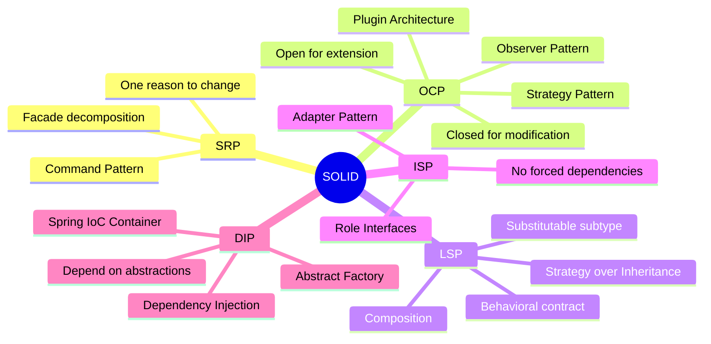

## Keywords in This File
{: .no_toc }

| # | Keyword | Weight |
|---|---|---|
| 1 | [SOLID Principles and Design Pattern Synthesis](#solid-principles-and-design-pattern-synthesis) | medium |

---

# SOLID Principles and Design Pattern Synthesis

---
id: DP-030
title: SOLID Principles and Design Pattern Synthesis
category: Design Patterns
difficulty: ★★★
interview_weight: critical
asked_at: Staff/Principal
seniority: staff
tags: #solid, #design-patterns, #ocp, #srp, #dip, #isp, #lsp, #architecture
status: draft
version: 1
---

### 🎯 Model Answer

**30 seconds:**
> SOLID is five object-oriented design principles that guide toward
> maintainable, extensible code. SOLID and design patterns are deeply
> linked: patterns are the concrete implementations of SOLID principles.
> Strategy enforces OCP. Factory + DI enforce DIP. Command enforces SRP.
> Decorator enforces OCP+ISP. Understanding SOLID tells you WHY a pattern
> is applied; understanding patterns tells you HOW to apply a principle.

**3 minutes (Senior):**
> The synthesis: SOLID violations are the diagnostic; patterns are the
> treatment. SRP violation (class does too much) -> Facade or Command.
> OCP violation (class changes for each new variant) -> Strategy or
> Observer. LSP violation (subclass breaks base behavior) -> Strategy
> over inheritance. ISP violation (fat interface) -> Adapter or Interface
> segregation. DIP violation (high depends on low) -> Abstract Factory
> or DI container.
>
> The most misunderstood: LSP (Liskov Substitution). Not just "subclass
> must implement all methods" - it means subclass must not weaken
> preconditions, must not strengthen postconditions, and must preserve
> invariants. A `Square extends Rectangle` violates LSP: setting width
> on a Square changes height too, breaking the Rectangle's invariant
> (independent width and height). LSP is violated not by compilation
> failures but by behavioral surprises.
>
> At the architecture level: SOLID scales beyond classes. Microservices
> apply SRP (one service, one bounded context), OCP (a service's API
> is stable; add new endpoints rather than breaking old ones), and DIP
> (depend on interfaces/contracts, not on other services' internals).

**Blank Mind Recovery:**

**(1) Restate:** "SOLID - five principles guiding OO design. Patterns
are the implementations of these principles in code."

**(2) First principles:** "SRP: one reason to change. OCP: open for
extension, closed for modification. LSP: substitute without surprise.
ISP: clients should not depend on unused interfaces. DIP: depend on
abstractions, not concretions."

**(3) Bridge:** "Like the rules of architecture: a SOLID-compliant
codebase is like a well-designed building - rooms have single purposes
(SRP), new floors can be added without demolishing existing ones (OCP),
any door fits any doorframe of the same spec (LSP), each room has only
the outlets it needs (ISP), and walls depend on load-bearing specifications,
not specific beams (DIP)."

---

### 📘 Concept Explanation

**SRP - Single Responsibility Principle:**

> A class should have only one reason to change.

A "reason to change" = a stakeholder or use case that drives changes.
`UserService` that handles user CRUD, sends welcome emails, generates
reports, and manages authentication has 4 reasons to change (product
team, email team, analytics team, security team). Split it.

Patterns that enforce SRP: Command (each command class handles one action),
Strategy (each strategy handles one algorithm), Facade (decompose a god
class into coordinated single-responsibility services).

**OCP - Open/Closed Principle:**

> Software entities should be open for extension, closed for modification.

Adding new behavior by adding new code, not changing existing code.
The extension axis: Strategy (new behavior = new Strategy class),
Observer (new reaction = new Observer), Plugin Architecture (new
functionality = new plugin).

Critical nuance: "closed for modification" does not mean never change.
It means the stable parts (the interface, the host) do not change when
the varying parts (implementations) change.

**LSP - Liskov Substitution Principle:**

> Subtypes must be substitutable for their base types.

The behavioral contract must be preserved in subclasses. Three behavioral
rules: (1) Preconditions: a subclass cannot require more than the base
class. (2) Postconditions: a subclass must deliver at least what the base
class promises. (3) Invariants: properties always true for the base class
must remain true for the subclass.

The Square/Rectangle violation: `Rectangle.setWidth(5)` implies width=5,
height unchanged. `Square.setWidth(5)` sets both width and height to 5.
Code that expects `setWidth` to only affect width breaks with `Square`.

Patterns that address LSP violations: Strategy over inheritance (use
composition instead of inheritance when subclass behavior diverges),
Decorator (add behavior without inheriting).

**ISP - Interface Segregation Principle:**

> Clients should not be forced to depend on interfaces they do not use.

Fat interfaces force implementors to implement methods they do not need.
This creates coupling and forces changes (a new method in a fat interface
forces all implementations to change).

Patterns: Adapter (adapt a fat interface to a thin client-specific interface),
Interface segregation (split the fat interface into role-specific interfaces).

**DIP - Dependency Inversion Principle:**

> High-level modules should not depend on low-level modules. Both should
> depend on abstractions. Abstractions should not depend on details.
> Details should depend on abstractions.

The "inversion": traditionally, high-level code calls low-level code directly
(dependency flows downward). DIP inverts this: high-level defines an interface
(abstraction); low-level implements it (details depend on abstraction).

Spring's DI container is the most common implementation of DIP. Beans
declare dependencies on interfaces; Spring injects concrete implementations.
`OrderService` depends on `OrderRepository` (interface). Spring injects
`JpaOrderRepository` (implementation). Swapping implementations requires
no change to `OrderService`.

---

### 💻 Code Example

```java
// SRP VIOLATION: UserService with multiple responsibilities
public class UserService {
    // Responsibility 1: user management
    public User createUser(String name, String email) { ... }
    public User getUser(Long id) { ... }
    public void deleteUser(Long id) { ... }

    // Responsibility 2: email
    public void sendWelcomeEmail(User user) { ... }
    public void sendPasswordResetEmail(User user) { ... }

    // Responsibility 3: reporting
    public Report generateUserReport(DateRange range) { ... }
    public int countActiveUsers() { ... }

    // Responsibility 4: authentication
    public String generateToken(User user) { ... }
    public boolean validateToken(String token) { ... }
}
// 4 reasons to change = 4 teams stepping on each other
// Hard to test: must mock 10+ dependencies for any test
```

> **Code walkthrough:** `UserService` has four distinct responsibilities.
> Every change to email logic risks breaking user CRUD. Every change to
> authentication requires deploying the entire service. Tests require
> mocking database, email client, report generator, and token library
> simultaneously. The class is not cohesive.

```java
// SRP FIX: Each class has one responsibility
@Service
public class UserManagementService {
    // Only: create, read, update, delete users
    private final UserRepository repository;
    public User createUser(String name, String email) { ... }
}

@Service
public class UserEmailService {
    // Only: email operations
    private final EmailClient emailClient;
    public void sendWelcomeEmail(User user) { ... }
}

@Service
public class UserReportService {
    // Only: reporting
    private final UserRepository repository;
    public Report generateUserReport(DateRange range) { ... }
}

@Service
public class TokenService {
    // Only: JWT operations
    private final JwtProperties jwtProps;
    public String generateToken(User user) { ... }
}

// UserRegistrationService orchestrates (Facade):
@Service
public class UserRegistrationService {
    private final UserManagementService users;
    private final UserEmailService emails;
    private final TokenService tokens;

    public UserRegistrationResult register(RegisterRequest r) {
        User user = users.createUser(r.getName(), r.getEmail());
        emails.sendWelcomeEmail(user);
        String token = tokens.generateToken(user);
        return new UserRegistrationResult(user, token);
    }
}
```

> **Code walkthrough:** Four focused services, each with one responsibility.
> `UserRegistrationService` orchestrates the registration flow - it is
> a Facade over the four services. Each service is independently testable
> with a small set of mock dependencies. Email changes do not touch user
> CRUD. Authentication changes do not touch reporting.

```java
// OCP VIOLATION: switch statement grows with each format
public class DataExporter {
    public void export(Data data, String format) {
        switch (format) {
            case "csv":
                // export as CSV
                break;
            case "json":
                // export as JSON
                break;
            case "xml":
                // export as XML
                break;
            // Adding YAML: modify this class (OCP violated)
        }
    }
}
```

> **Code walkthrough:** Every new format requires modifying `DataExporter`.
> The switch statement grows. Risk: changing the switch for YAML
> accidentally breaks CSV. Tests for YAML require testing all cases.

```java
// OCP FIX: Strategy pattern
public interface ExportStrategy {
    String getFormat();
    byte[] export(Data data);
}

@Component
public class CsvExportStrategy implements ExportStrategy {
    public String getFormat() { return "csv"; }
    public byte[] export(Data data) { /* csv logic */ }
}

@Component
public class JsonExportStrategy implements ExportStrategy {
    public String getFormat() { return "json"; }
    public byte[] export(Data data) { /* json logic */ }
}

@Service
public class DataExporter {
    private final Map<String, ExportStrategy> strategies;

    public DataExporter(List<ExportStrategy> strategies) {
        this.strategies = strategies.stream()
            .collect(Collectors.toMap(
                ExportStrategy::getFormat, s -> s));
    }

    public byte[] export(Data data, String format) {
        return Optional.ofNullable(strategies.get(format))
            .orElseThrow(() ->
                new UnsupportedFormatException(format))
            .export(data);
    }
}
// Adding YAML: new YamlExportStrategy @Component, done.
// DataExporter never modified.
```

> **Code walkthrough:** `DataExporter` is closed for modification. Newice. **KEY MECHANISM:** the runtime executes these instructions in sequence with specific memory and execution semantics. **WHY IT MATTERS:** misapplying this pattern causes subtle bugs that only manifest under production load. **TAKEAWAY: understand the execution model before using this pattern in production code.**
> formats extend the system by adding a new class. The strategy map is
> populated by Spring's `List<ExportStrategy>` injection - auto-discovery.
> YAML export added: create `YamlExportStrategy`, annotate `@Component`,
> done. Zero changes to `DataExporter`, `CsvExportStrategy`, or any
> other format.

```java
// LSP VIOLATION: Square extends Rectangle
public class Rectangle {
    protected int width;
    protected int height;

    public void setWidth(int w)  { this.width = w; }
    public void setHeight(int h) { this.height = h; }
    public int area() { return width * height; }
}

public class Square extends Rectangle {
    @Override
    public void setWidth(int w) {
        // Square: width and height must be equal
        this.width = w;
        this.height = w; // SURPRISE: height changed too!
    }
    @Override
    public void setHeight(int h) {
        this.height = h;
        this.width = h;  // SURPRISE: width changed too!
    }
}

// This code works for Rectangle but breaks for Square:
static void doubleWidth(Rectangle r) {
    int originalHeight = r.height;
    r.setWidth(r.width * 2);
    // Assertion: area = width*2 * originalHeight
    assert r.area() == r.width * originalHeight; // FAILS for Square
    // Square's setWidth changed height too
}
```

> **Code walkthrough:** `doubleWidth()` operates on a `Rectangle`ice. **KEY MECHANISM:** the runtime executes these instructions in sequence with specific memory and execution semantics. **WHY IT MATTERS:** misapplying this pattern causes subtle bugs that only manifest under production load. **TAKEAWAY: understand the execution model before using this pattern in production code.**
> reference. It stores the original height and doubles the width.
> For `Rectangle`: the area doubles. For `Square`: `setWidth` changes
> both width and height; the stored height is now stale. The assertion
> fails. This is LSP violation: `Square` is not substitutable for
> `Rectangle`. The invariant violated: for `Rectangle`, `setWidth`
> affects only width. `Square` breaks this invariant.

```java
// LSP FIX: Prefer composition over inheritance when LSP is violated
// Shape hierarchy without the violation:
public interface Shape {
    int area();
}

public final class Rectangle implements Shape {
    private final int width;
    private final int height;
    public Rectangle(int width, int height) {
        this.width = width;
        this.height = height;
    }
    public int area() { return width * height; }
    // No setters: immutable - no mutation surprises
}

public final class Square implements Shape {
    private final int side;
    public Square(int side) { this.side = side; }
    public int area() { return side * side; }
}
// Both implement Shape.
// Square does not extend Rectangle.
// No inheritance, no substitution surprise.
```

> **Code walkthrough:** The fix: use interfaces instead of inheritance.
> Both `Rectangle` and `Square` implement `Shape`. No inheritance
> relationship between them. Both are immutable (no setters). No invariant
> can be violated. Code that operates on `Shape` works correctly for both.
> The LSP violation was caused by inheritance + mutability. Remove either
> and the violation disappears.

```java
// DIP VIOLATION: High-level depends on low-level concrete
public class OrderProcessor {
    // Depends on concrete class (low-level detail)
    private final MySqlOrderRepository repository
        = new MySqlOrderRepository();

    public void process(Order order) {
        // OrderProcessor cannot work without MySQL
        repository.save(order);
    }
}
// Cannot test without MySQL
// Cannot swap to PostgreSQL without changing OrderProcessor
```

> **Code walkthrough:** `OrderProcessor` creates `MySqlOrderRepository`ice. **KEY MECHANISM:** the runtime executes these instructions in sequence with specific memory and execution semantics. **WHY IT MATTERS:** misapplying this pattern causes subtle bugs that only manifest under production load. **TAKEAWAY: understand the execution model before using this pattern in production code.**
> directly. It depends on a concrete implementation. Tests require MySQL.
> Swapping databases requires changing `OrderProcessor`. The direction
> of dependency: `OrderProcessor` -> `MySqlOrderRepository`.
> The inversion needed: `OrderProcessor` -> `OrderRepository` (interface)
> <- `MySqlOrderRepository`.

```java
// DIP FIX: Depend on abstraction, inject the concretion
public interface OrderRepository {
    void save(Order order);
    Optional<Order> findById(Long id);
}

@Repository
public class JpaOrderRepository implements OrderRepository {
    private final EntityManager em;
    public void save(Order order) { em.persist(order); }
    public Optional<Order> findById(Long id) { ... }
}

@Service
public class OrderProcessor {
    private final OrderRepository repository; // abstraction

    // Spring injects JpaOrderRepository
    public OrderProcessor(OrderRepository repository) {
        this.repository = repository;
    }

    public void process(Order order) {
        repository.save(order);
    }
}
// Test: inject new InMemoryOrderRepository() (test double)
// Swap to MongoDB: new MongoOrderRepository() (no code change
// in OrderProcessor)
```

> **Code walkthrough:** `OrderProcessor` depends on `OrderRepository`ice. **KEY MECHANISM:** the runtime executes these instructions in sequence with specific memory and execution semantics. **WHY IT MATTERS:** misapplying this pattern causes subtle bugs that only manifest under production load. **TAKEAWAY: understand the execution model before using this pattern in production code.**
> (abstraction). `JpaOrderRepository` implements `OrderRepository`
> (detail depends on abstraction - the DIP inversion). Spring injects
> `JpaOrderRepository`. Tests inject `InMemoryOrderRepository`.
> `OrderProcessor` is unchanged for either. The dependency direction:
> `OrderProcessor` -> `OrderRepository` (interface) <- `JpaOrderRepository`.
> Both high-level and low-level depend on the abstraction.

---

### 🎓 Answers by Seniority

**Junior / Mid (0-5 years):**
> SOLID is five principles for object-oriented design. SRP: one class
> does one thing. OCP: add new behavior by adding new classes, not
> changing existing ones. LSP: subclasses must behave like their parent
> (no surprises). ISP: interfaces should be small and focused, not fat.
> DIP: code to interfaces, not concrete classes; use dependency injection.
> In Spring Boot: DI enforces DIP (inject interfaces, not implementations),
> `@Service` classes should follow SRP, and Strategy/Factory patterns
> implement OCP.

---

**Senior / Staff (5+ years):**
> SOLID tells you what is wrong; patterns tell you how to fix it. My
> workflow: identify the SOLID violation first, then select the pattern
> that addresses it. OCP violation with algorithm variation -> Strategy.
> OCP violation with object creation variation -> Factory. SRP violation
> with too many concerns -> decompose into focused services, possibly using
> Facade for orchestration. DIP violation -> introduce an interface and
> let DI resolve it.
>
> The subtlest principle is LSP. Developers think LSP is about "implement
> all methods" but it is about behavioral contracts. A class that overrides
> a method and throws `UnsupportedOperationException` is an LSP violation.
> A class that overrides a method and has weaker preconditions (requires
> less from callers) is fine. A class that requires more (stronger preconditions)
> breaks LSP. In Java: read-only collections returned by `Collections.unmodifiableList()`
> are an LSP violation for `List` - `add()` throws `UnsupportedOperationException`,
> breaking the contract of `List`.

---

### 🏛️ System Design

**Scenario: Applying SOLID to an E-Commerce Order Management System**

Problem: An order management system is becoming difficult to maintain.
Adding new payment providers requires changes in 6 places. The `OrderService`
is 4,000 lines. New developers take weeks to understand the codebase.

**SOLID-guided design:**

```
ANALYSIS: SOLID violations in the existing system

Violation: SRP
  OrderService: creates orders, processes payments,
  sends notifications, generates invoices, manages inventory.
  5 responsibilities = 5 teams stepping on each other.
  -> Decompose: OrderCreationService, PaymentService,
     NotificationService, InvoiceService, InventoryService.
  -> Orchestrator: OrderWorkflow (Facade/Saga) calls each.

Violation: OCP
  PaymentService has if/else for Stripe, PayPal, Braintree.
  Each new provider modifies PaymentService.
  -> Strategy: PaymentProvider interface.
     Each provider is a separate Strategy implementation.
     PaymentService delegates to the selected strategy.

Violation: DIP
  OrderCreationService imports StripePaymentService directly.
  Tests require real Stripe API key.
  -> Define PaymentProvider interface.
     OrderCreationService depends on PaymentProvider (abstraction).
     Spring injects StripePaymentProvider.
     Tests inject MockPaymentProvider.
```

> **Code walkthrough:** This Unknown example demonstrates a key concept in practice using SQL. **KEY MECHANISM:** the runtime executes these instructions in sequence with specific memory and execution semantics. **WHY IT MATTERS:** misapplying this pattern causes subtle bugs that only manifest under production load. **TAKEAWAY: understand the execution model before using this pattern in production code.**

**Result:**

- Adding a new payment provider: 1 new class, 0 existing class changes.
- `OrderCreationService`: 200 lines, one responsibility, tested with mocks.
- New developer time to understand payment flow: 30 minutes (5 Provider
  implementations, each 100 lines, each self-contained).

---

### 📊 Diagram

```
SOLID to Pattern Mapping

SRP Violation:
  God Class (5 responsibilities)
  -> Decompose with Command/Facade
  Result: 5 focused classes

OCP Violation:
  if/else chain for variants
  -> Strategy / Factory / Observer
  Result: Extension by addition

LSP Violation:
  Subclass breaks base contract
  -> Strategy (composition over inheritance)
  Result: Substitutable via interface

ISP Violation:
  Fat interface forces empty implements
  -> Adapter / Interface segregation
  Result: Clients depend only on what they use

DIP Violation:
  High depends on low concretion
  -> Abstract Factory / DI Container
  Result: High depends on abstraction
```



> **Diagram walkthrough:** The mindmap shows each SOLID principle linked
> to the design patterns that implement it. SOLID and patterns are not
> separate topics - they are two views of the same underlying design
> quality. SRP points to Command (encapsulate one action) and Facade
> (decompose a god class). OCP points to Strategy, Observer, and Plugin
> (extend without modifying). LSP points to Strategy and composition as
> alternatives to inheritance. ISP points to Adapter and role interfaces.
> DIP points to Abstract Factory and the DI container. Mastering SOLID
> means knowing which pattern to reach for when each principle is violated.

---

### ⚠️ Common Misconceptions

**Misconception 1: "SRP means a class should have only one method"**

Reality: SRP means one reason to change, which corresponds to one
stakeholder or responsibility axis. A `UserManagementService` with
`createUser`, `updateUser`, `deleteUser`, and `getUser` has one reason
to change (user management requirements). That is SRP-compliant despite
having 4 methods. A `UserService` with user CRUD + email + authentication
has multiple reasons to change - that violates SRP.

**Misconception 2: "OCP means never modify existing code"**

Reality: OCP is about the stable abstraction layer not changing when
implementations vary. The interface is closed; new implementations are
open. Bug fixes, refactoring, and performance improvements still happen.
The principle says: do not add a new case to an existing class when
you could add a new class that implements the existing interface.

**Misconception 3: "LSP is satisfied if the code compiles"**

Reality: LSP is behavioral, not syntactic. `Square extends Rectangle`
compiles. `Collections.unmodifiableList()` implements `List` and compiles.
Both violate LSP because they break behavioral contracts (modification
invariants). The test: can you substitute the subtype anywhere the base
is expected, without changing the behavior of the client code?

---

### 🚨 Failure Modes and Diagnosis

**Failure 1: LSP violation causes silent behavioral bugs**

Symptom: code works correctly for the base type but produces wrong results
for a subtype. Tests using the base type pass; tests using the subtype fail.

Diagnosis: add behavioral contract tests for the base type as a test suite,
then run the same suite on each subtype.

```java
// Contract test:
abstract class RepositoryContractTest<R extends Repository> {
    protected R repository;

    @Test
    void save_and_find_returns_same_entity() {
        Entity e = createTestEntity();
        repository.save(e);
        assertThat(repository.findById(e.getId()))
            .isPresent()
            .contains(e);
    }
    // Run for: JpaRepository, InMemoryRepository, MongoRepository
    // All must pass the same behavioral tests
}
```

> **Code walkthrough:** This Unknown example demonstrates Java API usage. **KEY MECHANISM:** the JVM compiles to bytecode that runs on the JVM; JIT compiles hot paths to native. **WHY IT MATTERS:** unchecked assumptions about thread safety cause data races under concurrent load. **TAKEAWAY: document thread-safety guarantees on every shared mutable class.**

**Failure 2: OCP violation discovered during sprint**

Symptom: adding a new variant (payment provider, export format) requires
modifying 5+ existing files. Risk of regression.

Diagnosis: count files changed in the PR for a "new variant" type of
feature. If > 1 file changed for adding a new variant, OCP is violated.
The fix: introduce the Strategy/Factory abstraction before the next
similar change.

**Failure 3: DIP violation causing test complexity**

Symptom: unit tests require database connections, external API calls,
or file system access. Tests are slow and flaky.

Diagnosis: look at the constructors of tested classes. Any `new` call
to a concrete class with dependencies (DB, HTTP client) is a DIP violation.
Fix: extract interface, inject via constructor, inject mock in tests.

---

### 🎯 Interview Deep-Dive

| Format | Time | Goal |
|---|---|---|
| 30-second definition | 0-30s | Five principles + pattern synthesis |
| 3-minute explanation | 30s-3m | Each principle with violation + fix |
| Deep questions | 3m+ | LSP nuances, trade-offs, scale |

**Minimum 12 questions for ★★★:**

---

**Q1 (DEFINITION): What are the SOLID principles? Give one concrete Java example for each.**

A: SRP - Single Responsibility: one reason to change.
Example: `UserService` that handles user CRUD should not also send emails.
Split into `UserService` and `UserEmailService`.

OCP - Open/Closed: open for extension, closed for modification.
Example: a `ReportGenerator` with `if (type.equals("pdf"))` that must be
modified for each new format. Fix: `ReportStrategy` interface; each format
is a new class.

LSP - Liskov Substitution: subtypes substitutable without behavioral surprise.
Example: `Square extends Rectangle` breaks `setWidth` invariant (changes height
too). Fix: both implement `Shape` without inheritance.

ISP - Interface Segregation: clients do not depend on unused methods.
Example: a `UserRepository` interface with `findById`, `save`, `delete`,
`generateReport`, `sendEmail`. A reporting service only needs `findById`.
Fix: separate `UserReadRepository` and `UserWriteRepository` interfaces.

DIP - Dependency Inversion: depend on abstractions.
Example: `OrderProcessor` with `new MySqlRepository()` directly.
Fix: inject `OrderRepository` interface; Spring provides `JpaOrderRepository`.

*What separates good from great:* SOLID principles are not independent.
OCP requires DIP: to be closed for modification when opening for extension,
the client must depend on an abstraction (DIP) that new implementations
fulfill. SRP and ISP both address cohesion: SRP at the class level,
ISP at the interface level.

---

**Q2 (MECHANISM): Why is LSP often violated with Java's collection hierarchy?**

A: `java.util.Collections.unmodifiableList()` returns an implementation
of `List` that throws `UnsupportedOperationException` for `add()`, `remove()`,
and other mutating operations. The `List` contract (from
`java.util.AbstractList`) documents that `add()` should add an element.
The unmodifiable list violates this by throwing. Code that depends on
`List.add()` working fails with `UnsupportedOperationException` when
given an unmodifiable list.

The same applies to `Arrays.asList()`: the returned list supports `set()`
but not `add()`. Passing it to code that calls `add()` produces
`UnsupportedOperationException`.

Java's collection hierarchy is a widely-cited example of LSP violation
in a standard library. The reason it exists: practicality (a `List` that
is sometimes immutable is very useful) overrode LSP purity. The Java design
decision was to use runtime exceptions for "optional operations" - documented
in the `List` Javadoc. Modern Java (Java 9+): `List.of()` returns an
explicitly immutable list; the immutability is part of its documented contract
(not an LSP violation of `List`, but a different contract).

*What separates good from great:* Distinguishing between "LSP violation"
and "documented optional operation." `Collections.unmodifiableList()` is
argued to be an LSP violation because callers of `List` expect mutability.
`List.of()` is not an LSP violation because it establishes its own contract
(immutable from the start). The practical takeaway: in your own code,
do not return `Collection` interfaces from methods when the returned
collection has fewer capabilities than the interface implies.

---

**Q3 (COMPARISON): How do DIP and the Service Locator pattern differ?
Is Service Locator an OOP anti-pattern?**

A: DIP (via constructor injection): dependencies are declared in the
constructor. The dependency graph is visible and explicit. Classes are
testable without a container (inject mocks directly). The container
(Spring) wires everything.

Service Locator: classes call `ServiceLocator.get(OrderRepository.class)`
to obtain their dependencies. The dependency is hidden inside the class
body. Dependencies are not visible in the constructor. Tests must configure
the global service locator before each test.

Service Locator is considered an anti-pattern (Martin Fowler, Robert C.
Martin) for these reasons: (1) hidden dependencies (violations are not
visible in the class signature), (2) test complexity (global locator state
must be reset between tests), (3) coupling to the locator (the class depends
on the locator mechanism, not just the dependency).

DIP is superior because it makes dependencies explicit (constructor
signature = dependency manifest), makes classes easier to test, and
decouples classes from the wiring mechanism.

Spring's `@Autowired` on fields is a mild form of Service Locator:
the dependency is declared in the field, not the constructor, and is
not visible to non-Spring users of the class. Constructor injection is
the DIP-pure approach.

*What separates good from great:* Spring's `ApplicationContext.getBean()`
is a Service Locator. It is valid when you legitimately need dynamic
resolution at runtime (plugin registry, looking up beans by name or type
at request time). The misuse: using `getBean()` in constructors or service
methods to fetch static dependencies that should be injected.

---

**Q4 (ARCHITECTURE): How does SOLID apply to microservices architecture?**

A: Each principle scales to the service level:

SRP at service level: one service, one bounded context. A service that
handles user management, orders, AND payments violates SRP. When orders
change, the user management code is at risk. Decompose by bounded context.

OCP at API level: a service's API (contract) is the stable interface.
Adding new endpoints (extending) is fine. Changing existing endpoint
signatures (modifying) breaks clients. API versioning implements OCP:
`/v1/orders` stays stable; `/v2/orders` extends without breaking v1 clients.

LSP at protocol level: if Service A consumes Service B's API, and Service
C is a replacement for Service B, Service C must honor the same behavioral
contract. This is the Liskov principle for services: substituting one
service implementation should not break consumers.

DIP at dependency level: Service A should not directly call Service B's
internal database or implementation. Service A depends on Service B's
contract (API). Service B's implementation details (database type,
framework) are hidden behind the contract.

ISP at event level: a message schema in Kafka should contain only the
fields the consuming service needs. A fat event schema that includes all
possible fields couples consumers to producer changes.

*What separates good from great:* The hardest SOLID principle for
microservices is OCP. Adding a new field to a shared event schema or
REST response without breaking existing consumers requires careful
evolution patterns: adding fields is backward compatible, removing fields
breaks consumers. Consumer-Driven Contract tests (Pact framework) enforce
LSP at the service level: the consumer defines the contract, and the
provider's tests verify the contract is honored.

---

**Q5 (PRODUCTION): Describe a real production incident caused by an LSP violation.**

A: A common production incident: `Optional.get()` replacement. A library
update changes a method's return type from `T` to `Optional<T>`. Code
that called `.get()` on the result expecting a non-null value now receives
an `Optional` that throws `NoSuchElementException` when not present.

More directly: a service contract violation. Service A depended on Service B
returning a sorted list (`findOrdersByDate()` always returned in ascending
date order - undocumented but relied upon). Service B was refactored to
use a hash-based sort for performance. The order of results changed. Service A's
pagination broke (page 2 showed items from page 1 because the sort changed).

The LSP connection: Service A relied on an implicit behavioral contract
(sorted order). Service B's refactoring violated an implicit postcondition.
The fix: document the sort guarantee in the contract, add a test in Service
B that verifies results are sorted ascending, and add a contract test that
Service A runs against Service B's interface.

*What separates good from great:* "Implicit contracts" are the most dangerous
LSP violations. Documented postconditions (in Javadoc, OpenAPI spec, or
test) can be verified. Undocumented behavioral expectations become surprises
during refactoring. The discipline: document the behavioral contract of
every public API method, and write contract tests that verify the behavior.

---

**Q6 (TRADE-OFF): When is violating SOLID acceptable?**

A: SOLID is a guide, not a law. Acceptable violations: (1) SRP in tests:
test classes often have multiple responsibilities (setup, execution,
verification) within a single test method. This is fine for tests; strict
SRP in test code adds no value. (2) ISP in simple internal code: a fat
interface that is only implemented once, used by one client, and unlikely
to change. The overhead of splitting is not justified by the benefit.
(3) OCP for early-stage code: the first version of a feature often has
one implementation. Adding an abstraction layer before the second
implementation exists (YAGNI) is premature. Add the abstraction when
the second implementation arrives. (4) DIP in pure utilities: a utility
function that formats strings has no need for interface abstractions.
It is inherently pure and stable.

The meta-principle: SOLID principles have a cost (more classes, more
abstraction, more indirection). The cost is justified when the problem
they solve is real (frequent change, difficult testing, tight coupling).
Apply SOLID where the pain is real; avoid it where it adds complexity
without solving a real problem.

*What separates good from great:* SOLID is about reducing the cost of
change. If a piece of code is unlikely to change, SRP and OCP provide
little value. The principle applies most strongly to: code that changes
frequently, code that is extended by multiple teams, code that is tested
frequently, and code that is a dependency for many other components.

---

**Q7 (DEBUGGING): How do you detect SOLID violations programmatically
in a large codebase?**

A: Automated detection tools: (1) Checkstyle/PMD: rule sets for class
size (SRP proxy: class > 200 lines is a flag for SRP violation), method
length, number of dependencies per class. (2) ArchUnit: architectural
tests in Java that can enforce SOLID rules programmatically. Example:
```java
// ArchUnit test: no class depends directly on a concrete
// @Repository from a non-@Repository class
@AnalyzeClasses(packages = "com.example")
public class SolidRulesTest {
    @ArchTest
    static final ArchRule noConcreteDependencies =
        noClasses().that().areAnnotatedWith(Service.class)
            .should().dependOnClassesThat()
            .areAnnotatedWith(Repository.class)
            .andShould().not().beInterfaces();
    // Services should depend on Repository interfaces,
    // not concrete @Repository implementations
}
```
> **Code walkthrough:** This Unknown example demonstrates contract definition using Spring annotation. **KEY MECHANISM:** the JVM uses dynamic dispatch for all interface method calls. **WHY IT MATTERS:** interfaces with default methods can conflict at compile time via diamond problem. **TAKEAWAY: interfaces define contracts; prefer them over abstract classes for unrelated types.**

(3) SonarQube cognitive complexity metric: high cognitive complexity
per method correlates with SRP violations. (4) Number of @Autowired
dependencies: a Spring bean with 8+ injected dependencies is a God
Class candidate (SRP violation). Fail the build if any @Service has
more than 5 constructor dependencies.

*What separates good from great:* Programmatic enforcement (ArchUnit,
Checkstyle rules, build gates) is the only way to maintain SOLID in a
large team. Manual code reviews miss patterns in large PRs. Automated
gates catch: new SRP violations (class > 200 lines), new DIP violations
(depends on concrete class), and new ISP violations (interface > 5 methods).

---

**Q8 (COMPARISON): SOLID vs GRASP vs Law of Demeter - how do they relate?**

A: SOLID: five principles for class/module design. Focused on:
responsibility, extensibility, substitution, interface design, dependency
direction.

GRASP (General Responsibility Assignment Software Patterns): nine patterns
for assigning responsibilities to classes. Core patterns: Information
Expert (assign responsibility to the class that has the most information),
Creator (who creates objects), Controller (what handles user events),
Low Coupling (minimize dependencies), High Cohesion (keep related things
together).

GRASP and SOLID complement each other. GRASP's High Cohesion maps to
SOLID's SRP. GRASP's Low Coupling maps to SOLID's DIP (minimal dependencies
on concretions). GRASP's Creator maps to SOLID's DIP (factories create
concretions, clients use abstractions).

Law of Demeter (LoD, "don't talk to strangers"): a method should only
call: methods on itself, methods on parameters, methods on objects it
creates, methods on direct component fields. It should NOT call methods
on objects returned by other methods: `order.getCustomer().getAddress().getCity()`
chains 3 levels deep - Law of Demeter violation. The violation creates
coupling: changes to `Customer` or `Address` break this call chain.

SOLID, GRASP, and LoD all reduce coupling and improve cohesion from
different angles. Together: use SOLID at the architecture level, GRASP
for responsibility assignment decisions, LoD for method-level coupling.

*What separates good from great:* Law of Demeter violations in Java are
easy to detect: `object.get().get().get()` chains. In Spring: `repository.findAll().stream().map(e -> e.getRelationship().getField())` - the stream
operation traverses a relationship that could be a lazy-loaded proxy,
causing N+1 queries. LoD violation AND a performance bug.

---

**Q9 (ARCHITECTURE): How does the hexagonal architecture implement SOLID?**

A: Hexagonal architecture (Ports and Adapters) is a structural implementation
of SOLID at the architecture level. (1) SRP: the core domain (hexagon)
has one responsibility - business logic. Adapters have one responsibility
- translating between the domain and external systems. (2) OCP: adding
a new database adapter does not change the domain. Adding a new UI adapter
does not change the domain or the database adapter. (3) DIP: the domain
defines interfaces (ports). Adapters implement the interfaces (the domain
does not depend on adapters; adapters depend on ports). Dependency flow:
Adapter -> Port (interface defined in domain) <- Domain.
(4) ISP: ports are narrow interfaces. A `UserRepository` port defines
only what the domain needs (findById, save). It does not include reporting
methods needed by the reporting adapter. (5) LSP: any adapter that implements
the port must honor the behavioral contract. A MongoDB adapter and a
PostgreSQL adapter are substitutable because they both implement the same port.

*What separates good from great:* Hexagonal architecture is SOLID applied
at the macro level. The "hexagon" pattern is not a GoF pattern - it is
an architectural pattern. Understanding that SOLID extends from methods
to classes to services to architectures shows breadth of design thinking.

---

**Q10 (SECURITY): How does DIP improve security?**

A: DIP (constructor injection of interfaces) improves security in several ways:
(1) Testable security rules: security checks are behind interfaces.
`AuthorizationService` (interface) can be swapped with `TestAuthorizationService`
that returns controlled results. Security logic is unit-testable without
real authentication infrastructure. (2) Environment-specific implementations:
production uses `JwtAuthorizationService`; tests use `MockAuthorizationService`.
No secrets (JWT signing keys) needed in test environments.
(3) Auditable dependency graph: constructor injection makes all dependencies
visible. A security review of `OrderService` shows: `OrderRepository`,
`PaymentGateway`, `AuthorizationService` in the constructor.
No hidden `ApplicationContext.getBean()` calls that could bypass security.
(4) Security policy abstraction: `SecurityPolicy` interface abstracts
the authorization rules. The policy can be changed (new ACL model) without
changing business logic. Policy implementations are isolated and testable.

*What separates good from great:* Field injection (`@Autowired` on fields)
hides dependencies. A class with 5 `@Autowired` fields has 5 hidden
dependencies, including potentially a `SecurityService`. Constructor
injection makes those 5 dependencies explicit and visible in the constructor
signature. Security review is easier: read the constructor to understand
what the class depends on.

---

**Q11 (TRADE-OFF): When is inheritance preferable to composition?**

A: The standard guidance: favor composition over inheritance. But inheritance
is appropriate when: (1) True IS-A relationship with stable behavior.
`Square` is NOT truly a `Rectangle` (behaviors diverge). But `AdminUser`
IS a `User` (all user behaviors apply, with additional admin capabilities
that do not break user behaviors). (2) Template Method pattern requires
inheritance: the base class defines an algorithm skeleton; subclasses
fill in specific steps. The algorithm structure is fixed; only the steps
vary. Composition makes this awkward. (3) Framework extension: Spring's
abstract classes (`AbstractController`, `AbstractScheduledTaskRegistrar`)
are designed for inheritance. The framework provides default behavior;
you override specific methods. Replacing with composition requires
understanding the entire framework flow.

Use inheritance when: LSP holds (subclass honors all base contracts),
the hierarchy is shallow (2-3 levels max), the relationship is truly
"is-a" (not "has-a" or "acts-as"), and the framework/library expects it.
Use composition in all other cases.

*What separates good from great:* Deep inheritance hierarchies are almost
always wrong. 5 levels of inheritance means: a method call resolution
requires traversing 5 classes. A bug in level 3 affects levels 3-5.
Adding level 6 requires understanding all 5 levels above. Real codebases
with deep inheritance: Android's `View` hierarchy (15+ levels in
some cases) is widely criticized for this reason.

---

**Q12 (BEHAVIORAL): A team asks: "We're adding a new discount type every
week. The DiscountCalculator has a 50-case switch statement. How do we fix it?"**

A: This is an OCP violation with a strategy pattern fix. Step-by-step:
(1) Define the abstraction:
```java
public interface DiscountStrategy {
    boolean appliesTo(Order order);
    Money calculate(Order order);
    int getPriority(); // tie-breaking
}
```
> **Code walkthrough:** This Unknown example demonstrates contract definition using interface. **KEY MECHANISM:** the JVM uses dynamic dispatch for all interface method calls. **WHY IT MATTERS:** interfaces with default methods can conflict at compile time via diamond problem. **TAKEAWAY: interfaces define contracts; prefer them over abstract classes for unrelated types.**

(2) Extract each case: create one `@Component` class per discount type.
Each class encapsulates one discount's eligibility check and calculation.
(3) Build the selection engine: inject `List<DiscountStrategy>` sorted
by priority. For each order: find all matching strategies, apply the
highest-priority one (or all, depending on business rules).
(4) Delete the switch statement.
(5) Verify: adding a new discount type = add one new class. The switch
never grows again.

Migration approach: do not do this in one PR. First PR: add the interface
and one strategy. The switch still exists. Second PR: extract 5 more cases.
Third PR: the switch is a fallback calling the remaining strategies. Final
PR: remove the switch. Each PR is small, testable, and reversible.

*What separates good from great:* The migration plan. A team that says
"let's refactor the whole thing this sprint" will produce a 3,000-line
PR that breaks production. The gradual migration: extract one strategy
per sprint while keeping the switch as a fallback. The switch gets shorter
each sprint. After 10 sprints: it is gone. Zero downtime, zero big-bang
refactor risk.

---

### 💻 Code Example

*(Omit: this concept does not have a programmatic interface that can be demonstrated in code. The conceptual explanation above is sufficient.)*


---

### 🏛️ System Design

*(Omit: system design diagram not applicable for this concept - see ★★★ keywords for full system design coverage.)*


---

### ⚖️ Comparison Table

*(Omit: this is a ★☆☆ foundational concept with no direct alternatives to compare - see higher-difficulty keywords for trade-off analysis.)*


---

### 📊 Diagram

*(Omit: no standalone visual diagram required for this concept - the explanations and code examples above provide sufficient clarity.)*


