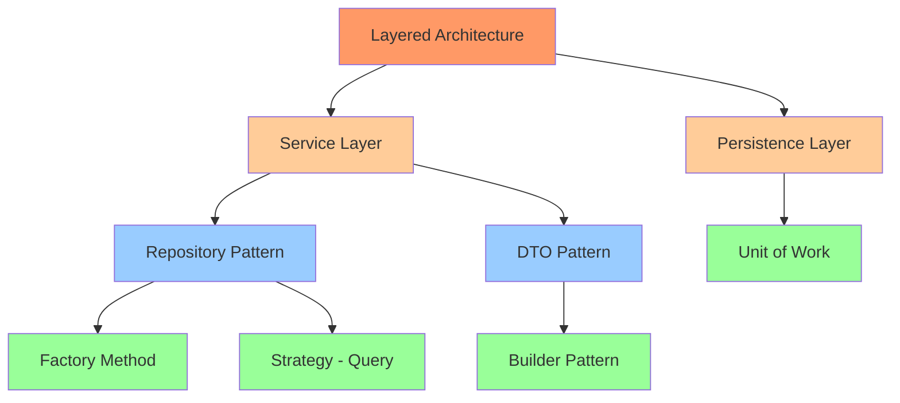
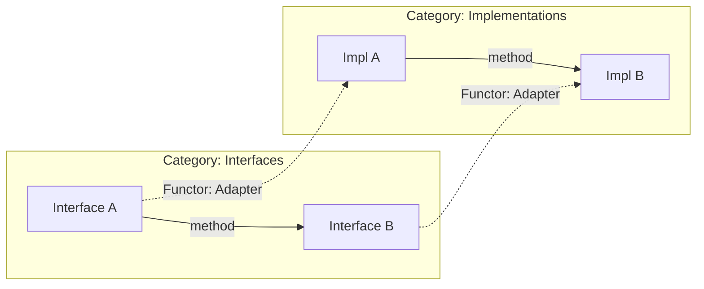
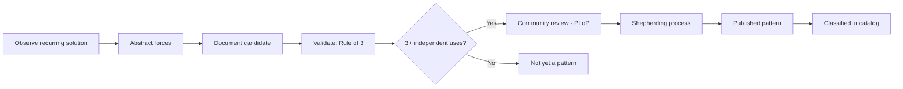

## Keywords in This File
{: .no_toc }

| # | Keyword | Weight |
|---|---|---|
| 1 | [Formal Pattern Language Theory](#formal-pattern-language-theory) | high |
| 2 | [Category Theory and Design Patterns](#category-theory-and-design-patterns) | high |
| 3 | [Pattern Research and Classification Systems](#pattern-research-and-classification-systems) | high |

---

# Formal Pattern Language Theory

**Interview Weight:** high - Principal/Architect level.
Tests understanding of Christopher Alexander's pattern
language theory, how it translates to software, the
formal properties of pattern relationships, and why
patterns form languages (not just catalogs).

---

### 🎯 Model Answer

**30 seconds:**

> A pattern language is a structured network of
> patterns where each pattern solves a problem in a
> context, and patterns reference each other forming a
> generative sequence. Christopher Alexander created
> this for architecture (buildings); the Gang of Four
> adapted it for software. The key: patterns are not
> isolated solutions - they form a language where
> combining patterns in sequence generates complete
> designs, just as combining words generates sentences.

**3 minutes (Senior):**

> Pattern language theory (Christopher Alexander, 1977):
>
> FORMAL STRUCTURE of a pattern:
> - Name: vocabulary entry for communication
> - Context: when this pattern applies (preconditions)
> - Problem: the recurring design challenge
> - Forces: tensions that make the problem hard (trade-offs)
> - Solution: the resolution that balances forces
> - Resulting Context: what is true after applying
>   (postconditions - becomes context for other patterns)
>
> PATTERN LANGUAGE properties:
>
> 1. Generativity: applying patterns in sequence
> generates a complete design. Start with large-scale
> patterns (architecture), drill into medium-scale
> (modules), finish with fine-grain (implementation).
> The sequence creates coherent designs, not random
> pattern application.
>
> 2. Context linking: each pattern's "resulting context"
> becomes the "context" for the next pattern. Factory
> Method's resulting context (object creation decoupled)
> becomes Strategy's context (algorithms must be
> selectable). Patterns CHAIN.
>
> 3. Forces resolution: each pattern resolves specific
> forces (tensions). Good patterns make forces explicit:
> "flexibility vs simplicity," "performance vs
> abstraction." The solution balances these forces for
> the given context.
>
> 4. Pattern density: well-designed systems have high
> pattern density - many patterns working together,
> each resolving different forces. Low pattern density
> = ad-hoc design. Excessive density = over-engineering.
>
> WHY "language" not "catalog":
> A catalog (GoF) lists patterns independently. A
> language shows how they COMPOSE: "If you have [X],
> then consider [Y] and [Z]." This compositional
> property makes patterns a language: combining them
> generates new, correct designs - just as grammar
> rules generate new, correct sentences.
>
> In software: GoF is a catalog. The Pattern Language
> interpretation says: "Strategy creates pluggable
> algorithms. Algorithms may need creation (Factory).
> Multiple strategies may need coordination (Mediator).
> Strategy selection may need rules (Chain of
> Responsibility)." This sequence generates a complete
> extensible architecture.

**Blank Mind Recovery:**

**(1) Restate:** "You are asking about the formal
theory of pattern languages - how patterns relate to
each other and form generative systems."

**(2) First principles:** "A language has vocabulary
(individual patterns), grammar (composition rules),
and generativity (combining them creates new valid
designs). Pattern languages have all three properties."

**(3) Bridge:** "Think of spoken language: words alone
are a dictionary. Grammar rules that combine words
into sentences make it a LANGUAGE. Similarly: patterns
alone are a catalog. Composition rules that combine
patterns into designs make it a PATTERN LANGUAGE."

---

### 📘 Concept Explanation

**What it is:**

The formal theory developed by Christopher Alexander
(A Pattern Language, 1977) that describes patterns as
interconnected, generative elements of a design
language, where each pattern resolves specific forces
in a context and creates conditions for subsequent
patterns.

**The problem it solves:**

Without pattern language theory: patterns are applied
ad-hoc ("let's use Strategy here"). With the theory:
patterns are applied in SEQUENCE, each creating the
context for the next, generating coherent designs
rather than random collections of patterns.

**How it works:**

```
PATTERN LANGUAGE STRUCTURE:

   [Large-scale patterns]
          |
          | resulting context = next context
          v
   [Medium-scale patterns]
          |
          | resulting context = next context
          v
   [Fine-grain patterns]

EXAMPLE GENERATIVE SEQUENCE:
Layered Architecture (large)
  -> creates context for:
Service Layer (medium)
  -> creates context for:
Repository Pattern (medium)
  -> creates context for:
Factory Method (fine-grain, creates entities)
Strategy (fine-grain, query strategies)
```



> **Diagram walkthrough:** Generative sequence from
> large-scale (architecture) to fine-grain (GoF).
> Layered Architecture creates the context for Service
> and Persistence layers. Service Layer creates context
> for Repository and DTO. Repository creates context
> for Factory and Strategy at implementation level.
> Each level's patterns enable the next level's patterns.

**The key insight:**

The GoF book presents patterns as INDEPENDENT
solutions. Alexander's theory presents patterns as
INTERDEPENDENT elements of a language. The practical
implication: when you choose a pattern, ask "what
patterns does this ENABLE?" and "what patterns does
this REQUIRE?" This prevents orphan patterns (pattern
applied without supporting patterns) and incomplete
designs (missing patterns that the chosen pattern
assumes exist).

**When pattern language theory is valuable:**

- Designing new systems (generative sequence guides
  the design from large to small scale)
- Evaluating architecture (is the pattern density
  appropriate? are pattern dependencies satisfied?)
- Teaching patterns (show how they connect, not just
  what each does individually)
- Pattern mining (discovering new patterns by analyzing
  forces in existing systems)

**When to just use the catalog:**

- Solving a single, isolated problem
- Quick refactoring (one smell, one pattern)
- Team is early in pattern adoption (theory overwhelms)

---

### 💻 Code Example

```java
// Pattern Language in action: generative sequence
// for an Order Management system

// LEVEL 1: Architecture pattern (Hexagonal)
// Creates context: ports and adapters structure
public interface OrderPort {       // Port (inbound)
    OrderResult placeOrder(OrderRequest req);
}
public interface PaymentGateway {  // Port (outbound)
    PaymentResult charge(PaymentRequest req);
}

// LEVEL 2: Service pattern (resolves orchestration)
// Context: hexagonal requires use case coordinators
@Service
public class OrderService implements OrderPort {
    private final OrderRepository repo;    // L2
    private final PaymentGateway payment;  // L1 port

    @Override
    public OrderResult placeOrder(
        OrderRequest req
    ) {
        // LEVEL 3: Factory (resolves creation)
        Order order = OrderFactory.create(req);
        // LEVEL 3: Strategy (resolves validation)
        validator.validate(order);
        // LEVEL 2: Repository (resolves persistence)
        repo.save(order);
        // LEVEL 1: Port (resolves external call)
        payment.charge(order.toPaymentRequest());
        return OrderResult.success(order);
    }
}

// LEVEL 2: Repository (resolves data access)
// Context: Service needs persistence abstraction
public interface OrderRepository {
    Order save(Order order);
    Optional<Order> findById(OrderId id);
}

// LEVEL 3: Factory (resolves complex creation)
// Context: Service creates Orders with validation
public class OrderFactory {
    public static Order create(OrderRequest req) {
        // Builder (LEVEL 3) resolves construction
        return Order.builder()
            .customer(req.customerId())
            .items(mapItems(req.items()))
            .status(OrderStatus.PENDING)
            .createdAt(Instant.now())
            .build();
    }
}
```

> **Code walkthrough:** Generative sequence in action.
> Level 1 (Hexagonal Architecture) creates context for
> ports. Level 2 (Service, Repository) fills those
> ports with behavior. Level 3 (Factory, Builder,
> Strategy) handles fine-grain concerns within Level 2.
> Each pattern assumes the context created by patterns
> above it. Remove Hexagonal: Service has no port
> structure to implement. Remove Repository: Service
> couples directly to database. The language is
> GENERATIVE: each level enables the next.

---

### 🎓 Answers by Seniority

**Junior / Mid (0-5 years):**

> A pattern language means patterns are connected:
> applying one creates the context for others. GoF
> patterns are not isolated - Strategy often needs
> Factory (to create strategies), Observer often needs
> Mediator (to coordinate observers). The language
> property means combining them generates coherent
> designs.

I understand: each pattern has a "resulting context"
that becomes another pattern's "context." This creates
chains: Architecture -> Module patterns -> Class
patterns.

*Push deeper:* "The practical value: when I choose a
pattern, I ask 'what other patterns does this need?'
Strategy without Factory means hard-coded strategy
creation. The language view prevents incomplete
designs."

---

**Senior / Staff (5+ years):**

> I use pattern language theory in two ways: (1)
> Generative design: start with architecture-level
> patterns, let them create context for service-level
> patterns, which create context for implementation
> patterns. This produces coherent designs. (2) Design
> evaluation: check if a system has orphan patterns
> (pattern without supporting patterns) or incomplete
> languages (missing patterns that others assume).

At the staff level: I can GENERATE new patterns by
analyzing forces in our domain that existing patterns
do not address. This is pattern MINING: observe
recurring solutions in our codebase, formalize the
context-problem-forces-solution structure, add to our
team's pattern language.

*Push deeper:* "Alexander's quality criterion: a
pattern language creates the 'quality without a name'
- designs that feel alive, coherent, humane. In
software: systems that are easy to understand, extend,
and maintain. Not perfect - APPROPRIATE."

---

### ⚖️ Comparison Table

| Concept | Pattern Catalog (GoF) | Pattern Language (Alexander) |
|---|---|---|
| Structure | Independent entries | Interconnected network |
| Usage | Pick pattern for problem | Follow generative sequence |
| Composition | Ad-hoc | Context-linked (resulting -> next) |
| Completeness | Solve one problem | Generate complete designs |
| Evaluation | "Is this pattern correct?" | "Is this language coherent?" |

**The deciding factor:** Use catalog thinking for
point solutions. Use language thinking for system
design. Most developers use catalog; senior architects
use language.

---

### ⚠️ Common Misconceptions

**"GoF IS a pattern language."**

GoF is a pattern CATALOG. It describes 23 patterns
with some "Related Patterns" notes, but does not
provide generative sequences or formal composition
rules. A true pattern language shows how to combine
patterns to generate complete designs.

**"Pattern languages are academic, not practical."**

Every well-designed system implicitly uses a pattern
language. "We use Hexagonal Architecture with
Repository pattern and Factory for creation" is a
pattern language fragment. The theory makes this
explicit, enabling reasoning about completeness and
coherence.

**"More patterns = better pattern language."**

Alexander emphasized: a pattern language should be
MINIMAL - the smallest set of patterns that generates
all needed designs. Adding unnecessary patterns
creates noise. A good language has 10-15 patterns
for a domain, not 50.

---

### 🚨 Failure Modes and Diagnosis

| Failure | Symptom | Diagnosis |
|---|---|---|
| Orphan pattern | Pattern applied without supporting patterns (Strategy without Factory) | Check: does each pattern's context preconditions hold? |
| Incomplete language | Design has gaps (service layer but no error handling pattern) | Analyze forces: what tensions remain unresolved? |
| Over-dense language | Every class is a named pattern, design is impenetrable | Simplify: remove patterns whose forces are not present |
| Cargo cult language | Patterns applied by name without understanding forces | Ask: what FORCES does this pattern resolve here? |
| Stale language | Team's pattern language has not evolved with technology | Review: which patterns are superseded by language/framework features? |

---

### 🎯 Interview Deep-Dive

| Experience | Time | Depth |
|---|---|---|
| Junior | 3 min | Define pattern language vs catalog |
| Mid | 5 min | Show pattern connections |
| Senior | 8 min | Design using generative sequence |
| Staff | 12 min | Create domain-specific pattern language |

---

**[SENIOR] Q1 - How does a pattern's "resulting
context" connect to other patterns?**

*Why they ask:* Pattern composition understanding.

The formal connection mechanism:

Every pattern has:
- Context: preconditions for applicability
- Solution: the structural resolution
- Resulting Context: postconditions after application

Connection: Pattern A's resulting context MATCHES
Pattern B's context (preconditions).

Example chain:

Repository Pattern:
- Context: service needs data access abstraction
- Solution: interface defining data operations
- Resulting Context: services are decoupled from
  persistence. BUT: entities need to be created from
  various sources (DB results, DTOs, defaults).

Factory Method:
- Context: object creation is needed but the exact
  type varies OR creation is complex.
- **MATCH**: Repository's resulting context creates
  the need for entity creation from various sources.
  Factory Method's context is SATISFIED.
- Solution: static/instance method encapsulates creation
- Resulting Context: creation is encapsulated, new
  types can be added without changing consumers.

This chain is not arbitrary - the resulting context
LOGICALLY creates the preconditions for the next
pattern. This is what makes it generative: following
the chain produces coherent designs.

*What separates good from great:* Showing the formal
MATCH between resulting context and next pattern's
context, demonstrating why the sequence is logical
rather than arbitrary.

---

**[SENIOR] Q2 - How do forces in a pattern differ from
requirements?**

*Why they ask:* Pattern theory depth.

Forces are TENSIONS within the problem that make it
hard. They are NOT requirements (requirements say
WHAT; forces say WHY it is hard).

Example - Strategy pattern forces:
- Force 1: algorithms must vary independently of
  clients (flexibility demand)
- Force 2: algorithm selection must be runtime, not
  compile-time (dynamic demand)
- Force 3: adding algorithms must not modify existing
  code (stability demand)
- Force 4: each algorithm has different state needs
  (isolation demand)
- TENSION: flexibility vs simplicity. More algorithms =
  more classes = more complexity.

The solution (Strategy interface + implementations)
BALANCES these forces: algorithms vary independently
(Force 1), selection is runtime (Force 2), new
algorithms do not modify existing (Force 3), each has
own state (Force 4). The tension (flexibility vs
simplicity) is resolved at the cost of indirection.

Why forces matter for interviews: when you explain a
pattern by its forces, you demonstrate understanding
of WHY the pattern exists, not just WHAT it does.
"Strategy resolves the tension between algorithm
flexibility and code stability" is far more insightful
than "Strategy encapsulates algorithms."

*What separates good from great:* Articulating forces
as TENSIONS (competing demands) not just as
requirements, and showing how the solution BALANCES
rather than eliminates them.

---

**[STAFF] Q3 - How would you create a domain-specific
pattern language for your team?**

*Why they ask:* Pattern mining and formalization.

Process for creating a domain-specific pattern language:

Step 1 - Mine patterns: examine your codebase for
recurring solutions. Where do the same structural
decisions appear repeatedly? These are candidate
patterns. Example: "In our payment system, every
provider integration has: adapter interface, retry
wrapper, response normalizer, audit logger."

Step 2 - Formalize: for each candidate, document:
- Name (team vocabulary)
- Context (when does this apply?)
- Forces (what tensions exist?)
- Solution (what is the structure?)
- Resulting Context (what becomes possible/necessary?)
- Known Uses (3+ instances in our codebase)

Step 3 - Find connections: map which patterns create
context for which other patterns. Draw the dependency
graph. Identify orphans (isolated) and clusters
(tightly connected groups).

Step 4 - Define sequences: for common scenarios (new
payment provider, new API endpoint, new event consumer),
define the generative sequence: "Start with [X], then
apply [Y], then [Z]." This becomes the onboarding
guide for new developers.

Step 5 - Evolve: as the domain changes, patterns
evolve. Some become obsolete (framework absorbed them).
New ones emerge (new problem domains). Review
quarterly.

The team value: new developer joins, reads the pattern
language document, understands WHY the codebase is
structured as it is and HOW to add new features
consistently. This is far more valuable than "read
the codebase and figure it out."

*What separates good from great:* The mining process
(bottom-up from code, not top-down from theory) and
the onboarding value (pattern language as architectural
documentation).

---

**[STAFF] Q4 - What is Alexander's "Quality Without a
Name" and how does it apply to software?**

*Why they ask:* Deep theory understanding.

Alexander observed that great buildings share an
ineffable quality: they feel alive, coherent, humane.
He called it the "Quality Without a Name" (QWAN)
because no single word captures it. Words like
"elegant," "alive," "whole" each capture part of it.

In software, QWAN manifests as:
- Code that is easy to read and understand (alive)
- Architecture that accommodates change naturally
  (flexible without being over-engineered)
- Systems where new features "fit" without forcing
  (coherent)
- Designs where developers feel confident modifying
  (humane)

How pattern languages create QWAN:
- Each pattern resolves forces LOCALLY (no global
  compromises)
- Patterns compose COHERENTLY (no contradictions)
- The overall design has appropriate DENSITY (neither
  sparse nor over-patterned)
- New requirements find NATURAL extension points

The anti-QWAN (systems that feel "dead"):
- Over-engineered: patterns applied without forces
  present. Complexity without purpose.
- Under-designed: no patterns, everything ad-hoc.
  Modification causes breakage.
- Inconsistent: patterns applied unevenly. Some areas
  elegant, others chaotic.

Practical application: when evaluating architecture,
ask "does this feel alive?" Can a competent developer
add a feature without fighting the design? Can they
understand the intent without excessive documentation?
If yes: the design has QWAN. If no: the pattern
language is incomplete or misapplied.

*What separates good from great:* Connecting
Alexander's philosophical concept to concrete software
properties (ease of change, developer confidence) and
the anti-QWAN examples that make it actionable.

---

**[STAFF] Q5 - How do you evaluate whether a system's
pattern language is complete or has gaps?**

*Why they ask:* Architecture evaluation skill.

Completeness evaluation framework:

Step 1 - Identify forces: list all design tensions in
the system. Performance vs readability. Flexibility
vs simplicity. Consistency vs autonomy. Coupling vs
DRY. Each force should be RESOLVED by at least one
pattern.

Step 2 - Check resolution: for each force, identify
which pattern resolves it. Unresolved forces = gaps
in the pattern language. Example: if "data consistency
across services" is a force and no pattern (Saga,
Outbox, Compensation) addresses it: gap.

Step 3 - Check orphans: patterns applied without their
supporting patterns. Strategy without a selection
mechanism (how is the strategy chosen?). Observer
without error handling (what if listener throws?).
Each orphan indicates a missing supporting pattern.

Step 4 - Check scale: are large-scale patterns
(architecture) connected to medium-scale (module)
connected to fine-grain (implementation)? Gaps between
scales indicate incomplete generative sequences.

Step 5 - Stress test: take 3 likely future
requirements. For each: can the existing pattern
language accommodate it? If adding the requirement
forces BREAKING existing patterns: the language is
incomplete (missing an extension point pattern).

Reporting: "This system's pattern language resolves
8/10 identified forces. Gaps: no compensation pattern
for failed distributed operations (Saga needed), no
rate-limiting pattern for public APIs (throttle pattern
needed). Orphans: Strategy for payment processing has
no selection mechanism (Registry pattern needed)."

*What separates good from great:* The force-based
evaluation (every force must have a resolving pattern)
and the stress test (future requirements test
language completeness).

---

# Category Theory and Design Patterns

**Interview Weight:** high - Principal/Research level.
Tests understanding of the mathematical foundations
that explain WHY patterns work: functors (mapping
between contexts), monads (sequential composition),
natural transformations (pattern-to-pattern mappings),
and how category theory formalizes pattern relationships.

---

### 🎯 Model Answer

**30 seconds:**

> Category theory provides the mathematical framework
> explaining why design patterns work. Patterns map to
> categorical concepts: Functor (Adapter/Decorator -
> structure-preserving transformation), Monad (Builder/
> Chain - sequential composition with context), Natural
> Transformation (pattern refactoring - morphism between
> functors). This is not academic - it explains pattern
> composability and helps predict which patterns combine.

**3 minutes (Senior):**

> Key category theory concepts mapped to patterns:
>
> FUNCTOR (structure-preserving map):
> A functor maps objects and morphisms from one category
> to another while preserving structure. In patterns:
> - Adapter: maps interface A to interface B, preserving
>   behavior (operations still compose correctly)
> - Decorator: maps an object to an enhanced version,
>   preserving the original interface
> - Optional/Stream: maps a value to a wrapped context
>   while preserving operations (map/flatMap)
>
> MONAD (sequential composition with context):
> A monad provides: wrap (unit/return), transform (map),
> and flatten (flatMap/bind). In patterns:
> - Builder: accumulates construction context, flatMap
>   chains steps, build() extracts the result
> - CompletableFuture: wraps async computation, thenApply
>   maps, thenCompose flatMaps
> - Optional: wraps nullable, map transforms, flatMap
>   chains without null checks
> - Chain of Responsibility: each handler is a Kleisli
>   arrow (A -> M<B>), composition is monadic bind
>
> NATURAL TRANSFORMATION (morphism between functors):
> A natural transformation converts one functor to
> another while preserving structure. In patterns:
> - Refactoring Strategy to State: both are functors
>   (structure-preserving). The refactoring is a natural
>   transformation (converts one pattern to another while
>   preserving the behavioral contract)
> - Stream.toList(): natural transformation from Stream
>   functor to List functor
>
> WHY this matters practically:
> 1. COMPOSABILITY: patterns that are functors compose
>    naturally. Decorator wrapping Decorator works because
>    functor composition preserves structure.
> 2. PREDICTION: if a pattern is a monad, you KNOW it
>    supports sequential composition (flatMap). You can
>    predict its API.
> 3. CORRECTNESS: category theory laws (functor laws,
>    monad laws) give testable properties. If your
>    Builder violates monad laws, it has bugs.

**Blank Mind Recovery:**

**(1) Restate:** "You are asking how mathematical
category theory relates to software design patterns."

**(2) First principles:** "Mathematics provides
universal structure. Patterns are recurring structures.
Category theory is the mathematics OF structure itself.
It explains WHY patterns compose, transform, and
relate to each other."

**(3) Bridge:** "Category theory is to patterns what
physics is to engineering. An engineer can build
bridges without knowing physics (experience suffices).
But physics EXPLAINS why bridges work, predicts which
designs will fail, and enables novel designs."

---

### 📘 Concept Explanation

**What it is:**

The application of category theory (the mathematics
of structure and composition) to design patterns,
providing formal foundations that explain pattern
composability, transformation, and relationships.

**The problem it solves:**

Without mathematical foundations: patterns are learned
individually, composed by intuition. With category
theory: pattern composition is PREDICTABLE (functors
compose), pattern correctness is TESTABLE (laws give
invariants), and new patterns can be DERIVED (by
identifying categorical structures in problem domains).

**How it works:**

```
CATEGORICAL STRUCTURE OF PATTERNS:

FUNCTOR (F: C -> D preserves composition)
  Software: Adapter, Decorator, Optional, Stream
  Property: F(f . g) = F(f) . F(g)
  Meaning: wrapping preserves operation chaining

MONAD (M with unit + bind, satisfies 3 laws)
  Software: Builder, Future, Optional, Chain
  Laws: left identity, right identity, associativity
  Meaning: sequential composition is consistent

NATURAL TRANSFORMATION (eta: F -> G)
  Software: Pattern refactoring, Stream.toList()
  Property: preserves structure during conversion
  Meaning: pattern-to-pattern migration is safe
```



> **Diagram walkthrough:** An Adapter is a functor:
> it maps from the Interface category to the
> Implementation category while preserving the method
> relationships (composition). If Interface A has a
> method to Interface B, the Adapter maps A to Impl A
> and B to Impl B, preserving the method connection.
> This is WHY Adapters compose: functor composition
> is another functor.

**The key insight:**

The monad laws explain WHY certain pattern compositions
are valid and others are not:

1. Left identity: wrapping a value then binding is the
   same as just applying the function.
   `Builder.of(x).set(f)` = `f(x)`

2. Right identity: binding with the wrapper is identity.
   `builder.set(Builder::of)` = `builder`

3. Associativity: binding order does not matter (as
   long as sequence is preserved).
   `builder.set(f).set(g)` = `builder.set(x -> f(x).set(g))`

If a Builder implementation violates these laws, it
will exhibit bugs under composition (setting fields
in different orders gives different results when it
should not).

**When category theory knowledge is valuable:**

- Designing composable APIs (functorial design)
- Verifying pattern correctness (law-based testing)
- Creating new patterns (identify categorical structure)
- Understanding library design (why Streams, Optionals,
  and Futures have similar APIs: they are all monads)

**When to skip the theory:**

- Daily development (intuition suffices)
- Teaching junior developers (too abstract)
- Simple pattern application (catalog is enough)

---

### 💻 Code Example

```java
// DEMONSTRATING: Optional as a Monad
// (same structure as Builder, Future, Stream)

// Monad operations:
// unit (wrap):   Optional.of(value)
// map (functor): optional.map(f)
// flatMap (bind): optional.flatMap(f)

// Left identity law:
// unit(x).flatMap(f) == f(x)
Optional.of("hello").flatMap(s ->
    Optional.of(s.toUpperCase())
); // == Optional.of("HELLO")
// == toUpperCase applied to "hello" directly

// Right identity law:
// m.flatMap(unit) == m
Optional.of("hello").flatMap(Optional::of);
// == Optional.of("hello") (unchanged)

// Associativity law:
// m.flatMap(f).flatMap(g) ==
// m.flatMap(x -> f(x).flatMap(g))
Optional.of("hello")
    .flatMap(s -> Optional.of(s.length()))
    .flatMap(n -> Optional.of(n > 3));
// Same result regardless of grouping
```

> **Code walkthrough:** Optional satisfies all three
> monad laws. This is not academic: if these laws
> hold, you can refactor flatMap chains freely (reorder
> independent steps, extract sub-chains, inline). The
> same laws apply to CompletableFuture (async monad),
> Stream (collection monad), and Builder (construction
> monad). Understanding monad = understanding all of
> them simultaneously.

```java
// DEMONSTRATING: Decorator as a Functor
// Functor law: F(f . g) = F(f) . F(g)
// (decorating a composition = composing decorations)

public interface Logger {
    void log(String message);
}

// Base implementation
public class ConsoleLogger implements Logger {
    public void log(String msg) {
        System.out.println(msg);
    }
}

// Decorator (Functor: maps Logger -> Logger)
public class TimestampDecorator implements Logger {
    private final Logger delegate;
    public TimestampDecorator(Logger delegate) {
        this.delegate = delegate;
    }
    public void log(String msg) {
        delegate.log(Instant.now() + " " + msg);
    }
}

// Another Decorator (also a Functor)
public class PrefixDecorator implements Logger {
    private final Logger delegate;
    private final String prefix;
    public PrefixDecorator(Logger d, String p) {
        this.delegate = d; this.prefix = p;
    }
    public void log(String msg) {
        delegate.log(prefix + msg);
    }
}

// FUNCTOR COMPOSITION: decorators compose!
Logger base = new ConsoleLogger();
Logger decorated = new PrefixDecorator(
    new TimestampDecorator(base), "[APP] "
);
// Works because: functor . functor = functor
// Decorator wrapping Decorator preserves interface
```

> **Code walkthrough:** Decorator is a functor: it maps
> Logger to Logger while preserving the interface
> (structure). Functor composition: wrapping a decorated
> logger with another decorator WORKS because functor
> composition is still a functor. This is the
> mathematical reason why Decorator chains always work.
> It is not accidental - it is a categorical guarantee.

---

### 🎓 Answers by Seniority

**Junior / Mid (0-5 years):**

> Category theory explains why certain patterns compose
> naturally. Decorator wrapping Decorator works because
> both preserve the same interface (functor property).
> Optional, Stream, and Future have similar APIs
> (map/flatMap) because they are all monads.

I understand: monads have map and flatMap. The three
laws ensure composition is predictable. I may not
derive new patterns from category theory yet, but I
can recognize monadic structure.

*Push deeper:* "The practical value for me now: if I
know something is a monad, I know it supports
flatMap-style chaining. I can predict its API and
compose it with other monads."

---

**Senior / Staff (5+ years):**

> I use category theory to: (1) Design composable APIs
> (if my abstraction is a functor, it composes with
> other functors freely). (2) Test correctness (monad
> law tests catch subtle bugs). (3) Recognize structure
> (this new abstraction has monadic shape - give it
> flatMap and the laws will guide implementation).

The practical application: when I design a new
abstraction (Result type, Validated type, Pipeline),
I check: does it satisfy functor/monad laws? If yes:
users can reason about it using familiar patterns.
If no: composition will have surprising behavior.

*Push deeper:* "At the architecture level: natural
transformations explain why some pattern migrations
are safe (Strategy -> State) while others are not
(Strategy -> Singleton). The transformation preserves
behavioral contracts."

---

### ⚖️ Comparison Table

| Category Concept | Pattern Equivalent | Law/Property | Practical Guarantee |
|---|---|---|---|
| Functor | Adapter, Decorator | Preserves composition | Wrapping is safe, chains work |
| Monad | Builder, Future, Optional | 3 laws (identity + assoc) | flatMap chains are consistent |
| Natural Transformation | Pattern refactoring | Preserves structure during transform | Migration is behavior-preserving |
| Product | Composite, Tuple | Projection morphisms | Components are independently accessible |
| Coproduct | Visitor, Union type | Injection morphisms | All cases are handled |

**The deciding factor:** Category theory is valuable
when designing COMPOSABLE systems or VERIFYING
correctness. It is overhead for simple applications.

---

### ⚠️ Common Misconceptions

**"Category theory is only for functional programming."**

OOP patterns ARE categorical structures. Decorator is
a functor. Builder is a monad. Visitor is a
catamorphism. The theory applies to OOP equally -
it is about STRUCTURE, not paradigm.

**"You need to understand category theory to use
patterns."**

No. Patterns work without theory (intuition suffices).
Category theory explains WHY they work and enables
ADVANCED composition and VERIFICATION. It is a tool
for language/library designers and architects, not for
every developer.

**"Monads are just flatMap."**

Monads are flatMap PLUS three laws. Without the laws,
flatMap has no guarantees (composition may be
inconsistent). The laws are the value - they enable
reasoning about composition without executing it.

---

### 🚨 Failure Modes and Diagnosis

| Failure | Symptom | Diagnosis |
|---|---|---|
| Monad law violation | flatMap chains produce inconsistent results depending on grouping | Property-based test: check associativity with random inputs |
| Functor law violation | Decorated object behaves differently from original interface | Verify: does decoration preserve method contracts? |
| Forced categorical thinking | Simple problem wrapped in monadic API (over-engineering) | Ask: does this abstraction need composition? If not: skip monad |
| Missing natural transformation | Cannot convert between equivalent patterns (adapter gap) | Identify the structural morphism between patterns |
| Category mismatch | Treating non-monad as monad (e.g., adding flatMap to something that does not satisfy laws) | Verify all three monad laws before providing flatMap |

---

### 🎯 Interview Deep-Dive

| Experience | Time | Depth |
|---|---|---|
| Junior | 3 min | Recognize monadic structure (Optional, Stream) |
| Mid | 5 min | Explain why Decorator composes (functor) |
| Senior | 8 min | Apply monad laws to verify correctness |
| Staff | 12 min | Design new abstractions using category theory |

---

**[SENIOR] Q1 - How do monad laws help you design
better Builder APIs?**

*Why they ask:* Practical category theory application.

A Builder is a monad if:
- unit: `Builder.of(initialValue)` (wrap starting state)
- map: `builder.set(field, value)` (transform state)
- flatMap: `builder.merge(otherBuilder)` (combine
  construction contexts)

Monad law application to Builder design:

Left identity: `Builder.of(x).set(f)` should equal
`f(x)`. Meaning: creating a builder and immediately
setting one field is the same as constructing with
that field directly. If NOT: builder has hidden state
that changes behavior (bug).

Right identity: `builder.set(identity)` should equal
`builder`. Meaning: setting a field to its current
value changes nothing. If NOT: setter has side effects
beyond the field (bug).

Associativity: `builder.set(a).set(b)` should equal
`builder.set(x -> set(a).set(b))`. Meaning: field
order should not matter (unless fields have
dependencies). If NOT: fields have hidden interactions
(design smell).

Testing: property-based tests derived from laws:
```java
// Associativity test
Builder b1 = Builder.create()
    .name("x").age(5);
Builder b2 = Builder.create()
    .age(5).name("x");
assert b1.build().equals(b2.build());
```

*What separates good from great:* Deriving TESTABLE
PROPERTIES from monad laws (field order independence,
no hidden state) and recognizing when violations
indicate bugs versus intentional design choices.

---

**[STAFF] Q2 - How does natural transformation explain
safe pattern refactoring?**

*Why they ask:* Pattern migration safety.

A natural transformation eta: F -> G converts functor
F to functor G while preserving the compositional
structure. In pattern terms: converting Strategy to
State is safe IF the transformation preserves
behavioral contracts.

Formal requirement: for any operation f,
eta(F(f)) = G(eta(f))

In pattern terms: if you have Strategy.execute(input)
and refactor to State.handle(input), the natural
transformation requires: the result of executing a
strategy on transformed input equals transforming the
input and then handling it in the state.

Practically: Strategy -> State is safe when:
- Each strategy maps to exactly one state
- State transitions map to strategy selections
- The behavioral output is identical regardless of
  which pattern implements it

Unsafe refactoring (not a natural transformation):
- Strategy -> Singleton: collapses multiple behaviors
  into one. Structure is NOT preserved. Behavioral
  contract changes (was dynamic, now static).
- Observer -> Direct call: collapses N listeners to 1.
  If N > 1: behavior changes. Natural transformation
  only when N = 1.

The safety guarantee: if you can prove your refactoring
is a natural transformation (structure preserved), the
refactoring is GUARANTEED behavior-preserving. This
is why "refactoring to patterns" works: each step is
a natural transformation.

*What separates good from great:* The concrete unsafe
examples (Strategy -> Singleton is NOT a natural
transformation) and the connection to "each refactoring
step is a natural transformation."

---

**[STAFF] Q3 - How would you use category theory to
design a composable middleware pipeline?**

*Why they ask:* Applied categorical design.

Middleware pipeline as categorical composition:

Each middleware is a Kleisli arrow: `A -> M<B>` where
M is the effect monad (e.g., CompletableFuture for
async, or Result for error handling).

Composition via monadic bind:
```java
// Middleware type: Request -> Future<Response>
// Composition: Kleisli composition
Function<Request, Future<Response>> pipeline =
    authMiddleware
        .andThen(r -> loggingMiddleware.apply(r))
        .andThen(r -> rateLimitMiddleware.apply(r))
        .andThen(r -> handler.apply(r));
```

Why this works (category theory guarantees):
1. Kleisli arrows compose associatively (monad law 3).
   Grouping does not matter: (auth . log) . rate =
   auth . (log . rate).
2. Identity middleware exists (monad law 1, 2):
   `r -> Future.completedFuture(r)`. Adding it to the
   pipeline changes nothing.
3. New middleware plugs in anywhere (composition is
   closed): adding a new middleware is just another
   Kleisli arrow in the chain.

Design decisions from category theory:
- Make middleware type explicit: `Middleware = Function<Request, Future<Response>>`
- Provide compose/andThen (Kleisli composition)
- Provide identity (no-op middleware for conditional
  inclusion)
- Guarantee associativity (tested via property-based
  tests)

The result: a middleware system that is provably
composable, with composition properties guaranteed
by monad laws.

*What separates good from great:* Identifying the
pipeline as Kleisli composition (not just function
composition) and the three specific guarantees that
monad laws provide for the pipeline design.

---

# Pattern Research and Classification Systems

**Interview Weight:** high - Principal/Research level.
Tests knowledge of how patterns are discovered,
validated, and classified: the pattern mining process,
pattern forms (Alexandrian, GoF, POSA), pattern
repositories, and the academic study of patterns.

---

### 🎯 Model Answer

**30 seconds:**

> Pattern research involves three activities: mining
> (discovering patterns from existing systems),
> classification (organizing patterns into taxonomies),
> and validation (proving patterns are recurring,
> effective, and teachable). Major classification
> systems include: GoF (purpose: creational/structural/
> behavioral), POSA (scope: from idiom to architecture),
> and domain-specific catalogs (enterprise, cloud,
> microservices).

**3 minutes (Senior):**

> PATTERN MINING (how patterns are discovered):
>
> Rule of Three: a solution is not a pattern until it
> has been independently observed in at least 3
> different systems. This prevents "pet solutions"
> from being elevated to patterns.
>
> Mining process:
> 1. Observe recurring structure across systems
> 2. Abstract the common elements (strip domain-specific
>    details)
> 3. Identify the forces (what tensions drive this
>    solution?)
> 4. Validate with community (PLoP conferences,
>    shepherding process)
> 5. Document in standard form (context, problem,
>    forces, solution, consequences)
>
> CLASSIFICATION SYSTEMS:
>
> GoF Classification (1995):
> - By purpose: Creational (how objects are made),
>   Structural (how objects compose), Behavioral (how
>   objects interact)
> - By scope: Class (compile-time, inheritance) vs
>   Object (runtime, composition)
>
> POSA Classification (Pattern-Oriented Software
> Architecture, 1996-2007):
> - By scale: Architectural patterns (MVC, Layers,
>   Pipes/Filters) -> Design patterns (GoF) -> Idioms
>   (language-specific tricks)
> - 5 volumes covering: system architecture, distributed,
>   resource management, patterns of pattern systems
>
> Domain-specific classifications:
> - Enterprise patterns (Fowler, PoEAA): Data Source,
>   Domain Logic, Presentation, Distribution
> - Cloud patterns (Azure/AWS): Availability, Data
>   Management, Messaging, Resilience
> - Microservices patterns (Richardson): Decomposition,
>   Communication, Data, Observability
>
> PATTERN FORMS (documentation styles):
> - Alexandrian form: poetic, narrative, context-rich.
>   "Each pattern describes a problem which occurs over
>   and over again..."
> - GoF form: structured, sections (Intent, Motivation,
>   Structure, Participants, Collaborations)
> - Portland form (wiki): minimal, conversation-style.
>   Problem-Context-Forces-Solution-Examples

**Blank Mind Recovery:**

**(1) Restate:** "You are asking about how patterns are
researched, discovered, and organized into
classification systems."

**(2) First principles:** "Patterns are empirical -
they are DISCOVERED (not invented) by observing
recurring solutions. They are CLASSIFIED to aid
retrieval. They are VALIDATED to ensure they are truly
recurring and effective."

**(3) Bridge:** "Pattern research is like biological
taxonomy. Species (patterns) are DISCOVERED in nature
(existing systems). They are CLASSIFIED into families
(creational, structural). They are VALIDATED through
observation (Rule of Three). The taxonomy helps
practitioners find the right species (pattern) for
their environment (problem context)."

---

### 📘 Concept Explanation

**What it is:**

The academic and professional discipline of
discovering, validating, documenting, and classifying
software design patterns through empirical observation,
community review, and formal documentation.

**The problem it solves:**

Without systematic research: patterns are
rediscovered by each generation of developers.
Without classification: developers cannot find
relevant patterns (too many, no organization).
Without validation: "patterns" that are actually
anti-patterns or one-off solutions pollute catalogs.

**How it works:**

```
PATTERN LIFECYCLE:

Discovery  -> Validation -> Documentation
(mining)     (Rule of 3,    (form choice)
              PLoP review)
    |               |              |
    v               v              v
Candidate      Proven         Cataloged
Pattern        Pattern        Pattern
    |                              |
    |        Classification        |
    +-------->  (taxonomy)  <------+
```



> **Diagram walkthrough:** Pattern lifecycle from
> observation to publication. Discovery starts with
> noticing recurring solutions. Abstraction identifies
> forces. Validation requires 3+ independent uses
> (not a pet solution). Community review (PLoP
> conferences) provides shepherding. Published patterns
> join classified catalogs.

**The key insight:**

Patterns are DESCRIPTIVE (documenting what works), not
PRESCRIPTIVE (inventing what should work). This is
critical: a pattern that cannot point to 3+
independent, successful uses is an opinion, not a
pattern. The empirical grounding separates patterns
from "best practices" (which often lack evidence).

**Major pattern catalogs:**

| Catalog | Year | Patterns | Focus |
|---|---|---|---|
| GoF (Gamma et al.) | 1994 | 23 | OO class design |
| POSA Vol 1-5 | 1996-2007 | 100+ | Architecture to idiom |
| PoEAA (Fowler) | 2002 | 51 | Enterprise data/logic |
| EIP (Hohpe) | 2003 | 65 | Messaging/integration |
| Cloud Patterns | 2014+ | 30+ | Distributed cloud |
| Microservices (Richardson) | 2018 | 44 | Service decomposition |

---

### 💻 Code Example

```java
// PATTERN MINING EXAMPLE: discovering a pattern
// in our codebase

// Observation 1: Payment processing
@Service
public class PaymentProcessor {
    public Result process(PaymentRequest req) {
        validate(req);                    // Step 1
        PaymentResult result = execute(req); // Step 2
        audit(req, result);               // Step 3
        notify(req, result);              // Step 4
        return adapt(result);             // Step 5
    }
}

// Observation 2: Order processing (same structure!)
@Service
public class OrderProcessor {
    public Result process(OrderRequest req) {
        validate(req);                    // Step 1
        OrderResult result = execute(req);  // Step 2
        audit(req, result);               // Step 3
        notify(req, result);              // Step 4
        return adapt(result);             // Step 5
    }
}

// Observation 3: Refund processing (same again!)
@Service
public class RefundProcessor {
    public Result process(RefundRequest req) {
        validate(req);
        RefundResult result = execute(req);
        audit(req, result);
        notify(req, result);
        return adapt(result);
    }
}

// PATTERN MINED: "Processing Pipeline"
// Context: multiple business operations
// Forces: consistency, auditability, extensibility
// Solution: Template Method with fixed pipeline steps
```

> **Code walkthrough:** Three independent observations
> of the same structure (validate -> execute -> audit ->
> notify -> adapt). This satisfies the Rule of Three.
> The abstracted pattern: "Processing Pipeline" with
> fixed step order and pluggable step implementations.
> Forces: all operations must be audited (compliance),
> all must validate (safety), all must notify
> (observability). The pattern resolves these forces
> structurally.

```java
// FORMALIZED PATTERN: Processing Pipeline
// (after mining, abstraction, and documentation)
public abstract class ProcessingPipeline<
    REQ, RES extends Result
> {
    // Template Method: fixed pipeline structure
    public final RES process(REQ request) {
        validate(request);
        RES result = execute(request);
        audit(request, result);
        notify(request, result);
        return adapt(result);
    }

    // Abstract steps: each processor implements
    protected abstract void validate(REQ req);
    protected abstract RES execute(REQ req);

    // Default steps: common behavior, overridable
    protected void audit(REQ req, RES result) {
        auditLog.record(getType(), req, result);
    }
    protected void notify(REQ req, RES result) {
        events.publish(
            new ProcessingComplete(getType(), result)
        );
    }
    protected RES adapt(RES result) {
        return result; // override if needed
    }

    protected abstract String getType();
}

// Usage: PaymentProcessor extends Pipeline
public class PaymentProcessor
    extends ProcessingPipeline<
        PaymentRequest, PaymentResult
    > {
    protected void validate(PaymentRequest req) {
        // Payment-specific validation
    }
    protected PaymentResult execute(PaymentRequest r) {
        return gateway.charge(r);
    }
    protected String getType() { return "payment"; }
}
```

> **Code walkthrough:** The mined pattern formalized.
> Abstract class with fixed pipeline (validate ->
> execute -> audit -> notify -> adapt). Concrete
> processors implement only the variable steps.
> Common steps (audit, notify) have default
> implementations. The pattern enforces: all operations
> are validated, audited, and observable. New operations
> (ShipmentProcessor, etc.) get these guarantees by
> extending the pipeline.

---

### 🎓 Answers by Seniority

**Junior / Mid (0-5 years):**

> Patterns are classified by purpose (creational,
> structural, behavioral in GoF) and by scale
> (architecture -> design -> idiom in POSA). Patterns
> are discovered through the Rule of Three: a solution
> must appear independently in 3+ systems to qualify.

I know the major catalogs: GoF (23 OO patterns),
PoEAA (enterprise patterns), EIP (messaging patterns).
Classification helps me find the right pattern for
my problem.

*Push deeper:* "The Rule of Three protects against
'pattern candidates' that are actually one-off
solutions. Three independent uses proves the solution
is genuinely recurring, not just one team's preference."

---

**Senior / Staff (5+ years):**

> I actively mine patterns from our codebase: when I
> see the same structure in 3+ places, I abstract it
> into a team pattern (with name, context, forces,
> solution). This creates our domain-specific pattern
> language. I also evaluate existing catalogs for
> applicability: not all GoF patterns apply to every
> domain.

Pattern mining produces the most valuable patterns:
domain-specific ones that no catalog covers. "Processing
Pipeline" in our payment system. "Tenant Isolation
Proxy" in our multi-tenant platform. These are not in
any book but are critical to our architecture.

*Push deeper:* "At staff level, I contribute to the
pattern community: writing pattern papers, attending
PLoP, shepherding others' pattern candidates. This
advances the field and sharpens my own pattern
recognition."

---

### ⚖️ Comparison Table

| Classification | Axis | Levels | Best For |
|---|---|---|---|
| GoF (Purpose) | Creational/Structural/Behavioral | 3 | OO class-level patterns |
| POSA (Scale) | Architecture/Design/Idiom | 3 | Full-stack pattern selection |
| Domain (Context) | Data/Logic/Presentation/Distribution | 4 | Enterprise application design |
| Cloud (Concern) | Availability/Data/Messaging/Resilience | 4+ | Distributed cloud systems |

**The deciding factor:** Use GoF classification for
class-level decisions. Use POSA for scale decisions
(is this an architecture or implementation concern?).
Use domain classification for application design.

---

### ⚠️ Common Misconceptions

**"Patterns are invented by smart people."**

Patterns are DISCOVERED by observing recurring
solutions. Alexander explicitly stated: patterns exist
in the world; we document them. GoF documented
patterns they OBSERVED in Smalltalk and C++ systems,
not patterns they invented.

**"GoF is the complete pattern catalog."**

GoF is 23 patterns from 1994. Since then: PoEAA (51),
EIP (65), Cloud patterns (30+), Microservices (44),
Reactive patterns, Concurrency patterns. GoF is the
FOUNDATION, not the ceiling. Domain-specific patterns
far outnumber GoF patterns.

**"If it is not in a book, it is not a pattern."**

Your codebase likely contains patterns that no book
documents. If a solution recurs independently 3+ times
in your system and resolves identifiable forces: it
IS a pattern, even without publication. Document it
for your team.

---

### 🚨 Failure Modes and Diagnosis

| Failure | Symptom | Diagnosis |
|---|---|---|
| Pattern without validation | "Pattern" used once, promoted to standard | Enforce Rule of Three before formalizing |
| Stale catalog | Team uses GoF only, ignores domain patterns | Mine domain-specific patterns quarterly |
| Classification mismatch | Using GoF classification for architecture decisions | Use POSA scale classification for architecture |
| Over-mining | Every 3-line code similarity called a "pattern" | Pattern requires forces, context, and consequences - not just code similarity |
| Ignoring existing patterns | Team reinvents Repository, Saga, CQRS | Review existing catalogs before mining new patterns |

---

### 🎯 Interview Deep-Dive

| Experience | Time | Depth |
|---|---|---|
| Junior | 3 min | Name classification systems |
| Mid | 5 min | Explain Rule of Three, pattern forms |
| Senior | 8 min | Mine a pattern from codebase |
| Staff | 12 min | Design classification for organization |

---

**[SENIOR] Q1 - Walk through the process of mining
a pattern from an existing codebase.**

*Why they ask:* Practical pattern research skill.

Mining process with concrete example:

Step 1 - Observe: during code review, notice 3
services all implement retry with circuit breaker in
slightly different ways. Each has: attempt loop,
failure counter, threshold check, timeout period,
recovery probe.

Step 2 - Abstract: strip domain-specific details.
The common structure is: execute with retry (up to N
times), track failures (sliding window), trip circuit
(when threshold reached), probe periodically (to
detect recovery).

Step 3 - Identify forces:
- Force 1: transient failures should be retried
- Force 2: persistent failures should not be retried
  indefinitely (resource waste)
- Force 3: failed dependencies should recover
  automatically (without manual intervention)
- Tension: eagerness to retry vs protection from
  persistent failure

Step 4 - Validate: confirm 3+ independent
implementations. Check: do they all have the same
structural elements? Yes: attempt loop, counter,
threshold, timeout, probe. Pattern confirmed.

Step 5 - Document: Name: "Resilient Invocation."
Context: calling external dependencies over network.
Forces: listed above. Solution: attempt loop + circuit
breaker state machine. Resulting context: transient
failures handled automatically, persistent failures
detected quickly.

Step 6 - Evaluate: does this pattern already exist?
Yes - Circuit Breaker (Nygard, Release It!). Our
"mining" confirmed an existing pattern. This is also
valuable: validates that our implementations align
with a proven pattern.

*What separates good from great:* The complete mining
process including the final "does this already exist?"
check that prevents redundant pattern creation.

---

**[SENIOR] Q2 - Compare GoF and POSA classification
systems and when each is appropriate.**

*Why they ask:* Classification judgment.

GoF classification (Gang of Four, 1994):
- Axis: PURPOSE of the pattern
- Creational: object creation mechanisms
- Structural: object composition
- Behavioral: object interaction
- Scope: class (inheritance) vs object (composition)
- Strength: clear categories for 23 OO patterns
- Weakness: does not address scale (architecture vs
  implementation patterns mixed)

POSA classification (Pattern-Oriented Software
Architecture, 1996):
- Axis: SCALE of the pattern
- Architectural: system structure (Layers, MVC,
  Microkernel, Broker)
- Design: module interaction (GoF-level patterns)
- Idiom: language-specific techniques (RAII in C++,
  try-with-resources in Java)
- Strength: distinguishes architecture from
  implementation
- Weakness: more complex, less well-known

When to use GoF classification:
- Choosing between class-level patterns
- "I need to create objects flexibly" -> Creational
- "I need to combine objects" -> Structural
- "I need to coordinate objects" -> Behavioral

When to use POSA classification:
- Determining if a concern is architectural or
  implementation
- "Is CQRS an architectural or design decision?"
  POSA says: architectural (affects system structure)
- "Is Strategy architectural or design?" POSA says:
  design (affects module interaction, not system
  structure)

In practice: use POSA FIRST (what scale am I operating
at?), then GoF WITHIN the design scale (what purpose
does this pattern serve?).

*What separates good from great:* The "POSA first,
then GoF within design scale" recommendation and the
concrete example of CQRS (architectural) vs Strategy
(design) classification.

---

**[STAFF] Q3 - How would you establish a pattern
governance and documentation system for a 200-person
engineering organization?**

*Why they ask:* Organizational pattern management.

Pattern governance system:

Layer 1 - Pattern catalog (knowledge base):
- Wiki/documentation site with all approved patterns
- Each pattern documented in standard form (we use
  modified GoF form: Intent, Motivation, Structure,
  Implementation, Known Uses in our codebase)
- Classified by: domain (payment, order, auth), scale
  (architecture, design, idiom), and maturity
  (candidate, proven, deprecated)

Layer 2 - Pattern lifecycle process:
- CANDIDATE: engineer proposes pattern (provides 3+
  uses, documents forces). Added to catalog as
  "candidate."
- REVIEW: architecture guild reviews (monthly meeting).
  Questions: is it truly recurring? are forces
  correctly identified? does it conflict with existing
  patterns?
- PROVEN: approved by guild, promoted to "proven."
  Added to recommended patterns list.
- DEPRECATED: pattern superseded by language/framework
  feature or better pattern. Marked deprecated with
  migration guide.

Layer 3 - Enforcement and enablement:
- Starter templates include proven patterns pre-wired
- Code review checklist includes pattern checks
- Static analysis detects known anti-patterns
- Training: quarterly pattern workshop (mine one
  pattern from our code, formalize it, add to catalog)

Layer 4 - Evolution:
- Annual catalog review: which patterns are unused?
  Which are universally adopted (can move to
  infrastructure)?  Which new patterns have emerged?
- Metrics: pattern adoption rate, time-to-implement
  with pattern vs without, bug rate in patterned vs
  unpatterned code

The key principle: patterns are living documents.
They evolve with the organization. A stale catalog
is worse than no catalog (false confidence).

*What separates good from great:* The lifecycle
process (candidate -> review -> proven -> deprecated)
with clear gates and the metrics that prove pattern
value quantitatively.
