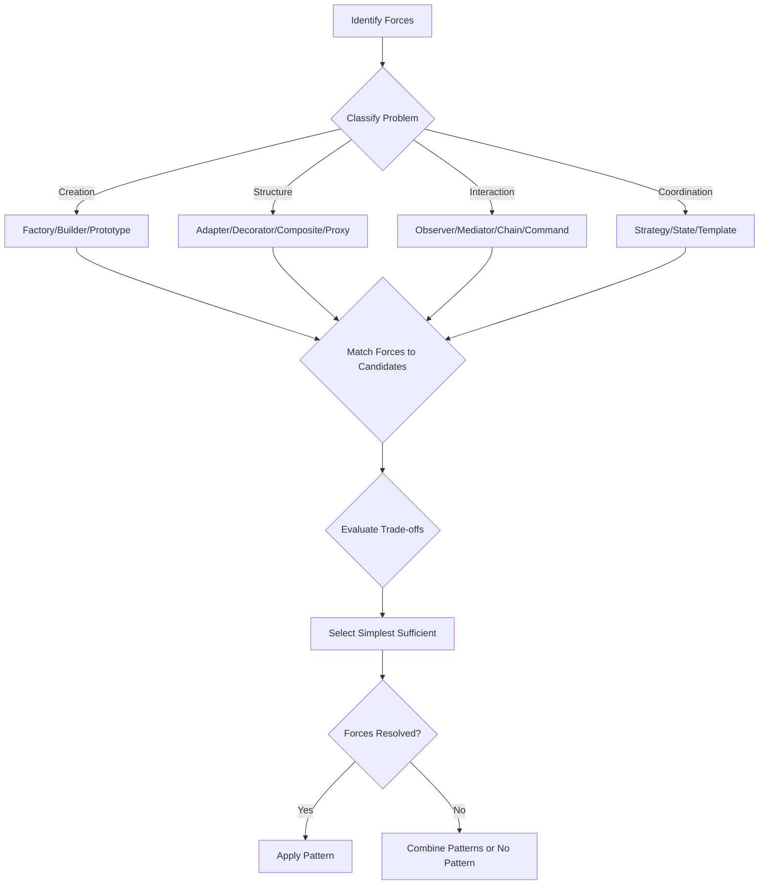
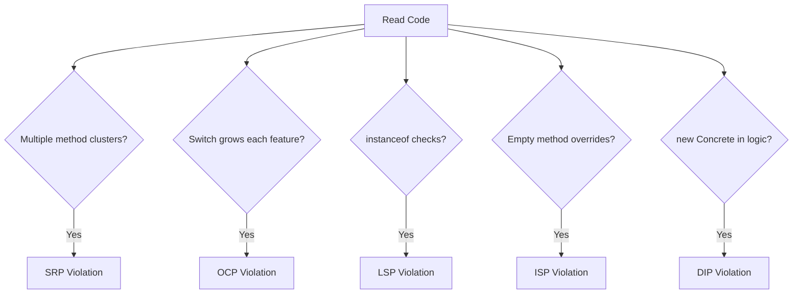
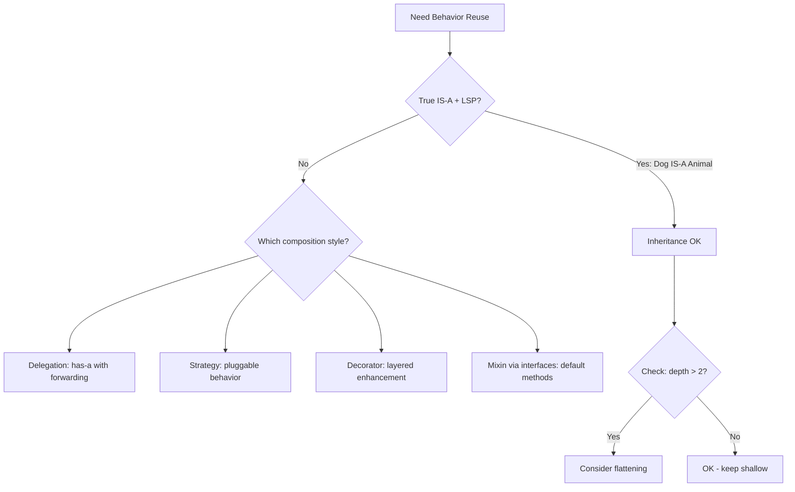

## Keywords in This File
{: .no_toc }

| # | Keyword | Weight |
|---|---|---|
| 1 | [Pattern Selection Decision Framework](#pattern-selection-decision-framework) | high |
| 2 | [SOLID Violation Detection Mental Model](#solid-violation-detection-mental-model) | high |
| 3 | [Composition over Inheritance Thinking](#composition-over-inheritance-thinking) | high |

---

# Pattern Selection Decision Framework

**Interview Weight:** high - Staff/Principal level.
META skill: a transferable thinking framework for
selecting the right pattern in any context. This is
not about knowing patterns - it is about the DECISION
PROCESS that selects among them. Applicable to any
domain, language, or architecture.

---

### 🎯 Model Answer

**30 seconds:**

> Pattern selection decision framework: (1) Identify
> the forces (what tensions exist?), (2) Classify the
> problem (creation, structure, interaction, or
> coordination?), (3) Match forces to pattern
> candidates, (4) Evaluate trade-offs per candidate,
> (5) Choose the simplest pattern that resolves all
> critical forces. The meta-rule: patterns are selected
> by FORCES, not by name recognition.

**3 minutes (Senior):**

> Five-step decision framework:
>
> STEP 1 - IDENTIFY FORCES (what is hard?):
> List the tensions making this problem non-trivial.
> "I need flexibility" is vague. "I need to add new
> payment providers without modifying existing code,
> each provider has a different API shape, and I need
> to select the provider at runtime based on config"
> is specific. Specific forces point to specific
> patterns.
>
> STEP 2 - CLASSIFY THE PROBLEM:
> - Creation: "How should objects be created?" ->
>   Factory, Builder, Prototype
> - Structure: "How should objects relate?" ->
>   Adapter, Decorator, Composite, Proxy
> - Interaction: "How should objects communicate?" ->
>   Observer, Mediator, Chain, Command
> - Coordination: "How should work be orchestrated?" ->
>   Template Method, Strategy, State
> - Distribution: "How to handle network boundaries?" ->
>   Saga, Circuit Breaker, CQRS
>
> STEP 3 - MATCH FORCES TO CANDIDATES:
> Each pattern resolves specific forces. Map your
> forces to pattern strengths:
> - "Add variants without modifying" -> Strategy, State
> - "Compose behaviors dynamically" -> Decorator, Chain
> - "Decouple sender from receiver" -> Observer, Event
> - "Complex creation with validation" -> Builder
> - "Same interface, different implementation" -> Adapter
>
> STEP 4 - EVALUATE TRADE-OFFS:
> Every pattern trades something:
> - Strategy: gains flexibility, pays class count
> - Decorator: gains composability, pays debugging
>   complexity (stack of wrappers)
> - Observer: gains decoupling, pays traceability
>   (invisible control flow)
>
> STEP 5 - SELECT (simplest sufficient):
> Among candidates that resolve ALL critical forces,
> choose the SIMPLEST. If Strategy and State both work,
> and behavior does not depend on object state: choose
> Strategy (simpler - no transitions).
>
> The meta-rule: if no pattern resolves all forces
> without excessive trade-offs, COMBINE patterns or
> use NO pattern (sometimes procedural code is the
> right choice).

**Blank Mind Recovery:**

**(1) Restate:** "You are asking about the systematic
process for choosing the right design pattern."

**(2) First principles:** "Patterns resolve forces.
Identify forces first, then find patterns whose
strengths match those forces. Choose the simplest
that suffices."

**(3) Bridge:** "Pattern selection is like choosing a
tool. You do not start with 'I want to use a hammer.'
You start with 'I need to join two pieces of wood.'
Then evaluate: nail (hammer), screw (driver), glue
(clamp). Choose based on the FORCES (strength needed,
reversibility, material)."

---

### 📘 Concept Explanation

**What it is:**

A meta-cognitive framework for systematically selecting
design patterns based on problem forces rather than
pattern familiarity. Applicable across all domains,
languages, and architectural scales.

**The problem it solves:**

Without a framework: pattern selection is driven by
familiarity ("I know Strategy, so I will use it") or
authority ("the book says use Observer here"). With a
framework: selection is driven by FORCES in the actual
problem, producing appropriate rather than familiar
designs.

**How it works:**

```
DECISION TREE (simplified):

What is hard?
  |
  +-- Creating objects?
  |     Flexibility? -> Factory/Abstract Factory
  |     Complexity?  -> Builder
  |     Cloning?     -> Prototype
  |
  +-- Composing objects?
  |     Interface mismatch? -> Adapter
  |     Add behavior?       -> Decorator
  |     Tree structure?     -> Composite
  |     Access control?     -> Proxy
  |
  +-- Coordinating behavior?
  |     Algorithm varies?   -> Strategy
  |     State-dependent?    -> State
  |     Algorithm skeleton? -> Template Method
  |     Undo/queue?         -> Command
  |
  +-- Decoupling communication?
        1-to-many?         -> Observer
        Many-to-many?      -> Mediator
        Sequential filter? -> Chain of Resp.
```



> **Diagram walkthrough:** Systematic flow from forces
> to selection. First identify forces (what is hard).
> Then classify (which domain). Match forces to specific
> candidates within that domain. Evaluate trade-offs.
> Select simplest that resolves all critical forces.
> If no single pattern suffices: combine or go without.

**The key insight:**

The framework prevents two common errors:
1. PATTERN HAMMER: selecting a pattern because you
   know it, not because the forces demand it.
2. ANALYSIS PARALYSIS: being unable to choose because
   multiple patterns COULD work.

The resolution: forces are OBJECTIVE (you can list
them). Force-pattern matching is DETERMINISTIC (each
pattern's forces are documented). Trade-off evaluation
is CONTEXTUAL (depends on what you can afford to pay).
This makes the process systematic, not intuitive.

**When to use this framework:**

- Design decisions with 2+ viable pattern candidates
- Teaching junior developers pattern selection
- Code review debates about pattern choice
- Architecture decision records (ADR documentation)

**When to skip the framework:**

- Obvious choice (single clear pattern, no debate)
- No pattern needed (procedural code is fine)
- Greenfield exploration (discover patterns, not choose)

---

### 💻 Code Example

```java
// DECISION EXAMPLE: Notification system design
//
// FORCES identified:
// F1: Multiple notification channels (email, SMS, push)
// F2: Channels added/removed without code changes
// F3: Each channel has different API shape
// F4: Some notifications go to multiple channels
// F5: Channel selection depends on user preferences
//
// CLASSIFY: Coordination (algorithm varies by channel)
//           + Structure (interface mismatch per API)
//
// CANDIDATES:
// Strategy (F1, F2, F5): select channel at runtime
// Adapter (F3): normalize different channel APIs
// Observer (F4): notify multiple channels
// Composite (F4): treat one/many uniformly
//
// EVALUATION:
// Strategy + Adapter resolves F1-F3, F5
// Observer resolves F4 but adds invisible flow
// Composite resolves F4 with explicit structure
//
// DECISION: Strategy + Adapter + Composite
// (Strategy selects, Adapter normalizes,
//  Composite handles multi-channel)

// Adapter: normalizes each channel API (F3)
public interface NotificationChannel {
    void send(Notification notification);
}

public class EmailChannelAdapter
    implements NotificationChannel {
    private final SendGridClient sendGrid; // 3rd party
    public void send(Notification n) {
        sendGrid.sendEmail(
            n.recipient().email(),
            n.subject(),
            n.body()
        );
    }
}

public class SmsChannelAdapter
    implements NotificationChannel {
    private final TwilioClient twilio; // 3rd party
    public void send(Notification n) {
        twilio.sendSms(
            n.recipient().phone(),
            n.body()
        );
    }
}

// Composite: handles multi-channel (F4)
public class MultiChannel
    implements NotificationChannel {
    private final List<NotificationChannel> channels;
    public void send(Notification n) {
        channels.forEach(ch -> ch.send(n));
    }
}

// Strategy selection: picks channels (F1, F2, F5)
@Service
public class NotificationService {
    private final Map<String, NotificationChannel>
        channels;

    public void notify(
        Notification n, UserPreferences prefs
    ) {
        List<NotificationChannel> selected =
            prefs.getChannels().stream()
                .map(channels::get)
                .filter(Objects::nonNull)
                .toList();

        // Composite treats 1 or N uniformly
        new MultiChannel(selected).send(n);
    }
}
```

> **Code walkthrough:** Framework applied: forces
> identified (5 specific tensions). Problem classified
> (coordination + structure). Candidates evaluated
> (Strategy, Adapter, Composite chosen; Observer
> rejected for invisible flow). Three patterns composed:
> Adapter normalizes APIs, Composite handles multi-
> channel, Strategy selects by preference. Each pattern
> resolves specific forces. No over-engineering - no
> patterns beyond what forces require.

---

### 🎓 Answers by Seniority

**Junior / Mid (0-5 years):**

> I select patterns by identifying forces first: what
> makes this problem hard? Then classify: is it creation,
> structure, or interaction? Then match: which patterns
> resolve those specific forces? Then choose the
> simplest one that works.

My checklist: (1) Do I need runtime flexibility?
Strategy. (2) Do I need to add behavior without
subclassing? Decorator. (3) Do I need to decouple
sender/receiver? Observer. Forces point to patterns.

*Push deeper:* "The key discipline: I do NOT start
with 'what pattern do I know?' I start with 'what
forces exist?' This prevents pattern hammering."

---

**Senior / Staff (5+ years):**

> My framework includes a step most developers skip:
> EVALUATE TRADE-OFFS. Every pattern has a cost.
> Strategy costs class count. Decorator costs debugging
> visibility. Observer costs traceability. I choose
> the pattern whose trade-off is CHEAPEST in this
> specific context. High-debugging-need context?
> Avoid Observer (invisible flow). High-extension-need
> context? Accept Strategy's class count.

At staff level: I also consider "no pattern" as a
valid choice. Simple procedural code with 2 conditional
branches does NOT need Strategy. The framework tells
you when to STOP (forces are not strong enough to
justify pattern overhead).

*Push deeper:* "The meta-skill: pattern selection is
a COST-BENEFIT calculation. Benefit = forces resolved.
Cost = trade-offs paid. If cost > benefit: no pattern.
If multiple candidates have similar cost/benefit:
choose simpler."

---

### ⚖️ Comparison Table

| Selection Approach | Quality | Speed | Consistency |
|---|---|---|---|
| Force-based framework | High (matches problem) | Medium (analysis) | High (systematic) |
| Familiarity-based | Variable (may mismatch) | Fast (no analysis) | Low (depends on person) |
| Authority-based ("book says") | Medium (general advice) | Fast | Medium |
| None (ad-hoc) | Low (random) | Fast | None |

**The deciding factor:** Force-based selection for
important design decisions. Familiarity for obvious
choices. Authority for team alignment. Never ad-hoc.

---

### ⚠️ Common Misconceptions

**"There is always one correct pattern."**

Often 2-3 patterns could work. The "correct" one
depends on which TRADE-OFF is cheapest in your
context. Strategy and State both handle behavioral
variation - State is correct when behavior depends on
object state, Strategy when it depends on external
selection.

**"More patterns is better design."**

The framework's final step: "simplest sufficient."
If one pattern resolves all forces: use one. Do not
add patterns for hypothetical future forces. The
minimum number of patterns that resolves actual forces
is the target.

**"Pattern selection is intuitive for experienced
developers."**

Intuition is pattern-matching on experience. It works
when you have seen the exact scenario. It fails for
novel scenarios. The framework works for BOTH: it is
a systematic fallback when intuition is uncertain.

---

### 🚨 Failure Modes and Diagnosis

| Failure | Symptom | Diagnosis |
|---|---|---|
| Forces not identified | Pattern does not resolve the actual problem | Start over: what SPECIFICALLY makes this hard? |
| Wrong classification | Chose creation pattern for interaction problem | Re-classify: what type of problem is this? |
| Insufficient candidate evaluation | Chose pattern with unacceptable trade-off | List ALL trade-offs. Is each one affordable? |
| Over-selection | 4 patterns for a simple problem | Apply "simplest sufficient" rule. Remove patterns until forces are no longer resolved |
| Under-selection | One pattern does not resolve all forces | Combine patterns or accept unresolved minor forces |

---

### 🎯 Interview Deep-Dive

| Experience | Time | Depth |
|---|---|---|
| Junior | 3 min | Walk through the 5 steps |
| Mid | 5 min | Apply to a specific problem |
| Senior | 8 min | Handle ambiguous force sets |
| Staff | 12 min | Teach the framework to a team |

---

**[MID] Q1 - Apply the framework to: "We need to
support multiple file export formats (PDF, CSV, Excel)
with new formats added frequently."**

*Why they ask:* Practical framework application.

Step 1 - Forces:
F1: Multiple formats exist (PDF, CSV, Excel)
F2: New formats added without modifying existing code
F3: Each format has different rendering logic
F4: Format selected at runtime (user choice)
F5: All formats produce a byte[] output

Step 2 - Classify: Coordination (algorithm varies by
format selection).

Step 3 - Candidates:
- Strategy: matches F1-F5 perfectly. Each format is a
  Strategy implementation. Selected at runtime (F4).
  New formats added by new class (F2).
- Template Method: partially matches (common skeleton
  with different steps). But formats do NOT share a
  skeleton (PDF rendering is nothing like CSV writing).
  Poor match.
- Factory: handles creation, not algorithm variation.
  Incorrect classification.

Step 4 - Evaluate:
Strategy: cost = one interface + N classes. Benefit =
resolves ALL 5 forces. Trade-off is minimal (class per
format is natural, manageable).

Step 5 - Select: Strategy. Clear winner. Simple, all
forces resolved, minimal trade-off.

Implementation: ExportStrategy interface with export()
method. PdfExporter, CsvExporter, ExcelExporter
implementations. Map-based dispatch for runtime
selection. Adding YAML exporter: one new class, zero
existing changes.

*What separates good from great:* Evaluating AND
REJECTING Template Method (forces do not match -
formats have no common skeleton) shows the framework
prevents incorrect choices.

---

**[SENIOR] Q2 - What do you do when forces conflict
and no single pattern resolves all of them?**

*Why they ask:* Advanced framework application.

Three strategies for conflicting forces:

Strategy 1 - Pattern composition: combine patterns
that each resolve different forces. Example:
F1 "normalize different APIs" (Adapter) + F2 "select
at runtime" (Strategy). Neither alone resolves both.
Adapter + Strategy together do.

Strategy 2 - Priority ranking: not all forces are
equal. Critical forces (must resolve) vs nice-to-have
(can tolerate). If Pattern A resolves all critical
forces but misses a nice-to-have: choose Pattern A.
Accept the unresolved minor force as a known trade-off.

Strategy 3 - No pattern: if the force set is truly
conflicting (flexibility AND simplicity AND performance
AND testability at extreme levels), no pattern resolves
all simultaneously. Use simple code with documentation:
"We chose procedural because: [forces explained,
trade-offs accepted]." This is a valid engineering
decision.

Real example:
Forces: (1) Multiple notification channels, (2) Add
channels without code changes, (3) Guaranteed delivery
with retry, (4) Async non-blocking.

Pattern evaluation:
- Strategy resolves (1, 2) but not (3, 4)
- Observer resolves (1, 4) but not (2, 3)
- Command + Queue resolves (3, 4) but not (2) alone

Decision: Strategy (for channel selection) + Command
(for guaranteed async delivery). Two patterns composed,
all 4 forces resolved.

*What separates good from great:* The three-strategy
approach (compose, prioritize, or no pattern) with a
concrete example showing composition in action.

---

**[STAFF] Q3 - How do you teach this framework to
prevent pattern hammering in a team?**

*Why they ask:* Technical mentorship.

Teaching approach:

Workshop format (2 hours, quarterly):

Part 1 - Force identification practice (30 min):
Give 5 scenarios. Teams identify forces WITHOUT naming
patterns. Goal: build the habit of "what is hard?"
before "what pattern?"

Part 2 - Candidate generation (30 min):
Given the forces from Part 1, teams list pattern
candidates and map each to specific forces it resolves.
Goal: objective matching, not gut feeling.

Part 3 - Trade-off evaluation (30 min):
For each candidate, teams list what it COSTS (not just
what it gives). "Strategy gives flexibility. It costs:
class count, indirection, discovery difficulty."
Goal: acknowledge costs, not just benefits.

Part 4 - Decision and defense (30 min):
Teams present their choice and defend it. Other teams
challenge: "Why not Observer instead of Strategy?"
Defense must be force-based: "Observer does not resolve
Force 2 (no modification to existing code for new
channels)."

Code review integration: when a reviewer questions a
pattern choice, the author responds with the framework:
"Forces: [list]. This pattern resolves all critical
forces. Alternative X was rejected because it does
not resolve Force N."

The cultural shift: from "I like Strategy" to "the
forces indicate Strategy." Pattern selection becomes
OBJECTIVE and DEFENSIBLE rather than personal taste.

*What separates good from great:* The workshop format
with four distinct skill exercises and the code review
integration that makes the framework part of daily
practice.

---

# SOLID Violation Detection Mental Model

**Interview Weight:** high - Senior/Staff level. META
skill: a systematic mental model for detecting SOLID
violations in existing code through observable symptoms.
Not about knowing SOLID definitions - about DETECTING
violations in the wild through code reading.

---

### 🎯 Model Answer

**30 seconds:**

> SOLID violation detection uses observable CODE
> SYMPTOMS to identify which principle is violated:
> SRP violation = class changes for multiple reasons.
> OCP violation = modifying existing code for new
> features. LSP violation = type checks or broken
> contracts in subclasses. ISP violation = empty method
> implementations. DIP violation = new keyword in
> high-level code. Each has specific, observable
> symptoms in the code itself.

**3 minutes (Senior):**

> Detection model by principle:
>
> SRP VIOLATION DETECTION:
> Observable symptoms:
> - Class has methods that group into 2+ clusters
>   (methods in cluster A never call cluster B)
> - Class imported by unrelated modules
> - Git blame shows different authors/teams modifying
>   different parts of the same class
> - Class name is vague: "Manager," "Handler," "Utils"
>   (hides multiple responsibilities)
>
> The test: "What are the reasons this class could
> change?" If > 1: SRP violated.
>
> OCP VIOLATION DETECTION:
> Observable symptoms:
> - Adding a feature requires modifying existing switch
>   or if-else chain
> - Every new "type" requires touching 3+ existing files
> - Git log shows: same file modified in every feature
>   branch
> - Comments like "// add new types here"
>
> The test: "Can I add a new variant WITHOUT modifying
> existing code?" If no: OCP violated.
>
> LSP VIOLATION DETECTION:
> Observable symptoms:
> - `instanceof` or type checks after receiving a
>   base type
> - Subclass throws NotImplementedException
> - Subclass weakens preconditions or strengthens
>   postconditions
> - Code that receives a base type has special cases
>   per subtype
>
> The test: "Can I replace any instance of the base
> type with any subtype and behavior remains correct?"
> If no: LSP violated.
>
> ISP VIOLATION DETECTION:
> Observable symptoms:
> - Implementations with empty methods (no-op)
> - Adapter classes that implement 2/20 interface
>   methods
> - "Fat" interfaces imported for one method
> - @Override methods that throw
>   UnsupportedOperationException
>
> The test: "Do ALL implementations use ALL methods?"
> If no: ISP violated.
>
> DIP VIOLATION DETECTION:
> Observable symptoms:
> - `new ConcreteClass()` in business logic
> - Import statements for low-level modules in
>   high-level modules
> - Constructor parameters are concrete types (not
>   interfaces)
> - Test difficulty (cannot mock without DI)
>
> The test: "Does the high-level module depend on
> abstractions or concretions?" If concretions: DIP
> violated.

**Blank Mind Recovery:**

**(1) Restate:** "You are asking for a systematic
way to DETECT SOLID violations through observable
code symptoms."

**(2) First principles:** "Each SOLID principle has
specific CODE SYMPTOMS when violated. Detecting
violations is pattern recognition: symptom ->
principle -> remedy."

**(3) Bridge:** "Like a doctor diagnosing disease:
fever (symptom) -> infection (cause) -> antibiotics
(treatment). In code: fat interface (symptom) -> ISP
violation (cause) -> split interface (treatment)."

---

### 📘 Concept Explanation

**What it is:**

A diagnostic mental model that maps observable code
symptoms to specific SOLID principle violations,
enabling rapid identification during code reading,
reviews, and maintenance.

**The problem it solves:**

Developers know SOLID definitions but cannot DETECT
violations in real code. The mental model provides
concrete SYMPTOMS to look for, making SOLID detection
practical rather than theoretical.

**How it works:**

```
DETECTION QUICK-REFERENCE:

SRP:  Multiple method clusters in one class
      Different teams edit same class
      Class name is vague ("Manager", "Utils")

OCP:  Switch modified every new feature
      Same file in every PR
      "Add new types here" comments

LSP:  instanceof after receiving base type
      Subclass throws NotImplemented
      Type-specific workarounds in callers

ISP:  Empty @Override methods
      Adapter with 2/20 methods implemented
      Import for one method

DIP:  "new Concrete()" in business logic
      Cannot write unit tests (untestable)
      High-level imports low-level
```



> **Diagram walkthrough:** Quick detection flow.
> Each branch checks one symptom. Multiple symptoms
> may co-occur (violations often correlate). The model
> is used during code reading: scan for these symptoms
> as you read. Each detection triggers a specific
> remedy investigation.

**The key insight:**

SOLID violations CLUSTER. SRP violations often cause
OCP violations (big class must be modified for many
reasons). DIP violations cause testability issues.
ISP violations cause LSP violations (implementers
cannot fulfill the full contract). Detecting ONE
violation often reveals others nearby.

**When to use this model:**

- Code reviews (systematic principle checking)
- Legacy code assessment (where are the violations?)
- Refactoring planning (which violations hurt most?)
- Teaching SOLID (symptoms are more concrete than
  definitions)

---

### 💻 Code Example

```java
// DETECT ALL 5 VIOLATIONS in one class:
public class UserManager { // SRP: vague name

    // SRP: user CRUD + email + validation + report
    // = 4 responsibilities in one class
    private final DataSource ds;      // DIP: concrete
    private final SmtpServer smtp;    // DIP: concrete

    public User createUser(UserDto dto) {
        // DIP: new ConcreteClass in business logic
        Connection conn = ds.getConnection();
        // ... SQL directly in business logic
    }

    public void sendWelcomeEmail(User user) {
        // SRP: email is a separate responsibility
        smtp.send(user.getEmail(), "Welcome...");
    }

    public boolean validate(User user) {
        // OCP: adding validation = modify this method
        if (user.getType() == UserType.ADMIN) {
            return validateAdmin(user);
        } else if (user.getType() == UserType.GUEST) {
            return validateGuest(user);
        }
        // New type = modify this switch
        return false;
    }

    // This class implements UserOperations interface
    // which has 15 methods. This class uses 6.
    // ISP: forced to implement unused methods
    public void exportReport(User user) {
        throw new UnsupportedOperationException();
        // ISP + LSP: cannot fulfill contract
    }
}
```

> **Code walkthrough:** All 5 violations detected:
> SRP (4 responsibilities: CRUD, email, validation,
> reporting). OCP (type switch grows with new user
> types). LSP (exportReport throws - breaks contract).
> ISP (implements 15-method interface, uses 6). DIP
> (concrete DataSource, SmtpServer - cannot mock).
> Each violation has a specific observable symptom.

```java
// AFTER: Each violation resolved
// SRP: separate classes per responsibility
@Service
public class UserService {  // Only CRUD
    private final UserRepository repo; // DIP: interface
    public User create(CreateUserCommand cmd) {
        User user = UserFactory.from(cmd);
        return repo.save(user);
    }
}

@Service
public class WelcomeEmailService { // SRP: email only
    private final EmailSender sender; // DIP: interface
    @EventListener
    public void onUserCreated(UserCreatedEvent e) {
        sender.send(e.getEmail(), "Welcome...");
    }
}

// OCP: Strategy for validation (no switch)
public interface UserValidator {
    UserType supportedType();
    boolean validate(User user);
}
// New type = new class, zero modification

// ISP: split fat interface
public interface UserReadOperations {
    User findById(Long id);
    List<User> findAll();
}
public interface UserReportOperations {
    byte[] exportReport(User user);
}
// Implement only what you need

// DIP: all dependencies are interfaces
public interface UserRepository { // abstraction
    User save(User user);
}
public interface EmailSender { // abstraction
    void send(String to, String body);
}
```

> **Code walkthrough:** Each violation resolved: SRP
> (one class per responsibility). OCP (Strategy
> replaces switch). LSP (no more throwing
> UnsupportedOperationException - classes implement
> only interfaces they fulfill). ISP (fat interface
> split into focused ones). DIP (all injections are
> interfaces, not concretions). Detection guided the
> remediation.

---

### 🎓 Answers by Seniority

**Junior / Mid (0-5 years):**

> I detect SOLID violations through symptoms: vague
> class names and method clusters (SRP), growing
> switch statements (OCP), instanceof checks (LSP),
> empty method overrides (ISP), concrete types in
> constructors (DIP). Each symptom points to a
> specific violation and remedy.

My code review checklist: (1) Does this class have
a clear single purpose? (2) Can new variants be added
without modifying this code? (3) Can any subtype
replace the base type safely? (4) Are all interface
methods used by all implementers? (5) Are dependencies
interfaces or concretions?

*Push deeper:* "The clustering insight: when I find
one violation, I look for others nearby. SRP violations
often have OCP violations because the big class must
be modified for many different changes."

---

**Senior / Staff (5+ years):**

> I use violation detection as a PRIORITIZATION tool:
> detect all violations in a module, then fix the ones
> that cause the most pain. Not all violations are
> equal. A DIP violation that prevents testing is more
> urgent than an ISP violation in stable code. I
> prioritize by: (1) how often the violated code
> changes, (2) how many developers are affected,
> (3) whether it blocks testing.

At scale: I track violation DENSITY per module. Modules
with high violation density are refactoring candidates.
Modules with low density and high change frequency
are well-designed. This correlation (violation density
vs change frequency vs bug rate) proves the value of
SOLID to skeptical teams.

*Push deeper:* "The meta-model: SOLID violations are
LEADING INDICATORS of future bugs. High violation
density = high future bug rate. This is measurable
and provable."

---

### ⚖️ Comparison Table

| Violation | Primary Symptom | Detection Speed | Fix Complexity |
|---|---|---|---|
| SRP | Method clusters, vague names | Fast (visible in structure) | Medium (extract classes) |
| OCP | Growing switch/if-else | Fast (visible in diffs) | Medium (introduce Strategy) |
| LSP | instanceof, NotImplemented | Medium (requires reading callers) | High (redesign hierarchy) |
| ISP | Empty overrides, fat interface | Fast (visible in implementations) | Low (split interface) |
| DIP | new Concrete, untestable | Fast (visible in imports/constructors) | Low (extract interface + DI) |

**The deciding factor:** Prioritize by pain:
DIP violations blocking tests > SRP violations
causing merge conflicts > OCP violations slowing
features > ISP violations causing confusion > LSP
violations causing bugs.

---

### ⚠️ Common Misconceptions

**"SRP means a class should do only one thing."**

SRP means a class has ONE REASON TO CHANGE (one
stakeholder/actor whose requirements drive changes).
A class can have multiple methods (multiple "things")
as long as they all change for the same reason.
"UserRepository" has find, save, delete - all change
for the same reason (data access requirements).

**"DIP means use interfaces everywhere."**

DIP means HIGH-LEVEL modules depend on abstractions,
not low-level details. If a module has no conceivable
alternative implementation AND is never mocked in
tests: a concrete dependency is fine. DIP is about
protecting high-level policy from low-level change.

**"LSP only applies to inheritance."**

LSP applies to ANY subtyping: interfaces, abstract
classes, generics. If code expects `Collection<T>` and
receives `UnmodifiableList<T>` that throws on add():
LSP violation even though it is interface-based.

---

### 🚨 Failure Modes and Diagnosis

| Failure | Symptom | Diagnosis |
|---|---|---|
| False SRP detection | Split class into too-small pieces | Ask: "Do these methods change for the SAME reason?" If yes: keep together |
| Ignored OCP | Team adds to switch "because it is faster" | Track: how often is this switch modified? If > 1x/month: refactor |
| LSP accepted | Team accepts instanceof as "normal" | Question: could this code work with ANY subtype? If not: hierarchy is wrong |
| ISP over-split | 20 one-method interfaces (too granular) | Group by cohesion: methods that always appear together = one interface |
| DIP without benefit | Interface for every class (no alternative impl) | Apply DIP only where: testability OR actual alternative implementation matters |

---

### 🎯 Interview Deep-Dive

| Experience | Time | Depth |
|---|---|---|
| Junior | 3 min | Name symptoms per violation |
| Mid | 5 min | Detect violations in given code |
| Senior | 8 min | Prioritize and remediate |
| Staff | 12 min | Organization-wide detection strategy |

---

**[MID] Q1 - Given a class, identify which SOLID
principles it violates and how you would fix each.**

*Why they ask:* Practical detection skill.

Detection process for any class:

1. Read the class name: vague? (SRP suspect)
2. Count method clusters: group methods by shared
   field access. Multiple clusters? (SRP violation)
3. Look for switch/if-else on type: present? (OCP)
4. Check inheritance: does subclass throw exceptions
   or have instanceof checks? (LSP)
5. Check interface implementations: empty methods?
   (ISP)
6. Check constructor parameters: concrete types?
   (DIP)

Example: `OrderManager` class with 300 lines.
- Name: "Manager" -> SRP suspect (confirmed: methods
  group into order creation, payment processing,
  and email notification)
- Switch on orderType in 3 methods -> OCP violation
- Implements `FullOrderOperations` with 12 methods,
  uses 7 -> ISP violation
- Constructor: `new PayPalClient()` -> DIP violation

Fix priority: DIP first (blocks testing), then SRP
(causes merge conflicts), then OCP (slows features),
then ISP (interface cleanup).

*What separates good from great:* The systematic
6-step detection process applicable to ANY class and
the prioritized fix order based on practical impact.

---

**[SENIOR] Q2 - How do you detect LSP violations
that are not obvious (no instanceof)?**

*Why they ask:* Subtle violation detection.

Non-obvious LSP violations:

1. Strengthened preconditions: subclass rejects inputs
   that base class accepts.
   ```java
   // Base: accepts any positive number
   // Sub: accepts only even numbers
   // Callers expecting base behavior will fail
   ```
   Detection: test subclass with all base class test
   inputs. Any rejection = LSP violation.

2. Weakened postconditions: subclass returns less than
   base class guarantees.
   ```java
   // Base: findAll() returns sorted list
   // Sub: findAll() returns unsorted list
   // Callers relying on sort will break
   ```
   Detection: check base class documentation/tests
   for guarantees. Verify subclass preserves them.

3. History constraint violation: subclass allows state
   changes that base class does not.
   ```java
   // Base: ImmutablePoint (x,y never change)
   // Sub: MutablePoint with setX()
   // Callers expecting immutability are surprised
   ```
   Detection: check if subclass adds mutators that
   base class does not have.

4. Exception widening: subclass throws exceptions not
   declared in base class.
   ```java
   // Base: read() throws IOException
   // Sub: read() throws IOException + SecurityException
   // Callers catch IOException, SecurityException leaks
   ```

The meta-detection rule: "Can I pass this subclass to
ANY code that expects the base type, and that code
continues to work correctly without modification?"
If there exists ANY scenario where it breaks: LSP
violation.

*What separates good from great:* The four subtle
violation types (preconditions, postconditions, history,
exceptions) with detection methods for each.

---

**[STAFF] Q3 - How do you measure SOLID compliance
at organizational scale?**

*Why they ask:* Metrics-driven quality.

Measurement approach:

Automated metrics (CI pipeline):
- SRP proxy: class method count, lines-of-code,
  number of imports. Thresholds: >20 methods, >300 LOC,
  >15 imports = flag for review.
- OCP proxy: modified-file frequency. Files in >3 PRs
  per month = potential OCP violation (frequently
  modified for new features).
- DIP proxy: concrete type imports in service classes.
  Count: `import com.thirdparty.ConcreteClass` in
  domain/service packages = DIP suspect.
- ISP proxy: interface method count. Interfaces with
  >7 methods = ISP candidate. Cross-reference with
  implementations: unused methods = confirmed.

Manual assessment (quarterly):
- Sample 10 classes per team (random from changed files)
- Apply detection model: 5 principles x 10 classes
- Score: violations found / total checks
- Track trend: is violation rate decreasing?

Correlation analysis:
- Map violation density to bug rate per module
- Map violation density to change lead time per module
- Present data: "Modules with >5 violations have 3x
  bug rate and 2x longer change lead time"

This makes SOLID compliance a business discussion:
"Reducing violations from 12 to 5 in the order module
would reduce bug rate by ~60% based on historical
correlation."

*What separates good from great:* Automated proxy
metrics per principle (measurable in CI) combined with
correlation to business outcomes (bugs, lead time)
that justify investment in SOLID compliance.

---

# Composition over Inheritance Thinking

**Interview Weight:** high - Senior/Staff level. META
skill: the mental model for choosing composition over
inheritance as the default design approach, understanding
when inheritance IS correct, and recognizing the
symptoms of inheritance abuse.

---

### 🎯 Model Answer

**30 seconds:**

> Composition over inheritance means building behavior
> by combining objects (has-a) rather than extending
> classes (is-a). The default should be composition
> because: it is more flexible (swap at runtime), avoids
> fragile base class problem, enables multiple behavior
> combinations, and does not couple to parent
> implementation. Use inheritance only for true IS-A
> relationships where substitutability (LSP) is required.

**3 minutes (Senior):**

> The mental model has three parts:
>
> PART 1 - WHY COMPOSITION IS DEFAULT:
>
> 1. Flexibility: composed objects can be swapped at
>    runtime. Inheritance is fixed at compile time.
>    "PaymentProcessor has a PaymentStrategy" allows
>    changing strategy. "PayPalProcessor extends
>    PaymentProcessor" does not.
>
> 2. Avoids fragile base class: changes to parent break
>    all children. With composition: changing the
>    composed object's internals does not break the
>    composer (only the interface matters).
>
> 3. Combinatorial explosion: N behaviors via
>    inheritance = N! classes (Diamond problem).
>    N behaviors via composition = N classes + any
>    combination at runtime.
>
> 4. Single inheritance limitation (Java): can only
>    extend one class. Composition has no limit.
>    "Extends A, has B, has C" works. "Extends A, B, C"
>    does not (in Java).
>
> PART 2 - WHEN INHERITANCE IS CORRECT:
>
> 1. True IS-A with substitutability: every Dog IS an
>    Animal. Any code expecting Animal works with Dog
>    (LSP holds). This is the ONLY valid reason.
>
> 2. Shared implementation that MUST co-evolve: base
>    class provides behavior that all subtypes MUST
>    inherit (not just CAN). Template Method is a
>    valid inheritance use: the skeleton MUST be shared.
>
> 3. Framework extension points: abstract classes
>    designed for extension (HttpServlet, AbstractController).
>    These are carefully designed to be extended.
>
> PART 3 - DETECTION (inheritance abuse symptoms):
>
> - Subclass overrides most methods (does not want
>   parent's behavior)
> - Deep hierarchy (>2 levels) with behavior at
>   multiple levels
> - "Is-a" only partially true: Square IS-A Rectangle?
>   (Mathematically yes, LSP no)
> - Subclass needs multiple behaviors from different
>   parents (needs MI)
> - Subclass is created for code reuse, not
>   substitutability

**Blank Mind Recovery:**

**(1) Restate:** "You are asking about the principle
of preferring composition (has-a) over inheritance
(is-a) and when each is appropriate."

**(2) First principles:** "Inheritance couples child to
parent's implementation. Composition couples only to
interface. Looser coupling = more flexibility =
easier maintenance. Default to looser coupling."

**(3) Bridge:** "Inheritance is like surgery: powerful
but permanent and risky (changes to the body affect
everything connected). Composition is like clothing:
flexible, changeable, combinable (swap pieces without
affecting the body). Default to clothing; use surgery
only when biologically necessary."

---

### 📘 Concept Explanation

**What it is:**

A design thinking principle that makes object
composition the DEFAULT approach for behavior reuse
and extension, reserving inheritance for the specific
case of true type substitutability (IS-A with LSP
compliance).

**The problem it solves:**

Inheritance-heavy designs create: fragile base classes
(parent changes break children), rigid hierarchies
(cannot recombine behaviors), explosion of classes
(N behaviors = 2^N classes via inheritance), and tight
coupling (child depends on parent internals).

**How it works:**

```
DECISION: Need behavior reuse?

Ask: "Is this a true IS-A relationship where
substitutability (LSP) MUST hold?"

YES (rare) -> Inheritance:
  - All subtypes are valid replacements for base type
  - Shared behavior MUST co-evolve (change together)
  - Framework explicitly designed for extension

NO (common) -> Composition:
  - Behavior reuse without type relationship
  - Multiple behaviors needed (combinatorial)
  - Behavior swappable at runtime
  - Independent evolution of components
```



> **Diagram walkthrough:** Decision starts with IS-A
> + LSP test. Most cases fail (behavior reuse without
> type relationship). For composition: choose style
> based on the specific need. Delegation for simple
> forwarding. Strategy for pluggable algorithms.
> Decorator for layered enhancement. Default methods
> for shared behavior across unrelated types.

**The key insight:**

The question is NOT "should I use inheritance?" The
question is "do ALL instances of the subtype
SUBSTITUTE for the parent in EVERY context?" This is
a much higher bar than "does the subtype share some
behavior with the parent?"

Sharing behavior is NOT sufficient for inheritance.
Substitutability IS sufficient. A Stack shares
behavior with ArrayList (both are collections) but
Stack should NOT extend ArrayList (stack operations
are a subset of list operations - pushing to a Stack
via list.add(0, x) is wrong).

**When to use inheritance:**

- True type taxonomy (Shape -> Circle, Rectangle)
- Framework extension (HttpServlet -> MyServlet)
- Template Method where skeleton MUST be shared
- Enum hierarchies (sealed types in Java 17+)

**When to use composition:**

- Behavior reuse without type relationship (almost always)
- Multiple independent behaviors needed
- Behavior must be swappable at runtime
- You want independent testability
- The "parent" behavior might change independently

---

### 💻 Code Example

```java
// BAD: Inheritance for code reuse (not substitutability)
public class ArrayList<E> {
    public void add(E element) { ... }
    public E get(int index) { ... }
    public int size() { ... }
}

// Stack "IS-A" ArrayList? NO. Stack has different
// semantics. But developer inherits for code reuse.
public class Stack<E> extends ArrayList<E> {
    public void push(E element) {
        add(element); // reuse ArrayList.add
    }
    public E pop() {
        return remove(size() - 1); // reuse
    }
    // PROBLEM: caller can do stack.add(0, x)
    // which inserts at bottom - breaks LIFO semantics
    // PROBLEM: caller can do stack.get(3) - breaks
    // stack abstraction (only top is accessible)
    // LSP VIOLATED: Stack is NOT substitutable for
    // ArrayList (different behavioral contract)
}
```

> **Code walkthrough:** Classic inheritance abuse.
> Stack extends ArrayList for code REUSE (not type
> substitutability). Problem: ArrayList's full API is
> exposed (add at index, get at index). Callers can
> break stack semantics through inherited methods.
> Stack IS-NOT-A ArrayList: different behavioral
> contract. Inheritance chosen for convenience, not
> correctness.

```java
// GOOD: Composition for code reuse
public class Stack<E> {
    private final List<E> elements = new ArrayList<>();

    public void push(E element) {
        elements.add(element); // delegate to list
    }

    public E pop() {
        if (elements.isEmpty()) {
            throw new EmptyStackException();
        }
        return elements.remove(elements.size() - 1);
    }

    public E peek() {
        if (elements.isEmpty()) {
            throw new EmptyStackException();
        }
        return elements.get(elements.size() - 1);
    }

    public boolean isEmpty() {
        return elements.isEmpty();
    }

    public int size() {
        return elements.size();
    }
    // NO access to add(index), get(index), etc.
    // Stack's API is ONLY stack operations.
    // Internal list is an implementation detail.
}
```

> **Code walkthrough:** Composition: Stack HAS-A List
> (implementation detail). Stack's API exposes ONLY
> stack operations (push, pop, peek, isEmpty, size).
> Callers cannot break LIFO semantics because list
> operations are not exposed. The internal list can be
> replaced (LinkedList, array) without affecting callers.
> This is proper encapsulation through composition.

```java
// BAD: Combinatorial explosion via inheritance
public abstract class Notification { }
public class EmailNotification extends Notification {}
public class SmsNotification extends Notification {}
// Now add: encrypted, logged, retried
public class EncryptedEmailNotification
    extends EmailNotification {} // 2x2 = 4 classes
public class EncryptedSmsNotification
    extends SmsNotification {}   // growing...
public class LoggedEncryptedEmailNotification
    extends EncryptedEmailNotification {} // 2x2x2 = 8
// N features x M channels = N*M classes via inherit.

// GOOD: Composition via Decorator (combinatorial)
public interface NotificationSender {
    void send(Notification n);
}

public class EmailSender implements NotificationSender {
    public void send(Notification n) { /* email */ }
}

public class EncryptionDecorator
    implements NotificationSender {
    private final NotificationSender delegate;
    public void send(Notification n) {
        Notification encrypted = encrypt(n);
        delegate.send(encrypted);
    }
}

public class LoggingDecorator
    implements NotificationSender {
    private final NotificationSender delegate;
    public void send(Notification n) {
        log(n);
        delegate.send(n);
    }
}

// ANY combination at runtime:
NotificationSender sender = new LoggingDecorator(
    new EncryptionDecorator(
        new EmailSender()
    )
);
// N features + M channels = N+M classes (not N*M)
```

> **Code walkthrough:** Inheritance: N behaviors x M
> types = N*M classes (exponential). Composition via
> Decorator: N + M classes (linear). Any behavior
> combination is possible at runtime without new
> classes. Adding a new behavior (retry): one new
> Decorator class. Adding a new channel (push): one
> new Sender class. No modification to existing code.

---

### 🎓 Answers by Seniority

**Junior / Mid (0-5 years):**

> Composition over inheritance: default to HAS-A (object
> contains another) instead of IS-A (class extends
> another). Composition gives: runtime flexibility,
> no fragile base class, multiple behavior combination.
> Use inheritance only for TRUE type relationships where
> LSP holds.

My test: "Can I replace every parent reference with
this subtype and nothing breaks?" If yes: inheritance
OK. If no (like Stack extending ArrayList): use
composition.

*Push deeper:* "The practical signal: if I find myself
OVERRIDING most of the parent's methods, I do not
actually WANT the parent's behavior. Composition lets
me use what I need and ignore the rest."

---

**Senior / Staff (5+ years):**

> The composition decision is more nuanced than "never
> inherit." I use inheritance for: sealed type
> hierarchies (domain modeling), framework extension
> points (designed for inheritance), and Template Method
> where the skeleton IS the value. Everything else:
> composition.

The strongest argument: composition is INDEPENDENTLY
TESTABLE. Each composed object is tested alone. Each
decorator is tested alone. Inheritance: testing
subclass behavior requires the entire parent to be
instantiated and working. Composition separates
concerns for testing.

*Push deeper:* "At staff level, I recognize that
interface default methods in Java blur the line. They
provide multiple inheritance of behavior without the
fragile base class problem. I use defaults for: trait-
like behavior sharing across unrelated types (Comparable,
Iterable extensions). Not for: implementation
inheritance pretending to be composition."

---

### ⚖️ Comparison Table

| Approach | Flexibility | Coupling | Testability | Combinatorics |
|---|---|---|---|---|
| Inheritance | Low (fixed at compile time) | High (to parent impl) | Hard (need parent working) | N*M classes (exponential) |
| **Composition** | High (swap at runtime) | Low (to interface only) | Easy (test in isolation) | N+M classes (linear) |
| Interface defaults | Medium (shared behavior) | Low (to interface) | Easy | Linear (mixin style) |
| Delegation | High (explicit forwarding) | Low | Easy | Linear |

**The deciding factor:** Use inheritance when
substitutability IS the goal. Use composition when
behavior reuse IS the goal. These are different goals
and should not be conflated.

---

### ⚠️ Common Misconceptions

**"Composition means no inheritance ever."**

Composition is the DEFAULT, not the absolute rule.
Inheritance is correct for: true type hierarchies
(Animal -> Dog), sealed domain types, framework
extension (HttpServlet), Template Method where skeleton
sharing is the point.

**"Inheritance is bad because of tight coupling."**

Inheritance is tight coupling BY DESIGN - subtype is
coupled to base type's contract. This is correct when
the coupling is intentional (subtype truly IS-A base
type). The problem is using inheritance for code reuse
when the type relationship does not exist.

**"Java's single inheritance is a limitation."**

It is a FEATURE. It forces developers toward
composition for behavior reuse and reserves inheritance
for the single type relationship that actually applies.
Languages with multiple inheritance (C++) show that MI
creates more problems than it solves (Diamond problem,
ambiguity).

---

### 🚨 Failure Modes and Diagnosis

| Failure | Symptom | Diagnosis |
|---|---|---|
| Inheritance for reuse | Subclass overrides most parent methods | Refactor to composition: extract the needed behavior into a composed object |
| Deep hierarchy (>2) | Hard to trace which level adds which behavior | Flatten: replace intermediate levels with composition |
| Fragile base class | Parent change breaks 5+ subclasses | Extract the volatile behavior into a composed Strategy |
| Missing inheritance | Composition where true IS-A exists (e.g., implementing Animal without hierarchy) | If LSP holds and substitutability is needed: use inheritance |
| Mixed signals | Some methods delegated, some inherited | Choose one: either fully inherit or fully compose |

---

### 🎯 Interview Deep-Dive

| Experience | Time | Depth |
|---|---|---|
| Junior | 3 min | Explain the principle with example |
| Mid | 5 min | Convert inheritance to composition |
| Senior | 8 min | When inheritance IS correct |
| Staff | 12 min | Team-wide design philosophy |

---

**[MID] Q1 - Convert this inheritance hierarchy to
composition: Bird extends Animal, Penguin extends Bird,
Sparrow extends Bird.**

*Why they ask:* Practical refactoring skill.

Problem with the hierarchy:
- Bird extends Animal: OK (Bird IS-A Animal, LSP holds)
- Penguin extends Bird: PROBLEM if Bird has fly().
  Penguin cannot fly. LSP violation.
- If we add swim(): Penguin swims, Sparrow does not.
  More LSP issues.

Composition solution:
```java
// Behaviors as composable interfaces
public interface Flyer {
    void fly();
}
public interface Swimmer {
    void swim();
}

// Implementations
public class WingFlyer implements Flyer {
    public void fly() { /* wing-based flight */ }
}
public class AquaSwimmer implements Swimmer {
    public void swim() { /* aquatic swimming */ }
}

// Animals compose behaviors
public class Sparrow {
    private final Flyer flyer = new WingFlyer();
    public void fly() { flyer.fly(); }
}

public class Penguin {
    private final Swimmer swimmer = new AquaSwimmer();
    public void swim() { swimmer.swim(); }
    // No fly() method - Penguin does not fly
}
```

Sparrow HAS-A Flyer behavior. Penguin HAS-A Swimmer
behavior. Neither inherits behaviors they cannot
fulfill. Adding a FlyingFish: HAS-A Flyer + HAS-A
Swimmer. No new class hierarchy needed.

*What separates good from great:* Identifying the
LSP violation (Penguin.fly() is problematic) as the
trigger for refactoring, and showing how composition
allows FlyingFish to combine both behaviors without
multiple inheritance.

---

**[SENIOR] Q2 - When is inheritance genuinely better
than composition?**

*Why they ask:* Nuanced judgment.

Inheritance is BETTER when:

1. The type hierarchy IS the domain model: Shape ->
   Circle, Rectangle, Triangle. These are genuinely
   different types of the same thing. Polymorphic
   dispatch (draw(), area()) is the correct model.
   Composition here would mean: "Circle HAS-A shape
   behavior" which is nonsensical.

2. Template Method where the skeleton IS the value:
   AbstractQueuedSynchronizer in java.util.concurrent.
   The template (acquire -> tryAcquire -> queue ->
   park) MUST be inherited because subclasses provide
   only one piece (tryAcquire). The skeleton is
   framework-level, subclass is application-level.

3. Framework contracts that REQUIRE inheritance:
   HttpServlet.doGet(), JUnit TestCase (legacy),
   Spring's AbstractController. These are designed
   for inheritance with clear extension points.

4. Sealed hierarchies (Java 17+): sealed interface +
   permits. This IS inheritance but bounded (closed
   set). Used for: algebraic data types, state machines,
   expression trees. Composition cannot express "exactly
   these types and no others."

The WRONG reasons to use inheritance:
- Code reuse (use composition)
- "It seems like an IS-A" without checking LSP
- Convenience (override one method instead of
  implementing the whole interface)
- Team convention (always inherit framework base class)

*What separates good from great:* Four specific
legitimate cases with WHY composition does not work
in each (nonsensical domain model, skeleton-must-share,
framework contract, bounded type set).

---

**[STAFF] Q3 - How do you instill "composition first"
thinking in a team that defaults to inheritance?**

*Why they ask:* Cultural change.

Teaching approach:

Step 1 - Show the pain: collect examples from the
team's OWN codebase where inheritance caused problems.
"Remember when we changed AbstractService and broke
5 subclasses?" "Remember the 8-class hierarchy for
payment types?" Real pain is more convincing than
theory.

Step 2 - The LSP test: teach one simple test. Before
extending: "Can EVERY subtype fully replace the parent
in ALL contexts?" If the answer requires "well, except
for..." -> use composition. This single test prevents
80% of inheritance abuse.

Step 3 - Code review enforcement: when a PR introduces
inheritance, reviewer asks: "Why inheritance instead
of composition?" Valid answers: "true IS-A with LSP"
or "framework requires it." Invalid: "code reuse" or
"convenient."

Step 4 - Alternative vocabulary: instead of "extends,"
teach "has-a," "delegates-to," "wraps." When discussing
design, use composition verbs first. "OrderService
DELEGATES-TO PaymentStrategy" not "PaymentService
EXTENDS AbstractService."

Step 5 - Metrics: track inheritance depth and width.
Alert on: new classes with depth > 2, hierarchies
with > 5 siblings (probably should be Strategy).
Show trend: are new classes using composition more
than old code?

Timeline: 2-3 months for the cultural shift. Early:
explicit code review requirement. Middle: team
naturally considers composition first. Late: team
only uses inheritance when specifically justified.

*What separates good from great:* Starting with the
team's own pain (not theory), the single LSP test that
prevents 80% of abuse, and the measurable metric
(inheritance depth trend) showing cultural progress.
