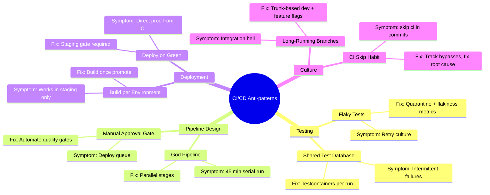

## Keywords in This File
{: .no_toc }

| # | Keyword | Weight |
|---|---|---|
| 1 | [CI/CD Anti-patterns and Recovery](#cicd-anti-patterns-and-recovery) | medium |

---

# CI/CD Anti-patterns and Recovery

🎯 Interview Weight: expert-level diagnostic - recognizing and
fixing anti-patterns signals real production experience. Staff
engineers use anti-pattern fluency to evaluate pipeline health
and propose improvements.

---

### 🎯 Model Answer

**30 seconds:**
> The most dangerous CI/CD anti-patterns are the ones that look
> correct on the surface. Passing CI on a green test suite that is
> 70% flaky tests gives false confidence. A 90-minute pipeline that
> "only runs on main" blocks the entire team during a hotfix.
> Deployment coupled tightly to the build means you cannot deploy
> a rollback without a full CI run. Each anti-pattern erodes
> the safety and speed that CI/CD is supposed to provide.

**3 minutes (Senior):**
> I organize CI/CD anti-patterns into three categories: testing
> anti-patterns, pipeline design anti-patterns, and deployment
> anti-patterns.
>
> Testing: the worst is flaky tests left unfixed. A test that passes
> 85% of the time passes CI today but fails 2 days later with no
> code change. Developers learn to retry instead of investigate.
> The CI signal becomes noise, and real failures are missed. Fix:
> quarantine flaky tests into a dedicated suite, track flakiness
> metrics, and require fixes before re-joining the main suite.
>
> Pipeline design: the "God Pipeline" is a single pipeline that
> does everything in serial order. No parallelism. Any step failure
> means rerunning from the beginning. Fix: separate fast checks
> (lint, unit tests) from slow checks (integration, E2E). Fail fast
> on cheap operations.
>
> Deployment: "Deploy on Green" without environment promotion means
> every green main build deploys directly to production. This
> destroys the ability to test in staging. Fix: separate the pipeline
> into build (CI) and deploy (CD) phases with explicit promotion gates.

**Framework:** CATEGORY → SYMPTOM → ROOT CAUSE → FIX

*Adapting up:* "The staff-level pattern I care about most: the
'just one exception' culture. Teams start with good CI/CD hygiene
and introduce exceptions under deadline pressure. Each exception
becomes a template for the next. After 6 months, exceptions are
the rule. Governance frameworks that track CI bypass events and
require postmortems after emergency deployments prevent this
cultural drift."

*Adapting down:* "Anti-patterns are bad habits that teams fall
into because they solve a short-term problem while creating a
worse long-term one. Like skipping tests because they're slow -
now CI is fast but you ship bugs."

**Blank Mind Recovery:**

**(1) Restate:** "CI/CD anti-patterns - bad practices that make
CI/CD slower, less reliable, or less safe. Recovery means identifying
the anti-pattern and applying the known fix."

**(2) First principles:** "CI/CD exists to give fast, reliable
feedback. Any practice that reduces feedback speed or reliability
is an anti-pattern. Any practice that reduces safety (ability to
deploy safely and roll back) is a deployment anti-pattern."

**(3) Bridge:** "Like safety systems in a factory. If workers start
bypassing safety interlocks because they slow production, the
interlocks become theater. CI/CD anti-patterns are the software
equivalent of bypassed interlocks."

---

### 📘 Concept Explanation

**What it is:**
CI/CD anti-patterns are practices that appear to work in the short
term but undermine the core CI/CD goals of fast, reliable, safe
feedback and deployment. They typically arise from optimization
for the wrong metric (faster builds at the cost of reliability,
or faster deployment at the cost of safety).

**The problem it solves:**
Most CI/CD degradation is not from a single catastrophic mistake
but from accumulation of anti-patterns over time. Recognizing
anti-patterns enables teams to diagnose degraded CI/CD systems
and apply targeted fixes.

**How it works - The 9 Critical Anti-patterns:**

**1. Flaky Tests (Testing anti-pattern)**
Symptom: test pass rate is 80-90%, developers retry CI rather than
investigating failures, "it passed on my machine" is a common phrase.
Root cause: tests with non-deterministic behavior - relying on
timing (Thread.sleep), external services, random data, or shared
state between tests.
Fix: run flaky test detection (record pass/fail per test over 100
runs). Quarantine flaky tests into a separate suite that runs but
does not block deployment. Fix within 1 sprint or delete.

**2. The God Pipeline (Pipeline design anti-pattern)**
Symptom: a single CI/CD pipeline file with 40+ steps, any failure
requires rerunning everything, average duration 45 minutes.
Root cause: pipeline grown organically without modularization.
Fix: decompose into independent parallel stages. Lint/type-check
in stage 1 (1 min). Unit tests in stage 2 (5 min). Build in stage 3
(parallel with stage 2). Integration tests in stage 4. Dependencies
between stages are explicit, non-dependent stages are parallel.

**3. Test Environment Coupled to Production (Deployment anti-pattern)**
Symptom: CI runs tests against a shared staging database. Developers
block each other when tests mutate shared data. Staging drift means
tests pass in CI but fail in production.
Root cause: no test isolation, shared mutable environments.
Fix: ephemeral test environments. Each CI run gets its own database
instance (Docker Compose, Testcontainers). Tests are isolated and
reproducible.

**4. Manual Release Gate (Deployment anti-pattern)**
Symptom: every deployment requires a human to click "approve" in
the CI system. The approver is often unavailable, creating deployment
queues. Emergency deployments take hours to get approval.
Root cause: approval process not automated, manual gate not
correlated with actual safety signal.
Fix: automate the gate. If unit tests, integration tests, and
smoke tests all pass, the approval is implicit. Add explicit
automated quality gates (coverage threshold, CVE scan, performance
regression test) rather than a human rubber stamp.

**5. Deployment Coupled to Build (Pipeline anti-pattern)**
Symptom: to deploy a rollback, you must run the full CI pipeline
for the previous version. Emergency rollback takes 30 minutes.
Root cause: deploy step is part of the build pipeline. No artifact
registry with independently deployable artifacts.
Fix: separate build from deploy. The build pipeline produces a
signed, versioned artifact (Docker image). The deploy pipeline
takes an artifact reference and deploys it. Rollback = deploy
a previous artifact reference (takes 2 minutes, no rebuild required).

**6. Environment-Specific Builds (Build anti-pattern)**
Symptom: separate Dockerfile or build step for dev, staging, and
production. "It works in staging but not in production."
Root cause: config mixed into the build artifact. Each environment
has a different artifact with different behavior.
Fix: build once, deploy anywhere. One build artifact. Environment
configuration injected at runtime via environment variables or a
config service. The same binary/image that passed staging tests
is deployed to production.

**7. Long-Running Branches (Source control anti-pattern)**
Symptom: feature branches open for 2-4 weeks. Merge conflicts
are massive. "Integration hell" before each release.
Root cause: developers work in isolation for extended periods.
Large batch size means large merge complexity.
Fix: trunk-based development with feature flags. Merge to main
daily or more frequently. Use feature flags to hide incomplete
features. CI runs on every commit to main (not only on PRs).

**8. CI Skip Culture (Culture anti-pattern)**
Symptom: `[skip ci]` in commit messages is common. Developers
add CI skip for "docs-only" changes. CI pipeline bypassed
regularly.
Root cause: CI is too slow or noisy. Developers skip CI because
the cost exceeds the perceived benefit.
Fix: address the root cause (slow CI, noisy tests) not the symptom.
Every bypass event should be treated as a signal that CI needs
improvement. Track bypass frequency as a metric.

**9. Version Pinning Without Renovation (Dependency anti-pattern)**
Symptom: all dependencies are pinned to specific versions, but
there is no process for updating them. Dependencies are 18 months
out of date. Security vulnerabilities accumulate.
Root cause: fear of breaking changes from upgrades, no automation.
Fix: Renovate or Dependabot for automated PR creation on new
versions. Automated tests catch breaking changes at PR review.
Weekly dependency updates (not annual) minimize breaking change
scope.

**The key insight:**
Anti-patterns are not random mistakes. Each has a specific short-
term benefit that masks the long-term cost. Flaky tests (benefit:
tests don't block CI) / cost: CI signal becomes noise. CI skip
(benefit: faster iteration) / cost: real failures slip through.
Fixing anti-patterns requires addressing both the pattern and the
short-term pressure that created it.

**When to use anti-pattern detection:**
In any of these scenarios: new team member asking "why do we do
it this way?", deployment incident postmortem, pipeline duration
has grown > 50% in 6 months, CI pass rate < 90%, developers
complain about CI constantly.

**When NOT to use anti-pattern detection:**
Anti-pattern frameworks should not be applied dogmatically. A
"manual approval gate" for a medical device deployment is not an
anti-pattern - it is a regulatory requirement. Context determines
whether a practice is an anti-pattern.

**Alternatives:**
- DORA metrics (deployment frequency, lead time, change failure rate,
  MTTR) provide quantitative anti-pattern detection
- Value stream mapping identifies waste in the pipeline
- CI observability tools (Datadog CI, Buildkite analytics) surface
  slow and flaky tests automatically

**First-principles derivation:**
CI/CD anti-patterns can be derived from the core CI/CD goals:
(1) fast feedback, (2) reliable signal, (3) safe deployment.
An anti-pattern degrades at least one of these three properties.
Classification: which property does it degrade?

---

### 💻 Code Example

**BAD: God Pipeline - serial, no parallelism, no separation**

```yaml
# ANTI-PATTERN: Monolithic serial pipeline
# One job does everything; any step failure = full restart

name: CI/CD
on:
  push:
    branches: [main]

jobs:
  everything:
    runs-on: ubuntu-latest
    steps:
      # Setup (2 min - serial)
      - uses: actions/checkout@v4
      - uses: actions/setup-java@v4
        with:
          java-version: '21'
      - run: mvn dependency:go-offline

      # Lint (30 sec)
      - name: Lint
        run: mvn checkstyle:check

      # Unit Tests (15 min - serial, no parallelism)
      - name: Unit Tests
        run: mvn test -Dskip.integration=true

      # Build (5 min - after all tests)
      - name: Build
        run: mvn package -DskipTests

      # Integration Tests (20 min - serial, after unit tests AND build)
      - name: Integration Tests
        run: mvn verify -P integration-tests

      # Docker Build (8 min - after integration)
      - name: Docker Build
        run: docker build -t myapp:latest .

      # E2E Tests (30 min - runs last, all prior steps must pass)
      - name: E2E Tests
        run: npm run e2e

      # Deploy to PROD (directly from main - no staging gate)
      - name: Deploy to Production
        run: kubectl apply -f k8s/production/
        # DANGER: deploys to production from every green main build
        # No staging validation
        # No approval gate
        # A unit test failure means rerunning all 80 minutes

# Total: ~80 minutes, serial, any failure = full restart
```

> **Code walkthrough:** The serial monolith creates cascading waste.
> A lint failure at step 1 means 3 minutes wasted on setup before
> the 30-second lint check runs. Unit tests must complete before
> the Docker build starts, even though they are independent. The
> deploy-to-production step at the end means every main branch
> commit with green tests deploys immediately to production,
> with no staging validation. A flaky integration test that fails
> 20% of the time blocks all deployments.

**GOOD: Modular parallel pipeline with separation of concerns**


```yaml
# Optimized pipeline with proper stages and gates

name: CI/CD
on:
  push:
    branches: [main, 'feature/**']
  pull_request:

jobs:
  # Stage 1: Fast checks - fail fast
  # Runs FIRST. Fails in <2 minutes for obvious issues.
  fast-checks:
    runs-on: ubuntu-latest
    steps:
      - uses: actions/checkout@v4
      - uses: actions/setup-java@v4
        with:
          java-version: '21'
          cache: maven
      - run: mvn checkstyle:check spotbugs:check

  # Stage 2a: Unit Tests - parallel with 2b
  # Depends on fast-checks only
  unit-tests:
    needs: fast-checks
    runs-on: ubuntu-latest
    steps:
      - uses: actions/checkout@v4
      - uses: actions/setup-java@v4
        with:
          java-version: '21'
          cache: maven
      - run: mvn test -Dskip.integration=true

  # Stage 2b: Build - parallel with unit tests
  # Also depends only on fast-checks (not on unit-tests)
  build:
    needs: fast-checks
    runs-on: ubuntu-latest
    outputs:
      image-digest: ${{ steps.docker.outputs.digest }}
    steps:
      - uses: actions/checkout@v4
      - uses: docker/setup-buildx-action@v3
      - name: Build Docker image
        id: docker
        uses: docker/build-push-action@v5
        with:
          push: ${{ github.ref == 'refs/heads/main' }}
          tags: ghcr.io/myorg/myapp:${{ github.sha }}
          cache-from: type=gha
          cache-to: type=gha,mode=max

  # Stage 3: Integration Tests - uses built artifact
  # Waits for BOTH unit tests AND build
  integration-tests:
    needs: [unit-tests, build]
    runs-on: ubuntu-latest
    steps:
      - uses: actions/checkout@v4
      - name: Run integration tests against built image
        run: |
          docker pull ghcr.io/myorg/myapp:${{ github.sha }}
          docker compose -f docker-compose.test.yml up -d
          mvn verify -P integration-tests
          docker compose -f docker-compose.test.yml down

  # Stage 4: Deploy to STAGING (main branch only, after integration)
  deploy-staging:
    if: github.ref == 'refs/heads/main'
    needs: integration-tests
    environment: staging
    runs-on: ubuntu-latest
    steps:
      - uses: actions/checkout@v4
      - name: Deploy to staging
        run: |
          kubectl set image deployment/myapp \
            myapp=ghcr.io/myorg/myapp:${{ github.sha }} \
            -n staging
      - name: Smoke test staging
        run: ./scripts/smoke-test.sh staging
        timeout-minutes: 5

  # Stage 5: Deploy to PRODUCTION (explicit gate after staging)
  deploy-production:
    needs: deploy-staging
    environment:
      name: production
      # GitHub Environments: enables protection rules (reviewers,
      # wait timer, deployment branch rules)
    runs-on: ubuntu-latest
    steps:
      - uses: actions/checkout@v4
      - name: Deploy to production
        run: |
          # Deploy the same artifact that passed staging
          # No rebuild - artifact promotion pattern
          kubectl set image deployment/myapp \
            myapp=ghcr.io/myorg/myapp:${{ github.sha }} \
            -n production
      - name: Verify production deployment
        run: ./scripts/verify-deployment.sh production
```


> **Code walkthrough:** The pipeline has four structural improvements.
> Stage parallelism: unit tests and Docker build run simultaneously
> (both only require fast-checks), saving 15 minutes of serial wait.
> Separation of CI and CD: staging deployment is a separate job
> with an explicit `environment: staging` gate. Production deployment
> requires staging to pass first. Artifact promotion: production
> deploys the same image that passed staging (same SHA) - no rebuild.
> The deployment command is `kubectl set image` with a specific digest,
> meaning rollback is `kubectl set image` with the previous digest -
> no CI pipeline required.

---

### 🎓 Answers by Seniority

**Junior / Mid (0-5 years):**
> "The main anti-pattern I have seen is tests that pass most of the
> time but not always - flaky tests. The team's response was to
> rerun CI until it passed. This meant real test failures were being
> retried away. I fixed it by tracking which tests failed and flagging
> anything that failed more than 5% of runs as flaky. We quarantined
> those tests until fixed. Within a sprint, the retry-instead-of-fix
> culture was gone because the metrics made flakiness visible.
>
> Another one: the deploy was part of the CI pipeline, so to rollback
> you had to run CI for the old commit. I separated the pipeline
> into a build stage (produces an artifact) and a deploy stage
> (takes an artifact reference). Rollback became: deploy the previous
> artifact, no CI required."

---

**Senior / Staff (5+ years):**
> "The anti-patterns I track at org level are different from the ones
> I fix at pipeline level. At the pipeline level: flaky tests,
> monolithic pipelines, deploy-coupled-to-build. At the org level:
> the 'exception culture.'
>
> Exception culture is when teams routinely bypass CI for urgent
> deployments. The first bypass happens under genuine pressure and
> sets a precedent. The second bypass is slightly less urgent. After
> 3 months, 'just bypass CI' is the standard response to any deployment
> friction. At this point, CI is theater - it runs but nobody trusts
> it to actually block unsafe deployments.
>
> My fix: instrument every CI bypass. Track bypass frequency per team.
> Make bypasses visible in the engineering metrics dashboard. Require
> a one-sentence justification for each bypass, logged to a Slack
> channel. Not a heavyweight process, but visibility creates accountability.
>
> The deeper fix: reduce the actual friction that motivates bypasses.
> A 45-minute pipeline motivates bypasses. A 5-minute pipeline does
> not. Fast CI is the long-term fix for bypass culture."

---

### ⚖️ Comparison Table

| Anti-pattern | Short-term Benefit | Long-term Cost | Fix |
|---|---|---|---|
| Flaky Tests | Tests don't block CI | CI signal is noise; real bugs slip through | Quarantine + metrics + fix within sprint |
| God Pipeline | Simple to understand | Slow, any failure blocks everything | Parallel stages by dependency |
| Deploy on Green | Simple CD | No staging validation, frequent incidents | Separate CI/CD; environment promotion |
| CI Skip | Faster iteration | Real failures bypass CI | Fix slow CI; track bypass events |
| Shared Test DB | Replicates production | Tests interfere; flaky; can't parallelize | Ephemeral per-run DB (Testcontainers) |
| Manual Approval | "Someone checks it" | Bottleneck; often rubber stamp | Automate the actual checks |
| Build per Environment | "Safer" environments | "Works in staging" bugs; drift | Build once, config at runtime |

---

### 🏛️ System Design

**Design: A CI/CD health monitoring system for a 200-engineer
organization to detect anti-patterns proactively.**

**Problem:** Anti-patterns accumulate gradually. No single team
sees the full picture. A health monitoring system provides objective
metrics that surface anti-patterns before they become crises.

**Metrics to track:**

Pipeline health:
- P95 pipeline duration per service (alert if > 15 min, target < 5 min)
- CI pass rate per service per week (alert if < 90%, red if < 80%)
- Retry-to-pass rate per test (flakiness proxy: test passed only after retry)
- Pipeline bypass events per team per week

Deployment health:
- Deployment frequency per service (DORA metric)
- Mean lead time for changes (commit to production, DORA metric)
- Change failure rate (% deployments causing incident, DORA metric)
- Mean time to restore (after production incident, DORA metric)
- Rollback frequency and rollback duration

Dependency health:
- Average age of dependencies (days since last update)
- Open CVE count by severity per service
- Time-to-remediate critical CVEs

Architecture:
- CI platform: GitHub Actions, metrics via API + webhook
- Storage: TimescaleDB (time-series for pipeline metrics)
- Dashboard: Grafana with CI/CD health panels
- Alerting: PagerDuty for critical degradation (P95 > 30 min, pass rate < 70%)
- Engineering review: weekly CI/CD health review per team lead

**Anti-pattern detection rules:**
```python
# Example detection rule: flaky test identifier
SELECT
  test_name,
  COUNT(*) as total_runs,
  SUM(CASE WHEN status = 'failed' THEN 1 ELSE 0 END) as failures,
  ROUND(100.0 * SUM(CASE WHEN status='failed' THEN 1 ELSE 0 END)
    / COUNT(*), 1) as failure_rate_pct
FROM test_results
WHERE run_date >= NOW() - INTERVAL '30 days'
GROUP BY test_name
HAVING failure_rate_pct BETWEEN 5 AND 95  -- flaky range (not always fails)
ORDER BY failure_rate_pct DESC;
```

> **Code walkthrough:** This Example detection rule: flaky test identifier example demonstrates Python code pattern using SQL. **KEY MECHANISM:** Python evaluates expressions at runtime; objects are reference-counted for garbage collection. **WHY IT MATTERS:** mutable shared state between threads requires explicit locking - the GIL only protects CPython internals. **TAKEAWAY: use threading.Lock for shared mutable state; prefer multiprocessing for CPU-bound parallelism.**

**Trade-off:**
Building a CI/CD health system is a 4-6 week investment for a
dedicated platform team. The ROI: detecting and fixing one critical
anti-pattern (flaky tests causing false confidence, then a production
incident) typically justifies the entire investment.

---

### 📊 Diagram

**CI/CD Anti-pattern Classification and Fix Map**

```
CI/CD GOAL: fast, reliable feedback + safe deployment
                        |
        +---------------+---------------+
        |               |               |
   TESTING           PIPELINE       DEPLOYMENT
   ANTI-PATTERNS     ANTI-PATTERNS  ANTI-PATTERNS
        |               |               |
   Flaky Tests     God Pipeline    Deploy on Green
   (noisy signal)  (slow, serial)  (no staging gate)
        |               |               |
   FIX:            FIX:            FIX:
   Quarantine      Parallel        CI separate from CD
   + Metrics       Stages          Staging required
        |               |               |
   Shared Test DB  Manual Gate     Build per Env
   (interference)  (bottleneck)    (drift)
        |               |               |
   FIX:            FIX:            FIX:
   Ephemeral       Automate gates  Build once,
   per-run DB      (not humans)    config at runtime
```



> **Diagram walkthrough:** The anti-patterns cluster into four
> categories corresponding to where in the CI/CD lifecycle they
> occur. Testing anti-patterns corrupt the signal quality (you
> cannot trust a CI run that might be wrong 15% of the time).
> Pipeline design anti-patterns degrade speed and reliability.
> Deployment anti-patterns undermine safety. Culture anti-patterns
> undermine the entire system. Each category has a distinct set
> of fixes. The classification helps engineers diagnose which
> category they are dealing with and apply the right remedy rather
> than generic "CI/CD improvements."

---

### ⚠️ Common Misconceptions

**Misconception 1: "Flaky tests are a minor inconvenience."**
Flaky tests are a fundamental trust failure. When a test can fail
randomly, the entire CI signal becomes probabilistic. "Is this
failure real or flaky?" is a question that takes 30 minutes to
answer. Over time, developers learn to ignore CI failures. When a
real regression is introduced, it is missed because the team
assumes the failure is flaky. The SolarWinds-style scenario:
a real security regression fails CI, the developer retries three
times, it passes on retry 3 (probability: 0.85^2 = 0.72), and
the regression ships to production. Flaky tests are a security
risk.

**Misconception 2: "Manual deployment gates improve safety."**
A manual gate only improves safety if the person at the gate has
information that automated systems do not. In practice, most manual
approval gates are rubber stamps (the approver clicks "approve"
without reviewing anything specific). They add latency without
adding safety. Automated quality gates (test pass rate, coverage
threshold, CVE scan, smoke test) are both faster and more reliable
than human approval.

**Misconception 3: "Fixing anti-patterns requires a big refactoring project."**
Each anti-pattern can be fixed incrementally, one at a time. Fixing
flaky tests: identify the top 5 flaky tests by metrics, fix or
quarantine within 1 sprint. Fixing the God Pipeline: add parallel
execution for the most expensive independent step, measure improvement,
repeat. Anti-pattern remediation is iterative, not a big bang.

---

### 🚨 Failure Modes and Diagnosis

**Failure Mode 1: Flaky tests reach critical mass (> 30% of suite)**
Symptom: CI pass rate drops below 60%. Developers retry CI 2-3
times per PR as a standard practice. Deployment is blocked because
CI never passes cleanly. Production incidents go up because real
failures are indistinguishable from flaky failures.
Diagnosis: query test results for failure rate per test over 30
days. If > 30% of tests have > 5% flakiness, the suite is in
crisis. A test suite at this state requires emergency intervention:
quarantine all flaky tests immediately (deploy without them running),
then fix systematically.
Root cause: typically, the flaky tests were allowed to accumulate
because there was no tracking and no accountability. The fix requires
both technical (quarantine + repair) and process (flakiness SLO)
changes.

**Failure Mode 2: God Pipeline grows to 2 hours (gradual accumulation)**
Symptom: CI duration has grown from 10 minutes to 2 hours over
18 months. No single change caused it; it grew 5 minutes at a time.
"We need CI to be faster but there is no time to fix it."
Diagnosis: audit step timing history. Find the 5 largest additions
in the past 18 months. Likely culprits: a new integration test
suite added without time limit, E2E tests that grew from 100 to
1000 without parallelism, Docker builds with no caching added.
Fix: prioritize the 3 longest steps. Parallelize them or add caching.
Target: 50% reduction in 1 sprint. Implement a CI time budget: new
steps added to CI must demonstrate their runtime cost and get
approval from the platform team.

**Failure Mode 3: Build-per-environment causes production-only bugs**
Symptom: "it worked in staging but not in production" is a recurring
incident theme. Investigation reveals that the staging and production
Docker images, while built from the same source commit, have
different dependency versions because the production build ran
12 hours later (after a transitive dependency published a new
version).
Diagnosis: compare the SBOMs of the staging and production images
for the affected commit. A diff in transitive dependency versions
between the two builds confirms the build-per-environment anti-pattern.
Fix: artifact promotion. Build once in CI. Push to a staging registry.
After staging validation, promote (copy) the same image to production.
Both environments run the exact same artifact.

---

### 🎯 Interview Deep-Dive

| Format | Time | Focus |
|--------|------|-------|
| Screener | 3 min | Name 3 anti-patterns + their fixes |
| Panel | 10 min | Flaky tests diagnosis + pipeline decomposition |
| Senior | 15 min | System design of CI health monitoring + culture anti-patterns |

---

**Q1 (Definition): What makes a CI/CD practice an anti-pattern
rather than just a suboptimal choice?**

An anti-pattern is specifically a practice that appears to solve a
problem but creates a worse problem as a side effect. Three
characteristics distinguish an anti-pattern from a mere suboptimal
choice:

First, deceptive benefit. The practice provides a real short-term
benefit that makes it attractive. Skipping CI saves 20 minutes now.
Flaky tests not blocking CI keeps the pipeline green. The benefit
is real, which is why teams adopt the anti-pattern.

Second, hidden long-term cost. The long-term cost is not immediately
visible and often accumulates gradually. The build-per-environment
anti-pattern causes production-only bugs. These bugs happen
occasionally and are hard to attribute to the anti-pattern because
the correlation is not obvious.

Third, the fix is known. Anti-patterns are distinguished from
genuine hard problems by having known solutions. The solution to
flaky tests is known (quarantine + fix). The solution to the God
Pipeline is known (parallel stages). The difficulty is organizational
(time, prioritization) not technical.

The contrast: a suboptimal choice might be "using GitHub Actions
instead of Buildkite" - there are trade-offs but it is not an
anti-pattern because it does not have a hidden cost that undermines
CI/CD goals.

*What separates good from great:* Understanding that anti-patterns
are always rational at the time they are adopted. Teams do not
adopt anti-patterns carelessly - they are the solution to a real
short-term problem. Preventing anti-patterns requires addressing
the short-term pressures that make them attractive (slow CI
motivates CI skip; unreliable tests motivate flaky test tolerance).

---

**Q2 (Mechanism): How do you detect and measure flaky tests in a
CI system?**

Flaky test detection requires tracking per-test pass/fail history
over time and computing a flakiness rate. A deterministic test
has a flakiness rate of 0% (always passes) or 100% (always fails).
A flaky test has a rate between 5% and 95%.

Detection algorithm:
```sql
-- Test results table: test_name, run_id, status, duration, timestamp
-- Find tests with 5-95% failure rate over the past 30 days:
SELECT
  test_name,
  COUNT(*) as total_runs,
  SUM(CASE WHEN status = 'FAILED' THEN 1 ELSE 0 END) as failures,
  ROUND(100.0 * SUM(
    CASE WHEN status = 'FAILED' THEN 1 ELSE 0 END
  ) / COUNT(*), 1) as failure_pct,
  -- Also track: passes only after retry
  SUM(CASE WHEN status = 'PASSED' AND was_retry = true
    THEN 1 ELSE 0 END) as retry_passes
FROM test_results
WHERE run_date >= CURRENT_DATE - INTERVAL '30 days'
GROUP BY test_name
HAVING failure_pct BETWEEN 5 AND 95
ORDER BY failures DESC;
```

> **Code walkthrough:** This Unknown example demonstrates query execution using SQL. **KEY MECHANISM:** the query planner builds an execution plan based on table statistics and indexes. **WHY IT MATTERS:** SELECT * reads all columns even if only 2 are needed - widens rows, increases I/O. **TAKEAWAY: always SELECT only the columns you need; index the columns in WHERE and JOIN clauses.**

Proxy metric (without per-test tracking): retry-to-pass rate.
If a CI run fails but passes on retry without any code change,
at least one test in the run is flaky. Tracking the percentage
of CI runs that required retry provides an aggregate flakiness
signal without per-test instrumentation.

Actionable classification:
- Flakiness rate > 20%: quarantine immediately (remove from blocking suite)
- Flakiness rate 5-20%: P1 fix, must fix within current sprint
- Flakiness rate 1-5%: P2 fix, address in next sprint
- Flakiness rate < 1%: acceptable, monitor

Root cause categories (for triage):
- Timing-dependent (Thread.sleep, race conditions): ~40% of cases
- External service dependency (network, database): ~30% of cases
- Test order dependency (shared state): ~20% of cases
- Resource contention (CPU/memory pressure): ~10% of cases

*What separates good from great:* Building the tracking infrastructure
before the problem becomes a crisis. CI platforms like GitHub Actions
store test results in a proprietary format. Exporting test results
(JUnit XML) to a queryable database as part of every CI run provides
the data foundation for proactive flakiness management.

---

**Q3 (Deep Dive): Walk through the diagnosis and fix of a
pipeline that has grown from 5 minutes to 45 minutes over 18 months.**

This is a common growth trajectory for successful products. The
pipeline grew because the team grew, the test suite grew, and
nobody was accountable for pipeline duration.

Step 1: Instrument and measure (Day 1-2).
Pull historical step timing data from the CI platform. Create a
chart: pipeline duration over the past 18 months. Identify the
inflection points where duration increased significantly.

Step 2: Decompose the current state.
For the current pipeline, list every step with its average duration.
Typical finding for a 45-minute Java pipeline:

| Step | Duration | Parallelizable? |
|------|----------|----------------|
| Checkout + Setup | 3 min | No |
| Dependency install (no cache) | 6 min | No |
| Lint + checkstyle | 2 min | Yes (stage 1) |
| Unit tests (serial) | 12 min | Yes (5 shards) |
| Build JAR | 4 min | Yes (parallel with tests) |
| Integration tests (serial) | 15 min | Yes (3 shards) |
| Docker build (no cache) | 7 min | Yes (parallel with integration) |
| Push + scan | 3 min | No |

Step 3: Apply optimizations in priority order.

Fix 1: Dependency caching (6 min → 30 sec, 2 hours effort).
Add `cache: maven` to the setup step. Cache key: `pom.xml` hash.
Saves 5.5 minutes per run.

Fix 2: Parallelize unit tests (12 min → 3 min, 1 day effort).
Split unit tests into 4 shards using Surefire's fork configuration.
Saves 9 minutes.

Fix 3: Parallelize build with tests (4 min saved, 1 hour effort).
Make build step depend on lint only, not on unit tests. Run in
parallel with unit tests. Saves 4 minutes of serial wait.

Fix 4: Parallelize integration tests (15 min → 6 min, 2 days effort).
3 integration test shards with ephemeral databases (Testcontainers).
Saves 9 minutes.

Fix 5: Docker layer caching (7 min → 45 sec, 2 hours effort).
Add `cache-from: type=gha` to build step. Restructure Dockerfile
for layer optimization. Saves 6 minutes.

After all fixes: 3 + 0.5 (setup) + 2 (lint, stage 1) + max(3 unit
tests, 3 build) + max(6 integration, 0.75 Docker) + 3 (push/scan)
= approximately 12 minutes. From 45 minutes to 12 minutes.

Further reduction: test impact analysis, remote build cache for
affected-only tests would bring this closer to 5 minutes.

*What separates good from great:* Installing a pipeline time budget.
After reaching 12 minutes, establish a team agreement: if any new
step is added to CI, it must justify its time cost against the
budget. New slow steps require platform team approval and include
a parallelization plan. This prevents the 18-month accumulation
from happening again.

---

**Q4 (Scenario): Your team has been bypassing CI for urgent
deployments. How do you break this habit without creating
bureaucratic overhead?**

The bypass habit forms when the perceived cost of CI (time, noise,
unreliability) exceeds the perceived benefit (catching bugs). The
fix requires reducing the perceived cost, not increasing the
perceived benefit.

Diagnosis: understand the bypass reasons.
Ask every engineer who bypassed CI in the past month: "why?"
Common answers:
- "CI was too slow for an urgent fix" → fix: reduce CI to < 5 min
- "CI was failing for unrelated reasons" → fix: fix flaky tests
- "The change was so small it couldn't break anything" → fix: CI
  perception problem (also: unit tests would confirm this)
- "The approval process took too long" → fix: automate or simplify gates

Intervention (no bureaucracy):
1. Add a #ci-bypasses Slack channel. GitHub Actions sends a
   message when `[skip ci]` is detected in a commit. No blame,
   just visibility. "Pipeline bypassed: [commit link] by @engineer"
2. Add bypass tracking to the CI metrics dashboard. Show bypass
   frequency per team week-over-week.
3. In the weekly engineering sync: "our bypass rate this week was
   X. What are we hearing about why?" One question, no blame.

The systemic fix (removes the motivation):
- Reduce pipeline to < 5 minutes (removes "too slow" motivation)
- Fix flaky tests (removes "failing for unrelated reasons" motivation)
- Automate quality gates (removes "approval takes too long" motivation)

In 4-6 weeks of fixing root causes + adding visibility: bypass
rate typically drops 80%. The remaining 20% are genuine emergencies
that should be tracked and reviewed in postmortems.

*What separates good from great:* Understanding that bypass culture
is a symptom, not the disease. Punishing bypasses without fixing
the underlying CI problems creates resentment and underground
bypasses (force-push without CI). Fixing the underlying problems
eliminates the motivation for bypasses, which is sustainable.

---

**Q5 (Trade-off): When is a manual deployment gate actually good
practice (not an anti-pattern)?**

Manual gates are anti-patterns when they function as rubber stamps
(the approver has no unique information to add). They are legitimate
practices when the human provides something automation cannot.

Legitimate manual gate scenarios:

Regulatory compliance: medical devices (FDA), financial systems
(SOX), and government software often require documented human
review and approval before deployment. The requirement is not
about adding safety (the automated tests already provide safety)
but about regulatory traceability and accountability. A human
signature in the audit trail has legal significance.

Novel deployment to a new production environment: the first
deployment of a new service to production reasonably involves
human review. The deployment has never been exercised in this
context and the human is validating that the runbook is correct
and the team is ready to support the service.

Externally coordinated deployments: when a deployment requires
coordination with an external team or customer (planned maintenance
window, customer notification, coordinated API version cutover),
a human gate ensures coordination timing is respected.

The distinction - rubber stamp vs. real review:
A rubber stamp: the approver clicks "approve" without looking at
the diff, test results, or metrics. This adds latency without
safety.
A real review: the approver opens the PR, reviews the change,
checks the test results, and confirms the deployment is appropriate.
This adds safety.

Improving a manual gate without removing it: provide the approver
with a deployment dashboard. Show: what changed (PR link + diff),
test results, CVE scan results, staging deployment smoke test
results. The approver's decision is informed. This transforms
a rubber stamp into a genuine gate without requiring automation
for the final decision.

*What separates good from great:* Recognizing that manual gates
and automation are not mutually exclusive. The best gates combine
both: automated quality gates (test pass, CVE clean, smoke test)
are prerequisites. If all automated gates pass, a human makes the
final decision with full context. The human is reviewing quality,
not re-doing the automation's job.

---

**Q6 (Debugging): How do you diagnose a CI pipeline where the
pass rate dropped from 98% to 75% over the past 2 weeks?**

A 23 percentage point drop in 2 weeks is dramatic and has a
specific root cause. This is not gradual flakiness accumulation
- it is a recent change that broke something.

Step 1: Correlate with deployment timeline.
```bash
# Find changes to CI config in the past 2 weeks
git log --since="2 weeks ago" --oneline -- .github/workflows/
# Expected: find a specific commit that changed the CI pipeline
```

> **Code walkthrough:** This Expected: find a specific commit that changed the CI pipeline example demonstrates shell script pattern. **KEY MECHANISM:** the shell executes commands sequentially; pipes pass stdout of one command to stdin of the next. **WHY IT MATTERS:** unquoted variables with spaces cause word splitting - IFS splits the value into multiple arguments. **TAKEAWAY: always double-quote variables: "$VAR"; use [[ ]] instead of [ ] for safer conditionals.**

Step 2: If no CI config changes, look at test changes.
```bash
# Find new tests added in the past 2 weeks
git log --since="2 weeks ago" --oneline --diff-filter=A -- \
  src/test/
# New tests added to a shared database? Timing-sensitive?
```

> **Code walkthrough:** This New tests added to a shared database? Timing-sensitive? example demonstrates shell script pattern. **KEY MECHANISM:** the shell executes commands sequentially; pipes pass stdout of one command to stdin of the next. **WHY IT MATTERS:** unquoted variables with spaces cause word splitting - IFS splits the value into multiple arguments. **TAKEAWAY: always double-quote variables: "$VAR"; use [[ ]] instead of [ ] for safer conditionals.**

Step 3: Analyze which tests are failing.
Pull the last 100 CI runs. Which tests appear in failed runs?
```sql
-- Find tests failing in the past 2 weeks that were not failing before
SELECT
  test_name,
  SUM(CASE WHEN run_date >= NOW() - INTERVAL '14 days'
    THEN 1 ELSE 0 END) as failures_recent,
  SUM(CASE WHEN run_date < NOW() - INTERVAL '14 days'
    THEN 1 ELSE 0 END) as failures_before
FROM test_results
WHERE status = 'FAILED'
GROUP BY test_name
HAVING failures_recent > 5 AND failures_before < 2
ORDER BY failures_recent DESC;
```

> **Code walkthrough:** This New tests added to a shared database? Timing-sensitive? example demonstrates query execution using SQL. **KEY MECHANISM:** the query planner builds an execution plan based on table statistics and indexes. **WHY IT MATTERS:** SELECT * reads all columns even if only 2 are needed - widens rows, increases I/O. **TAKEAWAY: always SELECT only the columns you need; index the columns in WHERE and JOIN clauses.**

Common findings for sudden drop:
- A new integration test was added that uses the shared test database
  and causes data contamination for other tests (flaky due to order
  dependency)
- A new test was added that calls an external service that is
  rate-limited (intermittent HTTP 429 responses)
- A dependency was updated that changed timing behavior (a test's
  Thread.sleep is now too short)
- The CI runner machine type was changed (slower machines fail
  timing-sensitive tests)

Step 4: Fix the identified test and measure recovery.
After fixing the root cause test, monitor pass rate for 3 days.
Should return to 95%+.

*What separates good from great:* Adding pass-rate monitoring with
alerting. A Datadog or Grafana alert when the 7-day rolling pass
rate drops below 92% for any service provides early warning (within
days) rather than noticing after 2 weeks. Earlier detection = cheaper
fix (fewer tests to diagnose, recent commits easier to correlate).

---

**Q7 (Architecture): Design a CI/CD pipeline for a zero-downtime
deployment requirement with automated rollback on error.**

Zero-downtime deployment with automated rollback requires: a
progressive deployment strategy (blue-green or canary), real-time
health monitoring, and an automated rollback trigger.

Architecture:

Deployment strategy: canary with automated rollback.
- Deploy new version to 5% of pods (canary)
- Monitor for 10 minutes: error rate, latency, health check failures
- If metrics are healthy: promote to 25%, then 50%, then 100%
- If metrics degrade: rollback to 0% canary (all traffic to previous version)

Pipeline implementation:


```yaml
deploy-canary:
  steps:
    - name: Deploy canary (5%)
      run: |
        kubectl apply -f k8s/canary-deployment.yaml
        # canary-deployment.yaml: 5% replica weight in Istio VirtualService
        # or Argo Rollouts canary step

    - name: Monitor canary health (10 min)
      run: |
        # Monitor Prometheus for 10 minutes
        # Exit 0 if healthy, exit 1 if degraded
        ./scripts/monitor-canary.sh \
          --duration=600 \
          --error-rate-threshold=0.5 \
          --latency-p99-threshold=500ms \
          --service=myapp

    - name: Promote canary on success / rollback on failure
      if: always()
      run: |
        if [ "${{ steps.monitor.outcome }}" == "success" ]; then
          kubectl apply -f k8s/production-deployment.yaml
          # 100% traffic to new version
        else
          # Automated rollback: remove canary deployment
          kubectl delete -f k8s/canary-deployment.yaml
          echo "Canary failed: automated rollback complete"
          exit 1
        fi
```


> **Code walkthrough:** This Automated rollback: remove canary deployment example demonstrates YAML configuration pattern using SQL. **KEY MECHANISM:** YAML parsers are whitespace-sensitive; indentation errors cause silent value misinterpretation. **WHY IT MATTERS:** unquoted strings starting with special chars (*, &, ?, |) trigger YAML parser errors. **TAKEAWAY: quote strings containing YAML special chars; validate YAML before deploying to production.**

Zero-downtime guarantee:
- Canary uses Istio VirtualService or Argo Rollouts for traffic splitting
  at the service mesh level (not at the deployment replica count level)
- Old version continues serving 95% of traffic during canary
- If rollback triggers: old version served 100% within 30 seconds
  (traffic weight change, no pod restart required)

*What separates good from great:* Understanding the difference between
deployment rollback (removing the new version from serving traffic)
and data migration rollback (reversing database schema changes).
Zero-downtime deployment rollback is achievable with traffic splitting.
But if the deployment included a database migration that added a
non-null column, rolling back the application code while the new
column exists requires the old application code to handle the new
schema or the migration to be backward compatible.

---

**Q8 (Behavioral): Tell me about a time you discovered and fixed
a critical CI/CD anti-pattern that had been accepted as normal.**

I joined a team where the CI pass rate was 78% and the standard
response to a failed CI run was "just retry." This had been normal
for so long that developers did not question it.

The trigger: a production incident where a null pointer exception
in a new payment processing path reached production. The test that
would have caught it was marked as flaky 4 months earlier and had
been retried past 200 times since then. The test passed on retry
because the flakiness was in a related payment integration test,
not the specific test for the new code path.

My investigation: I queried the CI test results database for the
past 90 days. 47 tests had failure rates between 10% and 60%.
12 of those were genuine flaky tests (race conditions, timing).
35 were tests that failed consistently in certain code combinations
but were masked by the retry mechanism.

The fix: I quarantined all 47 tests (moved to a separate suite
that ran and recorded results but did not block deployment). This
immediately raised the main suite pass rate to 96%. Then I sorted
by failure rate and worked through fixes from most-to-least flaky.
Root causes: 12 tests had Thread.sleep(100) that needed Thread.sleep(500).
18 tests shared a database object that needed test isolation.
17 tests called a mock service that was not cleaned up between tests.

Total fix time: 3 sprints for all 47 tests. Within 6 months, the
retry culture was gone because the suite was reliable. When CI
failed, it meant something was actually wrong.

The lesson: anti-patterns persist because the short-term cost
of fixing them is visible and the long-term cost is diffuse. Making
the long-term cost visible (the incident cost, the developer time
cost of retrying) provides the motivation to fix.

*What separates good from great:* Recognizing the system dynamic.
A reliable CI suite means developers trust CI failures. Developer
trust in CI failures means developers investigate rather than retry.
Investigating means real bugs are found. Real bugs found in CI
means fewer production incidents. The causal chain is long enough
that most teams never make the connection without explicit analysis.

---

**Q9 (Deep Dive): How do you prevent anti-patterns from recurring
after they have been fixed?**

Anti-patterns recur because the organizational pressures that created
them do not go away. A team that fixed the God Pipeline can recreate
it in 12 months if there is no ongoing governance.

Prevention mechanisms by layer:

Technical enforcement (most durable):
- Pipeline lint rules: a custom validator that checks the pipeline
  configuration for known anti-pattern patterns. Fails if any job
  has more than 15 steps serial. Fails if tests are not sharded.
- CI time budget: each new step added to CI must include a duration
  estimate. If the addition would exceed the 10-minute SLO, it requires
  platform team review.
- Flakiness SLO: a CI job that scans test results weekly and creates
  JIRA tickets for any test with > 5% flakiness. Tickets are auto-
  assigned to the test author's team and escalate if not resolved in 1 sprint.

Observability (makes anti-patterns visible before they become crises):
- CI metrics dashboard: pipeline duration, pass rate, bypass frequency,
  per service, per week. Visible to all engineers and team leads.
- Trend alerting: Datadog alert when pipeline duration P95 exceeds
  12 minutes for 3 consecutive days. Creates a task for the owning team.
- Quarterly CI health review: engineering leadership reviews the CI
  metrics. Teams with degraded metrics are asked to present a plan.

Cultural mechanisms (least durable, but necessary):
- Document anti-patterns in the engineering wiki. When a new engineer
  asks "why don't we have a single pipeline?" the wiki explains why.
- Post-incident reviews include a CI/CD question: "could this incident
  have been prevented with a CI/CD improvement?"
- Celebrate improvements: "The payments team reduced their pipeline
  from 30 minutes to 6 minutes this sprint" in the all-hands.

*What separates good from great:* The technical enforcement layer
is the only durable one. Observability helps but requires humans to
act on signals. Cultural mechanisms degrade as team composition
changes. The pipeline lint rule that prevents the God Pipeline from
re-forming is permanent because it is enforced automatically.

---

**Q10 (Architecture): What is the relationship between CI/CD
anti-patterns and DORA metrics?**

The DORA (DevOps Research and Assessment) four key metrics directly
measure the effects of CI/CD anti-patterns:

Deployment Frequency: measures how often the team deploys to
production. Anti-patterns that reduce deployment frequency:
- Manual approval gates (create deployment queues)
- God Pipeline (slow CI means less frequent deployments)
- Build per environment (drift causes incidents, which reduce
  confidence in deployments, which reduces frequency)

Lead Time for Changes: the time from code commit to production
deployment. Anti-patterns that increase lead time:
- God Pipeline (long CI duration is in the critical path)
- Long-running branches (code sits in a branch for weeks)
- Manual gate bottlenecks (wait time for human approver)

Change Failure Rate: the percentage of deployments that cause
a production incident. Anti-patterns that increase failure rate:
- Flaky tests (real regressions slip through)
- Deploy on Green without staging (untested code to production)
- Build per environment (production-specific bugs)

Mean Time to Restore: the time to recover from a production incident.
Anti-patterns that increase MTTR:
- Deploy coupled to build (rollback requires full CI run)
- Build per environment (can't reproduce the production issue)
- Lack of deployment observability (takes longer to detect the failure)

The DORA framework provides an objective measurement framework for
anti-pattern impact. Rather than arguing "flaky tests are bad" (which
is obvious), you can show: "our change failure rate is 15% vs. the
elite benchmark of 5%. The correlation analysis shows flaky tests
are present in 80% of failure cases." Data-driven anti-pattern
remediation is more effective at getting organizational support.

*What separates good from great:* Using DORA metrics not just for
reporting but for root cause analysis. When change failure rate
increases, use the DORA framework as a hypothesis generator: which
anti-pattern would explain this increase? This turns DORA from a
vanity metric into a diagnostic tool.

---

**Q11 (Trade-off): When does trunk-based development become
impractical, and how do you adapt the approach?**

Trunk-based development (TBD) - all engineers committing to main
daily - is strongly recommended by DORA research and resolves the
long-running branches anti-pattern. However, it requires specific
infrastructure that not all teams have.

When TBD works optimally:
- Feature flags are in place (new features hidden behind flags)
- CI is fast (< 10 minutes, so developers do not batch commits)
- Test suite is reliable (developers trust CI failures as real)
- Team has the discipline to commit incomplete work with flags

When TBD encounters difficulties:

Large releases with hard dependencies: when feature B must ship
with feature A (external API changes, database schema changes),
keeping both on main simultaneously requires careful coordination.
The adaptation: use feature flags for both, coordinate flag activation.

Highly regulated environments: some regulatory contexts require
documented approval for every production commit. In TBD, many
commits go to production daily. The adaptation: feature flags
on non-default (off). Only flag activations (which change visible
behavior) require formal approval. Infrastructure commits are
low-risk and high-frequency.

Very large teams (1000+ engineers on one repo): at extreme scale,
merge conflicts and CI queue depth can make TBD impractical.
The adaptation: separate the monorepo into release trains. Each
service has its own TBD flow but services can be independently
deployed. This is not long-running feature branches - it is
service-level trunk development.

The anti-pattern version of the failure: teams that attempt TBD
without feature flags revert to long-running branches after 2
months because "we can't merge half-complete features to main."
Feature flags are not optional for TBD - they are a prerequisite.

*What separates good from great:* Understanding that TBD and feature
flags are complementary. TBD without feature flags is not practical
for teams building features over multiple days. Feature flags without
TBD solve the integration problem but not the deployment frequency
problem. The combination is the pattern that DORA research associates
with elite performers.

---

**Q12 (Architecture): How do you design a self-healing CI/CD pipeline
that automatically recovers from transient infrastructure failures?**

A self-healing pipeline reduces human intervention for transient
failures (flaky network, temporary unavailable test database, runner
OOM) while maintaining high signal-to-noise ratio (genuine failures
are not masked by retry logic).

The core principle: retry transient failures, never retry deterministic
failures.

Categories of CI failures:
- Deterministic: test assertion failure, compilation error, lint failure.
  These reflect a real problem in the code. Retry produces the same
  result. NEVER auto-retry.
- Transient: network timeout, runner OOM, external service unavailable.
  These are infrastructure problems unrelated to the code.
  Auto-retry with backoff is appropriate.

Classification at the step level:
```yaml
# Test step: deterministic failures should not be retried
- name: Unit Tests
  run: ./mvnw test
  # No retry for test failures: a failing test means a failing test.
  # Retrying hides flaky tests.

# External dependency step: transient failures should be retried
- name: Push Docker image
  uses: docker/build-push-action@v5
  with:
    retry: 3         # GitHub Actions native retry for transient push failures
    # Registry push can fail due to network transience.
    # Retrying 3 times is safe: push is idempotent.

# Integration test: mixed - has its own retry logic internally
- name: Integration Tests
  run: |
    ./mvnw verify -P integration \
      -Dsurefire.rerunFailingTestsCount=1
    # Surefire: re-run each failing test ONCE.
    # If it passes on re-run: mark as flaky, report but don't block.
    # If it fails again: mark as failing test, block CI.
    # This handles genuine test flakiness while preserving signal.
```

> **Code walkthrough:** This This handles genuine test flakiness while preserving signal. example demonstrates YAML configuration pattern using container. **KEY MECHANISM:** YAML parsers are whitespace-sensitive; indentation errors cause silent value misinterpretation. **WHY IT MATTERS:** unquoted strings starting with special chars (*, &, ?, |) trigger YAML parser errors. **TAKEAWAY: quote strings containing YAML special chars; validate YAML before deploying to production.**

Infrastructure-level self-healing:
- Runner OOM: Kubernetes ARC auto-restarts OOM pods with the same job
- Network transience: exponential backoff in artifact push steps
- Test database unavailable: health check before integration tests
  with 3-retry + 30-second intervals before marking as infra failure

Alerting for persistent infrastructure failures:
When the same infra failure occurs 3 times in 4 hours, alert the
platform team. Self-healing handles transient issues; persistent
infrastructure failures require human intervention.

*What separates good from great:* The key design decision is
separating test retries from infrastructure retries. Most CI platforms
provide a simple "retry the whole job on failure" feature. This is
an anti-pattern: it masks test flakiness (a code quality signal)
under the guise of infra failure recovery. The correct design is
step-level retry policies that distinguish transient infra failures
(retry) from deterministic test failures (no retry).

---

### 💻 Code Example

*(Omit: this concept does not have a programmatic interface that can be demonstrated in code. The conceptual explanation above is sufficient.)*


---

### 🏛️ System Design

*(Omit: system design diagram not applicable for this concept - see ★★★ keywords for full system design coverage.)*


---

### ⚖️ Comparison Table

*(Omit: this is a ★☆☆ foundational concept with no direct alternatives to compare - see higher-difficulty keywords for trade-off analysis.)*


---

### 📊 Diagram

*(Omit: no standalone visual diagram required for this concept - the explanations and code examples above provide sufficient clarity.)*


