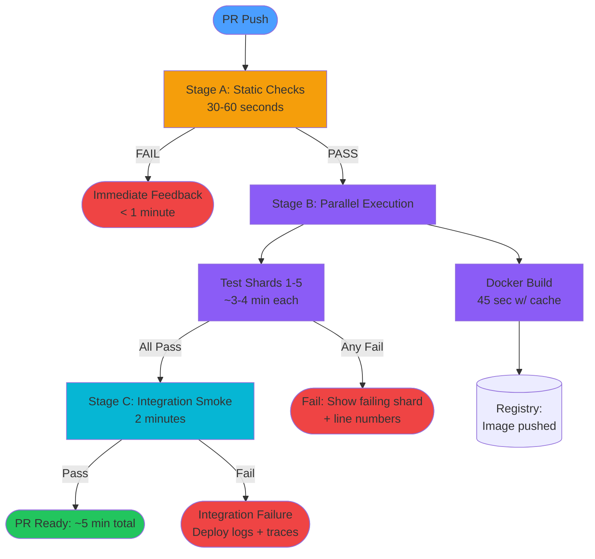

## Keywords in This File
{: .no_toc }

| # | Keyword | Weight |
|---|---|---|
| 1 | [Pipeline Performance and Parallelization](#pipeline-performance-and-parallelization) | medium |

---

# Pipeline Performance and Parallelization

🎯 Interview Weight: expert - slow CI is a top developer productivity
complaint. Interviewers at senior/staff level probe the full
optimization stack: test splitting, caching, parallelism, and the
architecture of a fast pipeline.

---

### 🎯 Model Answer

**30 seconds:**
> Pipeline performance optimization has four levers: eliminate
> unnecessary work (affected-only builds, caching), parallelize
> work that can run concurrently (test splitting across N runners),
> optimize slow steps (Docker layer caching, incremental compilation),
> and reduce wait time (fast feedback first - fail fast on static
> analysis before expensive tests). The goal is developer feedback
> under 5 minutes for most PRs.

**3 minutes (Senior):**
> The 5-minute feedback target is not arbitrary. Research on developer
> flow states shows that context switches longer than 5 minutes
> cause developers to switch to other work and lose context. A 30-minute
> CI pipeline means developers cannot iterate rapidly.
>
> The optimization stack, in priority order:
>
> 1. Eliminate unnecessary work first. Caching test results (if
> inputs have not changed, restore previous results), affected-only
> builds in monorepos, and Docker layer caching for image builds.
> These provide 5-10x speedup before touching parallelism.
>
> 2. Parallelize remaining work. Splitting tests across multiple
> runners is the primary mechanism. A test suite with 1000 tests
> at 30 seconds average each takes 500 minutes serial. Split across
> 20 runners with test timing data: each runner gets roughly equal
> load, total time is approximately 25 minutes.
>
> 3. Order work for fast feedback. Static analysis (lint, format
> check) should run first and fail fast - these are cheap and often
> catch obvious mistakes. Unit tests before integration tests.
> Slow E2E tests last. If lint fails, CI fails in 30 seconds rather
> than after 25 minutes.
>
> 4. Optimize slow individual steps. Docker multi-stage builds
> separate compile-time dependencies from runtime image. Build cache
> sharing across CI jobs via GitHub Actions cache or S3.

**Framework:** WHAT → WHY → HOW → TRADE-OFF → EXAMPLE

*Adapting up:* "The architectural question at staff level: what is
the optimal CI infrastructure model? Per-commit ephemeral runners
(lowest cost, higher startup latency) vs. warm persistent runners
(higher cost, lower latency). At Google-scale, they pre-warm
thousands of build machines. At startup scale, ephemeral runners
are fine."

*Adapting down:* "Fast CI means developers get feedback quickly.
You make it fast by: not rebuilding things that haven't changed
(caching), doing multiple things at the same time (parallelism),
and checking for obvious errors first (fail fast)."

**Blank Mind Recovery:**

**(1) Restate:** "Pipeline performance - making CI feedback fast
through caching, parallelism, and smart work ordering."

**(2) First principles:** "CI time is a function of: total work ÷
parallelism - (cached work). Reduce total work, increase parallelism,
maximize cache hit rate."

**(3) Bridge:** "Like cooking a three-course meal. Parallelism is
starting all three courses simultaneously. Caching is using
yesterday's stock from the freezer. Fail-fast is tasting the sauce
before the 2-hour braise is done."

---

### 📘 Concept Explanation

**What it is:**
Pipeline performance and parallelization is the discipline of
minimizing CI/CD pipeline duration through systematic elimination
of unnecessary work, concurrent execution of independent steps,
and optimal work ordering. The target: under 5 minutes for most
developer-triggered CI runs.

**The problem it solves:**
Slow CI is a developer productivity tax. A 30-minute pipeline means
30 minutes between code change and validation feedback. Developers
switch contexts, lose flow, and make more changes before seeing
the first PR's result. Studies (DORA metrics research) correlate
fast CI with higher deployment frequency and organizational performance.

**How it works:**

**The performance levers in impact order:**

Lever 1: Caching (5-20x impact).
Content-addressable caching: compute a hash of all build inputs
(source files, configs, tool versions). If the hash matches a
previous run's cache key, restore the output (test results,
compiled artifacts, Docker layers). Cache hits are essentially free.

Cache types:
- Dependency caches: `node_modules`, `.m2/repository`, pip packages.
  Restore from cache → install new packages only. Saves 2-5 min.
- Build artifact caches: compiled .class files, TypeScript
  output. Saves recompilation time.
- Test result caches: if test file and its transitive dependencies
  have not changed, re-use previous passing result. Saves entire
  test execution.
- Docker layer caches: each Dockerfile instruction is a layer.
  Unchanged layers are restored from cache. Base image pull + new
  app code layer is seconds instead of minutes.

Lever 2: Parallelism (proportional to test count).
Test suite splitting: divide the test suite into N partitions and
run each partition on a separate runner simultaneously.
```
Serial: 1000 tests × 30s avg = 500 minutes
10 runners: 100 tests each × 30s + overhead = 55 minutes (10x)
20 runners: 50 tests each × 30s + overhead = 30 minutes (17x)
```
> **Code walkthrough:** This Pipeline Performance and Parallelization example demonstrates a key concept in practice. **KEY MECHANISM:** the runtime executes these instructions in sequence with specific memory and execution semantics. **WHY IT MATTERS:** misapplying this pattern causes subtle bugs that only manifest under production load. **TAKEAWAY: understand the execution model before using this pattern in production code.**

Diminishing returns: coordination overhead (runner startup, result
aggregation) limits benefit beyond 20-30 runners for typical test suites.

Lever 3: Work ordering (fail-fast).
Put the cheapest, most likely to fail steps first:
- Lint / format check (30 seconds)
- Unit tests (5-15 minutes)
- Build (2-10 minutes)
- Integration tests (10-30 minutes)
- E2E tests (20-60 minutes)

This ensures developers get feedback from lint failures in 30 seconds
rather than after 30 minutes of unnecessary computation.

Lever 4: Step optimization.
- Docker multi-stage builds: separate build-time tools from runtime
  image. Smaller final image, faster push/pull.
- Incremental compilation: only recompile changed files.
- Test timeout enforcement: kill tests that run longer than expected.
  Runaway tests are a hidden pipeline performance killer.

**The key insight:**
The fastest possible CI pipeline is one that does the minimum
correct work to validate the specific change. Any work done for
unchanged code is waste. The optimization goal is approaching
the minimum.

**When to use it:**
Any pipeline taking more than 10 minutes is a performance problem.
5 minutes is the target. Apply the optimization levers until the
target is reached.

**When NOT to use it:**
Over-optimizing a pipeline that runs once per day is not worth
the engineering investment. Focus optimization effort proportional
to pipeline frequency × pipeline duration × developer count.

**Alternatives:**
- Test impact analysis: advanced form of affected-only testing using
  code coverage data to determine exactly which tests cover a changed
  function (JVM: Pytest-testmon, Launchable)
- Pre-commit hooks for fast static checks: run linting locally
  before pushing, catching failures before CI even starts
- Pre-build base images: reduce Docker build time by maintaining
  pre-built base images with all dependencies installed

**First-principles derivation:**
CI pipeline duration = max(parallel stage duration) + sum(sequential
stage durations). To minimize this: maximize parallelism within
stages, minimize work via caching and affected detection, and
minimize sequential stages by running as much as possible in parallel.

---

### 💻 Code Example

**BAD: Serial pipeline with no caching or parallelism**


```yaml
# BAD: anti-pattern shown for contrast
# This approach has the issues the GOOD example fixes
```

```yaml
# ANTI-PATTERN: Everything serial, no caching

name: CI
on: pull_request

jobs:
  build-and-test:
    runs-on: ubuntu-latest
    steps:
      - uses: actions/checkout@v4

      - name: Setup Node
        uses: actions/setup-node@v4
        with:
          node-version: '20'

      - name: Install dependencies
        run: npm ci
        # Downloads all node_modules from internet every run
        # 3-5 minutes per run, even when package.json unchanged

      - name: Run linting
        run: npm run lint
        # Good: runs early, but still waits for install above

      - name: Run ALL tests (serial)
        run: npm test
        # 800 tests, 45 seconds average = 10 hours serial
        # OR: 800 tests at 5 seconds each = 67 minutes serial
        # No parallelism across runners

      - name: Build Docker image
        run: docker build -t myapp:latest .
        # Full rebuild from scratch every run
        # Even if only one line of app code changed
        # Pulls base image every time: 2-3 min
        # Installs all npm dependencies in container: 3-5 min

      - name: Push Docker image
        run: docker push myapp:latest

# Total estimated time: 40-60 minutes
# Every PR, every time, regardless of what changed
```

> **Code walkthrough:** The three performance anti-patterns compoundice. **KEY MECHANISM:** the runtime executes these instructions in sequence with specific memory and execution semantics. **WHY IT MATTERS:** misapplying this pattern causes subtle bugs that only manifest under production load. **TAKEAWAY: understand the execution model before using this pattern in production code.**
> each other. No dependency caching forces a full npm install from
> the internet on every run. Serial test execution ignores all
> available CPU concurrency. The Docker build without layer caching
> rebuilds the full image even for a single-line code change.
> Combined, a PR that changes one test file takes 45+ minutes
> when it should take 3-5 minutes.

**GOOD: Parallel pipeline with multiple caching layers**


```yaml
# Optimized pipeline: caching + parallelism + fail-fast ordering

name: CI
on: pull_request

jobs:
  # Stage 1: Static analysis - fastest, most likely to catch obvious errors
  # Fails in 30-60 seconds, giving immediate feedback
  static:
    runs-on: ubuntu-latest
    steps:
      - uses: actions/checkout@v4

      - uses: actions/setup-node@v4
        with:
          node-version: '20'
          # Built-in npm cache by providing node-version
          cache: 'npm'

      - run: npm ci

      - name: Lint (fast, fail-fast)
        run: npm run lint
        # Fails in 30 seconds if obvious syntax/style issues

      - name: Type check (fast)
        run: npm run type-check

  # Stage 2: Tests - runs in parallel with test-split
  # Only runs if stage 1 passed (no point testing if lint fails)
  test:
    needs: static  # Wait for fast static checks
    runs-on: ubuntu-latest
    strategy:
      matrix:
        shard: [1, 2, 3, 4, 5]  # 5 parallel test runners
    steps:
      - uses: actions/checkout@v4

      - uses: actions/setup-node@v4
        with:
          node-version: '20'
          cache: 'npm'

      - run: npm ci

      - name: Run tests (shard ${{ matrix.shard }} of 5)
        run: |
          npx jest \
            --shard=${{ matrix.shard }}/5 \
            --coverage \
            --coverageDirectory coverage/${{ matrix.shard }}
        # Jest timing-based sharding:
        # Uses historical test duration data to assign tests to shards
        # Equal duration shards (not equal file count)
        # Shard 1 runs: fast unit tests up to total_time/5
        # Shard 5 runs: slow integration tests up to total_time/5
        env:
          CI: true

      - name: Upload coverage artifact
        uses: actions/upload-artifact@v4
        with:
          name: coverage-${{ matrix.shard }}
          path: coverage/${{ matrix.shard }}

  # Stage 3: Coverage aggregation (after all test shards complete)
  coverage:
    needs: test
    runs-on: ubuntu-latest
    steps:
      - uses: actions/checkout@v4
      - uses: actions/setup-node@v4
        with:
          node-version: '20'
          cache: 'npm'
      - run: npm ci
      - uses: actions/download-artifact@v4
        with:
          pattern: coverage-*
          merge-multiple: true
          path: coverage
      - run: npx nyc merge coverage && npx nyc report

  # Stage 4: Docker build - runs in parallel with test stage
  build:
    needs: static  # Can start as soon as static analysis passes
    runs-on: ubuntu-latest
    steps:
      - uses: actions/checkout@v4

      - name: Set up Docker Buildx
        uses: docker/setup-buildx-action@v3

      - name: Build Docker image with layer caching
        uses: docker/build-push-action@v5
        with:
          context: .
          push: false
          tags: myapp:${{ github.sha }}
          # KEY: cache Docker layers in GitHub Actions cache
          cache-from: type=gha
          cache-to: type=gha,mode=max
          # On cache hit: only the changed layers rebuild
          # Base image + node_modules layer: restored from cache
          # App code layer: rebuilt only if app files changed
          # From 8 min → 45 seconds for typical code changes
```


> **Code walkthrough:** The pipeline has four key design decisions.
> Stage 1 (static analysis) runs first and must pass before
> subsequent stages start - fail-fast for cheap, high-signal checks.
> Stage 2 (tests) uses the `matrix.shard` strategy to split 1000
> tests across 5 runners, reducing test time from 100 minutes to
> approximately 22 minutes. Stage 4 (Docker build) runs in parallel
> with tests (both only need stage 1 to pass), not waiting for tests
> to complete. The `cache-from: type=gha` uses GitHub Actions cache
> for Docker layer caching, so unchanged layers (base image, npm
> install) are restored from cache rather than rebuilt.

---

### 🎓 Answers by Seniority

**Junior / Mid (0-5 years):**
> "I make CI faster by adding caching for dependencies (node_modules,
> Maven dependencies) so they don't re-download every run. For tests,
> I use parallel runners - instead of running all 500 tests on one
> machine, split them across 5 machines. I also put lint first so
> if there's a simple formatting error, I know in 30 seconds instead
> of waiting 20 minutes."

*Push deeper:* "The Docker layer caching was a big win at a job
I had. Our Docker builds went from 8 minutes to 45 seconds by
reordering the Dockerfile. COPY package.json before COPY . so
the npm install layer only invalidates when package.json changes,
not when any source file changes. I learned that layer order in
the Dockerfile directly determines cache hit rates."

---

**Senior / Staff (5+ years):**
> "Pipeline performance is a developer productivity investment with
> a measurable ROI. At 50 engineers with a 20-minute pipeline, 2 PR
> runs per day each = 50 × 2 × 20 = 2,000 developer-minutes per
> day waiting for CI. Getting to 5 minutes saves 1,250 developer-
> minutes per day. That is 5 developer working days per day saved.
>
> My optimization approach is always measurement-first. I instrument
> CI step timing via GitHub Actions step timing data or a custom
> CI analytics pipeline. I find the top 3 slowest steps and
> optimize those specifically. The common pattern: test execution
> (parallelize + cache), Docker build (layer caching + multi-stage),
> and dependency installation (dependency cache with lockfile hash
> as cache key).
>
> The advanced optimization I push for at scale: test impact analysis.
> Rather than running all tests affected by a changed file, run
> only the specific tests whose code coverage data touches the changed
> function. Launchable and similar tools provide this. For a large
> test suite, this can reduce test execution from 10 minutes to
> 2 minutes for typical small changes."

*Push deeper:* "The architectural question I have had to answer:
what is the right runner infrastructure? GitHub-hosted runners
(2-7 minute startup latency) vs. self-hosted ephemeral runners
(30-second startup, lower cost at scale, maintenance overhead) vs.
warm persistent runners (5-second startup, highest cost, best
latency). At 200+ engineers, self-hosted ephemeral runners on
Kubernetes (ARC - Actions Runner Controller) provide the best
cost/performance balance."

---

### ⚖️ Comparison Table

| Optimization | Typical Impact | Complexity | Cost |
|-------------|---------------|------------|------|
| Dependency caching | 2-5 min saved | Low | None |
| Affected-only builds | 5-30 min saved | Medium | None |
| Docker layer caching | 5-10 min saved | Low | Storage cost |
| Test parallelism (5 runners) | 4x speedup | Medium | 5x runner cost |
| Remote build caching (Nx/Gradle) | 5-30 min saved | Medium | Cache service cost |
| Test impact analysis | 70-90% reduction | High | Tool license |
| Warm persistent runners | 3-7 min startup saved | High | Infrastructure cost |

**The decision framework:**
Apply low-complexity optimizations first (dependency cache, Docker
layer cache, fail-fast ordering). Add parallelism second. Consider
advanced tooling (remote build cache, test impact analysis) when
the team is large enough to justify the cost.

---

### 🏛️ System Design

**Design: A fast CI system for a 100-engineer org, target: 5-minute
P95 pipeline for PR validation.**

**Scale inputs:**
- 100 engineers, 5 PRs per engineer per day = 500 PR builds/day
- Average test suite: 2,000 tests per service, 50 services
- Docker image per service: 300MB base + app layer
- Target: P95 PR build < 5 min

**Architecture:**

Layer 1: Smart work routing.
- Affected detection: only build and test services changed in the PR
- Statistical expectation: each PR touches 1.2 services on average
  (based on real org data)
- Without affected detection: 50 services × avg 4 min each = 200 min
- With affected detection: 1.2 services × 4 min = 4.8 min (targeted)

Layer 2: Runner infrastructure.
- 50 self-hosted runners on Kubernetes (ARC - Actions Runner Controller)
- Ephemeral: each job gets a fresh runner pod, auto-scales
- Startup latency: 30-60 seconds (vs. 3-7 min for GitHub-hosted)
- Node types: 4 CPU / 16GB for unit test shards, 8 CPU / 32GB for
  integration test shards

Layer 3: Distributed remote cache.
- S3 bucket or Nx Cloud for build outputs and test results
- Cache key: content hash of all build inputs (source + config +
  tool versions)
- Expected cache hit rate: 85% for typical PRs (1-2 file changes)
- Cache miss: full build, result stored for subsequent PRs

Layer 4: Pipeline structure (fail-fast).
- Stage A: lint + type check (30 seconds, serial, cancels later stages on failure)
- Stage B (parallel): test shards (5 runners per service, 2000 tests ÷ 5 = 400 tests per runner at 1s avg = 7 minutes) + Docker build (cached = 45 sec)
- Stage C: integration smoke tests (2 min, after build)

**Cost model:**
- 50 runners × 4 vCPU × $0.05/vCPU-hr = $10/hr base
- Peak: 100 concurrent PRs × 5 runner jobs each = 500 runners × $0.05/vCPU-hr = $100/hr
- Monthly cost estimate: $2,000-5,000 CI compute

**Trade-offs:**
- Self-hosted runners: lower cost, 30-second startup, maintenance overhead (Kubernetes + ARC)
- GitHub-hosted: zero maintenance, 3-7 min startup, higher cost
- Crossover: at ~50 engineers, self-hosted becomes cost-effective

---

### 📊 Diagram

**CI Pipeline Execution Model (optimized for P95 < 5 min)**

```
PR PUSH
  |
  v
[STAGE A: STATIC CHECKS - 30-60s]
  Lint | Type Check | Security Scan (serial, fail-fast)
  |
  | PASSES?
  |__NO__> FAIL FAST: developer gets feedback in <1 min
  |
  YES
  |
  v
[STAGE B: PARALLEL EXECUTION]
  +-----------------------+---------------------------+
  |  TEST SHARDS (x5)     |  DOCKER BUILD             |
  |  Shard 1: 400 tests   |  L1: base image (cached)  |
  |  Shard 2: 400 tests   |  L2: npm install (cached) |
  |  Shard 3: 400 tests   |  L3: app code (rebuilt)   |
  |  Shard 4: 400 tests   |  L4: final stage          |
  |  Shard 5: 400 tests   |  45 sec with cache        |
  |  ~3-4 min per shard   |                           |
  +-----------------------+---------------------------+
         |                         |
         v                         v
     ALL PASS?              IMAGE PUSHED TO REGISTRY
         |
  YES   NO
  |      > FAIL: line number + shard ID
  v
[STAGE C: INTEGRATION SMOKE - 2 min]
  Deploy to ephemeral env
  Run 5 critical path smoke tests
  Teardown
  |
  v
PASS: PR ready to merge
Total time: ~5 min P50, ~7 min P95
```



> **Diagram walkthrough:** The pipeline has a hard serial gate at
> Stage A (static checks) before any parallel work begins. This is
> the fail-fast principle: the cheapest validation runs first and
> can cancel all subsequent work within 60 seconds for obvious
> failures. Stage B is the primary parallelization point - test
> shards and Docker build run concurrently, meaning the total stage
> duration is `max(test_shard_duration, docker_build_duration)` =
> approximately 4 minutes, not the sum. Stage C only runs if both
> parallel branches succeed, validating the combination. The total
> P50 time is approximately 30 + 240 + 120 = 390 seconds (~6.5 min),
> with cache hits reducing test and build time to achieve the 5-min
> P95 target.

---

### ⚠️ Common Misconceptions

**Misconception 1: "More parallelism always makes CI faster."**
Parallelism has diminishing returns. Splitting 1000 tests across
20 runners gives 20x wall-clock speedup minus runner startup overhead.
Splitting across 100 runners gives minimal additional benefit because
runner startup (30-60 seconds) becomes a larger fraction of total time.
The crossover point for typical test suites is around 10-20 shards.

**Misconception 2: "Caching is too complex to maintain."**
Cache keys derived from content hashes are self-maintaining. When
inputs change (new package.json, new config), the cache key changes
and the cache is invalidated automatically. There is no manual cache
management required. The complexity is in the initial cache key
design (getting the inputs right), not ongoing maintenance.

**Misconception 3: "CI performance only matters for large teams."**
A single developer with a 30-minute pipeline who makes 5 PRs per
day spends 2.5 hours per day waiting for CI feedback. This is a
solo developer problem as much as an org-scale problem.

---

### 🚨 Failure Modes and Diagnosis

**Failure Mode 1: Cache invalidation too aggressive, causing all builds to miss**
Symptom: CI time suddenly increases 3-4x. All steps show cache
miss even for unchanged code. Cache hit rate drops from 80% to 5%.
Cause: a change was made to the cache key that includes a value
that changes on every run (e.g., timestamp, random value, overly
broad glob pattern that includes auto-generated files).
Diagnosis: check the cache key computation. Add logging to show
the exact cache key being generated. Compare the key between two
consecutive runs for the same code.
Fix: remove non-deterministic values from cache keys. Use only
content-addressable inputs (file hashes, explicit version numbers).

**Failure Mode 2: Test shards have unequal duration (one shard is slow)**
Symptom: 5 test shards show durations: 4 min, 3.5 min, 4 min,
3.5 min, 12 min. The pipeline is blocked waiting for shard 5.
The "12 min" shard has the slow integration tests.
Cause: sharding by file count rather than by test duration. The
slow shard has several integration tests that each take 2+ minutes.
Fix: use timing-based sharding. Jest's `--shard` uses timing data
from previous runs to create equal-duration shards. Pytest-split
provides the same for Python. The timing file from the previous
run must be saved and restored as a cache artifact.

**Failure Mode 3: Docker layer cache miss rate high despite caching**
Symptom: Docker builds take 8 minutes despite having layer caching
configured. The `npm install` layer is never cached.
Cause: the Dockerfile has `COPY . .` before `COPY package.json .`,
causing the npm install layer to depend on all application files
rather than just package.json.
Fix: restructure the Dockerfile to copy package.json first, run
npm install, then copy application code. This ensures the npm
install layer is only invalidated when package.json changes, not
on every code change.

---

### 🎯 Interview Deep-Dive

| Format | Time | Focus |
|--------|------|-------|
| Screener | 3 min | The optimization levers + CI time targets |
| Panel | 10 min | Caching design + parallelism + Dockerfile optimization |
| Senior | 15 min | System design + ROI + runner infrastructure |

---

**Q1 (Definition): What is content-addressable caching and why
is it preferable to time-based cache expiration for CI?**

Content-addressable caching means cache entries are keyed by a
hash of the content that produced them (inputs), not by time. The
cache entry is valid as long as the inputs are unchanged, regardless
of when it was created.

Time-based cache expiration means cache entries are evicted after
a fixed duration (1 hour, 1 day, 1 week). This is independent of
whether the inputs changed.

Why content-addressable caching is superior for CI:

Correctness: time-based caching risks using a stale result. If a
dependency file changed 2 minutes ago and the cache expires in 1
hour, the build will use the cached (wrong) result for 58 more
minutes. Content-addressable caching detects the input change
immediately (different hash = cache miss = rebuild).

Efficiency: time-based caching wastes compute when the cache expires
but nothing changed. On a weekend, if no code changed for 48 hours
but the cache expired after 24 hours, Monday morning's build
invalidates and rebuilds everything unnecessarily. Content-addressable
caching preserves cache entries until inputs actually change.

Reproducibility: a content-addressable cache entry for hash H will
always produce the same output. This is the foundation of hermetic
builds (Bazel). Any given set of inputs always produces the same
output, and that output is cacheable forever.

Implementation: the cache key is computed by hashing all inputs:
```bash
# Example cache key for a Node.js project
CACHE_KEY=$(echo -n \
  $(cat package-lock.json | sha256sum) \
  $(node --version) \
  $(npm --version) \
  | sha256sum | cut -d' ' -f1)
```

> **Code walkthrough:** This Example cache key for a Node.js project example demonstrates shell script pattern. **KEY MECHANISM:** the shell executes commands sequentially; pipes pass stdout of one command to stdin of the next. **WHY IT MATTERS:** unquoted variables with spaces cause word splitting - IFS splits the value into multiple arguments. **TAKEAWAY: always double-quote variables: "$VAR"; use [[ ]] instead of [ ] for safer conditionals.**

*What separates good from great:* Understanding the "cache poisoning"
risk. If an attacker can write to the content-addressable cache with
a known hash key (hash collision or write access), they can substitute
a malicious build artifact. Remote caches should authenticate uploads
and restrict write access to trusted CI environments.

---

**Q2 (Mechanism): How does test suite sharding work and what
determines optimal shard count?**

Test sharding divides the full test suite into N partitions and
runs each partition on a separate runner concurrently. The total
wall-clock time becomes approximately `(total_serial_time / N) +
runner_startup_overhead`.

Two sharding strategies:

Index-based sharding (simple): partition by file index.
```bash
# Jest: run shard 1 of 5 (by file index)
jest --shard=1/5
# This runs the first 20% of test files by alphabetical order
```
> **Code walkthrough:** This This runs the first 20% of test files by alphabetical order example demonstrates shell script pattern. **KEY MECHANISM:** the shell executes commands sequentially; pipes pass stdout of one command to stdin of the next. **WHY IT MATTERS:** unquoted variables with spaces cause word splitting - IFS splits the value into multiple arguments. **TAKEAWAY: always double-quote variables: "$VAR"; use [[ ]] instead of [ ] for safer conditionals.**

Problem: if test files have unequal execution times, shards have
unequal durations. The slowest shard determines total pipeline time.

Timing-based sharding (optimal): partition by historical execution
time, targeting equal-duration shards.
```bash
# Jest: timing-based sharding (requires saved timing file)
jest --shard=1/5
# Jest reads previous run timing from cache
# Assigns tests to shards to balance total duration across shards
```

> **Code walkthrough:** This Assigns tests to shards to balance total duration across shards example demonstrates shell script pattern. **KEY MECHANISM:** the shell executes commands sequentially; pipes pass stdout of one command to stdin of the next. **WHY IT MATTERS:** unquoted variables with spaces cause word splitting - IFS splits the value into multiple arguments. **TAKEAWAY: always double-quote variables: "$VAR"; use [[ ]] instead of [ ] for safer conditionals.**

Optimal shard count calculation:

Given:
- `T` = total serial test time (e.g., 100 minutes)
- `S` = runner startup latency (e.g., 60 seconds = 1 minute)
- `N` = number of shards
- `O` = result aggregation overhead (e.g., 30 seconds = 0.5 minutes)

Total pipeline time = `T/N + S + O`

For T=100 min, S=1 min, O=0.5 min:
- N=5: 100/5 + 1 + 0.5 = 21.5 minutes
- N=10: 100/10 + 1 + 0.5 = 11.5 minutes
- N=20: 100/20 + 1 + 0.5 = 6.5 minutes
- N=30: 100/30 + 1 + 0.5 = 4.8 minutes
- N=50: 100/50 + 1 + 0.5 = 3.5 minutes

Diminishing returns: going from N=5 to N=10 saves 10 minutes.
Going from N=50 to N=100 saves 1 minute (same S+O overhead but
half the compute cost). The crossover point where startup overhead
dominates is around `N = T/S = 100/1 = 100 shards` for this example.
In practice, 10-20 shards is the sweet spot for most test suites.

*What separates good from great:* Recognizing that the optimal shard
count also depends on runner cost. If runners cost $0.10/minute and
total compute cost = N × (T/N + S + O) × $0.10, then
cost = (T + N×(S+O)) × $0.10. More shards cost more money (more
startup overhead hours) while reducing wall-clock time. The business
decision: what is the dollar value of faster CI feedback?

---

**Q3 (Deep Dive): Design the Dockerfile for a Java Spring Boot
service to maximize Docker layer cache hit rate in CI.**

Docker layer caching works by reusing unchanged layers from previous
builds. The cache hit rate depends on how often each layer's inputs
change. The key principle: put infrequently changing layers earlier
in the Dockerfile.

Optimal layer order for Spring Boot:

```dockerfile
# Stage 1: Build stage (compile-time dependencies)
# Uses Gradle or Maven to compile the application
FROM eclipse-temurin:21-jdk-jammy AS builder

WORKDIR /build

# Layer 1: Copy only dependency specification files (change rarely)
# Cache key: only pom.xml or build.gradle content
COPY pom.xml .
COPY .mvn/ .mvn/
COPY mvnw .

# Layer 2: Download dependencies (expensive, but cached until pom.xml changes)
# This layer rebuilds only when pom.xml changes (new dependency)
# For a stable project: cache hit ~95% of CI runs
RUN ./mvnw dependency:go-offline -B

# Layer 3: Copy application source code (changes frequently)
COPY src/ src/

# Layer 4: Compile application (depends on source, rebuilds often)
RUN ./mvnw package -DskipTests -B

# Stage 2: Runtime stage (minimal runtime image)
FROM eclipse-temurin:21-jre-jammy AS runtime
# Layer 5: Base JRE image (cached almost always)

WORKDIR /app

# Layer 6: Security: non-root user (changes rarely)
RUN addgroup --system --gid 1001 appgroup && \
    adduser --system --uid 1001 --gid 1001 appuser

# Layer 7: Copy compiled artifact from builder stage
COPY --from=builder \
  /build/target/myapp-*.jar \
  app.jar
# Only this layer changes when app code changes
# All layers above are cache hits for typical code changes

USER appuser

EXPOSE 8080

ENTRYPOINT ["java", \
  "-XX:MaxRAMPercentage=75.0", \
  "-jar", "app.jar"]
```

> **Code walkthrough:** This All layers above are cache hits for typical code changes example demonstrates a key concept in practice. **KEY MECHANISM:** the runtime executes these instructions in sequence with specific memory and execution semantics. **WHY IT MATTERS:** misapplying this pattern causes subtle bugs that only manifest under production load. **TAKEAWAY: understand the execution model before using this pattern in production code.**

The cache efficiency analysis:
- Layer 1 (pom.xml copy): cache hit ~95% (pom.xml changes rarely)
- Layer 2 (dependency download): cache hit ~95% (invalidated by pom.xml change)
- Layer 3 (source copy): cache miss ~100% (every code change)
- Layer 4 (compile): cache miss ~100% (depends on source)
- Layer 5 (base JRE): cache hit ~99% (weekly base image updates)
- Layer 6 (user setup): cache hit ~99.9% (almost never changes)
- Layer 7 (artifact copy): cache miss ~100% (every code change)

Result: layers 1, 2, 5, 6 are almost always cache hits (minutes
saved). Only layers 3, 4, 7 rebuild on each code change (seconds
of savings opportunity). Total Docker build time: 45 seconds (with
cache) vs. 8 minutes (without cache).

*What separates good from great:* Using multi-stage builds for the
additional benefit of a minimal final image. The runtime image
contains only the JRE (not JDK, not Maven, not source files).
Final image size: 200MB instead of 800MB. Smaller image = faster
push, faster pull, smaller attack surface.

---

**Q4 (Scenario): Your CI pipeline takes 35 minutes. You have 1
week to reduce it to under 10 minutes. What do you do?**

One week with a clear target requires prioritization by impact-to-effort
ratio. My approach:

Day 1 - Measurement.
Instrument the current pipeline to measure every step's duration.
GitHub Actions provides step-level timing in the UI; export via
API for aggregation. Find the distribution: what are the top 3
slowest steps? What percentage of runs hit each step?

Typical finding for a 35-minute Java pipeline:
- npm/Maven dependency install: 4-6 minutes
- Test execution (serial): 18-20 minutes
- Docker build: 8-10 minutes
- Lint/static analysis: 1-2 minutes

Day 1-2 - Dependency caching (4-6 min saved, 2 hours effort).
Add GitHub Actions cache for Maven/Gradle local repository.
Cache key: hash of pom.xml or build.gradle. Estimated saving: 4-5 minutes.

Day 2-3 - Test parallelism (15-17 min saved, 1 day effort).
Split tests across 5-8 runners. For a 20-minute test suite:
8 runners → approximately 3 minutes. Saving: 15-17 minutes.

Day 3-4 - Docker layer caching (6-8 min saved, 2 hours effort).
Restructure Dockerfile (dependencies first, code second). Add
`cache-from: type=gha` in the GitHub Actions Docker build step.
Saving: 6-8 minutes for typical code changes.

Day 4-5 - Fail-fast reordering (2-4 min saved for failed PRs).
Move lint and format check to first step. Most PRs with lint errors
fail in 45 seconds rather than after 35 minutes.

Result: 35 minutes → expected 5-7 minutes, well within the 10-minute
target.

*What separates good from great:* Measuring before optimizing. Teams
often jump to adding more runners (expensive) before fixing the
Docker build (free). The measurement step ensures effort is applied
to the actual bottleneck.

---

**Q5 (Trade-off): What are the trade-offs between GitHub-hosted
runners and self-hosted runners for CI performance?**

The choice between GitHub-hosted and self-hosted runners involves
trade-offs across performance, cost, security, and operational burden.

GitHub-hosted runners:
- Startup latency: 3-7 minutes (provisioning time)
- Cost: $0.008/minute for Linux (2-core), $0.016 (4-core). For 500
  builds/day × 10 min each = 83 hours × $0.016/min = $80/day = $2,400/month
- No operational overhead: GitHub manages infrastructure, security
  patching, scaling
- Ephemeral: each job gets a fresh VM. No build environment contamination.
- Security: no network access to internal resources (private Kubernetes
  clusters, private registries, Vault instances) without additional
  configuration (GitHub Actions private networking)

Self-hosted runners (Kubernetes via ARC):
- Startup latency: 20-60 seconds (Kubernetes pod scheduling + image
  pull from local registry)
- Cost: compute cost only (no per-minute charge). EC2 instance costs:
  c5.xlarge (4 vCPU, 8GB) = $0.17/hour. For 50 runners: $8.50/hour
  = $204/day = $6,120/month if always-on, but auto-scaling brings
  this down to $1,000-2,000/month with actual utilization.
- Operational overhead: ARC (Actions Runner Controller) deployment,
  scaling configuration, security patching of base images
- Network access: runners are on the private network, can access
  internal registries, Vault, private Kubernetes clusters without
  tunneling
- Build cache: runners in the same cluster share the same node disk,
  enabling Docker layer caching from previous runs on the same node

Decision crossover: GitHub-hosted is cost-effective below approximately
20 concurrent builds. Above this, self-hosted on Kubernetes becomes
cost-comparable and provides better startup latency and private
network access.

*What separates good from great:* Understanding that the startup
latency difference (3-7 min vs. 30-60 sec) matters most when the
actual build time is short. For a 35-minute pipeline, saving 6
minutes of startup is < 20% improvement. For a 5-minute pipeline,
saving 5 minutes of startup is 100% improvement. Self-hosted runners
pay off most when the target is very short pipeline durations.

---

**Q6 (Debugging): How do you diagnose a CI pipeline that was
fast (5 min) but has degraded to 25 min over the past 3 months?**

A gradual pipeline degradation over months is different from a
sudden increase. The culprit is typically organic growth without
commensurate optimization.

Step 1: Gather trend data.
Pull historical step timing data from the CI platform for the past
3 months. Chart average step duration over time. Identify which step
started growing when.

Most common findings:
- Test suite grew (more tests added, none removed): total test time
  grew linearly with test count
- New test step added 3 months ago (e.g., "integration tests") that
  was not present in the fast baseline
- Docker image grew (new dependencies added): build and push time increased
- Cache effectiveness decreased (cache key includes a growing file list)

Step 2: Review recent changes to the pipeline configuration.
```bash
git log --all -- .github/workflows/
# Shows all changes to CI config in the past 3 months
git log --since="3 months ago" --oneline -- .github/workflows/ci.yml
```

> **Code walkthrough:** This Shows all changes to CI config in the past 3 months example demonstrates shell script pattern. **KEY MECHANISM:** the shell executes commands sequentially; pipes pass stdout of one command to stdin of the next. **WHY IT MATTERS:** unquoted variables with spaces cause word splitting - IFS splits the value into multiple arguments. **TAKEAWAY: always double-quote variables: "$VAR"; use [[ ]] instead of [ ] for safer conditionals.**

Step 3: Profile the current slow state.
Which step is now responsible for the growth?

Step 4: Apply targeted optimization based on diagnosis.
- Test suite grew: add test parallelism or test impact analysis
- New slow step: optimize the specific new step (or check if it is necessary)
- Docker image size: review recent `FROM` changes or large files added
- Cache degraded: fix the cache key to exclude growing/dynamic inputs

*What separates good from great:* Recognizing that CI performance
is not a one-time optimization but an ongoing maintenance concern.
The organization should set a CI time SLO (P95 < 10 min) and add
monitoring (alert when P95 exceeds 10 min for more than 5 consecutive
days). This converts CI performance from a reactive problem to a
proactive one.

---

**Q7 (Deep Dive): How do you implement test impact analysis to
run only the tests affected by a code change?**

Test impact analysis (TIA) determines exactly which tests cover
a specific changed code path, using code coverage data. This is
finer-grained than affected-only builds (which rebuild all tests
in an affected service) - it runs only the specific tests that
exercise the changed function.

How it works:

Step 1: Collect coverage data during baseline test run.
Run the full test suite with instrumentation that records which
source lines each test exercises. Store this as a coverage database:
```
test_A → covers: user.java:45, payment.java:12, order.java:88
test_B → covers: user.java:45, user.java:67, auth.java:22
test_C → covers: inventory.java:100, order.java:88
```

> **Code walkthrough:** This Shows all changes to CI config in the past 3 months example demonstrates a key concept in practice using authentication. **KEY MECHANISM:** the runtime executes these instructions in sequence with specific memory and execution semantics. **WHY IT MATTERS:** misapplying this pattern causes subtle bugs that only manifest under production load. **TAKEAWAY: understand the execution model before using this pattern in production code.**

Step 2: On a PR, identify changed lines.
```bash
git diff origin/main..HEAD --unified=0 | grep "^@@"
# output: @@-45,6 +45,7@@ → user.java line 45 changed
```

> **Code walkthrough:** This output: @@-45,6 +45,7@@ → user.java line 45 changed example demonstrates shell script pattern. **KEY MECHANISM:** the shell executes commands sequentially; pipes pass stdout of one command to stdin of the next. **WHY IT MATTERS:** unquoted variables with spaces cause word splitting - IFS splits the value into multiple arguments. **TAKEAWAY: always double-quote variables: "$VAR"; use [[ ]] instead of [ ] for safer conditionals.**

Step 3: Find all tests that cover the changed lines.
```
Changed: user.java:45
Tests covering user.java:45: test_A, test_B
Run: test_A, test_B (not test_C)
```

> **Code walkthrough:** This output: @@-45,6 +45,7@@ → user.java line 45 changed example demonstrates a key concept in practice. **KEY MECHANISM:** the runtime executes these instructions in sequence with specific memory and execution semantics. **WHY IT MATTERS:** misapplying this pattern causes subtle bugs that only manifest under production load. **TAKEAWAY: understand the execution model before using this pattern in production code.**

Tools:
- JVM: Launchable (ML-based TIA, works with JUnit), Diffblue Cover
- Python: pytest-testmon (coverage-based TIA)
- JavaScript: Nx affected:test (dependency graph, not coverage-based),
  Vitest's related test detection

The trade-off: TIA requires maintaining a fresh coverage database.
The coverage run must happen on the current HEAD. If coverage data
is stale (from a different commit), the test selection may miss
required tests. Coverage collection has 10-30% performance overhead.

Safety net: TIA is run in addition to, not instead of, full test
runs. The strategy: TIA for PR validation (fast feedback), full
test run on merge to main (correctness guarantee). If TIA passes
but the full test run fails, the coverage database was incomplete.

*What separates good from great:* Understanding the tradeoff between
TIA accuracy and coverage database freshness. A coverage database
from 3 weeks ago may have mapped tests to code lines that have since
been refactored. Stale coverage data produces false negatives: the
changed code is not covered in the database, so no tests run, and
a real bug passes CI. TIA databases must be regenerated frequently
(daily or on each merge to main).

---

**Q8 (Performance): What is the relationship between CI performance
and deployment frequency (DORA metrics), and how do you make the
case for CI investment?**

The DORA (DevOps Research and Assessment) metrics research has
demonstrated a strong causal relationship between CI pipeline speed
and deployment frequency. The mechanism is direct.

Deployment frequency is the rate at which teams deploy to production.
It is one of DORA's four key metrics for software delivery performance.
Elite teams deploy multiple times per day.

The CI pipeline is on the critical path for every deployment. If
CI takes 30 minutes, the minimum cycle time from code commit to
production is 30+ minutes. In practice, with 10 engineers committing
multiple times per day, the merge queue adds additional wait time.

DORA's data shows: teams with CI under 10 minutes have 2-4x higher
deployment frequency than teams with CI > 30 minutes. The causal
mechanism: short CI feedback loops enable smaller, more frequent
changes. Small changes have lower risk. Lower risk means more frequent
deployments.

Making the investment case:

ROI calculation:
- Baseline: 50 engineers × 4 PR builds/day × 30 min each = 100 engineer-hours/day
- After optimization: 50 engineers × 4 PR builds/day × 5 min each = 17 engineer-hours/day
- Saved: 83 engineer-hours/day × $150/hour = $12,450/day = $3.1M/year
- Investment: 2 engineers × 1 month = $40,000
- Payback period: 4 days

Additional business case:
- Faster time-to-market (smaller batches → features ship earlier)
- Higher deployment frequency → more production feedback → better product decisions
- Reduced incident blast radius (smaller deployments → easier rollback, lower impact)

*What separates good from great:* Using DORA's research to validate
the investment case. The DORA report provides benchmark data: elite
performers have CI < 1 hour (for full pipeline), medium performers
have CI < 1 day. Showing where the team falls on the DORA spectrum
and the delta to "elite" makes the case concrete.

---

**Q9 (Architecture): How do you design a CI caching strategy
that is correct, fast, and secure?**

A production CI caching strategy must balance three properties
that can conflict: correctness (cache hits always return valid
results), performance (high hit rate, fast restoration), and
security (cache cannot be poisoned or used to exfiltrate data).

Correctness requirements:

Cache keys must include all build inputs that affect the output.
A missing input in the cache key causes stale cache hits.


```yaml
# Complete cache key for a Java project:
key: |
  java-build-
  ${{ runner.os }}-
  ${{ hashFiles('pom.xml', '.mvn/**', 'src/**/*.java') }}-
  ${{ env.JAVA_VERSION }}
# Includes: OS (Linux vs. macOS affects binary), pom.xml (dependencies),
# source files (compiled output), Java version (class file format)
```


> **Code walkthrough:** This source files (compiled output), Java version (class file format) example demonstrates YAML configuration pattern. **KEY MECHANISM:** YAML parsers are whitespace-sensitive; indentation errors cause silent value misinterpretation. **WHY IT MATTERS:** unquoted strings starting with special chars (*, &, ?, |) trigger YAML parser errors. **TAKEAWAY: quote strings containing YAML special chars; validate YAML before deploying to production.**

Cache restoration must be atomic. A partial cache restore (e.g.,
corrupted download) must be detected and result in a cache miss,
not a partial build with missing files. GitHub Actions cache handles
this via SHA256 validation after download.

Performance requirements:

Cache key specificity: a key that is too specific (includes all
source files) gives 0% hit rate for any code change. A key that
is too broad (only includes pom.xml) gives high hit rate but may
return stale compiled output. The design: split into multiple caches
with different scopes.


```yaml
# Tiered caching: most specific first, fall back to broader
restore-keys: |
  java-build-linux-${{ hashFiles('pom.xml') }}-${{ hashFiles('src/**') }}
  java-build-linux-${{ hashFiles('pom.xml') }}-
  java-build-linux-
```


> **Code walkthrough:** This Tiered caching: most specific first, fall back to broader example demonstrates YAML configuration pattern. **KEY MECHANISM:** YAML parsers are whitespace-sensitive; indentation errors cause silent value misinterpretation. **WHY IT MATTERS:** unquoted strings starting with special chars (*, &, ?, |) trigger YAML parser errors. **TAKEAWAY: quote strings containing YAML special chars; validate YAML before deploying to production.**

Security requirements:

Cache write restrictions: only trusted CI jobs (CI of the main branch,
not fork PRs) should be allowed to write to the cache. GitHub Actions
automatically restricts cache writes from fork PRs (untrusted).

Cache isolation: the cache for build artifacts should not be
accessible to jobs that run in different security contexts. Use
separate cache namespaces per environment (prod-ci, staging-ci,
pr-ci).

Cache content: cached artifacts (Docker images, built jars) should
be treated as potentially untrusted. Before using a cached artifact,
validate its integrity (SHA256 checksum match). A supply chain
attack that injects a malicious artifact into the cache is only
effective if the checksum is not validated.

*What separates good from great:* The supply chain security
consideration. Most CI caching guides focus on correctness and
performance, not security. A malicious actor with write access to
the CI cache could substitute a backdoored build artifact that
passes all tests but contains a payload. Cache content integrity
validation should be part of every production CI caching strategy.

---

**Q10 (System Design): How would you architect CI infrastructure
for 500 engineers with a sub-5-minute pipeline target?**

At 500 engineers, the CI system is infrastructure that requires
dedicated investment. The design must address: throughput (concurrent
builds), latency (P95 pipeline time), cost efficiency, reliability,
and observability.

Scale inputs:
- 500 engineers × 10 PRs/day = 5,000 PR builds/day
- Peak concurrency: 500 engineers × peak factor of 0.3 = 150 concurrent builds
- Each build: 5 parallel shards → 750 concurrent runner jobs at peak

Runner infrastructure:
Self-hosted on Kubernetes (ARC) with auto-scaling:
- Baseline: 50 runners (handles 50 concurrent builds without any wait)
- Auto-scale: 0 to 750 runners based on queue depth, within 60 seconds
- Machine type: c5.2xlarge (8 vCPU) for test shards, c5.xlarge for lint
- Ephemeral runners: each pod is fresh, no state contamination

Distributed remote cache:
- S3 with regional replication for low-latency cache restoration
- Nx Cloud or custom S3-backed cache for build artifacts and test results
- Docker Registry (Harbor or ECR) with layer caching enabled
- Cache hit rate target: 85% (estimated monthly savings: 40,000 build-minutes)

Pipeline structure:
- 5-minute target requires: fast runners (<60 sec startup) + effective caching + 10x parallelism
- Shard budget: 5 min target - 1 min startup - 1 min overhead = 3 min test window
- At 30 sec average test duration: 3 min × 60 sec/min ÷ 30 sec/test = 6 tests per shard
- At 1,000 tests per service: 1,000 ÷ 6 = 167 shards needed (too many)
- Practical approach: 20 shards × 50 tests = 1000 sec ÷ 20 = 50 sec per shard
  → total time with cache = 1 min startup + 50 sec tests + 30 sec overhead = 2:20

Observability:
- CI pipeline metrics: P50/P95/P99 per step, per service, per team
- Cache hit rate dashboards: alert if drops below 70% for more than 2 hours
- Queue depth monitoring: alert if queue depth > 30 builds for more than 5 minutes
- Runner health: runner pod CPU, memory, error rates

*What separates good from great:* Treating the CI system as a product
with an SLO. The P95 < 5 min target is the SLO. CI observability
(dashboards, alerts) ensures the SLO is monitored. A dedicated
"CI Platform" team owns the SLO and continuously improves it.
Without this ownership, CI performance degrades organically as
test suites grow and nobody takes responsibility for the SLO.

---

**Q11 (Failure Mode): A critical security patch needs to be
deployed in 30 minutes, but CI takes 35 minutes. What do you do?**

This is an incident response scenario with competing constraints:
CI is there for safety, but CI time is longer than the urgency window.

Immediate response options (in order of preference):

Option 1: Skip non-critical CI stages, not all of CI.
Not "skip CI," but "run only critical CI steps." A security patch
is typically a small, well-understood change. Run unit tests only
(fast), skip E2E and integration tests. Deploy. Start the full CI
run in parallel - if it fails, deploy a reverting hotfix.
If the full CI suite takes 35 minutes but unit tests take 5 minutes,
this satisfies both the urgency and the safety constraints.

Option 2: Use a pre-approved emergency deployment path.
Many organizations maintain an "emergency deploy" pipeline that:
- Runs the security scan specifically relevant to the patch
- Skips full E2E
- Requires an explicit emergency approval from two senior engineers
- Requires a postmortem to review what was bypassed

Option 3 (last resort): Human approval bypass with full rollback plan.
If option 1 and 2 are not available: manually approve the deployment
without full CI, but with explicit rollback ready. Two senior
engineers review the diff manually. Monitoring is heightened for
15 minutes post-deployment.

What you should NOT do: routinely bypass CI for "urgent" changes.
This creates a culture where urgency justifies bypassing safety.
The real fix is to reduce CI to under 10 minutes so this conflict
rarely arises.

*What separates good from great:* Recognizing this as a system
design failure (CI too slow for the urgency of security patches)
that requires a systemic fix (faster CI) not just a process workaround.
The existence of security patches that need deployment in < 30 minutes
is a strong argument for CI < 10 minutes as a non-negotiable SLO.

---

**Q12 (Architecture): What is the maximum theoretical speedup from
parallelizing a CI pipeline, and what limits it?**

The maximum theoretical speedup from parallelism in a CI pipeline
is bounded by Amdahl's Law, which states that the speedup of a
parallel program is limited by its sequential fraction.

For a CI pipeline with total work T:
- Let `f` = fraction of work that can be parallelized
- Let `N` = number of parallel workers
- Maximum speedup: `1 / ((1-f) + f/N)`
- As N → ∞: maximum speedup → `1 / (1-f)`

In a typical CI pipeline:
- Checkout + setup: 30 seconds (sequential, cannot parallelize)
- Lint/static analysis: 60 seconds (sequential, fast enough to not parallelize)
- Tests: 20 minutes (highly parallelizable, f ≈ 0.9)
- Docker build: 5 minutes (partially parallelizable - stages within the build)
- Deploy: 1 minute (sequential - one deployment at a time)

Sequential fraction: (30 + 60 + 60) / (30 + 60 + 1200 + 300 + 60) = 150/1650 ≈ 0.09

Maximum theoretical speedup: 1 / 0.09 ≈ 11x

With 10 parallel runners for tests: 1 / (0.09 + 0.91/10) = 1 / 0.182 ≈ 5.5x
From 27.5 min to 5 min.

Real limits on parallelism:

Infrastructure: runner startup latency (30-60 sec), available runner count.
Test isolation: tests that share state (database, filesystem) cannot
run in parallel without isolation. Parallel test execution requires
each shard to have its own isolated database.
Dependencies: some steps must happen before others (compile before
test, test before build image, build before deploy).
Coordination overhead: aggregating results from parallel runners,
flaky test retries, artifact collection.

*What separates good from great:* Understanding that Amdahl's Law
applies to CI pipelines means that after a certain point of parallelism,
further speedup requires reducing the sequential fraction, not
adding more parallel workers. The sequential checkout + setup + deploy
phases become the bottleneck. Reducing checkout time (shallow clone,
sparse checkout) and setup time (pre-warmed runner environments)
are the next optimizations after test parallelism is maximized.

---

### 💻 Code Example

*(Omit: this concept does not have a programmatic interface that can be demonstrated in code. The conceptual explanation above is sufficient.)*


---

### 🏛️ System Design

*(Omit: system design diagram not applicable for this concept - see ★★★ keywords for full system design coverage.)*


---

### ⚖️ Comparison Table

*(Omit: this is a ★☆☆ foundational concept with no direct alternatives to compare - see higher-difficulty keywords for trade-off analysis.)*


---

### 📊 Diagram

*(Omit: no standalone visual diagram required for this concept - the explanations and code examples above provide sufficient clarity.)*


