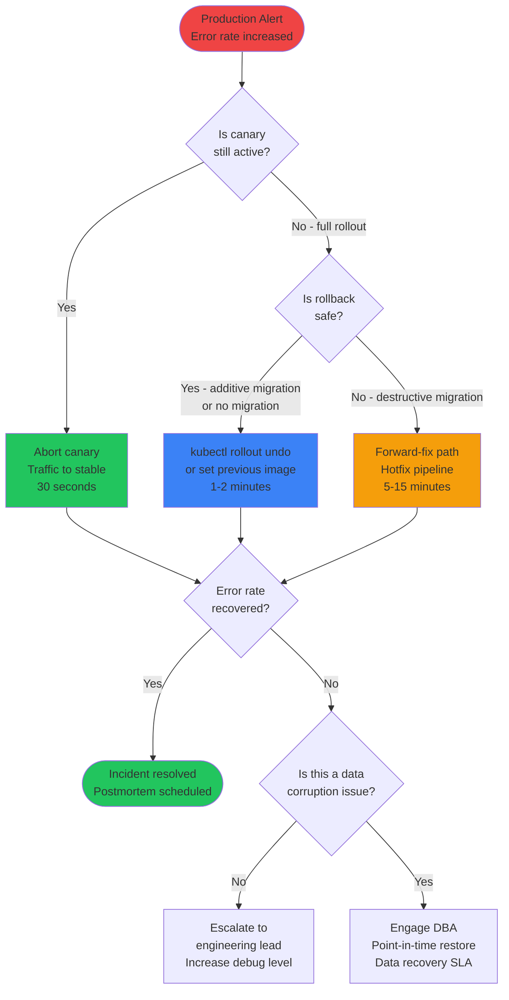

## Keywords in This File
{: .no_toc }

| # | Keyword | Weight |
|---|---|---|
| 1 | [Rollback Strategies and Release Failure Recovery](#rollback-strategies-and-release-failure-recovery) | medium |

---

# Rollback Strategies and Release Failure Recovery

🎯 Interview Weight: critical - production incident response
capability. Staff and senior engineers must know every rollback
option and their constraints. Database migrations make naive
rollback impossible; this is the nuanced part interviewers probe.

---

### 🎯 Model Answer

**30 seconds:**
> Rollback is restoring a system to a previously known-good state
> after a failed deployment. The hard part is not rolling back the
> application code - that is just redeploying a previous artifact.
> The hard part is rollback when there is a database schema change.
> If you added a column that old code does not know about, rolling
> back the application code leaves the schema in a state the old
> code cannot handle. This is why forward-fix is often safer than
> rollback for database-coupled releases.

**3 minutes (Senior):**
> I categorize rollback strategies by the coupling between application
> changes and data changes.
>
> Case 1: Application change only (no DB migration). This is the
> easiest case. Rollback = `kubectl rollout undo deployment/myapp`
> or `kubectl set image deployment/myapp myapp=myapp:v1.4.2`. Takes
> 30-60 seconds. The previous artifact is in the registry, signed,
> pre-validated. No rebuild needed.
>
> Case 2: Application change + additive DB migration (new column,
> new table). This is safe to rollback at the application level.
> The old code ignores the new column (if nullable or has default).
> Rollback: revert application. The schema has the new column but
> the old code simply does not use it. No data loss, no error.
>
> Case 3: Application change + destructive DB migration (column
> dropped, column renamed, data type changed). This cannot be safely
> rolled back. Rolling back the application code while the schema
> is in the new state means the old code expects a column that no
> longer exists. Error.
>
> The solution for Case 3 is the expand-contract (parallel change)
> pattern: Phase 1 - expand: add the new column, keep the old column,
> deploy code that writes to both. Phase 2 - migrate data.
> Phase 3 - contract: deploy code that reads only the new column.
> Phase 4 - drop old column. Any of phases 1-3 can be rolled back
> to the previous phase. The "rollback" for Case 3 is a forward-fix.

**Framework:** SCOPE → STRATEGY → CONSTRAINT → MECHANISM

*Adapting up:* "The staff-level problem: a multi-service release where
service A calls service B, and both have been updated. Rolling back
service A means service A v1 is calling service B v2, which might
have removed the API endpoint that service A v1 uses. Distributed
rollback requires the API contract compatibility matrix."

*Adapting down:* "Rollback means going back to the last working
version. If you update an app and it breaks, rollback undoes the
update. The trick is when the database was also changed - you might
not be able to undo the database changes without data loss."

**Blank Mind Recovery:**

**(1) Restate:** "Rollback strategies - how to recover from a failed
deployment by restoring the previous state. The constraint:
database migrations may not be reversible."

**(2) First principles:** "A deployment changes two things: the
application code (always reversible) and the data schema (often not
reversible without data loss). Rollback is safe when code and data
schema changes are independent or when schema changes are backward
compatible."

**(3) Bridge:** "Like editing a shared document with tracked changes.
You can always undo your text edits. But if you deleted a section
and someone else added notes to your deletion... undoing just your
part is now destructive."

---

### 📘 Concept Explanation

**What it is:**
Rollback is the process of restoring a software system to a
previously known-good state after a failed deployment or detected
production issue. Release failure recovery encompasses the full
scope of actions taken: detecting the failure, stopping the spread,
restoring service, and preventing recurrence.

**The problem it solves:**
Every deployment carries a probability of failure. Even with extensive
testing, production issues occur due to configuration differences,
load patterns, data edge cases, or third-party service changes.
A fast, reliable rollback capability is the safety net that enables
teams to deploy frequently without fear.

**How it works:**

**The Rollback Decision Matrix:**

| Change Type | Rollback Risk | Recommended Strategy |
|-------------|--------------|---------------------|
| Code only (no DB migration) | Low | Immediate rollback |
| Code + additive migration (ADD column) | Low | Rollback code; leave schema |
| Code + destructive migration (DROP column) | High | Forward-fix only |
| Code + data migration (data moved) | High | Forward-fix only |
| Multi-service coordinated release | High | Per-service rollback with compatibility check |

**Rollback Mechanisms:**

Mechanism 1: Kubernetes native rollback.
The simplest and most common for containerized applications.
Kubernetes maintains a revision history for Deployments.
```bash
# Rollback to previous revision
kubectl rollout undo deployment/myapp -n production
# Rollback to specific revision
kubectl rollout undo deployment/myapp --to-revision=14 -n production
# Check rollback status
kubectl rollout status deployment/myapp -n production
```
> **Code walkthrough:** This Check rollback status example demonstrates shell script pattern. **KEY MECHANISM:** the shell executes commands sequentially; pipes pass stdout of one command to stdin of the next. **WHY IT MATTERS:** unquoted variables with spaces cause word splitting - IFS splits the value into multiple arguments. **TAKEAWAY: always double-quote variables: "$VAR"; use [[ ]] instead of [ ] for safer conditionals.**

Duration: 30-120 seconds (depends on pod startup time).
Limitation: only works if the previous image is still in the registry.
Image garbage collection policies must preserve recent images.

Mechanism 2: Artifact reference rollback.
When deployment is separated from build (artifact promotion pattern),
rollback is deploying a specific previous artifact:
```bash
# Identify the last stable deployment
STABLE_SHA=$(git log --oneline main | grep "deploy" | head -1 | cut -d' ' -f1)
# Deploy specific artifact
kubectl set image deployment/myapp \
  myapp=ghcr.io/myorg/myapp:${STABLE_SHA} -n production
```

> **Code walkthrough:** This Deploy specific artifact example demonstrates shell script pattern. **KEY MECHANISM:** the shell executes commands sequentially; pipes pass stdout of one command to stdin of the next. **WHY IT MATTERS:** unquoted variables with spaces cause word splitting - IFS splits the value into multiple arguments. **TAKEAWAY: always double-quote variables: "$VAR"; use [[ ]] instead of [ ] for safer conditionals.**

Mechanism 3: Feature flag rollback.
For deployments using feature flags, the "rollback" is turning off
the flag rather than reverting the code.
```bash
# Kill switch: disable the feature flag for all users
curl -X PATCH https://launchdarkly.com/api/flags/feature-x \
  -d '{"on": false}'
```
> **Code walkthrough:** This Kill switch: disable the feature flag for all users example demonstrates HTTP request from shell using HTTP client. **KEY MECHANISM:** curl by default follows redirects and suppresses errors; -f flag makes it return non-zero on HTTP errors. **WHY IT MATTERS:** piping curl output to shell without verification runs untrusted code - a supply-chain attack vector. **TAKEAWAY: always use curl -f --retry and verify checksums before piping to bash.**

Duration: seconds to minutes (depends on flag evaluation cache TTL).
Advantage: no deployment required. The code stays deployed; the
behavior reverts. Allows targeted rollback (disable for specific
users, regions, or tenants while investigating).

Mechanism 4: Traffic-based rollback (canary abort).
When using blue-green or canary, rollback is returning all traffic
to the previous version:
```bash
# Argo Rollouts: abort canary
kubectl argo rollouts abort myapp -n production
# This sets canary weight to 0 and stable to 100%
# No pod restart required - routing change only
```
> **Code walkthrough:** This routing change only example demonstrates shell script pattern using container. **KEY MECHANISM:** the shell executes commands sequentially; pipes pass stdout of one command to stdin of the next. **WHY IT MATTERS:** unquoted variables with spaces cause word splitting - IFS splits the value into multiple arguments. **TAKEAWAY: always double-quote variables: "$VAR"; use [[ ]] instead of [ ] for safer conditionals.**

Duration: seconds (routing table change in the service mesh).
Most powerful: rollback can happen while the new version is still
running (canary pods exist but receive 0% traffic), enabling
comparison and investigation without pressure.

**The Expand-Contract Pattern for DB Migrations:**

Phase 1 (Expand - backward compatible):
- Add new column (nullable or with default)
- Deploy application that writes to BOTH old and new columns
- Read from old column only
- Rollback possible: remove new code, old schema works fine

Phase 2 (Migrate):
- Run data migration: copy old column data to new column
- Backfill default values
- Verify migration completeness

Phase 3 (Contract - new state only):
- Deploy application that reads from NEW column only
- Writes to new column only
- Rollback possible: redeploy Phase 1 code (reads old column again)

Phase 4 (Cleanup):
- Drop old column
- After this phase, rollback to Phase 1 application is no longer possible

Each phase is a separate deployment. Each can be rolled back to the
previous phase (not the phase before it). The key insight: destructive
changes (DROP column) happen last, after the application has migrated.

**The key insight:**
Application code rollback is nearly always safe and fast. Data
schema rollback depends entirely on whether the migration was
additive or destructive. Designing releases to be rollback-safe
means separating schema changes from application logic changes and
never doing destructive schema changes without a multi-phase migration.

**When to use:**
- Production incidents: immediately when a deployment causes error
  rate increase, latency spike, or service unavailability
- Proactive: as soon as a canary shows degraded metrics before full rollout
- Forward-fix: when rollback is not possible (destructive migration),
  the alternative is a fast forward-fix deployment

**When NOT to use (rollback is the wrong tool):**
- When the failure is in data integrity (wrong data was processed);
  rollback undoes the application change but the data damage persists
- When forward-fix is faster (a one-line bug fix deploys in 5 minutes;
  rollback + investigation + fix takes longer)

**Alternatives:**
- Canary deployment (reduces blast radius - only 5% of users affected
  before full rollback/promote decision)
- Blue-green (instant traffic switch, full environment available)
- Feature flags (instant behavioral rollback without deployment)
- Database point-in-time recovery (for data corruption scenarios,
  not application rollback)

**First-principles derivation:**
A deployment is an atomic state transition from state S1 to state S2.
Rollback is the inverse transition from S2 to S1. The inverse is
possible when the transition is reversible (application code change:
always reversible). The inverse may not exist when the transition
is destructive (DROP TABLE: the data is gone).
Therefore: design deployments as reversible transitions whenever
possible. Make destructive operations the last step in a multi-phase
process, only executed after the non-destructive phases have fully
settled.

---

### 💻 Code Example

**BAD: Deployment tightly coupled to database migration**


```yaml
# ANTI-PATTERN: Single deployment step does code + migration together
# Rolling back is dangerous

name: Deploy
on:
  push:
    branches: [main]

jobs:
  deploy:
    steps:
      - name: Deploy to production
        run: |
          # Step 1: Run migration (drops old_column, renames column)
          kubectl exec -n production deployment/myapp-migrations -- \
            ./mvnw flyway:migrate

          # Migration content (V42__rename_user_email.sql):
          # ALTER TABLE users RENAME COLUMN email TO email_address;
          # This renames a column. Any code that reads 'email' breaks.

          # Step 2: Deploy new application
          kubectl set image deployment/myapp \
            myapp=ghcr.io/myorg/myapp:${{ github.sha }} \
            -n production

          # PROBLEM: if the new application fails to start (OOM, config error)
          # and we roll back with:
          #   kubectl rollout undo deployment/myapp
          # The old code will try to read column 'email'
          # But the column is now named 'email_address'
          # Result: every database query for user email throws an error
          # Rollback made things WORSE
```


> **Code walkthrough:** The destructive migration (column rename) andice. **KEY MECHANISM:** the runtime executes these instructions in sequence with specific memory and execution semantics. **WHY IT MATTERS:** misapplying this pattern causes subtle bugs that only manifest under production load. **TAKEAWAY: understand the execution model before using this pattern in production code.**
> the application deployment are bundled in a single step. If the
> application deployment fails after the migration succeeds, rolling
> back the application code creates a broken state: old code expecting
> `email` column, schema with `email_address` column. There is now
> no safe rollback - either old code with new schema (broken) or
> new code deployed (the original failure). The team is forced into
> a high-pressure forward-fix with a broken production system.

**GOOD: Expand-contract pattern with backward-compatible migrations**

```sql
-- PHASE 1 MIGRATION: V42__add_email_address.sql (ADDITIVE - safe to rollback)
-- Add new column (nullable so old code ignores it)
ALTER TABLE users ADD COLUMN email_address VARCHAR(255);

-- Copy data from old column to new column
UPDATE users SET email_address = email WHERE email IS NOT NULL;

-- DO NOT drop old column yet. Both columns exist.
-- Old code reads 'email' (still works)
-- New code writes to both columns (backward compatible)
```

> **Code walkthrough:** This Rollback made things WORSE example demonstrates SQL pattern using SQL. **KEY MECHANISM:** the database parses, plans, and executes the query; EXPLAIN ANALYZE shows the actual plan. **WHY IT MATTERS:** missing WHERE clause on UPDATE/DELETE affects all rows - no undo without a transaction rollback. **TAKEAWAY: always test destructive SQL in a transaction; use EXPLAIN ANALYZE before deploying.**

```java
// Phase 1 application code: writes to BOTH columns
// Reads from OLD column (safe rollback: remove this code, old column still valid)
@Entity
public class User {
    @Column(name = "email")
    private String email;           // Old column - still used

    @Column(name = "email_address")
    private String emailAddress;    // New column - also written

    // Listener: keep both columns in sync
    @PrePersist
    @PreUpdate
    void syncEmailColumns() {
        if (this.emailAddress == null) {
            this.emailAddress = this.email;
        }
        if (this.email == null) {
            this.email = this.emailAddress;
        }
    }
}
```

> **Code walkthrough:** This Rollback made things WORSE example demonstrates Java API usage using SQL. **KEY MECHANISM:** the JVM compiles to bytecode that runs on the JVM; JIT compiles hot paths to native. **WHY IT MATTERS:** unchecked assumptions about thread safety cause data races under concurrent load. **TAKEAWAY: document thread-safety guarantees on every shared mutable class.**

```sql
-- PHASE 3 MIGRATION: V44__read_from_email_address.sql
-- After Phase 1 has been deployed and stable for 1+ week
-- After Phase 2 (data migration verification) is complete
-- Add NOT NULL constraint once all rows are populated
ALTER TABLE users
  ALTER COLUMN email_address SET NOT NULL;
-- Still not dropping old column - backward compatible
```

> **Code walkthrough:** This Rollback made things WORSE example demonstrates SQL pattern. **KEY MECHANISM:** the database parses, plans, and executes the query; EXPLAIN ANALYZE shows the actual plan. **WHY IT MATTERS:** missing WHERE clause on UPDATE/DELETE affects all rows - no undo without a transaction rollback. **TAKEAWAY: always test destructive SQL in a transaction; use EXPLAIN ANALYZE before deploying.**

```java
// Phase 3 application code: reads from NEW column only
// Still writes to old column (backward compatible: can rollback to Phase 1)
@Entity
public class User {
    @Column(name = "email")
    private String email;           // Old column - still written to

    @Column(name = "email_address")
    @Column(nullable = false)
    private String emailAddress;    // New column - primary read/write

    @PrePersist
    @PreUpdate
    void keepEmailInSync() {
        this.email = this.emailAddress; // Keep old column in sync
    }
}
```

> **Code walkthrough:** This Rollback made things WORSE example demonstrates Java API usage using SQL. **KEY MECHANISM:** the JVM compiles to bytecode that runs on the JVM; JIT compiles hot paths to native. **WHY IT MATTERS:** unchecked assumptions about thread safety cause data races under concurrent load. **TAKEAWAY: document thread-safety guarantees on every shared mutable class.**

```sql
-- PHASE 4 MIGRATION: V46__drop_old_email_column.sql
-- After Phase 3 has been deployed and stable for 2+ weeks
-- This is the ONLY point where rollback becomes difficult
-- Execute only after confirming no code or reports reference 'email' column
ALTER TABLE users DROP COLUMN email;
-- After this: the column is gone. No rollback to pre-Phase-1 app possible.
```

> **Code walkthrough:** This Rollback made things WORSE example demonstrates SQL pattern. **KEY MECHANISM:** the database parses, plans, and executes the query; EXPLAIN ANALYZE shows the actual plan. **WHY IT MATTERS:** missing WHERE clause on UPDATE/DELETE affects all rows - no undo without a transaction rollback. **TAKEAWAY: always test destructive SQL in a transaction; use EXPLAIN ANALYZE before deploying.**


```yaml
# Deployment pipeline with expand-contract phases

name: Deploy Phase 1 (Expand)
jobs:
  deploy-phase1:
    steps:
      - name: Run Phase 1 migration (additive - safe)
        run: |
          flyway migrate -url=${DB_URL} -locations=filesystem:migrations/v42

      - name: Deploy Phase 1 application code
        run: |
          kubectl set image deployment/myapp \
            myapp=ghcr.io/myorg/myapp:phase1-${{ github.sha }} \
            -n production

      # If Phase 1 application fails: safe to rollback
      # Migration V42 is additive (adds column with default)
      # Old code ignores the new column
      # kubectl rollout undo deployment/myapp works perfectly

      - name: Monitor Phase 1 for 24 hours before Phase 3
        run: |
          echo "Phase 1 deployed. Monitor for 24h before Phase 3."
          echo "Phase 3 can be triggered manually after validation."
```


> **Code walkthrough:** The expand-contract pattern creates a safeice. **KEY MECHANISM:** the runtime executes these instructions in sequence with specific memory and execution semantics. **WHY IT MATTERS:** misapplying this pattern causes subtle bugs that only manifest under production load. **TAKEAWAY: understand the execution model before using this pattern in production code.**
> multi-phase migration. Phase 1 adds the new column and deploys code
> that writes to both columns - safe to roll back at any point in
> this phase. Phase 3 deploys code that reads from the new column
> - can still roll back to Phase 1 (the old column still exists with
> current data). Phase 4 drops the old column - this is the only
> phase where rollback to the original schema is no longer possible,
> and it only executes after weeks of validation. Each phase is a
> separate deployment with its own rollback window.

---

### 🎓 Answers by Seniority

**Junior / Mid (0-5 years):**
> "For Kubernetes deployments, rollback is usually `kubectl rollout undo`.
> The tricky part is when there's also a database migration. If the
> migration added a new column but the old code doesn't use it, rolling
> back the app is safe. But if the migration renamed or dropped a column
> that the old code depends on, rolling back the app code will break
> things - the old code expects the old column name but the database has
> the new column name.
>
> The pattern I learned is to always make schema changes backward
> compatible first: add the new column, migrate data, then in a later
> deployment remove the old column. That way, if the first deployment
> fails, rolling back is always safe."

---

**Senior / Staff (5+ years):**
> "My rollback framework has three components: detection, decision,
> and execution.
>
> Detection: automated canary analysis. Every production deployment
> starts at 5% canary. Prometheus metrics (error rate, latency p99)
> are monitored for 10 minutes. If error rate increases > 0.5
> percentage points or latency increases > 20%, the canary is
> automatically aborted. This is rollback before the problem affects
> 95% of users.
>
> Decision: the rollback question has three variables: (1) Is the
> failure causing user impact right now? (2) Is a rollback safe
> given the DB migration state? (3) Is a forward-fix faster?
> For most code-only issues: rollback immediately. For DB-coupled
> issues: forward-fix is often safer (5-minute fix deployment vs.
> 45-minute migration reversal).
>
> Execution: rollback should be a 2-minute operation with zero
> cognitive load. The on-call engineer should not be debugging
> the rollback mechanism during an incident. We pre-test rollback
> monthly in chaos engineering exercises. Everyone on the team
> can execute a rollback without documentation."

---

### ⚖️ Comparison Table

| Rollback Type | Speed | Code Change Needed | DB Constraint | Best For |
|---|---|---|---|---|
| kubectl rollout undo | 30-60 sec | No | Additive migrations only | Code-only deployments |
| Feature flag disable | Seconds | No | Any | Feature-gated releases |
| Traffic shift (canary abort) | Seconds | No | Additive only | Canary deployments |
| Artifact promotion rollback | 2-5 min | No | Additive only | Any containerized service |
| Forward-fix deployment | 5-15 min | Yes | Any | Destructive migration releases |
| Blue-green traffic switch | Seconds | No | Additive only | Scheduled releases |
| Database point-in-time restore | 30-60 min | No | Any (with data loss) | Data corruption |

---

### 🏛️ System Design

**Design: Release failure recovery system for a multi-service
platform with a 5-minute MTTR target.**

**Requirements:**
- Detect production failures within 60 seconds
- Execute rollback within 5 minutes
- Support 50 services with varying DB migration states
- RTO (Recovery Time Objective): 5 minutes
- RPO (Recovery Point Objective): current transaction (no data loss
  for code rollback; DB restore is separate SLA)

**Architecture:**

Layer 1: Automated detection (< 60 seconds).
Each service has a canary deployment step. Prometheus monitors
error rate, latency, and health check status. Automated rules:
- Error rate > 1% for 2 consecutive minutes: trigger alert + auto-abort canary
- Health check failing 3 consecutive times: trigger alert
- p99 latency > 2x baseline for 5 consecutive minutes: trigger alert

Layer 2: Rollback decision support (< 2 minutes).
A rollback dashboard shows for each service:
- Current deployment version + previous stable version
- Migration state: what type was the last migration? (Additive/Destructive)
- Safe rollback: Y/N (based on migration type)
- Forward-fix ETA (if rollback unsafe): estimated CI time for a fix

Layer 3: Rollback execution (< 3 minutes for code rollback).
Single-click rollback via internal deployment tool:
- For safe rollback: `kubectl set image` to previous artifact digest
- For feature flag services: LaunchDarkly API call to disable flag
- For multi-service rollback: ordered execution with dependency graph
  (roll back service B before service A if A depends on B's new API)

Layer 4: Forward-fix path (< 15 minutes for simple fixes).
Pre-configured "hotfix" pipeline:
- Skip E2E tests (too slow for emergency)
- Run unit + integration tests only (5 min)
- Deploy directly to production after staging smoke test
- Full test suite runs asynchronously

**Migration state tracking:**
Each deployment records in the deployment database:
- Migration version range applied
- Migration type: ADDITIVE, DESTRUCTIVE, or NONE
- Safe to rollback: computed automatically from migration type
- Previous stable artifact digest

This enables the dashboard to show at a glance which services
can be safely rolled back vs. which require forward-fix.

---

### 📊 Diagram

**Release Failure Recovery Decision Tree**

```
PRODUCTION ALERT: service degraded
          |
          v
Is error rate increasing?
          |
    YES   |   NO
    |     |    +---> Monitor 2 more min, check logs
    v     v
Is canary still active (< 100% rollout)?
          |
    YES   |   NO (full rollout)
    |     |    |
    v     v    v
Abort canary  Is rollback safe?
(0% traffic   (no destructive migration)
 in seconds)      |
                YES     NO
                 |       |
                 v       v
         Rollback app  Forward-fix:
         (kubectl undo  deploy patch ASAP
          or set image) skip E2E, run unit
                |       tests only
                v       |
         Monitor 5 min  v
         for recovery   Deploy + verify
```



> **Diagram walkthrough:** The recovery tree has three distinct paths
> with different time characteristics. The canary abort path is the
> fastest (30 seconds) and requires no decision about migration safety
> because no migration has fully propagated. The rollback path (1-2
> minutes) is safe for additive or code-only deployments. The forward-
> fix path (5-15 minutes) is required for destructive migration
> deployments and trades additional incident duration for correctness.
> The data corruption path is a separate escalation that involves the
> DBA team and potentially a point-in-time restore - outside the
> normal release failure recovery SLA.

---

### ⚠️ Common Misconceptions

**Misconception 1: "Rollback is always safe and should always
be the first response."**
Rollback is only safe when the system can return to a valid prior
state. For destructive database migrations (column dropped, data
deleted), rolling back the application code while the schema is
in the new state creates a worse failure. The incident commander
must check the migration state before deciding to rollback.

**Misconception 2: "Blue-green deployment means instant rollback
with no downtime."**
Blue-green is instant for the traffic switch. However, if the green
environment processed data (wrote to the database) before the rollback
decision, that data exists in a state that the blue application might
not handle correctly. The "instant" rollback is only instant for
stateless applications. Stateful services require careful analysis
of what data was processed in the new version.

**Misconception 3: "The expand-contract pattern is too slow
for fast-moving teams."**
The expand-contract pattern runs across multiple sprints but each
individual deployment is simple and fast. Sprint 1: add new column
and deploy code that writes to both columns (30-minute migration).
Sprint 2 (next sprint): deploy code that reads from new column only.
Sprint 3 (2 sprints later): drop old column. The "slowness" is
intentional - the migration is spread over multiple deployments
to maintain rollback safety at each phase. Fast is relative: this
approach is faster than the alternative (emergency data recovery
from a failed non-reversible migration).

---

### 🚨 Failure Modes and Diagnosis

**Failure Mode 1: Rollback succeeds but application is still broken**
Symptom: `kubectl rollout undo` completed successfully, pods are
healthy, but users are still getting errors. Error logs show database
query failures referencing columns that should exist.
Cause: the DB migration ran before the failed deployment and cannot
be automatically reversed by Kubernetes rollout undo (Kubernetes
only manages the application image, not the database schema).
Even though the old application code is running, the schema is
in a state it does not expect.
Diagnosis: check the migration version that the application expects
vs. what the database currently has:
```bash
# Get expected Flyway version from old app code
kubectl exec -n production deploy/myapp -- \
  cat flyway.conf | grep baselineVersion

# Get current database migration version
psql -h db.internal -U app -d production -c \
  "SELECT version, description FROM flyway_schema_history ORDER BY installed_rank DESC LIMIT 5;"
```
> **Code walkthrough:** This Get current database migration version example demonstrates shell script pattern using SQL. **KEY MECHANISM:** the shell executes commands sequentially; pipes pass stdout of one command to stdin of the next. **WHY IT MATTERS:** unquoted variables with spaces cause word splitting - IFS splits the value into multiple arguments. **TAKEAWAY: always double-quote variables: "$VAR"; use [[ ]] instead of [ ] for safer conditionals.**

Fix: if the migration was additive (add column), the old code typically
fails on null values if it does not handle the new nullable column.
A targeted fix: add default values or update the query to ignore
the new column. If destructive: immediate escalation to DBA for
manual data recovery.

**Failure Mode 2: Rollback causes service restart loops due to
incompatible configuration**
Symptom: after rollback, pods immediately enter CrashLoopBackOff.
Logs show: "Failed to load configuration: required field 'new_setting'
not found."
Cause: the new deployment introduced a new required configuration
key. The ConfigMap or environment variable was added for the new
version. Rolling back to the old image did not remove the new config.
The old image fails to start because it does not recognize the new
config key (strict config validation).
Diagnosis: compare the running config with the config that the
old image expects.
```bash
kubectl describe configmap myapp-config -n production
# Compare against git history: what was in this ConfigMap 1 version ago?
git show HEAD~1:k8s/configmap.yaml
```
> **Code walkthrough:** This Compare against git history: what was in this ConfigMap 1 version ago? example demonstrates shell script pattern. **KEY MECHANISM:** the shell executes commands sequentially; pipes pass stdout of one command to stdin of the next. **WHY IT MATTERS:** unquoted variables with spaces cause word splitting - IFS splits the value into multiple arguments. **TAKEAWAY: always double-quote variables: "$VAR"; use [[ ]] instead of [ ] for safer conditionals.**

Fix: revert the ConfigMap to the previous version. Or add the old
config key back. The root cause is config schema was changed without
backward compatibility.

**Failure Mode 3: Multi-service rollback creates API incompatibility**
Symptom: service A v1.4.2 is rolled back to v1.4.1. Service B
(which A calls) is still on v2.1.0 (new version). Service A v1.4.1
calls an API endpoint that was renamed in service B v2.1.0. 404 errors.
Cause: a coordinated release where A and B have a tightly coupled
API change. Rolling back only A creates version incompatibility.
Diagnosis: check the release coordination: what API changes were
made between B v1.9.x and v2.1.0? Does A v1.4.1 call any endpoint
that was removed or renamed in B v2.1.0?
Fix: roll back service B to v1.9.x as well. This requires checking
that B's rollback is also safe (no destructive migration). In
general, tightly coupled multi-service releases are an architecture
risk - the API contract between services should be backward
compatible to enable independent deployments and rollbacks.

---

### 🎯 Interview Deep-Dive

| Format | Time | Focus |
|--------|------|-------|
| Screener | 3 min | Rollback types + DB migration constraint |
| Panel | 10 min | Expand-contract pattern + multi-service rollback |
| Senior | 15 min | System design + MTTR optimization + safety analysis |

---

**Q1 (Definition): What is the difference between rollback, roll-forward,
and canary abort?**

Three distinct recovery strategies for release failures:

Rollback: restoring the system to the exact previous state before
the current deployment. For application code: deploy the previous
image version. For database: reverse the migration (if reversible).
Use case: the new version has a regression and the previous version
was known-good. The rollback returns to a validated prior state.

Roll-forward (forward-fix): fixing the current issue with a new
deployment rather than reverting to the previous version. Deploying
v1.4.3 to fix a bug introduced in v1.4.2, rather than reverting
to v1.4.1. Use case: when rollback is not safe (destructive migration)
or when the fix is simpler than the rollback.

Canary abort: when using canary deployment (new version serving
5% of traffic), abort means returning all traffic to the stable
version and removing or scaling down the canary instances. The
new version code is still present but receives 0% traffic. Use
case: pre-rollout detection of a regression. Canary abort is
faster and lower-risk than rollback because the blast radius was
5% during the canary period.

The decision framework:
- Canary still active + degraded metrics: canary abort (fastest, lowest risk)
- Full rollout + code-only change: rollback (1-2 minutes)
- Full rollout + additive migration: rollback (safe, 1-2 minutes)
- Full rollout + destructive migration: forward-fix (safest for DB integrity)
- Simple bug fix available: forward-fix (often faster than rollback investigation)

*What separates good from great:* The insight that canary abort is
fundamentally different from rollback even though the outcome looks
similar (both result in the stable version serving 100% of traffic).
Canary abort is a normal part of the canary deployment workflow;
no recovery needed, minimal impact. Rollback is an incident response
action with potential side effects (DB state, in-flight requests).
Designing for canary abort (rather than needing rollback) is the
better architectural goal.

---

**Q2 (Mechanism): How does Kubernetes track deployment history
and what are the limits of kubectl rollout undo?**

Kubernetes Deployment objects maintain a revision history of
ReplicaSets. Each time a new image is deployed (or pod spec changes),
a new ReplicaSet is created and the old one is scaled to 0 but
retained. `kubectl rollout undo` scales up a previous ReplicaSet.

Revision history management:
```bash
# View deployment history
kubectl rollout history deployment/myapp -n production
# Output:
# REVISION  CHANGE-CAUSE
# 14        Deploy v1.4.1
# 15        Deploy v1.4.2 (current, broken)

# Rollback to specific revision
kubectl rollout undo deployment/myapp --to-revision=14 -n production

# Configure history limit (default: 10 revisions)
# In Deployment spec:
# spec.revisionHistoryLimit: 20
```

> **Code walkthrough:** This spec.revisionHistoryLimit: 20 example demonstrates shell script pattern. **KEY MECHANISM:** the shell executes commands sequentially; pipes pass stdout of one command to stdin of the next. **WHY IT MATTERS:** unquoted variables with spaces cause word splitting - IFS splits the value into multiple arguments. **TAKEAWAY: always double-quote variables: "$VAR"; use [[ ]] instead of [ ] for safer conditionals.**

Limitations of `kubectl rollout undo`:

Only manages the pod spec (image + config): Kubernetes rollout
history knows nothing about database migrations. It tracks what
image ran, not what database state that image expected. The operator
must separately verify DB compatibility.

Image availability: if the previous image has been garbage collected
from the registry (many registries have GC policies to remove old
images), `kubectl rollout undo` will fail. Image retention policy
must ensure at least 10-20 recent images are retained.

Not atomic: rollout undo uses a rolling update strategy by default.
During the rollout, a mix of old and new pods are running. For
applications with strict version compatibility requirements, a
rolling rollback may cause issues with in-flight requests.

ConfigMap and Secret changes: if the deployment references a
ConfigMap that was updated, rolling back the pod spec does not
roll back the ConfigMap. The old image may run with the new config.

*What separates good from great:* The `revisionHistoryLimit` default
of 10 means only 10 rollback points are available. For services
with many daily deployments, 10 revisions might cover only 2-3 days.
Setting `revisionHistoryLimit: 30` and ensuring the image retention
policy retains 30 images ensures a 30-revision rollback window.
The right window depends on the service's release frequency and
the organization's RTO requirements.

---

**Q3 (Deep Dive): Walk through the expand-contract pattern for
safely adding a NOT NULL column to a high-traffic table.**

This is a common real-world scenario: adding a required field to
an existing table that has millions of rows and continuous writes.
A naive `ALTER TABLE users ADD COLUMN required_field VARCHAR(255) NOT NULL`
will fail immediately on tables with existing rows (NULL values for
the new column violate the constraint).

The full expand-contract sequence:

**Phase 1: Add column as nullable (safe migration)**
```sql
-- V50__add_user_tier_nullable.sql
-- Additive migration: safe to rollback at any point
ALTER TABLE users ADD COLUMN tier VARCHAR(20) NULL;
CREATE INDEX CONCURRENTLY idx_users_tier ON users(tier);
-- CONCURRENTLY: does not lock the table during index creation
-- Safe for high-traffic tables
```

> **Code walkthrough:** This spec.revisionHistoryLimit: 20 example demonstrates index structure. **KEY MECHANISM:** B-tree indexes support equality and range queries; partial indexes reduce index size. **WHY IT MATTERS:** index on low-cardinality column (e.g., boolean) is often slower than sequential scan. **TAKEAWAY: add indexes based on EXPLAIN ANALYZE output, not guesses - unused indexes waste write I/O.**

Deploy Phase 1 application:
```java
// Phase 1 code: handle nullable tier
// Writes tier for new users; reads tier (may be null for old users)
public UserTier getTier(User user) {
    if (user.getTier() != null) {
        return UserTier.valueOf(user.getTier());
    }
    return UserTier.FREE; // default for old users
}
// Save tier for all new/updated users:
user.setTier(tier.name());
userRepository.save(user);
```

> **Code walkthrough:** This spec.revisionHistoryLimit: 20 example demonstrates Java API usage using SQL. **KEY MECHANISM:** the JVM compiles to bytecode that runs on the JVM; JIT compiles hot paths to native. **WHY IT MATTERS:** unchecked assumptions about thread safety cause data races under concurrent load. **TAKEAWAY: document thread-safety guarantees on every shared mutable class.**

**Phase 2: Backfill existing rows (data migration - separate from code deploy)**
```sql
-- V51__backfill_user_tier.sql
-- Run in batches to avoid long-running lock
-- PostgreSQL: UPDATE in batches of 10,000 rows
DO $$
DECLARE
  batch_size INT := 10000;
  last_id BIGINT := 0;
  max_id BIGINT;
BEGIN
  SELECT MAX(id) INTO max_id FROM users;
  WHILE last_id < max_id LOOP
    UPDATE users
    SET tier = 'FREE'
    WHERE id > last_id
      AND id <= last_id + batch_size
      AND tier IS NULL;
    last_id := last_id + batch_size;
    PERFORM pg_sleep(0.1); -- brief pause between batches
  END LOOP;
END $$;
```

> **Code walkthrough:** This spec.revisionHistoryLimit: 20 example demonstrates query execution using SQL. **KEY MECHANISM:** the query planner builds an execution plan based on table statistics and indexes. **WHY IT MATTERS:** SELECT * reads all columns even if only 2 are needed - widens rows, increases I/O. **TAKEAWAY: always SELECT only the columns you need; index the columns in WHERE and JOIN clauses.**

**Phase 3: Add NOT NULL constraint (after all rows populated)**
```sql
-- V52__make_user_tier_not_null.sql
-- Verify no NULLs first
DO $$
DECLARE
  null_count INT;
BEGIN
  SELECT COUNT(*) INTO null_count FROM users WHERE tier IS NULL;
  IF null_count > 0 THEN
    RAISE EXCEPTION 'Cannot add NOT NULL: % null rows remain', null_count;
  END IF;
END $$;

-- PostgreSQL: adding NOT NULL with CHECK constraint is faster
-- than ALTER COLUMN for large tables (avoids full table rewrite)
ALTER TABLE users
  ADD CONSTRAINT users_tier_not_null CHECK (tier IS NOT NULL) NOT VALID;
-- NOT VALID: constraint applied to new rows immediately,
-- validated in background without locking
ALTER TABLE users VALIDATE CONSTRAINT users_tier_not_null;
```

> **Code walkthrough:** This spec.revisionHistoryLimit: 20 example demonstrates query execution using SQL. **KEY MECHANISM:** the query planner builds an execution plan based on table statistics and indexes. **WHY IT MATTERS:** SELECT * reads all columns even if only 2 are needed - widens rows, increases I/O. **TAKEAWAY: always SELECT only the columns you need; index the columns in WHERE and JOIN clauses.**

Total phases: 3 separate deployments, each deployable and rollback-
safe independently. Phase 1 alone: 10 minutes. Backfill: background
job, hours for large tables. Phase 3: minutes.

*What separates good from great:* The `NOT VALID` + `VALIDATE CONSTRAINT`
pattern in PostgreSQL. Adding a NOT NULL constraint normally requires
a full table scan to verify all rows. On a 100M-row table, this is
a multi-minute exclusive lock. `NOT VALID` lets the constraint be
created instantly (only applies to new rows), then `VALIDATE` checks
existing rows in the background without blocking writes. This is
essential for zero-downtime migrations on high-traffic tables.

---

**Q4 (Scenario): You have just deployed a release that removed
an API endpoint. Three downstream services are now failing.
What is your rollback decision?**

This is the multi-service coordinated rollback scenario. A non-atomic
API contract change.

Immediate assessment (first 2 minutes):
- Which downstream services are failing? (check error logs)
- Are they critical services? (revenue-impacting, user-facing)
- What does the removed endpoint do? (how many users affected?)
- Is the new version (without the endpoint) deployed to 100% yet
  or still in canary?

If still in canary: abort the canary immediately. Zero traffic
returns to the old version. Downstream services recover within
1-2 minutes. No rollback decision needed for the API provider.

If fully rolled out:

Option 1: Restore the removed endpoint.
If the endpoint removal was premature (downstream services were
not yet updated to use the new endpoint), the fastest fix is to
add the old endpoint back to the new version as a deprecated
stub that either delegates to the new implementation or returns
a 410 Gone with a migration message.
```java
// Forward-fix: add deprecated stub
@GetMapping("/api/v1/users/{id}/profile")  // removed endpoint
@Deprecated
public ResponseEntity<UserProfile> getProfileV1(@PathVariable Long id) {
    // Delegate to v2 implementation
    return getProfileV2(id);
}
```
> **Code walkthrough:** This spec.revisionHistoryLimit: 20 example demonstrates Java API usage. **KEY MECHANISM:** the JVM compiles to bytecode that runs on the JVM; JIT compiles hot paths to native. **WHY IT MATTERS:** unchecked assumptions about thread safety cause data races under concurrent load. **TAKEAWAY: document thread-safety guarantees on every shared mutable class.**

Deploy the forward-fix (5 minutes with fast CI). Downstream
services recover.

Option 2: Rollback the API provider.
Roll back the service that removed the endpoint. The rollback is
safe if there was no destructive DB migration in this release.
Check the migration state: `kubectl rollout history` + migration log.
Execute rollback: 1-2 minutes.

Option 3 (if rollback is not safe): coordinate rollback of downstream
services to use the new endpoint.
If the API provider cannot be rolled back (destructive migration),
and a forward-fix takes time: roll back the downstream services to
a version that calls the new endpoint. This requires that downstream
services have previously been updated to use the new API - check
if that version exists.

The architectural lesson: this scenario should have been prevented
by the API contract compatibility rule - never remove an endpoint
without a deprecation period. DORA research shows that elite teams
do not remove endpoints until zero clients are calling them (measured
by request logs).

*What separates good from great:* Recognizing that this is not a
technical failure but a coordination failure. The API provider and
its consumers were not coordinated. The technical fix (stub endpoint
or rollback) takes 5 minutes. The process fix (API deprecation
policy, consumer migration tracking) takes a sprint. The postmortem
should result in a policy: endpoints are deprecated (returning 410
with migration instructions) for 2 sprints before removal.

---

**Q5 (Trade-off): When is forward-fix faster than rollback,
and how do you make that decision under incident pressure?**

Forward-fix is faster when: the fix is small and obvious, the
rollback is unsafe or has side effects, or the investigation time
to understand the rollback safety is longer than the fix time.

Decision criteria:

Is the fix obvious? (5-minute forward-fix test)
If within 5 minutes of the incident being declared, the team has
identified the specific bug and the fix is a 1-10 line change,
forward-fix is likely faster. A 5-minute fast CI pipeline means
the fix is in production in 10 minutes from the decision.

Is rollback safe?
Check: was there a destructive DB migration in this deployment?
If yes: rollback is dangerous. Forward-fix is the safer path.
If no: rollback is safe. Duration: 2 minutes.

What is the blast radius right now?
If the service is completely down and the forward-fix will take
15 minutes: rollback (2 minutes) is better even if a forward-fix
is available. A 13-minute improvement in MTTR is significant.
If the service is degraded at 10% error rate and the forward-fix
is 10 minutes: the 10% degradation may be acceptable while the
fix is prepared. Rollback interrupts the debugging process.

Incident pressure trap: under pressure, the team defaults to the
first option discussed, not the best option. Pre-defining the
decision criteria (the decision matrix above) prevents panic-driven
choices.

My heuristic:
- < 5 min to implement + deploy: forward-fix
- DB migration present and destructive: forward-fix
- No DB migration + rollback available: rollback (faster floor)
- Service completely unavailable: rollback first, then investigate

*What separates good from great:* The insight that these decisions
should be made before the incident, not during it. The decision
matrix should be documented in the runbook. During an incident,
the on-call engineer consults the runbook, not their memory.
Pre-incident rehearsal (game days, tabletop exercises) ensures
the runbook is known and the decision process takes 30 seconds
rather than 5 minutes.

---

**Q6 (Debugging): How do you diagnose the root cause of a failed
deployment that passed all automated tests?**

A deployment that passed CI and still caused a production failure
indicates a gap between the test environment and production.

Step 1: Characterize the failure.
```bash
# Get error details from production logs
kubectl logs -n production deployment/myapp --since=10m | \
  grep -E "ERROR|EXCEPTION|FATAL" | sort | uniq -c | sort -rn | head -20
```

> **Code walkthrough:** This Get error details from production logs example demonstrates shell script pattern. **KEY MECHANISM:** the shell executes commands sequentially; pipes pass stdout of one command to stdin of the next. **WHY IT MATTERS:** unquoted variables with spaces cause word splitting - IFS splits the value into multiple arguments. **TAKEAWAY: always double-quote variables: "$VAR"; use [[ ]] instead of [ ] for safer conditionals.**

Step 2: Compare production environment to test environment.
The failure passed tests, which means the test environment does
not reproduce the production condition. Differences to check:

Data differences: production has real data with edge cases that
synthetic test data does not cover. A SQL query that works on
100K test rows might hit a timeout on 100M production rows due to
a missing index or an inefficient query plan.
```bash
# Find slow queries in production
psql -h prod-db -c "
  SELECT query, mean_exec_time, calls
  FROM pg_stat_statements
  WHERE mean_exec_time > 1000  -- > 1 second average
  ORDER BY mean_exec_time DESC LIMIT 10;"
```

> **Code walkthrough:** This Find slow queries in production example demonstrates shell script pattern using SQL. **KEY MECHANISM:** the shell executes commands sequentially; pipes pass stdout of one command to stdin of the next. **WHY IT MATTERS:** unquoted variables with spaces cause word splitting - IFS splits the value into multiple arguments. **TAKEAWAY: always double-quote variables: "$VAR"; use [[ ]] instead of [ ] for safer conditionals.**

Configuration differences: production uses different JVM flags,
connection pool sizes, or feature flags than the test environment.
```bash
# Compare env vars: production vs. staging
kubectl exec -n production deploy/myapp -- env | sort > /tmp/prod.env
kubectl exec -n staging deploy/myapp -- env | sort > /tmp/staging.env
diff /tmp/prod.env /tmp/staging.env
```

> **Code walkthrough:** This Compare env vars: production vs. staging example demonstrates shell script pattern. **KEY MECHANISM:** the shell executes commands sequentially; pipes pass stdout of one command to stdin of the next. **WHY IT MATTERS:** unquoted variables with spaces cause word splitting - IFS splits the value into multiple arguments. **TAKEAWAY: always double-quote variables: "$VAR"; use [[ ]] instead of [ ] for safer conditionals.**

Scale differences: production has 50 concurrent users; test has 10.
A race condition that occurs at high concurrency passes tests with
low concurrency. Load test with realistic production traffic levels.

Step 3: Reproduce locally if possible.
Use production data (sanitized/anonymized) in a local environment
to reproduce the failure.

Step 4: Root cause analysis.
After reproduction: the root cause is typically one of:
- Missing index revealed by production data volume
- Race condition revealed by production concurrency level
- Configuration difference not captured in test environment
- Third-party service behavior difference (rate limits, timeout settings)

*What separates good from great:* Formalizing the post-incident
environment parity action. If the root cause was a configuration
difference, the action is: automate config diff checking between
production and staging as part of every deployment validation.
If the root cause was a data volume issue, the action is: add a
performance test with production-scale data to the CI pipeline.
Each incident that reveals a test gap should close that gap
permanently.

---

**Q7 (Architecture): Design a database migration strategy for a
service that requires zero-downtime schema changes and must support
rolling back any individual migration.**

This is the hardest constraint combination: zero-downtime (no
service restart or table lock), rollback-capable (each migration
can be reversed), and production-safe.

The strategy: Flyway with undo migrations + backward-compatible
migration policy.

Policy 1: All migrations must be backward compatible.
A migration is backward compatible if the old application code
can run correctly against the new schema. This means:
- Adding columns: always nullable or with a safe default
- Adding tables: old code ignores new tables
- Adding indexes: old code is not affected (CONCURRENTLY)
- Renaming columns: only via expand-contract (add new, keep old, later drop old)
- Changing constraints: NOT VALID + VALIDATE pattern

Policy 2: Every migration has a paired undo migration.
Flyway Pro supports undo migrations. Each V{n}__description.sql
has a corresponding U{n}__description.sql.
```sql
-- V55__add_tier_column.sql (apply migration)
ALTER TABLE users ADD COLUMN tier VARCHAR(20) NULL;
CREATE INDEX CONCURRENTLY idx_users_tier ON users(tier);
```
```sql
-- U55__add_tier_column.sql (undo migration)
DROP INDEX CONCURRENTLY idx_users_tier;
ALTER TABLE users DROP COLUMN tier;
-- This is safe because: tier was nullable (no data loss for new rows,
-- old rows never had tier data). CONCURRENTLY avoids locks.
```

> **Code walkthrough:** This Compare env vars: production vs. staging example demonstrates index structure. **KEY MECHANISM:** B-tree indexes support equality and range queries; partial indexes reduce index size. **WHY IT MATTERS:** index on low-cardinality column (e.g., boolean) is often slower than sequential scan. **TAKEAWAY: add indexes based on EXPLAIN ANALYZE output, not guesses - unused indexes waste write I/O.**

Policy 3: Destructive operations have no undo.
Migrations that drop columns or tables with data cannot be undone
without data loss. These migrations must be forbidden until:
- Zero application code references the column/table
- A backup has been taken
- A 2-sprint deprecation period has elapsed
These migrations require explicit "no undo possible" documentation
and a DBA review.

Zero-downtime enforcement:
```python
# Migration linter (runs in CI, checks each migration)
def check_migration_safety(sql: str) -> list[str]:
    issues = []
    if "ALTER TABLE" in sql and "NOT NULL" in sql:
        if "NOT VALID" not in sql:
            issues.append(
                "NOT NULL constraint without NOT VALID "
                "will lock table. Use NOT VALID + VALIDATE CONSTRAINT"
            )
    if "DROP COLUMN" in sql:
        issues.append(
            "DROP COLUMN is destructive. Requires DBA review "
            "and 2-sprint deprecation period."
        )
    if "CREATE INDEX" in sql and "CONCURRENTLY" not in sql:
        issues.append(
            "CREATE INDEX without CONCURRENTLY will lock table. "
            "Add CONCURRENTLY for zero-downtime."
        )
    return issues
```

> **Code walkthrough:** This Migration linter (runs in CI, checks each migration) example demonstrates function definition. **KEY MECHANISM:** Python compiles the function body to bytecode; default args are evaluated once at definition time. **WHY IT MATTERS:** mutable default arguments (def f(x=[])) share state across calls - a classic bug. **TAKEAWAY: use None as default for mutable args and initialize inside the function body.**

*What separates good from great:* The migration linter transforms
migration safety from a policy document into automated enforcement.
When the linter runs in CI, every migration is checked before it
can be merged to main. A migration that violates zero-downtime
or rollback policies fails CI immediately, before it reaches
production. The linter converts the "everyone must know the rules"
problem into "the tool enforces the rules."

---

**Q8 (Behavioral): Describe a production incident where rollback
failed and what you learned from it.**

This question is assessing whether the candidate has real production
experience with rollback failures, not textbook knowledge.

The incident: we deployed a feature that added a new user_preferences
table and migrated data from a JSON blob in the users table. The
migration script ran successfully. The new code deployed successfully.
Within 20 minutes, we saw increased latency and intermittent 500
errors on the user profile endpoint.

I executed the rollback: `kubectl rollout undo deployment/user-service`.
The pods restarted. Errors did not go away. The old code was running
against the new schema. The old code read user preferences from
the JSON blob in the users table. But the JSON blob had been deleted
by the migration script (data moved to user_preferences table).
The old code queried for preferences, got NULL (blob was deleted),
and threw a null pointer exception.

The root cause: the migration deleted the source data (users.preferences
JSON blob) rather than leaving it in place. Rolling back the application
code meant the old code's data source was gone.

The fix: emergency forward-fix. The fix code read from user_preferences
if it existed, else returned empty preferences (graceful degradation).
The JSON blob could not be restored (no backup at that granularity).
Within 45 minutes, the fix was deployed. We accepted the data loss
(preferences for 2,000 users were lost).

What I learned:
(1) Destructive data operations must be the last phase, not bundled
with the initial migration. The migration should have kept the JSON
blob, not deleted it.
(2) Always test the rollback path before production deployment. A
rollback dry-run on staging would have caught this.
(3) Migration scripts that delete data need explicit DBA approval
and a backup check.

*What separates good from great:* The willingness to describe a
failure with specific details and clear lessons. The candidate who
describes a real rollback failure (including the data loss) and
derives specific actionable lessons demonstrates more production
maturity than one who describes only successful rollbacks.

---

**Q9 (Architecture): How do you implement automated rollback
using Argo Rollouts with Prometheus-based health checks?**

Argo Rollouts is a Kubernetes controller that provides advanced
deployment strategies (canary, blue-green) with automated metric
analysis. Prometheus-based automatic rollback is the production
pattern for self-healing deployments.

Configuration:

```yaml
# Argo Rollout object
apiVersion: argoproj.io/v1alpha1
kind: Rollout
metadata:
  name: myapp
  namespace: production
spec:
  replicas: 20
  strategy:
    canary:
      steps:
        - setWeight: 10     # Step 1: 10% canary weight
        - pause: {duration: 5m}  # Wait 5 min for metrics
        - setWeight: 30     # Step 2: 30% if analysis passes
        - pause: {duration: 5m}
        - setWeight: 60
        - pause: {duration: 5m}
        # Full rollout if all analysis passes

      analysis:
        templates:
          - templateName: success-rate
          - templateName: latency-p99

  selector:
    matchLabels:
      app: myapp
  template:
    metadata:
      labels:
        app: myapp
    spec:
      containers:
        - name: myapp
          image: ghcr.io/myorg/myapp:latest
---
# Analysis Template: success rate
apiVersion: argoproj.io/v1alpha1
kind: AnalysisTemplate
metadata:
  name: success-rate
spec:
  metrics:
    - name: success-rate
      # Run this Prometheus query every 30 seconds
      provider:
        prometheus:
          address: http://prometheus.monitoring:9090
          query: |
            sum(rate(
              http_requests_total{
                job="myapp",
                status=~"[2-3].."
              }[5m]
            )) /
            sum(rate(
              http_requests_total{job="myapp"}[5m]
            ))
      # Must stay above 99% success rate
      successCondition: result[0] >= 0.99
      failureCondition: result[0] < 0.95
      # failureCondition: immediate abort if drops below 95%
      # Between 95-99%: degraded, continue monitoring
      interval: 30s        # Check every 30 seconds
      count: 10            # 10 consecutive checks required for success
---
# Analysis Template: latency
apiVersion: argoproj.io/v1alpha1
kind: AnalysisTemplate
metadata:
  name: latency-p99
spec:
  metrics:
    - name: p99-latency
      provider:
        prometheus:
          address: http://prometheus.monitoring:9090
          query: |
            histogram_quantile(0.99,
              sum(rate(
                http_request_duration_seconds_bucket{job="myapp"}[5m]
              )) by (le)
            )
      successCondition: result[0] < 0.5   # p99 < 500ms
      failureCondition: result[0] > 1.0   # p99 > 1 second = fail
      interval: 30s
      count: 10
```

> **Code walkthrough:** This Analysis Template: latency example demonstrates YAML configuration pattern using SQL. **KEY MECHANISM:** YAML parsers are whitespace-sensitive; indentation errors cause silent value misinterpretation. **WHY IT MATTERS:** unquoted strings starting with special chars (*, &, ?, |) trigger YAML parser errors. **TAKEAWAY: quote strings containing YAML special chars; validate YAML before deploying to production.**

Automatic rollback behavior:
When `failureCondition` is met on any metric, Argo Rollouts:
1. Sets canary weight to 0% (all traffic to stable immediately)
2. Scales down canary ReplicaSet
3. Sets rollout status to `Degraded`
4. Sends an event (capturable by alerting)

The rollback from 10% canary to 0% takes approximately 30-60
seconds (traffic routing change in the Istio VirtualService).

*What separates good from great:* Understanding the threshold
design. The `successCondition` (>= 0.99) and `failureCondition`
(< 0.95) have a gap between them (0.95-0.99). In this range, the
analysis continues but neither succeeds nor fails. This allows
transient fluctuations (brief rate drop to 0.96) to recover without
triggering a rollback, while still catching genuine degradation
(sustained rate drop to 0.90). The gap between success and failure
thresholds is deliberate noise tolerance.

---

**Q10 (Scale): How does rollback strategy change at 10x scale
(1,000 services, 1,000 engineers)?**

At 1,000-service scale, individual rollback decisions become
a platform problem rather than a team-by-team problem.

Automation becomes mandatory: at 1,000 services with hundreds of
deployments per day, individual humans cannot monitor each canary.
Automated rollback via Argo Rollouts or Flagger with Prometheus
metrics is the only scalable approach. Every service has a standard
automated health analysis configuration.

Standardized migration policy: with 1,000 services, ad hoc migration
practices create too many inconsistencies. A platform-wide migration
policy (all migrations must be backward compatible, all destructive
operations require DBA review) with automated enforcement (migration
linter in CI) creates consistency.

Dependency graph management: at scale, rolling back service A may
require rolling back services B and C (which call A's new API).
A service mesh (Istio) provides the traffic dependency graph. The
rollback tooling consults this graph to identify cascading rollback
requirements.

Rollback SLO and accountability: at 1,000 services, MTTR becomes
a portfolio metric. An SLO for rollback duration (P95 rollback
completes in < 5 minutes) is tracked per service and per team.
Services that consistently exceed the SLO (due to slow pipelines
or non-standard deployment patterns) are flagged for remediation.

Rollback testing (game days): at scale, teams rarely test rollback
manually. Chaos engineering practices that periodically test rollback
(e.g., Netflix Chaos Kong equivalent) ensure rollback works before
it is needed in a real incident.

*What separates good from great:* The insight that rollback at
scale requires treating rollback as a first-class platform capability,
not an afterthought. Platform investment: standard canary + automated
health checks for every service, migration linter in CI, dependency
graph in service mesh, rollback SLO tracking. This is 6-12 months
of platform engineering investment for a 1,000-service org, but
it pays for itself in the first major incident where automated
rollback prevents a 2-hour outage.

---

**Q11 (Deep Dive): How do you coordinate rollback when a release
involves both an API change and a message queue schema change?**

Distributed system rollback is significantly more complex than
single-service rollback because multiple components must remain
compatible with each other at all times.

The scenario: service A publishes events to Kafka with a new schema.
Service B consumes these events. Both were updated simultaneously.

The compatibility matrix during rollback:
```
After rollback of A only (to old publisher):
  A (old) publishes: old schema events
  B (new) consumes: expects new schema events
  Result: B receives old-schema events it cannot parse → BROKEN

After rollback of B only (to old consumer):
  A (new) publishes: new schema events
  B (old) consumes: expects old schema events
  Result: B receives new-schema events it cannot parse → BROKEN

After rollback of both A and B:
  A (old) publishes: old schema events
  B (old) consumes: expects old schema events
  Result: both work → SAFE

After forward-fix of B to handle both schemas:
  A (new) publishes: new schema events
  B (forward-fixed) consumes: handles both old and new schemas
  Result: works → SAFE
```

> **Code walkthrough:** This Analysis Template: latency example demonstrates a key concept in practice using Kafka messaging. **KEY MECHANISM:** the runtime executes these instructions in sequence with specific memory and execution semantics. **WHY IT MATTERS:** misapplying this pattern causes subtle bugs that only manifest under production load. **TAKEAWAY: understand the execution model before using this pattern in production code.**

The safe paths: either roll back both services simultaneously,
or forward-fix the consumer to handle both schemas.

Schema evolution rules for message queues (prevents this scenario):
1. Use a schema registry (Confluent Schema Registry, AWS Glue)
2. Require backward compatibility for all schema changes:
   - Adding fields: must have defaults (consumers ignore unknown fields)
   - Removing fields: deprecated period required, never immediately removed
   - Changing field types: forbidden without version bump
3. Producers and consumers are independently deployable when
   the schema registry enforces backward compatibility

With schema registry and backward-compatible schema changes:
- Consumer (B) can run on old schema while producer (A) has been
  updated to new schema (B ignores the new field it doesn't know about)
- Rollback of A only: B receives old schema events again (fine,
  B handled old schema before)
- Rolling back A and B independently is safe

*What separates good from great:* The schema registry is the
infrastructure investment that makes distributed rollback safe.
Without it, every message schema change requires coordinated
deployment and coordinated rollback. With it, schema changes follow
backward compatibility rules and components can be independently
deployed and rolled back. This is the Avro/Protobuf + schema
registry pattern used by Netflix, LinkedIn, and Uber at scale.

---

**Q12 (Architecture): What is the relationship between MTTR,
rollback strategy, and deployment frequency in DORA metrics?**

MTTR (Mean Time to Restore), rollback strategy, and deployment
frequency form a reinforcing system where improvement in one
accelerates the others.

The causal chain:

Fast rollback enables higher deployment frequency.
If rollback takes 45 minutes (manual, rebuild required), the risk
of each deployment is high. Teams compensate by deploying less
frequently and bundling more changes per deployment. More changes
per deployment = higher blast radius = higher incident probability.
If rollback takes 2 minutes, the risk per deployment is low. Teams
are willing to deploy smaller, more frequent changes. Smaller
deployments = lower blast radius = lower incident probability.

Higher deployment frequency enables better rollback.
More frequent deployments mean smaller change sets per deployment.
When an incident occurs, identifying the root cause is easier
(less changed between current and previous version). The rollback
itself is safer (smaller DB migration, fewer API changes to
coordinate). The diagnostic signal is clearer.

MTTR is the output of both.
MTTR = (detection time) + (decision time) + (execution time).
Detection: automated canary health checks reduce detection time
from "user reports issue" (minutes to hours) to automated metric
anomaly detection (seconds to minutes).
Decision: pre-defined rollback decision criteria reduce decision
time from "who do we call?" (5-15 minutes) to documented runbook
(< 2 minutes).
Execution: pre-tested, automated rollback reduces execution time
from "rebuild + deploy" (30 minutes) to `kubectl rollout undo`
(2 minutes).

DORA elite benchmark:
- MTTR: < 1 hour
- Deployment frequency: multiple times per day
- Change failure rate: < 5%

Organizations at elite level have: automated rollback, canary
deployments, fast CI (< 10 minutes), feature flags, and backward-
compatible DB migration discipline. These are the five practices
that jointly achieve the DORA elite benchmark.

*What separates good from great:* Understanding the compounding
effect. Moving from monthly to weekly deployments improves MTTR
because each deployment has 4x less code change. Moving to daily
deployments improves MTTR further (10x less code change vs. monthly).
The highest DORA performers deploy multiple times per day with
mean deployment batch sizes of 1-3 commits. At this batch size,
rollback identifies the root cause immediately (there was only
1-3 commits to look at) and the risk of any individual deployment
is trivially small.

---

### 💻 Code Example

*(Omit: this concept does not have a programmatic interface that can be demonstrated in code. The conceptual explanation above is sufficient.)*


---

### 🏛️ System Design

*(Omit: system design diagram not applicable for this concept - see ★★★ keywords for full system design coverage.)*


---

### ⚖️ Comparison Table

*(Omit: this is a ★☆☆ foundational concept with no direct alternatives to compare - see higher-difficulty keywords for trade-off analysis.)*


---

### 📊 Diagram

*(Omit: no standalone visual diagram required for this concept - the explanations and code examples above provide sufficient clarity.)*


