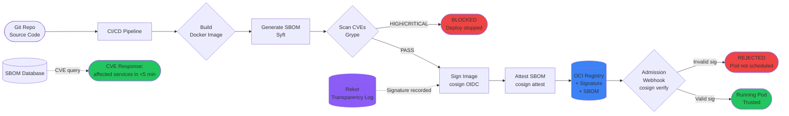

# Supply Chain Security and SBOM

🎯 Interview Weight: critical - post-SolarWinds and Log4Shell,
software supply chain security is a top concern for senior DevSecOps
and platform engineering roles. SBOM is now a US government
requirement for federal software.

---

### 🎯 Model Answer

**30 seconds:**
> Software supply chain security means securing every step between
> source code and running production artifact: the build pipeline,
> the dependencies, the base images, and the artifact registry.
> SBOM (Software Bill of Materials) is a machine-readable inventory
> of every component in a software artifact - like a nutrition label
> for software. When Log4Shell was disclosed, organizations with SBOMs
> found all affected services in minutes. Those without them spent weeks.

**3 minutes (Senior):**
> The SolarWinds attack demonstrated that compromising the build
> pipeline (CI/CD system) is as effective as compromising the source
> code itself. The attackers injected malicious code into the build
> process rather than the repository. This attack vector is why
> supply chain security focuses on the entire path from source to
> production.
>
> The SLSA (Supply-chain Levels for Software Artifacts) framework
> provides a maturity model. SLSA Level 1: build instructions are
> documented. Level 2: builds are hosted on a CI platform with
> tamper-evident logs. Level 3: builds are hermetic and reproducible.
> Level 4: two-party review + hermetic builds. Most organizations
> are at Level 1 or 2; Level 3-4 requires significant tooling investment.
>
> SBOM answers: "what is in my software?" For each dependency - direct
> and transitive - an SBOM lists the package name, version, license,
> and (when available) known vulnerabilities. Formats: SPDX (Linux
> Foundation) and CycloneDX (OWASP). Generated automatically during
> build by Syft, trivy, or maven-cyclonedx-plugin.
>
> The CI/CD integration: SBOM generation is added as a post-build
> step. The generated SBOM is signed with cosign (Sigstore) and
> pushed to the artifact registry alongside the Docker image. When
> a new CVE is disclosed, the SBOM database is queried to find all
> images that contain the vulnerable component.

**Framework:** WHAT → WHY → HOW → TRADE-OFF → EXAMPLE

*Adapting up:* "The staff-level architecture question: how do you
implement a VEX (Vulnerability Exploitability eXchange) document
process? VEX allows software producers to communicate that a
vulnerability in a dependency is not exploitable in their product
(the vulnerable code path is not reachable). This reduces security
alert noise from 1000 CVEs to the 10 that actually matter."

*Adapting down:* "Supply chain security is making sure nobody
tampered with your software between writing it and running it.
SBOM is the list of everything your software contains, so you can
check if anything dangerous was included."

**Blank Mind Recovery:**

**(1) Restate:** "Supply chain security - securing the path from
code to production. SBOM - an inventory of what is in your software."

**(2) First principles:** "Software is made of other software
(dependencies, base images). Each piece could be compromised.
You cannot secure what you cannot see. SBOM makes the full
composition visible. CI/CD pipeline hardening makes the build
process tamper-resistant."

**(3) Bridge:** "Like a restaurant's ingredient traceability system.
When there is a food safety recall (Log4Shell), the restaurant
with full ingredient records (SBOM) knows in 1 hour which dishes
used the recalled ingredient. The restaurant without records must
review every dish from scratch."

---

### 📘 Concept Explanation

**What it is:**
Software supply chain security is the practice of securing all
components of the path from source code to deployed artifact:
source repositories, CI/CD pipelines, dependency registries,
container registries, and deployment infrastructure. SBOM (Software
Bill of Materials) is a machine-readable inventory of all components,
their versions, licenses, and relationships within a software artifact.

**The problem it solves:**
Modern software applications contain 80-90% third-party code (libraries,
frameworks, base images). Attackers increasingly target the supply
chain rather than the application directly - compromising a widely-
used library (like event-stream npm package in 2018) or the build
system (SolarWinds 2020) infects all downstream users. SBOM provides
the visibility to detect and respond to supply chain compromises.

**How it works:**

**Supply chain attack vectors:**

Vector 1: Dependency confusion / typosquatting.
Attacker publishes `lodash-utils` (similar to `lodash`) to npm with
a malicious payload. Developers accidentally install the malicious
package. Defense: dependency pinning (exact version or hash-pinned),
private registry that mirrors public packages with scanning, lock
file integrity checks.

Vector 2: Compromised dependency (direct attack on upstream).
A widely-used open source package is compromised (maintainer account
hacked, malicious contributor, etc.). Defense: vulnerability scanning,
SBOM tracking, private registry with quarantine for new packages.

Vector 3: CI/CD pipeline compromise.
Attacker gains access to the CI system and injects malicious code
during the build, rather than in the source repository. Defense:
hermetic builds, pipeline signing, build provenance attestation.

Vector 4: Base image compromise.
The Docker base image (`FROM ubuntu:22.04`) is replaced with a
compromised version. Defense: pin base images to digest (SHA256),
use distroless or minimal base images, scan for vulnerabilities.

**SBOM Generation and Use:**

Generation (at build time):
```
Build artifact (Docker image, JAR, binary)
  → Syft or trivy SBOM generation
  → SBOM file (SPDX or CycloneDX JSON format)
  → Signed with cosign (Sigstore)
  → Attached to artifact in registry
```

Query (at CVE disclosure time):
```
CVE-2021-44228 (Log4Shell): log4j-core 2.0.0-2.14.1
  → Query SBOM database: which artifacts contain log4j-core?
  → Return: 34 services, 12 base images
  → Prioritize remediation
```

**SLSA (Supply-chain Levels for Software Artifacts):**
- Level 1: documentation only (basic baseline)
- Level 2: tamper-evident provenance from hosted CI
- Level 3: hardened CI with non-falsifiable provenance
- Level 4: two-party review, hermetic/reproducible builds

**The key insight:**
Supply chain security is about trust chains. At each step in the
build pipeline, you must be able to prove that the artifact was
produced from the expected inputs by the expected process, and has
not been modified in transit. Cryptographic signing and provenance
attestation provide this trust chain.

**When to use it:**
SBOM generation and supply chain hardening should be standard
practice for all production software. For regulated industries
(healthcare, finance, federal government) and software sold to
enterprise customers, SBOM is increasingly required by contract
or regulation.

**When NOT to use it:**
Internal tools and throw-away scripts with no external exposure
do not require full SBOM compliance. The overhead is not justified
for non-production software.

**Alternatives:**
- SBOM formats: SPDX (broader ecosystem support), CycloneDX (more
  security-focused, VEX support). Both are valid; choose based on
  toolchain support.
- Signing: cosign (Sigstore, free, OIDC-based), Notary (Docker
  Notary v2, registry-integrated), GPG (traditional, key management overhead)
- Vulnerability scanning: Trivy (fast, multi-format), Grype
  (Anchore, good SBOM integration), Snyk (developer-friendly, SaaS)

**First-principles derivation:**
Trust in software requires trust in every component and every step
of its assembly. Cryptographic signing of artifacts at each stage
creates a verifiable chain: this source was compiled by this CI run
using these exact inputs, and the resulting artifact was not
modified afterward. Breaking any link in the chain is detectable.
This is the foundation of software supply chain security.

---

### 💻 Code Example

**BAD: Build without provenance or scanning**

```yaml
# SECURITY GAPS: No signing, no SBOM, no vulnerability scanning

name: Build and Deploy
on:
  push:
    branches: [main]

jobs:
  deploy:
    runs-on: ubuntu-latest
    steps:
      - uses: actions/checkout@v4

      - name: Build Docker image
        run: |
          # No verification of base image integrity
          # Base image pinned by tag (tag can be mutated by registry)
          docker build -t myregistry/myapp:latest .
          # "latest" tag is mutable - same tag, different content each build

      - name: Push image
        run: docker push myregistry/myapp:latest
        # No signature attached
        # No SBOM generated
        # No CVE scan
        # No provenance: no proof this image was built from this commit

# Results:
# - Cannot prove this image came from this source commit
# - Do not know what CVEs are in the image
# - Cannot respond quickly to a CVE disclosure
# - Supply chain compromise of a dependency is invisible
# - Tag mutation means "latest" is not deterministic
```

> **Code walkthrough:** The three critical gaps compound each other.
> Pinning by mutable tag (`latest`) means the same pipeline run on
> different days might pull a different base image - the build is
> not reproducible. No CVE scanning means vulnerable dependencies
> (Log4j, OpenSSL, etc.) ship to production invisibly. No signature
> means there is no cryptographic proof that the pushed image was
> built from the declared source commit - a MITM or registry
> compromise cannot be detected.

**GOOD: Signed artifact with SBOM, provenance, and CVE gating**

```dockerfile
# Dockerfile - pin base image by SHA digest, not tag
# This ensures the exact same base image every build
FROM eclipse-temurin:21-jre-jammy@sha256:a4c0fe6c5b3f...
# SHA256 digest is immutable - changes only when image is updated
# Update process: automated PR to update the digest after verification
```

```yaml
# Complete supply chain hardened CI pipeline
name: Secure Build and Deploy

on:
  push:
    branches: [main]

permissions:
  id-token: write      # For Sigstore OIDC signing
  contents: read
  packages: write

jobs:
  secure-build:
    runs-on: ubuntu-latest
    outputs:
      image-digest: ${{ steps.build.outputs.digest }}

    steps:
      - uses: actions/checkout@v4

      - name: Set up Docker Buildx
        uses: docker/setup-buildx-action@v3

      - name: Login to registry
        uses: docker/login-action@v3
        with:
          registry: ghcr.io
          username: ${{ github.actor }}
          password: ${{ secrets.GITHUB_TOKEN }}

      - name: Build and push image
        id: build
        uses: docker/build-push-action@v5
        with:
          context: .
          push: true
          tags: |
            ghcr.io/myorg/myapp:${{ github.sha }}
          # Note: no 'latest' tag - always use explicit SHA tag
          # outputs.digest: the SHA256 digest of the pushed image

      - name: Generate SBOM with Syft
        uses: anchore/sbom-action@v0
        with:
          image: ghcr.io/myorg/myapp@${{ steps.build.outputs.digest }}
          format: spdx-json
          output-file: sbom.spdx.json
          # Generates: lists all packages in the image + their versions
          # Covers: OS packages (dpkg), Java jars (via Syft manifest parsing)

      - name: Scan SBOM for vulnerabilities with Grype
        id: scan
        run: |
          grype sbom:sbom.spdx.json \
            --output json \
            --output-file grype-results.json \
            --fail-on high
          # --fail-on high: CI fails if any HIGH or CRITICAL CVE found
          # This gates deployment on vulnerability status

      - name: Sign image with cosign (Sigstore)
        uses: sigstore/cosign-installer@v3

      - name: Attach signature and SBOM to image
        run: |
          # Sign the image digest using OIDC token (no private key needed)
          # Sigstore provides a transparency log (Rekor) for the signature
          cosign sign \
            --yes \
            --identity-token=$(cat $ACTIONS_ID_TOKEN_REQUEST_TOKEN) \
            ghcr.io/myorg/myapp@${{ steps.build.outputs.digest }}

          # Attach SBOM to the image as an attestation
          cosign attest \
            --yes \
            --type spdx \
            --predicate sbom.spdx.json \
            ghcr.io/myorg/myapp@${{ steps.build.outputs.digest }}

          # Attach build provenance (SLSA provenance attestation)
          # Records: which repo, which commit, which CI run produced this image
          cosign attest \
            --yes \
            --type slsaprovenance \
            --predicate provenance.json \
            ghcr.io/myorg/myapp@${{ steps.build.outputs.digest }}

      - name: Verify signature (post-sign verification)
        run: |
          # Verify the signature we just created
          # This validates the entire trust chain
          cosign verify \
            --certificate-identity-regexp=".*/myorg/myrepo/.*" \
            --certificate-oidc-issuer=https://token.actions.githubusercontent.com \
            ghcr.io/myorg/myapp@${{ steps.build.outputs.digest }}
```

```bash
# CVE response workflow: Log4Shell scenario
# When CVE-2021-44228 (Log4Shell) is disclosed:

# Query all SBOMs for log4j-core
# SBOM database populated by CI attestation uploads

grype db update

# Find all images containing log4j-core 2.x
for image in $(list-production-images); do
  cosign download attestation --type spdx ${image} |
    jq -r '.payload' | base64 -d |
    jq '.subject[0].name, .predicate.packages[] |
      select(.name == "log4j-core") |
      "\(.name)@\(.versionInfo)"' \
    2>/dev/null && echo "AFFECTED: ${image}"
done

# Output: list of affected services within minutes
# Without SBOM: weeks of manual review
```

> **Code walkthrough:** Three security layers work together. The
> SHA256 digest pinning in the Dockerfile ensures the exact base
> image byte-for-byte, making the build reproducible. The Grype
> scan with `--fail-on high` is a deployment gate: an image with
> a HIGH or CRITICAL CVE cannot be pushed to the registry at all.
> The cosign signature uses Sigstore's OIDC-based keyless signing -
> no private key to manage or protect. The signature is recorded in
> the Rekor transparency log, providing a public, tamper-evident
> audit trail of every image signing event. The SBOM attestation
> attached to the image enables the rapid CVE response query.

---

### 🎓 Answers by Seniority

**Junior / Mid (0-5 years):**
> "Supply chain security means protecting all the dependencies and
> build steps between writing code and deploying it. I know we should
> scan Docker images for known CVEs before deploying. We use Trivy
> in CI to scan images and fail the build if any CRITICAL vulnerabilities
> are found. SBOM is the list of everything in a software artifact -
> like a manifest of all the packages and versions it uses."

*Push deeper:* "After the Log4Shell incident, I added SBOM generation
to our CI pipeline. Before that, when a CVE came out, we had to
manually check each service's dependencies. With Syft generating
SBOMs for every build, we could query which services contained
log4j-core and prioritize patching within an hour of the disclosure."

---

**Senior / Staff (5+ years):**
> "Supply chain security has three distinct layers that I approach
> separately. First, dependency security: all dependencies pinned
> by hash (not just version), vulnerability scanning on every build,
> automated dependency updates via Renovate with security advisories
> auto-creating urgent PRs.
>
> Second, build pipeline integrity: hermetic builds on hosted CI
> with OIDC authentication, build provenance attestation (SLSA
> Level 2 at minimum), no manual artifact modifications between
> build and deployment.
>
> Third, artifact security: image signing with cosign/Sigstore,
> SBOM generation and attestation, policy enforcement at deployment
> via OPA/Gatekeeper that rejects unsigned or unverified images from
> running in production.
>
> The policy enforcement is the often-missing piece. Generating
> SBOMs and signing images is valuable, but the actual security
> gain comes from enforcing that nothing runs in production unless
> it has a valid signature from the trusted CI pipeline. Kubernetes
> admission webhooks check the cosign signature before allowing any
> image to be scheduled."

*Push deeper:* "The VEX document workflow is where supply chain
security matures. A raw vulnerability scan of a Docker image might
return 500 CVEs. Most are irrelevant: the vulnerable code path is
not reached, the CVE is in a test dependency not included in the
runtime image, or it is a low-severity issue in a non-network-
accessible component. VEX allows you to document that CVE-XYZ is
'not affected' for specific reasons, so the scanning pipeline can
filter it out. This reduces the actionable CVE list from 500 to
5-10, making security response tractable."

---

### ⚖️ Comparison Table

| Tool | Primary Purpose | SBOM Format | Signing | Integration |
|------|----------------|-------------|---------|-------------|
| Syft | SBOM generation | SPDX, CycloneDX | No (pairs with cosign) | CI pipeline |
| Trivy | Scan + SBOM | SPDX, CycloneDX | No | CI, IDE, registry |
| Grype | Vulnerability scan | Input: SBOM | No | CI, standalone |
| cosign (Sigstore) | Artifact signing | N/A | Yes (keyless OIDC) | CI, registry |
| Notary v2 | Artifact signing | N/A | Yes (certificate) | Docker/OCI registries |
| Snyk | Dependency + container scan | Yes | No | IDE, CI, Git |
| Dependency-check (OWASP) | Dependency scan | Yes | No | Maven, Gradle, CI |

**The deciding factor:**
Syft + Grype + cosign is the open-source stack for full SBOM +
signing workflow. Trivy is the all-in-one alternative (scan + SBOM,
simpler setup). Snyk is the commercial choice for developer-friendly
IDE integration. For regulated environments requiring signed SBOMs
and provenance attestation: Syft + cosign is the current standard.

---

### 🏛️ System Design

**Design: A supply chain security system for a 50-service production
platform with SBOM compliance and CVE response SLA of 24 hours
for critical vulnerabilities.**

**Requirements:**
- SBOM generated and signed for every production artifact
- CVE scanning gates deployment (block HIGH/CRITICAL)
- SBOM queryable across all services (response time < 5 min for
  "which services contain package X version Y?")
- Admission control: only signed images from trusted CI run in Kubernetes
- 24-hour SLA for critical CVE remediation (CVSS > 9.0)

**Architecture components:**

CI pipeline:
1. Build Docker image (pinned base image by digest)
2. Generate SBOM with Syft (SPDX format)
3. Scan SBOM with Grype; block on HIGH/CRITICAL
4. Sign image + attach SBOM attestation with cosign (Sigstore OIDC)
5. Push to OCI registry (Harbor or ECR with OCI artifact support)

SBOM database:
- PostgreSQL with `packages` table indexed on (package_name, version, image_digest)
- Populated by a webhook listener that receives OCI registry push events
  and extracts SBOM attestations
- Query: `SELECT image_name FROM packages WHERE package_name='log4j-core'
  AND version LIKE '2.%'` returns affected services in milliseconds

Kubernetes admission control:
- Connaisseur or Kyverno policy: every pod's image must have a valid cosign
  signature from the trusted GitHub Actions OIDC issuer
- Policy enforced at admission: unsigned images are rejected at kubectl apply
- No escape hatch: even kubectl from a developer's laptop is subject to this policy

CVE response automation:
- Grype database updated daily via scheduled job
- Nightly re-scan of all currently-deployed images against current Grype DB
- New HIGH/CRITICAL CVE finding creates a JIRA ticket + Slack alert
  for the owning team
- SLA tracking: if ticket is not resolved within 24 hours, escalation
  to security team and service owner's manager

**Trade-offs:**
- Grype blocking at CI vs. periodic re-scan: CI blocking prevents new
  vulnerabilities from being deployed. Periodic re-scan catches CVEs
  disclosed after deployment (the more common case).
- SBOM database vs. on-demand attestation query: database enables fast
  cross-service queries. On-demand is simpler but slower (cosign verify
  per image = minutes for 50 images).

---

### 📊 Diagram

**Supply Chain Trust Model: Source to Running Container**

```
SOURCE                BUILD               REGISTRY         RUNTIME
  |                     |                    |                |
[Git Repo]           [CI/CD]            [OCI Registry]  [Kubernetes]
  |                     |                    |                |
 Code   ---push--->  Build image             |                |
  |                     |                    |                |
  |                  Generate SBOM            |                |
  |                  (Syft)                   |                |
  |                     |                    |                |
  |                  Scan SBOM               |                |
  |                  (Grype) ---FAIL?--> BLOCK DEPLOY         |
  |                     |                    |                |
  |                  Sign image              |                |
  |                  (cosign OIDC)           |                |
  |                     |                    |                |
  |                  Attest SBOM            |                |
  |                  (cosign attest)         |                |
  |                     |                    |                |
  |                     +----push+sig+sbom-> [Registry]       |
  |                                              |            |
  |                                    Admission webhook      |
  |                                    (cosign verify)        |
  |                                              |            |
  |                                        PASS? YES -> Pod scheduled
  |                                        FAIL? NO  -> Rejected
```



> **Diagram walkthrough:** The supply chain security model implements
> defense in depth with three mandatory gates. Gate 1 is the CVE
> scan at build time - no image with HIGH or CRITICAL CVEs can
> proceed to the registry. Gate 2 is the cosign signing - the image
> is cryptographically signed with an OIDC-derived key that proves
> it was built by the trusted CI pipeline, not manually pushed.
> Gate 3 is the Kubernetes admission webhook - every pod deployment
> is validated against the cosign signature before the pod is
> scheduled. An attacker who compromises a developer's laptop cannot
> push a malicious image to production because the admission webhook
> will reject it (no valid signature from CI). The Rekor transparency
> log provides a tamper-evident public record of every signing event.

---

### ⚠️ Common Misconceptions

**Misconception 1: "Dependency version pinning is sufficient for
supply chain security."**
Pinning to a version number (`log4j-core:2.14.1`) does not pin to
a specific artifact. If the package registry is compromised and
the `2.14.1` artifact is replaced, pinning the version number does
not detect it. Hash pinning pins to the exact artifact content:
`log4j-core:2.14.1@sha256:abc123...`. Any modification of the
artifact changes its SHA256 and the build fails.

**Misconception 2: "SBOM is only needed for compliance."**
Organizations that treated SBOM as purely a compliance checkbox
discovered their real value during Log4Shell. Teams with automated
SBOM querying identified all affected services in under an hour.
Teams without it spent 1-2 weeks manually checking each service's
dependency tree. SBOM is an operational incident response tool.

**Misconception 3: "Scanning at build time is sufficient; no need
to re-scan deployed images."**
CVEs are disclosed continuously after deployment. An image that
passed a clean scan today may have an unpatched CVE disclosed next
week. Production images must be re-scanned regularly (daily or
weekly) against the current vulnerability database. The nightly
re-scan + alerting pattern is the standard.

---

### 🚨 Failure Modes and Diagnosis

**Failure Mode 1: CVE scanner false positive blocks legitimate deployment**
Symptom: CI pipeline fails at the CVE scan stage for a CVE that
is not exploitable in the application. The development team is
blocked from deploying a critical fix.
Cause: the vulnerability scanner identified a CVE in a library
that is included in the image but whose vulnerable code path is
not reachable in the application. Or the CVE is in a test
dependency not present in the runtime image.
Fix: use VEX (Vulnerability Exploitability eXchange) documents to
mark specific CVEs as "not affected" with justification. Trivy
and Grype both support VEX. The VEX document is committed to the
repository and the scanner filters out VEX-documented CVEs.
Process: the security team reviews and approves VEX documents.
A VEX document is not a suppression workaround - it requires formal
justification for why the CVE is not exploitable.

**Failure Mode 2: Admission webhook blocks all deployments due to
policy misconfiguration**
Symptom: after enabling cosign admission webhook, all kubectl apply
commands fail with "image signature verification failed" even for
correctly signed images.
Cause: the admission webhook certificate identity regexp is too
restrictive (not matching the OIDC issuer used in CI), or the
webhook is in `deny` mode by default (all unverified images blocked)
rather than enforcing only on specific namespaces.
Fix: deploy the admission webhook in `audit` mode first (logs
violations without blocking). Verify that all production images
have valid signatures. Then switch to `enforce` mode for production
namespaces only. Use `dryRun: true` in the initial webhook
configuration to validate policy before enforcement.

**Failure Mode 3: SBOM becomes stale (images rescanned but SBOM
not updated)**
Symptom: SBOM database shows image myapp:v1.2.0 as containing
log4j-core 2.14.0, but the patched image myapp:v1.2.1 was deployed
3 weeks ago. The SBOM database was not updated when the new
image was deployed.
Cause: SBOM is generated at build time and stored correctly, but
the database query layer does not use image digests - it queries
by image tag. Tag `production` is now pointing to v1.2.1, but the
SBOM database has no entry for v1.2.1.
Fix: always query SBOMs by image digest (SHA256), not by tag. Tags
are mutable references. Digests are content addresses. The SBOM
database should be keyed by image digest.

---

### 🎯 Interview Deep-Dive

| Format | Time | Focus |
|--------|------|-------|
| Screener | 3 min | What SBOM is + Log4Shell impact |
| Panel | 10 min | SLSA levels + signing + CVE response workflow |
| Senior | 15 min | System design + admission control + VEX + compliance |

---

**Q1 (Definition): What is SBOM and why did the US government mandate
it for federal software in 2021?**

SBOM stands for Software Bill of Materials. It is a machine-readable
inventory of every component included in a software artifact: direct
and transitive dependencies, their versions, licenses, and
relationships. Named by analogy to a manufacturing bill of materials
that lists every component in a physical product.

The US government's mandate originated in Executive Order 14028
(May 2021), "Improving the Nation's Cybersecurity," issued in direct
response to the SolarWinds supply chain attack. The EO requires federal
agencies to obtain SBOMs from any commercial software vendor whose
products are used in federal systems.

The rationale has three parts:

Incident response: when a critical vulnerability is disclosed (Log4Shell,
Heartbleed, Shellshock), the immediate question is "which of our systems
are affected?" Without SBOM, this requires manual examination of every
system's dependencies - a process that takes weeks for large organizations.
With SBOM, the query is automated: "find all SBOMs containing log4j-core
version 2.0 through 2.14.1" returns results in seconds.

Transparency: software vendors often have no visibility into the full
dependency tree of their products. Requiring SBOMs forces vendors
to understand their own composition. Hidden dependencies (transitive
libraries 5 levels deep) become visible.

Liability and accountability: when a breach occurs due to a known
unpatched vulnerability in a dependency, the SBOM provides evidence
of whether the vendor knew about the component and whether the
vulnerability was disclosed before the breach.

SBOM formats: SPDX (maintained by the Linux Foundation, ISO standard)
and CycloneDX (OWASP, security-focused, supports VEX). NTIA (National
Telecommunications and Information Administration) defines the minimum
required elements: supplier name, component name, version, unique
identifiers, dependency relationships, SBOM author, and timestamp.

*What separates good from great:* Understanding that SBOM is not
a new concept - it has existed in manufacturing for decades. The
software industry's resistance to SBOM (it's complex, tooling isn't
mature) was the reason the US government mandated it: without external
pressure, the industry would not have adopted it broadly. The mandate
accelerated tooling development (Syft, CycloneDX Maven plugin, trivy SBOM)
significantly in 2021-2022.

---

**Q2 (Mechanism): What is SLSA and how does it provide a maturity
model for build security?**

SLSA (Supply-chain Levels for Software Artifacts, pronounced "salsa")
is a security framework developed by Google and adopted by the
OpenSSF (Open Source Security Foundation). It defines four levels
of build provenance and pipeline integrity.

SLSA Level 1 (Documentation): the build process is scripted/
automated rather than manual. A CI/CD pipeline of any kind satisfies
this. Provenance documents exist but are not cryptographically
verifiable. Most organizations with CI/CD are at Level 1.

SLSA Level 2 (Tamper-evident): provenance is generated by the CI
platform (not the developer) and signed to make it tamper-evident.
The signature uses the CI platform's identity (GitHub Actions OIDC).
Verification: the artifact came from a specific repository and
workflow. Achievable with GitHub Actions + cosign today. Most
security-conscious organizations should be at Level 2.

SLSA Level 3 (Hardened): builds are isolated and non-falsifiable.
The build environment cannot be influenced by the project being
built (hermetic). Source code is retrieved from Git by the build
system directly (not by a developer's local checkout). The CI
platform itself cannot be compromised to inject code without
detection. Requires ephemeral, isolated build environments that
do not persist between jobs.

SLSA Level 4 (Two-party review + hermetic): all source changes
require review from two trusted parties before being incorporated.
Builds are hermetic, reproducible, and two-party reviewed. Current
Level 4 tools are still maturing.

Practical implementation in GitHub Actions (SLSA Level 2):
```yaml
- name: Generate SLSA provenance
  uses: slsa-framework/slsa-github-generator/.github/workflows/
        generator_container_slsa3.yml@v1.9.0
  # Generates a signed SLSA provenance attestation for the container
  # Records: repo, commit SHA, workflow ref, builder identity
  # Signed with Sigstore OIDC (keyless)
```

Verification at deployment:
```bash
# Verify that the image was built by the expected CI workflow
# from the expected repository
slsa-verifier verify-image \
  ghcr.io/myorg/myapp@sha256:abc123 \
  --source-uri github.com/myorg/myrepo \
  --source-tag v1.2.0
```

*What separates good from great:* Understanding the practical SLSA
level achievable with current tooling. Level 1 is trivial (any CI).
Level 2 is achievable today with GitHub Actions + SLSA generator
action. Level 3 requires hermetic builds (complex tooling like Bazel).
Level 4 is mostly theoretical for most organizations. Setting "Level 2
as the minimum for all production services" is a practical and
achievable standard.

---

**Q3 (Mechanism): How does keyless signing with Sigstore/cosign work,
and what trust model does it rely on?**

Traditional code signing requires a PKI (Public Key Infrastructure):
you generate a private key, protect it (hardware security module, key
management service), and sign artifacts with it. If the key is
compromised, all previous and future signatures are suspect.

Sigstore/cosign keyless signing eliminates long-lived signing keys
using OIDC tokens and a transparency log.

The keyless signing process:

1. During a GitHub Actions run, the pipeline requests a short-lived
   OIDC token from GitHub's OIDC endpoint. The token contains claims:
   `repository`, `workflow_ref`, `sha`, `runner_environment`.

2. cosign sends this OIDC token to Sigstore's Fulcio certificate
   authority. Fulcio verifies the OIDC token signature against
   GitHub's JWKS endpoint and issues a short-lived X.509 certificate
   (valid for 10 minutes) with the OIDC claims embedded.

3. cosign uses this ephemeral certificate to sign the artifact's
   digest. The signature is also recorded in Rekor, Sigstore's
   public transparency log (similar to Certificate Transparency for
   TLS certificates).

4. The short-lived certificate expires. But the signature remains
   in Rekor permanently.

Verification:

When verifying a signature, cosign:
1. Fetches the signature from the OCI registry (or Rekor)
2. Fetches the signing certificate from Rekor
3. Verifies the certificate was issued by Fulcio (trusted CA)
4. Verifies the OIDC claims in the certificate match the expected
   values (repository URL, workflow path)
5. Verifies the artifact digest was signed by the certificate's key

The trust model: trust in the signature = trust in GitHub's OIDC
endpoint (that the token was legitimately issued to that CI run).
There is no long-lived private key to protect. The security
boundary is GitHub's authentication infrastructure.

```bash
# Verify the identity that signed an image
cosign verify \
  --certificate-identity-regexp="https://github.com/myorg/myrepo/.*" \
  --certificate-oidc-issuer="https://token.actions.githubusercontent.com" \
  ghcr.io/myorg/myapp@sha256:abc123
# Checks: this image was signed by a CI run from github.com/myorg/myrepo
# Any image signed by a different GitHub org or workflow is rejected
```

*What separates good from great:* Understanding the Rekor transparency
log's security guarantee. Rekor is append-only and Merkle-tree-based
(same structure as certificate transparency logs). Any tampering
with historical entries is cryptographically detectable. The
transparency log provides a public, auditable record of every signing
event. This property means that if an attacker compromises the CI
pipeline and signs a malicious artifact, the signing event is
recorded in Rekor and the timestamp is provable.

---

**Q4 (Scenario): Log4Shell (CVE-2021-44228) is disclosed. How do
you respond using your SBOM infrastructure?**

This is the canonical SBOM value demonstration. The response with
SBOM infrastructure is systematically different from the response
without it.

Hour 1 - Discovery.
Security team is alerted via security advisory feed. CVE-2021-44228
affects log4j-core versions 2.0-beta9 through 2.14.1. Any application
that uses this version and processes external input is potentially
exploitable for remote code execution.

Hour 1 - Impact assessment (with SBOM).
Query the SBOM database for all currently-deployed images:
```bash
# Query PostgreSQL SBOM database
psql -h sbom-db.internal << 'EOF'
SELECT
  i.image_name,
  i.image_tag,
  i.deployed_at,
  i.team,
  p.version
FROM deployed_images i
JOIN sbom_packages p ON i.image_digest = p.image_digest
WHERE p.package_name = 'log4j-core'
  AND p.version ~ '^2\.(0|1|2|3|4|5|6|7|8|9|10|11|12|13|14)\.'
ORDER BY i.deployed_at DESC;
EOF

# Output in < 60 seconds:
# payment-service   v1.4.2  2024-01-10  payments-team  2.14.0
# order-service     v2.1.0  2024-01-08  orders-team    2.13.1
# notification-svc  v1.2.0  2024-01-05  platform-team  2.14.1
# (48 other services NOT affected)
```

Hour 2 - Triage and emergency response.
Three affected services identified. Create P0 security incidents
for each. Notify owning teams. Apply WAF rules to block `${jndi:`
patterns while patches are prepared. Consider temporary service
disabling if the risk is acute and the service handles external input.

Hours 3-8 - Patch and verify.
Each team updates log4j-core to 2.15.0 in their dependency. CI runs.
New images built, SBOM regenerated, CVE scan shows no more
CVE-2021-44228. Images pushed with new signatures. Deployed.

Within 24 hours: all three affected services patched.

Without SBOM: the same response would require manually checking
every service's pom.xml or build.gradle across 51 services. At 30
minutes per service: 25+ hours before completing the impact assessment.
By then, some services would have been exploited.

*What separates good from great:* Noting that the SBOM database must
reflect currently deployed images, not just images that have ever
been built. The CI pipeline generates SBOMs at build time; a separate
pipeline step must update the SBOM database when images are deployed
to production. The database is only useful if it is current.

---

**Q5 (Deep Dive): What is Vulnerability Exploitability eXchange (VEX)
and how does it reduce alert fatigue in supply chain security?**

VEX is a data format for communicating whether a specific vulnerability
in a product is actually exploitable. It is the mechanism for software
producers to tell consumers: "yes, log4j-core is in our product, but
the vulnerable JNDI lookup code path is disabled by our configuration,
so CVE-2021-44228 is not exploitable in our product."

The alert fatigue problem: a typical production Docker image contains
hundreds of OS packages and library dependencies. A raw CVE scan
might return 500 findings. The security team must triage each one:
Is this in the runtime image or only in a build-time dependency?
Is the vulnerable code path reachable? Is the severity applicable
to our deployment environment? Manually triaging 500 CVEs per service
is not scalable.

VEX document structure:
```json
{
  "@context": "https://openvex.dev/ns/v0.2.0",
  "@id": "https://mycompany.com/vex/20240115-001",
  "author": "security@mycompany.com",
  "timestamp": "2024-01-15T10:00:00Z",
  "statements": [{
    "vulnerability": {
      "name": "CVE-2021-44228",
      "description": "Log4Shell - JNDI injection in log4j-core"
    },
    "products": [{
      "id": "pkg:docker/mycompany/payment-service@v1.4.2"
    }],
    "status": "not_affected",
    "justification": "vulnerable_code_cannot_be_controlled_by_adversary",
    "impact_statement": "log4j-core is included as a transitive dependency
      of library X. The JNDI lookup feature is disabled via
      log4j2.formatMsgNoLookups=true and the log4j2.component.properties
      file. External input does not reach the logging layer. Verified by
      code review and security team analysis."
  }]
}
```

VEX status values:
- `not_affected`: vulnerability is present but not exploitable
- `affected`: vulnerability is exploitable; remediation is required
- `fixed`: vulnerability was present but has been remediated
- `under_investigation`: actively determining impact

Integration with tooling: Trivy and Grype both accept VEX documents
as input. When a VEX document marks a CVE as `not_affected`,
the scanner filters it from the results, removing it from the
blocking gate in CI.

Governance: VEX documents must be reviewed by the security team
before approval. An unchecked VEX policy where any engineer can mark
CVEs as `not_affected` is a security vulnerability. The VEX approval
process should include security team review and documentation of
the analysis.

*What separates good from great:* Understanding the difference between
VEX and CVE suppression. VEX has a structured justification requirement -
you must document WHY the vulnerability is not exploitable. This
creates an audit trail. Simple CVE suppression (a blacklist of CVE
IDs to ignore) has no justification and creates security debt. VEX
is justified suppression with formal documentation.

---

**Q6 (Trade-off): What are the trade-offs between SPDX and CycloneDX
SBOM formats?**

Both SPDX and CycloneDX are SBOM formats endorsed by the NTIA and
accepted for US government compliance. They have different origins
and strengths.

SPDX (Software Package Data Exchange):
- Origin: Linux Foundation, originally designed for license compliance
- ISO standard: ISO/IEC 5962:2021
- Strengths: mature ecosystem, broad tooling support, formal ISO
  standard with legal weight, comprehensive license expression language
- Weaknesses: security-specific features (VEX) are less mature,
  more complex schema for simple use cases
- Formats: Tag-Value, JSON, RDF, YAML, XLSX
- Best for: license compliance, open source distribution, government compliance
- Example tools: SPDX Maven Plugin, syft (SPDX output), FOSSology

CycloneDX:
- Origin: OWASP (Open Web Application Security Project), designed
  for security use cases
- Standard: OWASP CycloneDX, not ISO but widely accepted
- Strengths: security-focused (VEX support, vulnerability listing,
  service dependencies, formulation/provenance), simpler schema,
  more compact
- Weaknesses: less established as a legal/compliance standard
  compared to SPDX ISO standard, VEX support still maturing across tools
- Formats: JSON, XML
- Best for: security workflows, vulnerability management, CI/CD
  pipeline integration, DevSecOps
- Example tools: CycloneDX Maven Plugin, CycloneDX NPM, trivy, syft

Decision framework:
- Government contract compliance requiring SBOM: SPDX (ISO standard,
  formal legal status)
- Security-focused DevSecOps pipeline: CycloneDX (VEX support, cleaner
  JSON schema, better tool integration for Trivy/Grype)
- Both contexts: generate both (Syft can output both formats simultaneously)

*What separates good from great:* Recognizing that the choice of
format is secondary to actually generating and using SBOMs. Organizations
that spend months debating SPDX vs. CycloneDX without generating any
SBOMs are missing the point. Start with either format (CycloneDX
is slightly simpler to get started with), and migrate if compliance
requirements mandate a specific format.

---

**Q7 (Debugging): How do you diagnose and respond when the SBOM
database shows a production service has a CRITICAL CVE but the CI
scan did not catch it?**

A CRITICAL CVE in production that was not caught by CI indicates
one of three scenarios: CI was not scanning when the vulnerable
version was deployed, the CVE was disclosed after deployment (most
common), or the CI scan configuration has a gap.

Diagnosis:

Step 1: Determine when the vulnerability was deployed.
```bash
# Query SBOM database for the affected package version history
SELECT deployed_at, image_tag
FROM deployed_images
JOIN sbom_packages USING (image_digest)
WHERE package_name = 'affected-library'
  AND version = 'vulnerable-version'
ORDER BY deployed_at;
# Output: image with this version was first deployed 3 months ago
```

Step 2: Check if CVE was known at deployment time.
```bash
# Check NVD (National Vulnerability Database) for CVE publish date
curl "https://services.nvd.nist.gov/rest/json/cves/2.0?cveId=CVE-2024-XXXX" |
  jq '.vulnerabilities[0].cve.published'
# Output: 2024-01-10 (2 months after deployment)
# Conclusion: CVE was published 2 months after the vulnerable version
#             was deployed. CI scan at deploy time would not have caught it.
```

Step 3: Verify the nightly re-scan is functional.
```bash
# Check re-scan job logs for the past 7 days
kubectl logs -n security jobs/nightly-rescan-$(date +%Y%m%d) | tail -50
# If no logs: re-scan job is failing silently
# Verify: the re-scan should have flagged this after CVE publish date
```

Step 4: Remediation.
Prioritize by CVSS score and exposure:
- CVSS 9.0+: treat as P0, remediate within 24 hours
- CVSS 7.0-8.9: remediate within 7 days
- CVSS < 7.0: remediate in next sprint

The re-scan gap is the most common root cause: CI scans at build
time, but CVEs disclosed after deployment require a re-scan mechanism.
The nightly re-scan against a current CVE database is the production
control for this scenario.

*What separates good from great:* Understanding that build-time
scanning and periodic re-scanning are complementary controls with
different purposes. Build-time scanning prevents deploying known-
vulnerable images. Re-scanning catches vulnerabilities disclosed
after deployment. Both are required; neither alone is sufficient.

---

**Q8 (Deep Dive): How do Kubernetes admission webhooks enforce
supply chain security at runtime?**

Kubernetes admission webhooks are API hooks that intercept every
`kubectl apply` and validate or modify resource definitions before
they are persisted in etcd. Supply chain security policies are
implemented as admission webhooks that reject pod specifications
containing unsigned or unverified images.

How it works:

1. Developer or CI pipeline runs `kubectl apply -f deployment.yaml`
2. API server processes the request, creates the object in memory
3. **Admission webhook is called**: the webhook receives the pod spec,
   including the container images
4. The webhook validates each image:
   - Is the image digest (not tag) specified?
   - Does the image have a valid cosign signature?
   - Does the signature come from the trusted GitHub Actions OIDC issuer?
   - Are there any HIGH/CRITICAL CVEs in the image's SBOM?
5. If any check fails: the webhook returns a `Deny` response with
   the specific failure reason. `kubectl apply` fails.
6. If all checks pass: the webhook returns an `Allow` response.
   The pod is scheduled.

Tools for implementing this:

Connaisseur: purpose-built cosign admission webhook.
```yaml
# connaisseur config.yaml
validators:
  - name: cosign-validator
    type: cosign
    trust_roots:
      - name: github-actions
        key: |
          # Public key of the GitHub Actions OIDC issuer
          # OR: keyless mode using certificate identity
    policy:
      - pattern: "ghcr.io/myorg/*"
        validator: cosign-validator
        with:
          cert_oidc_issuer: https://token.actions.githubusercontent.com
          cert_identity: https://github.com/myorg/*/.*
```

Kyverno policy (alternative):
```yaml
apiVersion: kyverno.io/v1
kind: ClusterPolicy
metadata:
  name: require-signed-images
spec:
  validationFailureAction: enforce  # Deny on failure
  rules:
    - name: check-image-signature
      match:
        resources:
          kinds: [Pod]
          namespaces: [production, staging]
      verifyImages:
        - imageReferences: ["ghcr.io/myorg/*"]
          attestors:
            - count: 1
              entries:
                - keyless:
                    issuer: https://token.actions.githubusercontent.com
                    subject: "https://github.com/myorg/*/.*"
                    rekorURL: https://rekor.sigstore.dev
```

The runtime guarantee: no unsigned or improperly signed image can
run in the `production` or `staging` namespace. Even if a developer
has cluster admin credentials, they cannot bypass the admission
webhook (it runs server-side, not client-side). The only way to
run an image in production is to push it through the CI pipeline,
where it gets signed.

*What separates good from great:* Understanding the "break-glass"
procedure. For production incidents where signed images are not
available (urgent patch needed, signing infrastructure down), there
must be a formal break-glass process: two security team approvals,
audit log entry, automatic re-validation within 2 hours. Without a
documented break-glass process, teams will disable the webhook
informally, creating a permanent security gap.

---

**Q9 (Scenario): Your organization is acquiring a company. How do
you assess the acquired company's software supply chain security
posture?**

Software supply chain security assessment for M&A due diligence
is a structured evaluation process.

Pre-acquisition assessment questions:

Dependency management:
- Do they use a dependency lock file (package-lock.json, Gemfile.lock)?
- Are dependencies pinned by hash or by version range?
- What is their process for updating dependencies when CVEs are disclosed?
- Do they have automated dependency updates (Renovate, Dependabot)?

Build pipeline integrity:
- Where does their CI run (GitHub Actions, Jenkins, self-hosted)?
- Can anyone with repository access modify the CI pipeline?
- Are CI pipeline changes subject to code review (protected YAML files)?
- What are the CI pipeline's permissions (does it have production cluster access)?

Artifact security:
- Are container images signed?
- Do they generate SBOMs?
- What CVE scanning is in place and what is the remediation SLA?
- Are images pinned by digest in their Kubernetes deployments?

Access control:
- Who has production deployment access?
- Are production credentials stored in CI secrets or a secrets manager?
- Is OIDC used for cloud authentication?

The response to "no, we don't have any of these":
Document the gap. Estimate the risk: what is the probability of a
supply chain attack and what is the blast radius? Develop a
remediation roadmap with timelines. This is a post-acquisition
integration task, not necessarily a deal-breaker, but it should
be priced into the acquisition risk assessment.

*What separates good from great:* Understanding that supply chain
security maturity is not binary. A company that has CVE scanning
but no SBOM is significantly better than a company with no scanning
at all. The assessment should produce a risk score and a remediation
roadmap, not just a pass/fail verdict.

---

**Q10 (Architecture): What is artifact promotion and how does it
relate to supply chain security?**

Artifact promotion is the practice of using the same container image
artifact across all deployment environments (development, staging,
production), rather than building a new image for each environment.

Security significance: building a new image per environment creates
a trust chain problem. If dev builds image A, staging builds image B,
and production builds image C, even from the same source commit, the
three images may differ (different dependency downloads, different
tool versions, different build times). You cannot sign "the production
image" based on source code review because you have not reviewed what
is actually in the production image.

Artifact promotion: the CI pipeline builds exactly one image from
the source commit. That image is validated (CVE scan, unit tests),
signed, and promoted through environments. Each environment deploys
the exact same image with the exact same digest. The signature on
the production image covers the same artifact that passed all the
validation in CI.

```
Source Commit SHA-abc123
  → Build: image@sha256:def456 (ONE build, ONE image)
  → Sign: image@sha256:def456 with cosign
  → Deploy to dev: same image@sha256:def456
  → Smoke tests pass in dev
  → Promote to staging: same image@sha256:def456 (no rebuild)
  → Integration tests pass in staging
  → Promote to production: same image@sha256:def456 (no rebuild)
  → The signed image running in production is the same artifact
    validated in CI and tested in dev and staging
```

Registry structure for promotion:
```
registry.company.com/
  builds/myapp:sha-abc123   <- CI-built, signed
  dev/myapp:sha-abc123      <- promoted to dev, same digest
  staging/myapp:sha-abc123  <- promoted to staging, same digest
  production/myapp:sha-abc123 <- promoted to production, same digest
```

The promotion act (copying the image from one registry path to another)
does not change the image's SHA256 digest. The signature remains valid
because cosign signs the digest, not the registry path.

*What separates good from great:* The insight that artifact promotion
is both a supply chain security practice AND a deployment reliability
practice. The same image tested in staging is the image that runs in
production - there are no surprises from "the build was different this
time."

---

**Q11 (Performance): How do you prevent supply chain security controls
from becoming a developer productivity bottleneck?**

Supply chain security controls that add 10 minutes to every CI run
will eventually be bypassed or removed by engineering teams under
deadline pressure. Performance must be a design constraint for
security tooling.

The performance targets:
- SBOM generation: < 30 seconds (Syft on a 300MB image: ~15 seconds)
- CVE scan: < 60 seconds (Trivy/Grype on SBOM: ~30 seconds)
- Image signing: < 10 seconds (cosign with OIDC: ~5 seconds)
- Admission webhook response: < 500ms (critical path in deployment)
Total security overhead: < 2 minutes per build

Optimizations:

Run scans in parallel with tests (not after). SBOM generation and
CVE scanning do not depend on test results. Run them in parallel
with the test stage:
```yaml
jobs:
  test:
    ...  # Unit tests and integration tests
  security:
    ...  # SBOM + CVE scan in parallel with test
  deploy:
    needs: [test, security]  # Deploy only if both pass
```

Scan SBOM, not the full image. Scanning an SBOM (text file) is
10x faster than scanning a Docker image (requires unpacking all
layers). Generate the SBOM first, then scan the SBOM.

Cache the CVE database. Grype and Trivy can cache their vulnerability
databases. The daily database update takes 20-30 seconds. Subsequent
runs use the cached database. Store the database cache in GitHub
Actions cache.

Shift-left to IDE. Security tools that run in the IDE (Snyk IDE
plugin) catch CVEs before they reach CI, reducing CI scan failures.

*What separates good from great:* Framing supply chain security
as an investment in developer velocity, not a tax on it. When a
CVE scan catches a Log4Shell-equivalent before deployment, it
saves the entire team from a week of incident response. The 90
seconds per build is a small premium for this insurance.

---

**Q12 (Compliance): How do you prepare for SOC 2 Type II audit
related to supply chain security?**

SOC 2 Type II audits evaluate security controls over a 6-12 month
period. Supply chain security controls relevant to SOC 2 fall under
CC6 (Logical and Physical Access Controls) and CC7 (System Operations).

Controls that auditors look for:

Change management (CC6.4, CC6.5):
- All source code changes require code review (branch protection with
  required reviewers)
- CI/CD pipeline changes require the same review as application code
- Production deployments are triggered only by the CI pipeline (no
  manual kubectl apply to production)
- Evidence: PR history, branch protection settings, CI pipeline logs

Artifact integrity (CC7.2):
- Container images are signed before deployment (cosign/Notary)
- Admission control rejects unsigned images
- SBOM is generated and retained for all production artifacts
- Evidence: cosign signatures in registry, SBOM attestations, Kubernetes
  admission webhook configuration

Vulnerability management (CC7.1):
- CVE scanning is performed on all production artifacts
- SLA for remediation of critical vulnerabilities (24-48 hours)
- Nightly re-scan of deployed images
- Evidence: CI scan results (pass/fail history), JIRA tickets for CVE
  remediation, nightly scan reports

Monitoring and detection (CC7.3):
- Audit logs for all artifact access (registry pull, cosign verify events)
- Alerting for anomalous build patterns (unexpected OIDC identity accessing
  the CI role)
- Evidence: CloudTrail logs, registry audit logs, SIEM alerts

Audit preparation:
- Document all controls with implementation evidence
- Run a pre-audit assessment using SOC 2 criteria as a checklist
- Ensure all evidence is retained for the audit period (6-12 months)
- Assign a control owner for each security control

*What separates good from great:* Understanding that SOC 2 auditors
test operating effectiveness (controls worked for the full 12 months)
not just design effectiveness (controls exist). A pipeline with cosign
signing that was disabled for 3 months due to a technical issue
will fail the SOC 2 test. Continuous monitoring of control effectiveness
(e.g., alert if any unsigned image is deployed to production) is
required for sustained compliance.
