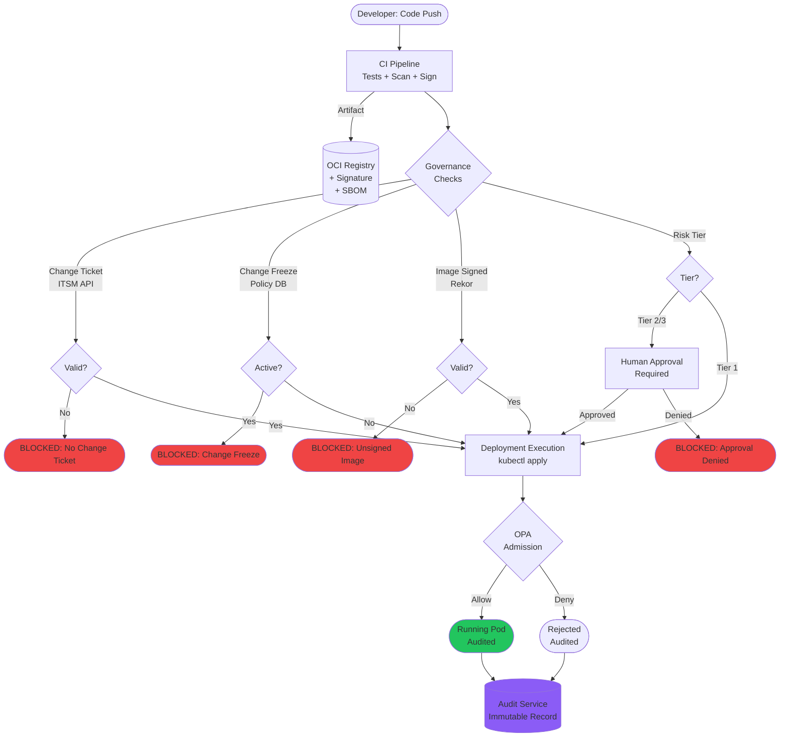

# CI/CD at Enterprise Scale and Governance

🎯 Interview Weight: principal/architect level - operating CI/CD
at 1,000+ engineers with multiple teams, compliance requirements,
and multi-region deployment. This is the highest-leverage question
for staff/principal roles.

---

### 🎯 Model Answer

**30 seconds:**
> Enterprise CI/CD has three problems that do not exist at startup
> scale: governance (who can deploy what to which environment and
> with what approvals), coordination (multiple teams deploying
> interdependent services simultaneously), and compliance (SOC 2,
> HIPAA, PCI require audit trails, access controls, and change
> management). The architecture shift is from "a pipeline" to
> "a deployment platform with policy enforcement."

**3 minutes (Senior):**
> At 1,000 engineers, CI/CD is infrastructure with an SLO. The
> platform cannot go down without impacting hundreds of concurrent
> deployments. The deployment system processes hundreds of builds
> per hour and must be resilient to CI infrastructure failures.
>
> Governance at scale requires policy as code. Instead of manual
> approval processes (which do not scale), you use Open Policy Agent
> (OPA) or Kyverno policies to enforce: "production deployments
> require a signed artifact from the trusted CI pipeline," "deployments
> to regulated environments require a change ticket," "no deployment
> to production on Friday after 4 PM local time." These policies
> are code, version-controlled, tested, and applied automatically.
>
> Coordination at scale requires release trains and coordination
> protocols. When services A, B, C have a coupled release (shared
> API changes), a release coordinator role manages the deployment
> sequence. Service mesh traffic management (Istio) enables gradual
> rollout across the dependency graph.
>
> Compliance at scale requires immutable audit trails. Every
> deployment creates a signed record: who deployed, what was deployed,
> when, and what tests passed. This record is stored in an
> append-only audit log (think AWS CloudTrail for deployments).
> Auditors can query: "show me every production deployment in
> Q3 and the approval record for each."

**Framework:** GOVERNANCE → COORDINATION → COMPLIANCE → SCALE

*Adapting up:* "The board-level question: what is our deployment
risk posture? 1,000 engineers × 5 deploys/day = 5,000 deployments/day.
Each deployment is a potential failure point. The enterprise CI/CD
architecture is the risk management system for all 5,000. The
change failure rate is a board-level KPI."

*Adapting down:* "Enterprise CI/CD is making deployments safe and
auditable for large organizations. You need to know who changed
what when (audit), you need to make sure dangerous changes require
extra approval (governance), and you need to handle many teams
deploying simultaneously (coordination)."

**Blank Mind Recovery:**

**(1) Restate:** "Enterprise CI/CD - deployment systems for 1,000+
engineers with governance, compliance, and coordination requirements."

**(2) First principles:** "At scale, accidental misconfiguration
or unauthorized deployment causes the same damage as a deliberate
attack. Policy enforcement, audit trails, and access controls are
the safety mechanisms."

**(3) Bridge:** "Like air traffic control. Each plane (deployment)
is independently safe. But 1,000 planes need coordination, conflict
detection, standardized communication protocols, and a full audit
trail. ATC is the coordination layer. Enterprise CI/CD is the ATC
for 1,000 deployments/day."

---

### 📘 Concept Explanation

**What it is:**
Enterprise CI/CD at scale is the practice of designing, operating,
and governing software delivery pipelines for organizations with
hundreds to thousands of engineers, multiple teams and lines of
business, compliance requirements, and multi-region deployments.
It extends CI/CD fundamentals with policy enforcement, compliance
automation, and organizational coordination mechanisms.

**The problem it solves:**
Three problems emerge at enterprise scale that do not exist at
startup scale:

Problem 1 - Governance vacuum: who is allowed to deploy to
production? Who approves high-risk changes? How are change freezes
enforced? Without governance automation, organizations create
heavyweight manual processes (CAB - Change Advisory Boards) that
become bottlenecks. Policy as code automates governance without
slowing deployments.

Problem 2 - Coordination chaos: when 1,000 engineers deploy
simultaneously, interdependencies create coordination failures.
Service A's deployment breaks service B, which breaks service C.
Without coordination mechanisms (deployment locks, release trains,
dependency graphs), incidents cascade.

Problem 3 - Compliance debt: SOC 2, PCI-DSS, HIPAA, and FedRAMP
require audit trails, access controls, separation of duties, and
change management records. Without automation, compliance is a
manual, expensive, quarterly exercise. With CI/CD integrated
compliance automation, every deployment creates the compliance
evidence automatically.

**How it works:**

**Governance Mechanisms:**

Policy as Code (OPA / Kyverno):
Deployment policies are enforced at the Kubernetes admission layer,
not in a manual approval process. Examples:
- "Only images signed by the trusted CI pipeline can run in production"
- "Production deployments require an associated JIRA change ticket"
- "No deployment to production during change freeze windows"
- "Database migration deployments require DBA approval annotation"

Change Management Integration:
For regulated environments, deployments are linked to ITSM change tickets:
```yaml
# Deployment annotation triggers ITSM check
annotations:
  itil.myorg.com/change-request: CHG0012345
  itil.myorg.com/approver: security@myorg.com
```
The admission webhook validates the change ticket exists, is in
"Approved" state, and has the required approvals before allowing
the deployment.

Separation of Duties:
The engineer who writes code cannot also deploy to production without
a second approval. This is enforced in the CI/CD pipeline: a
different team reviews deployments to production. GitHub Environments
with required reviewers from a specific team enforces this at the
platform level.

**Coordination Mechanisms:**

Release Trains:
For services with tight interdependencies, release trains coordinate
deployment. All changes for a sprint are tested together, then
deployed together in a specific sequence during a predefined window.
This trades deployment frequency (less frequent, batched) for
coordination safety.

Deployment Locks:
A lock service prevents concurrent deployments of interdependent
services. If service A and service B share a database migration,
only one can deploy at a time. Lock service prevents conflict.

Dependency-aware Deployment Sequencing:
The deployment system maintains a service dependency graph.
For a coordinated release of A, B, C where B depends on A:
deploy A first, wait for health check, then deploy B.

**Compliance Automation:**

Immutable Audit Log:
Every deployment creates an append-only audit record:
```json
{
  "deployment_id": "dep-20240115-001",
  "service": "payment-service",
  "version": "v2.1.0",
  "image_digest": "sha256:abc123...",
  "deployed_by": "ci-pipeline@github",
  "workflow_run": "https://github.com/myorg/.../runs/12345",
  "change_ticket": "CHG0012345",
  "approved_by": ["john@myorg.com"],
  "tests_passed": {
    "unit": true, "integration": true, "security_scan": "PASS"
  },
  "timestamp": "2024-01-15T14:30:00Z",
  "signature": "cosign-verified"
}
```
This record satisfies SOC 2's evidence requirements for change
management and access control.

Evidence Generation:
The compliance automation generates evidence reports from deployment
records: "show all deployments in Q3 with their approval chains"
is a database query, not a manual process.

**The key insight:**
Enterprise CI/CD governance is about automating the guardrails so
that high-velocity teams do not need to slow down for compliance.
The alternative - heavyweight manual processes - creates a false
choice between speed and compliance. Policy as code provides both.

**When to use it:**
When the organization has: (1) multiple teams deploying independently
with interdependencies, (2) regulatory compliance requirements,
(3) change management requirements from enterprise customers,
or (4) a history of incidents caused by uncoordinated deployments.

**When NOT to use it:**
Startups and small teams should not implement enterprise governance
prematurely. The complexity overhead (CAB process, change tickets,
OPA policies) slows down small teams without proportional benefit.
Apply incrementally as compliance requirements emerge.

**Alternatives:**
- Feature flags for gradual rollout (reduces blast radius, enables
  rollback without deployment)
- Progressive delivery frameworks (Argo Rollouts, Flagger) for
  automated canary with traffic analysis
- Service mesh (Istio) for traffic management and observability
  during coordinated releases

**First-principles derivation:**
At enterprise scale, the risk of a deployment is a function of:
(1) blast radius (how many users/services affected), (2) reversal
difficulty (can the change be rolled back?), (3) coordination
complexity (how many interdependent services are changing). Enterprise
CI/CD governance applies controls proportional to this risk.
High-risk deployments (large blast radius, irreversible, complex
coordination) get more guardrails. Low-risk deployments get fewer.
The risk-proportional governance model maximizes velocity while
maintaining safety.

---

### 💻 Code Example

**BAD: No governance - anyone can deploy anything to production**

```yaml
# ANTI-PATTERN: Production deployment with no governance controls

name: Deploy to Production
on:
  push:
    branches: [main]

jobs:
  deploy:
    runs-on: ubuntu-latest
    steps:
      - name: Deploy to production
        run: |
          # No check: is this a signed artifact?
          # No check: was this tested?
          # No check: is there a change freeze?
          # No check: does this require an approval?
          # No check: is there a change ticket?
          # No audit record created.
          kubectl apply -f k8s/production/

# Security issues:
# 1. Any engineer with repo access triggers a production deployment
# 2. A typo or malicious commit deploys immediately to production
# 3. No audit trail of who deployed what
# 4. No compliance evidence for SOC 2 / PCI auditors
# 5. Weekend night deploys possible (no change windows)
```

> **Code walkthrough:** The zero-governance deployment has three
> compounding security failures. The `on: push: branches: [main]`
> trigger means any merged PR (including automated dependency updates,
> doc fixes, and experimental branches merged by mistake) triggers
> production. The direct `kubectl apply` with no admission policy
> means unsigned or unscanned images deploy without any check.
> No audit record means a SOC 2 auditor cannot verify who approved
> the deployment or what tests were passed. All three failures compound
> during an incident investigation: who deployed what, when, and why?

**GOOD: Policy-governed deployment with compliance automation**

```yaml
# Production deployment with policy enforcement + audit trail

name: Deploy to Production
on:
  workflow_dispatch:
    inputs:
      image_tag:
        description: 'Image tag to deploy (SHA-based)'
        required: true
      change_ticket:
        description: 'ITSM change ticket number (CHG-XXXXX)'
        required: true

permissions:
  id-token: write
  contents: read

jobs:
  governance-checks:
    runs-on: ubuntu-latest
    outputs:
      deployment-approved: ${{ steps.check.outputs.approved }}
    steps:
      - name: Validate change ticket
        id: check
        run: |
          # Call ITSM API to verify the change ticket is approved
          TICKET_STATUS=$(curl -s \
            "https://itsm.myorg.com/api/v1/changes/${{ inputs.change_ticket }}" \
            -H "Authorization: Bearer ${{ secrets.ITSM_API_KEY }}" \
            | jq -r '.status')

          if [ "$TICKET_STATUS" != "approved" ]; then
            echo "Change ticket ${{ inputs.change_ticket }} is not approved (status: $TICKET_STATUS)"
            echo "approved=false" >> $GITHUB_OUTPUT
            exit 1
          fi
          echo "approved=true" >> $GITHUB_OUTPUT

      - name: Check change freeze window
        run: |
          # Reject deployments during Friday 4pm - Monday 8am (local time)
          DAY=$(date -u +%u)  # 1=Mon, 5=Fri, 7=Sun
          HOUR=$(date -u +%H)
          if [ "$DAY" -ge 5 ] && [ "$HOUR" -ge 16 ]; then
            echo "DEPLOYMENT BLOCKED: change freeze window active"
            echo "Change freeze: Friday 16:00 UTC - Monday 08:00 UTC"
            exit 1
          fi
          if [ "$DAY" -ge 6 ] && [ "$HOUR" -lt 8 ]; then
            echo "DEPLOYMENT BLOCKED: change freeze window active"
            exit 1
          fi

      - name: Verify image signature
        run: |
          # Verify the image was built by trusted CI, not pushed manually
          cosign verify \
            --certificate-identity-regexp \
              "https://github.com/${{ github.repository }}/.github/workflows/.*" \
            --certificate-oidc-issuer \
              "https://token.actions.githubusercontent.com" \
            ghcr.io/myorg/myapp:${{ inputs.image_tag }}

  deploy:
    needs: governance-checks
    runs-on: ubuntu-latest
    environment:
      name: production
      # GitHub Environment with required reviewers from 'production-approvers' team
    steps:
      - uses: actions/checkout@v4

      - name: Deploy with audit annotation
        run: |
          # Annotate deployment with audit information
          kubectl annotate deployment myapp \
            "deployment.myorg.com/deployed-by=${{ github.actor }}" \
            "deployment.myorg.com/workflow-run=${{ github.server_url }}/${{ github.repository }}/actions/runs/${{ github.run_id }}" \
            "deployment.myorg.com/change-ticket=${{ inputs.change_ticket }}" \
            "deployment.myorg.com/timestamp=$(date -u +%Y-%m-%dT%H:%M:%SZ)" \
            -n production --overwrite

          kubectl set image deployment/myapp \
            myapp=ghcr.io/myorg/myapp:${{ inputs.image_tag }} \
            -n production

      - name: Create audit record
        if: always()
        run: |
          # Write immutable audit record to audit service
          curl -X POST "https://audit.myorg.com/api/v1/records" \
            -H "Authorization: Bearer ${{ secrets.AUDIT_API_KEY }}" \
            -H "Content-Type: application/json" \
            -d '{
              "event": "production_deployment",
              "service": "myapp",
              "image_tag": "${{ inputs.image_tag }}",
              "deployed_by": "${{ github.actor }}",
              "change_ticket": "${{ inputs.change_ticket }}",
              "workflow_run_url": "${{ github.server_url }}/${{ github.repository }}/actions/runs/${{ github.run_id }}",
              "outcome": "${{ job.status }}",
              "timestamp": "'"$(date -u +%Y-%m-%dT%H:%M:%SZ)"'"
            }'
```

> **Code walkthrough:** The governed pipeline has four enforcement
> points. The ITSM check ensures a human-approved change ticket
> exists before any deployment proceeds - this is the change management
> control required by SOC 2 CC7.2 and ITIL. The change freeze check
> enforces the organization's deployment window policy automatically,
> without relying on developers to remember. The cosign signature
> verification ensures only artifacts built by the trusted CI pipeline
> can be deployed (supply chain security). The audit record creation
> happens regardless of job success or failure (`if: always()`),
> ensuring complete audit trail even for failed deployments. An
> auditor querying the audit service can reconstruct the full
> deployment history for any service.

---

### 🎓 Answers by Seniority

**Junior / Mid (0-5 years):**
> "Enterprise CI/CD is something I have seen from the consumer side.
> At my current company, deploying to production requires a change
> ticket in ServiceNow and a second approval from the team lead.
> I initially found it slow, but after an incident where a Friday
> afternoon deployment caused a major outage, I understand why the
> change windows exist.
>
> The part I find interesting is that the most mature organizations
> automate these checks. Rather than a human checking whether a
> change ticket exists, an admission webhook checks it automatically.
> The policy is still enforced but without adding human bottleneck
> to every deployment."

---

**Senior / Staff (5+ years):**
> "The governance model I implement at scale has three tiers of
> deployment risk, with controls proportional to each tier.
>
> Tier 1 (standard deployment): unit tests pass, integration tests
> pass, CVE scan clean. Automated deployment with no additional
> approval. Canary deployment, automated health check, auto-promote
> or auto-rollback. This covers 85% of deployments.
>
> Tier 2 (significant change): database migration, new external
> service integration, security-sensitive change. Requires one human
> approval (team lead) before production deployment. Automated
> change ticket creation and linking. Change freeze enforced.
> Covers 12% of deployments.
>
> Tier 3 (high-risk change): cross-service coordinated release,
> architecture change, data migration, payment system change.
> Requires CAB review (asynchronous, 24-hour turnaround). Full
> incident response team on-call during deployment. Covers 3%
> of deployments.
>
> The risk tier is determined automatically based on PR labels,
> files changed (schema migration file present = Tier 2), and
> service criticality classification. Not by a human manually
> categorizing every PR."

---

### ⚖️ Comparison Table

| Governance Model | Velocity | Safety | Audit Trail | Compliance | Scale |
|---|---|---|---|---|---|
| No governance | Fastest | None | None | Fails audit | Only startup |
| Manual approval (CAB) | Slowest | High (intent) | Paper-based | Compliant but slow | <50 engineers |
| Policy as code (OPA/Kyverno) | Fast | High (automated) | Automatic | Compliant + fast | Enterprise |
| Risk-tiered (auto + manual by risk) | Fast | Highest | Automatic | Compliant | Enterprise preferred |

---

### 🏛️ System Design

**Design: CI/CD governance system for a 1,500-engineer financial
services organization subject to PCI-DSS and SOC 2 Type II.**

**Regulatory requirements:**
- PCI-DSS: change management controls, separation of duties,
  audit trail for all production changes
- SOC 2 Type II: change management (CC6.8), logical access controls
  (CC6.3), monitoring (CC7.2)

**Architecture:**

Control plane:
- Policy service: OPA bundles deployed to Kubernetes admission webhooks
- Audit service: append-only PostgreSQL with row-level signatures
- Change management integration: ServiceNow webhook for ticket validation
- Deployment authorization service: evaluates risk tier + required approvals

Enforcement layers:
Layer 1 (CI gate): CVE scan, SBOM generation, cosign signing. No
policy overrides.
Layer 2 (Registry gate): image scan on push. HIGH/CRITICAL CVEs
prevent pull from production registry.
Layer 3 (Kubernetes admission): OPA policy validates: image signature,
change ticket status, deployment window, deployer authorization.
Layer 4 (Audit): every admission control decision is logged to the
audit service (allow or deny, with reason).

Separation of duties implementation:
- GitHub team: "engineering" can create PRs and merge to main
- GitHub team: "production-deployers" can trigger production workflows
- The intersection (engineering ∩ production-deployers) requires
  a separate approval from the other group
- Implemented via GitHub Environments with required reviewers

Audit evidence automation:
Monthly SOC 2 evidence package generated automatically:
```python
# Evidence query for SOC 2 auditor: CC6.8 (change management)
SELECT
  d.deployment_id,
  d.service,
  d.version,
  d.deployed_by,
  d.change_ticket,
  d.timestamp,
  ct.approved_by,
  ct.approved_at,
  d.tests_passed
FROM deployments d
JOIN change_tickets ct ON d.change_ticket = ct.ticket_id
WHERE d.environment = 'production'
  AND d.timestamp >= '2024-07-01'  -- Q3 start
  AND d.timestamp < '2024-10-01'  -- Q4 start
ORDER BY d.timestamp;
-- Returns: all Q3 production deployments with approval evidence
-- Auditor receives this as a CSV/PDF report automatically
```

**Scale requirements:**
- 1,500 engineers × 5 PRs/day × 0.3 production deploy rate = 2,250 production deployments/day
- Peak: 200 concurrent deployments during business hours
- Audit service: 2,250 records/day = ~820,000/year (trivial for PostgreSQL)
- OPA policy evaluation: < 50ms per admission check (per Kubernetes request)

---

### 📊 Diagram

**Enterprise CI/CD Governance Flow**

```
DEVELOPER                CI PLATFORM          KUBERNETES
    |                        |                    |
 Code push                   |                    |
    |                        |                    |
    v                        |                    |
[CI Pipeline]                |                    |
  - Unit tests               |                    |
  - Security scan            |                    |
  - Build + sign             |                    |
    |                        |                    |
    |--artifact + SBOM ---->[Registry]            |
    |                        |                    |
    v                        |                    |
[Governance Checks]          |                    |
  Change ticket valid? ------+---> ITSM API       |
  Change freeze active? -----+---> Policy DB      |
  Image signed? ------------+---> Rekor           |
  Risk tier check? ----------+---> Risk Engine    |
  All Pass?                  |                    |
    |                        |                    |
    NO ----> BLOCKED         |                    |
    YES                      |                    |
    |                        |                    |
    v                        |                    |
[Human Approval]             |                    |
  (Tier 2+/3 only)           |                    |
    |                        |                    |
    v                        |                    |
[Deployment Execution] ------+--> kubectl apply   |
    |                        |         |          |
    |                        |         v          |
    |                        |    [OPA Admission] |
    |                        |    (final gate)    |
    |                        |         |          |
    |                        |    ALLOW/DENY      |
    v                        |         |          |
[Audit Record] <--------------------------+
  (always, success or fail)
```



> **Diagram walkthrough:** The governance flow has two checkpoint
> layers. The first layer (governance checks) runs in the CI pipeline
> and validates external controls: ITSM change ticket, change freeze
> window, and image signature. This layer blocks 99% of policy
> violations before they reach the cluster. The second layer (OPA
> admission webhook) is the final defense inside Kubernetes - even
> if the CI pipeline is bypassed (by someone with direct `kubectl`
> access), the admission webhook enforces the same policies. The
> audit service captures every decision (allow or deny) from both
> layers, providing complete coverage for compliance evidence. The
> dual-layer architecture ensures defense in depth: bypassing one
> layer does not bypass compliance.

---

### ⚠️ Common Misconceptions

**Misconception 1: "Policy as code and CI/CD are separate systems."**
The most effective enterprise CI/CD systems treat governance policy
as an integral part of the deployment pipeline, not a separate
compliance layer. OPA policies are version-controlled alongside
application code, tested in CI (a bad policy change fails its own
CI run), and deployed using the same GitOps workflow as application
configurations. Separate, manually-maintained compliance processes
create compliance debt.

**Misconception 2: "Enterprise governance always slows deployment."**
Risk-tiered governance can maintain high velocity for low-risk
changes (95% of deployments) while adding appropriate controls
for high-risk changes (5% of deployments). A Tier 1 deployment
(standard code change, all automated checks pass) with no manual
approval gate can deploy in 5-10 minutes. This is faster than
most startup CI/CD pipelines. Governance overhead is proportional
to risk, not uniform across all deployments.

**Misconception 3: "SOC 2 compliance requires manual change management."**
SOC 2's change management control (CC6.8) requires evidence that
changes to production are controlled, tested, and authorized. This
can be satisfied by an automated pipeline where: (a) all changes
go through a tested CI pipeline, (b) production deployments require
an approved change ticket, and (c) audit records are automatically
generated. Manual processes are not required; automated, verifiable
processes satisfy the requirement.

---

### 🚨 Failure Modes and Diagnosis

**Failure Mode 1: Policy as code blocks all deployments (overly broad policy)**
Symptom: after deploying a new OPA policy, all production deployments
fail with "Policy check failed: required annotation missing." 100%
of deployment attempts are blocked. Engineering standstill.
Cause: a new policy was deployed without a migration period. The
policy requires an annotation that existing deployments do not have.
All deployments fail because the old deployment manifests are missing
the new requirement.
Diagnosis: check the OPA decision log (OPA provides a decision
log endpoint) to see which rule is triggering the denial. Find
all deployments missing the required annotation.
Fix: deploy policies in "audit" mode first (log violations without
blocking). After all existing deployments have been updated to
meet the new policy, switch to "enforce" mode. The rule: no
policy enforcement mode switch without a 2-week audit period first.

**Failure Mode 2: Audit trail gaps due to pipeline bypass**
Symptom: SOC 2 auditor discovers 15 production deployments in Q3
that have no corresponding change tickets in the audit service.
Investigation reveals an engineer used direct `kubectl` access
(bypassing the CI pipeline) during incidents.
Cause: the audit trail is only captured in the CI pipeline. Direct
`kubectl` access bypasses the pipeline and therefore bypasses
the audit recording.
Fix: implement OPA admission webhook as the second layer. Every
Kubernetes API request (including direct `kubectl`) triggers the
admission webhook, which logs the request to the audit service.
The audit service now captures CI pipeline deployments AND direct
API access. The deployment annotation system captures the CI
pipeline metadata; direct access records show the user's identity
but no pipeline metadata (making bypasses visible in the audit
trail).

**Failure Mode 3: Compliance fatigue causes bypass culture**
Symptom: the security team observes that 40% of production deployments
have the same change ticket number (CHG-0000000 - a generic catch-all
ticket). Teams are reusing a single fake ticket to bypass the
ITSM validation check.
Cause: the change ticket requirement is too burdensome for the
deployment frequency. Creating a new ITSM ticket for each of 20
daily deployments takes 2 hours. Teams work around the system.
Fix: automate change ticket creation. The CI pipeline creates
a change ticket automatically when a PR is approved and merges to main.
The ticket is populated with: PR link, approvers, test results,
risk assessment (automated). The engineer validates the pre-populated
ticket rather than creating one from scratch. This reduces the
overhead from 10 minutes per deployment to 30 seconds while
maintaining the audit trail.

---

### 🎯 Interview Deep-Dive

| Format | Time | Focus |
|--------|------|-------|
| Screener | 3 min | Enterprise CI/CD problems + policy as code |
| Panel | 10 min | Governance design + compliance automation |
| Principal | 15 min | System design + OPA + SOC2 evidence automation |

---

**Q1 (Definition): What is "policy as code" and why is it superior
to manual approval processes for enterprise governance?**

Policy as code is the practice of expressing governance rules
(who can deploy, when, under what conditions) as code that is
version-controlled, tested, and automatically evaluated.

The alternative, manual approval processes, has three failure modes
at scale:

Bottleneck: at 1,500 engineers with 5 deployments/day each, a
human approver reviewing every deployment would need to approve
7,500 deployments per day. Even at 2 minutes per approval, this
requires 250 person-hours per day of approver time. Manual approval
does not scale.

Inconsistency: different approvers apply different standards.
One approver requires a complete test suite. Another approves
based on the developer's reputation. The enforcement is inconsistent.
Policy as code is deterministic: the same policy, evaluated the
same way, for every deployment.

Audit gap: manual approvals leave paper trails (email, Slack messages,
Jira comments) that are difficult to aggregate for compliance reporting.
Policy as code evaluations are logged automatically in a queryable
format.

Policy as code implementations:

OPA (Open Policy Agent): a general-purpose policy engine. Policies
are written in Rego (a declarative language). OPA can be used as
a Kubernetes admission webhook, a CI pipeline step, or a standalone
policy service.
```rego
# Example OPA policy: production deployment requires signed image
package kubernetes.admission

deny[msg] {
  input.request.kind.kind == "Pod"
  input.request.namespace == "production"
  image := input.request.object.spec.containers[_].image
  not is_signed(image)
  msg := sprintf("Image %v is not signed by the trusted CI pipeline", [image])
}

is_signed(image) {
  # Check cosign signature exists in Rekor
  data.signatures[image]  # Pre-loaded from Rekor query
}
```

Kyverno: a Kubernetes-native policy engine. Policies are written
as Kubernetes YAML. Lower learning curve than OPA for Kubernetes-
specific policies.

*What separates good from great:* Policy as code must be treated
with the same engineering rigor as application code: version control,
CI testing, code review, and phased rollout (audit mode before
enforce mode). A poorly written policy deployed to enforce mode
without testing is more dangerous than no policy - it can block
all deployments in production.

---

**Q2 (Mechanism): How do you implement deployment windows and
change freeze enforcement in an enterprise CI/CD system?**

Deployment windows define when deployments to specific environments
are permitted. Change freezes are organization-wide blocks on
production deployments during high-risk periods (major holidays,
Black Friday, fiscal year-end, incident investigations).

Implementation layers:

Layer 1: CI pipeline check (soft gate with emergency override).
```python
# deployment_window_check.py
import pytz
from datetime import datetime

def check_deployment_window(environment: str, emergency: bool = False) -> tuple[bool, str]:
    """
    Returns (is_allowed, reason)
    """
    if emergency:
        # Emergency bypass: logged and alerted, but allowed
        log_emergency_bypass(environment, actor=get_current_actor())
        alert_security_team(environment)
        return True, "Emergency bypass - logged"

    now = datetime.now(pytz.UTC)
    weekday = now.weekday()  # 0=Monday, 6=Sunday
    hour = now.hour

    # Rule 1: No production deployments Friday 4PM - Monday 8AM UTC
    if environment == "production":
        if weekday == 4 and hour >= 16:  # Friday after 4PM
            return False, "Change freeze: Friday 16:00 - Monday 08:00 UTC"
        if weekday >= 5:  # Weekend
            return False, "Change freeze: weekend"
        if weekday == 0 and hour < 8:  # Monday before 8AM
            return False, "Change freeze: Monday before 08:00 UTC"

    # Rule 2: No deployments during declared change freeze
    active_freeze = get_active_change_freeze()
    if active_freeze:
        return False, f"Active change freeze: {active_freeze['reason']}"

    # Rule 3: Production deployments only during business hours
    if environment == "production" and (hour < 9 or hour >= 17):
        return False, "Production deployments only 09:00-17:00 UTC"

    return True, "Allowed"
```

Layer 2: OPA admission webhook (hard gate, no override without
explicit annotation):
```rego
# OPA policy: production deployment during change freeze
deny[msg] {
  input.request.kind.kind == "Pod"
  input.request.namespace == "production"
  change_freeze_active
  not has_emergency_annotation(input.request.object)
  msg := "Production deployment blocked: active change freeze. Add 'change-freeze-override: approved' annotation for emergency."
}

change_freeze_active {
  # Query external change freeze API
  response := http.send({
    "method": "GET",
    "url": "https://change-management.internal/api/v1/freeze/active"
  })
  response.body.active == true
}

has_emergency_annotation(pod) {
  pod.metadata.annotations["change-freeze-override"] == "approved"
}
```

Change freeze management:
The change freeze registry is a simple API backed by PostgreSQL:
```sql
CREATE TABLE change_freezes (
  id SERIAL PRIMARY KEY,
  start_time TIMESTAMPTZ NOT NULL,
  end_time TIMESTAMPTZ NOT NULL,
  reason TEXT NOT NULL,
  declared_by TEXT NOT NULL,
  applies_to TEXT[] NOT NULL,  -- environments
  created_at TIMESTAMPTZ DEFAULT NOW()
);
-- Active freeze: WHERE start_time <= NOW() AND end_time > NOW()
```

Recurring rules (weekends, business hours) are coded directly
in the OPA policy. Exceptional freezes (Black Friday, audit period)
are registered in the change freeze registry via the security
team's portal.

*What separates good from great:* The emergency override path is
critical. A change freeze system with no emergency bypass creates
a situation where a critical security patch cannot be deployed
during a change freeze. The emergency bypass should: (1) require
explicit annotation on the deployment object, (2) log to the audit
service with elevated severity, (3) send an immediate Slack
notification to the security team, and (4) trigger a mandatory
postmortem review within 24 hours.

---

**Q3 (Deep Dive): Design the evidence collection system for a
SOC 2 Type II audit covering 2,000 production deployments per month.**

SOC 2 Type II audits require evidence that specific controls
operated effectively throughout the audit period (typically 12 months).
For change management, the evidence is: every production deployment
was authorized, tested, and approved per policy.

The evidence data model:
```sql
-- Core deployment record (immutable - no updates after insert)
CREATE TABLE deployment_records (
  id UUID PRIMARY KEY DEFAULT gen_random_uuid(),
  deployment_timestamp TIMESTAMPTZ NOT NULL,
  service_name TEXT NOT NULL,
  image_tag TEXT NOT NULL,
  image_digest TEXT NOT NULL,  -- SHA256 - content-addressable
  deployed_by TEXT NOT NULL,   -- GitHub Actions OIDC identity
  workflow_run_url TEXT NOT NULL,
  change_ticket_id TEXT,       -- ITSM ticket reference
  change_ticket_status TEXT,   -- 'approved' at time of deployment

  -- Test evidence
  unit_tests_passed BOOLEAN NOT NULL,
  integration_tests_passed BOOLEAN NOT NULL,
  security_scan_result TEXT NOT NULL,  -- PASS/FAIL/WARN
  cve_count_critical INT NOT NULL DEFAULT 0,
  cve_count_high INT NOT NULL DEFAULT 0,

  -- Approval chain
  approvers TEXT[],            -- GitHub reviewer identities
  approval_timestamps TIMESTAMPTZ[],

  -- Governance checks
  change_freeze_override BOOLEAN DEFAULT FALSE,
  policy_evaluation_result TEXT NOT NULL,  -- ALLOW/DENY

  -- Integrity
  record_hash TEXT NOT NULL,   -- SHA256 of all fields above
  created_at TIMESTAMPTZ DEFAULT NOW()
);
-- No DELETE, no UPDATE - append only
-- record_hash: prevents tampering with historical records
-- Auditor can verify hash against current record values
```

Evidence report generation:
```python
# Monthly SOC 2 evidence package generation
def generate_soc2_evidence(start_date: date, end_date: date) -> SOC2Evidence:
    """
    Generates SOC 2 CC6.8 (change management) evidence for the specified period.
    Returns structured evidence package with:
    - All deployments in period with approval chains
    - Policy adherence statistics
    - Change freeze incident log (any emergency bypasses)
    - Exceptions and justifications
    """
    deployments = db.query("""
        SELECT * FROM deployment_records
        WHERE deployment_timestamp >= %(start)s
          AND deployment_timestamp < %(end)s
          AND service_name IN (
            SELECT name FROM services WHERE environment = 'production'
          )
        ORDER BY deployment_timestamp
    """, start=start_date, end=end_date)

    # For each deployment, verify record integrity
    integrity_failures = [
        d for d in deployments
        if compute_hash(d) != d.record_hash
    ]
    if integrity_failures:
        raise AuditIntegrityError(
            f"{len(integrity_failures)} records failed integrity check"
        )

    stats = {
        "total_deployments": len(deployments),
        "with_change_tickets": sum(1 for d in deployments if d.change_ticket_id),
        "with_approvals": sum(1 for d in deployments if d.approvers),
        "emergency_bypasses": sum(1 for d in deployments if d.change_freeze_override),
        "policy_adherence_rate": f"{100 * sum(1 for d in deployments if d.policy_evaluation_result == 'ALLOW') / len(deployments):.1f}%"
    }

    return SOC2Evidence(deployments=deployments, stats=stats)
```

The auditor receives: a PDF/Excel report with all deployments,
the approval chains, and the policy adherence statistics. The
record_hash allows the auditor to verify that records have not
been tampered with after the fact.

*What separates good from great:* The record hash tamper-detection.
Without it, an organization could retroactively modify deployment
records to make them appear compliant. With row-level hashing
(and ideally, periodic hash snapshots to an external immutable store
like an S3 bucket with Object Lock), the auditor can verify that
the records are authentic and unchanged. This is the same principle
as certificate transparency logs.

---

**Q4 (Scenario): Your organization has 50 teams, each with their
own CI/CD pipelines. How do you standardize without creating a
bureaucratic mandate?**

Standardization through mandate ("all teams must use the standard
pipeline") creates resentment, workarounds, and compliance theater.
Standardization through incentive ("the standard pipeline is better
than what you have") creates genuine adoption.

The incentive-based approach:

Step 1: Make the standard pipeline demonstrably better.
The standard pipeline must offer clear value: faster (parallel
test execution, caching), safer (automated CVE scanning, signed
artifacts), and less maintenance (the platform team maintains it,
not the application team). A team that spends 2 hours per week
maintaining their custom pipeline will adopt the standard pipeline
if it requires 0 hours of maintenance.

Step 2: Migrate starting with willing early adopters.
Identify the 5 teams most frustrated with their current pipeline
(long duration, flakiness, high maintenance). Offer to migrate
them to the standard pipeline as a collaborative effort. Measure
and document the improvement. "Team X's pipeline went from 40
minutes to 8 minutes. Flakiness dropped from 20% to 1%."

Step 3: Publish the metrics.
A dashboard showing pipeline duration, flakiness rate, and
security compliance per team. Teams see their own performance
relative to others. The teams on the standard pipeline show
better metrics. This creates organic peer pressure.

Step 4: Compliance as the final nudge.
For teams that still resist after 6 months: compliance requirements
make standardization gradual anyway. "By Q4, all production-facing
services must use CVE scanning." The standard pipeline satisfies
this requirement automatically. Custom pipelines must add CVE
scanning manually. The path of least resistance becomes the
standard pipeline.

Step 5: Make exceptions self-documenting.
Teams that cannot use the standard pipeline must document their
reason in the service catalog. This is visible to the platform team,
the security team, and engineering leadership. Most teams prefer
to migrate than to document their non-compliance.

*What separates good from great:* The sequence matters. Starting
with compliance mandates (step 4) before demonstrating value
(steps 1-3) creates opposition. Starting with value demonstration
and letting compliance mandate close the last 10% creates a
sustainable adoption curve.

---

**Q5 (Trade-off): How do you balance deployment velocity with
compliance requirements in a financial services organization?**

This is the fundamental tension in enterprise CI/CD for regulated
industries. The false assumption: compliance requires slow deployments.
The reality: compliance requires auditable deployments, not slow ones.

The CAB (Change Advisory Board) model:
Traditional financial services CI/CD: every production change
goes to a CAB meeting. CAB meets twice a week. Developers wait
3.5 days on average for approval. Deployment frequency: 2-3 per
week per service. This satisfies compliance (documented, reviewed
changes) but is extremely slow.

The policy-as-code compliance model:
Production deployments are automated with policy enforcement.
The policy enforces:
- Tested (automated test pass required)
- Authorized (change ticket linked and approved - auto-created
  from PR approval)
- Auditable (full deployment record with approval chain)
These are the same requirements the CAB enforces, but automated.
Deployment frequency: multiple per day per service.

The regulators' view:
SOC 2, PCI-DSS, and NIST 800-53 do not require manual CAB approval.
They require controlled, documented, tested, and authorized change
processes. Automated policy enforcement satisfies these requirements
if properly documented and tested.

The key investment: having the compliance team review and approve
the automated controls before audit. "We replaced the CAB with an
OPA policy that enforces the same requirements. Here is the policy
code and its test suite. Here is the audit log from the past quarter
showing 100% policy adherence." This is a compliance conversation,
not a technical one.

The residual manual process: Tier 3 deployments (high-risk, complex
coordinated changes, architecture changes) still go through a
lightweight human review. This is appropriate - automated systems
should not make all decisions. The goal is to automate the 95%
standard changes and apply human judgment to the 5% that genuinely
require it.

*What separates good from great:* Engaging the compliance team
as a partner, not an adversary. The platform engineering team that
demonstrates to the compliance team that their automated controls
are more rigorous than the manual CAB process (100% deployment
coverage vs. manual sampling, real-time enforcement vs. after-the-fact
review) converts the compliance team from a blocker to an advocate.
This is organizational change management, not technology.

---

**Q6 (Debugging): A compliance audit finds that 2% of production
deployments in the past 12 months have no change ticket. How do
you diagnose and fix this?**

A 2% gap in change ticket compliance over 12 months means approximately
480 untracked deployments (at 2,000/month × 12 months × 2%). This
is a significant audit finding that requires both remediation and
root cause analysis.

Diagnosis:

Step 1: Identify the 480 deployments.
```sql
-- Find deployments without change tickets
SELECT
  service_name,
  deployed_by,
  deployment_timestamp,
  workflow_run_url
FROM deployment_records
WHERE change_ticket_id IS NULL
  AND deployment_timestamp >= NOW() - INTERVAL '12 months'
ORDER BY deployment_timestamp;
```

Step 2: Classify by root cause.
- Deployments by service accounts without ITSM integration → ITSM integration gap
- Deployments during incidents (emergency bypass path) → bypass logging gap
- Deployments from automated dependency updates (Renovate/Dependabot) → automation gap
- Direct kubectl apply not captured by CI → admission webhook gap

Step 3: For each root cause, apply the fix.

Service account deployments without ITSM integration: all service
accounts must create change tickets via API (ITSM auto-creation
for automated changes).

Emergency bypass not logged: strengthen the bypass path - require
explicit ticket creation even for emergency bypasses. The emergency
ticket type is pre-approved but still tracked.

Automated dependency updates: Renovate/Dependabot PRs should
auto-create change tickets of type "automated dependency update"
with pre-approved status. The change ticket exists but was
previously not required for automated updates.

Direct kubectl without CI: add OPA webhook to block `kubectl apply`
from user identities (non-service-accounts) to production without
a change ticket annotation.

Step 4: Remediate the audit finding.
Document the root causes, the affected deployments, and the fixes
applied. Demonstrate that the gap is now closed (show 100%
compliance for the 3 months since fixes were applied). Provide
the auditor with the evidence of remediation.

*What separates good from great:* Converting the audit finding into
a compliance improvement. The 2% gap is a lagging indicator that
the controls have a specific weakness. The root cause analysis
and fix create a stronger control environment than existed before
the audit. Auditors view organizations that identify and fix control
weaknesses positively; organizations that argue with audit findings
negatively. The correct posture: "we found the gap, we fixed it,
here is the evidence."

---

**Q7 (Architecture): How do you coordinate deployments across
30 interdependent microservices?**

Coordinating deployments across 30 interdependent services is the
most complex CI/CD orchestration challenge. At this scale, any
service change may have transitive effects on dependent services.

The dependency graph:
The first step is making the dependency graph explicit. The service
catalog (Backstage catalog-info.yaml) declares service dependencies:
```yaml
spec:
  dependsOn:
    - component:user-service
    - component:payment-service
    - resource:postgres-db
```
This graph is queryable: "which services depend on payment-service?"
returns the set of services that must be validated when payment-service
changes.

Coordination strategies:

Strategy 1: Backward-compatible API changes (no coordination needed).
When service B's API change is backward compatible (new endpoint
added, optional fields added, no existing endpoint removed), service
A does not need to be updated before B deploys. This is the preferred
default. API versioning and backward compatibility rules make most
changes require no coordination.

Strategy 2: Coordinated release (tight coupling).
When B removes an endpoint that A calls, a coordinated release is
required:
1. B deploys v2 that has BOTH old endpoint (returning 410 Gone)
   and new endpoint
2. A deploys v2 that calls the new endpoint
3. B deploys v3 that removes the old endpoint
Each step is a separate deployment with its own CI run.

Strategy 3: Release lock (atomic deployment requirement).
For the rare case where services A and B must be deployed atomically
(schema change + application change that cannot be phased):
1. Request a deployment lock for A and B (prevents other deploys)
2. Deploy A (with backward-compatible change)
3. Deploy B
4. Release the lock
The lock service is implemented as a distributed lock (Redis or
a Kubernetes lease) with a TTL (maximum 30 minutes to prevent
deadlock).

Strategy 4: Release train (scheduled coordinated deployment).
For a large release involving 10+ services with complex dependencies:
schedule a release train. All changes are staged in a release branch.
The release engineer validates the full dependency graph. A defined
deployment sequence (with health check gates between each service)
executes over 2-4 hours.

*What separates good from great:* The long-term goal is reducing
the need for coordination. The more services require coordinated
deployment, the higher the operational risk and the lower the
deployment frequency. Each coordination event should trigger a
retrospective: why was coordination needed? Can the API be redesigned
to eliminate this coupling? Reducing coordination requirements
is an architecture goal, not just a deployment operations goal.

---

**Q8 (Behavioral): Describe how you led a CI/CD governance
transformation at an organization.**

This question probes change management leadership, not technical
skill. The technical solution is known; executing it in an
organization with existing processes is the challenge.

The context: a 600-engineer financial services company with a
60-day deployment lead time (from development complete to
production). The lead time was dominated by the CAB process:
a 3-week queue for CAB review, then a 2-week deployment slot,
then 1 week of post-deployment observation. The engineering team
was demoralized; competitors deployed in days.

The first step was understanding the compliance team's perspective.
The CAB existed because a production incident in 2018 had caused
a regulatory fine. The compliance team was not obstructing velocity
for its own sake - they were protecting the organization. Building
trust with the compliance team was the prerequisite.

I proposed a pilot: 5 services would move to automated CI/CD
governance (OPA policies, automated change tickets, deployment
evidence generation) for 3 months. The compliance team would review
the evidence at the end of the pilot. If the evidence satisfied
the compliance requirements, we would expand the approach.

The pilot results: 100% policy adherence (no deployment without
a change ticket), full audit trail for all 340 deployments over
3 months, and deployment lead time reduced from 60 days to 2 days
for the 5 pilot services.

The compliance team was convinced by the evidence quality. They
co-authored the expansion plan. Having compliance as a co-sponsor
was the key to organizational adoption - teams that would have
resisted a "DevOps transformation" supported a "compliance improvement."

*What separates good from great:* The reframe from "DevOps
transformation" (technical initiative) to "compliance improvement"
(organizational priority) is the key strategic insight. Technical
teams optimize for deployment velocity. Compliance teams optimize
for risk reduction. Framing the initiative as risk reduction through
automation aligns incentives and removes organizational resistance.

---

**Q9 (Architecture): What is the role of service mesh in enterprise
CI/CD governance?**

A service mesh (Istio, Linkerd, Consul Connect) provides traffic
management, observability, and security controls at the network
level. In enterprise CI/CD governance, it serves three specific
functions.

Function 1: Traffic-based progressive delivery.
The service mesh enables canary deployments by controlling what
percentage of requests reach the new version:
```yaml
# Istio VirtualService: 10% canary traffic
apiVersion: networking.istio.io/v1beta1
kind: VirtualService
metadata:
  name: payment-service
spec:
  http:
    - route:
        - destination:
            host: payment-service
            subset: stable
          weight: 90
        - destination:
            host: payment-service
            subset: canary
          weight: 10
```
This enables controlled exposure: governance can require that a
deployment spend a minimum time at each canary percentage (e.g.,
10% for 30 minutes with automated health checks) before promotion.

Function 2: Mutual TLS (mTLS) for deployment verification.
Istio enforces mTLS between all services. Each service has a
cryptographic identity (SPIFFE SVID). This identity can be used in
governance policies: "only services with identity
spiffe://cluster.local/ns/production/sa/payment-service are
allowed to call the payment database in production."

Function 3: Observability for canary analysis.
The service mesh provides per-service-version metrics: error rate,
latency, and throughput separately for the canary and stable
versions. This is the data source for Argo Rollouts or Flagger
automated canary analysis. Without the mesh, canary metrics are
mixed with stable metrics (harder to distinguish).

Governance integration: the service mesh configuration (VirtualService,
DestinationRule) is version-controlled and deployed via GitOps
(ArgoCD). Traffic weight changes are deployment events, subject
to the same governance controls as application deployments. An
unauthorized traffic weight change (shifting 100% to a new version
without going through canary) violates the deployment policy.

*What separates good from great:* Understanding that the service
mesh adds operational overhead (Envoy sidecar per pod, control
plane, certificate rotation) that is not justified for all
organizations. The mesh is warranted when: (a) zero-trust networking
is required (mTLS), (b) advanced traffic management is needed
(canary, A/B testing), or (c) cross-service observability is
required at fine granularity. For organizations that only need
application-level canary deployment, Argo Rollouts + Kubernetes
services (without a full mesh) is a lighter-weight alternative.

---

**Q10 (Architecture): How does enterprise CI/CD governance
integrate with FinOps (cloud cost management)?**

FinOps and CI/CD governance share a common need: visibility into
what is running, who deployed it, and why. The CI/CD audit trail
is the foundation for cloud cost attribution.

The cost attribution problem:
Cloud bills show compute costs by resource (EC2 instance, RDS
database). They do not show costs by team, feature, or business
unit. FinOps requires this attribution for cost optimization.

CI/CD as the cost attribution source:
Every deployment in the audit trail includes: service name, team,
and the deployment timestamp. Combined with cloud cost data, this
enables attribution:
```sql
-- Monthly cloud cost by team (approximate)
SELECT
  d.team,
  d.service_name,
  COUNT(DISTINCT d.deployment_timestamp::DATE) as deployment_days,
  -- Join with cloud billing data (cost per day per service from tagged resources)
  SUM(b.daily_cost) as monthly_cost_usd
FROM deployment_records d
JOIN cloud_billing b ON d.service_name = b.resource_tag_service
WHERE d.deployment_timestamp >= DATE_TRUNC('month', NOW())
GROUP BY d.team, d.service_name
ORDER BY monthly_cost_usd DESC;
```

Tagging enforcement via CI/CD:
The governance policy can enforce cost tagging as a deployment requirement:
- Every Kubernetes deployment must have `team` and `cost-center` labels
- Labels are enforced by the MicroService CRD controller
- No unlabeled deployment reaches production
- Cloud resources (RDS instances, SQS queues) provisioned by Crossplane
  inherit the service's labels

FinOps feedback loop:
Cost alerts (unexpected cost spikes) trigger investigation of
recent deployments in the affected service. The deployment audit
trail identifies who deployed what changes (that may have caused
the cost spike). This closes the loop between cost observation
and engineering action.

*What separates good from great:* The insight that FinOps and
CI/CD governance are not separate initiatives - they share data
(deployment records, resource tags) and organizational processes
(who deploys what). A unified data model that serves both compliance
audit and FinOps cost attribution is more efficient than two
separate systems. The platform team that builds this unified model
provides value to both the compliance team and the FinOps team
from a single investment.

---

**Q11 (Trade-off): What is the organizational cost of NOT investing
in enterprise CI/CD governance?**

The cost of ungoverned CI/CD at enterprise scale is diffuse and
accumulates gradually - which is why it is systematically
underestimated.

Direct costs:

Compliance failures: a SOC 2 audit failure triggers remediation
costs. In financial services, regulatory findings can result in
fines, operational restrictions, and remediation programs costing
millions. The 2019 Capital One breach (AWS misconfiguration, partly
due to poor governance) resulted in a $190M settlement.

Incident costs: ungoverned production changes are the leading
cause of production incidents. DORA research: organizations in
the lowest change failure rate quartile have 7x fewer failures
than the highest. A production incident at a 1,000-engineer org
costs $100,000-500,000 in engineering time + business impact.

Talent costs: engineers leave organizations with poor tooling.
A Puppet DevOps survey found that engineers at high-performing
organizations (fast CI, good governance) have 50% lower burnout
rate than those at low-performing organizations. Engineer replacement
cost: 1.5-2x annual salary.

Opportunity costs:

Slow deployment → slow feature delivery: ungoverned organizations
with manual CAB processes have lead times of 30-90 days. DORA
elite performers have lead times of hours. A 30-day lead time
vs. 1-day lead time across 100 features/year means competitors
get 100 features to market a month faster.

The ROI calculation for governance investment:
- 1 prevented major production incident per year: $200,000 saved
- 50% reduction in compliance audit cost: $100,000 saved
- 10% improvement in deployment frequency (DORA): quantified via
  DORA research as 2x revenue growth rate for elite vs. low performers
- Governance investment: $500,000 (platform team)
- Net ROI: positive within 6 months based on incident prevention alone

*What separates good from great:* Quantifying the cost of inaction.
The platform investment decision is often framed as "cost of building
governance" vs. "benefit of governance." The correct frame is
"cost of building governance" vs. "cost of not having governance."
The cost of a major compliance failure or a cascading production
incident is often 100x the cost of the governance investment.

---

**Q12 (Architecture): How do you design a multi-region CI/CD
system with data residency requirements?**

Multi-region CI/CD with data residency (requirement that certain
data types cannot leave specific geographic regions) requires
architectural separation between the pipeline infrastructure and
the deployed application.

Data residency requirements typically specify: customer PII,
financial transactions, and health records must be processed
and stored within specific geographic boundaries (EU for GDPR,
US for healthcare data, etc.).

The challenge: CI/CD pipelines inherently cross regions (build
artifacts, container images, test results). The question is what
data flows through which component.

Architecture for GDPR-compliant EU deployment:

Global CI (build) layer:
- GitHub Actions runs globally (US datacenter by default)
- All source code, build logs, and test results are non-personal,
  non-restricted data - can be processed in US
- Container images are non-personal data - can be stored in US
  registry (with a regional replica)

Regional CD (deploy) layer:
- EU deployment cluster (EKS in eu-west-1) has its own ArgoCD instance
- ArgoCD in EU pulls configurations from the global Git repository
- But runtime data (customer data processed by the application)
  never leaves the EU
- The application's database is in eu-west-1 (RDS with no cross-
  region replication for PII data)

Regional secrets:
- HashiCorp Vault has a EU cluster
- EU secrets (database credentials, API keys for EU services)
  are stored in the EU Vault cluster
- They are never exported to the US Vault cluster
- The External Secrets Operator in the EU cluster reads from
  the EU Vault cluster only

Regional testing:
- Integration tests that process real data run in the EU
- Test data is synthetic (no real PII) even for EU-based tests
- Load testing uses synthetic data

The data residency guarantee: no real customer data ever enters
the CI pipeline. The pipeline handles source code, build artifacts
(binaries, container images), and synthetic test data. These are
not data residency restricted. Customer data only exists in the
application's runtime environment, which is fully contained within
the designated geographic region.

*What separates good from great:* Understanding that data residency
is about runtime data, not build artifacts. Many teams incorrectly
believe that running CI in the EU is required for GDPR compliance.
In reality, the CI pipeline never processes personal data - it
processes source code and build outputs. The data residency
requirement applies to the application's runtime data (the production
database, the API responses). This insight allows organizations
to use globally distributed CI infrastructure while maintaining
strict data residency for production customer data.
