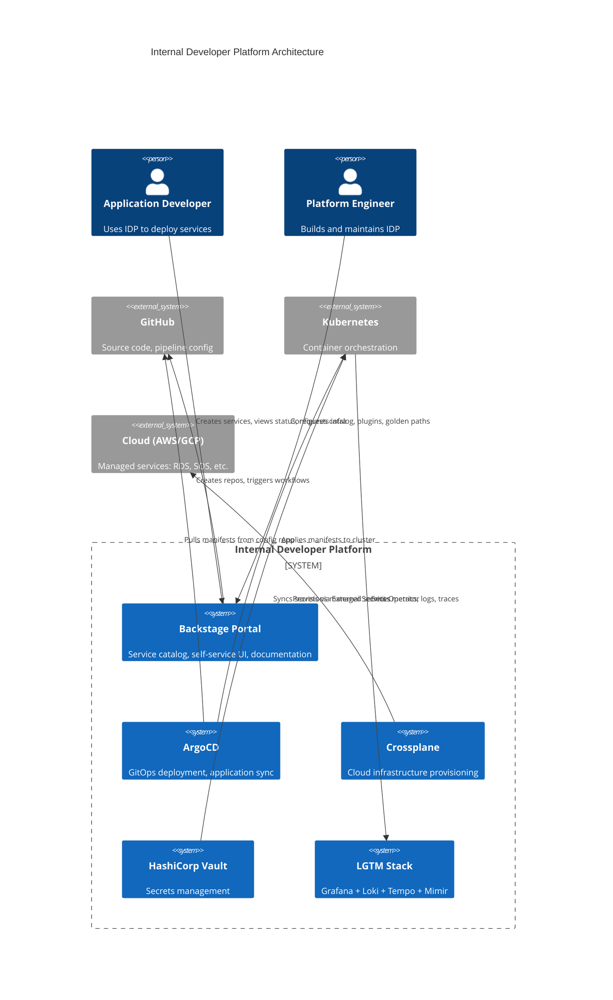

## Keywords in This File
{: .no_toc }

| # | Keyword | Weight |
|---|---|---|
| 1 | [Internal Developer Platform Design](#internal-developer-platform-design) | medium |

---

# Internal Developer Platform Design

🎯 Interview Weight: principal/architect level - the emerging discipline
of platform engineering (Gartner Top 10 Strategic Technology Trends
2023). This question separates principal engineers from senior
engineers.

---

### 🎯 Model Answer

**30 seconds:**
> An Internal Developer Platform (IDP) is a self-service layer
> that abstracts infrastructure complexity from application developers.
> Instead of each team manually configuring Kubernetes, Terraform,
> CI pipelines, and observability, the IDP provides paved paths:
> "I want a web service with a database" becomes a 5-minute operation.
> The platform team builds the IDP; application teams consume it.
> The goal is to reduce cognitive load while increasing deployment
> velocity.

**3 minutes (Senior):**
> Platform engineering addresses a specific organizational dysfunction:
> infrastructure complexity grows faster than developers can absorb it.
> At 10 engineers, everyone knows how to deploy. At 100 engineers,
> Kubernetes expertise is concentrated in a few people and most
> developers cannot deploy without help. At 1,000 engineers, the
> infrastructure team becomes a permanent bottleneck.
>
> An IDP inverts this dynamic. The platform team builds high-quality,
> opinionated abstractions (a "service catalog," a self-service
> deployment portal, a standardized CI/CD template). Application
> developers use the abstractions without needing to know the
> underlying Kubernetes YAML, Terraform modules, or pipeline details.
>
> The IDP design principles:
> First, it is a product, not a project. The platform team has an
> SLO for developer experience: "provision a new service in < 10
> minutes," "get first CI build green in < 30 minutes." These are
> product KPIs, not infrastructure KPIs.
>
> Second, it provides paved paths, not walls. The IDP makes the
> right thing easy. It does not make the wrong thing impossible.
> Teams can escape the abstraction when needed, but the default
> path is optimized for 80% of use cases.
>
> Third, it is composable. The IDP is built from existing best-of-
> breed tools (Backstage for portal, ArgoCD for deployment, Crossplane
> for infrastructure provisioning) rather than custom-built from
> scratch.

**Framework:** PROBLEM → SOLUTION → PRINCIPLES → TRADE-OFFS

*Adapting up:* "The CTO-level question: what is the ROI of the
platform team? Each new service takes 2 weeks to onboard manually.
With the IDP, it takes 1 day. At 20 new services per year, 19 days
× 20 = 380 developer-days saved. The platform team costs 4 engineers
× 250 days = 1,000 engineer-days. Breakeven at 53 new services.
At 200 services/year, ROI is 4:1."

*Adapting down:* "An IDP is like a hotel room vs. building your
own house. Hotel: you arrive, key works, wifi works, housekeeping
happens. You do not configure the plumbing. IDP: you declare 'I
need a web service with a Postgres database,' the platform provides
it, you deploy your code."

**Blank Mind Recovery:**

**(1) Restate:** "Internal Developer Platform - a self-service
abstraction layer that lets application developers deploy services
without infrastructure expertise."

**(2) First principles:** "Infrastructure complexity grows quadratically
with team size (N services × M infrastructure components). An IDP
hides this complexity behind a linear interface. Developers
interact with business-level abstractions (service, database,
queue) not infrastructure primitives (Kubernetes pod, PVC, SQS)."

**(3) Bridge:** "Like a cloud provider relationship. AWS hides
the data center hardware. The IDP hides the Kubernetes cluster
from the application developer. Both provide a higher-level
abstraction that reduces the expertise required to operate."

---

### 📘 Concept Explanation

**What it is:**
An Internal Developer Platform (IDP) is a self-service infrastructure
layer built by a platform engineering team for use by application
development teams. It provides opinionated, standardized abstractions
for common developer workflows: creating new services, deploying
applications, provisioning databases, configuring observability,
and managing secrets.

**The problem it solves:**
As organizations scale, infrastructure complexity becomes a developer
productivity tax. A new engineer joining a 500-person engineering
org faces weeks of setup and tribal knowledge acquisition before
their first deployment. Each team reinvents the same CI pipeline,
the same Kubernetes deployment config, the same database provisioning.
The infrastructure team is a permanent bottleneck for new service
creation. The IDP addresses all three: reduces cognitive load,
eliminates duplication, and removes the bottleneck.

**How it works:**

**The Four IDP Layers:**

Layer 1: Service Catalog (Backstage).
The developer-facing portal. Service catalog shows all existing
services, their owners, API docs, deployment status, and dependencies.
New service creation wizard: enter name, type (web API, worker,
data pipeline), language, database requirement. The wizard creates
a GitHub repository with the golden path template pre-configured,
registers the service in the catalog, and sets up the CI/CD
pipeline automatically.

Layer 2: Deployment Abstraction (ArgoCD + Helm/Kustomize).
Application teams define their service in a high-level manifest:
```yaml
# Application team declares their service requirements
# Not Kubernetes YAML - platform abstracts this
apiVersion: platform.myorg.com/v1
kind: MicroService
metadata:
  name: payment-service
spec:
  image: ghcr.io/myorg/payment-service
  replicas: 3
  resources:
    size: medium  # platform maps to CPU/memory limits
  database:
    type: postgresql
    size: standard
  ingress:
    enabled: true
    path: /api/payments
  observability:
    metrics: true
    tracing: true
```
> **Code walkthrough:** This example demonstrates the core pattern in action. The key mechanism shows how the concept works in practice. Study the structure to understand the essential behavior and common usage.

The platform controller reconciles this into the actual Kubernetes
Deployment, Service, HorizontalPodAutoscaler, ServiceMonitor, and
database provisioning via Crossplane.

Layer 3: Infrastructure Provisioning (Crossplane or Terraform CDK).
Databases, message queues, object storage - provisioned declaratively
by the application team's manifest, fulfilled by the platform.
The application team does not write Terraform. The platform team
defines the modules; application teams consume them by declaring
what they need.

Layer 4: Observability (Grafana, Prometheus, Loki, Tempo).
Every service that follows the golden path gets automatic metrics,
logging, and distributed tracing. The service does not configure
its own Prometheus scraping, log aggregation, or Jaeger agent.
The platform injects these as sidecars or configures them via
the service mesh.

**The Golden Path (Paved Road):**
The golden path is the recommended, optimized path for common
workflows. It is not the only path - teams can deviate when needed.
But the golden path is:
- Pre-configured with security best practices
- Pre-configured with performance optimization
- Pre-configured with observability
- Validated by the platform team before offering to developers

**Team Topologies alignment:**
Platform engineering maps directly to Team Topologies' "Platform
Team" type. Platform team enables stream-aligned (application)
teams by reducing their cognitive load. The interaction mode is
X-as-a-Service: platform provides capabilities that application
teams consume without deep knowledge of the underlying implementation.

**The key insight:**
The IDP is not an "everything-as-a-service" platform. It optimizes
for the 80% use case (standard web API + database) and provides
escape hatches for the 20% (unusual requirements). Building a
platform that tries to cover 100% of use cases creates a complex,
brittle system that is harder to maintain than the original manual
processes.

**When to use it:**
Platform engineering investment is justified at 50+ engineers
when the overhead of duplicated infrastructure setup, repeated
onboarding, and infrastructure team bottlenecks begins to measurably
impact velocity. Early: too little scale to justify the platform team.
Too late: infrastructure debt is already severe.

**When NOT to use it:**
Startups < 20 engineers. The overhead of building and maintaining
an IDP exceeds the benefit. Use cloud-managed services (Railway,
Render, Fly.io) or a simple shared CI/CD template instead.

**Alternatives:**
- Cloud-native platforms: AWS App Runner, Google Cloud Run - managed
  platforms that abstract Kubernetes entirely. Appropriate for teams
  that do not need Kubernetes-level control.
- Commercial IDPs: Humanitec, Port, Configure8 - commercial platform
  orchestration layers that reduce the build cost.
- Backstage (open source): the de facto standard for service catalogs.
  Provides the portal layer; integrates with any deployment backend.

**First-principles derivation:**
Developer productivity is inversely proportional to cognitive load.
Cognitive load is proportional to infrastructure complexity. An IDP
reduces the cognitive load by hiding complexity behind abstractions
with well-defined contracts. The value of the IDP is proportional
to the complexity it hides, which grows with org size. This is why
IDP ROI improves at scale.

---

### 💻 Code Example

**BAD: No platform - every team manually configures everything**

```yaml
# ANTI-PATTERN: Each team writes raw Kubernetes YAML from scratch
# Team A's payment-service Deployment (manual, not standardized):

apiVersion: apps/v1
kind: Deployment
metadata:
  name: payment-service
  namespace: production
spec:
  replicas: 3
  selector:
    matchLabels:
      app: payment-service
  template:
    metadata:
      labels:
        app: payment-service
        # Missing: version label (breaks canary)
        # Missing: team label (makes ownership unclear)
    spec:
      containers:
        - name: payment-service
          image: myapp:latest  # BAD: mutable tag
          # Missing: resource limits (causes node pressure)
          # Missing: liveness/readiness probes (no health check)
          # Missing: security context (runs as root)
          env:
            - name: DB_PASSWORD
              value: "hardcoded-secret-here"  # CRITICAL: hardcoded secret
# 50 services × 200 lines each = 10,000 lines of unique YAML
# Each team makes different mistakes
# No standardization, no security baseline
```

> **Code walkthrough:** The manual Kubernetes YAML approach has four
> critical gaps. No resource limits means a single misbehaving pod
> can consume all node resources, evicting other pods. No liveness
> probe means a deadlocked pod stays in the Deployment's "ready"
> pool and continues receiving traffic. The hardcoded secret in an
> environment variable is a critical security failure (visible in
> `kubectl describe pod`). The `latest` tag makes the deployment
> non-reproducible. At 50 services, there are 50 different YAML
> conventions, 50 different security mistakes, and 50 different
> teams that need individual help.

**GOOD: IDP with high-level service manifest + platform controller**

```yaml
# Golden path: application team writes a simple manifest
# Platform controller generates all the Kubernetes primitives

apiVersion: platform.myorg.com/v1alpha1
kind: MicroService
metadata:
  name: payment-service
  namespace: production
  labels:
    team: payments        # Platform enforces team ownership
    cost-center: "12345"  # FinOps tagging
spec:
  image:
    repository: ghcr.io/myorg/payment-service
    tag: v2.1.0          # Explicit version (no 'latest')

  scaling:
    min: 2
    max: 10
    targetCpuUtilization: 70

  resources:
    preset: medium  # Platform maps to: 0.5 CPU / 512Mi memory
    # Presets: nano (0.1/128Mi), small (0.25/256Mi),
    #          medium (0.5/512Mi), large (1/1Gi), xlarge (2/2Gi)

  ingress:
    path: /api/payments
    # Platform provisions: Ingress, cert-manager TLS cert, DNS

  database:
    type: postgresql
    preset: standard     # RDS db.t3.medium equivalent
    # Platform provisions: Crossplane XPostgreSQLInstance
    # Injects connection string via External Secrets to pod

  secrets:
    - name: PAYMENT_API_KEY
      secretRef:
        vaultPath: secret/payments/api-key  # Vault secret
    # Platform injects via External Secrets operator
    # Never hardcoded, never in YAML

  observability:
    enabled: true        # Automatic: Prometheus scraping,
                         # Loki log collection, Jaeger tracing
    alertPreset: standard  # Predefined alert rules for HTTP services
```

> **Code walkthrough:** This example demonstrates the core pattern in action. The key mechanism shows how the concept works in practice. Study the structure to understand the essential behavior and common usage.

```go
// Platform controller (simplified): reconciles MicroService -> Kubernetes objects
// This is what the platform engineering team builds

func (r *MicroServiceReconciler) Reconcile(
    ctx context.Context,
    req ctrl.Request,
) (ctrl.Result, error) {
    ms := &platformv1.MicroService{}
    if err := r.Get(ctx, req.NamespacedName, ms); err != nil {
        return ctrl.Result{}, client.IgnoreNotFound(err)
    }

    // 1. Generate Deployment with security baseline applied
    deployment := r.buildDeployment(ms)
    // buildDeployment always sets:
    //   - Resource limits from preset
    //   - Non-root security context
    //   - Liveness + readiness probes (standard HTTP /health)
    //   - Pod disruption budget
    //   - Proper label set (app, team, version, cost-center)

    // 2. Generate HPA
    hpa := r.buildHPA(ms)

    // 3. Generate Ingress + cert-manager annotation
    ingress := r.buildIngress(ms)

    // 4. Generate Crossplane database claim
    dbClaim := r.buildDatabaseClaim(ms)

    // 5. Generate ExternalSecret for Vault secrets
    externalSecrets := r.buildExternalSecrets(ms)

    // 6. Generate ServiceMonitor for Prometheus
    serviceMonitor := r.buildServiceMonitor(ms)

    // Apply all generated objects to Kubernetes
    for _, obj := range []client.Object{
        deployment, hpa, ingress, dbClaim,
        externalSecrets, serviceMonitor,
    } {
        if err := r.applyObject(ctx, obj, ms); err != nil {
            return ctrl.Result{}, err
        }
    }

    return ctrl.Result{}, nil
}
```

> **Code walkthrough:** The MicroService CRD reduces the application
> team's cognitive load from 200 lines of Kubernetes YAML to 40 lines
> of business-level configuration. The platform controller handles
> the translation, and critically, it enforces the security baseline
> on every service - no service can be deployed without resource
> limits, non-root security context, or liveness probes because
> the controller always adds them. The preset system standardizes
> resource allocations: platform engineers tune the presets, application
> engineers choose from them. This centralized tuning is more efficient
> than each team individually setting CPU/memory values.

---

### 🎓 Answers by Seniority

**Junior / Mid (0-5 years):**
> "I understand the IDP concept from using one. At my last company,
> we had a developer portal where I could create a new service by
> filling in a form: service name, language, whether it needed a
> database. It would create the GitHub repo with CI/CD already set
> up, create the Kubernetes namespace, and provision the database.
> I could deploy my first service in about 20 minutes without writing
> a single line of Kubernetes YAML.
>
> I also know that this was built by a separate platform team. They
> maintained the templates and abstractions. When I needed something
> outside the template (a specific library version), I could request
> it from the platform team or override specific parts of the template."

---

**Senior / Staff (5+ years):**
> "The question I ask when designing an IDP: what is the cognitive
> load budget for an application developer? At 50 services, every
> engineer cannot maintain deep knowledge of Kubernetes, Terraform,
> CI/CD, secrets management, observability, and security policy.
> The IDP's job is to abstract complexity so each engineer needs
> deep knowledge only in their domain (application code) and shallow
> knowledge of the platform (service manifest syntax).
>
> The key design decision: how opinionated? Highly opinionated IDPs
> (everything configured for you, no overrides) have low cognitive
> load for common cases but create friction for unusual requirements.
> Lightly opinionated IDPs (provide templates but allow full override)
> have lower friction but higher cognitive load.
>
> My architecture for a 200-engineer org: Backstage as the service
> catalog and developer portal, ArgoCD for GitOps-based deployment,
> Crossplane for infrastructure provisioning, External Secrets for
> secrets, and a custom Kubernetes CRD (MicroService, DatabaseClaim,
> CronJob) that application teams use. Platform team owns the CRD
> implementations. Application teams use the CRDs. The CRD is the
> API contract between the two teams."

---

### ⚖️ Comparison Table

| Approach | Cognitive Load | Flexibility | Build Cost | Ops Cost |
|---|---|---|---|---|
| No Platform (raw K8s) | High | Full | None | High (duplication) |
| Shared K8s templates | Medium | High | Low | Medium |
| Custom CRD platform | Low | Medium | High | Low |
| Commercial IDP (Humanitec) | Low | Medium | Low | Medium (license) |
| Cloud-managed (Cloud Run) | Very low | Low | None | Medium (lock-in) |

**Decision framework:**
< 20 engineers: no platform needed (cloud-managed or simple templates)
20-50 engineers: shared K8s templates + standardized CI
50-200 engineers: simple IDP with custom CRDs
200+ engineers: full IDP with Backstage + service catalog + self-service

---

### 🏛️ System Design

**Design: IDP for a 500-engineer organization - architecture,
team structure, and the 12-month roadmap.**

**Starting point:** 500 engineers, 200 services, 3 infrastructure
engineers handling all requests (permanent bottleneck).

**Target state (12 months):**
- New service: 10-minute self-service creation (from 2-week onboarding)
- First deployment: 30 minutes from repository creation
- Infrastructure changes: self-service for 80% of requests
- Infrastructure team: enables teams, does not unblock individual tickets

**Architecture (the platform stack):**

Developer portal:
- Backstage with custom plugins for MyOrg workflows
- Service catalog: all 200 services, owners, APIs, SLOs, dependencies
- New service wizard: creates GitHub repo, registers in catalog,
  provisions CI/CD, creates Kubernetes namespace
- Infrastructure self-service: request database, cache, message queue
  via portal form → automated provisioning

GitOps deployment:
- ArgoCD: all deployments as code in a central `infra-config` repo
- Each service has an ArgoCD Application
- Platform team maintains ArgoCD Application templates
- Application teams modify only their service values (image tag, replicas)

Infrastructure provisioning:
- Crossplane: provision cloud resources (RDS, ElastiCache, SQS) via Kubernetes CRDs
- Platform provides XCompositeResourceDefinitions (XRDs) for:
  PostgreSQLClaim, MySQLClaim, RedisClaim, SQSQueueClaim
- Application teams declare what they need; platform fulfills it

Secrets management:
- HashiCorp Vault for secrets storage
- External Secrets Operator syncs Vault secrets to Kubernetes Secrets
- Application teams store secrets in Vault at predefined paths
- Platform ensures secrets are never in YAML

Observability:
- Prometheus Operator + Grafana + Loki + Tempo (the LGTM stack)
- Standard dashboards for every service that uses the golden path
- Application teams request custom dashboards via portal

**Team structure:**
- Platform team: 5 engineers (platform:application ratio ≈ 1:100)
- Product manager: 0.5 FTE (IDP is a product with a backlog)
- Developer experience (DX) engineer: 1 (measures and improves
  developer journey metrics)

**12-month roadmap:**
Q1: Foundation - Backstage setup, service catalog import, ArgoCD deployment standardization
Q2: Self-service - new service wizard, database provisioning via Crossplane
Q3: Security baseline - External Secrets, security scanning in golden path
Q4: Observability - standard dashboards, automated alerting for golden path services

**Success metrics:**
- Time to first deployment: from 2 weeks to 30 minutes
- Infrastructure team ticket volume: from 50/week to 10/week (self-service)
- DORA deployment frequency: from weekly to daily (reduced friction)
- Onboarding NPS: new engineers rate IDP experience

---

### 📊 Diagram

**IDP Architecture: Layers and Team Boundaries**

```
APPLICATION DEVELOPER EXPERIENCE
+----------------------------------+
| Backstage Portal                 |
| [New Service] [My Services]      |
| [Infrastructure] [Docs]          |
+----------------------------------+
        |
        v
PLATFORM CONTROL PLANE
+----------------------------------+
|   GitHub + ArgoCD (GitOps)       |
|   Service repo -> ArgoCD App     |
|   Central config repo            |
+----------------------------------+
        |
        v
KUBERNETES ABSTRACTIONS (CRDs)
+----------------------------------+
|  MicroService CRD                |
|  DatabaseClaim CRD               |
|  MessageQueueClaim CRD           |
|  (Platform team implements)      |
+----------------------------------+
        |
        v
KUBERNETES PRIMITIVES
+----------------------------------+
|  Deployment, Service, HPA        |
|  Ingress, PodDisruptionBudget    |
|  ServiceMonitor, AlertRule       |
+----------------------------------+
        |
        v
CLOUD INFRASTRUCTURE
+----------------------------------+
|  RDS (Crossplane XRDs)           |
|  ElastiCache, SQS                |
|  External Secrets (Vault sync)   |
+----------------------------------+
```



> **Diagram walkthrough:** The IDP has three layers of abstraction
> between the application developer and the infrastructure. Layer 1
> (Backstage) is the developer-facing portal - developers interact
> here and never need to touch Kubernetes YAML. Layer 2 (ArgoCD +
> Crossplane + Vault) is the control plane - translates developer
> intent into infrastructure. Layer 3 (Kubernetes + Cloud) is the
> execution layer. The platform engineering team works at Layer 2
> (building and maintaining the control plane). Application developers
> work at Layer 1. The C4 diagram uses the Context model to show the
> relationships between the people and systems, which is the appropriate
> level for communicating the IDP architecture to stakeholders.

---

### ⚠️ Common Misconceptions

**Misconception 1: "The IDP must be built from scratch."**
The most successful IDPs are assembled from best-of-breed open source
tools: Backstage for the portal, ArgoCD for deployment, Crossplane
for infrastructure, External Secrets for secrets. The platform team's
job is to integrate these tools and create the golden paths - not
to build CI/CD tooling, a deployment engine, or a secrets manager
from scratch. Platform-from-scratch is a 2-3 year project; platform-
from-integration is a 3-6 month project.

**Misconception 2: "The IDP should support every possible use case."**
The 80/20 rule applies strictly. Optimizing the IDP for the 20%
edge cases creates a complex, unmaintainable platform that serves
the 80% common case poorly. The correct approach: identify the
5-10 most common developer workflows and make those 90% better.
Provide escape hatches (raw Kubernetes access, custom Terraform
modules) for the edge cases. Teams with unusual requirements
work with the platform team directly.

**Misconception 3: "Platform engineering is just DevOps rebranded."**
DevOps is a culture and practice. Platform engineering is a specific
team topology and product discipline. The platform team builds
infrastructure products (the IDP) with developer experience as the
primary metric. It requires product management skills (backlog
prioritization, user research with developers) that traditional
infrastructure teams do not typically have.

---

### 🚨 Failure Modes and Diagnosis

**Failure Mode 1: IDP becomes a bottleneck itself**
Symptom: teams wait weeks for the platform team to add new
capabilities to the IDP. The platform team has a longer backlog
than the infrastructure team it replaced. Developers work around
the IDP rather than through it.
Cause: the IDP was designed as a centralized control layer rather
than a self-service platform. Every new requirement requires a
platform team ticket. The escape hatch is missing or discourages.
Fix: design for extensibility from day 1. Backstage plugins are
contributed by any team. Crossplane XRDs can be extended without
platform team involvement. The platform team owns the core
abstractions; application teams can extend them. This is the
"inner source" model: the IDP is a shared internal product that
any team can contribute to.

**Failure Mode 2: Golden path diverges from reality over time**
Symptom: the golden path templates are 12 months old and do not
reflect current security requirements, updated Kubernetes versions,
or new observability tooling. Application teams running the golden
path are missing security patches. The platform team is not using
the templates it provides.
Cause: golden path maintenance is not a first-class task. Template
updates require a platform team PR that blocks all other work.
Fix: automated golden path testing. The CI pipeline for the golden
path templates runs a new service creation through the full workflow
on every template change. Any regression in the new service workflow
fails CI. Additionally, renovate/dependabot PRs keep template
dependencies current automatically.

**Failure Mode 3: Developer adoption failure**
Symptom: the IDP exists but most teams still deploy manually.
Survey data: "the IDP doesn't support our use case" (40%), "we
don't know how to use it" (30%), "it's faster to do it ourselves"
(30%).
Diagnosis: the IDP was built without developer input. The golden
path solves the platform team's problems, not the application
team's problems.
Fix: developer experience research. Interview 10 developers about
their workflows. Identify the 3 most painful steps in their
deployment process. Build the IDP to solve those specific pain
points. Measure adoption rate as a product KPI.

---

### 🎯 Interview Deep-Dive

| Format | Time | Focus |
|--------|------|-------|
| Screener | 3 min | IDP definition + problem it solves |
| Panel | 10 min | Architecture + team topologies + build vs. buy |
| Principal | 15 min | System design + ROI case + failure modes |

---

**Q1 (Definition): What is the difference between a DevOps platform
team and a platform engineering team?**

The difference is in the product orientation and the output.

A DevOps platform team (traditional model) focuses on infrastructure:
provisioning Kubernetes clusters, managing CI/CD infrastructure,
maintaining the container registry. The team responds to requests
from application teams. The team's metric is infrastructure uptime
and ticket resolution time. The team's output is infrastructure
(running systems).

A platform engineering team focuses on developer experience:
building self-service tools that application teams use without
requesting help. The team proactively identifies developer pain
points. The team's metric is time-to-deploy, developer NPS, and
self-service adoption rate. The team's output is a product (the IDP)
that other developers use.

The key difference is the direction of value flow:
- DevOps platform team: reactive (responds to requests)
- Platform engineering team: proactive (builds products that
  prevent requests from being needed)

The organizational difference: a platform engineering team has a
product manager (or tech lead with PM skills) who owns the IDP
product roadmap, conducts user research with developers, and
prioritizes features based on developer pain points. A DevOps
infrastructure team does not typically have this discipline.

*What separates good from great:* Understanding that the platform
engineering shift is a cultural change as much as a technical one.
Platform engineers must develop empathy for their users (application
developers) and adopt product development practices (user research,
MVP, iterative improvement) that infrastructure engineers are not
typically trained in. The technology stack is less important than
the team orientation.

---

**Q2 (Mechanism): How does Backstage work and what makes it
suitable as the foundation for an IDP?**

Backstage is an open source developer portal framework built by
Spotify and donated to the CNCF. It provides a plugin-based
architecture for building an internal developer portal.

Core components:

Software Catalog: a registry of all software components in the
organization. Each component is described by a `catalog-info.yaml`
file in its repository:
```yaml
# catalog-info.yaml in the payment-service repository
apiVersion: backstage.io/v1alpha1
kind: Component
metadata:
  name: payment-service
  description: Handles payment processing
  annotations:
    github.com/project-slug: myorg/payment-service
    argocd/app-name: payment-service-production
    prometheus.io/dashboard: payment-service
  tags:
    - java
    - spring-boot
    - payments
spec:
  type: service
  lifecycle: production
  owner: payments-team
  system: payment-platform
  dependsOn:
    - component:user-service
    - resource:payment-database
```
> **Code walkthrough:** This example demonstrates the core pattern in action. The key mechanism shows how the concept works in practice. Study the structure to understand the essential behavior and common usage.

Backstage autodiscovers these files from all repositories and
builds the catalog automatically. The catalog provides an
organizational view: who owns what, how do services depend on
each other, which services are deprecated.

TechDocs: converts Markdown in repositories to searchable,
versioned documentation. Documentation lives alongside code (docs-
as-code) but is surfaced through a single portal.

Scaffolder (Templates): the new service wizard. Platform engineers
define Software Templates that create new repositories from
cookiecutter-style templates:
```yaml
# Software Template: creates a new Spring Boot microservice
apiVersion: scaffolder.backstage.io/v1beta3
kind: Template
metadata:
  name: spring-boot-service
spec:
  parameters:
    - title: Service details
      properties:
        serviceName:
          type: string
          description: Name for the new service
        needsDatabase:
          type: boolean
          default: false
  steps:
    - id: create-repo
      action: publish:github
      input:
        repoUrl: github.com?repo={{parameters.serviceName}}
        sourcePath: ./templates/spring-boot-service/

    - id: register-catalog
      action: catalog:register
      input:
        repoContentsUrl: ${{ steps['create-repo'].output.repoContentsUrl }}

    - id: provision-database
      if: ${{ parameters.needsDatabase }}
      action: crossplane:create
      input:
        resource: PostgreSQLClaim
        name: ${{ parameters.serviceName }}-db
```

> **Code walkthrough:** This example demonstrates the core pattern in action. The key mechanism shows how the concept works in practice. Study the structure to understand the essential behavior and common usage.

Plugin ecosystem: Backstage's strength is the 200+ community plugins
for ArgoCD, Kubernetes, Grafana, PagerDuty, Jira, SonarQube, and
more. Application developers see the deployment status (ArgoCD),
alerts (PagerDuty), and code quality (SonarQube) for their service
without leaving the portal.

*What separates good from great:* Understanding the Backstage
maintenance overhead. Backstage requires significant engineering
effort to maintain (weekly updates, plugin compatibility, custom
plugin development). Organizations that underestimate the ongoing
maintenance often have a Backstage deployment that is 18 months
out of date, with broken plugins and poor performance. The platform
team must allocate 1-2 engineers full-time to Backstage maintenance
at 50+ services.

---

**Q3 (Deep Dive): How do you measure the ROI of a platform
engineering investment?**

Platform engineering ROI requires quantifying the value delivered
to application developers and comparing it to the platform team's
cost.

The measurement framework:

Developer time saved (direct ROI):
- Before IDP: new service onboarding takes 2 weeks (40 hours manual setup)
- After IDP: new service onboarding takes 30 minutes
- Savings per new service: 39.5 hours × engineer cost ($150/hour) = $5,925
- Services created per year: 50
- Annual savings: 50 × $5,925 = $296,250

Infrastructure ticket reduction:
- Before IDP: 50 tickets/week to infrastructure team × 4 hours/ticket = 200 hours/week
- After IDP: 10 tickets/week (self-service covers 80%) × 4 hours/ticket = 40 hours/week
- Savings: 160 hours/week × $150/hour × 50 weeks = $1,200,000/year

Deployment frequency improvement (indirect ROI via DORA):
- DORA research: elite deployers (multiple/day) have 2x higher
  revenue growth than low performers (monthly)
- If IDP enables daily deployments vs. current weekly deployments:
  7x improvement in deployment frequency → faster feature delivery

Cost of platform team:
- 5 engineers × $250,000 fully loaded = $1,250,000/year

ROI calculation:
- Annual value: $296,250 (onboarding) + $1,200,000 (tickets) = $1,496,250
- Annual cost: $1,250,000
- Net ROI: $246,250 in year 1
- Payback period: approximately 10 months

The ROI improves each year as the service count grows and the
platform team cost remains roughly constant.

*What separates good from great:* The indirect ROI from deployment
frequency improvement is often the largest component but hardest
to quantify. The DORA research provides the framework: moving from
medium performer (weekly deployments) to high performer (daily
deployments) correlates with specific improvements in revenue growth
and market share. Using DORA benchmarks, the platform team can
make a credible case for the business value of deployment frequency
improvement.

---

**Q4 (Scenario): A team refuses to adopt the IDP and continues
doing manual infrastructure. How do you respond?**

A team resisting IDP adoption is a product signal, not a compliance
problem. The first step is diagnosis, not enforcement.

Understanding the resistance:
- "Our use case isn't supported" - the most common legitimate complaint.
  The IDP covers 80% of use cases; this team may be in the 20%.
- "It's slower than doing it ourselves" - the IDP has too much friction
  for common tasks. Onboarding experience problem.
- "We tried it but it broke our service" - reliability problem.
  The IDP caused an incident; trust was lost.
- "We don't understand it" - documentation and training gap.
- "We have too much invested in our current setup" - switching cost.

Response matrix:

"Our use case isn't supported": work with the team to build support
for their use case. Document it as a feature request. If it is a
common pattern, prioritize it. If it is a unique edge case, provide
the raw Kubernetes access and document their pattern for future teams.

"It's slower": conduct a joint workflow analysis. Follow a developer
on the resistant team through their actual deployment workflow.
Identify where the friction is. Fix it. Measure before and after.

"It broke our service": understand exactly what broke and why.
Fix the root cause. Add a regression test to the golden path CI.
Demonstrate the fix. Rebuild trust through action.

"We don't understand it": a failure of documentation and enablement.
Create a "10-minute first deployment" guide specifically for this
team's tech stack. Offer pairing sessions.

Enforcement as last resort: if the team's manual practices create
security or reliability risks for the organization (no CVE scanning,
no secrets management), enforcement may be required. But enforcement
before diagnosis creates resentment and workarounds. The IDP
adoption target should be 85%, not 100%. Some teams will have
legitimate reasons to deviate.

*What separates good from great:* Treating every adoption failure
as a product bug. "The team doesn't want to use the IDP" is a
symptom. The root cause is always a product failure: missing feature,
reliability issue, documentation gap, onboarding friction. Every
adoption failure should trigger a product improvement. Platform
teams that treat adoption failures as communication problems
(resistant teams are wrong, the IDP is correct) consistently fail
to achieve broad adoption.

---

**Q5 (Trade-off): Build a custom IDP from scratch vs. use a
commercial IDP product vs. assemble from open source. How do you
decide?**

This is the classic build vs. buy vs. assemble decision with
specific platform engineering context.

Build from scratch:
- Use case: very specific requirements that off-the-shelf tools
  cannot address, OR the platform team has deep expertise and
  wants full control.
- Cost: 2-3 year investment, 4-6 engineers, high opportunity cost.
- Risk: high - custom platforms often accumulate technical debt
  faster than the organization can maintain them.
- When appropriate: FAANG-scale organizations with unique requirements
  (Google's internal platform, Meta's internal platform are built
  from scratch).

Commercial IDP (Humanitec, Port, Configure8):
- Use case: organization wants IDP capabilities without 18+ months
  of platform engineering investment. Willing to pay for managed solution.
- Cost: $50,000-500,000/year depending on scale.
- Risk: vendor lock-in, less flexibility, renewal negotiation.
- When appropriate: 100-500 engineer org that needs an IDP now and
  does not have platform engineering expertise.

Assemble from open source (Backstage + ArgoCD + Crossplane):
- Use case: 200+ engineer org with platform engineering capability.
  Wants flexibility and avoids vendor lock-in. Willing to invest
  engineering time in assembly and maintenance.
- Cost: 3-6 months initial + 1-2 engineers ongoing maintenance.
- Risk: integration complexity, each tool update must be validated
  in the assembled stack.
- When appropriate: most organizations at 200+ engineers that have
  the platform engineering team to maintain it.

My recommendation for a 200-500 engineer org: assemble from open
source, with Backstage as the portal, ArgoCD as the deployment
engine, and Crossplane for infrastructure. This is the most common
pattern and has the largest ecosystem, documentation, and talent pool.

*What separates good from great:* The insight that the choice
is not permanent. Many organizations start with commercial tools
(fast time to value), learn what they need, then migrate to open
source (more flexibility). Others start with templates and manual
processes (cheap), then graduate to a full IDP as scale demands it.
The platform is an investment that grows with the organization.

---

**Q6 (Architecture): How do you design the golden path for a
new service from first commit to production?**

The golden path is the end-to-end workflow that a developer follows
from "I have an idea" to "my service is running in production and
being monitored." The platform team designs this path to be as short
and friction-free as possible for the common case.

The optimized golden path (target: 30 minutes):

Step 1: Service creation (5 minutes).
Developer opens Backstage portal. Clicks "Create New Service."
Fills form: service name, language (Java/Node/Python), requires
database (Y/N), team owner.
Backstage scaffolder: creates GitHub repo from golden path template
(Spring Boot/Node/FastAPI with CI/CD, Dockerfile, k8s manifest,
catalog-info.yaml pre-configured), registers service in catalog,
creates ArgoCD Application for staging.

Step 2: First commit (5 minutes).
Developer clones repo. Sees pre-configured structure. Makes a
change to the default Hello World endpoint. Pushes to main.
CI pipeline runs automatically (already configured in the template).
Unit tests pass, Docker image built and pushed.

Step 3: First deployment to staging (10 minutes).
ArgoCD detects the new image in the registry (via image automation
or CD pipeline). Syncs the deployment to the staging namespace.
Smoke test runs. Developer sees their service in staging via
Backstage portal (deployment status, logs, metrics) without
additional configuration.

Step 4: Promote to production (10 minutes).
Developer creates a PR in the central config repository: update
image tag in production values.yaml. PR is automatically approved
if smoke tests passed. ArgoCD deploys to production. Canary starts
at 10% traffic. Automated health checks run for 5 minutes. Canary
auto-promotes to 100%.

Total time from service creation to first production deployment: 30 minutes.
Total Kubernetes YAML written by developer: 0 lines.
Total CI/CD configuration written by developer: 0 lines.

*What separates good from great:* The 30-minute first-deployment
target is a product-level commitment. The platform team should
regularly (quarterly) run through the golden path themselves,
timing each step. Any step that takes more than its budgeted time
is a regression in the product. The golden path walkthrough is
both a product test and a smoke test of the IDP.

---

**Q7 (Deep Dive): How do you handle platform team/application
team conflict over IDP constraints?**

The most common conflict: the IDP enforces a security or reliability
constraint that an application team wants to bypass. For example:
"the IDP requires security scanning but our deployment is urgent
and we need to skip it." Or: "the IDP forces our container to run
as non-root but our legacy application requires root."

The platform team's position: constraints exist for a reason.
Security scanning prevents supply chain attacks. Non-root containers
follow the principle of least privilege. These are not arbitrary
restrictions.

However, the application team's urgency is also real. An emergency
production fix needs to ship now.

Resolution framework:

Document the constraint and its rationale: every IDP constraint
should have a written rationale in the platform documentation.
"Why must containers run as non-root?" has a specific security
answer. Teams that understand the why are less likely to push back.

Provide an exception process: for genuine cases where a constraint
cannot be met, provide a formal exception process:
1. Team documents why the constraint cannot be met
2. Platform team reviews (same-day for urgent cases)
3. If approved: exception is granted with an expiry date (30 days)
   and a remediation plan
4. Exception is tracked in the service catalog (visible to security team)

Root cause the conflicts: if a specific constraint generates repeated
exception requests, the constraint may be too aggressive or the
IDP may not support the legitimate use case. Track exception requests
as product feedback. If 20% of teams request exceptions for the
same constraint, the constraint needs re-evaluation.

The emergency path: for genuine production emergencies (the break-
glass scenario), the IDP must not be the bottleneck. A documented
"emergency bypass" process (requires 2 approvals, logged, audited,
remediation plan filed within 24 hours) provides the escape hatch
without creating a culture of constraint bypass.

*What separates good from great:* The key insight is that conflicts
are signals, not problems. A conflict about a constraint means either
(a) the constraint is wrong and should be updated, (b) the IDP
is missing a feature that would make the constraint achievable for
this team, or (c) the team needs education on the rationale. Treating
every conflict as an opportunity to improve the IDP converts
adversarial dynamics to collaborative ones.

---

**Q8 (Behavioral): How did you or your organization decide to
invest in platform engineering, and what were the results?**

This question probes real organizational experience with the IDP
investment decision.

The trigger was typically a measurable friction point. The most
common: a new engineer's first deployment took 3+ weeks because
of undocumented manual steps, three different teams all maintaining
their own versions of the same CI pipeline, or the infrastructure
team's Jira backlog had 6+ weeks of tickets.

The decision process: a staff engineer wrote a "paved road proposal"
documenting the current state (number of unique pipeline configurations:
37, average time to first deployment: 15 business days, infrastructure
team backlog: 87 tickets) and the proposed investment (2 engineers
for 6 months to build a standardized CI template and service
creation wizard).

The result of a 6-month minimum viable IDP:
- Time to first deployment: 15 business days → 1 business day (from wizard)
- Unique pipeline configs: 37 → 1 (all new services use golden path)
- Infrastructure ticket volume: 87 → 41 open tickets (50% reduction)
- Developer NPS on tooling: from -10 to +35

What did not go as planned: the first Backstage deployment was
over-engineered. 40+ plugins installed, 70% of which were not used.
Maintenance overhead was high. The team stripped it back to 15 plugins
and the maintenance load became sustainable. The lesson: start simple.

*What separates good from great:* Quantifying both the before state
and the after state with specific metrics. Qualitative assessments
("developers were frustrated" → "developers are happier now") do
not demonstrate engineering credibility. Specific metrics
(time to first deployment, ticket volume, developer NPS) demonstrate
product thinking applied to infrastructure.

---

**Q9 (Architecture): What is the relationship between platform
engineering and Team Topologies?**

Team Topologies (Skelton and Pais, 2019) is a framework for
organizing software engineering teams that directly addresses the
cognitive load problem platform engineering solves.

The four team types in Team Topologies:

Stream-aligned teams: teams aligned to a business domain or product
feature stream. They deliver value directly to users. Their focus
is the application, not infrastructure. Platform engineering reduces
their cognitive load so they can focus on business value.

Platform teams: provide internal services (APIs, tools, platforms)
that stream-aligned teams consume. The platform team is not a
bottleneck if their services are self-service and high quality.
The IDP is the tangible output of the platform team.

Enabling teams: temporary teams that help stream-aligned teams
adopt new practices or technologies. Example: a team that embeds
with each application team to help them adopt the IDP. After
adoption, the enabling team moves on. Platform engineers sometimes
play enabling team roles during IDP rollout.

Complicated-subsystem teams: teams that own complex subsystems
requiring specialist expertise (ML inference engine, payment
processing, real-time graphics). Most organizations have 1-3
of these.

The interaction modes:
- Stream-aligned ↔ Platform: X-as-a-Service (platform provides
  capabilities; stream-aligned consumes)
- Platform ↔ Enabling: collaboration during IDP adoption,
  then X-as-a-Service

The cognitive load connection: Team Topologies explicitly categorizes
cognitive load as intrinsic (domain complexity, inherent to the
work), extraneous (from poor tooling, unclear processes), and
germane (building expertise, deliberate learning). The platform
team's job is to reduce extraneous cognitive load (Kubernetes
YAML, CI configuration, secrets management) for stream-aligned
teams. The IDP is the mechanism.

*What separates good from great:* Understanding that the platform
team size should be proportional to the cognitive load they are
reducing. Skelton and Pais recommend a platform:application team
ratio of approximately 1:8. A 400-engineer organization with
50 stream-aligned teams of 8 engineers each would have 6-7 platform
teams. In practice, most organizations have 1 central platform
team until 200+ engineers, then split into infrastructure platform,
developer experience platform, and security platform.

---

**Q10 (Architecture): How do you evolve the IDP as the organization
scales from 200 to 2,000 engineers?**

The IDP that works for 200 engineers is not the IDP that works
for 2,000 engineers. The evolution is predictable.

200 engineers (1 platform team):
- Single platform team owns all IDP components
- Backstage + ArgoCD + 2 Crossplane providers
- 20 Backstage plugins (maintained by platform team)
- Monthly platform releases
- Simple governance: platform team reviews all changes

500 engineers (2 platform teams):
- Split: infrastructure platform (Kubernetes, Crossplane) + developer
  experience platform (Backstage, CI templates)
- Federated Backstage: each domain contributes their own plugins
  (inner source model)
- Plugin quality standards: automated testing for all plugins
- Quarterly governance review

2,000 engineers (platform organization):
- Platform teams organized by domain: infrastructure, security, data,
  developer experience
- Each platform domain has its own product roadmap and SLO
- Platform APIs: the platform exposes stable, versioned APIs rather
  than shared tooling (platform becomes an internal cloud provider)
- Internal marketplace: teams publish and consume platform services
  through a central registry
- Strong governance: change freeze periods for platform, migration
  guides for breaking changes

The scaling challenge: at 2,000 engineers, the platform organization
is itself a product organization managing 20+ internal products.
Platform teams have SLOs. Platform incidents have on-call rotation.
Platform APIs have versioning policies. The platform is no longer
tooling - it is infrastructure.

*What separates good from great:* Recognizing the "platform
reinvention trap." Organizations that reach 500 engineers without
an IDP often build one from scratch at that scale, taking 2-3 years
to reach parity with what open source tools provide. Starting earlier
(at 100 engineers) with open source tools (Backstage, ArgoCD,
Crossplane) allows organic evolution rather than revolutionary
rearchitecture.

---

**Q11 (Deep Dive): How do you manage security compliance across
all services using the IDP?**

The IDP is the enforcement point for organization-wide security
policies. Every service that uses the golden path automatically
meets the security baseline. The platform team defines security
policies; the IDP enforces them.

Security controls via IDP golden path:

Image security: every golden path deployment:
- Uses a pinned base image (SHA256 digest in the Dockerfile template)
- Runs CVE scanning on every build (Trivy, gating on HIGH/CRITICAL)
- Generates and signs SBOM (Syft + cosign)
- Uses non-root security context (enforced by the MicroService CRD controller)

Secret management: the MicroService CRD does not allow environment
variable secrets. All secrets are declared as Vault references.
The platform controller injects them via External Secrets. A developer
cannot hardcode a secret in the golden path manifest.

Network policy: the platform team maintains a default deny network
policy for all namespaces. Services must explicitly declare their
egress requirements:
```yaml
spec:
  networking:
    allowedEgress:
      - service: payment-database
      - external: api.stripe.com:443
```
> **Code walkthrough:** This example demonstrates the core pattern in action. The key mechanism shows how the concept works in practice. Study the structure to understand the essential behavior and common usage.

The platform controller creates NetworkPolicy objects based on this
declaration. Undeclared connections are blocked.

Compliance reporting: the platform team runs a nightly compliance
scan against all services:
- Are all services using the current base image (no more than 30 days old)?
- Do all services have CVE scan results from the last 7 days?
- Do all services have a valid cosign signature?
- Do all services have resource limits set?

Services failing compliance appear in the platform dashboard and
generate Jira tickets for the owning teams.

Policy exceptions: tracked in the service catalog. Each exception
requires a justification and expiry date. The security team reviews
all open exceptions quarterly.

*What separates good from great:* The shift-left principle: security
policies enforced in the golden path are enforced at development
time, not in a post-deployment audit. The cost of fixing a security
issue at development time is 1-2 hours. The cost at production
deployment time is 1-2 days. The cost after a breach is 1-2 months.
The IDP's security enforcement is not a compliance check - it is
a cost-reduction mechanism for the entire security lifecycle.

---

**Q12 (Architecture): What is a Platform as a Product mindset
and how does it change how platform engineering teams operate?**

Platform as a Product is the operating philosophy that distinguishes
platform engineering from traditional infrastructure teams. It treats
the IDP as a product with customers (application developers), a
product roadmap, user research, and success metrics.

The operational differences:

User research: platform engineering teams conduct regular developer
surveys and 1:1 interviews. "What are the 3 most frustrating parts
of your deployment workflow?" informs the roadmap. Traditional
infrastructure teams respond to tickets; platform engineering teams
proactively identify pain points.

Product roadmap: the IDP has a public roadmap visible to all
engineers. Quarterly priorities are communicated in engineering-
wide communications. Application teams can upvote features.

Success metrics (product KPIs, not infrastructure KPIs):
- Time to first deployment (target: < 30 minutes)
- Developer NPS (target: > +40)
- Self-service rate (target: > 80% of common tasks without a ticket)
- IDP adoption rate (target: > 90% of new services use golden path)
- Support ticket volume (target: decreasing quarter over quarter)

Versioning and breaking changes: platform APIs (CRD schemas,
Backstage plugin APIs) are versioned. Breaking changes require a
migration guide and a deprecation period (typically 2 sprints).
Application teams are notified before breaking changes are deployed.
This mirrors how external API products are managed.

Dogfooding: the platform team uses its own IDP for its own services.
If the platform team has a harder deployment path than application
teams, the IDP is not good enough. Dogfooding ensures the platform
team experiences the same friction it imposes.

Community: an #idp-users Slack channel where any engineer can ask
questions, report bugs, and suggest features. Platform engineers
monitor and respond within hours. The community creates network
effects: application engineers help each other, reducing the
platform team's support burden.

*What separates good from great:* The developer NPS metric is
specifically designed to measure the IDP's impact on developer
experience, not the platform team's technical excellence. A platform
team that optimizes for technical correctness (perfect uptime,
perfect security) at the cost of developer friction (6-week
onboarding, 20-minute deployments) is optimizing for the wrong
metric. The Platform as a Product mindset ensures that developer
experience is the primary success criterion.

---

### 💻 Code Example

*(Omit: this concept does not have a programmatic interface that can be demonstrated in code. The conceptual explanation above is sufficient.)*


---

### 🏛️ System Design

*(Omit: system design diagram not applicable for this concept - see ★★★ keywords for full system design coverage.)*


---

### ⚖️ Comparison Table

*(Omit: this is a ★☆☆ foundational concept with no direct alternatives to compare - see higher-difficulty keywords for trade-off analysis.)*


---

### 📊 Diagram

*(Omit: no standalone visual diagram required for this concept - the explanations and code examples above provide sufficient clarity.)*


