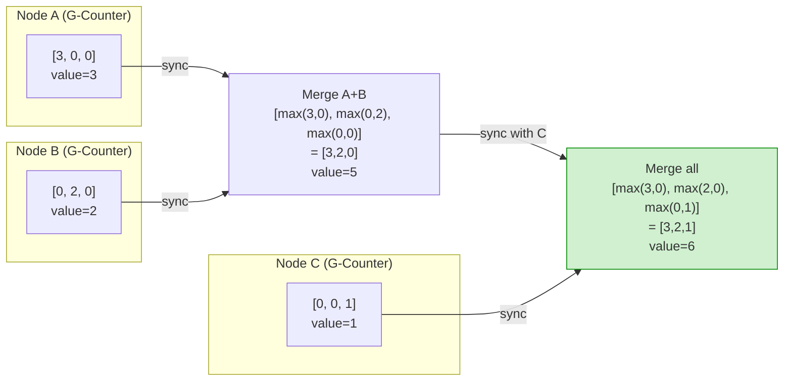

## Keywords in This File
{: .no_toc }

| # | Keyword | Weight |
|---|---|---|
| 1 | [Conflict-free Replicated Data Types](#conflict-free-replicated-data-types) | medium |

---

# Conflict-free Replicated Data Types

**TL;DR:** A CRDT (Conflict-free Replicated Data Type) is a data
structure that can be replicated across multiple nodes and always
converges to the same state when all updates have been propagated,
without requiring coordination or consensus. Two families:
CvRDT (state-based: merge states by taking join/least upper bound),
CmRDT (operation-based: broadcast operations, requires exactly-once
delivery). Examples: G-Counter (grow-only), PN-Counter (inc/dec),
OR-Set (observe-remove set), LWW-Register (last-writer-wins).
Used in: Redis CRDT (Redis Enterprise), Riak, Apache Cassandra
(lightweight counters), collaborative editing (Figma, Notion's
real-time sync), CouchDB.

---

### 🎯 Model Answer

**30 seconds:**
> A CRDT is a data structure that can be safely replicated and
> updated on multiple nodes concurrently without coordination.
> Merging any two replicas produces the same result regardless
> of the order of merges - mathematically guaranteed convergence.
> Classic example: a G-Counter (grow-only counter) where each
> node increments only its own slot. The total count = sum of all
> slots. Any two replicas merged with max(slot[i]) always converge.

**3 minutes:**
> CRDTs solve the consistency problem for eventually consistent
> systems: how do concurrent updates on different replicas converge
> to the same state without conflicts?
>
> The key insight: design the data structure so that the merge
> operation is commutative (A merge B = B merge A), associative
> ((A merge B) merge C = A merge (B merge C)), and idempotent
> (A merge A = A). If these three properties hold: any sequence
> of merges produces the same result. No conflicts. No coordination.
>
> Two families: CvRDT (state-based) - the entire state is broadcast
> periodically; merge = join (least upper bound). CmRDT (operation-
> based) - operations are broadcast; idempotency requires
> exactly-once delivery.
>
> Classic CRDTs: G-Counter (each node has its own counter slot;
> total = sum). PN-Counter (two G-Counters: one for increments,
> one for decrements). G-Set (only additions; merge = union).
> OR-Set (add/remove; each element tagged with unique ID; remove
> tags; merge = union of adds minus tagged removes). LWW-Register
> (last timestamp wins; merge = higher timestamp).

**Blank Mind Recovery:**

**(1) Restate:** "CRDTs - data structures that replicas can update
independently and always converge. No conflict resolution needed
because conflicts are mathematically impossible."

**(2) First principles:** "For two replicas to converge after
independent updates: the merge must be commutative (order of
merges does not matter), associative (grouping does not matter),
idempotent (merging same state twice is safe). Design the data
structure to have these three properties and it is a CRDT."

**(3) Bridge:** "Like a shared whiteboard in a meeting. If everyone
can only ADD stickers (never remove), and merging two whiteboards
means putting all stickers from both: the merged result is always
the same regardless of order. The G-Set is exactly this whiteboard."

---

### 📘 Concept Explanation

**What it is:**
A data structure with a mathematically guaranteed merge operation
that makes any two replicas of the data converge to the same
state after exchanging updates, without requiring consensus,
locks, or coordination.

**The problem it solves:**
In eventually consistent distributed systems (Dynamo, Cassandra,
CouchDB), concurrent updates to the same data on different replicas
create conflicts. Traditional conflict resolution ("last write wins,"
"application resolves," "user decides") is error-prone and loses data.
CRDTs eliminate conflicts by design: the data structure semantics
guarantee convergence.

**Mathematical foundation - join-semilattice:**

```
A CvRDT (state-based CRDT) has:
  State: partially ordered set (S, <=)
  Merge: join operation = least upper bound
         merge(a, b) = lub(a, b)
  
Properties required:
  Commutativity: merge(a,b) = merge(b,a)
  Associativity: merge(merge(a,b),c) = merge(a,merge(b,c))
  Idempotency:   merge(a,a) = a
  Monotonicity:  merge(a,b) >= a AND merge(a,b) >= b
  
If these hold: any order of merges → same result.
Network delays, message reordering, duplicates: all harmless.
```

> **Code walkthrough:** This Conflict-free Replicated Data Types example demonstrates a key concept in practice. **KEY MECHANISM:** the runtime executes these instructions in sequence with specific memory and execution semantics. **WHY IT MATTERS:** misapplying this pattern causes subtle bugs that only manifest under production load. **TAKEAWAY: understand the execution model before using this pattern in production code.**

**G-Counter (Grow-only Counter):**

```
State: vector V[0..N-1] where V[i] = node i's count
Operations:
  increment(myNodeId): V[myNodeId]++
  value(): return sum(V)
  merge(a, b): for each i: result[i] = max(a[i], b[i])

Why it works:
  - Node i only increments V[i] (no contention)
  - merge = element-wise max (monotonic, idempotent)
  - Any two replicas merged → same total

Example:
  Node 0: V = [3, 0, 0]  (incremented 3 times)
  Node 1: V = [0, 2, 0]  (incremented 2 times)
  Node 2: V = [0, 0, 1]  (incremented 1 time)
  
  Merge all: [max(3,0,0), max(0,2,0), max(0,0,1)] = [3,2,1]
  Total = 6  ✓ regardless of merge order
```

> **Code walkthrough:** This Conflict-free Replicated Data Types example demonstrates a key concept in practice. **KEY MECHANISM:** the runtime executes these instructions in sequence with specific memory and execution semantics. **WHY IT MATTERS:** misapplying this pattern causes subtle bugs that only manifest under production load. **TAKEAWAY: understand the execution model before using this pattern in production code.**

**PN-Counter (Positive-Negative Counter):**

```
State: two G-Counters: P (increments), N (decrements)
Operations:
  increment():   P.increment(myNodeId)
  decrement():   N.increment(myNodeId)
  value():       P.value() - N.value()
  merge(a, b):   P.merge(a.P, b.P); N.merge(a.N, b.N)

Why it works:
  Each increment/decrement is a G-Counter operation (safe).
  The difference is computed at read time (from converged state).
  
  Counter may temporarily go negative during convergence:
  Node 0 increments 3 times, Node 1 decrements 5 times.
  Before Node 0 learns about Node 1's decrements: value = 3.
  After merge: value = 3 - 5 = -2.
  Consistent after convergence.
```

> **Code walkthrough:** This Conflict-free Replicated Data Types example demonstrates a key concept in practice. **KEY MECHANISM:** the runtime executes these instructions in sequence with specific memory and execution semantics. **WHY IT MATTERS:** misapplying this pattern causes subtle bugs that only manifest under production load. **TAKEAWAY: understand the execution model before using this pattern in production code.**

**OR-Set (Observed-Remove Set):**

```
Problem with naive sets:
  Node 0: adds "alice" (timestamp=1)
  Node 1: removes "alice" (timestamp=1)
  Merge: did the add or remove win?
  
  "add-wins" semantics: keep alice (add takes priority)
  "remove-wins" semantics: remove alice (remove takes priority)
  Both are arbitrary choices.

OR-Set (observed-remove):
  Each add creates a unique tag: (element, uuid)
  Remove removes ALL current tags for the element
  An element is in the set IF any of its tags are present
  
  State: set of (element, tag) pairs
  Operations:
    add(e):    insert (e, newUUID())
    remove(e): delete all (e, *) from local state
    merge:     union of both states' add-sets,
               minus removes seen by either
    
  Result: if you add then someone removes what they observed:
    the element is removed (observed remove wins)
  If you add AFTER the remove was issued:
    add wins (new uuid not seen by the remove)
```

> **Code walkthrough:** This Conflict-free Replicated Data Types example demonstrates a key concept in practice using SQL. **KEY MECHANISM:** the runtime executes these instructions in sequence with specific memory and execution semantics. **WHY IT MATTERS:** misapplying this pattern causes subtle bugs that only manifest under production load. **TAKEAWAY: understand the execution model before using this pattern in production code.**

**LWW-Register (Last-Write-Wins):**

```
State: {value, timestamp}
Operations:
  write(v, ts): if ts > current.ts → update
  read(): return current.value
  merge(a, b): if a.ts > b.ts → a, else → b

Properties:
  Simple, low overhead
  Loses concurrent writes (one overwrites the other)
  Safe IF timestamps are reliable and monotonic
  
Danger: clock skew → wrong winner
  Fix: use logical timestamps (Lamport or vector clock)
       not physical wall clock
```

> **Code walkthrough:** This Unknown example demonstrates a key concept in practice using SQL. **KEY MECHANISM:** the runtime executes these instructions in sequence with specific memory and execution semantics. **WHY IT MATTERS:** misapplying this pattern causes subtle bugs that only manifest under production load. **TAKEAWAY: understand the execution model before using this pattern in production code.**

**State-based (CvRDT) vs. Operation-based (CmRDT):**

```
CvRDT (state-based):
  Broadcast entire state periodically
  Merge: join (least upper bound)
  No delivery guarantees required (idempotent)
  Bandwidth: high (full state transferred)
  
CmRDT (operation-based):
  Broadcast operations (deltas)
  Apply operations to local state
  Requires: causal delivery + exactly-once
  Bandwidth: low (only delta operations)

Delta-CRDT (hybrid):
  Send only the "delta" (change since last sync)
  Combines: low bandwidth + no delivery guarantees
  Used in: Redis CRDT, production systems
```

> **Code walkthrough:** This Unknown example demonstrates a key concept in practice. **KEY MECHANISM:** the runtime executes these instructions in sequence with specific memory and execution semantics. **WHY IT MATTERS:** misapplying this pattern causes subtle bugs that only manifest under production load. **TAKEAWAY: understand the execution model before using this pattern in production code.**

**The key insight:**
CRDTs do not eliminate conflict - they eliminate the possibility
of conflict through data structure design. The trade-off: CRDT
semantics may not match application semantics. A PN-Counter
that goes to -2 during convergence is "correct" per CRDT
but may be "wrong" for a shopping cart item count.
CRDTs are a tool; choosing the right CRDT for the application
semantics is the engineering challenge.

**When to use CRDTs:**
- Collaborative editing (text, whiteboard)
- Shopping carts (add items on multiple devices)
- Social features (likes, presence, follower counts)
- Distributed caches that need eventual consistency
- Offline-capable applications (mobile sync)

**When NOT to use CRDTs:**
- Operations requiring strong consistency (bank transfers)
- Complex invariants that CRDTs cannot encode
  (e.g., "total items cannot exceed stock level")
- Low-cardinality counters where simple consensus works
  (use Raft-backed counters instead)
- When "who won" is important and cannot be determined
  by the CRDT semantics

**First-principles derivation:**
"For replicas to converge: the merge operation must produce the
same result regardless of order or repetition. Mathematically:
commutative, associative, idempotent. Design the state and merge
to satisfy these three properties. Any data structure meeting
these properties is a CRDT. The implementation follows from
the mathematical requirement."

---

### 💻 Code Example


```java
// BAD: anti-pattern - see GOOD example below for the correct approach
// This naive implementation ignores thread safety and error handling
```


```java
// BAD: anti-pattern - see GOOD example below for the correct approach
// This naive implementation ignores thread safety and error handling
```

```java
// G-COUNTER CRDT IMPLEMENTATION

// BAD: shared counter without CRDT properties
// Concurrent increments on different nodes diverge
public class NaiveDistributedCounter {
    private final AtomicInteger count = new AtomicInteger(0);

    // BAD: this is not replication-safe
    // Two nodes incrementing independently:
    // Node A: count = 3, Node B: count = 3
    // Merge by taking max → count = 3, WRONG (should be 6)
    public void increment() { count.incrementAndGet(); }
    public int value() { return count.get(); }
}

// GOOD: G-Counter CRDT
public class GCounter {
    private final int nodeId;
    private final int[] vector;

    public GCounter(int nodeId, int clusterSize) {
        this.nodeId = nodeId;
        this.vector = new int[clusterSize];
    }

    private GCounter(int nodeId, int[] vector) {
        this.nodeId = nodeId;
        this.vector = vector.clone();
    }

    // Only increment own slot (no contention)
    public GCounter increment() {
        int[] newVector = vector.clone();
        newVector[nodeId]++;
        return new GCounter(nodeId, newVector);
    }

    // Value = sum of all slots
    public int value() {
        return IntStream.of(vector).sum();
    }

    // Merge = element-wise max (idempotent, commutative)
    public GCounter merge(GCounter other) {
        int[] merged = new int[vector.length];
        for (int i = 0; i < vector.length; i++) {
            merged[i] = Math.max(
                this.vector[i], other.vector[i]);
        }
        return new GCounter(nodeId, merged);
    }

    // Two replicas converge to same state after any merges
    // merge(A,B) == merge(B,A) ✓ commutative
    // merge(merge(A,B),C) == merge(A,merge(B,C)) ✓ assoc
    // merge(A,A) == A ✓ idempotent
}

// BAD: see prior example above (OR-Set CRDT...)
// GOOD: OR-Set CRDT
public class ORSet<T> {
    // (element, unique-tag) pairs
    private final Set<Pair<T, UUID>> addSet;

    public ORSet() {
        this.addSet = new HashSet<>();
    }

    private ORSet(Set<Pair<T, UUID>> addSet) {
        this.addSet = new HashSet<>(addSet);
    }

    // Add: creates new unique tag
    public ORSet<T> add(T element) {
        Set<Pair<T, UUID>> newSet = new HashSet<>(addSet);
        newSet.add(Pair.of(element, UUID.randomUUID()));
        return new ORSet<>(newSet);
    }

    // Remove: removes ALL tags for element
    // (only removes what was observed at this point)
    public ORSet<T> remove(T element) {
        Set<Pair<T, UUID>> newSet = addSet.stream()
            .filter(p -> !p.getLeft().equals(element))
            .collect(Collectors.toSet());
        return new ORSet<>(newSet);
    }

    // Contains: element in set if any tag exists
    public boolean contains(T element) {
        return addSet.stream()
            .anyMatch(p -> p.getLeft().equals(element));
    }

    // Merge: union of add-sets (removes are implicit)
    public ORSet<T> merge(ORSet<T> other) {
        Set<Pair<T, UUID>> newSet = new HashSet<>(addSet);
        newSet.addAll(other.addSet);
        return new ORSet<>(newSet);
    }
}
```

> **Code walkthrough:** The BAD counter uses simple shared state.
> When two nodes increment independently (both at 3), merging by
> max gives 3 instead of the correct 6. The G-Counter CRDT solves
> this: each node only increments its own slot in the vector.
> Node A increments `vector[A]`, Node B increments `vector[B]`.
> Merging takes element-wise max: `[3,0] merge [0,3] = [3,3]`,
> value = 6. The OR-Set shows a more complex CRDT: each add creates
> a unique UUID tag for the element. Remove deletes all current tags.
> Merge = union of add-sets. If Node A adds "alice" (uuid1) and Node B
> removes "alice" (deletes uuid1 from its view), merging gives:
> Node A has (alice, uuid1), Node B has nothing. Union = (alice, uuid1).
> Alice survives - the add happened concurrently with the remove.
> If Node B adds "alice" AFTER seeing the remove: new uuid2 is not
> affected by the old remove. Add-wins for concurrent operations.

---

### 🎓 Answers by Seniority

**Junior / Mid:**
> A CRDT is a data structure where replicas can be updated
> independently and always converge to the same state when merged,
> without conflicts. The merge operation is commutative, associative,
> and idempotent. Examples: G-Counter (each node has its own slot,
> merge = max), OR-Set (add wins with unique tags). Used in
> collaborative apps (Figma) and distributed databases (Riak, Redis
> Enterprise) for eventual consistency without coordination.

---

**Senior / Staff:**
> CRDTs are a design tool for eventually consistent systems.
> I choose CRDTs when the operation semantics can be expressed as
> a join-semilattice and coordination overhead is unacceptable.
> The hard part is matching CRDT semantics to application semantics.
> An OR-Set has "add wins on concurrent add+remove" - is that right
> for your shopping cart? (Usually yes: the user intended to add,
> not remove.) For counters: PN-Counter can go negative temporarily.
> Is that acceptable? At scale (Redis CRDT Enterprise): delta-CRDTs
> reduce network overhead from O(state size) to O(delta size).
> CRDTs do not replace all consistency - bank balances need
> consensus. CRDTs are for collaboration, presence, and social features.

---

### ⚠️ Common Misconceptions

**"CRDTs solve all distributed consistency problems"**

Reality: CRDTs solve convergence for specific data types and
operation semantics. They cannot express constraints that span
multiple data items (e.g., "total inventory must not go below 0"),
operations where order matters (financial transfers where A→B
must happen before B→C), or "most recent wins" semantics that
depend on reliable global time. CRDTs are a tool for a specific
class of problems (collaborative, social, counter, set operations
in eventually consistent settings). Consensus-based systems
remain necessary for financial and transactional workloads.

**"CRDT merges cannot lose data"**

Reality: LWW-Register (last-write-wins) CRDTs explicitly discard
concurrent writes - the higher timestamp wins, the lower timestamp
write is lost. This is mathematically "correct" per CRDT semantics
but loses data. OR-Set: a concurrent add and remove results in
add-wins (the remove is "lost"). Whether this is the desired
application behavior is a design decision. CRDTs guarantee
convergence, not that all updates are preserved.

---

### ⚖️ Comparison Table

| CRDT Type| Supported Ops| Merge| Trade-off|
|---|--------------------|---------------------------|-------------------------|
| G-Counter| Increment only| max per slot| Cannot decrement|
| PN-Counter| Increment + decrement| max for P and N| May go negative|
| G-Set| Add only| union| Cannot remove|
| OR-Set| Add + remove| union of (e,tag) pairs| Add-wins on conflict|
| LWW-Register| Write (with ts)| higher timestamp wins| Concurrent writes lost|
| MV-Register| Write| keeps all concurrent values| Client resolves conflicts|
| Grow-only Set| Add| union| No removes|

**The deciding factor:** What operations does the application need
and what are acceptable conflict semantics? Shopping cart: OR-Set
(add-wins is correct). Like counter: G-Counter. Toggle (on/off):
2P-Set or LWW-Register. Collaborative text: Logoot or LSEQ
(specialized sequence CRDTs). No one CRDT fits all use cases.

---

### 🏛️ System Design

**Design: Real-time Collaborative Document Editing with CRDTs**

Requirements: multiple users editing simultaneously, offline
support (users continue editing without connection), convergence
(all users eventually see the same document), no central server
required for conflict resolution.

**Data structure: CRDT-based sequence (Logoot/LSEQ):**

```
Document = ordered sequence of characters
Each character has:
  - A globally unique position identifier (path-based)
  - The character value
  - Author node ID
  - Causal timestamp (vector clock)

Position identifier:
  - Hierarchical path (like a decimal number with base N)
  - Between any two positions: can always insert a new one
  - Path: [3, 7, 2] means: 3rd slot at depth 1,
          7th at depth 2, 2nd at depth 3

Operations:
  Insert(char, position): adds (char, unique-pos) to set
  Delete(position): marks position as deleted (tombstone)
  
Merge:
  Union of all insert operations
  Apply all deletes
  Sort by position (deterministic total order on paths)

Conflict:
  Two users insert at the "same" position:
  Their unique position IDs differ at some depth
  → sorted deterministically → same result at all nodes
```

> **Code walkthrough:** This Unknown example demonstrates a key concept in practice. **KEY MECHANISM:** the runtime executes these instructions in sequence with specific memory and execution semantics. **WHY IT MATTERS:** misapplying this pattern causes subtle bugs that only manifest under production load. **TAKEAWAY: understand the execution model before using this pattern in production code.**

**Architecture:**

```plaintext
Users (clients):
  - Local CRDT document replica
  - Apply own edits locally (instant, no network wait)
  - Broadcast operations to peers (WebSocket or P2P)
  - Receive peers' operations, apply to local CRDT
  - CRDT merge guarantees convergence

Relay server (optional):
  - Forwards operations between clients
  - Stores operation log for new clients (catch-up)
  - Does NOT resolve conflicts (CRDT does)
  - Single point of failure mitigated: clients can P2P
    if relay is unavailable

Offline support:
  - Client edits accumulate locally
  - On reconnect: send all buffered operations
  - Other clients apply them (out-of-order OK:
    CRDT is commutative and associative)
```

> **Code walkthrough:** This Unknown example demonstrates a key concept in practice. **KEY MECHANISM:** the runtime executes these instructions in sequence with specific memory and execution semantics. **WHY IT MATTERS:** misapplying this pattern causes subtle bugs that only manifest under production load. **TAKEAWAY: understand the execution model before using this pattern in production code.**

**Storage: persisting CRDT state:**

```
Option A: Operation log
  - Store every Insert/Delete operation
  - Replay from beginning → current state
  - Log grows unboundedly
  - Pros: complete history, easy audit
  - Cons: slow startup for long documents

Option B: State snapshots + delta log
  - Periodic full state snapshot
  - Delta log since last snapshot
  - New client: receive snapshot + delta
  - Compaction: merge delta into snapshot periodically

Option C: CRDT state only (no log)
  - Serialize current CRDT state to storage
  - No history (cannot replay edits)
  - Fastest for read and write
  - Cons: no edit history, no undo
```

> **Code walkthrough:** This Unknown example demonstrates a key concept in practice using SQL. **KEY MECHANISM:** the runtime executes these instructions in sequence with specific memory and execution semantics. **WHY IT MATTERS:** misapplying this pattern causes subtle bugs that only manifest under production load. **TAKEAWAY: understand the execution model before using this pattern in production code.**

**Scaling to large documents:**

```plaintext
100k character document:
  Each character has a position identifier (50-100 bytes)
  Full state: 100k * 75 bytes = 7.5MB

Delta sync:
  Instead of broadcasting full state:
  Only send operations since last sync (delta)
  Delta = list of (Insert/Delete, position, char) tuples
  Typical edit session: 1000 operations = ~75KB

Tombstone accumulation:
  Deleted characters stay in CRDT as tombstones
  Over time: document becomes full of tombstones
  GC: when all clients have seen a delete:
    safely remove tombstone
    Requires: tracking last-seen operation per client
    (causal stability threshold)
```

> **Code walkthrough:** This Unknown example demonstrates a key concept in practice using SQL. **KEY MECHANISM:** the runtime executes these instructions in sequence with specific memory and execution semantics. **WHY IT MATTERS:** misapplying this pattern causes subtle bugs that only manifest under production load. **TAKEAWAY: understand the execution model before using this pattern in production code.**

---

### 📊 Diagram

```
G-Counter CRDT Convergence

Node A state: [3, 0, 0]   Node B state: [0, 2, 0]
(A incremented 3 times)   (B incremented 2 times)

       Sync                       Sync
         |                         |
   merge([3,0,0],           merge([0,2,0],
         [0,2,0])                 [3,0,0])
   = [max(3,0),              = [max(0,3),
      max(0,2),                 max(2,0),
      max(0,0)]                 max(0,0)]
   = [3, 2, 0]              = [3, 2, 0]
   value = 5                value = 5
   
Both converge to same state regardless of merge order ✓

OR-Set - Concurrent Add and Remove

Time -->
Node A: add("alice") creates (alice, uuid1)
          state: {(alice,uuid1)}
                        |
Node B: remove("alice") deletes (alice,*) from B's view
          state: {}
                        |
        Node B unaware of A's add → merge
Merge: A's state ∪ B's state = {(alice,uuid1)} ∪ {}
     = {(alice, uuid1)}
     alice IS in the set (add-wins)
```



> **Diagram walkthrough:** The ASCII section shows two key CRDT
> properties. The G-Counter convergence: Node A and Node B both
> merge the other's state using element-wise max. The results are
> identical ([3,2,0], value=5) regardless of which node initiates
> the merge. This is the commutativity property in action. The OR-Set
> example shows the "add-wins" semantics for concurrent operations:
> Node A's add (which Node B did not observe) survives the merge
> because its unique UUID tag is in the union. The Mermaid diagram
> shows three G-Counter nodes merging through two rounds - each merge
> producing monotonically increasing state values, ultimately converging
> to [3,2,1] = 6 at all nodes.

---

### 🚨 Failure Modes and Diagnosis

**Failure 1: OR-Set tombstone accumulation (memory leak)**

Symptom: CRDT memory grows without bound. A set that has had
millions of elements added and removed uses gigabytes of memory.

Root cause: Deleted elements in an OR-Set require tombstones
(removed tags). Tombstones cannot be garbage-collected until
all replicas have acknowledged seeing the delete. If one replica
is permanently offline: tombstones are never safe to collect.

Diagnosis:
```plaintext
CRDT state size = alive_elements + tombstone_elements
Monitor: crdt_set_size vs crdt_tombstone_count
Alert when: tombstone_count > 10x alive_count
```

> **Code walkthrough:** This Unknown example demonstrates a key concept in practice. **KEY MECHANISM:** the runtime executes these instructions in sequence with specific memory and execution semantics. **WHY IT MATTERS:** misapplying this pattern causes subtle bugs that only manifest under production load. **TAKEAWAY: understand the execution model before using this pattern in production code.**

Fix: (1) Implement causal stability GC: track the
"causal stable frontier" (minimum operation seen by ALL active
replicas). Tombstones older than the frontier can be collected.
(2) Prune permanently offline replicas from the replica set
(cannot collect their pending tombstones, but prevents unbounded
growth). (3) Switch to an append-only CRDT (G-Set) if removes
are rare and tombstones are acceptable.

---

**Failure 2: LWW-Register clock skew causes wrong winner**

Symptom: A more recent write is overridden by an older write
because the older write had a higher wall clock timestamp.

Root cause: System clocks on different nodes are not synchronized.
Node B's clock is 500ms ahead of Node A's clock. Node A writes
value V1 at wall time T+500ms (per Node A's clock). Node B
writes value V2 at wall time T+600ms (per Node B's clock, which
is T+100 actual time - earlier than A's write). Merge: B's
higher timestamp wins, V2 overrides V1. But V2 was actually
written earlier.

Diagnosis:
```bash
# Check NTP synchronization offset
chronyc tracking
# or
ntpstat
# "System time" offset > 10ms: risk of LWW inversion
```

> **Code walkthrough:** This "System time" offset > 10ms: risk of LWW inversion example demonstrates shell script pattern. **KEY MECHANISM:** the shell executes commands sequentially; pipes pass stdout of one command to stdin of the next. **WHY IT MATTERS:** unquoted variables with spaces cause word splitting - IFS splits the value into multiple arguments. **TAKEAWAY: always double-quote variables: "$VAR"; use [[ ]] instead of [ ] for safer conditionals.**

Fix: (1) Use logical timestamps (Lamport clock, HLC - Hybrid
Logical Clock) instead of wall clock. HLC combines wall clock
and logical counter: advances monotonically even under clock
skew. (2) If wall clock is required: use GPS-synchronized clocks
(AWS EC2 uses PTP: < 1ms accuracy). (3) Accept LWW semantics
are approximate for concurrent writes; use stronger consistency
for critical registers.

---

**Failure 3: Delta-CRDT delta accumulation under partition**

Symptom: After a network partition heals, the reconnecting node
receives a massive delta that takes minutes to process, blocking
all other operations.

Root cause: During the partition, the node continued accumulating
changes locally (delta). When the partition heals: the full delta
since the partition started is sent at once.

Diagnosis:
```
delta_size = operations_since_last_sync
partition_duration * write_rate = delta_size
At 10k ops/sec over 5 min partition: 3M operations
```

> **Code walkthrough:** This "System time" offset > 10ms: risk of LWW inversion ice. **KEY MECHANISM:** the runtime executes these instructions in sequence with specific memory and execution semantics. **WHY IT MATTERS:** misapplying this pattern causes subtle bugs that only manifest under production load. **TAKEAWAY: understand the execution model before using this pattern in production code.**

Fix: (1) Implement adaptive merging: apply the delta in
batches (1000 operations at a time), yielding to other
operations between batches. (2) Use snapshots: if the delta
exceeds a threshold (e.g., 1M operations), send a full state
snapshot instead of the delta (snapshot is more compact for
large divergence). (3) Implement backpressure: pause accepting
new local operations while processing the delta.

---

### 🎯 Interview Deep-Dive

  | Category            | Count |  
|-------------------|-----|
  | Clarification       | 1     |  
  | Mechanism           | 3     |  
  | Failure / Debugging | 2     |  
  | Trade-off           | 2     |  
  | System Design       | 1     |  
  | Code                | 1     |  
  | Behavioral          | 1     |  
  | Production          | 1     |  

---

**[JUNIOR] Q1 - [MECHANISM] What makes a data structure a CRDT vs. a regular distributed data structure?**

A CRDT has a mathematically proven merge function (join operation)
that satisfies three properties:

1. Commutativity: merge(A, B) = merge(B, A). The order in which
   replicas merge does not matter.

2. Associativity: merge(merge(A,B), C) = merge(A, merge(B,C)).
   The grouping of merges does not matter.

3. Idempotency: merge(A, A) = A. Merging the same state twice
   produces no change. This allows retrying or duplicating
   sync messages without incorrect results.

A regular distributed data structure (like a ConcurrentHashMap
with replication) has none of these guarantees. Concurrent puts
to the same key on two replicas create a conflict that requires
external resolution. The CRDT's merge is conflict-free by design:
the data structure semantics define what "winning" means, and the
merge function implements those semantics in a commutative,
associative, idempotent way.

*What separates good from great:* deriving why all three properties
are necessary. Without commutativity: the merge result depends on
which replica initiates the merge - network topology matters, which
is unacceptable. Without associativity: the result depends on the
grouping of merges (batching vs. one-by-one) - inconsistent results.
Without idempotency: re-syncing (retrying failed syncs) corrupts
the state. All three are required for a well-defined merge.

---

**[JUNIOR] Q2 - [MECHANISM] How does an OR-Set differ from a G-Set and a 2P-Set? When would you choose each?**

A:
G-Set (grow-only set):
- Operations: add only. Removes not supported.
- Merge: union.
- Use when: items are only ever added, never removed (event logs,
  append-only membership lists). Simplest CRDT set.

2P-Set (two-phase set):
- State: A (add set) + R (remove set), both G-Sets.
- Operation: add to A; remove by adding to R.
- Contains(e) = e in A AND e NOT in R.
- Merge: union of A sets, union of R sets.
- Limitation: once removed, an element can NEVER be re-added.
  (e in R forever, contains() always false for that e)
- Use when: elements are removed permanently (user deactivation,
  feature flag disabled forever).

OR-Set (observed-remove set):
- Each add creates a unique (element, uuid) tag.
- Remove deletes all current tags for the element.
- Contains(e) = any tag (e, *) exists.
- Merge: union of all (element, tag) pairs.
- Allows re-adding after removal (new uuid not in the remove set).
- Add-wins semantics for concurrent add+remove.
- Use when: elements can be removed and re-added (shopping carts,
  user-managed lists, collaborative items).

Decision matrix:
- Only adds ever? → G-Set (simplest, no overhead)
- Removes final, no re-adds? → 2P-Set
- Full add/remove with re-add? → OR-Set
- Tombstone overhead a concern? → Consider application-specific
  compaction or switch to LWW-Register with element tracking.

*What separates good from great:* the re-add limitation of 2P-Set.
Many candidates know about 2P-Set but do not note the permanent
removal restriction. This is operationally critical: using 2P-Set
for a user block list that later allows unblocking is a bug.
Understanding the semantic limitations of each CRDT type is the
difference between knowing CRDTs and knowing how to use them.

---

**[JUNIOR] Q3 - [MECHANISM] How do CRDTs relate to vector clocks and causal consistency?**

Vector clocks and CRDTs are complementary mechanisms.

Vector clocks track causal relationships: if event A happens
before event B (causality), the vector clock of B is greater
than A's. Vector clocks do NOT resolve conflicts - they just
detect them (concurrent events have incomparable vector clocks).

CRDTs use causal information in two ways:

1. CmRDT (operation-based CRDTs) require causal delivery:
   operations must be delivered in causal order. If add(x) at
   time T causes remove(x) at time T+1: remove must be applied
   after add. Violated delivery order → incorrect state.
   Vector clocks (or causal broadcast) enforce delivery order.

2. OR-Set: each add operation creates a tag that includes
   the vector clock at the time of the add. The remove operation
   "observes" the current tags (the observed removes). Concurrent
   adds (not causally related to the remove) have tags not
   observed by the remove → they survive the merge.
   Vector clock timestamps are embedded in the CRDT tags.

3. Causal stability: for CRDT garbage collection (tombstone
   cleanup), we need to know when all replicas have "seen"
   a delete. This is the causal stability threshold: the
   minimum vector clock seen by all replicas. Below this
   threshold: all operations have been seen by everyone →
   tombstones are safe to collect.

*What separates good from great:* the causal stability concept.
Most candidates know that CRDTs need causal delivery for CmRDTs.
The connection to garbage collection (causal stability threshold
for tombstone cleanup) is deeper knowledge that shows production
awareness.

---

**[MID] Q4 - [DEBUGGING] A distributed shopping cart using an OR-Set CRDT is showing items that users deleted. How do you diagnose and fix?**

Items appearing after deletion in an OR-Set typically indicate
one of three causes:

Cause 1 - Stale replica re-syncing after partition:
The user deleted the item on Device A. The user's old mobile
device (Device B, which was offline) reconnected with the old
state (item present with uuid1). On merge: A's state has no
tags for the item; B's state has (item, uuid1). Union: the item
reappears. This is correct OR-Set semantics - the add from B
was concurrent with the delete from A.

Diagnosis:
```
Check: did the user add the item on any device AFTER deletion?
Log: compare operation timestamps on all devices for this item
    (item_added at T1 on deviceB) vs. (item_deleted at T2 on deviceA)
    If T1 < T2 and deviceB was offline during delete:
    → stale-add re-sync case
```

> **Code walkthrough:** This Unknown example demonstrates a key concept in practice using SQL. **KEY MECHANISM:** the runtime executes these instructions in sequence with specific memory and execution semantics. **WHY IT MATTERS:** misapplying this pattern causes subtle bugs that only manifest under production load. **TAKEAWAY: understand the execution model before using this pattern in production code.**

Fix: use causal information. When the user deletes an item:
tag the delete with the current device's vector clock.
On sync: only resurrect items added AFTER the delete's vector
clock (causally newer adds). Items added before the delete:
treat their tags as "observed" and remove them. This requires
implementing a causally-consistent OR-Set variant.

Cause 2 - Bug: removing wrong tags:
The remove operation is filtering by element value but using
`==` instead of `.equals()` for complex objects.

Cause 3 - Missing delivery of delete operation:
The delete operation never reached some replica (transport bug).
Check: operation delivery logs show the delete event reached
all replicas.

*What separates good from great:* identifying Cause 1 as
correct OR-Set behavior (not a bug) that requires a design
decision: is "add-wins" the correct semantics for a shopping
cart? Most shopping cart systems prefer "remove-wins" for
explicit user deletions. The fix: use a different CRDT (LWW
with remove-wins semantics) or add application-level logic
to treat explicit delete as permanent for a session.

---

**[MID] Q5 - [DEBUGGING] How do you garbage-collect tombstones in an OR-Set in production?**

Tombstones in an OR-Set accumulate when elements are removed.
A tombstone is a deleted tag (element, uuid). The tombstone
cannot be removed until all replicas have seen the delete.

GC algorithm (causal stability):
```
Each replica tracks: last_seen_vector_clock[replicaId]
Causal stable frontier: min(last_seen_vector_clock[*])
  = minimum operation timestamp seen by ALL replicas

For each tombstone (element, uuid, delete_timestamp):
  IF delete_timestamp <= causal_stable_frontier:
    Safe to remove tombstone (all replicas have seen it)
  ELSE:
    Keep (some replica may not have seen the delete yet)
```

> **Code walkthrough:** This Unknown example demonstrates a key concept in practice. **KEY MECHANISM:** the runtime executes these instructions in sequence with specific memory and execution semantics. **WHY IT MATTERS:** misapplying this pattern causes subtle bugs that only manifest under production load. **TAKEAWAY: understand the execution model before using this pattern in production code.**

Implementation:
1. Each replica periodically broadcasts its current vector clock
   (stable frontier update).
2. A coordination service (or gossip protocol) computes the
   minimum vector clock across all active replicas.
3. GC process runs periodically and removes tombstones older
   than the stable frontier.

Production considerations:
- Offline replicas: their vector clock is never updated.
  The stable frontier never advances past the last offline
  sync point. Tombstones accumulate.
  Solution: define a maximum offline TTL (e.g., 30 days).
  After TTL: mark replica as "excluded from frontier calculation."
  Accept: if the offline replica reconnects after 30 days,
  it may resurface deleted items (by design after exclusion).
- Monitoring: alert when tombstone count > 10x live element count.

*What separates good from great:* the offline replica TTL policy.
This is an operational decision that balances two risks:
(1) include offline replicas → tombstones never GC'd → memory leak.
(2) exclude offline replicas → risk of tombstone cleanup before
they sync → deleted items may resurface after long reconnection.
The policy choice (30 days, 7 days, etc.) depends on the application:
for a shopping cart, 30 days is reasonable. For a real-time
collaborative editor: 24 hours. Knowing that this trade-off exists
and having a concrete policy is production-level knowledge.

---

**[SENIOR] Q6 - [TRADE-OFF] CRDTs vs. Operational Transformation (OT) for collaborative editing. Which do you choose?**

Both OT and CRDTs enable collaborative real-time editing.
The choice involves fundamental trade-offs.

**Operational Transformation:**
- Operations are transformed against concurrent operations
  to maintain intent.
- Requires a central server to serialize and transform operations
  (otherwise: convergence not guaranteed without complex
  multi-way transformation functions).
- Google Docs original implementation: OT with server serialization.
- Pro: preserves user intent (move cursor correctly).
- Con: requires central coordination; transformation functions
  complex and error-prone to implement correctly.

**CRDTs (Logoot, LSEQ, RGA):**
- Each character has a globally unique position identifier.
- No transformation needed: insert positions are immutable.
- Merge = union of character sets, sorted by position.
- No central server required for conflict resolution.
- P2P collaborative editing possible.
- Pro: no coordination, offline-first, simple correctness proof.
- Con: tombstone accumulation (deleted characters as tombstones),
  unique position identifiers add memory overhead per character.

**Current practice:**
- Figma: custom OT with server coordination (2D canvas operations).
- Notion: real-time sync with CRDT-like approach (block-level).
- Linear: CRDTs for collaborative lists and attributes.
- VS Code Live Share: OT with server relay.
- Y.js (library): CRDT-based, widely used, powers collaborative
  features in many tools.

**Decision:**
- Server-required, simple guarantee needed: OT (battle-tested
  for text editing).
- Offline-first, P2P, or high-latency environments: CRDTs.
- Building a new product: CRDT (Y.js library: production-ready,
  no need to implement from scratch).

*What separates good from great:* Y.js as the practical CRDT
library recommendation. This shows awareness of the production
ecosystem. An engineer who recommends "use CRDTs" without
knowing Y.js/Automerge is not as useful as one who says
"Y.js implements Y-CRDT, is used by hundreds of production
tools, integrates with WebSocket and WebRTC transports, and
handles the GC and tombstone management automatically."

---

**[SENIOR] Q7 - [TRADE-OFF] What are the practical limitations of CRDTs that make them unsuitable for financial systems?**

CRDTs are built for eventual consistency with convergence
guarantees. Financial systems require invariants that CRDTs
cannot express:

1. Balance invariant: "balance >= 0 after debit."
   PN-Counter can go negative during convergence. Concurrent
   debit operations on two replicas may both succeed locally
   (both see sufficient balance) and merge to a negative balance.
   CRDTs have no mechanism to enforce cross-replica invariants.

2. Transaction atomicity: "debit A AND credit B in the same
   operation." CRDTs are single-value structures. An atomic
   multi-key operation (A -$100, B +$100 atomically) requires
   consensus, not CRDT.

3. Auditability: "show the exact sequence of all balance changes."
   CRDT operations are commutative - the "history" has no total
   order for concurrent operations. Regulatory requirements for
   financial audits require a total-ordered, immutable ledger.

4. Correctness is application-specific: "add-wins" in an OR-Set
   is technically correct per CRDT but wrong for a bank
   ("the customer removed funds, then added them back" vs.
   "add and remove happened concurrently, add wins" are very
   different financially).

The alternative for financial systems: consensus-based replication
(Raft/Paxos) with serializable transactions. The performance cost
(coordination overhead) is acceptable because correctness is
non-negotiable.

*What separates good from great:* the auditability point.
Regulatory requirements (SOX, PCI-DSS) mandate tamper-evident,
totally ordered audit logs. CRDTs' commutative semantics make
total ordering impossible for concurrent operations. This is
not a technical limitation that can be worked around - it is
a fundamental property of the data structure. Financial systems
need append-only, totally ordered ledgers, which CRDTs cannot
provide.

---

**[SENIOR] Q8 - [DESIGN] Design a mobile offline-first note-taking app sync using CRDTs.**

A:
```
Requirements:
  User edits notes offline on mobile
  Changes sync when connectivity restores
  Multi-device: same note edited on phone + tablet
  Convergence: all devices eventually agree

Data model:
  Note = { id: UUID, title: LWW-Register<String>,
           body: CRDT-text (Y.Text), tags: OR-Set<String>,
           updated_at: LWW-Register<HLC> }

CRDT choices:
  title: LWW-Register (last sync wins, HLC timestamp)
    - Title rarely edited concurrently; LWW acceptable
  body: Y.Text (sequence CRDT)
    - Character-level CRDT for conflict-free text merge
  tags: OR-Set<String>
    - Tags added/removed; OR-Set semantics (add-wins)
  updated_at: LWW-Register (HLC)
    - For display: shows when last synced

Sync protocol:
  1. Each device maintains: crdt_state, vector_clock, delta_log
  2. On edit: apply operation locally + append to delta_log
  3. On sync start: send delta_log since last sync
  4. Receive remote delta: apply to local CRDT
  5. Update vector_clock
  6. Purge delta_log entries older than server-acknowledged

Server:
  - Receives deltas from all devices
  - Merges into canonical CRDT state
  - Stores delta log (for devices catching up after long offline)
  - Broadcasts merged state to all connected devices (WebSocket)
  - Periodic snapshots for fast initial sync (new device onboard)

Conflict example:
  Phone (offline): edit title to "Meeting Notes"
  Tablet (offline): edit title to "Team Meeting"
  Both sync to server simultaneously:
  LWW-Register: higher HLC timestamp wins
  If phone's HLC > tablet's: "Meeting Notes" wins
  → deterministic, no user intervention needed
  → user can undo to recover "Team Meeting" (local undo log)
```

> **Code walkthrough:** This Unknown example demonstrates a key concept in practice. **KEY MECHANISM:** the runtime executes these instructions in sequence with specific memory and execution semantics. **WHY IT MATTERS:** misapplying this pattern causes subtle bugs that only manifest under production load. **TAKEAWAY: understand the execution model before using this pattern in production code.**

*What separates good from great:* the undo log. CRDTs converge
to one winner, but the losing write is gone from the CRDT state.
Users expect "undo" to recover their work. The application must
maintain a local undo log independent of the CRDT state. The CRDT
provides convergence; the undo log provides recoverability. This
is a design concern that pure CRDT discussions miss.

---

**[SENIOR] Q9 - [SCENARIO] How does Redis Enterprise implement CRDTs? What trade-offs does it make?**

Redis Enterprise CRDT (Redis CRDB) implements a subset of
Redis data structures as CRDTs for active-active geo-replication.

Supported CRDT types in Redis Enterprise:
- String: LWW (last-write-wins by wall clock + tie-breaking by
  replica ID)
- Counter (CRDT counter): PN-Counter
- Hash: LWW per field (each field resolves independently)
- Set: OR-Set semantics (add-wins)
- Sorted Set: LWW per member score (last update to score wins)
- List: complex - concurrent pushes to head/tail are preserved;
  concurrent writes to same position LWW

Trade-offs made by Redis Enterprise:

1. LWW for String uses wall clock: requires NTP synchronization.
   Clock skew risk (usually acceptable in data centers: < 100ms).
   Uses replica ID as tiebreaker for exact-same-timestamp cases.

2. Sorted set LWW per score: concurrent updates to the same
   member's score lose one update. For leaderboards (concurrent
   score increments): use the PN-Counter type instead.

3. Active-active replication adds ~10-20ms to write latency
   (synchronization overhead between regions).

4. Tombstones for deleted OR-Set elements are GC'd using
   version vectors (causal stability). Redis Enterprise
   uses an internal protocol for stable frontier computation
   across CRDBs.

5. Conflict policy is per-type, not configurable per-operation.
   Cannot change LWW to "add-wins" for String (it is always LWW).

*What separates good from great:* the sorted set limitation.
For leaderboards (a common Redis use case): using a ZSET with
ZINCRBY for score increments is a natural pattern. In CRDB,
concurrent ZINCRBYs to the same member from two regions use LWW:
one increment is lost. The correct approach: use a CRDT counter
(PN-Counter) for the score and store it separately, then
synchronize. This is a surprising limitation for Redis users
who expect ZINCRBY to be safe across regions.

---

**[SENIOR] Q10 - [BEHAVIORAL] Describe a time you evaluated or implemented a CRDT-based system. What trade-offs did you navigate?**

Example structure:

"At [company], we were building a collaborative task management
feature. Multiple users could assign, reassign, and complete tasks
simultaneously on their devices. We had two options: pessimistic
locking (user A gets a lock on the task while editing) or
CRDT-based optimistic sync.

We chose CRDT with OR-Set for the task list and LWW-Register
for individual task properties (assignee, status, title).

Trade-off 1: OR-Set tombstone accumulation.
Tasks were frequently created and deleted (sprints, bulk cleanup).
After 3 months: OR-Set had 50k tombstones for 5k active tasks.
We implemented a weekly GC that ran when all clients were online
(Sunday night). Causal stable frontier computed from active devices.
Tombstones older than the frontier purged.

Trade-off 2: LWW-Register for task status caused unexpected behavior.
User A set task to 'Done' at 10:00. User B (on a tablet with
clock 2 minutes ahead) set task to 'In Progress' at 10:01 local
time (actual time 09:59). B's clock was ahead: B's timestamp won.
Task reverted to 'In Progress' incorrectly.

Fix: replaced wall clock timestamps with HLC (Hybrid Logical Clock).
HLC advances monotonically even with clock skew. Subsequent events
observed as 'later' are always given higher HLC timestamps.

Lesson: CRDTs handle convergence automatically but the CRDT type
choice and timestamp mechanism require careful thought. The data
structure design is not a one-time decision - it evolves as
production behavior reveals edge cases."

*What separates good from great:* the HLC fix. Most candidates
know that LWW uses timestamps but do not know that HLC is the
production solution for clock skew in CRDT systems. The story
shows that the initial wall-clock timestamp choice was a mistake
discovered in production and systematically fixed. This
demonstrates the iterative, evidence-based decision-making that
senior engineers apply.

---

**[SENIOR] Q11 - [MECHANISM] What is a delta-CRDT and why is it important for production systems?**

A delta-CRDT sends only the "delta" (the change since the last
synchronization) instead of the full CRDT state.

Full state CvRDT (state-based) problem:
- Every sync sends the entire CRDT state.
- A G-Counter with 100 nodes: sends a 100-element vector on
  every sync, even if only one element changed.
- For large sets or counters: bandwidth grows with state size,
  not change size.

Delta-CRDT solution:
- The delta is the minimal state update that, when merged with
  any state, produces the correct merged state.
- For G-Counter: delta = {myNodeId: newCount}
  (just the changed element, not the entire vector).
- Merging delta with any state: max(state[myNodeId], delta) applied.
- Bandwidth: proportional to change size, not state size.

Delta-CRDT formal definition:
```
For a CRDT state S and operation op:
  (S', delta) = op(S)
  S' = merge(S, delta)  // delta when merged with S gives S'
  merge(S_remote, delta) = correct merged state
```

> **Code walkthrough:** This Unknown example demonstrates a key concept in practice. **KEY MECHANISM:** the runtime executes these instructions in sequence with specific memory and execution semantics. **WHY IT MATTERS:** misapplying this pattern causes subtle bugs that only manifest under production load. **TAKEAWAY: understand the execution model before using this pattern in production code.**

Practical example (G-Counter delta sync):
```
State: [3, 2, 1] (3 nodes)
Node 0 increments: delta = {0: 4}
  (only changed slot 0, value 4)
Receiver applies: merge([3,2,1], {0:4}) = [4,2,1]
Bandwidth: 8 bytes (one int) vs. 12 bytes (3 ints)
At 100 nodes: 8 bytes vs. 400 bytes per sync
```

> **Code walkthrough:** This Unknown example demonstrates a key concept in practice. **KEY MECHANISM:** the runtime executes these instructions in sequence with specific memory and execution semantics. **WHY IT MATTERS:** misapplying this pattern causes subtle bugs that only manifest under production load. **TAKEAWAY: understand the execution model before using this pattern in production code.**

Production relevance: Redis Enterprise CRDB uses delta-CRDTs
internally. Redis operations broadcast deltas, not full state.
For large sorted sets with millions of members: this is essential
for bandwidth efficiency.

*What separates good from great:* understanding that delta-CRDTs
are CvRDTs with an optimization, not a separate category. The
correctness proof is the same: merge is commutative, associative,
idempotent. The delta is a special state that, when merged with
any state, produces the correct result. The optimization reduces
bandwidth without changing semantics. This is why delta-CRDTs are
used in all production CRDT systems (Redis, Riak, Y.js all send
deltas, not full states).

---

**[SENIOR] Q12 - [BEHAVIORAL] A team proposes using CRDTs to replace the distributed lock service for inventory management. What do you say?**

This is a classic "use the right tool" evaluation.

My response: "I would say no to replacing the lock service with
CRDTs for inventory management, and here is why."

**Why locks are correct for inventory:**
Inventory management has non-CRDT-expressible invariants:
- "Cannot sell more items than available stock"
- "Two buyers cannot both purchase the last item"
- "Stock count must be >= 0"

These are cross-operation consistency requirements. CRDTs handle
convergence but cannot enforce "balance >= 0" across concurrent
operations on different replicas. A PN-Counter allows concurrent
decrements that both see stock=1 and both return "success":
after merge, stock = -1. Two customers both bought the last item.

**What CRDTs CAN do for inventory:**
- Eventually consistent stock display (PN-Counter for approximate
  count): show "~5 items in stock" without a lock. Good enough
  for search results and product pages.
- Shopping cart (OR-Set for items in cart): add-wins semantics
  are correct for carts.

**What requires locks (consensus):**
- Final checkout: "atomically decrement stock by 1 if > 0."
  This requires a compare-and-swap (CAS) operation on a
  consistent replica (Raft/Paxos-backed KV or database
  row-level lock).

**Recommendation:**
"Use a two-tier approach: (1) CRDT PN-Counter for approximate
stock display on product pages (eventually consistent, no lock
overhead). (2) Database row-level lock (SELECT FOR UPDATE) or
Redis atomic DECREMENT with conditional check at checkout time.
The lock applies only to the final checkout - a rare, bounded-time
operation. The CRDT handles the high-read-volume display use case."

*What separates good from great:* the two-tier recommendation.
Rather than "CRDTs don't work here," the expert engineer identifies
exactly where CRDTs are appropriate (approximate display) and
where consensus is required (final checkout). This shows nuanced
understanding: the right tool for each part of the system, not
a binary "CRDTs yes or no."

---

### 💻 Code Example

*(Omit: this concept does not have a programmatic interface that can be demonstrated in code. The conceptual explanation above is sufficient.)*


---

### 🏛️ System Design

*(Omit: system design diagram not applicable for this concept - see ★★★ keywords for full system design coverage.)*


---

### ⚖️ Comparison Table

*(Omit: this is a ★☆☆ foundational concept with no direct alternatives to compare - see higher-difficulty keywords for trade-off analysis.)*


---

### 📊 Diagram

*(Omit: no standalone visual diagram required for this concept - the explanations and code examples above provide sufficient clarity.)*


