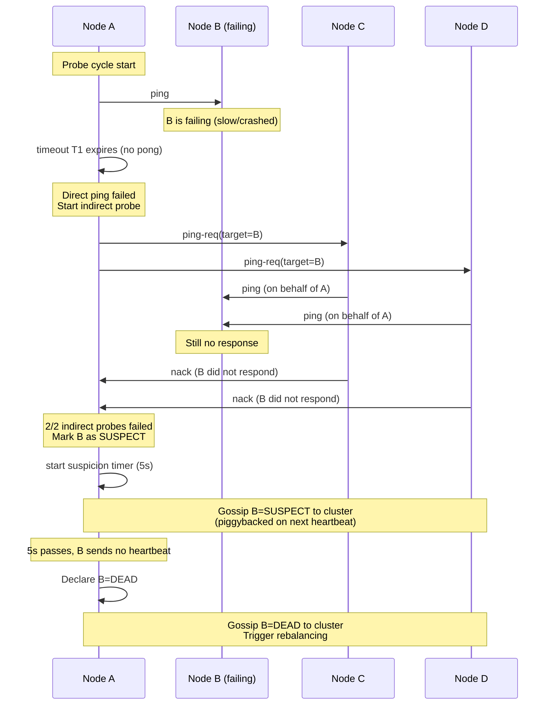

# Failure Detection Algorithms

**TL;DR:** Failure detection in distributed systems determines
whether a remote node is "dead" or merely slow. The fundamental
impossibility (Chandra-Toueg): in an asynchronous network, you
cannot distinguish a crashed node from a very slow one with 100%
accuracy. Production algorithms work probabilistically or accept
false-positives. Key approaches: (1) heartbeat with timeout -
simplest, tunable timeout; (2) Phi Accrual detector (Akka,
Cassandra) - outputs a continuous suspicion score, not boolean;
(3) gossip-based failure detection (SWIM protocol) - decentralized,
O(N) messages/cycle; used by Kubernetes, Consul, etcd cluster
health. The trade-off is always: aggressive detection (low timeout)
vs. false-positive rate.

---

### 🎯 Model Answer

**30 seconds:**
> Failure detection determines if a remote node crashed or is
> just slow. You cannot tell the difference with certainty in
> an asynchronous network - this is proven (Chandra-Toueg 1996).
> In practice: heartbeats with timeouts. Timeout too short: false
> positives (evict a healthy node). Too long: slow failure recovery.
> Production systems use adaptive detectors (Phi Accrual) or
> gossip protocols (SWIM) that handle variable network latency.

**3 minutes:**
> The fundamental challenge: Node A sends a heartbeat to Node B.
> Node B does not respond. Is B crashed? Or is the network slow?
> In a real data center, both happen. A 100ms timeout evicts
> B if the network is briefly congested. A 5s timeout leaves
> 5 seconds of unavailability when B actually crashes.
>
> Three production approaches:
>
> (1) Simple heartbeat + timeout:
>     Each node sends periodic heartbeats. If no heartbeat
>     for T seconds: declare failed. Used by Kafka brokers,
>     ZooKeeper. The threshold T is a deployment parameter.
>     Problem: T must be tuned per environment. Cloud VMs
>     with variable latency require larger T than bare metal.
>
> (2) Phi Accrual Failure Detector:
>     Instead of a binary "alive/dead" output, computes a
>     continuous "suspicion level" φ (phi). φ is based on
>     the statistics of past heartbeat arrival intervals.
>     If recent heartbeats had mean=100ms, stddev=10ms:
>     a heartbeat 500ms late produces high φ (statistically
>     very improbable). The application sets a threshold
>     (φ > 8.0 = declare failure). Adaptive to network
>     variation. Used by Akka cluster, Cassandra gossip.
>
> (3) SWIM (Scalable Weakly-consistent Infection-style
>     Membership):
>     Gossip-based protocol used by Kubernetes (etcd), Consul,
>     Serf. Instead of each node pinging all others (O(N^2)):
>     each node randomly picks one target to ping per cycle.
>     If direct ping fails: asks K random members to ping
>     the target (indirect ping). Only if indirect pings all
>     fail: declare target suspicious (then dead after
>     confirmation period). O(N) message complexity.
>     Scales to 1000+ nodes.

**Blank Mind Recovery:**

**(1) Restate:** "Failure detection = is that node dead or just
slow? Cannot know for sure in async networks. Solutions: timer
(simple, must tune), adaptive phi (uses history, continuous score),
gossip SWIM (scalable, O(N) messages)."

**(2) First principles:** "You can only observe silence (no
heartbeat). Silence is ambiguous: crashed OR slow. The resolution
is probabilistic: given past heartbeat timing, how surprising is
this silence? Very surprising = probably crashed. Tune how
surprising is 'declare failed.'"

**(3) Bridge:** "Like waiting for a friend who said they'd call at 8pm.
At 8:05: probably just late. At 9:00: probably something happened.
At midnight: declare 'not coming.' The wait time is your timeout.
The phi accrual detector is like knowing your friend is always
on time within 5 minutes - so 20 minutes late is very suspicious
(high phi). A friend who is always 10-60 minutes late: 20 minutes
is not suspicious at all."

---

### 📘 Concept Explanation

**What it is:**
Failure detection is the subsystem that determines whether a
node in a distributed system is operational or has failed.
It is the foundation of fault-tolerant systems: without failure
detection, a system cannot trigger failover, remove failed
nodes from load balancing, or alert on-call engineers.

**The problem it solves:**
A distributed system's nodes must react to node failures: a
Kafka cluster must redirect traffic from a crashed broker to
replicas, ZooKeeper must elect a new leader if the current one
dies, a Kubernetes pod must be restarted if it crashes.
Without failure detection: the system either treats all nodes
as alive (serving stale/incorrect data from non-responding
nodes) or treats slow nodes as failed (causing unnecessary
failovers and availability loss).

**The Chandra-Toueg impossibility:**

```
Theorem (1996): In an asynchronous distributed system with
the possibility of node crashes, there is no failure detector
that is both:
  - Complete: every crashed node is eventually suspected
  - Strongly accurate: no correct node is ever suspected

You cannot have both. In practice:
  - Eventually strong: some false positives initially,
    eventually corrects
  - Weakly accurate: at least one correct node is never
    suspected
  - Probabilistic: false positive rate < epsilon

This is why failure detection is always a tunable trade-off
between detection latency and false positive rate.
```

**Simple heartbeat failure detection:**

```
Node A (monitor)         Node B (monitored)
    |                        |
    |<--heartbeat (every T)--|
    |<--heartbeat-----------|
    |<--heartbeat-----------|
    |    (B crashes)
    |    (silence for timeout T * N)
    |--- declares B failed --|
    |    triggers failover   |

Parameters:
  heartbeat_interval: 1-5 seconds (typical)
  failure_timeout: 3-30 seconds (typically 3x interval)
  false_positive_rate: depends on network stability

Problem: single-node monitoring = single point of failure
  All-to-all monitoring: O(N^2) messages, doesn't scale
  Better: use a gossip protocol or quorum of monitors
```

**Phi Accrual Failure Detector:**

```
How it works:
  1. Monitor records timing of last N heartbeat arrivals
     Example history: [98ms, 102ms, 97ms, 103ms, 99ms]
     Compute: mean μ = 99.8ms, stddev σ = 2.4ms
  
  2. On each probe: compute time since last heartbeat = t_diff
  
  3. Compute phi:
     phi = -log10(P(t_diff))
     where P(t_diff) = probability of receiving NO heartbeat
     in t_diff ms, given Gaussian distribution of intervals
     
     If μ=100ms, σ=10ms:
     t_diff=100ms: P(>100ms) ≈ 0.5 → phi = -log10(0.5) = 0.3
     t_diff=200ms: P(>200ms) ≈ 0.000032 → phi ≈ 4.5
     t_diff=500ms: P(>500ms) ≈ 10^-120 → phi ≈ 120

  4. Application threshold: typically phi > 8.0 to 12.0
     Cassandra default: phi_convict_threshold = 8
     phi > 8 → 1 in 10^8 chance this is a healthy node
             = declare node suspect/down

Advantages:
  - Adaptive: adjusts to variable network latency
  - No single boolean threshold to tune
  - Outputs continuous suspicion for monitoring dashboards
  - Gracefully handles GC pauses, slow CPUs (high phi
    during pause, resets when heartbeats resume)
```

**SWIM Protocol (Scalable Weakly-consistent Infection-style Membership):**

```
Goal: O(N) message complexity for failure detection in N-node cluster

Algorithm per cycle:
  1. Pick random target T from membership list
  2. Send ping to T
  3. If T responds in timeout T1: T is alive. Done.
  4. If T does NOT respond in T1:
     - Pick K random nodes from membership list (K=3 typical)
     - Ask each: "please ping T and tell me if it responds"
     - Wait T2 for responses
  5. If any of K nodes report T alive: T is alive
  6. If all K nodes report T not responding:
     - Mark T as SUSPECTED in membership list
     - Gossip suspicion to membership list
  7. If T does not recover within suspicion timeout:
     - Declare T FAILED
     - Gossip failure to membership list
     - Remove T from membership list

Why indirect ping (step 4):
  Direct A→T failure may be due to A→T network issue
  (not T being down). K indirect pings from different nodes
  confirm: if K nodes also cannot reach T: T is actually down.
  This dramatically reduces false positives.

Message complexity:
  Per cycle per node: 1 direct ping + K indirect pings (bounded)
  Total per cycle: O(N) messages (vs O(N^2) for all-to-all heartbeat)
  
Used by: Consul, Serf, HashiCorp Vault clustering,
         Kubernetes (etcd uses Raft + heartbeats, not SWIM,
         but Consul's service mesh uses SWIM)
```

**The key insight:**
The fundamental tension in failure detection is the FLP
impossibility applied to practice: detection speed vs. accuracy.
Fast detection (low timeout) = many false positives during
network blips. Slow detection = prolonged unavailability after
real failures. The Phi Accrual detector escapes this binary
choice by making the threshold statistical (adaptive to the
observed network), and SWIM escapes the O(N^2) scaling of
centralized monitoring by using gossip-based indirect probing.

**When to use each:**
- Heartbeat + timeout: small clusters (< 50 nodes), simple setup
- Phi Accrual: JVM-based systems (Akka, Cassandra), variable
  GC pauses make adaptive detection essential
- SWIM: large clusters (100+ nodes), service mesh, infrastructure
  tooling (Consul, Nomad, Vault)

---

### 💻 Code Example

```java
// BAD: naive heartbeat with fixed boolean timeout
// Fails under variable latency (GC pauses, network jitter)
public class NaiveFailureDetector {
    private long lastHeartbeat;
    private static final long TIMEOUT_MS = 5000;

    public void onHeartbeat() {
        lastHeartbeat = System.currentTimeMillis();
    }

    public boolean isFailed() {
        // BAD: fixed timeout ignores network variability
        // GC pause of 6 seconds → false positive
        // Very slow node → false positive on jittery network
        return System.currentTimeMillis() -
               lastHeartbeat > TIMEOUT_MS;
    }
}

// GOOD: Phi Accrual Failure Detector
// Adapts to observed network latency statistics
public class PhiAccrualDetector {
    private static final int HISTORY_SIZE = 100;
    private final Deque<Long> intervals =
        new ArrayDeque<>(HISTORY_SIZE);
    private long lastHeartbeatNanos =
        System.nanoTime();
    private double mean = 0;
    private double variance = 0;

    public synchronized void heartbeat() {
        long now = System.nanoTime();
        long interval = now - lastHeartbeatNanos;
        lastHeartbeatNanos = now;

        if (intervals.size() >= HISTORY_SIZE) {
            intervals.pollFirst();
        }
        intervals.addLast(interval);

        // Update running mean and variance (Welford's)
        double delta = interval - mean;
        mean += delta / intervals.size();
        variance += delta * (interval - mean);
    }

    // Returns suspicion level phi
    // phi > 8.0: typically declare node suspect
    // phi > 16.0: very high confidence of failure
    public synchronized double phi() {
        if (intervals.size() < 2) return 0.0;

        long now = System.nanoTime();
        double timeSinceLastMs =
            (now - lastHeartbeatNanos) / 1_000_000.0;
        double meanMs = mean / 1_000_000.0;
        double stddev = Math.sqrt(
            variance / Math.max(1, intervals.size() - 1))
            / 1_000_000.0;

        if (stddev < 1.0) stddev = 1.0; // min stddev

        // Gaussian CDF: P(X > timeSinceLastMs)
        double y = (timeSinceLastMs - meanMs) / stddev;
        double p = gaussianSurvivalFunction(y);

        if (p < 1e-300) p = 1e-300; // avoid log(0)
        return -Math.log10(p);
    }

    public boolean isSuspect(double threshold) {
        return phi() > threshold;
    }

    // Approximate Gaussian survival function (1 - CDF)
    private double gaussianSurvivalFunction(double x) {
        // Approximation of Q-function
        return 0.5 * erfc(x / Math.sqrt(2));
    }

    private double erfc(double x) {
        // Horner polynomial approximation of erfc
        double t = 1.0 / (1.0 + 0.3275911 * Math.abs(x));
        double poly = t * (0.254829592
            + t * (-0.284496736
            + t * (1.421413741
            + t * (-1.453152027
            + t * 1.061405429))));
        double result = poly * Math.exp(-x * x);
        return x >= 0 ? result : 2.0 - result;
    }
}

// Usage in a cluster member monitor
public class ClusterMemberMonitor {
    private final Map<String, PhiAccrualDetector>
        detectors = new ConcurrentHashMap<>();
    private static final double SUSPECT_THRESHOLD = 8.0;
    private static final double DEAD_THRESHOLD = 16.0;

    public void onHeartbeat(String nodeId) {
        detectors.computeIfAbsent(nodeId,
            id -> new PhiAccrualDetector())
            .heartbeat();
    }

    public NodeStatus getStatus(String nodeId) {
        PhiAccrualDetector d = detectors.get(nodeId);
        if (d == null) return NodeStatus.UNKNOWN;
        double phi = d.phi();
        if (phi > DEAD_THRESHOLD) return NodeStatus.DEAD;
        if (phi > SUSPECT_THRESHOLD)
            return NodeStatus.SUSPECT;
        return NodeStatus.ALIVE;
    }

    enum NodeStatus { ALIVE, SUSPECT, DEAD, UNKNOWN }
}
```

> **Code walkthrough:** The BAD `NaiveFailureDetector` uses a
> fixed 5-second timeout, which is too rigid for production: a
> 6-second JVM GC pause causes a false positive, ejecting a
> healthy node. The GOOD `PhiAccrualDetector` maintains a rolling
> window of heartbeat arrival intervals and computes their
> mean and variance using Welford's online algorithm (numerically
> stable). The `phi()` method computes the suspicion score by
> asking: "given the observed mean and variance of heartbeat
> intervals, what is the probability that a healthy node would
> NOT have sent a heartbeat for this long?" - then converts that
> probability to a log-scale score. The `ClusterMemberMonitor`
> applies two thresholds: phi>8.0 (suspect, alert) and phi>16.0
> (dead, trigger failover). This allows gradual escalation rather
> than an abrupt binary decision.

---

### 🎓 Answers by Seniority

**Junior / Mid:**
> Failure detection determines if a remote node is alive or crashed.
> Simple approach: send heartbeats every N seconds, declare failed
> if no heartbeat for T seconds. The challenge: you cannot know
> if silence means crashed or just slow. In production: Akka and
> Cassandra use Phi Accrual detector, which outputs a continuous
> suspicion score based on heartbeat history statistics rather than
> a binary alive/dead. SWIM protocol (used by Consul) reduces message
> overhead to O(N) by using gossip and indirect pinging.

---

**Senior / Staff:**
> The failure detection trade-off is fundamentally about the cost
> of false positives vs. detection latency. At scale, false positives
> are the more dangerous failure mode: declaring a healthy Cassandra
> node dead triggers replication repair, token redistribution, and
> potential cascading load on other nodes. I tune failure detectors
> conservatively (phi threshold 12+ in Cassandra rather than the
> default 8) in high-GC environments. The deeper operational insight:
> failure detection interacts with your SLA. A 30-second detection
> timeout means 30 seconds of degraded availability after any node
> failure. If your SLO is 99.9% (43 minutes downtime/month): three
> node failures per month consume your entire error budget just in
> detection lag. This is why fast failure detection (and short
> timeouts) is essential for high-availability systems, and why you
> must instrument GC pauses and network jitter to keep the detection
> accurate without false positives.

---

### ⚠️ Common Misconceptions

**"A fast timeout means fast recovery"**

Reality: a fast timeout (e.g., 1 second) increases false positive
rate dramatically. Every network blip, slow DNS lookup, or GC pause
triggers a false positive. Each false positive in a consensus system
(Raft, Paxos) can trigger a leader election. Leader elections cause
temporary write unavailability. A system with a 1-second timeout
and 2 GC pauses per hour triggers 2 unnecessary leader elections
per hour, each causing 100-500ms of write unavailability. The net
effect: a "fast" timeout actually causes MORE unavailability than
a 10-second timeout would. The correct approach: tune the timeout
to be just above the 99.9th percentile of observed network latency
(including GC pauses), or use Phi Accrual to make the threshold
adaptive.

**"SWIM detects failures instantly"**

Reality: SWIM is probabilistic and gossip-based. The expected time
for failure detection in SWIM is O(log N) gossip rounds after the
node fails. In a 100-node cluster with 1-second probe cycles:
detection typically takes 5-10 seconds. Additionally, the
"suspicion" phase adds a configurable grace period before
declaring dead. SWIM prioritizes correctness (low false positive
rate via indirect pinging) and scalability (O(N) messages) over
detection speed. For systems requiring fast failure detection
(< 1 second), SWIM is not the right choice: use a consensus
heartbeat with a small cluster (Raft) instead.

---

### ⚖️ Comparison Table

| Detector | Algorithm | Message complexity | False positive rate | Detection latency | Best for |
|---|---|---|---|---|---|
| Heartbeat + fixed timeout | Periodic ping | O(N^2) or O(N) | High if timeout too short | = timeout value | Small clusters, simple setup |
| Phi Accrual | Statistical heartbeat analysis | O(N) | Low (adaptive) | Adaptive | JVM systems (GC pauses), Cassandra |
| SWIM | Gossip + indirect probe | O(N) per cycle | Very low (indirect confirms) | O(log N) rounds | Large clusters, Consul, Serf |
| Raft/Paxos heartbeat | Leader sends heartbeat to followers | O(N) from leader | Depends on election timeout | = election timeout | Consensus groups (etcd, ZooKeeper) |

**The deciding factor:** cluster size + language/runtime. Small
cluster with JVM: Phi Accrual. Large cluster with infrastructure
tooling: SWIM (Consul). Consensus group (leader needed): Raft
heartbeat. Simple Java/Python service: heartbeat + timeout.

---

### 🏛️ System Design

**Design: Cluster Membership and Failure Detection for a
100-Node Distributed Cache**

Requirements: 100-node cluster, detect node failures within
10 seconds, false positive rate < 0.1%/hour, support rolling
restarts without false positives, O(N) message complexity.

```
Architecture:

Failure Detection Protocol: Phi Accrual + SWIM hybrid
  - Phi Accrual: per-node suspicion score, handles GC pauses
  - SWIM indirect probe: confirms before declaring dead
  - Reason: JVM cache nodes have GC pauses (need adaptive);
    100 nodes (need O(N) messages)

Each node maintains:
  - Members list (all 100 nodes with their status)
  - PhiAccrualDetector per peer (rolling interval history)
  - Own heartbeat counter (monotonically increasing)

Heartbeat protocol (each node, every 1s):
  - Pick 3 random members from members list
  - Send heartbeat + own counter + own status
  - Receive heartbeats from others: update their detector
  - Gossip: attach 5 most recent status updates to every
    heartbeat (piggybacking membership info cheaply)

Direct probe cycle (each node, every 500ms):
  1. Pick 1 random member M as probe target
  2. Send direct ping to M (timeout: 200ms)
  3. If pong received: phi(M) resets, M stays ALIVE
  4. If no pong:
     - Ask 3 random other members to ping M (indirect probe)
     - Wait 500ms for any indirect pong
  5. If indirect pong received: M is ALIVE (direct path issue)
  6. If no indirect pong:
     - Mark M as SUSPECT (gossip to all)
     - Start suspicion timer: 5 seconds
  7. If M sends heartbeat within 5s: clear suspicion
  8. If suspicion timer expires: mark M as DEAD
     - Gossip DEAD event to all
     - Remove M from members list
     - Trigger cache rebalancing

Expected detection time:
  Direct probe failure → indirect probe: 500ms + 500ms = 1s
  Suspicion period: 5 seconds
  Total: ~6-7 seconds (meets 10s SLA)

False positive prevention:
  - Indirect probe (3 confirmers) eliminates single-link issues
  - Suspicion period + heartbeat recovery: rolling restarts
    are graceful (node gossips "graceful leave" before stopping)
  - Phi Accrual threshold: 10.0 (high: cache environment has
    GC pauses up to 2 seconds)

Message overhead:
  100 nodes × 3 heartbeat targets × 1/second = 300 msgs/sec
  100 nodes × 1 probe + 3 indirect (worst case) × 2/sec = 800 msgs/sec
  Total: ~1100 msgs/sec for 100-node cluster (very manageable)
  
Membership convergence:
  Gossip piggybacking: any status change propagates to entire
  cluster in O(log N) = 7 rounds × 500ms = ~3.5s convergence
```

---

### 📊 Diagram

```
SWIM Protocol - Failure Detection Flow

Node A pings Node B (target)
  A --------ping--------> B
  A <----- (no pong) -----
  (timeout T1 expired)

A asks C, D, E to ping B (indirect)
  A ----ping-req(B)----> C
  A ----ping-req(B)----> D
  A ----ping-req(B)----> E

  C --------ping--------> B
  D --------ping--------> B
  E --------ping--------> B
  (all timeout - B truly down)
  
  A <--- nack(B) -------- C
  A <--- nack(B) -------- D
  A <--- nack(B) -------- E

A: mark B as SUSPECT
Gossip: A->F->G->H-...->all (B=SUSPECT)
(5 sec suspicion period)
B does not recover: B = DEAD
Gossip: B=DEAD propagates to all N nodes
```



> **Diagram walkthrough:** The direct ping from A to B fails
> (B is crashing or network partition between A and B). Rather
> than immediately declaring B dead, A asks two other members
> (C and D) to attempt independent pings to B. This indirect
> probe eliminates false positives caused by a single-link
> network issue between A and B: if C and D can reach B, then
> B is alive and only the A-to-B link is broken. When C and D
> also fail (B is truly unreachable), A enters a suspicion period
> before the final DEAD declaration. This grace period allows B
> to clear itself if it is simply slow (sends a heartbeat during
> suspicion = cleared). Only when the suspicion period expires
> with no recovery is B declared DEAD and removal gossip propagated.
> The multi-stage design is what makes SWIM's false positive rate
> very low despite the fast probe cycle.

---

### 🚨 Failure Modes and Diagnosis

**Failure 1: Cascading false positives under GC pressure**

Symptom: a Cassandra cluster with 10 nodes starts ejecting
nodes repeatedly under write load. Nodes are declared DOWN
but immediately recover. Hint metrics: Full GC events coincide
with failure declarations.

Root cause: phi_convict_threshold too low (default 8). Under
heavy write load, JVM GC pauses of 3-5 seconds cause the Phi
Accrual detector to exceed phi=8.0. The node is declared DOWN.
It recovers after GC, but Cassandra has already initiated
repair/rebalance. This puts additional load on other nodes,
triggering more GC, triggering more false failures.

Diagnosis:
```bash
# Check Cassandra system.log for failure declarations
grep "is now DOWN\|is now UP" \
  /var/log/cassandra/system.log \
  | tail -100

# Correlate with GC logs
grep "GC pause\|FullGC" /var/log/cassandra/gc.log \
  | awk -F'ms' '{print $1}' \
  | sort -rn | head -20
# If GC pauses > 3000ms: threshold needs tuning

# Fix: increase phi threshold in cassandra.yaml
# phi_convict_threshold: 12  (default: 8)
# Or reduce GC pauses: tune heap, switch to G1GC/ZGC
```

Fix: increase `phi_convict_threshold` to 12-16 in high-GC
environments. Alternatively: switch to G1GC or ZGC to reduce
pause times, allowing the default threshold to work correctly.

---

**Failure 2: Split-brain from simultaneous mutual suspicion**

Symptom: a 3-node cluster (nodes A, B, C) running a consensus
protocol splits into two groups: A thinks B+C are dead, B+C
think A is dead. Each group attempts to elect a new leader.
Both succeed. Two leaders active simultaneously.

Root cause: network partition + aggressive failure detection
+ no quorum enforcement. A cannot reach B+C (partition). B+C
cannot reach A. All three declare each other failed after the
timeout. A forms a "cluster" of one (A only, no quorum = should
not elect), but a bug allows it to elect itself. B+C form a
quorum of two and elect B.

Diagnosis:
```bash
# Check for split-brain indicator: two active leaders
grep "became leader\|elected as primary" \
  /var/log/app/*.log

# Check network partition events
ip route; ip link; netstat -i
# Check if node A has connectivity to B, C
ping -c 3 node-b
ping -c 3 node-c
```

Fix: enforce quorum before allowing leader election. A node
MUST NOT become leader unless it can contact a majority
(> N/2) of nodes. A 3-node cluster with quorum=2: a partitioned
single node cannot achieve quorum and must remain a follower.
This is the fundamental correctness requirement of Raft: the
leader must receive acknowledgments from a quorum before
committing writes.

---

**Failure 3: Failure detection slow in cloud environments**

Symptom: when a GKE/EKS node goes down (VM preemption), service
discovery takes 60+ seconds to stop routing traffic to the
dead pods. Users receive connection refused errors for 60+
seconds.

Root cause: Kubernetes kube-proxy and load balancer probe
configuration. Default health check intervals:
- Pod readiness probe: 10s period, 3 failures = 30s to detect
- kube-proxy iptables update: additional 5-10s
- External load balancer health check: default 30s interval

Total worst case: 30 + 10 + 30 = 70 seconds of routing to
dead pods.

Diagnosis:
```bash
# Check pod health probe configuration
kubectl describe pod <pod> | grep -A10 "Liveness\|Readiness"

# Check endpoints update latency
kubectl get endpoints <service> -w
# Time from pod deletion to endpoint removal

# Typical fix: tune probe aggressiveness
```

Fix:
```yaml
readinessProbe:
  httpGet:
    path: /health
    port: 8080
  initialDelaySeconds: 5
  periodSeconds: 5     # was 10
  failureThreshold: 2  # was 3
  # → detects failure in 10s (was 30s)
livenessProbe:
  httpGet:
    path: /health
    port: 8080
  initialDelaySeconds: 15
  periodSeconds: 10
  failureThreshold: 3  # keep conservative for liveness
```

Also: set `terminationGracePeriodSeconds` and configure
preStop sleep to allow graceful shutdown before Kubernetes
removes the pod from endpoints.

---

### 🎯 Interview Deep-Dive

| Category | Count |
|---|---|
| Clarification | 1 |
| Mechanism | 3 |
| Failure / Debugging | 2 |
| Trade-off | 2 |
| System Design | 1 |
| Code | 1 |
| Behavioral | 1 |
| Production | 1 |

---

**Q1 (Clarification) - What is the FLP impossibility result and
how does it relate to failure detection?**

A: The FLP impossibility result (Fischer, Lynch, Paterson 1985)
states: in an asynchronous distributed system where processes
can fail (crash-stop), there is no deterministic protocol that
can reach consensus (agreement) in all executions, even with
only one potential failure.

The intuition: in an asynchronous system, a process cannot
distinguish a slow process from a crashed one. A message that
has not arrived might arrive in the next second (process is
slow) or never arrive (process crashed). Because the protocol
must be deterministic and must terminate: it either waits
indefinitely for the potentially-crashed process (never
terminates) or decides without it (risking deciding incorrectly
if the process is alive and sends a conflicting value).

Relation to failure detection: the Chandra-Toueg theorem (1996)
builds on FLP by showing that consensus IS solvable in asynchronous
systems if you have access to a failure detector (even an
unreliable one). Specifically: an "eventually strong" failure
detector - one that eventually stops suspecting correct
processes - is sufficient to solve consensus. This is the
theoretical justification for practical failure detectors:
you don't need perfection, you need eventual correctness.

Production implication: timeout-based failure detection is
an "eventually strong" failure detector. Initially it may
have false positives (slow nodes suspected). Eventually
(when the network stabilizes): it correctly identifies only
crashed nodes. Systems like ZooKeeper and etcd use this
property: consensus via Raft works because the failure
detector is eventually strong, not because it is perfect.

*What separates good from great:* the Chandra-Toueg connection.
Most engineers know "FLP says consensus is impossible." The
senior insight: FLP impossibility is the motivation for failure
detectors, not a dead end. Chandra-Toueg showed that unreliable
failure detectors are sufficient to circumvent FLP in practice.
This is why consensus systems (ZooKeeper, etcd) work despite
the FLP result.

---

**Q2 (Mechanism) - Explain how the Phi Accrual detector computes
phi and why it is better than a fixed threshold.**

A: The Phi Accrual Failure Detector (Hayashibara et al., 2004)
replaces the binary alive/dead output with a continuous
suspicion level φ (phi):

**Formula:**
```
Given:
  - History of N recent heartbeat arrival intervals:
    [t1, t2, ..., tN] (in milliseconds)
  - Mean μ and standard deviation σ computed from history
  - Time since last heartbeat: t_diff

Compute:
  1. Normalize: y = (t_diff - μ) / σ
  2. Compute probability of observing NO heartbeat
     in t_diff ms, assuming Gaussian distribution:
     P = 1 - Φ(y) where Φ is the Gaussian CDF
     (tail probability: P(heartbeat interval > t_diff))
  3. Phi: φ = -log10(P)

Example:
  μ = 100ms, σ = 20ms
  t_diff = 100ms: P ≈ 0.5, φ ≈ 0.3 (normal, no suspicion)
  t_diff = 160ms: P ≈ 0.0013, φ ≈ 2.9 (mildly suspicious)
  t_diff = 200ms: P ≈ 0.0000032, φ ≈ 5.5 (suspicious)
  t_diff = 250ms: P ≈ 10^-9, φ ≈ 9 (declare suspect at 8)
  t_diff = 300ms: P ≈ 10^-15, φ ≈ 15 (declare dead at 16)
```

**Why better than fixed threshold:**

Scenario 1: Data center (stable, 5ms typical heartbeat latency):
- Fixed threshold: 5000ms (must be set conservatively)
- Phi Accrual: mean=5ms, σ=1ms → phi=8 at t_diff=18ms
- Detection time: 18ms vs. 5000ms

Scenario 2: Cloud VM (variable, 100ms typical latency):
- Fixed threshold: 500ms (must accommodate variability)
- Phi Accrual: mean=100ms, σ=50ms → phi=8 at t_diff=300ms
- No false positives from 50ms jitter (fixed threshold would fail
  at 500ms regardless of whether the node is alive)

Scenario 3: Post-GC recovery:
- GC pause: heartbeats stopped for 3 seconds
- Fixed threshold=2s: false positive (evicts healthy node)
- Phi Accrual with history including prior GC pauses:
  σ adjusted upward → phi=8 threshold adapts to include GC duration
  → no false positive

*What separates good from great:* the runtime adaptation aspect.
After a deployment increases GC pauses from 50ms to 200ms: the
Phi Accrual detector automatically adapts its threshold (σ increases)
without requiring operator intervention. A fixed-threshold detector
requires a tuning deployment every time the runtime environment changes.
This self-adaptation is the core production value of Phi Accrual.

---

**Q3 (Mechanism) - How does the SWIM protocol handle the case
where the indirect probe mechanism fails? What is the suspicion
mechanism?**

A: SWIM's suspicion mechanism handles the case where both direct
and indirect probes fail but the node might still be alive (e.g.,
under very high load, temporary partition):

**Full SWIM state machine:**

```
States: ALIVE → SUSPECT → DEAD (or ALIVE → ALIVE on recovery)

Transition ALIVE → SUSPECT:
  When: direct probe fails AND K indirect probes all fail
  Action: mark node as SUSPECT, start suspicion timer
  Gossip: spread suspicion to all members
         (piggybacked on next heartbeat messages)

Transition SUSPECT → ALIVE:
  When: SUSPECT node sends a heartbeat OR
        any member receives a heartbeat from SUSPECT node
        (heard through gossip: "I heard from B directly")
  Action: clear suspicion, reset phi detector
  This handles: node was slow/overloaded but not dead

Transition SUSPECT → DEAD:
  When: suspicion timer expires (configurable, e.g., 5s)
  Action: declare DEAD, gossip DEAD event
  Gossip: DEAD spreads to all members in O(log N) rounds

Why suspicion period:
  Rolling restart: node A sends "graceful leave" before stopping.
  No suspicion for graceful leaves (handled separately).
  But: node B crashes hard (OOM kill). B does not send graceful leave.
  B is directly probed: no response. K indirect probes: no response.
  B becomes SUSPECT. B might still be rebooting. If B comes back
  within 5s and sends a heartbeat: suspicion cleared. If not:
  DEAD after 5s.

Incarnation numbers:
  Each node has an incarnation number (monotonic counter).
  When a node receives a SUSPECT message about itself:
    It increments its incarnation number and gossips ALIVE
    with the new incarnation, refuting the suspicion.
  When node comes back after a partition:
    It increments incarnation and gossips ALIVE with new number
    → other nodes compare: new incarnation > old SUSPECT incarnation
    → clear suspicion
    
  This prevents a "dead" gossip about a restarted node from
  overriding its alive status: the new incarnation number
  dominates old messages.
```

*What separates good from great:* the incarnation number mechanism.
This is a subtle but critical design in SWIM. Without incarnation
numbers: a DEAD gossip message that arrives late (after the node
has restarted) would incorrectly mark the restarted node as dead
again. The incarnation number acts as a logical generation counter:
messages about incarnation N cannot override a node that is now
in incarnation N+1. Many engineers know the direct+indirect probe
mechanism but few know the incarnation number solution to the
"late gossip" problem.

---

**Q4 (Trade-off) - Compare failure detection in Raft vs. SWIM.
When would you choose each?**

A: Two fundamentally different approaches:

**Raft heartbeat-based failure detection:**
- Leader sends heartbeat to all followers (O(N) from leader)
- Follower starts election timer (150-300ms typical)
- If no heartbeat in election timeout: start election
- Detection latency: election timeout (configurable)
- Accuracy: high (all followers monitor the same leader)
- Limitation: monitors ONLY the leader from each follower's
  perspective. Does not provide general cluster membership.
- Cluster size: optimal for small consensus groups (3, 5, 7)
  At 100 nodes: leader sends 100 heartbeats per interval (O(N))
  but elections become more disruptive (100 candidates possible)
- Assumption: single leader makes all writes; only leader failure
  matters for consensus

**SWIM failure detection:**
- Each node detects failures of random peers (fully decentralized)
- O(N) total message complexity per cycle (not O(N) from one node)
- No single point of failure in detection
- Handles general cluster membership (all nodes, not just leader)
- Scales to 1,000+ nodes
- Detection latency: O(log N) rounds (typically 5-10 seconds
  for confidence, with suspicion period)
- No notion of "leader" - just membership

**When to choose Raft:**
- You need consensus (writes must be totally ordered)
- Cluster is small (etcd: 3-5 nodes, ZooKeeper: 3-7)
- Fast leader failure detection critical (Raft can have 150ms
  election timeout; SWIM needs 5-10s for confidence)

**When to choose SWIM:**
- General membership / service discovery (which nodes are alive?)
- Large clusters (Consul: 100s-1000s of nodes)
- No requirement for consensus (just need to know who's alive)
- Cannot afford O(N^2) heartbeat overhead

**Real systems:**
- etcd: Raft (3-node consensus, all cluster management)
- Consul: SWIM (large service mesh, membership only)
- Kafka: ZooKeeper (Raft-like) for broker metadata;
  now moving to KRaft (Raft built in)
- Cassandra: Phi Accrual (JVM-friendly, ring membership)
- Kubernetes: etcd for cluster state (Raft); Consul for
  sidecar mesh membership (SWIM via Consul)

*What separates good from great:* the real systems mapping.
The theoretical distinction between Raft and SWIM matters, but
knowing which production systems use which (and why) shows
applied knowledge. Cassandra uses Phi Accrual, not SWIM, because
JVM GC pauses make SWIM's indirect probe time-outs unreliable
(GC can hold the probe sender for 2 seconds, making every
indirect probe look like a failure). Cassandra's Phi Accrual
handles GC pauses gracefully by updating the expected interval
distribution when pauses are observed.

---

**Q5 (Failure / Debugging) - Your ZooKeeper cluster repeatedly
loses quorum. How do you debug the failure detection configuration?**

A: Structured investigation:

Step 1 - Identify if it's real failures or false positives:
```bash
# Check if ZooKeeper nodes are actually crashing
# or just being declared failed
grep "LEADER\|Following\|election\|expired" \
  /var/log/zookeeper/zookeeper.log | tail -200

# Check timing of "expired" vs. actual node status
# "Expired session" = client timeout, not server failure
# "LOOKING" = node started election = thinks leader is gone
```

Step 2 - Check GC pause timing vs. session timeouts:
```bash
# ZooKeeper tickTime (base unit) and session timeout
grep "tickTime\|minSessionTimeout\|maxSessionTimeout" \
  /etc/zookeeper/zoo.cfg

# GC pause length
grep -E "GC.*ms" /var/log/zookeeper/gc.log | \
  awk -F'[=ms]' '{print $2}' | sort -rn | head -20
# If max GC pause > session_timeout: false positives guaranteed

# ZooKeeper heartbeat: sent every tickTime ms (default 2000ms)
# Session timeout: min 2*tickTime (default 4000ms)
# GC pause > 4000ms → session timeout fires → false positive
```

Step 3 - Diagnose network issues:
```bash
# Check network latency between ZK nodes
for node in zk1 zk2 zk3; do
  ping -c 20 $node | tail -3
done
# ZK requires p99 latency << tickTime

# Check for packet loss
mtr --report --no-dns --report-cycles=100 zk1
# Any packet loss causes artificial heartbeat delays
```

Step 4 - Fix recommendations:
```properties
# zoo.cfg adjustments
tickTime=2000           # base unit (ms)
initLimit=10            # 10 ticks for initial sync
syncLimit=5             # 5 ticks for sync
# Session timeout = 2 * tickTime = 4000ms minimum
# If GC pauses > 2s: increase tickTime to 4000ms
# tickTime=4000 → session timeout minimum 8000ms
# This makes ZK more tolerant of GC pauses
```

For JVM ZooKeeper with frequent GC pauses:
```bash
# Switch to G1GC to reduce pause times
ZK_SERVER_HEAP=4096  # adequate heap
JVM_FLAGS="-XX:+UseG1GC -XX:MaxGCPauseMillis=200"
# Goal: max GC pause < tickTime / 2
```

*What separates good from great:* the GC-to-tickTime relationship.
Many engineers debug ZooKeeper quorum loss by looking at network
issues first. But in JVM-based systems, GC pauses are the most
common cause of heartbeat timeouts. A 4GB ZooKeeper JVM with
CMS GC can have multi-second pauses that easily exceed a 4-second
session timeout. The fix is either: (a) reduce GC pause times
(G1GC, ZGC, adequate heap), or (b) increase tickTime to be
tolerant of existing GC behavior. Both are valid; tuning GC
is preferable long-term but tickTime increase is faster to deploy.

---

**Q6 (Trade-off) - What are the trade-offs between a conservative
failure detector (long timeout) and an aggressive one?**

A: The failure detection timeout is a single dial that controls
two opposing costs:

**Conservative (long timeout, 30-60 seconds):**

Costs:
- Prolonged degradation: 30-60 seconds of traffic routing to
  a dead node (connection timeouts, errors for users)
- Slow leader election: consensus groups wait 30-60s to elect
  new leader after failure
- Slow replication repair: Cassandra/HDFS wait 30-60s before
  starting to re-replicate data from the failed node

Benefits:
- Very low false positive rate: even severe GC pauses (10+ seconds),
  network congestion, and slow DNS resolution do not trigger
  false positives
- Stable under load: busy systems are less likely to evict
  healthy-but-slow nodes
- Appropriate for: systems where failover is expensive (causes
  significant load redistribution, temporary performance degradation)

**Aggressive (short timeout, 1-5 seconds):**

Costs:
- High false positive rate: every GC pause, slow DNS, or network
  blip may trigger a false positive
- Failover thrash: aggressive detection causes unnecessary failovers,
  which create load spikes, which cause more GC pauses, which
  cause more false positives (cascading)
- Split-brain risk: if two nodes simultaneously think the other
  is dead: both may attempt to become leader

Benefits:
- Fast recovery: failures are detected and failover initiated
  in seconds, minimizing user impact
- Appropriate for: stateless services behind load balancers
  (no failover cost), systems with precise health checks
  (pod readiness probes), and systems where failures are
  reliably fast (hardware watchdog, OS crash)

**The production sweet spot:**
- Use Phi Accrual to make the threshold adaptive (no single fixed value)
- Set suspicion before dead (SWIM approach): 2-stage detection
  → rapid initial suspicion without full failover cost
  → confirm before declaring dead to reduce false positives
- Measure your false positive rate in production: > 1 per week
  = timeout too aggressive. > 30 minutes MTTR from node failures
  = timeout too conservative.

*What separates good from great:* the cascading failure mode of
aggressive detection. Many engineers know "short timeout = more
false positives." The production danger is the cascade: false
positive → unnecessary failover → temporary overload on remaining
nodes → more GC → more false positives → cluster-wide instability.
This is why Cassandra's phi threshold defaults conservatively at 8.0
and documentation warns against lowering it without reducing GC pauses.

---

**Q7 (Code) - Implement a simple SWIM-style membership protocol
with indirect pinging.**

A:
```java
// Simplified SWIM membership with indirect ping
public class SwimMembership {
    enum MemberState { ALIVE, SUSPECT, DEAD }

    record Member(String id, MemberState state,
                  long lastSeen, int incarnation) {}

    private final String selfId;
    private final Map<String, Member> members;
    private final NetworkClient network;
    // Timeout before declaring suspect
    private static final long DIRECT_TIMEOUT_MS = 500;
    // K indirect probers
    private static final int INDIRECT_K = 3;

    // Called when we receive any message from a node
    public void onReceive(String fromId,
                          int incarnation) {
        members.compute(fromId, (id, existing) -> {
            if (existing == null || existing.state()
                    == MemberState.DEAD) {
                // New or restarted node
                return new Member(id, MemberState.ALIVE,
                    System.currentTimeMillis(),
                    incarnation);
            }
            // Incarnation number check:
            // only update if incarnation >= existing
            if (incarnation >= existing.incarnation()) {
                return new Member(id, MemberState.ALIVE,
                    System.currentTimeMillis(),
                    incarnation);
            }
            return existing; // old incarnation: ignore
        });
    }

    // Probe cycle: call periodically (every 500ms)
    public void probeCycle() throws Exception {
        // Pick random target
        List<String> aliveMembers = members.values()
            .stream()
            .filter(m -> m.state() != MemberState.DEAD
                      && !m.id().equals(selfId))
            .map(Member::id)
            .collect(Collectors.toList());

        if (aliveMembers.isEmpty()) return;

        String target = aliveMembers.get(
            (int)(Math.random() * aliveMembers.size()));

        // Step 1: direct ping
        boolean alive = network.ping(
            target, DIRECT_TIMEOUT_MS);

        if (alive) {
            onReceive(target,
                members.get(target).incarnation());
            return;
        }

        // Step 2: indirect ping via K random members
        List<String> probers = aliveMembers.stream()
            .filter(id -> !id.equals(target))
            .limit(INDIRECT_K)
            .collect(Collectors.toList());

        boolean indirectAlive = probers.stream()
            .anyMatch(prober -> {
                try {
                    return network.requestPing(
                        prober, target, DIRECT_TIMEOUT_MS);
                } catch (Exception e) {
                    return false;
                }
            });

        if (indirectAlive) {
            onReceive(target,
                members.get(target).incarnation());
            return;
        }

        // Step 3: mark as SUSPECT, start timer
        Member m = members.get(target);
        if (m != null && m.state() == MemberState.ALIVE) {
            members.put(target,
                new Member(target, MemberState.SUSPECT,
                    m.lastSeen(), m.incarnation()));
            scheduleSuspicionExpiry(target,
                m.incarnation(), 5000); // 5s timeout
        }
    }

    private void scheduleSuspicionExpiry(
            String nodeId, int incarnation, long delayMs) {
        ScheduledExecutorService ses =
            Executors.newScheduledThreadPool(1);
        ses.schedule(() -> {
            Member m = members.get(nodeId);
            // Only declare dead if still SUSPECT
            // and incarnation unchanged (no recovery)
            if (m != null
                    && m.state() == MemberState.SUSPECT
                    && m.incarnation() == incarnation) {
                members.put(nodeId,
                    new Member(nodeId, MemberState.DEAD,
                        m.lastSeen(), incarnation));
                gossipDead(nodeId);
            }
        }, delayMs, TimeUnit.MILLISECONDS);
    }

    private void gossipDead(String nodeId) {
        // Piggyback DEAD event on next K heartbeats
        // (implementation: add to outbound gossip queue)
    }

    interface NetworkClient {
        boolean ping(String targetId, long timeoutMs)
            throws Exception;
        boolean requestPing(String proberId,
            String targetId, long timeoutMs)
            throws Exception;
    }
}
```

> **Code walkthrough:** The `SwimMembership` class implements
> the core SWIM state machine. `probeCycle()` first attempts
> a direct ping with a 500ms timeout. If the direct ping fails,
> it asks up to 3 random other members (the K-indirect probers)
> to ping the target on its behalf. If any indirect prober
> reports the target alive, the direct-link failure was the
> issue (not the target node). Only when all indirect probes
> fail is the target marked as SUSPECT. The incarnation number
> in `onReceive()` prevents stale gossip: a node that restarts
> increments its incarnation, so old SUSPECT or DEAD messages
> about the previous incarnation do not affect the restarted
> node's status. The `scheduleSuspicionExpiry()` method uses
> a scheduled executor to transition from SUSPECT to DEAD after
> the suspicion period, but only if the incarnation is unchanged
> (node did not recover during suspicion).

---

**Q8 (System Design) - How would you design failure detection
for a 1000-node distributed compute cluster?**

A:
```
Requirements:
  1000 nodes, detect failures in < 30s, false positive rate
  < 0.01%/node/hour, handle rolling restarts (not false positive),
  handle partitions gracefully.

Approach: Tiered SWIM with hierarchical gossip

Tier 1 - Rack-level monitoring (20 racks, 50 nodes each):
  Within each rack: full-mesh heartbeats (50 nodes, O(50^2)
  = 2500 messages/sec/rack manageable at low interval)
  Rack monitor node: dedicated node per rack
    - Detects failures within rack within 2 seconds
    - Uses Phi Accrual for JVM nodes (handles GC pauses)
    - Sends rack health summary to tier 2 every 5s

Tier 2 - Cross-rack gossip (20 rack monitors):
  SWIM protocol among 20 rack monitors
  Each rack monitor represents its rack's health
  Rack monitor failure detected in O(log 20) = 4 rounds × 1s = 4s

Total detection: 2s (within rack) + 4s (cross-rack) = 6s max
False positive prevention:
  - Phi Accrual threshold: 10.0
  - Indirect probe (K=3) across rack boundary for cross-rack
  - Suspicion period: 5s (allows rolling restart window)
  - Graceful leave: node sends LEAVE before shutdown
    → no suspicion, immediate removal

Membership propagation:
  DEAD event gossips through 20 rack monitors in < 1s
  From rack monitor to 50 rack nodes: next heartbeat cycle ≤ 5s

Scaling analysis:
  Per-node message rate: 50 (within rack) + 20 (cross-rack)
  = 70 messages/second per node at 1s intervals
  Total: 1000 × 70 = 70,000 messages/sec (manageable)

Alternatively: use Consul as the infrastructure (HashiCorp's
SWIM implementation), which is production-tested at this scale.
Custom implementation only if specific JVM/GC adaptation needed.
```

*What separates good from great:* the hierarchical tier design.
A flat SWIM for 1000 nodes works (O(N) is 1000 messages/cycle),
but detection latency is O(log 1000) = 10 rounds. Hierarchical
design reduces the within-rack detection to seconds while the
cross-rack gossip covers the global view. This is the same
principle used by Cassandra's token-ring gossip (preferential
gossip to same-rack nodes) and AWS's internal cluster monitoring.

---

**Q9 (Production) - How does Kubernetes handle pod failure
detection? What are the relevant timeout parameters?**

A: Kubernetes uses multiple layers of failure detection:

**Layer 1: Kubelet process monitoring (direct)**
- Kubelet monitors all pods on its node via CRI (Container Runtime Interface)
- Container exits: detected within 1-2 seconds
- Action: restart container (based on restartPolicy)
- No configurable timeout here: immediate OS event

**Layer 2: Liveness probe (application-level)**
```yaml
livenessProbe:
  httpGet:
    path: /healthz
    port: 8080
  initialDelaySeconds: 30  # wait before first probe
  periodSeconds: 10         # probe every 10s
  timeoutSeconds: 5         # probe request timeout
  failureThreshold: 3       # 3 failures → restart pod
  # Total time to detect: 3 * 10 = 30 seconds
```
- Purpose: restart pods that are running but deadlocked
  (process alive, but not responding to requests)
- Action: kubelet kills and restarts the container

**Layer 3: Readiness probe (traffic routing)**
```yaml
readinessProbe:
  httpGet:
    path: /ready
    port: 8080
  initialDelaySeconds: 5
  periodSeconds: 5          # probe every 5s
  timeoutSeconds: 3
  failureThreshold: 2       # 2 failures → remove from Service
  # Time to stop routing traffic: 2 * 5 = 10 seconds
```
- Purpose: stop routing traffic to pods that cannot handle it
- Action: remove pod from Service endpoints (load balancer stops routing)
- Does NOT restart the pod (only liveness does that)
- Critical: readiness failure is the first line of defense for
  degraded pods; liveness kills them if degraded persists

**Layer 4: Node failure (kubelet stops heartbeating)**
```yaml
# Kubernetes node conditions
# NodeController monitors kubelet heartbeats:
# --node-monitor-period: 5s (how often node controller checks)
# --node-monitor-grace-period: 40s (before marking NotReady)
# --pod-eviction-timeout: 5m (before evicting pods from NotReady node)
```
- Kubelet sends NodeStatus heartbeat to API server every 10s
- NodeController: if no heartbeat for 40s → mark node NotReady
- After 5 minutes NotReady: evict all pods (reschedule elsewhere)
- Total: 40s detection + 5m eviction = 5.5 minutes to pod reschedule

*What separates good from great:* the 5.5-minute end-to-end node
failure detection time. Most engineers know about liveness and
readiness probes. Few know the node-level failure detection
timeline: 40-second node-monitor-grace-period + 5-minute eviction
timeout = pods not rescheduled for nearly 6 minutes after a node
VM dies. For stateless services: acceptable (requests just fail
during this window). For stateful services (databases): 6 minutes
of unavailability is catastrophic. The production fix: use Pod
Disruption Budgets, pre-stop hooks, and reduce eviction timeout
for stateful workloads.

---

**Q10 (Behavioral) - Tell me about a time a failure detection
misconfiguration caused an outage. How did you fix it?**

A: Example structure:

"At [company], we ran a Cassandra cluster handling real-time
recommendation data. We were running Spring Boot apps with
G1GC JVM heap of 8GB. Default Cassandra phi_convict_threshold=8.

During a campaign launch (10x normal write load): G1GC pauses
increased from our normal 200ms to 2-3 seconds. These pauses
caused Cassandra's Phi Accrual detector to see delayed heartbeats.

With mean heartbeat interval = 100ms and a 3-second pause:
phi ≈ 12 (well above the 8.0 threshold). Cassandra declared
3 nodes as DOWN. The remaining 6 nodes took the full write load
for those 3 nodes. This increased their GC pauses. Which caused
more nodes to be declared DOWN. Which further concentrated load.

Within 15 minutes: 5 of 9 nodes declared DOWN. The cluster
lost quorum (RF=3, we needed 2 of 3 replicas, but with 5 nodes
down on a 9-node cluster: many token ranges had < 2 live replicas).
Writes started failing. Recommendations served stale data.

Root cause: phi_convict_threshold=8 was too low for our GC
profile under load.

Mitigation: I directly updated cassandra.yaml on live nodes
(live reload supported): phi_convict_threshold: 12. Within
5 minutes: all 9 nodes recovered to ALIVE status as their
reduced write load brought GC pauses back to normal.

Fix: permanently set phi_convict_threshold=12. Added monitoring:
alert when phi > 6 for any node (early warning before eviction).
Added JVM alert: GC pause > 500ms → PagerDuty. Before the
cascade starts: we now get a warning that GC pauses are
approaching the phi threshold, allowing capacity scaling
before the failure occurs.

Lesson: failure detection parameters must be tuned to the
production load profile, not just the development environment.
A parameter that is fine at 1x load may cascade at 10x."

*What separates good from great:* the cascade narrative and the
monitoring-before-eviction fix. The cascade (GC pause → false
eviction → more load → more GC pauses) is the critical insight.
The monitoring fix (alert at phi>6, before the phi>8 eviction)
is the proactive engineering response: don't just increase the
threshold, add visibility so the next campaign doesn't surprise
you.

---

**Q11 (Mechanism) - What is the difference between liveness
detection and readiness detection in distributed systems?**

A: Two distinct failure modes with different appropriate responses:

**Liveness: is the process alive?**
- Detects: process crash, deadlock, OOM kill
- Answer: no heartbeat OR liveness probe fails
- Response: restart the process (restart brings it back from dead)
- ZooKeeper: session heartbeat → session expired if no heartbeat
- Kubernetes: liveness probe → container restart if fails

**Readiness: is the process ready to serve traffic?**
- Detects: process alive but not ready (warming up, degraded, overloaded)
- Answer: readiness check fails (custom health check)
- Response: stop routing traffic (not restart - process is alive,
  just not ready)
- Key distinction: a process can fail its readiness check intentionally:
  "I'm starting up" (startup delay), "I'm overloaded" (backpressure),
  "My DB connection pool is exhausted" (temporary degradation)
  → remove from load balancer, but do NOT kill the process

**The asymmetry matters:**
```
Scenario: pod is overloaded (CPU spike)
  Liveness probe: HTTP /healthz → 200 OK (process alive)
  Readiness probe: HTTP /ready → 503 "overloaded"

  Kubernetes action:
    - Liveness passes: DO NOT restart (process alive)
    - Readiness fails: REMOVE from Service endpoints
    → Load balancer stops sending more requests
    → Existing requests complete
    → Pod recovers when load drops
    → Readiness passes → re-added to endpoints

  WRONG approach: using liveness probe for overload detection
    → Kubernetes would restart the pod during overload
    → Restart loses in-flight requests
    → Restart creates brief unavailability
    → Under sustained overload: restart loop
```

**Design principle:** liveness = "should this process be restarted?"
readiness = "should this process receive traffic?"

Spring Boot Actuator:
```yaml
management.endpoint.health.group.liveness.include: livenessState
management.endpoint.health.group.readiness.include: readinessState,db
# Liveness: only process state
# Readiness: process state + database connection
# If DB goes down: only readiness fails (stop traffic)
# Process restarts do not fix DB connection issues
```

*What separates good from great:* the backpressure use case for
readiness. A service that is overloaded should fail its readiness
probe to shed load without being killed. This is an active
backpressure mechanism: when the request queue depth exceeds a
threshold, the service removes itself from load balancing to
allow its queue to drain. Once drained: readiness passes and
traffic resumes. This pattern (using readiness as a backpressure
valve) requires understanding that readiness failure is not an
error condition but a deliberate traffic control mechanism.

---

**Q12 (Behavioral) - How do you design a failure detection
system that handles both crash-stop failures and slow/Byzantine
nodes?**

A:
```
Two fundamentally different failure models:

Crash-stop failures:
  Process crashes and stops sending all messages.
  Detection: heartbeat timeout (reliable eventually)
  Recovery: restart or failover to replica
  Examples: OOM kill, hardware failure, kernel panic

Slow/performance-degraded nodes (partial failures):
  Process alive but responding very slowly (10x normal latency)
  or producing incorrect results occasionally.
  Standard heartbeat: may pass (process alive)
  Standard timeout: may not trigger (process responds eventually)
  User impact: high latency, timeout cascades

Byzantine failures:
  Process alive but behaving incorrectly (malicious or buggy):
  sends wrong data, inconsistent values to different peers.
  Standard failure detection: cannot detect (process is "alive")
  Requires: Byzantine fault tolerant consensus (PBFT, BFT-SMART)
  Used when: Byzantine behavior is a threat model
             (public blockchains, untrusted nodes)
  NOT typically used in private cloud environments

Practical design for slow nodes:

  Layer 1: Standard heartbeat/phi accrual (crash detection):
    Detects crashed nodes within 5-30 seconds

  Layer 2: Latency-based health:
    Track per-node P99 response time in load balancer/client
    If node N's P99 > 3x average: mark N as degraded
    Action: reduce traffic to N (not remove entirely)
    Implementation: Envoy outlier detection, Hystrix
    
  Layer 3: Error rate-based health:
    Track per-node 5xx error rate
    If > 5% for 30s: mark as degraded
    Combine with latency: weight-based load balancing
    (route 20% of traffic to degraded node instead of 100%
    while still monitoring for recovery)

  For Byzantine tolerance (if required):
    BFT consensus (PBFT): requires 3f+1 nodes for f Byzantine failures
    Cost: 3x more nodes for Byzantine tolerance vs. crash tolerance
    Typical use: only for systems where node compromise is a threat
    Private Kubernetes clusters: Byzantine tolerance not needed
    (mutual TLS prevents spoofing; RBAC prevents unauthorized writes)
```

*What separates good from great:* the practical layer 2 (slow
node outlier detection) vs. the theoretical Byzantine discussion.
Most distributed systems face crash-stop or slow/degraded failures,
not Byzantine failures. Presenting a practical slow-node detection
(Envoy outlier ejection, circuit breakers, weighted routing)
alongside the theoretical Byzantine discussion shows that the
engineer can match the solution to the actual threat model rather
than defaulting to "add BFT consensus" for every distributed system.
