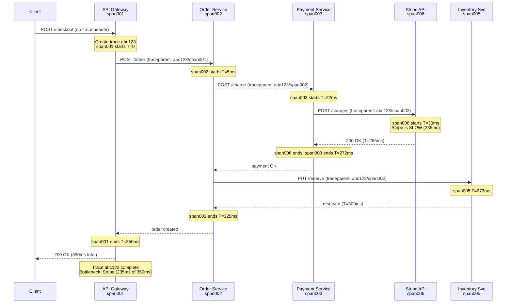

# Distributed Tracing and Observability

**TL;DR:** Observability in distributed systems is the ability
to understand internal system state from external outputs: logs,
metrics, and traces (the "three pillars"). Distributed tracing
propagates a trace context (trace ID + span ID) across service
boundaries so that a single user request can be reconstructed
as a tree of spans across all services. Tools: OpenTelemetry
(standard), Jaeger/Zipkin (backends), Prometheus (metrics),
Grafana (dashboards). Used to diagnose latency, errors, and
cascading failures in production microservices.

---

### 🎯 Model Answer

**30 seconds:**
> Observability = understanding a distributed system's state
> from its outputs. Three pillars: logs (events), metrics
> (aggregates), traces (request flows). Distributed tracing
> propagates a trace context across services: every service
> adds a span to the shared trace. Viewing all spans together
> shows the full request lifecycle: which service was slow,
> where errors occurred, what the cascading effect was.

**3 minutes:**
> In a monolith, debugging a slow request means looking at one
> log file. In microservices: a user request touches 10 services.
> Which one was slow? Which one caused the error? Without distributed
> tracing, you look at 10 separate log files and manually correlate
> timestamps. With tracing: every service automatically attaches
> its work (a "span") to the same trace, and the trace backend
> assembles them into a timeline.
>
> How it works: the first service generates a trace ID (UUID).
> It passes the trace ID + its span ID to every downstream call
> via HTTP headers (W3C traceparent) or message metadata.
> Each service creates a new span with the parent span ID from
> the incoming header. The span records: operation name, service
> name, start/end timestamps, tags (custom attributes), and status.
> All spans are sent to a trace backend (Jaeger, Zipkin). The
> backend assembles all spans with the same trace ID into a flame
> graph.
>
> Three pillars of observability:
> (1) Logs: structured event records per service (per-request,
>     per-error). Good for root cause: what happened?
> (2) Metrics: numeric aggregates over time (request rate, error
>     rate, latency percentiles). Good for alerting: is something wrong?
> (3) Traces: full request lifecycle across services. Good for
>     diagnosis: where did the latency come from?
> The three complement each other: metrics alert, traces narrow
> the scope, logs explain the details.

**Blank Mind Recovery:**

**(1) Restate:** "Observability - can I understand what my
distributed system is doing? Three tools: logs, metrics, traces.
Traces = follow one request through all services."

**(2) First principles:** "A distributed request visits multiple
services. Each service records its portion. If those records
share a common ID (trace ID): they can be joined later to
reconstruct the full picture. Pass the ID through every service
boundary."

**(3) Bridge:** "Like tracking a package: FedEx gives every
package a tracking number. Every handler (pickup, sort, transit,
delivery) scans the same number. The tracking page assembles
all scans into a timeline: where is it, what happened, which
step was slow. Distributed tracing is the same for service calls."

---

### 📘 Concept Explanation

**What it is:**
Distributed observability is the set of practices and tools that
allow operators to understand a distributed system's behavior from
external outputs: logs (structured event records), metrics (numeric
time-series), and traces (request flows across service boundaries).

**The problem it solves:**
In a distributed system, a single user request causes cascading
calls across many services. When something goes wrong (latency spike,
error): there is no single log file or code path to examine.
Observability provides the tooling to correlate events across
services and diagnose problems that span multiple components.

**The three pillars:**

```
LOGS
  Purpose: record of individual events
  Format:  structured JSON (machine-readable)
  Content: timestamp, level, message, service, traceId,
           spanId, userId, requestId, ...
  Query:   "show all ERROR logs for traceId=abc123"
  Tools:   Logstash, Fluentd, CloudWatch Logs, Loki

METRICS
  Purpose: numeric measurements over time
  Format:  time series (name, labels, value, timestamp)
  Content: http_requests_total, p99_latency_ms,
           db_connection_pool_active, ...
  Query:   "alert when p99_latency > 500ms for 5 minutes"
  Tools:   Prometheus, Micrometer, CloudWatch Metrics, Datadog

TRACES
  Purpose: request flow across service boundaries
  Format:  trace (tree of spans), span (unit of work)
  Content: traceId, spanId, parentSpanId, service, operation,
           duration, status, tags (db.statement, http.url, ...)
  Query:   "show all spans for trace abc123 with duration > 100ms"
  Tools:   Jaeger, Zipkin, AWS X-Ray, Datadog APM, Tempo
```

**Trace context propagation (W3C standard):**

```
Request enters API Gateway:
  Gateway generates: traceId=abc123, spanId=span001
  Adds header: traceparent: 00-abc123-span001-01
               (version-traceId-spanId-flags)
  Records span: {op:"HTTP POST /checkout", service:"api-gw",
                 start:T0, ...}

Gateway calls Order Service:
  Outbound header: traceparent: 00-abc123-span001-01
                   (same traceId, gateway's spanId as parent)

Order Service receives request:
  Reads traceId=abc123, parentSpanId=span001
  Creates: spanId=span002, parentSpanId=span001
  Records span: {op:"order.create", service:"order-svc",
                 start:T1, traceId:abc123, ...}

Order Service calls Payment Service:
  Outbound header: traceparent: 00-abc123-span002-01
  Payment creates: spanId=span003, parentSpanId=span002

Trace backend (Jaeger):
  Receives all spans with traceId=abc123
  Assembles trace tree:
    span001 (gateway, 350ms total)
    └── span002 (order-svc, 320ms)
        ├── span003 (payment-svc, 250ms)
        └── span004 (inventory-svc, 50ms)
  Identifies: payment-svc consumed 250/350ms = 71% of latency
```

**OpenTelemetry (OTel) - the standard:**

```
OpenTelemetry provides:
  - API: how to instrument code (create spans, add attributes)
  - SDK: implementation (batching, sampling, export)
  - Collector: receive, process, export telemetry data
  - Protocol: OTLP (OpenTelemetry Protocol)
  
Spring Boot 3 + Micrometer Tracing:
  Auto-instruments: HTTP requests, JDBC, Kafka, Redis
  No code changes needed for basic tracing
  
Manual instrumentation (when needed):
  Span span = tracer.spanBuilder("processOrder")
      .startSpan();
  try (Scope scope = span.makeCurrent()) {
      span.setAttribute("order.id", orderId);
      doWork();
  } catch (Exception e) {
      span.recordException(e);
      span.setStatus(StatusCode.ERROR);
      throw e;
  } finally {
      span.end();
  }
```

**Sampling strategies:**

```
100% sampling:
  - All requests traced
  - High storage cost at scale
  - Good for: development, low-traffic services

Head-based sampling (probabilistic):
  - Decision made at trace start (1% or 10%)
  - Downstream services honor the sampling flag
  - Problem: interesting (slow/error) traces equally likely
    to be dropped as normal ones

Tail-based sampling:
  - Sampling decision made AFTER the full trace is collected
  - "If any span in the trace has error=true OR duration>1s:
    always sample"
  - Captures all anomalous traces, discards normal ones
  - More complex infrastructure (buffer full trace before deciding)
  - Jaeger and OpenTelemetry Collector support tail sampling
```

**The key insight:**
The value of distributed tracing is proportional to coverage.
A trace that covers 10 of 12 services but misses the database
call and the outbound HTTP call is incomplete - the missing spans
are often where the latency lives. Full coverage (all services,
all database calls, all external calls) is required for accurate
root cause analysis.

**When to use distributed tracing:**
- Any microservices system with > 3 services in the critical path
- When debugging latency issues that span service boundaries
- When errors in one service cause failures in others
- When you need to understand the downstream impact of a change

**When to use metrics instead:**
- Alerting (metrics are the right tool for threshold alerts)
- Trending over time (metrics aggregate efficiently)
- Capacity planning (metrics track growth)

**First-principles derivation:**
"A distributed system's state cannot be observed from any single
service. Each service records its portion of the state. To
reconstruct the whole: the records must share a common identifier
(trace ID). Pass the ID through all service boundaries. Collect
all records for a given ID to reconstruct the distributed state."

---

### 💻 Code Example

```java
// DISTRIBUTED TRACING WITH SPRING BOOT + MICROMETER

// BAD: no tracing - debugging latency requires manual log
// correlation across services
@GetMapping("/checkout/{orderId}")
public CheckoutResponse checkout(
        @PathVariable String orderId) {
    // BAD: no trace context, no span for sub-operations
    // When this is slow: no way to know which step
    InventoryResponse inv = inventoryClient.reserve(orderId);
    PaymentResponse pay = paymentClient.charge(orderId);
    return new CheckoutResponse(inv, pay);
}

// GOOD: automatic tracing with Spring Boot 3 + OTel
// application.yml:
# management.tracing.sampling.probability: 1.0
# spring.application.name: checkout-service
# otel.exporter.otlp.endpoint: http://jaeger:4317

// RestTemplate/WebClient auto-propagates traceparent header
// JDBC auto-instruments DB calls
// Kafka auto-propagates trace context in message headers

// For custom spans (manual instrumentation):
@Autowired
private Tracer tracer;

@GetMapping("/checkout/{orderId}")
public CheckoutResponse checkout(
        @PathVariable String orderId) {
    // The framework auto-creates an HTTP span for this request

    // Add custom span for business operation
    Span span = tracer.nextSpan()
        .name("checkout.process")
        .start();

    try (Tracer.SpanInScope ws = tracer.withSpan(span)) {
        span.tag("order.id", orderId);
        span.tag("checkout.stage", "started");

        // Sub-operations appear as child spans
        // (RestTemplate propagates trace context automatically)
        InventoryResponse inv =
            inventoryClient.reserve(orderId);
        span.tag("inventory.reserved",
            String.valueOf(inv.isReserved()));

        PaymentResponse pay =
            paymentClient.charge(orderId);
        span.tag("payment.status", pay.getStatus());

        return new CheckoutResponse(inv, pay);

    } catch (Exception e) {
        span.error(e);
        span.tag("error", "true");
        throw e;
    } finally {
        span.end();
    }
}
```

> **Code walkthrough:** The BAD pattern has no trace instrumentation.
> When checkout is slow, you see only one slow HTTP response with
> no visibility into whether it was inventory reservation or payment
> processing that caused the delay. The GOOD pattern uses Spring Boot 3
> with Micrometer Tracing (backed by OpenTelemetry). The HTTP span
> is created automatically by the framework for every incoming request.
> The custom `checkout.process` span wraps the business logic and adds
> business-relevant tags (`order.id`, `inventory.reserved`). All
> outbound calls via RestTemplate automatically propagate the
> `traceparent` header, so the inventory and payment services
> create child spans under the same trace. The trace backend assembles
> all spans: gateway -> checkout (200ms) -> inventory (50ms) and
> payment (145ms) - immediately revealing that payment is the bottleneck.

---

### 🎓 Answers by Seniority

**Junior / Mid:**
> Distributed tracing tracks a user request as it flows through
> multiple services. Each service adds a "span" to the shared trace.
> All spans share a trace ID. The trace backend (Jaeger) assembles
> them into a timeline. OpenTelemetry is the standard API. Spring
> Boot auto-instruments HTTP, JDBC, and Kafka. For custom operations,
> use `tracer.nextSpan()` to create spans manually.

---

**Senior / Staff:**
> I think about observability as three correlated signals:
> metrics alert me that something is wrong (p99 latency spike),
> traces narrow the scope to the specific request and service
> (payment service was slow on these 100 requests), and logs
> give me the "why" (DB connection pool exhausted). They must
> be correlated via trace ID in logs and span in metrics. Without
> correlation: you have three separate views of the same incident,
> not one unified view. In practice: I inject trace ID into every
> log record (MDC in SLF4J) and attach service-level trace context
> to metric exemplars (Prometheus exemplars: a specific trace ID
> associated with a metric observation). This three-way correlation
> is what makes production debugging fast.

---

### ⚠️ Common Misconceptions

**"Logs are sufficient for debugging distributed systems"**

Reality: logs from individual services are helpful but insufficient
for cross-service correlation. A log entry in Service B that says
"database timeout" does not tell you which user request triggered
it, which upstream service called B, or what the full request
path was. Without a trace ID in the log and distributed tracing:
correlating the database timeout in Service B with the user-facing
error in Service A requires manual timestamp matching across
multiple log streams. Distributed tracing automates this
correlation. Logs + tracing together are the production debugging
standard.

**"100% sampling is the right approach"**

Reality: at high throughput (10k requests/second), 100% sampling
means 864 million spans per day. At 1KB per span: 864GB/day of
trace data. Storage cost is prohibitive. The production approach:
use tail-based sampling (sample errors and slow requests 100%,
sample normal requests at 1%). This retains all actionable traces
while dramatically reducing storage costs. OpenTelemetry Collector
supports tail sampling policies out of the box.

---

### ⚖️ Comparison Table

| Signal | Purpose | Cardinality | Query | Cost | Alert on? |
|---|---|---|---|---|---|
| Logs | Events / why | High (1 per event) | Full text search | High | No (use metrics) |
| Metrics | Aggregates / trends | Low (per service) | PromQL | Low | Yes |
| Traces | Request flow / where | Medium (1 per req) | TraceId lookup | Medium | No (use for debug) |

**The deciding factor:** What question are you answering?
"Is the system healthy?" → metrics. "Where did this request slow
down?" → traces. "What exactly happened at 14:03:25?" → logs.

---

### 🏛️ System Design

**Design: Observability Platform for a Microservices System**

Requirements: collect logs/metrics/traces from 50 services,
support ad-hoc debugging, alert on SLOs, query P99 latency
per service, trace cross-service latency for slow requests.

**Architecture:**

```
Services (50):
  Auto-instrumented with OpenTelemetry SDK
  Export via OTLP to OTel Collector sidecar

OTel Collector (per node):
  Receives: traces, metrics, logs via OTLP
  Processes: sampling (tail-based), redaction (remove PII)
  Exports:
    → Traces: Jaeger (via OTLP)
    → Metrics: Prometheus Remote Write endpoint
    → Logs: Loki (via Loki output plugin)

Trace Backend: Jaeger
  Stores: all sampled spans
  Query: by traceId, by service, by latency > Nms
  Sampling: tail-based (errors + slow requests always sampled)

Metrics Backend: Prometheus + Thanos
  Prometheus: per-cluster, 15s scrape interval
  Thanos: global query across clusters, long-term storage
  Alerting: Alertmanager (PagerDuty for P1, Slack for P2)

Logs Backend: Grafana Loki
  Index: labels only (service, level, traceId)
  Query: LogQL (like PromQL for logs)
  Retention: 30 days hot, 90 days cold

Visualization: Grafana
  Golden signals dashboard:
    - Traffic (requests/sec per service)
    - Errors (error rate per service)
    - Latency (P50/P95/P99 per service)
    - Saturation (CPU, memory, DB connections)
  Trace correlation: Grafana links traceId in logs/metrics
    → directly to Jaeger trace view

SLO alerting:
  Availability SLO: 99.9% of requests succeed
    Alert: error rate > 0.1% for 5 minutes
  Latency SLO: P99 < 500ms
    Alert: P99 > 500ms for 10 minutes
  Use: multi-burn-rate alerting (1h + 6h windows)
    to reduce alert fatigue
```

---

### 📊 Diagram

```
Distributed Trace Assembly

Request: POST /checkout (traceId=abc123)

API Gateway (span001, 0-350ms):
   |
   +-- Order Service (span002, 5-325ms):
   |      |
   |      +-- DB: INSERT orders (span004, 6-20ms)
   |      |
   |      +-- Payment Svc (span003, 22-272ms):
   |      |       |
   |      |       +-- Stripe API (span006, 30-265ms)
   |      |               ← HIGH LATENCY HERE
   |      |
   |      +-- Inventory Svc (span005, 273-300ms)
   |
   +-- Notification Svc (span007, 326-350ms)

Flame graph view (time axis):
0ms    50ms   100ms   200ms   300ms   350ms
|---span001 (gateway) ----------------------|
  |--span002 (order-svc) -----------------| |
  |004|      |---span003 (payment) --------|
             |      |--span006 (stripe) ---|
                                  |005|007|
```



> **Diagram walkthrough:** The ASCII flame graph shows the critical
> insight of distributed tracing: without it, the client sees a
> 350ms checkout response. With tracing: span006 (Stripe API call)
> consumed 235ms of the 350ms total (67%). The bottleneck is
> immediately visible. The sequence diagram shows how the trace
> context (traceparent header) is propagated at every service
> boundary: each service reads the parent span from the incoming
> header and creates its own span with that parent. Jaeger collects
> all spans for trace abc123 and assembles the flame graph, showing
> that Stripe's API latency is the primary performance concern.
> Without distributed tracing, this would require correlating
> timestamps across four separate log files.

---

### 🚨 Failure Modes and Diagnosis

**Failure 1: Trace context not propagated - broken traces**

Symptom: Jaeger shows trace fragments (individual service spans)
but no complete end-to-end traces. Traces appear as disconnected
root spans.

Root cause: An intermediate service is not propagating the
`traceparent` header in outbound calls. The outbound RestTemplate
or HTTP client does not include the W3C trace context header.

Diagnosis:
```bash
# Check if traceparent header reaches the service
kubectl exec -it <pod> -- curl -v http://payment-service/charge \
  -H "traceparent: 00-abc123-span001-01"
# Check response and whether downstream service creates a span
# with parent=span001

# Check application logs for trace propagation
grep "traceparent" /var/log/app/*.log
# Missing traceparent on outbound calls = not propagated
```

Fix: ensure all HTTP clients (RestTemplate, WebClient, Feign,
OkHttp) have OpenTelemetry instrumentation registered.
For RestTemplate: `new RestTemplateBuilder().build()` with
OTel auto-configuration. Manual check:
```java
// Verify traceparent is added by OTel instrumentation
restTemplate.getInterceptors()
    // Should contain OTel propagation interceptor
```

---

**Failure 2: Sampling configuration missing slow/error traces**

Symptom: A production incident had P99 latency spikes. Post-incident
review: no traces available for the slow requests. Only fast
requests (< 100ms) are in Jaeger.

Root cause: Head-based sampling at 1% was configured. During the
spike: 99% of slow requests were not sampled. The sampled 1%
of slow requests existed but the trace backend query was not
filtered correctly to find them.

Diagnosis:
```bash
# Check OTel Collector sampling config
cat /etc/otelcol/config.yaml | grep -A20 sampling
# If head-based 1%: slow traces discarded
# Check Jaeger UI: filter by latency > 1000ms
# If no results: traces were not sampled
```

Fix: implement tail-based sampling. OTel Collector config:
```yaml
processors:
  tail_sampling:
    policies:
      - name: errors-policy
        type: status_code
        status_code: {status_codes: [ERROR]}
      - name: slow-policy
        type: latency
        latency: {threshold_ms: 500}
      - name: probabilistic-policy
        type: probabilistic
        probabilistic: {sampling_percentage: 1}
```

---

**Failure 3: High cardinality labels causing metric explosion**

Symptom: Prometheus runs out of memory. Time series count
exceeds 10 million. Grafana dashboards time out.

Root cause: A developer added a metric label with high cardinality
(e.g., `user_id` or `trace_id` as a label). Each unique value
creates a new time series. 1M users × 10 metrics = 10M series.

Diagnosis:
```bash
# Check Prometheus time series count
curl http://prometheus:9090/api/v1/status/tsdb | \
  python3 -m json.tool | grep numSeries
# > 2M series: investigate high cardinality

# Find highest-cardinality metrics
curl http://prometheus:9090/api/v1/status/tsdb?topN=20 | \
  python3 -m json.tool | grep -A5 "seriesCountByMetricName"
```

Fix: remove high-cardinality labels from metrics.
```java
// BAD: user_id as a label
Counter.builder("api.requests")
    .tag("userId", userId)  // BAD: high cardinality
    .register(meterRegistry)
    .increment();

// GOOD: user_id in trace span, not metric label
span.setAttribute("user.id", userId);  // trace only
Counter.builder("api.requests")
    .tag("service", "checkout")  // low cardinality
    .tag("status", "success")    // low cardinality
    .register(meterRegistry)
    .increment();
```

---

### 🎯 Interview Deep-Dive

| Category | Count |
|---|---|
| Clarification | 1 |
| Mechanism | 2 |
| Failure / Debugging | 3 |
| Trade-off | 2 |
| System Design | 1 |
| Code | 1 |
| Behavioral | 1 |
| Production | 1 |

---

**Q1 (Clarification) - What is the difference between monitoring
and observability?**

A: Monitoring is about tracking known failure modes. You define
metrics and thresholds for conditions you anticipate. "Alert me
when error rate > 1%." Monitoring answers: "Is the system
behaving as expected?" It is proactive but limited to known
failure modes.

Observability is about understanding any system state from its
outputs - including unknown failures. "Why is the checkout service
slow only for users with more than 100 items in their cart?"
You did not anticipate this failure mode, so you did not monitor
for it. But if the system is observable (structured logs, traces,
metrics with good cardinality), you can investigate post-hoc.

The practical difference: monitoring tells you there is a fire.
Observability tells you where the fire is, why it started,
and how it spread.

In distributed systems: monitoring alone is insufficient because
failures emerge from the interaction of components, not from
individual components alone. A single service might be healthy
by all its metrics, but the system might be degraded. Observability
allows you to query across components to find the emergent failure.

*What separates good from great:* the "unknown failure modes"
framing. Many candidates describe monitoring vs. observability as
a technical distinction (metrics vs. logs+metrics+traces). The
deeper insight is the epistemological distinction: monitoring is
"checking for what we expect to go wrong," observability is
"being able to answer any question about system behavior, including
unexpected questions." This distinction, from Charity Majors
(observability advocate), reflects how production systems actually fail.

---

**Q2 (Mechanism) - How does W3C traceparent work and what does
each field mean?**

A: The W3C Trace Context specification defines a standard HTTP
header for distributed trace propagation:

`traceparent: 00-4bf92f3577b34da6a3ce929d0e0e4736-00f067aa0ba902b7-01`

Fields:
- `00` - version (always 00 in current spec)
- `4bf92f3577b34da6a3ce929d0e0e4736` - trace ID (16 bytes, 32 hex chars)
  Unique identifier for the entire trace (all spans share this)
- `00f067aa0ba902b7` - parent span ID (8 bytes, 16 hex chars)
  The span ID of the caller (parent of the new span to be created)
- `01` - flags (1 byte): bit 0 = sampling flag (01 = sampled)

When a service receives this header:
- Creates a new span with: traceId=`4bf92f3577b...`, parentSpanId=`00f067aa...`
- Generates its own spanId for the new span
- Propagates: traceId unchanged, parentSpanId = its new spanId

Additionally: `tracestate` header for vendor-specific baggage.

Why standardized: before W3C standard, vendors had proprietary
headers (X-B3-TraceId for Zipkin, X-Amzn-Trace-Id for X-Ray,
X-Datadog-Trace-Id for Datadog). Services instrumented with
different vendors could not propagate context. W3C standard
allows any two services to propagate trace context regardless
of their APM vendor.

*What separates good from great:* the sampling flag. The `01`
flags byte's bit 0 tells downstream services whether to sample
this trace. A head-based sampling decision made at the root
is communicated to all downstream services via this flag. They
honor it: if the flag is 0, they do not export spans. If 1:
they export. This is how head-based sampling works: one decision
propagates to all services.

---

**Q3 (Mechanism) - How do you add trace context to structured logs
and correlate traces with logs?**

A: Trace-log correlation requires injecting the current trace ID
and span ID into every log record.

Spring Boot + MDC (Mapped Diagnostic Context):
```java
// Micrometer Tracing auto-injects into MDC
// log pattern includes trace context:
// %d{HH:mm} [%mdc{traceId}/%mdc{spanId}] %-5p %m%n

// Every log line for a request:
// 14:03:25 [abc123/span002] INFO Order created for user u42
// 14:03:25 [abc123/span003] ERROR Payment failed: timeout

// In Grafana: paste traceId abc123 into Loki query
// { app="checkout" } |= "abc123"
// → Shows all log lines for that trace across all services
```

Manual MDC (if auto-configuration is not available):
```java
@Component
public class TraceIdFilter extends OncePerRequestFilter {
    @Autowired Tracer tracer;

    @Override
    protected void doFilterInternal(
            HttpServletRequest req, HttpServletResponse res,
            FilterChain chain) throws IOException,
            ServletException {
        Span span = tracer.currentSpan();
        if (span != null) {
            MDC.put("traceId",
                span.context().traceId());
            MDC.put("spanId",
                span.context().spanId());
        }
        try {
            chain.doFilter(req, res);
        } finally {
            MDC.remove("traceId");
            MDC.remove("spanId");
        }
    }
}
```

Grafana Tempo + Loki integration:
- Tempo stores traces, Loki stores logs
- Grafana's "trace to logs" feature: click a span in Tempo
  → automatically queries Loki for logs with that traceId
  → no manual copy-paste
- This is the production standard for three-pillar correlation

*What separates good from great:* the Grafana Tempo + Loki
integration detail. Many engineers know to inject trace IDs
into logs. The production value comes from tooling that makes
the correlation automatic (one click from trace span to relevant
logs). Manual trace-to-logs correlation by copy-pasting trace IDs
into log search is error-prone and slow during incidents.

---

**Q4 (Failure / Debugging) - P99 latency spiked for the checkout
service. You have metrics, logs, and traces. Walk through your
investigation.**

A: Systematic investigation using the three pillars:

Step 1 - Metrics (narrow the window and service):
```promql
# When did the spike start?
http_server_duration_milliseconds_bucket{job="checkout",
  le="500"} rate over time
# Spike started 14:02:30 UTC

# Which service is slow?
http_server_duration_milliseconds{
  quantile="0.99", job=~".*-service"} > 500
# checkout-service and payment-service both elevated
```

Step 2 - Traces (identify the slow path):
```
Jaeger query: service=checkout-service, latency > 500ms,
              time range 14:02-14:05
→ Find trace abc123 (650ms total)
→ Flame graph: span003 (payment-svc) = 550ms
→ span006 within payment-svc: "stripe.charge" = 510ms
→ Bottleneck: Stripe API latency
```

Step 3 - Logs (confirm and get details):
```
Loki query: {app="payment-service"} |= "stripe"
            | json | response_time > 500
→ 14:02:30 "Stripe API response 512ms, status 200"
→ Pattern: Stripe latency increased from 50ms avg to 500ms
→ Check Stripe status page: confirmed Stripe incident
```

Result: Stripe's API had increased latency starting at 14:02.
Action: activate circuit breaker to fallback payment flow.

Timeline: metrics alerted (14:03), traces identified the service
(14:04), logs confirmed the root cause (14:05). Total diagnosis
time: ~5 minutes vs. hours without observability.

*What separates good from great:* the structured investigation order.
Metrics first (wide view, fast), traces second (narrow to specific
request and service), logs last (confirm and detail). Many engineers
go directly to logs (most familiar tool) and spend 30 minutes
grepping. The metrics-first approach is 10x faster because it
narrows the scope before opening a detailed view.

---

**Q5 (Failure / Debugging) - Traces show a 200ms gap in a span
where no child spans exist. What could cause this?**

A: A 200ms "gap" (time elapsed within a span with no child spans
explaining it) indicates work happening without instrumentation.

Common causes:

1. Thread pool wait:
   The service submitted work to a thread pool and waited
   for the result. The thread pool worker ran but was not
   instrumented with a child span. The 200ms is the wait
   for a thread to become available (pool exhausted) plus
   the worker execution time.

2. Synchronous I/O not instrumented:
   A file read, JNDI lookup, or network call without OTel
   instrumentation. The call happens within the span's duration
   but no child span was created.

3. Lock contention:
   A synchronized block or Lock.lock() waited 200ms for another
   thread to release the lock. Lock waits are not automatic
   spans.

4. Thread context lost:
   The span was created on one thread but the 200ms work
   happened on a different thread (async via CompletableFuture,
   @Async, message listener). OTel context was not propagated
   to the async thread - the work happened "outside" the span.

Diagnosis:
```java
// Check for missing context in async code:
// BAD: context not propagated
CompletableFuture.runAsync(() -> {
    // No current span here - OTel context lost
    doExpensiveWork(); // shows as gap
});

// GOOD: propagate context to async thread
Span parentSpan = tracer.currentSpan();
CompletableFuture.runAsync(() -> {
    try (Scope s = parentSpan.makeCurrent()) {
        // Context propagated, child spans visible
        Span child = tracer.nextSpan()
            .name("expensiveWork").start();
        try { doExpensiveWork(); }
        finally { child.end(); }
    }
});
```

*What separates good from great:* the async context propagation
issue (cause 4). This is the most common production tracing bug.
When a service uses `@Async`, CompletableFuture, or a Kafka listener:
OTel context is thread-local and is NOT automatically propagated
to the new thread. The span appears complete at the parent thread
while the async work runs in a gap. Many engineering teams spend
time "looking for slow operations" in the gap when the operation
is there - just not instrumented because of the async context loss.

---

**Q6 (Trade-off) - Compare OpenTelemetry, Jaeger, and Zipkin.
Which do you recommend and why?**

A: These operate at different layers:

OpenTelemetry (OTel):
- Layer: instrumentation API + SDK + protocol (OTLP)
- Role: how you instrument code and export telemetry
- Vendor-neutral: export to Jaeger, Zipkin, Datadog, Tempo, X-Ray
- Standard: CNCF project, industry adoption by all major vendors
- Spring Boot 3: Micrometer Tracing (OTel-backed) auto-instruments
- Recommendation: ALWAYS use OTel as the instrumentation layer.
  It is the industry standard. Switching backends later requires
  no code change (only collector config change).

Jaeger:
- Layer: trace backend (storage + query + UI)
- Input: Zipkin JSON, Jaeger Thrift, OTLP (via recent versions)
- Storage: Cassandra or Elasticsearch (for scale)
- UI: detailed flame graph, service dependency graph, compare traces
- Open-source, CNCF project, widely used
- Recommendation: good default open-source backend

Zipkin:
- Layer: trace backend
- Input: Zipkin JSON (native), B3 headers (native)
- Storage: Cassandra, Elasticsearch, MySQL
- UI: simpler than Jaeger
- Older standard: B3 headers (X-B3-TraceId, X-B3-SpanId)
  pre-dates W3C traceparent
- Recommendation: legacy systems that already use Zipkin;
  new systems prefer Jaeger or Grafana Tempo

Grafana Tempo:
- Layer: trace backend (object storage: S3/GCS, very cheap)
- Integrates with Loki (logs) and Prometheus (metrics)
  for unified three-pillar correlation in one Grafana UI
- Recommendation: if already using Grafana Loki/Prometheus:
  Tempo is the natural choice (unified UI)

*What separates good from great:* OTel as the instrumentation layer
regardless of backend choice. Engineers who say "we use Zipkin"
or "we use Jaeger" without mentioning OTel are coupling their
code to the backend. The correct answer: "Instrument with OTel,
export to whichever backend. Change backend by changing collector
config - no code changes."

---

**Q7 (Trade-off) - What is the cost of observability and how
do you justify it?**

A: Observability has three cost dimensions:

1. Performance overhead (instrumentation cost):
   - OTel auto-instrumentation adds ~2-5% CPU overhead
   - Each span creation allocates objects: GC pressure at high
     throughput (100k+ req/sec: measurable GC impact)
   - Sampling reduces the export cost but not the creation cost
   - Mitigation: use async span export (non-blocking), disable
     instrumentation for health check endpoints

2. Storage cost (retention):
   - 10k req/sec, 10 spans/req, 1KB/span: 100MB/sec → 8TB/day
   - With 1% sampling: 0.8TB/day
   - Tail-based sampling: ~0.1TB/day (only slow/error traces)
   - Grafana Tempo (object storage): $0.02/GB → ~$2/day (cheap)
   - Elasticsearch-backed Jaeger: $0.10/GB → $10/day

3. Tooling cost:
   - Running Jaeger/Prometheus/Loki/Grafana cluster: 3-10 servers
   - Managed services: Datadog/New Relic/Dynatrace ~$10-30/host/month

Business justification:
- Average incident cost: $1-5M/hour for large e-commerce
- Observability reduces MTTR (mean time to resolve) from hours to minutes
- ROI: one prevented major incident pays for years of observability tooling
- Operational leverage: with good observability, one SRE can manage 100
  services; without it: 3 SREs per 10 services

*What separates good from great:* quantifying the ROI. Many engineers
know observability is valuable but cannot make the business case.
The MTTR reduction argument ($1M/hour incident cost × 2 hours saved
= $2M saved from one incident) is more persuasive to management than
"it helps us debug." Senior engineers can translate technical value
into business value.

---

**Q8 (System Design) - Design the observability stack for a
high-traffic e-commerce platform with 10k requests/second.**

A:
```
Instrumentation tier:
  All 50 services: OTel SDK (Spring Boot Micrometer Tracing)
  Auto-instruments: HTTP, JDBC, Kafka, Redis, gRPC
  Sampling: tail-based at OTel Collector level
    → errors: 100%
    → P99 > 500ms: 100%
    → normal: 1%
  Expected trace volume after sampling: ~100 traces/sec
  
Collection tier:
  OTel Collector (deployed as DaemonSet on each node):
    Receives: OTLP from all pods on the node (local socket)
    Processes: tail sampling, redaction (remove PII from spans)
    Exports:
      Traces → Tempo via OTLP
      Metrics → Prometheus Remote Write
      Logs → Loki via Loki HTTP API
  
Trace storage (Grafana Tempo):
  Backend: S3 (cost: ~$0.5/day at this volume)
  Retention: 30 days
  Query: by traceId, by service, by latency > Nms
  
Metrics storage (Prometheus + Thanos):
  Prometheus: per-cluster, 15s scrape
  Thanos: federation for multi-cluster queries,
          S3 for 1-year long-term retention
  
Log storage (Grafana Loki):
  S3-backed, 30-day retention
  Log levels: INFO+ in production, DEBUG in staging only
  
Visualization (Grafana):
  Golden signals dashboard per service
  Trace-to-logs correlation (click span → see logs)
  Alerting: P99 > SLO threshold, error rate > 0.1%
  On-call: PagerDuty for P1 (checkout/payment failures)

Cost estimate:
  Tempo (traces): ~$15/month (S3)
  Prometheus + Thanos (metrics): ~$200/month (EBS + S3)
  Loki (logs): ~$100/month (S3)
  Grafana cluster: 3 nodes × $200/month = $600/month
  Total: ~$1,000/month for observability
```

*What separates good from great:* cost estimate and tail-based
sampling policy. Specifying "1% normal + 100% errors/slow" shows
understanding that blind 100% sampling is cost-prohibitive but
blind 1% sampling misses all incidents. The tail-based policy
is the production standard that balances cost and coverage.

---

**Q9 (Production) - How do you implement SLO-based alerting with
multi-burn-rate alerts?**

A: SLO alerting detects when the system is consuming its error
budget faster than the allowed rate.

SLO: 99.9% availability → error budget = 0.1% = 43.2 minutes/month

Single threshold alert problem:
- Alert when error_rate > 0.1%: fires constantly on normal
  variation (false positives)
- Alert when error_rate > 1% for 1 hour: misses slow burns

Multi-burn-rate (Google SRE Book recommendation):
```yaml
# Alert 1: Fast burn (5% budget in 1 hour = 14x burn rate)
# Triggers: major incident (page immediately)
- alert: HighBurnRate
  expr: |
    (sum(rate(http_requests_total
      {status=~"5.."}[1h])) /
    sum(rate(http_requests_total[1h]))) > 0.14
  for: 5m
  labels:
    severity: page
  annotations:
    summary: "14x burn rate - page now"

# Alert 2: Slow burn (10% budget in 6 hours = 5x burn rate)
# Triggers: gradual degradation (ticket)
- alert: MediumBurnRate
  expr: |
    (sum(rate(http_requests_total
      {status=~"5.."}[6h])) /
    sum(rate(http_requests_total[6h]))) > 0.05
  for: 30m
  labels:
    severity: ticket
```

Why multi-burn-rate:
- Fast alert: catch spikes quickly (14x burn → page in 5 min)
- Slow alert: catch degradation that would consume budget over days
- Without slow alert: a 2x burn rate (2x normal errors) consumes
  all budget in 15 days without triggering any alert

*What separates good from great:* the math behind burn rate
multiplication. Error budget = 0.1%/month = 0.1% × 30d × 24h =
0.1% × 720h. To consume 5% budget in 1 hour: error_rate must be
5% × 720h / 1h = 36x the SLO allowance. To consume 5% in 6 hours:
5% × 720h / 6h = 6x the allowance. The multiplication factor
converts the budget consumption rate into a current error rate
threshold. This is the correct mathematical basis for SLO-based
alerting - most candidates know "alert on error rate" but not
how to derive the thresholds from the SLO budget.

---

**Q10 (Behavioral) - Describe how you introduced distributed
tracing to a team that had been operating without it.**

A: Example structure:

"At [company], we had 15 microservices and no distributed tracing.
Debugging production issues required manually correlating log
timestamps across services - typically 2-4 hours per incident.

Step 1 - Prove value quickly (week 1):
Added OpenTelemetry to the two most critical services (checkout,
payment) with Spring Boot Micrometer Tracing auto-configuration.
No code changes. Deployed a minimal Jaeger instance (single-node,
in-memory storage for the demo).

Step 2 - Demonstrate ROI (week 2):
During a production incident, used the trace to find the root
cause in 8 minutes (vs. the team's 2-hour average). Recorded
a screen capture. Shared it in the post-mortem: 'Here is how
we would have found this in 8 minutes with tracing.'

Step 3 - Expand incrementally (weeks 3-8):
Added tracing to all services one at a time. Each team owned their
service's instrumentation. Using OTel + Spring Boot auto-configuration:
30 minutes per service with no code changes.

Step 4 - Operationalize (month 2):
Deployed Jaeger with Cassandra storage (30-day retention).
Added trace ID injection to all structured logs (MDC).
Added Grafana dashboard with 'Go to trace' links from metrics.

Step 5 - Team adoption:
Ran 2 lunch-and-learns on 'how to read a trace.'
Added tracing queries to runbook templates for top 5 incident types.

Result: P1 incident MTTR dropped from 2 hours to 25 minutes over
3 months. Team sentiment: 'We cannot imagine going back.'

Lesson: start small (2 services), prove value with a real incident,
then expand. Do not try to instrument everything at once - the
value is visible even with partial coverage."

*What separates good from great:* the "prove value with a real
incident" step. This is the technique that converts skeptical
teams. Abstract arguments about observability value do not
persuade. A concrete example ("8 minutes vs. 2 hours for THIS
specific incident that YOUR team remembers") does. Senior engineers
know to start with high-visibility wins that create internal
momentum rather than proposing a comprehensive observability
program upfront.

---

**Q11 (Mechanism) - What is exemplar in Prometheus and how does
it connect metrics to traces?**

A: A Prometheus exemplar is a specific sample of a metric
observation that includes additional metadata - specifically
a trace ID. It connects a specific metric value to the
distributed trace that produced it.

Example: P99 latency metric has an exemplar:
```
# metric sample with exemplar
http_server_duration_bucket{le="500",job="checkout",
  status="200"} 1350 {traceID="abc123"} 1705000000
```

The metric says: "1350 requests completed within 500ms."
The exemplar says: "The specific trace ID 'abc123' was one
of the observations in this bucket - you can look it up
in Jaeger to see a real example of a 500ms+ request."

Use case:
```
Grafana workflow:
  1. Prometheus metric alert: P99 latency > 500ms
  2. Click on the alert in Grafana
  3. Grafana shows the metric time series
  4. Click on "exemplar" (small diamond on the chart)
  5. Grafana opens the linked trace in Jaeger/Tempo
  6. Full trace visible: which service was slow, why
  
Without exemplars: alert fires → search for slow traces
  in Jaeger manually (filter by service + time range)
With exemplars: alert fires → click → see the trace
  (< 30 seconds to root cause from alert)
```

Implementation (Micrometer):
```java
// Micrometer auto-adds OTel trace IDs as exemplars
// when both are configured (Spring Boot 3 auto-config)
// Prometheus scrape with exemplars enabled:
management.prometheus.metrics.export.histogram-publish-percentiles=true
management.tracing.enabled=true
```

*What separates good from great:* exemplars are one of the
least-known but most valuable features for three-pillar correlation.
Most engineers know logs + trace IDs and metrics + logs separately.
Exemplars close the loop: a metric spike automatically has a
representative trace attached. This turns "I need to search for
a trace that shows this behavior" into "here is a specific trace
that WAS this behavior." The click-through from metric to trace
in Grafana is the production workflow that makes observability
teams dramatically more efficient.

---

**Q12 (Behavioral) - A production alert fires for high P99 latency.
Walk through your entire end-to-end investigation using all three
observability pillars.**

A: Structured incident response using the three pillars:

Phase 1 - Triage (0-5 minutes): Metrics
```
Alert: checkout_latency_p99 > 500ms for 5 minutes
Dashboard: checkout service P99 = 820ms (normally 120ms)
           payment service P99 = 750ms (normally 80ms)
           Other services: normal
           Error rate: 0.0% (no errors - pure latency)
Conclusion: checkout + payment slow, no errors, started ~14:03
```

Phase 2 - Locate (5-10 minutes): Traces
```
Jaeger query:
  service=checkout, latency > 500ms, time=14:03-14:08
→ 847 traces matching
→ Sort by duration: longest first
→ Trace abc123 (820ms): expand flame graph
→ checkout span002 (800ms):
    ├── inventory span004 (20ms): normal
    └── payment span003 (750ms):
        └── stripe span006 (700ms): slow
→ payment→stripe is the bottleneck (85% of total latency)
```

Phase 3 - Diagnose (10-15 minutes): Logs
```
Loki query:
  {app="payment-service"} |= "stripe" | json
  | duration_ms > 500 | time range 14:03-14:08
→ 50 log lines: all show Stripe API duration 600-750ms
→ Normal Stripe duration (previous 24h): 40-70ms
→ 10x latency increase on Stripe's side
→ Check Stripe status page: confirmed Stripe degradation
   incident started 14:01 UTC
```

Action (15 minutes):
```
Immediate: enable circuit breaker for Stripe (fallback:
  queue payment for retry when Stripe recovers)
Communication: notify on-call that this is Stripe's incident,
  not ours; update status page
Track: monitor Stripe status + checkout P99 until recovery
```

Result: full root cause in 15 minutes. Checkout degradation was
Stripe's issue, not a code change. Circuit breaker prevents
checkout from degrading further.

*What separates good from great:* the circuit breaker action.
Many engineers stop at "we found the root cause - Stripe is slow."
The production action is to protect the system: activate the
circuit breaker so checkout stops waiting 750ms for Stripe and
immediately returns a queued confirmation, restoring normal
checkout latency while Stripe recovers. Identifying the root cause
without acting on it is incomplete incident response.
