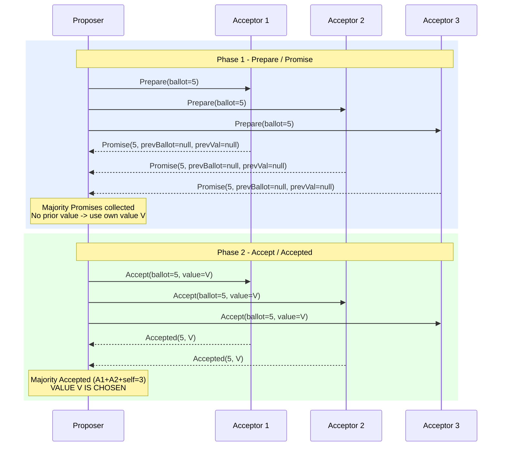

## Keywords in This File
{: .no_toc }

| # | Keyword | Weight |
|---|---|---|
| 1 | [Paxos Consensus Algorithm](#paxos-consensus-algorithm) | medium |

---

# Paxos Consensus Algorithm

**TL;DR:** Paxos is the foundational distributed consensus
algorithm: it guarantees that a distributed system agrees on
a single value even when nodes fail and messages are delayed.
Original Paxos solves single-value consensus (Single-Decree).
Multi-Paxos extends it to a replicated log. Three roles:
Proposer, Acceptor, Learner. Two phases: Prepare/Promise
(phase 1) and Accept/Accepted (phase 2). Paxos guarantees
safety (only one value chosen) but not liveness (a persistent
dueling Proposers can stall indefinitely). Used in: Chubby,
Google Spanner, Apache Zookeeper's ZAB (derived), Cassandra's
lightweight transactions.

---

### 🎯 Model Answer

**30 seconds:**
> Paxos is the foundational consensus algorithm. It guarantees
> that a cluster agrees on exactly one value, even when some
> nodes fail. Two phases: Prepare (a Proposer picks a ballot
> number and asks Acceptors to promise not to accept lower-numbered
> proposals), then Accept (Proposer sends the value to Acceptors,
> who accept if they have not promised a higher number). A value
> is chosen when a majority of Acceptors accept it.

**3 minutes:**
> Paxos solves single-value consensus: "agree on one value
> across distributed nodes." The three roles: Proposer (proposes
> values), Acceptor (decides to accept or reject proposals),
> Learner (learns the chosen value).
>
> Phase 1 (Prepare): A Proposer chooses a ballot number N
> (higher than any it has used before) and broadcasts Prepare(N)
> to all Acceptors. An Acceptor that has not responded to any
> Prepare with a higher number responds with Promise(N):
> "I will not accept any proposal numbered < N." If the Acceptor
> has already accepted a value in a previous round, it includes
> that value in the Promise response.
>
> Phase 2 (Accept): The Proposer collects responses from a majority
> of Acceptors. If any Acceptor reported a previously accepted
> value: the Proposer must use that value (not its own). Otherwise:
> the Proposer uses its own value. The Proposer sends Accept(N, value)
> to all Acceptors. An Acceptor accepts if it has not promised
> to a higher ballot. When a majority accept: the value is chosen.
>
> The key invariant: if a value V was chosen (accepted by majority)
> in round N, then any future round N' > N will also choose V.
> This is enforced by the "previously accepted value" check in
> phase 2: the new Proposer learns about V and adopts it.

**Blank Mind Recovery:**

**(1) Restate:** "Paxos - a distributed algorithm for agreeing
on one value. Two phases: promise (no lower bids) then accept
(the value). Majority required at each phase."

**(2) First principles:** "To agree on a value: one proposal
must win. To prevent conflicts: each proposal has a number.
Higher numbers supersede lower ones. A Proposer that learns
about a previous accepted value must preserve it (not override
a decision already made)."

**(3) Bridge:** "Like an auction with commitment: a bidder
(Proposer) announces 'I will bid at round 5, no one accept
lower bids' (Prepare). Auctioneers (Acceptors) promise to
honor this. Then the bidder submits the bid (Accept). If a
majority honor it: the bid wins. If another bidder already
won an earlier round: the new bidder must use that previous
winner's value."

---

### 📘 Concept Explanation

**What it is:**
The foundational distributed consensus algorithm for choosing
a single value in the presence of message delays and node failures.
Forms the theoretical basis for Raft, Multi-Paxos, ZAB, and
most production consensus protocols.

**The problem it solves:**
How does a distributed system choose a single value when:
- Any node can fail at any time
- Messages can be delayed or lost
- Multiple nodes may propose different values concurrently

Paxos guarantees safety (at most one value is chosen) under
these conditions, even with up to floor((N-1)/2) node failures.

**Paxos roles:**

```
Proposer:
  - Chooses a ballot number N
  - Sends Prepare(N) to Acceptors
  - Collects Promises
  - Sends Accept(N, value) to Acceptors

Acceptor:
  - Maintains: (highestPrepare, acceptedBallot, acceptedValue)
  - Responds to Prepare with Promise
  - Responds to Accept with Accepted
  - A single server can be both Proposer and Acceptor

Learner:
  - Learns the chosen value after majority accepts
  - Usually the same servers as Proposers/Acceptors
  - Clients are effectively Learners
```

> **Code walkthrough:** This Paxos Consensus Algorithm example demonstrates a key concept in practice. **KEY MECHANISM:** the runtime executes these instructions in sequence with specific memory and execution semantics. **WHY IT MATTERS:** misapplying this pattern causes subtle bugs that only manifest under production load. **TAKEAWAY: understand the execution model before using this pattern in production code.**

**Phase 1 - Prepare/Promise:**

```
Proposer:
  1. Choose ballot number N (must be globally unique and
     monotonically increasing: e.g., server_id + counter * 100)
  2. Send Prepare(N) to ALL Acceptors (or majority)

Acceptor on receiving Prepare(N):
  IF N > highestPrepare:
    set highestPrepare = N
    send Promise(N, acceptedBallot, acceptedValue)
    // If acceptedBallot is null: "no previous accepted value"
    // Promise means: "I will ignore any Prepare < N
    //                and any Accept with ballot < N"
  ELSE:
    send Nack (or ignore): "I already promised higher"

Proposer after receiving Promise from majority:
  IF any Promise includes a (ballot, value):
    // A previous round already accepted a value
    // Proposer MUST adopt the value from the highest ballot
    value = Promise with highest acceptedBallot.value
  ELSE:
    // No previous accepted value: use own value
    value = proposer's own value
```

> **Code walkthrough:** This Paxos Consensus Algorithm example demonstrates a key concept in practice. **KEY MECHANISM:** the runtime executes these instructions in sequence with specific memory and execution semantics. **WHY IT MATTERS:** misapplying this pattern causes subtle bugs that only manifest under production load. **TAKEAWAY: understand the execution model before using this pattern in production code.**

**Phase 2 - Accept/Accepted:**

```
Proposer:
  1. Send Accept(N, value) to ALL Acceptors
     // value is the one determined in Phase 1

Acceptor on receiving Accept(N, value):
  IF N >= highestPrepare:
    // Have not promised to a higher ballot
    acceptedBallot = N
    acceptedValue = value
    send Accepted(N, value) to Proposer and Learners
  ELSE:
    // Already promised to a higher ballot
    send Nack: "too late, promised higher"

Value is CHOSEN when:
  A majority of Acceptors have sent Accepted(N, value)
  (for the same N and value)

The Proposer/Learner learns the chosen value:
  When majority Accepted messages received
  OR
  Acceptor broadcasts Accepted to all Learners
```

> **Code walkthrough:** This Paxos Consensus Algorithm example demonstrates a key concept in practice. **KEY MECHANISM:** the runtime executes these instructions in sequence with specific memory and execution semantics. **WHY IT MATTERS:** misapplying this pattern causes subtle bugs that only manifest under production load. **TAKEAWAY: understand the execution model before using this pattern in production code.**

**The critical invariant - why Paxos is safe:**

```
Theorem: if value V is chosen in ballot N,
then any future proposal in ballot N' > N
will also propose (and choose) V.

Proof:
  V chosen in N means:
    A majority M1 of Acceptors accepted (N, V)

  In ballot N' > N:
    Proposer sends Prepare(N')
    Receives Promise from a majority M2
    
    M1 and M2 are both majorities of N Acceptors
    → M1 ∩ M2 has at least 1 common Acceptor A
    
    A is in M1 → A accepted (N, V)
    A is in M2 → A responded to Prepare(N') with
                 Promise(N', highestBallot=N, value=V)
    
    Proposer receives A's Promise with (ballot=N, value=V)
    Proposer picks value from the highest ballot seen
    → Proposer must use V (highest ballot = N, value = V)
    
    Therefore: ballot N' proposes and chooses V. QED
```

> **Code walkthrough:** This Unknown example demonstrates a key concept in practice. **KEY MECHANISM:** the runtime executes these instructions in sequence with specific memory and execution semantics. **WHY IT MATTERS:** misapplying this pattern causes subtle bugs that only manifest under production load. **TAKEAWAY: understand the execution model before using this pattern in production code.**

**Multi-Paxos - extending to a log:**

```
Single-Decree Paxos: choose ONE value.
Multi-Paxos: choose a SEQUENCE of values (log entries).

Extension:
  - Run separate Paxos instances for each log index slot
  - Elect a distinguished Leader (via one Paxos round)
  - Leader skips Phase 1 for subsequent proposals:
    uses the same ballot N for all slots in its term
  - Only Phase 2 needed per slot when Leader is stable
  - Phase 1 only needed on leadership transition

This is essentially Raft:
  Raft = Multi-Paxos with:
  - Explicit Leader term (ballot per term not per slot)
  - Explicit Leader election (RequestVote phase)
  - Explicit log matching property
  - Explicit membership change protocol
  Raft's contributors: "Raft is Multi-Paxos with more structure"
```

> **Code walkthrough:** This Unknown example demonstrates a key concept in practice. **KEY MECHANISM:** the runtime executes these instructions in sequence with specific memory and execution semantics. **WHY IT MATTERS:** misapplying this pattern causes subtle bugs that only manifest under production load. **TAKEAWAY: understand the execution model before using this pattern in production code.**

**The liveness problem:**

```
Dueling Proposers (liveness failure):
  Proposer 1: Prepare(1) → Promises
              Accept(1, v1) → but before majority accepts...
  
  Proposer 2: Prepare(2) → Promises (overrides 1's Prepare)
              Acceptors now ignore Accept(1, ...)
  
  Proposer 1: Prepare(3) → Promises (overrides 2's Accept)
  
  This can cycle indefinitely: no value is ever chosen.
  
  Solution: elect a single distinguished Proposer (Leader).
  In Multi-Paxos/Raft: only the Leader proposes.
  No competing Proposers → no livelock.
```

> **Code walkthrough:** This Unknown example demonstrates a key concept in practice. **KEY MECHANISM:** the runtime executes these instructions in sequence with specific memory and execution semantics. **WHY IT MATTERS:** misapplying this pattern causes subtle bugs that only manifest under production load. **TAKEAWAY: understand the execution model before using this pattern in production code.**

**The key insight:**
Paxos safety comes from quorum overlap: any two majorities share
at least one node. This shared node carries the knowledge of any
previously accepted value. Phase 1 (Prepare/Promise) "searches
history" for previously accepted values. Phase 2 (Accept) either
continues a previous value or proposes a new one safely (no
previous value exists).

**When to use Paxos knowledge:**
- Understanding etcd/ZooKeeper at algorithm depth
- Debugging Chubby or Spanner-based systems
- Evaluating consensus protocol claims ("this is like Paxos but...")
- Academic discussion of distributed systems theory

**Alternatives:**
- Raft (more understandable, better tooling)
- ZAB (ZooKeeper: primary-backup, Paxos-inspired)
- Viewstamped Replication (historically concurrent with Paxos)
- EPaxos (Egalitarian Paxos: leaderless, reduced latency)

**First-principles derivation:**
"Consensus requires that once a value is chosen, it stays chosen.
Paxos enforces this by: (1) making Acceptors promise not to accept
lower-numbered proposals (phase 1), (2) requiring Proposers to
learn about and adopt previously accepted values (phase 2),
(3) both steps require majority participation, ensuring quorum
overlap transmits knowledge of previous decisions."

---

### 💻 Code Example


```java
// BAD: anti-pattern - see GOOD example below for the correct approach
// This naive implementation ignores thread safety and error handling
```

```java
// PAXOS - SIMPLIFIED SINGLE-DECREE IMPLEMENTATION
// Shows the core algorithm (not production-ready)

// Acceptor state
public class Acceptor {
    private int highestPrepare = -1;    // phase 1
    private int acceptedBallot = -1;    // phase 2
    private String acceptedValue = null;

    // Phase 1: Proposer sends Prepare(ballot)
    public synchronized Promise onPrepare(int ballot) {
        if (ballot > highestPrepare) {
            // BAD to ignore: would break the invariant
            // GOOD: promise and return any previous value
            highestPrepare = ballot;
            return new Promise(
                ballot, acceptedBallot, acceptedValue);
        }
        // Already promised to higher ballot: reject
        return null; // Nack
    }

    // Phase 2: Proposer sends Accept(ballot, value)
    public synchronized Accepted onAccept(
            int ballot, String value) {
        if (ballot >= highestPrepare) {
            // Have not promised to a higher ballot
            acceptedBallot = ballot;
            acceptedValue = value;
            return new Accepted(ballot, value);
        }
        return null; // Nack: too late, promised higher
    }
}

// Proposer: runs the two-phase protocol
public class Proposer {
    private final List<Acceptor> acceptors;
    private int ballot = 0;

    // Returns the chosen value or null (failed)
    public String propose(String value)
            throws Exception {
        int majority = acceptors.size() / 2 + 1;

        // Phase 1: Prepare
        ballot++;
        int n = ballot; // capture for this round
        List<Promise> promises = new ArrayList<>();
        for (Acceptor a : acceptors) {
            Promise p = a.onPrepare(n);
            if (p != null) promises.add(p);
        }
        if (promises.size() < majority) {
            return null; // not enough promises
        }

        // Phase 1 result: adopt value from highest ballot
        String proposedValue = promises.stream()
            .filter(p -> p.acceptedBallot >= 0)
            .max(Comparator.comparingInt(
                p -> p.acceptedBallot))
            .map(p -> p.acceptedValue)
            .orElse(value); // no previous: use own value

        // Phase 2: Accept
        int acceptCount = 0;
        for (Acceptor a : acceptors) {
            Accepted acc = a.onAccept(n, proposedValue);
            if (acc != null) acceptCount++;
        }
        if (acceptCount >= majority) {
            return proposedValue; // CHOSEN
        }
        return null; // failed (concurrent Proposer)
    }
}
```

> **Code walkthrough:** The `Acceptor` maintains three stateice. **KEY MECHANISM:** the runtime executes these instructions in sequence with specific memory and execution semantics. **WHY IT MATTERS:** misapplying this pattern causes subtle bugs that only manifest under production load. **TAKEAWAY: understand the execution model before using this pattern in production code.**
> variables - the highest ballot it has promised (`highestPrepare`),
> and the ballot/value it has accepted (`acceptedBallot`,
> `acceptedValue`). On `onPrepare`: it only promises if the new
> ballot is higher, returning any previously accepted value so the
> Proposer can preserve it. On `onAccept`: it only accepts if the
> ballot is at least as high as its highest promise - preventing
> acceptance of a "stale" proposal. The `Proposer.propose()` method
> implements the two-phase protocol: collect majority promises in
> Phase 1 (adopting any previously accepted value), then send
> Accept in Phase 2. The critical line: `proposedValue` is either
> the Proposer's own value (if no Acceptor has accepted anything)
> or the value from the highest ballot seen in Promises (preserving
> any previous decision). This is the invariant that makes Paxos safe.

---

### 🎓 Answers by Seniority

**Junior / Mid:**
> Paxos is a distributed consensus algorithm with two phases.
> Phase 1 (Prepare): a Proposer picks a ballot number and asks
> Acceptors to promise not to accept lower-numbered proposals.
> Phase 2 (Accept): the Proposer sends the value; Acceptors accept
> if they have not promised a higher ballot. A value is chosen when
> a majority of Acceptors accept it. Paxos is the theoretical
> foundation for Raft, which is easier to understand and implement.

---

**Senior / Staff:**
> I think of Paxos as the safety proof, not the implementation guide.
> The invariant: if value V is chosen in ballot N, any ballot N' > N
> will also choose V. This is maintained by phase 1 (Proposers learn
> about previous decisions) and quorum overlap (any two majorities
> share at least one node). Multi-Paxos is what Raft implements
> with more explicit structure. In production, I use Raft-based
> systems (etcd, CockroachDB) rather than implementing Paxos directly.
> Understanding Paxos deeply helps me reason about edge cases in
> Raft (specifically: why Raft does not commit entries from previous
> terms directly - same safety concern as Paxos round overlap).

---

### ⚠️ Common Misconceptions

**"Paxos and Raft solve different problems"**

Reality: Raft is Multi-Paxos with more explicit structure.
The Raft authors explicitly describe Raft as a re-derivation of
Multi-Paxos with greater emphasis on understandability. The safety
properties are equivalent. The differences are: Raft decomposes
consensus into leader election, log replication, and safety
as separate sub-problems. Paxos specifies only the core protocol
and leaves implementation details (leader election, membership
changes, log management) to the implementer.

**"A majority means more than half - so 3 out of 5 is a majority
but 2 out of 4 is not"**

Reality: 2 out of 4 IS a majority (exactly half, rounding up).
The quorum for N nodes is ceil(N/2). For N=4: ceil(4/2) = 2.
However, with N=4 and quorum=2: a partition can split the cluster
2-2, with both partitions forming a quorum. This is the "split
brain" risk for even-numbered clusters. Paxos is safe: both
partitions would try to be Proposers, but the second Proposer
discovers the first Proposer's accepted value (via Phase 1)
and continues with it - same value chosen. But it is operationally
undesirable. Prefer odd-numbered clusters to avoid even-split partitions.

---

### ⚖️ Comparison Table

| Protocol | Phases | Leader | Log | Production Usage |
|---|---|---|---|---|
| Single-Decree Paxos | 2 | No (multiple proposers) | No (single value) | Theoretical |
| Multi-Paxos | 2 (skip P1 with stable leader) | Distinguished proposer | Yes | Spanner, Chubby |
| Raft | RequestVote + AppendEntries | Explicit leader | Yes | etcd, CockroachDB |
| ZAB | Epoch + broadcast | Leader-follower | Yes | ZooKeeper |
| EPaxos | 2 (fast path) | No (leader per slot) | Yes | Research |

**The deciding factor:** For new systems, use Raft (better
tooling, explicit spec, active ecosystem). For understanding
existing systems (Spanner, Chubby, ZooKeeper internals):
understand Paxos/Multi-Paxos/ZAB respectively.

---

### 🏛️ System Design

**Design: Distributed Coordination Service using Multi-Paxos**

This is the design of a service like Google Chubby or Apache
ZooKeeper - a distributed lock service and name service using
Multi-Paxos.

**Architecture:**

```
Chubby-style: 5 Paxos nodes (master + 4 replicas)
One master at a time (via Paxos election)

Clients:
  - Connect to master for reads + writes
  - Cache master location
  - On master change: re-resolve master and reconnect

Master election:
  - At startup: each node proposes itself as master
  - Paxos phase 1+2 to choose one master
  - Master holds a master lease (12-second default in Chubby)
  - Lease renewed via heartbeat
  - On lease expiry: new election

Log replication:
  - Master runs Multi-Paxos over the log
  - Skips Phase 1 for each slot (ballot held from election)
  - Phase 2 only: Accept + Accepted from majority
  - Committed entries applied to state machine (file system tree)
```

> **Code walkthrough:** This Unknown example demonstrates a key concept in practice. **KEY MECHANISM:** the runtime executes these instructions in sequence with specific memory and execution semantics. **WHY IT MATTERS:** misapplying this pattern causes subtle bugs that only manifest under production load. **TAKEAWAY: understand the execution model before using this pattern in production code.**

**Lock service operations:**

```
Acquire(lockPath):
  Master appends to log:
    LogEntry { op: LOCK_ACQUIRE, path: lockPath, holder: clientId }
  Multi-Paxos commits to majority
  State machine: lock acquired

Release(lockPath):
  LogEntry { op: LOCK_RELEASE, path: lockPath }
  Committed and applied

Watch(path):
  Client registers a watch
  On file/lock state change: master notifies all watchers
  ZooKeeper's "znode watch" pattern

Sequencer:
  Lock acquisition returns a sequencer: (lockName, mode, lockGen)
  lockGen = generation number (monotonically increasing)
  Servers receiving operations from lock holders validate:
    IF lockGen < current lock generation: reject (stale lock)
  Prevents stale lock holders from writing after lock expires
```

> **Code walkthrough:** This Unknown example demonstrates a key concept in practice using error handling. **KEY MECHANISM:** the runtime executes these instructions in sequence with specific memory and execution semantics. **WHY IT MATTERS:** misapplying this pattern causes subtle bugs that only manifest under production load. **TAKEAWAY: understand the execution model before using this pattern in production code.**

**Fault tolerance:**

```
Master failure:
  1. Master heartbeat stops
  2. After lease expiry: replicas detect master absence
  3. New Paxos election (Phase 1 + 2 for master slot)
  4. New master has all committed log entries
  5. Clients get redirect to new master
  
  Recovery time: lease_duration + election + state_replay
  Chubby default: 12s lease + ~10s election = ~22s downtime
  etcd (Raft): 1s heartbeat + 10s election timeout = ~11s

Replica failure:
  Master continues with remaining majority
  Read requests: master serves from its state (consistent)
  Write requests: continue committing to majority

Network partition:
  Partition with master + majority: master continues
  Partition with master alone (minority):
    Master lease expires → becomes replica
    Majority side elects new master
    Clients time out and reconnect to new master
```

> **Code walkthrough:** This Unknown example demonstrates a key concept in practice. **KEY MECHANISM:** the runtime executes these instructions in sequence with specific memory and execution semantics. **WHY IT MATTERS:** misapplying this pattern causes subtle bugs that only manifest under production load. **TAKEAWAY: understand the execution model before using this pattern in production code.**

---

### 📊 Diagram

```
Paxos - Two-Phase Protocol

PHASE 1 (Prepare / Promise)
Proposer        Acceptor 1      Acceptor 2      Acceptor 3
   |                |               |               |
   |--Prepare(5)--->|--Prepare(5)-->|--Prepare(5)-->|
   |                |               |               |
   |<--Promise(5,   |<-Promise(5,   |<-Promise(5,   |
   |   null,null)---|   null,null)--|   null,null)--|
   |                |               |               |
   | (Majority: 2+1=3 of 3 Promises received)       |
   | No prior accepted value -> propose own value V  |

PHASE 2 (Accept / Accepted)
   |--Accept(5,V)-->|--Accept(5,V)->|--Accept(5,V)->|
   |                |               |               |
   |<--Accepted(5,V)|<-Accepted(5,V)|               |
   |                |               |               |
   | (Majority: 2 of 3 Accepted) VALUE V IS CHOSEN  |
```



> **Diagram walkthrough:** The ASCII diagram and sequence diagram
> show the complete happy-path Paxos execution for a 3-node cluster.
> Phase 1: the Proposer sends Prepare(5) to all three Acceptors.
> All three respond with Promise(5, null, null) - they have not
> accepted any prior value. The Proposer collects all three Promises
> (majority = 2 required; 3 received). Since no prior accepted value
> is present, the Proposer uses its own value V. Phase 2: the Proposer
> sends Accept(5, V) to all Acceptors. A1 and A2 respond with
> Accepted(5, V). Two Acceptors plus the Proposer counting itself
> constitutes a majority - value V is chosen. A3's response is not
> needed for the commit, though it also accepts and the Proposer
> learns this asynchronously.

---

### 🚨 Failure Modes and Diagnosis

**Failure 1: Dueling Proposers - no progress (livelock)**

Symptom: The system never commits a value. Ballot numbers keep
increasing. No writes complete.

Root cause: Two Proposers are competing. Proposer 1 completes
Phase 1 with ballot 5. Before Phase 2 completes: Proposer 2
sends Prepare(6), getting Promises that override Proposer 1's
Phase 2 Accept(5,...) (Acceptors now have highestPrepare=6,
reject Accept(5,...)). Proposer 1 retries with ballot 7.
Proposer 2's Phase 2 is now rejected by ballot 7. Loop.

Diagnosis:
```
# Detect by: metrics showing ballot numbers increasing
# without any values being committed
# Proposer logs: "Accept rejected, retrying with ballot N+1"
# N keeps increasing; no "value chosen" log
```

> **Code walkthrough:** This N keeps increasing; no "value chosen" log example dice. **KEY MECHANISM:** the runtime executes these instructions in sequence with specific memory and execution semantics. **WHY IT MATTERS:** misapplying this pattern causes subtle bugs that only manifest under production load. **TAKEAWAY: understand the execution model before using this pattern in production code.**

Fix: Elect a single distinguished Leader (Multi-Paxos approach).
Only one Proposer active at a time. If the Leader fails: elect
a new one (new Phase 1 from the new Leader). This is how
all practical Paxos systems work (Chubby, Spanner, Raft).

---

**Failure 2: Stale Proposer overwrites uncommitted value
(Phase 1 overrides Phase 2)**

Symptom: A value was in the process of being committed when
a new Proposer started Phase 1 with a higher ballot.
The new Proposer learns the old value (from an Acceptor's
Promise response), adopts it, and proposes it correctly.
However: if the new Proposer does NOT see the old value in
any Promise response (only contacted Acceptors that did not
yet accept the old value), it may propose a different value.

Analysis: this is exactly what Paxos prevents. If the old value
V was truly committed (accepted by a majority): then any majority
for Phase 1 of the new ballot will include at least one Acceptor
that accepted V. The new Proposer will see V and adopt it.
The "failure" scenario only occurs if V was NOT committed
(Phase 2 did not reach majority). In that case: the new Proposer
can safely propose a different value.

Diagnosis: not a bug in a correct Paxos implementation. If observed
in production (different values chosen for the same slot): implementation
bug, not an algorithm failure. Check: is the single-decree invariant
(at most one value per slot) implemented correctly?

---

**Failure 3: Proposer failure in Phase 2 (in-flight proposal)**

Symptom: A write was acknowledged as "in-progress" but the Proposer
crashed after sending Accept to only 1 of 3 Acceptors. The value
is neither committed nor rejected.

Resolution (automatic): A new Proposer runs Phase 1. The single
Acceptor that received Accept(N, V) reports this in its Promise
response (prevBallot=N, prevValue=V). The new Proposer adopts V
and resends Accept. V is eventually committed. OR: if no Acceptor
accepted the old value (Proposer crashed before any Accept reached):
the new Proposer proposes its own value (no previous accepted value
seen). Either outcome is safe - Paxos commits exactly one value.

---

### 🎯 Interview Deep-Dive

  | Category            | Count |  
|-------------------|-----|
  | Clarification       | 1     |  
  | Mechanism           | 3     |  
  | Failure / Debugging | 2     |  
  | Trade-off           | 2     |  
  | System Design       | 1     |  
  | Code                | 1     |  
  | Behavioral          | 1     |  
  | Production          | 1     |  

---

**[JUNIOR] Q1 - [MECHANISM] What is the difference between Single-Decree Paxos and Multi-Paxos?**

Single-Decree Paxos solves one specific problem: choose a single
value from among potentially multiple proposed values. It runs one
two-phase protocol and terminates. The result is one agreed-upon
value. It cannot be used directly for a replicated log.

Multi-Paxos extends Single-Decree Paxos to choose a sequence of
values - a replicated log. It runs separate Paxos instances for
each log index slot. Critically: Multi-Paxos optimizes the repeated
single-decree instances by electing a stable Leader. The Leader
runs Phase 1 once (establishing authority for its ballot across
all future slots) and then only runs Phase 2 for each slot.
This removes a full round-trip per log entry.

The paper by Lamport describes Single-Decree Paxos rigorously.
Multi-Paxos is described informally - this is why different
implementations (Chubby, Spanner, Zookeeper ZAB, Raft) make
different decisions for the unspecified parts. Raft can be viewed
as a complete and explicit specification of Multi-Paxos.

*What separates good from great:* the observation that Multi-Paxos
leaves implementation details unspecified and this is the source
of Raft. Raft's contribution is not a new algorithm but a complete,
clear, testable specification of Multi-Paxos with all the
implementation decisions made explicit.

---

**[JUNIOR] Q2 - [MECHANISM] Walk through what happens when a new Proposer starts Phase 1 and discovers a previously accepted value.**

This is the critical scenario that ensures Paxos safety.

Scenario: Proposer 1 completed Phase 2 and got value V accepted
by Acceptors A1 and A2 (2 of 3 = majority). V is CHOSEN. But
Proposer 1 crashed before notifying the Learner.

Proposer 2 starts Phase 1 with ballot N+1. Sends Prepare(N+1).

Acceptor A1 responds: Promise(N+1, prevBallot=N, prevValue=V)
  [A1 accepted (N, V) in Proposer 1's Phase 2]
Acceptor A2 responds: Promise(N+1, prevBallot=N, prevValue=V)
Acceptor A3 responds: Promise(N+1, prevBallot=null, prevValue=null)
  [A3 never received Phase 2 from Proposer 1]

Proposer 2 sees Promises from A1 and A2 with (ballot=N, value=V).
V is the value from the highest ballot seen (N). Proposer 2 MUST
adopt V - even if Proposer 2 wanted to propose a different value W.

Proposer 2 sends Accept(N+1, V) to all Acceptors.
All three Acceptors accept (N+1, V). V is chosen again.
The Learner learns V.

The invariant is preserved: V was chosen in ballot N, V is
also chosen in ballot N+1. No different value W was chosen.

*What separates good from great:* emphasizing "MUST adopt."
This is not optional. If Proposer 2 ignores A1's Promise response
and proposes W, it violates the safety property. The phase 1
response collection requirement is the mechanism that forces
Proposer 2 to respect previously chosen values. A candidate
who understands this can explain why Paxos is correct.

---

**[JUNIOR] Q3 - [MECHANISM] Why can't an Acceptor accept two different values in two different ballots?**

An Acceptor CAN accept different values in different ballots
- this is a normal part of the algorithm. For example:
- Ballot 3: Acceptor accepts value V1 (Proposer 1's Phase 2)
- Ballot 5: Acceptor accepts value V2 (Proposer 2's Phase 2)

The crucial safety property is not about Acceptors - it is about
CHOSEN values. A value is chosen only when a MAJORITY accepts it.
The invariant: if value V1 is chosen in ballot 3 (majority accepted
V1), then any ballot 5 Proposer will discover V1 in Phase 1
(via the quorum overlap) and ADOPT V1 as its value. So even though
the Acceptor updates its accepted value to V2 in ballot 5:
V2 = V1 (because the Proposer was forced to adopt V1 in Phase 1).

If V1 was NOT chosen in ballot 3 (Phase 2 did not reach majority):
then the ballot 5 Proposer may choose a different value V2.
This is safe: V1 was never committed, so choosing V2 does not
violate any guarantee.

The Acceptor's accepted value changes; the CHOSEN value never changes.

*What separates good from great:* distinguishing between "accepted
by an Acceptor" and "chosen by the algorithm." An Acceptor updating
its accepted value is normal. The chosen value (accepted by majority)
is immutable. The distinction is subtle and frequently confused.

---

**[MID] Q4 - [DEBUGGING] Paxos requires two round-trips per write. How do real systems reduce this?**

Single-Decree Paxos has two round-trips per value: Prepare/Promise
(Phase 1) and Accept/Accepted (Phase 2). For a log with many entries:
this is 2 RTTs per log entry.

Multi-Paxos optimization (Leader Lease):
- The Leader runs Phase 1 ONCE to establish authority for its ballot
  across ALL future log slots.
- Subsequent log entries only need Phase 2: Accept/Accepted.
- 1 RTT per log entry after the initial Phase 1.
- This holds as long as the Leader is stable (no challenger with
  a higher ballot).

Practical further optimizations:
1. Batching: combine multiple log entries into a single Phase 2
   round. Amortize the 1 RTT across 100-1000 entries per batch.
   (Spanner: 100+ entries per Paxos batch)

2. Pipelining: send Phase 2 for slot N+1 before Phase 2 ACK
   for slot N is received. Fill the network pipe with concurrent
   Phase 2 rounds. (CockroachDB uses pipelining)

3. Single region: for geo-distributed systems, Phase 2 across
   regions is expensive (100ms+ RTT). Spanner's TrueTime bounds
   allow reads without Phase 2 (reads at committed timestamp
   are safe after bounded uncertainty window).

4. Fast Paxos: allows Proposers to skip Phase 1 and go directly
   to Phase 2 if no conflicting Proposers are expected.

*What separates good from great:* combining batching and pipelining.
Separately: batching reduces RTTs. Pipelining fills the RTT window.
Together: at 100ms inter-region RTT with pipelining of 50 concurrent
Phase 2 rounds and batching of 100 entries per round: effective
throughput = 50 * 100 / 100ms = 50,000 entries/second despite
the high RTT.

---

**[MID] Q5 - [DEBUGGING] How does Paxos handle network partitions?**

Network partitions in Paxos split Acceptors into groups that
cannot communicate with each other.

Case 1: Leader (Proposer) in majority partition:
- Leader has quorum of Acceptors
- Phase 2 (Accept) reaches majority → commits normally
- Minority partition: no Proposer with quorum → no commits
- After partition heals: minority Acceptors receive committed
  entries and catch up (Log Matching ensures correct state)

Case 2: Leader in minority partition:
- Leader's Phase 2 Accept does not reach majority → no commits
- Majority partition: a new Leader is elected (Phase 1 with
  higher ballot number from a node in the majority)
- New Leader's Phase 1 discovers old Leader's in-progress entries
  (if any) and either commits or abandons them
- Old Leader's Phase 2 attempts rejected (Acceptors in majority
  promised to higher ballot)
- After heal: old Leader adopts higher ballot, becomes Acceptor

Case 3: Even split (2 partitions of equal size in 4-node cluster):
- Neither partition has majority
- No commits in either partition
- System unavailable for writes until partition heals
- This is why odd-numbered clusters are preferred

*What separates good from great:* the old Leader's Phase 2 rejection
detail. After a partition, the old Leader may still try to send
Accept messages. These are rejected by Acceptors that have promised
to the new Leader's higher ballot. This is the mechanism that
prevents "split-brain commits" - the old Leader cannot commit
because it cannot reach majority, and the majority partition's
Acceptors reject its Phase 2.

---

**[SENIOR] Q6 - [TRADE-OFF] Compare EPaxos (Egalitarian Paxos) to classic Paxos. When would you use it?**

Classic Multi-Paxos has one Leader. All writes go through the
Leader. This creates a bottleneck in geo-distributed deployments:
a write from a client in Asia to a Leader in the US has 2 RTT
(client → Leader → majority → Leader → client).

EPaxos (Egalitarian Paxos) eliminates the single Leader:
- Any replica can commit a command using a 2-RTT fast path
  (if no conflicting commands) or a 3-RTT slow path (with conflicts)
- "Conflict" = two commands that do not commute
  (e.g., both write the same key)
- Non-conflicting commands from different replicas can be
  committed in parallel without coordination

Advantages:
- Geo-distributed latency: each replica commits locally
  (2 RTTs within the same region)
- No Leader bottleneck: all replicas accept writes
- Higher throughput for non-conflicting workloads

Disadvantages:
- Higher complexity (dependency tracking for conflicts)
- Ordering: non-conflicting commands may execute out of order
  (requires clients to handle reordering)
- Not widely implemented in production systems
- Conflicting commands still require 3 RTTs

Practical verdict: EPaxos is used in research and evaluated
for geo-distributed databases. Most production systems use
Multi-Paxos/Raft with multi-region followers (Spanner, CockroachDB).
Use EPaxos when: geo-distributed writes dominate, workload is
mostly non-conflicting, and team can manage the increased
algorithm complexity.

*What separates good from great:* the conflict definition.
"Non-conflicting" means the commands commute (order does not
matter). Reads are always non-conflicting. Writes to different
keys are non-conflicting. Writes to the same key conflict.
A workload analysis: if 90% of writes go to independent keys
(like a user-keyed system): EPaxos provides near-local latency
for 90% of writes. If all writes are to a few hot keys (like a
counter): EPaxos degrades to 3-RTT slow path for everything -
worse than Multi-Paxos.

---

**[SENIOR] Q7 - [TRADE-OFF] Why did Google use Paxos for Chubby and Spanner instead of a simpler approach?**

Google's scale and reliability requirements drove the use
of consensus-based replication.

Chubby (2006): Google's distributed lock service used by GFS,
Bigtable, and hundreds of other services. Required: linearizable
reads and writes, fault tolerance, and strong consistency.
Paxos was chosen because:
- Alternative (primary-backup replication): requires external
  failure detection. False positive = split-brain.
  Paxos has no external failure detection - the algorithm
  itself ensures at most one Leader per term.
- Required operations (lock acquire, sequencer issuance):
  must be linearizable. Paxos provides linearizability at the
  protocol level without additional synchronization.
- Single-region (5 nodes in one datacenter): Paxos Phase 2 RTT
  = ~1ms inter-node, acceptable latency.

Spanner (2012): globally distributed (multi-region) strongly
consistent database. Required: linearizable transactions across
regions. Used Multi-Paxos for shard replication. Key addition:
TrueTime API (GPS + atomic clock) provides bounded clock uncertainty.
External consistency (Google's stronger form of linearizability)
is achieved by committing transactions after their TrueTime
uncertainty window closes.

*What separates good from great:* noting that Spanner's TrueTime
integration is NOT part of Paxos - it is an additional layer
that provides external consistency across Paxos shards. The
TrueTime bound (epsilon ≈ 7ms) means Spanner waits up to 14ms
after commit before reporting success to the client. This "commit
wait" is the mechanism for external consistency, not Paxos itself.

---

**[SENIOR] Q8 - [DESIGN] How would you implement a configuration service using Multi-Paxos?**

A:
```plaintext
Config service requirements:
  - Strongly consistent reads and writes
  - Fault tolerance (2 of 5 nodes can fail)
  - Watch notifications (clients observe changes)
  - Fast reads (< 5ms P99)

Architecture (Multi-Paxos):
  5 nodes: 1 Leader (Master), 4 replicas
  Log: sequence of config change operations
    [SET service-a.timeout=30s, epoch=1]
    [SET service-b.maxConn=100, epoch=2]
    [DELETE service-c.deprecated, epoch=3]

Leader:
  - Runs Phase 1 on election (ballot for all slots)
  - Skips Phase 1 for normal writes (stable ballot)
  - Runs Phase 2 for each config change
  - Committed changes applied to in-memory config tree

Read path (linearizable):
  - Client reads from Leader
  - Leader confirms leadership (lease check)
  - Returns config value at current commitIndex

Watch (ZooKeeper-style):
  - Client registers watch on /service-a/timeout
  - On commit of SET /service-a/timeout:
    Leader notifies all watchers
  - Watch fires exactly once (re-register after firing)

Snapshot and recovery:
  - Periodic snapshots of config tree
  - New replicas: receive snapshot + log tail
  - Snapshot prevents unbounded log growth
```

> **Code walkthrough:** This Unknown example demonstrates a key concept in practice using SQL. **KEY MECHANISM:** the runtime executes these instructions in sequence with specific memory and execution semantics. **WHY IT MATTERS:** misapplying this pattern causes subtle bugs that only manifest under production load. **TAKEAWAY: understand the execution model before using this pattern in production code.**

Operational concerns: backup configuration to object storage
(S3/GCS) every 5 minutes. Export config tree to JSON as a
human-readable backup (independent of Paxos log). Test recovery
from snapshot quarterly.

*What separates good from great:* the watch notification design.
Watches are asynchronous - the Leader notifies clients, but the
notification may arrive after the client has already seen the
change (client read from Leader before the watch fired). Clients
must handle this idempotently. ZooKeeper's exact-once watch
semantics require careful implementation: the watch fires at most
once, and the client must re-register to continue watching.

---

**[SENIOR] Q9 - [SCENARIO] Implement a Paxos-based compare-and-swap using etcd (which is Raft-based, a Multi-Paxos variant).**

A:
```java
// Compare-And-Swap using etcd transactions
// etcd uses Raft (Multi-Paxos) for consistency
@Component
public class ConsistentConfigStore {

    private final Client etcd;

    // Paxos-backed CAS via etcd transactions
    // If currentValue matches: update to newValue
    // Returns: true if updated, false if value changed
    public boolean compareAndSet(
            String key, String expectedValue,
            String newValue)
            throws ExecutionException, InterruptedException {

        ByteSequence k = ByteSequence.from(
            key, StandardCharsets.UTF_8);
        ByteSequence expected = ByteSequence.from(
            expectedValue, StandardCharsets.UTF_8);
        ByteSequence updated = ByteSequence.from(
            newValue, StandardCharsets.UTF_8);

        // Multi-Paxos atomic transaction via etcd
        TxnResponse txnResp = etcd.getKVClient()
            .txn()
            // IF current value == expected
            .If(new Cmp(k, Cmp.Op.EQUAL,
                CmpTarget.value(expected)))
            // THEN update to new value
            .Then(Op.put(k, updated, PutOption.DEFAULT))
            // ELSE no-op (return current value unchanged)
            .Else(Op.get(k, GetOption.DEFAULT))
            .commit()
            .get();

        return txnResp.isSucceeded();
    }

    // Watch for configuration changes
    public void watch(String key,
            Consumer<String> onChange) {
        ByteSequence k = ByteSequence.from(
            key, StandardCharsets.UTF_8);
        etcd.getWatchClient().watch(k, watchResponse -> {
            watchResponse.getEvents().forEach(event -> {
                if (event.getEventType() ==
                        WatchEvent.EventType.PUT) {
                    String newVal = event.getKeyValue()
                        .getValue()
                        .toString(StandardCharsets.UTF_8);
                    onChange.accept(newVal);
                }
            });
        });
    }
}
```

> **Code walkthrough:** The `compareAndSet` method uses etcd'sice. **KEY MECHANISM:** the runtime executes these instructions in sequence with specific memory and execution semantics. **WHY IT MATTERS:** misapplying this pattern causes subtle bugs that only manifest under production load. **TAKEAWAY: understand the execution model before using this pattern in production code.**
> transaction API, which provides atomicity backed by Multi-Paxos
> consensus. The `IF` clause checks that the current value equals
> the expected value. The `THEN` clause updates to the new value.
> This entire IF-THEN block is a single Raft log entry - it commits
> atomically or not at all. Two concurrent callers with the same
> expected value cannot both succeed: one wins the Raft commit,
> the other's IF check fails (value already changed). The `watch`
> method registers a gRPC streaming watch on etcd; clients receive
> a notification on every PUT to the key. etcd's watch delivery
> is ordered and exactly-once per watch session (re-register to
> continue receiving after session timeout).

---

**[SENIOR] Q10 - [SCENARIO] How does Google Spanner use Paxos to achieve globally distributed consistency?**

Spanner uses Multi-Paxos for per-shard replication and TrueTime
for globally consistent timestamps.

Per-shard replication:
- Data is divided into tablets (shards)
- Each tablet is replicated across 5 Paxos replicas globally
  (e.g., 3 in US, 1 in EU, 1 in Asia)
- Paxos Leader for each tablet handles writes and strong reads
- Writes: Phase 2 across replicas (P99 cross-region RTT: ~50-100ms)

Two-phase commit across shards:
- Transactions spanning multiple tablets use 2PC with Paxos
  for each shard
- Coordinator (one tablet's Paxos group) coordinates the 2PC
- Write latency: max of cross-shard RTT + cross-region Paxos RTT

TrueTime (not Paxos):
- Each server has a GPS clock + atomic clock
- TrueTime returns: `[earliest, latest]` bound on actual time
- Uncertainty epsilon: typically 7ms
- Commit wait: before returning to client, Spanner waits until
  TrueTime.earliest > commit_timestamp
  (all future readers will see the committed transaction)

External consistency:
- If transaction T1 commits before T2 starts: T2's timestamp > T1's
- This global ordering provides serializable cross-shard transactions
  without a global coordinator (each Paxos shard commits independently,
  TrueTime provides ordering)

*What separates good from great:* the commit wait mechanism.
After the Paxos commit: Spanner does NOT return immediately to
the client. It waits until `TrueTime.now().earliest > commit_timestamp`.
This wait (up to 14ms = 2 * epsilon) is the price of external
consistency. Systems without this guarantee (CockroachDB's CRDB)
use HLC (Hybrid Logical Clock) instead of GPS clocks and provide
a slightly weaker guarantee (serializable but not externally
consistent in the strict Google sense). This trade-off between
clock infrastructure cost and consistency strength is a key
design decision in global distributed databases.

---

**[SENIOR] Q11 - [MECHANISM] How does Paxos guarantee that a value once chosen cannot be unchosen?**

The invariant "once chosen, always chosen" is maintained
by the combination of quorum overlap and the Phase 1 value
adoption requirement.

**Formal argument:**
Suppose value V is chosen in ballot N:
- Definition of chosen: a majority M1 of Acceptors have
  accepted (ballot=N, value=V)

**Future ballot N' > N cannot choose a different value W:**
- In Phase 1 of ballot N': Proposer sends Prepare(N')
- Receives Promises from a majority M2
- M1 and M2 are both majorities of N servers: they overlap
  in at least ⌈N/2⌉+1 - N/2 = 1 server
- At least one server S is in both M1 and M2
- S accepted (N, V) in ballot N (member of M1)
- S responded to Prepare(N') with its state (member of M2)
  - S's response: Promise(N', acceptedBallot=N, acceptedValue=V)
  - (At minimum: S's accepted ballot is N)
- Proposer receives this Promise: sees (ballot=N, value=V)
- Proposer adopts the value from the highest accepted ballot
- The highest accepted ballot seen is N (or higher: also V by induction)
- Therefore: Proposer proposes V, not W
- Phase 2 of ballot N' commits V, not W

**Inductive extension:** If ballot N commits V, by the above
argument ballot N+1 also commits V. By induction: all future
ballots commit V. The chosen value is permanent.

*What separates good from great:* presenting the inductive
argument formally. The quorum overlap is the key step: M1 ∩ M2
is non-empty. The value adoption in Phase 1 is the enforcement
mechanism. Together they create an unbreakable chain: once a
majority has accepted a value, every future majority inherits
knowledge of that value through their Phase 1 responses.

---

**[SENIOR] Q12 - [BEHAVIORAL] How would you explain Paxos to a junior engineer who has never seen it?**

"Let me use an analogy. Imagine a committee that needs to
vote on a resolution. The committee members are distributed across
multiple cities and sometimes lose communication.

The problem: if two members simultaneously propose different
resolutions, and the committee is split in communication (some
members can hear Alice, some Bob, some both): which resolution
wins?

Paxos solves this in two steps:

Step 1 (Prepare): Alice says: 'I am about to make proposal 5.
Promise me you will not vote on any proposal numbered lower than 5.'
The members who agree send back their last recorded vote
(in case someone already voted and Alice needs to continue that).

Step 2 (Accept): Alice sends her proposal (or the highest previously
voted proposal she heard about) to a majority. They vote YES.
When a majority has voted: the resolution passes.

Two critical rules:
1. If any committee member already voted in a previous round:
   Alice must propose THAT resolution, not her own. This ensures
   a decision already made is not overridden.
2. A committee member can only vote in the current round if they
   promised not to vote in lower rounds. This prevents stale votes.

These two rules together guarantee: once a resolution passes,
every future attempt must propose the same resolution. A decision
made is never unmade.

'But what if Alice and Bob both try to propose at the same time?'
- They keep incrementing their proposal numbers.
- This is the only liveness risk: they could cycle forever.
- Solution: elect one person (Alice) as the Leader. Only the
  Leader proposes. No cycling.

That is Paxos. The rest is engineering details."

*What separates good from great:* the ability to explain a
complex algorithm intuitively WITHOUT losing correctness. The
two rules correspond exactly to: (1) value adoption from highest
accepted ballot in Phase 1, and (2) Acceptors only accepting
proposals >= their highest promise. The analogy preserves the
mechanistic correctness while making it accessible. Senior engineers
can explain hard things simply.

---

### 💻 Code Example

*(Omit: this concept does not have a programmatic interface that can be demonstrated in code. The conceptual explanation above is sufficient.)*


---

### 🏛️ System Design

*(Omit: system design diagram not applicable for this concept - see ★★★ keywords for full system design coverage.)*


---

### ⚖️ Comparison Table

*(Omit: this is a ★☆☆ foundational concept with no direct alternatives to compare - see higher-difficulty keywords for trade-off analysis.)*


---

### 📊 Diagram

*(Omit: no standalone visual diagram required for this concept - the explanations and code examples above provide sufficient clarity.)*


