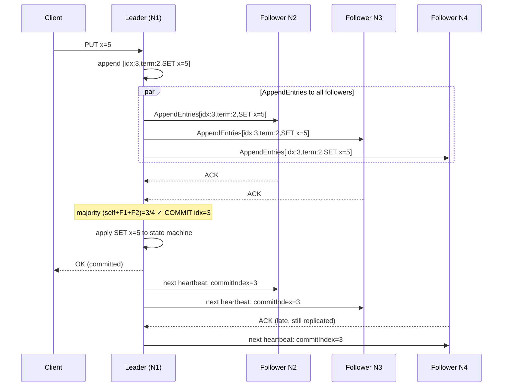

# Raft Consensus Algorithm

**TL;DR:** Raft is a consensus algorithm that replicates a log
across a cluster of servers, ensuring all non-faulty servers
agree on the same sequence of log entries. Designed for
understandability (compared to Paxos). Three roles: Leader,
Follower, Candidate. One Leader at a time (per term). Leader
handles all writes, replicates to followers, commits when a
majority acknowledges. Tolerates (N-1)/2 failures in a cluster
of N nodes (requires quorum of (N+1)/2 nodes). Used in: etcd,
CockroachDB, TiKV, Consul, RaftDB.

---

### 🎯 Model Answer

**30 seconds:**
> Raft is a distributed consensus algorithm: it ensures that a
> cluster of servers agrees on the same sequence of log entries,
> even when some servers fail. One Leader receives all writes,
> replicates to Followers, and commits when a majority
> acknowledges. If the Leader fails, a Candidate gets votes from
> a majority and becomes the new Leader. In a 5-node cluster:
> tolerates 2 simultaneous failures.

**3 minutes:**
> Raft solves the fundamental distributed consensus problem: how
> do multiple servers agree on a value when servers can fail and
> messages can be lost?
>
> Three roles: Leader (one per term - handles all writes, sends
> heartbeats), Follower (passive, replicates the log from the
> Leader), Candidate (a Follower whose election timer fired -
> it starts an election to become the new Leader).
>
> Normal operation: the Leader receives a write (log entry).
> It appends the entry to its own log and sends AppendEntries
> RPCs to all Followers. When a majority (including the Leader
> itself) have acknowledged: the entry is committed. The Leader
> notifies Followers of the commit index. Followers apply
> committed entries to their state machines. All committed entries
> are replicated to the majority before the client receives a response.
>
> Leader election: each Follower has a randomized election timeout
> (150-300ms). If a Follower receives no heartbeat from the Leader
> within its timeout, it becomes a Candidate, increments the term
> number, votes for itself, and sends RequestVote RPCs to all others.
> A Candidate that receives votes from a majority becomes the new
> Leader. The randomized timeout prevents split votes (all nodes
> becoming candidates simultaneously).
>
> Safety: Raft guarantees that once an entry is committed at term T,
> all future Leaders at term > T will have that entry in their logs.
> This is enforced by the "Log Matching Property" - a Candidate
> only wins an election if its log is at least as up-to-date as
> the majority's log.

**Blank Mind Recovery:**

**(1) Restate:** "Raft consensus - a way for a cluster to agree
on a sequence of changes. One Leader, rest follow. Leader writes,
majority must acknowledge before commit. If Leader dies, election."

**(2) First principles:** "Consensus = all non-faulty nodes agree
on the same value. To agree: one node must be the authority
(Leader). The Leader must have its decisions confirmed by a majority
so that any two quorums overlap (shared confirmed entries).
When the Leader dies: elect a new one that has all previously
confirmed entries."

**(3) Bridge:** "Like a committee vote: the chair (Leader) proposes
a resolution. The committee members (Followers) acknowledge. When
a majority raises their hands: the resolution is passed (committed).
If the chair steps down: a new chair is elected who must have
read all previous minutes (log up-to-date check)."

---

### 📘 Concept Explanation

**What it is:**
A distributed consensus protocol that maintains a replicated log
across a cluster. All servers execute the same log entries in the
same order, keeping their state machines identical.

**The problem it solves:**
Distributed storage and coordination systems (databases, lock servers,
configuration stores) must remain consistent when servers fail.
A replicated log with consensus ensures: all non-faulty servers
agree on the same sequence of operations, committed operations are
never lost even after Leader failure, and the system continues
to serve requests as long as a majority of servers are alive.

**The five Raft subproblems:**

```
1. Leader Election
   - Randomized election timeouts (150-300ms)
   - Candidate must have up-to-date log to win
   - Term-based ordering (stale leaders rejected)

2. Log Replication
   - Leader receives entries, appends, sends to followers
   - Committed when majority acknowledges
   - Leader retries indefinitely until majority reached

3. Safety (Log Matching Property)
   - If two entries in different logs have same index+term:
     they are identical AND all preceding entries are identical
   - Ensures no committed entry is ever lost

4. Leader Completeness
   - Leader has ALL committed entries from past terms
   - A candidate with a stale log cannot win election
   - Enforced: RequestVote rejected if candidate log is behind

5. State Machine Safety
   - If a server applies entry E at index N:
     no other server applies a different entry at index N
   - Guaranteed by the above four properties together
```

**Term - the Raft epoch:**

```
Term = a monotonically increasing integer
Each term has at most one Leader

Term N:  [Leader A elected] [Leader A operates]
Term N+1: [Leader A fails] [Election] [Leader B elected]
Term N+2: [Leader B fails] [Stale network partition heals]
          [Leader A (from Term N) reconnects]
          - Leader A sees requests with term N+2
          - A's current term N < N+2
          - A reverts to Follower, adopts term N+2

No two Leaders in the same term:
  A Candidate increments term before sending RequestVote.
  A Follower grants at most one vote per term.
  Majority constraint: N votes needed from (2N+1) servers.
  Two candidates cannot both get a majority for the same term.
```

**Log replication detail:**

```
Leader log: [1:term1:SET x=1] [2:term1:SET y=2] [3:term2:SET x=3]
              committed ^^^                        uncommitted

Step 1: Client → Leader: PUT x=3
Step 2: Leader appends [3:term2:SET x=3] to own log (uncommitted)
Step 3: Leader sends AppendEntries RPC to all Followers
         prevLogIndex=2, prevLogTerm=1, entries=[3:term2:SET x=3]
         commitIndex=2 (current commit)
Step 4: Followers: verify prevLogIndex+prevLogTerm match own log
         If match: append entry 3, send ACK
         If mismatch: send REJECT (leader must back up and retry)
Step 5: Leader receives ACK from itself + majority of followers
         → Mark entry 3 as committed (commitIndex=3)
Step 6: Next AppendEntries heartbeat carries commitIndex=3
         Followers apply entry 3 to state machine
Step 7: Leader returns success to client

If Follower log is behind:
  nextIndex[follower] backed up until logs match
  All missing entries resent from that point
  Follower's conflicting entries overwritten by Leader's
```

**Why committed entries survive Leader failure:**

```
Scenario:
  5-node cluster: A (Leader), B, C, D, E
  Entry E1 committed at index 3 (A, B, C acknowledged - majority)
  A fails (crash)

Election:
  B, C, D are candidates
  RequestVote: includes candidateLastLogIndex=3
  B has index 3 (has E1): can win
  D has index 2 (missing E1): cannot win
    - B and C reject D's vote (D's log is behind B and C)
    - D cannot get majority

  B is elected Leader
  B has E1 in its log → committed entry preserved
```

**The key insight:**
The quorum overlap guarantee is the core safety mechanism.
Any committed entry was acknowledged by a majority of nodes.
Any newly elected Leader must have been voted for by a majority.
Any two majorities overlap in at least one node. Therefore:
the new Leader must have at least one node's log that includes
the committed entry. Combined with the log up-to-date check
in RequestVote: the new Leader always has all committed entries.

**When to use Raft (as a library/system):**
- Building a distributed key-value store (embed etcd's raft library)
- Configuration management (Consul, etcd)
- Distributed lock service
- Any system requiring strongly consistent replication

**When Raft is NOT the right choice:**
- You need Byzantine fault tolerance (Raft assumes crash faults only,
  not malicious nodes - use PBFT or Tendermint for BFT)
- Single-master databases with simple replication (MySQL replication,
  PostgreSQL streaming replication - simpler, no consensus overhead)
- Eventual consistency is sufficient (Cassandra, Dynamo -
  leaderless replication is faster for high throughput)
- Geo-distributed writes (Multi-Raft or Paxos with leader-per-shard)

**First-principles derivation:**
"Consensus requires: majority quorums (any two majorities overlap
= shared knowledge), term-based authority (no two Leaders in the
same epoch), and log up-to-date check for Leader election
(new Leader has all committed entries). These three constraints
together guarantee that a committed entry is never lost."

---

### 💻 Code Example

```java
// RAFT IN PRACTICE: Using etcd (Java client)
// etcd IS a Raft-based key-value store

// BAD: distributed state without consensus
// Each instance has its own copy - no agreement
@Component
public class NaiveDistributedConfig {
    private Map<String, String> config =
        new ConcurrentHashMap<>();

    // BAD: two instances will diverge
    public void set(String key, String value) {
        config.put(key, value); // local only!
    }
    public String get(String key) {
        return config.get(key); // may be stale
    }
}

// GOOD: etcd (Raft-based) for distributed consensus
@Component
public class EtcdConfig {

    private final Client etcd;

    public EtcdConfig() {
        this.etcd = Client.builder()
            .endpoints("http://etcd1:2379",
                       "http://etcd2:2379",
                       "http://etcd3:2379")
            .build();
    }

    // Strongly consistent write (goes through Raft Leader)
    public void set(String key, String value)
            throws ExecutionException, InterruptedException {
        ByteSequence k = ByteSequence.from(
            key, StandardCharsets.UTF_8);
        ByteSequence v = ByteSequence.from(
            value, StandardCharsets.UTF_8);
        etcd.getKVClient().put(k, v).get();
        // .get() blocks until committed by Raft majority
    }

    // Linearizable read (reads from Leader)
    public Optional<String> get(String key)
            throws ExecutionException, InterruptedException {
        ByteSequence k = ByteSequence.from(
            key, StandardCharsets.UTF_8);
        GetResponse response = etcd.getKVClient()
            .get(k).get();
        return response.getKvs().stream()
            .findFirst()
            .map(kv -> kv.getValue()
                .toString(StandardCharsets.UTF_8));
    }

    // Compare-and-swap (Raft-backed atomic operation)
    public boolean compareAndSwap(
            String key, String expected, String newValue)
            throws ExecutionException, InterruptedException {
        ByteSequence k = ByteSequence.from(
            key, StandardCharsets.UTF_8);
        ByteSequence oldV = ByteSequence.from(
            expected, StandardCharsets.UTF_8);
        ByteSequence newV = ByteSequence.from(
            newValue, StandardCharsets.UTF_8);

        TxnResponse txn = etcd.getKVClient().txn()
            .If(new Cmp(k, Cmp.Op.EQUAL,
                CmpTarget.value(oldV)))
            .Then(Op.put(k, newV, PutOption.DEFAULT))
            .commit().get();

        return txn.isSucceeded();
    }
}
```

> **Code walkthrough:** The BAD pattern stores configuration in
> a local `ConcurrentHashMap`. Each service instance has its own
> copy; updates are not replicated. Two instances calling `set()`
> concurrently will diverge. The GOOD pattern uses etcd - a Raft-based
> key-value store. The `put()` call goes to the Raft Leader (etcd
> routes internally) and blocks until a majority of etcd nodes
> acknowledge the write - strongly consistent. The `compareAndSwap`
> operation uses etcd's transaction API to implement atomic CAS -
> essential for distributed leader election and lock acquisition.
> The Raft protocol ensures that CAS operations are serialized:
> no two concurrent CAS operations can both succeed on the same key.

---

### 🎓 Answers by Seniority

**Junior / Mid:**
> Raft is a consensus algorithm that replicates a log across a
> cluster. One Leader handles all writes, replicates to Followers,
> and commits when a majority acknowledges. If the Leader fails,
> a new one is elected. A Follower votes for a Candidate only if
> the Candidate's log is at least as up-to-date as its own.
> This ensures the new Leader has all committed entries. Used
> in etcd, CockroachDB, and Consul.

---

**Senior / Staff:**
> I think about Raft in terms of its safety invariants:
> (1) Election safety: at most one Leader per term (majority vote
> constraint). (2) Log matching: if two entries have the same
> index+term, all preceding entries are identical. (3) Leader
> completeness: Leaders have all committed entries from past terms.
> (4) State machine safety: all servers apply the same entries
> in the same order.
>
> In production, the failure modes I watch for: split-brain
> (stale Leader continues accepting writes during network partition -
> only possible in at-most-once systems, not Raft), clock skew
> affecting election timeouts, and leader instability (leader
> oscillation when the network is marginally partitioned, causing
> repeated elections that stall write throughput).

---

### ⚠️ Common Misconceptions

**"Raft guarantees the Leader is always the most up-to-date node"**

Reality: the Leader is guaranteed to have all COMMITTED entries
from past terms. Uncommitted entries from the previous term may
be present on the new Leader's log but are NOT committed until
the current Leader replicates and commits them. Specifically:
Raft never commits an entry from a previous term solely by counting
replicas - it only commits previous-term entries indirectly, by
committing a new entry from the CURRENT term that advances the
commit index past the previous-term entries. This is the source
of a subtle bug described in the original Raft paper (Section 5.4.2).

**"A 3-node Raft cluster can tolerate 2 failures"**

Reality: a 3-node cluster tolerates 1 failure (majority = 2 nodes).
A 5-node cluster tolerates 2 failures (majority = 3 nodes).
The formula: a cluster of N nodes tolerates floor((N-1)/2)
failures. Two simultaneous failures in a 3-node cluster eliminate
the majority - the cluster cannot commit new entries. It can still
serve reads from the surviving node if linearizability is not
required (stale reads), but no new writes commit until the majority
is restored.

---

### ⚖️ Comparison Table

| Algorithm | Design Goal | BFT | Understandability | Used In |
|---|---|---|---|---|
| Raft | Understandability | No | High | etcd, CockroachDB, Consul |
| Paxos | Theoretical minimum | No | Low (complex) | Chubby, Spanner |
| Multi-Paxos | Practical Paxos | No | Medium | Spanner |
| PBFT | Byzantine faults | Yes | Low | Hyperledger |
| Tendermint | BFT + performance | Yes | Medium | Cosmos blockchain |

**The deciding factor:** Do you need Byzantine fault tolerance?
Use PBFT/Tendermint (blockchain, untrusted nodes). Otherwise:
Raft for readability and active development ecosystem;
Paxos/Multi-Paxos for theoretical depth (most production
Paxos variants are Multi-Paxos anyway).

---

### 🏛️ System Design

**Design: Distributed Key-Value Store using Raft**

Requirements: linearizable reads and writes, fault tolerance
(tolerate 2 node failures in a 5-node cluster), horizontal
scalability via sharding.

**Architecture:**

```
Shard 1: Raft group [N1, N2, N3, N4, N5]
Shard 2: Raft group [N6, N7, N8, N9, N10]

Client request: key → consistent hash → shard
Leader of shard: receives write, replicates, commits

Router:
  - Knows which shard owns which key range
  - Routes client to Leader of the correct shard
  - On election: updates Leader location map
  (etcd-style: linear range sharding)
```

**Write path:**

```
1. Client: PUT(key="user:123", value="Alice")
2. Router: hash(key) → Shard 1 Leader = N3
3. N3: append log entry [index=42, term=3, op=PUT k v]
4. N3: send AppendEntries to N1, N2, N4, N5
5. N1, N2 acknowledge (majority = 3 with N3 itself)
6. N3: commitIndex = 42, apply to state machine
7. N3: return ACK to client
8. N3: next heartbeat carries commitIndex=42
9. N4, N5 eventually apply index 42
```

**Read path (linearizable):**

```
Option A: Read from Leader (ensures freshness)
  - Leader confirms it is still Leader:
    sends a round-trip heartbeat before responding
  - Adds 1 RTT overhead
  
Option B: Lease-based reads
  - Leader holds a "read lease" (valid for election timeout)
  - Reads within the lease are served immediately
  - Requires synchronized clocks (bounded clock skew)
  - TiKV and CockroachDB use this approach

Option C: Follower reads (stale reads)
  - Clients can read from any Follower
  - May be behind Leader by one replication round
  - Acceptable for read-your-writes if client uses the Leader
```

**Shard rebalancing:**

```
When a new node joins or a shard becomes too large:
  1. Config service (separate Raft group) stores shard map
  2. New assignment: Shard 1 splits into Shard 1a + Shard 1b
  3. New Raft group formed for Shard 1b
  4. Data migrated from Shard 1 to Shard 1b (snapshot transfer)
  5. Config service updates shard map
  6. Clients route to new shards via updated config
```

**Production considerations:**

```
Cluster size: odd numbers only (3, 5, 7)
  - Even numbers waste fault tolerance
  - 5-node: tolerates 2 failures (common production config)
  - 7-node: tolerates 3 failures (high-value stateful services)

Election timeout tuning:
  - 150-300ms (Raft default)
  - Too low: spurious elections under load
  - Too high: long unavailability window after Leader failure

Heartbeat interval: typically 50-150ms
  - Must be << election timeout
  - etcd default: 100ms heartbeat, 1000ms election timeout

Snapshot: periodic (every 10k entries)
  - Prevents log from growing unbounded
  - New followers receive snapshot + log tail
```

---

### 📊 Diagram

```
Raft Consensus - Normal Operation

+--------+      AppendEntries        +--------+
|        |-------------------------->|        |
| Leader |      [idx:3, term:2,      | Follow |
|        |       op:SET x=5]         |   r 1  |
|        |<--------------------------|        |
|        |      ACK (success)        +--------+
|        |
|        |      AppendEntries        +--------+
|        |-------------------------->|        |
|        |                           | Follow |
|        |<--------------------------|   r 2  |
|        |      ACK (success)        +--------+
|        |
|        | Majority (self+F1+F2)=3/3 +--------+
|        | COMMIT index=3            |        |
|        |  --> State machine: x=5   | Follow |
|        |  --> Return OK to client  |   r 3  |
+--------+                           +--------+
      \________ still replicating ___/

Election Timeout Flow

Follower:  [Heartbeat timeout] --> Candidate
Candidate: increment term, vote for self
           RequestVote --> Followers
Follower:  if candidate log >= own log AND
              have not voted this term:
              grant vote
Candidate: receives majority votes
           --> becomes Leader
           sends heartbeats to all (reset timeouts)
```



> **Diagram walkthrough:** The ASCII diagram shows both normal
> operation and election flow side-by-side. The sequence diagram
> shows a write request flowing from the Client to the Leader,
> being replicated in parallel to all Followers, and committed
> once the majority (self + F1 + F2 = 3 of 4 participants) have
> acknowledged. F3's late acknowledgement is received and noted
> but is not required for commitment. On the next heartbeat, all
> Followers learn the commit index and apply the entry to their
> state machines. This is the fundamental Raft flow: replicate
> then commit, with commit requiring only majority acknowledgement,
> not unanimity.

---

### 🚨 Failure Modes and Diagnosis

**Failure 1: Leader oscillation - cluster keeps electing new Leaders**

Symptom: Write throughput drops to near zero. Metrics show leader
election events every 300-500ms. No single Leader holds the term
for more than a few seconds.

Root cause: Network conditions cause most AppendEntries RPCs
to arrive after the Followers' election timeout, even though
packets are not completely dropped. Followers interpret missed
heartbeats as Leader failure and start elections. The new Leader's
heartbeats also fail to arrive in time.

Diagnosis:
```bash
# etcd: check leader change rate
etcdctl endpoint status --cluster
# Look for "Leader" column changing frequently

# Check heartbeat latency
etcdctl check perf
# P99 RTT > election_timeout/2 = problem

# Network latency between nodes:
ping -c 100 etcd-node2 | tail -1
# avg RTT should be < 10ms for 100-300ms election timeout
```

Fix: increase `election-timeout` and `heartbeat-interval` to
account for observed P99 network latency. etcd rule: heartbeat
interval = 10x average RTT; election timeout = 10x heartbeat.
For cross-AZ clusters: use 500ms heartbeat, 5000ms election timeout.

---

**Failure 2: Committed entry lost after Leader failure
(split-brain with stale Leader)**

Symptom: A write returned success (committed) to the client,
but after a Leader failure and re-election, the value is gone.

Root cause: Network partition - the Leader was partitioned from
the majority. The partitioned Leader continued to accept writes
and return success to clients in the same partition. However,
it could not replicate to the majority, so these entries were
never committed by the Raft protocol. The new Leader (elected
by the majority partition) does not have these entries. After
the partition heals, the old Leader discovers its term is stale
and reverts to Follower. Its uncommitted entries are overwritten.

Critical: TRUE committed entries (acknowledged by majority before
partition) are NOT lost. Only entries that the Leader accepted
but could not replicate to majority are lost.

Diagnosis: Client observed a successful write that later returned
a different value. Check: did the write complete before the
partition? Check etcd: `etcdctl get /key --rev=<revision>` with
revision from the write response. If the revision no longer exists
after re-election: the entry was uncommitted at the time of
partition (not a Raft bug - the Leader cannot commit without majority).

Fix: Ensure clients use linearizable reads. Implement write
idempotency (retry the write after reconnection). Do NOT rely
on "success from partitioned Leader" as a true commit signal -
Raft ensures that a truly committed entry (majority confirmed)
is NEVER lost.

---

**Failure 3: Log divergence after network partition (safe in Raft)**

Symptom: Two nodes have different log entries at the same index
after a partition heals.

Root cause: During a partition, a Follower that was on the minority
side may have received no AppendEntries and stayed at an old state.
The majority partition continued to commit new entries. After healing,
the minority-side Follower's log at index N may be from an older
term than the current committed entry at index N.

Resolution (automatic): The new Leader sends AppendEntries to the
reconnected Follower. The Follower's log does not match at the
prevLogIndex/prevLogTerm check. The Leader backs up `nextIndex`
for this Follower until finding the matching point. Then resends
all entries from that point. The Follower's diverging entries
are overwritten by the Leader's authoritative log.

Diagnosis: Not an issue requiring manual intervention. Normal
post-partition recovery. Monitor: Follower log replication lag
metric. It should converge to 0 within seconds of partition healing.

---

### 🎯 Interview Deep-Dive

| Category | Count |
|---|---|
| Clarification | 1 |
| Mechanism | 3 |
| Failure / Debugging | 2 |
| Trade-off | 2 |
| System Design | 1 |
| Code | 1 |
| Behavioral | 1 |
| Production | 1 |

---

**Q1 (Clarification) - Why does Raft require a quorum (majority)
rather than all nodes acknowledging?**

A: Requiring all nodes to acknowledge means a single slow or
failed node blocks all writes indefinitely. This makes the system
unavailable during any node failure - unacceptable for production.

Requiring a quorum (majority) allows the system to tolerate
failures: a 5-node cluster continues to operate with 3 nodes.
The critical insight: any two quorums in a cluster of N nodes
must overlap in at least one node. If a write is acknowledged
by a quorum and later a new Leader is elected by a quorum:
both quorums include at least one common node. That node has
both the committed write AND voted for the new Leader. This
overlap guarantees the new Leader has all committed entries.

The tradeoff: a quorum of N/2 + 1 means we can tolerate
floor(N/2) failures. Larger clusters tolerate more failures
but have higher replication overhead. 5-node is the common
production choice (2 failures tolerated, 5 nodes to manage).

*What separates good from great:* deriving the quorum overlap
property from first principles. Many candidates know "majority"
is required but cannot explain why any smaller quorum would
be unsafe. The overlap argument is the fundamental insight.

---

**Q2 (Mechanism) - How does Raft's Leader election work in detail?
What prevents two Leaders being elected in the same term?**

A: Election process:

1. Each Follower has a randomized election timeout (150-300ms
   by default). If no heartbeat arrives within the timeout:
   the Follower becomes a Candidate.

2. The Candidate: increments its current term (e.g., term 3 → 4),
   votes for itself, and sends RequestVote RPCs to all other servers.
   RequestVote includes: `candidateTerm=4`, `candidateId`,
   `lastLogIndex`, `lastLogTerm`.

3. A Follower grants the vote if:
   - `candidateTerm >= receiverCurrentTerm` (term up-to-date)
   - The receiver has not already voted in this term
   - The candidate's log is at least as up-to-date as the receiver's
     (compare lastLogTerm, then lastLogIndex if terms equal)

4. A Candidate receiving votes from a majority (including itself)
   becomes the Leader and immediately sends heartbeats to all.

**Why two Leaders cannot coexist in the same term:**
A server grants at most one vote per term (first-come-first-served).
To win an election: a Candidate needs votes from N/2 + 1 servers.
Two Candidates competing for Leadership in the same term would both
need N/2 + 1 votes. In a cluster of N servers: (N/2 + 1) + (N/2 + 1)
= N + 2 > N. More votes required than servers exist. Therefore,
at most one Candidate can achieve a majority per term.

*What separates good from great:* the mathematical proof that
two Leaders cannot coexist. Many candidates say "majority vote
prevents split-brain" but cannot prove it. The pigeonhole argument
(total required votes exceed total available votes) is the rigorous
answer.

---

**Q3 (Mechanism) - What is the log matching property and why
is it critical?**

A: The Log Matching Property states:
- If two log entries in different servers' logs have the same
  index and term number: they contain the same command.
- If two log entries in different servers' logs have the same
  index and term number: all preceding log entries are identical.

Why it holds: A Leader creates at most one entry per index per
term (it appends entries sequentially). When a Follower accepts
an AppendEntries RPC, it verifies `prevLogIndex` and `prevLogTerm`
(the entry immediately before the new entry) match its own log.
This consistency check applies inductively: if the preceding entry
matches, and by induction all entries before that match, then
all entries up to the current one match.

Why it is critical: the Log Matching Property is the invariant
that enables safe replication. When a new Leader is elected:
it can safely override any uncommitted entries on Followers
(entries that don't match the Leader's log at the corresponding
index+term) because the committed entries' Log Matching invariant
is preserved. The Leader sends entries from the divergence point
and the Follower replaces its uncommitted entries with the Leader's
authoritative versions.

*What separates good from great:* explaining why the prevLogIndex/
prevLogTerm consistency check is the mechanism that enforces Log
Matching. The check is the implementation of the inductive invariant.
Without it: a Follower might accept entries that skip indices,
breaking the property and potentially allowing state machine
divergence.

---

**Q4 (Failure / Debugging) - A 5-node etcd cluster has one node
down. Writes are taking 5x longer than usual. Why and how do
you fix?**

A: With one node down, writes still commit (4 healthy nodes,
majority = 3). But the Leader still tries to replicate to all 5
nodes, waiting for the down node's AppendEntries to timeout before
considering the RPC failed (and counting the remaining 3 as majority).

The etcd replication timeout defaults to heartbeat-interval
(100ms). If the Leader waits for the down node's timeout before
counting the majority:
- Leader sends AppendEntries to N2, N3, N4, N5 (N5 is down)
- N2, N3, N4 ACK immediately
- N5 times out after 100ms
- Leader counts majority (self + N2 + N3 = 3/4 healthy) and commits
- Effective write latency = round trip + N5's timeout

Diagnosis:
```bash
# Check which member is down
etcdctl member list -w table
etcdctl endpoint health --cluster

# Check P99 write latency
etcdctl check perf --load="s"
# Histogram shows tail latency at timeout boundary
```

Fix: (1) Restore N5 as quickly as possible. (2) If N5 is
permanently gone: remove it from the cluster
(`etcdctl member remove <member-id>`). The cluster will then
run as a 4-node cluster and not wait for N5. (3) Add a
replacement node to restore 5-node fault tolerance.

*What separates good from great:* identifying the mechanism:
the Leader waits for the down node's timeout before counting
majority. This is the expected behavior - Raft optimistically
replicates to all nodes. The fix is removing the down node from
the member list, not increasing timeouts. Increasing timeouts
would make the problem worse.

---

**Q5 (Failure / Debugging) - How do you recover an etcd cluster
from a majority failure (all nodes down)?**

A: A majority failure (> N/2 nodes lost permanently) means the
cluster cannot form a quorum and cannot commit new entries. The
cluster is unavailable for writes. If any surviving node has
recent data, there are two recovery paths:

Path 1 - Restore from backup (cleanest):
```bash
# 1. Stop all etcd processes
# 2. Restore from most recent snapshot on one node
etcdctl snapshot restore snapshot.db \
  --data-dir /var/lib/etcd/restored \
  --name etcd1 \
  --initial-cluster "etcd1=http://etcd1:2380" \
  --initial-cluster-token etcd-cluster-restored \
  --initial-advertise-peer-urls http://etcd1:2380
# 3. Start the restored node as a new single-node cluster
# 4. Add new members back
etcdctl member add etcd2 --peer-urls=http://etcd2:2380
etcdctl member add etcd3 --peer-urls=http://etcd3:2380
```

Path 2 - Force new cluster (dangerous):
```bash
# Start one surviving node with --force-new-cluster flag
etcd --force-new-cluster --data-dir=/var/lib/etcd
# This forces the node to become a single-node cluster
# using its current (possibly stale) log
# DANGER: Any entries committed after this node's last
# checkpoint are lost
```

*What separates good from great:* emphasizing that snapshot
backups are mandatory for etcd clusters. `--force-new-cluster`
creates a cluster from the last checkpointed state - potentially
missing recent writes. Without regular snapshots (etcd automates
this), recovery from majority failure involves data loss.
Production etcd clusters should have snapshots stored in object
storage (S3, GCS) taken every 5 minutes.

---

**Q6 (Trade-off) - Raft vs. Paxos: what are the practical
differences and when would you choose one over the other?**

A: Paxos is the theoretical foundation of distributed consensus.
Raft was designed specifically for understandability and
implementability.

**Theoretical differences:**
- Paxos defines single-value consensus (choose one value). Multi-Paxos
  extends this to a log but leaves many details unspecified (leader
  election, log management, membership changes).
- Raft explicitly addresses all practical aspects: leader election,
  log replication, cluster membership changes, log compaction.

**Practical implications:**
- Paxos implementations are creative: each Paxos system (Chubby,
  Spanner, Zookeeper's ZAB) makes different choices for the
  unspecified parts. These are incompatible.
- Raft implementations are consistent: the spec is complete.
  Multiple independent implementations produce compatible behavior.

**When to choose Raft:**
- Building a new distributed system needing consensus
- Team members need to understand and debug the consensus layer
- Using an existing Raft library (etcd/raft, hashicorp/raft)

**When Paxos variants are used:**
- You are working with Google Spanner or Chubby (uses Multi-Paxos)
- Academic research or consensus algorithm theory
- You need Single-Decree Paxos for a one-shot consensus problem

In practice: you rarely choose "Raft vs. Paxos" directly.
You choose an existing system (etcd: Raft, Zookeeper: ZAB which
is Paxos-like, Cassandra: no consensus for writes). If building
from scratch: use Raft for its explicit, implementable specification.

*What separates good from great:* acknowledging that ZAB (Zookeeper
Atomic Broadcast) is often conflated with Paxos. ZAB is a distinct
protocol with Paxos-like properties but different details. Similarly,
Viewstamped Replication (VR) predates both and shares properties
with Raft. The practical answer: "all these protocols solve the
same problem with similar fundamental mechanisms. Choose the one
with the best tooling and documentation for your use case."

---

**Q7 (Trade-off) - Linearizable reads in Raft require an extra
round-trip. How do you optimize read throughput without sacrificing
correctness?**

A: The problem: linearizable reads in Raft require the Leader to
confirm it is still the Leader before serving the read. One
approach: the Leader sends a heartbeat and waits for majority
ACK before responding to the read. This adds a full round-trip
to every read.

Three optimization strategies:

1. Read index (Raft paper approach):
   - Leader records the current commitIndex as the "readIndex"
   - Leader confirms leadership via one heartbeat to majority
   - When the state machine applies entries up to readIndex:
     serve the read
   - Benefit: no extra log entry needed
   - Cost: one heartbeat RTT per read

2. Lease-based reads:
   - Leader holds a lease: it assumes it is still Leader for
     the duration of `election_timeout - clock_skew`
   - Within the lease: reads are served immediately without
     heartbeat round-trip
   - Benefit: zero extra latency
   - Risk: requires bounded clock skew assumption. If clocks
     diverge > clock_skew bound: a partitioned Leader might
     serve stale reads
   - Used in: TiKV, CockroachDB

3. Follower reads (not linearizable):
   - Route reads to Followers for throughput
   - Followers serve stale data (bounded staleness if committed
     entries lag < replication latency)
   - Acceptable for: cache reads, eventual consistency use cases

In production at high read throughput: use lease-based reads
with bounded clock skew (NTP + PTP for < 1ms clock drift).
Monitor clock skew actively. Fall back to read index if clock
drift exceeds the bound.

*What separates good from great:* the clock skew requirement for
lease-based reads. Lease reads are widely used (TiKV uses them)
but they require synchronized clocks. In a data center with NTP:
typical skew is < 10ms, well within the 150ms election timeout.
In a multi-AZ environment: GPS-synchronized clocks or PTP are used
(AWS: EC2 uses PTP with sub-microsecond accuracy). Understanding
the dependency on clock synchronization distinguishes engineers
who understand the algorithm from those who just use the API.

---

**Q8 (System Design) - Design a distributed lock service using Raft.**

A: A distributed lock service provides mutual exclusion for
distributed processes. Requirements: safety (at most one holder
at a time), liveness (lock is eventually released after holder
failure), linearizability (lock acquisition is ordered).

**Architecture:**
```
Lock Service:
  - 5-node Raft cluster (etcd or custom)
  - Lock = a key in the Raft KV store
  - Value = holder ID + lease expiry timestamp

Acquire(lockId, holderId, ttl):
  CAS: IF lock.key NOT EXISTS:
         SET lock.key = {holderId, now() + ttl}
  Return: acquired/rejected

Release(lockId, holderId):
  CAS: IF lock.holder == holderId:
         DELETE lock.key

Lease renewal (heartbeat):
  Client sends KeepAlive every ttl/3
  Server extends expiry by ttl on receipt
  If no KeepAlive in ttl: lock auto-expires
```

**etcd implementation (Java):**
```java
// Acquire lock using etcd lease + election
Lease leaseClient = etcd.getLeaseClient();
long leaseId = leaseClient.grant(30).get().getID();
// Lock a key with this lease (auto-deletes on expiry)
Lock lockClient = etcd.getLockClient();
LockResponse lockResp = lockClient.lock(
    ByteSequence.from("/locks/resource-1",
        StandardCharsets.UTF_8), leaseId).get();
// Lock acquired; other callers block on lock()
// ...do work...
lockClient.unlock(lockResp.getKey()).get();
// Keep alive thread: leaseClient.keepAlive(leaseId,...)
```

**Failure handling:**
- Client dies without releasing: lease TTL expires, lock released
- Leader fails during lock grant: new Leader has the lock entry
  in its log (committed before Leader failed); lock state preserved
- Fencing tokens: to prevent a lock holder whose lease expired
  from writing stale data, use a monotonically increasing fencing
  token (etcd revision number) included in all writes to the
  protected resource. The resource server rejects writes with
  a stale fencing token.

*What separates good from great:* the fencing token discussion.
A distributed lock with TTL has a fundamental problem: the lock
holder may be slow (GC pause, network delay) and the lock expires
while the holder is still executing. Two holders are then active
simultaneously. Fencing tokens solve this: every lock acquisition
returns a monotonically increasing token. The protected resource
rejects writes with a lower token than the last seen - the stale
holder's write is rejected even if it arrives after the new holder.

---

**Q9 (Code) - Implement a leader election mechanism using etcd.**

A:
```java
@Component
public class LeaderElection {

    private final Client etcd;
    private final String candidateId;
    private volatile boolean isLeader = false;

    // etcd leader election via campaign
    public void runElection() throws Exception {
        Election election = etcd.getElectionClient();
        ByteSequence electionName = ByteSequence.from(
            "/election/payments",
            StandardCharsets.UTF_8);
        ByteSequence candidateValue = ByteSequence.from(
            candidateId, StandardCharsets.UTF_8);

        // Create a lease (TTL=10s) for the election
        // If this node dies: lease expires, leadership
        // automatically transferred
        long leaseId = etcd.getLeaseClient()
            .grant(10).get().getID();

        // Start keep-alive to maintain the lease
        etcd.getLeaseClient().keepAlive(leaseId,
            Observers.observer(response ->
                log.debug("Lease renewed")));

        // Campaign: blocks until this node wins or fails
        // Other candidates wait; winner holds the key
        CampaignResponse resp = election.campaign(
            electionName, leaseId, candidateValue).get();

        isLeader = true;
        log.info("Became leader: {}", candidateId);

        // On leader change: observe returns new leader
        election.observe(electionName)
            .subscribe(obs -> {
                String newLeader = obs.getKv().getValue()
                    .toString(StandardCharsets.UTF_8);
                if (!newLeader.equals(candidateId)) {
                    isLeader = false;
                }
            });
    }

    public boolean isLeader() {
        return isLeader;
    }
}
```

> **Code walkthrough:** This uses etcd's Election API, built on
> top of Raft consensus. Each candidate creates a lease (10-second
> TTL) and campaigns for the election key. Internally, etcd uses
> a sorted key space: each candidate writes to the election key
> with a unique revision. The candidate with the lowest revision
> (first writer) wins. Others watch the key below them; when the
> current leader's key is deleted (lease expiry or resignation):
> the next candidate in line wins. The `keepAlive` call maintains
> the lease by renewing it every TTL/3. If the process dies:
> the lease expires, the key is deleted, and the next candidate
> becomes leader. This is a production-grade Raft-backed leader
> election with automatic failover.

---

**Q10 (Mechanism) - How does Raft handle cluster membership changes
(adding or removing nodes)?**

A: Cluster membership changes are dangerous in Raft because a
naive approach can create two independent majorities ("split-brain").

Example: 3-node cluster (A, B, C). We want to add D and E.
During the transition: A and B might form a majority of the old
cluster (2 of 3) while C, D, E form a majority of the new cluster
(3 of 5). Two Leaders could be elected simultaneously.

**Joint consensus (original Raft paper):**
The cluster transitions through a joint configuration C_old,new
where entries must be committed by a majority of BOTH old and
new configurations. This prevents two majorities:
- Old majority: 2 of {A, B, C}
- New majority: 3 of {A, B, C, D, E}
- Joint majority: majority of old AND majority of new
  - No two leaders can independently achieve both requirements

**Single-server changes (simpler, practical):**
Add or remove one server at a time. Adding one server to a
3-node cluster creates a 4-node cluster. The old 3-node majority
(2 servers) is still a majority of the 4-node cluster (2 of 4...
actually not: 4-node majority = 3). Wait: removing one server
from a 5-node cluster to 4-node: old majority 3/5, new majority
2.5→3/4 - the same 3 servers form a majority of both.

Single-server changes never create two disjoint majorities,
so they are safe. Most production implementations (etcd) use
this approach.

*What separates good from great:* understanding that the joint
consensus approach is the theoretically complete solution but
the single-server approach is the practical implementation.
etcd uses single-server membership changes. Knowing WHY the
single-server approach is safe (no two disjoint majorities)
and WHY naive cluster expansion is unsafe (two independent
majorities) demonstrates algorithmic depth.

---

**Q11 (Production) - How do you tune an etcd cluster for
high-throughput production workloads?**

A: Three key tuning dimensions: latency, throughput, and durability.

**Latency tuning:**
```bash
# Heartbeat interval: 10x average RTT
# Default 100ms → tune for your network
--heartbeat-interval=50  # for <5ms inter-node RTT
--election-timeout=500   # 10x heartbeat

# Data directory on fast storage (NVMe SSD required)
# fsync latency directly impacts write latency
# fsync on rotational disk: 5-10ms → P99 write = 15ms
# fsync on NVMe: <1ms → P99 write = 3ms
--data-dir=/nvme/etcd
```

**Throughput tuning:**
```bash
# Max number of operations per snapshot interval
--snapshot-count=10000  # default; reduce for faster recovery
                        # after restart (smaller log to replay)

# Quota: prevent etcd from becoming full
--quota-backend-bytes=8589934592  # 8GB max
# Alert before hitting quota:
# etcd_server_quota_backend_bytes vs
# etcd_mvcc_db_total_size_in_bytes metrics
```

**Defragmentation:**
```bash
# etcd MVCC stores all historical versions
# without defrag, DB grows unboundedly
# Schedule defrag during off-peak hours
etcdctl defrag --cluster
# Defrag takes the node offline briefly: stagger across cluster
```

**Monitoring KPIs:**
- `etcd_server_leader_changes_seen_total` - leader stability
- `etcd_disk_wal_fsync_duration_seconds` - disk latency
- `etcd_network_peer_round_trip_time_seconds` - inter-node RTT
- `etcd_server_proposals_failed_total` - failed writes

*What separates good from great:* fsync latency as the primary
performance driver. etcd calls fsync on every write to guarantee
durability. On a spinning disk: fsync takes 5-15ms - this is
the floor for write latency. On NVMe: <1ms. This is why etcd
strongly recommends NVMe SSD. Engineers who have operated etcd
in production know to check `etcd_disk_wal_fsync_duration_seconds`
first when diagnosing high write latency.

---

**Q12 (Behavioral) - Describe a time you had to reason about
or debug a distributed consensus issue in production.**

A: Example structure:

"At [company], we used etcd as the configuration store for
our microservices. We had a 3-node etcd cluster. During a
routine node upgrade, we upgraded node 3 (Follower) first.
While node 3 was restarting: the cluster was 2/3 available
(Leader + 1 Follower). Normal operation.

The issue: node 3 came back up but had a corrupted WAL (the
upgrade process accidentally wrote to the data directory).
etcd refused to start. Meanwhile, we were also rolling restarts
on the application layer. The application's etcd client had
a connection pool to all 3 etcd nodes. With node 3 down:
1/3 of application connections were getting connection refused
errors. The client was retrying on the next node in the pool,
but the retry logic had a bug: it was retrying at the same node
twice before moving to the next.

Impact: 30% of application requests had a 2x timeout before
reaching a healthy etcd node. P99 latency spiked from 5ms to 800ms.

Diagnosis: etcd endpoint health showed node 3 offline. Application
logs showed `connection refused etcd3:2379` followed by retry to
`etcd3:2379` again (the bug). Fixed the client retry logic to
remove unhealthy endpoints from the pool immediately.

Fix for etcd node: restored from snapshot, rejoined cluster as
a learner (read-only) first, confirmed log replication complete,
then promoted to voting member.

Lesson: etcd client configuration matters as much as the server.
The client must mark unhealthy members and not retry to them.
Always test the client's behavior under partial cluster failures."

*What separates good from great:* describing both the server-side
issue (corrupt WAL) and the client-side issue (bad retry logic).
In distributed systems, failures often involve multiple components.
The candidate who focuses on both and understands the interaction
demonstrates production depth. Also: the learner promotion step
shows knowledge of etcd's membership management best practices
(add as learner, verify replication, promote).
