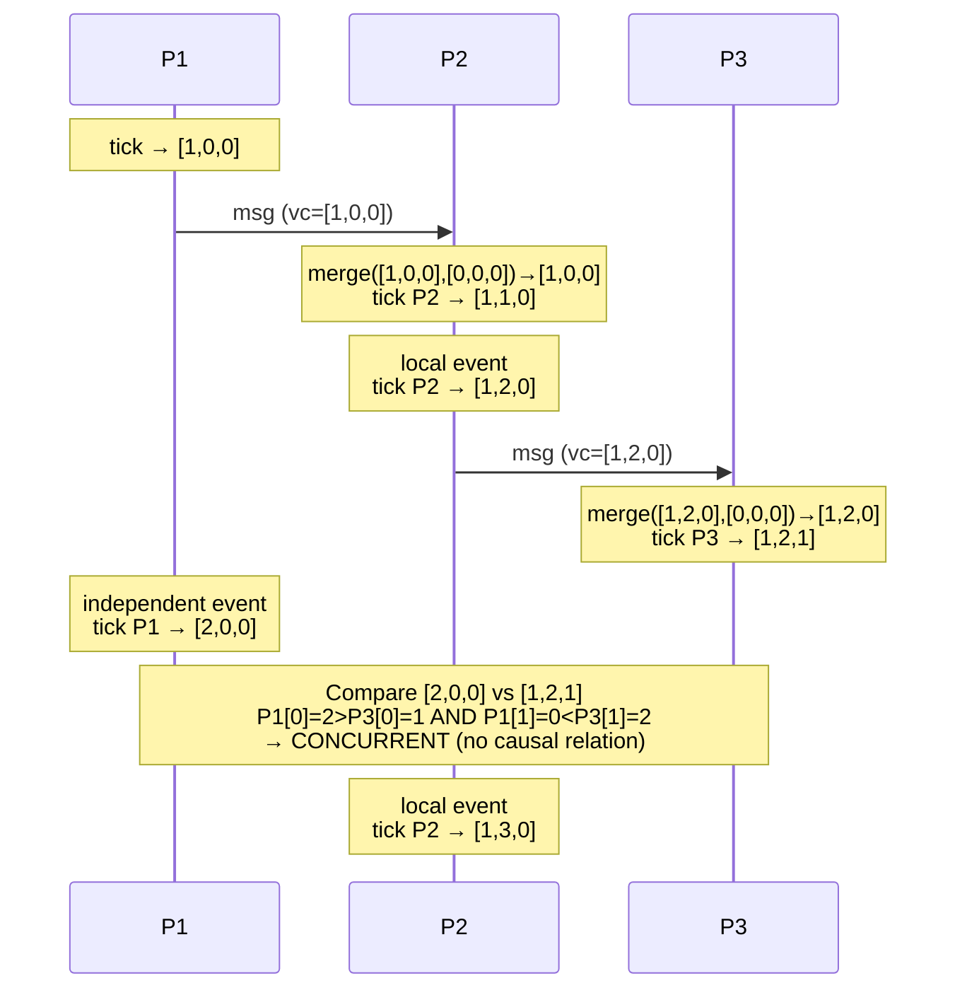

# Vector Clocks and Causal Consistency

**TL;DR:** A vector clock is an array of logical counters - one
per process - that tracks causal dependencies across a distributed
system. Each process increments its own counter on every local
event and sends its full vector with every message. On receive:
take element-wise maximum of the two vectors, then increment own
counter. Result: vector clocks establish a partial order capturing
"happened-before" (causality), not just temporal order. Used by
Amazon DynamoDB's version vectors, CRDTs, and Riak to detect
concurrent updates and determine which version of data is more
recent or whether two versions are causally unrelated (conflict).

---

### 🎯 Model Answer

**30 seconds:**
> A vector clock is one timestamp per process in the system.
> When a process sends a message, it attaches its full vector.
> The receiver merges by taking the element-wise max, then
> increments its own slot. Two events are causally ordered if
> one vector is component-wise less-than-or-equal the other.
> If neither is component-wise ≤ the other: they are concurrent
> (happened independently - a conflict).

**3 minutes:**
> Lamport timestamps establish a total order, but that order is
> not causal: two unrelated events A and B might be ordered A < B
> by Lamport even though neither caused the other. Vector clocks
> solve this by tracking, for each process, the number of events
> that process has executed at the time of a given event. This
> gives a partial order that exactly captures causality.
>
> Example with 3 processes P1, P2, P3. Vector notation [v1,v2,v3]
> where vi = events known from Pi.
>
> - P1 sends: VC=[1,0,0]. P2 receives: VC=[1,1,0] (merge+increment)
> - P2 sends: VC=[1,2,0]. P3 receives: VC=[1,2,1]
> - P1 independently executes event: VC=[2,0,0]
> - P3 has [1,2,1], P1 has [2,0,0]
>   Compare: [2,0,0] vs [1,2,1]
>   Element 0: 2 > 1 (P1 more recent from P1's view)
>   Element 1: 0 < 2 (P2's updates visible to P3 but not P1)
>   Neither ≤ the other → P1's event and P3's event are concurrent
>
> Causal consistency: a read returns the value written by the most
> recent causally prior write. If process A writes X=5 after
> reading X=3 from B, any subsequent read from C that returns 5
> must also see all writes that causally preceded A's write.
> Vector clocks enforce this: do not serve a read until all
> causally required writes are visible.
>
> Real use: Amazon DynamoDB (before 2012) used vector clocks
> as version vectors to detect concurrent updates. When two
> concurrent versions exist: the client is returned both values
> and must resolve the conflict. Riak used vector clocks
> similarly. Modern DynamoDB uses last-writer-wins with
> timestamps instead, accepting some loss of causal semantics
> for operational simplicity.

**Blank Mind Recovery:**

**(1) Restate:** "Vector clock = array of counters, one per process.
Increment own slot on events. Merge on receive. If one vector
dominates the other (element-wise ≤): they are causally ordered.
Neither dominates: concurrent."

**(2) First principles:** "Causality requires knowing what each
process knew at the time of each event. Store that knowledge as
a counter per process. When you see a message, you learn what the
sender knew. Take the max to merge knowledge. If you can derive
that A knew everything B knew when B acted, then A happened after B."

**(3) Bridge:** "Like version numbers on documents shared between
editors. Editor 1 has seen revision 5 of Alice's edits and 3 of
Bob's: version [5,3]. Editor 2 has seen 4 of Alice and 6 of Bob:
version [4,6]. Neither has seen everything the other has seen.
They have concurrent edits and a merge (conflict resolution)
is needed."

---

### 📘 Concept Explanation

**What it is:**
A vector clock is a data structure that assigns a version vector
(one logical counter per process) to each event in a distributed
system. The vector captures the causal history of the event:
which events at which processes the current event "knows about."

**The problem it solves:**
Lamport timestamps establish a total order but cannot distinguish
concurrent events from causally ordered events. Two events with
Lamport timestamps 5 and 7 might be causally ordered (7 happened
because of 5) or concurrent (7 happened independently of 5).
Vector clocks answer the question precisely: "Did event A happen
before event B (causally), or are they concurrent (neither caused
the other)?"

**The three vector clock rules:**

```
Rule 1 - Local event:
  Process Pi executes an event
  → Increment VCi[i] (own slot only)

Rule 2 - Send event:
  Process Pi sends a message m
  → Increment VCi[i]
  → Attach VCi to message m (as a header or metadata field)

Rule 3 - Receive event:
  Process Pi receives message m with timestamp VCm
  → Set VCi[j] = max(VCi[j], VCm[j]) for all j (merge)
  → Increment VCi[i] (own slot)
```

**Comparison algorithm:**

```java
// Vector clock comparison (3 processes: P0, P1, P2)
static boolean happensBefore(int[] a, int[] b) {
    // a -> b if a[i] <= b[i] for all i, and a != b
    boolean less = false;
    for (int i = 0; i < a.length; i++) {
        if (a[i] > b[i]) return false;
        if (a[i] < b[i]) less = true;
    }
    return less;
}

static boolean concurrent(int[] a, int[] b) {
    // Neither a happens-before b, nor b happens-before a
    return !happensBefore(a, b) && !happensBefore(b, a);
}
```

**Four possible relationships between events A and B:**

```
1. A → B (A happened-before B):
   A.vc[i] <= B.vc[i] for ALL i,
   and A.vc[i] < B.vc[i] for at least one i

2. B → A (B happened-before A):
   symmetric to case 1

3. A || B (concurrent / no causal relation):
   A.vc[0] < B.vc[0] AND A.vc[1] > B.vc[1]
   (neither dominates: they happened independently)

4. A = B (same event):
   A.vc[i] == B.vc[i] for ALL i
```

**Causal consistency (definition):**

```
A storage system provides causal consistency if:
  - Writes that are causally related are seen in causal order
    by all processes
  - Concurrent writes may be seen in any order (or as conflicts)

Stronger than eventual consistency (eventual: may see newer before
  older), weaker than linearizability (does not require a total
  real-time order).

Example:
  P1: write X=5 (VC=[1,0,0])
  P2: reads X=5, then writes Y=10 (VC=[1,1,0])
         (P2's write CAUSED BY seeing X=5)
  P3: reads Y=10 → must also see X=5 (causal dependency)
  
  With causal consistency: if P3 returns Y=10, it must also
  return X=5 (not X=3, the value before P1's write), because
  Y=10 is causally dependent on X=5.
```

**Version vectors vs. vector clocks:**

```
Vector clocks: track causality of events (one per event)
Version vectors: track versions of data items (one per replica)

Version vector example (DynamoDB-style):
  Item X: write by node A: vv=[A:1, B:0, C:0]
  Item X: write by node B: vv=[A:0, B:1, C:0] (concurrent)
  Merge conflict: neither dominates, client must resolve

  Item X: read vv=[A:1, B:0], then write: vv=[A:1, B:1, C:1]
  → This write "knows about" the previous write from A and B
    (it was not concurrent: vv dominates both previous vvs)
```

**The key insight:**
Vector clocks are a precise formalization of causality: "who knew
what, when." The comparison algorithm is exact: it does not rely
on synchronized clocks, network timing, or any global coordinator.
Two nodes with vector clocks can independently determine whether
their events are causally related or concurrent, with 100%
accuracy.

**When to use vector clocks:**
- Conflict detection in multi-master replication systems
- Causal consistency enforcement in distributed databases
- CRDT implementation (version tracking)
- Distributed debugging tools (causal event ordering)
- Message ordering in distributed systems where causal order matters

**When NOT to use:**
- Systems with a single writer (total order guaranteed)
- When last-writer-wins is acceptable (simpler: timestamp only)
- Systems with many nodes (vector grows linearly with nodes -
  problematic at scale; dotted version vectors solve this)

**First-principles derivation:**
"Causality requires knowledge. If process A's event was caused
by process B's event, then A must have 'received' B's event
(directly or transitively). Track 'how many events from each
process does this event know about.' If A's vector is
component-wise ≤ B's vector: B knows everything A knows (and
more), so A could have caused B. If neither ≤ the other:
they are mutually ignorant of each other's events: concurrent."

---

### 💻 Code Example

```java
// BAD: using wall-clock time to detect concurrent updates
// Wall clock has no causal information
public class VectorClockBad {
    // BAD: two nodes can have same timestamp
    // or time can go backwards (NTP adjustment)
    long lastWriteTime = System.currentTimeMillis();

    public boolean isConflict(long otherTime) {
        // BAD: cannot detect concurrent writes with timestamps
        // Both nodes write at ~same time: same timestamp
        // Which is more recent? Unknown.
        return lastWriteTime == otherTime;
    }
}

// GOOD: vector clock-based causal consistency
public class VectorClock {
    private final int nodeId;
    private final int numNodes;
    private final int[] clock;

    public VectorClock(int nodeId, int numNodes) {
        this.nodeId = nodeId;
        this.numNodes = numNodes;
        this.clock = new int[numNodes];
    }

    // Rule 1 + 2: increment own slot on any local event
    public synchronized int[] tick() {
        clock[nodeId]++;
        return clock.clone();
    }

    // Rule 3: merge on receive, then increment own slot
    public synchronized int[] receive(int[] received) {
        for (int i = 0; i < numNodes; i++) {
            clock[i] = Math.max(clock[i], received[i]);
        }
        clock[nodeId]++;
        return clock.clone();
    }

    // Compare two vector clocks
    // Returns: -1 (a < b), 1 (a > b), 0 (concurrent)
    public static int compare(int[] a, int[] b) {
        boolean aLess = false;
        boolean bLess = false;
        for (int i = 0; i < a.length; i++) {
            if (a[i] < b[i]) aLess = true;
            if (a[i] > b[i]) bLess = true;
        }
        if (aLess && !bLess) return -1; // a -> b
        if (!aLess && bLess) return 1;  // b -> a
        if (!aLess && !bLess) return 0; // equal
        return 2; // concurrent (aLess && bLess)
    }

    public int[] getClock() { return clock.clone(); }
}

// Version vector for conflict detection in KV store
public class VersionedValue<T> {
    final T value;
    final int[] version;

    VersionedValue(T value, int[] version) {
        this.value = value;
        this.version = version;
    }

    // Is this value causally before the other?
    boolean happensBefore(VersionedValue<T> other) {
        return VectorClock.compare(version, other.version)
               == -1;
    }

    // Neither causally before the other = conflict
    boolean isConcurrentWith(VersionedValue<T> other) {
        return VectorClock.compare(version, other.version)
               == 2;
    }
}

// Multi-master KV store using version vectors
public class ReplicatedStore<T> {
    private final Map<String,
        List<VersionedValue<T>>> store = new HashMap<>();
    private final VectorClock vc;

    public ReplicatedStore(int nodeId, int numNodes) {
        this.vc = new VectorClock(nodeId, numNodes);
    }

    public int[] put(String key, T value) {
        int[] version = vc.tick();
        store.computeIfAbsent(key,
            k -> new ArrayList<>())
            .add(new VersionedValue<>(value, version));
        return version;
    }

    // Returns: single value if no conflict,
    //          multiple values if concurrent versions exist
    public List<VersionedValue<T>> get(String key) {
        List<VersionedValue<T>> versions =
            store.getOrDefault(key, Collections.emptyList());
        if (versions.size() <= 1) return versions;

        // Filter: keep only versions not dominated by another
        return versions.stream()
            .filter(v -> versions.stream()
                .noneMatch(other ->
                    other != v &&
                    VectorClock.compare(
                        v.version, other.version) == -1))
            .collect(Collectors.toList());
    }
}
```

> **Code walkthrough:** The BAD pattern uses wall-clock time
> (`System.currentTimeMillis()`), which fails when two nodes
> write at nearly the same time (same or inverted timestamps
> due to NTP skew). The GOOD `VectorClock` class implements
> the three canonical rules: `tick()` (local event + send)
> increments the node's own slot; `receive()` merges element-wise
> maximum and then increments own slot. The `compare()` method
> returns -1/1/0/2 where 2 represents "concurrent" - neither
> clock dominates the other. The `ReplicatedStore` uses this
> to implement a multi-master store that returns all concurrent
> versions for client-side conflict resolution (Amazon DynamoDB's
> original approach). The `get()` filters out dominated versions,
> keeping only the "maximal" concurrent set.

---

### 🎓 Answers by Seniority

**Junior / Mid:**
> A vector clock has one counter per process. On a local event
> or send: increment my counter. On receive: take element-wise
> max of my vector and the incoming vector, then increment my
> counter. Two events: if vector A ≤ vector B (element-wise):
> A happened-before B. If neither is ≤: they are concurrent
> (conflict). Used in distributed databases to detect whether
> two writes happened independently.

---

**Senior / Staff:**
> The key production insight about vector clocks is their space
> complexity: O(N) per event where N is the number of nodes.
> With 100 nodes, every message carries 100 integers. This is
> manageable. With 10,000 nodes (a large cluster): 10,000 integers
> per message - prohibitive. In practice, systems like DynamoDB
> and Cassandra use version vectors per replica, not per client
> or per event. A different but related approach: dotted version
> vectors (Riak), which solve the problem of ever-growing tombstones
> in systems with frequent deletions. The theoretical power of
> vector clocks - capturing exact causality - is often traded for
> simpler mechanisms (last-writer-wins with hybrid logical clocks,
> CRDTs with G-Counters) when the causality information is not
> actually used by the application. The question is whether your
> conflict resolution logic actually needs "did A happen before
> B?" or just "which value do I keep?" - many applications can
> accept LWW.

---

### ⚠️ Common Misconceptions

**"Vector clocks provide total order"**

Reality: vector clocks establish a partial order, not a total
order. Two events may be concurrent (neither happened-before
the other), and vector clocks cannot determine which came "first"
among concurrent events. This is by design: concurrent events
have no meaningful ordering because neither influenced the other.
If total order is required: use a consensus algorithm (Raft,
Paxos) to serialize all events through a single leader. The
trade-off is availability and latency (consensus requires
coordination). Vector clocks are for systems that accept
concurrent updates and handle them via conflict resolution.

**"More recent Lamport timestamp = more recent event in time"**

Reality: a Lamport timestamp L(A) < L(B) means A happened-before
B OR A is concurrent with B. A higher Lamport timestamp does NOT
mean the event occurred later in real time. Two unrelated events
(A in Seattle, B in Tokyo) may have L(A)=5 and L(B)=3 even if
B physically happened later. Vector clocks fix this: if neither
VC(A) ≤ VC(B) nor VC(B) ≤ VC(A): they are definitively concurrent,
with no causal relationship.

---

### ⚖️ Comparison Table

| Mechanism | Order type | Captures causality? | Space per event | Conflict detection | Use case |
|---|---|---|---|---|---|
| Physical clock | Total (approx) | No | O(1) | No (ties) | Logging, LWW |
| Lamport timestamp | Total (logical) | Partial (→ implies <, not vice versa) | O(1) | No | Event ordering |
| Vector clock | Partial | Yes (exact) | O(N) | Yes | Multi-master replication |
| Hybrid Logical Clock | Total | Partial | O(1) | No | Cross-DC ordering |
| Dotted Version Vector | Partial | Yes + compacts | O(N) | Yes + tombstone mgmt | Production Riak |

**The deciding factor:** if you need exact concurrent vs. causal
distinction for conflict resolution: use vector clocks or DVVs.
If you need total order: consensus algorithm. If approximate
ordering is sufficient: HLC or Lamport. Most systems need total
order for mutations (use consensus) and causal order for reads
(use HLCs).

---

### 🏛️ System Design

**Design: Causal Consistency for a Collaborative Document Store**

Requirements: multiple editors can write to the same document
section concurrently. Reads must be causally consistent (if you
see my edit, you also see all edits I built upon). Conflicts
must be detectable and resolvable. 3 replicas.

```
Architecture:

Client API:
  GET /doc/{id} → returns value + version vector
  PUT /doc/{id} body: {value, clientVersion, clientId}
    - clientVersion: the version the client last read
    - Server uses clientVersion to detect conflict

Node (3 replicas: A, B, C):
  Each node has a VectorClock per document
  Local state: Map<docId, VersionedValue>

Write flow:
  1. Client sends PUT with clientVersion=[A:2, B:1, C:1]
  2. Node A's current version=[A:3, B:1, C:1]
     → A:3 > clientVersion A:2: Node A has newer version
     → Is client's version causally before current?
       [2,1,1] vs [3,1,1]: yes (A:2 < A:3, others equal)
       → Client missed A's third write
       → Return 409 Conflict: {current: value, version:[3,1,1]}
     → Client merges, re-submits with updated version

Concurrent write scenario:
  Node A: write docA-v1=[A:1,B:0,C:0]
  Node B: write docB-v1=[A:0,B:1,C:0] (no knowledge of A)
  Replication: A sends to B, B sends to A
  B receives [A:1,B:0,C:0]: compare with [A:0,B:1,C:0]
    → Neither dominates: concurrent writes
    → Both versions stored: {v1=[A:1,B:0,C:0]: "hello",
                              v2=[A:0,B:1,C:0]: "world"}
  B returns both to next reader: client must merge or choose

Causal consistency enforcement:
  On read: do not return value V unless all writes causally
  prior to V are also visible.
  Implementation: track received[remoteNodeId] per node.
  A read from node B of a value with VC=[A:5,B:3,C:2]:
    Only serve it if B has received >= A:5, C:2 from those nodes.
    If B has only A:4: wait (hold read) or return older version.

Cross-replica sync:
  Anti-entropy: each node periodically sends its version vector
  to peers. Peer responds with all writes the sender has missed.
  (Gossip protocol, O(N^2) messages in worst case)
```

---

### 📊 Diagram

```
Vector Clock Example (3 processes: P1, P2, P3)

P1          P2          P3
[1,0,0]     |           |   P1 sends to P2
    ------> |           |
            [1,1,0]     |   P2 receives + ticks
            [1,2,0]     |   P2 local event
            |---------> |   P2 sends to P3
                        [1,2,1] P3 receives + ticks
[2,0,0]     |           |   P1 independent event
    |       |           |
    |       [1,3,0]     |   P2 local event
    |
Compare: P1=[2,0,0] vs P3=[1,2,1]
  P1[0]=2 > P3[0]=1: P1 ahead on dimension 0
  P1[1]=0 < P3[1]=2: P3 ahead on dimension 1
  Neither dominates -> CONCURRENT
```



> **Diagram walkthrough:** P1 sends a message to P2 with VC=[1,0,0];
> P2 merges and gets [1,1,0], representing "P2 knows about 1 event
> from P1 and 1 from itself." P2 sends to P3; P3 merges to [1,2,1],
> meaning "P3 knows P1's first event (via P2's relay) and P2's
> first two events." Meanwhile, P1 executes a new local event
> independently, incrementing only its own slot to [2,0,0]. The
> comparison of [2,0,0] and [1,2,1] shows that P1 is ahead on
> dimension 0 (its own events) but behind on dimension 1 (P2's
> events). Neither vector dominates the other: these events are
> concurrent. P1's second event and P3's first event happened with
> no causal relationship.

---

### 🚨 Failure Modes and Diagnosis

**Failure 1: Vector clock grows without bound in high-churn systems**

Symptom: in a system where clients (not just servers) each get
a node ID in the vector clock, the vector size grows as new
clients join. After months: vectors have thousands of entries.
Message overhead becomes significant (network bandwidth).

Root cause: the original DynamoDB vector clock design (pre-2012)
assigned a node ID to every coordinator server that processed
a write. With many coordinators and no pruning: old coordinator
entries accumulate. DynamoDB eventually switched to a simplified
model (LWW with timestamp) for operational reasons.

Diagnosis:
```
Measure vector clock sizes in production:
Average vector size growing? Pruning not working?
```

Fix: dotted version vectors (Riak). A dotted version vector
uses a compact representation: instead of one slot per node,
store only the "dot" (node, counter pair) for the last write
plus a compacted summary of causal history. This prevents
unbounded growth. Alternatively: limit vector size to replica
count (not client count) by always routing through a fixed
set of coordinator nodes.

---

**Failure 2: Causal consistency violation - stale reads**

Symptom: user A posts a comment. User B replies to it
(causal dependency: B's reply must come after A's comment).
Some readers see B's reply but NOT A's comment.

Root cause: the system serves reads from replicas without
checking causal dependencies. Replica 2 received B's write
(VC=[A:0,B:1,C:0]) but not A's write (VC=[A:1,B:0,C:0]).
If [A:0,B:1,C:0] has a dependency on [A:1,B:0,C:0] (B's
write happened after B read A's post), serving only B's reply
violates causal consistency.

Diagnosis:
```bash
# Check replication lag between nodes
# If node 2 has not received A's write:
# Any causally dependent reads from node 2 are inconsistent

# Check version vectors in the read path:
# Reply version: [A:1,B:1,C:0]
#   (B's write after reading A:1 from node A)
# Node 2 state: A:0, B:1, C:0
#   (missing A:1 - cannot serve reply without showing comment)
```

Fix: causal dependency tracking in the read path. Before
serving value V with VC=[A:1,B:1,C:0]: verify that the
serving replica has received A:1 (all writes in V's causal
past). If not: either wait for replication (read repair)
or redirect to a replica that has the causal history.
Implementation: KuaFu algorithm or causal+ consistency protocol.

---

**Failure 3: False concurrent detection from incorrect merging**

Symptom: after a network partition heals, many records show
as "conflict" (two concurrent versions) even when one write
clearly happened after the other.

Root cause: a bug in the merge logic. Instead of taking
element-wise max on receive: the code overwrites the received
vector wholesale without merging. The receiving replica's
knowledge of other nodes is lost.

Example bug:
```java
// BUG: overwrites own clock with incoming
public int[] receive(int[] incoming) {
    // WRONG: loses local knowledge
    System.arraycopy(incoming, 0, clock, 0, incoming.length);
    clock[nodeId]++;
    return clock;
}

// FIX: element-wise max
public int[] receive(int[] incoming) {
    for (int i = 0; i < clock.length; i++) {
        clock[i] = Math.max(clock[i], incoming[i]);
    }
    clock[nodeId]++;
    return clock;
}
```

After the bug: receiving node loses its own causal history
when processing an incoming message, causing all subsequent
comparisons to show as concurrent.

Diagnosis: inspect vector clocks for nodes with many zero
entries after expected writes. If a node's vector has [3,0,5]
when it should have processed at least 2 events from node 1:
the merge is not working.

---

### 🎯 Interview Deep-Dive

| Category | Count |
|---|---|
| Clarification | 1 |
| Mechanism | 3 |
| Failure / Debugging | 2 |
| Trade-off | 2 |
| System Design | 1 |
| Code | 1 |
| Behavioral | 1 |
| Production | 1 |

---

**Q1 (Clarification) - What is the relationship between vector
clocks and causal consistency?**

A: They are related but distinct:

Vector clocks are a tool (data structure + algorithm) for tracking
causal dependencies between events in a distributed system. Given
two events A and B and their vector timestamps, you can determine
with certainty: A happened-before B, B happened-before A, or
they are concurrent.

Causal consistency is a consistency model (semantic guarantee)
for a distributed storage system. It promises: if write W2 is
causally dependent on write W1 (W2 happened after reading W1),
then any process that reads W2 must also see W1 (in its causally
dependent state).

Vector clocks are one implementation mechanism for achieving
causal consistency. A storage system can use version vectors
(a variant of vector clocks) to track which writes a replica
has processed. Before serving a read of value V: check that the
replica's version vector dominates V's causal dependencies.
If not: wait for the missing writes or redirect.

Other ways to achieve causal consistency without vector clocks:
- Causal+ protocol (COPS system, from CMU 2011): uses dependency
  metadata per write, not per read
- Session causality (track causal dependencies only within a session)

The interview insight: vector clocks are necessary for exact
causal detection but causal consistency can be approximated
or bounded (per-session, per-key) to avoid the O(N) overhead.

*What separates good from great:* the distinction between the
mechanism (VCs) and the model (causal consistency) and the fact
that other mechanisms exist. Senior engineers know when to use
the full-power tool vs. a bounded approximation.

---

**Q2 (Mechanism) - How does Riak use vector clocks for conflict
detection? What is a sibling?**

A: Riak is a distributed key-value store that uses vector clocks
to detect concurrent writes. When two or more writes to the same
key have no causal relationship (neither's vector clock dominates
the other): Riak stores both versions as "siblings" (concurrent
sibling values for the same key).

Example:
```
Node A: write key=user:42 value={name:"Alice", email:"a@b.com"}
        version=[A:1, B:0]
Node B (concurrent, no replication yet):
        write key=user:42 value={name:"Alice", email:"a@c.com"}
        version=[A:0, B:1]
Riak stores both siblings:
  key=user:42 siblings=[
    {value: {name:Alice, email:a@b.com}, vc:[A:1,B:0]},
    {value: {name:Alice, email:a@c.com}, vc:[A:0,B:1]}
  ]
```

On the next GET of key=user:42 with multiple siblings: Riak
returns all siblings. The client (or application) is responsible
for conflict resolution:
- For a user record: the application might merge: keep both emails
  or prompt the user to choose
- For a counter: use a CRDT (G-Counter) instead - no conflict
  possible because merging is automatic

The Riak context: a vector clock included in every GET response
that the client must include in the next PUT. This "context" tells
Riak which versions the client has seen. A PUT with the correct
context causes Riak to replace all dominated siblings and store
the new value as the single version (no conflict).

Dotted version vectors (Riak 2.0): an optimization that reduces
sibling explosion and correctly handles deletes (tombstones in
vector clocks can cause "deleted" values to reappear on partition
heal). DVVs compact the causal history efficiently.

*What separates good from great:* the client responsibility model.
Riak exposes conflicts (siblings) to the client for application-level
resolution. This is deliberate: Riak's philosophy is that conflict
resolution is domain-specific. A counter merges with max(); a
user profile merges with field-level last-writer-wins; a shopping
cart merges with set union. Riak cannot know which semantics is
correct. Applications that use Riak effectively model their data
as CRDTs or implement explicit sibling resolution. Applications
that ignore siblings accumulate them indefinitely (a Riak
anti-pattern that degrades performance).

---

**Q3 (Mechanism) - Walk through the vector clock math for three
processes with message passing. Show concrete vector values.**

A: Concrete walkthrough:

Setup: 3 processes P0, P1, P2.
Initial vectors: all [0,0,0].
Notation: VC = [P0_events, P1_events, P2_events]

```
Event sequence:

Step 1 - P0 local event e1:
  P0 ticks: VC0 = [1,0,0]

Step 2 - P0 sends message m1 to P1:
  P0 ticks: VC0 = [2,0,0]
  m1 carries VC=[2,0,0]

Step 3 - P1 receives m1:
  merge: P1.vc = max([0,0,0], [2,0,0]) = [2,0,0]
  P1 ticks: VC1 = [2,1,0]
  "P1 now knows: P0 had 2 events, P1 has had 1"

Step 4 - P1 local event e2:
  P1 ticks: VC1 = [2,2,0]

Step 5 - P1 sends message m2 to P2:
  P1 ticks: VC1 = [2,3,0]
  m2 carries VC=[2,3,0]

Step 6 - P2 receives m2:
  merge: P2.vc = max([0,0,0], [2,3,0]) = [2,3,0]
  P2 ticks: VC2 = [2,3,1]

Step 7 - P0 local event e3 (concurrent with steps 3-6):
  P0 ticks: VC0 = [3,0,0]  (P0 has been independent)

Compare e3 VC=[3,0,0] and P2's state VC=[2,3,1]:
  Dim 0: 3 > 2 (e3 ahead)
  Dim 1: 0 < 3 (e3 behind - P2 knows about P1's 3 events)
  Dim 2: 0 < 1 (e3 behind - P2 knows about its own event)
  Neither dominates → e3 and P2's final state are CONCURRENT

What this means: e3 (P0's third event) happened with no
causal relation to P2's history (which includes P0's first
2 events and P1's 3 events). P0 never received any message
from P1 or P2 between e1 and e3.
```

*What separates good from great:* the clear "what this means"
interpretation. Many engineers can mechanically apply the rules
but cannot explain what the resulting vector relationship means
for system behavior. Here: P0's third event is concurrent with
P2's state because P0 never received the messages that P1 and
P2 exchanged. Any write P0 makes at VC=[3,0,0] conflicts with
any write P2 made at VC=[2,3,1] - they represent independent
views of the world.

---

**Q4 (Trade-off) - When would you choose last-writer-wins over
vector clocks? What do you lose?**

A: Last-writer-wins (LWW) uses a timestamp (or sequence number)
to determine which version to keep on conflict: the one with
the most recent timestamp wins. When to choose LWW:

**LWW is better when:**

1. Conflict probability is very low: a single writer per key,
   or writes from different clients that rarely overlap. Adding
   vector clock overhead (storage, propagation, client handling)
   for a conflict resolution system used 0.001% of the time
   is not worth it.

2. Operational simplicity matters: vector clocks require the
   client to: store the context (version vector), include it
   in every write, handle multi-value responses (siblings),
   implement merge logic. LWW requires none of this.

3. The data is naturally replaceable: user profile "last updated
   at" is a good LWW candidate. The last write IS the correct
   value. There is no merge semantic.

4. The team will not implement correct sibling resolution:
   a vector clock system where conflicts return multiple values
   but the application always picks the first (ignoring the
   rest) is worse than LWW - it gives false correctness.

**What you lose with LWW:**

1. Causal correctness: LWW can silently discard causally
   later writes if their timestamps are lower (due to clock skew).
   If Node A writes at 10:00:01.000 and Node B writes at
   10:00:00.999 (1ms clock difference), B's write wins even if
   A's write was causally after B's (A read B's value and
   updated it).

2. Conflict visibility: with vector clocks, conflicts are explicit
   (the system tells you there are two concurrent versions).
   With LWW: conflicts are silently resolved (one write is
   discarded). You may never know data was lost.

3. Example: "Add to cart" from two sessions. Session A adds item
   X. Session B adds item Y. With LWW: whichever has the newer
   timestamp wins. Result: only one item in the cart. With
   vector clocks: both are stored as siblings; the application
   merges (set union) to keep both items.

The Amazon Dynamo paper (2007) chose vector clocks for this
reason: the shopping cart use case requires "add to cart" to
never silently lose items. But in 2012, DynamoDB switched to
LWW for simplicity, accepting the trade-off.

*What separates good from great:* the shopping cart example from
the Dynamo paper. This is the canonical example that motivated
vector clocks in distributed systems. It shows that the choice
between LWW and VC is not about engineering purity but about
domain semantics: can silent data loss occur, and is it acceptable?

---

**Q5 (Failure / Debugging) - Your distributed store shows many
"conflict" responses post-deployment. How do you debug?**

A: Systematic investigation:

Step 1 - Check if conflicts existed pre-deployment:
```bash
# Count siblings per key in Riak
riak-admin bucket-type status default | grep -A2 "siblings"
# Or check the application sibling counter metric
# If conflicts started with deployment: code change introduced
# concurrent writes that were previously serialized
```

Step 2 - Identify which keys/operations generate conflicts:
```bash
# Sample 100 conflict responses in application logs
grep "CONFLICT\|siblings\|concurrent_versions" /var/log/app.log \
  | head -100
# What key patterns? What operations (PUT /cart vs PUT /profile)?
# Conflict rate by operation type
```

Step 3 - Check the context propagation:
```java
// Most common conflict cause: client not sending context
// BAD: write without reading first
client.put("user:42", newValue);
// Missing context → every PUT looks like a concurrent write
// because no vector clock is attached

// GOOD: always read context first
VContext ctx = client.get("user:42").getContext();
client.put("user:42", newValue, ctx);
// Context lets the server know this write supersedes what
// the client read, not a concurrent write
```

Step 4 - If conflicts are genuine (two real concurrent writers):
Check if LWW is acceptable for this key type, or implement
proper sibling resolution in the application:
```java
// Implement domain-specific merge
public Cart mergeSiblings(List<Cart> siblings) {
    Set<Item> mergedItems = new HashSet<>();
    for (Cart sibling : siblings) {
        mergedItems.addAll(sibling.getItems());
    }
    return new Cart(mergedItems);
}
```

Step 5 - If test environment shows no conflicts but production does:
Check production write patterns. Concurrent writers in production
but not in test (low QPS test traffic is serialized by chance).
Load testing at production QPS reveals the true conflict rate.

*What separates good from great:* identifying the "missing context"
anti-pattern (Step 3). This is the most common production bug with
vector clock systems: developers write code that puts to the
store without first getting (and including) the context. From
the store's perspective: each write has an empty context, so
every concurrent write looks like a conflict. The fix is to
read-then-write with context propagation, not to change the
conflict resolution logic.

---

**Q6 (Trade-off) - How do Hybrid Logical Clocks (HLC) compare
to vector clocks? When does Google Spanner use physical clocks?**

A: Three approaches to distributed time:

**Vector clocks:**
- Captures: exact causality, identifies concurrent events
- Space: O(N) per event
- Provides: partial order (concurrent events unordered)
- Best for: multi-master systems needing conflict detection

**Hybrid Logical Clocks (HLC):**
- Combines: physical time (NTP) + logical counter
- Space: O(1) per event (single HLC value, not a vector)
- Algorithm:
  ```
  HLC = (physical_time, logical_counter)
  On send: l = max(l, ntp_time); c++; send (l, c)
  On receive(l_m, c_m): l = max(l, l_m, ntp_time);
    c = if l == l_m then max(c, c_m)+1 else 0
  ```
- Provides: total order (if physical times equal: logical
  counter breaks tie). All events have unique HLC values.
- Does NOT detect concurrent events: concurrent events still
  have a total order (arbitrary but consistent)
- Used by: CockroachDB, YugabyteDB (reads at HLC timestamps)

**Google Spanner (TrueTime):**
- Hardware: atomic clocks + GPS receivers in every datacenter
- Clock uncertainty: known bounded uncertainty (ε ≈ 1-7ms)
- TrueTime API: `TT.now()` returns [earliest, latest] interval
  (not a single time, but a bounded interval)
- External consistency: before committing a transaction,
  Spanner waits until TT.now().earliest > commit_timestamp
  (the "commit wait"). This guarantees: any transaction that
  started after this one sees it.
- Space: O(1) per transaction
- Trade-off: 1-7ms commit wait (latency cost of correctness)

**The key comparison:**
- Vector clocks: detect concurrency, no wall-clock assumption
- HLC: total order at O(1) cost, require rough NTP sync
- TrueTime/Spanner: physical total order with formal proof,
  requires atomic clock infrastructure

*What separates good from great:* the Spanner "commit wait"
detail. Spanner does not just use TrueTime for ordering -
it uses the uncertainty bound to enforce external consistency
by waiting out the clock uncertainty. This is one of the most
elegant solutions in distributed systems: turn a weakness
(clock uncertainty is not zero) into a feature (wait until
uncertainty resolves, then commit). Most candidates know
"Spanner uses atomic clocks" but not WHY the clock precision
matters: it reduces the commit wait from seconds to milliseconds.

---

**Q7 (Code) - Implement concurrent-safe read-modify-write using
vector clocks in a distributed store.**

A: The read-modify-write pattern using vector clocks requires
the "context echo" pattern: always include the version context
from the last read in the next write.

```java
// Thread-safe RMW using version vectors
public class CausalStore<K, V> {
    // Represents a value with its version vector
    record Entry<V>(V value, int[] version) {}

    private final Map<K, Entry<V>> store =
        new ConcurrentHashMap<>();
    private final VectorClock localClock;
    private final int numReplicas;

    public CausalStore(int nodeId, int numReplicas) {
        this.localClock = new VectorClock(nodeId, numReplicas);
        this.numReplicas = numReplicas;
    }

    // Read: returns value + version context
    public Entry<V> read(K key) {
        return store.get(key);
    }

    // Write: requires context from last read
    // Returns: written version, or throws if context stale
    public int[] write(K key, V value, int[] clientContext)
            throws ConflictException {
        int[] newVersion = localClock.tick();

        // Check if client context is dominated by existing
        Entry<V> existing = store.get(key);
        if (existing != null) {
            int cmp = VectorClock.compare(
                clientContext, existing.version);
            // cmp == 2: concurrent (conflict)
            if (cmp == 2) {
                throw new ConflictException(
                    "Concurrent write detected",
                    existing.value, existing.version);
            }
            // cmp == -1: client is stale (seen old version)
            // Still allow write if client's context is an
            // ancestor of existing (client is updating based
            // on old read) - depends on application semantics
        }

        store.put(key, new Entry<>(value, newVersion));
        return newVersion;
    }

    // Application-level RMW pattern:
    // 1. Read with context
    // 2. Modify value
    // 3. Write with original context (to detect conflicts)
    public V readModifyWrite(
            K key, UnaryOperator<V> modifier)
            throws ConflictException {
        // Step 1: Read current value and context
        Entry<V> current = read(key);
        int[] context = current != null ?
            current.version : new int[numReplicas];
        V currentValue = current != null ?
            current.value : null;

        // Step 2: Apply modification
        V newValue = modifier.apply(currentValue);

        // Step 3: Write with context (atomic CAS-like)
        write(key, newValue, context);
        return newValue;
    }
}

class ConflictException extends Exception {
    final Object conflictingValue;
    final int[] conflictingVersion;
    ConflictException(String msg,
            Object val, int[] ver) {
        super(msg);
        this.conflictingValue = val;
        this.conflictingVersion = ver;
    }
}
```

> **Code walkthrough:** The `CausalStore` implements the core
> vector clock contract: reads return both the value and its
> version (context). Writes require the client to echo back the
> context from their last read. If the current store version
> and the client's context are concurrent (VectorClock.compare
> returns 2), a ConflictException is thrown with the conflicting
> value for the application to merge. The `readModifyWrite` method
> shows the safe pattern: read → modify → write with the original
> context. This detects any concurrent write that happened between
> the read and write. The key insight: the context is not just
> for ordering - it is the client's "assertion" of what it has
> seen, enabling the store to detect whether a concurrent write
> has changed the value since the client's read.

---

**Q8 (System Design) - Design the replication and conflict
detection for a distributed shopping cart using vector clocks.**

A:
```
Requirements:
  - Users can add/remove items from carts
  - Concurrently from multiple devices
  - No silent item loss (Dynamo paper requirement)
  - Multi-region replication with eventual consistency

Data model:
  CartEntry {
    userId: String
    items: Set<CartItem>
    version: int[] (one slot per replica/region)
  }

Write protocol (add item):
  1. Client reads cart: {items:[X,Y], version:[A:3,B:2]}
  2. Client adds Z: {items:[X,Y,Z], version:[A:3,B:2]}
  3. Client sends PUT cart with context=[A:3,B:2]
  4. Region A processes write:
     - Current version: [A:3, B:2] (matches context)
     - No concurrent write detected
     - New version: [A:4, B:2]
     - Replicates to Region B

Concurrent write scenario:
  Device 1 (region A): reads version [A:3,B:2], adds X
  Device 2 (region B): reads version [A:3,B:2], adds Y
  (before either replicates)
  
  Region A processes Device 1: version [A:4,B:2], items=[...,X]
  Region B processes Device 2: version [A:3,B:3], items=[...,Y]
  Replication: A→B sees [A:4,B:2] vs [A:3,B:3]: concurrent
    → Store both as siblings
  
  Next read returns siblings:
    [A:4,B:2]: cart has X
    [A:3,B:3]: cart has Y
  Application merge: set union → cart has X and Y
    Merged write: version = element-wise max = [A:4,B:3]
    (client sends merged write with context=[A:4,B:3])

Anti-pattern to avoid:
  Application picks one sibling (e.g., longest cart):
    cart has X, Y is silently lost
    This is the "last-writer-wins for carts" failure mode
    Correct merge: always union (never silently remove items)
    Removal: explicit tombstone item (marks item as removed)
      + merge rule: removal > addition (tombstone wins)

Scale:
  Session-based vector clocks: reduce to 2 slots
  (frontend replica + user's home region), not global N
  This keeps vector size constant as system scales
```

*What separates good from great:* the explicit deletion
tombstone requirement. Without tombstones: if user A removes
item X (cart=[Y]) at the same time user B adds item Z
(cart=[X,Z]): the set-union merge restores X. The correct
solution uses tombstones: "remove X" is an explicit operation
that is stored and wins over "add X" in the merge. This is the
same insight underlying CRDT OR-Set design.

---

**Q9 (Production) - How does Amazon DynamoDB handle concurrent
writes in practice? What changed between 2007 and today?**

A: Amazon's handling of concurrent writes has evolved significantly:

**2007 DynamoDB (Dynamo paper - S3/SimpleDB precursor):**
- Used vector clocks for multi-version conflict detection
- Returned all concurrent versions (siblings) to client
- Client responsible for conflict resolution
- Shopping cart use case: set-union merge to prevent item loss
- Implementation: each write tracked by coordinator node ID
- Problem: vector clocks grew as coordinators changed;
  old entries required pruning; operational complexity

**2012+ Amazon DynamoDB (current managed service):**
- Switched to "last-writer-wins" by default
- No longer uses vector clocks for conflict detection
- Uses timestamps + conditional writes for optimistic locking:
  ```java
  // DynamoDB conditional expression
  UpdateItemRequest req = new UpdateItemRequest()
    .withConditionExpression(
      "version = :expectedVersion")
    .withUpdateExpression("SET version = version + 1, ...")
    .withExpressionAttributeValues(
      Map.of(":expectedVersion", version));
  // If version changed since read: ConditionCheckFailed
  // Client must retry
  ```
- Transactions (2018): ACID transactions using OCC
  (optimistic concurrency control) across multiple items
- Global Tables (multi-region): last-writer-wins with timestamp

**Why the change:**
- Operational complexity of vector clocks at scale
- Most DynamoDB use cases did not need the precision of conflict
  detection (LWW is acceptable for most patterns)
- Developers found conflict resolution code (sibling handling)
  difficult to implement correctly
- Conditional writes provide conflict detection for use cases
  that need it (optimistic locking), without requiring every
  read to return a context

**Lesson:** the theoretical correctness of vector clocks is
valuable, but operational simplicity often wins in managed
services. The right tool depends on the conflict semantics
of the data model.

*What separates good from great:* the DynamoDB evolution narrative.
It shows intellectual honesty: the original Dynamo paper is
considered a landmark in distributed systems, yet Amazon replaced
vector clocks with LWW in the production product. This is not
a failure of vector clocks but a reflection of the trade-offs:
for most use cases, LWW + conditional writes is simpler and
sufficient. Understanding why a theoretically superior mechanism
was replaced in practice shows production engineering maturity.

---

**Q10 (Behavioral) - Describe a time you designed or debugged
a system with concurrent update problems. How did you resolve it?**

A: Example answer structure:

"At [company], we had a multi-region user preferences system.
Users could update preferences from any device: mobile, web,
desktop. We used a single-region primary with eventual replication
to 2 secondary regions.

The problem: user sets dark mode on mobile (region A). Same user
opens web app 200ms later (still sees old data from region B),
toggles dark mode off. Region A has dark_mode=true,
region B has dark_mode=false. After replication: last-writer-wins
(timestamp) picked one. Users complained preferences 'randomly
reset.'

Investigation: I added conflict logging. Any time a write arrived
with a timestamp within 5 seconds of the current value's timestamp,
we logged it. Result: 0.3% of preference updates had concurrent
writes from the same user, always within a multi-device scenario.

Solution: for preferences, we used field-level LWW with HLC
timestamps (per preference field, not per entire record). Dark
mode toggle is a single field. Two concurrent toggles to dark_mode:
the one with the higher HLC timestamp wins. Since the user is
explicitly toggling (not incrementing a counter), LWW semantics
are correct: the 'most recent' user intent should win.

For cases where LWW was wrong (notification count): we switched
to G-Counters (CRDT). Concurrent increments from different
devices always merged correctly with max().

Result: 0.3% of writes had conflicts. With HLC-based LWW:
near-zero user complaints about preferences resetting. The 0.3%
case where both devices toggled the same preference within 5
seconds: HLC resolved correctly to the last-set value."

*What separates good from great:* the differentiation by data
type. Dark mode toggle → LWW is correct. Notification count →
CRDT is correct. The solution matched the semantics of each
data type rather than applying one mechanism to all. This shows
design sophistication: "it depends on the data model."

---

**Q11 (Mechanism) - What is a dotted version vector and why
was it introduced over plain vector clocks?**

A: A dotted version vector (DVV) is an optimization over version
vectors that solves two problems in production systems:

**Problem 1: False conflicts from deletes**
With plain vector clocks in distributed KV stores:
```
P1: writes key=X, value=A, vc=[1,0]
P2: deletes key=X (stores tombstone=[1,0])
P2: writes key=X, value=B, vc=[1,1]
P1 receives P2's write B, then receives P2's tombstone:
  P2's tombstone vc=[1,0] < P2's write vc=[1,1]
  → tombstone is dominated by the write → tombstone discarded
  → X=B survives (correct)

But what if network delivers tombstone first?
  P1 has tombstone=[1,0], then receives write=[1,1]
  → write dominates tombstone → X=B survives (still correct)

DVV issue resolved? The problem is more subtle:
  P1 writes X=A, vc=[A:1, B:0]
  P2 receives X=A, then writes X=B without reading first
  P2's write vc=[A:0, B:1] (concurrent with P1's write)
  P2 also wants to delete X after its write: vc=[A:0, B:2]
  
  P1 eventually receives P2's write [A:0,B:1] and delete [A:0,B:2]
  P1's write X=A [A:1,B:0] is CONCURRENT with [A:0,B:1]
  Riak creates a sibling: X has A and B as siblings
  P2's delete [A:0,B:2] only deletes the [A:0,B:1] version
  X=A [A:1,B:0] survives the delete! (P1's write resurfaces)
  Known as the "deleted value reappears" bug.
```

**DVV solution:**
DVV stores a "dot" - the exact (node, counter) pair of the write
that created this specific value - instead of just the cumulative
vector. This allows precise identification of which value a
tombstone targets.

**Problem 2: Sibling explosion**
Without careful management, every write that arrives concurrently
with any other write creates a new sibling. Long-lived keys with
high write rates accumulate many siblings. DVVs with a "continuous"
representation compact siblings more aggressively.

DVV structure:
```
Value with dot:
  {value: "B", dot: (P2, 1), causal_context: [P1:1, P2:0]}
  Meaning: "This write happened at P2's counter 1, and at
           the time of this write I had seen P1:1 events."
Tombstone:
  {dot: (P2, 2)} - "delete the version at dot (P2,2)"
  This precisely identifies which version to delete.
```

*What separates good from great:* the "deleted value reappears"
bug. This is a non-obvious production failure mode that motivated
Riak 2.0's migration to DVVs. It demonstrates that even a
well-understood algorithm like vector clocks has subtle edge
cases in production systems with delete operations. Senior
engineers know about DVVs because they have read the Riak
engineering blog or the academic paper (DVVSets, 2013) and
understand that the algorithm choice is driven by production
failure modes, not just theoretical elegance.

---

**Q12 (Behavioral) - How do you explain vector clocks to a
non-technical product manager during an incident about
conflicting cart items?**

A:
"Think of it like Google Docs version history, but for your
shopping cart across devices.

When you open your cart on your phone, the cart has a 'version
stamp' - like a snapshot number. When you add item X on your
phone: the cart's stamp updates to include 'phone added item X
at snapshot 5.'

When you also add item Y on your laptop at the same time
(before the phone's change was synced): the laptop has its
own stamp: 'laptop added item Y at snapshot 5.' Both stamps
say 'snapshot 5' because neither device had seen the other's
change yet.

When we sync: we have two versions of the cart, both at
snapshot 5 but with different items. Our system recognizes
this as a 'concurrent conflict': two valid changes that
happened independently.

The good news: for shopping carts, the resolution is simple:
keep both items. X and Y both stay in your cart. The system
merges them.

For things like 'quantity of item X': it's trickier. If phone
sets quantity=3 and laptop sets quantity=2 at the same time -
we need application logic to decide. Usually: take the latest.

The take-away for the product team: the conflict you're seeing
is real and expected. It means two devices changed the cart
simultaneously. The resolution policy (merge, LWW, or show to
user) is a product decision, not an engineering bug."

*What separates good from great:* ending with "the resolution
policy is a product decision." Engineers often frame conflict
resolution as a technical problem to be solved. In reality:
what to do when two devices have conflicting cart versions is
a business/product decision. "Which item does the user want
to keep?" is answered by the product team's knowledge of user
intent, not by engineering. Senior engineers surface this
decision to the right stakeholders rather than silently
implementing one policy.
